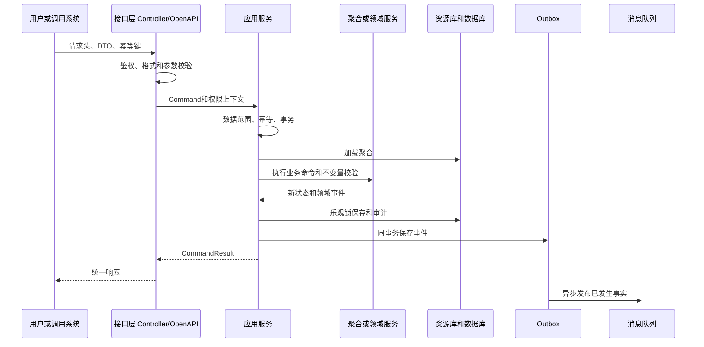
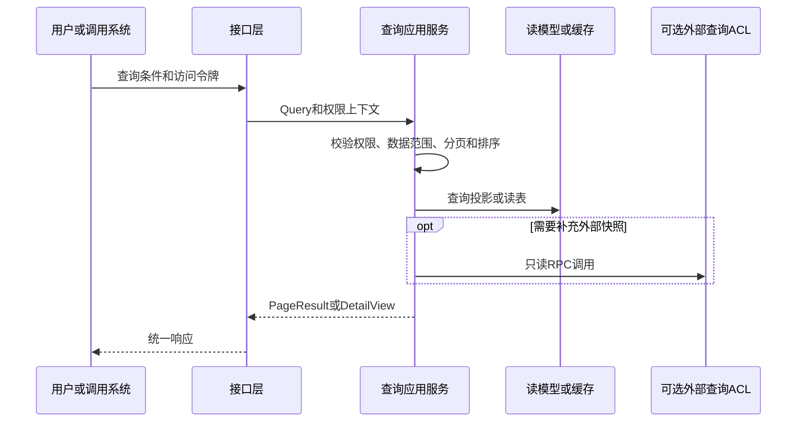
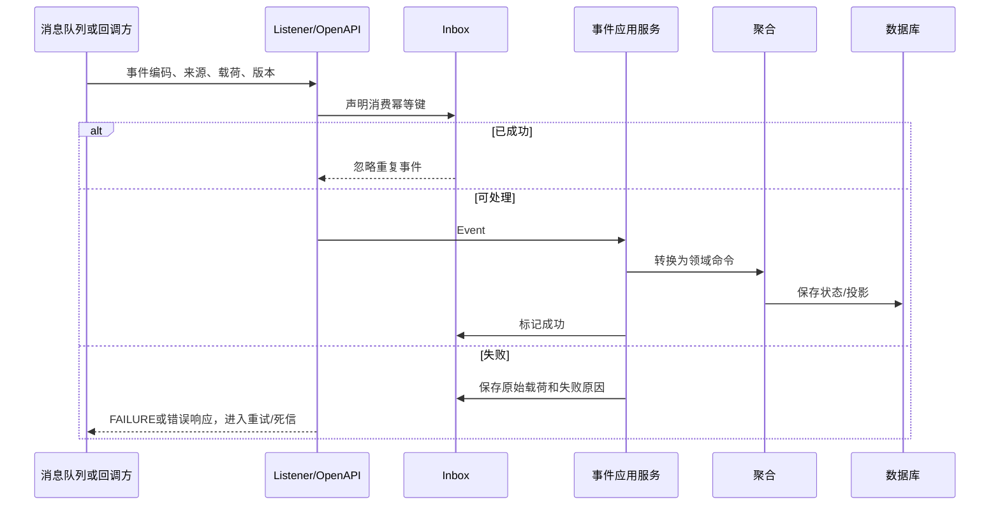

# 接口级开发执行公共契约

本文件不替代系统接口小节；它定义所有接口都必须具备的共同骨架。各系统接口级计划只描述该接口的业务差异、具体类、事件和外部协作。

## 1. 写接口共同链路

## 2. 查询接口共同链路

## 3. 入站事件共同链路

## 4. 强制实现项

- 写接口：`X-Request-Id`、`X-Trace-Id`、`X-Idempotency-Key`、权限点、数据范围、版本号。
- 查询接口：页码、页大小、总数、排序白名单、组织/仓/货主/供应商/客户范围。
- 入站事件：来源校验、事件编码、事件版本、Inbox、原始载荷、失败重放。
- 出站事件：聚合版本、领域事件、Outbox、投递状态、重试与人工重放。
- 代码：Controller、Command/Query DTO、ApplicationService/QueryService、Aggregate/DomainService、Repository/Mapper、ACL、Listener、测试类均需在系统小节中点名。
