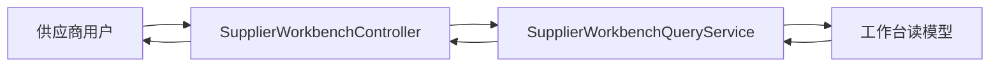
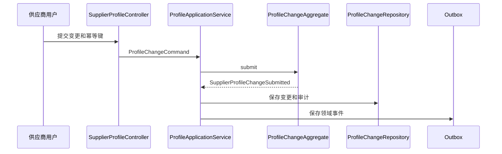
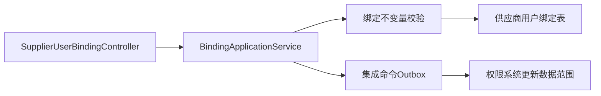
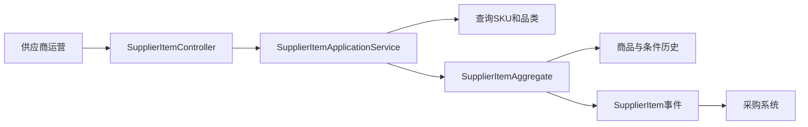
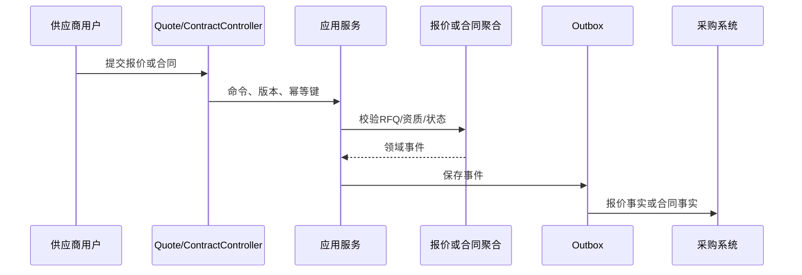
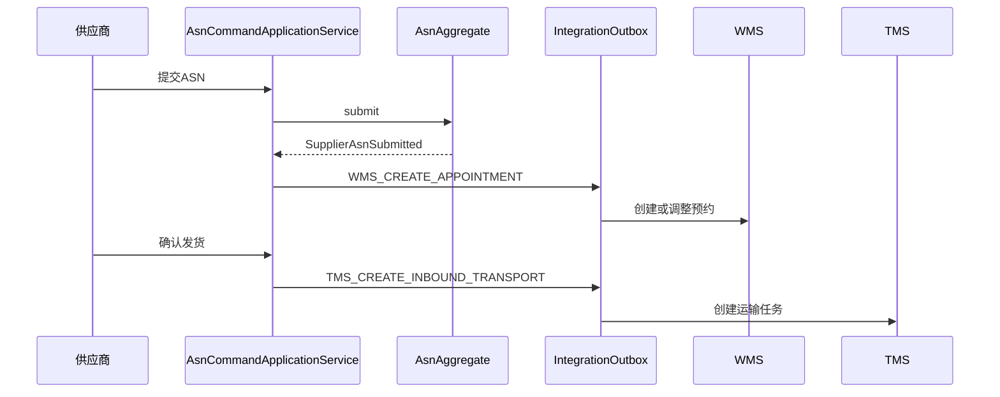
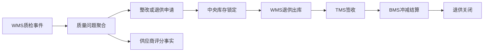
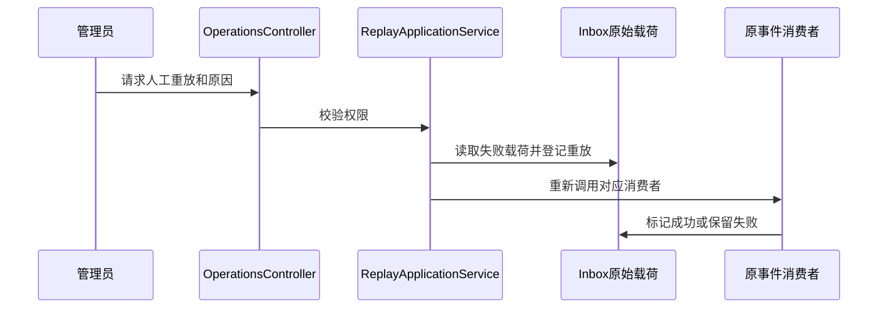

# 供应商系统接口级开发计划

**实现资料**：`docs/08-系统实现/01-供应商系统实现/03-供应商系统接口逐项实现设计.md`。所有接口复用 [接口级执行公共契约](00-接口级执行公共契约.md)，本文件记录供应商上下文的特有逻辑。

## SUP-API-001 查询供应商工作台

`GET /api/supplier/v1/workbench/summary`

- 接口层：`SupplierWorkbenchController.summary` 读取供应商范围和时间范围；权限 `supplier:workbench:read`。
- 应用层：`SupplierWorkbenchQueryService.querySummary` 合并待确认 PO、待报价 RFQ、待发 ASN、待对账、整改和预警数量。
- 领域层：无写聚合；指标口径来自订单确认、ASN、质量、退供和财务状态。
- 基础设施层：`SupplierWorkbenchQueryMapper` 查询投影；超时不调用强一致远程服务。
- 事件：不生产；消费的业务事件已更新对应读模型。
- 交互：读取采购、WMS、BMS、TMS 投影；不直接写外部系统。

## SUP-API-002 查询与提交档案变更

`GET /api/supplier/v1/profile`、`GET/POST /api/supplier/v1/profile/change-requests`、`POST /api/supplier/v1/profile/change-requests/{id}/withdraw`

- 接口层：`SupplierProfileController` 校验供应商范围；POST 读取幂等键和档案版本。
- 应用层：`SupplierProfileQueryService` 读取本地档案快照；`ProfileApplicationService` 编排申请、撤回和审计。
- 领域层：`ProfileChangeAggregate.submit/withdraw` 只允许白名单字段变更；待审批才可撤回。
- 基础设施层：`ProfileChangeRepository` 保存变更和版本；`MdmSupplierRpcClient` 仅补充只读主数据。
- 事件：生产 `SupplierProfileChangeSubmitted`、`SupplierProfileChangeWithdrawn`；审批完成事件由 IAM Inbox 消费。
- 交互：主数据系统持有正式供应商资料；权限系统提供审批/用户范围。

## SUP-API-003 供应商账号绑定

`GET /api/supplier/v1/user-bindings`、`GET /api/supplier/v1/user-bindings/{id}`、`POST /api/supplier/v1/user-bindings`、`POST /{id}/unbind|enable|disable`

- 接口层：`SupplierUserBindingController`；绑定/启停/解绑分别校验 `supplier:user_binding:bind` 或管理权限。
- 应用层：`SupplierUserBindingQueryService` 查询绑定；`SupplierUserBindingApplicationService` 处理幂等、版本和 IAM 同步命令。
- 领域层：绑定实体保证同用户不重复绑定；主账号唯一；最后可用管理员不可直接停用或解绑。
- 基础设施层：`SupplierUserRepository`、`IamCollaborationApi`、`IntegrationCommandEnqueuer`。
- 事件：生产 `SupplierUserBound/Unbound/Enabled/Disabled`；消费 IAM 用户状态变化并刷新本地快照。
- 交互：IAM 接收供应商范围更新并在 Token/权限快照生效。

## SUP-API-004 供应商商品与供货条件

`GET /api/supplier/v1/items`、`GET /items/{id}`、`POST /items`、`PUT /items/{id}`、`POST /{id}/pause|resume|discontinue`、条件/价格历史查询。

- 接口层：`SupplierItemController`、`SupplierItemHistoryController`；商品维护必须校验供应商范围和写权限。
- 应用层：`SupplierItemApplicationService` 检查供应商/SKU 快照、资质规则、幂等、版本；查询服务只读投影。
- 领域层：`SupplierItemAggregate` 和 `SupplyCondition` 校验 MOQ、MPQ、交期、生效期；停供/暂停状态不可建立新采购引用。
- 基础设施层：商品资源库、条件历史表、价格快照表、主数据 ACL。
- 事件：生产 `SupplierItemEnabled/ConditionChanged/Paused/Resumed/Discontinued`；消费 `SupplierDisabled`、`SkuDisabled` 后自动暂停。
- 交互：主数据系统提供 SKU/品类；采购系统查询可供货及有效价格。

## SUP-API-005 报价、价格协议与合同

`GET/POST/PUT /quotes`、`POST /quotes/{id}/submit|confirm|adopt|reject|void`、`GET /price-agreements`、`GET/POST/PUT /contracts`、合同提交/审批/续签/终止。

- 接口层：`SupplierQuoteController`、`PriceAgreementController`、`SupplierContractController`；写接口统一使用版本与幂等键。
- 应用层：报价、合同应用服务校验供应商、SKU、资质、RFQ 截标、有效期；价格协议查询服务只读投影。
- 领域层：`SupplierQuoteAggregate` 限制草稿修改和采纳状态；`SupplierContractAggregate` 限制审批前修改、生效、续签、终止和到期。
- 基础设施层：报价/合同资源库、合同版本历史、协议投影、审批和主数据 ACL。
- 事件：生产 `SupplierQuote*`、`SupplierContractSubmitted/Activated/Terminated/Expired`；消费 `RfqPublished/RfqBiddingClosed`、IAM 合同审批事件。
- 交互：采购系统发布 RFQ、接收报价/确认；BMS、采购调用有效合同/价格校验；IAM 推进合同审批。

## SUP-API-006 采购订单确认与 ASN

`GET /purchase-order-confirms`、确认/拒绝/差异/改交期；`GET/POST/PUT /asns`、提交/取消/发货/打印。

- 接口层：`PoConfirmController`、`AsnController`；开放接口由 `PurchaseOrderOpenApiController` 和 WMS/TMS OpenAPI 接收。
- 应用层：`PoConfirmApplicationService` 处理确认；`AsnCommandApplicationService` 处理 ASN 生命周期并写主动协同命令。
- 领域层：`PoConfirmAggregate` 保护订单行确认数量与版本；`AsnAggregate` 保护提交、预约、发货、到仓、行级收货和取消状态。
- 基础设施层：PO 确认/ASN 资源库、收货行/运输轨迹投影、WMS/TMS Dubbo ACL、集成命令 Outbox。
- 事件：消费 `PurchaseOrderReleased/Changed/Cancelled/Closed`、WMS 预约/收货、TMS 轨迹；生产确认/ASN 领域事件。
- 交互：提交 ASN 调 WMS 创建预约，发货调 TMS 创建运输，取消调 WMS/TMS 补偿。

## SUP-API-007 质量、退供、对账、发票与评分

`/quality-issues`、证据/整改；`/supplier-returns`；`/reconciliations`；`/invoices`；`/scores`、`/score-rules`。

- 接口层：质量、退供、财务、评分 Controller 分别接收用户命令；外部 WMS/TMS/BMS 事件使用 OpenAPI/MQ Listener。
- 应用层：质量服务处理整改；退供服务编排库存锁定/WMS 出库/TMS/BMS；财务服务处理对账和发票；评分服务采集事实并周期计算。
- 领域层：质量问题、退供单、对账确认、评分规则/结果聚合各自保护状态机和金额/数量不变量。
- 基础设施层：证据表、退供表、财务投影、评分事实/规则/结果表、库存/WMS/TMS/BMS ACL。
- 事件：消费质量、运输、BMS 对账/发票/结算事件；生产整改、退供、评分和风险事件。
- 交互：质量不合格可触发退供；TMS 签收和 BMS 结算共同决定退供关闭；评分只提出冻结建议，不直接冻结供应商。

## SUP-API-008 运营、日志、枚举与失败重放

`/operations/work-items`、`/warnings`、`/failed-events/replay`、`/data-reconciliations`、日志/枚举查询。

- 接口层：`SupplierOperationsController`；重放接口必须限定 `supplier:event:replay`。
- 应用层：`SupplierOperationsApplicationService` 处理待办、告警、数据对账；`InboundEventReplayApplicationService` 反序列化原始载荷并调用原消费者。
- 领域层：运营项目是读模型/任务模型，不直接绕过业务聚合改变状态。
- 基础设施层：待办/告警/对账表、Inbox、Outbox、审计日志、导出任务。
- 事件：消费全系统运营事件；重放不生产伪事件，只重新执行原消费者。
- 交互：所有系统可推送运营事件；管理员对失败事件操作必须写审计。

