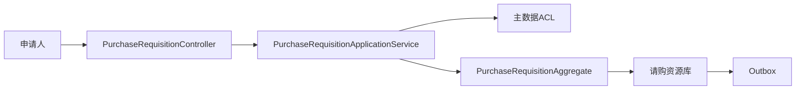
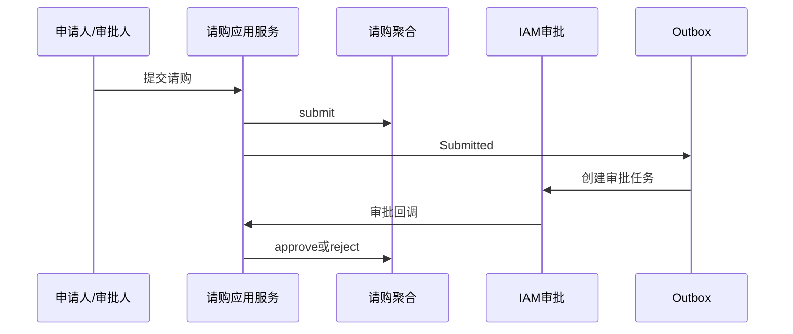
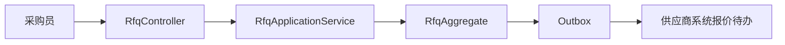
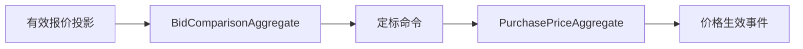
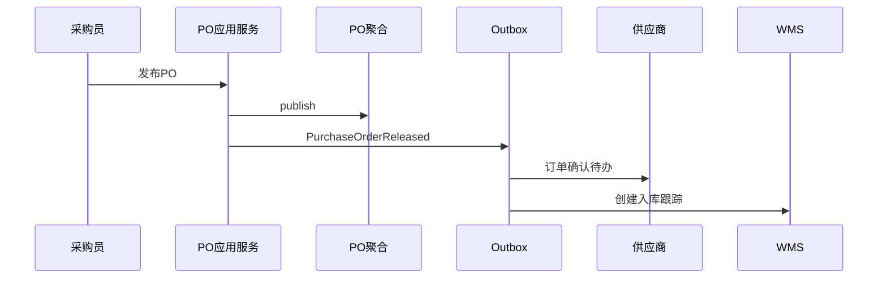
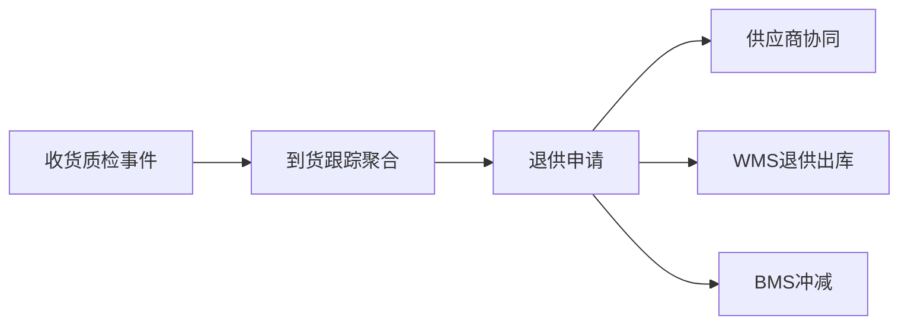

# 采购系统接口级开发计划

实现资料：`docs/08-系统实现/02-采购系统实现/03-采购系统接口逐项实现设计.md`；公共层次见 [公共契约](00-接口级执行公共契约.md)。

## PUR-API-001 请购单创建与修改
`POST/PUT /api/purchase/v1/requisitions`

- 接口层：`PurchaseRequisitionController.create/update` 校验 SKU、需求日期、行数量、版本和幂等键。
- 应用层：`PurchaseRequisitionApplicationService` 校验采购组织/部门范围、主数据、预算策略，编排事务和审计。
- 领域层：`PurchaseRequisitionAggregate.create/changeDraft` 合并或拒绝重复 SKU+需求日期行，保证修改数量不低于已转采购数量。
- 基础设施层：`PurchaseRequisitionRepository` 保存头行；`MdmSkuAcl` 校验 SKU；Outbox 仅在创建时写 `PurchaseRequisitionCreated`。
- 交互/消费：主数据状态变化消费后影响后续提交；不直接修改库存或供应商数据。

## PUR-API-002 请购提交、审批与转采购
`POST /requisitions/{no}/submit|approve|convert`

- 接口层：同一 Controller 接收版本、审批结论、批准数量和转 RFQ/PO 类型。
- 应用层：创建审批命令或调用 IAM 审批 ACL；转采购前校验已批准和剩余可转数量。
- 领域层：`submit` 仅草稿/驳回可执行；`approve` 锁定批准数量；`convert` 不得超过已批准未转数量。
- 基础设施层：审批投影、请购-目标单据引用表、Outbox。
- 事件：`PurchaseRequisitionSubmitted/Approved/Rejected/Converted`；IAM 审批回调经 Inbox 消费。

## PUR-API-003 询价发布与截标
`POST /rfqs`、`POST /rfqs/{no}/publish|close`

- 接口层：`RfqController` 校验邀请供应商、行、报价截止时间和版本。
- 应用层：`RfqApplicationService` 校验供应商可协同、采购范围、幂等；发布后禁止修改邀请范围和询价行。
- 领域层：`RfqAggregate` 保护草稿->报价中->已截标状态机，邀请供应商不可重复。
- 基础设施层：RFQ 头行/邀请表/读模型；供应商 ACL；Outbox。
- 事件：`RfqPublished` 按供应商拆分投递；`RfqBiddingClosed` 关闭供应商报价待办。

## PUR-API-004 比价、定标与采购价格
`POST /bid-comparisons`、`POST /bid-comparisons/{id}/award`、`GET/POST /purchase-prices`

- 接口层：`BidComparisonController`、`PurchasePriceController` 接收报价版本、定标供应商和生效期。
- 应用层：比价服务加载有效报价；价格服务校验合同/协议、币种、MOQ、税率和有效期。
- 领域层：`BidComparisonAggregate` 固化比较快照；`PurchasePriceAggregate` 防止同范围重叠生效价。
- 基础设施层：报价读模型、比价结果/价格表、供应商有效协议 ACL。
- 事件：生产 `SupplierAwarded`、`PurchasePriceActivated`；供应商系统消费定标事实。

## PUR-API-005 采购订单发布、变更与取消
`POST /purchase-orders`、`POST /{no}/submit|approve|publish|cancel`、`POST /purchase-order-changes`

- 接口层：`PurchaseOrderController`、`PurchaseOrderChangeController` 校验头行、金额、版本、取消/变更原因。
- 应用层：订单服务校验有效供应商合同/价格，发布和变更写 Outbox；取消前查询 ASN/收货执行状态。
- 领域层：`PurchaseOrderAggregate`、`PurchaseOrderChangeAggregate` 保护订单行数量、审批、发布、变更版本和关闭条件。
- 基础设施层：订单/变更资源库、合同价格 ACL、供应商/WMS/BMS 集成命令。
- 事件：`PurchaseOrderReleased/Changed/Cancelled/Closed`；供应商确认、WMS 入库、BMS 应付均消费。

## PUR-API-006 到货跟踪与退供申请
`GET /inbound-trackings`、`POST /inbound-trackings/sync`、`GET/POST /supplier-return-requests`

- 接口层：`InboundTrackingController`、`SupplierReturnRequestController`。
- 应用层：到货服务消费 WMS 收货/质检事件；退供服务校验可退数量和责任原因，申请审批后通知供应商/WMS/TMS/BMS。
- 领域层：`InboundTrackingAggregate` 记录订单行到货事实；`SupplierReturnRequestAggregate` 保护数量和审批状态。
- 基础设施层：到货投影、退供申请资源库、WMS/TMS/BMS ACL。
- 事件：消费 `WmsReceiptCompleted/QualityInspectionCompleted`，生产 `SupplierReturnRequested/Approved`。

