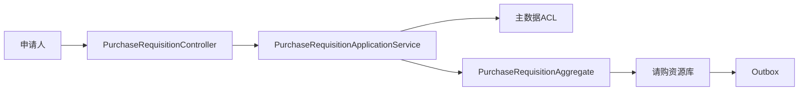
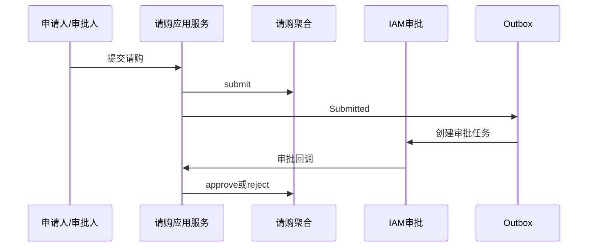
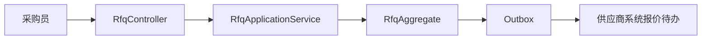
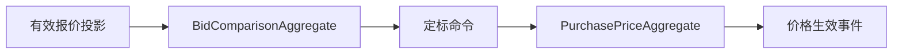
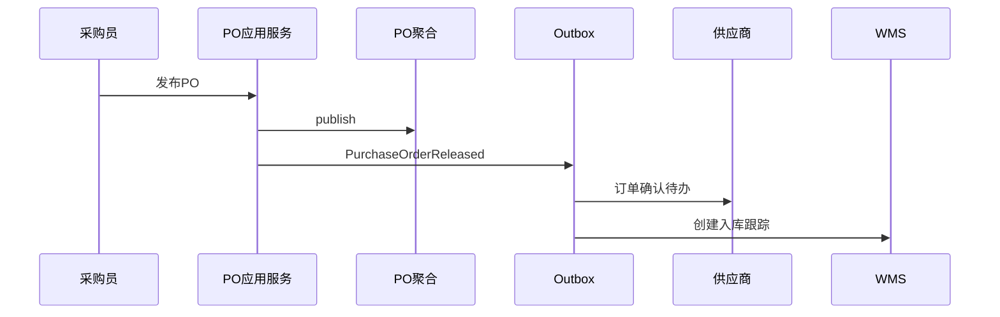
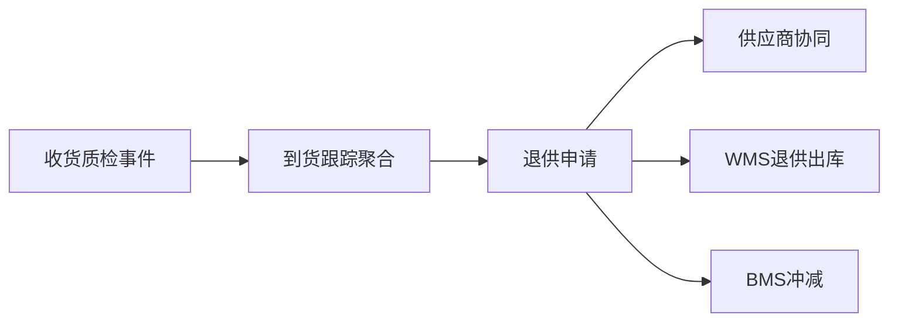

# 采购系统接口级开发计划

> 当前状态与剩余验收见[供应链系统开发总纲](../00-供应链系统开发总纲.md#5-九子系统当前状态)。

需求基线：[PUR-REQ-001 采购核心业务需求基线](../需求单/PUR-REQ-001-采购核心业务需求基线.md)；持久化幂等专项见 `PUR-REQ-010`。

实现资料：`docs/08-系统实现/02-采购系统实现/03-采购系统接口逐项实现设计.md`；公共层次见 [公共契约](00-接口级执行公共契约.md)。

`PUR-API-001~006` 必须共同证明请购、RFQ、定标价格、PO、到货和退供闭环；`PUR-REQ-010` 只证明持久化幂等，不能代替核心业务需求。

## PUR-API-001 请购单创建与修改
`POST/PUT /api/purchase/v1/requisitions`

- 接口层：`PurchaseRequisitionController.create/update` 校验 SKU、需求日期、行数量、版本和幂等键。
- 应用层：`PurchaseRequisitionApplicationService` 校验采购组织/部门范围、主数据、预算策略，编排事务和审计。
- 领域层：`PurchaseRequisitionAggregate.create/changeDraft` 合并或拒绝重复 SKU+需求日期行，保证修改数量不低于已转采购数量。
- 基础设施层：`PurchaseRequisitionRepository` 保存头行；`MdmSkuAcl` 校验 SKU；Outbox 仅在创建时写 `PurchaseRequisitionCreated`。
- 交互/消费：主数据状态变化消费后影响后续提交；不直接修改库存或供应商数据。


```mermaid
flowchart LR
  U[申请人] --> C[PurchaseRequisitionController]
  C --> A[PurchaseRequisitionApplicationService]
  A --> M[主数据ACL]
  A --> G[PurchaseRequisitionAggregate]
  G --> R[请购资源库]
  R --> O[Outbox]
```

## PUR-API-002 请购提交、审批与转采购
`POST /requisitions/{no}/submit|approve|convert`

- 接口层：同一 Controller 接收版本、审批结论、批准数量和转 RFQ/PO 类型。
- 应用层：创建审批命令或调用 IAM 审批 ACL；转采购前校验已批准和剩余可转数量。
- 领域层：`submit` 仅草稿/驳回可执行；`approve` 锁定批准数量；`convert` 不得超过已批准未转数量。
- 基础设施层：审批投影、请购-目标单据引用表、Outbox。
- 事件：`PurchaseRequisitionSubmitted/Approved/Rejected/Converted`；IAM 审批回调经 Inbox 消费。


```mermaid
sequenceDiagram
  participant U as 申请人/审批人
  participant A as 请购应用服务
  participant G as 请购聚合
  participant I as IAM审批
  participant O as Outbox
  U->>A: 提交请购
  A->>G: submit
  A->>O: Submitted
  O->>I: 创建审批任务
  I->>A: 审批回调
  A->>G: approve或reject
```

## PUR-API-003 询价发布与截标
`POST /rfqs`、`POST /rfqs/{no}/publish|close`

- 接口层：`RfqController` 校验邀请供应商、行、报价截止时间和版本。
- 应用层：`RfqApplicationService` 校验供应商可协同、采购范围、幂等；发布后禁止修改邀请范围和询价行。
- 领域层：`RfqAggregate` 保护草稿->报价中->已截标状态机，邀请供应商不可重复。
- 基础设施层：RFQ 头行/邀请表/读模型；供应商 ACL；Outbox。
- 事件：`RfqPublished` 按供应商拆分投递；`RfqBiddingClosed` 关闭供应商报价待办。


```mermaid
flowchart LR
  P[采购员] --> R[RfqController]
  R --> A[RfqApplicationService]
  A --> G[RfqAggregate]
  G --> O[Outbox]
  O --> S[供应商系统报价待办]
```

## PUR-API-004 比价、定标与采购价格
`POST /bid-comparisons`、`POST /bid-comparisons/{id}/award`、`GET/POST /purchase-prices`

- 接口层：`BidComparisonController`、`PurchasePriceController` 接收报价版本、定标供应商和生效期。
- 应用层：比价服务加载有效报价；价格服务校验合同/协议、币种、MOQ、税率和有效期。
- 领域层：`BidComparisonAggregate` 固化比较快照；`PurchasePriceAggregate` 防止同范围重叠生效价。
- 基础设施层：报价读模型、比价结果/价格表、供应商有效协议 ACL。
- 事件：生产 `SupplierAwarded`、`PurchasePriceActivated`；供应商系统消费定标事实。


```mermaid
flowchart LR
  Q[有效报价投影] --> B[BidComparisonAggregate]
  B --> A[定标命令]
  A --> P[PurchasePriceAggregate]
  P --> E[价格生效事件]
```

## PUR-API-005 采购订单发布、变更与取消
`POST /purchase-orders`、`POST /{no}/submit|approve|publish|cancel`、`POST /purchase-order-changes`

- 接口层：`PurchaseOrderController`、`PurchaseOrderChangeController` 校验头行、金额、版本、取消/变更原因。
- 应用层：订单服务校验有效供应商合同/价格，发布和变更写 Outbox；取消前查询 ASN/收货执行状态。
- 领域层：`PurchaseOrderAggregate`、`PurchaseOrderChangeAggregate` 保护订单行数量、审批、发布、变更版本和关闭条件。
- 基础设施层：订单/变更资源库、合同价格 ACL、供应商/WMS/BMS 集成命令。
- 事件：`PurchaseOrderReleased/Changed/Cancelled/Closed`；供应商确认、WMS 入库、BMS 应付均消费。


```mermaid
sequenceDiagram
  participant P as 采购员
  participant A as PO应用服务
  participant G as PO聚合
  participant O as Outbox
  participant S as 供应商
  participant W as WMS
  P->>A: 发布PO
  A->>G: publish
  A->>O: PurchaseOrderReleased
  O->>S: 订单确认待办
  O->>W: 创建入库跟踪
```

## PUR-API-006 到货跟踪与退供申请
`GET /inbounds`、`POST /inbounds/record-asn|{no}/sync-wms`、`GET/POST /supplier-returns`

- 接口层：`InboundTrackingController`、`SupplierReturnController`。
- 应用层：到货服务消费 WMS 收货/质检事件；退供服务校验可退数量和责任原因，申请审批后通知供应商/WMS/TMS/BMS。
- 领域层：`InboundTrackingAggregate` 记录订单行到货事实；`SupplierReturnAggregate` 保护数量和审批状态。
- 基础设施层：到货投影、退供申请资源库、WMS/TMS/BMS ACL。
- 事件：消费 `WmsReceiptCompleted/QualityInspectionCompleted`，生产 `SupplierReturnRequested/Approved`。


```mermaid
flowchart LR
  WMS[收货质检事件] --> T[到货跟踪聚合]
  T --> R[退供申请]
  R --> S[供应商协同]
  R --> W[WMS退供出库]
  R --> B[BMS冲减]
```

## PUR-NEXT-002 需求双向追踪与回归证据

> 验收日期：2026-07-30。`PUR-REQ-001` 负责采购核心业务不变量，`PUR-REQ-010` 负责持久化幂等；两者共同作为本计划事实来源。

| 接口切片 | 需求/不变量 | 关键实现 | 自动化证据 |
| --- | --- | --- | --- |
| `PUR-API-001` | 请购草稿行唯一、修改不得破坏已转数量、组织范围与幂等 | `PurchaseRequisitionAggregate`、`PurchaseRequisitionApplicationService`、`MyBatisIdempotencyAdapter` | `PurchaseRequisitionAggregateTest`、`CommandContextFactoryTest`、`MyBatisIdempotencyAdapterTest` |
| `PUR-API-002` | 批准数量不超过申请数量；累计转 RFQ/PO 不超过批准数量 | `PurchaseRequisitionLine.approve/convert`、`PurchaseRequisitionApplicationService.convert` | `PurchaseRequisitionAggregateTest.convertCannotExceedApprovedQuantity` |
| `PUR-API-003` | RFQ 发布后锁定；截标后拒绝新增、变更、作废或采纳报价 | `RfqAggregate`、`PurchaseExternalEventConsumerApplicationService.consumeSupplierQuote` | `RfqAggregateTest`、`PurchaseExternalEventConsumerApplicationServiceTest.quoteChangeAfterBiddingClosedIsRejectedWithoutUpdatingFact` |
| `PUR-API-004` | 比价快照和中标候选有效；同供应商、SKU、组织、价格类型、币种的生效期不得重叠 | `BidComparisonAggregate`、`PurchasePriceApplicationService`、`PurchasePriceMapper.findActiveOverlaps` | `BidComparisonAggregateTest`、`PurchasePriceApplicationServiceTest`、`PurchaseCorePersistenceContractTest.priceOverlapQueryIncludesPriceTypeAndInclusiveDateRange` |
| `PUR-API-005` | PO/变更单 CAS 乐观锁；变更绑定创建时 PO 基线版本；已有 ASN 或收货后禁止直接取消 | `PurchaseOrderApplicationService`、`PurchaseOrderChangeApplicationService`、`PurchaseOrderMapper`、`PurchaseOrderChangeMapper`、`V13__purchase_order_change_base_version.sql` | `PurchaseOrderAggregateTest.cancelRejectsReceivedOrder`、`PurchaseOrderCoreConstraintApplicationServiceTest`、`PurchaseOrderChangeAggregateTest`、`PurchaseCorePersistenceContractTest` |
| `PUR-API-006` | WMS 到货事实幂等；退供数量不超过可退数量；组织范围生效 | `InboundTrackingAggregate`、`SupplierReturnLine`、`SupplierReturnApplicationService` | `InboundTrackingAggregateTest`、`SupplierReturnAggregateTest.lineRejectsReturnQuantityGreaterThanReturnableQuantity`、`MyBatisIdempotencyAdapterTest` |

### 数据范围边界

- 业务写命令以 `CommandContext.requirePurchaseOrgScope` 强制采购组织范围；请求头范围还必须先通过 IAM Token 的 `PURCHASE_ORG` scope 校验。
- 采购工作台读模型支持组织、采购组、本人三种范围，采购组通过 `purchase_group_member_scope` 投影过滤，证据为 `PurchaseWorkbenchQueryApplicationServiceTest` 和 `PurchaseWorkbenchMapperContractTest`。
- 采购组是查询与任务分派范围，不是采购单据事实主权字段；核心聚合继续以采购组织作为写边界，避免把人员组织关系复制进聚合。

### 并发、幂等和迁移结论

- `PurchaseOrderMapper.updateHeader` 和 `PurchaseOrderChangeMapper.updateStatus` 使用 `where version = expectedVersion`，更新行数不是 1 时返回 `VERSION_CONFLICT`，避免“应用层先查版本、数据库写入时仍被并发覆盖”。
- PO 变更新增 `base_order_version`，创建变更单与审批生效均校验该版本；旧版本变更不能作用于已推进的新 PO。
- 所有写入口继续由 `X-Idempotency-Key`、请求摘要和 MySQL 唯一占用保护，重复完成返回历史结果，内容冲突拒绝。

### 验证命令

```bash
cd project/backend
mvn -q -pl purchase-service -am test
```

结果：Purchase 测试 `81` 个，`failures=0`、`errors=0`、`skipped=0`。
