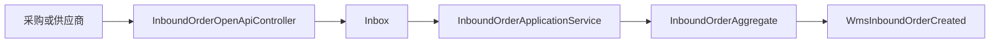
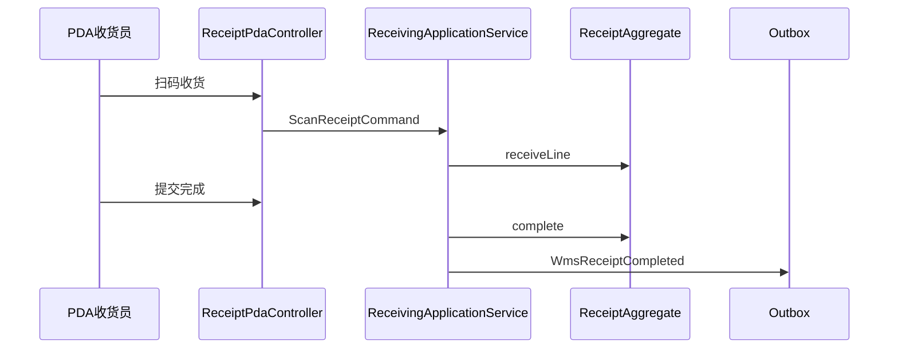
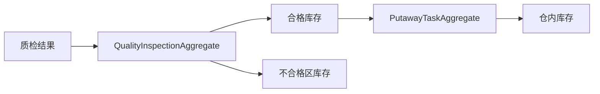
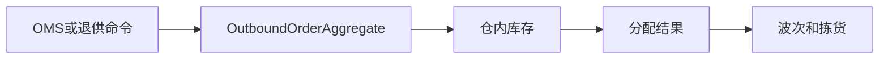
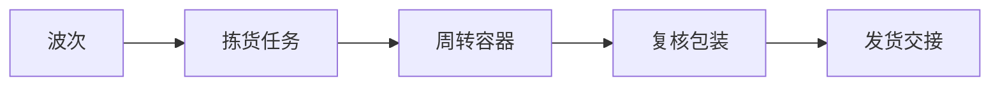
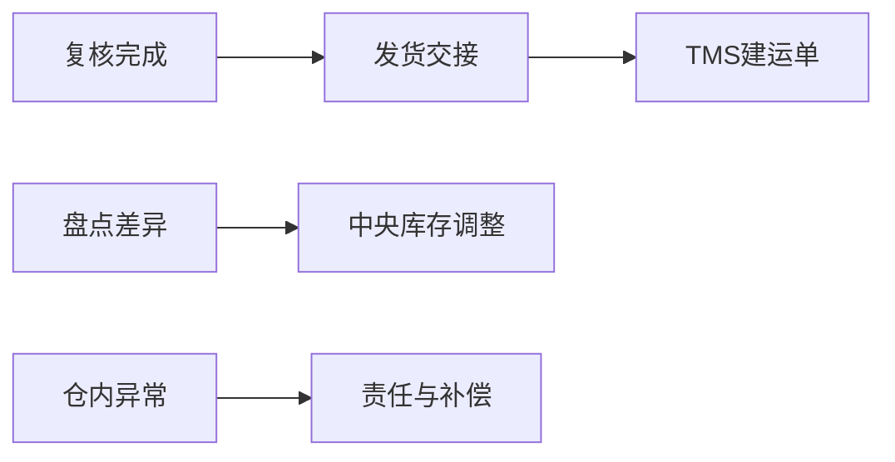

# WMS 系统接口级开发计划

实现资料：`docs/08-系统实现/03-WMS系统实现/03-WMS系统接口逐项实现设计.md`。

## WMS-API-001 外部创建/取消入库单
`POST /openapi/wms/v1/inbound-orders`、`POST /inbound-orders/{id}/cancel`

- 接口层：`InboundOrderOpenApiController` 校验来源系统、事件编码、幂等键；`InboundOrderController.cancel` 校验仓库范围。
- 应用层：`InboundOrderApplicationService` 处理创建/取消和预约关联。
- 领域层：`InboundOrderAggregate` 保证同业务单据幂等、未收货才可取消。
- 基础设施层：入库单资源库、Inbox、采购/供应商 ACL、Outbox。
- 事件：消费采购订单/ASN 命令；生产 `WmsInboundOrderCreated/Cancelled`。

## WMS-API-002 PDA 扫码收货与提交收货
`POST /receipts/{id}/scan`、`POST /receipts/{id}/complete`

- 接口层：`ReceiptPdaController` 校验 PDA 用户、仓库、条码、批次、效期和幂等键。
- 应用层：`ReceivingApplicationService` 累积行级实收/拒收，提交时校验收货汇总与入库单数量。
- 领域层：`ReceiptAggregate` 保护收货行不超通知，拒收必须给原因；完成后不能再扫码。
- 基础设施层：收货头行、扫码流水、条码解析器、库存记账 Outbox。
- 事件：生产 `WmsArrivalRegistered/WmsReceiptCompleted`；供应商、采购、中央库存消费。

## WMS-API-003 质检与上架
`POST /quality-inspections/{id}/result`、`POST /putaway-tasks/{id}/scan`

- 接口层：`QualityInspectionController`、`PutawayTaskController` 接收质检结果/目标库位和操作版本。
- 应用层：质检服务生成合格/不合格库存；上架服务调用库位推荐并提交库内记账。
- 领域层：`QualityInspectionAggregate` 保护抽检/全检状态；`PutawayTaskAggregate` 只允许合格数量上架到允许库位。
- 基础设施层：质检/上架资源库、库位容量查询、库存 ACL。
- 事件：生产 `QualityInspectionCompleted/PutawayCompleted`；质量不合格事件被供应商系统消费。

## WMS-API-004 外部创建出库单与库存分配
`POST /openapi/wms/v1/outbound-orders`、`POST /outbound-orders/{id}/allocate|cancel`

- 接口层：`OutboundOrderOpenApiController`、`OutboundOrderController` 校验 OMS/退供/调拨来源、仓库和业务键。
- 应用层：`OutboundOrderApplicationService` 编排库存分配、取消释放和缺货异常。
- 领域层：`OutboundOrderAggregate` 保证可分配数量不超过库内可用；取消前检查拣货/交接状态。
- 基础设施层：出库资源库、仓内库存资源库、中央库存 ACL、异常表。
- 事件：消费 OMS/供应商/调拨命令；生产 `WmsOutboundAllocated/Cancelled`。

## WMS-API-005 波次、拣货、容器与复核包装
`POST /waves`、`POST /waves/{id}/release`、`POST /pick-tasks/{id}/scan`、`POST /containers/bind`、`POST /packing/{id}/verify`

- 接口层：波次、拣货、容器、复核 Controller 按 PDA/PC 权限区分。
- 应用层：波次服务按规则分组；拣货服务校验库位/容器/数量；复核服务校验拣货与订单行一致。
- 领域层：`WaveAggregate`、`PickTaskAggregate`、`ContainerAggregate`、`PackingAggregate` 防止重复领取、重复拣取和错货发运。
- 基础设施层：波次/任务/容器/包装资源库、条码服务、面单/TMS ACL。
- 事件：生产 `PickCompleted/PackingVerified`；异常写仓内异常聚合。

## WMS-API-006 发货交接、盘点和仓内异常
`POST /handovers`、`POST /stocktakes`、`POST /stocktakes/{id}/confirm-difference`、`POST /warehouse-exceptions/{id}/handle`

- 接口层：`ShipmentHandoverController`、`StocktakeController`、`WarehouseExceptionController`。
- 应用层：交接服务调用 TMS；盘点服务生成差异确认命令；异常服务建立责任与补偿任务。
- 领域层：交接聚合确保已复核才能交接；盘点聚合限制差异确认审批；异常聚合限制关闭条件。
- 基础设施层：交接/盘点/异常资源库、TMS/中央库存 ACL、审计与事件表。
- 事件：生产 `WmsShipmentHandedOver/StocktakeDifferenceConfirmed/WarehouseExceptionClosed`。

