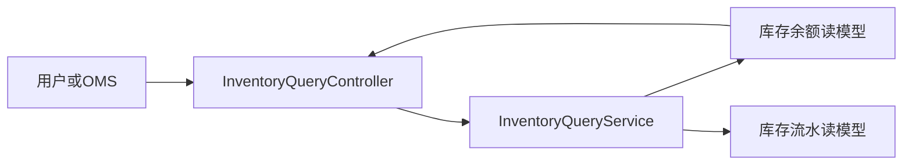
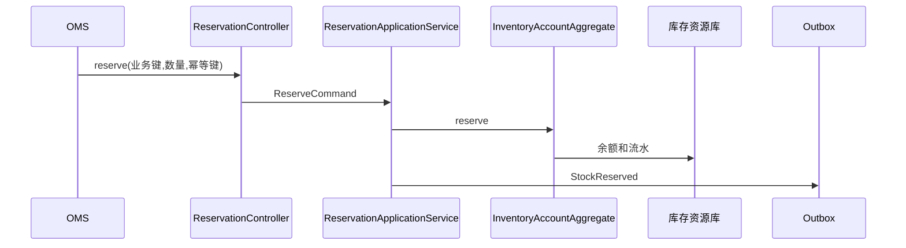
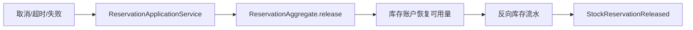
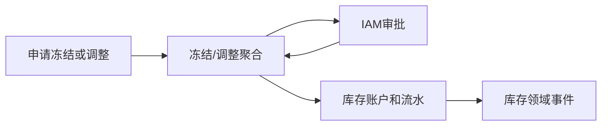
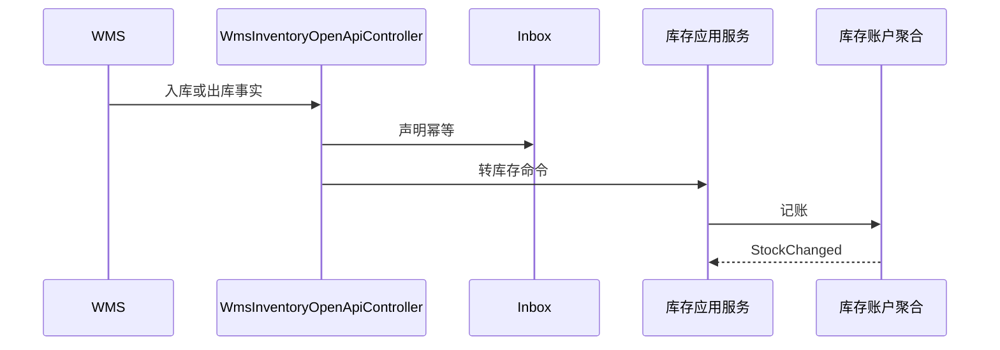

# 中央库存系统接口级开发计划

实现资料：`docs/08-系统实现/04-中央库存系统实现/03-中央库存系统接口逐项实现设计.md`。

## INV-API-001 查询库存余额、可用库存与流水
`GET /stocks`、`GET /stocks/{id}`、`GET /available-stocks`、`GET /stock-ledgers`

- 接口层：`InventoryQueryController` 接收货主、仓、SKU、批次、库存状态、分页和排序。
- 应用层：`InventoryQueryService` 校验库存读权限和货主/仓范围，构造只读 Query。
- 领域层：无写命令；返回库存账户、可用量、预占量、冻结量和不可变流水。
- 基础设施层：余额/流水/快照读模型 Mapper；缓存仅加速可用库存，不能覆盖账本。
- 事件：不生产；投影由 WMS/OMS/调拨事件更新。
- 交互：WMS 提供库内事实，OMS/采购/供应商只读可用库存。

## INV-API-002 请求库存预占
`POST /reservations`

- 接口层：`InventoryReservationController.reserve` 校验业务单号、库存维度、数量、版本和幂等键。
- 应用层：`InventoryReservationApplicationService.reserve` 在事务中加载库存账户并创建预占聚合。
- 领域层：`InventoryReservationAggregate` 与 `InventoryAccountAggregate` 保证 `available >= reserveQty`，账户可用量减少、预占量增加。
- 基础设施层：账户资源库、预占资源库、库存流水、幂等表和 Outbox。
- 事件：生产 `StockReserved`；OMS/调拨等消费者更新自身履约状态。
- 交互：OMS、WMS、供应商退供通过 OpenAPI/Dubbo 请求预占。

## INV-API-003 释放/关闭预占
`POST /reservations/{id}/release|close`

- 接口层：`InventoryReservationController` 接收版本、释放原因和幂等键。
- 应用层：预占服务校验调用方业务状态，超时任务复用相同释放命令。
- 领域层：仅已预占可释放；账户预占量减少、可用量恢复；已提交扣减不可释放。
- 基础设施层：更新预占状态、账户余额、反向库存流水、审计；版本冲突返回 409。
- 事件：`StockReservationReleased/Expired/Closed`；OMS/WMS 消费并关闭自身待办。
- 交互：OMS 取消、WMS 出库失败、调拨取消均触发释放。

## INV-API-004 冻结、解冻与库存调整
`POST /freezes`、`POST /freezes/{id}/approve|unfreeze`、`POST /adjustments`

- 接口层：冻结/调整 Controller 需要审批权限、调整原因、附件和版本。
- 应用层：`InventoryFreezeApplicationService`、`InventoryAdjustmentApplicationService` 创建审批任务，审批后执行账务变更。
- 领域层：冻结账户从可用转冻结；调整必须有正负方向、原因和来源，禁止使任一状态数量小于零。
- 基础设施层：冻结/调整资源库、库存流水、IAM 审批 ACL、Outbox。
- 事件：`StockFrozen/Unfrozen/Adjusted`；WMS、OMS 消费可用量变化。
- 交互：质量、盘点、退供、仓内异常可申请冻结/调整。

## INV-API-005 快照、对账与 WMS 记账入口
`POST /snapshots/generate|rebuild`、`POST /inventory-reconciliations`、`POST /openapi/wms/inbound|outbound|stocktake-difference`

- 接口层：快照/对账 Controller；`WmsInventoryOpenApiController` 校验 WMS 来源、事件编码和载荷版本。
- 应用层：快照服务重算读模型；对账服务比较账本与 WMS 事实；WMS 事件消费者转为库存命令。
- 领域层：入库增加在手/可用，出库确认扣减预占/在手，盘点差异经调整聚合确认。
- 基础设施层：Inbox、账户资源库、快照表、对账单、差异任务、Outbox。
- 事件：消费 `WmsPutawayCompleted/WmsShipmentHandedOver/StocktakeDifferenceConfirmed`；生产库存变化和对账差异事件。
- 交互：WMS 是库内执行事实源，中央库存是企业可用库存/账本事实源。

