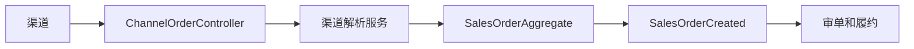
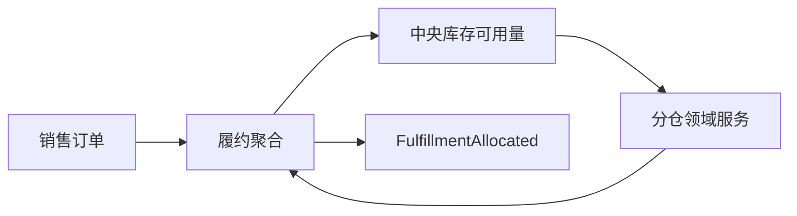
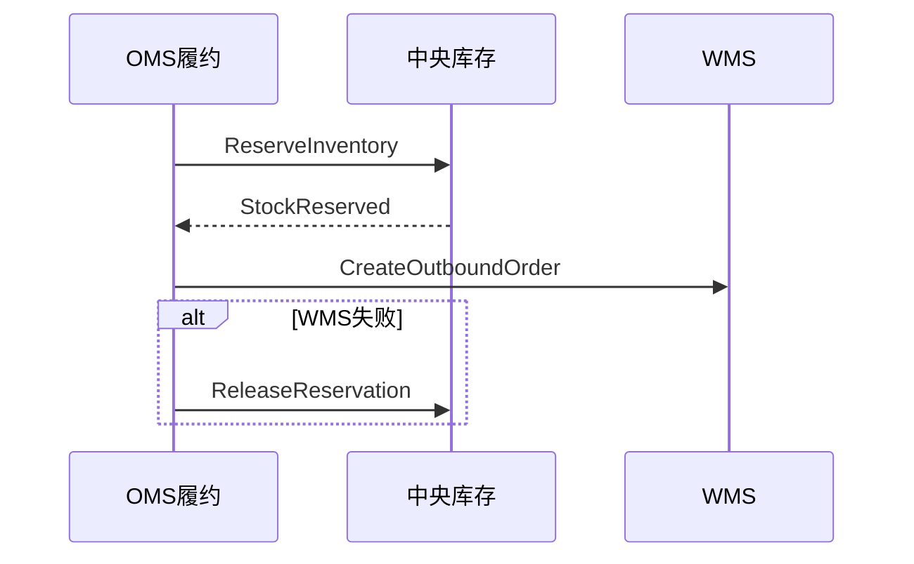
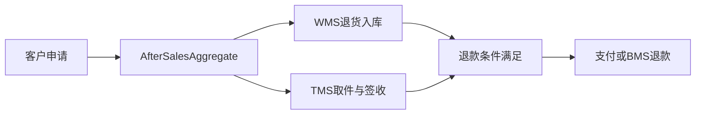
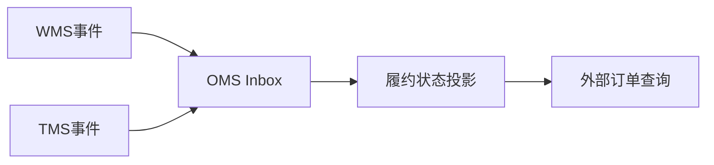

# OMS 系统接口级开发计划

实现资料：`docs/08-系统实现/05-OMS系统实现/03-OMS系统接口逐项实现设计.md`。

## OMS-API-001 接入渠道订单与审核销售订单
`POST /channel-orders`、`GET /channel-orders`、`GET/POST /sales-orders/{id}/review`

- 接口层：`ChannelOrderController` 验证渠道签名、渠道订单号；`SalesOrderController` 提供列表/详情/审核。
- 应用层：渠道解析服务做幂等落库；订单服务校验客户、货主、SKU、地址、价格和风险规则。
- 领域层：`SalesOrderAggregate` 保护渠道单与销售单映射、审核状态和取消前置条件。
- 基础设施层：渠道原始报文表、订单资源库、主数据/价格 ACL、Inbox/Outbox。
- 事件：`ChannelOrderReceived/SalesOrderCreated/Reviewed`；解析失败进入异常读模型。
- 交互：主数据、价格、权限、渠道平台；不在同步请求中创建 WMS 单。

## OMS-API-002 分仓、换仓与拆分履约
`POST /fulfillments/{id}/allocate|change-warehouse|split`

- 接口层：`FulfillmentController` 接收目标仓、拆分行、版本和操作原因。
- 应用层：履约服务加载订单与库存候选，调用分仓领域服务并校验用户仓范围。
- 领域层：`FulfillmentAggregate`、`AllocationDomainService` 保证履约数量等于订单可履约数量；发货后不可换仓。
- 基础设施层：履约资源库、库存查询 ACL、分仓规则配置投影。
- 事件：生产 `FulfillmentAllocated/WarehouseChanged/FulfillmentSplit`。
- 交互：中央库存提供候选库存；WMS 只在预占成功后接收出库命令。

## OMS-API-003 请求/释放库存并下发 WMS 出库
`POST /fulfillments/{id}/reserve|release|dispatch-outbound|cancel-outbound|retry-outbound`

- 接口层：`OmsInventoryController`、`OmsOutboundController` 接收版本和幂等键。
- 应用层：履约服务先请求库存预占；成功后写 WMS 出库集成命令；取消/失败时写释放补偿命令。
- 领域层：`FulfillmentAggregate` 仅预占成功可下发出库；已拣货/已交接的取消进入异常而非直接释放。
- 基础设施层：履约资源库、集成命令 Outbox、库存/WMS ACL、失败重推记录。
- 事件：消费 `StockReserved/Released`、`WmsOutboundAllocated/PickCompleted/ShipmentHandedOver`；生产出库请求事实。
- 交互：中央库存、WMS、TMS；使用 Saga 补偿而非跨库事务。

## OMS-API-004 取消、售后、退款与异常
`POST /cancellations`、`POST /after-sales`、`POST /after-sales/{id}/approve|refund`、`POST /order-exceptions/{id}/handle`

- 接口层：取消/售后/异常 Controller 分别校验原订单、售后行、金额、凭证和权限。
- 应用层：取消服务按履约阶段决定释放/拦截/人工处理；售后服务编排退货入库、退款和物流；异常服务创建待办。
- 领域层：`CancellationRequestAggregate`、`AfterSalesAggregate` 保证售后数量不超原发货，退款不超实付，状态机不可跳过审核。
- 基础设施层：取消/售后资源库、支付/WMS/TMS ACL、附件存储、Outbox。
- 事件：生产取消、售后、退款事件；消费 WMS 退货入库、TMS 取件/签收事实。
- 交互：中央库存、WMS、TMS、支付/BMS。

## OMS-API-005 外部订单状态、履约轨迹与事件入口
`GET /openapi/orders/{no}`、`GET /fulfillments/{id}/tracking`、`POST /events`

- 接口层：`OmsOpenApiController` 验证调用方应用、签名和数据范围；MQ Listener 处理领域事件。
- 应用层：查询服务汇总订单、履约、WMS、TMS 投影；事件消费者维护状态投影和异常。
- 领域层：查询无写聚合；事件转命令时只能由对应履约/售后聚合修改状态。
- 基础设施层：订单状态投影、轨迹读模型、Inbox、缓存。
- 事件：消费库存/WMS/TMS/BMS 事件；未知版本/来源进入失败表。

