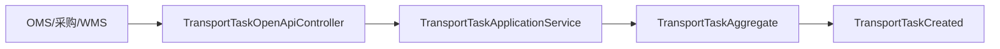
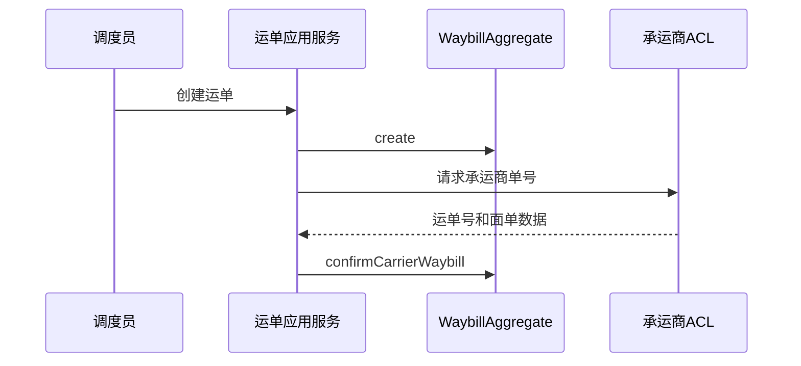
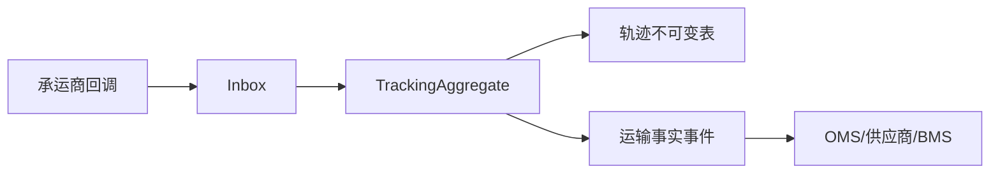
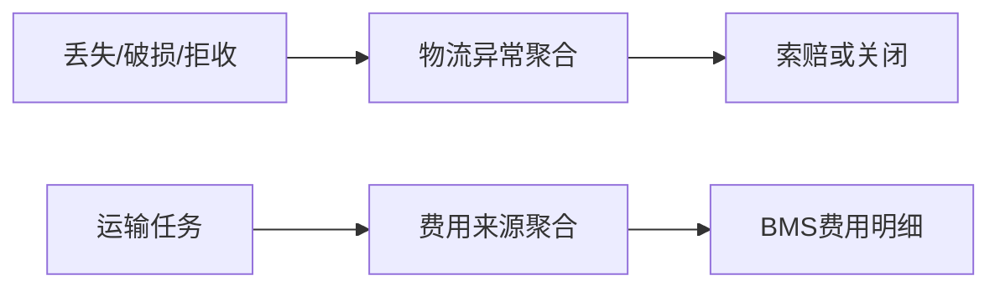
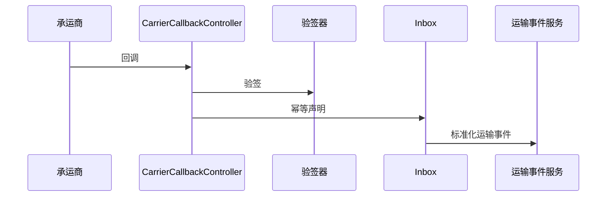

# TMS 系统接口级开发计划

实现资料：`docs/08-系统实现/06-TMS系统实现/03-TMS系统接口逐项实现设计.md`。

## TMS-API-001 创建、接单与查询运输任务
`POST /openapi/transport-tasks`、`POST /transport-tasks/{id}/accept`、`GET /transport-tasks`

- 接口层：`TransportTaskOpenApiController` 校验业务来源、业务单号、发收货地址和幂等键；`TransportTaskController` 接单需承运商范围。
- 应用层：`TransportTaskApplicationService` 验证业务类型、承运商、路由和 SLA，编排任务创建/接单。
- 领域层：`TransportTaskAggregate` 保护采购入库、销售出库、退供、调拨等业务引用唯一性和任务状态。
- 基础设施层：任务资源库、主数据/承运商 ACL、Outbox。
- 事件：`TransportTaskCreated/Accepted`；OMS、供应商、WMS 消费任务状态。

## TMS-API-002 创建/作废运单与生成面单
`POST /transport-tasks/{id}/waybills`、`POST /waybills/{id}/void`、`POST /waybills/{id}/labels`

- 接口层：`WaybillController`、`ShippingLabelController` 校验任务状态、承运商权限和版本。
- 应用层：运单服务调用承运商 ACL 创建/作废单号；面单服务保存 PDF/图片地址并支持打印审计。
- 领域层：`WaybillAggregate` 保证已接单任务才可建单，已揽收/在途不能直接作废；`ShippingLabelAggregate` 绑定正确运单版本。
- 基础设施层：运单/面单资源库、对象存储、承运商客户端、集成命令 Outbox。
- 事件：`WaybillCreated/Voided/LabelGenerated`。

## TMS-API-003 同步/补录轨迹与签收证明
`POST /waybills/{id}/tracking|tracking/manual`、`POST /signatures`、`POST /signatures/{id}/reverse`

- 接口层：`TrackingController`、`SignatureController` 校验来源、轨迹时间、附件和操作范围。
- 应用层：轨迹服务按事件编码去重、按版本处理乱序；签收服务校验运单状态和签收差异。
- 领域层：`TrackingAggregate` 只追加不可变节点；`SignatureAggregate` 限制签收/冲正状态和证据完整性。
- 基础设施层：轨迹表、签收表、对象存储、Inbox、供应商/OMS ACL。
- 事件：`TransportInTransit/Arrived/Signed/SignatureReversed`；消费者更新 OMS、供应商、BMS。

## TMS-API-004 物流异常与费用来源
`POST /transport-exceptions`、`POST /transport-exceptions/{id}/close`、`POST /freight-sources`、`POST /freight-sources/{id}/push-bms`

- 接口层：`TransportExceptionController`、`FreightSourceController` 接收异常原因、责任、索赔证据和费用字段。
- 应用层：异常服务创建整改/索赔待办；费用来源服务按任务/运单/费用项去重并推送 BMS。
- 领域层：`TransportExceptionAggregate` 限制关闭前必须有责任结论；`FreightSourceAggregate` 限制金额、币种、来源唯一和推送状态。
- 基础设施层：异常/费用来源资源库、BMS ACL、Outbox、审计。
- 事件：`TransportExceptionRaised/Closed/FreightSourceCreated`；BMS 消费费用来源。

## TMS-API-005 承运商回调与通用事件入口
`POST /carrier-callbacks/{carrier}`、`POST /events`

- 接口层：`CarrierCallbackController` 验签、校验时间戳/重放窗口；`TmsEventOpenApiController` 校验来源系统。
- 应用层：回调解析服务映射承运商字段到统一事件；事件消费者基于 Inbox 调用运输/运单/轨迹/签收聚合。
- 领域层：不让回调直接改表；必须转换为领域命令。
- 基础设施层：验签器、承运商适配器、Inbox、死信和人工重放。
- 事件：接收外部事件，按版本发布内部标准事实。

