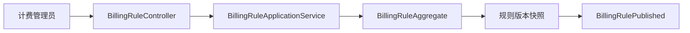
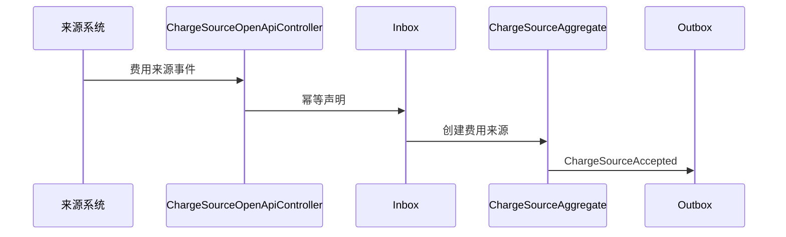
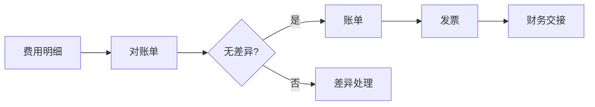
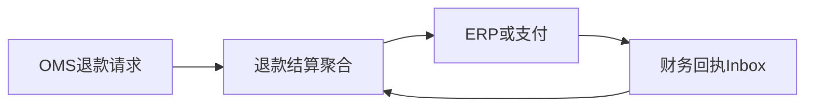

# BMS 系统接口级开发计划

实现资料：`docs/08-系统实现/07-BMS系统实现/03-BMS系统接口逐项实现设计.md`。

## BMS-API-001 计费对象与计费规则
`GET/POST /billing-subjects`、`POST /billing-rules/{id}/publish`

- 接口层：`BillingSubjectController`、`BillingRuleController` 校验组织、币种、计费项、版本和发布权限。
- 应用层：计费对象/规则服务校验适用范围和规则版本，发布后创建只读规则快照。
- 领域层：`BillingSubjectAggregate`、`BillingRuleAggregate` 保证规则生效期不重叠、阶梯和公式合法、已发布版本不可覆盖。
- 基础设施层：对象/规则资源库、规则版本表、审批 ACL、Outbox。
- 事件：`BillingRulePublished`；费用计算服务消费快照。

## BMS-API-002 采集/查询/重放费用来源
`POST /openapi/charge-sources`、`GET /charge-sources`、`POST /charge-sources/{id}/replay`

- 接口层：`ChargeSourceOpenApiController` 校验来源系统、业务单号、费用维度和事件编码；查询 Controller 提供分页/范围。
- 应用层：`ChargeSourceApplicationService` 先 Inbox 幂等再标准化来源；重放服务读取失败载荷。
- 领域层：`ChargeSourceAggregate` 保证同来源事件只形成一次费用事实，状态包含待计算/已计算/失败。
- 基础设施层：来源资源库、Inbox、失败表、Outbox。
- 事件：消费 TMS/WMS/采购/OMS 费用事实；生产 `ChargeSourceAccepted/Failed`。

## BMS-API-003 费用明细重算/作废与调整
`GET /charges`、`POST /charges/{id}/recalculate|void`、`POST /charge-adjustments/{id}/execute`

- 接口层：`ChargeDetailController`、`ChargeAdjustmentController` 接收版本、调整原因、附件和审批结论。
- 应用层：计算服务加载发布规则和来源快照；调整服务校验权限、审批和原费用状态。
- 领域层：`ChargeDetailAggregate` 固化计算依据；`ChargeAdjustmentAggregate` 不允许直接改原金额，必须产生正/负调整明细。
- 基础设施层：费用明细/调整资源库、规则快照、审计、Outbox。
- 事件：`ChargeCalculated/Recalculated/Voided/Adjusted`；对账单投影消费。

## BMS-API-004 对账、账单与发票财务
`POST /reconciliation-statements`、`POST /{id}/confirm|difference`、`POST /bills`、`POST /invoices`、`POST /financial-handovers`、财务回调。

- 接口层：对账、账单、发票、财务交接 Controller；财务回调 OpenAPI 校验来源和事件编码。
- 应用层：对账服务比较费用明细与对方确认；账单服务汇总已确认费用；发票服务校验税额；交接服务调用 ERP ACL。
- 领域层：对账单、账单、发票交接、财务交接聚合保证金额守恒、差异未处理不可生成账单、未交财务不可关闭账单。
- 基础设施层：各资源库、税务/ERP ACL、Inbox/Outbox、审计和附件存储。
- 事件：`ReconciliationIssued/Confirmed/DifferenceRaised`、`BillGenerated`、`InvoiceValidated`、`FinancialPosted`；供应商/采购/OMS 消费。

## BMS-API-005 退款结算、报表与通用事件
`POST /refund-settlements`、`GET /reports/settlement-summary`、`POST /events`

- 接口层：`RefundSettlementController`、`BmsReportController`、事件入口。
- 应用层：退款结算服务校验 OMS 售后引用与原账单；报表查询服务使用读模型；事件消费者维护投影。
- 领域层：退款结算不得超过可退金额，状态需等待财务回执。
- 基础设施层：退款结算资源库、OMS/支付/ERP ACL、报表投影、Inbox。
- 事件：消费 OMS 退款请求，生产退款结算/失败事实。

