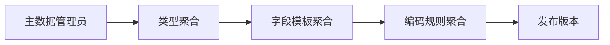
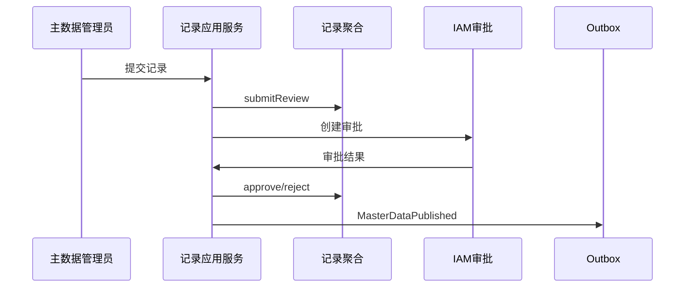
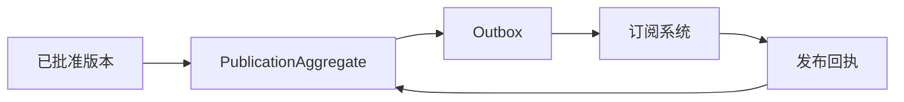
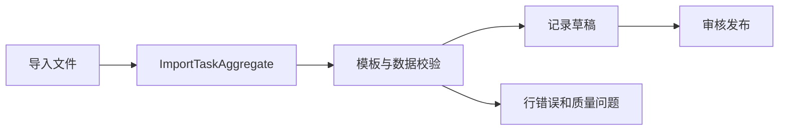
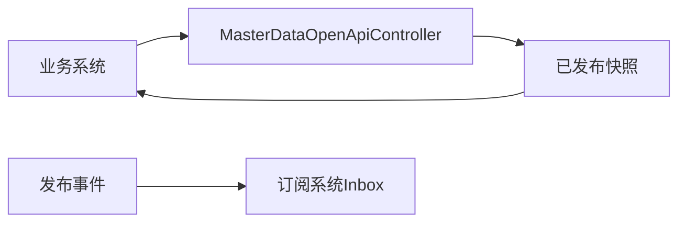

# 主数据系统接口级开发计划

实现资料：`docs/08-系统实现/08-主数据系统实现/03-主数据系统接口逐项实现设计.md`。

## MDM-API-001 主数据类型、字段模板与编码规则
`GET/POST/PUT /master-data-types`、`/field-templates`、`/code-rules`、编码生成。

- 接口层：类型、模板、规则 Controller 接收动态字段定义、排序、启停和版本。
- 应用层：类型/模板/编码服务校验管理员权限、变更影响和幂等。
- 领域层：`MasterDataTypeAggregate`、`FieldTemplateAggregate`、`CodeRuleAggregate` 保护字段唯一、模板版本、编码段和并发生成规则。
- 基础设施层：类型/模板/编码资源库、序列或分布式号段、审计和 Outbox。
- 事件：`MasterDataTypeChanged/TemplatePublished/CodeRulePublished`。

## MDM-API-002 主数据记录创建、审核与状态切换
`GET/POST/PUT /master-data-records`、`POST /{id}/submit-review|approve|reject|enable|freeze|disable`

- 接口层：`MasterDataRecordController`、`MasterDataApprovalController` 校验数据类型、动态字段和版本。
- 应用层：记录服务调用模板校验、引用校验、审批 ACL；状态服务处理启用/冻结/停用。
- 领域层：`MasterDataRecordAggregate`、`MasterDataVersionAggregate` 保证审核前可改、已发布记录通过新版本变更、状态迁移合法。
- 基础设施层：记录 JSON/结构化索引表、版本表、审批投影、审计。
- 事件：`MasterDataSubmitted/Approved/Rejected/Enabled/Frozen/Disabled`。
- 交互：供应商、采购、WMS、OMS、TMS 等系统只能消费发布事实，不能直接修改主数据。

## MDM-API-003 发布订阅、回执与重试
`GET /publications`、`POST /publications/{id}/retry`、`POST /subscriptions`、`POST /publication-receipts`

- 接口层：发布/订阅/回执 Controller 校验系统身份、订阅权限、事件编码和版本。
- 应用层：发布服务从已批准版本生成发布任务；回执服务幂等更新消费者状态；重试服务限定失败状态。
- 领域层：`PublicationAggregate`、`SubscriptionAggregate` 保护发布版本不可篡改、消费者回执单调推进。
- 基础设施层：发布任务表、订阅表、Outbox/MQ、Inbox、失败重试任务。
- 事件：生产 `MasterDataPublished`；消费 `MasterDataPublicationAcknowledged`。

## MDM-API-004 导入、导出与数据质量问题
`POST /imports`、`GET /imports/{id}/errors`、`GET /exports`、`GET/POST /data-quality-issues`

- 接口层：`ImportTaskController`、`DataQualityController` 接收模板/文件引用和修复命令。
- 应用层：导入服务异步解析、按行校验、记录错误、可重试；导出服务创建异步任务；质量服务分派问题。
- 领域层：`ImportTaskAggregate` 保护任务状态；`DataQualityIssueAggregate` 保护发现、分派、修复、验证、关闭状态。
- 基础设施层：对象存储、任务表、错误明细、导出文件、模板校验器。
- 事件：`ImportCompleted/Failed`、`DataQualityIssueRaised/Closed`。

## MDM-API-005 主数据 OpenAPI 与事件入口
`GET /openapi/master-data/{type}`、校验/快照接口、`POST /events`

- 接口层：`MasterDataOpenApiController` 和 MQ Listener 校验应用身份、数据范围、字段白名单和版本。
- 应用层：快照查询服务优先读发布投影；事件消费者更新回执或质量投影。
- 领域层：查询不改变记录；外部变更请求必须回到主数据记录命令。
- 基础设施层：快照表、Redis 缓存、Inbox、查询 ACL。
- 事件：标准事件载荷包含 `type/code/version/status/data`；未知版本拒绝或隔离。

