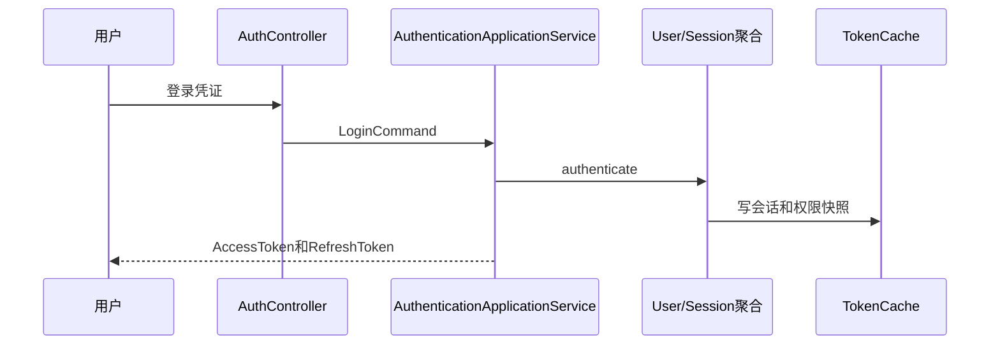
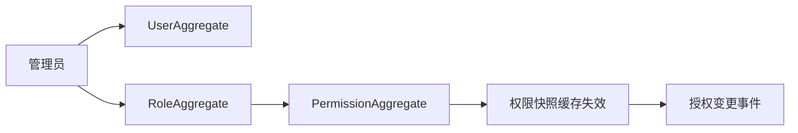
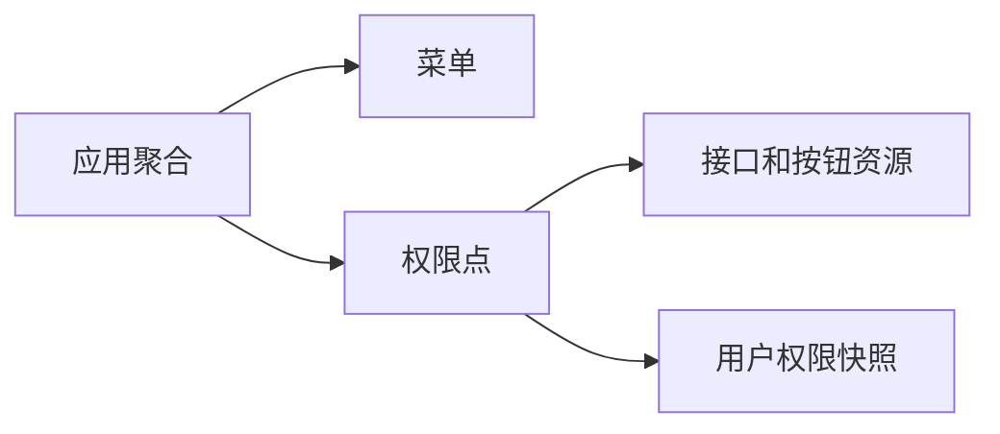
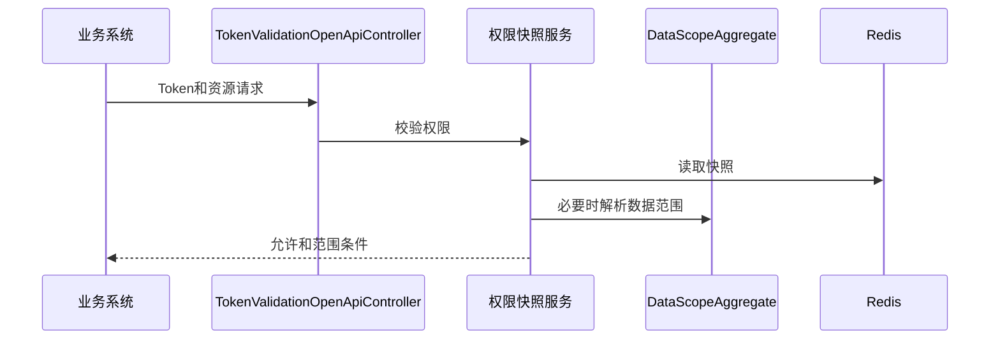
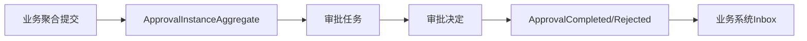

# 权限系统接口级开发计划

实现资料：`docs/08-系统实现/09-权限系统实现/03-权限系统接口逐项实现设计.md`。

## IAM-API-001 登录、刷新、登出与当前权限
`POST /auth/login|refresh|logout`、`GET /me`、`PUT /me/profile`

- 接口层：`AuthController`、`CurrentUserController` 校验登录凭证、刷新令牌、设备信息和限流。
- 应用层：`AuthenticationApplicationService`、`SessionApplicationService` 校验用户状态、密码策略、失败次数和会话版本。
- 领域层：`UserAggregate`、`SessionTokenAggregate` 保护锁定、密码重置、刷新令牌轮换、登出失效。
- 基础设施层：用户资源库、密码散列器、JWT 服务、Redis TokenCache、登录日志、风控 ACL。
- 事件：`UserLoggedIn/Logout/Locked`；业务系统消费权限快照失效通知。

## IAM-API-002 用户、角色与授权
`GET/POST/PUT /users`、启停/锁定/重置密码、`GET/POST/PUT /roles`、角色成员、角色授权。

- 接口层：`UserController`、`RoleController` 接收组织、角色、状态、权限点和版本。
- 应用层：用户/角色服务校验管理范围、幂等和审批要求；变更后失效关联权限快照。
- 领域层：`UserAggregate` 保证账号唯一、状态迁移；`RoleAggregate` 保证角色权限集合和角色用户关系合法。
- 基础设施层：用户/角色资源库、关联表、审计、Redis 缓存失效、Outbox。
- 事件：`UserCreated/Changed/RoleChanged/RolePermissionChanged`。

## IAM-API-003 菜单、权限点、应用与 SSO
`GET/POST/PUT /menus`、`/permissions`、`/applications`、SSO 配置和回调。

- 接口层：菜单、权限、应用、SSO Controller 验证管理权限和资源标识。
- 应用层：配置服务校验应用唯一、菜单树、权限资源绑定和 SSO 元数据。
- 领域层：`ApplicationAggregate`、`PermissionAggregate` 防止权限点跨应用错误绑定；菜单停用前检查子节点/引用。
- 基础设施层：应用/菜单/权限资源库、SSO ACL、配置缓存、审计。
- 事件：`ApplicationChanged/PermissionChanged/SsoConfigured`；消费者刷新系统权限快照。

## IAM-API-004 数据权限、Token 校验与范围解析
`GET/POST /data-scopes`、`POST /openapi/token/validate`、`GET /openapi/permission-snapshot|data-scope`

- 接口层：`DataScopeController`、`TokenValidationOpenApiController` 校验调用应用、令牌和查询目标。
- 应用层：数据范围服务计算组织、仓、货主、供应商、客户、单据归属交集；Token 服务读取缓存并处理失效。
- 领域层：`DataScopeAggregate` 保护范围授予/撤销与版本；范围解析是领域策略，不由业务系统自行拼接 SQL。
- 基础设施层：范围资源库、Redis 权限快照、JWT 验签器、策略投影。
- 事件：`DataScopeChanged/PermissionSnapshotInvalidated`；供应商等系统消费后刷新本地授权缓存。

## IAM-API-005 审批、日志、安全策略与事件入口
`GET/POST /approval-instances`、`/operation-logs`、`/security-policies`、`POST /events`

- 接口层：`ApprovalController`、`OperationLogController`、`SecurityPolicyController`、MQ Listener。
- 应用层：审批服务创建/领取/完成任务，日志服务写不可篡改审计，策略服务处理密码/MFA/IP/风控配置。
- 领域层：`ApprovalInstanceAggregate` 保证任务状态和审批链；`OperationLogAggregate` 只追加；`SecurityPolicyAggregate` 版本化发布。
- 基础设施层：审批实例/任务表、审计索引、策略缓存、Outbox/Inbox。
- 事件：消费业务系统审批请求；生产 `ApprovalCompleted/Rejected`，供应商、采购、BMS 等消费者推进自身聚合。

