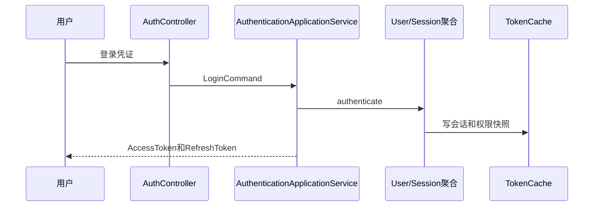
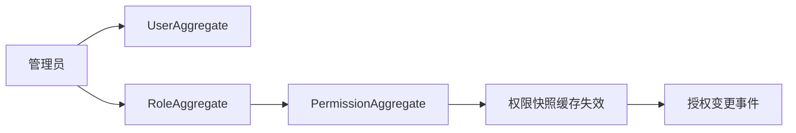
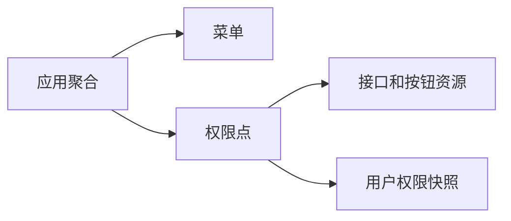
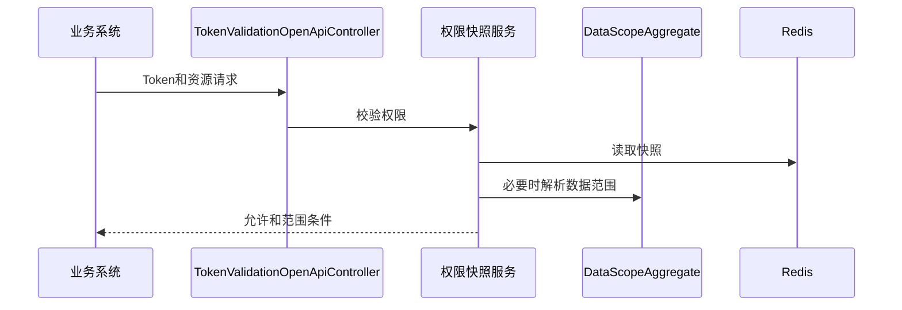
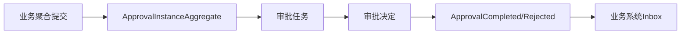

# 权限系统接口级开发计划

> 当前状态与剩余验收见[供应链系统开发总纲](../00-供应链系统开发总纲.md#5-九子系统当前状态)。

实现资料：`docs/08-系统实现/09-权限系统实现/03-权限系统接口逐项实现设计.md`。

## IAM-API-001 登录、刷新、登出与当前权限
`POST /auth/login|refresh|logout`、`GET /me`、`PUT /me/profile`

- 接口层：`AuthController`、`CurrentUserController` 校验登录凭证、刷新令牌、设备信息和限流；账号密码通过但需要 MFA 时只返回 `MFA_REQUIRED + challengeId`。
- 应用层：`AuthenticationApplicationService`、`SessionApplicationService` 校验用户状态、密码策略、失败次数和会话版本；不得接受没有 Challenge 上下文的裸 MFA 验证码。
- 领域层：`UserAggregate`、`SessionTokenAggregate` 保护锁定、密码重置、刷新令牌轮换、登出失效。
- 基础设施层：用户资源库、密码散列器、JWT 服务、Redis TokenCache、登录日志、风控 ACL。
- 事件：`UserLoggedIn/Logout/Locked`；业务系统消费权限快照失效通知。

```mermaid
sequenceDiagram
  participant U as 用户
  participant C as AuthController
  participant A as AuthenticationApplicationService
  participant G as User/Session聚合
  participant R as TokenCache
  U->>C: 登录凭证
  C->>A: LoginCommand
  A->>G: authenticate
  G->>R: 写会话和权限快照
  A-->>U: AccessToken和RefreshToken
```

## IAM-API-002 用户、角色与授权
`GET/POST/PUT /users`、启停/锁定/重置密码、`GET/POST/PUT /roles`、角色成员、角色授权。

- 接口层：`UserController`、`RoleController` 接收组织、角色、状态、权限点和版本。
- 应用层：用户/角色服务校验管理范围、幂等和审批要求；变更后失效关联权限快照。
- 领域层：`UserAggregate` 保证账号唯一、状态迁移；`RoleAggregate` 保证角色权限集合和角色用户关系合法。
- 基础设施层：用户/角色资源库、关联表、审计、Redis 缓存失效、Outbox。
- 事件：`UserCreated/Changed/RoleChanged/RolePermissionChanged`。

```mermaid
flowchart LR
  A[管理员] --> U[UserAggregate]
  A --> R[RoleAggregate]
  R --> P[PermissionAggregate]
  P --> C[权限快照缓存失效]
  C --> E[授权变更事件]
```

## IAM-API-003 菜单、权限点、应用与 SSO
`GET/POST/PUT /menus`、`/permissions`、`/applications`、SSO 配置和回调。

- 接口层：菜单、权限、应用、SSO Controller 验证管理权限和资源标识。
- 应用层：配置服务校验应用唯一、菜单树、权限资源绑定和 SSO 元数据。
- 领域层：`ApplicationAggregate`、`PermissionAggregate` 防止权限点跨应用错误绑定；菜单停用前检查子节点/引用。
- 基础设施层：应用/菜单/权限资源库、SSO ACL、配置缓存、审计。
- 事件：`ApplicationChanged/PermissionChanged/SsoConfigured`；消费者刷新系统权限快照。

```mermaid
flowchart LR
  APP[应用聚合] --> M[菜单]
  APP --> P[权限点]
  P --> RES[接口和按钮资源]
  P --> SNAP[用户权限快照]
```

## IAM-API-004 数据权限、Token 校验与范围解析
`GET/POST /data-scopes`、`POST /openapi/token/validate`、`GET /openapi/permission-snapshot|data-scope`

- 接口层：`DataScopeController`、`TokenValidationOpenApiController` 校验调用应用、令牌和查询目标。
- 应用层：数据范围服务计算组织、仓、货主、供应商、客户、单据归属交集；Token 服务读取缓存并处理失效。
- 领域层：`DataScopeAggregate` 保护范围授予/撤销与版本；范围解析是领域策略，不由业务系统自行拼接 SQL。
- 基础设施层：范围资源库、Redis 权限快照、JWT 验签器、策略投影。
- 事件：`DataScopeChanged/PermissionSnapshotInvalidated`；供应商等系统消费后刷新本地授权缓存。

```mermaid
sequenceDiagram
  participant S as 业务系统
  participant V as TokenValidationOpenApiController
  participant A as 权限快照服务
  participant D as DataScopeAggregate
  participant R as Redis
  S->>V: Token和资源请求
  V->>A: 校验权限
  A->>R: 读取快照
  A->>D: 必要时解析数据范围
  A-->>S: 允许和范围条件
```

## IAM-API-005 审批、日志、安全策略与事件入口
`GET/POST /approval-instances`、`/operation-logs`、`/security-policies`、`POST /events`

- 接口层：`ApprovalController`、`OperationLogController`、`SecurityPolicyController`、MQ Listener。
- 应用层：审批服务创建/领取/完成任务，日志服务写不可篡改审计，策略服务处理密码/MFA/IP/风控配置。
- 领域层：`ApprovalInstanceAggregate` 保证任务状态和审批链；`OperationLogAggregate` 只追加；`SecurityPolicyAggregate` 版本化发布。
- 基础设施层：审批实例/任务表、审计索引、策略缓存、Outbox/Inbox。
- 事件：消费业务系统审批请求；生产 `ApprovalCompleted/Rejected`，供应商、采购、BMS 等消费者推进自身聚合。

```mermaid
flowchart LR
  B[业务聚合提交] --> A[ApprovalInstanceAggregate]
  A --> T[审批任务]
  T --> D[审批决定]
  D --> E[ApprovalCompleted/Rejected]
  E --> B2[业务系统Inbox]
```

## IAM-API-006 OAuth/OIDC 授权、Token 与撤销
`GET/POST /oauth2/authorize`、`POST /oauth2/token|revoke|introspect`、可选 OIDC Discovery/JWKS/UserInfo

- 接口层：OAuth Controller 校验 client、redirect URI、response/grant type、scope、state、nonce 和 PKCE；Token 端点根据客户端类型执行严格认证。
- 应用层：`OAuthAuthorizationApplicationService` 创建授权事务、签发并一次性消费授权码、轮换 Refresh Token、撤销授权链和生成审计。
- 领域层：OAuthClient、AuthorizationTransaction、AuthorizationCode/Grant 聚合保护客户端状态、回调白名单、授权码一次性消费、scope/audience 交集和机器身份边界。
- 基础设施层：客户端/授权码/授权记录资源库、密钥服务、Redis 短期事务缓存、撤销表、Outbox；客户端密钥只保存摘要。
- 事件：`OAuthClientChanged/AuthorizationGranted/AuthorizationCodeConsumed/TokenRevoked/RefreshTokenReuseDetected`。
- 安全：redirect URI 精确匹配；授权码绑定 client/redirect URI/PKCE/用户；禁止 implicit/password grant；Client Credentials 不包含用户角色和数据范围。
- 测试：重定向绕过、授权码重放、PKCE 不匹配、scope 越权、刷新令牌复用、并发消费和撤销传播。

## IAM-API-007 MFA 注册、挑战、恢复与重置
`POST /mfa/totp/enroll|confirm|disable`、`POST /mfa/challenges`、`POST /mfa/challenges/{id}/verify`、`POST /mfa/recovery-codes/regenerate`、管理员重置接口

- 接口层：MFA Controller 校验 Challenge、用途、会话、设备摘要和限流；管理员重置需要高风险权限、原因和审批/二次认证。
- 应用层：`MfaApplicationService` 编排 TOTP 注册确认、挑战创建验证、恢复码消费、失败锁定、重置和会话撤销。
- 领域层：MfaConfiguration、MfaChallenge、RecoveryCodeSet 聚合保护有效期、单次消费、失败计数、锁定和秘密材料边界。
- 基础设施层：TOTP 密钥加密端口、Challenge/恢复码资源库、Redis 短期状态、审计和会话撤销端口；秘密材料不得进入日志和 Token。
- 事件：`MfaEnrolled/ChallengeCreated/Verified/Failed/Locked/Reset`。
- 测试：过期、重复、跨会话、跨用途验证；TOTP 时间窗口；恢复码单次消费；并发验证；重置后旧会话失效。
