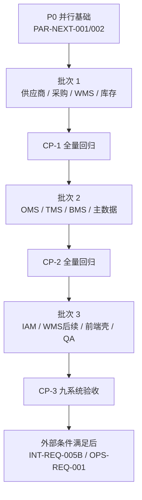

# 多 Agent 并行执行计划

## 1. 目标

在不破坏九个限界上下文、数据主权和当前可构建基线的前提下，让多个子 Agent 可以同时开发不同子系统。计划默认最多四个 Agent 并行；如果并发数更少，按批次从左到右执行即可。

本计划只安排当前仓库可推进的二期任务。`INT-REQ-005B`、`OPS-REQ-001` 在外部条件满足前不进入开发队列。

## 2. 并行前置规则

### 2.1 文件所有权

| 范围 | 所有权规则 |
| --- | --- |
| `project/backend/<system>-service/**` | 同一时间仅允许该子系统 Agent 写入 |
| `project/backend/scm-common/**` | 仅公共契约 Agent 写入，业务 Agent 只能提出变更请求 |
| `project/backend/pom.xml` | 仅集成 Agent 写入 |
| Flyway 目录 | 同一服务同一时间只能有一个 Agent 新增迁移；领取任务时登记下一个版本号 |
| `project/frontend/src/config/systemCatalog.js`、`resourceDefinitions.js` | 完成 `PAR-NEXT-001` 后冻结，后续只改拆分后的子系统文件 |
| `project/frontend/src/config/systems/<system>.js` | 对应子系统 Agent 独占 |
| `project/frontend/src/config/resources/<system>.js` | 对应子系统 Agent 独占 |
| `docs/09-开发计划/02-开发日志.md` | Agent 先写独立交接片段，由集成 Agent按任务编号汇总，避免同时编辑 |
| `tasks/todo.md` | 仅协调 Agent 更新 |

### 2.2 契约优先

凡是跨子系统任务，必须先提交只包含以下内容的契约切片：

- 命令/事件名称、版本、生产者和消费者；
- 请求/响应或事件载荷；
- 幂等键、权限码、错误码；
- 超时、重试、熔断、最终失败和人工补偿；
- 双方测试夹具。

契约冻结后，生产者和消费者才可并行实现。任何 Agent 不得直接修改另一个子系统的表或 Mapper。

### 2.3 任务完成门槛

每个任务必须同时具备：

1. 一个可工作的纵向切片，而不是只建表、只写接口或只补页面；
2. 领域/应用/Web 或查询测试，涉及事件时包含幂等和失败恢复；
3. 任务级验证命令通过，并生成开发日志交接片段；
4. 修改文件不超出领取范围；如果必须扩展范围，先由协调 Agent重新分配。

## 3. 并行批次

| 批次 | Agent A | Agent B | Agent C | Agent D |
| --- | --- | --- | --- | --- |
| P0 | `PAR-NEXT-001` 前端配置拆分 | `PAR-NEXT-002` 计划/契约校验 | 空闲 | 空闲 |
| 1 | 供应商 `SUP-NEXT-*` | 采购 `PUR-NEXT-*` | WMS `WMS-NEXT-001A` | 库存 `INV-NEXT-*` |
| 2 | OMS `OMS-NEXT-*` | TMS `TMS-NEXT-*` | BMS `BMS-NEXT-*` | 主数据 `MDM-NEXT-*` |
| 3 | IAM `IAM-NEXT-*` | WMS `WMS-NEXT-001B/C` | 前端公共壳 `FE-NEXT-001` | QA `QA-NEXT-001` |

同一 Agent lane 内的子任务顺序执行；不同 lane 可并行。

### 3.1 RocketMQ 生产约束（2026-07-30 新增）

- 九个子系统的业务事件必须使用“本地事务 Outbox → 真实 RocketMQ Producer → 真实 RocketMQ Consumer → Inbox/幂等应用服务”链路。
- HTTP/Dubbo 只承载同步命令或查询；内部 HTTP 事件接口不得作为业务事件主消费路径。
- 内存、Noop、Logging Broker 仅允许位于 `src/test`，禁止注册为生产 Bean，也禁止 RocketMQ 不可用时自动降级。
- 统一事件信封至少包含 `schemaVersion`、`sourceSystem`、`eventCode`、`eventType`、`data`；未知版本失败关闭。
- 消费解析或业务处理失败必须返回 RocketMQ `FAILURE` 触发 Broker 重试，同时由 Inbox 保证重复、乱序和人工重放不重复记账。
- 后续每个子系统任务在验收前必须列出真实 Producer、Consumer、Topic、Consumer Group 和生产配置证据；缺任一项不得标记生产完成。

## 4. P0 并行基础

### PAR-NEXT-001 前端九子系统配置拆分

| 项目 | 内容 |
| --- | --- |
| 目标 | 把两个多人冲突热点文件拆为九个子系统独立配置文件 |
| 依赖 | 无 |
| 建议 Agent | frontend-foundation |
| 文件范围 | `src/config/systemCatalog.js`、`src/config/resourceDefinitions.js`、新增 `src/config/systems/`、`src/config/resources/`、对应测试 |
| 验收 | 对外导出保持兼容；九系统顺序/权限不变；每个子系统资源只由自己的文件导出 |
| 验证 | `npm run test && npm run build && npm run test:e2e` |
| 规模 | M；拆分和回归，不修改业务行为 |

### PAR-NEXT-002 计划与契约一致性校验

| 项目 | 内容 |
| --- | --- |
| 目标 | 自动检查正式需求是否在状态矩阵有归属、九服务边界和任务文件所有权是否被破坏 |
| 依赖 | 无 |
| 建议 Agent | plan-governance |
| 文件范围 | `docs/09-开发计划/**`、`tasks/**`、`tools/plan_guard/**` |
| 验收 | 64 张历史需求无遗漏；不存在第十个业务服务；重复进行中任务和文件范围冲突会失败 |
| 验证 | 运行校验脚本、`git diff --check` |
| 规模 | S |

## 5. 供应商 Agent Lane

### SUP-NEXT-001A 导出文件与对象存储端口

| 项目 | 内容 |
| --- | --- |
| 目标 | 让已有导出任务真正生成文件并通过端口上传，任务可完成或失败重试 |
| 依赖 | `PAR-NEXT-001` |
| 文件范围 | `supplier-service` 导出应用/基础设施/测试；`frontend/.../resources/supplier.js` |
| 验收 | CSV 生成使用稳定列定义；对象存储通过端口隔离；失败保留错误并可重试 |
| 验证 | `mvn -pl supplier-service -am test`；供应商前端资源测试 |
| 规模 | M |

### SUP-NEXT-001B 供应商 Web/MySQL 契约测试

| 项目 | 内容 |
| --- | --- |
| 目标 | 覆盖准入、PO 确认、ASN、质量整改和导出任务的真实 Web/MySQL/Flyway 契约 |
| 依赖 | `SUP-NEXT-001A` |
| 文件范围 | `supplier-service/src/test/**`；必要的测试配置 |
| 验收 | 401/403、数据范围、幂等、乐观锁和迁移可启动均有测试 |
| 验证 | `mvn -pl supplier-service -am test` |
| 规模 | M |

## 6. 采购 Agent Lane

### PUR-NEXT-001A 采购工作台与经营读模型

| 项目 | 内容 |
| --- | --- |
| 目标 | 补齐采购待办、交期、价格、订单执行和异常汇总读模型 |
| 依赖 | `PAR-NEXT-001` |
| 文件范围 | `purchase-service` 工作台 Controller/查询服务/Mapper/测试；`resources/purchase.js` |
| 验收 | 支持采购组织/采购组/本人数据范围；查询分页和排序稳定；指标可追溯到采购事实 |
| 验证 | `mvn -pl purchase-service -am test`；前端资源测试 |
| 规模 | M |

### PUR-NEXT-001B 目标上下文路由契约测试

| 项目 | 内容 |
| --- | --- |
| 目标 | 对每种采购命令建立目标 URL、请求头、超时、熔断和最终失败契约测试 |
| 依赖 | `PUR-NEXT-001A` |
| 文件范围 | `purchase-service` 集成网关/配置/测试；不修改目标服务实现 |
| 验收 | 未配置路由失败关闭；重复命令幂等；目标 4xx/5xx/超时进入明确失败状态 |
| 验证 | `mvn -pl purchase-service -am test` |
| 规模 | S |

## 7. WMS Agent Lane

### WMS-NEXT-001A 入库作业读模型

| 项目 | 内容 |
| --- | --- |
| 目标 | 补入库单、收货、质检、上架、库内库存的列表/详情查询及前端接入 |
| 依赖 | `PAR-NEXT-001` |
| 文件范围 | `wms-service` 入库查询 Controller/Service/Mapper/测试；`resources/wms.js` |
| 验收 | 仓库/货主数据范围生效；列表/详情使用真实读模型；前端不再显示能力缺口 |
| 验证 | `mvn -pl wms-service -am test`；WMS 前端资源测试 |
| 规模 | M |

### WMS-NEXT-001B 出库作业读模型

| 项目 | 内容 |
| --- | --- |
| 目标 | 补出库、波次、拣货、容器、复核包装和发货交接的列表/详情 |
| 依赖 | `WMS-NEXT-001A` |
| 文件范围 | `wms-service` 出库查询 Controller/Service/Mapper/测试；`resources/wms.js` |
| 验收 | 作业状态、数量和来源单据可追踪；动作权限与状态机一致；前端可直达详情 |
| 验证 | `mvn -pl wms-service -am test`；WMS 页面 E2E |
| 规模 | M |

### WMS-NEXT-001C 退货、盘点与异常读模型

| 项目 | 内容 |
| --- | --- |
| 目标 | 补退货入库、盘点计划和仓内异常的列表/详情/处置入口 |
| 依赖 | `WMS-NEXT-001B` |
| 文件范围 | `wms-service` 退货/盘点/异常查询与测试；`resources/wms.js` |
| 验收 | 差异和处置结果可追溯；终态禁止重复处置；页面具有能力而非占位提示 |
| 验证 | `mvn -pl wms-service -am test`；WMS 页面 E2E |
| 规模 | M |

## 8. 中央库存 Agent Lane

### INV-NEXT-001A 冻结与调整独立聚合

| 项目 | 内容 |
| --- | --- |
| 目标 | 把冻结/调整从直接账户动作提升为有审批、原因、状态和审计的独立聚合 |
| 依赖 | 无 |
| 文件范围 | `inventory-service` 领域/应用/接口/迁移/测试 |
| 验收 | 调整前后数量守恒；审批和执行不可重复；所有变化写库存流水 |
| 验证 | `mvn -pl inventory-service -am test` |
| 规模 | M |

### INV-NEXT-001B 事件载荷版本与失败治理

| 项目 | 内容 |
| --- | --- |
| 目标 | 替换简单扁平 JSON 解析，建立版本化载荷、失败查询和人工重放 |
| 依赖 | `INV-NEXT-001A` |
| 文件范围 | `inventory-service` 事件应用/适配器/测试 |
| 验收 | 支持已声明版本；未知版本失败关闭；重复/乱序/失败重放不重复记账 |
| 验证 | `mvn -pl inventory-service -am test` |
| 规模 | M |

### INV-NEXT-001C 运营读模型与导出

| 项目 | 内容 |
| --- | --- |
| 目标 | 接入预占、冻结、调整、事件日志和操作日志页面，并提供库存指标导出 |
| 依赖 | `PAR-NEXT-001`、`INV-NEXT-001B` |
| 文件范围 | `inventory-service` 查询/导出/测试；`resources/inventory.js` |
| 验收 | 仓/货主/SKU/批次范围生效；导出异步或限流；前端五个缺口页面可用 |
| 验证 | `mvn -pl inventory-service -am test`；库存前端资源测试 |
| 规模 | M |

## 9. OMS Agent Lane

### OMS-NEXT-001A 履约、售后和异常读模型

| 项目 | 内容 |
| --- | --- |
| 目标 | 补审单、预占、取消、售后和异常的列表/详情，并接入前端 |
| 依赖 | `PAR-NEXT-001` |
| 文件范围 | `oms-service` 查询 Controller/Service/Mapper/测试；`resources/oms.js` |
| 验收 | 查询不修改聚合；数据范围与状态口径一致；六个前端缺口页面可用 |
| 验证 | `mvn -pl oms-service -am test`；OMS 页面 E2E |
| 规模 | M |

### OMS-NEXT-001B 履约指标与异步导出

| 项目 | 内容 |
| --- | --- |
| 目标 | 将原 `RPT-REQ-001` 的履约指标内聚到 OMS |
| 依赖 | `OMS-NEXT-001A` |
| 文件范围 | `oms-service` 指标/导出查询和测试；`resources/oms.js` |
| 验收 | 订单量、完成/取消、履约率和时长口径可追溯；数据范围生效；导出失败可恢复 |
| 验证 | `mvn -pl oms-service -am test` |
| 规模 | M |

## 10. TMS Agent Lane

### TMS-NEXT-001A 承运商回调验签与状态推进

| 项目 | 内容 |
| --- | --- |
| 目标 | 建立承运商签名验签、节点映射和轨迹/签收驱动运单终态 |
| 依赖 | 无 |
| 文件范围 | `tms-service` 防腐层/应用/领域/测试 |
| 验收 | 验签失败不入 Inbox；重复回调无副作用；签收/拒收按状态机推进运单 |
| 验证 | `mvn -pl tms-service -am test` |
| 规模 | M |

### TMS-NEXT-001B 面单附件与标准页面

| 项目 | 内容 |
| --- | --- |
| 目标 | 通过对象存储端口管理面单/签收附件，并接入面单、轨迹、签收、承运商和日志页面 |
| 依赖 | `PAR-NEXT-001`、`TMS-NEXT-001A` |
| 文件范围 | `tms-service` 文件端口/查询/测试；`resources/tms.js` |
| 验收 | 附件不落业务表大字段；下载受数据权限保护；五个前端缺口页面可用 |
| 验证 | `mvn -pl tms-service -am test`；TMS 页面 E2E |
| 规模 | M |

## 11. BMS Agent Lane

### BMS-NEXT-001A 财税支付防腐层

| 项目 | 内容 |
| --- | --- |
| 目标 | 固化 ERP、税控、支付的端口、签名、回调幂等和失败补偿，不绑定具体供应商 SDK |
| 依赖 | 外部契约可先用仓库内端口测试；真实验收依赖 `INT-REQ-005B` |
| 文件范围 | `bms-service` 端口/适配器契约/应用/测试 |
| 验收 | 外部 DTO 不进入领域层；回调幂等；失败进入最终失败和人工处理 |
| 验证 | `mvn -pl bms-service -am test` |
| 规模 | M |

### BMS-NEXT-001B 财务页面与异步报表

| 项目 | 内容 |
| --- | --- |
| 目标 | 接入费用、规则、对账、账单、发票、财务、退款页面并完成结算异步导出 |
| 依赖 | `PAR-NEXT-001`、`BMS-NEXT-001A` |
| 文件范围 | `bms-service` 查询/导出/测试；`resources/bms.js` |
| 验收 | 金额与数据范围口径一致；导出可追踪/可失败恢复；八个前端缺口页面可用 |
| 验证 | `mvn -pl bms-service -am test`；BMS 页面 E2E |
| 规模 | M |

## 12. 主数据 Agent Lane

### MDM-NEXT-001A 真实文件导入导出

| 项目 | 内容 |
| --- | --- |
| 目标 | 接 CSV/Excel 解析、行级错误文件、对象存储和异步任务执行器 |
| 依赖 | 无 |
| 文件范围 | `mdm-service` 文件端口/导入应用/基础设施/测试 |
| 验收 | 文件摘要幂等；错误可定位到行列；失败不产生部分生效数据 |
| 验证 | `mvn -pl mdm-service -am test` |
| 规模 | M |

### MDM-NEXT-001B OpenAPI 数据边界与页面

| 项目 | 内容 |
| --- | --- |
| 目标 | 增加应用身份、字段白名单、数据范围、专用投影/缓存，并补审批和变更日志页面 |
| 依赖 | `PAR-NEXT-001`、`MDM-NEXT-001A` |
| 文件范围 | `mdm-service` OpenAPI/缓存/查询/测试；`resources/mdm.js` |
| 验收 | 未授权字段不返回；缓存按版本失效；审批和变更可追溯 |
| 验证 | `mvn -pl mdm-service -am test`；MDM 页面 E2E |
| 规模 | M |

## 13. 权限 Agent Lane

### IAM-NEXT-001A Redis TokenCache 与密钥轮换

| 项目 | 内容 |
| --- | --- |
| 目标 | 以 Redis 承接会话缓存/撤销，并支持双密钥轮换窗口 |
| 依赖 | 无 |
| 文件范围 | `iam-service` token 端口/适配器/配置/测试 |
| 验收 | Redis 不可用时失败策略明确；登出立即撤销；轮换窗口内旧 Token 可验证、窗口后失效 |
| 验证 | `mvn -pl iam-service -am test` |
| 规模 | M |

### IAM-NEXT-001B OAuth/OIDC、MFA 与管理页面

| 项目 | 内容 |
| --- | --- |
| 目标 | 完成授权码/客户端凭证最小闭环、MFA 挑战，并接入菜单/授权/会话页面 |
| 依赖 | `PAR-NEXT-001`、`IAM-NEXT-001A` |
| 文件范围 | `iam-service` 授权/MFA/查询/测试；`resources/iam.js` |
| 验收 | 客户端和重定向 URI 严格校验；MFA 状态可审计；四个前端缺口页面可用 |
| 验证 | `mvn -pl iam-service -am test`；IAM 权限 E2E |
| 规模 | M |

## 14. 前端公共壳与 QA

### FE-NEXT-001 九子系统统一交互与可访问性回归

| 项目 | 内容 |
| --- | --- |
| 目标 | 在各子系统资源完成后统一查询条件、空态、错误态、命令确认和可访问性 |
| 依赖 | 九个子系统页面任务 |
| 文件范围 | `project/frontend/src/pages/**`、`project/frontend/src/components/**`、`project/frontend/src/layout/**`、`project/frontend/src/styles/**`、`project/frontend/tests/**`；不修改子系统资源文件 |
| 验收 | 无演示数据；错误不伪装空列表；键盘、名称、320/768/1024/1440 布局通过 |
| 验证 | `npm run test && npm run build && npm run test:e2e` |
| 规模 | M |

### QA-NEXT-001 九服务真实 API 与数据库回归

| 项目 | 内容 |
| --- | --- |
| 目标 | 使用本地九服务、MySQL/Flyway、Nacos 和浏览器完成真实 API 基线，不替代外部沙箱验收 |
| 依赖 | 每批次完成后可增量执行，最终依赖全部 `NEXT` 任务 |
| 文件范围 | `project/backend/**`、`project/frontend/tests/**`、`project/frontend/src/**/*.test.js`、`project/frontend/playwright.config.js`；生产代码由对应系统 Agent 修复 |
| 验收 | 九服务启动；核心查询/命令返回真实数据库结果；401/403、幂等和乐观锁有证据 |
| 验证 | 后端全量测试、前端 E2E、一键启动健康检查 |
| 规模 | M |

## 15. 外部阻塞任务

| 任务 | 状态 | 解除阻塞所需输入 |
| --- | --- | --- |
| `INT-REQ-005B` | 阻塞 | RocketMQ ACL/Topic/Group、Dubbo 接口/版本/分组、ERP/税务/支付沙箱、承运商接口和测试数据 |
| `OPS-REQ-001` | 阻塞 | 集成/预演环境、监控平台、告警通道、容量目标、RTO/RPO、故障注入窗口 |

外部条件只解除对应任务的阻塞，不扩大任何 Agent 的文件范围。

## 16. 批次检查点

### CP-0 并行基础

- `PAR-NEXT-001/002` 完成；
- 前端九系统配置文件互不冲突；
- 当前 64 张需求全部可追踪。

### CP-1 供给、仓储与库存

- 供应商、采购、WMS、库存任务级测试通过；
- 后端全量 `mvn -Ptest test`、P3C 通过；
- 前端单测和构建通过。

### CP-2 履约、运输、结算与主数据

- OMS、TMS、BMS、MDM 任务级测试通过；
- 金额、数量、库存和版本不变量回归通过；
- 跨系统只使用冻结契约。

### CP-3 九系统验收

- IAM、剩余 WMS、公共前端和 QA 完成；
- `mvn -Ptest clean test`、`mvn -Pprod -DskipTests package`、P3C 通过；
- `npm run test`、`npm run build`、`npm run test:e2e` 通过；
- 九服务一键启动，日志无启动错误，开发日志和状态矩阵已同步。

## 继续上下文

当前结论：并行开发以服务目录和拆分后的前端子系统资源文件为所有权边界。

关键假设：最多四个 Agent 并行，每个任务保持 S/M 规模。

待决问题：外部联调与生产运维任务仍需环境资料。

下一步：先领取 `PAR-NEXT-001` 和 `PAR-NEXT-002`，通过 CP-0 后进入批次 1。
