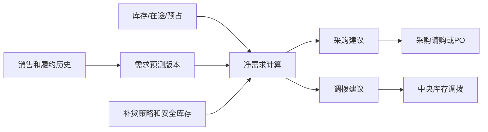

# PLAN-REQ-001 需求预测与计划补货路线图

> 状态：延后，不进入当前 P0/P1 仓库开发。

## 1. 业务目标

在销售、库存、采购和调拨事实稳定后，形成从需求预测到采购建议、调拨建议和补货执行的计划闭环，减少缺货、积压和人工经验决策。

## 2. 建议边界

计划补货是候选限界上下文，拥有预测版本、补货参数、净需求、计划建议和建议审批事实，但不直接修改采购订单、调拨单或库存余额。

## 3. 后续范围

- 需求预测：历史销量、促销、季节性、人工调整和版本审批。
- 补货策略：安全库存、服务水平、提前期、MOQ/MPQ、订货周期。
- 净需求：在手、可用、预占、在途、开放采购和开放调拨。
- 建议转单：采购建议转请购，调拨建议转调拨申请，必须保留来源和版本。
- 例外管理：缺货风险、过量库存、预测偏差、供应延迟和建议未执行。

## 4. 启动门槛

- SKU、仓、货主、供应商、提前期等主数据稳定。
- 库存、采购、销售和调拨历史具有统一版本、数量单位和数据质量口径。
- 明确服务水平、预测粒度、补货周期和人工审批策略。

## 继续上下文

当前结论：计划补货不是当前版本遗漏开发，但必须有显式路线图避免永久消失。

关键假设：第一阶段采用规则与统计预测，不直接引入复杂优化求解器。

待决问题：预测粒度、服务水平和组织规划层级待业务立项确认。

下一步：在 CP-3 和生产基线完成后再进入领域发现与规格设计。
