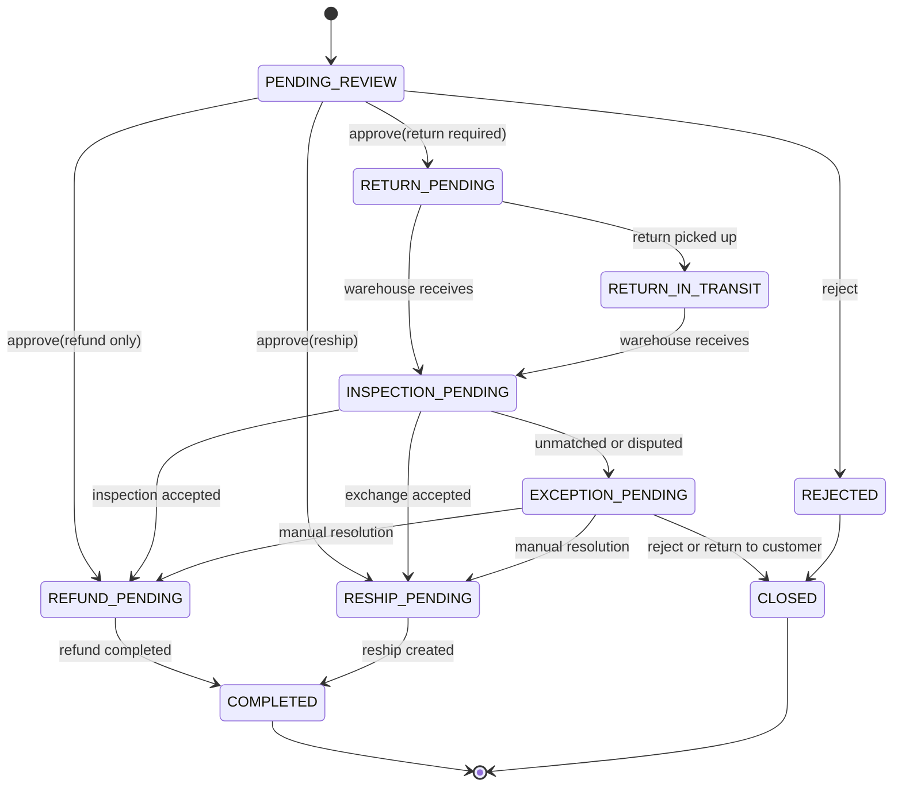

# REV-REQ-001 售后退货领域契约与处置规则

## 1. 业务目标

建立仅退款、退货退款、换货、补寄四类售后的统一业务合同，确保“申请不等于退款、到仓不等于可售、质检结果决定库存处置、退款与补寄均受原订单数量和金额上限约束”。

## 2. 限界上下文与数据主权

| 上下文 | 拥有事实 | 接收命令 | 生产事件 |
| --- | --- | --- | --- |
| OMS/售后 | 售后单、售后行、RMA、退款/补寄决策 | 创建、审核、驳回、确认质检、请求退款、创建补寄 | `AfterSaleApproved`、`ReturnRequested`、`RefundRequested`、`ReshipRequested`、`AfterSaleCompleted` |
| TMS | 退货运输任务、运单、轨迹、到仓/异常 | `CreateReturnTransportRequested` | `ReturnPickedUp`、`ReturnArrived`、`ReturnTransportExceptionRaised` |
| WMS | 退货入库、实收、质检、上架/暂存 | `CreateReturnInboundRequested` | `ReturnReceived`、`ReturnInspected`、`ReturnPutawayCompleted` |
| 中央库存 | 可用、冻结、残次、报废余额与流水 | `ApplyReturnDispositionRequested` | `ReturnDispositionApplied`、`ReturnDispositionFailed` |
| BMS | 退款累计、支付请求与支付回执 | `RequestRefund` | `RefundCompleted`、`RefundFailed` |

OMS 不修改物流、仓内、库存或支付事实；下游不修改售后策略和客户承诺。

## 3. 售后类型与前置条件

| 类型 | 是否需要退货 | 退款条件 | 后续动作 |
| --- | --- | --- | --- |
| `REFUND_ONLY` 仅退款 | 否 | 审核通过即可请求退款 | 无 WMS/TMS 命令 |
| `RETURN_REFUND` 退货退款 | 是 | 默认收到 `ReturnInspected` 后按验收数量/金额退款 | TMS 退货 + WMS 入库 + 库存处置 |
| `EXCHANGE` 换货 | 是 | 退回商品验收后创建补寄；价差另行退款/补款 | 退货链路 + `ReshipRequested` |
| `RESHIP` 补寄 | 否 | 审核确认漏发/破损后创建补寄，不自动退款 | `ReshipRequested` |

## 4. 聚合与不变量

### 4.1 售后单聚合

- 聚合根：`AfterSaleOrder`；实体：`AfterSaleLine`；值对象：金额、数量、RMA、处置数量。
- 同一订单行累计申请数量不得超过原已履约数量，扣除已完成和进行中售后占用。
- 申请退款金额及历史累计退款不得超过该订单行可退金额；金额由 OMS 决策，BMS 再做支付累计保护。
- `RETURN_REFUND/EXCHANGE` 审核后必须生成 RMA，未质检不得自动请求退款或补寄；人工例外必须记录审批人和原因。
- 售后完成必须满足其类型对应结果：退款完成、补寄履约创建或驳回/异常结论已确认。

### 4.2 WMS 退货质检

处置数量使用以下互斥分类：

| 处置码 | 含义 | 中央库存动作 |
| --- | --- | --- |
| `SELLABLE` | 良品且已上架 | 增加目标仓可用库存 |
| `DEFECTIVE` | 残次/不可售 | 增加残次库存，不增加可用 |
| `FROZEN` | 待责任判定/待索赔/待退供 | 增加冻结库存 |
| `SCRAPPED` | 已批准报废 | 只记报废流水，不增加实物可用 |
| `UNMATCHED` | 无单、错货、多退 | 暂存异常区，不自动记中央库存、不自动退款 |

数量不变量：`实收量 = 良品 + 残次 + 冻结 + 报废 + 无单异常`；所有数量非负且实收量不得超过人工确认后的可接收上限。

## 5. 状态机

## 6. 命令与事件合同

所有命令携带 `commandId/idempotencyKey/afterSaleNo/operatorId/occurredAt`；所有事件携带 `eventId/eventType/eventVersion/sourceSystem/afterSaleNo/occurredAt/traceId`。

| 合同 | 最小业务载荷 | 幂等键 |
| --- | --- | --- |
| `CreateReturnTransportRequested` | RMA、客户取件地址快照、退货仓地址快照、包裹/SKU/数量、责任方 | `afterSaleNo:RETURN_TRANSPORT:v{version}` |
| `CreateReturnInboundRequested` | RMA、原订单、退货仓、货主、SKU/批次、应退数量 | `afterSaleNo:RETURN_INBOUND:v{version}` |
| `ReturnInspected` | RMA、实收量、五类处置量、质检结论、照片附件引用、WMS 版本 | `WMS:eventId` |
| `ApplyReturnDispositionRequested` | 货主、仓库、SKU/批次、五类可入账处置量、WMS 质检事件号 | `afterSaleNo:DISPOSITION:eventId` |
| `RequestRefund` | 售后单、原支付单、币种、申请金额、原因、退款序号 | `afterSaleNo:REFUND:{sequence}` |
| `ReshipRequested` | 原订单、售后单、SKU、补寄数量、收货地址快照 | `afterSaleNo:RESHIP:v{version}` |

## 7. 异常、补偿、权限与审计

1. 客户未寄回：超期后关闭 RMA；不得回补库存或自动退款。
2. 无单/错货/多退：WMS 暂存，OMS 进入 `EXCEPTION_PENDING`，人工绑定后使用新事件号重放处置。
3. 库存处置部分失败：Inbox 保持失败状态，可重放；OMS 在收到 `ReturnDispositionApplied` 前不宣称实物闭环。
4. 退款失败：售后保持 `REFUND_PENDING`，允许同一退款序号重试，不新增累计金额。
5. 权限：审核/驳回属于 OMS 组织范围；收货/质检属于 WMS 仓库范围；库存处置属于货主+仓库范围；退款属于 BMS 财务组织范围。
6. 审计：人工例外、部分退款、无货退款、报废、异常关闭必须记录原因、操作人、审批人、前后状态与数量/金额快照。

## 8. 验收结论

- OMS、TMS、WMS、中央库存、BMS 数据主权、命令、事件与幂等边界已明确。
- 良品、残次、冻结、报废、无单异常五类处置及数量守恒已明确。
- `REV-REQ-002` 按本合同扩展 OMS 聚合、持久化、接口、Outbox/Inbox 与测试；`REV-REQ-003` 实现 WMS 质检和库存处置。
