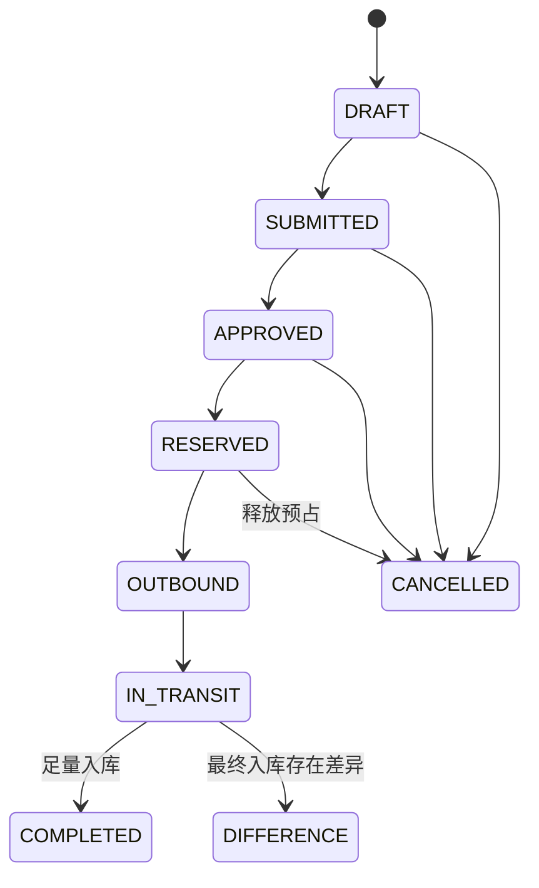

# TRF-REQ-001 调拨领域模型与跨上下文契约

## 1. 业务目标

在不直接跨库修改 WMS/TMS 事实的前提下，建立从调拨申请、预占、出库、在途、入库到差异处置的数量守恒闭环。

## 2. 领域边界

| 上下文 | 数据主权 | 职责 |
| --- | --- | --- |
| 中央库存 | 调拨单、预占、在途与差异数量 | 决定状态、守恒和补偿 |
| WMS | 调出/调入作业单、扫描与质检事实 | 执行出入库并发布事实 |
| TMS | 运输任务、运单、轨迹与签收事实 | 执行仓间运输 |

## 3. 聚合与不变量

- 聚合根：`StockTransferAggregate`。
- 首切片一个聚合表示一个 SKU+批次；多 SKU 可用调拨批次号组合。
- 源仓与目标仓不得相同，申请量必须大于零。
- `reservedQty <= requestedQty`，`outboundQty <= reservedQty`。
- 终态必须满足 `receivedQty + differenceQty = outboundQty`。
- 已出库不允许取消，只能通过退回/差异处置补偿。

## 4. 命令与事件

| 命令 | 产生事件 | 幂等键 |
| --- | --- | --- |
| Create/Submit/ApproveTransfer | TransferCreated/Submitted/Approved | 请求头幂等键 |
| ReserveTransferStock | TransferStockReserved/ReservationFailed | `transferNo:reserve` |
| CreateTransferOutbound | TransferOutboundRequested | `transferNo:outbound` |
| RecordTransferOutbound | TransferOutboundCompleted | WMS 事件号 |
| CreateTransferTransport | TransferTransportRequested | `transferNo:transport` |
| MarkTransferInTransit | TransferInTransit | TMS 事件号 |
| RecordTransferReceipt | TransferReceived/TransferDifferenceRaised | WMS 事件号 |

## 5. 补偿

| 失败点 | 补偿 |
| --- | --- |
| 预占失败 | 保留已审批状态，人工调整数量/仓库后重试 |
| WMS 未接单 | 保留预占，重试命令；取消时释放预占 |
| 部分/短少入库 | 进入差异态，不自动冲销在途 |
| 重复事件 | Inbox 按 `sourceSystem + eventCode` 幂等返回 |

## 6. 状态图

## 7. 验收

`StockTransferAggregateTest` 已覆盖正向状态机、同仓拒绝、越级操作、预占数量和终态守恒。
