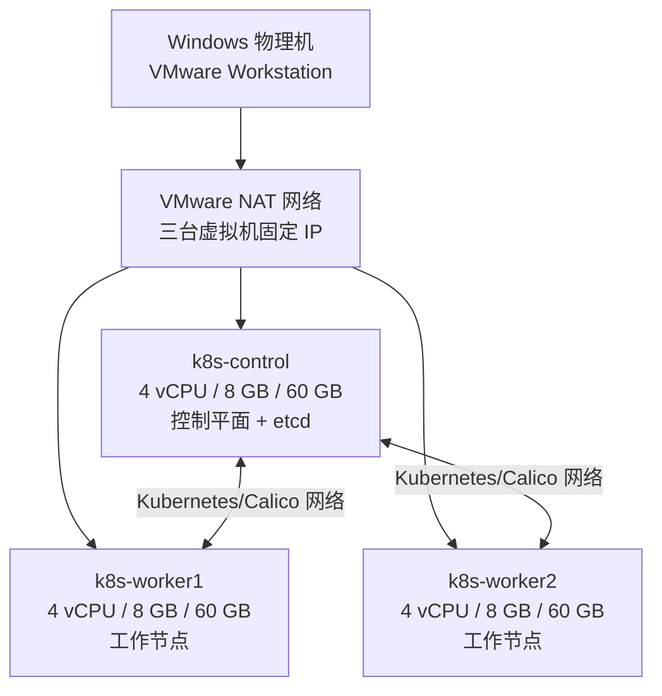

# Windows + VMware 三节点 Kubernetes 安装手册

> 适用日期：2026-07-20  
> 目标：在一台 Windows 电脑上，通过 VMware 创建 3 台 Ubuntu Server 虚拟机，每台 8 GB 内存，最后从 Windows PowerShell 一条命令安装 Kubernetes。  
> 版本：Ubuntu Server 24.04 LTS、Kubernetes v1.36、containerd、Calico v3.32.1。

## 1. 最终架构



| 节点 | 角色 | 推荐配置 | 示例 IP |
| --- | --- | --- | --- |
| `k8s-control` | 控制平面、etcd | 4 vCPU、8 GB、60 GB | `192.168.80.10` |
| `k8s-worker1` | 工作节点 | 4 vCPU、8 GB、60 GB | `192.168.80.11` |
| `k8s-worker2` | 工作节点 | 4 vCPU、8 GB、60 GB | `192.168.80.12` |

这是单控制平面学习/开发集群，不是高可用生产集群。`k8s-control` 停机后，集群 API 和调度不可用。生产环境应使用至少 3 个控制平面节点、独立负载均衡入口，并避免把全部节点放在同一台物理机上。

## 2. 安装前必须满足

### 2.1 Windows 物理机资源

| 项目 | 最低可用 | 推荐 |
| --- | --- | --- |
| CPU | 8 核/16 线程并支持 VT-x 或 AMD-V | 12 核/24 线程以上 |
| 内存 | 32 GB | 40～64 GB |
| 可用磁盘 | 180 GB，虚拟磁盘使用精简置备 | 250 GB 以上 SSD/NVMe |
| 系统 | 64 位 Windows 10/11 | Windows 11 |
| 软件 | VMware Workstation Pro、Windows OpenSSH Client | 使用当前受支持版本 |

三台虚拟机仅内存就占 24 GB。若物理机只有 24 GB，不要同时给三台虚拟机各 8 GB；Windows 和 VMware 本身也需要内存，否则会严重换页甚至安装失败。

在“任务管理器 → 性能 → CPU”确认“虚拟化：已启用”。若未启用，进入 BIOS/UEFI 打开 Intel VT-x/VT-d 或 AMD-V/SVM。

### 2.2 网络访问

三台 Ubuntu 虚拟机必须：

- 能互相访问，且 Windows 能通过 SSH 访问它们的 22 端口；
- 能解析 DNS、校准时间并访问互联网；
- 能访问 `archive.ubuntu.com`、`security.ubuntu.com`、`pkgs.k8s.io`、`registry.k8s.io`、`raw.githubusercontent.com`、`quay.io` 和 `docker.io`；
- 虚拟机网段不能与 Pod 网段 `10.244.0.0/16`、Service 网段 `10.96.0.0/12` 重叠。
- 本手册面向同一受信 VMware NAT 网段的实验集群，要求 Ubuntu UFW 处于 inactive；若必须启用防火墙，应先按 Kubernetes 与 Calico 官方端口清单设计规则，不能直接套用本脚本。

如果公司代理、VPN、运营商或防火墙阻断上述站点，本手册的一键脚本会失败；先解决网络访问，不要随意使用来源不明的镜像脚本。

## 3. 安装 VMware 和 Ubuntu

### 3.1 准备安装介质

1. 从 [VMware 官方页面](https://www.vmware.com/products/desktop-hypervisor/workstation-and-fusion)安装 VMware Workstation Pro。
2. 从 [Ubuntu 官方下载页](https://ubuntu.com/download/server)下载 **Ubuntu Server 24.04 LTS amd64 ISO**。
3. 校验 ISO 的 SHA256 后再使用。

### 3.2 创建第一台虚拟机

在 VMware 中选择“Create a New Virtual Machine”，按下表设置：

| 设置项 | 值 |
| --- | --- |
| 安装镜像 | Ubuntu Server 24.04 LTS amd64 ISO |
| 虚拟机名 | `k8s-control` |
| CPU | 1 个处理器、4 个内核 |
| 内存 | 8192 MB |
| 磁盘 | 60 GB，Split 或 single file 均可，建议精简置备 |
| 网络 | NAT，三台机器必须使用同一个 VMnet |
| 固件 | UEFI 默认值即可 |

启动虚拟机并安装 Ubuntu：

1. 网络暂时使用 DHCP。
2. 存储选择整块虚拟磁盘，默认 LVM 即可。
3. 用户名统一使用 `ubuntu`；设置一个可靠密码。
4. 主机名输入 `k8s-control`。
5. 勾选 **Install OpenSSH server**。
6. 不需要安装桌面环境，也不需要选择额外 Snap 软件。
7. 安装结束后重启并弹出 ISO。

登录后执行：

```bash
sudo apt update
sudo apt -y full-upgrade
sudo reboot
```

### 3.3 复制出两个工作节点

1. 完全关闭 `k8s-control`，不要在挂起状态克隆。
2. VMware → VM → Manage → Clone。
3. 选择当前状态，选择 **Create a full clone**。
4. 分别命名为 `k8s-worker1`、`k8s-worker2`。
5. 打开每台克隆机的 Settings → Network Adapter → Advanced，点击 Generate，确保三台虚拟机 MAC 地址不同。

完整克隆还会复制 Linux machine-id 和 SSH 主机密钥。**必须**在两台 worker 的 VMware 控制台中分别执行以下命令，给克隆机生成独立身份：

```bash
sudo rm -f /etc/machine-id /var/lib/dbus/machine-id
sudo systemd-machine-id-setup
sudo ln -s /etc/machine-id /var/lib/dbus/machine-id
sudo rm -f /etc/ssh/ssh_host_*
sudo ssh-keygen -A
sudo reboot
```

这些命令只应在刚克隆出的 `k8s-worker1`、`k8s-worker2` 上执行，不要在原始 `k8s-control` 上执行。脚本会在安装时设置最终 Linux 主机名。完整克隆比链接克隆占空间更多，但不依赖父虚拟磁盘，后续更稳妥。

## 4. 为三台虚拟机设置固定 IP

Kubernetes 节点 IP 不能在重启后变化。推荐在 VMware NAT 的 DHCP 配置中按 MAC 地址做地址保留；如果你的 VMware 版本没有图形化保留功能，再使用下面的 Netplan 静态地址方案。

### 4.1 查出当前网段

在三台虚拟机中分别执行：

```bash
ip -4 addr
ip route
```

记录：

- 网卡名，例如 `ens33`；
- NAT 网段和掩码，例如 `192.168.80.0/24`；
- 默认网关，例如 `192.168.80.2`；
- DNS 地址。

本文示例使用 `192.168.80.10～12`，你必须替换成自己 VMware NAT 网段内、且不在 DHCP 动态分配池中、未被其他设备占用的地址。不要机械照抄示例 IP。

### 4.2 Netplan 静态 IP 方案

先查看实际配置文件和网卡名：

```bash
ls /etc/netplan
ip -br link
```

在 `k8s-control` 执行以下命令。把 `ens33`、IP、网关和 DNS 替换为实际值：

```bash
sudo nano /etc/netplan/99-k8s-static.yaml
```

```yaml
network:
  version: 2
  renderer: networkd
  ethernets:
    ens33:
      dhcp4: false
      addresses:
        - 192.168.80.10/24
      routes:
        - to: default
          via: 192.168.80.2
      nameservers:
        addresses:
          - 192.168.80.2
          - 1.1.1.1
```

应用前先使用带自动回滚的命令，避免配置错误导致 SSH 永久断开：

```bash
sudo chmod 600 /etc/netplan/99-k8s-static.yaml
sudo netplan try
```

确认网络正常后，在两台工作节点重复操作，仅把地址改为 `.11`、`.12`。如果 `/etc/netplan/` 中原文件仍启用同一网卡 DHCP，应将该网卡配置改为静态或禁用旧文件，避免两份配置冲突。

### 4.3 从 Windows 验证

打开 PowerShell：

```powershell
ping 192.168.80.10
ping 192.168.80.11
ping 192.168.80.12

ssh ubuntu@192.168.80.10
ssh ubuntu@192.168.80.11
ssh ubuntu@192.168.80.12
```

首次连接输入 `yes` 接受主机指纹。三台都能 SSH 登录后才继续。

## 5. 把一键安装文件放到 Windows

需要下面两个文件，并且必须在同一目录：

- [`install-k8s.ps1`](../deploy/kubernetes-vmware/install-k8s.ps1)
- [`k8s-node.sh`](../deploy/kubernetes-vmware/k8s-node.sh)

例如复制到 Windows：

```text
C:\k8s-installer\
├── install-k8s.ps1
└── k8s-node.sh
```

确认 Windows 已安装 OpenSSH Client：

```powershell
ssh -V
scp
```

如果提示找不到 `ssh`，以管理员身份打开 PowerShell：

```powershell
Add-WindowsCapability -Online -Name OpenSSH.Client~~~~0.0.1.0
```

## 6. 一键安装 Kubernetes

以普通 PowerShell 打开安装目录：

```powershell
cd C:\k8s-installer
Set-ExecutionPolicy -Scope Process Bypass

.\install-k8s.ps1 `
  -ControlPlaneIp "192.168.80.10" `
  -WorkerIps "192.168.80.11","192.168.80.12" `
  -SshUser "ubuntu"
```

把三个 IP 替换为第 4 节设置的实际固定 IP。整条命令只需启动一次；执行期间会依次提示三台虚拟机的登录/`sudo` 密码。脚本会自动完成：

1. 校验三台机器的 SSH 端口；
2. 设置唯一主机名；
3. 关闭 swap，加载内核模块，开启 IPv4 转发；
4. 安装并配置 containerd + systemd cgroup；
5. 从 `pkgs.k8s.io` 安装并锁定 Kubernetes v1.36；
6. 初始化控制平面并安装 Calico；
7. 生成临时 join token，将两个工作节点加入集群；
8. 等待 3 个节点全部 `Ready`；
9. 创建两个 nginx Pod 做真实调度冒烟测试。

首次安装需要下载多个软件包和容器镜像，通常需要 10～30 分钟。不要在执行期间关闭虚拟机、Windows、VPN 或 PowerShell 窗口。

## 7. 验收标准

脚本末尾应输出 `Kubernetes 安装成功`。随后登录控制平面：

```powershell
ssh ubuntu@192.168.80.10
```

执行：

```bash
kubectl get nodes -o wide
kubectl get pods -A
kubectl -n k8s-smoke-test get pods -o wide
```

验收结果必须满足：

- 恰好 3 个节点，名称为 `k8s-control`、`k8s-worker1`、`k8s-worker2`；
- 3 个节点的状态都是 `Ready`；
- `kube-system` 和 `calico-system` 中的核心 Pod 是 `Running`；
- `k8s-smoke-test` 中两个 nginx Pod 都是 `Running`，通常会调度到工作节点。

删除冒烟测试：

```bash
kubectl delete namespace k8s-smoke-test
```

## 8. 常见故障

| 现象 | 排查命令/原因 | 处理 |
| --- | --- | --- |
| Windows 连不上 22 端口 | `Test-NetConnection <IP> -Port 22` | 确认 VM 已开机、IP 正确、安装了 OpenSSH、三台使用同一 VMnet |
| `kubeadm` 报 swap | `swapon --show` | `sudo swapoff -a`，并检查 `/etc/fstab` 是否仍有 swap |
| 节点长期 `NotReady` | `kubectl describe node <节点>`、`kubectl get pods -A` | 优先检查 Calico 镜像下载、节点 IP、主机防火墙与网段冲突 |
| 脚本提示 UFW 已启用 | `sudo ufw status` | 仅限受信实验 VMnet 可执行 `sudo ufw disable`；其他环境应按官方端口清单精确放行 |
| containerd/kubelet 异常 | `sudo systemctl status containerd kubelet --no-pager -l` | 确认两者均使用 systemd cgroup，查看 `sudo journalctl -u kubelet -n 200` |
| 拉取镜像超时 | `sudo crictl pull registry.k8s.io/pause:3.10` | 修复 DNS、代理、VPN 或站点访问，不要反复执行初始化 |
| raw.githubusercontent.com 超时 | `curl -I https://raw.githubusercontent.com` | Calico 清单无法下载，先修复网络后重试 |
| IP 与 Pod 网段冲突 | `ip route` | 将 VMware NAT 改到非 `10.244.0.0/16`、非 `10.96.0.0/12` 网段后重建 |
| 主机名重复 | `hostnamectl` | 三台必须分别为 `k8s-control`、`k8s-worker1`、`k8s-worker2` |

查看关键日志：

```bash
sudo journalctl -u containerd -n 200 --no-pager
sudo journalctl -u kubelet -n 200 --no-pager
kubectl get events -A --sort-by=.lastTimestamp
kubectl get pods -A -o wide
```

## 9. 失败后重新安装

先在控制平面删除工作节点记录：

```bash
kubectl delete node k8s-worker1 k8s-worker2
```

然后在三台虚拟机分别执行：

```bash
sudo kubeadm reset -f
sudo rm -rf /etc/cni/net.d /var/lib/cni
sudo systemctl restart containerd
rm -rf "$HOME/.kube"
```

重启三台虚拟机，再从 Windows 重新执行第 6 节的一键命令。`kubeadm reset` 是破坏性操作，只能用于确认不要保留的实验集群。

## 10. 日常启停与快照

- 启动顺序：先 `k8s-control`，待其启动后再开两台 worker。
- 关闭前，在节点执行正常关机；不要直接强制关闭 VMware。
- 物理机内存紧张时可以关闭整个集群，但不要只长期关闭控制平面。
- VMware 快照适合安装前临时回退，不等于 etcd 备份；不要在运行中的三台节点上分别拍摄不一致快照后当作集群备份。

## 11. 官方依据

- Kubernetes 官方说明 kubeadm 节点至少需要 2 GB 内存、控制平面至少 2 CPU，并要求节点之间完全互通：[Creating a cluster with kubeadm](https://kubernetes.io/docs/setup/production-environment/tools/kubeadm/create-cluster-kubeadm/)。
- Kubernetes v1.36 的 Debian/Ubuntu 软件仓库地址、安装和锁定命令来自：[Installing kubeadm](https://kubernetes.io/docs/setup/production-environment/tools/kubeadm/install-kubeadm/)。
- swap 默认会阻止 kubelet 启动；持久关闭需要同时处理系统配置：[Swap configuration](https://kubernetes.io/docs/setup/production-environment/tools/kubeadm/install-kubeadm/#swap-configuration)。
- kubelet 和 containerd 应统一使用 `systemd` cgroup，且需要开启 IPv4 转发：[Container runtimes](https://kubernetes.io/docs/setup/production-environment/container-runtimes/)。
- 控制平面和工作节点端口清单见：[Ports and Protocols](https://kubernetes.io/docs/reference/networking/ports-and-protocols/)。
- Calico Operator 与 CRD 的安装方式来自 Calico 官方 v3.32 文档：[Calico quickstart](https://docs.tigera.io/calico/latest/getting-started/kubernetes/quickstart)。
- Ubuntu Server 24.04 LTS 推荐至少 3 GB 内存、25 GB 存储；本方案按 Kubernetes 工作负载提高到每台 8 GB/60 GB：[Ubuntu Server system requirements](https://ubuntu.com/server/docs/reference/installation/system-requirements/)。
- Ubuntu 静态地址使用 Netplan 的 `addresses`、默认路由和 `nameservers`：[Configuring networks](https://ubuntu.com/server/docs/explanation/networking/configuring-networks/)。

## 继续上下文

当前结论：1 控制平面 + 2 工作节点，Ubuntu 24.04、Kubernetes v1.36、containerd、Calico v3.32.1。  
关键假设：Windows 至少 32 GB 内存，三台 VM 可访问官方软件仓库和镜像仓库。  
待决问题：正式生产环境需另行设计高可用、备份、入口、存储和监控。  
下一步：按第 3～6 节创建虚拟机、固定 IP 并执行一键脚本。
