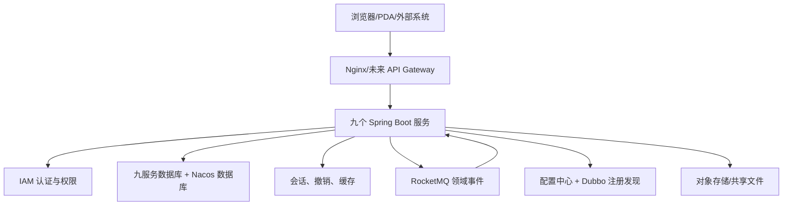
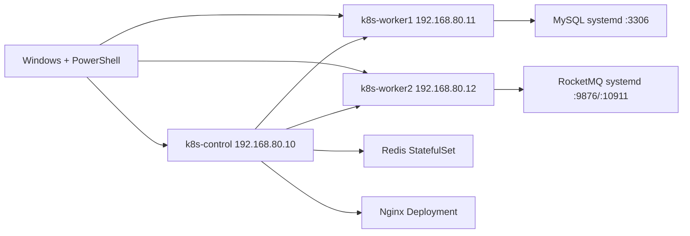

# 供应链系统完整部署手册

> 适用日期：2026-07-30  
> 适用范围：本地开发、集成验证、Windows + VMware 实验集群，以及生产部署准备。  
> 本文整合原 `docs/10~15` 和仓库 `deploy/`、`middleware-stack/`、`project/backend/bin/` 的实际能力，是当前唯一部署说明。

## 1. 文档目标与真实完成边界

本手册解决的不是“如何分别安装六个组件”，而是如何让九个供应链服务从基础设施、配置、构建、启动到验收形成可重复的运行闭环。

当前仓库提供三种部署轮廓：

| 轮廓 | 用途 | 当前状态 | 推荐入口 |
| --- | --- | --- | --- |
| Mac Docker 本地开发 | 日常编码、真实 MySQL/Redis/RocketMQ/Nacos、九服务跨进程验证 | 已具备可执行闭环 | `middleware-stack/bin/dev.sh` + `project/backend/bin/dev.sh` |
| Windows + VMware 集成实验 | 三节点 Kubernetes、原生 MySQL/RocketMQ、K8s Redis/Nginx | 基础设施部分可执行 | `deploy/kubernetes-vmware/`、`deploy/middleware-native/`、`deploy/redis-k8s/`、`deploy/nginx-k8s/` |
| 生产/预演环境 | 高可用、应用容器化、监控、备份恢复、容量和发布演练 | 尚未形成完整自动化 | `OPS-REQ-001/002`、`INT-REQ-005B` |

必须明确：仓库目前没有九个 Java 服务的 Kubernetes Deployment/Service/Ingress、Nacos 的 VMware/Kubernetes 自动化部署，也没有完整生产一键安装。因此不能把 VMware 基础设施安装成功声明为“供应链系统已部署完成”。

## 2. 部署设计原则

### 2.1 运行边界



### 2.2 强制规则

1. MySQL、Redis、RocketMQ、Nacos 必须先健康，再启动九个业务服务。
2. `test` 与 `prod` 使用不同 Nacos namespace、数据库账号和秘密材料。
3. 密码、Token、客户端密钥不得写入 Git、命令历史、普通日志或 ConfigMap。
4. 生产环境不得使用 `change-me`、默认 Nacos 密码、单节点数据库或本地不可共享文件目录。
5. RocketMQ 业务链路必须是 Outbox → Broker → Inbox；跨上下文业务事件不提供 HTTP 投递或消费入口。
6. 同步 Dubbo 调用必须有真实 Provider、注册发现、超时和失败关闭；Nacos 不转发 RPC 流量。
7. 部署完成必须以验收矩阵为准，不能只看进程或 Pod 为 `Running`。

## 3. 仓库部署资产与支持状态

| 资产 | 作用 | 状态 | 说明 |
| --- | --- | --- | --- |
| [`middleware-stack/docker-compose.yml`](../middleware-stack/docker-compose.yml) | Mac 本地 MySQL、Redis、RocketMQ、Nacos、Nginx | 推荐 | 当前本地开发唯一完整中间件入口 |
| [`middleware-stack/bin/dev.sh`](../middleware-stack/bin/dev.sh) | 生成密码、启动、健康检查、Topic/Group 初始化 | 推荐 | 支持 up/down/restart/status/logs/check/reset |
| [`middleware-stack/bin/nacos-config.sh`](../middleware-stack/bin/nacos-config.sh) | 创建 test/prod namespace 并发布 10 个 DataId | 推荐 | 自动删除已撤销的 integration/report 配置 |
| [`project/backend/bin/dev.sh`](../project/backend/bin/dev.sh) | 构建并启动九个 Java 服务 | 推荐 | 使用 JDK 17、本地 Maven 仓库和 test profile |
| [`deploy/kubernetes-vmware/`](../deploy/kubernetes-vmware/) | Windows 一键初始化三节点 kubeadm 集群 | 实验可用 | 单控制平面，不是生产高可用 |
| [`deploy/middleware-native/`](../deploy/middleware-native/) | Ubuntu 原生 MySQL 与 RocketMQ | 实验可用 | 单 MySQL、单 Broker，适合集成验证 |
| [`deploy/redis-k8s/`](../deploy/redis-k8s/) | K8s 单实例 Redis + ACL + local PV | 实验可用 | 节点绑定，不是 Sentinel/Cluster |
| [`deploy/nginx-k8s/`](../deploy/nginx-k8s/) | K8s Nginx + Basic Auth | 实验可用 | 当前为静态页/基础入口，不是九服务生产网关 |
| [`deploy/k3s/install-k3s.sh`](../deploy/k3s/install-k3s.sh) | Linux 单节点 K3s | 实验适配 | 与 VMware 三节点方案二选一 |
| [`deploy/one-click.sh`](../deploy/one-click.sh) | 旧 Linux 一键入口 | 不可用 | 依赖缺失的 `docker-compose.yml`、`status.sh`、`backup.sh`，禁止作为当前入口 |
| `deploy/linux/install-infra.sh` | 旧 Compose 安装器 | 不可用 | `deploy/linux/docker-compose.yml` 不存在 |

`deploy/one-click.sh` 和 `deploy/linux/` 暂时保留用于追踪历史意图；在缺失资产补齐并通过验证前，不得在正式操作中使用。

## 4. 版本与端口基线

### 4.1 核心版本

| 场景 | 组件版本 |
| --- | --- |
| Java 服务 | JDK 17、Spring Boot 4.0.0、Dubbo 3.3.6 |
| Mac 本地中间件 | MySQL 8.4.10、Redis 8.8.1、RocketMQ 5.5.0、Nacos 3.2.3、Nginx 1.30.4 |
| VMware Kubernetes | Ubuntu 24.04、Kubernetes v1.36、containerd、Calico v3.32.1 |
| VMware 原生 RocketMQ | RocketMQ 5.5.0、OpenJDK 17 |
| K8s Redis/Nginx | Redis 8.8.0、Nginx 1.30.4 |

版本只能通过更新清单、脚本、兼容测试和本文统一升级，不能单独改文档或镜像标签。

### 4.2 九服务端口

| 服务 | 端口 | 数据库 |
| --- | ---: | --- |
| IAM | 8097 | `scm_iam` |
| 主数据 | 8098 | `scm_mdm` |
| OMS | 8099 | `scm_oms` |
| TMS | 8100 | `scm_tms` |
| 供应商 | 8101 | `scm_supplier` |
| 采购 | 8102 | `scm_purchase` |
| WMS | 8103 | `scm_wms` |
| 中央库存 | 8104 | `scm_inventory` |
| BMS | 8110 | `scm_bms` |

### 4.3 中间件端口

| 组件 | 本地地址/端口 | 用途 |
| --- | --- | --- |
| MySQL | `127.0.0.1:3306` | 九服务和 Nacos 持久化 |
| Redis | `127.0.0.1:6379` | IAM 会话/撤销及业务缓存 |
| RocketMQ NameServer | `127.0.0.1:9876` | Remoting 客户端发现 |
| RocketMQ Proxy | `127.0.0.1:8081` | 当前 Java 配置的 5.x gRPC endpoint |
| Nacos API/SDK | `127.0.0.1:8848` | 配置、注册与发现 |
| Nacos 原始控制台 | `127.0.0.1:8080` | 本地控制台 |
| Nginx 保护入口 | `127.0.0.1:8088` | 反向代理 Nacos 控制台 |

## 5. 推荐路径 A：Mac Docker 本地开发

这是当前最完整、最适合开发和九服务真实 API 基线的部署路径。

### 5.1 前置条件

- macOS，Docker Desktop 已启动并分配至少 8 GiB 内存。
- JDK 17、Maven、curl、openssl、bash 可用。
- 端口 3306、6379、8080、8081、8088、8848、9876、8097～8110 未被占用。

### 5.2 启动中间件

```bash
cd middleware-stack
./bin/dev.sh up
```

首次执行会：

1. 生成权限为 `600` 的 `.env` 随机密码文件；
2. 生成 Redis ACL 和 Nginx htpasswd；
3. 初始化 MySQL 业务库和 Nacos 库；
4. 启动 MySQL、Redis、RocketMQ NameServer/Broker+Proxy、Nacos、Nginx；
5. 初始化 Nacos 管理员；
6. 创建当前已知的 RocketMQ Topic 和 Consumer Group；
7. 验证鉴权、连通性和容器内存限制。

检查状态：

```bash
./bin/dev.sh status
./bin/dev.sh check
./bin/dev.sh logs
```

### 5.3 发布 Nacos 配置

```bash
./bin/nacos-config.sh
```

脚本应创建：

| namespace | group | DataId 数量 |
| --- | --- | ---: |
| `scm-test` | `SCM_GROUP` | 10 |
| `scm-prod` | `SCM_GROUP` | 10 |

每个环境包含一个公共配置和九个服务配置：

```text
scm-common-{env}.yaml
iam-service-{env}.yaml
mdm-service-{env}.yaml
oms-service-{env}.yaml
tms-service-{env}.yaml
supplier-service-{env}.yaml
purchase-service-{env}.yaml
wms-service-{env}.yaml
inventory-service-{env}.yaml
bms-service-{env}.yaml
```

`integration-service` 和 `report-service` 已撤销，发布脚本会删除遗留 DataId，不得恢复。

### 5.4 启动九个 Java 服务

```bash
cd project/backend
./bin/dev.sh up
./bin/dev.sh status
```

脚本执行顺序：定位 JDK 17 → 使用本地 Maven 仓库构建 `test` JAR → 启动九服务 → 等待端口监听 → 输出失败日志。

常用命令：

```bash
./bin/dev.sh logs iam-service
./bin/dev.sh restart
./bin/dev.sh down
```

### 5.5 本地 Dubbo 真实 RPC

Dubbo Provider 和 Consumer 都运行在 Mac 进程中时：

1. Provider 使用真实 `@DubboService` 并向 Nacos 注册；
2. 每个 Provider 使用不同的 Triple 端口；
3. Consumer 通过 `@DubboReference` 或等价方式从 Nacos发现 Provider 地址；
4. Nacos 只做注册发现，Consumer 直接连接 Provider；
5. Provider 重启后 Consumer 必须能恢复发现；未注册、超时和契约错误必须失败关闭。

如果 Java 服务进入容器，Provider 不能继续注册 `127.0.0.1`，必须注册容器网络中 Consumer 可达的地址。

### 5.6 本地验收

```bash
cd middleware-stack
./bin/dev.sh check

cd ../project/backend
./bin/dev.sh status

cd ..
./qa/api-baseline.sh
```

最终还需执行前端测试、浏览器 E2E 和九服务 401/403/幂等/乐观锁基线，具体以开发总纲 `QA-NEXT-001` 为准。

### 5.7 停止与重置

```bash
cd middleware-stack
./bin/dev.sh down
```

删除本地中间件数据卷：

```bash
./bin/dev.sh reset
```

`reset` 会删除 MySQL、Redis、RocketMQ、Nacos 数据卷，属于破坏性操作；仅在确认无需保留本地数据时执行。

## 6. 路径 B：Windows + VMware 三节点集成实验环境

### 6.1 推荐拓扑



该方案复用 worker 运行原生中间件，只适合个人或集成实验。Kubernetes 调度器无法感知 systemd MySQL/RocketMQ 的真实资源占用，部署 Pod 时必须预留资源。

### 6.2 物理机与虚拟机最低要求

| 项目 | 最低 | 推荐 |
| --- | --- | --- |
| Windows CPU | 8 核/16 线程 | 12 核/24 线程以上 |
| Windows 内存 | 32 GiB | 40～64 GiB |
| 可用磁盘 | 180 GiB | 250 GiB SSD/NVMe |
| 每台 VM | 4 vCPU、8 GiB、60 GiB | 按业务 Pod 继续扩容 |

三台 VM 使用同一 VMware NAT 网段和不同 MAC、machine-id、SSH host key。节点固定 IP 不能与 Pod 网段 `10.244.0.0/16` 或 Service 网段 `10.96.0.0/12` 重叠。

### 6.3 准备节点

节点名和示例 IP：

| 节点 | IP | 角色 |
| --- | --- | --- |
| `k8s-control` | `192.168.80.10` | 单控制平面 + etcd |
| `k8s-worker1` | `192.168.80.11` | worker + MySQL |
| `k8s-worker2` | `192.168.80.12` | worker + RocketMQ |

推荐在 VMware DHCP 按 MAC 保留地址；使用 Netplan 时先执行 `sudo netplan try`，避免错误配置永久断开 SSH。

Windows 必须能执行：

```powershell
Test-NetConnection 192.168.80.10 -Port 22
Test-NetConnection 192.168.80.11 -Port 22
Test-NetConnection 192.168.80.12 -Port 22
```

### 6.4 安装 Kubernetes

把以下文件放到 Windows 同一目录：

- `deploy/kubernetes-vmware/install-k8s.ps1`
- `deploy/kubernetes-vmware/k8s-node.sh`

执行：

```powershell
Set-ExecutionPolicy -Scope Process Bypass
.\install-k8s.ps1 `
  -ControlPlaneIp "192.168.80.10" `
  -WorkerIps "192.168.80.11","192.168.80.12" `
  -SshUser "ubuntu"
```

脚本会关闭 swap、安装 containerd/kubeadm/kubelet/kubectl、初始化控制平面、安装 Calico、加入 worker，并创建两个 Nginx Pod 做调度冒烟。

验收：

```bash
kubectl get nodes -o wide
kubectl get pods -A
kubectl -n k8s-smoke-test get pods -o wide
```

必须恰好三个 `Ready` 节点，Calico/核心 Pod 正常，两个冒烟 Pod 成功调度。

### 6.5 原生安装 MySQL 与 RocketMQ

把以下文件放到 Windows 同一目录：

- `deploy/middleware-native/install-middleware.ps1`
- `deploy/middleware-native/install-mysql.sh`
- `deploy/middleware-native/install-rocketmq.sh`

执行：

```powershell
.\install-middleware.ps1 `
  -MysqlIp "192.168.80.11" `
  -RocketMqIp "192.168.80.12" `
  -SshUser "ubuntu"
```

安装结果：

- MySQL 监听固定 IP:3306，创建 `scm`/业务账号并限制来源网段；
- RocketMQ 运行 NameServer + 单 Broker，开启 ACL 2.0，创建测试 Topic；
- 密码只通过临时文件传输，脚本结束时清理；
- systemd 服务开机启动。

应用若使用当前 RocketMQ 5.x gRPC endpoint，需要 Proxy；原生脚本不启动 Proxy，只适合 Remoting 客户端。使用当前项目默认 `:8081` 配置前必须补 Proxy 或调整客户端和配置，不能直接照搬 Mac Compose endpoint。

### 6.6 K8s 部署 Redis

```powershell
.\deploy-redis.ps1 `
  -ControlPlaneIp "192.168.80.10" `
  -StorageNodeName "k8s-worker1" `
  -SshUser "ubuntu"
```

脚本会创建：

- namespace `scm-infra`；
- Redis ACL Secret；
- ConfigMap；
- 节点绑定 local PV/PVC；
- 单副本 StatefulSet；
- ClusterIP/Headless Service；
- startup/readiness/liveness Probe。

集群内地址：`redis.scm-infra.svc.cluster.local:6379`。

这是单节点 local PV。节点或虚拟磁盘丢失会导致不可用/数据丢失，生产必须改成可靠存储并采用 Sentinel/Cluster 或托管 Redis。

### 6.7 K8s 部署 Nginx

```powershell
.\deploy-nginx.ps1 `
  -ControlPlaneIp "192.168.80.10" `
  -NginxUser "scm_nginx" `
  -SshUser "ubuntu"
```

部署包括两副本 Nginx、滚动更新、PDB、非 root、只读根文件系统、健康探针和 Basic Auth Secret。

当前 Service 类型是 `ClusterIP`，只能集群内访问；对外访问需要根据环境选择 Ingress、NodePort、LoadBalancer 或端口转发。当前默认页面只是部署验收页，不是九服务生产反向代理配置。

### 6.8 VMware 路径尚缺的部分

| 缺口 | 影响 | 进入完整集成前的处理 |
| --- | --- | --- |
| Nacos 自动化部署 | Java 配置与 Dubbo 注册发现不可用 | 新增受支持的 Nacos+MySQL 部署资产并执行鉴权验收 |
| 九服务容器镜像 | 无法在 K8s 运行应用 | 增加 Dockerfile、镜像仓库和版本标签规范 |
| 九服务 K8s 清单 | 无 Deployment/Service/Secret/Config | 按服务生成资源、探针、资源限制和滚动策略 |
| API 入口路由 | Nginx 未代理九服务 | 冻结路由、TLS、鉴权转发和限流策略 |
| RocketMQ Proxy/客户端契约 | 当前原生安装与项目默认 endpoint 不一致 | 统一使用 Remoting 或补 RocketMQ Proxy |
| 对象存储 | TMS/BMS/OMS/MDM 多副本文件不可共享 | 部署 MinIO/S3 适配器并配置生命周期与权限 |

因此 VMware 路径当前只能验收基础设施，不能执行九服务最终 QA。

## 7. Java 环境、Maven Profile 与 Nacos

### 7.1 test/prod 构建

```bash
cd project/backend

# 默认 test
mvn -Ptest clean test
mvn -Ptest -DskipTests package

# prod 构建
mvn -Pprod -DskipTests package
```

Maven profile 负责构建时过滤默认配置；运行时环境变量和 Nacos 才是部署事实来源。

### 7.2 Nacos 优先级

每个服务导入：

1. `scm-common-{env}.yaml`
2. `{spring.application.name}-{env}.yaml`
3. 本地 `application-{env}.yml` 默认值
4. 环境变量覆盖

秘密材料应使用环境变量、Kubernetes Secret 或外部秘密管理系统；不得把生产密码发布到普通 Nacos 配置。

### 7.3 必要环境变量

| 类型 | 变量示例 |
| --- | --- |
| Nacos | `NACOS_SERVER_ADDR`、`NACOS_NAMESPACE`、`NACOS_GROUP`、用户名/密码 |
| MySQL | `MYSQL_URL`、`MYSQL_USERNAME`、`MYSQL_PASSWORD` |
| Redis | `REDIS_HOST`、`REDIS_PORT`、`REDIS_USERNAME`、`REDIS_PASSWORD` |
| RocketMQ | `ROCKETMQ_ENABLED`、`ROCKETMQ_ENDPOINTS`、各 Topic/Group |
| IAM JWT | active/previous `kid`、密钥、轮换窗口配置 |
| 文件 | OMS/TMS/BMS/MDM 对象存储或共享目录配置 |

`optional:nacos:` 只适合允许本地默认值启动的环境。生产是否允许 Nacos 不可用时继续启动必须逐服务明确；身份、权限和关键集成配置应失败关闭。

## 8. 数据库与完整 schema

1. 九服务分别使用独立 schema，不能共享业务表。
2. 应用账号只拥有自身 schema 的业务读写权限，不授予结构变更权限。
3. 首次启动前执行 `project/backend/bin/init-schema.sh`，将九服务各自的 `db/schema.sql` 导入空库。
4. 应用启动阶段不创建、不检查、不修改数据库结构；缺表或缺字段时直接启动/调用失败。
5. 生产结构变更先备份，再由 DBA 执行审核后的变更单；完成后必须把最终结构同步回对应服务的完整 schema。
6. 破坏性字段修改采用扩展—迁移—收缩；只有变更明确可逆且未产生新业务数据时才允许回退。

空库一键初始化示例：

```bash
cd project/backend
MYSQL_HOST=127.0.0.1 \
MYSQL_PORT=3306 \
MYSQL_ADMIN_USER=root \
MYSQL_ADMIN_PASSWORD='<root密码>' \
./bin/init-schema.sh
```

验收至少包含：

```sql
SELECT VERSION();
SHOW DATABASES;
SELECT table_schema, COUNT(*) AS table_count
FROM information_schema.tables
WHERE table_schema LIKE 'scm\_%'
GROUP BY table_schema
ORDER BY table_schema;
```

## 9. RocketMQ Topic、Group 与可靠性验收

当前本地脚本只初始化部分 Topic/Group。生产/集成环境必须根据九系统事件目录生成完整清单，至少记录：

| 项目 | 必须提供 |
| --- | --- |
| Producer | 服务、Topic、Tag、事件版本、消息 Key |
| Consumer | 服务、Group、订阅 Topic/Tag、线程数 |
| 安全 | ACL 用户、最小 Pub/Sub 权限、TLS/网络边界 |
| 可靠性 | 重试次数、死信/失败表、Inbox、人工重放 |
| 监控 | 堆积量、最老消息年龄、失败率、Broker 磁盘水位 |

验收不能只创建测试 Topic；必须完成真实 Outbox 投递、Broker 消费、Inbox 幂等、重复消息和失败重放。

## 10. 权限、密钥与秘密管理

- `.env` 权限必须为 `600`，不提交 Git。
- Kubernetes ConfigMap 只放非秘密配置；密码、JWT 密钥、RocketMQ ACL、Nacos凭据放 Secret 或外部秘密管理。
- IAM active/previous 密钥必须在九个资源服务一致，未知 `kid`、不受信算法和缺失配置失败关闭。
- Redis 默认用户关闭，应用账号限定 `scm:*` 键空间和所需命令。
- MySQL 禁止远程 root，应用账号限制来源网络和 schema。
- Nginx Basic Auth 只适合实验管理入口；生产用户认证由 IAM/OIDC 承担，外部入口必须 TLS。
- 密钥轮换应保留双密钥验证窗口、审计、撤销和回滚方案，不能直接覆盖旧密钥。

## 11. 启动、发布与回滚顺序

### 11.1 首次部署

1. 网络、DNS、时间同步、磁盘和账号检查。
2. MySQL 与备份目录。
3. Redis。
4. RocketMQ NameServer/Broker/Proxy 与 Topic/Group。
5. Nacos 数据库、服务、namespace 和 DataId。
6. 对象存储。
7. IAM。
8. 主数据。
9. 供应商、采购、WMS、中央库存、OMS、TMS、BMS。
10. Nginx/Ingress 和前端。
11. API、事件、浏览器和对账验收。

### 11.2 滚动发布

- 先发布向后兼容的数据库迁移和公共契约。
- 再发布事件消费者，最后发布生产者。
- 同步 RPC 先升级兼容 Provider，再升级 Consumer。
- IAM 密钥/Token 契约变更必须先让资源服务支持新旧窗口。
- 发布期间监控错误率、延迟、消息积压和数据库连接池。

### 11.3 回滚

应用回滚不能自动回滚数据库和已发布领域事件。回滚前判断：

| 变化 | 回滚策略 |
| --- | --- |
| 纯应用兼容修改 | 回滚镜像/JAR |
| 新增表/字段 | 可保留数据库结构，回滚应用 |
| 数据语义已变化 | 停止写入，执行补偿/前滚修复 |
| 已发布事件 | 消费者兼容旧新版本，必要时对账和补偿 |
| 密钥轮换 | 恢复 active/previous 窗口，不恢复已泄露密钥 |

## 12. 统一验收矩阵

| 层级 | 验收项 | 合格标准 |
| --- | --- | --- |
| 节点 | CPU、内存、磁盘、时间、DNS | 无资源压力，时间同步，名称解析正常 |
| Kubernetes | Node、系统 Pod、CNI | 全部 Ready/Running，跨节点调度成功 |
| MySQL | 登录、完整 schema、备份 | 应用账号可用、九库结构已导入、恢复样本可读 |
| Redis | ACL、读写、AOF、重启 | 匿名拒绝、越权拒绝、重启数据保留 |
| RocketMQ | Broker、Topic/Group、生产消费 | 真实消息经过 Broker，重复消费无副作用 |
| Nacos | 鉴权、namespace、10 个 DataId | test/prod 隔离，九服务可获取配置 |
| Dubbo | Provider/Consumer、超时、重启 | 跨进程调用和恢复发现成功 |
| 九服务 | 启动、健康、数据库 | 端口可用，日志无启动错误，真实查询/命令成功 |
| 安全 | 401、403、数据范围、密钥 | 未认证/越权失败，跨组织/仓/货主不可见 |
| 业务 | 幂等、乐观锁、数量/金额 | 重复请求不重复执行，旧版本冲突，守恒规则成立 |
| 前端 | 登录、路由、响应式、错误态 | 浏览器 E2E 通过，控制台无错误 |
| 运维 | 监控、告警、备份恢复、回滚 | `OPS-REQ-001` 实跑通过 |

## 13. 备份与恢复

### 13.1 MySQL

实验环境最低备份：

```bash
mysqldump --single-transaction --routines --events \
  --databases scm_iam scm_mdm scm_supplier scm_purchase scm_wms \
  scm_inventory scm_oms scm_tms scm_bms > scm-backup.sql
```

生产应使用全量 + binlog/PITR，备份加密后复制到独立故障域，并定期恢复验证。直接复制运行中的 MySQL 数据目录或 VMware 快照不能作为一致性备份。

### 13.2 Redis

当前 K8s Redis 使用 AOF + RDB 和 local PV。实验恢复前必须停止 StatefulSet、备份现有目录、恢复文件所有权，再启动并执行 ACL/读写验收。

生产会话和撤销数据需要明确 RPO；备份恢复后还必须验证 IAM Token 撤销和会话 generation，不只验证 Redis 能启动。

### 13.3 RocketMQ

单 Broker 没有副本，磁盘损坏可能丢消息。生产必须使用多 Broker/副本并监控消息积压、消费位点和磁盘。恢复后执行 Outbox 未投递、Inbox 已消费和业务账本三方对账。

### 13.4 Kubernetes 与配置

- VMware 快照不是 etcd 备份。
- 生产 Kubernetes 需要定期 etcd 快照和恢复演练。
- Nacos 配置导出、Kubernetes YAML、Helm/Kustomize 值和告警规则应版本化。
- Secret 备份必须加密并限制恢复权限。

## 14. 常见故障与定位顺序

| 现象 | 优先检查 | 常见根因 |
| --- | --- | --- |
| Kubernetes Node NotReady | kubelet/containerd、Calico、swap、网段 | CNI 镜像失败、IP 冲突、swap 未关闭 |
| Pod Pending | PVC、nodeSelector、资源 | local PV 绑定错误、节点资源不足 |
| MySQL 连接失败 | bind-address、账号 Host、端口、TLS | 应用来源网段未授权或密码错误 |
| Redis NOAUTH/NOPERM | 用户名、密码、ACL 键前缀 | 使用 default 用户或访问非 `scm:*` 键 |
| RocketMQ 连接失败 | 客户端协议、NameServer/Proxy、广播地址 | 把 gRPC endpoint 用于未启动 Proxy 的原生 Broker |
| Nacos 启动失败 | 数据库、管理员初始化、旧数据卷 | `.env` 变更但旧管理员密码仍在数据库 |
| Dubbo 注册但调用失败 | 注册地址、Provider 发布地址、版本/组 | Provider 注册了 Consumer 不可达的 `127.0.0.1` |
| 服务启动但业务失败 | Nacos配置、schema 导入、下游依赖、权限 | 可选配置掩盖缺失、数据库结构未初始化或不完整 |
| Nginx 401/403 | Secret、htpasswd、location | 密码 Secret 未更新或路径权限错误 |

定位时按“进程/Pod → 端口 → 鉴权 → 配置 → 数据库/消息 → 业务不变量”顺序，避免直接删除数据卷或重建集群。

## 15. 生产上线前仍必须完成

| 范围 | 当前缺口 |
| --- | --- |
| 高可用 | 三控制平面、MySQL HA/PITR、Redis Sentinel/Cluster、RocketMQ 多副本、Nacos 集群 |
| 应用交付 | 九服务 Dockerfile、镜像仓库、K8s/Helm 清单、探针、HPA/PDB、资源基线 |
| 网络安全 | TLS、Ingress/API Gateway、NetworkPolicy、防火墙、秘密管理 |
| 存储 | 可靠 CSI、对象存储、备份保留和跨故障域复制 |
| 可观测性 | 指标、日志、Trace、告警、值班路由和运行手册 |
| 容量 | 下单、库存、WMS、运输、结算链路压测和容量模型 |
| 灾备 | RTO/RPO、故障注入、备份恢复、消息/账本对账 |
| 外部联调 | ERP、税务、支付、承运商、真实 RocketMQ ACL/Topic/Group |

生产完成标准以 `OPS-REQ-001`、`OPS-REQ-002`、`INT-REQ-005B` 和开发总纲最终门禁为准。

## 16. 操作检查表

### 部署前

- [ ] 选择部署轮廓，不混用 Mac Compose、K3s 和 VMware kubeadm 的地址口径。
- [ ] 固定版本、IP、DNS、端口、namespace、数据库和 Topic/Group。
- [ ] 生成独立密码/密钥并确认不进入 Git。
- [ ] 确认磁盘、备份位置和回滚窗口。
- [ ] 运行配置/YAML/脚本静态检查。

### 部署后

- [ ] 中间件健康和鉴权通过。
- [ ] Nacos test/prod 各 10 个 DataId。
- [ ] 九库完整 schema 已显式导入，九服务启动且日志无启动错误。
- [ ] Dubbo 跨进程调用、RocketMQ Broker 主链路通过。
- [ ] 401/403、数据范围、幂等、乐观锁通过。
- [ ] 核心业务数量和金额可对账。
- [ ] 备份样本可恢复，回滚和故障处置有记录。

## 继续上下文

当前结论：Mac Docker 是当前唯一完整本地开发闭环；VMware 路径已覆盖基础设施但尚未覆盖 Nacos、九服务应用和生产入口。

关键假设：继续维持九个业务服务，不恢复独立集成或报表服务。

待决问题：生产容器平台、Nacos/RocketMQ 高可用方案、对象存储和监控平台尚未定型。

下一步：按 `OPS-NEXT-001A` 补齐九服务容器/K8s、健康检查、告警、备份恢复和演练资产。
