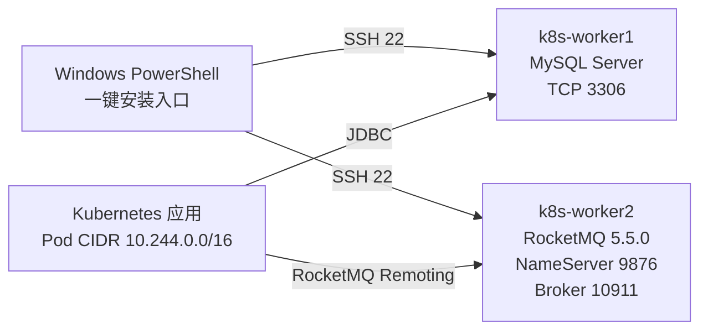

# Linux 原生安装 MySQL 与 RocketMQ

> 适用日期：2026-07-20  
> 前置文档：[Windows + VMware 三节点 Kubernetes 安装手册](./10-Windows-VMware-三节点-Kubernetes-安装手册.md)  
> 目标：不使用 Docker/Kubernetes，在 Ubuntu 24.04 虚拟机上通过 APT、Apache 官方二进制包和 systemd 原生安装 MySQL、RocketMQ，并自动创建账号、密码与最小权限。

## 1. 默认部署拓扑



| 虚拟机 | 原生服务 | 示例 IP | 资源限制 |
| --- | --- | --- | --- |
| `k8s-worker1` | MySQL | `192.168.80.11` | InnoDB Buffer Pool 1 GB |
| `k8s-worker2` | RocketMQ NameServer + 单 Broker | `192.168.80.12` | NameServer 512 MB、Broker 2 GB Heap + 1 GB Direct Memory |

该拓扑复用现有 8 GB Kubernetes worker，仅适合个人开发和功能验证。Kubernetes 调度器看不到这些 systemd 服务实际使用的内存，部署业务 Pod 时必须保留余量。正式生产环境应使用独立服务器，并另外设计 MySQL 主从/备份与 RocketMQ 多 Broker 高可用。

## 2. 安装内容与账号

### 2.1 MySQL

| 项目 | 安装结果 |
| --- | --- |
| 软件来源 | Ubuntu 24.04 官方 APT 仓库中的 `mysql-server` |
| systemd 服务 | `mysql.service`，开机自动启动 |
| 监听 | MySQL 虚拟机固定 IP 的 TCP 3306 |
| 字符集 | `utf8mb4` / `utf8mb4_0900_ai_ci` |
| 数据库 | `scm` |
| 管理账号 | `root@localhost`，密码认证，只允许本机管理 |
| 应用账号 | `scm_app`，分别允许 `10.244.0.0/16` Pod 网段和 MySQL 所在 VMware `/24` 网段，仅拥有 `scm.*` 权限 |

脚本不会使用过宽的 `scm_app@'%'`，而是创建两个带网络掩码的账号 Host：`10.244.0.0/255.255.0.0` 以及根据 MySQL IP 推导的 VMware `/24` 网段。例如 MySQL IP 为 `192.168.80.11`，第二个 Host 为 `192.168.80.0/255.255.255.0`。如果实际 VMware 网络不是 `/24`，应先修改脚本中的网段推导规则。

Ubuntu 默认让 `root@localhost` 使用 `auth_socket`，这是更适合日常运维的默认安全模型。本脚本因为本次明确要求配置账号密码，才将 root 改为 `caching_sha2_password`；root 仍只允许 localhost，绝不创建远程 root。

### 2.2 RocketMQ

| 项目 | 安装结果 |
| --- | --- |
| 版本 | Apache RocketMQ 5.5.0 官方二进制包，安装前校验 SHA-512 |
| Java | Ubuntu OpenJDK 17 |
| 服务 | `rocketmq-namesrv.service`、`rocketmq-broker.service` |
| 架构 | 1 NameServer + 1 ASYNC_MASTER Broker，不启动 Proxy |
| 集群名 | `DefaultCluster` |
| 安全 | ACL 2.0：Authentication + Authorization |
| 管理账号 | `scm_rmq_admin`，初始化超级用户 |
| 应用账号 | `scm_app`，Normal 用户 |
| 应用权限 | `Topic:scm_*` 可 Pub/Sub，`Group:scm_*` 可 Sub |
| 测试 Topic | `scm_test_topic` |

脚本没有启动 RocketMQ Proxy，因此适用于 RocketMQ Remoting 协议客户端，例如常见的 `rocketmq-client`、`rocketmq-spring-boot-starter`。如果采用 RocketMQ 5.x gRPC Client，应另行部署 Proxy 并同步配置认证。

## 3. 安装前检查

1. 第 1 节两台虚拟机已经安装 Ubuntu 24.04、使用固定 IP，并能访问互联网。
2. Windows 能通过 SSH 登录两台机器，默认用户为 `ubuntu` 且能使用 `sudo`。
3. MySQL IP 和 RocketMQ IP 不能相同。
4. 两台虚拟机至少各有 15 GB 可用磁盘；RocketMQ 消息保留会持续消耗磁盘，应定期监控。
5. 能访问以下官方地址：
   - Ubuntu APT 软件源；
   - `downloads.apache.org`；
   - `rocketmq.apache.org`。
6. 本手册沿用受信 VMware NAT 实验网段、UFW inactive 的前提。如果 UFW 已启用，脚本会停止，不会擅自关闭防火墙。

从 Windows 验证：

```powershell
Test-NetConnection 192.168.80.11 -Port 22
Test-NetConnection 192.168.80.12 -Port 22
```

## 4. 准备一键安装文件

将以下三个文件放到 Windows 同一目录，例如 `C:\middleware-installer`：

- [`install-middleware.ps1`](../deploy/middleware-native/install-middleware.ps1)
- [`install-mysql.sh`](../deploy/middleware-native/install-mysql.sh)
- [`install-rocketmq.sh`](../deploy/middleware-native/install-rocketmq.sh)

目录结构：

```text
C:\middleware-installer\
├── install-middleware.ps1
├── install-mysql.sh
└── install-rocketmq.sh
```

## 5. 一键安装

打开普通 Windows PowerShell：

```powershell
cd C:\middleware-installer
Set-ExecutionPolicy -Scope Process Bypass

.\install-middleware.ps1 `
  -MysqlIp "192.168.80.11" `
  -RocketMqIp "192.168.80.12" `
  -SshUser "ubuntu"
```

将 IP 替换成实际固定 IP。脚本会依次提示输入以下四个密码，每个密码要求连续输入两次确认：

1. MySQL `root` 密码；
2. MySQL `scm_app` 密码；
3. RocketMQ `scm_rmq_admin` 密码；
4. RocketMQ `scm_app` 密码。

MySQL 密码要求 12～64 位，可包含大小写字母、数字和以下字符：

```text
! @ # % ^ * _ . -
```

RocketMQ 密码要求 24～64 位，只能包含大小写字母和数字；这是为了兼容官方 AK/SK 字符约束，依靠更长的随机值保证强度。

建议使用 20 位以上随机密码，四个密码不得相同。密码不会写入仓库；Windows 和远程 `/tmp` 中间文件会在脚本结束时删除。MySQL 只保存认证哈希；RocketMQ 官方 ACL 2.0 的初始化用户和管理工具需要本地凭据文件，脚本会以 `0640 root:rocketmq` 权限保存在：

```text
/etc/rocketmq/broker.conf
/opt/rocketmq/conf/tools.yml
```

## 6. 一键脚本执行内容

### 6.1 MySQL

1. 从 Ubuntu 官方仓库安装 `mysql-server`；
2. 创建 `/etc/mysql/mysql.conf.d/99-scm-native.cnf`；
3. 绑定固定私网 IP，配置 UTF-8、连接数和 1 GB Buffer Pool；
4. 将 `root@localhost` 从默认 `auth_socket` 切换为 `caching_sha2_password`；
5. 创建 `scm` 数据库；
6. 为 Pod 网段和 VMware `/24` 网段分别创建/更新 `scm_app`，授予 `scm.*` 权限；
7. 使用应用账号通过 TCP 创建并更新 `installation_probe` 表完成验收。

### 6.2 RocketMQ

1. 安装 OpenJDK 17；
2. 下载 Apache RocketMQ 5.5.0 官方二进制 ZIP 和 SHA-512 文件并校验；
3. 创建无登录权限的 `rocketmq` Linux 系统用户；
4. 创建数据、日志、配置目录；
5. 配置单 Broker、固定 IP、数据路径和 ACL 2.0；
6. 创建并启动两个 systemd 服务；
7. 等待 Broker 注册并使用管理员认证执行 `mqadmin`；
8. 创建/更新 `scm_app` 和范围受限的 Pub/Sub ACL；
9. 创建 `scm_test_topic`；
10. 使用 `jcmd VM.flags` 验证最终 JVM 参数确实为 NameServer 512 MB、Broker Heap 2 GB、Direct Memory 1 GB；
11. 验证 NameServer、Broker、用户与 ACL。

## 7. 验收

### 7.1 Windows 端口

一键脚本最后会自动检查：

```powershell
Test-NetConnection 192.168.80.11 -Port 3306
Test-NetConnection 192.168.80.12 -Port 9876
Test-NetConnection 192.168.80.12 -Port 10911
```

三项都必须显示成功。

### 7.2 MySQL

登录 `k8s-worker1`：

```bash
systemctl status mysql --no-pager
ss -lntp | grep 3306
mysql -h 192.168.80.11 -u scm_app -p scm
```

输入安装时设置的应用密码，然后执行：

```sql
SELECT VERSION();
SHOW DATABASES;
SELECT * FROM installation_probe;
SHOW GRANTS;
```

### 7.3 RocketMQ

登录 `k8s-worker2`：

```bash
systemctl status rocketmq-namesrv rocketmq-broker --no-pager
ss -lntp | grep -E '9876|10909|10911'
sudo -u rocketmq /opt/rocketmq/bin/mqadmin clusterList -n 192.168.80.12:9876
sudo -u rocketmq /opt/rocketmq/bin/mqadmin getUser \
  -n 192.168.80.12:9876 -c DefaultCluster -u scm_app
sudo -u rocketmq /opt/rocketmq/bin/mqadmin getAcl \
  -n 192.168.80.12:9876 -c DefaultCluster -s User:scm_app
```

## 8. 应用连接参数

### 8.1 MySQL JDBC

```properties
spring.datasource.url=jdbc:mysql://192.168.80.11:3306/scm?useUnicode=true&characterEncoding=utf8&serverTimezone=Asia/Shanghai
spring.datasource.username=scm_app
spring.datasource.password=${SCM_MYSQL_PASSWORD}
```

### 8.2 RocketMQ Spring

不同 Starter 的属性名可能有差异，核心连接信息为：

```properties
rocketmq.name-server=192.168.80.12:9876
rocketmq.producer.access-key=scm_app
rocketmq.producer.secret-key=${SCM_ROCKETMQ_PASSWORD}
```

Topic 和 Consumer Group 必须以 `scm_` 开头，否则会被 ACL 拒绝。不要把真实密码直接提交到 Git；通过 Kubernetes Secret、环境变量或外部密钥系统注入。

## 9. 日常运维

### 9.1 服务管理

```bash
# MySQL 节点
sudo systemctl status mysql
sudo systemctl restart mysql
sudo journalctl -u mysql -n 200 --no-pager

# RocketMQ 节点
sudo systemctl status rocketmq-namesrv rocketmq-broker
sudo systemctl restart rocketmq-namesrv rocketmq-broker
sudo journalctl -u rocketmq-namesrv -n 200 --no-pager
sudo journalctl -u rocketmq-broker -n 200 --no-pager
```

### 9.2 数据目录

| 服务 | 目录 | 说明 |
| --- | --- | --- |
| MySQL | `/var/lib/mysql` | 数据库文件，不能直接复制运行中目录作为备份 |
| RocketMQ | `/var/lib/rocketmq/store` | CommitLog、ConsumeQueue 和 ACL 本地元数据 |
| RocketMQ | `/var/lib/rocketmq/logs` | RocketMQ Linux 用户的日志目录 |

### 9.3 备份最低要求

MySQL 至少定期执行逻辑备份：

```bash
mysqldump -u root -p --single-transaction --routines --events --all-databases \
  | gzip > "mysql-all-$(date +%F).sql.gz"
```

RocketMQ 单 Broker 没有副本，虚拟磁盘损坏会丢失消息。正式环境必须部署多 Broker/副本，不要把 VMware 快照当作一致性备份。

## 10. 常见故障

| 现象 | 排查 | 处理 |
| --- | --- | --- |
| 一键脚本提示 UFW active | `sudo ufw status` | 受信实验 VMnet 可停用；其他环境按真实来源网段精确开放端口 |
| MySQL 3306 不通 | `ss -lntp \| grep 3306` | 确认传入的是本机固定 IP，检查 `99-scm-native.cnf` 与 VMware 网络 |
| MySQL `Access denied` | `SELECT user,host,plugin FROM mysql.user;` | 确认使用 `scm_app`、正确密码和 `scm` 数据库 |
| RocketMQ Broker 启动失败 | `journalctl -u rocketmq-broker -n 200` | 检查内存、磁盘、固定 IP、9876 是否可用及 ACL 配置 |
| RocketMQ 认证失败 | 检查 `/opt/rocketmq/conf/tools.yml` | 确认管理凭据与首次启动时的 `initAuthenticationUser` 一致 |
| 应用被 ACL 拒绝 | `mqadmin getAcl ... -s User:scm_app` | Topic/Group 必须以 `scm_` 开头，并使用 `scm_app` 凭据 |
| RocketMQ 磁盘增长 | `du -sh /var/lib/rocketmq/store` | 检查消息堆积、消费进度、保留时间；不要直接删除 CommitLog |

## 11. 重新执行与密码变更

- MySQL 脚本可以用现有正确 root 密码重新执行，并会更新 `scm_app` 密码。
- RocketMQ 脚本可以用现有正确管理员密码重新执行，并会更新 `scm_app` 密码。
- 修改 RocketMQ `initAuthenticationUser` 不会自动修改已经创建的管理员；管理员密码轮换应使用官方 `mqadmin updateUser`，并同步更新 `tools.yml`。
- 不要为了忘记密码直接删除 `/var/lib/mysql` 或 `/var/lib/rocketmq/store`，这些目录包含业务数据和安全元数据。

## 12. 官方依据

- Ubuntu 官方使用 `sudo apt install mysql-server` 安装，并说明默认 `root@localhost` 使用 `auth_socket`、远程监听通过 `bind-address` 配置：[Install and configure a MySQL server](https://documentation.ubuntu.com/server/how-to/databases/install-mysql/)。
- MySQL 官方账号管理、`CREATE USER`、认证插件与权限语法：[MySQL Account Management Statements](https://dev.mysql.com/doc/refman/8.0/en/account-management-statements.html)。
- Apache RocketMQ 5.5.0 二进制包、签名和 SHA-512 文件：[Apache Downloads](https://downloads.apache.org/rocketmq/5.5.0/)。
- RocketMQ 官方要求 64 位系统和 JDK 8+，并给出 NameServer/Broker 启动与验证方式：[Run RocketMQ locally](https://rocketmq.apache.org/docs/quick-start/)。
- RocketMQ 5.3.3 起移除 ACL 1.0，5.5.0 必须采用 ACL 2.0：[RocketMQ Security](https://rocketmq.apache.org/docs/security/01security/)。
- ACL 2.0 的 Provider、初始化用户、`createUser`、`createAcl`、`tools.yml` 和权限范围语法：[Access Control 2.0](https://rocketmq.apache.org/docs/bestPractice/06access/)。

## 继续上下文

当前结论：MySQL 原生部署到 worker1，RocketMQ 5.5.0 NameServer + 单 Broker 原生部署到 worker2。  
关键假设：两个节点均为 Ubuntu 24.04、8 GB 内存、固定私网 IP、可访问官方软件源。  
待决问题：生产部署需要独立节点、数据库备份/高可用、RocketMQ 多副本、TLS 与防火墙。  
下一步：复制三个脚本到 Windows，按第 5 节输入实际 IP 执行一键安装。
