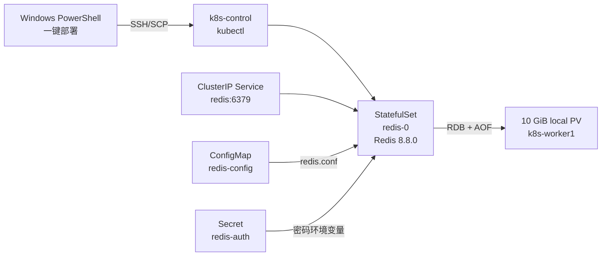

# Kubernetes 部署 Redis

> 适用日期：2026-07-20  
> 前置文档：[Windows + VMware 三节点 Kubernetes 安装手册](./10-Windows-VMware-三节点-Kubernetes-安装手册.md)  
> 目标：在已完成的 kubeadm 集群中一键部署带账号密码、ConfigMap 配置和本地持久化的 Redis。

## 1. 部署结果



| 项目 | 默认值 |
| --- | --- |
| Namespace | `scm-infra` |
| 镜像 | `redis:8.8.0-alpine` |
| 工作负载 | `StatefulSet/redis`，1 副本 |
| 集群内地址 | `redis.scm-infra.svc.cluster.local:6379` |
| 应用账号 | `scm_app` |
| 默认账号 | 已关闭 |
| ACL | 只允许 `scm:*` 键和频道，禁止 `@dangerous` 命令类 |
| 配置 | `ConfigMap/redis-config` |
| 密码 | `Secret/redis-auth`，由脚本交互生成 |
| 持久化 | 10 GiB 静态 local PV/PVC，RDB + AOF everysec |
| 内存 | `maxmemory 1gb`，Pod limit 2 GiB |
| 淘汰策略 | `allkeys-lru` |
| 暴露方式 | `ClusterIP`，不对 Windows/公网开放 |

这是开发、联调和个人实验集群方案。单实例不具备高可用；local PV 使数据固定在一台 worker，节点磁盘故障时无法自动恢复。生产环境应改用 Redis Sentinel/Cluster 或托管 Redis，并使用可靠 StorageClass、备份和监控。

`ClusterIP` 只代表不直接暴露到集群外，不代表 Pod 间网络隔离。需要多租户或生产隔离时，还应基于当前 CNI 添加 NetworkPolicy，只允许指定业务 Pod 访问 TCP 6379。

## 2. 为什么配置和密码分开

- `redis.conf` 是非机密配置，放入 ConfigMap；
- Redis 密码属于机密数据，放入 Secret，不写入 ConfigMap、Git 或命令行；
- 脚本在 Windows 内存中计算密码 SHA-256，Secret 同时保存客户端密码和只含哈希的 `users.acl`，容器将 ACL 只读挂载到 `/etc/redis-auth`；
- Kubernetes Secret 中的 Base64 只是编码，不是加密。正式环境还应开启 etcd Secret 静态加密、RBAC 最小权限和 Secret 定期轮换。

Kubernetes 官方也明确将 ConfigMap 定位为非机密数据配置，机密值应使用 Secret。

## 3. 部署前检查

1. 三个 Ubuntu 24.04 虚拟机和 Kubernetes 集群已按前置手册安装完成。
2. Windows 能以 `ubuntu` 用户 SSH 登录 control-plane 和目标 worker，两台机器均可使用 `sudo`。
3. 集群节点名与参数一致：

```bash
kubectl get nodes -o wide
```

4. 目标 worker 至少剩余 12 GiB 磁盘：

```bash
df -h /var/lib
```

5. 节点可访问 Docker Hub 并拉取 `redis:8.8.0-alpine`。
6. 如果 `k8s-worker1` 已经原生运行 MySQL，需要为 MySQL、Redis 和业务 Pod 预留足够内存。也可通过参数把 Redis 放到其他 worker。

Windows 端先验证 SSH：

```powershell
Test-NetConnection 192.168.80.10 -Port 22
Test-NetConnection 192.168.80.11 -Port 22
```

## 4. 准备一键部署文件

将下列两个文件放到 Windows 同一目录，例如 `C:\redis-k8s`：

- [`deploy-redis.ps1`](../deploy/redis-k8s/deploy-redis.ps1)
- [`redis-k8s.yaml`](../deploy/redis-k8s/redis-k8s.yaml)

```text
C:\redis-k8s\
├── deploy-redis.ps1
└── redis-k8s.yaml
```

## 5. 一键部署

在 Windows PowerShell 中执行：

```powershell
cd C:\redis-k8s
Set-ExecutionPolicy -Scope Process Bypass

.\deploy-redis.ps1 `
  -ControlPlaneIp "192.168.80.10" `
  -StorageNodeIp "192.168.80.11" `
  -StorageNodeName "k8s-worker1" `
  -SshUser "ubuntu"
```

脚本会隐藏输入并要求两次确认 `scm_app` 密码。密码要求为 24～64 位大小写字母和数字，例如使用密码管理器生成 32 位随机值；不要使用手册中的固定示例密码。

一键脚本会：

1. 检查 SSH、SCP、节点名和 Ready 状态；
2. 在存储节点创建 `/var/lib/k8s-local-storage/redis`；
3. 在内存中生成 `Secret/redis-auth`，ACL 中只保存密码 SHA-256；Secret 的 `password` 字段仍是可还原的 Base64，脚本会通过 SSH 标准输入发送，不在 Windows 生成 Secret 文件；
4. 渲染存储节点名，应用 Namespace、ConfigMap、Service、StorageClass、local PV/PVC 和 StatefulSet；
5. 滚动重启 Redis，使 ConfigMap 和 Secret 的最新值生效；
6. 自动执行认证读写、默认用户关闭、非 `scm:*` 键被拒绝和 AOF 开启验收；
7. 删除 Windows 的渲染清单和 control-plane `/tmp` 中的临时 Secret/清单文件。

脚本可重复执行，用于配置更新或密码轮换。已经建立 PV 后不能直接改变 `StorageNodeName`；脚本检测到节点不一致时会停止，避免误连旧数据。

## 6. 配置说明

ConfigMap 中的主要配置：

```text
maxmemory 1gb
maxmemory-policy allkeys-lru
appendonly yes
appendfsync everysec
save 900 1
save 300 10
save 60 10000
aclfile /etc/redis-auth/users.acl
```

- `maxmemory 1gb`：避免 8 GiB worker 上的 Redis 无限使用内存。Pod 限制为 2 GiB，为 Redis 进程额外开销和持久化留出空间。
- `allkeys-lru`：内存达到上限后从所有键中优先淘汰较少使用的键，适合缓存。如 Redis 承担不允许丢失的业务状态，不应沿用该策略。
- RDB + AOF：AOF `everysec` 在故障时仍可能丢失大约 1 秒的写入，不能代替备份。
- `scm_app`：应用键必须以 `scm:` 开头，例如 `scm:inventory:lock:10001`。其他前缀会被 ACL 拒绝。
- ACL 只开放 read、write、connection、transaction、pubsub、scripting 命令类及 `INFO`，明确移除 admin/dangerous 类；正式上线前仍应用实际 Redis 客户端做集成测试。

如需调整内存、RDB 频率或淘汰策略，修改 `redis-k8s.yaml` 中 `ConfigMap/redis-config` 后重新执行一键脚本。Redis 不会自动重读所有 `redis.conf` 参数，所以必须重启 Pod，脚本已自动执行。

## 7. 验收与连接

### 7.1 Kubernetes 状态

在 control-plane 执行：

```bash
kubectl -n scm-infra get configmap,secret,svc,pvc,pod -o wide
kubectl get pv redis-data-pv
kubectl -n scm-infra rollout status statefulset/redis
kubectl -n scm-infra logs redis-0 --tail=100
```

预期：

- `redis-0` 为 `1/1 Running`；
- `redis-data` 和 `redis-data-pv` 为 `Bound`；
- `Service/redis` 为 `ClusterIP`；
- 日志中包含 `Ready to accept connections` 且无 ACL/AOF 错误。

### 7.2 账号读写

Pod 中的 `redis-cli` 会从 Secret 注入的 `REDISCLI_AUTH` 读取密码，命令行不显示密码：

```bash
kubectl -n scm-infra exec redis-0 -- \
  redis-cli --user scm_app SET scm:manual:probe ok EX 300

kubectl -n scm-infra exec redis-0 -- \
  redis-cli --user scm_app GET scm:manual:probe

kubectl -n scm-infra exec redis-0 -- \
  redis-cli --user scm_app INFO persistence
```

### 7.3 Spring Boot 连接

```yaml
spring:
  data:
    redis:
      host: redis.scm-infra.svc.cluster.local
      port: 6379
      username: scm_app
      password: ${SCM_REDIS_PASSWORD}
      timeout: 3s
```

业务 Pod 与 Redis 不在同一 Namespace 时，不能跨 Namespace 直接引用 `scm-infra/redis-auth` Secret。应在业务 Namespace 中创建独立的客户端 Secret，或由 External Secrets/Vault 等机密管理系统同步；不要把密码直接写入 Deployment YAML。

## 8. 密码轮换和 ConfigMap 更新

### 8.1 轮换密码

重新执行第 5 节脚本并输入新密码。脚本会更新 Secret 并重启 Pod。密码一旦更换，所有应用客户端必须同步更新，否则会认证失败。本实验方案是单密码切换，不提供旧新密码并行窗口。

### 8.2 单独更新 ConfigMap

```bash
kubectl apply -f redis-k8s.yaml
kubectl -n scm-infra rollout restart statefulset/redis
kubectl -n scm-infra rollout status statefulset/redis --timeout=10m
```

手工执行前必须把 YAML 中两处 `__STORAGE_NODE_NAME__` 替换为实际节点名。更推荐重新运行 PowerShell 脚本，可同时执行参数渲染与验收。

## 9. 备份与恢复

### 9.1 备份

本方案没有为应用账号开放 `SAVE/BGSAVE`等危险管理命令。实验环境可在维护窗口停止 Redis，然后从存储节点离线备份：

```bash
kubectl -n scm-infra scale statefulset/redis --replicas=0
kubectl -n scm-infra wait --for=delete pod/redis-0 --timeout=120s
```

确认 Pod 已停止后，在存储节点备份：

```bash
sudo tar -C /var/lib/k8s-local-storage \
  -czf /var/backups/redis-$(date +%F-%H%M%S).tar.gz redis
```

备份完成后恢复服务：

```bash
kubectl -n scm-infra scale statefulset/redis --replicas=1
kubectl -n scm-infra rollout status statefulset/redis --timeout=10m
```

将备份包复制到其他物理磁盘或对象存储。同一 VMware 虚拟磁盘内的副本不能算有效灾备。生产环境应设置独立运维账号和在线备份流程，不应靠停服备份。

### 9.2 恢复

1. 停止 StatefulSet：`kubectl -n scm-infra scale statefulset/redis --replicas=0`；
2. 在存储节点备份现有目录；
3. 将备份的 RDB/AOF 放回目录，设置属主 `10001:10001`；
4. 恢复副本：`kubectl -n scm-infra scale statefulset/redis --replicas=1`；
5. 执行第 7 节验收。

恢复会覆盖现有 Redis 数据，必须在维护窗口执行并事先保留可回退副本。

## 10. 排障

### 10.1 Pod Pending

```bash
kubectl -n scm-infra describe pod redis-0
kubectl -n scm-infra describe pvc redis-data
kubectl describe pv redis-data-pv
kubectl get node k8s-worker1 --show-labels
```

重点检查节点名是否与 PV `nodeAffinity` 及 StatefulSet `nodeSelector` 一致。

### 10.2 Permission denied

在存储节点执行：

```bash
sudo install -d -o 10001 -g 10001 -m 0750 /var/lib/k8s-local-storage/redis
sudo find /var/lib/k8s-local-storage/redis -maxdepth 2 -printf '%u:%g %m %p\n'
```

### 10.3 NOAUTH/WRONGPASS

```bash
kubectl -n scm-infra get secret redis-auth
kubectl -n scm-infra rollout restart statefulset/redis
kubectl -n scm-infra logs redis-0 --tail=100
```

不要使用 `kubectl get secret ... -o yaml` 在共享终端显示密码编码值。

### 10.4 OOMKilled

```bash
kubectl -n scm-infra describe pod redis-0
kubectl top pod -n scm-infra
kubectl top node
```

如需增大 `maxmemory`，必须同时评估 Pod memory limit 和 8 GiB worker 上 MySQL/业务 Pod 的内存余量。

## 11. 卸载

删除 Redis 运行资源，但保留 PV 和宿主机数据：

```bash
kubectl -n scm-infra delete statefulset redis
kubectl -n scm-infra delete service redis redis-headless
kubectl -n scm-infra delete configmap redis-config
kubectl -n scm-infra delete secret redis-auth
```

PVC/PV 和 `/var/lib/k8s-local-storage/redis` 不会在上述命令中删除。如确定不再需要数据，先备份，再单独处理 PVC/PV 和存储节点目录；这是不可逆数据操作，不应放入一键卸载。

## 12. 官方资料

- [Redis 8.8 发布说明](https://redis.io/blog/announcing-redis-8-8/)
- [Docker Official Image 的 Redis 标签](https://github.com/docker-library/official-images/blob/master/library/redis)
- [Redis ACL](https://redis.io/docs/latest/operate/oss_and_stack/management/security/acl/)
- [Redis 持久化](https://redis.io/docs/latest/operate/oss_and_stack/management/persistence/)
- [Redis 内存淘汰](https://redis.io/docs/latest/develop/reference/eviction/)
- [Kubernetes ConfigMap](https://kubernetes.io/docs/concepts/configuration/configmap/)
- [Kubernetes Secret 安全实践](https://kubernetes.io/docs/concepts/security/secrets-good-practices/)
- [Kubernetes StatefulSet](https://kubernetes.io/docs/concepts/workloads/controllers/statefulset/)
- [Kubernetes 持久卷](https://kubernetes.io/docs/concepts/storage/persistent-volumes/)
- [Kubernetes 健康探针](https://kubernetes.io/docs/concepts/workloads/pods/probes/)

## 继续上下文

当前结论：Redis 通过 StatefulSet + ConfigMap + Secret + 静态 PV 部署。  
关键假设：三节点 kubeadm 实验集群，单 Redis，默认存储节点 `k8s-worker1`。  
待决问题：生产环境需另行选择 Redis Sentinel/Cluster、可靠存储和备份方案。  
下一步：可继续生成 Spring Boot 应用的 Redis Secret 注入和健康检查清单。
