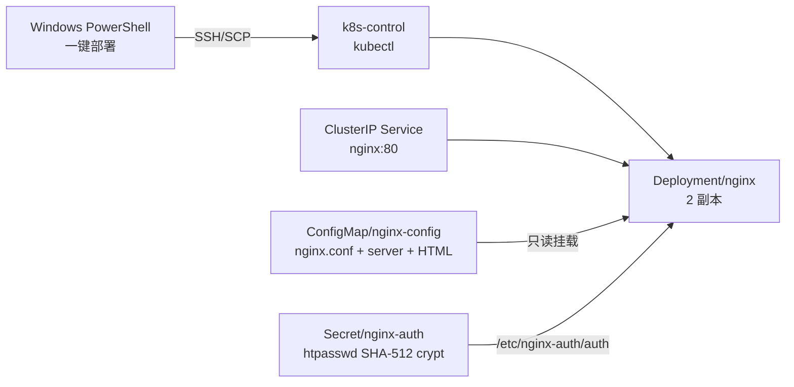

# Kubernetes 部署 Nginx

> 适用日期：2026-07-20  
> 前置文档：[Windows + VMware 三节点 Kubernetes 安装手册](./10-Windows-VMware-三节点-Kubernetes-安装手册.md)  
> 目标：在 kubeadm 三节点集群中一键部署 Nginx，使用 ConfigMap 管理配置，使用 Secret 管理 HTTP Basic Authentication 账号密码。

## 1. 部署结果



| 项目 | 默认值 |
| --- | --- |
| Namespace | `scm-infra` |
| 镜像 | `nginx:1.30.4-alpine3.24` |
| 工作负载 | `Deployment/nginx`，2 副本 |
| 集群内地址 | `http://nginx.scm-infra.svc.cluster.local` |
| Nginx 容器端口 | 8080，非 root 进程 |
| Service 端口 | 80，`ClusterIP` |
| 认证账号 | `scm_nginx`，可通过脚本参数修改 |
| 认证方式 | HTTP Basic Authentication |
| 配置 | `ConfigMap/nginx-config` |
| 密码 | SHA-512 crypt 哈希后保存在 `Secret/nginx-auth` |
| 健康检查 | `/healthz`，不需认证 |
| 资源上限 | 每个 Pod 0.5 CPU / 256 MiB |

Nginx 1.30.4 是截至 2026-07-20 的最新稳定版，修复了 2026-07-15 披露的多个安全问题。清单锁定完整镜像版本和 Alpine 版本，避免 `latest` 自动漂移。

## 2. 配置与密码边界

### 2.1 ConfigMap

`ConfigMap/nginx-config` 包含：

- `nginx.conf`：Nginx 全局配置、日志、gzip 和临时目录；
- `default.conf`：8080 端口、Basic Auth、健康检查和安全响应头；
- `index.html`：默认验收页面。

ConfigMap 只包含非机密配置，不得写入账号密码、TLS 私钥或其他机密数据。

### 2.2 Secret

Nginx 官方 `auth_basic_user_file` 要求用户文件格式为：

```text
username:password-hash
```

一键脚本将密码通过 SSH 标准输入发送到 control-plane，使用 `openssl passwd -6` 计算带盐 SHA-512 crypt 哈希，然后创建 `Secret/nginx-auth`。密码不出现在：

- PowerShell 命令行；
- Kubernetes YAML/ConfigMap；
- Git 仓库；
- SSH 远程命令参数；
- Nginx Pod 环境变量。

control-plane 上的临时 htpasswd 文件用 `umask 077` 创建，并通过 shell `trap` 及 PowerShell `finally` 双重清理。Kubernetes Secret 仍然应配合 etcd 静态加密和最小 RBAC 使用。

## 3. HTTP Basic Authentication 安全说明

Basic Authentication 只是认证机制，不是传输加密；用户名密码会以 Base64 形式放在 HTTP Header 中。本方案默认仅创建 ClusterIP，用于受信 Kubernetes 集群内的开发联调。

如需对集群外、公网或不可信网络开放，必须：

1. 通过 Ingress/Gateway 配置 HTTPS；
2. 使用可信 TLS 证书；
3. 限制 NetworkPolicy 和入口网络范围；
4. 管理系统优先改用 OIDC/SSO，不将 Basic Auth 当作长期用户体系。

## 4. 部署前检查

1. Kubernetes 三节点集群已安装完成；
2. Windows 能以 `ubuntu` 用户 SSH 登录 control-plane；
3. control-plane 已配置 `kubectl`，且默认 kubeconfig 能管理集群；
4. control-plane 存在 `openssl`，Ubuntu 24.04 默认安装环境通常已提供；
5. worker 节点能拉取 `nginx:1.30.4-alpine3.24`；
6. Windows 已安装 OpenSSH Client。

在 Windows PowerShell 验证：

```powershell
Test-NetConnection 192.168.80.10 -Port 22
ssh ubuntu@192.168.80.10 "kubectl get nodes"
```

## 5. 准备一键部署文件

将以下文件放到 Windows 同一目录，例如 `C:\nginx-k8s`：

- [`deploy-nginx.ps1`](../deploy/nginx-k8s/deploy-nginx.ps1)
- [`nginx-k8s.yaml`](../deploy/nginx-k8s/nginx-k8s.yaml)

```text
C:\nginx-k8s\
├── deploy-nginx.ps1
└── nginx-k8s.yaml
```

## 6. 一键部署

打开 Windows PowerShell：

```powershell
cd C:\nginx-k8s
Set-ExecutionPolicy -Scope Process Bypass

.\deploy-nginx.ps1 `
  -ControlPlaneIp "192.168.80.10" `
  -NginxUser "scm_nginx" `
  -SshUser "ubuntu"
```

用户名要求：

- 3～32 位；
- 必须以字母开头；
- 可包含字母、数字、下划线、点和短横线。

脚本会隐藏提示并要求连续输入两次密码。密码必须为 24～64 位大小写字母和数字，建议用密码管理器生成 32 位随机值。

一键脚本会自动：

1. 检查 SSH/SCP 和 control-plane 连通性；
2. 检查 Kubernetes API 与 OpenSSL；
3. 创建或复用 `scm-infra` Namespace；
4. 通过 SSH 标准输入传输密码，生成带盐 SHA-512 crypt htpasswd；
5. 创建或更新 `Secret/nginx-auth`；
6. 应用 ConfigMap、Service、Deployment 和 PodDisruptionBudget；
7. 滚动重启 2 个 Nginx Pod；
8. 执行 `nginx -t`、`/healthz=200`、未认证访问 `401` 和账号密码访问 `200` 验收；
9. 清理 control-plane 的临时文件。

脚本可重复执行，可用于 ConfigMap 更新、用户名调整和密码轮换。

## 7. 验收

### 7.1 Kubernetes 状态

登录 control-plane：

```bash
kubectl -n scm-infra get configmap,secret,service,deployment,pod,pdb -o wide
kubectl -n scm-infra rollout status deployment/nginx
kubectl -n scm-infra logs deployment/nginx --tail=100
```

预期：

- Deployment 为 `2/2 Available`；
- 两个 Pod 都是 `1/1 Running`；
- Service 类型为 `ClusterIP`；
- PodDisruptionBudget 保证至少 1 个副本可用；
- 日志中无配置和权限错误。

### 7.2 Nginx 配置

```bash
kubectl -n scm-infra exec deployment/nginx -- \
  nginx -t -c /etc/nginx-custom/nginx.conf

kubectl -n scm-infra exec deployment/nginx -- \
  nginx -v
```

### 7.3 未认证和健康接口

```bash
kubectl -n scm-infra exec deployment/nginx -- \
  curl -i http://127.0.0.1:8080/healthz

kubectl -n scm-infra exec deployment/nginx -- \
  curl -i http://127.0.0.1:8080/
```

第一个请求应返回 `200 OK`，第二个应返回 `401 Unauthorized` 和 `WWW-Authenticate` Header。

## 8. 从 Windows 访问

为了不把 Nginx 直接暴露到 VMware 网络，默认没有 NodePort。在 Windows 上打开一个 PowerShell 窗口：

```powershell
ssh -L 18080:127.0.0.1:18080 ubuntu@192.168.80.10 `
  "kubectl -n scm-infra port-forward service/nginx 18080:80 --address=127.0.0.1"
```

保持 SSH 会话运行，浏览器打开：

```text
http://127.0.0.1:18080/
```

浏览器会弹出认证窗口，输入一键脚本配置的用户名密码。SSH 本地转发通道是加密的，适合开发调试。

## 9. 作为反向代理

如需把 `/api/` 转发到 Kubernetes 内的 Spring Boot Service，在 `ConfigMap/nginx-config` 的 `default.conf` 的 `server` 中增加：

```nginx
location /api/ {
    proxy_pass http://scm-api.scm-app.svc.cluster.local:8080/;
    proxy_http_version 1.1;
    proxy_set_header Host $host;
    proxy_set_header X-Real-IP $remote_addr;
    proxy_set_header X-Forwarded-For $proxy_add_x_forwarded_for;
    proxy_set_header X-Forwarded-Proto $scheme;
    proxy_connect_timeout 5s;
    proxy_read_timeout 60s;
}
```

Basic Auth 已配置在 `server` 层，新 `location` 会继承认证。将 Service DNS 和端口替换为实际值，重新运行一键脚本。

## 10. ConfigMap 更新

修改 `nginx-k8s.yaml` 中 `ConfigMap/nginx-config` 后，推荐重新执行一键脚本。脚本会执行：

```bash
kubectl apply -f nginx-k8s.yaml
kubectl -n scm-infra rollout restart deployment/nginx
kubectl -n scm-infra rollout status deployment/nginx --timeout=10m
kubectl -n scm-infra exec deployment/nginx -- \
  nginx -t -c /etc/nginx-custom/nginx.conf
```

ConfigMap 卷最终会更新文件，但 Nginx 不会因此自动重载配置。本方案统一使用 Deployment 滚动重启，避免两个 Pod 同时运行不同配置。

## 11. 密码轮换

重新执行第 6 节命令并输入新密码。脚本会：

1. 使用新的随机盐计算密码哈希；
2. 更新 `Secret/nginx-auth`；
3. 滚动重启 Pod；
4. 用新密码执行 HTTP 200 验收。

旧密码在新 Pod 启动后立即失效。本简化方案不提供旧新密码并行窗口；需要无感切换时应先设计双账号过渡流程。

## 12. 日志与资源

```bash
kubectl -n scm-infra logs deployment/nginx -f
kubectl -n scm-infra top pod -l app.kubernetes.io/name=nginx
kubectl top node
```

Nginx access log 输出到 stdout，error log 输出到 stderr，不写入容器根文件系统。`$remote_user` 会记录已认证用户名，不会记录密码。

## 13. 排障

### 13.1 Pod CrashLoopBackOff

```bash
kubectl -n scm-infra describe pod -l app.kubernetes.io/name=nginx
kubectl -n scm-infra logs deployment/nginx --previous
kubectl -n scm-infra get configmap nginx-config -o yaml
```

常见原因：Nginx 语法错误、配置引用了未挂载路径，或将临时文件改到只读根文件系统。

### 13.2 401 Unauthorized

```bash
kubectl -n scm-infra get secret nginx-auth
kubectl -n scm-infra exec deployment/nginx -- \
  ls -l /etc/nginx-auth/auth
kubectl -n scm-infra rollout restart deployment/nginx
```

不要在共享终端中执行 `kubectl get secret nginx-auth -o yaml`，也不要把密码直接写到 `curl -u user:password` 命令历史。

### 13.3 403 Forbidden

默认只允许 GET/HEAD 静态访问。POST、PUT、DELETE 等方法会被 `limit_except` 拒绝。如配置反向代理 API，应在新的 `/api/` location 中按业务需求配置方法、请求体限制和超时。

### 13.4 ImagePullBackOff

```bash
kubectl -n scm-infra describe pod -l app.kubernetes.io/name=nginx
sudo crictl pull docker.io/library/nginx:1.30.4-alpine3.24
```

后一条在报错 worker 上执行，用于确认 Docker Hub/DNS/代理问题。

## 14. 卸载

```bash
kubectl -n scm-infra delete deployment nginx
kubectl -n scm-infra delete service nginx
kubectl -n scm-infra delete poddisruptionbudget nginx
kubectl -n scm-infra delete configmap nginx-config
kubectl -n scm-infra delete secret nginx-auth
```

不要直接删除 `scm-infra` Namespace，因为前面部署的 Redis 等基础服务可能也在该 Namespace 中。

## 15. 官方资料

- [Nginx 官方下载页：稳定版 1.30.4](https://nginx.org/en/download.html)
- [Nginx 安全公告](https://nginx.org/en/security_advisories.html)
- [Nginx HTTP Basic Authentication 模块](https://nginx.org/en/docs/http/ngx_http_auth_basic_module.html)
- [Nginx Docker Official Image](https://hub.docker.com/_/nginx)
- [Kubernetes ConfigMap](https://kubernetes.io/docs/concepts/configuration/configmap/)
- [Kubernetes Secret](https://kubernetes.io/docs/concepts/configuration/secret/)
- [Kubernetes Deployment](https://kubernetes.io/docs/concepts/workloads/controllers/deployment/)
- [Kubernetes 健康探针](https://kubernetes.io/docs/concepts/workloads/pods/probes/)
- [Kubernetes PodDisruptionBudget](https://kubernetes.io/docs/tasks/run-application/configure-pdb/)

## 继续上下文

当前结论：Nginx 使用 Deployment + Service + ConfigMap + Secret 部署，默认 2 副本。  
关键假设：用于集群内开发联调，HTTP Basic Auth，默认账号 `scm_nginx`。  
待决问题：对外开放前需设计 Ingress/Gateway、TLS、域名和 NetworkPolicy。  
下一步：可继续生成 Nginx Ingress Controller 及 SCM 各微服务的路由规则。
