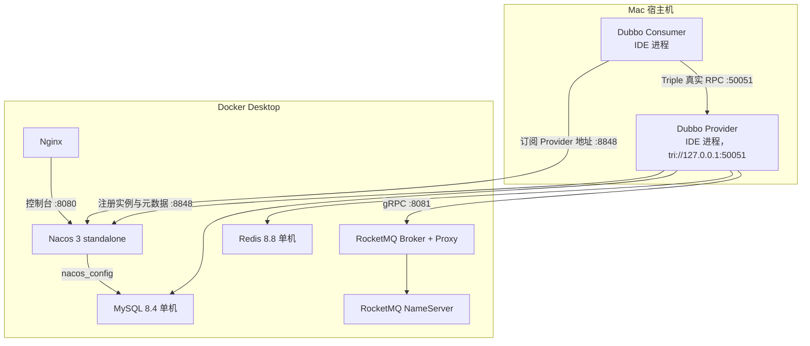

# Mac Docker 本地开发与 Dubbo 真实 RPC 手册

## 1. 目标与结论

本方案面向 Mac + Docker Desktop + IDE 本地开发。中间件全部运行在 Docker 中，业务服务运行在 Mac IDE 中，兼顾低资源占用和接近实际的调用方式。

采用单机版：

| 组件 | 版本 | 模式 | 内存上限 |
| --- | --- | --- | --- |
| MySQL | `8.4.10` | 单实例，业务库与 Nacos 分库分账号 | 1 GiB |
| Redis | `8.8.1-alpine` | 单实例，AOF + ACL | 1 GiB |
| RocketMQ | `5.5.0` | 单 NameServer + 单 Broker，Broker 内置 Proxy | 每容器 1 GiB |
| Nacos | `3.2.3-slim` | standalone，外置 MySQL | 1 GiB |
| Nginx | `1.30.4-alpine` | 单实例，保护 Nacos 控制台 | 1 GiB |
| Dubbo Java | `3.3.6` | Nacos 注册发现 + Triple 真实网络 RPC | 随 Java 服务配置 |

镜像都有 Apple Silicon ARM64 版本，不要强制设置 `platform: linux/amd64`。

## 2. 架构与真实调用边界



Nacos 只负责注册、发现和元数据，不转发 Dubbo 请求。Consumer 到 Provider 的 `tri://host:port` 必须真正可达，才算真实 RPC。

## 3. 前置条件

1. 安装并启动 Docker Desktop。
2. Docker Desktop 建议分配至少 8 GiB 内存。
3. Mac 已有 `bash`、`curl`、`openssl`、`shasum`；系统默认即具备。
4. 确保端口 `3306`、`6379`、`8080`、`8081`、`8082`、`8088`、`8848`、`9848`、`9876`、`10909`、`10911`、`10912` 未占用。

所有端口都绑定 `127.0.0.1`，不会直接暴露到局域网。

## 4. 一键启动

在项目根目录执行：

```bash
cd middleware-stack
./bin/dev.sh up
```

第一次执行会自动完成：

- 生成 `middleware-stack/.env` 随机密码，权限为 `600`；
- 生成 Redis ACL 文件和 Nginx Basic Auth 文件；
- 从固定版本 Nacos 镜像提取匹配的 MySQL schema；
- 初始化业务数据库、最小权限账号及 Nacos 数据库；
- 启动所有组件并等待健康；
- 初始化 Nacos 管理员；
- 验证 MySQL、Redis、RocketMQ、Nacos、Nginx；
- 验证每个运行组件容器内存限制为 1 GiB。

启动结束会打印连接地址。查看本机密码：

```bash
sed -n '1,240p' middleware-stack/.env
```

`.env` 和运行时鉴权文件已加入 `.gitignore`，不得提交。

## 5. 组件连接

### 5.1 MySQL

```text
host=127.0.0.1
port=3306
username=scm_app
password=查看 middleware-stack/.env 的 MYSQL_APP_PASSWORD
```

已初始化的数据库：

```text
scm_supplier  scm_purchase  scm_wms       scm_inventory
scm_iam       scm_mdm       scm_oms       scm_tms
scm_bms       scm_integration             scm_report
```

`scm_app` 只能访问业务库；Nacos 使用独立账号 `nacos`，只能访问 `nacos_config`；业务应用禁止使用 root。

### 5.2 Redis

```text
host=127.0.0.1
port=6379
username=scm_app
password=查看 REDIS_PASSWORD
```

Redis 使用 ACL，禁用 `default` 用户，业务账号只允许 `scm:*` Key 和 Channel。建议所有业务 Key 使用：

```text
scm:<bounded-context>:<aggregate-or-purpose>:<id>
```

示例测试：

```bash
source middleware-stack/.env
docker exec scm-redis redis-cli \
  --user "$REDIS_USERNAME" --pass "$REDIS_PASSWORD" --no-auth-warning \
  set scm:local:health ok
```

### 5.3 RocketMQ

项目使用 RocketMQ 5.x 新客户端时连接：

```text
endpoints=127.0.0.1:8081
```

只有旧 Remoting 客户端才连接：

```text
name-server=127.0.0.1:9876
```

单 Broker 通过 `--enable-proxy` 同时启动 Proxy，避免出现“NameServer/Broker 已启动，但 5.x gRPC 客户端无法连接”的假可用状态。本地允许自动创建 Topic/Consumer Group；集成和生产环境应关闭并由发布流程创建。

### 5.4 Nacos

```text
SDK/OpenAPI: 127.0.0.1:8848
原始控制台: http://127.0.0.1:8080/
username: nacos
password: 查看 NACOS_PASSWORD
```

通过 Nginx 访问控制台：

```text
http://127.0.0.1:8088/
username: admin
password: 查看 NGINX_PASSWORD
```

Dubbo SDK 直连 Nacos `8848`，不经过 Nginx Basic Auth。

## 6. Dubbo 真实 RPC 配置

### 6.1 Provider

每个 Provider 使用唯一 Triple 端口：

| 服务示例 | `DUBBO_APPLICATION_NAME` | `DUBBO_PROTOCOL_PORT` |
| --- | --- | --- |
| Inventory | `scm-inventory-provider` | `50051` |
| WMS | `scm-wms-provider` | `50052` |
| TMS | `scm-tms-provider` | `50053` |
| BMS | `scm-bms-provider` | `50054` |
| MDM | `scm-mdm-provider` | `50055` |
| IAM | `scm-iam-provider` | `50056` |

配置模板位于：

```text
middleware-stack/config/backend/application-local-example.yml
```

核心配置：

```yaml
dubbo:
  application:
    name: ${DUBBO_APPLICATION_NAME}
    metadata-type: remote
  protocol:
    name: tri
    host: 127.0.0.1
    port: ${DUBBO_PROTOCOL_PORT}
  registry:
    address: nacos://127.0.0.1:8848
    username: nacos
    password: ${NACOS_PASSWORD}
    register-mode: instance
    parameters:
      namespace: public
      group: DUBBO_GROUP
```

Provider 必须导出真实实现：

```java
@DubboService
public class InventoryCollaborationApiImpl implements InventoryCollaborationApi {
    // 调用真实应用服务或查询服务，不能返回固定成功结果
}
```

### 6.2 Consumer

Consumer 使用远程引用：

```java
@DubboReference(
    protocol = "tri",
    check = true,
    timeout = 3000,
    retries = 0
)
private InventoryCollaborationApi inventoryCollaborationApi;
```

项目若使用已有 `ReferenceConfig` 工厂，也必须确保：

- registry 为 `nacos://127.0.0.1:8848`；
- 注入 Nacos 用户名和密码；
- protocol 为 `tri`；
- namespace、group 与 Provider 完全相同；
- 返回对象是 Dubbo 远程代理，而不是同接口本地 Spring Bean。

### 6.3 IDE 环境变量

从 `.env` 复制这些变量到各 Spring Boot Run Configuration：

```text
MYSQL_APP_USER
MYSQL_APP_PASSWORD
REDIS_USERNAME
REDIS_PASSWORD
NACOS_USERNAME
NACOS_PASSWORD
NACOS_API_PORT
ROCKETMQ_PROXY_GRPC_PORT
DUBBO_APPLICATION_NAME
DUBBO_PROTOCOL_PORT
```

每个服务再设置自己的：

```text
MYSQL_DATABASE=scm_inventory
```

不要把 `.env` 直接提交到 `application.yml`。

## 7. 真实 RPC 验收

仅在 Nacos 控制台看到应用名不算完成。至少验证：

1. 启动 Provider，日志显示 Triple 端口已监听并成功注册 Nacos。
2. Nacos 中能看到 Provider 实例及正确的 `127.0.0.1:端口`。
3. 启动 Consumer，引用检查成功。
4. 发起一次真实业务调用，在 Provider 日志中看到请求。
5. 停止 Provider 后再次调用必须失败，不能自动回落到本地 Mock。
6. 重启 Provider 后 Consumer 能重新发现并恢复调用。
7. 请求/响应携带业务幂等键、Trace ID，异常按 RPC 异常处理，不能伪装成功。

当前代码库已存在多组 `scm-common` 协作接口和 Consumer 侧引用工厂，但盘点时未发现对应的 `@DubboService` Provider 导出实现。因此，本 Docker 栈已经提供真实注册中心和网络条件，但业务 RPC 只有在各服务补齐 Provider 适配器后才算完成；不得用固定返回值代替。

## 8. Mac 与 Docker 网络规则

| 调用方 | 目标 | 应使用地址 |
| --- | --- | --- |
| Mac IDE | Docker 中间件 | `127.0.0.1:发布端口` |
| Docker 容器 | 同 Compose 组件 | `服务名:容器端口`，如 `mysql:3306` |
| Docker 容器 | Mac IDE Provider | `host.docker.internal:Provider端口` |
| Mac IDE Consumer | Mac IDE Provider | Provider 注册的 `127.0.0.1:tri端口` |

容器内的 `localhost` 只代表当前容器，不能用于访问其他容器或 Mac。

如果以后把 Consumer 放入 Docker，而 Provider 仍运行在 Mac，Provider 不能继续向 Nacos 注册 `127.0.0.1`；应注册 Consumer 可达的宿主机地址，并验证 `host.docker.internal` 路由。

## 9. 运维命令

```bash
cd middleware-stack

./bin/dev.sh status
./bin/dev.sh check
./bin/dev.sh logs
./bin/dev.sh logs rocketmq-broker
./bin/dev.sh restart
./bin/dev.sh down
```

查看实际内存限制和使用：

```bash
docker stats --no-stream \
  scm-mysql scm-redis scm-rocketmq-namesrv \
  scm-rocketmq-broker scm-nacos scm-nginx
```

完全重建：

```bash
./bin/dev.sh reset
./bin/dev.sh up
```

`reset` 会删除 MySQL、Redis、RocketMQ、Nacos 的本地 named volumes。修改初始化脚本或首次初始化密码后，只有迁移已有数据或重建数据卷才会生效。

## 10. 常见问题

### 10.1 RocketMQ Broker 健康，但 Java 客户端连接失败

确认新客户端使用 `127.0.0.1:8081`，不是只配置 `9876`；再检查：

```bash
./bin/dev.sh logs rocketmq-broker
```

### 10.2 Nacos 启动失败

先检查 MySQL 和 schema 初始化：

```bash
./bin/dev.sh logs mysql
./bin/dev.sh logs nacos
```

如果复用了旧版本数据卷，执行迁移；确认不要数据后才运行 `./bin/dev.sh reset`。

### 10.3 Nacos 管理员密码不匹配

Nacos 管理员初始化接口只能使用一次。若 `.env` 被删除但旧 MySQL 卷仍在，随机生成的新密码不会覆盖旧密码。恢复原 `.env`，或确认可删除数据后重建。

### 10.4 Dubbo 注册成功但调用失败

依次检查：

- Provider 是否真的监听 Triple 端口；
- Nacos 实例中的 IP/端口是否能被 Consumer 访问；
- Provider/Consumer 的 interface、version、group、namespace 是否一致；
- 是否存在 `@DubboService` 导出和远程引用；
- 防火墙、端口冲突和同机多 Provider 端口是否重复。

## 继续上下文

当前结论：Mac 使用单机 Docker 中间件；每个运行组件容器限制 1 GiB；Dubbo 走 Nacos + Triple 真实 RPC。  
关键假设：Java Provider 与 Consumer 当前均运行在 Mac IDE。  
待决问题：各限界上下文仍需实现并验收真实 `@DubboService` Provider 适配器。  
下一步：按 Inventory/WMS/TMS/BMS/MDM/IAM 顺序补 Provider，并做跨进程调用验收。
