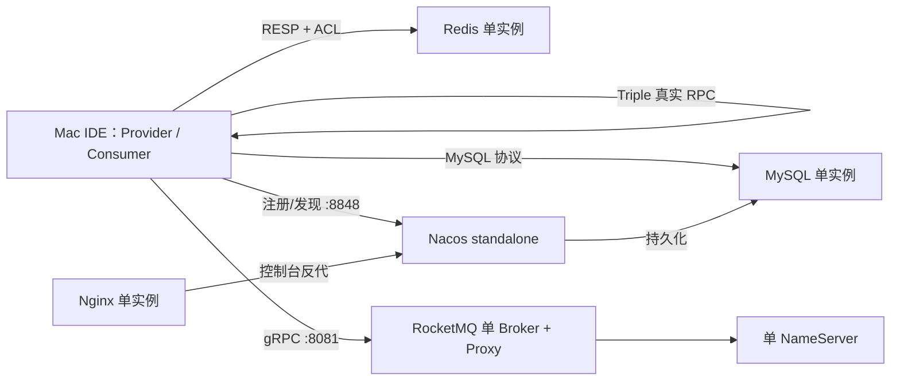

# Mac Docker 单机中间件栈

用于 SCM 本地开发，固定版本、持久化、开启鉴权，所有宿主机端口只绑定 `127.0.0.1`。MySQL、Redis、RocketMQ NameServer、RocketMQ Broker、Nacos、Nginx 每个运行容器的内存上限均为 `1 GiB`。

## 一键启动

前置条件：Docker Desktop 已启动，建议分配至少 8 GiB 内存。

```bash
cd middleware-stack
./bin/dev.sh up
```

首次启动会：

1. 生成不提交 Git 的 `.env` 随机密码；
2. 生成 Redis ACL 和 Nginx htpasswd；
3. 启动全部单机组件并等待健康；
4. 初始化 Nacos 3 管理员；
5. 检查鉴权、连通性和 1 GiB 内存限制。

## 常用命令

```bash
./bin/dev.sh status
./bin/dev.sh check
./bin/dev.sh logs
./bin/dev.sh logs nacos
./bin/dev.sh down
```

删除所有本地中间件数据卷：

```bash
./bin/dev.sh reset
```

`reset` 会二次确认；执行后数据不可恢复，但 `.env` 密码文件会保留。

## 地址

| 组件 | Mac 宿主机地址 | 账号 |
| --- | --- | --- |
| MySQL | `127.0.0.1:3306` | `scm_app` |
| Redis | `127.0.0.1:6379` | `scm_app` |
| RocketMQ 5.x Proxy | `127.0.0.1:8081` | 本地单机未启 ACL |
| RocketMQ NameServer | `127.0.0.1:9876` | 本地单机未启 ACL |
| Nacos OpenAPI/SDK | `127.0.0.1:8848` | `nacos` |
| Nacos 原始控制台 | <http://127.0.0.1:8080/> | `nacos` |
| Nginx 保护后的控制台 | <http://127.0.0.1:8088/> | `admin` |

密码在本机 `middleware-stack/.env`，文件权限为 `600`，不会提交 Git。

## 单机拓扑



## Spring Boot / Dubbo

参考 [application-local-example.yml](config/backend/application-local-example.yml)。

本地 Java 服务运行在 Mac IDE 时：

- 容器中间件使用 `127.0.0.1 + 发布端口`；
- Dubbo Provider 向 Nacos 注册 `127.0.0.1 + 唯一 tri 端口`；
- Consumer 从 Nacos发现地址后直接连接 Provider，Nacos 不转发 RPC；
- 每个 Provider 使用不同端口，例如 `50051`、`50052`、`50053`；
- Provider 必须使用真实 `@DubboService`，Consumer 使用 `@DubboReference` 或等价的 `ReferenceConfig`。

如果将 Java 服务也放入 Docker，组件地址应改为 Compose 服务名，并让容器内 Consumer 能访问 Provider 注册的地址；不能继续注册 `127.0.0.1`。

完整说明见 [供应链系统完整部署手册](../docs/10-供应链系统完整部署手册.md)。
