Report、杰表、润乾报表、快逸、FineReport等。 

面单规范从哪里来呢？可以通过物流服务提供商官网或商务对接获 取各物流服务提供商的面单打印样式及对接说明。需要注意的是，一个 物流服务提供商有多个打印模板，对应不同的业务场景，如电子面单、 手写面单、代收货款面单、非代收货款面单等。图10-37所示为顺丰与 京东的电子面单样式。 

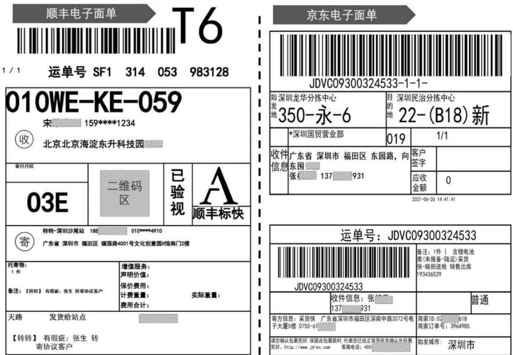

图10-37顺丰与京东的电子面单样式

## 2.物流月结账号

在签订配送协议时，每个物流服务提供商会为企业开通月结账号， 并提供密钥。此账号是企业与物流服务提供商结算的唯一账号，有了月 结账号以后就不需要每次寄件时都支付运费了，相关人员每个月根据物 流服务提供商提供的账单对账结算即可。同时，月结账号也是企业配送 管理系统从物流服务提供商申请电子面单的令牌。 

月结账号基础数据主要包含物流服务提供商、月结账号、账号类型 （是父账号还是子账号）、签约主体、客户编码（与物流服务提供商对 接的编码，由物流服务提供商分配）、对接密钥、是否支持代收货款、 支持的物流付款方式等。物流付款方式有三种（可多选）：寄方支付、 收方支付、第三方支付。寄方支付就是寄件人支付物流运费，收方支付 就是收件人支付物流运费，第三方支付就是除寄件人和收件人外的第三 方付费。 

## 10.3.3物流配置与分配

由于每个第三方物流服务提供商的配送范围、时效、运费不同，企 业通常会与多家物流服务提供商签订合作协议，针对不同仓库、不同地 区、不同业务使用不同的物流，这就需要企业的配送管理系统中有一套 健全的物流配置和物流分配策略。 

首先，我们需要配置各仓库可使用的物流列表，以应对不同仓库与 不同物流服务提供商签约的情况，此配置包含仓库、可用物流服务提供 商列表。例如，可以单独为深圳仓和北京仓配置如表10-5所示的物流服 务提供商。 

表10-5仓库可用物流配置

<table><tr><td>仓 库</td><td>可用物流服务提供商</td></tr><tr><td>深圳仓</td><td>京东、顺丰、圆通、中通、EMS</td></tr><tr><td>北京仓</td><td>顺丰、EMS</td></tr></table>

有了以上配置，便具备了分配物流服务提供商的基本条件。当用户 下单以后，先在订单履约中心进行分仓，分配到合适的发货仓库后，将 发货仓库、订单收件人信息、支付方式（是在线支付还是货到付款）、 代收货款金额、物流付款方式（寄方支付、收方支付、第三方支付）、 商品属性等信息传给配送管理系统，由配送管理系统匹配合适的物流服 务提供商和电子面单，订单履约中心将电子面单和物流信息随订单下发 仓库和门店，打印发货。在仓库和门店发货过程中，可能会出现一个包 裹放不下所有商品需要拆分包裹的情况，或者因配送问题需要重新预约 物流单号的情况，物流服务提供商可以支持仓储/门店管理系统直接调 用配送管理系统接口，重新分配物流。 

订单分配物流的全流程如图10-38所示。 

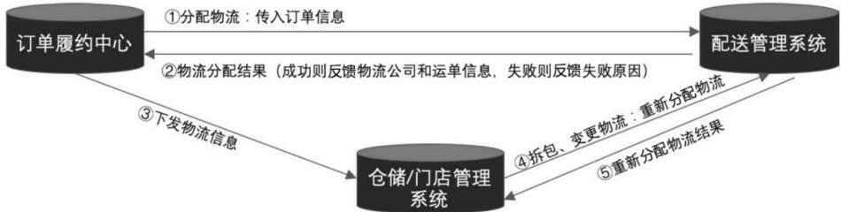

图10-38订单分配物流

配送管理系统分配物流的逻辑可以总结为两个步骤：①分配物流服

务提供商；②获取面单。 

如果企业指定了物流服务提供商，则直接获取电子面单，否则先按 分配策略分配物流服务提供商，然后才能获取电子面单。系统分配可以 匹配到多个物流服务提供商，但各物流服务提供商应按优先级的高低进 行排序。 

企业需要通过与物流服务提供商签约获得的月结账号调用物流服务 提供商提供的API接口以获取运单号和配送站点等信息。如果由于接口 问题或者物流欠费等问题暂时无法获取运单号和配送站点等信息，企业 可以按物流优先级更换其他物流服务提供商。企业获取电子面单后，基 于面单模板生成订单的面单样式，将被下发到仓库或门店打印发货。 

如果没能匹配合适的电子面单，企业可以用物流服务提供商的手写 面单发货。 

物流分配详细逻辑如图10-39所示。 

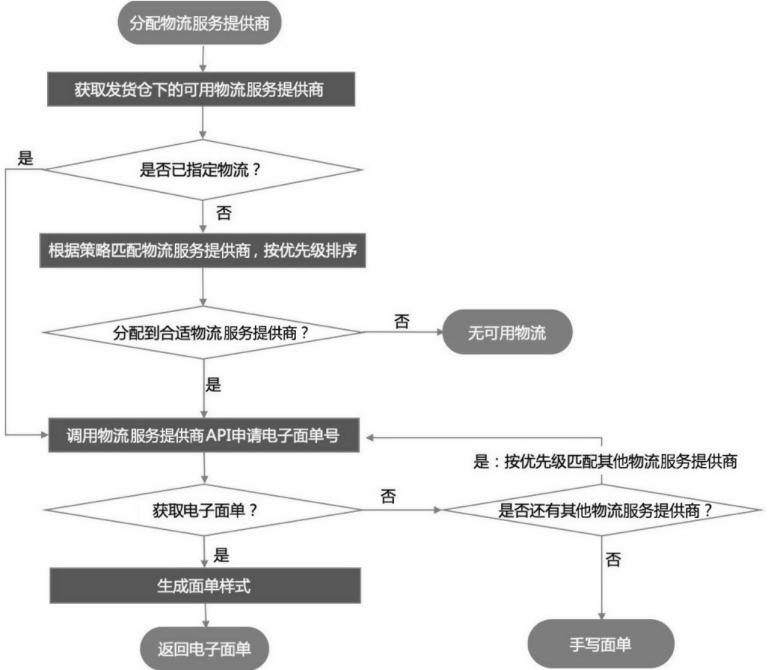

图10-39物流分配逻辑

关于物流服务提供商的分配，可以选择如下策略中的一种或多种组 合。 

① 配送范围优先原则。根据订单收件地址匹配发货仓下的物流服 务提供商。物流服务提供商的覆盖范围可以提前维护到基础数据中心中 ，或者调用物流服务提供商提供的接口获取。 

② 时效最优原则。对于有时效要求的订单，按照配送时效，优先 分配时效最优的物流服务提供商。 

③ 成本最优原则。同等配送条件下，优先分配配送成本最低的物 流服务提供商。 

④ 服务最优原则。根据物流服务提供商日常的配送时效、成本、 服务评分等综合评估，为每个服务提供商做绩效评分，优先分配绩效评 分高的物流服务提供商。 

⑤ 服务匹配原则。根据订单的支付方式、运输方式、商品类型、 物流付款方式，匹配合适的物流服务提供商，如某些物流服务提供商不 支持货到付款订单的收款服务，则货到付款订单不能分配给此物流服务 提供商。 

⑥ 任务均衡原则。包裹过多的时候，可平均分摊给多个物流服务 提供商，避免某一家物流服务提供商因单量过大而处理不及时，或者服 务水平跟不上。 

图10-40是以订单配送区域为例的物流优先级设置示例，由图中可 知，深圳仓支持京东、顺丰、圆通、中通和EMS等物流服务提供商。其 中，北京市的物流分配优先级为：京东〔1〕→顺丰〔2〕→圆通〔3 ；全国其他区域物流优先级为：顺丰〔1〕→京东〔2〕→圆通〔3〕→E MS〔4〕。由于北京市单独设置了规则，则北京市的物流分配读取北京 市的规则，其他地区没有单独设置规则，则读取全国配置。 

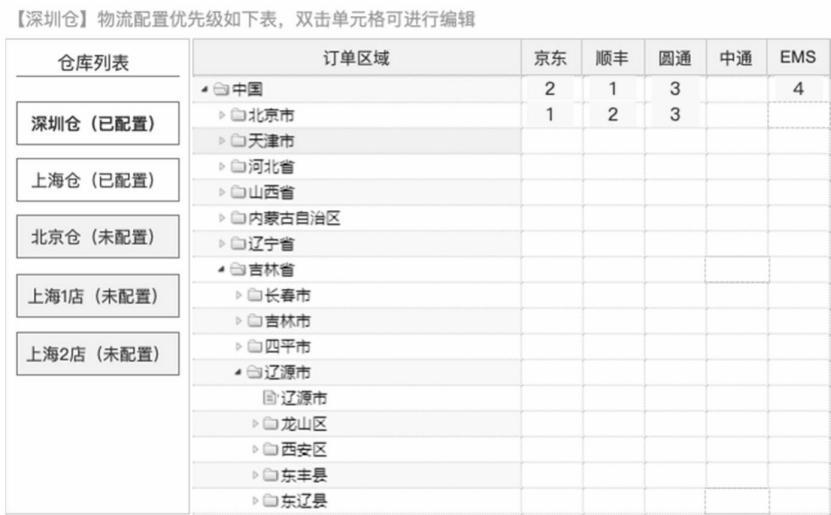

图10-40物流优先级设置

## 10.3.4 物流服务提供商API对接

与物流服务提供商进行API对接，一般是通过物流服务提供商提供 的开放平台进行接口交互，如顺丰的丰桥平台、京东的宙斯平台、阿里 巴巴的菜鸟平台等。此类开放平台的接入方式大同小异，主要有四步： 第一步，注册开放平台登录账号；第二步，申请成为开放平台的开发者 ；第三步，发布一个应用，申请对接的key和密钥；第四步，与平台标 准API在沙箱环境中进行联调，联调通过后正式上线运行。关于对接的 细节，各开放平台都有详细的接入文档，想了解的朋友可以自行搜索。 

图10-41是顺丰开放平台上提供的与物流对接相关的API接口说明， 我们可以根据实际需要进行选择性对接。最常用的接口有下订单接口、 订单结果查询接口、订单取消接口、路由查询接口。 

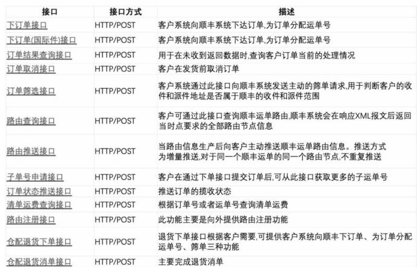

图10-41 顺丰物流API接口示例

## 10.3.5 物流对账

对于以月结方式结算的企业来说，月末和物流服务提供商的对账也 是一项很重要的工作，财务部门的相关人员必须保证所有的物流费用和 物流服务提供商提供的账单一致，这样才能打款。 

物流对账分两部分。 

① 物流运费对账。物流运费对账包含包裹正向和退货逆向运输过 程中，物流服务提供商需要向企业收取的费用，一般与抛重比、距离等 因素有关。 

② 代收货款（COD）服务费对账。货到付款的订单，由物流服务 提供商代收货款后交给企业的财务部门，但企业需要支付一部分代收服 务费。 

物流对账的整体流程如图10-42所示。 

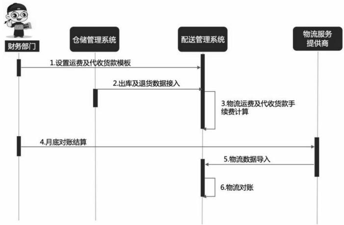

图10-42物流对账流程

① 财务部门的相关人员提前在配送管理系统中维护好运费和代收 货款手续费的计算模板，费用计算规则由物流服务提供商提供后录入系 统。 

② 仓库的相关人员在发货环节测量包裹的体积和重量，并将已发 货的订单和退供单中的相关数据传到配送管理系统中，配送管理系统根 据运费模板可以计算每个包裹对应的物流费用和代收货款手续费。 

③ 等到月末结算时，物流服务提供商提供实际的物流账单，由财 务部门的相关人员导入配送管理系统，与系统预算的费用进行比对，如 果有差异，则查找差异原因并重新对账，直到所有费用核对清楚为止。 

## 1.物流运费模板设置

运费模板的设置是企业的相关人员提前将物流服务提供商的运费报 价录入系统，以便包裹发货后对运费进行预算。大多数物流服务提供商 的运费可以用以下公式来计算： 

## 运费=[首重价格+（包裹重量-首重）×续重单价]×折扣率

订单重量未超过首重，以首重价格计算运费，超过首重的部分，按 续重单价计算运费。 

其中，首重是指最低的计费重量，无论包裹多小、多轻，都以首重 价格计算运费，一般物流服务提供商首重是1kg；续重是指超过首重部 分的重量，续重单价是续重部分的单位计价；折扣率是物流服务提供商 给予企业的价格优惠，在总运费基础上打折。 

另外，有些物品属于泡货，如海绵、塑料、棉花制品等，其体积大 重量小，计算运费时，需要将物品体积转换为重量后再计算运费，也叫 体积重量。通用体积重量的计算方法为：体积重量=长（cm）×宽（cm ）×高（cm）÷6000。物品的计费重量取实际重量和体积重量中的较大 者。 

在设计运费模板时，相关人员要考虑到不同城市由于距离不同、政 策不同，运费也会不尽相同，所以应该支持不同物流服务提供商、不同 仓库、不同时段、不同地区有不同的价格设置。运费模板的基本属性包 含模板编号、模板名称、物流服务提供商、适用仓库、模板有效期、地 区报价等信息。 

图10-43是一个北京仓和河北仓的顺丰运费模板示例。 

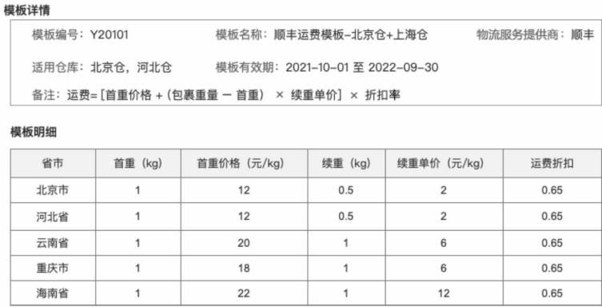

图10-43物流运费模板示例

## 2.代收服务费模板设置

代收货款存在资金风险，所以物流服务提供商的代收货款服务并不 是免费的，会收取一定的费用，大部分物流服务提供商按照代收货款金 额收取一定比例的服务费，且有最低代收服务费。 

若代收服务费大于最低代收服务费，以代收服务费计算，否则以最 低代收服务费计算。 

同运费模板一样，代收服务费模板也应该支持不同物流服务提供商 、不同仓库、不同时段、不同地区有不同价格设置。图10-44为顺丰代 收服务费模板示例。 

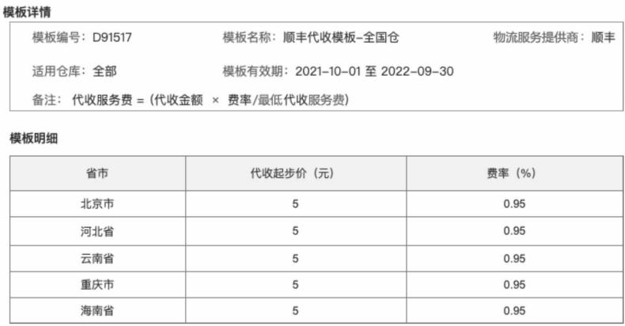

图10-44代收服务费模板示例

## 3.费用预算与物流对账

模板维护完成后，仓储管理系统的发货数据和拒收数据便可定期推 送到配送管理系统中，配送管理系统基于仓储管理系统传入的发货信息 ，调取对应的费用模板，预算每一单的运费和代收服务费，其中包裹体 积取包装箱的体积，包裹重量取出库时包裹称重数据。 

预算数据作为与物流服务提供商对账的原始数据，待物流服务提供 商提供账单以后，将账单数据导入系统，基于物流单号与预算数据进行 对比，便能将双方的差异数据对比出来并逐一核实，直到双方对对账结 果完全认可为止，这便是物流对账的全过程，如图10-45所示。 

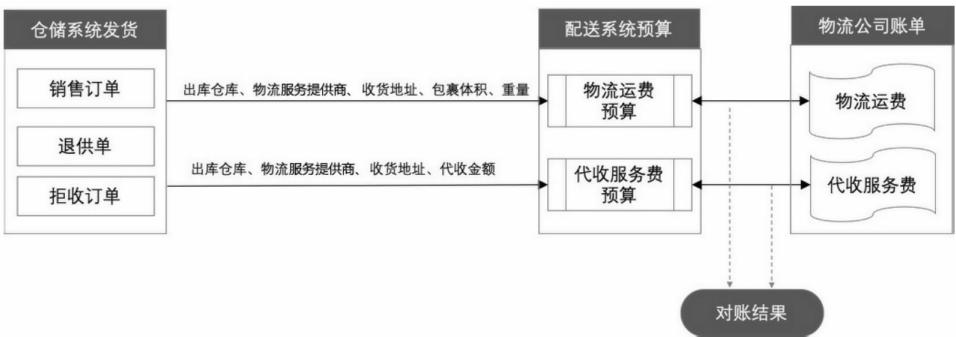

图10-45费用预算与对账逻辑

## 10.4 本章结语

配送管理系统主要是负责物流配送管理的系统，管理商品从出仓以 后，到用户签收，以及逆向返回的全流程。根据物流方式，可以分为自 营物流配送和第三方物流配送，自营物流需要搭建配送体系，第三方物 流配送主要借助三方物流公司的配送能力。 

无论是自营物流，还是第三方物流配送，都是基于包裹号进行流转 ，包裹从被揽收开始，到最终被用户签收，正向会经历已揽件、在途运 输中、派送中、待取件和已签收5个节点，如果包裹被拒收，会被原路 退回，会经历拒收、逆向在途、逆向派送和逆向签收4个逆向节点。 

在自营物流模式下，需要搭建分拣中心、配送站点并利用自有配送 员送货，自营物流配送管理系统的搭建需重点关注配送基础数据、车辆 调度、分拣管理、配送管理等。 

第三方物流配送管理系统不需要关注配送的细节，重在处理面单目 标管理、物流服务提供商分配、对接物流服务提供商API和物流对账等 

## 第11章 满汉全席：其他供应链系统设 计指南

在本书前面的章节中，我们对供应链业务、流程和系统有了全面的 了解，并对核心系统设计做了较为详细的介绍，也在关键功能上提供了 一些页面示例以加强理解，但供应链系统本没有标准的界限，前人的经 验可以作为参考，但不能生搬硬套，我们终归要到实际工作中结合实际 业务，发挥所长，搭建适合我们自己的供应链系统。 

本章再对其他供应链系统核心功能进行整体介绍，不能面面俱到， 只愿能打开大家对供应链的认知天窗，天地之大，未来之远，任君上下 而求索。 

## 11.1前置战场：门店管理系统

在线上+线下同售的新零售模式下，门店不再只承担传统的线下零 售职责了，而是转变为集用户拉新与留存、线下零售、线上销售等职责 于一体的智能前置仓，起着非常重要的作用，所以对门店的布局，是零 售商家必争之战。 

从传统的线下销售到新零售模式下的线上线下同售，是零售业发展 的必然趋势，随之而来的是门店布局和系统设计的悄然变化。本节我们 一起来梳理一下新零售模式下的门店管理系统设计。 

## 11.1.1线上线下，前店后仓

在新零售供应链中，门店也同时扮演着前置仓的角色，所以前店后 仓是主流的门店布局，前面是零售门店的柜台呈列和POS销售（POS， PointofSale，终端销售），负责线下的零售，后面是一个小的仓库，除 了存放前面门店的备货，还用来承接一部分线上订单的发货。从布局上 看，因为线下零售还是主营业务，门店还是不能丢的，所以门店的面积 较大，仓库的面积较小，如图11-1所示。 

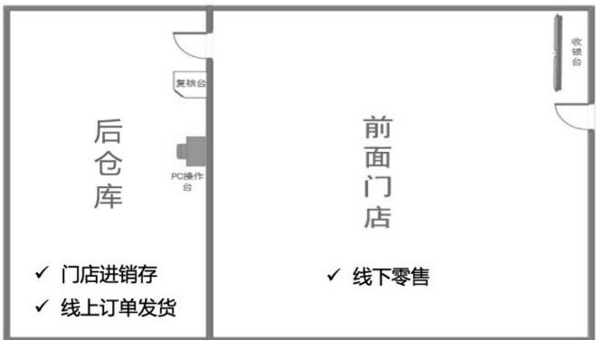

图11-1 前店后仓布局

从系统规划方面来说，门店管理系统主要分为两部分，负责线下销 售的POS管理功能，和负责门店整体进销存及线上订单同售的后台进销 存管理系统，典型的门店管理系统架构，如图11-2所示。 

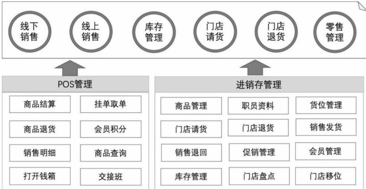

图11-2门店管理系统架构

POS 管理功能主要的使用者是门店营业员，用于线下客户到店购买 商品的结算、退货、会员积分、钱箱管理、交接班和日常查询。进销存 管理功能用于支持门店基础数据管理及商品的请货、入库、库存管理、 库内管理、退货、促销、会员等业务。 

在新零售体系中，门店管理系统不再是一个孤立的个体，而是整个 零售网络里的一个必不可少的环节，门店和门店之间、门店和仓库之间 是互通的，门店的商品、库存同仓储库存、商家库存一样，都会纳入中 央库存系统，作为企业整体的库存为线上和线下提供服务，门店库存可 以被线上用户下单，线下用户也能共享其他门店和仓储的库存。同时， 门店还可以提供到店自提服务。 

在中央库存系统中，门店的前店和后仓作为一个整体做库存管理， 和仓储库存、商家库存是平行关系，门店自身的收货、发货、请货、退 货导致的库存变更都应该在中央库存系统中同步，做到全渠道库存共享 ，如图11-3所示。 

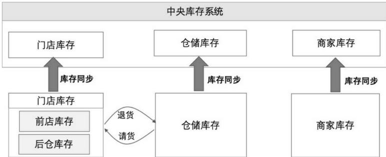

图11-3门店库存与中央库存系统

## 11.1.2门店后台进销存管理

门店的后台管理系统需要支撑所有门店的商品进销存，以及线上、 线下订单的销售，一家公司可能有多家连锁门店，在当前主流的云部署 模式下，所有门店共用一套门店管理系统，但通过门店做数据层面的隔 离，各门店仅查看和管理自己门店的业务数据（数据权限在稍后讲权限 系统时会有详细介绍）。作为新零售业务的前置仓，门店的角色本来就 是一个小型仓储，其后台入库、出库、库内作业流程等都可以参考仓储 管理系统进行设计，只是功能层面可以更加简化，本节我们重点介绍门 店基础数据、门店请货、门店出库、库内管理、门店促销和会员管理等 系统逻辑。 

## 1.门店基础数据

每新开一个门店，都会在基础数据中心中新增一条门店数据，同时 对应增设一套新的门店系统的前后台系统权限。在每个门店下，需要单 独设置该门店下的商品、职员、货位等基础数据。 

① 门店商品数据。门店的商品基础数据应该来源于基础数据中心 的商品主数据，如商品编码、名称、规格型号、分类数据等，这些数据 应该保证全公司统一，由总部统一向下分发。但因为各地的市场和促销 活动不同，所以各门店可以自行维护商品在本门店中的零售价信息，实 现方式为在门店后台开放商品在每个门店中的零售价信息维护功能。商 品在门店管理系统中的价格模型为同一个SKU ID在不同的门店中要支 持不同的价格和促销折扣。 

② 门店职员数据。管理每个门店下的营业员信息。同商品数据一 样，不建议每个系统维护一套人员数据，如果可能的话，应该公用公司 的HR系统或OA中的人员数据，以保证账号的统一性。 

③ 门店货位数据。既然有仓库，有货架，就需要精细化管理，货 位管理可以参考仓储管理系统中的相关功能，为货架编号、打印货位标 签并粘贴。 

在新零售业务里，前店后仓的库存是共享的，所以前店库存也需要 在后台统一记录、管理。后仓的货位和库存通过货位管理解决了，那么 前店呢？有两个思路：一是将前店的货位也贴上货位条码，做精细化管 理，此方式可以精细化管理前店库存，便于相关人员对库存的精准掌握 ，但会增加前店商品补货、上架、售卖的难度。例如，客户拿了一个商 品到收银台结账，假如此商品在两个货架上都有，收银员需要消库存， 肯定不可能问用户到底在哪个货位上拿的。所以前店做精细化的前提是 每个SKU只存在于一个货位上。第二个思路是后仓精细化，但前店做粗 放式管理，在系统中将前店统一为一个大的货位来进行管理，这样无论 补货、上架、售卖，都默认在此货位上操作，系统处理逻辑也可以和后 仓保持一致，这种方式比较符合绝大多数门店管理诉求，但缺点是前店 的库存无法精细化，找货、盘点等工作较麻烦。 

## 2.门店请货

门店的库存来源有两种：门店独立采购和向仓库请货。独立采购是 由门店的相关人员下采购单，供应商直接送货到门店，但大多数门店面 积和商品品类有限，独立采购成本比较高，所以多数企业还是采用门店 请货模式。相关人员通过门店管理系统提出请货申请，审核后下发总部 仓库发货。请货的系统交互流程如图11-4所示。 

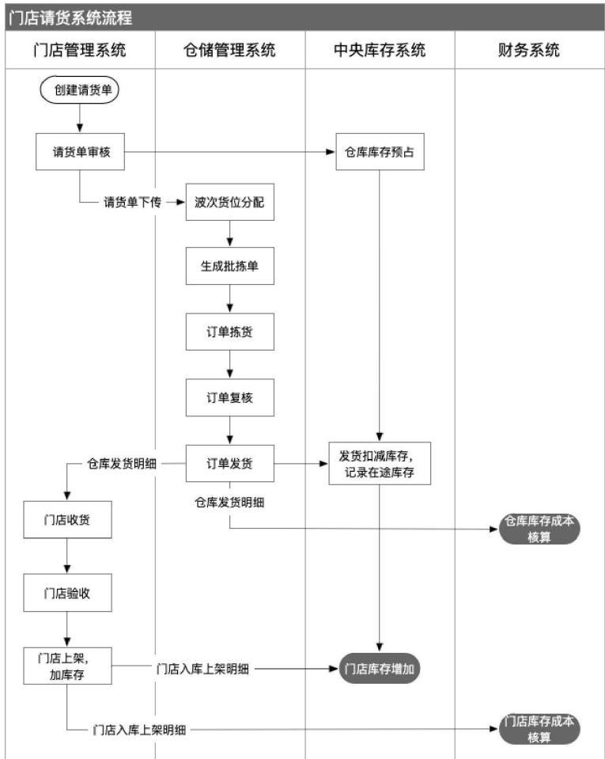

图11-4门店请货系统流程

请货单由门店店员填写，店长审核，可选商品范围是仓库内有可用 库存的商品，建单信息包含请货仓库、SKU、数量等。请货单审核通过 后，会通知仓储管理系统创建一张出库单，同时需在中央库存系统中预 占目标仓库的库存，以免库存又被其他渠道的出库单下单抢占了。 

仓库实际发货后，扣减中央库存系统中的预占库存和实物库存，并 将实际发货明细回传门店管理系统，生成门店的入库单。门店收到实物 以后，提取系统中的入库单操作收货、验收和上架，加门店的实物库存 并同步至中央库存系统。 

在门店请货的整个流程中，有三个流转实体：门店请货单、仓库出 库单和门店入库单，三者的生命周期及库存处理逻辑如图11-5所示。 

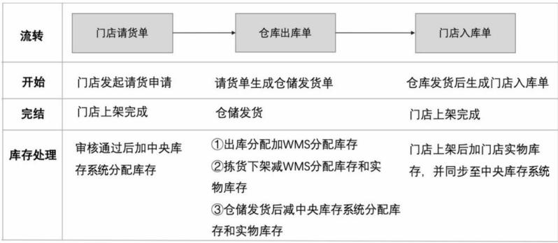

图11-5门店请货的三个流转实体

在实际业务操作中，常常会存在门店计划请货的数量和仓库实际发 货数量不匹配的情况，毕竟难免有库存不准确或者其他原因不能完全满 足门店诉求的情况存在，所以系统设计要支持仓库缺量发货，以仓库实 际出库商品数量做单据状态和库存的处理，而不能完全以请货单为准。 

## 3.门店出库

与门店出库相关的业务有三种：门店前端POS出库、门店退货出库 和电商订单出库。 

门店POS出库主要针对前店的线下销售，用户结算以后，直接扣减 前店对应货位上的商品库存，并同步扣减中央库存系统中的实物库存数 量。在门店后台可查到每一笔销售记录，包含：销售流水号、日期、收 银员、会员、销售商品、商品数量、商品零售价、实售单价、折扣、金 额等信息。 

门店退货出库针对需要退货给仓库的业务场景，是门店请货的逆向 流程。门店退货系统流程如图11-6所示。 

店员在门店管理系统中创建退货单，退货单中的关键信息包含退货 目标仓库、退货SKU、退货货位、退货数量等，退货单经门店店长审核 通过后分配出库货位上的SKU库存，并按照仓储内部流程拣货、复核、 发货。发货后通知仓储管理系统生成仓库入库单，待实物送达目标仓库 后完成收货、验收和上架。 

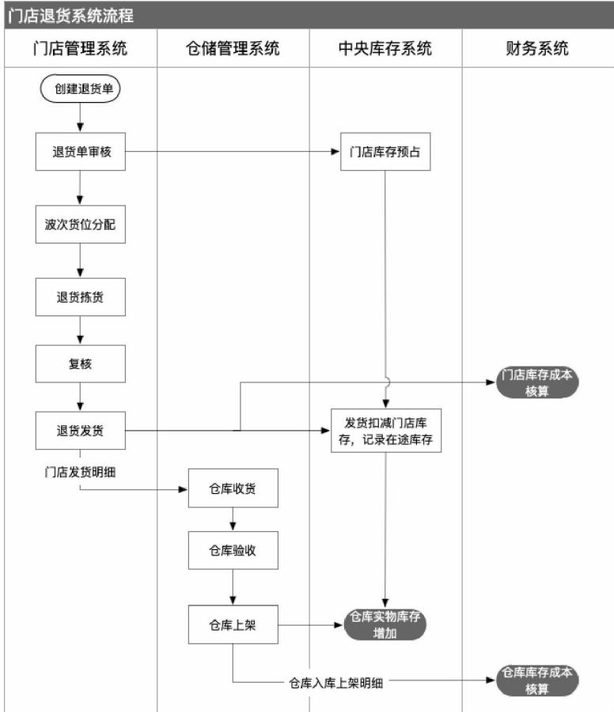

图11-6门店退货系统流程

门店内的电商订单出库主要针对线上订单发货，由于门店仓面积小 、品种少、人员少，所以不可能承担过多的订单，一般仅作为仓库的后 补，承接部分发货业务，主要包含三种情况：一是大仓缺货，而刚好门 店有库存，商品需要临时从门店发出；二是本地的O2O配送订单，用户 在前端App指定本门店下单；三是到店自提的订单，也是用户在前端Ap p指定本门店。 

在介绍中央库存系统时我们讲过，库存是需要有发货范围配置的， 当门店承担自提和O2O配送发货时，仅限在配送范围内的用户能够看到 这部分库存，而当门店承担物流配送发货时，范围就会广得多，可以覆 盖全国或者部分省市，如图11-7所示。在基础数据中的门店配送范围设 置中，O2O配送范围和物流配送范围是两个配置范围，二者分别对应不 同维度的可销售库存。 

电商订单分配时，应该优先分配门店后仓库存，如果门店后仓没有 库存了，但是前店还有库存，不建议直接分配前店的库存，最好先将订 单挂起，发起一个从前店向后仓移库的指令，待商品从前店移到后仓以 后再从后仓发货。这样做有两个好处，一是将前店销售和后仓发货业务 分开，避免后仓拣货员到前店拣货，干扰了前店的销售；二是可以避免 后仓和前店的库存冲突，试想一下，如果一个前店的商品刚被电商订单 分配了，但此时刚好有顾客在前店拿了此商品要结算，系统处理起来就 比较麻烦了，与其如此，不如让前店库存仅供门店销售，如果后仓需要 前店库存，先发起移库，能移成功则移，若前店的商品已被前店顾客购 买，则对后仓的电商订单做缺货异常处理。 

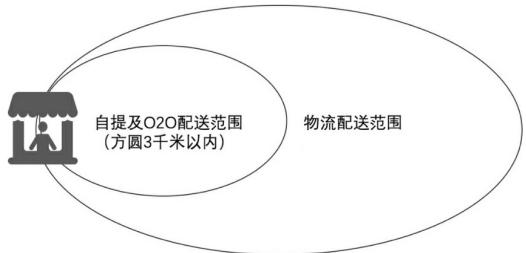

图11-7门店出库范围

电商订单发货时，如果是物流配送，则和仓库出库流程一样，分配 物流公司并预约物流单号，在仓内打单发货，如果是O2O配送，则预约 本地O2O物流上门揽件，如果是自提订单，则给用户发送取件码（通过 短信或App推送），用户凭取件码到店自提，自提以后订单状态直接变 更为已签收。 

电商订单发货后如果产生了拒收或售后退货，由售后系统生成一张 退货入库单下发到门店管理系统中，用户将包裹寄回门店后，和仓储退 货入库流程一样，收货、验收和上架。 

## 4.库存管理

在库存管理方面，门店有一个和仓库不一样的地方，一般仓库都是 按标准 SKU 整件进/出库，用数量来管理库存就可以了，这是标准品仓 库的管理模式，但有些门店可能存在散卖的情况，如零食、干果、生鲜 类商品，并不是整袋销售的。针对这种情况，提供两种解决方案：一是 将散称商品按照重量拆零成更小包装的SKU，如1kg/袋的开心果，在仓 库的SKU为A，但同时新建一个0.5kg/袋的SKU B，在门店中，将A拆零 为两个B，以标准包装B进行售卖，对应库存处理为A数量减1，B数量 加2；二是在设计门店库存管理模块时，支持按重量计量库存，也即支 持小数点存储重量。例如，开心果A，初始入库时重量为1kg，则记录 库存为1kg，散卖掉0.25kg后，则库存对应扣减0.25kg，变为0.75kg，此 时库存数量就含有小数了。第二种库存方案较第一种方案更加灵活且贴 合实际业务，但由于无法用标准品模式管理，时间长了库存的误差会变 大，盘点难度会提升。 

## 5.库内管理

在门店里，同样有日常对商品的库内管理诉求，如移位、盘点、库 存冻结和解冻等，均可以参考仓储管理系统中相关功能的设计。 

## 11.1.3 门店促销管理

门店促销是必不可少的零售手段，通过促销活动可以提升客单价和 门店销售额，增加客户复购率，加快店内库存周转，降低供应链成本。 门店常用促销促销手段是促销活动和发放优惠券，相关人员可在门店后 台设置本店的促销活动。 

## 1.门店促销活动

促销的流程可分为创建促销活动、设置促销内容、促销活动生效、 客户结算四个步骤。 

① 创建促销活动。在门店后台创建一个促销活动，包含活动名称 、活动生效时间和结束时间，活动用户（活动针对哪些客户开放，可选 全部客户或部分客户）、限购数量（单个客户单个活动限购商品数量） 0 

② 设置促销内容。根据促销的方式，配置参与促销的商品及促销 策略，如满减、满赠、折扣等，商品的范围可以是全店商品，也可以是 指定的类目、品牌或指定的SKU。 

③ 促销活动生效。到达活动开始时间后，自动生效，满足促销规 则的商品，在生效期间即可享受促销优惠，待促销活动结束后，再恢复 原价。 

④ 客户结算。客户到店购买商品，在收银时自动根据促销规则计 算当前订单是否符合促销规则，若符合，则按促销价为客户结算，若不 符合，则按原价结算。 

门店常用的促销活动策略有满减、满赠、满折、特价、加价购、组 合购、积分换购等，下面对促销策略进行简单说明。 

① 满减。消费达到相关规定则享受减免一定的额度，根据满减类 型，分为满额减（按下单商品金额满减）和满件减（按下单商品数量满 减）两类，如每满100元减10元属于满额减，每满3件减10元属于满件减 ；根据满减方式，还分为固定满减和阶梯满减两类，如每满100元减10 元属于固定满减，满100元减10元、满200元减30元、满300元减50元属 于阶梯满减。 

② 满赠。消费达到相关规定则赠送相应的赠品给客户，赠品可以 是商品同款，也可以是其他赠品，如买3件送1件。和满减策略一样，满 赠策略同样分为满额赠（按下单商品金额满赠）和满件赠（按下单商品 件数满赠）、固定满赠和阶梯满赠。 

③ 满折。消费达到相关规定可享受特定折扣，如购满500元享受8 折优惠。满折策略同样可设定满额折扣、满件折扣、固定折扣和阶梯折 扣规则。 

④ 特价。针对特定商品做特价，无消费门槛限制，如××商品特价5 0元/件。 

⑤ 加价购。消费达到一定金额后可加少部分钱换购价值更高的其 他商品，如满100元可加10元换购洗发水一瓶。 

⑥ 组合购。将多个有关联的单品组合成套餐一起购买，比单买某 件商品的单价更低，如购买电视机3000元，电视底座200元，购买电视 机+底座组合则只需要3100元。 

图11-8是新建满减活动的示例，其他促销策略的设计方法类似，都 是在活动有效期内根据不同的促销规则设定不同的促销内容。在本书中 ，我们只介绍了单一的促销规则，还是比较容易实现的，复杂的是多个 促销规则的叠加和逻辑互斥，在设计时一定要提前梳理清楚，避免一个 商品触发了多个不该共存的规则，产生不必要的损失。一个基本原则是 同类型的规则要互斥，不同类型的规则可以相互叠加。例如“满100减10 ”和“满300减50”属于同类型的规则，针对同一商品订单只能二选一，但 “满100减10”和“满100元可加10元换购”属于不同类型的规则，二者可以 同时存在。 

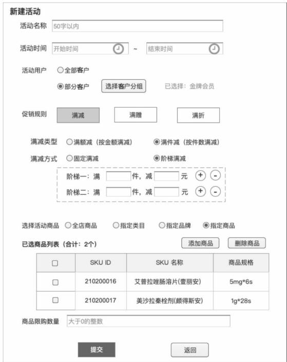

图11-8满减活动示例

一个完整的促销活动可以设计为未开始、活动中、已失效三种状态 

① 未开始。活动已创建，但尚未到达活动开始的时间，此状态下 可以进行活动编辑、删除。 

② 活动中。已到达活动开始的时间，活动变为活动中，此状态下 不能编辑和删除活动，但可以手动结束或下架活动。 

③ 已失效。已超过活动结束时间，活动自然失效，商家手动结束 活动或下架活动。 

## 2.门店优惠券

除促销活动外，发放优惠券也是一种常用的门店促销方式。在传统 门店模式下，经常会遇到店员在街边发放纸质优惠券的情况，持纸质优 惠券的客户可到店消费，可享受减免；而在新零售模式下，可以直接借 助微信卡券功能和支付宝消费券发放门店优惠券，有自研能力的商家也 可以在门店后台管理和发放优惠券，用户通过线上渠道领取，到线下门 店消费、核销，这种方式更加方便，而且比线下纸质优惠券的规则更加 灵活多变。 

优惠券的系统流程可以分为制券、发券、核销三步，我们还是以门 店管理系统为例进行说明。 

① 制券。门店店长在门店后台设计优惠券模板，包含优惠券名称 、优惠券类型、优惠券有效期、发放总量和适用商品等信息。其中优惠 券类型分为满减券（满××元减××元）和折扣券（满××元享××折）；优 惠券有效期可以分为固定时段有效（在系统中设置好生效时间和失效时 间，过期作废）和领取后有效天数（从领取时间开始算，××天内有效） ；发放总量是控制优惠券的总数量，用以控制运营成本，领取量超过总 数后就不能再领取了；适用商品是优惠券的使用对象，商品的范围可以 是全店商品，也可以是指定的类目、品牌或指定的SKU。图11-9为新建 优惠券模板示例。 

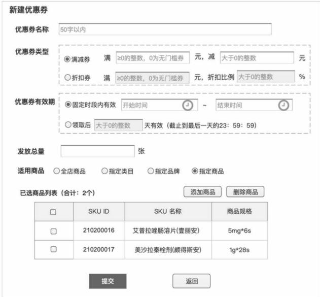

图11-9新建优惠券模板示例

② 发券。选择制作好的优惠券，将其发放给目标客户。发券前需 要创建一个优惠券活动，在活动中选择发券方式、发放时间、发放对象 和需要发放的优惠券及发放数量。其中发放方式分为主动发送至客户账 户中和客户手动领取两种，主动发放优惠券是直接将优惠券发放到指定 的客户账户中，需要设置系统发放的时间，客户手动领取则是商家将优 惠券显示到前端，需要客户手动点击“领取”才能生效，需设置优惠券有 效期的开始和结束的时间；发放对象是筛选本次发放的目标客户群，也 可手动导入客户名单；需要发放的优惠券是从优惠券列表中筛选有效且 余量大于 0 的优惠券，可以支持一次性发放多个；发放数量控制本次发 放的优惠券总数量，如果是客户手动领取，还需要设置每人每张券的限 领数量。图11-10是一个发券的活动设置示例。 

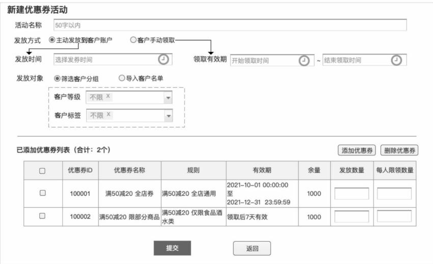

图11-10新建优惠券发券活动示例

发券活动设置好以后，客户便能在有效期内领取到优惠券了，已领 取的优惠券可以在客户的优惠券卡包中直接查看，系统会将优惠券与客 户ID进行绑定，生成当前客户账号下的券码。门店优惠券由于在结算时 需要出示给收银员，所以需要在客户端设置一个已领取优惠券的二维码 ，支持结算时扫码核销，这是与电商线上优惠券略微不同的地方。图11 -11是客户在线上领取门店优惠券的示例。 

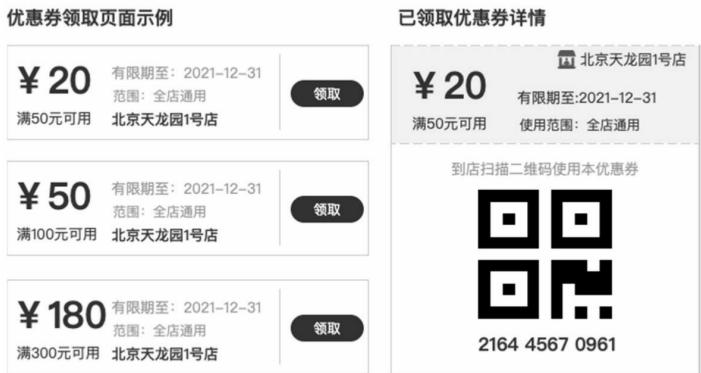

图11-11客户在线上领取优惠券示例

③ 核销。优惠券核销就是客户使用优惠券进行结算，系统完成优 惠券的兑换、结算和处理的过程。客户到门店购物结算时出示优惠券二 维码，收银员或客户自助扫描二维码完成金额抵扣和优惠券核销，已核 销的优惠券代表客户已经使用过了，不能进行二次使用，除非客户在有 效期内退货后，优惠券原路退回。 

根据优惠券的生命周期，可以设计 3 个状态：未使用、已使用和已 过期。未使用是指用户已领取优惠券，优惠券尚未使用且尚未过期的状 态；已使用是指用户正常使用优惠券结算后的状态，已使用的优惠券如 果被退回后，还可以重新变为未使用状态；已过期是指优惠券过期且尚 未使用的状态。 

已使用的优惠券算有效核销，已过期的优惠券算无效核销。优惠券 状态和核销状态如图11-12所示。 

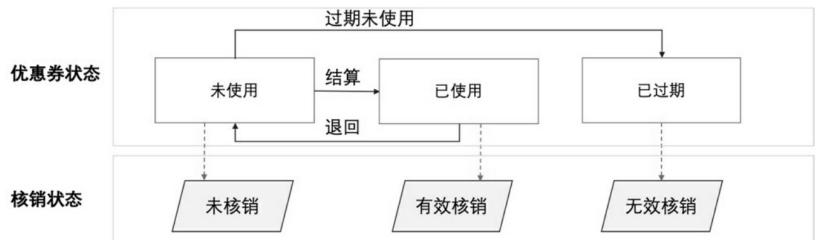

图11-12优惠券状态和核销状态

关于促销活动和优惠券的使用范围和使用方式，线上电商和线下门 店大同小异，而且线上的花样更多、更复杂，这一类的参考资料和书籍 有很多，感兴趣的朋友可以找来深入研究并学习，推荐刘志远老师的《 电商产品经理宝典》，书中对这部分内容有非常详细的介绍。 

除了以上促销活动和优惠券，门店日常还可以做一些朋友圈积赞打 折、玩游戏送礼品、抽奖等互动优惠活动，提升门店人气，这些优惠活 动可以在门店前端POS结算时由收银员直接让利，不需要进行门店后台 配置。 

## 11.1.4 门店会员管理

提供门店会员服务是门店用来增加用户黏性的有效手段，会员可以 享受比普通用户更优惠的折扣和参与专属活动，如商品会员特价、会员 积分兑换礼品、会员免费服务等。在新零售模式下，会员信息应该是线 上线下共享的，基于客户注册的手机号和身份证号码作为客户在平台的 唯一会员标识，会员能在线上或者线下任意一家实体门店享受打折、促 销、积分和储值等多项服务。 

会员在消费和使用平台的过程中，商家可以根据会员的消费间隔、 消费频次和消费金额建立会员等级和成长体系，可以为不同等级的会员 设置不同的门槛和使其享有不同的权益，这样就能够更好地管理会员了 。会员成长体系可以参考经典的RFM模型。 

有些门店需要实体卡片，则基于会员基础数据绑定一张实体卡。门 店后台提供会员开卡、充值、补卡与换卡、会员卡挂失与解挂、会员积 分兑换等功能。 

## 1.会员卡开通

如果客户已经在平台进行了注册，会员卡的开通在系统中就是客户 ID绑定实体卡号的过程。如果商家没有线上功能，则在门店后台进行会 员信息录入并绑定卡号，会员基本信息包含姓名、性别、身份证信息、 手机号、会员状态（有效/无效）、会员等级（V1/V2/V3……）、会员 卡号、开通门店、充值余额、会员积分等信息。实体卡可以是提前制作 好的带条码或者带磁感应的卡片，每张卡片对应一个唯一的卡号，开通 时和会员绑定，也可以是开通时由系统生成卡号，再通过发卡器印制卡 片。发卡的原理比较简单，就是将卡号写进卡片内的过程，如果是储值 卡，需要对卡片进行加密，不能被其他读卡机器复制。 

会员卡包含卡号、卡片状态、卡片类型（积分卡/打折扣/储值卡等 ）、卡片有效期等属性。卡片有5种状态：未激活、已激活、已冻结、 已过期和已注销，如图11-13所示。未激活是卡片的原始状态，尚未绑 定客户；已激活是卡片已绑定客户或已解冻的状态，可正常刷卡使用； 已冻结是卡片被人工冻结后的状态；已过期是卡片已超过有效期的无效 状态；已注销是卡片被注销的状态。在以上卡片状态中，只有已激活的 状态才是卡片正常可用的状态，在其他状态下，卡片均不可用。 

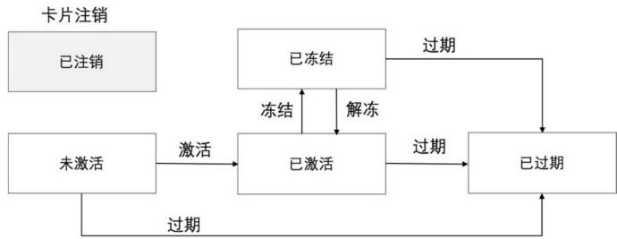

图11-13 会员卡状态

会员卡激活以后，便能正常储值、消费和积分了。使用会员卡结算 时，特定商品可以享受会员价，系统实现方式有两种。常规做法是设置 一个针对会员的促销活动，将商品设置为会员特价。还有一种简单的实 现方式：在门店商品上增加“会员折扣”字段，针对会员单独设置会员价 格，在结算时，会员就提取会员价格做结算，不过这种方式的扩展性较 差，如果会员分等级，不同等级设定的价格不同，价格体系就要跟着会 员等级做调整了。 

## 2.会员储值

具备储值功能的会员卡，可由客户通过前端链接自助充值，或者由 门店店员在门店后台代为充值，每个会员在系统中有一个余额账户，充 值就是向会员余额账户中加相应的金额。和库存的加减一样，余额的变 更一定要有清晰的流水记录，方便追溯。 

有些门店有充值送金额的活动，例如充300元送200元，在系统设计 时，我们不能直接将余额增加 500 元，这样就不好与实收金额进行对账 了，合理的实现方式是将其分为两条记录，一条是300元的充值记录， 另一条是200元的赠送记录。如果200元的赠送金额有使用限制、效期等 特殊逻辑，那么在系统里还应该设计一个赠送金额的字段，用来单独存 储赠送的金额，此时客户可用余额=账户余额+赠送金额。 

## 3.补卡与换卡

如果会员卡遗失、损坏或过期，客户可以在门店后台进行补卡或换 卡。补卡是用原卡号重新发一张新的卡片，卡号不变，但原卡应做消磁 处理，不再可用。换卡则是用会员信息关联一张新卡，卡号发生变更， 并将旧卡的信息转移到新卡中，替换后将旧卡注销。 

## 4.会员卡挂失与解挂

如果会员卡丢失了，客户可以在门店后台进行挂失和解挂，客户提 供相关身份验证信息后，由店员操作挂失，挂失成功后，将卡片状态置 为“已冻结”，解挂则将卡片状态恢复为“已激活”。 

挂失和解挂都应该记录详细的操作日志，以便事后追溯。 

## 5.会员积分体系设计

门店会员积分可以刺激客户消费，消费可以获得积分（也可通过其 他途径获取），用于在结算时抵现或兑换礼品。 

会员积分体系的设计可以分为三层，如图11-14所示。最底层是会 员的积分池，这里管理着会员的当前积分及加减积分的基本逻辑；中间 层是积分的设计规则，包含获得积分的策略和扣减积分的策略，最上层 是业务层，跟随积分相关的业务进行灵活调整。最底层是基础层，不涉 及任何业务属性，一般不轻易调整，中间层是策略层，只有业务策略调 整时才会变动，最上层是业务接入层，可以随着运营活动灵活增减。 

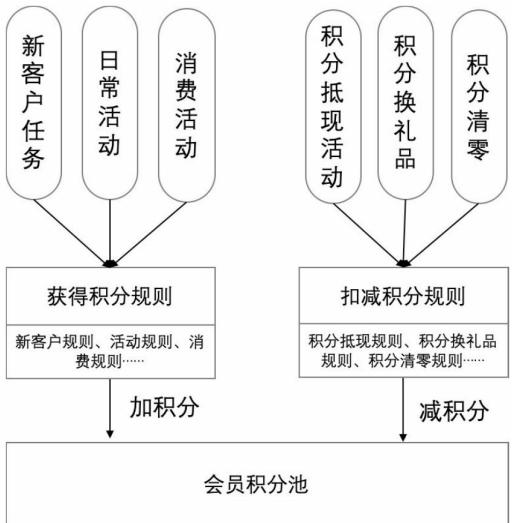

图11-14会员积分体系设计

在门店管理系统中，需要提前设置好涉及积分加减的业务和策略， 方能实现积分的正常加减业务逻辑。 

## （1）加积分策略

① 新客户任务。当客户成为新会员时，默认赠送××积分；首次分 享、购物、评论等，通过线上功能赠送××积分。 

② 日常活动。日常参与店铺开展的活动，持有效凭证在线上或门 店后台增加相应的积分，如邀请好友加入会员等。 

③ 消费获积分。设置购物消费××元，奖励1积分规则。由于购物金 额有多有少，可以额外设置获得积分的消费门槛，以及单件商品获得积 分的上限，以免有失公允。另外，线上消费和线下消费的积分规则可能 不一样，在门店后台可只设置本门店的积分规则。 

## （2）减积分策略

① 积分抵现。设置每××积分抵扣 1 元。有时为了平衡客户使用积 分和正常支付的比例，可以额外增加一些积分抵现的门槛，如单次消费 最多使用××积分、积分大于××分才允许使用积分支付等。 

② 积分换礼品。在门店后台设置可以支持积分兑换的商品 SKU 范 围及兑换积分数量，并提供会员积分兑换的系统功能，在兑换页面，录 入SKU及数量并扣减相应积分。 

③ 积分清零。设置清零规则，主要有三种：一是永不清零；二是 定期清零，如2月1日获得的积分，次年1月31日自动清零，2月2日获得 的积分，次年2月1日清零，以此类推；三是自然年清零，如每年12月31 日清除上一年获得的所有积分。 

## 11.1.5 前店POS收银系统

前店销售主要依赖POS收银系统，常规的收银流程是客户拿着商品 到收银台结账时，收银员询问客户是否为会员，将客户提供的会员卡或 手机号录入POS系统可享受会员价结算和会员积分，然后用扫码枪逐一 扫描商品条码，当所有商品扫描完成后会算出结算总金额，客户可以选 择现金、银联卡、支付宝、微信、储值卡等多种支付方式完成支付，最 后，收银员将商品和打印的购物小票一同交接给用户。 

本节我们重点介绍门店POS收银系统的常用功能设计，包含POS收 银、门店退货退款、交接班、挂账与取账、开钱箱等。POS系统以收银 功能为主，其他辅助功能都在主页中呈列，通过快捷键的方式进行快速 切换。图11-15是某超市的POS收银主页面，每个常用功能都可以通过快 捷键直接唤出。 

## 1.POS收银

POS收银就是对客户购买的商品进行结账，这是POS系统中最核心 的功能。POS结账比较依赖商品条码，每个SKU都需要有唯一的条码， 才能保证扫描的时候能对应到系统中唯一的SKU及售卖价格，否则就只 能人工匹配了，效率极低且容易出错。完整的收银结算流程如下。 

① 收银员在收银页面录入会员卡号或会员手机号，系统将当前结 算与该会员的会员卡关联。 

② 收银员扫描商品条码，POS系统根据商品条码匹配门店后台对应 的SKU及当前SKU在本门店中的零售价，如果当前SKU有正在进行中的 促销活动，或者是会员特价（促销活动和会员特价依赖于门店后台促销 管理功能），则取优惠后的单价作为结算价。如果扫描某条码多次，系 

统做商品数量累加。 

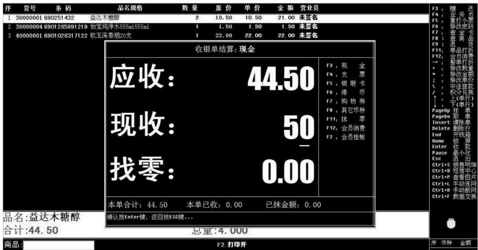

图11-15 超市POS收银示例

在特殊情况下，即便没有促销活动，收银员也可以在POS系统中直 接对单品或者整单设置折扣或满减优惠，以应对譬如门店临时开设的集 赞打折、部分单品抢购等活动，操作方式为收银员在结算前通过单品折 扣或整单折扣功能对本单商品单独设置折扣或特价。 

有些线下门店卖食品、生鲜等散称类商品，此类商品没有标准的国 标条码，但在结算前会先用条码秤称重，打印秤码，标准秤码信息中会 带有商品编码、价格、重量等信息，在结算的时候，收银员扫描条码即 能从中解析出SKU、重量和对应的价格。 

电子秤的条码，并不是随意生成的，而是分为13位和18位两种国标 规则。 

13位称重商品的条码的组成为：{标识位（2位）+PLU码（5位）+ 金额或重量（5位）+检验位（1位）}或 {标识位（1位）+PLU码（6位 ）+金额或重量（5位）+检验位（1位）}。 

18位称重商品的条码的组成为：{标识位（2位）+PLU码（5位）+ 金额（5位）+重量（5位）+检验位（1位）}或{标识位（1位）+PLU码 （6位）+金额（5位）+重量（5位）+检验位（1位）}。 

其中PLU即可设置为商品SKU编码，金额为称重商品总金额，重量 为称重商品总重量，校验位是由前面条码位数计算得出的一位校验位数 

③ 所有待结算商品扫描完成后，点击【收款】快捷键，POS系统根 据本单中的商品明细判断是否满足满减、满赠、满折等促销活动的相应 规则，如果有满足，则基于促销活动算出最终的应收金额展示给收银员 和客户。如果商品信息有误，还可以返回，修改后重新提交。 

在设计商品优惠功能时，需考虑优惠是针对整单的，还是针对单内 部分商品的，将优惠金额按照比例分摊到每个单品上，算出每个商品的 实付单价和金额，这样可以算出每个商品的收入，也可以按照实付金额 进行售后退款。如果是整单优惠，则按每个商品的金额占比进行分摊， 如果是单品优惠，则只分摊对应的单品，例如有一张满100-50元优惠券 ，单内有3个SKU A（应付50元）、B（应付30元）、C（应付20元）共 同使用了此券，则按金额比例分摊后，A、B、C实付金额分别为25元、 15元、10元。 

④ 收银员根据客户选择的支付方式（微信、支付宝、银联卡、储 值卡、现金、优惠券等）选择相应的收银工具完成收银。若客户用微信 或支付宝进行支付，收银员则在POS机上录入金额后扫描客户提供的二 维码；若客户用银联卡或储值卡进行支付，收银员则用POS机刷卡支付 ；若客户使用现金进行支付，收银员则在收银页面中录入现金金额，系 统自动计算找零金额，并弹开钱箱便于收银员存钱和找零；若客户使用 优惠券，收银员先扫描用户提供的优惠券二维码进行核销后，再收取剩 余金额。 

⑤ 支付成功后，POS系统扣减SKU在前店的库存，并打印购物小票 ，本单结算完成，单号为系统生成的结算流水号。在传统门店中，后台 库存处理一般是在做日清的时候将前店销售数据统一入账再进行扣减， 但在新零售线上线下同售业务模式下，为了避免库存滞后引发超卖，建 议线下售卖后就及时扣减门店库存并同步至中央库存系统。针对标准S KU，按出库数量扣减库存，但称重类的非标准品SKU，应该按重量进 行扣减。 

对于有批号和效期管理的门店商品，库存问题是个老大难，为了快 速出库，很多POS系统是由系统默认匹配最老的批号做库存扣减，这就 会出现系统批号和实物批号对不上的情况，从而把过期商品售出。如果 想准确管理批号，这里有一个建议：前店尽量只存放一个批号的商品， 这样系统就可以自动扣减此批号库存，如果出现了两个批号，在结算时 弹出批号让店员按照实际出库批号选择后再入账。 

## 2.门店退货

门店已经出库的商品可能因为质量问题、价格问题或者客户自身问 题需要退货退款，门店退货退款的系统处理流程如下。 

① 客户请求退货时需提供购物小票或发票，带包装的商品，其原 包装必须完好，门店店员核实无误后，在POS系统中通过快捷键进入退 货页面，根据商品或出库流水号找到原始出库订单，并在订单明细中录 入需退货商品数量，退货数量不能超过实际购买数量。 

② 门店店员选择退货原因后提交退货申请，系统根据实付单价将 退货商品金额生成一张财务退款单，将金额按照客户购买商品时的支付 方式原路退回，如果是现金支付，则弹出钱箱，由店员退还现金。 

注意：在退款时只能以实付单价（即优惠后的单价）退款，而不是 以商品零售价退款。 

退款时除了退回相应的金额，如果客户使用了优惠券，优惠券也应 该退回客户账号中，但如果只是部分商品退货，优惠券一般就不退回了 0 

退货以后，商品需重新入库并加门店实物库存（可人工操作入库， 也可系统自动记录库存到前店大货位），并同步至中央库存系统。 

图11-16为POS系统退货退款的操作示例。 

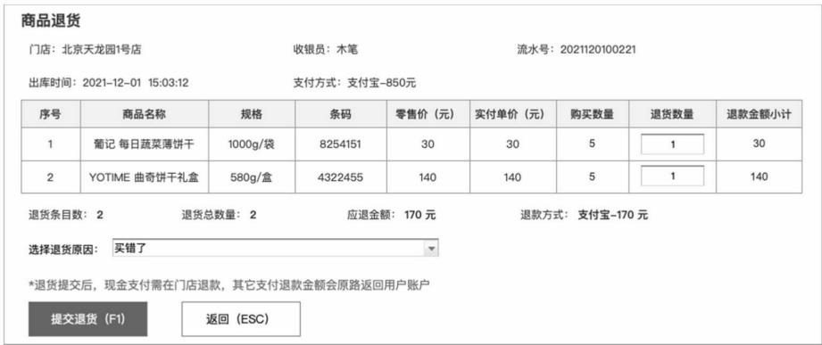

图11-16POS系统退货退款示例

## 3.交接班

收银员下班之前必须交班，将当日销售的总额、销售明细与钱箱内 的现金清点无误后提交到后台，以方便下一位收银员接手。交接逻辑为 将未提交的销售单数量、金额等信息提交到后台生成一条交接记录，如 图11-17所示。收银员可以多次交接，生成多条记录，各条记录汇总起 

来便是当日本店员的销售总额。 

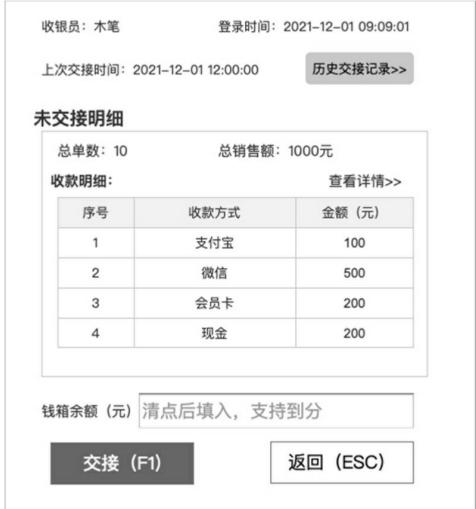

图11-17 门店交接班示例

## 4.挂账与取账

POS 系统每次只能结算一张订单，当由于某些原因需要临时暂停当 前交易并先结算下一单时，就需要将当前正在结算的交易临时挂起来， 这就是挂账。挂账的系统处理是将当前正在结算的所有商品缓存，并在 当前流水号上加上“挂起”标记，并记录挂起人、挂起时间。如果挂起的 订单长时间不处理，应予以删除。 

挂账操作示例如图11-18所示。 

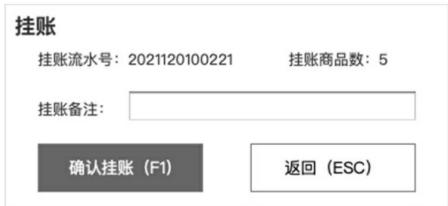

图11-18 挂账操作示例

与挂账对应的是取账，当需要将已挂起的单据继续结算时，便可以 使用取账功能将挂起的商品明细重新提取到结算页面，如图 11-19 所示 。取账以后，当前单据便从挂账列表中删除，恢复为正常单据了。 

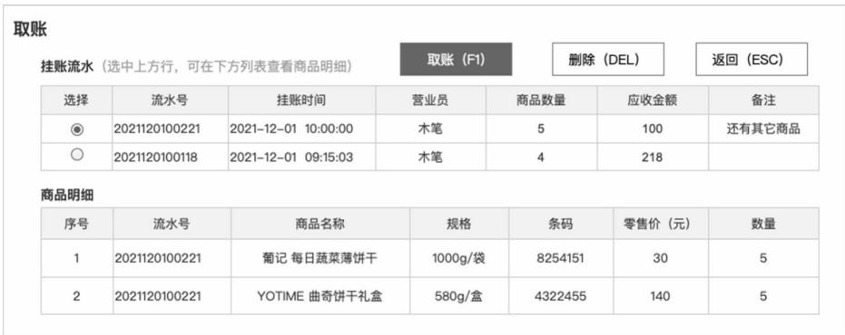

图11-19 取账操作示例

## 5.POS收银箱

一般POS系统都会配置一个收银钱箱，用来管理收银员收取的现金 ，为保证资金安全，除钥匙外，POS钱箱只能在需要现金或找零，以及 在POS系统中发送特定指令才能打开。 

POS 系统打开收银箱的原理比较简单，如图 11-20 所示。收银箱背 面有接口线，与硬件相连，硬件可以是小票打印机，也可以是钱箱驱动 卡或工控机，当现金收款或交接清点需要开箱时，由POS系统发送开箱 请求，调用硬件系统驱动开箱的命令代码，由硬件向收银箱发送一个脉 冲信号，收银箱便打开了。 

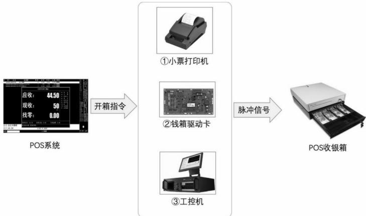

图11-20 POS收银箱开箱原理

## 6.自助结算

当结算人数过多时，收银台排队经常会成为影响客户购物体验的事 ，于是物美、永旺、便利蜂等商超率先使用客户自助结算通道，其操作 流程比收银台更加便捷，客户可独自在自助收银机器上扫描商品条码下 单结算，付款完成后会自动打印购物小票，如果需要发票，还可以直接 扫描小票上的二维码自助开具电子发票，完全释放了超市人力，这也是 供应链中通过流程优化达到降本增效目标的典型案例。 

图11-21是永旺超市的自助收银流程。

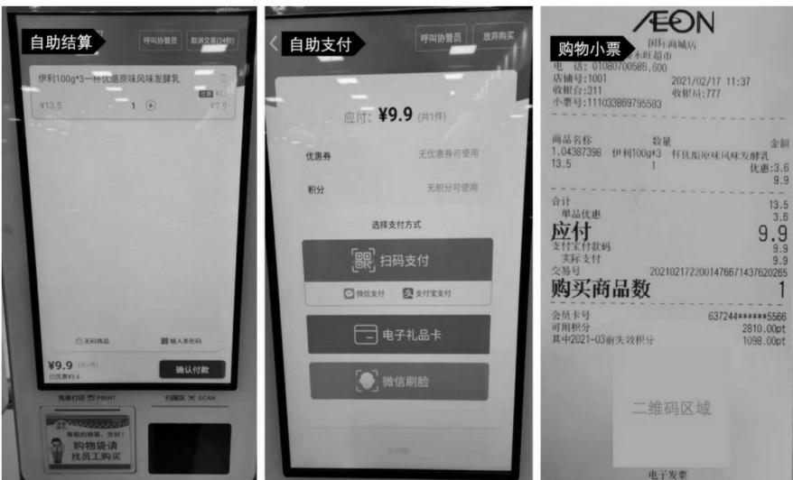

图11-21 永旺超市自助收银流程

## 11.2上下同欲：供应商管理系统

在本书前面的章节中我们经常提到供应链讲究上下游协同，协同可 以让上下游企业优势互补、资源共享、风险共担，实现整体降本增效的 目标。在与上游供应商协同的过程中，供应商管理系统无疑起着至关重 要的作用，因为这个系统可以让很多原本线下协同的工作线上化，更加 快捷。 

供应商管理系统（Supplier Relationship Management，SRM），是 企业开放给供应商使用的一套协同系统，旨在通过系统开放，流程互通 ，建立企业与供应商之间更加深度的合作关系，实现协同共赢。 

SRM的核心系统功能包含基础数据协同、采购协同和退供协同，如 图11-22所示。下面我们对这些功能一一进行介绍。 

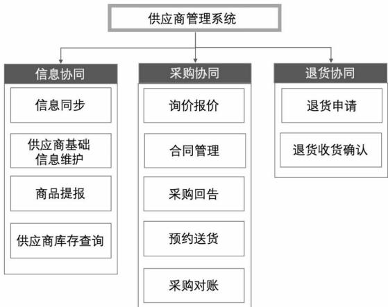

图11-22 SRM核心系统功能

## 11.2.1 信息协同

与供应商的信息协同主要包含信息同步、供应商基础信息维护、商 品提报、供应商库存查询等。 

## 1.信息同步

信息同步功能主要用于展示企业相关的一些新闻政策、活动公告、 系统通知等公告信息，以及系统待办、工单咨询等，一般显示在系统首 页，方便供应商第一时间查看。 

公告信息一般在内容管理系统（Content Management System，CMS ）或者采购管理系统中进行编辑标题、图片和内容后发布，并选择公告 对象（全部供应商可见还是部分供应商可见），并在后台控制内容的上 架和下架。信息发布以后，具备查看权限的供应商登录SRM系统便能进 行查看。 

工单咨询功能可以与企业内部的工单系统或采购管理系统打通，方 便企业相关人员针对一些线上的采购、商品等问题及时与供应商进行沟 通。 

## 2.供应商基础信息维护

为了保证采购安全，避免采购到三无产品，采购供应商和商品的引 入通常需要有较为严格的审批流程，特别在食品、医药等行业中，企业 需要收集很多的供应商资料，如法人授权委托书、营业执照、税务登记 证、经营/医疗许可证、组织机构代码证、医疗器械许可证、保健食品 许可证、质量保证协议、GMP/GSP证书、精神和麻醉许可证、医疗机 构许可证等，证件不全的企业是不允许执行采购的，但如果所有的证件 信息全部由采购人员一一找供应商提供后再录入基础数据中心，效率会 比较低，这时如果有SRM系统，便可以将供应商信息的维护和证件上传 功能交给供应商来维护，采购人员只需要执行信息的审核工作即可，工 作效率至少可以提升10倍以上。 

另外，供应商经常会有变更地址、变更联系方式、证件过期更换等 诉求，也可以通过SRM及时更新。 

## 3.商品提报

和供应商基础信息维护一样，如果有新商品需要引入，除了采购部 在基础数据中心维护，也可以将商品基础信息交由供应商提报。另外如 果供应商有新品想要主动加入企业的采购目录，也可以在SRM中做提报 申请。 

## 4.供应商库存查询

为了更好地体现供应链协同，可以让供应商在SRM系统中查看自己 的商品在企业内部各仓的库存和历史销量信息。因为供应商处于供应链 的上游，往往很难接触到一线真实的交易数据，只能通过销量预测来做 计划，但预测总是不准的，这便导致了牛鞭效应，如果能及时获取下游 企业提供的终端零售数据，这将是莫大的财富，需求预测、生产计划、 销售计划、生产加工都将有更准确的数据支撑，使用得当，能极大地降 低供应成本并反哺于零售企业，这便是供应链协同的魅力。 

## 11.2.2 采购协同

SRM 系统最核心的功能是采购协同，从采购询价，到采购下单， 供应商送货，再到商品入库后的采购结算，都可以通过SRM系统进行过 程管理。 

## 1.询价报价

询价报价功能是供应商对采购发起的询价反馈报价的过程。供应商 询价报价流程如图11-23所示。 

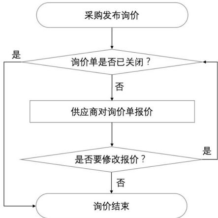

图11-23供应商询价报价流程

询价单分为公共询价和指定供应商询价两种类型，公共询价即所有 相关供应商都可以看到并为询价单下的商品逐一进行报价，指定供应商 询价则是由采购人员指定特定的供应商进行报价，即只有这些供应商能 够看到询价单信息。 

询价单会设置一个有效期，在有效期内，供应商可以对询价单进行 多次报价，直到询价单过期关闭或者人工关闭。询价结束后，采购人员 会基于各供应商的报价进行比价并寻找最合适的供应商实施采购。 

## 2.合同管理

采购人员与供应商确定采购事宜后，可以在线签订电子合同。具体 做法为：采购人员维护好合同模板和合同细则，并通过SRM推送给供应 商，供应商可以查看合同细则，并在线签署。线下签署的合同，也可将 PDF版合同上传到系统中，并设置合同的有效期，当合同快到期时，系 

统做预警提示。 

## 3.采购订单确认

采购人员创建采购订单以后，可将采购订单信息下发SRM系统，由 供应商回告商品送货数量、确认采购单价和送货时间，确认以后，再将 采购订单下发仓库，如图11-24所示。 

确认功能的好处有二：一是可以由供应商对采购订单做二次确认， 避免后续在财务方面出错，二是如果供应商不能满足采购需求，也能及 时告知，采购人员可以调整采购计划，不至于措手不及。 

在设计确认功能时，需要支持分批送货，送货时间需要按商品进行 设置，如果某商品不能满足数量要求或不能按时送货，供应商需要回告 原因。 

供应商收到采购订单后，便开始生产、备货。在送货之前，可以通 过SRM系统在线预约送货时间，根据仓库的收货能力安排送货。在线预 约的内容比较多，我们将在下一节中详细介绍。 

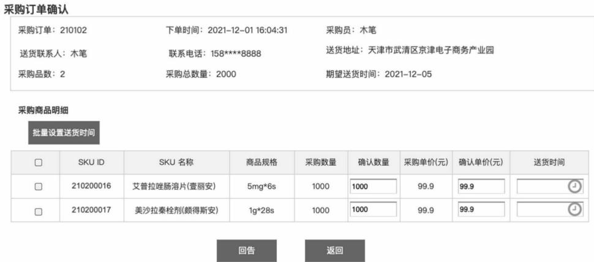

图11-24采购订单确认示例

## 4.采购对账与结算

采购单入库以后，财务系统会生成应付账款，在结算前，财务部门 的相关人员需要对已收商品明细、发票和采购明细进行对账，确保账实 相符。当然，对账是双方面的，供应商也可以在SRM系统中对收货商品 明细进行对账，核实系统中每张采购单下的SKU的采购单价、折扣、实 收数量是否有误，如果有差异，可以在线提报，由采购人员核实、调整 

除对账功能外，针对采购单的财务结算进度、打款进度，也可以通 

过SRM在线展示给供应商，让信息更透明。 

## 11.2.3 预约送货

每个仓库的场地面积、收货能力是有限的，如果所有的供应商都在 同一时刻送货，会造成拥堵、候时太长，因此供应商在送货之前需要先 与仓库预约送货时间，按照预约时间有序送货。预约的流程可以单独设 计成一个预约系统供企业内部或者供应商登录使用，也可以放到SRM系 统中开放给供应商进行在线预约。 

预约送货的流程如图11-25所示，由供应商在SRM系统中预约送货 时段，货物送到仓库后进行到货登记并安排验收，到货和验收完成的状 态可以同步到SRM系统中供供应商查看。 

## 1.预约基础配置

仓库每天的收货能力是有限的，在供应商预约前，采购部门或仓储 部门的相关人员需要先在系统后台维护好仓库的收货能力，此能力便是 每日可收货的最大件数，如果预约的送货量超过收货能力，当天就不能 再预约了。 

收货能力配置要素包含仓库、每日收货能力（件）、配置有效期（ 此配置在有效期内有效），在有些综合品类仓中，还需要为每个品类单 独分配配额，保证各个品类的收货均衡，各配额合计收货能力不能大于 仓库收货能力。如图 11-26 所示，华北 1 仓在 2021 年的收货能力为100 00件，分配给各品类的配额分别为3C 3000件、服装3000件、日百3000 件、其他品类1000件。 

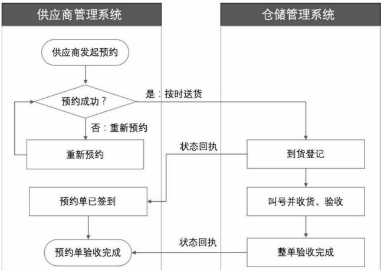

图11-25预约送货流程

<table><tr><td>仓库编号</td><td>仓库名称</td><td>城市</td><td>收货能力配额(件)</td><td>预约配额分配(件)</td><td>有效期</td></tr><tr><td>HB-001</td><td>华北1仓</td><td>北京</td><td>10000</td><td>☑3C: 3000 ☑服装: 3000☑日百: 3000 ☑其它: 1000</td><td>2021/01/01~2021/12/31</td></tr><tr><td>HB-002</td><td>华北2仓</td><td>天津</td><td>10000</td><td>☑3C: 3000 ☑服装: 3000☑日百: 3000 ☑其它: 1000</td><td>2021/01/01~2021/12/31</td></tr></table>

图11-26仓库收货能力配置示例

除了收货能力，还需要提前定义好每个仓库可预约时间（如09：00 —18：00）、预约开放时间段（供应商只能在开放时段内登录系统进行 预约）、供应商可预约天数（可预约未来××天）等基础配置。 

## 2.预约送货

供应商在送货前，在系统中对需要送货的采购单预约送货时间和送 货数量，预约流程为供应商先在需要送货的采购单明细下填写本次需要 预约送货的数量（如果商品有批号管理，还可以让供应商在预约时填写 批号信息随预约单下传到仓储管理系统中，这样可以减少仓库管理人员 收货录入的工作量），各明细数量合计起来便是此采购单中本次预约数 量，然后将相同送货仓库下需要一起送货的多张采购单一并预约送货时 间。 

图11-27为供应商预约送货的操作示例。 

可预约的送货时段和预约天数是各仓库在基础配置中提前设定好的 ，供应商在预约开放时段内登录SRM系统进行预约，一般可预约当天及 以后××天的××时段。预约成功的前提是本次预约的商品数量小于预约 时段下剩余的收货能力，如图 11-28 所示，本次预约 3 张采购单合计数 量500，故可预约剩余收货能力大于500的任意时段，图中除了星期一的 08：00—10：00及周日全天不支持预约，其他时间都可以预约。 

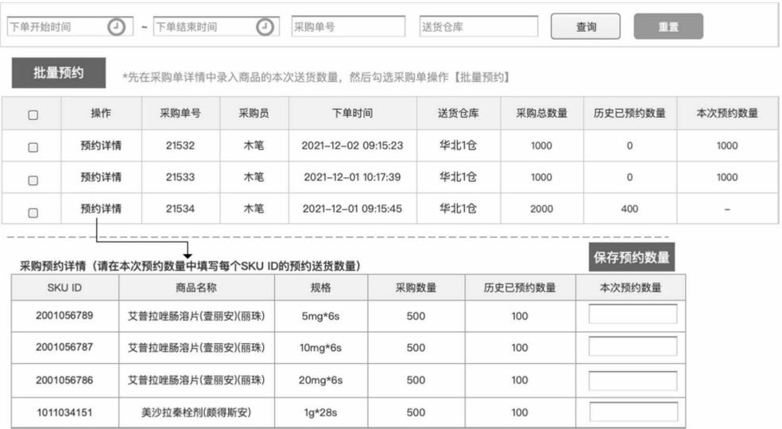

图11-27采购单预约送货示例

<table><tr><td colspan="8">预约仓库:华北1仓 预约采购单数:3 预约商品总数:500 预约送货品类:服装</td></tr><tr><td colspan="4">返回修改预约数</td><td colspan="2">*双击单元格开始预约</td><td>可预约</td><td>不可预约</td></tr><tr><td>日期</td><td>星期</td><td>剩余量/收货能力</td><td>08:00-10:00</td><td>10:00-12:00</td><td>12:00-14:00</td><td>14:00-16:00</td><td>16:00-18:00</td></tr><tr><td>2021-12-13</td><td>星期一</td><td>4000/10000</td><td>已约:2000可约:0</td><td>已约:1000可约:1000</td><td>已约:1000可约:1000</td><td>已约:1000可约:1000</td><td>已约:1000可约:1000</td></tr><tr><td>2021-12-14</td><td>星期二</td><td>5000/10000</td><td>已约:1000可约:1000</td><td>已约:1000可约:1000</td><td>已约:1000可约:1000</td><td>已约:1000可约:1000</td><td>已约:1000可约:1000</td></tr><tr><td>2021-12-15</td><td>星期三</td><td>5000/10000</td><td>已约:1000可约:1000</td><td>已约:1000可约:1000</td><td>已约:1000可约:1000</td><td>已约:1000可约:1000</td><td>已约:1000可约:1000</td></tr><tr><td>2021-12-16</td><td>星期四</td><td>5000/10000</td><td>已约:1000可约:1000</td><td>已约:1000可约:1000</td><td>已约:1000可约:1000</td><td>已约:1000可约:1000</td><td>已约:1000可约:1000</td></tr><tr><td>2021-12-17</td><td>星期五</td><td>5000/10000</td><td>已约:1000可约:1000</td><td>已约:1000可约:1000</td><td>已约:1000可约:1000</td><td>已约:1000可约:1000</td><td>已约:1000可约:1000</td></tr><tr><td>2021-12-18</td><td>星期六</td><td>5000/10000</td><td>已约:1000可约:1000</td><td>已约:1000可约:1000</td><td>已约:1000可约:1000</td><td>已约:1000可约:1000</td><td>已约:1000可约:1000</td></tr><tr><td>2021-12-19</td><td>星期日</td><td>0/0</td><td>-</td><td>-</td><td>-</td><td>-</td><td>-</td></tr></table>

图11-28预约送货时间

当然，以上只是最简单的预约送货策略，实际上我们不能保证仓库 在每个时段的收货件数和系统设定的收货件数一模一样，也不能保证供 应商的预约送货量与每个时段的收货量完全吻合，所以更多的时候需要 考虑的是动态收货能力，即只要当前预约时段的剩余量+后续时段剩余 可预约量≥预约数量，即允许预约。怎么理解呢？举个例子。 

某仓库周二服装类商品的各时段剩余可预约量如表11-1所示。 

表11-1某仓库各时段可预约送货量

<table><tr><td>时段</td><td>08:00—10:00</td><td>10:00—12:00</td><td>12:00—14:00</td><td>14:00—16:00</td><td>16:00—18:00</td></tr><tr><td>可约量(件)</td><td>100</td><td>100</td><td>100</td><td>100</td><td>100</td></tr></table>

某供应商A需要送货400件，如果按照以上简单算法，则没有一个 时段能够预约了，实际上仓库还有 500 的剩余可预约量。于是我们调整 一下预约送货策略，只要预约时段剩余量+后续时段剩余可预约量≥预约 数量，即允许预约，那么供应商A就可以预约08：00—10：00、10：00 —12：00两个时段了，12：00—14：00、14：00—16：00、16：00—18 ：00三个时段向后累加剩余可预约小于400，则不能预约，这样就解决 了仓库容积浪费的问题。 

当然这种算法也不完美，如果只要前面时段有少量空余就可以预约 ，后来预约的供应商即便需要送大量的货也可以预约前面的时段，如供 应商A预约了08：00—10：00，那么实际收货完成一定会超过10：00， 从而拖慢了原本预约10：00—12：00的供应商B，对供应商B是不公平 的（大家可以思考更合适的预约送货策略，供应链管理的乐趣就在于不 断地发现问题，解决问题）。 

预约之后，系统会将已预约的所有采购明细生成一张预约单，对应 一个预约单号，此单号是供应商送货到仓库后签到和叫号的依据，一张 预约单可以对应多张采购单，每张采购单也可以预约多次，生成多张预 约单，但多次预约的商品总数量不得超过采购数量。在送货前，系统要 支持随时对已预约的预约单进行修改、重新预约。 

在介绍仓储管理系统时，我们讲到，根据预约单的操作节点我们可 以将预约单状态设计为待审核、预约成功、已签到、验收完成、驳回、 已取消。预约单生成以后，由仓库的相关人员进行审核，审核通过了才 算预约成功，否则可以对此预约单进行驳回或者取消。供应商送货到仓 库签到和整单完验后，相关人员可以将收货状态回传到供应商管理系统 中，方便供应商查看收货详情。 

## 3.紧急预约

为了应对突发情况，还可以为某些特定情况的采购单设定紧急预约 功能，紧急预约功能可以不设预约时段和预约数量限制，随时可预约成 功，但只能针对有特殊权限的客户开放，用于临时性操作。 

## 11.2.4 退供协同

在退供应商流程方面，供应商管理系统可以提供供应商退供申请、 退供预约和退供签收等协同功能。 

## 1.退供申请

针对一些物权还归供应商所有的商品，或者供应商管理库存（VMI ），以及供应商需要自主召回商品的情况，供应商可以在供应商管理系 统中发起商品的退供申请，退供申请包含运输方式（上门自提还是仓库 发物流）、收货人信息、退货商品、退货数量等。退供申请单生成以后 ，由采购部门的相关人员审核同意后方能下发仓库进行拣货出库，仓库 发货后，将出库信息回传至供应商管理系统方便供应商查看，出库信息 包含实际发货的商品、数量及发货物流等。 

根据退供的节点，退供申请状态可以设计为创建、待发货（审核通 过）、驳回（采购驳回）、已发货（仓库已发货状态）、确认收货（供 应商确认收货）。 

## 2.退货预约

如果退供的商品需要供应商自提，或者委派三方物流前来提货，同 预约送货一样，供应商管理系统可以提供预约取货的功能，根据仓库每 日的退货能力在线预约取货日期及时段，预约逻辑可以参考送货预约流 程。 

## 3.退货签收

退货商品送达供应商处以后，供应商核实无误后在线确认收货，对 退供申请进行完结。如果有差异，可以在线反馈差异，交由仓库的相关 人员进行核实处理。 

## 11.3超级增援：商家发货系统

零售企业发展到一定阶段以后，如果自身商品品类和库存无法完全 满足客户需求时，必然会引进外部商家进行商品供应和发货，这是供应 链协同的必然趋势。如何让商家库存能迅速地接入平台、快速地承接订 单并发货，在为平台供应商品的同时为商家增收，便需要商家发货系统 出场了。 

商家发货系统，现在主流的简称是POP（Plan of Open Platform）， 取自京东的商家系统命名，主要与自营业务相区分，由商家操作此系统 进行商品运营和发货。在系统流程方面，订单在订单履约中心中匹配到 发货仓库后，如果是某个商家的商品，会下发到商家系统操作发货。 

说明一下，虽然发货商家和供应商都是为平台提供商品供应，但二 者有着本质的区别，供应商属于企业的供应链上游，与企业是购销关系 ，商品采购以后物权便属于企业，进入企业的仓库进行存放，而发货商 家相当于企业的一个外部仓库，帮平台代发货，商品物权属于商家，根 据商家与企业约定的合作方式，以金额提成或固定成本核算的方式与企 业进行结算。 

## 11.3.1两种商家发货模式

根据合作方式的不同，商家发货的模式有两种，如图11-29所示。 第一种是开店模式，商家在平台上以独立店铺运营自家商品业务，下单 后由商家自主发货，现在主流电商如天猫、京东都是这种模式；第二种 是合作代发模式，商品运营的主导权还是平台，商家作为平台发货货源 的补充，当需要商家发货时，便将订单下发商家系统进行代发。 

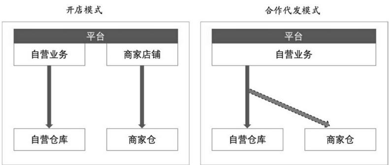

由于业务形态的不同，两种商家发货模式存在较大的差异。 

在平台的展现形式上，开店模式的商家以独立店铺的方式呈现，代 发模式的商家则没有店铺属性，对外呈现的只有平台。 

在商品管理形态上，开店模式的商品完全由商家自行发布、自行定 价，即便和自营业务是同一个实物商品，SKU ID也会生成多个，可以 认为和自营是完全独立的，互不干扰；代发模式则是走平台自营商品发 布和定价规则，商家只充当发货仓库的角色，所以商家的商品SKU编码 和定价都与平台保持一致。 

在发货形态上，在开店模式下客户下单便由商家发货，而在代发模 式下，商家则承担着自营业务后补仓库的角色，只有满足发货条件的订 单才会从订单履约中心下发商家发货系统进行发货。 

在结算方式上，开店模式是商家根据平台规则给平台交佣金（如抽 佣 1%），而代发模式则是平台根据商品的发货量为商家结算费用（如 每销售1件结算10元）。 

## 11.3.2商家发货系统架构

开店模式的商家的供应链进销存业务是完全独立的，由商家自主负 责，和企业内部的供应链几乎没有交集，我们重点讲讲代发模式的商家 发货系统设计，因为它是企业内部供应链体系中很重要的一环：商家仓 布局。 

在电商新零售供应链体系中，中央库存系统中有三种库存，分别是 企业自营入仓的仓储库存、新零售的门店库存和合作商家的商家库存， 这三种库存合起来为销售平台提供库存供给，当产生订单以后，在订单 履约中心进行库存的调度，如果从自营仓发货，就将订单下发到仓储管 理系统中，如果是门店发货，则将订单下发到门店管理系统中，如果是 商家发货，则将订单下发到商家发货系统中。由此可见，商家发货系统 在供应链中同仓储管理系统和门店管理系统一样，承担着承接订单发货 和库存供给两方面的职责。 

商家发货系统之于整个供应链的定位，如图11-30所示。 

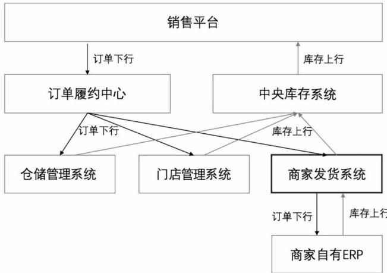

图11-30商家发货系统定位

商家发货系统的使用方是为平台提供库存供给的合作商家，有的商 家有自己的 ERP 系统，可以通过平台开放的API接口与商家ERP系统互 通，实现功能和数据层面的共享。 

商家发货系统分为管理端和商家端两个子系统，管理端主要提供给 企业内部，用于管理所有商家，商家端是为每个商家开设一个商家账号 ，供商家登录，处理商品、订单和库存。商家发货系统的核心功能如图 11-31所示。 

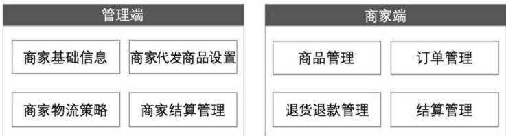

图11-31商家发货系统核心功能

若要实现商家代发业务，大体流程如图 11-32 所示。先由管理员在 管理端添加商家基础信息，为商家开设商家端账号，然后为商家设置其 代发货的商品目录及配送范围。商家有了账号以后便可以登录商家端， 为代发商品设置库存，商品库存会同步到中央库存系统中供用户下单。 用户下单以后，订单履约中心根据订单收货地址和库存进行分仓，如果 判定为商家发货，则将订单下发至商家端，提醒商家拣货、发货，商家 在商家发货系统中完成打印面单、拣货、打包、发货。 

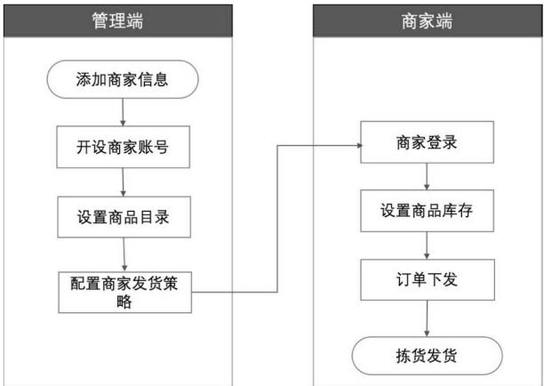

图11-32商家代发货全流程

## 11.3.3管理端设计说明

商家管理端主要用于管理商家基础信息、商家代发商品设置、商家 物流策略、商家结算等，属于后台系统，主要使用方是企业内部的采购 、运营等部门，在实现方式上可以独立，也可以放至采购管理系统、运 营系统中，还是那句话，功能放在哪里并不重要，重要的是能满足业务 诉求。 

## 1.商家基础信息管理

业务启动之初，采购部门或运营部门的相关人员会先和商家谈合作 意向，确定合作后，在管理端维护商家基础信息并为商家创建账号。商 家基础信息可以参考供应商基础信息设置。 

① 基本信息：商家编码、商家名称、企业法人、联系人、联系电 话、商家发货地址（省、市、区、详细地址）、经营范围（3C、数码、 酒水、服装等，可以取商品的一级类目）、营业三证附件（营业执照， 税务登记证，企业组织机构代码证）、统一社会信用代码、营业期限等 

② 财务信息：企业名称、开户行、开户城市、开户名、银行账号 、税号、结算方式（月结/季度结/年结）、账期等。 

基本信息维护完成后，为商家创建商家端的登录账号，登录方式一 般支持账号密码、手机号、短信验证码等。 

如果商家违规，或者紧急情况下无法进行发货，相关人员可以在管 理端对此商家进行停用，已停用的商家，其下所有库存均被冻结，不再 作为可用库存进行分仓预占，这样就可以通过商家状态有效控制商家订 单分配。 

## 2.商家代发商品设置

商家能够代发的商品目录应该是由平台指定的，一般为平台无法采 购的、价格更有优势的或平台缺货的商品，并且每个商家的代发商品目 录应该不同，所以相关人员需要在管理端为每个商家配置其可以发货的 SKU目录，只有加入目录的商品，商家才能够在商家端中维护商品的库 存信息。商品设置包含添加、删除、启用、停用功能等。如果需要临时 对某商家的SKU进行限制，可以使用停用功能，若恢复正常，则启用。 

## 3.商家物流策略设置

商家物流策略为商家配置其所支持的配送范围，为订单分仓提供策 略支撑。配送策略设置分为三部分。 

① 配送方式。支持物流配送或者自提，如果合作的是商家仓库， 一般只支持物流配送，如果是门店，则还可以支持用户到店自提业务。 支持物流配送的商家，继续设置物流配送范围，只有在配送范围内的订 单，才会被分配到该商家发货；支持自提的商家门店，用户在用户端利 用LBS（Location Based Serivices，基于位置的服务）能够定位到此门店 ，下单后可以直接到店自提，或者直接到店购买。 

② 支持配送的物流公司。如果是平台承担物流运费，基于成本考 虑，可以为商家配置其支持的物流公司，以便在线预约物流，只能使用 商家支持的物流公司发货。 

③ 基于商品的配送设置。在某些场景下，个别商品的配送范围与 商家的配送范围不一致，需要单独配置商品维度的配送范围。 

图11-33是某商家的物流策略配置示例。 

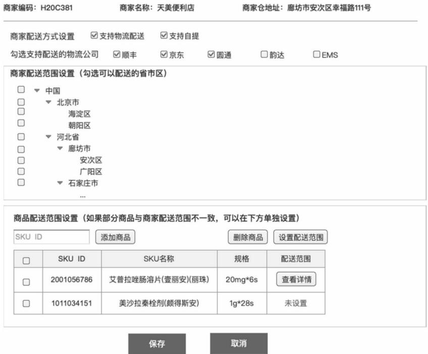

图11-33商家物流策略配置示例

物流策略配置以后，满足策略规则的订单便会被分配给指定的商家 ，由商家完成履约。订单分配规则总结如下。 

① 订单在订单履约中心的分仓环节中，基于中央库存系统中的可 用库存匹配满足库存的仓库或门店，包含自营仓、门店和商家仓。 

② 物流配送订单，从满足条件的仓库、门店列表中根据订单收货 地址继续匹配在配送范围内的仓库，此时如果商家仓不在配送范围内， 就不会被分配到。如果有多个仓都能满足配送条件，则再根据距离优先 、包裹数量最少、成本优先等策略排序后获取最优仓库，如果匹配到商 家仓，则将订单推送至商家发货系统。 

在做商家配送范围匹配时，优先匹配商品单独设置的配送范围，如 果没有，再匹配商家的配送范围。 

③ 自提订单，用户在下单时就已经指定门店了，如果该门店是商 家门店，订单在订单履约中心分仓预占后直接下发商家端。 

## 4.商家结算管理

同采购入库后需要与供应商结算一样，订单交易产生以后，平台也 需要与代发货商家结算。要实现商家结算，管理端需要提供两个功能： 商家结算规则设置和结算对账功能。 

## （1）商家结算规则设置

结算规则是合同中与商家约定的结算规则，双方以此规则对发货商 品进行结算。常用的结算规则如下。 

①按固定金额结算。例如，每销售一盒，平台支付商家××元。 

② 按金额比例结算。按商品的销售金额，设置结算比例，如每盒 按销售价提成10%。 

结算规则可以设置到商家维度，其下所有商品均参考此规则，也可 以设置到商品维度，针对每个商品，设置单独的结算规则，还可以二者 结合，如果有商品维度的规则就按商品维度的规则结算，否则就以商家 维度的规则结算。 

## （2）结算对账

配置了结算规则后，每到结算日，系统便能自动将已发货且未退回 的商家订单基于结算规则计算出需要支付给商家的金额，生成对账单推 送到商家端，以便商家对账确认，对账单信息包含：商家名称、统计时 间段、SKU、销售数量、结算金额（根据结算规则计算所得的金额）等 

商家在商家端查看并确认对账单，如果有差异，可以反馈差异，总 部修改对账单后继续对账，直到双方均认可对账结果为止，最终确认的 结算金额及结算明细信息由管理端推送到财务系统中，生成财务结算单 ，财务会计审核通过后将账款打入商家指定银行卡内。 

对账单状态可以设计为新对账单、待商家确认、商家已确认、待财 务付款、已打款5个状态，状态变更如图11-34所示。 

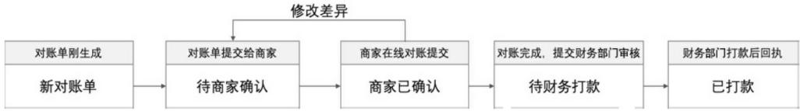

图11-34对账单状态设计

除以上核心功能外，管理端还可以扩展新闻政策、活动公告、系统 通知等公告管理功能，用以和商家端信息同步。 

## 11.3.4商家端设计说明

商家端的使用对象是代发货商家，代发货商家使用管理端开设的商 家账号登录后处理商品、订单、退货退款及结算对账等业务。不同于管 理端可以查看和管理所有商家的数据，商家端需要设定数据权限，每个 商家只能看到自己名下的商品及订单等数据。 

## 1.商品管理

商家可以登录商家端管理平台分配给自己的商品，包含查看商品信 息、设置商品库存等。 

① 查看商品。在商家端可以查看自己的商品目录、商品的配送范 围、当前的可用库存、启用/停用状态等。 

② 设置商品库存。商家可以在在商家端设置商品的实物库存，设 置的库存会同步到中央库存系统中，作为平台的可用库存提供给各渠道 售卖。商家设置库存时修改的是中央库存系统中的实物库存数量，直接 覆盖，不需要加减。 

在设计设置商品库存功能时，有个设计细节需要说明：修改后的库 存数量必须大于等于被订单占用的库存数量，因为需要预留部分库存用 作订单发货处理，如果实物库存数量小于已占用库存数量，订单发货就 会因为库存不足而无法正常流转。如图11-35所示，商家在设置和修改A 商品的库存时，因为已经被订单占用30，故修改的库存数量只能大于等 于30。 

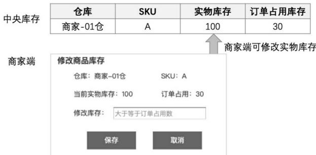

图11-35商家端设置库存

爱动脑筋的朋友可能会问：虽然有订单占用，但当前仓库确实没有 实物库存了，只能修改为0，该如何处理？ 

遇到这种情况，说明商家的库存出现了账实不符的情况（手工设置 库存难免出现这种情况），建议先将已下发的订单驳回，由相关人员重 新指派给其他仓库发货，这样本商家仓被占用的库存就释放了，再由商 家修改为0即可，一旦库存设置为0了，订单再分仓时就不会分配此商家 了。 

## 2.订单管理

商家发货系统最核心的功能就是管理商家的订单。展示给商家端的 订单信息包含订单号、下单时间、支付方式（在线支付/货到付款/到店 支付）、订单状态、物流方式（物流配送/自提）、收货人信息（姓名 、电话、地址等，如果是自提，还可以生成提货码）、待发货的 SKU 及发货数量等。 

订单管理包含确认订单、驳回订单、打单发货、确认发货、取消订 单等，如图11-36所示。 

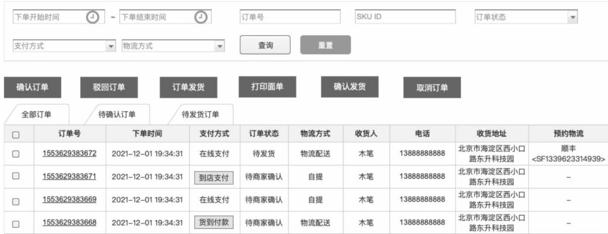

图11-36商家订单管理示例

① 确认订单。订单下发至商家端以后，先让商家确认订单可发货 。让商家确认订单可发货的原因有两个：一是提醒商家及时回告，以免 订单超时，如果确认了代表商家接受此单的发货任务。二是因为商家设 置的库存并不能保证其真实性，确认订单可以让商家核实是否能正常履 约，若不能，相关人员可及时将订单拉回并指派其他仓库。 

② 驳回订单。如果商家因为自身原因或库存原因无法对订单进行 发货，可以操作驳回，将驳回原因回告相关人员，由相关人员再指派其 他仓库发货。如果商家无法正常发货，应提示商家及时修改商品库存或 商品状态，以免将其他订单再分配到该商家。 

另外，如果商家长时间不确认或者驳回订单，如超过24小时，为避 免订单超时，系统需要增加一个撤回机制，将已下发的订单撤回，然后 由相关人员或系统再指派其他仓库发货，撤回的订单，在商家端显示为 “已撤回”。针对经常超时撤回的商家，比较影响用户体验，应该从运营 

层面给予其一定的处罚措施。 

③ 打单发货。已经确认的订单，商家就可以开始拣货、发货了， 商家端提供拣货清单打印、物流预约和面单打印功能。拣货清单上包含 订单信息、SKU、发货数量等，为节省纸张，拣货清单可以与购物清单 一起设计，拣完货以后再用作购物清单提供给用户，一举两得。物流预 约功能可以复用配送管理系统中的预约物流单号和物流面单功能，商家 可以在线预约支持配送的物流，预约成功后自动打印面单。 

④ 确认发货。拣货和打单发货以后，商家还需要操作最后一步： 确认发货，即商家已完成了此订单的发货操作。如果是预约物流，商家 需要在此环节回填物流公司和物流单号；如果是用户上门自提，在确认 发货环节核实用户身份后，将订单状态直接变更为已签收；如果是到店 支付订单，支付完成后，还需要在此环节录入用户的实际支付明细，以 便后续与平台进行对账结算，系统要支持多种方式混合支付，如支付宝 ××元，微信××元，现金××元，如图11-37所示。 

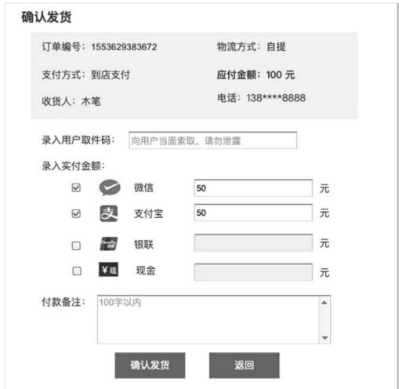

图11-37确认发货示例

⑤ 取消订单。订单在确认发货前，支持用户取消，已取消的订单 ，状态变为“已取消”，释放中央库存系统中的订单预占库存，商家在确 认发货时，系统给予拦截提醒，由商家将预出库的商品还货入库。 

为避免在系统发货和实物发出的间隔期内订单被取消并退款的情况 发生，除了系统拦截提醒，还要从流程上加以约束，即先确认发货，再 将包裹交接给快递员或用户。 

根据订单的操作节点，商家端的订单状态可以设计为图11-38所示 

的样子。 

## 3.退货退款管理

不管是自营仓，还是商家代发货仓，给用户的服务体验应该是一致 的，当用户在前端发起退款时，不能因为自营仓系统健全而退得快，而 商家仓系统不够完善而退得慢。 

根据用户发起退款的时机，退款可以分为售前退款和售后退款，售 前退款对应的系统流程为取消订单，此时商品还未出库，如果取消订单 成功可自动退款，售后退款对应的系统流程为退货并退款，因为商品已 出库，用户需要先将商品退回（如果物流在途尚未签收，需要用户拒收 后将商品退回），商家收到商品并核实无误后，在系统中确认退货后再 操作退款，退款方式一般按用户支付方式原路返回。如果是货到付款或 到店支付的订单，需要判断用户是否已付款，商家只针对已经支付过的 订单进行退款。 

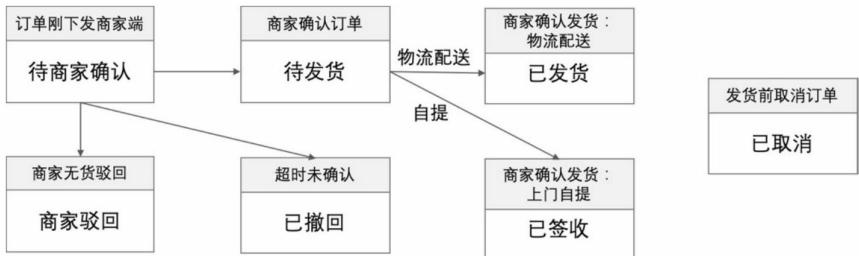

图11-38商家端订单状态设计

退货退款流程如图11-39所示。 

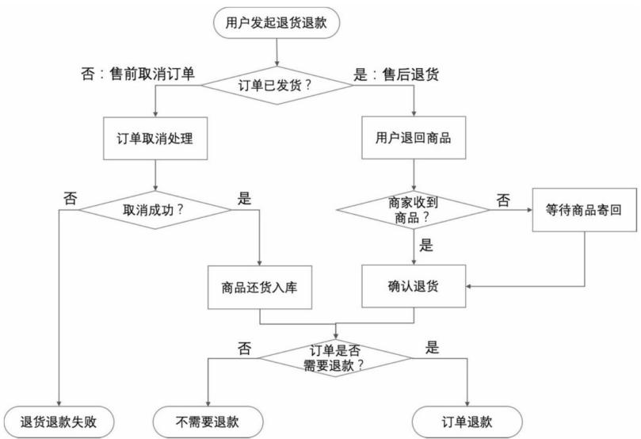

图11-39商家退货退款流程

根据订单的支付方式和退款时机，系统提供不同的退货退款逻辑， 如表11-2所示。 

表11-2商家退款退货处理逻辑

<table><tr><td>退货退款类型</td><td>在线支付订单</td><td>货到付款/到店支付订单</td></tr><tr><td>发货前仅退款</td><td>订单取消成功后退款</td><td>只取消订单,无须退款</td></tr><tr><td>发货后退货退款</td><td>商家收到退货后再退款</td><td>·拒收订单(未支付):只退货,不退款·签收后(已支付):商家收到退货后再退款</td></tr></table>

在系统功能方面，商家端提供退货确认功能，支持对订单中的部分 或全部商品操作退回，商品退回后，系统标记当前商品为退回状态，如 果需要退款，则按照收到商品的实付金额通知财务系统退款。 

注意：一定要确保用户申请退款的商品和商家收到的商品一致后才 能退款，如果不一致，需要核实清楚后，以实际收货商品进行退款。 

## 4.结算管理

商家发货以后，平台会按照合同约定，根据约定的结算方式定期生 成对账单，并将其推送至商家端，商家对系统生成的结算金额进行确认 ，如果有差异，可以在商家端对差异明细进行标记，然后将对账结果推 送管理端供采购部门或运营部门查看（见图 11-40），双方就差异部分 进行核实确认，然后修改对账单，直到双方对所有明细的结算金额达成 一致。采购部门或运营部门的相关人员从管理端将最终确认的对账单推 送到财务系统中，生成财务结算单，财务会计审核通过后将账款打入商 家指定的银行卡内，商家端可以查看财务结算进度和打款进度。 

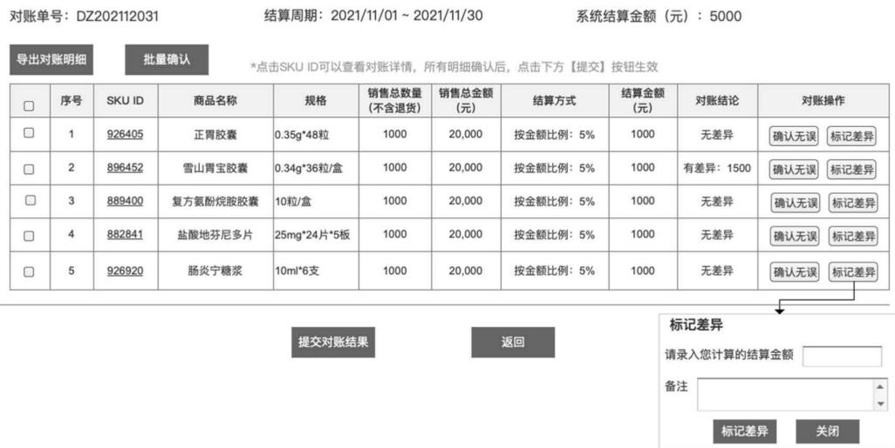

图11-40商家对账单示例

## 11.3.5 接口开放

很多商家都有自己的进销存系统，用于库存管理，在做代发货业务 时，他们更倾向于通过系统对接的方式，将商品、订单信息打通，以免 操作商家端发货以后，还要再到自己的系统里重复操作一次出库。针对 这种情况，我们就需要使用接口开放，将商家的信息开放给商家的系统 做对接。有了接口以后，商家就不需要操作商家端了，只需要将订单拉 取到自己的进销存系统中进行操作，然后将操作结果同步到商家端，变 更状态即可。 

接口开放的实际操作可繁可简，简单的方式是将商家端需要用到的 功能做成接口功能提供给商家的系统调用，但这样的交互方式安全性较 低，特别是将核心的系统功能对外开放，容易遭到攻击，从而影响到内 部系统的稳定性，所以大平台一般都会使用复杂而安全的方式对外开放 接口：它们会搭建接口开放平台，将接口服务通过开发平台对外公布， 所有需要调用企业内部接口的外部软件都需要先在开放平台注册成为开 发者，经过平台认证并授权通过后才能调用接口，开发平台会对调用次 数和调用频率进行监控和控制。图 11-41 为接口开放平台系统架构图， 关于接口开放平台的搭建可以参考京东的宙斯平台、阿里巴巴的服务开 放平台等，相关内容不属于供应链的系统范畴，本书中就不详述了，感 兴趣的朋友可以去网上找相关学习资料进行学习。 

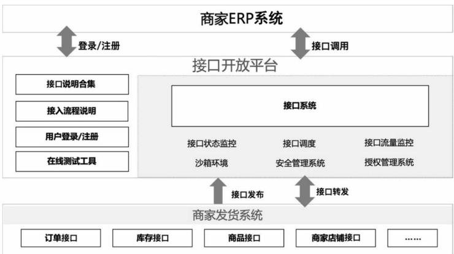

图11-41 OPEN API 开放平台系统架构图

无论以上哪种对接方式，如果要实现完整的系统交互，商家发货系 统都需要开放包含但不限于如表11-3中的这些接口供商家ERP系统调用 

表11-3 商家发货API开放 

<table><tr><td>序号</td><td>接口</td><td>说明</td></tr><tr><td>1</td><td>商品查询</td><td>查询商家的商品目录</td></tr><tr><td>2</td><td>设置商品库存</td><td>供商家更新商品库存</td></tr><tr><td>3</td><td>商家基本信息查询</td><td>查询商家的基本信息,包含账号、名称、发货物流、配送方式等</td></tr><tr><td>4</td><td>订单查询</td><td>查询商家的订单,包含订单列表和订单详情</td></tr><tr><td>5</td><td>订单确认</td><td>商家确认订单或驳回订单</td></tr><tr><td>6</td><td>预约物流</td><td>通过订单信息预约物流单号</td></tr><tr><td>7</td><td>订单发货</td><td>商家确认发货并回传物流信息、收款明细</td></tr><tr><td>8</td><td>订单取消</td><td>将订单取消的消息传给商家</td></tr><tr><td>9</td><td>订单撤回</td><td>通知撤回消息给商家</td></tr><tr><td>10</td><td>商品退货</td><td>退货商品确认</td></tr><tr><td>11</td><td>对账单查询</td><td>查询商家的对账单,包含对账单列表和对账单详情</td></tr><tr><td>12</td><td>对账单确认</td><td>确认对账单或反馈差异</td></tr></table>

## 11.4坚实后盾：售后系统

订单的签收并不是供应链的完结，正如本书最开始介绍的供应链一 样，以始为终、以终为始，因果循环，如果终端用户对商品的质量、服 务产生分歧和纠纷时，就产生了订单新的流程：售后服务，而订单签收 是售后服务流程的起点。很多企业在前期发展阶段为了冲业绩而忽略了 售后服务，这是大错特错的，销售固然重要，但良好的售后服务才是企 业的坚实后盾，只有迅速而有效地解决客户的售后问题，让用户免除后 顾之忧，才能为企业筑造口碑和服务的护城墙，这堵墙坚而不破，成为 比销售更稳固的壁垒。 

售后服务流程对应的供应链系统是售后系统（Aftermarket Systems ，AMS），最常用的售后服务流程包含退款、退货、换货和补寄，本节 我们来了解一下这些流程的系统设计。 

## 11.4.1 售后全景图

退款、退货和换货的业务流程和系统交互流程，在本书第三章和第 四章中我们已经详细地介绍过了，下面重点介绍售后服务在供应链中的 业务场景和系统面貌。 

售后服务发起的方式可以是用户从用户端或官方网站发起售后申请 ，也可以是客服人员从售后系统中发起售后申请，售后场景分为退货退 款、换货和补寄，根据发起售后的订单的状态和订单付款方式的不同， 系统处理逻辑也不尽相同，主要分为订单发货前的售前处理和发货后的 售后处理。售后场景处理如图11-42所示。 

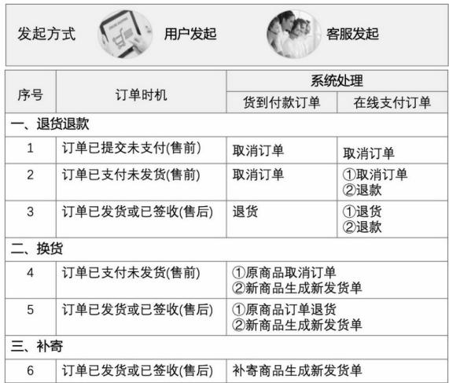

图11-42售后场景处理

在以上与售后相关的场景中，用户基于原订单发起售后申请，在售 后系统中生成售后单，并以售后单串联各供应链系统完成售后流程。涉 及的系统主要有售后系统、仓储管理系统（或门店管理系统）、订单履 约中心和财务系统，在各个系统中的单据流转形态如图11-43所示。 

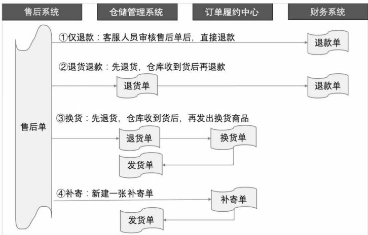

图11-43售后单据流转

① 仅退款：用户发起售后申请后，在售后系统中生成售后单，客 服人员审核后，会生成财务系统的退款单，财务人员基于退款单完成退 款。 

② 退货退款：相比仅退款的业务，多了退货的环节，客服人员审 核售后单后，需先生成仓储管理系统的退货单，待仓库收到用户的退货 并基于退货单核验无误后，再生成财务系统的退款单进行退款。 

③ 换货。换货相比退货退款业务，不需要退款，但需要在订单履 约中心中生成一张类型为换货的出库单，并下达仓储管理系统完成换货 

订单的出库履约。 

④ 补寄：用户发起售后申请后，一般由客服人员手动建单，在订 单履约中心中生成一张类型为补寄的出库单并下发仓储管理系统发货。 

一张订单可以多次发起售后，生成多张售后单，操作多次换货和补 寄，但不能被多次退款。 

## 11.4.2 无实物退款

当用户没有收到实物时，可以申请仅退款，而不需要退货，仅退款 的场景主要有以下几种。 

① 仓库还没有发货时，用户申请了退款，此场景属于售前退款， 系统处理上需要将尚未发货的订单取消，然后执行退款，如果已经发货 了，则申请退款失败。 

② 仓库已发货，但由于物流原因，用户未收到实物，申请退款， 经客服人员核实后，为用户退款。此场景下因为实物丢失，但用户无责 ，处理完用户退款后，客服人员还需要与仓库、物流公司进行核实，处 理实物的赔偿。 

③ 用户已收到实物，因商品质量等问题发起售后申请，但退货的 物流成本已经大于商品本身的价值，如过期商品、生鲜、低价值商品等 ，经与客服人员协商后，仅退款而不需要退货了。 

从用户发起退款申请开始到售后完成，会经历客服人员审核、财务 人员审核，财务人员打款三个环节，如果客服人员驳回退货申请，允许 用户发起仲裁，仲裁成功后仍可以继续退款。售后单的状态设计如图11 -44所示。 

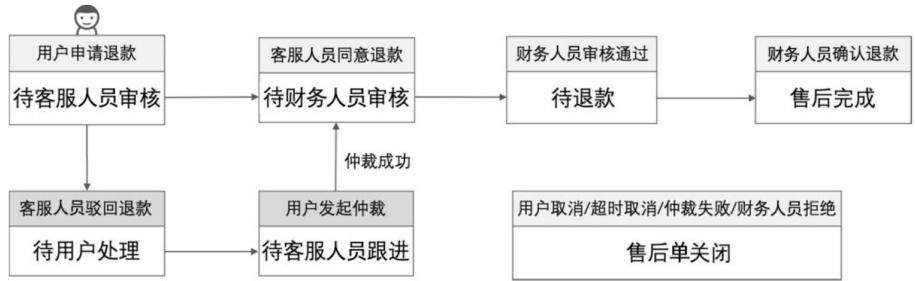

图11-44售后单状态—仅退款

售后单状态详细说明如表11-4所示。 

表11-4售后单状态说明—仅退款

<table><tr><td>售后状态</td><td>说明</td></tr><tr><td>待客服人员审核</td><td>用户提交退款申请后,等待客服人员处理的状态</td></tr><tr><td>待财务人员审核</td><td>客服人员审核售后单,同意退款,并生成退款单供财务人员审核</td></tr><tr><td>待用户处理</td><td>如果客服人员驳回了退款申请,需要用户核实,用户可以取消本次售后,或者发起仲裁</td></tr><tr><td>待客服人员跟进</td><td>如果用户对驳回结果不满意,发起了仲裁,需要指派客服专员跟进处理,仲裁成功后,继续完成退款</td></tr><tr><td>待退款</td><td>财务人员审核退款单,同意退款的状态</td></tr><tr><td>售后完成</td><td>财务人员根据退款单完成打款,并退回订单中的促销优惠券、积分等,本售后单完结</td></tr><tr><td>售后单关闭</td><td>当发生如下情况时,会触发售后单关闭:1用户主动取消本次售后;2售后单超时未处理,自动关闭;3用户仲裁失败;4财务人员拒绝退款申请</td></tr></table>

为提升退款效率，大部分的订单退款都可以设置为系统自动完成客 服和财务工作，特殊情况下由人工介入。 

退款分为全退和半退，订单签收前的取消和拒收引起的退款，都是 整单退货（全退）。而签收以后的退货，经常由于部分商品问题，所以 会存在部分退货（半退），在退款时，需要按照用户实际支付的金额进 行退款，如果用户在订单下单时使用了优惠券、抵扣金、积分等，也需 要退回用户的账户中。 

整单退款的处理流程比较简单，按订单实付总金额退款，同时将未 过期的优惠券、积分等原路退回用户账户。部分退款情况下的退款处理 流程相对复杂，总结下来有两种处理结果。 

① 若无组合优惠信息，按商品实付金额退款，未过期优惠券原路 返回。 

② 若使用了组合优惠信息（如整单满减券），有两种主流处理方 式。 

方案A：优惠按照商品金额比例分摊，按照分摊后的实付金额退款 

方案B：退款时需考虑剩余商品是否仍然达到了优惠门槛，重算优 惠后退款。 

为了加强理解，我们举例说明。 

方案A：优惠按照商品金额比例分摊，按照分摊后的实付金额退款 

老王购买了商品A、B、C各1个，共同使用了满150减20的优惠券， 

按比例分摊后的实付金额如下。 

<table><tr><td>商 品</td><td>金额(元)</td><td>优 惠</td><td>优惠分摊(元)</td><td>分摊后实付(元)</td></tr><tr><td>A</td><td>100</td><td rowspan="3">满150减20</td><td>10</td><td>90</td></tr><tr><td>B</td><td>60</td><td>6</td><td>54</td></tr><tr><td>C</td><td>40</td><td>4</td><td>46</td></tr></table>

如上，如果老王退商品A，则退款90元；退商品B，则退款54元； 退商品C，则退款46元。 

此规则简单易实现，但存在凑单刷优惠券的风险，存在用户为了凑 单使用优惠券，签收后又将其他不需要的SKU退货的情况，如果老王同 时退了B和C，则用90元购买到了原价100元的商品A，对平台是不利的 。一般规避方案为：①用户主动退货导致的退货运费由用户承担；②针 对恶意刷优惠券退货的行为，将用户做降级处理、或加入黑名单。 

方案B：退款时重新计算优惠，若剩余SKU仍达到了优惠门槛，则 按原价退款；否则扣除优惠后再退款，若扣退款金额尚不够优惠金额， 则不能单独退此商品。 

CASE 1：老王购买商品A、B、C各1个，使用了满150减20的优惠 券，实付金额如下。 

<table><tr><td>商 品</td><td>金额(元)</td><td>总金额合计(元)</td><td>优 惠</td><td>实付金额(元)</td></tr><tr><td>A</td><td>100</td><td rowspan="3">200</td><td rowspan="3">满150减20</td><td rowspan="3">180</td></tr><tr><td>B</td><td>60</td></tr><tr><td>C</td><td>40</td></tr></table>

① 若老王退商品C，则剩余商品A和商品B，原金额合计160元，仍 然满足优惠条件，故商品C退原价，退款40元； 

② 若老王退商品B，则剩余商品A和商品C，原金额合计140元，不 再满足优惠条件，需扣除优惠的20元，退款金额=60-20=40元。 

CASE 2：老王购买商品A、B各1个，使用了满100减50的优惠券， 实付金额如下。 

<table><tr><td>商 品</td><td>金额(元)</td><td>总金额合计(元)</td><td>优 惠</td><td>实付金额(元)</td></tr><tr><td>A</td><td>60</td><td rowspan="2">100</td><td rowspan="2">满100减50</td><td rowspan="2">50</td></tr><tr><td>B</td><td>40</td></tr></table>

① 若退商品A，剩余商品B（原金额为40元），不再满足优惠条件 

，需扣除优惠，可退款金额=60-50=10元 

② 若退商品B，则剩余商品A（原金额为60元），不再满足优惠条 件，需扣除优惠，但因商品B的原金额（40元）小于已优惠金额（50元 ），故不允许单独退商品B。 

此规则可避免用户刷优惠券的情况，但规则较复杂，解释成本和系 统实现成本较大。 

两种退款算法各有利弊，方案A简单、清晰明了，方案B严谨、相 对复杂，在业务量不大时可以采用方案A，当退款业务量很大时，就需 要考虑方案B了。 

## 11.4.3 退货退款

用户收到实物以后又发起了售后申请，在退款之前需要先将商品退 回平台，待仓库收到货并验收核实无误后，再行退款。 

从用户发起退款申请到售后完成，主要经历客服人员审核、用户退 货、仓库收货、财务人员审核、财务人员打款五个环节，售后单的状态 设计如图11-45所示。 

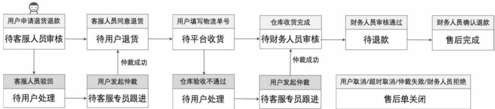

图11-45售后单状态-退货退款

退货退款比仅退款业务多了用户退货和仓库收货两个环节，客服人 员同意退货以后，用户需按照系统提示将商品寄回售后仓库，待仓库验 收完成后再触发财务人员审核，如果仓库验收时发现实收商品与退货单 的明细不符，或者商品不再满足退货条件，需将验收不通过的结论返给 售后系统，展示到用户侧供用户处理，若用户对结果不满意，同样可以 发起仲裁，由客服专员跟进，仲裁成功则继续退款，仲裁失败则关闭售 后单。 

## 11.4.4 售后换货

售后换货主要发生于用户对所购买的商品不满意，但不希望退款， 而是希望更换其他商品的情况下，其处理逻辑为：将原商品做退回处理 ，仓库收货完成后，由客服人员在售后系统中协助创建换货单，或者用 户在用户端中自主选择换货商品并提交订单（如果是用户自主选择，需 要控制仓库收到退货商品后才能在用户端显示换货功能），换货单会生 成换新商品的发货单，走正常履约流程将商品发货给用户，用户签收后 完成本次售后。此业务下的售后单状态设计如图11-46所示。 

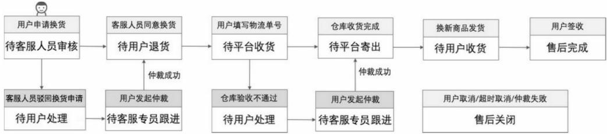

图11-46售后单状态—售后换货

在现实业务中，换同等价格的原SKU的情况居多，如果存在换其他 价格的商品，这时则需要客服人员处理差价，多退少补。 

在提供质保服务的售后场景中，虽然换货订单产生了新的履约单， 但质保服务期还应该以原订单计算。例如： 

2021年1月1日，张小北买了一台手机，平台质保期1年，到2021年1 2月31日截止，在6月2日产生了换货，换了一台新手机，但新手机的质 保仍然到2021年12月31日，不应该从6月2日再重新开始算。 

## 11.4.5 售后补寄

补寄流程主要发生于平台错发或漏发商品的情况下。用户发起售后 申请后，客服人员核实情况属实，为用户新建一张出库类型为补寄的发 货单，仓库走正常履约流程将补寄商品拣货、打单并发货给用户。补寄 单与普通订单格式和流程一样，不同点在于下单人是客服人员而不是用 户，且订单金额为0元。 

## 11.5千人千面：统一权限系统

我们在设计系统的时候，为了让不同的人拥有不同的查询和操作权 限，就少不了权限控制，在很早的时候，每做一套系统，都需要设计一 套权限，尽管技术小哥信誓旦旦地说代码是可以复制的，但无疑也是一 种浪费，并且在每个系统中管理一套用户账号体系，对于需要操作多系 统的人员来说，就需要记多套系统的账号、密码和多个系统链接，无疑 是痛苦而低效的，特别在供应链这种多方紧密相关的系统中尤为明显， 我们希望把系统设计得尽量服务化、解耦化，但业务方更希望我们把系 统设计得尽量集中化、统一化。于是，可以独立管理多套系统权限的统 一权限系统就此诞生，基于权限的统一，可以在多套供应链系统独立设 计的同时，对业务方呈现出一套系统的效果，下面让我们一起来看看。 

## 11.5.1统一登录，权限共享

统一权限系统不再隶属于任何一个系统，而是以一个独立的系统存 在，并在这个系统下集中管理外围各系统的用户、角色、系统功能、数 据组织和权限控制，统一对外围系统提供权限服务。 

权限系统架构如图11-47所示，我们可以将其功能抽象成三层结构 。底层是权限的基础数据，包含用户、系统、角色、系统功能、数据等 ；中间层是基于基础数据设计各类权限配置，包含人员-角色、角色-功 能、角色-数据；上层是对外提供的统一登录和权限控制服务。 

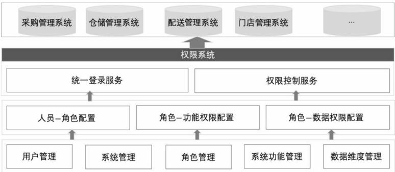

图11-47 权限系统架构

权限系统的建设目标有两个：统一登录和权限共享。 

① 统一登录。基于底层用户账号、密码的统一，为各系统提供统 一的登录入口，用户只需要登录一次，即可访问所有具备权限的系统而 不需要重新登录了，这也是当前比较流行的单点登录（SingleSignOn，S SO）的原理，图11-48是基于企业微信的单点登录示例，无论从哪个系 统登录，都会跳转到此页面，登录成功后再进入对应系统。 

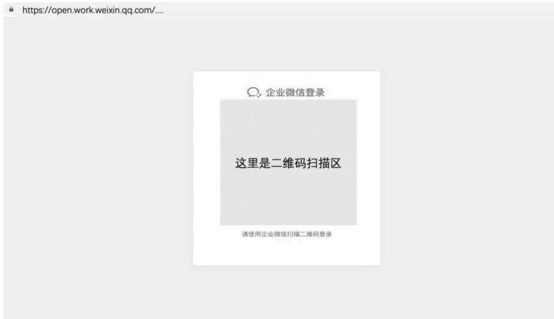

图11-48企业微信登录示例

如果再向前一步，我们不仅可以实现账号的统一登录，还可以将所 有的系统收拢到一个统一登录平台中，从权限系统中获取当前用户具备 权限的所有系统，点击系统入口就可以直接加载系统菜单，这样对于用 户来说，多个底层独立的系统就能够在一套系统内进行展示和操作了。 图11-49是一个统一登录平台的示例。 

② 权限共享。由权限系统统一管理外部系统的权限设置，不再在 每个系统中独立开发一套权限功能，当外部系统需要获取权限时，从权 限系统中获取相应配置即可。 

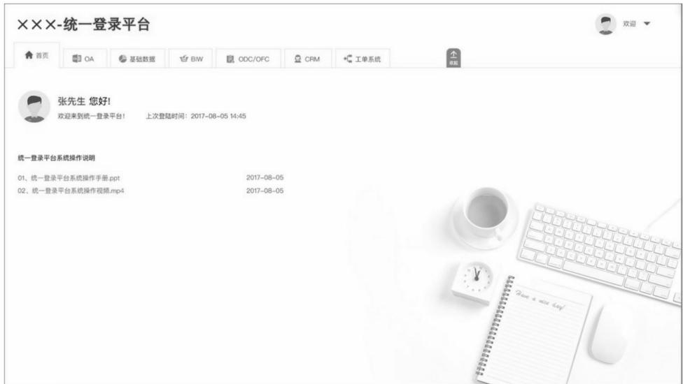

图11-49统一登录平台示例

图11-50是统一登录和权限共享的系统原理。

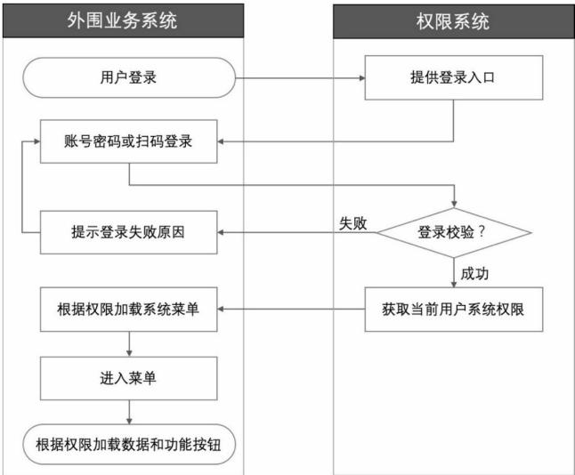

图11-50统一登录和权限共享的系统原理

## 11.5.2功能权限与数据权限

系统的权限分为功能权限和数据权限两部分。功能权限是指当前用 户能够看到和操作哪些菜单、按钮和字段，数据权限是指在具备功能权 限的前提下，用户进入页面后能够查看和操作哪些数据。 

## （1）功能权限

功能权限又分为页面权限、操作权限和字段权限。 

① 页面权限。用户登录系统后能够看到的页面，每个页面对应一 

个系统菜单，如果用户配置了对应的系统菜单，就能访问此页面。 

② 操作权限。用户进入页面后能够看到和操作的功能按钮。操作 权限的控制有两种方式。一种是前端显示有按钮，但在操作时根据后台 的权限校验判断当前用户是否具备操作权限，如果不具备，则报错提示 。第二种则由前端控制按钮的显示，所见即所得，不具备权限的用户， 就看不到按钮。很明显，第二种方式比第一种方式的体验更好，当然实 现成本也会高一些。 

③ 字段权限。有些页面上的某些关键字段需要单独控制是否可见 、是否有可编辑的权限，这就需要对字段单独设置字段权限了，具备相 应权限的用户才可以看到或编辑此字段。 

## （2）数据权限

数据权限用来保证数据的隐私性，并不是所有人都需要看到全量的 数据。对于某些页面，即便是同一个菜单，因为角色不同，看到的数据 也需要不同。数据权限需要配置对应的数据维度，可以是仓库、站点、 岗位、部门、地区等维度中的一个或多个维度的组合，在采购管理系统 中使用岗位做数据维度比较多，而仓储管理系统中，使用岗位和仓库做 数据维度比较多，如上海仓的员工只能看到上海仓的数据，但上海仓的 仓库总监能够看到与本仓库相关的所有数据，而普通员工只能看到自己 对应权限内的数据。 

不管是功能权限，还是数据权限，在实现上原理是一样的，用户在 登录业务系统以后，由业务系统获取当前用户的ID信息，从权限系统中 读取该用户在此系统下的权限配置，并加载对应的菜单、按钮、字段和 数据。 

## 11.5.3 RBAC权限模型

在权限系统中，最主流的就是RBAC模型（Role-Based Access Contr ol，基于角色的访问控制）了，此模型是20世纪90年代研究出来的一种 权限模型，其核心思想是在为用户绑定系统权限时，不直接设置到权限 ，而是将角色与权限挂钩，用户再对应到角色，获取该角色下的所有权 限。这样做的好处是针对具备相同权限的用户，不需要每个人都绑定一 次功能权限和数据权限，而只需要明确角色即可，因为每个角色已经提 前设置好相应的系统权限了，如果需要批量调整所有人的权限，只需要 调整角色配置的权限即可，极大地减轻了相关人员权限配置的工作量。 

要在权限系统中实现RBAC模型，涉及用户、系统、角色和权限4 项基础数据。 

① 用户：即登录系统的人的基础信息。用户信息可以与企业OA、 HR等系统共用，以免多次添加，如果需要使用企业微信等三方账号登 录，还需要绑定企业微信账号。 

② 系统：外部系统在权限系统中的身份信息，每个共用权限的系 统都需要先在权限系统中登记一个唯一系统编码，并将此系统下的功能 菜单配置好，在用户登录系统请求权限时，通过此系统编码+用户账号 从权限系统中获取当前用户配置的系统权限。 

③ 角色：在每个系统下设定的操作角色，对应一批具备相同权限 的用户组。每个角色会绑定相应的功能权限和数据权限，并关联多个用 户，这样每个用户都具备了当前角色下的所有权限。根据需要，可以将 功能权限和数据权限设定到同一角色内，或者设定不同的角色。 

④ 权限：每个系统下设立的菜单、按钮、字段和数据维度，这些 都需要作为基础数据提前维护到权限系统中对应的系统下。 

用户、系统、角色和权限的关系如图11-51所示，用户数据是各系 统公用的，每个系统下可以单独设定角色并绑定功能和数据权限，每个 角色可以绑定多个功能权限（如多个菜单）和数据权限（如多个仓库） ，每个用户在每个系统下可以绑定多个角色，各角色的功能和数据权限 取并集，即当前用户的系统权限。 

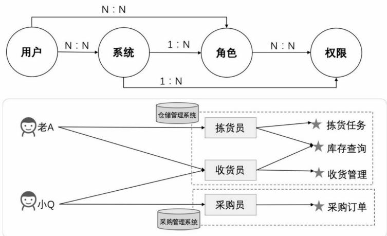

图11-51 RBAC权限模型

在图11-51中，用户老A只有仓储管理系统的权限，在仓储管理系统 下有拣货员和收货员两个角色，具备拣货任务、库存查询和收货管理三 个系统菜单权限。小Q被设置了仓储管理系统和采购管理系统两个系统 权限，在仓储管理系统中是收货员的角色，具备库存查询和收货管理两 个菜单权限，在采购管理系统中是采购人员的角色，具备生成采购订单 的权限。 

以上便是RBAC的基本模型，也叫RBAC0。RBAC0已经能满足大部 分权限管理要求了，但随着业务的多样化，逐渐演化出角色分层模型R BAC1、角色限制模型RBAC2和角色统一模型RBAC3，在RBAC0的基 础上增加了更多对于角色的扩展。网上的相关资料有很多，感兴趣的朋 友可以深入了解。 

## 11.5.4 权限系统实现

了解了功能权限、数据权限和RBAC模型，也就了解了统一权限系 统的精髓，系统实现也就比较简单了，权限系统主要包含权限基础数据 、权限设置和权限服务3大功能。 

## 1.权限基础数据

权限系统用到的基础数据主要有用户、系统、角色、系统功能和数 据权限等。 

① 用户管理：管理登录用户的基本信息，包含登录账号、姓名、 登录密码、性别、电话、邮箱、图像、身份证信息、状态（有效/无效 ）等属性，如果能够与企业OA或HR系统打通，则在权限系统中只需要 存储账号和姓名等最基本信息即可。 

② 系统管理：管理所有使用权限系统的外围业务系统，包含系统 编号、系统名称、系统图标、系统链接、状态（有效/无效）等。 

③ 角色管理：管理每个系统下的角色，包含角色编号、角色名称 、所属系统、角色分类（功能角色/数据角色）、状态（有效/无效）等 。我们的设计思路是将角色归属到每个系统下，还有一种设计思路是将 角色从系统中剥离出来作为公共数据，各系统可以共用角色信息，这样 相同的角色就不需要在每个系统中都维护一次了，但系统和角色之间的 关系就不那么一目了然了，两种方式各有利弊。 

④ 系统功能：管理每个系统下的菜单、操作按钮和关键字段等， 包含功能名称、功能编码、链接、类型（菜单/操作按钮）、状态（有 效/无效）等。菜单隶属于系统、按钮功能和字段隶属于菜单，以树形 样式展示，如图11-52所示。如果页面中有关键字段需要单独控制权限 ，可以在对应菜单下添加关键字段，以便在分配权限时为角色分配字段 权限。 

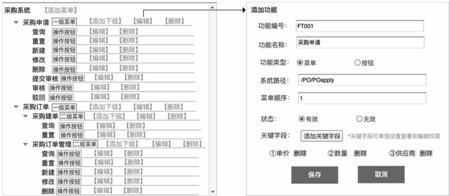

图11-52系统功能维护示例

⑤ 数据权限维度：管理各系统中用到的数据隔离的维度及基础数 据，如仓储管理系统按仓库维度做数据隔离，则维护所有仓库的数据， 采购管理系统按部门维度做数据隔离，则维护所有部门的采购数据等。 

## 2.权限设置

权限设置包含角色绑定功能权限、角色绑定数据权限、用户绑定角 色三个功能。 

① 功能权限设置：将角色与系统功能进行绑定，绑定以后，该角 色便具备了当前系统下勾选的菜单、按钮和字段权限，字段权限取自菜 单下维护的关键字段，有隐藏、只读和编辑三种权限可配。用户如果绑 定了该角色，便能继承该角色下所有的权限，图11-53是功能权限设置 示例。 

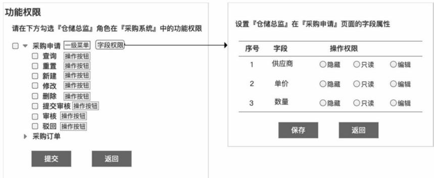

图11-53功能权限设置示例

② 数据权限设置：将角色与数据维度进行绑定，绑定以后，角色 便具备了系统下的数据权限。数据权限和功能权限可以共用一套角色， 也可以分开，进行不同的角色控制，从灵活性角度考虑，建议分开。因 为不同系统对数据权限的要求不同，权限系统中应能兼容多个数据维度 可选，图11-54是按仓库作为数据维度的示例，「仓储总监」角色在仓 储管理系统下可以设置全部仓库或者部分仓库的数据查看权限。 

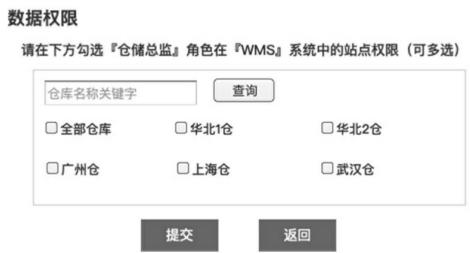

图11-54数据权限设置示例

③ 用户绑定角色：权限设置的最后一步便是将用户与已经设置好 的功能权限和数据权限进行绑定，如图11-55所示。其实现逻辑为：用 户选择需要设置权限的系统，进入该系统的权限设置页，依次绑定功能 角色和数据角色。一个用户可以绑定多个系统下面的多个功能角色和数 据角色，多个角色的内容取并集便是当前用户的系统权限。 

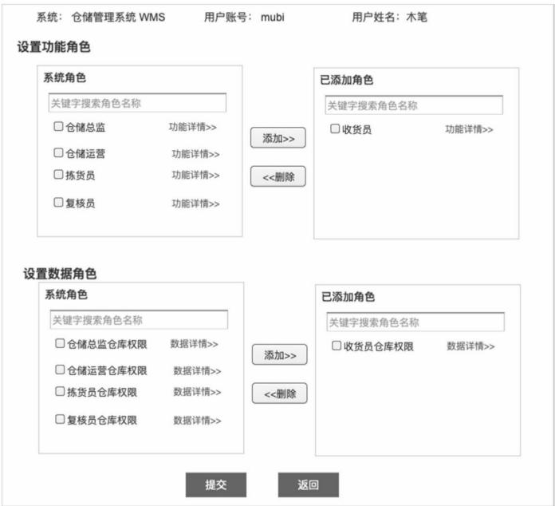

图11-55用户绑定角色示例

## 3.权限服务

权限维护完了，并不是自己用，而是要为外围业务系统提供服务支 撑，包含用户基础数据服务、登录验证服务和权限服务。 

① 用户基础数据服务：有了统一权限系统，业务系统不再需要单 独维护用户信息了，需要时可以直接从权限系统获取用户详细信息。 

② 登录验证服务：作为用户账号和密码的集中管理系统，应该由 权限系统提供唯一的登录校验出口，为用户登录提供验证服务。 

③ 权限服务：用户成功登录外部系统后，由权限系统提供用户的 功能权限和数据权限服务，供外部系统加载和校验。 

## 11.6 本章结语

在新零售业务中，线上线下同步销售，门店的布局和定位也在悄然 改变，从传统的线下销售转变为集用户拉新与留存、线下零售、线上销 售等职责于一体的智能前置仓，在典型的前店后仓模式下，门店管理系 统的设计分为前后两端，前店使用POS收银系统做线下销售，后仓使用 门店后台系统管理商品的进销存及线上订单发货，同时使用后台系统支 持门店促销、门店会员管理等日常工作。 

供应商管理是供应链协同的重要体现，通过供应商管理系统可以让 很多采购和供应商管理协同的工作线上化，一个典型的供应商管理系统 包含企业与供应链之间的信息协同、采购协同、退供协同等，通过供应 商管理系统让供应商参与到企业的供应链流程中来，建立企业与供应商 之间深度的合作。 

零售企业发展到一定阶段以后，如果自身商品品类和库存无法完全 满足用户需求时，必然会引进外部商家提供商品供应和发货，这是供应 链协同的必然趋势，通过商家发货系统就能够很轻易地实现这一目标。 商家发货系统包含管理端和商家端，管理端用于内部采购部门管理代发 货商家基本信息、代发商品信息、商家物流策略、商家结算等，商家端 开放给商家使用，供商家日常处理商品、订单、退货退款及结算对账等 业务。如果商家有自己的进销存系统，也可以通过开放接口将商家端功 能开放给商家，实现双方系统之间的协同互通。 

销售固然重要，但良好的售后服务才是企业的坚实后盾，如果终端 用户对商品的质量、服务产生分歧和纠纷时，就产生了订单的逆向流程 ：售后。售后系统专门用于客服人员处理订单的售后流程，包含退款、 退货、换货和补寄等。售后系统也不是孤立存在的，而是与财务系统、 订单履约中心、仓储管理系统等多个供应链系统联动，共同为售后业务 服务。 

最后，为了解决系统设计上的服务化、解耦化与业务方要求的集中 化、统一化的矛盾，我们需要一套能够同时管理多套系统权限的统一权 限系统来管理各个系统的功能权限和数据权限，为各系统提供统一登录 和权限共享服务，当前最主流的权限框架是RBAC模型，通过角色与权 限挂钩，用户再对应到角色，这是RBAC0的基本思想，随着业务的多 样化，逐渐演化出角色分层模型RBAC1、角色限制模型RBAC2和角色 统一模型RBAC3，在RBAC0的基础上增加了更多对于角色的扩展。 

至此，本书中所有的系统设计都讲完了，文字是死的，但传达的思 想是灵活的，功能的实现一定要伴随着业务的发展而来，在实际工作中 ，多关注业务本身和B端系统的底层设计能力沉淀，有利于我们更好地 开展工作。 

## 第12章 整装待发：供应链项目养成记

如果你了解了供应链的业务和流程，也掌握了供应链的系统设计思 路，那么你一定是一名合格的理论型供应链产品经理了，但纯理论并不 能保证项目成功，我们还需要经历无数次的项目实战，在项目现场去感 受、去受挫、去反思，才能一步步成为理论和实际兼具的实战型供应链 人，这些宝贵的成长历程也将成为我们受用一生的财富和建立自身影响 力的壁垒。 

作为本书的最后一个章节，木笔想带你去见识一下供应链项目的实 操现场，让你感受一个成功的供应链项目所要经历的完整历程，而在整 个历程里，我们要意识到系统功能是项目中很重要的一部分，但并非其 全部。 

现在带上你的理论所学，我们出发了…… 

## 12.1供应链项目实施整体流程

“供应链项目就是软件开发，只要了解软件开发项目管理就够了， 网上文章一大堆，何必要听你啰嗦一大章？”，有此疑问的朋友并不为 过，因为大部分的供应链项目确实只需要实现软件功能即可，但我想说 的是，像仓储、配送、门店这类有实体支撑的一线操作类项目，系统实 现只是一部分，还需要与基建、硬件、现场运营等一起协同，才能完成 整体项目，这一类的项目管理无论从周期、项目成员，还是难度上都比 软件工程要大得多，这才是木笔想带你见识的。 

根据项目的生命周期，我们可以把供应链项目的整体流程分为规划 立项、项目建设、上线实施、项目收尾四个阶段，每个阶段又可以细分 为多个环节。 

话不多说，先上图，一个兼具建筑基建、硬件设备和系统软件的供 应链项目流程如图12-1所示。 

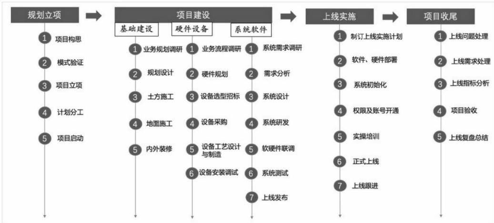

图12-1 供应链项目实施整体流程

阶段一：规划立项。这个阶段处于项目的初期，是从点子到项目落 地的过程，一般是老板在新的战略方向上冒出的想法，或者高层在开战 略会议时讨论出的规划，还可能是某个员工提出的一个金点子，经过验 证以后可行，于是开始立项落地。规划立项可以分为项目构思、模式验 证、项目立项、计划分工和项目启动5个环节。 

阶段二：项目建设。在供应链项目中，并非只有软件，还会涉及基 建、硬件设备生产和系统软件三个方向同时建设的情况，项目启动以后 ，三个方向的负责人各自领命并分工协作，由项目经理统一管控整体进 度和项目质量。 

首先，如果新建一个物流园区，先做基建，需要先根据业务规划设 计园区整体布局，然后设计物流中心内部布局、进而开始施工、打地基 、地面主体建设、内外装修，整体上分为业务规划调研、规划设计、土 方施工、地面施工、内外装修5个环节。 

另外，如果新建的物流中心内需要配置自动化设备来支持业务，如 增加拣货机器人、传送带、分拣机等，就需要做设备规划和采购，然后 让供应商根据我们的需求生产，设备生产完以后，还需要供应商派人到 现场安装、调试，并与系统软件进行联调。设备建设整体上分为业务流 程调研、硬件规划、设备选型招标、设备采购、设备工艺设计与制造、 设备安装调试6个环节。 

最后，才是我们熟悉的系统软件部分，我们需要根据业务的规划， 如楼层规划、设备规划、流程规划进行系统的需求调研、分析，然后进 行系统研发。系统建设整体上分为系统需求调研、需求分析、系统设计 、系统研发、软硬件联调、系统测试、上线发布7个环节。 

以上三个方向并不是强依赖关系，也并非全部必须。如果项目启动 时已经有园区和物流中心，就不需要进行基建了，如果不需要硬件设备 支持，就不需要硬件设备建设，同时，如果系统功能是现成的，也不需 要做系统开发了。 

从项目流程上看，三个方向在前期可以并行，后期只能串行。通常 基础建设的时间最长，所以一般最先开始，可以同步进行设备的采购制 造和系统开发，基建完成以后，水电都通了，才能进行设备安装调试， 设备调试以后，再和系统进行联调。所有软件、硬件的流程都测试通过 后，才具备上线发布条件。 

阶段三：上线实施。基建、硬件和系统的建设工作都完成以后，就 到了见识庐山真面目的时候了，也就是项目正式上线使用阶段，我们需 要为上线做一些准备工作，包含系统层面的和运营层面的，上线实施阶 段包括上线实施计划，软件、硬件部署，系统初始化，权限及账号开通 ，实操培训，正式上线和上线跟进7个环节。 

阶段四：项目收尾。项目上线成功以后，就到了上线收尾阶段，随 着系统和流程的逐渐稳定，项目也随之收尾，从上线到项目结项，还需 要进行上线问题处理、上线需求处理、上线指标分析、项目验收、上线 复盘总结 5 项工作。针对大型项目，对项目过程进行复盘，总结项目过 程中的优点和缺点是非常有必要的，这是后续同类型项目非常宝贵的经 验。 

无论有没有基础建设和硬件设备，任何一个供应链项目，都会经历 以上四个阶段，而能将所有项目阶段、项目成员串在一起的灵魂人物是 项目经理，在只有系统类的项目中，常常由产品经理兼职项目经理，在 跨周期、跨部门，基建和软件、硬件兼具的大型供应链项目建设过程中 ，项目经理对项目的管控是非常关键的，任何一方失控都会导致项目延 期或者失败，所以找个优秀的专职项目经理是非常必要的，在此类项目 中，产品经理专心做好系统设计就是对整个项目最大的贡献。 

## 12.2规划立项：从点子到项目

任何一个项目的启动都意味着时间、成本、人力的投入，除非老板 挥金如土只为自娱自乐，否则项目的启动一定是具备项目背景和战略意 义的，这个战略往往从一个点子开始，就像一粒种子一样，慢慢生根发 芽，最终破土而出，形成项目，然后成立项目组，在这一过程中，会经 历项目构思、模式验证、项目立项、计划分工和项目启动会5个环节。 

## 1.项目构思

项目在立项前，一般会有一个构思期，供应链项目的构思分为主动 构思和被动构思，主动构思来源于老板的一个想法、企业内部孵化的金 点子、业务的扩展需要、公司新的战略方向等，如因为业务的增长，原 先的一个物流中心产能跟不上了，所以相关人员考虑再建一个物流中心 ，这便是一个构思；被动构思来源于其他方面的推动、不得不做的项目 ，如国家要求企业必须上传电子监管码（药品的唯一溯源条码），所以 A仓库考虑增加一套支持条码采集和上传的软件系统和硬件设备。 

项目构思阶段参与人主要是企业高层管理人员、业务负责人，产出 的是一个尚未确定的想法。 

## 2.模式验证

构思有了以后，若想项目落地，还需要进行细化，如通过头脑风暴 、专家讨论等方式把各方面因素都罗列出来，形成完整的方案，然后进 行模式验证，根据验证的结论来决策项目是否需要进一步实施。推荐几 种验证方法：德尔菲法、数据建模法、MVP实验法、A/B测试法。 

① 德尔菲法：汇总公司内外部专家的意见进行综合评估分析，得 出一致结论。 

② 数据建模：通过历史数据构建数据模型，对新的构思进行验证 ，以判断方案是否可行。例如，A 公司想在东北地区新建一个物流中心 ，但通过历史数据建模分析后发现东北地区的交易订单量和交易总额并 不足以支撑起新的物流中心，于是放弃了此项目。 

③ MVP实验法：MVP（Minimum Viable Product，最小可行产品） ，以最低的成本启动项目进行验证。例如，A 公司想尝试线下新零售业 务，担心前期投入过大无法回本，便在线下租了一个小门面，通过手工 加Excel管理的方式开展线下业务，经过一段时间的运行后，通过数据 分析发现线下销售效果良好，于是正式启动新零售项目。 

④ A/B测试法：当有多种方案而无法决策时，如果投入成本不高， 可以同时针对不同的场景分配不同的方案进行试验，再基于运行结果进 行分析决策。例如，A公司一直使用S物流，最近想控制成本，将其换 成J物流，但又担心切换以后影响了时效和口碑，于是使用A/B测试法， 随机将订单分配给两个物流公司进行测试，经过一个月的数据对比，发 现相差并不大，于是将物流服务提供商换成J物流。 

模式验证阶段的参与人员一般是业务发起方的模式验证成员，产出 验证方案和验证的结果。 

## 3.项目立项

模式验证通过以后，高层管理人员基于验证结果同意实施项目，接 着项目就正式立项了，项目立项代表项目正式成立，由高层管理人员和 项目负责人召集初始核心项目成员召开立项会，在立项会上需明确如下 事宜。 

① 明确项目负责人，并指定项目经理协助项目负责人统筹项目， 项目负责人负责方案落地，项目经理负责项目管理。采购类项目一般由 采购部门的相关人员负责，物流类项目一般由物流部门负责。 

② 确认项目范围。由项目负责人传达项目的背景，明确项目的范 围和期望达到的目标，以及项目的成本预算、项目的周期等，这是项目 经理管控项目的依据。 

③ 确定项目组的核心成员。根据项目涉及的相关职责方确定责任 部门和责任人，这些人将作为项目组的核心成员推动项目落地。 

## 4.计划分工

项目立项以后，项目负责人需要对项目范围进一步拆解，出具整体 的项目方案，明确需要参与项目的各个部门及各部门的职责，并与各责 任方逐一确认。随后，项目经理会基于项目方案召集各责任方继续拆解 各自的工作职责和计划，最后形成一份完整的项目里程碑计划，因为需 求尚不明确，该计划只需要梳理出各方的里程碑节点即可，图12-2是一 个涉及基础建设、硬件和系统三方的项目大计划示例，在项目运营过程 中，有些环节有先后依赖性，有些环节可以并行，相关人员制订计划时 要充分考虑到资源利用率的最大化，考验其项目管理水平的时候到了。 

XX物流中心建设整体计划表（2021年5月1日—2022年12月5日） 

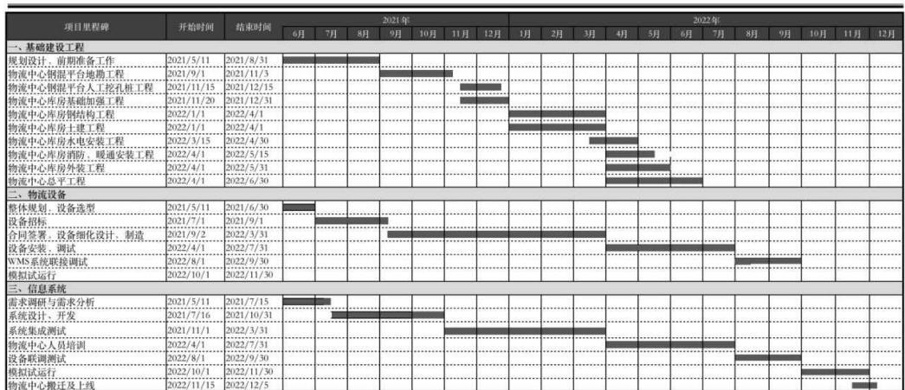

图12-2供应链项目里程碑计划示例

## 5.项目启动

所有准备工作完成以后，我们还需要一场具有仪式感的项目启动会 ，就像行军前的誓师大会一样，通过项目启动会增强所有项目组成员的 参与感，并使其理解项目的背景、意义和目标。上下同欲者胜，一个具 有一致目标的项目组已经成功大半了。 

项目启动会由项目经理组织全体项目组成员召开，会议产出如下内 容。 

① 宣布项目启动，明确项目名称及代号。一个好的项目代号能够 让人耳目一新，如果项目代号能与项目背景结合起来，可能会成为经典 。列举几个木笔认为很好的项目代号，211 （京东物流配送履约代号， 简单好记）、亚洲一号（京东全自动化物流中心，一听就很大）、青龙 （配送项目代号，配送车队从配送中心驶出，犹如苍龙出海，是不是很 形象）、仓海（仓储开放系统代号，如大海般浩荡的仓储布局）、天衣 （两个公司的系统融合项目，象征天衣无缝）、魔方（配置后台，像魔 方一样灵活多变）、钢铁侠（智能仓储物流中心，钢铁加身，无往不前 ）等。 

② 明确项目背景、意义和目标。由业务负责人（最好是高层管理 人员）进行整体介绍，明确项目背景、项目意义和战略目标，并对项目 组成员提出期望和鼓励。木笔曾经做过一个战略级项目，很难，但当董 事长在启动会上强调如果按时完成，奖励 100 万元奖金时，现场阵阵欢 呼，气氛瞬间到达顶点，重赏之下，项目组成员加班赶工、无怨无悔， 项目居然提前完成并上线。 

③ 项目范围及计划。由项目经理介绍各方确认后的项目范围及项 目的里程碑计划，让各方知晓关键工作和关键节点，并将项目的里程碑 计划进一步拆分。例如，软件设计，需要拆解到需求分析、系统设计、 开发完成、联调、测试的每一个阶段的开始和完成日期和责任人。 

④ 项目各方向负责人、项目成员及其联系方式。同步每个方向的 项目成员信息，方便项目成员之间的沟通。 

⑤ 项目管理机制。项目经理强调项目纪律、项目要求、沟通汇报 方式、需求变更要求等。例如，建立项目组微信群、每天下午开会汇报 项目进度及风险、如需请假，需报项目经理审批并做好交接、需求变更 需同步大群等。 

项目启动以后，项目经理便成了项目的主心骨，带领着项目成员按 照既定目标前行。总结一下规划立项阶段各环节的核心工作、参与人员 与产出如表12-1所示。 

表12-1项目规划立项核心工作

<table><tr><td>项目环节</td><td>核心工作</td><td>参与人</td><td>产出</td></tr><tr><td>项目构思</td><td>项目构思</td><td>高层管理人员、业务负责人</td><td>未验证的点子</td></tr><tr><td>模式验证</td><td>验证构思是否可执行</td><td>模式验证成员</td><td>验证方案和验证结果</td></tr><tr><td>项目立项</td><td>正式成立项目,召开立项会</td><td>高层管理人员、项目负责人、项目经理</td><td>确认项目范围、项目负责人、项目经理</td></tr><tr><td>计划分工</td><td>将项目范围拆解到责任方,各方产出里程碑计划</td><td>项目负责人、项目经理、项目各方负责人</td><td>项目里程碑计划</td></tr><tr><td>项目启动</td><td>召开项目启动会,宣布项目正式启动</td><td>项目组全体成员</td><td>项目代号、项目目标、项目范围及计划、项目成员、项目管理机制</td></tr></table>

## 12.3项目建设：基础建设、设备、系统三驾 齐驱

最复杂的供应链项目是基础建设、设备和系统都是从0到1建设，项 目经理不仅要保证每个方向都能如期完成，还要保证三方能完美衔接， 才能最终交付一份满意的答卷，下面我们以物流中心的建设为例，简单 介绍一下这三个方面的项目建设历程。 

## 12.3.1 基础设施建设

物流中心从一片荒地开始动土，到最终形成具备室内施工和办公条 件的园区，这个过程就是基础设施建设，细分为业务规划调研、规划设 计、土方施工、地面施工、内外装修5个环节。 

## 1.业务规划调研

软件规划不合理还可以做系统重构，物流中心一旦规划失误，就要 把建筑推倒重来，这损失可就大了，所以在基础建设动工前要做好充分 的业务调研和分析，再开始进行规划设计。基础建设的业务规划调研主 要是为了更好地规划园区并进行物流中心内部规划，可以从如下几个方 面展开。 

① 物流中心用途及基础建设预算。物流中心的用途决定了园区整 体规划和分布，如园区内部只需要建设物流中心，还是需要搭配辅助作 业区域（车库、变电室、锅炉房、维修车间等）及生活行政区域（办公 区、停车场、宿舍、休闲娱乐区域等），基础建设预算可以用来指导物 流中心场地的选择、规划的作业设备、作业流程及水电消防规划等。 

② 物流中心周边区域。物流中心周边决定了物流中心的建设朝向 、出入口、物流流向等。调研内容包含物流中心的地理位置、占地面积 、自然条件（北方多干燥，要注意防火；南方多潮湿，要注意防潮；靠 近机场，则不能太高）、交通条件（周围主干道、道路出入口、交通枢 纽等）、周边设施（是否靠近小区、学校、工业污染区域等）。 

③ 当前业务及未来规划。基于订单、库存、商品的当前分布和业 务未来规划可以作为物流中心内部各库区布局的依据，包含客户分布、 日均入库商品数量、出库订单量、出库时效、出库商品数量、在库库存 件数、峰值出库订单量、峰值出库商品数量、整件与拆零商品占比、业 务经营范围、商品存储属性分布（常温商品、冷藏、冷冻、生鲜、高值 、易碎品等）。 

## 2.规划设计

规划设计工作由规划设计部门或设计院完成，如果物流中心尚未确 定位置和网点数量，那么规划设计部门或设计院需要先基于业务形态和 未来规划做战略层面的规划，如全国物流中心网点的分布、物流网点的 分层等。待战略规划确定后，再规划物流中心的选址，继而对园区做整 体规划并进行物流中心的内部规划。 

## （1）物流中心选址规划

物流中心的选址要遵循交通便利、运费最低、时效最优原则，常用 的选址模型有数值分析法、重心法、奎汉-哈姆勃兹（Kuehn-Hamburger ）模型、模糊评价法等，感兴趣的朋友可以深入研究。 

## （2）整体规划

整体规划是对园区内的建筑做整体规划和划分。相关人员首先根据 调研结论确定园区应该具备的功能，再根据设备设施、物流动向、容积 率等因素及园区规划的原则分别规划物流中心出入口、辅助作业区域、 生活行政区域及交通干道等的占地面积和朝向、形状，形成园区总平面 规划设计图。 

整体规划必须与政府的统一规划相符，不能盲目规划，如果不相符 ，则可能会被判定为违建，所以相关人员最好与当地设计院进行对接， 一起出具合规的整体规划方案。 

## （3）内部规划

整体规划完成后，再进行各个区域的内部空间规划，物流中心内部 空间布局包含收货区域、存储区域、分拣区域、理货区域、物料区域、 自动化设备区域、管理办公室、走道等，其规划思路为：①根据道路分 布决定出入口位置和物流流向，一般为L刑、S型、U型，目的是使相关 人员尽量少走弯路，使其效率最大化；②规划各区域的位置，位置分布 应该符合物流流向；③基于业务规划的收发货均值能力和峰值能力及库 存数量规划各区域的空间大小和物流动线，规划空间要能满足未来几年 内业务量的增长；④进行各区域作业流程关联性检查。 

除空间规划外，内部规划还包含无线网点、有线网点、电话网点、 水电开关的规划设计等。规划工作并不是一蹴而就的，需要经过初设、 细设、终设，以及与设计院的相关人员多次进行沟通、合规性审核通过 后方能定稿，最终形成完整的整体规划图、内部规划图、施工图、平面 设计图。 

## 3.土方施工

规划方案定稿后，企业需要办理规划用地许可证、临时用地许可证 和进行地界勘察等合规手续，然后开始土建招标，确认施工单位后进入 土方施工阶段，完成场地平整、挖土、打桩、降水井、基础结构施工、 水电预埋、土方回填等地基建设。 

## 4.地面施工

地基夯实以后，再进行园区地面建筑施工，先搭设外架，再进行园 区内部物流中心和其他建筑的主体建设、然后砌体、抹灰、水电、保温 、刷漆和贴砖、安装电梯等。待所有工程都完成后，再拆除外架。 

## 5.内外装修

地面建筑主体施工完成后，就可以内外装修了，包含屋面外墙工程 、水电安装、防水、消防、地坪地砖、吊顶等，最后再配置办公用品、 桌椅、电脑、电话、打印机、网络设备等，通风一段时间，待空气质量 达到进场标准了，相关人员便可以进场安装设备设施并进行项目实施了 

基础设计建设过程的核心工作及产出如表12-2所示。 

<table><tr><td>项目环节</td><td>核心工作</td><td>参与人</td><td>产出</td></tr><tr><td>业务规划调研</td><td>调研基础建设预算、业务预期、周边设施等</td><td>规划设计部门</td><td>业务调研报告</td></tr><tr><td>规划设计</td><td>园区整体布局和物流中心内部规划设计</td><td>规划设计部门、设计院</td><td>整体规划图、内部规划图、施工图、平面设计图</td></tr><tr><td>土方施工</td><td>基于施工图纸动土施工,完成地基工程</td><td>基础建设负责人、施工队</td><td>地基施工完成</td></tr><tr><td>地面施工</td><td>完成上部建筑的钢结构和楼层主体施工</td><td>基础建设负责人、施工队</td><td>地面建筑完成</td></tr><tr><td>内外装修</td><td>完成建筑的内外部装修,水电消防等的布置,满足进场办公条件</td><td>基础建设负责人、施工队</td><td>内外装修交付</td></tr></table>

## 12.3.2 硬件设备建设

在仓储、配送的过程中使用硬件设备可以极大地提升作业效率和准 确率，尤其是自动化设备，可以24小时黑灯作业，降低人力成本。安装 自动化设备也不是某个人一拍脑门就决定的，需要和仓库布局、业务形 态、业务规划等紧密结合，硬件设备的建设包含业务流程调研、硬件规 划、设备选型招标、设备采购、设备工艺设计与制造、设备安装调试6 个环节。 

## 1.业务流程调研

在确定使用哪种设备之前，我们同样要做好充分的调研，以免设备 上线后无法满足业务需求关于设备的调研，包含但不限于以下方面。 

① 设备投入预算。预算是前提，有多大锅下多少米，不同的预算 额度影响着硬件的投入。例如，如果投入上千万元，可以安装全自动化 设备，如果投入上百万元，可能只能使用半自动化设备，如果投入十万 元，就只能购买最普通的设备。 

② 设备的用途。如果用于运输方面，则需要传送设备，如果用于 存储方面，则需要存储设备，同时要与业务流程结合起来，调研清楚哪 些环节需要用到相关设备。 

③ 设备的运行环境。不同运行环境对设备的安装和要求不一样， 如常温、阴凉、冷藏、液体、危险品等，以及仓库的面积、物流流向等 

④ 业务流程及规划。设备是用于辅助业务流程的，所以业务调研 最关键，在规划设备前，相关人员要了解当前业务有哪些痛点、业务出 入库的业务形态、订单均值、峰值、业务未来规划等。 

## 2.硬件规划

物流中心的硬件设备非常多，包含输入/输出设备、存储设备、作 业设备、周转容器、运输设备等，在规划硬件时要结合业务流程调研结 果挑选最贴合业务需求的设备，通常遵循以下原则。 

① 适用性原则。硬件必须适用于现场作业，并与业务流程、现场 布局完美结合。例如，规划传送带，需要与物流流向保持一致，出入口 设计需要与人行通道相结合，宽度要与物流中心内的商品体积相适合， 传递的效率要能满足业务均值和峰值的要求等。 

② 可扩展性原则。设备规划要着眼眼前，但能支持业务扩展，既 能满足当前业务，也可以支持未来业务增长后的扩展。 

③ 可靠和安全原则。硬件设备必须性能稳定，技术成熟，且安全 第一。 

④ 经济性原则。要考虑预算，在预算范围内选择性价比最高的设 备。 

## 3.设备选型招标

硬件设备确定以后，就需要选择合适的设备规格和寻找合适的设备 供应商了，招标流程为：设备采购部门编写设备招标标书，通过官网公 开招标或向指定的设备供应商发送招标邀请函。各供应商收到招标通知 后，根据招标要求编写投标文件，并按约定时间前来投标，双方就业务 需求、设备方案、价格预算进行多次沟通确认，最终确定最合适的供应 商，发送中标通知。 

## 4.设备采购

设备采购部门的相关人员与中标的设备供应商签订采购合同，约定 设备的规格、要求、价格、技术参数和交付时间等，然后在企业内部走 完采购审批流程，财务部门的相关人员根据采购流程预付部分款项给供 应商。 

## 5.设备工艺设计与制造

设备供应商针对业务需求对设备进行细化，设计详细的设备参数、 

样式并出具设备设计图稿，确认无误后投入生产。 

## 6.设备安装调试

物流中心建设符合进场条件后，设备供应商会将生产制造好的设备 送至项目现场安装调试，保证设备能顺利通电并正常运转，此调试过程 只是对硬件的质量、性能进行调试，并不代表可以交付了，只有与软件 系统进行联调后，信息流能够正常交互，且能够满足各种业务场景，设 备才算真正可用。 

硬件设备建设的核心环节及产出如表12-3所示。 

表12-3硬件设备建设核心工作

<table><tr><td>项目环节</td><td>核心工作</td><td>参与人</td><td>产出</td></tr><tr><td>业务流程调研</td><td>调研流程相关的硬件支持需求</td><td>规划设计部门</td><td>业务调研报告</td></tr><tr><td>硬件规划</td><td>基于业务流程和硬件预算,规划符合业务现状的硬件设备</td><td>规划设计部门、业务运营部门</td><td>硬件设备及预算清单</td></tr><tr><td>设备选型招标</td><td>挑选符合条件的设备,并召集供应商进行设备招标</td><td>设备采购部门</td><td>招标结论,确定符合条件的供应商列表</td></tr><tr><td>设备采购</td><td>确定合适的设备供应商,签订合同,实施设备采购</td><td>设备采购部门</td><td>采购合同、财务部门付款</td></tr><tr><td>设备工艺设计与制造</td><td>设备供应商对设备进行细化设计和生产制造</td><td>设备供应商</td><td>硬件设备交付</td></tr><tr><td>设备安装调试</td><td>设备供应商派相关人员到项目现场对设备进行安装调试</td><td>设备供应商</td><td>设备安装调试完成,达到运行标准</td></tr></table>

## 12.3.3 系统软件建设

项目建设的最后一个建设工程就是各位产品经理最熟悉的系统建设 了，系统建设整体上分为系统需求调研、需求分析、系统设计、系统研 发、软件与硬件联调、系统测试、上线发布7个环节。 

## 1.系统需求调研

基础建设、硬件和系统的规划都需要对业务进行调研，三者有相同 的地方，如都需要关注业务的均值、峰值、业务范围、未来规划，但也 有各自偏重的调研内容。供应链系统的调研由产品经理负责，可以通过 电话、面谈和实地调研等方式完成，调研方向包含但不限于以下方面。 

① 当前业务流程。不同的业务流程对应的系统功能是不一样的， 调研时要重点确认作业流程、作业模式、有哪些操作节点、操作岗位、 各操作节点的作用和产出、有没有设备支持、有哪些痛点、打印单据及 样式、出入库均值与峰值、以及各流程的异常处理、逆向处理等，总之 和流程相关的内容调研得越细越好。 

② 上下游系统交互流程。除了本系统功能，还需要调研上下游系 统功能，以及设备功能，弄清楚各系统之间的交互流程、交互方式（接 口、消息）和交互细节（核心字段）。 

③ 业务规划和期望。分别和高层管理人员、中层管理人员和基层 业务人员沟通业务的发展目标，以及对新系统的建设要求。 

调研完成后，需产出系统调研结果，对于不清楚的地方，还可以进 行二次调研，直到对所有细节都了解清楚为止。 

## 2.需求分析

需求分析是将业务需求转换为系统可实现的功能的过程，基于调研的结 果，我们需要规划系统的产品规划图，以及对应的系统功能模块，再将 其细化为可以落地实现的系统功能清单，并对功能清单进行优先级排 序，按照版本进行迭代，产出当前版本必须实现的系统需求说明书，并 将未实现的需求放进需求池中，做好需求管理。 

在需求分析的过程中，产品经理要有甄别真伪需求的能力，并对需 求进行取舍，对于不合理的需求要大胆说不，在兼顾业务满足的同时， 还需要保证系统的结构完整性及技术实现的难度，该坚持时坚持，该让 步时让步（所以当产品经理并不只是动动嘴、写写文档这么简单）。 

需求文档产出以后，相关人员需要组织需求评审会与业务、研发等 相关部门的人员一起对系统逻辑和功能进行评审，评审通过以后才能正 式提交给研发人员。 

## 3.系统设计

针对较为复杂的大型系统项目，研发部门在接到需求后不能直接进入系 统开发流程，而应该先由架构师对系统需求进行架构设计，设计完成后 再进行系统开发。 

系统设计分为总体设计和详细设计，总体设计包含明确系统的功能 目标与性能目标、系统架构图、选用的技术框架、开发语言、数据库、 系统设计与折中等，总体设计评审通过后再进行详细设计，详细设计包 含系统数据库表设计、接口细节设计、功能交互流程细节设计等。除以 上系统总体设计和详细设计外，系统设计还包含UI设计师对系统交互的 UI设计，以及测试工程师在测试前的测试方案设计，以上设计都需要产 出设计文档并召集产品经理、研发人员、测试人员和UI设计人员一起评 审。总之，开发前期的设计准备工作做得越充分，开发过程中变更功能 的风险就越小。 

## 4.系统研发

设计工作完成后，进入正式的系统研发阶段，这也是研发人员最享 受的时刻了，一行行的代码生产出来，对应的是一个个系统功能的实现 。研发工作分为前端开发和后台开发，前端开发偏重页面交互，后台开 发偏重底层逻辑和算法实现，前端和后台通过接口的方式交互。 

## 5.软件与硬件联调

软件功能开发完成后，还需要与上下游系统进行联调，联调分为内 部各功能模块之间联调、前台与后端联调、软件与硬件之间联调和上下 游系统之间联调，所有的功能都自测通过后，便可以提测了，项目进入 系统测试阶段。 

在一些流程严谨的公司中，在提测前还有个冒烟测试环节，研发人 员需要针对测试人员抽取的核心测试功能点进行自测，达到测试预期以 后方能提测。 

## 6.系统测试

正式开始系统测试前，测试人员需要先针对需求进行测试用例编写 ，并召集项目组成员进行用例评审，评审通过后再按照测试用例对系统 功能一一核对，将测试出的 bug 提交研发人员修改，然后复测，直到所 有功能都符合测试预期为止。 

除了保证系统功能正常，还需要保证系统的稳定性、安全性和可靠 性，根据测试的偏重点不同，分为功能测试、性能测试、安全测试、压 力测试等。 

在测试过程中，为提升效率，测试人员可以借助自动化测试工具来 辅助测试，如Selenium、JMeter、Loadrunner，有开发能力的测试人员 还可以基于Pytest、Robot等测试框架自行编写测试脚本辅助测试。 

## 7.上线发布

测试完成后，系统便具备了上线条件，但此时不能直接上线，因为 测试环境和线上的生产环境是有很大的区别的，所以需要先将程序发布 到预发布环境中，然后在预发布环境下进行功能验证。预发布环境和生 产环境的区别：预发布环境中的程序是最新的程序，但没有真实的线上 业务，其他功能代码和生产环境中的一致。 

预发布环境验证通过以后，才能在生产环境中发布，一个全新的供 应链系统即便在生产环境中发布了，还不能算真正的上线，需要等到上 下游系统、软硬件、现场实施工作都准备到位以后，才能真正接入业务 

供应链系统软件建设的核心环节及产出如表12-4所示。 

表12-4系统软件建设核心工作

<table><tr><td>项目环节</td><td>核心工作</td><td>参与人</td><td>产出</td></tr><tr><td>系统需求调研</td><td>调研系统相关的流程、策略、业务规划、硬件投入</td><td>产品经理</td><td>系统需求调研报告</td></tr><tr><td>需求分析</td><td>基于调研结论做需求细化,设计系统功能</td><td>产品经理</td><td>需求说明书、功能清单、系统原型</td></tr><tr><td>系统设计</td><td>对需求进行系统化拆解,完成架构设计、UI设计和测试方案设计</td><td>架构师、UI设计人员、测试人员</td><td>架构设计文档、详细设计文档、UI设计方案、测试方案</td></tr><tr><td>系统研发</td><td>基于系统设计完成软硬件系统程序研发</td><td>研发人员</td><td>可运行的系统程序</td></tr><tr><td>软硬件联调</td><td>软件与硬件进行交互联调</td><td>研发人员、硬件工程师</td><td>能够正常交互的软件、硬件系统</td></tr><tr><td>系统测试</td><td>测试软硬件系统功能</td><td>测试人员</td><td>测试用例、测试结论</td></tr><tr><td>上线发布</td><td>将已完成的程序发布到预发布服务器上</td><td>运维工程师</td><td>上线发布完成</td></tr></table>

## 12.4上线实施：识得庐山真面目

无论项目做得好与坏，到上线当天都需要亮剑。在供应链的项目里 ，因为涉及线下物理区域规划、流程运营、一线操作、硬件设备，所以 上线前的实施流程也比纯系统软件要复杂得多，任何一方准备不充分， 都有可能导致上线失败。上线实施过程主要由实施工程师主导，当然也 可以由产品经理、研发人员和测试人员主导，由上线项目组、业务方运 营和业务负责人一起推进，整体包含上线实施计划、软硬件部署、系统 初始化、权限及账号开通、实操培训、正式上线和上线跟进7个环节。 

## 1.制订上线实施计划

在上线前，项目经理通常会召集项目组成员制订一个上线实施详细 计划，把所有上线过程中需要完成的任务全部罗列出来，责任到人，精 确到小时级。图12-3是一个仓储管理系统上线实施的计划示例。 

计划做完以后，项目经理应该召集项目组全体成员召开一个上线动 员会，动员会有两个作用：一是同步上线计划及各方责任，让所有人都 清楚自己和他人的工作职责；二是增加上线的仪式感和使命感，对于准 备了很久的大项目，这种使命感很有必要，可以极大地鼓舞士气。启动 会后，各负责人便分头行动，按照实施计划一项一项地跟进、处理待办 工作，直到所有上线准备工作全部完成为止。 

上线前，系统应该封版，除非发现了特别致命的漏洞或bug，否则 不能再对程序进行任何修改，以免影响系统上线。如果必须修改，则应 该由项目经理或者研发负责人审批。 

<table><tr><td colspan="9">仓储管理系统上线实施计划</td></tr><tr><td>序号</td><td>开始时间</td><td>结束时间</td><td>工作内容</td><td>工作要求</td><td>负责人</td><td>参与人员</td><td>状态</td><td>备注</td></tr><tr><td>1</td><td>9月22日 09:00</td><td>9月24日 22:00</td><td>仓库盘点</td><td>整件和散件分开,整件库只允许存放整件无大包装的商品全部转移至零货库盘点结果需在9月24日下班前录入时空系统,损溢部分处理完毕</td><td>甘草</td><td>仓库全体人员</td><td>已完成</td><td>9.24日22点前提供一版已盘库存、项目组用以校验。核桃仁现场值班支持</td></tr><tr><td>2</td><td>9月22日 09:00</td><td>9月23日 18:00</td><td>仓库人员权限及菜单梳理</td><td>确保所有操作用户都登录过系统验证过账号权限确保所有岗位菜单安排妥当</td><td>甘草</td><td>各业务主管</td><td>已完成</td><td></td></tr><tr><td>3</td><td>9月22日 10:00</td><td>9月22日 24:00</td><td>WMS正式环境准备</td><td>备份测试库数据,导入正式库保留人员、权限、菜单等系统基础数据序号归零业务数据,日志等非公共基础的数据清理</td><td>龙眼</td><td>龙眼</td><td>已完成</td><td></td></tr><tr><td>4</td><td>9月22日 13:00</td><td>9月22日 24:00</td><td>WMS正式环境切换数据校验清单准备</td><td>基础数据校验脚本程序、JOB、worker检查清单接口检查清单现场环境检查清单风险应急方案</td><td>木笔</td><td>项目组全体成员</td><td>已完成</td><td></td></tr><tr><td>5</td><td>9月22日 14:00</td><td>9月23日 12:00</td><td>WMS正式环境接收时空基础数据</td><td>接口配置商品、供应商资料下传业务单据切勿下传</td><td>龙眼</td><td>龙眼、花生</td><td>已完成</td><td></td></tr><tr><td>6</td><td>9月22日 09:00</td><td>9月24日 22:00</td><td>作业数据清理</td><td>采购入库、门店请货、销售退回、购进退出、盘点作业必须在9月24日22点前全部在时空中作业完毕电商出库、电商销售退回作业必须在9月24日22点前在管易系统中作业完毕</td><td>天麻、甘草</td><td>仓库全体人员</td><td>已完成</td><td></td></tr><tr><td>......</td><td>......</td><td>......</td><td>......</td><td>......</td><td>......</td><td>......</td><td>......</td><td></td></tr><tr><td>15</td><td>9月25日 01:00</td><td>9月25日 03:00</td><td>WMS货位限定生成</td><td>根据库存情况,生成商品在WMS中的整件库和零货库货位限定导入后数据校验</td><td>龙眼</td><td>木笔</td><td>未开始</td><td></td></tr><tr><td>16</td><td>9月25日 02:00</td><td>9月25日 05:00</td><td>验证</td><td>在官网、三方平台下单10个进行全流程验证</td><td>木笔</td><td>全体人员</td><td>未开始</td><td>需客服留人协助验证订单下传</td></tr></table>

图12-3上线实施计划示例

## 2.软件、硬件部署

正式切换到生产环境前，项目组成员需要按岗位、按楼层对所有的 硬件和软件进行一次集中部署和检查，保证正式切换后每个岗位都能直 接开始作业，软件和硬件的部署包含以下内容。 

① 服务器的安装及部署：所有软件、硬件的服务器（软件、PDA 、自动化设备等），无论是本地机房，还是云端服务器，都要配置正式 的环境，包括操作系统、系统程序、数据库、网络、容灾备份等。在部 署程序时，有一个先后顺序：先下游系统、再上游系统，先硬件，后软 件。 

② 硬件配置及驱动安装：所有的硬件设备在上线前都要检查一遍 ，保证硬件的正常使用，并安装最新的驱动程序，包含PC、PDA、打 印机、扫描枪、摄像头等。 

③ 部署系统：一线操作岗位的电脑和操作设备，需配置为生产环 境，并保证电源、网络可用。 

④ 设备设施检查：货架、容器、堆垛等设备设施都要保证完好无 损，并按照系统规则打印并粘贴正式的编码。 

图12-4是一个PDA的检查清单示例。

<table><tr><td>序号</td><td>岗位</td><td>PDA台数</td><td>电量充足</td><td>PDA程序正常安装</td><td>PDA网络正常</td><td>PDA编号标签粘贴</td><td>检查时间</td><td>检查人</td></tr><tr><td>1</td><td>收货组</td><td>3</td><td>√</td><td>√</td><td>√</td><td>√</td><td>2021/12/31 13:00</td><td>木笔</td></tr><tr><td>2</td><td>验收组</td><td>2</td><td>√</td><td>√</td><td>√</td><td>√</td><td>2021/12/31 13:00</td><td>木笔</td></tr><tr><td>3</td><td>上架组</td><td>3</td><td>√</td><td>√</td><td>√</td><td>√</td><td>2021/12/31 13:00</td><td>木笔</td></tr><tr><td>4</td><td>拣货组</td><td>5</td><td>√</td><td>√</td><td>√</td><td>√</td><td>2021/12/31 13:00</td><td>木笔</td></tr><tr><td>5</td><td>盘点组</td><td>2</td><td>X(一把电量不足)</td><td>√</td><td>√</td><td>√</td><td>2021/12/31 13:00</td><td>木笔</td></tr></table>

## 3.系统初始化

程序部署以后，接下来就是对系统进行初始化配置，系统的初始化 配置包含以下内容。 

① 基础数据初始化。基础数据是供应链系统运行的底层支撑，根 据各系统的设计，初始化的基础数据包含商品资料、物流中心资料、库 区货位资料、供应商资料、组织结构等，数据量大的基础数据通过Exce l或程序导入，简单的基础数据可登录系统直接维护。 

② 系统参数初始化。针对每个物流中心、每个业务的一些个性化 需求，配置不同的系统参数，这也是系统运行的前提。例如，有的仓库 有自动化设备，有的仓库只有PDA设备，这就要根据不同的业务诉求配 置不同的系统参数，这些参数一旦配置了，除非模式发生变化，不会轻 易调整。 

③ 存量数据导入。针对一些已经有历史数据的系统，需要将存量 的业务记录、库存数据、人员信息等迁移到新系统中，保证新旧系统信 息的完整性。 

系统数据初始化以后，针对关键信息，最好再对编写脚本进行一次 “二次校验”，避免数据初始化出错，主要包含非空数据的校验、相互冲 突的数据校验、多个表中数据不一致的校验等，图12-5为通过SQL校验 商品基础数据的示例。 

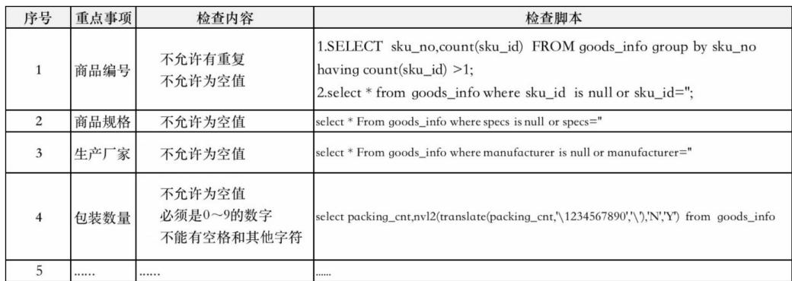

图12-5商品初始化数据校验示例

## 4.权限及账号开通

系统部署完成以后，负责现场运营的相关人员便可以登录权限系统 为一线操作员工开通系统登录账号，并按照岗位角色为账号分配系统功 能权限和数据权限。功能权限包含页面权限、操作权限和字段权限，数 据权限根据每个系统的数据规则进行设置，可以按角色设置、按仓库设 置、按业务设置等。 

为了准确地记录每个人的操作记录，以便可追溯，最好为每位操作 员开通独立账号，账号不要公用。 

## 5.实操培训

供应链项目的用户方通常是一线操作员工，在新系统正式切换前， 现场运营人员和实施工程师需要对一线操作员工进行实操培训，让各岗 位操作员熟练掌握各环节的操作流程，包含系统操作培训、硬件操作培 训和异常流程处理培训。很多时候，我们会给一线操作员一份系统操作 手册，但这样的培训效果往往非常差，面对硬生生的文档，没几个人会 真正用心地学习，最好的方式是在系统切换前下发一些测试单，让操作 员在真实环境中参与测试，感受实操。 

## 6.正式上线

所有准备工作做完后，就可以正式进行系统上线了，系统正式上线 的意思是接入真实的业务到新系统中，让新系统接受真实业务的考验， 而不单是之前的模拟测试了。 

为降低上线风险，相关人员可以采用爬坡切换的方式，前期新旧系 统并行运行，业务慢慢向新系统迁移，逐步过渡到新系统中。切换系统 时有两个需要重点关注的点：①如果旧系统中还有未处理完的单据，抑 或是在切换过程中下发的单据，应该继续在旧系统中处理完；②任何项 目上线都存在失败的风险，相关人员应该提前考虑风险预案，万一上线 失败，能及时切换旧系统。 

## 7.上线跟进

新项目上线后，通常会存在与原流程不一样的地方，加上一线操作 员对新系统的适应需要一个过程，项目组成员需要驻场一段时间对项目 进行上线跟进，一方面对一线操作员进行辅导，另一方面能及时发现操 作方面存在的问题和系统问题并及时处理。 

在项目上线跟进过程中，必然会出现很多待优化的需求和待解决的 问题，为了统一管理，通常需要建立一线员工反馈的需求和问题的对接 通道，从现场收集，统一汇总后进行处理。图12-6是一个简单的仓储管 理系统上线问题登记表示例，用以上线期间一线操作员填写后汇总。 

<table><tr><td colspan="4">仓储管理系统上线问题登记表</td></tr><tr><td>日期</td><td></td><td>登记人/岗位</td><td></td></tr><tr><td colspan="4">问题描述(要求描述为:【入库】模块,【上架确认】页面、点击【上架确认】报错,报错内容:×××××)</td></tr><tr><td colspan="4"></td></tr></table>

图12-6上线问题登记表示例

上线实施过程中的核心环节及产出如表12-5所示。 

表12-5上线实施核心工作

<table><tr><td>项目环节</td><td>核心工作</td><td>参与人</td><td>产出</td></tr><tr><td>制订上线实施计划</td><td>详细罗列上线的步骤和核心工作</td><td>项目经理</td><td>上线实施计划、上线动员会</td></tr><tr><td>软硬件部署</td><td>将系统软件、硬件部署到正式运行环境中</td><td>实施工程师、运维工程师</td><td>软件、硬件部署完成</td></tr></table>

续表 

<table><tr><td>项目环节</td><td>核心工作</td><td>参与人</td><td>产出</td></tr><tr><td>系统初始化</td><td>系统运行相关的基础数据、历史数据、基础配置等初始化</td><td>实施工程师</td><td>初始化完成</td></tr><tr><td>权限及账号开通</td><td>为系统使用用户开通正式环境的系统账号和系统权限</td><td>现场运营人员</td><td>权限及账号开通</td></tr><tr><td>实操培训</td><td>对一线实操员进行系统操作培训</td><td>现场运营人员、实施工程师</td><td>操作手册、系统实操</td></tr><tr><td>正式上线</td><td>系统正式上线运行,接入真实业务</td><td>实施工程师</td><td>新系统正式线上运行</td></tr><tr><td>上线跟进</td><td>各方向负责人现场跟进上线情况,及时处理现场问题</td><td>实施工程师、现场运营人员</td><td>紧急需求及问题清单及处理结论</td></tr></table>

## 12.5项目收尾：过往为序，未来可期

项目的成功上线意味着新系统运行与维护的开始，同时也意味着本 项目到了收尾阶段，我们的职业生涯何其短暂，有的人一辈子都未必有 机会经历一次兼具基础建设、硬件和软件的超大型供应链项目，更多的 人经历一两次就很幸运了，所以我们有必要对项目经历进行总结、复盘 ，把宝贵的经验运用到下一个项目中去。项目收尾阶段主要有五项工作 ：上线问题处理、紧急需求处理、上线指标分析、项目验收、上线复盘 总结。 

## 1.上线问题处理

系统上线平稳后，项目组会逐步将基础建设、硬件和软件系统移交 给业务方，并分批撤离项目现场，这就需要建立上线后的问题定位、反 馈和处理机制，对上线后的问题进行分级处理，常用做法是项目组整理 出项目过程中常见的问题及处理方式，将其留给现场运营人员，日常问 题交由业务方的现场运营人员自行解决，紧急、疑难问题可以由项目组 提供远程支持。 

## 2.上线需求处理

针对系统上线后的需求，建立上线需求的对接通道，由产品经理进 行对接，紧急需求及时研发、上线，非紧急需求可以按照版本迭代的方 式定期研发上线，如每半个月更新一个版本。 

像仓库、配送中心这些多网点、多业务的供应链项目，由于各个网 点都有自己的需求，如果统一由产品经理进行对接，其精力必然不够， 会顾此失彼，合理做法是由各仓的现场运营人员负责一线的需求收集和 整理，再将其汇总到总部运营部门，由总部运营部门的相关人员统一与 产品经理进行对接。 

## 3.上线指标分析

做项目不是做福利，特别是大型供应链项目，有投入必然需要有产 出，作为产品经理和运营人员，我们应该养成系统上线后及时对业务指 标进行监控和分析的习惯，评估项目的投入产出比是否与预期相符，如 果达不到预期，要从中分析原因并予以优化，和业务方一起将项目向良 性的方向牵引，决不能不闻不问，这是不负责任的行为。 

## 4.项目验收

大型项目在交付业务方之前，都有项目验收环节，相关人员验收通过并 签字确认，项目组才能正式离场，如果该项目有尾款未支付，也会在验 收通过后再走尾款付款流程。验收流程由项目经理发起，项目组和业务 方一起整理验收清单，由业务方逐一检查验收并签字，如果某些环节验 收不通过，需要及时解决。 

供应链项目的验收可以分阶段实施。基础建设类项目一般在水电装 修完成后达到进场标准即可安排验收，验收项目包含工程竣工验收证明 书、地基及基础建设质量、主体工程、水电、暖通规划等，需要各负责 主体方一起确认签字；硬件项目和软件项目需上线运行稳定并达到业务 预期后再进行验收，验收项目包含硬件的质量、性能、系统流程和系统 功能等。 

## 5.上线复盘总结

项目的成功上线代表着我们过去的心血终于得以交付，但我们有必要对 项目做一个复盘总结，并对项目做结项验收。复盘总结会一般由项目经 理组织核心项目组成员召开（不需要大领导参加），可以以比较轻松的 茶话会的形式召开，包含如下议程。 

① 回顾整个项目历程。从项目启动，到各个里程碑节点，到最后的 系统上线，有心的项目经理会在各个节点都拍摄一些照片和视频，重点 分享一些难忘瞬间。 

② 分享项目上线后对业务带来的价值，以及上线后的数据指标与业 务预期的差异，并分析原因，此项需要产品经理和运营人员配合完成 。 

③ 向业务方收集上线后的满意度调查情况，并将满意度结果同步项 目组。 

④ 组织每一位核心项目成员对项目过程中的好坏优劣进行复盘， 可以从计划执行、目标完成、资源、需求变更、团队合作等多个方面展 

开，最终形成复盘结论。 

复盘总结不是目的，而是为了总结经验，吸取教训，以求项目越做 越好。 

上线收尾阶段的核心环节及产出如表12-6所示。 

表12-6项目收尾核心工作

<table><tr><td>项目环节</td><td>核心工作</td><td>参与人</td><td>产出</td></tr><tr><td>上线问题处理</td><td>建立问题定位及处理机制,对线上问题分级处理</td><td>实施工程师、现场运营人员</td><td>问题定位及处理机制</td></tr><tr><td>上线需求处理</td><td>建立上线需求对接通道,处理需求</td><td>实施工程师、产品经理</td><td>需求对接与处理机制</td></tr><tr><td>上线指标分析</td><td>对业务指标进行分析监控,评估投入产出比和项目价值</td><td>项目经理、产品经理、实施工程师</td><td>指标分析数据</td></tr></table>

续表

<table><tr><td>项目环节</td><td>核心工作</td><td>参与人</td><td>产出</td></tr><tr><td>项目验收</td><td>将项目正式交付业务方,由业务方进行验收</td><td>项目经理、业务负责人</td><td>项目验收交付文档</td></tr><tr><td>复盘总结</td><td>项目复盘,总结系统上线过程中的经验</td><td>项目经理、核心项目组成员</td><td>项目复盘总结</td></tr></table>

## 12.6 本章结语

想要成为实战型的供应链人，我们需要有三懂：懂业务、懂系统、 懂实施，一个大型的供应链项目实施包含基础建设、硬件和软件。在这 一类项目中，系统软件过程只是整个项目中的一部分，我们有必要了解 整个供应链项目的实施历程。 

无论是哪种供应链项目，都会经历规划立项、项目建设、上线实施 、项目收尾四个阶段，每个阶段又可以细分为多个环节。 

规划立项是从点子到项目落地的过程，一个点子的产生，到最终形 成项目，会经历项目构思、模式验证、项目立项、计划分工和项目启动 会5个环节。 

根据项目的范围，项目建设可以分为基础建设、设备建设和系统建 设三个方向，项目经理不仅要使每个方向能如期完成，还要保证三方能 完美衔接，才能最终交付一份满意的项目答卷。 

供应链项目实施涉及线下物理区域运营、流程运营、一线操作员培 训、硬件设备部署等，上线前的实施流程也比纯系统软件要复杂得多， 任何一方准备不充分，都有可能导致上线失败。项目实施包含上线实施 计划、软硬件部署、系统初始化、权限及账号开通、实操培训、正式上 线和上线跟进7个环节。 

过往皆为序，未来诚可期，项目的成功上线意味着新系统运营和维 护的开始，同时也意味着本项目到了收尾阶段，做好项目收尾是对自己 过往的交代，也会为未来的项目提供宝贵的经验，项目收尾阶段要完成 上线问题处理、上线需求处理、上线指标分析、项目验收、复盘总结5 项工作。 

## 后记

在写书的过程中，将之前的做过的项目和资料又重新梳理了一遍， 仿佛又回到了那些披星戴月的日子。从出校门时的懵懂迷茫，到如今的 逐渐成熟，十年如一梦，但我对供应链这片领域的喜爱和探索的初心却 从未改变，这一刻，感觉自己仍是少年。 

曾经的我很无知却不自知，毫无方向地上蹿下跳，终于在一次次的 磨砺中闯入了供应链领域，迷茫地顺着光的方向摸索前行，在泥泞和坎 坷中慢慢成长，现在有了一些沉淀以后愈发觉得天地之大、自身之小， 未来的道路宽广却没有尽头，感觉自己更加无知了，这也许是这个时代 的常态吧，幸运的是一路上都有认识的和不认识的新老朋友一同前行， 欢歌笑语，相信这样的群体一定会比当年的我们更加年轻勇敢、慷慨激 昂，在即将腾飞的供应链领域中绽放更加绚丽的光彩。 

我们出生在了一个好的年代，信息通畅、不问出身，通过互联网能 接触到任何我们想了解的领域，加之自己的努力，就足以改变自己的生 活现状，何其幸运。这种幸运也是本书成稿的有力保障，在写作过程中 我参考了网上许多宝贵的资料，在庆幸的同时也倍感压力，生怕自己的 不专业给了朋友们错误的引导，如果书中有表述欠妥的地方，请一定告 诉我，我会及时修正，在此真诚地感谢大家！ 

写书的过程是痛苦的，对我的脑力、精力和体力都是极大的考验， 在无数个凌晨，早晚洗漱之余，吃饭的间隙，出差的飞机上、高铁上， 飞驰的出租车上，地铁里，家里的客厅，酒店的床头，孩子的培训班里 ，接种疫苗的等候区……每一点碎片化的时间都被充分利用，只为那一 字字的辛酸，对我个人而言，这绝对是生命里一段很难忘的经历，因为 我不确定未来是否还有机会和勇气再出第二本书。过程纵然艰辛，但回 忆依旧清甜，回想这一年，笔耕不辍，在此刻闪烁的台灯下，我仿佛看 到了一抹星火正成燎原之势蔓延，那是我尚未燃尽的青春。 

最后想说的是，书中的文字是僵硬而有限的，总有一天会过期，但 成长和交流的空间是灵活和无限的，就像供应链本身一样，需要连接和 协同才能发挥更大价值，为了彼此不再迷路，欢迎朋友们关注我的公众 号：供应链产品笔记，让我们一起面对随着科技大爆炸奔袭而来的下一 个供应链十年…… 

## 反侵权盗版声明

电子工业出版社依法对本作品享有专有出版权。任何未经权利人书 面许可，复制、销售或通过信息网络传播本作品的行为；歪曲、篡改、 剽窃本作品的行为，均违反《中华人民共和国著作权法》，其行为人应 承担相应的民事责任和行政责任，构成犯罪的，将被依法追究刑事责任 

为了维护市场秩序，保护权利人的合法权益，我社将依法查处和打 击侵权盗版的单位和个人。欢迎社会各界人士积极举报侵权盗版行为， 本社将奖励举报有功人员，并保证举报人的信息不被泄露。 

举报电话：（010）88254396；（010）88258888 

传真：（010）88254397 

E-mail:dbqq@phei.com.cn 

通信地址：北京市万寿路173信箱 

电子工业出版社总编办公室 

邮编：100036 