看懂新零售供应链底层逻辑，实现企业供应链信息化转型 把握供应链风口，成为既懂业务又懂系统的全能型供应链人才 

# 实战供应链

# 业务梳理、 系统设计与项目实战

罗静 编著 

## 版权信息 C O P Y R I G H T

书名：实战供应链：业务梳理、系统设计与项目实战 

作者：罗静 

出版社：电子工业出版社 

出版时间：2022年1月 

ISBN：9787121422768 

字数：560千字 

出版方：电子工业出版社有限公司 

版权所有•侵权必究 

## 内容简介

我国社会化供应链成本的优化空间巨大，在以信息化主导的产业互 联网时代来临之际，供应链领域在未来几年必然会迎来飞速发展，每一 位供应链人都应该具备业务思维、系统思维和项目思维，我们要学会利 用业务思维指导系统建设，利用系统思维实现业务目标，通过项目思维 管理好业务和系统预期。 

市面上与供应链相关的书籍很多，但从业务结合系统视角出发来编 写的很少，本书从实战角度出发，以作者十多年的工作经验为基础，将 理论与实际结合，致力于帮助每一位读者朋友成为懂系统的业务人和懂 业务的系统人。 

通过本书，读者可以看到供应链的宏观全貌，掌握必备的供应链常 识、电商新零售供应链的业务流程及系统交互、中台化的供应链系统规 划、核心供应链系统搭建，以及完整的供应链项目实施流程。愿诸君都 能成为“实战”型供应链人才！ 

## 推荐语

《实战供应链》系统地展示了商业供应链业务和产品体系，是业内 难得的实践型佳作。作者罗静长期在供应链领域的头部企业实践，又善 于总结思考，其作品可以帮助企业供应链领域的产品经理和业务人员持 续提升！ 

——罗戈研究院长潘永刚 

作为一个有十多年供应链实践经验的管理人员，我第一次看到这本 书时，不禁眼前一亮，这应该是目前国内供应链实践领域最系统、最全 面的一本书，对企业的供应链管理有非常强的指导价值。作者立足电商 和新零售这一前沿战场，结合自己多年的供应链实战经验，由浅入深、 循序渐进，对供应链规划、系统设计、采购、仓配、库存、订单履约等 进行深入解读，有入门宽度，有思维高度，有实践深度，有管理厚度， 无论你是供应链理论研究人员、企业供应链管理与操作人员，还是想进 入供应链领域的小白，这本书都会给你带来丰富的营养，我向同行朋友 强烈推荐。 

——九州通医药集团股份有限公司副总经理，九州通医药集团物流 

有限公司总经理张青松 

作者在供应链系统建设方面深耕多年，有着非常丰富的实践经验， 为转转搭建的 OMS、WMS、采销、中央库存等供应链系统，在转转找 靓机合并的过程中，经受住了考验，发挥了重要作用。本书中的内容多 是一线实践的结晶，干货十足，书中分享了很多实操经验，具有很强的 借鉴意义。有兴趣深入学习供应链业务系统的朋友们，阅读本书定会从 中收获良多。 

——转转集团CTO吴廷鹏 

作者拥有10多年的供应链项目实战经验，作者在本书中系统地讲解 了供应链业务、供应链系统设计和供应链项目流程，条理清晰、文笔流 畅，如果您想成为懂系统的业务人，强烈建议您阅读本书。 

——人人都是产品经理、起点学院 创始人＆CEO老曹 

我们都能感觉到，自己处在一个变化越来越快的世界，这使得很多 知识技能的保鲜期越来越短，从业者的焦虑也与日俱增，“吃青春饭”“ 中年危机”等话题总是挂在嘴边。好在在供应链领域中，相关人员需要 长时间的沉淀，相信每位从业者都能从本书中得到启发。 

——产品创新顾问，《人人都是产品经理》系列图书作者苏杰 

供应链管理在现代商业中具有举足轻重的作用，无论是传统制造业 ，亦或是电商和新零售，供应链能力的强弱都决定了企业的核心竞争力 和竞争壁垒。供应链是一个专业性极强的领域，且和交易履约关系紧密 ，因此大多数从事企业管理软件开发的产品经理，不论是专门负责这个 方向，还是工作相关，都应该具备相关知识。相信此书一定会让读者大 呼过瘾，收获满满！ 

——NetRain董事长＆CEO 曲毅 

持续提升和优化供应链能力是与国家经济发展息息相关的。无论是 新零售兴起还是供应链的数字化变革，供应链信息化建设的升级，无疑 是重要且迫在眉睫的。我非常欣喜地看到作者能够全面且深入浅出地将 供应链信息化的理念和案例娓娓道来，本书兼具时代性和实战性，实在 是不可多得的一本好书，强烈建议供应链和信息化从业者好好研读。 

通天晓软件创始人CEO 吴煜 

罗静参与了在国内以至于全球范围内都很先进的供应链项目的建设 ，这种经历实属难得，这本书就是他十多年的经验总结。《实战供应链 》是目前市场上少有的从系统角度写的实操性很强的供应链领域的书籍 ，非常适合从事与供应链相关工作的专业人士，全书结构框架完整，且 文笔流畅，具有很强的操作落地性，强烈推荐！ 

—— 盛森教育创始人＆CEO 周建森 

作为和罗静共事多年的伙伴，我深刻体会到电商公司要想以更低的 成本为用户提供更好的服务体验，就必须打造一套匹配完善的供应链系 统，其中找到专业的供应链产品专家是供应链系统成功落地的关键。很 高兴为产业研究的同学推荐这本书。书中从宏观到微观，详细阐述了供 应链的前景、场景规划和落地细节，干货不断、引人入胜，还穿插了很 多幽默易懂的示例，一口气读完倍感充实，意犹未尽。 

——转转集团VP李金城 

这本书将供应链业务和供应链系统进行了通俗易懂的讲解，值得一 看。 

——叮当快药集团产品VP赵云鹏 

作者拥有丰富的供应链产品和业务经验。不管你是产品经理，还是 做供应链管理，或者做零售、做品牌，这本书都值得一读。 

——前每日优鲜产品运营副总裁陈爱军 

我与罗静相识多年，他在互联网大厂从事产品经理工作多年，积累 了丰富的供应链经验，这本书通过大量的实例，生动形象地把供应链体 系讲解得非常透彻，无论你是已经从事与供应链相关的工作多年，还是 即将从事与供应链相关的工作，这本书都非常值得一读！ 

滴滴高级产品专家高永虎 

从京东供应链早期产品经理，到后续操刀若干电商平台的供应链搭 建，老罗已然在这个行业摸爬滚打了10多年。而我作为一个与老罗相识 了6年多的朋友，也看到了他的努力与付出。在老罗写书的两年时间里 ，他放弃了很多陪伴家人的时间，只为能尽早将自己十载的沉淀凝聚成 书，与众人分享。 

本书的前半部分介绍了关于供应链的框架性内容，后半部分将供应 链体系的主要模块逐一展开详述，再加上作者故事化的写作风格，使本 书可读性很强，对与供应链相关的各领域的产品经理、业务运营人员、 技术人员等同，非常具有指导意义。 

——转转中台产品负责人张亚辉 

罗静一直深耕供应链领域，并且有着丰富的实践经历。他的文字幽 默风趣，把供应链中的流转过程清晰地呈现出来。本书从实际应用的角 度出发，梳理了采购、仓储、订单等主要模块，相信它可以很好地帮助 供应链从业者。 

——《电商产品经理宝典》作者 刘志远 

罗兄的文章总是干货满满，市面上与供应链相关的好书并不多，罗 兄的这本无疑是其中之一。 

淀的。罗静作为一个深耕供应链领域10余年的老将，将自己的经验及所 学浓缩成一本书，这是令作为朋友的我们非常欣喜的。能够将自己的知 识和经验以书的形式传播，让更多的人获益，是一件非常有价值的事情 。本书既有供应链理论的讲述，又通过生动的故事来阐释这些理论如何 应用于实践。作为一名供应链领域的初学者，这本书可以作为启蒙之作 ；作为一名在供应链领域中有一定经验的人，本书亦可作为参考书。 

——高级供应链产品专家张渊源 

## 前言

十年一剑终成稿，散尽心血呈君阅。 

当林瑞和老师第一次向我邀稿的时候，我欣喜又忐忑，身为一名在 供应链一线摸爬滚打多年的老产品经理，虽然偶尔写写公众号文章，但 总觉得离出书还有些遥远，于是就拒绝了，但从此我的心里埋下了一颗 出书的种子，直到思考和准备了两年以后，终于迈出了第一步，之后， 便有了她——《实战供应链》。 

## 一、她是一本什么样的书

供应链领域是一个很广的领域，涉及我们生活的方方面面，而且发 展空间巨大，相关资料显示，我国社会化供应链成本占到GDP的18%左 右，远高于欧美国家的7%～8%，可优化空间巨大。另外，从国家的各 项政策支持、工业信息化、产业信息化的逐渐渗透趋势来看，未来 5～ 10 年，供应链领域必定会迎来飞速发展，对于每一位想涉足供应链领 域的人来说，这无疑都是千载难逢的机会，不愁前途无路。 

然而我发现身边有很多朋友，他们聪明好学，但是想深入学习供应 链却难上加难，网络上的资料很多，却零散琐碎，不成体系，很多专业 的供应链教程书籍又过于理论化、不接地气，他们很迷茫又很无奈，走 了很多弯路，和当初的我一样。所以，借此机会，我想从实践角度写一 本“纯干货”的书，希望这本书能够通俗易懂，直通底层不变的规律，让 想深入了解供应链领域的朋友们有所收获。 

在本书中，你看不到天马行空般的“蓝图”和奇幻的“海洋”，更多的 是与供应链的业务讲解、流程梳理、系统规划和项目实施相关的“地面 工作”，这是我和我的朋友们学习和工作的结晶，不完美，但足够真实 0 

## 二、她讲了什么内容

本书共12章，分为四个部分展开。 

第1章和第2章是供应链理论知识普及，带你了解什么是供应链、供 应链的范围、供应链管理的目标和原则、供应链业务与供应链系统的关 系，以及理解供应链必须要掌握的一些常识等，这些都是我们理解供应 链的基础。在这两章里，为了让那些晦涩的理论更加易懂，我穿插了一 些故事来辅助理解，相信你不会像读理论书籍一样那么吃力了。另外， 这两章里还加了一些我个人对供应链前景的分析、供应链入门的指导建 议，方便你更加客观全面地认识供应链，多思考自己的定位。 

第 3 章和第 4 章聚焦电商新零售供应链业务和系统流程。从传统零 售发展到电商，再到O2O、新零售，几十年间，概念在变、模式在升级 ，但零售的本质并未改变，仍然是“人-货-场”三要素，同时，供应链的 本质也不曾改变。通过这两章的学习，你会了解到那些变化背后不变的 供应链思想、供应链业务，以及为辅助这些业务而生的供应链系统。你 还会了解到电商新零售包含哪些业务和系统，系统的规划和分工该如何 做，什么是供应链中台，供应链中台设计有哪些“秘籍”。 

第5章到第11章详细介绍供应链系统的规划和设计。每个系统的诞 生都有其使命，好的系统一定是贴合业务的，在这几章里，我会尽我所 能，教你从0到1搭建核心的供应链系统，包括供应链基础数据中心、采 购管理系统、中央库存系统、仓储管理系统、订单履约中心、配送管理 系统、门店管理系统、供应商关系管理、商家发货系统、售后系统、统 一09-权限系统等。为了方便理解，我以个人的理解加了一些原型示例，但 只是为了达到理解本书的效果，并不保证实用性，授人以渔而非授人以 鱼，大家可参考但不要照搬哈。 

第12章带你了解一个大型的供应链项目的实施历程。想要成为实战 型供应链人才，我们一定要参与到实战中，供应链项目不比普通的只有 软件功能的开发类项目，而是需要与基建、硬件、现场运营等相关人员 一起协同，任何一方失控都会导致项目的失败或延期。通过阅读本书的 最后一个章节，你会了解到一个兼具基建、硬件和系统建设的大型供应 链项目所经历的完整历程及各个环节的投入和产出。 

本书起于供应链，但不止于供应链，还有一些多年的工作经验和产 品规划设计方法论，也希望与你一并分享。 

## 三、你需要她吗

市面上有很多经典的供应链书籍，但大多是以理论视角为出发点的 ，以系统视角为出发点的很少，如果你只想了解供应链理论，而且需要 比较严谨的概念，那么这本书一定不适合你，但如果你是想系统地学习 供应链业务及系统设计和实施的产品经理，或者是对业务已经相对了解 ，但苦于没有系统化思维，想要进一步了解供应链信息流业务的同学， 抑或是只对供应链某一块比较熟悉，但对供应链的业务、流程、系统有 整体了解诉求的做产品、技术、运营的同学们，相信我，这本书一定会 对你有所帮助。 

总之，如果你想成为懂业务的产品人，或者懂产品的业务人，这本 书不会让你失望。 

## 四、写在最后

纸上得来终觉浅，绝知此事要躬行。我希望这本书是一位好的老师 ，而不是一个好的工具，因为好的老师并不一定要比学生强，但能带学 生开启知识的大门，让学生自己去探索未知的世界，而工具多是适用“ 拿来主义”的。实践是最好的学习捷径，我希望你带着所学在工作中感 受、实操、挖坑、受挫、填坑，继而成长，无往不前。 

这是一本偏白话的书，是我在供应链领域中的学习和总结，所以请 不要当作专业教材来读。供应链领域是一个非常广的领域，即使深耕多 年，我也只是对其中的某些领域相对熟悉，个人水平和修为极为有限， 在写作过程中难免有不足之处，欢迎各位读者指正。 

在写作过程中，我也得到了很多朋友的支持，感谢林瑞和老师的建 议和指导，感谢高永虎、张亚辉、何文忠、胡学武、郜克彬、乐志华、 于超、高鑫鹏、毛周欣、鲍进等一众老铁提供的帮助和支持，感谢《决 胜B端》的作者杨堃老师，以及《电商产品经理宝典》的作者刘志远老 师给予的宝贵意见，还要感谢通过公众号结交的朋友们，每每在我懒惰 懈怠的时候给了我写作的动力，让我继续坚持。 

最后，谨以此书献给我美丽贤惠的妻子潇老板和活泼可爱的女儿A nky，以及永远视我为孩子的父母，感谢他们在写作过程中给予我最大的 支持和理解，让我可以安心完成此书。 

罗静 

## 第1章 解君之惑：供应链全貌大揭秘

每一段历史的荣辱兴衰，都有着其独特的历史背景，有偶然也有必 然。大到朝代变更，小至一首唐诗宋词，都有着时代赋予的历史使命。 学习供应链也是一样的，每一个体系的迭代升级，每一个管理思想的进 步也都有着它的历史渊源和意义。知古而鉴今，知数而识文，本章节， 木笔先从一个比较宏观的视角带你看一看供应链的全貌及其前世今生， 让朋友们对供应链有个宏观层面的认知，以便后续更深入地学习。 

准备好了吗？请记好安全带，准备起航！ 

## 1.1 神奇的供应链到底是什么

“王总，这次采购的货，怎么推迟了一周才到，你们供应链的效率 也太低了吧？”“×××公司供应链出现了严重问题，上一批订货的质量完 全不达标！” 

“哎，今年‘618’又爆仓了，供应链管得稀烂！” 

“×××公司的成功得益于他们强大的供应链体系。” 

“京东的供应链优势，在这次疫情期间体现得淋漓尽致！” 

…… 

公司里、地铁上、办公室里、交流会上是不是总能听到一些这样的 或者那样的吐槽或者赞赏？我们的生活起居、衣食住行似乎都和供应链 有关，但它却又像空气一样让人捉摸不透，看不见，也摸不着。那么供 应链到底是什么，和我们有什么关系呢？ 

## 1.1.1 供应链的定义与解析

马士华教授在《供应链管理》一书中将供应链定义为，供应链是围 绕核心企业，通过对信息流、物流、资金流的控制，从采购原材料开始 ，制成中间产品及最终产品，最后通过销售网络把产品送到消费者手中 ，并将供应商、制造商、分销商、零售商直到最终用户连成一个整体的 网链结构和模式。（免费获取更多供应链PM书 加v信：pmzjie） 

这个定义非常贴切，为了加强理解，我们来拆解一下这个定义，便 会对供应链的认识更加清晰了。 

① 供应链涉及的角色有：原料供应商、制造商、分销商、零售商 和终端用户。 

② 供应链有3个核心因素：信息流、物流、资金流。 

③ 供应链是从原材料到中间产品（半成品），再到成品的一个全 周期。一般在制造商的生产加工中心内完成转换。 

④ 供应链的产品流向是从原料供应商→制造商→分销商→零售商 →终端用户的正向过程，逆向过程则反之。 

⑤ 供应链涉及采购、生产制造、销售、运输等几个环节，当然在 任何一个环节中都会涉及产品的存储。 

⑥ 供应链是一个以核心企业为中心，将上下游企业/客户连接成一 个整体网链的形态，它是一条彼此相连的链，而不是一个个孤立的点。 

图1-1可以更直观地表达供应链的定义。 

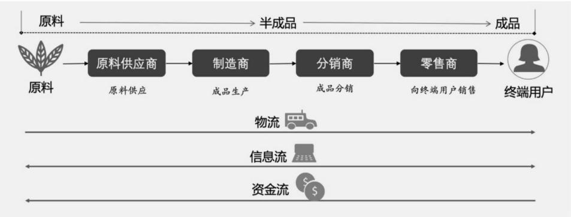

图1-1 供应链的定义

从这个定义来看，供应链几乎关系着我们生活的方方面面，作为终 端用户，我们每个人本就是供应链上很重要的一环，作为供应链的最末 端，我们是最终的消费者，我们的生活起居，衣食住行，无时无刻不和 供应链紧密相连。 

同样，我们生活品质的高低，自然也和供应链有着直接的关系。我 们来看一个故事。 

$$
\mathrm{一碗牛肉面的故事}
$$

深夜时分，小Q正躺在床上玩着某排位游戏，激战正酣，大招一放 ，以一敌百。突然身旁的女朋友推了推小 Q，说自己肚子饿了，想吃牛 肉面。这时家里的冰箱空空如也，下厨是不可能了；外出去买也不现实 ，因为外面正下着倾盆大雨，楼下最近的一家面馆已经关门了；同时， 游戏激战到紧要关头，此时退出游戏一定会被队友们骂惨，不退的话， 女朋友这边肯定是无法交代了。正在小Q左右为难、心急如焚时，女朋 友贴心地说了一句：“我已经在美团上下单了，30分钟就送达了，给你 也定了一份。”短短10秒钟的时间，小Q的心情从低谷到高峰，仿佛经历 了一个世纪，一场危机就地化解，小Q悬着的心也落地了，瞬间感觉生 活那么美好。 

而此刻，美团平台中的商家已经接到订单，迅速将备好的食材下锅 了，这些食材都是商家提前在食材批发市场订购的，也是从App上直接 下单，每天由专门的送货员定时送货到店里的，商家再也不用像几年前 一样凌晨去批发市场的各个摊位挑选食材了。不出意外，5分钟后，帅 气的身穿黄色制服的美团外卖小哥会冒雨前来取餐，然后以最快的速度 ，按照系统指定的路线，按时将外卖送到小Q家门口，让小两口能吃一 口热腾腾的牛肉面。 

试想，如果放在10年前，没有如今这么发达的信息网络、精准的订 单匹配、高效的食材制作、便捷的订单配送，我们的生活又会怎样？而 我们今天享受的这一切，都和供应链有着密不可分的关系，在线下单、 订单匹配、食材采购、菜品制作、配送到家，都是供应链里很重要的环 节，正是科技让这些环节不断优化，才让我们的生活品质不断提升。 

## 1.1.2供应链的五大角色与分工

从供应链的定义中，我们了解到，整个供应链中包含 5 个角色：原 料供应商、制造商、分销商、零售商和终端用户。下面，我们重点来说 说这5个角色是如何分工协作，让整个供应链顺畅地流转的？ 

## （1）原料供应商

原料供应商主要负责原料的收集、整理、加工，然后将原料转卖给 下游的制造商。原料供应商可以从原产地直接收购原料，也可以从下游 原料供应商处收购原料，还可以自己自行种植/养殖原料。 

## （2）制造商

制造商也叫生产厂商。主要负责将采购回来的原料加工为半成品/ 成品，再将半成品/成品销售给下游客户。下游客户一般是分销商。当 然，随着互联网的普及，很多制造商也可以直接面对终端用户进行产品 销售，这样可以省去中间环节，让产品的成本更低。 

## （3）分销商

分销商主要负责将制造商生产的成品批发过来，再通过自己建立的 分销渠道将产品销售给客户。 

在批发市场上，还有两个类似的角色：经销商和代理商。三者的业 务在供应链的流通角色上是一样的，都是负责将制造商制造的成品销售 给下一级客户。不过三者在业务开展方式上略有不同，从与制作商的合 

作方式上区别如下。 

分销商一般与制造商建立了长期、稳定的合作关系，具备从制造商 处采购独家的产品和全线产品的资格。 

经销商与制造商的合作关系没有分销商与制造商的合作关系密切， 一般从不同的制造商处采购不同的产品进行售卖，不具备产品的独家销 售资格。 

代理商一般只负责产品的推广，提取相应的佣金，和制造商不存在 真正的买卖关系。 

## （4）零售商

零售商主要负责从分销商（或者直接从制造商）处采购产品，并向 终端用户进行销售。我们日常购物的家乐福、沃尔玛、物美等大型超市 ，全家、7-11、美宜佳等便利店，以及线上的京东、天猫等都属于零售 商。 

## （5）终端用户

供应链最末端使用产品的个人/企业，是产品的最终用户，为产品 和服务买单。产品的需求是由终端用户发起的，产品的质量和服务的好 坏，也是由终端用户来评价和反馈的。 

一言以蔽之，在供应链上，原料供应商负责原料供应，制造商负责 将原料生产为半成品/成品，分销商负责产品销售渠道的建立，零售商 负责面向终端用户销售产品，终端用户负责产品的消费使用。每个角色 是上游角色的下游客户，又是下游角色的上游供应商，上下游之间是采 购与销售的关系，上游角色负责销，下游角色负责采，各个角色相互协 作，便形成了一条完整而通畅的链路。 

图1-2是由各角色组成的一个简单的供应链正向流通模型。 

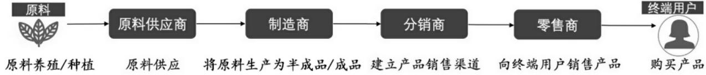

图1-2供应链流通模型

在实际的商业运作中，每个环节都会有多个上游供应节点，也会存 在多个下游客户节点，供应商还有上游供应商，分销商还有下游分销商 ，同时，供应商、制造商、分销商、零售商的角色也不是固定的，如一 些企业既是分销商，又是零售商，各方形成多个链条组成的错综复杂的 供应网络，如图1-3所示。 

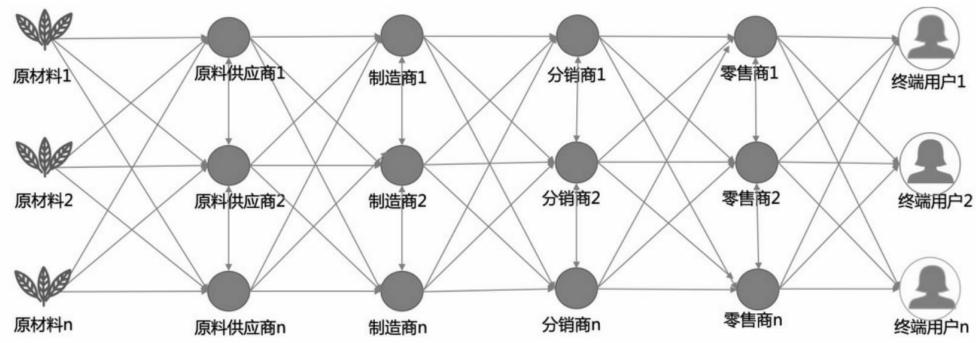

图1-3 供应链流通网络

## 1.1.3 供应链管理的范围：五大流程管理

关于供应链管理的范畴，仁者见仁智者见智。目前比较权威的是国 际供应链协会发布的供应链运作参考模型（SCOR）。在这个模型中， 将供应链划分为5个流程管理：计划、采购、生产制造、交付、退货/回 收，如图1-4所示。 

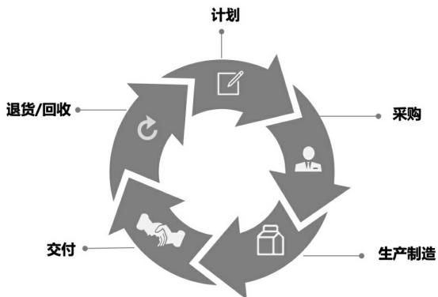

图1-4 SCOR供应链五大流程

① 计划。凡事预则立，不预则废。计划是驱动供应链的重要因子 ，贯穿产品的制造、采购、销售、存储、配送等全生命周期，各个环节 都需要有计划，才能做到有的放矢，有条不紊。就像我们上班一样，公 司有公司的年度计划和目标，各部门有季度计划和目标，每位员工，都 会有自己每周和每一天的工作计划，大家一起基于计划推进工作，才能 做到整体目标一致。 

② 采购。为满足业务目标而从事的采购活动，是基于计划的拆解 和落地执行，我们需要在合适的时间，选择合适的供应商，以合适的价 格，购买合适质量和合适数量的商品，并将其送到指定的地点。这也是 经典的供应链7R原则——恰当的时间（Right Time）、恰当的地点（Rig ht Place），恰当的来源（Right Source），恰当的价格（Right Price）， 恰当的数量（Right Quantity）、恰当的质量（Right Quality）、恰当的 商品（Right Goods）。 

③ 生产制造。在传统视角里，人们普遍认为生产制造就是制造的 过程。但随着供应链从制造行业延伸到下游分销、零售行业以后，生产 制造则更多地表现为为满足客户需要而从事的供应链行为，故其含义也 被延伸为两层。（免费获取更多供应链PM书 加v信：pmzjie） 

第一，成品制造。制造商将原料生产为成品或半成品的过程，如工 业设计、生产加工、产品组装等。这层含义只适用于生产制造行业。 

第二，订单生产。按照客户订单中的要求从仓库拣货、发出，完成 订单履约。这层含义适用于所有行业。当以后我们再听到“订单生产”这 个词时，请不要再大惊小怪了，其实就是把仓库对标成了一个生产加工 中心，将订单的出库操作对标成了生产制造的过程，仅此而已。 

④ 交付。供应链的上游供应商，将产品送达下游客户的过程，称 之为交付。交付包含了订单的下单处理、仓库作业、物流及配送等环节 。例如，我们在京东上下单买了一台手机，京东承诺第二天早上11点前 送达，订单经过京东内部系统调度、仓库作业、物流运输、快递员配送 ，在第二天10：30的时候准时送货上门，这个过程就是一次完整的交付 

⑤ 退货/回收。退货/回收是逆向物流的过程，是产品经下游客户返 回上游供应商的过程，如产品的售后、退货、检修、维护等。 

还是不太懂？我们再来讲个故事加强一下理解。 

30多岁的老王，今年好不容易交了一个女朋友，老王将其视如珍宝 ，对女朋友的关心无微不至。马上要过七夕了，老王心里盘算着要送女 朋友一件特别的礼物。想来想去，决定自己动手为女朋友拼装一个东方 明珠塔的模型，以纪念两人第一次约会的地方（计划）。于是很快付诸 行动，从淘宝上购买了各种积木块、颜料、画笔、电机、小灯泡等（采 购），然后自己按照网上的教程设计了图纸、拼装、上色，经过两周的 准备，一个像模像样的东方明珠塔终于完工了（生产制造）。在七夕当 天，老王带着精心制作的礼物准时出现在了女朋友公司楼下，将礼物亲 手送给了心爱的女朋友（交付），女朋友感动至极，给了老王一个大大 的拥抱。 

好景不长，两人在一起时间长了以后，甜蜜期一过，双方的矛盾便 产生了，这一天因为一件小事，两人大吵一架，老王的火暴脾气上来了 ，直接甩了女朋友一巴掌，女朋友当即提出分手，并把东方明珠模型还 给了老王（退货/回收），表示一刀两断，永不相见。老王后悔莫及…... 

我们日常从事的供应链相关行为，都可以归纳到供应链的五大流程 中。图 1-5 分别从计划、采购、生产制造、交付、退货/回收等方面展开 供应链的相关子流程。其中的一些核心流程，我们会在后面的章节中逐 一展开。 

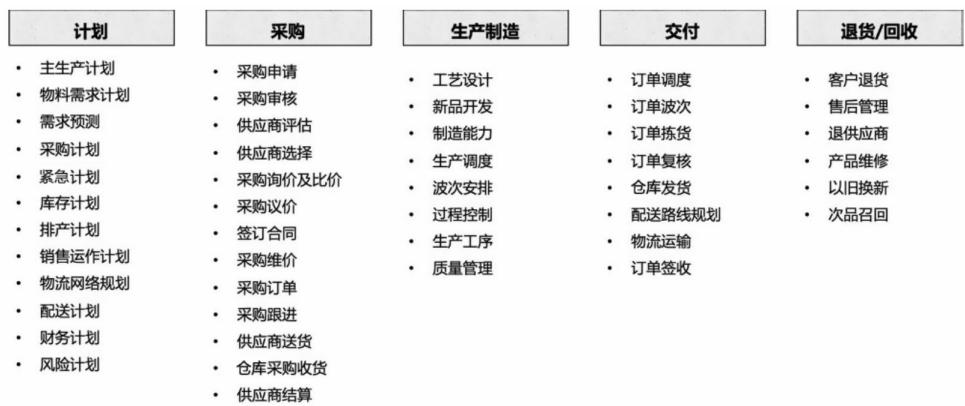

图1-5SCOR供应链五大流程对应的子流程

以上五大供应链流程在实施过程中，是环环相扣、循环往复的，并 不是一个简单的线性流转过程，而是随时根据情况动态调整的。例如， 在交付过程中，我们发现某商品库存不足了，这时就需要立即启动计划 流程，启动应急计划，紧急补货，以最快的速度调整交付方案，以满足 客户的需求。 

当然，由于我们身处的行业不同、公司不同，这 5 个流程的实施也 会千差万别。例如，如果我们身处零售行业，自然就不会涉及成品的制 造流程了，对于我们来讲，重点是怎么做好本公司的计划、采购、订单 生产、交付和退货/回收，成品制造的过程让上游厂商去考虑就行了。 

又如，同样是制订计划，生产企业的计划和分销企业的计划自然也 是不一样的，生产企业可能会更关注生产计划和物料计划，而分销企业 更关注需求计划、销售计划和库存计划。 

我们回到供应链上，引申出一个哲学问题：以始为终、以终为始， 因果循环。链条前端流程的结束，也是下一个流程节点的开始，如果这 两个节点衔接不好，链条就会断掉。例如，上游供应商的交付流程，其 实是下游客户发起的采购计划引发的；而下游客户采购入库流程的开始 ，恰恰源于上游供应商的成功交付。如果没有很好的衔接，那么这个采 购过程就会非常不顺。这也是供应链的魅力所在，这个过程涉及企业内 外部组织、流程、系统、人等多方面的因素，我们永远不可能也不要期 望一蹴而就，而是需要一代一代供应链人不断地努力，日拱一卒，才能 慢慢靠近终点，实现我们认为的比较理想的供应链目标。无论我们是做 规划、运营，还是生产产品、贡献技术，大家的目标都是一致的，即如 何从自身工作出发，让整个链条更顺畅，链条顺了，供应链效率自然就 提高了，成本也就随之下降了。 

## 1.1.4供应链的定位：跨行业的垂直领域

一直以来，业内对“行业”和“领域”没有严格的划分界限，有人说供 应链是个行业，也有人说供应链是个领域，还有人搞不清楚供应链和行 业、领域的关系。作为一位专业的供应链人，我们还是有必要对自己所 从事的工作有个清晰的定位。 

来看一段很常见的对话，来自两位很久没联系的好友，老A和小Q 

老A：“好久不见，老弟最近在什么公司呀？” 

小Q：“我在×××公司做产品经理，这是一家创业公司。” 

老A：“哦，这家公司属于什么行业？” 

小Q：“生鲜行业，主要为市面上那些小饭店提供食材的加工和运输 服务。” 

老A：“那你在公司里主要负责哪部分？” 

小Q：“我主要负责供应链相关的系统搭建。” 

通过以上对话，我们了解到行业、公司和领域三者之间的关系。一 般来说，一个行业中有很多个公司，每个公司里又有很多职能部门，每 个部门负责一个领域，而供应链则属于其中的一个领域。同时，在不同 的行业中都有供应链领域，行业和供应链领域是多对多的关系，如图1- 

6所示。 

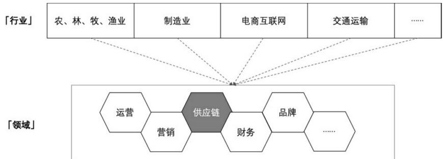

图1-6行业与供应链：跨行业的职能领域

供应链是一个垂直的领域，只要是实体行业，都需要有供应链管理 职能部门，专门处理供应链相关的工作，如采购、仓储、配送等。 

供应链和运营、营销、财务等其他领域一样，都是每个行业里不可 或缺的一个职能领域。我们在招聘网站上经常看到的生鲜行业供应链、 汽车行业供应链、医药行业供应链等，和×××行业运营、××行业营销、 ××行业财务一样，都是跨行业的细分领域。 

都说隔行如隔山，对于供应链相关从业者的我们来说，跨行业反倒 不难，难的是跨领域。不同行业的供应链虽然具有不同的行业特色，但 供应链管理的核心思想是相通的，我们拥有了供应链管理的核心思想， 就可以在不同行业里举一反三，发挥我们的特长。但跨领域就难了，意 味着要改变赛道，从 0 开始了。就像产品经理转行干产品研发一样，尽 管有一定的关联性（如产品设计的思维、文档能力、行业认知等），但 需要掌握的技能和考评的标准已经完全不一样了，几乎是一个全新的领 域，之前积累的产品技能能用到20%就不错了。 

## 1.1.5企业内部供应链和外部供应链

每个企业都是供应链上的一个节点，不同的节点组合到一起便形成 了一条完整的供应链。在企业内部，产品设计、采购、生产制造、仓储 、物流、销售、售后等部门都是属于供应链上的一环，这些部门的高效 连接便构成了企业内部供应链。 

在企业内部，采购部门负责计划和采购，设计和生产部门负责生产 制造，销售部门负责销售，仓储和物流部门负责交付，客服售后部门负 责退货/回收，各部门要追求内部协同，打破部门孤岛，站在企业高度 保证企业整体的成本和效益最优，而不是追求以损人利己为手段的局部 成本和效益。例如，销售部门提前将营销计划告知采购部门和物流部门 ，以便采购部门提前进行备货，物流部门提前安排配送计划，避免因临 时的订单需求波动导致库存不足、仓库爆仓、配送能力不足等情况出现 

当计划、采购、生产制造、交付和退货/回收工作延伸到企业上下 游，从供应商的供应商，到客户的客户，便形成了以企业为中心的外部 供应链，如图1-7所示，企业外部供应链是通过上下游企业之间的协同 ，追求整条供应链条上所有企业的成本和效益最优的供需网络，是比企 业内部供应链更高维度的供应链全链路的优化管理。例如，沃尔玛将P OS销售数据通过EDI（电子数据交换）系统传给上游供应商，以便供应 商及时获取销售数据，及时调整生产计划和物料采购计划，一方面因为 信息的互通，让供应商的预测和计划更准确，另一方面因为供应商的服 务水平更高了，也使沃尔玛的库存成本更低了。 

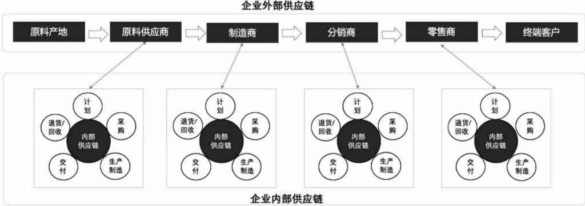

图1-7企业内部供应链与外部供应链

无论是企业内部供应链，还是企业外部供应链，都是围绕着计划、 采购、生产制造、交付和退货/回收来开展工作，追求成本更低和效率 更高。企业内部供应链的高效协同，可以有效地传导到外部供应链上， 使整条供应链更通畅。相反，如果链条上的某个企业的内部管理混乱， 经常发生缺货、超时等现象，也会影响供应链全域的流畅性，增加整体 的供应链成本。就像火车，只有所有车厢都正常高效地运转，整列火车 才能平稳地高速前行，任何一节车厢出现故障，都会导致整列火车运行 速度下降，甚至停摆。 

表1-1罗列了一些企业从事的内部供应链活动和外部供应链活动， 供参考。 

表1-1企业内部供应链活动与外部供应链活动

<table><tr><td>供应链流程</td><td>内部供应链活动</td><td>外部供应链活动</td></tr><tr><td>计划</td><td>制订企业内部主生产计划、销售计划、生产计划等</td><td>制订外购计划、三方仓储物流计划、风险分担计划等外部相关计划</td></tr><tr><td>采购</td><td>企业内部供应商评估、采购计划、跟进采购过程、供应商对账与结算等</td><td>采购询价、供应商谈判、签订合同、付款等</td></tr><tr><td>生产制造</td><td>企业内部制造过程管理、质量管理等</td><td>协助供应商优化产品设计结构,改进产品流程、减少供应商库存等</td></tr><tr><td>交付</td><td>企业内部订单处理、仓储发货、配送运输作业等</td><td>三方仓储、三方配送等</td></tr><tr><td>退货/回收</td><td>企业内部退货处理、换货处理、回收处理等</td><td>下游客户回寄及赔付处理、逆向物流、在线回收等</td></tr></table>

## 1.2供应链管理与供应链系统

供应链管理离不开供应链系统的支持，二者相辅相成又各司其职， 我们简单了解一下两者之间的关系。 

## 1.2.1相辅相成：供应链管理与供应链系统

供应链管理的发展，与科技的进步和信息技术的发展是密不可分的 。时代促进了供应链的发展，供应链催生了供应链系统的完善，供应链 系统又使供应链管理的效率大幅提升。 

供应链管理的核心思想就是协同，让上下游企业，上下游流程能够 通畅，而协同的前提是信息的共享和互通，这就必然需要系统的支持。 当我们在开展计划、采购、生产制造、交付和退货/回收等供应链业务 时，其实大多数的时候是在完成对供应链系统的操作，通过信息系统为 业务做计算、跟进、校验、预警、信息传输等，降低人工处理的差错率 、滞后性和重复操作。例如，做计划会用到MRPⅡ（制造资源计划）， 采购和供应商管理会用到采购管理系统，生产制造过程的控制会用到生 产管理系统，交付流程需要用到订单履约中心，退货/回收会用到售后 系统等，如图1-8所示。 

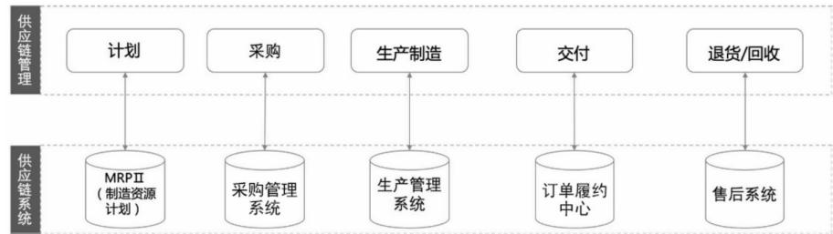

图1-8 供应链管理与供应链系统

业务完成是目标，系统操作是过程，系统建设是基石。在供应链管 理中，关于系统的设计和完善是非常重要的一环，没有信息系统的支持 ，也很难高效准确地实现供应链目标，在一家以供应链为核心的企业中 ，供应链系统太落后，企业规模和效率也很难提升，经营目标自然也就 很难完成了。这也是为什么大企业都会投入大量的人力物力做供应链系 统建设，如京东、阿里巴巴这些大型互联网公司，每年在供应链系统的 建设方面投入的人力数以千计，也正是为了完善其供应链系统。为供应 链持续赋能，才给消费者带来了非常好的购物体验。 

## 1.2.2 供应链管理的4个阶段

根据美国生产与库存管理协会（American Production and Inventory Control Society，APICS）的研究，无论是国内企业还是国外企业，在企 业不断发展的过程中，供应链的发展不可避免地会经历4个阶段，如图1 -9所示。 

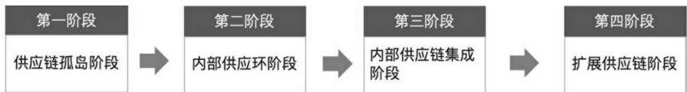

图1-9 APICS供应链发展的4个阶段

第一阶段：供应链孤岛阶段。 

这个阶段一般是企业早期的阶段，公司的相关人员以实现销售目标 为主，没有供应链管理的意识。主要体现在以下几个方面。 

① 员工较少，内部管理比较原始，各部门之间的责任划分不够清 晰，有事大家一起干。 

② 以库存换服务，一般会积压大量的库存，用以应对突发情况， 没有销售预测和计划。 

③ 仓库管理比较粗放，效率比较低，差错率较高。 

④ 使用的系统比较原始，一般是单机管理系统，或者Excel表、纸 质账本。 

第二阶段：内部供应环阶段。 

这个阶段的企业业务基本成型，有一定的管理手段，有基本的成本 效益意识，但更多是站在部门的角度，而不是公司的角度考虑问题，主 要表现如下。 

① 有明确的部门职责分工，各部门各司其职，各部门内部运作良 好，但与其他职能部门之间没有形成闭环，没有公司维度的成本意识。 

② 对待客户和供应商还是原始的买卖思维，没有合作意识。 

③ 采购、仓储、物流等部门在自己的领域里能充分考虑降本增效 ，不太关注其他部门的情况。 

④ 有系统对各部门的业务进行辅助管理，但没有实现信息的横向 

关联，单据流转以纸质单据流转为主。 

第三阶段：内部供应链集成阶段。 

这个阶段，企业业务已经相当稳定，企业开始关注业务流程的整体 成本和效率，主要表现如下。 

① 企业开始关注整体目标，打破内部各部门之间的壁垒，使内部 流程更加顺畅。 

② 以客户服务体验为目标，引进一些供应链管理手段来降低供应 链成本，提升供应链的效率。 

③ 各部门共用统一的供应链系统（如ERP系统），基础数据、业务 单据实现横向联通，系统流程顺畅、无阻碍。 

第四阶段：扩展供应链阶段。 

这个阶段是供应链的最理想阶段，企业不仅实现了自己内部供应链 的管理，还将供应链能力延伸到企业上下游，打破企业边界，为整条供 应链的协同发展做出贡献，主要表现如下。 

① 企业与其上下游客户和供应商由竞争关系变为合作共赢关系， 通过协同作业，保证整体目标最优。 

② 供应链上下游共享资源、共享库存，通过技术手段实现信息共 享，减少供应链流通过程中的浪费。 

③ 系统建设从企业内部优化延伸到企业上下游，一般以核心企业 为中心，辅助上下游企业一起实现协同目标。 

因为供应链体系的建设需要投入大量的人力、物力、财力，国内只 有为数不多的大型企业有实力投入重资本进行供应链体系建设，所以从 整体来看，国内的供应链发展还处于初期，很多小型企业的供应链发展 仍然处于第一、二阶段。 

## 1.2.3 供应链系统：ERP与SCM

全球经营管理理念的更新、互联网和信息技术的进步、全球经济一 体化的发展和客户的个性化和柔性需求的承接等外部因素的刺激，促进 了供应链持续不断的发展，为之服务的供应链系统也经历了四个大的演 化阶段，如图1-10所示。 

① 20世纪60年代：MRP（物料需求计划，Material Requirement Plan ning）。 

② 20世纪80年代：MRPⅡ（制造资源计划，Manufacturing Resourc e Planning）。 

③ 20世纪90年代：ERP（企业资源计划，Manufacturing Resource Pl anning）。 

④ 2000年前后：SCM（供应链管理，Supply Chain Management） 

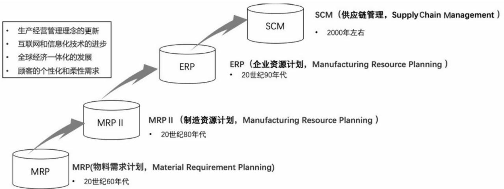

图1-10 APICS 供应链发展的4个阶段

供应链系统源于制造企业内部的生产控制，随着供应链的逐渐成熟 ，供应链系统也逐步从制造业扩展到全行业，由企业内部管理扩展到企 业的上下游。4 个阶段的系统对比，如表1-2所示。 

表1-2 供应链系统发展的4个阶段 

<table><tr><td></td><td>MRP物料需求计划</td><td>MRP II制造资源计划</td><td>ERP企业资源计划</td><td>SCM供应链管理</td></tr><tr><td>提出时间</td><td>20世纪60年代</td><td>20世纪80年代</td><td>20世纪90年代</td><td>2000年左右</td></tr><tr><td>行业</td><td>制造业</td><td>制造业</td><td>全行业</td><td>全行业</td></tr><tr><td>系统参与方</td><td>企业内部</td><td>企业内部</td><td>企业内部</td><td>企业上下游</td></tr><tr><td>核心功能</td><td>内部管理系统,解决制造企业的库存管理问题,保证生产、采购和销售部门的供需平衡,按计划生产。MRP主要包括主生产计划和物料需求计划</td><td>以生产计划为中心,把与物料管理有关的生产、供应、销售、财务等各个环节的活动有机地联系起来,进行协调,使它们在生产经营管理中发挥最大的作用。其最终的目标是使生产保持连续和均衡,最大限度地降低库存与资金的消耗,减少浪费,提高经济效益</td><td>ERP对MRPII的功能进行了扩展,重点在于企业内部功能的集成。(1)功能的增加:1除管理生产、销售、计划以外,增加了企业内部管理相关的功能(如人事、资产、财务、质量、项目);2增加了对上游供应商、下游客户的管理。(2)行业的扩展,从传统的制造业扩展到全行业</td><td>将ERP中的供需管理功能由企业内部管理延伸到上下游企业的协同,以核心企业为中心,借助信息技术,优化供需链上下游各个环节,保证整体成本最低,弥补了ERP在供应链管理方面的不足</td></tr></table>

很多朋友搞不清楚ERP系统和SCM系统之间的区别与联系。我们围 绕供应链的发展史来详细说明一下。 

从供应链发展的 4 个阶段中，我们知道企业的发展会经历供应链孤 岛、内部供应环、内部供应链集成和扩展供应链 4 个阶段。当企业发展 到内部供应链集成阶段时，如何实现企业内部各部门之间的信息充分共 享？这个时候ERP系统就发挥巨大作用了，ERP系统能够为全公司提供 统一的商品、供应商等数据，各供应链相关部门（如采购、营销、仓储 、物流、财务）同时使用此系统完成供应链的相关作业，保证信息在公 司各部门之间都具有一致性。然而使用此ERP的不光是供应链相关部门 ，还有人力、质检、行政等职能部门，他们也有使用ERP系统的诉求， 所以ERP系统除了包含供应链功能，还会包含企业内部管理需要用到的 其他相关功能（如人事、资产、质量、项目）等，但都以企业内部管理 为主。 

随着供应链的进一步发展，企业的供应链管理需要从内部向外部扩 展，供应链的个性化需求也越来越多，导致ERP系统中提供的供应链管 理功能已经无法完全满足业务需求了，加上互联网技术、条形码等技术 的发展，使得连接变得更加简单，这便催生了 SCM 系统的发展。从功 能上看，SCM系统更加聚焦于供应链领域，而不再考虑其他领域的需求 ，同时增加了一些ERP系统不具备的功能，如与供应链协同相关的功能 、与运营相关的功能等。从边界方面看，SCM系统从供应链内部管理扩 展到企业上下游，提供了很多上下游环节协同的功能。一些技术实力比 较雄厚的公司会将SCM系统拆解为一个个的子系统，如商品系统、采购 管理系统、订单履约中心、库存系统等，用不同的子系统满足不同部门 的供应链需求，以降低系统之间的耦合度。 

ERP系统和SCM系统的关系如图1-11所示。 

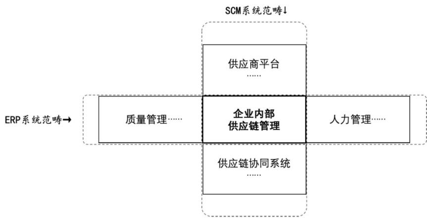

图1-11 ERP系统和SCM系统的关系

当然，不同的行业，不同的企业，不同的业务形态，对ERP系统和 SCM系统的诉求是不同的，所以ERP系统和SCM系统并没有严格的执行 标准，在做系统设计时，相关人员需要根据企业的实际情况“量体裁衣” 

## 1.3 学习供应链，该如何进阶

想转行做供应链，以及初入行的朋友，是不是经常会有如下的问题 冒出来？ 

“供应链的前景到底怎么样？” 

“我想转行做供应链产品经理，有什么好方法吗？” 

答案是肯定的，且听木笔细细道来。 

## 1.3.1 供应链的前景分析

在供应链的发展史中，我们知道中国的供应链领域还处于发展初期 ，只有少数的大型企业能够走到外部协同阶段，大部分的中小型公司由 于相关人员的认知和资金实力有限，还停留在内部供应环和内部供应链 集成阶段。我们来看两组数据。 

① 研究与咨询机构 Gartner 在2020年5月19日公布的全球供应链实 力25强及供应链大师企业排行榜中，只有阿里巴巴和联想两家国内企业 上榜，而在2018年，仅阿里巴巴一家国内企业上榜。 

② 相关资料显示，我国社会化供应链成本占到GDP的18%左右，远 高于欧美国家的7%～8%，优化空间巨大。 

另外，从国家近年来发布的种种供应链政策来看，供应链发展建设 已经不只是企业自身的事情，而是已经上升到国家战略层面了，其未来 的投入和发展空间，自然不言而喻。 

说完宏观层面，我们再看一组微观层面的调查数据。这是关于供应 链从业者年龄和薪资的一组调查数据。2018年美国APICS协会对美国供 应链的从业人员做了一次薪酬调查，如图1-12所示。 

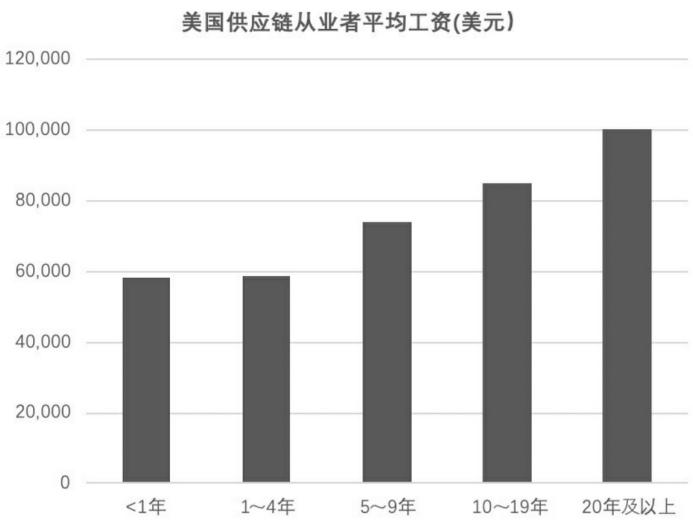

图1-12 美国供应链从业者平均工资调研

从调查结果可以看到，在美国，随着年龄的增长，供应链从业者的 薪资呈持续上升趋势，但工作年限在 5年以下的供应链从业者的薪资几 乎变化不大，有 20年以上工作经验的供应链从业者反而薪资更高，说 明供应链领域并不是吃青春饭的。当然由于国情不同，具体情况可能会 有所差异，但供应链的发展规律和发展路径都是一样的，对人才的需求 也一定如此。（免费获取更多供应链PM书 加v信：pmzjie） 

如果你认为以上理由比较牵强，我们再从国内某招聘网站上摘取一 些供应链产品经理的招聘信息，如图1-13所示（为了避嫌，对薪资和公 司信息做了模糊处理），供应链领域的产品经理对经验的要求偏高，一 般拥有5年以上工作经验为佳，薪资水平在同类B端产品领域中也略有优 势。木笔反观身边的朋友、同事，那些资深的供应链产品经理们大多都 过了35岁危机了仍然奋战在各一线互联网公司，并没有出现失业的情况 ，所以想转行做供应链产品经理的朋友们不用太过于介意年龄。 

种一棵树最好的时机是十年前，其次是现在。与其在犹豫不决中任 时光流逝，何不纵身一试博取更广阔的天地？ 

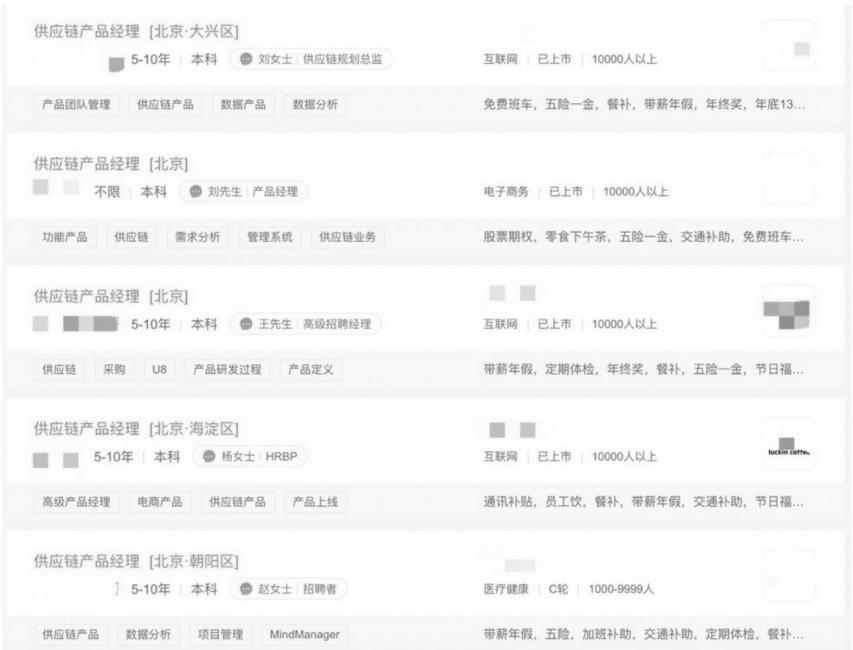

图1-13 供应链产品经理的招聘信息

## 1.3.2 供应链的发展趋势

供应链的需求是旺盛的，那供应链的前景如何？随着近几年信息技 术的快速发展、大数据分析技术和人工智能的发展、环境问题日益突出 ，以及国家相关政策的发布，必然会影响到供应链的发展，我们一起来 大胆预测一下未来可能的几个发展趋势，希望和大家一起未雨绸缪，提 前做好规划。 

① 数字化供应链。万物皆数据，在信息时代中，数据变得越来越 有价值，服务的云端管理、系统的SaaS化部署，让数据的收集和分析变 得更加容易，而供应链协同发展使企业内部数据与外部数据深度融合， 从而产生更多的价值，实现多方共赢。例如，京东的商智、阿里巴巴的 生意参谋都是基于大数据为商家赋能的数据产品，每逢“618”“双11”， 都可以为商家做销量预测、提供采购补货建议、进行库存管理、提供效 率分析和决策支持，通过数据分析让商家的供应链管理更加游刃有余。 

② 智能化供应链。随着移动互联网的渗透，近几年迎来技术大爆 发，5G、区块链、人工智能、大数据分析、VR、物联网等技术的普及 和商业化，必然会将供应链带向一个更广阔的天地，使其作业模式更加 多元、商品流通更加顺畅、信息获取更加容易、数据分析更加智能，这 一切都会使供应链协同更简单、成本低、效率更高。如何使新技术服务 于供应链，例如，通过大数据分析做供应链策略指导、通过 VR 辅助仓 储和物流作业、基于区块链管理供应链网络等，并不再是天方夜谭，这 是值得我们每个人去思考和探索的未来。 

③ 绿色供应链。20世纪工业的飞速发展带来的环境问题日益严重 ，随着国家层面和民众的环保意识不断提升，绿色理念和可持续发展将 会是未来经济发展的重点战略，低碳出行、绿色产品、绿色采购、绿色 回收这些理念将会从国家政策层面，传导到企业生产过程中，最终传递 给每一个终端用户，形成一个全社会的供应链闭环。如何将绿色理念渗 透到供应链中，放弃短期利益来追求可持续发展的长期价值，将是一个 很长远的课题。例如，UPS通过GIS+信息传感器的应用，通过无线设备 在运输过程中实现了无纸化操作，不仅能实时根据天气、风速、路况及 时调整最优路线，节省时间和油料，每年还能节约5900万张纸张，可谓 一举多得。 

④ 供应链全球互通。纵观那些跨国大公司，如苹果、麦当劳、亚 马逊等，都在全球布局了供应链，吸收各地的优势资源（供应商资源、 原料成本、人力成本等），并通过强大的供应链整合能力将全球资源统 一调配。而国内，随着一带一路倡议的提出，进出口贸易额将持续增长 ，企业的国际化时代已经来临，如何布局全球物流网络、配送网络、采 购外包、分销体系、离岸生产，如何适应不同国家的文化、习俗等，都 是企业在供应链全球互通过程中面临的机遇和挑战。 

⑤ 生态化供应链。供应链具备天然的连接属性，这和信息化时代 的万物互联的理念高度吻合，供应链的发展也势必会带来其上下游产业 的联合发展，逐步建立起以供应链为核心的生态圈。供应链的生态化有 三个方向的发展可以探讨，一是供应链网络持续下沉，横向拓展到源头 的源头和终端的终端，纵深到三四线城市直到农村，二是全球供应链的 互通使供应链网络横向扩展到全球各地，形成全球供应链大网络，三是 供应链衍生领域，如供应链金融、3PL、4PL、冷链、供应链溯源等领 域都会迎来更大的发展机遇。 

## 1.3.3 供应链从业方向建议

供应链的涉及范围很广，以实体为经营主体的企业，基本上就是围 绕着供应链的进销存开展日常工作，包括计划、采购、物流等方向，找 准一个方向就够我们深入研究一辈子了。图1-14推荐一些供应链的从业 方向，希望你能从中找到自己感兴趣且愿意深扎的方向。 

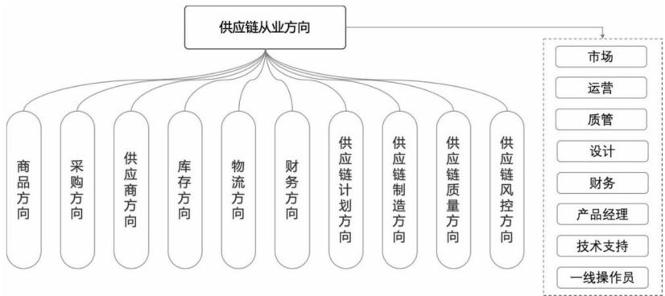

图1-14供应链从业方向

从工作岗位性质来划分，供应链可分为市场、运营、质管、设计、 财务、产品经理、技术支持、一线操作员等方向，每个岗位负责各自不 同的工作职责，如表1-3所示。 

表1-3供应链相关岗位

<table><tr><td>方向</td><td>工作内容</td></tr><tr><td>市场</td><td>负责供应链相关市场推广、商务谈判、业务洽谈、采购与销售等工作</td></tr><tr><td>运营</td><td>负责供应链商品、库存、仓储、配送等日常管理和运营工作</td></tr><tr><td>质管</td><td>负责产品和流程的质量管控、风险控制等</td></tr><tr><td>设计</td><td>负责制造业产品的工艺设计,也可以是软件的 UI 设计</td></tr><tr><td>财务</td><td>负责供应链的核算、对账、结算、付款等工作</td></tr><tr><td>产品经理</td><td>负责供应链相关软硬件系统的市场调研、需求分析、系统设计等,也可以是制造业的某个产品的主导者</td></tr><tr><td>技术支持</td><td>日常对供应链相关系统的维护、功能开发等</td></tr><tr><td>一线操作员</td><td>工作在仓库、工厂、配送中心的一线操作员工</td></tr></table>

在供应链的纵深方向，可分为商品、采购、供应商、库存、物流、 财务、计划、制造、质量、风控等方向，每个方向都是一个垂直的供应 链领域，如表 1-4 所示。而我们的运营、产研、系统就是为支持这些纵 深业务而存在的，每种业务都需要专业的产品、技术和运营支持。 

表1-4供应链纵深方向 

<table><tr><td>方向</td><td>工作内容</td></tr><tr><td>商品方向</td><td>品类管理、商品建档、商品运营、商品推广、商品陈列、商品分发、商品调拨等</td></tr><tr><td>采购方向</td><td>新品引进、采购谈判、采购计划、智能补货、采购策略、合同管理、需求预测、采购返利等;</td></tr><tr><td>供应商方向</td><td>供应商分类、供应商开发、供应商质量评估、供应商选择、供应商绩效管理、供应商协同、供应链对账与结算等</td></tr><tr><td>库存方向</td><td>库存成本分析、库存计划、安全库存设定、智能调拨、库存健康分析、滞销库存处理等</td></tr><tr><td>物流方向</td><td>物流园区规划、厂房仓库内部规划、动线规划、仓储管理、配送管理、干线运输、物流策略制定、物流设备自动化、逆向物流、物流开放、海关物流等</td></tr><tr><td>财务方向</td><td>财务计划优化、资产负债优化、成本分析、利润分析、总账管理、资产管理、发票开票、应收应付、对账与结算等</td></tr><tr><td>供应链计划方向</td><td>需求预测、销售运营计划、主生产计划、物料需求计划、财务绩效计划、应急计划、生产计划、供应计划、门店请货计划、采购计划等</td></tr><tr><td>供应链制造方向</td><td>生产计划、工艺设计、产品开发、质量控制、制造/组装设计、生产平衡、生产过程控制等</td></tr><tr><td>供应链质量方向</td><td>质量计划、质量控制、质量设计、质量审计等</td></tr><tr><td>供应链风控方向</td><td>供应链风控评估、风险模型设定、合规规范制定、合同内审、流程合规管控、业务合规建议等</td></tr></table>

## 1.3.4 教你供应链入门三板斧

前面聊了这么多，供应链的前景和未来想必已经讲解得够清晰了， 但奉劝朋友们在想入行或转行之前，还是得想清楚自己是不是真心想进 入这个领域并且深耕，还是一时心血来潮，抑或是短期找个工作过渡一 下？毕竟黄金岁月有限，经不起太多的挥霍。 

凡事看两面，有优亦有劣，我们还是有必要客观公正地分析一下扎 根供应链领域的几个劣势，愿君多斟酌。 

① 难。由于供应链的各个环节是以链状相连，环环相扣，加上含 有很多专业术语和策略，如果没有机会实操，很难上手。加上供应链领 域广泛，要深入了解全域就更难了，很多人只能在一两个领域里深扎， 精通供应链全域的人少之又少。 

② 苦。与供应链相关的工作是个苦差事，一般身居幕后，往往能 被人惦记的时候就是在出现问题的时候。而且供应链建设见效慢，不像 做前端业务那样立竿见影。如果做与仓配相关业务，特别是新建物流中 心，工作地点一般都在偏远地区、荒无人烟，周边设备设施不全，也许 连厕所都没有。所以，想从事供应链领域中的相关工作，相关人员必须 

要有一个苦中作乐的好心态才行。 

③ 累。做供应链项目，经常需要等半夜业务停止作业以后才能进 行上线联调，熬夜加班是常事。如果现场业务操作出现问题，往往要随 叫随到，及时处理，否则就会导致业务停摆、损失重大。所以，做供应 链会经常面临身心俱累的情况，相关人员也需要有一个好心态。 

总结一句话：吃苦耐劳心态好。具备这几个品质就可以进入供应链 领域了，是不是很简单？ 

如果之前没有相关经验，又想要深入学习供应链，有绝招吗？有， 送你8个字：“仰望星空，脚踏实地”。怀揣梦想和初衷，但不要想着能 够立马成为行业专家，放低姿态从底层开始学习。 

下面，教你受用终生的供应链学习三板斧（此三板斧从产品经理的 视角展开，同样适用于其他岗位和领域）。 

（1）第一板斧：深入一线，业务为先 

满足任何需求的产品，都不能闭门造车，一定要基于真实场景来实 现，这是作为产品经理的入门法则，在供应链领域中尤为适用。作为供 应链新人，深入到一线去学习业务是最好的方式。 

首先，供应链的需求大部分来源于业务部门和一线岗位，只有深入 一线，才能更好地体会需求的价值。例如，仓库要增加一个批量打单的 需求，那批量打单的价值在哪里呢？了解以后才知道现在一单一单打印 的方式效率低下，成了出库环节的瓶颈，每天早上第一批拣货员要等待 20分钟，才能领到拣货任务并开始作业。当然这个现象你通过仓储经理 的描述也能了解到，但当你去现场看到一批拣货员站在打单员身后等待 ，就会有更深的体会了。 

其次，供应链领域和其他业务领域相比，有一个得天独厚的优势， 其他很多业务系统只需要关注信息流，而供应链系统要同时关注信息流 和物流。当你深入一线以后，能够通过实物在眼前的流动更好地了解业 务，更深入地理解信息流。例如，你能实地感受商品是如何进出仓库的 ，还能亲自去仓库看看拣货员如何拣货，也能够实地扫描商品条码完成 订单复核，这种实际操作对视觉和感官的冲击，和单纯靠想象得来的理 解是完全不一样的。 

最后，即便你已经有了供应链领域的相关经验了，还是建议你入职 以后先深入一线学习一段时间。虽然每个行业的供应链大体上一样，但 因为行业特色、公司特色和管理特色不同，细节方面的差异还是很大的 ，只有了解实际业务以后才能更好地开展工作。 

以上说明了一线学习的重要性。那么，到一线以后，该怎么学呢？ 最直接有效的方式就是多看、多问、多思考。 

例如，想了解仓库的入库流程，可以分为三步。 

① 了解正常流程：多看。从你见到的第一个操作开始（如供应商 到货），一直到入库的最后一个操作（如仓库上架），了解每一个环节 所在的场地、涉及的角色、操作步骤和时间、用到的工具、有没有系统 支持等。然后把各个环节串起来，形成完整的闭环。 

② 了解异常流程：多问。异常流程不是经常发生的，所以在现场 不一定能随时碰到，这时就需要和现场的相关人员多聊了，当然不是尬 聊，而且应该带着思考和问题去聊。例如，看到收货扫码操作，就扩展 性地思考一下如果商品编码不对，或者码扫不上应该如何处理。 

③ 了解系统逻辑：多思考。对正常操作流程和异常的操作流程了 解清楚以后，就需要剖析一下系统逻辑了，对着系统操作，用自己理解 的方式反推系统内部处理逻辑，然后和对应的产品、技术人员验证一下 自己的思考是否正确。注意，不要问过于小白的问题，否则会被相关人 员鄙视哦！ 

## （2）第二板斧：由浅入深，循序渐进

供应链的学习也讲究循序渐进，没有捷径可走，但掌握了方法以后 ，也能达到事半功倍的效果，下面给几个建议，仅供参考。 

① 以某一业务为原点，按业务流向拓展知识面。大部分人都是先 负责某一块业务，等到对自己负责的业务足够熟悉了，才有机会涉足其 他业务。所以，可以以自己负责的业务为起点，顺着业务流程的正向或 反向逐步去延伸学习其他业务，直到到达这一业务的起点或终点。如果 你负责的是采购管理系统，就可以以采购为起点，延展学习仓储入库、 库存管理、财务核算等业务；如果你负责的是财务系统，则可以反向延 伸学习到仓储、采购等业务。 

② 多总结，以点成线，终成面。作为供应链新人，可以先从最基 础的术语、资料、操作开始学习，等到有一定基础以后，再横向学习系 统流程、纵向学习供应链相关策略，等到对某一个流程足够熟悉了，再 向前或向后延伸到更高、更广的维度。例如，如果要学习订单履约流程 ，先弄清楚“波次”“批拣”“分播”“复核”“打包”等专业术语以后，再系统 地学习出库流程，继而深入研究波次策略、拣货路径、分播规则等算法 C 

③ 要输入，更要输出。纸上得来终觉浅，绝知此事要躬行。系统 地学习以后，一定要学以致用，才能得到最好的效果。比较好的方式是 能够将自己学到的知识整理成文，在整理的过程中会发现很多遗漏点， 继而继续学习，继续补充，直到全部融会贯通为止；另一个好方式是将 自己学到的知识分享出来，分享的过程就是将输入变为输出的过程，如 果能完整地将自己对某个流程的理解分享出来，说明这些碎片化的知识 已经在你的脑海形成体系了。 

对于零经验想进入供应链领域的朋友，千万不要急功近利，通过跳 槽或者转岗的方式强行进入。即便运气好面试通过了，你在工作中也会 处处受挫，别人会认为你拿着与能力不匹配的薪水，干着水平与你的年 龄不相符的事情，这样就会特别痛苦。这里给两个建议：一是以自身已 有优势进行转换，待站稳脚跟以后，再以本职工作为起点逐步渗入供应 链领域；二是在工作中找机会和供应链领域的相关同事多接触，多看、 多问、多思考，等到有机会时，让别人第一时间能想到你。 

（3）第三板斧：抓住重点，掌握核心 

学习供应链和评估需求优先级一样，也讲究“二八法则”，用有限的 精力，重点突击核心知识。这里，也提供几个学习思路，供大家参考。 

① 结合实际业务掌握供应链领域中与进销存相关的概念和常识。 

② 结合供应链范畴，了解组织内部供应链涉及的范围、系统、角 色、流程。 

③ 以物流和资金流为两个主要方向，学习供应链的主要业务和系 统流程。 

④ 以“降本增效”为目标，了解供应链领域常关注的指标和常用的策 略算法。 

以上就是深入学习供应链的三板斧了，生也有涯，而知也无涯，我 们要时刻保持谦卑和学习心态，除了在日常工作中接触到的知识，还可 以通过看书、公众号学习、向前辈请教、参观学习、行业交流等其他方 式拓展自己的视野。 

## 1.4本章结语

供应链是一个广阔的领域，涉及我们生活中的方方面面，时代的飞 速发展，必将赋予它更强的生命力，未来，一定会比现在更加美好，值 得期待。同时，供应链又是一个“慢热”的领域，它的每一步前行都背负 着时代的变迁和无数行业的兴衰，所以注定不可能像某些风口行业一样 来去匆匆，历史责任使然，深处时代中的我们每一个人，都将是其前行 的助力者。如果想要学习供应链的相关知识，任何时候都不晚，因为我 们还处于浪潮早期，未来会怎样，我们一无所知，唯有不断奔跑，才能 跟上时代。 

## 第2章 精华浓缩：你一定要懂的供应 链常识

经过上一章的介绍，相信你已经对供应链有了全面的了解，对供应 链管理的角色、使命和愿景、供应链领域的发展前景等都有了整体认知 ，同时也知道了我们每个人都身处社会供应链大网络中，供应链对我们 的重要性也不言而喻。作为消费者的我们，是供应链的终端服务享受者 ，而作为从业者的我们，又是供应链体系的建设者。作为从业者的我们 需要不断地贡献自己的力量去完善供应链，才能为消费者提供能够更加 美好的生活。 

本章，我们一起去了解一些供应链领域中重要的常识，同时学以致 用，了解一下这些常识在生活中及在供应链系统设计中的应用，那些曾 经离我们很遥远的概念和词汇，从此将不再陌生。Let's go！ 

## 2.1供应链的经典三流：物流、信息流与资金 流

原料在从原产地经供应商采购、由制造商加工为半成品/成品、再 由分销商推广，最终通过零售商流转到终端用户的过程中，发生了位置 的移动、信息的流动和资金的流动，这便是供应链的经典三流：物流、 信息流和资金流（有的书中提出价值流、商流、业务流等，但本质上还 是由物流、信息流和资金流演变而来的）。 

不管是供应商、制造商，还是分销商、零售商，都围绕着物流、信 息流、资金流展开工作，以降本增效为目标，各自在供应链的上下游扮 演着重要的角色，完成供应链流通链条上必要的使命，共存共生，缺一 不可。供应链的运转源自信息（如用户端的需求），信息流催生了物流 和资金流，同时物流和资金流又反向填充了信息流。物流是实物的流通 ，资金流是资金的流转，物流的流通影响着资金的流转，资金的流转控 制着物流的流通。 

## 2.1.1物流：流通产生价值

物流，就是物品的流动。根据物品的流向，我们可以将供应链中的 物流分为两种类型：正向物流和逆向物流。正向物流指原料从原产地被 采购，经制造商、分销商、零售商到终端用户的过程，是产品从供应链 上游到下游的流通过程。逆向物流则刚好相反，是产品从终端用户向上 游流动，一般在回收和售后等业务中发生。 

在供应链中，产品必须流动起来，才会产生流通价值，如果产品固 定不动了，便会产生库存积压，导致成本的增加。另外，时间也是成本 ，流通的效率越高，中间经手的环节越少，产品的隐形成本就越低，这 就是物流价值所在。作为供应方，我们期望产品尽量高效流通、少积压 ；作为需求方，我们期望晚下单，产品尽早送达，双方的共同需求都是 期望流通周期尽可能短。作为供应链从业者的我们，无论从事产品、技 术，还是采购、运营等方面的工作，都应该具备降本增效的意识，尽可 能地提升物流的效率，让产品在中间环节停留的时间尽可能缩短。 

商品的物流包含仓内流转和配送运输两大环节，仓内流转指商品在 仓库内部的流转，配送运输指商品在运送路途中的流转。仓、配是物流 领域中的两大核心体系，衍生出了物流规划、物流软件集成、三方仓储 、三方物流配送、干线运输等多个以物流服务为中心的分支商业模式。 

图 2-1 是从原料向终端用户流转的物流全过程，详细介绍了一个产 品是如何从原料产地开始，经过原料供应商的进销存，转到制造商处进 行加工制造，再将成品发给分销商/零售商（因为物流处理方式相同， 图中将分销商和零售商合并看待），最终由零售商将产品送达到终端用 户的手中的完整过程。抽象一下，无论在供应链的哪一环节中，都会涉 及产品的进销存管理。 

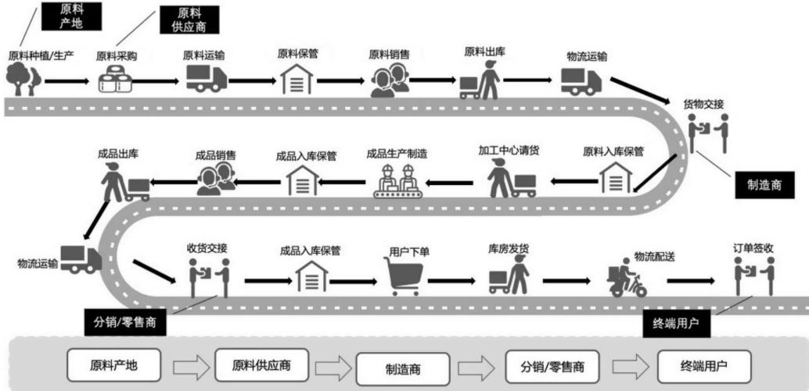

图2-1从原材料向终端用户流转的物流全过程

在业务层面，一般先进行采购，由分销商/制造商/供应商先根据自 身需求提报采购计划给上游供应商，上游供应商会根据采购计划安排生 产并送货，待货物到达仓库以后进行收货入库，入库完成以后，即产生 了可销售库存，营销部门便可以通过各种渠道将产品售出，售出的产品 以订单的方式流转到仓库，仓库进行出库拣货、打包、发货，然后交由 配送公司（或自营配送物流）将产品送到客户手中完成交接。 

## 2.1.2资金流：成本创造效益

资金流是供应链得以持续和企业得以良性运作的关键因素。产品在 流通的过程中会产生各种成本，资金流就是成本的体现。我们看一个最 简单的公式：产品毛利润=销售价-成本价，如果想提升产品毛利润，要 么提升销售价格，要么降低成本，当然最好的方式就是降低成本，因为 销售价格的提升必然会影响下游客户及下游客户的下游客户采购成本的 波动，从而带来需求的波动，反向影响了产品的销售。所以，对资金流 进行管理，控制好成本，可以提升整个企业供应链的价值。 

前面我们聊到产品的正向物流是从原料到终端用户的流通过程，而 产品的资金流则是反向的：由终端用户到分销商，到生产制造商，再到 原料供应商，最后到原料产地，而且由于物流流通过程中的成本递增， 所以资金是逐级递减的（见图 2-2）。例如，用户购买某商品支付了10 块钱，最终落到原料产地的农民伯伯手里可能只有1块钱。请问：另外9 块钱去哪了？答曰：被分销商、制造商、原料供应商各拿了一部分利润 ，其余被用于支付包装耗材费用、人力成本费用、物流运输费用、仓库 保管费用及生产过程的损耗等，如果这些中间成本降低了，那么各环节 的利润就会提升，由此可见，在供应链业务活动中，有效地控制资金支 出，合理地控制成本，对整个供应链的正面影响是巨大的。 

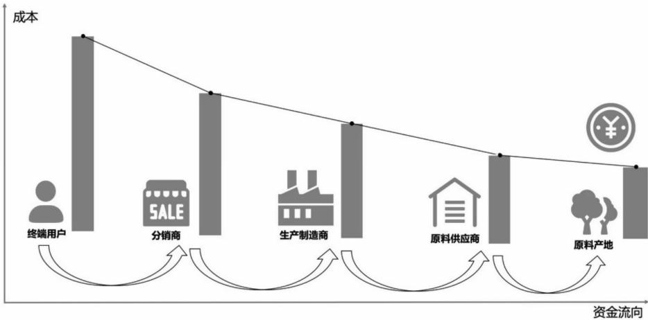

图2-2 供应链中的资金流

聊到资金，顺便介绍几个相关的财务概念。 

① 应收账款：企业在经营过程中因销售商品或提供服务，应向服 务对象收取的款项，体现为企业的收入。 

② 应付账款：企业因采购或购买服务应支付但还未支付的采购费 用、手续费和佣金等，体现为企业支出。 

③ 账期：企业应收/应付账款的周期，从产生账款开始到最终收到 或支出款项的时间。 

当产品被销售给下游客户以后，财务根据订单销售金额产生应收账 款。当企业采购的产品入库以后，财务会核算需要支付给上游供应商的 账款，即应付账款。在一个账期里，企业的应收款要大于应付款，这样 企业才能拥有良好的现金流，保证企业能够更好地运作。如果企业的应 收款小于应付款，如果没有持续的资金投入，就存在资金链断裂的可能 性，那么企业是相当危险的。 

## 2.1.3信息流：连接发生质变

供应链流转源于信息，也止于信息，信息流是整个供应链运转的纽 带。如果说物流是从原料产地到终端用户的正向流转过程，资金流是从 终端用户向原料产地反向流转的过程，那么信息流则是物流和资金流的 集成，是一个双向传导的过程，它将需求信息从终端用户传导到供应链 上游，逐级传导到原料产地，同时将供应信息由原料产地传导到终端用 户。信息的本质是连接，只有足够的连接，才能产生足够的价值，这和 供应链的思想是一致的，我们举个例子来说明。 

江西盛产赣南脐橙，年产量达百万吨，原产地江西省赣州市已经成 为脐橙种植面积世界第一、年产量世界第三、全国最大的脐橙主产区。 

我们思考一个问题，作为脐橙的原产地，果农为什么愿意放弃其他 种植业务只种脐橙？ 

回答：因为脐橙有很好的销路。 

再问：销路是怎么来的？ 

回答：信息的互通，销路从终端用户的需求而来。因为很多人都对 脐橙有需求，而刚好赣南地区适合种植脐橙，当地的政府、商贩能够分 析人们对脐橙的需求量，所以不担心脐橙滞销，所以鼓励果农大量种植 脐橙。 

同时，作为产地，因为赣南地区脐橙产量大、味道甜，也作为一种 供应信息从原产地传导到世界各地，使赣南脐橙享誉海内外。 

因为信息的双向传导，让更多的终端消费者吃上了赣南脐橙，也使 更多的果农致富，这便是信息联通的价值。 

作为信息的传输载体，信息系统在信息流中扮演的角色是至关重要 的。图 2-3 是一个典型的产品从原产地到终端用户的流转过程中涉及的 系统及信息流向，我们来逐一进行说明。 

① 原产地。供应信息从原产地发出，发布渠道可以是电商平台、 广告、口口相传等，目的是将供应信息传达到下游需求方。 

② 原料供应商。原料供应商接到信息后，根据采购计划到原产地 进行采购（采购管理系统支持），将采购的原料存入仓库（仓储管理系 统支持）。当有下游客户下单时，在订单履约中心中创建销售订单（订 单履约中心支持），仓库根据订单进行拣货、发货（仓储管理系统支持 ），然后交由配送部门将商品配送至下游客户（配送管理系统支持）。 

③ 制造商。制造商根据需求计划制订采购计划（采购管理系统支 持），并从供应商处将原料采购入库（仓储管理系统支持），并根据主 生产计划和物流需求计划将原料生产加工为成品（生产制造ERP系统支 持），然后将成品存入成品仓库（仓储管理系统支持）。出库过程和原 料供应商的出库过程类似，当有下游客户下单时，在订单履约中心中创 建销售订单（订单履约中心支持），仓库根据订单进行拣货、发货（仓 储管理系统支持），然后交由配送部门将产品配送至下游客户（配送管 理系统支持）。 

④ 分销商/零售商。分销商和零售商的信息流向和原料供应商相同 ，不同之处是对产品的管理：原料供应链管理原料，而分销商和零售商 管理成品。 

⑤ 终端用户。终端用户有购买需求时，会通过电商平台、超市、 便利店等渠道下单（下单系统支持），并支付（支付中心支持），最终 通过快递送货或者自提的方式获得产品（订单履约中心支持）。 

一般原料供应商、分销商和零售商不涉及加工环节，只涉及货物的 进销存，所以系统流转相对会简单一些，而制造商既要考虑原料的出入 库管理，也涉及加工制造过程，同时还要对加工的半成品/成品进行出 入库管理，所以流程和系统会复杂很多；另外，因为涉及资金的流向， 各个企业会在出入库环节中产生财务结算（财务系统支持）。 

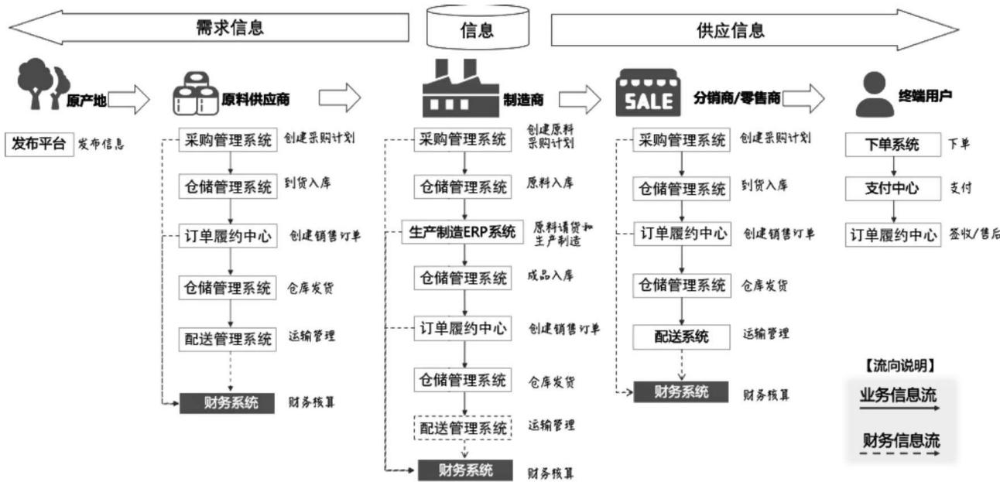

图2-3供应链里的信息流

总体来讲，供应链的信息流都是围绕着货物从采购（采购管理系统 ）→入库（仓储管理系统）→销售（订单履约中心）→出库（仓储管理 系统）→运输（配送管理系统）等业务活动进行流转；再搭配各个环节 中涉及财务结算的地方，将数据提取至财务系统中进行核算并产生应收 账款和应付账款的过程。 

读到这里，一定有朋友会问：“呀，这么多的系统，那得需要投入 多少人力、物力、财力啊？我们是一个小公司，肯定负担不起。”针对 这样的问题，身边很多资深的产品和技术同学在经过无数次摸爬滚打以 后，得出的一致结论是：关于供应链系统的定位，我们的目标是服务于 业务，让业务更顺畅，所以合适的才是最好的（记住这句话很重要哦， 后面的章节我们也会经常提到。在供应链这类业务导向的领域里，我们 的系统设计一定要贴合业务发展，千万不能闭门造车）。如果实力允许 ，我们尽量将系统设计得耦合性低一些，这样便于维护和扩展。如果预 算不允许，那么购买一套标准的ERP系统，甚至一些环节通过人工操作 也是可以的，最终目标是保证信息流的完整和通畅。 

## 2.1.4供应链、物流与采购

“你看我们公司既有物流部、也有采购部，但就是没有供应链部门 ，但大家在一起聊的最多的就是供应链应该如何如何。”那么问题来了 ，供应链管理、物流管理和采购管理到底是什么关系？ 

相信很多朋友都会有以上的疑问，说起供应链、物流和采购，有很 多重合的地方，但它们不是完全对等的，否则很多公司也不用设置单独 的部门了。我们一起来看看供应链管理、采购管理和物流管理之间的关 系。（免费获取更多供应链PM书 加v信：pmzjie） 

供应链管理是一个比较抽象的概念，并不是指某些具体的事务，而 是整个公司各部门及上下游企业协作以达到整体利益最大化的一种管理 方式，需要从事的工作也是分散在各相关部门中的，这也可以解释为什 么很多公司里并没有单独设立供应链部门，即便有的公司中有供应链部 门，但也是做与采购、物流、计划相关的事情。而物流管理和采购管理 则是偏执行层面，相关人员负责的工作要具体很多。 

站在供应链全域来看，三者的关系如图2-4所示，供应链：突出“链 ”的概念，偏向于管理公司内部和公司外部整条供应链，偏重于全链路 的库存周转、服务水平和成本的核算等；物流：突出物品的“流”动，主 要侧重于仓储、配送、运输等环节的效率提升和成本控制；采购：突出 物品的“购”，相关人员重点负责采购寻源、供应商管理、价格的管控、 采购计划的制订和补货预测等。 

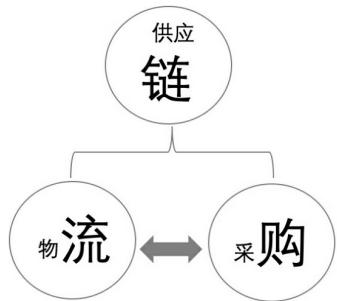

图2-4 供应链、物流与采购的关系

物流和采购都是供应链管理中很重要的环节，共同保证供应链的顺 畅，但各自的侧重点是不同的，所以相关人员在做业务和系统规划时， 需要分开对待。 

## 2.2划重点：供应链的目标及核心思想

在日常工作中，我们经常会遇到一些“程序猿”小哥，写得一手好代 码，需求提过去，一通操作猛如虎，一个bug都没有，自认为相当厉害 了。产品验收时，发现各种需求理解偏差，找小哥理论时，小哥还各种 不服，于是扯皮就此开始。这件事是谁的问题？“程序猿”小哥当然有问 题，但问题不在于其理直气壮地不服气，而是其没有基本的供应链常识 ，也许对于他来讲，追求的仅仅是程序功能无bug而已，根本不知道对 与错，更别提好与坏了。 

从事任何工作，我们一定要找到一个衡量工作质量的标准。例如， 我们做销售，要追求销售额和盈利，做客服，要追求客户服务至上。从 事供应链，就要追求降本增效，精简协同。把这些理念当作工作中的指 导方针，常记于心，至少可以保证你在星辰大海中不迷失航向，不至于 像上面的程序员小哥哥一样茫然。 

## 2.2.1供应链的目标：降本增效

在商品的流通过程中，流动会产生运输成本，停滞又会产生库存滞 压成本，走走停停间，无形中就增加了成本，控制好成本，是供应链管 理的目标之一。据统计，供应链成本占据了整个销售成本的 50%～80% ，在现在信息如此透明的时代，市场竞争激烈，产品毛利被大大压缩， 所以降本比增收更能实现盈利，每降本1块钱，利润就实实在在地增加1 块钱，但增收1块钱，再去除80%的成本以后，利润只剩下两毛了。如 果把这些中间成本节省下来让利一部分给用户，再对服务做一些提升， 产品的竞争优势会大幅提升，这笔账算下来，是不是相当划算？ 

除了降本，增效是供应链管理的第二大目标，在供应链领域中，时 间就是金钱。效率的提升可以带来更好的客户服务体验，同时可以有效 减少库存的积压成本。举个例子，如果某商品的采购周期是5天，则仓 库最低需要准备5天的安全库存，以应对采购过程中的订单需求。但如 果采购周期能缩短为两天，仓库就只需要准备两天的安全库存就够了， 在节省下来了 3天安全库存的同时减少了库存资金、物流运输成本、仓 储使用面积和仓储运作成本。 

我们可以将供应链的成本和效率归纳为七大成本与七大效率（见图 2-5），在降本增效的路上“对症下药”。 

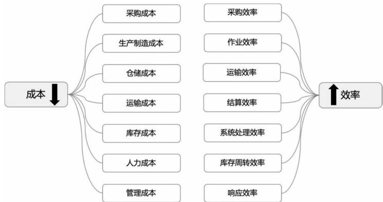

图2-5 供应链的七大成本与七大效率

## （1）供应链成本

供应链成本主要包含采购成本、生产制造成本、仓储成本、运输成 本、库存成本、人力成本、管理成本。 

① 采购成本。采购过程中产生的成本，包含订货成本、供应商管 理成本、谈判成本、采购物流费用等。 

② 生产制造成本。产品生产制造过程中产生的各项费用，包含工 艺设计成本、制造成本、设备设施成本、耗材成本、折旧费用、维修费 用、损耗费用等。 

③ 仓储成本。货物在仓库里进行收发、存储过程中产生的与仓储 相关的费用，包含仓储设施的租金、库内作业成本、设备设施成本、耗 材成本、折旧费用、维修费用、损耗费用等。 

④ 运输成本。产品在运输配送过程中产生的费用，包含租车费、 油费、过路费、养护费、车辆折旧费、维修费、损耗费等。 

⑤ 库存成本。由于产生库存而增加的成本，包含库存积压成本、 运营成本（商品在库内搬运、保养过程中产生的成本）、浪费成本（因 为产品破损、过期、损耗而产生的浪费成本）、缺货成本（因为产品缺 货导致的订单损失、客户损失等隐性成本）、机会成本（因为库存的积 压导致资金无法流通损失的投资收益）。 

⑥ 人力成本。人力成本包含采购、仓储、配送、计划等部门的招 聘成本、员工工资、加班补助等支出费用。 

⑦ 管理成本。供应链管理过程中产生的培训成本、质量管理成本 

、行政后勤成本、软件费用等。 

以上成本不是孤立存在的，而是彼此关联，甚至是此消彼长的，所 以相关人员在考虑降本方案的时候，需要站在全局的角度进行思考，而 不能管中窥豹。例如，采购成本降低了，可能会增加管理成本，因为降 低了采购成本，就意味着供应商的利润降低了，而供应商为了保证自己 的利益，可能会从产品品质、送货方式、送货频率等方面做文章，如此 一来，企业就需要在质量把控方面投入更多的成本了。又如，库存成本 降低了，仓库的存货就会减少，带来的是仓储成本、人力成本和管理成 本的整体下降，但一旦产生缺货，就会增加采购成本和运输成本，因为 仓库没有足够的库存了，只能增加采购频次，采购频次增加了，运输成 本也会随之上升。 

## （2）供应链效率

供应链效率主要包括采购效率、作业效率、运输效率、系统处理效 率、库存周转效率、响应效率等。供应链从源头的计划开始，到最末端 的终端客户，任何一个环节效率的提升都有助于提升整条供应链的效率 0 

① 采购效率，从发起采购到采购到货的时效。采购效率越高，对 需求的处理越及时，缺货风险就会越低。 

② 作业效率，主要指商品在物流流通过程中的搬运、装车、上下 架、拣货、库内移动的时效。作业效率越高，物流效率自然就会越高， 需求的响应速度和服务质量就会越高。 

③ 运输效率，指商品从发出到签收，路途中运输的时效。运输时 效主要取决于运输方式（空运、陆运、海运等）、运输路线等因素。 

④ 结算效率，主要指财务对账、应收账款和应付账款的核算、收 款打款等操作的时效。结算效率的提升，有利于提升企业的资金周转率 

⑤ 系统处理效率，指信息系统对业务数据的处理时效。系统处理 速度可以衡量企业供应链信息化的程度，系统处理越及时，越能有效避 免各系统间信息不一致、超卖等问题的发生，继而提升客户服务水平。 

⑥ 库存周转效率，指在某一时间段内库存货物周转的次数。周转 次数越多，资金回笼越快，库存的积压成本越低。 

⑦ 响应效率，指对客户需求、问题、售后的响应和处理时效。响 应效率越高，代表供应链的柔性越好，灵活性越高，服务水平越高。 

效率和成本一样，也不是孤立存在的，增效的时候同样要考虑全局 因素，保证整体效率最优。同时，效率的提升可能会带来成本的增加， 所以也要考虑效率和成本的均衡。例如，采购部门为了提升采购效率， 将原本由一个采购人员做所有商品的采购计划，按照商品品类拆分为由 多个采购人员负责，每个人跟进一个品类，如此一来，分工更精细，采 购效率大幅提升。然而当下游客户需要多个品类时，就需要多个采购人 员一起响应，任何一人响应不及时，都会导致响应效率大幅降低。同时 ，由于采购计划被拆分了，每个采购人员只负责自己采购的商品，导致 送货频次增加，运输成本和仓库操作成本也就随之提升了。 

降本增效是一个长期坚持的过程，需要从组织的重视，流程的完善 和系统的支持等多个方面来展开。当然，在降本增效过程中，我们还是 要放眼全局，达到整体最优，而不是自己降本增效了而他人却增本降效 了。例如，仓储部门负责人为达到降本的目的，计划取消打包耗材，这 样做的结果是，配送过程中的包裹破损率增加了，站在企业层面来看， 得不偿失。 

我们在做供应链系统设计时，可以将降本增效当作我们处理需求和 做系统设计的一个基本方针，如果符合此方针，那么需求是可以承接的 ，否则就要仔细评估一下需求的价值了。 

## 2.2.2 供应链的核心思想：精简

在设计领域中，有一个准则叫“less is more”，在供应链领域里一样 适用，通过不断地优化供应网络，整合资源，简化流程节点，以达到最 大收益的效果，这便是精简。通过精简供应链可以将核心业务进行整合 ，集中力量形成规模效应，以获取更大的议价空间、更大的生产量、更 少的浪费，从而实现降本增效的目标。 

我们可以从以下几个方面对供应链进行精简，但不限于以下方面。 

① 精简供应商。减少供应商的数量，提高供应商的质量，与供应 商进行战略合作、信息共享，减少采购过程中的浪费，以获取更低的采 购成本和更高的采购效率。最经典的是戴尔与供应商合作，实现JIT（ 准时制生产方式）的案例。戴尔并不直接采购电脑的零部件，而是让少 数的供应商在戴尔工厂附近建立物流园区和分销仓库，双方信息互通， 供应商根据戴尔的订单将零部件准时送达工厂进行组装。这样的策略使 得戴尔能够在24小时内完成从客户下单到电脑组装、运输交付的全过程 ，同时让戴尔的库存周转高达90多次/年，是同行的两倍以上。 

② 精简物流。通过对物流路线进行优化，对合作的物流服务提供 商进行整合，与更优质的物流服务提供商合作，通过输送更多的订单来 提升物流的满载率，从而降低物流成本。 

③ 精简流程。对流程进行优化，减少不必要的停留和多余的操作 ，达到提高效率的目的，效率提高了，人力成本就随之下降了，因为每 个人在单位时间内可以干更多的工作了。例如，应营销部门的要求，某 产品在验收以后需要拍照，之前的流程是先入库，再从库内将相应的产 品找出来拍照，再还回仓库上架，其实第一次入库操作是多余的。仓库 主管方发现这个问题以后，对流程和系统进行了优化，之后，产品验收 以后直接入拍照区进行拍照，再送到仓库上架。如此一来，就省去了一 次入库作业和出库作业，作业效率提升50%。 

④ 精简网络。对供应网络进行精简，主要包括以下几个方面。第 一，通过去除供应链的中间环节，让供应链流通的节点更少。例如小米 ，借助互联网的力量直接触达终端用户，让终端用户参与到产品的设计 中，将中间环节通通砍掉，将省下的成本让利于用户，形成价格优势， 成功提升了自身竞争力并获得巨大成功。第二，优化物流网络，对仓储 和配送网络进行精简，集中人力、物力、财力进行管控，减少分散管理 造成的浪费。 

⑤ 精简设计。通过对工艺进行标准化设计，合并多个不同规格的 产品，以减少 SKU 的数量。SKU数量的减少，可以释放大量的存储空 间，大幅提升仓储效率。因为原本每个规格的SKU需要占用不同的货位 ，以免拿错，合并以后，所有的库存可以放到一起，批量出库，以前拣 货员需要从不同货位拣选的商品，现在只需要到一个货位拣选即可，这 样既不用担心拣错，作业效率也提升了。 

⑥ 精简耗材。在物流环节，耗材费是一笔很大的开支，包括包装 箱、防震气垫、透明胶等。通过精简包装规格，统一型号和材质，批量 采购，可有效减少耗材成本。 

## 2.2.3供应链的原则：全局最优，整体均衡

无论是降本增效，还是精简优化，都需要遵循两个基本原则：一是 全局最优，二是整体均衡。 

① 全局最优。我们追求的是整体成本和效率的最优解，而不是单 个节点的成本和效率的最优解，如果单个节点的成本降了、效率升了， 但是牺牲了其他节点的成本和效率，这种做法是不可取的。这也是传统 供应链管理与现代供应链管理的区别。 

在传统供应链管理模式下，企业往往以自我为中心，瞒上欺下，靠 打压上游供应商以降低采购成本，对待下游客户则偷工减料以换取更高 的利润。从短期来看，企业确实很快盈利了，但随之而来的是供应商供 应的产品质量下降、下游客户流失等一系列问题。因为供应商的价格被 打压了，只能以质量的降低来换取利润空间，而下游客户也因为产品质 量的降低、服务质量的降低而严重流失，如此便形成了企业不停地与供 应商斗智斗勇和寻找新客户的恶性循环，最终带来的结果是短期采购成 本的下降，但长期整条供应链的成本却提高了数倍。 

而在供应链管理思想中，无论企业上下游，还是企业内部各部门之 间，考虑的是多方共赢，而不是损人利己；通过大家的协同，对整条供 应链进行精简、优化，达到整体的成本和效率最优。在前面的章节中， 我们提到过的沃尔玛将POS销售数据通过EDI系统传给上游供应商，通 过双方数据共享，让供应商及时补货，既降低了供应商的需求预测偏差 ，也降低了沃尔玛的库存成本，这是一个很好的协同双赢的例子。 

② 整体均衡。整体均衡是一种ROI思维，我们追求的是各方面投入 产出比的优化，讲求不多不少、不早不晚。为了达到均衡，我们允许供 应链中的矛盾长期并存。 

高水平服务和低运作成本的均衡。站在产出角度，一方面，我们需 要为用户提供更优质的服务；另一方面，站在投入角度，我们需要控制 成本。例如，库存备货，一般以96%～97%的服务水平为目标，即库存 对客户需求的满足率达到96%～97%，而不是100%，因为商品的长尾需 求存在，想把服务水平从97%提升到100%，投入的库存成本可能是呈指 数级增加的，而收益的增长却不明显，所以我们允许少量非畅销商品的 缺货以降低库存，是非常合理的。 

规模效应和柔性的均衡。一边是供应商对规模的要求，规模效应要 求供应链品种尽量少、订单量尽量大、生产周期尽量长。另一边是需求 方对柔性的要求，柔性供应链要求产品种类尽量丰富、订单批次尽量小 、响应效率尽量高以应对不同客户的需求，这就需要相关人员在供应链 设计时除了追求规模效应，还得考虑对柔性需求的应对，在二者之间找 到一个平衡点。 

供应链不是一个零和游戏，也不是非黑即白的双色世界，而是一个 由供应与需求、投入与产出、服务与成本等多方矛盾并存的生态，它更 像是一部现实题材的纪录片，而不是一部理想主义的偶像剧。 

## 2.3牛鞭效应：信息扭曲产生的巨额代价

最理想的供应链状态是非常符合中庸之道的，讲究不多不少、不早 不迟，但在实际运营过程中，我们总会遭遇一些多余的库存，这部分库 存被称为滞销库存。滞销库存销不掉、动不了，空占着仓库面积而产生 了库存积压和资金周转问题。要分析滞销库存产生的原因，就一定要提 到供应链里的一个重要概念：牛鞭效应。 

## 2.3.1什么是牛鞭效应

牛鞭效应，指供应链上的信息流从终端用户向原始供应商端传递时 候，由于无法有效地实现信息共享，使得信息失真的程度被逐渐提高。 信息失真的放大作用像一根挥舞的牛鞭，因为力的传导，越往鞭尾振动 的幅度越大，因此被形象地称为牛鞭效应，如图2-6所示。 

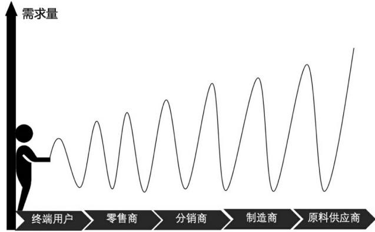

图2-6牛鞭效应

例如，产品A，当前终端用户市场的平均需求是10个，但由于市场 的波动，到了零售商备货环节，为了避免产品短缺的情况发生，一定会 向上级分销商多采购一些（如 12 个）；同理，分销商会以12个产品A 作为零售商的真实需求，为了保证服务质量，会向上级制造商采购16个 产品A。依次类推，因为制造商无法知晓真实的需求情况，只能以分销 商提报的需求进行生产，为了保证成品的数量，必然会向原料供应商采 购更多的原料。如此一来，当需求信息从终端用户，到最终的原料产地 的传导过程中，便可能产生了数倍的差异。多余的部分库存，因为供需 不平衡，便产生了严重的库存浪费，同时增加了运营成本，这便是牛鞭 

效应的威力。 

只要用心观察，牛鞭效应存在于我们工作中的方方面面，不仅在外 部企业之间存在，在企业内部一样存在，我们来看一个故事。 

一次合理但失败的备货经历 

某公司开“双 11”动员大会。老板：“马上要到‘双 11’了，各部门一 定要提前做好准备，去年我们的××产品卖了 1 万台，成绩相当不错，今 年我们要再接再厉，目标是在去年销售额的基础上增长40%，辛苦大家 ！”。 

销售副总王总接到指令后，对手下负责销售运营的老A安排任务：“ 今年‘双11’，我们××产品的销售目标是比去年至少增长40%，只能多不 能少，老A你做个数据分析，分析一下今年需要备多少货，提前跟采购 部报备，让他们提前备货。” 

老A对××产品去年“双11”的销售数据及今年每个月的销售数据做了 分析，发现每个月的需求波动很大，如果按至少增长 40%的目标来看， 为了保证万无一失，需要比去年多备60%的货，也就是16000台。老A 转眼一想，如果今年卖得特别好，而自己报少了，岂不是自己的工作失 误？这个责任自己可承担不起。于是，索性向采购部报备了2万台的需 求计划，理由是需求波动比较大，为保证更好的服务水平，需要多备安 全库存。这个理由，王总也认为很合理。 

最终，采购人员大B向供应商下了3万台的采购订单，原因：①供应 商承诺满3万台会返利，成本更低；②今年原材料紧张，预测年底会涨 价，不如提前先备一批货，以备年底促销。 

供应商发现今年接到的多个零售商的订单普遍比去年高 50%以上， 于是加大投入生产，为了防止更多的下游客户下单订购，又多追加了一 部分生产计划，整体比之前规划的产量翻了一番。大家都期待着该产品 在今年“双11”再创佳绩。 

到了“双11”当天，由于××产品的各家零售商今年都备了很多货，出 现了严重的供大于求的局面，各零售商只能大力促销，打起了价格战， 结果市场总需求相比去年没有增加多少，而零售商和供应商都积压了大 量的库存，各方都损失惨重，哀声连连。 

从故事中的每个角色本身来看，老板、王总、老A、大B、供应商 都有合理的理由加大采购备货量，但由于需求信息的层层放大，便产生 了非常严重的牛鞭效应，最终所有人都成了受害者。 

## 2.3.2 牛鞭效应的成因及危害

牛鞭效应的产生主要是需求的变动性增大，一般有以下几个原因。 

① 缺乏信任，信息不共享。企业内部各部门之间，以及上下游企 业之间信息不透明，彼此相互不信任，导致各方无法获取最原始、最真 实的需求，信息失真的程度越来越大。另外，有些公司的信息化程度偏 低，无法有效地识别牛鞭效应，也会导致牛鞭效应的不断增大。 

② 需求预测不准确。由于市场需求的波动太大，不确定性因素太 多，无法准确预测真实的需求，导致预测需求量比实际需求量相差太大 ，从而产生了过量采购。 

③ 安全库存的设定。为了避免缺货情况的发生，企业都会设定一 定的安全库存，以应对需求的波动，这样上下游层层的安全库存设定， 便加大了牛鞭效应。 

④ 价格、促销的刺激。当供应商有降价、返利、促销、补贴等政 策激励时，下游企业会倾向于多订货，从而加大了采购量。 

⑤ 大批量订货。为了节省采购成本、包装成本、运输成本和人力 成本，供需双方都会倾向于大批量、低频次采购，从而导致了需求的波 动性。同时，有些产品有包装要求，必须以整包进行采购，这也会加大 订货量。 

⑥ 临时性与恐慌性订货。客户可能会临时增加订单量，导致需求 量临时变大，当遭遇意外情况（如原材料紧缺）时，为了避免缺货情况 的发生，企业也会倾向于提前备货，从而形成了牛鞭效应。 

⑦ 提前期的延长。每个产品从下单到采购入库，都有一定的周期 ，这个周期称为提前期，包括采购时间、供应商备货时间、运输时间、 入库操作时间等。为了保证提前期内的订单库存满足率，企业必须要保 证提前期内的产品库存数量（也叫订货点），提前期越长，备货自然就 会越多了。 

牛鞭效应的危害如下。 

① 加大了企业之间和部门之间的信任危机。由于上下游企业及同 企业部门之间的信息不透明，彼此之间缺乏信任，久而久之，便会加大 牛鞭效应，从而带来更多的信任危机，形成恶性循环。 

② 导致了成本的增加。牛鞭效应会产生大量的不确定性库存，直 接增加了库存成本、生产制造成本、运输成本、劳动力成本。 

③ 资金周转率降低。由于库存积压，资金周转周期也会延长，导 致企业丧失了更多的机会成本和投资收益。 

## 2.3.3 如何用系统监控牛鞭效应

牛鞭效应最直接的后果就是库存增多了，积压的商品长期销售不出 去，体现在系统里，就是滞销库存。既然了解了牛鞭效应的成因和危害 ，在做系统设计时，我们自然要学会用系统来辅助监控牛鞭效应，避免 牛鞭效应的进一步扩大。 

在系统中识别牛鞭效应的最有效方式就是监控滞销库存，滞销库存 的在库天数能有效地反映牛鞭效应问题。图2-7是一个简单的示例，我 们来看看如何设计商品A的库存分析报表来监控牛鞭效应。 

商品A 库存库龄分析

当前日期:2021-03-09

<table><tr><td>商品</td><td>入库批次</td><td>入库时间</td><td>库存数量</td><td>库龄(天)</td><td>平均库存周转天数</td><td>结论</td></tr><tr><td>A</td><td>20201001</td><td>2020-10-01 10:10</td><td>100</td><td>159</td><td>30</td><td>严重滞销库存,超过平均周转天数129天</td></tr><tr><td>A</td><td>20210212</td><td>2021-02-12 08:00</td><td>80</td><td>25</td><td>30</td><td>正常周转库存</td></tr></table>

图2-7 用系统监控牛鞭库存（示例）

为了加强理解，先普及几个系统概念。 

① 入库批次。为了便于仓库管理，每一批商品在入库时，我们可 以为之赋一个批次号，并记录其对应的入库时间，这个批次号便是入库 批次。例如，本例中入库批次20201001对应的入库时间为2020-10-01 10 ：10。 

② 库龄。当前批次的商品在仓库里存放的时间，库龄=当前日期-入 库日期。本例中当前日期是 2021-03-09，系统显示入库批次为 20201001 的商品的库龄为 159 天，入库批次为20210212的商品的库龄为25天。 

③ 平均库存周转天数，指该商品在仓库里的平均存放天数，从商 品入库时间到销售出库的时间。最简单的公式为：平均库存周转天数= 日均存货金额/日均销售金额。例如，某商品平均每天的存货金额为 40 万元，每天的销售金额为 20 万元，则该商品的平均周转天数为2天。 

在实际业务中，由于库存的动态变化，一般用全年（按每个月30天 ，全年360天比较好计算）的平均库存周转天数来计算。公式如下。 

库存周转天数=360/全年存货周转次数=（日均存货金额×360）/产 品年销售成本金额。 

本例中，我们通过系统监控可以得出3个结论。 

① 商品A平均库存周转天数为30天，批次号为20201001的商品库龄 高达159天，远超平均周期天数30天，很明显产生了严重的积压，排除 其他特殊原因，便是牛鞭效应导致的，需要尽早处理。而批次号为2021 0212的商品的库龄才25天，属于正常周转库存，可暂时不用处理。 

② A商品当前已经产生了积压，在滞销库存未消耗完之前，就不能 再继续采购了。 

③ 横向对比同行其他企业里商品A的平均周转天数，如果低于同行 平均水平，说明本企业在处理牛鞭效应方面做得还不错，如果高于同行 平均水平，说明本企业的库存管理还有提升空间。 

## 2.3.4 如何有效避免牛鞭效应

牛鞭效应会一直存在，不可能完全消失，但我们可以采取一些措施 来减小牛鞭效应，以减少其带来的经济损失。 

① 相互信任。同一条供应链上的上下游企业及企业内各部门之间 要相互信任，减少因为不信任导致的信息失真。企业与企业之间、部门 与部门之间充分信任，不虚报、不隐瞒，共同保证信息的平稳传导。 

② 战略合作，信息共享。通过深度合作和技术手段的支持，下游 客户可以与上游供应商共享销售数据，让供应商能够及时知晓真实的市 场需求，以减少需求的不确定性；上游供应商可以与下游客户共享库存 等信息，通过JIT、VMI（供应商管理库存）等方式减少下游客户的无 效库存。 

③ 缩短提前期。通过流程的优化、硬件支持和系统辅助缩短提前 期，可以有效地降低提前期内的库存量，同时由于提前期的缩短，可以 减少需求的变动，从而让需求预测更准确，波动更小。 

④ 降低需求的波动。相关人员可以采取一些措施来降低需求的波 动，从而降低牛鞭效应的影响。例如，企业可以通过综合各地的需求进 行集中预测、集中采购，通过地区间的需求差异互抵来减少误差，还可 以通过天天平价的策略，通过平稳的价格减少用户需求的不确定性等。 

⑤ 减少订货批量。减少批量可以有效降低“牛鞭”的波动幅度，使需 求的波动更小，预测更准确。但减少批量会导致运输成本、人力操作成 本的增加，所以在实施时需要考虑到成本的均衡解决方案，如尽量以整 车多品种运输的方式进行运输，降低空车率，用系统辅助人力作业，减 少重复操作等。 

⑥ 及时补救。除了避免和减少牛鞭效应，还需要有事后的补救机 制，如果牛鞭效应已经产生，我们需要定期识别因牛鞭效应带来的库存 积压，及时促销处理，释放占用资金和空间，减少呆滞库存产生的库存 成本。 

减少牛鞭效应的影响，并不是某一个企业或某一个部门的责任，而 是需要供应链中的所有参与方充分发挥供应链协同的作用，群策群力才 能达到最佳效果。 

## 2.4 供应链协同：伟大的思想进步

在传统商业思想中，商场如战场，上下游企业之间各自为政，几乎 是一种零和式的交易方式，靠着损失上下游企业的利益来获取企业自身 的利益，因为过多的浪费产生在了商品流通过程中，使得商品的成本居 高不下，商品的品质无法得到保证，城门失火殃及池鱼，最终的受害者 是终端用户。随着企业对成本意识的逐渐重视，供应链也越来越受到重 视，想要降本增效，想要精简，就必然少不了上下游企业及企业内部各 部门之间的协同。毫不夸张地说，供应链协同是供应链发展过程中最伟 大的思想进步，因为它提供了一种多方共赢的解决思路，把各参与方的 视角拔高到整条供应链上下游，而企业不再只盯着自己的一亩三分地， 生意的模式也从对抗变成了合作，颠覆了以往敌对的局面。 

## 2.4.1 何为供应链协同

供应链是一种合作的思维，协同是合作的桥梁。供应链的协同就是 供应链的上下游成员彼此合作，以降本增效为目标，共同实现整条供需 链条的通畅，以此达到多方和合共赢的局面。如果把整条供应链当作一 个完整的工件来做的话，那么每个链条的上下游企业就是流水线上的一 个岗位，如果各个岗位衔接不好，就会出现工件组装流程不顺的情况； 如果想有效避免工件组装不顺的情况发生，就需要各岗位很好地协同。 

由此，我们可以得出三个结论。 

① 供应链的协同一定不是某一方的行为，而是基于链条上下游多 方共同努力的结果。 

② 供应链的协同一定是建立在共赢的基础之上，任何一方利益失 衡就会导致协同失败。 

③ 供应链的协同需要透明化。彼此信息共享，才能保证上下游的 需求及时获得响应，有力地推动供应链的协同。 

## 2.4.2 供应链协同的好处

供应链上下游企业和部门之间相互协作会有诸多好处。 

① 优势互补。上下游企业之间优势互补，彼此扬长避短。例如， 上游供应商的生产能力强，但下游批发企业的仓配能力强。那么在协作 过程中，批发企业就可以充分利用供应商的生产力，保证自己的采购成 本最低，而供应商可以利用批发商的仓配能力，以更快地为下游客户提 供服务，提升自身的服务质量。 

② 资源共享。通过供应链协同，可以使上下游企业或者企业内部 不同部门之间信息互通，资源共享，减少不必要的浪费。例如，一般情 况下，上游生产企业很难知晓市场需求的变化以及时对自身产品策略做 出调整，若需要获取，需要耗费很多人力、财力。而这部分数据在零售 市场是很容易得到的。如果协作到位，零售商可以将市场需求的信息共 享给生产厂商，使其提前做生产计划，反向也可以更好地为零售商服务 

③ 风险共担。协同的过程一方面是创造更多的价值互惠互赢，另 一方面也可以降低风险，毕竟是一个整体，当然有福同享有难同当了。 例如，某供应商与下游电商企业合作，由供应商管理库存，供应商就能 及时看到电商终端市场的需求变化，及时对产品做补货、调配。同时， 因为有了协同，电商企业再也不用担心采购不及时而影响客户履约时效 了。如果因为电商的错误预判导致供应商生产了过多的产品，也可以由 双方共同来承担库存积压的风险。 

④ 整体利益最大化。协同的目标和利益一定是基于长期考虑的， 局部环节的取舍不以影响整体利益的最大化为代价。如果上下游企业协 同得很好，彼此沟通合作越来越顺畅，信息传递及时，这样也增强了彼 此更加长远稳定的合作信心。企业内部各部门之间如果协同得很好，整 个供应链流程也会越来越顺畅，可以减少诸多不必要的浪费。例如，销 售部门要做大促活动，可以提前告知采购部门备货，同时通知仓储部门 加派人手，这样各部门都会提前做好准备，而不至于出现大促期间补货 不到位、仓储爆仓等情况了。 

## 2.4.3 供应链系统在协同中的关键应用

要做到深度协同，信息的及时互通是前提，而这也是供应链系统存 在的意义。通过系统设计，我们可以更好地连接企业内部各部门及企业 上下游。 

企业内部，各部门之间需要共享数据，最高效便捷的方式就是共用 一套彼此互通的系统，这样就可以实现系统之间的互通，让企业内部各 部门之间的运转更加高效。站在系统的视角，如果把企业业务比作一棵 树，则各业务部门是树枝，企业日常开展的业务是树干，各部门围绕着 供应链业务分工协作，开展日常工作，共同努力让企业之树茁壮成长， 而高效协同的供应链系统则是树根，负责为各部门输送营养和水分，保 证各部门营养均衡，目标一致，如图2-8所示。系统看似无形，却是协 同工作最重要的工具。 

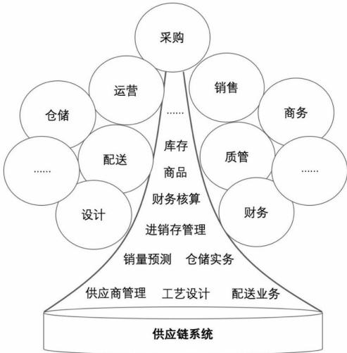

图2-8系统辅助企业内部协同

在企业外部，供应链上下游企业之间想要很好地协同，同样少不了 信息系统的支持。上游企业将产品通过物流送往下游企业，下游企业将 资金反向流向上游企业，上下游企业间的信息流则需要借助系统来实现 ，如图2-9所示。通过供应链协同系统，可以将上下游企业的交易数据 、采购计划、商品、库存等信息实时共享，更好地达成协同目标。例如 ，想要实现VMI，前提条件是上游供应商能够第一时间知道下游客户的 需求，及时补货，下游客户也需要第一时间知道供应商的库存信息，以 便及时调整销售策略，这种实时的互动，只有通过双方系统互通才能实 现，传统的纸单、电话沟通等形式几乎不可能达到理想的效果。 

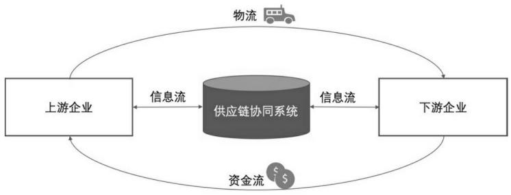

图2-9 供应链系统辅助上下游企业协同 

综上所述，想要实现协同目标，供应链系统的建设是必不可少的， 作为供应链系统的建设者，我们只有了解了协同的重要性，才能设计出 更加符合协同规则的供应链系统。 

常见的供应链系统协作方式有两种：①由一方提供完整的协作系统 供另一方使用，如供应商管理系统、商家发货系统等；②一方提供协作 接口，供另一方的系统对接。图2-10是一个简易的零售商和供应商的接 口协同系统的架构设计。 

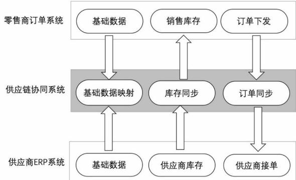

图2-10 简易供应链协同系统架构

图 2-10 所示的供应链协同系统主要起到零售商和供应商双方系统 衔接的作用，通过协同，实现零售商直接获取供应商库存进行售卖，并 将订单直接下达供应商仓库发货的业务模式，避免了传统采购带来的周 期长、成本高等问题。系统主要分为三个模块。 

① 双方基础数据（如商品主数据、地址库等）映射，便于业务数 据在流转过程中的互认。 

② 库存同步。供应商及时将库存信息通过协同系统同步到零售商 系统中，零售商基于库存信息调整销售策略。 

③ 订单同步。零售商产生的订单，及时通过协同系统下发给供应 商，由供应商的仓库协助发货。发货过程中的状态、物流等信息再通过 协同系统及时回传零售商。 

做系统设计时，我们应该遵循一个理念：系统设计源于业务，并反 哺于业务，唇齿相依。 

## 2.4.4 如何做好供应链协同

想要做好供应链协同，我们可以从以下4个方面着手。 

●供应链上下游协同 

●组织内部协同 

● 流程协同 

●信息系统协同 

## （1）供应链上下游协同

上下游企业的相关人员保持开放心态，彼此信任，摒弃短期利益， 从长远出发，以共赢心态共建协同链路，减少计划、采购、制造、交付 、回收等环节的孤岛阻碍，保证物流、信息流、资金流的高效通畅。通 过资源共享、战略合作、系统对接等方式使整体绩效最优。企业之间的 协同，可以从以下几个方面开展。 

① 资源共享。协同合作的上下游企业应该发挥各自的企业优势， 相互赋能、资源互补。例如，供应商资源、商品资源、仓储资源、配送 资源等。几年前京东与海尔开展协同业务，利用京东的电商平台引流和 海尔的三四线城市的网点布局，客户直接在京东平台下单，海尔仓库发 货，不仅增加了海尔的销量，也成功地将京东大家电的渠道下沉到了三 四线城市，同时也减少了采购过程中实物的物流浪费。 

② 长期深度合作。通过长期合作来建立更稳定的协同关系，而不 仅仅追求短期利益。例如，戴尔可以在24小时内完成从客户下单到产品 组装、运输的全过程，并且其库存周转次数达到 90 多次/年。原因是戴 尔仅与少数几个核心供应商建立长期稳定的合作，这几个供应商在戴尔 工厂周围建立仓库，可及时将零部件送到戴尔工厂。 

③ 系统对接。上下游企业通过 SDK、API 等方式将系统打通，可 以实现信息的实时交互。例如，供应商在送货之前，先通过预约系统向 下游企业告知送货时间和货物品种及数量，下游企业就可以提前对仓库 内的人员及设施进行安排。同时，通过系统的对接，也可以减少收货环 节的很多录入工作，可谓一举多得。 

当然，企业之间的实力有强有弱，其目标和认知各有不同，在以逐 利为基础的合作中，大家都不希望因为协同损害自身利益。例如，因为 要实现与下游企业的协同而需要自身在短期内投入更多，以进行信息化 建设，这势必会给资本薄弱的企业带来额外的预算支出，这时就需要上 下游共同协作了。如果从长远来看大家都是受益者，那么短期的合理性 投入是值得的，可以采取信息共建，或者大型企业为小微企业搭建商家 系统等方式达到协同的目的。 

## （2）组织内部协同

企业内部因为采购部、销售部、质管部、技术部、物流部、财务部 等多个部门的责任和立场不同，经常会出现企业内部沟通比外部沟通更 困难的情况，所以企业内部各部门之间的协同，比企业间的协同更加复 杂和重要。组织内部的协同，可以从以下几个方面开展。 

① 建立沟通机制。要想在企业内部建立起良好的沟通机制，需要 自上而下的战略同步、自下而上的执行汇报，以及横向跨部门沟通的标 准化流程。在大目标步调一致的前提下，打破组织内部壁垒，遇事不推 诿，及时沟通，群策群力，解决问题。同时，在标准流程之外，需要有 灵活应变的方式来应对紧急情况。 

② 明确职责边界。各部门应该有明确的职责分工，不要相互推诿 ，更不能越俎代庖。只有这样，在执行供应链流程的过程中，相关人员 才能做到各司其职，及时完成分内之事，遇到问题也能在最短的时间内 找到对应的责任人。 

③ 完善系统建设。线下沟通难免会出现遗漏，借助系统处理流程 是不二选择。在内部协同过程中，应该打通采购、销售、库存、物流、 财务等核心供应链系统，保证信息的及时同步，各部门使用对应权限的 操作角色完成自己的工作，尽量避免口头上的交流。同时，建立工单体 系，有协同问题及时发起工单和处理工单，阻塞节点清晰可见，超时问 题及时预警，让协同工作透明化、数字化，避免不必要的纷争。 

一切的工具和方式只是辅助，协同的最终目的是打破组织内部的壁 垒，让供应链更高效通畅。而打破壁垒最重要的是需要各部门建立起对 组织目标的认知一致性，以及齐心协力达成目标的开放合作心态。 

## （3）流程协同

供应链中涉及的流程很多，包括商品建档、采购入库、销售出库、 商品存储、客户退货、退供应商、调拨、库内移库、盘点等，每个流程 之间也不是孤立存在的，而是相互依存的。所以在设计业务流程时，也 需要考虑到协同。流程的协同，最好遵循如下原则。 

① 统一性。在设计一个新的业务流程的时候，要从全局考虑，符 合统一性原则。新的流程应该与已有流程相融合，且不能破坏现有的流 程规则。例如，某公司新来了一个组套加工业务，在规划新业务的时候 ，相关人员要考虑到商品建档、仓库存储、销售出库等其他相关业务的 影响，能复用尽量复用，而不是摒弃现有的、已经运行良好的机制，重 新建立一套机制增加浪费。 

② 通用性。企业内部的供应链流程从整体上来看就像是一台高速 运转的机器，每个子流程就是机器中的一个零部件，就像一台电脑，键 盘负责输入，显示器负责输出。新的流程要考虑通用性，能够兼容未来 的业务场景，就像主板上的螺母一样，在丰富电脑配置的同时，未来还 能用作他用，不至于因为业务调整而废弃。 

③ 开放性。业务是动态变化和发展的，业务流程的设计也要具备 开放性，如在设计自营业务的同时，需要考虑到兼容三方业务的需求。 

## （4）信息系统协同

信息系统是辅助协同的强有力工具，没有信息系统的支持的供应链 协调是很难建立起来的。如何借助信息化建设提高协同性，是企业内外 部供应链流程均需要思考的。信息系统的协同可以从以下方面来思考。 

① 基础数据规范统一。站在组织内部的系统建设角度，所有的基 础数据（如商品、供应商、物流公司、仓储数据、配送数据等）应该统 一管理，统一出入口，以免各业务系统各自为政，形成孤岛；站在企业 间协同的角度，上下游企业协同的基础数据需要有唯一的对应关系，以 免出现信息匹配出错的乱象。 

② 微服务思想。无论从需求设计，还是从系统架构设计来讲，都 要具备微服务的思想，将某些可以共用的功能独立出来变为公共组件供 其他系统调用。例如，订单取消服务，可以变为一个单独的服务，任何 需要取消订单的业务都可以来调用，不用再为不同场景设计不同的取消 逻辑。 

③ 业务数据互补。不同业务部门可能会使用不同的业务系统和系 统权限（如采购部门操作采购管理系统，销售部门操作订单履约中心） ，但站在公司层面，底层业务数据应该共享，相互流动，及时同步，不 应该受到系统的制约。例如，采购需要提取销售出库数据来分析订货点 和订货量；销售上架商品和下单时需要及时加减库存；采购入库和销售 出库都需要及时变更可销售库存数量。 

总之，供应链协同是一个靠上下游企业相互协作，企业内部彼此互 通，从全局考虑，以追求长远利益、深度合作和共赢为目标，构建良性 运转体系的方法论，用以清除供应链条中的阻碍，保证各方的投入产出 比最优。 

## 2.5 供应链战略：推式、拉式与推拉结合式

在日常生活中，我们在购物时通常会遇到如下几种情况：①当我们 去超市买食品、日用品时，往往可以直接从货架上拿了就走；②当我们 需要在宜家订购一套家具时，往往是先下订单，报尺寸和需求，几天以 后由厂家送货上门；③当我们想买一套足球球衣时，可以去商场直接拿 一套普通标准款型，也可以根据我们的身高体型和个性化需求量身定做 

为什么会有以上三种不同的方式呢，有些商品能够提供现货，有些 商品只能提前下单，还有些商品既可以提供现货又可以提供个性化订制 。我们可以通过学习供应链的三种战略来解答这个问题。 

2.5.1 推式供应链战略、拉式供应链战略与推拉结合式供应链战略 

我们先来了解三种供应链战略的定义。 

① 推式供应链战略。推式供应链战略是以生产为中心，制造商以 提高生产率、降低单件产品成本来获利为驱动源进行生产决策，产品生 产出来后从分销商逐级推向用户的供应链战略。在这一供应链战略中， 分销商和零售商处于被动接受地位，各企业之间的集成度较低，对需求 变动的响应能力较差。 

② 拉式供应链战略。拉式供应链战略是以用户为中心，通过对实 际需求较为精确的预测来拉动产品生产和服务的供应链战略。这种供应 链战略集成度较高，信息交换迅速，可以根据用户需求实现定制化服务 ，供应链系统库存量较低。 

③ 推拉结合式供应链战略。推拉结合式供应链战略是结合推式供 应链战略和拉式供应链战略的优点，扬长避短。在供应链的部分链路上 采用推式策略实现集中预测、规模经济，而在另外部分链路上采用拉式 策略快速响应用户需求。 

推拉结合式供应链战略可分为前推后拉式供应链战略和前拉后推式 供应链战略两种。 

前推后拉式供应链战略。大部分业务是前推后拉式，先将标准化的 部分通过预测生产出来半成品（推式），待接到用户需求后，再基于半 成品组装成最终成品提供给用户（拉式）。 

前拉后推式供应链战略。有些业务如定制家具，在生产环节基于用 户订单需求（拉式），但在运输环节采用规模经济，定期集中配送（推 式）。（免费获取更多供应链PM书 加v信：pmzjie） 

图2-11展示了推式供应链战略和拉式供应链战略的原理。推式供应 链战略是制造商基于对市场需求的预测，按照库存计划进行生产，然后 将成品库存逐级分销，最终将成品送到终端用户手中。拉式供应链战略 是基于用户需求，需求信息从终端用户逐级向上传导到制造商，制造商 再根据用户的订单进行设计、生产，其中没有多余的积压库存。拉式供 应链战略的极端情况是商家完全按照订单生产、加工、组装、配送，不 需要存储任何一件商品。 

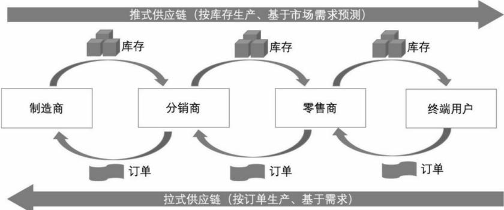

图2-11 推式供应链战略与拉式供应链战略

图2-12展示了推拉结合式供应链战略的原理，在推拉结合式供应链 战略中，以前推后拉式供应链战略为例，在推式阶段，产品形态一般以 半成品、零部件的库存存在，这些产品具有通用性，可以基于对市场需 求预测做生产计划，并将半成品库存逐级分发到供应链中的某一个节点 ，这个节点作为推拉边界，可以是制造商、分销商和零售商中的一个。 当终端用户下单以后，再从推拉边界的节点上对客户订单进行最终加工 组装，将最终形成的成品配送给终端客户，这便是拉式阶段，拉式阶段 基于订单和用户需求进行生产。 

推拉边界便是从需求预测转为实际需求，从半成品转换为成品的环 节。 

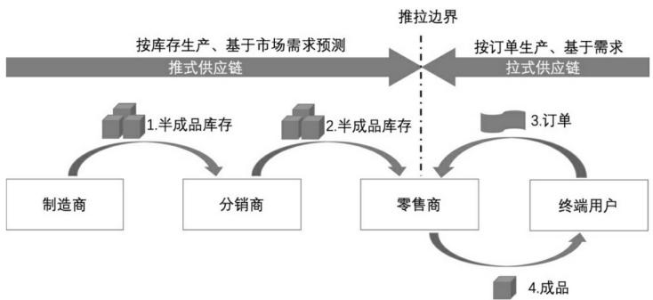

图2-12推拉结合式供应链战略

学习了三种供应链战略以后，我们再回看本节开头的三个日常场景 ，就很好解释了：超市里的食品、日用品等因为需求比较稳定，采用的 是推式战略；家具需要根据客户要求的尺寸、颜色等进行个性化订制， 很难提前预测，所以采用的是拉式战略；足球球衣的普通款型是通用的 ，没有印刷姓名、公司等信息，是可以提前批量生产的，当需要订制时 ，再基于客户需求，对标准品进行改良，满足客户的个性化需求，这是 典型的推拉结合式战略。 

## 2.5.2三种战略的优劣及适用范围分析

拉式供应链战略和推拉结合式供应链战略一定优于推式供应链战略 吗？不见得，供应链经过这么多年的发展，三种战略依然都存在，充分 证明：存在即合理，无所谓好坏。下面我们来分别分析一下三种战略的 优势和劣势，以及适用的范围。 

## （1）推式供应链战略

战略特色如下。 

●基于需求预测生产备货。 

● 以制造商为核心，根据产品的生产和库存情况层层分销，最终将 产品送到终端客户手中。 

●属卖方市场下的供应链战略。 

战略优势如下。 

●可以规模化生产、运输，降低生产和运输成本。 

●现货库存，可更快地满足用户需求。 

●对供应链的流程管理、系统的能力要求相对偏低。 

战略劣势如下。 

●对市场需求的变化灵敏度不足，无法及时响应。 

●当需求发生变化时，产生大量积压库存。 

●容易产生牛鞭效应。 

适用范围如下。 

● 需求稳定、市场波动小、需求量大、可预测且可规模化生产的产 品。 

●适用于追求成本更低的经济型供应链。 

（2）拉式供应链战略 

战略特色如下。 

●基于客户订单生产备货。 

●以客户为核心，以客户需求为导向，基于客户需求采购、生产。 

●属于买方市场下的供应链战略。 

战略优势如下。 

●不需要持有过多的库存。 

● 由于是客户自己提的需求，临时变化的可能性低，可有效减少牛 鞭效应。 

●因为节省了库存成本，可以降低供应链的整体成本。 

战略劣势如下。 

●需求的不确定性大，常为定制化服务，难成规模。 

●由于没有现货库存，无法立即满足客户需求。 

●对信息及时性要求高，否则无法快速响应用户需求。 

●无法形成生产和运输的规模效应优势。 

适用范围如下。 

● 需求不确定性大、订货量小，且货源稳定的产品，能保证订单及 时响应的产品。 

●适用于追求快速响应的响应型供应链。 

（3）推拉结合式供应链战略 

战略特色如下。 

● 可预测的环节用推式供应链战略，不可预测的环节用拉式供应链 战略。 

● 将差异化的需求尽量延迟，尽可能减少需求变化；越靠近终端用 户端，其优势越明显。 

战略优势如下。 

● 基于推式供应链战略对通用性的产品做集中预测，准确性更高， 可减少安全库存。 

●基于拉式供应链战略满足终端客户的个性化需求，响应更快。 

战略劣势如下。 

● 虽然降低了成品库存，但仍需要大量的半成品、物料库存，牛鞭 效应依然存在。 

● 推拉结合式供应链的环节相对推式供应链、拉式供应链都要复杂 ，增加了供应链的复杂程度。 

适用范围如下。 

● 能够将供应链分割成两段（一半推式一半拉式），且推式供应链 部分能形成规模效应的产品。 

供应链战略的选择不能一刀切，也不能一成不变，应该根据企业环 境、产品属性、时期的不同灵活选择。例如，同一家企业，可以针对需 求稳定、可预测的产品适用推式供应链战略，而针对需求变化大、不稳 定的产品则采用拉式供应链战略。 

下面我们讲一个发生在木笔身边的烧饼小店的故事，看看小小烧饼 摊如何在运营过程中灵活利用供应链战略进行自救。 

## 烧饼小店的供应链战略升级之路

小区里有家卖烧饼的小店，因为烧饼的口感好，生意很不错。老板 老王说，刚开业时也遇到不少困难和危机，好在自己爱思考，总共进行 了三次供应策略的调整，这三次调整刚好符合供应链的三大战略。 

第一阶段：推式供应链战略。刚开业时，因为是新店，进店尝鲜的 顾客较多，加上对流程还不熟悉，老王一个人忙不过来，于是把三鲜馅 、豆皮馅、胡萝卜馅、肉馅等各种口味的烧饼都提前烙了不少，等着顾 

客进店挑选喜欢的口味。 

一周以后，老王发现有些馅因为畅销而缺货，同时有些馅卖不动又 浪费了，而且有顾客反馈提前做好的饼口感不好，还有一些顾客嫌馅的 花样太少，总之是众口难调。于是，老王决定不再做成品烧饼了，提前 准备好食材、面团，以及更多的馅，等着用户进店以后现烙现包，这便 到了第二阶段：拉式供应链战略。 

如此一来，完美解决了饼的新鲜度问题、花样少的问题及一些烧饼 卖不动的问题，但随之而来的新问题更严重了：每次都现烙，顾客等的 时间太长了，烧饼最畅销的时间是早上班高峰期间，很多顾客因为赶时 间就放弃排队了，整体收入不升反降。 

于是老王冥思苦想，终于研究出一个两全其美的解决方案，一直沿 用至今，这便是：推拉结合式供应链战略。烧饼的口感主要在馅，而不 是饼，自己何不先把饼用烤箱批量烙好，把各种馅也先做好用保鲜盒盛 起来加热保鲜，畅销的馅多备一下，不畅销的少备一点。等顾客进店以 后再根据顾客口味将馅包进饼里即可，这样可以尽量缩短顾客等待的时 间，既可以快速满足顾客的多口味需求，也不影响馅的口味，而且烧饼 都是一样的，可以在闲暇的时候就批量烙好。 

如今烧饼店开了三年了，周围的小店换了几波了，唯独老王门前生 意兴隆。老王说，卖烧饼也是一门学问，也要跟上时代发展，要不是不 停地学习、思考，及时调整供应策略，估计自己的生意也早就做不下去 了…… 

## 2.5.3 供应链系统如何辅助供应链战略执行

我们来分析一下三种战略在供应链系统设计时如何应用。 

为了简单易懂，我们把推式供应链战略抽象为“先采后卖”，即先进 行采购，有库存以后再进行售卖；而把拉式供应链战略抽象为“先卖后 采”，即先进行售卖，有订单以后再进行采购，然后按订单发货。推拉 式供应链战略则是前两种模式的结合，半成品为“先采后卖”，成品为“ 先卖再采”。 

在推式供应链战略里，业务流程为采购→入库→售卖→发货4步。 

① 采购人员在采购管理系统中依据需求预测进行采购下单，将采 

购订单上传到仓储管理系统中。 

② 供应商接到采购订单后对采购订单进行履约送货，仓库收货以 后在仓储管理系统中提取采购订单信息进行收货入库，货物入库以后会 产生库存信息，系统会将库存信息同步到销售平台。 

③ 运营部门对商品进行定价、消息信息维护后，将商品上架到销 售平台售卖。 

④ 用户下单以后，销售平台将订单发货信息上传到仓储管理系统 ，仓库依据订单信息依次完成拣货、复核、打包、发货等操作，将订单 发出。 

在拉式供应链战略里，业务流程和推式供应链战略有所不同。其流 程为售卖→采购→入库→发货4步。 

① 运营部门先对商品进行定价、设置虚拟库存后将商品上架到销 售平台售卖（也称预售）。 

② 用户下单以后，销售平台将订单信息定期同步到采购管理系统 中，采购人员依据订单信息向供应商下采购订单。因为此时没有实物库 存，故订单不会下发仓库发货，一般会存在订单履约中心中，待商品入 库以后再下发。 

③ 供应商接到采购订单后进行履约送货，仓库收货以后在仓储管 理系统中提取采购订单信息进行收货入库。 

④ 入库以后产生商品库存并同步到订单履约中心中，系统自动触 发预售订单下发仓储管理系统，仓库的相关人员依据订单信息依次完成 拣货、复核、打包、发货等操作，将订单发出。 

推式供应链战略与拉式供应链战略的业务及系统流程，如图2-13所 示。 

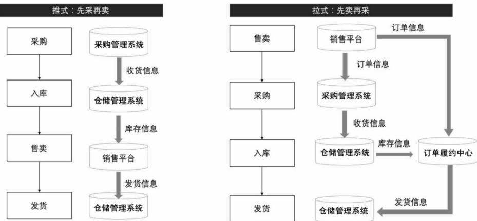

图2-13推式供应链系统流程与拉式供应链系统流程

推式供应链战略、拉式供应链战略和推拉式供应链战略在系统设计 时，最大的差异在库存的处理时机，但基本原则是一致的，都是基于库 存上架售卖（推式供应链战略是基于真实库存，拉式供应链战略是基于 虚拟库存），基于真实库存进行发货（仓库有实物以后，才能对订单进 行发货），关于订单和库存的设计，会在后续章节中详述，此处不做过 多展开。 

## 2.6深入浅出：供应链里的重要常识与实践

供应链里有一些重要的概念，当我们不了解它们时，它们是那么高 冷，而当我们走进它们时，它们会以最真实的姿态回应我们，让我们知 道它们并不是那么晦涩和不可捉摸。让我们走进它们的世界去看看吧！ 

## 2.6.1 物料清单（BOM）

在电商平台上买过餐桌、衣柜等大件的朋友都知道，我们收到的商 品一般都是用包装箱和泡沫包装好的零件，很少有商家直接发成品的， 因为成品体积大，不方便运输，运输成本高，所以此类产品都是我们买 到家后按照商家提供的产品安装说明书一步步地将其安装成最终的成品 。这些说明书上对应的零部件、数量和安装顺序，就是一个简单的产品 物料清单。 

物料清单（Bill of Materials，BOM），是描述企业产品组成的技术 文件。它表明了产品的总装件、分装件、组件、部件、零件，直到原材 料之间的结构关系，以及所需的数量。通俗地说，物料清单就是产品的 结构清单。 

以餐桌为例，一张餐桌由一张桌面和4根桌腿组成，桌面又由一张 桌面板和4个预埋螺栓构成，每根桌腿又可拆解为2个螺丝和1根木质桌 腿，如此层层往下拆解可以看到此张餐桌的所有零部件信息，我们为每 个零部件编号（餐桌X、桌面A、桌腿B……），如图2-14所示。 

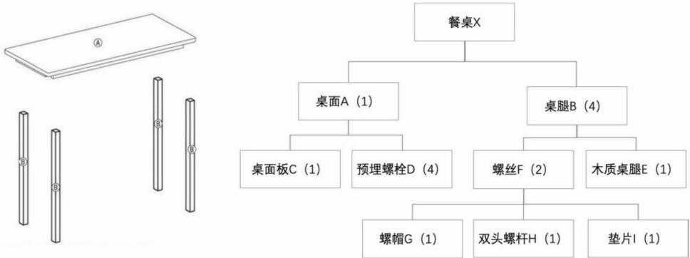

图2-14 餐桌的产品结构

按照上图，我们编制一个简单的餐桌BOM，如表2-1所示。

表2-1 餐桌的简易BOM

<table><tr><td>层级</td><td>物料编号</td><td>物料名称</td><td>上级物料</td><td>数量</td><td>单位</td></tr><tr><td>0</td><td>X</td><td>餐桌</td><td>-</td><td>1</td><td>张</td></tr><tr><td>-1</td><td>A</td><td>桌面</td><td>X</td><td>1</td><td>块</td></tr><tr><td>--2</td><td>C</td><td>桌面板</td><td>A</td><td>1</td><td>块</td></tr><tr><td>--2</td><td>D</td><td>预埋螺栓</td><td>A</td><td>4</td><td>个</td></tr><tr><td>-1</td><td>B</td><td>桌腿</td><td>X</td><td>4</td><td>根</td></tr><tr><td>--2</td><td>F</td><td>螺丝</td><td>B</td><td>2</td><td>个</td></tr><tr><td>--2</td><td>E</td><td>木质桌腿</td><td>B</td><td>1</td><td>根</td></tr><tr><td>---3</td><td>G</td><td>螺帽</td><td>F</td><td>1</td><td>个</td></tr><tr><td>---3</td><td>H</td><td>双头螺杆</td><td>F</td><td>1</td><td>个</td></tr><tr><td>---3</td><td>I</td><td>垫片</td><td>F</td><td>1</td><td>个</td></tr></table>

以上描述只是狭义上的BOM，仅仅展示的是产品的结构，在实际 生产中，BOM需要与物料信息、工艺流程、工作中心等关联到一起， 通过BOM，我们能够很清晰地了解到产品的加工顺序、架构周期、零 件价格、自制还是外购、是否有虚拟件、偏置期（不是所有零配件都是 同一天装配的，前后零配件装配的时间差称为偏置期）等。图2-15是一 个更为完整的BOM。 

<table><tr><td>层级</td><td>物料编码</td><td>上级物料代码</td><td>物料名称</td><td>物料模板</td><td>BOM序号</td><td>数量</td><td>单位</td><td>清单供应类型</td></tr><tr><td>0</td><td>10021</td><td>无</td><td>车厢可卸垃圾车</td><td>车类成品(批次)</td><td>0</td><td>1</td><td>辆</td><td>整件</td></tr><tr><td>1</td><td>10021001</td><td>10021</td><td>底盘</td><td>车类标准采购价(无批次)</td><td>1</td><td>1</td><td>件</td><td>零部件</td></tr><tr><td>1</td><td>10021002</td><td>10021</td><td>取力器安装</td><td>虚拟物件</td><td>1</td><td>2</td><td>件</td><td>虚拟件</td></tr><tr><td>2</td><td>10021002001</td><td>10021002</td><td>取力器</td><td>车类标准采购件(无批次)</td><td>1</td><td>2</td><td>件</td><td>零部件</td></tr><tr><td>1</td><td>10021003</td><td>10021</td><td>取力器及阀组气路安装</td><td>虚拟物件</td><td>1</td><td>1</td><td>件</td><td>虚拟件</td></tr><tr><td>2</td><td>10021003001</td><td>10021003</td><td>手动换向阀支架</td><td>车类子装配件</td><td>1</td><td>1</td><td>件</td><td>零部件</td></tr><tr><td>3</td><td>10021003001-1</td><td>10021003001</td><td>热轧碳结钢板</td><td>车类标准采购件</td><td>1</td><td>1</td><td>千克</td><td>零部件</td></tr></table>

图2-15某产品的制造物料清单

BOM 在生产制造行业里是一个非常重要的控制文件，供应链相关 各部门都需要依赖它。采购部门依据BOM进行原料和零部件的采购； 生产部门依据BOM来制订生产计划、安排生产和过程监控；销售部门 依据 BOM 进行商务洽谈和产品报价；仓库按照 BOM 进行收发货物、 物料追溯；财务部门要依据BOM中的零部件成本来核算成品成本。可 见，建立清晰的BOM在制造行业中是非常有意义的（在分销、零售行 业中使用得相对较少），感兴趣的朋友可以更加深入地研究一下BOM 的编制、产品层次、替换件、虚拟件、成本计算等知识。 

## 2.6.2 提前期

“佳佳，上周我们采购的那批货，现在什么进展了？”采购部总监王 总问采购人员佳佳。 

“王总，早上我刚看过了，系统里提示提前期是5天，今天已经是第 3天了，不出意外，后天就到了。” 

以上是一段针对商品采购到货周期的一段日常对话，里面有一个叫 作“提前期”的专业术语。这是供应链领域中的一个很重要的概念，我们 有必要系统地学习一下。 

提前期，又称为前置时间（lead time），是一个从作业开始到作业 结束所需要的阶段性时间。提前期在生产行业中使用得比较广泛，是设 计生产装配件工艺路线和制订生产计划的重要基础数据之一，而在分销 、零售行业中使用较少，常用于采购部门的相关人员做定期采购补货的 安全库存计算（后续章节会重点说明）。 

以生产过程最复杂的制造业为例，从接受订单开始，到将最终产品 交付到客户手中，整个供应过程包括产品设计、生产准备、原料采购、 生产加工、产品装配、试验与测试、发货运输几个阶段，如图2-16所示 

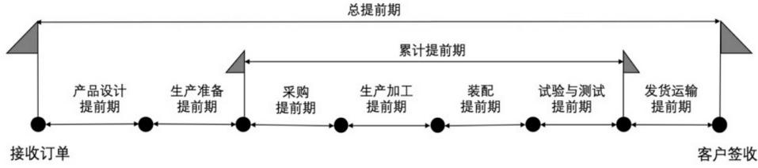

图2-16供应链提前期

按照供应过程的阶段，提前期也可以分为以下几个阶段。 

① 产品设计提前期：从接受订单开始到产品设计、工艺设计完成 所需要的时间。 

② 生产准备提前期：从生产计划开始到生产准备工作完成所需的 时间。 

③ 采购提前期：从下达采购订单到所采购的物料入库完成的全部 时间。 

④ 生产加工提前期：从生产加工投入开始到产品入库的全部时间 

⑤装配提前期：从装配投入开始到装配完工的全部时间。 

⑥ 试验和测试提前期：产品装配完成之后进行试验、测试所需要 花费的时间。 

⑦ 发货运输提前期：产品测试之后开始包装、出库、装箱和运输 ，直到客户收到产品所需要的时间。 

除以上分类外，还有两个常用的汇总提前期，总提前期和累计提前 期，也需要了解一下。 

① 总提前期：从签订销售订单到完成交货的总时长，是以上所有 提前期的时间总和。 

② 累计提前期：从开始采购到产品入库的总时长，也就是采购、 生产加工、装配、试验与测试总共所需的时间。 

在实际运作过程中，并不是每一个订单都会有这么多提前期，如我 们有现货库存，就可以直接进入发货运输环节了，这时总提前期和发货 运输提前期是一样的。另外，企业所处的行业不同，提前期的应用也不 同。例如，在沃尔玛、家乐福、711这些零售企业中，不涉及产品工艺 设计和生产加工环节，只会在采购时考虑采购提前期，在发货时考虑发 货运输提前期。 

好了，概念我们理解了，但是提前期到底有什么作用呢？ 

用户下单以后，都会有一个预期的交货时间，这个时间一般是买卖 双方商定的时间，如最多10天。因为从接受订单到最终将产品送到客户 手中涉及很多工序，所以我们必须根据交货时间来反推每个工序的完成 时间，只有每道工序都按照既定计划完成，才能保证订单按时履约。提 前期就是用来推算每个环节的开始时间和结束时间的，以便控制和调整 每个环节的过程。就像我们做IT项目管理一样，老板定了个上线日期， 只能通过倒排期来推算需求分析、开发、测试各个环节的时间，任何一 个时间出现了延期，就需要采取措施及时调整。 

另外，如果要提升供应链的整体效率，缩短提前期是一个重要的环 节，通过提前期对各个环节进行量化、拆解，可以有效发现其中的等待 时长和浪费的时间，做出优化调整，让整条供应链更加顺畅，这不正是 供应链管理的目标吗？ 

## 2.6.3 需求响应策略：MTS、ATO、MTO、ETO

你知道为什么我们在网上买的商品，有的发货很快（如大宗百货） ，而有的发货很慢（如家居用品）？因为有的商品可以直接发货，有的 商品需要组装以后才能发货，还有的商品需要重新设计，这便是不同商 品的需求响应策略。 

在介绍提前期时，我们讲到，从接受一个订单开始，到最终将产品 交付客户，会经历产品设计、生产准备、原料采购、生产加工、产品装 配、试验与测试、发货运输几个环节中的一个或多个提前期，产品的特 性和当前市场环境不同，对订单需求的响应时效也不同。按照需求响应 时长从短到长，可以分为：按库存生产（Make To Stock，MTS）、按 订单装配（Assemble To Order，ATO）、按订单生产（Make To Order， MTO）和按订单设计（Engineer To Order，ETO），如图2-17所示。 

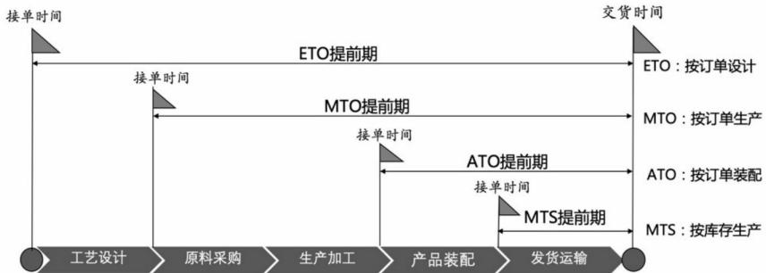

图2-17 4种需求响应策略

我们来逐一介绍这四种需求响应策略。

① 按库存生产（MTS）：也叫作现货生产。企业在接到订单之前 ，成品就已经有现货库存了，直接拣货、发货即可。在这种模式下，需 求提前期=发运时间。 

② 按订单装配（ATO）：企业提前生产零部件（半成品），待接 到订单以后，按照订单要求进行成品组装，然后将成员发运给客户。在 这种模式下，需求提前期=装配时间+发运时间。 

③ 按订单生产（MTO）：企业没有成品库存，在接到订单后再开 始生产（如果没有原料，先采购原料）、装配、发运，不需要重新设计 和编制工艺。在这种模式下，需求提前期=原料采购时间（若无原料）+ 生产加工时间+装配时间+发运时间。 

④ 按订单设计（ETO）：企业无法提前预测成品和半成品的需求， 只能在接到订单以后再根据客户需求进行产品的工艺设计、原料采购、 生产加工、产品装配、发货运输等。在这种模式下，需求提前期=工艺 设计时间+原料采购时间（若无原料）+生产加工时间+装配时间+发运 时间。 

简而言之，接受订单时，用现货库存发货的，叫作MTS；用零部件 直接装配的，叫作ATO；需要重新生产的，叫作MTO，需要从零开始 设计的，叫作ETO。 

MTS是典型的推式供应链模式，适用于市场相对稳定、需求量大的 产品，此类产品已经处于成熟期，可以基于需求预测提前生产。 

ATO是推拉结合式供应链模式，适用于有一系列的标准BOM和通 用零部件的产品，此类产品的市场比较成熟了，可以提前根据市场需求 预测并生产通用的零部件，然后根据客户的个性化需求将零部件组装成 不同形态的成品。 

MTO是拉式供应链模式，适用于产品形态稳定，不需要重新做工 艺设计，但需求和最终产品形态不确定的产品，此类产品一般处于早期 的市场探索阶段，企业无法提前预测市场需求，只能根据用户需求进行 原料采购、生产。 

ETO也是拉式供应链模式，适用于没有稳定的产品形态，个性化定 制非常强的产品。此类产品完全按照每个用户的个性化需求，从设计开 始便是定制化的，一般只生产一次，无法复用和提前预测。 

除了考虑产品形态，产品的规模效应和需求变化的不同，企业也需 要采取不同的需求响应策略。能够形成规模生产的、需求变化较小的产 品，其需求量一般可提前预测，比较适合按库存生产；规模效应较小、 需求变化较大的产品，适合按订单生产和按订单设计，如图2-18所示。 

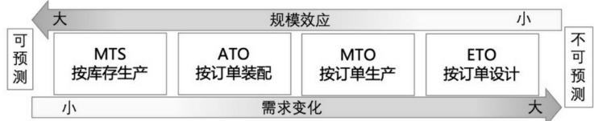

图2-18需求响应策略的应用

## 2.6.4规模经济与边际成本

规模经济是经济学中的一个重要理论，是指在特定时期内，企业产 品的绝对量增加时，其单位成本下降，即扩大经营规模可以降低产品的 平均成本，从而提高利润水平。 

在供应链领域中，规模经济效应特别明显，无论是采购、生产、运 输，还是库内作业，大批量处理都要比小批量处理节省成本。道理都懂 ，但为什么呢？我们从成本的角度来分析一下，有一个最简单的公式： 

$$
\mathrm{供应链总成本} = \mathrm{固定成本} + \mathrm{变动成本}
$$

固定成本是成本总额在一定时期和一定业务量范围内，不受业务量 增减变动影响而能保持不变的成本，而变动成本是指成本的总额在相关 范围内随着业务量的变动而呈线性变动的成本。以采购为例，每一次采 购，都需要经过制订采购计划、运输货物、对账核算、付款这些流程， 从而产生成本。采购1件商品和采购1000件商品的成本差别不大，所以 它们是固定成本，但采购的商品的成本=采购单价×采购数量，在采购单 价固定时，采购数量越多，付出的成本自然也越多，这部分成本就是变 动成本。 

假设每次采购的固定成本是100元，采购单价是10元，我们分别来 算一下采购10件商品、100件商品和1000件商品的总成本和平均单位成 本。 

总成本=固定成本+变动成本=固定成本+采购单价×采购数量 

平均单位成本=总成本/采购数量 

① 采购10件商品时：总成本=100+10×10=120元，每一件商品的平 均单位成本=120/10=12元。 

② 采购100件商品时，总成本=100+10×100=1100元，每一件商品的 平均单位成本=1100/100=11元。 

③ 采购1000件商品时：总成本=100+10×1000=10100元，每一件商 品的平均单位成本=10100/100=10.1元。 

很明显，采购1000件商品比采购100件商品的单位成本要低，采购1 00件商品比采购10件商品的单位成本要低，这还不算采购1000件商品可 以从供应商处获得更低的采购折扣的因素，因为供应商供应产品的成本 也是一样的，采购数量越多，单位成本越低。随着采购数量的增加，会 分摊固定成本，使商品的单位成本更低，从而产生更大的利润，这就是 规模经济的威力。在供应链的降本策略里，规模经济策略是非常受欢迎 

的。 

只要我们仔细观察，在日常工作中，会发现很多采用规模经济的例 子。 

例如，在采购时，我们会一次性采购半个月或者一个月的用量，并 且尽可能在更少的供应商处进行采购，以获取更大的议价空间，并降低 固定成本；做促销时，我们希望用户尽量在一个订单内里购买多件商品 ，而不是一单一件，如果用户下了多个订单，我们也希望能够合并拣货 和运输，以便工厂能够批量生产、仓库能够统一拣货、包装、合并配送 ，减少人力、包装和物流运输成本；在进行库内操作时，我们把不同客 户的订单合并到一个波次中，按照顺序拣货，而不是一单拣一次，这样 可以节省相关人员来回走动的时间；在配送运输时，我们会把相同配送 方向的订单合并配送，以提高配送车辆的满载率，节约车辆配送成本； 在进行系统需求梳理和开发时，我们也希望多个需求方能够一次性将需 求提交过来，统一梳理和实现，节省沟通和实现成本。 

不过规模经济虽好，可不能贪杯哦！因为规模经济效应是有限的， 一味地追求规模，过度了反而会导致成本不降反升。为什么？我们再来 聊聊另外一个概念：边际成本。边际成本指的是每一单位新增生产的 产品（或者购买的产品）带来的总成本的增量。 

边际成本的曲线如图2-19所示，在一定的范围内，随着数量的增加 ，边际成本呈递减趋势，但超过了一定的数量以后，边际成本会呈上升 趋势。 

还是拿上面采购的例子来看。 

如果我们采购10000件商品，总成本 $\therefore = 1 0 0 + 1 0 \times 1 0 0 0 0 = 1 0 0 1 0 0$ 元，每 一件商品的平均单位成本 $= 1 0 0 1 0 0 / 1 0 0 0 0 { = } 1 0 . 0 1 $ 元，相比采购1000件商品 （平均单位成本为10.1元），其边际成本降得并不多。 

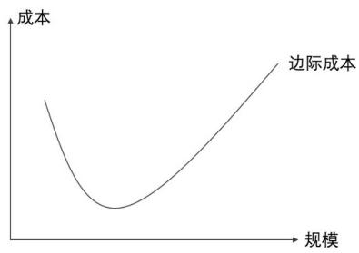

图2-19 边际成本

我们再增加新的分析因素：需求量。如果市场对这种商品的需求是 1000件，那么我们采购1000件刚好合适，采购10000件就会产生9000件 的库存积压，这些积压的库存会产生很大的仓储成本、人力成本，所以 边际成本反而会增加。 

在供应链领域中，我们会通过规模经济来降低成本，但不能盲目追 求规模，同时也要考虑边际成本，取得规模和边际成本的最优解。一味 地追求规模而忽略边际成本，可能会产生库存积压，增大牛鞭效应，造 成更大的成本浪费。 

## 2.6.5 柔性供应链

在传统的、以推式为主的供应链体系中，产品的生产计划由生产商 决定，但生产商离终端客户较远，无法知晓终端客户的真实需求，这就 导致了很多终端需求被压抑。随着科技的发展，很多用户的个性化需求 被释放，而这些需求在传统的供应链管理理念下并不能被满足，于是就 出现了“柔性供应链”的说法。柔性供应链的定义为：快速而经济地处理 企业生产经营活动中环境或由环境引起的不确定性的能力。 

通俗地说，柔性供应链就是要求供应链有足够的灵活性，能应对突 发的和非常规的情况。我们在满足大众需求的同时，还能及时响应个性 化的需求；在追求大批量规模经济的同时，还能快速响应个性化的、小 批量、多批次的需求；在处理计划中的事务的同时，还能快速应对突发 的紧急情况。 

一条合理的柔性供应链应该具备以下几个特点。 

① 拥有足够的灵活性。灵活性体现在方方面面，组织的灵活、流 程的灵活、系统的灵活等。最终目标是用更低的成本使供应链更高效地 适应外界环境和需求的变化，让供应链不仅能满足常规需求，也能应对 非常规情况，这需要企业内外部秉承协同的理念，彼此合作，减少内耗 

② 拥有快速的响应能力。柔性供应链不仅要灵活，还要能快速响 应，能够对市场上无论是常规的还是变化的需求都做出及时地应对和调 整，追求收益最大化。当遇到突发事件时，供应链也能够第一时间做出 响应，将损失降到最低。 

③ 不断地自我进化。市场和环境是在不断变化的，如果想要顺应 市场和环境并及时地做出响应，自我进化能力必不可少，所以企业要不 断地吸收先进的理念并引进先进的技术，不断更新迭代，优化组织、流 程和系统，以使供应链保持更强的灵活性和响应能力。 

知名服装品牌ZARA是柔性供应链的代表和指导者，我们一起来看 看它在柔性供应链方面的一些做法。 

① ZARA在销售季节到来前一年左右就开始进行服装设计，设计师 会设计比其他公司多4倍的服装款式，然后小批量地将新设计的服装生 产出来，去测试市场的接受程度，然后根据市场反馈再决定是否调整样 式或批量生产。 

② 每年推出12000个款式，保持一周两次上新的频率；产品从设计 到上架的时间不超过3周，这样可以更快地响应市场需求，降低缺货风 险。 

③ 销售旺季来临的前半年，ZARA 一般只执行 15%～25%的生产计 划（而其他公司是40%～60%），即便销售旺季到来时，也只执行50% ～60%的生产计划（其他公司则是80%左右），剩余部分将在销售季节 内生产，这样可以降低库存风险，并可以根据市场需求的变化做快速调 整，一旦出现新的需求，ZARA可以通过强大的供应链能力迅速投入生 产。 

④ ZARA 打通了内外部信息系统，通过条码和 RFID（射频识别系 统）辅助识别，进行商品分类、分拣、运输、追溯，实现信息互通，减 少了人工录入的工作量，使供应链效率大幅提升。一旦发生缺货，能够 立即从分销中心发货到全球店铺，在 7 天内，商品可以到达缺货店铺， 大大缩短了客户的等待时间。 

⑤ 为适应不同的市场需求，ZARA采取推式供应链战略和拉式供应 链战略并存的方式：在拉式供应链战略中，每一位门店经理都可以直接 向总部下订单，从设计、生产，到交付能够在15天内完成；而在推式供 应链战略中，企业的相关人员通过对基本款式和流行趋势的预测，提前 生产一部分商品并将其推给门店上架销售。 

⑥ 所有的商品在连锁店里的时间都不会超过两周，如果销售不出 去就会被调到其他店铺里，这样使得商品的周转周期非常短，很多产品 一旦下架或者预测到市场趋近饱和，就停止生产了，这也向顾客传递“ 您最好今天就购买它，因为明天您可能就买不到了”的信号。 

柔性供应链的建设是方方面面的，而且是个长期的过程，从企业内 部的战略规划、生产流程、系统架构、组织建设、网络规划，到供应链 上下游的合作方式、战略联盟、信息共享、系统互通等各方面都需要梳 理和优化，它是供应链协同的产物，和供应链协同一样，需要参与各方 的认知和步调一致，舍弃短期利益而追求长远利益，才能实现长久的合 作共赢。 

## 2.6.6准时制生产方式

在供应链里，库存是把双刃剑，备货不足会导致库存不足，从而导 致客户服务水平和企业的市场份额降低，而备货太多又会产生库存积压 ，造成库存成本的上升。所以最好的现状是库存不多不少，时机不早不 晚，这便是JIT的理念。 

JIT是日本丰田汽车公司在20世纪60年代推行的一种生产管理制度 ，又称作无库存生产方式（Stockless Production）、零库存（Zero Invent ories）。其基本思想是只在需要的时候，按照需要的量，生产所需要的 产品，目的在于解决由于生产过剩产生的库存浪费，尽可能地减少库存 （最理想的状况是零库存，没有任何多余的库存），并持续改进。现在 这种思想已经从生产行业传递到供应链的上下游，分销商、零售商都在 追求JIT，力求消除供应链过程中的多余环节和多余库存，提高需求响 应时间、降低供应链成本，以获得最大的经济效益。 

JIT是拉式供应链战略，前一个环节的生产备货数量取决于后一个 环节的需求，这样从最终环节的需求开始，反向把前面各个环节连接起 来，中间不存在任何库存缓冲环节，便形成了JIT管理。 

举个现实中的例子以便加强我们的理解，我们经常在“618”“双11” 参与的电商预售活动就是JIT思想的体现。有些零售商由于无法预知市 场需求，也不希望自己积压过多的库存，便采取预售模式，先把商品上 架到销售平台进行售卖，用户可支付全款或者部分货款进行下单，商家 根据用户下单的情况再进行采购备货，然后为用户发货，采购商品数量 与用户下单数量一样，不必过量采购。此举的好处是不需要储备过多的 库存，完全根据客户需求进行采购，避免浪费，缺点是没有现货，提前 期比较长，会流失一部分急需使用商品的用户。 

图2-20为京东商城的预售示例。

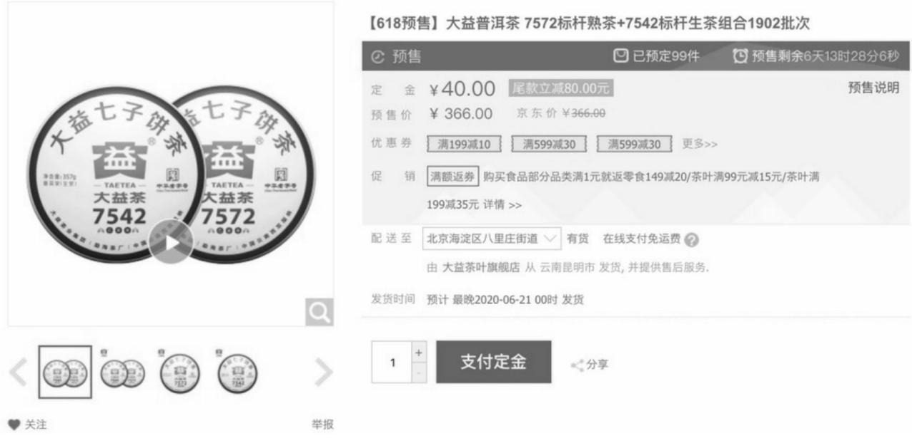

图2-20商品预售

从以上的例子中，我们得知 JIT 和传统的采购模式最大的区别在于 ：传统采购是先采购备货，再上架售卖，而JIT是一种“先卖再采”的模 式，先进行上架售卖，再基于产生的订单进行商品采购。 

一个典型的JIT业务，在系统设计方面的实现思路，如图2-21所示。 

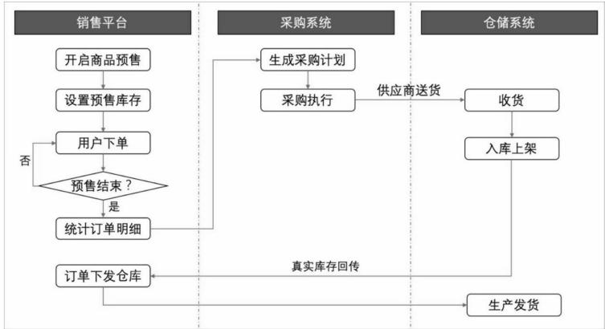

图2-21 JIT的系统实现

① 在销售平台上开启商品预售，设置预售库存、开始时间和结束 时间。 

② 在预售期间，用户可正常支付下单，但订单不会立即下发仓库 进行发货（因为此时还没有采购到货，仓库还没有实物库存），而是将 订单标记为预售订单，等待处理。 

③ 预售结束以后，统计已下单的商品明细，将其转为采购管理系 统中的采购计划，采购人员对采购计划进行修改、确认，然后实施采购 

④ 供应商送货到仓库，仓库在仓储管理系统中进行收货、入库， 此时仓库中就有实物库存了，回传实物库存数量至销售平台。 

⑤销售平台将预售订单下发仓库进行发货。 

## 2.6.7供应商管理库存

供应商管理库存（Vendor Managed Inventory，VMI）是一种全新的 库存管理策略，其基本思想是在供应链协同机制下，采购不再由需求方 （下游客户，如零售商）操作，而是由供应商操作，需求方只需要把自 己的需求信息向供应商连续、及时地传递，由供应商根据需求方提供的 需求信息，预测其未来的需求量，并根据这个预测需求量自行制订生产 和配送计划。在VMI模式下，需求方的库存量的大小不再由自己决定， 而是转交由供应商主动补给，在商品未售出之前，供应商完全拥有库存 的所属权和管理权。 

图2-22是一个供应商-零售商之间实施VMI的业务流程图。 

①零售商将自身的销售数据通过系统对接的方式提供给供应商。 

② 供应商根据零售商的销售数据，预测零售商的需求，并自主进 行生产、配送，零售商的库存水准和补货策略全权由供应商决策，零售 商只负责审核。 

③ 零售商收货入库，因为其并未产生采购行为，此时物权仍然属 于供应商。 

④ 待零售商的客户下单以后，零售商按照订单信息从仓库发货， 系统依据实际的销售数据生成从供应商处采购商品的采购记录，以便零 售商与供应商进行结算。此时零售商才产生真正的采购行为，物权从供 应商转移到零售商。 

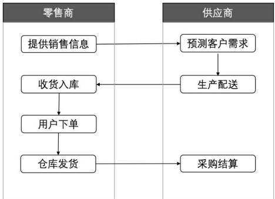

图2-22 供应商-零售商VMI业务流程图

与传统的“先采再卖”的采购入库模式相比，VMI模式是“先卖再采” 的模式，二者的区别主要有两点。 

① 传统采购的物权自入仓以后就变成了零售商的，而 VMI 的物权 在商品销售出之前，一直是属于供应商的，只有在商品出售以后才与供 应商进行采购结算与物权交割。 

② 在传统采购模式下，由零售商自己管理库存和采购补货，而在 VMI 模式下，零售商仓库的库存水平和补货策略均由供应商决定，供应 商有足够的自主权。 

VMI是一种典型的供应链协同模式，该模式对于供需双方都有很多 好处。对于需求方来说，其不需要再提前备货了，采购人员无须再处理 繁杂的采购事务，仓库也不需要积压库存了，可以大大降低采购成本、 库存成本和运输成本；对于供应商来说，它可以及时掌握需求方的市场 需求信息，第一时间获取真实的需求数据用于预测需求并进行生产备货 ，能够极大地提升市场响应灵敏度和自身服务水平，同时由于需求误差 减少了，也能有效地降低牛鞭效应和自身的库存成本。 

VMI在系统方面的实现思路，如图2-23所示。 

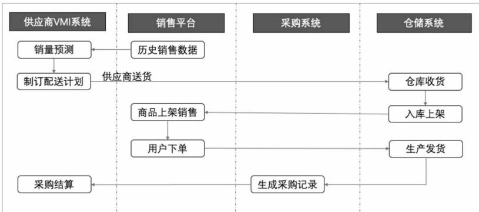

图2-23 VMI的系统实现

在一个简单的VMI业务模型中，会有供应商VMI系统、需求方销售 平台、采购管理系统和仓储管理系统等。 

① 需求方的销售数据定期传递到供应商的 VMI 系统中，以便供应 商进行销量预测和制订配送计划。 

② 供应商根据自己制订的配送计划为需求方送货，商品到达需求 方仓库以后，经仓储管理系统收货入库，此时便产生了实物库存，但此 库存的物权仍归供应商所有。 

③ 仓库的实物库存同步到销售平台以后，便可以正常上架销售了 ，用户正常支付下单，订单流转到仓储管理系统中，仓库进行发货。 

④ 发货以后，仓储管理系统将实际发货明细传到采购管理系统中 ，由采购管理系统生成采购订单，并以采购订单与供应商进行对账结算 （因为商品已经从仓库发出了，故此类采购只需要模拟走完系统采购流 程即可，不需要供应商再进行送货了）。此环节过后，商品的物权才从 供应商转移到需求方。 

VMI看起来挺美好，但要实施，需要具备两个前提条件。 

① 供需双方相互信任。供应商和需求方必须要有战略眼光，彼此 长期合作、相互信任，才能做到开诚布公，需求方自愿将其最核心的商 业数据共享给供应商，供应商也能够竭尽所能地为需求方提供高质高效 的商品库存和服务。只有相互信任，才能在VMI模式下降低库存成本， 实现合作共赢。 

② 双方系统对接。实施 VMI 需要信息及时同步，供应商能及时地 获取需求方的销售数据，这需要双方进行系统衔接，单靠电话、邮件等 传统沟通协作方式很难实现。 

了解了前面章节介绍的JIT模式的朋友一定会有一个疑问：老师， 既然VMI和JIT都是“先卖再采”模式，二者有什么区别呢？ 

我们将这两个模式做个对比，如表2-1所示，你一看就明白了。 

表2-1 VMI与JIT模式对比 

<table><tr><td>模式对比</td><td>VMI(供应商管理库存)</td><td>JIT(准时制生产)</td></tr><tr><td>库存管理</td><td>库存由供应商进行管理</td><td>在订单未产生前,没有实物库存,订单产生以后才进行采购,实物库存由需求方管理</td></tr><tr><td>销售库存形态</td><td>以实物库存进行销售(不过实物库存的物权属于供应商)</td><td>以虚拟库存进行销售</td></tr><tr><td>采购节点及流程</td><td>销售订单产生以后,再走虚拟采购流程完成采购结算</td><td>销售订单产生以后,再走真实的采购流程,向供应商采购商品</td></tr><tr><td>对系统的要求</td><td>高。需要双方进行系统对接,信息及时共享</td><td>低。对供应商的系统没有要求</td></tr><tr><td>关键词</td><td>协同、共赢</td><td>预售、减少库存浪费</td></tr></table>

## 2.7本章结语

对供应链常识的理解，有助于我们透过现象看本质，更深入的理解 供应链精神。例如，滞销库存是如何产生的，牛鞭效应如何规避，供应 链协同是什么，BOM、提前期、规模经济、柔性供应链、JIT、VMI这 些晦涩难懂的词汇到底有何意义等，初学这些概念和常识并不能为我们 带来立竿见影的效果，但要相信其能历经多年大浪淘沙般而流传至今， 必然是无数前辈在无数次的实践后总结出的精华，是智慧和心血的结晶 ，需要我们在以后的实践中慢慢消化。 

相信通过本章的学习，再见供应链，你就能看到一些不一样的东西 了。 

# 第3章 内行看门道：电商与新零售供 应链解密

小时候，我们跟着父母逛集市，各式各样的手工制品琳琅满目，我 们在各个商贩的摊位上窜来窜去，找寻着我们最喜欢的玩具。 

慢慢长大后，火车通车了，泥泞的小路变成了沥青大道，交通便利 了，物流运输更加方便了，于是城镇上有了商场，各种商品也有了包装 ，商品的品质和服务也因此更加优质，大众的眼光也从集市转移到了商 场。 

再后来，网络发达了，电商出现了，我们也越来越宅了，在手机和 电脑中一键下单，便可以淘到我们跑遍整个商场可能也找不到的心仪商 品，于是我们更加钟情于网购，似乎忘记了实体店的存在。 

最近几年，电商红利见顶，线下实体店难以维系，消费者的需求越 来越多了，为了寻找新的突破口，新零售出现了，通过线上和线下的完 美结合，让我们能更加方便快捷地找到自己喜爱的东西，并在购买商品 之前，拥有实物体验。 

时代在变迁，科技飞速发展，然而，总有一些东西是历经时间沉淀 而不那么轻易被改变的，如供需关系、买卖本质、供应链的核心思想。 通过前面章节的学习，相信你已经对供应链有了一个较全面的认识了， 本章开始，我们将进一步聚焦零售供应链领域，掀开电商和新零售华丽 的盖头，梳理一下其供应链的核心流程与逻辑。 

## 3.1电商新零售供应链业务模型

从供应链的视角出发，电商新零售的供应链业务主要包含 6 个角色 ，分别是用户、销售方、发货方、采购方、供货方、配送方。这 6 个角 色可以形成一个完整的业务闭环，各角色说明如表3-1所示。 

表3-1电商新零售供应链角色

<table><tr><td>电商新零售供应链角色</td><td>角色说明</td></tr><tr><td>用户</td><td>消费者,要买东西的人</td></tr><tr><td>销售方</td><td>零售商提供的可以卖东西的渠道,分线上渠道(自营电商平台或入驻京东、天猫等第三方平台)和线下渠道(线下门店、无人货架等)</td></tr><tr><td>采购方</td><td>根据需求实施商品采购的采购人员</td></tr><tr><td>供货方</td><td>为零售商提供商品供应的供应商</td></tr><tr><td>发货方</td><td>最终承接订单并发货的仓库、门店或者商家</td></tr><tr><td>配送方</td><td>将用户所购买的商品配送给客户的物流公司</td></tr></table>

我们来讲讲以上各角色之间是如何相互作用从而产生业务闭环的， 图 3-1 是某新零售公司从采购到发货的供应链业务全貌图，从图中可知 销售渠道有 3 个：自营电商平台、入驻的第三方平台及线下销售渠道； 对应的发货实体也是 3 个：从仓库发货、进行店配（客户到店自提）、 由合作商家发货。 

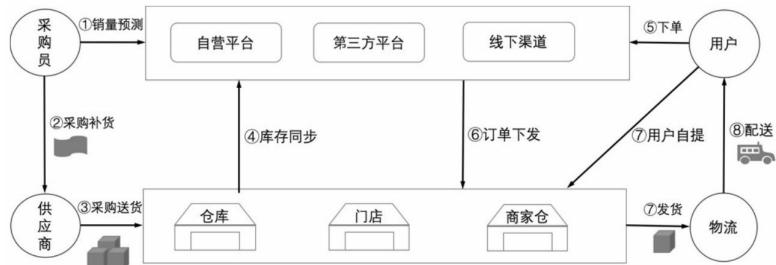

图3-1 电商新零售供应链业务模型

为了加强理解，我们围绕上图内容来讲个故事串一下各个角色和流 程。 

「采购人员」小张通过线上和线下各渠道提供的库存数据和销售数 据发现某商品 A 即将缺货了，于是向「供应商」发起了采购补货，采 购的数据源于以历史销售数据进行的销量预测。 

「供应商」收到小张的采购订单后，立即组织发货，并将商品A按 时送达小张指定的「仓库」；小张发现A商品在「线下门店」的库存也 不多了，便通过仓库向门店调拨了一些产品作为补充。 

商品A入库以后，便产生了可销售库存，系统自动将仓库、门店和 商家仓的库存同步到各「销售平台」上。此时各平台均显示库存充裕。 

平台「用户」小飞侠刚好需要购买商品A，便在平台上下了单。下 单时，他可以从两种收货方式中进行选择：由平台发物流配送到家，或 者用户到离其最近的门店中进行自提，选择自提可以省10元运费。 

① 若选择物流配送，订单会根据库存的分布情况匹配最近的「仓 库」/「门店」/「商家仓」，并将订单下发到对应的仓库/门店或商家系 统中，由商家对订单进行拣货、打包，然后交给「物流公司」进行配送 ，配送人员按照小飞侠的收货地址送货上门，完成订单签收。 

② 若选择了自提，小飞侠可以选择一个合适的时间，根据系统指 引的门店位置到店根据取货码进行取货，完成交易。 

小飞侠想想自己离门店也不远，刚好下楼透个气的功夫就把商品取 了，还能省10块钱，何乐而不为呢？于是选择了自提。此时，门店已经 接到订单，并在紧锣密鼓地准备拣货了。由于系统提示小飞侠是本平台 的优质客户，系统自动将小飞侠的订单优先级提升到最高，并给予了赠 品，等着小飞侠的光临…… 

## 3.2 铁打的供应链，流水的“场”：供应链、电 商与新零售

在科技飞速发展过程中，我们似乎一直在被时代推着往前走，但发 展背后，有一些东西却从没有变过，如零售的本质和供应链的核心思想 。抓住这些底层的核心逻辑，我们便能在浮华尘世中以不变应万变。 

## 3.2.1 零售三要素：人、货、场

前面我们讨论过，供应链的 5 个角色从上游到下游依次是：原料供 应商、制造商、分销商、零售商和终端用户。无论是线下的地摊经济、 还是线上电商，抑或是最近几年的新零售，其本质都是“零售”，处于供 应链的末端。 

说到零售，离不开其三个核心要素：人-货-场，三者的关系如图3-2 所示，“人”是终端用户，“货”是商品，零售商需要做的就是如何用最低 的成本、最高的效率让货被人知晓并购买，这个将货发给人的途径，便 是“场”。 

从我们小时候的集市，到长大后的商场、再到现在的电商、O2O、 新零售，零售的本质是没有改变的，那便是供需关系：“人需要货”，所 以“人”和“货”的关系是一直没有变化的，变化的只有“场”。无论是传统 的纯线下渠道，还是线上的平台电商，以及从线上到线下的O2O （Onli ne To Offline）、“线上+线下”融合的新零售、社区电商、直播电商，都 是零售商借助科技手段为终端用户提供的更便捷的购买渠道，仅仅是业 务模式的不同，并没有改变零售的本质。总结一下，就是：铁打的“人 货”流水的“场”。例如，买电视机，我们可以在线下的小店里购买，也 可以去沃尔玛、家乐福这些大商场购买，还可以在京东、天猫、苏宁这 些电商商城中购买后送货到家，也可以去小米、华为体验店里体验后， 再从网上下单购买。（免费获取更多供应链PM书 加v信：pmzjie） 

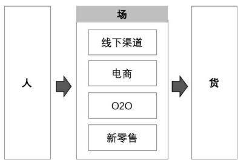

图3-2零售核心：人-货-场

## 3.2.2铁打的供应链，流水的“场”

在人-货-场模型中，人货的交易本质是不变的，改变的只是“场”， 同样，在零售业务中，供应链理念也是不变的。商品若要送到用户手中 ，必然离不开供应链，无论是线下的人到店自提，还是线上的商品送货 到家，都离不开商品的采购、存储、物流运输等供应链环节。站在供应 链的视角来审视，电商平台、O2O和新零售的出现都是企业借助互联网 延伸的一种销售渠道，无论哪种渠道，都需要有后端供应链的支撑，只 有强有力的供应链支撑，才能更好地实现用户触达。 

在传统的线下渠道中，商家通过地推、门店销售、展会、传单、广 告、代理等方式，将自己的产品尽可能多地曝光给客户；电商平台产生 以后，催生出B2B、B2C、C2C、F2C等一系列的细分领域，本质上都 是将自己的产品通过互联网渠道销售给用户；在O2O模式下，商家提供 团购、本地生活服务、到店和到家服务来将线上的客户吸引到线下进行 消费，让自己的产品/服务的覆盖范围更大；最近几年的新零售模式下 出现了体验店、前置仓、无人店、无人货架等线上和线下结合的方式， 同样是抢占用户市场，为产品塑造更好的“场”，将产品展示给用户。这 些“场”解决的是“货”如何触达“人”的问题，而供应链解决的则是货从哪 里来，如何进销存、如何降本增效、又该去往哪里的问题，二者相辅相 成却又各司其职。我们归纳一下供应链与电商新零售的关系，可以得出 的结论是铁打的“供应链”流水的“场”，如图3-3所示。 

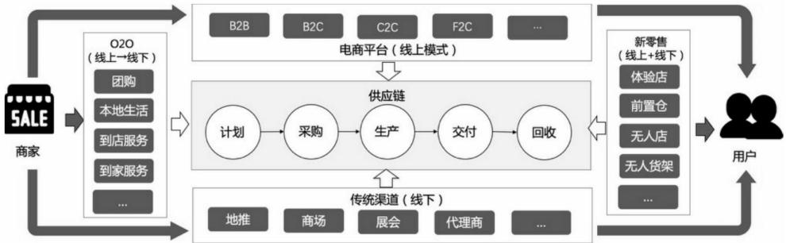

图3-3铁打的供应链流水的“场”

当然，我们说供应链不变，并不是说这么多年供应链没有任何的改 进和进步，相反，随着互联网、大数据分析等技术的发展，供应链的表 现形态上也出现了翻天覆地的变化，特别是仓储和配送领域，出现了一 系列的自动化设备，但这些设备的使用都是为了更好地辅助达成供应链 降本增效的目标，而供应链的本质，如供应链的范围、流程、目标、核 心思想等是没有变化的。 

理解了供应链与电商、新零售的关系以后，我们就能找到于万变之 中不变的那些点，然后安心地钻研最本质的东西，而不会被高科技表象 和新鲜的商业模式牵着鼻子走了，因为我们知道其底层逻辑是不会轻易 改变的。 

## 3.3必然：从电商到O2O，再到新零售

凯文凯利在《必然》这本书里提到一个观点：技术都会有一个前进 的方向，我把它叫作必然，就是这个趋势，一定会出现。例如，有了芯 片、电波等，必然会出现互联网，会出现手机。必然是一种总体趋势， 我相信这些趋势是可以预测的，但是其具体表现形式是无法预测的，如 电话一定会出现，但不一定出现 iPhone；网络一定会出现，但 Twitter 不一定会出现。 

事情的发展总是线性的，我们经历了从传统的集市，到商场的出现 ，再到互联网时代的电商平台、O2O、新零售，最近两年大火的社交电 商、社区团购、直播电商等，我们可以认为这是时代发展和科技进步的 必然产物。 

## 3.3.1零售发展史的4个阶段

“70后”“80后”是见证了互联网发展的第一批人，也是亲眼目睹了传 统零售向电商转型的一代人。从传统零售到电商平台、再到O2O、新零 售，整体上经历了4个阶段，如图3-4所示。 

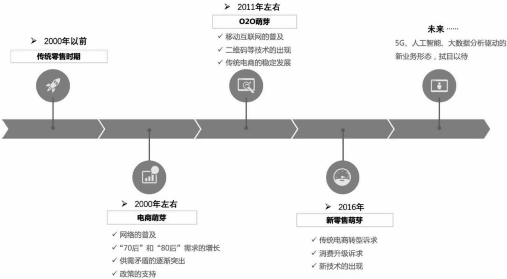

图3-4电商、O2O与新零售发展阶段

① 传统零售时期。在 2000 年以前，还没有普及互联网，零售形式 主要以线下实体店为主，用户在线下的门店、商超购买自己需要的商品 

② 电商时期。在2000年左右，主要以B2C模式电商为主（B2C是Bu siness-to-Customer的缩写，也就是通常说的商业零售，直接面向消费者 销售产品和服务），用户可以在淘宝、天猫等电商平台上购物并支付， 由商家通过物流将商品送到用户手中。 

③ O2O（Online To Offline，线上到线下）时期。O2O 模式出现在 2011 年前后。由TrialPay公司创始人Alex Rampell提出，Alex Rampel定 义的O2O商务的核心是在网上寻找消费者，然后将他们带到现实的商店 中。同年O2O模式从美国传入国内，在国内掀起一阵O2O热潮。 

④ 新零售时期：2016年至今。新零售是2016年杭州云栖大会上， 马云针对传统电商的转型提出的。新零售是以互联网技术为基础，以大 数据分析为导向，充分进行供应链整合，线上线下综合销售的商业模式 o 

从业务模式上看，传统零售主打线下市场，如国美电器、各大商超 ，一般都开在人流量比较密集的中心城区；电商主打线上服务，客户在 线上下单支付后，商家通过物流将商品邮寄到家；O2O更加强调的是本 地化服务，借助互联网将线上流量引到本地的线下门店中，如美团、58 到家服务等；新零售突出的是线上线下的融合，线上和线下已经没有很 明显的界限了，用户线上和线下的行为都会被记录分析，根据这些数据 对用户进行画像分析，方便商家为用户提供专有服务，做到千店千策、 千人千面。同样是便利店，但因为不同小区的居住人口的特点不同，其 布局和商品陈列也会千差万别，针对不同会员提供的服务也会不同。 

值得说明的是，近两年火起来的社交电商、社区团购、直播电商仍 然属于电商范畴，只是在传统电商的基础上增加了一些更加新颖的玩法 而已。 

## 3.3.2电商、O2O与新零售的出现背景分析

在国内，电商、O2O与新零售都是时代发展的必然产物，所以它们 的出现与一些环境和政策因素相关。我们总结一下三者出现的背景。 

## （1）电商出现背景分析

电商出现的背景主要有以下几点。 

① 网络的普及。在 2000 年以前，网络还是比较小众的，大多数人 对电脑和互联网的使用频率和接受程度很低。但是随着网络费用的逐渐 降低和电脑操作的逐步简化，很多家庭开始自己配备电脑和网络，这为 电商的发展奠定了基础。 

② “70后”“80后”需求的增长。随着对网络的逐渐熟悉，“70后”“80 后”成了第一批接受B2C的主力军，他们更加愿意在互联网的世界里去 找寻现实生活中无法满足的体验，如聊天、游戏、在线影院等。 

③ 供需矛盾的逐渐突出。2000年左右，随着科技的迅速发展，新 的商品越来越多。随着网络的普及，为很多人打开了见识外面世界的天 窗，年轻的消费者们对商品种类的需求和对性价比要求也越来越多，而 他们的很多需求在本地商城根本无法被满足，所以使他萌生了向网络求 助的念头。最早期的阿里巴巴、当当网、易趣网、8848等B2C商城就是 在这个时期应运而生的。 

④ 国家层面的支持。国家对新兴行业的扶持和各项政策的支持， 也为电商的发展提供了强有力的保障。 

## （2）O2O出现的背景分析

当互联网和电商发展到2011年左右，出现了移动互联网，这时开始 ，以iPhone为代表的大屏手机开始普及，人们已经不再局限于在PC端购 物了，而是希望借助手机随时随地地进行消费。于是，O2O就此诞生。 

① 移动互联网的普及。随着大屏手机和移动网络的普及，消费者 可以随时随地地进行消费和信息浏览，这就给了线下商品更多的曝光机 会。例如，小明和女朋友逛街，溜达到某个主题餐厅，看到了自己想吃 的点心，于是随手上网一搜，发现有优惠券，这就更加刺激了其消费的 欲望。 

② 二维码等技术的出现。伴随着支付宝、微信的移动支付技术的 成熟，以及二维码、朋友圈、微店等推广模式的出现，随时随地、简单 便捷地支付成了一种新的购物习惯，助推了O2O模式的成功。 

③ 传统电商的稳定发展。当线上电商的业务模式逐步趋于稳定， 从线上商家的角度来说，其获客成本逐渐上升，需要继续寻找新的业务 增长点，于是离用户最近的线下门店就成了新的业务突破口；以线下门 店的角度来说，除了服务好周边顾客，其也需要通过网络将自身服务触 达更多用户。从消费者的角度来说，其网上购物的习惯已经养成，而手 机支付的便捷性，加上商家促销活动的刺激，在线上下单，在线下享受 更优质的服务也成了消费新方式。以上三者的需求的融合，使O2O的出 现就成了必然。 

## （3）新零售出现的背景分析

在互联网行业中，不进步就意味着退步，在电商高速发展10年以后 ，老牌电商在新型互联网公司眼中也变成了传统互联网公司，若不求变 就只能等死了，加上各种新技术的出现，数据的价值越来越突出，于是 新零售的出现也成了必然的结果。新零售出现的背景有以下几点。 

① 传统电商转型。传统电商发展至今，将近 20 年，最初的红利期 已过，商家的获客成本持续上升，其利润出现了负增长的局面。而随着 互联网的热度逐步退却，线下的价值被重新评估，如何通过线上线下相 互赋能，使销量和销售额持续稳定地增长，是电商巨头们急需突破的困 境。 

② 消费升级。身处信息爆炸的时代，消费者对时间成本和商品/服 务品质的需求越来越高，谁能吸引消费者的注意力，谁就有盈利的机会 。如何更加了解消费者，为消费者提供更精准和高品质的服务成了商家 需要解决的难题，很明显，传统电商缺少实际体验，而线下门店缺少数 据支撑，只有线上线下融合才能真正地满足消费者的需求。 

③ 新技术的出现。随着大数据分析、人脸识别、人工智能等技术 的井喷式发展，为线上线下的融合提供了必要条件。 

时代发展催生了互联网，互联网成就了电商，O2O和新零售，我们 每个人都身处其中，同时，我们每个人又是时代发展的贡献者。 

## 3.3.3 电商、O2O与新零售供应链对比

从历史背景来看，从电商到O2O，再到新零售，是一脉相承的，三 者的本质都是零售，但既然三者到现在还能并存，必然也有各自的特色 和优势，否则不符合时代的产物早就被淘汰了。我们从供应链的角度来 对比一下电商、O2O和新零售。 

## （1）商品形态对比

电商（主要指B2C）主打对时效性要求不是特别高的大宗商品及一 些虚拟服务，如手机、衣服等，次日送达或隔日送达就适用于B2C，客 户在淘宝或京东上下单，商品由商家邮寄到家。 

O2O主打本地服务和比较紧急的商品，如有人感冒了，需要感冒药 ，打开叮当快药，选择本地药店，28分钟送达，绝不可能上淘宝下单， 再等上两三天。 

而新零售则是侧重融合，商品品类可以覆盖线上和线下的全品类， 主流做法是线上做引流，线下做服务，网订店送、网订店退。紧急商品 可以从门店发出，普通商品通过中央仓库发货。例如，小米之家，用户 可以在小米之家体验各种产品，让用户对产品有触达感，但如果用户想 购买体验过的商品，门店不一定有现货，用户可以在线上下单，由小米 后方强大的供应链体系做支撑，将产品邮寄给用户。 

## （2）物流覆盖范围对比

电商的覆盖范围比较广，可以覆盖全国甚至全球。只要有网络，我 们可以足不出户便在各大全球购平台上淘到全球各地的商品，商家通过 跨国物流（空运或航运）将商品送到客户手中。 

O2O有地域和时效限制，一般只能覆盖本地区域，物流范围相对较 小，一般覆盖半径为3～5千米，使用同城配配送或自提比较多。 

新零售结合了线上商城和线下门店的优点，线上商城可以覆盖全国 或全球，线下门店可以覆盖本地区域。 

## （3）供应链流程对比

电商主要通过平台+仓库的模式开展供应链业务，主要流程如图3-5 所示。 

① 采购部门制订采购计划，实施采购，由供应商送货到指定的仓 库。 

② 仓库收货、验收、入库后产生实物库存，运营部门将商品上架 到电商平台进行售卖。 

③ 用户在平台下单后，订单下发到仓库，仓库的相关人员负责拣 货、打包，然后将货物交给物流公司进行揽收。 

④ 经过物流运输后，快递员将包裹配送到用户指定地址，完成签 收。 

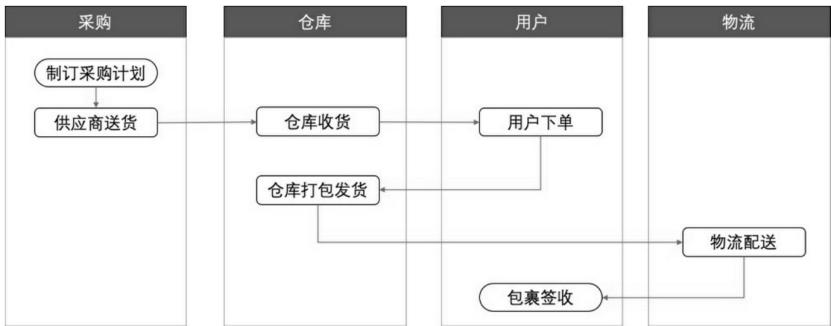

图3-5电商供应链流程

常规O2O有两种流程：一种是实物类订单，一种是服务类订单，我 们分别进行说明。 

实物类订单的供应链主要流程如图3-6所示。 

① 采购部门提前制订采购计划，将商品送到门店（有中央仓库的 企业，也可以先将商品送到仓库，再从仓库调拨到门店）。 

② 门店收到货以后，清点商品数量、查验商品质量后收货入库， 产生实物库存，便可以在O2O平台上进行上架售卖了，一般其覆盖范围 为门店周边的客户。 

③ 用户在 O2O 平台上搜索周边门店商品并下单。用户下单以后， 门店实时接收订单并进行备货，若是自提类订单，会等待用户到店提货 ；若是配送类订单，会打包以后，交由配送员配送。O2O类订单，一般 要求时效，所以配送员仅接收本地区域的配送订单。 

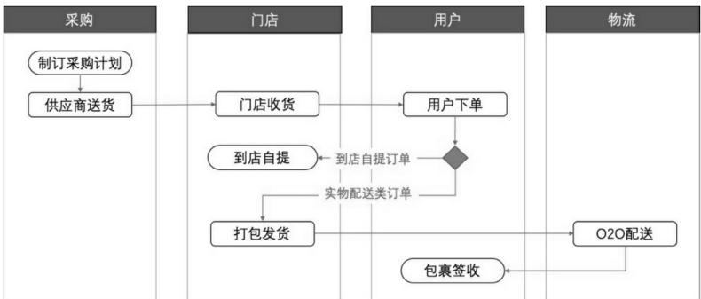

图3-6O2O实物订单供应链主要流程

O2O服务类订单的供应链主要流程相对更加简单，主要是虚拟商品 ，不涉及真正的进销存，如图3-7所示。 

①门店将提供的服务上架发布到O2O平台。 

② 用户下单购买，可根据服务性质选择到店（如在线预约理发） ，还是上门（如家政服务）。 

③ 到店订单，门店接单以后，等待用户到店，在门店内为其提供 服务；上门订单，门店在接单以后，安排相关人员上门服务。 

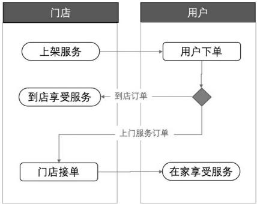

图3-7O2O服务类订单供应链主要流程

新零售供应链相比电商供应链和O2O供应链，其结合了仓库和门店 两方面的优势，用户既可以在线下门店购买商品，门店无货的商品，也 可以通过中央仓库发货，如图3-8所示。 

① 采购部门制订采购计划，实施采购，由供应商送货到仓库或门 店，门店也可以直接从仓库提货。 

② 仓库/门店收货、验收以后，入库上架到库内，有了实物库存后 便可在平台上架销售。 

③ 用户下单后可选择到店自提，或是门店配送，当然如果门店无 货或无法配送，也可以由中央仓库发货，如此便弥补了门店面积小、品 类少的劣势。 

④ 到店自提和由门店发货的订单，会同步到门店管理系统中进行 处理；由仓库发货的订单，则同步到仓库管理系统进行发货。 

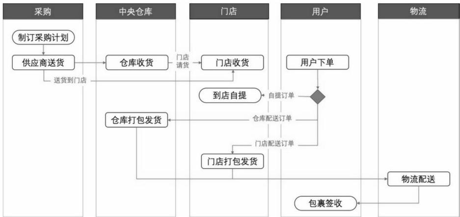

图3-8新零售供应链主要流程

## 3.4电商新零售供应链业务流程详解

随着时代的发展，为了满足消费者日益增多的消费需求，电商新零 售兴起。无论是传统零售行业，还是电商新零售，其供应链都可以用经 典的“进销存”三个字来概括。“进”是指与入库相关的业务和流程，“销” 是指与出库相关的业务和流程，“存”是指与库内存储相关的业务和流程 0 

图 3-9 是一张典型的电商新零售的供应链全貌图，供应链业务的开 展基于供应链基础数据，基础数据是业务开展的基石，也是供应链系统 的底层支撑，业务部门在基础数据的基础上通过人工或系统进行日常进 销存业务的开展，。虽然行业不同，业务形态不同，每个公司开展的供 应链业务会有较大的差异，但万变不离其宗，所有的供应链业务形态最 终都会落到库存和资金上，所有的供应链业务的开展都会体现在库存的 变动和资金的借贷上，由财务部门收拢进行核销。 

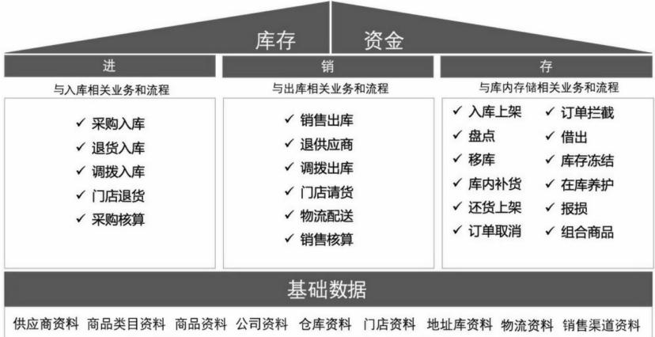

图3-9 电商新零售供应链全貌图

下面，我们将详细介绍电商新零售的核心供应链业务流程。当然， 企业在实际运作过程中，其供应链流程要比书中的描述复杂很多，也不 尽相同，但这并不妨碍我们学习，只要掌握了供应链核心流程涉及的主 要组织、角色和操作节点，就能够在日常工作中灵活变通，事半功倍。 

## 3.4.1基础数据建档流程

基础数据就是业务开展所必须的静态数据，这些数据一旦建立以后 便不会轻易改变。基础数据是衔接各部门工作的桥梁，统一的基础数据 可以让业务流转更顺畅，减少各部门之间的重复工作量，增加部门间的 协同。供应链基础数据主要包含供应商资料、商品类目资料、商品资料 、公司资料、仓库资料、门店资料、地址库资料、物流资料、销售渠道 资料等，如表3-1所示。 

表3-1供应链基础数据与用途

<table><tr><td>供应链基础数据</td><td>主要用途</td></tr><tr><td>供应商资料</td><td>主要存储上游供应商的基础信息,用于企业对供应商进行管理</td></tr><tr><td>商品类目资料</td><td>主要存储商品的品牌、型号、商品分类等数据,是商品的重要构成元素,主要用于前台搜索、不同业务的区分、仓库的区分管理等</td></tr><tr><td>商品资料</td><td>管理公司售卖的所有产品,以及每一款产品的详细信息,包括基础信息、销售信息、物流信息等</td></tr><tr><td>公司资料</td><td>管理集团下所有发生业务的子公司信息。所有业务的发生都需要有主体,不同公司发生的业务应该分开结算</td></tr><tr><td>仓库资料</td><td>管理公司所有开展业务的仓库数据,此数据主要用于商品的库存管理、订单流程管理和财务结算</td></tr><tr><td>门店资料</td><td>管理新零售业务开展中所有的线下门店,可以是自营门店,也可以是外部合作门店</td></tr><tr><td>地址库资料</td><td>下单和订单流转过程中必不可少的省区市等区域数据,如客户下单、分配订单到库、物流配送等</td></tr><tr><td>物流资料</td><td>管理承接包裹配送的物流公司和承运商数据,主要用于订单下发过程中物流公司的调配和配送过程的管理</td></tr><tr><td>销售渠道资料</td><td>整合不同的订单来源渠道,如自营电商平台、淘宝、京东、百度推广、电视购物、外部合作平台等</td></tr></table>

我们一般把基础数据的初始化创建称为建档流程，在建档时，有一 些资料，如供应商资料、商品资料需要比较烦琐的录入和严谨的审批流 程，故在建档时需要有严格的审批；另外一些资料，如商品类目资料、 公司资料、仓库资料、门店资料、物流资料、销售渠道资料等因为不常 变化，由业务部门定期维护即可（流程严谨的公司也可以增加审批流程 ）；还有一些基础资料，如地址库资料等是纯做系统流转的，有国标可 供参考，由技术部门的相关人员将其录入系统即可。 

图3-10是商品和供应商的一般建档流程。 

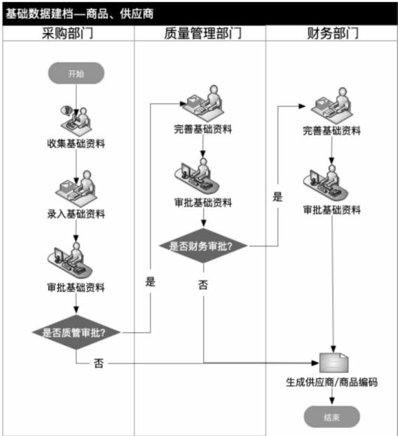

图3-10 商品及供应商建档流程

在很多企业中，供应商和商品是需要准入条件的，如授信不好的供 应商不在企业的合作供应商之列、三无产品不允许采购等，所以在引进 一个新供应商和新商品之前，相关人员需要先进行必要的资料收集和审 核，然后才能录入系统，在录入以后，还需要经相关部门审批，才能正 式生效。 

如在上图中的建档流程里，商品和供应商的建档涉及3个部门的流 程联动。 

① 采购部门的相关人员先收集供应商和商品的资料，按照相关资 料在系统中录入供应商和商品的基本信息，然后提交给部门主管（或经 理）审批。 

② 经采购部主管审批，信息会流转至质量管理部（简称质管部） ，由质管部的相关人员继续完善并审核与质量管理相关的信息（如供应 商和商品的生产批件、商品的禁忌属性等）。 

③ 当质管部的工作完成时，信息会继续流转至财务部，由财务部 的相关人员最后核实完善供应商和商品的财务信息（如供应商的银行信 息、商品的税点等）。 

走完以上所有流程以后，供应商和商品的相关信息才会正式在系统 中生效，当然有些企业不需要这么复杂的流程，便可在某些环节完成后 立即生效。 

## 3.4.2采购入库流程

基础数据建档完成以后，相当于建房子的地基已经打牢了，便可以 在其上开展业务了，而采购则是在商品和供应商基础资料上开展的第一 道业务。采购是指个人或单位在一定的条件下从供应商处获取产品或服 务作为自己的资源，为满足自身需要或保证生产、经营活动正常开展的 一项经营活动。 

采购流程一般从采购申请发起，到财务结算结束，具体流程如图3- 11所示。 

① 采购人员提交采购申请，在部门主管审批通过以后，即可实施 采购。采购申请是采购的前置，可以是口头协定、纸质单据或者系统功 能。 

② 采购人员根据需要采购的商品寻找合适的供应商进行询价（询 价，通俗理解就是向供应商咨询商品价格），综合评估、对比，找到最 合适的供应商。注意，采购并不是价格越低越好，还需要综合评估供应 商的交货工期、产品质量、服务水平等； 

③ 采购人员与供应商进行谈判议价，双方达成共识后签订采购合 同，明确价格、交货方式、付款方式等事宜。 

④ 采购人员创建本次采购订单（包含商品、数量、送货仓库等） ，并提交上级领导审批。审批的流程一般会根据采购订单的价格等因素 逐级上升，如采购经理可以审批5000元以下的采购订单，超过5000元的 采购订单就需要部门总监审批；审批通过以后，根据合同条款，若需要 提前给供应商预付款，则需要请财务人员打款。 

⑤ 供应商根据采购人员提供的采购订单将货物送到指定的仓库， 一般会随车附带随货同行单，即供应商的出库货物清单。 

⑥仓储收货组按照供应商的实际到货进行数量清点。 

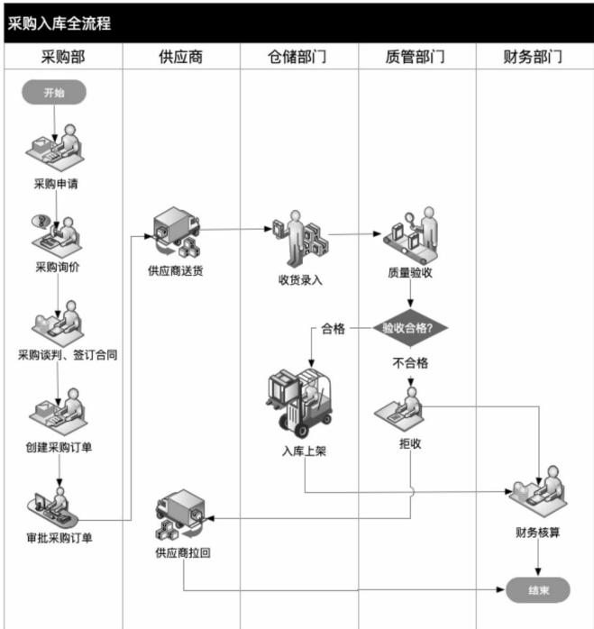

图3-11 采购入库流程

⑦ 质管部对商品的质量进行验收（在很多行业，收货和验收是一 起完成的，不需要设立两个岗位，但在医药等行业，根据药品经营质量 管理规范的相关要求，验收和收货环节必须分开），验收方式为全部验 收或者抽检，若验收结论为合格，货物则交由仓库的相关人员入库上架 ；若不合格，则拒收，由供应商将货物拉回。 

⑧ 仓储上架组将已验收的货物上架到对应的货位上，系统会综合 商品的品类、ABC 属性、重量体积等因素对上架货位进行推荐。 

⑨ 财务部门的相关人员根据仓库实际入库明细生成应付账款，进 行核算，并与供应商进行结算。 

## 3.4.3 销售出库流程

采购入库以后，便产生了实物库存，有了库存就可以在线上平台和 线下门店进行售卖了，我们重点说一下新零售的线上销售流程，如图3- 12所示。 

① 客户在销售平台（App、小程序、官网等渠道）上选购商品并下 单支付。 

② 客服对订单进行审核处理，对风险订单跟进处理，并按客户的 个性化要求对订单（如修改地址、指定物流等）进行修改。当然，常规 订单都可以由系统自动完成，人工只处理少量的特殊订单。 

③ 订单履约中心根据订单中的收货地址、商品等信息匹配最合适 的发货仓库或门店，将订单下发到仓库的03-WMS系统（仓储管理系统） 或门店ERP系统中。 

④ 订单下发到仓库或门店系统以后，由系统或人工找到所需商品 和对应的出库货位，并将库存进行锁定，避免其他订单占用，这个过程 称为任务分配。 

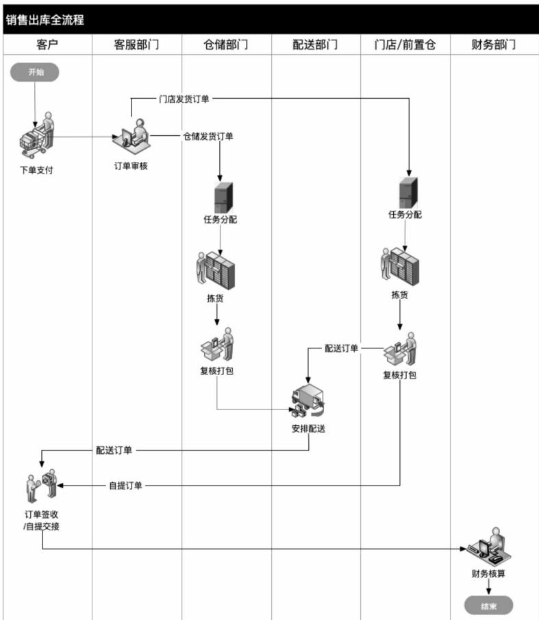

图3-12 销售出库流程

⑤ 仓库和门店根据订单商品明细进行拣货、复核，然后由配送部 门安排配送，可以找三方物流公司（顺丰、京东、“三通一达”等），也 可以自行安排配送。门店相对于仓库，在销售出库流程上多了一个用户 上门提货的场景，有些客户就近下单，便可以直接到门店自提，而仓库 一般比较偏远，且是大批量作业，所以基本都是通过物流配送，很少提 供自提服务。 

⑥ 配送人员将商品送到客户指定地点，完成签收，或者客户到门 店自提，完成商品的交接。 

⑦ 财务部门的相关人员定期将已完成的订单进行核算，生成应收 账款，与实际收到的金额进行对账，并根据销售额和商品的成本价计算 商品毛利。 

## 3.4.4 门店请货流程

在新零售业务中，门店主要承担着线下业务和部分线上业务的开展 。由于地理位置、成本等因素，门店的面积一般不会很大，存储不了太 多的商品，当商品库存不足时，便需要向其对应的中央仓库请货，完成 缺货商品的库存补给。 

中央仓库在新零售业务中扮演着两个角色：电商发货和门店补货。 一个中央仓库负责周边一个或多个门店的库存补给（见图3-13），正常 情况下，中央仓库一般按固定频率（每周一次到多次不等）定期向门店 进行补货。 

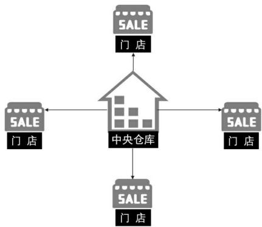

图3-13 中央仓库与门店

门店请货的详细流程如图3-14所示。 

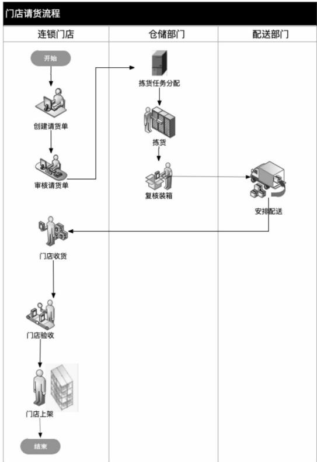

图3-14 门店请货流程

① 门店店员定期或临时对缺货的商品提交请货单，由门店经理审 批。请货单中包括请货门店、请货商品及请货数量等信息。 

② 门店经理审批请货单后，会将请货单流转到中央仓库中，仓库 的相关人员按照请货任务进行拣货、复核装箱，并将商品交给配送部门 ，由配送部门统一安排配送。 

需要说明的是，门店请货出库的优先级一般低于客户订单配货的优 先级，所以在门店请货过程中，如果有客户订单下发，一般会优先保证 客户订单的配货，而给门店缺量发货，即实际发货数量比请货数量少。 

③ 为了保证配送的成本最低，门店配送通常会一次性安排多个门 店的配送任务，配送部门会根据门店的位置安排车辆配送路线，按照最 优路线将货物配送到各门店。 

④ 门店收货以后，对货物进行清点、验收，无误后可将货物上架 到对应的门店货位上完成请货。如果在收货和验收环节发现货物短少或 存在质量问题，门店的相关人员会与中央仓库和配送部门进行核实，确 认三方责任，并以实收数量入库。 

## 3.4.5 客户退货退款流程

和传统线下渠道的售后一样，电商和新零售的线上业务一样存在售 后退货和退款流程，如图3-15所示。 

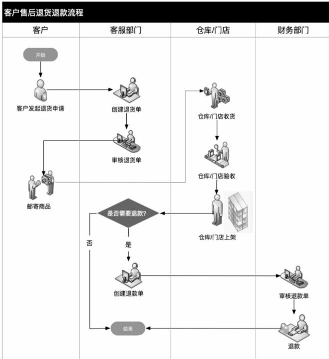

图3-15 客户售后退货退款流程

① 客户从线上官网/App，或者通过联系客服人员发起售后退货申 请。 

② 售后申请由客服人员审核通过后，生成退货入库单（很多企业 为了挽留客户，只开放用户发起售后退货申请的入口，由客服人员回访 确认以后，再由客服人员创建退货单），经客服人员审核后下发仓储或 门店。大多情况下，退货单下发到仓库，由售后人员统一负责处理售后 退回件，少数情况下也可以由门店处理，此时将下发退货单到门店。 

③ 客户将商品邮寄到平台指定的售后仓或门店，并在退货申请上 填写物流公司和物流单号。 

④ 负责售后的仓储/门店收到客户寄回的包裹后，找到系统中对应 的退货单，对包裹进行收货、验收，无误后将商品上架到货位。 

⑤ 客服人员接到仓储/门店入库上架完成的通知后，如果需要为客 户退款，则创建退款单并提交给财务部门的相关人员，退款单一般由系 统自动创建，在特殊情况下，如商品损坏折旧等原因协商不按原价退款 ，则由客服人工创建。 

⑥ 财务部门的相关人员审核退款单，并完成退款单的打款，常规 退款流程是将款项原路退还到客户的付款账户中。 

## 3.4.6 门店退货流程

当在门店滞留很久的商品需要处理时，或者某些商品需要召回时， 就需要用到门店退货流程，将门店中的商品反向退回中央仓库，如图 3-16所示。（免费获取更多供应链PM书 加v信：pmzjie） 

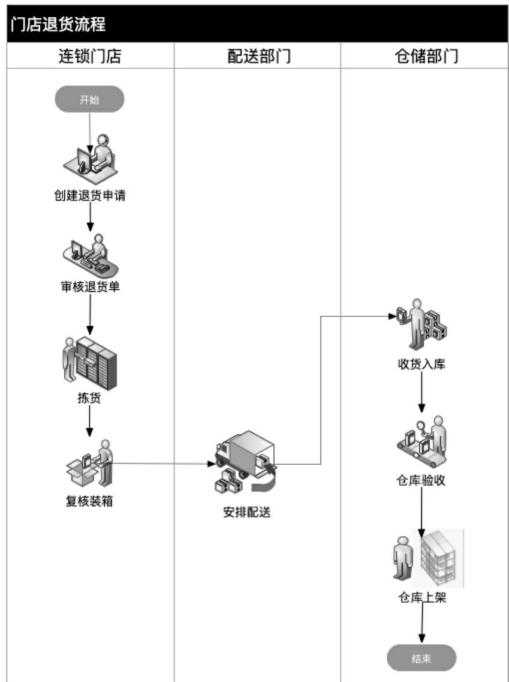

图3-16 门店退货流程

① 门店创建退货申请单，提交主管或经理审批。 

② 门店店员根据退货单中的商品进行拣货、复核装箱，并将商品 交给配送部安排配送。 

③ 配送部门安排配送人员将退货商品送到中央仓库。 

④ 中央仓库按照退货流程进行收货、验收、入库上架，完成退货 

门店退货流程一般属于企业内部仓储和门店两个部门之间的商品转 移，不涉及交易买卖，只涉及库存的转移，不涉及资金的往来，所以不 需要财务部门做应收账款和应付账款的核算。 

## 3.4.7退供应商流程

在与供应商的深度合作中，很多供应商允许零售商将商品按照约定 的条件退回，如此可以使双方建立更深远的合作关系。在供应链业务中 ，在下列情况下会出现退供应商的行为。 

①与供应商合同约定允许退回；②因质量、有效期等问题，供应商 主动召回商品；③由于其他原因，企业主动与供应商协商一致退货。 

退供应商的整体流程如图3-17所示。 

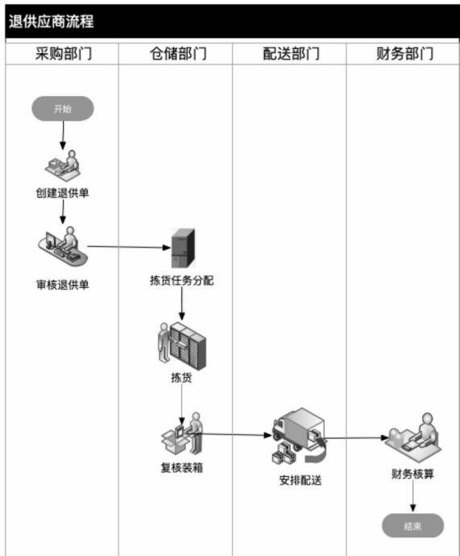

图3-17退供应商流程

① 采购部门的相关人员创建退供单，录入需要退供应商的商品、 数量、退回供应商等信息，并提交部门主管或经理审批。 

② 退供单审批通过后，下发到仓储部门，仓储部门的相关人员根 据退供单中的商品进行货位分配，拣货员根据系统分配的货位进行拣货 、复核打包，并将商品交给配送部门安排配送；在退供应商的过程中， 如果有订单出库，一般会优先满足订单配货，而退供应商允许缺量发货 （即比计划出库数量少发）。 

③ 配送部门安排配送人员将退供商品送至供应商处，完成签收交 

接。 

④ 财务部门在与供应商进行对账核算时，将退供商品明细纳入核 算范畴，在给供应商的应付账款中需扣除退供金额。 

## 3.4.8 订单取消流程

客户下单以后，经常会因为地址、价格、商品等原因而取消订单， 如果商家不支持此操作，势必会遭到投诉，从而增加更多的物流、沟通 等成本。所以，订单取消是供应链里必不可少的逆向流程，涉及对待出 库商品的拦截，以及客户退款等操作，如果处理不好，则可能存在商品 发给客户了，同时钱也退还给客户了的情况。 

订单取消整体流程如图3-18所示。 

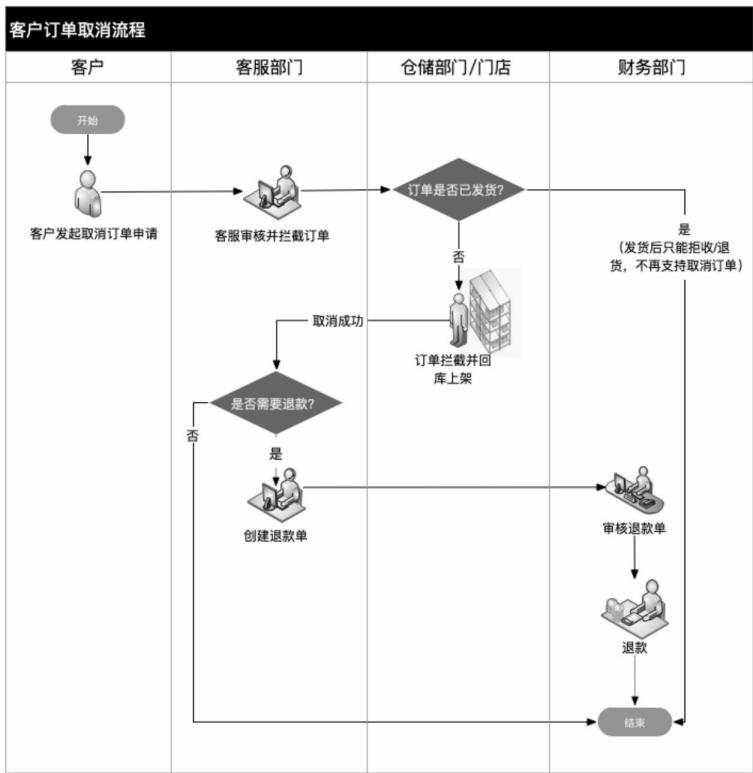

图3-18 订单取消流程

① 客户在平台上发起订单取消申请。当然并不是随时都能发起订 单取消申请的，需要有一定的条件限制，如在订单商品出仓库前客户可 以取消订单，而如果商品已经在配送途中了，客户就不能再取消订单了 

② 客服人工审核，或系统自动审核取消订单申请，审核通过后， 便需要对正在出库的订单进行拦截。在一些风控规则比较严谨的公司， 订单取消默认为系统自动审核，但当订单的取消金额超过限度，或者客 户的取消频率、取消地点等出现异常时，便会转人工审核，客服人员向 客户核实清楚后再将订单取消。人工审核订单取消申请还有一个好处， 就是可以对客户适当加以挽留。 

③ 已确定取消的订单，需要进行取消拦截，将商品拦截回库。仓 储发货的订单，由仓储部门拦截，门店发货的订单，由门店拦截。拦截 时机一般根据配送的物流方式来判断。靠第三方物流（顺丰、“三通一 达”等）配送的公司，在仓储发货前都能保证把商品拦截下来，故在发 货前，订单都能够取消成功。而要是已经将商品交给物流配送人员了， 拦截成功的概率就比较小了，所以在发货以后，最好的方式就是让客户 对包裹进行拒收，或走售后退货流程。 

当然，如果是自营配送（如京东、天猫超市等），配送员和相关系 统都是公司自己的，便可以做一些系统联动，就可以取消订单并拦截成 功了，这样可以为客户提供更好的客户体验，同时降低一部分配送成本 

④ 已拦截成功的订单，由仓储/门店将商品重新返回仓库并上架到 货位上，支持其他订单发货。 

⑤ 订单取消成功以后，已在线支付的订单需要为客户退款，货到 付款的订单则不需要进行退款。需要退款的订单，由系统或客服人员创 建退款单，交由财务部门的相关人员进行审核。 

⑥ 财务人员对退款单进行审核后，进行退款。 

## 3.4.9 客户换货流程

由于客户主观或客观原因，需要对已购买的商品进行换货，换货的 商品可以是原商品，也可以是一个同等价值的新商品。按照换货的时机 不同，换货流程可以分为售前换货和售后换货，如图3-19所示。为了使 客户换货流程更清晰，这里我们假设客户换的新商品和原商品的价值相 同，这样就不涉及财务补差价的流程了。 

售前换货是指商品还没有送到客户手中，客户便发起了换货，详细 流程如下。 

① 客户发起换货申请，选择换货原因。 

② 客服人员对客户的换货申请进行审核确认，然后发起换货流程 ，由客户在前端自行选择需要换货的原商品及新商品，如果没有前端入 口，可由客服人员在后台代为操作。 

③ 仓储部门对已经下单的原订单进行拦截入库，避免原订单商品 继续发货。 

④ 原订单商品拦截成功以后，仓储部门会再下发一张新商品的出 库单，由仓库正常拣货、复核打包后交由配送部门安排配送给客户。 

⑤ 客户签收，完成换货。 

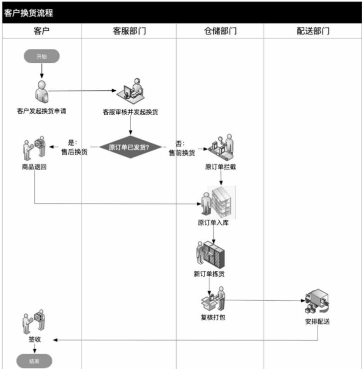

图3-19 客户换货流程

售后换货是指原商品已经送到客户手中，客户对原商品不满意而发 起的换货申请，相比售前换货在仓储环节就把原商品拦截入库，售后换 货需要客户将原商品寄回仓库，详细流程如下。 

① 客户发起售后换货申请，选择换货原因。 

② 客服人员先对客户的换货申请进行审核确认，然后发起换货流 程，由客户或客服人员选择需要换货的原商品及新商品，再由客服人员 为仓储部门推送一张基于原商品生成的退货入库单。 

③ 客户按照约定的售后地址将原商品寄回仓库，仓库收到商品后 ，对退货单操作退货入库。 

④ 原商品入库以后，系统再触发一张新商品的出库单，由仓库正 常拣货、复核打包后交由配送部安排配送给客户。 

⑤ 客户签收，完成换货。 

## 3.4.10 仓间调拨流程

当一个企业下设多个仓库时，经常会出现仓库之间相互调拨商品的 情况，即将商品从发货仓库转运到收货仓库，完成库存的转移。常见的 调拨场景有如下三种。 

① 订单驱动调拨。由于某些原因，订单下发到A仓，但A仓的库存 不足了，而B仓的库存充足，故由订单自动触发从B仓将商品调拨到A仓 ，调拨完成以后，继续由A仓对订单进行发货。 

② 中央仓向区域仓补货调拨。商品在中央仓集中采购入库以后， 由中央仓向其辐射的区域仓、前置仓补货从而生成从中央仓向区域仓补 货的调拨单。 

这里有一点需要重点说明：我们指的调拨是发生在同一财务主体下 的仓库之间的，不涉及财务成本的变化；但如果是两个不同的财务主体 之间的仓库互调，是需要缴税的。发生在两个公司之间的仓库调拨属于 买卖关系，是由收货仓向发货仓发起的采购行为，而不是单纯的库存转 移了。 

从本质上来说，门店向中央仓请货和退货，都属于调拨。 

③ 区域仓商品退回中央仓。由于区域仓的容积不足、商品的质量 出现问题、滞销等原因，定期将区域仓的商品退回中央仓进行处理，从 而产生从区域仓向中央仓的调拨单。 

仓库间调拨业务流程如图3-20所示。 

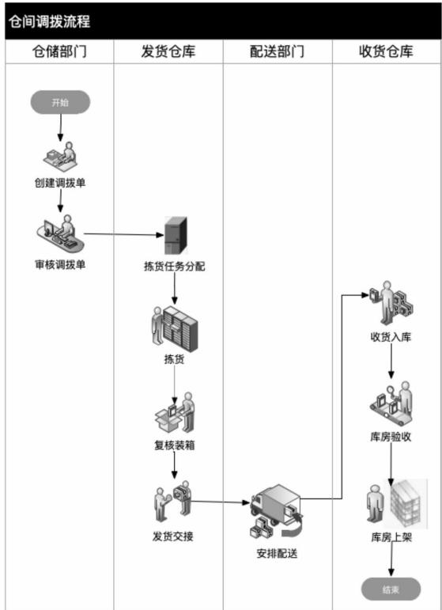

图3-20 仓库间调拨流程

① 仓储部门的相关人员根据需要创建调拨单，确定需要调拨的发 货仓、收货仓，以及商品、数量等信息。如果是由订单驱动的调拨，则 由系统自动创建。 

② 仓储经理审核调拨单，审核完成以后，调拨单会转换为发货仓 库的发货单，下发到发货仓库。 

③ 发货仓库对调拨单分配发货货位，拣货员按照货位指引完成商 品拣货、复核打包，并交由配送部门安排配送。 

④ 配送部门将调拨出库商品配送至收货仓库。 

⑤ 收货仓库对调拨入库的商品进行清点收货、验收无误后上架到 仓库货位上。如果收货仓库发现实收商品与调拨单中的商品数量不符时 ，就涉及发货仓库、物流和收货仓库三方的责任了，三方需要共同核实 产生差异的原因，如果商品破损或丢失，由责任方进行赔付。 

## 3.5本章结语

电商新零售是零售行业发展的必然趋势，科技的进步必然会带来更 多的业务模式，我们在推动并享受着时代进步带来的红利的同时，不要 被不断翻新的模式迷惑了心智而忘了本源。 

零售有三要素：人、货、场。其本质是“人”通过“场”来获得所需要 的“货”，而电商新零售只是科技进步和时代变迁带来的“场”的变化，是 零售业发展的必然趋势，但无论如何发展，零售的本质并没有改变；同 时，无论是电商还是新零售，其供应链的目标仍然是降本增效，其供应 链的流程和核心思想也没有改变。 

学习了电商新零售供应链的核心业务流程，我们对零售供应链的业 务有了更深入的认识，也知道了我们日常的买卖行为背后的进销存管理 ，原来，之前看来相当复杂的供应链业务是可以拆解的，掌握了其精髓 就不再迷茫了。 

## 第4章 抽丝剥茧：中台化的供应链系 统规划

曾几何时，“我懂系统”成了业务部门的相关人员在产研（产品和研 发）部门相关人员面前最洋洋得意的口号，就像产品经理自诩为“比业 务方还懂业务”一样的自傲。 

什么才叫“懂系统”？这是一个开放式的问题，并没有标准答案。有 的人会Excel，就觉得自己懂系统了；有的人会操作系统，能完整地描 述操作的流程，也算懂系统；还有的人写过代码、玩过数据库，说自己 懂系统更不过分。 

窃以为“懂系统”有两层含义。第一层是懂系统本身，能够将复杂的 业务场景化解为可实现的系统功能，形成完整的业务闭环，这是较低级 别的系统能力；第二层是懂系统思维，是一种将复杂场景具象化的思维 方式，这是一种抽象、解耦、内聚和举一反三的能力，不限于实现系统 本身，如领导安排了一个很抽象的任务，如何一步步地拆解落地，最终 按计划实施，这就是一种系统化思维。 

信息系统源于业务又反哺于业务。作为供应链产品经理，我们都希 望能遇到一位既懂业务又懂系统思维的业务方，这样我们在转换需求和 设计系统时就会和业务更加贴合，少走弯路，但好的业务方可遇不可求 ，我们更加应该修炼自身，把自己塑造成既懂系统又懂业务的产品经理 ，为业务赋能。 

在上一章熟悉了供应链核心业务以后，从本章开始，我们将进一步 细化，来挖一挖支撑这些复杂的供应链业务流程背后的系统。同时，木 笔还想分享一些如何用系统化思维设计稳定可靠的供应链系统的经验， 希望授汝以渔而非鱼。 

## 4.1电商新零售供应链系统规划

每个产品经理和研发人员都有一个能够从0到1规划独立系统的梦想 ，如同自己亲手种下一棵树苗，并将其培育成参天大树，如果有幸能搭 建起一整套系统群，那就更加有成就感了。在做系统规划时，免不了要 设计系统整体规划蓝图，每每开始规划时，我们总会经历无从下手，灵 感来袭，奋笔疾书，屡屡推翻重来，大功告成等几个阶段，最终成稿的 那一瞬间，我们仿佛看到了“万丈高楼平地起”，内心难免激动。 

在电商新零售里，供应链包含哪些系统？各系统之间是如何分工与 协作的？系统设计应该追求大而全还是小而美？我们先提出几个问题， 然后在后面的章节中寻找答案。 

## 4.1.1供应链系统规划与系统分工

供应链是电商新零售中非常重要的一个环节，它承接了实物商品的 进、销、存、退等多个任务，为企业业务的开展提供支持。兵马未动粮 草先行，在业务还没开展前，供应链需要先行（商品建档、采购），在 业务开展过程中，供应链提供弹药支撑（库存），在业务开展以后，由 供应链断后（发货、配送）。所以，在整个电商新零售体系中，供应链 系统是非常重要的，它与其他系统通力协作，共同完成电商新零售业务 运作，这也符合供应链领域中的协同理念。 

同时，供应链系统又是一个自闭环的中台化体系，它不应该局限于 某一个销售平台，而是将商品、订单、库存等能力提供给多个不同的销 售平台共用。如图4-1所示，某企业有自营电商平台，同时还可以在京 东、天猫等其他平台上开店，各方订单均可快速与供应链系统对接，达 成业务目标。 

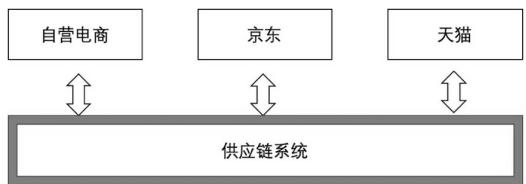

图4-1中台化的供应链体系

图 4-2 是站在供应链视角设计的一张典型的电商新零售整体规划图

，为什么要强调是供应链视角呢？横看成岭侧成峰，站在不同的视角， 我们所看到的事物的全貌是不一样的，而本图为了重点突出供应链相关 系统和功能，所以供应链系统在图中占了较大比重，这点我们在后面介 绍如何设计产品架构图时会重点说明。 

在电商新零售全局视角下，最前端是电商前台，其直面用户，为用 户提供浏览、搜索、下单、售后的工具，根据终端的不同，可以分为不 同的展示形态：App、Web网站、小程序、H5、SDK等；中间是与前端 直接交互的平台运营、交易、支付、促销、用户和搜索等系统，这些系 统为前端用户搜索商品和购买商品提供后端服务支撑；后端才是与供应 链相关的系统；而财务、风控、客服体系是属于全公司任何业务都会涉 及的，会与各个相关系统进行对接从而获取其所需要的数据；如果需要 与外部的平台进行对接，还可以建设开放平台，将内部各系统的接口对 外封装成API供外部的ISV（Independent Software Vendors，意为“独立软 件开发商）或商家ERP系统调用。 

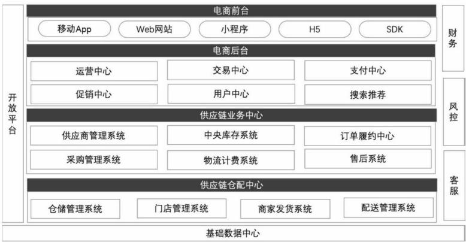

图4-2供应链视角的电商零售整体规划图

我们回到供应链的问题上来，供应链系统到底包含哪些系统呢？

这个问题，相信很多想学习供应链的朋友都问过，在学习的时候， 我们好像身处一个没有目标的赛道上，只知道往前冲，但不知道哪里是 边界，何时到终点，因此倍感迷茫。 

不用迷茫！因为这个问题本就没有标准答案。木笔也曾被这个问题 困扰很久，查过很多资料，至今也没有找到一个标准的答案，分析一下 ，主要原因有三点。一是供应链与其他业务联系太紧密，在企业内部很 难有明显的界线；二是每个公司根据业务需要的不同，对系统的规划和 定位是不同的，如有的企业将采购和销售列为一个部门，自然与销售相 关的系统也属于供应链范畴，而另外的企业以电商为主，那么销售系统 主要就是App了，比较偏前端，这个就不能划为供应链范畴；三是每个 公司的系统设计策略不同，对供应链系统的定位也会有所不同。 

既然没有标准答案，那我们就从自己的理解出发，寻找属于我们自 己的答案吧！让我们回到SCOR对供应链的5大流程上来：计划、采购、 生产制造、交付、退货/回收，再用这个定义对标一下电商新零售的业 务流程，以及每个流程关联的核心供应链系统，如表4-1所示。 

表4-1电商新零售核心供应链系统

<table><tr><td>SCOR 流程</td><td>电商新零售供应链流程</td><td>核心供应链系统支持</td></tr><tr><td>计划</td><td>采购计划、库存计划、波次计划、配送计划等</td><td>采购管理系统、中央库存系统、仓储管理系统、配送管理系统等</td></tr><tr><td>采购</td><td>采购的执行、过程管理、供应商管理、供应商结算等</td><td>供应商管理系统、采购管理系统、基础数据平台、财务系统等</td></tr><tr><td>生产制造</td><td>零售行业不涉及生产制造,主要对标仓库对订单进行发货,可以是自营仓库、门店或合作商家,若涉及外部合作,还要计算物流费用</td><td>仓储管理系统、门店管理系统、商家发货系统、计费系统等</td></tr><tr><td>交付</td><td>订单下发、订单分仓、订单履约、库内生产、配送等</td><td>订单履约中心、仓储管理系统、门店管理系统、商家发货系统、配送管理系统、财务系统等</td></tr><tr><td>退货/回收</td><td>订单的逆向退货、退供应商</td><td>采购管理系统、财务系统、售后系统等</td></tr></table>

经过梳理，我们可以得出一个结论：核心的供应链系统包含了基础 数据平台、采购管理系统、供应商管理系统、订单履约中心、计费系统 、中央库存系统、仓储管理系统、门店管理系统、商家发货系统、配送 管理系统、售后系统、财务系统等。 

从产品结构上，我们可以将以上这些供应链系统分为供应链业务中 心、仓配支持中心和财务中心三部分。 

供应链业务中心主要提供一些与供应链业务相关的支持，主要处理 信息流，偏供应链上游业务端，如供应商管理系统、中央库存系统、订 单履约中心、采购管理系统、计费系统、售后系统。 

仓配支持中心主要提供实物商品的实际收发操作，主要处理物流， 偏供应链下游执行，包含仓储管理系统、门店管理系统、商家发货系统 、配送管理系统。 

财务中心主要处理与资金流相关的业务，所有与资金相关的应收、 应付、发票、打款等业务，都需要最终在财务系统中完成最后的财务处 

理。 

我们分别介绍一下以上这几个核心供应链系统的定位和分工。 

① 基础数据中心：主要进行与供应链相关的基础数据的创建和维 护，并为公司其他系统提供唯一数据来源服务，这是所有业务沟通及业 务子系统运行的基础。例如，商品和供应商的资料录入、商品分类、仓 库、门店这些信息等，一个公司不应该有多个地方都在维护基础数据信 息，否则容易出现信息混乱的情况。基础数据平台的业务需求方一般是 采购部、质量管理部、商品部门等。 

② 采购管理系统：简称02-采购系统，主要用于对采购活动进行管理 ，协助采购部门更加高效地完成采购询价与建单、供应商管理、采购维 价、调拨、退供应商等操作。此系统是为采购部门量身定做的。 

③ 供应商管理系统：为了加深与供应商的合作，为供应商开放的 协作系统，主要用于供应商资质及商品资质的上传管理、采购询价、采 购订单的下发（回告）、在线预约送货、对账与结算等。通过供应商管 理系统，企业与供应商建立深度的协同，使企业与供应商的合作更加规 范化，降低线下沟通的成本。供应商管理系统的使用对象主要是上游供 应商。 

④ 订单履约系统：又叫订单履约中心，是处理订单出库履约的系 统，对上承接销售平台，订单上下传输，对下对接各地仓库和门店，并 在订单、退换货单流转过程中进行调度，完成订单履约。订单履约系统 是整个订单上传和下传的调度中心，为各个部门提供订单的管理和查询 功能。（免费获取更多供应链PM书 加v信：pmzjie） 

⑤ 中央库存系统：简称中央库存，是统一管理全国各仓、各门店 、商家仓库存的中央处理器，对上管理电商平台的可销售库存，对下管 理各地的实物库存，并根据业务规则为订单智能匹配最合理的发货仓/ 门店。04-中央库存系统是订单履约的核心系统，对外提供所有部门的库存 查询功能。 

⑥ 仓储管理系统：简称仓储系统，处理商品在仓库内日常进销存 作业的仓储管理系统，用以提升仓库的作业效率和精益性，降低差错率 。根据投入成本，仓储管理系统通常会搭配PDA、电子标签、立体仓库 、机器人等智能设备一起使用。仓储管理系统主要供仓储部门使用。 

⑦ 门店管理系统：简称门店系统，用于线下门店日常对商品、订 单进行管理和售卖的系统。在新零售模式下，体现为两方面：一方面是 传统线下的POS售卖；另一方面是线上订单导流到门店，由门店发货、 配送或者用户上门提货。门店管理系统主要供线下门店使用。 

⑧ 商家发货系统：主要开放给发货商家，用于商家接收订单并处 理订单，完成订单履约及售后相关处理的系统。当平台品类不全时，一 般会引进商家，通过商家提供的商品来补充平台的品类，订单生成后， 会按照规则将订单下发到商家发货系统中，由商家在此系统中完成发货 等业务处理。 

⑨ 配送管理系统：简称配送系统，用于支持商品的配送，一般分 为3PL和自营配送两种模式。在3PL模式下，商家主要依赖三方物流公 司，如顺丰、圆通、韵达等，进行配送，系统功能体现为分配物流公司 、获取物流单号、获取物流轨迹等；自营配送模式下主要涉及自有配送 体系的收货、分拣、派车、配送等业务支持。配送管理系统主要供配送 部门使用。 

⑩ 售后系统：主要处理订单售后问题，如错发、漏发的补寄，退 换货及退款处理等。售后系统主要供客服部门使用。 

⑪ 计费系统：如果企业的供应链业务对外开放，通过提供采购、 仓储、配送等供应链能力给上下游客户使用，则需要使用计费系统进行 计费，如保管费、运输费、操作费等，基于计费系统产生收益账单向客 户收费，计费系统主要供业务开放方和财务部门使用。 

⑫ 财务系统：主要提供成本核算、应收、应付等功能。但财务系 统不仅涉及供应链相关的业务，还涉及其他方面的企业日常收支等与资 金相关的业务，所以财务体系本身是一个庞大且独立的体系，不能完全 归属于供应链范畴。 

和供应链的业务边界没有国际标准一样，以上这些系统的边界和分 工也没有特别固定的标准和非常清晰的界限，在很多企业中，一套ERP 系统涵盖了所有的系统功能，而在另一些企业中，相关系统可能会被拆 分得更细，这主要取决于企业的业务量、当前技术资源投入和对未来的 预期等。所以我们在做供应链系统规划时，绝不能生搬硬套，而是要结 合企业的实际情况和企业的实际业务去设计系统，不能邯郸学步。 

## 4.1.2供应链系统规划：大而全还是小而美

做系统规划，如同建房子时画设计图，未来交付的是联排别墅还是 独家小院，在设计图出来的那一刻基本就定型了，后期要想变更房子的 主体结构可谓难上加难。我们在做供应链系统规划时，是选择设计一套 大系统囊括所有与供应链相关功能好呢，还是选择将把每个系统功能独 立开来好呢？ 

为了回答这个问题，我们来一次角色扮演，化身为××集团系统规划 总顾问，分别为某电商平台规划一套大而全的供应链系统架构，以及一 套小而美的系统架构。 

## （1）大而全的系统设计方案

在大而全的系统设计中，一般是一个大的供应链系统囊括了所有与 供应链相关的功能，这个系统，我们可以为它取一个专业的名字，叫作 SCM系统，它的系统架构可以分为四层。 

第一层是最底层的基础数据层，我们把所有基础数据都放在这一层 ，为整个供应链业务的开展提供最底层的支撑，因为完整的基础数据是 业务良性运转的基础。 

第二层是基础数据之上的供应链策略层，所有业务在开展过程中需 要用到的策略都在这里实现，通过这些策略驱动业务的多样化发展。例 如，采购策略、智能补货策略、送货预约策略、任务调度策略、订单分 仓策略等。 

第三层是策略之上的供应链的各个功能模块，基于基础数据和策略 开展的各项供应链业务，如采购管理、订单履约管理、库存管理、仓储 管理、门店管理、配送管理等。 

以上三层的结构便能形成一个完整的供应链系统闭环了，我们可以 基于此系统开展从采购到存储，再到销售，最终到财务结算的完整业务 了。但是自闭环远不足以体现供应链系统的价值，我们设计的供应链系 统还能对外开放，将我们的供应链能力对外输出，于是，第四层出现了 ，这是最顶层设计，我们将供应链的商品、订单、库存等能力与各个销 售平台进行对接，用一套供应链系统支撑起企业的销售目标。 

我们设计的大而全的供应链系统规划就出来了，如图4-3所示。 

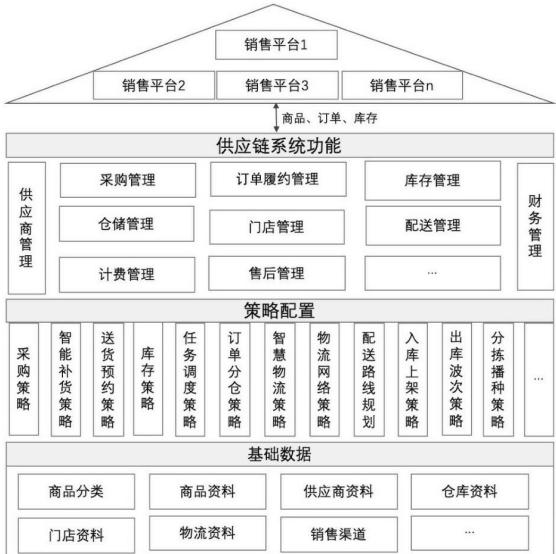

图4-3大而全的供应链系统规划

## （2）小而美的系统设计方案

在小而美的系统设计思路里，我们将供应链业务细分为多个子业务 ，一般是根据部门职责来划分，如采购部门负责采购，仓储部门负责仓 储，配送部门负责配送。然后将相关的功能类聚到一个子系统中，于是 供应链便被解耦为一个个独立的子系统，每个子系统负责一个核心业务 ，有其自己的策略配置，如本书中的基础数据中心、采购管理系统、供 应商管理系统、订单履约中心、04-中央库存系统等。 

在小而美的系统架构中，每个系统独立运行，通过接口或服务与其 他系统交互，如所有系统都需要基础数据，而其所需要的基础数据均从 基础数据中心中获取。中央库存集中所有仓库和门店的库存，为其他各 系统提供库存服务，所有仓库和门店的库存变化，均需要在中央库存系 统中有所显现。我们为之产出的系统规划，如图4-4所示。 

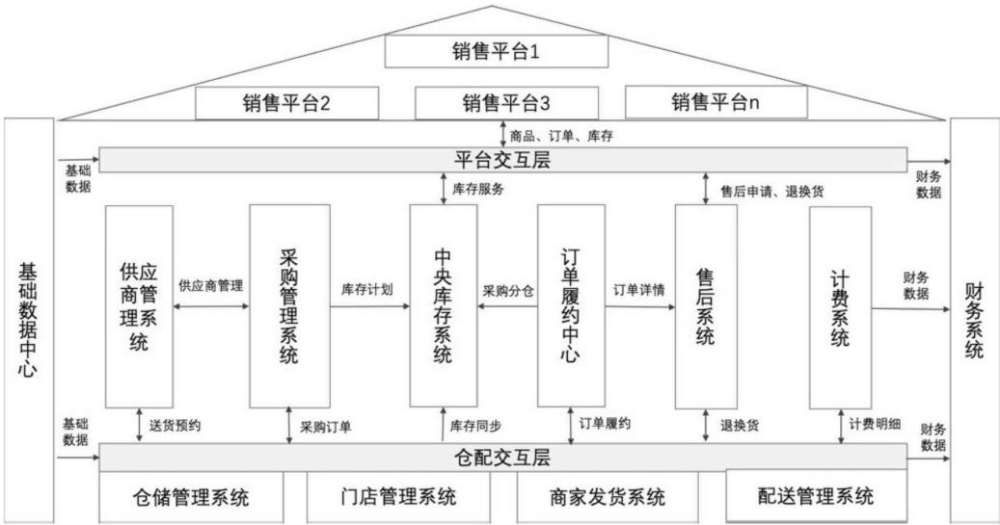

图4-4 小而美的供应链系统规划示例

在图 4-4 中，有必要重点说明一下平台交互层和仓配交互层这两个 子系统，它们属于内部流转型系统，在业务开展过程中基本感知不到它 们的存在，但在复杂的供应链形态下，它们又是如此重要。正是有了它 们的存在，才能实现供应链的中台化和服务化。 

① 平台交互层。如果我们的供应链系统需要对接多个销售平台， 势必会存在多个销售平台之间的数据、规则不同的情况，如何将不同平 台中的数据按照供应链体系的标准进行统一转换，以及按照统一的标准 传送数据，这便是平台交互层的职责，它将差异化的外围数据和业务在 这一层进行标准化，为供应链内部系统提供更为稳定的环境。 

例如，我们的供应链系统对接了三个销售平台，三个平台上的同一 商品的商品编码分别是A+、A++、A+++。而供应链系统内部的标准编 码是A。这时用户在销售平台1下单了，下单的商品编码为A+，但是我 们的供应链系统里只有A，没有A+，想要正常发货，就必须将A+转变 为A，才能将订单流转到仓储管理系统中。同理，发货完成以后，相关 人员需要告知销售平台1，A商品已发货，需同步库存，但销售平台1中 只有商品A+，我们需要将A再转换为A+回传。这个转换的工作，便是 平台交互层的职责所在，如图4-5所示。 

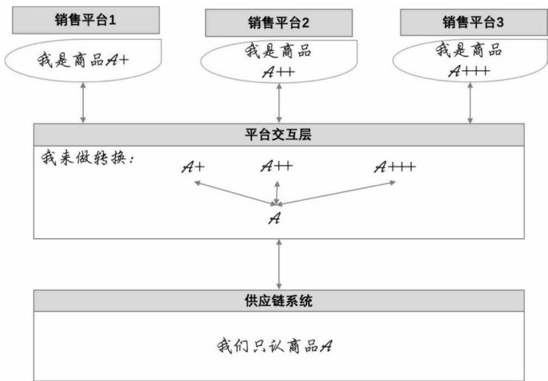

图4-5平台交互层的职责

② 仓配交互层。如果我们的下游有很多个不同类型的仓储或配送 中心，刚好在不同的仓储和配送中心中又部署的是不同的仓储管理系统 ，假如没有仓配交互层，那么上游的每个业务系统都需要与下游所有的 仓储管理系统和配送管理系统针对所有有关联的业务进行对接，n 个业 务系统+仓配系统+n 个业务，对接次数便是 $\Pi ^ { 3 }$ ，如果企业后续又开了新 仓，或者调整了仓配业务，系统对接的工作量会让程序员怀疑人生。所 以，仓配交互层存在的目的就是让上游业务侧的对接难度降低，它的职 责是按标准出入库方式与各个不同的仓配系统进行业务对接，并将标准 化接口提供给上游的各个业务系统进行对接，这样，上游业务系统只要 与仓配交互层对接即可完成数据的传送，下游仓配业务的调整也只需要 在这一层完成同步，尽量降低对上游业务系统的影响，如图4-6所示。 

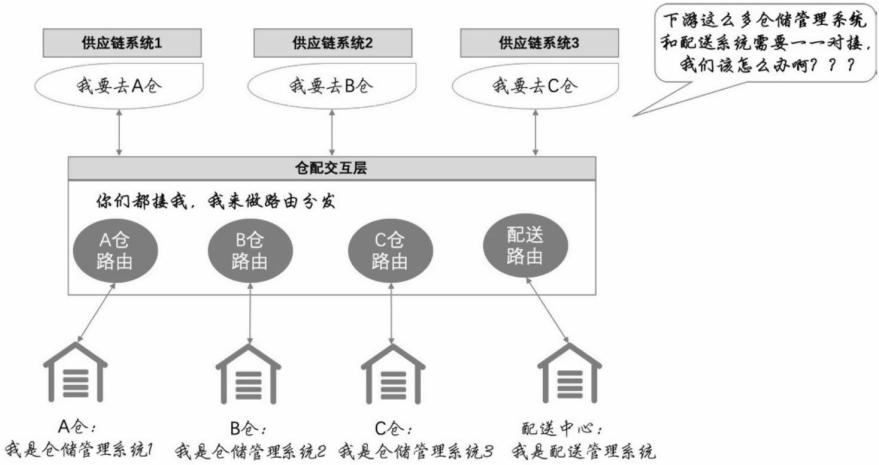

图4-6仓配交互层的职责

以上系统顾问的工作完成了，我们来对比一下大而全的系统规划思

路（以下简称方案一）和小而美的系统规划思路（以下简称方案二）。 

首先，从系统实现的难易程度来看，方案一是基于底层数据进行开 发，各功能之间共用一套代码功能，读写一套数据库；而方案二是需要 为每个子系统都部署一套数据库和一个工程，而系统和系统之间的交互 需要通过接口进行。所以方案二比方案一在实现方面要更难，整体耗费 的人力、财力和时间成本会更高。由于方案二可以拆解为多个系统，每 个系统的难度都会大幅降低，所以可以并行开发，也可以分期迭代，这 一点是方案一无法比拟的。图4-7展示了二者在系统部署方式方面的区 别。 

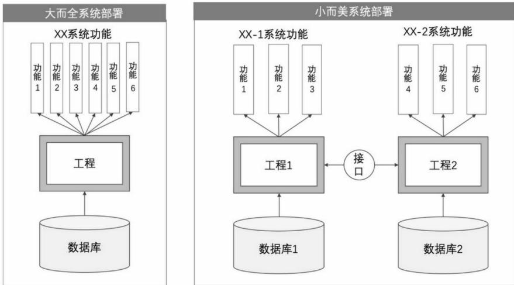

图4-7大而全系统部署与小而美系统部署

其次，从性能上看，当数据量较大时，由于方案一只有一套数据库 ，多个业务只能共用一套数据库，其性能会大幅下降，而方案二是多个 系统分布式部署，各个业务相对独立，其性能较良好。 

再次，从事故风险来看，如果出现了事故，则方案一基本上全局受 挫，一损俱损，而方案二只会影响某一个系统，其他系统还可以独立运 行。 

最后，从扩展性上来看，方案一将所有功能都融到一起了，耦合性 更高，但开发更快。方案二更加灵活，扩展性更好，但系统功能调整往 往会涉及多个系统，开发周期会长很多。 

总结下来，二者的优劣如表4-2所示。 

表4-2大而全的系统规划与小而美的系统规划对比 

<table><tr><td></td><td>大而全</td><td>小而美</td></tr><tr><td>优势分析</td><td>基于一个数据库开发,交互较少,前期开发成本低整体复杂度较低新需求开发更快</td><td>业务耦合度低,系统风险性较低分工明确,各司其职各系统可并行开发,独立部署、独立上线,性能优化比较容易可扩展性强</td></tr></table>

续表 

<table><tr><td></td><td>大而全</td><td>小而美</td></tr><tr><td>劣势分析</td><td>·业务耦合度高,一旦某个业务调整了,会直接影响到其他业务·必须在所有模块均可用以后才能一起上线,风险性较高·因各个业务融到一起,扩展性较差·数据量过大时,其性能会明显下降</td><td>·系统之间交互多,研发成本会比较高·业务量较小时投入产出比较低</td></tr><tr><td>总结</td><td>适用于业务量小,业务相对稳定的企业</td><td>适用于业务量大,业务相对复杂且经常变化的企业</td></tr></table>

现在，回到开始的那个问题上，在进行系统规划时，到底是选择大 而全的系统，还是选择小而美的系统？相信每个人的答案都不一样，因 为这个问题也是没有标准答案的，两个方案各有利弊，存在即合理，并 没有谁更好、谁更坏。我们每个人都要结合公司当前的现状、业务形态 、资源投入和未来的规划等因素，综合评估以后得出最终结论，这个结 论不一定是最好的，但一定是最合适的。在系统规划方面，如果决策失 误了，可能会给日后埋下巨大的隐患，不信请看下面这个故事。 

一次惨痛的系统规划决策教训 

K 公司最近融资到位，老板决定大力发展医药电商新零售业务，自 建供应链体系，计划在全国各地开5个大型仓库和100家线下门店，仓库 用以承接线上订单，门店用作线下销售和新零售到店服务订单的承接， 实现线上、线下完美结合的目标。决策做出以后，公司各部门迅速响应 ，落实到人，产品部小Q被委以重任，承担了重构供应链体系的重要任 务。 

为什么要重构呢？因为此前公司只购买了一套ERP系统，各业务部 门、仓库、线下门店都在这个系统中进行操作，一旦遇到大促等活动， 数据量急剧上升，数据库满负荷，系统就卡得不行，很明显，这样的系 统支持当前业务已属不易，更别提支持全国五仓和百家门店了；再加上 新零售需要线上线下打通，没有源代码的ERP系统根本不具备扩展能力 ，所以系统重构势在必行。 

如何进行系统重构呢？摆在小Q面前有两个方案：方案一，基于现 有的生产研发能力，按照新零售的业务形态梳理出系统方案，再结合E RP系统中和业务相关的采购、订单、仓储能力打造一个完整的供应链S CM系统（大而全的方案）；方案二，按照互联网常用的SOA系统架构 ，将供应链系统拆分为多个独立的子系统，交由不同的小团队来实现（ 小而美的方案）。经评估，方案一的开发工作量更小，人力投入更少， 更符合公司当前的现状；方案二的扩展性更好，更符合公司的未来规划 ，但投入会更多。 

两个方案各有千秋，小Q也无法定夺，毕竟这一次重构至少会影响 公司未来5年的系统架构，于是小Q找了个机会向CTO和各位技术leader 汇报，大家听完汇报以后各执己见，无法达成共识，有些人认为要考虑 成本和现状，应该采用方案一，而有些人则认为要放眼未来，应该采用 方案二。 

CTO在一旁默不作声，沉思了两分钟后，说了一段一锤定音的话： “以我们现阶段的情况来看，确实是方案一最适合。但我们是否要按方 案一执行？NO。两个原因：①老板的预期是明年6月份业务达到日均10 万单，还有不到半年的时间了，试问方案一如何承接？②医药互联网行 业风口已来，万亿级的市场一旦打开，订单量就会呈指数级增长，到时 候我们哪里还有精力再重构系统呢？所以不如一步到位，按方案二执行 ，小步快跑。” 

CTO拍板了，于是小Q按照方案二将新供应链体系拆解为10多个子 系统，其中基础数据中心、仓储管理系统、订单履约中心、中央库存系 统、配送管理系统等 5 个系统在两个月以后如期上线，开始接受业务的 洗礼，大家都期待着半年后的日均10万单。 

如CTO所述，新业务刚开始时一切向好，系统也越来越完善，大家 的信心越来越足，技术部从30人迅速扩充到了160人。然而老板终究是 错估了市场形势，在烧了不少钱以后，订单一直在日均5000单上下徘徊 ，公司严重入不敷出。迫于无奈，公司在一年以后做了两个决定：①裁 员，技术部被裁得只剩下50人，以最小规模支持业务运转；②寻求业务 转型。 

这两个决定直接将K公司的系统体系打向低谷，50人维护原本160 人维护的系统，基本只能保证日常运营和小需求迭代，任何需要优化多 个系统的大需求，都只能放弃，而恰恰公司业务转型，又不得不对现有 系统进行大调整。整个公司每每遇到系统需求改动，员工总是哀声连连 

就这样，当初设计的这一套完整的供应链体系，反而成了公司业务 开展最大的阻碍，小Q眼看公司一天天衰落，却也爱莫能助，只能黯然 离职。 

## 4.1.3供应链系统与B端产品：地球之于太阳系

近几年，随着互联网流量红利的消失，C端产品的光环逐渐褪去， B端产品渐渐兴起，这也为B端产品经理和技术人员带来了更多的机遇 和挑战，而供应链，就是B端产品世界里极其重要的一个领域。供应链 之于B端产品，犹如地球之于太阳系，是其中很重要的一颗行星，有自 己的运转规律，但也同时遵守着太阳系的运转法则。B 端产品的设计风 格、设计原则同样适用于供应链系统，反过来说，学会了供应链系统的 规划和设计方法，一样可以将其复用到其他B端产品中。 

我们一起来总结一下B端产品世界中的供应链领域的受众对象、实 现目标、实现方式、系统定位、工作重心和设计原则，以便我们在做系 统规划和落地时能够把握重点，不致偏离航向。 

话不多说，先上一张B端产品的整体结构图（关于B端产品的结构 和分类，仁者见仁，本图仅代表本书观点），如图4-8所示。 

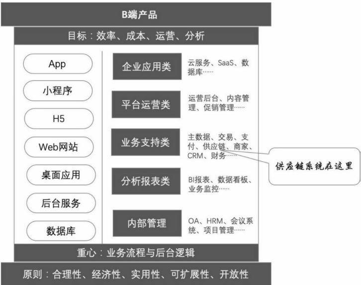

图4-8B端产品的结构

首先，无论供应链系统，还是其他B端产品，我们的受众都是B（B usiness），对标企业和业务。不同于C端产品以人性、欲望、痛点、爽 点等维度为出发点，B端产品更加关注的是企业的效率、成本、运营和 数据分析。供应链系统服务于供应链的业务，降本增效自然是其首要目 标，我们设计的供应链系统如果能有效优化业务的成本和效率，就是雪 中送炭，如果在此基础上还能增加与运营和数据分析相关的工具，便是 锦上添花了。 

其次，技术不分国界，也不分前后端。App、小程序、H5这些技术 并不是C端产品独有的，这些技术在B端产品中一样有很大的应用空间 。App、小程序、H5、Web网站、桌面应用、后台服务、数据库这些技 术和应用在B端产品和供应链中也是比较常见的，如在仓储和配送管理 系统中，就经常会用到PDA（掌上电脑）应用程序来辅助作业，所以B 端产品和研发的相关人员有必要对以上技术有一定的了解。不过不同于 C端产品对交互的严格要求，我们应该更加关注系统的逻辑性和与上下 游的连贯性，当然交互细节也不能忽视。 

再次，从B端产品的应用分类来看，我们大致可以把B端产品划分 为企业应用类（为企业提供解决方案的应用，如云服务、SaaS、数据库 应用等）、平台运营类（主要为平台提供运营相关的工具，如运营后台 、内容管理、促销管理等）、业务支持类（主要提供各类后端业务开展 所必需的支持类工具，如08-主数据系统、交易系统、支付系统、供应链系 统、商家系统、CRM 系统、财务系统等）、分析报表类（主要提供各 类数据报表、埋点统计、决策分析等工具，如 BI 报表、数据看板、业 务监控等）、企业内部管理类（主要定位企业内部管理用的相关系统， 如OA系统、HRM系统、会议系统、项目管理系统等）。从分类上看， 供应链系统从属于业务支持类系统，独立支持着与供应链相关的业务， 和企业其他业务相互依存，共同构成完整的B端产品体系。 

另外，从工作重心上，不同于C端产品的拉新、留存、转换，B端 产品更注重业务流程的优化、精简及复杂的业务逻辑的梳理，保证系统 流程足够顺畅、业务逻辑足够清晰，才是B端产品经理的使命。当然， 每个B端产品对应的业务是不同的，作为供应链系统，其重心是保证供 应链相关业务的流畅性、稳定性和完整性。 

最后，同所有的B端产品规划设计一样，供应链系统的设计也必须 遵循实用性、易用性、合理性、经济性、可扩展性、开放性等几个原则 

●实用性：系统流畅稳定，直接解决业务问题，拒绝花里胡哨。 

●易用性：操作简单易懂、易学易用，方便推广和培训。 

● 合理性：系统逻辑清晰合理、贴合业务形态，没有阻塞和缺失的 功能。 

● 经济性：控制人力成本、时间成本，以较少的投入获取较大收益 ，拒绝浪费。 

● 可扩展性：从长远考虑，在整体架构不变的同时预留扩展接口， 能够兼容未来业务的扩展。 

● 开放性：具有良好的对外连接性，除了自闭环，还能快速接入外 部业务、系统和设备等。 

## 4.2电商新零售供应链系统流程详解

在第 3 章讲解电商新零售业务时，我们已经详细介绍了核心的供应 链业务，如果想知道这些业务流程如何有效地与系统结合起来，就需要 请出我们本节的主角了：系统流程图。系统流程图有助于我们全面俯视 业务流程、掌握系统之间的关联和供应链核心业务在多个系统之间的交 互细节。 

## 4.2.1形影相随：系统流程与业务流程

系统流程，就是将业务流程以系统处理的视角进行细化，以系统逻 辑为出发点，梳理此流程在各个系统内部和系统之间的交互逻辑，形成 完整的系统解决方案。系统流程源于业务流程，但能更清晰地体现出流 程在系统内部，以及系统之间的交互逻辑。二者形影相随，但侧重点不 同。图 4-9 为业务流程图与系统流程图的对比，为了更好地将业务流程 图和系统流程图应用到日常工作中，我们有必要弄清楚二者之间的区别 

首先，二者的绘制方不同。业务流程图一般由业务需求方或产品经 理绘制，重在表达业务的流程和对应的操作角色、操作环节；系统流程 图一般由产品经理或技术人员绘制，重在表达系统的处理逻辑，以及系 统和系统之间的交互。 

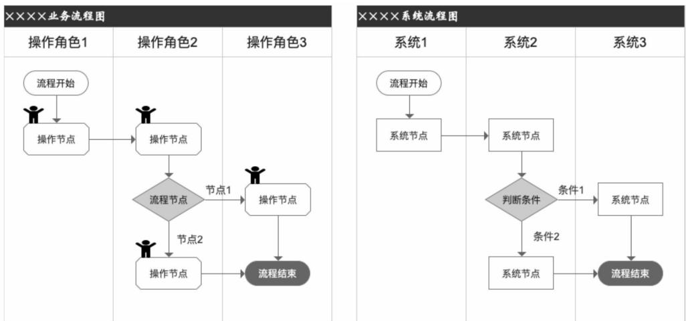

图4-9 业务流程图与系统流程图

其次，二者产出的时机不同。业务流程图产生于业务梳理阶段，当 确定了业务开展需要涉及的干系人、操作环节和流程细节以后，便可输 出业务流程图；系统流程图是产品经理对业务需求进一步拆解细化，明 确业务涉及的系统逻辑后形成的系统解决方案，产生于需求分析阶段。 需要说明的是，系统流程图并不是产品需求文档，要求能快速产出并能 及时调整。所以在梳理系统流程图时，不需要面面俱到，只需要把握住 大轮廓即可，图中的细节可以在编写产品需求文档时再慢慢细化。 

再次，二者的受众对象不同。业务流程图的主要受众是业务部门的 相关人员，重在清晰地描述业务流程；系统流程图的主要受众是产品经 理、研发和测试部门的相关人员，重在描述系统边界、系统处理逻辑。 

最后，二者的使用场景不同。业务流程图常用于业务部门的相关人 员做流程梳理、工作安排与人员分工；系统流程图常用于制定系统解决 方案、系统逻辑梳理和系统分工。 

总结一下：业务梳理使用业务流程图，系统逻辑梳理使用系统流程 图。掌握了二者的区别与联系以后，我们便能灵活应用了。 

## 4.2.2基础数据建档系统流程

基础数据是所有业务开展的基础，我们在设计基础数据时，应保证 企业内部各系统中的基础数据一致，且源头统一，一般将重要的基础数 据都放在基础数据中心，由此系统统一管理和分发核心数据，切忌遍地 开花。 

商品和供应商的建档比较严格，一旦出错后果比较严重，所以审批 相对严格，同时，完整的商品和供应商数据需要各个部门共建，如商品 基本信息由采购部门收集、资质信息需要质管部门核验，财务信息由财 务部门填充，所以一份数据经常需要多个部门分步完善以后才能形成最 终的有效数据。 

图4-10是商品和供应商的系统建档流程，有效数据生成以后，方能 通过接口或者MQ等方式通知外围依赖系统。 

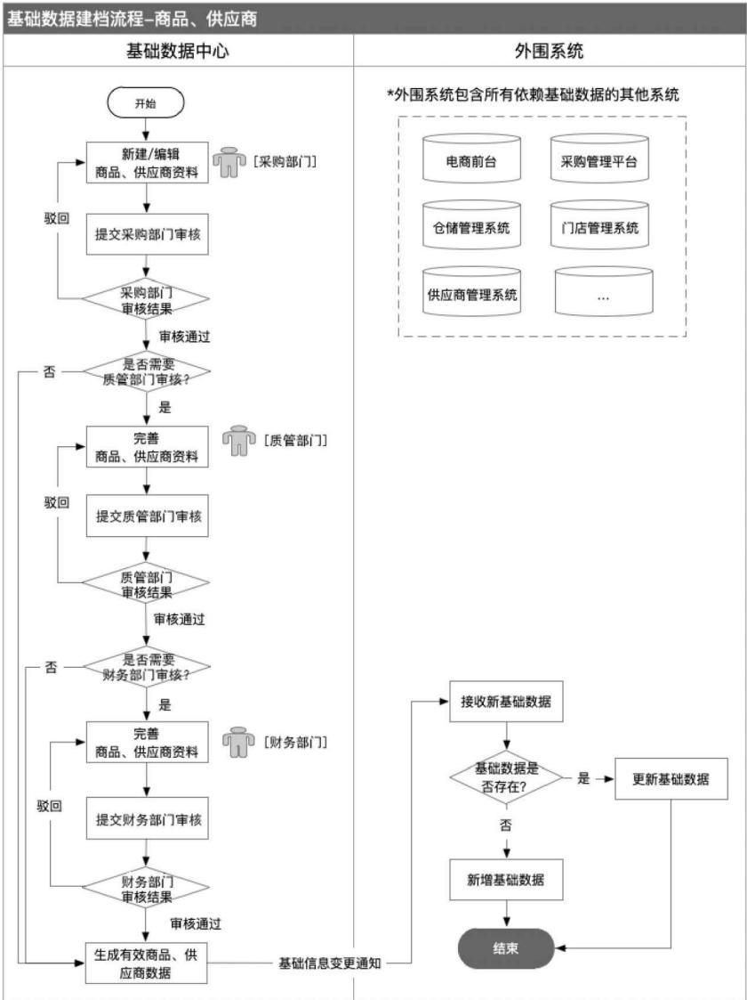

图4-10商品、供应商建档系统流程

其他基础数据如商品类目、公司、仓库、门店、物流、销售渠道等 的信息创建比较简单，且不经常变化，由集团总部在基础数据中心中统 一创建后分发到各业务系统中即可，如图4-11所示。若考虑到数据安全 问题，可以增加一级审批流程。 

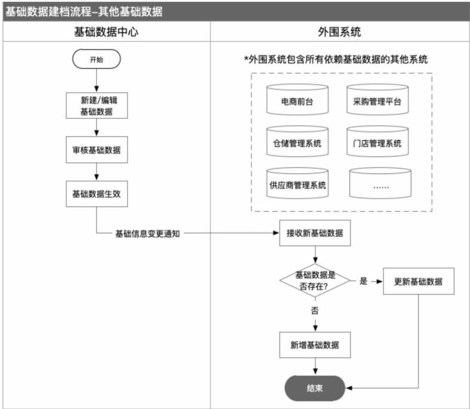

图4-11 其他基础数据建档系统流程

## 4.2.3 采购入库系统流程

采购入库系统流程由采购人员在采购管理系统中发起，最终由财务 部门的相关人员在财务系统中完成付款并核销，如图4-12所示（图中仅 展示了正常月结方式下的财务流程，若为预付款方式，区别在于采购订 单建立后，采购人员先向财务部门申请打款，待财务部门付款以后，供 应商再发货，其他环节处理无差异）。 

① 采购人员提交采购申请，审核通过后，开始寻找供应商、询价 、谈判、签订合同以后，在采购管理系统中创建采购订单（PO，也叫 采购单），并提交审核，审核流程可根据采购订单的金额设置不同的审 批流程，审批流程可与 OA 系统打通。为增加与供应商的协同，采购订 单创建后，可以推送到供应商管理系统中，供供应商及时查看并回复。 

② 供应商在供应商管理系统中确认采购订单，如果采购数量无法 满足，也可在系统中告知，以便采购人员及时联系其他供应商。供应商 确认以后，采购订单进入审核流程。 

③ 供应商在01-供应商系统中预约送货，仓储管理系统会开放每天的 收货能力供供应商预约合适的送货日期和时间段。 

④ 供应商如期送货到仓库，分别在仓储管理系统中完成到货登记 、收货、验收操作，若验收合格，可正常上架，否则拒收，供应商将商 品拉回。验收信息及时回传供应商管理系统，供供应商查看。 

⑤ 上架员在仓储管理系统中操作完成商品上架以后，将商品上架 明细同步至04-中央库存系统中增加实物库存，此时便产生了可销售库存。 

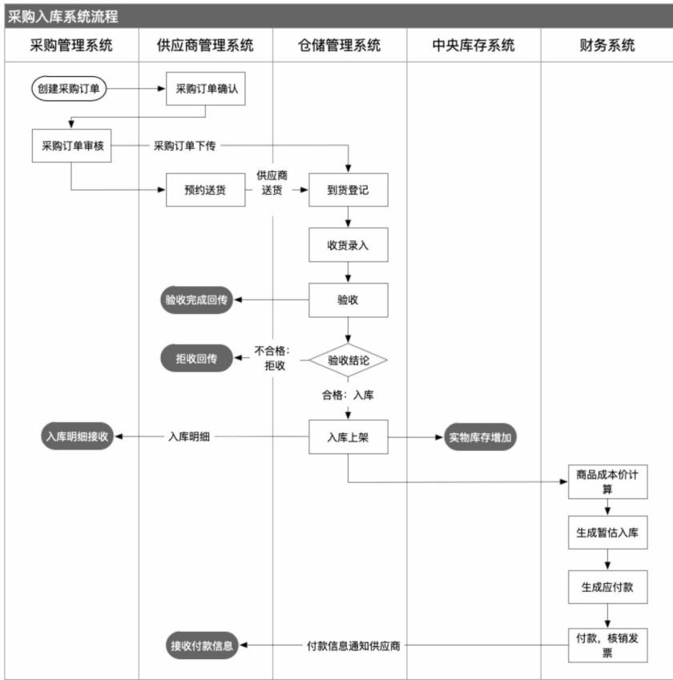

图4-12 采购入库系统流程

⑥ 财务部门的相关人员在财务系统中根据仓储管理系统回传的入 库明细，分别完成商品成本价核算、暂估入库、生成应付款、付款和核 销发票等。 

关于库存成本的计算，取决于企业规定的成本计算策略，如先进先 出法、后进先出法、加权平均法、移动加权平均法、个别计价法、计划 成本法、毛利率法、零售价法等。 

## 4.2.4 销售出库系统流程

商品入库以后，04-中央库存系统中便产生了库存，同时相关人员将可 销售库存同步到各销售平台上，即可进行售卖了。一张客户订单的履约 一般要经过电商销售平台、订单履约中心、中央库存系统、配送管理系 统、仓储管理系统/门店管理系统等多个系统的交互处理才能完成，如 图4-13所示。 

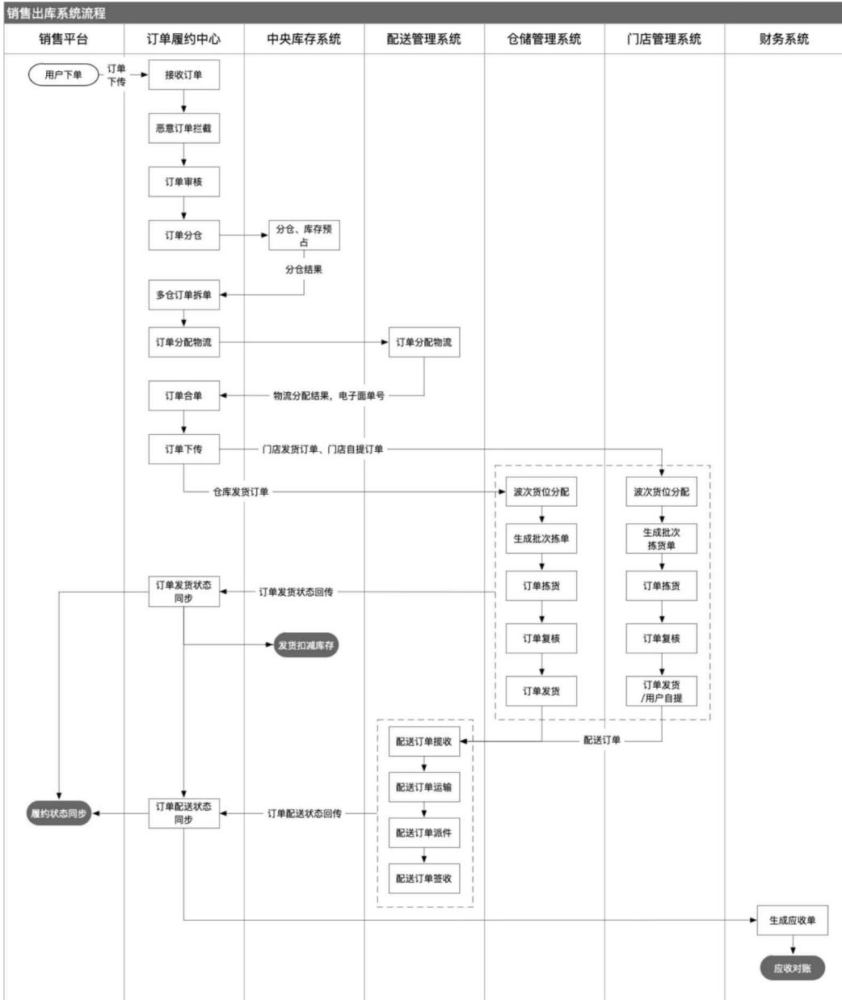

图4-13销售出库系统流程

① 无论用户从哪个平台下单，订单最终会被标准化为订单履约中 心的订单格式，经过订单履约中心进行恶意订单的拦截、审核、分仓、 拆单、分配物流、合单等处理以后，将订单下发到对应的仓储管理系统 或门店系统中发货（若是仓库发货，则下发到仓储管理系统中，若是门 店发货则下发到门店管理系统中）。 

在订单的流转过程中，订单履约中心起着调度和监控作用，就像人 体的大脑、电脑的CPU一样重要。它会在合适的时机调用外围系统提供 的服务，来促成履约，如调用04-中央库存系统的服务完成分仓、调用配送 管理系统的服务完成物流分配。 

② 仓储/门店系统接到订单以后，对订单进行发货，并将对应的操 作节点状态同步至订单履约中心，然后回传销售平台，让用户能清晰地 知晓当前订单的发货进度。 

③ 订单在仓库完成发货以后，若是门店自提类订单，则由用户上 门完成自提，若是配送类订单，则需要通知物流完成揽收、运输、派件 等环节，直到最终用户签收。由于自建物流的成本较高，市面上大部分 企业对接的三方物流（顺丰、圆通、中通、京东等），故配送管理系统 主要承接物流公司管理、单号申请、物流状态跟踪等职能。若是拥有自 建物流配送体系的公司，配送管理系统主要负责车辆管理、排班调度、 运输路线、回单等。 

④ 订单完结以后，在财务系统中生成应收账款，财务部门将实收 账款（包含现金、支付宝、微信、银行刷卡等）与系统应收账款进行对 账核销。（免费获取更多供应链PM书 加v信：pmzjie） 

## 4.2.5 门店请货系统流程

当门店库存不足时，便会从中央仓库进行请货，请货流程如图4-14 所示。 

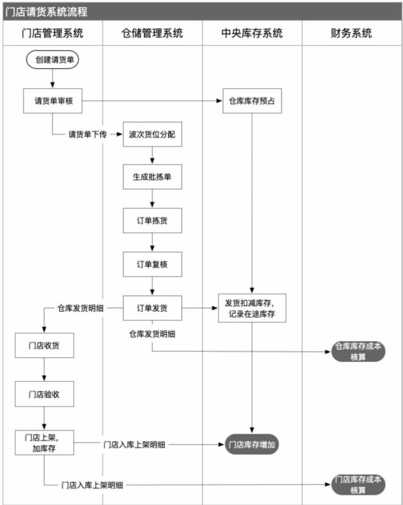

图4-14门店请货系统流程

① 门店负责人在门店管理系统中提交请货申请并审核。为防止超 卖，请货单审核通过后，最好向中央库存请求预占库存，代表此部分库 存已经被门店请货单占用了，其他渠道不能再下单。 

② 请货单下传到仓储管理系统中，仓库会集中多个门店的请货单 一起安排波次、货位分配、生成批拣单、拣货、复核、发货。发货以后 ，由于仓储管理系统中库存已经扣减，故需要通知04-中央库存系统同步扣 减库存。但由于此部分库存不是真正地售出，故可以记录为门店在途库 存，以便能无死角地进行监控。 

仓储管理系统发货以后，财务系统会根据发货明细计算仓库的库存 成本。关于仓库的成本核算方式，也是取决于企业的成本策略，大体分 两种情况：①如果仓库和门店单独核算成本，则仓库出库以后，需要重 新计算仓库的商品成本；②若仓库和门店同属于一个财务主体，共用中 央仓库的成本机制，则请货只是库存的转移，不涉及成本计算。 

③ 门店收到货以后，在门店管理系统中完成收货、验收和上架， 同时，上架明细传给04-中央库存系统增加实物库存，以及传给财务系统核 算门店成本（门店入库成本取仓库的出库成本）。 

这里有一个细节需要注意，门店实际收货的数据可能和仓库发货的 数量不一致，如路途破损、丢失等。所以门店最终应该以实际上架明细 记录库存并进行财务核算。 

## 4.2.6客户退货退款系统流程

仓库发货以后，若客户要求退货退款，则需要触发退货+退款两项 系统流程，如图4-15所示。 

① 客户在前端销售平台中发起售后申请，售后申请下达售后系统 中进行审核。审核可根据规则定为系统自动审核或客服人工审核。 

② 若退货申请不符合退货标准，售后系统需将驳回原因反馈至客 户端，供客户查看，客户可以申请仲裁或再次发起申请。若审核通过， 售后系统需反馈售后的退货地址到客户端，以便客户将商品寄到指定的 仓库。关于售后地址，有的企业是全国统一的退货地址，有的企业在每 个仓储点设立一个退货仓库，用以承接本仓发出的商品原路退回，最好 由售后系统按业务规则配置。 

③ 客户将商品回寄以后，在客户端回填物流单号（如果像淘宝的 售后一样与物流服务提供商系统进行对接了，物流单号可由系统自动回 填），同时，售后系统生成退货单传到仓储管理系统中。 

④ 仓库收到退货商品以后，分别由收货员、验收员、上架员在仓 储管理系统中完成退货的收货、验收和上架操作。上架完成以后，同步 中央库存和实物库存。 

⑤ 商品入库以后，告知售后系统货物已退回，若需要退款，则触 发财务系统的退款流程。退款分为自动退款和人工退款两种情况，若需 要人工退款（如由于商品质量原因，客服与客户协商不按原金额退款） ，则由客服人员在售后系统中创建退款申请单推送财务系统，由财务人 员审核后操作退款。 

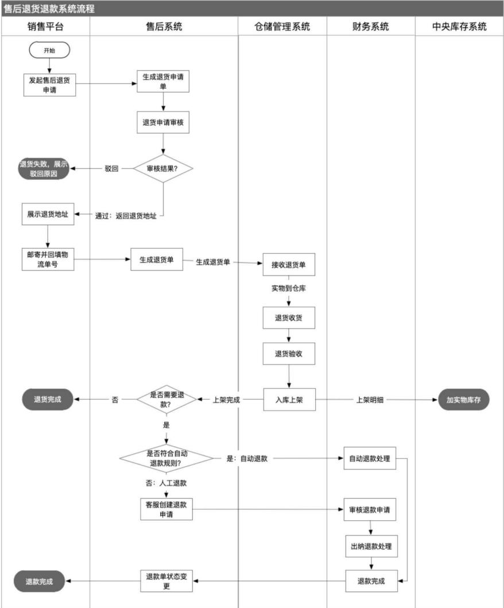

图4-15 客户退货退款系统流程

系统在处理退款时，要遵循以下两个原则。 

① 一定要确保商品完整无误地返回仓库以后才能退款，而且有支 付记录才需要退款。如果是货到付款的包裹拒收触发的退货，是不需要 退款的。 

② 退款最好按原路返回，这样可以有效地规避某些客户故意用信 用卡套现等风险，当然，在特殊情况下，如物流公司代收的货款，无法 原路退回，这时需要和客户商量一个有效确保双方利益的退款方式。 

## 4.2.7 门店退货系统流程

门店退货系统流程是门店请货系统流程的逆向流程，如图4-16所示 

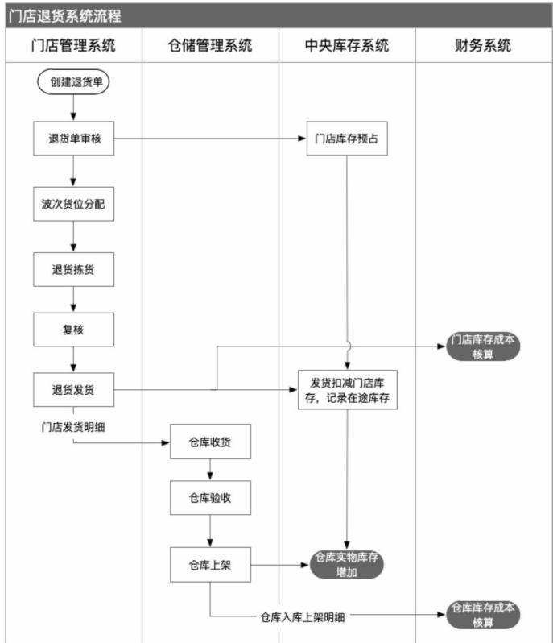

图4-16 门店退货系统流程

① 门店管理员在门店管理系统中创建退货单，审核以后，通知中 央库存系统预占库存，并在门店管理系统中完成退货单的货位分配、拣 货、复核和发货，发货以后通知04-中央库存系统扣减门店库存，以及在财 务系统中完成门店库存成本核算。 

② 仓库收到门店返仓的商品以后，在仓储管理系统中完成收货、 验收和上架操作，上架以后，通知04-中央库存系统增加仓库实物库存，以 及在财务系统中完成仓库的库存成本核算。 

## 4.2.8 退01-供应商系统流程

退01-供应商系统流程和电商出库系统流程略有不同，电商出库一般订 单明细较少，需要合并多张订单为一张批拣单，按批拣单拣货后再按照 订单进行分发（俗称播种），如此效率最高。但退供应商一般是将大批 量商品一次性退给供应商，可以用批量拣货，也可以按单拣货。在系统 设计的时候，我们可以将二者的系统功能合二为一，也可以分开设计。 

完整的退01-供应商系统流程如图4-17所示。 

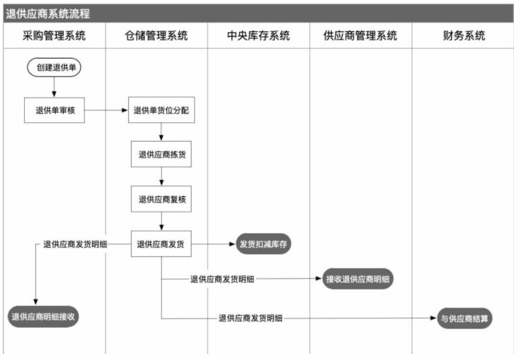

图4-17 退01-供应商系统流程

① 采购人员在采购管理系统中创建退供单，并提交审核，审核通 过后，将退供单传到仓储管理系统中。 

② 由仓储管理系统完成退供单的货位分配、拣货、复核和发货。 发货以后，分别通知采购管理系统、中央库存系统、供应商管理系统和 财务系统处理退货结果、库存处理和供应商结算。 

## 4.2.9 订单取消系统流程

我们常说的订单取消都是指订单在发货前取消，发货以后的订单取 消就走售后退货流程了。完整的订单取消系统流程如图4-18所示。 

系统在处理订单取消时，按照订单当前所处的履约状态，分为 4 个 阶段，其处理逻辑各不相同。 

① 如果订单已发货，说明包裹已经在运送途中了，这时已经超过 了系统能够拦截、取消订单的最后时机，故订单取消失败。 

② 订单在订单履约中心中尚未分仓：可直接取消，通知财务系统 退款。 

③ 订单已分仓，但尚未下发仓库/门店：此时订单尚处在订单履约 中心中，但已经分仓预占库存了。此环节的订单可以取消成功，但需要 释放04-中央库存系统中的预占库存，并通知财务系统退款。 

④ 订单已下发仓库/门店，但尚未发货：由于仓库/门店发货回传存 在一定的滞后性，为保万全，订单履约中心需要询问仓储管理系统和门 店管理系统，如果仓储管理系统和门店管理系统判断订单未发货，则取 消订单，已拣货的商品需要还货上架，然后回告订单履约中心，此订单 可取消，订单履约中心再处理本系统的订单取消逻辑，释放中央库存系 统中的预占库存，并通知财务系统退款。 

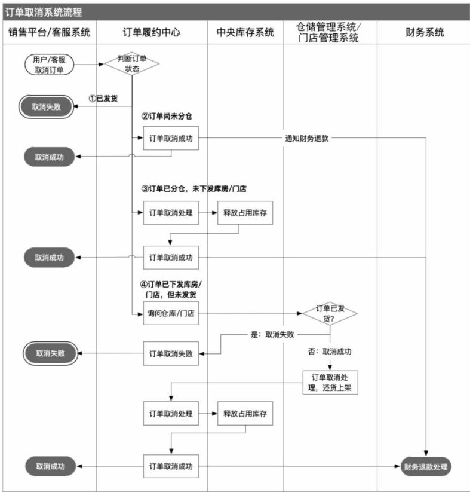

图4-18订单取消系统流程

## 4.2.10客户换货系统流程

客户换货分售前换货和售后换货两种场景，如图4-19所示，在系统 处理方面，根据原订单是否已发货为分界线。 

若原订单未发货，对应换货的流程是在售后系统中将原订单取消， 同时下发一张新商品的出库单，对应的是原订单的取消和新订单出库两 个系统流程。 

若原订单已发货，对应换货的流程是售后系统先生成原订单的退货 单并下发到仓储管理系统中，待客户将原订单商品退回以后，再下发新 订单的出库单至订单履约中心。对应的是原订单的退货入库和新订单出 库两个系统流程。 

无论是售前换货还是售后换货，在系统设计方面一定要保证原订单 商品成功返库后，才能将新订单发出，否则存在原订单商品发给了用户 而没有返回，新订单商品又再次发给用户的风险。 

简单的换货只涉及商品等价交换，不涉及金额的交割，复杂的换货 涉及原订单和新订单的价格差，体现在系统中便是根据新老订单的价格 差进行多退少补。 

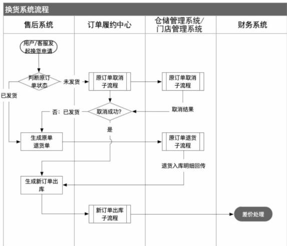

图4-19换货系统流程

## 4.2.11仓间调拨系统流程

仓间调拨业务体现在系统层面，就是两个仓库之间的库存转移，调 出仓的出库——减库存，调入仓的入库——加库存，如图4-20所示。 

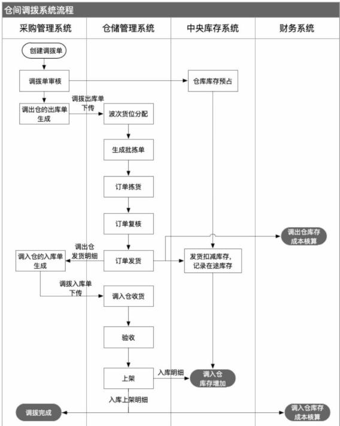

图4-20 仓间调拨系统流程

① 采购人员在采购管理系统中创建调拨单，审核以后，生成调出 仓的出库单下发到调出仓的仓储管理系统中。 

② 调出仓完成调拨单的出库后，将调出明细回传采购管理系统， 采购管理系统再生成调入仓的入库单下发到调入仓的仓储管理系统中， 同时通知04-中央库存系统扣减调出仓实物库存，并记录调入仓的在途库 存 。（免费获取更多供应链PM书 加v信：pmzjie） 

③ 调入仓收到实物以后，在仓储管理系统中完成收货、验收、上 架等操作，并将入库明细分别同步到采购管理系统、04-中央库存系统和财 务系统中做相应系统逻辑处理。 

仓间调拨和门店请货、门店退货在库存和财务方面的处理逻辑一样 ，本质上都是库存的转移。 

## 4.3拨云见日：供应链中台大揭秘

说起中台，从去年的风光无限，到今年的跌下神坛，再到现在的回 归理性，人们对中台的认知终将会回归其价值本身。中台的价值到底在 哪里？供应链中台又为何物？我们一起来揭开它们神秘的面纱。 

## 4.3.1中台与供应链中台

中台的兴起，源于阿里巴巴在2015年提出的“大中台，小前台”战略 。其核心思想是借鉴一家位于赫尔辛基的游戏公司 Supercell 的游戏制 作方式，以及美军 10 人左右的小团队作战体系，通过强大的后端支撑 能力，灵活高效的调整战略手法，快速适应前端业务。 

中台化的理念并不是全新的，只是在那个时间点被推上了风口。中 台化突出的是一种思想，其本质是复用和共享，指导我们将复杂的场景 抽象化，将通用的功能复用。从表现上看，它可以是一个系统，也可以 是一群跨系统的合集，还可以是某个系统中的一个小模块，甚至可以连 系统都不是，只是一种业务形态即可，只要能够快速应对不同的业务场 景，我们都可以称之为中台化，无论是供应链中台，还是数据中台、业 务中台，本质上都是如此。 

同时，中台也不一定只有一个，在大型公司里，可以存在多个中台 （每个业务都有其自己的中台），也可以以前台-业务小中台-集团大中 台的形式呈现，毕竟实现方式只是手段，解决业务问题才是目标。 

在电商新零售的整个业务和系统架构中，供应链无疑是处于后端的 一个极其重要且复杂的体系，特别是多平台多业务都需要共用供应链能 力的时候，它几乎无处不在却又深不可测，商品、订单、库存、仓储、 物流这些环节环环相扣，一不留神就会出现一些隐藏在冰山之下的疑难 杂症，解决起来费时费力，直接影响订单履约的效率。于是如何能让这 个庞然大物以小清新的姿态呈现给前端各业务，让不同的业务都能够共 用，且能迅速地接入，便是供应链中台的职责了。就像一个工厂一样， 我们需要将我们复杂的底层能力进行加工、封装，输出为业务需要的能 力，这个过程便是供应链中台化。 

## 4.3.2供应链中台的演化之路

供应链中台并不是凭空出现的，而是随着业务的发展慢慢形成的， 中台的建设也是一个持续完善的过程，没有终点。我们随着Z公司的业 务发展历程来回顾一下其供应链中台的演化之路。 

Z公司创业之初，主打3C数码垂直品类自营业务，为了快速支持业 务发展，整个公司就3套系统：业务前端App，运营后台（负责所有电 商前后台的业务）和一套简单的仓储管理系统（负责商品的收、发、存 、退），产品架构如图4-21所示。 

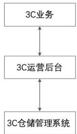

图4-21单一业务模式下的系统架构

由于业务简单，Z 公司运营系统和仓储管理系统都是贴合业务自行 订制的，所以调整起来非常方便。但随着业务的逐渐壮大，平台中的用 户越来越多，单纯的3C品类已经无法满足某些用户的需求了，于是公司 开始扩品类，让用户在平台中有更多的选择，同时提升平台的销量。为 了快速试错，各新品类的业务之间除了共用前端App入口和用户，后台 业务完全自由发展，以最快速度完成系统实现，于是照搬3C业务的系统 ，每个业务很快都有了自己的运营后台和仓储管理系统。公司业务的系 统架构如图4-22所示。 

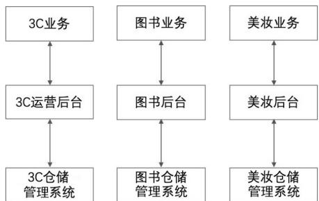

图4-22多业务系统架构

新业务的拓展很成功，订单量快速增长。但与此同时，公司也出现 了一系列的供应链问题。① 每个业务拓展以后，都需要自己从前端到 供应链末端搭建整套系统，资源严重浪费。 

② 每个业务都是自己做供应链，各自为政，自己制定作业标准， 服务水平参差不齐，极度影响用户体验。 

③ 各个业务之间没有打通，无法资源共享，形成规模效应，供应 链成本居高不下。 

意识到这样发展下去以后，平台口碑会越来越差，成本也居高不下 ，于是高层管理人员做出如下决定。 

① 成立交易中台团队，主要负责各业务线交易、支付、商品条线 的整合与收拢，各业务后台只负责业务端的逻辑。一些交易无法承接的 供应链业务，仍然采用从仓储管理系统获取的机制不变。 

② 后端单独成立供应链部门，招聘专业的仓储管理团队，将供应 链业务（采购、仓储、配送等）进行整合，同时研发了一套标准的仓储 管理系统，新开的仓库全都用这套标准系统。 

新的业务架构如图4-23所示。 

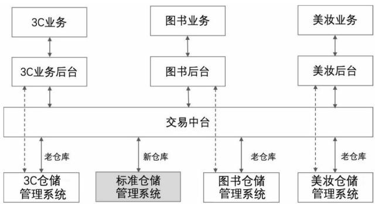

图4-23 引进交易中台的系统架构

这样的架构确实解决了业务问题，但随之而来的问题是，供应链侧 跟着业务的节奏变化太快，也越来越复杂，除了用标准仓储管理系统替 换老的各业务自建的仓储管理系统，公司还新开了线下门店仓，以及引 入了商家仓，每次业务进行调整，如新开仓库、增加拆单合单逻辑等， 交易中台都需要随之调整，只要一次没有通知到位，就必然出现商品、 库存、订单下发等一系列问题，任何一次仓储管理系统和门店系统出现 调整，交易都需要变动，真是苦不堪言。 

这样发展下去当然不行呀，从架构合理性方面来说，交易中台应该 更聚焦交易业务，供应链业务应该在供应链团队内部形成闭环，不应该 让交易过多地干预仓储的逻辑。于是，各位产品和技术人员根据业务现 状，对后端系统边界做了划分，系统架构再一次进行调整，便出现了订 单履约中心、04-中央库存系统和仓储交互中心 3 个系统：由订单履约中心 和04-中央库存系统与交易进行标准接口的交互（订单履约中心负责履约调 度，04-中央库存系统负责所有仓储管理系统的库存调度）；由仓储交互中 心与各个仓储管理系统进行对接（包含标准仓储管理系统，门店管理系 统和商家仓储管理系统），以此保证信息传递的标准化；交易中台无法 承接的业务（如库存、退货），也支持业务直接与订单履约中心和中央 库存系统交互。这样供应链中台的雏形就出来了，无论是新开仓库，还 是新开门店，所有供应链引起的差异和调整都能在供应链系统内部完成 。另外供应链体系还可以同时承接多个上游业务，此时的系统架构如图 4-24所示。 

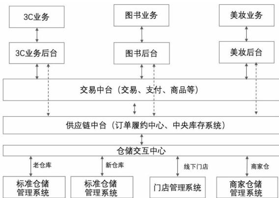

图4-24 供应链中台初长成

这样的系统架构更加合理了，各方都满意了。然而天下太平的盛况 并没有持续太久，业务人员尝到中台带来的甜头以后，又对供应链提出 了更高的要求：“你们后端的逻辑太复杂了，我们接入时还要了解你们 每一个系统的逻辑，好费劲哦，能不能更简单点儿，不要让我们对接这 么多系统？”。（你们是为公司创造收益的，是我们的衣食父母，所以 服务好你们，解决你们的痛点就是我们中台的职责所在）。于是，为了 给业务人员更简单的接入体验，供应链的各位产品研发（简称产研）达 人再次踏上了架构优化的征程，这回算是建立真正的供应链中台了，我 们把供应链各系统的功能拆散，再按照业务诉求组装成标准化中台服务 ，以便让业务更便捷地接入，如订单取消功能的提供，在供应链内部需 要订单履约中心、中央库存系统、仓储管理系统等多个系统联动，现在 只需要中台提供一个接口给业务系统调用就能立马告知订单取消成功或 失败。升级后的系统架构如图4-25所示。 

现在所有的业务都已经接入供应链中台了，这回应该可以舒坦一阵 子了吧！正当供应链产研人员沉浸在胜利的喜悦中的时候，又接到一个 新的项目：公司要在其他平台上开店了，商品销售系统、订单履约中心 、库存系统需要打通，希望新系统一个月上线……好吧，这是一个合理 的需求，似乎无法反驳，刚好我们的供应链中台经过一番沉淀以后，似 乎只需要增加一个“平台”的属性，就能够跨过自营业务，服务于其他平 台了，对于后端供应链来说，自营平台和第三方平台无非只是两个不同 的接入方而已（当然自营是亲爹，我们会有更多的VIP权限开放啦）。 

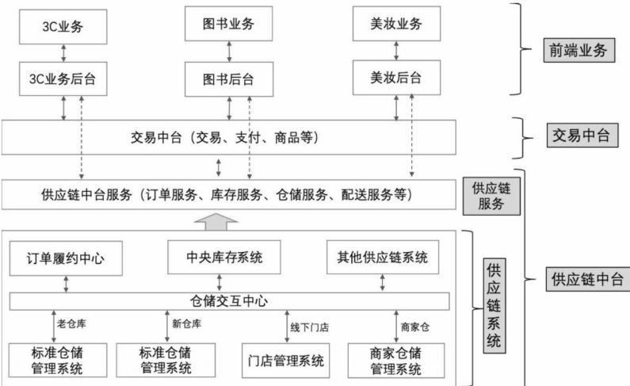

图4-25单一平台的标准供应链中台架构

于是供应链中台很快就完成了调整，成功地将第三方平台的业务接 入进来了。由于每个销售平台的基础数据、订单样式、库存形态不尽相 同，总不能让好不容易稳定的供应链中台再为每个平台适配一回吧，为 了解决这个问题，引进了一个平台交互中心系统，主要与外部平台对接 ，将每个平台的差异性放在这一个系统中进行标准化处理以后，再与供 应链中台进行对接，这样中台内部就不用受到平台业务差异的影响了。 反向与各平台交互的时候，也是同样在这一层进行反向输出。跨平台的 供应链中台架构，如图4-26所示。 

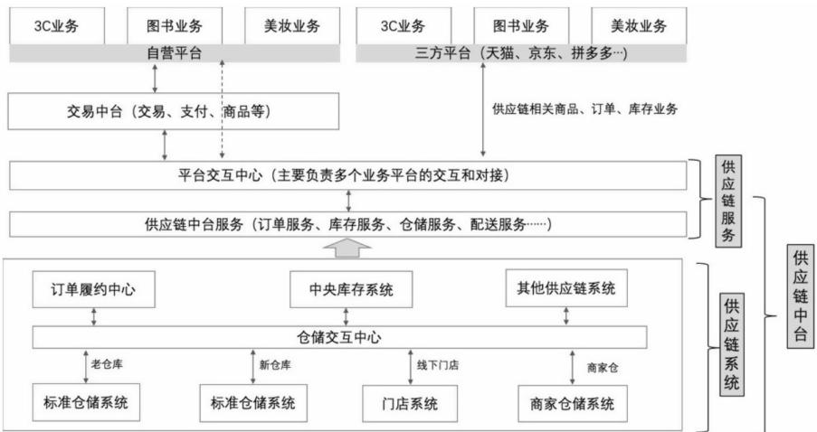

图4-26跨平台的供应链中台架构

故事讲到这里似乎圆满结束了，然而业务的发展并不像电视剧一样 会有剧终。如同我们设计所有的B端系统一样，始于业务发展，也终将 止于业务发展，供应链中台不断沉淀，带来的是系统架构的日益复杂和 组织人员的增加，系统比创业之初臃肿多了，对于已经有接入先例的业 务，我们当然能够快速应对，体现中台的威力。但有一天出了意外，原 因是业务方带来了一个新的业务模式，目前供应链所有的底层能力都无 法支持，如果进行调整，则工程量将巨大，还会影响其他已稳定的业务 。经各方评估以后，最终的结论是：为了快速试错，业务侧产研人员决 定自行搭建一套运营和供应链体系。 

一切仿佛回到了企业刚发展之初那样……。 

这是一个周而复始的故事，Z 公司在不断发展的过程中诞生了供应 链中台，并将供应链能力逐渐沉淀，为更多的业务赋能，但由于新模式 的接入和系统架构的日渐复杂，供应链中台最终又成为了业务发展的瓶 颈。 

中台是把双刃剑，使用得当会产生极大的价值，但若使用不当反而 会连累业务，因为它并不是万能钥匙。 

## 4.3.3供应链中台产品架构解析

如果某公司在天猫、京东、美团、拼多多、头条等电商平台都开店 ，且业务覆盖全品类商品（3C 数码、电脑办公、图书影像、食品生鲜 、医药保健等），若所有平台的店铺想共用采购、商品、仓储、库存等 供应链能力，如需要商品在各个平台上同时售卖且从同一仓库发货，这 就需要订单履约中心、库存管理系统、仓储管理系统同时对接多个平台 的业务，这便是供应链中台能力。我们需要将底层供应链的基础能力变 成中台服务，提供给各平台、各业务共用（如库存的同步、仓库的接单 发货等），于是，在现有各供应链系统之上便出现了一层中台服务层， 此服务层负责将供应链能力输出给业务侧，它可以是由某个底层系统直 接提供，也可以是由跨多个系统封装而成的服务，这便是供应链中台的 形成。 

一个典型的供应链中台产品架构如图4-27所示。 

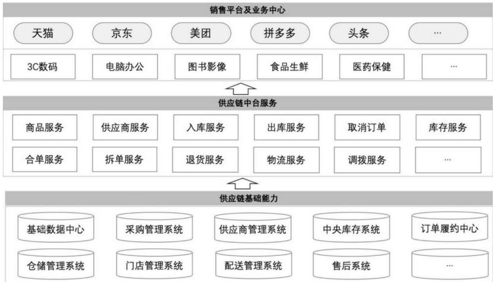

图4-27 供应链中台产品架构

在供应链中台架构中，最核心的就是将基础能力输出为能被业务快 速接入的中台服务，我们将输出的过程抽象成一个通用的模型，暂且叫 作“中台能力输出模型”，如图4-28所示。 

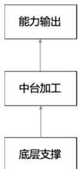

图4-28 中台能力输出模型

① 底层支撑。这是最底层的基础服务能力，但相对专业、烦琐， 外行人可能不好理解。例如，基础数据、履约、仓储、配送的能力，光 专业名词术语学习起来就比较费劲了，更不用说深入了解其底层逻辑了 

② 中台加工。这就是我们的中台化过程，将底层能力进行加工输 出，抽象为通用的可以解决业务问题的服务，让业务人员可以不用关注 内部细节，直接使用就行。 

③ 能力输出。这是中台服务的表现层，根据业务需求组装完成的 服务工具，业务人员可以直接拿来使用，表现层可以是接口、消息、页 面等多种形式。 

中台的加工过程可以分为两种形态：能力合并和能力拆分。 

① 能力合并。将多个分散的能力聚合到一起提供完整的解决方案 ，供业务人员调用，组装过程如图4-29所示。 

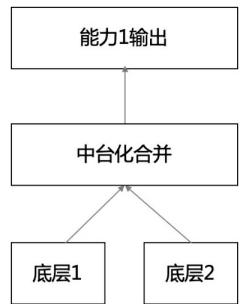

图4-29 中台能力合并输出

② 能力拆分。将一个大的能力进行拆分，拆解成一个个可以独立 运作的服务单元，供业务人员调用，如图4-30所示。 

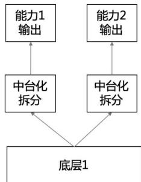

图4-30 中台能力拆分输出

例如，Z公司底层有多套仓储管理系统和多套配送管理系统，通过 中台化能力加工以后，将所有的仓储管理系统抽象为标准的仓储能力输 出，将配送管理系统抽象为标准的配送能力输出，同时将仓储和配送能 力合并后输出仓+配能力，这便为业务方输出了3种供应链中台能力：仓 储能力、配送能力和仓+配能力，如图4-31所示。至于底层有多少套具 体的仓储管理系统和配送管理系统，逻辑有多复杂，业务方无须知晓。 

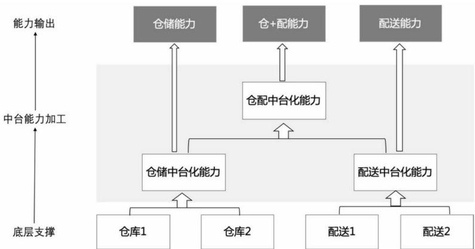

图4-31 仓配中台化示例

## 4.3.4 供应链中台的优与劣

在供应链领域中，系统都是为业务赋能的，否则系统就没有存在的 意义了。供应链中台的搭建，可以为业务方解决以下问题。 

① 公用的系统功能共享，避免研发资源浪费、重复开发。同时， 通过中台提供的通用解决方案，也可以避免各业务各自为政的情况发生 

② 业务之间相互赋能，取长补短。例如，为A业务提供的功能，刚 好B业务也需要，则可以直接提供给B业务使用，支持B业务的发展。 

③ 将后端供应链能力打包提供标准化解决方案，让业务开展更加 简单、快捷，可以支持业务快速试错。 

④ 通过中台将不同业务聚合，产生规模化效应，形成合力。例如 ，接入三方物流配送时，如果各业务独自对接，由于包裹单量较少，无 法拿到低价折扣，但如果通过供应链中台，将各个业务单量汇总起来， 便可以与物流服务提供商议价，拿到一个更低的折扣价格。 

⑤ 跨平台、跨系统功能聚合，让业务方不需要操作多个系统。很 多操作和数据原本需要跨多个系统才能完成，如商品的相关数据需要从 基础数据中心获取，订单信息需要从订单履约中心获取，库存需要从中 央库存系统获取，但通过供应链中台将功能聚合以后，就可以为业务方 提供一个完整的查询功能了，一个页面搞定所有数据。 

供应链中台有很多好处，但也并不是家家都适用。如果搭建供应链 中台，一般需要具备以下几个条件。 

① 公司有多平台、多业务形态，并且各业务有共性，如商品共用 、库存共享等。有一个最基本的原则判断某一项功能是否需要中台来实 现，便是“此功能是否有两个以上的业务在使用”，如果只有单平台、单 业务，建设中台的意义就不大了。 

② 公司有多仓储配送形态，供应链中台可以将仓储配送能力标准 化输出，减少业务方与每个仓储和配送管理系统对接的难度。 

③ 公司业务模式比较清晰，业务相对稳定，整体框架不会有大的 变动，这时才适合搭建中台，如果业务模式一直在调整中，中台是无法 成型的。 

以上三点是客观条件，还有第四点，属于主观条件但非常重要。 

④ 中台建设往往要跨多个业务和组织，如果不纳入企业战略计划 ，没有企业高级别的管理人员（如CTO或CEO）主导推进，很难有成效 ，毕竟业务部门都需要背KPI，配合做中台在短期并不会为其带来效益 。所以，战略推进中台建设很重要。 

当然，如果使用不当，供应链中台的弊端也是相当明显的。 

① 如果各个业务之间的供应链差异很大，不适合用供应链中台强 行聚合到一起。 

② 如果业务发展很快，中台功能尚不够完善，而研发资源又不足 ，很容易成为业务发展的瓶颈。 

③ 因为中台的建设需要以标准和通用为原则，需要考虑各业务的 共性和相互影响，在中台功能还比较薄弱时，其升级迭代难度比独立开 发系统的难度要大。 

## 4.3.5 供应链中台实用设计方法

在搭建供应链中台时，需要遵守三个原则。 

① 包容性原则。中台需要支持各种业务的接入，且允许不同业务 之间的细微差异存在。不能接受业务差异的中台是不可靠的，尤其是供 应链，需要支持不同平台的业务，各平台的业务规则存在一定的差异是 在所难免的。 

② 稳定性原则。中台应该是个相对中立的系统，不是为某个平台 或业务量身定做的，所以必须保证主体结构的稳定性，不能随着业务的 发展，随意调整底层逻辑。 

③ 可扩展性原则。中台系统不是一次性的，用完即扔，也不是为 某一个业务而单独设计的，所以在设计时要兼具扩展性和开放性，能够 扩展更多场景、更多功能和更多业务。 

分享一些在供应链中台搭建过程中经常用到的设计经验，供大家参 考。 

① 努力提升复用性。能不能复用是衡量中台价值的一个很关键的 参考因素。在梳理系统边界时，要将多业务通用功能提炼、抽象，并下 沉至中台，而不通用的功能可以留给业务系统自行实现，保证中台的稳 定和纯净。例如，基础数据、仓库权限、库存等功能，都是各个业务通 用的功能，便可以交由供应链中台统一承接，避免业务重复建设。但如 果每个接入的业务方有不同的业务规则，如A业务要按仓库分配物流， B业务要按地区分配物流，双方逻辑互斥无法达成共识时，可以将物流 分配的功能交给业务侧处理，中台仅提供物流信息的输出和接收分配的 结果。 

② 贴合业务做中台。中台和平台最大的区别是平台只提供各种组 件让业务自行组合，不参与业务，而中台则更贴合业务。在设计时，尽 可能将跨系统的功能集成，为业务方提供一站式解决方案，可以降低业 务接入的难度。例如，订单查询功能的集成、中央库存集成、跨系统取 消订单功能集成等。 

③ 求同存异和业务共建。当遇到某些业务无法完全统一的情况时 ，可以由中台负责整体节点控制，但在某些分支可以开放个性化的需求 窗口给各业务侧来填充，这是设计模式中的工厂模式思想。例如，订单 下发至订单履约中心以后，有个订单审核的环节，用于排查疑似恶意订 单和异常订单的审核处理。由于每个业务对异常订单的审核标准不同， 订单审核如果都由订单履约中心实现，则相关人员需要梳理所有业务侧 的规则，这种业务规则并不是供应链中台应该关心的，便可以将特殊审 核的逻辑开放给业务系统来实现，订单履约中心只需要在订单审核的节 点上调用对应业务系统的接口来获取审核结果即可。如图4-32所示。 

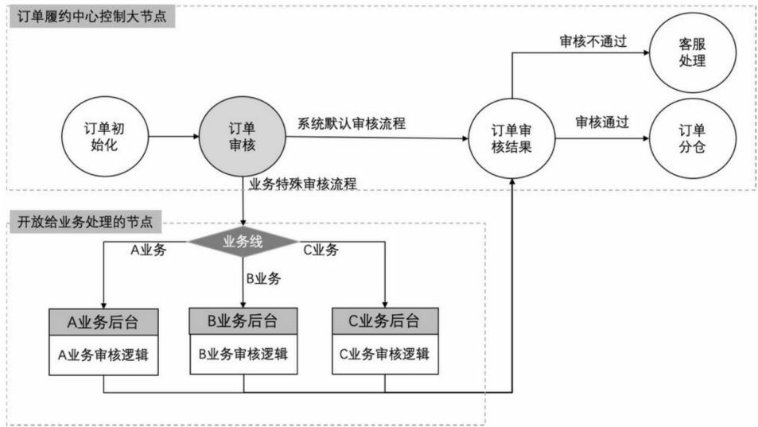

图4-32 订单节点开放给业务系统

④ 链路配置不同业务场景。当不同的业务需要走不同的流程时， 可以通过链路配置的方式来实现。例如，仓库入库支持到货登记、收货 、验收、拍照、上架5个节点，但并不是所有的业务都需要这 5 步操作 。于是我们就可以增加一张配置表，按照业务配置不同的链路，在仓储 管理系统中入库时，便能按照此链路配置驱动不同业务走不同的入库流 程了，当上一个节点操作完成后，系统会根据配置自动跳转到链路中的 下一个节点，如图4-33所示。 

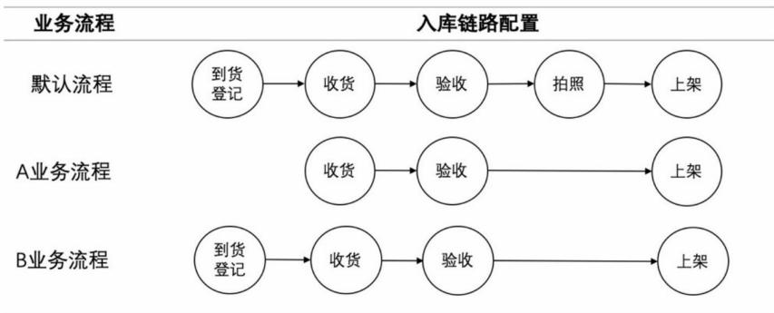

图4-33 入库链路配置

⑤ 通用字符串与枚举值扩展新场景。当业务场景越来越多时，今 天要按业务送精美礼品、明天要求按平台使用不同的包装，我们不能总 是要求技术人员扩展新字段来记录新的业务，特别是关键表单，每每调 整可能影响上下游企业，但业务也不能不支持，那怎么办？相关人员可 以定义一个长字符串，如0000000000，这是一个10位的字符串，我们可 以对每一位分配0～9，A到Z等不同的枚举值，每个值代表一种业务属 性。例如，第一位代表平台，第二位代表包装属性（普通包装、精美包 装等），1000000000 代表自营订单，2000000000 代表第三方平台订单 ，1100000000代表自营平台的精美包装，字符串的位数可以不断扩充， 枚举值也可以扩充，还可以进行两位组合、三位组合等，这样就可以扩 展无数的场景了。 

⑥ 通用属性和扩展属性搭配妙用。不同的业务、不同的商品品类 之间存在一定的差异，但作为中台需要兼容，该怎么办？我们可以把属 性分为通用属性和扩展属性两组。所有业务和品类都通用的属性通过通 用属性存储，每个品类个性化的属性用扩展属性存储，可以通过长串报 文将商品和业务的属性放到数据库中的一个字段中进行存储。这样通用 属性和扩展属性搭配便能存储全品类商品信息了。例如，在设计商品相 关的功能时，商品编码、名称、类目是每个品类都必需的，这一类数据 便放在通用属性中，而图书的版本、手机的网络制式、衣服的尺码等， 属于每个品类特有属性，就通过扩展属性来存储。 

不仅是商品属性，标准订单状态+扩展订单状态、标准商品库+业务 自有商品库、通用操作+个性化操作等场景都可以按此思路来设计，以 达到供应链中台兼容不同业务的目标。 

⑦ 通过扩展字段来适配不同的属性。再强大的系统也不可能囊括 所有行业的业务属性，但可以留出空间给用户自定义。不同于上面将扩 展属性通过长报文存到一个字段中，此设计思路是通过扩展不同的字段 存储不同的属性，但数据库中同一个扩展字段对应不同的业务存储的属 性不同，此类设计在用友、金蝶等将软件服务商的产品形态上比较多见 

例如，某公司在做商品属性设计时，在数据库中总共设计了10个字 段，前4个字段为固定字段，存储通用属性（商品ID、商品名称、规格 、类目），后6个扩展字段预留给用户自行配置，存储各行业个性化的 属性，如图4-34所示。 

<table><tr><td>字段1</td><td>字段2</td><td>字段3</td><td>字段4</td><td>字段5~10(扩展字段)</td></tr><tr><td>商品ID</td><td>商品名称</td><td>规格</td><td>类目</td><td>扩展属性存储:由各行业用户自定义页面显示名称和存储的内容。</td></tr></table>

图4-34 固定字段与扩展字段设计

现有手机行业用户A，配置了扩展字段5～9，分别对应内存、容量 、网络制式、主屏幕尺寸、运营商；服装行业的B用户，配置了扩展字 段5～8，分别对应货号、尺寸、风格、材质。于是，A、B两个用户在 使用系统时，便能分别看到不同的属性名称了，但在数据库中A、B两 个用户对应同样的扩展字段，如图4-35所示。 

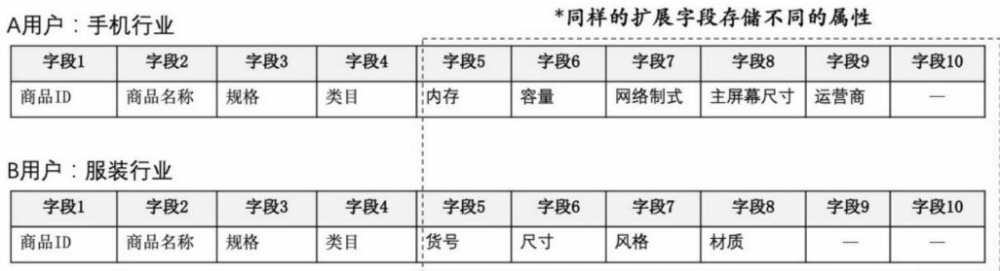

图4-35扩展字段存储不同属性

⑧ 灵活使用适配器保证供应链中台的稳定性。为了保证供应链中 台内部逻辑的一致性，可以通过适配器来将外围各业务逻辑转换为供应 链体系认可的标准，这样就能将差异在供应链中台之外解决，不用供应 链中台来迁就业务了，保证了中台架构的稳定性。通俗的说法就是映射 。如不同平台的地址库的统一、不同平台SKU编码的统一、不同业务订 单状态的统一等，都可以通过适配器来进行转换。 

⑨ 系统参数很重要。做中台，不可能百分百标准化，难免会遇到 不同业务要求、不同逻辑的情况，这时，就可以增加一张系统参数表， 使用系统参数来配置不同的业务逻辑。例如，A 仓订单需要合单，B 仓 订单不需要合单，为了同时响应两个仓的业务诉求，便可以增加一个” 是否需要合单”的参数，配置为“是”则合单，为“否”则不合单，由A仓和 B仓自行配置。 

⑩ “借花献佛”也不错。供应链中台的设计是为了解决业务接入难的 问题，有些能力如果其他系统已经具备，我们可以“借花献佛”，并不需 要所有功能都自己实现。例如，04-中央库存系统对外统一提供库存服务， 如果某业务需要关注批次库存，但04-中央库存系统并没有管理到此维度， 我们可以直接将仓储管理系统中的批次库存能力封装后对外提供即可， 并不需要为此业务单独升级底层架构，只要能够满足业务诉求，借花献 佛也不错。 

⑪ 功能分而结构合。有的时候我们不得不面临多个业务的需求不 一样，但我们又不得不同时满足的情况。在这种情况下，如果把多个业 务的需求强揉到一起，系统必然会变得不伦不类，既如此，不如将操作 功能完全分开，但保证底层单据的状态、表的结构一致，如此仍然是一 个完整的中台系统。例如，门店和大仓都使用收货功能，但由于门店人 力和场地都有限，无法像大仓一样做到精细化管理，此时我们便可以分 别为门店和大仓设计各自的收货功能，从操作层面上完全独立，但底层 结构仍然是一体的，丝毫不影响中台的整体建设。 

以上只是众多设计经验中的点滴，有关供应链中台的搭建，产品设 计和架构设计在思想上是相通的，感兴趣的朋友可以多看一些与设计模 式相关的书籍，对提升我们自身的规划能力有极大的帮助。 

## 4.4进阶之路：供应链系统设计内功心法

我们总是羡慕他人的产品基本功扎实，羡慕他人绘制的产品图清晰 大气，羡慕他人在工作处理方面游刃有余，“他人”无处不在，总让我们 望洋兴叹，何时我们才能像“他人”一样优秀？临渊羡鱼，不如退而结网 ，只要我们在日常工作中善于总结和积累，找到正确的学习方式，然后 潜心研习，总有一天，我们也会成为别人眼中的“他人”。下面介绍几个 木笔总结的供应链系统设计内功心法，便于我们更好地设计供应链系统 

## 4.4.1B端系统设计必备“六脉神剑”

糟糕的产品经理在填坑，普通产品经理在砌墙，优秀的产品经理在 打地基。 

做产品设计时，虽然不像系统开发需要考虑那么多的设计模式，但 大道相通，产品经理在做产品设计时一样需要有优秀的架构思维，才能 保证产品底层架构夯实，有能力承接不断调整和变化的业务，不至于让 任何业务的变化都给系统带来灾难性的调整。本节总结了B端系统设计 的六脉神剑，分别是抽象思维、脉络思维、极简思维、积木思维、闭环 思维、管道思维，这6个系统设计思维，不仅适用于供应链系统设计， 同样适用于其他B端系统设计，望君采纳。 

## （1）第一脉：抽象思维

抽象思维是一种总结、提炼事物共性的思维，考验我们的思维逻辑 。如果两个业务场景的大部分功能都相似，只有少部分不一样，我们就 可以将它们抽象为一个通用的底层功能，并在此基础上拓展不一样的业 务逻辑，而不是为每个场景单独设计一套功能。 

抽象的好处是可以极大地提升系统的复用性和稳定性，将已有的功 能聚合，在核心逻辑不变的前提下快速接入其他业务。 

众所周知，库存是供应链中最核心的逻辑，几乎所有供应链业务的 开展都会导致库存的变化，采购入库，销售出库，用户退货，退供应商 ，盘点……如果每增加一个业务，我们都需要在仓储管理系统和中央库 存系统中对库存底层逻辑加以调整的话，那简直是不可想象的，一旦处 理不好，不但无法为新业务提供支持，还会因为动了核心库存逻辑而影 响已经在运行的业务，风险甚大。 

通过分析，我们发现所有业务的本质无非就是加库存和减库存，不 同的只是业务开展的形态。于是，我们将库存的处理抽象为加、减底层 核心逻辑，对外提供标准服务，在此之上扩展一层业务接入层以便进行 业务对接，如图4-36所示。如此一来，底层库存服务只需处理加减数量 ，不会轻易变动，无论上游业务如何变化，只需要在业务接入层做调整 即可，不会影响其他业务。 

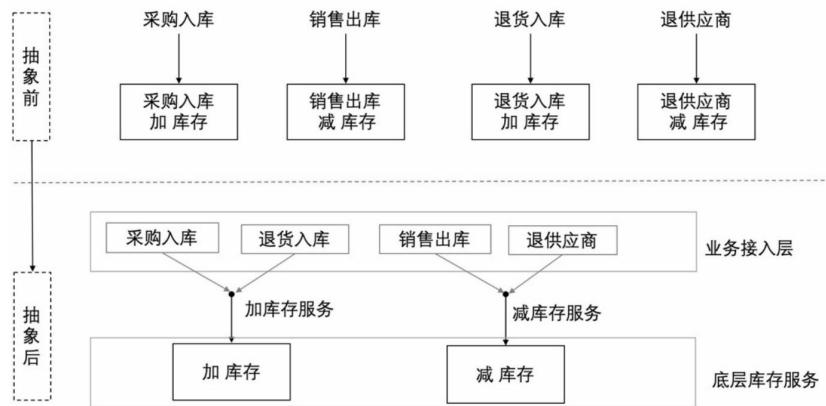

图4-36 库存服务的抽象化

## （2）第二脉：脉络思维

脉络思维是将模糊混乱的业务进行分析、拆解、细化，直到一个个 清晰的功能点，建议如下。 

① 将模糊的需求具象化。在面对业务方提出的一句话需求时，不 用惊慌，这时，就需要我们发挥庖丁解牛的精神，层层拆解直到可以落 地的最小颗粒度，其解决方案也就明了了。 

② 把混沌的逻辑分层化。如果一个业务涉及多个上下游系统或多 个逻辑之间的交互时，不要将其混为一谈，应该从核心逻辑出发慢慢梳 理，将不同系统之间的边界和层次划分开来。 

③ 把交织的场景解耦化。理想的设计是一个功能完成一个业务场 景，如果一个功能中涉及多个角色、多个操作或多个场景时，就要考虑 解耦，将其分成多个功能需求来实现。 

有了清晰的脉络思维，无论面对多么复杂的业务，我们都可以从容 面对。系统功能被充分解耦以后，逻辑更清晰，也降低了系统的复杂性 

，不至于牵一发而动全身。 

仓储管理系统中的库存盘点功能经常出错，原因是盘点员、盘点主 管和仓储经理都在一个页面中操作，盘点员做盘点计划、盘点主管负责 盘点差异的处理和提交、仓储经理负责盘点审核。由于页面共用而没有 做权限控制，相关人员经常出现误操作的情况，盘点员不小心误操作了 盘点差异处理和盘点审核。 

后来，产品经理小Q将盘点功能一分为三，拆解成了盘点计划、盘 点差异处理和盘点审核三个页面，如图4-37所示，通过菜单分别管理盘 点员、盘点主管和仓储经理的权限，此后再也没有出现过误操作的情况 

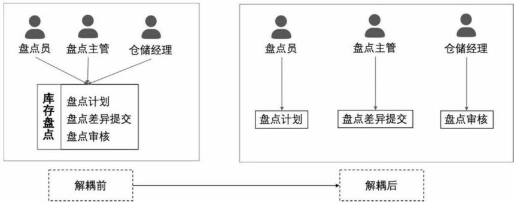

图4-37 盘点功能解耦化

## （3）第三脉：极简思维

大道至简，好的产品是简单的，好的业务是纯粹的。无论是业务流 程设计，还是系统设计，我们都要尽量追求极简，极简的流程可以极大 地降低人工成本，极简的系统操作起来更加流畅、出错率低。建议如 下 。（免费获取更多供应链PM书 加v信：pmzjie） 

① 流程极简，系统极简。B端系统设计，流程大于交互，相关人员 首先要思考流程的极简，其次考虑如何围绕流程来实现系统功能的极简 

② 架构极简，化繁为简。系统架构应尽量简单，多系统交互时， 参考软件设计原则里的迪米特法则：只与你的直接朋友交谈，不跟“陌 生人”说话（Talk only to your immediate friends and not to strangers）。与 尽量少的系统交互，降低系统之间的复杂性。 

③ 页面极简，主次分明，重点突出。页面应该尽量简化，相关人 员在进行系统设计时应突出页面核心功能区，让用户一眼就分清主次； 

核心按钮摆放在更加显眼的位置，以突出重点。 

④ 操作极简、效率为先。B端功能以成本和效率为首要目标，设计 时让系统代替人工，极力减少人为操作和人为判断成本。 

仓配交互中心系统的设计就是极简思维的应用，符合迪米特法则。 假设下游有 3 套不同的仓储管理系统，上游有采购管理系统、订单履约 中心和04-中央库存系统，若需要正常地开展业务，上游的系统需要分别和 每个仓储管理系统进行对接，如果再新开一个仓库，则上游的系统又分 别需要再与这个新仓的仓储管理系统对接一次，工作量非常大。 

但如果引入一层仓配交互层，由仓配交互中心与下游各个仓储管理 系统的标准化接口进行对接，上游业务系统统一和仓配交互中心对接即 可，无须关注下游有多少套仓储管理系统，如图4-38所示，这样即便开 了新仓，也只需要新仓储管理系统与仓配交互中心的标准接口接入一次 即可。 

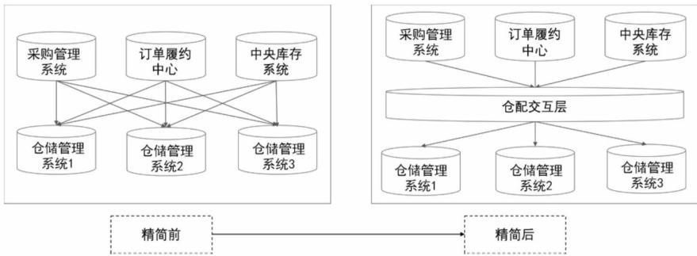

图4-38极简思维应用—仓配交互中心

如果我们理解了极简思维，就明白极简并不意味着残缺，而是要求 我们能够分清主次，提炼精髓，尽量精简，这是对我们的产品设计功底 极大的考验。 

## （4）第四脉：积木思维

积木思维是现在主流的中台化设计思想，符合SOA（Service Orient edArchitecture，面向服务的架构体系）理念，要求我们把系统功能碎片 化，并能够重新组装为新业务赋能。 

B 端系统的设计应该和搭积木一样，将庞大复杂的流程化繁为简， 先碎片化为一个个可以独立使用的服务，通过不断的沉淀，形成我们的 积木箱，当有新业务接入时，我们便从积木箱中提取相应的积木块，像 搭积木一样，重新组装为业务需要的模块，快速适应新的业务。 

在产品设计时引入积木思维，可以极大地提升系统功能的复用性， 增加系统的柔性。当我们的积木箱中的积木块积攒得足够多时，我们就 可以以最小的成本为新业务提供强大的后台能力支撑。 

针对订单下发、订单取消、退货单建单三个业务，我们分别在积木 箱中放入了 3 个积木块：下单服务（订单履约中心）、取消订单服务（ 订单履约中心）和退货单下单服务（售后系统），如图4-39所示。 

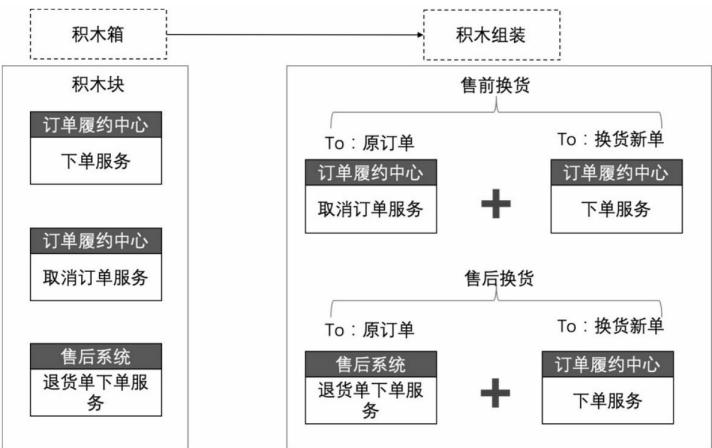

图4-39积木思维示例—客户换货

当客户换货业务接入时，我们经过分析，得知售前换货发生时机为 订单尚未发货前，售后换货发生时机为订单发货以后，如果将这一功能 独立实现，要重新设计一个包含下单、取消和退货等功能的系统，工作 量极大。但通过模块组装，我们只需要将取消订单服务和下单服务进行 拼接即可实现售前换货业务，将退货下单服务和下单服务进行拼接即可 实现售后换货业务。 

积木虽好，但也有其局限性，当一个业务的需求超过了当前积木箱 能够组装的范围，强行组装往往会适得其反，这时就需要相关人员制造 新的积木块了。 

## （5）第五脉：闭环思维

闭环思维要求我们在进行系统设计时要考虑到系统流程和系统功能 的完整性，不要出现阻断式的功能缺陷。在实操时，我们需要把握以下 几个原则。 

① 有始有终。当一个流程节点开始以后，一定会有一个与之对应 的结束节点，而且秉承谁发起，谁结束的原则，流程的发起方，也应该 是最后的结束方。例如，采购流程在采购管理系统中发起，最终货物入 库以后，也需要通知采购管理系统，告知此单已完成入库，由采购管理 系统完结此次采购流程。 

② 有来有回。我们不能只考虑正向流程，还要设计与之对应的逆 向流程和异常流程，操作、状态都是如此，千万不能有去无回，变成一 条死胡同。在资源紧张无法提供系统功能时，我们可以通过线下处理或 者技术支持的方式来保证闭环的形成，千万不能置之不理。 

③ 有求必应。当有外围系统发起交互请求时，一定要建立及时反 馈机制，如果没有反馈，可能就出现外围系统的流程阻塞了。例如，退 款流程，由用户端或者客服系统发起订单取消申请，如果订单履约中心 没有反馈，退款流程就无法继续进行了，这极大地降低了用户体验。 

闭环思维表现在系统设计方面是正向流程和逆向流程、正常流程和 异常流程的全覆盖，如图4-40所示。 

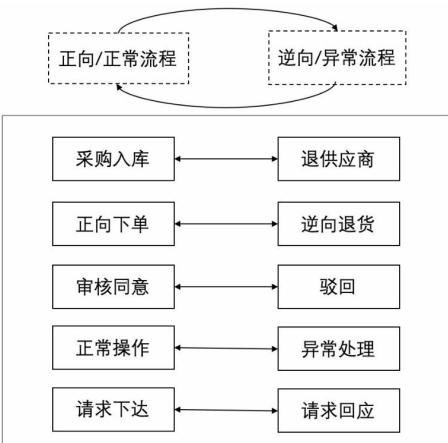

图4-40闭环思维

## （6）第六脉：管道思维

管道思维是一种开放、连接的思维，连通产生价值，我们设计的系 统应该是立于现在、放眼未来，具备与外界连接的能力。供应链讲究协 同，系统的设计自然也需要有足够的开放能力，像管道一样，方便与外 界连接。 

如何开放呢？有如下几个思路。 

① 功能开放。在以某个需求为出发点进行设计时，思考此功能是 否可以支持其他业务的发展，若有其他类似的业务发生的可能性，那就 可以提前做好预留接口。 

② 接口开放。在设计新系统时，思考与其他系统的协同和连通， 开放自有数据、服务、软硬件接口供外部系统接入，让数据自由流转， 产生单个系统无法实现的价值。 

③ 业务开放。实现公司内部业务的功能时，思考未来能否为外部 业务赋能。例如，履约、采购、库存、仓储、配送能力的对外开放、系 统的开放等。 

管道思维可以让系统有更多的灵活性和扩展性，为未来业务的拓展 打下基础。 

考虑到未来业务的发展，仓储可能会有两个业务转型：一是接入自 动化设备以提升仓库作业效率和准确性；二是仓储对外开放，引入三方 仓储业务入仓代运营。小Q在设计新仓储管理系统时，提前预留了两个“ 管道”：①在出入库流程中预留了设备接入的接口以应对自动化设备接 入；②在系统中增加了“货主”标记，以应对三方业务入仓后多货主的情 况。 

果不其然，8个月以后，仓储部门利用一套DPS电子标签货架辅助 货物出库，一年以后，仓储产能富余，又开始引入三方物流业务。仓储 管理系统在没有改变整体架构的情况下迅速做出调整，及时支持了新业 务的开展。 

## 4.4.2简单五步设计出心仪的产品架构图

产品架构图是我们每个产品经理成长到一定阶段必须要掌握的技能 ，无论是汇报，还是做系统规划，这都是必备良药。画架构图有助于我 们站在更高的视角来梳理整个业务和系统，很多站在单个系统角度无法 解决的问题，站在整体角度就迎刃而解了。 

关于产品架构图的设计，就如同我们设计大厦，站在不同的角度， 画出的模型是不同的，因为视角和侧重点不同，所以我们需要有针对性 地突出规划重点。 

假如我们站在整个电商系统全域视角，我们的关注点是电商前台和 后台所有的系统、功能和模块，我们设计的产品架构图，如图4-41所示 

在图4-41中，我们的目的是将电商的全貌展示出来，所以无论是电 商前台还是电商后台的每一个功能和模块在全貌图中都是一个独立的子 模块，不需要重点突出谁的重要性，因为大家都同等重要，不然就有人 会问了：“为什么××系统这么重要，难道我负责的××系统就不重要吗？” 。试想一个情景，如果你是公司前台和后台的产品的整体负责人，在用 PPT汇报整体架构的时候，台下坐了一众高管和各系统的技术人员，假 如我们把前台功能突显出来，占据了整张图片的80%以上，而后台功能 只占整张图片的20%，那么负责后台的技术人员会做何感想？ 

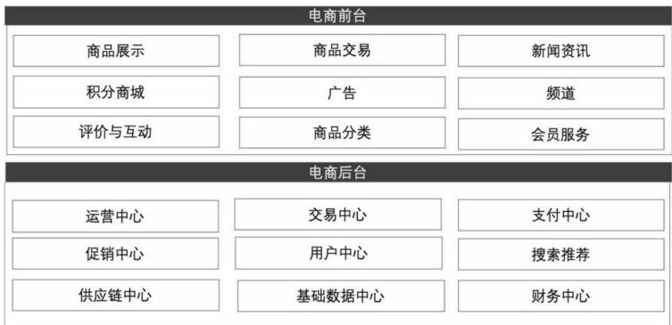

图4-41全域视角的电商系统架构图

但是，如果我们只是负责某个领域的产品经理，在汇报时，如果也 摆出一张如图4-41所示的全局图，那么我们不但不会受到表扬，还会被 批评为没有重点。所以在设计某个具体领域的产品架构时，我们需要把 重心放到所负责的版块上，外围相关版块则要适当弱化（尽管我们知道 每个系统都很重要）。 

例如，要汇报电商运营中心的产品架构图，我们需要重点突出运营 中心版块，产出的产品架构图，如图4-42所示。 

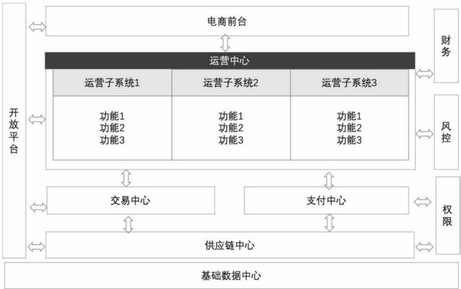

图4-42运营视角的产品架构图

如果站在供应链视角呢？我们再把图4-42稍加改造，侧重供应链中

心，弱化运营中心，便成了图4-43这样。 

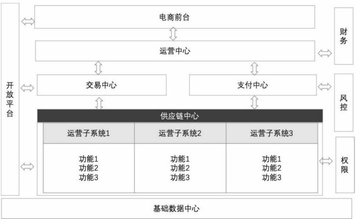

图4-43 供应链视角的产品架构图示例

感觉就像堆积木一样，是不是很有意思？ 

爱思考的朋友可能会问：我能不能只画自己管辖的领域？不画其他 外围系统？当然可以，产品架构图的目的在于如何清晰地表达各系统之 间的关联性，怎么画并不重要，不过如果我们在设计系统的同时能同步 关注到上下游系统，这样就会显得我们更加具有全局视角。 

以上讲述了如何站在不同视角设计不同产品的架构图，看似只是几 个模块之间的拼凑，但要能清晰完整地展示整个产品的形态和各系统模 块之间的关系，还要兼具美观性，也并非易事。对于很多初次做整体系 统规划的朋友来说，感觉有些无从下手，如何从0到1设计出一张较为完 善的产品架构图呢？木笔总结了产品架构图设计过程的5个步骤。 

## （1）懂全局

既然是产品架构，必然需要更宏观的视角，才能看到整个系统全貌 。所以，在开始设计之前，我们需要了解以下信息。 

① 公司的整体业务形态：例如，有哪些核心业务，业务开展的销 售渠道是怎样的（线上电商、线下门店、有没有其他平台店铺），业务 开展的方式是自营模式还是平台模式，有没有自己的仓配等。 

② 公司的系统现状：主流业务的开展涉及哪些系统，各系统的分 工和使用方分别是什么。 

③ 公司的核心业务流程：每个核心业务流程涉及的部门和角色、 流程的起止节点等。 

在了解全局的过程中，不需要太细，就像我们看地图一样，能够知 道边界和大版块在哪里即可，不需要深入了解每一个细节，否则可能陷 入细节。 

## （2）理系统

在了解了全局以后，下一步我们就需要把核心系统梳理出来，在这 个过程中，我们可以以业务流程为出发点，明确各系统在业务流程中的 定位，以及各方之间的关系，如以最常用的用户交易为主线，我们根据 用户从搜索商品到最终交易完成的整个流程，便可以很轻松地梳理各环 节涉及的系统，如图4-44所示。 

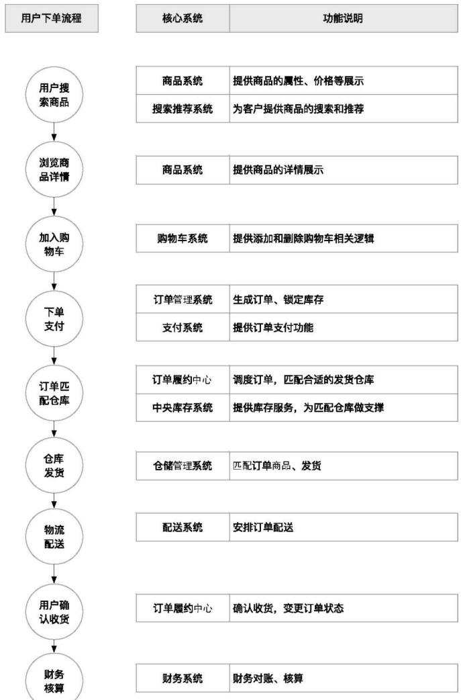

图4-44用户下单流程及系统梳理

以上只是列举用户下单的流程和系统梳理方法，同样我们可以按照 此方法梳理出营销、促销、采购、退货、财务等其他相关业务的系统， 只要我们将业务流程梳理清楚，系统和功能也就明确了。 

## （3）划分类

所有的系统梳理完毕了，如果平铺下来，会显得密密麻麻没有章法 ，所以下一步我们需要将系统分门别类、让相同属性的系统组合成一个 大的版块，并把版块和版块之间的关系标注出来，这样就能让这些静态 的系统‘流’动起来。 

系统分类的方式有很多，可以根据实际情况进行分类。 

① 按前台、中台、后台划分：前台系统、中台系统、后台系统、 外围辅助系统等。 

② 按系统功能划分：运营类、营销类、客服类、供应链类、财务 类等。 

③按业务形态划分：B2B、B2C、O2O等。 

例如，我们可以根据业务属性的不同，将供应链系统划分为供应链 基础数据（提供基础数据服务）、供应链业务中心（上游业务支撑层） 和供应链仓配中心（下游仓配执行层），基础数据为业务中心和仓配中 心提供基础服务，业务中心和仓配中心之间根据业务流向上下联动，如 图4-45所示。 

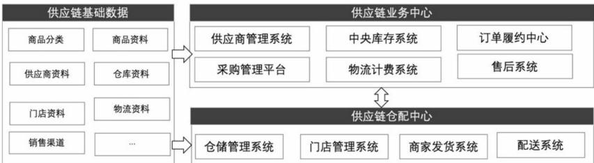

图4-45供应链系统分类示例

## （4）强重点

以上三步完成以后，产品架构图需要的内外部元素就凑齐了。但一 张图中总要分主次，所以我们需要对核心系统和模块进行突出展示，以 突出架构中的重点部分，我们可以对重点展示的架构部门进行强化，而 对其他部分相对弱化。如何突出重点呢？这里提供几个思路。 

① 将核心系统进行拆分，细化到子系统和功能层面。例如，供应 链系统可以细分为供应链业务中心和供应链仓配中心，供应链仓配再细 化为仓储管理系统、门店管理系统、商家发货系统和配送管理系统等。 如果还不够，还可以将仓储管理系统再进一步拆分为入库模块、出库模 

块、库存模块等。 

② 在核心功能下增加核心系统流程。例如，在进行采购管理系统 规划时，可以将采购的系统流程规划进去，如图4-46所示，这样不仅填 充了采购管理系统的功能空白，使其在其他系统中更加突出，还能显示 信息流向，更加突显系统功能的价值。 

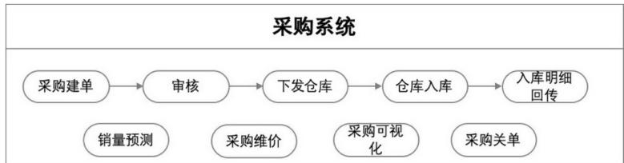

图4-46 采购管理系统增加系统流程架构

③ 加入外部组件。特别是与仓储、配送相关的系统，通常会对接 一些外部硬件设备以辅助作业，如PDA、输送线、电子标签货架等，在 进行规划系统时，将这些外部组件纳入系统架构中，会显得更加高大上 ，如图4-47所示。 

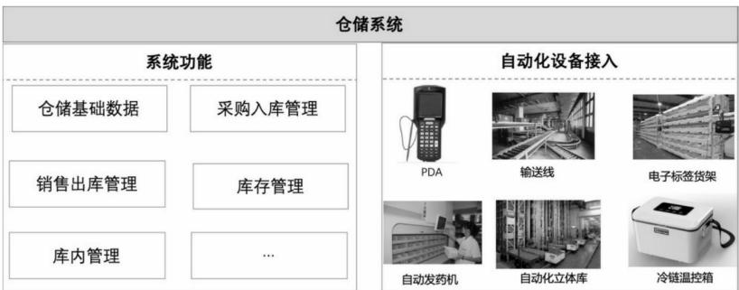

图4-47 仓储管理系统增加外部组件

④ 加入角色信息。每个系统都有对应的使用方，我们可以把系统 对应的操作角色加入架构图设计，以突出系统的重要性。例如，订单履 约中心是每个电商企业的核心系统，但怎么能突出其核心地位呢？我们 知道运营部、采购部、营销部、财务部、物流部都需要使用订单履约中 心，如果让这些相关部门都能在我们的设计图中显示，是不是大大增加 了它们的参与感？于是，我们可以把订单履约中心的架构图设计成图4- 48这样。 

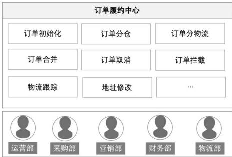

图4-48 订单履约中心增加角色

## （5）做美化

到了这一步，全局观有了，流程也清楚了，重点也有了，一张完整 的产品架构图也就出来了，但这是一个颜值至上的社会，光有内涵还不 行，如果要让相关人员刮目相看，我们还需要有足够光鲜的外表，所以 ，最后一步便是对我们的架构图进行美化。架构图美化，可以从以下几 个方面着手。 

① 系统布局。首先要保证我们展示的架构图逻辑清晰，如系统之 间的关联、模块与模块之间的顺序等，不要本末倒置。在此前提下，尽 量让我们的架构图显得工整、对称。 

② 图标样式。在一张图中的图标尽量标准统一、大小一致、颜色 一致，这样可以增加可读性。例如，要增加角色信息，要么都用卡通图 标，要么都用方块，不要一种元素出现了多种表达方式。 

③ 线条及箭头。如果要用到连接线或箭头，也要保证同一属性的 线条样式一样，且尽量减少交叉。例如，我们可以约定系统和系统版块 之间都使用 样式，业务流程之间都使用蓝色箭头的线条表示等。 

④ 字体。字体的大小、样式、颜色等，尽量在架构图中保持统一 的风格和规范。 

以上便是木笔日常绘制产品架构图的5个步骤，说起来简单，但是 需要在实际工作中多体会、多练习，很多时候，我们可能有些不知所措 ，但不要灰心，随着我们对业务和系统的逐渐深入了解，慢慢地便会豁 然开朗了。光说不练假把式，快用电脑上的画图工具来设计一张产品架 构图吧，记住这15 个字即可：懂全局，理系统，划分类，强重点，做 美化。 

## 4.4.3 两项技能，从0到1搞定系统流程图

无论是绘制产品架构图，还是系统流程图，都是将我们脑中所想进 行输出的过程，体现的是我们思考的过程，最终的产出成果只是结果的 呈现。如何将业务方提出来的需求进行梳理、拆解，并形成系统的解决 方案，是每位产品经理的本职工作和必备技能，而在系统解决方案中， 最重要莫过于一张完整的系统流程图了，特别在面对一众研发人员和测 试人员时，千言万语，不如一图，一张完整的系统流程图，最能体现产 品经理的水准。 

想要绘制一张高大上的系统流程图，我们需要两项必备技能：一是 绘图基础技能，二是系统规划技能。 

## （1）基础技能：如何绘制系统流程图

想要绘制系统流程图，我们需要先搞清楚系统流程图的核心要素和 符号规范，再选择合适的绘图工具进行绘图。 

① 系统流程图的核心4要素。一张完整的系统流程图包含4个核心 要素：标题、系统、节点、流向。 

●标题：流程的标题。 

●系统：流程图中涉及的系统，用以区分系统边界。 

●节点：流程图中的各个子节点，用以展示每个操作或功能逻辑。 

●流向：从流程开始到流程结束完整的流向。 

② 绘制系统流程图需要用到的工具及绘图样式。常用的工具有Micr osoft Visio、WPS、ProcessOn、Ominigraff等。最常用的绘图样式是泳 道图，当然也可以使用脑图、UML时序图等。 

图4-49为泳道图式系统流程图。 

③ 流程图中的符号规范。在绘制系统流程图时，我们最好使用行 业标准符号来制图，不要另辟蹊径，以免看到流程图的人产生歧义。 

最常用的流程图符号有开始/结束符、流程节点、判断、连接线、 注释，常用流程符号说明如图4-50所示。 

此外，图4-51中的符号也经常会在流程图中用到，但其使用频率稍 微低一些，朋友们同样需要了解。 

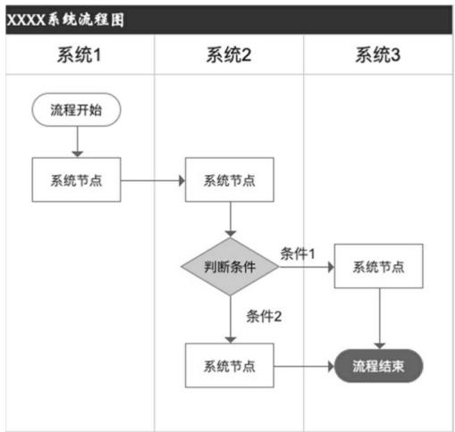

图4-49 泳道图式系统流程图

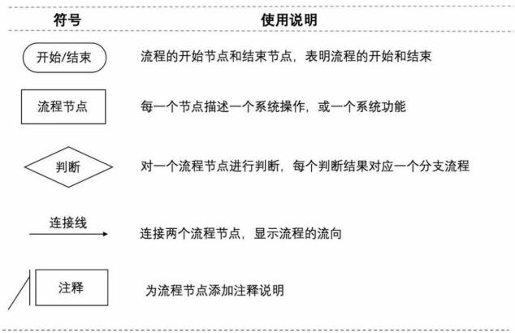

图4-50 常用流程图符号说明

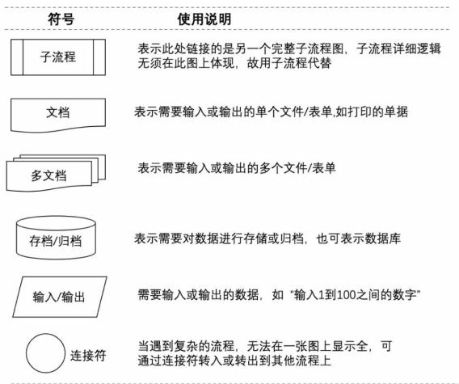

图4-51 另外的流程图符号说明

④ 绘制系统流程图注意事项。若想绘制清晰明了的流程图，请一 定掌握以下几个必不可少的技巧。 

a.流程图中要有很清晰的开始/结束节点，并且任何流程节点都应该 有始有终，形成闭环。为了很清晰地区分开始和结束，可以分别设置不 同的颜色，如开始符号用白色空心，结束符号用黑色实心，如图4-52所 示。 

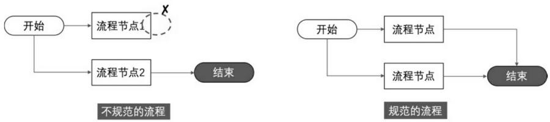

图4-52开始和结束符号示例

b.为了提高系统流程图的可读性，应尽量减少连接线相互交叉，如 果实在无法避免交叉，可以用不同的样式和颜色来标识两根不同的连接 线，另外，如果绘图工具允许，线条之间的交叉点可以突出显示，如图 4-53所示。 

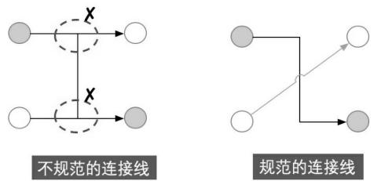

图4-53连接线交互示例

c.前一连接箭头的终点和后一连接箭头的起点应该分开，不应该交 织到一起，否则会让人看不懂，如图4-54所示。 

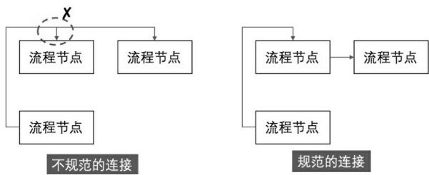

图4-54箭头连接示例

d.系统流程图的结构应该有清晰的流向，最好是上下结构，或者左 右结构。如图4-55所示。 

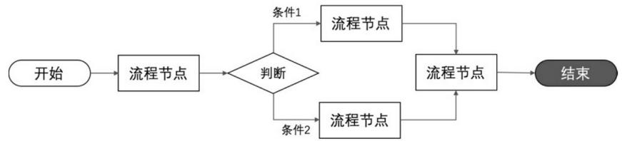

图4-55清晰的流向

## （2）规划技能：如何将复杂业务绘制成系统流程图

掌握了绘图技巧，只能代表我们具备了绘制系统流程图的基础能力 ，如何将复杂的业务一步步拆解并重组，最终绘制成各方都认可的系统 流程图，考验的是我们的系统规划能力。 

当我们接到一个项目以后，一般要经过5步的梳理，把业务需求转 换为完整的系统方案，形成最终的系统流程图。 

第一步，业务部门、岗位及职责梳理。当我们不知道从哪里下手 的时候，就先把需求相关的业务部门和部门岗位职责先梳理一遍，这样 就能弄清楚每个部门大体的工作情况了。 

第二步：业务流程梳理。一个完整的业务流程经常要跨很多部门很 多岗位，而且既有系统操作，也有非系统操作，我们一定要精确地找到 每个业务的关键节点，把关键节点串起来形成完整的流程闭环。很多流 程涉及多个部门的利益冲突，所以产品经理明辨是非的能力很重要，兼 听则明，不能只听一面之词。 

第三步：业务流程确认。流程梳理完成以后，一定要和各方进行确 认，如果各方存在冲突，最好是三方（产品经理、冲突双方）一起讨论 、确认解决方案，千万不能闭门造车。流程梳理和确认的过程可能会循 环多次才能达成共识，这是正常的需求分析过程。 

第四步：3W1H法则，系统功能点拆分。拿着各方确认的流程，按 照流程节点将需求功能点具象化，再按照业务边界进行系统划分，拆分 的思路为3W1H（When——何时？Who——哪个系统？What——需要提 供什么功能？How——如何实现？）。这是很关键的一步，建立在我们 对各个相关系统都有一定的认知的基础之上，对功能点的细化，就是我 们进行需求分析的过程，需求分析应该尽量深入，不要遗漏关键点。当 然，此过程不需要细化到页面和字段、接口维度，只需要梳理到功能清 单维度，即××系统需要提供××功能即可。 

第五步：系统流程图的出具。按照提炼的系统功能点，从系统角 度出发，将各个相关系统的关键性功能用流程图串联起来，再从系统的 角度反向验证业务流程，不断完善，直到所有的业务场景都能被覆盖， 这份系统流程图便是我们最终的成果了。系统流程图重点突出整体方案 和各个系统之间的交互，只需要绘制核心功能点即可，不需要太细，毕 竟在详细的需求文档及原型阶段，还需要进一步细化的。 

我们通过一个案例来看看小Q同学是如何利用以上5步规划公司的 新客户售后退货的系统解决方案的？ 

$$
\mathrm{客户售后退货新系统流程诞生记}
$$

小Q同学最近接到一个新的任务：随着业务量的增加，公司原线下 处理售后退货的流程效率太低，极大地影响了客户体验，现在需要将流 程从线下转移到线上，通过系统协助，更方便快捷地处理售后退货。 

接到任务以后，小Q和需求方阿泽一起，先对现有的退货流程进行 了调研，以及各方对新系统的期望，梳理退货流程中各相关部门和角色 分工，如表4-3所示。 

表4-3 退货流程中各相关部门和角色分工

<table><tr><td>部门/角色</td><td>职责</td></tr><tr><td>用户</td><td>发起退货申请;回寄商品</td></tr><tr><td>物流公司</td><td>运输商品至退货地点</td></tr><tr><td>客服</td><td>审核退货申请</td></tr><tr><td>仓库收货员</td><td>退货商品收货清点</td></tr><tr><td>仓库验收员</td><td>退货商品验收</td></tr><tr><td>仓储上架员</td><td>退货商品入库上架</td></tr><tr><td>财务人员</td><td>财务退款</td></tr></table>

接着，小Q与阿泽同各方详细沟通了原有流程的弊端和对新流程的 期望，经过反复确认，得出图4-56中的新退货流程。 

新流程对比原有流程最大的优势在于：①增加了客户在App上自动 发起售后申请的入口；②符合规则的退货申请可由系统自动审核，特殊 订单转人工客服审核；③仓库入库上架以后，系统自动判断是否需要退 款，并根据订单类型自动生成退款申请，或转由人工客服创建退款申请 ；④默认系统可自动退款，少部分人工退款的情况，由财务部门的相关 人员手动退款。 

以上流程与各部门确认无误后，小Q开始进行系统功能点拆解。于 是小Q用3W1H方法对用户发起退货申请的功能进行系统发散，拆解思 路如下。 

When：客户何时可以申请退货？（答：既然是售后，那必须是订 单已经发货了才能申请。） 

Who：哪个系统提供退货申请的功能？（答：App—订单列表，这 里操作最直观。） 

What：若要申请退货，App需要提供哪些功能？（答：发起退货申 请、客户选择商品、提交退货申请、等待系统审核结果、客户邮寄并回 填物流单号等。） 

How：支持整单退货，还是部分退货？（答：必须支持部分退货， 具体操作为，让客户在订单列表中选择需要退货的商品，提交退货申请 。） 

How：退货申请提交后，订单状态及页面展示如何变化？（答：状 态变为“等待审核”，页面展示为等待审核结果的页面） 

How：客户怎样寄回商品？（答：申请审核通过以后，系统告知客 户退货地址，客户就可以邮寄商品了。邮寄过程不需要系统支持，但A pp上需要增加一个客户回填物流单号的功能） 

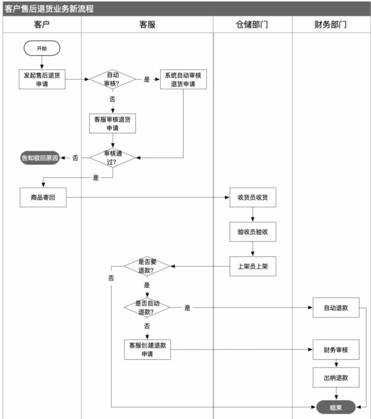

图4-56客户售后退货业务新流程

如此这般以后，小Q便得到了各角色的业务操作场景、是否需要系

统功能支持，以及每个操作对应的系统功能，得到如表4-4所示的一份 功能拆解清单（案例中仅展示了客户及客服相关系统功能拆分，其他节 点梳理的过程类似）。 

表4-4 新售后退货退款系统功能拆解

<table><tr><td>角色</td><td>业务场景</td><td>是否为系统功能</td><td>系统功能拆解</td><td>系统划分</td></tr><tr><td>客户</td><td>发起退货申请</td><td>是</td><td>发起申请选择商品提交申请审核结果</td><td>App</td></tr><tr><td>客服</td><td>审核退货申请</td><td>是</td><td>系统自动审核规则人工审核审核状态变更生成退货单下传</td><td>售后系统</td></tr><tr><td>客户</td><td>邮寄商品</td><td>否</td><td>-</td><td>-</td></tr><tr><td>客户</td><td>回填物流单号</td><td>是</td><td>物流单号回填更新退货单中的物流</td><td>App</td></tr></table>

整个过程分析完成后，小 Q 已经胸有成竹，新售后退货的流程涉 及 App、售后系统、仓储管理系统、财务系统这4个系统的改动。下面 ，就是以系统的视角将新退货业务流程图进行细化了，按照业务流程， 将核心系统功能逐一串联，便得到如图4-57所示的系统流程图了，也是 此项目的整体解决方案。从流程图中即可知道各个系统的边界、交互点 及各系统的改动点。（免费获取更多供应链PM书 加v信：pmzjie） 

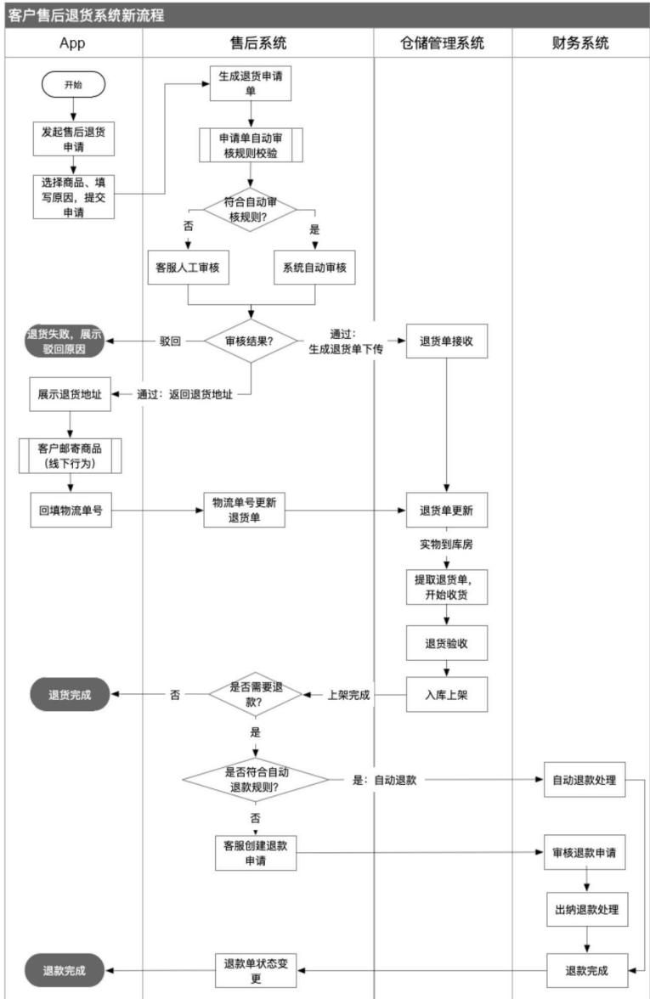

图4-57小Q绘制的客户售后退货系统新流程图

接着，小Q对着系统流程图梳理了各个系统的改造功能清单及需求 优先级，如表4-5所示。 

表4-5 系统功能清单 

<table><tr><td>系统</td><td>需求描述</td><td>优先级</td></tr><tr><td>App</td><td>新增发起退货申请入口</td><td>高</td></tr><tr><td>App</td><td>新增客户自主发起退货申请的功能,具体操作为:选择订单中的商品明细,提交申请,在申请页面选择退货原因,提交后,等待售后系统反馈审核结果</td><td>高</td></tr><tr><td>App</td><td>新增驳回原因展示功能(若驳回),否则展示退货地址,提醒客户退货 push 消息</td><td>高</td></tr><tr><td>App</td><td>新增客户回填物流公司和物流单号的功能,填写完成后,变更退货申请状态,同时告知售后系统更新物流信息</td><td>高</td></tr><tr><td>售后系统</td><td>增加退货申请单查询及审核页面</td><td>高</td></tr><tr><td>售后系统</td><td>增加退货申请单自动审核的规则,满足自动审核规则的申请单,系统自动审核;否则转人工审核</td><td>高</td></tr></table>

完成了以上工作后，小Q长舒了一口气，整体方案完成了，明天可 以召集各个系统的产品经理就此方案进行讨论、分工和细化，如果各方 都无异议了，便可以各自细化自己的系统需求了。另外，今天在梳理系 统流程的过程中，又发现了一些待细化的业务规则，明天一早需要和阿 泽一起确认…… 

## 4.5本章结语

从供应链业务到供应链系统的规划，是一次需求梳理并输出系统整 体方案的过程，看似只有一张图，实则展现的是我们整体思考和分析的 过程，以及系统未来的样貌，如同房子的规划图纸，未来产出是联排别 墅还是独家小院，在系统规划环节已经定型，而学会了如何设计产品架 构和系统流程图，就是学会了绘制图纸，这是B端产品经理最底层的能 力，供应链系统就是典型的B端系统，所以我们每个供应链产品经理都 需要掌握此项技能。 

做系统规划，选择大而全还是小而美，没有标准答案，需要结合公 司当前的现状、业务形态、资源投入和未来的规划等因素进行综合评估 ，不求最好，但求最合适。 

供应链系统的搭建应该是中台化的，必须兼备包容性、稳定性和扩 展性。这些中台化系统包含供应商管理系统、中央库存系统、订单履约 中心、采购管理系统、计费系统、售后系统仓储管理系统、门店系统、 商家发货系统、配送管理系统等。 

最后，本章用了大量的篇幅讲解供应链系统的规划，供应链中台的 建设技巧和系统设计的心法，这些都是夯实我们基本功的内功，非常关 键，希望每位朋友都能潜心学习、勇敢实践，带着扎实的基本功进入供 应链系统的实战落地阶段。 

## 第5章 累土之基：供应链基础数据中 心

所有规划，最终都要落到实处，我们掌握了很多系统设计的理论和 技巧，却还是不知从何处下手，并不是我们学得不好，而是我们一直停 在空中无法落地。最快的学习供应链的方法就是深入一线，在实战中磨 砺自我。 

通过对前面章节的学习，相信大家已经摩拳擦掌、跃跃欲试了，从 本章开始，我们将进入核心供应链系统建设的实战阶段，请带着对业务 的认识和对系统设计的技巧，让我们去一线战场走一遭。 

无论是B端系统，还是C端系统，基础数据都是系统运转的基石， 完善的基础数据是业务开展的前提。基础数据之于系统的重要性，就像 血液之于躯干一样，血液出问题了，躯干也就出问题了，而基础数据中 心正如淋巴组织一样，是重要的造血器官，如果淋巴组织出现问题，整 个身体都会生病。 

在本章中，我们从供应链的角度梳理一下供应链基础数据中心的搭 建，以及供应链里用到的那些基础数据信息。 

## 5.1 基础数据中心整体设计思路

每个系统都有自己的基础数据，用以支持自身运作。我们按照基础 数据的使用范围，可以将基础数据分为两类：一类是全局基础数据，即 整个公司很多系统都需要共用的数据；另一类是系统内部基础数据，即 只有某个系统需要用到的数据。 

针对全局基础数据，建议都收拢到基础数据中心中进行统一管理、 统一分发，以免散落到各个系统中，最终变成一盘散沙，如商品编码， 决不能每个系统都有各自独立的一套商品编码，否则各个系统就没法联 动了。而对于单个系统内部的基础数据，外部系统很少用到，则由各个 系统自己维护，如仓储管理系统中的货位信息、容器信息等。 

供应链基础数据中心主要用以管理与供应链相关的全局性的基础数 据，核心功能是各类数据的增、删、改、查，以及审核和分发，如图5- 1所示。 

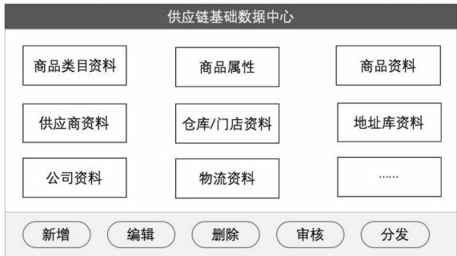

图5-1 基础数据中心核心功能一览

在做基础数据中心设计时，需要把握三个原则。 

① 集中管控，统一分发。 

② 开放录入，信息互通。 

③ 权限分离，责任到人。 

## 5.1.1 集中管控，统一分发

供应链中的基础数据主要包含供应商资料、商品类目资料、商品资 料、公司资料、仓库资料、门店资料、地址库资料、物流资料、销售渠 道资料等，这些基础数据都是各业务系统需要共用的信息，最好都规划 到基础数据中心中进行统一管理，如图 5-2 所示，资料的新增、编辑、 删除等操作都集中到基础数据中心完成，再分发至各系统中。 

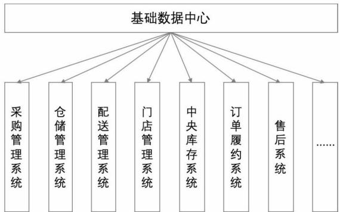

图5-2基础数据中心

在做基础数据分发时，有两种方式：一是由基础数据中心主动推送 （MQ消息或者接口）；二是让各外部系统自己获取。无论采用哪种方 式，都需要考虑一个问题：并不是所有的外围系统都需要使用所有的基 础数据，如商品资料，各个仓库负责的品类不同，他们只关注自己管理 的商品，那么在推送的时候应该根据不同的仓库推送不同的商品品类。 

## 5.1.2开放录入，信息互通

一份健全的商品资料、供应商资料往往有很多信息，一个部门无法 完成维护，这就需要多个部门共同维护，基础数据中心就需要对多个部 门开放，各部门只关注自己的操作模块，如采购部门维护基本信息、质 管部门维护资质信息、财务部门维护财务信息、物流部门维护物流信息 

同时，很多分公司都有自己的商品和供应商，如果每个分公司新加 一条基础数据都要找集团公司协助，效率太低，于是，基础数据中心应 该对分公司开放录入的权限，由分公司管理自己的基础数据，必要时可 以由集团总部进行审核。 

开放录入的基础数据同样需要集中管控和统一分发，不能同样一个 商品在多个分公司产生了多个编码。所以开放录入时，需要保证如果某 条数据已经存在，不是特殊情况，就不要再生成新的编码了。当然，此 原则只适用于自营体系，在开放平台体系下并不适用（因为在开放平台 中，平台方将商品和供应商功能开放给外部商家，每个商家在平台上自 行维护、管理自己的基础数据，和其他商家不共享，平台只需要保证每 个商家自身的数据不要重复就行，不同商家之间可以自行维护自己的商 品和供应商）。 

哪些数据适合开放录入呢？例如，商品和供应商这类信息较多、维 护工作量较大的数据适合开放录入，其他基础数据变更不大，由集团总 部统一维护，之后分发至其他系统和分公司，分公司无权自建和修改， 如图5-3所示。 

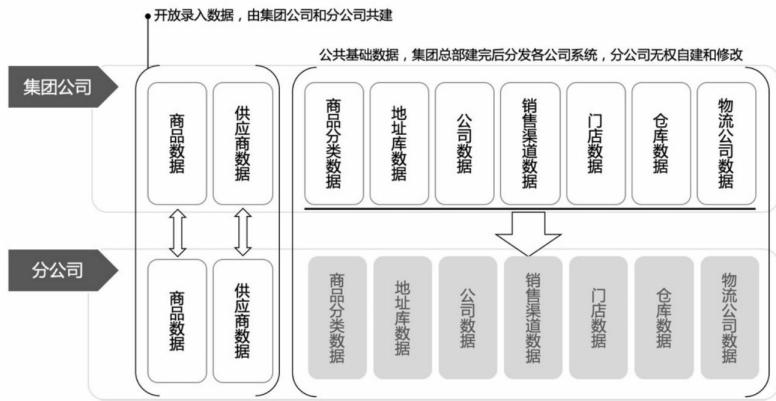

图5-3基础数据开放录入

## 5.1.3权限分离，责任到人

包括基础数据中心在内的很多系统，涉及信息的保密，不同的角色 应该有不同的操作权限，以及数据的浏览权限，所以在设计基础数据中 心时，需要有明确的权限划分，让不同的角色只操作和查看属于其权限 范围内的数据，且关键性的操作应该将责任落实到人，有详细的操作日 志。 

权限的划分分为功能权限和数据权限，功能权限控制系统的菜单和 菜单内的操作功能，数据权限控制每个角色能看到的数据范围，数据范 围可以根据业务规则来定，如按公司、按仓库、按部门、按业务等。 

小C和大A都是采购人员，小C在分公司，只负责管理分公司的商品 数据，而大A是集团公司的采购人员，要管理全国三个分公司的商品数 据，但其只能查看数据而不能编辑数据，二者的权限设置如图5-4所示 

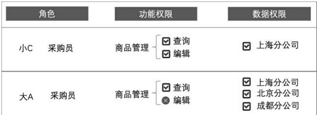

图5-4基础数据权限分离

## 5.2商品库系统设计

商品库主要用以存储商品的基本信息，包含商品类目、商品属性和 商品详细信息等，一个健全的商品库是业务开展的基础，下面我们一起 来了解一下标准的商品库的搭建原理。 

## 5.2.1 SPU、SKU与SN

根据用途和管理维度的不同，可以将商品分为SPU、SKU和SN，三 者的定义如下。 

SPU（Standard Product Unit）：标准化产品单元，是商品信息聚合 的最小单位，是一组可复用、易检索的标准化信息的集合，该集合描述 了一个产品的特性。简单来说，属性值、特性相同的商品就可以称为一 个SPU。 

SKU（Stock Keeping Unit）：库存量单位。即库存进出计量的基本 单元，可以以件、盒、托盘等为单位。现在已经被引申为产品统一编号 的简称，每种产品均对应唯一的SKU号。 

SN（Serial Number）：产品序列号。SN是为了区别每一个独立的 个体而编制的识别号，和人的身份证号码类似。 

简单来说，SKU就是仓库里存放管理的实物商品，每个SKU都对应 一个销售侧的定价，以及供应链侧的一个库存数量；SN 是每一个具体 的实物个体；而 SPU 是某一类特性相同的SKU的集合。三者的关系如 图5-5所示，一个SPU包含多个SKU，一个SKU又包含多个SN。如何识 别两个商品是不是同一个SPU或SKU？在标准品行业中，一般以一个69 码作为一个SKU（每生产出一个商品，都会向国家申请一个以69开头的 条形码，用作商品标识，俗称69码），将同一品牌和型号当作一个SPU 。但在非标准品行业中没有国标可参考，需要根据业务自行定义SPU和 SKU的规则。 

图5-5 SPU、SKU与SN的关系
