以苹果手机为例，某平台用品牌+型号组合为SPU，以品牌+型号+ 颜色+内存为维度组合为 SKU，每个 SKU 下又分别对应了几个 SN，如 图 5-6 所示。在某电商平台中，iPhone 12 （SPU）总共有9台，其中SK U1有3台、SKU2、SKU3和SKU4分别有2台，但每一台的IMEI号都不一 样，即SN不同。 

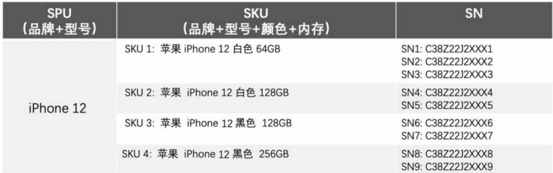

图5-6 iPhone 12 SPU、SKU与SN示例

我们来看看三者的应用场景。 

SPU 一般只用作商品的分类、聚合和汇总统计，方便用户浏览，不 作为实际定价和库存管理的依据，一般在销售运营层面用得比较多，供 应链层面关注得很少。 

SKU是商品具象化的体现，标准品管理下的销售平台的定价和供应 链层面的库存管理都是基于SKU维度的，如某SKU在平台中的售价500 元，此SKU 在仓库的库存有1000个，当用户下单购买1个以后，我们就 知道此SKU 卖了500元，同时，需要到仓库中的某个货位上找到1个此 商品发出，此SKU的库存从1000个变为999个。 

SN也是供应链层面管理的维度，除了必须以单个商品进行定价和 售卖的情况（在二手行业比较常见，例如二手车、二手房、二手3C数码 等，此类商品可以认为每一个SN就是一个SKU），一般不参与销售行 为，只是作为库存精细化管理到每一个实物的标记，即 SKU 下的每一 个实物都有一个唯一的身份标识。当商品需要入库时，相关人员除了关 注SKU数量，还需要记录每个SN的库存状态和位置；当商品出库时， 也需要明确到底是哪一个SN发出了。 

总结一下，SPU常用在电商销售和运营层面，SKU和SN用在供应链 流通层面。普通的标准品类行业，管理到SKU维度即可。若需要精细化 管理到每一个具体的商品，或者需要严格溯源的行业，如医药、食品等 ，则需要管理到SN。 

以京东平台的iPhone 12为例，如图5-7所示，此商品页面展示的是 一个SPU，聚合了5种颜色、3个版本和4种购买方式，共计5×3×4=60个S KU。 

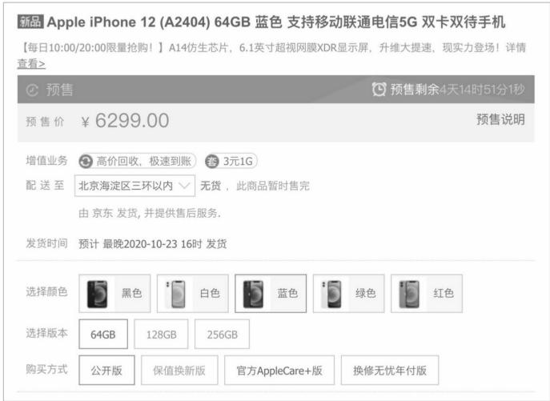

图5-7京东的SPU商品展示页

了解了SPU、SKU和SN的区别和关系以后，我们就能知道SPU和S KU其实都是一些属性的聚合，如我们前面提到的iPhone 12 这个SPU就 是品牌+型号的组合，而iPhone 12白色128GB这个SKU则是品牌+型号+ 颜色+内存的组合。要想知道商品资料是如何生成的，我们需要先了解 类目、属性和属性值。 

## 5.2.2商品类目与子类目

商品类目又叫作商品分类，主要用作某一批具有相同特点的商品的 集合，每个 SPU 和SKU都会对应到一个商品分类上。如果商品数目很 多，一级类目无法满足分类要求时，便出现了分级类目，即二级类目、 三级类目等。类目按层级从上往下，分别称为父类目、子类目，最末端 的类目也叫作“末级类目”或“叶子类目”。 

商品类目和SPU都是对商品的聚合，二者的区别是什么？ 

商品类目和SPU虽然都是一批商品的集合，但类目比SPU聚合的范 围更广，它不限于同一款产品，而是很多款产品的大集合，更偏重于分 类管理，如手机、电脑办公、服饰内衣等，而SPU多是隶属于某一个类 目下的某一个产品的集合，更偏重于产品销售。 

商品类目是商品库中必不可少的元素，它主要有如下几个作用。 

① 将相似的商品进行聚合，方便用户快速搜索和定位某一类商品 ，如同书籍的目录一样。试想数以万计的商品，如果没有分类，用户如 何能快速地找到其需要的那一类商品呢？后台如何统计某一类商品的销 量数据呢？ 

② 在供应链中，类目主要用以商品的品类区分管理，是很重要的 商品属性。例如，图书和生鲜类产品需要单独存放在不同的仓库中，冷 链生鲜和普通商品需要不同的存储环境，大家电和日用百货有不同的保 管方式等，都是通过类目进行区分的。 

在电商新零售平台中，类目又分为前台类目和后台类目： 

后台类目即商品库中的类目，是所有商品的标准分类，通常为两到 三级树形结构，最好不超过四级，层级太多不方便搜索，系统运行速度 也会明显下降。后台分类牵涉很多外围系统和逻辑，一般不轻易调整， 若必须调整，也需要及时通知外围系统进行变更。 

前台类目的存在是为了更好地促进销售，提升转换率，运营人员通 常会基于后台类目建立一个前台类目来贴合客户诉求，前台分类和后台 分类的对应关系可能是一对多、多对多或者多对一，如图5-8所示，前 台类目会根据季节、节假日、促销等因素进行灵活调整（这也是前台类 目和后台类目分开的原因），一般以平铺的方式展现，很少用树型结构 （主要是不好操作，影响客户体验）进行展现。 

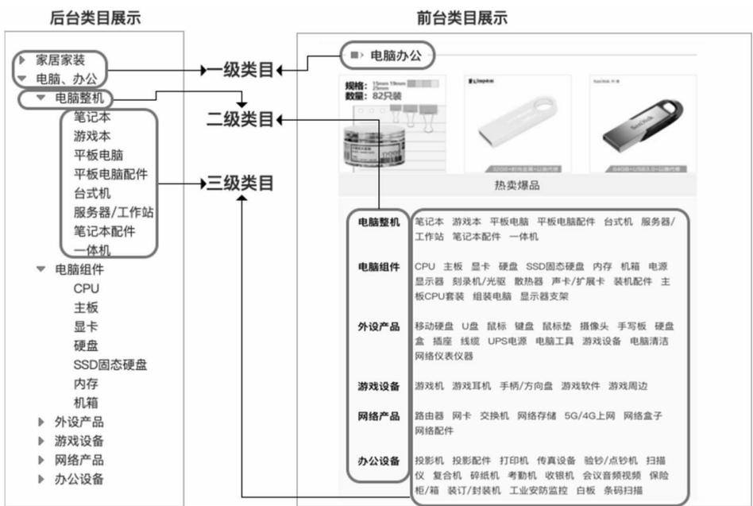

图5-8后台类目与前台类目展示示例

后台类目管理如图5-9所示。 

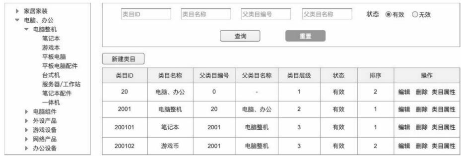

图5-9 后台类目管理示例

在设计商品类目功能时，需要注意以下几点。 

① 类目编号一旦生成，不能随便变更，以免影响其他逻辑。在生 成类目编号时有个技巧：子类目沿用父级类目编号+序列号的方式，这 样可以一目了然地通过编号识别子类目所属的父类目。 

② 在删除类目和设置类目状态时，可以级联删除或设置其下所有 的子类目。但如果其下已经关联商品了，操作需谨慎。因为商品若没有 了分类，会出现很多基于分类的逻辑问题。 

③ 类目在编辑或生效以后，应该同步分发给外围依赖的系统，以 免信息不一致。 

④ 类目下可以关联多个类目属性，且父类目和子类目都可以关联 ，如果父类目已经关联了属性，子类目可以直接继承。例如，“电脑整 机”类目下可以关联笔记本的品牌、型号、CPU、存储容量等属性，则 其子类目“笔记本”可以直接使用这些属性，无须再重新关联。 

在新建和编辑子类目时，可以关联其父级类目，以及设置类目的显 示排序、状态、logo等，如图5-10所示。 

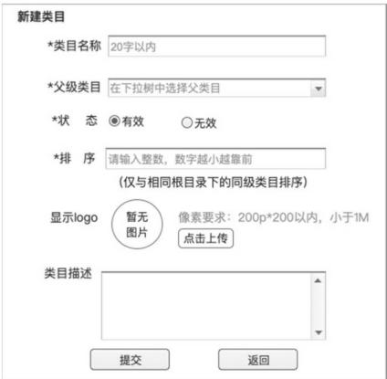

图5-10 新建类目示例

## 5.2.3 商品属性、属性值与属性分组

之所以把某些商品划分到同一个类目下，是由于它们有一些共同的 特性，如所有的手机都会有品牌、型号、内存、容量、颜色，所有的图 书都有ISBN、页码等，这些特性可以确定某些商品是不是同一类或者 同一款SPU产品，这个特性，我们称之为商品属性，每个商品会有很多 属性信息，以描述商品的特征。 

为什么一款商品会有很多不同的SKU呢？是因为商品相同属性下的 属性值不同。属性决定了不同SPU的划分，而属性值决定了不同SKU的 划分。例如iPhone 12，是一款SPU，但内存64GB和128GB便是两个SKU ，黑色和白色两个颜色不同，也是两个SKU。“内存”和“颜色”是属性， 64GB、128GB是内存下的属性值，黑色和白色是颜色下的属性值。 

属性和属性值理解起来不难，想想我们日常在系统中见到的下拉框 、单选框或多选框这些控件就很容易理解了，如选择性别，会有男、女 两个选项，“性别”就是属性，“男”“女”选项就是属性值。 

## 1.属性的分类

一个商品会有很多属性，这些属性可以分为三类：关键属性、销售 属性和描述属性。 

① 关键属性：又叫基础属性，能确认唯一SPU的属性组合，可以是 某一个属性，也可以是多个属性的组合。 

② 销售属性：又叫规格属性，是能决定SKU的属性，通过关键属 性+销售属性，可以确认一个唯一的SKU，这些属性影响商品的定价和 仓库的库存。 

③ 描述属性：又叫非关键属性、其他属性，是除关键属性、销售 属性之外的其他对商品进行描述的属性，一般只做展示，不作为核心业 务规则使用。 

还是以苹果手机为例，品牌和型号为关键属性，故苹果iPhone 12能 确定1个SPU；颜色和内存容量为销售属性，故按照颜色+内存容量组合 ，黑色64GB、黑色128GB、白色64GB、白色128GB分别对应4个SKU； 而主屏幕尺寸、机身重量和上市年份这些信息即便没有也不会影响售卖 ，属于描述属性，如图5-11所示。 

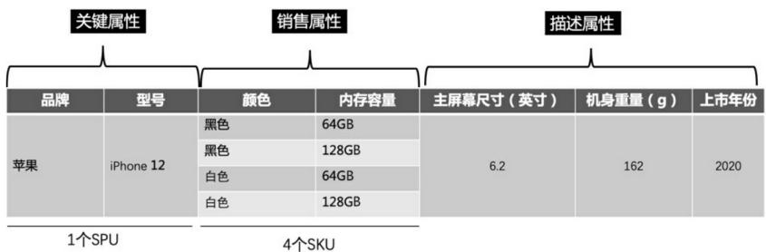

图5-11关键属性、销售属性与描述属性示例

## 2.类目与属性

属性依附于商品类目，属性值依附于属性。在进行系统设计时，一 个类目下可以有多个属性，一个属性也可以从属于多个类目。同理，一 个属性下有多个属性值，一个属性值也可以从属于多个属性，这样可以 提升属性和属性值的复用率，大大减少基础数据的维护工作量。另外， 还有一些属性没有固定的属性枚举值，只能开放给用户进行文本录入。 几者的关系如图5-12所示。 

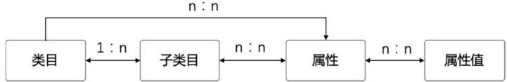

图5-12类目、属性与属性值的关系

类目和子类目都可以关联属性，这样子类目就可以继承父类目的属 性了，而不用再单独进行维护。 

举例说明类目和属性的多对多关系：一个类目下会存在品牌、型号 等多个属性，但品牌属性也会被多个类目关联。例如“小米”属于一个“ 品牌”，但这个品牌下有手机、平板、电脑、电视等多个类目的产品， 由此可见同一个品牌属性是可以被多个类目关联的。 

图5-13是品牌的维护示例，将所有品牌提炼出来单独存储、共用， 便是“品牌库”，但品牌仍然是一种特殊的属性。 

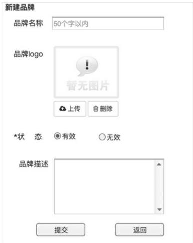

图5-13品牌维护示例

在类目关联属性时，我们需要在每个类目下关联其对应的属性分类 （关键属性、销售属性、描述属性），同时设置当前属性的输入方式（ 可以是单选框、多选框、文本录入框、下拉列表等多种形态）、是否为 必填项，以及排序、状态等，如图5-14所示。父级类目已经关联过的属 性，子级类目可以直接继承，无须重复设置。 

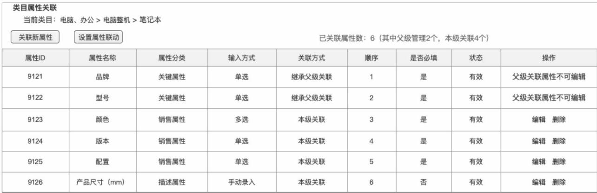

图5-14类目关联属性示例

当类目关联属性以后，在新建商品资料时，只要选择类目，便能自 动输出当前类目对应的关键属性、销售属性和描述属性，以及每一项属 性对应的输入方式了。 

## 3.属性与属性值

属性与属性值，也是多对多的关系。例如，最常见的“是”和“否”， 就是两个属性值，可以被“是否支持5G”“电池是否可拆卸”“是否支持NF C”等多个属性关联，大家共用一组属性值即可，没有必要为每个属性下 增加一组“是”和“否”的属性值了（当然如果一定要分开也是可以的，但 是会增加很多重复的属性值数据，当平台品类多了以后，再想统一就很 难了）。 

属性和属性值都应该是单独维护的，再建立二者之间的关联，这样 就能保证数据共用了，图5-15、图5-16分别为属性管理和属性关联属性 值的示例。 

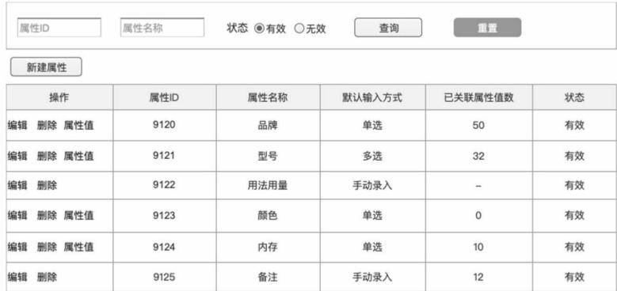

图5-15属性管理示例

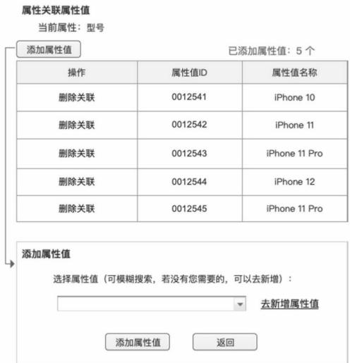

图5-16属性关联属性值示例

## 4.属性之间的联动

有的时候，我们需要属性之间有联动的效果，通过选择上级属性的 某一个值，下级属性值自动随之联动。例如，型号和颜色，不同版本的 笔记本，对应的颜色是不同的。这种效果该怎么实现呢？可以通过关联 上下级的方式来实现，先配置上级属性和下级属性，然后将下级属性值 与上级属性值进行关联，就可以达到这种效果了，如图5-17所示。在维 护商品资料的时候，在加载下级属性时，便能根据上级属性进行联动。 

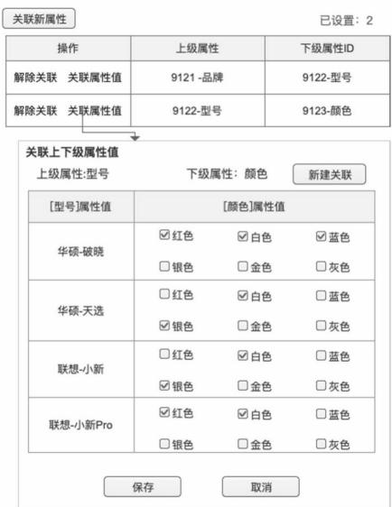

图5-17属性联动示例

## 5.属性分组

如果某些商品的属性太多，为了能够更加清晰地将这些商品属性展 现给用户，我们可以将某些属性进行分组，以便在前端展示时不至于像 流水账一样排列，对于供应链后端，也可以通过属性分组来为属性设置 不同的维护部门，如采购部门属性、质管部门属性、财务部门属性等。 图5-18为前台的属性分组展示示例。 

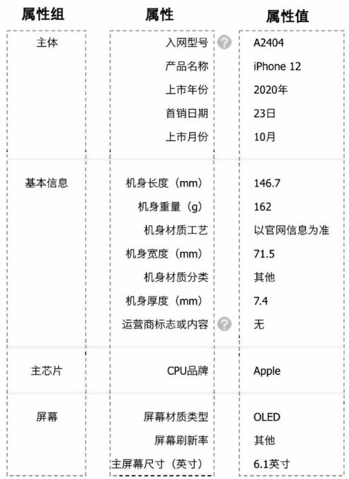

图5-18前台属性组、属性与属性组示例

和类目、属性和属性值的设计一样，属性组也是提前维护好，再与 属性进行关联的，如图5-19所示。一个属性可以被多个属性组引用，应 用到不同的类目和商品下。 

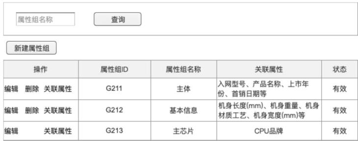

图5-19属性组管理示例

通过属性分组，我们还可以实现为每个属性设置对应部门在系统中 的查询和编辑权限，让各部门员工之间的操作互不影响，只需要加一个 配置功能即可，在操作页面中便可以基于此配置功能做相应的交互逻辑 ，如图5-20所示。 

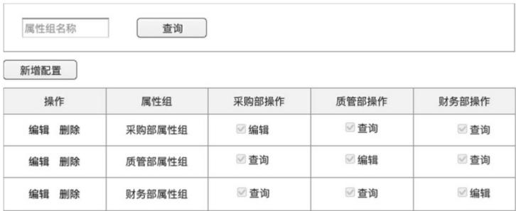

图5-20通过属性组配置部门操作权限

## 5.2.4 商品主数据

了解了类目、属性和属性值的逻辑以后，我们再回到商品主数据的 设计上来，在供应链中，相关人员最终关心的是每个SKU，所以必须搞 清楚每个类目下的关键属性和销售属性，只要关键属性和销售属性确定 了，我们就能确认每个SKU的生成规则了。 

商品主数据的设计有两种方式。 

第一种是直接维护商品SKU的各属性信息，然后维护商品的每个属 性，每次维护生成一个SKU ID，若关键属性和销售属性冲突，则提示 商品重复，如图5-21所示。 

这种方式比较简单但有两个很大的弊端：一是只适合后台使用，前 台无法共用；二是如果某些产品有多个规格，仅销售属性不同时，需要 为每个规格的SKU单独维护关键属性和描述属性，这个工作量还是挺大 的，所以仅适用于品类单一、不需要对商品做聚合展示，同时商品品类 数目比较小的企业，如做垂直品类的企业。 

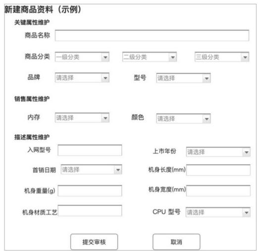

图5-21新建商品资料示例

第二种方式是按照主流电商平台的商品发布方式生成商品主数据， 如图5-22所示。 

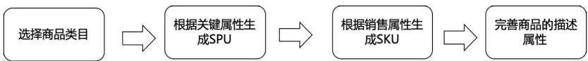

图5-22商品主数据生成步骤

## （1）选择商品类目

因为商品的属性是绑定在类目下的，所以在新建一个商品资料前， 需要先明确此商品所属类目，类目选择是分级联动的，直至选到最后一 级，图5-23为淘宝商家后台的类目选择示例。 

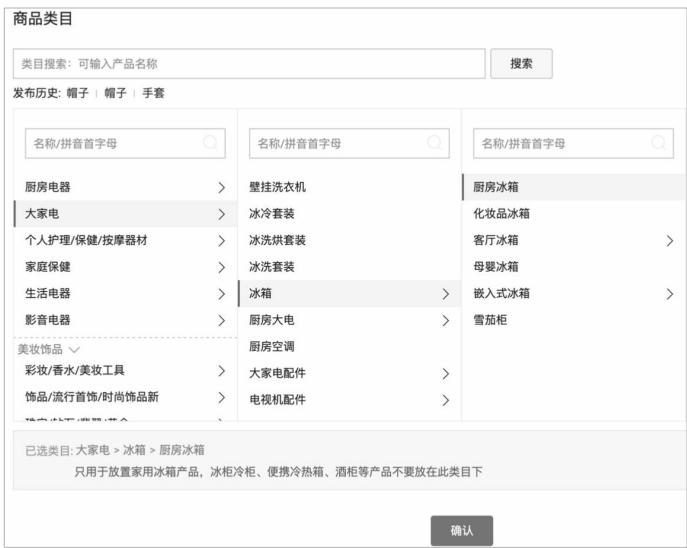

图5-23淘宝商家后台选择商品类目示例

## （2）根据关键属性生成SPU

选择类目以后，便能根据所选类目输出当前类目下设置的所有属性 及每个属性的属性值了，每个属性的输入样式、排序、分组等都来自后 台类目关联属性的配置（下拉框、单选、多选或文本框等），图5-24为 淘宝后台关键属性维护示例。 

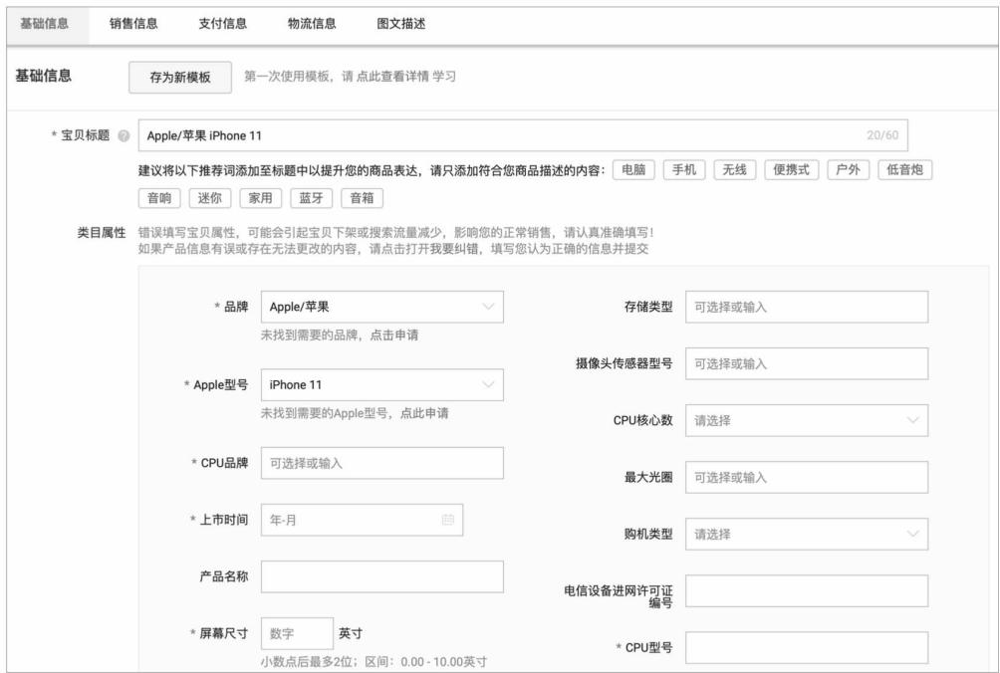

图5-24淘宝后台关键属性维护示例

公司每引进一个新的商品，需要从生产厂家获取商品详细资料，并 完成基本属性信息的录入，关键属性录入完成后，SPU 信息便确定了， 如果再录入相同的关键属性，便是重复录入，系统应该给予提示，以免 同一款商品生成多个不同的编码。 

## （3）根据销售属性生成SKU

对于大部分产品来说，关键属性和大部分描述属性是一样的，但销 售属性不同，不同的销售属性对应不同的SKU。为了提高维护商品资料 的效率，我们通常将销售属性设置为多选，这样可以在同一SPU下一次 性生成多个SKU，如选择2个颜色值+3个套餐类型值+3个存储容量值+2 个版本类型值，组合起来便是2×3×3×2=36个SKU，这些SKU可以共用 关键属性和描述属性。图5-24为淘宝后台维护销售属性示例。 

每一个SKU需要设置一个销售价格和一个库存数量才能进行上架售 卖，销售价格用于展示给用户，库存用于控制商品的最大可售数量。如 果是做自营供应链，库存数量一般不需要手动设置，商品入库以后自动 同步即可，但在淘宝这一类平台上，由于有很多小商家，没有系统对接 能力，所以需要手动维护库存，如图5-25所示。 

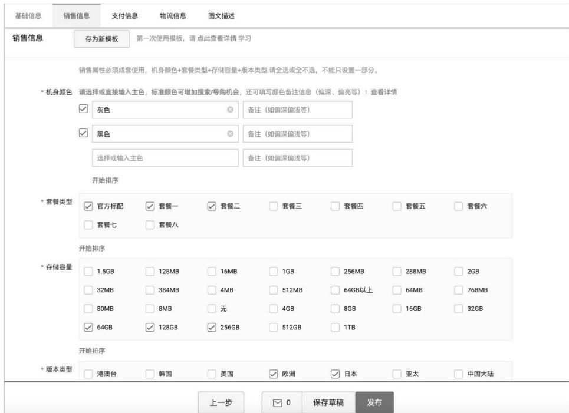

图5-24淘宝后台维护销售属性示例

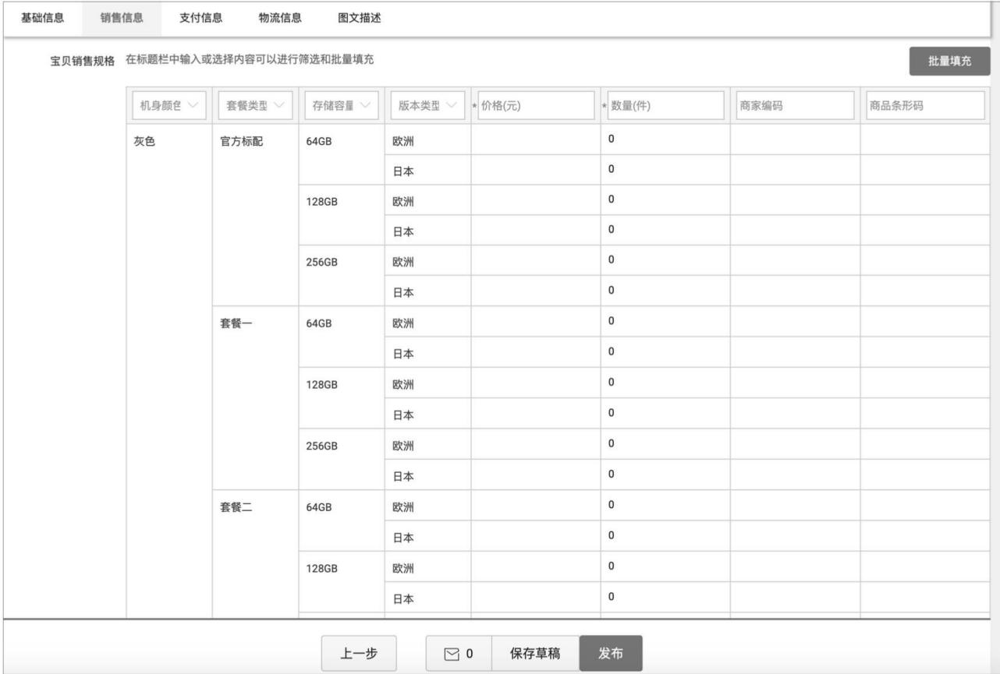

图5-25根据销售属性生成的SKU条目数示例

关键属性维护完成后，便可以发布商品了，系统会生成两个编码： 根据关键属性生成的SPU编码和根据销售属性生成的SKU编码，相关人 员再把相关的信息维护好，理论上此时商品已经具备售卖和采购的条件 了。但在很多自营的企业中，发布商品并不是这么随意的，而是需要走 审批流程的，通过采购、质管、财务等各部门审批，并逐一完善资料以 后，才能正式生效，审核流程详见第3章中的基础数据建档流程。 

在这一审核流程中，我们需要为商品增加一个审批状态，如图5-26 所示。 

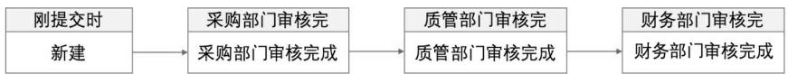

图5-26商品审批状态

## （4）完善商品描述属性

在一份完整的商品信息中，除了关键属性和销售属性，往往更多的 是描述属性，越是精细化的企业，商品属性越多。由于各行各业的商品 属性有很大的差异，我们在本书中无法列出所有商品的属性，但掌握了 商品库的建设方法后，就可以举一反三了。 

完善商品的描述属性是一个长期的过程，在供应链中，相关人员比 较关注商品的条码、长宽高、体积、重量，保质期、储存条件、运输方 式、耗材要求等属性，以便在采购、仓储和配送环节中更好地管理商品 ，这些信息是相关人员在日常工作中逐渐完善起来的，可以分别在采购 、仓储等系统中开设维护入口，但都在商品主数据中写入信息，由基础 数据中心统一向其他系统进行数据分发。 

最后，有必要介绍一下供应链中经常会遇到的几种编码，以免使用 不当，出现逻辑问题。 

① 产品编码：一般指SPU编码，商品发布后生成，仅限企业内部使 用。 

② SKU 编码：也是在商品发布后生成，只在企业内部使用，是 SK U 信息流转的身份标识。 

③ 商品条码：商品出厂时所具有的69条码，也称69码，是仓库出 入库扫描、识别SKU的依据。一般每个SKU只有一个唯一条码，但不排 除部分SKU的条码会重复，针对存在重复条码的情况，若需要扫描识别 ，就需要仓库单独为商品粘贴一个新条码了。 

④ SN 码：也是生产企业在商品出厂时印刷到每一个包装盒上的序 列号，用来标记和追溯每一个商品的流向，相同SKU下每一个实物的S N码都不一样。一般在商品价值较高，或者安全系数比较高的行业中比 较常见，如3C电子产品的序列号、药品的监管码等。 

## 5.2.5 组合商品

组合商品，顾名思义就是将一些商品组合成为一个新的商品。在电 商新零售里有两类组合，需要加以区分。 

第一类是在电商平台售卖时将多个商品进行搭配生成一个套餐组合 售卖，此类组合是一种营销策略，不涉及实物资料的变更，可以在商品 主数据中进行管理，也可以将其放到电商后台的运营系统中做一个组合 搭配的促销策略。 

第二类是BOM（物料清单）形式的组合，这是供应链侧的组合。 此类组合商品本身是存在实物的，是采购入库时即按照实物组合商品进 行收货入库的，其本身是一个实物的SKU，但可以拆解为多个其他的S KU单独售卖。 

一个家庭医用药箱（SKU A），其下有1个空药箱（SKU B）+2卷 纱布（SKU C）+1支医用钳（SKU D），若药箱损坏，可以将组合药箱 拆解出2卷纱布（SKUC×2）和1支医用钳（SKUD×1）单独售卖。 

第二类组合商品需要单独为每个SKU单独创建SKU资料，如在上述 的例子中需要分别创建SKU A、SKU B、SKU C、SKU D。同时增加一 个组合商品配置规则，将SKU A=SKU B×1+SKU C×2+SKU D×1的规则 建立起来，后续拆解或组装组合商品时时可根据此规则进行拆分，如图 5-27所示。 

<table><tr><td>组合商品SKU</td><td>拆分SKU</td><td>数量</td></tr><tr><td rowspan="3">SKU A</td><td>SKU B</td><td>1</td></tr><tr><td>SKU C</td><td>2</td></tr><tr><td>SKU D</td><td>1</td></tr></table>

图5-27组合商品配置规则

## 5.3核心供应链基础数据

除了商品有较复杂的类目和属性，其他供应链基础数据的属性都比 较固定，就是最基本的增、删、改、查等操作。 

在做基础数据的删除功能时，由于基础数据往往被很多系统关联引 用，故需注意：基础数据不能随意删除，否则会对历史业务数据产生影 响，所以基础数据的删除功能应做成逻辑删除（在数据库中仍然存有记 录，只是状态变为“已删除”）。 

## 5.3.1 供应商资料

供应商信息主要用于开展采购业务，在采购订单创建、采购合同生 成、采购付款等业务活动中使用。 

供应商资料关键信息包含但不限于以下信息。 

基本信息：供应商编码，供应商名称，企业法人，联系人，联系电 话，详细地址（省、市、区、详细地址），经营范围（3C、数码、酒水 、服装等，可以取商品的一级类目），经营状态（正常/禁入/禁出）， 合同类型（收入类/支出类/合作等），营业三证附件（营业执照、税务 登记证、企业组织机构代码证），统一社会信用代码，营业期限等。 

财务信息：企业名称、开户行、开户城市、开户名、银行账号、税 号、资信额度、结算方式（月结/季度结/年结）、账期等。 

在医药行业中，供应商建档非常严格，毕竟药品是治病救人的，生 命无小事，所以供应商有严格的准入门槛，质管部门在做供应商首营（ 首次经营）资料时，还需要重点维护以下证件信息，包括证件扫描附件 上传，以及证件有效期，一旦关键性的证件过期，依照药品经营质量管 理规范的相关要求，是不能再进行采购的。 

供应商经营范围（药品/医疗器械/食品/食品保健/其他）、合作范围 （不能超过经营范围）、法人授权委托书、营业执照和期限以及年检期 限、税务登记证和期限、经营/医疗许可证和期限、组织机构代码证和 期限、医疗器械许可证和期限、保健食品许可证和期限、质量保证协议 和期限、GMP/GSP证书和期限、精神和麻醉许可证和期限、医疗机构 

许可证和期限；客户质量体系评价预警日期等。 

供应商资料维护完成后，也需要经过审核，审核通过以后，才能正 式生效，其审批流程和发布商品的审核流程是一样的。 

另外，如果企业还开展B2B销售业务，还需要维护下游客户资料， 用以创建销售单和应付账款核算。下游客户的属性和供应商资料差不多 ，增加一个“供应商类别”的属性加以标识即可。 

## 5.3.2仓库资料和门店资料

从供应链的角度来看，门店和仓库均是为商品提供进销存管理的场 所；从系统功能方面来看，门店和仓库均被当作一个发货点为订单提供 出库服务，故门店和仓库可以放在一套数据中进行管理，用类型加以区 分。但门店比仓库多了一种属性：线下业务。 

在新零售模式下，根据承接的业务形态不同，各仓库/门店支持的 配送方式是不一样的。例如，仓库一般只支持物流运输，而门店可支持 包裹配送、自提及线下POS销售；由于人员配比、面积和设备设施的差 异，仓库对商品的管理比门店对商品的管理更加精细化，效率更高；由 于单量的差异，各仓库/门店支持的物流公司的数量也不一样，仓库可 以支持多家物流公司灵活切换，而门店一般仅支持一到两家物流公司。 

在做仓库基础数据设计时，要考虑到有些仓库面积比较大，收货地 点和发货地点并不在一起，并且收件人信息和发件人信息并不是同一个 ，故可以将收件信息和发件信息分开，各自维护。 

门店/仓库常规属性包含：编号、名称、收货人、收货地址（省区 市+详细地址）、收货电话、发货人、发货地址（省区市+详细地址）、 发货电话、所属货主、仓库类型（仓库/门店）、仓库归属（自营/合作 加盟）、支持的配送方式（配送/自提，支持多选）、支持的物流公司 （可多选）、营业时间（主要是门店的营业时间）、仓库面积、启用/ 停用状态等。 

## 5.3.3 地址库资料

地址库资料会在很多系统中使用，且各系统之间会存在信息交互。 例如，电商下单、运营系统中的包邮设置、中央库存系统中的分仓、配 送管理系统中的物流配置等，若各系统中的地址信息不同，业务数据就 不能很好地流转，所以全公司的地址库统一由基础数据中心进行维护是 非常必要的。 

地址库通常取三级地址（省/直辖市-市-区/县）或者四级地址（省/ 直辖市-市-区/县-镇/街道），行政区划由于不会经常变，直接采用国家 标准地址库初始化系统中的信息即可，如图5-28所示，同时在基础数据 平台中保留物流部门对地址的更新功能，若国家标准地址库初始化系统 中的信息发生了调整，可在此进行同步调整，调整完成后，由基础数据 中心将变更的信息同步至外围订阅地址库数据的业务系统，保持数据的 一致性。 

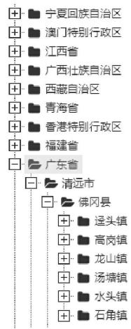

图5-28全国四级地址库

地址库常规属性：地址编号、地址中文名、上级地址、当前层级、 启用/停用状态等。 

## 5.3.4 公司资料

公司资料主要用于挂财务主体和账目往来，当有多个分公司时，通 常会涉及多个财务主体，将每个公司产生的业务和成本、费用分摊到每 个公司中，保证账目的清晰。 

公司数据常规属性：公司编码（必须）、公司名称（必须）、企业 法人、公司地址、公司银行账号、税号、营业三证附件（营业执照，税 务登记证，企业组织机构代码证）、统一社会信用代码、启用/停用状 态等。 

## 5.3.5分拣中心与配送站点

如果企业需要自建物流体系，就需要规划物流网络，布局分拣中心 和配送站点。分拣中心又叫分拨中心、转运中心，负责快递包裹的集中 收集和分派站点，并与其他分拣中心相连通。配送站点是覆盖用户最后 一公里的终端配送网点，配送站点的配送员负责将包裹按照路线或者小 区分发配送到用户手中，同时可以承接小区内用户的取件工作。 

分拣中心常规属性：分站中心编码、分拨中心名称、分拣中心类型 （一级/二级）、地址（省区市+详细地址）、联系人、联系电话、面积 、启用/停用状态等。 

配送站点常规属性：站点编号、站点名称、站点类型（配送站点/ 自提点）、地址（省区市+详细地址）、联系人、联系电话、面积、启 用/停用状态等。 

## 5.3.6 物流资料

若为自有物流配送，则只需要维护自有物流信息；若通过第三方物 流公司承接配送，由于每家物流公司的费用、时效和服务水准不同，企 业通常会选择多家物流公司进行合作，则需要将所有合作的物流公司的 基本信息均上传至基础数据中心。 

因为每个物流公司的网络覆盖广度不同，所以并不是所有的物流公 司都可以覆盖全国各地，故而为了更精准地分配物流，企业可以将每个 物流公司无法覆盖的区域维护进系统，但这样会存在一个问题：若物流 公司的覆盖范围信息发生变更，我们并不能及时获知，所以如果企业的 技术实力足够，也可以和物流公司打通接口，实现信息同步，这样便能 及时知晓每张订单的地址是否能匹配该物流公司，若无法配送，企业可 及时更换其他物流公司，不至于在包裹揽收以后发现无法配送而将包裹 打回仓库，影响配送时效。 

物流公司常规属性：物流公司编号、物流公司名称、联系人、联系 电话、配送范围、是否支持代收货款、启用/停用状态等。 

## 5.3.7销售渠道资料

销售渠道管理是为了更好地管理公司的业务来源，如自营平台、天 猫、京东等，以便在系统中分类统计和按渠道指定响应营销策略等，此 信息一般由技术部门维护即可。订单在下发时，根据不同的来源在订单 中标记渠道信息，仓库发货后，将发货物流信息回传对应的渠道。 

渠道常规属性：渠道编号、渠道名称、启用/停用状态等。 

## 5.4本章结语

基础数据中心是供应链运转的基石，商品资料、供应商资料、地址 库资料、公司资料、物流资料、渠道资料这些基础数据是整个企业最基 层的建设，如同地基一样，如果地基不稳，大厦必倾。 

在进行基础数据中心设计时，要遵循三个原则：①集中管控，统一 分发；②开放录入，信息互通；③权限分离，责任到人。 

若想设计商品库，需要先掌握好商品类目与子类目、属性与属性值 、属性分组，它们是SPU和SKU生成的基础。 

除了商品有较复杂的类目和属性，其他供应链基础数据的属性都比 较固定，就是最基本的增、删、改、查等操作，根据业务定义每一项基 础数据的维度，设计相应的操作功能即可。 

## 第6章 粮草先行：采购管理系统

在以自营为主的电商新零售企业中，采购是所有业务开展的基础， 兵马未动粮草先行，只有商品采购入库以后，才能为其他业务的开展提 供坚实的基础，本章我们一起来了解一下采购管理系统的设计。 

## 6.1 采购业务与采购管理系统

采购业务的开展离不开采购管理系统的支持，采购管理系统的建设 同样离不开相关人员对采购业务的理解，我们有必要先整体了解一下采 购业务的核心流程，并基于采购流程框定采购管理系统的建设范围。 

## 6.1.1 采购业务的核心流程

采购业务通常由企业的采购部门承接，围绕着商品的引进、采购、 退货、调拨、供应商结算等开展，关于采购入库、退供应商和仓间调拨 的流程，前面已经详细介绍过了，此处就不再赘述了，下面归纳一下采 购部门日常核心工作流程。 

① 供应商管理。供应商管理包含供应商的寻源、供应商评估、供 应商的选择与引进、供应商日常维系、供应商绩效管理等。 

② 采购询价及比价。在开始采购前，先向各供应商咨询商品报价 、返利等，收集各方信息，综合比较采购价格。 

③ 采购谈判与合同签订。筛选合适的供应商进行谈判，在长期合 作的基础上，保证服务和质量的前提下，获取最优的采购价格。 

④ 采购维价。对采购商品的价格进行维护、管理，若为首次采购 ，或者当前采购价高于历史采购价，或者有返利价格，相关人员需在系 统中对采购价格进行维护管理。 

⑤ 供应商及商品引进。若供应商/商品为首次合作，相关人员在收 集供应商及商品的资料后，按照标准流程将资料录入系统，完成供应商 及商品的建码流程（参见第 5 章基础数据中心中的商品库和供应商基础 数据维护）。（免费获取更多供应链PM书 加v信：pmzjie） 

⑥ 创建采购申请与采购订单。相关人员在采购之前提交采购申请 ，申请通过后，确定供应商、采购商品、数量、采购价格、入库仓库等 信息，完成采购订单的创建，并与供应商确认采购明细，走完采购审批 流程后，将采购订单传到仓储管理系统中。 

⑦ 采购过程管理。从采购订单的创建开始，到供应商回告、供应 商预约送货、仓库收货入库、供应商结算的整体过程跟进。 

⑧ 采购关单。入库完成的采购订单，或者长期悬挂未到货的采购 订单，由采购人员或系统关单，完结当前采购订单。 

⑨ 退供应商。按照与供应商的协定，将未售卖商品定期退还供应 商，确定退供批次、数量，建单并下发仓库进行出库作业。 

⑩ 仓间调拨。根据商品的动销与滞销情况，以及库存分布情况， 对多个仓库之间的商品进行互调，使商品的利用率最大化。 

⑪ 供应商结算。提交和跟进供应商付款申请，财务部门的相关人 员根据供应商提供的发票，结合仓库提供的入库单数据，比对无误后， 与供应商进行结算；商品退供应商以后，相关人员跟进财务与供应商结 算过程。 

## 6.1.2采购管理系统建设目标及核心功能

采购业务的开展离不开系统的支持，这便用到了采购管理系统。 

采购管理系统，简称采购系统，英文缩写有叫BIP（Buyer Integrate d Platform）的，也有叫BIW（Buyer Integrated Workstation）的，可能是 因为每个公司对采购管理系统的定位有所差异所致，但整体上都是服务 于采购部门的，让采购部门可以更便捷地实施采购。 

采购的目标是寻求在合适的时间，选择合适的供应商，以合适的价 格，购买合适质量和合适数量的合适商品，并将其送到合适的地点，也 就是前面提到的供应链的7R原则。 

采购管理系统的建设需要围绕着采购业务流程来实施，保证相关人 员能方便地找到合适的供应商和商品，高效且透明地走完采购流程。我 们可以围绕以下几个目标来设计采购管理系统。 

① 采购成本最优。如何在众多的供应商提供的采购报价中获得最 大利益，在保证服务和质量的同时，保证采购的成本最优？当然，成本 最优并不是取最低价，而是要建立在供应商服务水平、采购时效、商品 质量等因素之上的性价比最高。 

② 供应商管理最优。除了追求最优的采购成本，相关企业还要对 供应商进行管理评级，寻求最稳定可靠的供应商作为长期合作伙伴。供 应商管理不要注重数量，而要注重服务质量。 

③ 推荐最优的采购品项。在资金有限的前提下，做到将好钢用到 刀刃上，保证所采购的商品都是必需的，采购商品的数量是最符合业务 现状的，不能缺货，更不能滞销。 

④ 采购效率最高。从采购活动开始，到采购活动结束，流程要顺 畅，信息要透明，通过系统和人工结合的方式，保证采购的时效性。 

采购管理系统的核心功能如图6-1所示。 

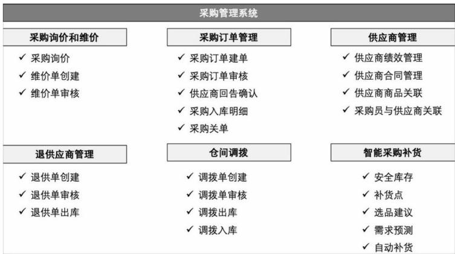

图6-1采购管理系统的核心功能

## 6.2采购询价

在实施采购之前，采购人员通常要货比三家，向多个供应商咨询采 购价格，这个过程叫作询价。很多中小型公司的采购询价流程都是通过 打电话和 Excel 管理的，但如果技术条件允许，采购询价流程是可以线 上化的，这依赖于供应商管理系统的支持（供应商管理系统在后续章节 中我们会介绍）。具体流程为：采购人员在采购管理系统中创建并发布 询价单，供应商登录供应商管理系统，针对询价单进行报价，完成询价 ，如图6-2所示。 

图6-2 采购询价流程

采购人员在创建询价单时，需指定询价对象、询价截止日期和需询 价的商品及计划采购数量。询价对象可以是全部供应商，也可以只针对 部分指定供应商；询价截止日期用以控制询价单的有效期，仅在有效期 内生效。图6-3是创建询价单的示例图。 

根据询价单的生命周期，询价单状态可以设计为新询价单、询价中 、已报价、已关闭4种，如图6-4所示。 

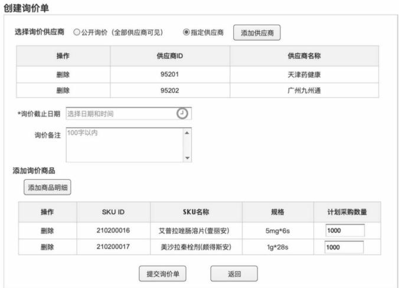

图6-3创建询价单示例

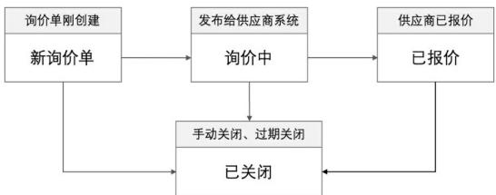

图6-4询价单状态

询价单状态说明如表6-1所示。 

表6-1询价单状态设计说明

<table><tr><td>询价单状态</td><td>说 明</td></tr><tr><td>新询价单</td><td>新建的询价单初始状态</td></tr><tr><td>询价中</td><td>询价单已发布给供应商,等待供应商报价</td></tr><tr><td>已报价</td><td>供应商已针对询价单反馈报价</td></tr><tr><td>已关闭</td><td>询价单到截止日期后自动关闭,也可由采购人员手动关闭。已关闭的询价单不再支持报价或修改报价。</td></tr></table>

## 6.3采购维价

采购维价是指采购人员在商品采购价格发生变动时，在采购管理系 统中进行新价格的维护，并以新价格进行采购进货。维价是采购人员对 商品采购价格的集中管控，能更好地监督进货价，管理商品的毛利，也 能有效避免采购人员与供应商徇私舞弊的行为。 

一般在遇到如下业务情况时，采购人员需要进行维价。 

①第一次采购商品。 

②供应商价格调整。 

③价格维护错误后需修正。 

④ 商品有返利时。 

采购维价的流程如图6-5所示。 

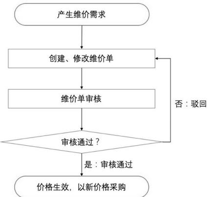

图6-5采购维价流程

## 6.3.1 采购维价单

一般情况下，采购人员在创建采购订单时，如果采购价格不变或在 向下调整的一定范围内可以自由修改采购价而无须维价，其他时候则需 要进行维价并由上级审核。由采购人员创建维价单，经采购经理审批后 生效，特殊情况下需采购总监或部门副总审批后方可生效。 

①商品价格向上或向下波动幅度超过一定比例。 

②特定供应商。 

③ 特定商品。 

④其他特殊情况。 

维价单主要以建单和审批为主，状态可以设计，如图6-6所示。 

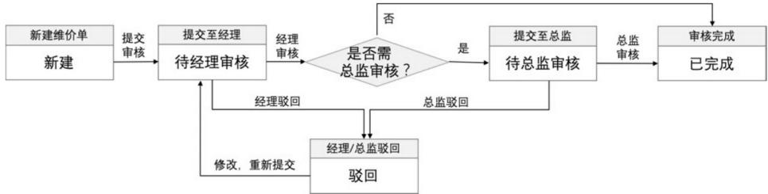

图6-6 维价单状态

一个维价单中可以包含多条维价商品明细，当审批流程走完以后， 即用最新的进货价格替换原进货价格，如图6-7所示，原进货价格失效 ，如果还有返利，则在返利周期内按照返利后的价格进行采购结算，返 利周期结束后自动恢复为正常价格。 

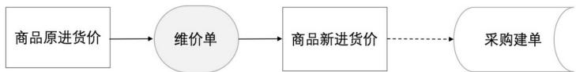

图6-7 维价单的作用

维价单管理页面示例，如图6-8所示。 

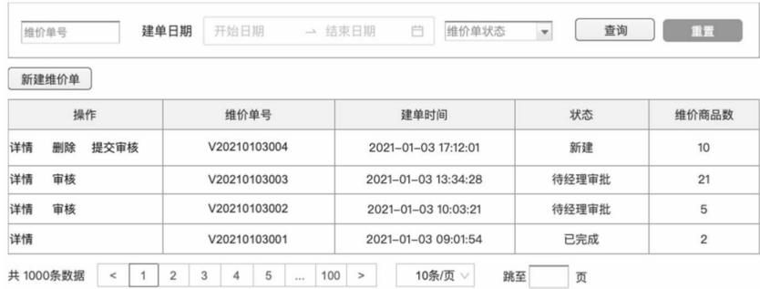

图6-8维价单页面管理示例

因为商品的报价是供应商提供的，一个商品往往会有多个供应商供 货，每个供应商的报价不同，所以采购人员需要针对每个供应商进行维 价，针对需要采购的商品和每个供应商议价，双方达成一致后，采购人 员将进货价维护成合同中约定的价格。很多供应商的报价是阶梯式的（ 如购100件，进货价为100元/件，购500件，进货价为80元/件，以此类推 ），还有一些供应商为鼓励采购人员进行批量采购，还提供返利，即在 某个周期内，返利××元或提供返利点，如某商品原进货价为100元，但 当前时段返利1%，则实际进价为99元，相关人员在进行维价设计时应 该考虑兼容这些情况。图6-9是一个商品维价明细示例。 

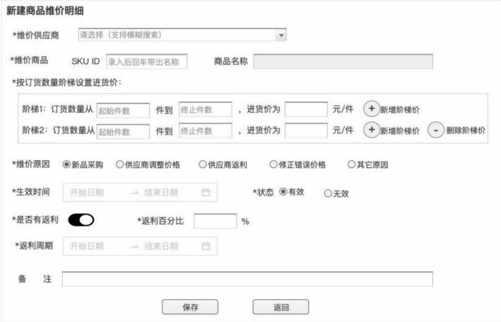

图6-9新建商品维价明细示例

## 6.3.2 采购价管理

对商品的采购价进行集中管理，横向可以对一个商品的多个供应商 的报价进行比价，挑选最优的采购价进行采购，纵向可以分析每个供应 商的价格波动情况，及时调整采购计划。所以，在很多企业中，有一个 关于价格库的系统来管理每一个商品的采购价格和销售价格。 

在设计采购价管理功能时，一个 SKU 可以有多个供应商进行供货 ，所以会存在多个价格，同时，一个供应商也可以供应多个SKU。针对 某一个SKU，供应商也可以提供多个价格（前面提到的阶梯报价），三 者的关系如图6-10所示。 

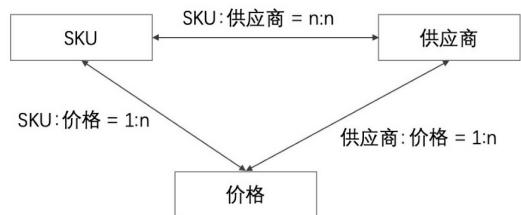

图6-10商品、供应商与价格

图6-11为采购价格管理的示例，此功能中每个商品的进货价格由采 购人员维价而来，在采购前，采购人员搜索每个供应商针对每个商品的 报价并挑选最优价格进行采购，可以极大地降低采购成本。 

<table><tr><td>SKU ID</td><td>供应商(支持模糊搜索)</td><td>采购数量</td><td>数量起</td><td>数量止</td><td>查询</td><td>重置</td></tr><tr><td colspan="7"></td></tr><tr><td>SKU ID</td><td>商品名称</td><td>规格</td><td>供应商</td><td>供应商报价</td><td>返利百分比</td><td>返利周期</td></tr><tr><td>2001056789</td><td>艾普拉唑肠溶片(壹丽安)(丽珠)</td><td>5mg*6s</td><td>丽珠集团丽珠制药厂</td><td>0件-100件:100元/件101-500件:80元/件501件-9999件:70元/件</td><td>1.5%</td><td>2021/01/01 ~ 2022/01/31</td></tr><tr><td>2001056789</td><td>艾普拉唑肠溶片(壹丽安)(丽珠)</td><td>5mg*6s</td><td>广州医药集团</td><td>0件-9999件:100元/件</td><td>0</td><td>-</td></tr><tr><td>2001056789</td><td>艾普拉唑肠溶片(壹丽安)(丽珠)</td><td>5mg*6s</td><td>广州九州通医药</td><td>0件-9999件:95元/件</td><td>0</td><td>-</td></tr><tr><td>1011034151</td><td>美沙拉秦栓剂(颇得斯安)</td><td>1g*28s</td><td>广州九州通医药</td><td>0件-9999件:210元/件</td><td>0</td><td>-</td></tr></table>

图6-11 采购价格管理

## 6.4采购订单

采购订单，专业术语叫PO（Purchase Order），又叫采购单，是采 购管理系统中最重要的信息载体，它是基于采购合同向供应商下发的正 式的采购商品明细，也是供应商送货和结算的重要凭证。当采购订单下 发供应商后，供应商会将此转为自己的销售订单进行拣货、发货和配送 0 

## 6.4.1与采购相关的业务单据说明

在正式介绍采购订单之前，我们需要先弄懂几种与采购相关的单据 ，以及每种单据对应的业务场景和产生的时机，以免因业务流程不清晰 而干扰了系统设计。 

① 采购计划。以年度或季度为周期做的采购计划，一般基于历史 数据估算而来，产生于做年度采购计划或季度采购计划时。 

② 采购申请。一般是企业内部的采购人员在采购之前，提交的非 正式的审批文件，仅用于内部流转，产生于某部门有采购意向，需要走 审批流时。 

③ 采购订单。与供应商约定好采购金额、数量后，根据采购合同 创建的正式的采购单据，采购部门将此单据交给供应商，以便其送货， 产生于采购合同签订以后，需要正式采购时。 

④ 收货单。仓库收到供应商的商品以后，在仓储管理系统中对到 货商品进行清点、录入，生成仓库收货的收货记录，产生于仓库开始收 货以后。 

⑤ 采购入库单。仓库实际入库明细，是生成应付账款的凭证，产 生于仓库入库上架以后。 

按照流程节点的先后，依次产生采购计划、采购申请、采购订单、 收货单、采购入库单。先有年度采购计划或季度采购计划，待日常采购 前，提交采购申请（此时还不确定从哪个供应商处进行采购），申请通 过后便可以正式开始采购询价、议价、签订合同，然后创建采购订单， 将采购订单下发仓库，待供应商送货后进行收货，此时便产生了收货单 ，然后针对收货单进行商品验收、上架，并回传入库明细至采购管理系 统中，即为采购入库单。 

## 6.4.2采购订单的创建

采购订单的创建并不是采购的第一个环节，而是在采购申请、采购 议价、采购合同的签订等流程走完以后，最终在系统中完成采购结果录 入的环节。采购订单创建流程，如图6-12所示。 

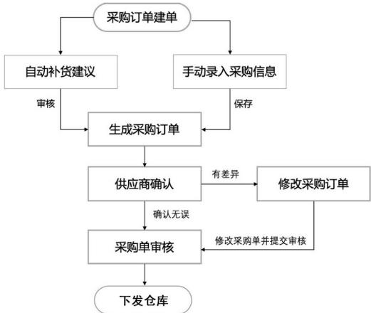

图6-12采购订单的创建流程

采购订单有两种创建方式。 

方式一、手动创建采购订单。由采购人员根据实际需要（如常规采 购、缺货补货），录入采购信息，生成采购订单。此方式比较简单灵活 ，是最常用的采购订单创建方式。 

方式二、自动补货建议。基于历史销售数据进行计算，再结合业务 的实际情况，由系统自动计算需要补货的商品及数量等，由人工审核后 生成采购订单。此方式对数据建模要求较高，而且需要基于一定数据量 的积累，适用于有一定技术实力，且业务相对稳定的企业。 

为了体现采购流程的协同，采购订单生成以后，还有一个将采购订 单传给供应商确认的过程，确保商品能及时送达指定仓库，此过程可以 通过电话、邮件的方式确认。如果技术实力允许，企业也可以为供应商 搭建供应商管理平台，将采购信息传到系统中，让供应商登录系统进行 回告，确认数量、金额和送货日期等。若回告的信息与采购信息有差异 ，可在采购管理系统中进行调整。 

所有信息确认无误后，采购订单还需要经过审核，才能正式生效并 下发仓库。同商品维价一样，当采购金额超过采购经理审批权限时，采 购订单需经采购总监审批后方可生效。 

无论以哪种方式创建采购订单，均需要明确供应商、发票类型、入 库仓库、采购商品、采购数量、采购单价等。一张采购订单中可以包含 多条商品明细，但应只对应一个供应商和一个仓库，采购订单如图6-13 所示。 

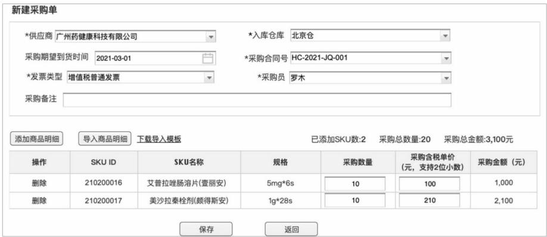

图6-13新建采购订单示例

采购订单关键信息说明如下。

①供应商。从供应商资料中选取当前合作且有效的供应商。 

② 入库仓库。供应商需要送货的目标仓库或门店，取自仓库基础 数据。 

③ 采购合同号。每一张合规的采购订单都应该有一份与之对应的 采购合同，采购合同应该是在创建采购订单之前就维护进系统中的。如 果采购合同过期了，就不允许与此供应商合作了，需要重新与供应商签 订合同。 

④ 发票类型。发票主要用于财务结算、付款和充当抵税凭证，由 供应商根据采购明细开具。根据发票的类型，发票可分为增值税普通发 票、增值税专用发票、营业税发票等。 

⑤ 采购商品SKU：从当前所选供应商能供给的商品列表中进行选 择。注意，筛选范围不是全部商品，而是当前供应商下维护的商品，此 举的目的是严格管理每个商品的引入流程，避免采购人员从无资质的供 应商处采购商品。 

⑥ 采购含税单价。采购价格一般是含税单价，如果采购人员维护 了某一商品的采购价格，直接从价格表中输出此供应商+SKU ID的采购 价，允许在一定范围内加以修改，若超过系统设定的范围，就需要重新 维价或经上级审批了。 

## 6.4.3采购订单状态的设计

按照采购订单的生命周期，采购订单的状态设计如图6-14所示。 

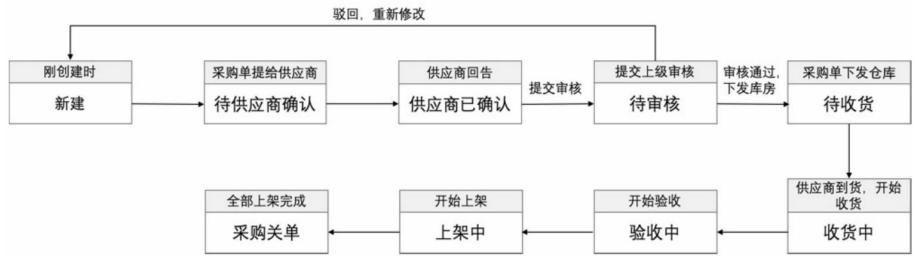

图6-14采购订单状态的设计

状态说明如表6-2所示。 

表6-2采购订单状态的设计说明

<table><tr><td>采购订单状态</td><td>说明</td></tr><tr><td>新建</td><td>采购订单刚生成时的状态,此状态下可以对采购订单进行修改、删除</td></tr><tr><td>待供应商确认</td><td>将采购订单下发给供应商确认的状态,需要供应商确认商品数量、价格及送货时间等。</td></tr><tr><td>供应商已确认</td><td>供应商已回告。如果有供应商管理平台,由供应商在线确认,如果没有供应商管理平台则可以通过电话、邮件等方式确认后,由采购人员在采购管理系统中进行确认</td></tr><tr><td>待审核</td><td>采购人员将采购订单提交上级审核</td></tr><tr><td>待收货</td><td>采购订单走完所有审批流程后,会下发到仓储管理系统中,等待供应商送货</td></tr><tr><td>收货中</td><td>供应商将商品送到指定仓库,开始收货了,由仓储管理系统回告此状态。一张采购订单可能会分多次送货和收货,第一次收货完成后,采购订单的状态即变为“收货中”</td></tr><tr><td>验收中</td><td>收货完成后,进入验收状态,由仓储管理系统回告。采购订单中只要有一条商品明细进行了验收,则整张采购订单的状态变为“验收中”</td></tr><tr><td>上架中</td><td>商品验收完成,上架到仓库的货位上,由仓储管理系统回告。采购订单中只要有一条商品明细上架完成,则整张采购订单的状态变为“上架中”</td></tr><tr><td>采购关单</td><td>采购完成的状态,所有商品明细都已入库上架后由系统触发,或者本采购订单无法再到货后,因超时由人工或系统自动关闭</td></tr></table>

通过采购管理系统中采购订单的状态变更，相关人员便能完整地监 控每一张采购订单的执行情况，做到全程可视化和有效跟进，如图6-15 所示。 

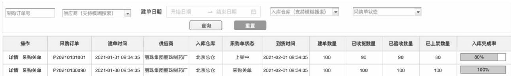

图6-15采购订单可视化示例

若想实现采购订单可视化的目标，需要仓储管理系统将仓库的入库 明细及时回传采购管理系统，包含收货明细、验收明细和上架明细。 

一张采购订单可以分多次送货和收货，生成多张收货单，一张收货 单一般进行一次验收（在很多企业中，收货和验收是合二为一的），验 收完成后，又可能根据不同的上架库区拆分为多张上架单进行入库上架 ，故采购订单、收货单、验收单和采购入库单的关系，如图6-16所示。 

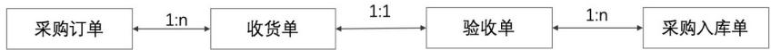

图6-16采购订单、收货单、验收单和入库单的关系

由于仓库收货、验收和上架操作产生的结果略有不同，故三者回传 的明细也有所差异，如表 6-3 所示。在采购管理系统中，相关人员以采 购订单为维度将各个环节的回传数据汇总展示，即可看到完整的可视化 数据。 

表6-3采购入库明细回传

<table><tr><td>收货回传</td><td>采购单号、收货单号、随货同行单号(供应商随着商品一起送到的商品明细清单)、SKU、入库批次号(按照入库规则生成的批次号,每个批次代表一次入库)、收货数量等</td></tr><tr><td>验收回传</td><td>采购单号、上架单号、SKU、入库批次号、验收结论(合格/不合格/待检等)、验收数量等</td></tr><tr><td>上架回传</td><td>采购单号、上架单号、SKU、入库批次号、验收结论、上架数量等</td></tr></table>

## 6.4.4 采购关单

采购关单是对采购订单进行完结处理的动作，采购订单的状态变为 “采购关单”，代表此采购订单后续不会再进行送货。系统处理关单分两 种情况。 

① 自动关单：当仓库收货入库总量和采购计划数量一致时，系统 自动触发关单动作。 

② 强制关单：针对长期未完结的采购订单（如三个月无进货）， 

由采购人员手动关单或采购管理系统自动触发关单操作。 

自动关单需要在采购管理系统中增加一个配置参数，可以以仓库为 维度，或者以供应商为维度来配置，如某商品的供应商，自动关单配置 时间为××天。系统在监控到某采购订单已经超过关单时间还未关闭时， 便自动触发关单。 

关单操作不能只在采购管理系统中执行，需与仓储管理系统进行联 动，如图6-17所示，若仓库正在对此采购订单进行入库作业（正在收货 、验收或上架），则不允许关单。已经关单成功的采购订单，仓库不允 许再收货。 

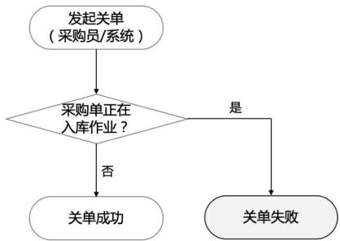

图6-17 采购关单

## 6.5 供应商管理

采购管理系统中的供应商管理不同于基础数据中心中的供应商数据 管理，而是基于供应商基础数据在采购环节中进行的供应商管理，包括 绩效管理、送货时效统计、商品关联、合同管理等，以便更好地实施采 购。 

## 6.5.1 供应商绩效管理

对供应商的绩效进行管理，从多维度对供应商进行综合评估和考核 ，可以反向协助供应商提升服务、有利于双方建立更稳定的合作关系。 绩效考评步骤如下。 

① 梳理考评指标，建立考评体系。考评指标包括但不限于以下因 素。 

a.供应商送货时效及稳定性；b.供应商供货价格；c.供应商服务水平 和响应时效；d.品牌知名度；e.供应品种的齐全性；f.全国业务网点的分 布状况；g.供应商企业的规模和财务状况；h.供应商结算方式和账期。 

② 确定每项指标的权重及评分。针对以上梳理的各项考评指标， 给予每项指标相应的考评权重，各项权重之和为1。然后相关人员针对 每个供应商的每项指标进行打分。 

权重和评分可根据历史数据分析得来，若没有历史数据可供参考， 则由业务部门的相关人员根据经验进行设定。 

③ 综合考评，反复验证。 

将指标得分和权重进行加权即可算出每个供应商的绩效综合得分， 得分越高表示供应商的绩效越好：然后将此计算结果进行排名后交由业 务部门进行评估，若与实际有偏差，再返回第②步进行修正，直到符合 预期。 

$$
\mathrm{综合得分} = \mathrm{各项指标评分之和乘权重}
$$

例如，假设设定图6-18中的4项考核指标及各项指标权重，相关企 业分别针对A、B两个供应商进行评分和绩效综合考评。 

<table><tr><td>考核指标</td><td>权重(合计100%)</td><td>评判分数—A供应商(1~10分,10分为最高)</td><td>评判分数—B供应商(1~10分,10分为最高)</td></tr><tr><td>供应商送货时效及稳定性</td><td>50%</td><td>8</td><td>9</td></tr><tr><td>供应商供货价格</td><td>30%</td><td>8</td><td>7</td></tr><tr><td>供应商服务水平和响应积极性</td><td>10%</td><td>10</td><td>5</td></tr><tr><td>品牌知名度和商誉</td><td>10%</td><td>8</td><td>4</td></tr><tr><td>综合得分</td><td></td><td>8.2</td><td>7.5</td></tr></table>

图6-18供应商绩效管理示例

比较A、B两个供应商的综合得分可知，供应商A比供应商B的绩效 得分要高，更适合建立深度合作。 

## 6.5.2供应商送货时效管理

供应商的送货时效及稳定性会对采购工作产生极大的影响，不稳定 的送货时效会导致采购人员对采购数量的误判，从而对库存成本和销售 产生影响。因此采购管理系统需要对每个供应商送货到各地仓库的时效 进行监控。从采购可视化数据中获取采购下单时间和供应商到货时间， 二者相减即可得到供应商单次送货时效。 

由于供应商可能会多次送货，以及天气、路途等原因，在实际送货 过程中会存在超出平均送货时长很多的情况，此部分数据应列为干扰数 据，排除后再进行统计。另外，供应商备货的品项和数量也会对送货时 效产生影响，如果技术实力允许，相关企业可以建立一个多维度的模型 进行综合评估。 

## 6.5.3供应商商品管理

不在供应商经营范围内的商品，是不允许进行采购的，当确定与某 供应商合作以后，采购人员需要对每个供应商绑定其下可采购的SKU， 在创建采购单时，只能采购已经绑定过的SKU，未绑定SKU无法进行采 购。 

图6-19为供应商关联商品示例，相关人员在设计系统功能时，要注 意一个供应商可以添加多个关联商品，一个商品也可以被多个供应商关 联。 

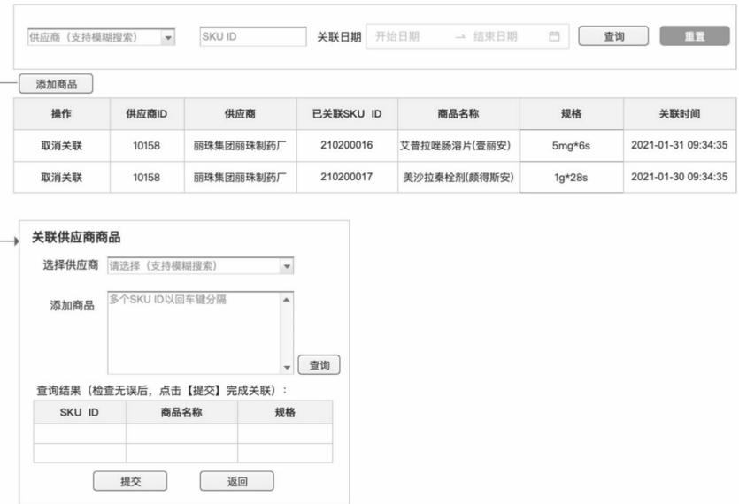

图6-19 供应商关联商品示例

## 6.5.4供应商合同管理

采购合同是创建采购订单的基础性文件，是约束供需双方行为，保 证双方顺利交易的有效凭证。按照合作方式的不同，采购合同可以分为 战略性合同和非战略性合同。战略性合同意在企业与供应商达成战略合 作，风险共担，包含回购合同、收入共享合同、数量灵活合同、销售回 扣合同等；非战略性合同主要指弹性合同，如大宗商品、产品可以从许 多供应商（或与单个供应商签订多份合同）那里购买，这类合同更注重 对市场反应的灵活性，企业不需要和供应商建立长久的合作关系，风险 主要由供应商承担，包含长期合同、柔性合同、期权合同、现货合同、 组合合同等。以上每一类合同都有其特有的履约方式，由于篇幅有限， 不在此过多展开，感兴趣的朋友可以深入了解每一类合同的细节。 

正常的采购合同的关键信息包含：甲方（买方），乙方（供应商） ，合同号、合同履行的开始日期和截止日期，采购商品的名称，规格， 单位，数量，含税单价，总金额、发票类型（增值税普通发票、增值税 专用发票、营业税发票、无发票），结算方式（预付款、分期付款、一 次性付款等），付款银行账号信息，交货方式（供应商自送、三方物流 配送、自提），交货期限，违约责任，合同的变更和解约条件，合同附 则和签署等。 

对供应商的合同进行系统管理可以及时对已过期或即将过期的合同 进行预警，并对采购商品的价格、范围进行有效监控，减少采购风险和 录入差错。合同管理有两种系统设计方式。 

方式一：粗放式合同管理。仅在系统中记录每个合同的编号、有效 期等信息，合同细则通过线下签署后扫描附件的方式上传。 

方式二：电子合同管理。将合同细则形成系统模板，此模板可为本 公司固定合同模板，也可为供应商订制模板。在签订合同时，双方在线 填写关键信息并在系统中进行签名后生效。电子合同可下载并打印纸质 合同作为存根。 

图6-20为某材料的采购合同示例。

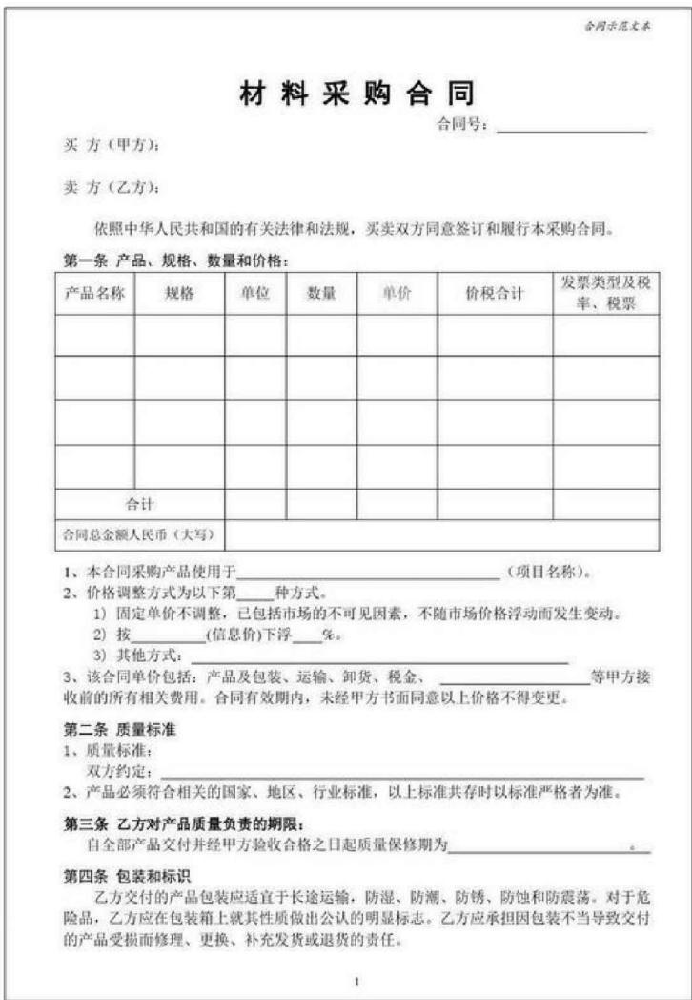

图6-20供应商采购合同示例

## 6.6退供应商

在库的商品，经常会由于包装破损/供应商召回/近效期/质量问题/滞 销商品协议退供等原因，需要退给供应商，对应的仓库操作是退供出库 ，将商品库存消掉，这就需要采购人员操作退供应商功能。 

## 6.6.1退供单的创建

退供单的创建流程同采购订单的创建流程一样，由采购人员创建， 审核通过后，下发仓库，相关人员进行出库操作，如图6-21所示。 

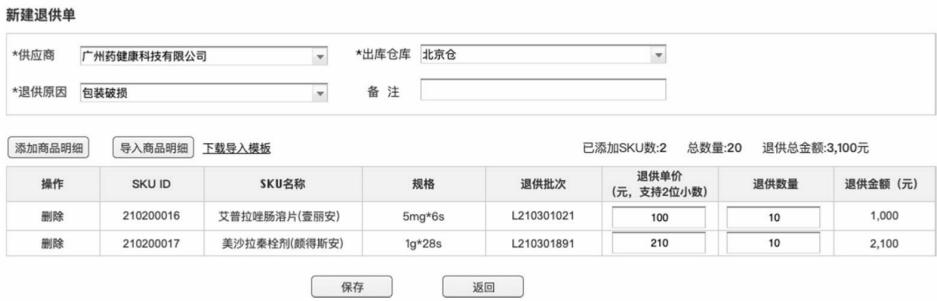

图6-21 新建退供单示例

退供单关键信息说明如下。 

① 供应商。采购人员只能提取有过采购记录，且当前还有库存的 供应商的信息。 

② 出库仓库。采购人员获取仓库或门店信息，可以从仓库退供， 也可以从门店退供。 

③ 退供原因。退供原因包含包装破损/供应商召回/近效期/质量问题 /滞销商品协议退供等。 

④ 退供 SKU 及退供批次。根据供应商筛选此供应商下尚有库存的 商品及批次。退供单的商品及批次必须与此供应商原始采购入库单的商 品和批次对应，且退供总数量不能大于采购总数量。 

⑤ 退供单价。默认取当前批次最近一次采购入库的单价，若与实 际不一致，可由采购人员在建单时进行调整。 

## 6.6.2退供单状态的设计

按照退供应商的流程节点，我们可以设计退供单的状态，如图6-22 所示。 

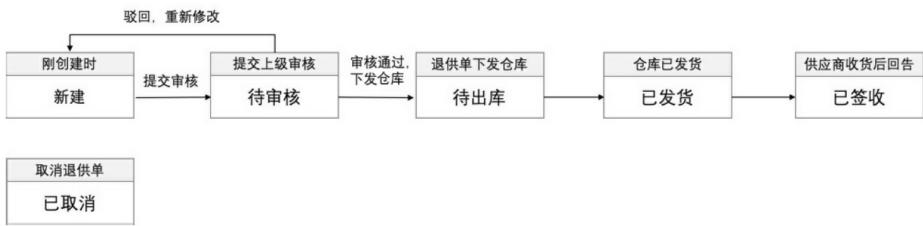

图6-22 退供单状态的设计

退供单各状态设计说明，如表6-4所示。 

表6-4 退供单状态设计说明

<table><tr><td>退供单状态</td><td>说 明</td></tr><tr><td>新建</td><td>退供单刚生成时的状态,此状态下可以对退供单进行修改、删除</td></tr><tr><td>待审核</td><td>退供单提交至上级审核的状态,此状态下不再支持退供单的修改和删除</td></tr><tr><td>待出库</td><td>审核通过以后,将退供单下发到仓储管理系统中,退供单状态变更</td></tr><tr><td>已发货</td><td>仓库按退供单拣货、发货后回传发货明细到采购管理系统中,退供单状态变更</td></tr><tr><td>已签收</td><td>退供商品发给供应商,供应商确认签收后变更状态,此状态可与物流状态信息对接后变更,或者由供应商登录供应商管理系统进行手动确认</td></tr><tr><td>已取消</td><td>在仓库发货前,均可取消退供单,取消成功后,退供单状态变更</td></tr></table>

在设计退供应商功能时，需要注意以下几点。 

① 退供单默认一级审批，若遇特殊情况，需经采购总监审批后方 可下发仓库，如退供价格异常、特定供应商和特定商品等，相关人员在 进行系统设计时可以根据实际业务场景定义审批流程。 

② 基于作业效率和物流成本的考虑，企业往往会将退供商品累积 到一起退货，这样退供单中的商品数量往往会比较多，难保退供单中的 商品都能正常出库，所以系统需要支持允许缺量出货，即实际出库的数 量小于计划退供数量的情况，仓库发货以后需要把实际发货数量回传采 购管理系统并同步给供应商，以实际发货数量为准。 

③ 退供单出库过程中，为避免商品又被其他订单占用而出现超卖 的情况，审核通过的退供单，最好由采购管理系统通知中央库存系统将 退供的商品库存锁定，待实际出库以后，再按照实际发货数量回告中央 库存系统扣减实际库存（此逻辑在后续章节中再详细介绍）。 

④ 退供的最终节点是供应商签收，有供应商管理系统的企业，退 供明细可以通过接口推送至供应商管理系统，由供应商在线签收和结算 ，降低沟通成本，体现供应链的协同。 

## 6.7 仓间调拨

当需要将两个仓库的库存进行互调时，就需要用到仓间调拨功能。 仓间调拨的系统逻辑是将发货仓的发货功能和收货仓的入库功能进行组 合，对应发货仓的库存扣减和收货仓的库存增加。 

## 6.7.1 调拨单创建

调拨单的创建一般由采购部门的相关人员或者仓储部门的相关人员 发起，经审核后，生成发货仓的发货单，待发货仓将商品发货以后，采 购管理系统再根据发货仓的发货明细生成收货仓的入库单，供收货仓进 行收货入库。（免费获取更多供应链PM书 加v信：pmzjie） 

图6-23为新建调拨单的示例，一张调拨单对应一个发货仓，一个收 货仓，以及多条商品明细。 

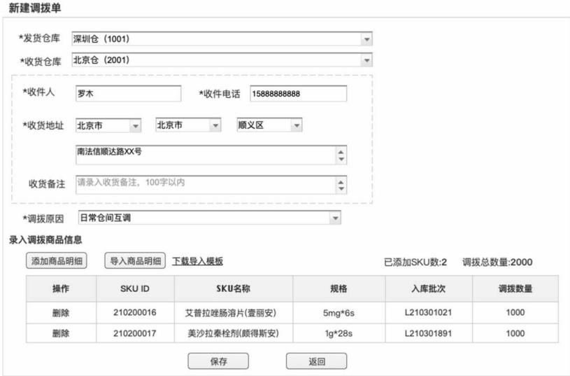

图6-23 新建调拨单示例

调拨单关键信息说明如下。 

① 发货仓：此为调拨出库方，相关人员负责按照调拨商品明细拣 货并发货至收货仓，收货方取自收货仓库的收件人信息。 

② 收货仓：此为调拨收货方，相关人员负责将调入货物收货入库 

③ 调拨原因：一般有积压件转仓、关闭仓库、订单驱动调拨、日 

常仓间互调等原因供选择。 

④ 调拨商品明细：仅能提取发货仓的商品库存、批次信息，且调 拨数量不能大于发货仓的库存数量。 

## 6.7.2调拨流程与调拨单状态

完整的调拨单涉及三个系统的操作流程，如图6-24所示。采购管理 系统的调拨建单与调度、发货仓仓储管理系统的拣货出库、收货仓仓储 管理系统的收货入库，这三个流程环环相扣，持续周期很长，采购管理 系统在其中起着调度的作用。 

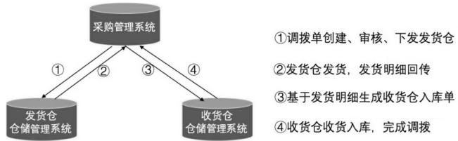

图6-24仓间调拨系统交互流程

为了更好地管理调拨过程，我们在设计调拨单的状态时，需要将三 个系统的状态变化都监管起来，才能实现调拨单的全程可视化，调拨单 系统状态的设计如图6-25所示。 

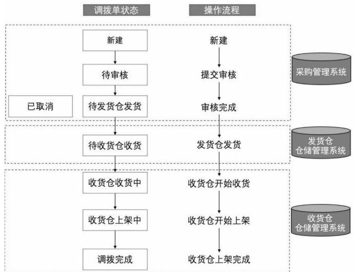

图6-25调拨单系统状态的设计

状态设计说明如表6-5所示。 

表6-5调拨单状态说明 

<table><tr><td>退供单状态</td><td>说 明</td></tr><tr><td>新建</td><td>调拨单刚生成时的状态,此状态下可以对调拨单进行修改、删除</td></tr><tr><td>待审核</td><td>退供单提交上级审核的状态,此状态下不再支持对调拨单的修改和删除</td></tr><tr><td>待发货仓发货</td><td>审核通过后,调拨单下发至发货仓,等待发货仓发货</td></tr><tr><td>待收货仓收货</td><td>发货仓已将商品发出,由发货仓回传发货明细后,调拨单状态变更</td></tr><tr><td>收货仓收货中</td><td>收货仓已开始收货,第一条收货信息回传后状态变更。可能存在多次收货的情况,以第一条收货记录为准</td></tr><tr><td>收货仓上架中</td><td>收货仓已开始上架,第一条上架明细信息回传后,调拨单状态变更</td></tr><tr><td>调拨完成</td><td>调拨单中所有商品均已上架完成,或者人为操作调拨完成后,调拨单状态变更</td></tr></table>

在设计调拨功能时，有几个业务特性需要注意。 

① 调拨属于供应链内部的行为，不应该影响销售，所以在调拨过 程中，难免会有平台上的用户下单，所以调拨单生成以后，需要与中央 库存系统联动，将库存及时占用，保证新的订单不被下发到发货仓，待 收货仓入库以后，再将订单分仓并下发到收货仓发货。 

② 为了产生发货和配送的规模效应，调拨单中的商品明细通常有 很多，难免会出现某些商品在发货仓无法发出的情况，仓储管理系统要 支持缺量发货并回传实际发货明细到采购管理系统中，采购管理系统按 照实际发货明细再生成收货仓的入库单。 

③ 由于物流丢件、发货过程中的遗漏等原因，收货仓收到的实物 商品数量也不能保证百分百与系统一致，所以收货仓应该以实际到货数 量进行清点收货，对于实际入库与发货仓实际出库有差异的明细，需要 在调拨单中有所体现，涉及收货仓、发货仓、物流三方的职责交割。 

## 6.8需求预测与智能采购补货

以上章节介绍了采购管理系统的基本功能，而采购管理系统的精髓 在于追求高效和精益，通过系统策略驱动智能化采购。若要更好地达成 精益的目标，采购管理系统中智能推荐功能必不可少，如如何预测销量 并给予采购建议、如何设置最优的安全库存、如何在资金有限的前提下 采购到必需商品、如何挑选新品等。 

## 6.8.1定量采购与定期采购

根据采购的方式不同，可以分为定量采购和定期采购两种。 

定量采购是提前设定好商品的采购订货点和目标库存，随时监控商 品的库存消耗情况，商品库存一旦低于订货点，便进行采购补货，每次 采购的数量都是相对固定的。由于商品的消耗周期是不固定的，所以采 购的时间也是不固定的，完全取决于商品库存何时消耗到订货点以下。 例如，设定某商品的订货点为2，目标库存为10，则一旦商品库存量为2 ，就采购8个商品。 

定期采购则是提前设定好采购时间间隔和目标库存，每到采购时间 ，便进行采购。定期采购模式下，只有目标库存，没有订货点，每次采 购的数量是不固定的，取决于采购时商品的库存剩余数量，采购数量为 目标库存-当前剩余库存量。例如，设定某商品的采购间隔为1个月，目 标库存为10。第1个月月末剩余库存为4，则需要采购6个；第2个月月末 剩余库存为3，则需要采购7个。 

在传统仓储管理物料库存时经常使用的两箱法和看板采购（见图6- 26），就是属于定量采购模式。 

相比而言，定量采购比定期采购对库存的管理要求更高，需要相关 人员实时监控库存余量，但它只会针对已经低于订货点的商品进行采购 ，对于滞销或库存充裕的商品是不会触发采购的，因此对采购资金和库 存的利用率也更为精准。 

定量采购适用于品种数量少、资金占用量大、畅销的商品，一般以 A类商品为主，这一类商品我们需要重点关注，尽量降低缺货风险。定 期采购适用于资金占用少、销量相对稳定的商品，以B类商品和C类商 品为主。[1] 

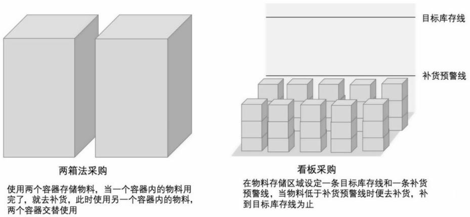

图6-26两箱法采购和看板采购

## 6.8.2供应链库存分类

按照库存的生命周期，我们可以将库存分为原材料库存、半成品库 存和成品库存，在供应链源头，如原产地和原料供应商管理着原材料库 存，而在最末端的批发和零售企业管理着成品库存，生产企业负责将原 材料生产加工为半成品和成品，所以会同时存在三种形态的库存。 

无论是原材料库存、半成品库存和成品库存，按照库存的用途，都 可以分为日常周转库存、安全库存和滞销库存三类，如图6-27所示。 

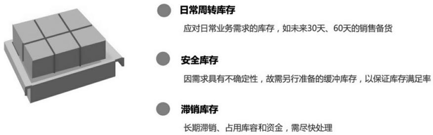

图6-27日常周转库存、安全库存和滞销库存

① 日常周转库存，主要用于应对日常业务需求的库存备货，如未 来30天、60天的销售备货。 

② 安全库存，主要用于应对不确定性需求的缓冲库存。例如，某 一天需求量突然比往日激增了10个，增加的这10个库存就要动用安全库 存。 

③ 滞销库存，因需求预测错误或者其他原因导致长期滞销的库存 

，此类库存占用了库容和资金，需要尽快处理。 

从重要性来看，日常周转库存是最重要的，必须保证，当周转库存 不足时，安全库存便开始发挥其作用，所以也必不可少，当日常周转库 存和安全库存不足时，采购人员便要开始采购了。滞销库存是纯粹的浪 费，应该尽可能杜绝。 

## 6.8.3智能采购补货策略

如果我们的SKU只有几十个、上百个，通过简单的Excel就能知道 每个SKU的当前库存，手动筛选库存较低的商品及时进行补货是件很容 易的事。但当SKU多达几万个、上百万个时，每个 SKU 有自己的库存 ，且库存消耗的频率各不相同，采购人员如何知道哪些 SKU库存快不 够了，何时该补货，该补多少？这时就需要自动采购补货了。 

在学习自动采购补货之前，我们先厘清几个概念。 

① 采购提前期，指商品采购需要的时间，从下采购订单，到供应 商备货、供应商送货到目标仓库、仓库入库的全周期。 

② 订货点，也称再订货点，是触发再次采购的时机点，当现货可 用库存下降至订货点时就触发下次补货。 

③ 目标库存，每次补货的库存上限，超过目标库存就不能再补货 了，否则会产生多余的滞销库存。 

④补货量，每次需要补货的数量。 

这几个概念和采购补货有什么关系呢？简单来说，订货点是用来辨 别哪些SKU库存不足以及何时该补货的，相当于一个预警线，一旦某个 SKU的当前库存低于订货点，就需要补货了；目标库存是补货的目标库 存数量；补货数量就是采购数量。订货点、目标库存、补货数量三者息 息相关，构成了智能采购补货的三要素。智能补货策略是定量采购思想 的体现，原理如图6-28所示。一旦系统监测某商品当前库存低于订货点 了，就可以自动计算补货量，生成采购建议，待采购人员确认后，生成 正式的采购订单，自动补货到目标库存，省去了人为判断和处理的过程 

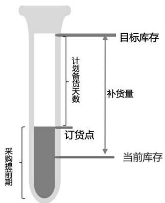

图6-28智能采购补货原理

在创建采购订单时，采购人员要确定采购到货仓库、SKU及采购数 量，如何通过系统自动生成这三项要素呢？我们来一一分析。 

## （1）如何确定到货仓库及SKU

哪个仓库的SKU当前可用库存低于订货点了，就需要触发当前仓库 中此SKU的采购了。不过此条件仅适用于单个仓库，如果全国有多个仓 库，采购补货的触发条件应为某仓的SKU库存低于该仓的订货点，且全 国所有仓库的总可用库存低于全国总订货点时。若某仓可用库存低于订 货点，但全国总库存超过总订货点，说明其他仓库中的SKU尚有盈余， 此时不需要补货，相关人员将订单分拨到盈余仓库即可，或者将盈余仓 库的库存调拨到缺货仓库中。 

## （2）订货点如何计算

订货点=日均需求量×采购提前期（天）+安全库存 

日均需求是对未来每天需求量的预测值。理想的采购周期是当商品 的在库库存消耗为 0时，新采购的商品刚好入库，完美衔接。由于从采 购订单发出，供应商备货，到商品送达后入库上架是存在时间周期的， 这个周期就是采购提前期。 

## 采购提前期=供应商备货天数+供应商送货时长+仓库入库时长

相关人员也可以根据历史采购单的入库时间减去采购单下达供应商 的时间来计算采购提前期。 

例如，采购提前期为 5 天，假设每天的需求量和采购提前期是固定 的，为了保证在采购提前期内商品还能正常售卖，采购人员应该在库存 消耗为零的前 5 天便开始采购，所以采购订货点应该设置为采购提前期 天数×日均需求量。 

但在实际业务场景下，每天的需求量并不是固定不变的，而是上下 波动的，我们还需要准备一部分备用库存来应对需求波动的情况，这个 备用库存便是安全库存，所以实际情况下的订货点=日均需求量×采购提 前期（天）+安全库存，关于日均需求和安全库存如何计算将在后面的 章节中详细说明。 

每个商品的订货点确定以后，便能通过系统监控商品的库存，一旦 商品库存低于订货点了，便触发自动补货。 

## （3）采购补货量如何获得

## 补货量=仓库目标库存-可用库存-在途库存

目标库存是当前仓库期望备货的库存量上限，一般为××天的需求量 ，用日均需求量乘备货天数来计算。考虑到采购提前期，以及需求的波 动，我们还需要将采购提前期和安全库存考虑进来，所以目标库存的计 算公式为： 

目标库存=日均需求量×（计划备货天数+采购提前期）+安全库存 

可用库存是当前在库的实物库存，但应该排除当前已经被订单占用 的库存，在途库存为当前在入库途中的库存数量，包含采购调拨未到货 和已入库未上架的商品数量，即： 

可用库存=商品实物在库库存-订单占用库存 

在途库存=已采购/调拨未到货数量+已入库未上架数量 

确定了SKU、补货数量后，系统便能自动生成采购补货建议了，采 购人员对补货建议进行调整确认后即可生成采购订单。 

我们讲个故事来加强一下对补货策略的理解。 

## 大飞哥的生活费

大飞哥是个“妻管严”，每个月工资定时上交媳妇大人，并按周领取 生活费，由媳妇转账。假设大飞每天的生活费是100元（日均需求=100 ），银行转账到账的时间是1天（采购提前期=1天），为了防止大飞乱 花，媳妇大人每次只给5天的口粮（计划备货天数=5），男人嘛，偶尔 还需要小酌一下，于是媳妇每周多给大飞200元作为备用资金（安全库 存=200），现在我们来算一下大飞的生活费补充的过程（智能补货）。 

$$
\mathrm{订货点} = \mathrm{日均需求} \times \mathrm{采购提前期} + \mathrm{安全库存} = 1 0 0 \times 1 + 2 0 0 = 3 0 0
$$

目标库存=日均需求×（计划备货天数+采购提前期）+日安全库存= 100×（1+5）+200=800 

以上为前提条件。周一上班前，媳妇一次性给大飞转账800元（补 货到目标库存），但因为周二大飞的好哥们过来了，两人胡吃海喝一通 ，已经花掉了600元（需求超过预期），这时大飞的剩余生活费就只剩2 00元（可用库存仅剩200）了，低于订货点300，后面还有3天，很明显 仅剩200元肯定不够，于是大飞向媳妇申请增加生活费（发起补货申请 ），申请再次补到目标库存 800 元。媳妇审核后发现本周库存消耗得有 点快，但也算合理，于是同意了大飞的申请，又给大飞转账了600元， 一天后到账，此时补货量就是600（补货量=目标库存800-可用库存200 ）。（免费获取更多供应链PM书 加v信：pmzjie） 

## 6.8.4 如何设置安全库存

执行智能采购，我们是基于历史的数据和分析来预测未来的日均需 求量，以日均需求量×计划备货天数作为目标库存，但需求往往是波动 的，时多时少，供应商的供货量和供货时间也属于不可控因素，于是需 要准备一部分安全库存来规避缺货风险。 

安全库存（Safe Stock，SS）是为应对未来物资供应或需求的不确 定性（如大量突发性订货、交货意外中断或突然延期等）而准备的缓冲 库存。它和顾客服务水平，以及库存持有成本直接相关，是把双刃剑， 安全库存备货增多，缺货成本会降低，顾客服务水平相应提高，但库存 持有成本亦随之提升；相反，安全库存量降低，库存持有成本较小，但 缺货成本会升高，顾客服务水平也会降低。 

简单的安全库存可以按照商品的分类、库存比例、日均需求、库存 上下限进行设置，主要是为了应对突发情况，如多备两天的库存。更精 细化的设定需要参考企业的服务水平、需求波动、采购资金预算等因素 

如果只考虑需求波动和企业承诺的服务水平，安全库存的计算公式 为： 

$$
\text {安全库存} = \text {需求标准差} \times \text {服务水平系数}
$$

解释一下原理。 

服务水平系数可以理解为库存满足率，如库存满足率是95%，则意 味着有95%的概率是能满足客户全部需求的，还有5%的缺货风险。 

由于需求是波动的，我们也无法准确地知道未来每一天的具体需求 ，只能根据历史需求进行预测。从中长期来看，波动的需求就像人群的 身高、体重分布情况一样，都遵循着正态分布的规律，这可以从历史销 量数据中进行统计分析（当然如果统计周期太短，或者数据量太少，就 不一定符合了）。 

在正态分布中，标准差代表着需求的波动和离散程度，平均需求± 标准差代表着分布概率，如平均需求μ为5，标准差 $\overset { \cdot } { \boldsymbol { \sigma } }$ （离散程度）为2， 则实际需求为3 $\left( \mu \mathrm { - } \sigma \right)$ 到7 $( \mu + \sigma )$ 之间的概率为68.2%，为1 $( \mu \mathrm { - } 2 \sigma )$ 到 $9 ( \mu + 2 \sigma )$ 之间的概率为95.5%，为0 $( \mu \mathrm { - } 3 \sigma )$ ）到 $1 1 \ \left( \mu { + } 3 \sigma \right)$ 之间的概率 为99.7%，如图6-29所示： 

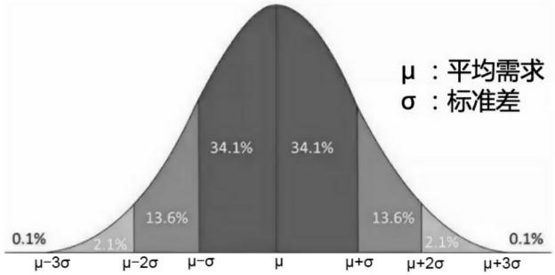

图6-29需求正态分布图

所以如果要提升服务水平，我们除了按平均需求（μ）备货外，还 要准备相应服务水平的额外库存（σ）来应对需求的波动，通过标准正 态分布表可以反查每个服务水平的正态分布反函数值，即服务水平系数 。在实际工作中，相关人员可以通过Excel中的Normsinv（）函数来直 接计算，如Normsinv（0.95）=1.64，即库存满足率为95%时，相应的服 务水平系数为1.64。 

因此当日均需求为5，标准差为2 时，如果想达到95%的库存满足率 ，对应服务水平系数为1.64，安全库存=需求标准差×服务水平系数=2×1 .64=3.28个，向上取整为4个。 

在设置安全库存时，并不是所有商品都需要一视同仁，这样会导致 库存成本增加，一般针对A类商品可以提供更高的服务水平，即安全库 存备货多一些，B类商品品次之，C类商品因为需求频次较低，可不设 置安全库存。 

## 6.8.5 如何进行需求预测

采购是针对未来需求的提前备货行为，如果要自动补货，就需要对 未来的需求进行预测，预测得越准确，采购成本就能控制得越精准，降 低因采购过少导致的缺货风险和因采购过多导致的库存积压风险。 

除了利于采购，准确的需求预测还有利于公司高层管理人员对未来 的销售及运营计划、目标，资金预算做决策参考，以及仓储、配送、销 售、运营等部门提前调配资源，减少受业务波动的影响。 

关于需求预测，需要说明两点。①所有的预测都是有误差的，不可 能完全准确，但可以通过一些策略和方法让预测尽量贴合实际情况；② 需求并不等于销量，因为历史的销量并不一定反映真实需求，我们要预 测的需求是在所有内外部条件都满足的前提下，客户的真实需求，而不 是受经济、利率、促销、供应量等影响的销售数据。 

## （1）需求预测流程

需求预测的过程一般都是从历史的销售数据开始，经过建模分析、 校验调整后，最终产出预测结果，可分为五步，如图6-30所示。 

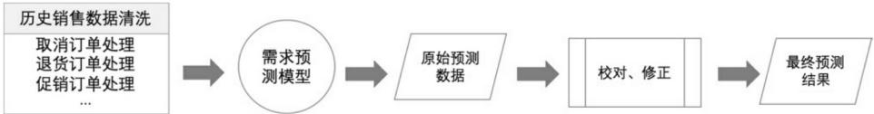

图6-30 需求预测流程

① 提取历史销售数据，并对历史数据进行清洗，如排除取消、退 货和促销的订单，以免干扰正常预测。 

② 选取合适的需求预测模型对需求进行预测，如定量预测、定性 预测。 

③ 根据需求模型得出原始预测数据。 

④ 对预测数据进行分析、校对和修正，并根据结果偏差调整预测 模型，继续预测，这是一个反复进行的过程。 

⑤ 产出最终的预测结果。 

## （2）需求预测方法

需求预测的方法有很多，总结下来可以分为基于算法分析历史数据 的定量预测和基于人为判断的定性预测两类，这两类预测又可以细化出 

更多的方法，如图6-31所示。 

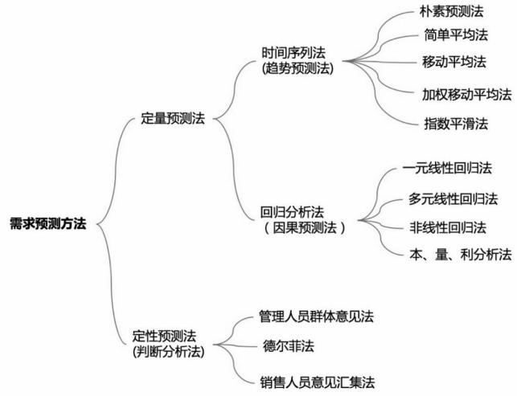

图6-31需求预测方法

①定量预测法。 

定量预测是一种基于历史数据的规律，根据公式和算法来预测未来 需求的预测模式。根据趋势的类型，可以分为基于趋势变化的时间序列 法和基于因果变化的回归分析法，下面我们分别进行说明。 

a.时间序列法。时间序列法适用于需求随着时间变化而变化的需求 模式，如游船在春、夏两季的需求比在冬季的需求要高；每逢情人节， 玫瑰和巧克力销量比较好。根据需求随时间的发展，需求模式可以分为 趋势型、季节型和噪声型三种，三者的需求波动曲线如图6-32所示。 

趋势型模式：随时间持续增长或下降。 

季节型模式：随时间出现周期性增长或下降。 

噪声型模式：代表无规则的需求变化，在趋势型和季节型模式下常 常会同时混杂着噪声型模式。 

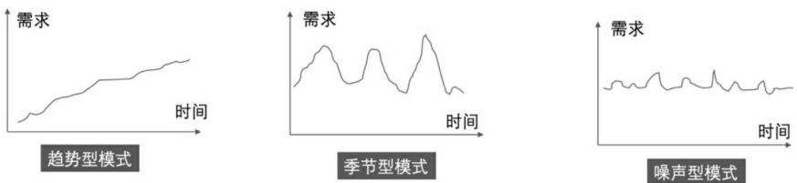

图6-32三种需求模式

常见的时间序列预测方法有朴素预测法、简单平均法、移动平均法 、加权移动平均法和指数平滑法。 

● 朴素预测法。以某一个时间点的数据作为未来时间段的预测结果 。例如，1月份的实际需求量为50，则2月、3月、4月、5月的预测需求 量均为50；等到2月过后，2月份的实际需求为60，则3月、4月、5月的 预测需求量均与2月的实际需求量相同，为60。此种方法的预测结果与 实际情况往往相去甚远，使用不多。 

● 简单平均法。（t+1）月预测需求量=1到t月实际需求量的平均数 。例如，1月份需求量为50，2月份需求量为70，则3月份的预测需求量 为1、2月需求量的平均数60。只有在随机噪声模式下适合用此预测方法 ，因为峰值和谷值经过平均后刚好相抵，而一旦有了趋势型模式和季节 型模式，用这种预测方法预测的需求量与实际需求量的误差就会很大了 

● 移动平均法。（t+1）月预测量=t月往前几个月的实际需求的平均 数。例如，5月份的预测需求取2月、3月、4月的实际需求量的平均数； 6月份的预测需求量则取3月、4月、5月实际需求量的平均数；7月份的 预测需求量取4月、5月、6月实际需求量平均数，以此类推。移动平均 法能够有效解决实际需求量发生较大变化导致的预测偏差，但同样不适 用于季节型模式，因为它对取值时间之外的数据完全不予以参考。 

● 加权移动平均法。在移动平均法的基础上，为每个月增加了权重 ，这样可以更加突出权重大的月份需求。例如，2月、3月、4月的实际 需求量分别为60、40、100，权重分别为30%、20%、50%，则预测5月 份的需求量为60×30%+40×20%+100×50%=76。此方法能够突出统计时 间内的趋势，但和移动平均法一样无法参考取值时间之外的数据。 

● 指数平滑预测法。指数平滑法是一种特殊的加权移动平均法，兼 容了简单平均法和移动平均法的优点，不舍弃过去的数据，将近期数据 和远期数据均纳入预测参考，但不一视同仁，而是设定一定的权重，这 样就能更加灵活地运用历史数据，算法如下。 

$$
S _ {t + 1} = \alpha Y _ {t} + (1 - \alpha) S _ {t} \begin{array}{l l} & S _ {t + 1}: t + 1 \text {期的预测值} \\ & Y _ {t}: t \text {期的实际值} \\ & S _ {t}: t \text {期的预测值} \\ & \alpha : 0 \text {到} 1 \text {之间的权重，设定近期需求所占的比例，如果近期需求变化较大，则加大其权重} \end{array}
$$

以上公式为一次指数平滑预测法，适用于水平型历史数据的预测； 基于呈斜坡型线性趋势历史数据的预测，则适合用二次指数平滑预测法 ，对一次指数平滑再平滑；基于呈现抛物线趋势的历史数据的预测，则 应该选用三次指数平滑法或多次指数平滑预测法。同时，如果再加入趋 势型和季节型的混合模式i，则平滑指数算法中除了常数α，还要加上趋 势常数β，以及季节常数λ一起平滑，数学功底好的朋友可以找相关资料 继续深入研究。 

b.回归分析预测法。回归分析预测法适用于除时间之外能够对需求 造成影响的其他因素，如商品促销，销量就会增加，如果商品涨价销售 ，销量就会降低。回归分析的重点是找到需求的影响因素，将假设的影 响因素作为自变量，把需求作为因变量，从中找到需求发展趋势。 

回归分析有很多种，如线性回归、逻辑回归、多项式回归、逐步回 归、岭回归、套索回归、ElasticNet回归，最容易理解的是线性回归，即 认为自变量和因变量是直线关系，通过求解，找到回归线的斜率，然后 根据斜率预测未来的需求，如图6-33所示。 

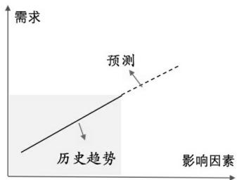

图6-33线性回归预测法

无论是时间序列还是回归分析，都是通过算法基于历史数据做预测 ，虽然有据可循，但我们不能盲目地依赖，因为有的时候数据是会骗人 的，如某用户1月份和2月份各采购了100件，但其1月份采购时刚好没有 库存，延迟到2月份，1月份的采购订单和2月份的采购订单一起发货， 我们通过数据只能得到2月份销售200件的结论，很明显是不对的，所以 我们还要考虑延期未交货订货量、用户的跑单数据等其他因素，进行综 合分析，这是一个相当复杂的过程，需要深挖数据背后的原因，另外， 还有些单品SKU层面的数据毫无模式可言，只有合并为产品SPU层，才 能看出其需求模式。 

② 定性预测法。 

定性预测是对经验人士的意见、知识及直觉进行收集整理并转化为 预测结果的方法，根据预测对象的不同，可以分为管理人员群体意见法 、德尔菲法和销售人员意见汇集法。 

a.管理人员群体意见法：将相关部门的管理者聚集到一起开会商讨 

，进行预测。 

b.德尔菲法：询问并收集公司内部和外部专家的意见，为避免相互 干扰，这些专家相互不见面，由预测人员组织他们进行匿名预测，并对 结果进行评估和分析，如果有差异再进一步进行预测，直到所有专家得 出相同结论。 

c.销售人员意见汇集法：基于公司销售人员的业务经验及销售管理 方法来产生需求预测结果。 

定性分析适用于新品，无历史数据可参考，或者因外部政策、环境 发生变化导致历史数据无法反应真实情况，以及定量预测以后，再对预 测结果进行补充等情况。 

想要做好需求预测，我们不仅需要通过历史数据来对未来做定量预 测，还需要结合定性预测来分析未来会与过去有何不同，同时还需要结 合天气、季节、地域、政策、经济趋势、行业趋势、竞争对手动向等因 素一起分析，这是一个极其复杂的过程，除了需要好的算法和工具，还 需要得到公司从高层决策人员到基层执行人员各方面的支持。就像供应 链本身一样，单纯地依靠系统是很难解决问题的。 

## 6.8.6 采购补货资金的分配

如果资金预算有限，该优先采购哪些商品呢？除了按照商品的等级 进行安排，我们还可以通过加权平均来量化每个待采购商品的优先级， 按照优先级依次分配采购资金。具体做法如下。 

① 罗列商品采购人员常关注的指标，并为每个指标设定不同的权 重值W，各权重值之和=1，如利润率（权重 30%）、销售额（权重 30% ），成本（权重 20%）、月出库频次（权重10%）、月浏览人次（权重 10%）等。 

② 再按照历史数据计算每个SKU在每个指标中的得分Px。Px的计 算，可以以最高分为100分，其他商品按照比例折算成相应的分数。例 如A、B、C三种商品的销售额分别为1000万元、900万元、750万元，则 以A为满分100，分别计算Px（A）=100，Px（B）=90，Px （C）=75。 同理，可以分别计算出A、B、C三种商品其他指标的得分。 

③ 根据权重和得分加权即可算得每个SKU的综合评分f（x），评分 

越高，说明优先级越高。 

$$
f (x) = \sum_ {i = 1} ^ {n} W _ {i} P x _ {i}
$$

④ 根据商品的综合评分进行排名，结合采购价×需采购数量依次分 配采购金额，直到所有预算资金分配完毕。 

假设设置了利润率和销售额两个采购关注指标，权重分别为W（利 润率）=0.6，W（销售额）=0.4。商品A、B、C的月利润率和销售额如 表6-6所示，以最高利润率（A）和最高销售额（B）为100分开始折算 ，可分别计算出商品A、B、C的利润率得分和销售额得分。 

表6-6利润率和销售额得分示例

<table><tr><td>商品</td><td>利润率</td><td>销售额</td><td>利润率得分</td><td>销售额得分</td></tr><tr><td>A</td><td>100%</td><td>500万元</td><td>100</td><td>50</td></tr><tr><td>B</td><td>80%</td><td>1000万元</td><td>80</td><td>100</td></tr><tr><td>C</td><td>50%</td><td>200万元</td><td>50</td><td>20</td></tr></table>

用权重和得分加权可算得A、B、C的综合评分f（x）=W（利润率 ）×Px（利润率）+W（销售额）×Px（销售额）： 

$$
\mathrm{f(A)} = 0. 6 \times 1 0 0 + 0. 4 \times 5 0 = 8 0
$$

$$
\mathrm{f(B)} = 0. 6 \times 8 0 + 0. 4 \times 1 0 0 = 8 8
$$

$$
\mathrm{f(C)} = 0. 6 \times 5 0 + 0. 4 \times 2 0 = 3 8
$$

根据加权评分从高到低确定采购顺序依次为B、A、C。 

## 6.9 本章结语

兵马未动，粮草先行。在电商新零售企业中，采购是所有业务开展 的基础，做好采购，供应链业务就成功了一半。 

在设计采购管理系统时，我们的目标是拥有最低的采购成本、更好 地管理供应商、推荐最优的采购品项、采购效率最优。 

采购维价、采购订单、供应商管理、退供应商、仓间调拨这些业务 是采购部门的日常事务，也是采购管理系统需要支持的基本功能。除此 之外，随着业务的增加和精细化，智能采购补货和需求预测也是采购管 理系统中必不可少的功能，我们需要了解定量采购与定期采购的区别、 智能采购补货的原理、安全库存如何计算、需求预测如何做，以及当资 金有限时，如何量化待采商品的优先级并分配采购资金。 

## 第7章 供应链之魂：中央库存系统

画有画风，诗有诗韵，心有心魂，人无魂不活，供应链无魂亦不可 立。从某种程度来说，供应链的魂便是库存，库存管理得当，则供应链 可成；反之，如果库存管理混乱，即便其他方面再高大上，也是徒有其 表。 

要管好库存，在业务层面，需要精益的流程和良好的运营模式，而 在系统层面，则需要一套健全的库存系统。特别是在新零售多平台、多 仓库、多门店、多系统，极其复杂的业务模式下，我们更加需要一套能 统揽全局、集中管控的库存系统来管理和调度全局的库存，这便是中央 库存系统的价值所在。 

## 7.1 为什么要有中央库存系统

有商品的地方就有库存，中央库存是一个统管分布在全国各地的仓 库、门店中的商品的系统，它并不直接管理每个仓库和门店中的实物（ 因为实物会由仓储管理系统和门店管理系统去管理），却有着比实物库 存管理更加重要的任务，中央库存之于仓库库存和门店库存，是中央调 度与一线执行的关系，就像指挥中心和前线士兵一样，虽然打仗的是前 线士兵，但前线的动向，都会通知指挥中心并由指挥中心集中调度前线 士兵。 

## 7.1.1 库存是怎么来的

有一句话说，库存管理的最佳状态是零库存。零库存，不是没有库 存，而是让积压在仓库里的库存尽可能地少，最理想的情况是所备的货 刚好与订单需求吻合，不多不少。在实际业务开展过程中，库存是必不 可少的，也是无法避免的。在前面的章节中我们讲到，按照用途，可以 将库存分为日常周转库存、安全库存和滞销库存三类，这三类库存的产 生原因如下。（免费获取更多供应链PM书 加v信：pmzjie） 

① 为满足客户的日常需求，缩短响应时长和提前期，提升服务体 验和客户满意度而备的日常周转库存。 

② 为应对客户需求波动而备的安全库存。 

③ 由于牛鞭效应的存在、多余采购、市场变化或需求预测失误而 产生的滞销库存。 

有了库存，便产生了库存资金的投入，同时，为了存放商品，就需 要有仓库和管理人员、仓库作业和操作流程，这又产生了仓储成本、人 力成本和管理成本。总之，库存的出现是为了满足客户需求和提升客户 服务，但随之而来的是成本的增加。如果库存管理不善，就会导致库存 成本居高不下而客户服务水平并没有提升，一边畅销商品缺货，而另一 边滞销库存堆积等现象的发生。相反，如果库存管理得当，便能以更低 的成本提供更高的客户服务水平。 

## 7.1.2中央库存系统解决了什么问题

为理解中央库存系统存在的意义，我们先看一则故事。 

## K公司的困局

K 公司是一家传统行业转型新零售的公司，主营医药和保健品，在 转型之前，K公司在H省已经有50家线下门店和8个仓库，其产品销量可 观。随着新零售转型战略的调整，K公司今年的主要目标是自建电商平 台，与线下门店形成线上+线下的合力，同时会在天猫医药馆、京东等 多个平台上开店，增加流量。于是，原本主打线下市场的门店和仓库的 角色发生了巨大的变化。 

①自营平台和天猫、京东等多个平台同时销售，需要库存共享。 

② 原本仓库只负责为门店备货，现在同时需要承接线上的订单发 货业务，而原本只提供线下销售的门店，现在也要支持线上客户下单配 送和自提业务，库存共享。 

③ 为扩大品类，平台引进了合作商家，一起为客户供货，即客户 下单后，根据平台策略将某些订单分发给合作商代发。 

④ 为提升服务体验，门店配送需要支持闪送（如用美团、饿了么 、京东到家进行配送）和常规物流配送两种模式。 

⑤ 某些商品为了避免商业串货，只允许在部分地区销售，但现在 线上客户范围扩大到了全国，很容易出现串货订单。 

令产品经理小Q发愁的是，公司现有的一套门店ERP系统和仓储管 理系统虽然都有库存管理功能，但都是基于单仓或门店的管理，根本无 法适应这么复杂的业务规则，这可如何是好？ 

在以上故事中，门店ERP系统和仓储管理系统都只适合管理单个仓 库的库存，而在新零售模式下，库存的管理往往是要跨多个仓库、多个 站点的，并为多平台、多业务做库存共享的，这就需要企业将全国的库 存（包括自营库存和商家库存、仓库库存和门店库存）汇总到一起集中 管理，根据业务规则重组分类（如分为可自提库存、可配送库存），为 业务赋能，这是单个仓库、单个门店系统无法实现的，于是，便需要中 央库存系统。 

中央库存系统（Central Inventory System，CIS），是将各地的仓库 库存、门店库存进行集中监控、管理和调度，并为外围系统提供统一库 存服务的系统，它是位于仓储管理系统和门店系统之上的库存集中管理 系统，如图7-1所示。 

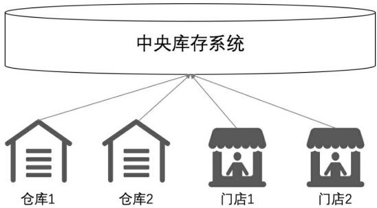

图7-1中央库存系统

在新零售模式下，企业的仓库和门店遍布全国甚至全球，如果库存 管理得很分散、不精准，经常出现客户付款下单以后，不能按时履约， 或者超卖、缺货等情况，在当今以客户体验为王的互联网时代，对企业 来说是致命的打击。而通过中央库存系统的建设，企业对全国各仓/门 店的库存集中管理，有如下好处。 

① 各地库存实时同步，总部统一监控、统一调度，避免出现各地 仓库/门店各自为政的情况，一部分地区严重缺货，另一部分地区严重 滞销的情况； 

② 总部可以根据全国总库存按需采购，灵活调度各仓的库存，如 此可以有效避免有些仓库的库存过高而产生积压，而另外一些仓库的库 存不足而出现缺货的现象。 

③ 中央库存系统可以汇总全国库存并共享给多个销售平台，客户 下单后，智能分仓、就近发货，在提升配送时效的同时降低物流成本。 

④ 在某些商品需要串货、某些仓库/门店需要单独或者同时支持自 提和配送业务，且需要线上线下同步售卖的场景下，通过中央库存系统 进行灵活调度，可以实现单个仓库和单个门店无法支持的业务模式。 

⑤ 集中的库存管理能为财务核算、审计、数据汇总分析、采销等 日常作业提供更加透明和有利的依据。 

## 7.2电商新零售三层库存模型

在多平台共享库存的电商新零售模式下，根据库存在各系统中的分 布形态，可以将库存分为三种，分别是仓储/门店实物库存、中央库存 和平台销售库存，如图7-2所示。 

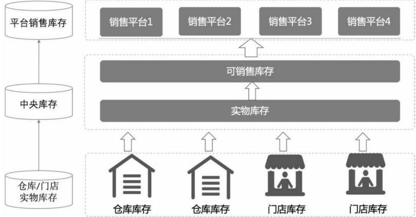

图7-2 电商新零售三层库存模型

① 仓库/门店实物库存，存储在仓储管理系统或门店ERP系统中的 实物库存，这是处于供应链最底层与商品实物一一对应的库存，在仓储 管理系统和门店ERP系统中，各仓库/门店仅管理自己的实物库存，处理 商品日常的进销存退等业务。 

（2）中央库存，存储在中央库存系统中，是实物库存的集中管理 营和调度中心，起着将实物库存与销售库存关联转换的作用，对下对接 各地仓库和门店的实物库存，进行集中管理。对上为销售平台提供实物 库存服务，将分散在各仓的实物库存重新分类组装为销售平台需要的库 存维度。 

（3）平台销售库存，平台上在商品详情页和下单时对用户开放的 库存，只有当可销售库存大于 0 时，用户才能下单，否则提示商品缺货 ，在设计方面一般放在销售平台的运营后台进行管理，在发布商品上架 时进行设置。 

## 7.2.1实物库存与平台销售库存

实物库存和平台销售库存是什么关系呢？ 

平台销售库存主要为用户下单提供商品可售库存数量，该库存数量 可以源于中央库存中的实物库存数量，也可以设置为某个虚拟库存数量 。根据运营策略的不同，平台销售库存可以细分为实物库存、预售库存 （虚拟库存）、组合库存、赠品库存、活动库存等。 

而实物库存属于后端供应链管理的真实商品数量，是仓库盘点、财 务库存成本核算的依据，所以必须与仓库和门店中的实物一一对应，不 能存在数量差异。根据业务不同，实物库存可分为门店库存、仓库库存 、合格品库存、不合格品库存等。 

在做系统设计时，平台销售库存通常会设置两个库存数量：虚拟库 存数量和实物可售库存数量，如图7-3所示。实物可售库存数量与中央 库存系统中的实物数量同步，虚拟库存数量为人为设置。为避免超卖， 一般以实物可售库存数量为准，但若某商品需要做预售，即便此时还没 有实物库存，也要保证用户可在平台下单，这时便需要在销售平台开启 该商品的虚拟库存，若商家开启了虚拟库存，系统便优先读取人为设置 的虚拟库存数量供用户下单，这样便能做到即使没有实物库存也不影响 商品售卖。 

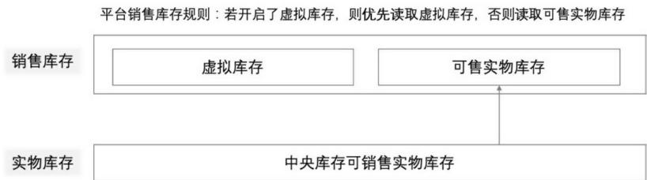

图7-3实物库存与平台

需要说明的是，在有些企业中，将平台销售库存和实物库存都设计 到中央库存里，这也没有问题，正如前面章节中所说，只要系统的设计 贴合业务即可，存在即合理。但从供应链的角度出发，我们建议中央库 存系统仅处理与实物相关库存，而与销售逻辑强相关的平台销售库存， 放到销售平台中去实现似乎更加合理一些。 

## 7.2.2三层库存设计维度

因为层次不同，所以三层库存各自的管理维度并不相同，否则就不 需要分为三层，共用一层就够了。 

## （1）平台销售库存维度

平台销售库存主要处理与销售相关的逻辑，关注点主要是SKU的可 销售库存数量，至于商品到底在哪些仓库里，并不需要关注。一个通用 的平台销售库存维度主要为SKU、可销售库存。 

可销售库存可以根据实物库存、虚拟库存、订单预占库存、预留库 存计算而来。例如，若商家未开启虚拟库存，可销售库存=实物库存-预 占库存-预留库存；若商家开启了虚拟库存，则可销售库存=虚拟库存- 预占库存-预留库存。其中，预占库存为订单已提交但未支付之前，为 当前订单锁定的商品库存数量，避免商品再被其他订单抢用；预留库存 为提前锁定预留的库存，如若要做促销，需要提前预留部分库存，以免 活动开始以后库存不足。 

## （2）仓库/门店库存维度

仓库和门店系统仅需要关注当前仓库和门店的实物流转情况，但精 细化程度更高，需要精确管理到每个商品所在的货位及批次。特别在医 药行业中，商品的存储还与商品分类、批号、供应商等多个维度相关， 管理更加精细。 

仓库/门店库存维度主要有：仓库、SKU、批次、所在货位、库存 状态、实物库存数量、已分配库存数量、冻结库存数量。 

其中批次是仓储管理系统根据业务规则为每个商品的入库生成的批 次号，以方便管理每一批进货；库存状态包含合格品、不合格品等商品 的库内管理形态，不合格品是不能被销售的，所以在销售平台上看不见 不合格品库存；已分配库存数量是为当前已经下达仓库的订单预占的库 存数量；冻结库存数量为因拣货差异、盘点或人为干预等因素，需暂时 对库存进行锁定以避免被订单占用的库存数量。 

## （3）中央库存维度

中央库存是平台销售库存和仓库实物库存之间的纽带，起着承上启 下的作用，所以在设计方面，会有实物库存维度和可销售库存两个维度 。实物库存维度主要统计每个仓库和门店的实物库存，但不需要像仓库 一样精细到批次和货位维度，只需要统计到每个仓库和门店的实物总数 维度即可；可销售库存根据实物库存重新计算可为销售平台提供的实物 库存数量。 

关于中央库存的实物库存和可销售库存维度，将在后面的章节中详 

细介绍。 

## 7.3中央库存系统设计

中央库存系统是一个中台化的系统，担负着所有业务的库存供应， 之所以称其为供应链之魂，是因为它的好坏直接影响着整个供应链的效 率，库存乱，则供应链乱，在一条流畅的供应链中，中央库存系统的设 计是非常关键的。 

## 7.3.1中央库存系统核心功能及设计思路

中央库存系统不是一个直面用户的系统，也不是一个后台操作类型 的系统，所以没有那么多的交互功能，其最核心的功能是实物库存管理 、可销售库存管理和为外部系统提供库存服务，如图7-4所示。 

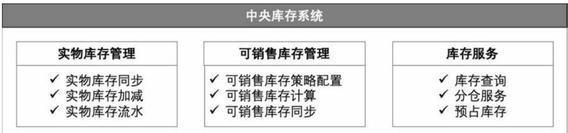

图7-4中央库存系统功能

在设计中央库存系统时，我们需要遵循如下几个原则。 

① 准确性原则。库存乱则供应链乱，单一库存的加减计算逻辑并 不复杂，复杂的是我们会对接很多个仓储管理系统和门店管理系统，以 及各类业务对库存的操作，所有的库存变化都需要与中央库存系统进行 同步，当无数的数据同时请求加减计算时，系统要保证并行请求变更库 存时，计算结果的准确性。 

② 开放性原则。中央库存系统是一个典型的中台化系统，需要与 多个仓储管理系统、门店管理系统进行对接，同时为多个外围系统提供 库存支持，在设计方面要具备足够的开放性和灵活性，将复杂的逻辑放 在系统内部，保证外围系统接入简单、使用方便。 

③ 实物库存与可销售库存分离原则。在设计系统时，实物库存应 该是最基础、最稳定的，而可销售库存是随着业务规则的变化而随时调 整的，可难可易，所以尽量保证实物库存的稳定性，在此基础上分离可 销售库存的计算规则，当业务规则进行调整时，不至于影响实物库存的 

逻辑。 

④ 库存流水清晰原则。所有的库存变化，都需要有详细的变化日 志，所以库存流水日志是非常重要的功能。 

由于库存的重要性，我们一定要保证其核心逻辑的稳定性，但业务 的变化不受我们控制，所以在系统架构方面，建议分为三层，如图7-5 所示。最底层是基础支撑层，提供中央库存系统最基本的输出能力，中 间是逻辑运算层，用来进行库存数量的加减运算，最上层是业务接入层 ，负责各种业务的接入。基础支撑层和逻辑运算层仅提供中央库存系统 核心服务，不处理业务逻辑，所有业务对接都在业务接入层完成，这样 的设计可以保证业务的增减不会对系统的核心逻辑产生影响，从而兼顾 了系统的扩展性和灵活性。 

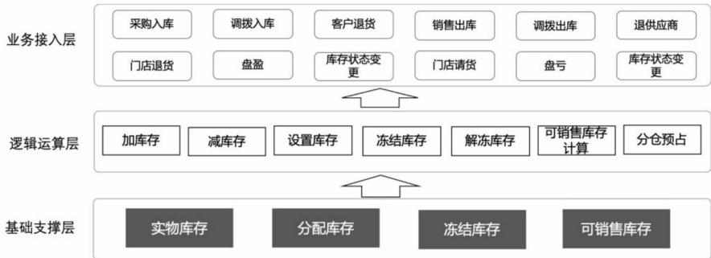

图7-5中央库存系统设计思路

## 7.3.2实物库存与可销售库存设计维度

中央库存的实物库存和可销售库存的系统流程可以概括为4步，如 图7-6所示。 

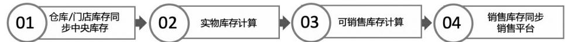

图7-6实物库存与可销售库存系统流程

实物库存主要管理全国所有的仓库库存和门店库存，其属性说明如 表7-1所示。 

表7-1实物库存属性说明 

<table><tr><td>属性</td><td>说明</td><td>举例</td></tr><tr><td>仓库/门店</td><td>仓库和门店同属于管理库存的载体,处理逻辑相同</td><td>上海仓、海淀一店</td></tr><tr><td>SKU ID</td><td>SKU ID</td><td>SKU ID: 110976890</td></tr><tr><td>库存状态</td><td>合格/不合格</td><td>合格</td></tr><tr><td>实物库存</td><td>仓库内的实际库存按照 SKU、仓库、库存状态进行汇总</td><td>2000</td></tr><tr><td>分配库存</td><td>分仓以后,发货之前对库存进行预占,避免超卖。分为出库分配/退供分配等</td><td>200</td></tr><tr><td>冻结库存</td><td>商品尚在仓库中,需临时锁定的库存。例如,盘点临时锁定/临期锁定/商品借出/盘点差异/其他原因</td><td>500</td></tr><tr><td>在途库存</td><td>管理在途中的库存,记录调拨未入库库存、采购未到货的库存,避免重复采购</td><td>100</td></tr><tr><td>是否全部冻结</td><td>特殊情况下,需要在中央库存系统中将某仓库的所有库存都冻结,已冻结的库存明细,不作为可用库存</td><td>否</td></tr></table>

补充说明如下。 

① 实物库存源于每个仓库和门店的库存变化记录，所有和库存相 关的变化都应该同步到中央库存系统中，否则中央库存系统就无法起到 全局管理的作用了。 

② 用库存状态标识不同的库存类型，用以区分合格品和不合格品 ，不合格品一般是不能售卖的，不作为可销售库存。 

③ 分配库存和冻结库存都是临时锁定的库存，但二者的应用场景 不同，所以用两个字段来标识。分配库存主要指因正常的订单、退供单 、调拨单下单后，为避免其他出库单抢库存，将指定仓库/门店的库存 预占；冻结库存一般是由仓库主动发起锁定，是用来标记库存的异常情 况的。在设计时，要支持每一个商品的分配库存数量和冻结库存数量都 能够找到其对应产生的业务单据，如当前冻结库存数量为5，系统应该 能够体现出来是哪些业务操作产生的。 

④ “是否全部冻结”用来兼容商品维度的冻结，在某些门店中，如果 商品库存需要在店内正常操作进销存业务，但不希望作为平台的可用库 存，便可以使用此字段进行标记，它与冻结库存最大的区别是冻结库存 只能锁定商品的部分库存，而“全部冻结”可以将该门店的此商品库存全 部冻结，无论后续库存增或减，都可以全部冻结。 

⑤ 在实物库存中，根据实物库存、分配库存、冻结库存和是否全 部冻结可以计算某个SKU的可用库存，可用库存是订单分仓和可销售库 存计算的依据。 

可用库存=∑各仓实物库存-∑各仓分配库存-∑各仓冻结库存。仅读 取未全部冻结的商品库存明细。 

中央库存中的可销售库存是基于实物库存的可用库存，结合销售平 台的库存分配策略计算而来的，其主要属性是销售店铺、SKU和可销售 库存，如表7-2所示。 

表7-2可销售库存属性说明

<table><tr><td>属性</td><td>说明</td><td>举例</td></tr><tr><td>销售店铺</td><td>与多渠道多平台的售卖店铺保持一致,每个店铺按照比例分配一定的库存</td><td>天猫店</td></tr><tr><td>SKU</td><td>SKU ID</td><td>SKU ID: 110976890</td></tr><tr><td>可销售库存</td><td>根据业务策略计算商品在各平台上的可售库存。根据业务维度可分为配送库存、自提库存等</td><td>100</td></tr></table>

以上是一个通用的销售库存维度，在复杂的新零售模式下，并不是 所有的门店都需要支持全国区域的配送和自提，所以每个 SKU 的可销 售库存可以根据商品覆盖的配送和自提区域，拆解出不同地区不同的可 配送库存和可自提库存，即一个SKU会同时存在多个维度的可销售库存 ，根据用户的下单地址进行展示和应用。 

基于实物库存和可销售库存，我们可以为业务部门的相关人员提供 一个清晰的库存查询页面，方便业务人员及时了解各仓库和各平台的库 存分布情况，如图7-7所示。 

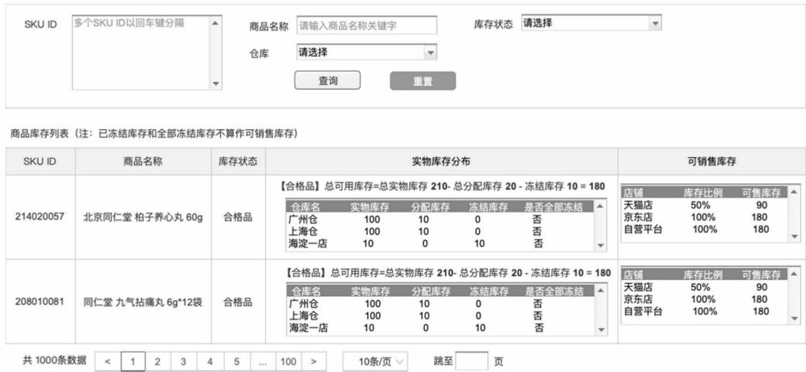

图7-7中央库存系统查询示例

## 7.3.3实物库存计算：流水加减模式与设置模式

实物库存数量源于各仓库库存数量和门店库存数量的同步，系统提 供两种库存的计算方式：流水加减模式和设置库存模式，如图7-8所示 C 

① 流水加减模式，适用于自营的仓库和门店，所有的库存变化均 通过业务流水回传中央库存系统，按照入库加库存，出库减库存的方式 变更实物库存。库存的加减对应着库存成本的变化，所以每一条与仓库 库存和门店库存变更相关的业务流水都必须及时回传中央库存系统。 

② 设置库存模式，适用于和外部合作的门店，此类门店直接通过 商家端或系统对接的方式同步库存，更新实物库存数量。设置模式不需 要关注库存的变化过程，只需要用最新的库存数量覆盖原库存数量即可 

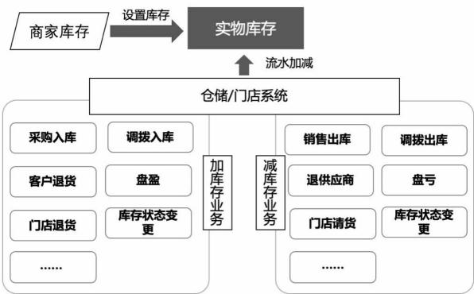

图7-8实物库存的两种计算方式

我们还拿K公司的例子来说明两种计算方式的区别。 

K 公司经营的一款治疗乙肝的药品恩替卡韦分散片，当前在自营的 上海仓和北京的一家合作药店（简称L店）同时发货。 

上海仓拥有自研的仓储管理系统，当前商品库存数量为100，3月5 日，又采购了50盒，商品入库以后，入库明细回传中央库存系统，实物 库存从100变为了150。 

L店使用的是K公司提供的商家系统维护恩替卡韦分散的库存，采 用设置方式，当前商品库存数量也为100。3月6日，L店因线下做促销活 动，无法及时承接线上订单并发货，故在商家后台将库存直接修改为0 ，中央库存系统中的实物库存从100直接变成0。 

表7-3中罗列了一些常见供应链业务对实物库存的变更逻辑处理。 

表7-3供应链实物库存变更业务 

<table><tr><td>业务</td><td>实物库存</td><td>分配库存</td><td>冻结库存</td></tr><tr><td>采购入库</td><td>加</td><td>/</td><td>/</td></tr><tr><td>销售出库—分仓完成</td><td>/</td><td>加</td><td>/</td></tr><tr><td>销售发货</td><td>减</td><td>减</td><td>/</td></tr><tr><td>门店请货—建单</td><td>/</td><td>加</td><td>/</td></tr><tr><td>门店请货—发货</td><td>减</td><td>减</td><td>/</td></tr><tr><td>退供应商—建单</td><td>/</td><td>加</td><td>/</td></tr><tr><td>退供应商—发货</td><td>减</td><td>减</td><td>/</td></tr><tr><td>客户退货入库</td><td>加</td><td>/</td><td>/</td></tr><tr><td>门店退货入库</td><td>加</td><td>/</td><td>/</td></tr><tr><td>调拨单一建单</td><td>/</td><td>加</td><td>/</td></tr><tr><td>调拨出库</td><td>减</td><td>减</td><td>/</td></tr><tr><td>调拨入库</td><td>加</td><td>/</td><td>/</td></tr><tr><td>盘亏</td><td>减</td><td>/</td><td>/</td></tr><tr><td>盘盈</td><td>加</td><td>/</td><td>/</td></tr><tr><td>订单取消</td><td>/</td><td>减</td><td>/</td></tr><tr><td>冻结商品库存</td><td>/</td><td>/</td><td>加</td></tr><tr><td>解冻商品库存</td><td>/</td><td>/</td><td>减</td></tr></table>

针对流水加减模式的库存，一旦库存出现异常，我们便需要根据历 史的流水来查找问题，所以非常有必要设计一个清晰的实物库存流水日 志查询功能来记录每一次库存的变化情况，包括实物库存、实物分配库 存、实物冻结库存。 

实物库存流水的属性包含：业务发生时间、业务发生的仓库/门店 、SKU、库存状态、业务类型、业务单号（发生库存变化的业务单）、 加减数量、原库存量、库存结余。 

一个好的库存流水日志应该能体现每一次库存变化的经过，且是连 续的，上一次库存的结余库存数量是下一次库存变化的原始库存量，如 图7-9所示。 

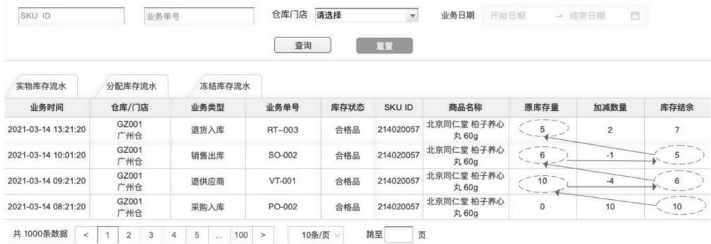

图7-9实物库存流水示例

## 7.3.4 可销售库存计算逻辑

在新零售模式下，每个仓库和门店都有自己的覆盖配送范围，且每 个门店的商品种类较少，履约能力有限，所以门店一般重点发展线下销 售和线上自提业务，另外门店自提的覆盖区域和配送覆盖区域也是有差 异的，多维属性结合到一起，将实物库存从系统层面分开、组合构成了 不同维度的销售库存，如图7-10所示。 

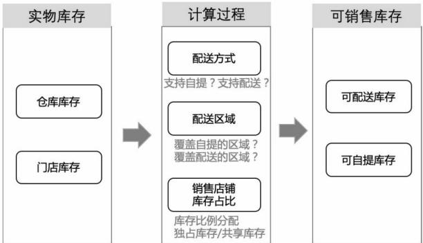

图7-10 可销售库存计算逻辑

为了能按照配送和自提两个维度管理可销售库存，我们需要提供两 个系统配置功能。（免费获取更多供应链PM书 加v信：pmzjie） 

第一个配置是仓库的配送范围配置。每个仓库和门店都应该有其覆 盖的配送范围和自提范围，配送范围通常大于自提范围，故配送范围和 自提范围应分开设置。如图7-11所示，北京仓和上海仓都支持全国区域 的配送，但不支持到店自提，海淀一店支持北京市的配送和海淀街道区 域的自提。 

<table><tr><td>仓库门店名称</td><td>属性</td><td>配送方式</td><td>配送范围</td><td>自提范围</td></tr><tr><td>北京仓</td><td>仓库</td><td>☑配送</td><td>全国</td><td>不支持</td></tr><tr><td>上海仓</td><td>仓库</td><td>☑配送</td><td>全国</td><td>不支持</td></tr><tr><td>海淀一店</td><td>门店</td><td>☑配送 ☑自提</td><td>北京市</td><td>北京市-海淀区-海淀街道</td></tr></table>

图7-11 配送和自提范围的配置

以上配置是针对仓库和门店整店维度的，如果设计得再精细一些， 可以在以上配置的基础上再增加商品维度的配送和自提范围配置，如针 对海淀一店的某些SKU，可以单独设置配送范围和自提范围。 

第二个配置是销售平台库存设置。如果存在多个销售平台，多个平 台上的销售店铺需要共用库存。从店铺库存分布上，有两种处理思路： 共享和独占。 

① 共享库存。各个销售平台店铺共享库存，将可用实物库存按照 比例进行分配。任一门店有入库导致实物总可用库存变多，均会按比例 重新计算并分摊至各店铺。同理，任一店铺有订单产生，导致实物总可 用库存变少，也会重新分配使得其他店铺的库存同步减少。 

② 独占库存。某一个或者多个销售平台店铺按照比例分配的库存 属于独占模式，即库存分配以后，仅属于此店铺使用，其他店铺产生订 单后不能占用独占店铺的库存。 

我们用一个简单的案例来理解独占库存和共享库存的实现逻辑。 

假设某仓库有A商品 200个，需要为3个销售平台中的店铺供应库存 ，各店铺库存模式和所占比例如图7-12所示。 

<table><tr><td>店铺</td><td>库存模式</td><td>库存比例</td><td>初始库存</td></tr><tr><td>店铺1</td><td>独占</td><td>50%</td><td>200×50%=100个</td></tr><tr><td>店铺2</td><td>共享</td><td rowspan="2">共享剩余50%(其中店铺2占比60%,店铺3占比40%)</td><td rowspan="2">店铺2:200×50%×60%=60个店铺3:200×50%×40%=40个</td></tr><tr><td>店铺3</td><td>共享</td></tr></table>

图7-12共享店铺与独占店铺示例

Case 1：仓库采购入库200个，总库存变为了400个，重新按比例为 各店铺分配可销售库存（独占店铺和共享店铺一起分配）。 

● 店铺1：400×50%=200个 

● 店铺2：400×50%×60%=120个 

● 店铺3： $4 0 0 { \times } 5 0 \% { \times } 4 0 \% { = } 8 0 \uparrow$ 

Case2：店铺1下单20个，因为其为独占库存模式，故店铺1的可销 售库存从100减少为80。店铺2和店铺3不受影响，仍然是60和40。 

Case3：店铺2下单20个，因店铺1为独占库存，故其库存仍然为100 。店铺2和店铺3共享库存，会对剩余的80个重新进行分配。 

● 店铺2：80×60%=48个 

● 店铺3：80×40%=32个 

由此可见，商品入库后，独占库存店铺和共享库存店铺都会按比例 重新分配库存；独占库存店铺下单不影响共享库存店铺的库存，共享库 存店铺下单不影响独占库存店铺的库存，但共享库存店铺之间会重新按 比例分配库存。 

除了共享库存和独占库存，还可以配置每个销售店铺是否支持自提 ，因为并不是所有店铺都能支持自提。例如，天猫、京东等第三方平台 不可能在下单环节为我们小商家量身订做自提的处理逻辑，所以这些店 铺即便分配了自提库存比例，也无法进行同步。 

以常见的共享库存为例，我们可以为天猫店、京东店、自营商城和 自营App等四个渠道的店铺分配设置配送库存共享比例和自提库存共享 比例，如图7-13所示。 

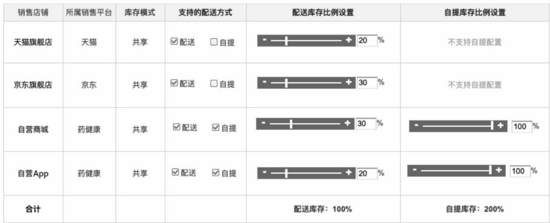

图7-13销售平台库存配置示例

为了避免超卖，配送库存和自提库存原则上不超过 100%比较合适 ，但根据实际业务需要，可以灵活调整，如果采购能力充足，则各销售 店铺可以互抢库存以保证销量最大化，那么每个店铺的库存均可以设置 为100%，甚至大于100%。 

根据以上两个配置，将商品实物库存重组后再根据配送库存和自提 库存分别进行计算即可得到每个店铺的可销售库存了 

① 支持相同配送区域的多个仓库和多个门店的商品库存汇总后， 根据配送库存分配比例进行计算，可得到店铺可配送库存。 

店铺可配送库存=此商品各仓库/门店实物可用库存之和×店铺配送 库存分配比例，向下取整。 

② 因为自提订单不适宜分店铺（用户在前端每次只能看到一个店 铺的商品库存，如果让某一个用户下一张自提订单，同时选到了多个店 铺的商品，需要到多个门店去提货，这种体验太差，不推荐），所以自 提库存应该以门店为单位进行计算，不跨门店，按照每个支持自提的门 店的自提库存比例计算，可得到各店铺的可自提库存。 

店铺可自提库存=每个可自提门店的实物可用库存×店铺自提库存 分配比例，向下取整。 

当销售库存同步到销售平台以后，如果用户的收货地址对应的商品 的可配送库存大于订单下单数量，用户即可正常下配送类的订单；如果 用户收货地址在门店自提覆盖范围内，且可自提库存大于订单下单数量 ，用户还可选择到符合自提条件的店内自提，给用户侧的展示如图7-14 所示。 

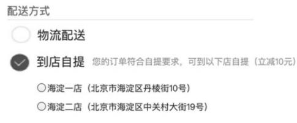

图7-14 配送与自提

看上面的逻辑是不是有点懵？别着急，我们举个例子来理一理配送 库存和自提库存的计算逻辑。 

假设门店1、门店2、门店3三个门店均有SKU A商品，三个门店的 配送范围一致，均无预占，共设两个销售店铺（店铺1、店铺2），库存 共享，库存配置如图7-15所示。 

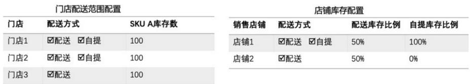

图7-15门店与店铺库存配置举例

根据销售库存计算公式分别算得店铺 1 和店铺 2 的配送库存和自提 库存，如图7-16所示。 

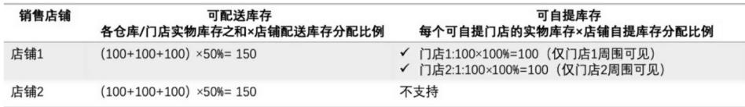

图7-16店铺可销售库存计算结果

此时，店铺1下发了一张配送订单，需要SKU A 20个，订单经分配 后从门店1发出，则门店1的SKU A可用库存数量变成了80，门店2和门 店3的库存无变化，由于是共享库存，系统重新根据销售库存计算公式 进行计算，得到店铺1和店铺2的配送库存各变成了140，由于自提库存 不共享，所以门店1的自提库存变为了80，门店2的自提库存仍然为100 ，结果如图7-17所示。 

<table><tr><td>销售店铺</td><td>可配送库存<eq>\sum</eq>各仓库/门店实物库存×店铺配送库存分配比例</td><td>可自提库存每个可自提门店的实物库存×店铺自提库存分配比例</td></tr><tr><td>店铺1</td><td>(80+100+100)×50%=140</td><td>门店1:80×100%=80(仅门店1周围可见)门店2:1:100×100%=100(仅门店2周围可见)</td></tr><tr><td>店铺2</td><td>(80+100+100)×50%=140</td><td>不支持</td></tr></table>

图7-17下单后重新计算店铺可销售库存

## 7.3.5销售平台库存同步

中央库存系统将可销售库存计算完以后，需将可销售库存向销售平 台同步，只有同步到销售平台的库存，才能在用户下单的时候进行逻辑 处理。向销售平台同步库存，有 4 种方式可选，相关人员可在中央库存 系统中针对每个销售平台进行配置，根据实际情况进行调整。 

① 每当库存变动时同步。任何一个销售平台有订单下发到中央库 存系统中导致库存预占，或者仓库/门店的可用库存发生变化时，重新 根据实物可用库存计算销售库存，并同步至销售平台。 

② 定期同步。设定时间间隔，定期计算销售库存并同步，如每10 分钟一次。 

③ 低于阈值下限时同步。当某一商品在此销售平台中的库存比例 低于此平台设定的阈值时，触发销售平台库存计算并同步至销售平台。 

④ 暂停同步。以最后一次同步的数量为准，再次开启同步之前不 再同步库存，如“双11”前夕暂停对天猫店铺的同步，缓解系统压力。 

以上 4 种方式各有优劣，同步频次越高，库存自然越准确，超卖风 险越低，但刷新频率过快对系统性能影响较大；同步频次较低，系统压 力较小，但库存同步不及时，会导致超卖风险增加。 

无论哪一种方式，为了保证库存的准确性，在订单生成以后，均需 要尽快到中央库存系统中分仓并进行库存预占，然后根据可用库存重算 可销售库存。如果不尽快预占，可能导致多个平台同时下单从而引发超 卖。 

## 7.3.6订单分仓与预占服务

中央库存系统除了做实物的管理和同步可销售库存，另一个核心功 能是为订单履约中心提供分仓及预占服务。每一张订单产生以后，哪些 仓库能够支持配送，从哪个仓发货成本最低，如何保证已经匹配了的库 存不会被其他订单再次占用，这些问题都可以通过中央库存系统的分仓 和预占功能来解决。 

分仓和预占，其实是两个动作：为订单匹配合适的发货仓库，以及 匹配成功后的库存预占。订单的分仓一般遵循以下几个原则。 

① 若订单中已经指定了仓库或门店（如自提订单，就是指定门店 ），直接进行库存预占，增加商品的分配库存数量。已分配的库存代表 已经被订单占用，在订单未被取消前，其他订单不能再被分配。 

② 若订单中未指定仓库，则由中央库存系统提供分仓并预占库存 服务供订单履约中心等外围系统调用，分仓规则可以根据业务规则自行 定义，推荐三种策略，可按照优先级搭配使用。 

a.最少包裹原则（能单仓发货的，尽量不拆包裹；若不能单仓发货 ，找拆包裹最少的仓库组合进行拆单）。 

b.距离最近原则（发货仓库离收货地址距离最近，若多个仓库拆单 发货，选择到达用户收货地址总时长最少的组合）。 

c.成本最优原则（从采购成本最低的仓库发货，或者从物流费用最 低的仓库发货）。 

一个完整的分仓和预占流程如图7-18所示。 

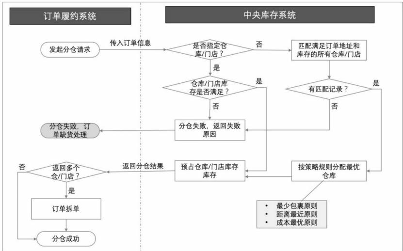

图7-18分仓和预占流程

## 7.3.7 库存成本计算

库存成本的计算，多数情况是在财务系统中实现的，也有一些企业 的财务库存模块和中央库存系统是一起规划的，所以在中央库存系统的 实物库存中增加了一个“商品成本价”属性来记录每个仓库/门店的商品成 本价，基于成本价统计企业的存货成本。 

要实现库存成本计算，需要在进行实物库存流水加减的时候，同步 进行库存成本计算。成本价的计算方法有很多，如先进先出法、后进先 出法、加权平均法、移动加权平均法、个别计价法、计划成本法、毛利 率法、零售价法等。 

重点介绍一下常用的先进先出法、加权平均法、移动加权平均法。 

① 先进先出法，是指根据先入库先发出的原则，对于发出的存货 以先入库存货批次的单价计算发出存货成本的方法。 

② 加权平均法，也称全月一次加权平均法，是以当月全部进货数 量加上月初存货数量作为权数，去除当月全部进货成本加上月初存货成 本，计算存货的加权平均单位成本，以此为基础计算当月发出存货的成 本和月末存货成本的一种方法。 

加权单价=（月初结存存货成本+本月购入存货成本）/（月初结存 存货数量+本月购入存货数量） 

③ 移动加权平均法，指以每次进货的成本加上原有库存存货的成 本，除以每次进货数量与原有库存存货的数量之和，据以计算加权平均 单位成本，以此为基础计算当月发出存货的成本和月末存货的成本。 

移动加权平均单价=（本次收入前结存商品金额+本次收入商品金额 ）/（本次收入前结存商品数量+本次收入商品数量） 

老张的公司经营某SKUA，采销记录如下。 

10日，购入此SKU100个，单价5元。 

13日，购入此SKU200个，单价6元。 

18日，发出此SKU 100个。 

20日，购入此SKU700个，单价4元。 

28日，发出此SKU 500个。 

提问：分别用先进先出法、加权平均法、移动平均法计算发出存货 的成本及期末库存存货的成本。 

答：（1）先进先出法 

发出存货的成本：100×5+（200×6+300×4）=2900元 

说明：18日发出100个，单价为5元（10日购入），28日发出的500 个，其中200个的单价为6元（13日购入），300个的单价为4元（20日购 入）；还剩单价为4元的库存400个，故期末成本取4元。 

期末库存成本：400×4=1600元 

## （2）加权平均法

SKU A，加权平均单价：（100×5+200×6+700×4）/（100+200+700 ）=4.5元，分别对应10日、13日、20日购入明细 

18日和28日发出SKUA的存货成本：（100+500）×4.5=2700元 

期末库存成本：400×4.5=1800元 

## （3）移动加权平均法

13日购入后的单位库存成本：（100×5+200×6）/300≈5.67元 

18日发出存货成本：5.67×100=567元 

20日购入后的单位库存成本：（200×5.67+700×4）/（200+700）≈4. 37元 

28日发出存货成本：4.37×500=2185元 

期末库存成本：400×4.37=1748元 

## 7.4本章结语

中央库存系统在电商新零售系统中起着承上启下的作用，对上为销 售平台供应可销售库存，对下管理全国仓库和门店的实物库存，同时还 为订单出库提供分仓和预占的能力，其重要性是不言而喻的。 

实物库存的来源有两种方式：仓库和门店操作流水加减和直接设置 库存，自营仓库/门店适用流水加减，与外部合作门店适用设置库存。 可销售库存分为共享库存和独占库存，以及配送库存和自提库存，其计 算方式均不相同。 

在订单分仓过程中，中央库存系统主要提供库存支撑，根据业务策 略提供最优的分仓组合，并按照分配仓库进行预占库存。 

## 第8章 天下粮仓：仓储管理系统

仓储是实物入库的第一环，也是实物出库的最后一环，更是信息流 与物流结合的一环，仓储管理系统（Warehouse Management System，W MS）是电商新零售系统中的粮仓，为采购部门提供后勤保障，为销售 部门提供履约护航，为门店提供能量补给，为财务部门提供借贷凭证。 无论是生产、批发还是零售行业，仓储管理系统都是非常重要的供应链 系统，决不能忽视。 

## 8.1仓储业务介绍

仓储是一个很专业的领域，有着极其复杂的业务流程，在开始设计 系统之前，我们先普及一些仓储业务知识。 

## 8.1.1仓储的管理演变历程

相信大家都见过各种各样的仓库，有杂乱不堪的，也有整洁如新的 ，有很传统落后的，也有全自动化的。当然，存在即合理，简陋的仓库 ，其投入成本比较低，相应的管理比较落后，效率和准确性都不高；自 动化程度越高的仓库，对管理的要求越高，投入的成本自然会越高，相 应会带来一定的人力节省，能够提升作业效率和准确率。 

仓库的发展按照作业模式，大致可以分为四个阶段，如图8-1所示 

第一阶段：原始作业模式。没有系统支持，全靠相关人员凭记忆存 取货物，或者通过自己家的纸质账簿进行记录，很多小店老板、传统作 坊仍采用这种方式。 

第二阶段：纸单作业模式。在这一阶段里，仓库的商品、货位管理 相对规范，有WMS或ERP 系统做支持。所有系统操作都依赖纸单，在 作业之前相关人员在系统中打印纸单，根据纸单中的内容完成库内的操 作，再完成系统中的相关操作。 

第三阶段：无纸化作业模式。通过引入PDA、电子标签、自动播种 墙等自动化设备，实现信息实时交互，省去纸单操作带来的信息滞后性 ，节省了人力并提升了系统准确性，但各个环节仍需要人工操作。 

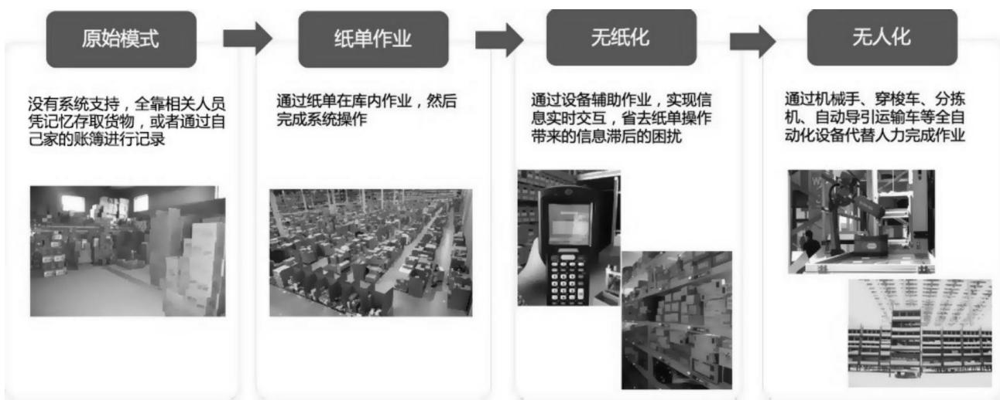

图8-1 仓储管理演变历程

第四阶段：无人化作业模式。通过机械手、穿梭车、分拣机、自动 导引运输车等全自动化设备加上人工智能等技术手段，完全代替人力完 成作业，彻底释放人力。 

## 8.1.2 新零售仓储网络布局

新零售供应链从战略层到战术层，再到执行层，依次是规划、流程 和系统。最上层关注在哪里设仓库、哪里设门店，这是规划；中层关注 如何采购、如何分布库存，如何发货等，这是流程，最后才是生产研发 人员该如何根据规划和流程来设计系统。所以在设计系统前，我们有必 要拔高视角，多了解一些规划和流程层面的知识。 

在传统电商公司中，供应商的商品要送到客户手中，一般流程如下 

① 公司从供应商采购，并将商品送到中央仓库（Central Distributio n Center，CDC）。 

② 从中央仓库调拨商品到区域仓库（Regional Distribution Center， RDC）。 

③ 从区域仓库将商品调拨到前置仓（Front Distribution Center，FD C）。 

④ 客户下单，将订单分配给离客户最近的前置仓，从前置仓将商 品发出。 

而在新零售模式下，为了更快地响应客户需求，很多公司取消了中 央仓库，并直接将门店设置为前置仓，所以供应链路变为供应商→RDC →门店，供应链路缩短了一半。当客户下单以后，可在最近的门店就近 提货，或者由门店直接安排配送，如果门店库存无法配送，可由RDC直 接安排发货，作为补充。如此RDC+门店模式，构成了主流新零售的供 应网络，如图8-2所示。 

在新零售模式下，仓库的作用有两个：一是为门店供应库存，为所 辖片区下的门店提供商品库存补给，当门店库存不足时，就从仓库请货 ；二是承担超范围的物流配送工作。由于门店覆盖范围和配送能力有限 ，所以超范围订单，需要从仓库配送、发货。 

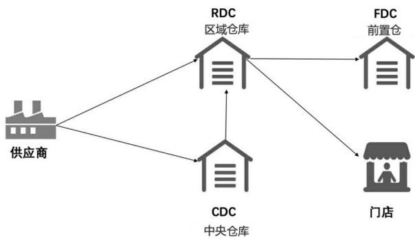

图8-2 新零售仓储网络布局

全国多个仓库和门店的配送范围一般怎样划分呢？ 

如果是急速达的配送模式，如30分钟送达，一般以门店为圆心，覆 盖半径为门店周边3～5公里；若为普通配送，则按照配送地区划分，每 个仓库覆盖一定的主要省份，若某地仓库无货，则按照优先级从其他仓 库发货。（免费获取更多供应链PM书 加v信：pmzjie） 

J公司在全国有广州、杭州、北京、西宁4个仓库。按照业务规划， 广州仓覆盖广东、广西、云南等省份，当有这些省份的订单下发后，会 优先分配广州仓发货，如果广州仓缺货无法发货，则依次按照北京仓、 杭州仓、西宁仓的顺序分仓发出，作为广州仓的补充，如表8-1所示。 

表8-1 仓库配送范围 

<table><tr><td>地 区</td><td>出库优先级</td></tr><tr><td>广东省\云南省\广西壮族自治区......</td><td>广州仓:1北京仓:2杭州仓:3西宁仓:4</td></tr><tr><td>北京\天津\河北省\黑龙江省\吉林省\辽宁省......</td><td>北京仓:1杭州仓:2西宁仓:3广州仓:4</td></tr><tr><td>浙江省\江苏省\安徽省\......</td><td>杭州仓:1广州仓:1北京仓:2</td></tr><tr><td>其他地区</td><td>西宁仓:1北京仓:2广州仓:3杭州仓:4</td></tr></table>

关于仓库的选址，要遵循安全（消防、水电、治安安全，无安全隐 患）、便捷（方便配送、周边环境、配套设施健全）和合法（正规产权 ，符合法规）三个原则。在科学选址策略上，推荐两个方法。 

① 加权评分法。首先罗列所有备选仓库需要关注的多项指标（如 租金、交通、位置、环境等），并为每项指标打分（0～10分），同时 为每项指标设置相应权重，用权重×分数加权，得分最高的仓库优先考 虑。综合评分计算公式如下。 

综合评分=指标分数之和×权重 

② 重心法。又称静态连续选址模型。仅以总运输成本作为考量依 据，寻找到达上下游客户中总运输成本最低的地址作为新仓库的地址， 具体公式如下。 

$$
\left\{ \begin{array}{l l} {\operatorname * {M i n} T C =  \sum_ {i = 1} ^ {n} V _ {i} R _ {i} D _ {i}} & {T C: \text {拟建仓库到所有客户的总运输成本}} \\ & {V _ {i}: \text {客户} \mathrm{i点的运输量}} \\ & {R _ {i}: \text {客户} \mathrm{i点的运输费率}} \\ & {D _ {i}: \text {拟建仓库的地址到客户} \mathrm{i点的运输距离}} \\ {D _ {i} = \sqrt {(x - x _ {i}) ^ {2} + (y - y _ {i}) ^ {2}}} & {x, y: \text {拟建仓库的位置坐标}} \\ & {x _ {i}, y _ {i}: \text {上下游客户的位置坐标}} \end{array} \right.
$$

## 8.1.3库内区域规划介绍

介绍了仓储网络布局，再简单介绍一下库内的常用布局规划。 

在规划库内区域时，要遵循最短移动路径和单一流向原则，即让物 流流动和员工作业的路线最短，物品的流向一致而不是来回避让。从流 向来看，有U型、I型、L型、S型四种布局方式，如图8-3所示。 

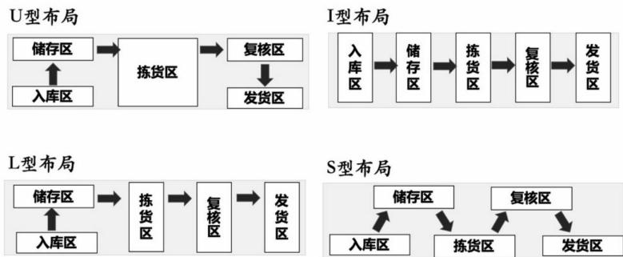

图8-3四种库内区域规划

在规划具体的存储区域和货位时，可参考如下规划思路。 

① 根据商品属性和相关法规的要求，对库区进行划分，如药品仓 库必须规划合格品区、不合格品区、待验区、退货区等。 

② 根据商品的存储属性，规划符合特定存储条件的仓储区域，如 常温库、阴凉库、冷藏库、恒温库等。 

③ 根据商品的体积、质量等，划分货架区域和堆垛区域。一般大 批量整件进出的商品适合存放在堆垛区，零散商品适合存放在货架区， 以方便商品的拣取和盘点。如果条件允许，可以规划高架库和立体仓库 

④ 根据经营品种的业务规划目标，参考峰值期间备货情况，按照 品种数和整零分布情况，再预留一定的缓冲区域，依次规划整件货位数 、零货货位数、货架和堆垛数。例如，若有1000个SKU，每个SKU平均 有3个批号，按照一批一位的做法，粗略估算，整件库和零散库最少需 规划3000个货位，若再预留20%的缓冲区域，则整件货位和零货货位均 需规划3600个。 

⑤ 在日常作业中，一般按区域作业，为避免拣货员拣货路径过长 ，一个大区可划分为多个小区域。 

⑥ 通道的宽度设计需考虑两辆拣货台车错车的情况，以免发生堵 塞。 

⑦ 为了提升空间利用率，货架可考虑双排背靠式摆放，以此减少 通道数量。 

## 8.1.4仓储作业常用设备介绍

在仓储作业过程中，少不了设备的辅助，流程、系统与设备的组合 ，共同保障仓储作业的高效和精益，下面介绍一些常见的仓储设备及其 用途。 

① 输入/输出设备，用于日常的信息录入、扫描、打印等，常用的 有电脑、PDA、打印机、扫描枪等，如图8-4所示。 

图8-4 仓储输入/输出设备

② 存储设备，用于商品的存放与保管，按照设备样式，常见的有 普通货架、堆垛区（直接将商品堆放在地面的库区）、电子标签货架（ 也叫DPS货架，可以亮灯指引拣货）、自动化立体仓库（纯自动化出入 库的仓库）等，如图8-5所示。 

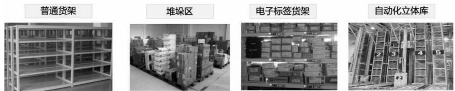

图8-5仓储存储设备

③ 作业设备，用于辅助库内日常的进、出、存作业的设备。常见 的有称重机（用于出入库环节商品重量的采集），打包机（用于对包裹 进行自动包装的设备），塑封机（对商品进行塑封加膜的设备，常用于 图书、生鲜等品类），播种墙（用于多个订单的商品合拣以后进行分拣 ，将商品分配到每个订单中）。 

搬运机器人（一种货到人的搬运设备，减少人为走动），机械手（ 辅助进行商品的拣选、码堆的自动化设备），如图8-6所示。 

搬运机器人

播种墙 

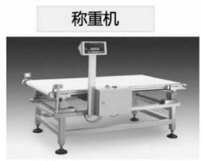

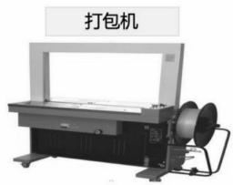

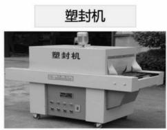

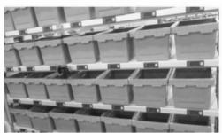

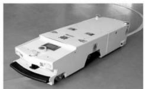

图8-6仓储作业设备

④ 周转容器，用于在仓库内部进行周转的可移动的容器，常见的 有托盘、周转箱、小推车、笼车等，如图8-7所示。 

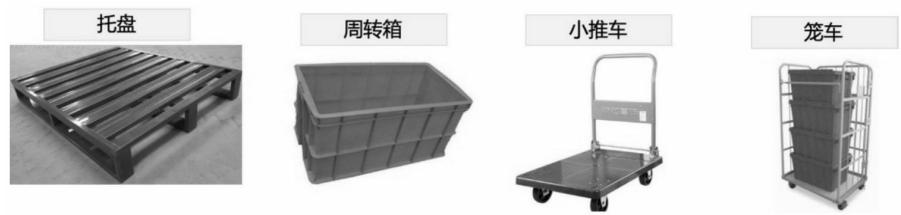

图8-7仓储周转容器

⑤ 运输设备，用于库内货物运输的设备，常见的有叉车、地牛（ 拖板车）、输送线、滑道分拣机、提升机、电梯等，如图8-8所示。 

图8-8 仓储运输设备

## 8.2仓储管理系统（WMS）整体规划思路

在规划WMS时，要把握住精准、高效和合规三大原则，同时要考 虑到兼容多货主、多业务、多设备和多策略等多种业务形态。 

## 8.2.1仓储管理系统设计原则

仓库的面积从几十平方米到几万平方米不等，有的仓库能存放的商 品可以高达数万个，库存量高达上百万，如何在合规的前提下，将仓库 空间利用率最大化，同时能更精准高效地处理与进销存相关的业务，是 仓库管理的核心目标，也是供应链管理中降本增效的目标。因此，在设 计仓储管理系统时，我们也应该遵循精准、高效和合规三大原则，如图 8-9所示。 

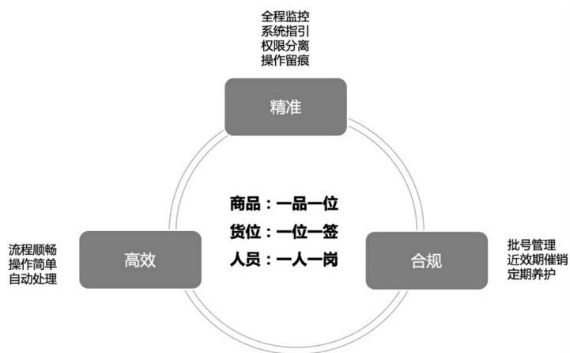

图8-9 WMS设计原则

① 精准。所有的进销存操作都要求精细和准确，如 SKU 需要管理 到每一个批次号在某一个货位，当前是什么状态，谁能操作，操作过哪 些内容等，尽可能详细、可追溯。 

② 高效。追求降本增效，要保证所有的流程顺畅而简单，杜绝浪 费，不能出现操作卡顿和不流畅的情况，如果每个订单节省10秒，日均 1万单，可节省27.8个小时，等业务发展到日均10万单呢、100万单呢？ 小小的优化就能带来效率大大的提升。 

③ 合规。所有的操作、流程设计都应该合法合规，不能触碰法规 的红线和公司内部的规章制度，决不能为了降低成本和提高效率而偷工 减料、瞒上欺下。这一点在食品和药品行业中尤为重要，所有的操作必 须符合国家法规的要求，如批号管理、近效期催销、定期养护等。 

通过精细化的系统结合精益化的流程管理，做到一品一位（每个 S KU 有独立的货位管理）、一位一签（每个货位有唯一的标签地址）、 一人一岗（每个操作人员都有对应的岗位和角色），便是WMS的建设 目标。 

## 8.2.2 仓储管理系统整体规划

在进行仓储管理系统整体规划时，相关人员可以分多个维度来规划 系统架构，以便能兼容多业务场景，如图8-10所示。 

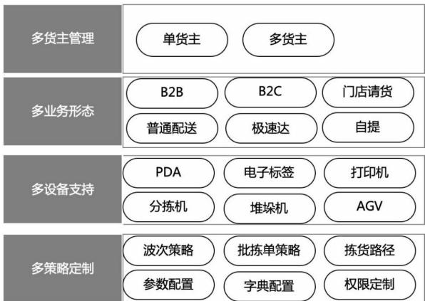

图8-10 仓储管理整体规划思路

① 多货主管理。若仓库仅为本公司使用，则无须货主管理，若需 承接三方物流，就需要设计为多货主管理，每一套业务数据根据货主进 行分离。 

② 多业务形态。从承接的业务形态上，可分为B2B业务、B2C业务 、门店请货。三者在业务形态上的区别是：B2B业务和门店请货业务每 单中SKU条目数多，通常需要拆单分区拣货；而B2C业务的订单中普遍 条目数较少，需要合单批拣。 

从配送方式来看，可分为普通配送、极速达和自提，普通配送和极 速达需要对接物流配送公司，自提需要考虑直接与客户交接。 

③ 多设备支持。根据仓库的自动化程度，规划支持不同的模式， 如 PDA、电子标签、输送线、称重机、分拣机、穿梭车、堆垛机、AG V等。 

④ 多策略定制。要根据不同的业务场景，适配不同的策略，如波 次策略、批拣单生成策略、拣货路径策略等。 

以上维度并非要全部考虑兼容，可以根据每个公司的现状和业务模 式灵活选择。 

一个完整的仓储管理系统架构，可以抽象为四层，如图8-11所示， 最底层是支撑业务开展的基础数据和库存服务，中间层是基于基础数据 和库存服务开展的各类仓库相关业务，以及支撑业务开展的各项业务策 略，上层是辅助仓储业务开展的各类设备控制，由仓储管理系统提供设 备的调度与指令传输，顶层是执行指令的各类硬件设备，由WCS（仓储 设备控制系统）驱动。在实现时，要保证底层建设的稳定性，只有底层 足够稳定，才能支撑起上游业务和设备的可扩展性。 

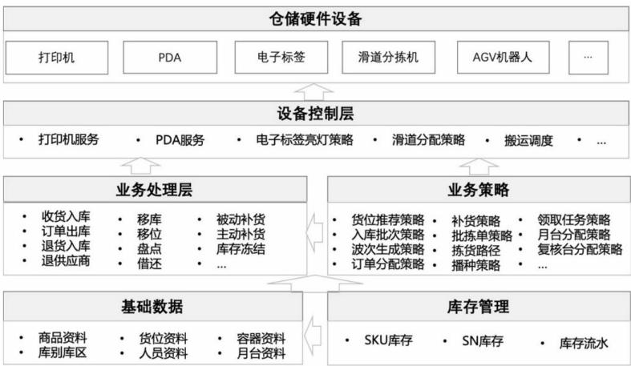

图8-11仓储管理系统架构

## 8.3仓储管理系统基础数据

仓储管理系统需要对商品、货位和流程做精细化管控，必然少不了 基础数据的支持。仓储管理系统的基础数据分为两部分：一部分是全公 司共用的数据，来源于基础数据中心，如商品信息、门店数据等；另一 部分是需要每个仓库自行维护和管理的，而不需要其他系统共享的数据 ，如货位、容器等。 

在电商新零售的仓储管理系统中，常用的基础数据有商品属性资料 、库区及货位资料、人员资料、容器资料、月台资料等。 

## 8.3.1商品属性资料

仓储管理系统中的商品资料一般来源于基础数据中心，如果没有基 础数据中心，通常来源于 ERP，很少出现在仓储管理系统中单独创建的 情况。理由很简单，如果每个仓库都自建商品资料，一个实物在不同的 仓有不同的身份标签，相关人员该如何识别和互通呢？所以，SKU的编 码及其基本属性（如名称、规格、尺寸、颜色）必须保证全公司统一， 同一个实物在每个仓库中的编码和属性都是一样的，这样才能实现供应 链流通的价值。 

需要在仓储管理系统中维护的商品基础信息主要有两类。 

第一类是商品物流基础属性，如商品的长、宽、高、体积、质量、 大中小包装的数量、商品条码等，在创建商品资料时供应商不一定能提 供齐全，或者不一定准确，所以需要仓库的相关人员在收货和库内环节 进行采集录入，相关人员通常会借助称重设备、扫描设备来进行商品资 料的采集。这一部分物流数据可以由某仓库收集完以后同步至基础数据 中心，再由基础数据中心分发到其他仓库的仓储管理系统中，这样就能 实现基础数据的共享，而不用每个仓库都进行单独采集了。 

第二类是商品在库内作业的一些策略配置，如商品在零散库区的库 存上下限的设置、商品的区域限定等。此类基础数据在各个仓库的仓储 管理系统中自行维护，无法进行共享。 

零散库区的库存上下限的设置主要用于库内补货，当库存低于下限 

时，便产生补货任务。 

区域限定的作用是在精细化的仓库管理中，为提高商品的出库效率 ，以及对商品进行分类管理。例如，在不同的存储条件，相关人员会为 每一类或者每一个商品预设一个固定的存放区域，在入库时按照限定区 域推荐货位并校验上架货位，避免入库上架时将商品放错了位置。 

商品区域的限定通常有以下3种方式。 

① 商品分类→固定区域。设定某一类商品对应某几个固定区域存 放，分类符合的商品可以放到设定区域中的任意货位上。 

② SKU→固定区域。按SKU设定其对应的入库存储区域，被设定S KU可以放到设定区域中的任意货位上。 

③ SKU→固定货位。按SKU设定固定的存储货位，商品只能存放 在固定货位上。 

## 8.3.2库别、库区与货位资料

货位是最基本的存储单元，也是最重要的库存颗粒度。但货位不是 唯一的存储单元，在一个标准仓库中，根据管理的精细度，可以分为库 别、库区、通道、排（也叫货架）、列（也叫格）、层、货位。 

仓库、库别、库区、通道、货架、货位的关系如图8-12所示。 

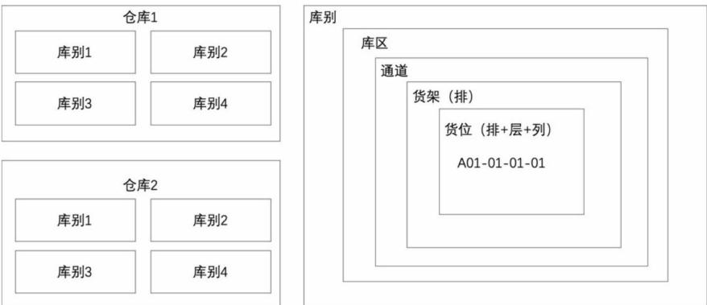

图8-12仓库、库别、库区、通道、货架与货位

在一个仓库中可以设定不同的库别，每个库别对应一个独立的存储 区域以方便管理，如合格品库、不合格品库；库别下面可以划分多个库 区，每个库区可以限定不同的商品品类进行存放，让同品类商品扎堆存 放，方便商品的入库和出库；库区中设有多排货架，两排货架之间的区 域称为通道，相关人员可以根据通道的设置规划拣货的路径；通道的两 侧是多排货架，每一组货架上的层和列组合起来便是一个货位，如图8- 13所示。 

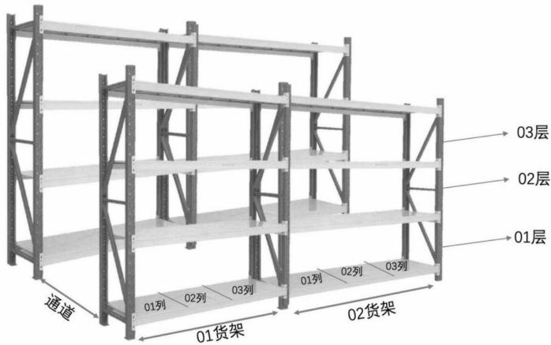

图8-13货架货位展示

每一个货位需要对应一个唯一的货位编码，以保证相关人员准确找 到每个商品的库存位置，常用的货位编码规则为区域+通道+货架+层+ 列，如图8-14所示。货位条码会打印出来粘贴到每一个货位上，条码的 作用是方便相关人员录入商品的动态信息（如出库、入库信息）。 

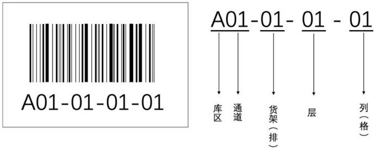

图8-14货位编码生成示例

仓库资料一般在基础数据中心中统一管理，每次开新仓，相关人员 需要去基础数据中心输入仓库信息，然后基于此仓库编号维护其下面的 库别、库区、通道、货位信息，可以根据业务诉求增加一些仓储管理的 业务属性，如存储条件（常温/阴凉/冷冻）、存储方式（整件/散件）、 作业类型（人工拣选区/机器人拣选区/自动化立体库）等。 

货位资料的基本属性有货位编码、所属库区、通道、货架、排、层 、列，长、宽、高、体积、容量、可用货位利用率、货位类型（地堆/ 普通货架/高架库区/DPS货架/自动化立体库货架）、货位等级（A类货 位/B类货位/C类货位）等；根据货位的存储属性，可以定义其是否允许 混SKU、混批次、混货主等。另外，由于货位继承了库区、库别的管理 属性，所以在入库时，相关人员便可以根据这些属性为商品制定不同的 货位策略及准入条件了，如冷藏商品只能存放到冷藏库区，A类商品优 先存放A类货位[1]等。 

## 8.3.3 人员资料

仓储管理系统中的人员资料分为两个方面。 

一是操作人员基本信息（账号、姓名、联系方式、邮箱等）、人员 对应的系统角色、系统权限及仓库数据权限。从整个供应链体系的合理 性来看，多个供应链系统应该共用权限数据，用一套标准的权限系统来 承接多个系统的权限设置，而不应该在每个系统中都搭建一套权限模块 ，相关内容在后面的章节中我们会详细介绍。 

二是人员对应的仓储岗位，以及岗位的排班安排，做到专人专岗做 专事，在系统进行任务分配时，分配当前人员能够操作的权限范围内的 任务。 

例如，配置验收员岗位安排，可以设置每位验收员可以验收的商品 大类，如图8-15所示。 

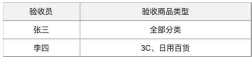

图8-15验收人员岗位安排

安排拣货人员时，可以设置每位拣货员的拣货区域及拣货类型（先 做拣货类任务，还是先做补货类任务），以免拣货人员全场跑动拣货， 效率低下，如图8-16所示。 

<table><tr><td>拣货员</td><td>拣货区域</td><td>拣货顺序</td><td>拣选类型</td></tr><tr><td>张三</td><td>A</td><td>1</td><td>拣货优先</td></tr><tr><td>张三</td><td>B</td><td>2</td><td>补货优先</td></tr><tr><td>李四</td><td>A</td><td>2</td><td>拣货优先</td></tr><tr><td>李四</td><td>B</td><td>1</td><td>补货优先</td></tr></table>

图8-16拣货员安排

安排盘点人员时，可以定义每位盘点人员的盘点区域，如图8-17所 示。 

<table><tr><td>盘点员</td><td>盘点区域</td></tr><tr><td>张三</td><td>A、B</td></tr><tr><td>李四</td><td>C、D</td></tr></table>

图8-17盘点人员的安排

## 8.3.4 复核台资料

复核台资料主要管理仓库内的复核台信息，用于对出库订单进行发 货前的最后一次清点、核实，避免出错。复核台资料的基本属性包括复 核台编号、最大复核订单数（超过订单数就不再分配此复核台了）、复 核订单类型（根据业务规则定义，如普通订单/异形订单/贵重商品、本 市订单/外市订单等）、复核台状态（启用/停用）。 

在精细化的仓库管理中，应该保证所有复核台作业人员的工作量均 衡，不能有的复核台任务很多，有的复核台没有任务。另外，由于不同 的品类、耗材等要求，需要将不同的订单分派至不同的复核台进行复核 ，所以在拣货以后就需要将订单按照相关策略分配到对应的复核台，对 商品进行复核、打包、粘贴物流面单。 

## 8.3.5 容器资料

容器资料主要管理当前仓库中正在使用的容器及容器的状态，含周 装箱、托盘、拣货小推车、笼车等，通过为每一个容器进行编码，并在 关键环节进行记录，便于更好地追溯。例如，要查找某商品，我们在收 货记录中找到当前SKU放在T0001托盘上，便能很快在收货区中找到了 

容器基本资料包含容器编码、当前状态（使用中/空闲可用/禁用） ，只有处在空闲可用状态的容器才能在作业环节中进行绑定。 

## 8.3.6 月台资料

在比较大型的仓库中，都会设置收货月台和发货月台，收货月台用 来管理收货存放，一般按照商品品类、供应商进行划分，如某供应商送 货到仓库后，相关人员指引其将商品送到7号收货月台进行收货；发货 月台用来管理发货存放，一般按照配送的方向、物流公司进行划分，如 ××配送方向的订单发货后统一分配到3号发货月台集中存放，等待配送 。月台如图8-18所示，没有见过月台的朋友可以想象一下火车和地铁的 候车站台。 

图8-18 月台

月台基本资料主要包含月台编号、月台区域（和货位一样，如果做 精细化管理，也可以为月台划分区域）、月台类型（收货月台/发货月 台）、当前状态（启用/停用）、承接的业务规则（如配置收货月台对 应的商品大类，发货月台对应的配送方向、配送物流等，根据仓库实际 业务场景定制），图8-19是某月台管理的示例图。 

<table><tr><td colspan="2">月台编号</td><td>月台类型</td><td>状态</td><td>物流公司</td><td>查询</td><td>重置</td><td></td></tr><tr><td colspan="8">新增月台</td></tr><tr><td>操作</td><td>月台编号</td><td>区域</td><td>月台类型</td><td>当前状态</td><td>配送方向</td><td>配送公司</td><td>已承接包裹数据</td></tr><tr><td>编辑</td><td>Y01-01-001</td><td>Y01</td><td>发货月台</td><td>启用</td><td>华北地区</td><td>顺丰</td><td>100</td></tr><tr><td>编辑 删除</td><td>Y01-01-002</td><td>Y01</td><td>发货月台</td><td>启用</td><td>华东地区</td><td>顺丰</td><td>0</td></tr><tr><td>编辑</td><td>Y01-01-003</td><td>Y01</td><td>发货月台</td><td>启用</td><td>华北地区</td><td>京东</td><td>57</td></tr><tr><td>编辑</td><td>Y01-01-004</td><td>Y01</td><td>发货月台</td><td>启用</td><td>华东地区</td><td>京东</td><td>34</td></tr></table>

图8-19 月台管理示例

## 8.4 仓储管理系统中的库存设计

仓储管理系统最核心的功能是管理好每一个商品的库存，入库、出 库和库内所有与实物的相关操作都会体现在库存的变化中，所以库存是 仓储管理系统中最核心的逻辑，设计好仓储管理系统中的库存模型，仓 储管理系统的设计也就成功了一大半了。 

## 8.4.1 仓储管理系统中的库存模型

虽然仓储管理系统和中央库存系统都是管理实物，但其管理维度是 有很大的差异的。仓储管理系统需要管理到每一个实物SKU对应的批次 、货位、库存状态，而中央库存系统中的实物库存来源于每个仓库中仓 储管理系统的业务操作流水，虽然中央库存系统中的实物总库存与各仓 库的仓储管理系统中的库存之和保持一致（但不是实时一致的），但中 央库存系统只需要管理到仓库+SKU+库存状态维度，即只需要知道某S KU在某仓库中的库存即可，并不需要像仓储管理系统一样关注到最精细 的颗粒度。（免费获取更多供应链PM书 加v信：pmzjie） 

在普通标准品仓库中，同一个SKU下的每个实物并不需要单独进行 区分，所以仓储管理系统只需要管理到 SKU 库存维度，而在二手电商 、贵重物资等行业的仓库中，由于每个实物商品都是一个独立的个体， 需要区分对待，则仓储管理系统还需要管理到SN库存维度。在一个需 要管理到 SKU+SN 维度的仓储管理系统中，库存模型应该设计为SKU 和SN 两层，SKU 库存管理标准 SKU 库存，SN 库存管理每个SN的库存 ，如图8-20所示。 

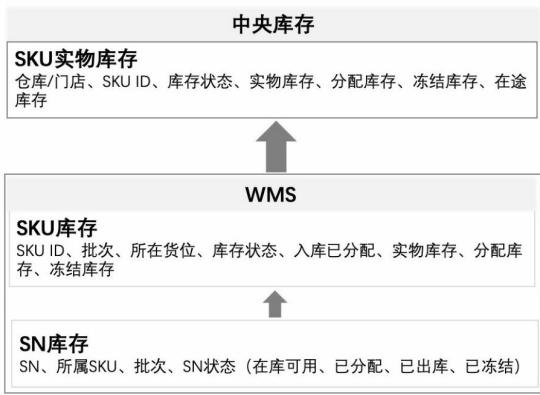

以上库存模型设计可以兼容市面上常见的三种库存管理业务形态（ 见图8-21）。 

① SKU标准品模式。只需要管理到SKU维度，不需要单独区分SN 的商品，此类商品不需要SN库存，在入库和出库环节，拣取任意一个 实物都一样。例如，SKU A库存为4，出库时随便拿哪个都一样。 

② SKU+SN库存模式。有一些较为贵重的商品如3C类商品，虽然 是标准品，但同时需要管理到每个具体的SN，在入库和出库环节，虽 然以SKU进行下单，但实际上，商品拣取时需要精确到每个实物，财务 部门的相关人员最终以每一个实物做核算。例如，S K U A库存为4，分 别对应SN1、SN2、SN3、SN4，在出库时，相关人员必须明确地知道出 库的是哪个。 

③ SN 单库存模式。针对需要独立管理每个个体的商品，每一个实 物都有独立的库存。此类商品都是以单个进行入库/出库和财务记账，S KU概念相对弱化，因为每个SN都是一个独立的SKU ID。 

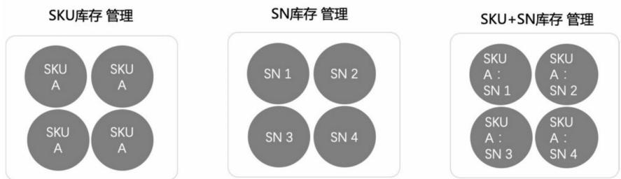

图8-21 仓储管理系统中的三种库存管理形态

无论哪种库存管理形态，SKU库存都是必不可少的，SN库存可根 据实际业务进行设定。 

## 8.4.2 仓储管理系统中的库存结构

在仓储管理系统中SKU库存结构中包含如表8-2中的关键属性字段 

表8-2 SKU 库存关键属性 

<table><tr><td>库存属性</td><td>属性说明</td></tr><tr><td>SKU</td><td>实物商品的标记码</td></tr><tr><td>批次</td><td>每一批入库商品,会根据供应商、合同、入库日期等维度生成一个批次号,以方便管理和追溯</td></tr><tr><td>所在货位</td><td>商品在库内存放的实际货位</td></tr><tr><td>库存状态</td><td>合格/不合格,根据实际情况还可以扩展其他状态如待验、停售等</td></tr><tr><td>实物库存数量</td><td>商品当前在货位上的真实库存。设计时,实物库存应该与货位上的实物实时一致,商品放到货位上,即加实物库存;商品从货位上下架,即减实物库存</td></tr><tr><td>已分配库存数量</td><td>需要出库时,先根据出库波次对出库货位进行分配,对库存进行预占,避免其他订单抢占。待拣货下架后,清出库预分配,并扣减实物库存</td></tr></table>

续表

<table><tr><td>库存属性</td><td>属性说明</td></tr><tr><td>入库已分配数量</td><td>入库相关业务,商品在上架之前,会先分配上架货位,并对预上架数量在库存中记录,待上架后,清入库预分配,并增加实物库存</td></tr><tr><td>冻结数量</td><td>因拣货差异、盘点等,需暂时对库存进行临时锁定以便进一步处理</td></tr><tr><td>所属货主</td><td>标识商品的所属权,搞清楚是谁的货</td></tr></table>

若要扩展SN库存，只需要存储当前SN的基本库存属性，其他属性 信息与SKU保持一致即可，如表8-3所示。 

表8-3SN库存关键属性

<table><tr><td>库存属性</td><td>属性说明</td></tr><tr><td>SN</td><td>识别每个实物商品唯一的编码</td></tr><tr><td>所在货位</td><td>记录SN所在的货位</td></tr><tr><td>SKU ID</td><td>SN对应的SKU ID,与SKU库存相关联</td></tr><tr><td>批次</td><td>当前SN的入库批次</td></tr><tr><td>SN状态</td><td>分为三种状态:1 在库可用:在库,且没有被订单占用;2 已分配:已经被某订单锁定,不再允许其他订单占用;3 已出库:因订单出库、盘亏、退供等原因,已不在库;4 已冻结:锁定当前SN,不可用</td></tr></table>

批次是仓储库存管理中一个很重要的属性，由于市场的需求的变化 、商品品质的差异，同一SKU多次入库的实物可能存在不同的供应商、 不同的价格和不同的品质等，为了能加以区分和管理，便需要在库存中 为每一个SKU赋予入库批次。批次和批号不同，批号通常在食品、药品 等需要做保质期管理的行业中比较常见，主要用于标识商品的生产属性 ，对应的生产日期和有效期印刷在包装盒上，而批次则是企业采购的商 品在进入仓库时在仓储管理系统中自行生成的，只用作企业内部管理商 

品。 

批次可以由一个或多个维度组成，可以按照日期属性、货主属性、 商品属性、价格属性等进行组合，常见的有SKU、供应商、价格、合同 、批号、送货日期等。如何理解呢？例如，相同 SKU+相同供应商+相 同价格+相同的合同号+相同的批号+相同的送货日期，被认定为同一个 批次，如果任何一项不一样，都会被拆分为两个批次。在仓储管理系统 中需要有一张批次配置表，用以管理商品批次的生成规则，此规则属于 系统策略，可以随着业务的发展灵活增减，如图8-22所示。 

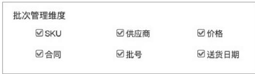

图8-22仓储管理系统批次配置示例

有了批次配置，相关人员在每次收货时，若判断当前商品的批次维 度不存在，则生成一个新的批次，加新批次库存，否则直接将库存加到 已有的批次中。每个商品的批次生成以后，应该记录到商品批次表中， 库存表中只需要记录批次号即可，相关人员可通过批次号关联批次的所 有信息。图8-23是商品的批次表示例，可以看到，相同的SKU，由于某 些属性的不同，被拆分成了4个批次。 

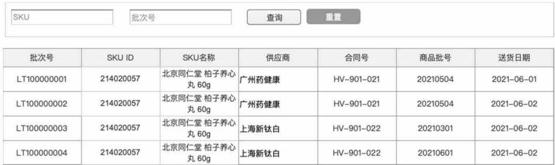

图8-23商品批次表

## 8.4.3仓储管理系统中的库存变更逻辑

同中央库存系统一样，仓储管理系统中的库存变化也是根据业务单 据对数量进行加减操作的，在设计业务功能时，我们需要厘清每种业务 对应库存的变化时机和变化逻辑，表8-4列举了一些常见的仓储业务操 作下库存的变更逻辑。 

表8-4仓储管理系统中的库存变更逻辑 

<table><tr><td>序号</td><td>业务</td><td>入库已分配</td><td>实物库存</td><td>分配库存</td><td>冻结库存</td></tr><tr><td>1</td><td>入库一入库验收</td><td>加(推荐货位)</td><td>/</td><td>/</td><td>/</td></tr><tr><td>2</td><td>入库一入库上架</td><td>减(推荐货位)</td><td>加(实际货位)</td><td>/</td><td>/</td></tr><tr><td>3</td><td>出库一出库单分配</td><td>/</td><td>/</td><td>加</td><td>/</td></tr><tr><td>4</td><td>出库一拣货完成</td><td>/</td><td>减</td><td>减</td><td>/</td></tr><tr><td>5</td><td>出库单取消</td><td>/</td><td>/</td><td>减</td><td>/</td></tr><tr><td>6</td><td>盘点一生成盘亏差异</td><td>/</td><td>/</td><td>/</td><td>加</td></tr><tr><td>7</td><td>盘点一盘亏审核</td><td>/</td><td>减</td><td>/</td><td>减</td></tr><tr><td>8</td><td>盘点一盘盈审核</td><td>/</td><td>加</td><td>/</td><td>/</td></tr><tr><td>9</td><td>移库一建单</td><td>/</td><td>/</td><td>/</td><td>加(原货位)</td></tr><tr><td>10</td><td>移库一上架</td><td>/</td><td>减(原货位)加(新货位)</td><td>/</td><td>减(原货位)</td></tr></table>

续表

<table><tr><td>序号</td><td>业务</td><td>入库已分配</td><td>实物库存</td><td>分配库存</td><td>冻结库存</td></tr><tr><td>11</td><td>移位</td><td>/</td><td>减(原货位)加(新货位)</td><td>/</td><td>/</td></tr><tr><td>12</td><td>冻结商品库存</td><td>/</td><td>/</td><td>/</td><td>加</td></tr><tr><td>13</td><td>解冻商品库存</td><td>/</td><td>/</td><td>/</td><td>减</td></tr><tr><td>14</td><td>商品借出—建单</td><td>/</td><td>/</td><td>/</td><td>加</td></tr><tr><td>15</td><td>商品借出—还货</td><td>/</td><td>减(原货位)加(新货位)</td><td>/</td><td>减</td></tr><tr><td>16</td><td>商品报损</td><td>/</td><td>减</td><td>/</td><td>/</td></tr></table>

同中央库存系统的设计一样，对于仓储管理系统中的实物库存、分 配库存和冻结库存的变动，也需要清晰地记录库存变更流水，当商品的 实物库存与系统记录库存不一致时，相关人员能清楚地还原每个引发库 存变化的业务节点。库存流水的属性包含业务发生时间、货位、SKU、 库存状态、业务类型（引发库存变化的业务操作）、单据编号（引发库 存变化的单据编号）、加减数量（加库存为正数，减库存为负数）、原 

库存、库存结余等。 

仓储管理系统中的库存加减以后，需要同步作业流水到中央库存系 统中，同步加减中央库存系统中的库存，保证两个系统中库存的一致性 

## 8.5 仓储管理系统中的入库管理

所有关于商品需要进入仓库的业务行为都可以称之为入库，入库的 结果是将商品放到合适的货位上，并增加库存。下面我们来详细介绍仓 储管理系统中的入库流程、入库单设计和入库系统功能。 

## 8.5.1 仓储管理系统中的入库流程

仓储管理系统中的入库流程包含采购入库、客户退货入库、门店退 货入库、调拨入库，这几类入库的来源不同，但其仓内作业的流程差异 不大，故合并到一起介绍，如图8-24所示。 

① 如果是采购入库，供应商接到采购订单以后，在发货之前先和 仓库的相关人员预约送货时间（如果有供应商系统，则在供应商系统中 进行在线预约，否则可以电话或其他方式预约），预约成功以后，便可 以按约定日期将商品送到仓库；如果是客户退货、门店退货或调拨入库 ，则分别由售后系统、门店管理系统和采购管理系统发起申请，通过物 流将退货商品送回仓库。 

② 仓库收货员核对来货清单和实物，一致后，提取系统中的预约 单（或是退货单、调拨单），核实数量等信息无误后，提交实际收货信 息至仓储管理系统。 

③ 验收员提取已保存的收货信息，打印验收单（或借助PDA、收 货台车）对到货商品进行验收，验收合格的商品可进入仓库指定区域上 架，若不合格，则拒收。若发现收货员录入数据有误，验收员也可修正 数据。 

④ 上架员按照系统推荐的货位将商品上架到相应的货位上，若推 荐货位不合适，可由上架员自行调整实际货位；若在上架过程中发现验 收信息录入错误，上架员可通过入库错误修改功能来修正错误数据，之 后再重新上架。 

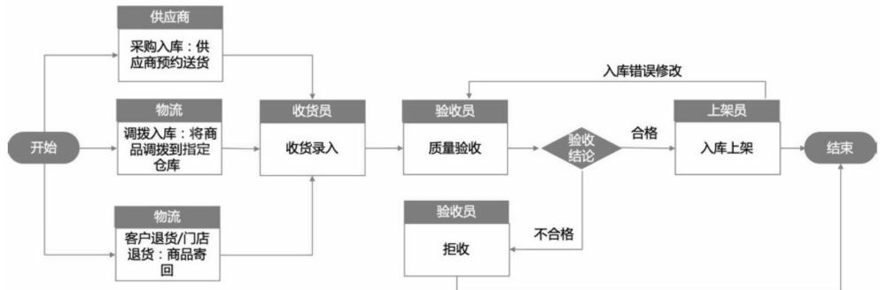

图8-24仓储管理系统中的入库流程

## 8.5.2 入库单结构设计

仓储管理系统中的入库功能以入库单为载体进行流转和处理，也叫 预期收货通知（Advanced Shipping Notice，ASN）。根据入库的业务来 源不同，入库单可以由供应商的预约单生成（采购入库业务，如果没有 供应商系统，也可以直接由采购订单生成），售后退货单生成（客户退 货），门店退货单生成（门店退货），或调拨单生成（仓间调拨），这 些业务的操作和流程都差不多，如果没有特殊要求，不需要为每一种业 务单独设计一套生成功能，只需在入库单上用不同的入库类型加以区分 ，相关人员根据入库类型处理各项业务即可。 

以采购入库为例，一张采购订单会被供应商多次预约送货，在仓储 管理系统中会相应生成多张入库单，入库单生成以后，在收货、验收和 上架环节中，分别生成收货明细、验收明细和上架明细，三者之间是1 ：n的关系，如图8-25所示。供应商的商品到货以后，收货员按照实收 数量录入仓储管理系统，生成收货明细，验收员再根据收货明细进行质 量验收，生成验收明细（当然很多仓库的收货和验收是一体的），如果 发现部分商品合格，部分商品不合格，则会将收货明细拆分为多条验收 明细，部分商品的验收结果为合格，部分商品的验收结果为不合格。到 了仓库上架环节，相关人员会根据货位容量将商品上架到多个货位，即 一条验收明细会被拆分为多条上架明细。 

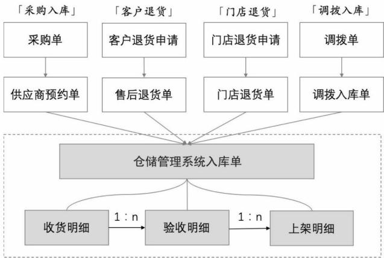

图8-25仓储管理系统入库结构

根据入库的节点，入库单可以设计为新入库单、收货中、验收中、 上架中、上架完成、已取消、已关单几个状态，如图8-26所示。 

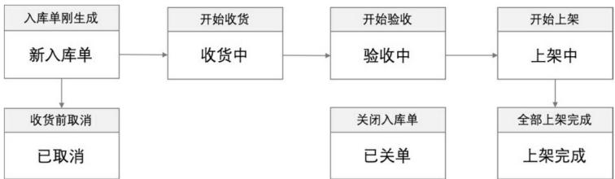

图8-26入库单状态设计

状态说明如表8-5所示。 

表8-5入库单状态说明

<table><tr><td>入库单状态</td><td>说明</td></tr><tr><td>新入库单</td><td>仓储管理系统接到预约单、退货单、调拨单等入库指令后,生成入库单的初始状态</td></tr><tr><td>收货中</td><td>商品到货后,第一个商品开始收货,入库单变更状态</td></tr><tr><td>验收中</td><td>入库单中第一个商品开始验收,入库单变更状态</td></tr><tr><td>上架中</td><td>入库单中第一个商品开始入库上架,入库单变更状态</td></tr><tr><td>上架完成</td><td>入库单中所有商品均上架完成,入库单变更状态</td></tr><tr><td>已取消</td><td>在入库单还没开始收货前,允许取消入库,由仓储管理系统或外系统申请取消后变更状态</td></tr><tr><td>已关单</td><td>入库单不再被收货时,由系统或人工关闭,完结此单</td></tr></table>

爱动脑筋的朋友可能会提问了，入库单的状态为什么有收货中、验 收中、上架中，而不是直接设计为收货完成、验收完成和上架完成？因 为仓库作业是流水式的，并不是一个环节全部做完了才到下一个环节， 如收货是可以分多次操作的，每收一批，验收员便可以验收一批，同时 收货员可以继续收下一批。同理，在验收员验收的同时，上架员是可以 对已验收的商品操作上架的。本着状态不可逆的原则，当入库单中的商 品有部分进入验收环节了，整张入库单便为“验收中”，只要入库单中的 部分商品进入上架环节了，整张入库单的状态便为“上架中”，当所有入 库单中的商品都上架完成了，入库单的状态便变更为“上架完成”。 

## 8.5.3 入库功能设计

仓储管理系统中的入库功能主要包含供应商预约单管理、到货登记 、收货、验收、上架、收货错误修改等，下面我们将逐一进行介绍。 

## 1.供应商预约单管理

管理规范的仓储管理系统都具有送货预约功能，以便根据仓库的收 货能力管控供应商的到货（仓库收货能力一般会集中维护到基础数据中 心或某个供应链系统的管理后台中，集中管理各仓库的收货时间、各品 类每日能承载的收货件数等，此功能不属于仓储管理系统范畴），采购 订单下达供应商系统后，供应商在送货前先在供应商系统中预约送货日 期及时段，以及送货数量，预约成功后，会生成预约单，在仓储管理系 统中同步生成入库单。供应商凭借预约单送货到仓库，仓库中的相关人 员便能根据预约单号匹配仓储管理系统中的入库单进行收货。 

相关人员在仓储管理系统中可以对供应商的预约单进行查看、审核 、修改到货登记，如图8-27所示。 

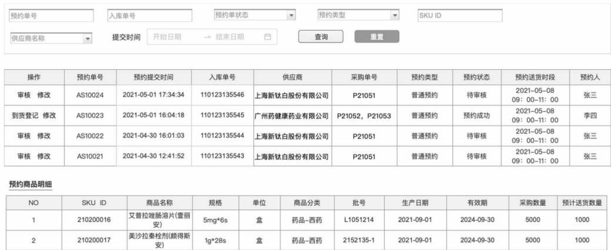

图8-27供应商预约单管理示例

相关人员可以对预约单进行审核通过或驳回，并将审核结果回传供 应商系统。如果审核通过，会按照已预约的商品明细及数量占用本仓预 约时段内的可收货数量，以控制其他供应商预约时不超过仓库的收货能 力。若发生变故，还可以对预约情况进行修改、调整并重新计算收货能 力。 

我们可以将预约单状态设计为待审核、预约成功、已签到、验收完 成、驳回、已取消，如图8-28所示，仓储管理系统中操作对应节点进行 状态变更并与供应商系统进行同步。 

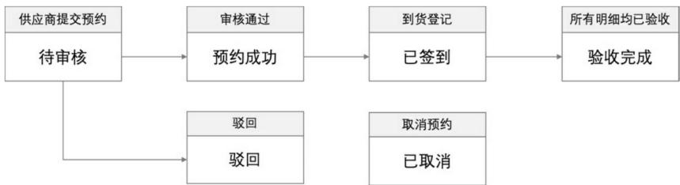

图8-28供应商预约单状态设计

## 2.供应商到货登记

供应商送货到仓库以后，由仓库中的相关人员在仓储管理系统中进 行到货登记。到货登记过程主要为分配签到号及收货月台，签到号一般 按先来后到或预约的顺序来生成，如图8-29所示。 

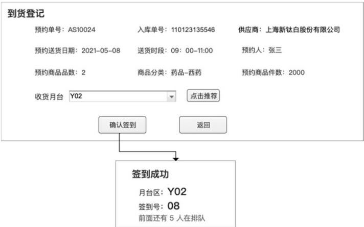

图8-29到货登记示例

供应商签到成功后拿到签到号，便可以去对应的收货月台区排队等 待叫号并收货了。为应对突发情况，仓储管理系统还应当支持取消签到 及重新叫号。 

## 3.收货及验收

供应商预约单管理和到货登记都是基于预约单进行操作，从严格意 义来讲，预约单并不是仓储管理系统中的流转单据，因为退货入库、调 拨入库等业务并不需要预约单，但各类业务最终都以入库单的形式进行 收货、验收和上架，所以入库单才是仓储管理系统中流转的标准单据。 

收货员主要针对来货进行实物的清点，核实实物与供应商的随货同 行单（供应商提供的供货清单）、仓储管理系统内的入库数量是否一致 ，如果有差异，需要与供应商沟通后，以实际数量录入系统。如果来货 涉及多个批次（如多个批号），在收货环节应按批次录入收货数量。收 货信息保存后，仓储管理系统会按照批次生成规则，根据录入信息生成 SKU的入库批次信息，并变更入库单的状态为“收货中”。 

验收员主要对商品的质量进行把关，区分哪些是合格品、哪些是不 合格品，并对是否入库做出判断，如果商品验收的结果为不合格，一般 会拒收，仅以合格品进行入库上架。验收员会对收货明细按照验收质量 做进一步拆分，数量为 100 的收货明细，可能会被拆分为两条验收明细 ，合格品和不合格品分别为50个。 

在很多仓库中，收货和验收是一体的，即相关人员在收货的同时也 完成了验收操作，这样就可以将两个功能合并为一个；还有些仓库，验 收员需要监督收货质量，二者有严格的职责划分，则需要设计为两个功 能，相关人员在进行功能设计时，要具体情况具体分析。 

收货和验收可以使用 PDA，或者移动台车等移动便携式设备来辅 助完成，图 8-30 是用PDA进行验收的示例。如果整张入库单都验收完 成了，可以给供应商系统一个回执，通知供应商采购入库的情况。 

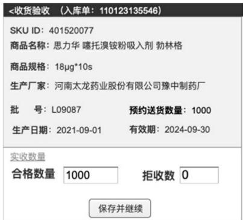

图8-30 PDA收货验收示例

## 4.入库货位推荐

验收完成以后，仓储管理系统会对确定入库的商品进行货位推荐， 这是仓储管理系统中很重要的策略之一，用以指引上架员将不同品类和 不同管理属性的商品送往不同的库区上架。如果没有货位推荐，可能存 在不同品类的商品混放（如干燥商品和潮湿商品混放）、商品放入不适 合的库区（如冷藏品放进了常温库）等情况，隐患是极大的。 

入库货位推荐一般有以下几种策略，根据仓库的管理要求进行定制 

① 按照到货商品的整零属性，推荐到立体库、整件库区、零散库 区。 

② 按照商品的品类及预设的区域限定，推荐对应的区域及货位。 

③ 按照相同商品及批次扎堆原则，推荐在库相同商品及批次的货 位。 

④ 根据商品的分类推荐对应的货位。 

⑤ 根据商品的体积、货位剩余容量匹配合适的货位。 

⑥ 外观相近、不同批次的商品应尽量分开存放，以免混淆。 

按照货位推荐策略推荐货位后，需要记录SKU在库存表中的入库已 分配数量，并记录库存流水，已经记录入库已分配的货位，再次被推荐 或者上架时需要作为已被占用的货位来参考。 

## 5.上架

入库的最后一步是将商品上架到货位上。注意，在电商新零售业务 中，有两个“上架”，一个是仓库入库上架，还有一个是商品上架到平台 进行销售，一般商品在仓库中上架以后，才会产生可销售库存，继而才 能上架到平台，如果不解释清楚，经常会出现二者的逻辑混淆。 

根据上架的方式，可以分为按单据上架、按区域上架、按容器上架 等。根据上架的工具，可以分为PC上架、PDA上架、自动化设备上架 （AGV、自动化立体库）等。无论是哪种上架，其底层逻辑都只有一个 ：将商品与货位进行关联，产生商品在仓储管理系统中的真实库存。 

之所以说是真实库存，是因为在验收以后其实已经产生了推荐货位 的已分配库存，但此库存记录只是为了预占货位，并不是真实有效库存 ，在实际上架时如果发现系统推荐的货位不合适，上架员可以调整实际 上架货位或拆分商品，只有在最终上架后，才会将已分配库存转为商品 和货位确定的实物库存，并清除商品的已分配库存数量。 

以最常用的PDA上架为例，上架员按照推荐的货位顺序（货位顺序 在后续的章节中会重点说明），先扫描商品条码或容器条码，然后扫描 货位条码完成上架，如果当前推荐货位放不下，可以扫描其他货位，或 者将商品拆分到多个货位进行上架，如图8-31所示。 

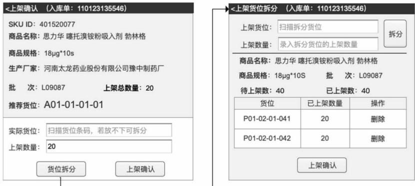

图8-31 PDA上架及商品拆分示例

自动化设备上架同PDA上架的原理类似，只是不需要人工操作，由 WCS系统（设备控制系统）驱动堆垛机或者AGV机器人按系统指引将 商品送往指定货位，并增加实物库存。 

如果商品需要管理到SN库存，在上架时，上架员还需要扫描每个S N条码，记录SN库存，前提是上架之前每个商品的外包装上已经贴好了 SN条码。（免费获取更多供应链PM书 加v信：pmzjie） 

上架后，说明此商品真实在库了，需要同步入库流水至中央库存系 统，加库存，以及通知财务系统做财务存货和应付账款处理，如果是退 货入库，还需要通知售后系统和财务系统做退款处理。 

## 6.收货错误修改

在上架确认之前，如果相关人员发现了收货和验收环节中的错误， 如批次信息录错、数量录错等，需要在仓储管理系统中进行修正，这就 需要仓储管理系统提供收货错误修改功能，这一功能可以设计在PC上 ，也可以在PDA上，错误修改完成以后，系统应该更新收货和验收明细 ，并重新推荐货位。 

## 7.采购关单

在介绍采购管理系统时我们讲到，下发仓库的采购订单最终是需要 关单的，关单方式有入库完成自动关单、超期自动关单、人工关单三种 ，处理超期自动关单和人工关单逻辑时，均需要询问仓储管理系统，如 果仓储管理系统中的入库单已经取消或已关单，是不允许关单的。关单 成功的采购单，不能再进行收货了。 

## 8.6仓储管理系统中的出库管理

和入库相对应，所有关于商品需要从仓库出库的业务行为都可以称 之为出库，出库的结果是将商品从仓库发出，并扣减库存。下面我们来 详细拆解仓储管理系统中常见的出库流程、出库单设计和出库系统功能 0 

## 8.6.1仓储管理系统中的出库流程

仓储管理系统中的出库流程包含电商销售出库、门店请货出库、退 供应商出库、调拨出库、B2B销售出库等，虽然都是拣货出库，但因为 每种业务对SKU的诉求不同，在实际处理时会存在差异。 

普通的电商销售出库，每个客户订单中的SKU数量不多（大多数不 超过5个），如果拣货员针对每个订单都在仓库里跑一大圈拣货，来回 跑动的时间无疑是非常浪费的，此类订单适合将多单合并为一个大的合 拣单（也叫批拣单），跑动一次即拣完多张订单的商品，然后按照订单 对所拣商品进行分拣，类似播种，此类拣货方式称为播种式拣选。 

门店请货出库、退供应商出库、调拨出库、B2B 销售出库业务，每 张出库单中的商品数量比较多，通常是成百上千个，每一单都需要拣很 久，所以合拣的意义不大，更适合按订单中的商品明细到每个货位上拣 选，就像摘果子一样，此类拣货方式称为摘果式拣选。 

播种式拣选和摘果式拣选是仓储管理系统中的两种拣货方式，二者 的对比如图 8-32 所示，在电商新零售仓储中，这两种方式是并存的， 而且以播种式拣选为主。我们在设计出库功能时，可以根据实际情况将 两种拣货方式分开设计，也可以以播种式拣选为主，关键环节兼容摘果 式拣选。 

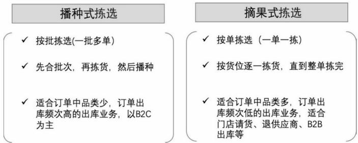

我们以播种式拣选为例，介绍仓储管理系统中的出库流程，如图8- 33所示。 

① 出库订单下达仓储管理系统后，仓储管理系统根据预设的波次 规则（如按配送方向、配送时效、物流公司等）生成波次，并对波次中 的订单进行库存分配。在分配过程中若需要补货，则同时生成被动补货 任务。 

② 已经分配成功的订单，由系统按照预设的拣货批次规则将符合 条件的订单集合到一起生成批拣单（当然也可以人工生成）。为了兼容 摘果式拣选，可以设定针对明细中商品数量超过一定数量的出库单，一 单生成一个批拣单。 

③ 拣货员领取拣货任务，按照系统指引到每个货位进行拣货。常 见的拣货有两种方式。a.整批拣货。每个人每次领取一个批拣单，全仓 跑一圈，从第一个货位开始拣到最后一个。b.分区拣货。将一张批拣单 根据拣货区域划分成多个小拣货任务，每个区域的拣货员负责自己区域 的商品拣选，最终再把各区域的商品集中到一起完成整个批拣单的拣货 ，汇集的方式可以是接力式（第一个区域拣完后将批拣单传到第二个区 域继续拣，依次进行，直到整批拣选完成），也可以是多个区域并行拣 选，然后将拣选出来的商品集中送到某个集货区域汇集。 

④ 拣货过程中如果没有特殊情况（所有商品均能在系统指引的货 位上找到），拣货完成后可进行播种，若有特殊情况（如账实不符，分 配从某货位出 5 个，实际上该货位上只有 4个），需要将差异出库订单 转为问题单，由异常处理组介入，对问题单进行差异处理，差异处理有 三种结果。（免费获取更多供应链PM书 加v信：pmzjie） 

a.核实无差异：订单可直接进入复核环节。 

b.核实问题单有差异，但其他货位有备用库存：生成追加任务，继 续拣货，当前差异货位生成盘点差异。 

c.核实有差异，但其他货位无备用库存：无法追加，当前订单缺货 ，走缺货处理流程。 

⑤ 在拣货过程中若无差异，则拣货完成以后会进入播种环节，可 以由人工操作播种或者借助自动播种墙等设备完成。播种的作用是将批 拣的商品按照订单明细正确地分配到每张订单中。如果一批一单，或者 批拣单下都是单品单件的订单，就不需要播种了，可直接进行复核。 

⑥ 复核员对订单进行出库前复核并打印物流面单，复核是商品打 包出库前的最后一步操作，所以一定要确保实物与订单明细一致，否则 一旦包裹从仓库发出，再处理差异就很困难了。⑦ 复核以后，打包员 对商品进行打包处理，然后交由发货员与前来揽件的物流公司进行交接 ，完成仓库发货，最终由物流公司将包裹配送至目的地签收。 

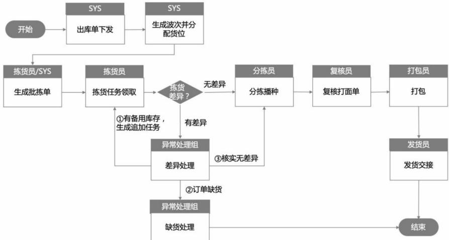

图8-33 仓储管理系统中的出库流程

## 8.6.2 出库单结构设计

在仓储管理系统中，以出库单作为出库业务流程流转载体，又叫发 运订单（Shipment Order，SO），分为出库单汇总和出库明细两部分， 出库汇总主要存储与整张单据相关的信息，如出库单号、收件人信息、 出库类型、出库状态、出库优先级、波次号、批拣单号等，出库明细主 要存储出库的商品、数量、价格等信息。根据出库的业务不同，出库单 可以分为销售出库单、门店请货单、退供单、调拨出库单。 

出库单被分配库存后，会生成分配明细，分配明细主要存储每个 S KU 的分配货位及批次、数量等信息。一条出库单明细因为货位和批次 的不同，会生成一条或多条分配明细。 

出库单根据波次规则会生成波次，一个波次中有多张出库单。同样 ，出库单分配以后，多张出库单会根据批拣规则生成一张批拣单。出库 波次和批拣单都是出库单作业周期中的中间环节，二者没有必然的联系 

批拣单可以根据拣货区域拆解为一个或多个拣货任务，拣货员根据 拣货任务完成拣货作业。 

出库各实体结构如图8-34所示。 

仓库发货是订单履约过程中非常重要的一环，在进行系统设计时， 我们要尽量让过程透明化，让客户能更真切地感受到订单的生产过程， 以提升履约体验。出库单从落仓开始，到最终发货离开仓库，会经历落 仓、进波次、分配库存、生成拣货任务、拣货、播种、复核、发货这8 个节点，围绕这几个节点，出库单状态和流转过程可以设计为图8-35的 样子。 

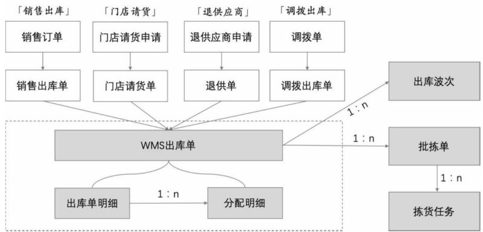

图8-34出库实体结构图

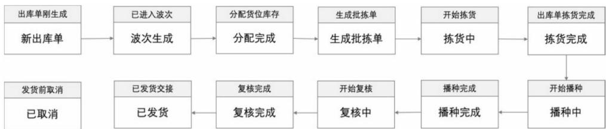

图8-35出库单状态设计

出库单状态说明如表8-6所示。 

表8-6出库单状态说明 

<table><tr><td>出库单状态</td><td>说明</td></tr><tr><td>新出库单</td><td>仓储管理系统接到销售出库、门店请货、退供应商、调拨单等出库指令后,生成出库单的初始状态</td></tr><tr><td>波次生成</td><td>出库单按照波次规则,生成波次后的状态变更</td></tr><tr><td>分配完成</td><td>出库单被分配出库货位后的状态变更</td></tr><tr><td>生成批拣单</td><td>按照批拣规则,生成批拣单后的状态变更</td></tr><tr><td>拣货中</td><td>拣货任务被领取,已开始拣货后的状态变更</td></tr><tr><td>拣货完成</td><td>当前出库单下所有商品均拣货完成后的状态变更</td></tr><tr><td>播种中</td><td>批拣单开始播种后,出库单的状态变更。如果不需要播种,则不需要此状态</td></tr><tr><td>播种完成</td><td>批拣单播种完成,出库单的状态变更</td></tr><tr><td>复核中</td><td>出库单开始复核时的状态变更</td></tr><tr><td>复核完成</td><td>出库单复核完成的状态变更</td></tr><tr><td>已发货</td><td>出库单交接给物流公司后的状态变更</td></tr><tr><td>已取消</td><td>出库单被取消后的状态变更</td></tr></table>

出库单的状态代表着当前出库单的出库进展，每个状态变更都应该 同步给订单履约中心，其中的核心节点还可以展示到用户端中。 

## 8.6.3出库核心功能设计

下面我们分别介绍出库流程中的核心功能设计，包含出库波次、波 次分配、批拣单生成、出库拣货、播种、复核、发货、取消及异常处理 等。 

## 1.出库波次

波次，通俗地说是对出库单一波波地进行处理。为什么需要出库波 次呢？主要有两个好处，第一个好处是按照出库优先级批量处理订单， 保证优先级高的订单提前进入出库生产过程，如当前库内某SKU库存只 剩50个，而下发的订单需求量已达100个，该如何分配呢？自然是安排 高优先级的订单进入波次，优先满足。波次的第二个好处是可以集中处 理补货等作业，在整零分开管理的仓库，经常会出现零货库存不足而需 要从整件库区补货的情况，如果每一单补货一次，效率太低，所以按照 波次触发补货任务，一次补一批货是合理的。 

波次的生成可以是人工筛选一批出库单生成，也可以由系统按照预 设的波次规则自动生成。要实现自动波次策略，需要提前配置好波次开 始时间、波次截单时间、波次生成频率、波次中的订单数及波次中包含 的订单类型这几个关键属性，如图8-36所示。 

① 波次开始和截单时间。很多仓库不是 24 小时运作的，为了便于 做日清（当天的任务当天做完），或者做盘点、移位等库内管理，便需 要设置每日波次开始和截单时间作为生成波次的时段，不在配置时段内 不会生成波次。（免费获取更多供应链PM书 加v信：pmzjie） 

② 波次生成频率。一般每××分钟生成一波。 

③ 波次中订单数。每个波次中包含的出库单数量。 

④ 订单类型。按照哪些维度筛选订单进入波次，可以是出库类型 （销售出库/退供应商/调拨等）、订单出库优先级、出库时段（如9：00 、15：00）、配送物流（顺丰/京东/圆通等）、拣货方式（PDA拣货/DP S拣货/AGV拣货等）、商品类型（冷藏/食品/图书等），根据实际业务 需要进行设置，订单类型需要在波次生成前便标记到出库单中，才能保 证波次生成的时候按照波次规则筛选合适的订单。 

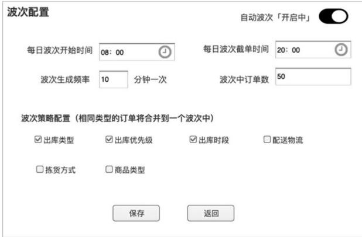

图8-36 自动波次配置示例

波次规则配置以后，系统便可以按照规则定时扫描落仓的订单并产 生波次了，生成波次的时候，会生成一个波次号并记录到出库单上，如 果生成的波次不合适，相关人员也可以将波次取消，或者将某一张出库 单从波次中剔除，然后重新生成波次。 

## 2.波次分配

波次生成以后，下一步便是对波次中的出库单进行商品库存分配， 分配合适的出库货位，以便拣货员按系统指引进行拣货，我们以B2C销 售出库为例，详细说明波次的分配逻辑，如图8-37所示。 

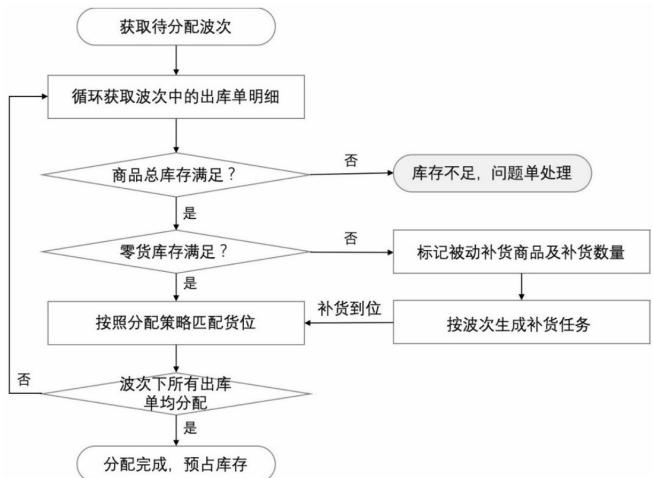

图8-37B2C销售出库波次分配

波次能分配成功的前提是商品可用库存充足，若某张出库单中商品 的库存不足，则此波次会分配失败，缺货的订单会被标记为问题单，需 人工介入处理，取消出库单，或从波次中将其剔除。商品可用库存=商 品实物库存-分配库存-冻结库存，取全仓所有符合出库条件的货位库存 之和。 

在总可用库存充足的情况下，由于B2C销售以零散数量为主，很少 有客户下单超过一个大包装，所以优先分配零货库存，若零货库存足够 ，则按系统设定的分配策略进行货位分配，否则将商品明细暂时挂起， 并触发从整件存储库区补货到零散库区的被动补货任务，待补货到位后 再继续分配。补货数量以波次为单位生成，即该波次下所有缺货商品一 起生成补货任务，补到商品在零散库区的库存上限数量。 

整个波次均分配完成以后，变更出库单状态为分配完成，同时将商 品分配的货位库存进行预占（加分配库存数量），已分配的库存不能再 分配给其他出库单。 

门店请货、调拨与B2B销售的分配逻辑类似，但由于前者出库单中 的商品数量通常比较多，可能超过一个整包装，可以设定整件直接从整 件库区发货，而不用先补货到零散库区，再从零散库区拆零出库。 

波次分配里最核心的是波次分配策略，细分为商品分配策略和货位 匹配策略，可以根据业务场景选择一到两种策略组合使用。 

常见的商品分配策略有以下几种。 

① 指定批次策略。特定业务如退供应商和门店请货、调拨等在建 

单时已指定出库批次，仓储管理系统则按照指定的批次分配库存。 

② 先进先出策略。如果没有指定批次，可以根据入库时间，先入 库的批次先分配。 

③ 后进先出策略。和先进先出策略相反，后入库的批次先分配。 

④ 近效期优先出库策略。在食品、药品等行业中，为避免商品过 期，通常会优先分配生产日期靠前的批次。 

商品策略能定位到出库商品的批次，但如果同一批次的商品存在多 个货位上，该如何匹配货位呢？这便要用到货位匹配策略。常见的货位 匹配策略如下。 

① 最少出库货位策略。组合尽可能少的出库货位，这样可以减少 拣货员的走动。 

② 最佳数量匹配策略。分配最接近出库数量的库存货位。 

③ 清货位策略。优先匹配剩余库存数量较少的货位，将货位清空 

通过商品策略和货位策略的组合，便能为出库单中的每个商品分配 一个或多个最合适的出库货位了。 

## 3.生成批拣单

已经分配完成的出库单，会由人工或系统按照预设的批拣规则将一 批相同属性的出库单生成批拣单，以方便拣货。批拣的规则可以根据业 务诉求灵活设置，目的是能够通过系统自动匹配符合业务要求的出库单 0 

批拣规则设定以后，便能实现系统按照规则自动生成批拣单了。一 个仓库下可以设定多条批拣规则，如果规则之间存在交集，如某出库单 既存在于规则1，又存在于规则2，则按照优先级生成批拣单。 

注意，批拣单和波次虽然都是将一批出库单批量生成，在有的仓储 管理系统中是合二为一的，但二者在本质上并不相同，波次产生于出库 单分配环节，主要用于分配和补货，批拣单产生于拣货环节，主要用于 生成拣货任务，二者的生成规则可以相同，也可以不同，所以解耦、分 开设计会更灵活。 

图8-38是一个较为复杂的批拣规则设定示例（其实不建议将规则设 

定得过于复杂，复杂的规则很容易出错，且增加了系统的使用难度）。 

在系统自动生成批拣单时，难免会有一些尾单不能满足生成条件， 所以我们需要一个出单时间的设置，通过设定几个固定时间点，将这些 尾单尽快生成批拣单来拣货，以免影响出库时效。 

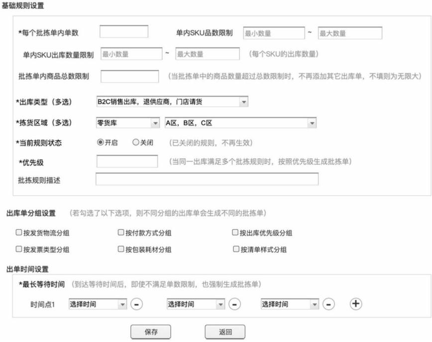

图8-38批拣单规则设定示例

## 4.出库拣货

批拣单生成以后，拣货员便能够领取拣货任务了，一个批拣单可以 根据其下的出库单分配明细中的货位所属区域拆分为一个或多个拣货任 务，如果仓库面积较小，可以一张批拣单生成一个任务，如果仓库面积 较大，或者需要跨楼层，最好生成多个拣货任务，然后通过接力或集货 的方式将多个区域的任务汇集到一起播种。 

拣货员基于提前配置好的拣货区域匹配对应区域的拣货任务，再基 于拣货优先级领取拣货任务开始拣货。如果是自动化立体库或由AGV设 备拣货的仓库，同样生成拣货任务，但不需要安排拣货员，而是直接将 拣货任务发送给设备控制程序（WCS），由设备代替人工到出库货位上 将商品取出来。 

我们拿下面这个例子说明拣货任务生成和领取的实现逻辑。 

如图8-39所示，老L和小M是仓库的拣货员，因为仓库的面积较大 ，主管在拣货员安排表中配置老L主要负责A区的拣货任务，小M主要 负责B区的拣货任务，并协助老L做A区的拣货任务，但优先领取B区的 拣货任务。这时有一张批拣单中的商品刚好分布在A区和B区，被拆分 为A区拣货任务和B区拣货任务。这时，如果老L领取拣货任务，只能领 取到A区的拣货任务，而小M可以同时领取到A区和B区的拣货任务，但 优先领取B区的拣货任务。 

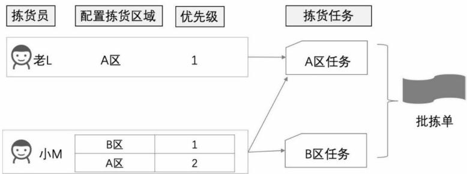

*老L可领取A区拣货任务，小M可领取A区和B区拣货任务，优先领取B区的拣货任务

图8-39拣货任务的生成与领取

领取拣货任务后，拣货员便可以根据系统推荐的拣货路径到指定货 位拣取指定数量的商品了，对应拣货任务、批拣单及出库单状态变更为 拣货中。拣货路径是仓储管理系统中又一个重要的策略，不仅适用于拣 货，也适用于入库上架和补货，直白地说就是把遍布全仓的拣货货位连 成一条完整的拣货路线，让拣货员行走最短的路径就能拣完所需商品， 常见的路径有S型路径、U型路径和Z型路径，如图8-40所示。 

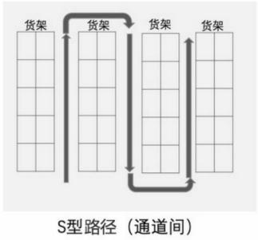

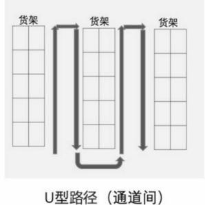

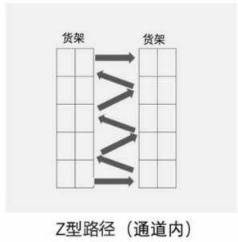

图8-40拣货路径示例

在S型路径中，拣货员从通道头部进入，在通道尾部进入下一个通 道，再从下一个通道尾部返回通道头部，形成一个S型路径；U型路径 不穿通道，而是在同一通道内先从左边开始拣货，到通道尾部再从右边 折回通道头部，形成一个U型路径，常说的W型路径、M型路径都是这 种路径；Z型路径是S型路径在通道内部的行走路径，拣完左边拣右边， 扫荡式前行。 

在普通隔板货架下，S型路径比U型路径的行走路径更短，效率更 高。但在通道内宽度很宽或者通道尾部不通的货架区域，适合用U型路 径。 

拣货路径体现到PDA拣货页面中，或者纸质拣货单页面中，就是拣 货货位的排序规则。拣货员手拿PDA或拣货单按照拣货顺序对每个货位 的商品按指定数量拣货，如果无异常，拣货完成以后，按系统指引将所 拣商品送至集货区（各区同时拣选时），或者下一个拣货小区（接力拣 选时）。若有异常，如出库货位上的实物库存不足，可以在 PDA 或者 PC 上将此异常上报，转为问题单让问题组的相关人员进行处理，问题 单不能继续向下流转。 

图8-41是一张拣货单。 

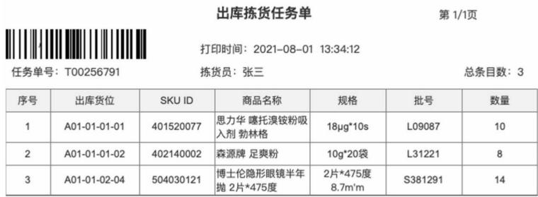

图8-41拣货单示例

拣货完成以后，因为商品从货位拿下来了，为保证系统和实物的一 致性，应该及时扣减系统中此货位的库存。如果是PDA拣货，可以指引 拣货员扫描货位条码，触发当前货位上商品的库存扣减，如果是纸单拣 货，可以在PC上提供一个拣货完成的操作功能，拣完以后返回PC上操 作拣货完成，将拣货任务下的所有商品库存扣减，并变更拣货任务及对 应的批拣单、出库单状态，状态变更规则为：当前拣货任务及所有明细 变为拣货完成，同时判断如果出库单中所有明细均拣货完成，则出库单 变为拣货完成，否则出库单的状态仍为拣货中，批拣单状态的变更逻辑 同理。 

## 5.播种

如果一张批拣单中存在多个出库单的商品，拣货完成后便需要进行 播种，将拣完的商品按照系统指引分配到每个出库单中。播种的形式可 以分为边拣边分和先拣后分。 

在边拣边分模式下，拣货员的拣货推车上已经提前配好播种格口， 每个格口对应一个出库单，拣货员在拣货的同时，便按照系统提示将商 品分配到对应的格口中，如1号格口5个，2号格口3个…… 

在先拣后分模式下，拣货员在拣货的时候不进行播种，待所有商品 拣完以后再集中进行播种，直至所有商品都被准确无误地分配到对应的 出库单中。如图8-42所示，拣货员在A区、B区、C区分别拣3个SKU， 每个SKU各3个，集货完成以后，再将商品播种到出库单1、出库单2、 出库单3中。 

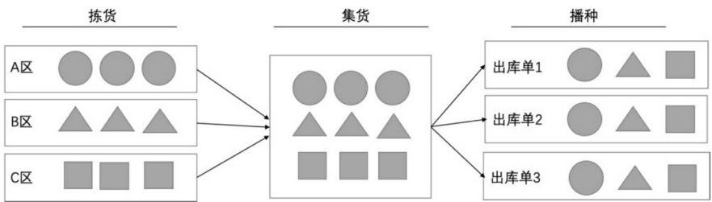

图8-42出库播种

播种操作可以在仓储管理系统中提供的一个播种页面中进行，如图 8-43所示，播种员依次扫描商品条码，按系统提示放入对应的播种墙格 口，一个格口对应一个订单（没见过播种墙的朋友，可以想象一下家里 的储物柜，每个放东西的格儿就是一个播种格口），直到格口中所有订 单明细均播种完成。如果资金允许，也可以借助自动播种墙等自动化设 备完成播种。 

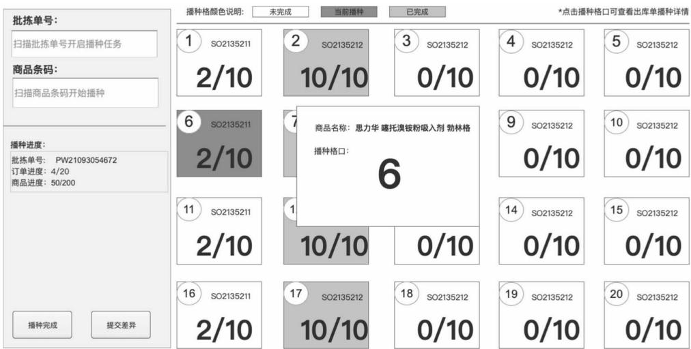

图8-43仓储管理系统中的播种页面

## 6.复核打单

发货前的最后一步是复核，复核是校验实物商品和系统出库明细是 否一致的过程，同时，在此环节还可以推荐包装耗材、装箱、附送随单 赠品、打印物流面单、出库清单（或购物小票）、暂停拦截、取消订单 拦截等。 

商品播种以后（如果不用播种，则在拣货完成以后），需要将订单 及货物送往复核台进行复核，为实现不同类型的订单使用不同的包装箱 、赠送不用的配件，以及考虑各个复核台任务的均衡，应该为每个出库 单分配复核台，复核台的分配策略参考如下。 

① 按订单类型分配。不同类型的订单分配不同的复核台，如出库 订单和退供单配置不同的复核台，冷链订单分配固定的复核台，高优先 级订单分配紧急出库复核台等。 

② 按配送物流或配送方向分配。根据不同的物流公司或配送路线 分配不同的复核台，以方便出库交接。 

③ 按订单商品明细分配。根据商品的品种数量、出库数量等进行 分配，如大订单分配大复核台。 

④ 按包装耗材分配。根据出库单的包装及耗材配件要求分配不同 的复核台，如需要送赠品的出库单统一分配至1号复核台。 

⑤ 按客户属性分配。根据客户的属性分配不同类型的复核台，如V IP客户、大客户、中客户、小客户分别分配不同的复核台。 

⑥ 按任务平均分配。根据当前每个复核台的复核任务数量，分配 任务最少的复核台，已便复核员的任务均衡，不至于有的复核台爆满， 有的复核台空闲。 

复核员进行复核操作时，在系统中用扫描仪扫描出库单或物流运单 号匹配到对应的出库单开始复核，在复核过程中一一核实每个商品是否 是出库单中的商品，有没有多拣、少拣，商品有无破损等，如果出库明 细与系统记录不一致，可以将出库单作为问题单暂时挂起，待核实完问 题以后再继续复核，如图8-44所示。 

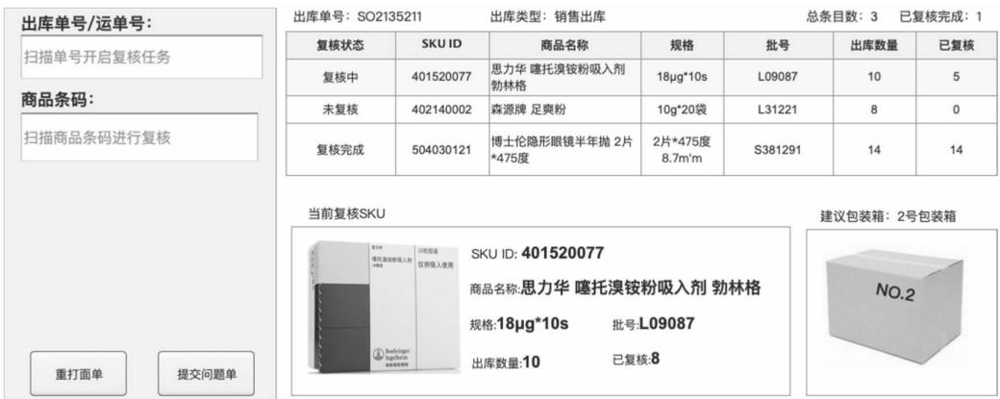

图8-44仓储管理系统出库复核示例

在订单复核环节中，仓储管理系统可以提示订单需要的包装耗材、 是否赠送赠品等，如果订单被取消或被暂停了，也在此环节进行拦截提 醒，以阻止订单出库。同时，如果需要对包裹进行称重（称重可以用重 量对商品进行复核，也可以用作与物流服务提供商进行运费对账），也 是在此环节将包裹放入可以与WMS系统接口互通的电子秤上读取包裹 重量。 

商品复核无误以后，便可以装箱打包出库了，仓储管理系统变更出 库单状态为复核完成，同时可以将出库明细及物流单号通知订单履约中 心和中央库存系统做出库处理了。 

## 7.发货交接

打包好的出库单，会暂存在发货月台区域等待交接，在精细化管理 的仓库中，发货月台也是需要分配的，不能随意乱放，一般按照订单类 型、配送方向或者配送物流进行分配。打包员打包以后，按仓储管理系 统中的提示将包裹送至对应的发货月台，系统记录此出库单在发货月台 区域中的位置，以方便查找。 

发货交接时，相关人员用PDA或扫描仪逐一扫描包裹上的物流单号 或订单号，已扫描的出库单，代表已经交接给物流公司了，如果需要交 接凭证，还可以在此环节打印一张交接单。交接完成后，系统变更出库 单状态为已发货，同时释放发货月台。 

## 8.订单取消

在出库过程中，难免会遇到订单取消的情况，仓储管理系统除了要 处理订单取消的系统逻辑，还多了对出库商品进行拦截并返库的物流操 作。订单取消的处理原则主要有四点。 

① 取消指令由上游订单履约中心询问仓储管理系统，在订单发货 前支持订单取消，订单发货后不支持订单取消，仓储管理系统根据当前 订单状态返回取消结果。 

② 针对已取消的订单，变更出库单状态为已取消，同时需要释放 已分配的库存。如果出库单还未开始拣货，应该将其从波次和拣货任务 中剔除，如果出库单已经开始拣货了，未拣货明细应该从拣货任务中剔 除，以节省拣货员的时间。 

③ 针对已取消的订单，在复核环节中应该有拦截提示，避免复核 员将订单发出，以致钱货两空。 

④ 如果商品已拣货下架，需要取消订单并还货，重新将商品上架 到货位上。 

## 9.出库异常处理

在拣货、播种和复核过程中，如果发现实物和系统出库明细不一致 的异常情况，需要将出库单变为问题单，然后由相关人员进行问题单处 理。 

提交问题单时，可以选择异常原因，如缺货、商品破损等，以便问 题处理组根据原因进行后续处理。 

问题处理的结果有三种，分别对应系统处理逻辑如下。 

① 核实出库单和实物并无差异：直接将问题单恢复为正常单，继 续完成复核出库即可。 

② 核实出库货位上确实无实物，或者实物破损了：问题组确认异 常，系统会将货位上的商品库存差异转为盘亏明细或报损明细，后续做 盘点审核处理。同时，系统会重新查找此商品在仓库其他货位上是否存 在可出库库存，如果存在，则会重新生成一条追加拣货的任务，提示问 题组的相关人员进行拣货，保证出库单能正常出库，追加拣货完成以后 ，出库单恢复正常，可以继续复核出库了。如果追加货位上也有异常， 相关人员可以继续提交问题订单。 

③ 问题组确认拣货货位有异常，同时系统判断其他货位上没有可 出库库存了，此出库单的处理方式为：如果可以缺量发货，则将异常商 品剔除，以实拣商品复核出库，否则只能取消该出库单。 

## 8.7仓储管理系统中的库内管理

除了入库和出库两大核心业务，仓储管理系统中的第三大核心功能 便是商品在库内的精细化管理，我们重点介绍常用的库内补货、移库、 移位、盘点、商品借还、库存冻结与解冻、商品报损这几项业务。 

## 8.7.1 库内补货

补货，就是当零散库库存缺货时，从整件库区进行补货的流程。根 据补货的触发时机，分为主动补货和被动补货两种。主动补货是由仓库 管理员定期清理零散库区库存低于下限的商品，主动发起的补货，一般 在空闲期发起；被动补货是当出库单下发仓库后，在波次分配时发现零 散库库存不能满足订单需求，由系统自动发起的补货任务。 

无论是主动补货，还是被动补货，在操作层面都是一样的，如图8- 45所示。系统生成补货任务，补货员领取任务后，拿PDA或打印纸质拣 货清单到系统指引的整件货位拣货下架，并送往零散库的目的货位，在 零散货位完成上架操作。 

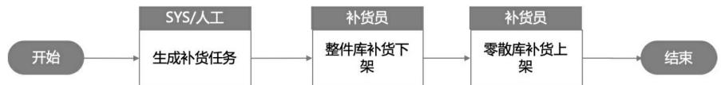

图8-45 仓储管理系统库内补货流程

补货的系统载体是补货单，关键信息包含补货单号、补货类型（主 动补货、被动补货）、需补货SKU、整件出库货位、零散上架货位、补 货数量等。 

补货单的状态设计如图8-46所示。 

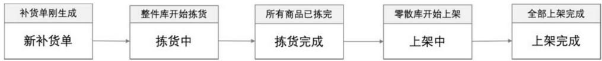

图8-46 补货单状态设计

这是基于一张补货单拣完全部商品的设计，如果需要按区域拣货， 可以同出库一样，增加一个拣货任务表，将补货明细按区域拆分成多个 任务。 

补货单状态说明如表8-7所示。 

表8-7补货单状态设计说明

<table><tr><td>补货单状态</td><td>说 明</td></tr><tr><td>新补货单</td><td>补货单刚生成的状态,补货员可以领取此状态的拣货任务</td></tr><tr><td>拣货中</td><td>补货员已经领取任务,开始到整件库拣货时的状态变更</td></tr><tr><td>拣货完成</td><td>所有补货明细均拣货完成的状态变更</td></tr><tr><td>上架中</td><td>补货员到零散库开始上架时的状态变更</td></tr><tr><td>上架完成</td><td>所有补货明细均上架完成的状态变更</td></tr></table>

下面重点介绍生成补货单、补货下架和补上架的系统实现逻辑。 

## 1.生成补货单

在生成补货单时，最核心的逻辑是什么时候补，补多少，从哪补到 哪。 

第一个问题：什么时候补？ 

答：缺货的时候补货。何为缺货？并不是当库存变为零的时候才开 始补货，而是取每个SKU设置的零散区库存下限，一旦商品库存数量低 于库存下限便视为缺货。主动补货是相关人员在建补货单的时候找出低 于库存下限的商品，生成补货单，被动补货是在相关人员拣货时，按波 次，将每波次下所有零散库缺货的商品统一生成补货单。 

第二个问题：补多少？ 

答：补到零散区商品库存的上限。零散库区的容量是有限的，自然 不能无限制地补货，所以同样需要取每个SKU的零散库区的库存上限作 为补货的目标库存数。 

同时，计算补货量时还有三个关注点：一是计算零散区库存时，应 该取补货商品在零散库中所有货位的库存之和，而不是某一个货位的库 存；二是补货尽量按箱补，避免在整件库中进行拆箱，所以补货数量应 该是整包装数的整数倍，如1箱是10盒，我们的补货数量应该是10的整 数倍；三是被动补货的补货数量还应加上波次中的缺货数量，如某SKU 的库存上限是100，库存下限是10，当前库存是20，该SKU的库存数量 本不低于库存下限，但波次中订单的需求量是50，很明显，当波次分配 时便会产生被动补货，但我们并不是补80个（上限100-当前库存20）， 而是要加上订单需求，应补130（上限100+订单需求50-当前库存20）。 

总结一下，SKU的补货量=库存上限+波次订单需求量-库存下限， 按整包装箱数向下取整。 

## 第三个问题：从哪补到哪？

答：从整件区货位补到零散区缺货货位上。整件区的货位可以参考 出库的分配策略匹配合适的商品批次和货位，零散区缺货货位优先取生 成被动补货或主动补货任务时的缺货货位，但要考虑缺货货位是否允许 混批，以及货位的体积等因素，若不能放入，可以按照入库的货位推荐 策略分配新的货位。 

为了避免库存被其他任务占用，补货单生成以后，需要在库存中记 整件出库货位的已分配库存数量，以及零散库目标上架货位的入库已分 配库存数量。 

## 2.补货下架和补货上架

补货下架功能的实现逻辑和出库拣货功能类似，如果是人工拣货， 需要按照拣货路径将拣货货位按拣货路径进行排序。 

补货上架功能的实现逻辑和入库上架功能类似，补货员按照系统推 荐的上架货位将商品逐一上架到货位上。如果是被动补货，在上架完成 后，会触发对应的波次重新分配库存。 

## 8.7.2 移库

当商品需要跨库进行转移时，如从合格商品库转移到不合格商品库 ，则需要进行移库操作，将商品移至对应的目的库存放区域，操作流程 如图8-47所示。 

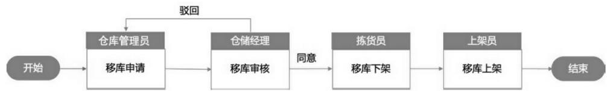

图8-47 仓储管理系统中的移库流程

① 仓库管理员整理需要移库的商品，在仓储管理系统中提出创建 移库申请。 

② 仓储经理对移库申请进行核实，若符合移库标准，则同意移库 （在药品行业中，出于安全考虑，一旦移入不合格品库的商品，就无法 再进行售卖，只能销毁，所以移库操作需要谨慎，最好加上审核环节） 

③ 拣货员领取移库任务，按移库申请中的下架货位将商品拣货下 架，并将商品移送目的库，由目的库上架员将商品上架到目的库货位， 完成移库操作。（免费获取更多供应链PM书 加v信：pmzjie） 

移库以移库单为载体，对应将商品库存从原库别转移到目的库别， 关键信息包含移库单号、移库原因、原库别、目的库别、移库SKU、原 库别出库货位、目的库别上架货位、移库数量。 

移库单的状态设置同补货单的状态设置类似，多了已审核和驳回两 个状态节点，如图8-48所示。 

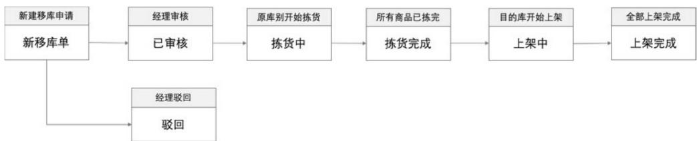

图8-48 移库单状态设计

移库的建单比补货单的生成简单，仓储管理系统提供一个建单页面 ，由仓库管理员选择原库别、目的库别、移库原因，并依次录入需移库 商品、出库货位、目的库上架货位、移库数量即可。系统需校验出库货 位库存没有被其他任务占用，目的库上架货位是否为商品允许被上架的 货位。 

如果原库别和目的库别存放的商品库存状态不同，如原库别存放合 格品，目的库别存放不合格品，那么在移库完成后，除商品的库存从原 货位变更到目的货位外，还需要将商品的库存状态从合格调整为不合格 

## 8.7.3 移位

当商品需要在同库别下进行货位调整时，则使用移位功能。因为同 库别下行走距离近、且通常是一个人完成整个操作，所以移位不需要像 移库一样建单、下架、上架，只需要仓储管理系统提供一个移位的操作 页面，由仓库管理员选择移出商品及移出货位，再录入移位数量及目的 货位即可完成库存的转移。图8-49为 PDA操作移位示例。 

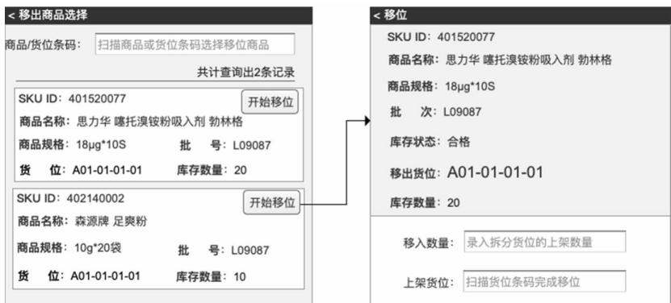

图8-49 PDA移位示例

## 8.7.4 盘点

盘点是仓库中的相关人员对商品实物库存进行定期清点，并与系统 库存进行比对，保证系统库存与实物库存一致的库内操作业务。 

库内盘点的方式有很多，按照盘点形式，分为盲盘（不告知系统数 量）和明盘（告知系统数量）；按照盘点时机，分为动态盘点（作业过 程中盘点）和静态盘点（作业静止后盘点）；按照盘点周期，分为周期 盘点（定期做全库盘点）和循环盘点（按照计划每次盘点一个区域）。 

盘点的操作流程如图8-50所示。 

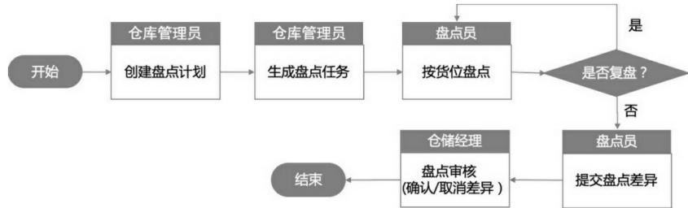

图8-50盘点流程

①仓库管理员根据需要盘点的商品及区域生成盘点计划。 

② 开始盘点时，仓库管理员将盘点计划根据系统当前库存生成盘 点任务。 

③ 盘点员借助 PDA 或者纸质盘点单对盘点任务中的商品货位库存 依次盘点并录入实盘结果。 

④ 盘点完成后，盘点员核实盘点结果，判断是否需要复盘，若需 要复盘，再次对盘点单中需要复盘的库存明细重新生成盘点任务，复盘 可以选择只盘差异明细，或者盘全部明细。 

⑤ 若盘点差异明细无误，盘点员对盘点结果中的差异明细进行确 认后提交给仓储经理审核。 

⑥ 仓储经理对需要审核的明细进行审核，生成损溢记录提交给财 务部门的相关人员，若核实有误，可以取消差异明细。 

在设计盘点功能时，有三个系统实体，分别是盘点计划、盘点任务 和盘点差异。盘点计划来源于仓库管理员创建的盘点计划单，因为商品 库存是实时变动的，所以计划单只是圈定需要盘点的库存范围，并不明 确到具体的商品库存层面，如盘点A区的货位；盘点任务产生于仓库管 理员开始盘点时，通过盘点计划生成，这时便需要根据计划中的范围获 取仓储管理系统中当前的商品货位库存，生成具体的盘点明细，精确到 货位、商品、库存状态和库存数量；盘点差异产生于盘点员盘点结束后 提交的差异明细，包含货位差异、商品差异、库存状态差异和数量差异 

一个盘点计划根据库存明细可以生成一条或多条盘点任务明细，一 个任务明细每次盘点只能生成一条盘点差异，三者可以共用盘点单号， 如图8-51所示。 

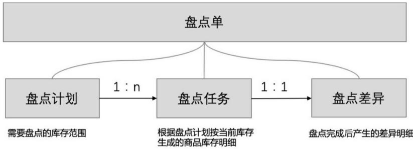

图8-51盘点计划、盘点任务与盘点差异

为了厘清盘点计划、盘点任务与盘点差异的关系，我们讲个小张盘 点的故事。 

仓库管理员小张今天要对 A 区的库存进行一次集中盘点，早上上 班以后，小张创建了一个针对A区的盘点计划。待晚上业务静止以后， 便将盘点计划生成了盘点任务，共计3条盘点任务明细，分别对应货位 A01和A02，商品SKU-1和SKU-2的库存。小张打印了盘点任务单对每个 货位中的SKU进行数量清点，最终核实SKU-1在A01货位实物只有99个 ，比系统中的100个少1个，于是提交差异，生成了一条A01货位上SKU-1商品的盘亏差异1个。 

小张的盘点过程如图8-52所示。 

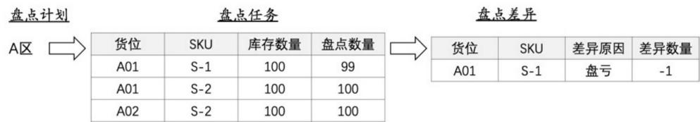

图8-52小张的盘点过程

根据盘点的操作节点，我们可以将盘点单状态设计为图8-53中的样 子。 

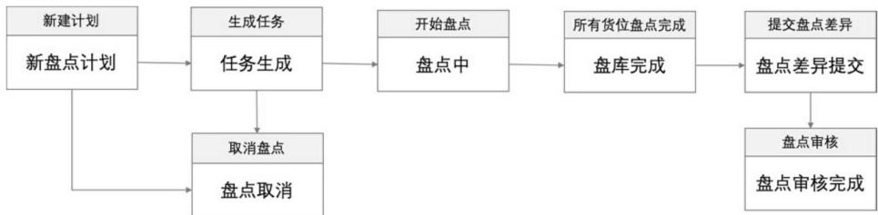

图8-53盘点单状态设计

盘点单各状态变更说明如表8-8所示。

表8-8盘点单状态设计说明

<table><tr><td>盘点单状态</td><td>说明</td></tr><tr><td>新盘点计划</td><td>新生成盘点计划的状态</td></tr><tr><td>任务生成</td><td>根据盘点计划生成盘点任务</td></tr><tr><td>盘点中</td><td>盘点员领取盘点任务开始对货位进行盘点</td></tr><tr><td>盘库完成</td><td>盘点单中所有任务明细均已和实际货位清点完成</td></tr><tr><td>盘点差异提交</td><td>核实盘点过程中的差异,并进行盘点差异提交</td></tr><tr><td>盘点审核完成</td><td>仓储经理审核或取消盘点差异</td></tr><tr><td>盘点取消</td><td>在开始盘点前取消了盘点计划或盘点任务</td></tr></table>

以下重点介绍创建盘点计划、盘点任务、盘点及盘点差异审核的系 统实现。 

## 1.盘点计划与盘点任务

盘点计划的创建就是圈定盘点范围的过程，目的是找到需要盘点的 货位和商品，可以指定盘点方式是盲盘还是明盘、选择盘点的区域、货 位的类型、商品的范围、库存数量的范围，还可以选择是不是动销盘点 。我们对盲盘、明盘和动销盘点做个解释。 

● 盲盘：最常用的盘点方式，如果选择盲盘，则盘点员的盘点任务 中看不到商品的库存数量，这样盘点员必须按实际库存清点并录入实盘 

数量。 

●明盘：和盲盘相反，盘点员在盘点时能看到商品的库存数量。 

● 动销盘点：只盘有过库存变化的商品明细，如有过入库上架和出 库下架的库存记录。 

图8-54是一个生成盘点计划的示例。 

盘点计划生成以后，因为还没有生成盘点任务并进行盘点，所以并 不影响仓库作业。如果无法保证所有商品加减库存的时机与实物上下架 操作一致，最好是在库存静止状态下生成盘点任务，以免在盘点的过程 中库存又发生了变化，导致盘点结果不准确。试想一下，你拿着一张刚 打印的盘点单刚去某货位点完数，还没来得及将实盘数量录入系统，库 存又被出库单拣货下架了，而你还以实盘数量录入系统，由于存在库存 变化的时差，必然会产生不准确的盘点结果。 

盘点任务生成时，系统从盘点计划中获取盘点的范围，并将范围内 所有符合条件的商品及当前的货位库存明细找出来，写进盘点任务中， 以供盘点员按货位进行点数，盘点的库存数量取生成任务时的实物库存 数量。 

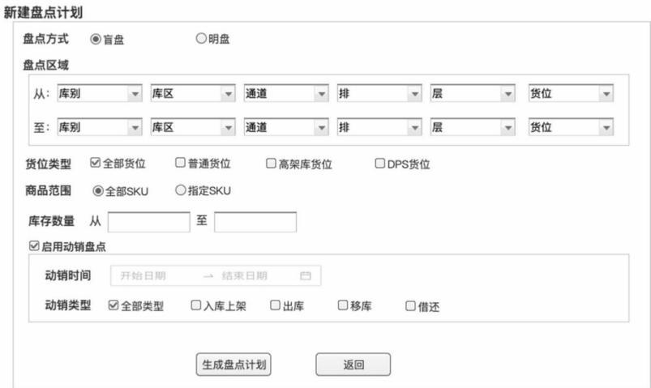

图8-54生成盘点计划示例

## 2.货位盘点及复盘

相关人员可以通过PDA，或者打印纸质盘点单进行盘点，若是PDA 盘点，可以一边点数一边将实盘数量录入系统，若是纸单盘点，则需要 先把实盘数量记录到纸单上，盘点完成后再录入系统，相当于录入了两 次，所以如果条件允许，建议用PDA进行盘点。 

货位盘点完成以后，如果对盘点结果不满意，相关人员可以针对盘 点任务进行二盘、三盘，甚至多次盘点，直到以最后一次盘点结果提交 ，系统将结果与盘点任务中的商品实物库存进行比较，若一致，则无差 异，若不一致，则产生盘点差异，盘点差异数量=实盘数量-系统库存数 量。 

## 3.盘点差异审核

盘点差异的产生原因有两种，第一种是日常盘点时产生的盘点差异 ，第二种是在拣货过程中产生了差异订单明细，经问题组的相关人员核 实确认后，会将差异货位上的剩余库存转换为盘点差异。 

盘点差异分为盘亏差异和盘盈差异，盘亏差异数量为负数，盘盈差 异数量为正数。一旦产生了盘亏差异，相关人员应该先将差异库存进行 冻结，加商品的冻结库存数量，记录冻结原因为盘亏冻结，并告知中央 库存系统，以避免盘亏差异的商品库存又被其他订单占用了。 

盘点差异明细的状态可设计为待审核、已审核、已取消，分别对应 不同的差异处理结果。 

●待审核：差异刚生成时的状态。 

● 已审核：仓储经理核实无误，审核差异。一旦审核确认了，则盘 盈记录会加到商品货位库存中，盘亏记录会触发商品货位库存扣减，同 时解冻盘点冻结库存。 

● 已取消：仓储经理确认盘点结果有误，将盘点差异取消。已取消 盘点差异不做盘点库存变更，并将已冻结的盘亏库存解冻。 

无论是盘盈还是盘亏，均需要将审核结果同步到财务系统中做相应 的资产损溢处理。在很多公司中，盘点差异的审核是多级的，最后一步 是由财务部门审核通过后才真正生效。 

## 8.7.5 商品借还

在库商品如果需要被兄弟部门临时借出做展示、拍照等，由于不是 真实出库，但需要有借出记录，这便需要用到商品借还流程了。商品借 还的流程如图8-55所示。 

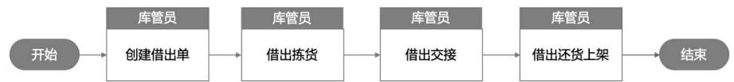

① 仓库管理员创建借出单，录入申请借出人、借出原因、借出类 型（长借还是短借）、预计归还时间、需借出的商品、出库货位及数量 等信息。 

② 仓库管理员按借出商品明细到相应货位进行拣货，并将商品交 接给申请借出人。 

③待商品归还后，仓库管理员将商品重新上架到货位上。 

借出流程以借出单作为载体，根据操作节点，借出单的状态设计如 图8-56所示。 

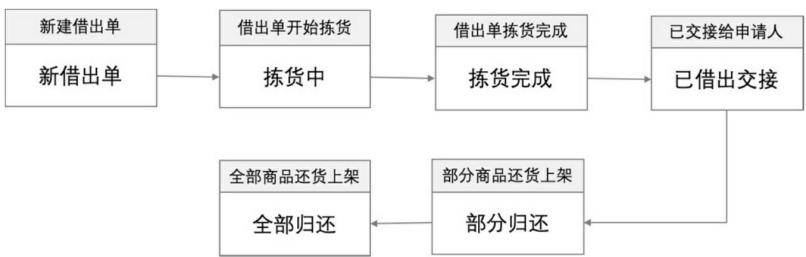

图8-56借出单状态设计

在进行借出功能设计时，有几点注意事项。 

① 商品借出以后，物权还是属于仓库，并不是真实发货，所以库 存应该还记录在库，但需要将商品库存做借出冻结，加冻结库存，并记 录冻结原因为借出，以避免库存被分配了而无实物。 

② 借出分长借和短借，如果是长借，短期不还，则需要通知中央 库存系统做库存冻结，并同步可销售库存至销售平台，避免客户下单了 而无法发货，如果是短借（如半天之内），不影响销售，只在仓储管理 系统中冻结库存，不用通知中央库存系统。 

③ 商品还货上架，在操作上可以和普通入库上架一样，但库存需 要做解冻处理，而不是加库存。 

## 8.7.6库存冻结与解冻

仓储管理系统的库存冻结可以分为盘亏差异冻结、借出冻结和人工 冻结三种，盘亏冻结、借出冻结分别发生于盘亏差异和商品借出环节， 人工冻结发生在手动创建商品冻结单将部分商品库存做冻结处理，常发 生于某商品的部分库存因为某原因（如出现质量问题）临时不可售卖， 

需暂时从销售平台下架时。 

虽然三种冻结发生在不同的业务场景下，但其仓储管理系统处理逻 辑一样，都是加商品的冻结库存数量，并记录冻结原因。已冻结的库存 数量，会相应减少仓储管理系统中商品的可用库存，出库波次分配时不 会计算这部分库存。 

与库存冻结对应的是库存解冻，即释放冻结库存数量。盘亏、借出 和人工三种冻结业务对应的库存处理时机如表8-9所示。 

表8-9库存冻结与解冻时机

<table><tr><td>业务</td><td>库存冻结时机</td><td>库存解冻时机</td></tr><tr><td>盘亏</td><td>产生盘亏差异</td><td>审核或释放盘亏差异</td></tr><tr><td>商品借还</td><td>创建商品借出单</td><td>商品还货上架</td></tr><tr><td>人工冻结与解冻</td><td>手动创建冻结单</td><td>手动解冻冻结库存</td></tr></table>

## 8.7.7 商品报损

当库内商品存在质量问题且无法再销售和退货，如破损、过期，就 需要用到报损流程。报损流程如图8-57所示。仓库管理员定期清理需报 损的商品，并在系统中提交报损申请，由仓储经理审批后扣减系统实物 库存，然后将商品报废。如果是审批严格的公司，可能会存在采购、财 务等多级审批后，报损申请方可生效。 

图8-57商品报损流程

报损功能的设计可以复用盘亏差异审核流程，即仓库管理员提交报 损申请后，系统便将报损明细记入盘点差异，后续走盘点差异审核流程 

## 8.8自动化设备控制系统（WCS）

在较大型仓库中，经常会看到各种自动化设备辅助作业，在仓库内 ，电子标签、输送线、分拣机、自动化立体库、AGV机器人这些设备有 条不紊地运转，完美配合着仓库的各项作业。问题来了，这些设备是怎 么和仓储管理系统结合的呢？这就需要提到另外一个系统——仓库自动 化设备控制系统（WCS），它是介于WMS 和设备执行PLC（Programm able Logic Controller，可编程逻辑控制器）程序之间的设备调度与管理 系统，主要用于将WMS需要驱动设备执行的指令进行调度并转发给设 备执行，同时将设备的执行结果反馈给WMS，如图8-58所示。 

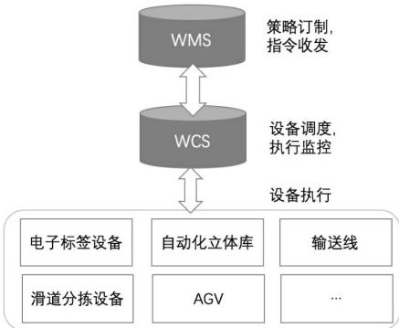

图8-58 WMS与WCS

可以这么理解，WMS如同人的大脑，WCS如同四肢，WMS负责处 理所有与仓储业务相关的调度和任务传输，WCS负责调度WMS下达的 作业指令，并将其转化为设备可以识别的指令传给设备，最终由设备的 PLC驱动设备运转。 

我们以电子标签设备为例，解释WMS与WCS的执行原理。 

如图8-59，WMS拣货任务生成以后，一次性将100个电子标签货位 的拣货任务通过接口下达给WCS，WCS接到指令以后，将100个亮灯的 任务存进任务队列，依次开始执行亮灯任务，如果某货位当前还有其他 正在亮灯的任务，由WCS统一调度，等待前一任务拣完灭灯后再行亮灯 ，以免前面的拣货任务被覆盖了。 

在WCS执行任务时，需要将WMS中的货位编码转换为电子标签的 设备标识（每个电子标签出厂时已经写入的标识），并通知该标签执行 亮灯动作及显示拣货数量，如指令0代表亮灯，指令1代表灭灯。 

当设备PLC程序收到WCS的指令后，便将对应货位的电子标签亮灯 并显示拣货数量，PLC 不负责任何业务规则，单纯执行亮灯和灭灯动作 。拣货员看到货位的电子标签亮灯后，便可以到对应货位进行拣货了。 

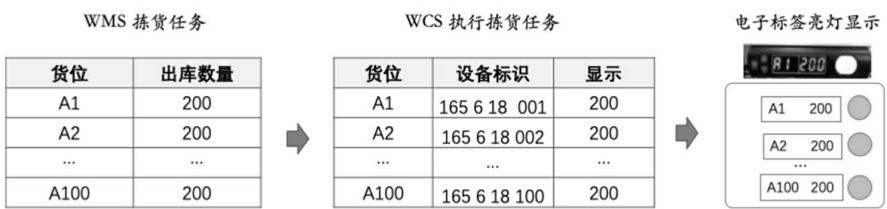

图8-59 WMS与WCS 联动

WCS的主要功能有三个。 

① 任务管理与调度：接收WMS下达的任务，转换为各个设备可执 行的指令。设备执行完成后，回传执行完成的结果至WMS。当多个任 务并行时，按照优先级及顺序调度各设备，使之与WMS业务相匹配。 

② 设备运行管理：实时监控库内所有设备的运行情况，并记录详 细的运行日志，设备超负载及运行异常及时预警，并能自动调优。同时 ，如果遇到紧急情况，还能支持手动操作，如急停。 

③ 异常处理：遇到异常情况时，能够及时预警，并对异常情况执 行异常处理，避免出现流程卡顿和经济损失，同时将异常信息回传WM S。（免费获取更多供应链PM书 加v信：pmzjie） 

## 8.9 本章结语

仓储是供应链的粮仓，为业务开展提供弹药支撑，所有关于实物的 操作，最终都会落到WMS中，WMS的职责是管理仓库的相关数据，以 及精准高效地处理库内的各类业务。 

WMS的系统架构可以分为四层：最底层是支撑业务开展的基础数 据和库存服务，中间层是基于基础数据和库存服务开展的与各类仓库相 关业务，以及支撑业务开展的各项业务策略，上层是辅助仓储业务开展 的各类设备控制，由 WMS 提供设备的调度与指令传输，顶层是执行指 令的各类硬件设备，由WCS（自动化设备控制系统）驱动。 

WMS的功能也可以简化为“进销存”三个字，展开来便是入库管理 、出库管理和库内管理。在设计 WMS 的系统功能时，满足业务操作要 求是最基本的，更高层次的是了解仓内作业的各种策略，这些策略是实 现降本增效、精益化管理的关键。 

如果仓库要增加自动化设备来辅助作业，就需要用到WCS，WMS 如同人的大脑，负责发送指令，WCS如同四肢，负责执行指令并驱动设 备运转。 

## 第9章 运筹帷幄：订单履约系统

在新零售时代，往往存在多销售平台、多业务模式并行，供应链侧 又存在多仓库、多门店，加上多个系统之间需要联动，多种形态组合到 一起就形成了一个庞大的订单中心，需要兼容各类业务场景。如何能集 中管理不同类型的订单，并各自为客户提供更好的履约服务，则需要我 们有一个强大的订单调度大脑——订单履约系统。 

## 9.1 人无信不立：为什么要履约

履约，顾名思义，即履行约定，按照约定完成相关事宜，目前我们 听得最多的，是如何在承诺时效内将商品送到客户手中，但个人认为这 只是一种狭义的履约行为，即订单时效履约。更广义的履约应该是基于 时间、空间、质量多维度的，有承诺即有履约。在供应链中，履约就是 以客户需求为出发点，在约定的时间，约定的地点，用约定的价格，以 合适的方式将约定质量和数量的商品送到客户手中，是一种客户至上的 服务理念。 

## 9.1.1 什么是供应链履约

在供应链层面，供应链履约体现在价格、时效、品质、售后四个方 面。 

① 价格。在一般商业行为中，价格是吸引客户的第一要素（特殊 行业如奢侈品、贵宾服务除外），如何在保证企业利润的同时，为客户 提供最优价格，是我们需要重点考虑的。 

② 时效。给客户最优的时效，让客户在最合适的时间收到商品。 例如，京东的211，保证上午11点前下单，当日送达，或者指定日期和 时段收货，极大地方便了客户，也为京东在配送层面赢得了极佳的口碑 0 

③ 品质。从采购溯源，到收货验收，到出库复核，全程保证商品 的品质，让客户拿到最优质的商品。 

④ 售后。很多企业的正向履约做得很好，但败在售后跟不上。所 以好的履约需要重视售后，一旦商品有任何问题，企业能够第一时间为 客户提供售后处理，如 7 天无理由退货、先行赔付、上门取件等，都可 以为客户提供极佳的售后服务体验。 

总之，供应链履约就是企业利用自身供应链的能力，为客户提供更 流畅和更满意的服务，言必中，诺必行。 

## 9.1.2 订单履约的长远价值

所有的供应链能力，无论是价格、时效、品质还是售后，最终展现 在客户面前的只有订单交易，外表再华丽，一张订单便知其真伪。对订 单的履约是企业供应链能力的体现，也是建立口碑和增加客户黏性的重 要途径，做好订单履约，虽然会付出一定的成本，但其带来的价值是巨 大的。（免费获取更多供应链PM书 加v信：pmzjie） 

① 建立口碑、增加壁垒。在信息如此透明的今天，获客成本较高 ，如果企业想要增加用户黏性，尤其是电商新零售企业，必须建立良好 的口碑，而订单履约则是口碑的最好体现，也是建立行业壁垒的利器。 例如，京东的商品品质和配送时效，就是其相对于其他平台的优势。 

② 及时发现企业问题，反向改进。服务好不好，最终发言权在客 户，在履约过程中，能够让客户参与进来，通过用户反馈及时发现供应 链问题，反向倒逼企业进步。1000个客户的呼声，比一个重要的高层决 策更有价值。 

③ 增强供应链协同。因为履约不是某一个人、某一个部门或某一 个系统的事情，想要做好订单履约，必然需要跨部门、跨系统协作，久 而久之，企业部门间及系统间的协同性就增强了，从而形成良性循环。 

## 9.2订单履约系统整体规划思路

订单履约系统，传统叫法为OMS（Order Management System），在 很多互联网公司中，叫作订单履约中心，简称OFC（Order Fulfillment C enter），主要用来承接销售平台下发的订单，并对订单进行调度，然后 下发仓库发货及配送，是对订单履约全流程进行管控的中心系统。 

## 9.2.1订单履约系统架构

订单履约系统的设计可以总结为两点。 

① 在业务层面，会存在多平台、多业务，多仓库、多门店，线上 线下同时发售、发送物流与到店自提多种物流方式并存，如何用一套完 整的履约系统来承接多种交织的业务，为用户呈现相同的履约体验，是 搭建订单履约系统需要考量的。 

② 在系统层面，订单履约系统承担着承上启下、履约调度的重要 角色，其职责是无缝衔接和调度各外围系统，服务于订单出库履约，使 各类订单能高并发且有条不紊地出库。从系统交互方面来看，订单履约 系统对上对接各销售平台，对下对接各仓库和门店，横向与基础数据中 心、中央库存系统、售后系统和配送管理系统等进行交互，完成订单履 约调度。 

一个能支持多平台、多仓库、多门店的订单履约系统的系统架构， 如图9-1所示。 

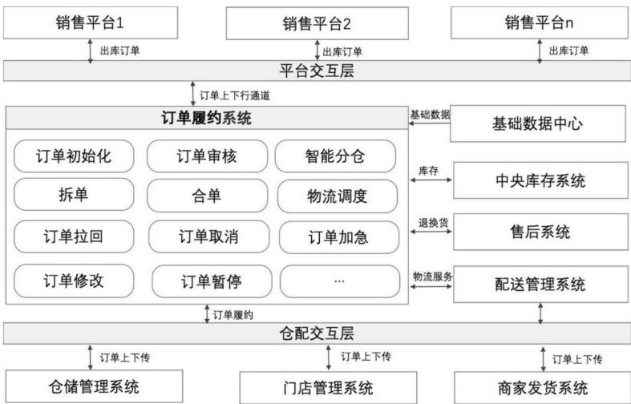

图9-1订单履约系统的系统架构 

关于平台交互层和仓配交互层，在本书的第 4 章中我们有提到过， 这两个交互层的主要职责是充当上下行路由网关的角色，屏蔽不同销售 平台和不同仓库系统之间的差异化，让商品、订单、库存等在这两个交 互层中做标准化的输入/输出，保证订单履约系统的健壮性，不至于随 着销售平台和仓储管理系统的调整而调整。 

## 9.2.2订单履约流程

一张实物类的订单从销售平台下单，到最终用户签收，会经历10余 个履约节点，涉及销售平台、平台交互层、订单履约系统、中央库存系 统、配送管理系统、仓配交互层、仓库和门店等，就像工艺流水线一样 ，从第一个环节开始，每个环节都会为产品提供一些必要的组装工序， 直到最后一个环节产品成型。在履约流程中，最核心的诉求是协同和顺 畅，只有各系统相互协作，订单自始至终很流畅地进行流转，才能保证 在约定时间内完成履约，其中任何一个节点出现卡壳，都会导致履约时 间的延长，影响的是客户对企业的信任。 

图9-2为实物订单的履约流程，虚拟订单的履约不涉及库存、仓储 和物流配送流程，会相对简单一些。 

① 新订单。订单履约系统接到新单的节点。此处根据业务归属可 以分为两种逻辑处理。 

外部第三方平台（如天猫、京东、美团）的订单，客户在销售平台 上完成了交易后，由订单履约系统接到从销售平台同步的订单后生成新 订单，在这一模式下，履约订单的生成和交易订单的生成是两套体系。 

针对自营平台的订单，常见的有两种设计思路，一是将交易订单和 履约订单分开设计，交易订单生成后再下发至订单履约系统生成履约订 单，二是将交易订单和履约订单合二为一，客户提交订单后，便在订单 履约系统中生成一张新订单，同时处理交易流程和履约流程。 

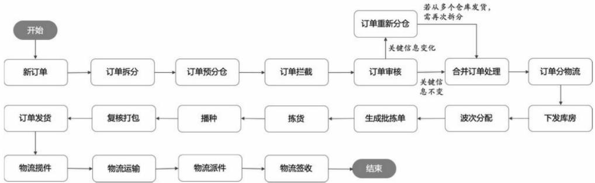

图9-2订单履约流程

② 订单拆分。为提供更好的用户体验，大部分电商平台支持合并 提交支付，在订单生成以后，再按照商家、仓库、商品、金额、物流等 规则进行订单拆分，分为多个子订单履约发货。 

③ 订单预分仓。为避免超卖，已经下单的订单需尽快进行库存预 占，以免库存被其他订单占用，此过程称为预分仓，由中央库存系统提 供相关服务。若分仓后一个订单被拆分为多个任务进行发货，订单需再 按照仓库进行拆分。 

④ 订单拦截处理。某些不符合业务规则或触发了风控规则的订单 ，如疑似恶意订单，在订单履约系统进行拦截，转由人工核实并在审核 通过后才能继续流转，若明确为恶意订单，则由客服手动或系统自动将 订单取消。 

订单拦截规则因行业、公司、业务不同，会有所不同，通用的有订 单金额或商品数量过大、非常规性的0元订单、黑名单用户订单、账号 异常、IP异常、疑似洗钱和套现等。 

⑤ 订单审核。系统可以设定一些规则，把符合规则的订单挂起， 由人工进行审核，以降低交易风险，如拦截的订单、金额过大的订单、 有客户特殊备注的订单等，其余订单可自动审核而无须人工一一处理。 订单审核主要用于人工对订单信息进行核实、修改，订单审核功能可以 直接放在订单履约系统中供客服人员使用，也可以提供接口供客服系统 调用。 

⑥ 订单重新分仓。订单在预分仓以后，如果在审核环节中发现订 单核心信息，如收货地址、商品、数量等发生了变化，系统需要再重新 进行分仓预占。 

⑦ 合并订单处理。为降低运费成本和仓库作业成本，在一定时段 内，同一用户的订单，若满足合并条件，在订单履约系统中可合并为一 个订单下发仓库或门店发货，合并后的订单，在仓库中会按一个包裹拣 货和发货。 

⑧ 订单分物流。在由三方物流（如顺丰、京东、三通一达）承接 配送的企业中，通常会签约多家物流公司，针对不同的仓库、不同的配 送地址、不同的配送特性分配不同的物流公司。在明确了发货仓库以后 ，订单履约系统调用物流配送管理系统提供的物流服务进行物流公司分 配，以及获取电子面单中的相关信息。 

⑨ 订单下发仓库。经过前面的履约环节以后，订单已经具备了下 发仓库进行发货的必要信息，下一步便是将订单下传至仓配交互层，经 此系统路由至目标仓库或门店发货。 

订单下发仓库以后，就由WMS处理仓内履约流程了，关键环节操 作完成后，由WMS通知订单履约系统变更订单状态。以下第⑩到⑮步 简单介绍仓内出库流程，详细流程可回看本书第8章。 

⑩ 波次分配。仓库/门店管理系统接到订单后，根据配送方向、时 效承诺、订单类型等因素将订单生成波次，并按照出库策略对波次进行 分配库存。 

⑪ 生成批拣单。系统或仓库管理员将分配成功的多张条件相同的 订单（如相同的物流公司、相同的拣货区域等）生成一张批拣单。如果 需要打印拣货清单、物流面单，也在此环节进行处理。 

⑫ 拣货。拣货员领取拣货任务，通过纸单或PDA按拣货路径完成 拣货，如果有电子标签货架或自动化立体仓库等自动化设备，则由设备 协助完成拣货。 

⑬ 播种。批拣单任务拣货完成后，如果需要播种，由播种员按照 订单明细将商品播种分配到每个订单中。 

⑭ 复核打包。复核员按照订单的下单明细对商品进行复核确认， 无误后交由打包员打包并粘贴物流运单。 

⑮ 订单发货。发货员将包裹交给物流公司进行揽收，并在系统中 操作发货，代表订单从仓库发出。发货以后，若需要变更物流信息，再 回传实际的物流公司及物流单号至订单履约系统，订单履约系统再通知 销售平台。 

若是新零售下的自提业务，则由门店店员打包以后，等待客户上门 自提。 

包裹交由物流公司以后，再由配送管理系统完成配送环节的履约并 同步状态至订单履约系统，见第⑯到⑲步。 

⑯ 物流揽件。物流公司的快递员收到包裹后，在系统中操作揽件 ，揽件操作信息可由配送管理系统调用物流公司提供的接口获取，解析 以后回传订单系统。 

⑰ 物流运输。包裹从物流公司的分拣中心中分拨发出。 

⑱ 物流派件。包裹到达配送站点，派件员按照路线进行派件上门 

⑲ 物流签收。派件员将包裹送到客户指定的收货地址，完成签收 。若客户拒收，则将包裹原路退回。 

## 9.2.3订单履约状态

订单履约系统应该是所有履约订单的集散地，统一管理订单履约的 全流程，按照订单的履约环节，我们可以将订单履约状态设计为如表9- 1所示的样子。 

$$
\mathrm{表} 9 - 1 \mathrm{订单履约状态设计}
$$

<table><tr><td>订单状态</td><td>状态说明</td><td>对应前台显示状态</td></tr><tr><td>新订单</td><td>新订单下发至订单履约系统的初始状态</td><td>在线支付未付款订单,显示“待支付”,货到付款及在线支付已付款订单,显示“待发货”</td></tr><tr><td>订单预分仓</td><td>订单下达订单履约系统后,先行分仓预占库存,预分仓成功后的状态</td><td>待发货</td></tr><tr><td>订单审核完成</td><td>人工审核或系统审核后的状态变更</td><td>待发货</td></tr><tr><td>分仓预占完成</td><td>当订单信息有变时,需重新分配仓库,分仓完成后的状态变更</td><td>待发货</td></tr><tr><td>合单完成</td><td>相同用户、相同发货仓库等符合合单条件的订单,合并为一张订单下发仓库</td><td>待发货</td></tr><tr><td>物流服务提供商分配完成</td><td>根据发货仓库及收货地址等规则匹配合适的物流公司后的状态变更</td><td>待发货</td></tr><tr><td>等待仓库接收</td><td>订单从订单履约系统下发仓库/门店过程中的状态</td><td>待发货</td></tr><tr><td>仓库已接收</td><td>WMS、门店系统或商家系统获取订单后的回执状态</td><td>待发货</td></tr><tr><td>波次分配完成</td><td>订单在仓库生成波次并下发分配拣货货位</td><td>待发货</td></tr><tr><td>已生成批拣单</td><td>订单已按批拣规则生成批拣单</td><td>待发货</td></tr><tr><td>开始拣货</td><td>拣货任务已被领取</td><td>待发货</td></tr><tr><td>拣货完成</td><td>当前订单对应的批拣单拣货完成</td><td>待发货</td></tr><tr><td>复核打包完成</td><td>订单完成复核和打包</td><td>待发货</td></tr><tr><td>仓库已发货</td><td>仓库完成发货,将包裹交给物流或自提用户</td><td>待收货</td></tr><tr><td>物流已揽件</td><td>物流公司揽件员完成揽件操作</td><td>待收货</td></tr><tr><td>物流运输中</td><td>包裹在分拣中心完成分拣,开始运输</td><td>待收货</td></tr><tr><td>物流派件中</td><td>包裹到达站点,由派件员开始派件</td><td>待收货</td></tr><tr><td>订单已签收</td><td>包裹送达客户指定收货地址</td><td>待收货</td></tr><tr><td>客户拒收</td><td>订单包裹被拒收</td><td>已取消</td></tr><tr><td>订单已取消</td><td>订单被人为取消,或长时间未支付由系统取消</td><td>已取消</td></tr><tr><td>订单作废</td><td>因发生拆单、合并、反审等操作,原单进行作废处理后的状态</td><td>(作废属于内部处理,无须展示至用户侧)</td></tr><tr><td>交易完成</td><td>客户主动确认收货,或系统自动确认收货</td><td>交易完成</td></tr></table>

根据订单状态的变更，订单履约系统便能全程监控订单的履约节点 ，并将关键性的节点信息展示到用户侧，让用户感知履约过程。 

## 9.2.4订单的基本属性

一张订单在订单履约全流向中，需要调度各个系统获取履约的各种 信息，所以订单信息应该越全面越好，下面展示一些订单的核心属性。 

① 基本信息：订单编号、来源编号、销售平台与销售店铺、下单 时间、订单状态、支付方式（在线支付/货到付款）、用户留言备注、 配送方式（物流配送/自提/送货上门）、下单账号、订单类型（实物订 单/虚拟订单）、出库优先级（优先级高的先出库）。 

② 财务信息：付款方式（微信/支付宝/银行卡/现金……）、支付平 台、支付账户（微信账号/支付宝账号）、商户订单号、支付流水号、 订单应付总金额、已支付金额、未支付金额、商品总金额、运费。 

③ 收货信息：收货人、收货人手机\电话、收货人省份、收货人市 、收货人区/县、收货人详细地址。 

④发票信息：开发票的订单，应包含发票抬头和发票明细信息。 

发票抬头信息：发票类型（纸质/电子）、发票号、抬头、发票税 号、公司地址、电话号码、开户行、银行账号、发票金额、开票人等。 

发票明细信息：商品明细、包装规格、包装单位、数量、含税单价 、含税金额、税率。 

⑤促销信息：促销类型（优惠券/积分/满减等）、促销金额。 

⑥ 物流信息：发货仓库、系统指派物流公司、系统指派电子面单 号、实际发货物流公司、实际发货物流单号、物流公司月结账号等。 

⑦ 商品明细信息：SKU 编码、SKU 名称、商品规格、销售单价、 实付单价（各种优惠折扣计算完以后的单价）、数量、实付金额（实付 单价×数量）。 

⑧ 订单操作日志：记录订单履约的每一步的操作人、操作时间及 操作内容。 

## 9.3订单履约系统核心功能设计

我们来看看订单履约系统较常用的系统功能及设计逻辑，包含订单 分仓、拆分、审核、合并、物流分配、订单取消、拉回、暂停、加急、 订单信息修改、订单全程跟踪和履约时效监控等。 

## 9.3.1 订单分仓

每一张实物订单，都需要先匹配到发货仓库，才能将订单下发到对 应的仓库系统中进行发货，分仓过程由订单履约系统负责调度，中央库 存系统负责提供分仓服务。在一个完整的履约流程中，有两个环节需要 分仓，但其触发时机和目的不同：一是订单履约系统刚接到订单，需尽 快预占库存时的预分仓，二是订单审核完成后，影响分仓结果的核心信 息发生变更后的重新分仓，如订单收货地址变更，商品、数量变更等。 

分仓规则可以基于最少包裹原则、距离最近原则、成本最优原则， 分仓逻辑已在本书第7章讲解中央库存系统时详细说明，朋友们可以返 回查阅。 

无论是预分仓，还是重新分仓，分仓成功后均需要预占库存，重新 分仓后，如果分仓结果变了，需要释放预分仓环节在中央库存系统中的 分配库存。 

在分仓时，只有当中央库存系统中的实物库存满足订单需求的时候 才能预分仓成功，预售类无实物库存的订单，不需要预分仓（无库存， 只会分仓失败），待商品采购入库以后再进行分仓流转。 

## 9.3.2 订单拆分

如果一张订单需要在不同的时间、不同的仓库发出，就需要在订单 履约系统中按照拆单规则将订单拆分为多张子订单，每张子订单单独进 行流转。 

订单拆单会出现在订单履约的多个环节中，可以是系统自动拆单， 也可以是人工拆单，所以订单拆分功能应该设计为一个公共功能，供多 个环节调用。拆分可以根据发货商家、订单类型、商品属性、发货仓库 、订单金额等多个规则中的一种或多种来组合完成，如图9-3所示。 

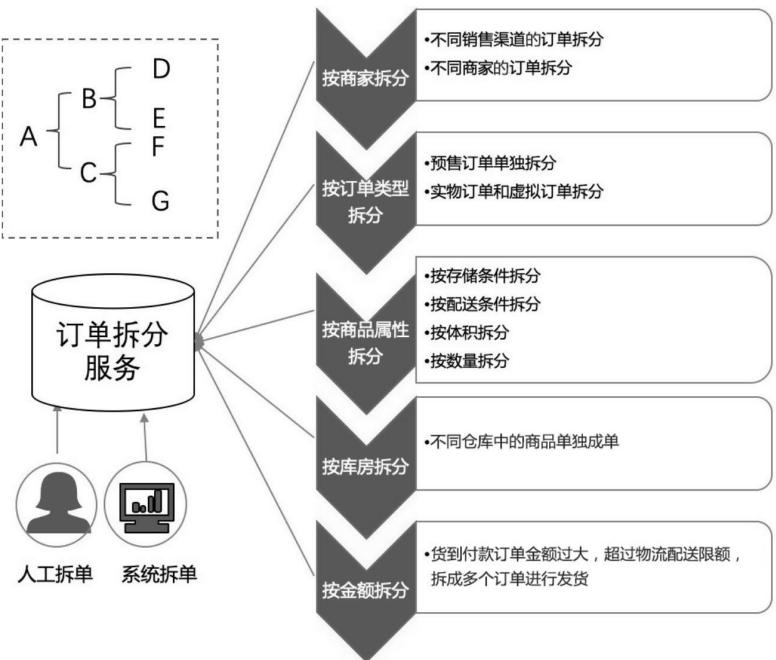

图9-3订单拆分服务

一张订单可经过多次拆分为多张子订单，拆分以后，父订单作废， 子订单继续完成履约并同步至销售平台展示给用户。由于拆单可能发生 在不同的环节，拆分后的新订单延续原单的状态和流转日志。订单拆分 处理逻辑如下。 

① 基本信息（收货信息、订单基本信息等公共信息）：将父订单 中的信息复制到子订单中。 

② 财务信息：订单应付总金额/已支付金额/发票金额/物流运费等于 按照各子订单的商品总价比例进行分摊，最后一个订单金额为剩余未分 配金额，一般单位为元，保留两位小数。 

③ 商品信息：按照需要拆分的SKU或者商品数量进行拆分，保证 所有子订单的SKU及数量之和与父订单中的SKU及数量一致。 

④ 促销信息：针对整单的促销（如整单优惠、满减、平台优惠券 、积分抵扣等），拆分时按照订单中SKU金额比例分摊；若是针对订单 内某些SKU的促销，拆分时仅考虑参与促销的SKU进行金额分摊，其他 SKU不参与促销分摊。 

## 9.3.3 订单审核

正常情况下，订单流转越快越好，尽量减少中间环节和人为干预， 但在特殊情况下需要将订单暂停，由人工审核。常见规则如下。 

① 订单触发了风控规则，被识别为恶意订单或异常订单，待人工 核实。 

② 用户有特殊需求备注，系统识别备注信息并暂停订单，待人工 核实。 

③ 订单金额过大，超过物流公司代收货款的收款限额，需要人为 拆单。 

④ 订单中的商品数量过多，一个包裹无法正常发出，需要人为拆 单。 

⑤购买商品的特殊性，如医药，必须由药师审核后方可发货。 

在设计时，为使逻辑统一，可以将所有订单都经过审核环节，但默 认自动审核，当遇到需要人工审核的订单时便打上人工审核标记，并将 订单暂停，待人工审核后继续流转。 

## 9.3.4 合并订单

将相同客户的多张订单合并为一张订单进行发货，有诸多好处，于 客户而言，多张订单一起送货，只需要签收一次包裹；于企业而言，可 以节省仓库的作业成本和物流配送成本。所以在订单履约系统中增加订 单合并功能是很有必要的。 

合单方式可以设置为按频率合单（每××分钟合一波），或者按固定 时间点合单。相关人员在进行订单履约系统设计时可以设置订单集中暂 停等待，在此等待时间内进入订单履约系统的订单，若符合合并条件， 可自动合并；超过等待时期进入系统的订单，可由客服人员手动合并， 或者等到下一个合单时间点再进行合并。 

订单合并条件包括但不限于同销售平台、同下单会员账号、同收货 地址、同收货人、同手机号、同支付方式（在线支付/货到付款/到店支 付）、同出库仓库、同订单类型（如普通订单、预售订单）、同开发票 方式（都开发票，且抬头信息一样；或者都不开发票）、同配送方式（ 自提/配送）等。如果业务规则再复杂点，还可以设置不同的业务使用 不同的合单策略。 

订单合并逻辑如图9-4所示。 

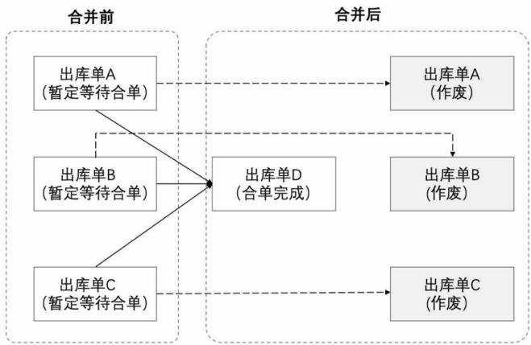

*合并后，需用合单D重新占用库存，原出库单A、B、C作废后释放已分配库存

图9-4 合并订单 

订单合并以后，各原单作废，合并后生成一张新订单继续完成后续 履约流程，不过在销售平台的用户侧，展示的仍然是用户下单时的原单 。在对合单做订单发货、取消等操作后，将每一张子单同步给销售平台 

合并订单的处理逻辑如下。 

① 基本信息（下单人、收货人、渠道等信息）：取任意一张子订 单（因为订单基本信息都一样）。 

② 财务及发票信息：订单应付总金额/已支付金额/发票金额/物流运 费=各子订单金额相加。 

③商品信息：将所有需要合并的子订单的SKU及数量进行汇总。 

④促销信息：将所有子订单促销明细集中到合单中。 

## 9.3.5 分配物流

没有自营物流的企业，通常会与多家三方物流公司签约，在合单以 后，需要匹配合适的物流公司，以及获取物流电子面单号。如果是自营 配送，不需要分配物流，只需要获取电子面单号即可。 

分配物流由配送管理系统提供服务支撑，订单履约系统将合单后的 订单信息（收件人信息、发货仓库信息、支付方式、商品类型等）传给 配送管理系统，获取合适的物流公司和物流单号。订单分配物流的逻辑 处理如图9-5所示。 

①如果是自提订单，不需要获取物流公司和物流单号。 

② 物流配送的订单，如果没有指定发货物流，则调用配送管理系 统服务分配物流公司，然后基于传入的订单信息获取物流公司的物流单 号。 

③ 如果指定了发货物流，则不用再重新分配，直接获取物流单号 即可。 

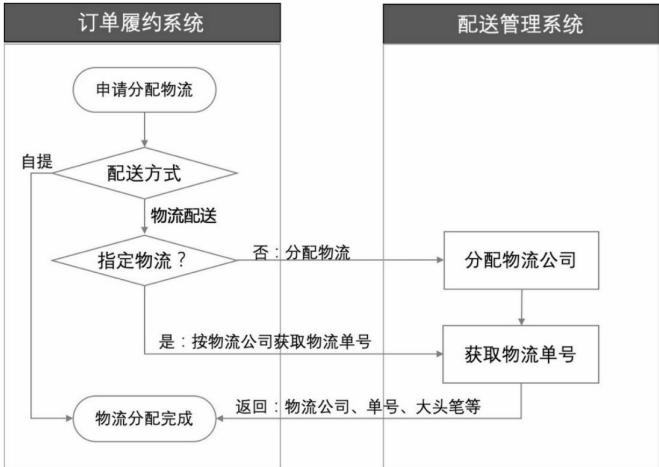

图9-5分配物流

物流分配以后，根据物流公司的历史配送时效记录可以分析当前订 单的履约时效，并展示给用户侧，例如：“您的订单预计××天后送到您 手中，请注意查收”。 

## 9.3.6 订单取消

在电商新零售中，订单取消场景主要有三类（见图9-6）。 

① 用户发起的订单取消：用户不想要了，在用户端主动发起的订 单取消。 

② 客服人员代为取消：客服人员代替用户取消订单，此操作一般 在后台客服系统或者在订单履约系统中直接操作。 

③ 系统取消：若用户下单后超时未支付，或系统判定为恶意订单 ，会自动取消订单。 

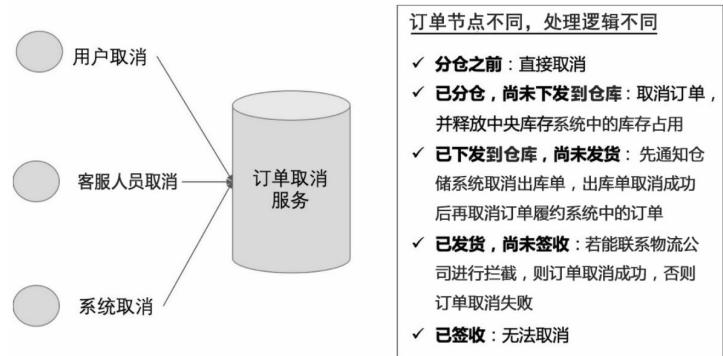

图9-6 订单取消

由于订单取消会由多个环节触发，在进行系统设计的时候也应该考 虑其通用性，将订单取消做成一个公共功能，可供多个系统和场景按需 调用，这也符合SOA设计理念。 

根据订单在取消时可能存在于仓库作业、配送等多个环节，取消订 单时需根据订单的不同状态执行不同的系统处理逻辑。 

① 订单处于分仓之前的状态：直接取消，更新订单状态为“已取消” 

② 订单已分仓，但尚未下发到仓库：取消订单，并通知中央库存 系统清除订单预占库存。 

③ 订单已下发到仓库，但尚未发货：由订单履约系统对仓储管理 系统发起询问，若仓储管理系统未发货且拦截订单成功，订单履约系统 再取消订单，并通知中央库存系统清除订单预占库存。 

④ 订单已发货但尚未签收：若是自营配送，或者配送管理系统已 与物流公司接口打通，则发货以后仍可以取消订单，订单履约系统询问 配送管理系统，若配送管理系统拦截包裹成功，则订单履约系统更新订 单状态为“已取消”，此阶段无须处理库存。 

⑤ 订单已签收：已经签收的订单，不支持取消，若想将货退回， 只能走售后退货流程。 

订单取消成功后，若订单已支付，需要通知财务系统退款。 

## 9.3.7 订单拉回

在订单履约过程中，已经分仓的订单，常常因为仓库库存不足需要 调整发货仓库、或者应客户要求修改订单信息等，便需要将订单状态拉 回至分仓之前进行修改或者重新分仓，再重新审核下发。订单履约系统 对订单拉回的处理逻辑如下。 

① 如果订单已经下发到仓库或门店，调用仓储管理系统或门店管 理系统接口将原订单取消，若已发货，就不允许拉回了。 

② 订单履约系统基于原订单生成一张待审核的新订单，以便客服 人员进行修改和调整，调整以后将新订单重新履约出库，原订单作废。 

对于已经履约完成的订单，如果想拉回，不建议直接在原订单上进 行修改，因为涉及的系统和逻辑太多，很容易出现bug，且流程不够清 晰，所以好的设计思路是将原订单作废，再复制一张新订单重新履约， 这样原订单和新订单就解耦化了，各自都有很清晰的履约轨迹，互不干 扰，方便流转和追溯。 

## 9.3.8 订单暂停

订单暂停的场景有两种：系统暂停和人工暂停。系统暂停发生于订 单合单前的等待期，以及需要人工审核的订单，或是还未到下发仓库的 时间时由系统将订单暂停，人工暂停多由客服人员发起，因客户要求或 是当问题订单需要处理时，临时将订单暂停。 

无论是系统暂停还是人工暂停，订单履约系统均会为订单打上一个 暂停标记，阻止订单继续流转。根据订单所处的环节，分为下发仓库前 和下发仓库后，若订单所处环节在下发仓库前，直接将订单停在订单履 约系统中，若订单已下发仓库但尚未发货，则通知仓库的相关人员做订 单暂停，暂停的订单可在复核发货环节进行拦截。暂停逻辑如图9-7所 示。 

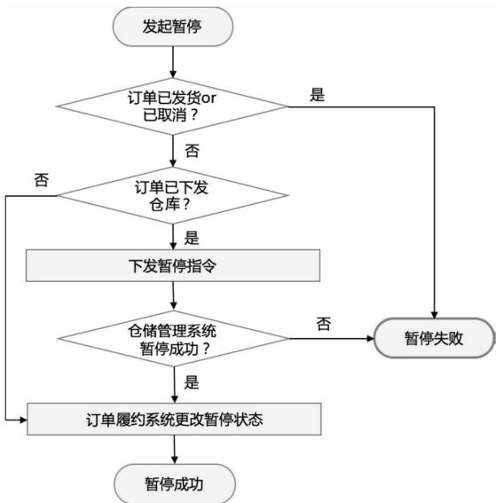

图9-7 订单暂停

暂停只是一个中间状态，不是订单的最终状态，仅打上一个临时暂 停的标记，待暂停期过后，由系统或人工取消暂停，订单继续流转出库 。取消暂停的逻辑为：若订单未下发仓库，直接取消暂停标记，订单继 续流转，若订单已下发仓库，则通知WMS取消暂停。 

关于履约过程中的系统暂停，非常实用。我们在京东、天猫这些平 台购物时，可以支持指定日期送货上门，这一操作就可以通过系统暂停 功能来实现，订单履约系统根据每张订单的最终送达时间反推订单开始 配送的时间、仓库发货的时间，以及订单下发到仓库的时间，并为订单 打上标记，在未到下发时间之前，将订单停在订单履约系统中，不让订 单提前下发仓库，让仓库的相关人员可以优先处理需紧急出库的订单。 

## 9.3.9 订单加急

如果希望订单优先出库，就需要进行订单加急处理。订单加急功能 的设计思路为：为每张订单设置一个“出库优先级”属性，属性值为高/中 /低，或10/20/30等，当客服人员选中订单，发起“订单加急”指令后，若 订单尚未发货，则更新订单的出库优先级，如由中变为高。在订单履约 系统和仓储管理系统处理订单履约时，在同等条件下，优先处理优先级 高的订单。 

订单加急的逻辑如图9-8所示。 

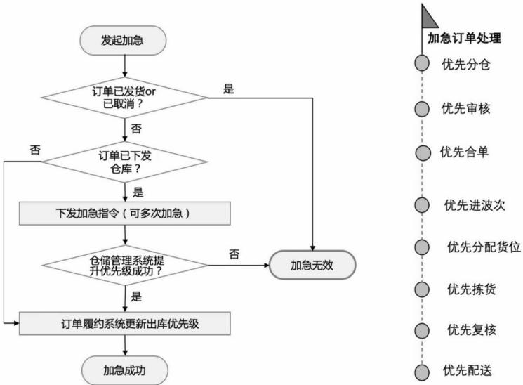

图9-8订单加急

## 9.3.10 订单信息修改

在订单履约过程中，难免会遇到下单以后客户又要求修改收货地址 、电话等需求，所以订单履约系统需要提供订单收货信息修改的功能供 客户和客服人员使用。修改订单收货信息的逻辑如下。 

① 若订单尚未下发到仓库或门店，只需要修改订单履约系统中的 收货信息即可，若订单已下发到仓库或门店，需要先修改仓储管理系统 和门店管理系统中的信息，再修改订单履约系统中的信息。 

② 收件信息影响到分仓和物流分配，故修改地址以后，需要重新 进行分仓和物流分配，已分仓订单要释放占用库存，已预约物流的订单 需要取消后再重新预约一个新的物流单号。 

③ 仅在订单未发货前支持修改订单信息，一旦发货或者订单取消 了，就不能再进行修改了。 

## 9.3.11 订单全程跟踪

订单履约系统负责提供完整的履约轨迹，以便能让用户清晰地知道 当前订单的进展情况，我们称之为全程跟踪，履约过程越详尽和透明， 用户体验自然越好。从用户在销售平台下单开始，到最终签收，订单会 分别经历销售平台下单、订单履约系统履约、仓库发货和包裹配送。要 实现全程跟踪，则需要将相关系统中的关键节点信息的操作日志同步至 订单履约系统，再由订单履约系统按照节点时间封装成轨迹信息展示到 前台用户侧，如图9-9所示。 

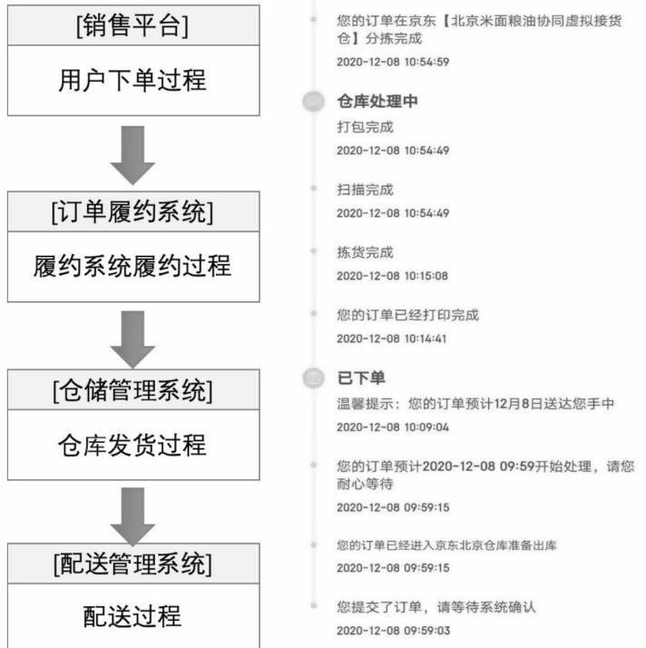

图9-9订单全程跟踪

## 9.3.12 履约时效监控

订单履约系统是唯一能够监控订单履约全流程的系统，若想整体地 了解履约流程，以便对无法按时履约的订单及时进行处理，一张基于履 约全环节的监控报表是必不可少的。图 9-10是履约时效监控的查询报表 示例，我们需要能看到每一天处于每个重要的履约环节的订单数量，并 对异常订单和超时未发的订单进行及时处理。正常情况下，相关人员每 天晚上下班时，报表中订单总数应等于已发货订单数量与已取消订单数 量之和，其余环节积压订单数量均为0。 

<table><tr><td colspan="10">下单日期 开始日期 → 结束日期 白 查询</td></tr><tr><td>下单日期</td><td>订单总数</td><td>新订单</td><td>订单预分仓</td><td>订单审核完成</td><td>...(中间状态)</td><td>已发货</td><td>已取消</td><td>异常订单</td><td>超时未发订单</td></tr><tr><td>2021-04-10</td><td>600</td><td><eq>\underline{10}</eq></td><td><eq>\underline{100}</eq></td><td><eq>\underline{100}</eq></td><td>...</td><td><eq>\underline{100}</eq></td><td><eq>\underline{10}</eq></td><td><eq>\underline{10}</eq></td><td>0</td></tr><tr><td>2021-04-09</td><td>600</td><td><eq>\underline{10}</eq></td><td><eq>\underline{100}</eq></td><td><eq>\underline{100}</eq></td><td>...</td><td><eq>\underline{100}</eq></td><td><eq>\underline{10}</eq></td><td><eq>\underline{10}</eq></td><td><eq>\underline{10}</eq></td></tr><tr><td>2021-04-08</td><td>600</td><td><eq>\underline{10}</eq></td><td><eq>\underline{100}</eq></td><td><eq>\underline{100}</eq></td><td>...</td><td><eq>\underline{100}</eq></td><td><eq>\underline{10}</eq></td><td><eq>\underline{10}</eq></td><td><eq>\underline{10}</eq></td></tr></table>

## 图9-10履约时效监控示例

## 9.4本章结语

人无信不立，做好供应链履约不仅能建立良好的口碑，增加行业壁 垒，还能反向提升企业的供应链水平。在供应链履约中，订单履约系统 是核心的调度系统，负责承接销售平台下发的订单，并对订单进行履约 调度，将商品按时、保质、保量地送到用户手中。 

订单履约流程总共分为四段：销售平台的下单，订单履约系统中的 分仓、合单、分配物流等调度过程，仓储的拣货发货过程及配送过程。 基于履约周期，在设计订单履约系统的订单状态时，需要涵盖订单履约 的全部环节，并能监控所有履约环节。 

订单分仓、订单拆分、订单审核、合并订单、分配物流、订单取消 、订单拉回、订单暂停、订单加急、信息修改、全程跟踪和履约时效监 控等是订单履约系统常用的核心功能，在实际工作场景中，除了实现基 本的履约功能，订单履约系统健全的订单数据集成是更宝贵的财富，它 可以提供各类报表和数据分析，为企业的业务赋能。 

## 第10章 决胜千里：配送管理系统

仓储和配送是物流中重要的两个环节，在整个电商新零售供应链中 起着非常重要的作用，仓储负责将信息流准确地与实物对应，配送负责 将商品高效无误地送达目的地。若要管理好配送流程，必然少不了一套 健全的配送管理系统。 

配送管理系统（Transportation Management System，TMS，或者 De livery Management System，DMS），是主要负责物流配送管理的系统， 管理商品从出仓以后，到用户签收，以及逆向返回的全流程，无论包裹 在眼前，还是在千里之外，相关人员都能够很清楚地知道其物流动向并 在线调度。 

## 10.1配送业务介绍

在了解配送管理系统之前，我们先了解一些和配送相关的业务，基 于业务场景去理解系统设计，会事半功倍。 

## 10.1.1自营物流、第三方物流与第四方物流

电商企业若想完成订单配送，一般有两种物流方式：第一种方式是 自营物流，搭建自己的配送体系，使用自己的配送车辆和配送员送货上 门，如京东、唯品会等大型电商；第二种方式是借助市面上已经成熟的 第三方物流公司进行配送，如“三通一达”、顺丰等，这些物流公司的主 营业务便是为其他企业提供物流配送服务，即第三方物流。 

针对“第一方”企业和“第二方”用户而言，如果企业使用自己的配送 团队和配送车辆直接将商品送到用户手中，就是自营物流。但自营物流 的成本投入往往很大，不仅要养团队和车辆，还要建立配送网点、规划 配送线路，所以非实力雄厚的公司是无法负担如此巨额的投入的，于是 便出现了第三方物流公司，这些公司自建物流体系，但不是为自己送货 ，而是将配送能力提供给第一方和第二方，当企业有需要时，便联系第 三方物流公司的车辆到指定仓库将商品揽收并送往用户指定的收货地址 ，并支付相应的物流配送服务费用，这便是第三方物流（3PL）。 

第三方物流和自营物流的区别如图10-1所示。 

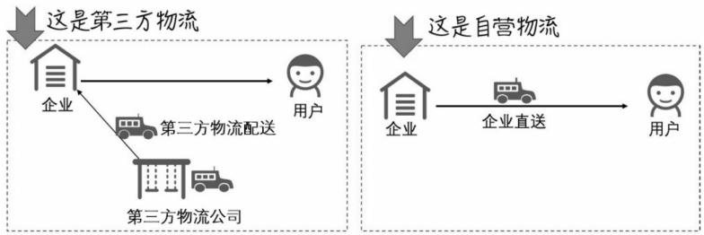

图10-1 自营物流与第三方物流

自营物流配送和第三方物流配送各有利弊。自营物流的成本投入往 往很大，但能够根据企业的业务特性进行灵活调整，也不会受制于第三 方物流公司，如“618”“双11”时不会出现物流配送资源不足等情况。第 三方物流配送则不需要有太多的前期投入，可以依赖物流公司强大的配 送能力，按单支付物流费用，成本低，但一般只能提供标准配送，即物 流公司能够支持的配送能力，如果有冷链、易燃易爆、特殊时效要求等 特殊配送诉求，就要受制于物流公司的配送能力了。从成本投入上来看 ，如果企业规模较小、配送单量小、配送形态单一，没有特殊要求，适 合用第三方物流配送，如果企业规模较大，配送成本高，且有自建物流 的诉求和能力，则适合自建物流。 

除了第三方物流，还有一种第四方物流（4PL），公司既不是买方 和卖方，也不是服务提供的第三方，而是将一、二、三方做资源整合， 提供整体解决方案的第四方。第四方物流在整个供应链中承担平台信息 发布、交易匹配和撮合、物流资源集成、物流解决方案提供等角色，相 比第三方物流的单向服务，第四方物流站在整个供应链的视角，全盘考 虑，能够提供更优的价值。 

## 10.1.2物流配送全流程

以电商为例，无论是自营物流配送，还是第三方物流配送，订单从 仓库发货以后，一般都会经过一到多个分拣中心的中转，最终送达离用 户最近的配送站点，然后由站点的配送员将包裹送到用户手中。 

在配送过程中，会涉及两个中转地点：一是分拣中心，二是配送站 点。分拣中心负责快递包裹的集中收集和分派站点，并与其他分拣中心 相连通。配送站点是覆盖用户“最后一公里”的终端配送网点，负责将包 裹按照派送路线或者小区分派配送员，由配送员进行配送，同时承担逆 向退回和上门取件的中转任务。 

如图10-2所示，分拣中心往往以城市为单位进行建设，配送站点往 往围绕街道和小区进行建设，根据人口密度，一个城市中建设一个或多 个分拣中心，每个分拣中心下覆盖多个配送站点。不同分拣中心之间可 以通过空运、陆运或水运的方式进行转运，一般收发包裹数量比较大， 配送站点的主要运输工具是三轮车，供配送员送货使用，装载的包裹数 量较少。 

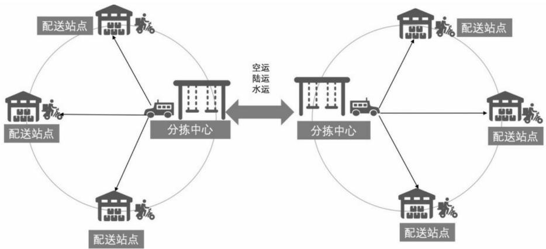

图10-2分拣中心与配送站点

以陆运为例，包裹从发货仓库发出到最终签收的完整的正向物流流 程，如图10-3所示。 

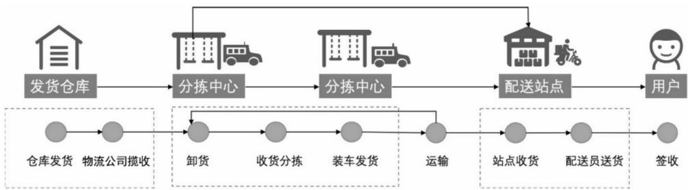

图10-3正向物流流程

① 仓库打包发货以后，通知物流公司的相关人员上门揽收，快递 员到达仓库后，用PDA逐一扫描已经粘贴好的快递面单进行包裹揽收。 

② 快递员将揽收的包裹送往分拣中心，在分拣中心进行卸货，并 逐一扫描收货，然后分拣，分拣的目的是将不同配送路线的包裹进行分 组整理，以便同一个配送方向的包裹能够集中到一起。 

③ 分拣完成后，根据包裹的配送方向重新装车发货。如果是本地 的包裹，则发货到本地配送站点，如果是外地的包裹，则通过干线运输 到下一个城市的分拣中心。 

④ 配送站点收到分拣中心送来的包裹后，相关人员对包裹进行收 货、验货，并安排配送员进行配送。 

⑤ 配送员按照配送路线逐一将包裹送达用户指定的收货地址，用 户完成签收。 

如果用户拒收或发起了退货，物流公司可安排配送员上门取件，将 拒收或退货的包裹反向拉回站点进行装箱，然后装车运输到分拣中心， 分拣中心再一级级地卸货、收货分拣、装车发货，最终将包裹返回商家 的售后仓库，完整的逆向物流流程图如图10-4所示。 

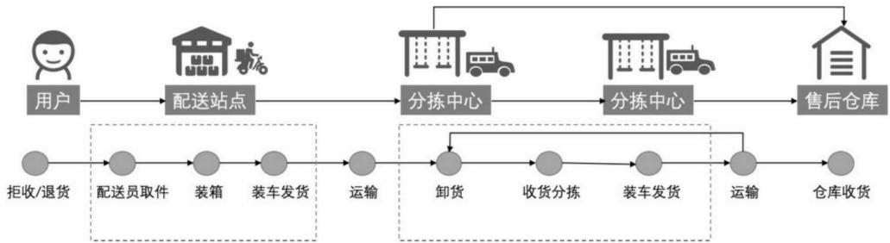

图10-4逆向物流流程

在运输过程中，根据车辆的载货量，物流配送可以分为整车运输和 零担运输。 

●整车运输：单次运输货物的容积或重量装满一整车。 

● 零担运输：单次运输货物的容积和重量不足一整车，为节省运力 成本，需要等多个配送单凑满整车后才开始运输。 

整车运输相当于包车，零担运输相当于拼车，由于零担运输需要等 待多个配送单凑满整车，因而其速度较整车运输慢。 

根据包裹的运输目的地的远近，物流配送可以分为干线运输、支线 运输、传站和长途传站四种运输方式。 

● 干线运输：跨地区分拣机构间的车辆运输，利用铁路、公路的干 线，大型船舶的固定航线等进行长距离、大数量的运输，如将货物从华 北大区运往华南大区。 

● 支线运输：同区域内不同城市的分拣机构间的车辆运输，相对于 干线运输，其距离短、数量较少，如将货物从华北大区的北京分拣中心 运往沈阳分拣中心。 

● 传站：同城间分拣机构与站点间的车辆运输，如将货物从北京的 某个分拣中心运往某小区的配送站点。 

● 长途传站：跨城市分拣机构与站点间的车辆运输，如将货物从北 京分拣中心运往天津南开区的某配送站点。 

## 10.1.3 快递单与包裹

在物流配送过程中，快递单号（又叫物流单号、运单号、面单号） 

是各个环节流转和扫描的依据：在下单时，根据包裹的始发地和目的地 能分别对应到配送网络中的起点分拣中心和终点配送站点，以及路由规 划中最合适的配送路线；在运输过程中，通过人工或设备扫描快递单条 码便能根据系统指引将包裹分拣并配送到下一站，就像接力一样级级转 递，直到将包裹最终送到用户手中。 

快递单有两种：手写面单和电子面单。在早年物流信息化比较落后 的时候，如果要发快递，快递员先从快递公司拿一批已经印好单号的快 递单，将用户的收货地址手写到快递单上，物流公司收取包裹后，再用 肉眼识别快递单上填写的信息，并将对应的寄件信息和取件信息录入系 统，然后才能进行分拣、配送，这种面单称为手写面单。 

手写面单不仅效率低，还容易出错，如果面单上字迹潦草，相关人 员在进行快递信息录入时就容易出现错误，以致包裹无法送到用户手中 ；同时，由于无法提前得知包裹是否超区，很多包裹在配送以后才知道 无法送达而被退回，浪费了人力、物力和财力。 

随着网络和信息化的普及，电子面单开始登上历史舞台，手写面单 逐渐被替代，商家在邮寄包裹前，先将寄件信息通过系统接口传给物流 公司，从物流公司申请一个快递单号，商家直接打印物流单即可，简单 快捷。 

电子面单的推广可以完全规避手写面单存在的问题。第一，由于全 程电子化，面单信息从系统中获取后直接打印即可，商家无须手写面单 ，效率和准确性大幅提升；第二，因为连接了物流公司系统，在发货之 前已经将配送信息告知物流公司，配送员只要扫码即可获知配送信息， 大大降低了录入出错的概率；第三，由于可以提前通过物流公司获知超 区地区，商家可以提前更换物流公司，减少超区被退回的情况。 

图10-5所示为EMS手写面单和电子面单的样式区别。 

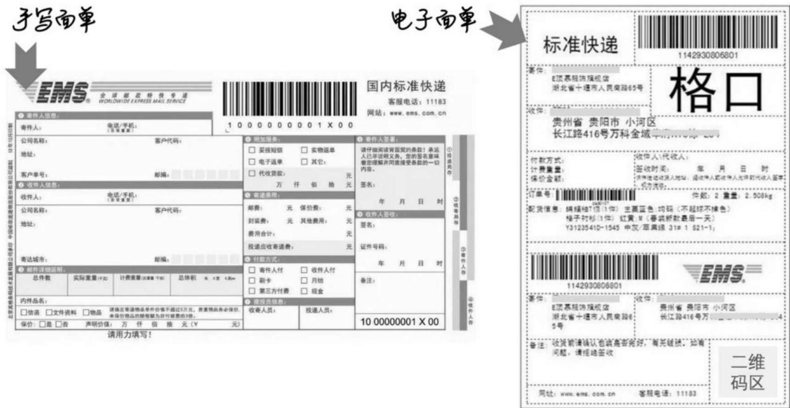

图10-5EMS手写面单与电子面单

有时候，由于用户买的商品过多，无法用一个包裹将所有商品全部 寄出，便会出现一个快递单号对应多个包裹，每个包裹上粘贴一张包裹 单的情况。 

一个快递单号可以对应一个或多个包裹单，每个包裹单对应一个包 裹，这样相关人员在扫描时就知道当前包裹是和其他包裹一起的，有助 于配送公司在分拣和配送时将同一单里的多个包裹安排到一起，避免遗 漏。在很多地方，这种多个包裹的快递也叫子母单，其实是一个意思。 

图10-6所示为京东的快递单与包裹号打印示例。 

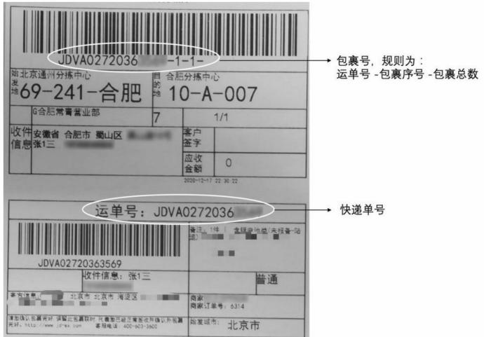

图10-6京东快递单

## 10.1.4 物流配送状态

包裹从被揽收开始，到最终被用户签收，正向会经历已揽件、在途 运输中、派送中、待取件和已签收 5 个节点；如果包裹被拒收，会被原 路退回，会经历拒收、逆向在途、逆向派送和逆向签收 4 个逆向节点。 无论是自营物流配送，还是基于第三方物流配送，包裹的配送状态都可 以设计为图10-7的样子。 

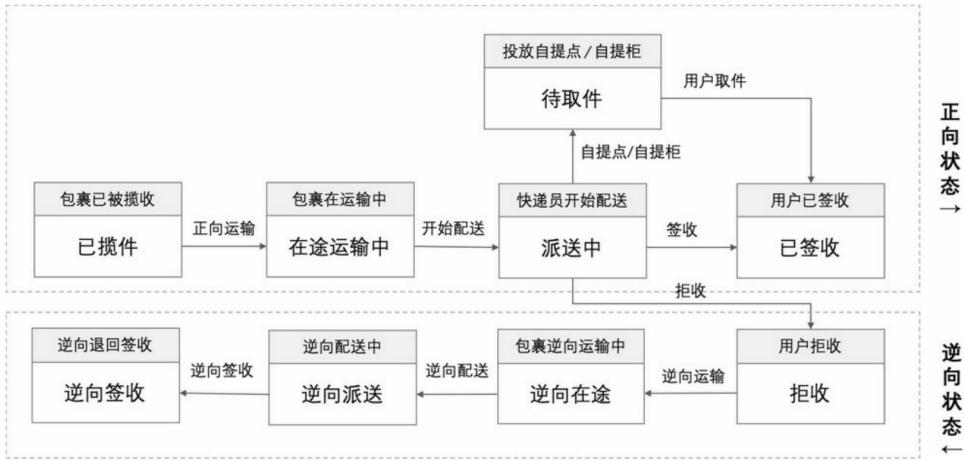

图10-7包裹配送状态

各配送状态说明如表10-1所示。 

表10-1包裹配送状态说明

<table><tr><td>状态</td><td>说明</td></tr><tr><td>已揽件</td><td>包裹已交给快递员进行揽收</td></tr><tr><td>在途运输中</td><td>包裹从揽收后返回站点或分拣中心开始,直到送达目的地配送站点的全过程,包括包裹在分拣中心收货、验货、分拣装箱、装车、发车、在途运输、到达配送站点、站点收货、站点验货</td></tr><tr><td>派送中</td><td>包裹安排配送员,已开始配送的过程,包括配送员收货、送货、再投</td></tr><tr><td>待取件</td><td>配送员将包裹送达自提点,或者放置在自提柜中,等待用户取货的状态</td></tr><tr><td>已签收</td><td>用户已收货并签收包裹</td></tr><tr><td>拒收</td><td>在包裹未被签收前,用户拒收包裹</td></tr><tr><td>逆向在途</td><td>拒收的包裹被返回站点,逆向运输直到送达配送站点验收前的状态</td></tr><tr><td>逆向派送</td><td>包裹送达配送站点后,安排配送员逆向派送的状态</td></tr><tr><td>逆向签收</td><td>包裹逆向返回始发地被签收</td></tr></table>

在包裹运输的途中，各个环节的操作日志便形成了包裹的物流轨迹 ，图10-8所示为顺丰物流轨迹。 

图10-8顺丰物流轨迹 

## 10.2自营物流配送管理系统

自营物流是一个极其庞大而复杂的体系，需要投入大量的人力、物 力和财力，如此庞大的体系，自然需要一套健全的配送管理系统来支持 。一个典型的配送管理系统包含配送基础数据、车辆调度、分拣管理、 配送管理四大核心模块，基于系统功能辅助流程管理，通过路由规划和 车辆调度，完成从始发地到目的地的正向物流，以及从目的地到始发地 的逆向物流全流程。其中，基础数据模块负责管理配送管理过程中的基 础资料，如分拣中心、配送站点、车辆资料、司机资料、第三方承运商 等；车辆调度模块负责正向和逆向运输途中的车辆安排及运输管控，全 程保障运输的时效和品质；分拣管理模块主要负责包裹在分拣中心内部 从入到出的作业流程；配送管理模块负责包裹进入终端配送站点以后的 入站到出站，以及配送员派送和上门取件的全流程。 

自营物流配送管理系统架构，如图10-9所示。 

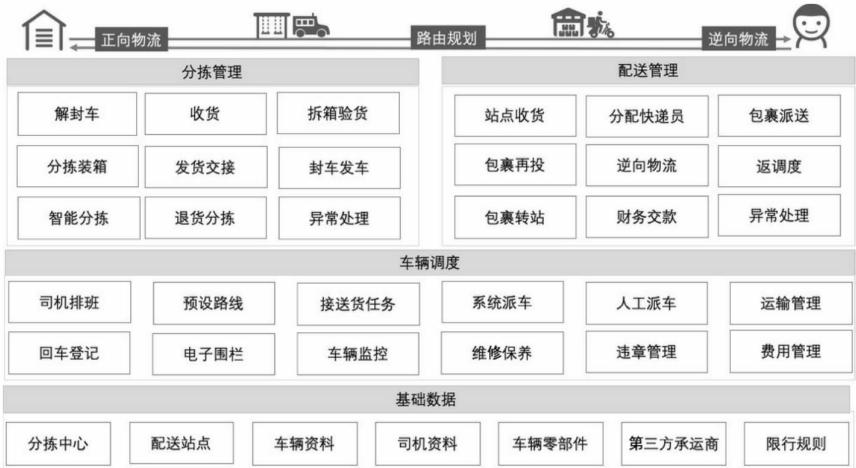

图10-9 自营物流配送管理系统架构

## 10.2.1 配送基础数据

配送基础数据是配送管理系统中需要用到的基础数据，如果这些数 据需要被多个系统引用，可以考虑将其放置到基础数据中心进行集中管 理。 

## 1.司机基础信息

司机基础信息主要用于维护配送司机资料，司机可以是本企业员工 ，也可以是第三方物流公司的员工，因为在配送过程中需要向司机发送 调度指令，以及需要司机操作相应系统，所以需要为每位司机设置账号 角色和系统权限。 

司机基础信息包含司机账号、姓名、所属站点（包含分拣中心或配 送站点）、性别、电话、邮箱、出生日期、身份证号、驾驶证号码、驾 驶证有效期开始日期、驾驶证有效期终止日期、驾驶证类型（A1、A2 、A3、B1、B2、C1、C2、C3等）、从业资格证号码、从业资格证有效 期开始日期、从业资格证有效期终止日期、司机状态（启用/停用）等 C 

## 2.车辆基础信息

在配送过程中，陆运是最主要的运输方式，所以车辆是最重要的工 具（当然实力如DHL、顺丰、京东也可以有自己的空运飞机和自己的航 线），管理好车辆，才能更好地调度配送任务，为每一次运输安排最合 适的路线和配送车辆。 

车辆基本信息包含车牌号、所属站点（包含分拣中心或配送站点） 、车辆品牌、车辆型号、车型、动力系统、座位数、承载重量（吨）、 装载包裹数、承载体积（m³）、长（mm）、宽（mm）、高（mm）、 GPS设备号（用以定位车辆）、采购日期（用于计算折旧费）、采购金 额、状态（启用/停用）等。 

## 3.车辆零部件信息

当需要对车辆进行维修保养时，经常会用到一些零部件，对车辆常 用的零部件进行管理有利于更好地监控车辆的维修保养过程。 

车辆零部件信息包含部件编码、部件名称、规格、包装单位、适用 车型、状态（启用/停用）等。 

## 4.包装耗材信息

在配送时，经常需要用到包装箱、胶带、文件袋等耗材，而且数据 巨大，所以有必要对常用耗材进行系统管理。 

包装耗材信息包含耗材编号、耗材名称、类别（包装箱、胶带等） 、单位、长（mm）、宽（mm）、高（mm）、材质、状态（启用/停用 ）等。 

## 5.第三方承运商信息

自营物流体系并不能保证所有地区都能配送，在无法完成配送时， 可以转由第三方承运商进行配送，故需要在系统中维护好第三方承运商 信息。 

第三方承运商信息包含承运商编号、承运商名称、联系人、联系人 电话、公司地址、税务登记号、组织机构代码、营业执照号、营业执照 所在地、营业执照有效期、客服电话、公司网站、结算方式（寄付/月 结等）、是否支持代收货款、状态（启用/停用）等。 

## 6.限行规则维护

各城市都有自己的限行规则，为保证派车时不会分配到限行的车辆 ，所以要提前维护好限行规则。在设计限行规则时，需考虑城市、动力 系统（燃油、电车）、限行周期等多个因素，并且要及时更新，在限行 规则失效前进行提前预警。这是一个比较复杂的系统规则，需要参考各 地的限行政策进行设计。 

例如，××城市限行规则示例如表10-2所示。 

表10-2××城市限行规则示例

<table><tr><td>元素</td><td>示例</td></tr><tr><td>生效日期</td><td>2021.8.1</td></tr><tr><td>失效日期</td><td>2021.12.1</td></tr><tr><td>限行规则</td><td>限行规则:尾号限行限行时间:周一到周五 07:00—20:00限行区域:3环以内详情:周一:尾号3和8;周二:尾号4和9;周三:尾号5和0;周四:尾号1和6;周五:尾号2和7</td></tr></table>

## 10.2.2 车辆调度

在配送过程中，每天面对如山的收发货任务，相关人员做好配送路 线规划并调度合适的车辆是非常重要的，合理的调度不仅能节约配送时 间并缩短配送距离，还能为企业节省大量的配送成本，降低供应链的整 体成本。据统计，在电商领域中物流成本占销售成本的 30%以上，如果 能通过合理的车辆调度将配送成本降下来，能极大地提升企业的竞争优 势。 

## 1.车辆调度整体流程

一个完整的车辆调度流程可以分为司机排班、接送货任务、生成运 输路线、安排车辆、司机接收运输任务、司机按路线运输、回车登记几 个步骤，如图10-10所示。 

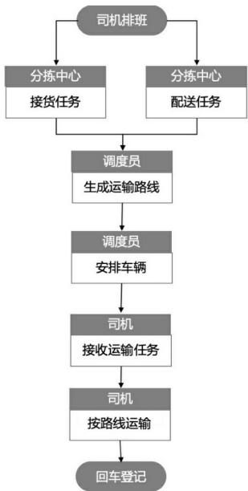

图10-10车辆调度流程

① 在开始安排任务之前，一般由各分拣中心的调度员提前对司机 和车辆进行排班，做好计划。 

② 分拣中心接收需要运输的包裹任务，任务分为接货任务和配送 任务。接货任务一般是由仓库和商家下达的需要上门收件的任务，发货 任务是由分拣中心下达的向其他分拣中心或站点运送包裹的配送任务。 

③ 调度员根据系统指引或者手动将同一配送方向的任务编排成运 输路线。 

④调度员安排车辆，并给司机下达运输任务。 

⑤司机接收任务，并按照安排好的路线逐一进行接货或配送。 

⑥所有任务完成后，车辆返回分拣中心进行回车登记。 

## 2.司机排班

司机排班主要用以辅助相关人员提前安排好每一天的司机及车辆计 划，以便在派车时能根据排班进行调度。通过排班，也能起到管理所有 司机和车辆的作用，方便相关人员了解每一位司机和车辆的工作情况。 

如图10-11所示，司机排班一般由各个分拣中心或配送站点自行维 护，若有变动，需及时调整，以免影响车辆调度。 

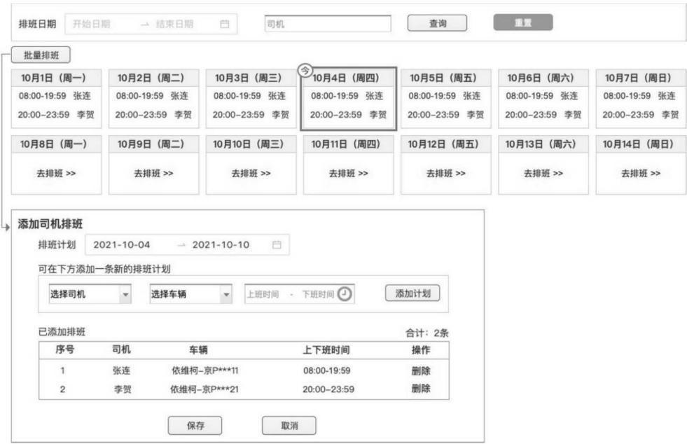

图10-11 司机排班示例

## 3.派车任务与派车路线

派车任务分为接货任务和配送任务两类。如图10-12所示，以分拣 中心为例，接货任务是车辆从分拣中心发车到商家或仓库接收包裹的任 务，由仓储管理系统或商家系统下达任务至分拣中心，每一个仓库/商 家对应一个接货任务；配送任务是需要将本分拣中心的包裹发往其他分 拣中心或配送站点的任务，每一个分拣中心/站点对应一个配送任务。 

图10-12 接货任务与发货任务

每安排一次发车，司机通常会接收多个任务，多个任务按照距离远 近连接起来，便形成了一条运输路线，每出一次车，以将路线中所有任 务做完为目标。一条路线中可以包含多个任务，针对一个任务也可以安 排多条路线。 

如图10-13所示，分拣中心Z分别接到A、B、C三个站点各100个包 裹的配送任务，将三个任务合成一条路线，由Z出发，根据距离远近， 便形成了“Z→A→B→C”的配送路线。 

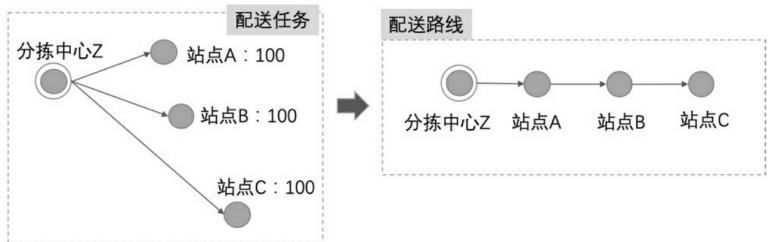

图10-13配送任务与配送路线

如果派车的路线比较固定，可以在系统中预设路线，提前安排好车 辆，这样就不需要每次接到任务以后都要临时安排车辆，而可以实现系 统自动分配车辆了。预设路线示例如图10-14所示，逻辑为：以分拣中 心为起点或终点，按照接货或配送的方向，将多个目的地串联起来形成 路线，并提前安排好车辆，一条路线可以安排多辆车，按优先级排列， 当接到任务后，便可以根据预设路线从优先级由高到低依次安排车辆了 

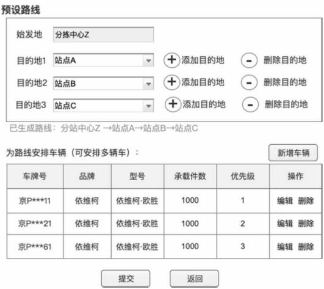

图10-14预设路线示例

在预设路线时，还可以提前设置好每条路线从分拣中心出发到各个 目的地的标准参考时间、参考里程、路桥费等，以此与实际发车的数据 做对比，以监控司机是不是按照系统安排好的路线在做任务，如果存在 经常性的误差过大，说明该司机有违规用车的嫌疑。 

## 4.安排车辆

分拣中心接到派车任务后，下一步便是针对任务逐一安排运输车辆 ，同一辆车下的多个任务串联起来便是司机的运输路线。安排车辆可以 通过系统派车和人工派车两种方式，系统派车是将任务根据预设路线自 动安排车辆，人工派车则是相关人员手动为任务安排车辆，已经安排的 任务，允许取消并重新派车。 

在派车时，需要考虑任务量、车辆的承载量、车辆状态、期望上门 时间、司机排班等因素。一般来说，一辆车可以接收多个运输任务，但 如果某一个任务中的包裹数量或重量过大，就需要安排多辆车了。安排 车辆示例如图10-15所示。 

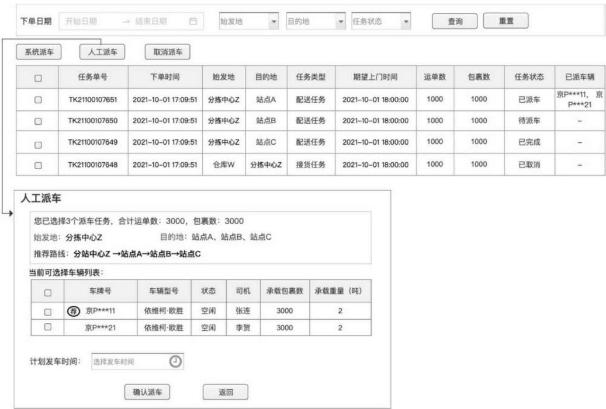

图10-15安排车辆示例

当派单任务很多时，可以借助系统自动派单来减少人工派单的工作 量，系统派单的原理是以预设路线和车辆为基础，为每个任务匹配合适 的路线及车辆，具体思路如下。 

① 获取当前需要派车的任务。例如，有一单需要从分拣中心F送往 配送站点B1的任务，包裹数量为100个。 

② 从系统预设路线中获取包含此任务的可用路线及配送车辆，可 能包含多条路线，每条路线可能有多辆车。 

<table><tr><td>系统预设路线</td><td>可用配送车辆</td></tr><tr><td>F→B1→B2</td><td>1 [依维柯-京 B***50],承载 1000,剩余 02 [依维柯-京 B***51],承载 1000,剩余 5003 [依维柯-京 B***52],承载 1000,剩余 1000</td></tr><tr><td>F→C1→B1</td><td>4 [依维柯-京 B***60],承载 1000,剩余 1000</td></tr></table>

③ 从查找的路线中匹配剩余承载量大于任务包裹数量，且车辆状 态满足要求的路线，匹配规则如下。 

a.优先匹配状态为“空闲”的车辆，其次是“待发车”“返程中”的车辆 ，车辆不能限行，且司机处于上班时间内。 

b.如果单辆车承载量不够，可以分派多辆车，保证派出的车辆能够 装下任务中的包裹，由于实际包裹有大有小，且码放时不可能完全占满 车辆容积，车辆承载量可以设定一个系数，如75%。 

c.如果当前所有车辆均不满足条件，可以转为人工指派，或者从满 足条件的路线中找一辆最合适的车辆进行指派，如按优先级、发车时间 等。 

④ 将分配的路线和车辆与派车任务进行关联，重算车辆承载量。 例如，从分拣中心F到配送站点B1，配送路线为“F→B1→B2”，车辆为“ 依维柯-京B***51”，当前剩余承载量从500个减至400个（因为加入了F 到B1的100个包裹） 

⑤ 继续为其他派车任务分配车辆，直到所有任务都派车完成。最 后将需要发车的路线中没有任务的站点剔除，便是真实的配送路线。例 如，在“F→B1→B2”路线中，当前没有B2站点的任务，则此路线只需要 完成“F→B1”的配送即可，“F→B1”便是最终配送路线。 

无论是接货任务还是配送任务，都可以将其抽象为待派车、已派车 、已完成、已取消四个状态，状态交互如图10-16所示。 

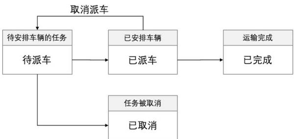

图10-16派车任务状态图

派车任务状态说明如表10-3所示。 

表10-3派车任务状态说明

<table><tr><td>状态</td><td>说明</td></tr><tr><td>待派车</td><td>分拣中心接到新的派车任务,包含接货任务和配送任务</td></tr><tr><td>已派车</td><td>已安排车辆,并将任务下达给司机</td></tr><tr><td>已完成</td><td>司机按指定路线进行运输,完成任务后变更状态</td></tr><tr><td>已取消</td><td>任务被取消,无须派车</td></tr></table>

## 5.司机运输与车辆监控

车辆被安排任务后，系统会为司机推送派车任务，司机可以在司机 端接收任务，并按指定发车时间及系统路线逐一完成每个目的地的接货 或配送任务，每到一个任务的目的地，完成接单揽收或者配送卸货后， 再前往下一个目的地，所有任务完成以后，方可返回分拣中心。如果车 辆上装有GPS定位装置，相关人员便能在后台GIS地图上监控到每一辆 车的实时状态和运行轨迹，并且可以根据车辆到达或离开地图中设定的 电子围栏区域自动变更车辆状态并记录时间，而无须司机手动操作。例 如，车辆一旦到达配送站点，系统便能够通过GIS感知到，自动变更车 辆状态为“已到站”，车辆一旦离开配送站点，系统便能够自动变更车辆 状态为“返程中”，车辆监控后台示例如图10-17所示。 

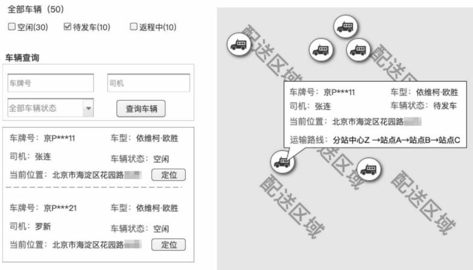

图10-17车辆监控后台示例

根据车辆的不同运输阶段，我们可以设定车辆的运输状态，如图10 -18所示。 

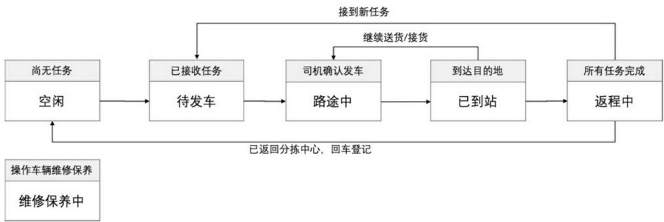

图10-18车辆状态图

车辆状态说明如表10-4所示。

表10-4车辆状态说明

<table><tr><td>状态</td><td>说明</td></tr><tr><td>空闲</td><td>当前车辆没有被安排任务且没有处在维修保养状态</td></tr><tr><td>待发车</td><td>车辆已经被安排任务,并将任务下达给司机,等待司机接收确认</td></tr><tr><td>路途中</td><td>司机确认发车,或者通过 GPS 定位到车辆已经离开分拣中心。当有多个目的地时,从上一个目的地发出到下一个目的地到达之间,车辆状态也变更为“路途中”</td></tr></table>

续表

<table><tr><td>状态</td><td>说明</td></tr><tr><td>已到站</td><td>司机到达目的地,通过司机操作客户端,或者基于GPS定位后变更</td></tr><tr><td>返程中</td><td>司机完成所有接货或配送任务后,返回分拣中心的途中</td></tr><tr><td>维修保养中</td><td>车辆被维修或保养时变更状态,处于此状态的车辆不能被派车</td></tr></table>

在运输过程中，如果车辆出现了故障等，需要更换配送车辆，系统 还需要提供换车功能，由司机将原车任务转移到新车上，原车状态变为 维修保养中，新车继续完成任务。 

## 6.回车登记

车辆完成指定路线中所有接货和配送任务以后，需要返回分拣中心 进行回车登记，登记方式可以是 PC 端登记，也可以直接将“回车登记” 功能设计到由司机操作的客户端中（PC端回车登记示例见图10-19）。 登记的目的有两个：一是记录回车状态，变更车辆状态为空闲，以便本 车继续接收其他路线任务；二是录入在运输过程中产生的加油费、高速 费、停车费、里程、票据等信息。 

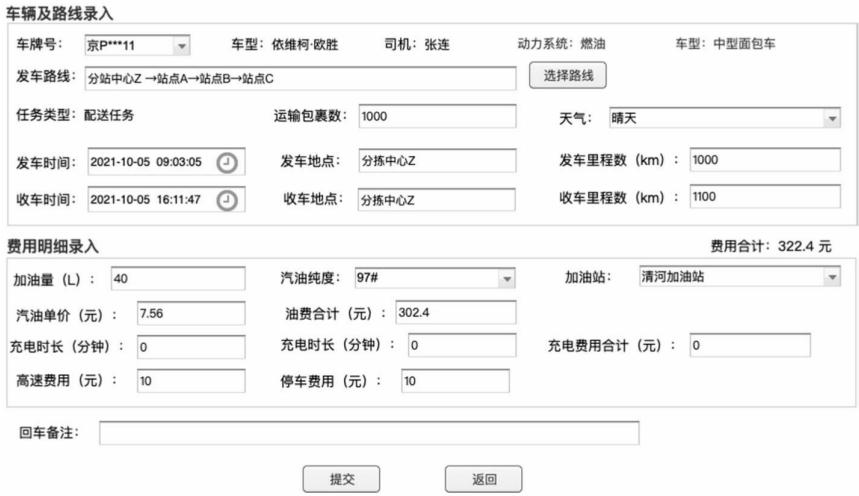

图10-19PC端回车登记示例

以上便是车辆调度模块的基本功能了，通过车辆调度可以将“静”的 包裹“动”起来，最终将其送到用户手中，完成订单履约。当然，车辆调 度模块中还应包含车辆维修保养、车辆损耗管理、年审与保险、耗材管 理、车队管理、违章管理、费用管理等诸多功能，大家可以根据实际业 务进行流程梳理和系统设计。 

## 10.2.3 分拣管理

不管是从商家或仓库将包裹发往终端用户的正向物流，还是从用户 处将包裹寄回商家或仓库的逆向物流，包裹都需要在分拣中心进行集散 分拣，然后安排车辆将包裹运输至目的地对应的分拣中心、配送站点或 者仓库。分拣的包裹来源包含从商家或仓库接货而来，从其他分拣中心 转运而来，从站点退回需重新分拣的逆向退货、拒收、取件等。 

## 1.分拣中心整体流程

无论哪种来源、哪种流向，包裹在分拣中心内部的流程都可以抽象 为图10-20所示的样子。 

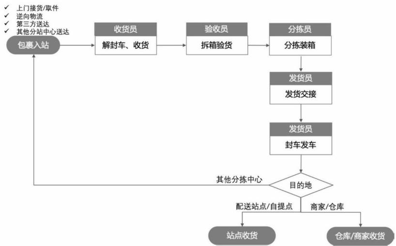

图10-20包裹分拣流程

## 2.分拣中心收货

包裹送达分拣中心以后，相关人员首先进行货物清点、收货，与配 送司机完成交接。收货逻辑如下所述。 

相关人员提前在分拣系统中接收到其他分拣中心、配送站点或第三 方物流公司下达的待收货分拣的任务（包含车牌号、司机、封车签、箱 号、封箱签、运单号、包裹号等），当车辆到达分拣中心时，如果贴有 封条，需要先解开封条，一般用PDA扫描录入封车号或车牌号开启本车 的收货任务，再依次扫描车内的箱号进行收货，如果是大件或原包装包 裹，可直接扫描包裹号进行收货。PDA收货示例如图10-21所示。 

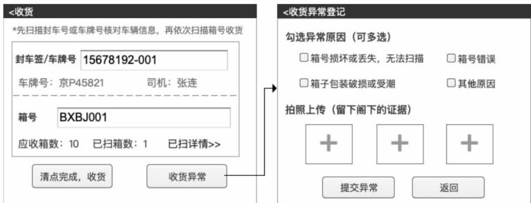

图10-21 PDA收货示例

收货完成以后，分拣系统中对应的周转箱状态标记为“已收货”，对 应配送车辆的状态为“已到站”。 

如果在收货过程中遇到异常情况，如箱号损坏或丢失、箱号错误（ 非本站箱子，或者不是可收货状态的箱子）、周转箱破损或受潮等，相 关人员在系统中登记、拍照上传，并提交异常组处理。 

如果箱内有疑似违禁品或液体，收货以后，系统需引导收货员将周 转箱送至安检处进行安检。 

## 3.拆箱验货

拆箱验货是对包裹进行拆箱，并验收包裹是否完整的过程。验收员 扫描已收货的箱号或箱子上的封签号开启箱内包裹的验货任务，然后逐 一扫描箱内的包裹号，并检查包裹是否完好，若有异常（如封签和箱号 无法扫描、包裹号无法扫描、包裹破损、包裹错误、空包裹等），相关 人员要在系统中登记、拍照上传，并提交异常组处理。PDA验货示例如 图10-22所示。 

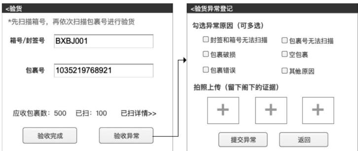

图10-22 PDA验货示例

包裹验货以后，标志着包裹已真正到达分拣中心。虽然收货就算包 裹到达了，但难保箱中的包裹有遗失的情况，所以以验货扫描为包裹到 达分拣中心更准确。只有箱中所有的包裹均扫描验收完成，整箱才算验 收完成，若箱内实物比系统中记录的实物少，则视为包裹遗失，需要提 报异常，及时查找原因。 

另外，有些周转箱只是在本分拣中心做中转，如从始发地北京发往 目的地武汉，在郑州做中转，原则上不需要拆箱验货，可直接发货。 

## 4.分拣装箱

分拣是将包裹按照目的地、商品属性等进行归类，并将相同目的地 、相同属性的包裹分到一起，并装进同一周转箱中。分拣方式有两种： 分拣机分拣和人工分拣，二者原理一样，都是扫描包裹条码，通过条码 信息从系统中读取包裹的下一目的地，并将其分派到目的地对应的存放 区域。 

图 10-23 为在分拣中心通过分拣机自动分拣包裹的流程。分拣员将 包裹条码朝上投向分拣机，分拣机的条码识别设备识别包裹条码并从系 统中获取包裹的配送路线及下一目的地，接着包裹被分配到目的地对应 的滑道，当包裹到达目的滑道附近时，由设备将包裹推送到指定的道口 

图10-23分拣机分拣包裹

人工分拣则由分拣员手持PDA或扫码枪扫描包裹号，根据系统提示 将包裹放置在对应区域中。 

分拣完成以后，分拣员需要将同一目的地的包裹进行装箱，如图10 -24所示。分拣员选择目的地，并扫描周转箱号（周转箱号可以是固定 的，也可以是每次临时生成的，以记录为主），然后逐一扫描包裹号并 将其放进周转箱，此时系统便产生了目的地、周转箱和包裹号三者的关 联关系，如果包裹放错了，系统还可以支持解除关联。在装箱过程中， 分拣员需校验包裹目的地和运输目的地的一致性，且不同目的地的包裹 不能混装。另外，如果用户取消了寄件，也可以在此环节对包裹进行拦 截，走逆向退货流程。 

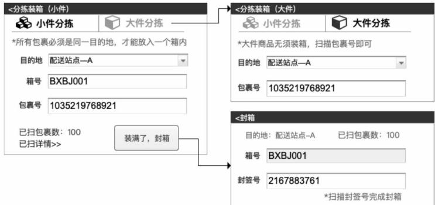

图10-24 PDA分拣装箱示例

如果一个周转箱装满了，可以进行封箱，封箱的系统操作：将周转 箱用带有条码的封箱签进行封存，然后扫描签号完成封箱。包裹封箱以 

后就不允许再随意拿出了。 

有些大件和原包装不需要装箱，可以直接扫描包裹号完成装箱和封 箱的操作，在系统实现方面可以将包裹号当作箱号和签号处理。 

## 5.发货交接

包裹从分拣中心分拣装箱后，配送任务便会下达车辆调度中心，由 调度系统安排司机和车辆前来接货。待司机到达后，由发货员逐一扫描 封签完成的箱号（大件原包装扫描包裹号）并生成发货批次（见图 10-2 5），同一批扫描的箱号会生成一个发货批次，相关人员可以就此发货 批次打印交接单与司机完成交接。 

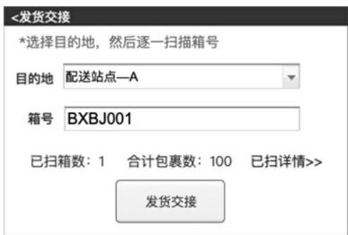

图10-25 PDA发货交接示例

交接扫描以后便是装车，如果车内含有多个目的地的包裹，相关人 员按照系统配送路线提示先将最远目的地的周转箱码放在最里面，最近 目的地的周转箱码放在最外面，方便卸货。 

为保证同一订单的多个包裹一起送达，系统需限制同一订单的多个 包裹必须在同一批次发货，且最好装进同一辆车内。 

## 6.封车发车

车辆装满以后，便可以发车了，由发货员分别录入车牌号、司机， 以及扫描本车内的所有发货批次完成发车，如果需要封车，还需要提前 将打印好的带有条码的封车条贴在车门上，并扫描封车条进行封车。封 车发车示例如图10-26所示。 

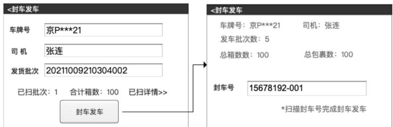

图10-26封车发车示例

封车完成以后，负责运输的司机在到达发车时间以后便可以将车开 出分拣中心，如果车辆装有 GPS，配送管理系统可通过电子围栏自动识 别此车已离开分拣中心，变更车辆状态，并将发货信息发送给目的地， 以便下游目的地提前做好收货准备。在配送过程中，系统可准确地记录 配送车、司机、封车号、发货批次、箱号和包裹号的关联关系，并追查 到每个包裹的实时动向和状态。它们之间的关系如图10-27所示。 

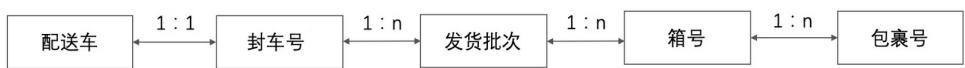

图10-27配送发车关系示意图

司机发车以后，在运输途中，如果车辆出现问题需要换车，系统需 提供相关功能将原车中所有的关联关系转移到新车上。 

## 10.2.4 配送管理

配送站点是包裹送达用户前的最后一个集散点，一旦包裹进入配送 站点，即进入了物流运输的“最后一公里”。“行百里者半九十”，能否在 规定时效内完成履约，“最后一公里”的流程管理和系统操作也是相当关 键的。 

## 1.配送站点正向配送流程与逆向配送流程

配送站点在整个配送流程中承担着两方面的职责：正向配送和逆向 取件退货。在正向配送流程中，包裹由分拣中心运输到站点，由站点分 派配送员，将包裹送达用户指定的收货地址。在逆向配送流程中，配送 员上门取件，并将快件在配送站点完成装箱、逆向发车。 

配送站点正向配送流程如图10-28所示。 

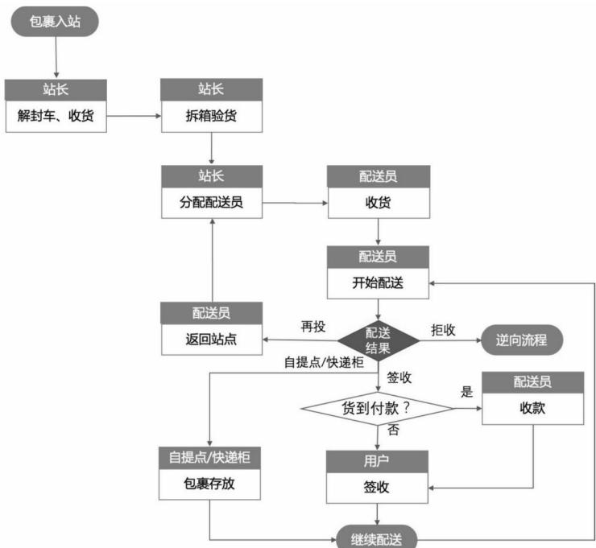

图10-28 配送站点的正向配送流程

如果用户拒收包裹，或者有寄件的上门取件任务，就要触发配送站 点的逆向物流，流程如图10-29所示。 

图10-29 配送站点的逆向配送流程

## 2.站点收货与返调度

车辆到达配送站点以后，配送站点对车辆进行解封（如果没有封车 条，则不需要），然后扫描箱号或原包装包裹号进行收货，并对周转箱 拆箱，再逐一扫描箱内的包裹号进行验货，此流程可参考分拣中心中的 相关操作，二者功能类似。 

在站点验货环节，需校验包裹的合法性，如果非本站点配送范围内 的包裹，且本站点距离包裹所属站点较近，可由本站点安排相关人员将 包裹送至目的站点，否则需将包裹返回分拣中心重新分拣，也叫返调度 。如果包裹超出了自营配送范围，可由本站点直接转寄第三方物流。 

不管是转站点、返调度，还是转寄第三方物流，包裹在系统中都会 被打上特殊标记，由站长安排装箱、发货。 

## 3.分配配送员

无论是正向配送流程还是逆向配送流程，都需要分配配送员，分配 方式有两种：人工指派和按系统推荐分配。人工指派是指由站长在系统 中为每个包裹手动指派配送员。系统推荐分配分为两步，如下所述。 

① 提前在配送管理系统中维护好每个配送员负责的街道、小区及 预设路线（或者通过GIS在地图上标注配送员负责的区域）。例如，老 王负责A、B、C三条街道，其预设路线为：站点→A→B→C→站点。又 如，老李负责D、E、F三条街道，其预设路线为：站点→D→E→F→站 点。一名配送员可以被安排多个街道和路线，一条街道也可以安排多名 配送员。 

② 当配送站点的包裹收货后，系统根据包裹收件地址中的街道匹 配配送路线并分配对应的配送员，若有多个路线结果，则按照优先级依 次匹配。如此便可将A街道的包裹自动分配给老王，将E街道的包裹自 动分配给老李。配送员预分配逻辑如图10-30所示。 

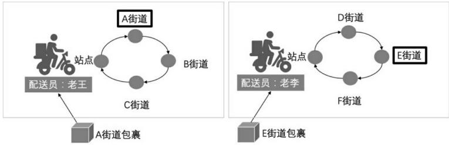

图10-30 配送员预分配逻辑

分配完配送员以后，包裹配送任务便会下发到配送员的客户端，待 配送员领取任务。 

## 4.配送员收货

配送员接到取件任务后，按照取件时间到达客户所在的地址取件。 若接到配送任务，需要先对待配送的包裹扫描收货，收货操作如图10-3 1所示。配送员逐一扫描包裹标签，若符合本配送员派送条件，则视为 收货成功，否则收货失败，若遇异常件（如非本站点包裹、非本人配送 任务包裹、包裹破损或受潮、空包裹等），可登记异常。 

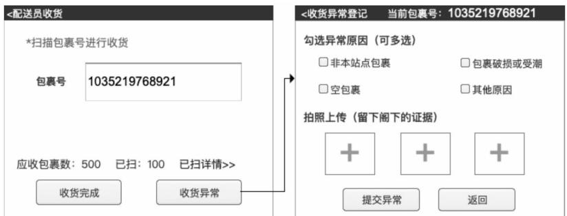

收货完成后，配送员按照距离远近将包裹装进配送车里，开始派送 。正常情况下，分配给配送员的包裹应全部扫描完毕，若收货完成时已 扫包裹数量不全，说明丢件了，系统应给予异常提示。 

## 5.配送员派件

配送员按照包裹的收货地址逐一派送，根据派送的结果，系统需提 供不同的功能供配送员操作不同的业务。 

① 用户正常签收。签收方式可以是本人签收，或者他人代收。配 送员将包裹交给用户时，如果是在线支付的包裹，直接签收即可，如果 是货到付款的包裹，或者需要用户到付的包裹，用户需先支付以后才能 签收，支付方式可以是微信、支付宝、银联、现金或组合支付。如果选 择微信或支付宝支付，一般由配送员出示企业的二维码，由用户直接扫 码支付；如果是现金支付，则由配送员在系统中录入现金支付金额，方 便回站点后对账；组合支付针对单种支付方式金额不够的情况而设计， 可由用户选择多种支付方式组合支付，系统分别记录每种支付方式的金 额。 

如果一个订单下有多个包裹，需要一起配送、一起签收，还能支持 一起支付。 

② 投放自提点或快递柜。如果用户不方便收货，配送员可以将包 裹送至自提点，或者投放快递柜，投放成功后，发送取件码给用户。 

注意，投放自提点或快递柜后，包裹并不是已签收状态，而是“待 取件”状态，待用户凭取件码取件以后才能变为“已签收”状态。放入快 递柜的包裹，快递柜系统需要与包裹状态进行联动，如果是第三方快递 柜，可以做API接口对接获取包裹状态。如果包裹在快递柜中长时间未 取件，还要支持配送员将包裹取出重新派送或视为用户拒收。 

③ 用户拒收。包裹在签收前，用户不想要了，则由配送员操作拒 收，将包裹变为“拒收”状态。拒收的包裹，最终由配送员拉回配送站点 走逆向配送流程入站收货、验货、装箱、发车到分拣中心，然后级级运 输，最终将包裹退回始发地。 

包裹被拒收后，在逆向配送过程中，为了不与正向配送流程混淆， 可以在站点为其更换一个新的包裹号，以新包裹号做流转，并将物流状 态与原包裹号相关联。（想象一下，一旦拒收包裹变成新单号后，相当 于产生了一张正向发往始发地的新包裹，完全可以用正向物流逻辑来处 理此流程，系统实现也更简单了。） 

④ 包裹再投。由于客户不方便收货、商品破损、地址不详，客户 电话无法接通、缺件、少件等原因，包裹无法正常签收，则由配送员将 包裹标记为“再投”，并将包裹拉回配送站点，等待重新分配配送员并再 次派送，或者按拒收处理。再投是一个中间态的包裹状态，对外展示为 “派送中”。 

⑤ 异常件。在派送过程中，若配送员发现包裹标签丢失、货物破 损、有违禁物品、无法联系客户、包裹被取消寄件等情况，可以提报异 常，将包裹标记为“异常件”并拉回配送站点处理，处理完成以后，将包 裹恢复为正常状态，再次派送或按拒收处理。 

配送员派件示例如图10-32所示。 

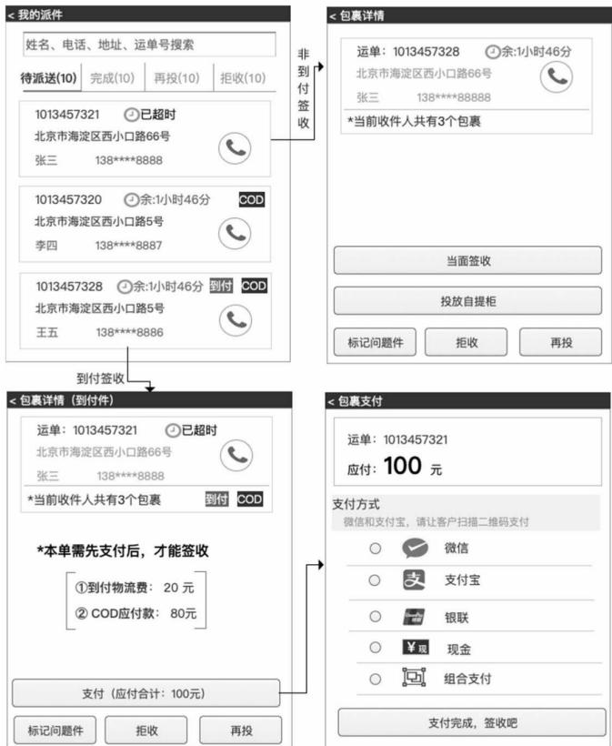

图10-32 配送员派件示例

所有的包裹都派送完成后，配送员返回配送站点，将拒收、再投及 异常件交接给站长，等待后续处理。对于到付的包裹，配送员将收取的 现金交接给站长，待站长集中提交给总部财务部门进行对账。 

## 6.逆向配送

配送站点的逆向配送主要包括上门取件和拒收业务。上门取件包含 订单售后的上门取件，以及用户自行邮寄包裹，二者的区别是订单售后 的上门取件需要关联原订单以便做售后退款处理，用户自行邮寄的包裹 则不需要。 

用户通过客户端下发包裹寄件任务后，由系统或配送站点的站长分 配配送员上门取件，分配规则和正向配送的分配规则类似，根据配送员 负责的配送范围及配送员的当前状态来匹配。 

图 10-33 为配送员接到取件任务后，在规定时间内到达用户指定地 址进行揽件。揽件过程为：配送员先为物品包装、称重、测量体积，将 这些数据录入系统后，系统自动计算运费并发送给用户确认，用户可选 择寄件方付费或收件方付费。若是寄件方付费，则由配送员现场发送账 单，用户支付，支付方式可以是当面付（寄件方当面支付），也可以是 月结账号支付（一般是企业用户，提前开通月结账号，通过月结账号进 行对公支付）；如果是到付，则寄件方无须支付费用，待收件方签收时 支付。 

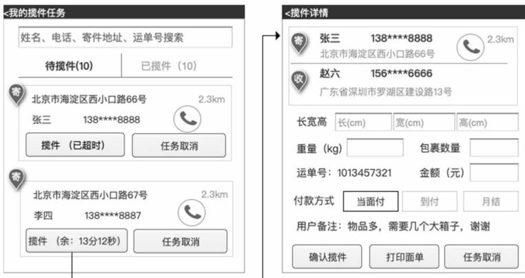

图10-33 上门揽件示例

支付完成后，配送员打印面单并将其粘贴到包裹上（有几个包裹便 打印几张面单，但都对应一个运单号），并将包裹放回车内拉回配送站 点，然后对包裹进行整理。如果无包装，则为包裹套上包装；如果是手 写面单，则先将寄件信息录入配送管理系统，然后由站长扫描包裹号进 行装箱（大件可不装箱，用包裹号代替箱号）。装箱完成后，配送员发 送任务至车辆调度中心，等待派车，后续的发货交接、装车、封车、发 车等处理流程就和分拣中心中的相关处理流程一样了。 

## 7.O2O配送

在O2O和新零售模式下，很多包裹并不是从仓库打包发货的，而是 从离用户最近的门店发出，如饿了么、美团、叮当快药等，此类配送不 需要分拣中心和配送站点，只需要配送员的客户端能接单配送即可，具 体流程如图10-34所示。当用户在指定的门店下单以后，商家接到订单 开始备货，并将配送任务分配到附近的配送员（骑手）手上，分配逻辑 为：基于商家发货地址匹配附近可接单的配送员，配送员的实时位置在 商家可配送范围内。配送员接到任务后，前往商家处领取包裹，再按照 路线将包裹派送给用户，直到本次任务中所有包裹派送完成。 

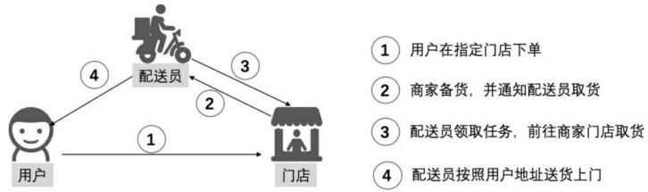

图10-34 O2O配送流程

## 10.3基于第三方物流的配送管理系统

对于大多数企业而言，如果没有特别强烈的自营物流诉求和极其雄 厚的资金实力，一般使用第三方物流就足够了。如果使用第三方物流配 送，我们同样需要搭建一套基于第三方物流配送的配送管理系统，以便 能将配送全链路管控起来。 

## 10.3.1第三方物流配送管理系统架构

使用第三方物流配送不需要自己管理车辆调度、分拣、配送，所以 配送管理系统相对比较简单，主要与第三方物流服务提供商做好接口交 互和运费对账即可。基于第三方物流配送的配送管理系统，在订单履约 过程中主要承担三个方面的职责：一是订单发货前的物流服务提供商分 配及电子面单申请；二是包裹在配送过程中的全程跟踪；三是签收后与 物流服务提供商的运费对账。订单履约与配送管理系统如图10-35所示 

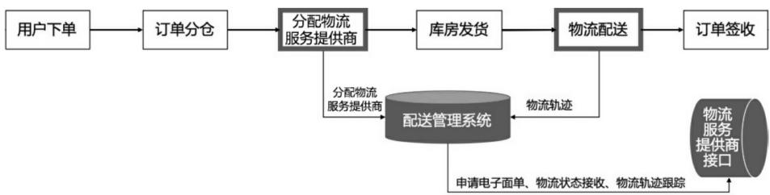

图10-35订单履约与配送管理系统

在配送管理系统设计方面，可以分为基础数据、配送策略、接口对 接和财务结算四大功能模块，如图10-36所示。 

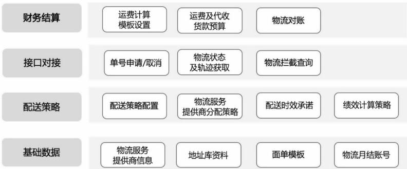

图10-36 第三方物流配送管理系统架构

① 基础数据，这是系统运行的基础，包括物流服务提供商信息、

地址库资料、各物流服务提供商的面单模板、物流月结账号等，物流服 务提供商信息和地址库资料若在基础数据中心已存在，就不需要单独维 护了。 

② 配送策略，包含配送策略配置、物流服务提供商分配策略、配 送时效承诺和绩效计算策略等。 

③ 与第三方物流服务提供商的接口进行对接，包含单号申请/取消 、物流状态及轨迹获取、物流拦截查询等。 

④ 财务结算模块，包含物流服务提供商的运费计算模板设置、配 送运费及代收货款预算、物流对账等。 

## 10.3.2 配送基础数据

在基于第三方物流配送的配送管理系统中，用到的基础数据比较少 ，主要有物流服务提供商信息、地址库资料、面单模板和物流月结账号 等。物流服务提供商信息和地址库资料属于全公司都需要的公共数据， 适合放到基础数据中心中维护和共享，这部分内容在本书第五章已经介 绍过了，下面重点说明一下面单模板和物流月结账号。 

## 1.面单模板

在实际工作中，会有仓储、配送、门店等多个业务、多个系统需要 打印面单，而打印面单需要在系统中提前按照物流服务提供商的要求设 计打印模板。这是一个很精细的活儿，稍不留神就容易出现因尺寸无法 匹配打印纸张而导致打印跳纸的情况，而且物流服务提供商的面单也在 不断升级中，经常需要更新、调整。如果每个系统单独设计面单模板无 疑是浪费的，好的设计思路是将所有需要对接和用到的面单统一放到配 送管理系统中，由专门负责与物流服务提供商对接的相关人员统一负责 维护，当外围系统需要打印时，相关人员从配送管理系统中调用对应的 打印模板即可。 

在设计面单模板时，有两种解决方案：一是直接使用物流服务提供 商提供的SDK（软件开发工具包），不需要自己设计，如顺丰的客户就 可以直接在其官网下载 SDK。然而当前大部分物流服务提供商是不提 供面单打印SDK的，所以我们还需要按照物流服务提供商提供的规范， 自己设计面单模板，常用的面单设计工具有Access、JasperReport、Style 