# WMS 系统用户手册

# WMS User Guide

版本号：V6.01.23 

作者：Cynthia Li 

日期：2019年04月03日 

上海富勒信息科技有限公司 

上海浦东张江高科技园区毕升路 299 号 

富海商务苑6号楼4层 

## 目录

1. 概述……8
1.1. 欢迎……8
1.2. 申明……8
1.3. 培训的目标……8
2. 仓库、配送中心管理概述……9
2.1. 现代仓储、配送中心管理的目标……9
2.2. 仓库的类型……9
2.3. 仓储、配送中心的运作流程概述……10
3. FLUX WMS 概述……15
3.1. 什么是仓库管理系统……15
3.2. FLUX WMS 的系统结构……16
3.3. 登录 FLUX WMS……16
3.4. FLUX WMS 的模块……20
3.5. FLUX WMS 的用户界面……22
4. 业务系统管理……41
4.1. 业务系统管理概述……41
4.2. 角色信息管理……41
4.3. 用户管理……42
4.4. 业务功能……47
4.5. 角色授权……49
4.6. 数据导出授权……50
4.7. 自定义操作授权……51
4.8. 主机信息管理……53
4.9. 仓库信息管理……53
4.10. 系统代码……55
4.11. 数据字典……58
4.12. 多语言文本管理……61
4.13. 界面方案管理……62
4.14. 附件文档管理……74
4.15. 用户密码修改……76
5. 业务系统配置……81
5.1. 系统配置参数……81
5.2. 数据导出规则配置……84 

5.3. 自定义操作配置....88
5.4. 模板文件管理....89
5.5. 自动打印配置....93
5.6. 标准业务扩展配置....96
6. 基础设置....99
6.1. 基础设置概述....99
6.2. 包装....99
6.3. 批次属性....105
6.4. 循环级别....110
6.5. 货物类型....112
6.6. 装箱....115
6.7. 海关 HScode....117
6.8. 客户档案....118
6.9. 产品档案....130
6.10. 组件....152
7. 仓库设置....155
7.1. 仓库设置概述....155
7.2. 区域和库区....155
7.3. 库位组....157
7.4. 工作区....159
7.5. 库位....160
7.6. 路线....165
7.7. 月台....167
7.8. 设备....168
7.9. 分拣口....169
7.10. 堆垛机....171
7.11. 播种墙....172
7.12. 员工....174
8. 业务规则....175
8.1. 业务规则概述....175
8.2. 上架规则....176
8.3. 库存周转规则....184
8.4. 预配规则....187
8.5. 分配规则....190
8.6. 补货规则....193
8.7. 质检规则....194 

8.8. 流水号规则....196
8.9. 定时器....197
8.10. 波次计划规则....204
8.11. 自动发运规则....210
8.12. 路线规则....211
8.13. 配送规则....212
8.14. 序列号规则....214
8.15. 波次调度规则....215
9. 入库操作....219
9.1. 入库流程概述....219
9.2. 采购订单（PO）....220
9.3. 预期到货通知(ASN)....227
9.4. 码盘预约....251
9.5. 收货操作....254
9.6. 上架....271
9.7. 质量检验....274
9.8. 取消收货....280
9.9. ASN 编组....281
9.10. 收货异常处理....286
9.11. 入库序列号查询....287
10. 库存管理....289
10.1. 概述....289
10.2. 库存余量....289
10.3. 库存事务....295
10.4. 库存冻结单....297
10.5. 库存转移单....301
10.6. 库存调整单....305
10.7. 库存移动单....310
10.8. 库存盘点单....315
10.9. 库存冻结....324
10.10. 库存转移....326
10.11. 库存调整....327
10.12. 库存移动....329
11. 出库操作....333
11.1. 出库流程概述....333
11.2. 发运订单（SO）....333 

11.3. 波次计划（Wave） 354  
11.4. 发货操作 364  
11.5. 取消发货 369  
11.6. 手工波次模板 370  
11.7. 出库复核 373  
11.8. 单品复核 393  
11.9. N+X 复核 397  
11.10. 波次播种 401  
11.11. 图形化波次播种 402  
11.12. 订单分配计划 407  
11.13. 配送单作业 411  
11.14. 集拼箱 414  
11.15. 集货位 416  
11.16. 装车单 417  
11.17. 出库异常处理 421  
11.18. 销售订单 423  
11.19. 销售订单编组 424  
11.20. 发票管理 425  
11.21. 包裹管理 428  
12. 任务管理 430  
12.1. 上架任务管理 430  
12.2. 拣货任务管理 431  
12.3. 补货任务管理 432  
12.4. 任务管理 436  
12.5. 任务派发 437  
12.6. 员工工作区设置 440  
13. 增值服务 441  
13.1. 概述 441  
13.2. 加工单 441  
14. 行业插件 444  
14.1. 药品检验报告 444  
14.2. 药品养护 445  
14.3. 客商资料审核 447  
14.4. 药品资料审核 449  
15. 费收 452  
15.1. 费收概述 452 

15.2. 仓储费率设置....452
15.3. 费用清单....460
15.4. 收入/支出结算....464
15.5. 运输费率设置....466
16. 预警....468
16.1. 预警参数设置....469
16.2. 邮件模板配置....471
16.3. 邮件服务器配置....473
16.4. 预警消息....474
17. 业务系统日志....477
17.1. 业务操作信息....477
17.2. 系统 SQL 日志....479
17.3. 用户登录信息....483
17.4. 登录失败信息....485
17.5. 打印汇总信息....486
18. 报表....489
18.1. 标准表报....489
19. 二次开发管理....493
19.1. 配置自定义报表....493
19.2. 配置自定义功能....498
19.3. 配置自定义看板....504
20. 自动打印....508
20.1. 自动打印启用....508
20.2. 自动打印暂停....509
20.3. 单项打印服务启用/停止....510
21. 自定义导出/打印配置实例....512
21.1. 模板文件管理配置....512
21.2. 数据导出规则配置....515
21.3. 数据导出授权....519
21.4. 报错记录....523
22. 自定义预警配置实例....524
22.1. 预警参数配置....524 

版本变更日志

<table><tr><td>版本号</td><td>日期</td><td>作者</td><td>备注</td></tr><tr><td>V5.0</td><td>2017/09/17</td><td>Cynthia</td><td>Create</td></tr><tr><td>V6.0</td><td>2018/9/4</td><td>Cynthia</td><td>Update,配合界面整理更新截图</td></tr><tr><td></td><td></td><td></td><td></td></tr><tr><td></td><td></td><td></td><td></td></tr><tr><td></td><td></td><td></td><td></td></tr></table>

## 1. 概述

## 1.1. 欢迎

欢迎参加 FLUX WMS 的培训课程 

上海富勒信息科技有限公司（以下称 FLUX）是具有领先地位的供应链咨询和软件实施提供商，以提供最好的物流管理解决方案为特色。 

## 1.2. 申明

上海富勒信息科技有限公司版权所有，保留所有权利。 

“FLUX”，“Shanghai FLUX Information & Technologies Co., Ltd.”，是上海富勒信息科技有限公司的专用标识。“FLUX”是上海富勒信息科技有限公司的商标和服务标识，出现在本课程的其他商标归其所有者所有。 

未取得上海富勒信息科技有限公司同意不得将本出版物以电子或机械的任何形式或任何方法复制和传播，包括影印、记录，储存在可重获信息的系统中或者其他方式。 

上海富勒信息科技有限公司尽所能确保材料的正确性。但是，上海富勒信息科技有限公司对于有关本手册中的材料和软件描述不作出任何明确或者暗示的保证。如果在手册的内容中发现有任何错误或者矛盾，请将问题告知 FLUX。告知内容应包含以下信息： 

文件名 

■ 版本 

■ 问题/困难 

■ 建议修改意见 

本出版物是已审核的 FLUX 培训手册系列之一，由各领域重要专家编写。如果需要了解其他的培训手册的内容，请联系 FLUX 公司。 

## 1.3. 培训的目标

增强和发展我们的客户、合作伙伴和员工在 FLUX 的产品和服务方面的技术和功能性的知识。 

## 2. 仓库、配送中心管理概述

## 2.1. 现代仓储、配送中心管理的目标

缔造面向服务(Service)、精确 (Accuracy)、透明 (Visibilities)和效率 (Efficiency)的仓库管理的核心竞争能力 SAVE。 

传统的以库存管理为导向的仓库管理系统，其核心是对货物本身数量和属性的管理，通过各种单据就可以涵盖仓库内的各项业务。但当面对多货主、多重服务标准、多重计费和高效率的物流运作就束手无策了。 

物流的目标是用尽可能低的成本，去实现尽可能高的效益。而现代物流意义下的仓库管理，则更强调的是对服务、精确、透明和效率等核心竞争能力的全面管理和提升。每个货主在物流中心的服务要求是不同的，个性化的目标和模式，大大增强了服务质量一致性上的困难。另一方面，对处理产品的精确管理、各货主间的虚拟隔离和货主内的可视性，又对效率提出了巨大的挑战。 

FLUX WMS 正是秉承这样的一个宗旨而设计的。FLUX 认为物流对服务(Service)、精确(Accuracy)、透明(Visibilities)和效率(Efficiency)的要求天然地形成了对物流中心的核心竞争能力。同时，四个主题的契合又是一个 SAVE（英语中的节省）的含义。 

FLUX WMS 致力于综合改善客户服务的水平；提高从收货、出货到库存管理等各个环节的准确性；提高从内部管理到外部服务的全过程的透明度；最优化仓库的关键业务流程，使操作效率和仓库利用率得到大幅度的提高。 

我们热切地期望FLUXWMS能够帮助物流企业实现自我的梦想！ 

## 2.2. 仓库的类型

一般主要由三种不同类型的仓库，即：公共仓库、自有仓库、合约仓库。 

## - 公共仓库

公共仓库通常属于某一法人而不属于产品的所有者。仓位空间和仓储服务是根据货主的需要来销售的。公共仓库可以是干货仓库、冷藏仓库或冷冻仓库，也可是危险品仓库或一般产品，如计算机、食品、日用品等。公共仓库通过公共运输公司（如中远 COSCO、中外运 Sinotrans）、铁路或自有车队来运送产品。 

公共仓库通常通过为货主提供产品贮存和附加服务收取费用而实现盈利。 

## - 自有仓库

一般情况下，自有仓库同时是所存放产品的所有者。 

存放在仓库中产品的种类的变化是随着依据自有设施生产和配送到补充库位的产品种类的改变而改变。有些自有仓库依靠于公共运输公司，但很多也有自己的车队来运输产品。 

自有仓库通过成本核算来获利。存放产品的公司通常也是仓库的所有者，因此产品存放和理货的费用也需计入所出售产品的成本。 

## - 合约仓库

合约仓库只用于存储那些定有出租空间和服务合约的产品。这类仓库通常需要与客户建立长期的合约关系。 

存放产品的种类可变换，寄仓的客户根据与仓库的合约在一个特定的时期内存储某种产品。 

合约仓库有自己的货车队来运输产品，或依靠于大众运输公司。有些时候，货主依靠自己的货车队，将产品从仓库运送到目的地。 

## 2.3. 仓储、配送中心的运作流程概述

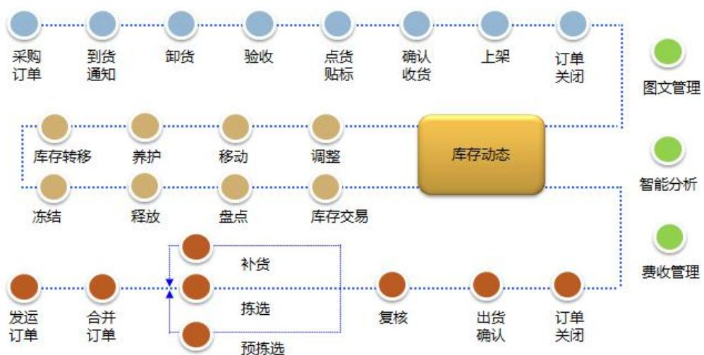

[图2-3-1]

## ● 采购订单 Purchasing Order, PO

采购订单是货物的买卖双方之间的协议记录。 

如果买方想要在仓库中储存货物，他们更倾向于做货主。货主能通过传真、电话等设施发送一 个货物的采购订单复本，或通过下载信息到FLUXWMS。跟踪采购订单上的信息能加速实际收货流程。 

## ● 预期收货通知 Advanced Shipping Notice, ASN

预期收货通知能使仓库为将要到达的货物做好准备。预期收货通知(ASN)是由产品托运人（供应商/运输人）发出，在运输之前送至仓库的货物详细信息。在货物实际到达前输入收货信息，能够提高仓库操作的效率和准确性。预期的收货信息能通过下载或手工输入到系统。 

ASN 通常包含以下要素：供应商和买方的名称，与该次送货相对应的采购单号码、出货地点、产品跟踪号、描述、数量、包装、以及送货日期等。 

预期收货通知也被用于仓库中的实际收货，能减少数据输入时间和简化收货流程。在一些仓库中，更倾向于使用预期收货通知作为收据。当输入预期收货通知时，有两个选项： 

■ 在没有采购订单的情况下建立预期收货通知； 

■ 通过使用已存在的采购订单或订单行来增加预期收货通知 

## - 对预期数量进行码盘 Palletize

在收货到仓库之前，一般需要对预期收货数量进行码盘(如果预期数量等于或超过一个托盘上的数量)。 

这将根据包装设置的托盘数量而把预期数量分成更多明细行。 

对于入库货物，系统将自动生成 LPN 或任何“跟踪号”。这些号码将作为标签被打印贴在托盘上或写在托盘上。 

## - 收货 Receiving

正如前面所提到的，收货流程是继输入预期收货通知后非常重要的步骤。诸如数量、包装等收货信息都将在货物到达时输入系统。收货能在电脑终端中或通过批次扫描或实时的 RF 来完成。 

通常包含这些信息：收货日期、托运人、货主、供应商、产品、单位、数量、库位。其他特定信息如批次属性、跟踪号则根据货主的要求列出。 

批次属性包括：生产日期、失效日期、批号、颜色、尺寸或任何和以后的发运相关的其他属性，都能被输入和确认。 

在产品进入仓库系统库存后，通常会发出一份仓库收据。该法定文件由承担产品保管职责的仓库签署，并列明仓库接收产品的清单。仓库收据有时也称为“非可协商”。 

## - 上架 Putaway

仓库接收产品后，需要将产品放入库位。其库位可以是为该产品事先安排的库位，也可以是上架当时闲置和可用的任何库位。 

FLUX WMS 采用多种上架方式: 

■ 上架清单，分发到仓库工作人员手中。他们将会根据报表(或打印标签)来完成货物上架，并且将记录下任何差异，然后把更新过的工作表送还给办公室。办公室的数据输入人员将更新关于货物库位和数量的异常信息。 

■ RF ASSISTED - 系统辅助，使用者有权覆盖建议库位。 

■ RF DIRECTED - 系统引导，由系统决定产品存放的位置。用户在没有原因代码的情况下不能覆盖系统建议库位。 

如果仓库已建立一套成熟的库存管理系统，并采用无线电射频技术(RF)，则可以使用系统引导的库存方式。通过产品和库位拣选的特定设备，系统可为新上架的产品选定库位。 

## ● 发运订单 Shipment Order, SO

类似于采购订单和 ASN，发运订单单证记录预定货物的数量和目的地。这一信息将通过自动或手工输入传递到系统中。 

## - 拣货 Picking

拣货是根据订单选出产品并从相应的储存库位置拣取以备运输的功能。FLUX WMS 能够对数种拣货类型进行处理： 

■ 以托盘为拣取单位 

■ 以箱为拣取单位 

■ 以件为拣取单位 

■ 其它方式 

当产品拣取数量少于一整箱时，该拣取视为拆散拣取或按件拣取。仓库进行拆散拣取时，所拣取产品从原有包装中取出后必须重新装箱，以便运送到目的地。这一重新包装的过程又称为“拣货/包装”作业。 

拣货清单可打印成不同的格式。拣货清单的内容可以显示为所有根据产品和库位而合并在一起的波次拣取，也可以为操作者根据托盘、箱和件而单独拣取而生成。 

根据拣货的方式的不同，又可以将拣货分成离散订单拣货、区域拣货和批量拣货等。 

## - 复核 Check

复核环节，是拣货后、出库前对待发运货物的检查验证环节。确保所出的货物的确是订单要求的产品和数量。同时，复核环节还可以兼任装箱记录、单据打印、称重等附加处理工作。 

复核作业方式，可根据现场业务情况，采用单品复核、普通复核、波次播种复核等不同作业方式： 

单品复核 - 适用于单品订单的复核操作，即只订购一件产品的订单，或者只有单一SKU但多件数量的订单，也可扩展至具有单一主品，另有附加赠品的订单。 

■ 普通复核 - 适用于大部分业务场景，支持按波次复核、按订单复核、按箱复核操作。 

■ 波次播种 - 基于波次合拣，分货同时进行复核的操作模式。 

## - 出货 Shipment

出货是指核查产品的准确性后，将其装上交通工具并准备运往指定目的地。已拣好的产品被送到待出货区，仓库工人将其与送货单上的品名进行核对，按订单上的数量集货。然后检查产品的准确性，收缩包装到托盘上，最后装到运输工具上。必要的话，对产品进行固定以防移位。 

用户实施 FLUX WMS 系统过程中，出货程序可能随操作流程变化。FLUX WMS 为出货的不同操作流程提供多种处理功能，这将在以后的部分进行讨论。 

## - 补货 Replenishment

补货是指将散货储存区的产品补充到拣货区的功能。仓库管理在补货中可选择性地使用人员或设备进行补货。 

仓库使用拣货区的情况下，必须根据拣货区的总容量或根据该拣货区要求的产品数量定期补货。 

在一个成熟的库存管理系统中，补货可实现动态处理。要实现动态补货，需要一些特定的设备。拣货区要有与库位和产品相对应的最大和最小存货量。若一个拣货区的存货水平到达最小值，仓库工人就会接到从存货区向拣货区补货的指示。补货优先性取决于订货数量。那些存货数量不足以满足订单要求的库位将优先于有足够存货的库位被安排补货。 

## - 盘点 Count

FLUX WMS 支持多种类型的库存盘点： 

■ 循环盘点 CYCLE COUNT 

循环盘点是根据事先订好的规则每次选择部分存货进行盘点，一个周期内盘点全部货物或库位的盘点方式，以保证实际存货与系统存货水平相一致。实施循环盘点时，需要现场核查个别库位。选择该方式时需要对实地盘点与系统盘点的差异进行手工调整。实地盘点与系统盘点的差异会显示 

在系统中。定期循环盘点有助于： 

防止拣选出错 

保持库位/存货清洁和常新 

防止偷窃 

盘点同时不影响正常进出库操作 

可按照货物循环级别等划分盘点级别，理想状况下，每一仓库工人负责一部分产品或库位的循环盘点。 

■ 物理盘点 PHYSICAL COUNT 

物理盘点是指对产品进行全面盘点的功能。 

由于一些实际盘点需要由不同的盘点小组分别进行盘点、核实，FLUX WMS 支持该双盘点方式：完成两次盘点的准备，调查和矫正两次盘点结果的差异。经矫正后的盘点结果将用于与系统存货进行比较，出现的差异再次得到调查和矫正。最终矫正的盘点结果被传送至系统，对系统存货进行调整以使系统存货与实际存货相一致。 

大多数货主出于安全和会计要求的目的，进行每年一次的实地库存盘点。高值和易被盗产品的货主通常需要在每年进行几次实地盘点。 

## ■ 动碰盘点

仅对当天或指定时间段内有过进、出库等操作的库位或货物进行盘点。 

一般安排在每日仓库作业完成后或开始前，与循环盘点、全面盘点结合使用。有利于减少盘点作业量，提高操作效率。 

## 3. FLUX WMS 概述

## 3.1. 什么是仓库管理系统

## - 仓库管理系统

按著名的咨询公司 Gartner 对仓库管理系统的定义： 

仓库管理系统是一个实时的计算机软件系统，能够优化业务运作的各种业务规则和运算法则(Algorithms)，对信息、资源、行为、库存和分销运作进行管理，使其最大化满足有效产出和精确性的要求。 

## - 仓库管理系统的效益

一个仓库管理系统的实施能够改进运作的效率、降低整体的成本、提高库存的准确度。潜在的节省领域包括： 

## ■ 提高库存管理效率

库存准确度从 $95\%$ 提高到 $99.5\%$ 

消除冗余，库存降低 $10\%$ 到 $20\%$ 

降低同物理盘点相关联的成本 75% 

## ■ 人员精简

能够提升 20% 到 40% 的员工作业效率（人员精简或提高每个员工的产出率） 

能够提升 15% 到 25% 的间接员工效率（如：仓库行政人员） 

## ■ 提高空间利用率

空间利用率提高 10% 到 20%，避免或减少额外储存的费用 

当然，实现最佳的效益还取决于流程、组织和技术的改进。 

## - 概述介绍

本章对 FLUX WMS 的结构、界面元素等信息，进行集中介绍，帮助用户在后续阅读、系统使用过程中，能够更好的了解 WMS。 

## 3.2. FLUX WMS 的系统结构

FLUX WMS V6 版本前端是 B/S 架构，后端是基于云架构的新版 WMS 操作系统。 

与之前版本的 FLUX WMS 相比较，新版本在易维护、国际化、高可配置性等方面都有较大提升。 

部署环境可以根据用户需要，采用公有云或私有云进行部署。 

使用分布式服务框架开发，根据WMS的业务特征，部署的服务大致分为三大类： 

■ 前端应用服务： 

主要用于前端的界面显示和简单的数据读取，主要由 JSP、JAVASCRIPT、CSS 等技术进行开发。根据业务情况，拆分为基础管理、入库应用、库存应用、出库应用等。 

■ 后端应用服务： 

主要用于处理 WMS 实际的业务逻辑、数据库的读写操作等，通过 RPC 框架和前端应用服务进行通讯。根据业务情况，同样对服务进行了拆分，和前端应用服务对应。 

■ 运维管理服务： 

主要用于系统运维管理的服务。例如，监控报警、系统升级、安全防控、数据分析、定时任务、消息推送等。使得 FLUX WMS 系统的运维更方便，功能更强大。 

支持多种数据库： 

■ MYSQL 

■ SQLSERVER 

■ ORACLE 

■ POSTGRESQL 

FLUX WMS 能与企业各个层次的系统进行通信，从企业资源计划(ERP)系统到供应链计划、销售预测、存货订购系统以及第三方仓库管理系统中的存货控制跟踪系统。 

## 3.3. 登录 FLUX WMS

■ 通过浏览器访问服务地址，例如 HTTPS://TEST3.WMSDEV.NET:18080/（具体地址请向系统管理员获取） 

■ 在登录如下界面，输入相关信息（具体输入内容，请向系统管理员获取）： 

[图3-3-1]

组织 - 登录所属组织。如果是私有云服务器，组织信息默认显示。如果是公有云服务器，有多组织结构，需要输入用户所属组织信息。 

用户编号 - 登录用户名 

用户密码 - 登录密码 

验证码 - 登录动态验证码 

■ 点击【进入系统】按钮，系统提示进行仓库选择 

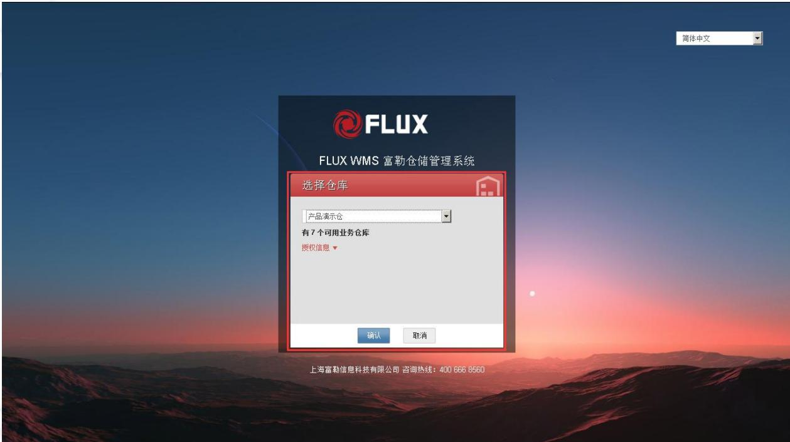

[图3-3-2]

由于 FLUX WMS 支持多仓管理，因此登录时可以显示用户具有权限的仓库供选择；当用户只有单一仓库权限或无仓库权限时，登陆时无仓库选择界面，系统允许用户直接登陆到主界面。 

点开提示信息展示框，可查看当前组织的授权相关信息，包括授权结束时间、授权类型、仓库数量（当前仓库使用数量/仓库设置上限）、客户数量（当前客户使用数量/客户设置上限）、注册用户数量（已注册用户数量/用户注册上限）。 

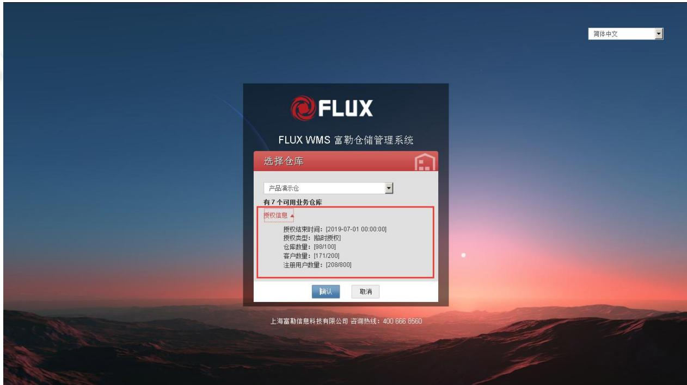

[图3-3-3] 

■ 点击【确认】按钮后，登录 FLUX WMS 系统，显示主界面如下 ■ 点击模块菜单，进一步展开显示模块下属的功能菜单。也可通过查询方式定位所需功能。 

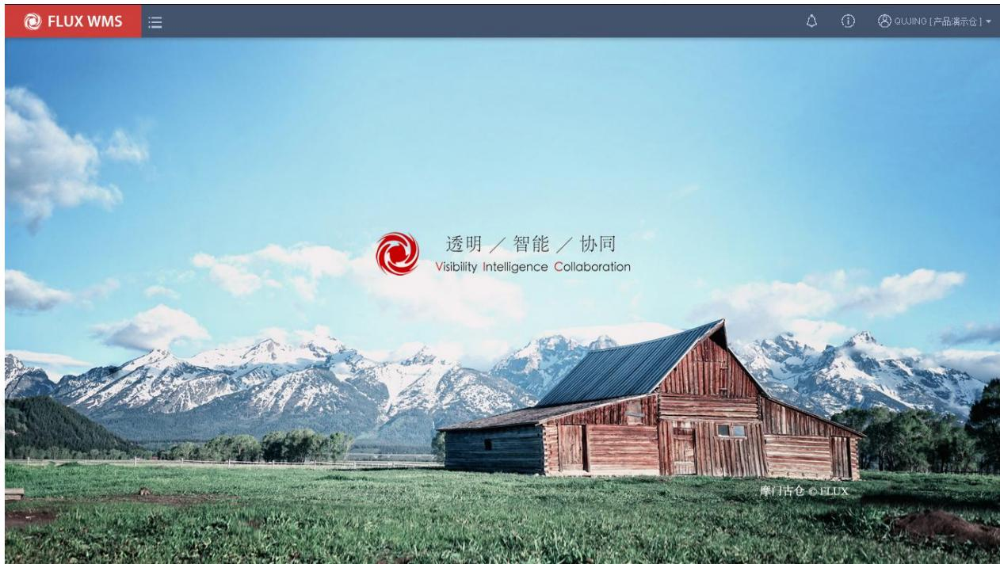

[图3-3-4]

■ 缓存加载完成，鼠标点击左上角的三道杠标志位，系统显示功能主菜单：

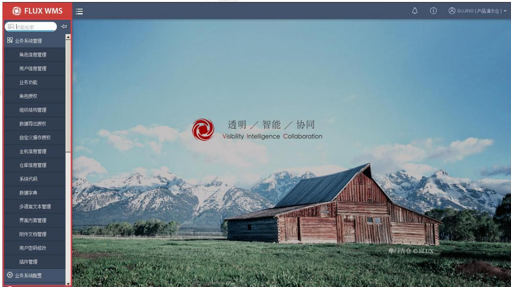

[图3-3-5]

## 3.4. FLUX WMS 的模块

为了减少功能的复杂性，FLUX WMS 系统被分成若干个较小的子模块，在系统菜单栏可以看到各个子模块。每一个子模块包含与仓库中特定操作相关的功能，在主菜单中点击菜单子模块，可展开显示对应的功能列表。以下是 FLUX WMS 的主要功能子模块。 

## - 业务系统管理

系统相关初始化设置。如仓库设置、授权设置等。 

## - 业务系统配置

系统相关作业配置，如系统参数、模板文件管理、导出配置等。 

## - 基础设置

用于维护 FLUX WMS 的业务基本数据，包括客户、产品、批次属性、包装、装箱、系统代码等信息。这些基础设置将在后续操作中使用到。 

## - 仓库设置

用于维护仓库物理信息数据，包括库区、库位、播种墙等信息。这些基础设置将在后续操作中使用到。 

## - 业务规则

用于维护 FLUX WMS 处理业务时遵循的管理要求，如：上架规则、分配规则等，分别在相应业务环节生效。 

## - 入库操作

入库操作包括了从收货到上架的整个过程，从业务的形态上来看，支持多种不同的收货形式和上架方式。 

## - 库存管理

包括了对于在库产品进行管理的各方面功能：交易情况查询、移动库存、调整库存和库存余额查询等。 

## - 出库操作

出库操作包括从订单预分配、分配到拣货、装载、发运的整个过程。支持使用多种的方式对订单进行拣选。 

## - 任务管理

针对系统内全部作业任务进行管理。 

## - 费收

维护所有的账目、额外的费用和费率管理。 

## - 系统业务日志

系统操作日志信息，常用与异常检查。 

## - 二次开发管理

提供灵活而又强大的个性化处理配置。例如自定义报表、自定义功能、自定义看板配置。 

## - 报表

管理、运行、查看和打印各种管理所需报表。 

## - 自定义功能

已配置的自定义功能操作。 

## - 自动打印

自动打印服务管理。 

FLUX 还包括其他的应用附加模块，如： 

## - 无线射频RF模块

运行无线射频程序和对无线电频的界面进行修改。 

## - 标签管理

生成、打印条形码标签以及产生新的标签。 

## - 交叉转运模块 Cross Dock

其作用在于通过交叉转运中心和提供全方位服务的配送中心最大化存货的周转速度的功能。 

## - 归档模块 Archive

用于对仓库中过去的操作记录另行保存，形成一个虚拟仓库，便于用户对过去的数据进行查询和总结。 

其他的各个模块，有各自独立的培训教材和课程，请向 FLUX 联系，以获得最新的资料。 

## 3.5. FLUX WMS 的用户界面

FLUX WMS 界面显示如下: 

[图3-5-1]

一部分界面元素，在不同功能中显示不同，例如字段等，但还有一部分元素，基本上每个功能都具有，在此做统一介绍。 

## 3.5.1. 菜单栏

## - 主菜单栏

登录后，鼠标点击在界面左上角的“三道杠”主菜单按钮，系统显示主菜单栏。 

[图3-5-2]

默认显示一级功能模块，点击后展开显示功能菜单，如下图所示。

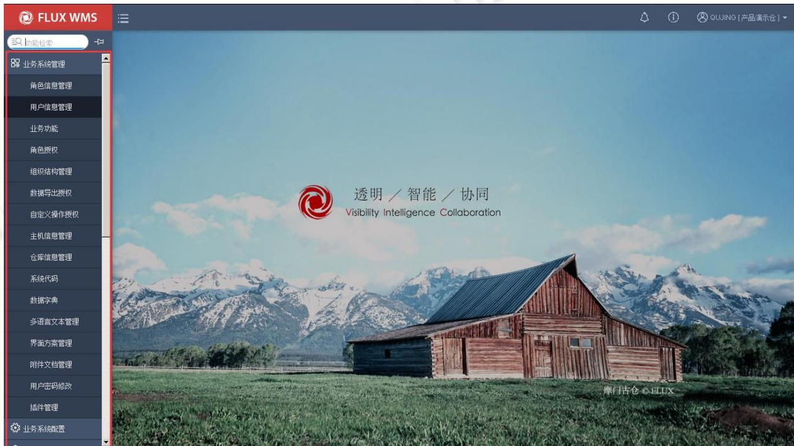

[图3-5-3]

## - 功能检索

如果不能确定所需功能的上级模块，可以通过主菜单的“功能检索”来查询、定位所需功能。 

[图3-5-4]

输入查询内容，系统显示相关功能，点击功能名可以直接打开指定功能。

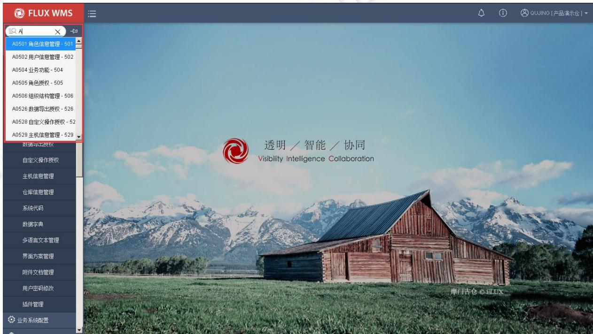

[图3-5-5]

## - 菜单锚定

通常情况下，光标移动出主菜单区域后，主菜单会自动隐藏，以便用户进行业务操作。 

但有时操作员可能需要频繁打开主菜单进行功能选择，此时可以通过检索框旁边的 “图钉” 按钮，将主菜单固定在界面上。如下图所示。再次点击 “图钉” 可取消菜单锚定。 

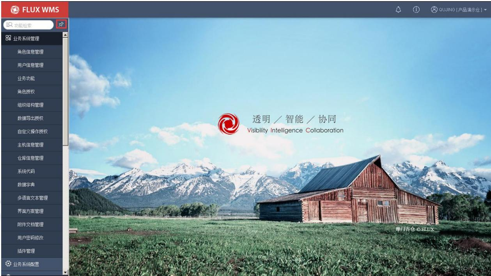

[图 3-5-6]

随着菜单锚定、取消锚定，操作显示区域会随之缩放。

## 3.5.2. 系统信息

## - 登录信息

界面右上角，显示当前登录的仓库（如下图右上角的[产品演示]），和登录账号名。 

[图3-5-7]

## - 版本信息

在界面右上角点击信息图标，系统显示当前生效的界面方案名称（界面方案具体配置，请参考4.13界面方案管理部分的介绍），以及当前版本号信息。 

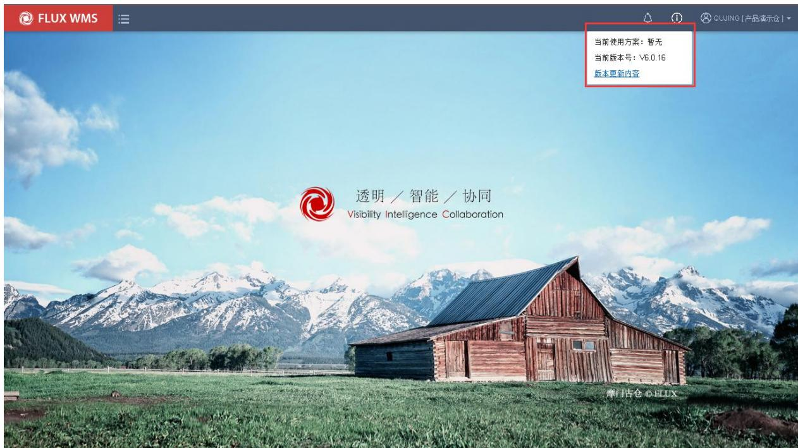

## [图3-5-8]

点击【版本更新内容】链接，可查看系统更新日志说明

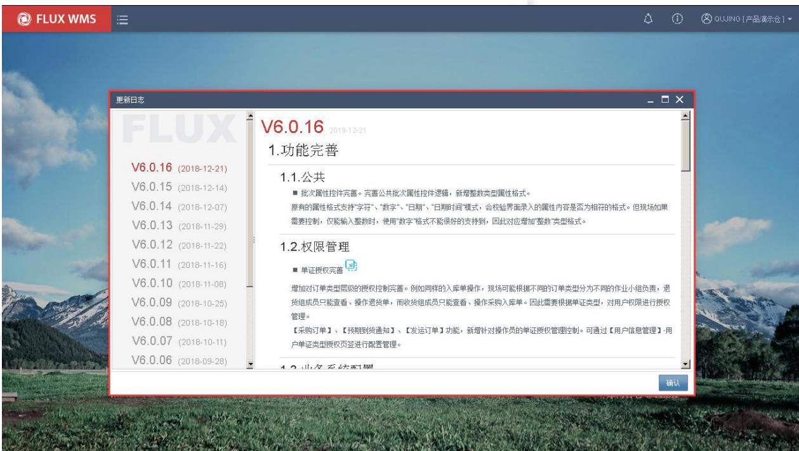

[图3-5-9]

## - 系统菜单

点击登录/仓库信息，可见系统菜单。 

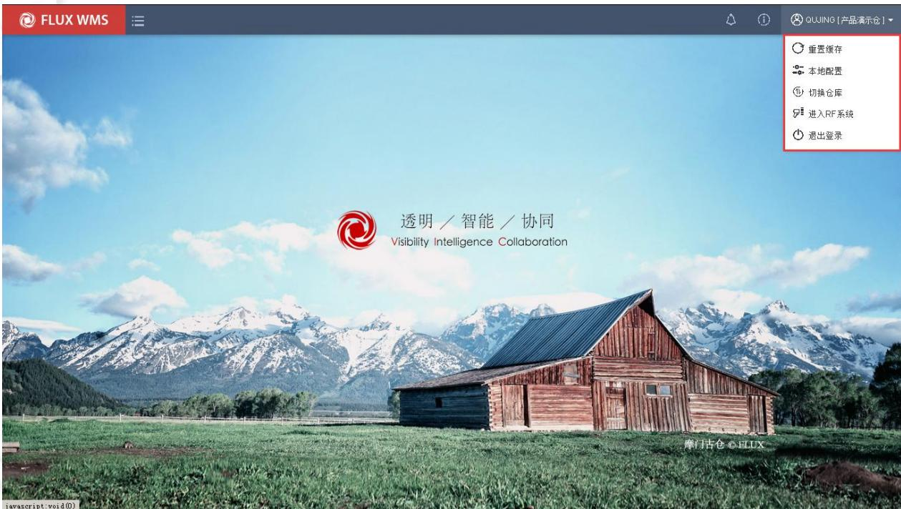

[图 3-5-10]

## ■ 重置缓存

为提升系统作业速度，部分常用配置信息，如语言配置，声音文件等，会在登录时被缓存到当前界面。但如果此时其他用户中对相关配置信息进行修改，有可能无法及时查看。因此系统提供手动刷新缓存信息的功能，无需用户重新登录。需要提醒的是，此功能仅在特殊情况下使用，日常作业无需频繁执行。 

点击【重置缓存】后，系统显示如下图的缓存加载对话框，默认全选，全部刷新。确认【重新加载】后，系统刷新缓存。如点击【取消】则返回主界面。 

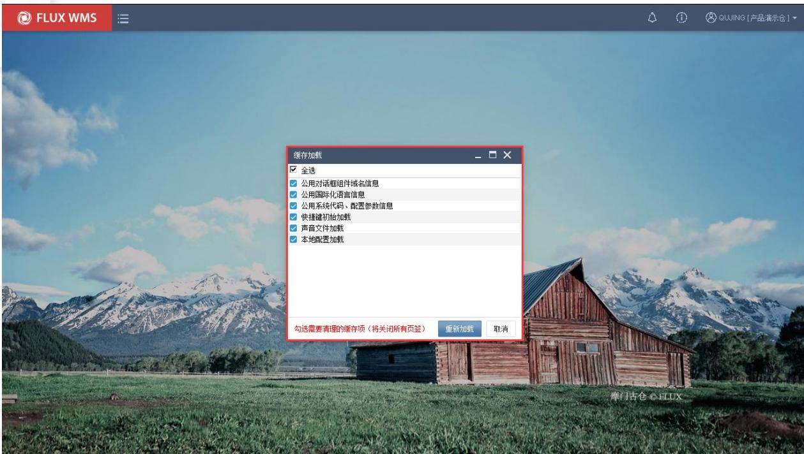

[图3-5-11]

## ■ 本地配置

仓库作业中，有些环节需要用到每个工作台不同的设置，例如电脑配置不同的电子秤，需要提示不同的警示音避免混淆等。这类情况需要对不同电脑进行不同的设置，我们称之为“本地配置”。 

图 3-5-10 的系统菜单中，点击【本地配置】功能，系统会显示本地配置界面（首次使用会有本地配置客户端插件安装提示） 

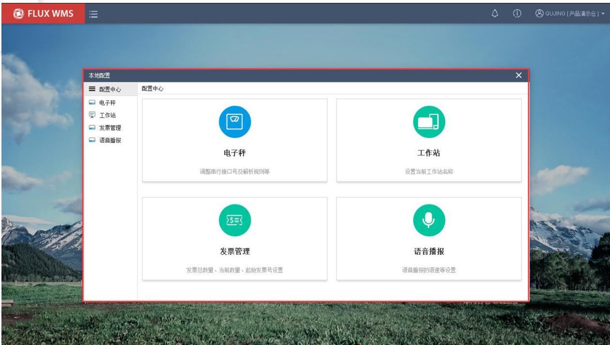

[图3-5-12]

## 电子秤

用于配置本机连接的电子秤相关配置信息。 

所需信息值（如波特率等），与电子秤硬件相关，通常从硬件说明书上可以获取。 

## 工作站

不同作业台，相邻库区不同。可以配置为不同的工作站，方便精细化管理应用。 

## ✨ 发票管理

## 语音播报

用于配置语音播报语速，方便不用作业习惯的员工使用。 

## ■ 切换仓库

用户如有多个仓库的权限，已登录情况下，可以通过系统菜单中的【切换仓库】功能，选择其他具有权限的仓库，相应跳转，无需重新登录。 

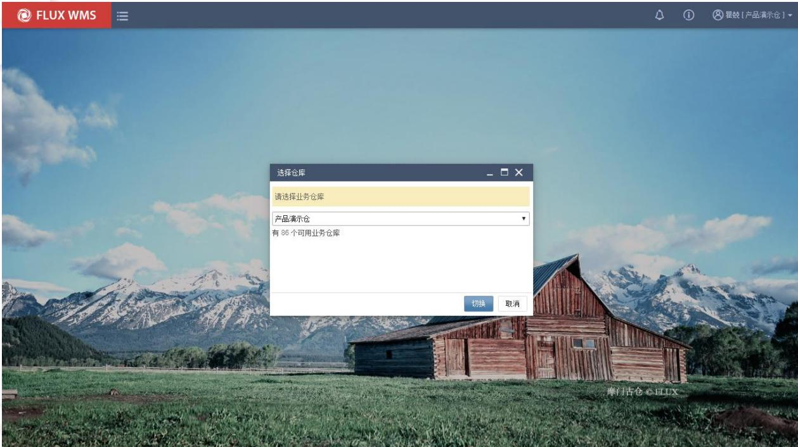

[图 3-5-13]

■ 进入 RF 系统 

使用电脑浏览器登录 RF 系统情况下，可以从已登录的 WMS 界面，通过系统菜单的 “进入 RF 系统” 功能，由程序自动打开并登录 RF 系统，方便用户进行操作。 

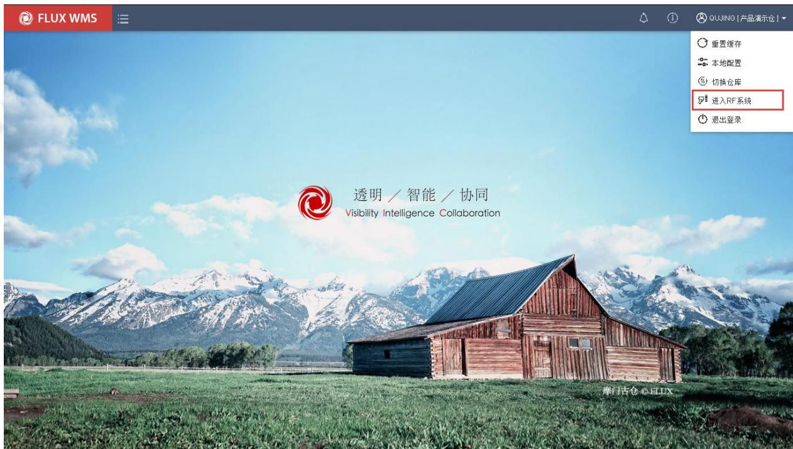

## [图3-5-14]

■ 退出登录 

退出当前 WMS 系统，程序会记录用户的操作时间信息。 

## 3.5.3. 查询界面

## - 查询界面

不同功能显示的查询条件也有所不同，输入查询条件内容，点击【查询】按钮，系统显示查询结果。 

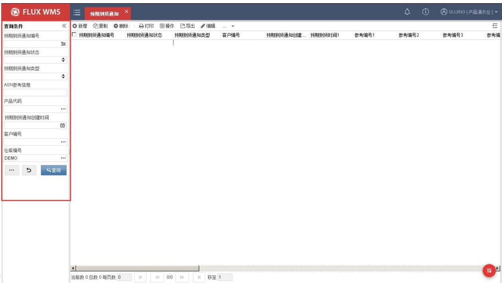

[图 3-5-15]

点击【重置】按钮，则清空输入的查询条件，重新录入。 

【更多】按钮则进一步显示其他隐藏、自定义查询条件字段。 

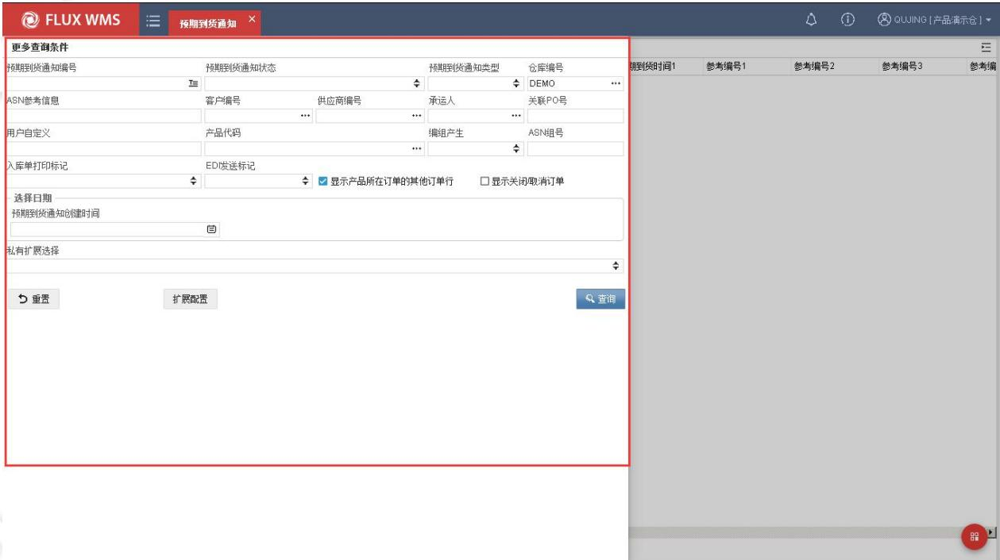

## [图3-5-16]

通常情况下，单据类的功能，默认为扩展查询界面，如图 3-5-7，而其他查询条件较少的功能则默认如图 3-5-6 的查询界面。具体功能默认的大、小查询界面，可以在界面方案中配置选择。 

## - 查询条件选项

■ 显示关闭/取消单据 

除了不同的查询条件，各个单据查询界面都有“显示关闭/取消 XX”的 checkbox: 

## □显示关闭/取消ASN

[图 3-5-17] 

未勾选情况下，查询时默认屏蔽已关闭和已取消的 PO 单，只有勾选后才能查询到。默认情况下此字段不勾选，以免导致不必要的大数据查询。 

■ 显示产品所在订单的其他订单行 

## 显示产品所在订单的其他订单行

[图 3-5-18] 

默认勾选，根据 SKU 查询记录后显示完整订单明细。如取消勾选，则根据产品查询条件，定位显示此产品记录，隐藏其他明细行。 

## 3.5.4. 通用功能按钮

- 按钮栏 

[图3-5-19] 

■ 新增 - 增加新记录 

■ 复制 - 已有记录，复制为新记录，仅 ID 信息需要人工录入即可保存。 

■ 删除 - 记录删除。但如果记录已被其他功能引用（例如新增的包装已经在产品档案中被使用），则无法直接删除。 

■ 打印 - 子菜单模式，标准打印项目选择。在 “数据导出规则配置”，设置为常用打印的规则，可在导出菜单中显示。 

■ 操作 - 子菜单模式，标准操作项目选择。在操作规则中，配置为标准操作的规则，可在导出菜单中显示 

导出 - 子菜单模式，标准导出项目选择。在 “数据导出规则配置”，设置为常用导出的规则，可在导出菜单中显示。 

■ 编辑 - 点击后进入明细编辑界面 

■ 子菜单选择 

打印、导出、操作按钮的下拉菜单，显示已配置的操作项，每个项目还具有各自的模式选择子菜单，如下图所示，打印可选择不同的打印模式（可配置默认模式） 

<table><tr><td colspan="2">FLUX WMS</td><td colspan="13">预期到货通知</td></tr><tr><td colspan="2">查询条件</td><td>新增</td><td>复制</td><td>删除</td><td>打印</td><td>操作</td><td>导出</td><td>编辑</td><td>...</td><td></td><td></td><td></td><td></td><td></td></tr><tr><td colspan="2">预期到货通知编号</td><td colspan="3">Tm</td><td colspan="2">CCCC测试</td><td>货通知类型</td><td>客户编号</td><td>预期到货通知创建...</td><td>预期到货时间1</td><td>参考编号1</td><td>参考编号2</td><td>参考编号3</td><td>参考编</td></tr><tr><td colspan="2">预期到货通知状态</td><td colspan="3">?</td><td colspan="2">图片隐藏</td><td colspan="8"></td></tr><tr><td colspan="2">预期到货通知类型</td><td colspan="3">?</td><td colspan="2">HK</td><td colspan="8"></td></tr><tr><td rowspan="2" colspan="2">ASN参考信息</td><td colspan="3">?</td><td colspan="2">LJTEST1225</td><td colspan="8"></td></tr><tr><td colspan="3">?</td><td colspan="2">TQ_PA_001</td><td colspan="8"></td></tr><tr><td colspan="2">产品代码</td><td colspan="3">...</td><td colspan="2">WYJ_自定义打印01</td><td colspan="8"></td></tr><tr><td colspan="2">...</td><td colspan="3">...</td><td colspan="2">DEDE3</td><td colspan="8"></td></tr><tr><td colspan="2">预期到货通知创建时间</td><td colspan="3"></td><td colspan="2">ZHOUXINCES箱签打印导入</td><td colspan="8"></td></tr><tr><td colspan="2">客户编号</td><td colspan="3">...</td><td colspan="2">aaaaa</td><td colspan="8"></td></tr><tr><td colspan="2">仓库编号</td><td colspan="3">...</td><td colspan="2">北京仓测试0423</td><td colspan="8"></td></tr><tr><td colspan="2">DEMO</td><td colspan="3">...</td><td colspan="2">打印日志</td><td colspan="8"></td></tr><tr><td>...</td><td>S</td><td colspan="3">查询</td><td colspan="2"></td><td colspan="8"></td></tr></table>

[图3-5-20] 

## - 扩展功能

按钮栏的扩展功能为： 

<table><tr><td colspan="2">FLUX WMS</td><td colspan="13">预期到货通知</td></tr><tr><td colspan="2">查询条件</td><td colspan="13">新增 复制 删除 打印 操作 导出 编辑</td></tr><tr><td colspan="2">预期到货通知编号</td><td colspan="13">预期到货通知编号 预期到货通知状态 预期到货通知类型</td></tr><tr><td colspan="2">预期到货通知状态</td><td colspan="13"></td></tr><tr><td colspan="2">预期到货通知类型</td><td colspan="13"></td></tr><tr><td colspan="2">ASN参考信息</td><td colspan="13"></td></tr><tr><td colspan="2">产品代码</td><td colspan="13"></td></tr><tr><td colspan="2">预期到货通知创建时间</td><td colspan="13"></td></tr><tr><td colspan="2">客户编号</td><td colspan="13"></td></tr><tr><td colspan="2">仓库编号</td><td colspan="13"></td></tr><tr><td colspan="2">DEMO</td><td colspan="13"></td></tr><tr><td colspan="2">... 查询</td><td colspan="13"></td></tr></table>

[图 3-5-21]

■ 标准导入 - 通过选择文档，批量导入、创建记录。 

选择标准导入功能，系统显示如下导入对话框。 

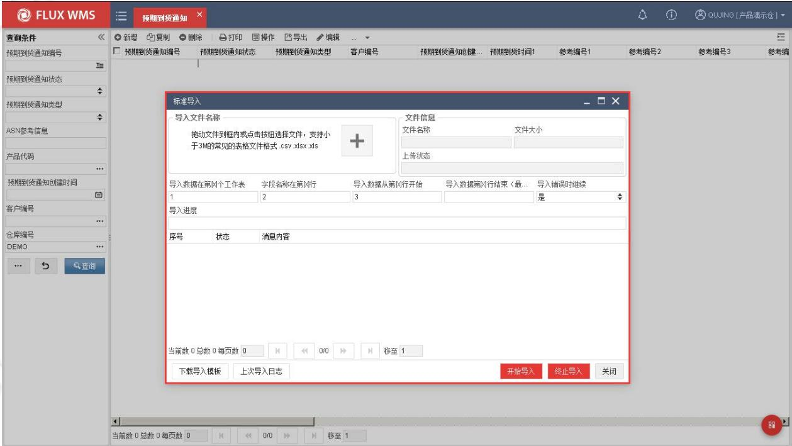

[图 3-5-22]

选择文件（目前支持 Excel、CSV 文件），指定导入的页签（即 Sheet，数据表）、名称行，系统导入数据。 

■ 按规则导出 - 点击后，二级窗口显示所配置的导出规则。选择规则导出。 

■ 按规则打印 - 点击后，二级窗口显示所配置的打印规则。选择规则执行打印。 

■ 自定义操作 - 现场自行配置的自定义操作选择。 

■ 配置导出规则 - 点击后进入导出规则配置界面。具体配置请参考对应专项说明。 

■ 配置自定义操作 - 点击后进入自定义操作配置界面。具体配置请参考对应专项说明 

■ 删除私有列配置 - 调整列表的字段显示次序、列宽等，系统会自动保存并应用。通过此功能项，可以清除个性化设置，恢复到系统默认列表显示。 

■ 刷新 - 按查询条件重新触发查询刷新。 

■ 全选 - 界面记录全部选择 

■ 反选 - 已选择记录取消选择，未选择记录选中。 

■ 现有数据导出 - 在子菜单中选择导出方式，点击后系统显示二级窗口，用户可选择字段导出为文件。 

## - 鼠标右键菜单

在列表页面的窗口部分，点击鼠标右键可见右键菜单。如下为基本每个功能都具有的基础菜单，在不同功能中，还有各自不同的右键功能项，将在对应功能说明中详细介绍。 

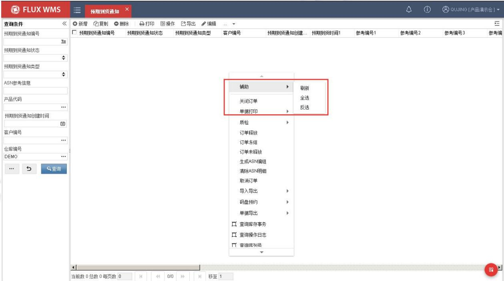

[图 3-5-23]

■ 辅助子菜单 - 较为常用的刷新、全选、反选功能，归类为辅助功能项，位于右键菜单顶部，方便用户使用。 

刷新 - 按查询条件重新触发查询刷新。 

全选 - 界面记录全部选择。 

✿ 反选 - 已选择记录取消选择，未选择记录选中。 

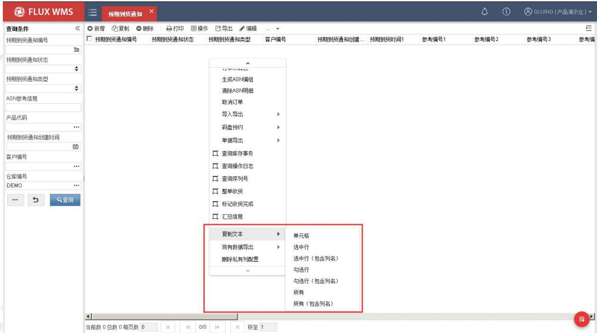

[图3-5-24]

## ■ 复制文本子菜单

作业中有复制记录信息的需要，可以通过复制文本子菜单中的功能项进行信息复制。 

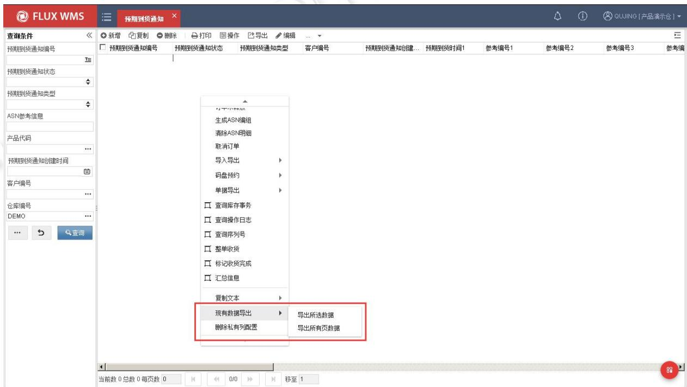

[图 3-5-25]

## ■ 现有数据导出

在子菜单中选择导出方式，点击后系统显示二级窗口，用户可选择字段导出为文件。 

## ■ 删除私有列配置

系统支持用户根据操作习惯，调整列字段排列，并保存设置。如果需要恢复初始字段排列（如应用界面表单方案，则是恢复到方案内容），可以通过右键菜单删除个性化配置，还原显示。 

需要注意的是，只有当前存在个性化配置，即私有列情况下，此右键功能才会激活、可用。 

## - 更多页签

在界面右上角，有...模式的更多页签按钮，可以进一步打开其他页签，或者相关明细信息。具体内容在不同功能中显示不同。 

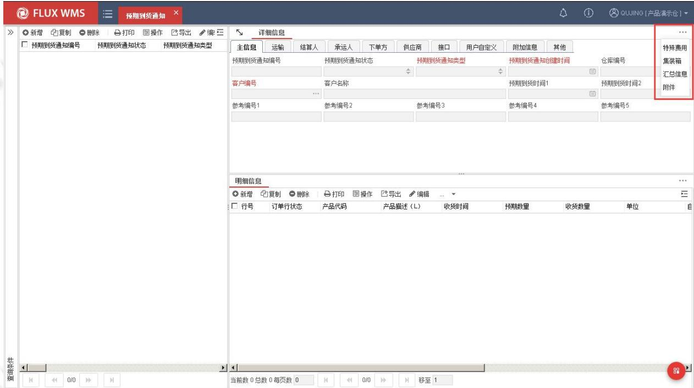

[图 3-5-26]

## - 隐藏按钮

查询结果界面，双击记录可以进入到明细显示界面，通过点击导航窗口的箭头按钮____，可以隐藏明细界面，即返回到列表显示。 

## 3.5.5. 自定义信息

在自定义页签，系统显示用户自定义、备注字段信息。 

<table><tr><td colspan="10">详细信息</td></tr><tr><td>主信息</td><td>运输</td><td>结算人</td><td>承运人</td><td>下单方</td><td>供应商</td><td>接口</td><td>用户自定义</td><td>附加信息</td><td>其他</td></tr><tr><td>自定义01</td><td colspan="2">自定义02</td><td colspan="2">自定义03</td><td colspan="2">自定义04</td><td colspan="2">自定义05</td><td>自定义06</td></tr><tr><td>自定义07</td><td colspan="2">自定义08</td><td colspan="2">用户自定义A</td><td colspan="2">用户自定义B</td><td colspan="3"></td></tr><tr><td colspan="10">备注文本</td></tr><tr><td colspan="10">明细信息</td></tr><tr><td>新增</td><td>复制</td><td>删除</td><td>打印</td><td>操作</td><td>导出</td><td>编辑</td><td colspan="3">...</td></tr><tr><td>行号</td><td>订单行状态</td><td>产品代码</td><td colspan="3">产品描述(L)</td><td>收货时间</td><td>预期数量</td><td>收货数量</td><td>单位</td></tr></table>

[图 3-5-27]

## 3.5.6. 版本信息

版本相关信息，是每个功能都具有的，其他页签中显示，每次修改保存后，版本号信息会更新。此外，在其他页签，还显示记录新增、编辑的人员和时间信息，均为只读显示信息。

<table><tr><td>主信息</td><td>运输</td><td>结算人</td><td>承运人</td><td>下单方</td><td>供应商</td><td>接口</td><td>用户自定义</td><td>附加信息</td><td>其他</td></tr><tr><td>新增人员</td><td colspan="3">新增时间</td><td>编辑人员</td><td colspan="3">编辑时间</td><td colspan="2">当前版本号</td></tr><tr><td></td><td colspan="3"></td><td></td><td colspan="3"></td><td colspan="2"></td></tr></table>

[图3-5-28]

## 4. 业务系统管理

## 4.1. 业务系统管理概述

WMS 支持多仓综合管理，因此一些多仓通用基础设置设置内容，以及仓库管理相关的内容，集合在业务系统管理菜单中进行维护。 

## 4.2. 角色信息管理

角色可以理解为某一类型的用户，或者理解为用户组，可以用来对不同用户的权限进行分类、分组管理。通过设置不同的用户角色，并给各个角色赋予不同的权限，能够快速的为新增用户配置相应权限，便于管理。 

## - 创建角色

■ 选择主菜单 “业务系统管理” 下的 “角色信息管理”。 

■ 在左侧的查询条件栏位，输入查询条件，可查询已有记录。 

■ 点击【新增】按钮，维护如下角色相关信息： 

<table><tr><td colspan="2">FLUX WMS</td><td colspan="8">角色信息管理</td></tr><tr><td colspan="2">查询条件</td><td colspan="8">新增 复制 删除 打印 操作 导</td></tr><tr><td colspan="2">角色编号</td><td rowspan="2">角色编号</td><td rowspan="2">角色名称</td><td rowspan="2" colspan="6">活动标记</td></tr><tr><td colspan="2">CHARLIE.QU</td></tr><tr><td colspan="2">角色名称</td><td>CHARLIE.QU</td><td>CHARLIE.QU</td><td colspan="6">Y</td></tr><tr><td colspan="2">活动标记</td><td></td><td></td><td></td><td></td><td></td><td></td><td></td><td></td></tr><tr><td colspan="2">是</td><td></td><td></td><td></td><td></td><td></td><td></td><td></td><td></td></tr><tr><td colspan="2">超级管理员标记</td><td></td><td></td><td></td><td></td><td></td><td></td><td></td><td></td></tr><tr><td colspan="2">否</td><td></td><td></td><td></td><td></td><td></td><td></td><td></td><td></td></tr><tr><td colspan="2">系统预置标记</td><td></td><td></td><td></td><td></td><td></td><td></td><td></td><td></td></tr><tr><td colspan="2">否</td><td></td><td></td><td></td><td></td><td></td><td></td><td></td><td></td></tr><tr><td colspan="2">仓库编号</td><td></td><td></td><td></td><td></td><td></td><td></td><td></td><td></td></tr><tr><td colspan="2">...</td><td></td><td></td><td></td><td></td><td></td><td></td><td></td><td></td></tr><tr><td colspan="2">查询</td><td></td><td></td><td></td><td></td><td></td><td></td><td></td><td></td></tr></table>

[图4-2-1]

角色编号 - 角色 ID 代码 

角色名称 - 角色描述 

邮件地址列表 - 可配置多个邮件地址，通过；进行分隔 

活动标记 - 是否使用中的记录 

超级管理员标记 - 此角色是否为超级管理员 

系统预置标记 - 记录是否为系统默认提供的初始化预设记录 

■ 点击【保存】按钮，完成角色创建 

## 4.3. 用户管理

用户，即系统操作员，凡是需要登录系统的员工，均应维护对应用户信息。同一操作账号，不可多人共用、重复登录。 

## 4.3.1. 用户创建

- 选择主菜单“业务系统管理”下的“用户管理”。 

- 在左侧的查询条件栏位，输入查询条件，可查询已有记录。 

- 点击【新增】按钮，维护如下用户相关信息： 

<table><tr><td colspan="2">FLUX WMS</td><td colspan="9">用户信息管理</td></tr><tr><td colspan="2">查询条件</td><td colspan="9">新增 复制 删除 打印 操作 导</td></tr><tr><td colspan="2">查询条件</td><td colspan="9">用户编号 用户姓名 活动标记</td></tr><tr><td colspan="2">用户编号</td><td colspan="9">QUJING QUJING Y</td></tr><tr><td colspan="11">用户编号</td></tr><tr><td colspan="11">用户编号</td></tr><tr><td colspan="11">用户编号</td></tr><tr><td colspan="11">默认角色编号</td></tr><tr><td colspan="11">D2</td></tr><tr><td colspan="11">活动标记</td></tr><tr><td colspan="11">系统预置标记</td></tr><tr><td colspan="11">部门</td></tr><tr><td colspan="11">小组</td></tr><tr><td>...</td><td colspan="10">查询</td></tr></table>

[图4-3-1]

用户编号 - 操作员 ID 

用户姓名 - 操作员名称。登陆后前台显示名称信息，并且保存后不可修改 

用户密码 - 该用户的密码。保存后不可见，如需重新初始化密码，通过右键菜单功能修改。 

确认密码 - 用户密码二次确认。 

默认角色编号 - 用户所属角色。可点击浏览按钮在二级窗口选择已维护过的角色。 

失效日期 - 用户有效截止日期 

IC 卡号 - 用户工卡号码记录 

邮件地址 - 该用户的 Email 地址 

联系电话 - 该用户的电话记录 

部门 - 该用户的所属部门 

小组 - 该用户的所属小组 

活动标记 - 是否使用中的记录 

系统预置标记 - 记录是否为系统默认提供的初始化预设记录 

- 点击【保存】按钮，完成用户创建 

## 4.3.2. 多角色维护

部分情况下，有时个别用户会需要具有多个角色的权限。例如现场分为收货组、发货组，分别创建角色，维护用户，具有不同权限。但临时有一个小组，会根据现场工作量，在收货、发货工作间进行支援，需要具有收发2类权限。我们可以单独为这个小组创建一个独立角色，授予更多权限，也可以为这个小组的用户设置多角色，同时具有收货角色、发货角色。 

- 在多角色管理页签，点击新增按钮，新增记录，默认为主信息的用户，在多角色维护页签中，输入用户所属的角色，多个角色各自一行记录。 

<table><tr><td colspan="101">FLUX WMS</td><td></td></tr><tr><td colspan="100">查询条件</td><td></td><td></td></tr><tr><td rowspan="2" colspan="98">用户编号</td><td></td><td></td><td></td><td></td></tr><tr><td></td><td></td><td></td><td></td><td></td><td></td><td></td><td></td><td></td><td></td><td></td><td></td><td></td><td></td><td></td><td></td><td></td></tr><tr><td colspan="94">用户姓名</td><td></td><td></td><td></td><td></td><td></td><td></td><td></td><td></td></tr><tr><td colspan="90">默认角色编号</td><td></td><td></td><td></td><td></td><td></td><td></td><td></td><td></td><td></td><td></td><td></td><td></td></tr><tr><td colspan="85">D2</td><td></td><td></td><td></td><td></td><td></td><td></td><td></td><td></td><td></td><td></td><td></td><td></td><td></td><td></td><td></td><td></td><td></td></tr><tr><td colspan="82">活动标记</td><td></td><td></td><td></td><td></td><td></td><td></td><td></td><td></td><td></td><td></td><td></td><td></td><td></td><td></td><td></td><td></td><td></td><td></td><td></td><td></td></tr><tr><td colspan="80">系统预置标记</td><td></td><td></td><td></td><td></td><td></td><td></td><td></td><td></td><td></td><td></td><td></td><td></td><td></td><td></td><td></td><td></td><td></td><td></td><td></td><td></td><td></td><td></td></tr><tr><td colspan="75">部门</td><td></td><td></td><td></td><td></td><td></td><td></td><td></td><td></td><td></td><td></td><td></td><td></td><td></td><td></td><td></td><td></td><td></td><td></td><td></td><td></td><td></td><td></td><td></td><td></td><td></td><td></td><td></td></tr><tr><td colspan="73">小组</td><td></td><td></td><td></td><td></td><td></td><td></td><td></td><td></td><td></td><td></td><td></td><td></td><td></td><td></td><td></td><td></td><td></td><td></td><td></td><td></td><td></td><td></td><td></td><td></td><td></td><td></td><td></td><td></td><td></td></tr><tr><td>...</td><td>查询</td><td>查询</td><td>查询</td><td>查询</td><td>查询</td><td>查询</td><td>查询</td><td>查询</td><td>查询</td><td>查询</td><td>查询</td><td>查询</td><td>查询</td><td>查询</td><td>查询</td><td>查询</td><td>查询</td><td>查询</td><td>查询</td><td>查询</td><td>查询</td><td>查询</td><td>查询</td><td>查询</td><td>查询</td><td>查询</td><td>查询</td><td>查询</td><td>查询</td><td>查询</td><td>查询</td><td>查询</td><td>查询</td><td>查询</td><td>查询</td><td>查询</td><td>查询</td><td>查询</td><td>查询</td><td>查询</td><td>查询</td><td>查询</td><td>查询</td><td>查询</td><td>查询</td><td>查询</td><td>查询</td><td>查询</td><td>查询</td><td>查询</td><td>query</td><td>查询</td><td>查询</td><td>查询</td><td>查询</td><td>查询</td><td>查询</td><td>查询</td><td>查询</td><td>查询</td><td>查询</td><td>查询</td><td>查询</td><td>查询</td><td>查询</td><td>查询</td><td>查询</td><td>查询</td><td>查询</td><td>查询</td><td>查询</td><td>查询</td><td>查询</td><td>查询</td><td>查询</td><td>查询</td><td>查询</td><td>查询</td><td>查询</td><td>查询</td><td>查询</td><td>查询</td><td>查询</td><td>查询</td><td>查询</td><td>查询</td><td>查询</td><td>查询</td><td>查询</td><td>查询</td><td>查询</td><td>查询</td><td>查询</td><td>查询</td><td>查询</td><td>查询</td><td>查询</td><td>查询</td><td>查询</td><td>查询</td><td>查看</td></tr></table>

[图4-3-2]

## 4.3.3. 用户授权仓库

不同用户，可以登录作业的仓库设置不同。例如北京仓的员工，只能登录北京仓库，但无权登录上海仓库进行操作。然而库存调拨管理员（非 ERP 管理情况下）则需要查看到北京、上海仓库的库存情况。 

通常情况下，跨仓角色，不会负责具体的收发货等实际操作，此类控制会在功能权限环节控制。但对于用户可以访问的仓库，需要单独进行授权。由于用户作业的物理地点属于必备信息，因此一般不会存在用户或者角色自动具有全部仓库权限的情况，需要通过授予获得仓库操作权限。 

## - 用户授权仓库

■ 针对已创建的用户，选择“用户授权仓库”页签 

■ 点击页签内的【新增】按钮，为当前用户指定可登录的仓库 

<table><tr><td rowspan="80" colspan="101">查询条件
用户编号
用户姓名
默认角色编号
D2
活动标记
系统预置标记
部门
小组
...  查询</td></tr><tr></tr><tr><td></td><td></td><td></td><td></td><td></td><td></td></tr><tr><td></td><td></td><td></td><td></td><td></td><td></td><td></td><td></td><td></td><td></td><td></td></tr><tr><td></td><td></td><td></td><td></td><td></td><td></td><td></td><td></td><td></td><td></td><td></td><td></td><td></td><td></td><td></td></tr><tr><td></td><td></td><td></td><td></td><td></td><td></td><td></td><td></td><td></td><td></td><td></td><td></td><td></td><td></td><td></td><td></td><td></td><td></td></tr><tr><td></td><td></td><td></td><td></td><td></td><td></td><td></td><td></td><td></td><td></td><td></td><td></td><td></td><td></td><td></td><td></td><td></td><td></td><td></td><td></td><td></td><td></td><td></td></tr><tr><td></td><td></td><td></td><td></td><td></td><td></td><td></td><td></td><td></td><td></td><td></td><td></td><td></td><td></td><td></td><td></td><td></td><td></td><td></td><td></td><td></td><td></td><td></td><td></td><td></td><td></td></tr><tr><td></td><td></td><td></td><td></td><td></td><td></td><td></td><td></td><td></td><td></td><td></td><td></td><td></td><td></td><td></td><td></td><td></td><td></td><td></td><td></td><td></td><td></td><td></td><td></td><td></td><td></td><td></td><td></td></tr><tr><td rowspan="3"></td><td rowspan="2"></td><td rowspan="2"></td><td rowspan="2"></td><td rowspan="2"></td><td></td><td></td><td></td><td></td><td></td><td></td><td></td><td></td><td></td><td></td><td></td><td></td><td></td><td></td><td></td><td></td><td></td><td></td><td></td><td></td><td></td><td></td><td></td><td></td><td></td><td></td><td></td><td></td><td></td><td></td><td></td><td></td><td></td><td></td><td></td></tr><tr><td></td><td></td><td></td><td></td><td></td><td></td><td></td><td></td><td></td><td></td><td></td><td></td><td></td><td></td><td></td><td></td><td></td><td></td><td></td><td></td><td></td><td></td><td></td><td></td><td></td><td></td><td></td><td></td><td></td><td></td><td></td><td></td><td></td><td></td><td></td></tr><tr><td></td><td></td><td></td><td></td><td></td><td></td><td></td><td></td><td></td><td></td><td></td><td></td><td></td><td></td><td></td><td></td><td></td><td></td><td></td><td></td><td></td><td></td><td></td><td></td><td></td><td></td><td></td><td></td><td></td><td></td><td></td><td></td><td></td><td></td><td></td><td></td><td></td><td></td><td></td></tr><tr><td></td><td></td><td></td><td></td><td></td><td></td><td></td><td></td><td></td><td></td><td></td><td></td><td></td><td></td><td></td><td></td><td></td><td></td><td></td><td></td><td></td><td></td><td></td><td></td><td></td><td></td><td></td><td></td><td></td><td></td><td></td><td></td><td></td><td></td><td></td><td></td><td></td><td></td><td></td><td></td><td></td></tr><tr><td></td><td></td><td></td><td></td><td></td><td></td><td></td><td></td><td></td><td></td><td></td><td></td><td></td><td></td><td></td><td></td><td></td><td></td><td></td><td></td><td></td><td></td><td></td><td></td><td></td><td></td><td></td><td></td><td></td><td></td><td></td><td></td><td></td><td></td><td></td><td></td><td></td><td></td><td></td><td></td><td></td><td></td><td></td></tr><tr><td></td><td></td><td></td><td></td><td></td><td></td><td></td><td></td><td></td><td></td><td></td><td></td><td></td><td></td><td></td><td></td><td></td><td></td><td></td><td></td><td></td><td></td><td></td><td></td><td></td><td></td><td></td><td></td><td></td><td></td><td></td><td></td><td></td><td></td><td></td><td></td><td></td><td></td><td></td><td></td><td></td><td></td><td></td><td></td><td></td></tr><tr><td></td><td></td><td></td><td></td><td></td><td></td><td></td><td></td><td></td><td></td><td></td><td></td><td></td><td></td><td></td><td></td><td></td><td></td><td></td><td></td><td></td><td></td><td></td><td></td><td></td><td></td><td></td><td></td><td></td><td></td><td></td><td></td><td></td><td></td><td></td><td></td><td></td><td></td><td></td><td></td><td></td><td></td><td></td><td></td><td></td><td></td><td></td></tr><tr><td></td><td></td><td></td><td></td><td></td><td></td><td></td><td></td><td></td><td></td><td></td><td></td><td></td><td></td><td></td><td></td><td></td><td></td><td></td><td></td><td></td><td></td><td></td><td></td><td></td><td></td><td></td><td></td><td></td><td></td><td></td><td></td><td></td><td></td><td></td><td></td><td></td><td></td><td></td><td></td><td></td><td></td><td></td><td></td><td></td><td></td><td></td><td></td><td></td></tr><tr><td></td><td></td><td></td><td></td><td></td><td></td><td></td><td></td><td></td><td></td><td></td><td></td><td></td><td></td><td></td><td></td><td></td><td></td><td></td><td></td><td></td><td></td><td></td><td></td><td></td><td></td><td></td><td></td><td></td><td></td><td></td><td></td><td></td><td></td><td></td><td></td><td></td><td></td><td></td><td></td><td></td><td></td><td></td><td></td><td></td><td></td><td></td><td></td><td></td><td></td></tr><tr><td></td><td></td><td></td><td></td><td></td><td></td><td></td><td></td><td></td><td></td><td></td><td></td><td></td><td></td><td></td><td></td><td></td><td></td><td></td><td></td><td></td><td></td><td></td><td></td><td></td><td></td><td></td><td></td><td></td><td></td><td></td><td></td><td></td><td></td><td></td><td></td><td></td><td></td><td></td><td></td><td></td><td></td><td></td><td></td><td></td><td></td><td></td><td></td><td></td><td></td><td></td><td></td></tr><tr><td></td><td></td><td></td><td></td><td></td><td></td><td></td><td></td><td></td><td></td><td></td><td></td><td></td><td></td><td></td><td></td><td></td><td></td><td></td><td></td><td></td><td></td><td></td><td></td><td></td><td></td><td></td><td></td><td></td><td></td><td></td><td></td><td></td><td></td><td></td><td></td><td></td><td></td><td></td><td></td><td></td><td></td><td></td><td></td><td></td><td></td><td></td><td></td><td></td><td></td><td></td><td></td><td></td><td></td><td></td></tr><tr><td rowspan="5"></td><td></td><td></td><td></td><td></td><td></td><td></td><td></td><td></td><td></td><td></td><td></td><td></td><td></td><td></td><td></td><td></td><td></td><td></td><td></td><td></td><td></td><td></td><td></td><td></td><td></td><td></td><td></td><td></td><td></td><td></td><td></td><td></td><td></td><td></td><td></td><td></td><td></td><td></td><td></td><td></td><td></td><td></td><td></td><td></td><td></td><td></td><td></td><td></td><td></td><td></td><td></td><td></td><td></td><td></td><td></td><td></td></tr><tr><td></td><td></td><td></td><td></td><td></td><td></td><td></td><td></td><td></td><td></td><td></td><td></td><td></td><td></td><td></td><td></td><td></td><td></td><td></td><td></td><td></td><td></td><td></td><td></td><td></td><td></td><td></td><td></td><td></td><td></td><td></td><td></td><td></td><td></td><td></td><td></td><td></td><td></td><td></td><td></td><td></td><td></td><td></td><td></td><td></td><td></td><td></td><td></td><td></td><td></td><td></td><td></td><td></td><td></td><td></td><td></td><td></td><td></td><td></td><td></td></tr><tr><td rowspan="3"></td><td></td><td></td><td></td><td></td><td></td><td></td><td></td><td></td><td></td><td></td><td></td><td></td><td></td><td></td><td></td><td></td><td></td><td></td><td></td><td></td><td></td><td></td><td></td><td></td><td></td><td></td><td></td><td></td><td></td><td></td><td></td><td></td><td></td><td></td><td></td><td></td><td></td><td></td><td></td><td></td><td></td><td></td><td></td><td></td><td></td><td></td><td></td><td></td><td></td><td></td><td></td><td></td><td></td><td></td><td></td><td></td><td></td><td></td><td></td><td></td><td></td></tr><tr><td></td><td></td><td></td><td></td><td></td><td></td><td></td><td></td><td></td><td></td><td></td><td></td><td></td><td></td><td></td><td></td><td></td><td></td><td></td><td></td><td></td><td></td><td></td><td></td><td></td><td></td><td></td><td></td><td></td><td></td><td></td><td></td><td></td><td></td><td></td><td></td><td></td><td></td><td></td><td></td><td></td><td></td><td></td><td></td><td></td><td></td><td></td><td></td><td></td><td></td><td></td><td></td><td></td><td></td><td></td><td></td><td></td><td></td><td></td><td></td><td></td><td></td><td></td></tr><tr><td></td><td></td><td></td><td></td><td></td><td></td><td></td><td></td><td></td><td></td><td></td><td></td><td></td><td></td><td></td><td></td><td></td><td></td><td></td><td></td><td></td><td></td><td></td><td></td><td></td><td></td><td></td><td></td><td></td><td></td><td></td><td></td><td></td><td></td><td></td><td></td><td></td><td></td><td></td><td></td><td></td><td></td><td></td><td></td><td></td><td></td><td></td><td></td><td></td><td></td><td></td><td></td><td></td><td></td><td></td><td></td><td></td><td></td><td></td><td></td><td></td><td></td><td></td></tr><tr><td></td><td></td><td></td><td></td><td></td><td></td><td></td><td></td><td></td><td></td><td></td><td></td><td></td><td></td><td></td><td></td><td></td><td></td><td></td><td></td><td></td><td></td><td></td><td></td><td></td><td></td><td></td><td></td><td></td><td></td><td></td><td></td><td></td><td></td><td></td><td></td><td></td><td></td><td></td><td></td><td></td><td></td><td></td><td></td><td></td><td></td><td></td><td></td><td></td><td></td><td></td><td></td><td></td><td></td><td></td><td></td><td></td><td></td><td></td><td></td><td></td><td></td><td></td><td></td><td></td><td></td><td></td><td></td><td></td><td></td></tr><tr><td></td><td></td><td></td><td></td><td></td><td></td><td></td><td></td><td></td><td></td><td></td><td></td><td></td><td></td><td></td><td></td><td></td><td></td><td></td><td></td><td></td><td></td><td></td><td></td><td></td><td></td><td></td><td></td><td></td><td></td><td></td><td></td><td></td><td></td><td></td><td></td><td></td><td></td><td></td><td></td><td></td><td></td><td></td><td></td><td></td><td></td><td></td><td></td><td></td><td></td><td></td><td></td><td></td><td></td><td></td><td></td><td></td><td></td><td></td><td></td><td></td><td></td><td></td><td></td><td></td><td></td><td></td><td></td><td></td><td></td><td></td><td></td><td></td><td></td></tr><tr><td></td><td></td><td></td><td></td><td></td><td></td><td></td><td></td><td></td><td></td><td></td><td></td><td></td><td></td><td></td><td></td><td></td><td></td><td></td><td></td><td></td><td></td><td></td><td></td><td></td><td></td><td></td><td></td><td></td><td></td><td></td><td></td><td></td><td></td><td></td><td></td><td></td><td></td><td></td><td></td><td></td><td></td><td></td><td></td><td></td><td></td><td></td><td></td><td></td><td></td><td></td><td></td><td></td><td></td><td></td><td></td><td></td><td></td><td></td><td></td><td></td><td></td><td></td><td></td><td></td><td></td><td></td><td></td><td></td><td></td><td></td><td></td><td></td><td></td><td></td></tr><tr><td></td><td></td><td></td><td></td><td></td><td></td><td></td><td></td><td></td><td></td><td></td><td></td><td></td><td></td><td></td><td></td><td></td><td></td><td></td><td></td><td></td><td></td><td></td><td></td><td></td><td></td><td></td><td></td><td></td><td></td><td></td><td></td><td></td><td></td><td></td><td></td><td></td><td></td><td></td><td></td><td></td><td></td><td></td><td></td><td></td><td></td><td></td><td></td><td></td><td></td><td></td><td></td><td></td><td></td><td></td><td></td><td></td><td></td><td></td><td></td><td></td><td></td><td></td><td></td><td></td><td></td><td></td><td></td><td></td><td></td><td></td><td></td><td></td><td></td><td></td></tr><tr><td></td><td></td><td></td><td></td><td></td><td></td><td></td><td></td><td></td><td></td><td></td><td></td><td></td><td></td><td></td><td></td><td></td><td></td><td></td><td></td><td></td><td></td><td></td><td></td><td></td><td></td><td></td><td></td><td></td><td></td><td></td><td></td><td></td><td></td><td></td><td></td><td></td><td></td><td></td><td></td><td></td><td></td><td></td><td></td><td></td><td></td><td></td><td></td><td></td><td></td><td></td><td></td><td></td><td></td><td></td><td></td><td></td><td></td><td></td><td></td><td></td><td></td><td></td><td></td><td></td><td></td><td></td><td></td><td></td><td></td><td></td><td></td><td></td><td></td><td></td></tr><tr><td></td><td></td><td></td><td></td><td></td><td></td><td></td><td></td><td></td><td></td><td></td><td></td><td></td><td></td><td></td><td></td><td></td><td></td><td></td><td></td><td></td><td></td><td></td><td></td><td></td><td></td><td></td><td></td><td></td><td></td><td></td><td></td><td></td><td></td><td></td><td></td><td></td><td></td><td></td><td></td><td></td><td></td><td></td><td></td><td></td><td></td><td></td><td></td><td></td><td></td><td></td><td></td><td></td><td></td><td></td><td></td><td></td><td></td><td></td><td></td><td></td><td></td><td></td><td></td><td></td><td></td><td></td><td></td><td></td><td></td><td></td><td></td><td></td><td></td><td></td></tr><tr><td></td><td></td><td></td><td></td><td></td><td></td><td></td><td></td><td></td><td></td><td></td><td></td><td></td><td></td><td></td><td></td><td></td><td></td><td></td><td></td><td></td><td></td><td></td><td></td><td></td><td></td><td></td><td></td><td></td><td></td><td></td><td></td><td></td><td></td><td></td><td></td><td></td><td></td><td></td><td></td><td></td><td></td><td></td><td></td><td></td><td></td><td></td><td></td><td></td><td></td><td></td><td></td><td></td><td></td><td></td><td></td><td></td><td></td><td></td><td></td><td></td><td></td><td></td><td></td><td></td><td></td><td></td><td></td><td></td><td></td><td></td><td></td><td></td><td></td><td></td></tr><tr><td></td><td></td><td></td><td></td><td></td><td></td><td></td><td></td><td></td><td></td><td></td><td></td><td></td><td></td><td></td><td></td><td></td><td></td><td></td><td></td><td></td><td></td><td></td><td></td><td></td><td></td><td></td><td></td><td></td><td></td><td></td><td></td><td></td><td></td><td></td><td></td><td></td><td></td><td></td><td></td><td></td><td></td><td></td><td></td><td></td><td></td><td></td><td></td><td></td><td></td><td></td><td></td><td></td><td></td><td></td><td></td><td></td><td></td><td></td><td></td><td></td><td></td><td></td><td></td><td></td><td></td><td></td><td></td><td></td><td></td><td></td><td></td><td></td><td></td><td></td></tr><tr><td></td><td></td><td></td><td></td><td></td><td></td><td></td><td></td><td></td><td></td><td></td><td></td><td></td><td></td><td></td><td></td><td></td><td></td><td></td><td></td><td></td><td></td><td></td><td></td><td></td><td></td><td></td><td></td><td></td><td></td><td></td><td></td><td></td><td></td><td></td><td></td><td></td><td></td><td></td><td></td><td></td><td></td><td></td><td></td><td></td><td></td><td></td><td></td><td></td><td></td><td></td><td></td><td></td><td></td><td></td><td></td><td></td><td></td><td></td><td></td><td></td><td></td><td></td><td></td><td></td><td></td><td></td><td></td><td></td><td></td><td></td><td></td><td></td><td></td><td></td></tr><tr><td>U</td><td rowspan="7" colspan="4"></td><td></td><td></td><td></td><td></td><td></td><td></td><td></td><td></td><td></td><td></td><td></td><td></td><td></td><td></td><td></td><td></td><td></td><td></td><td></td><td></td><td></td><td></td><td></td><td></td><td></td><td></td><td></td><td></td><td></td><td></td><td></td><td></td><td></td><td></td><td></td><td></td><td></td><td></td><td></td><td></td><td></td><td></td><td></td><td></td><td></td><td></td><td></td><td></td><td></td><td></td><td></td><td></td><td></td><td></td><td></td><td></td><td></td><td></td><td></td><td></td><td></td><td></td><td></td><td></td><td></td><td></td><td></td><td></td><td></td><td></td><td></td><td></td><td></td><td></td></tr><tr><td></td><td></td><td></td><td></td><td></td><td></td><td></td><td></td><td></td><td></td><td></td><td></td><td></td><td></td><td></td><td></td><td></td><td></td><td></td><td></td><td></td><td></td><td></td><td></td><td></td><td></td><td></td><td></td><td></td><td></td><td></td><td></td><td></td><td></td><td></td><td></td><td></td><td></td><td></td><td></td><td></td><td></td><td></td><td></td><td></td><td></td><td></td><td></td><td></td><td></td><td></td><td></td><td></td><td></td><td></td><td></td><td></td><td></td><td></td><td></td><td></td><td></td><td></td><td></td><td></td><td></td><td></td><td></td><td></td><td></td><td></td><td></td><td></td><td></td><td></td></tr><tr><td></td><td></td><td></td><td></td><td></td><td></td><td></td><td></td><td></td><td></td><td></td><td></td><td></td><td></td><td></td><td></td><td></td><td></td><td></td><td></td><td></td><td></td><td></td><td></td><td></td><td></td><td></td><td></td><td></td><td></td><td></td><td></td><td></td><td></td><td></td><td></td><td></td><td></td><td></td><td></td><td></td><td></td><td></td><td></td><td></td><td></td><td></td><td></td><td></td><td></td><td></td><td></td><td></td><td></td><td></td><td></td><td></td><td></td><td></td><td></td><td></td><td></td><td></td><td></td><td></td><td></td><td></td><td></td><td></td><td></td><td></td><td></td><td></td><td></td><td></td></tr><tr><td></td><td></td><td></td><td></td><td></td><td></td><td></td><td></td><td></td><td></td><td></td><td></td><td></td><td></td><td></td><td></td><td></td><td></td><td></td><td></td><td></td><td></td><td></td><td></td><td></td><td></td><td></td><td></td><td></td><td></td><td></td><td></td><td></td><td></td><td></td><td></td><td></td><td></td><td></td><td></td><td></td><td></td><td></td><td></td><td></td><td></td><td></td><td></td><td></td><td></td><td></td><td></td><td></td><td></td><td></td><td></td><td></td><td></td><td></td><td></td><td></td><td></td><td></td><td></td><td></td><td></td><td></td><td></td><td></td><td></td><td></td><td></td><td></td><td></td><td></td></tr><tr><td></td><td></td><td></td><td></td><td></td><td></td><td></td><td></td><td></td><td></td><td></td><td></td><td></td><td></td><td></td><td></td><td></td><td></td><td></td><td></td><td></td><td></td><td></td><td></td><td></td><td></td><td></td><td></td><td></td><td></td><td></td><td></td><td></td><td></td><td></td><td></td><td></td><td></td><td></td><td></td><td></td><td></td><td></td><td></td><td></td><td></td><td></td><td></td><td></td><td></td><td></td><td></td><td></td><td></td><td></td><td></td><td></td><td></td><td></td><td></td><td></td><td></td><td></td><td></td><td></td><td></td><td></td><td></td><td></td><td></td><td></td><td></td><td></td><td></td><td></td></tr><tr><td></td><td></td><td></td><td></td><td></td><td></td><td></td><td></td><td></td><td></td><td></td><td></td><td></td><td></td><td></td><td></td><td></td><td></td><td></td><td></td><td></td><td></td><td></td><td></td><td></td><td></td><td></td><td></td><td></td><td></td><td></td><td></td><td></td><td></td><td></td><td></td><td></td><td></td><td></td><td></td><td></td><td></td><td></td><td></td><td></td><td></td><td></td><td></td><td></td><td></td><td></td><td></td><td></td><td></td><td></td><td></td><td></td><td></td><td></td><td></td><td></td><td></td><td></td><td></td><td></td><td></td><td></td><td></td><td></td><td></td><td></td><td></td><td></td><td></td><td></td></tr><tr><td></td><td></td><td></td><td></td><td></td><td></td><td></td><td></td><td></td><td></td><td></td><td></td><td></td><td></td><td></td><td></td><td></td><td></td><td></td><td></td><td></td><td></td><td></td><td></td><td></td><td></td><td></td><td></td><td></td><td></td><td></td><td></td><td></td><td></td><td></td><td></td><td></td><td></td><td></td><td></td><td></td><td></td><td></td><td></td><td></td><td></td><td></td><td></td><td></td><td></td><td></td><td></td><td></td><td></td><td></td><td></td><td></td><td></td><td></td><td></td><td></td><td></td><td></td><td></td><td></td><td></td><td></td><td></td><td></td><td></td><td></td><td></td><td></td><td></td><td></td></tr><tr><td colspan="4"></td><td></td><td></td><td></td><td></td><td></td><td></td><td></td><td></td><td></td><td></td><td></td><td></td><td></td><td></td><td></td><td></td><td></td><td></td><td></td><td></td><td></td><td></td><td></td><td></td><td></td><td></td><td></td><td></td><td></td><td></td><td></td><td></td><td></td><td></td><td></td><td></td><td></td><td></td><td></td><td></td><td></td><td></td><td></td><td></td><td></td><td></td><td></td><td></td><td></td><td></td><td></td><td></td><td></td><td></td><td></td><td></td><td></td><td></td><td></td><td></td><td></td><td></td><td></td><td></td><td></td><td></td><td></td><td></td><td></td><td></td><td></td><td></td><td></td><td></td><td></td></tr><tr><td></td><td></td><td></td><td></td><td></td><td></td><td></td><td></td><td></td><td></td><td></td><td></td><td></td><td></td><td></td><td></td><td></td><td></td><td></td><td></td><td></td><td></td><td></td><td></td><td></td><td></td><td></td><td></td><td></td><td></td><td></td><td></td><td></td><td></td><td></td><td></td><td></td><td></td><td></td><td></td><td></td><td></td><td></td><td></td><td></td><td></td><td></td><td></td><td></td><td></td><td></td><td></td><td></td><td></td><td></td><td></td><td></td><td></td><td></td><td></td><td></td><td></td><td></td><td></td><td></td><td></td><td></td><td></td><td></td><td></td><td></td><td></td><td></td><td></td><td></td><td></td><td></td><td></td><td></td><td></td><td></td><td></td><td></td><td></td><td></td></tr><tr><td></td><td></td><td></td><td></td><td></td><td></td><td></td><td></td><td></td><td></td><td></td><td></td><td></td><td></td><td></td><td></td><td></td><td></td><td></td><td></td><td></td><td></td><td></td><td></td><td></td><td></td><td></td><td></td><td></td><td></td><td></td><td></td><td></td><td></td><td></td><td></td><td></td><td></td><td></td><td></td><td></td><td></td><td></td><td></td><td></td><td></td><td></td><td></td><td></td><td></td><td></td><td></td><td></td><td></td><td></td><td></td><td></td><td></td><td></td><td></td><td></td><td></td><td></td><td></td><td></td><td></td><td></td><td></td><td></td><td></td><td></td><td></td><td></td><td></td><td></td><td></td><td></td><td></td><td></td><td></td><td></td><td></td><td></td><td></td><td></td></tr><tr><td></td><td></td><td></td><td></td><td></td><td></td><td></td><td></td><td></td><td></td><td></td><td></td><td></td><td></td><td></td><td></td><td></td><td></td><td></td><td></td><td></td><td></td><td></td><td></td><td></td><td></td><td></td><td></td><td></td><td></td><td></td><td></td><td></td><td></td><td></td><td></td><td></td><td></td><td></td><td></td><td></td><td></td><td></td><td></td><td></td><td></td><td></td><td></td><td></td><td></td><td></td><td></td><td></td><td></td><td></td><td></td><td></td><td></td><td></td><td></td><td></td><td></td><td></td><td></td><td></td><td></td><td></td><td></td><td></td><td></td><td></td><td></td><td></td><td></td><td></td><td></td><td></td><td></td><td></td><td></td><td></td><td></td><td></td><td></td><td></td></tr><tr><td></td><td></td><td></td><td></td><td></td><td></td><td></td><td></td><td></td><td></td><td></td><td></td><td></td><td></td><td></td><td></td><td></td><td></td><td></td><td></td><td></td><td></td><td></td><td></td><td></td><td></td><td></td><td></td><td></td><td></td><td></td><td></td><td></td><td></td><td></td><td></td><td></td><td></td><td></td><td></td><td></td><td></td><td></td><td></td><td></td><td></td><td></td><td></td><td></td><td></td><td></td><td></td><td></td><td></td><td></td><td></td><td></td><td></td><td></td><td></td><td></td><td></td><td></td><td></td><td></td><td></td><td></td><td></td><td></td><td></td><td></td><td></td><td></td><td></td><td></td><td></td><td></td><td></td><td></td><td></td><td></td><td></td><td></td><td></td><td></td></tr><tr><td></td><td></td><td></td><td></td><td></td><td></td><td></td><td></td><td></td><td></td><td></td><td></td><td></td><td></td><td></td><td></td><td></td><td></td><td></td><td></td><td></td><td></td><td></td><td></td><td></td><td></td><td></td><td></td><td></td><td></td><td></td><td></td><td></td><td></td><td></td><td></td><td></td><td></td><td></td><td></td><td></td><td></td><td></td><td></td><td></td><td></td><td></td><td></td><td></td><td></td><td></td><td></td><td></td><td></td><td></td><td></td><td></td><td></td><td></td><td></td><td></td><td></td><td></td><td></td><td></td><td></td><td></td><td></td><td></td><td></td><td></td><td></td><td></td><td></td><td></td><td></td><td></td><td></td><td></td><td></td><td></td><td></td><td></td><td></td><td></td></tr><tr><td></td><td></td><td></td><td></td><td></td><td></td><td></td><td></td><td></td><td></td><td></td><td></td><td></td><td></td><td></td><td></td><td></td><td></td><td></td><td></td><td></td><td></td><td></td><td></td><td></td><td></td><td></td><td></td><td></td><td></td><td></td><td></td><td></td><td></td><td></td><td></td><td></td><td></td><td></td><td></td><td></td><td></td><td></td><td></td><td></td><td></td><td></td><td></td><td></td><td></td><td></td><td></td><td></td><td></td><td></td><td></td><td></td><td></td><td></td><td></td><td></td><td></td><td></td><td></td><td></td><td></td><td></td><td></td><td></td><td></td><td></td><td></td><td></td><td></td><td></td><td></td><td></td><td></td><td></td><td></td><td></td><td></td><td></td><td></td><td></td></tr><tr><td></td><td></td><td></td><td></td><td></td><td></td><td></td><td></td><td></td><td></td><td></td><td></td><td></td><td></td><td></td><td></td><td></td><td></td><td></td><td></td><td></td><td></td><td></td><td></td><td></td><td></td><td></td><td></td><td></td><td></td><td></td><td></td><td></td><td></td><td></td><td></td><td></td><td></td><td></td><td></td><td></td><td></td><td></td><td></td><td></td><td></td><td></td><td></td><td></td><td></td><td></td><td></td><td></td><td></td><td></td><td></td><td></td><td></td><td></td><td></td><td></td><td></td><td></td><td></td><td></td><td></td><td></td><td></td><td></td><td></td><td></td><td></td><td></td><td></td><td></td><td></td><td></td><td></td><td></td><td></td><td></td><td></td><td></td><td></td><td></td></tr><tr><td></td><td></td><td></td><td></td><td></td><td></td><td></td><td></td><td></td><td></td><td></td><td></td><td></td><td></td><td></td><td></td><td></td><td></td><td></td><td></td><td></td><td></td><td></td><td></td><td></td><td></td><td></td><td></td><td></td><td></td><td></td><td></td><td></td><td></td><td></td><td></td><td></td><td></td><td></td><td></td><td></td><td></td><td></td><td></td><td></td><td></td><td></td><td></td><td></td><td></td><td></td><td></td><td></td><td></td><td></td><td></td><td></td><td></td><td></td><td></td><td></td><td></td><td></td><td></td><td></td><td></td><td></td><td></td><td></td><td></td><td></td><td></td><td></td><td></td><td></td><td></td><td></td><td></td><td></td><td></td><td></td><td></td><td></td><td></td><td></td></tr><tr><td></td><td></td><td></td><td></td><td></td><td></td><td></td><td></td><td></td><td></td><td></td><td></td><td></td><td></td><td></td><td></td><td></td><td></td><td></td><td></td><td></td><td></td><td></td><td></td><td></td><td></td><td></td><td></td><td></td><td></td><td></td><td></td><td></td><td></td><td></td><td></td><td></td><td></td><td></td><td></td><td></td><td></td><td></td><td></td><td></td><td></td><td></td><td></td><td></td><td></td><td></td><td></td><td></td><td></td><td></td><td></td><td></td><td></td><td></td><td></td><td></td><td></td><td></td><td></td><td></td><td></td><td></td><td></td><td></td><td></td><td></td><td></td><td></td><td></td><td></td><td></td><td></td><td></td><td></td><td></td><td></td><td></td><td></td><td></td><td></td></tr><tr><td></td><td></td><td></td><td></td><td></td><td></td><td></td><td></td><td></td><td></td><td></td><td></td><td></td><td></td><td></td><td></td><td></td><td></td><td></td><td></td><td></td><td></td><td></td><td></td><td></td><td></td><td></td><td></td><td></td><td></td><td></td><td></td><td></td><td></td><td></td><td></td><td></td><td></td><td></td><td></td><td></td><td></td><td></td><td></td><td></td><td></td><td></td><td></td><td></td><td></td><td></td><td></td><td></td><td></td><td></td><td></td><td></td><td></td><td></td><td></td><td></td><td></td><td></td><td></td><td></td><td></td><td></td><td></td><td></td><td></td><td></td><td></td><td></td><td></td><td></td><td></td><td></td><td></td><td></td><td></td><td></td><td></td><td></td><td></td><td></td></tr><tr><td></td><td></td><td></td><td></td><td></td><td></td><td></td><td></td><td></td><td></td><td></td><td></td><td></td><td></td><td></td><td></td><td></td><td></td><td></td><td></td><td></td><td></td><td></td><td></td><td></td><td></td><td></td><td></td><td></td><td></td><td></td><td></td><td></td><td></td><td></td><td></td><td></td><td></td><td></td><td></td><td></td><td></td><td></td><td></td><td></td><td></td><td></td><td></td><td></td><td></td><td></td><td></td><td></td><td></td><td></td><td></td><td></td><td></td><td></td><td></td><td></td><td></td><td></td><td></td><td></td><td></td><td></td><td></td><td></td><td></td><td></td><td></td><td></td><td></td><td></td><td></td><td></td><td></td><td></td><td></td><td></td><td></td><td></td><td></td><td></td></tr><tr><td></td><td></td><td></td><td></td><td></td><td></td><td></td><td></td><td></td><td></td><td></td><td></td><td></td><td></td><td></td><td></td><td></td><td></td><td></td><td></td><td></td><td></td><td></td><td></td><td></td><td></td><td></td><td></td><td></td><td></td><td></td><td></td><td></td><td></td><td></td><td></td><td></td><td></td><td></td><td></td><td></td><td></td><td></td><td></td><td></td><td></td><td></td><td></td><td></td><td></td><td></td><td></td><td></td><td></td><td></td><td></td><td></td><td></td><td></td><td></td><td></td><td></td><td></td><td></td><td></td><td></td><td></td><td></td><td></td><td></td><td></td><td></td><td></td><td></td><td></td><td></td><td></td><td></td><td></td><td></td><td></td><td></td><td></td><td></td><td></td></tr><tr><td></td><td></td><td></td><td></td><td></td><td></td><td></td><td></td><td></td><td></td><td></td><td></td><td></td><td></td><td></td><td></td><td></td><td></td><td></td><td></td><td></td><td></td><td></td><td></td><td></td><td></td><td></td><td></td><td></td><td></td><td></td><td></td><td></td><td></td><td></td><td></td><td></td><td></td><td></td><td></td><td></td><td></td><td></td><td></td><td></td><td></td><td></td><td></td><td></td><td></td><td></td><td></td><td></td><td></td><td></td><td></td><td></td><td></td><td></td><td></td><td></td><td></td><td></td><td></td><td></td><td></td><td></td><td></td><td></td><td></td><td></td><td></td><td></td><td></td><td></td><td></td><td></td><td></td><td></td><td></td><td></td><td></td><td></td><td></td><td></td></tr><tr><td></td><td></td><td></td><td></td><td></td><td></td><td></td><td></td><td></td><td></td><td></td><td></td><td></td><td></td><td></td><td></td><td></td><td></td><td></td><td></td><td></td><td></td><td></td><td></td><td></td><td></td><td></td><td></td><td></td><td></td><td></td><td></td><td></td><td></td><td></td><td></td><td></td><td></td><td></td><td></td><td></td><td></td><td></td><td></td><td></td><td></td><td></td><td></td><td></td><td></td><td></td><td></td><td></td><td></td><td></td><td></td><td></td><td></td><td></td><td></td><td></td><td></td><td></td><td></td><td></td><td></td><td></td><td></td><td></td><td></td><td></td><td></td><td></td><td></td><td></td><td></td><td></td><td></td><td></td><td></td><td></td><td></td><td></td><td></td><td></td></tr><tr><td></td><td></td><td></td><td></td><td></td><td></td><td></td><td></td><td></td><td></td><td></td><td></td><td></td><td></td><td></td><td></td><td></td><td></td><td></td><td></td><td></td><td></td><td></td><td></td><td></td><td></td><td></td><td></td><td></td><td></td><td></td><td></td><td></td><td></td><td></td><td></td><td></td><td></td><td></td><td></td><td></td><td></td><td></td><td></td><td></td><td></td><td></td><td></td><td></td><td></td><td></td><td></td><td></td><td></td><td></td><td></td><td></td><td></td><td></td><td></td><td></td><td></td><td></td><td></td><td></td><td></td><td></td><td></td><td></td><td></td><td></td><td></td><td></td><td></td><td></td><td></td><td></td><td></td><td></td><td></td><td></td><td></td><td></td><td></td><td></td></tr><tr><td></td><td></td><td></td><td></td><td></td><td></td><td></td><td></td><td></td><td></td><td></td><td></td><td></td><td></td><td></td><td></td><td></td><td></td><td></td><td></td><td></td><td></td><td></td><td></td><td></td><td></td><td></td><td></td><td></td><td></td><td></td><td></td><td></td><td></td><td></td><td></td><td></td><td></td><td></td><td></td><td></td><td></td><td></td><td></td><td></td><td></td><td></td><td></td><td></td><td></td><td></td><td></td><td></td><td></td><td></td><td></td><td></td><td></td><td></td><td></td><td></td><td></td><td></td><td></td><td></td><td></td><td></td><td></td><td></td><td></td><td></td><td></td><td></td><td></td><td></td><td></td><td></td><td></td><td></td><td></td><td></td><td></td><td></td><td></td><td></td></tr><tr><td></td><td></td><td></td><td></td><td></td><td></td><td></td><td></td><td></td><td></td><td></td><td></td><td></td><td></td><td></td><td></td><td></td><td></td><td></td><td></td><td></td><td></td><td></td><td></td><td></td><td></td><td></td><td></td><td></td><td></td><td></td><td></td><td></td><td></td><td></td><td></td><td></td><td></td><td></td><td></td><td></td><td></td><td></td><td></td><td></td><td></td><td></td><td></td><td></td><td></td><td></td><td></td><td></td><td></td><td></td><td></td><td></td><td></td><td></td><td></td><td></td><td></td><td></td><td></td><td></td><td></td><td></td><td></td><td></td><td></td><td></td><td></td><td></td><td></td><td></td><td></td><td></td><td></td><td></td><td></td><td></td><td></td><td></td><td></td><td></td></tr><tr><td></td><td></td><td></td><td></td><td></td><td></td><td></td><td></td><td></td><td></td><td></td><td></td><td></td><td></td><td></td><td></td><td></td><td></td><td></td><td></td><td></td><td></td><td></td><td></td><td></td><td></td><td></td><td></td><td></td><td></td><td></td><td></td><td></td><td></td><td></td><td></td><td></td><td></td><td></td><td></td><td></td><td></td><td></td><td></td><td></td><td></td><td></td><td></td><td></td><td></td><td></td><td></td><td></td><td></td><td></td><td></td><td></td><td></td><td></td><td></td><td></td><td></td><td></td><td></td><td></td><td></td><td></td><td></td><td></td><td></td><td></td><td></td><td></td><td></td><td></td><td></td><td></td><td></td><td></td><td></td><td></td><td></td><td></td><td></td><td></td></tr><tr><td></td><td></td><td></td><td></td><td></td><td></td><td></td><td></td><td></td><td></td><td></td><td></td><td></td><td></td><td></td><td></td><td></td><td></td><td></td><td></td><td></td><td></td><td></td><td></td><td></td><td></td><td></td><td></td><td></td><td></td><td></td><td></td><td></td><td></td><td></td><td></td><td></td><td></td><td></td><td></td><td></td><td></td><td></td><td></td><td></td><td></td><td></td><td></td><td></td><td></td><td></td><td></td><td></td><td></td><td></td><td></td><td></td><td></td><td></td><td></td><td></td><td></td><td></td><td></td><td></td><td></td><td></td><td></td><td></td><td></td><td></td><td></td><td></td><td></td><td></td><td></td><td></td><td></td><td></td><td></td><td></td><td></td><td></td><td></td><td></td></tr><tr><td></td><td></td><td></td><td></td><td></td><td></td><td></td><td></td><td></td><td></td><td></td><td></td><td></td><td></td><td></td><td></td><td></td><td></td><td></td><td></td><td></td><td></td><td></td><td></td><td></td><td></td><td></td><td></td><td></td><td></td><td></td><td></td><td></td><td></td><td></td><td></td><td></td><td></td><td></td><td></td><td></td><td></td><td></td><td></td><td></td><td></td><td></td><td></td><td></td><td></td><td></td><td></td><td></td><td></td><td></td><td></td><td></td><td></td><td></td><td></td><td></td><td></td><td></td><td></td><td></td><td></td><td></td><td></td><td></td><td></td><td></td><td></td><td></td><td></td><td></td><td></td><td></td><td></td><td></td><td></td><td></td><td></td><td></td><td></td><td></td></tr><tr><td></td><td></td><td></td><td></td><td></td><td></td><td></td><td></td><td></td><td></td><td></td><td></td><td></td><td></td><td></td><td></td><td></td><td></td><td></td><td></td><td></td><td></td><td></td><td></td><td></td><td></td><td></td><td></td><td></td><td></td><td></td><td></td><td></td><td></td><td></td><td></td><td></td><td></td><td></td><td></td><td></td><td></td><td></td><td></td><td></td><td></td><td></td><td></td><td></td><td></td><td></td><td></td><td></td><td></td><td></td><td></td><td></td><td></td><td></td><td></td><td></td><td></td><td></td><td></td><td></td><td></td><td></td><td></td><td></td><td></td><td></td><td></td><td></td><td></td><td></td><td></td><td></td><td></td><td></td><td></td><td></td><td></td><td></td><td></td><td></td></tr><tr><td></td><td></td><td></td><td></td><td></td><td></td><td></td><td></td><td></td><td></td><td></td><td></td><td></td><td></td><td></td><td></td><td></td><td></td><td></td><td></td><td></td><td></td><td></td><td></td><td></td><td></td><td></td><td></td><td></td><td></td><td></td><td></td><td></td><td></td><td></td><td></td><td></td><td></td><td></td><td></td><td></td><td></td><td></td><td></td><td></td><td></td><td></td><td></td><td></td><td></td><td></td><td></td><td></td><td></td><td></td><td></td><td></td><td></td><td></td><td></td><td></td><td></td><td></td><td></td><td></td><td></td><td></td><td></td><td></td><td></td><td></td><td></td><td></td><td></td><td></td><td></td><td></td><td></td><td></td><td></td><td></td><td></td><td></td><td></td><td></td></tr><tr><td></td><td></td><td></td><td></td><td></td><td></td><td></td><td></td><td></td><td></td><td></td><td></td><td></td><td></td><td></td><td></td><td></td><td></td><td></td><td></td><td></td><td></td><td></td><td></td><td></td><td></td><td></td><td></td><td></td><td></td><td></td><td></td><td></td><td></td><td></td><td></td><td></td><td></td><td></td><td></td><td></td><td></td><td></td><td></td><td></td><td></td><td></td><td></td><td></td><td></td><td></td><td></td><td></td><td></td><td></td><td></td><td></td><td></td><td></td><td></td><td></td><td></td><td></td><td></td><td></td><td></td><td></td><td></td><td></td><td></td><td></td><td></td><td></td><td></td><td></td><td></td><td></td><td></td><td></td><td></td><td></td><td></td><td></td><td></td><td></td></tr><tr><td></td><td></td><td></td><td></td><td></td><td></td><td></td><td></td><td></td><td></td><td></td><td></td><td></td><td></td><td></td><td></td><td></td><td></td><td></td><td></td><td></td><td></td><td></td><td></td><td></td><td></td><td></td><td></td><td></td><td></td><td></td><td></td><td></td><td></td><td></td><td></td><td></td><td></td><td></td><td></td><td></td><td></td><td></td><td></td><td></td><td></td><td></td><td></td><td></td><td></td><td></td><td></td><td></td><td></td><td></td><td></td><td></td><td></td><td></td><td></td><td></td><td></td><td></td><td></td><td></td><td></td><td></td><td></td><td></td><td></td><td></td><td></td><td></td><td></td><td></td><td></td><td></td><td></td><td></td><td></td><td></td><td></td><td></td><td></td><td></td></tr><tr><td></td><td></td><td></td><td></td><td></td><td></td><td></td><td></td><td></td><td></td><td></td><td></td><td></td><td></td><td></td><td></td><td></td><td></td><td></td><td></td><td></td><td></td><td></td><td></td><td></td><td></td><td></td><td></td><td></td><td></td><td></td><td></td><td></td><td></td><td></td><td></td><td></td><td></td><td></td><td></td><td></td><td></td><td></td><td></td><td></td><td></td><td></td><td></td><td></td><td></td><td></td><td></td><td></td><td></td><td></td><td></td><td></td><td></td><td></td><td></td><td></td><td></td><td></td><td></td><td></td><td></td><td></td><td></td><td></td><td></td><td></td><td></td><td></td><td></td><td></td><td></td><td></td><td></td><td></td><td></td><td></td><td></td><td></td><td></td><td></td></tr><tr><td></td><td></td><td></td><td></td><td></td><td></td><td></td><td></td><td></td><td></td><td></td><td></td><td></td><td></td><td></td><td></td><td></td><td></td><td></td><td></td><td></td><td></td><td></td><td></td><td></td><td></td><td></td><td></td><td></td><td></td><td></td><td></td><td></td><td></td><td></td><td></td><td></td><td></td><td></td><td></td><td></td><td></td><td></td><td></td><td></td><td></td><td></td><td></td><td></td><td></td><td></td><td></td><td></td><td></td><td></td><td></td><td></td><td></td><td></td><td></td><td></td><td></td><td></td><td></td><td></td><td></td><td></td><td></td><td></td><td></td><td></td><td></td><td></td><td></td><td></td><td></td><td></td><td></td><td></td><td></td><td></td><td></td><td></td><td></td><td></td></tr><tr><td></td><td></td><td></td><td></td><td></td><td></td><td></td><td></td><td></td><td></td><td></td><td></td><td></td><td></td><td></td><td></td><td></td><td></td><td></td><td></td><td></td><td></td><td></td><td></td><td></td><td></td><td></td><td></td><td></td><td></td><td></td><td></td><td></td><td></td><td></td><td></td><td></td><td></td><td></td><td></td><td></td><td></td><td></td><td></td><td></td><td></td><td></td><td></td><td></td><td></td><td></td><td></td><td></td><td></td><td></td><td></td><td></td><td></td><td></td><td></td><td></td><td></td><td></td><td></td><td></td><td></td><td></td><td></td><td></td><td></td><td></td><td></td><td></td><td></td><td></td><td></td><td></td><td></td><td></td><td></td><td></td><td></td><td></td><td></td><td></td></tr><tr><td></td><td></td><td></td><td></td><td></td><td></td><td></td><td></td><td></td><td></td><td></td><td></td><td></td><td></td><td></td><td></td><td></td><td></td><td></td><td></td><td></td><td></td><td></td><td></td><td></td><td></td><td></td><td></td><td></td><td></td><td></td><td></td><td></td><td></td><td></td><td></td><td></td><td></td><td></td><td></td><td></td><td></td><td></td><td></td><td></td><td></td><td></td><td></td><td></td><td></td><td></td><td></td><td></td><td></td><td></td><td></td><td></td><td></td><td></td><td></td><td></td><td></td><td></td><td></td><td></td><td></td><td></td><td></td><td></td><td></td><td></td><td></td><td></td><td></td><td></td><td></td><td></td><td></td><td></td><td></td><td></td><td></td><td></td><td></td><td></td></tr><tr><td></td><td></td><td></td><td></td><td></td><td></td><td></td><td></td><td></td><td></td><td></td><td></td><td></td><td></td><td></td><td></td><td></td><td></td><td></td><td></td><td></td><td></td><td></td><td></td><td></td><td></td><td></td><td></td><td></td><td></td><td></td><td></td><td></td><td></td><td></td><td></td><td></td><td></td><td></td><td></td><td></td><td></td><td></td><td></td><td></td><td></td><td></td><td></td><td></td><td></td><td></td><td></td><td></td><td></td><td></td><td></td><td></td><td></td><td></td><td></td><td></td><td></td><td></td><td></td><td></td><td></td><td></td><td></td><td></td><td></td><td></td><td></td><td></td><td></td><td></td><td></td><td></td><td></td><td></td><td></td><td></td><td></td><td></td><td></td><td></td><td></td><td></td></tr><tr><td></td><td></td><td></td><td></td><td></td><td></td><td></td><td></td><td></td><td></td><td></td><td></td><td></td><td></td><td></td><td></td><td></td><td></td><td></td><td></td><td></td><td></td><td></td><td></td><td></td><td></td><td></td><td></td><td></td><td></td><td></td><td></td><td></td><td></td><td></td><td></td><td></td><td></td><td></td><td></td><td></td><td></td><td></td><td></td><td></td><td></td><td></td><td></td><td></td><td></td><td></td><td></td><td></td><td></td><td></td><td></td><td></td><td></td><td></td><td></td><td></td><td></td><td></td><td></td><td></td><td></td><td></td><td></td><td></td><td></td><td></td><td></td><td></td><td></td><td></td><td></td><td></td><td></td><td></td><td></td><td></td><td></td><td></td><td></td><td></td><td></td><td></td></tr><tr><td></td><td></td><td></td><td></td><td></td><td></td><td></td><td></td><td></td><td></td><td></td><td></td><td></td><td></td><td></td><td></td><td></td><td></td><td></td><td></td><td></td><td></td><td></td><td></td><td></td><td></td><td></td><td></td><td></td><td></td><td></td><td></td><td></td><td></td><td></td><td></td><td></td><td></td><td></td><td></td><td></td><td></td><td></td><td></td><td></td><td></td><td></td><td></td><td></td><td></td><td></td><td></td><td></td><td></td><td></td><td></td><td></td><td></td><td></td><td></td><td></td><td></td><td></td><td></td><td></td><td></td><td></td><td></td><td></td><td></td><td></td><td></td><td></td><td></td><td></td><td></td><td></td><td></td><td></td><td></td><td></td><td></td><td></td><td></td><td></td><td></td><td></td></tr><tr><td></td><td></td><td></td><td></td><td></td><td></td><td></td><td></td><td></td><td></td><td></td><td></td><td></td><td></td><td></td><td></td><td></td><td></td><td></td><td></td><td></td><td></td><td></td><td></td><td></td><td></td><td></td><td></td><td></td><td></td><td></td><td></td><td></td><td></td><td></td><td></td><td></td><td></td><td></td><td></td><td></td><td></td><td></td><td></td><td></td><td></td><td></td><td></td><td></td><td></td><td></td><td></td><td></td><td></td><td></td><td></td><td></td><td></td><td></td><td></td><td></td><td></td><td></td><td></td><td></td><td></td><td></td><td></td><td></td><td></td><td></td><td></td><td></td><td></td><td></td><td></td><td></td><td></td><td></td><td></td><td></td><td></td><td></td><td></td><td></td><td></td><td></td></tr><tr><td></td><td></td><td></td><td></td><td></td><td></td><td></td><td></td><td></td><td></td><td></td><td></td><td></td><td></td><td></td><td></td><td></td><td></td><td></td><td></td><td></td><td></td><td></td><td></td><td></td><td></td><td></td><td></td><td></td><td></td><td></td><td></td><td></td><td></td><td></td><td></td><td></td><td></td><td></td><td></td><td></td><td></td><td></td><td></td><td></td><td></td><td></td><td></td><td></td><td></td><td></td><td></td><td></td><td></td><td></td><td></td><td></td><td></td><td></td><td></td><td></td><td></td><td></td><td></td><td></td><td></td><td></td><td></td><td></td><td></td><td></td><td></td><td></td><td></td><td></td><td></td><td></td><td></td><td></td><td></td><td></td><td></td><td></td><td></td><td></td><td></td><td></td></tr><tr><td></td><td></td><td></td><td></td><td></td><td></td><td></td><td></td><td></td><td></td><td></td><td></td><td></td><td></td><td></td><td></td><td></td><td></td><td></td><td></td><td></td><td></td><td></td><td></td><td></td><td></td><td></td><td></td><td></td><td></td><td></td><td></td><td></td><td></td><td></td><td></td><td></td><td></td><td></td><td></td><td></td><td></td><td></td><td></td><td></td><td></td><td></td><td></td><td></td><td></td><td></td><td></td><td></td><td></td><td></td><td></td><td></td><td></td><td></td><td></td><td></td><td></td><td></td><td></td><td></td><td></td><td></td><td></td><td></td><td></td><td></td><td></td><td></td><td></td><td></td><td></td><td></td><td></td><td></td><td></td><td></td><td></td><td></td><td></td><td></td><td></td><td></td></tr><tr><td></td><td></td><td></td><td></td><td></td><td></td><td></td><td></td><td></td><td></td><td></td><td></td><td></td><td></td><td></td><td></td><td></td><td></td><td></td><td></td><td></td><td></td><td></td><td></td><td></td><td></td><td></td><td></td><td></td><td></td><td></td><td></td><td></td><td></td><td></td><td></td><td></td><td></td><td></td><td></td><td></td><td></td><td></td><td></td><td></td><td></td><td></td><td></td><td></td><td></td><td></td><td></td><td></td><td></td><td></td><td></td><td></td><td></td><td></td><td></td><td></td><td></td><td></td><td></td><td></td><td></td><td></td><td></td><td></td><td></td><td></td><td></td><td></td><td></td><td></td><td></td><td></td><td></td><td></td><td></td><td></td><td></td><td></td><td></td><td></td><td></td><td></td><td></td><td></td><td></td><td></td><td></td><td></td></tr><tr><td></td><td></td><td></td><td></td><td></td><td></td><td></td><td></td><td></td><td></td><td></td><td></td><td></td><td></td><td></td><td></td><td></td><td></td><td></td><td></td><td></td><td></td><td></td><td></td><td></td><td></td><td></td><td></td><td></td><td></td><td></td><td></td><td></td><td></td><td></td><td></td><td></td><td></td><td></td><td></td><td></td><td></td><td></td><td></td><td></td><td></td><td></td><td></td><td></td><td></td><td></td><td></td><td></td><td></td><td></td><td></td><td></td><td></td><td></td><td></td><td></td><td></td><td></td><td></td><td></td><td></td><td></td><td></td><td></td><td></td><td></td><td></td><td></td><td></td><td></td><td></td><td></td><td></td><td></td><td></td><td></td><td></td><td></td><td></td><td></td><td></td><td></td><td></td><td></td><td></td><td></td><td></td><td></td><td></td></tr><tr><td></td><td></td><td></td><td></td><td></td><td></td><td></td><td></td><td></td><td></td><td></td><td></td><td></td><td></td><td></td><td></td><td></td><td></td><td></td><td></td><td></td><td></td><td></td><td></td><td></td><td></td><td></td><td></td><td></td><td></td><td></td><td></td><td></td><td></td><td></td><td></td><td></td><td></td><td></td><td></td><td></td><td></td><td></td><td></td><td></td><td></td><td></td><td></td><td></td><td></td><td></td><td></td><td></td><td></td><td></td><td></td><td></td><td></td><td></td><td></td><td></td><td></td><td></td><td></td><td></td><td></td><td></td><td></td><td></td><td></td><td></td><td></td><td></td><td></td><td></td><td></td><td></td><td></td><td></td><td></td><td></td><td></td><td></td><td></td><td></td><td></td><td></td><td></td><td></td><td></td><td></td><td></td><td></td><td></td><td></td></tr><tr><td></td><td></td><td></td><td></td><td></td><td></td><td></td><td></td><td></td><td></td><td></td><td></td><td></td><td></td><td></td><td></td><td></td><td></td><td></td><td></td><td></td><td></td><td></td><td></td><td></td><td></td><td></td><td></td><td></td><td></td><td></td><td></td><td></td><td></td><td></td><td></td><td></td><td></td><td></td><td></td><td></td><td></td><td></td><td></td><td></td><td></td><td></td><td></td><td></td><td></td><td></td><td></td><td></td><td></td><td></td><td></td><td></td><td></td><td></td><td></td><td></td><td></td><td></td><td></td><td></td><td></td><td></td><td></td><td></td><td></td><td></td><td></td><td></td><td></td><td></td><td></td><td></td><td></td><td></td><td></td><td></td><td></td><td></td><td></td><td></td><td></td><td></td><td></td><td></td><td></td><td></td><td></td><td></td><td></td><td></td></tr></table>

[图4-3-3]

■ 点击【保存】按钮，完成此仓库的授权。 

## 4.3.4. 用户授权货主

不同用户，可以进行操作的货主授权不同。例如有的作业现场，作业岗位按操作维度划分，如收货岗位，发货岗位，对应用户会具有库内全部货主的操作权限。而另一部分作业现场，采用责任制管理，一个小组的多位成员或者一位成员对口负责一位或者多位货主的全程作业，即作业用户只操作自己具有权限的货主。 

对于不限制货主操作的用户或角色，无需设置货主授权。即不指定授权，等于对所有货主具有操作权限。当然具体可以进行哪些操作，要进一步根据仓库授权、功能授权进行限定。 

在需要进行货主授权的作业环境中，用户在已有权限的功能中，可以查看到具有货主权限的货主对应数据记录。 

## - 用户授权货主

■ 针对已创建的用户，选择“用户授权货主”页签 ■ 点击页签内的【新增】按钮，为当前用户指定一个可操作的的货主，使得用户对此货主具有操作权限 

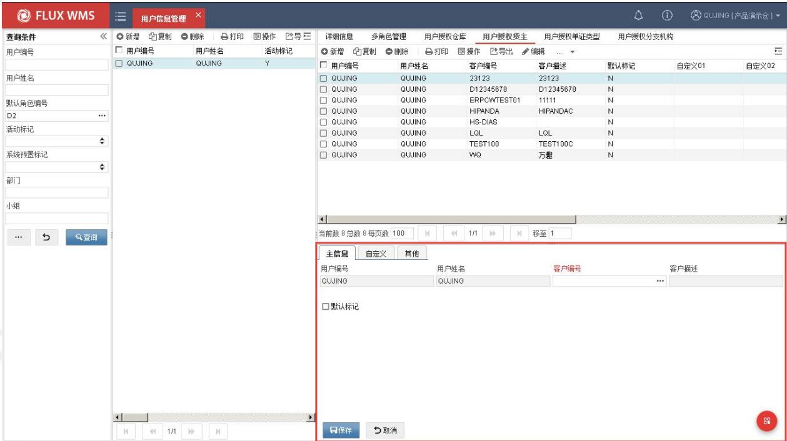

[图 4-3-4]

■ 如勾选“默认标记”，所选择货主将作为操作时的默认货主。 

■ 点击【保存】按钮，完成货主授权设置。 

## 4.3.5. 用户授权单证类型

有些仓库作业中，操作团队会根据不同的作业流程进行分组，以便更好的提升作业效率。例如一个团队负责正常收货，另一个团队负责退货。此类情况，可以为不同用户/角色配置单证类型授权，用户只能查看、操作具有授权的单证类型。如果不需要限定可作业的订单类型，则无需专门授权，默认为可操作全部单证类型。能够进行何种操作，根据功能授权细节限定。 

## - 用户授权单证类型

■ 针对已创建的用户，选择“用户授权单证类型”页签 

■ 点击页签内的【新增】按钮，为当前用户指定可操作的单证类型 

<table><tr><td>查询条件</td><td colspan="15">用户信息管理</td></tr><tr><td>用户编号</td><td colspan="15">新增 复制 删除 打印 操作 导三</td></tr><tr><td>用户姓名</td><td colspan="15">用户编号 用户姓名 活动标记</td></tr><tr><td>默认角色编号</td><td colspan="15"></td></tr><tr><td>D2 ...</td><td colspan="15"></td></tr><tr><td>活动标记</td><td colspan="15"></td></tr><tr><td>系统预置标记</td><td colspan="15"></td></tr><tr><td>部门</td><td colspan="15"></td></tr><tr><td>小组</td><td colspan="15"></td></tr><tr><td>... 查询</td><td colspan="15"></td></tr></table>

[图 4-3-5]

■ 如勾选“默认标记”，所选择单证类型将作为用户新增单据时的默认类型。 

■ 点击【保存】按钮，完成此单证类型的授权操作。 

## 4.4. 业务功能

系统的主菜单内容，可以根据业务需要进行调整，甚至新增一些自定义功能。这些设置，可以在【业务功能】中进行配置。 

需要注意的是，这种配置是公共配置，而不是表单方案这样的私人配置，所做修改将影响此组织下的全部用户。 

## - 业务功能

■ 选择主菜单“业务系统管理”下的“业务功能”。 

■ 在左侧的查询条件栏位，输入查询条件，可查询已有记录。 

■ 在如下界面，左侧的导航窗口部分，点击某一功能，再点击【新增同级】按钮，可以在主信息页签，维护新增功能的相关信息。或者选择已有功能，进行自定义配置： 

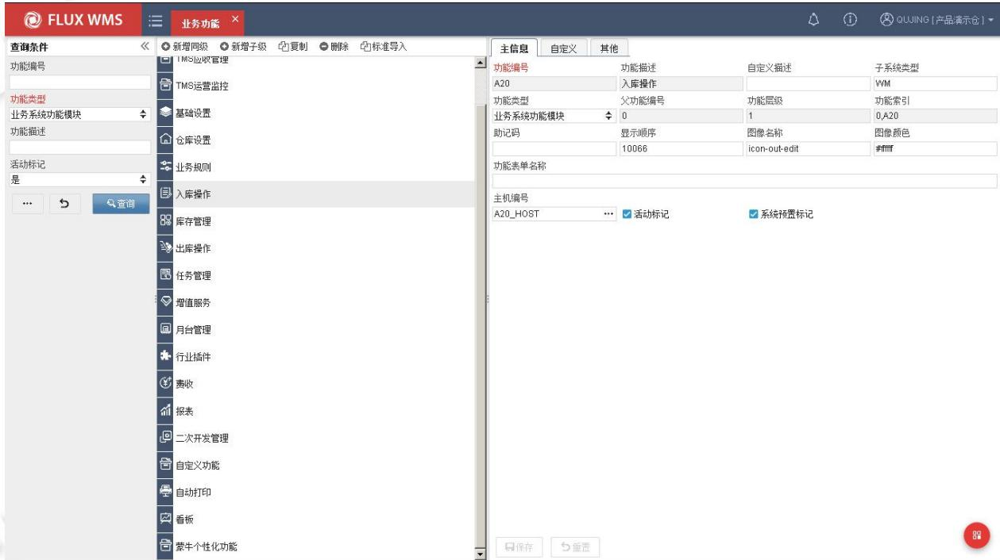

[图4-4-1]

功能编号 - 功能 ID 代码。保存后不可编辑。 

功能描述 - 默认显示的功能名称，不可修改。 

自定义描述 - 如有输入信息，则界面显示自定义描述。 

子系统类型 - 功能类型。默认 WM 即 WMS 系统对应功能 

功能类型 - 功能所属分类，下拉列表选项提供 系统管理功能模块、业务系统功能模块、系统管理对话框、业务系统对话框，供选择。 

父功能编号 - 所从属的上级功能的功能 ID。内容由系统默认，不可编辑。新增同级情况下，与原记录从属同一个父功能，新增子级情况下，父功能即原记录。 

功能层级 - 功能所属级别。主菜单项为 0 级，主菜单功能为 1 级，后续依次类推，由系统根据所属父功能默认生成，不可编辑。 

功能索引 - 索引信息，由系统生成，不可编辑 

版本号 - 功能模块版本号，用户局部更新时，区别在用模块程序版本使用，与“其他”页签中的记录修改版本含义不同。 

助记码 - 主菜单功能检索时可直接输入助记码进行查询。助记码内容用户可以自行配置。 

显示顺序 - 菜单中功能显示顺序的排序字段。 

图像名称 - 可配置功能图标的图片名称。 

图像颜色 - 可配置功能图标的图片显示颜色。 

主机编号 - 多主机分布式部署情况下，此功能的对应主机信息。通常由安装系统的技术人员根据需要指定。 

功能表单名称 - 功能模块对应的程序代码。 

活动标记 - 是否使用中的记录。 

■ 点击【保存】按钮，完成业务功能信息维护 

■ 通过【新增子级】按钮，可以设置下一级功能信息。 

## 4.5. 角色授权

系统在角色管理的基础上，能够给不同角色赋予不同的作业权限。 

## - 权限管理

■ 选择主菜单 “业务系统管理” 下的 “角色授权”。 

■ 输入或者二级窗口选择角色，点击【查询】按钮，界面显示如下角色可配置权限项 

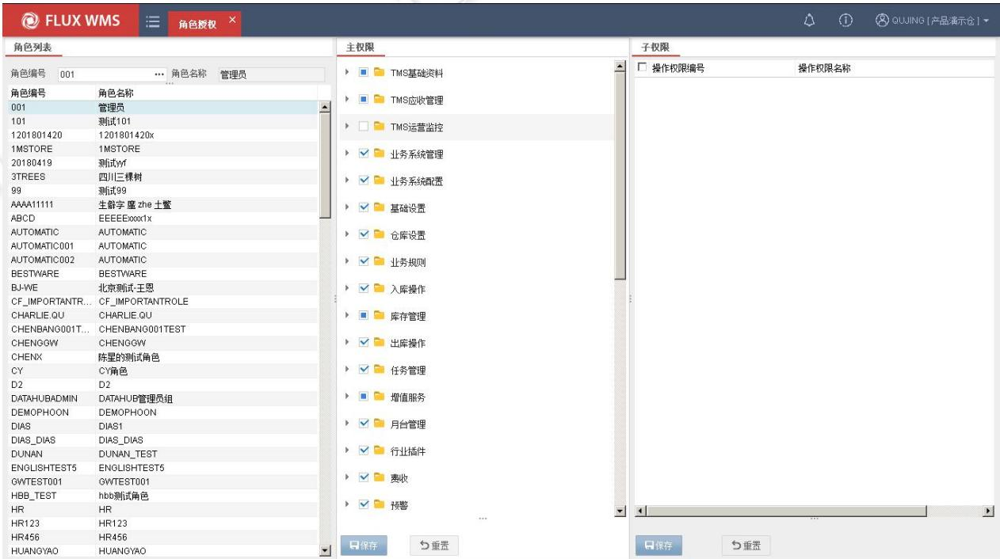

[图4-5-1] 

在左侧的导航窗口, 可以看到与主菜单相同的功能模块内容, 角色具有权限的功能, 已勾选。 

■ 点击导航窗口中的任意功能，右侧窗口显示此功能的对应全部功能明细项，可以进一步勾选、授权。 

■ 选择完成后点击【保存】按钮，保存授权设置。 

■ 角色授权配置成功后，用户可在【用户管理】模块中配置角色相关用户，详见 4.3 用户管理。 

## 4.6. 数据导出授权

自定义配置的数据导出，授权配置与功能授权不同，在独立的“数据导出授权管理”功能中，根据“数据导出规则配置”定义的自定义导出所属的授权类型给角色进行授权控制。授权类型取自系统代码“EXP_AUTH_TYPE”，支持自定义扩展。 

按照分类进行授权之后，新增、调整导出规则的时候，无需重新新增规则的权限。 

## ● 数据导出授权

■ 选择主菜单 “业务系统管理” 下的 “数据导出授权管理”。 

■ 在左侧的查询条件栏位，输入查询条件，可查询已有记录。 

■ 点击【新增】按钮，在主信息界面进行相关配置： 

<table><tr><td colspan="11">FLUX WMS</td></tr><tr><td colspan="11">数据导出授权</td></tr><tr><td>查询条件</td><td colspan="10">新增 复制 删除 打印 操作 导</td></tr><tr><td>功能编号</td><td>功能编号</td><td>功能描述</td><td>授权类型</td><td></td><td></td><td></td><td></td><td></td><td></td><td></td></tr><tr><td>A05</td><td>业务系统管理</td><td>C100</td><td></td><td></td><td></td><td></td><td></td><td></td><td></td><td></td></tr><tr><td>A05</td><td>业务系统管理</td><td>D100</td><td></td><td></td><td></td><td></td><td></td><td></td><td></td><td></td></tr><tr><td>A05</td><td>业务系统管理</td><td>D100</td><td></td><td></td><td></td><td></td><td></td><td></td><td></td><td></td></tr><tr><td>A05</td><td>业务系统管理</td><td>D100</td><td></td><td></td><td></td><td></td><td></td><td></td><td></td><td></td></tr><tr><td>A05</td><td>业务系统管理</td><td>D100</td><td></td><td></td><td></td><td></td><td></td><td></td><td></td><td></td></tr><tr><td>A05</td><td>业务系统管理</td><td>D100</td><td></td><td></td><td></td><td></td><td rowspan="10">角色名称</td><td rowspan="10" colspan="3">活动标记</td></tr><tr><td>A05</td><td>业务系统管理</td><td>D100</td><td></td><td></td><td></td><td></td></tr><tr><td>A05</td><td>业务系统管理</td><td>D100</td><td></td><td></td><td></td><td></td></tr><tr><td>A05</td><td>业务系统管理</td><td>D100</td><td></td><td></td><td></td><td></td></tr><tr><td>A05</td><td>业务系统管理</td><td>D100</td><td></td><td></td><td></td><td></td></tr><tr><td>A05</td><td>业务系统管理</td><td>D100</td><td></td><td></td><td></td><td></td></tr><tr><td>A05</td><td>服务系统管理</td><td>D100</td><td></td><td></td><td></td><td></td></tr><tr><td>A05</td><td>业务系统管理</td><td>D100</td><td></td><td></td><td></td><td></td></tr><tr><td>A05</td><td>业务系统管理</td><td>D100</td><td></td><td></td><td></td><td></td></tr><tr><td>A05</td><td>业务系统管理</td><td>D100</td><td></td><td></td><td></td><td></td></tr><tr><td>A05</td><td>业务系统管理</td><td>D100</td><td colspan="8">主信息 自定义 其他</td></tr><tr><td>功能编号</td><td>功能描述</td><td>授权类型</td><td>角色编号</td><td></td><td></td><td></td><td></td><td></td><td></td><td></td></tr><tr><td>A05</td><td>业务系统管理</td><td>一般查询类</td><td>JS1525681999197</td><td></td><td></td><td></td><td></td><td></td><td></td><td></td></tr><tr><td>角色名称</td><td colspan="10">活动标记</td></tr></table>

[图4-6-1]

功能编号 - 导出对应的功能 ID，可通过浏览按钮进行选择。 

功能描述 - 功能名称，根据所选功能编号对应显示 

授权类型 - 系统提供一般查询类、业务操作类、业务管理类、系统管理类几个默认类型，方便将导出分类管理，批量进行授权设置。用户可以根据管理需要，自行在系统代码中设置更多的授权类型 

角色编号 - 导出授予的角色对应，可通过浏览按钮进行选择。 

角色描述 - 角色名称显示。 

活动标记 - 是否使用中的记录。 

■ 点击【保存】按钮，完成数据导出授权设置。 

## 4.7. 自定义操作授权

本操作针对 “5.2 数据导出规则配置” 和 “5.3 自定义操作配置” 的功能进行授权。授权类型取自系统代码 “EXP_AUTH_TYPE”，支持自定义扩展。 

配置相关实例参阅 21. 自定义导出/打印配置实例。 

## - 自定义操作配置

■ 选择主菜单“业务系统管理”下的“自定义操作配置”。 

■ 在左侧的查询条件栏位，输入查询条件，可查询已有记录。 

■ 点击【新增】按钮，在主信息界面进行相关配置： 

<table><tr><td colspan="2">查询条件</td><td colspan="9">新
复
制
删除
打印
操作
导</td></tr><tr><td colspan="2">功能编号</td><td>功能编号</td><td>功能描述</td><td>授权类型</td><td>授权描述</td><td>主信息</td><td>自定义</td><td>其他</td><td></td><td></td></tr><tr><td colspan="2">功能编号</td><td>A05</td><td>业务系统管理</td><td>A100</td><td>系统管</td><td>功能编号</td><td>功能描述</td><td>授权类型</td><td>角色编号</td><td></td></tr><tr><td colspan="2">功能编号</td><td>A05</td><td>业务系统管理</td><td>C100</td><td>业务排</td><td>A05</td><td>业务系统管理</td><td>一般查询类</td><td>JB1525685103338</td><td></td></tr><tr><td colspan="2">功能编号</td><td>A05</td><td>业务系统管理</td><td>D100</td><td>一般道</td><td rowspan="13">角色名称</td><td rowspan="13" colspan="3">活动标记</td><td></td></tr><tr><td colspan="2">功能编号</td><td>A05</td><td>业务系统管理</td><td>D100</td><td>一般道</td><td></td></tr><tr><td colspan="2">功能编号</td><td>A05</td><td>业务系统管理</td><td>D100</td><td>一般道</td><td></td></tr><tr><td colspan="2">功能编号</td><td>A05</td><td>业务系统管理</td><td>D100</td><td>一般道</td><td></td></tr><tr><td colspan="2">功能编号</td><td>A05</td><td>业务系统管理</td><td>D100</td><td>一般道</td><td></td></tr><tr><td colspan="2">功能编号</td><td>A05</td><td>业务系统管理</td><td>D110</td><td>一般道</td><td></td></tr><tr><td colspan="2">功能编号</td><td>A05</td><td>业务系统管理</td><td>D100</td><td>一般道</td><td></td></tr><tr><td colspan="2">功能编号</td><td>A05</td><td>业务系统管理</td><td>D100</td><td>一般道</td><td></td></tr><tr><td colspan="2">功能编号</td><td>A05</td><td>业务系统管理</td><td>D100</td><td>一般道</td><td></td></tr><tr><td colspan="2">功能编号</td><td>A04</td><td>业务系统管理</td><td>D100</td><td>一般道</td><td></td></tr><tr><td colspan="2">功能编号</td><td>A05</td><td>业务系统管理</td><td>D100</td><td>一般道</td><td></td></tr><tr><td colspan="2">功能编号</td><td>A05</td><td>业务系统管理</td><td>D100</td><td>一般道</td><td></td></tr><tr><td colspan="2">功能编号</td><td>A05</td><td>业务系统管理</td><td>D100</td><td>一般道</td><td></td></tr></table>

[图4-7-1]

功能编号 - 导出对应的功能 ID，可通过浏览按钮进行选择。 

功能描述 - 功能名称，根据所选功能编号对应显示 

授权类型 - 系统提供一般查询类、业务操作类、业务管理类、系统管理类几个默认类型，方便将导出分类管理，批量进行授权设置。用户可以根据管理需要，自行在系统代码中设置更多的授权类型 

角色编号 - 导出授予的角色对应，可通过浏览按钮进行选择。 

角色描述 - 角色名称显示。 

活动标记 - 是否使用中的记录。 

■ 点击【保存】按钮，完成自定义操作的授权设置。 

## 4.8. 主机信息管理

主机信息是安装部署环境的相关信息，在多应用服务器部署环境中，不同的模块可以部署在不同的服务器上。具体配置由系统维护专员进行管理。 

<table><tr><td colspan="13">查询条件</td></tr><tr><td colspan="13">主机编号</td></tr><tr><td colspan="13">协议</td></tr><tr><td colspan="13">主机IP</td></tr><tr><td colspan="13">活动标记</td></tr><tr><td colspan="13">是</td></tr><tr><td>...</td><td colspan="12">查询</td></tr></table>

[图 4-8-1]

## 4.9. 仓库信息管理

仓库是 WMS 系统管理的关键元素之一，系统需要区分同一组织下的不同仓库，并在每个仓库内分别进行独立管理，可以实现各自不同的库位布局、不同的操作要求以及流程管理。因此仓库信息维护，也是后续其他库位信息、管理要求信息维护的基础。 

## - 仓库设置

■ 在主菜单 “业务系统管理” 下选择 “仓库”。 

■ 点击按钮栏的【新增】按钮，在“主信息”页签依次输入以下信息： 

<table><tr><td>主信息</td><td>联系人</td><td>自定义</td><td>其他</td></tr><tr><td>仓库编号</td><td>仓库描述</td><td>仓库类型</td><td>分支机构编号</td></tr><tr><td>DEMO</td><td>产品演示仓</td><td>类型1</td><td>活动标记</td></tr><tr><td colspan="4">地址</td></tr><tr><td>地址1</td><td>国家</td><td colspan="2">省份</td></tr><tr><td>上海张江毕升路299弄6号</td><td>中国</td><td colspan="2">上海市</td></tr><tr><td>地址2</td><td>城市</td><td colspan="2">区</td></tr><tr><td></td><td>市辖区</td><td colspan="2">浦东新区</td></tr><tr><td>地址3</td><td>街道</td><td colspan="2"></td></tr><tr><td></td><td></td><td colspan="2"></td></tr><tr><td>地址4</td><td>邮政编码</td><td colspan="2"></td></tr><tr><td></td><td>201210</td><td colspan="2"></td></tr></table>

[图4-9-1]

仓库编号 - 仓库 ID 

仓库描述 - 仓库名称描述 

仓库类型 - 类型配置 

活动标记 - 是否有效仓库 

地址信息 - 用来维护仓库所属国家、省份、城市、区、街道等详细地址信息。国家、省份、城市、区、街道下拉框字段值联动关系。例如选择国家后，省份下拉框才会初始化所选国家对应省份信息。国家、省份、城市、区、街道信息如需修改、维护信息，请联系 FLUX 顾问。 

■ 点击【保存】按钮，完成仓库主信息维护。 

■ 选择 “联系人” 页签，可以进一步完善仓库相关联系人的信息。 

<table><tr><td>主信息</td><td>联系人</td><td>自定义</td><td>其他</td></tr><tr><td colspan="4">联系人1</td></tr><tr><td>联系人1</td><td>电话1</td><td>电话2</td><td>传真</td></tr><tr><td></td><td></td><td></td><td></td></tr><tr><td>邮件地址</td><td>职位</td><td></td><td></td></tr><tr><td></td><td></td><td></td><td></td></tr><tr><td colspan="4">联系人2</td></tr><tr><td>联系人2</td><td>电话1</td><td>电话2</td><td>传真</td></tr><tr><td></td><td></td><td></td><td></td></tr><tr><td>邮件地址</td><td>职位</td><td></td><td></td></tr><tr><td colspan="4">联系人3</td></tr><tr><td>联系人3</td><td>电话1</td><td>电话2</td><td>传真</td></tr><tr><td></td><td></td><td></td><td></td></tr><tr><td>邮件地址</td><td>职位</td><td></td><td></td></tr><tr><td></td><td></td><td></td><td></td></tr></table>

[图4-9-2]

## 4.10. 系统代码

系统代码是 FLUX WMS 基本控制要素之一。FLUX WMS 的界面上包含了很多下拉式菜单或默认的数据。在这些下拉式菜单含有的选项来自 FLUX WMS 的系统代码。 

有时用户可能需要增加一些在目前的代码列表中没有的代码项目。在这种情况下，需要在增加代码前，先创建一个新的列表。但是在没有 FLUX 顾问的帮助下，用户最好不要创建新的列表。 

一些下拉式列表的默认值是用户可以选择和定义的，如国家、货币的类型等。但值得注意的是，利用系统代码为 FLUX WMS 的业务逻辑在下拉式列表中增加的选项，并不一定在用户的业务中有效。例如，在下拉式列表中增加的一种上架策略并不能使系统执行对应任务。因此用户如果有这方面的需要，请联系 FLUX 顾问。 

## - 系统代码设置

■ 在主菜单 “业务系统管理” 下选择 “系统代码”。 

■ 点击按钮栏的【新增】按钮，在“主信息”页签依次输入以下信息： 

<table><tr><td colspan="2">FLUX WMS</td><td colspan="9">系统代码</td></tr><tr><td colspan="2">查询条件</td><td colspan="9">新增 复制 删除 打印 操作 导出</td></tr><tr><td colspan="2">代码ID</td><td>代码ID</td><td>代码类型名称</td><td colspan="7">显示顺序</td></tr><tr><td colspan="2">代码类型名称</td><td>ALERT_STATUS</td><td>预警执行结果</td><td colspan="7">100</td></tr><tr><td rowspan="32" colspan="2">批次属性使用标志</td><td>ALL_RNT_TYPE</td><td>包含客户计费方式1</td><td colspan="7">100</td></tr><tr><td>ALT_DCT_TYPE</td><td>预警数据生成方式</td><td colspan="7">100</td></tr><tr><td>ALT_FMT</td><td>预警格式</td><td colspan="7">100</td></tr><tr><td>APL_STS</td><td>申请单状态</td><td colspan="7">100</td></tr><tr><td>APL_TYP</td><td>申请单类型</td><td colspan="7">100</td></tr><tr><td>APP_STS</td><td>预约状态</td><td colspan="7">100</td></tr><tr><td>APS_AUTH_TYPE</td><td>自动打印服务授权...</td><td colspan="7">100</td></tr><tr><td>APS_TASK_TYPE</td><td>自动打印服务任务...</td><td colspan="7">100</td></tr><tr><td>ARC_TYP</td><td>归档类型</td><td colspan="7">100</td></tr><tr><td>ARR_STS</td><td>入园单状态</td><td colspan="7">100</td></tr><tr><td>ARR_TYP</td><td>入园单类型</td><td colspan="7">100</td></tr><tr><td>ASNG_SEED</td><td>ASN编组分货方式</td><td colspan="7">100</td></tr><tr><td>ASN_APP_STS</td><td>入库车辆调度状态</td><td colspan="7">100</td></tr><tr><td>ASN_GRP_STS</td><td>ASN编组状态</td><td colspan="7">100</td></tr><tr><td>ASN_HDR_UDA</td><td>预期到货通知的U...</td><td colspan="7">100</td></tr><tr><td>ASN_HDR_UDB</td><td>ASN_HDR_UDB</td><td colspan="7">100</td></tr><tr><td>ASN_LIN_FLT</td><td>ASN订单行类型</td><td colspan="7">100</td></tr><tr><td>ASN_SPL</td><td>ASN关闭产生分单</td><td colspan="7">100</td></tr><tr><td>ASN_STS</td><td>ASN状态</td><td colspan="7">100</td></tr><tr><td>ASN_TYP</td><td>ASN类型</td><td colspan="7">100</td></tr><tr><td>ASN_UDF_DT6</td><td>自定义06</td><td colspan="7">100</td></tr><tr><td>ASN_UDF_HD6</td><td>自定义06</td><td colspan="7">100</td></tr><tr><td>ASRS_PA_CPC</td><td>ASRS上架库容均...</td><td colspan="7">100</td></tr><tr><td>ASRS_PA_INV</td><td>ASRS上架库存均...</td><td colspan="7">100</td></tr><tr><td>ASRS_PA_PSK</td><td>ASRS上架任务均...</td><td colspan="7">100</td></tr><tr><td>ASRS_STS</td><td>堆垛机状态</td><td colspan="7">100</td></tr><tr><td>ASSORTING_TYPE</td><td>插种墙类型</td><td colspan="7">100</td></tr><tr><td>AUTO_PRINT_U...</td><td>自动打印配置</td><td colspan="7">100</td></tr><tr><td>BFR_AFT</td><td>操作前/后调用</td><td colspan="7">100</td></tr><tr><td>BILL_STS</td><td>账单状态</td><td colspan="7">100</td></tr><tr><td>BILL_TYP</td><td>费用账单类型</td><td colspan="7">100</td></tr><tr><td>BIL_CLS</td><td>进出存计离级别</td><td colspan="7">100</td></tr></table>

[图4-10-1]

代码 ID - 系统代码所属类型 ID。 

代码类型名称 - 代码类型描述 

显示顺序 - 排序用字段 

代码长度 - 此类型下，新增代码的最大长度限制设置。 

列表长度 - 此类型在相关功能中，下拉列表默认显示的记录数。 

分类代码 - 代码明细根据不同情况分类显示，在此字段指定分类所用的系统代码。 

活动标记 - 此类型代码是否使用。 

批次属性使用标记 - 此类型代码是否作为批次属性值供下拉框选择使用。 

系统预置标记 - 是否系统提供的初始化记录。系统预置标记系统代码不允许删除。 

■ 点击【保存】按钮，完成代码类型维护。 

■ 在明细页签，进一步维护此类型下的具体代码。 

<table><tr><td colspan="16">查询条件</td></tr><tr><td colspan="16">代码ID</td></tr><tr><td colspan="16">代码类型名称</td></tr><tr><td colspan="16">批次属性使用标志</td></tr><tr><td colspan="16">系统预置标记</td></tr><tr><td colspan="16">活动标记</td></tr><tr><td colspan="16">是</td></tr><tr><td colspan="16">修改标记</td></tr><tr><td colspan="16">...</td></tr></table>

## [图4-10-2]

客户编号 - 限定客户使用代码，需要配置对应客户编号。为*则不限定客户。 

功能分类 - 使用此代码的分类信息。下拉列内容，根据表头“分类代码”对应明细显示。 

代码类型 - 代码所属类型 

代码编号 - 代码值 

代码描述 - 代码描述信息 

仓库编号 - 代码生效的指定仓库。为*则是各个仓库可使用的公共代码。 

显示顺序 - 此代码在下拉列表中的排序 

活动标记 - 记录是否激活 

默认代码标记 - 此记录是否为此代码的默认代码值。例如发运订单，默认订单类型是“CM”普通订单，即将发运订单的订单类型代码中，CM 代码配置为默认代码，手动新增发运订单时，默认为 CM 订单类型。 

■ 点击【保存】按钮，完成代码设置。 

## - 其他

■ 原因代码控制 

系统提供一些默认的原因代码选择，但在不同的作业环节，所选的原因代码会有所不同。因此 

系统的原因代码可以根据需要针对不同功能进行配置。 

代码 ID 为 RSN_COD，在对应的明细部分，通过分类设置，配置代码在哪个功能中生效。设置内容为： 

ASN 入库（收货）：功能分类=ASN 

ASN 上架：功能分类=PUTAWAY 

库存移动：功能分类=MOVE 

库存冻结：功能分类=HOLD 

库存转移：功能分类=TRANSFER 

库存调整：功能分类=ADJUSTMENT 

拣货确认：功能分类=PICK 

通用（全部界面有效）：功能分类=CM 

## 4.11. 数据字典

数据字典是系统后台数据表的结构信息，相关 IT 管理人员可以参考数据字典信息，自定义配置各种系统查询、报表、自定义功能等。数据字典也是 FLUX WMS 系统强大的可配置性的基础支持之一。 

需要注意的是，目前系统并不支持在数据字典中直接添加表、字段（不会自动创建数据库内容）。而是需要在数据库中先行添加表、字段，然后再到数据字典中对所添加的内容进一步配置对应信息。 

- 数据字典查看 

■ 在主菜单 “业务系统管理” 下选择 “数据字典” 功能。 

■ 查询条件部分，根据需要输入条件，系统显示数据表信息 

FLUX WMS 数据字典

<table><tr><td>仓库编号</td><td>表名称</td><td>表描述</td></tr><tr><td>DEMO</td><td>ACT_MEDICINE_MAINTENANCE</td><td>系统维护信息表</td></tr><tr><td>DEMO</td><td>ACT_QC_TRANSACTION</td><td>质检交易明细</td></tr><tr><td>DEMO</td><td>ACT_SOFTALLOCATION_DETAILS</td><td>预查明细</td></tr><tr><td>DEMO</td><td>ACT_TRANSACTION_LOG</td><td>库存交易事务</td></tr><tr><td>DEMO</td><td>BAS_ALTERNATIVECUSTOMER</td><td>客户档案别名信息</td></tr><tr><td>DEMO</td><td>BAS_ALTERNATIVESKU</td><td>产品档案别名信息</td></tr><tr><td>DEMO</td><td>BAS_ASRS</td><td>堆垛机信息</td></tr><tr><td>DEMO</td><td>BAS_ASRS_UDF</td><td>堆垛机扩展属性</td></tr><tr><td>DEMO</td><td>BAS_ASSORTING_DETAILS</td><td>播种道明细</td></tr><tr><td>DEMO</td><td>BAS_ASSORTING_HEADER</td><td>播种道头信息</td></tr><tr><td>DEMO</td><td>BAS_CARTON</td><td>编码信息</td></tr><tr><td>DEMO</td><td>BAS_CARTON_UDF</td><td>编码扩展属性</td></tr><tr><td>DEMO</td><td>BAS_CUSTFREIGHT_MULTIDOCTP</td><td>客户货类类型</td></tr><tr><td>DEMO</td><td>BAS_CUSTFREIGHT_MULTIDOCTP_UDF</td><td>客户货类类型扩展属性</td></tr><tr><td>DEMO</td><td>BAS_CUSTFREIGHT_MULTIWH_UDF</td><td>客户货类多仓扩展属性</td></tr><tr><td>DEMO</td><td>BAS_CUSTOMER</td><td>客户档案</td></tr><tr><td>DEMO</td><td>BAS_CUSTOMERFREIGHT</td><td>客户货类代码信息</td></tr><tr><td>DEMO</td><td>BAS_CUSTOMERFREIGHT_LOCATION</td><td>客户货类库位规则</td></tr><tr><td>DEMO</td><td>BAS_CUSTOMERFREIGHT_MULTIDOCTYPE</td><td>客户货类类型</td></tr><tr><td>DEMO</td><td>BAS_CUSTOMERFREIGHT_MULTIDOCTYPE_UDF</td><td>客户货类类型扩展属性</td></tr><tr><td>DEMO</td><td>BAS_CUSTOMERFREIGHT_MULTIWH</td><td>客户货类多仓信息</td></tr><tr><td>DEMO</td><td>BAS_CUSTOMERFREIGHT_MULTIWH_UDF</td><td>客户货类多仓扩展属性</td></tr><tr><td>DEMO</td><td>BAS_CUSTOMERFREIGHT_UDF</td><td>客户货类扩展属性</td></tr><tr><td>DEMO</td><td>BAS_CUSTOMER_MULTIADDRESS</td><td>客户地址信息</td></tr><tr><td>DEMO</td><td>BAS_CUSTOMER_MULTIWAREHOUSE</td><td>客户多仓信息</td></tr><tr><td>DEMO</td><td>BAS_CUSTOMER_ORDERTYPE</td><td>客户订单类型信息</td></tr><tr><td>DEMO</td><td>BAS_CUSTOMER_UDF</td><td>客户档案扩展属性</td></tr><tr><td>DEMO</td><td>BAS_CYCLECLASS</td><td>循环级别</td></tr><tr><td>DEMO</td><td>BAS_CYCLECLASS_UDF</td><td>循环级别扩展属性</td></tr><tr><td>DEMO</td><td>BAS_CYCLEGROUP</td><td>循环编组</td></tr><tr><td>DEMO</td><td>BAS_CYCLEGROUP_UDF</td><td>循环编组扩展属性</td></tr><tr><td>DEMO</td><td>BAS_DOCK</td><td>仓库月台</td></tr><tr><td>DEMO</td><td>BAS_DOCK_OPENTIME</td><td>月台作业调度</td></tr></table>

[图4-11-1]

仓库编号 - 仓库信息。数据字典支持每个仓库分别配置显示名称，初始化仓库时系统会提供整套预设信息。 

表名称 - 数据库中的表名 

表描述 - 系统提供的默认表名描述，会根据当前登录语言对应显示，不可修改。 

自定义描述 - 当前登录语言下，显示的表描述。如果未配置则显示默认表描述内容。 

所属分类 - 与此表相关的功能的代码。由于很多功能会涉及到相同的表，此处仅显示一个相关功能，作为参考。 

功能描述 - 与此表相关的功能名称。 

语言 - 当前登录语言信息。只读显示 

系统预置标记 - 此记录是否系统提供的初始化记录。 

■ 如果修改表名描述，点击【保存】按钮完成设置。 

■ 在“明细”页签，可以进一步查看表内的字段信息： 

<table><tr><td colspan="101">查询条件</td><td></td><td></td></tr><tr><td colspan="100">仓库编号</td><td></td><td></td><td></td></tr><tr><td colspan="96">DEMO</td><td></td><td></td><td></td><td></td><td></td><td></td><td></td></tr><tr><td colspan="96">表名称</td><td></td><td></td><td></td><td></td><td></td><td></td><td></td></tr><tr><td colspan="91">表描述</td><td></td><td></td><td></td><td></td><td></td><td></td><td></td><td></td><td></td><td></td><td></td><td></td></tr><tr><td colspan="87">所属分类</td><td></td><td></td><td></td><td></td><td></td><td></td><td></td><td></td><td></td><td></td><td></td><td></td><td></td><td></td><td></td><td></td></tr><tr><td colspan="83">功能描述</td><td></td><td></td><td></td><td></td><td></td><td></td><td></td><td></td><td></td><td></td><td></td><td></td><td></td><td></td><td></td><td></td><td></td><td></td><td></td><td></td></tr><tr><td colspan="80">语言</td><td></td><td></td><td></td><td></td><td></td><td></td><td></td><td></td><td></td><td></td><td></td><td></td><td></td><td></td><td></td><td></td><td></td><td></td><td></td><td></td><td></td><td></td><td></td></tr><tr><td colspan="75">简体中文</td><td></td><td></td><td></td><td></td><td></td><td></td><td></td><td></td><td></td><td></td><td></td><td></td><td></td><td></td><td></td><td></td><td></td><td></td><td></td><td></td><td></td><td></td><td></td><td></td><td></td><td></td><td></td><td></td></tr><tr><td colspan="72">系统预置标记</td><td></td><td></td><td></td><td></td><td></td><td></td><td></td><td></td><td></td><td></td><td></td><td></td><td></td><td></td><td></td><td></td><td></td><td></td><td></td><td></td><td></td><td></td><td></td><td></td><td></td><td></td><td></td><td></td><td></td><td></td><td></td></tr><tr><td colspan="69">自定义标记</td><td></td><td></td><td></td><td></td><td></td><td></td><td></td><td></td><td></td><td></td><td></td><td></td><td></td><td></td><td></td><td></td><td></td><td></td><td></td><td></td><td></td><td></td><td></td><td></td><td></td><td></td><td></td><td></td><td></td><td></td><td></td><td></td><td></td><td></td></tr><tr><td>...</td><td>查询</td><td>查询</td><td>查询</td><td>查询</td><td>查询</td><td>查询</td><td>查询</td><td>查询</td><td>查询</td><td>查询</td><td>查询</td><td>查询</td><td>查询</td><td>查询</td><td>查询</td><td>查询</td><td>查询</td><td>查询</td><td>查询</td><td>查询</td><td>查询</td><td>查询</td><td>查询</td><td>查询</td><td>查询</td><td>查询</td><td>查询</td><td>查询</td><td>查询</td><td>查询</td><td>查询</td><td>查询</td><td>查询</td><td>查询</td><td>查询</td><td>查询</td><td>查询</td><td>查询</td><td>查询</td><td>查询</td><td>查询</td><td>查询</td><td>查询</td><td>查询</td><td>查询</td><td>查询</td><td>查询</td><td>查询</td><td>查询</td><td>查询</td><td>query</td><td>查询</td><td>查询</td><td>查询</td><td>查询</td><td>查询</td><td>查询</td><td>查询</td><td>查询</td><td>查询</td><td>查询</td><td>查询</td><td>查询</td><td>查询</td><td>查询</td><td>查询</td><td>查询</td><td>查询</td><td>查询</td><td>查询</td><td>查询</td><td>查询</td><td>查询</td><td>查询</td><td>查询</td><td>查询</td><td>查询</td><td>查询</td><td>查询</td><td>查询</td><td>查询</td><td>查询</td><td>查询</td><td>查询</td><td>查询</td><td>查询</td><td>查询</td><td>查询</td><td>查询</td><td>查询</td><td>查询</td><td>查询</td><td>查询</td><td>查询</td><td>查询</td><td>查询</td><td>查询</td><td>查询</td><td>查询</td><td>查询</td><td>查询</td><td>查询</td></tr></table>

[图4-11-2]

仓库编号 - 仓库信息。数据字典支持每个仓库分别配置显示名称，初始化仓库时系统会提供整套预设信息。 

表名称 - 数据库中的表名 

字段名称 - 数据库中的字段名 

字段描述 - 系统提供的默认字段描述，会根据当前登录语言对应显示，不可修改。 

自定义描述 - 当前登录语言下，显示的字段描述。如果未配置则显示默认表描述内容。 

语言 - 当前登录语言信息。只读显示 

显示顺序 - 字段的显示次序 

允许为空标记 - 该字段是否允许为空。 

字段类型 - 数据库中的字段类型信息 

主键标记 - 此字段是否是表主键字段 

系统预置标记 - 此字段是否系统提供的初始化记录。 

导入字段 - 导入时是否设置为关键字段。 

■ 点击【保存】按钮完成自定义设置。 

## 4.12. 多语言文本管理

FLUX WMS 系统，支持不同语言环境下的使用，因此对多语言有全方面的支持。但同一语言下，不同地区的显示需求也很可能不同，因此系统提供的多语言信息，支持用户配置修改，并可以支持到同一语言下，不同仓库分别配置显示。 

多语言文本信息，是基于数据字典基础上的配置信息，如果未配置，系统将显示此语言的系统默认描述。 

用户如需新增语言，请与 FLUX 顾问联系，以便获取语言包更新。 

## - 多语言管理

■ 在主菜单 “业务系统管理” 下选择 “多语言文本管理” 功能。 

■ 根据需要查询所需的多语言记录并完善： 

<table><tr><td>主信息</td><td>自定义</td><td>其他</td><td></td><td></td></tr><tr><td>仓库编号</td><td>所属范围</td><td>范围描述</td><td>对象ID</td><td>语言</td></tr><tr><td>DEMO</td><td>*</td><td>*</td><td>SM00</td><td>简体中文</td></tr><tr><td>子系统</td><td>主模块</td><td>功能模块</td><td>子功能</td><td>页签</td></tr><tr><td>WMS</td><td></td><td></td><td></td><td></td></tr><tr><td colspan="5">对象描述</td></tr><tr><td colspan="5">授权无效:用户名无效或未授权仓库</td></tr><tr><td colspan="5">自定义属性值</td></tr><tr><td colspan="5">对象类型</td></tr><tr><td colspan="5">消息</td></tr><tr><td rowspan="2">提示音</td><td rowspan="2">自定义提示音</td><td rowspan="2">上传声音</td><td rowspan="2">预览播放</td><td>消息显示类型</td></tr><tr><td>默认</td></tr><tr><td colspan="5">系统预置标记</td></tr><tr><td>保存</td><td colspan="4">取消</td></tr></table>

[图4-12-1]

仓库编号 - 多语言记录所属仓库 

所属范围 - 多语言记录对应的功能 ID 

范围描述 - 多语言记录所属范围的描述。 

属性编号 - 多语言记录 ID 

## 语言 - 记录所属语言

子系统 - 多语言记录所属子系统，如 RF、WMS，检索信息字段。 

主模块 - 多语言记录所属主模块信息，如入库操作，出库操作。检索信息字段。 

功能模块 - 多语言记录所属功能模块信息，如 ASN，PO。检索信息字段。 

子功能 - 多语言记录所属子功能信息，如扫描收货，快捷收货。检索信息字段。 

页签 - 多语言记录所属页签信息，如主信息，汇总信息。检索信息字段。 

属性值 - 默认显示信息。 

自定义属性值 - 用户自定义显示信息。未配置情况下显示默认属性值。 

属性类型 - 记录类型，如消息，按钮，还是标签。只有消息类的记录需要配置后续的提示音等信息。 

提示音 - 消息弹出时的默认提示音。 

自定义提示音 - 可配置的提示音。 

上传声音 - 点击按钮后，可自行上传声音文件，所传文件在“自定义提示音”的下拉框内可供选择。需要注意的是，不同语言的提示音需要分别上传。 

预览播放 - 所选提示音播放。 

消息显示类型 - 系统默认的消息显示类型。如提示框锁定等。 

自定义消息显示类型 - 可配置的消息显示类型。 

系统预置标记 - 此记录是否系统提供的初始化记录 

■ 点击【保存】按钮，完成多语言记录配置。 

## 4.13. 界面方案管理

FLUX WMS 提供高度可配置的操作系统, 用户可以根据需要定义所用的系统界面、字段显示等。 

可配置信息，基础层为数据字典的表、字段名称可配置（具体请参考数据字典功能说明）。 

其次是所有界面元素在多语言文本管理中可配置（具体请参考多语言文本管理功能的对应说明）。 

第三层，则是配置界面方案，可以根据用户的需要、习惯，配置不同的查询界面、列表、操作 界面布局，描述定义，或者是快捷键等，形成自定义的作业界面。通常是基于角色、仓库进行配置。不同语言，需要分别配置方案。 

第四层，可以在已生效的界面方案基础上，通过拖动等，形成用户的私有配置。 

未做配置情况下，则显示上一级的配置。如果全部未配置，则显示系统默认布局和信息。 

在进行第三层次界面方案配置时，需要先定义此方案的名称和适用范围，然后再到具体功能中逐一进行配置。 

## 4.13.1. 界面方案创建

## - 界面方案管理

■ 在主菜单 “业务系统管理” 下选择 “界面方案管理” 功能。 

■ 点击【新增】按钮，新增方案记录： 

<table><tr><td colspan="101">查询条件</td></tr><tr><td colspan="100">方案编号</td><td></td></tr><tr><td colspan="95">方案名称</td><td></td><td></td><td></td><td></td><td></td><td></td></tr><tr><td colspan="95">活动标记</td><td></td><td></td><td></td><td></td><td></td><td></td></tr><tr><td rowspan="36" colspan="89">是</td><td></td><td></td><td></td><td></td><td></td><td></td><td></td><td></td><td></td><td></td><td></td><td></td></tr><tr><td></td><td></td><td></td><td></td><td></td><td></td><td></td><td></td><td></td><td></td><td></td><td></td><td></td><td></td><td></td><td></td><td></td><td></td><td></td><td></td><td></td><td></td><td></td><td></td><td></td><td></td><td></td></tr><tr><td></td><td></td><td></td><td></td><td></td><td></td><td></td><td></td><td></td><td></td><td></td><td></td><td></td><td></td><td></td><td></td><td></td><td></td><td></td><td></td><td></td><td></td><td></td><td></td><td></td><td></td><td></td><td></td><td></td></tr><tr><td></td><td></td><td></td><td></td><td></td><td></td><td></td><td></td><td></td><td></td><td></td><td></td><td></td><td></td><td></td><td></td><td></td><td></td><td></td><td></td><td></td><td></td><td></td><td></td><td></td><td></td><td></td><td></td><td></td><td></td></tr><tr><td rowspan="6"></td><td rowspan="5"></td><td rowspan="4"></td><td rowspan="3"></td><td rowspan="2"></td><td rowspan="2"></td><td rowspan="2"></td><td rowspan="2"></td><td rowspan="2"></td><td rowspan="2"></td><td rowspan="2"></td><td rowspan="2"></td><td rowspan="2"></td><td rowspan="2"></td><td></td><td></td><td></td><td></td><td></td><td></td><td></td><td></td><td></td><td></td><td></td><td></td><td></td><td></td><td></td><td></td><td></td><td></td><td></td><td></td><td></td><td></td><td></td><td></td><td></td><td></td><td></td><td></td><td></td><td></td><td></td><td></td><td></td><td></td></tr><tr><td></td><td></td><td></td><td></td><td></td><td></td><td></td><td></td><td></td><td></td><td></td><td></td><td></td><td></td><td></td><td></td><td></td><td></td><td></td><td></td><td></td><td></td><td></td><td></td><td></td><td></td><td></td><td></td><td></td><td></td><td></td><td></td><td></td><td></td></tr><tr><td></td><td></td><td></td><td></td><td></td><td></td><td></td><td></td><td></td><td></td><td></td><td></td><td></td><td></td><td></td><td></td><td></td><td></td><td></td><td></td><td></td><td></td><td></td><td></td><td></td><td></td><td></td><td></td><td></td><td></td><td></td><td></td><td></td><td></td><td></td><td></td><td></td><td></td><td></td><td></td><td></td><td></td><td></td><td></td></tr><tr><td></td><td></td><td></td><td></td><td></td><td></td><td></td><td></td><td></td><td></td><td></td><td></td><td></td><td></td><td></td><td></td><td></td><td></td><td></td><td></td><td></td><td></td><td></td><td></td><td></td><td></td><td></td><td></td><td></td><td></td><td></td><td></td><td></td><td></td><td></td><td></td><td></td><td></td><td></td><td></td><td></td><td></td><td></td><td></td><td></td></tr><tr><td></td><td></td><td></td><td></td><td></td><td></td><td></td><td></td><td></td><td></td><td></td><td></td><td></td><td></td><td></td><td></td><td></td><td></td><td></td><td></td><td></td><td></td><td></td><td></td><td></td><td></td><td></td><td></td><td></td><td></td><td></td><td></td><td></td><td></td><td></td><td></td><td></td><td></td><td></td><td></td><td></td><td></td><td></td><td></td><td></td><td></td></tr><tr><td></td><td></td><td></td><td></td><td></td><td></td><td></td><td></td><td></td><td></td><td></td><td></td><td></td><td></td><td></td><td></td><td></td><td></td><td></td><td></td><td></td><td></td><td></td><td></td><td></td><td></td><td></td><td></td><td></td><td></td><td></td><td></td><td></td><td></td><td></td><td></td><td></td><td></td><td></td><td></td><td></td><td></td><td></td><td></td><td></td><td></td><td></td></tr><tr><td></td><td></td><td></td><td></td><td></td><td></td><td></td><td></td><td></td><td></td><td></td><td></td><td></td><td></td><td></td><td></td><td></td><td></td><td></td><td></td><td></td><td></td><td></td><td></td><td></td><td></td><td></td><td></td><td></td><td></td><td></td><td></td><td></td><td></td><td></td><td></td><td></td><td></td><td></td><td></td><td></td><td></td><td></td><td></td><td></td><td></td><td></td><td></td></tr><tr><td>Y</td><td></td><td></td><td></td><td></td><td></td><td></td><td></td><td></td><td></td><td></td><td></td><td></td><td></td><td></td><td></td><td></td><td></td><td></td><td></td><td></td><td></td><td></td><td></td><td></td><td></td><td></td><td></td><td></td><td></td><td></td><td></td><td></td><td></td><td></td><td></td><td></td><td></td><td></td><td></td><td></td><td></td><td></td><td></td><td></td><td></td><td></td><td></td><td></td><td></td><td></td><td></td><td></td><td></td><td></td><td></td><td></td><td></td><td></td><td></td><td></td><td></td><td></td><td></td><td></td><td></td><td></td><td></td><td></td><td></td><td></td><td></td><td></td><td></td><td></td><td></td><td></td><td></td><td></td><td></td><td></td><td></td><td></td><td></td><td></td><td></td></tr><tr><td>Y</td><td></td><td></td><td></td><td rowspan="2"></td><td rowspan="2"></td><td rowspan="2"></td><td rowspan="2"></td><td rowspan="2"></td><td rowspan="2"></td><td rowspan="2"></td><td rowspan="2"></td><td rowspan="2"></td><td rowspan="2"></td><td rowspan="2"></td><td rowspan="2"></td><td rowspan="2"></td><td rowspan="2"></td><td rowspan="2"></td><td rowspan="2"></td><td rowspan="2"></td><td rowspan="2"></td><td rowspan="2"></td><td rowspan="2"></td><td rowspan="2"></td><td rowspan="2"></td><td rowspan="2"></td><td rowspan="2"></td><td rowspan="2"></td><td rowspan="2"></td><td rowspan="2"></td><td rowspan="2"></td><td rowspan="2"></td><td rowspan="2"></td><td rowspan="2"></td><td rowspan="2"></td><td rowspan="2"></td><td rowspan="2"></td><td rowspan="2"></td><td rowspan="2"></td><td rowspan="2"></td><td rowspan="2"></td><td rowspan="2"></td><td rowspan="2"></td><td rowspan="2"></td><td rowspan="2"></td><td rowspan="2"></td><td rowspan="2"></td><td rowspan="2"></td><td rowspan="2"></td><td rowspan="2"></td><td rowspan="2"></td><td rowspan="2"></td><td rowspan="2"></td><td rowspan="2"></td><td rowspan="2"></td><td rowspan="2"></td><td rowspan="2"></td><td rowspan="2"></td><td rowspan="2"></td><td rowspan="2"></td><td rowspan="2"></td><td rowspan="2"></td><td rowspan="2"></td><td rowspan="2"></td><td rowspan="2"></td><td rowspan="2"></td><td></td><td></td><td></td><td></td><td></td><td></td><td></td><td></td><td></td><td></td><td></td><td></td><td></td><td></td><td></td><td></td><td></td><td></td><td></td></tr><tr><td>Y</td><td></td><td></td><td></td><td></td><td></td><td></td><td></td><td></td><td></td><td></td><td></td><td></td><td></td><td></td><td></td><td></td><td></td><td></td><td></td><td></td><td></td><td></td></tr><tr><td>Y</td><td></td><td></td><td></td><td></td><td></td><td></td><td></td><td></td><td></td><td></td><td></td><td></td><td></td><td></td><td></td><td></td><td></td><td></td><td></td><td></td><td></td><td></td><td rowspan="2"></td><td rowspan="2"></td><td rowspan="2"></td><td rowspan="2"></td><td rowspan="2"></td><td rowspan="2"></td><td rowspan="2"></td><td rowspan="2"></td><td rowspan="2"></td><td rowspan="2"></td><td rowspan="2"></td><td rowspan="2"></td><td rowspan="2"></td><td rowspan="2"></td><td rowspan="2"></td><td rowspan="2"></td><td rowspan="2"></td><td rowspan="3"></td><td rowspan="3"></td><td rowspan="3"></td><td rowspan="3"></td><td rowspan="3"></td><td rowspan="3"></td><td rowspan="3"></td><td rowspan="3"></td><td rowspan="3"></td><td rowspan="3"></td><td rowspan="3"></td><td rowspan="3"></td><td rowspan="3"></td><td rowspan="3"></td><td rowspan="3"></td><td rowspan="3"></td><td rowspan="3"></td><td rowspan="4"></td><td rowspan="4"></td><td rowspan="4"></td><td rowspan="3"></td><td rowspan="3"></td><td rowspan="3"></td><td rowspan="3"></td><td></td><td></td><td></td><td></td><td></td><td></td><td></td><td></td><td></td><td></td><td></td><td></td><td></td><td></td><td></td><td></td><td></td><td></td><td></td><td></td><td></td><td></td></tr><tr><td>Y</td><td></td><td></td><td></td><td></td><td></td><td></td><td></td><td></td><td></td><td></td><td></td><td></td><td></td><td></td><td></td><td></td><td></td><td></td><td></td><td></td><td></td><td></td><td></td><td></td><td></td><td></td><td></td><td></td><td></td><td></td><td></td><td></td><td></td><td></td><td></td><td></td><td></td><td></td><td></td><td></td><td></td><td></td><td></td><td></td></tr><tr><td>Y</td><td></td><td></td><td></td><td></td><td></td><td></td><td></td><td></td><td></td><td></td><td></td><td></td><td></td><td></td><td></td><td></td><td></td><td></td><td></td><td></td><td></td><td></td><td></td><td></td><td></td><td></td><td></td><td></td><td></td><td></td><td></td><td></td><td></td><td></td><td></td><td></td><td></td><td></td><td></td><td></td><td></td><td></td><td></td><td></td><td></td><td></td><td></td><td></td><td></td><td></td><td></td><td></td><td></td><td></td><td></td><td></td><td></td><td></td><td></td><td></td><td></td></tr><tr><td>Y</td><td></td><td></td><td></td><td></td><td></td><td></td><td></td><td></td><td></td><td></td><td></td><td></td><td></td><td></td><td></td><td></td><td></td><td></td><td></td><td></td><td></td><td></td><td></td><td></td><td></td><td></td><td></td><td></td><td></td><td></td><td></td><td></td><td></td><td></td><td></td><td></td><td></td><td></td><td></td><td></td><td></td><td></td><td></td><td></td><td></td><td></td><td></td><td></td><td></td><td></td><td></td><td></td><td></td><td></td><td></td><td></td><td></td><td></td><td></td><td></td><td></td><td></td><td></td><td></td><td></td><td></td><td></td><td></td><td></td><td></td><td></td><td></td><td></td><td></td><td></td><td></td><td></td><td></td><td></td><td></td><td></td><td></td></tr><tr><td>Y</td><td></td><td></td><td></td><td></td><td></td><td></td><td></td><td></td><td></td><td></td><td></td><td></td><td></td><td></td><td></td><td></td><td></td><td></td><td></td><td></td><td></td><td></td><td></td><td></td><td></td><td></td><td></td><td></td><td></td><td></td><td></td><td></td><td></td><td></td><td></td><td></td><td></td><td></td><td></td><td></td><td></td><td></td><td></td><td></td><td></td><td></td><td></td><td></td><td></td><td></td><td></td><td></td><td></td><td></td><td></td><td></td><td></td><td></td><td></td><td></td><td></td><td></td><td></td><td></td><td></td><td></td><td></td><td></td><td></td><td></td><td></td><td></td><td></td><td></td><td></td><td></td><td></td><td></td><td></td><td></td><td></td><td></td><td></td><td></td><td></td></tr><tr><td>Y</td><td></td><td></td><td></td><td></td><td></td><td></td><td></td><td></td><td></td><td></td><td></td><td></td><td></td><td></td><td></td><td></td><td></td><td></td><td></td><td></td><td rowspan="2"></td><td rowspan="2"></td><td rowspan="2"></td><td rowspan="2"></td><td rowspan="2"></td><td rowspan="2"></td><td rowspan="2"></td><td rowspan="2"></td><td rowspan="2"></td><td rowspan="2"></td><td rowspan="2"></td><td rowspan="2"></td><td rowspan="2"></td><td rowspan="2"></td><td rowspan="2"></td><td rowspan="2"></td><td rowspan="2"></td><td rowspan="2"></td><td rowspan="2"></td><td rowspan="2"></td><td rowspan="2"></td><td rowspan="2"></td><td rowspan="2"></td><td rowspan="2"></td><td rowspan="2"></td><td rowspan="2"></td><td rowspan="2"></td><td rowspan="2"></td><td rowspan="2"></td><td rowspan="2"></td><td rowspan="2"></td><td rowspan="2"></td><td rowspan="2"></td><td rowspan="2"></td><td rowspan="2"></td><td rowspan="2"></td><td rowspan="2"></td><td rowspan="2"></td><td rowspan="2"></td><td rowspan="2"></td><td rowspan="2"></td><td></td><td></td><td></td><td></td><td></td><td></td><td></td><td></td><td></td><td></td><td></td><td></td><td></td><td></td><td></td><td></td><td></td><td></td><td></td><td></td><td></td><td></td><td></td><td></td><td></td></tr><tr><td>Y</td><td></td><td></td><td></td><td></td><td></td><td></td><td></td><td></td><td></td><td></td><td></td><td></td><td></td><td></td><td></td><td></td><td></td><td></td><td></td><td></td><td></td><td></td><td></td><td></td><td></td><td></td><td></td><td></td><td></td><td></td><td></td><td></td><td></td><td></td><td></td><td></td><td></td><td></td><td></td><td></td><td></td><td></td><td></td><td></td><td></td></tr><tr><td>Y</td><td></td><td rowspan="15"></td><td rowspan="15"></td><td rowspan="14"></td><td rowspan="3"></td><td rowspan="14"></td><td rowspan="15"></td><td rowspan="14"></td><td rowspan="15"></td><td rowspan="14"></td><td rowspan="15"></td><td rowspan="14"></td><td rowspan="15"></td><td rowspan="14"></td><td rowspan="14"></td><td rowspan="14"></td><td rowspan="14"></td><td rowspan="14"></td><td rowspan="14"></td><td rowspan="14"></td><td rowspan="14"></td><td rowspan="14"></td><td rowspan="14"></td><td rowspan="14"></td><td rowspan="14"></td><td rowspan="12"></td><td rowspan="10"></td><td rowspan="9"></td><td rowspan="4"></td><td rowspan="14"></td><td rowspan="7"></td><td rowspan="14"></td><td rowspan="6"></td><td rowspan="14"></td><td rowspan="14"></td><td rowspan="14"></td><td rowspan="14"></td><td rowspan="14"></td><td rowspan="14"></td><td rowspan="14"></td><td rowspan="13"></td><td rowspan="12"></td><td rowspan="12"></td><td rowspan="11"></td><td rowspan="10"></td><td rowspan="10"></td><td rowspan="9"></td><td rowspan="9"></td><td rowspan="9"></td><td rowspan="8"></td><td rowspan="8"></td><td rowspan="7"></td><td rowspan="7"></td><td rowspan="5"></td><td rowspan="5"></td><td rowspan="5"></td><td rowspan="4"></td><td rowspan="3"></td><td rowspan="3"></td><td></td><td></td><td></td><td></td><td></td><td></td><td></td><td></td><td></td><td></td><td></td><td></td><td></td><td></td><td></td><td></td><td></td><td></td><td></td><td></td><td></td><td></td><td></td><td></td><td></td><td></td><td></td></tr><tr><td>Y</td><td></td><td></td><td></td><td></td><td></td><td></td><td></td><td></td><td></td><td></td><td></td><td></td><td></td><td></td><td></td><td></td><td></td><td></td><td></td><td></td><td></td><td></td><td></td><td></td><td></td><td></td><td></td><td></td></tr><tr><td>Y</td><td></td><td></td><td></td><td></td><td></td><td></td><td></td><td></td><td></td><td></td><td></td><td></td><td></td><td></td><td></td><td></td><td></td><td></td><td></td><td></td><td></td><td></td><td></td><td></td><td></td><td></td><td></td><td></td></tr><tr><td>Y</td><td></td><td>Y</td><td></td><td></td><td></td><td></td><td></td><td></td><td></td><td></td><td></td><td></td><td></td><td></td><td></td><td></td><td></td><td></td><td></td><td></td><td></td><td></td><td></td><td></td><td></td><td></td><td></td><td></td><td></td><td></td><td></td></tr><tr><td>Y</td><td></td><td>Y</td><td rowspan="4">Y</td><td></td><td></td><td></td><td></td><td></td><td></td><td></td><td></td><td></td><td></td><td></td><td></td><td></td><td></td><td></td><td></td><td></td><td></td><td></td><td></td><td></td><td></td><td></td><td></td><td></td><td></td><td></td><td></td><td></td><td></td></tr><tr><td>Y</td><td></td><td>Y</td><td></td><td></td><td></td><td></td><td></td><td></td><td></td><td></td><td></td><td></td><td></td><td></td><td></td><td></td><td></td><td></td><td></td><td></td><td></td><td></td><td></td><td></td><td></td><td></td><td></td><td></td><td></td><td></td><td></td><td></td><td></td><td></td><td></td></tr><tr><td>Y</td><td></td><td>Y</td><td rowspan="8">Y</td><td></td><td></td><td></td><td></td><td></td><td></td><td></td><td></td><td></td><td></td><td></td><td></td><td></td><td></td><td></td><td></td><td></td><td></td><td></td><td></td><td></td><td></td><td></td><td></td><td></td><td></td><td></td><td></td><td></td><td></td><td></td><td></td><td></td></tr><tr><td>Y</td><td></td><td>Y</td><td rowspan="7">Y</td><td></td><td></td><td></td><td></td><td></td><td></td><td></td><td></td><td></td><td></td><td></td><td></td><td></td><td></td><td></td><td></td><td></td><td></td><td></td><td></td><td></td><td></td><td></td><td></td><td></td><td></td><td></td><td></td><td></td><td></td><td></td><td></td><td></td><td></td><td></td></tr><tr><td>Y</td><td></td><td>Y</td><td rowspan="6">Y</td><td></td><td></td><td></td><td></td><td></td><td></td><td></td><td></td><td></td><td></td><td></td><td></td><td></td><td></td><td></td><td></td><td></td><td></td><td></td><td></td><td></td><td></td><td></td><td></td><td></td><td></td><td></td><td></td><td></td><td></td><td></td><td></td><td></td><td></td><td></td><td></td><td></td></tr><tr><td>Y</td><td></td><td>Y</td><td rowspan="5">Y</td><td></td><td></td><td></td><td></td><td></td><td></td><td></td><td></td><td></td><td></td><td></td><td></td><td></td><td></td><td></td><td></td><td></td><td></td><td></td><td></td><td></td><td></td><td></td><td></td><td></td><td></td><td></td><td></td><td></td><td></td><td></td><td></td><td></td><td></td><td></td><td></td><td></td><td></td><td></td><td></td></tr><tr><td>Y</td><td></td><td>Y</td><td>Y</td><td></td><td></td><td></td><td></td><td></td><td></td><td></td><td></td><td></td><td></td><td></td><td></td><td></td><td></td><td></td><td></td><td></td><td></td><td></td><td></td><td></td><td></td><td></td><td></td><td></td><td></td><td></td><td></td><td></td><td></td><td></td><td></td><td></td><td></td><td></td><td></td><td></td><td></td><td></td><td></td><td></td><td></td></tr><tr><td>Y</td><td></td><td>Y</td><td rowspan="3">Y</td><td></td><td></td><td></td><td></td><td></td><td></td><td></td><td></td><td></td><td></td><td></td><td></td><td></td><td></td><td></td><td></td><td></td><td></td><td></td><td></td><td></td><td></td><td></td><td></td><td></td><td></td><td></td><td></td><td></td><td></td><td></td><td></td><td></td><td></td><td></td><td></td><td></td><td></td><td></td><td></td><td></td><td></td><td></td></tr><tr><td>Y</td><td></td><td>Y</td><td>Y</td><td></td><td></td><td></td><td></td><td></td><td></td><td></td><td></td><td></td><td></td><td></td><td></td><td></td><td></td><td></td><td></td><td></td><td></td><td></td><td></td><td></td><td></td><td></td><td></td><td></td><td></td><td></td><td></td><td></td><td></td><td></td><td></td><td></td><td></td><td></td><td></td><td></td><td></td><td></td><td></td><td></td><td></td><td></td><td></td><td></td></tr><tr><td>Y</td><td></td><td rowspan="2">Y</td><td>Y</td><td></td><td></td><td></td><td></td><td></td><td></td><td></td><td></td><td></td><td></td><td></td><td></td><td></td><td></td><td></td><td></td><td></td><td></td><td></td><td></td><td></td><td></td><td></td><td></td><td></td><td></td><td></td><td></td><td></td><td></td><td></td><td></td><td></td><td></td><td></td><td></td><td></td><td></td><td></td><td></td><td></td><td></td><td></td><td></td><td></td><td></td></tr><tr><td>Y</td><td></td><td>Y</td><td>Y</td><td>Y</td><td>Y</td><td>Y</td><td>Y</td><td>Y</td><td>Y</td><td>Y</td><td>Y</td><td>Y</td><td>Y</td><td>Y</td><td>Y</td><td>Y</td><td>Y</td><td>Y</td><td>Y</td><td>Y</td><td>Y</td><td>Y</td><td>Y</td><td>Y</td><td>Y</td><td>Y</td><td>Y</td><td>Y</td><td>Y</td><td>Y</td><td>Y</td><td>Y</td><td></td><td></td><td></td><td></td><td></td><td></td><td></td><td></td><td></td><td></td><td></td><td></td><td></td><td></td><td></td><td></td><td></td><td></td><td></td><td></td><td></td><td></td><td></td><td></td><td></td><td></td><td></td><td></td><td></td><td></td><td></td><td></td><td></td><td></td><td></td><td></td><td></td><td></td><td></td><td></td><td></td><td></td><td></td><td></td><td></td><td></td><td></td></tr></table>

[图4-13-1]

方案编号 - 方案 ID 

方案名称 - 方案的名称描述 

活动标记 - 是否使用中的方案 

适用仓库 - 方案生效的仓库对象，可多选 

适用角色 - 方案适用的角色，可多选。用户登录系统时，会自动根据用户所属角色、所登录的仓库来判断默认的界面方案。如果对应的方案多于 1 个则默认选择首个方案生效。 

■ 点击【保存】按钮完成方案名称设置。然后进入到具体功能中进行配置。 

## 4.13.2. 数据源配置

以预期到货通知为例，在作业界面，点击右下角的【方案配置】红色按钮，进入如下的界面方案配置功能。 

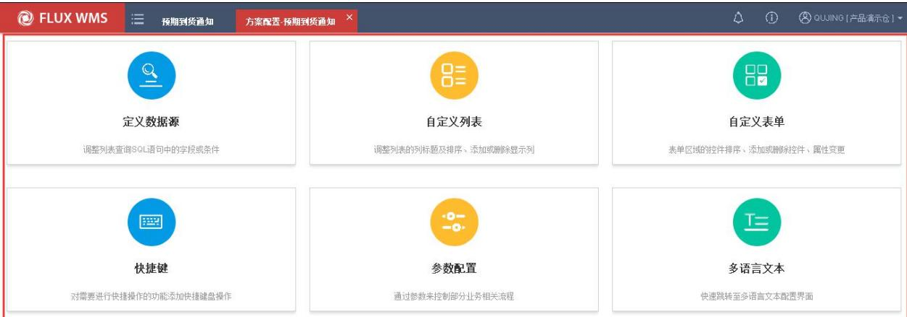

## [图4-13-2]

第一步，根据需要进行数据源配置。如果无需修改数据源字段，可以跳过此配置步骤，使用系统标准数据源。 

## - 定义数据源

■ 在功能的“方案配置”页签，选择“定义数据源”配置。 

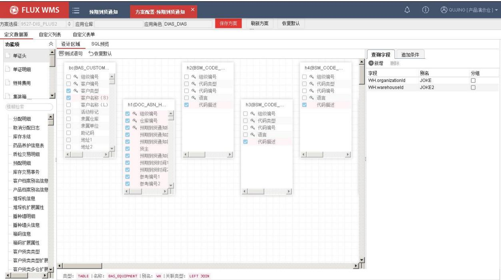

[图4-13-3]

在左上角项目部分，选择功能项目。例如单证头列表，或者具体哪个功能页签。相关功能具有的项目都会在这部分列出。 

■ 选择项目后，中间的设计区域显示所选项目涉及的表。 

■ 如果需要添加关联表，可以从左下角的“数据库表”部分选择并拖拽到设计区域，系统会弹出如下的对话框，要求添加表关联。 

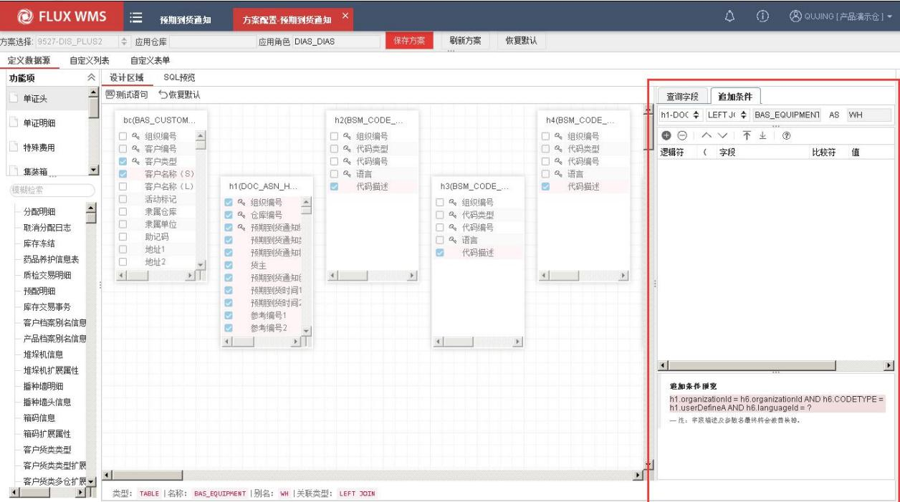

[图4-13-4]

确认生成后，在设计区域可见新的相关表。根据需要勾选字段，在右侧“查询字段”部分，可见生效的字段。 

■ 通过 “追加条件” 页签，可以进一步增加语句条件。 

■ 配置完成，在中间的“SQL预览”页签，可以看到完整的语句，系统会校验是否有语法错误。 

■ 配置无误，可以对方案进行保存，或者通过【恢复默认】按钮，还原为系统初始设置。 

## 4.13.3. 列表配置

数据源配置完成，可以通过点击“自定义列表”页签，切换到第二步，列表配置，如下图。 

无需配置数据源的情况下，也可以在[图 4-11-2]的方案配置主界面，直接进入“自定义列表”配置。 

<table><tr><td colspan="12">字段属性</td></tr><tr><td colspan="12">基本信息</td></tr><tr><td colspan="2">字段</td><td colspan="4">描述</td><td colspan="3">自定义文本描述</td><td colspan="3">列宽</td></tr><tr><td colspan="2">warehouseld</td><td colspan="4"></td><td colspan="3">仓库编号</td><td colspan="3">120</td></tr><tr><td colspan="2">排序</td><td colspan="4">水平对齐方式</td><td colspan="3">筛选方式</td><td colspan="3">格式化参数</td></tr><tr><td colspan="2">字符串</td><td colspan="4">左对齐</td><td colspan="3"></td><td colspan="3"></td></tr><tr><td colspan="2"></td><td colspan="4">汇总样式</td><td colspan="3">自定义标记</td><td colspan="3"></td></tr><tr><td colspan="2">☐是否汇总</td><td colspan="4">0000.00</td><td colspan="3">Y</td><td colspan="3"></td></tr></table>

## [图4-13-5]

## - 自定义列表

■ 在功能的“方案配置”页签，选择“自定义列表”配置。 

<table><tr><td colspan="2">FLUX WMS</td><td colspan="2">预期到货通知</td><td colspan="8">方案配置-预期到货通知</td></tr><tr><td colspan="2">方案选择: 9527-DIS_PLUS2</td><td colspan="2">应用仓库</td><td colspan="3">应用角色 DIAS_DIAS</td><td>保存方案</td><td>刷新方案</td><td colspan="3">恢复默认</td></tr><tr><td colspan="12">定义数据源 自定义列表</td></tr><tr><td colspan="2">功能项</td><td colspan="10">自定义表单</td></tr><tr><td colspan="2">功能项</td><td colspan="10">设计区域</td></tr><tr><td colspan="2">单证头</td><td rowspan="3" colspan="10">在左侧插入列 在右侧插入列 移除列 冻结 恢复默认</td></tr><tr><td colspan="2">单证明细</td></tr><tr><td colspan="2">特殊费用</td></tr><tr><td colspan="2">集装箱</td><td colspan="10">可拖拽调整列宽或移动位置</td></tr><tr><td colspan="2">模糊检索</td><td colspan="10">字段属性</td></tr><tr><td colspan="2">bc(客户档案)</td><td colspan="10">基本信息</td></tr><tr><td colspan="2">h1(预期到货通知)</td><td>字段</td><td colspan="3">描述</td><td colspan="3">自定义文本描述</td><td colspan="3">列宽</td></tr><tr><td colspan="2">h2(系统代码明细多语言描述)</td><td>warehouseId</td><td colspan="3"></td><td colspan="3">仓库编号</td><td colspan="3">120</td></tr><tr><td colspan="2">h3(BSM_CODE_ML)</td><td>排序</td><td colspan="3">水平对齐方式</td><td colspan="3">筛选方式</td><td colspan="3">格式化参数</td></tr><tr><td colspan="2">h4(BSM_CODE_ML)</td><td>字符串</td><td colspan="3">左对齐</td><td colspan="3"></td><td colspan="3"></td></tr><tr><td colspan="2">h6(系统代码多语言描述)</td><td></td><td colspan="3">汇总样式</td><td colspan="3">自定义标记</td><td colspan="3"></td></tr><tr><td colspan="2">VH(仓储设备)</td><td>□是否汇总</td><td colspan="3">0000.00</td><td colspan="3">Y</td><td colspan="3"></td></tr></table>

## [图4-13-6]

■ 界面左上方，显示此功能对应的列表项目。根据需要选择某一列表，左下方可选择 

字段部分，根据已配置的数据源，显示可选字段；界面右上方显示列表预览。 

■ 如果进入配置界面前，有查询记录，系统将带入首行数据在预览部分显示，方便定义字段宽度。 

预览部分，可以直接删除不需要显示的字段。需要增加显示的字段可以从左下方的可选字段窗体中拖拽到预览窗格。 

■ 选定某一列字段，点击【冻结字段】按钮，所选字段列之前的字段将在列表中冻结显示。 

■ 在界面右下方的“字段属性”部分，可以维护字段的显示信息： 

字段 - 所选列的数据字段名 

描述 - 字段默认名称。根据多语言配置显示。如果没有配置多语言，则显示数据字典配置作为默认描述。 

自定义描述 - 界面方案中显示的字段描述。未配置则显示默认描述。 

列宽 - 字段的显示列宽。 

排序 - 字段内容的排序模式。系统提供字符串、整型、日期型供选择。 

对齐 - 字段内容的对齐方式。 

筛选方式 - 字段内容的筛选方式。系统提供文本方式、数量方式供选择。如配置，在列表头，鼠标定位到字段，将显示筛选框。 

汇总模板 - 如果此字段勾选汇总，可选择汇总信息显示方式。 

是否汇总 - 当前所选字段，是否需要进行汇总统计。汇总针对符合查询条件的全部结果记录。 

■ 点击【保存方案】按钮，保存所做的方案修改。 

■ 当前应用方案修改保存后，在对应功能页签，刷新即可见修改效果。 

## 4.13.4. 表单配置

除菜单、列表之外的界面配置，归属于表单范围。 

## - 自定义表单

在功能的“方案配置”主页面（如[图4-11-2]），直接进入“自定义表单”配置。或者通过配置界面点击“自定义表单”页签，切换到表单配置，如下图所示。 

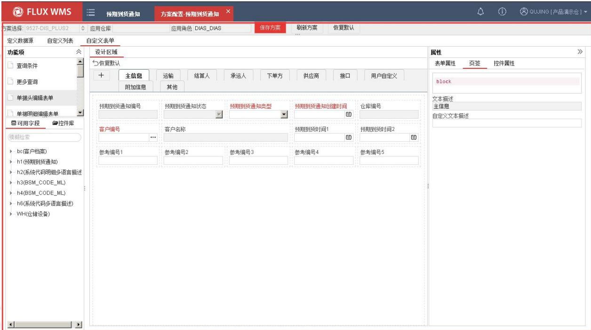

[图4-13-7] 

在配置界面（如下图）左上部分，“功能项”窗格中，选择需要配置的界面，如查询界面，或者单证头主信息页签等。 

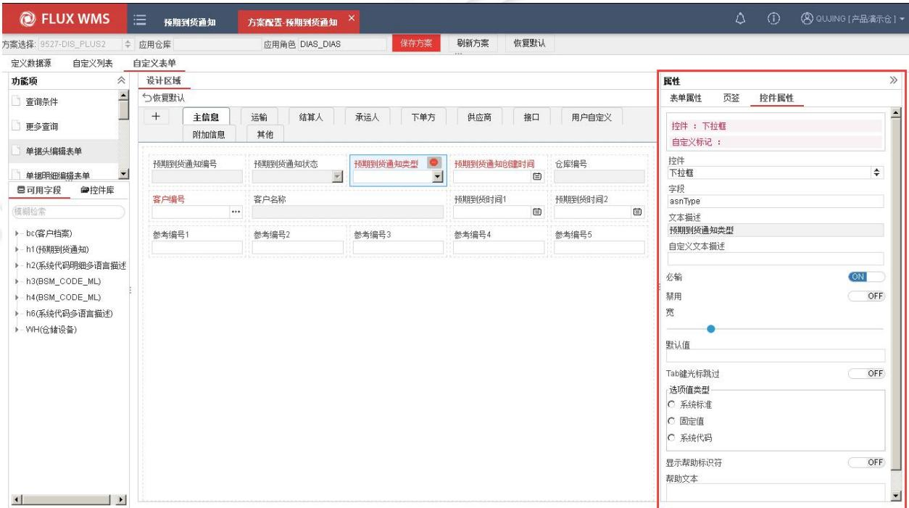

[图4-13-8]

■ 中间的设计区域，显示当前配置。可以根据需要添加字段，或删除字段显示，拖拽 

变动布局。 

■ 所添加的字段、部件，可以从界面左下方的数据库、部件库中拖拽到设计区域。 

■ 界面右侧进一步根据需要配置字段属性： 

字段 ID - 字段名 

文本描述 - 当前语言下，界面显示的字段名称 

是否必输 - 字段是否为必输字段 

是否禁用 - 字段是否被禁用 

宽度 - 字段显示宽度调节 

默认值 - 字段默认值。新增记录时自动默认。 

Tab 键光标跳过 - Tab 键移动光标时，不停留。 

显示帮助表示符 - 鼠标悬停字段时显示帮助信息。 

帮助文本 - 鼠标悬停时所显示的帮助信息内容。 

■ 点击【保存方案】按钮，保存所做修改。 

注：由于系统各个功能都支持界面自行配置，因此用户实际使用时，所见的功能界面字段、布局很可能与本文档截图显示有所不同。请根据实际系统应用。 

## 4.13.5. 快捷键配置

系统提供快捷键支持，并且各个功能的对应快捷键可以由现场进行配置。 

## - 快捷键

■ 从[图4-13-2]的方案配置界面，选择【快捷键】功能 

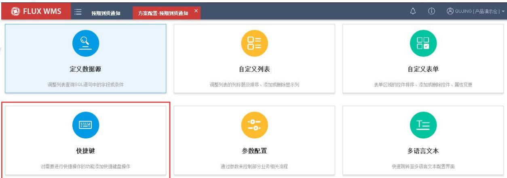

## [图4-13-2]

■ 进入如下图的配置界面

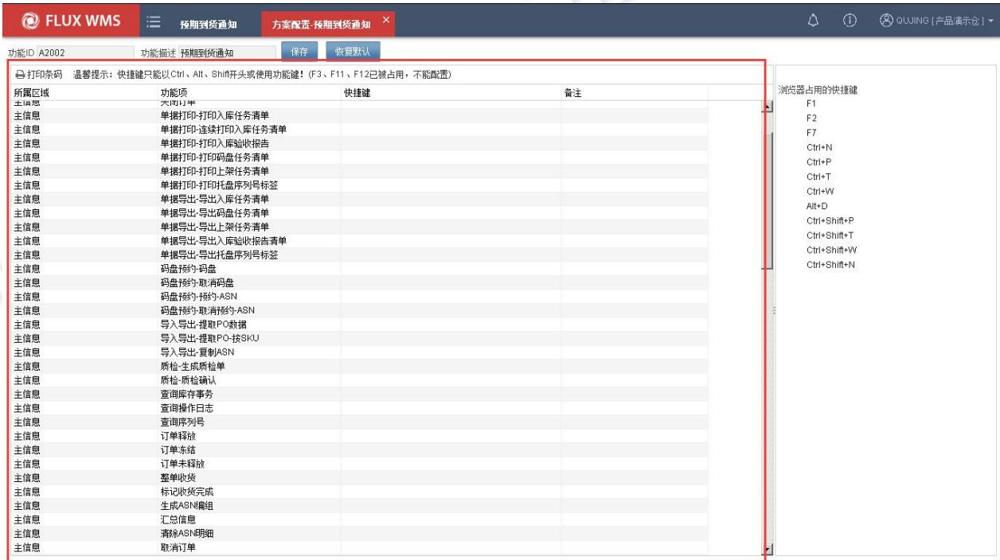

[图4-13-9]

系统列出可以进行快捷键配置的项目，并提示哪些快捷已经被使用，不可配置。 

在需要配置的功能记录处，点击“快捷键”字段，直接在键盘上按对应快捷键（例如按F6键， 

## 或者直接按 4，系统会记录为 Ctrl+4)

■ 点击【保存】按钮，完成快捷键配置 

■ 如果所配置的快捷键重复，系统会提示报错，如下图所示： 

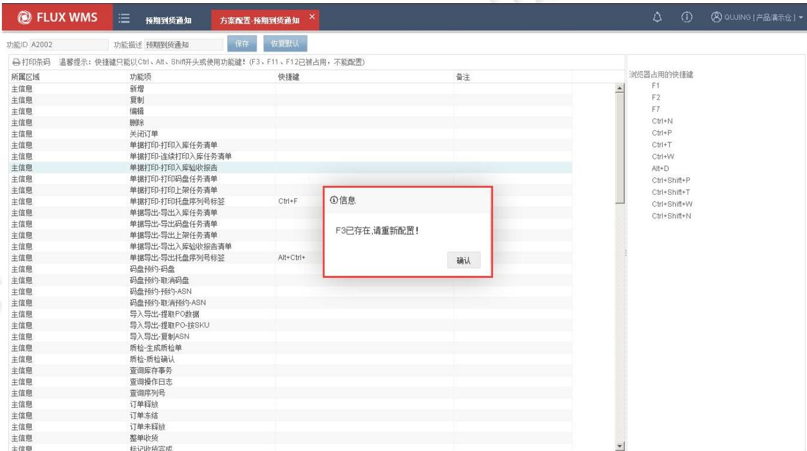

[图4-13-10]

## 4.13.6. 界面方案应用

当界面方案设置成功后，用户可根据业务管理需要，将角色或仓库与方案建立明确的映射关系。从而在登录成功后，使用该用户对应角色的界面方案进行显示。 

## - 仓库应用方案

■ 点击【新增】按钮，完成应用仓库的配置。若修改当前用户显示方案，还需重新登录系统才会生效。 

备注：当用户配置多条界面显示方案时，系统默认根据首个界面方案进行显示。 

<table><tr><td>方案编号</td><td>方案名称</td><td>活动标记</td><td>自</td><td rowspan="2">方案编号</td><td rowspan="2">方案名称</td><td rowspan="2">仓库代码</td><td rowspan="2">仓库描述</td><td rowspan="2">自定义01</td><td rowspan="2">自定义02</td><td rowspan="2">自定义03</td><td rowspan="2">自定义04</td></tr><tr><td>DIS-DIAS</td><td>9527-DIS</td><td>Y</td><td></td></tr></table>

## - 角色应用方案

<table><tr><td>方案编号</td><td>方案名称</td><td>角色编号</td><td>角色名称</td><td>自定义01</td><td>自定义02</td><td>自定义03</td><td>自定义04</td></tr><tr><td>DIS-DIAS</td><td>9527-DIS</td><td>D2</td><td>D2</td><td></td><td></td><td></td><td></td></tr><tr><td>DIS-DIAS</td><td>9527-DIS</td><td>DIAS_DIAS</td><td>DIAS_DIAS</td><td></td><td></td><td></td><td></td></tr></table>

■ 点击【新增】按钮，完成应用角色的配置。若修改当前用户显示方案，还需重新登录系统才会生效。 

备注：当用户配置多条界面显示方案时，系统默认根据首个界面方案进行显示。 

## 4.14. 附件文档管理

系统多个功能都支持附件上传。所有已经上传的附件，可以在“附件文档管理”功能中，统一管理，方便查看、下载。并且系统音频文件，也在此处管理。 

- 附件文档管理 

■ 在主菜单“业务系统管理”下选择“附件文档管理”。 

■ 查询所需的附件记录： 

<table><tr><td>查询条件</td><td colspan="8">上传下载删除预览编辑</td></tr><tr><td>仓库编号</td><td>文件编号</td><td>文件类型</td><td>文件大小</td><td></td><td></td><td></td><td></td><td></td></tr><tr><td>文件编号</td><td>1521942280631127.0.0.1</td><td>bd</td><td>139</td><td></td><td></td><td></td><td></td><td></td></tr><tr><td>文件类型</td><td>1521969112329127.0.0.1</td><td>bd</td><td>1945</td><td></td><td></td><td></td><td></td><td></td></tr><tr><td>关联类型</td><td>1521969648293127.0.0.1</td><td>bd</td><td>236658</td><td></td><td></td><td></td><td></td><td></td></tr><tr><td>订单号</td><td>1522132439212127.0.0.1</td><td>bd</td><td>1945</td><td></td><td></td><td></td><td></td><td></td></tr><tr><td>订单号</td><td>1522132505015127.0.0.1</td><td>bd</td><td>236658</td><td></td><td></td><td></td><td></td><td></td></tr><tr><td>订单号</td><td>1522133469102183.194.1.118</td><td>bd</td><td>1945</td><td></td><td></td><td></td><td></td><td></td></tr><tr><td>订单号</td><td>1522133518539183.194.1.118</td><td>bd</td><td>2424</td><td></td><td></td><td></td><td></td><td></td></tr><tr><td>订单号</td><td>1522148248156127.0.0.1</td><td>bd</td><td>644</td><td></td><td></td><td></td><td></td><td></td></tr><tr><td>订单号</td><td>1522148854535127.0.0.1</td><td>bd</td><td>644</td><td></td><td></td><td></td><td></td><td></td></tr><tr><td>订单号</td><td>152215122761536.5.226.80</td><td>bd</td><td>139</td><td></td><td></td><td></td><td></td><td></td></tr><tr><td>订单号</td><td>152215125987836.5.226.80</td><td>bd</td><td>139</td><td></td><td></td><td></td><td></td><td></td></tr><tr><td>订单号</td><td>1522242987628113.246.83.242</td><td>xlsx</td><td>64912</td><td></td><td></td><td></td><td></td><td></td></tr><tr><td>订单号</td><td>1522288642646183.194.1.118</td><td>docx</td><td>320129</td><td></td><td></td><td></td><td></td><td></td></tr><tr><td>订单号</td><td>1522288672922183.194.1.118</td><td>sql</td><td>63288</td><td></td><td></td><td></td><td></td><td></td></tr><tr><td>订单号</td><td>1522307821616127.0.0.1</td><td>bd</td><td>1945</td><td></td><td></td><td></td><td></td><td></td></tr><tr><td>订单号</td><td>1522312947354183.194.1.118</td><td>xls</td><td>19968</td><td></td><td></td><td></td><td></td><td></td></tr><tr><td>订单号</td><td>1522374009055113.247.216.78</td><td>jpg</td><td>88132</td><td></td><td></td><td></td><td></td><td></td></tr><tr><td>订单号</td><td>1522724438400183.194.1.118</td><td>bd</td><td>2698</td><td></td><td></td><td></td><td></td><td></td></tr><tr><td>订单号</td><td>1522726435169183.194.1.118</td><td>wav</td><td>8058</td><td></td><td></td><td></td><td></td><td></td></tr><tr><td>订单号</td><td>1522727403285183.194.1.118</td><td>mp3</td><td>55776</td><td></td><td></td><td></td><td></td><td></td></tr><tr><td>订单号</td><td>1522734664790183.194.1.118</td><td>log</td><td>2664</td><td></td><td></td><td></td><td></td><td></td></tr><tr><td>订单号</td><td>1522734958182183.194.1.118</td><td>log</td><td>2664</td><td></td><td></td><td></td><td></td><td></td></tr><tr><td>订单号</td><td>1522735338848183.194.1.118</td><td>log</td><td>2664</td><td></td><td></td><td></td><td></td><td></td></tr><tr><td>订单号</td><td>1522735630124183.194.1.118</td><td>xls</td><td>7680</td><td></td><td></td><td></td><td></td><td></td></tr><tr><td>订单号</td><td>1522736042083183.194.1.118</td><td>xls</td><td>19968</td><td></td><td></td><td></td><td></td><td></td></tr><tr><td>订单号</td><td>1522736752188183.194.1.118</td><td>xls</td><td>7680</td><td></td><td></td><td></td><td></td><td></td></tr><tr><td>订单号</td><td>1522736809704183.194.1.118</td><td>xls</td><td>19968</td><td></td><td></td><td></td><td></td><td></td></tr><tr><td>订单号</td><td>1522738422686183.194.1.118</td><td>jar</td><td>2547209</td><td></td><td></td><td></td><td></td><td></td></tr><tr><td>订单号</td><td>1522807863370127.0.0.1</td><td>mp3</td><td>1653622</td><td></td><td></td><td></td><td></td><td></td></tr><tr><td>订单号</td><td>1522814324206127.0.0.1</td><td>mp3</td><td>864</td><td></td><td></td><td></td><td></td><td></td></tr><tr><td>订单号</td><td>1522814373267127.0.0.1</td><td>mp3</td><td>864</td><td></td><td></td><td></td><td></td><td></td></tr><tr><td>订单号</td><td>1522817631458127.0.0.1</td><td>mp3</td><td>1653622</td><td></td><td></td><td></td><td></td><td></td></tr></table>

[图4-14-1]

文件编号 - 文件 ID 

文件描述 - 文件描述 

文件内容 - 文件内容描述 

源文件名 - 原始文件名 

文件类型 - 附件文件类型 

文件大小 - 文件大小 

保存文件名 - 服务器上的文件名 

文件保存目录 - 文件在服务器上的保存目录 

关联类型 - 附件类型 

仓库编号 - 附件所属仓库信息 

订单号 - 附件所属订单号信息 

跟踪号 - 用于记录附件提交交易明细对应跟踪号。字段允许为空 

客户编号 - 附件所属客户信息。字段允许为空 

产品代码 - 附件所属产品信息。字段允许为空 

上传人员 - 附件上传人员 

上传时间 - 附件上传时间 

上传标记 - 记录附件是否已上传 

■ 通过【保存】按钮保存修改。 

■ 也可以通过【下载】按钮下载文件。 

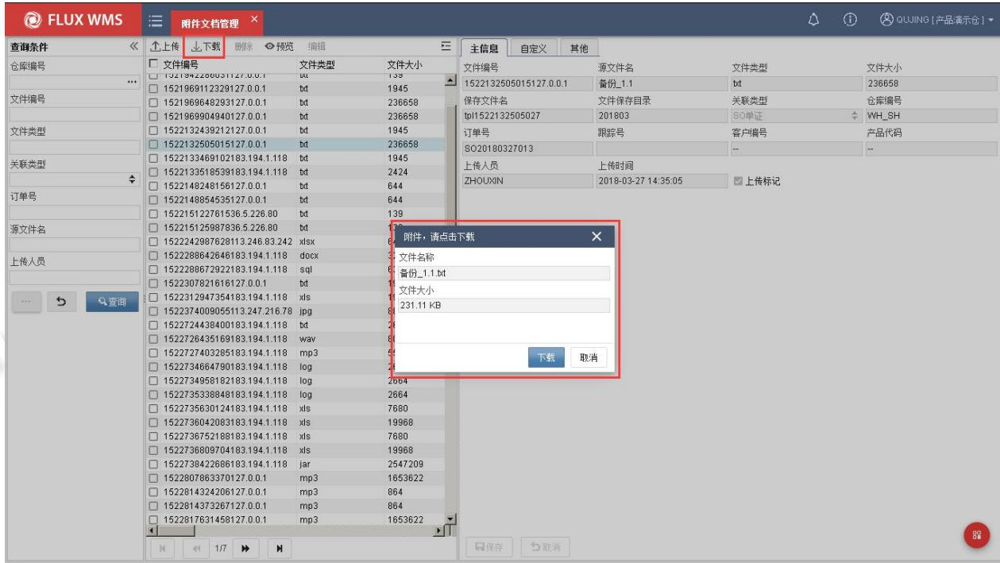

[图4-14-2] 

■ 点击【下载】按钮后，选择保存绝对路径点击【保存】后完成下载操作。 

■ 通过【上传】按钮上传文件。 

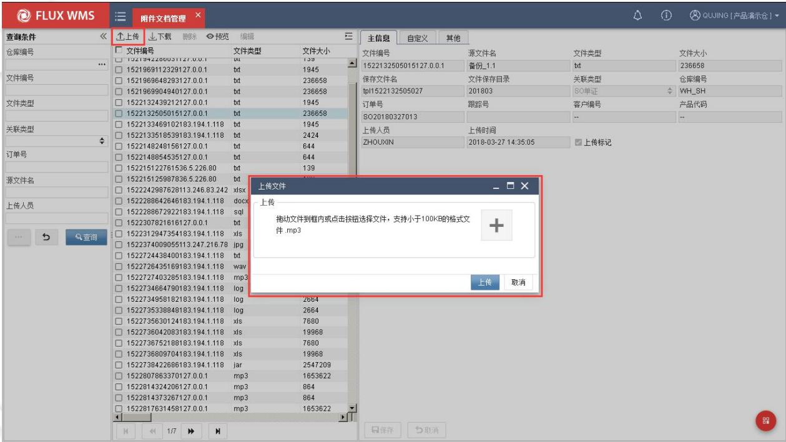

## [图4-14-3]

■ 当前版本 “附件文档管理” 附件上传功能仅支持.MP3 格式且小于 100KB 的音频文件，后续版本将陆续支持其他常用图片、音频、文本格式。 

## 4.15. 用户密码修改

提供给用户自行修改密码使用。 

## - 用户密码修改

■ 在主菜单“业务系统管理”下选择“用户密码修改”。 

QUJING [产品演示仓] 

原密码 

新密码 

确认密码 

只保存 

取消 

## [图4-15-1]

■ 在如图的修改界面，输入原密码、新密码，并确认保存。 

## 4.16. 组织结构管理

■ 现场实际作业中，往往在报表查看或者运输场景下，需要使用到集团的组织架构模型。本模作用为维护 V6 集团组织架构基础信息，便于前端模块引用。 

## - 主信息页签

■ 选择主菜单“业务系统管理”下的“组织结构管理”功能。 

■ 在工具栏位配置组织架构信息。 

<table><tr><td rowspan="6">IOF迪拜仓库
HUB01站点1
HUB02站点2
HUB03站点3
FLUX机构</td><td colspan="5">组织结构管理</td></tr><tr><td>新增同级</td><td>新增子级</td><td>复制</td><td>删除</td><td>保存 重置</td></tr><tr><td>主信息</td><td>地址信息</td><td>自定义</td><td>其他</td><td></td></tr><tr><td colspan="2">分支机构编号
PRODUCTGROUP</td><td colspan="2">分支机构名称
PRODUCTGROUP</td><td>分支机构类型
130 上级机构编号
FLUXBR001</td></tr><tr><td colspan="2">分支机构层级</td><td colspan="2">别名
PRODUCTGROUP</td><td>助记码
PRODUCTGROUP 活动标记</td></tr><tr><td colspan="5">2</td></tr></table>

[图4-16-1]

分支机构编号 - 分支机构编码，支持用户开放式输入。 

分支机构名称 - 分支机构名称，用来定义分支显示名称。 

分支机构类型 - 用来定义分支结构类型。 

上级机构编号 - 用来显示分支上级组织编号 

分支机构层级 - 用来定义机构目前所属层级。 

别名 - 用于定义分支别名。 

助记码 - 用于定义分支助记码，便于系统快速识别。 

## - 地址信息页签

■现场作业中由于部分实体/虚拟分支机构信息，并非都维护在客户档案中，，为便于系统获取此部分信息，系统支持在组织架构维度维护分支机构具体地址信息 

<table><tr><td colspan="8">FLUX WMS 组织结构管理</td></tr><tr><td rowspan="12">IQF迪拜仓库HUB01站点1HUB02站点2HUB03站点3FLUX机构</td><td rowspan="12" colspan="7">新增网级新增子级复制删除保存重置主信息地址信息自定义其他联系人邮政编码邮件电话1电话2地址1省份市地址2区隶属区域地址3传真</td></tr><tr></tr><tr></tr><tr></tr><tr></tr><tr></tr><tr></tr><tr></tr><tr></tr><tr></tr><tr></tr><tr><td></td></tr></table>

[图4-16-2]

地址 - 客户的地址。如一个客户有多个地址，可在“多地址信息”页签继续维护。 

国家 - 客户所在的国家。下拉列表内容通过后台表 TMS_SITE_INFO 进行维护。 

省份 - 客户所在的省份。下拉列表内容通过后台表 TMS_SITE_INFO 进行维护。 

城市 - 客户所在的城市。下拉列表内容通过后台表 TMS_SITE_INFO 进行维护。 

区 - 客户所在区。内容通过后台表 TMS_SITE_INFO 进行维护。 

街道 - 客户所在街道。配合快递信息维护所需。内容通过后台表 TMS_SITE_INFO 进行维护。 

隶属区域 - 客户所在集团划分区域。 

■邮政编码 - 客户所在地的邮政编码。 

## - 自定义页签

■ 为便于后期实施扩展，系统保留 11 个预留扩展字段，便于现场个性化扩展。 

Full-value Logistics, United eXpertise

<table><tr><td colspan="8">FLUX WMS 组织结构管理</td></tr><tr><td rowspan="7" colspan="2">IQF迪拜仓库HUB01钻点1HUB02钻点2HUB03钻点3FLUX机构</td><td colspan="6">新增网级 新增子级 复制 删除 保存 重置</td></tr><tr><td colspan="6">主信息 地址信息 自定义 其他</td></tr><tr><td colspan="6">自定义01 自定义02 自定义03 自定义04</td></tr><tr><td colspan="6">自定义05 自定义06 自定义07 自定义08</td></tr><tr><td colspan="6">自定义09 自定义10</td></tr><tr><td colspan="6">备注文本</td></tr><tr><td colspan="6"></td></tr></table>

[图4-16-3]

## 5. 业务系统配置

## 5.1. 系统配置参数

在 FLUX WMS 中，有许多功能的实现，业务流程规划，可以通过不同的参数配置或者组合得到不同的结果，例如入库任务清单上是否显示待收货数量、是否必须执行码盘操作或拣货操作等。 

系统配置参数功能位于“业务系统配置”模块下的“系统配置参数”中，FLUX的顾问将协助用户根据流程需要配置相应的系统参数。 

用户可通过 “参数分类” 或 “参数 ID” 等查询条件查找所需的系统配置参数。 

由于多仓多货主作业模式下，同一仓库内的多个货主之间管理要求会不同，同一货主在不同仓库的管理要求也可能有差别，因此系统支持按不同仓库、不同货主、不同订单类型分别配置参数（简称为 WCO 支持，即 Warehouse、Customer、Ordertyp 的缩写）。 

## - 系统配置参数设置

对于无需细化区分的情况下，即不区分仓库、货主、订单类型情况下，可以在详细信息页签，对参数默认参数值进行配置： 

<table><tr><td>查询条件</td><td>参数ID</td><td>参数描述</td></tr><tr><td>参数ID</td><td>ASN_LOT_CHK</td><td>ASN明细保存时校验必输批次属性</td></tr><tr><td>参数描述</td><td>ASN_MDT_CHK</td><td>入库生产日期不得早于库存中的生产日期</td></tr><tr><td>参数分类</td><td>ASN_MOD_ATH</td><td>ASN关闭后是否允许变更附件</td></tr><tr><td>活动标记</td><td>ASN_MOD_EDI</td><td>订单关闭后,接口页签是否允许修改</td></tr><tr><td>是</td><td>ASN_MOD_SUM</td><td>ASN订单关闭后是否允许修改汇总信息</td></tr><tr><td>系统预置标记</td><td>ASN_RCV_UPD</td><td>收货后是否将实际收货数据更新ASN(批次属性)</td></tr><tr><td>...</td><td>ASN_RLS_CTL</td><td>缺省ASN订单释放状态(Y释放)</td></tr><tr><td rowspan="25">查询</td><td>ASN_SPL</td><td>ASN关闭产生分单(1、YES强制产生分单2、OPTIONAL弹出窗口由用户决定是否产生分单...</td></tr><tr><td>ASN_SPL_CTL</td><td>供应商信息必须输入</td></tr><tr><td>ASN_SPL_REJ</td><td>ASN关闭生成分单时是否考虑招收数量</td></tr><tr><td>ASN_SPL_SEQ</td><td>ASN关闭产生分单时是否采用分单流水号</td></tr><tr><td>ASN_UDF_LCK</td><td>ASN用户自定义字段是否锁定</td></tr><tr><td>ASRS_CMB_TSK</td><td>立库在线拣选合并任务显示</td></tr><tr><td>AUT_CFM_ISN</td><td>序列号后是否自动导入</td></tr><tr><td>AUT_CFM_PKG</td><td>复核完成时自动提示装箱确认</td></tr><tr><td>BAS_CUB_CHK</td><td>产品体积设置检查1</td></tr><tr><td>BAS_GWT_CHK</td><td>产品毛重设置检查</td></tr><tr><td>BAS LOT_CHK</td><td>产品批次属性设置检查</td></tr><tr><td>BAS_PAC_CHK</td><td>产品包装设置检查</td></tr><tr><td>BLD_COU</td><td>盲盘</td></tr><tr><td>BLD_PTA</td><td>上架时不显示上架任务的数量,任务数量默认0,由上架人员输入,如果实际输入的数量与任...</td></tr><tr><td>BRK_PCK</td><td>整托盘与拆零分页打印-拣货清单</td></tr><tr><td>BRK_PTA</td><td>整托盘与拆零分页打印-上架清单</td></tr><tr><td>CAS_LBL_CTL</td><td>当分配的箱数超过此数值时,即使包装OUT_LABEL设置为Y,也只产生一条分配记录</td></tr><tr><td>CAS_ULD_PHR</td><td>卸货效率(箱小时)</td></tr><tr><td>CAT_CTL</td><td>只有装箱确认后(拆零货物)才能发货</td></tr><tr><td>CAT_CTN_TYP</td><td>根据箱条码解析箱型的规则,参数规则为XY,代表从第X位到第Y位为箱型代码</td></tr><tr><td>CAT_RLS_SRT</td><td>装箱确认后自动释放集货位</td></tr><tr><td>CCL_ALC_LOG</td><td>取消分配时记录日志</td></tr><tr><td>CHG_SCN_MOD</td><td>根据待复核数量切换逐件扫描或者批量扫描模式,低于整数值则采用逐件扫描,否则批量扫描</td></tr><tr><td>CHK_AND_PCK</td><td>装箱以及拣货确认同步进行</td></tr><tr><td>CHK_BCD_ALZ</td><td>复核时调用条码解析功能</td></tr></table>

[图5-1-1]

参数 ID - 参数代码 ID，也是参数的身份标识。 

参数分类 - 参数分类信息，便于参数查询、配置和维护。 

参数类型 - 参数值限定。下拉选项，系统提供 Y/N 类型、固定值、自由内容、数值型 4 种选择项。 

## ✿ Y/N 类型

参数值为下拉列表，可选项为是、否，用于开关型参数。 

## ✨ 固定值

参数值为下拉列表模式，不同参数的对应选择项不同。 

## 自由内容

参数值由现场自行录入，例如目录地址等。 

## ✨ 数值型

参数值为数字，限制其他非数值的录入保存。 

默认参数值 - 即不区分仓库、货主、订单类型情况下，默认生效的参数配置。 

参数描述 - 参数说明信息。 

参数级别 - 个别参数只能支持到仓库，或者货主级别，无法支持到订单类型层级（例如是否启用第三方费收），因此系统提供参数级别字段，供用户了解参数的生效层级。 

活动标记 - 控制参数是否启用。 

系统预置标记 - 此记录是否系统提供的初始化记录 

## - 参数规则设置

如果不同仓库、货主、订单类型下，所需参数配置不同（例如第三方仓库，A 货主要启用序列号管理，B 货主无需序列号管理），此时可以在参数规则页签中，进一步细化配置。 

点击【新增】按钮之后，根据所需指定的仓库、货主、订单类型，配置对应的参数值规则。例如仅在一个仓库下指定货主生效的参数，需要配置指定的仓库、货主，而订单类型可以不选择。 

多种参数规则情况下，系统依据行号次序匹配规则，新增记录时行号由用户自行指定，但保存后不可修改行号（如下图所示）。未配置规则情况下取参数默认设置生效。 

<table><tr><td rowspan="19">参数ID</td><td colspan="101">参数描述</td><td></td></tr><tr><td>ASN LOT_CHK</td><td colspan="100">ASN明细保存时校验必输批次属性</td><td></td></tr><tr><td>ASN_MDT_CHK</td><td colspan="96">入库生产日期不得早于库存中的生产日期</td><td></td><td></td><td></td><td></td><td></td></tr><tr><td>ASN_MOD_ATH</td><td colspan="94">ASN关闭后是否允许变更附件</td><td></td><td></td><td></td><td></td><td></td><td></td><td></td></tr><tr><td>ASN_MOD_EDI</td><td colspan="90">订单关闭后,接口页签是否允许修改</td><td></td><td></td><td></td><td></td><td></td><td></td><td></td><td></td><td></td><td></td><td></td></tr><tr><td>ASN_MOD_SUM</td><td colspan="85">ASN订单关闭后是否允许修改汇总信息</td><td></td><td></td><td></td><td></td><td></td><td></td><td></td><td></td><td></td><td></td><td></td><td></td><td></td><td></td><td></td><td></td></tr><tr><td>ASN_RCV_UPD</td><td colspan="80">收货后是否将实际收货数据更新ASN(批次属性)</td><td></td><td></td><td></td><td></td><td></td><td></td><td></td><td></td><td></td><td></td><td></td><td></td><td></td><td></td><td></td><td></td><td></td><td></td><td></td><td></td><td></td></tr><tr><td>ASN_RLS_CTL</td><td colspan="76">缺省ASN订单释放状态(Y释放)</td><td></td><td></td><td></td><td></td><td></td><td></td><td></td><td></td><td></td><td></td><td></td><td></td><td></td><td></td><td></td><td></td><td></td><td></td><td></td><td></td><td></td><td></td><td></td><td></td><td></td></tr><tr><td>ASN_SPL</td><td colspan="72">ASN关闭产生分单(1、YES强制产生分单2、OPTIONAL弹出窗口由用户决定是否产生分单...</td><td></td><td></td><td></td><td></td><td></td><td></td><td></td><td></td><td></td><td></td><td></td><td></td><td></td><td></td><td></td><td></td><td></td><td></td><td></td><td></td><td></td><td></td><td></td><td></td><td></td><td></td><td></td><td></td><td></td></tr><tr><td>ASN_SPL_CTL</td><td colspan="72">供应商信息必须输入</td><td></td><td></td><td></td><td></td><td></td><td></td><td></td><td></td><td></td><td></td><td></td><td></td><td></td><td></td><td></td><td></td><td></td><td></td><td></td><td></td><td></td><td></td><td></td><td></td><td></td><td></td><td></td><td></td><td></td></tr><tr><td>ASN_SPL_REJ</td><td colspan="67">ASN关闭生成分单时是否考虑拒收数量</td><td></td><td></td><td></td><td></td><td></td><td></td><td></td><td></td><td></td><td></td><td></td><td></td><td></td><td></td><td></td><td></td><td></td><td></td><td></td><td></td><td></td><td></td><td></td><td></td><td></td><td></td><td></td><td></td><td></td><td></td><td></td><td></td><td></td><td></td></tr><tr><td>ASN_SPL_SEQ</td><td colspan="63">ASN关闭产生分单时是否采用分单流水号</td><td></td><td></td><td></td><td></td><td></td><td></td><td></td><td></td><td></td><td></td><td></td><td></td><td></td><td></td><td></td><td></td><td></td><td></td><td></td><td></td><td></td><td></td><td></td><td></td><td></td><td></td><td></td><td></td><td></td><td></td><td></td><td></td><td></td><td></td><td></td><td></td><td></td><td></td></tr><tr><td>ASN_UDF_LCK</td><td colspan="60">ASN用户自定义字段是否锁定</td><td></td><td></td><td></td><td></td><td></td><td></td><td></td><td></td><td></td><td></td><td></td><td></td><td></td><td></td><td></td><td></td><td></td><td></td><td></td><td></td><td></td><td></td><td></td><td></td><td></td><td></td><td></td><td></td><td></td><td></td><td></td><td></td><td></td><td></td><td></td><td></td><td></td><td></td><td></td><td></td><td></td></tr><tr><td>ASRS_CMB_TSK</td><td colspan="56">立库在线拣选合并任务显示</td><td></td><td></td><td></td><td></td><td></td><td></td><td></td><td></td><td></td><td></td><td></td><td></td><td></td><td></td><td></td><td></td><td></td><td></td><td></td><td></td><td></td><td></td><td></td><td></td><td></td><td></td><td></td><td></td><td></td><td></td><td></td><td></td><td></td><td></td><td></td><td></td><td></td><td></td><td></td><td></td><td></td><td></td><td></td><td></td><td></td></tr><tr><td>AUT_CFM_ISN</td><td colspan="51">序列号后是否自动导入</td><td></td><td></td><td></td><td></td><td></td><td></td><td></td><td></td><td></td><td></td><td></td><td></td><td></td><td></td><td></td><td></td><td></td><td></td><td></td><td></td><td></td><td></td><td></td><td></td><td></td><td></td><td></td><td></td><td></td><td></td><td></td><td></td><td></td><td></td><td></td><td></td><td></td><td></td><td></td><td></td><td></td><td></td><td></td><td></td><td></td><td></td><td></td><td></td><td></td><td></td></tr><tr><td>AUT_CFM_PKG</td><td colspan="47">复核完成时自动提示装箱确认</td><td></td><td></td><td></td><td></td><td></td><td></td><td></td><td></td><td></td><td></td><td></td><td></td><td></td><td></td><td></td><td></td><td></td><td></td><td></td><td></td><td></td><td></td><td></td><td></td><td></td><td></td><td></td><td></td><td></td><td></td><td></td><td></td><td></td><td></td><td></td><td></td><td></td><td></td><td></td><td></td><td></td><td></td><td></td><td></td><td></td><td></td><td></td><td></td><td></td><td></td><td></td><td></td><td></td><td></td></tr><tr><td>BAS_CUB_CHK</td><td colspan="42">产品体积设置检查1</td><td></td><td></td><td></td><td></td><td></td><td></td><td></td><td></td><td></td><td></td><td></td><td></td><td></td><td></td><td></td><td></td><td></td><td></td><td></td><td></td><td></td><td></td><td></td><td></td><td></td><td></td><td></td><td></td><td></td><td></td><td></td><td></td><td></td><td></td><td></td><td></td><td></td><td></td><td></td><td></td><td></td><td></td><td></td><td></td><td></td><td></td><td></td><td></td><td></td><td></td><td></td><td></td><td></td><td></td><td></td><td></td><td></td><td></td><td></td></tr><tr><td>BAS_GWT_CHK</td><td>产品毛重设置检查</td><td></td><td></td><td></td><td></td><td></td><td></td><td></td><td></td><td></td><td></td><td></td><td></td><td></td><td></td><td></td><td></td><td></td><td></td><td></td><td></td><td></td><td></td><td></td><td></td><td></td><td></td><td></td><td></td><td></td><td></td><td></td><td></td><td></td><td></td><td></td><td></td><td></td><td></td><td></td><td></td><td></td><td></td><td></td><td></td><td></td><td></td><td></td><td></td><td></td><td></td><td></td><td></td><td></td><td></td><td></td><td></td><td></td><td></td><td></td><td></td><td></td><td></td><td></td><td></td><td></td><td></td><td></td><td></td><td></td><td></td><td></td><td></td><td></td><td></td><td></td><td></td><td></td><td></td><td></td><td></td><td></td><td></td><td></td><td></td><td></td><td></td><td></td><td></td><td></td><td></td><td></td><td></td><td></td><td></td><td></td><td></td><td></td><td></td><td></td><td></td></tr><tr><td>BAS LOT_CHK</td><td>产品批次属性设置检查</td><td></td><td></td><td></td><td></td><td></td><td></td><td></td><td></td><td></td><td></td><td></td><td></td><td></td><td></td><td></td><td></td><td></td><td></td><td></td><td></td><td></td><td></td><td></td><td></td><td></td><td></td><td></td><td></td><td></td><td></td><td></td><td></td><td></td><td></td><td></td><td></td><td></td><td></td><td></td><td></td><td></td><td></td><td></td><td></td><td></td><td></td><td></td><td></td><td></td><td></td><td></td><td></td><td></td><td></td><td></td><td></td><td></td><td></td><td></td><td></td><td></td><td></td><td></td><td></td><td></td><td></td><td></td><td></td><td></td><td></td><td></td><td></td><td></td><td></td><td></td><td></td><td></td><td></td><td></td><td></td><td></td><td></td><td></td><td></td><td></td><td></td><td></td><td></td><td></td><td></td><td></td><td></td><td></td><td></td><td></td><td></td><td></td><td></td><td></td><td></td></tr><tr><td rowspan="2">BAS_PAC_CHK</td><td>产品包装设置检查</td><td></td><td></td><td></td><td></td><td></td><td></td><td></td><td></td><td></td><td></td><td></td><td></td><td></td><td></td><td></td><td></td><td></td><td></td><td></td><td></td><td></td><td></td><td></td><td></td><td></td><td></td><td></td><td></td><td></td><td></td><td></td><td></td><td></td><td></td><td></td><td></td><td></td><td></td><td></td><td></td><td></td><td></td><td></td><td></td><td></td><td></td><td></td><td></td><td></td><td></td><td></td><td></td><td></td><td></td><td></td><td></td><td></td><td></td><td></td><td></td><td></td><td></td><td></td><td></td><td></td><td></td><td></td><td></td><td></td><td></td><td></td><td></td><td></td><td></td><td></td><td></td><td></td><td></td><td></td><td></td><td></td><td></td><td></td><td></td><td></td><td></td><td></td><td></td><td></td><td></td><td></td><td></td><td></td><td></td><td></td><td></td><td></td><td></td><td></td><td></td><td></td></tr><tr><td>BLD_COU</td><td>盲盘</td><td></td><td></td><td></td><td></td><td></td><td></td><td></td><td></td><td></td><td></td><td></td><td></td><td></td><td></td><td></td><td></td><td></td><td></td><td></td><td></td><td></td><td></td><td></td><td></td><td></td><td></td><td></td><td></td><td></td><td></td><td></td><td></td><td></td><td></td><td></td><td></td><td></td><td></td><td></td><td></td><td></td><td></td><td></td><td></td><td></td><td></td><td></td><td></td><td></td><td></td><td></td><td></td><td></td><td></td><td></td><td></td><td></td><td></td><td></td><td></td><td></td><td></td><td></td><td></td><td></td><td></td><td></td><td></td><td></td><td></td><td></td><td></td><td></td><td></td><td></td><td></td><td></td><td></td><td></td><td></td><td></td><td></td><td></td><td></td><td></td><td></td><td></td><td></td><td></td><td></td><td></td><td></td><td></td><td></td><td></td><td></td><td></td><td></td><td></td><td></td></tr></table>

[图5-1-2]

## - 参数刷新

用户登录时会获取当前参数配置信息并缓存使用，如果参数值被修改，需要刷新缓存，以便参数立即生效。当用户修改系统参数并且点击【保存】时，系统自动提示“是否重载”： 

■ 选择 “是” 当前用户环境，系统自动缓存重载，设置生效，从而提升参数修改后的用户体验； 

■ 点击 “否”，暂不重载，通常是后续还要修改其他参数，后续合并重载，或者手动重载缓存； 

## - 特殊参数介绍

■ 系统暂停 

配合 ERP 系统关账等管理需求，仓库中有时会要求指定时间段不可进行操作，但同时系统依旧运行以支持对账运算等要求。 

此时可通过手工修改系统参数（SYS_OPN_CLS，系统开放/暂停状态），或通过定时器定时关闭、开启参数，达到系统暂停操作的控制要求。 

具体定时器设置，请参考定时器章节的介绍。 

## - WCO 相关配置

由于不同参数生效的业务环节不同，可以选择的单证类型也有所不同。例如 ASN_RLS_CTL 参数，缺省 ASN 订单释放状态，对应订单类型选择，显示的是 ASN 类型，而 PO_RLS_CTL 参数，则针对 PO 类型进行选择。 

另外有些参数，不同订单类型下的应用没有区别，例如 BAS_GWT_CHK，产品毛重设置检查，就不提供订单类型选择。 

系统通过系统代码DOC_CTL_LST，来配置参数是否支持WCO的单证类型选择。并通过代码的自定义1字段维护参数对应的单证大类，如ASN，SO。经过维护的代码，系统才能提取相应单证类型供下拉框选择。如果一个参数在多个业务流程中应用，则通过%分隔单证大类，例如 $\mathrm{ASN}\% \mathrm{SO}$ ，那么对应参数在参数配置中的单证类型下拉列表可以显示ASN单证类型+SO单证类型供选择。 

## 5.2. 数据导出规则配置

系统中各个功能的信息，很多都会有数据导出的需求。例如导出当前库存数据发送给货主，导出单证信息用于手工统计，导出库位信息打印条码等等。系统提供了强大的自定义导出处理支持，用户可以根据各自的需要，自行定义所需的导出信息、格式等。 

“数据导出规则配置”功能，就是提供给用户进行导出定义的功能，配置后的导出功能，可在对应功能模块显示。但由于导出的定义，需要对系统功能、数据结构有一定了解，参考数据字典信息，因此导出规则的配置通常由系统管理员或IT部门进行配置管理。 

## - 数据导出规则配置

■ 选择主菜单 “业务系统配置” 下的 “数据导出规则配置”。 

■ 在左侧的查询条件栏位，输入查询条件，可查询已有记录。 

■ 点击【新增】按钮，在如下界面进行相关配置： 

<table><tr><td colspan="15">查询条件</td></tr><tr><td colspan="15">功能编号</td></tr><tr><td colspan="15">表格编号</td></tr><tr><td colspan="15">导出代码</td></tr><tr><td colspan="15">导出描述</td></tr><tr><td colspan="15">授权类型</td></tr><tr><td colspan="15">活动标记</td></tr><tr><td colspan="15">是</td></tr><tr><td colspan="15">标准模板</td></tr><tr><td colspan="15">否</td></tr><tr><td>...</td><td>S</td><td colspan="13">查询</td></tr></table>

[图5-2-1]

功能编号 - 功能 ID，系统根据此 ID，获取功能对应导出配置，显示为界面的导出选择项。 

功能描述 - 功能对应名称描述。 

表格编号 - 后台表名，即导出信息的来源。 

导出代码 - 代码 ID，用于区分不同的导出处理。 

导出描述 - 界面显示的导出选择项名称。 

显示顺序 - 同一功能的多个不同导出的显示排序。 

授权类型 - 系统提供一般查询类、业务操作类、业务管理类、系统管理类几个默认类型，方便将导出分类管理，批量进行授权设置。用户可以根据管理需要，自行在系统代码中设置更多的授权类型。授权类型取自系统代码 “EXP_AUTH_TYPE”，支持自定义扩展。 

活动标记 - 是否使用中的规则 

常用导出 - 如勾选，则在对应功能的【导出】按钮的下拉菜单中显示，方便快捷操作。未勾选的导出，则在其他按钮下，“按规则导出”功能中，通过二级窗口选择执行操作。 

常用打印 - 如勾选，则在对应功能的【打印】按钮的下拉菜单中显示，方便快捷操作。未勾选的导出，则在其他按钮下，“按规则打印”功能中，通过二级窗口选择执行操作。 

标准模板 - 是否标准打印模板 

## ■ 点击【保存】按钮，完成主信息设置

在 SQL 语句定义页签，根据导出需要，维护各级查询语句，可以通过【测试】按钮检测语法问题，【格式化】按钮对 SQL 语句进行格式化整理。在语句执行时系统会自动校验 SQL 是否符合授权限制（即是否有组织、仓库、货主等条件），若无系统会根据业务表和实际用户授权自动增加查询条件。 

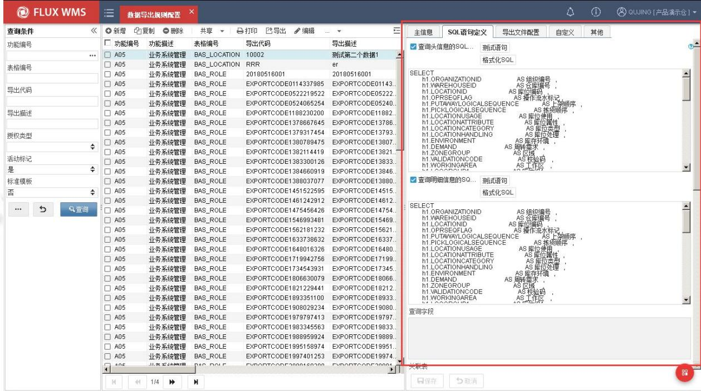

[图 5-2-2]

在“导出文件配置”页签，维护数据导出的要求： 

<table><tr><td>查询条件</td><td colspan="6">数据导出规则配置</td></tr><tr><td>功能编号</td><td>功能编号</td><td>功能描述</td><td>表格编号</td><td>导出代码</td><td>导出描述</td><td></td></tr><tr><td>表格编号</td><td>A05</td><td>业务系统管理</td><td>BAS_LOCATION</td><td>10002</td><td>测试第二个数据1</td><td></td></tr><tr><td>导出代码</td><td>A05</td><td>业务系统管理</td><td>BAS_LOCATION</td><td>RRR</td><td>er</td><td></td></tr><tr><td>导出描述</td><td>A05</td><td>业务系统管理</td><td>BAS_ROLE</td><td>20180516001</td><td>20180516001</td><td></td></tr><tr><td rowspan="5">授权类型</td><td>A05</td><td>业务系统管理</td><td>BAS_ROLE</td><td>EXPORTCODE0114337985</td><td>EXPORTCODE01143..</td><td></td></tr><tr><td>A05</td><td>业务系统管理</td><td>BAS_ROLE</td><td>EXPORTCODE0522219522</td><td>EXPORTCODE05222..</td><td></td></tr><tr><td>A05</td><td>业务系统管理</td><td>BAS_ROLE</td><td>EXPORTCODE0524065254</td><td>EXPORTCODE05240..</td><td></td></tr><tr><td>A05</td><td>业务系统管理</td><td>BAS_ROLE</td><td>EXPORTCODE1188230200</td><td>EXPORTCODE11882..</td><td></td></tr><tr><td>A05</td><td>业务系统管理</td><td>BAS_ROLE</td><td>EXPORTCODE1378667645</td><td>EXPORTCODE13786..</td><td></td></tr><tr><td>活动标记</td><td>A05</td><td>业务系统管理</td><td>BAS_ROLE</td><td>EXPORTCODE1379317454</td><td>EXPORTCODE13793..</td><td></td></tr><tr><td rowspan="24">是</td><td>A05</td><td>业务系统管理</td><td>BAS_ROLE</td><td>EXPORTCODE1380789475</td><td>EXPORTCODE13807..</td><td></td></tr><tr><td>A05</td><td>业务系统管理</td><td>BAS_ROLE</td><td>EXPORTCODE1382114419</td><td>EXPORTCODE13821..</td><td></td></tr><tr><td>A05</td><td>业务系统管理</td><td>BAS_ROLE</td><td>EXPORTCODE1383300126</td><td>EXPORTCODE13833..</td><td></td></tr><tr><td>A05</td><td>业务系统管理</td><td>BAS_ROLE</td><td>EXPORTCODE1384660919</td><td>EXPORTCODE13846..</td><td></td></tr><tr><td>A05</td><td>业务系统管理</td><td>BAS_ROLE</td><td>EXPORTCODE1388037077</td><td>EXPORTCODE13880..</td><td></td></tr><tr><td>A05</td><td>业务系统管理</td><td>BAS_ROLE</td><td>EXPORTCODE1451522595</td><td>EXPORTCODE14515..</td><td></td></tr><tr><td>A05</td><td>业务系统管理</td><td>BAS_ROLE</td><td>EXPORTCODE1461242912</td><td>EXPORTCODE14612..</td><td></td></tr><tr><td>A05</td><td>业务系统管理</td><td>BAS_ROLE</td><td>EXPORTCODE1475456426</td><td>EXPORTCODE14754..</td><td></td></tr><tr><td>A05</td><td>业务系统管理</td><td>BAS_ROLE</td><td>EXPORTCODE1546993481</td><td>EXPORTCODE15469..</td><td></td></tr><tr><td>A05</td><td>业务系统管理</td><td>BAS_ROLE</td><td>EXPORTCODE1562181232</td><td>EXPORTCODE15621..</td><td></td></tr><tr><td>A05</td><td>业务系统管理</td><td>BAS_ROLE</td><td>EXPORTCODE1633738632</td><td>EXPORTCODE16337..</td><td></td></tr><tr><td>A05</td><td>业务系统管理</td><td>BAS_ROLE</td><td>EXPORTCODE1648016326</td><td>EXPORTCODE16480..</td><td></td></tr><tr><td>A05</td><td>业务系统管理</td><td>BAS_ROLE</td><td>EXPORTCODE1719942756</td><td>EXPORTCODE17199..</td><td></td></tr><tr><td>A05</td><td>业务系统管理</td><td>BAS_ROLE</td><td>EXPORTCODE1734543931</td><td>EXPORTCODE17345..</td><td></td></tr><tr><td>A05</td><td>业务系统管理</td><td>BAS_ROLE</td><td>EXPORTCODE1806630079</td><td>EXPORTCODE18066..</td><td></td></tr><tr><td>A05</td><td>业务系统管理</td><td>BAS_ROLE</td><td>EXPORTCODE1821229441</td><td>EXPORTCODE18212..</td><td></td></tr><tr><td>A05</td><td>业务系统管理</td><td>BAS_ROLE</td><td>EXPORTCODE1893351100</td><td>EXPORTCODE18933..</td><td></td></tr><tr><td>A05</td><td>业务系统管理</td><td>BAS_ROLE</td><td>EXPORTCODE1908029234</td><td>EXPORTCODE19080..</td><td></td></tr><tr><td>A05</td><td>业务系统管理</td><td>BAS_ROLE</td><td>EXPORTCODE1979797413</td><td>EXPORTCODE19797..</td><td></td></tr><tr><td>A05</td><td>业务系统管理</td><td>BAS_ROLE</td><td>EXPORTCODE1983345563</td><td>EXPORTCODE19833..</td><td></td></tr><tr><td>A05</td><td>业务系统管理</td><td>BAS_ROLE</td><td>EXPORTCODE1988959924</td><td>EXPORTCODE19889..</td><td></td></tr><tr><td>A05</td><td>业务系统管理</td><td>BAS_ROLE</td><td>EXPORTCODE1995158974</td><td>EXPORTCODE19951..</td><td></td></tr><tr><td>A05</td><td>业务系统管理</td><td>BAS_ROLE</td><td>EXPORTCODE1997401253</td><td>EXPORTCODE19974..</td><td></td></tr><tr><td>A05</td><td>业务系统管理</td><td>BAS_ROLE</td><td>EXPORTCODE2000150208</td><td>EXPORTCODE20001..</td><td></td></tr></table>

[图5-2-3]

功能名称 - 导出文件使用功能名作为文件名前缀 

字段 ID - 导出文件名使用固定内容作为前缀 

日期格式 - 导出文件名包含日期、时间戳信息。格式可选择。 

导出到 XX - 导出的文件格式配置。如勾选某种模式，在对应功能的打印/导出子菜单，此项导出会显示模式选择子菜单。不同导出模式，需要配置不同的设置。 

使用模板导出到 Excel 文件 - 与普通的的“导出到 Excel 文件”功能相比，使用模板，可以指定不同的导出内容格式，一般用在生成客户指定格式的反馈报表中，如库存日报、发货报告等，通常会指定货主使用。所指定的模板格式，需要在“模板文件管理”功能中进行维护。 

打印 - 如勾选 “打印”，并配置打印模板，系统将会把此项导出，显示在打印子菜单中。如果未勾选，则仅作为导出项，而不是打印项显示。 

普通打印 - 普通模板打印 

打印模板文件 - 打印调用的模板，支持在线编辑模板。 

PDF 打印 - 基于 URL 的 PDF 文件进行打印。 

打印 PDF 相关规则 - 基于 URL PDF 文件打印时，修改内容的坐标。 

■ 点击【保存】按钮，完成数据导出规则设置。 

## 5.3. 自定义操作配置

类似导出、打印配置，自定义操作也需要在独立的功能中进行设置。 

## - 自定义操作配置

■ 选择主菜单 “业务系统管理” 下的 “自定义操作配置”。 

■ 在左侧的查询条件栏位，输入查询条件，可查询已有记录。 

■ 点击【新增】按钮，在主信息界面进行相关配置： 

<table><tr><td colspan="12">查询条件</td></tr><tr><td colspan="12">功能编号</td></tr><tr><td colspan="12">表格编号</td></tr><tr><td colspan="12">操作代码</td></tr><tr><td colspan="12">操作描述</td></tr><tr><td colspan="12">活动标记</td></tr><tr><td colspan="12">是</td></tr><tr><td colspan="12">查询</td></tr></table>

[图5-3-1]

功能编号 - 操作对应的功能代码 ID 

数据表名 - 操作对应的后台数据库表名。 

操作代码 - 自定义操作的代码 ID。 

操作描述 - 界面显示的自定义操作名称。 

显示顺序 - 同一功能多个自定义操作的显示顺序。 

授权类型 - 系统提供一般查询类、业务操作类、业务管理类、系统管理类几个默认类型，方便将导出分类管理，批量进行授权设置。用户可以根据管理需要，自行在系统代码中设置 

更多的授权类型。 

操作类型 - 使用 Java 类，还是存储过程模式来执行操作。 

活动标记 - 是否使用中的记录。 

常用操作 - 如勾选，则在对应功能的【操作】按钮的下拉菜单中显示，方便快捷操作。未勾选的操作项目，则在其他按钮下，“自定义操作”功能中，通过二级窗口选择执行操作。 

Java 类名 - Java 相关配置。具体内容由 IT 部门或者 FLUX 顾问提供，本项输入忽略大小写。 

Java 方法 - Java 相关配置。具体内容由 IT 部门或者 FLUX 顾问提供，本项输入忽略大小写。 

SP 名称 - 存储过程相关配置。具体内容由 IT 部门或者 FLUX 顾问提供，本项输入忽略大小写。 

SP 参数列表 - 存储过程相关配置。具体内容由 IT 部门或者 FLUX 顾问提供，本项输入忽略大小写。 

■ 点击【保存】按钮，完成自定义操作设置。 

## - SP 配置约定

■ 符号@，代表系统动态参数。如当前用户、所属组织、当前仓库等。 

■ 符合$, 代表前台入参。如所属模块 ID、解析跟踪号、一二维码等。 

■ 符号%，代表前台出参。 

■ 前台配置出入参个数必须与后台 SP 一致，当不一致时前台提示报错。 

## 5.4. 模板文件管理

与 “数据导出规则配置” 功能配合使用，可以预先定义好所需的模板，然后再指定哪种导出规则使用什么模板。 

## - 模板文件管理

■ 选择主菜单 “业务系统配置” 下的 “模板文件管理”。 

■ 在左侧的查询条件栏位，输入查询条件，可查询已有记录。 

■ 点击【新增】按钮，在主信息界面进行相关配置： 

<table><tr><td>查询条件</td><td>□ 模板文件编号</td><td>模板文件描述</td><td>文件类型</td></tr><tr><td>模板文件编号</td><td>1w_001</td><td>1w_001</td><td>GRF01</td></tr><tr><td>模板文件描述</td><td>20171230ZXCES001</td><td>周鑫测试00120171230</td><td>GRF01</td></tr><tr><td rowspan="3">活动标记</td><td>20180504001</td><td>20180504001</td><td>GRF01</td></tr><tr><td>20180505ZX01</td><td>20180505ZX01-自动打印</td><td>GRF01</td></tr><tr><td>20180516001</td><td>20180516001</td><td>XLS01</td></tr><tr><td rowspan="2">是</td><td>20180601ZXCES001</td><td>20180601ZXCES001</td><td>XLS01</td></tr><tr><td>20180601ZXCES002</td><td>20180601ZXCES002</td><td>XLS01</td></tr><tr><td rowspan="26">系统预置记录</td><td>20180612T01</td><td>20180612T01(订单明细)</td><td>XLS01</td></tr><tr><td>20180612TP01</td><td>20180612T01(单头字段测试)</td><td>GRF01</td></tr><tr><td>20180723</td><td>20180723</td><td>FRF01</td></tr><tr><td>2018090702</td><td>2018090702分组列表</td><td>FRF01</td></tr><tr><td>2018090703</td><td>2018090703</td><td>FRF01</td></tr><tr><td>2018090704</td><td>2018090704-主</td><td>FRF01</td></tr><tr><td>20181018_01</td><td>20181018_01</td><td>FRF01</td></tr><tr><td>20181120_02</td><td>20181120_02</td><td>FRF01</td></tr><tr><td>20181120_03</td><td>20181120_03</td><td>FRF01</td></tr><tr><td>20181120_TEST</td><td>20181120_TEST</td><td>FRF01</td></tr><tr><td>20181219</td><td>20181219</td><td>PDF01</td></tr><tr><td>20181226ZX</td><td>员工标签-自动打印服务redis</td><td>GRF01</td></tr><tr><td>213124</td><td>213124</td><td>XLS01</td></tr><tr><td>345454</td><td>345454</td><td>XLS01</td></tr><tr><td>4321412</td><td>43214124321</td><td>GRF01</td></tr><tr><td>546</td><td>546</td><td>XLS01</td></tr><tr><td>567</td><td>567</td><td>XLS01</td></tr><tr><td>666</td><td>666</td><td>GRF01</td></tr><tr><td>676788</td><td>676756788</td><td>XLS01</td></tr><tr><td>A01</td><td>testaaaaaaa</td><td>GRF01</td></tr><tr><td>A3001001</td><td>A3001test</td><td>GRF01</td></tr><tr><td>A30160001</td><td>装车单test</td><td>GRF01</td></tr><tr><td>AAA</td><td>AAA</td><td>GRF01</td></tr><tr><td>AAAA</td><td>AAAA</td><td>GRF01</td></tr><tr><td>AAAAF</td><td>AAAAF</td><td>GRF01</td></tr><tr><td>ASDFG</td><td>ASDFG</td><td>XLS01</td></tr></table>

[图5-4-1]

模板文件编号 - 模板文件的 ID，不可重复。 

模板文件描述 - 模板名称。 

文件类型 - 模板类型。系统目前提供 Excel、Grid++（打印格式）、PDF 模板类型供选择。 

文件扩展名 - 根据所选类型，显示对应的固定文件扩展名。 

功能编号 - 模板应用的功能对应功能 ID。 

功能描述 - 功能名称。 

活动标记 - 是否使用中的记录 

文件上传标记 - 是否已经上传模板，由系统根据上传情况显示。 

打印机配置 - 指定打印到特定打印机。可以实现标签从标签打印机打印，单据从激光打印机打印的效果。所指定的打印机，可以为不同电脑分别配置。 

默认打印份数 - 一次打印时的输出份数。默认为 1. 

同步更新单证的打印标记 - 打印后更新单据对应的打印标记。 

级联同步更新标记 - 单据组打印时使用，例如从波次计划打印拣货单，除了更新波次计划的拣货单打印标记，可以同步更新发运订单中的拣货单打印标记。 

预览 - 打印时是否需要显示预览界面。如果不预览，同时配置打印机，则可以实现后台打印输出效果。 

启用打印汇总控制 - 是否启用打印次数控制。 

默认打印次数 - 启用打印次数控制情况下，允许的打印次数。 

重置打印控制方式 - 超过默认打印次数时，系统处理方式。分为仅提示；人工清除打印标记重新打印；以及通过录入密码再次打印几种控制方式。 

■ 点击【保存】按钮，完成主信息的设置。 

■ 再点击【上传文件】按钮，通过如下对话框，选择模板文件上传。上传成功系统会更新“文件上传标记”。 

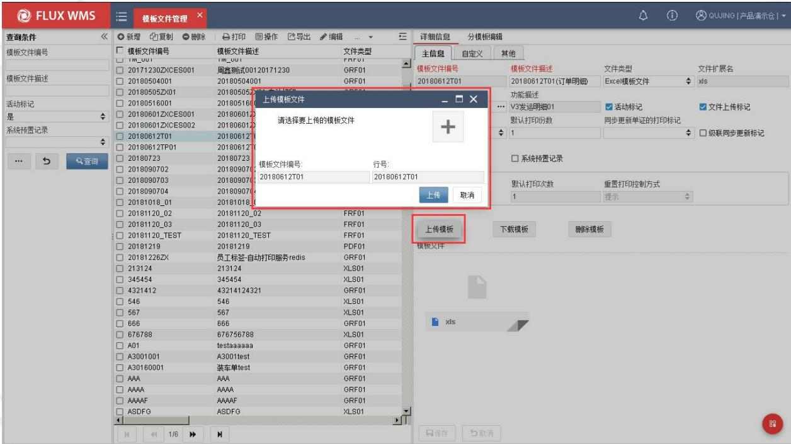

[图 5-4-2]

■ 已上传模板，可以通过点击【下载文件】按钮，下载查看。或者通过【删除文件】按钮，删除已上传的模板文件。 

## - 分模板编辑

有时候，同一个单据，由于内容不同，需要打印不同格式的内容。例如快递面单，需要根据不同承运人，选择不同面单格式进行打印。或者发货报告，需要根据不同收货人要求，配置不同的打印格式。 

此类单据，系统采用分模板管理，同一个单据，根据所配置的条件，选择不同的单据模板、打 

印机进行输出。使用时，需要先配置主模板信息，再进一步配置分模板信息。 

在 “模板文件管理” 中，选择模板主信息对应的 “分模板编辑” 页签。 

■ 点击【新增】按钮，添加如下分模板信息： 

<table><tr><td>查询条件</td><td>□ 模板文件编号</td><td>模板文件描述</td><td>文件类型</td></tr><tr><td>模板文件编号</td><td>ASN_CA_TEST</td><td>编码-杀码双张打印(TEST)</td><td>GRF01</td></tr><tr><td>模板文件描述</td><td>ASN_INBCHECK_LIST</td><td>标准ASN入库验收报告</td><td>GRF01</td></tr><tr><td>活动标记</td><td>ASN_INBTASK_CONTI...</td><td>标准ASN连续打印入库任务清单</td><td>GRF01</td></tr><tr><td>系统预置记录</td><td>ASN_INBTASK_LIST</td><td>标准ASN入库任务清单</td><td>GRF01</td></tr><tr><td></td><td>ASN_PRINT</td><td>ASN_PRINT</td><td>GRF01</td></tr><tr><td></td><td>ASN_PUTAWAYTASK_LI...</td><td>标准ASN上架任务清单</td><td>GRF01</td></tr><tr><td></td><td>ASN_RECEIVING_BHG</td><td>华联入库任务</td><td>GRF01</td></tr><tr><td></td><td>ASN_TEST_BJ</td><td>北京仓测试0423</td><td>GRF01</td></tr><tr><td></td><td>ASN_TRAYSERIAL_LAB...</td><td>标准ASN找盘序列号标签</td><td>GRF01</td></tr><tr><td></td><td>ASN_UDF</td><td>ASN分模板测试</td><td>GRF01</td></tr><tr><td></td><td>ASN_UDF1</td><td>ASN分模板测试2</td><td>GRF01</td></tr><tr><td></td><td>ASN_UDF_INBCHECK...</td><td>自定义入库任务清单</td><td>GRF01</td></tr><tr><td></td><td>ASN_UDF_PR01</td><td>ASN_UDF_PR01</td><td>GRF01</td></tr><tr><td></td><td>ASN_UDF_SKULABEL</td><td>ASN_UDF_SKULABEL</td><td>GRF01</td></tr><tr><td></td><td>BAIBAI</td><td>BAIBAI</td><td>GRF01</td></tr><tr><td></td><td>BAIN11</td><td>DV入库单打印测试</td><td>GRF01</td></tr><tr><td></td><td>BAS_LOCATION_LABEL</td><td>标准库位标签</td><td>GRF01</td></tr><tr><td></td><td>BAS_SKU_TEST3</td><td>BAS_SKU_TEST3</td><td>GRF01</td></tr><tr><td></td><td>BBB</td><td>aaa</td><td>GRF01</td></tr><tr><td></td><td>BBBB</td><td>bbbb</td><td>GRF01</td></tr><tr><td></td><td>CARTON_PRTTASKLIS...</td><td>CARTON_PRTTASKLIST_1</td><td>GRF01</td></tr><tr><td></td><td>CCCC</td><td>CCCC测试</td><td>GRF01</td></tr><tr><td></td><td>CF001_TEST5</td><td>CF001_TEST5</td><td>GRF01</td></tr><tr><td></td><td>CF0808001</td><td>1028</td><td>XLS01</td></tr><tr><td></td><td>CF_TEST1</td><td>CF_TEST1</td><td>GRF01</td></tr><tr><td></td><td>CHENX_FENMOBAN_T...</td><td>CHENX_FENMOBAN_TEST-</td><td>GRF01</td></tr><tr><td></td><td>CHENX_FMB</td><td>CHENX_FMB</td><td>GRF01</td></tr><tr><td></td><td>CHENX_TEST_A3022</td><td>CHENX_TEST_A3022</td><td>GRF01</td></tr><tr><td></td><td>CONSOLIDATION_LABEL</td><td>标准集拼箱装箱标签</td><td>GRF01</td></tr><tr><td></td><td>CONSOLIDATION_LIST</td><td>标准集拼箱装箱清单</td><td>GRF01</td></tr><tr><td></td><td>CS001</td><td>CS001</td><td>GRF01</td></tr><tr><td></td><td>CSCS</td><td>CSCS</td><td>XLS01</td></tr><tr><td></td><td>CUSTOMER_INFO_TEST3</td><td>CUSTOMER_INFO_TEST3</td><td>GRF01</td></tr></table>

[图 5-4-3]

模板文件编号 - 模板文件 ID 

行号 - 分模板行号 

模板文件描述 - 模板文件名称描述 

仓库编号 - 适用仓库。*为全部仓库适用。 

货主 - 分模板货主条件。例如此模板适用与货主为 ABC 的入库单据。 

单证类型 - 分模板单证类型条件 

承运人 - 分模板承运人条件 

收货人 - 分模板收货人条件 

供应商 - 分模板供应商条件 

自定义头信息字段 - 自定义分模板条件。指定发运订单头的某个字段作为分模板条件
自定义头信息字段值 - 自定义分模板条件的适用值。 

## 活动标记 - 是否使用中的记录

打印机配置 - 指定打印到特定打印机。可以实现标签从标签打印机打印，单据从激光打印机打印的效果。所指定的打印机，可以为不同电脑分别配置。 

默认打印份数 - 一次打印时的输出份数。默认为 1. 

预览 - 打印时是否需要显示预览界面。如果不预览，同时配置打印机，则可以实现后台打印输出效果。 

文件上传标记 - 是否已经上传模板，由系统根据上传情况显示。 

■ 点击【保存】按钮，完成主信息的设置。 

■ 再点击【上传文件】按钮，选择模板文件上传。上传成功系统会更新“文件上传标记”。 

## 5.5. 自动打印配置

仓库内的固定作业，可以配置对应的自动打印服务，实现无需人为干预的自动打印输出。 

例如订单通过接口下达，由定时器负责按波次规则运算生成波次订单、分配库存，完成分配的订单就可以通过自动打印配置，在指定的打印机输出本区域的拣货任务清单。具体拣货操作员工，根据打印的单据进行拣货操作，无需人工操作打印、通知、单据传递。 

## - 自动打印配置

■ 选择主菜单 “业务系统配置” 下的 “自动打印配置”。 

■ 点击【新增】按钮，在“详细信息”页签维护主信息： 

<table><tr><td colspan="11">FLUX WMS</td></tr><tr><td colspan="11">查询条件</td></tr><tr><td colspan="11">仓库编号</td></tr><tr><td colspan="11">主任务编号</td></tr><tr><td colspan="11">主任务描述</td></tr><tr><td colspan="11">工作站</td></tr><tr><td colspan="11">任务类型</td></tr><tr><td colspan="11">是否分区</td></tr><tr><td colspan="11">活动标记</td></tr><tr><td>...</td><td colspan="10">查询</td></tr></table>

[图 5-5-1]

仓库编号 - 打印配置生效的仓库 

主任务编号 - 打印配置编号，系统自动生成的流水号 

主任务描述 - 打印配置描述 

运行间隔（秒）- 多长时间运行一次 

任务类型 - 选择打印配置是一级结构，还是二级结构。一级结构只需要配置“SQL语句定义”中的查询明细的语句内容。二级结构需要同时配置头信息、明细信息查询语句。 

- 工作站 - 此任务需要在哪台电脑运行（工作站信息，在界面右上角的系统菜单，本地配置-工作站中查看。相关配置请参考3.5.2系统信息部分的介绍） 

打印模块文件 - 二级窗口选择打印所用的模板文件，支持单据、标签等不同打印配置。相应模板在业务系统配置-模板文件管理中配置。目前支持 grf 报表（Grid++）以及 PDF 模板。 

- 复查状态 - 不可编辑字段，预设给 IT 部门/DAB 审核报表查询语句时使用。 

- 分组 - 作为在使用自动打印界面的分组查询条件，用于数据临时过滤。 

打印机 - 打印输出的指定打印机，可配置主打印机（主打印机必输）、备用打印机。 

打印机类型 - 打印机是标签打印机，还是激光打印机。分区情况下必选 

是否分区 - 

活动标记 - 

授权类型 - 从界面新增记录时，默认为客户端类型，不可编辑 

■ 点击【保存】按钮，完成新增记录主信息操作。 

■ 由于一个订单作业时可能有多个打印需求（例如订单的拣货任务清单和出库标签）有可能需要使用到不同的打印机输出，因此系统支持一个方案下多个打印任务。在“主任务信息”页签，点击【新增】按钮，维护如下内容： 

<table><tr><td colspan="10">FLUX WMS</td></tr><tr><td colspan="10">查询条件</td></tr><tr><td colspan="10">仓库编号</td></tr><tr><td colspan="10">主任务编号</td></tr><tr><td colspan="10">主任务描述</td></tr><tr><td colspan="10">工作站</td></tr><tr><td colspan="10">任务类型</td></tr><tr><td colspan="10">是否分区</td></tr><tr><td colspan="10">活动标记</td></tr><tr><td>...</td><td colspan="9">查询</td></tr></table>

[图5-5-2]

■ 点击【保存】按钮，完成主信息维护 

在 “SQL 语句定义” 页签，根据业务要求维护查询需要打印的记录的 SQL 语句，以及打印成功后更新打印标记的更新语句： 

<table><tr><td colspan="2">FLUX WMS</td><td colspan="9">自动打印配置</td></tr><tr><td>查询条件</td><td>&lt;&lt;</td><td>新增</td><td>复制</td><td>删除</td><td>打印</td><td>操作</td><td>导出</td><td>编辑</td><td>...</td><td></td></tr><tr><td>仓库编号</td><td></td><td colspan="2">仓库编号</td><td colspan="2">主任务编号</td><td colspan="2">主任务描述</td><td colspan="2">工作站</td><td></td></tr><tr><td>主任务编号</td><td></td><td></td><td></td><td></td><td></td><td></td><td></td><td></td><td></td><td></td></tr><tr><td>主任务描述</td><td></td><td></td><td></td><td></td><td></td><td></td><td></td><td></td><td></td><td></td></tr><tr><td>工作站</td><td></td><td></td><td></td><td></td><td></td><td></td><td></td><td></td><td></td><td></td></tr><tr><td>任务类型</td><td></td><td></td><td></td><td></td><td></td><td></td><td></td><td></td><td></td><td></td></tr><tr><td>是否分区</td><td></td><td></td><td></td><td></td><td></td><td></td><td></td><td></td><td></td><td></td></tr><tr><td>活动标记</td><td></td><td></td><td></td><td></td><td></td><td></td><td></td><td></td><td></td><td></td></tr><tr><td>...</td><td>+</td><td colspan="9">查询</td></tr></table>

[图 5-5-3]

■ 点击【保存】按钮，完成主信息维护 

自动打印配置完成，可以在系统的“自动打印”模块查看打印执行情况。 

## 5.6. 标准业务扩展配置

标准业务扩展功能，是提供给现场自行添加操作前、操作后个性化处理的灵活配置。例如有些现场要在扫描 sku 时，对特殊产品给予特殊提示或者控制。这些能够通过个性化校验逻辑来支持。 

## - 标准业务扩展配置

■ 选择主菜单 “业务系统配置” 下的 “标准业务扩展配置”。 

■ 点击【新增】按钮，在“详细信息”页签维护主信息： 

<table><tr><td>查询条件</td><td colspan="9">新增 复制 删除 打印 操作 导出 编辑</td></tr><tr><td>仓库编号</td><td>仓库编号</td><td>功能编号</td><td>动作代码</td><td>扩展类型</td><td colspan="5">详细信息 相关配置</td></tr><tr><td>DEMO</td><td>DEMO</td><td>*</td><td>CHECKTYPE</td><td>复核类型解析</td><td colspan="5">主信息 限制条件 自定义 其他</td></tr><tr><td>功能编号</td><td>DEMO</td><td>*</td><td>SCANDOCNO</td><td>单证号条码解析</td><td colspan="5">仓库编号 功能编号 扩展类型 操作ID</td></tr><tr><td>动作代码</td><td>DEMO</td><td>*</td><td>SCANSERIALNO</td><td>序列号条码解析</td><td colspan="5">DEMO ... * 序列号条码解析 1</td></tr><tr><td>扩展类型</td><td>DEMO</td><td>*</td><td>SCANSKU</td><td>产品条码解析</td><td colspan="5">动作代码 操作描述</td></tr><tr><td rowspan="4">操作ID</td><td>DEMO</td><td>*</td><td>SCANTASKID</td><td>任务号条码解析</td><td colspan="5">SCANSERIALNO 扫描序列号条码</td></tr><tr><td>DEMO</td><td>*</td><td>SCANTRACEID</td><td>跟踪号条码解析</td><td colspan="5">执行顺序 操作类型</td></tr><tr><td>DEMO</td><td>*</td><td>WEIGHTCHECK</td><td>重量校验</td><td colspan="5">100 存储过程 活动标记</td></tr><tr><td>DEMO</td><td>C0106</td><td>PRINT</td><td>后置操作</td><td colspan="5"></td></tr></table>

[图5-6-1]

仓库编号 - 个性化处理生效的仓库 

功能编号 - 处理对应的功能代码 

扩展类型 - 个性化处理分类。例如是扫描解析，还是操作前或操作后执行的额外处理。 

操作 ID - 扩展操作的代码 

动作代码 - 在指定的标准动作基础上，进行前、后扩展操作，或者解析等处理。 

操作描述 - 扩展操作的描述 

执行顺序 - 同一标准操作的多个扩展操作的执行顺序。 

应用服务器 ID - 扩展操作可以在指定运行的服务器，不同操作分别部署。 

操作类型 - 扩展操作的执行类型。例如通过存储过程执行，或者通过 JAVA 类执行。 

活动标记 - 记录是否生效 

JAVA 类 - 调用 JAVA 类方法时的相关信息配置。 

存储过程 - 调用存储过程时的相关信息配置。 

■ 点击【保存】按钮，完成新增记录主信息操作。 

■ 在 “限制条件” 页签，根据业务需要，输入执行扩展操作的限定条件 

<table><tr><td>查询条件</td><td colspan="5">新增 复制 删除 打印 操作 导出 编辑</td></tr><tr><td>仓库编号</td><td>仓库编号</td><td>功能编号</td><td>动作代码</td><td>扩展类型</td><td></td></tr><tr><td>DEMO</td><td>DEMO</td><td>*</td><td>CHECKTYPE</td><td>复核类型解析</td><td></td></tr><tr><td>DEMO</td><td>DEMO</td><td>*</td><td>SCANDOCNO</td><td>单证号条码解析</td><td></td></tr><tr><td>DEMO</td><td>DEMO</td><td>*</td><td>SCANSERIALNO</td><td>序列号条码解析</td><td></td></tr><tr><td>DEMO</td><td>DEMO</td><td>*</td><td>SCANSKU</td><td>产品条码解析</td><td></td></tr><tr><td>DEMO</td><td>DEMO</td><td>*</td><td>SCANTASKID</td><td>任务号条码解析</td><td></td></tr><tr><td>DEMO</td><td>DEMO</td><td>*</td><td>SCANTRACEID</td><td>跟踪号条码解析</td><td></td></tr><tr><td>DEMO</td><td>DEMO</td><td>*</td><td>WEIGHTCHECK</td><td>重量校验</td><td></td></tr><tr><td>DEMO</td><td>C0106</td><td>PRINT</td><td>后置操作</td><td></td><td></td></tr></table>

## [图5-6-2]

■ 点击【保存】按钮，完成扩展配置设置。 

■ 多个值配置，可使用逗号或者空格分隔。 

■ 部署后，系统将自动加载扩展配置，间隔时间 1 分钟。 

## 6. 基础设置

## 6.1. 基础设置概述

基础设置是整个 FLUX WMS 的运作基础。基础设置包括了众多客户、产品设置等操作管理相关内容。这些内容是在 FLUX WMS 的模块中用来建立客户仓库的管理需求和轮廓的。基础设置的部分并不包括对业务规则的定义（请参考相应的章节）。 

基础设置是每次成功实施项目的关键，请记住“垃圾进，垃圾出”的原则。 

基础设置是有前后次序的。比如只有设置了系统代码、包装、批次属性等，才能够设定库位、客户、产品等。在产品档案设置中需要使用的装箱、循环级别等信息，也最好在货主、产品信息维护前，设置完成。 

这个过程需要预先考虑和计划，因为正确地设置是 FLUX WMS 在您的业务环境下的每次成功实施的关键。 

而 FLUX WMS 界面的功能排序，是考虑到功能应用的频繁程度来安排的，与初始设置的次序并不完全一致。 

## 6.2. 包装

包装功能用于维护产品的包装设置，是产品不同包装层级（如箱、托盘）对应关系的设置表。 

每种包装代码内可使用一种或多种度量单位。度量单位是数量的一种类型，也是包装的一个组成部分，例如盒、箱、托盘或者桶、套等。一般产品情况和操作要求以及仓库存储管理方式决定了需要使用的度量单位。在建立一个新的包装代码时，用户必须指定与这个包装有关的、所有的度量单位以及使用这个包装的产品所使用的度量单位。 

用来刻划产品的度量单位称为主单位，用来计算库存余额的也是主单位，通常情况下选择最小可销售单位作为主单位，例如棉签，不会按根销售，如果是电商仓库允许按盒发运，主单位会选择为盒。但批量管理的仓库，不做零售发运，只进行整箱（一箱若干盒）管理，此时可选择主单位为箱，进出作业都不拆箱。 

在建立一个新的包装代码时，用户需要决定合适的包装级别作为主单位，例如件还是盒。其它包装级别基于主单位进行换算后来显示数量。例如同样的货品，批发业务仓库，主单位是盒，那么一箱=10 盒，但如果在零售仓库，可能拆零销售，主单位选择为件，一箱=100 件。 

仓库中，可以为不同产品分别设置包装，也可以多个产品使用相同包装设置。 

## - 包装

■ 选择主菜单“基础设置”下的“包装”功能。 

■ 在左侧的查询条件栏位，输入查询条件，查询已有记录。 

<table><tr><td>主信息</td><td>附加信息</td><td>自定义</td><td>其他</td></tr><tr><td>客户编号</td><td>包装代码</td><td colspan="2">包装代码描述</td></tr><tr><td>D12345678</td><td>1/1/100001</td><td>1/1/100001</td><td>活动标记</td></tr><tr><td>数量</td><td>包装描述</td><td>包装材料</td><td>装箱标记 入库标签 补货标签 出库标签 序列号</td></tr><tr><td>主单位</td><td>1.00</td><td>1</td><td>...</td></tr><tr><td>内包装</td><td>1.00</td><td>中包装</td><td>...</td></tr><tr><td>箱</td><td>50.00</td><td>箱</td><td>...</td></tr><tr><td>线板</td><td>1000.00</td><td>板</td><td>...</td></tr><tr><td>其它</td><td>0.00</td><td>OT</td><td>...</td></tr></table>

[图6-2-1]

■ 或者在右侧界面上方的按钮栏，直接点击【新增】按钮，添加记录。 

■ 在 “主信息” 页签，依次输入以下信息： 

<table><tr><td>主信息</td><td>附加信息</td><td>自定义</td><td>其他</td></tr><tr><td>客户编号</td><td>包装代码</td><td colspan="2">包装代码描述</td></tr><tr><td>D12345678</td><td>1/1/100001</td><td>1/1/100001</td><td>1/1/100001</td></tr><tr><td>数量</td><td>包装描述</td><td>包装材料</td><td>装箱标记 入库标签 补货标签 出库标签 序列号</td></tr><tr><td>主单位</td><td>1.00</td><td>1</td><td>...</td></tr><tr><td>内包装</td><td>1.00</td><td>中包装</td><td>...</td></tr><tr><td>箱</td><td>50.00</td><td>箱</td><td>...</td></tr><tr><td>核板</td><td>1000.00</td><td>板</td><td>...</td></tr><tr><td>其它</td><td>0.00</td><td>OT</td><td>...</td></tr></table>

[图6-2-2]

包装代码 - 包装设置的名称代码。 

包装代码描述 - 包装的名称。 

代码和描述最好能够比较直接的反应包装级别组成，便于后续操作使用，能够比较直观的了解包装层级信息。 

活动标记 - 此包装记录是否使用。 

主单位数量 - 产品包装的最小单位。系统默认设置为 ‘1’，不可修改。但系统在作业中支持类似 0.5 件这样的非整数作业数量，具体显示小数位，根据参数配置确定。 

主单位描述 - 针对主单位级别的包装描述。例如：瓶、听、件等。系统提供默认值：EA (Each)，客户可根据自身的需求进行更改。 

包装材料 - 下拉列表选择，主单位的包装使用材料。例如纸盒、塑料袋等。列表内容在系统代码或产品组件中维护（PAC_MAT_BOM=Y 时界面显示二级框，取组件记录；PAC_MAT_BOM=N 时界面显示下拉框，显示系统代码 PAC_MAT 配置项），可选信息内容，但使用耗材库存扣减管理情况下，需要维护包装所用的耗材，以便相应处理耗材库存。 

内包装数量 - 内包装中含有主单位的数量。例如内包装数量为 6（例如听装可乐，6 瓶一个软塑封装，这一包就是一个内包装），则表明 1 个内包装中有 6 个主单位。 

内包装包装描述 - 内包装级别的包装描述。系统提供默认值：IP（Inner Pack），客 

户可根据自身的需求进行更改。 

内包装材料 - 内包装级别所用材料。 

箱数量 - 每箱中包含主单位的数量。 

箱包装描述 - 箱单位级别的包装描述。系统提供默认值：CS（Case），客户可根据自身的需求进行更改。 

箱包装材料 - 箱包装级别所用材料。 

栈板数量 - 栈板（也被称为托盘）中包含主单位的数量。由于数量都是以主单位为基数维护，如一箱 10 件，一托盘 10 箱的级别关系，需要维护为 1 托盘=100 主单位。 

栈板包装描述 - 栈板（托盘）单位的描述。系统提供默认值：PL（Pallet），客户可根据自身的需求进行更改。 

栈板包装材料 - 栈板包装级别所用材料。 

其他数量 - 客户根据需要自行配置的包装层级中中包含主单位的数量。 

其他描述 - 其他层级的包装描述。系统提供默认值：OT（Other），客户可根据自身的需求进行更改。 

其他包装材料 - 其他包装级别所用材料。 

装箱 - 在相应的包装级别中打勾，表示在该包装单位级别需要进行复核装箱操作。如果不选择，分配时默认此包装级别不需要进行复核装箱，分配明细中的装箱标记默认为 “Y”。(复核装箱操作详情请见出库操作的出库复核功能部分) 

入库标签 - 在相应的包装单位级别中打勾，表示在该包装单位级别打印收货标签。系统的自动码盘也将根据所选择的包装单位级别进行记录拆分。 

补货标签 - 补货操作中，如果一次性补货数量较多，可以通过这个设置控制任务的标签打印。例如 2 箱补货，勾选箱级别，系统会输出 2 个任务标签，而未勾选箱级别，则输出一个任务标签，要求补货 2 箱。 

出货标签 - 在相应的包装单位级别中打勾，表示在该包装单位级别打印出货标签，同时拣货任务也将根据出货标签单元的选择来分割或合并分配到的拣货记录。 

序列号 - 序列号管理模式中，扫描的序列号对应到哪个包装级别，可在此处设置。由于系统会校验序列号数量与货物数量是否相符，需要告知系统采集哪些包装层级对应的序列号，即箱序列号还是单品序列号，以便系统进行数量换算比对。注意并不是 5 级包装每级都支持序列号管理。 

■ 点击页面下方的【保存】按钮，完成记录保存 

■ 点击附加信息页签，可维护单位对应的长宽高信息： 

<table><tr><td>主信息</td><td>附加信息</td><td>自定义</td><td>其他</td><td></td><td></td><td></td><td></td><td></td><td></td></tr><tr><td></td><td>长度</td><td>宽度</td><td>高度</td><td>体积</td><td>重量</td><td>TbHI</td><td></td><td></td><td></td></tr><tr><td>主单位</td><td>0.00000</td><td>0.00000</td><td>0.00000</td><td>0.0000</td><td>0.000</td><td></td><td></td><td></td><td></td></tr><tr><td>内包装</td><td>0.00000</td><td>0.00000</td><td>0.00000</td><td>0.0000</td><td>0.000</td><td></td><td></td><td></td><td></td></tr><tr><td>箱</td><td>0.00000</td><td>0.00000</td><td>0.00000</td><td>0.0000</td><td>0.000</td><td></td><td></td><td></td><td></td></tr><tr><td>栈板</td><td>0.00000</td><td>0.00000</td><td>0.00000</td><td>0.0000</td><td>0.000</td><td>0.00H</td><td>×</td><td>0.00H</td><td></td></tr><tr><td>栈板</td><td>0.00000</td><td>0.00000</td><td>0.00000</td><td></td><td></td><td></td><td></td><td></td><td></td></tr><tr><td>其它</td><td>0.00000</td><td>0.00000</td><td>0.00000</td><td>0.0000</td><td>0.000</td><td></td><td></td><td></td><td></td></tr></table>

[图6-2-3]

输入各包装的长度、宽度、高度、体积、重量，以及托盘的 TI，HI。 

注：栈板中分两行。第一行的长度、宽度、高度、体积是指栈板上的可堆放产品总的长度、宽度、高度、体积，TI指栈板上一层能放几箱，HI指栈板上能放几层，用于指导现场进行标准化托盘堆码。 

第二行的长度、宽度、高度、体积指栈板本身的长度、宽度、高度和体积。 

■ 点击【保存】按钮，完成新增包装操作。 

<table><tr><td>主信息</td><td>附加信息</td><td>自定义</td><td>其他</td></tr><tr><td>自定义01</td><td>自定义02</td><td>自定义03</td><td>自定义04</td></tr><tr><td>自定义05</td><td colspan="3"></td></tr><tr><td>备注文本</td><td colspan="3"></td></tr></table>

[图6-2-4]

■ 如有需要，可以在自定义页签维护自定义、备注信息。

■ 在其他页签，能够查看到记录的新增、编辑以及版本信息

<table><tr><td>主信息</td><td>附加信息</td><td>自定义</td><td>其他</td></tr><tr><td>新增人员</td><td>新增时间</td><td>编辑人员</td><td>编辑时间</td></tr><tr><td>WANGPENG</td><td>2017-12-18 15:05.06</td><td>LKUECHENG</td><td>2018-01-15 17:11:43</td></tr><tr><td colspan="4">当前版本号
107</td></tr></table>

[图6-2-5]

注：版本号信息是记录的修改次数记录，每次更新保存，版本号+1。通常在接口下达时用作更 

新比较。 

对于液体包装，可通过系统配置（代码 PKG_CVT）的切换，采用非级别递进方式的维护包装信息。例如 1EA=1 桶，1CS=75 升，1PL=120 公斤，代表 1 桶=75 升，1 桶=120 公斤。 

## 6.3. 批次属性

批次属性功能用于定义批次属性配置及其详细资料。 

仓库中的产品是和批次属性联系在一起的，批次属性是指能够区分相同商品的不同的属性。例如：一个食品生产商可能根据食品的保质截止日期来划分（从生产日期计算）；一个服装生产商可能根据服装面料的供应商来分批次属性。 

批次属性规则是一个表示不同商品的类似属性的集合。批次属性规则的确认是根据货主的管理要求设置的，通常是出库时可能用来区分货物的附加信息。如果出库时不需要区分货物，一般不建议增加过多的批次属性跟踪信息，越多的信息会对进出库操作带来更加精细的指令要求。 

货主可以用收到货的日期、批号（生产商指定的）、颜色、截止日期、生产日期等等信息来定义批次属性。 

而批次号是FLUX03-WMS系统在收到货物时根据不同的批属性而自动产生的流水号。 

自动的批次号 = 客户 + 产品 + 12 个标准批次属性 + 12 个扩展批次属性。 

只要客户、产品和24个批次属性内容这些信息中有一个与库存已有记录不同，系统就会生成一个新的流水批次号表示这一系列的内容，以便同其他货物加以区分。 

由于不同客户甚至不同产品所需记录的批次属性信息各不相同，这些信息还需要记录到库存中，并在出库操作中应用，因此系统采用批次属性代码来规划不同的属性信息记录要求，并提示用户，不再需要人为记忆不同货主的不同要求。 

## - 批次属性代码设置

■ 在主菜单“基础设置”下选择“批次属性代码” 

■ 点击按钮栏的【新增】按钮，在“主信息”页签依次输入以下信息： 

<table><tr><td colspan="11">主信息 扩展批次属性 自定义 其他</td></tr><tr><td colspan="11">批次属性 批次属性描述 活动标记 BHG001 华联批次属性 活动标记 批次属性 账户是否显示 输入控制 属性格式 属性选项 关键属性 验证属性 生产日期 MAN.DATE 必输 日期 失效日期 EXP.DATE 必输 日期 其中 日期 只读 日期 批次属性04 LOTATT03 只读 日期 批次属性04 LOTATT04 禁用 字符 门店代码 LOTATT05 只读 字符 批次属性06 LOTATT06 禁用 字符 供应商 LOTATT07 可选 字符 批次属性08 LOTATT08 必输 字符 质品/非良品 ERP单号 LOTATT09 只读 字符 批次属性10 LOTATT10 禁用 字符 批次属性11 LOTATT11 禁用 字符 批次属性11 载入数 LOTATT12 必输 字符</td></tr></table>

[图6-3-1]

批次属性代码 - 产品批次属性规则的代码。 

批次属性代码描述 - 产品批次属性规则的名称描述。 

活动标记 - 此属性规则是否生效 

批次标签 - 批次属性在 WMS 界面显示的名称。生产日期、失效日期和入库日期是系统预留的，并且不能更改，只能根据需要选择使用与否。而批次属性 08（lot08）字段可以通过参数配置（LCK_L08），锁定为良品不良品区分字段。锁定字段的目的，是使用不同批次属性规则的不同产品，可以沿用相同的保质期管理逻辑，避免不同产品将日期或良品属性放在不同字段，难以统一管理。 

RF 标签 - 在 RF 终端设备上显示的批次属性名称。可以与 WMS 界面显示不同。主要原因是 RF 界面位置有限，经常需要以缩写形式显示。 

RF 是否显示 - 有些批次属性信息，在原始单证上已经存在，不需要作业人员现场核对或者录入，可以在 RF 界面上隐藏，从而避免错误修改。通过 RF 显示字段控制哪些批次属性 RF 上可见。 

输入控制 - 控制相对应的批次属性的输入情况，系统提供禁用、必输、可选、只读几种选择。必输字段，在收货时如果批次属性内容为空，会提示并不可收货。只读主要用在接口传递的信息，现场不允许修改的业务情况。 

属性格式 - 相对应的批次属性的格式，系统提供字符、数字、日期、日期时间 4 种选择。 

属性选项 - 相对应的批次属性的可输入值，如启用该字段能够限定输入的内容，以下拉列表的模式提供选择，避免相同信息不同操作员输入内容不同（如红色，输入为红、大红、RED等），导致批次拆分。系统提供良品/非良品、组装状态、库存选择、YesNo等多种预设选择，并可根据业务需要在系统代码中自行配置（详见后续批次属性下拉列表设置相关说明）。 

关键属性 - 针对上架规则中，“不允许混放批次”和“库位内必须有相同批号的库存”等控制项。在判断批次是否混放或者是否相同时，有时仅需要根据批次属性中的某一个或某几个进行判断，而批次号可能不同，例如相同供应商的货物可以放置在同一库位，不需考虑入库日期是否相同。此时可将这个批次属性项设置为关键属性，系统在上架规则判断中，根据勾选的批次属性关键项进行混放或相同判断，而不是根据批次号进行判断。 

验证属性 - 某些货物对批次敏感，在出库、移动等作业时需要对货物的批次属性信息进行验证、比对。但通常情况下并不需要比对全部批次属性，仅对关键信息进行比对即可。例如电子元件，出库时需要比对生产批号信息，避免拣错批次，但无需比对入库日期、供应商批次属性内容。这些属性可以标记为验证，作业时会要求录入，由系统比对、校验。 

■ 点击 “保存” 按钮，完成新增批次属性规则的操作。 

■ 选择 “扩展批次属性” 页签，继续维护扩展属性设置。 

一般将较少使用的，无需现场修改的信息（例如入库报关单号等可以提前从单据中获取的信息），通常用作扩展批次属性。维护界面与主批次属性相同，如下图所示。 

<table><tr><td colspan="12">主信息 扩展批次属性 自定义 其他</td></tr><tr><td colspan="5">批次属性 批次属性描述</td><td colspan="7">批次属性 批次属性描述</td></tr><tr><td colspan="12">BHG001 华联批次属性 活动标记 批次标签 RF标签 RF是否显示 输入控制 属性格式 属性选项 关键属性 验证属性</td></tr><tr><td colspan="5">生产日期 MAN.DATE</td><td colspan="5">必输 日期</td><td>☐</td><td></td></tr><tr><td colspan="5">失效日期 EXP.DATE</td><td colspan="5">必输 日期</td><td>☐</td><td></td></tr><tr><td colspan="5">入库日期 LOTATT03</td><td colspan="5">只读 日期</td><td>☐</td><td></td></tr><tr><td colspan="5">批次属性04 LOTATT04</td><td colspan="5">禁用 字符</td><td>☐</td><td></td></tr><tr><td colspan="5">门店代码 LOTATT05</td><td colspan="5">只读 字符</td><td>☐</td><td></td></tr><tr><td colspan="5">批次属性06 LOTATT06</td><td colspan="5">禁用 字符</td><td>☐</td><td></td></tr><tr><td colspan="5">供应商 LOTATT07</td><td colspan="5">可选 字符</td><td>☐</td><td></td></tr><tr><td colspan="5">批次属性08 LOTATT08</td><td colspan="4">必输 字符</td><td>良品/非良品</td><td>☐</td><td></td></tr><tr><td colspan="5">ERP单号 LOTATT09</td><td colspan="5">只读 字符</td><td>☐</td><td></td></tr><tr><td colspan="5">批次属性10 LOTATT10</td><td colspan="5">禁用 字符</td><td>☐</td><td></td></tr><tr><td colspan="5">批次属性11 LOTATT11</td><td colspan="5">禁用 字符</td><td>☐</td><td></td></tr><tr><td colspan="5">输入数 LOTATT12</td><td colspan="5">必输 字符</td><td>☐</td><td></td></tr></table>

[图6-3-2]

■ 根据需要，在自定义页签维护备注等信息。可在其他页签查看记录创建、编辑信息以及版本信息。 

## - 批次属性下拉列表设置

部分情况下，批次属性需要输入的内容有限，例如颜色，为了避免不同操作员输入不同的内容表示相同的信息，如红色、红、正红、RED等，导致批次琐碎，可以通过配置，将批次内容设置为下拉列表选择，限制用户的录入内容，达成统一输入的目的。 

首先在业务系统管理-系统代码功能中，增加代码，例如 COLOR（颜色），并勾选“批次属性使用标志”选择框（如下图 6-3-3），系统会把这个代码作为批次属性的可指定属性内容。在批次属性规则的属性选项中可见配置的颜色代码选项（如下图 6-3-4）。 

<table><tr><td colspan="11">FLUX WMS</td></tr><tr><td colspan="11">查询条件</td></tr><tr><td colspan="11">代码ID</td></tr><tr><td colspan="11">代码类型名称</td></tr><tr><td colspan="11">%颜色%</td></tr><tr><td colspan="11">批次属性使用标志</td></tr><tr><td colspan="11">系统预置标记</td></tr><tr><td colspan="11">活动标记</td></tr><tr><td colspan="11">修改标记</td></tr><tr><td colspan="11">...</td></tr><tr><td colspan="11">查询</td></tr><tr><td colspan="11">主信息</td></tr><tr><td colspan="11">扩展批次属性</td></tr><tr><td colspan="11">自定义</td></tr><tr><td colspan="11">其他</td></tr><tr><td colspan="5">批次属性</td><td colspan="6">批次属性描述</td></tr><tr><td colspan="5">DHL_01</td><td colspan="6">DHL批次属性</td></tr><tr><td colspan="5">批次标签</td><td>RF标签</td><td>RF是否显示</td><td>输入控制</td><td>属性格式</td><td>属性选项</td><td>关键属性</td></tr><tr><td colspan="5">生产日期</td><td>MAN.DATE</td><td>禁用</td><td>日期</td><td></td><td></td><td></td></tr><tr><td colspan="5">失效日期</td><td>EXP.DATE</td><td>禁用</td><td>日期</td><td></td><td></td><td></td></tr><tr><td colspan="5">入库日期</td><td>LOTATT03</td><td>禁用</td><td>日期</td><td></td><td></td><td></td></tr><tr><td colspan="5">是否保税</td><td>是否保税</td><td>必输</td><td>字符</td><td></td><td></td><td></td></tr><tr><td colspan="5">批次属性05</td><td>LOTATT05</td><td>禁用</td><td>字符</td><td></td><td></td><td></td></tr><tr><td colspan="5">批次属性06</td><td>LOTATT06</td><td>禁用</td><td>字符</td><td></td><td></td><td></td></tr><tr><td colspan="5">批次属性07</td><td>LOTATT07</td><td>禁用</td><td>字符</td><td></td><td></td><td></td></tr><tr><td colspan="5">批次属性08</td><td>LOTATT08</td><td>禁用</td><td>字符</td><td></td><td></td><td></td></tr><tr><td colspan="5">批次属性09</td><td>LOTATT09</td><td>禁用</td><td>字符</td><td></td><td></td><td></td></tr><tr><td colspan="5">批次属性10</td><td>LOTATT10</td><td>禁用</td><td>字符</td><td></td><td></td><td></td></tr><tr><td colspan="5">批次属性11</td><td>LOTATT11</td><td>禁用</td><td>字符</td><td></td><td></td><td></td></tr><tr><td colspan="5">批次属性12</td><td>LOTATT12</td><td>禁用</td><td>字符</td><td></td><td></td><td></td></tr></table>

[图6-3-3]

[图6-3-4] 

然后，在系统代码功能中，这个 COLOR 代码的明细部分，维护各种颜色内容，如红色、黄色、蓝色。这些是 ASN 中可见的下拉列表的显示内容。同样的，勾选“默认代码标志”的代码记录将作为新增 ASN 明细记录时的批次属性默认值。

<table><tr><td rowspan="38" colspan="101">查询条件
代码ID
LOT_C%
代码类型名称
批次属性使用标志
系统预置标记
活动标记
是
修改标记
...
查询</td></tr><tr></tr><tr><td></td><td></td><td></td><td></td><td></td><td></td></tr><tr><td></td><td></td><td></td><td></td><td></td><td></td><td></td><td></td><td></td><td></td><td></td></tr><tr><td></td><td></td><td></td><td></td><td></td><td></td><td></td><td></td><td></td><td></td><td></td><td></td><td></td><td></td><td></td><td></td></tr><tr><td></td><td></td><td></td><td></td><td></td><td></td><td></td><td></td><td></td><td></td><td></td><td></td><td></td><td></td><td></td><td></td><td></td><td></td><td></td><td></td></tr><tr><td></td><td></td><td></td><td></td><td></td><td></td><td></td><td></td><td></td><td></td><td></td><td></td><td></td><td></td><td></td><td></td><td></td><td></td><td></td><td></td><td></td><td></td><td></td><td></td></tr><tr><td colspan="56">LOT_COL</td><td></td></tr><tr><td colspan="57">LOT_COL</td><td></td><td></td></tr><tr><td colspan="57">LOT_COL</td><td></td><td></td><td></td></tr><tr><td colspan="57">LOT_COL</td><td></td><td></td><td></td><td></td></tr><tr><td colspan="57">LOT_COL</td><td></td><td></td><td></td><td></td><td></td></tr><tr><td></td><td></td><td></td><td></td><td></td><td></td><td></td><td></td><td></td><td></td><td></td><td></td><td></td><td></td><td></td><td></td><td></td><td></td><td></td><td></td><td></td><td></td><td></td><td></td><td></td><td></td><td></td><td></td><td></td><td></td><td></td><td></td><td></td><td></td><td></td><td></td><td></td><td></td><td></td><td></td><td></td><td></td><td></td><td></td><td></td><td></td><td></td><td></td><td></td><td></td><td></td><td></td><td></td><td></td><td></td><td></td><td></td><td></td><td></td><td></td><td></td><td></td><td></td><td></td><td></td><td></td><td></td><td></td><td></td><td></td><td></td><td></td><td></td><td></td><td></td><td></td><td></td><td></td><td></td><td></td></tr><tr><td></td><td rowspan="25"></td><td rowspan="25"></td><td rowspan="25"></td><td rowspan="25"></td><td rowspan="24"></td><td rowspan="20"></td><td rowspan="19"></td><td rowspan="18"></td><td rowspan="17"></td><td rowspan="16"></td><td rowspan="15"></td><td rowspan="14"></td><td rowspan="14"></td><td rowspan="14"></td><td rowspan="14"></td><td rowspan="14"></td><td rowspan="14"></td><td rowspan="14"></td><td rowspan="14"></td><td rowspan="14"></td><td rowspan="14"></td><td rowspan="13"></td><td rowspan="13"></td><td rowspan="12"></td><td rowspan="12"></td><td rowspan="11"></td><td rowspan="11"></td><td rowspan="11"></td><td rowspan="10"></td><td rowspan="10"></td><td rowspan="10"></td><td rowspan="9"></td><td rowspan="9"></td><td rowspan="8"></td><td rowspan="7"></td><td rowspan="6"></td><td rowspan="4"></td><td rowspan="4"></td><td rowspan="4"></td><td rowspan="4"></td><td rowspan="4"></td><td rowspan="4"></td><td rowspan="4"></td><td rowspan="4"></td><td rowspan="4"></td><td rowspan="4"></td><td rowspan="4"></td><td rowspan="4"></td><td rowspan="4"></td><td rowspan="4"></td><td rowspan="4"></td><td rowspan="4"></td><td rowspan="4"></td><td rowspan="4"></td><td rowspan="4"></td><td rowspan="3"></td><td rowspan="3"></td><td rowspan="3"></td><td rowspan="3"></td><td rowspan="2"></td><td rowspan="2"></td><td></td><td></td><td></td><td></td><td></td><td></td><td></td><td></td><td></td><td></td><td></td><td></td><td></td><td></td><td></td><td></td><td></td><td></td></tr><tr><td></td><td></td><td></td><td></td><td></td><td></td><td></td><td></td><td></td><td></td><td></td><td></td><td></td><td></td><td></td><td></td><td></td><td></td><td></td></tr><tr><td></td><td></td><td></td><td></td><td></td><td></td><td></td><td></td><td></td><td></td><td></td><td></td><td></td><td></td><td></td><td></td><td></td><td></td><td></td><td></td><td></td></tr><tr><td></td><td></td><td></td><td></td><td></td><td></td><td></td><td></td><td></td><td></td><td></td><td></td><td></td><td></td><td></td><td></td><td></td><td></td><td></td><td></td><td></td><td></td><td></td><td></td><td></td></tr><tr><td></td><td rowspan="2"></td><td rowspan="2"></td><td rowspan="2"></td><td rowspan="2"></td><td rowspan="2"></td><td rowspan="2"></td><td rowspan="2"></td><td rowspan="2"></td><td rowspan="2"></td><td rowspan="2"></td><td rowspan="2"></td><td rowspan="2"></td><td rowspan="2"></td><td rowspan="2"></td><td></td><td></td><td></td><td></td><td></td><td></td><td></td><td></td><td></td><td></td><td></td><td></td><td></td><td></td><td></td><td></td><td></td><td></td><td></td><td></td><td></td><td></td><td></td><td></td><td></td><td></td><td></td><td></td><td></td></tr><tr><td></td><td></td><td></td><td></td><td></td><td></td><td></td><td></td><td></td><td></td><td></td><td></td><td></td><td></td><td></td><td></td><td></td><td></td><td></td><td></td><td></td><td></td><td></td><td></td><td></td><td></td><td></td><td></td><td></td><td></td></tr><tr><td></td><td></td><td></td><td></td><td></td><td></td><td></td><td></td><td></td><td></td><td></td><td></td><td></td><td></td><td></td><td></td><td></td><td></td><td></td><td></td><td></td><td></td><td></td><td></td><td></td><td></td><td></td><td></td><td></td><td></td><td></td><td></td><td></td><td></td><td></td><td></td><td></td><td></td><td></td><td></td><td></td><td></td><td></td><td></td><td></td></tr><tr><td></td><td></td><td></td><td></td><td></td><td></td><td></td><td></td><td></td><td></td><td></td><td></td><td></td><td></td><td></td><td></td><td></td><td></td><td></td><td></td><td></td><td></td><td></td><td></td><td></td><td></td><td></td><td></td><td></td><td></td><td></td><td></td><td></td><td></td><td></td><td></td><td></td><td></td><td></td><td></td><td></td><td></td><td></td><td></td><td></td><td></td></tr><tr><td></td><td></td><td></td><td></td><td></td><td></td><td></td><td></td><td></td><td></td><td></td><td></td><td></td><td></td><td></td><td></td><td></td><td></td><td></td><td></td><td></td><td></td><td></td><td></td><td></td><td></td><td></td><td></td><td></td><td></td><td></td><td></td><td></td><td></td><td></td><td></td><td></td><td></td><td></td><td></td><td></td><td></td><td></td><td></td><td></td><td></td><td></td></tr><tr><td></td><td></td><td></td><td></td><td></td><td></td><td></td><td></td><td></td><td></td><td></td><td></td><td></td><td></td><td></td><td></td><td></td><td></td><td></td><td></td><td></td><td></td><td></td><td></td><td></td><td></td><td></td><td></td><td></td><td></td><td></td><td></td><td></td><td></td><td></td><td></td><td></td><td></td><td></td><td></td><td></td><td></td><td></td><td></td><td></td><td></td><td></td><td></td><td></td></tr><tr><td></td><td></td><td></td><td></td><td></td><td></td><td></td><td></td><td></td><td></td><td></td><td></td><td></td><td></td><td></td><td></td><td></td><td></td><td></td><td></td><td></td><td></td><td></td><td></td><td></td><td></td><td></td><td></td><td></td><td></td><td></td><td></td><td></td><td></td><td></td><td></td><td></td><td></td><td></td><td></td><td></td><td></td><td></td><td></td><td></td><td></td><td></td><td></td><td></td><td></td><td></td><td></td></tr><tr><td></td><td></td><td></td><td></td><td></td><td></td><td></td><td></td><td></td><td></td><td></td><td></td><td></td><td></td><td></td><td></td><td></td><td></td><td></td><td></td><td></td><td></td><td></td><td></td><td></td><td></td><td></td><td></td><td></td><td></td><td></td><td></td><td></td><td></td><td></td><td></td><td></td><td></td><td></td><td></td><td></td><td></td><td></td><td></td><td></td><td></td><td></td><td></td><td></td><td></td><td></td><td></td><td></td><td></td><td></td></tr><tr><td></td><td></td><td></td><td></td><td></td><td></td><td></td><td></td><td></td><td></td><td></td><td></td><td></td><td></td><td></td><td></td><td></td><td></td><td></td><td></td><td></td><td></td><td></td><td></td><td></td><td></td><td></td><td></td><td></td><td></td><td></td><td></td><td></td><td></td><td></td><td></td><td></td><td></td><td></td><td></td><td></td><td></td><td></td><td></td><td></td><td></td><td></td><td></td><td></td><td></td><td></td><td></td><td></td><td></td><td></td><td></td><td></td></tr><tr><td></td><td></td><td></td><td></td><td></td><td></td><td></td><td></td><td></td><td></td><td></td><td></td><td></td><td></td><td></td><td></td><td></td><td></td><td></td><td></td><td></td><td></td><td></td><td></td><td></td><td></td><td></td><td></td><td></td><td></td><td></td><td></td><td></td><td></td><td></td><td></td><td></td><td></td><td></td><td></td><td></td><td></td><td></td><td></td><td></td><td></td><td></td><td></td><td></td><td></td><td></td><td></td><td></td><td></td><td></td><td></td><td></td><td></td><td></td></tr><tr><td></td><td></td><td></td><td></td><td></td><td></td><td></td><td></td><td></td><td></td><td></td><td></td><td></td><td></td><td></td><td></td><td></td><td></td><td></td><td></td><td></td><td></td><td></td><td></td><td></td><td></td><td></td><td></td><td></td><td></td><td></td><td></td><td></td><td></td><td></td><td></td><td></td><td></td><td></td><td></td><td></td><td></td><td></td><td></td><td></td><td></td><td></td><td></td><td></td><td></td><td></td><td></td><td></td><td></td><td></td><td></td><td></td><td></td><td></td><td></td><td></td><td></td><td></td><td></td><td></td><td></td><td></td><td></td><td></td></tr><tr><td></td><td></td><td></td><td></td><td></td><td></td><td></td><td></td><td></td><td></td><td></td><td></td><td></td><td></td><td></td><td></td><td></td><td></td><td></td><td></td><td></td><td></td><td></td><td></td><td></td><td></td><td></td><td></td><td></td><td></td><td></td><td></td><td></td><td></td><td></td><td></td><td></td><td></td><td></td><td></td><td></td><td></td><td></td><td></td><td></td><td></td><td></td><td></td><td></td><td></td><td></td><td></td><td></td><td></td><td></td><td></td><td></td><td></td><td></td><td></td><td></td><td></td><td></td><td></td><td></td><td></td><td></td><td></td><td></td><td></td></tr><tr><td></td><td></td><td></td><td></td><td></td><td></td><td></td><td></td><td></td><td></td><td></td><td></td><td></td><td></td><td></td><td></td><td></td><td></td><td></td><td></td><td></td><td></td><td></td><td></td><td></td><td></td><td></td><td></td><td></td><td></td><td></td><td></td><td></td><td></td><td></td><td></td><td></td><td></td><td></td><td></td><td></td><td></td><td></td><td></td><td></td><td></td><td></td><td></td><td></td><td></td><td></td><td></td><td></td><td></td><td></td><td></td><td></td><td></td><td></td><td></td><td></td><td></td><td></td><td></td><td></td><td></td><td></td><td></td><td></td><td></td><td></td></tr><tr><td></td><td></td><td></td><td></td><td></td><td></td><td></td><td></td><td></td><td></td><td></td><td></td><td></td><td></td><td></td><td></td><td></td><td></td><td></td><td></td><td></td><td></td><td></td><td></td><td></td><td></td><td></td><td></td><td></td><td></td><td></td><td></td><td></td><td></td><td></td><td></td><td></td><td></td><td></td><td></td><td></td><td></td><td></td><td></td><td></td><td></td><td></td><td></td><td></td><td></td><td></td><td></td><td></td><td></td><td></td><td></td><td></td><td></td><td></td><td></td><td></td><td></td><td></td><td></td><td></td><td></td><td></td><td></td><td></td><td></td><td></td><td></td></tr><tr><td></td><td></td><td></td><td></td><td></td><td></td><td></td><td></td><td></td><td></td><td></td><td></td><td></td><td></td><td></td><td></td><td></td><td></td><td></td><td></td><td></td><td></td><td></td><td></td><td></td><td></td><td></td><td></td><td></td><td></td><td></td><td></td><td></td><td></td><td></td><td></td><td></td><td></td><td></td><td></td><td></td><td></td><td></td><td></td><td></td><td></td><td></td><td></td><td></td><td></td><td></td><td></td><td></td><td></td><td></td><td></td><td></td><td></td><td></td><td></td><td></td><td></td><td></td><td></td><td></td><td></td><td></td><td></td><td></td><td></td><td></td><td></td><td></td></tr><tr><td></td><td></td><td></td><td></td><td></td><td></td><td></td><td></td><td></td><td></td><td></td><td></td><td></td><td></td><td></td><td></td><td></td><td></td><td></td><td></td><td></td><td></td><td></td><td></td><td></td><td></td><td></td><td></td><td></td><td></td><td></td><td></td><td></td><td></td><td></td><td></td><td></td><td></td><td></td><td></td><td></td><td></td><td></td><td></td><td></td><td></td><td></td><td></td><td></td><td></td><td></td><td></td><td></td><td></td><td></td><td></td><td></td><td></td><td></td><td></td><td></td><td></td><td></td><td></td><td></td><td></td><td></td><td></td><td></td><td></td><td></td><td></td><td></td><td></td></tr><tr><td></td><td></td><td></td><td></td><td></td><td></td><td></td><td></td><td></td><td></td><td></td><td></td><td></td><td></td><td></td><td></td><td></td><td></td><td></td><td></td><td></td><td></td><td></td><td></td><td></td><td></td><td></td><td></td><td></td><td></td><td></td><td></td><td></td><td></td><td></td><td></td><td></td><td></td><td></td><td></td><td></td><td></td><td></td><td></td><td></td><td></td><td></td><td></td><td></td><td></td><td></td><td></td><td></td><td></td><td></td><td></td><td></td><td></td><td></td><td></td><td></td><td></td><td></td><td></td><td></td><td></td><td></td><td></td><td></td><td></td><td></td><td></td><td></td><td></td><td></td></tr><tr><td></td><td></td><td></td><td></td><td></td><td></td><td></td><td></td><td></td><td></td><td></td><td></td><td></td><td></td><td></td><td></td><td></td><td></td><td></td><td></td><td></td><td></td><td></td><td></td><td></td><td></td><td></td><td></td><td></td><td></td><td></td><td></td><td></td><td></td><td></td><td></td><td></td><td></td><td></td><td></td><td></td><td></td><td></td><td></td><td></td><td></td><td></td><td></td><td></td><td></td><td></td><td></td><td></td><td></td><td></td><td></td><td></td><td></td><td></td><td></td><td></td><td></td><td></td><td></td><td></td><td></td><td></td><td></td><td></td><td></td><td></td><td></td><td></td><td></td><td></td></tr><tr><td></td><td></td><td></td><td></td><td></td><td></td><td></td><td></td><td></td><td></td><td></td><td></td><td></td><td></td><td></td><td></td><td></td><td></td><td></td><td></td><td></td><td></td><td></td><td></td><td></td><td></td><td></td><td></td><td></td><td></td><td></td><td></td><td></td><td></td><td></td><td></td><td></td><td></td><td></td><td></td><td></td><td></td><td></td><td></td><td></td><td></td><td></td><td></td><td></td><td></td><td></td><td></td><td></td><td></td><td></td><td></td><td></td><td></td><td></td><td></td><td></td><td></td><td></td><td></td><td></td><td></td><td></td><td></td><td></td><td></td><td></td><td></td><td></td><td></td><td></td></tr><tr><td></td><td></td><td></td><td></td><td></td><td></td><td></td><td></td><td></td><td></td><td></td><td></td><td></td><td></td><td></td><td></td><td></td><td></td><td></td><td></td><td></td><td></td><td></td><td></td><td></td><td></td><td></td><td></td><td></td><td></td><td></td><td></td><td></td><td></td><td></td><td></td><td></td><td></td><td></td><td></td><td></td><td></td><td></td><td></td><td></td><td></td><td></td><td></td><td></td><td></td><td></td><td></td><td></td><td></td><td></td><td></td><td></td><td></td><td></td><td></td><td></td><td></td><td></td><td></td><td></td><td></td><td></td><td></td><td></td><td></td><td></td><td></td><td></td><td></td><td></td></tr><tr><td colspan="15">100</td><td></td><td></td><td></td><td></td><td></td><td></td><td></td><td></td><td></td><td></td><td></td><td></td><td></td><td></td><td></td><td></td><td></td><td></td><td></td><td></td><td></td><td></td><td></td><td></td><td></td><td></td><td></td><td></td><td></td><td></td><td></td><td></td><td></td><td></td><td></td><td></td><td></td><td></td><td></td><td></td><td></td><td></td><td></td><td></td><td></td><td></td><td></td><td></td><td></td><td></td><td></td><td></td><td></td><td></td><td></td><td></td><td></td><td></td><td></td><td></td><td></td><td></td><td></td><td></td><td></td><td></td><td></td><td></td><td></td><td></td><td></td><td></td><td></td><td></td><td></td><td></td></tr></table>

[图6-3-5]

配置完成后，使用这个批次属性规则的产品，在收货单据中，对应批次属性项只能通过下拉列表选择 COLOR 下的具体代码，例如红色、绿色，而不能任意录入内容。 

对于下拉列表内容较多的属性，在单证中，也支持输入部分内容快速定位到相关属性，但同样不允许输入列表之外的内容。 

## - 批次属性联动

若勾选“批次属性联动”字段，则“批次属性05”属性下拉框显示系统代码LOT_ATT_UAB05下的所配置的明细记录；“批次属性06”属性则显示系统代码LOT_ATT_UAB06对应明细，并仅显示“LOT_ATT_UAB05”相同分类(Category)的数据。 

配置后可以实现“批次属性05”选择大类，“批次属性06”显示此大类下的具体记录的作业模式，类似地址选择时，选择了“省”之后，再选择此省内具体“市”的效果。 

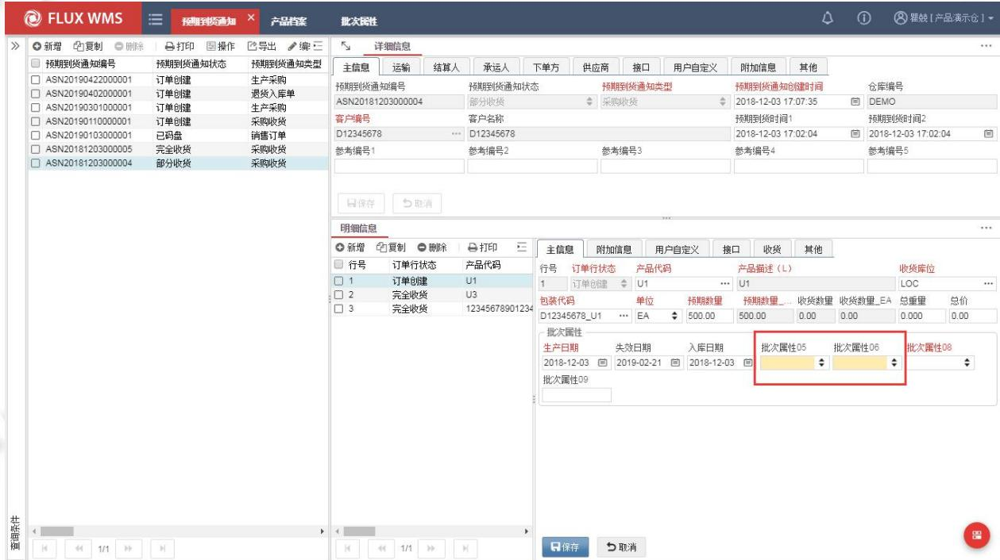

[图6-3-6]

## 6.4. 循环级别

循环级别主要用于巴雷托分析法（ABC 分类法）优化仓库布局，即约 20% 的货物，进出量可能占仓库总量的 80%，因此这些货物存放在最方便操作的库位（例如靠近巷道口、输送线投放口，或者层高最方便拣选的作业层），能够大幅度提升仓库作业效率。 

但不同作业模式下，货物统计、排序方式不同，级别划分也会根据需要波动，并不限定只能是60%、85%的ABC等级分隔线（即排位比率前60%设置为A，60%~85%设置为B级，85%~100%设置为C级的最常见分级标准）。因此需要对每个级别先行定义，可以配置多种不同的级别规则。不同的仓库，甚至不同产品，进行分级时的依据也有可能不同。 

## - 循环级别设置

■ 在主菜单 “基础设置” 下选择 “循环级别” 功能。 

■ 点击【新增】按钮，在“主信息”页签，维护循环级别的规则编组名称信息，如下图。 

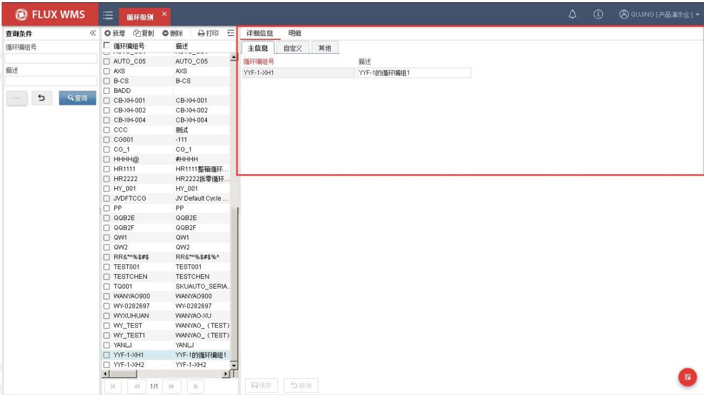

[图6-4-1]

■ 保存后，在对应的明细部分，进一步维护分级标准信息，如下图所示： 

<table><tr><td>循环编号号</td><td>循环级别</td><td>循环级别描述</td><td>循环天数</td><td>排名</td><td>百分比</td><td>定时补货</td><td>自定义</td></tr><tr><td>YYF-1-XH1</td><td>0</td><td>0</td><td>2</td><td>0.00</td><td>N</td><td></td><td></td></tr><tr><td>YYF-1-XH1</td><td>1</td><td>1</td><td>6</td><td></td><td>N</td><td></td><td></td></tr><tr><td>YYF-1-XH1</td><td>3</td><td>3</td><td>1</td><td></td><td>N</td><td></td><td></td></tr><tr><td>YYF-1-XH1</td><td>4</td><td>4</td><td></td><td></td><td>N</td><td></td><td></td></tr><tr><td>YYF-1-XH1</td><td>5</td><td>4</td><td></td><td></td><td>N</td><td></td><td></td></tr><tr><td>YYF-1-XH1</td><td>6</td><td>4</td><td></td><td></td><td>N</td><td></td><td></td></tr></table>

[图6-4-2]

循环编组号 - 循环级别组代码。 

循环级别 - 循环级别代码。 

循环级别描述 - 对该级别的描述。 

外文名称 - 对该级别的外文描述。 

循环天数 - 循环级别设定周期天数。 

排名 - 级别排序。例如前 10 位是 A 级（排名字段输入 10），10~50 是 B 级（排名字段输入 50）。后续级别的排名必须大于前一级别。 

百分比 - 该级别货物的周转率在全部货物周转率排序中所在百分位。通常排名与百分比方式二选一，不会同时使用。 

定时补货 - 此类产品是否参与定时补货。通常慢速周转的产品，不参与大批量的定时补货，但执行订单驱动补货。 

■ 点击【保存】按钮，完成此级别设置操作，所添加的记录在上方列表部分显示。 

## 6.5. 货物类型

在管理产品时，有时需要根据货主的要求对产品进行分类管理，如电器类、食品类或是选装件、 唯一件等，不同类的产品管理方式也会有所不同。货物类型就是提供给客户自行定义产品类别的功能。 

## - 货物类型

■ 在主菜单 “基础设置” 下选择 “货物类型” 功能。 

■ 点击【新增】按钮，在详细信息部分的“主信息”页签，维护此货类的描述以及默认管理规则等信息，如下图。 

<table><tr><td>主信息</td><td>自定义</td><td>其他</td></tr><tr><td>客户编号</td><td>货类代码</td><td>货类描述(L)</td></tr><tr><td>WQ</td><td>A-TYPE</td><td>WQA类货品</td></tr><tr><td>缺省上架规则</td><td>缺省批次属性</td><td>箱型</td></tr><tr><td>ZD_R02</td><td>万圈批次属性2</td><td>A</td></tr><tr><td>缺省包装代码</td><td>缺省预配规则</td><td>缺省分配规则</td></tr><tr><td>STANDARDV5</td><td>STD</td><td>标准分配</td></tr><tr><td>缺省库存周转规则</td><td>缺省质检规则</td><td>相容性编组</td></tr><tr><td>泽东标准周转规则</td><td>STANDARD</td><td></td></tr><tr><td>子序列号校验规则</td><td>是否自动产生序列号</td><td>序列号增长规则</td></tr><tr><td>WYJ-S-RUL1</td><td>是</td><td>7:10</td></tr></table>

[图6-5-1]

客户编号 - 货类所属的货主代码。货类是从属于货主的产品分类方式，不同货主间的货类不会共用，因此维护货类代码信息时，需要指明所属的货主。 

## 货类代码 - 货类代码 ID

货类描述 - 货类代码的描述信息，系统提供母语（L）、外语（S）两个字段。 

缺省规则 - 不同类型产品的管理要求不同，可以在货主默认的管理信息基础上，为不同货类分别维护不同的上架、分配、补货等管理规则、以及默认包装代码、批次属性规则等内容。 

相容性编组 - 有些货主管理多种不同类型的产品，出库时某些类型不能装在同一物流容器内，例如食品与蚊香片不能装在同一出库包装箱，洗衣粉与口服液不能混装箱等。通过相容性编组字段，将不可混箱的产品类别，设置为不同编组，系统在计算装箱/拣货 

箱分派时会将不相容的产品强制拆箱。 

序列号校验规则 - 1 级序列号管理时，遵循的序列号校验规则。需要先在业务规则-序列号规则功能中配置对应内容。 

子序列号校验规则 - 2 级序列号管理时，子序列号遵循的序列号校验规则。需要先在业务规则-序列号规则功能中配置对应内容。 

是否自动产生序列号 - 如勾选，根据序列号区间自动产生序列号列表。 

序列号增长规则 - 自动产生序列号情况下，序列号增长的逻辑。输入内容要求结构为 X:Y，代表序列号的第 X 位到第 Y 位为自然增长的整数序列。 

装卸效率（箱/小时）- 主要用于月台预约时，根据货量计算所需卸车时间，从而得到月台占用时长管理过程中。不同产品装箱效率不同，可以按照货类进行设置。 

■ 点击【保存】按钮，完成货物类型的新增操作。 

■ 根据需要维护多仓设置 

如果同一个货类在不同仓库的管理要求不同，可以在“多仓设置”页签，进行对所选货类代码进行相关维护，如下图。 

<table><tr><td colspan="101">FLUX WMS</td><td></td><td></td><td></td><td></td></tr><tr><td colspan="100">货类</td><td></td><td></td><td></td><td></td><td></td></tr><tr><td colspan="100">查询条件</td><td>...</td><td></td><td></td><td></td><td></td></tr><tr><td rowspan="2" colspan="99">客户编号</td><td></td><td></td><td></td><td></td><td></td><td></td></tr><tr><td></td><td></td><td></td><td></td><td></td><td></td><td></td><td></td><td></td><td></td><td></td><td></td><td></td><td></td><td></td><td></td><td></td><td></td><td></td><td></td><td></td><td></td><td></td><td></td><td></td><td></td><td></td><td></td></tr><tr><td colspan="95">货类代码</td><td></td><td></td><td></td><td></td><td></td><td></td><td></td><td></td><td></td><td></td></tr><tr><td colspan="91">A-TYPE</td><td></td><td></td><td></td><td></td><td></td><td></td><td></td><td></td><td></td><td></td><td></td><td></td><td></td><td></td></tr><tr><td colspan="86">货类描述(L)</td><td></td><td></td><td></td><td></td><td></td><td></td><td></td><td></td><td></td><td></td><td></td><td></td><td></td><td></td><td></td><td></td><td></td><td></td><td></td></tr><tr><td colspan="83">货类描述(S)</td><td></td><td></td><td></td><td></td><td></td><td></td><td></td><td></td><td></td><td></td><td></td><td></td><td></td><td></td><td></td><td></td><td></td><td></td><td></td><td></td><td></td><td></td></tr><tr><td>...</td><td>+</td><td>查询</td><td>1/1</td><td>+</td><td>+</td><td>+</td><td>+</td><td>+</td><td>+</td><td>+</td><td>+</td><td>+</td><td>+</td><td>+</td><td>+</td><td>+</td><td>+</td><td>+</td><td>+</td><td>+</td><td>+</td><td>+</td><td>+</td><td>+</td><td>+</td><td>+</td><td>+</td><td>+</td><td>+</td><td>+</td><td>+</td><td>+</td><td>+</td><td>+</td><td>+</td><td>+</td><td>+</td><td>+</td><td>+</td><td>+</td><td>+</td><td>+</td><td>+</td><td>+</td><td>+</td><td>+</td><td>+</td><td>+</td><td>+</td><td>+</td><td>+</td><td>+</td><td>+</td><td>-</td><td>+</td><td>+</td><td>+</td><td>+</td><td>+</td><td>+</td><td>+</td><td>+</td><td>+</td><td>+</td><td>+</td><td>+</td><td>+</td><td>+</td><td>+</td><td>+</td><td>+</td><td>+</td><td>+</td><td>+</td><td>+</td><td>+</td><td>+</td><td>+</td><td>+</td><td>+</td><td>+</td><td>+</td><td>+</td><td>+</td><td>+</td><td>+</td><td>+</td><td>+</td><td>+</td><td>+</td><td>+</td><td>+</td><td>+</td><td>+</td><td>+</td><td>+</td><td>+</td><td>+</td><td>+</td><td>+</td><td>+</td><td>+</td><td>+</td><td></td></tr></table>

[图6-5-2]

客户编号、货类代码 - 继承主信息内容，不可修改 

仓库编号 - 当前多仓记录对应的仓库。可以通过二级窗口选择。 

费率 - 此类货品，在指定仓库中的计费时所采用的费率。 

上架规则、补货规则 - 此类货品在指定仓库中的默认规则 

出库时计算库存费用 - 选择后，系统仅在产品发运出库时计算其全部库存费用，在库内的存货不计算库存费用。 

## ■ 单据类型设置

如果不同仓库中，不同订单类型的管理要求有不同，也可在货类中进行相应配置，如下图 

<table><tr><td colspan="101">FLUX WMS</td><td></td><td></td><td></td><td></td><td></td><td></td><td></td><td></td><td></td><td></td><td></td><td></td><td></td><td></td></tr><tr><td colspan="100">货类</td><td></td><td></td><td></td><td></td><td></td><td></td><td></td><td></td><td></td><td></td><td></td><td></td><td></td><td></td><td></td></tr><tr><td colspan="100">查询条件</td><td>...</td><td></td><td></td><td></td><td></td><td></td><td></td><td></td><td></td><td></td><td></td><td></td><td></td><td></td><td></td></tr><tr><td rowspan="2" colspan="99">客户编号</td><td>....</td><td></td><td></td><td></td><td></td><td></td><td></td><td></td><td></td><td></td><td></td><td></td><td></td><td></td><td></td><td></td></tr><tr><td></td><td></td><td></td><td></td><td></td><td></td><td></td><td></td><td></td><td></td><td></td><td></td><td></td><td></td><td></td><td></td><td></td><td rowspan="2"></td><td></td><td></td><td></td><td></td><td></td><td></td><td></td><td></td><td></td><td></td><td></td><td></td><td></td><td></td></tr><tr><td colspan="100">货类代码</td><td></td><td></td><td></td><td></td><td></td><td></td><td></td><td></td><td></td><td></td><td></td><td></td><td></td><td></td></tr><tr><td colspan="92">A-TYPE</td><td></td><td></td><td></td><td></td><td></td><td></td><td></td><td></td><td></td><td></td><td></td><td></td><td></td><td></td><td></td><td></td><td></td><td></td><td></td><td></td><td></td><td></td><td></td></tr><tr><td colspan="88">货类描述(L)</td><td></td><td></td><td></td><td></td><td></td><td></td><td></td><td></td><td></td><td></td><td></td><td></td><td></td><td></td><td></td><td></td><td></td><td></td><td></td><td></td><td></td><td></td><td></td><td></td><td></td><td></td><td></td></tr><tr><td colspan="86">货类描述(S)</td><td></td><td></td><td></td><td></td><td></td><td></td><td></td><td></td><td></td><td></td><td></td><td></td><td></td><td></td><td></td><td></td><td></td><td></td><td></td><td></td><td></td><td></td><td></td><td></td><td></td><td></td><td></td><td></td><td></td></tr><tr><td rowspan="3">...</td><td rowspan="3">+</td><td rowspan="3">查询</td><td rowspan="3">查询</td><td rowspan="3">WQ</td><td rowspan="3">A-TYPE</td><td rowspan="3">WQA类货品</td><td rowspan="3">详细信息 多仓设置 订单类型规则 库位规则 新增 复制 删除 打印 操作 导出 编辑 仓库编号 客户编号 货类编码 单证大类 单证小类 质检规则 自定义01当前数0总数0每页数100 1/0 移至1主信息 自定义 其他客户编号 货类编码 仓库编号 单证大类单证小类 质检规则</td><td rowspan="3">当前数0总数0每页数100 1/0 移至1主信息 自定义 其他</td><td rowspan="3">客户编号</td><td rowspan="3">货类编码</td><td rowspan="3">仓库编号</td><td rowspan="3">单证大类</td><td rowspan="3">单证小类</td><td rowspan="3">质检规则</td><td rowspan="3"></td><td rowspan="3"></td><td rowspan="3"></td><td rowspan="3"></td><td rowspan="3"></td><td rowspan="3"></td><td rowspan="3"></td><td rowspan="3"></td><td rowspan="3"></td><td rowspan="3"></td><td rowspan="3"></td><td rowspan="3"></td><td rowspan="3"></td><td rowspan="3"></td><td rowspan="3"></td><td rowspan="3"></td><td rowspan="3"></td><td rowspan="3"></td><td rowspan="3"></td><td rowspan="3"></td><td rowspan="3"></td><td rowspan="3"></td><td rowspan="3"></td><td rowspan="3"></td><td rowspan="3"></td><td rowspan="3"></td><td rowspan="3"></td><td rowspan="3"></td><td rowspan="3"></td><td rowspan="3"></td><td rowspan="3"></td><td rowspan="3"></td><td rowspan="3"></td><td rowspan="3"></td><td rowspan="3"></td><td rowspan="3"></td><td rowspan="3"></td><td rowspan="3"></td><td rowspan="3"></td><td rowspan="3"></td><td rowspan="3"></td><td rowspan="3"></td><td rowspan="3"></td><td rowspan="3"></td><td rowspan="3"></td><td rowspan="3"></td><td rowspan="3"></td><td rowspan="3"></td><td rowspan="3"></td><td rowspan="3"></td><td rowspan="3"></td><td rowspan="3"></td><td rowspan="3"></td><td rowspan="3"></td><td rowspan="3"></td><td rowspan="3"></td><td rowspan="3"></td><td rowspan="3"></td><td rowspan="3"></td><td rowspan="3"></td><td rowspan="3"></td><td rowspan="3"></td><td rowspan="3"></td><td rowspan="3"></td><td rowspan="3"></td><td rowspan="3"></td><td rowspan="3"></td><td rowspan="3"></td><td rowspan="3"></td><td rowspan="3"></td><td rowspan="3"></td><td rowspan="3"></td><td rowspan="3"></td><td rowspan="3"></td><td rowspan="3"></td><td rowspan="2"></td><td rowspan="2"></td><td rowspan="2"></td><td></td><td></td><td></td><td></td><td></td><td></td><td></td><td></td><td></td><td></td><td></td><td></td><td></td><td></td><td></td><td></td><td></td><td></td><td></td><td></td><td></td><td></td></tr><tr><td></td><td></td><td></td><td></td><td></td><td></td><td></td><td></td><td></td><td></td><td></td><td></td><td></td><td></td><td></td><td></td><td></td><td></td><td></td><td></td><td></td><td></td></tr><tr><td></td><td></td><td></td><td></td><td></td><td></td><td></td><td></td><td></td><td></td><td></td><td></td><td></td><td></td><td></td><td></td><td></td><td></td><td></td><td></td><td></td><td></td><td></td><td></td><td></td></tr></table>

[图6-5-3]

可以为不同仓库，不同订单类型分别定义指定的质检规则。 

## 6.6. 装箱

装箱功能，主要用于预先定义操作中所用的周转箱的尺寸等信息，便于系统装箱计算或对体积等信息的统计。 

由于仓库中经常不同产品使用的周转箱体积大小不同，甚至不同货类用的周转箱不是同一套系列的情况，因此在系统中可以维护多套装箱体系，并可区分多个仓库共用的公共装箱信息，或者单独某个仓库使用的局部装箱信息，通过“公共”、“局部”页签能够切换查看 

## - 装箱设置

■ 在主菜单 “基础设置” 下选择 “装箱” 功能。 

■ 选择对应维护公共箱型记录还是局部箱型记录。 

<table><tr><td colspan="5">主信息 自定义 其他</td></tr><tr><td>仓库编号</td><td>箱型</td><td>装箱ID</td><td>装箱描述</td><td></td></tr><tr><td>DEMO</td><td></td><td></td><td></td><td></td></tr><tr><td>体积限制</td><td>重量限制</td><td>数量限制</td><td>浮动容积上限</td><td></td></tr><tr><td></td><td></td><td></td><td></td><td></td></tr><tr><td>长</td><td>宽</td><td>高</td><td>计费重量</td><td></td></tr><tr><td></td><td></td><td></td><td></td><td></td></tr><tr><td>默认标记</td><td>活动标记</td><td></td><td></td><td></td></tr></table>

[图6-6-1]

■ 点击【新增】按钮，在“主信息”页签，依次输入以下信息：

<table><tr><td colspan="5">主信息 自定义 其他</td></tr><tr><td>仓库编号</td><td>箱型</td><td>装箱ID</td><td>装箱描述</td><td></td></tr><tr><td>DEMO</td><td></td><td></td><td></td><td></td></tr><tr><td>体积限制</td><td>重量限制</td><td>数量限制</td><td>浮动容积上限</td><td></td></tr><tr><td>长</td><td>宽</td><td>高</td><td>计费重量</td><td></td></tr><tr><td></td><td></td><td></td><td></td><td></td></tr><tr><td>默认标记</td><td>活动标记</td><td></td><td></td><td></td></tr></table>

[图6-6-2] 

仓库编码 - 当前仓库代码 ID。 

箱型 - 装箱组合代码。例如 A 组合是大箱组合，B 组合是小箱组合。 

装箱 ID - 周转箱类型代码。 

装箱描述 - 周转箱名称描述。 

体积限制 - 周转箱容量上限信息。 

重量限制 - 周转箱容量上限信息。 

数量限制 - 周转箱容量上限信息。 

浮动容积上限 - 如果尾箱容纳的产品体积可在浮动容积上限范围内容，可直接与前一箱并箱，以减少派箱的数量。 

长 - 周转箱尺寸信息。 

宽 - 周转箱尺寸信息。 

高 - 周转箱尺寸信息。 

计费重量 - 理论重量用于费用计算，常用于无实际称重条件的作业模式中。 

默认标记 - 是否此装箱组的默认箱型 ID。 

活动标记 - 是否使用此装箱 ID。 

■ 点击【保存】按钮，完成设置操作。 

## 6.7. 海关 HScore

HS Code 是 Harmonized System Code 的缩写，是国际海关公认的进出口产品分类标准。使用正确的名称和编码是出口营销中的重要方法。 

在 FLUX WMS 系统中提供海关 Hscode 功能维护 HSCode 代码，供产品档案选择使用。 

## - 海关 Hscode 设置

■ 在主菜单“基础设置”下选择“海关 HSCode”功能。 

■ 点击【新增】按钮，在“主信息”页签。依次输入 HS 编码、描述（提供母语、外语描述字段）信息，在“自定义”页签，系统提供 20 个自定义字段以及备注字段。 

<table><tr><td>海关编号</td><td>海关描述(L)</td><td>海关描述(S)</td></tr><tr><td>360490900</td><td>Fireworks, signalling flares, rain rocke</td><td>ts, fog signals and other</td></tr><tr><td>360490900</td><td>Other Combustible Material</td><td>3604909000</td></tr><tr><td>3702390000</td><td>Thermal Transfer Printer Ribbon, Unperfo</td><td>rated, of a Width Not Exceed</td></tr><tr><td>3702440000</td><td>Thermal Transfer Printer Ribbon, Unperfo</td><td>rated, of a Width Exceed</td></tr><tr><td>3824999900</td><td>Other Chemical Product or Preparation</td><td>3824999900</td></tr><tr><td>390210900</td><td>polypropylene -other</td><td>390210900</td></tr><tr><td>3902109000</td><td>Other polyethylene in primary form</td><td>3902109000</td></tr><tr><td>390740000</td><td>polycarbonates</td><td>390740000</td></tr><tr><td>3907400000</td><td>Polycarbonate in primary form</td><td>3907400000</td></tr><tr><td>390799000</td><td>other polyesters - unsaturated</td><td>390799000</td></tr><tr><td>3907999090</td><td>Other polyester in primary form</td><td>3907999090</td></tr><tr><td>390810000</td><td>polyamide</td><td>390810000</td></tr><tr><td>3908109000</td><td>Other polyamide in primary form</td><td>3908109000</td></tr><tr><td>390910000</td><td>urea resins, thiourea resins</td><td>390910000</td></tr><tr><td>3909101000</td><td>Urea or thiourea molding compound in prim</td><td>ary form</td></tr><tr><td>391723000</td><td>Tubes, pipes and hoses, rigid: Of polymer</td><td>rs of vinyl chloride</td></tr><tr><td>3917230000</td><td>Rigid Tube/Pipe/Hose of Polymers of Vny</td><td>I Chloride</td></tr><tr><td>3917329900</td><td>Other Plastic Tube/Pipe/Hose Not Reinfor</td><td>ced or Combined With O</td></tr><tr><td>391740000</td><td>Tubes, pipes and hoses, and fittings the</td><td>refor (for example joints,</td></tr><tr><td>3917400000</td><td>Plastic Hose/Pipe/Tube Fitting</td><td>3917400000</td></tr><tr><td>391740100</td><td>Fittings - plastics and articles thereof</td><td>391740100</td></tr><tr><td>391910990</td><td>Other: other</td><td>391910990</td></tr><tr><td>3919109900</td><td>Other Roll of Self-adhesive Plastic - Wi</td><td>dth Not Exceeding 20 cm</td></tr><tr><td>391990990</td><td>Self-adhesive plates, sheets, film, foil</td><td>, tape, strip and other flat</td></tr><tr><td>3919909900</td><td>Self-adhesive Plastic Label Not On a Roll</td><td>I</td></tr><tr><td>3920101900</td><td>Other Plate or Sheet of Polymers of Ethy</td><td>lene</td></tr><tr><td>392111200</td><td>film - plastics and articles thereof</td><td>392111200</td></tr><tr><td>3921119200</td><td>Other film of polymers of styrene</td><td>3921119200</td></tr><tr><td>3923211900</td><td>Other Bag of Polymers of Ethylene</td><td>3923211900</td></tr><tr><td>392329000</td><td>Sacks and bags (including cones)</td><td>- of other plastics</td></tr><tr><td>3923299000</td><td>Other Plastic Bag</td><td>3923299000</td></tr><tr><td>3923500000</td><td>Stopper, Lid, Cap, or Closure of Plastic</td><td>3923500000</td></tr></table>

[图6-7-1] 

■ 点击【保存】按钮，保存设置。 

## 6.8. 客户档案

客户档案是用于定义客户、客户类型和客户管理要求的详细资料。 

在 FLUX WMS 中，货主是用于区分产品货权从属的依据，同时，客户档案还用于记录供应商、承运人、结算人等的信息。 

客户类型是用于对客户进行分类，每一个客户必须对应一个客户类型。客户类型的定义是系统代码中进行的，用户也可以自行添加其他的客户类型，但新增的类型，系统中不会有相应特殊处理，仅用于区分客户。 

系统提供的默认客户类型包括： 

■ 货主 - 产品的所有者。通常是仓库进出产品、提供服务的主要对象。 

■ 收货人 - 产品交付的客户对象，即发货对象。 

■ 供应商 - 产品采购的客户对象、货物来源。 

■ 承运人 - 提供产品运输的客户对象。 

■ 结算人 - 除货主之外的，支付仓库服务费用的客户对象。例如仓库中有货主 A 公司、B 公司，但 2 家公司的相应费用都由其代理商 C 公司支付，而 C 公司本身没有货物在仓库中，C 公司就是结算人。 

■ 下单方 - 有权代替货主下达进出库订单的代理商或经销商等。 

■ 其他 - 其他类型的客户。 

## - 客户档案设置

■ 在主菜单 “基础设置” 下选择 “客户档案” 功能。 

■ 点击【新增】按钮，在“主信息”页签，依次输入以下信息： 

<table><tr><td colspan="101">查询条件</td><td></td><td></td><td></td><td></td><td></td><td></td><td></td><td></td><td></td><td></td><td></td><td></td><td></td><td></td><td></td><td></td><td></td><td></td><td></td><td></td><td></td><td></td><td></td></tr><tr><td colspan="100">客户编号</td><td></td><td></td><td></td><td></td><td></td><td></td><td></td><td></td><td></td><td></td><td></td><td></td><td></td><td></td><td></td><td></td><td></td><td></td><td></td><td></td><td></td><td></td><td></td><td></td></tr><tr><td colspan="95">客户类型</td><td></td><td></td><td></td><td></td><td></td><td></td><td></td><td></td><td></td><td></td><td></td><td></td><td></td><td></td><td></td><td></td><td></td><td></td><td></td><td></td><td></td><td></td><td></td><td></td><td></td><td></td><td></td><td></td><td></td></tr><tr><td colspan="95">客户名称(L)</td><td></td><td></td><td></td><td></td><td></td><td></td><td></td><td></td><td></td><td></td><td></td><td></td><td></td><td></td><td></td><td></td><td></td><td></td><td></td><td></td><td></td><td></td><td></td><td></td><td></td><td></td><td></td><td></td><td></td></tr><tr><td colspan="89">客户名称(S)</td><td></td><td></td><td></td><td></td><td></td><td></td><td></td><td></td><td></td><td></td><td></td><td></td><td></td><td></td><td></td><td></td><td></td><td></td><td></td><td></td><td></td><td></td><td></td><td></td><td></td><td></td><td></td><td></td><td></td><td></td><td></td><td></td><td></td><td></td><td></td></tr><tr><td colspan="86">隶属单位</td><td></td><td></td><td></td><td></td><td></td><td></td><td></td><td></td><td></td><td></td><td></td><td></td><td></td><td></td><td></td><td></td><td></td><td></td><td></td><td></td><td></td><td></td><td></td><td></td><td></td><td></td><td></td><td></td><td></td><td></td><td></td><td></td><td></td><td></td><td></td><td></td><td></td><td></td></tr><tr><td colspan="81">活动标记是</td><td></td><td></td><td></td><td></td><td></td><td></td><td></td><td></td><td></td><td></td><td></td><td></td><td></td><td></td><td></td><td></td><td></td><td></td><td></td><td></td><td></td><td></td><td></td><td></td><td></td><td></td><td></td><td></td><td></td><td></td><td></td><td></td><td></td><td></td><td></td><td></td><td></td><td></td><td></td><td></td><td></td><td></td><td></td></tr><tr><td>查询查询查询条件
客户编号
客户类型
客户名称(L)
客户名称(L)
客户名称(S)
隶属单位
活动标记
是
查询
客户编号
客户类型
客户名称(L)
客户编号
客户类型
助记码
隶属单位
隶属仓库
C001
收货人
JNZYMD1H
生效日期
失效日期
辽宁自营门店1号
客户名称(S)
Jiang Ning Direct Sales Store No.1
活动标记
地址
地址1
国家
省份
地址2
城市
区
地址3
街道
默认路线
地址4
站点
邮政编码
客户编号
客户类型
助记码
隶属单位
隶属仓库
客户名称(L)
生效日期
失效日期
辽宁自营门店1号
客户名称(S)
Jiang Ning Direct Sales Store No.1
活动标记
地址
地址1
国家
省份
地址2
城市
区
地址3
街道
默认路线
地址4
站点
邮政编码
客户编号
客户类型
助记码
隶属单位
隶属仓库
客户名称(L)
生效日期
失效日期
辽宁自营门店1号
客户名称(S)
Jiang.Ning Direct Sales Store No.1
活动标记
地址
地址1
国家
省份
地址2
城市
区
地址3
街道
默认路线
地址4
站点
邮政编码
客户编号
客户类型
助记码
隶属单位
隶属仓库
客户名称(L)
生效日期
失效日期
辽宁自营门店1号
客户名称(S)
Jiang.Ning Direct Sales Store No.1
活动标记
地址
地址1
国家
省份数
地址2
城市
区
地址3
街道
默认路线
地址4
站点
邮政编码
客户编号
客户类型
助记码
隶属单位
隶属仓库
客户名称(L)
生效日期
失效日期
辽宁自营门店1号
客户名称(S)
Jiang.Ning Direct Sales Store No.1
活动标记
地址
地址1
国家
省份数
地址2
城市
区
地址3
街道
默认路线</td><td>客户编号</td><td>客户类型</td><td>助记码</td><td>隶属单位</td><td>隶属仓库</td><td>客户名称(L)
客户名称(S)
客户名称(L)
客户名称(S)
客户名称(L)
客户名称(L)
客户名称(L)
客户名称(L)
客户名称(L)
客户名称(L)
客户名称(L)
客户名称(L)
客户名称(L)
客户名称(L)
客户名称(L)
客户名称(L)
客户名称(L)
客户名称(L)
客户名称(L)
客户名称(L)
客户名称(L)
客户名称(L)
客户名称(L)
客户名称(L)
客户名称(L)
客户名称(L)
客户名称(L)
客户名称(L)
客户名称(L)
客户名称(S)
客户名称(S)
客户名称(S)
客户名称(S)
客户名称(S)
客户名称(S)
客户名称(S)
客户名称(S)
客户名称(S)
客户名称(S)
客户名称(S)
客户名称(S)
客户名称(S)
客户名称(S)
客户名称(S)
客户名称(S)
客户名称(S)
客户名称(S)
客户名称(S)
客户名称(S)
客户名称(S)
客户名称(S)
客户名称(S)
客户名称(S)
客户名称(S)
客户名称S
客户名称S
客户名称S
客户名称S
客户名称S
客户名称S
客户名称S
客户名称S
客户名称S
客户名称S
客户名称S
客户名称S
客户名称S
客户名称S
客户名称S
客户名称S
客户名称S
客户名称S
客户名称S
客户名称S
客户名称S
客户名称S
客户名称S
客户名称S
客户名称S
客户名称S</td><td>客户编号</td><td>客户类型</td><td>客户名称(L)
客户编号</td><td>客户类型</td><td>助记码</td><td>隶属单位</td><td>隶属仓库</td><td>客户名称(L)
客户名称(S)
客户名称(L)
客户名称(L)
客户名称(L)
客户名称(L)
客户名称(L)
客户名称(L)
客户名称(L)
客户名称(L)
客户名称(L)
客户名称(L)
客户名称(L)
客户名称(L)
客户名称(L)
客户名称(L)
客户名称(L)
客户名称(L)
客户名称(L)
客户名称(L)
客户名称(L)
客户名称(L)
客户名称(L)
客户名称(L)
客户名称(L)</td><td></td><td></td><td></td><td></td><td></td><td></td><td></td><td></td><td></td><td></td><td></td><td></td><td></td><td></td><td></td><td></td><td></td><td></td><td></td><td></td><td></td><td></td><td></td><td></td><td></td><td></td><td></td><td></td><td></td><td></td><td></td><td></td><td></td><td></td><td></td><td></td><td></td><td></td><td></td><td></td><td></td><td></td><td></td><td></td><td></td><td></td><td></td><td></td><td></td><td></td><td></td><td></td><td></td><td></td><td></td><td></td><td></td><td></td><td></td><td></td><td></td><td></td><td></td><td></td><td></td><td></td><td></td><td></td><td></td><td></td><td></td><td></td><td></td><td></td><td></td><td></td><td></td><td></td><td></td><td></td><td></td><td></td><td></td><td></td><td></td><td></td><td></td><td></td><td></td><td></td><td></td><td></td><td></td><td></td><td></td><td></td><td></td><td></td><td></td><td></td><td></td><td></td><td></td><td></td><td></td><td></td><td></td><td></td><td></td></tr><tr><td>客户编号</td><td>客户类型</td><td>加订信息</td><td>自定义</td><td>其他</td><td></td><td></td><td></td><td></td><td></td><td></td><td></td><td></td><td></td><td></td><td></td><td></td><td></td><td></td><td></td><td></td><td></td><td></td><td></td><td></td><td></td><td></td><td></td><td></td><td></td><td></td><td></td><td></td><td></td><td></td><td></td><td></td><td></td><td></td><td></td><td></td><td></td><td></td><td></td><td></td><td></td><td></td><td></td><td></td><td></td><td></td><td></td><td></td><td></td><td></td><td></td><td></td><td></td><td></td><td></td><td></td><td></td><td></td><td></td><td></td><td></td><td></td><td></td><td></td><td></td><td></td><td></td><td></td><td></td><td></td><td></td><td></td><td></td><td></td><td></td><td></td><td></td><td></td><td></td><td></td><td></td><td></td><td></td><td></td><td></td><td></td><td></td><td></td><td></td><td></td><td></td><td></td><td></td><td></td><td></td><td></td><td></td><td></td><td></td><td></td><td></td><td></td><td></td><td></td><td></td><td></td><td></td><td></td><td></td><td></td><td></td><td></td><td></td><td></td><td></td><td></td><td></td><td></td><td></td></tr><tr><td>客户类型</td><td>收货人</td><td>BJ01</td><td>收货人</td><td>BJ01</td><td></td><td></td><td></td><td></td><td></td><td></td><td></td><td></td><td></td><td></td><td></td><td></td><td></td><td></td><td></td><td></td><td></td><td></td><td></td><td></td><td></td><td></td><td></td><td></td><td></td><td></td><td></td><td></td><td></td><td></td><td></td><td></td><td></td><td></td><td></td><td></td><td></td><td></td><td></td><td></td><td></td><td></td><td></td><td></td><td></td><td></td><td></td><td></td><td></td><td></td><td></td><td></td><td></td><td></td><td></td><td></td><td></td><td></td><td></td><td></td><td></td><td></td><td></td><td></td><td></td><td></td><td></td><td></td><td></td><td></td><td></td><td></td><td></td><td></td><td></td><td></td><td></td><td></td><td></td><td></td><td></td><td></td><td></td><td></td><td></td><td></td><td></td><td></td><td></td><td></td><td></td><td></td><td></td><td></td><td></td><td></td><td></td><td></td><td></td><td></td><td></td><td></td><td></td><td></td><td></td><td></td><td></td><td></td><td></td><td></td><td></td><td></td><td></td><td></td><td></td><td></td><td></td><td></td><td></td></tr><tr><td>客户名称(L)</td><td>收货人</td><td>江宁自营门店</td><td>C001</td><td>下单方</td><td>David</td><td></td><td></td><td></td><td></td><td></td><td></td><td></td><td></td><td></td><td></td><td></td><td></td><td></td><td></td><td></td><td></td><td></td><td></td><td></td><td></td><td></td><td></td><td></td><td></td><td></td><td></td><td></td><td></td><td></td><td></td><td></td><td></td><td></td><td></td><td></td><td></td><td></td><td></td><td></td><td></td><td></td><td></td><td></td><td></td><td></td><td></td><td></td><td></td><td></td><td></td><td></td><td></td><td></td><td></td><td></td><td></td><td></td><td></td><td></td><td></td><td></td><td></td><td></td><td></td><td></td><td></td><td></td><td></td><td></td><td></td><td></td><td></td><td></td><td></td><td></td><td></td><td></td><td></td><td></td><td></td><td></td><td></td><td></td><td></td><td></td><td></td><td></td><td></td><td></td><td></td><td></td><td></td><td></td><td></td><td></td><td></td><td></td><td></td><td></td><td></td><td></td><td></td><td></td><td></td><td></td><td></td><td></td><td></td><td></td><td></td><td></td><td></td><td></td><td></td><td></td><td></td><td></td><td></td></tr><tr><td>客户名称(L)</td><td>收货人</td><td>辽宁自营门店</td><td>C002</td><td>收货人</td><td>江宁自营门店</td><td></td><td></td><td></td><td></td><td></td><td></td><td></td><td></td><td></td><td></td><td></td><td></td><td></td><td></td><td></td><td></td><td></td><td></td><td></td><td></td><td></td><td></td><td></td><td></td><td></td><td></td><td></td><td></td><td></td><td></td><td></td><td></td><td></td><td></td><td></td><td></td><td></td><td></td><td></td><td></td><td></td><td></td><td></td><td></td><td></td><td></td><td></td><td></td><td></td><td></td><td></td><td></td><td></td><td></td><td></td><td></td><td></td><td></td><td></td><td></td><td></td><td></td><td></td><td></td><td></td><td></td><td></td><td></td><td></td><td></td><td></td><td></td><td></td><td></td><td></td><td></td><td></td><td></td><td></td><td></td><td></td><td></td><td></td><td></td><td></td><td></td><td></td><td></td><td></td><td></td><td></td><td></td><td></td><td></td><td></td><td></td><td></td><td></td><td></td><td></td><td></td><td></td><td></td><td></td><td></td><td></td><td></td><td></td><td></td><td></td><td></td><td></td><td></td><td></td><td></td><td></td><td></td><td></td></tr><tr><td>客户名称(L)</td><td>承运人</td><td>Carrier TEST</td><td>CARRIER01</td><td>承运人</td><td>CARRIER01</td><td></td><td></td><td></td><td></td><td></td><td></td><td></td><td></td><td></td><td></td><td></td><td></td><td></td><td></td><td></td><td></td><td></td><td></td><td></td><td></td><td></td><td></td><td></td><td></td><td></td><td></td><td></td><td></td><td></td><td></td><td></td><td></td><td></td><td></td><td></td><td></td><td></td><td></td><td></td><td></td><td></td><td></td><td></td><td></td><td></td><td></td><td></td><td></td><td></td><td></td><td></td><td></td><td></td><td></td><td></td><td></td><td></td><td></td><td></td><td></td><td></td><td></td><td></td><td></td><td></td><td></td><td></td><td></td><td></td><td></td><td></td><td></td><td></td><td></td><td></td><td></td><td></td><td></td><td></td><td></td><td></td><td></td><td></td><td></td><td></td><td></td><td></td><td></td><td></td><td></td><td></td><td></td><td></td><td></td><td></td><td></td><td></td><td></td><td></td><td></td><td></td><td></td><td></td><td></td><td></td><td></td><td></td><td></td><td></td><td></td><td></td><td></td><td></td><td></td><td></td><td></td><td></td><td></td></tr><tr><td>客户名称(L)</td><td>承运人</td><td>carrier02</td><td>CARRIER02</td><td>承运人</td><td>carrier02</td><td></td><td></td><td></td><td></td><td></td><td></td><td></td><td></td><td></td><td></td><td></td><td></td><td></td><td></td><td></td><td></td><td></td><td></td><td></td><td></td><td></td><td></td><td></td><td></td><td></td><td></td><td></td><td></td><td></td><td></td><td></td><td></td><td></td><td></td><td></td><td></td><td></td><td></td><td></td><td></td><td></td><td></td><td></td><td></td><td></td><td></td><td></td><td></td><td></td><td></td><td></td><td></td><td></td><td></td><td></td><td></td><td></td><td></td><td></td><td></td><td></td><td></td><td></td><td></td><td></td><td></td><td></td><td></td><td></td><td></td><td></td><td></td><td></td><td></td><td></td><td></td><td></td><td></td><td></td><td></td><td></td><td></td><td></td><td></td><td></td><td></td><td></td><td></td><td></td><td></td><td></td><td></td><td></td><td></td><td></td><td></td><td></td><td></td><td></td><td></td><td></td><td></td><td></td><td></td><td></td><td></td><td></td><td></td><td></td><td></td><td></td><td></td><td></td><td></td><td></td><td></td><td></td><td></td></tr><tr><td>客户名称(L)</td><td>承运人</td><td>carrier03</td><td>CARRIER03</td><td>承运人</td><td>carrier03</td><td></td><td></td><td></td><td></td><td></td><td></td><td></td><td></td><td></td><td></td><td></td><td></td><td></td><td></td><td></td><td></td><td></td><td></td><td></td><td></td><td></td><td></td><td></td><td></td><td></td><td></td><td></td><td></td><td></td><td></td><td></td><td></td><td></td><td></td><td></td><td></td><td></td><td></td><td></td><td></td><td></td><td></td><td></td><td></td><td></td><td></td><td></td><td></td><td></td><td></td><td></td><td></td><td></td><td></td><td></td><td></td><td></td><td></td><td></td><td></td><td></td><td></td><td></td><td></td><td></td><td></td><td></td><td></td><td></td><td></td><td></td><td></td><td></td><td></td><td></td><td></td><td></td><td></td><td></td><td></td><td></td><td></td><td></td><td></td><td></td><td></td><td></td><td></td><td></td><td></td><td></td><td></td><td></td><td></td><td></td><td></td><td></td><td></td><td></td><td></td><td></td><td></td><td></td><td></td><td></td><td></td><td></td><td></td><td></td><td></td><td></td><td></td><td></td><td></td><td></td><td></td><td></td><td></td></tr><tr><td>客户名称(L)</td><td>承运人</td><td>carrier04</td><td>CARRIER04</td><td>承运人</td><td>carrier04</td><td></td><td></td><td></td><td></td><td></td><td></td><td></td><td></td><td></td><td></td><td></td><td></td><td></td><td></td><td></td><td></td><td></td><td></td><td></td><td></td><td></td><td></td><td></td><td></td><td></td><td></td><td></td><td></td><td></td><td></td><td></td><td></td><td></td><td></td><td></td><td></td><td></td><td></td><td></td><td></td><td></td><td></td><td></td><td></td><td></td><td></td><td></td><td></td><td></td><td></td><td></td><td></td><td></td><td></td><td></td><td></td><td></td><td></td><td></td><td></td><td></td><td></td><td></td><td></td><td></td><td></td><td></td><td></td><td></td><td></td><td></td><td></td><td></td><td></td><td></td><td></td><td></td><td></td><td></td><td></td><td></td><td></td><td></td><td></td><td></td><td></td><td></td><td></td><td></td><td></td><td></td><td></td><td></td><td></td><td></td><td></td><td></td><td></td><td></td><td></td><td></td><td></td><td></td><td></td><td></td><td></td><td></td><td></td><td></td><td></td><td></td><td></td><td></td><td></td><td></td><td></td><td></td><td></td></tr><tr><td>客户名称(L)</td><td>承运人</td><td>carrier05</td><td>CARRIER05</td><td>承运人</td><td>carrier05</td><td></td><td></td><td></td><td></td><td></td><td></td><td></td><td></td><td></td><td></td><td></td><td></td><td></td><td></td><td></td><td></td><td></td><td></td><td></td><td></td><td></td><td></td><td></td><td></td><td></td><td></td><td></td><td></td><td></td><td></td><td></td><td></td><td></td><td></td><td></td><td></td><td></td><td></td><td></td><td></td><td></td><td></td><td></td><td></td><td></td><td></td><td></td><td></td><td></td><td></td><td></td><td></td><td></td><td></td><td></td><td></td><td></td><td></td><td></td><td></td><td></td><td></td><td></td><td></td><td></td><td></td><td></td><td></td><td></td><td></td><td></td><td></td><td></td><td></td><td></td><td></td><td></td><td></td><td></td><td></td><td></td><td></td><td></td><td></td><td></td><td></td><td></td><td></td><td></td><td></td><td></td><td></td><td></td><td></td><td></td><td></td><td></td><td></td><td></td><td></td><td></td><td></td><td></td><td></td><td></td><td></td><td></td><td></td><td></td><td></td><td></td><td></td><td></td><td></td><td></td><td></td><td></td><td></td></tr><tr><td>客户名称(L)</td><td>承运人</td><td>carrier06</td><td>CARRIER06</td><td>承运人</td><td>carrier06</td><td></td><td></td><td></td><td></td><td></td><td></td><td></td><td></td><td></td><td></td><td></td><td></td><td></td><td></td><td></td><td></td><td></td><td></td><td></td><td></td><td></td><td></td><td></td><td></td><td></td><td></td><td></td><td></td><td></td><td></td><td></td><td></td><td></td><td></td><td></td><td></td><td></td><td></td><td></td><td></td><td></td><td></td><td></td><td></td><td></td><td></td><td></td><td></td><td></td><td></td><td></td><td></td><td></td><td></td><td></td><td></td><td></td><td></td><td></td><td></td><td></td><td></td><td></td><td></td><td></td><td></td><td></td><td></td><td></td><td></td><td></td><td></td><td></td><td></td><td></td><td></td><td></td><td></td><td></td><td></td><td></td><td></td><td></td><td></td><td></td><td></td><td></td><td></td><td></td><td></td><td></td><td></td><td></td><td></td><td></td><td></td><td></td><td></td><td></td><td></td><td></td><td></td><td></td><td></td><td></td><td></td><td></td><td></td><td></td><td></td><td></td><td></td><td></td><td></td><td></td><td></td><td></td><td></td></tr><tr><td>客户名称(L)</td><td>承运人</td><td>carrier07</td><td>CARRIER07</td><td>承运人</td><td>carrier07</td><td></td><td></td><td></td><td></td><td></td><td></td><td></td><td></td><td></td><td></td><td></td><td></td><td></td><td></td><td></td><td></td><td></td><td></td><td></td><td></td><td></td><td></td><td></td><td></td><td></td><td></td><td></td><td></td><td></td><td></td><td></td><td></td><td></td><td></td><td></td><td></td><td></td><td></td><td></td><td></td><td></td><td></td><td></td><td></td><td></td><td></td><td></td><td></td><td></td><td></td><td></td><td></td><td></td><td></td><td></td><td></td><td></td><td></td><td></td><td></td><td></td><td></td><td></td><td></td><td></td><td></td><td></td><td></td><td></td><td></td><td></td><td></td><td></td><td></td><td></td><td></td><td></td><td></td><td></td><td></td><td></td><td></td><td></td><td></td><td></td><td></td><td></td><td></td><td></td><td></td><td></td><td></td><td></td><td></td><td></td><td></td><td></td><td></td><td></td><td></td><td></td><td></td><td></td><td></td><td></td><td></td><td></td><td></td><td></td><td></td><td></td><td></td><td></td><td></td><td></td><td></td><td></td><td></td></tr><tr><td>客户名称(L)</td><td>承运人</td><td>carrier08</td><td>CARRIER08</td><td>承运人</td><td>carrier08</td><td></td><td></td><td></td><td></td><td></td><td></td><td></td><td></td><td></td><td></td><td></td><td></td><td></td><td></td><td></td><td></td><td></td><td></td><td></td><td></td><td></td><td></td><td></td><td></td><td></td><td></td><td></td><td></td><td></td><td></td><td></td><td></td><td></td><td></td><td></td><td></td><td></td><td></td><td></td><td></td><td></td><td></td><td></td><td></td><td></td><td></td><td></td><td></td><td></td><td></td><td></td><td></td><td></td><td></td><td></td><td></td><td></td><td></td><td></td><td></td><td></td><td></td><td></td><td></td><td></td><td></td><td></td><td></td><td></td><td></td><td></td><td></td><td></td><td></td><td></td><td></td><td></td><td></td><td></td><td></td><td></td><td></td><td></td><td></td><td></td><td></td><td></td><td></td><td></td><td></td><td></td><td></td><td></td><td></td><td></td><td></td><td></td><td></td><td></td><td></td><td></td><td></td><td></td><td></td><td></td><td></td><td></td><td></td><td></td><td></td><td></td><td></td><td></td><td></td><td></td><td></td><td></td><td></td></tr><tr><td>客户名称(L)</td><td>承运人</td><td>carrier09</td><td>CARRIER09</td><td>承运人</td><td>carrier09</td><td></td><td></td><td></td><td></td><td></td><td></td><td></td><td></td><td></td><td></td><td></td><td></td><td></td><td></td><td></td><td></td><td></td><td></td><td></td><td></td><td></td><td></td><td></td><td></td><td></td><td></td><td></td><td></td><td></td><td></td><td></td><td></td><td></td><td></td><td></td><td></td><td></td><td></td><td></td><td></td><td></td><td></td><td></td><td></td><td></td><td></td><td></td><td></td><td></td><td></td><td></td><td></td><td></td><td></td><td></td><td></td><td></td><td></td><td></td><td></td><td></td><td></td><td></td><td></td><td></td><td></td><td></td><td></td><td></td><td></td><td></td><td></td><td></td><td></td><td></td><td></td><td></td><td></td><td></td><td></td><td></td><td></td><td></td><td></td><td></td><td></td><td></td><td></td><td></td><td></td><td></td><td></td><td></td><td></td><td></td><td></td><td></td><td></td><td></td><td></td><td></td><td></td><td></td><td></td><td></td><td></td><td></td><td></td><td></td><td></td><td></td><td></td><td></td><td></td><td></td><td></td><td></td><td></td></tr><tr><td>客户名称(L)</td><td>承运人</td><td>carrier10</td><td>CARRIER10</td><td>承运人</td><td>carrier10</td><td></td><td></td><td></td><td></td><td></td><td></td><td></td><td></td><td></td><td></td><td></td><td></td><td></td><td></td><td></td><td></td><td></td><td></td><td></td><td></td><td></td><td></td><td></td><td></td><td></td><td></td><td></td><td></td><td></td><td></td><td></td><td></td><td></td><td></td><td></td><td></td><td></td><td></td><td></td><td></td><td></td><td></td><td></td><td></td><td></td><td></td><td></td><td></td><td></td><td></td><td></td><td></td><td></td><td></td><td></td><td></td><td></td><td></td><td></td><td></td><td></td><td></td><td></td><td></td><td></td><td></td><td></td><td></td><td></td><td></td><td></td><td></td><td></td><td></td><td></td><td></td><td></td><td></td><td></td><td></td><td></td><td></td><td></td><td></td><td></td><td></td><td></td><td></td><td></td><td></td><td></td><td></td><td></td><td></td><td></td><td></td><td></td><td></td><td></td><td></td><td></td><td></td><td></td><td></td><td></td><td></td><td></td><td></td><td></td><td></td><td></td><td></td><td></td><td></td><td></td><td></td><td></td><td></td></tr><tr><td>客户名称(L)</td><td>承运人</td><td>CAR_TEST</td><td>CC01</td><td>承运人</td><td>公司自有运货</td><td>CF00100</td><td>CF00100</td><td>CF00102</td><td>CF00102</td><td>CF00104</td><td>CF00105</td><td>CF_20181026-CO</td><td>CF_20181026-IP</td><td>CF_20181026-VE</td><td>CF_20181026-VE</td><td>CF_20181026-VE</td><td>CF_20181026-VE</td><td>CF_20181026-VE</td><td>CF_20181026-VE</td><td>CF_20181026-VE</td><td>CF_20181026-VE</td><td>CF_201811026-VE</td><td>CF_201811026-VE</td><td>CF_201811026-VE</td><td>CF_201811026-VE</td><td>CF_201811026-VE</td><td>CF_201811026-VE</td><td>CF_201811026-VE</td><td>CF_2018111026-VE</td><td>CF_2018111026-VE</td><td>CF_2018111026-VE</td><td>CF_2018111026-VE</td><td>CF_2018111026-VE</td><td>CF_2018111026-VE</td><td>CF_2018111026-VE</td><td>CF 201811026-VE</td><td>CF_201811026-VE</td><td>CF_201811026-VE</td><td>CF_201811026-VE</td><td>CF_201811026-VE</td><td>CF_201811026-VE</td><td>CF_201811026-VE</td><td>CF_2 201811026-VE</td><td>CF_201811026-VE</td><td>CF_201811026-VE</td><td>CF_201811026-VE</td><td>CF_201811026-VE</td><td>CF_201811026-VE</td><td>CF_201811026-VE</td><td>CF_ 201811026-VE</td><td>CF_201811026-VE</td><td>CF_201811026-VE</td><td>CF_201811026-VE</td><td>CF_201811026-VE</td><td>CF_201811026-VE</td><td>CF_201811026-VE</td><td>CF_100001</td><td>CF_201811026-VE</td><td>CF_201811026-VE</td><td>CF_201811026-VE</td><td>CF_201811026-VE</td><td>CF_201811026-VE</td><td>CF_201811026-VE</td><td>CF_201811026-VE</td><td>CP_201811026-VE</td><td>CF_201811026-VE</td><td>CF_201811026-VE</td><td>CF_201811026-VE</td><td>CF_201811026-VE</td><td>CF_201811026-VE</td><td>CF_201811026-VE</td><td>CF_1 201811026-VE</td><td>CF_201811026-VE</td><td>CF_201811026-VE</td><td>CF_201811026-VE</td><td>CF_201811026-VE</td><td>CF_201811026-VE</td><td>CF_201811026-VE</td><td>CF_4 201811026-VE</td><td>CF_201811026-VE</td><td>CF_201811026-VE</td><td>CF_201811026-VE</td><td>CF_201811026-VE</td><td>CF_201811026-VE</td><td>CF_201811026-VE</td><td>CF_3 201811026-VE</td><td>CF_201811026-VE</td><td>CF_201811026-VE</td><td>CF_201811026-VE</td><td>CF_201811026-VE</td><td>CF_201811026-VE</td><td>CF_201811026-VE</td><td>CF_5 201811026-VE</td><td>CF_201811026-VE</td><td>CF_201811026-VE</td><td>CF_201811026-VE</td><td>CF_201811026-VE</td><td>CF_201811026-VE</td><td>CF_201811026-VE</td><td>CF_6 201811026-VE</td><td>CF_201811026-VE</td><td>CF_201811026-VE</td><td>CF_6 201811026-VE</td><td>CF_201811026-VE</td><td>CF_6 201811026-VE</td><td>CF_6 201811026-VE</td><td>CF_6 201811026-VE</td><td>CF_6 201811026-VE</td><td>CF_6 201811026-VE</td><td>CF_6 201811026-VE</td><td>CF_6 201 201811026-VE</td><td>CF_6 201811026-VE</td><td>CF_6 201811026-VE</td><td>CF_6 201811026-VE</td><td>CF_6 201811026-VE</td><td>CF_6 201811026-VE</td><td>CF_6 20 201811026-VE</td><td>CF_6 201811026-VE</td><td>CF_6 201811026-VE</td><td>CF_6 201811026-VE</td><td>CF_6 201811026-VE</td><td>CF_6 201811026-VE</td><td>CF_6 202010000000000000000000000000000000000000000000000000000000000000000000000000000000000000000000000000000</td></tr></table>

[图6-8-1]

客户编码 - 客户代码 ID，必输字段，同一类型下不可重复。 

客户类型 - 系统提供货主、供应商、承运人、收货人、结算人、下单方和其他等不同的客户类型，通过下拉列表选择。如需增加更多客户类型，可在系统代码中进行维护。 

隶属单位 - 如多客户间存在隶属关系，例如多个货主属于同一公司集团；或供应商、承运人等有服务对应限定，可通过该字段维护。但客户所隶属的高级客户本身也需要在客户档案中维护。同时，操作员如果只具有部分货主权限，即只能看到对应货主、此货主名下隶属 

的其他客户信息以及无隶属单位的公共承运人/供应商。可以通过点击浏览按钮，在二级窗口中选择已经存在的客户代码。 

隶属仓库 - 供应商、承运人、收货人类型的客户，有时会存在仅在某个仓库可启用的情况。例如只有深圳仓库，可以发货给香港的收货人。或者只有上海的仓库可以指定上海 EMS 承运。此类客户信息，可以配置对应的隶属仓库。在订单中选择对应信息时，只能选择没有隶属仓库的公共可用记录，以及隶属与本仓库的记录。 

客户描述 - 客户名称描述。系统提供母语（L）、外语（S）两个描述字段。 

助记码 - 系统自动提取中文名称的每个字的首字母，根据 “客户” 条件查询记录时，对客户代码、中文名称、英文名称、助记码一起进行查询符合条件的记录。 

活动标记 - 使用中记录。未激活的货主不可进行收发货等操作。 

地址 - 客户的地址。如一个客户有多个地址，可在“多地址信息”页签继续维护。 

国家 - 客户所在的国家。下拉列表内容通过后台表 TMS_SITE_INFO 进行维护。 

省份 - 客户所在的省份。下拉列表内容通过后台表 TMS_SITE_INFO 进行维护。 

城市 - 客户所在的城市。下拉列表内容通过后台表 TMS_SITE_INFO 进行维护。 

区 - 客户所在区。内容通过后台表 TMS_SITE_INFO 进行维护。 

街道 - 客户所在街道。配合快递信息维护所需。内容通过后台表 TMS_SITE_INFO 进行维护。 

默认路线 - 客户默认所属运输路线。主要对于收货人，在自动分派出库集货位功能中使用；也常用于区分、集合同一运输路线上的客户。路线通过下拉列表选择，具体路线内容在“系统代码”中维护。 

站点 - 收货人所属站点信息。常作为集货时的顺序依据，可以根据站点排序安排集货位使用。 

邮政编码 - 客户所在地的邮政编码。 

在联系人页签，输入主要的联系人信息，包括名称、职务、电话、电子邮件和传真等。 

<table><tr><td colspan="2">查询条件</td><td colspan="101">新增 复制 删除 打印 操作 导 立</td><td></td><td></td><td></td><td></td><td></td><td></td><td></td><td></td><td></td><td></td><td></td><td></td><td></td><td></td><td></td><td></td><td></td><td></td><td></td><td></td><td></td><td></td><td></td><td></td><td></td><td></td><td></td><td></td><td></td><td></td><td></td><td></td><td></td><td></td><td></td><td></td><td></td><td></td><td></td><td></td><td></td><td></td><td></td><td></td><td></td><td></td><td></td><td></td><td></td><td></td><td></td><td></td><td></td><td></td><td></td><td></td><td></td><td></td><td></td><td></td><td></td><td></td><td></td><td></td><td></td><td></td><td></td><td></td><td></td><td></td><td></td><td></td><td></td><td></td><td></td><td></td><td></td><td></td><td></td><td></td><td></td><td></td><td></td><td></td><td></td><td></td><td></td><td></td><td></td><td></td><td></td><td></td><td></td><td></td><td></td><td></td><td></td><td></td><td></td><td></td><td></td><td></td><td></td><td></td><td></td><td></td><td></td><td></td><td></td><td></td><td></td><td></td><td></td><td></td><td></td><td></td><td></td><td></td><td></td><td></td><td></td><td></td><td></td><td></td></tr><tr><td colspan="2">客户编号</td><td colspan="2">客户编号</td><td colspan="2">客户类型</td><td colspan="100">客户名称(L)</td><td></td><td></td><td></td><td></td><td></td><td></td><td></td><td></td><td></td><td></td><td></td><td></td><td></td><td></td><td></td><td></td><td></td><td></td><td></td><td></td><td></td><td></td><td></td><td></td><td></td><td></td><td></td><td></td><td></td><td></td><td></td><td></td><td></td><td></td><td></td><td></td><td></td><td></td><td></td><td></td><td></td><td></td><td></td><td></td><td></td><td></td><td></td><td></td><td></td><td></td><td></td><td></td><td></td><td></td><td></td><td></td><td></td><td></td><td></td><td></td><td></td><td></td><td></td><td></td><td></td><td></td><td></td><td></td><td></td><td></td><td></td><td></td><td></td><td></td><td></td><td></td><td></td><td></td><td></td><td></td><td></td><td></td><td></td><td></td><td></td><td></td><td></td><td></td><td></td><td></td><td></td><td></td><td></td><td></td><td></td><td></td><td></td><td></td><td></td><td></td><td></td><td></td><td></td><td></td><td></td><td></td><td></td><td></td><td></td><td></td><td></td><td></td><td></td><td></td><td></td><td></td><td></td><td></td><td></td><td></td><td></td></tr><tr><td rowspan="25" colspan="2">客户类型</td><td colspan="2">BJ01</td><td colspan="2">收货人</td><td colspan="98">BJ01</td><td></td><td></td><td></td><td></td><td></td><td></td><td></td><td></td><td></td><td></td><td></td><td></td><td></td><td></td><td></td><td></td><td></td><td></td><td></td><td></td><td></td><td></td><td></td><td></td><td></td><td></td><td></td><td></td><td></td><td></td><td></td><td></td><td></td><td></td><td></td><td></td><td></td><td></td><td></td><td></td><td></td><td></td><td></td><td></td><td></td><td></td><td></td><td></td><td></td><td></td><td></td><td></td><td></td><td></td><td></td><td></td><td></td><td></td><td></td><td></td><td></td><td></td><td></td><td></td><td></td><td></td><td></td><td></td><td></td><td></td><td></td><td></td><td></td><td></td><td></td><td></td><td></td><td></td><td></td><td></td><td></td><td></td><td></td><td></td><td></td><td></td><td></td><td></td><td></td><td></td><td></td><td></td><td></td><td></td><td></td><td></td><td></td><td></td><td></td><td></td><td></td><td></td><td></td><td></td><td></td><td></td><td></td><td></td><td></td><td></td><td></td><td></td><td></td><td></td><td></td><td></td><td></td><td></td><td></td><td></td><td></td><td></td><td></td></tr><tr><td colspan="2">C001</td><td colspan="2">收货人</td><td colspan="95">江宁自营门店</td><td></td><td></td><td></td><td></td><td></td><td></td><td></td><td></td><td></td><td></td><td></td><td></td><td></td><td></td><td></td><td></td><td></td><td></td><td></td><td></td><td></td><td></td><td></td><td></td><td></td><td></td><td></td><td></td><td></td><td></td><td></td><td></td><td></td><td></td><td></td><td></td><td></td><td></td><td></td><td></td><td></td><td></td><td></td><td></td><td></td><td></td><td></td><td></td><td></td><td></td><td></td><td></td><td></td><td></td><td></td><td></td><td></td><td></td><td></td><td></td><td></td><td></td><td></td><td></td><td></td><td></td><td></td><td></td><td></td><td></td><td></td><td></td><td></td><td></td><td></td><td></td><td></td><td></td><td></td><td></td><td></td><td></td><td></td><td></td><td></td><td></td><td></td><td></td><td></td><td></td><td></td><td></td><td></td><td></td><td></td><td></td><td></td><td></td><td></td><td></td><td></td><td></td><td></td><td></td><td></td><td></td><td></td><td></td><td></td><td></td><td></td><td></td><td></td><td></td><td></td><td></td><td></td><td></td><td></td><td></td><td></td><td></td><td></td><td></td><td></td><td></td></tr><tr><td colspan="2">CO01</td><td colspan="2">下单方</td><td colspan="93">David</td><td></td><td></td><td></td><td></td><td></td><td></td><td></td><td></td><td></td><td></td><td></td><td></td><td></td><td></td><td></td><td></td><td></td><td></td><td></td><td></td><td></td><td></td><td></td><td></td><td></td><td></td><td></td><td></td><td></td><td></td><td></td><td></td><td></td><td></td><td></td><td></td><td></td><td></td><td></td><td></td><td></td><td></td><td></td><td></td><td></td><td></td><td></td><td></td><td></td><td></td><td></td><td></td><td></td><td></td><td></td><td></td><td></td><td></td><td></td><td></td><td></td><td></td><td></td><td></td><td></td><td></td><td></td><td></td><td></td><td></td><td></td><td></td><td></td><td></td><td></td><td></td><td></td><td></td><td></td><td></td><td></td><td></td><td></td><td></td><td></td><td></td><td></td><td></td><td></td><td></td><td></td><td></td><td></td><td></td><td></td><td></td><td></td><td></td><td></td><td></td><td></td><td></td><td></td><td></td><td></td><td></td><td></td><td></td><td></td><td></td><td></td><td></td><td></td><td></td><td></td><td></td><td></td><td></td><td></td><td></td><td></td><td></td><td></td><td></td><td></td><td></td><td></td><td></td></tr><tr><td colspan="2">C0O2</td><td colspan="2">收货人</td><td colspan="89">江宁自营门店</td><td></td><td></td><td></td><td></td><td></td><td></td><td></td><td></td><td></td><td></td><td></td><td></td><td></td><td></td><td></td><td></td><td></td><td></td><td></td><td></td><td></td><td></td><td></td><td></td><td></td><td></td><td></td><td></td><td></td><td></td><td></td><td></td><td></td><td></td><td></td><td></td><td></td><td></td><td></td><td></td><td></td><td></td><td></td><td></td><td></td><td></td><td></td><td></td><td></td><td></td><td></td><td></td><td></td><td></td><td></td><td></td><td></td><td></td><td></td><td></td><td></td><td></td><td></td><td></td><td></td><td></td><td></td><td></td><td></td><td></td><td></td><td></td><td></td><td></td><td></td><td></td><td></td><td></td><td></td><td></td><td></td><td></td><td></td><td></td><td></td><td></td><td></td><td></td><td></td><td></td><td></td><td></td><td></td><td></td><td></td><td></td><td></td><td></td><td></td><td></td><td></td><td></td><td></td><td></td><td></td><td></td><td></td><td></td><td></td><td></td><td></td><td></td><td></td><td></td><td></td><td></td><td></td><td></td><td></td><td></td><td></td><td></td><td></td><td></td><td></td><td></td><td></td><td></td><td></td><td></td><td></td><td></td></tr><tr><td colspan="2">CAR-TEST3</td><td colspan="2">承运人</td><td colspan="85">Carrier TEST</td><td></td><td></td><td></td><td></td><td></td><td></td><td></td><td></td><td></td><td></td><td></td><td></td><td></td><td></td><td></td><td></td><td></td><td></td><td></td><td></td><td></td><td></td><td></td><td></td><td></td><td></td><td></td><td></td><td></td><td></td><td></td><td></td><td></td><td></td><td></td><td></td><td></td><td></td><td></td><td></td><td></td><td></td><td></td><td></td><td></td><td></td><td></td><td></td><td></td><td></td><td></td><td></td><td></td><td></td><td></td><td></td><td></td><td></td><td></td><td></td><td></td><td></td><td></td><td></td><td></td><td></td><td></td><td></td><td></td><td></td><td></td><td></td><td></td><td></td><td></td><td></td><td></td><td></td><td></td><td></td><td></td><td></td><td></td><td></td><td></td><td></td><td></td><td></td><td></td><td></td><td></td><td></td><td></td><td></td><td></td><td></td><td></td><td></td><td></td><td></td><td></td><td></td><td></td><td></td><td></td><td></td><td></td><td></td><td></td><td></td><td></td><td></td><td></td><td></td><td></td><td></td><td></td><td></td><td></td><td></td><td></td><td></td><td></td><td></td><td></td><td></td><td></td><td></td><td></td><td></td><td></td><td></td><td></td><td></td><td></td><td></td></tr><tr><td colspan="2">CARRIER01</td><td colspan="2">承运人</td><td colspan="80">CARRIER01</td><td></td><td></td><td></td><td></td><td></td><td></td><td></td><td></td><td></td><td></td><td></td><td></td><td></td><td></td><td></td><td></td><td></td><td></td><td></td><td></td><td></td><td></td><td></td><td></td><td></td><td></td><td></td><td></td><td></td><td></td><td></td><td></td><td></td><td></td><td></td><td></td><td></td><td></td><td></td><td></td><td></td><td></td><td></td><td></td><td></td><td></td><td></td><td></td><td></td><td></td><td></td><td></td><td></td><td></td><td></td><td></td><td></td><td></td><td></td><td></td><td></td><td></td><td></td><td></td><td></td><td></td><td></td><td></td><td></td><td></td><td></td><td></td><td></td><td></td><td></td><td></td><td></td><td></td><td></td><td></td><td></td><td></td><td></td><td></td><td></td><td></td><td></td><td></td><td></td><td></td><td></td><td></td><td></td><td></td><td></td><td></td><td></td><td></td><td></td><td></td><td></td><td></td><td></td><td></td><td></td><td></td><td></td><td></td><td></td><td></td><td></td><td></td><td></td><td></td><td></td><td></td><td></td><td></td><td></td><td></td><td></td><td></td><td></td><td></td><td></td><td></td><td></td><td></td><td></td><td></td><td></td><td></td><td></td><td></td><td></td><td></td><td></td><td></td><td></td><td></td><td></td></tr><tr><td colspan="2">CARRIER02</td><td colspan="2">承运人</td><td colspan="77">carrier02</td><td></td><td></td><td></td><td></td><td></td><td></td><td></td><td></td><td></td><td></td><td></td><td></td><td></td><td></td><td></td><td></td><td></td><td></td><td></td><td></td><td></td><td></td><td></td><td></td><td></td><td></td><td></td><td></td><td></td><td></td><td></td><td></td><td></td><td></td><td></td><td></td><td></td><td></td><td></td><td></td><td></td><td></td><td></td><td></td><td></td><td></td><td></td><td></td><td></td><td></td><td></td><td></td><td></td><td></td><td></td><td></td><td></td><td></td><td></td><td></td><td></td><td></td><td></td><td></td><td></td><td></td><td></td><td></td><td></td><td></td><td></td><td></td><td></td><td></td><td></td><td></td><td></td><td></td><td></td><td></td><td></td><td></td><td></td><td></td><td></td><td></td><td></td><td></td><td></td><td></td><td></td><td></td><td></td><td></td><td></td><td></td><td></td><td></td><td></td><td></td><td></td><td></td><td></td><td></td><td></td><td></td><td></td><td></td><td></td><td></td><td></td><td></td><td></td><td></td><td></td><td></td><td></td><td></td><td></td><td></td><td></td><td></td><td></td><td></td><td></td><td></td><td></td><td></td><td></td><td></td><td></td><td></td><td></td><td></td><td></td><td></td><td></td><td></td><td></td><td></td><td></td><td></td><td></td><td></td></tr><tr><td colspan="2">CARRIER03</td><td colspan="2">承运人</td><td colspan="74">carrier03</td><td></td><td></td><td></td><td></td><td></td><td></td><td></td><td></td><td></td><td></td><td></td><td></td><td></td><td></td><td></td><td></td><td></td><td></td><td></td><td></td><td></td><td></td><td></td><td></td><td></td><td></td><td></td><td></td><td></td><td></td><td></td><td></td><td></td><td></td><td></td><td></td><td></td><td></td><td></td><td></td><td></td><td></td><td></td><td></td><td></td><td></td><td></td><td></td><td></td><td></td><td></td><td></td><td></td><td></td><td></td><td></td><td></td><td></td><td></td><td></td><td></td><td></td><td></td><td></td><td></td><td></td><td></td><td></td><td></td><td></td><td></td><td></td><td></td><td></td><td></td><td></td><td></td><td></td><td></td><td></td><td></td><td></td><td></td><td></td><td></td><td></td><td></td><td></td><td></td><td></td><td></td><td></td><td></td><td></td><td></td><td></td><td></td><td></td><td></td><td></td><td></td><td></td><td></td><td></td><td></td><td></td><td></td><td></td><td></td><td></td><td></td><td></td><td></td><td></td><td></td><td></td><td></td><td></td><td></td><td></td><td></td><td></td><td></td><td></td><td></td><td></td><td></td><td></td><td></td><td></td><td></td><td></td><td></td><td></td><td></td><td></td><td></td><td></td><td></td><td></td><td></td><td></td><td></td><td></td><td></td><td></td><td></td></tr><tr><td colspan="2">CARRIER04</td><td colspan="2">承运人</td><td colspan="72">carrier04</td><td></td><td></td><td></td><td></td><td></td><td></td><td></td><td></td><td></td><td></td><td></td><td></td><td></td><td></td><td></td><td></td><td></td><td></td><td></td><td></td><td></td><td></td><td></td><td></td><td></td><td></td><td></td><td></td><td></td><td></td><td></td><td></td><td></td><td></td><td></td><td></td><td></td><td></td><td></td><td></td><td></td><td></td><td></td><td></td><td></td><td></td><td></td><td></td><td></td><td></td><td></td><td></td><td></td><td></td><td></td><td></td><td></td><td></td><td></td><td></td><td></td><td></td><td></td><td></td><td></td><td></td><td></td><td></td><td></td><td></td><td></td><td></td><td></td><td></td><td></td><td></td><td></td><td></td><td></td><td></td><td></td><td></td><td></td><td></td><td></td><td></td><td></td><td></td><td></td><td></td><td></td><td></td><td></td><td></td><td></td><td></td><td></td><td></td><td></td><td></td><td></td><td></td><td></td><td></td><td></td><td></td><td></td><td></td><td></td><td></td><td></td><td></td><td></td><td></td><td></td><td></td><td></td><td></td><td></td><td></td><td></td><td></td><td></td><td></td><td></td><td></td><td></td><td></td><td></td><td></td><td></td><td></td><td></td><td></td><td></td><td></td><td></td><td></td><td></td><td></td><td></td><td></td><td></td><td></td><td></td><td></td><td></td><td></td><td></td></tr><tr><td colspan="2">CARRIER05</td><td colspan="2">承运人</td><td colspan="67">carrier05</td><td></td><td></td><td></td><td></td><td></td><td></td><td></td><td></td><td></td><td></td><td></td><td></td><td></td><td></td><td></td><td></td><td></td><td></td><td></td><td></td><td></td><td></td><td></td><td></td><td></td><td></td><td></td><td></td><td></td><td></td><td></td><td></td><td></td><td></td><td></td><td></td><td></td><td></td><td></td><td></td><td></td><td></td><td></td><td></td><td></td><td></td><td></td><td></td><td></td><td></td><td></td><td></td><td></td><td></td><td></td><td></td><td></td><td></td><td></td><td></td><td></td><td></td><td></td><td></td><td></td><td></td><td></td><td></td><td></td><td></td><td></td><td></td><td></td><td></td><td></td><td></td><td></td><td></td><td></td><td></td><td></td><td></td><td></td><td></td><td></td><td></td><td></td><td></td><td></td><td></td><td></td><td></td><td></td><td></td><td></td><td></td><td></td><td></td><td></td><td></td><td></td><td></td><td></td><td></td><td></td><td></td><td></td><td></td><td></td><td></td><td></td><td></td><td></td><td></td><td></td><td></td><td></td><td></td><td></td><td></td><td></td><td></td><td></td><td></td><td></td><td></td><td></td><td></td><td></td><td></td><td></td><td></td><td></td><td></td><td></td><td></td><td></td><td></td><td></td><td></td><td></td><td></td><td></td><td></td><td></td><td></td><td></td><td></td><td></td><td></td><td></td><td></td><td></td><td></td></tr><tr><td colspan="2">CARRIER06</td><td colspan="2">承运人</td><td colspan="64">carrier06</td><td></td><td></td><td></td><td></td><td></td><td></td><td></td><td></td><td></td><td></td><td></td><td></td><td></td><td></td><td></td><td></td><td></td><td></td><td></td><td></td><td></td><td></td><td></td><td></td><td></td><td></td><td></td><td></td><td></td><td></td><td></td><td></td><td></td><td></td><td></td><td></td><td></td><td></td><td></td><td></td><td></td><td></td><td></td><td></td><td></td><td></td><td></td><td></td><td></td><td></td><td></td><td></td><td></td><td></td><td></td><td></td><td></td><td></td><td></td><td></td><td></td><td></td><td></td><td></td><td></td><td></td><td></td><td></td><td></td><td></td><td></td><td></td><td></td><td></td><td></td><td></td><td></td><td></td><td></td><td></td><td></td><td></td><td></td><td></td><td></td><td></td><td></td><td></td><td></td><td></td><td></td><td></td><td></td><td></td><td></td><td></td><td></td><td></td><td></td><td></td><td></td><td></td><td></td><td></td><td></td><td></td><td></td><td></td><td></td><td></td><td></td><td></td><td></td><td></td><td></td><td></td><td></td><td></td><td></td><td></td><td></td><td></td><td></td><td></td><td></td><td></td><td></td><td></td><td></td><td></td><td></td><td></td><td></td><td></td><td></td><td></td><td></td><td></td><td></td><td></td><td></td><td></td><td></td><td></td><td></td><td></td><td></td><td></td><td></td><td></td><td></td><td></td><td></td><td></td><td></td><td></td><td></td></tr><tr><td colspan="2">CARRIER07</td><td colspan="2">承运人</td><td colspan="60">carrier07</td><td></td><td></td><td></td><td></td><td></td><td></td><td></td><td></td><td></td><td></td><td></td><td></td><td></td><td></td><td></td><td></td><td></td><td></td><td></td><td></td><td></td><td></td><td></td><td></td><td></td><td></td><td></td><td></td><td></td><td></td><td></td><td></td><td></td><td></td><td></td><td></td><td></td><td></td><td></td><td></td><td></td><td></td><td></td><td></td><td></td><td></td><td></td><td></td><td></td><td></td><td></td><td></td><td></td><td></td><td></td><td></td><td></td><td></td><td></td><td></td><td></td><td></td><td></td><td></td><td></td><td></td><td></td><td></td><td></td><td></td><td></td><td></td><td></td><td></td><td></td><td></td><td></td><td></td><td></td><td></td><td></td><td></td><td></td><td></td><td></td><td></td><td></td><td></td><td></td><td></td><td></td><td></td><td></td><td></td><td></td><td></td><td></td><td></td><td></td><td></td><td></td><td></td><td></td><td></td><td></td><td></td><td></td><td></td><td></td><td></td><td></td><td></td><td></td><td></td><td></td><td></td><td></td><td></td><td></td><td></td><td></td><td></td><td></td><td></td><td></td><td></td><td></td><td></td><td></td><td></td><td></td><td></td><td></td><td></td><td></td><td></td><td></td><td></td><td></td><td></td><td></td><td></td><td></td><td></td><td></td><td></td><td></td><td></td><td></td><td></td><td></td><td></td><td></td><td></td><td></td><td></td><td></td><td></td><td></td><td></td><td></td></tr><tr><td colspan="2">CARRIER08</td><td colspan="2">承运人</td><td colspan="56">carrier08</td><td></td><td></td><td></td><td></td><td></td><td></td><td></td><td></td><td></td><td></td><td></td><td></td><td></td><td></td><td></td><td></td><td></td><td></td><td></td><td></td><td></td><td></td><td></td><td></td><td></td><td></td><td></td><td></td><td></td><td></td><td></td><td></td><td></td><td></td><td></td><td></td><td></td><td></td><td></td><td></td><td></td><td></td><td></td><td></td><td></td><td></td><td></td><td></td><td></td><td></td><td></td><td></td><td></td><td></td><td></td><td></td><td></td><td></td><td></td><td></td><td></td><td></td><td></td><td></td><td></td><td></td><td></td><td></td><td></td><td></td><td></td><td></td><td></td><td></td><td></td><td></td><td></td><td></td><td></td><td></td><td></td><td></td><td></td><td></td><td></td><td></td><td></td><td></td><td></td><td></td><td></td><td></td><td></td><td></td><td></td><td></td><td></td><td></td><td></td><td></td><td></td><td></td><td></td><td></td><td></td><td></td><td></td><td></td><td></td><td></td><td></td><td></td><td></td><td></td><td></td><td></td><td></td><td></td><td></td><td></td><td></td><td></td><td></td><td></td><td></td><td></td><td></td><td></td><td></td><td></td><td></td><td></td><td></td><td></td><td></td><td></td><td></td><td></td><td></td><td></td><td></td><td></td><td></td><td></td><td></td><td></td><td></td><td></td><td></td><td></td><td></td><td></td><td></td><td></td><td></td><td></td><td></td><td></td><td></td><td></td><td></td><td></td><td></td><td></td><td></td></tr><tr><td colspan="2">CARRIER09</td><td colspan="2">承运人</td><td colspan="52">carrier09</td><td></td><td></td><td></td><td></td><td></td><td></td><td></td><td></td><td></td><td></td><td></td><td></td><td></td><td></td><td></td><td></td><td></td><td></td><td></td><td></td><td></td><td></td><td></td><td></td><td></td><td></td><td></td><td></td><td></td><td></td><td></td><td></td><td></td><td></td><td></td><td></td><td></td><td></td><td></td><td></td><td></td><td></td><td></td><td></td><td></td><td></td><td></td><td></td><td></td><td></td><td></td><td></td><td></td><td></td><td></td><td></td><td></td><td></td><td></td><td></td><td></td><td></td><td></td><td></td><td></td><td></td><td></td><td></td><td></td><td></td><td></td><td></td><td></td><td></td><td></td><td></td><td></td><td></td><td></td><td></td><td></td><td></td><td></td><td></td><td></td><td></td><td></td><td></td><td></td><td></td><td></td><td></td><td></td><td></td><td></td><td></td><td></td><td></td><td></td><td></td><td></td><td></td><td></td><td></td><td></td><td></td><td></td><td></td><td></td><td></td><td></td><td></td><td></td><td></td><td></td><td></td><td></td><td></td><td></td><td></td><td></td><td></td><td></td><td></td><td></td><td></td><td></td><td></td><td></td><td></td><td></td><td></td><td></td><td></td><td></td><td></td><td></td><td></td><td></td><td></td><td></td><td></td><td></td><td></td><td></td><td></td><td></td><td></td><td></td><td></td><td></td><td></td><td></td><td></td><td></td><td></td><td></td><td></td><td></td><td></td><td></td><td></td><td></td><td></td><td></td><td></td><td></td><td></td><td></td></tr><tr><td colspan="2">CARRIER10</td><td colspan="2">承运人</td><td colspan="47">carrier10</td><td></td><td></td><td></td><td></td><td></td><td></td><td></td><td></td><td></td><td></td><td></td><td></td><td></td><td></td><td></td><td></td><td></td><td></td><td></td><td></td><td></td><td></td><td></td><td></td><td></td><td></td><td></td><td></td><td></td><td></td><td></td><td></td><td></td><td></td><td></td><td></td><td></td><td></td><td></td><td></td><td></td><td></td><td></td><td></td><td></td><td></td><td></td><td></td><td></td><td></td><td></td><td></td><td></td><td></td><td></td><td></td><td></td><td></td><td></td><td></td><td></td><td></td><td></td><td></td><td></td><td></td><td></td><td></td><td></td><td></td><td></td><td></td><td></td><td></td><td></td><td></td><td></td><td></td><td></td><td></td><td></td><td></td><td></td><td></td><td></td><td></td><td></td><td></td><td></td><td></td><td></td><td></td><td></td><td></td><td></td><td></td><td></td><td></td><td></td><td></td><td></td><td></td><td></td><td></td><td></td><td></td><td></td><td></td><td></td><td></td><td></td><td></td><td></td><td></td><td></td><td></td><td></td><td></td><td></td><td></td><td></td><td></td><td></td><td></td><td></td><td></td><td></td><td></td><td></td><td></td><td></td><td></td><td></td><td></td><td></td><td></td><td></td><td></td><td></td><td></td><td></td><td></td><td></td><td></td><td></td><td></td><td></td><td></td><td></td><td></td><td></td><td></td><td></td><td></td><td></td><td></td><td></td><td></td><td></td><td></td><td></td><td></td><td></td><td></td><td></td><td></td><td></td><td></td><td></td><td></td><td></td><td></td><td></td><td></td></tr><tr><td>CAR_TEST</td><td>承运人</td><td>CAR_TEST</td><td>承运人</td><td>CF00100</td><td>承运人</td><td>CF00100</td><td>承运人</td><td>CF00100</td><td>承运人</td><td>CF00102</td><td>承运人</td><td>CF00104</td><td>承运人</td><td>CF00105</td><td>承运人</td><td>CF00105</td><td>承运人</td><td>CF00105</td><td>承运人</td><td>CF00105</td><td>承运人</td><td>CF00105</td><td>承运人</td><td>CF00105</td><td>承运人</td><td>CF00105</td><td>承运人</td><td>CF00105</td><td>承运人</td><td>CF00105</td><td>承运人</td><td>CF00105</td><td></td><td></td><td></td><td></td><td></td><td></td><td></td><td></td><td></td><td></td><td></td><td></td><td></td><td></td><td></td><td></td><td></td><td></td><td></td><td></td><td></td><td></td><td></td><td></td><td></td><td></td><td></td><td></td><td></td><td></td><td></td><td></td><td></td><td></td><td></td><td></td><td></td><td></td><td></td><td></td><td></td><td></td><td></td><td></td><td></td><td></td><td></td><td></td><td></td><td></td><td></td><td></td><td></td><td></td><td></td><td></td><td></td><td></td><td></td><td></td><td></td><td></td><td></td><td></td><td></td><td></td><td></td><td></td><td></td><td></td><td></td><td></td><td></td><td></td><td></td><td></td><td></td><td></td><td></td><td></td><td></td><td></td><td></td><td></td><td></td><td></td><td></td><td></td><td></td><td></td><td></td><td></td><td></td><td></td><td></td><td></td><td></td><td></td><td></td><td></td><td></td><td></td><td></td><td></td><td></td><td></td><td></td><td></td><td></td><td></td><td></td><td></td><td></td><td></td><td></td><td></td><td></td><td></td><td></td><td></td><td></td><td></td><td></td><td></td><td></td><td></td><td></td><td></td><td></td><td></td><td></td><td></td><td></td><td></td><td></td><td></td><td></td><td></td><td></td><td></td><td></td><td></td><td></td><td></td><td></td><td></td><td></td><td></td><td></td><td></td><td></td><td></td><td></td><td></td><td></td><td></td><td></td><td></td><td></td><td></td><td></td><td></td><td></td><td></td><td></td><td></td><td></td><td></td><td></td><td></td><td></td><td></td><td></td><td></td><td></td><td></td><td></td><td></td><td></td><td></td><td></td><td></td><td></td><td></td><td></td><td></td><td></td><td></td><td></td><td></td><td></td><td></td></tr><tr><td>CC01</td><td>承运人</td><td>公司自有送货</td><td>CF00100</td><td>承运人</td><td>CF00100</td><td>承运人</td><td>CF00102</td><td>承运人</td><td>CF00104</td><td>承运人</td><td>CF00105</td><td>承运人</td><td>CF00105</td><td>承运人</td><td>CF00105</td><td>承运人</td><td>CF00105</td><td>承运人</td><td>CF00105</td><td>承运人</td><td></td><td></td><td></td><td></td><td></td><td></td><td></td><td></td><td></td><td></td><td></td><td></td><td></td><td></td><td></td><td></td><td></td><td></td><td></td><td></td><td></td><td></td><td></td><td></td><td></td><td></td><td></td><td></td><td></td><td></td><td></td><td></td><td></td><td></td><td></td><td></td><td></td><td></td><td></td><td></td><td></td><td></td><td></td><td></td><td></td><td></td><td></td><td></td><td></td><td></td><td></td><td></td><td></td><td></td><td></td><td></td><td></td><td></td><td></td><td></td><td></td><td></td><td></td><td></td><td></td><td></td><td></td><td></td><td></td><td></td><td></td><td></td><td></td><td></td><td></td><td></td><td></td><td></td><td></td><td></td><td></td><td></td><td></td><td></td><td></td><td></td><td></td><td></td><td></td><td></td><td></td><td></td><td></td><td></td><td></td><td></td><td></td><td></td><td></td><td>1/27 &gt; &gt; &gt;</td><td></td><td></td><td></td><td></td><td></td><td></td><td></td><td></td><td></td><td></td><td></td><td></td><td></td><td></td><td></td><td></td><td rowspan="2"></td><td></td><td></td><td></td><td></td><td></td><td></td><td></td><td></td><td></td><td></td><td></td><td></td><td></td><td></td><td></td><td></td><td></td><td></td><td></td><td></td><td></td><td></td><td></td><td></td><td></td><td></td><td></td><td></td><td></td><td></td><td></td><td></td><td></td><td></td><td></td><td></td><td></td><td></td><td></td><td></td><td></td><td></td><td></td><td></td><td></td><td></td><td></td><td></td><td></td><td></td><td></td><td></td><td></td><td></td><td></td><td></td><td></td><td></td><td></td><td></td><td></td><td></td><td></td><td></td><td></td><td></td><td></td><td></td><td></td><td></td><td></td><td></td><td></td><td></td><td></td><td></td><td></td><td></td><td></td><td></td><td></td><td></td><td></td><td></td><td></td><td></td><td></td></tr><tr><td>CF00100</td><td>收货人</td><td>CF00100</td><td>承运人</td><td>CF00102</td><td>承运人</td><td>CF00104</td><td>承运人</td><td>CF00105</td><td>承运人</td><td>CF00105</td><td>承运人</td><td>CF00105</td><td>承运人</td><td>CF00105</td><td>承运人</td><td>CF00105</td><td>承运人</td><td>CF00105</td><td>承运入</td><td>CF00105</td><td>承运入</td><td>CF00105</td><td>承运入</td><td>CF00105</td><td>承运入</td><td>CF00105</td><td>承运入</td><td>CF00105</td><td>承运入</td><td>CF00105</td><td>承运入</td><td>CF00105</td><td>承运入</td><td>CF00105</td><td>承运入</td><td>CF00105</td><td>承运入</td><td></td><td></td><td></td><td></td><td></td><td></td><td></td><td></td><td></td><td></td><td></td><td></td><td></td><td></td><td></td><td></td><td></td><td></td><td></td><td></td><td></td><td></td><td></td><td></td><td></td><td></td><td></td><td></td><td></td><td></td><td></td><td></td><td></td><td></td><td></td><td></td><td></td><td></td><td></td><td></td><td></td><td></td><td></td><td></td><td></td><td></td><td></td><td></td><td></td><td></td><td></td><td></td><td></td><td></td><td></td><td></td><td></td><td></td><td></td><td></td><td></td><td></td><td></td><td></td><td></td><td></td><td></td><td></td><td></td><td></td><td></td><td></td><td></td><td></td><td></td><td></td><td></td><td></td><td></td><td></td><td></td><td></td><td></td><td></td><td></td><td></td><td></td><td></td><td></td><td></td><td></td><td></td><td></td><td></td><td></td><td></td><td></td><td></td><td></td><td></td><td></td><td></td><td></td><td></td><td></td><td></td><td></td><td></td><td></td><td></td><td></td><td></td><td></td><td></td><td></td><td></td><td></td><td></td><td></td><td></td><td></td><td></td><td></td><td></td><td></td><td></td><td></td><td></td><td></td><td></td><td></td><td></td><td></td><td></td><td></td><td></td><td></td><td></td><td></td><td></td><td></td><td></td><td></td><td></td><td></td><td></td><td></td><td></td><td></td><td></td><td></td><td></td><td></td><td></td><td></td><td></td><td></td><td></td><td></td><td></td><td></td><td></td><td></td><td></td><td></td><td></td><td></td><td></td><td></td><td></td><td></td><td></td><td></td><td></td><td></td><td></td><td></td><td></td><td></td><td></td><td></td><td></td><td></td><td></td><td></td><td></td></tr><tr><td>CF_20181026-CO</td><td>收货人</td><td>CF专用</td><td>CF_20181026-IP</td><td>下单方</td><td>CF专用</td><td>CF_20181026-VE</td><td>供应商</td><td>CF专用</td><td>CF专用</td><td>CF00105</td><td>下单方</td><td>CF专用</td><td>CF_20181026-VE</td><td>供应商</td><td>CF专用</td><td>CF专用</td><td>CF专用</td><td>CF专用</td><td>CF专用</td><td>CF专用</td><td>CF专用</td><td>CF专用</td><td>CF专用</td><td>CF专用</td><td>CF专用</td><td>CF专用</td><td>CF专用</td><td>CF专用</td><td>CF专用</td><td>CF专用</td><td>CF专用</td><td>CF专用</td><td>CF专用</td><td>CF专用</td><td>CF专用</td><td>CF专用</td><td>CF专用</td><td>CF专用</td><td>CF专用</td><td>CF专用</td><td>CF专用</td><td>CF专用</td><td>CF专用</td><td>CF专用</td><td>CF专用</td><td>CF专用</td><td>CF专用</td><td>CF专用</td><td></td><td></td><td></td><td></td><td></td><td></td><td></td><td></td><td></td><td></td><td></td><td></td><td></td><td></td><td></td><td></td><td></td><td></td><td></td><td></td><td></td><td></td><td></td><td></td><td></td><td></td><td></td><td></td><td></td><td></td><td></td><td></td><td></td><td></td><td></td><td></td><td></td><td></td><td></td><td></td><td></td><td></td><td></td><td></td><td></td><td></td><td></td><td></td><td></td><td></td><td></td><td></td><td></td><td></td><td></td><td></td><td></td><td></td><td></td><td></td><td></td><td></td><td></td><td></td><td></td><td></td><td></td><td></td><td></td><td></td><td></td><td></td><td></td><td></td><td></td><td></td><td></td><td></td><td></td><td></td><td></td><td></td><td></td><td></td><td></td><td></td><td></td><td></td><td></td><td></td><td></td><td></td><td></td><td></td><td></td><td></td><td></td><td></td><td></td><td></td><td></td><td></td><td></td><td></td><td></td><td></td><td></td><td></td><td></td><td></td><td></td><td></td><td></td><td></td><td></td><td></td><td></td><td></td><td></td><td></td><td></td><td></td><td></td><td></td><td></td><td></td><td></td><td></td><td></td><td></td><td></td><td></td><td></td><td></td><td></td><td></td><td></td><td></td><td></td><td></td><td></td><td></td><td></td><td></td><td></td><td></td><td></td><td></td><td></td><td></td><td></td><td></td><td></td><td></td><td></td><td></td><td></td><td></td><td></td><td></td><td></td><td></td><td></td><td></td><td></td><td></td><td></td><td></td><td></td><td></td><td></td><td></td><td></td><td></td><td></td><td></td></tr><tr><td>CN08</td><td>供应商</td><td>翻倒卷</td><td>CNEE01</td><td>收货人</td><td>CNEE01</td><td>承运人</td><td>CONSIGNEE</td><td>承运人</td><td>CONS_TEST</td><td>承运人</td><td>CONS_TEST</td><td>承运人</td><td>CONS_TEST</td><td>承运人</td><td>CONS_TEST</td><td>承运人</td><td>CONS_TEST</td><td>承运人</td><td>CONS_TEST</td><td>承运人</td><td>CONS_TEST</td><td>承运人</td><td>CONS_TEST</td><td>承运人</td><td>CONS才能(库存)</td><td>承运人</td><td>CONS才能(库存)</td><td>承运人</td><td>CONS才能(库存)</td><td>承运人</td><td>CONS才能(库存)</td><td>承运人</td><td>CONS才能(库存)</td><td>承运人</td><td>CONS才能(库存)</td><td>承运人</td><td>CONS才能(库存)</td><td>承运人</td><td>CONS才能(库存)</td><td>承运人</td><td>CONS才能(库存)</td><td>承运人</td><td>CONS才能(库存)</td><td>承运人</td><td>CONS才能(库存)(库存)</td><td>承运人</td><td>CONS才能(库存)</td><td>承运人</td><td>CONS才能(库存)</td><td>承运人</td><td>CONS才能(库存)</td><td>承运人</td><td>CONS才能(库存)</td><td>承运人</td><td>CONS才能(库存)</td><td>承运人</td><td>CONS才能(库存)</td><td>承运人</td><td>CONS才能(库存)</td><td>承运人</td><td>CONS才能(库存)</td><td>承运人</td><td>CONS才能(库存)</td><td>承运人</td><td>CONS才能 20181026-CO</td><td>收货人</td><td>CF专用</td><td>CF专用</td><td>CF专用</td><td>CF专用</td><td>CF专用</td><td>CF专用</td><td>CF专用</td><td>CF专用</td><td>CF专用</td><td>CF专用</td><td>CF专用</td><td>CF专用</td><td>CF专用</td><td>CF专用</td><td>CF专用</td><td>CF专用</td><td>CF专用</td><td>CF专用</td><td>CF专用</td><td>CF专用</td><td>CF专用</td><td>CF专用</td><td>CF专用</td><td>CF专用</td><td>CF专用</td><td>CF专用</td><td>CF专用</td><td>CF专用</td><td>CF专用</td><td>CF专用</td><td>CF专用</td><td>CF专用</td><td>CF专用 20181026-CO</td><td>收货人</td><td>CF专用</td><td>CF专用</td><td>CF专用</td><td>CF专用</td><td>CF专用</td><td>CF专用</td><td>CF专用</td><td>CF专用</td><td>CF专用</td><td>CF专用</td><td>CF专用</td><td>CF专用</td><td>CF专用</td><td>CF专用</td><td>CF专用</td><td>CF专用</td><td>CF专用</td><td>CF专用</td><td>CF专用</td><td>CF专用</td><td>CF专用</td><td>CF专用</td><td>CF专用</td><td>CF专用</td><td>CF专用</td><td>CF专用</td><td>CF专用</td><td>CF专用 20181026-CO</td><td>收货人:</td><td>CF专用:</td><td>CF专用:</td><td>CF专用:</td><td>CF专用:</td><td>CF专用:</td><td>CF专用:</td><td>CF专用:</td><td>CF专用:</td><td>CF专用:</td><td>CF专用:</td><td>CF专用:</td><td>CF专用:</td><td>CF专用:</td><td>CF专用:</td><td>CF专用:</td><td>CF专用:</td><td>CF专用:</td><td>CF专用:</td><td>CF专用:</td><td>CF专用:</td><td>CF专用:</td><td>CF专用:</td><td>CF专用:</td><td>CF专用:</td><td>CF专用:</td><td>CF用:</td><td>CF用:</td><td>CF用:</td><td>CF用:</td><td>CF用:</td><td>CF用:</td><td>CF用:</td><td>CF用:</td><td>CF用:</td><td>CF用:</td><td>CF用:</td><td>CF用:</td><td>CF用:</td><td>CF用:</td><td>CF用:</td><td>CF用:</td><td>CF用:</td><td>CF用:</td><td>CF用:</td><td>CF用:</td><td>CF用:</td><td>CF用:</td><td>CF用:</td><td>CF用:</td><td>CF用:</td><td>CF 20181026-CO</td><td>收货人:</td><td>CF专用:</td><td>CF专用:</td><td>CF专用:</td><td>CF专用:</td><td>CF专用:</td><td>CF专用:</td><td>CF专用:</td><td>CF专用:</td><td>CF专用:</td><td>CF专用:</td><td>CF专用:</td><td>CF专用:</td><td>CF专用:</td><td>CF专用:</td><td>CF专用:</td><td>CF专用:</td><td>CF专用:</td><td>CF专用:</td><td>CF专用:</td><td>CF专用:</td><td>CF专用 : 20181026-CO</td><td>收货人:</td><td>CF专用:</td><td>CF专用:</td><td>CF专用:</td><td>CF专用:</td><td>CF专用:</td><td>CF专用:</td><td>CF专用:</td><td>CF专用:</td><td>CF专用:</td><td>CF专用:</td><td>CF专用:</td><td>CF专用:</td><td>CF专用:</td><td>CF专用:</td><td>CF专用:</td><td>CF专用:</td><td>CF专用:</td><td>CF专用:</td><td>CF专用:</td><td>CF专用:</td><td>CF专用</td></tr><tr><td>CONDE01</td><td>收货人</td><td>CONSIGNEE01</td><td>收货人</td><td>CONSIGNEE01</td><td>收货人</td><td>CONSIGNEE01</td><td>收货人</td><td>CONSIGNEE01</td><td>收货人</td><td>CONSIGNEE01</td><td>收货人</td><td>CONSIGNEE01</td><td>收货人</td><td>CONSIGNEE01</td><td>收货人</td><td>CONSIGNEE01</td><td>收货人</td><td>CONSIGNEE01</td><td>收货人</td><td>CONSIGNEE 01</td><td>收货人</td><td>CONSIGNEE01</td><td>收货人</td><td>CONSIGNEE01</td><td>收货人</td><td>CONSIGNEE01</td><td>收货人</td><td>CONSIGNEE01</td><td>收货人</td><td>CONSIGNEE01</td><td>收货人</td><td>CONSIGNEE01</td><td>收货人</td><td>CONSIGNEE01</td><td>收货人</td><td>CONSIGNEE01</td><td>收货人</td><td>CONSIGNEE10</td><td>收货人</td><td>CONSIGNEE10</td><td>收货人</td><td>CONSIGNEE10</td><td>收货人</td><td>CONSIGNEE10</td><td>收货人</td><td>CONSIGNEE10</td><td>收货人</td><td>CONSIGNEE10</td><td>收货人</td><td>CONSIGNEE10</td><td>收货人</td><td>CONSIGNEE10</td><td>收货人</td><td>CONSIGNEE10</td><td>收货人</td><td>CONSIGNEE10</td><td></td><td></td><td></td><td></td><td></td><td></td><td></td><td></td><td></td><td></td><td></td><td></td><td></td><td></td><td></td><td></td><td></td><td></td><td></td><td></td><td></td><td></td><td></td><td></td><td></td><td></td><td></td><td></td><td></td><td></td><td></td><td></td><td></td><td></td><td></td><td></td><td></td><td></td><td></td><td></td><td></td><td></td><td></td><td></td><td></td><td></td><td></td><td></td><td></td><td></td><td></td><td></td><td></td><td></td><td></td><td></td><td></td><td></td><td></td><td></td><td></td><td></td><td></td><td></td><td></td><td></td><td></td><td></td><td></td><td></td><td></td><td></td><td></td><td></td><td></td><td></td><td></td><td></td><td></td><td></td><td></td><td></td><td></td><td></td><td></td><td></td><td></td><td></td><td></td><td></td><td></td><td></td><td></td><td></td><td></td><td></td><td></td><td></td><td></td><td></td><td></td><td></td><td></td><td></td><td></td><td></td><td></td><td></td><td></td><td></td><td></td><td></td><td></td><td></td><td></td><td></td><td></td><td></td><td></td><td></td><td></td><td></td><td></td><td></td><td></td><td></td><td></td><td></td><td></td><td></td><td></td><td></td><td></td><td></td><td></td><td></td><td></td><td></td><td></td><td></td><td></td><td></td><td></td><td></td><td></td><td></td><td></td><td></td><td></td><td></td><td></td><td></td><td></td><td></td><td></td><td></td><td></td><td></td><td></td><td></td><td></td><td></td><td></td><td></td><td></td><td></td><td></td><td></td></tr><tr><td>CONS_TEST</td><td>收货人</td><td>CONS_TEST</td><td>承运人</td><td>CONS_TEST</td><td>承运人</td><td>CONS才能(库存)</td><td>承运人</td><td>CONS才能(库存)</td><td>承运人</td><td>CONS才能(库存)</td><td>承运人</td><td>CONS才能(库存)</td><td>承运人</td><td>CONS才能(库存)</td><td>承运人</td><td>CONS才能(库存)</td><td>承运人</td><td>CONS才能(库存)</td><td>承运人</td><td>CONS才能(库存)</td><td>承运人</td><td>CONS才能(存货)</td><td>承运人</td><td>CONS才能(存货)</td><td>承运人</td><td>CONS才能(存货)</td><td>承运人</td><td>CONS才能(存货)</td><td>承运人</td><td>CONS才能(存货)</td><td>承运人</td><td>CONS才能(存货)</td><td>承运人</td><td>CONS才能(存货)</td><td>承运人</td><td>CONS才能(存货)</td><td>承运人</td><td>CONS才能(存货)</td><td>承运人</td><td>CONS才能(存货)</td><td>承运人</td><td>CONS才能(库存)</td><td>承运人</td><td>CONS才能(库存)</td><td>承运人</td><td>CONS才能(库存)</td><td>承运人</td><td>CONS才能(库存)</td><td>承运人</td><td></td><td></td><td></td><td></td><td></td><td></td><td></td><td></td><td></td><td></td><td></td><td></td><td></td><td></td><td></td><td></td><td></td><td></td><td></td><td></td><td></td><td></td><td></td><td></td><td></td><td></td><td></td><td></td><td></td><td></td><td></td><td></td><td></td><td></td><td></td><td></td><td></td><td></td><td></td><td></td><td></td><td></td><td></td><td></td><td></td><td></td><td></td><td></td><td></td><td></td><td></td><td></td><td></td><td></td><td></td><td></td><td></td><td></td><td></td><td></td><td></td><td></td><td></td><td></td><td></td><td></td><td></td><td></td><td></td><td></td><td></td><td></td><td></td><td></td><td></td><td></td><td></td><td></td><td></td><td></td><td></td><td></td><td></td><td></td><td></td><td></td><td></td><td></td><td></td><td></td><td></td><td></td><td></td><td></td><td></td><td></td><td></td><td></td><td></td><td></td><td></td><td></td><td></td><td></td><td></td><td></td><td></td><td></td><td></td><td></td><td></td><td></td><td></td><td></td><td></td><td></td><td></td><td></td><td></td><td></td><td></td><td></td><td></td><td></td><td></td><td></td><td></td><td></td><td></td><td></td><td></td><td></td><td></td><td></td><td></td><td></td><td></td><td></td><td></td><td></td><td></td><td></td><td></td><td></td><td></td><td></td><td></td><td></td><td></td><td></td><td></td><td></td><td></td><td></td><td></td><td></td><td></td><td></td><td></td><td></td><td></td><td></td><td></td><td></td><td></td><td></td><td></td><td></td><td></td><td></td><td></td><td></td><td></td><td></td><td></td></tr><tr><td>CY8</td><td>承运人</td><td>CY8</td><td>承运人</td><td>CY8</td><td>承运人</td><td>CY8</td><td>承运人</td><td>CY8</td><td>承运人</td><td>CY8</td><td>承运人</td><td>CY8</td><td>承运人</td><td>CY8</td><td>承运人</td><td>CY8</td><td>承运人</td><td>CY8</td><td>承运人</td><td>CY8</td><td>承运人</td><td>CY8</td><td>承运人</td><td>CY8</td><td>承运人</td><td>CY8</td><td>承运人</td><td>CY8</td><td>承运人</td><td>CY8</td><td>承运人</td><td>CY8</td><td>承运人</td><td>CY8</td><td>承运人</td><td>CY8</td><td>承运人</td><td>CY8</td><td>承运人</td><td>CY8</td><td>承运人</td><td>CY8</td><td>承运人</td><td>CY8</td><td>承运人</td><td>CY8</td><td>承运人</td><td></td><td></td><td></td><td></td><td></td><td></td><td></td><td></td><td></td><td></td><td></td><td></td><td></td><td></td><td></td><td></td><td></td><td></td><td></td><td></td><td></td><td></td><td></td><td></td><td></td><td></td><td></td><td></td><td></td><td></td><td></td><td></td><td></td><td></td><td></td><td></td><td></td><td></td><td></td><td></td><td></td><td></td><td></td><td></td><td></td><td></td><td></td><td></td><td></td><td></td><td></td><td></td><td></td><td></td><td></td><td></td><td></td><td></td><td></td><td></td><td></td><td></td><td></td><td></td><td></td><td></td><td></td><td></td><td></td><td></td><td></td><td></td><td></td><td></td><td></td><td></td><td></td><td></td><td></td><td></td><td></td><td></td><td></td><td></td><td></td><td></td><td></td><td></td><td></td><td></td><td></td><td></td><td></td><td></td><td></td><td></td><td></td><td></td><td></td><td></td><td></td><td></td><td></td><td></td><td></td><td></td><td></td><td></td><td></td><td></td><td></td><td></td><td></td><td></td><td></td><td></td><td></td><td></td><td></td><td></td><td></td><td></td><td></td><td></td><td></td><td></td><td></td><td></td><td></td><td></td><td></td><td></td><td></td><td></td><td></td><td></td><td></td><td></td><td></td><td></td><td></td><td></td><td></td><td></td><td></td><td></td><td></td><td></td><td></td><td></td><td></td><td></td><td></td><td></td><td></td><td></td><td></td><td></td><td></td><td></td><td></td><td></td><td></td><td></td><td></td><td></td><td></td><td></td><td></td><td></td><td></td><td></td><td></td><td></td><td></td><td></td><td></td></tr><tr><td>D100001</td><td>供应商</td><td>阿尔赛(苏州)</td><td>D100002</td><td>供应商</td><td>供应商</td><td>供应商</td><td>供应商</td><td>供应商</td><td>供应商</td><td>供应商</td><td>供应商</td><td>供应商</td><td>供应商</td><td>供应商</td><td>供应商</td><td>供应商</td><td>供应商</td><td>供应商</td><td>供应商</td><td>供应商</td><td>供应商</td><td>供应商</td><td>供应商</td><td>供应商</td><td>供应商</td><td>供应商</td><td>供应商</td><td>供应商</td><td>供应商</td><td>供应商</td><td>供应商</td><td>供应商</td><td>供应商</td><td>供应商</td><td>供应商</td><td>供应商</td><td>供应商</td><td>供应商</td><td>供应商</td><td>供应商</td><td>供应商</td><td>供应商</td><td>供应商</td><td>供应商</td><td>供应商</td><td></td><td></td><td></td><td></td><td></td><td></td><td></td><td></td><td></td><td></td><td></td><td></td><td></td><td></td><td></td><td></td><td></td><td></td><td></td><td></td><td></td><td></td><td></td><td></td><td></td><td></td><td></td><td></td><td></td><td></td><td></td><td></td><td></td><td></td><td></td><td></td><td></td><td></td><td></td><td></td><td></td><td></td><td></td><td></td><td></td><td></td><td></td><td></td><td></td><td></td><td></td><td></td><td></td><td></td><td></td><td></td><td></td><td></td><td></td><td></td><td></td><td></td><td></td><td></td><td></td><td></td><td></td><td></td><td></td><td></td><td></td><td></td><td></td><td></td><td></td><td></td><td></td><td></td><td></td><td></td><td></td><td></td><td></td><td></td><td></td><td></td><td></td><td></td><td></td><td></td><td></td><td></td><td></td><td></td><td></td><td></td><td></td><td></td><td></td><td></td><td></td><td></td><td></td><td></td><td></td><td></td><td></td><td></td><td></td><td></td><td></td><td></td><td></td><td></td><td></td><td></td><td></td><td></td><td></td><td></td><td></td><td></td><td></td><td></td><td></td><td></td><td></td><td></td><td></td><td></td><td></td><td></td><td></td><td></td><td></td><td></td><td></td><td></td><td></td><td></td><td></td><td></td><td></td><td></td><td></td><td></td><td></td><td></td><td></td><td></td><td></td><td></td><td></td><td></td><td></td><td></td><td></td><td></td><td></td><td></td><td></td><td></td><td></td><td></td><td></td><td></td><td></td><td></td><td></td><td></td><td></td><td></td><td></td><td></td><td></td><td></td><td></td><td></td><td></td></tr><tr><td>D100002</td><td>供应商</td><td>爱生雅(上海)</td><td>D100003</td><td>供应商</td><td>供应商</td><td>供应商</td><td>供应商</td><td>供应商</td><td>供应商</td><td>供应商</td><td>供应商</td><td>供应商</td><td>供应商</td><td>供应商</td><td>供应商</td><td>供应商</td><td>供应商</td><td>供应商</td><td>供应商</td><td>供应商</td><td>供应商</td><td>供应商</td><td>供应商</td><td>供应商</td><td>供应商</td><td>供应商</td><td>供应商</td><td>供应商</td><td>供应商</td><td>供应商</td><td>供应商</td><td>供应商</td><td>供应商</td><td>供应商</td><td>供应商</td><td>供应商</td><td>供应商</td><td>供应商</td><td>供应商</td><td>供应商</td><td></td><td></td><td></td><td></td><td></td><td></td><td></td><td></td><td></td><td></td><td></td><td></td><td></td><td></td><td></td><td></td><td></td><td></td><td></td><td></td><td></td><td></td><td></td><td></td><td></td><td></td><td></td><td></td><td></td><td></td><td></td><td></td><td></td><td></td><td></td><td></td><td></td><td></td><td></td><td></td><td></td><td></td><td></td><td></td><td></td><td></td><td></td><td></td><td></td><td></td><td></td><td></td><td></td><td></td><td></td><td></td><td></td><td></td><td></td><td></td><td></td><td></td><td></td><td></td><td></td><td></td><td></td><td></td><td></td><td></td><td></td><td></td><td></td><td></td><td></td><td></td><td></td><td></td><td></td><td></td><td></td><td></td><td></td><td></td><td></td><td></td><td></td><td></td><td></td><td></td><td></td><td></td><td></td><td></td><td></td><td></td><td></td><td></td><td></td><td></td><td></td><td></td><td></td><td></td><td></td><td></td><td></td><td></td><td></td><td></td><td></td><td></td><td></td><td></td><td></td><td></td><td></td><td></td><td></td><td></td><td></td><td></td><td></td><td></td><td></td><td></td><td></td><td></td><td></td><td></td><td></td><td></td><td></td><td></td><td></td><td></td><td></td><td></td><td></td><td></td><td></td><td></td><td></td><td></td><td></td><td></td><td></td><td></td><td></td><td></td><td></td><td></td><td></td><td></td><td></td><td></td><td></td><td></td><td></td><td></td><td></td><td></td><td></td><td></td><td></td><td></td><td></td><td></td><td></td><td></td><td></td><td></td><td></td><td></td><td></td><td></td><td></td><td></td><td></td><td></td><td></td><td></td><td></td><td></td></tr></table>

[图6-8-2]

■ 客户的管理控制要求，维护在控制信息页签，主要针对类型为货主的客户应用：

<table><tr><td>查询条件
客户编号
客户类型
客户名称(L)
B01
C001
C001
C002
CAR-TEST3
CARRIER01
CARRIER02
CARRIER03
CARRIER04
CARRIER05
CARRIER06
CARRIER07
CARRIER08
CARRIER09
CARRIER10
CAR_TEST
CC01
CF00100
CF00102
CF00104
CF00105
CF_20181026-CO
CF_20181026-VE
CN08
CNEE01
CONSIGNEE01
CONS_TEST
CYS
D100001
D100002
D100003
客户档案
新增 复制 删除 打印 操作 信号
详细信息 多地址信息 多仓信息 订单类型信息 别名信息
主信息 联系人 控制信息 附加信息 食药监管行业插件 自定义 其他
箱型
缺省包装代码 缺省批次属性 库位指定方式
STANDARD STANDARD
缺省库存周转规则 缺省预配规则 缺省分配规则 缺省补货规则
标准库存周转规则 标准分配
默认质检规则 入库序列号数量控制 出库序列号数量控制
产品检索字段
一步分配排序规则
单证关闭时校验: ASN关闭时要求必须已经导入序列号 单证导入时校验: ASN导入时自动在产品档案中创建新产品记录
SO关闭时要求必须已经导入序列号 ASN导入时自动在客户档案中创建新客户记录
SO导入的序列号必须是ASN中已经导入的序列号 SO导入时自动发送Email
ASN关闭时自动发送Email 货主流水号关联: 按货主生成ASN流水号
费率关联: 入库费关联ASN类型 技货主生成SO流水号
出库费关联SO类型 ASN与PO关联: ASN关联PO
保存 取消&lt;|content_end|&gt;</td></tr></table>

[图6-8-3]

缺省装箱类型 - 默认的装箱组类型代码。下拉列表中的装箱类型代码，在基础设置的“装箱”功能中进行设置。 

缺省包装代码 - 该客户产品常用的包装代码，将自动作为此货主名下产品的缺省包装选择。默认取此货主名下代码为 ‘STANDARD’ 的记录，具体包装代码设置请参考包装部分。 

缺省上架规则 - 下拉列表选择上架规则，将作为产品的缺省默认上架规则。具体上架规则设置参考业务规则设置。当客户的产品在上架操作要求比较统一的情况下，可以采用客户级的上架规则，而不必每一个产品都分别设定。默认取代码为 ‘STANDARD’ 的记录。 

库位指定方式 - 默认的系统计算上架库位的时间节点。系统提供人工指定库位、收货时计算库位、上架时计算库位 3 个选项。具体以产品档案中的设置为准。 

人工指定即不进行系统指导的上架操作，即使收货到过渡库位同样不会触发上架任务； 

✨ 希望系统提供上架指导时，一般要选择收货时计算库位； 

◇ 上架时计算库位，仅应用于 RF 操作中，在上架操作时，临时计算建议目标库位。 

缺省批次属性 - 默认的批次属性规则，具体参考设置批次属性。将作为产品的缺省默认批次属性。默认取代码为 ‘STANDARD’ 的记录。 

缺省库存周转规则 - 默认的库存周转规则，具体参考业务规则设置。将作为产品的缺省库存周转规则。默认取代码为 ‘STANDARD’ 的记录。 

缺省预配规则 - 默认的预分配规则，具体参考业务规则设置。将作为产品的缺省预配规则。默认取代码为 ‘STANDARD’ 的记录。 

缺省分配规则 - 默认的分配规则，具体参考业务规则设置。将作为产品的缺省分配规则。 

缺省补货规则 - 补货操作中，如需要系统执行动态补货，自行查找新的拣货库位时系统执行的补货库位计算逻辑规则。 

缺省质检规则 - 默认的质检规则，具体参考业务规则设置。将作为产品的缺省质检规则。 

体积重量计算方式 - 该货主的费率计算时提取计算依据的方法，系统提供录入整票单证总量、按产品手工录入、按产品自动计算，3 种计算代码。具体应用将在费收部分详细介绍。 

结算方 - 客户默认的结算企业。如未设置，则视同结算方为本客户。 

承运人 - 客户默认的承运企业。 

单证前缀 - 进行文件处理时，编号的前缀。 

一步分配排序规则 - 在不考虑预配，直接执行一步式分配的情况下使用，可设置按库位或其他条件排序进行库存分配。 

币种 - 客户默认使用币种。下拉列表内容可在“系统代码”中设置。 

重量单位 - 采用计费吨方式结算时，需要比较体积、重量的大小。由于不同仓库或客户采用的重量单位可能不同，会影响计费吨的换算，因此需要明确客户所用的重量单位。 

体积单位 - 计费吨结算时，明确客户所用的体积单位。 

默认收货单位 - 产品收货时常用的包装级别单位。例如按件收货，还是按箱收货。 

默认发货单位 - 产品发货时常用的包装级别单位。 

默认报表单位 - 报表打印的缺省单位以及库存查询默认显示单位。 

EDI 代码 - 接口处理时使用的接口代码字段 

收货复制项 - 选择对应的复制字段后，系统在收货时将把对应的 ASN（预期到货通知）表头部分输入的参考信息内容复制到对应的批次属性位置，能够把单证总体信息批量录入为批次属性，便于库存跟踪。 

发货复制项 - 选择对应的复制字段后，系统将把对应的 SO（发货订单）表头部分输入的参考信息内容复制到对应的批次属性位置。能够把单证总体信息批量录入为订单分配条件，便于分配、出库操作。 

注：收/发货复制项的选择，要求所选的复制目的批次属性，不能为禁用状态。作业时，如果复制的目标属性字段，已经非空，例如收货员已录入属性内容，则不会再被复制。录入值优先与系统复制值。 

■ 在附加信息页签，依次输入以下信息： 

<table><tr><td colspan="16">查询条件</td></tr><tr><td colspan="16">客户编号</td></tr><tr><td colspan="16">客户类型</td></tr><tr><td colspan="16">客户名称(L)</td></tr><tr><td colspan="16">客户名称(S)</td></tr><tr><td colspan="16">隶属单位</td></tr><tr><td colspan="16">活动标记</td></tr><tr><td colspan="16">是</td></tr><tr><td colspan="16">查询</td></tr></table>

[图6-8-5] 

业务担当 - 该货主在仓库内对应的负责人员。可通过浏览按钮，在二级窗口中选择，所选记录则在“仓库员工”功能中维护。 

入库标签 - 打印收货标签时，引用的标签格式文件名称。 

出库标签 - 打印出货标签时，引用的标签格式文件名称。 

来源接口类型 - 接口下达基础信息时，记录信息来源。 

税号 - 客户的发票税号 

银行账号 - 客户银行账号 

出入库计费级别 - 进出库费用结算时计费的等级选择，系统提供按交易、按订单行、按订单、按天4种选择，主要区别是计费级别以及最低、最高费用的计算方式不同。例如按单计费，最低费用5元。当每单都不满5元情况下，一天有3单，计费为 $5*3=15$ 元；而按天计费，合计低于5元，只生成一个最低费用5元。 

库存计费级别 - 库存计费的级别选择，可按客户、产品或批次级别计算。 

入库序列号验证 - 收货环节的序列号验证方式。系统提供如下几种模式选择： 

序列号数量与入出库数量必须一致：系统对通过扫描序列号累加获得的数量，与待入/出库数量进行比对，2个数量需要一致才能继续操作。 

序列号数量覆盖入出库数量：以序列号扫描累加的数量为准。 

✿ 不验证序列号数量：仅采集序列号，但不予实际操作数量比对，也不使用序列号个数的累加数量替换输入的入/出库数量。 

出库序列号验证 - 发货环节的序列号验证方式。可选模式同入库序列号验证模式。 

生效期/失效期 - 客户许可证、批文等的有效期范围。 

允许超量收货 - 收货时，所收货物数量是否允许超过订单数量。 

超额收货百分比 - 部分情况下，货物可超额收取的量需要控制。客户级的超额收货百分比内容将作为产品级的超额收货百分比的默认值。使用百分比控制超额模式，货主应设置为允许超量收货。 

SKU 检索字段 - 对产品进行模糊查询匹配时，有的客户输入内容需要与 SKU 代码、中文名称、英文名称、别名等多个字段进行比对，而有些客户则只需要比对 SKU 代码、别名 1 字段即可。通过配置货主对应的 SKU 模糊查询范围，可以减少 SKU 模糊查询时的系统资源消耗，在 SKU 量较大时，提升作业速度。 

ASN/SO 关闭时要求必须已经导入序列号 - ASN、SO 关闭时校验订单中是否已经完成序列号导入操作。具体导入步骤参考 ASN 和 SO 的操作部分。 

SO 中导入的序列号必须是 ASN 中已经导入的序列号 - 对 SO 中导入的序列号正确性进行校验，必须是之前收货过程中已经导入到 ASN 中的序列号。 

ASN/SO 关闭时自动发送 Email - 需要与邮件服务器配合使用生效。 

ASN 导入时自动在产品档案中创建新产品记录 - 导入 ASN 信息时，对于不存在的产品信息，自动创建新产品档案，配置项取客户档案中的默认值。 

ASN/SO 导入时自动在客户档案中创建新客户记录 - 导入 ASN、SO 时，如果收货人或者供应商信息未维护过，自动将不存在的客户信息写入客户档案，配置项默认为标准。 

入库费关联 ASN 类型/出库费关联 SO 类型 - 如果客户不同类型的作业单据费率不同(例如退货入库与正常入库费率不同。)，需要勾选对应项，这样才能在费率中针对不同单据类型分别设置费率。 

按货主生成 ASN/SO 流水号 - 如勾选，将以货主代码作为为系统自动生成的订单号的前缀，每个货主单独生成订单流水号。例如 A 货主的订单号为 A001，A002，A003……；B 货主的订单号则为 B001，B002，B003……。需要提醒的是，为了方便作业，订单默认排序按订单号倒序排列，分货主流水，会使得查询时最新订单没有默认位于首页面。 

ASN 是否与 PO 关联 - 如勾选，ASN 收货后将更新对应 PO 的信息。 

■ 点击【保存】按钮，完成客户主要信息的设置。 

## - 扩展页签设置

根据客户的管理需要，还可以进一步设置更多的相关信息，通过点击右上角的按钮可以显示扩展页签： 

多地址信息
多仓信息
订单类型信息
别名信息 

## [图6-8-6]

■ 多地址信息页签： 

如果客户有多个地址，可通过点击新增按钮，录入并保存多个地址。 

在如下图的多地址页签界面，点击页签的【新增】按钮，逐条添加地址。需要注意的是，所添加的记录从属与当前维护的客户主记录信息。 

如果点击列表界面的【新增】按钮，则是新增客户主记录信息。 

<table><tr><td colspan="101">查询条件</td><td></td></tr><tr><td colspan="100">客户编号</td><td></td><td></td></tr><tr><td colspan="96">客户类型</td><td></td><td></td><td></td><td></td><td></td><td></td></tr><tr><td colspan="96">货主</td><td></td><td></td><td></td><td></td><td></td><td></td></tr><tr><td colspan="90">客户名称(L)</td><td></td><td></td><td></td><td></td><td></td><td></td><td></td><td></td><td></td><td></td><td></td><td></td></tr><tr><td colspan="86">客户名称(S)</td><td></td><td></td><td></td><td></td><td></td><td></td><td></td><td></td><td></td><td></td><td></td><td></td><td></td><td></td><td></td><td></td></tr><tr><td colspan="83">隶属单位</td><td></td><td></td><td></td><td></td><td></td><td></td><td></td><td></td><td></td><td></td><td></td><td></td><td></td><td></td><td></td><td></td><td></td><td></td><td></td></tr><tr><td colspan="80">活动标记</td><td></td><td></td><td></td><td></td><td></td><td></td><td></td><td></td><td></td><td></td><td></td><td></td><td></td><td></td><td></td><td></td><td></td><td></td><td></td><td></td><td></td><td></td></tr><tr><td colspan="74">是</td><td></td><td></td><td></td><td></td><td></td><td></td><td></td><td></td><td></td><td></td><td></td><td></td><td></td><td></td><td></td><td></td><td></td><td></td><td></td><td></td><td></td><td></td><td></td><td></td><td></td><td></td><td></td><td></td></tr><tr><td rowspan="10">...</td><td rowspan="10">查询</td><td rowspan="3">查询</td><td rowspan="3">查询</td><td rowspan="3">查询</td><td rowspan="3">查询</td><td rowspan="3">查询</td><td rowspan="3">查询</td><td rowspan="3">查询</td><td rowspan="3">查询</td><td rowspan="3">查询</td><td rowspan="3">查询</td><td rowspan="3">查询</td><td rowspan="3">查询</td><td rowspan="3">查询</td><td rowspan="3">查询</td><td rowspan="3">查询</td><td rowspan="3">查询</td><td rowspan="3">查询</td><td rowspan="3">查询</td><td rowspan="3">查询</td><td rowspan="3">查询</td><td rowspan="3">查询</td><td rowspan="3">查询</td><td rowspan="3">查询</td><td rowspan="3">查询</td><td rowspan="3">查询</td><td rowspan="3">查询</td><td rowspan="3">查询</td><td rowspan="3">查询</td><td rowspan="3">查询</td><td rowspan="3">查询</td><td rowspan="3">查询</td><td rowspan="3">查询</td><td rowspan="3">查询</td><td rowspan="3">查询</td><td rowspan="3">查询</td><td rowspan="3">查询</td><td rowspan="3">查询</td><td rowspan="3">查询</td><td rowspan="3">查询</td><td rowspan="3">查询</td><td rowspan="3">查询</td><td rowspan="3">查询</td><td rowspan="3">查询</td><td rowspan="3">查询</td><td rowspan="3">查询</td><td rowspan="3">查询</td><td rowspan="3">查询</td><td rowspan="3">查询</td><td rowspan="3">查询</td><td rowspan="3">query</td><td rowspan="3">查询</td><td rowspan="3">查询</td><td rowspan="3">查询</td><td rowspan="3">查询</td><td rowspan="3">查询</td><td rowspan="3">查询</td><td rowspan="3">查询</td><td rowspan="3">查询</td><td rowspan="3">查询</td><td rowspan="3">查询</td><td rowspan="3">查询</td><td rowspan="3">查询</td><td rowspan="3">查询</td><td rowspan="3">查询</td><td rowspan="3">查询</td><td rowspan="3">查询</td><td rowspan="3">查询</td><td rowspan="3">查询</td><td rowspan="3">查询</td><td rowspan="3">查询</td><td rowspan="3">查询</td><td rowspan="3">查询</td><td rowspan="3">查询</td><td rowspan="3">查询</td><td rowspan="3">查询</td><td rowspan="3">查询</td><td rowspan="3">查询</td><td rowspan="3">查询</td><td rowspan="3">查询</td><td rowspan="3">查询</td><td rowspan="3">查询</td><td rowspan="3">查询</td><td rowspan="3">查询</td><td rowspan="3">查询</td><td rowspan="3">查询</td><td rowspan="3">查询</td><td rowspan="3">查询</td><td rowspan="3">查询</td><td rowspan="3">查询</td><td rowspan="3">查询</td><td rowspan="3">查询</td><td rowspan="3">查询</td><td rowspan="3">查询</td><td rowspan="2">查询</td><td rowspan="2">查询</td><td rowspan="2">查询</td><td rowspan="2">查询</td><td rowspan="2">查询</td><td>查询</td><td>查看</td></tr><tr><td></td><td></td></tr><tr><td></td><td></td><td></td><td></td><td></td><td></td><td></td></tr><tr><td>23123</td><td>货主</td><td>23123</td><td></td><td></td><td></td><td></td><td></td><td></td><td></td><td></td><td></td><td></td><td></td><td></td><td></td><td></td><td></td><td></td><td></td><td></td><td></td><td></td><td></td><td></td><td></td><td></td><td></td><td></td><td></td><td></td><td></td><td></td><td></td><td></td><td></td><td></td><td></td><td></td><td></td><td></td><td></td><td></td><td></td><td></td><td></td><td></td><td></td><td></td><td></td><td></td><td></td><td></td><td></td><td></td><td></td><td></td><td></td><td></td><td></td><td></td><td></td><td></td><td></td><td></td><td></td><td></td><td></td><td></td><td></td><td></td><td></td><td></td><td></td><td></td><td></td><td></td><td></td><td></td><td></td><td></td><td></td><td></td><td></td><td></td><td></td><td></td><td></td><td></td><td></td><td></td><td></td><td></td><td></td><td></td><td></td><td></td><td></td><td></td><td></td></tr><tr><td>D12345678</td><td>货主</td><td>D12345678</td><td></td><td></td><td></td><td></td><td></td><td></td><td></td><td></td><td></td><td></td><td></td><td></td><td></td><td></td><td></td><td></td><td></td><td></td><td></td><td></td><td></td><td></td><td></td><td></td><td></td><td></td><td></td><td></td><td></td><td></td><td></td><td></td><td></td><td></td><td></td><td></td><td></td><td></td><td></td><td></td><td></td><td></td><td></td><td></td><td></td><td></td><td></td><td></td><td></td><td></td><td></td><td></td><td></td><td></td><td></td><td></td><td></td><td></td><td></td><td></td><td></td><td></td><td></td><td></td><td></td><td></td><td></td><td></td><td></td><td></td><td></td><td></td><td></td><td></td><td></td><td></td><td></td><td></td><td></td><td></td><td></td><td></td><td></td><td></td><td></td><td></td><td></td><td></td><td></td><td></td><td></td><td></td><td></td><td></td><td></td><td></td><td></td></tr><tr><td>ErpCwTest01</td><td>货主</td><td>11111</td><td></td><td></td><td></td><td></td><td></td><td></td><td></td><td></td><td></td><td></td><td></td><td></td><td></td><td></td><td></td><td></td><td></td><td></td><td></td><td></td><td></td><td></td><td></td><td></td><td></td><td></td><td></td><td></td><td></td><td></td><td></td><td></td><td></td><td></td><td></td><td></td><td></td><td></td><td></td><td></td><td></td><td></td><td></td><td></td><td></td><td></td><td></td><td></td><td></td><td></td><td></td><td></td><td></td><td></td><td></td><td></td><td></td><td></td><td></td><td></td><td></td><td></td><td></td><td></td><td></td><td></td><td></td><td></td><td></td><td></td><td></td><td></td><td></td><td></td><td></td><td></td><td></td><td></td><td></td><td></td><td></td><td></td><td></td><td></td><td></td><td></td><td></td><td></td><td></td><td></td><td></td><td></td><td></td><td></td><td></td><td></td><td></td></tr><tr><td>HIPANDA</td><td>货主</td><td>HIPANDAC</td><td></td><td></td><td></td><td></td><td></td><td></td><td></td><td></td><td></td><td></td><td></td><td></td><td></td><td></td><td></td><td></td><td></td><td></td><td></td><td></td><td></td><td></td><td></td><td></td><td></td><td></td><td></td><td></td><td></td><td></td><td></td><td></td><td></td><td></td><td></td><td></td><td></td><td></td><td></td><td></td><td></td><td></td><td></td><td></td><td></td><td></td><td></td><td></td><td></td><td></td><td></td><td></td><td></td><td></td><td></td><td></td><td></td><td></td><td></td><td></td><td></td><td></td><td></td><td></td><td></td><td></td><td></td><td></td><td></td><td></td><td></td><td></td><td></td><td></td><td></td><td></td><td></td><td></td><td></td><td></td><td></td><td></td><td></td><td></td><td></td><td></td><td></td><td></td><td></td><td></td><td></td><td></td><td></td><td></td><td></td><td></td><td></td></tr><tr><td>LGL</td><td>货主</td><td>LGL</td><td></td><td></td><td></td><td></td><td></td><td></td><td></td><td></td><td></td><td></td><td></td><td></td><td></td><td></td><td></td><td></td><td></td><td></td><td></td><td></td><td></td><td></td><td></td><td></td><td></td><td></td><td></td><td></td><td></td><td></td><td></td><td></td><td></td><td></td><td></td><td></td><td></td><td></td><td></td><td></td><td></td><td></td><td></td><td></td><td></td><td></td><td></td><td></td><td></td><td></td><td></td><td></td><td></td><td></td><td></td><td></td><td></td><td></td><td></td><td></td><td></td><td></td><td></td><td></td><td></td><td></td><td></td><td></td><td></td><td></td><td></td><td></td><td></td><td></td><td></td><td></td><td></td><td></td><td></td><td></td><td></td><td></td><td></td><td></td><td></td><td></td><td></td><td></td><td></td><td></td><td></td><td></td><td></td><td></td><td></td><td></td><td></td></tr><tr><td>TEST100</td><td>货主</td><td>TEST100C</td><td></td><td></td><td></td><td></td><td></td><td></td><td></td><td></td><td></td><td></td><td></td><td></td><td></td><td></td><td></td><td></td><td></td><td></td><td></td><td></td><td></td><td></td><td></td><td></td><td></td><td></td><td></td><td></td><td></td><td></td><td></td><td></td><td></td><td></td><td></td><td></td><td></td><td></td><td></td><td></td><td></td><td></td><td></td><td></td><td></td><td></td><td></td><td></td><td></td><td></td><td></td><td></td><td></td><td></td><td></td><td></td><td></td><td></td><td></td><td></td><td></td><td></td><td></td><td></td><td></td><td></td><td></td><td></td><td></td><td></td><td></td><td></td><td></td><td></td><td></td><td></td><td></td><td></td><td></td><td></td><td></td><td></td><td></td><td></td><td></td><td></td><td></td><td></td><td></td><td></td><td></td><td></td><td></td><td></td><td></td><td></td><td></td></tr><tr><td>WQ</td><td>货主</td><td>万趣</td><td></td><td></td><td></td><td></td><td></td><td></td><td></td><td></td><td></td><td></td><td></td><td></td><td></td><td></td><td></td><td></td><td></td><td></td><td></td><td></td><td></td><td></td><td></td><td></td><td></td><td></td><td></td><td></td><td></td><td></td><td></td><td></td><td></td><td></td><td></td><td></td><td></td><td></td><td></td><td></td><td></td><td></td><td></td><td></td><td></td><td></td><td></td><td></td><td></td><td></td><td></td><td></td><td></td><td></td><td></td><td></td><td></td><td></td><td></td><td></td><td></td><td></td><td></td><td></td><td></td><td></td><td></td><td></td><td></td><td></td><td></td><td></td><td></td><td></td><td></td><td></td><td></td><td></td><td></td><td></td><td></td><td></td><td></td><td></td><td></td><td></td><td></td><td></td><td></td><td></td><td></td><td></td><td></td><td></td><td></td><td></td><td></td></tr></table>

[图6-8-7]

发运订单中根据参数 MLT_ADD（是否维护收货人的多个地址信息）信息判断默认提取客户档案主信息地址，还是默认提取多地址页签维护的首个地址。 

不论何种模式，可人工在预期到货通知、发运订单中通过浏览按钮选择多地址信息。 

■ 多仓设置页签 

多仓管理模式下，同一个货主的货物，在不同仓库，由于各地人工费用的差异，仓储相关费率也可能不同，因此系统提供多仓相关设置。 

<table><tr><td rowspan="43">查询条件
客户编号
客户类型
货主
客户名称(L)
客户名称(S)
隶属单位
活动标记
是
查询</td><td rowspan="43" colspan="101">客户档案
新增 复制 删除 打印 操作 导
客户编号 客户类型 客户名称(L)
23123 货主 23123
D12345678 货主 D12345678
ErpCwTest01 货主 11111
HIPANDA 货主 HIPANDAC
LQL 货主 LQL
TEST100 货主 TEST100C
WQ 货主 万题</td><td></td><td></td></tr><tr><td></td><td></td><td></td></tr><tr><td></td><td></td><td></td><td></td><td></td><td></td><td></td><td></td><td></td><td></td></tr><tr><td></td><td></td><td></td><td></td><td></td><td></td><td></td><td></td><td></td><td></td><td></td><td></td><td></td><td></td></tr><tr><td></td><td></td><td></td><td></td><td></td><td></td><td></td><td></td><td></td><td></td><td></td><td></td><td></td><td></td><td></td><td></td><td></td><td></td><td></td></tr><tr><td></td><td></td><td></td><td></td><td></td><td></td><td></td><td></td><td></td><td></td><td></td><td></td><td></td><td></td><td></td><td></td><td></td><td></td><td></td><td></td><td></td><td></td><td></td><td></td></tr><tr><td></td><td></td><td></td><td></td><td></td><td></td><td></td><td></td><td></td><td></td><td></td><td></td><td></td><td></td><td></td><td></td><td></td><td></td><td></td><td></td><td></td><td></td><td></td><td></td><td></td><td></td><td></td><td></td></tr><tr><td></td><td></td><td></td><td></td><td></td><td></td><td></td><td></td><td></td><td></td></tr><tr><td></td><td></td><td></td><td></td><td></td><td></td><td></td><td></td><td></td><td></td><td></td><td></td><td></td><td></td><td></td><td></td><td></td><td></td><td></td><td></td><td></td><td></td><td></td><td></td><td></td><td></td><td></td></tr><tr><td></td><td></td><td></td><td></td><td></td><td></td><td></td><td></td><td></td><td></td><td></td><td></td><td></td><td></td><td></td><td></td><td></td><td></td><td></td><td></td><td></td><td></td><td></td><td></td><td></td><td></td><td></td><td></td><td></td><td></td><td></td><td></td><td></td></tr><tr><td></td><td></td><td></td><td></td><td></td><td></td><td></td><td></td><td></td><td></td><td></td><td></td><td></td><td></td><td></td><td></td><td></td><td></td><td></td><td></td><td></td><td></td><td></td><td></td><td></td><td></td><td></td><td></td><td></td><td></td><td></td><td></td><td></td><td></td><td></td><td></td></tr><tr><td></td><td></td><td></td><td></td><td></td><td></td><td></td><td></td><td></td><td></td><td></td><td></td><td></td><td></td><td></td><td></td><td></td><td></td><td></td><td></td><td></td><td></td><td></td><td></td><td></td><td></td><td></td><td></td><td></td><td></td><td></td><td></td><td></td><td></td><td></td><td></td><td></td></tr><tr><td></td><td></td><td></td><td></td><td></td><td></td><td></td><td></td><td></td><td></td><td></td><td></td><td></td><td></td><td></td><td></td><td></td><td></td><td></td><td></td><td></td><td></td><td></td><td></td><td></td><td></td><td></td><td></td><td></td><td></td><td></td><td></td><td></td><td></td><td></td><td></td><td></td><td></td><td></td><td></td></tr><tr><td></td><td></td><td></td><td></td><td></td><td></td><td></td><td></td><td></td><td></td><td></td><td></td><td></td><td></td><td></td><td></td><td></td><td></td><td></td><td></td><td></td><td></td><td></td><td></td><td></td><td></td><td></td><td></td><td></td><td></td><td></td><td></td><td></td><td></td><td></td><td></td><td></td><td></td><td></td><td></td><td></td><td></td><td></td></tr><tr><td></td><td></td><td></td><td></td><td></td><td></td><td></td><td></td><td></td><td></td><td></td><td></td><td></td><td></td><td></td><td></td><td></td><td></td><td></td><td></td><td></td><td></td><td></td><td></td><td></td><td></td><td></td><td></td><td></td><td></td><td></td><td></td><td></td><td></td><td></td><td></td><td></td><td></td><td></td><td></td><td></td><td></td><td></td><td></td><td></td></tr><tr><td></td><td></td><td></td><td></td><td></td><td></td><td></td><td></td><td></td><td></td><td></td><td></td><td></td><td></td><td></td><td></td><td></td><td></td><td></td><td></td><td></td><td></td><td></td><td></td><td></td><td></td><td></td><td></td><td></td><td></td><td></td><td></td><td></td><td></td><td></td><td></td><td></td><td></td><td></td><td></td><td></td><td></td><td></td><td></td><td></td><td></td></tr><tr><td></td><td></td><td></td><td></td><td></td><td></td><td></td><td></td><td></td><td></td><td></td><td></td><td></td><td></td><td></td><td></td><td></td><td></td><td></td><td></td><td></td><td></td><td></td><td></td><td></td><td></td><td></td><td></td><td></td><td></td><td></td><td></td><td></td><td></td><td></td><td></td><td></td><td></td><td></td><td></td><td></td><td></td><td></td><td></td><td></td><td></td><td></td></tr><tr><td></td><td></td><td></td><td></td><td></td><td></td><td></td><td></td><td></td><td></td><td></td><td></td><td></td><td></td><td></td><td></td><td></td><td></td><td></td><td></td><td></td><td></td><td></td><td></td><td></td><td></td><td></td><td></td><td></td><td></td><td></td><td></td><td></td><td></td><td></td><td></td><td></td><td></td><td></td><td></td><td></td><td></td><td></td><td></td><td></td><td></td><td></td><td></td><td></td></tr><tr><td></td><td></td><td></td><td></td><td></td><td></td><td></td><td></td><td></td><td></td><td></td><td></td><td></td><td></td><td></td><td></td><td></td><td></td><td></td><td></td><td></td><td></td><td></td><td></td><td></td><td></td><td></td><td></td><td></td><td></td><td></td><td></td><td></td><td></td><td></td><td></td><td></td><td></td><td></td><td></td><td></td><td></td><td></td><td></td><td></td><td></td><td></td><td></td><td></td><td></td><td></td><td></td></tr><tr><td></td><td></td><td></td><td></td><td></td><td></td><td></td><td></td><td></td><td></td><td></td><td></td><td></td><td></td><td></td><td></td><td></td><td></td><td></td><td></td><td></td><td></td><td></td><td></td><td></td><td></td><td></td><td></td><td></td><td></td><td></td><td></td><td></td><td></td><td></td><td></td><td></td><td></td><td></td><td></td><td></td><td></td><td></td><td></td><td></td><td></td><td></td><td></td><td></td><td></td><td></td><td></td><td></td><td></td></tr><tr><td></td><td></td><td></td><td></td><td></td><td></td><td></td><td></td><td></td><td></td><td></td><td></td><td></td><td></td><td></td><td></td><td></td><td></td><td></td><td></td><td></td><td></td><td></td><td></td><td></td><td></td><td></td><td></td><td></td><td></td><td></td><td></td><td></td><td></td><td></td><td></td><td></td><td></td><td></td><td></td><td></td><td></td><td></td><td></td><td></td><td></td><td></td><td></td><td></td><td></td><td></td><td></td><td></td><td></td><td></td><td></td><td></td><td></td><td></td></tr><tr><td></td><td></td><td></td><td></td><td></td><td></td><td></td><td></td><td></td><td></td><td></td><td></td><td></td><td></td><td></td><td></td><td></td><td></td><td></td><td></td><td></td><td></td><td></td><td></td><td></td><td></td><td></td><td></td><td></td><td></td><td></td><td></td><td></td><td></td><td></td><td></td><td></td><td></td><td></td><td></td><td></td><td></td><td></td><td></td><td></td><td></td><td></td><td></td><td></td><td></td><td></td><td></td><td></td><td></td><td></td><td></td><td></td><td></td><td></td><td></td><td></td></tr><tr><td></td><td></td><td></td><td></td><td></td><td></td><td></td><td></td><td></td><td></td><td></td><td></td><td></td><td></td><td></td><td></td><td></td><td></td><td></td><td></td><td></td><td></td><td></td><td></td><td></td><td></td><td></td><td></td><td></td><td></td><td></td><td></td><td></td><td></td><td></td><td></td><td></td><td></td><td></td><td></td><td></td><td></td><td></td><td></td><td></td><td></td><td></td><td></td><td></td><td></td><td></td><td></td><td></td><td></td><td></td><td></td><td></td><td></td><td></td><td></td><td></td><td></td><td></td><td></td></tr><tr><td></td><td></td><td></td><td></td><td></td><td></td><td></td><td></td><td></td><td></td><td></td><td></td><td></td><td></td><td></td><td></td><td></td><td></td><td></td><td></td><td></td><td></td><td></td><td></td><td></td><td></td><td></td><td></td><td></td><td></td><td></td><td></td><td></td><td></td><td></td><td></td><td></td><td></td><td></td><td></td><td></td><td></td><td></td><td></td><td></td><td></td><td></td><td></td><td></td><td></td><td></td><td></td><td></td><td></td><td></td><td></td><td></td><td></td><td></td><td></td><td></td><td></td><td></td><td></td><td></td></tr><tr><td></td><td></td><td></td><td></td><td></td><td></td><td></td><td></td><td></td><td></td><td></td><td></td><td></td><td></td><td></td><td></td><td></td><td></td><td></td><td></td><td></td><td></td><td></td><td></td><td></td><td></td><td></td><td></td><td></td><td></td><td></td><td></td><td></td><td></td><td></td><td></td><td></td><td></td><td></td><td></td><td></td><td></td><td></td><td></td><td></td><td></td><td></td><td></td><td></td><td></td><td></td><td></td><td></td><td></td><td></td><td></td><td></td><td></td><td></td><td></td><td></td><td></td><td></td><td></td><td></td><td></td><td></td><td></td><td></td><td></td><td></td></tr><tr><td></td><td></td><td></td><td></td><td></td><td></td><td></td><td></td><td></td><td></td><td></td><td></td><td></td><td></td><td></td><td></td><td></td><td></td><td></td><td></td><td></td><td></td><td></td><td></td><td></td><td></td><td></td><td></td><td></td><td></td><td></td><td></td><td></td><td></td><td></td><td></td><td></td><td></td><td></td><td></td><td></td><td></td><td></td><td></td><td></td><td></td><td></td><td></td><td></td><td></td><td></td><td></td><td></td><td></td><td></td><td></td><td></td><td></td><td></td><td></td><td></td><td></td><td></td><td></td><td></td><td></td><td></td><td></td><td></td><td></td><td></td><td></td></tr><tr><td></td><td></td><td></td><td></td><td></td><td></td><td></td><td></td><td></td><td></td><td></td><td></td><td></td><td></td><td></td><td></td><td></td><td></td><td></td><td></td><td></td><td></td><td></td><td></td><td></td><td></td><td></td><td></td><td></td><td></td><td></td><td></td><td></td><td></td><td></td><td></td><td></td><td></td><td></td><td></td><td></td><td></td><td></td><td></td><td></td><td></td><td></td><td></td><td></td><td></td><td></td><td></td><td></td><td></td><td></td><td></td><td></td><td></td><td></td><td></td><td></td><td></td><td></td><td></td><td></td><td></td><td></td><td></td><td></td><td></td><td></td><td></td><td></td><td></td></tr><tr><td></td><td></td><td></td><td></td><td></td><td></td><td></td><td></td><td></td><td></td><td></td><td></td><td></td><td></td><td></td><td></td><td></td><td></td><td></td><td></td><td></td><td></td><td></td><td></td><td></td><td></td><td></td><td></td><td></td><td></td><td></td><td></td><td></td><td></td><td></td><td></td><td></td><td></td><td></td><td></td><td></td><td></td><td></td><td></td><td></td><td></td><td></td><td></td><td></td><td></td><td></td><td></td><td></td><td></td><td></td><td></td><td></td><td></td><td></td><td></td><td></td><td></td><td></td><td></td><td></td><td></td><td></td><td></td><td></td><td></td><td></td><td></td><td></td><td></td><td></td><td></td><td></td><td></td><td></td><td></td><td></td><td></td></tr><tr><td></td><td></td><td></td><td></td><td></td><td></td><td></td><td></td><td></td><td></td><td></td><td></td><td></td><td></td><td></td><td></td><td></td><td></td><td></td><td></td><td></td><td></td><td></td><td></td><td></td><td></td><td></td><td></td><td></td><td></td><td></td><td></td><td></td><td></td><td></td><td></td><td></td><td></td><td></td><td></td><td></td><td></td><td></td><td></td><td></td><td></td><td></td><td></td><td></td><td></td><td></td><td></td><td></td><td></td><td></td><td></td><td></td><td></td><td></td><td></td><td></td><td></td><td></td><td></td><td></td><td></td><td></td><td></td><td></td><td></td><td></td><td></td><td></td><td></td><td></td><td></td><td></td><td></td><td></td><td></td><td></td><td></td></tr><tr><td></td><td></td><td></td><td></td><td></td><td></td><td></td><td></td><td></td><td></td><td></td><td></td><td></td><td></td><td></td><td></td><td></td><td></td><td></td><td></td><td></td><td></td><td></td><td></td><td></td><td></td><td></td><td></td><td></td><td></td><td></td><td></td><td></td><td></td><td></td><td></td><td></td><td></td><td></td><td></td><td></td><td></td><td></td><td></td><td></td><td></td><td></td><td></td><td></td><td></td><td></td><td></td><td></td><td></td><td></td><td></td><td></td><td></td><td></td><td></td><td></td><td></td><td></td><td></td><td></td><td></td><td></td><td></td><td></td><td></td><td></td><td></td><td></td><td></td><td></td><td></td><td></td><td></td><td></td><td></td><td></td><td></td><td></td></tr><tr><td></td><td></td><td></td><td></td><td></td><td></td><td></td><td></td><td></td><td></td><td></td><td></td><td></td><td></td><td></td><td></td><td></td><td></td><td></td><td></td><td></td><td></td><td></td><td></td><td></td><td></td><td></td><td></td><td></td><td></td><td></td><td></td><td></td><td></td><td></td><td></td><td></td><td></td><td></td><td></td><td></td><td></td><td></td><td></td><td></td><td></td><td></td><td></td><td></td><td></td><td></td><td></td><td></td><td></td><td></td><td></td><td></td><td></td><td></td><td></td><td></td><td></td><td></td><td></td><td></td><td></td><td></td><td></td><td></td><td></td><td></td><td></td><td></td><td></td><td></td><td></td><td></td><td></td><td></td><td></td><td></td><td></td><td></td></tr><tr><td></td><td></td><td></td><td></td><td></td><td></td><td></td><td></td><td></td><td></td><td></td><td></td><td></td><td></td><td></td><td></td><td></td><td></td><td></td><td></td><td></td><td></td><td></td><td></td><td></td><td></td><td></td><td></td><td></td><td></td><td></td><td></td><td></td><td></td><td></td><td></td><td></td><td></td><td></td><td></td><td></td><td></td><td></td><td></td><td></td><td></td><td></td><td></td><td></td><td></td><td></td><td></td><td></td><td></td><td></td><td></td><td></td><td></td><td></td><td></td><td></td><td></td><td></td><td></td><td></td><td></td><td></td><td></td><td></td><td></td><td></td><td></td><td></td><td></td><td></td><td></td><td></td><td></td><td></td><td></td><td></td><td></td><td></td><td></td></tr><tr><td></td><td></td><td></td><td></td><td></td><td></td><td></td><td></td><td></td><td></td><td></td><td></td><td></td><td></td><td></td><td></td><td></td><td></td><td></td><td></td><td></td><td></td><td></td><td></td><td></td><td></td><td></td><td></td><td></td><td></td><td></td><td></td><td></td><td></td><td></td><td></td><td></td><td></td><td></td><td></td><td></td><td></td><td></td><td></td><td></td><td></td><td></td><td></td><td></td><td></td><td></td><td></td><td></td><td></td><td></td><td></td><td></td><td></td><td></td><td></td><td></td><td></td><td></td><td></td><td></td><td></td><td></td><td></td><td></td><td></td><td></td><td></td><td></td><td></td><td></td><td></td><td></td><td></td><td></td><td></td><td></td><td></td><td></td><td></td></tr><tr><td></td><td></td><td></td><td></td><td></td><td></td><td></td><td></td><td></td><td></td><td></td><td></td><td></td><td></td><td></td><td></td><td></td><td></td><td></td><td></td><td></td><td></td><td></td><td></td><td></td><td></td><td></td><td></td><td></td><td></td><td></td><td></td><td></td><td></td><td></td><td></td><td></td><td></td><td></td><td></td><td></td><td></td><td></td><td></td><td></td><td></td><td></td><td></td><td></td><td></td><td></td><td></td><td></td><td></td><td></td><td></td><td></td><td></td><td></td><td></td><td></td><td></td><td></td><td></td><td></td><td></td><td></td><td></td><td></td><td></td><td></td><td></td><td></td><td></td><td></td><td></td><td></td><td></td><td></td><td></td><td></td><td></td><td></td><td></td><td></td></tr><tr><td></td><td></td><td></td><td></td><td></td><td></td><td></td><td></td><td></td><td></td><td></td><td></td><td></td><td></td><td></td><td></td><td></td><td></td><td></td><td></td><td></td><td></td><td></td><td></td><td></td><td></td><td></td><td></td><td></td><td></td><td></td><td></td><td></td><td></td><td></td><td></td><td></td><td></td><td></td><td></td><td></td><td></td><td></td><td></td><td></td><td></td><td></td><td></td><td></td><td></td><td></td><td></td><td></td><td></td><td></td><td></td><td></td><td></td><td></td><td></td><td></td><td></td><td></td><td></td><td></td><td></td><td></td><td></td><td></td><td></td><td></td><td></td><td></td><td></td><td></td><td></td><td></td><td></td><td></td><td></td><td></td><td></td><td></td><td></td><td></td><td></td></tr><tr><td></td><td></td><td></td><td></td><td></td><td></td><td></td><td></td><td></td><td></td><td></td><td></td><td></td><td></td><td></td><td></td><td></td><td></td><td></td><td></td><td></td><td></td><td></td><td></td><td></td><td></td><td></td><td></td><td></td><td></td><td></td><td></td><td></td><td></td><td></td><td></td><td></td><td></td><td></td><td></td><td></td><td></td><td></td><td></td><td></td><td></td><td></td><td></td><td></td><td></td><td></td><td></td><td></td><td></td><td></td><td></td><td></td><td></td><td></td><td></td><td></td><td></td><td></td><td></td><td></td><td></td><td></td><td></td><td></td><td></td><td></td><td></td><td></td><td></td><td></td><td></td><td></td><td></td><td></td><td></td><td></td><td></td><td></td><td></td><td></td><td></td><td></td></tr><tr><td></td><td></td><td></td><td></td><td></td><td></td><td></td><td></td><td></td><td></td><td></td><td></td><td></td><td></td><td></td><td></td><td></td><td></td><td></td><td></td><td></td><td></td><td></td><td></td><td></td><td></td><td></td><td></td><td></td><td></td><td></td><td></td><td></td><td></td><td></td><td></td><td></td><td></td><td></td><td></td><td></td><td></td><td></td><td></td><td></td><td></td><td></td><td></td><td></td><td></td><td></td><td></td><td></td><td></td><td></td><td></td><td></td><td></td><td></td><td></td><td></td><td></td><td></td><td></td><td></td><td></td><td></td><td></td><td></td><td></td><td></td><td></td><td></td><td></td><td></td><td></td><td></td><td></td><td></td><td></td><td></td><td></td><td></td><td></td><td></td><td></td><td></td><td></td></tr><tr><td></td><td></td><td></td><td></td><td></td><td></td><td></td><td></td><td></td><td></td><td></td><td></td><td></td><td></td><td></td><td></td><td></td><td></td><td></td><td></td><td></td><td></td><td></td><td></td><td></td><td></td><td></td><td></td><td></td><td></td><td></td><td></td><td></td><td></td><td></td><td></td><td></td><td></td><td></td><td></td><td></td><td></td><td></td><td></td><td></td><td></td><td></td><td></td><td></td><td></td><td></td><td></td><td></td><td></td><td></td><td></td><td></td><td></td><td></td><td></td><td></td><td></td><td></td><td></td><td></td><td></td><td></td><td></td><td></td><td></td><td></td><td></td><td></td><td></td><td></td><td></td><td></td><td></td><td></td><td></td><td></td><td></td><td></td><td></td><td></td><td></td><td></td><td></td></tr><tr><td></td><td></td><td></td><td></td><td></td><td></td><td></td><td></td><td></td><td></td><td></td><td></td><td></td><td></td><td></td><td></td><td></td><td></td><td></td><td></td><td></td><td></td><td></td><td></td><td></td><td></td><td></td><td></td><td></td><td></td><td></td><td></td><td></td><td></td><td></td><td></td><td></td><td></td><td></td><td></td><td></td><td></td><td></td><td></td><td></td><td></td><td></td><td></td><td></td><td></td><td></td><td></td><td></td><td></td><td></td><td></td><td></td><td></td><td></td><td></td><td></td><td></td><td></td><td></td><td></td><td></td><td></td><td></td><td></td><td></td><td></td><td></td><td></td><td></td><td></td><td></td><td></td><td></td><td></td><td></td><td></td><td></td><td></td><td></td><td></td><td></td><td></td><td></td></tr><tr><td></td><td></td><td></td><td></td><td></td><td></td><td></td><td></td><td></td><td></td><td></td><td></td><td></td><td></td><td></td><td></td><td></td><td></td><td></td><td></td><td></td><td></td><td></td><td></td><td></td><td></td><td></td><td></td><td></td><td></td><td></td><td></td><td></td><td></td><td></td><td></td><td></td><td></td><td></td><td></td><td></td><td></td><td></td><td></td><td></td><td></td><td></td><td></td><td></td><td></td><td></td><td></td><td></td><td></td><td></td><td></td><td></td><td></td><td></td><td></td><td></td><td></td><td></td><td></td><td></td><td></td><td></td><td></td><td></td><td></td><td></td><td></td><td></td><td></td><td></td><td></td><td></td><td></td><td></td><td></td><td></td><td></td><td></td><td></td><td></td><td></td><td></td><td></td></tr><tr><td></td><td></td><td></td><td></td><td></td><td></td><td></td><td></td><td></td><td></td><td></td><td></td><td></td><td></td><td></td><td></td><td></td><td></td><td></td><td></td><td></td><td></td><td></td><td></td><td></td><td></td><td></td><td></td><td></td><td></td><td></td><td></td><td></td><td></td><td></td><td></td><td></td><td></td><td></td><td></td><td></td><td></td><td></td><td></td><td></td><td></td><td></td><td></td><td></td><td></td><td></td><td></td><td></td><td></td><td></td><td></td><td></td><td></td><td></td><td></td><td></td><td></td><td></td><td></td><td></td><td></td><td></td><td></td><td></td><td></td><td></td><td></td><td></td><td></td><td></td><td></td><td></td><td></td><td></td><td></td><td></td><td></td><td></td><td></td><td></td><td></td><td></td><td></td></tr><tr><td></td><td></td><td></td><td></td><td></td><td></td><td></td><td></td><td></td><td></td><td></td><td></td><td></td><td></td><td></td><td></td><td></td><td></td><td></td><td></td><td></td><td></td><td></td><td></td><td></td><td></td><td></td><td></td><td></td><td></td><td></td><td></td><td></td><td></td><td></td><td></td><td></td><td></td><td></td><td></td><td></td><td></td><td></td><td></td><td></td><td></td><td></td><td></td><td></td><td></td><td></td><td></td><td></td><td></td><td></td><td></td><td></td><td></td><td></td><td></td><td></td><td></td><td></td><td></td><td></td><td></td><td></td><td></td><td></td><td></td><td></td><td></td><td></td><td></td><td></td><td></td><td></td><td></td><td></td><td></td><td></td><td></td><td></td><td></td><td></td><td></td><td></td><td></td></tr><tr><td></td><td></td><td></td><td></td><td></td><td></td><td></td><td></td><td></td><td></td><td></td><td></td><td></td><td></td><td></td><td></td><td></td><td></td><td></td><td></td><td></td><td></td><td></td><td></td><td></td><td></td><td></td><td></td><td></td><td></td><td></td><td></td><td></td><td></td><td></td><td></td><td></td><td></td><td></td><td></td><td></td><td></td><td></td><td></td><td></td><td></td><td></td><td></td><td></td><td></td><td></td><td></td><td></td><td></td><td></td><td></td><td></td><td></td><td></td><td></td><td></td><td></td><td></td><td></td><td></td><td></td><td></td><td></td><td></td><td></td><td></td><td></td><td></td><td></td><td></td><td></td><td></td><td></td><td></td><td></td><td></td><td></td><td></td><td></td><td></td><td></td><td></td><td></td><td></td><td></td><td></td><td></td><td></td><td></td><td></td><td></td><td></td><td></td><td></td><td></td></tr></table>

## [图6-8-8]

在多仓设置页签，依次输入如下信息： 

客户编号 - 当前所维护记录的货主代码 ID，新增时自动获取，不可编辑修改。 

客户类型 - 当前所维护记录的客户类型，新增时自动获取，不可编辑修改。 

仓库编号 - 指定仓库的 ID 信息。 

承运人 - 客户在指定仓库的默认承运人。 

费率代码 - 客户在对应仓库的默认费率。 

结算日期 - 结费时默认的账期日 

税率 - 结费时需要计算的税费费率。 

上架规则 - 指定仓库默认上架规则代码，适用于同一货主，多仓管理，不同仓库上架规则要求不同的业务情况。 

补货规则 - 指定仓库默认补货规则代码，适用于同一货主，多仓管理，不同仓库补货规则要求不同的业务情况。 

出库时结算库存费 - 勾选后，系统仅在产品发运出库时计算其全部库存费用，在库内的存货不计算库存费用。 

出库当天是否是否算库存费 - 勾选后，出库当天也计算库存费。 

包仓客户 - 货主是否通过包仓方式结算费用。 

包仓费用 - 客户采用包仓方式结算时的包仓费用。 

包仓面积 - 包仓结算情况下，客户租用的仓库面积。 

包仓计费方式 - 包仓模式下，按月包仓还是按天包仓模式选择。 

整箱循环编组 - 产品箱包装级别进行循环级别计算时对应的编组设置。 

拆零循环编组 - 产品 EA 级别进行循环级别计算时对应的编组设置。 

计算周期 - 循环级别计算周期。 

计算基准 - 循环级别计算方式。按拣货批次，或者拣货数量计算，也可选择订单命中次数。 

## 上次计算日期 - 上次循环级别计算日期

排序方式 - 按百分比排序，或者按名次排序。 

订单类型信息 

多货主管理情况下，有时某个货主要求只能使用某种或某几种订单类型。由于单据类型可以在系统代码中根据业务要求自行添加，为了避免人员误操作，可以限定此货主可用的单据类型。 

开启系统参数 CUS_ORD_LNK（订单类型是否与货主进行绑定），并在订单类型页签维护对应订单类型。 

<table><tr><td colspan="101">查询条件</td></tr><tr><td colspan="100">客户编号</td><td></td></tr><tr><td colspan="96">客户类型</td><td></td><td></td><td></td><td></td><td></td></tr><tr><td colspan="96">货主</td><td></td><td></td><td></td><td></td><td></td></tr><tr><td colspan="91">客户名称(L)</td><td></td><td></td><td></td><td></td><td></td><td></td><td></td><td></td><td></td><td></td></tr><tr><td colspan="87">客户名称(S)</td><td></td><td></td><td></td><td></td><td></td><td></td><td></td><td></td><td></td><td></td><td></td><td></td><td></td><td></td></tr><tr><td colspan="84">隶属单位</td><td></td><td></td><td></td><td></td><td></td><td></td><td></td><td></td><td></td><td></td><td></td><td></td><td></td><td></td><td></td><td></td><td></td></tr><tr><td colspan="81">活动标记是</td><td></td><td></td><td></td><td></td><td></td><td></td><td></td><td></td><td></td><td></td><td></td><td></td><td></td><td></td><td></td><td></td><td></td><td></td><td></td><td></td></tr><tr><td>...</td><td>查询</td><td>详细信息 多地址信息 多仓信息 订单类型信息 别名信息 新增 复制 删除 打印 操作 导出 编辑 ... 客户编号 客户类型 单据类型 订单类型 显示顺序 自定义01 自定 LQL 货主 S0 销售发货/首行 LQL 货主 S0 销售发货-国外 LQL 货主 S0 换货出库 LQL 货主 S0 调发出库 LQL 货主 S0 预料出库 LQL 货主 S0 报货出库 LQL 货主 S0 盘亏出库 LQL 货主 S0 销售订单 LQL 货主 S0 换货单 LQL 货主 S0 电商一般交易出库单 LQL 货主 S0 加工单 LQL 货主 S0 拆分单 LQL 货主 S0 退货出库 LQL 货主 S0 销售出库单 当前数42总数42每页数100 1/1 移至1 主信息 自定义 其他 客户编号 客户类型 单据类型 订单类型 显示顺序 LOL 货主 S0 盘亏出库 保存 取消 器存 修 修 修 修 修 修 修 修 修 修 修 修 修 修 修 修 修 修 修 修 修 修 修 修 修 修 修 修 修 修 修 修 修 修 修 修 修 修 修 修 修 修 修 修 修 修 修 修 修 修 6 学 修 修 修 修 修 修 修 修 修 修 修 修 修 修 修 修 修 修 修 修 修 修 修 修 修 修 修 修 修 修 修 修 修 修 修 修 修 修 修 修 修 修 修 修 修 修 修 修 修 修订 修订 修订 修订 修订 修订 修订 修订 修订 修订 修订 修订 修订 修订 修订 修订 修订 修订 修订 修订 修订 修订 修订 修订 修订 修订 修订 修订 修订 修订 修订 修订 修订 修订 修订 修订 修订 修订 修订 修订 修订 修订 修订 修订 修订 修订 修订 修订 修订 修订 修正 修订 修订 修订 修订 修订 修订 修订 修订 修订 修订 修订 修订 修订 修订 修订 修订 修订 修订 修订 修订 修订 修订 修订 修订 修订 修订 修订 修订 修订 修订 修订 修订 修订 修订 修订 修订 修订 修订 修订 修订 修订 修订 修订 修订 修订 修订 修订 修订 修订 日期: 日期: 日期: 日期: 日期: 日期: 日期: 日期: 日期: 日期: 日期: 日期: 日期: 日期: 日期: 日期: 日期: 日期: 日期: 日期: 日期: 日期: 日期: 日期: 日期: 日期: 日期: 日期: 日期: 日期: 日期: 日期: 日期: 日期: 日文: 日期: 日期: 日期: 日期: 日期: 日期: 日期: 日期: 日期: 日期: 日期: 日期: 日期: 日期: 日期: 日期: 日期: 日期: 日期: 日期: 日期: 日期: 日期: 日期: 日期: 日期: 日期: 日期: 日期: 日期: 日期: 日期: 日期日文: 日期: 日期: 日期: 日期: 日期: 日期: 日期: 日期: 日期: 日期: 日期: 日期: 日期: 日期: 日期: 日期: 日期: 日期: 日期: 日期: 日期: 日期: 日期: 日期: 日期: 日期: 日期: 日期: 日期: 日期: 日期: 日期: 期文: 日期: 日期: 日期: 日期: 日期: 日期: 日期: 日期: 日期: 日期: 日期: 日期: 日期: 日期: 日期: 日期: 日期: 日期: 日期: 日期: 日期: 日期: 日期: 日期: 日期: 日期: 日期: 日期: 日期: 日期: 日期: 日期: 本期: 本期: 本期: 本期: 本期: 本期: 本期: 本期: 本期: 本期: 本期: 本期: 本期: 本期: 本期: 本期: 本期: 本期: 本期: 本期: 本期: 本期: 本期: 本期: 本期: 本期: 本期: 本期: 本期: 本期: 本期: 本期: 本期: 本期日文: 本期日文: 本期日文: 本期日文: 本期日文: 本期日文: 本期日文: 本期日文: 本期日文: 本期日文: 本期日文: 本期日文: 本期日文: 本期日文: 本期日文: 本期日文: 本期日文: 本期日文: 本期日文: 本期日文: 本期日立: 本期日立: 本期日立: 本期日立: 本期日立: 本期日立: 本期日立: 本期日立: 本期日立: 本期日立: 本期日立: 本期日立: 本期日立: 本期日立: 本期日立: 本期日立: 本期日立: 本期日立: 本期日立: 本期日立: 本期日主: 本期日主: 本期日主: 本期日主: 本期日主: 本期日主: 本期日主: 本期日主: 本期日主: 本期日主: 本期日主: 本期日主: 本期日主: 本期日主: 本期日主: 本期日主: 本期日主: 本期日主: 本期日主: 本期日主: 本期日王: 本期日主: 本期日主: 本期日主: 本期日主: 本期日主: 本期日主: 本期日主: 本期日主: 本期日主: 本期日主: 本期日主: 本期日主: 本期日主: 本期日主: 本期日主: 本期日主: 本期日主: 本期日主: 本期日主: 本期日上: 本期日上: 本期日上: 本期日上: 本期日上: 本期日上: 本期日上: 本期日上: 本期日上: 本期日上: 本期日上: 本期日上: 本期日上: 本期日上: 本期日上: 本期日上: 本期日上: 本期日上: 本期日上: 本期日上: 本期日下: 本期日上: 本期日上: 本期日上: 本期日上: 本期日上: 本期日上: 本期日上: 本期日上: 本期日上: 本期日上: 本期日上: 本期日上: 本期日上: 本期日上: 本期日上: 本期日上: 本期日上: 本期日上: 本期日上: 本期日主: 本期日主: 本期日主: 本期日主: 本期日主: 本期日主: 本期日主: 本期日主: 本期日主: 本期日主: 本期日主: 本期日主: 本期日主: 本期日主: 本期日主: 本期日主: 本期日主: 本期日主: 本期日主: 本期日生: 本期日生: 本期日生: 本期日生: 本期日生: 本期日生: 本期日生: 本期日生: 本期日生: 本期日生: 本期日生: 本期日生: 本期日生: 本期日生: 本期日生: 本期日生: 本期日生: 本期日生: 本期日生: 本期日生: 本期日主: 本期日主: 本期日主: 本期日主: 本期日主: 本期日主: 本期日主: 本期日主: 本期日主: 本期日主: 本期日主: 本期日主: 本期日主: 本期日主: 本期日主: 本期日主: 本期日主: 本期日主: 本期日主: 本期日上市: 本期日上市: 本期日上市: 本期日上市: 本期日上市: 本期日上市: 本期日上市: 本期日上市: 本期日上市: 本期日上市: 本期日上市: 本期日上市: 本期日上市: 本期日上市: 本期日上市: 本期日上市: 本期日上市: 本期日上市: 本期日上市: 本期日上市: 本期日市: 本期日市: 本期日市: 本期日市: 本期日市: 本期日市: 本期日市: 本期日市: 本期日市: 本期日市: 本期日市: 本期日市: 本期日市: 本期日市: 本期日市: 本期日市: 本期日市: 本期日市: 本期日市: 本期日市: 本期日上市: 本期日上市: 本期日上市: 本期日上市: 本期日上市: 本期日上市: 本期日上市: 本期日上市: 本期日上市: 本期日上市: 本期日上市: 本期日上市: 本期日上市: 本期日上市: 本期日上市: 本期日上市: 本期日上市: 本期日上市: 本期日上市: 本期日上市公司上市: 本期日上市: 本期日上市: 本期日上市: 本期日上市: 本期日上市: 本期日上市: 本期日上市: 本期日上市: 本期日上市: 本期日上市: 本期日上市: 本期日上市: 本期日上市: 本期日上市: 本期日上市: 本期日上市: 本期日上市: 本期日上市: 本期日上市: 本期目上市: 本期日上市: 本期日上市: 本期日上市: 本期日上市: 本期日上市: 本期日上市: 本期日上市: 本期日上市: 本期日上市: 本期日上市: 本期日上市: 本期日上市: 本期日上市: 本期日上市: 本期日上市: 本期日上市: 本期日上市: 本期日上市: 本期日上市: 本期月上市: 本期月上市: 本期月上市: 本期月上市: 本期月上市: 本期月上市: 本期月上市: 本期月上市: 本期月上市: 本期月上市: 本期月上市: 本期月上市: 本期月上市: 本期月上市: 本期月上市: 本期月上市: 本期月上市: 本期月上市: 本期月上市: 本期月上市: 本期日上市: 本期日上市: 本期日上市: 本期日上市: 本期日上市: 本期日上市: 本期日上市: 本期日上市: 本期日上市: 本期日上市: 本期日上市: 本期日上市: 本期日上市: 本期日上市: 本期日上市: 本期日上市: 本期日上市: 本期日上市: 本期日上市: 本期口上市: 本期口上市: 本期口上市: 本期口上市: 本期口上市: 本期口上市: 本期口上市: 本期口上市: 本期口上市: 本期口上市: 本期口上市: 本期口上市: 本期口上市: 本期口上市: 本期口上市: 本期口上市: 本期口上市: 本期口上市: 本期口上市: 本期口上市: 本期人口数量: 38,000,000,000,000,000,000,000,000,000,000,000,000,000,000,000,000,000,000,000,000,000,000,000,000,000,00</td><td></td><td></td><td></td><td></td><td></td><td></td><td></td><td></td><td></td><td></td><td></td><td></td><td></td><td></td><td></td><td></td><td></td><td></td><td></td><td></td><td></td><td></td><td></td><td></td><td></td><td></td><td></td><td></td><td></td><td></td><td></td><td></td><td></td><td></td><td></td><td></td><td></td><td></td><td></td><td></td><td></td><td></td><td></td><td></td><td></td><td></td><td></td><td></td><td></td><td></td><td></td><td></td><td></td><td></td><td></td><td></td><td></td><td></td><td></td><td></td><td></td><td></td><td></td><td></td><td></td><td></td><td></td><td></td><td></td><td></td><td></td><td></td><td></td><td></td><td></td><td></td><td></td><td></td><td></td><td></td><td></td><td></td><td></td><td></td><td></td><td></td><td></td><td></td><td></td><td></td><td></td><td></td><td></td><td></td><td></td><td></td><td></td><td></td></tr></table>

[图6-8-8] 

点击新增按钮，输入相关内容并保存： 

客户编号 - 当前所维护记录的货主代码 ID，新增时自动获取，不可编辑修改。 

客户类型 - 当前所维护记录的客户类型，新增时自动获取，不可编辑修改。 

单据类型 - 选择 ASN 或 SO，对应入库单、出库单。 

订单类型 - 下拉列表，根据单据类型选择，调用对应订单类型显示。 

显示顺序 - 多订单类型情况下，排序显示次序。 

■ 别名信息 

同一供应商或承运人，在不同货主的自有系统中可能所用代码不同，但在同一个仓库内为方便统一管理，可以维护代码转换关系，便于接口、报表统计或者单据模板调用。 

在别名信息页签，依次输入如下信息： 

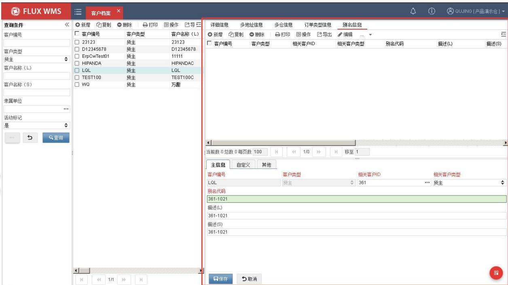

[图6-8-9]

客户编号 - 当前所维护记录的货主代码 ID，新增时自动获取，不可编辑修改。 

客户类型 - 当前所维护记录的客户类型，新增时自动获取，不可编辑修改。 

相关客户 ID - 需要维护别名的客户 ID。例如供应商的 ID，或者收货人 ID，即需要维护 

## 别名的客户 ID

相关客户类型 - 所选、需要做代码对应的客户的类型。 

别名代码 - 此客户在指定货主名下所用的自有代码。 

别名描述 - 客户描述，分为母语（L）、外文（S）描述两个字段。 

## - 鼠标右键菜单

在客户档案列表或导航窗口中，点击鼠标右键可见右键菜单。除了标准的刷新、选择、导出功能之外，还有一些每个功能自有的右键菜单项功能： 

## ■ 打印地址标签

基于货主或者收货人、承运人打印统一内容的地址标签，粘贴在发货包装上。常用于正常发货标签丢失后的快捷打印。 

## ■ 复制订单类型代码到所有货主

多个货主需要维护订单类型信息的情况下，可通过查询条件限定范围，选择某货主作为模板，复制信息到其他货主。 

## 6.9. 产品档案

产品档案是用于定义产品以及产品的各种信息、管理要求的功能模块。 

产品是整个仓库管理运作的最重要的对象之一。一个产品的定义是由两个部分构成：客户和产品，缺少任何一个都无法确切定义产品。例如一个第三方仓库，可能有不同货主名下的相同产品在库内进行管理。因此，定义产品必须先确定客户的存在。 

## 6.9.1. 详细信息

## - 主信息

■ 在主菜单 “基础设置” 下选择 “产品档案” 功能。 

■ 点击【新增】按钮，在详细信息部分的“主信息”页签，输入如下信息： 

<table><tr><td colspan="19">查询条件</td></tr><tr><td colspan="19">客户编号</td></tr><tr><td colspan="19">产品代码</td></tr><tr><td colspan="19">产品描述(L)</td></tr><tr><td colspan="19">产品描述(S)</td></tr><tr><td colspan="19">产品别名</td></tr><tr><td colspan="19">货物类型</td></tr><tr><td colspan="19">循环级别</td></tr><tr><td colspan="19">产品组</td></tr><tr><td colspan="19">活动标记</td></tr><tr><td colspan="19">是</td></tr><tr><td colspan="19">查询</td></tr></table>

[图6-9-1]

客户编号 - 即货主，产品所属的客户代码。可以通过快速查询按钮选择。 

产品代码 - 产品代码 ID，同一货主下不可重复，建议使用数字和字母。客户编号+产品，唯一定位一个货品。即同一仓库内，可以管理不同货主名下相同产品代码的货品，例如华联的可乐与沃尔玛的可乐都在一个仓库存放，货品、条码相同，但货权所属货主不同。 

产品描述 - 产品品名描述。系统提供双字段，L 为母语，S 为外文描述。 

毛重 - 产品主单位的标准毛重。 

净重 - 产品主单位的标准净重。 

皮重 - 产品主单位的标准皮重。 

价格 - 产品的参考价格。可通过权限控制价格信息用户是否可见。 

长 - 单位产品的标准长度。 

宽 - 单位产品的标准宽度。 

高 - 单位产品的标准高度。 

体积 - 产品主单位的标准体积，可根据长宽高数据自动计算。 

默认供应商 - 该产品默认采购来源供应商。 

助记码 - 系统自动提取中文名称的每个字的首字母，组合成助记码，方便用户查询录入。 

活动标记 - 启用中的记录。勾选，则表示控制产品继续存在；否则，将无法对产品继续进行收货、发货等业务操作。（注：只有该客户类型为货主时，才能新增一个产品。） 

产品别名 - 用于记录产品对应的其他名称代码，主要用来做产品的快捷定位。例如产品的商品条码，就经常作为别名记录。 

产品组部分 - 用于记录产品的分组信息。产品组字段名称可根据用户需要自行定义、配置。 

## - 控制信息

■ 继续在控制信息页签，维护产品相关管理信息。初始默认值同客户档案中的设置，用户可根据产品实际情况另行配置符合此产品管理要求的设置。 

<table><tr><td colspan="13">产品档案</td></tr><tr><td>查询条件</td><td colspan="12">新增 复制 删除 打印 操作 导出 编辑 ...</td></tr><tr><td>客户编号</td><td>客户编号</td><td>产品代码</td><td>活动标记</td><td colspan="9">产品描述(L)</td></tr><tr><td>产品代码</td><td>HIPANDA</td><td>0102008952-001...</td><td>Y</td><td colspan="9">女配色背心格子熊猫</td></tr><tr><td rowspan="24">产品描述(L)</td><td>HIPANDA</td><td>0102008952-001...</td><td>Y</td><td colspan="9">女配色背心格子熊猫</td></tr><tr><td>HIPANDA</td><td>0102008952-001...</td><td>Y</td><td colspan="9">女配色背心格子熊猫</td></tr><tr><td>HIPANDA</td><td>0102008952-001...</td><td>Y</td><td colspan="9">女配色背心格子熊猫</td></tr><tr><td>HIPANDA</td><td>0102008952.001...</td><td>Y</td><td colspan="9">女配色背心格子熊猫</td></tr><tr><td>HIPANDA</td><td>0102008952-001...</td><td>Y</td><td colspan="9">女配色背心格子熊猫</td></tr><tr><td>HIPANDA</td><td>0102008952-001...</td><td>Y</td><td>女配色背心格子熊猫</td><td>0</td><td>0</td><td></td><td></td><td></td><td></td><td></td><td></td></tr><tr><td>HIPANDA</td><td>0102008952-001...</td><td>Y</td><td>女配色背心格子熊猫</td><td></td><td></td><td></td><td></td><td></td><td></td><td></td><td></td></tr><tr><td>HIPANDA</td><td>0102008952-001...</td><td>Y</td><td>女配色背心格子熊猫</td><td></td><td></td><td></td><td></td><td></td><td></td><td></td><td></td></tr><tr><td>HIPANDA</td><td>0102008952-002...</td><td>Y</td><td>女配色背心绷带熊猫</td><td></td><td></td><td></td><td></td><td></td><td></td><td></td><td></td></tr><tr><td>HIPANDA</td><td>0102008952-002...</td><td>Y</td><td>女配色背心绷带熊猫</td><td></td><td></td><td></td><td></td><td></td><td></td><td></td><td></td></tr><tr><td>HIPANDA</td><td>0102008952-002...</td><td>Y</td><td>女配色背心绷带熊猫</td><td></td><td></td><td></td><td></td><td></td><td></td><td></td><td></td></tr><tr><td>HIPANDAA</td><td>0102008952-002...</td><td>Y</td><td>女配色背心绷带熊猫</td><td></td><td></td><td></td><td></td><td></td><td></td><td></td><td></td></tr><tr><td>HIPANDA</td><td>0102008952-002...</td><td>Y</td><td>女配色背心绷带熊猫</td><td></td><td></td><td></td><td></td><td></td><td></td><td></td><td></td></tr><tr><td>HIPANDA</td><td>0102008952-002..</td><td>Y</td><td>女配色背心绷带熊猫</td><td></td><td></td><td></td><td></td><td></td><td></td><td></td><td></td></tr><tr><td>HIPANDA</td><td>0102008952-002...</td><td>Y</td><td>女配色背心绷带熊猫</td><td></td><td></td><td></td><td></td><td></td><td></td><td></td><td></td></tr><tr><td>HIPANDA</td><td>0102008952-002...</td><td>Y</td><td>女配色背心绷带熊猫</td><td></td><td></td><td></td><td></td><td>拆箱包装</td><td>拆内包装</td><td></td><td></td></tr><tr><td>HIPANDA</td><td>0102008952-002...</td><td>Y</td><td>女配色背心绷带熊猫</td><td></td><td></td><td></td><td></td><td></td><td></td><td></td><td></td></tr><tr><td>HIPANDA</td><td>0102008952-002...</td><td>Y</td><td>女配色背心绷带熊猫</td><td></td><td></td><td></td><td></td><td></td><td></td><td></td><td></td></tr><tr><td>HIPANDA</td><td>010208952-003...</td><td>Y</td><td>女配色背心摆伞熊猫</td><td></td><td></td><td></td><td></td><td></td><td></td><td></td><td></td></tr><tr><td>HIPANDA</td><td>0102008952-003...</td><td>Y</td><td>女配色背心摆伞熊猫</td><td></td><td></td><td></td><td></td><td></td><td></td><td></td><td></td></tr><tr><td>HIPANDA</td><td>0102008952-003...</td><td>Y</td><td>女配色背心摆伞熊猫</td><td></td><td></td><td></td><td></td><td></td><td></td><td></td><td></td></tr><tr><td>HIPANDA</td><td>0102008952-003...</td><td>Y</td><td>女配红色背心摆伞熊猫</td><td></td><td></td><td></td><td></td><td></td><td></td><td></td><td></td></tr><tr><td>HIPANDA</td><td>0102008952-003...</td><td>Y</td><td>女配红色背心摆伞熊猫</td><td></td><td></td><td></td><td></td><td></td><td></td><td></td><td></td></tr><tr><td>HIPANDA</td><td>0102008952-003...</td><td>Y</td><td>女配红色背心摆伞熊猫</td><td></td><td></td><td></td><td></td><td></td><td></td><td></td><td></td></tr><tr><td>超量控制</td><td colspan="12">超量收货百分比(%)</td></tr><tr><td>允许超量收货</td><td colspan="12">0.00000</td></tr></table>

[图6-9-2]

包装代码 - 产品使用的包装。默认为货主的缺省包装。 

批次属性代码 - 产品的批次属性规则，提取客户档案中的设置作为默认值。 

缺省收货单位 - 在收货订单中，系统默认使用的包装级别单位。 

缺省发货单位 - 在出货订单中，系统默认使用的包装级别单位。 

库存单位 - 按何种单位显示库存余量查询数量, 以及作为库存标签打印单位。默认为 EA。 

装卸效率 - 月台管理中使用，产品的每小时装卸量，用于估算月台占用时段的参数。 

复制包装到批次属性 12 - 用于同一产品，入库包装规则不同的情况。收货时自动复制包装代码到批次属性 12，便于在库存中进行区分，可按包装出货。要求所选的批次属性规则中，批次属性 12 不能为禁用。 

## ■ 产品规则部分：

规则部分的选项均默认为同货主中的设置，用户可根据需要自行调整，为每个产品设置各自所需的规则属性。 

库位指定方式 - 系统计算上架库位的处理节点。提供人工指定库位、收货时计算库位和上架时计算库位 3 种选择。 

上架规则 - 产品的上架规则，具体参考业务规则设置。 

库存周转规则 - 产品出库时的库存周转规则，提取客户档案中的设置作为默认值。具体参考业务规则设置。 

预配规则 - 产品出库时的预分配规则，提取客户档案中的设置作为默认值。具体参考业务规则设置。 

分配规则 - 产品出库时的分配规则，提取客户档案中的设置作为默认值。具体参考业务规则设置。 

补货规则 - 产品补货时寻找新库位的规则。 

质检规则 - 产品生成质检单时，遵循的质检数量提取规则。 

一步分配 - 一步分配时所执行的分配规则。具体分配规则内容及设置，在业务规则章节中介绍 

一步分配排序规则 - 启用一步分配情况下可编辑。由于一步分配跳过了预配环节，可以另行指定分配时的排序字段。如不维护，默认按库位逻辑顺序拣货。 

允许入库 - 此产品在收货流程中可以使用。默认可用，通常在拒绝产品入库情况下取消勾选。 

允许出库 - 此产品在发货流程中可以使用。默认可用，通常在不允许产品发运情况下取消勾选。 

是否拆箱/内包装 - 默认勾选，分配时是否允许拆分包装分配。常用于不允许拆箱、拆内包装出库的业务形态，实现整包装分配。 

## ■ 产品有效期管理

用于对产品进行有效期/保质期管理： 

<table><tr><td colspan="13">产品档案</td></tr><tr><td>查询条件</td><td colspan="12">新增 复制 删除 打印 操作 导出 编辑 ...</td></tr><tr><td>客户编号</td><td>客户编号</td><td>产品代码</td><td>活动标记</td><td colspan="9">产品描述(L)</td></tr><tr><td>产品代码</td><td>HIPANDA</td><td>0102008952-001...</td><td>Y</td><td colspan="9">女配色背心格子熊猫</td></tr><tr><td rowspan="6">产品描述(L)</td><td>HIPANDA</td><td>0102008952-001...</td><td>Y</td><td colspan="9">女配色背心格子熊猫</td></tr><tr><td>HIPANDA</td><td>0102008952-001...</td><td>Y</td><td colspan="9">女配色背心格子熊猫</td></tr><tr><td>HIPANDA</td><td>0102008952-001...</td><td>Y</td><td colspan="9">女配色背心格子熊猫</td></tr><tr><td>HIPANDA</td><td>0102008952.001...</td><td>Y</td><td colspan="9">女配色背心格子熊猫</td></tr><tr><td>HIPANDA</td><td>0102008952-001...</td><td>Y</td><td colspan="9">女配色背心格子熊猫</td></tr><tr><td>HIPANDA</td><td>0102008952-001...</td><td>Y</td><td>女配色背心格子熊猫</td><td>0</td><td>0</td><td></td><td></td><td></td><td></td><td></td><td></td></tr><tr><td rowspan="29">产品描述(S)</td><td>HIPANDA</td><td>0102008952-001...</td><td>Y</td><td>女配色背心格子熊猫</td><td></td><td></td><td></td><td></td><td></td><td></td><td></td><td></td></tr><tr><td>HIPANDA</td><td>0102008952-001...</td><td>Y</td><td>女配色背心格子熊猫</td><td></td><td></td><td></td><td></td><td></td><td></td><td></td><td></td></tr><tr><td>HIPANDA</td><td>0102008952-002...</td><td>Y</td><td>女配色背心绷带熊猫</td><td></td><td></td><td></td><td></td><td></td><td></td><td></td><td></td></tr><tr><td>HIPANDA</td><td>0102008952-002...</td><td>Y</td><td>女配色背心绷带熊猫</td><td></td><td></td><td></td><td></td><td></td><td></td><td></td><td></td></tr><tr><td>HIPANDA</td><td>0102008952-002...</td><td>Y</td><td>女配色背心绷带熊猫</td><td></td><td></td><td></td><td></td><td></td><td></td><td></td><td></td></tr><tr><td>HIPANDIA</td><td>0102008952-002...</td><td>Y</td><td>女配色背心绷带熊猫</td><td></td><td></td><td></td><td></td><td></td><td></td><td></td><td></td></tr><tr><td>HIPANDA</td><td>0102008952-002...</td><td>Y</td><td>女配色背心绷带熊猫</td><td></td><td></td><td></td><td></td><td></td><td></td><td></td><td></td></tr><tr><td>HIPANDA</td><td>0102008952-002</td><td>Y</td><td>女配色背心绷带熊猫</td><td></td><td></td><td></td><td></td><td></td><td></td><td></td><td></td></tr><tr><td>HIPANDA</td><td>0102008952-002...</td><td>Y</td><td>女配色背心绷带熊猫</td><td></td><td></td><td></td><td></td><td></td><td></td><td></td><td></td></tr><tr><td>HIPANDA</td><td>0102008952-002...</td><td>Y</td><td>女配色背心绷带熊猫</td><td></td><td></td><td></td><td></td><td colspan="4">产品有效期</td></tr><tr><td>HIPANDA</td><td>0102008952-002...</td><td>Y</td><td>女配色背心绷带熊猫</td><td></td><td></td><td></td><td></td><td></td><td></td><td></td><td></td></tr><tr><td>HIPANDA</td><td>0102008952-002...</td><td>Y</td><td>女配色背心绷带熊猫</td><td></td><td></td><td></td><td></td><td></td><td></td><td></td><td></td></tr><tr><td>HIPANDA</td><td>01020088952-003...</td><td>Y</td><td>女配色背心摆伞熊猫</td><td></td><td></td><td></td><td></td><td></td><td></td><td></td><td></td></tr><tr><td>HIPANDA</td><td>0102008952-003...</td><td>Y</td><td>女配色背心摆伞熊猫</td><td></td><td></td><td></td><td></td><td></td><td></td><td></td><td></td></tr><tr><td>HIPANDA</td><td>0102008952-003...</td><td>Y</td><td>女配色背心摆伞熊猫</td><td></td><td></td><td></td><td></td><td></td><td></td><td></td><td></td></tr><tr><td>HIPANDA</td><td>0102008952-003...</td><td>Y</td><td>女配色背景心摆伞熊猫</td><td></td><td></td><td></td><td></td><td></td><td></td><td></td><td></td></tr><tr><td>HIPANDA</td><td>0102008952-003...</td><td>Y</td><td>女配色背心摆伞熊猫</td><td></td><td></td><td></td><td></td><td></td><td></td><td></td><td></td></tr><tr><td>HIPANDA</td><td>0102008952-003...</td><td>Y</td><td>女配色背心摆伞熊猫</td><td></td><td></td><td></td><td></td><td></td><td></td><td></td><td></td></tr><tr><td></td><td></td><td></td><td></td><td></td><td></td><td></td><td></td><td></td><td></td><td></td><td></td></tr><tr><td>HIPANDA</td><td>0102008952-003...</td><td>Y</td><td>女配色背心摆伞熊猫</td><td></td><td></td><td></td><td></td><td></td><td></td><td></td><td></td></tr><tr><td>HIPANDA</td><td>0102008952-003...</td><td>Y</td><td>女配色背心摆伞熊猫</td><td></td><td></td><td></td><td></td><td></td><td></td><td></td><td></td></tr><tr><td>HIPANDA 0102008952-004...</td><td>Y</td><td>女配色背心小鸭子</td><td></td><td></td><td></td><td></td><td></td><td></td><td></td><td></td><td></td></tr><tr><td>HIPANDA</td><td>0102008952-004...</td><td>Y</td><td>女配色背心小鸭子</td><td></td><td></td><td></td><td></td><td></td><td></td><td></td><td></td></tr><tr><td>HIPANDA</td><td>0102008952-004...</td><td>Y</td><td>女配色背心小鸭子</td><td></td><td></td><td></td><td></td><td></td><td></td><td></td><td></td></tr><tr><td>HIPANDA</td><td>0102008952-004...</td><td>Y</td><td>女配色背心小鸭子</td><td></td><td></td><td></td><td></td><td></td><td></td><td></td><td></td></tr><tr><td>HIPANDA 0102008952-004...</td><td>Y</td><td>女配色背心小鸭子</td><td></td><td></td><td></td><td></td><td></td><td></td><td></td><td></td><td></td></tr><tr><td>HIPANDA 0102008952-004...</td><td>Y</td><td>女配色背心小鸭子</td><td></td><td></td><td></td><td></td><td></td><td></td><td></td><td></td><td></td></tr><tr><td>HIPANDA 0102008952-004...</td><td>Y</td><td>女配色背心小鸭子</td><td></td><td></td><td></td><td></td><td></td><td></td><td></td><td></td><td></td></tr><tr><td>HIPINDA 0102008952-005...</td><td>Y</td><td>女配色背心小鸭子</td><td></td><td></td><td></td><td></td><td></td><td></td><td></td><td></td><td></td></tr></table>

[图6-9-3]

有效期控制 - 是否启用有效期管理，选中表示需要按照产品的库存生命周期管理产品。 

周期类型 - 系统计算产品的库存周期的方式类型。如按照入库日期开始计算产品的有效期，还是产品本身有保质期。系统提供生产日期、失效日期、入库日期选项。 

有效期 - 产品通常有效期长度，说明字段，不做强制控制，仅在根据生产日期计算失效日期情况下使用，如果选择的周期类型为“失效日期”，那么系统直接根据批次属性 02 的具体失效日期进行管控，此处的有效期字段将被忽略。 

失效期预警 - 冻结控制前，提前多少天发送预警信息。例如距离失效节点，提前 30 天库存冻结，在冻结前提前 10 天进行预警。即距离失效日期 40 天开始预警。 

入库生命天数 - 产品从入库日期开始算起，在仓库中能够安全存放的最大天数值。超过天数的产品，将不能作为正常品出库。 

出库生命天数 - 产品从出库日到失效日期有效天数值。如果产品的有效时间小于设置的出库效期天数，将不能作为正常品出库，即临近过期的产品，为避免出库时未过期，运输到客户手中已过期，需要提前进行出库管控或处理。 

单位 - 为了方便保质期较大的产品的信息维护，系统提供单位选择，下拉列表为年、月、日。预期到货通知收货计算效期时，会根据效期配置“单位”自动换算出所对应日期有效期数值，用于更新批次属性02的保质期天数。例如产品保质期为一年，则输入有效期365，单位日，系统根据生产日期，加上365天计算得到失效日期。或者输入有效期1，单位年，系 

## 统自动换算为 365 日。

## ■ 超量收货管理

<table><tr><td colspan="13">产品档案</td></tr><tr><td>查询条件</td><td colspan="12">新增 复制 删除 打印 操作 导出 编辑 ...</td></tr><tr><td>客户编号</td><td>客户编号</td><td>产品代码</td><td>活动标记</td><td colspan="9">产品描述(L)</td></tr><tr><td>产品代码</td><td>HIPANDA</td><td>0102008952-001...</td><td>Y</td><td colspan="9">女配色背心格子熊猫</td></tr><tr><td rowspan="6">产品描述(L)</td><td>HIPANDA</td><td>0102008952-001...</td><td>Y</td><td colspan="9">女配色背心格子熊猫</td></tr><tr><td>HIPANDA</td><td>0102008952-001...</td><td>Y</td><td colspan="9">女配色背心格子熊猫</td></tr><tr><td>HIPANDA</td><td>0102008952-001...</td><td>Y</td><td colspan="9">女配色背心格子熊猫</td></tr><tr><td>HIPANDA</td><td>0102008952.001...</td><td>Y</td><td colspan="9">女配色背心格子熊猫</td></tr><tr><td>HIPANDA</td><td>0102008952-001...</td><td>Y</td><td colspan="9">女配色背心格子熊猫</td></tr><tr><td>HIPANDA</td><td>0102008952-001...</td><td>Y</td><td>女配色背心格子熊猫</td><td>0</td><td>0</td><td></td><td></td><td></td><td></td><td></td><td></td></tr><tr><td rowspan="34">产品描述(S)</td><td>HIPANDA</td><td>0102008952-001...</td><td>Y</td><td>女配色背心格子熊猫</td><td></td><td></td><td></td><td></td><td></td><td></td><td></td><td></td></tr><tr><td>HIPANDA</td><td>0102008952-001...</td><td>Y</td><td>女配色背心格子熊猫</td><td></td><td></td><td></td><td></td><td></td><td></td><td></td><td></td></tr><tr><td>HIPANDA</td><td>0102008952-001...</td><td>Y</td><td>女配色背心格子熊猫</td><td></td><td></td><td></td><td></td><td></td><td></td><td></td><td></td></tr><tr><td>HIPANDA</td><td>0102008952.002...</td><td>Y</td><td>女配色背心绷带熊猫</td><td></td><td></td><td></td><td></td><td></td><td></td><td></td><td></td></tr><tr><td>HIPANDA</td><td>0102008952-002...</td><td>Y</td><td>女配色背心绷带熊猫</td><td></td><td></td><td></td><td></td><td></td><td></td><td></td><td></td></tr><tr><td>HIPANDA</td><td>0102008952-002...</td><td>Y</td><td>女配色背心绷带熊猫</td><td></td><td></td><td></td><td></td><td></td><td></td><td></td><td></td></tr><tr><td>HIPANDA</td><td>0102008952-002...</td><td>Y</td><td>女配色背心绷带熊猫</td><td>0</td><td>0</td><td></td><td></td><td></td><td></td><td></td><td></td></tr><tr><td>HIPANDA</td><td>0102008952-002...</td><td>Y</td><td>女配色背心绷带熊猫</td><td></td><td></td><td></td><td></td><td></td><td></td><td></td><td></td></tr><tr><td>HIPANDA</td><td>0102008952-002...</td><td>Y</td><td>女配色背心绷带熊猫</td><td></td><td></td><td></td><td></td><td></td><td></td><td></td><td></td></tr><tr><td>HIPANDA</td><td>02008952-002...</td><td>Y</td><td>女配色背心绷带熊猫</td><td></td><td></td><td></td><td></td><td></td><td></td><td></td><td></td></tr><tr><td>HIPANDA</td><td>0102008952-002...</td><td>Y</td><td>女配色背心绷带熊猫</td><td></td><td></td><td></td><td></td><td></td><td></td><td></td><td></td></tr><tr><td>HIPANDA</td><td>0102008952-002...</td><td>Y</td><td></td><td></td><td></td><td></td><td></td><td></td><td></td><td></td><td></td></tr><tr><td>HIPANDA</td><td>0102008952-002...</td><td>Y</td><td>女配色背心绷带熊猫</td><td></td><td></td><td></td><td></td><td></td><td></td><td></td><td></td></tr><tr><td>HIPANDA</td><td>0102008952-002...</td><td>Y</td><td>女配色背心绷带熊猫</td><td></td><td></td><td></td><td></td><td></td><td></td><td></td><td></td></tr><tr><td>HIPANDA</td><td></td><td></td><td></td><td></td><td></td><td></td><td></td><td></td><td></td><td></td><td></td></tr><tr><td>HIPANDA</td><td>0102008952-003...</td><td>Y</td><td>女配色背心摆伞熊猫</td><td></td><td></td><td></td><td></td><td></td><td></td><td></td><td></td></tr><tr><td>HIPANDA</td><td>0102008952-003...</td><td>Y</td><td>女配色背心摆伞熊猫</td><td></td><td></td><td></td><td></td><td></td><td></td><td></td><td></td></tr><tr><td>HIPANDA</td><td>0102008952-003...</td><td>Y</td><td>女配色背心摆伞熊猫</td><td></td><td></td><td></td><td></td><td></td><td></td><td></td><td></td></tr><tr><td>HIPANDA</td><td></td><td></td><td></td><td></td><td></td><td></td><td></td><td></td><td></td><td></td><td></td></tr><tr><td>HIPANDA</td><td>0102008952-003...</td><td>Y</td><td>女配色背心摆伞熊猫</td><td></td><td></td><td></td><td></td><td></td><td></td><td></td><td></td></tr><tr><td>HIPANDA</td><td>0102008952-003...</td><td>Y</td><td>女配色背中心摆伞熊猫</td><td></td><td></td><td></td><td></td><td></td><td></td><td></td><td></td></tr><tr><td>HIPANDA</td><td>0102008952-003...</td><td>Y</td><td>女配色背心摆伞熊猫</td><td></td><td></td><td></td><td></td><td></td><td></td><td></td><td></td></tr><tr><td>HIPANDA</td><td>0102008952-003...</td><td>Y</td><td>女配色背心摆伞熊猫</td><td></td><td></td><td></td><td></td><td></td><td></td><td></td><td></td></tr><tr><td>HIPANDA</td><td>0102008952-003...</td><td>Y</td><td>女配色背心摆伞熊猫</td><td></td><td></td><td></td><td></td><td></td><td></td><td></td><td></td></tr><tr><td>HIPANDA</td><td>0102008952-003...</td><td>Y</td><td>女配色背心摆伞熊猫</td><td></td><td></td><td></td><td></td><td></td><td></td><td></td><td></td></tr><tr><td>HIPANDA</td><td>0102008952-014...</td><td>Y</td><td>女配色背心小鸭子</td><td></td><td></td><td></td><td></td><td></td><td></td><td></td><td></td></tr><tr><td>HIPANDA</td><td>0102008952-004...</td><td>Y</td><td>女配色背心小鸭子</td><td></td><td></td><td></td><td></td><td></td><td></td><td></td><td></td></tr><tr><td>HIPANDA</td><td>0102008952-004...</td><td>Y</td><td>女配色背心小鸭子</td><td></td><td></td><td></td><td></td><td></td><td></td><td></td><td></td></tr><tr><td>HIPANDA</td><td>0102008952-004...</td><td>Y</td><td>女配色背心小鸭子</td><td></td><td></td><td></td><td></td><td></td><td></td><td></td><td></td></tr><tr><td>HIPANDA</td><td>0102008952-004...</td><td>Y</td><td>女配色背心小鸭子</td><td></td><td></td><td></td><td></td><td></td><td></td><td></td><td></td></tr><tr><td>HIPANDA</td><td>0102008952-004...</td><td>Y</td><td>女配色背心小鸭子</td><td></td><td></td><td></td><td></td><td></td><td></td><td></td><td></td></tr><tr><td>HIPANDA</td><td>010208952-004...</td><td>Y</td><td>女配色背心小鸭子</td><td></td><td></td><td></td><td></td><td></td><td></td><td></td><td></td></tr><tr><td>HIPANDA</td><td>0102008952-004...</td><td>Y</td><td>女配色背心小鸭子</td><td></td><td></td><td></td><td></td><td></td><td></td><td></td><td></td></tr><tr><td>HIPANDA</td><td>0102008952-005...</td><td>Y</td><td>女配色背心小鸭子</td><td></td><td></td><td></td><td></td><td></td><td></td><td></td><td></td></tr></table>

[图6-9-4]

允许超量收货 - 收货时，所收货物数量是否允许超过订单数量。 

超额收货百分比 - 部分情况下，货物可超额收取的量需要控制。客户级的超额收货百分比内容将作为产品级的超额收货百分比的默认值。使用百分比控制超额模式，货主应设置为允许超量收货。 

## ■ 序列号管理

在序列号管理页签，依次输入如下信息： 

<table><tr><td colspan="101">查询条件</td><td></td><td></td><td></td><td></td><td></td><td></td><td></td><td></td><td></td><td></td><td></td><td></td><td></td><td></td><td></td><td></td><td></td><td></td><td></td><td></td><td></td><td></td><td></td><td></td><td></td><td></td><td></td><td></td><td></td><td></td><td></td><td></td><td></td><td></td><td></td><td></td><td></td><td></td><td></td><td></td><td></td><td></td><td></td><td></td><td></td><td></td><td></td><td></td><td></td><td></td><td></td><td></td><td></td><td></td><td></td><td></td><td></td><td></td><td></td><td></td><td></td><td></td><td></td><td></td><td></td><td></td><td></td><td></td><td></td><td></td><td></td><td></td><td></td><td></td><td></td><td></td><td></td><td></td><td></td><td></td><td></td><td></td><td></td><td></td><td></td><td></td><td></td><td></td><td></td><td></td><td></td><td></td><td></td><td></td><td></td><td></td><td></td><td></td><td></td><td></td><td></td><td></td><td></td><td></td><td></td><td></td><td></td><td></td><td></td><td></td><td></td><td></td><td></td><td></td><td></td><td></td><td></td><td></td><td></td><td></td><td></td><td></td><td></td><td></td><td></td><td></td><td></td><td></td><td></td><td></td><td></td><td></td><td></td><td></td><td></td><td></td><td></td><td></td><td></td><td></td><td></td><td></td><td></td><td></td><td></td><td></td><td></td><td></td><td></td><td></td><td></td><td></td><td></td><td></td><td></td><td></td><td></td><td></td><td></td><td></td><td></td><td></td><td></td><td></td><td></td><td></td><td></td><td></td><td></td><td></td><td></td><td></td><td></td><td></td><td></td><td></td><td></td><td></td><td></td><td></td><td></td><td></td><td></td><td></td><td></td><td></td><td></td><td></td><td></td><td></td><td></td><td></td><td></td><td></td><td></td><td></td><td></td><td></td><td></td><td></td><td></td><td></td><td></td><td></td><td></td><td></td><td></td><td></td><td></td><td></td><td></td><td></td><td></td><td></td><td></td><td></td><td></td><td></td><td></td><td></td><td></td><td></td><td></td><td></td><td></td><td></td><td></td><td></td><td></td><td></td><td></td><td></td><td></td><td></td><td></td><td></td><td></td><td></td><td></td><td></td><td></td><td></td><td></td><td></td><td></td><td></td><td></td><td></td><td></td><td></td><td></td><td></td><td></td><td></td><td></td><td></td><td></td><td></td><td></td><td></td><td></td><td></td><td></td><td></td><td></td><td></td><td></td><td></td><td></td><td></td><td></td><td></td><td></td><td></td><td></td><td></td><td></td><td></td><td></td><td></td><td></td><td></td><td></td><td></td><td></td><td></td><td></td><td></td><td></td><td></td><td></td><td></td><td></td><td></td><td></td><td></td><td></td><td></td><td></td><td></td><td></td><td></td><td></td><td></td><td></td><td></td><td></td><td></td><td></td><td></td><td></td><td></td><td></td><td></td><td></td><td></td><td></td><td></td><td></td><td></td><td></td><td></td><td></td><td></td><td></td><td></td><td></td><td></td><td></td><td></td><td></td><td></td><td></td><td></td><td></td><td></td><td></td><td></td><td></td><td></td><td></td><td></td><td></td><td></td><td></td><td></td><td></td><td></td><td></td><td></td><td></td><td></td><td></td><td></td><td></td><td></td><td></td><td></td><td></td><td></td><td></td><td></td><td></td><td></td><td></td><td></td><td></td><td></td><td></td><td></td><td></td><td></td><td></td><td></td><td></td><td></td><td></td><td></td><td></td><td></td><td></td><td></td><td></td><td></td><td></td><td></td><td></td><td></td><td></td><td></td><td></td><td></td><td></td><td></td><td></td><td></td><td></td><td></td><td></td><td></td><td></td><td></td><td></td><td></td><td></td><td></td><td></td><td></td><td></td><td></td><td></td><td></td><td></td><td></td><td></td><td></td><td></td><td></td><td></td><td></td><td></td><td></td><td></td><td></td><td></td><td></td><td></td><td></td><td></td><td></td><td></td><td></td><td></td><td></td><td></td><td></td><td></td><td></td><td></td><td></td><td></td><td></td><td></td><td></td><td></td><td></td><td></td><td></td><td></td><td></td><td></td><td></td><td></td><td></td><td></td><td></td><td></td><td></td><td></td><td></td><td></td><td></td><td></td><td></td><td></td><td></td><td></td><td></td><td></td><td></td><td></td><td></td><td></td><td></td><td></td><td></td><td></td><td></td><td></td><td></td><td></td><td></td><td></td><td></td><td></td><td></td><td></td><td></td><td></td><td></td><td></td><td></td><td></td><td></td><td></td><td></td><td></td><td></td><td></td><td></td><td></td><td></td><td></td><td></td><td></td><td></td><td></td><td></td><td></td><td></td><td></td><td></td><td></td><td></td><td></td><td></td><td></td><td></td><td></td><td></td><td></td><td></td><td></td><td></td><td></td><td></td><td></td><td></td><td></td><td></td><td></td><td></td><td></td><td></td><td></td><td></td><td></td><td></td><td></td><td></td><td></td><td></td><td></td><td></td><td></td><td></td><td></td><td></td><td></td><td></td><td></td><td></td><td></td><td></td><td></td><td></td><td></td><td></td><td></td><td></td><td></td><td></td><td></td><td></td><td></td><td></td><td></td><td></td><td></td><td></td><td></td><td></td><td></td><td></td><td></td><td></td><td></td><td></td><td></td><td></td><td></td><td></td><td></td><td></td><td></td><td></td><td></td><td></td><td></td><td></td></tr><tr><td colspan="100">客户编号</td><td></td><td></td><td></td><td></td><td></td><td></td><td></td><td></td><td></td><td></td><td></td><td></td><td></td><td></td><td></td><td></td><td></td><td></td><td></td><td></td><td></td><td></td><td></td><td></td><td></td><td></td><td></td><td></td><td></td><td></td><td></td><td></td><td></td><td></td><td></td><td></td><td></td><td></td><td></td><td></td><td></td><td></td><td></td><td></td><td></td><td></td><td></td><td></td><td></td><td></td><td></td><td></td><td></td><td></td><td></td><td></td><td></td><td></td><td></td><td></td><td></td><td></td><td></td><td></td><td></td><td></td><td></td><td></td><td></td><td></td><td></td><td></td><td></td><td></td><td></td><td></td><td></td><td></td><td></td><td></td><td></td><td></td><td></td><td></td><td></td><td></td><td></td><td></td><td></td><td></td><td></td><td></td><td></td><td></td><td></td><td></td><td></td><td></td><td></td><td></td><td></td><td></td><td></td><td></td><td></td><td></td><td></td><td></td><td></td><td></td><td></td><td></td><td></td><td></td><td></td><td></td><td></td><td></td><td></td><td></td><td></td><td></td><td></td><td></td><td></td><td></td><td></td><td></td><td></td><td></td><td></td><td></td><td></td><td></td><td></td><td></td><td></td><td></td><td></td><td></td><td></td><td></td><td></td><td></td><td></td><td></td><td></td><td></td><td></td><td></td><td></td><td></td><td></td><td></td><td></td><td></td><td></td><td></td><td></td><td></td><td></td><td></td><td></td><td></td><td></td><td></td><td></td><td></td><td></td><td></td><td></td><td></td><td></td><td></td><td></td><td></td><td></td><td></td><td></td><td></td><td></td><td></td><td></td><td></td><td></td><td></td><td></td><td></td><td></td><td></td><td></td><td></td><td></td><td></td><td></td><td></td><td></td><td></td><td></td><td></td><td></td><td></td><td></td><td></td><td></td><td></td><td></td><td></td><td></td><td></td><td></td><td></td><td></td><td></td><td></td><td></td><td></td><td></td><td></td><td></td><td></td><td></td><td></td><td></td><td></td><td></td><td></td><td></td><td></td><td></td><td></td><td></td><td></td><td></td><td></td><td></td><td></td><td></td><td></td><td></td><td></td><td></td><td></td><td></td><td></td><td></td><td></td><td></td><td></td><td></td><td></td><td></td><td></td><td></td><td></td><td></td><td></td><td></td><td></td><td></td><td></td><td></td><td></td><td></td><td></td><td></td><td></td><td></td><td></td><td></td><td></td><td></td><td></td><td></td><td></td><td></td><td></td><td></td><td></td><td></td><td></td><td></td><td></td><td></td><td></td><td></td><td></td><td></td><td></td><td></td><td></td><td></td><td></td><td></td><td></td><td></td><td></td><td></td><td></td><td></td><td></td><td></td><td></td><td></td><td></td><td></td><td></td><td></td><td></td><td></td><td></td><td></td><td></td><td></td><td></td><td></td><td></td><td></td><td></td><td></td><td></td><td></td><td></td><td></td><td></td><td></td><td></td><td></td><td></td><td></td><td></td><td></td><td></td><td></td><td></td><td></td><td></td><td></td><td></td><td></td><td></td><td></td><td></td><td></td><td></td><td></td><td></td><td></td><td></td><td></td><td></td><td></td><td></td><td></td><td></td><td></td><td></td><td></td><td></td><td></td><td></td><td></td><td></td><td></td><td></td><td></td><td></td><td></td><td></td><td></td><td></td><td></td><td></td><td></td><td></td><td></td><td></td><td></td><td></td><td></td><td></td><td></td><td></td><td></td><td></td><td></td><td></td><td></td><td></td><td></td><td></td><td></td><td></td><td></td><td></td><td></td><td></td><td></td><td></td><td></td><td></td><td></td><td></td><td></td><td></td><td></td><td></td><td></td><td></td><td></td><td></td><td></td><td></td><td></td><td></td><td></td><td></td><td></td><td></td><td></td><td></td><td></td><td></td><td></td><td></td><td></td><td></td><td></td><td></td><td></td><td></td><td></td><td></td><td></td><td></td><td></td><td></td><td></td><td></td><td></td><td></td><td></td><td></td><td></td><td></td><td></td><td></td><td></td><td></td><td></td><td></td><td></td><td></td><td></td><td></td><td></td><td></td><td></td><td></td><td></td><td></td><td></td><td></td><td></td><td></td><td></td><td></td><td></td><td></td><td></td><td></td><td></td><td></td><td></td><td></td><td></td><td></td><td></td><td></td><td></td><td></td><td></td><td></td><td></td><td></td><td></td><td></td><td></td><td></td><td></td><td></td><td></td><td></td><td></td><td></td><td></td><td></td><td></td><td></td><td></td><td></td><td></td><td></td><td></td><td></td><td></td><td></td><td></td><td></td><td></td><td></td><td></td><td></td><td></td><td></td><td></td><td></td><td></td><td></td><td></td><td></td><td></td><td></td><td></td><td></td><td></td><td></td><td></td><td></td><td></td><td></td><td></td><td></td><td></td><td></td><td></td><td></td><td></td><td></td><td></td><td></td><td></td><td></td><td></td><td></td><td></td><td></td><td></td><td></td><td></td><td></td><td></td><td></td><td></td><td></td><td></td><td></td><td></td><td></td><td></td><td></td><td></td><td></td><td></td><td></td><td></td><td></td><td></td><td></td><td></td><td></td><td></td><td></td><td></td><td></td><td></td><td></td><td></td><td></td><td></td><td></td><td></td><td></td><td></td><td></td><td></td><td></td><td></td><td></td><td></td><td></td></tr><tr><td colspan="96">产品代码</td><td></td><td></td><td></td><td></td><td></td><td></td><td></td><td></td><td></td><td></td><td></td><td></td><td></td><td></td><td></td><td></td><td></td><td></td><td></td><td></td><td></td><td></td><td></td><td></td><td></td><td></td><td></td><td></td><td></td><td></td><td></td><td></td><td></td><td></td><td></td><td></td><td></td><td></td><td></td><td></td><td></td><td></td><td></td><td></td><td></td><td></td><td></td><td></td><td></td><td></td><td></td><td></td><td></td><td></td><td></td><td></td><td></td><td></td><td></td><td></td><td></td><td></td><td></td><td></td><td></td><td></td><td></td><td></td><td></td><td></td><td></td><td></td><td></td><td></td><td></td><td></td><td></td><td></td><td></td><td></td><td></td><td></td><td></td><td></td><td></td><td></td><td></td><td></td><td></td><td></td><td></td><td></td><td></td><td></td><td></td><td></td><td></td><td></td><td></td><td></td><td></td><td></td><td></td><td></td><td></td><td></td><td></td><td></td><td></td><td></td><td></td><td></td><td></td><td></td><td></td><td></td><td></td><td></td><td></td><td></td><td></td><td></td><td></td><td></td><td></td><td></td><td></td><td></td><td></td><td></td><td></td><td></td><td></td><td></td><td></td><td></td><td></td><td></td><td></td><td></td><td></td><td></td><td></td><td></td><td></td><td></td><td></td><td></td><td></td><td></td><td></td><td></td><td></td><td></td><td></td><td></td><td></td><td></td><td></td><td></td><td></td><td></td><td></td><td></td><td></td><td></td><td></td><td></td><td></td><td></td><td></td><td></td><td></td><td></td><td></td><td></td><td></td><td></td><td></td><td></td><td></td><td></td><td></td><td></td><td></td><td></td><td></td><td></td><td></td><td></td><td></td><td></td><td></td><td></td><td></td><td></td><td></td><td></td><td></td><td></td><td></td><td></td><td></td><td></td><td></td><td></td><td></td><td></td><td></td><td></td><td></td><td></td><td></td><td></td><td></td><td></td><td></td><td></td><td></td><td></td><td></td><td></td><td></td><td></td><td></td><td></td><td></td><td></td><td></td><td></td><td></td><td></td><td></td><td></td><td></td><td></td><td></td><td></td><td></td><td></td><td></td><td></td><td></td><td></td><td></td><td></td><td></td><td></td><td></td><td></td><td></td><td></td><td></td><td></td><td></td><td></td><td></td><td></td><td></td><td></td><td></td><td></td><td></td><td></td><td></td><td></td><td></td><td></td><td></td><td></td><td></td><td></td><td></td><td></td><td></td><td></td><td></td><td></td><td></td><td></td><td></td><td></td><td></td><td></td><td></td><td></td><td></td><td></td><td></td><td></td><td></td><td></td><td></td><td></td><td></td><td></td><td></td><td></td><td></td><td></td><td></td><td></td><td></td><td></td><td></td><td></td><td></td><td></td><td></td><td></td><td></td><td></td><td></td><td></td><td></td><td></td><td></td><td></td><td></td><td></td><td></td><td></td><td></td><td></td><td></td><td></td><td></td><td></td><td></td><td></td><td></td><td></td><td></td><td></td><td></td><td></td><td></td><td></td><td></td><td></td><td></td><td></td><td></td><td></td><td></td><td></td><td></td><td></td><td></td><td></td><td></td><td></td><td></td><td></td><td></td><td></td><td></td><td></td><td></td><td></td><td></td><td></td><td></td><td></td><td></td><td></td><td></td><td></td><td></td><td></td><td></td><td></td><td></td><td></td><td></td><td></td><td></td><td></td><td></td><td></td><td></td><td></td><td></td><td></td><td></td><td></td><td></td><td></td><td></td><td></td><td></td><td></td><td></td><td></td><td></td><td></td><td></td><td></td><td></td><td></td><td></td><td></td><td></td><td></td><td></td><td></td><td></td><td></td><td></td><td></td><td></td><td></td><td></td><td></td><td></td><td></td><td></td><td></td><td></td><td></td><td></td><td></td><td></td><td></td><td></td><td></td><td></td><td></td><td></td><td></td><td></td><td></td><td></td><td></td><td></td><td></td><td></td><td></td><td></td><td></td><td></td><td></td><td></td><td></td><td></td><td></td><td></td><td></td><td></td><td></td><td></td><td></td><td></td><td></td><td></td><td></td><td></td><td></td><td></td><td></td><td></td><td></td><td></td><td></td><td></td><td></td><td></td><td></td><td></td><td></td><td></td><td></td><td></td><td></td><td></td><td></td><td></td><td></td><td></td><td></td><td></td><td></td><td></td><td></td><td></td><td></td><td></td><td></td><td></td><td></td><td></td><td></td><td></td><td></td><td></td><td></td><td></td><td></td><td></td><td></td><td></td><td></td><td></td><td></td><td></td><td></td><td></td><td></td><td></td><td></td><td></td><td></td><td></td><td></td><td></td><td></td><td></td><td></td><td></td><td></td><td></td><td></td><td></td><td></td><td></td><td></td><td></td><td></td><td></td><td></td><td></td><td></td><td></td><td></td><td></td><td></td><td></td><td></td><td></td><td></td><td></td><td></td><td></td><td></td><td></td><td></td><td></td><td></td><td></td><td></td><td></td><td></td><td></td><td></td><td></td><td></td><td></td><td></td><td></td><td></td><td></td><td></td><td></td><td></td><td></td><td></td><td></td><td></td><td></td><td></td><td></td><td></td><td></td><td></td><td></td><td></td><td></td><td></td><td></td><td></td><td></td><td></td><td></td><td></td><td></td><td></td><td></td><td></td><td></td><td></td><td></td><td></td><td></td><td></td><td></td></tr><tr><td colspan="95">产品描述(L)</td><td></td><td></td><td></td><td></td><td></td><td></td><td></td><td></td><td></td><td></td><td></td><td></td><td></td><td></td><td></td><td></td><td></td><td></td><td></td><td></td><td></td><td></td><td></td><td></td><td></td><td></td><td></td><td></td><td></td><td></td><td></td><td></td><td></td><td></td><td></td><td></td><td></td><td></td><td></td><td></td><td></td><td></td><td></td><td></td><td></td><td></td><td></td><td></td><td></td><td></td><td></td><td></td><td></td><td></td><td></td><td></td><td></td><td></td><td></td><td></td><td></td><td></td><td></td><td></td><td></td><td></td><td></td><td></td><td></td><td></td><td></td><td></td><td></td><td></td><td></td><td></td><td></td><td></td><td></td><td></td><td></td><td></td><td></td><td></td><td></td><td></td><td></td><td></td><td></td><td></td><td></td><td></td><td></td><td></td><td></td><td></td><td></td><td></td><td></td><td></td><td></td><td></td><td></td><td></td><td></td><td></td><td></td><td></td><td></td><td></td><td></td><td></td><td></td><td></td><td></td><td></td><td></td><td></td><td></td><td></td><td></td><td></td><td></td><td></td><td></td><td></td><td></td><td></td><td></td><td></td><td></td><td></td><td></td><td></td><td></td><td></td><td></td><td></td><td></td><td></td><td></td><td></td><td></td><td></td><td></td><td></td><td></td><td></td><td></td><td></td><td></td><td></td><td></td><td></td><td></td><td></td><td></td><td></td><td></td><td></td><td></td><td></td><td></td><td></td><td></td><td></td><td></td><td></td><td></td><td></td><td></td><td></td><td></td><td></td><td></td><td></td><td></td><td></td><td></td><td></td><td></td><td></td><td></td><td></td><td></td><td></td><td></td><td></td><td></td><td></td><td></td><td></td><td></td><td></td><td></td><td></td><td></td><td></td><td></td><td></td><td></td><td></td><td></td><td></td><td></td><td></td><td></td><td></td><td></td><td></td><td></td><td></td><td></td><td></td><td></td><td></td><td></td><td></td><td></td><td></td><td></td><td></td><td></td><td></td><td></td><td></td><td></td><td></td><td></td><td></td><td></td><td></td><td></td><td></td><td></td><td></td><td></td><td></td><td></td><td></td><td></td><td></td><td></td><td></td><td></td><td></td><td></td><td></td><td></td><td></td><td></td><td></td><td></td><td></td><td></td><td></td><td></td><td></td><td></td><td></td><td></td><td></td><td></td><td></td><td></td><td></td><td></td><td></td><td></td><td></td><td></td><td></td><td></td><td></td><td></td><td></td><td></td><td></td><td></td><td></td><td></td><td></td><td></td><td></td><td></td><td></td><td></td><td></td><td></td><td></td><td></td><td></td><td></td><td></td><td></td><td></td><td></td><td></td><td></td><td></td><td></td><td></td><td></td><td></td><td></td><td></td><td></td><td></td><td></td><td></td><td></td><td></td><td></td><td></td><td></td><td></td><td></td><td></td><td></td><td></td><td></td><td></td><td></td><td></td><td></td><td></td><td></td><td></td><td></td><td></td><td></td><td></td><td></td><td></td><td></td><td></td><td></td><td></td><td></td><td></td><td></td><td></td><td></td><td></td><td></td><td></td><td></td><td></td><td></td><td></td><td></td><td></td><td></td><td></td><td></td><td></td><td></td><td></td><td></td><td></td><td></td><td></td><td></td><td></td><td></td><td></td><td></td><td></td><td></td><td></td><td></td><td></td><td></td><td></td><td></td><td></td><td></td><td></td><td></td><td></td><td></td><td></td><td></td><td></td><td></td><td></td><td></td><td></td><td></td><td></td><td></td><td></td><td></td><td></td><td></td><td></td><td></td><td></td><td></td><td></td><td></td><td></td><td></td><td></td><td></td><td></td><td></td><td></td><td></td><td></td><td></td><td></td><td></td><td></td><td></td><td></td><td></td><td></td><td></td><td></td><td></td><td></td><td></td><td></td><td></td><td></td><td></td><td></td><td></td><td></td><td></td><td></td><td></td><td></td><td></td><td></td><td></td><td></td><td></td><td></td><td></td><td></td><td></td><td></td><td></td><td></td><td></td><td></td><td></td><td></td><td></td><td></td><td></td><td></td><td></td><td></td><td></td><td></td><td></td><td></td><td></td><td></td><td></td><td></td><td></td><td></td><td></td><td></td><td></td><td></td><td></td><td></td><td></td><td></td><td></td><td></td><td></td><td></td><td></td><td></td><td></td><td></td><td></td><td></td><td></td><td></td><td></td><td></td><td></td><td></td><td></td><td></td><td></td><td></td><td></td><td></td><td></td><td></td><td></td><td></td><td></td><td></td><td></td><td></td><td></td><td></td><td></td><td></td><td></td><td></td><td></td><td></td><td></td><td></td><td></td><td></td><td></td><td></td><td></td><td></td><td></td><td></td><td></td><td></td><td></td><td></td><td></td><td></td><td></td><td></td><td></td><td></td><td></td><td></td><td></td><td></td><td></td><td></td><td></td><td></td><td></td><td></td><td></td><td></td><td></td><td></td><td></td><td></td><td></td><td></td><td></td><td></td><td></td><td></td><td></td><td></td><td></td><td></td><td></td><td></td><td></td><td></td><td></td><td></td><td></td><td></td><td></td><td></td><td></td><td></td><td></td><td></td><td></td><td></td><td></td><td></td><td></td><td></td><td></td><td></td><td></td><td></td><td></td><td></td><td></td><td></td><td></td><td></td><td></td><td></td><td></td><td></td><td></td><td></td><td></td><td></td></tr><tr><td colspan="89">产品描述(S)</td><td></td><td></td><td></td><td></td><td></td><td></td><td></td><td></td><td></td><td></td><td></td><td></td><td></td><td></td><td></td><td></td><td></td><td></td><td></td><td></td><td></td><td></td><td></td><td></td><td></td><td></td><td></td><td></td><td></td><td></td><td></td><td></td><td></td><td></td><td></td><td></td><td></td><td></td><td></td><td></td><td></td><td></td><td></td><td></td><td></td><td></td><td></td><td></td><td></td><td></td><td></td><td></td><td></td><td></td><td></td><td></td><td></td><td></td><td></td><td></td><td></td><td></td><td></td><td></td><td></td><td></td><td></td><td></td><td></td><td></td><td></td><td></td><td></td><td></td><td></td><td></td><td></td><td></td><td></td><td></td><td></td><td></td><td></td><td></td><td></td><td></td><td></td><td></td><td></td><td></td><td></td><td></td><td></td><td></td><td></td><td></td><td></td><td></td><td></td><td></td><td></td><td></td><td></td><td></td><td></td><td></td><td></td><td></td><td></td><td></td><td></td><td></td><td></td><td></td><td></td><td></td><td></td><td></td><td></td><td></td><td></td><td></td><td></td><td></td><td></td><td></td><td></td><td></td><td></td><td></td><td></td><td></td><td></td><td></td><td></td><td></td><td></td><td></td><td></td><td></td><td></td><td></td><td></td><td></td><td></td><td></td><td></td><td></td><td></td><td></td><td></td><td></td><td></td><td></td><td></td><td></td><td></td><td></td><td></td><td></td><td></td><td></td><td></td><td></td><td></td><td></td><td></td><td></td><td></td><td></td><td></td><td></td><td></td><td></td><td></td><td></td><td></td><td></td><td></td><td></td><td></td><td></td><td></td><td></td><td></td><td></td><td></td><td></td><td></td><td></td><td></td><td></td><td></td><td></td><td></td><td></td><td></td><td></td><td></td><td></td><td></td><td></td><td></td><td></td><td></td><td></td><td></td><td></td><td></td><td></td><td></td><td></td><td></td><td></td><td></td><td></td><td></td><td></td><td></td><td></td><td></td><td></td><td></td><td></td><td></td><td></td><td></td><td></td><td></td><td></td><td></td><td></td><td></td><td></td><td></td><td></td><td></td><td></td><td></td><td></td><td></td><td></td><td></td><td></td><td></td><td></td><td></td><td></td><td></td><td></td><td></td><td></td><td></td><td></td><td></td><td></td><td></td><td></td><td></td><td></td><td></td><td></td><td></td><td></td><td></td><td></td><td></td><td></td><td></td><td></td><td></td><td></td><td></td><td></td><td></td><td></td><td></td><td></td><td></td><td></td><td></td><td></td><td></td><td></td><td></td><td></td><td></td><td></td><td></td><td></td><td></td><td></td><td></td><td></td><td></td><td></td><td></td><td></td><td></td><td></td><td></td><td></td><td></td><td></td><td></td><td></td><td></td><td></td><td></td><td></td><td></td><td></td><td></td><td></td><td></td><td></td><td></td><td></td><td></td><td></td><td></td><td></td><td></td><td></td><td></td><td></td><td></td><td></td><td></td><td></td><td></td><td></td><td></td><td></td><td></td><td></td><td></td><td></td><td></td><td></td><td></td><td></td><td></td><td></td><td></td><td></td><td></td><td></td><td></td><td></td><td></td><td></td><td></td><td></td><td></td><td></td><td></td><td></td><td></td><td></td><td></td><td></td><td></td><td></td><td></td><td></td><td></td><td></td><td></td><td></td><td></td><td></td><td></td><td></td><td></td><td></td><td></td><td></td><td></td><td></td><td></td><td></td><td></td><td></td><td></td><td></td><td></td><td></td><td></td><td></td><td></td><td></td><td></td><td></td><td></td><td></td><td></td><td></td><td></td><td></td><td></td><td></td><td></td><td></td><td></td><td></td><td></td><td></td><td></td><td></td><td></td><td></td><td></td><td></td><td></td><td></td><td></td><td></td><td></td><td></td><td></td><td></td><td></td><td></td><td></td><td></td><td></td><td></td><td></td><td></td><td></td><td></td><td></td><td></td><td></td><td></td><td></td><td></td><td></td><td></td><td></td><td></td><td></td><td></td><td></td><td></td><td></td><td></td><td></td><td></td><td></td><td></td><td></td><td></td><td></td><td></td><td></td><td></td><td></td><td></td><td></td><td></td><td></td><td></td><td></td><td></td><td></td><td></td><td></td><td></td><td></td><td></td><td></td><td></td><td></td><td></td><td></td><td></td><td></td><td></td><td></td><td></td><td></td><td></td><td></td><td></td><td></td><td></td><td></td><td></td><td></td><td></td><td></td><td></td><td></td><td></td><td></td><td></td><td></td><td></td><td></td><td></td><td></td><td></td><td></td><td></td><td></td><td></td><td></td><td></td><td></td><td></td><td></td><td></td><td></td><td></td><td></td><td></td><td></td><td></td><td></td><td></td><td></td><td></td><td></td><td></td><td></td><td></td><td></td><td></td><td></td><td></td><td></td><td></td><td></td><td></td><td></td><td></td><td></td><td></td><td></td><td></td><td></td><td></td><td></td><td></td><td></td><td></td><td></td><td></td><td></td><td></td><td></td><td></td><td></td><td></td><td></td><td></td><td></td><td></td><td></td><td></td><td></td><td></td><td></td><td></td><td></td><td></td><td></td><td></td><td></td><td></td><td></td><td></td><td></td><td></td><td></td><td></td><td></td><td></td><td></td><td></td><td></td><td></td><td></td><td></td><td></td><td></td><td></td><td></td><td></td><td></td><td></td><td></td><td></td><td></td><td></td><td></td><td></td><td></td><td></td><td></td></tr><tr><td colspan="85">产品别名</td><td></td><td></td><td></td><td></td><td></td><td></td><td></td><td></td><td></td><td></td><td></td><td></td><td></td><td></td><td></td><td></td><td></td><td></td><td></td><td></td><td></td><td></td><td></td><td></td><td></td><td></td><td></td><td></td><td></td><td></td><td></td><td></td><td></td><td></td><td></td><td></td><td></td><td></td><td></td><td></td><td></td><td></td><td></td><td></td><td></td><td></td><td></td><td></td><td></td><td></td><td></td><td></td><td></td><td></td><td></td><td></td><td></td><td></td><td></td><td></td><td></td><td></td><td></td><td></td><td></td><td></td><td></td><td></td><td></td><td></td><td></td><td></td><td></td><td></td><td></td><td></td><td></td><td></td><td></td><td></td><td></td><td></td><td></td><td></td><td></td><td></td><td></td><td></td><td></td><td></td><td></td><td></td><td></td><td></td><td></td><td></td><td></td><td></td><td></td><td></td><td></td><td></td><td></td><td></td><td></td><td></td><td></td><td></td><td></td><td></td><td></td><td></td><td></td><td></td><td></td><td></td><td></td><td></td><td></td><td></td><td></td><td></td><td></td><td></td><td></td><td></td><td></td><td></td><td></td><td></td><td></td><td></td><td></td><td></td><td></td><td></td><td></td><td></td><td></td><td></td><td></td><td></td><td></td><td></td><td></td><td></td><td></td><td></td><td></td><td></td><td></td><td></td><td></td><td></td><td></td><td></td><td></td><td></td><td></td><td></td><td></td><td></td><td></td><td></td><td></td><td></td><td></td><td></td><td></td><td></td><td></td><td></td><td></td><td></td><td></td><td></td><td></td><td></td><td></td><td></td><td></td><td></td><td></td><td></td><td></td><td></td><td></td><td></td><td></td><td></td><td></td><td></td><td></td><td></td><td></td><td></td><td></td><td></td><td></td><td></td><td></td><td></td><td></td><td></td><td></td><td></td><td></td><td></td><td></td><td></td><td></td><td></td><td></td><td></td><td></td><td></td><td></td><td></td><td></td><td></td><td></td><td></td><td></td><td></td><td></td><td></td><td></td><td></td><td></td><td></td><td></td><td></td><td></td><td></td><td></td><td></td><td></td><td></td><td></td><td></td><td></td><td></td><td></td><td></td><td></td><td></td><td></td><td></td><td></td><td></td><td></td><td></td><td></td><td></td><td></td><td></td><td></td><td></td><td></td><td></td><td></td><td></td><td></td><td></td><td></td><td></td><td></td><td></td><td></td><td></td><td></td><td></td><td></td><td></td><td></td><td></td><td></td><td></td><td></td><td></td><td></td><td></td><td></td><td></td><td></td><td></td><td></td><td></td><td></td><td></td><td></td><td></td><td></td><td></td><td></td><td></td><td></td><td></td><td></td><td></td><td></td><td></td><td></td><td></td><td></td><td></td><td></td><td></td><td></td><td></td><td></td><td></td><td></td><td></td><td></td><td></td><td></td><td></td><td></td><td></td><td></td><td></td><td></td><td></td><td></td><td></td><td></td><td></td><td></td><td></td><td></td><td></td><td></td><td></td><td></td><td></td><td></td><td></td><td></td><td></td><td></td><td></td><td></td><td></td><td></td><td></td><td></td><td></td><td></td><td></td><td></td><td></td><td></td><td></td><td></td><td></td><td></td><td></td><td></td><td></td><td></td><td></td><td></td><td></td><td></td><td></td><td></td><td></td><td></td><td></td><td></td><td></td><td></td><td></td><td></td><td></td><td></td><td></td><td></td><td></td><td></td><td></td><td></td><td></td><td></td><td></td><td></td><td></td><td></td><td></td><td></td><td></td><td></td><td></td><td></td><td></td><td></td><td></td><td></td><td></td><td></td><td></td><td></td><td></td><td></td><td></td><td></td><td></td><td></td><td></td><td></td><td></td><td></td><td></td><td></td><td></td><td></td><td></td><td></td><td></td><td></td><td></td><td></td><td></td><td></td><td></td><td></td><td></td><td></td><td></td><td></td><td></td><td></td><td></td><td></td><td></td><td></td><td></td><td></td><td></td><td></td><td></td><td></td><td></td><td></td><td></td><td></td><td></td><td></td><td></td><td></td><td></td><td></td><td></td><td></td><td></td><td></td><td></td><td></td><td></td><td></td><td></td><td></td><td></td><td></td><td></td><td></td><td></td><td></td><td></td><td></td><td></td><td></td><td></td><td></td><td></td><td></td><td></td><td></td><td></td><td></td><td></td><td></td><td></td><td></td><td></td><td></td><td></td><td></td><td></td><td></td><td></td><td></td><td></td><td></td><td></td><td></td><td></td><td></td><td></td><td></td><td></td><td></td><td></td><td></td><td></td><td></td><td></td><td></td><td></td><td></td><td></td><td></td><td></td><td></td><td></td><td></td><td></td><td></td><td></td><td></td><td></td><td></td><td></td><td></td><td></td><td></td><td></td><td></td><td></td><td></td><td></td><td></td><td></td><td></td><td></td><td></td><td></td><td></td><td></td><td></td><td></td><td></td><td></td><td></td><td></td><td></td><td></td><td></td><td></td><td></td><td></td><td></td><td></td><td></td><td></td><td></td><td></td><td></td><td></td><td></td><td></td><td></td><td></td><td></td><td></td><td></td><td></td><td></td><td></td><td></td><td></td><td></td><td></td><td></td><td></td><td></td><td></td><td></td><td></td><td></td><td></td><td></td><td></td><td></td><td></td><td></td><td></td><td></td><td></td><td></td><td></td><td></td><td></td><td></td><td></td><td></td><td></td><td></td><td></td><td></td><td></td><td></td><td></td><td></td><td></td></tr><tr><td colspan="81">货物类型</td><td></td><td></td><td></td><td></td><td></td><td></td><td></td><td></td><td></td><td></td><td></td><td></td><td></td><td></td><td></td><td></td><td></td><td></td><td></td><td></td><td></td><td></td><td></td><td></td><td></td><td></td><td></td><td></td><td></td><td></td><td></td><td></td><td></td><td></td><td></td><td></td><td></td><td></td><td></td><td></td><td></td><td></td><td></td><td></td><td></td><td></td><td></td><td></td><td></td><td></td><td></td><td></td><td></td><td></td><td></td><td></td><td></td><td></td><td></td><td></td><td></td><td></td><td></td><td></td><td></td><td></td><td></td><td></td><td></td><td></td><td></td><td></td><td></td><td></td><td></td><td></td><td></td><td></td><td></td><td></td><td></td><td></td><td></td><td></td><td></td><td></td><td></td><td></td><td></td><td></td><td></td><td></td><td></td><td></td><td></td><td></td><td></td><td></td><td></td><td></td><td></td><td></td><td></td><td></td><td></td><td></td><td></td><td></td><td></td><td></td><td></td><td></td><td></td><td></td><td></td><td></td><td></td><td></td><td></td><td></td><td></td><td></td><td></td><td></td><td></td><td></td><td></td><td></td><td></td><td></td><td></td><td></td><td></td><td></td><td></td><td></td><td></td><td></td><td></td><td></td><td></td><td></td><td></td><td></td><td></td><td></td><td></td><td></td><td></td><td></td><td></td><td></td><td></td><td></td><td></td><td></td><td></td><td></td><td></td><td></td><td></td><td></td><td></td><td></td><td></td><td></td><td></td><td></td><td></td><td></td><td></td><td></td><td></td><td></td><td></td><td></td><td></td><td></td><td></td><td></td><td></td><td></td><td></td><td></td><td></td><td></td><td></td><td></td><td></td><td></td><td></td><td></td><td></td><td></td><td></td><td></td><td></td><td></td><td></td><td></td><td></td><td></td><td></td><td></td><td></td><td></td><td></td><td></td><td></td><td></td><td></td><td></td><td></td><td></td><td></td><td></td><td></td><td></td><td></td><td></td><td></td><td></td><td></td><td></td><td></td><td></td><td></td><td></td><td></td><td></td><td></td><td></td><td></td><td></td><td></td><td></td><td></td><td></td><td></td><td></td><td></td><td></td><td></td><td></td><td></td><td></td><td></td><td></td><td></td><td></td><td></td><td></td><td></td><td></td><td></td><td></td><td></td><td></td><td></td><td></td><td></td><td></td><td></td><td></td><td></td><td></td><td></td><td></td><td></td><td></td><td></td><td></td><td></td><td></td><td></td><td></td><td></td><td></td><td></td><td></td><td></td><td></td><td></td><td></td><td></td><td></td><td></td><td></td><td></td><td></td><td></td><td></td><td></td><td></td><td></td><td></td><td></td><td></td><td></td><td></td><td></td><td></td><td></td><td></td><td></td><td></td><td></td><td></td><td></td><td></td><td></td><td></td><td></td><td></td><td></td><td></td><td></td><td></td><td></td><td></td><td></td><td></td><td></td><td></td><td></td><td></td><td></td><td></td><td></td><td></td><td></td><td></td><td></td><td></td><td></td><td></td><td></td><td></td><td></td><td></td><td></td><td></td><td></td><td></td><td></td><td></td><td></td><td></td><td></td><td></td><td></td><td></td><td></td><td></td><td></td><td></td><td></td><td></td><td></td><td></td><td></td><td></td><td></td><td></td><td></td><td></td><td></td><td></td><td></td><td></td><td></td><td></td><td></td><td></td><td></td><td></td><td></td><td></td><td></td><td></td><td></td><td></td><td></td><td></td><td></td><td></td><td></td><td></td><td></td><td></td><td></td><td></td><td></td><td></td><td></td><td></td><td></td><td></td><td></td><td></td><td></td><td></td><td></td><td></td><td></td><td></td><td></td><td></td><td></td><td></td><td></td><td></td><td></td><td></td><td></td><td></td><td></td><td></td><td></td><td></td><td></td><td></td><td></td><td></td><td></td><td></td><td></td><td></td><td></td><td></td><td></td><td></td><td></td><td></td><td></td><td></td><td></td><td></td><td></td><td></td><td></td><td></td><td></td><td></td><td></td><td></td><td></td><td></td><td></td><td></td><td></td><td></td><td></td><td></td><td></td><td></td><td></td><td></td><td></td><td></td><td></td><td></td><td></td><td></td><td></td><td></td><td></td><td></td><td></td><td></td><td></td><td></td><td></td><td></td><td></td><td></td><td></td><td></td><td></td><td></td><td></td><td></td><td></td><td></td><td></td><td></td><td></td><td></td><td></td><td></td><td></td><td></td><td></td><td></td><td></td><td></td><td></td><td></td><td></td><td></td><td></td><td></td><td></td><td></td><td></td><td></td><td></td><td></td><td></td><td></td><td></td><td></td><td></td><td></td><td></td><td></td><td></td><td></td><td></td><td></td><td></td><td></td><td></td><td></td><td></td><td></td><td></td><td></td><td></td><td></td><td></td><td></td><td></td><td></td><td></td><td></td><td></td><td></td><td></td><td></td><td></td><td></td><td></td><td></td><td></td><td></td><td></td><td></td><td></td><td></td><td></td><td></td><td></td><td></td><td></td><td></td><td></td><td></td><td></td><td></td><td></td><td></td><td></td><td></td><td></td><td></td><td></td><td></td><td></td><td></td><td></td><td></td><td></td><td></td><td></td><td></td><td></td><td></td><td></td><td></td><td></td><td></td><td></td><td></td><td></td><td></td><td></td><td></td><td></td><td></td><td></td><td></td><td></td><td></td><td></td><td></td><td></td><td></td><td></td><td></td><td></td><td></td><td></td><td></td><td></td><td></td><td></td><td></td><td></td><td></td></tr><tr><td colspan="78">循环级别</td><td></td><td></td><td></td><td></td><td></td><td></td><td></td><td></td><td></td><td></td><td></td><td></td><td></td><td></td><td></td><td></td><td></td><td></td><td></td><td></td><td></td><td></td><td></td><td></td><td></td><td></td><td></td><td></td><td></td><td></td><td></td><td></td><td></td><td></td><td></td><td></td><td></td><td></td><td></td><td></td><td></td><td></td><td></td><td></td><td></td><td></td><td></td><td></td><td></td><td></td><td></td><td></td><td></td><td></td><td></td><td></td><td></td><td></td><td></td><td></td><td></td><td></td><td></td><td></td><td></td><td></td><td></td><td></td><td></td><td></td><td></td><td></td><td></td><td></td><td></td><td></td><td></td><td></td><td></td><td></td><td></td><td></td><td></td><td></td><td></td><td></td><td></td><td></td><td></td><td></td><td></td><td></td><td></td><td></td><td></td><td></td><td></td><td></td><td></td><td></td><td></td><td></td><td></td><td></td><td></td><td></td><td></td><td></td><td></td><td></td><td></td><td></td><td></td><td></td><td></td><td></td><td></td><td></td><td></td><td></td><td></td><td></td><td></td><td></td><td></td><td></td><td></td><td></td><td></td><td></td><td></td><td></td><td></td><td></td><td></td><td></td><td></td><td></td><td></td><td></td><td></td><td></td><td></td><td></td><td></td><td></td><td></td><td></td><td></td><td></td><td></td><td></td><td></td><td></td><td></td><td></td><td></td><td></td><td></td><td></td><td></td><td></td><td></td><td></td><td></td><td></td><td></td><td></td><td></td><td></td><td></td><td></td><td></td><td></td><td></td><td></td><td></td><td></td><td></td><td></td><td></td><td></td><td></td><td></td><td></td><td></td><td></td><td></td><td></td><td></td><td></td><td></td><td></td><td></td><td></td><td></td><td></td><td></td><td></td><td></td><td></td><td></td><td></td><td></td><td></td><td></td><td></td><td></td><td></td><td></td><td></td><td></td><td></td><td></td><td></td><td></td><td></td><td></td><td></td><td></td><td></td><td></td><td></td><td></td><td></td><td></td><td></td><td></td><td></td><td></td><td></td><td></td><td></td><td></td><td></td><td></td><td></td><td></td><td></td><td></td><td></td><td></td><td></td><td></td><td></td><td></td><td></td><td></td><td></td><td></td><td></td><td></td><td></td><td></td><td></td><td></td><td></td><td></td><td></td><td></td><td></td><td></td><td></td><td></td><td></td><td></td><td></td><td></td><td></td><td></td><td></td><td></td><td></td><td></td><td></td><td></td><td></td><td></td><td></td><td></td><td></td><td></td><td></td><td></td><td></td><td></td><td></td><td></td><td></td><td></td><td></td><td></td><td></td><td></td><td></td><td></td><td></td><td></td><td></td><td></td><td></td><td></td><td></td><td></td><td></td><td></td><td></td><td></td><td></td><td></td><td></td><td></td><td></td><td></td><td></td><td></td><td></td><td></td><td></td><td></td><td></td><td></td><td></td><td></td><td></td><td></td><td></td><td></td><td></td><td></td><td></td><td></td><td></td><td></td><td></td><td></td><td></td><td></td><td></td><td></td><td></td><td></td><td></td><td></td><td></td><td></td><td></td><td></td><td></td><td></td><td></td><td></td><td></td><td></td><td></td><td></td><td></td><td></td><td></td><td></td><td></td><td></td><td></td><td></td><td></td><td></td><td></td><td></td><td></td><td></td><td></td><td></td><td></td><td></td><td></td><td></td><td></td><td></td><td></td><td></td><td></td><td></td><td></td><td></td><td></td><td></td><td></td><td></td><td></td><td></td><td></td><td></td><td></td><td></td><td></td><td></td><td></td><td></td><td></td><td></td><td></td><td></td><td></td><td></td><td></td><td></td><td></td><td></td><td></td><td></td><td></td><td></td><td></td><td></td><td></td><td></td><td></td><td></td><td></td><td></td><td></td><td></td><td></td><td></td><td></td><td></td><td></td><td></td><td></td><td></td><td></td><td></td><td></td><td></td><td></td><td></td><td></td><td></td><td></td><td></td><td></td><td></td><td></td><td></td><td></td><td></td><td></td><td></td><td></td><td></td><td></td><td></td><td></td><td></td><td></td><td></td><td></td><td></td><td></td><td></td><td></td><td></td><td></td><td></td><td></td><td></td><td></td><td></td><td></td><td></td><td></td><td></td><td></td><td></td><td></td><td></td><td></td><td></td><td></td><td></td><td></td><td></td><td></td><td></td><td></td><td></td><td></td><td></td><td></td><td></td><td></td><td></td><td></td><td></td><td></td><td></td><td></td><td></td><td></td><td></td><td></td><td></td><td></td><td></td><td></td><td></td><td></td><td></td><td></td><td></td><td></td><td></td><td></td><td></td><td></td><td></td><td></td><td></td><td></td><td></td><td></td><td></td><td></td><td></td><td></td><td></td><td></td><td></td><td></td><td></td><td></td><td></td><td></td><td></td><td></td><td></td><td></td><td></td><td></td><td></td><td></td><td></td><td></td><td></td><td></td><td></td><td></td><td></td><td></td><td></td><td></td><td></td><td></td><td></td><td></td><td></td><td></td><td></td><td></td><td></td><td></td><td></td><td></td><td></td><td></td><td></td><td></td><td></td><td></td><td></td><td></td><td></td><td></td><td></td><td></td><td></td><td></td><td></td><td></td><td></td><td></td><td></td><td></td><td></td><td></td><td></td><td></td><td></td><td></td><td></td><td></td><td></td><td></td><td></td><td></td><td></td><td></td><td></td><td></td><td></td><td></td><td></td><td></td><td></td><td></td><td></td><td></td><td></td><td></td><td></td><td></td><td></td><td></td></tr><tr><td colspan="74">产品组</td><td></td><td></td><td></td><td></td><td></td><td></td><td></td><td></td><td></td><td></td><td></td><td></td><td></td><td></td><td></td><td></td><td></td><td></td><td></td><td></td><td></td><td></td><td></td><td></td><td></td><td></td><td></td><td></td><td></td><td></td><td></td><td></td><td></td><td></td><td></td><td></td><td></td><td></td><td></td><td></td><td></td><td></td><td></td><td></td><td></td><td></td><td></td><td></td><td></td><td></td><td></td><td></td><td></td><td></td><td></td><td></td><td></td><td></td><td></td><td></td><td></td><td></td><td></td><td></td><td></td><td></td><td></td><td></td><td></td><td></td><td></td><td></td><td></td><td></td><td></td><td></td><td></td><td></td><td></td><td></td><td></td><td></td><td></td><td></td><td></td><td></td><td></td><td></td><td></td><td></td><td></td><td></td><td></td><td></td><td></td><td></td><td></td><td></td><td></td><td></td><td></td><td></td><td></td><td></td><td></td><td></td><td></td><td></td><td></td><td></td><td></td><td></td><td></td><td></td><td></td><td></td><td></td><td></td><td></td><td></td><td></td><td></td><td></td><td></td><td></td><td></td><td></td><td></td><td></td><td></td><td></td><td></td><td></td><td></td><td></td><td></td><td></td><td></td><td></td><td></td><td></td><td></td><td></td><td></td><td></td><td></td><td></td><td></td><td></td><td></td><td></td><td></td><td></td><td></td><td></td><td></td><td></td><td></td><td></td><td></td><td></td><td></td><td></td><td></td><td></td><td></td><td></td><td></td><td></td><td></td><td></td><td></td><td></td><td></td><td></td><td></td><td></td><td></td><td></td><td></td><td></td><td></td><td></td><td></td><td></td><td></td><td></td><td></td><td></td><td></td><td></td><td></td><td></td><td></td><td></td><td></td><td></td><td></td><td></td><td></td><td></td><td></td><td></td><td></td><td></td><td></td><td></td><td></td><td></td><td></td><td></td><td></td><td></td><td></td><td></td><td></td><td></td><td></td><td></td><td></td><td></td><td></td><td></td><td></td><td></td><td></td><td></td><td></td><td></td><td></td><td></td><td></td><td></td><td></td><td></td><td></td><td></td><td></td><td></td><td></td><td></td><td></td><td></td><td></td><td></td><td></td><td></td><td></td><td></td><td></td><td></td><td></td><td></td><td></td><td></td><td></td><td></td><td></td><td></td><td></td><td></td><td></td><td></td><td></td><td></td><td></td><td></td><td></td><td></td><td></td><td></td><td></td><td></td><td></td><td></td><td></td><td></td><td></td><td></td><td></td><td></td><td></td><td></td><td></td><td></td><td></td><td></td><td></td><td></td><td></td><td></td><td></td><td></td><td></td><td></td><td></td><td></td><td></td><td></td><td></td><td></td><td></td><td></td><td></td><td></td><td></td><td></td><td></td><td></td><td></td><td></td><td></td><td></td><td></td><td></td><td></td><td></td><td></td><td></td><td></td><td></td><td></td><td></td><td></td><td></td><td></td><td></td><td></td><td></td><td></td><td></td><td></td><td></td><td></td><td></td><td></td><td></td><td></td><td></td><td></td><td></td><td></td><td></td><td></td><td></td><td></td><td></td><td></td><td></td><td></td><td></td><td></td><td></td><td></td><td></td><td></td><td></td><td></td><td></td><td></td><td></td><td></td><td></td><td></td><td></td><td></td><td></td><td></td><td></td><td></td><td></td><td></td><td></td><td></td><td></td><td></td><td></td><td></td><td></td><td></td><td></td><td></td><td></td><td></td><td></td><td></td><td></td><td></td><td></td><td></td><td></td><td></td><td></td><td></td><td></td><td></td><td></td><td></td><td></td><td></td><td></td><td></td><td></td><td></td><td></td><td></td><td></td><td></td><td></td><td></td><td></td><td></td><td></td><td></td><td></td><td></td><td></td><td></td><td></td><td></td><td></td><td></td><td></td><td></td><td></td><td></td><td></td><td></td><td></td><td></td><td></td><td></td><td></td><td></td><td></td><td></td><td></td><td></td><td></td><td></td><td></td><td></td><td></td><td></td><td></td><td></td><td></td><td></td><td></td><td></td><td></td><td></td><td></td><td></td><td></td><td></td><td></td><td></td><td></td><td></td><td></td><td></td><td></td><td></td><td></td><td></td><td></td><td></td><td></td><td></td><td></td><td></td><td></td><td></td><td></td><td></td><td></td><td></td><td></td><td></td><td></td><td></td><td></td><td></td><td></td><td></td><td></td><td></td><td></td><td></td><td></td><td></td><td></td><td></td><td></td><td></td><td></td><td></td><td></td><td></td><td></td><td></td><td></td><td></td><td></td><td></td><td></td><td></td><td></td><td></td><td></td><td></td><td></td><td></td><td></td><td></td><td></td><td></td><td></td><td></td><td></td><td></td><td></td><td></td><td></td><td></td><td></td><td></td><td></td><td></td><td></td><td></td><td></td><td></td><td></td><td></td><td></td><td></td><td></td><td></td><td></td><td></td><td></td><td></td><td></td><td></td><td></td><td></td><td></td><td></td><td></td><td></td><td></td><td></td><td></td><td></td><td></td><td></td><td></td><td></td><td></td><td></td><td></td><td></td><td></td><td></td><td></td><td></td><td></td><td></td><td></td><td></td><td></td><td></td><td></td><td></td><td></td><td></td><td></td><td></td><td></td><td></td><td></td><td></td><td></td><td></td><td></td><td></td><td></td><td></td><td></td><td></td><td></td><td></td><td></td><td></td><td></td><td></td><td></td><td></td><td></td><td></td><td></td><td></td><td></td><td></td><td></td><td></td><td></td><td></td><td></td><td></td><td></td><td></td><td></td><td></td><td></td></tr><tr><td rowspan="14">活动标记是/查询查询查询查询查询查询查询查询查询查询查询查询查询查询查询查询查询查询查询查询查询查询查询查询查询查询查询查询查询查询查询查询查询查询查询查询查询查询查询查询查询查询查询查询查询查询查询查询查询查询查询查询查询查询查询查询查询查询查询查询查询查询查询查询查询查询查询查询查询查询查询查询查询查询查询查询查询查询查询查询查询查询查询查询查询查询查询查询查询查询查询查询查询查询查询查询查询查询查询查询</td><td>客户编号</td><td>产品代码</td><td>活动标记</td><td>产品描述(L)</td><td>主信息</td><td>控制信息</td><td>序列号管理</td><td>食药监管行业插件</td><td>自定义</td><td>其他</td><td></td><td></td><td></td><td></td><td></td><td></td><td></td><td></td><td></td><td></td><td></td><td></td><td></td><td></td><td></td><td></td><td></td><td></td><td></td><td></td><td></td><td></td><td></td><td></td><td></td><td></td><td></td><td></td><td></td><td></td><td></td><td></td><td></td><td></td><td></td><td></td><td></td><td></td><td></td><td></td><td></td><td></td><td></td><td></td><td></td><td></td><td></td><td></td><td></td><td></td><td></td><td></td><td></td><td></td><td></td><td></td><td></td><td></td><td></td><td></td><td></td><td></td><td></td><td></td><td></td><td></td><td></td><td></td><td></td><td></td><td></td><td></td><td></td><td></td><td></td><td></td><td></td><td></td><td></td><td></td><td></td><td></td><td></td><td></td><td></td><td></td><td></td><td></td><td></td><td></td><td></td><td></td><td></td><td></td><td></td><td></td><td></td><td></td><td></td><td></td><td></td><td></td><td></td><td></td><td></td><td></td><td></td><td></td><td></td><td></td><td></td><td></td><td></td><td></td><td></td><td></td><td></td><td></td><td></td><td></td><td></td><td></td><td></td><td></td><td></td><td></td><td></td><td></td><td></td><td></td><td></td><td></td><td></td><td></td><td></td><td></td><td></td><td></td><td></td><td></td><td></td><td></td><td></td><td></td><td></td><td></td><td></td><td></td><td></td><td></td><td></td><td></td><td></td><td></td><td></td><td></td><td></td><td></td><td></td><td></td><td></td><td></td><td></td><td></td><td></td><td></td><td></td><td></td><td></td><td></td><td></td><td></td><td></td><td></td><td></td><td></td><td></td><td></td><td></td><td></td><td></td><td></td><td></td><td></td><td></td><td></td><td></td><td></td><td></td><td></td><td></td><td></td><td></td><td></td><td></td><td></td><td></td><td></td><td></td><td></td><td></td><td></td><td></td><td></td><td></td><td></td><td></td><td></td><td></td><td></td><td></td><td></td><td></td><td></td><td></td><td></td><td></td><td></td><td></td><td></td><td></td><td></td><td></td><td></td><td></td><td></td><td></td><td></td><td></td><td></td><td></td><td></td><td></td><td></td><td></td><td></td><td></td><td></td><td></td><td></td><td></td><td></td><td></td><td></td><td></td><td></td><td></td><td></td><td></td><td></td><td></td><td></td><td></td><td></td><td></td><td></td><td></td><td></td><td></td><td></td><td></td><td></td><td></td><td></td><td></td><td></td><td></td><td></td><td></td><td></td><td></td><td></td><td></td><td></td><td></td><td></td><td></td><td></td><td></td><td></td><td></td><td></td><td></td><td></td><td></td><td></td><td></td><td></td><td></td><td></td><td></td><td></td><td></td><td></td><td></td><td></td><td></td><td></td><td></td><td></td><td></td><td></td><td></td><td></td><td></td><td></td><td></td><td></td><td></td><td></td><td></td><td></td><td></td><td></td><td></td><td></td><td></td><td></td><td></td><td></td><td></td><td></td><td></td><td></td><td></td><td></td><td></td><td></td><td></td><td></td><td></td><td></td><td></td><td></td><td></td><td></td><td></td><td></td><td></td><td></td><td></td><td></td><td></td><td></td><td></td><td></td><td></td><td></td><td></td><td></td><td></td><td></td><td></td><td></td><td></td><td></td><td></td><td></td><td></td><td></td><td></td><td></td><td></td><td></td><td></td><td></td><td></td><td></td><td></td><td></td><td></td><td></td><td></td><td></td><td></td><td></td><td></td><td></td><td></td><td></td><td></td><td></td><td></td><td></td><td></td><td></td><td></td><td></td><td></td><td></td><td></td><td></td><td></td><td></td><td></td><td></td><td></td><td></td><td></td><td></td><td></td><td></td><td></td><td></td><td></td><td></td><td></td><td></td><td></td><td></td><td></td><td></td><td></td><td></td><td></td><td></td><td></td><td></td><td></td><td></td><td></td><td></td><td></td><td></td><td></td><td></td><td></td><td></td><td></td><td></td><td></td><td></td><td></td><td></td><td></td><td></td><td></td><td></td><td></td><td></td><td></td><td></td><td></td><td></td><td></td><td></td><td></td><td></td><td></td><td></td><td></td><td></td><td></td><td></td><td></td><td></td><td></td><td></td><td></td><td></td><td></td><td></td><td></td><td></td><td></td><td></td><td></td><td></td><td></td><td></td><td></td><td></td><td></td><td></td><td></td><td></td><td></td><td></td><td></td><td></td><td></td><td></td><td></td><td></td><td></td><td></td><td></td><td></td><td></td><td></td><td></td><td></td><td></td><td></td><td></td><td></td><td></td><td></td><td></td><td></td><td></td><td></td><td></td><td></td><td></td><td></td><td></td><td></td><td></td><td></td><td></td><td></td><td></td><td></td><td></td><td></td><td></td><td></td><td></td><td></td><td></td><td></td><td></td><td></td><td></td><td></td><td></td><td></td><td></td><td></td><td></td><td></td><td></td><td></td><td></td><td></td><td></td><td></td><td></td><td></td><td></td><td></td><td></td><td></td><td></td><td></td><td></td><td></td><td></td><td></td><td></td><td></td><td></td><td></td><td></td><td></td><td></td><td></td><td></td><td></td><td></td><td></td><td></td><td></td><td></td><td></td><td></td><td></td><td></td><td></td><td></td><td></td><td></td><td></td><td></td><td></td><td></td><td></td><td></td><td></td><td></td><td></td><td></td><td></td><td></td><td></td><td></td><td></td><td></td><td></td><td></td><td></td><td></td><td></td><td></td><td></td><td></td><td></td><td></td><td></td><td></td><td></td><td></td><td></td><td></td><td></td><td></td><td></td><td></td><td></td><td></td><td></td><td></td><td></td><td></td><td></td><td></td><td></td><td></td><td></td><td></td><td></td><td></td><td></td><td></td><td></td><td></td><td></td><td></td><td></td><td></td><td></td><td></td><td></td><td></td><td></td><td></td><td></td><td></td><td></td><td></td><td></td><td></td><td></td><td></td><td></td><td></td><td></td><td></td><td></td><td></td><td></td><td></td><td></td><td></td><td></td><td></td><td></td><td></td><td></td><td></td><td></td><td></td><td></td><td></td><td></td><td></td><td></td><td></td><td></td><td></td><td></td><td></td><td></td><td></td><td></td><td></td><td></td><td></td><td></td></tr><tr><td>HIPANDA</td><td>0102008952-001...</td><td>Y</td><td>女配色背心格子能猫</td><td></td><td></td><td></td><td></td><td></td><td></td><td></td><td></td><td></td><td></td><td></td><td></td><td></td><td></td><td></td><td></td><td></td><td></td><td></td><td></td><td></td><td></td><td></td><td></td><td></td><td></td><td></td><td></td><td></td><td></td><td></td><td></td><td></td><td></td><td></td><td></td><td></td><td></td><td></td><td></td><td></td><td></td><td></td><td></td><td></td><td></td><td></td><td></td><td></td><td></td><td></td><td></td><td></td><td></td><td></td><td></td><td></td><td></td><td></td><td></td><td></td><td></td><td></td><td></td><td></td><td></td><td></td><td></td><td></td><td></td><td></td><td></td><td></td><td></td><td></td><td></td><td></td><td></td><td></td><td></td><td></td><td></td><td></td><td></td><td></td><td></td><td></td><td></td><td></td><td></td><td></td><td></td><td></td><td></td><td></td><td></td><td></td><td></td><td></td><td></td><td></td><td></td><td></td><td></td><td></td><td></td><td></td><td></td><td></td><td></td><td></td><td></td><td></td><td></td><td></td><td></td><td></td><td></td><td></td><td></td><td></td><td></td><td></td><td></td><td></td><td></td><td></td><td></td><td></td><td></td><td></td><td></td><td></td><td></td><td></td><td></td><td></td><td></td><td></td><td></td><td></td><td></td><td></td><td></td><td></td><td></td><td></td><td></td><td></td><td></td><td></td><td></td><td></td><td></td><td></td><td></td><td></td><td></td><td></td><td></td><td></td><td></td><td></td><td></td><td></td><td></td><td></td><td></td><td></td><td></td><td></td><td></td><td></td><td></td><td></td><td></td><td></td><td></td><td></td><td></td><td></td><td></td><td></td><td></td><td></td><td></td><td></td><td></td><td></td><td></td><td></td><td></td><td></td><td></td><td></td><td></td><td></td><td></td><td></td><td></td><td></td><td></td><td></td><td></td><td></td><td></td><td></td><td></td><td></td><td></td><td></td><td></td><td></td><td></td><td></td><td></td><td></td><td></td><td></td><td></td><td></td><td></td><td></td><td></td><td></td><td></td><td></td><td></td><td></td><td></td><td></td><td></td><td></td><td></td><td></td><td></td><td></td><td></td><td></td><td></td><td></td><td></td><td></td><td></td><td></td><td></td><td></td><td></td><td></td><td></td><td></td><td></td><td></td><td></td><td></td><td></td><td></td><td></td><td></td><td></td><td></td><td></td><td></td><td></td><td></td><td></td><td></td><td></td><td></td><td></td><td></td><td></td><td></td><td></td><td></td><td></td><td></td><td></td><td></td><td></td><td></td><td></td><td></td><td></td><td></td><td></td><td></td><td></td><td></td><td></td><td></td><td></td><td></td><td></td><td></td><td></td><td></td><td></td><td></td><td></td><td></td><td></td><td></td><td></td><td></td><td></td><td></td><td></td><td></td><td></td><td></td><td></td><td></td><td></td><td></td><td></td><td></td><td></td><td></td><td></td><td></td><td></td><td></td><td></td><td></td><td></td><td></td><td></td><td></td><td></td><td></td><td></td><td></td><td></td><td></td><td></td><td></td><td></td><td></td><td></td><td></td><td></td><td></td><td></td><td></td><td></td><td></td><td></td><td></td><td></td><td></td><td></td><td></td><td></td><td></td><td></td><td></td><td></td><td></td><td></td><td></td><td></td><td></td><td></td><td></td><td></td><td></td><td></td><td></td><td></td><td></td><td></td><td></td><td></td><td></td><td></td><td></td><td></td><td></td><td></td><td></td><td></td><td></td><td></td><td></td><td></td><td></td><td></td><td></td><td></td><td></td><td></td><td></td><td></td><td></td><td></td><td></td><td></td><td></td><td></td><td></td><td></td><td></td><td></td><td></td><td></td><td></td><td></td><td></td><td></td><td></td><td></td><td></td><td></td><td></td><td></td><td></td><td></td><td></td><td></td><td></td><td></td><td></td><td></td><td></td><td></td><td></td><td></td><td></td><td></td><td></td><td></td><td></td><td></td><td></td><td></td><td></td><td></td><td></td><td></td><td></td><td></td><td></td><td></td><td></td><td></td><td></td><td></td><td></td><td></td><td></td><td></td><td></td><td></td><td></td><td></td><td></td><td></td><td></td><td></td><td></td><td></td><td></td><td></td><td></td><td></td><td></td><td></td><td></td><td></td><td></td><td></td><td></td><td></td><td></td><td></td><td></td><td></td><td></td><td></td><td></td><td></td><td></td><td></td><td></td><td></td><td></td><td></td><td></td><td></td><td></td><td></td><td></td><td></td><td></td><td></td><td></td><td></td><td></td><td></td><td></td><td></td><td></td><td></td><td></td><td></td><td></td><td></td><td></td><td></td><td></td><td></td><td></td><td></td><td></td><td></td><td></td><td></td><td></td><td></td><td></td><td></td><td></td><td></td><td></td><td></td><td></td><td></td><td></td><td></td><td></td><td></td><td></td><td></td><td></td><td></td><td></td><td></td><td></td><td></td><td></td><td></td><td></td><td></td><td></td><td></td><td></td><td></td><td></td><td></td><td></td><td></td><td></td><td></td><td></td><td></td><td></td><td></td><td></td><td></td><td></td><td></td><td></td><td></td><td></td><td></td><td></td><td></td><td></td><td></td><td></td><td></td><td></td><td></td><td></td><td></td><td></td><td></td><td></td><td></td><td></td><td></td><td></td><td></td><td></td><td></td><td></td><td></td><td></td><td></td><td></td><td></td><td></td><td></td><td></td><td></td><td></td><td></td><td></td><td></td><td></td><td></td><td></td><td></td><td></td><td></td><td></td><td></td><td></td><td></td><td></td><td></td><td></td><td></td><td></td><td></td><td></td><td></td><td></td><td></td><td></td><td></td><td></td><td></td><td></td><td></td><td></td><td></td><td></td><td></td><td></td><td></td><td></td><td></td><td></td><td></td><td></td><td></td><td></td><td></td><td></td><td></td><td></td><td></td><td></td><td></td><td></td><td></td><td></td><td></td><td></td><td></td><td></td><td></td><td></td><td></td><td></td><td></td><td></td><td></td><td></td><td></td><td></td><td></td><td></td><td></td><td></td><td></td><td></td><td></td><td></td><td></td><td></td><td></td><td></td><td></td><td></td><td></td><td></td><td></td><td></td><td></td><td></td><td></td><td></td><td></td></tr><tr><td>HIPANDA</td><td>0102008852-001...</td><td>Y</td><td>女配色背心格子能猫</td><td></td><td></td><td></td><td></td><td></td><td></td><td></td><td></td><td></td><td></td><td></td><td></td><td></td><td></td><td></td><td></td><td></td><td></td><td></td><td></td><td></td><td></td><td></td><td></td><td></td><td></td><td></td><td></td><td></td><td></td><td></td><td></td><td></td><td></td><td></td><td></td><td></td><td></td><td></td><td></td><td></td><td></td><td></td><td></td><td></td><td></td><td></td><td></td><td></td><td></td><td></td><td></td><td></td><td></td><td></td><td></td><td></td><td></td><td></td><td></td><td></td><td></td><td></td><td></td><td></td><td></td><td></td><td></td><td></td><td></td><td></td><td></td><td></td><td></td><td></td><td></td><td></td><td></td><td></td><td></td><td></td><td></td><td></td><td></td><td></td><td></td><td></td><td></td><td></td><td></td><td></td><td></td><td></td><td></td><td></td><td></td><td></td><td></td><td></td><td></td><td></td><td></td><td></td><td></td><td></td><td></td><td></td><td></td><td></td><td></td><td></td><td></td><td></td><td></td><td></td><td></td><td></td><td></td><td></td><td></td><td></td><td></td><td></td><td></td><td></td><td></td><td></td><td></td><td></td><td></td><td></td><td></td><td></td><td></td><td></td><td></td><td></td><td></td><td></td><td></td><td></td><td></td><td></td><td></td><td></td><td></td><td></td><td></td><td></td><td></td><td></td><td></td><td></td><td></td><td></td><td></td><td></td><td></td><td></td><td></td><td></td><td></td><td></td><td></td><td></td><td></td><td></td><td></td><td></td><td></td><td></td><td></td><td></td><td></td><td></td><td></td><td></td><td></td><td></td><td></td><td></td><td></td><td></td><td></td><td></td><td></td><td></td><td></td><td></td><td></td><td></td><td></td><td></td><td></td><td></td><td></td><td></td><td></td><td></td><td></td><td></td><td></td><td></td><td></td><td></td><td></td><td></td><td></td><td></td><td></td><td></td><td></td><td></td><td></td><td></td><td></td><td></td><td></td><td></td><td></td><td></td><td></td><td></td><td></td><td></td><td></td><td></td><td></td><td></td><td></td><td></td><td></td><td></td><td></td><td></td><td></td><td></td><td></td><td></td><td></td><td></td><td></td><td></td><td></td><td></td><td></td><td></td><td></td><td></td><td></td><td></td><td></td><td></td><td></td><td></td><td></td><td></td><td></td><td></td><td></td><td></td><td></td><td></td><td></td><td></td><td></td><td></td><td></td><td></td><td></td><td></td><td></td><td></td><td></td><td></td><td></td><td></td><td></td><td></td><td></td><td></td><td></td><td></td><td></td><td></td><td></td><td></td><td></td><td></td><td></td><td></td><td></td><td></td><td></td><td></td><td></td><td></td><td></td><td></td><td></td><td></td><td></td><td></td><td></td><td></td><td></td><td></td><td></td><td></td><td></td><td></td><td></td><td></td><td></td><td></td><td></td><td></td><td></td><td></td><td></td><td></td><td></td><td></td><td></td><td></td><td></td><td></td><td></td><td></td><td></td><td></td><td></td><td></td><td></td><td></td><td></td><td></td><td></td><td></td><td></td><td></td><td></td><td></td><td></td><td></td><td></td><td></td><td></td><td></td><td></td><td></td><td></td><td></td><td></td><td></td><td></td><td></td><td></td><td></td><td></td><td></td><td></td><td></td><td></td><td></td><td></td><td></td><td></td><td></td><td></td><td></td><td></td><td></td><td></td><td></td><td></td><td></td><td></td><td></td><td></td><td></td><td></td><td></td><td></td><td></td><td></td><td></td><td></td><td></td><td></td><td></td><td></td><td></td><td></td><td></td><td></td><td></td><td></td><td></td><td></td><td></td><td></td><td></td><td></td><td></td><td></td><td></td><td></td><td></td><td></td><td></td><td></td><td></td><td></td><td></td><td></td><td></td><td></td><td></td><td></td><td></td><td></td><td></td><td></td><td></td><td></td><td></td><td></td><td></td><td></td><td></td><td></td><td></td><td></td><td></td><td></td><td></td><td></td><td></td><td></td><td></td><td></td><td></td><td></td><td></td><td></td><td></td><td></td><td></td><td></td><td></td><td></td><td></td><td></td><td></td><td></td><td></td><td></td><td></td><td></td><td></td><td></td><td></td><td></td><td></td><td></td><td></td><td></td><td></td><td></td><td></td><td></td><td></td><td></td><td></td><td></td><td></td><td></td><td></td><td></td><td></td><td></td><td></td><td></td><td></td><td></td><td></td><td></td><td></td><td></td><td></td><td></td><td></td><td></td><td></td><td></td><td></td><td></td><td></td><td></td><td></td><td></td><td></td><td></td><td></td><td></td><td></td><td></td><td></td><td></td><td></td><td></td><td></td><td></td><td></td><td></td><td></td><td></td><td></td><td></td><td></td><td></td><td></td><td></td><td></td><td></td><td></td><td></td><td></td><td></td><td></td><td></td><td></td><td></td><td></td><td></td><td></td><td></td><td></td><td></td><td></td><td></td><td></td><td></td><td></td><td></td><td></td><td></td><td></td><td></td><td></td><td></td><td></td><td></td><td></td><td></td><td></td><td></td><td></td><td></td><td></td><td></td><td></td><td></td><td></td><td></td><td></td><td></td><td></td><td></td><td></td><td></td><td></td><td></td><td></td><td></td><td></td><td></td><td></td><td></td><td></td><td></td><td></td><td></td><td></td><td></td><td></td><td></td><td></td><td></td><td></td><td></td><td></td><td></td><td></td><td></td><td></td><td></td><td></td><td></td><td></td><td></td><td></td><td></td><td></td><td></td><td></td><td></td><td></td><td></td><td></td><td></td><td></td><td></td><td></td><td></td><td></td><td></td><td></td><td></td><td></td><td></td><td></td><td></td><td></td><td></td><td></td><td></td><td></td><td></td><td></td><td></td><td></td><td></td><td></td><td></td><td></td><td></td><td></td><td></td><td></td><td></td><td></td><td></td><td></td><td></td><td></td><td></td><td></td><td></td><td></td><td></td><td></td><td></td><td></td><td></td><td></td><td></td><td></td><td></td><td></td><td></td><td></td><td></td><td></td><td></td><td></td><td></td><td></td><td></td><td></td><td></td><td></td><td></td><td></td><td></td><td></td><td></td><td></td><td></td><td></td><td></td><td></td><td></td><td></td><td></td></tr><tr><td>HIPANDA</td><td>0102008952-1001...</td><td>Y</td><td>女配色背心格子能猫</td><td></td><td></td><td></td><td></td><td></td><td></td><td></td><td></td><td></td><td></td><td></td><td></td><td></td><td></td><td></td><td></td><td></td><td></td><td></td><td></td><td></td><td></td><td></td><td></td><td></td><td></td><td></td><td></td><td></td><td></td><td></td><td></td><td></td><td></td><td></td><td></td><td></td><td></td><td></td><td></td><td></td><td></td><td></td><td></td><td></td><td></td><td></td><td></td><td></td><td></td><td></td><td></td><td></td><td></td><td></td><td></td><td></td><td></td><td></td><td></td><td></td><td></td><td></td><td></td><td></td><td></td><td></td><td></td><td></td><td></td><td></td><td></td><td></td><td></td><td></td><td></td><td></td><td></td><td></td><td></td><td></td><td></td><td></td><td></td><td></td><td></td><td></td><td></td><td></td><td></td><td></td><td></td><td></td><td></td><td></td><td></td><td></td><td></td><td></td><td></td><td></td><td></td><td></td><td></td><td></td><td></td><td></td><td></td><td></td><td></td><td></td><td></td><td></td><td></td><td></td><td></td><td></td><td></td><td></td><td></td><td></td><td></td><td></td><td></td><td></td><td></td><td></td><td></td><td></td><td></td><td></td><td></td><td></td><td></td><td></td><td></td><td></td><td></td><td></td><td></td><td></td><td></td><td></td><td></td><td></td><td></td><td></td><td></td><td></td><td></td><td></td><td></td><td></td><td></td><td></td><td></td><td></td><td></td><td></td><td></td><td></td><td></td><td></td><td></td><td></td><td></td><td></td><td></td><td></td><td></td><td></td><td></td><td></td><td></td><td></td><td></td><td></td><td></td><td></td><td></td><td></td><td></td><td></td><td></td><td></td><td></td><td></td><td></td><td></td><td></td><td></td><td></td><td></td><td></td><td></td><td></td><td></td><td></td><td></td><td></td><td></td><td></td><td></td><td></td><td></td><td></td><td></td><td></td><td></td><td></td><td></td><td></td><td></td><td></td><td></td><td></td><td></td><td></td><td></td><td></td><td></td><td></td><td></td><td></td><td></td><td></td><td></td><td></td><td></td><td></td><td></td><td></td><td></td><td></td><td></td><td></td><td></td><td></td><td></td><td></td><td></td><td></td><td></td><td></td><td></td><td></td><td></td><td></td><td></td><td></td><td></td><td></td><td></td><td></td><td></td><td></td><td></td><td></td><td></td><td></td><td></td><td></td><td></td><td></td><td></td><td></td><td></td><td></td><td></td><td></td><td></td><td></td><td></td><td></td><td></td><td></td><td></td><td></td><td></td><td></td><td></td><td></td><td></td><td></td><td></td><td></td><td></td><td></td><td></td><td></td><td></td><td></td><td></td><td></td><td></td><td></td><td></td><td></td><td></td><td></td><td></td><td></td><td></td><td></td><td></td><td></td><td></td><td></td><td></td><td></td><td></td><td></td><td></td><td></td><td></td><td></td><td></td><td></td><td></td><td></td><td></td><td></td><td></td><td></td><td></td><td></td><td></td><td></td><td></td><td></td><td></td><td></td><td></td><td></td><td></td><td></td><td></td><td></td><td></td><td></td><td></td><td></td><td></td><td></td><td></td><td></td><td></td><td></td><td></td><td></td><td></td><td></td><td></td><td></td><td></td><td></td><td></td><td></td><td></td><td></td><td></td><td></td><td></td><td></td><td></td><td></td><td></td><td></td><td></td><td></td><td></td><td></td><td></td><td></td><td></td><td></td><td></td><td></td><td></td><td></td><td></td><td></td><td></td><td></td><td></td><td></td><td></td><td></td><td></td><td></td><td></td><td></td><td></td><td></td><td></td><td></td><td></td><td></td><td></td><td></td><td></td><td></td><td></td><td></td><td></td><td></td><td></td><td></td><td></td><td></td><td></td><td></td><td></td><td></td><td></td><td></td><td></td><td></td><td></td><td></td><td></td><td></td><td></td><td></td><td></td><td></td><td></td><td></td><td></td><td></td><td></td><td></td><td></td><td></td><td></td><td></td><td></td><td></td><td></td><td></td><td></td><td></td><td></td><td></td><td></td><td></td><td></td><td></td><td></td><td></td><td></td><td></td><td></td><td></td><td></td><td></td><td></td><td></td><td></td><td></td><td></td><td></td><td></td><td></td><td></td><td></td><td></td><td></td><td></td><td></td><td></td><td></td><td></td><td></td><td></td><td></td><td></td><td></td><td></td><td></td><td></td><td></td><td></td><td></td><td></td><td></td><td></td><td></td><td></td><td></td><td></td><td></td><td></td><td></td><td></td><td></td><td></td><td></td><td></td><td></td><td></td><td></td><td></td><td></td><td></td><td></td><td></td><td></td><td></td><td></td><td></td><td></td><td></td><td></td><td></td><td></td><td></td><td></td><td></td><td></td><td></td><td></td><td></td><td></td><td></td><td></td><td></td><td></td><td></td><td></td><td></td><td></td><td></td><td></td><td></td><td></td><td></td><td></td><td></td><td></td><td></td><td></td><td></td><td></td><td></td><td></td><td></td><td></td><td></td><td></td><td></td><td></td><td></td><td></td><td></td><td></td><td></td><td></td><td></td><td></td><td></td><td></td><td></td><td></td><td></td><td></td><td></td><td></td><td></td><td></td><td></td><td></td><td></td><td></td><td></td><td></td><td></td><td></td><td></td><td></td><td></td><td></td><td></td><td></td><td></td><td></td><td></td><td></td><td></td><td></td><td></td><td></td><td></td><td></td><td></td><td></td><td></td><td></td><td></td><td></td><td></td><td></td><td></td><td></td><td></td><td></td><td></td><td></td><td></td><td></td><td></td><td></td><td></td><td></td><td></td><td></td><td></td><td></td><td></td><td></td><td></td><td></td><td></td><td></td><td></td><td></td><td></td><td></td><td></td><td></td><td></td><td></td><td></td><td></td><td></td><td></td><td></td><td></td><td></td><td></td><td></td><td></td><td></td><td></td><td></td><td></td><td></td><td></td><td></td><td></td><td></td><td></td><td></td><td></td><td></td><td></td><td></td><td></td><td></td><td></td><td></td><td></td><td></td><td></td><td></td><td></td><td></td><td></td><td></td><td></td><td></td><td></td><td></td><td></td><td></td><td></td><td></td><td></td><td></td><td></td><td></td><td></td><td></td><td></td><td></td><td></td></tr><tr><td>HIPANDA</td><td>0102008962-001...</td><td>Y</td><td>女配色背心格子能猫</td><td></td><td></td><td></td><td></td><td></td><td></td><td></td><td></td><td></td><td></td><td></td><td></td><td></td><td></td><td></td><td></td><td></td><td></td><td></td><td></td><td></td><td></td><td></td><td></td><td></td><td></td><td></td><td></td><td></td><td></td><td></td><td></td><td></td><td></td><td></td><td></td><td></td><td></td><td></td><td></td><td></td><td></td><td></td><td></td><td></td><td></td><td></td><td></td><td></td><td></td><td></td><td></td><td></td><td></td><td></td><td></td><td></td><td></td><td></td><td></td><td></td><td></td><td></td><td></td><td></td><td></td><td></td><td></td><td></td><td></td><td></td><td></td><td></td><td></td><td></td><td></td><td></td><td></td><td></td><td></td><td></td><td></td><td></td><td></td><td></td><td></td><td></td><td></td><td></td><td></td><td></td><td></td><td></td><td></td><td></td><td></td><td></td><td></td><td></td><td></td><td></td><td></td><td></td><td></td><td></td><td></td><td></td><td></td><td></td><td></td><td></td><td></td><td></td><td></td><td></td><td></td><td></td><td></td><td></td><td></td><td></td><td></td><td></td><td></td><td></td><td></td><td></td><td></td><td></td><td></td><td></td><td></td><td></td><td></td><td></td><td></td><td></td><td></td><td></td><td></td><td></td><td></td><td></td><td></td><td></td><td></td><td></td><td></td><td></td><td></td><td></td><td></td><td></td><td></td><td></td><td></td><td></td><td></td><td></td><td></td><td></td><td></td><td></td><td></td><td></td><td></td><td></td><td></td><td></td><td></td><td></td><td></td><td></td><td></td><td></td><td></td><td></td><td></td><td></td><td></td><td></td><td></td><td></td><td></td><td></td><td></td><td></td><td></td><td></td><td></td><td></td><td></td><td></td><td></td><td></td><td></td><td></td><td></td><td></td><td></td><td></td><td></td><td></td><td></td><td></td><td></td><td></td><td></td><td></td><td></td><td></td><td></td><td></td><td></td><td></td><td></td><td></td><td></td><td></td><td></td><td></td><td></td><td></td><td></td><td></td><td></td><td></td><td></td><td></td><td></td><td></td><td></td><td></td><td></td><td></td><td></td><td></td><td></td><td></td><td></td><td></td><td></td><td></td><td></td><td></td><td></td><td></td><td></td><td></td><td></td><td></td><td></td><td></td><td></td><td></td><td></td><td></td><td></td><td></td><td></td><td></td><td></td><td></td><td></td><td></td><td></td><td></td><td></td><td></td><td></td><td></td><td></td><td></td><td></td><td></td><td></td><td></td><td></td><td></td><td></td><td></td><td></td><td></td><td></td><td></td><td></td><td></td><td></td><td></td><td></td><td></td><td></td><td></td><td></td><td></td><td></td><td></td><td></td><td></td><td></td><td></td><td></td><td></td><td></td><td></td><td></td><td></td><td></td><td></td><td></td><td></td><td></td><td></td><td></td><td></td><td></td><td></td><td></td><td></td><td></td><td></td><td></td><td></td><td></td><td></td><td></td><td></td><td></td><td></td><td></td><td></td><td></td><td></td><td></td><td></td><td></td><td></td><td></td><td></td><td></td><td></td><td></td><td></td><td></td><td></td><td></td><td></td><td></td><td></td><td></td><td></td><td></td><td></td><td></td><td></td><td></td><td></td><td></td><td></td><td></td><td></td><td></td><td></td><td></td><td></td><td></td><td></td><td></td><td></td><td></td><td></td><td></td><td></td><td></td><td></td><td></td><td></td><td></td><td></td><td></td><td></td><td></td><td></td><td></td><td></td><td></td><td></td><td></td><td></td><td></td><td></td><td></td><td></td><td></td><td></td><td></td><td></td><td></td><td></td><td></td><td></td><td></td><td></td><td></td><td></td><td></td><td></td><td></td><td></td><td></td><td></td><td></td><td></td><td></td><td></td><td></td><td></td><td></td><td></td><td></td><td></td><td></td><td></td><td></td><td></td><td></td><td></td><td></td><td></td><td></td><td></td><td></td><td></td><td></td><td></td><td></td><td></td><td></td><td></td><td></td><td></td><td></td><td></td><td></td><td></td><td></td><td></td><td></td><td></td><td></td><td></td><td></td><td></td><td></td><td></td><td></td><td></td><td></td><td></td><td></td><td></td><td></td><td></td><td></td><td></td><td></td><td></td><td></td><td></td><td></td><td></td><td></td><td></td><td></td><td></td><td></td><td></td><td></td><td></td><td></td><td></td><td></td><td></td><td></td><td></td><td></td><td></td><td></td><td></td><td></td><td></td><td></td><td></td><td></td><td></td><td></td><td></td><td></td><td></td><td></td><td></td><td></td><td></td><td></td><td></td><td></td><td></td><td></td><td></td><td></td><td></td><td></td><td></td><td></td><td></td><td></td><td></td><td></td><td></td><td></td><td></td><td></td><td></td><td></td><td></td><td></td><td></td><td></td><td></td><td></td><td></td><td></td><td></td><td></td><td></td><td></td><td></td><td></td><td></td><td></td><td></td><td></td><td></td><td></td><td></td><td></td><td></td><td></td><td></td><td></td><td></td><td></td><td></td><td></td><td></td><td></td><td></td><td></td><td></td><td></td><td></td><td></td><td></td><td></td><td></td><td></td><td></td><td></td><td></td><td></td><td></td><td></td><td></td><td></td><td></td><td></td><td></td><td></td><td></td><td></td><td></td><td></td><td></td><td></td><td></td><td></td><td></td><td></td><td></td><td></td><td></td><td></td><td></td><td></td><td></td><td></td><td></td><td></td><td></td><td></td><td></td><td></td><td></td><td></td><td></td><td></td><td></td><td></td><td></td><td></td><td></td><td></td><td></td><td></td><td></td><td></td><td></td><td></td><td></td><td></td><td></td><td></td><td></td><td></td><td></td><td></td><td></td><td></td><td></td><td></td><td></td><td></td><td></td><td></td><td></td><td></td><td></td><td></td><td></td><td></td><td></td><td></td><td></td><td></td><td></td><td></td><td></td><td></td><td></td><td></td><td></td><td></td><td></td><td></td><td></td><td></td><td></td><td></td><td></td><td></td><td></td><td></td><td></td><td></td><td></td><td></td><td></td><td></td><td></td><td></td><td></td><td></td><td></td><td></td><td></td><td></td><td></td><td></td><td></td><td></td><td></td><td></td><td></td><td></td><td></td><td></td></tr><tr><td>HIPANDA</td><td>0102008952+001...</td><td>Y</td><td>女配色背心格子能猫</td><td></td><td></td><td></td><td></td><td></td><td></td><td></td><td></td><td></td><td></td><td></td><td></td><td></td><td></td><td></td><td></td><td></td><td></td><td></td><td></td><td></td><td></td><td></td><td></td><td></td><td></td><td></td><td></td><td></td><td></td><td></td><td></td><td></td><td></td><td></td><td></td><td></td><td></td><td></td><td></td><td></td><td></td><td></td><td></td><td></td><td></td><td></td><td></td><td></td><td></td><td></td><td></td><td></td><td></td><td></td><td></td><td></td><td></td><td></td><td></td><td></td><td></td><td></td><td></td><td></td><td></td><td></td><td></td><td></td><td></td><td></td><td></td><td></td><td></td><td></td><td></td><td></td><td></td><td></td><td></td><td></td><td></td><td></td><td></td><td></td><td></td><td></td><td></td><td></td><td></td><td></td><td></td><td></td><td></td><td></td><td></td><td></td><td></td><td></td><td></td><td></td><td></td><td></td><td></td><td></td><td></td><td></td><td></td><td></td><td></td><td></td><td></td><td></td><td></td><td></td><td></td><td></td><td></td><td></td><td></td><td></td><td></td><td></td><td></td><td></td><td></td><td></td><td></td><td></td><td></td><td></td><td></td><td></td><td></td><td></td><td></td><td></td><td></td><td></td><td></td><td></td><td></td><td></td><td></td><td></td><td></td><td></td><td></td><td></td><td></td><td></td><td></td><td></td><td></td><td></td><td></td><td></td><td></td><td></td><td></td><td></td><td></td><td></td><td></td><td></td><td></td><td></td><td></td><td></td><td></td><td></td><td></td><td></td><td></td><td></td><td></td><td></td><td></td><td></td><td></td><td></td><td></td><td></td><td></td><td></td><td></td><td></td><td></td><td></td><td></td><td></td><td></td><td></td><td></td><td></td><td></td><td></td><td></td><td></td><td></td><td></td><td></td><td></td><td></td><td></td><td></td><td></td><td></td><td></td><td></td><td></td><td></td><td></td><td></td><td></td><td></td><td></td><td></td><td></td><td></td><td></td><td></td><td></td><td></td><td></td><td></td><td></td><td></td><td></td><td></td><td></td><td></td><td></td><td></td><td></td><td></td><td></td><td></td><td></td><td></td><td></td><td></td><td></td><td></td><td></td><td></td><td></td><td></td><td></td><td></td><td></td><td></td><td></td><td></td><td></td><td></td><td></td><td></td><td></td><td></td><td></td><td></td><td></td><td></td><td></td><td></td><td></td><td></td><td></td><td></td><td></td><td></td><td></td><td></td><td></td><td></td><td></td><td></td><td></td><td></td><td></td><td></td><td></td><td></td><td></td><td></td><td></td><td></td><td></td><td></td><td></td><td></td><td></td><td></td><td></td><td></td><td></td><td></td><td></td><td></td><td></td><td></td><td></td><td></td><td></td><td></td><td></td><td></td><td></td><td></td><td></td><td></td><td></td><td></td><td></td><td></td><td></td><td></td><td></td><td></td><td></td><td></td><td></td><td></td><td></td><td></td><td></td><td></td><td></td><td></td><td></td><td></td><td></td><td></td><td></td><td></td><td></td><td></td><td></td><td></td><td></td><td></td><td></td><td></td><td></td><td></td><td></td><td></td><td></td><td></td><td></td><td></td><td></td><td></td><td></td><td></td><td></td><td></td><td></td><td></td><td></td><td></td><td></td><td></td><td></td><td></td><td></td><td></td><td></td><td></td><td></td><td></td><td></td><td></td><td></td><td></td><td></td><td></td><td></td><td></td><td></td><td></td><td></td><td></td><td></td><td></td><td></td><td></td><td></td><td></td><td></td><td></td><td></td><td></td><td></td><td></td><td></td><td></td><td></td><td></td><td></td><td></td><td></td><td></td><td></td><td></td><td></td><td></td><td></td><td></td><td></td><td></td><td></td><td></td><td></td><td></td><td></td><td></td><td></td><td></td><td></td><td></td><td></td><td></td><td></td><td></td><td></td><td></td><td></td><td></td><td></td><td></td><td></td><td></td><td></td><td></td><td></td><td></td><td></td><td></td><td></td><td></td><td></td><td></td><td></td><td></td><td></td><td></td><td></td><td></td><td></td><td></td><td></td><td></td><td></td><td></td><td></td><td></td><td></td><td></td><td></td><td></td><td></td><td></td><td></td><td></td><td></td><td></td><td></td><td></td><td></td><td></td><td></td><td></td><td></td><td></td><td></td><td></td><td></td><td></td><td></td><td></td><td></td><td></td><td></td><td></td><td></td><td></td><td></td><td></td><td></td><td></td><td></td><td></td><td></td><td></td><td></td><td></td><td></td><td></td><td></td><td></td><td></td><td></td><td></td><td></td><td></td><td></td><td></td><td></td><td></td><td></td><td></td><td></td><td></td><td></td><td></td><td></td><td></td><td></td><td></td><td></td><td></td><td></td><td></td><td></td><td></td><td></td><td></td><td></td><td></td><td></td><td></td><td></td><td></td><td></td><td></td><td></td><td></td><td></td><td></td><td></td><td></td><td></td><td></td><td></td><td></td><td></td><td></td><td></td><td></td><td></td><td></td><td></td><td></td><td></td><td></td><td></td><td></td><td></td><td></td><td></td><td></td><td></td><td></td><td></td><td></td><td></td><td></td><td></td><td></td><td></td><td></td><td></td><td></td><td></td><td></td><td></td><td></td><td></td><td></td><td></td><td></td><td></td><td></td><td></td><td></td><td></td><td></td><td></td><td></td><td></td><td></td><td></td><td></td><td></td><td></td><td></td><td></td><td></td><td></td><td></td><td></td><td></td><td></td><td></td><td></td><td></td><td></td><td></td><td></td><td></td><td></td><td></td><td></td><td></td><td></td><td></td><td></td><td></td><td></td><td></td><td></td><td></td><td></td><td></td><td></td><td></td><td></td><td></td><td></td><td></td><td></td><td></td><td></td><td></td><td></td><td></td><td></td><td></td><td></td><td></td><td></td><td></td><td></td><td></td><td></td><td></td><td></td><td></td><td></td><td></td><td></td><td></td><td></td><td></td><td></td><td></td><td></td><td></td><td></td><td></td><td></td><td></td><td></td><td></td><td></td><td></td><td></td><td></td><td></td><td></td><td></td><td></td><td></td><td></td><td></td><td></td><td></td><td></td><td></td><td></td><td></td><td></td><td></td><td></td></tr><tr><td>HIPANDA</td><td>0102008953-001...</td><td>Y</td><td>女配色背心格子能猫</td><td></td><td></td><td></td><td></td><td></td><td></td><td></td><td></td><td></td><td></td><td></td><td></td><td></td><td></td><td></td><td></td><td></td><td></td><td></td><td></td><td></td><td></td><td></td><td></td><td></td><td></td><td></td><td></td><td></td><td></td><td></td><td></td><td></td><td></td><td></td><td></td><td></td><td></td><td></td><td></td><td></td><td></td><td></td><td></td><td></td><td></td><td></td><td></td><td></td><td></td><td></td><td></td><td></td><td></td><td></td><td></td><td></td><td></td><td></td><td></td><td></td><td></td><td></td><td></td><td></td><td></td><td></td><td></td><td></td><td></td><td></td><td></td><td></td><td></td><td></td><td></td><td></td><td></td><td></td><td></td><td></td><td></td><td></td><td></td><td></td><td></td><td></td><td></td><td></td><td></td><td></td><td></td><td></td><td></td><td></td><td></td><td></td><td></td><td></td><td></td><td></td><td></td><td></td><td></td><td></td><td></td><td></td><td></td><td></td><td></td><td></td><td></td><td></td><td></td><td></td><td></td><td></td><td></td><td></td><td></td><td></td><td></td><td></td><td></td><td></td><td></td><td></td><td></td><td></td><td></td><td></td><td></td><td></td><td></td><td></td><td></td><td></td><td></td><td></td><td></td><td></td><td></td><td></td><td></td><td></td><td></td><td></td><td></td><td></td><td></td><td></td><td></td><td></td><td></td><td></td><td></td><td></td><td></td><td></td><td></td><td></td><td></td><td></td><td></td><td></td><td></td><td></td><td></td><td></td><td></td><td></td><td></td><td></td><td></td><td></td><td></td><td></td><td></td><td></td><td></td><td></td><td></td><td></td><td></td><td></td><td></td><td></td><td></td><td></td><td></td><td></td><td></td><td></td><td></td><td></td><td></td><td></td><td></td><td></td><td></td><td></td><td></td><td></td><td></td><td></td><td></td><td></td><td></td><td></td><td></td><td></td><td></td><td></td><td></td><td></td><td></td><td></td><td></td><td></td><td></td><td></td><td></td><td></td><td></td><td></td><td></td><td></td><td></td><td></td><td></td><td></td><td></td><td></td><td></td><td></td><td></td><td></td><td></td><td></td><td></td><td></td><td></td><td></td><td></td><td></td><td></td><td></td><td></td><td></td><td></td><td></td><td></td><td></td><td></td><td></td><td></td><td></td><td></td><td></td><td></td><td></td><td></td><td></td><td></td><td></td><td></td><td></td><td></td><td></td><td></td><td></td><td></td><td></td><td></td><td></td><td></td><td></td><td></td><td></td><td></td><td></td><td></td><td></td><td></td><td></td><td></td><td></td><td></td><td></td><td></td><td></td><td></td><td></td><td></td><td></td><td></td><td></td><td></td><td></td><td></td><td></td><td></td><td></td><td></td><td></td><td></td><td></td><td></td><td></td><td></td><td></td><td></td><td></td><td></td><td></td><td></td><td></td><td></td><td></td><td></td><td></td><td></td><td></td><td></td><td></td><td></td><td></td><td></td><td></td><td></td><td></td><td></td><td></td><td></td><td></td><td></td><td></td><td></td><td></td><td></td><td></td><td></td><td></td><td></td><td></td><td></td><td></td><td></td><td></td><td></td><td></td><td></td><td></td><td></td><td></td><td></td><td></td><td></td><td></td><td></td><td></td><td></td><td></td><td></td><td></td><td></td><td></td><td></td><td></td><td></td><td></td><td></td><td></td><td></td><td></td><td></td><td></td><td></td><td></td><td></td><td></td><td></td><td></td><td></td><td></td><td></td><td></td><td></td><td></td><td></td><td></td><td></td><td></td><td></td><td></td><td></td><td></td><td></td><td></td><td></td><td></td><td></td><td></td><td></td><td></td><td></td><td></td><td></td><td></td><td></td><td></td><td></td><td></td><td></td><td></td><td></td><td></td><td></td><td></td><td></td><td></td><td></td><td></td><td></td><td></td><td></td><td></td><td></td><td></td><td></td><td></td><td></td><td></td><td></td><td></td><td></td><td></td><td></td><td></td><td></td><td></td><td></td><td></td><td></td><td></td><td></td><td></td><td></td><td></td><td></td><td></td><td></td><td></td><td></td><td></td><td></td><td></td><td></td><td></td><td></td><td></td><td></td><td></td><td></td><td></td><td></td><td></td><td></td><td></td><td></td><td></td><td></td><td></td><td></td><td></td><td></td><td></td><td></td><td></td><td></td><td></td><td></td><td></td><td></td><td></td><td></td><td></td><td></td><td></td><td></td><td></td><td></td><td></td><td></td><td></td><td></td><td></td><td></td><td></td><td></td><td></td><td></td><td></td><td></td><td></td><td></td><td></td><td></td><td></td><td></td><td></td><td></td><td></td><td></td><td></td><td></td><td></td><td></td><td></td><td></td><td></td><td></td><td></td><td></td><td></td><td></td><td></td><td></td><td></td><td></td><td></td><td></td><td></td><td></td><td></td><td></td><td></td><td></td><td></td><td></td><td></td><td></td><td></td><td></td><td></td><td></td><td></td><td></td><td></td><td></td><td></td><td></td><td></td><td></td><td></td><td></td><td></td><td></td><td></td><td></td><td></td><td></td><td></td><td></td><td></td><td></td><td></td><td></td><td></td><td></td><td></td><td></td><td></td><td></td><td></td><td></td><td></td><td></td><td></td><td></td><td></td><td></td><td></td><td></td><td></td><td></td><td></td><td></td><td></td><td></td><td></td><td></td><td></td><td></td><td></td><td></td><td></td><td></td><td></td><td></td><td></td><td></td><td></td><td></td><td></td><td></td><td></td><td></td><td></td><td></td><td></td><td></td><td></td><td></td><td></td><td></td><td></td><td></td><td></td><td></td><td></td><td></td><td></td><td></td><td></td><td></td><td></td><td></td><td></td><td></td><td></td><td></td><td></td><td></td><td></td><td></td><td></td><td></td><td></td><td></td><td></td><td></td><td></td><td></td><td></td><td></td><td></td><td></td><td></td><td></td><td></td><td></td><td></td><td></td><td></td><td></td><td></td><td></td><td></td><td></td><td></td><td></td><td></td><td></td><td></td><td></td><td></td><td></td><td></td><td></td><td></td><td></td><td></td><td></td><td></td><td></td><td></td><td></td><td></td><td></td><td></td><td></td><td></td><td></td><td></td><td></td></tr><tr><td>HIPANDA</td><td>0102008952-0101...</td><td>Y</td><td>女配色背心格子能猫</td><td></td><td></td><td></td><td></td><td></td><td></td><td></td><td></td><td></td><td></td><td></td><td></td><td></td><td></td><td></td><td></td><td></td><td></td><td></td><td></td><td></td><td></td><td></td><td></td><td></td><td></td><td></td><td></td><td></td><td></td><td></td><td></td><td></td><td></td><td></td><td></td><td></td><td></td><td></td><td></td><td></td><td></td><td></td><td></td><td></td><td></td><td></td><td></td><td></td><td></td><td></td><td></td><td></td><td></td><td></td><td></td><td></td><td></td><td></td><td></td><td></td><td></td><td></td><td></td><td></td><td></td><td></td><td></td><td></td><td></td><td></td><td></td><td></td><td></td><td></td><td></td><td></td><td></td><td></td><td></td><td></td><td></td><td></td><td></td><td></td><td></td><td></td><td></td><td></td><td></td><td></td><td></td><td></td><td></td><td></td><td></td><td></td><td></td><td></td><td></td><td></td><td></td><td></td><td></td><td></td><td></td><td></td><td></td><td></td><td></td><td></td><td></td><td></td><td></td><td></td><td></td><td></td><td></td><td></td><td></td><td></td><td></td><td></td><td></td><td></td><td></td><td></td><td></td><td></td><td></td><td></td><td></td><td></td><td></td><td></td><td></td><td></td><td></td><td></td><td></td><td></td><td></td><td></td><td></td><td></td><td></td><td></td><td></td><td></td><td></td><td></td><td></td><td></td><td></td><td></td><td></td><td></td><td></td><td></td><td></td><td></td><td></td><td></td><td></td><td></td><td></td><td></td><td></td><td></td><td></td><td></td><td></td><td></td><td></td><td></td><td></td><td></td><td></td><td></td><td></td><td></td><td></td><td></td><td></td><td></td><td></td><td></td><td></td><td></td><td></td><td></td><td></td><td></td><td></td><td></td><td></td><td></td><td></td><td></td><td></td><td></td><td></td><td></td><td></td><td></td><td></td><td></td><td></td><td></td><td></td><td></td><td></td><td></td><td></td><td></td><td></td><td></td><td></td><td></td><td></td><td></td><td></td><td></td><td></td><td></td><td></td><td></td><td></td><td></td><td></td><td></td><td></td><td></td><td></td><td></td><td></td><td></td><td></td><td></td><td></td><td></td><td></td><td></td><td></td><td></td><td></td><td></td><td></td><td></td><td></td><td></td><td></td><td></td><td></td><td></td><td></td><td></td><td></td><td></td><td></td><td></td><td></td><td></td><td></td><td></td><td></td><td></td><td></td><td></td><td></td><td></td><td></td><td></td><td></td><td></td><td></td><td></td><td></td><td></td><td></td><td></td><td></td><td></td><td></td><td></td><td></td><td></td><td></td><td></td><td></td><td></td><td></td><td></td><td></td><td></td><td></td><td></td><td></td><td></td><td></td><td></td><td></td><td></td><td></td><td></td><td></td><td></td><td></td><td></td><td></td><td></td><td></td><td></td><td></td><td></td><td></td><td></td><td></td><td></td><td></td><td></td><td></td><td></td><td></td><td></td><td></td><td></td><td></td><td></td><td></td><td></td><td></td><td></td><td></td><td></td><td></td><td></td><td></td><td></td><td></td><td></td><td></td><td></td><td></td><td></td><td></td><td></td><td></td><td></td><td></td><td></td><td></td><td></td><td></td><td></td><td></td><td></td><td></td><td></td><td></td><td></td><td></td><td></td><td></td><td></td><td></td><td></td><td></td><td></td><td></td><td></td><td></td><td></td><td></td><td></td><td></td><td></td><td></td><td></td><td></td><td></td><td></td><td></td><td></td><td></td><td></td><td></td><td></td><td></td><td></td><td></td><td></td><td></td><td></td><td></td><td></td><td></td><td></td><td></td><td></td><td></td><td></td><td></td><td></td><td></td><td></td><td></td><td></td><td></td><td></td><td></td><td></td><td></td><td></td><td></td><td></td><td></td><td></td><td></td><td></td><td></td><td></td><td></td><td></td><td></td><td></td><td></td><td></td><td></td><td></td><td></td><td></td><td></td><td></td><td></td><td></td><td></td><td></td><td></td><td></td><td></td><td></td><td></td><td></td><td></td><td></td><td></td><td></td><td></td><td></td><td></td><td></td><td></td><td></td><td></td><td></td><td></td><td></td><td></td><td></td><td></td><td></td><td></td><td></td><td></td><td></td><td></td><td></td><td></td><td></td><td></td><td></td><td></td><td></td><td></td><td></td><td></td><td></td><td></td><td></td><td></td><td></td><td></td><td></td><td></td><td></td><td></td><td></td><td></td><td></td><td></td><td></td><td></td><td></td><td></td><td></td><td></td><td></td><td></td><td></td><td></td><td></td><td></td><td></td><td></td><td></td><td></td><td></td><td></td><td></td><td></td><td></td><td></td><td></td><td></td><td></td><td></td><td></td><td></td><td></td><td></td><td></td><td></td><td></td><td></td><td></td><td></td><td></td><td></td><td></td><td></td><td></td><td></td><td></td><td></td><td></td><td></td><td></td><td></td><td></td><td></td><td></td><td></td><td></td><td></td><td></td><td></td><td></td><td></td><td></td><td></td><td></td><td></td><td></td><td></td><td></td><td></td><td></td><td></td><td></td><td></td><td></td><td></td><td></td><td></td><td></td><td></td><td></td><td></td><td></td><td></td><td></td><td></td><td></td><td></td><td></td><td></td><td></td><td></td><td></td><td></td><td></td><td></td><td></td><td></td><td></td><td></td><td></td><td></td><td></td><td></td><td></td><td></td><td></td><td></td><td></td><td></td><td></td><td></td><td></td><td></td><td></td><td></td><td></td><td></td><td></td><td></td><td></td><td></td><td></td><td></td><td></td><td></td><td></td><td></td><td></td><td></td><td></td><td></td><td></td><td></td><td></td><td></td><td></td><td></td><td></td><td></td><td></td><td></td><td></td><td></td><td></td><td></td><td></td><td></td><td></td><td></td><td></td><td></td><td></td><td></td><td></td><td></td><td></td><td></td><td></td><td></td><td></td><td></td><td></td><td></td><td></td><td></td><td></td><td></td><td></td><td></td><td></td><td></td><td></td><td></td><td></td><td></td><td></td><td></td><td></td><td></td><td></td><td></td><td></td><td></td><td></td><td></td><td></td><td></td><td></td><td></td><td></td><td></td><td></td><td></td><td></td><td></td><td></td><td></td><td></td></tr><tr><td>HIPINDA</td><td>0102008952-002...</td><td>Y</td><td>女配色背心绷带能猫</td><td></td><td></td><td></td><td></td><td></td><td></td><td></td><td></td><td></td><td></td><td></td><td></td><td></td><td></td><td></td><td></td><td></td><td></td><td></td><td></td><td></td><td></td><td></td><td></td><td></td><td></td><td></td><td></td><td></td><td></td><td></td><td></td><td></td><td></td><td></td><td></td><td></td><td></td><td></td><td></td><td></td><td></td><td></td><td></td><td></td><td></td><td></td><td></td><td></td><td></td><td></td><td></td><td></td><td></td><td></td><td></td><td></td><td></td><td></td><td></td><td></td><td></td><td></td><td></td><td></td><td></td><td></td><td></td><td></td><td></td><td></td><td></td><td></td><td></td><td></td><td></td><td></td><td></td><td></td><td></td><td></td><td></td><td></td><td></td><td></td><td></td><td></td><td></td><td></td><td></td><td></td><td></td><td></td><td></td><td></td><td></td><td></td><td></td><td></td><td></td><td></td><td></td><td></td><td></td><td></td><td></td><td></td><td></td><td></td><td></td><td></td><td></td><td></td><td></td><td></td><td></td><td></td><td></td><td></td><td></td><td></td><td></td><td></td><td></td><td></td><td></td><td></td><td></td><td></td><td></td><td></td><td></td><td></td><td></td><td></td><td></td><td></td><td></td><td></td><td></td><td></td><td></td><td></td><td></td><td></td><td></td><td></td><td></td><td></td><td></td><td></td><td></td><td></td><td></td><td></td><td></td><td></td><td></td><td></td><td></td><td></td><td></td><td></td><td></td><td></td><td></td><td></td><td></td><td></td><td></td><td></td><td></td><td></td><td></td><td></td><td></td><td></td><td></td><td></td><td></td><td></td><td></td><td></td><td></td><td></td><td></td><td></td><td></td><td></td><td></td><td></td><td></td><td></td><td></td><td></td><td></td><td></td><td></td><td></td><td></td><td></td><td></td><td></td><td></td><td></td><td></td><td></td><td></td><td></td><td></td><td></td><td></td><td></td><td></td><td></td><td></td><td></td><td></td><td></td><td></td><td></td><td></td><td></td><td></td><td></td><td></td><td></td><td></td><td></td><td></td><td></td><td></td><td></td><td></td><td></td><td></td><td></td><td></td><td></td><td></td><td></td><td></td><td></td><td></td><td></td><td></td><td></td><td></td><td></td><td></td><td></td><td></td><td></td><td></td><td></td><td></td><td></td><td></td><td></td><td></td><td></td><td></td><td></td><td></td><td></td><td></td><td></td><td></td><td></td><td></td><td></td><td></td><td></td><td></td><td></td><td></td><td></td><td></td><td></td><td></td><td></td><td></td><td></td><td></td><td></td><td></td><td></td><td></td><td></td><td></td><td></td><td></td><td></td><td></td><td></td><td></td><td></td><td></td><td></td><td></td><td></td><td></td><td></td><td></td><td></td><td></td><td></td><td></td><td></td><td></td><td></td><td></td><td></td><td></td><td></td><td></td><td></td><td></td><td></td><td></td><td></td><td></td><td></td><td></td><td></td><td></td><td></td><td></td><td></td><td></td><td></td><td></td><td></td><td></td><td></td><td></td><td></td><td></td><td></td><td></td><td></td><td></td><td></td><td></td><td></td><td></td><td></td><td></td><td></td><td></td><td></td><td></td><td></td><td></td><td></td><td></td><td></td><td></td><td></td><td></td><td></td><td></td><td></td><td></td><td></td><td></td><td></td><td></td><td></td><td></td><td></td><td></td><td></td><td></td><td></td><td></td><td></td><td></td><td></td><td></td><td></td><td></td><td></td><td></td><td></td><td></td><td></td><td></td><td></td><td></td><td></td><td></td><td></td><td></td><td></td><td></td><td></td><td></td><td></td><td></td><td></td><td></td><td></td><td></td><td></td><td></td><td></td><td></td><td></td><td></td><td></td><td></td><td></td><td></td><td></td><td></td><td></td><td></td><td></td><td></td><td></td><td></td><td></td><td></td><td></td><td></td><td></td><td></td><td></td><td></td><td></td><td></td><td></td><td></td><td></td><td></td><td></td><td></td><td></td><td></td><td></td><td></td><td></td><td></td><td></td><td></td><td></td><td></td><td></td><td></td><td></td><td></td><td></td><td></td><td></td><td></td><td></td><td></td><td></td><td></td><td></td><td></td><td></td><td></td><td></td><td></td><td></td><td></td><td></td><td></td><td></td><td></td><td></td><td></td><td></td><td></td><td></td><td></td><td></td><td></td><td></td><td></td><td></td><td></td><td></td><td></td><td></td><td></td><td></td><td></td><td></td><td></td><td></td><td></td><td></td><td></td><td></td><td></td><td></td><td></td><td></td><td></td><td></td><td></td><td></td><td></td><td></td><td></td><td></td><td></td><td></td><td></td><td></td><td></td><td></td><td></td><td></td><td></td><td></td><td></td><td></td><td></td><td></td><td></td><td></td><td></td><td></td><td></td><td></td><td></td><td></td><td></td><td></td><td></td><td></td><td></td><td></td><td></td><td></td><td></td><td></td><td></td><td></td><td></td><td></td><td></td><td></td><td></td><td></td><td></td><td></td><td></td><td></td><td></td><td></td><td></td><td></td><td></td><td></td><td></td><td></td><td></td><td></td><td></td><td></td><td></td><td></td><td></td><td></td><td></td><td></td><td></td><td></td><td></td><td></td><td></td><td></td><td></td><td></td><td></td><td></td><td></td><td></td><td></td><td></td><td></td><td></td><td></td><td></td><td></td><td></td><td></td><td></td><td></td><td></td><td></td><td></td><td></td><td></td><td></td><td></td><td></td><td></td><td></td><td></td><td></td><td></td><td></td><td></td><td></td><td></td><td></td><td></td><td></td><td></td><td></td><td></td><td></td><td></td><td></td><td></td><td></td><td></td><td></td><td></td><td></td><td></td><td></td><td></td><td></td><td></td><td></td><td></td><td></td><td></td><td></td><td></td><td></td><td></td><td></td><td></td><td></td><td></td><td></td><td></td><td></td><td></td><td></td><td></td><td></td><td></td><td></td><td></td><td></td><td></td><td></td><td></td><td></td><td></td><td></td><td></td><td></td><td></td><td></td><td></td><td></td><td></td><td></td><td></td><td></td><td></td><td></td><td></td><td></td><td></td><td></td><td></td><td></td><td></td><td></td><td></td><td></td><td></td><td></td><td></td><td></td></tr><tr><td>HIPANDA</td><td>0102008952-002...</td><td>Y</td><td>女配色背心绷带能猫</td><td></td><td></td><td></td><td></td><td></td><td></td><td></td><td></td><td></td><td></td><td></td><td></td><td></td><td></td><td></td><td></td><td></td><td></td><td></td><td></td><td></td><td></td><td></td><td></td><td></td><td></td><td></td><td></td><td></td><td></td><td></td><td></td><td></td><td></td><td></td><td></td><td></td><td></td><td></td><td></td><td></td><td></td><td></td><td></td><td></td><td></td><td></td><td></td><td></td><td></td><td></td><td></td><td></td><td></td><td></td><td></td><td></td><td></td><td></td><td></td><td></td><td></td><td></td><td></td><td></td><td></td><td></td><td></td><td></td><td></td><td></td><td></td><td></td><td></td><td></td><td></td><td></td><td></td><td></td><td></td><td></td><td></td><td></td><td></td><td></td><td></td><td></td><td></td><td></td><td></td><td></td><td></td><td></td><td></td><td></td><td></td><td></td><td></td><td></td><td></td><td></td><td></td><td></td><td></td><td></td><td></td><td></td><td></td><td></td><td></td><td></td><td></td><td></td><td></td><td></td><td></td><td></td><td></td><td></td><td></td><td></td><td></td><td></td><td></td><td></td><td></td><td></td><td></td><td></td><td></td><td></td><td></td><td></td><td></td><td></td><td></td><td></td><td></td><td></td><td></td><td></td><td></td><td></td><td></td><td></td><td></td><td></td><td></td><td></td><td></td><td></td><td></td><td></td><td></td><td></td><td></td><td></td><td></td><td></td><td></td><td></td><td></td><td></td><td></td><td></td><td></td><td></td><td></td><td></td><td></td><td></td><td></td><td></td><td></td><td></td><td></td><td></td><td></td><td></td><td></td><td></td><td></td><td></td><td></td><td></td><td></td><td></td><td></td><td></td><td></td><td></td><td></td><td></td><td></td><td></td><td></td><td></td><td></td><td></td><td></td><td></td><td></td><td></td><td></td><td></td><td></td><td></td><td></td><td></td><td></td><td></td><td></td><td></td><td></td><td></td><td></td><td></td><td></td><td></td><td></td><td></td><td></td><td></td><td></td><td></td><td></td><td></td><td></td><td></td><td></td><td></td><td></td><td></td><td></td><td></td><td></td><td></td><td></td><td></td><td></td><td></td><td></td><td></td><td></td><td></td><td></td><td></td><td></td><td></td><td></td><td></td><td></td><td></td><td></td><td></td><td></td><td></td><td></td><td></td><td></td><td></td><td></td><td></td><td></td><td></td><td></td><td></td><td></td><td></td><td></td><td></td><td></td><td></td><td></td><td></td><td></td><td></td><td></td><td></td><td></td><td></td><td></td><td></td><td></td><td></td><td></td><td></td><td></td><td></td><td></td><td></td><td></td><td></td><td></td><td></td><td></td><td></td><td></td><td></td><td></td><td></td><td></td><td></td><td></td><td></td><td></td><td></td><td></td><td></td><td></td><td></td><td></td><td></td><td></td><td></td><td></td><td></td><td></td><td></td><td></td><td></td><td></td><td></td><td></td><td></td><td></td><td></td><td></td><td></td><td></td><td></td><td></td><td></td><td></td><td></td><td></td><td></td><td></td><td></td><td></td><td></td><td></td><td></td><td></td><td></td><td></td><td></td><td></td><td></td><td></td><td></td><td></td><td></td><td></td><td></td><td></td><td></td><td></td><td></td><td></td><td></td><td></td><td></td><td></td><td></td><td></td><td></td><td></td><td></td><td></td><td></td><td></td><td></td><td></td><td></td><td></td><td></td><td></td><td></td><td></td><td></td><td></td><td></td><td></td><td></td><td></td><td></td><td></td><td></td><td></td><td></td><td></td><td></td><td></td><td></td><td></td><td></td><td></td><td></td><td></td><td></td><td></td><td></td><td></td><td></td><td></td><td></td><td></td><td></td><td></td><td></td><td></td><td></td><td></td><td></td><td></td><td></td><td></td><td></td><td></td><td></td><td></td><td></td><td></td><td></td><td></td><td></td><td></td><td></td><td></td><td></td><td></td><td></td><td></td><td></td><td></td><td></td><td></td><td></td><td></td><td></td><td></td><td></td><td></td><td></td><td></td><td></td><td></td><td></td><td></td><td></td><td></td><td></td><td></td><td></td><td></td><td></td><td></td><td></td><td></td><td></td><td></td><td></td><td></td><td></td><td></td><td></td><td></td><td></td><td></td><td></td><td></td><td></td><td></td><td></td><td></td><td></td><td></td><td></td><td></td><td></td><td></td><td></td><td></td><td></td><td></td><td></td><td></td><td></td><td></td><td></td><td></td><td></td><td></td><td></td><td></td><td></td><td></td><td></td><td></td><td></td><td></td><td></td><td></td><td></td><td></td><td></td><td></td><td></td><td></td><td></td><td></td><td></td><td></td><td></td><td></td><td></td><td></td><td></td><td></td><td></td><td></td><td></td><td></td><td></td><td></td><td></td><td></td><td></td><td></td><td></td><td></td><td></td><td></td><td></td><td></td><td></td><td></td><td></td><td></td><td></td><td></td><td></td><td></td><td></td><td></td><td></td><td></td><td></td><td></td><td></td><td></td><td></td><td></td><td></td><td></td><td></td><td></td><td></td><td></td><td></td><td></td><td></td><td></td><td></td><td></td><td></td><td></td><td></td><td></td><td></td><td></td><td></td><td></td><td></td><td></td><td></td><td></td><td></td><td></td><td></td><td></td><td></td><td></td><td></td><td></td><td></td><td></td><td></td><td></td><td></td><td></td><td></td><td></td><td></td><td></td><td></td><td></td><td></td><td></td><td></td><td></td><td></td><td></td><td></td><td></td><td></td><td></td><td></td><td></td><td></td><td></td><td></td><td></td><td></td><td></td><td></td><td></td><td></td><td></td><td></td><td></td><td></td><td></td><td></td><td></td><td></td><td></td><td></td><td></td><td></td><td></td><td></td><td></td><td></td><td></td><td></td><td></td><td></td><td></td><td></td><td></td><td></td><td></td><td></td><td></td><td></td><td></td><td></td><td></td><td></td><td></td><td></td><td></td><td></td><td></td><td></td><td></td><td></td><td></td><td></td><td></td><td></td><td></td><td></td><td></td><td></td><td></td><td></td><td></td><td></td><td></td><td></td><td></td><td></td><td></td><td></td><td></td><td></td><td></td><td></td><td></td><td></td><td></td><td></td><td></td></tr><tr><td>HIPANDA</td><td>0102008952-002...</td><td>Y</td><td>女配色背面绷带能猫</td><td></td><td></td><td></td><td></td><td></td><td></td><td></td><td></td><td></td><td></td><td></td><td></td><td></td><td></td><td></td><td></td><td></td><td></td><td></td><td></td><td></td><td></td><td></td><td></td><td></td><td></td><td></td><td></td><td></td><td></td><td></td><td></td><td></td><td></td><td></td><td></td><td></td><td></td><td></td><td></td><td></td><td></td><td></td><td></td><td></td><td></td><td></td><td></td><td></td><td></td><td></td><td></td><td></td><td></td><td></td><td></td><td></td><td></td><td></td><td></td><td></td><td></td><td></td><td></td><td></td><td></td><td></td><td></td><td></td><td></td><td></td><td></td><td></td><td></td><td></td><td></td><td></td><td></td><td></td><td></td><td></td><td></td><td></td><td></td><td></td><td></td><td></td><td></td><td></td><td></td><td></td><td></td><td></td><td></td><td></td><td></td><td></td><td></td><td></td><td></td><td></td><td></td><td></td><td></td><td></td><td></td><td></td><td></td><td></td><td></td><td></td><td></td><td></td><td></td><td></td><td></td><td></td><td></td><td></td><td></td><td></td><td></td><td></td><td></td><td></td><td></td><td></td><td></td><td></td><td></td><td></td><td></td><td></td><td></td><td></td><td></td><td></td><td></td><td></td><td></td><td></td><td></td><td></td><td></td><td></td><td></td><td></td><td></td><td></td><td></td><td></td><td></td><td></td><td></td><td></td><td></td><td></td><td></td><td></td><td></td><td></td><td></td><td></td><td></td><td></td><td></td><td></td><td></td><td></td><td></td><td></td><td></td><td></td><td></td><td></td><td></td><td></td><td></td><td></td><td></td><td></td><td></td><td></td><td></td><td></td><td></td><td></td><td></td><td></td><td></td><td></td><td></td><td></td><td></td><td></td><td></td><td></td><td></td><td></td><td></td><td></td><td></td><td></td><td></td><td></td><td></td><td></td><td></td><td></td><td></td><td></td><td></td><td></td><td></td><td></td><td></td><td></td><td></td><td></td><td></td><td></td><td></td><td></td><td></td><td></td><td></td><td></td><td></td><td></td><td></td><td></td><td></td><td></td><td></td><td></td><td></td><td></td><td></td><td></td><td></td><td></td><td></td><td></td><td></td><td></td><td></td><td></td><td></td><td></td><td></td><td></td><td></td><td></td><td></td><td></td><td></td><td></td><td></td><td></td><td></td><td></td><td></td><td></td><td></td><td></td><td></td><td></td><td></td><td></td><td></td><td></td><td></td><td></td><td></td><td></td><td></td><td></td><td></td><td></td><td></td><td></td><td></td><td></td><td></td><td></td><td></td><td></td><td></td><td></td><td></td><td></td><td></td><td></td><td></td><td></td><td></td><td></td><td></td><td></td><td></td><td></td><td></td><td></td><td></td><td></td><td></td><td></td><td></td><td></td><td></td><td></td><td></td><td></td><td></td><td></td><td></td><td></td><td></td><td></td><td></td><td></td><td></td><td></td><td></td><td></td><td></td><td></td><td></td><td></td><td></td><td></td><td></td><td></td><td></td><td></td><td></td><td></td><td></td><td></td><td></td><td></td><td></td><td></td><td></td><td></td><td></td><td></td><td></td><td></td><td></td><td></td><td></td><td></td><td></td><td></td><td></td><td></td><td></td><td></td><td></td><td></td><td></td><td></td><td></td><td></td><td></td><td></td><td></td><td></td><td></td><td></td><td></td><td></td><td></td><td></td><td></td><td></td><td></td><td></td><td></td><td></td><td></td><td></td><td></td><td></td><td></td><td></td><td></td><td></td><td></td><td></td><td></td><td></td><td></td><td></td><td></td><td></td><td></td><td></td><td></td><td></td><td></td><td></td><td></td><td></td><td></td><td></td><td></td><td></td><td></td><td></td><td></td><td></td><td></td><td></td><td></td><td></td><td></td><td></td><td></td><td></td><td></td><td></td><td></td><td></td><td></td><td></td><td></td><td></td><td></td><td></td><td></td><td></td><td></td><td></td><td></td><td></td><td></td><td></td><td></td><td></td><td></td><td></td><td></td><td></td><td></td><td></td><td></td><td></td><td></td><td></td><td></td><td></td><td></td><td></td><td></td><td></td><td></td><td></td><td></td><td></td><td></td><td></td><td></td><td></td><td></td><td></td><td></td><td></td><td></td><td></td><td></td><td></td><td></td><td></td><td></td><td></td><td></td><td></td><td></td><td></td><td></td><td></td><td></td><td></td><td></td><td></td><td></td><td></td><td></td><td></td><td></td><td></td><td></td><td></td><td></td><td></td><td></td><td></td><td></td><td></td><td></td><td></td><td></td><td></td><td></td><td></td><td></td><td></td><td></td><td></td><td></td><td></td><td></td><td></td><td></td><td></td><td></td><td></td><td></td><td></td><td></td><td></td><td></td><td></td><td></td><td></td><td></td><td></td><td></td><td></td><td></td><td></td><td></td><td></td><td></td><td></td><td></td><td></td><td></td><td></td><td></td><td></td><td></td><td></td><td></td><td></td><td></td><td></td><td></td><td></td><td></td><td></td><td></td><td></td><td></td><td></td><td></td><td></td><td></td><td></td><td></td><td></td><td></td><td></td><td></td><td></td><td></td><td></td><td></td><td></td><td></td><td></td><td></td><td></td><td></td><td></td><td></td><td></td><td></td><td></td><td></td><td></td><td></td><td></td><td></td><td></td><td></td><td></td><td></td><td></td><td></td><td></td><td></td><td></td><td></td><td></td><td></td><td></td><td></td><td></td><td></td><td></td><td></td><td></td><td></td><td></td><td></td><td></td><td></td><td></td><td></td><td></td><td></td><td></td><td></td><td></td><td></td><td></td><td></td><td></td><td></td><td></td><td></td><td></td><td></td><td></td><td></td><td></td><td></td><td></td><td></td><td></td><td></td><td></td><td></td><td></td><td></td><td></td><td></td><td></td><td></td><td></td><td></td><td></td><td></td><td></td><td></td><td></td><td></td><td></td><td></td><td></td><td></td><td></td><td></td><td></td><td></td><td></td><td></td><td></td><td></td><td></td><td></td><td></td><td></td><td></td><td></td><td></td><td></td><td></td><td></td><td></td><td></td><td></td><td></td><td></td><td></td><td></td><td></td><td></td><td></td><td></td><td></td><td></td><td></td></tr><tr><td>HIPANDA</td><td>0102008952-002...</td><td>Y</td><td>女配蓝色背心绷带能猫</td><td></td><td></td><td></td><td></td><td></td><td></td><td></td><td></td><td></td><td></td><td></td><td></td><td></td><td></td><td></td><td></td><td></td><td></td><td></td><td></td><td></td><td></td><td></td><td></td><td></td><td></td><td></td><td></td><td></td><td></td><td></td><td></td><td></td><td></td><td></td><td></td><td></td><td></td><td></td><td></td><td></td><td></td><td></td><td></td><td></td><td></td><td></td><td></td><td></td><td></td><td></td><td></td><td></td><td></td><td></td><td></td><td></td><td></td><td></td><td></td><td></td><td></td><td></td><td></td><td></td><td></td><td></td><td></td><td></td><td></td><td></td><td></td><td></td><td></td><td></td><td></td><td></td><td></td><td></td><td></td><td></td><td></td><td></td><td></td><td></td><td></td><td></td><td></td><td></td><td></td><td></td><td></td><td></td><td></td><td></td><td></td><td></td><td></td><td></td><td></td><td></td><td></td><td></td><td></td><td></td><td></td><td></td><td></td><td></td><td></td><td></td><td></td><td></td><td></td><td></td><td></td><td></td><td></td><td></td><td></td><td></td><td></td><td></td><td></td><td></td><td></td><td></td><td></td><td></td><td></td><td></td><td></td><td></td><td></td><td></td><td></td><td></td><td></td><td></td><td></td><td></td><td></td><td></td><td></td><td></td><td></td><td></td><td></td><td></td><td></td><td></td><td></td><td></td><td></td><td></td><td></td><td></td><td></td><td></td><td></td><td></td><td></td><td></td><td></td><td></td><td></td><td></td><td></td><td></td><td></td><td></td><td></td><td></td><td></td><td></td><td></td><td></td><td></td><td></td><td></td><td></td><td></td><td></td><td></td><td></td><td></td><td></td><td></td><td></td><td></td><td></td><td></td><td></td><td></td><td></td><td></td><td></td><td></td><td></td><td></td><td></td><td></td><td></td><td></td><td></td><td></td><td></td><td></td><td></td><td></td><td></td><td></td><td></td><td></td><td></td><td></td><td></td><td></td><td></td><td></td><td></td><td></td><td></td><td></td><td></td><td></td><td></td><td></td><td></td><td></td><td></td><td></td><td></td><td></td><td></td><td></td><td></td><td></td><td></td><td></td><td></td><td></td><td></td><td></td><td></td><td></td><td></td><td></td><td></td><td></td><td></td><td></td><td></td><td></td><td></td><td></td><td></td><td></td><td></td><td></td><td></td><td></td><td></td><td></td><td></td><td></td><td></td><td></td><td></td><td></td><td></td><td></td><td></td><td></td><td></td><td></td><td></td><td></td><td></td><td></td><td></td><td></td><td></td><td></td><td></td><td></td><td></td><td></td><td></td><td></td><td></td><td></td><td></td><td></td><td></td><td></td><td></td><td></td><td></td><td></td><td></td><td></td><td></td><td></td><td></td><td></td><td></td><td></td><td></td><td></td><td></td><td></td><td></td><td></td><td></td><td></td><td></td><td></td><td></td><td></td><td></td><td></td><td></td><td></td><td></td><td></td><td></td><td></td><td></td><td></td><td></td><td></td><td></td><td></td><td></td><td></td><td></td><td></td><td></td><td></td><td></td><td></td><td></td><td></td><td></td><td></td><td></td><td></td><td></td><td></td><td></td><td></td><td></td><td></td><td></td><td></td><td></td><td></td><td></td><td></td><td></td><td></td><td></td><td></td><td></td><td></td><td></td><td></td><td></td><td></td><td></td><td></td><td></td><td></td><td></td><td></td><td></td><td></td><td></td><td></td><td></td><td></td><td></td><td></td><td></td><td></td><td></td><td></td><td></td><td></td><td></td><td></td><td></td><td></td><td></td><td></td><td></td><td></td><td></td><td></td><td></td><td></td><td></td><td></td><td></td><td></td><td></td><td></td><td></td><td></td><td></td><td></td><td></td><td></td><td></td><td></td><td></td><td></td><td></td><td></td><td></td><td></td><td></td><td></td><td></td><td></td><td></td><td></td><td></td><td></td><td></td><td></td><td></td><td></td><td></td><td></td><td></td><td></td><td></td><td></td><td></td><td></td><td></td><td></td><td></td><td></td><td></td><td></td><td></td><td></td><td></td><td></td><td></td><td></td><td></td><td></td><td></td><td></td><td></td><td></td><td></td><td></td><td></td><td></td><td></td><td></td><td></td><td></td><td></td><td></td><td></td><td></td><td></td><td></td><td></td><td></td><td></td><td></td><td></td><td></td><td></td><td></td><td></td><td></td><td></td><td></td><td></td><td></td><td></td><td></td><td></td><td></td><td></td><td></td><td></td><td></td><td></td><td></td><td></td><td></td><td></td><td></td><td></td><td></td><td></td><td></td><td></td><td></td><td></td><td></td><td></td><td></td><td></td><td></td><td></td><td></td><td></td><td></td><td></td><td></td><td></td><td></td><td></td><td></td><td></td><td></td><td></td><td></td><td></td><td></td><td></td><td></td><td></td><td></td><td></td><td></td><td></td><td></td><td></td><td></td><td></td><td></td><td></td><td></td><td></td><td></td><td></td><td></td><td></td><td></td><td></td><td></td><td></td><td></td><td></td><td></td><td></td><td></td><td></td><td></td><td></td><td></td><td></td><td></td><td></td><td></td><td></td><td></td><td></td><td></td><td></td><td></td><td></td><td></td><td></td><td></td><td></td><td></td><td></td><td></td><td></td><td></td><td></td><td></td><td></td><td></td><td></td><td></td><td></td><td></td><td></td><td></td><td></td><td></td><td></td><td></td><td></td><td></td><td></td><td></td><td></td><td></td><td></td><td></td><td></td><td></td><td></td><td></td><td></td><td></td><td></td><td></td><td></td><td></td><td></td><td></td><td></td><td></td><td></td><td></td><td></td><td></td><td></td><td></td><td></td><td></td><td></td><td></td><td></td><td></td><td></td><td></td><td></td><td></td><td></td><td></td><td></td><td></td><td></td><td></td><td></td><td></td><td></td><td></td><td></td><td></td><td></td><td></td><td></td><td></td><td></td><td></td><td></td><td></td><td></td><td></td><td></td><td></td><td></td><td></td><td></td><td></td><td></td><td></td><td></td><td></td><td></td><td></td><td></td><td></td><td></td><td></td><td></td><td></td><td></td><td></td><td></td><td></td><td></td><td></td><td></td><td></td><td></td><td></td><td></td><td></td></tr><tr><td>HIPANDA</td><td>0102008952-002...</td><td>Y</td><td>女配蓝色背芯绷带能猫</td><td></td><td></td><td></td><td></td><td></td><td></td><td></td><td></td><td></td><td></td><td></td><td></td><td></td><td></td><td></td><td></td><td></td><td></td><td></td><td></td><td></td><td></td><td></td><td></td><td></td><td></td><td></td><td></td><td></td><td></td><td></td><td></td><td></td><td></td><td></td><td></td><td></td><td></td><td></td><td></td><td></td><td></td><td></td><td></td><td></td><td></td><td></td><td></td><td></td><td></td><td></td><td></td><td></td><td></td><td></td><td></td><td></td><td></td><td></td><td></td><td></td><td></td><td></td><td></td><td></td><td></td><td></td><td></td><td></td><td></td><td></td><td></td><td></td><td></td><td></td><td></td><td></td><td></td><td></td><td></td><td></td><td></td><td></td><td></td><td></td><td></td><td></td><td></td><td></td><td></td><td></td><td></td><td></td><td></td><td></td><td></td><td></td><td></td><td></td><td></td><td></td><td></td><td></td><td></td><td></td><td></td><td></td><td></td><td></td><td></td><td></td><td></td><td></td><td></td><td></td><td></td><td></td><td></td><td></td><td></td><td></td><td></td><td></td><td></td><td></td><td></td><td></td><td></td><td></td><td></td><td></td><td></td><td></td><td></td><td></td><td></td><td></td><td></td><td></td><td></td><td></td><td></td><td></td><td></td><td></td><td></td><td></td><td></td><td></td><td></td><td></td><td></td><td></td><td></td><td></td><td></td><td></td><td></td><td></td><td></td><td></td><td></td><td></td><td></td><td></td><td></td><td></td><td></td><td></td><td></td><td></td><td></td><td></td><td></td><td></td><td></td><td></td><td></td><td></td><td></td><td></td><td></td><td></td><td></td><td></td><td></td><td></td><td></td><td></td><td></td><td></td><td></td><td></td><td></td><td></td><td></td><td></td><td></td><td></td><td></td><td></td><td></td><td></td><td></td><td></td><td></td><td></td><td></td><td></td><td></td><td></td><td></td><td></td><td></td><td></td><td></td><td></td><td></td><td></td><td></td><td></td><td></td><td></td><td></td><td></td><td></td><td></td><td></td><td></td><td></td><td></td><td></td><td></td><td></td><td></td><td></td><td></td><td></td><td></td><td></td><td></td><td></td><td></td><td></td><td></td><td></td><td></td><td></td><td></td><td></td><td></td><td></td><td></td><td></td><td></td><td></td><td></td><td></td><td></td><td></td><td></td><td></td><td></td><td></td><td></td><td></td><td></td><td></td><td></td><td></td><td></td><td></td><td></td><td></td><td></td><td></td><td></td><td></td><td></td><td></td><td></td><td></td><td></td><td></td><td></td><td></td><td></td><td></td><td></td><td></td><td></td><td></td><td></td><td></td><td></td><td></td><td></td><td></td><td></td><td></td><td></td><td></td><td></td><td></td><td></td><td></td><td></td><td></td><td></td><td></td><td></td><td></td><td></td><td></td><td></td><td></td><td></td><td></td><td></td><td></td><td></td><td></td><td></td><td></td><td></td><td></td><td></td><td></td><td></td><td></td><td></td><td></td><td></td><td></td><td></td><td></td><td></td><td></td><td></td><td></td><td></td><td></td><td></td><td></td><td></td><td></td><td></td><td></td><td></td><td></td><td></td><td></td><td></td><td></td><td></td><td></td><td></td><td></td><td></td><td></td><td></td><td></td><td></td><td></td><td></td><td></td><td></td><td></td><td></td><td></td><td></td><td></td><td></td><td></td><td></td><td></td><td></td><td></td><td></td><td></td><td></td><td></td><td></td><td></td><td></td><td></td><td></td><td></td><td></td><td></td><td></td><td></td><td></td><td></td><td></td><td></td><td></td><td></td><td></td><td></td><td></td><td></td><td></td><td></td><td></td><td></td><td></td><td></td><td></td><td></td><td></td><td></td><td></td><td></td><td></td><td></td><td></td><td></td><td></td><td></td><td></td><td></td><td></td><td></td><td></td><td></td><td></td><td></td><td></td><td></td><td></td><td></td><td></td><td></td><td></td><td></td><td></td><td></td><td></td><td></td><td></td><td></td><td></td><td></td><td></td><td></td><td></td><td></td><td></td><td></td><td></td><td></td><td></td><td></td><td></td><td></td><td></td><td></td><td></td><td></td><td></td><td></td><td></td><td></td><td></td><td></td><td></td><td></td><td></td><td></td><td></td><td></td><td></td><td></td><td></td><td></td><td></td><td></td><td></td><td></td><td></td><td></td><td></td><td></td><td></td><td></td><td></td><td></td><td></td><td></td><td></td><td></td><td></td><td></td><td></td><td></td><td></td><td></td><td></td><td></td><td></td><td></td><td></td><td></td><td></td><td></td><td></td><td></td><td></td><td></td><td></td><td></td><td></td><td></td><td></td><td></td><td></td><td></td><td></td><td></td><td></td><td></td><td></td><td></td><td></td><td></td><td></td><td></td><td></td><td></td><td></td><td></td><td></td><td></td><td></td><td></td><td></td><td></td><td></td><td></td><td></td><td></td><td></td><td></td><td></td><td></td><td></td><td></td><td></td><td></td><td></td><td></td><td></td><td></td><td></td><td></td><td></td><td></td><td></td><td></td><td></td><td></td><td></td><td></td><td></td><td></td><td></td><td></td><td></td><td></td><td></td><td></td><td></td><td></td><td></td><td></td><td></td><td></td><td></td><td></td><td></td><td></td><td></td><td></td><td></td><td></td><td></td><td></td><td></td><td></td><td></td><td></td><td></td><td></td><td></td><td></td><td></td><td></td><td></td><td></td><td></td><td></td><td></td><td></td><td></td><td></td><td></td><td></td><td></td><td></td><td></td><td></td><td></td><td></td><td></td><td></td><td></td><td></td><td></td><td></td><td></td><td></td><td></td><td></td><td></td><td></td><td></td><td></td><td></td><td></td><td></td><td></td><td></td><td></td><td></td><td></td><td></td><td></td><td></td><td></td><td></td><td></td><td></td><td></td><td></td><td></td><td></td><td></td><td></td><td></td><td></td><td></td><td></td><td></td><td></td><td></td><td></td><td></td><td></td><td></td><td></td><td></td><td></td><td></td><td></td><td></td><td></td><td></td><td></td><td></td><td></td><td></td><td></td><td></td><td></td><td></td><td></td><td></td><td></td><td></td><td></td><td></td><td></td><td></td><td></td><td></td></tr><tr><td>HIPANDA</td><td>0102008952-002...</td><td>Y</td><td>女配蓝色背心绷带能端</td><td>序号管理序列号采集</td><td>入库序列号数量控制</td><td>出库序列号数量控制可选采集</td><td>序号管理序列号采集</td><td>入库序列号数量控制</td><td>出库序列号数量控制</td><td>序号管理序列号采集</td><td>入库序列号数量控制</td><td>出库序列号数量控制</td><td>序号管理序列号采集</td><td>入库序列号数量控制</td><td>出库序列号数量控制</td><td>序号管理序列号采集</td><td>入库序列号数量控制</td><td>出库序列号数量控制</td><td>序号管理序列号采集</td><td>入库序列号数量控制</td><td>出库序列号数量控制</td><td>序号管理序列号采集</td><td>入库序列号数量控制</td><td>出库序列号数量控制系统号</td><td>序号管理序列号采集</td><td>入库序列号数量控制</td><td>出库序列号数量控制系统号</td><td>序号管理序列号采集</td><td>入库序列号数量控制</td><td>出库序列号数量控制系统号</td><td>序号管理序列号采集</td><td>入库序列号数量控制</td><td>出库序列号数量控制系统号</td><td>序号管理序列号采集</td><td>入库序列号数量控制</td><td>出库序列号数量控制系统号</td><td>序号管理序列号采集</td><td>入库序列号数量控制</td><td>出库存复核时扫描序列号</td><td>序号管理序列号采集</td><td>入库序列号数量控制</td><td>出库序列号数量控制系统号</td><td>序号管理序列号采集</td><td>入库序列号数量控制</td><td>出库序列号数量控制系统号</td><td>序号管理序列号采集</td><td>入库序列号数量控制</td><td>出库序列号数量控制系统号</td><td>序号管理序列号采集</td><td>入库序列号数量控制</td><td>出库序列号数量控制系统号</td><td>序号管理序列号采集</td><td>入库序列号数量控制</td><td>中架空单栏</td><td>序号管理序列号采集</td><td>入库序列号数量控制</td><td>出库序列号数量控制</td><td>序号管理序列号采集</td><td>入库序列号数量控制</td><td>出库序列号数量控制</td><td>序号管理序列号采集</td><td>入库序列号数量控制</td><td>出库序列号数量控制</td><td>序号管理序列号采集</td><td>入库序列号数量控制</td><td>出库序列号数量控制</td><td>序号管理序列号采集</td><td>入库序列号数量控制</td><td>出库序列号数量限制</td><td>序号管理序列号采集</td><td>入库序列号数量控制</td><td>出库序列号数量控制</td><td>序号管理序列号采集</td><td>入库序列号数量控制</td><td>出库序列号数量控制</td><td>序号管理序列号采集</td><td>入库序列号数量控制</td><td>出库序列号数量控制</td><td>序号管理序列号采集</td><td>入库序列号数量控制</td><td>出库序列号数量控制</td><td>序号管理序列号采集</td><td>入库序列号数量控制</td><td>出库序列号数量的序号</td><td>序号管理序列号采集</td><td>入库序列号数量控制</td><td>出库序列号数量控制</td><td>序号管理序列号采集</td><td>入库序列号数量控制</td><td>出库序列号数量控制</td><td>序号管理序列号采集</td><td>入库序列号数量控制</td><td>出库序列号数量控制</td><td>序号管理序列号采集</td><td>入库序列号数量控制</td><td>出库序列号数量控制</td><td>序号管理序列号采集</td><td>入库序列号数量控制</td><td>出库序列号数量对账单</td><td>序号管理序列号采集</td><td>入库序列号数量控制</td><td>出库序列号数量控制</td><td>序号管理序列号采集</td><td>入库序列号数量控制</td><td>出库序列号数量控制</td><td>序号管理序列号采集</td><td>入库序列号数量控制</td><td>出库序列号数量控制</td><td>序号管理序列号采集</td><td>入库序列号数量控制</td><td>出库序列号数量控制</td><td>序号管理序列号采集</td><td>入库序列号数量控制</td><td>出库序列号数量控</td><td>序号管理序列号采集</td><td>入库序列号数量控制</td><td>出库序列号数量控制</td><td>序号管理序列号采集</td><td>入库序列号数量控制</td><td>出库序列号数量控制</td><td>序号管理序列号采集</td><td>入库序列号数量控制</td><td>出库序列号数量控制</td><td>序号管理序列号采集</td><td>入库序列号数量控制</td><td>出库序列号数量控制</td><td>序号管理序列号采集</td><td>入库序列号数量控制</td><td>出库序列号数量 控</td><td>序号管理序列号采集</td><td>入库序列号数量控制</td><td>出库序列号数量控制</td><td>序号管理序列号采集</td><td>入库序列号数量控制</td><td>出库序列号数量控制</td><td>序号管理序列号采集</td><td>入库序列号数量控制</td><td>出库序列号数量控制</td><td>序号管理序列号采集</td><td>入库序列号数量控制</td><td>出库序列号数量控制</td><td>序号管理序列号采集</td><td>入库序列号数量控制</td><td>出库序列号数量制</td><td>序号管理序列号采集</td><td>入库序列号数量控制</td><td>出库序列号数量控制</td><td>序号管理序列号采集</td><td>入库序列号数量控制</td><td>出库序列号数量控制</td><td>序号管理序列号采集</td><td>入库序列号数量控制</td><td>出库序列号数量控制</td><td>序号管理序列号采集</td><td>入库序列号数量控制</td><td>出库序列号数量控制</td><td>序号管理序列号采集</td><td>入库序列号数量控制</td><td>出库序列号数量列</td><td>序号管理序列号采集</td><td>入库序列号数量控制</td><td>出库序列号数量控制</td><td>序号管理序列号采集</td><td>入库序列号数量控制</td><td>出库序列号数量控制</td><td>序号管理序列号采集</td><td>入库序列号数量控制</td><td>出库序列号数量控制</td><td>序号管理序列号采集</td><td>入库序列号数量控制</td><td>出库序列号数量控制</td><td>序号管理序列号采集</td><td>入库序列号数量控制</td><td>出库序列号数量计</td><td>序号管理序列号采集</td><td>入库序列号数量控制</td><td>出库序列号数量控制</td><td>序号管理序列号采集</td><td>入库序列号数量控制</td><td>出库序列号数量控制</td><td>序号管理序列号采集</td><td>入库序列号数量控制</td><td>出库序列号数量控制</td><td>序号管理序列号采集</td><td>入库序列号数量控制</td><td>出库序列号数量控制</td><td>序号管理序列号采集</td><td>入库序列号数量控制</td><td>出库序列号数量总</td><td>序号管理序列号采集</td><td>入库序列号数量控制</td><td>出库序列号数量控制</td><td>序号管理序列号采集</td><td>入库序列号数量控制</td><td>出库序列号数量控制</td><td>序号管理序列号采集</td><td>入库序列号数量控制</td><td>出库序列号数量控制</td><td>序号管理序列号采集</td><td>入库序列号数量控制</td><td>出库序列号数量控制</td><td>序号管理序列号采集</td><td>入库序列号数量控制</td><td>出库序列号数量范围</td><td>序号管理序列号采集</td><td>入库序列号数量控制</td><td>出库序列号数量控制</td><td>序号管理序列号采集</td><td>入库序列号数量控制</td><td>出库序列号数量控制</td><td>序号管理序列号采集</td><td>入库序列号数量控制</td><td>出库序列号数量控制</td><td>序号管理序列号采集</td><td>入库序列号数量控制</td><td>出库序列号数量控制</td><td>序号管理序列号采集</td><td>入库序列号数量控制</td><td>出库序列号数量统计</td><td>序号管理序列号采集</td><td>入库序列号数量控制</td><td>出库序列号数量控制</td><td>序号管理序列号采集</td><td>入库序列号数量控制</td><td>出库序列号数量控制</td><td>序号管理序列号采集</td><td>入库序列号数量控制</td><td>出库序列号数量控制</td><td>序号管理序列号采集</td><td>入库序列号数量控制</td><td>出库序列号数量控制</td><td>序号管理序列号采集</td><td>入库序列号数量控制</td><td>出库序列号数量预测</td><td>序号管理序列号采集</td><td>入库序列号数量控制</td><td>出库序列号数量控制</td><td>序号管理序列号采集</td><td>入库序列号数量控制</td><td>出库序列号数量控制</td><td>序号管理序列号采集</td><td>入库序列号数量控制</td><td>出库序列号数量控制</td><td>序号管理序列号采集</td><td>入库序列号数量控制</td><td>出库序列号数量控制</td><td>序号管理序列号采集</td><td>入库序列号数量控制</td><td>出库序列号数量测</td><td>序号管理序列号采集</td><td>入库序列号数量控制</td><td>出库序列号数量控制</td><td>序号管理序列号采集</td><td>入库序列号数量控制</td><td>出库序列号数量控制</td><td>序号管理序列号采集</td><td>入库序列号数量控制</td><td>出库序列号数量控制</td><td>序号管理序列号采集</td><td>入库序列号数量控制</td><td>出库序列号数量控制</td><td>序号管理序列号采集</td><td>入库序列号数量控制</td><td>出库序列号数量区域</td><td>序号管理序列号采集</td><td>入库序列号数量控制</td><td>出库序列号数量控制</td><td>序号管理序列号采集</td><td>入库序列号数量控制</td><td>出库序列号数量控制</td><td>序号管理序列号采集</td><td>入库序列号数量控制</td><td>出库序列号数量控制</td><td>序号管理序列号采集</td><td>入库序列号数量控制</td><td>出库序列号数量控制</td><td>序号管理序列号采集</td><td>入库序列号数量控制</td><td>出库序列号数量区</td><td>序号管理序列号采集</td><td>入库序列号数量控制</td><td>出库序列号数量控制</td><td>序号管理序列号采集</td><td>入库序列号数量控制</td><td>出库序列号数量控制</td><td>序号管理序列号采集</td><td>入库序列号数量控制</td><td>出库序列号数量控制</td><td>序号管理序列号采集</td><td>入库序列号数量控制</td><td>出库序列号数量控制</td><td>序号管理序列号采集</td><td>入库序列号数量控制</td><td>出库序列号数量计划</td><td>序号管理序列号采集</td><td>入库序列号数量控制</td><td>出库序列号数量控制</td><td>序号管理序列号采集</td><td>入库序列号数量控制</td><td>出库序列号数量控制</td><td>序号管理序列号采集</td><td>入库序列号数量控制</td><td>出库序列号数量控制</td><td>序号管理序列号采集</td><td>入库序列号数量控制</td><td>出库序列号数量控制</td><td>序号管理序列号采集</td><td>入库序列号数量控制</td><td>出库序列号数量持续</td><td>序号管理序列号采集</td><td>入库序列号数量控制</td><td>出库序列号数量控制</td><td>序号管理序列号采集</td><td>入库序列号数量控制</td><td>出库序列号数量控制</td><td>序号管理序列号采集</td><td>入库序列号数量控制</td><td>出库序列号数量控制</td><td>序号管理序列号采集</td><td>入库序列号数量控制</td><td>出库序列号数量控制</td><td>序号管理序列号采集</td><td>入库序列号数量控制</td><td>出库序列号数量数据</td><td>序号管理序列号采集</td><td>入库序列号数量控制</td><td>出库序列号数量控制</td><td>序号管理序列号采集</td><td>入库序列号数量控制</td><td>出库序列号数量控制</td><td>序号管理序列号采集</td><td>入库序列号数量控制</td><td>出库序列号数量控制</td><td>序号管理序列号采集</td><td>入库序列号数量控制</td><td>出库序列号数量控制</td><td>序号管理序列号采集</td><td>入库序列号数量控制</td><td>出库序列号数量数</td><td>序号管理序列号采集</td><td>入库序列号数量控制</td><td>出库序列号数量控制</td><td>序号管理序列号采集</td><td>入库序列号数量控制</td><td>出库序列号数量控制</td><td>序号管理序列号采集</td><td>入库序列号数量控制</td><td>出库序列号数量控制</td><td>序号管理序列号采集</td><td>入库序列号数量控制</td><td>出库序列号数量控制</td><td>序号管理序列号采集</td><td>入库序列号数量控制</td><td>出库序列号数量结果</td><td>序号管理序列号采集</td><td>入库序列号数量控制</td><td>出库序列号数量控制</td><td>序号管理序列号采集</td><td>入库序列号数量控制</td><td>出库序列号数量控制</td><td>序号管理序列号采集</td><td>入库序列号数量控制</td><td>出库序列号数量控制</td><td>序号管理序列号采集</td><td>入库序列号数量控制</td><td>出库序列号数量控制</td><td>序号管理序列号采集</td><td>入库序列号数量控制</td><td>出库序列号数量累计</td><td>序号管理序列号采集</td><td>入库序列号数量控制</td><td>出库序列号数量控制</td><td>序号管理序列号采集</td><td>入库序列号数量控制</td><td>出库序列号数量控制</td><td>序号管理序列号采集</td><td>入库序列号数量控制</td><td>出库序列号数量控制</td><td>序号管理序列号采集</td><td>入库序列号数量控制</td><td>出库序列号数量控制</td><td>序号管理序列号采集</td><td>入库序列号数量控制</td><td>出库序列号数量计算</td><td>序号管理序列号采集</td><td>入库序列号数量控制</td><td>出库序列号数量控制</td><td>序号管理序列号采集</td><td>入库序列号数量控制</td><td>出库序列号数量计算</td><td>序号管理序列号采集</td><td>入库序列号数量控制</td><td>出库序列号数量计算</td><td>序号管理序列号采集</td><td>入库序列号数量控制</td><td>出库序列号数量计算</td><td>序号管理序列号采集</td><td>入库序列号数量控制</td><td>出库序列号数量计算</td><td>序号管理序列号采集</td><td>入库序列号数量控制</td><td>出库序列号数量计算</td><td>序号管理序列号采集</td><td>入库序列号数量控制</td><td>出库序列号数量计</td><td>序号管理序列号采集</td><td>入库序列号数量控制</td><td>出库序列号数量计</td><td>序号管理序列号采集</td><td>入库序列号数量控制</td><td>出库序列号数量计</td><td>序号管理序列号采集</td><td>入库序列号数量控制</td><td>出库序列号数量计</td><td>序号管理序列号采集</td><td>入库序列号数量控制</td><td>出库序列号数量计</td><td>序号管理序列号采集</td><td>入库序列号数量控制</td><td>出库序列号数量统计</td><td>序号管理序列号采集</td><td>入库序列号数量控制</td><td>出库序列号数量统计</td><td>序号管理序列号采集</td><td>入库序列号数量控制</td><td>出库序列号数量统计</td><td>序号管理序列号采集</td><td>入库序列号数量控制</td><td>出库序列号数量统计</td><td>序号管理序列号采集</td><td>入库序列号数量控制</td><td>出库序列号数量统计</td><td>序号管理序列号采集</td><td>入库序列号数量控制</td><td>出库序列号数量计</td><td>序号管理序列号采集</td><td>入库序列号数量控制</td><td>出库序列号数量计</td><td>序号管理序列号采集</td><td>入库序列号数量控制</td><td>出库序列号数量计</td><td>序号管理序列号采集</td><td>入库序列号数量控制</td><td>出库序列号数量计</td><td>序号管理序列号采集</td><td>入库序列号数量控制</td><td>出库序列号数量计量</td><td>序号管理序列号采集</td><td>入库序列号数量控制</td><td>出库序列号数量计量</td><td>序号管理序列号采集</td><td>入库序列号数量控制</td><td>出库序列号数量计量</td><td>序号管理序列号采集</td><td>入库序列号数量控制</td><td>出库序列号数量计量</td><td>序号管理序列号采集</td><td>入库序列号数量控制</td><td>出库序列号数量计量</td><td>序号管理序列号采集</td><td>入库序列号数量控制</td><td>出库序列号数量计</td><td>序号管理序列号采集</td><td>入库序列号数量控制</td><td>出库序列号数量计</td><td>序号管理序列号采集</td><td>入库序列号数量控制</td><td>出库序列号数量计</td><td>序号管理序列号采集</td><td>入库序列号数量控制</td><td>出库序列号数量计</td><td>序号管理序列号采集</td><td>入库序列号数量控制</td><td>出库序列号数量记</td><td>序号管理序列号采集</td><td>入库序列号数量控制</td><td>出库序列号数量记</td><td>序号管理序列号采集</td><td>入库序列号数量控制</td><td>出库序列号数量记</td><td>序号管理序列号采集</td><td>入库序列号数量控制</td><td>出库序列号数量记</td><td>序号管理序列号采集</td><td>入库序列号数量控制</td><td>出库序列号数量记</td><td>序号管理序列号采集</td><td>入库序列号数量控制</td><td>出库序列号数量计</td><td>序号管理序列号采集</td><td>入库序列号数量控制</td><td>出库序列号数量计</td><td>序号管理序列号采集</td><td>入库序列号数量控制</td><td>出库序列号数量计</td><td>序号管理序列号采集</td><td>入库序列号数量控制</td><td>出库序列号数量计</td><td>序号管理序列号采集</td><td>入库序列号数量控制</td><td>出库序列号数量记录</td><td>序号管理序列号采集</td><td>入库序列号数量控制</td><td>出库序列号数量记录</td><td>序号管理序列号采集</td><td>入库序列号数量控制</td><td>出库序列号数量记录</td><td>序号管理序列号采集</td><td>入库序列号数量控制</td><td>出库序列号数量记录</td><td>序号管理序列号采集</td><td>入库序列号数量控制</td><td>出库序列号数量记录</td><td>序号管理序列号采集</td><td>入库序列号数量控制</td><td>出库序列号数量计</td><td>序号管理序列号采集</td><td>入库序列号数量控制</td><td>出库序列号数量计</td><td>序号管理序列号采集</td><td>入库序列号数量控制</td><td>出库序列号数量计</td><td>序号管理序列号采集</td><td>入库序列号数量控制</td><td>出库序列号数量计</td><td>序号管理序列号采集</td><td>入库序列号数量控制</td><td>出库序列号数量计划</td><td>序号管理序列号采集</td><td>入库序列号数量控制</td><td>出库序列号数量计划</td><td>序号管理序列号采集</td><td>入库序列号数量控制</td><td>出库序列号数量计划</td><td>序号管理序列号采集</td><td>入库序列号数量控制</td><td>出库序列号数量计划</td><td>序号管理序列号采集</td><td>入库序列号数量控制</td><td>出库序列号数量计划</td><td>序号管理序列号采集</td><td>入库序列号数量控制</td><td>出库序列号数量计</td><td>序号管理序列号采集</td><td>入库序列号数量控制</td><td>出库序列号数量计划</td><td>序号管理序列号采集</td><td>入库序列号数量控制</td><td>出库序列号数量计划</td><td>序号管理序列号采集</td><td>入库序列号数量控制</td><td>出库序列号数量计划</td><td>序号管理序列号采集</td><td>入库序列号数量控制</td><td>出库序列号数量计</td><td>序号管理序列号采集</td><td>入库序列号数量控制</td><td>出库序列号数量计</td><td>序号管理序列号采集</td><td>入库序列号数量控制</td><td>出库序列号数量计</td><td>序号管理序列号采集</td><td>入库序列号数量控制</td><td>出库序列号数量计</td><td>序号管理序列号采集</td><td>入库序列号数量控制</td><td>出库序列号数量计算</td><td>序号管理序列号采集</td><td>入库序列号数量控制</td><td>出库序列号数量计算</td><td>序号管理序列号采集</td><td>入库序列号数量控制</td><td>出库序列号数量计算</td><td>序号管理序列号采集</td><td>入库序列号数量控制</td><td>出库序列号数量计算</td><td>序号管理序列号采集</td><td>入库序列号数量控制</td><td>出库序列号数量计划</td><td>序号管理序列号采集</td><td>入库序列号数量控制</td><td>出库序列号数量计划</td><td>序号管理序列号采集</td><td>入库序列号数量控制</td><td>出库序列号数量计划</td><td>序号管理序列号采集</td><td>入库序列号数量控制</td><td>出库序列号数量计划</td><td>序号管理序列号采集</td><td>入库序列号数量控制</td><td>出库序列号数量计算</td><td>序号管理序列号采集</td><td>入库序列号数量控制</td><td>出库序列号数量计算</td><td>序号管理序列号采集</td><td>入库序列号数量控制</td><td>出库序列号数量计算</td><td>序号管理序列号采集</td><td>入库序列号数量控制</td><td>出库序列号数量计算</td><td>序号管理序列号采集</td><td>入库序列号数量控制</td><td>出库序列号数量统计</td><td>序号管理序列号采集</td><td>入库序列号数量控制</td><td>出库序列号数量统计</td><td>序号管理序列号采集</td><td>入库序列号数量控制</td><td>出库序列号数量统计</td><td>序号管理序列号采集</td><td>入库序列号数量控制</td><td>出库序列号数量统计</td><td>序号管理序列号采集</td><td>入库序列号数量控制</td><td>出库序列号数量计划</td><td>序号管理序列号采集</td><td>入库序列号数量控制</td><td>出库序列号数量计划</td><td>序号管理序列号采集</td><td>入库序列号数量控制</td><td>出库序列号数量计划</td><td>序号管理序列号采集</td><td>入库序列号数量控制</td><td>出库序列号数量计划</td><td>序号管理序列号采集</td><td>入库序列号数量控制</td><td>出库序列号数量统计</td><td>序号管理序列号采集</td><td>入库序列号数量控制</td><td>出库序列号数量统计</td><td>序号管理序列号采集</td><td>入库序列号数量控制</td><td>出库序列号数量计划</td><td>序号管理序列号采集</td><td>入库序列号数量控制</td><td>出库序列号数量计划</td><td>序号管理序列号采集</td><td>入库序列号数量控制</td><td>出库序列号数量计</td><td>序号管理序列号采集</td><td>入库序列号数量控制</td><td>出库序列号数量计划</td><td>序号管理序列号采集</td><td>入库序列号数量控制</td><td>出库序列号数量计</td><td>序号管理序列号采集</td><td>入库序列号数量控制</td><td>出库序列号数量计划</td><td>序号管理序列号采集</td><td>入库序列号数量控制</td><td>出库序列号数量计</td><td>序号管理序列号采集</td><td>入库序列号数量控制</td><td>出库序列号数量计</td><td>序号管理序列号采集</td><td>入库序列号数量控制</td><td>出库序列号数量计</td><td>序号管理序列号采集</td><td>入库序列号数量控制</td><td>出库序列号数量计划</td><td>序号管理序列号采集</td><td>入库序列号数量控制</td><td>出库序列号数量计</td><td>序号管理序列号采集</td><td>入库序列号数量控制</td><td>出库序列号数量计</td><td>序号管理序列号采集</td><td>入库序列号数量控制</td><td>出库序列号数量计划</td><td>序号管理序列号采集</td><td>入库序列号数量控制</td><td>出库序列号数量计</td><td>序号管理序列号采集</td><td>入库序列号数量控制</td><td>出库序列号数量计划</td><td>序号管理序列号采集</td><td>入库序列号数量控制</td><td>出库序列号数量计划</td><td>序号管理序列号采集</td><td>入库序列号数量控制</td><td>出库序列号数量计</td><td>序号管理序列号采集</td><td>入库序列号数量控制</td><td>出库序列号数量计划</td><td>序号管理序列号采集</td><td>入库序列号数量控制</td><td>出库序列号数量计算</td><td>序号管理序列号采集</td><td>入库序列号</td></tr></table>

[图6-9-5]

入/出库序列号数量控制 - 序列号管理模式中，扫描后是否需要统计序列号扫描个数，并与作业数量比对。系统提供“序列号数量与入出库数量必须一致”，“序列号数量覆盖入库出库数量”，“不验证序列号”几个选择项。 

序列号采集 - 产品是否启用序列号管理。 

XX 时扫描序列号 - 进行相关操作时是否自动进入扫描界面。即指定序列号扫描作业的节点。使用序列号扫描，需要开启序列号采集参数（SN#_CTL），并且产品、订单指定为采集序列号。 

## 6.9.2. 扩展页签

除了详细信息页签的下的内容，在不同操作流程中，还会用到一些其他管理配置信息，可以通过右上角的____按钮，选择对应的扩展页签，进一步维护对应信息。 

## - 拣货位

拣货位信息，在使用独立拣货区作业情况下使用，一般与出库时从拣货区分配拆零库存，以及补货操作配合应用。 

■ 在拣货位页签，点击【新增】按钮，依次输入如下信息： 

<table><tr><td colspan="15">查询条件</td></tr><tr><td colspan="15">客户编号</td></tr><tr><td colspan="15">产品代码</td></tr><tr><td colspan="15">产品描述(L)</td></tr><tr><td colspan="15">产品描述(S)</td></tr><tr><td colspan="15">产品别名</td></tr><tr><td colspan="15">货物类型</td></tr><tr><td colspan="15">循环级别</td></tr><tr><td colspan="15">产品组</td></tr><tr><td colspan="15">活动标记</td></tr><tr><td colspan="15">是</td></tr><tr><td colspan="15">查询</td></tr></table>

[图6-9-6]

客户编号、产品代码、包装代码 - 系统自动显示产品对应信息。 

仓库编号 - 默认为当前登录仓库。同一货主、同一产品在不同仓库内的拣货区规划不同，因此需要分别设置。 

库位使用类型 - 指定的拣货库位使用类型。系统提供箱拣货库位、件拣货库位、箱/件拣货库位、补充拣货位，4种库位使用类型。库位使用类型的选择，将限制拣货位的选择。 

拣货位 - 该产品指定的拣货位。如果采用动态补货方式，则选择 DYNAMIC 类型的对应库位，如 DYNAMIC_EA 的件拣货库位。 

动态拣货位数量 - 采用动态拣货位管理时，一个产品可以拥有的拣货位个数。一般进出量比较大的产品会指定多个库位。而固定拣货位模式，配置多行记录即可，无需配置此数量。 

下限 - 产品的补货数量下限。当库存低于该数量，系统将允许补货操作。 

上限 - 产品的补货数量上限。如果库存高于该数量，系统将暂停补货操作。（注：该上限不得超过所选择指定库位的最大容量。） 

补货编组 - 产品补货时的编组方式。如设定补货编组，系统将把同一编组的拣货位视为一个组合，当组合中的总数量低于库存下限时，才触发补货任务。例如 2 个拣货位作为一个编组，当 2 个拣货位中的库存之和低于最小补货数量时才触发补货，并且 2 个库位一起补满。 

补货单位 - 产品的补货单位。如设置为箱，系统将按箱计算补货数量，除非存储位库存 

不足 1 箱，否则生成的补货任务都是箱的倍数。 

最小补货 - 对该产品进行补货时的最低补货数量。 

批次属性值 - 按不同批次属性，分别设置固定拣货位的业务模式中，用于指定 Lot04 批次属性值内容。例如 lot04 用于记录产地，产地为 A 的库存，补货到拣货位 01 库位，产品为 B 的库存，补货到拣货位 02 库位。 

相关收货位 - 上架规则，查找拣货位最近的存储位情况下使用，固定拣货位对应的相关收货位配置后，收货后，优先按照相关收货位坐标为基点查找最近存储位。 

活动标记 - 使用中的记录。 

从存储库位补货 - 选中则限定补货来源库位必需是存储库位。 

从箱拣货库位补货 - 选中则限定补货来源库位必需是箱拣货库位。 

单来源库位 - 一次只从一个原始库位补货。 

不拆分 ID 补货 - 非标准码盘情况下的补货场景使用，由于每个托盘上的库存数量不一致，为提高作业效率，避免拆托，补货操作时，整个跟踪号进行补货，不生成部分数量的补货任务。此模式下，允许超过补货上限 

按关键批次属性补货 - 特殊产品，对于敏感批次属性不能混放，例如药品不同批次要存放不同库位，但不同入库日期的同批次货物可混放。补货时，关键属性不同的批次，也需要找寻不同的拣货。 

■ 点击【保存】按钮完成拣货位设置。 

## - 别名管理：

产品入库时，同一种产品，不同供应商提供的文件上可能使用其各自的产品代码，不同收货人的出库指令或出库标签上也可能使用各自的代码，WMS 通过别名管理功能，将不同供应商、收货人使用的产品代码（别名）与主档产品代码相关联，并可根据不同的收货人/供应商进行转换或打印不同格式的标签。需要通过参数 ALT_SKU 开启别名管理。 

需要注意的是，别名管理中的相关客户，指的是入库操作中的供应商，出库操作中的收货人。即在对应收货人的情况下，SO 中的产品对应的别名是什么。可以达成同一产品不同收货人使用不同别名的效果。 

<table><tr><td colspan="101">查询条件</td></tr><tr><td colspan="100">客户编号</td><td></td></tr><tr><td colspan="95">产品代码</td><td></td><td></td><td></td><td></td><td></td><td></td></tr><tr><td colspan="94">产品描述(L)</td><td></td><td></td><td></td><td></td><td></td><td></td><td></td></tr><tr><td colspan="88">产品描述(S)</td><td></td><td></td><td></td><td></td><td></td><td></td><td></td><td></td><td></td><td></td><td></td><td></td><td></td></tr><tr><td colspan="84">产品别名</td><td></td><td></td><td></td><td></td><td></td><td></td><td></td><td></td><td></td><td></td><td></td><td></td><td></td><td></td><td></td><td></td><td></td></tr><tr><td colspan="80">货物类型</td><td></td><td></td><td></td><td></td><td></td><td></td><td></td><td></td><td></td><td></td><td></td><td></td><td></td><td></td><td></td><td></td><td></td><td></td><td></td><td></td><td></td></tr><tr><td colspan="76">循环级别</td><td></td><td></td><td></td><td></td><td></td><td></td><td></td><td></td><td></td><td></td><td></td><td></td><td></td><td></td><td></td><td></td><td></td><td></td><td></td><td></td><td></td><td></td><td></td><td></td><td></td></tr><tr><td colspan="72">产品组</td><td></td><td></td><td></td><td></td><td></td><td></td><td></td><td></td><td></td><td></td><td></td><td></td><td></td><td></td><td></td><td></td><td></td><td></td><td></td><td></td><td></td><td></td><td></td><td></td><td></td><td></td><td></td><td></td><td></td></tr><tr><td>活动标记是 查询 1/781 查询 1/781 1/781 1/781 1/781 1/781 1/781 1/781 1/781 1/781 1/781 1/781 1/781 1/781 1/781 1/781 1/781 1/781 1/</td><td></td><td></td><td></td><td></td><td></td><td></td><td></td><td></td><td></td><td></td><td></td><td></td><td></td><td></td><td></td><td></td><td></td><td></td><td></td><td></td><td></td><td></td><td></td><td></td><td></td><td></td><td></td><td></td><td></td><td></td><td></td><td></td><td></td><td></td><td></td><td></td><td></td><td></td><td></td><td></td><td></td><td></td><td></td><td></td><td></td><td></td><td></td><td></td><td></td><td></td><td></td><td></td><td></td><td></td><td></td><td></td><td></td><td></td><td></td><td></td><td></td><td></td><td></td><td></td><td></td><td></td><td></td><td></td><td></td><td></td><td></td><td></td><td></td><td></td><td></td><td></td><td></td><td></td><td></td><td></td><td></td><td></td><td></td><td></td><td></td><td></td><td></td><td></td><td></td><td></td><td></td><td></td><td></td><td></td><td></td><td></td><td></td><td></td><td></td><td></td></tr></table>

## [图6-9-7]

## - 供应商：

部分产品只能由指定供应商提供，因此需要建立供应商与产品的对应关系。 

<table><tr><td colspan="15">FLUX WMS</td></tr><tr><td colspan="15">查询条件</td></tr><tr><td colspan="15">客户编号</td></tr><tr><td colspan="15">产品代码</td></tr><tr><td colspan="15">产品描述(L)</td></tr><tr><td colspan="15">产品描述(S)</td></tr><tr><td colspan="15">产品别名</td></tr><tr><td colspan="15">货物类型</td></tr><tr><td colspan="15">循环级别</td></tr><tr><td colspan="15">产品组</td></tr><tr><td colspan="15">活动标记</td></tr><tr><td colspan="15">是</td></tr><tr><td colspan="15">查询</td></tr></table>

[图6-9-8]

通过在产品档案的供应商页签，选择并设置对应供应商ID，在ASN中系统会进行校验，该产 品只能由指定的供应商提供。同时可指定此供应商的该产品供应价格，优先级设置，便于供应商管理。 

一个产品可配置多个指定供应商。 

## ● 收货人效期管理：

不同收货人对产品有效期要求不同，例如食品送超市，A 超市要求保质期剩余 6 个月，B 超市要求保质期剩余 1 年。可在收货人效期页签进行对应维护 

<table><tr><td rowspan="34">查询条件</td><td colspan="101">新增复制删除打印操作导出编辑</td><td></td><td></td><td></td><td></td></tr><tr><td>客户编号</td><td>产品代码</td><td>活动标记</td><td>产品描述(L)</td><td></td><td></td><td></td><td></td><td></td><td></td><td></td><td></td><td></td><td></td><td></td><td></td><td></td><td></td><td></td><td></td><td></td><td></td><td></td><td></td><td></td><td></td><td></td><td></td><td></td><td></td><td></td><td></td><td></td><td></td><td></td><td></td><td></td><td></td><td></td><td></td><td></td><td></td><td></td><td></td><td></td><td></td><td></td><td></td><td></td><td></td><td></td><td></td><td></td><td></td><td></td><td></td><td></td><td></td><td></td><td></td><td></td><td></td><td></td><td></td><td></td><td></td><td></td><td></td><td></td><td></td><td></td><td></td><td></td><td></td><td></td><td></td><td></td><td></td><td></td><td></td><td></td><td></td><td></td><td></td><td></td><td></td><td></td><td></td><td></td><td></td><td></td><td></td><td></td><td></td><td></td><td></td><td></td><td></td><td></td><td></td><td></td><td></td><td></td><td rowspan="2"></td><td></td></tr><tr><td>HIPANDA</td><td>0102008952-001...</td><td>Y</td><td>女配色背心格子威猫</td><td></td><td></td><td></td><td></td><td></td><td></td><td></td><td></td><td></td><td></td><td></td><td></td><td></td><td></td><td></td><td></td><td></td><td></td><td></td><td></td><td></td><td></td><td></td><td></td><td></td><td></td><td></td><td></td><td></td><td></td><td></td><td></td><td></td><td></td><td></td><td></td><td></td><td></td><td></td><td></td><td></td><td></td><td></td><td></td><td></td><td></td><td></td><td></td><td></td><td></td><td></td><td></td><td></td><td></td><td></td><td></td><td></td><td></td><td></td><td></td><td></td><td></td><td></td><td></td><td></td><td></td><td></td><td></td><td></td><td></td><td></td><td></td><td></td><td></td><td></td><td></td><td></td><td></td><td></td><td></td><td></td><td></td><td></td><td></td><td></td><td></td><td></td><td></td><td></td><td></td><td></td><td></td><td></td><td></td><td></td><td></td><td></td><td></td><td></td><td></td></tr><tr><td>HIPANDA</td><td>0102008952-001...</td><td>Y</td><td>女配色背心格子威猫</td><td></td><td></td><td></td><td></td><td></td><td></td><td></td><td></td><td></td><td></td><td></td><td></td><td></td><td></td><td></td><td></td><td></td><td></td><td></td><td></td><td></td><td></td><td></td><td></td><td></td><td></td><td></td><td></td><td></td><td></td><td></td><td></td><td></td><td></td><td></td><td></td><td></td><td></td><td></td><td></td><td></td><td></td><td></td><td></td><td></td><td></td><td></td><td></td><td></td><td></td><td></td><td></td><td></td><td></td><td></td><td></td><td></td><td></td><td></td><td></td><td></td><td></td><td></td><td></td><td></td><td></td><td></td><td></td><td></td><td></td><td></td><td></td><td></td><td></td><td></td><td></td><td></td><td></td><td></td><td></td><td></td><td></td><td></td><td></td><td></td><td></td><td></td><td></td><td></td><td></td><td></td><td></td><td></td><td></td><td></td><td></td><td></td><td></td><td></td><td></td><td></td></tr><tr><td>HIPANDA</td><td>0102008952-001...</td><td>Y</td><td>女配色背心格子威猫</td><td rowspan="30" colspan="100">产品名称库存周转规则库存周转规则预配规则分配规则有效期出库效期批号数量限制批号数量批次属性单批号最低数量批号数量限制0仅限拆零</td><td></td></tr><tr><td>HIPANDA</td><td>0102008952-001...</td><td>Y</td><td>女配色背心格子威猫</td><td></td><td></td><td></td><td></td><td></td><td></td><td></td><td></td><td></td></tr><tr><td>HIPANDA</td><td>0102008952-001...</td><td>Y</td><td>女配色背心格子威猫</td><td rowspan="8"></td><td rowspan="7"></td><td rowspan="7"></td><td rowspan="7"></td><td rowspan="7"></td><td rowspan="7"></td><td rowspan="6"></td><td rowspan="5"></td><td rowspan="5"></td><td rowspan="5"></td><td rowspan="4"></td><td rowspan="4"></td><td rowspan="3"></td><td rowspan="3"></td><td rowspan="3"></td><td rowspan="2"></td><td rowspan="2"></td><td></td><td></td><td></td><td></td><td></td><td></td><td></td><td></td><td></td><td></td><td></td><td></td><td></td><td></td><td></td><td></td><td></td><td></td><td></td><td></td></tr><tr><td>HIPANDA</td><td>0102008952-001...</td><td>Y</td><td>女配色背心格子威猫</td><td></td><td></td><td></td><td></td><td></td><td></td><td></td><td></td><td></td><td></td><td></td><td></td><td></td><td></td><td></td><td></td><td></td><td></td><td></td><td></td></tr><tr><td>HIPANDA</td><td>0102008952-01...</td><td>Y</td><td>女配色背心格子威猫</td><td></td><td></td><td></td><td></td><td></td><td></td><td></td><td></td><td></td><td></td><td></td><td></td><td></td><td></td><td></td><td></td><td></td><td></td><td></td><td></td><td></td><td></td></tr><tr><td>HIPANDA</td><td>0102008952-001..</td><td>Y</td><td>女配色背心格子威猫</td><td></td><td></td><td></td><td></td><td></td><td></td><td></td><td></td><td></td><td></td><td></td><td></td><td></td><td></td><td></td><td></td><td></td><td></td><td></td><td></td><td></td><td></td><td></td><td></td><td></td></tr><tr><td>HIPANDA</td><td>0102008952-001...</td><td>Y.</td><td>女配色背心格子威猫</td><td></td><td></td><td></td><td></td><td></td><td></td><td></td><td></td><td></td><td></td><td></td><td></td><td></td><td></td><td></td><td></td><td></td><td></td><td></td><td></td><td></td><td></td><td></td><td></td><td></td><td></td><td></td></tr><tr><td>HIPANDA</td><td>0102008952-002...</td><td>Y</td><td>女配色背心绷带威猫</td><td></td><td></td><td></td><td></td><td></td><td></td><td></td><td></td><td></td><td></td><td></td><td></td><td></td><td></td><td></td><td></td><td></td><td></td><td></td><td></td><td></td><td></td><td></td><td></td><td></td><td></td><td></td><td></td><td></td><td></td></tr><tr><td>HIPANDA</td><td>0102008952-002...</td><td>Y</td><td>女配色背芯绷带威猫</td><td></td><td></td><td></td><td></td><td></td><td></td><td></td><td></td><td></td><td></td><td></td><td></td><td></td><td></td><td></td><td></td><td></td><td></td><td></td><td></td><td></td><td></td><td></td><td></td><td></td><td></td><td></td><td></td><td></td><td></td><td></td></tr><tr><td>HIPANDA</td><td>0102008952-002...</td><td>Y</td><td>女配色背心维带威猫</td><td></td><td></td><td></td><td></td><td></td><td></td><td></td><td></td><td></td><td></td><td></td><td></td><td></td><td></td><td></td><td></td><td></td><td></td><td></td><td></td><td></td><td></td><td></td><td></td><td></td><td></td><td></td><td></td><td></td><td></td><td></td><td></td><td></td><td></td><td></td><td></td></tr><tr><td>HIPANDA</td><td>0102008952-002...</td><td>Y</td><td>女配色背心维带威猫</td><td rowspan="20">HIPANDA</td><td rowspan="20">0102008952-002...</td><td rowspan="20">Y</td><td rowspan="20">女配色背心绷带威猫</td><td rowspan="20" colspan="64">主信息自定义其他客户编号产品代码收货人编号收货人名称库存周转规则预配规则分配规则有效期出库效期批号数量限制批号数量批次属性单批号最低数量批号数量限制0仅限拆零</td><td></td><td></td><td></td><td></td><td></td><td></td><td></td><td></td><td></td><td></td><td></td><td></td><td></td><td></td><td></td><td></td><td></td><td></td><td></td><td></td><td></td><td></td><td></td><td></td><td></td><td></td><td></td><td></td><td></td><td></td><td></td><td></td></tr><tr><td>HIPANDA</td><td>0102008952-002...</td><td>Y</td><td>女配色背心绷带威猫</td><td></td><td></td><td></td><td></td><td></td><td></td><td></td><td></td><td></td><td></td><td></td><td></td><td></td><td></td><td></td><td></td><td></td><td></td><td></td><td></td><td></td><td></td><td></td><td></td><td></td><td></td><td></td><td></td><td></td><td></td><td></td><td></td><td></td><td></td><td></td><td></td><td></td><td></td><td></td></tr><tr><td>HIPANDA</td><td>0102008952-002...</td><td>Y</td><td>女配色背心绷带威猫</td><td></td><td></td><td></td><td></td><td></td><td></td><td></td><td></td><td></td><td></td><td></td><td></td><td></td><td></td><td></td><td></td><td></td><td></td><td></td><td></td><td></td><td></td><td></td><td></td><td></td><td></td><td></td><td></td><td></td><td></td><td></td><td></td><td></td><td></td><td></td><td></td><td></td><td></td><td></td><td></td><td></td><td></td><td></td></tr><tr><td>HIPANDA</td><td>0102008952-003...</td><td>Y</td><td>女配色背心摆伞威猫</td><td></td><td></td><td></td><td></td><td></td><td></td><td></td><td></td><td></td><td></td><td></td><td></td><td></td><td></td><td></td><td></td><td></td><td></td><td></td><td></td><td></td><td></td><td></td><td></td><td></td><td></td><td></td><td></td><td></td><td></td><td></td><td></td><td></td><td></td><td></td><td></td><td></td><td></td><td></td><td></td><td></td><td></td><td></td><td></td><td></td></tr><tr><td>HIPANDA</td><td>0102008952-003...</td><td>Y</td><td>女配色背心摆伞威猫</td><td></td><td></td><td></td><td></td><td></td><td></td><td></td><td></td><td></td><td></td><td></td><td></td><td></td><td></td><td></td><td></td><td></td><td></td><td></td><td></td><td></td><td></td><td></td><td></td><td></td><td></td><td></td><td></td><td></td><td></td><td></td><td></td><td></td><td></td><td></td><td></td><td></td><td></td><td></td><td></td><td></td><td></td><td></td><td></td><td></td><td></td><td></td><td></td><td></td></tr><tr><td>HIPANDA</td><td>0102008952-003...</td><td>Y</td><td>女配色背心摆伞威猫</td><td></td><td></td><td></td><td></td><td></td><td></td><td></td><td></td><td></td><td></td><td></td><td></td><td></td><td></td><td></td><td></td><td></td><td></td><td></td><td></td><td></td><td></td><td></td><td></td><td></td><td></td><td></td><td></td><td></td><td></td><td></td><td></td><td></td><td></td><td></td><td></td><td></td><td></td><td></td><td></td><td></td><td></td><td></td><td></td><td></td><td></td><td></td><td></td><td></td><td></td><td></td></tr><tr><td>HIPANDA</td><td>0102008952-003...</td><td>Y</td><td>女配色背心摆伞威猫</td><td></td><td></td><td></td><td></td><td></td><td></td><td></td><td></td><td></td><td></td><td></td><td></td><td></td><td></td><td></td><td></td><td></td><td></td><td></td><td></td><td></td><td></td><td></td><td></td><td></td><td></td><td></td><td></td><td></td><td></td><td></td><td></td><td></td><td></td><td></td><td></td><td></td><td></td><td></td><td></td><td></td><td></td><td></td><td></td><td></td><td></td><td></td><td></td><td></td><td></td><td></td><td></td></tr><tr><td>HIPANDA</td><td>0102008952-003...</td><td>Y</td><td>女配色背心摆伞威猫</td><td></td><td></td><td></td><td></td><td></td><td></td><td></td><td></td><td></td><td></td><td></td><td></td><td></td><td></td><td></td><td></td><td></td><td></td><td></td><td></td><td></td><td></td><td></td><td></td><td></td><td></td><td></td><td></td><td></td><td></td><td></td><td></td><td></td><td></td><td></td><td></td><td></td><td></td><td></td><td></td><td></td><td></td><td></td><td></td><td></td><td></td><td></td><td></td><td></td><td></td><td></td><td></td><td></td></tr><tr><td>HIPANDA</td><td>0102008952-003...</td><td>Y</td><td>女配色背心摆伞威猫</td><td></td><td></td><td></td><td></td><td></td><td></td><td></td><td></td><td></td><td></td><td></td><td></td><td></td><td></td><td></td><td></td><td></td><td></td><td></td><td></td><td></td><td></td><td></td><td></td><td></td><td></td><td></td><td></td><td></td><td></td><td></td><td></td><td></td><td></td><td></td><td></td><td></td><td></td><td></td><td></td><td></td><td></td><td></td><td></td><td></td><td></td><td></td><td></td><td></td><td></td><td></td><td></td><td></td><td></td><td></td><td></td><td></td><td></td><td></td><td></td><td></td><td></td><td></td><td></td><td></td><td></td><td></td><td></td><td></td><td></td><td></td><td></td></tr><tr><td>HIPANDA</td><td>0102008952-003...</td><td>Y</td><td>女配色背心摆伞威猫</td><td></td><td></td><td></td><td></td><td></td><td></td><td></td><td></td><td></td><td></td><td></td><td></td><td></td><td></td><td></td><td></td><td></td><td></td><td></td><td></td><td></td><td></td><td></td><td></td><td></td><td></td><td></td><td></td><td></td><td></td><td></td><td></td><td></td><td></td><td></td><td></td><td></td><td></td><td></td><td></td><td></td><td></td><td></td><td></td><td></td><td></td><td></td><td></td><td></td><td></td><td></td><td></td><td></td><td></td><td></td><td></td><td></td><td></td><td></td><td></td><td></td><td></td><td></td><td></td><td></td><td></td><td></td><td></td><td></td><td></td><td></td><td></td></tr><tr><td>HIPANDA</td><td>0102008952-003...</td><td>Y</td><td>女配色背心摆伞威猫</td><td></td><td></td><td></td><td></td><td></td><td></td><td></td><td></td><td></td><td></td><td></td><td></td><td></td><td></td><td></td><td></td><td></td><td></td><td></td><td></td><td></td><td></td><td></td><td></td><td></td><td></td><td></td><td></td><td></td><td></td><td></td><td></td><td></td><td></td><td></td><td></td><td></td><td></td><td></td><td></td><td></td><td></td><td></td><td></td><td></td><td></td><td></td><td></td><td></td><td></td><td></td><td></td><td></td><td></td><td></td><td></td><td></td><td></td><td></td><td></td><td></td><td></td><td></td><td></td><td></td><td></td><td></td><td></td><td></td><td></td><td></td><td></td><td></td></tr><tr><td>HIPANDA</td><td>0102008952-003...</td><td>Y</td><td>女配色背心摆伞威猫</td><td></td><td></td><td></td><td></td><td></td><td></td><td></td><td></td><td></td><td></td><td></td><td></td><td></td><td></td><td></td><td></td><td></td><td></td><td></td><td></td><td></td><td></td><td></td><td></td><td></td><td></td><td></td><td></td><td></td><td></td><td></td><td></td><td></td><td></td><td></td><td></td><td></td><td></td><td></td><td></td><td></td><td></td><td></td><td></td><td></td><td></td><td></td><td></td><td></td><td></td><td></td><td></td><td></td><td></td><td></td><td></td><td></td><td></td><td></td><td></td><td></td><td></td><td></td><td></td><td></td><td></td><td></td><td></td><td></td><td></td><td></td><td></td><td></td></tr><tr><td>HIPANDA</td><td>0102008952-003...</td><td>Y</td><td>女配色背景小鸭子</td><td></td><td></td><td></td><td></td><td></td><td></td><td></td><td></td><td></td><td></td><td></td><td></td><td></td><td></td><td></td><td></td><td></td><td></td><td></td><td></td><td></td><td></td><td></td><td></td><td></td><td></td><td></td><td></td><td></td><td></td><td></td><td></td><td></td><td></td><td></td><td></td><td></td><td></td><td></td><td></td><td></td><td></td><td></td><td></td><td></td><td></td><td></td><td></td><td></td><td></td><td></td><td></td><td></td><td></td><td></td><td></td><td></td><td></td><td></td><td></td><td></td><td></td><td></td><td></td><td></td><td></td><td></td><td></td><td></td><td></td><td></td><td></td><td></td></tr><tr><td>HIPANDA</td><td>0102008952-004...</td><td>Y</td><td>女配色背心小鸭子</td><td></td><td></td><td></td><td></td><td></td><td></td><td></td><td></td><td></td><td></td><td></td><td></td><td></td><td></td><td></td><td></td><td></td><td></td><td></td><td></td><td></td><td></td><td></td><td></td><td></td><td></td><td></td><td></td><td></td><td></td><td></td><td></td><td></td><td></td><td></td><td></td><td></td><td></td><td></td><td></td><td></td><td></td><td></td><td></td><td></td><td></td><td></td><td></td><td></td><td></td><td></td><td></td><td></td><td></td><td></td><td></td><td></td><td></td><td></td><td></td><td></td><td></td><td></td><td></td><td></td><td></td><td></td><td></td><td></td><td></td><td></td><td></td><td></td></tr><tr><td>HIPANDA</td><td>0102008952-004...</td><td>Y</td><td>女配色背心小鸭子</td><td></td><td></td><td></td><td></td><td></td><td></td><td></td><td></td><td></td><td></td><td></td><td></td><td></td><td></td><td></td><td></td><td></td><td></td><td></td><td></td><td></td><td></td><td></td><td></td><td></td><td></td><td></td><td></td><td></td><td></td><td></td><td></td><td></td><td></td><td></td><td></td><td></td><td></td><td></td><td></td><td></td><td></td><td></td><td></td><td></td><td></td><td></td><td></td><td></td><td></td><td></td><td></td><td></td><td></td><td></td><td></td><td></td><td></td><td></td><td></td><td></td><td></td><td></td><td></td><td></td><td></td><td></td><td></td><td></td><td></td><td></td><td></td><td></td></tr><tr><td>HIPANDB</td><td>0102008952-004...</td><td>Y</td><td>女配色背心小鸭子</td><td></td><td></td><td></td><td></td><td></td><td></td><td></td><td></td><td></td><td></td><td></td><td></td><td></td><td></td><td></td><td></td><td></td><td></td><td></td><td></td><td></td><td></td><td></td><td></td><td></td><td></td><td></td><td></td><td></td><td></td><td></td><td></td><td></td><td></td><td></td><td></td><td></td><td></td><td></td><td></td><td></td><td></td><td></td><td></td><td></td><td></td><td></td><td></td><td></td><td></td><td></td><td></td><td></td><td></td><td></td><td></td><td></td><td></td><td></td><td></td><td></td><td></td><td></td><td></td><td></td><td></td><td></td><td></td><td></td><td></td><td></td><td></td><td></td></tr><tr><td>HIPANDA</td><td>0102008952-004...</td><td>Y</td><td>女配色背心小鸭子</td><td rowspan="4"></td><td rowspan="4"></td><td rowspan="4"></td><td rowspan="4"></td><td rowspan="4"></td><td rowspan="4"></td><td rowspan="4"></td><td rowspan="4"></td><td rowspan="4"></td><td rowspan="4"></td><td rowspan="4"></td><td rowspan="4"></td><td rowspan="4"></td><td rowspan="4"></td><td rowspan="4"></td><td rowspan="4"></td><td rowspan="4"></td><td></td><td></td><td></td><td></td><td></td><td></td><td></td><td></td><td></td><td></td><td></td><td></td><td></td><td></td><td></td><td></td><td></td><td></td><td></td><td></td><td></td><td></td><td></td><td></td><td></td><td></td><td></td><td></td><td></td><td></td><td></td><td></td><td></td><td></td><td></td><td></td><td></td><td></td><td></td><td></td><td></td><td></td><td></td><td></td><td></td><td></td><td></td><td></td><td></td><td></td><td></td><td></td><td></td><td></td><td></td><td></td><td></td><td></td><td></td><td></td><td></td><td></td><td></td><td></td><td></td><td></td><td></td><td></td><td></td><td></td><td></td><td></td><td></td><td></td></tr><tr><td>HIPANDA</td><td>0102008952-004...</td><td>Y</td><td>女配色背心小鸭子</td><td></td><td></td><td></td><td></td><td></td><td></td><td></td><td></td><td></td><td></td><td></td><td></td><td></td><td></td><td></td><td></td><td></td><td></td><td></td><td></td><td></td><td></td><td></td><td></td><td></td><td></td><td></td><td></td><td></td><td></td><td></td><td></td><td></td><td></td><td></td><td></td><td></td><td></td><td></td><td></td><td></td><td></td><td></td><td></td><td></td><td></td><td></td><td></td><td></td><td></td><td></td><td></td><td></td><td></td><td></td><td></td><td></td><td></td><td></td><td></td><td></td><td></td><td></td><td></td><td></td><td></td><td></td><td></td><td></td><td></td><td></td><td></td><td></td><td></td></tr><tr><td>HIPANDA</td><td>0102008952-004...</td><td>Y</td><td>女配色背心小鸭子</td><td></td><td></td><td></td><td></td><td></td><td></td><td></td><td></td><td></td><td></td><td></td><td></td><td></td><td></td><td></td><td></td><td></td><td></td><td></td><td></td><td></td><td></td><td></td><td></td><td></td><td></td><td></td><td></td><td></td><td></td><td></td><td></td><td></td><td></td><td></td><td></td><td></td><td></td><td></td><td></td><td></td><td></td><td></td><td></td><td></td><td></td><td></td><td></td><td></td><td></td><td></td><td></td><td></td><td></td><td></td><td></td><td></td><td></td><td></td><td></td><td></td><td></td><td></td><td></td><td></td><td></td><td></td><td></td><td></td><td></td><td></td><td></td><td></td><td></td></tr><tr><td>HIPANDA</td><td>0102008952-004...</td><td>Y</td><td>女配色背心小鸭 子字空里点背心</td><td></td><td></td><td></td><td></td><td></td><td></td><td></td><td></td><td></td><td></td><td></td><td></td><td></td><td></td><td></td><td></td><td></td><td></td><td></td><td></td><td></td><td></td><td></td><td></td><td></td><td></td><td></td><td></td><td></td><td></td><td></td><td></td><td></td><td></td><td></td><td></td><td></td><td></td><td></td><td></td><td></td><td></td><td></td><td></td><td></td><td></td><td></td><td></td><td></td><td></td><td></td><td></td><td></td><td></td><td></td><td></td><td></td><td></td><td></td><td></td><td></td><td></td><td></td><td></td><td></td><td></td><td></td><td></td><td></td><td></td><td></td><td></td><td></td><td></td></tr></table>

[图6-9-9]

如有较多产品需要设置，可通过该页签鼠标右键功能，将所选的收货人效期信息，复制到符合当前查询条件的全部产品档案中。 

## 批量复制收货人有效期

[图6-9-10] 

## - 相斥产品

用于维护产品的相斥信息。例如食品与洗衣粉不能相邻存储，出库包装时也不能指定包装到一个包装箱中，这2种产品即为相斥产品。 

维护时，一个产品可以有多个相斥产品，所选相斥产品需要在产品档案中已有记录。 

<table><tr><td rowspan="21">查询条件</td><td colspan="101">新增复制删除打印操作导出编辑</td><td></td><td></td><td></td><td></td></tr><tr><td>客户编号</td><td>产品代码</td><td>活动标记</td><td>产品描述(L)</td><td></td><td></td><td></td><td></td><td></td><td></td><td></td><td></td><td></td><td></td><td></td><td></td><td></td><td></td><td></td><td></td><td></td><td></td><td></td><td></td><td></td><td></td><td></td><td></td><td></td><td></td><td></td><td></td><td></td><td></td><td></td><td></td><td></td><td></td><td></td><td></td><td></td><td></td><td></td><td></td><td></td><td></td><td></td><td></td><td></td><td></td><td></td><td></td><td></td><td></td><td></td><td></td><td></td><td></td><td></td><td></td><td></td><td></td><td></td><td></td><td></td><td></td><td></td><td></td><td></td><td></td><td></td><td></td><td></td><td></td><td></td><td></td><td></td><td></td><td></td><td></td><td></td><td></td><td></td><td></td><td></td><td></td><td></td><td></td><td></td><td></td><td></td><td></td><td></td><td></td><td></td><td></td><td></td><td></td><td></td><td></td><td></td><td></td><td></td><td rowspan="2"></td><td></td></tr><tr><td>HIPANDA</td><td>0102008952-001...</td><td>Y</td><td>女配色背心格子熊猫</td><td></td><td></td><td></td><td></td><td></td><td></td><td></td><td></td><td></td><td></td><td></td><td></td><td></td><td></td><td></td><td></td><td></td><td></td><td></td><td></td><td></td><td></td><td></td><td></td><td></td><td></td><td></td><td></td><td></td><td></td><td></td><td></td><td></td><td></td><td></td><td></td><td></td><td></td><td></td><td></td><td></td><td></td><td></td><td></td><td></td><td></td><td></td><td></td><td></td><td></td><td></td><td></td><td></td><td></td><td></td><td></td><td></td><td></td><td></td><td></td><td></td><td></td><td></td><td></td><td></td><td></td><td></td><td></td><td></td><td></td><td></td><td></td><td></td><td></td><td></td><td></td><td></td><td></td><td></td><td></td><td></td><td></td><td></td><td></td><td></td><td></td><td></td><td></td><td></td><td></td><td></td><td></td><td></td><td></td><td></td><td></td><td></td><td></td><td></td><td></td></tr><tr><td>HIPANDA</td><td>0102008952-001...</td><td>Y</td><td>女配色背心格子熊猫</td><td></td><td></td><td></td><td></td><td></td><td></td><td></td><td></td><td></td><td></td><td></td><td></td><td></td><td></td><td></td><td></td><td></td><td></td><td></td><td></td><td></td><td></td><td></td><td></td><td></td><td></td><td></td><td></td><td></td><td></td><td></td><td></td><td></td><td></td><td></td><td></td><td></td><td></td><td></td><td></td><td></td><td></td><td></td><td></td><td></td><td></td><td></td><td></td><td></td><td></td><td></td><td></td><td></td><td></td><td></td><td></td><td></td><td></td><td></td><td></td><td></td><td></td><td></td><td></td><td></td><td></td><td></td><td></td><td></td><td></td><td></td><td></td><td></td><td></td><td></td><td></td><td></td><td></td><td></td><td></td><td></td><td></td><td></td><td></td><td></td><td></td><td></td><td></td><td></td><td></td><td></td><td></td><td></td><td></td><td></td><td></td><td></td><td></td><td></td><td></td><td></td></tr><tr><td>HIPANDA</td><td>0102008952-001...</td><td>Y</td><td>女配色背心格子熊猫</td><td rowspan="17" colspan="100">产品描述(01自定义02自定义02</td><td></td></tr><tr><td>HIPANDA</td><td>0102008952-001...</td><td>Y</td><td>女配色背心格子熊猫</td><td></td><td></td><td></td><td></td><td></td><td></td><td></td><td></td><td></td><td></td><td></td><td></td></tr><tr><td>HIPANDA</td><td>0102008952-001...</td><td>Y</td><td>女配色背心格子熊猫</td><td></td><td></td><td></td><td></td><td></td><td></td><td></td><td></td><td></td><td></td><td></td><td></td><td></td><td></td><td></td><td></td><td></td><td></td><td></td><td></td><td></td><td></td><td></td><td></td><td></td><td></td><td></td><td></td><td></td><td></td><td></td><td></td><td></td><td></td><td></td><td></td></tr><tr><td>HIPANDA</td><td>0102008952-001...</td><td>Y</td><td>女配色背心格子熊猫</td><td rowspan="3"></td><td rowspan="3"></td><td rowspan="3"></td><td rowspan="3"></td><td rowspan="3"></td><td rowspan="3"></td><td rowspan="3"></td><td rowspan="3"></td><td rowspan="3"></td><td rowspan="3"></td><td rowspan="3"></td><td rowspan="3"></td><td rowspan="3"></td><td rowspan="3"></td><td rowspan="3"></td><td rowspan="3"></td><td rowspan="3"></td><td rowspan="3"></td><td rowspan="3"></td><td rowspan="3"></td><td rowspan="3"></td><td rowspan="3"></td><td rowspan="3"></td><td rowspan="3"></td><td rowspan="3"></td><td rowspan="3"></td><td rowspan="3"></td><td rowspan="3"></td><td rowspan="3"></td><td rowspan="3"></td><td rowspan="3"></td><td rowspan="3"></td><td rowspan="3"></td><td rowspan="3"></td><td rowspan="3"></td><td rowspan="3"></td><td rowspan="3"></td><td rowspan="3"></td><td rowspan="3"></td><td rowspan="3"></td><td rowspan="3"></td><td rowspan="3"></td><td rowspan="3"></td><td rowspan="3"></td><td rowspan="3"></td><td rowspan="3"></td><td rowspan="3"></td><td rowspan="3"></td><td rowspan="3"></td><td rowspan="3"></td><td rowspan="3"></td><td rowspan="3"></td><td rowspan="3"></td><td rowspan="3"></td><td rowspan="3"></td><td rowspan="3"></td><td rowspan="3"></td><td rowspan="3"></td><td rowspan="3"></td><td rowspan="3"></td><td rowspan="3"></td><td rowspan="3"></td><td rowspan="3"></td><td rowspan="3"></td><td rowspan="2"></td><td></td><td></td><td></td><td></td><td></td><td></td><td></td><td></td><td></td><td></td><td></td><td></td><td></td><td></td><td></td><td></td><td></td><td></td><td></td><td></td><td></td><td></td><td></td><td></td><td></td><td></td><td></td><td></td><td></td><td></td><td></td><td></td><td></td><td></td><td></td></tr><tr><td>HIPANDA</td><td>0102008952-001...</td><td>Y</td><td>女配色背心格子熊猫</td><td></td><td></td><td></td><td></td><td></td><td></td><td></td><td></td><td></td><td></td><td></td><td></td><td></td><td></td><td></td><td></td><td></td><td></td><td></td><td></td><td></td><td></td><td></td><td></td><td></td><td></td><td></td><td></td><td></td><td></td><td></td><td></td><td></td><td></td><td></td></tr><tr><td>HIPANDA</td><td>0102008952-001...</td><td>Y</td><td>女配色背心格子熊猫</td><td></td><td></td><td></td><td></td><td></td><td></td><td></td><td></td><td></td><td></td><td></td><td></td><td></td><td></td><td></td><td></td><td></td><td></td><td></td><td></td><td></td><td></td><td></td><td></td><td></td><td></td><td></td><td></td><td></td><td></td><td></td><td></td><td></td><td></td><td></td><td></td></tr><tr><td>HIPANDA</td><td>0102008952-001...</td><td>Y</td><td>女配色背心格子熊猫</td><td rowspan="11"></td><td rowspan="11"></td><td rowspan="11"></td><td rowspan="11"></td><td rowspan="10"></td><td rowspan="10"></td><td rowspan="10"></td><td rowspan="10"></td><td rowspan="7"></td><td rowspan="7"></td><td rowspan="7"></td><td rowspan="7"></td><td rowspan="7"></td><td rowspan="7"></td><td rowspan="7"></td><td rowspan="7"></td><td rowspan="7"></td><td rowspan="7"></td><td rowspan="7"></td><td rowspan="7"></td><td rowspan="7"></td><td rowspan="7"></td><td rowspan="7"></td><td rowspan="7"></td><td rowspan="7"></td><td rowspan="7"></td><td rowspan="7"></td><td rowspan="7"></td><td rowspan="7"></td><td></td><td></td><td></td><td></td><td></td><td></td><td></td><td></td><td></td><td></td><td></td><td></td><td></td><td></td><td></td><td></td><td></td><td></td><td></td><td></td><td></td><td></td><td></td><td></td><td></td><td></td><td></td><td></td><td></td><td></td><td></td><td></td><td></td><td></td><td></td><td></td><td></td><td></td><td></td><td></td><td></td><td></td><td></td><td></td><td></td><td></td><td></td><td></td><td></td><td></td><td></td><td></td><td></td><td></td><td></td><td></td><td></td><td></td><td></td><td></td><td></td><td></td><td></td><td></td><td></td><td></td><td></td><td></td><td></td><td></td><td></td></tr><tr><td>HIPANDA</td><td>0102008952-001...</td><td>Y</td><td>女配色背心格子熊猫</td><td rowspan="6" colspan="71">产品描述</td></tr><tr><td>HIPANDA</td><td>0102008952-001...</td><td>Y</td><td>女配色背心格子熊猫</td><td colspan="68">产品描述</td><td></td><td></td></tr><tr><td>HIPANDA</td><td>0102008952-001...</td><td>Y</td><td>女配色背心格子公司熊猫</td><td colspan="65">产品描述</td><td></td><td></td><td></td><td></td><td></td></tr><tr><td>HIPANDA</td><td>0102008952-001...</td><td>Y</td><td>女配色背心格子熊猫</td><td colspan="61">产品描述</td><td></td><td></td><td></td><td></td><td></td><td></td><td></td><td></td><td></td></tr><tr><td>HIPANDA</td><td>0102008952-001...</td><td>Y</td><td>女配色背心格子熊猫</td><td colspan="60">产品描述</td><td></td><td></td><td></td><td></td><td></td><td></td><td></td><td></td><td></td><td></td></tr><tr><td>HIPANDA</td><td>0102008952-001...</td><td>Y</td><td>女配色背心格子熊猫</td><td colspan="57">产品描述</td><td></td><td></td><td></td><td></td><td></td><td></td><td></td><td></td><td></td><td></td><td></td><td></td><td></td></tr><tr><td>HIPANDA</td><td>0102008952-001...</td><td>Y</td><td>女配色背心格子熊猫</td><td rowspan="3"></td><td rowspan="3"></td><td rowspan="3"></td><td rowspan="3"></td><td rowspan="3"></td><td rowspan="3"></td><td rowspan="3"></td><td rowspan="3"></td><td rowspan="3"></td><td></td><td></td><td></td><td></td><td></td><td></td><td></td><td></td><td></td><td></td><td></td><td></td><td></td><td></td><td></td><td></td><td></td><td></td><td></td><td></td><td></td><td></td><td></td><td></td><td></td><td></td><td></td><td></td><td></td><td></td><td></td><td></td><td></td><td></td><td></td><td></td><td></td><td></td><td></td><td></td><td></td><td></td><td></td><td></td><td></td><td></td><td></td><td></td><td></td><td></td><td></td><td></td><td></td><td></td><td></td><td></td><td></td><td></td><td></td><td></td><td></td><td></td><td></td><td></td><td></td><td></td><td></td><td></td><td></td><td></td><td></td><td></td><td></td><td></td><td></td><td></td><td></td><td></td><td></td><td></td><td></td><td></td><td></td></tr><tr><td>HIPANDA</td><td>0102008952-001...</td><td>Y</td><td>女配色背心格子熊猫</td><td colspan="61">产品描述</td><td></td><td></td><td></td><td></td><td></td><td></td><td></td><td></td><td></td><td></td><td></td><td></td><td></td><td></td><td></td><td></td><td></td><td></td><td></td><td></td><td></td><td></td></tr><tr><td>HIPANDA</td><td>0102008952-001...</td><td>Y.</td><td>女配色背心格子熊猫</td><td colspan="60">产品描述</td><td></td><td></td><td></td><td></td><td></td><td></td><td></td><td></td><td></td><td></td><td></td><td></td><td></td><td></td><td></td><td></td><td></td><td></td><td></td><td></td><td></td><td></td><td></td></tr><tr><td>HIPANDA</td><td>0102008952-001...</td><td>Y.</td><td>女配色背心格子熊猫</td><td>产品描述(01自定义02自定义02自定义02自定义02自定义02自定义02自定义02自定义02自定义02自定义02自定义02自定义02自定义02自定义02自定义02自定义02自定义02自定义02自定义02自定义02自定义02自定义02自定义02自定义02自定义02自定义03自定义03自定义03自定义03自定义03自定义03自定义03自定义03自定义03自定义03自定义03自定义03自定义03自定义03自定义03自定义03自定义03自定义03自定义03自定义03自定义03自定义03自定义03自定义03自定义03自定义04自定义04自定义04自定义04自定义04自定义04自定义04自定义04自定义04自定义04自定义04自定义04自定义04自定义04自定义04自定义04自定义04自定义04自定义04自定义04自定义04自定义04自定义04自定义04自定义04自定义05自定义05自定义05自定义05自定义05自定义05自定义05自定义05自定义05自定义05自定义05自定义05自定义05自定义05自定义05自定义05自定义06自定义06自定义06自定义06自定义06自定义06自定义06自定义06自定义06自定义06自定义06自定义06自定义06自定义06自定义06自定义06自定义06自定义06自定义07自定义07自定义07自定义07自定义07自定义07自定义07自定义07自定义07自定义07自定义07自定义07自定义07自定义07自定义07自定义07自定义07自定义07自定义07自定义08自定义08自定义08自定义08自定义08自定义08自定义08自定义08自定义08自定义08自定义08自定义08自定义08自定义08自定义08自定义08自定义08自定义08自定义09自定义09自定义09自定义09自定义09自定义09自定义09自定义09自定义09自定义09自定义09自定义09自定义09自定义09自定义09自定义09自定义09自定义09自定义09自定义09自定义09自定义09自定义10自定义10自定义10自定义10自定义10自定义10自定义10自定义10自定义10自定义10自定义10自定义10自定义10自定义10自定义10自定义10自定义10自定义10自定义10自定义10自定义10自定义10自定义10自定义10自定义10自定义11自定义11自定义11自定义11自定义11自定义11自定义11自定义11自定义11自定义11自定义11自定义11自定义11自定义11自定义11自定义11自定义11自定义11自定义11自定义11自定义11自定义11自定义11自定义11自定义11自定义12自定义12自定义12自定义12自定义12自定义12自定义12自定义12自定义12自定义12自定义12自定义12自定义12自定义12自定义12自定义12自定义12自定义12自定义12自定义12自定义12自定义12自定义13自定义13自定义13自定义13自定义13自定义13自定义13自定义13自定义13自定义13自定义13自定义13自定义13自定义13自定义13自定义13自定义13自定义13自定义13自定义13自定义13自定义13自定义13自定义13自定义13自定义14自定义14自定义14自定义14自定义14自定义14自定义14自定义14自定义14自定义14自定义14自定义14自定义14自定义14自定义14自定义14自定义14自定义14自定义14自定义14自定义14自定义14自定义14自定义14自定义14自定义15自定义15自定义15自定义15自定义15自定义15自定义15自定义15自定义15自定义15自定义15自定义15自定义15自定义15自定义15自定义16自定义16自定义16自定义16自定义16自定义16自定义16自定义16自定义16自定义16自定义16自定义16自定义16自定义16自定义16自定义16自定义16自定义16自定义16自定义16自定义16自定义16自定义16自定义16自定义16自定义17自定义17自定义17自定义17自定义17自定义17自定义17自定义17自定义17自定义17自定义17自定义17自定义17自定义17自定义17自定义17自定义17自定义17自定义17自定义17自定义17自定义17自定义17自定义17自定义17自定义18自定义18自定义18自定义18自定义18自定义18自定义18自定义18自定义18自定义18自定义18自定义18自定义18自定义18自定义18自定义18自定义18自定义18自定义18自定义18自定义18自定义18自定义18自定义18自定义18自定义19自定义19自定义19自定义19自定义19自定义19自定义19自定义19自定义19自定义19自定义19自定义19自定义19自定义19自定义19自定义19自定义19自定义19自定义19自定义19自定义19自定义19自定义19自定义19自定义19自定义18自定义18自定义18自定义18自定义18自定义18自定义18自定义18自定义18自定义18自定义18自定义18自定义18自定义18自定义18自定义18自定义18自定义18自定义18自定义18自定义18自定义18自定义18自定义18自定义17自定义17自定义17自定义17自定义17自定义17自定义17自定义17自定义17自定义17自定义17自定义17自定义17自定义17自定义17自定义17自定义17自定义17自定义17自定义17自定义17自定义17自定义17自定义17自定义16自定义16自定义16自定义16自定义16自定义16自定义16自定义16自定义16自定义16自定义16自定义16自定义16自定义16自定义16自定义16自定义16自定义16自定义16自定义16自定义16自定义16自定义16自定义16自定义15自定义15自定义15自定义15自定义15自定义15自定义15自定义15自定义15自定义15自定义15自定义15自定义15自定义15自定义15自定义15自定义15自定义15自定义15自定义15自定义15自定义15自定义15自定义15自定义15自定义14自定义14自定义14自定义14自定义14自定义14自定义14自定义14自定义14自定义14自定义14自定义14自定义14自定义14自定义14自定义14自定义14自定义14自定义14自定义14自定义14自定义14自定义14自定义14自定义13自定义13自定义13自定义13自定义13自定义13自定义13自定义13自定义13自定义13自定义13自定义13自定义13自定义13自定义13自定义13自定义13自定义13自定义13自定义13自定义13自定义13自定义13自定义13自定义12自定义12自定义12自定义12自定义12自定义12自定义12自定义12自定义12自定义12自定义12自定义12自定义12自定义12自定义12自定义12自定义12自定义12自定义12自定义12自定义12自定义12自定义12自定义12自定义12自定义13自定义13自定义12自定义12自定义12自定义12自定义12自定义12自定义12自定义12自定义12自定义12自定义12自定义12自定义12自定义12自定义12自定义12自定义12自定义12自定义12自定义12自定义12自定义12自定义13自定义13自定义14自定义14自定义14自定义14自定义14自定义14自定义14自定义14自定义14自定义14自定义14自定义14自定义14自定义14自定义14自定义14自定义14自定义14自定义14自定义14自定义14自定义14自定义15自定义15自定义14自定义14自定义14自定义14自定义14自定义14自定义14自定义14自定义14自定义14自定义14自定义14自定义14自定义14自定义14自定义14自定义14自定义14自定义14自定义14自定义14自定义14自定义15自定义15自定义13自定义13自定义13自定义13自定义13自定义13自定义13自定义13自定义13自定义13自定义13自定义13自定义13自定义13自定义13自定义13自定义13自定义13自定义13自定义13自定义13自定义13自定义13自定义13自定义15自定义15自定义15自定义15自定义15自定义15自定义15自定义15自定义15自定义15自定义15自定义15自定义15自定义15自定义15自定义15自定义15自定义15自定义15自定义15自定义16自定义16自定义16自定义16自定义16自定义16自定义16自定义16自定义16自定义17自定义17自定义17自定义17自定义17自定义17自定义17自定义17自定义17自定义17自定义17自定义17自定义17自定义17自定义17自定义18自定义18自定义18自定义18自定义18自定义18自定义18自定义18自定义18自定义19自定义19自定义19自定义19自定义19自定义19自定义19自定义19自定义19自定义19自定义19自定义19自定义19自定义19自定义19自定义18自定义18自定义18自定义18自定义18自定义18自定义18自定义18自定义18自定义19自定义19自定义19自定义19自定义19自定义19自定义19自定义19自定义20自定义20自定义20自定义20自定义20自定义20自定义20自定义20自定义20自定义20自定义20自定义20自定义20自定义20自定义20自定义20自定义20自定义20自定义20自定义20自定义20自定义20自定义20自定义20自定义20自定义21自定义21自定义21自定义21自定义21自定义21自定义21自定义21自定义21自定义21自定义21自定义21自定义21自定义21自定义21自定义21自定义22自定义22自定义22自定义22自定义22自定义22自定义22自定义22自定义22自定义22自定义22自定义22自定义22自定义22自定义22自定义22自定义22自定义22自定义22自定义23自定义23自定义23自定义23自定义23自定义23自定义23自定义23自定义23自定义23自定义23自定义23自定义23自定义23自定义23自定义23自定义23自定义23自定义24自定义24自定义24自定义24自定义24自定义24自定义24自定义24自定义24自定义24自定义24自定义24自定义24自定义24自定义24自定义24自定义24自定义24自定义24自定义24自定义24自定义24自定义24自定义25自定义25自定义25自定义25自定义25自定义25自定义25自定义25自定义25自定义25自定义25自定义25自定义25自定义25自定义25自定义25自定义25自定义25自定义25自定义25自定义26自定义26自定义26自定义26自定义26自定义26自定义26自定义26自定义26自定义26自定义26自定义26自定义26自定义26自定义26自定义26自定义27自定义27自定义27自定义27自定义27自定义27自定义27自定义27自定义27自定义27自定义27自定义27自定义27自定义27自定义27自定义27自定义27自定义27自定义27自定义27自定义27自定义27自定义27自定义28自定义28自定义28自定义28自定义28自定义28自定义28自定义28自定义28自定义28自定义28自定义28自定义28自定义28自定义28自定义28自定义28自定义28自定义28自定义28自定义28自定义28自定义28自定义28自定义28自定义29自定义29自定义29自定义29自定义29自定义29自定义29自定义29自定义29自定义29自定义29自定义29自定义29自定义29自定义29自定义29自定义29自定义29自定义29自定义29自定义29自定义29自定义29自定义30自定义30自定义30自定义30自定义30自定义30自定义30自定义30自定义30自定义30自定义30自定义30自定义30自定义30自定义30自定义30自定义30自定义30自定义30自定义30自定义30自定义30自定义30自定义30自定义30自定义31自定义31自定义31自定义31自定义31自定义31自定义31自定义31自定义31自定义31自定义31自定义31自定义31自定义31自定义31自定义31自定义31自定义31自定义31自定义31自定义31自定义31自定义31自定义31自定义31自定义32自定义32自定义32自定义32自定义32自定义32自定义32自定义32自定义32自定义32自定义32自定义32自定义32自定义32自定义32自定义32自定义32自定义32自定义32自定义32自定义32自定义32自定义32自定义32自定义33自定义33自定义33自定义33自定义33自定义33自定义33自定义33自定义33自定义33自定义33自定义33自定义33自定义33自定义33自定义33自定义33自定义33自定义33自定义33自定义33自定义33自定义33自定义33自定义33自定义34自定义34自定义34自定义34自定义34自定义34自定义34自定义34自定义34自定义34自定义34自定义34自定义34自定义34自定义34自定义34自定义34自定义34自定义34自定义34自定义34自定义34自定义34自定义34自定义35自定义35自定义35自定义35自定义35自定义35自定义35自定义35自定义35自定义35自定义35自定义35自定义35自定义35自定义35自定义35自定义35自定义35自定义35自定义35自定义35自定义35自定义36自定义36自定义36自定义36自定义36自定义36自定义36自定义36自定义36自定义36自定义36自定义36自定义36自定义36自定义36自定义36自定义36自定义36自定义36自定义36自定义36自定义36自定义36自定义36自定义36自定义37自定义37自定义37自定义37自定义37自定义37自定义37自定义37自定义37自定义37自定义37自定义37自定义37自定义37自定义37自定义37自定义37自定义37自定义37自定义37自定义38自定义38自定义38自定义38自定义38自定义38自定义38自定义38自定义38自定义38自定义38自定义38自定义38自定义38自定义38自定义38自定义38自定义38自定义38自定义38自定义38自定义38自定义38自定义38自定义38自定义39自定义39自定义39自定义39自定义39自定义39自定义39自定义39自定义39自定义39自定义39自定义39自定义39自定义39自定义39自定义39自定义39自定义39自定义39自定义39自定义39自定义39自定义39自定义39自定义40 自定义40 自定义40 自定义40 自定义4</td><td></td><td></td><td></td><td></td><td></td><td></td><td></td><td></td><td></td><td></td><td></td><td></td><td></td><td></td><td></td><td></td><td></td><td></td><td></td><td></td><td></td><td></td><td></td><td></td><td></td><td></td><td></td><td></td><td></td><td></td><td></td><td></td><td></td><td></td><td></td><td></td><td></td><td></td><td></td><td></td><td></td><td></td><td></td><td></td><td></td><td></td><td></td><td></td><td></td><td></td><td></td><td></td><td></td><td></td><td></td><td></td><td></td><td></td><td></td><td></td><td></td><td></td><td></td><td></td><td></td><td></td><td></td><td></td><td></td><td></td><td></td><td></td><td></td><td></td><td></td><td></td><td></td><td></td><td></td><td></td><td></td><td></td><td></td><td></td><td></td><td></td><td></td><td></td><td></td><td></td><td></td><td></td><td></td><td></td><td></td></tr></table>

[图6-9-11] 

## - 多包装：

部分产品有固定的几种常用包装规格，可在产品档案进行设置，限定单据中的包装选择范围。 

<table><tr><td>查询条件</td><td colspan="16">产品档案</td></tr><tr><td>客户编号</td><td>客户编号</td><td>产品代码</td><td>活动标记</td><td>产品描述(L)</td><td></td><td></td><td></td><td></td><td></td><td></td><td></td><td></td><td></td><td></td><td></td><td></td></tr><tr><td>产品代码</td><td>HIPANDA</td><td>0102008952-001...</td><td>Y</td><td>女配色背心格子熊猫猫</td><td></td><td></td><td></td><td></td><td></td><td></td><td></td><td></td><td></td><td></td><td></td><td></td></tr><tr><td>产品描述(L)</td><td>HIPANDA</td><td>0102008952-001...</td><td>Y</td><td>女配色背心格子熊猫</td><td></td><td></td><td></td><td></td><td></td><td></td><td></td><td></td><td></td><td></td><td></td><td></td></tr><tr><td>产品描述(S)</td><td>HIPANDA</td><td>0102008952-001...</td><td>Y</td><td>女配色背心格子熊猫</td><td></td><td></td><td></td><td></td><td></td><td></td><td></td><td></td><td></td><td></td><td></td><td></td></tr><tr><td>产品别名</td><td>HIPANDA</td><td>0102008952-001...</td><td>Y</td><td>女配色背心格子熊猫</td><td></td><td></td><td></td><td></td><td></td><td></td><td></td><td></td><td></td><td></td><td></td><td></td></tr><tr><td>货物类型</td><td>HIPANDA</td><td>0102008952-001...</td><td>Y</td><td>女配色背心格子熊猫</td><td></td><td></td><td></td><td></td><td></td><td></td><td></td><td></td><td></td><td></td><td></td><td></td></tr><tr><td>循环级别</td><td>HIPANDA</td><td>0102008952-001...</td><td>Y</td><td>女配色背心格子熊猫</td><td></td><td></td><td></td><td></td><td></td><td></td><td></td><td></td><td></td><td></td><td></td><td></td></tr><tr><td>产品组</td><td>HIPANDA</td><td>0102008952-002...</td><td>Y</td><td>女配色背心绷带熊猫</td><td></td><td></td><td></td><td></td><td></td><td></td><td></td><td></td><td></td><td></td><td></td><td></td></tr><tr><td>活动标记</td><td>HIPANDA</td><td>0102008952-002...</td><td>Y</td><td>女配色背心绷带熊猫</td><td></td><td></td><td></td><td></td><td></td><td></td><td></td><td></td><td></td><td></td><td></td><td></td></tr><tr><td>是</td><td>HIPANDA</td><td>0102008952-002...</td><td>Y</td><td>女配色背心绷带熊猫</td><td></td><td></td><td></td><td></td><td></td><td></td><td></td><td></td><td></td><td></td><td></td><td></td></tr><tr><td>查询</td><td>HIPANDA</td><td>0102008952-002...</td><td>Y</td><td>女配色背心绷带熊猫</td><td></td><td></td><td></td><td></td><td></td><td></td><td></td><td></td><td></td><td></td><td></td><td></td></tr><tr><td>产品组</td><td>HIPANDA</td><td>0102008952-002...</td><td>Y</td><td>女配色背心绷带熊猫</td><td></td><td></td><td></td><td></td><td></td><td></td><td></td><td></td><td></td><td></td><td></td><td></td></tr><tr><td>活动标记</td><td>HIPANDA</td><td>0102008952-003...</td><td>Y</td><td>女配色背心摆伞熊猫</td><td></td><td></td><td></td><td></td><td></td><td></td><td></td><td></td><td></td><td></td><td></td><td></td></tr><tr><td>是</td><td>HIPANDA</td><td>0102008952-003...</td><td>Y</td><td>女配色背心摆伞熊猫</td><td></td><td></td><td></td><td></td><td></td><td></td><td></td><td></td><td></td><td></td><td></td><td></td></tr><tr><td>查询</td><td>HIPANDA</td><td>0102008952-003...</td><td>Y</td><td>女配色背心摆伞熊猫</td><td></td><td></td><td></td><td></td><td></td><td></td><td></td><td></td><td></td><td></td><td></td><td></td></tr><tr><td>产品组</td><td>HIPANDA</td><td>0102008952-003...</td><td>Y</td><td>女配色背心摆伞熊猫</td><td></td><td></td><td></td><td></td><td></td><td></td><td></td><td></td><td></td><td></td><td></td><td></td></tr><tr><td>活动标记</td><td>HIPANDA</td><td>0102008952-003...</td><td>Y</td><td>女配色背心摆伞熊猫</td><td></td><td></td><td></td><td></td><td></td><td></td><td></td><td></td><td></td><td></td><td></td><td></td></tr><tr><td>产品组</td><td>HIPANDA</td><td>0102008952-003...</td><td>Y</td><td>女配色背心摆伞熊猫</td><td></td><td></td><td></td><td></td><td></td><td></td><td></td><td></td><td></td><td></td><td></td><td></td></tr><tr><td>活动标记</td><td>HIPANDAA</td><td>0102008952-004...</td><td>Y</td><td>女配色背心小鸭子</td><td></td><td></td><td></td><td></td><td></td><td></td><td></td><td></td><td></td><td></td><td></td><td></td></tr><tr><td>产品组</td><td>HIPANDA</td><td>0102008952-004...</td><td>Y</td><td>女配色背心小鸭子</td><td></td><td></td><td></td><td></td><td></td><td></td><td></td><td></td><td></td><td></td><td></td><td></td></tr><tr><td>活动标记</td><td>HIPANDA</td><td>0102008952-004...</td><td>Y</td><td>女配色背心小鸭子</td><td></td><td></td><td></td><td></td><td></td><td></td><td></td><td></td><td></td><td></td><td></td><td></td></tr><tr><td>产品组</td><td>HIPANDA</td><td>0102008952-004...</td><td>Y</td><td>女配色背心小鸭子</td><td></td><td></td><td></td><td></td><td></td><td></td><td></td><td></td><td></td><td></td><td></td><td></td></tr><tr><td>活动标记</td><td>HIPANDA</td><td>012008962-005...</td><td>Y</td><td>女白色黑点背心</td><td></td><td></td><td></td><td></td><td></td><td></td><td></td><td></td><td></td><td></td><td></td><td></td></tr></table>

[图6-9-12]

## - 多仓设置：

同一产品在不同仓库内，由于各地人工不同，有可能仓储计费也不同，可以分仓库进行设置，不同仓库选用不同的计费费率，同时规则、循环级别等的设置可能也会每仓不同。可以在多仓设置页签中，分别配置，如下图所示。 

<table><tr><td colspan="101">查询条件</td><td></td><td></td><td></td><td></td><td></td><td></td><td></td><td></td><td></td><td></td><td></td><td></td><td></td><td></td><td></td><td></td><td></td><td></td><td></td><td></td><td></td><td></td><td></td><td></td><td></td><td></td><td></td><td></td><td></td><td></td><td></td><td></td><td></td><td></td><td></td><td></td><td></td><td></td><td></td><td></td><td></td><td></td><td></td><td></td><td></td><td></td><td></td><td></td><td></td><td></td><td></td><td></td><td></td><td></td><td></td><td></td><td></td><td></td><td></td><td></td><td></td><td></td><td></td><td></td><td></td><td></td><td></td><td></td><td></td><td></td><td></td><td></td><td></td><td></td><td></td><td></td><td></td><td></td><td></td><td></td><td></td><td></td><td></td><td></td><td></td><td></td><td></td><td></td><td></td><td></td><td></td><td></td><td></td><td></td><td></td><td></td><td></td><td></td><td></td><td></td><td></td><td></td><td></td><td></td><td></td><td></td><td></td><td></td><td></td><td></td><td></td><td></td><td></td><td></td><td></td><td></td><td></td><td></td><td></td><td></td><td></td><td></td><td></td><td></td><td></td><td></td><td></td><td></td><td></td><td></td><td></td><td></td><td></td><td></td><td></td><td></td><td></td><td></td><td></td><td></td><td></td><td></td><td></td><td></td><td></td><td></td><td></td><td></td><td></td><td></td><td></td><td></td><td></td><td></td><td></td><td></td><td></td><td></td><td></td><td></td><td></td><td></td><td></td><td></td><td></td><td></td><td></td><td></td><td></td><td></td><td></td><td></td><td></td><td></td><td></td><td></td><td></td><td></td><td></td><td></td><td></td><td></td><td></td><td></td><td></td><td></td><td></td><td></td><td></td><td></td><td></td><td></td><td></td><td></td><td></td><td></td><td></td><td></td><td></td><td></td><td></td><td></td><td></td><td></td><td></td><td></td><td></td><td></td><td></td><td></td><td></td><td></td><td></td><td></td><td></td><td></td><td></td><td></td><td></td><td></td><td></td><td></td><td></td><td></td><td></td><td></td><td></td><td></td><td></td><td></td><td></td><td></td><td></td><td></td><td></td><td></td><td></td><td></td><td></td><td></td><td></td><td></td><td></td><td></td><td></td><td></td><td></td><td></td><td></td><td></td><td></td><td></td><td></td><td></td><td></td></tr><tr><td colspan="100">客户编号</td><td></td><td></td><td></td><td></td><td></td><td></td><td></td><td></td><td></td><td></td><td></td><td></td><td></td><td></td><td></td><td></td><td></td><td></td><td></td><td></td><td></td><td></td><td></td><td></td><td></td><td></td><td></td><td></td><td></td><td></td><td></td><td></td><td></td><td></td><td></td><td></td><td></td><td></td><td></td><td></td><td></td><td></td><td></td><td></td><td></td><td></td><td></td><td></td><td></td><td></td><td></td><td></td><td></td><td></td><td></td><td></td><td></td><td></td><td></td><td></td><td></td><td></td><td></td><td></td><td></td><td></td><td></td><td></td><td></td><td></td><td></td><td></td><td></td><td></td><td></td><td></td><td></td><td></td><td></td><td></td><td></td><td></td><td></td><td></td><td></td><td></td><td></td><td></td><td></td><td></td><td></td><td></td><td></td><td></td><td></td><td></td><td></td><td></td><td></td><td></td><td></td><td></td><td></td><td></td><td></td><td></td><td></td><td></td><td></td><td></td><td></td><td></td><td></td><td></td><td></td><td></td><td></td><td></td><td></td><td></td><td></td><td></td><td></td><td></td><td></td><td></td><td></td><td></td><td></td><td></td><td></td><td></td><td></td><td></td><td></td><td></td><td></td><td></td><td></td><td></td><td></td><td></td><td></td><td></td><td></td><td></td><td></td><td></td><td></td><td></td><td></td><td></td><td></td><td></td><td></td><td></td><td></td><td></td><td></td><td></td><td></td><td></td><td></td><td></td><td></td><td></td><td></td><td></td><td></td><td></td><td></td><td></td><td></td><td></td><td></td><td></td><td></td><td></td><td></td><td></td><td></td><td></td><td></td><td></td><td></td><td></td><td></td><td></td><td></td><td></td><td></td><td></td><td></td><td></td><td></td><td></td><td></td><td></td><td></td><td></td><td></td><td></td><td></td><td></td><td></td><td></td><td></td><td></td><td></td><td></td><td></td><td></td><td></td><td></td><td></td><td></td><td></td><td></td><td></td><td></td><td></td><td></td><td></td><td></td><td></td><td></td><td></td><td></td><td></td><td></td><td></td><td></td><td></td><td></td><td></td><td></td><td></td><td></td><td></td><td></td><td></td><td></td><td></td><td></td><td></td><td></td><td></td><td></td><td></td><td></td><td></td><td></td><td></td><td></td><td></td><td></td></tr><tr><td colspan="96">产品代码</td><td></td><td></td><td></td><td></td><td></td><td></td><td></td><td></td><td></td><td></td><td></td><td></td><td></td><td></td><td></td><td></td><td></td><td></td><td></td><td></td><td></td><td></td><td></td><td></td><td></td><td></td><td></td><td></td><td></td><td></td><td></td><td></td><td></td><td></td><td></td><td></td><td></td><td></td><td></td><td></td><td></td><td></td><td></td><td></td><td></td><td></td><td></td><td></td><td></td><td></td><td></td><td></td><td></td><td></td><td></td><td></td><td></td><td></td><td></td><td></td><td></td><td></td><td></td><td></td><td></td><td></td><td></td><td></td><td></td><td></td><td></td><td></td><td></td><td></td><td></td><td></td><td></td><td></td><td></td><td></td><td></td><td></td><td></td><td></td><td></td><td></td><td></td><td></td><td></td><td></td><td></td><td></td><td></td><td></td><td></td><td></td><td></td><td></td><td></td><td></td><td></td><td></td><td></td><td></td><td></td><td></td><td></td><td></td><td></td><td></td><td></td><td></td><td></td><td></td><td></td><td></td><td></td><td></td><td></td><td></td><td></td><td></td><td></td><td></td><td></td><td></td><td></td><td></td><td></td><td></td><td></td><td></td><td></td><td></td><td></td><td></td><td></td><td></td><td></td><td></td><td></td><td></td><td></td><td></td><td></td><td></td><td></td><td></td><td></td><td></td><td></td><td></td><td></td><td></td><td></td><td></td><td></td><td></td><td></td><td></td><td></td><td></td><td></td><td></td><td></td><td></td><td></td><td></td><td></td><td></td><td></td><td></td><td></td><td></td><td></td><td></td><td></td><td></td><td></td><td></td><td></td><td></td><td></td><td></td><td></td><td></td><td></td><td></td><td></td><td></td><td></td><td></td><td></td><td></td><td></td><td></td><td></td><td></td><td></td><td></td><td></td><td></td><td></td><td></td><td></td><td></td><td></td><td></td><td></td><td></td><td></td><td></td><td></td><td></td><td></td><td></td><td></td><td></td><td></td><td></td><td></td><td></td><td></td><td></td><td></td><td></td><td></td><td></td><td></td><td></td><td></td><td></td><td></td><td></td><td></td><td></td><td></td><td></td><td></td><td></td><td></td><td></td><td></td><td></td><td></td><td></td><td></td><td></td><td></td><td></td><td></td><td></td><td></td><td></td><td></td><td></td><td></td><td></td><td></td><td></td></tr><tr><td colspan="96">产品描述(L)</td><td></td><td></td><td></td><td></td><td></td><td></td><td></td><td></td><td></td><td></td><td></td><td></td><td></td><td></td><td></td><td></td><td></td><td></td><td></td><td></td><td></td><td></td><td></td><td></td><td></td><td></td><td></td><td></td><td></td><td></td><td></td><td></td><td></td><td></td><td></td><td></td><td></td><td></td><td></td><td></td><td></td><td></td><td></td><td></td><td></td><td></td><td></td><td></td><td></td><td></td><td></td><td></td><td></td><td></td><td></td><td></td><td></td><td></td><td></td><td></td><td></td><td></td><td></td><td></td><td></td><td></td><td></td><td></td><td></td><td></td><td></td><td></td><td></td><td></td><td></td><td></td><td></td><td></td><td></td><td></td><td></td><td></td><td></td><td></td><td></td><td></td><td></td><td></td><td></td><td></td><td></td><td></td><td></td><td></td><td></td><td></td><td></td><td></td><td></td><td></td><td></td><td></td><td></td><td></td><td></td><td></td><td></td><td></td><td></td><td></td><td></td><td></td><td></td><td></td><td></td><td></td><td></td><td></td><td></td><td></td><td></td><td></td><td></td><td></td><td></td><td></td><td></td><td></td><td></td><td></td><td></td><td></td><td></td><td></td><td></td><td></td><td></td><td></td><td></td><td></td><td></td><td></td><td></td><td></td><td></td><td></td><td></td><td></td><td></td><td></td><td></td><td></td><td></td><td></td><td></td><td></td><td></td><td></td><td></td><td></td><td></td><td></td><td></td><td></td><td></td><td></td><td></td><td></td><td></td><td></td><td></td><td></td><td></td><td></td><td></td><td></td><td></td><td></td><td></td><td></td><td></td><td></td><td></td><td></td><td></td><td></td><td></td><td></td><td></td><td></td><td></td><td></td><td></td><td></td><td></td><td></td><td></td><td></td><td></td><td></td><td></td><td></td><td></td><td></td><td></td><td></td><td></td><td></td><td></td><td></td><td></td><td></td><td></td><td></td><td></td><td></td><td></td><td></td><td></td><td></td><td></td><td></td><td></td><td></td><td></td><td></td><td></td><td></td><td></td><td></td><td></td><td></td><td></td><td></td><td></td><td></td><td></td><td></td><td></td><td></td><td></td><td></td><td></td><td></td><td></td><td></td><td></td><td></td><td></td><td></td><td></td><td></td><td></td><td></td><td></td><td></td><td></td><td></td><td></td><td></td></tr><tr><td colspan="90">产品表述(S)</td><td></td><td></td><td></td><td></td><td></td><td></td><td></td><td></td><td></td><td></td><td></td><td></td><td></td><td></td><td></td><td></td><td></td><td></td><td></td><td></td><td></td><td></td><td></td><td></td><td></td><td></td><td></td><td></td><td></td><td></td><td></td><td></td><td></td><td></td><td></td><td></td><td></td><td></td><td></td><td></td><td></td><td></td><td></td><td></td><td></td><td></td><td></td><td></td><td></td><td></td><td></td><td></td><td></td><td></td><td></td><td></td><td></td><td></td><td></td><td></td><td></td><td></td><td></td><td></td><td></td><td></td><td></td><td></td><td></td><td></td><td></td><td></td><td></td><td></td><td></td><td></td><td></td><td></td><td></td><td></td><td></td><td></td><td></td><td></td><td></td><td></td><td></td><td></td><td></td><td></td><td></td><td></td><td></td><td></td><td></td><td></td><td></td><td></td><td></td><td></td><td></td><td></td><td></td><td></td><td></td><td></td><td></td><td></td><td></td><td></td><td></td><td></td><td></td><td></td><td></td><td></td><td></td><td></td><td></td><td></td><td></td><td></td><td></td><td></td><td></td><td></td><td></td><td></td><td></td><td></td><td></td><td></td><td></td><td></td><td></td><td></td><td></td><td></td><td></td><td></td><td></td><td></td><td></td><td></td><td></td><td></td><td></td><td></td><td></td><td></td><td></td><td></td><td></td><td></td><td></td><td></td><td></td><td></td><td></td><td></td><td></td><td></td><td></td><td></td><td></td><td></td><td></td><td></td><td></td><td></td><td></td><td></td><td></td><td></td><td></td><td></td><td></td><td></td><td></td><td></td><td></td><td></td><td></td><td></td><td></td><td></td><td></td><td></td><td></td><td></td><td></td><td></td><td></td><td></td><td></td><td></td><td></td><td></td><td></td><td></td><td></td><td></td><td></td><td></td><td></td><td></td><td></td><td></td><td></td><td></td><td></td><td></td><td></td><td></td><td></td><td></td><td></td><td></td><td></td><td></td><td></td><td></td><td></td><td></td><td></td><td></td><td></td><td></td><td></td><td></td><td></td><td></td><td></td><td></td><td></td><td></td><td></td><td></td><td></td><td></td><td></td><td></td><td></td><td></td><td></td><td></td><td></td><td></td><td></td><td></td><td></td><td></td><td></td><td></td><td></td><td></td><td></td><td></td><td></td><td></td><td></td><td></td><td></td><td></td><td></td><td></td></tr><tr><td colspan="86">产品别名</td><td></td><td></td><td></td><td></td><td></td><td></td><td></td><td></td><td></td><td></td><td></td><td></td><td></td><td></td><td></td><td></td><td></td><td></td><td></td><td></td><td></td><td></td><td></td><td></td><td></td><td></td><td></td><td></td><td></td><td></td><td></td><td></td><td></td><td></td><td></td><td></td><td></td><td></td><td></td><td></td><td></td><td></td><td></td><td></td><td></td><td></td><td></td><td></td><td></td><td></td><td></td><td></td><td></td><td></td><td></td><td></td><td></td><td></td><td></td><td></td><td></td><td></td><td></td><td></td><td></td><td></td><td></td><td></td><td></td><td></td><td></td><td></td><td></td><td></td><td></td><td></td><td></td><td></td><td></td><td></td><td></td><td></td><td></td><td></td><td></td><td></td><td></td><td></td><td></td><td></td><td></td><td></td><td></td><td></td><td></td><td></td><td></td><td></td><td></td><td></td><td></td><td></td><td></td><td></td><td></td><td></td><td></td><td></td><td></td><td></td><td></td><td></td><td></td><td></td><td></td><td></td><td></td><td></td><td></td><td></td><td></td><td></td><td></td><td></td><td></td><td></td><td></td><td></td><td></td><td></td><td></td><td></td><td></td><td></td><td></td><td></td><td></td><td></td><td></td><td></td><td></td><td></td><td></td><td></td><td></td><td></td><td></td><td></td><td></td><td></td><td></td><td></td><td></td><td></td><td></td><td></td><td></td><td></td><td></td><td></td><td></td><td></td><td></td><td></td><td></td><td></td><td></td><td></td><td></td><td></td><td></td><td></td><td></td><td></td><td></td><td></td><td></td><td></td><td></td><td></td><td></td><td></td><td></td><td></td><td></td><td></td><td></td><td></td><td></td><td></td><td></td><td></td><td></td><td></td><td></td><td></td><td></td><td></td><td></td><td></td><td></td><td></td><td></td><td></td><td></td><td></td><td></td><td></td><td></td><td></td><td></td><td></td><td></td><td></td><td></td><td></td><td></td><td></td><td></td><td></td><td></td><td></td><td></td><td></td><td></td><td></td><td></td><td></td><td></td><td></td><td></td><td></td><td></td><td></td><td></td><td></td><td></td><td></td><td></td><td></td><td></td><td></td><td></td><td></td><td></td><td></td><td></td><td></td><td></td><td></td><td></td><td></td><td></td><td></td><td></td><td></td><td></td><td></td><td></td><td></td><td></td><td></td><td></td><td></td><td></td><td></td><td></td><td></td><td></td><td></td></tr><tr><td colspan="83">货物类型</td><td></td><td></td><td></td><td></td><td></td><td></td><td></td><td></td><td></td><td></td><td></td><td></td><td></td><td></td><td></td><td></td><td></td><td></td><td></td><td></td><td></td><td></td><td></td><td></td><td></td><td></td><td></td><td></td><td></td><td></td><td></td><td></td><td></td><td></td><td></td><td></td><td></td><td></td><td></td><td></td><td></td><td></td><td></td><td></td><td></td><td></td><td></td><td></td><td></td><td></td><td></td><td></td><td></td><td></td><td></td><td></td><td></td><td></td><td></td><td></td><td></td><td></td><td></td><td></td><td></td><td></td><td></td><td></td><td></td><td></td><td></td><td></td><td></td><td></td><td></td><td></td><td></td><td></td><td></td><td></td><td></td><td></td><td></td><td></td><td></td><td></td><td></td><td></td><td></td><td></td><td></td><td></td><td></td><td></td><td></td><td></td><td></td><td></td><td></td><td></td><td></td><td></td><td></td><td></td><td></td><td></td><td></td><td></td><td></td><td></td><td></td><td></td><td></td><td></td><td></td><td></td><td></td><td></td><td></td><td></td><td></td><td></td><td></td><td></td><td></td><td></td><td></td><td></td><td></td><td></td><td></td><td></td><td></td><td></td><td></td><td></td><td></td><td></td><td></td><td></td><td></td><td></td><td></td><td></td><td></td><td></td><td></td><td></td><td></td><td></td><td></td><td></td><td></td><td></td><td></td><td></td><td></td><td></td><td></td><td></td><td></td><td></td><td></td><td></td><td></td><td></td><td></td><td></td><td></td><td></td><td></td><td></td><td></td><td></td><td></td><td></td><td></td><td></td><td></td><td></td><td></td><td></td><td></td><td></td><td></td><td></td><td></td><td></td><td></td><td></td><td></td><td></td><td></td><td></td><td></td><td></td><td></td><td></td><td></td><td></td><td></td><td></td><td></td><td></td><td></td><td></td><td></td><td></td><td></td><td></td><td></td><td></td><td></td><td></td><td></td><td></td><td></td><td></td><td></td><td></td><td></td><td></td><td></td><td></td><td></td><td></td><td></td><td></td><td></td><td></td><td></td><td></td><td></td><td></td><td></td><td></td><td></td><td></td><td></td><td></td><td></td><td></td><td></td><td></td><td></td><td></td><td></td><td></td><td></td><td></td><td></td><td></td><td></td><td></td><td></td><td></td><td></td><td></td><td></td><td></td><td></td><td></td><td></td><td></td><td></td><td></td><td></td><td></td><td></td><td></td><td></td><td></td><td></td></tr><tr><td colspan="80">循环级别</td><td></td><td></td><td></td><td></td><td></td><td></td><td></td><td></td><td></td><td></td><td></td><td></td><td></td><td></td><td></td><td></td><td></td><td></td><td></td><td></td><td></td><td></td><td></td><td></td><td></td><td></td><td></td><td></td><td></td><td></td><td></td><td></td><td></td><td></td><td></td><td></td><td></td><td></td><td></td><td></td><td></td><td></td><td></td><td></td><td></td><td></td><td></td><td></td><td></td><td></td><td></td><td></td><td></td><td></td><td></td><td></td><td></td><td></td><td></td><td></td><td></td><td></td><td></td><td></td><td></td><td></td><td></td><td></td><td></td><td></td><td></td><td></td><td></td><td></td><td></td><td></td><td></td><td></td><td></td><td></td><td></td><td></td><td></td><td></td><td></td><td></td><td></td><td></td><td></td><td></td><td></td><td></td><td></td><td></td><td></td><td></td><td></td><td></td><td></td><td></td><td></td><td></td><td></td><td></td><td></td><td></td><td></td><td></td><td></td><td></td><td></td><td></td><td></td><td></td><td></td><td></td><td></td><td></td><td></td><td></td><td></td><td></td><td></td><td></td><td></td><td></td><td></td><td></td><td></td><td></td><td></td><td></td><td></td><td></td><td></td><td></td><td></td><td></td><td></td><td></td><td></td><td></td><td></td><td></td><td></td><td></td><td></td><td></td><td></td><td></td><td></td><td></td><td></td><td></td><td></td><td></td><td></td><td></td><td></td><td></td><td></td><td></td><td></td><td></td><td></td><td></td><td></td><td></td><td></td><td></td><td></td><td></td><td></td><td></td><td></td><td></td><td></td><td></td><td></td><td></td><td></td><td></td><td></td><td></td><td></td><td></td><td></td><td></td><td></td><td></td><td></td><td></td><td></td><td></td><td></td><td></td><td></td><td></td><td></td><td></td><td></td><td></td><td></td><td></td><td></td><td></td><td></td><td></td><td></td><td></td><td></td><td></td><td></td><td></td><td></td><td></td><td></td><td></td><td></td><td></td><td></td><td></td><td></td><td></td><td></td><td></td><td></td><td></td><td></td><td></td><td></td><td></td><td></td><td></td><td></td><td></td><td></td><td></td><td></td><td></td><td></td><td></td><td></td><td></td><td></td><td></td><td></td><td></td><td></td><td></td><td></td><td></td><td></td><td></td><td></td><td></td><td></td><td></td><td></td><td></td><td></td><td></td><td></td><td></td><td></td><td></td><td></td><td></td><td></td><td></td><td></td><td></td><td></td><td></td><td></td><td></td></tr><tr><td colspan="75">产品组</td><td></td><td></td><td></td><td></td><td></td><td></td><td></td><td></td><td></td><td></td><td></td><td></td><td></td><td></td><td></td><td></td><td></td><td></td><td></td><td></td><td></td><td></td><td></td><td></td><td></td><td></td><td></td><td></td><td></td><td></td><td></td><td></td><td></td><td></td><td></td><td></td><td></td><td></td><td></td><td></td><td></td><td></td><td></td><td></td><td></td><td></td><td></td><td></td><td></td><td></td><td></td><td></td><td></td><td></td><td></td><td></td><td></td><td></td><td></td><td></td><td></td><td></td><td></td><td></td><td></td><td></td><td></td><td></td><td></td><td></td><td></td><td></td><td></td><td></td><td></td><td></td><td></td><td></td><td></td><td></td><td></td><td></td><td></td><td></td><td></td><td></td><td></td><td></td><td></td><td></td><td></td><td></td><td></td><td></td><td></td><td></td><td></td><td></td><td></td><td></td><td></td><td></td><td></td><td></td><td></td><td></td><td></td><td></td><td></td><td></td><td></td><td></td><td></td><td></td><td></td><td></td><td></td><td></td><td></td><td></td><td></td><td></td><td></td><td></td><td></td><td></td><td></td><td></td><td></td><td></td><td></td><td></td><td></td><td></td><td></td><td></td><td></td><td></td><td></td><td></td><td></td><td></td><td></td><td></td><td></td><td></td><td></td><td></td><td></td><td></td><td></td><td></td><td></td><td></td><td></td><td></td><td></td><td></td><td></td><td></td><td></td><td></td><td></td><td></td><td></td><td></td><td></td><td></td><td></td><td></td><td></td><td></td><td></td><td></td><td></td><td></td><td></td><td></td><td></td><td></td><td></td><td></td><td></td><td></td><td></td><td></td><td></td><td></td><td></td><td></td><td></td><td></td><td></td><td></td><td></td><td></td><td></td><td></td><td></td><td></td><td></td><td></td><td></td><td></td><td></td><td></td><td></td><td></td><td></td><td></td><td></td><td></td><td></td><td></td><td></td><td></td><td></td><td></td><td></td><td></td><td></td><td></td><td></td><td></td><td></td><td></td><td></td><td></td><td></td><td></td><td></td><td></td><td></td><td></td><td></td><td></td><td></td><td></td><td></td><td></td><td></td><td></td><td></td><td></td><td></td><td></td><td></td><td></td><td></td><td></td><td></td><td></td><td></td><td></td><td></td><td></td><td></td><td></td><td></td><td></td><td></td><td></td><td></td><td></td><td></td><td></td><td></td><td></td><td></td><td></td><td></td><td></td><td></td><td></td><td></td><td></td><td></td><td></td><td></td><td></td><td></td></tr><tr><td>活动标记是/查询查询</td><td>1/781</td><td>1/781</td><td>1/781</td><td>1/781</td><td>1/781</td><td>1/781</td><td>1/781</td><td>1/781</td><td>1/781</td><td>1/781</td><td>1/781</td><td>1/781</td><td>1/781</td><td>1/781</td><td>1/781</td><td>1/781</td><td>1/781</td><td>1/100</td><td>1/100</td><td>1/100</td><td>1/100</td><td>1/100</td><td>1/100</td><td>1/100</td><td>1/100</td><td>1/100</td><td>1/100</td><td>1/100</td><td>1/100</td><td>1/100</td><td>1/100</td><td>1/100</td><td>1/100</td><td>1/100</td><td>1/200</td><td>1/200</td><td>1/200</td><td>1/200</td><td>1/200</td><td>1/200</td><td>1/200</td><td>1/200</td><td>1/200</td><td>1/200</td><td>1/200</td><td>1/200</td><td>1/200</td><td>1/200</td><td>1/200</td><td>1/200</td><td>1/200</td><td>2/200</td><td>2/200</td><td>2/200</td><td>2/200</td><td>2/200</td><td>2/200</td><td>2/200</td><td>2/200</td><td>2/200</td><td>2/200</td><td>2/200</td><td>2/200</td><td>2/200</td><td>2/200</td><td>2/200</td><td>2/200</td><td>2/201</td><td>2/201</td><td>2/201</td><td>2/201</td><td>2/201</td><td>2/201</td><td>2/201</td><td>2/201</td><td>2/201</td><td>2/201</td><td>2/201</td><td>2/201</td><td>2/201</td><td>2/201</td><td>2/201</td><td>2/201</td><td>2/201</td><td>2/300</td><td>2/300</td><td>2/300</td><td>2/300</td><td>2/300</td><td>2/300</td><td>2/300</td><td>2/300</td><td>2/300</td><td>2/300</td><td>2/300</td><td>2/300</td><td>2/300</td><td>2/300</td><td>2/300</td><td>2/300</td><td>2/300</td><td>2/400</td><td>2/400</td><td>2/400</td><td>2/400</td><td>2/400</td><td>2/400</td><td>2/400</td><td>2/400</td><td>2/400</td><td>2/400</td><td>2/400</td><td>2/400</td><td>2/400</td><td>2/400</td><td>2/400</td><td>2/400</td><td>2/400</td><td>3/400</td><td>3/400</td><td>3/400</td><td>3/400</td><td>3/400</td><td>3/400</td><td>3/400</td><td>3/400</td><td>3/400</td><td>3/400</td><td>3/400</td><td>3/400</td><td>3/400</td><td>3/400</td><td>3/400</td><td>3/400</td><td>3/401</td><td>3/401</td><td>3/401</td><td>3/401</td><td>3/401</td><td>3/401</td><td>3/401</td><td>3/401</td><td>3/401</td><td>3/401</td><td>3/401</td><td>3/401</td><td>3/401</td><td>3/401</td><td>3/401</td><td>3/401</td><td>3/401</td><td>3/500</td><td>3/500</td><td>3/500</td><td>3/500</td><td>3/500</td><td>3/500</td><td>3/500</td><td>3/500</td><td>3/500</td><td>3/500</td><td>3/500</td><td>3/500</td><td>3/500</td><td>3/500</td><td>3/500</td><td>3/500</td><td>3/500</td><td>3/600</td><td>3/600</td><td>3/600</td><td>3/600</td><td>3/600</td><td>3/600</td><td>3/600</td><td>3/600</td><td>3/600</td><td>3/600</td><td>3/600</td><td>3/600</td><td>3/600</td><td>3/600</td><td>3/600</td><td>3/600</td><td>3/600</td><td>4/600</td><td>4/600</td><td>4/600</td><td>4/600</td><td>4/600</td><td>4/600</td><td>4/600</td><td>4/600</td><td>4/600</td><td>4/600</td><td>4/600</td><td>4/600</td><td>4/600</td><td>4/600</td><td>4/600</td><td>4/600</td><td>4/601</td><td>4/601</td><td>4/601</td><td>4/601</td><td>4/601</td><td>4/601</td><td>4/601</td><td>4/601</td><td>4/601</td><td>4/601</td><td>4/601</td><td>4/601</td><td>4/601</td><td>4/601</td><td>4/601</td><td>4/601</td><td>4/601</td><td>4/700</td><td>4/701</td><td>4/701</td><td>4/701</td><td>4/701</td><td>4/701</td><td>4/701</td><td>4/701</td><td>4/701</td><td>4/701</td><td>4/701</td><td>4/701</td><td>4/701</td><td>4/701</td><td>4/701</td><td>4/701</td><td>4/701</td><td>4/701</td><td>4/800</td><td>4/801</td><td>4/801</td><td>4/801</td><td>4/801</td><td>4/801</td><td>4/801</td><td>4/801</td><td>4/801</td><td>4/801</td><td>4/801</td><td>4/801</td><td>4/801</td><td>4/801</td><td>4/801</td><td>4/801</td><td>4/801</td><td>4/801</td><td>4/999999999999999999999999999999999999999999999999999999999999999999999999999999999999999999999999999988888888888888888888888888888888888888888888888888888888888888888888888888888888888888888888888888889888888888888888888888888888888888888888888888888888888888888888888888888888888888888888888888888889999999999999999999999999999999999999999999999999999999999999999999999999999999999999999999999999990000000000000000000000000000000000000000000000000000000000000000000000000000000000000000000000000000888888888888888888888888888888888888888888888888888888888888888888888888888888888888888888888888888 888888888888888888888888888888888888888888888888888888888888888888888888888888888888888888888888888</td><td></td><td></td><td></td><td></td><td></td><td></td><td></td><td></td><td></td><td></td><td></td><td></td><td></td><td></td><td></td><td></td><td></td><td></td><td></td><td></td><td></td><td></td><td></td><td></td><td></td><td></td><td></td><td></td><td></td><td></td><td></td><td></td><td></td><td></td><td></td><td></td><td></td><td></td><td></td><td></td><td></td><td></td><td></td><td></td><td></td><td></td><td></td><td></td><td></td><td></td><td></td><td></td><td></td><td></td><td></td><td></td><td></td><td></td><td></td><td></td><td></td><td></td><td></td><td></td><td></td><td></td><td></td><td></td><td></td><td></td><td></td><td></td><td></td><td></td><td></td><td></td><td></td><td></td><td></td><td></td><td></td><td></td><td></td><td></td><td></td><td></td><td></td><td></td><td></td><td></td><td></td><td></td><td></td><td></td><td></td><td></td><td></td><td></td><td></td><td></td></tr></table>

[图6-9-13]

客户编号、产品代码 - 对应主信息内容。点击新增按钮时自动获取，不可修改。 

仓库编号 - 指定仓库代码。 

包装代码 - 产品在指定仓库内的常用包装 

默认供应商 - 对应仓库此产品的默认供应商，适用于分地域多个默认供应商的情况。 

库位指定方式 - 系统计算上架库位的处理节点。提供人工指定库位、收货时计算库位和上架时计算库位 3 种选择。如果多仓页签未配置，则默认取产品档案中的指定方式。 

上架规则 - 产品在指定仓库中执行的上架规则。 

上架库位 - 产品入库时的指定上架库位，根据上架规则的设置生效。通过快速浏览按钮可选择已在库位档案中设置的库位，可为每个产品分别指定固定的存储位置。设置上架库位后，如果需要清除设置、不再指定，通过点击库位选择二级窗口中的【返回空记录】按钮清空设置。 

库存单位 - 默认库存单位。适用与不同仓库作业、存储模式不同情况。例如 A 仓为大批量存储，整进整出，库存单位为托盘。B 仓为电商仓库，拆零发货，库存单位是件。 

补货规则 - 产品在指定仓库中执行的补货规则 

库存下限 - 指定仓库中产品的库存下限。当库存数量低于库存下限时，系统生成预警提示。 

库存上限 - 指定仓库中产品的库存上限。若库存数量高于库存上限，系统会通过预警功能提示或自动暂停向供应商订购商品。 

费率代码 - 显示当前仓库和多仓共用的费率代码。具体费率设置，可参考费收模块的具体介绍。 

计费费率 - 按产品价格计算费用时，不同产品费率不同，因此使用产品档案的多仓计费费率设置。具体计费基准、计费单位，仍旧在费率代码中设置。如未设置产品计费费率，则取费率代码对应费率。 

出库时结算库存费 - 库存产品不生成库存费用，仅在产品发运时计算其全部库存费用。 

整箱循环级别 - 产品箱级别所用的循环级别计算方式。下拉列表内容在循环级别功能中定义。 

拆零循环级别 - 产品 EA 级别所用的循环级别计算方式。 

上次循环盘点 - 系统自动记录的、产品上次循环盘点日期时间。 

## - 订单类型规则：

同一产品在不同作业流程内，可能作业要求不同。例如正常出库，要求先进先出；退货出库，则是先到保质期先出库；批量销售单，通常后进先出。 

可以根据不同订单类型，维护对应的周转、分配规则，实现相应业务管理的要求。 

<table><tr><td colspan="101">查询条件</td></tr><tr><td colspan="100">客户编号</td><td></td></tr><tr><td colspan="95">产品代码</td><td></td><td></td><td></td><td></td><td></td><td></td></tr><tr><td colspan="94">产品描述(L)</td><td></td><td></td><td></td><td></td><td></td><td></td><td></td></tr><tr><td colspan="88">产品描述(S)</td><td></td><td></td><td></td><td></td><td></td><td></td><td></td><td></td><td></td><td></td><td></td><td></td><td></td></tr><tr><td colspan="84">产品别名</td><td></td><td></td><td></td><td></td><td></td><td></td><td></td><td></td><td></td><td></td><td></td><td></td><td></td><td></td><td></td><td></td><td></td></tr><tr><td colspan="80">货物类型</td><td></td><td></td><td></td><td></td><td></td><td></td><td></td><td></td><td></td><td></td><td></td><td></td><td></td><td></td><td></td><td></td><td></td><td></td><td></td><td></td><td></td></tr><tr><td colspan="76">循环级别</td><td></td><td></td><td></td><td></td><td></td><td></td><td></td><td></td><td></td><td></td><td></td><td></td><td></td><td></td><td></td><td></td><td></td><td></td><td></td><td></td><td></td><td></td><td></td><td></td><td></td></tr><tr><td colspan="72">产品组</td><td></td><td></td><td></td><td></td><td></td><td></td><td></td><td></td><td></td><td></td><td></td><td></td><td></td><td></td><td></td><td></td><td></td><td></td><td></td><td></td><td></td><td></td><td></td><td></td><td></td><td></td><td></td><td></td><td></td></tr><tr><td>活动标记是/查询查询查询条件:新增复制删除打印操作导出编辑详细信息拣货位多仓设置订单类型规则*新增复制删除打印操作导出编辑客户编号产品代码仓库编号订单类型自定义01自定义02当前数0总数0每页数1001/0移至1主信息自定义其他客户编号产品代码仓库编号订单类型HIPANDA 0102008952-001951 DEMO 销售订单库存周转规则预配规则分配规则2017052601 000000002 AUTOMATIC保存取消保存时间表显示状态时自动关闭状态时自动关闭状态时自动关闭状态时自动关闭状态时自动关闭状态时自动关闭状态时自动关闭状态时自动关闭状态时自动关闭状态时自动关闭状态时自动关闭状态时自动关闭状态时自动关闭状态时自动关闭状态时自动关闭状态时自动关闭状态时自动关闭状态时自动关闭状态时自动关闭状态时自动关闭状态时自动关闭状态时自动关闭状态时自动关闭状态时自动关闭状态时自动关闭状态时自动封闭式产品01彪彪的测试产品01HPANDA 0102008952_001Y Y彪彪的测试产品01HPANDA 0102008962-005Y Y女白底黑点背心</td><td></td><td></td><td></td><td></td><td></td><td></td><td></td><td></td><td></td><td></td><td></td><td></td><td></td><td></td><td></td><td></td><td></td><td></td><td></td><td></td><td></td><td></td><td></td><td></td><td></td><td></td><td></td><td></td><td></td><td></td><td></td><td></td><td></td><td></td><td></td><td></td><td></td><td></td><td></td><td></td><td></td><td></td><td></td><td></td><td></td><td></td><td></td><td></td><td></td><td></td><td></td><td></td><td></td><td></td><td></td><td></td><td></td><td></td><td></td><td></td><td></td><td></td><td></td><td></td><td></td><td></td><td></td><td></td><td></td><td></td><td></td><td></td><td></td><td></td><td></td><td></td><td></td><td></td><td></td><td></td><td></td><td></td><td></td><td></td><td></td><td></td><td></td><td></td><td></td><td></td><td></td><td></td><td></td><td></td><td></td><td></td><td></td><td></td><td></td><td></td></tr></table>

[图6-9-14]

## ● 产品配件管理：

部分产品，实物可以拆分为多个部分，但每个部分都不是独立产品（SKU）。例如咖啡杯，由杯托、杯子、调羹组成，入库时包装在一个包装盒内，通常无需拆封检查。但产品退货入库时，经常需要检查这几个组成部分是否被一起退回。因此系统提供配件管理功能，记录非 BOM 组合的多部件产品的情况，以便作业人员根据信息核对产品情况。 

配件信息，首先需要在产品档案中进行维护，如下图，配件页签内容。 

<table><tr><td colspan="101">查询条件</td></tr><tr><td colspan="100">客户编号</td><td></td></tr><tr><td colspan="95">产品代码</td><td></td><td></td><td></td><td></td><td></td><td></td></tr><tr><td colspan="94">产品描述(L)</td><td></td><td></td><td></td><td></td><td></td><td></td><td></td></tr><tr><td colspan="87">产品描述(S)</td><td></td><td></td><td></td><td></td><td></td><td></td><td></td><td></td><td></td><td></td><td></td><td></td><td></td><td></td></tr><tr><td colspan="84">产品别名</td><td></td><td></td><td></td><td></td><td></td><td></td><td></td><td></td><td></td><td></td><td></td><td></td><td></td><td></td><td></td><td></td><td></td></tr><tr><td colspan="79">货物类型</td><td></td><td></td><td></td><td></td><td></td><td></td><td></td><td></td><td></td><td></td><td></td><td></td><td></td><td></td><td></td><td></td><td></td><td></td><td></td><td></td><td></td><td></td></tr><tr><td colspan="76">循环级别</td><td></td><td></td><td></td><td></td><td></td><td></td><td></td><td></td><td></td><td></td><td></td><td></td><td></td><td></td><td></td><td></td><td></td><td></td><td></td><td></td><td></td><td></td><td></td><td></td><td></td></tr><tr><td colspan="73">产品组</td><td></td><td></td><td></td><td></td><td></td><td></td><td></td><td></td><td></td><td></td><td></td><td></td><td></td><td></td><td></td><td></td><td></td><td></td><td></td><td></td><td></td><td></td><td></td><td></td><td></td><td></td><td></td><td></td></tr><tr><td colspan="70">活动标记是_查询查询</td><td></td><td></td><td></td><td></td><td></td><td></td><td></td><td></td><td></td><td></td><td></td><td></td><td></td><td></td><td></td><td></td><td></td><td></td><td></td><td></td><td></td><td></td><td></td><td></td><td></td><td></td><td></td><td></td><td></td><td></td><td></td></tr></table>

[图 6-9-15]

可维护配件名称、说明，数量等信息。由于配件本身不是独立 SKU，因此“配件”名称开放录入。 

如果勾选了“扫描验证”，并开启 SKU_ACC_SCN 参数，收货时，可以执行配件扫描，由系统校验配件是否齐全。 

维护后的配件内容，在入库单中可查看，具体可参考入库操作-预期到货通知的相关介绍。 

## - 产品多库区管理：

多仓管理情况下，同一产品在不同仓库对应的上架区不同，可通过多库区页签，每个仓库分别设置。 

## [图6-9-16]

同时，产品在一个仓库内，需要指定多个库区的情况，可通过序号字段，设置对应库区的排序。 

## - 替代品管理：

同类的不同产品，代码不同，但产品类似，或可以相互替换。可以在系统中维护替代关系，当SST SKU=Y启用替代品功能时，产品1库存不足时，系统可分配产品2，再不足提取产品3，按替代次序依次找寻替代品。 

## 如果没有配置替代品，产品 1 库存不足时，分配即停止。

<table><tr><td rowspan="9">查询条件</td><td colspan="101">新增复制删除打印操作导出编辑</td><td></td><td></td><td></td><td></td><td></td><td></td><td></td><td></td><td></td><td></td><td></td><td></td><td></td><td></td><td></td><td></td><td></td><td></td><td></td><td></td><td></td><td></td><td></td><td></td><td></td><td></td><td></td><td></td><td></td><td></td><td></td><td></td><td></td><td></td><td></td><td></td><td></td><td></td><td></td><td></td><td></td><td></td><td></td><td></td><td></td><td></td><td></td><td></td><td></td><td></td><td></td><td></td><td></td><td></td><td></td><td></td><td></td><td></td><td></td><td></td><td></td><td></td><td></td><td></td><td></td><td></td><td></td><td></td><td></td><td></td><td></td><td></td><td></td><td></td><td></td><td></td><td></td><td></td><td></td><td></td><td></td><td></td><td></td><td></td><td></td><td></td><td></td><td></td><td></td><td></td><td></td><td></td><td></td><td></td><td></td><td></td><td></td><td></td><td></td><td></td><td></td><td></td><td></td><td></td><td></td></tr><tr><td>客户编号</td><td colspan="4">产品代码</td><td>活动标记</td><td colspan="100">产品描述(L)</td><td></td><td></td><td></td><td></td><td></td><td></td><td></td><td></td><td></td><td></td><td></td><td></td><td></td><td></td><td></td><td></td><td></td><td></td><td></td><td></td><td></td><td></td><td></td><td></td><td></td><td></td><td></td><td></td><td></td><td></td><td></td><td></td><td></td><td></td><td></td><td></td><td></td><td></td><td></td><td></td><td></td><td></td><td></td><td></td><td></td><td></td><td></td><td></td><td></td><td></td><td></td><td></td><td></td><td></td><td></td><td></td><td></td><td></td><td></td><td></td><td></td><td></td><td></td><td></td><td></td><td></td><td></td><td></td><td></td><td></td><td></td><td></td><td></td><td></td><td></td><td></td><td></td><td></td><td></td><td></td><td></td><td></td><td></td><td></td><td></td><td></td><td></td><td></td><td></td><td></td><td></td><td></td><td></td><td></td><td></td><td></td><td></td><td></td><td></td><td></td></tr><tr><td>HIPANDA</td><td colspan="4">0102008952-001...Y</td><td colspan="100">女配色背心格子熊猫</td><td></td><td></td><td></td><td></td><td></td><td></td><td></td><td></td><td></td><td></td><td></td><td></td><td></td><td></td><td></td><td></td><td></td><td></td><td></td><td></td><td></td><td></td><td></td><td></td><td></td><td></td><td></td><td></td><td></td><td></td><td></td><td></td><td></td><td></td><td></td><td></td><td></td><td></td><td></td><td></td><td></td><td></td><td></td><td></td><td></td><td></td><td></td><td></td><td></td><td></td><td></td><td></td><td></td><td></td><td></td><td></td><td></td><td></td><td></td><td></td><td></td><td></td><td></td><td></td><td></td><td></td><td></td><td></td><td></td><td></td><td></td><td></td><td></td><td></td><td></td><td></td><td></td><td></td><td></td><td></td><td></td><td></td><td></td><td></td><td></td><td></td><td></td><td></td><td></td><td></td><td></td><td></td><td></td><td></td><td></td><td></td><td></td><td></td><td></td><td></td><td></td></tr><tr><td>HIPANDA</td><td colspan="4">0102008952-001...Y</td><td colspan="64">女配色背心格子熊猫</td><td></td><td></td><td></td><td></td><td></td><td></td><td></td><td></td><td></td><td></td><td></td><td></td><td></td><td></td><td></td><td></td><td></td><td></td><td></td><td></td><td></td><td></td><td></td><td></td><td></td><td></td><td></td><td></td><td></td><td></td><td></td><td></td><td></td><td></td><td></td><td></td><td></td><td></td><td></td><td></td><td></td><td></td><td></td><td></td><td></td><td></td><td></td><td></td><td></td><td></td><td></td><td></td><td></td><td></td><td></td><td></td><td></td><td></td><td></td><td></td><td></td><td></td><td></td><td></td><td></td><td></td><td></td><td></td><td></td><td></td><td></td><td></td><td></td><td></td><td></td><td></td><td></td><td></td><td></td><td></td><td></td><td></td><td></td><td></td><td></td><td></td><td></td><td></td><td></td><td></td><td></td><td></td><td></td><td></td><td></td><td></td><td></td><td></td><td></td><td></td><td></td><td></td><td></td><td></td><td></td><td></td><td></td><td></td><td></td><td></td><td></td><td></td><td></td><td></td><td></td><td></td><td></td><td></td><td></td><td></td><td></td><td></td><td></td><td></td><td></td><td></td><td></td><td></td><td></td><td></td><td></td><td></td><td></td><td></td><td></td><td></td><td></td></tr><tr><td>HIPANDA</td><td colspan="4">0102008952-001...Y</td><td colspan="64">女配色背心格子熊猫</td><td></td><td></td><td></td><td></td><td></td><td></td><td></td><td></td><td></td><td></td><td></td><td></td><td></td><td></td><td></td><td></td><td></td><td></td><td></td><td></td><td></td><td></td><td></td><td></td><td></td><td></td><td></td><td></td><td></td><td></td><td></td><td></td><td></td><td></td><td></td><td></td><td rowspan="2"></td><td rowspan="2"></td><td rowspan="2"></td><td rowspan="2"></td><td rowspan="2"></td><td rowspan="2"></td><td rowspan="2"></td><td rowspan="2"></td><td rowspan="2"></td><td rowspan="2"></td><td rowspan="2"></td><td rowspan="2"></td><td rowspan="2"></td><td rowspan="2"></td><td rowspan="2"></td><td rowspan="2"></td><td rowspan="2"></td><td rowspan="2"></td><td rowspan="2"></td><td rowspan="2"></td><td rowspan="2"></td><td rowspan="2"></td><td rowspan="2"></td><td rowspan="2"></td><td rowspan="2"></td><td rowspan="2"></td><td rowspan="2"></td><td rowspan="2"></td><td rowspan="2"></td><td rowspan="2"></td><td rowspan="2"></td><td rowspan="2"></td><td rowspan="2"></td><td rowspan="2"></td><td rowspan="2"></td><td rowspan="3"></td><td rowspan="3"></td><td rowspan="3"></td><td rowspan="3"></td><td rowspan="3"></td><td rowspan="3"></td><td rowspan="3"></td><td rowspan="3"></td><td rowspan="3"></td><td rowspan="3"></td><td rowspan="3"></td><td rowspan="3"></td><td rowspan="3"></td><td rowspan="3"></td><td rowspan="3"></td><td rowspan="3"></td><td rowspan="3"></td><td rowspan="3"></td><td rowspan="3"></td><td rowspan="3"></td><td rowspan="3"></td><td rowspan="3"></td><td rowspan="3"></td><td rowspan="3"></td><td rowspan="3"></td><td rowspan="3"></td><td rowspan="3"></td><td rowspan="3"></td><td rowspan="3"></td><td rowspan="3"></td><td rowspan="3"></td><td rowspan="3"></td><td rowspan="3"></td><td rowspan="3"></td><td rowspan="3"></td><td rowspan="3"></td><td rowspan="3"></td><td rowspan="3"></td><td rowspan="3"></td><td rowspan="3"></td><td rowspan="3"></td><td rowspan="3"></td><td rowspan="3"></td><td rowspan="3"></td><td rowspan="3"></td><td rowspan="3"></td><td rowspan="3"></td><td rowspan="3"></td><td rowspan="3"></td><td rowspan="3"></td><td rowspan="3"></td><td rowspan="3"></td><td rowspan="3"></td><td rowspan="3"></td><td rowspan="3"></td><td rowspan="3"></td><td rowspan="3"></td><td rowspan="3"></td><td rowspan="3"></td><td rowspan="3"></td><td rowspan="3"></td><td rowspan="3"></td><td rowspan="3"></td><td rowspan="2"></td><td rowspan="2"></td><td rowspan="2"></td></tr><tr><td>HIPANDA</td><td colspan="4">0102008952-001...Y</td><td colspan="63">女配色背心格子熊猫</td><td></td><td></td><td></td><td></td><td></td><td></td><td></td><td></td><td></td><td></td><td></td><td></td><td></td><td></td><td></td><td></td><td></td><td></td><td></td><td></td><td></td><td></td><td></td><td></td><td></td><td></td><td></td><td></td><td></td><td></td><td></td><td></td><td></td><td></td><td></td><td></td><td></td></tr><tr><td>HIPANDA</td><td colspan="4">0102008952-002...Y</td><td colspan="99">女配色背心绷带熊猫</td><td></td><td></td><td></td><td></td><td></td><td></td><td></td><td></td><td></td><td></td><td></td><td></td><td></td><td></td><td></td><td></td><td></td><td></td><td></td><td></td><td></td><td></td><td></td><td></td><td></td><td></td><td></td><td></td><td></td><td></td><td></td><td></td><td></td><td></td><td></td><td></td><td></td><td></td><td></td></tr><tr><td>HIPANDA</td><td colspan="4">0102008952-002...Y</td><td colspan="2">女配色背心绷带熊猫</td><td>HIPANDA</td><td colspan="4">0102008952-002...Y</td><td colspan="2">女配色背心绷带熊猫</td><td>HIPANDA</td><td colspan="4">0102008952-002...Y</td><td colspan="2">女配色背心绷带熊猫</td><td>HIPANDA</td><td colspan="2">0102008952-002...Y</td><td>女配色背心绷带熊猫</td><td>HIPANDA</td><td colspan="2">0102008952-002...Y</td><td>女配色背心绷带熊猫</td><td>HIPANDA</td><td colspan="2">0102008952-002...Y</td><td>女配色背心绷带熊猫</td><td>HIPANDA</td><td>0102008952-002...Y</td><td>女配色背心绷带熊猫</td><td>HIPANDA</td><td>0102008952-002...Y</td><td>女配色背心绷带熊猫</td><td>HIPANDA</td><td>0102008952-002...Y</td><td>女配色背心绷带熊猫</td><td>HIPANDA</td><td>0102008952-002...Y</td><td>女配色背心绷带熊猫</td><td></td><td></td><td></td><td></td><td></td><td></td><td></td><td></td><td></td><td></td><td></td><td></td><td></td><td></td><td></td><td></td><td></td><td></td><td></td><td></td><td></td><td></td><td></td><td></td><td></td><td></td><td></td><td></td><td></td><td></td><td></td><td></td><td></td><td></td><td></td><td></td><td></td><td></td><td></td><td></td><td></td><td></td><td></td><td></td><td></td><td></td><td></td><td></td><td></td><td></td><td></td><td></td><td></td><td></td><td></td><td></td><td></td><td></td><td></td><td></td><td></td><td></td><td></td><td></td><td></td><td></td><td></td><td></td><td></td><td></td><td></td><td></td><td></td><td></td><td></td><td></td><td></td><td></td><td></td><td></td><td></td><td></td><td></td><td></td><td></td><td></td><td></td><td></td><td></td><td></td><td></td><td></td><td></td><td></td><td></td><td></td><td></td><td></td><td></td><td></td><td></td><td></td><td></td><td></td><td></td><td></td><td></td><td></td><td></td><td></td><td></td><td></td><td></td><td></td><td></td><td></td><td></td><td></td><td></td><td></td><td></td><td></td><td></td><td></td><td></td><td></td><td></td><td></td><td></td><td></td><td></td><td></td><td></td><td></td><td></td><td></td><td></td><td></td><td></td><td></td><td></td><td></td><td></td><td></td><td></td><td></td><td></td><td></td><td></td><td></td><td></td><td></td><td></td><td></td><td></td><td></td><td></td><td></td><td></td><td></td><td></td></tr><tr><td>HIPANDA</td><td colspan="4">0102008952-002...Y</td><td>女配色背心绷带熊猫</td><td>HIPANDA</td><td colspan="2">0102008952-002...Y</td><td>女配色背心绷带熊猫</td><td>HIPANDA</td><td>0102008952-002...Y</td><td>女配色背心绷带熊猫</td><td>HIPANDA</td><td>0102008952-002...Y</td><td>女配色背心绷帯熊猫</td><td>HIPANDA</td><td>0102008952-002...Y</td><td>女配色背心绷带熊猫</td><td>HIPANDA</td><td>0102008952-002...Y</td><td>女配色背心绷带熊猫</td><td>HIPANDA</td><td>0102008952-002...Y</td><td>女配色背心绷带熊猫</td><td>HIPANDA</td><td>0100208952-003...Y</td><td>女配色背心摆伞熊猫</td><td>HIPANDA</td><td>0102008952-003...Y</td><td>女配色背心摆伞熊猫</td><td>HIPANDA</td><td>0102008952-003...Y</td><td>女配色背心摆伞熊猫</td><td>HIPANDA</td><td>0102008952-003...Y</td><td>女配色背心摆伞熊猫</td><td>HIPANDA</td><td>0102008952-003 ...Y</td><td>女配色背心摆伞熊猫</td><td>HIPANDA</td><td>0102008952-003...Y</td><td>女配色背心摆伞熊猫</td><td>HIPANDA</td><td>0102008952-003...Y</td><td>女配色背心摆伞熊猫</td><td>HIPANDA</td><td>0102008952-003...Y</td><td>女配色背心摆伞储能</td><td>HIPANDA</td><td>0102008952-003...Y</td><td>女配色背心摆伞储能</td><td>HIPANDA</td><td>0102008952-003...Y</td><td>女配色背心摆伞储能</td><td>HIPANDA</td><td>0102008952-003...Y</td><td>女配色背心摆伞储能</td><td>HIPANDA</td><td>0102 08952-004...Y</td><td>女配色背心小鸭子</td><td>HIPANDA</td><td>0102008952-004...Y</td><td>女配色背心小鸭子</td><td>HIPANDA</td><td>0102008952-004...Y</td><td>女配色背心小鸭子</td><td>HIPANDA</td><td>0102008952-004...Y</td><td>女配色背心小鸭子</td><td>HIPANDA</td><td>0102008952-004. ...Y</td><td>女配色背心小鸭子</td><td>HIPANDA</td><td>0102008952-004...Y</td><td>女配色背心小鸭子</td><td>HIPANDA</td><td>0102008952-004...Y</td><td>女配色背心小鸭子</td><td>HIPANDA</td><td>0102008952-004...Y</td><td>女配色背心小鸭子公司</td><td>HIPANDA</td><td>0102008952-004...Y</td><td>女配色背心小鸭子</td><td>HIPANDA</td><td>0102008952-004...Y</td><td>女配色背心小鸭子</td><td>HIPANDA</td><td>0102008952-004...Y</td><td>女配色背心小鸭子</td><td>HIPANDA</td><td>0102 08952-004...Y</td><td>女配色背心小鸭子</td><td>HIPANDA</td><td>0102008952-004...Y</td><td>女配色背心小鸭子</td><td>HIPANDA</td><td>0102008952-004...Y</td><td>女配色背心小鸭子</td><td>HIPANDA</td><td>0102 08952-004. ...Y</td><td>女配色背心小鸭子</td><td>HIPANDA</td><td>0102008952-004...Y</td><td>女配色背心小鸭子</td><td>HIPANDA</td><td>0102008952-004...Y</td><td>女配色背心小鸭子</td><td>HIPANDA</td><td>0102008952-001...Y</td><td>彭色的测试产品01</td><td>HIPANDA</td><td>0102008952_001...Y</td><td>彭色的测试产品01</td><td>HIPANDA</td><td>0102008952_001...Y</td><td>彭色的测试产品01</td><td>HIPANDA</td><td>0102008952_001...Y</td><td>彭色的测试产品01</td><td>HIPANDA</td><td>0102008952_001...Y</td><td>彭色的测试产品0I</td><td>HIPANDA</td><td>0102008952_001...Y</td><td>彭色的测试产品01</td><td>HIPANDA</td><td>0102008952_001...Y</td><td>彭色的测试产品01</td><td>HIPANDA</td><td>0102008952_001...Y</td><td>彭色的测试产品01</td><td>HIPANDA</td><td>0102008 962-005...Y</td><td>女白底黑点背心</td><td></td><td></td><td></td><td></td><td></td><td></td><td></td><td></td><td></td><td></td><td></td><td></td><td></td><td></td><td></td><td></td><td></td><td></td><td></td><td></td><td></td><td></td><td></td><td></td><td></td><td></td><td></td><td></td><td></td><td></td><td></td><td></td><td></td><td></td><td></td><td></td><td></td><td></td><td></td><td></td><td></td><td></td><td></td><td></td><td></td><td></td><td></td><td></td><td></td><td></td><td></td><td></td><td></td><td></td><td></td><td></td><td></td><td></td><td></td><td></td><td></td><td></td><td></td><td></td><td></td><td></td><td></td><td></td><td></td><td></td></tr></table>

[图6-9-17]

## 6.9.3. 行业信息

不同行业所需的特殊字段记录在各自的行业页签中，只有在对应行业的系统配置参数打开的情况下才可见行业页签。例如参数 IND_MED=Y 的情况下，在产品档案中才能够看到医药行业的页签。 

## - 食药监管行业：

<table><tr><td>查询条件</td><td colspan="12">新增 复制 删除 打印 操作 导出 编辑 ...</td></tr><tr><td>客户编号</td><td>客户编号</td><td>产品代码</td><td>活动标记</td><td colspan="9">产品描述(L)</td></tr><tr><td rowspan="21">产品代码</td><td>HIPANDA</td><td>0102008952-001...</td><td>Y</td><td colspan="9">女配色背心格子熊猫</td></tr><tr><td>HIPANDA</td><td>0102008952-001...</td><td>Y</td><td colspan="9">女配色背心格子熊猫</td></tr><tr><td>HIPANDA</td><td>0102008952-001...</td><td>Y</td><td colspan="9">女配色背心格子熊猫</td></tr><tr><td>HIPANDA</td><td>0102008952.001...</td><td>Y</td><td colspan="9">女配色背心格子熊猫</td></tr><tr><td>HIPANDA</td><td>0102008952-001...</td><td>Y</td><td colspan="9">女配色背心格子熊猫</td></tr><tr><td>HIPANDA</td><td>0102008952-002...</td><td>Y</td><td colspan="9">女配色背心绷带熊猫</td></tr><tr><td>HIPANDA</td><td>0102008952-002...</td><td>Y</td><td colspan="9">女配色背心绷带熊猫</td></tr><tr><td>HIPANDA</td><td>0102008952-002...</td><td>Y</td><td colspan="9">女配色背心绷带熊猫</td></tr><tr><td>HIPANDAA</td><td>0102008952-002...</td><td>Y</td><td colspan="9">女配色背心绷带熊猫</td></tr><tr><td>HIPANDA</td><td>0102008952-002...</td><td>Y</td><td colspan="9">女配色背心绷带熊猫</td></tr><tr><td>HIPANDA</td><td>0102008952-002</td><td>Y</td><td colspan="9">女配色背心绷带熊猫</td></tr><tr><td>HIPANDA</td><td>0102008952-002...</td><td>Y</td><td colspan="9">女配色背心绷带熊猫</td></tr><tr><td>HIPANDA</td><td>0102008952-002...</td><td>Y</td><td colspan="5">女配色背心绷带熊猫</td><td rowspan="27">首营状态</td><td></td><td></td><td></td></tr><tr><td>HIPANDA</td><td>0102008952-002...</td><td>Y</td><td colspan="5">女配色背心绷带熊猫</td><td></td><td></td><td></td></tr><tr><td>HIPANDA</td><td>0102008952-002...</td><td>Y</td><td colspan="5">女配色背心绷带熊猫</td><td></td><td></td><td></td></tr><tr><td>HIPANDA</td><td>0102008952-002...</td><td>Y</td><td colspan="5">女配色背心绷带熊猫</td><td></td><td></td><td></td></tr><tr><td>HIPANDA</td><td>0102O08952-002...</td><td>Y</td><td colspan="5">女配色背心绷带熊猫</td><td></td><td></td><td></td></tr><tr><td>HIPANDA</td><td>0102008952-002...</td><td>Y</td><td colspan="5">女配色背心绷带熊猫</td><td></td><td></td><td></td></tr><tr><td>HIPANDA</td><td>0102008952-002...</td><td>Y</td><td colspan="5">女配皮背心绷带熊猫</td><td></td><td></td><td></td></tr><tr><td>HIPANDA</td><td>0102008952-002...</td><td>Y</td><td colspan="5">女配色背心绷带熊猫</td><td></td><td></td><td></td></tr><tr><td>HIPANDA</td><td>0102008952-002...</td><td>Y</td><td colspan="5">女配色背心绷带熊猫</td><td></td><td></td><td></td></tr><tr><td rowspan="19">产品名称</td><td>HIPANDA</td><td>0102008952-003...</td><td>Y</td><td colspan="5">女配色背心绷带熊猫</td><td></td><td></td><td></td></tr><tr><td>HIPANDA</td><td>0102008952-003...</td><td>Y</td><td colspan="5">女配色背心绷带熊猫</td><td></td><td></td><td></td></tr><tr><td>HIPANDA</td><td>0102008952-003...</td><td>Y</td><td colspan="5">女配色背心绷带熊猫</td><td></td><td></td><td></td></tr><tr><td>HIPANDA</td><td>0102008952+003...</td><td>Y</td><td colspan="5">女配色背心绷带熊猫</td><td></td><td></td><td></td></tr><tr><td>HIPANDA</td><td>0102008952-003...</td><td>Y</td><td colspan="5">女配色背心绷带熊猫</td><td></td><td></td><td></td></tr><tr><td>HIPANDA</td><td>0102008952-003...</td><td>Y</td><td colspan="5">女配色背心绷带熊猫 男二类精神药品第二序列号扫描是否打印产品检验报告</td><td></td><td></td><td></td></tr><tr><td>HIPANDA</td><td>0102008952-003...</td><td>Y</td><td colspan="5">女配色背心绷带熊猫</td><td></td><td></td><td></td></tr><tr><td>HIPANDA</td><td>0102008952-003...</td><td>Y</td><td colspan="5">女配色背心绷带熊猫</td><td></td><td></td><td></td></tr><tr><td>HIPANDA 0102008952-003... Y</td><td colspan="7">女配色背心绷带熊猫</td><td></td><td></td><td></td></tr><tr><td>HIPANDA</td><td>0102008952-003... Y</td><td colspan="6">女配色背心绷带熊猫</td><td></td><td></td><td></td></tr><tr><td>HIPANDA</td><td>0102008952-003... Y</td><td colspan="6">女配色背心绷带熊猫</td><td></td><td></td><td></td></tr><tr><td>HIPANDA</td><td>0102008952-004... Y</td><td colspan="6">女配色背心小鸭子</td><td></td><td></td><td></td></tr><tr><td>HIPANDA</td><td>0102008952-004... Y</td><td colspan="6">女配色背心小鸭子</td><td></td><td></td><td></td></tr><tr><td>HIPANDA</td><td>0102008952-004... Y</td><td colspan="6">女配色背心小鸭子</td><td></td><td></td><td></td></tr><tr><td>HIPANDAA</td><td>0102008952-004... Y</td><td colspan="6">女配色背心小鸭子</td><td></td><td></td><td></td></tr><tr><td>HIPANDA</td><td>0102008952-004... Y</td><td colspan="6">女配色背心小鸭子</td><td></td><td></td><td></td></tr><tr><td>HIPANDA</td><td>0102008952-004. Y</td><td colspan="6">女配色背心小鸭子</td><td></td><td></td><td></td></tr><tr><td>HIPANDA</td><td>0102008952-004... Y</td><td colspan="6">女配色背心小鸭子</td><td></td><td></td><td></td></tr><tr><td>HIPANDA</td><td>0102008952-004... Y</td><td colspan="6">女配色背心小鸭子</td><td></td><td></td><td></td><td></td></tr></table>

[图6-9-18]

仅当参数 IND_MED='Y'启用医药行业参数时显示如下内容: 

基本信息页签： 

重点养护 - 该产品是否需要进行重点养护。 

首营状态 - 是否为首营产品，需要维护首营状态。 

二类精神药品 - GMP 规定，二类精神药品需要双人复核。此字段标记的 SKU，入库、质检、复核等作业时，会弹出双人操作界面，要求第二复核人确认。 

第二序列号扫描 - 标记后支持输入产品第二序列号 

是否打印药品检验报告 - 标记是否需要打印药品检验报告 

重点养护原因 - 原因备注字段。 

剂型 - 产品首营剂型。 

批准文号 - 药品批准文号。 

■ GMP 证书页签： 

用于维护药品 GMP 证书信息 

<table><tr><td>查询条件</td><td colspan="18">新增 复制 删除 打印 操作 导出 编辑</td></tr><tr><td>客户编号</td><td>客户编号</td><td>产品代码</td><td>活动标记</td><td colspan="15">产品描述(L)</td></tr><tr><td>产品代码</td><td>HIPANDA</td><td>0102008952-001...</td><td>Y</td><td colspan="15">女配色背心格子熊猫</td></tr><tr><td>产品描述(L)</td><td>HIPANDA</td><td>0102008952-001...</td><td>Y</td><td colspan="15">女配色背心格子熊猫</td></tr><tr><td>产品描述(S)</td><td>HIPANDA</td><td>0102008952-001...</td><td>Y</td><td colspan="15">女配色背心格子熊猫</td></tr><tr><td>产品别名</td><td>HIPANDA</td><td>0102008952-002...</td><td>Y</td><td colspan="15">女配色背心绷带熊猫</td></tr><tr><td>货物类型</td><td>HIPANDA</td><td>0102008952-002...</td><td>Y</td><td colspan="15">女配色背心绷带熊猫</td></tr><tr><td>循环级别</td><td>HIPANDA</td><td>0102008952-002...</td><td>Y</td><td colspan="15">女配色背心绷带熊猫</td></tr><tr><td>产品组</td><td>HIPANDA</td><td>0102008952-002...</td><td>Y</td><td colspan="15">女配色背心绷带熊猫</td></tr><tr><td>活动标记</td><td>HIPANDA</td><td>0102008952-002...</td><td>Y</td><td colspan="15">女配色背心绷带熊猫</td></tr><tr><td>是</td><td>HIPANDA</td><td>0102008952-003...</td><td>Y</td><td colspan="15">女配色背心摆伞熊猫</td></tr><tr><td>...</td><td>HIPANDA</td><td>0102008952-003...</td><td>Y</td><td colspan="15">女配色背心摆伞熊猫</td></tr><tr><td>活动标记</td><td>HIPANDA</td><td>0102008952-003...</td><td>Y</td><td colspan="15">女配色背心摆伞熊猫</td></tr><tr><td>是</td><td>HIPANDA</td><td>0102008952-003...</td><td>Y</td><td colspan="15">女配色背心摆伞熊猫</td></tr><tr><td>...</td><td>HIPANDA</td><td>0102008952-003...</td><td>Y</td><td colspan="15">女配色背心摆伞熊猫#</td></tr><tr><td>活动标记</td><td>HIPANDA</td><td>0102008952-003...</td><td>Y</td><td colspan="15">女配色背心摆伞熊猫</td></tr><tr><td>是</td><td>HIPANDA</td><td>0102008952-003...</td><td>Y</td><td colspan="15">女配色背心摆伞熊猫#</td></tr><tr><td>...</td><td>HIPANDA</td><td>0102008952-004...</td><td>Y</td><td colspan="15">女配色背心小鸭子</td></tr><tr><td>活动标记</td><td>HIPANDA</td><td>0102008952-004...</td><td>Y</td><td colspan="15">女配色背心小鸭子</td></tr><tr><td>是</td><td>HIPANDA</td><td>0102008952-004...</td><td>Y</td><td colspan="15">女配色背心小鸭子</td></tr><tr><td>...</td><td>HIPANDA</td><td>0102008952-004...</td><td>Y</td><td colspan="15">女配色背心小鸭子</td></tr><tr><td>活动标记</td><td>HIPANDA</td><td>0102008952-004...</td><td>Y</td><td colspan="15">女配色背心小鸭子#</td></tr><tr><td>是</td><td>HIPANDA</td><td>0102008952-004...</td><td>Y</td><td colspan="15">女配色背心小鸭子</td></tr><tr><td>...</td><td>HIPANDA</td><td>0102008952_001...</td><td>Y</td><td colspan="15">彪的测试产品01</td></tr><tr><td>活动标记</td><td>HIPANDA</td><td>0102008952_001...</td><td>Y</td><td colspan="15">彪的测试产品01</td></tr><tr><td>是</td><td>HIPANDA</td><td>0102008952_001...</td><td>Y</td><td colspan="15">彪的测试产品01</td></tr><tr><td>...</td><td>HIPANDA</td><td>0102008962-005...</td><td>Y</td><td colspan="15">女白底黑点背心</td></tr></table>

## [图6-9-19]

■ 批准文号页签： 

## 用于维护药品批准文号信息

<table><tr><td>客户编号</td><td>产品代码</td><td>活动标记</td></tr><tr><td>HIPANDA</td><td>0102008952-001...</td><td>Y</td></tr><tr><td>HIPANDA</td><td>0102008952-001...</td><td>Y</td></tr><tr><td>HIPANDA</td><td>0102008952-001...</td><td>Y</td></tr><tr><td>HIPANDA</td><td>0102008952-001...</td><td>Y</td></tr><tr><td>HIPANDA</td><td>0102008952-002...</td><td>Y</td></tr><tr><td>HIPANDA</td><td>0102008952-002...</td><td>Y</td></tr><tr><td>HIPANDA</td><td>0102008952-002...</td><td>Y</td></tr><tr><td>HIPANDA</td><td>0102008952-002...</td><td>Y</td></tr><tr><td>HIPANDA</td><td>0102008952-002...</td><td>Y Y</td></tr><tr><td>HIPANDA</td><td>0102008952-002...</td><td>Y</td></tr><tr><td>HIPANDA</td><td>0102008952-002...</td><td>Y</td></tr><tr><td>HIPANDA</td><td>0102008952-003...</td><td>Y</td></tr><tr><td>HIPANDA</td><td>0102008952-003...</td><td>Y</td></tr><tr><td>HIPANDA</td><td>0102008952-003...</td><td>Y</td></tr><tr><td>HIPANDA</td><td>0102008952-003...</td><td>Y</td></tr><tr><td>HIPANDA</td><td>0102008952-003...</td><td>Y Y</td></tr><tr><td>HIPANDA</td><td>0102008952-003...</td><td>Y</td></tr><tr><td>HIPANDA</td><td>0102008952-003...</td><td>Y</td></tr><tr><td>HIPANDA</td><td>0102008952-003...</td><td>Y</td></tr><tr><td>HIPANDA</td><td>0102008952-003...</td><td>Y</td></tr><tr><td>HIPANDA</td><td>0102008952-004...</td><td>Y</td></tr><tr><td>HIPANDA</td><td>0102008952-004...</td><td>Y</td></tr><tr><td>HIPANDA</td><td>0102008952-004...</td><td>Y</td></tr><tr><td>HIPANDA</td><td>0102008952-004...</td><td>Y</td></tr><tr><td>HIPANDA</td><td>0102008952-004...</td><td>Y</td></tr><tr><td>HIPANDA</td><td>1/7/81</td><td></td></tr></table>

[图6-9-20]

## 6.9.4. 鼠标右键菜单

在明细页面的导航窗口部分，点击鼠标右键可见右键菜单。 

<table><tr><td>客户编号</td><td>产品代码</td><td>活动标记</td><td>产品描述(1)</td></tr><tr><td>00000</td><td>辅助</td><td>123</td><td></td></tr><tr><td>00000</td><td>批量复制产品信息</td><td>123</td><td></td></tr><tr><td>00000</td><td>批量复制订单规则</td><td>123</td><td></td></tr><tr><td>00000</td><td>批量复制拣货位</td><td>123</td><td></td></tr><tr><td>00000</td><td>更新ASN明细</td><td>123</td><td></td></tr><tr><td>00000</td><td>批量设定件拣货位下限</td><td>123</td><td></td></tr><tr><td>00000</td><td>批量设定箱拣货位下限</td><td>123</td><td></td></tr><tr><td>00000</td><td>上传产品图片</td><td>123</td><td></td></tr><tr><td>00000</td><td>显示产品图片</td><td>123</td><td></td></tr><tr><td>00000</td><td>重量</td><td>123</td><td></td></tr><tr><td>00000</td><td>复制文本</td><td>123</td><td></td></tr><tr><td>00000</td><td>现有数据导出</td><td>123</td><td></td></tr><tr><td>00000</td><td>删除私有列配置</td><td>123</td><td></td></tr><tr><td>00000</td><td>CF002_4</td><td>Y</td><td>CF002_</td></tr><tr><td>00000</td><td>CF002_5</td><td>Y</td><td>CF002_</td></tr><tr><td>00000</td><td>CF002_1</td><td>Y</td><td>CF002_</td></tr><tr><td>00000</td><td>CF002_6</td><td>Y</td><td>CF002_</td></tr></table>

[图 6-9-20]

## - 显示产品图片

配置图片后，可以通过此功能查看产品图片显示（具体配置请参考产品档案详细信息设置部分的介绍），多张图片情况下，可通过【上一张】、【下一张】按钮切换查看。 

## - 批量复制产品信息

用于批量修改产品档案的字段内容。 

按一定查询条件查询记录（其中客户代码条件必输，无任何查询条件情况下，系统会提示需要先输入查询条件再进行复制），选择某一记录作为基础记录，修改所需内容并保存（基础记录即复制来源信息）。然后点击鼠标右键选择“批量复制产品信息”功能，系统显示如下复制字段选择二级窗口。勾选需要复制的字段，确定后，系统将复制字段内容到当前查询到的全部产品记录。可通过全选、反选来快捷选择字段。 

<table><tr><td colspan="6">批量复制产品信息</td></tr><tr><td>□ 产品描述 (L)</td><td>□ 产品描述 (S)</td><td>□ 毛重</td><td>□ 净重</td><td></td><td></td></tr><tr><td>□ 皮重</td><td>□ 体积</td><td>□ 价格</td><td>□ 长</td><td></td><td></td></tr><tr><td>□ 宽</td><td>□ 高</td><td>□ 默认供应商</td><td>□ 活动标记</td><td></td><td></td></tr><tr><td>□ 别名1</td><td>□ 别名2</td><td>□ 别名3</td><td>□ 别名4</td><td></td><td></td></tr><tr><td>□ 别名5</td><td>□ 产品组1</td><td>□ 产品组2</td><td>□ 产品组3</td><td></td><td></td></tr><tr><td>□ 产品组4</td><td>□ 产品组5</td><td>□ 产品组6</td><td>□ 产品组7</td><td></td><td></td></tr><tr><td>□ 产品组8</td><td>□ 产品组9</td><td>□ 包装代码</td><td>□ 批次属性</td><td></td><td></td></tr><tr><td>□ 库位指定方式</td><td>□ 上架库位</td><td>□ 库存周转规则</td><td>□ 损配规则</td><td></td><td></td></tr><tr><td>□ 分配规则</td><td>□ 补货规则</td><td>□ 质检规则</td><td>□ 一步分配</td><td></td><td></td></tr><tr><td>□ 一步分配排序规则</td><td>□ 允许入库</td><td>□ 允许出库</td><td>□ 拆箱包装</td><td></td><td></td></tr><tr><td>□ 拆内包装</td><td>□ 有效期控制</td><td>□ 效期控制类型</td><td>□ 有效期</td><td></td><td></td></tr><tr><td>□ 失效期预警天数</td><td>□ 入库效期控制天数</td><td>□ 出库效期控制天数</td><td>□ 冻结编码</td><td></td><td></td></tr><tr><td>□ 质检周期</td><td>□ 危险品标识</td><td>□ 箱型</td><td>□ 默认装箱ID</td><td></td><td></td></tr><tr><td>□ 货物类型</td><td>□ HS编码</td><td>□ 缺省收货单位</td><td>□ 缺省发货单位</td><td></td><td></td></tr><tr><td>□ 库存单位</td><td>□ 复核扫描单位</td><td>□ 装卸效率(箱/小时)</td><td>□ 入库标签模板</td><td></td><td></td></tr><tr><td>□ 入库序列号数量控制</td><td>□ 复制包装到批次属性12</td><td>□ 组合作标识</td><td>□ 收货时扫描序列号</td><td></td><td></td></tr><tr><td>□ 整箱拣货时扫描序列号</td><td>□ 出库序列号数量控制</td><td>□ 拆零拣货时扫描序列号</td><td>□ 上郊时扫描序列号</td><td></td><td></td></tr></table>

[图6-9-21]

## - 批量复制订单规则

用于批量设置产品订单类型规则。点击右键功能项后，将当前记录的订单类型规则设置，复制到符合查询条件的全部产品记录中。 

## - 批量复制拣货位

用于批量设置或修改产品拣货位设置。 

输入查询条件，查询记录后，选择当前记录，执行右键功能项“批量复制拣货位”可以将当前产品记录的拣货位信息，复制给根据查询条件查询到的其他全部产品。 

## - 更新 ASN 明细

入库用的单据预期到货通知（ASN）中，输入产品时会提取产品的对应信息如包装等。如果单据创建后，再修改产品档案内容，可以通过“更新 ASN 明细”功能，将修改的内容同步到 ASN 订单中，避免逐单手工修改。 

## - 批量设定件拣货位下限

用于批量设定当前列表产品记录的拣货位下限。仅针对拣货位是件拣货类型的记录生效。 

查询产品记录后，选择此项功能，系统显示如下二级窗口，可选择相应选项，确认后系统更新复核查询条件的产品的拣货位信息。 

<table><tr><td>客户编号</td><td>产品代码</td><td>活动标记</td></tr><tr><td>HIPANDA</td><td>001</td><td>Y</td></tr><tr><td>HIPANDA</td><td>001001</td><td>Y</td></tr><tr><td>hipanda</td><td>001111</td><td>Y</td></tr><tr><td>HIPANDA</td><td>002</td><td>Y</td></tr><tr><td>HIPANDA</td><td>0055</td><td>Y</td></tr><tr><td>HIPANDA</td><td>0066</td><td>Y</td></tr><tr><td>HIPANDA</td><td>0077</td><td>Y</td></tr><tr><td>HIPANDA</td><td>00819930019236</td><td>Y</td></tr><tr><td>HIPANDA</td><td>008199300206</td><td>Y</td></tr><tr><td>HIPANDA</td><td>008199300306</td><td>Y</td></tr><tr><td>HIPANDA</td><td>008199300406</td><td>Y</td></tr><tr><td>HIPANDA</td><td>0088</td><td>Y</td></tr><tr><td>HIPANDA</td><td>0099</td><td>Y</td></tr><tr><td>HIPANDA</td><td>01</td><td>Y</td></tr><tr><td>HIPANDA</td><td>0102008952-001...</td><td>Y</td></tr><tr><td>HIPANDA</td><td>0102008952-001...</td><td>Y</td></tr><tr><td>HIPANDA</td><td>0102008952-001...</td><td>Y</td></tr><tr><td>HIPANDA</td><td>0102008952-001...</td><td>Y</td></tr><tr><td>HIPANDA</td><td>0102008952-001...</td><td>Y</td></tr></table>

## [图6-9-22]

按照上限的百分比进行设定 - 选择此项后，在下方的数字框中输入百分比数字，系统自动将产品拣货位的下限数量，更新为上限数量乘以百分比的结果。 

按固定数值进行设定 - 选择此项后，在下方的数字框中输入数值，系统自动将产品拣货位的下限数量，更新所录入的结果。 

## - 批量设定箱拣货位下限

用于批量设定当前列表产品记录的拣货位下限。类似“批量设定件拣货位下限”功能，但仅针对拣货位是箱拣货类型的记录生效。 

## - 上传产品图片

用于逐个/批量上传所选 SKU 对应图片，并且图片会以附件形式上传服务器。产品图片在入库扫描、库存余量查看、出库复核等作业环节展示，用户可在【附件文件管理】模块中对上传的图片文件进行管理。 

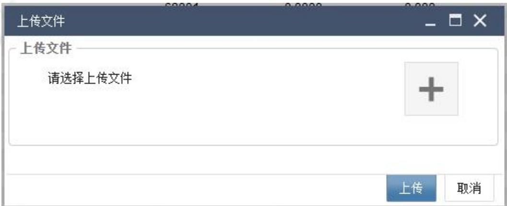

## 6.10. 组件

在仓库中的某些产品可能是由几个部分组成，并且必须一起发货的。例如客户可能要发计算机，而计算机是由笔记本电脑、外置光盘驱动器、鼠标、说明书、电脑包等组成，每个部分还作为独立SKU可以单独出库。FLUX WMS支持客户通过分辨组成产品属性和各组成部分的产品属性将多个产品组合在一起一同处理。 

如果在仓库和配送中心进行大量的装配、拆卸等工作，并且需要管理每个加工中心的活动时，产品组合的方式是不能够完全满足的。这时可以采用WMS的增值服务模块。 

## - 组件

在产品档案中先设置一个产品作为组装后的成品，并且在基础信息中，必须选中组合件标识，然后再设置该产品的组件形式（BOM） 

这种用来加工、组合的“零件”产品，就是子件，例如电脑包、说明书，或者XX洋酒、杯具组，组合后的产品被称为父件，例如计算机套装，或者洋酒礼盒。 

■ 在主菜单 “基础设置” 下选择 “组件” 功能。 

■ 点击【新增】按钮，在“详细信息”的“主信息”页签，依次输入以下信息： 

<table><tr><td rowspan="21">查询条件
客户编号
组件
组件描述(L)
组件描述(S)
活动标记
是
查询</td><td colspan="5">新增 复制 删除 打印 操作 导出 编辑</td><td colspan="4">详细信息 明细</td></tr><tr><td>客户编号</td><td>组件</td><td>版本号</td><td>组件描述(L)</td><td>组件描述(S)</td><td colspan="4">主信息 自定义 其他</td></tr><tr><td>D12345678</td><td>U3</td><td>0</td><td>U3</td><td>U3</td><td>客户编号</td><td>组件</td><td colspan="2">版本号</td></tr><tr><td>HIPANDA</td><td>0102008952-001...</td><td>0</td><td>女配色背心格子熊...</td><td>0102008952-001...</td><td>HIPANDA</td><td>0102008952-001951</td><td colspan="2">0</td></tr><tr><td>HIPANDA</td><td>01536322069363</td><td>1</td><td>女织带五角星棉衣</td><td>01536322069363</td><td colspan="2">组件描述(L)</td><td colspan="2">组件描述(S)</td></tr><tr><td>HIPANDA</td><td>100000000001</td><td>1</td><td>100000000001</td><td>100000000001</td><td colspan="2">女配色背心格子熊猫女配色背心格子熊猫女配色背心</td><td colspan="2">0102008952-001950</td></tr><tr><td>HIPANDA</td><td>2001</td><td>0</td><td>2001test</td><td>test</td><td>包装代码</td><td>费率</td><td>工序描述</td><td>来源系统</td></tr><tr><td>LQL</td><td>QQQ1212</td><td>0</td><td>QQQ1212</td><td>QQQ1212</td><td>STANDARD</td><td>...</td><td></td><td></td></tr><tr><td>TEST100</td><td>CAR</td><td>1</td><td>CAR</td><td>CAR</td><td rowspan="13">□包装材料标记</td><td rowspan="13" colspan="3">活动标记</td></tr><tr><td>TEST100</td><td>CAR</td><td>100</td><td>汽车</td><td>CARS</td></tr><tr><td>TEST100</td><td>CAR</td><td>2</td><td>CAR</td><td>CAR</td></tr><tr><td>TEST100</td><td>CAR</td><td>2222</td><td>CAR</td><td>CAR</td></tr><tr><td>TEST100</td><td>CAR</td><td>3</td><td>CAR</td><td>CAR</td></tr><tr><td>TEST100</td><td>FRUIT</td><td>0</td><td>FRUIT</td><td>FRUIT</td></tr><tr><td>TEST100</td><td>HY001</td><td>0</td><td>HY001</td><td>HY001</td></tr><tr><td>TEST100</td><td>T0001</td><td>0</td><td>T0001</td><td>IPHONE7</td></tr><tr><td>TEST100</td><td>WANYAO001</td><td>0</td><td>WANYAO001</td><td>WANYAO001</td></tr><tr><td>TEST100</td><td>WANYAO1005</td><td>0</td><td>WANYAO1005C</td><td>WANYAO1005D</td></tr><tr><td>TEST100</td><td>WANYAO2001</td><td>0</td><td>WANYAO_2001</td><td>WANYAO2001</td></tr><tr><td>TEST100</td><td>WANYAO900</td><td>0</td><td>WANYAO-900</td><td>KWBSKUKU01</td></tr><tr><td>WQ</td><td>WQSKU4</td><td>11</td><td>SKU4组件</td><td>WQSKU4</td></tr></table>

[图6-10-1]

客户编号 - 客户代码，必需是已经在客户档案中维护过的货主。 

组件 - 组装后成品的产品代码。同样需要是在产品档案中维护过，并且是组合件的产品。 

版本号 - 通常一个组件代码应表示唯一一套组合标准。但有些 ERP 管理要求，组件代码不变，内涵的子件组合有变动。通过版本号来区分相同组件 ID（父件 SKU），不同的实际子件组合（例如同一个洋酒礼盒，夏天的礼盒中的赠品是折扇，冬天赠品是毛巾，但礼盒的 SKU 代码不变）。版本号会记录到对应父件库存的批次属性 11 字段作为区分。版本信息只能通过接口获得，客户端不提供编辑修改。 

组件描述 - 父件的产品名称。系统提供母语（L）、外文（S）两个描述字段。 

包装代码 - 父件产品此加工组合后使用的包装模式。 

费率 - 完成一个加工工作应收的费用。 

工序描述 - 对该加工工序的简单说明。 

来源系统 - 通过接口下拉组件信息时的上游系统 

包装材料标志 - 标识该组合为耗材包装组合，组件作为包装使用。 

活动标记 - 选中 Y，则表示该组合方式继续存在、可以使用；否则，将无法对产品继续按照组合方式进行收货、发货等业务操作。 

■ 点击【保存】按钮，完成头信息新增操作。 

## ■ 点击明细页面的【新增】按钮

<table><tr><td>客户编号</td><td>组件</td><td>版本号</td><td>组件描述(L)</td><td>组件描述(S)</td></tr><tr><td>D12345678</td><td>U3</td><td>0</td><td>U3</td><td>U3</td></tr><tr><td>HIPANDA</td><td>0102008952-001...</td><td>0</td><td>女配色背心格子能...</td><td>0102008952-001...</td></tr><tr><td>HIPANDA</td><td>01536322069363</td><td>1</td><td>女织带五角星棉衣</td><td>01536322069363</td></tr><tr><td>HIPANDA</td><td>100000000001</td><td>1</td><td>100000000001</td><td>100000000001</td></tr><tr><td>HIPANDA</td><td>2001</td><td>0</td><td>2001test</td><td>test</td></tr><tr><td>LQL</td><td>QQQ1212</td><td>0</td><td>QQQ1212</td><td>QQQ1212</td></tr><tr><td>TEST100</td><td>CAR</td><td>1</td><td>CAR</td><td>CAR</td></tr><tr><td>TEST100</td><td>CAR</td><td>100</td><td>汽车</td><td>CARS</td></tr><tr><td>TEST100</td><td>CAR</td><td>2</td><td>CAR</td><td>CAR</td></tr><tr><td>TEST100</td><td>CAR</td><td>2222</td><td>CAR</td><td>CAR</td></tr><tr><td>TEST100</td><td>CAR</td><td>3</td><td>CAR</td><td>CAR</td></tr><tr><td>TEST100</td><td>FRUIT</td><td>0</td><td>FRUIT</td><td>FRUIT</td></tr><tr><td>TEST100</td><td>HY001</td><td>0</td><td>HY001</td><td>HY001</td></tr><tr><td>TEST100</td><td>TQ001</td><td>0</td><td>TQ001</td><td>IPHONE7</td></tr><tr><td>TEST100</td><td>WANYAO001</td><td>0</td><td>WANYAO001</td><td>WANYAO001</td></tr><tr><td>TEST100</td><td>WANYAO1005</td><td>0</td><td>WANYAO1005C</td><td>WANYAO1005D</td></tr><tr><td>TEST100</td><td>WANYAO2001</td><td>0</td><td>WANYAO_2001</td><td>WANYAO2001</td></tr><tr><td>TEST100</td><td>WANYAO900</td><td>0</td><td>WANYAO-900</td><td>KWB_SKU001</td></tr><tr><td>WQ</td><td>WQSKUJ4</td><td>11</td><td>SKU4组件</td><td>WQSKUJ4</td></tr></table>

[图6-10-2]

选择产品，系统显示对应描述；录入次序、数量，表示在组合中所用该产品零件的个数和顺序。其中在次序中输入数字，1 为最小。 

辅料标记在生鲜加工管理中使用，非严格比例组合的情况，例如一条鱼可以根据重量拆分成几分鱼肉产品，但鱼头鱼尾只有一份，不是根据原料重量按比例获得的。 

■ 点击【保存】按钮，完成以上操作。 

## 7. 仓库设置

## 7.1. 仓库设置概述

仓库设置，是用来定义仓库相关情况的功能，包括库位、库位组、库区等等与物理设施情况相关的信息，以便在操作、管理过程中，针对仓库情况进行对应的优化管理。 

## 7.2. 区域和库区

区域和库区是用于定义仓库内区域、库区和库区中设备的功能。通过区域、库区的设置能够便于仓库分区管理、更方便的查找库位。 

区域是库区的集合，它是仓库内物理位置、等级的划分，也是仓库下的一级物理划分层次，便于RF无线设备的现场管理。 

库区则是多个地点或库位的集合，是区域下的仓库二级物理划分层次，每个库位只在一个库区中。当您定义一个库区时，您可以把仓库定义为能够做任何活动。库区也是按照仓库中实际的划分而定义的，例如：理货区、拣选区、存储区等。 

## - 区域设置

■ 在主菜单“仓库设置”下选择“区域”。 

■ 点击【新增】按钮，在“主信息”页签依次输入以下信息： 

<table><tr><td colspan="5">主信息 自定义 其他</td></tr><tr><td colspan="5">仓库编号 区域编号 区域名称 区域名称</td></tr><tr><td colspan="5">DEMO FLUX FLUX 活动标记</td></tr></table>

FLUX WMS 用户手册 

## [图7-2-1]

仓库编号 - 区域所属仓库，新增记录时默认为当前登录的作业仓库，用户不可修改。即用户只能编辑本仓区域、库区信息。 

区域编号 - 区域代码。 

区域名称 - 区域的显示名称。 

活动标记 - 记录激活标记。 

■ 点击【保存】按钮，完成仓库区域创建操作。 

## - 库区设置

■ 在主菜单 “仓库设置” 下选择 “库区” 功能 

■ 在主信息页签，点击【新增】按钮，依次输入以下信息： 

FLUX WMS 库区

<table><tr><td>查询条件</td><td colspan="9">新增 复制 删除 打印 操作 导出 编辑 ...</td></tr><tr><td>仓库编号</td><td>仓库编号</td><td>所属区域</td><td>库区编号</td><td>库区名称</td><td colspan="5">主信息 自定义 其他</td></tr><tr><td>库存区域</td><td>NJ01</td><td>ZDFL2</td><td>FL-2-13-0W</td><td>2楼 13年</td><td>仓库编号</td><td>所属区域</td><td>库区编号</td><td>库区名称</td><td></td></tr><tr><td>库存区域</td><td>NJ01</td><td>ZDFL2</td><td>FL-2-13-KZ</td><td>2楼 13年</td><td>NJ01</td><td>ZDFL2</td><td>FL-2-14-0T</td><td>2楼 14年 T恤</td><td></td></tr><tr><td>库存区域</td><td>NJ01</td><td>ZDFL2</td><td>FL-2-13-YM</td><td>2楼 13年</td><td rowspan="31" colspan="5">库存区基点</td></tr><tr><td>库存区域</td><td>NJ01</td><td>ZDFL2</td><td>FL-2-14-0T</td><td>2楼 14年</td></tr><tr><td>库存区域</td><td>NJ01</td><td>ZDFL2</td><td>FL-2-14-0W</td><td>2楼 14年</td></tr><tr><td>库存区域</td><td>NJ01</td><td>ZDFL2</td><td>FL-2-14-KZ</td><td>2楼 14年</td></tr><tr><td>库存区域</td><td>NJ01</td><td>ZDFL2</td><td>FL-2-14-YM</td><td>2楼 14年</td></tr><tr><td>库存区域</td><td>NJ01</td><td>ZDFL2</td><td>FL-2-15-0T</td><td>2楼 15年</td></tr><tr><td>库存区域</td><td>NJ01</td><td>ZDFL2</td><td>FL-2-15-0W</td><td>2楼 15年</td></tr><tr><td>库存区域</td><td>NJ01</td><td>ZDFL2</td><td>FL-2-15-KZ</td><td>2楼 15年</td></tr><tr><td>库存区域</td><td>NJ01</td><td>ZDFL2</td><td>FL-2-15-MS</td><td>2楼 15年</td></tr><tr><td>库存区域</td><td>NJ01</td><td>ZDFL2</td><td>FL-2-15-YM</td><td>2楼 15年</td></tr><tr><td>库存区域</td><td>NJ01</td><td>ZDFL2</td><td>FL-2-16-4T</td><td>2楼 16年</td></tr><tr><td>库存区域</td><td>NJ01</td><td>ZDFL2</td><td>FL-2-17-4T</td><td>2楼 17年</td></tr><tr><td>库存区域</td><td>NJ01</td><td>ZDFL2</td><td>FL-2-17-4W</td><td>2楼 17年</td></tr><tr><td>库存区域</td><td>NJ01</td><td>ZDFL2</td><td>FL-2-17-7T</td><td>2楼 17年</td></tr><tr><td>库存区域</td><td>NJ01</td><td>ZDFL2</td><td>FL-2-35-MS</td><td>2楼 13~1</td></tr><tr><td>库存区域</td><td>NJ01</td><td>ZDFL2</td><td>FL-2-DD</td><td>二楼地堆</td></tr><tr><td>库存区域</td><td>NJ01</td><td>ZDFL2</td><td>FL-2-JD</td><td>二楼架顶</td></tr><tr><td>库存区域</td><td>NJ01</td><td>ZDFL3</td><td>FL-3-16-0T</td><td>3楼 16年</td></tr><tr><td>库存区域</td><td>NJ01</td><td>ZDFL3</td><td>FL-3-16-0W</td><td>3楼 16年</td></tr><tr><td>库存区域</td><td>NJ01</td><td>ZDFL3</td><td>FL-3-16-KW</td><td>3楼 16年</td></tr><tr><td>库存区域</td><td>NJ01</td><td>ZDFL3</td><td>FL-3-16-KZ</td><td>3楼 16年</td></tr><tr><td>库存区域</td><td>NJ01</td><td>ZDFL3</td><td>FL-3-16-MS</td><td>3楼 16年</td></tr><tr><td>库存区域</td><td>NJ01</td><td>ZDFL3</td><td>FL-3-16-YM</td><td>3楼 16年</td></tr><tr><td>库存区域</td><td>NJ01</td><td>ZDFL3</td><td>FL-3-17-0T</td><td>3楼 17年</td></tr><tr><td>库存区域</td><td>NJ01</td><td>ZDFL3</td><td>FL-3-17-0W</td><td>3楼 17年</td></tr><tr><td>库存区域</td><td>NJ01</td><td>ZDFL3</td><td>FL-3-17-KZ</td><td>3楼 17年</td></tr><tr><td>库存区域</td><td>NJ01</td><td>ZDFL3</td><td>FL-3-17-MS</td><td>3楼 17年</td></tr><tr><td>库存区域</td><td>NJ01</td><td>ZDFL3</td><td>FL-3-17-YM</td><td>3楼 17年</td></tr><tr><td>库存区域</td><td>NJ01</td><td>ZDFL3</td><td>FL-3-18-KZ</td><td>3楼 18年</td></tr><tr><td>库存区域</td><td>NJ01</td><td>ZDFL3</td><td>FL-3-DD</td><td>三楼地堆</td></tr><tr><td>库存区域</td><td>NJ01</td><td>ZDFL3</td><td>FL-3-JD</td><td>三楼架顶</td></tr></table>

[图 7-2-2]

仓库编号 - 区域所属仓库，新增记录时默认为当前登录的作业仓库，用户不可修改。即用户只能编辑本仓区域、库区信息。 

区域编号 - 该库区所在的区域，通过下拉菜单选择已设置好的区域，从而建立库区和区域的所属关系。 

库区编号 - 库区代码。 

库区名称 - 库区的显示名称。 

库区基点 - 特殊库位计算逻辑（就近库位）使用，通常情况下可跳过，不设置。如需配置，要在库位功能内，设置完成此库区下的库位信息，然后才能在这个字段的二级窗口中选择已存在的库位作为基点。 

整箱/拆零补货来源 - 主要用于非拣货库区，设置此库区的货物能否补货到拣货库区。例如同样是批量存储区，A 区是正常入库货物，可以被用来补货，但 B 区是退货入库货物，不能被用来补货到拣货区。同时，如果仓库内作业区细分，可以分别配置此库区货物，是否能够被用于整箱补货，是否能够被用于拆零补货。以便支持箱、件拣货位分别设置的不同业务需求。 

## 活动标记 - 激活标记

■ 点击【保存】按钮，完成库区创建操作。 

## - 其他

■ 就近库位逻辑： 

上架过程中，常有希望同类货物能够就近存放的要求（不是合并在同一个库位），但由于仓库库位是分布在立体空间的，特别是立库、多层托盘、隔板货架等仓库，哪些库位是“近”的，哪些是“远”的，需要对空间距离进行设置与计算。 

一方面，每个库位的 XYZ 坐标都需要进行设置。 

另一方面，在库区中需要指定一个库位作为基点（库区基点字段所设置的库位），以此库位作为三维坐标的零点，根据其他库位到此库位的空间距离，自动更新库位上架顺序。 

即根据到基点的空间距离远近，更新库位的上架排序，用以支持就近计算上架的业务逻辑。 

空间距离的计算，以每个库位的 XYZ 坐标，到基点库位的 XYZ 坐标的距离分别进行计算。 

## 7.3. 库位组

库位组是库位的组合或分类方式，与库区相比，库位组更加灵活，通常用于任务获取或者查询、报表使用，例如可以将巷道设置为库位组，可以配置每个库位属于哪一个巷道；或者同属一个传输线弹出口的多个巷道库位编入同一个库位组；一个独立活动货架设置为一个库位组等。现场可以根据业务情况需要设置不同的库位组划分逻辑。 

系统提供库位组 1，库位组 2 两个分组设置功能。在 “库位组” 功能中，可以定义库位组的名 

称，但具体如何应用这些库位组，则取决于后续的操作功能设置，详见各功能说明。 

## ● 库位组

■ 在主菜单“仓库设置”下选择“库位组一” 

■ 点击【新增】按钮，在主信息页签依次输入以下信息： 

<table><tr><td>查询条件</td><td colspan="8">新增 复制 删除 打印 操作</td></tr><tr><td>仓库编号</td><td>仓库编号</td><td>库位组1编号</td><td>库位组1名称</td><td></td><td></td><td></td><td></td><td></td></tr><tr><td>库位组1编号</td><td>TEST100</td><td>4321</td><td>4321</td><td></td><td></td><td></td><td></td><td></td></tr><tr><td rowspan="32">库位组1名称</td><td>TEST100</td><td>E23E</td><td>E23E</td><td></td><td></td><td></td><td></td><td></td></tr><tr><td>TEST100</td><td>G00</td><td>G00库位组</td><td></td><td></td><td></td><td></td><td></td></tr><tr><td>TEST100</td><td>LG002</td><td>LG002库位组</td><td></td><td></td><td></td><td></td><td></td></tr><tr><td>TEST100</td><td>SHOES</td><td>GXG_SHOES</td><td></td><td></td><td></td><td></td><td></td></tr><tr><td>TEST100</td><td>TEST</td><td>测试</td><td></td><td></td><td></td><td></td><td></td></tr><tr><td>WHTEST01</td><td>001</td><td>001</td><td></td><td></td><td></td><td></td><td></td></tr><tr><td>WHTEST01</td><td>002</td><td>002</td><td></td><td></td><td></td><td></td><td></td></tr><tr><td>WHTEST01</td><td>003</td><td>003</td><td></td><td></td><td></td><td></td><td></td></tr><tr><td>WHTEST01</td><td>004</td><td>004</td><td></td><td></td><td></td><td></td><td></td></tr><tr><td>WHTEST01</td><td>005</td><td>005</td><td></td><td></td><td></td><td></td><td></td></tr><tr><td>WHTEST01</td><td>006</td><td>006</td><td></td><td></td><td></td><td></td><td></td></tr><tr><td>WHTEST01</td><td>007</td><td>007</td><td></td><td></td><td></td><td></td><td></td></tr><tr><td>WHTEST01</td><td>008</td><td>008</td><td></td><td></td><td></td><td></td><td></td></tr><tr><td>WHTEST01</td><td>009</td><td>009</td><td></td><td></td><td></td><td></td><td></td></tr><tr><td>WHTEST01</td><td>010</td><td>010</td><td></td><td></td><td></td><td></td><td></td></tr><tr><td>WHTEST01</td><td>011</td><td>011</td><td></td><td></td><td></td><td></td><td></td></tr><tr><td>WHTEST01</td><td>012</td><td>012</td><td></td><td></td><td></td><td></td><td></td></tr><tr><td>WHTEST01</td><td>013</td><td>013</td><td></td><td></td><td></td><td></td><td></td></tr><tr><td>WHTEST01</td><td>014</td><td>014</td><td></td><td></td><td></td><td></td><td></td></tr><tr><td>WHTEST01</td><td>015</td><td>015</td><td></td><td></td><td></td><td></td><td></td></tr><tr><td>WHTEST01</td><td>016</td><td>016</td><td></td><td></td><td></td><td></td><td></td></tr><tr><td>WHTEST01</td><td>017</td><td>017</td><td></td><td></td><td></td><td></td><td></td></tr><tr><td>WHTEST01</td><td>018</td><td>018</td><td></td><td></td><td></td><td></td><td></td></tr><tr><td>WHTEST01</td><td>019</td><td>019</td><td></td><td></td><td></td><td></td><td></td></tr><tr><td>WHTEST01</td><td>020</td><td>020</td><td></td><td></td><td></td><td></td><td></td></tr><tr><td>WHTEST01</td><td>11111</td><td>11111</td><td></td><td></td><td></td><td></td><td></td></tr><tr><td>WHTEST01</td><td>2A01</td><td>2A01</td><td></td><td></td><td></td><td></td><td></td></tr><tr><td>WHTEST01</td><td>2A02</td><td>2A02</td><td></td><td></td><td></td><td></td><td></td></tr><tr><td>WHTEST01</td><td>2A03</td><td>2A03</td><td></td><td></td><td></td><td></td><td></td></tr><tr><td>WHTEST01</td><td>2A04</td><td>2A04</td><td></td><td></td><td></td><td></td><td></td></tr><tr><td>WHTEST01</td><td>2A05</td><td>2A05</td><td></td><td></td><td></td><td></td><td></td></tr><tr><td>WHTEST01</td><td>2A06</td><td>2A06</td><td></td><td></td><td></td><td></td><td></td></tr></table>

[图7-3-1]

仓库编号 - 库位组所属仓库，新增记录时默认为当前登录的作业仓库，用户不可修改。即用户只能编辑本仓范围内的信息。 

库位组 1 编号 - 库位组 1 的代码。 

库位组 1 名称 - 库位组 1 的名称描述。 

长度 - 用于挂装活动库位的上架计算过程中的长度信息维护，以库位组作为固定长度，组内的每个库位的容量是活动的。 

活动标记 - 是否使用中的库位组。 

■ 点击【保存】按钮，完成记录新增操作。 

■ 库位组二设置同库位组一，只是无长度维护。 

## 7.4. 工作区

为了方便任务分派，有些业务情况中会使用工作区划分来定义作业人员的分管片区。在库位设置中，可以设置库位从属的工作区。工作区与区域库区可以有交叉重叠，通常根据巷道划分、流水线弹出端口等进行定义。 

与库位组功能相比，工作区域更侧重于人员工作管理。 

## - 工作区

■ 在主菜单 “仓库设置” 下选择 “工作区”。 

■ 点击【新增】按钮，在“主信息”页签依次输入信息： 

<table><tr><td>查询条件</td><td colspan="8">工作区</td></tr><tr><td>仓库编号</td><td>仓库编号</td><td>工作区编号</td><td>工作区名称</td><td></td><td></td><td></td><td></td><td></td></tr><tr><td>工作区编号</td><td>NJ01</td><td>001</td><td>001</td><td></td><td></td><td></td><td></td><td></td></tr><tr><td>工作区名称</td><td>TEST100</td><td>12306</td><td>12306工作区</td><td></td><td></td><td></td><td></td><td></td></tr><tr><td rowspan="11">活动标记</td><td>TEST100</td><td>COKE_1</td><td>COKE_2</td><td></td><td></td><td></td><td></td><td></td></tr><tr><td>TEST100</td><td>DFDDFD</td><td>DFDDFD1</td><td></td><td></td><td></td><td></td><td></td></tr><tr><td>TEST100</td><td>G_WORKAREAL</td><td>G_工作区域1</td><td></td><td></td><td></td><td></td><td></td></tr><tr><td>TEST100</td><td>JKJKJLKJ</td><td>JKJKJLKJ</td><td></td><td></td><td></td><td></td><td></td></tr><tr><td>TEST100</td><td>QWQ11</td><td>12306工作区</td><td></td><td></td><td></td><td></td><td></td></tr><tr><td>TEST100</td><td>QWQWQQWQ</td><td>QWQW1</td><td></td><td></td><td></td><td></td><td></td></tr><tr><td>TEST100</td><td>WANYAO002</td><td>WANYAO002</td><td></td><td></td><td></td><td></td><td></td></tr><tr><td>TEST100</td><td>WARE</td><td>12306工作区</td><td></td><td></td><td></td><td></td><td></td></tr><tr><td>WHTEST01</td><td>11111</td><td>11111</td><td></td><td></td><td></td><td></td><td></td></tr><tr><td>WQ_ONLINE</td><td>M01</td><td>M01工作区</td><td></td><td></td><td></td><td></td><td></td></tr><tr><td>WQ_ONLINE</td><td>M02</td><td>M02工作区</td><td></td><td></td><td></td><td></td><td></td></tr></table>

[图7-4-1]

仓库编码 - 所属仓库代码。新增时默认取当前仓库。 

工作区编码 - 工作区代码 

工作区名称 - 工作区描述 

上架过渡库位/下架过渡库位 - 上架、拣货过程中的中转库位 

拣货作业模式 - 此工作区内适用的拣货操作模式。使用 RF 拣货导航功能时，根据任务的工作区，可以跳转到与拣货模式对应的拣货功能界面。系统提供订单拣货，波次合并拣货、电子标签拣货、电子标签播种、标签拣货、边拣边分的不同作业选项。 

补货作业模式 - 此工作区内适用的补货操作模式。系统提供一步补货、补货下架供选择。 

活动标记 - 使用中的工作区域 

■ 点击【保存】按钮，完成工作区创建操作。 

## 7.5. 库位

在收到货物，确认货物情况、数量（即收货确认）后，货物就被储存在仓库的某个库位，直到货主下达出库指令。 

库位是仓库最小存储对象单位。每个库位在物理上都应该有唯一的标识号，但系统设置的库位空间大小可以是弹性的，可根据使用情况修改设置。仓库中的库位设置还应按照仓库人员的实际操作而进行配置。 

## - 库位

■ 在主菜单 “仓库设置” 下选择 “库位”。 

■ 点击【新增】按钮，在“主信息”页签依次输入信息： 

<table><tr><td>查询条件</td><td>库存编号</td><td>库位编码</td><td>上架顺序</td><td>拣货顺序</td></tr><tr><td>仓库编号</td><td>2A01113</td><td>2A01113</td><td>2A01113</td><td></td></tr><tr><td>WHTEST01</td><td>2A01114</td><td>2A01114</td><td>2A01114</td><td></td></tr><tr><td>WHTEST01</td><td>2A01121</td><td>2A01121</td><td>2A01121</td><td></td></tr><tr><td>WHTEST01</td><td>2A01122</td><td>2A01122</td><td>2A01122</td><td></td></tr><tr><td>WHTEST01</td><td>2A01123</td><td>2A01123</td><td>2A01123</td><td></td></tr><tr><td>WHTEST01</td><td>2A01124</td><td>2A01124</td><td>2A01124</td><td></td></tr><tr><td>WHTEST01</td><td>2A01131</td><td>2A01131</td><td>2A01131</td><td></td></tr><tr><td>WHTEST01</td><td>2A01132</td><td>2A01132</td><td>2A01132</td><td></td></tr><tr><td>WHTEST01</td><td>2A01133</td><td>2A01133</td><td>2A01133</td><td></td></tr><tr><td>WHTEST01</td><td>2A01134</td><td>2A01134</td><td>2A01134</td><td></td></tr><tr><td>WHTEST01</td><td>2A01141</td><td>2A01141</td><td>2A01141</td><td></td></tr><tr><td>WHTEST01</td><td>2A01142</td><td>2A01142</td><td>2A01142</td><td></td></tr><tr><td>WHTEST01</td><td>2A01143</td><td>2A01143</td><td>2A01143</td><td></td></tr><tr><td>WHTEST01</td><td>2A01144</td><td>2A01144</td><td>2A01144</td><td></td></tr><tr><td>WHTEST01</td><td>2A01211</td><td>2A01211</td><td>2A01211</td><td></td></tr><tr><td>WHTEST01</td><td>2A01212</td><td>2A01212</td><td>2A01212</td><td></td></tr><tr><td>WHTEST01</td><td>2A01213</td><td>2A01213</td><td>2A01213</td><td></td></tr><tr><td>WHTEST01</td><td>2A01214</td><td>2A01214</td><td>2A01214</td><td></td></tr><tr><td>WHTEST01</td><td>2A01221</td><td>2A01221</td><td>2A01221</td><td></td></tr><tr><td>WHTEST01</td><td>2A01222</td><td>2A01222</td><td>2A01222</td><td></td></tr><tr><td>WHTEST01</td><td>2A01223</td><td>2A01223</td><td>2A01223</td><td></td></tr><tr><td>WHTEST01</td><td>2A01224</td><td>2A01224</td><td>2A01224</td><td></td></tr><tr><td>WHTEST01</td><td>2A01231</td><td>2A01231</td><td>2A01231</td><td></td></tr><tr><td>WHTEST01</td><td>2A01232</td><td>2A01232</td><td>2A01232</td><td></td></tr><tr><td>WHTEST01</td><td>2A01233</td><td>2A01233</td><td>2A01233</td><td></td></tr><tr><td>WHTEST01</td><td>2A01234</td><td>2A01234</td><td>2A01234</td><td></td></tr><tr><td>WHTEST01</td><td>2A01241</td><td>2A01241</td><td>2A01241</td><td></td></tr><tr><td>WHTEST01</td><td>2A01242</td><td>2A01242</td><td>2A01242</td><td></td></tr><tr><td>WHTEST01</td><td>2A01243</td><td>2A01243</td><td>2A01243</td><td></td></tr><tr><td>WHTEST01</td><td>2A01244</td><td>2A01244</td><td>2A01244</td><td></td></tr><tr><td>WHTEST01</td><td>2A01311</td><td>2A01311</td><td>2A01311</td><td></td></tr><tr><td>WHTEST01</td><td>2A01312</td><td>2A01312</td><td>2A01312</td><td></td></tr></table>

[图7-5-1]

仓库编码 - 所属仓库代码。新增时默认取当前仓库。 

库位编码 - 库位的代码 ID。在同一仓库中不可重复，一般由字母或数字组成。通常建议库位编码组合中可以体现库位所属区域、库区信息，例如“区域-库区-巷道-列-位置-层”，连续数字或字母间通过连接符分隔便于人工辨识，例如“Z1A01-001A1”，整体 ID 不宜过长，超过 20 位情况下不利于人工辨识，条码过长也容易导致扫描读取困难。 

上架顺序 - 上架流程中，系统遵循的库位逻辑排序。在此字段中输入库位的排序等级或用于排序的内容，缺省值同库位 ID。在许多情况下，不是按照库位 ID 字段来依次上架到库位，而采用独立的排序进行作业排序，这样有利于仓库内在已有库存的情况下对库内作业动线布局等进行调整，同时又无需变更实际物流位置的编号 ID，无需进行库存移动。 

拣货作业顺序 - 出库流程中，系统遵循的库位逻辑顺序，在此字段中输入库位的排序等级或用于排序的内容，缺省值同库位 ID。为了支持入库、出库操作，作业动线不同的业务场景，系统提供上架顺序、拣货顺序 2 个字段分别配置排序。如果没有特殊作业需求，可使用相同的字段内容统一排序。 

库位使用 - 库位的使用方式，系统提供多种库位使用方式供用户选择，例如箱拣货库位、件拣货库位、箱/件拣货库位、存储库位、过渡库位、理货站、组装工作区等。 

库位属性 - 分别为正常、封存、管控和禁入，根据库位属性，系统进行相关控制（具体控制详见后续介绍）。 

库位类型 - 描述物理库位类型。如分为地面平仓、重力式货架、货架和窄巷道货架等。客户可以根据自身的情况在系统代码中添加所需要的库位类型。 

库位处理 - 识别在库位中将存放的产品包装的类型。系统提供以下 3 种类型：仅限于箱、仅限于托盘和其他。 

库存环境 - 开放编辑字段，用于记录对库位的环境描述，如冷冻等。 

周转需求 - 库位的周转类型，如快速周转、中速周转和慢速周转。通常与产品 ABC 分级配合使用，快速周转的货品放在最方便拣取的快速周转的库位。 

库区 - 库位所属库区。 

区域 - 库位所属区域。非编辑字段，根据库位所属库区，相应显示。资料配置时，通常是先配置区域、库区，再配置库位信息。 

校验码 - 操作库位确认时，可通过扫描校验码确认库位，而不是仅仅根据库位 ID，避免人工输入库位 ID 而与实际操作库位不一致。 

库位组（1、2）- 下拉列表选择库位所属的库位组名称。 

工作区 - 库位所属工作，任务调度时使用，可将仓库划分为多个工作区，分块指派任务， 

使用不同的操作功能。 

设备端口（1、2）-库位对应的输送线端口，方便规划哪些库位的任务箱，从某个端口弹出。下拉列表内容在“分拣口”功能中维护。由于入库操作与出库操作动线不同，同一个库位在不同业务流中对应的端口号不同，因此系统提供2个端口号字段，以便分别应用与入库作业流程、出库作业流程。 

巷道号 - 库位所属巷道，通常用于 ASRS 自动化仓库巷道任务平衡计算。 

允许混放产品 - 是否允许同一库位混合放置多个产品。 

允许混放批次 - 是否允许同一库位混合放置同一产品的不同批次。 

忽略 ID - 当选中时，从被移进库位的所有货物信息中除去跟踪号信息。 

注: 

跟踪号是可移动的单件/托盘的标识，一般为托盘号、箱号或产品序列号等。一个跟踪号需要在收货、分拣、和发货的过程中应用。它提供了整个设施中产品运作的参考数目，同时也简化了查找和其它 RF（无线电射频）的处理。 

但有些操作情况中，入库时需要根据跟踪号进行操作，而出库时不要求按跟踪号出库，此时可以启用忽略 ID，能够简化出库操作，不需要拣取指定跟踪号货物。 

■ 在“控制信息”页签，根据管理需要，依次输入信息： 

<table><tr><td>主信息</td><td>控制信息</td><td>自定义</td><td>其他</td></tr><tr><td colspan="4">限制</td></tr><tr><td>体积限制</td><td>重量限制</td><td>箱数限制</td><td>数量限制</td></tr><tr><td></td><td></td><td></td><td></td></tr><tr><td>托盘限制</td><td colspan="3">SKU种类限制</td></tr><tr><td></td><td></td><td></td><td></td></tr><tr><td colspan="4">尺寸</td></tr><tr><td>长度</td><td>宽度</td><td>高度</td><td></td></tr><tr><td></td><td></td><td></td><td></td></tr><tr><td colspan="4">坐标</td></tr><tr><td>X坐标</td><td>Y坐标</td><td>Z坐标</td><td>层数</td></tr><tr><td></td><td></td><td></td><td></td></tr><tr><td>货架排</td><td>货架列</td><td>X像素</td><td>Y像素</td></tr><tr><td></td><td></td><td></td><td></td></tr></table>

[图7-5-2]

限制部分： 

库位的总体积限制、总重量限制、可存储箱数、数量限制、托盘数量和 SKU 种类限制。输入对应的限制数值，系统在根据上架规则计算、查找合适的上架库位时，会根据限制数值判断货物是否能够存放入该库位，从而指导仓库上架操作。 

但在实物操作时，系统不会根据这些限制数量，不允许作业人员进行上架确认。 

✨ 尺寸部分： 

尺寸 - 库位的长、宽、高尺寸，同样可作为上架计算时的判断依据。 

☆ 坐标部分： 

库位的 X、Y、Z 坐标和层数，空间定位信息，多用于自动化仓库，在库位就近逻辑计算中也有使用。 

在图形化配置时，通过 XYZ 坐标影响到色块所在的界面显示位置，Z 坐标对应图形化界面的“排号”（非 3D 立体界面，分层显示） 

X、Y 象素，图形化界面配置使用，控制代表库位的色块长、宽。 

## 配置效果如下：

<table><tr><td>主信息</td><td>控制信息</td><td>自定义</td><td>其他</td></tr><tr><td colspan="4">限制</td></tr><tr><td>体积限制</td><td>重量限制</td><td>箱数限制</td><td>数量限制</td></tr><tr><td></td><td></td><td></td><td></td></tr><tr><td>托盘限制</td><td colspan="3">SKU种类限制</td></tr><tr><td></td><td></td><td></td><td></td></tr><tr><td colspan="4">尺寸</td></tr><tr><td>长度</td><td>宽度</td><td>高度</td><td></td></tr><tr><td></td><td></td><td></td><td></td></tr><tr><td colspan="4">坐标</td></tr><tr><td>X坐标</td><td>Y坐标</td><td>Z坐标</td><td>层数</td></tr><tr><td></td><td></td><td></td><td></td></tr><tr><td>货架排</td><td>货架列</td><td>X像素</td><td>Y像素</td></tr><tr><td></td><td></td><td></td><td></td></tr></table>

[图 7-5-3]

■ 点击【保存】按钮，完成新增记录操作。 

## - 其他

■ 库位使用说明： 

存储库位：批量存储库位，或普通存储位。通常不分区拣货时，可直接用于拣货。具体取决与预配、分配规则设置。 

件拣货库位：只允许用来对产品以件为单位直接拣货的库位；即分配订单时，可以做到整箱从箱拣货库位拣取，不满箱的单件从件拣货库位拣取的分区拣货操作。 

箱拣货库位：只允许用来分拣整箱货品的库位；即分配订单时，可以做到整箱从箱拣货库位拣取，不满箱的单件从件拣货库位拣取的分区拣货操作。 

箱/件合并拣货库位：即可以做箱拣货位，也可以做件拣货位 

过渡库位：操作过程中临时使用的库位。收货到过渡库位才会产生上架任务。 

理货站：出库流程中，用来分流订单或者集合订单货物的待出库库位。 

组装工作区：用于加工操作指定库位，不参与订单分配 

快拣补货位：用于基于订单产生的、后续会被整箱分配的补货任务，补货计算到快拣补货位，后续优先从快拣补货位整箱分配，提高作业速度。 

补充拣货位：拣货位管理情况下，大批量货物出库时由于拣货位容量有限，有可能一次补货不能满足订单需求。此时可另设补充拣货位。补货时按订单需求，进位取整箱补货（多订单合计需求2.5箱，补货3箱），优先将标准补货位补满，剩余货物计算补货到补充拣货位。订单优先分配使用补充拣货位库存。 

■ 快拣补货位与补充拣货位的异同： 

区别 

快拣补货位是以提高拣货效率为目标，订单需求的满整箱数量优先补货到快拣补货位 

补充拣货位是以临时扩展拣货位为目标，补货优先补货到固定拣货位，订单需求仍然不能满足时才临时征用补充拣货位 

## 共同点

库存优先分配。库位要达到波次拣货完毕后清空的效果。 

都是订单驱动时才可能补货，定时补不会考虑。 

库位属性说明： 

正常：正常库位，可被用于入库、出库、补货等各种操作。 

封存：不可使用库位，不参与移动、上架、补货等操作。常用于库位临时损坏时进行屏蔽。 

管控：部分权限库位。可用于入库、上架计算、移动，但不能正常分配其中的库存。如果订单明细指定从此类库位分配，仍旧允许分配。 

禁入：不可将库存加入，如收货、移库入、补货入等。但可以从此库位提取库存，如分配出库、补货出、移库出等。 

## - 鼠标右键菜单

在导航列表窗口部分，点击鼠标右键可见右键菜单。 

批量复制信息 - 用于批量更新已有库位的设置信息内容。按一定查询条件查询记录，选择一行记录作为基础记录，修改所需字段内容并保存后，点击鼠标右键选择“批量复制信息”功能，系统显示如下复制字段选择二级窗口。勾选需要批量复制信息的字段，确认，系统把对应字段内容复制到当前查询到的全部库位记录。 

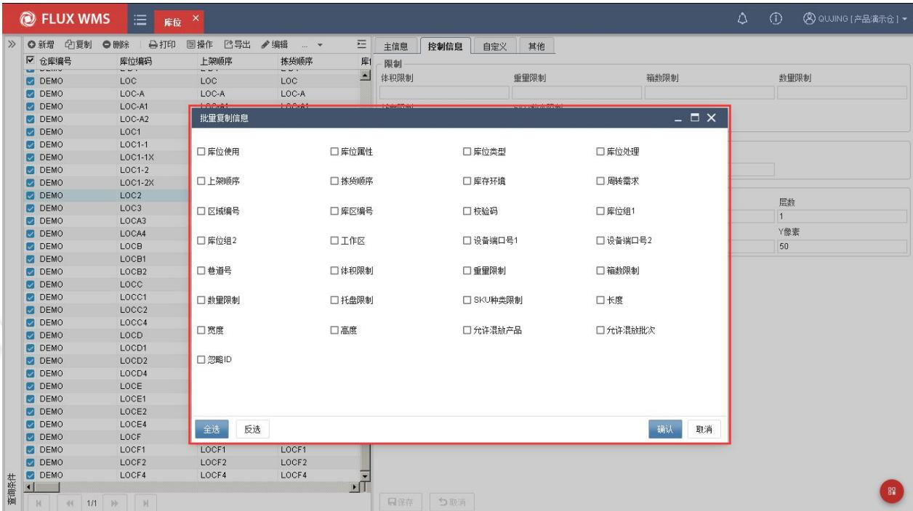

[图 7-5-4]

## 7.6. 路线

路线本意是指从一地到另一地所经过的道路。但在物流行业中，常常将多个目的地规划为不同 运输路线，以便同一运输车辆可以一次经过多点，达到效益最大化的目的。合理的运输路线规划需要考虑到路程、车辆、成本、装卸等众多因素，也往往是运输服务的核心考量之一。 

仓储服务中，经常需要配合运输路线，规划货物的装载，例如不同路线地点的货物不能装载到同一辆车上；在车辆最后抵达的终点站卸车的货物，在仓库发货装载时应最先装车。因此仓库在拣货过程中，也常将同一线路的订单、货物集货在一起，以便安排装车发运。 

在按路线集货的作业模式中，有些仓库规模较大，常有多路线、多集货区的情况。有些路线货物量波动较大，旺季、淡季所需集货区面积差别较大，此时最好集货区可以灵活调配给不同的路线。也有的仓库，为多路线服务，按时段分批操作。因此系统需要支持到路线、集货区的多对多匹配。 

维护后的路线、集货区对应，将在分配环节，计算对应集货位时使用，以便为订单货物找到合适的集货位，与其运输路线要求相匹配。 

## - 路线设置

■ 在主菜单“仓库设置”下选择“路线”。 

■ 点击【新增】按钮，下拉选择已维护的路线代码，并选择对应的集货区。 

<table><tr><td>仓库编号</td><td>路线</td><td>集货区</td><td>自定义01</td></tr><tr><td>DIAS</td><td></td><td>DT1-1</td><td></td></tr><tr><td>TEST100</td><td>长沙</td><td>长沙TEST</td><td></td></tr><tr><td>TEST100</td><td>武汉</td><td>02</td><td></td></tr><tr><td>TEST100</td><td></td><td>DDD1库区</td><td></td></tr><tr><td>TEST100</td><td></td><td>DDD1库区</td><td></td></tr><tr><td>TEST100</td><td></td><td>DDD1库区</td><td>121</td></tr><tr><td>TEST100</td><td></td><td>DDD1库区</td><td></td></tr><tr><td>TEST100</td><td></td><td>DDD1库区</td><td>qw</td></tr><tr><td>TEST100</td><td></td><td>长沙TEST</td><td></td></tr><tr><td>WHTEST01</td><td>长沙</td><td></td><td></td></tr><tr><td>WHTEST01</td><td></td><td></td><td></td></tr><tr><td>WHTEST01</td><td></td><td></td><td></td></tr><tr><td>WHTEST01</td><td></td><td></td><td></td></tr><tr><td>WQ_ONLINE</td><td></td><td>EMS理货区</td><td></td></tr></table>

[图7-6-1]

■ 所供选择的路线，需要提前在系统代码-路线代码（ROU_COD）中维护；集货区，则取自库位使用是“理货站”类型的库位所属的库区。 

## 7.7. 月台

月台，即装卸货所用的操作平台，由于不同月台对应的仓库门不同，货物的搬运路线也会有所不同。因此在系统中进行装卸车管理时，需要对月台或者说仓库门进行规划，以便在提高月台利用率的同时，减少仓库内交叉搬运的工作量。 

在基础设置中，需要预先定义仓库内月台的相关信息，以便月台调度使用。 

## ● 月台设置

■ 在主菜单“仓库设置”下选择“月台”。 

■ 点击【新增】按钮，在“主信息”页签依次输入信息： 

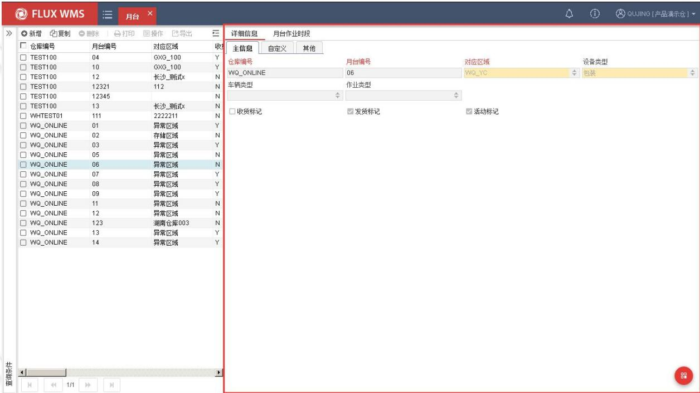

[图7-7-1]

仓库编号 - 月台所属仓库。默认为当前登录仓库。 

月台编号 - 月台代码。 

对应区域 - 月台对应或邻近的操作区域（基础设置区域）。 

设备类型 - 月台对应设备类型，在系统代码 DCK_EQP_TYP 中维护下拉列表内容 

车辆类型 - 月台对应设备类型，在系统代码 VEH_TYP 中维护下拉列表内容 

作业类型 - 月台对应作业类型，在系统代码 DCK_OPR_TYP 中维护下拉列表内容 

收货标记 - 月台是否允许收货。 

发货标记 - 月台是否允许发货。 

活动标记 - 月台是否可使用。 

■ 点击【保存】按钮，完成设置操作。 

## 7.8. 设备

设备指的是仓库内部操作用的机械设施，例如叉车、堆高机等。FLUX WMS 提供的设备功能，主要用于记录仓库内设备信息。同时可对设备管理、作业管理进行支持。 

## ● 设备设置

■ 在主菜单“仓库设置”下选择“设备”。 

■ 点击【新增】按钮，在“主信息”页签依次输入信息： 

<table><tr><td>主信息</td><td>自定义</td><td>其他</td><td></td></tr><tr><td>仓库编号</td><td>设备ID</td><td>设备名称</td><td>设备类型</td></tr><tr><td>设备型号</td><td>采购日期</td><td>区域编号</td><td>载重</td></tr><tr><td>作业高度</td><td colspan="3"></td></tr></table>

[图7-8-1]

仓库编号 - 设备所属仓库。默认为当前登录仓库。 

设备 ID - 设备的代码。 

设备名称 - 设备名称描述。 

设备类型 - 设备类型信息（系统代码 EQP_TYP）。 

设备型号 - 设备型号信息。 

采购日期 - 设备采购时间信息。 

作业区域 - 设备的作业区域信息（基础设置区域）。 

载重 - 设备的载重信息。 

作业高度 - 设备的作业高度信息。 

■ 点击【保存】按钮，完成设置操作。 

## 7.9. 分拣口

分拣口，指的是使用自动化传送设备的仓库中，设备弹出的端口。现场作业中，分拣口可能与路线绑定，也可能根据作业量情况调整路线设置，因此系统提供独立功能进行配置。 

- 分拣口设置 

■ 在主菜单“基础设置”下选择“分拣口”。 

■ 点击【新增】按钮，在“主信息”页签依次输入信息： 

<table><tr><td colspan="2">FLUX WMS</td><td colspan="9">分拣口</td></tr><tr><td colspan="2">查询条件</td><td colspan="9">新增 复制 删除 打印 操作 导导</td></tr><tr><td colspan="2">仓库编号</td><td rowspan="5" colspan="9">仓库编号 分拣线端口 活动标记 匹</td></tr><tr><td colspan="2">DEMO</td></tr><tr><td colspan="2">分拣线端口</td></tr><tr><td colspan="2">线路</td></tr><tr><td colspan="2">活动标记</td></tr><tr><td colspan="2">... 查询</td><td colspan="9"></td></tr></table>

[图7-9-1]

仓库编号 - 分拣口所属仓库。默认为当前登录仓库。 

分拣线端口 - 输送线弹出端口的端口号 

最大箱量 - 当分拣口待执行弹出箱量已达到此上限值情况下，该分拣口的订单/箱允许分配到其他分拣口。 

匹配路线 - 作业模式二选一选择项。分拣口与路线绑定，对应路线的货物/包裹从此分拣口弹出。 

负载均衡 - 作业模式二选一选择项。根据传输量，多个分拣口平均作业量，执行负载均衡计算。 

活动标记 - 分拣口是否启用 

■ 点击【保存】按钮，完成头信息新增操作 

## - 分拣口路线配置

■ 选择 “路线” 页签，系统显示如下，为当前分拣口指定路线配置 

<table><tr><td colspan="101">FLUX WMS</td></tr><tr><td colspan="100">查询条件</td><td></td></tr><tr><td rowspan="2" colspan="98">仓库编号</td><td></td><td></td><td></td></tr><tr><td></td><td></td><td></td><td></td><td></td><td></td><td></td><td></td><td></td><td></td><td></td><td></td><td></td><td></td><td></td><td></td><td></td></tr><tr><td colspan="94">DEMO</td><td></td><td></td><td></td><td></td><td></td><td></td><td></td></tr><tr><td colspan="90">分拣线端口</td><td></td><td></td><td></td><td></td><td></td><td></td><td></td><td></td><td></td><td></td><td></td></tr><tr><td colspan="86">线路</td><td></td><td></td><td></td><td></td><td></td><td></td><td></td><td></td><td></td><td></td><td></td><td></td><td></td><td></td><td></td></tr><tr><td colspan="83">活动标记</td><td></td><td></td><td></td><td></td><td></td><td></td><td></td><td></td><td></td><td></td><td></td><td></td><td></td><td></td><td></td><td></td><td></td><td></td></tr><tr><td colspan="5">...</td><td colspan="74">查询</td><td></td><td></td><td></td><td></td><td></td><td></td><td></td><td></td><td></td><td></td><td></td><td></td><td></td><td></td><td></td><td></td><td></td><td></td><td></td><td></td><td></td><td></td></tr></table>

[图7-9-2]

■ 点击【新增】按钮，系统在主信息页签显示仓库编号、分拣口编号，根据需要选择线路，然后点击【保存】按钮，记录保存成功，显示到上方列表窗口 

注：一个分拣口，可对应多条路线，通常是这些路线货物可以一同运输，或者后续作业有按路 

线进一步分拣等操作。 

## 7.10. 堆垛机

自动化仓库中，堆垛机是关键设备之一，通常有自有 WCS 进行管控，WMS 通过接口与 WCS 进行交互，下达任务从而驱动堆垛机进行作业。但在日常作业过程中，有时由于堆垛机设备原因，某个巷道的任务暂时无法执行，例如设备检修养护等，此时需要通过设置告知系统，任务下达时避让此巷道，因此在 WMS 中也具有堆垛机设置功能。 

## - 堆垛机设置

■ 在主菜单 “仓库设置” 下选择 “堆垛机” 功能。 

■ 点击【新增】按钮，在详细信息部分的“主信息”页签，可以人工维护或者通过接口获取每个堆垛机的当前作业状态，并保存。 

<table><tr><td colspan="2">FLUX WMS</td><td colspan="8">堆垛机</td></tr><tr><td colspan="2">查询条件</td><td colspan="8">新增 复制 删除 打印 操作 导出</td></tr><tr><td colspan="2">仓库编号</td><td colspan="8">仓库编号 堆垛机编号 状态</td></tr><tr><td colspan="2">DEMO</td><td colspan="8"></td></tr><tr><td colspan="2">堆垛机编号</td><td colspan="8"></td></tr><tr><td colspan="2">状态</td><td colspan="8"></td></tr><tr><td colspan="2">查询</td><td colspan="8"></td></tr></table>

[图7-10-1]

■ 系统提供正常、禁入、禁出、堆垛机故障 4 种状态情况供选择。 

## 7.11. 播种墙

日常使用的电子标签播种，波次复核播种，入库播种，动态播种等各种播种作业操作，所使用的播种墙、播种库位信息，在“播种墙”功能中进行维护，除了播种位ID等日常信息，还需要对播种位的X/Y坐标、显示顺序等信息进行维护，以便图形化显示使用。 

## - 播种墙设置

■ 在主菜单 “仓库设置” 下选择 “播种墙” 功能。 

■ 点击【新增】按钮，在详细信息部分的“主信息”页签，维护播种墙相关信息，如代码、名称、层数、列数，新增信息默认非激活。 

<table><tr><td colspan="3">仓库编号</td><td>播种墙代码</td><td>播种墙类型</td><td>播种墙名称</td></tr><tr><td colspan="3">DIAS</td><td colspan="2">STANDARD</td><td>STANDARD</td></tr><tr><td colspan="3">播种墙层数</td><td colspan="3">播种墙列数</td></tr><tr><td colspan="3">4</td><td>3</td><td colspan="2">活动标记</td></tr></table>

[图7-11-1]

仓库编号 - 播种墙所属仓库。默认为当前登录仓库。 

播种墙代码 - 播种墙 ID。 

播种类型 - 下拉列表选择，即播种墙货格数限定，后续所配置的播种墙明细播种位格，不能超过类型对应的格数上限。 

播种墙名称 - 名称描述。 

播种墙层数 - 播种墙层数信息。 

播种墙列数 - 播种墙列数信息。 

活动标记 - 是否使用中的记录。新增保存时，默认不勾选。完成明细播种位配置后，再勾选为活动状态。系统同时校验明细播种位个数是否超过类型要求的播种位个数上限。 

■ 主信息保存后，在“明细”页签，进一步维护如下播种库位的相关信息 

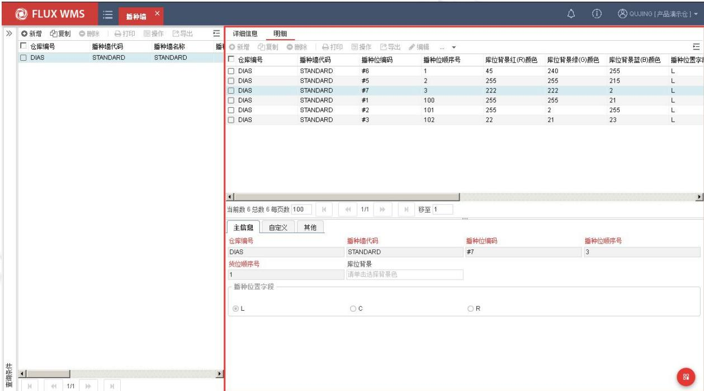

[图7-11-2]

仓库编号 - 默认当前仓库编号代码。不可修改。 

播种墙代码 - 播种库位所属的播种墙 ID，不可修改。 

播种位编码 - 播种位代码 ID，即播种货格代码。 

播种位顺序号 - 播种位绑定次序。例如订单优先绑定播种墙中部、最方便作业的播种位，后续订单再绑定上层、下层播种位，绑定四角距离较远的播种位。绑定顺序，可以与纵向、横向的位置显示顺序不同。 

货位顺序号 - 播种位在图形化界面的显示顺序配置。 

库位背景 - 点击后显示颜色控件，可以选择播种位背景色。 

播种位置字段 - 播种库位所属左、中、右片区选择，播种时界面会显示相应的方向指示箭头。 

■ 点击【保存】按钮，完成播种位维护 

## 7.12. 员工

登录系统的操作用户，需要在权限管理模块中维护。但另一部分，不直接操作系统的员工，而与业务相关的，可以在员工功能中进行维护。例如货主对应的业务担当，入库单、出库单对应的业务担当，可以在员工中进行维护，方便仓库作业人员在需要的时间能够找到对应的内部业务联系人。 

## - 员工设置

■ 在主菜单 “基础设置” 下选择 “仓库员工”。 

■ 点击【新增】按钮，在如下图的“主信息”页签依次输入工号、名称、电话等信息。 

<table><tr><td>主信息</td><td>自定义</td><td>其他</td><td></td></tr><tr><td>仓库编号</td><td>员工编号</td><td>员工名称</td><td>部门</td></tr><tr><td>DEMO</td><td>TR</td><td>TR</td><td></td></tr><tr><td>小组</td><td>邮箱地址</td><td>分机</td><td>电话</td></tr><tr><td>转移组</td><td></td><td></td><td></td></tr><tr><td>职位</td><td></td><td></td><td></td></tr><tr><td></td><td></td><td></td><td></td></tr></table>

[图7-12-1]

■ 点击【保存】按钮，完成仓库员工记录新增。 

## 8. 业务规则

## 8.1. 业务规则概述

业务规则是 FLUX WMS 中非常复杂和优异的部分，是系统在处理仓库业务时所遵循的、关于商品或使用者的运算规律，也是系统后台逻辑最为复杂的部分。在我们理解和运用系统前，必须了解业务规则如何引导整个仓库管理系统的运作。 

业务规则主要有： 

■ 上架规则 

用户能够通过设置不同的上架规则，使系统为不同产品推荐所需要的存储库位。 

库存周转规则 

负责控制库存周转的计算规则。 

■ 预分配规则 

负责库存预留的规则。 

■ 分配规则 

负责库存拣选的规则。 

■ 补货规则 

动态补货情况下系统进行拣货库位选择的规则。 

■ 质检规则 

根据入库单证生成质检单据时，产品应检数量计算规则。 

■ 流水号规则 

系统内部各种订单号、序列号等的生成规则。 

定时任务规则 

系统定时执行处理的控制规则 

■ 波次计划规则 

系统定时生成波次计划所遵循的规则。 

■ 自动发运规则 

订单自动发运规则配置 

■ 路线规则 

不同路线，承运、业务量分配规则 

■ 配送规则 

不同承运人的配送单运单号计算规则 

■ 单证控制规则 

不同类型单证的操作管理规则。 

任务派发规则 

工作任务下达指派和控制的规则。 

■ 序列号规则 

## 序列号校验逻辑规则

业务规则是实现仓库个性化服务和工作自动化的基础。业务规则管理不同的工作流，保证任务的及时指派和作业优化。 

业务规则是客户、产品和订单层次的，其优先级也逐步上升，也就是说订单层次指派的规则优先于产品层次指派的规则，而产品层次指派的业务规则优先于客户层次指派的规则。 

FLUX WMS 充分考虑客户的各种需求，制定的业务规则的层次，最大程度保证了业务系统的灵活性。 

除了各类业务规则，在这个大模块中，还包含一些对业务流程有影响的配置功能，例如系统参数配置，界面字段显示、默认值配置，打印数据源配置等。通常情况下，此类配置作为系统应用的整体设置，先期进行配置。 

## 8.2. 上架规则

我们已经定义了仓库中必需的信息(区域、库位、体积、空间、产品等)，所以能够根据客户产品需要或者现场管理要求，创建一个决定产品在仓库中如何摆放的业务管理规则，称之为上架规则。每一个客户或产品可以分别定义对应的上架规则。 

由于同一产品在不同仓库内的存储布局要求有可能不同，因此在进行上架规则配置时，可以为每个仓库分别配置上架规则。所需上架规则，在业务规则中预先维护好具体要求内容。 

遵循上架规则执行上架计算，需要的前提是产品配置为系统计算库位（不能是人工指定库位），并且收货库位是过渡库位。否则系统视为人工收货到存放库位，无需系统进行上架计算、推荐库位。 

## 8.2.1. 上架规则设置

在上架规则中有两个基本部分: 

## - 详细信息

<table><tr><td colspan="2">FLUX WMS</td><td colspan="8">上架规则</td></tr><tr><td colspan="2">查询条件</td><td colspan="8">新增 复制 删除 打印 操作 导号</td></tr><tr><td colspan="2">仓库编号</td><td rowspan="4">仓库编号</td><td rowspan="4">规则代码</td><td rowspan="4" colspan="6">规则描述</td></tr><tr><td colspan="2">DEMO</td></tr><tr><td colspan="2">规则代码</td></tr><tr><td colspan="2">规则描述</td></tr><tr><td colspan="2">客户编号</td><td colspan="8">N1-N1-ROUP</td></tr><tr><td>...</td><td>查询</td><td colspan="8"></td></tr></table>

[图8-2-1]

上架规则除了代码、描述之外，还需要指定此规则适用的仓库。新增时，系统自动默认当前登录仓库。客户代码字段内容仅用于备注，如果规则适用于多个货主，客户代码字段可以不指定。 

## - 明细

它说明了 FLUX WMS 系统如何评估这一产品和一系列用来挑选合适的库位时的约束条件。系统按一定的步骤来评估每一产品。 

<table><tr><td>查询条件</td><td colspan="10">新增 复制 删除 打印 操作 导三</td></tr><tr><td>仓库编号</td><td>仓库编号</td><td>规则代码</td><td colspan="8">规则描述</td></tr><tr><td>DEMO</td><td>N1</td><td colspan="9">N1-0ROUP</td></tr><tr><td>规则代码</td><td></td><td></td><td></td><td></td><td></td><td></td><td></td><td></td><td></td><td></td></tr><tr><td>规则描述</td><td></td><td></td><td></td><td></td><td></td><td></td><td></td><td></td><td></td><td></td></tr><tr><td>客户编号</td><td></td><td></td><td></td><td></td><td></td><td></td><td></td><td></td><td></td><td></td></tr><tr><td>... 查询</td><td></td><td></td><td></td><td></td><td></td><td></td><td></td><td></td><td></td><td></td></tr></table>

[图8-2-2]

FLUX WMS 在评估和执行上架规则时，考虑的先后次序是： 

■ 按行号的次序依次选择（新增记录时，行号可编辑，方便用户调整次序）生效的规则明细行。 

根据订单类型、包装级别、产品循环级别、批次属性等条件，决定是否遵循此行规则。如果条件不符，则跳过此行，查看下一行规则明细。 

■ 根据规则代码，来决定如何获得候选库位的清单。 

■ 为候选名单中的每个库位检查限制条件（包括库位限制、空间限制等条件）。 

■ 分派库位。如果某一个库位通过了以上所有的限制条件，就完成了库位的选择。 

■ 如果找不到一个合适的库位，选择下一行规则，并且重复以上步骤。 

■ 如果全部规则运算后，没有找到合适的库位，系统返回空值。 

FLUX WMS 让使用者能定义出一种自定义的上架规则，从而能在不修改代码的情况下修改这种业务规则。 

## 8.2.2. 规则元素说明

## - 上架规则代码

■ 代码 01-如果从“收货库位”收货，则上架到“目标库位” 

如果产品的收货库位，是规则中维护的“原始库位”字段指定的库位，则符合此项规则，强制上架到“目标库位”字段维护的库位中。此规则下，目标库区字段维护的内容将被系统忽略。 

此规则能够实现不同库位收货的货物，分流到不同库位的目的，例如收货到 A 库位的货物，全部上架到 A0001 库位。 

## ■ 代码 02-如果从“收货库位”收货，则在指定的库区中查找合适的库位

与规则代码 01 逻辑类似，但目标不是具体某个库位，而是一个库区的多个库位。即如果产品的收货库位，是规则中维护的“原始库位”字段指定的库位，则在“目标库区”字段指定的库区中寻找合适的库位。具体哪个库位合适，将根据后续限制条件（库位限制、体积限制等）进行判断。此规则下，目标库位字段维护的内容将被系统忽略。 

此规则能够实现不同库位收货的货物，分流到不同库区的目的。例如收货到 A 库位的货物，在 A1 区寻找合适的存储位，而收货到 B 库位的货物，到 A2 区寻找合适的存储位。 

## ■ 代码 03-在指定库区中寻找合适的库位

最为常用的规则之一，不考虑产品的具体收货库位（当然，产品只有收货到过渡类型的库位才会进行上架库位计算），而是直接在“目标库区”字段指定的库区中寻找合适的库位。 

## ■ 代码04-上架到“目标库位”

使用此规则的产品都指定上架到唯一的库位，库位号维护在“目标库位”中。 

常用做其他规则找不到合适库位情况下的强制指定。例如所有系统计算不到合适库位的货物，都指定到 TEMP 库位，再由人工进行安排。 

## ■ 代码 06-在 SKU 所指定的库区列表查找合适的库位

有些仓库库区划分较为细致，不同产品上架到不同库区。如果只在上架规则中设置，规则太多，不利于维护。因此规则指定到产品档案中维护的库区找合适库位，可以在产品档案中逐一维护。并且能够设置多库区的列表，按配置的次序在各个库区依次寻找可存放库位。 

例如同一个产品 A，在广州仓，依次到 G1、G2、G3 库区查找合适的库位。在北京仓，则是 BZF、BZH、BZA 的次序。结合产品档案设置与上架规则设置共同生效。 

## ■ 代码 07-上架到产品所指定的上架库位

在产品档案中，每个产品可以维护各自的上架库位。采用此规则，将产品计算上架到产品档案的上架库位维护的库位中。能够实现每个产品上架到指定的固定库位的要求。 

与 06 规则类似，也是结合产品档案设置与上架规则设置共同生效。 

■ 代码 11-使用产品的件拣货库位 

指定上架到产品档案中维护的件拣货库位中。 

■ 代码 12-使用产品的箱拣货库位 

指定上架到产品档案中维护的箱拣货库位中。 

■ 代码 13-使用产品的箱/件拣货库位 

指定上架到产品档案中维护的箱/件拣货库位中。 

■ 代码 21-如果批次属性为指定批次属性，则在指定库区中查找合适的库位。 

执行上架计算时，先判断记录是否符合上架规则指定的批次属性条件，如果符合，在“目标库区”维护的库区中找合适的库位。 

记录如果不符合指定的批次属性条件，则跳过此行上架规则明细，与下一规则记录进行匹配。 

例如良品到 A 区寻找合适的库位，不良品到 B 区寻找相同产品的库位，就是通过此规则配置实现。 

■ 代码 22-如果批次属性为指定批次属性，则上架到目标库位。 

执行上架计算时，先判断记录是否符合上架规则指定的批次属性条件，如果符合，上架到“目标库位”维护的库位中。与规则21类似。 

■ 代码 30-查找同类产品相邻的库位。 

计算上架库位时，根据产品档案的产品组，优先寻找同组产品所在库位附近的库位上架。 

■ 代码 31-查找拣货位最近的存储位。 

货物入库时，先入拣货位，拣货位放不下再找入拣货位附近的存储库位，此时可以用到规则31，通过计算存储位、拣货位到库区基点库位的距离（根据库位X、Y、Z信息计算），选择距离拣货位最近的存储位。 

## ● 库位限制

说明每个候选库位类型必须满足的限制条件。如果一个库位不能满足所有的限制条件，它就不能被用于候选存储，包括是否能够能够混放批次、产品，是否根据产品组信息判断等。即主要用来校验候选库位能不能用。 

在判断“相同批号”时，是根据批次属性规则中的“关键批次”进行判断的，能够实现部分批 

次属性相同即认为批号相同的要求。 

库位限制的内容主要有： 

## ■ 必须是空的库位

产品在放入之前必须是空的库位。即使库存中有相同产品或者已占用的库位有足够的空间，也必须找新的空库位。 

## ■ 不许混放产品

和库位 “允许混放产品” 控制效果一致，但是它能用于所有的候选库位，而忽略库位中的混放标识设置。即不论目标库位在库位档案中如何设置，上架时都不能把不同产品放置到同一库位中。 

## ■ 不许混放批号

根据批次属性的关键属性来判断，批号是否一致。不一致的情况下，即使库位档案中设置可以混放批次，在上架计算时和仍旧不允许关键属性不同的产品混放。 

■ 库位内必需有相同产品 

同样的产品合并库位。 

■ 库位内必需有相同批号的产品 

同样批号（批次属性关键属性）的相同产品合并库位。 

■ 库位内必须有相同产品组 X 的库存 

只有产品档案的产品组对应字段相同的产品才能混放。 

■ 多伸位-生产日期排序原则 

多伸位的仓库中，库位一个方向入库，从另一个方向出库。为了遵循严格的先进先出管理，货物入库时批号（生产日期）必须有序的进行。此时增加限制条件，计算上架的货物的生产日期必须大于或者等于该库位最大的生产日期，否则此库位即不符合条件。 

## - 空间限制

为每一个候选库位说明空间尺寸要求，如体积、重量等，过滤可用的库位。即主要考虑库位能否放得下的问题。空间限制的主要条件有： 

## ■ 体积限定

不适用于评估箱或件拣货库位，因为这些库位已经预先规定出能存放的固定数目。 

产品体积的计算逻辑是，用产品的标准体积乘以待上架的数量。同时用这个库位的体积减去已存产品的体积。将两个所得的数字进行比较，看待上架的产品能否放入库位进行存储。 

## ■ 长宽高限定

产品（或者相应的包装）的长宽高必须全部小于库位的长宽高，常用于特殊产品，如超长、超高货物的限定。 

不适用于评估箱或件拣货库位，因为这些库位已经预先规定出能存放的固定数目。FLUX WMS 假定每个库位都有一个托盘库位，但是托盘能堆起来。 

## ■ 重量限定

不适用于评估箱或件拣货库位，因为这些库位已经预先规定出能存放的固定数目。 

产品的重量是这样计算的：用产品的标准重量乘以上架的数量。再用这个库位的重量减去已存产品的重量。将两个所得的数字进行比较。 

## 数量限定

使用产品的主单位数量同候选库位的限定数量相比较。 

## ■ 托盘数量限定

不能用于评估箱拣货库位或件拣货库位。按托盘数量限定的计算方式是：使用产品的托盘数量同库位的托盘数量限制数相比较。 

## ■ 箱数限定

根据箱包装级别的数量，判断库位是否能容纳。 

## 服装行业挂装规则

根据库位组 1 的长度、挂装衣物的厚度，计算一个库位组内，多个动态长度库位可容纳的服装。 

## ■ 动态件/箱拣货位数量限制

用于上架到拣货位的业务情况，根据拣货位的上限数量判断是否能够容纳。 

## - 订单类型

限定此上架规则执行的订单类型。可以达成不同类型订单分流处理的效果。例如正常订单上架到存储库区，退货订单上架到 QC 库区等。 

## - 包装级别

限定此上架规则执行的包装级别。能够实现不同包装级别的产品，分流上架的目的。例如零散产品上架到拣货位，整托盘上架到存储区。 

## ● 产品循环级别

限定此上架规则执行的产品所属的循环级别，便于根据产品周转情况安排仓库存储及操作路线。 

## - 批次属性

限定此上架规则执行对应的批次属性内容。 

## - 其他扩展约束条件

附加限制页签还有一些进一步限制的字段内容，可以根据管理需要填写： 

## 库位使用

指定库位使用类型。可从所选中的任意一个库位使用类型中选出候选库位。选项包括箱拣货库位、件拣货库位等。 

## 库位类型

约束候选库位的类型，如货架、VNA 等。 

## 库位属性

约束候选库位的属性，如正常、损坏等。 

## ■ 库位处理

约束候选库位的处理方式，如箱拣货、件拣货等。 

## 库位周转

约束候选库位的周转要求。 

## 库位组

约束候选库位所属的库位组。 

## ■ 最大允许混产品

约束候选库位可混放产品项个数的最大值。例如库位中可以混放两种 SKU，但不能再上架第三种 SKU。 

## ■ 最大允许混批号

约束候选库位可混放批次个数的最大值。 

## ■ 成功_下一步骤

跳步骤分流时使用。本行上架规则执行成功后，跳转到指定的上架规则行。例如先判断拣货位是否有库存，如有，跳转到下一步骤，到 A 区找合适的库位；如果没有，即失败，跳转到 B 区找合适的库位的规则行。 

## ■ 失败_下一步骤

跳步骤分流时使用。本行上架规则执行失败后，跳转到指定的上架规则行。 

■ 指定库区产品库位个数限制 

产品优先存放到方便捡取的存储区（非拣货位），但由于产品批量较大，为了避免整区都被某几种产品占用，可以规定该区内，执行此行规则的产品只能占用多少个库位。再多，就会跳出此行规则，执行下一行上架规则的逻辑，可实现快速周转区放一部分货，更多的货物上架到中速周转库区的业务要求。 

## ■ 订单行类型

特殊情况下，一个订单可能不同行对应到不同的类型（常见于接口下达单据），可根据订单行类型执行对应的上架规则。 

## 8.3. 库存周转规则

库存周转规则是出货时所考虑的产品周转排序。通常来讲，仓库在出库时货主经常会有指定的出库要求，例如某个产品要求发货指定的生产批号，或者指定的供应商的货物。但符合要求的货物很可能不止一个批次，或者货主没有指定具体的要求，此时就需要利用到库存周转规则，对符合要求的货物进行排序，然后按一定顺序出库。 

通常所说的产品先进先出（FIFO），就是一种常见的库存周转规则。 

库存周转规则是用于库存分配环节的。在产品出库操作中，每一次分配都会利用到库存周转规则中的设置。 

由于不同客户用来排序的信息内容不同，而这些内容必须跟踪到库存才能在出库时用来排序，因此这些信息项必须在批次属性规则中维护，而库存周转规则设置时只需指定对应的批次属性规则以及相应排序要求即可。 

在库存周转规则中有两个基本的部分: 

## - 详细信息

包括库存周转规则和描述说明。见下图： 

<table><tr><td colspan="2">FLUX WMS</td><td colspan="9">库存周转规则</td></tr><tr><td colspan="2">查询条件</td><td colspan="9">新增 复制 删除 打印 操作 导三</td></tr><tr><td colspan="2">周转规则代码DHS_STAND2</td><td rowspan="2" colspan="9">周转规则代码 红双喜库存周转规则 HSXDS</td></tr><tr><td colspan="2">周转规则代码描述</td></tr><tr><td colspan="2">... 查询</td><td colspan="9"></td></tr></table>

[图8-3-1]

周转规则代码 - 规则代码 ID 

批次属性代码 - 选择预先设置的批次属性规则。 

周转规则代码描述 - 周转规则描述。 

- 明细 

<table><tr><td colspan="13">查询条件</td></tr><tr><td colspan="13">周转规则代码</td></tr><tr><td colspan="13">DHS_STAND2</td></tr><tr><td colspan="13">周转规则代码描述</td></tr><tr><td>...</td><td colspan="12">查询</td></tr></table>

[图8-3-2]

周转规则代码 - 对应所属的库存周转规则代码。 

批次属性 - 用来排序的批次属性项。下拉列表显示表头所选批次属性规则对应的全部批次属性项，保存后不可修改。 

顺序号 - 执行排序的优先次序。 

升序/降序 - 排序方式选择。 

精确匹配 - 是否批次属性项精确匹配。 

是否精确匹配，意味着当符合订单中指定的批次属性的库存不足时，是否可以分配到后续类似的库存。例如指定分配入库日期为 2017-01-01 的库存，如果该日期库存不足，精确匹配情况下，只能部分分配；非精确匹配情况下（例如模糊匹配），可以分配入库日期为 2017-01-02 的库存。具体匹配日期视库存情况和升降序选择配置而执行。 

模糊匹配 - 对于指定的批次属性内容，只能选择在其排序之后的。例如发运订单中指定批次属性 3 入库日期为 2017-01-01，库存不足，同时设置为模糊匹配，从小到大排序。此时系统可选择大于此日期的库存，如 2017-01-02、2017-01-03……入库的批次，但不能选择小于指定值的批次，如 2016-12-31 入库的库存。如果是从大到小匹配则可以选择 2016-12-31 的库存。 

优先匹配 - 优先按指定批次属性值匹配库存，如不足则按库存周转规则排序查找库存。例如发运订单中指定批次属性 3 入库日期为 2017-01-01，有库存但不足订单数量，同时设置 为优先匹配，系统将分配入库日期为 2017-01-01，剩余缺额，按库存周转规则，分配当前在库的入库日期为 2016-02-11 的库存。 

在指定批次库存足够的情况下，3种匹配模式都会足额分配指定批次库存。 

## - 库存周转规则执行

每一个产品设置一种对应的库存周转规则，它说明了FLUX 03-WMS系统如何评估这一产品和一系列用来挑选合适的产品时的约束条件。系统按一定的步骤来评估每一产品。 

发运订单中会根据产品设置的规则，或者产品设置的订单类型规则获取默认的库存周转规则，但允许人工在发运订单中修改。 

FLUX WMS 在评估库存周转规则，考虑的先后次序是： 

■ 按顺序号的次序依次选择。 

■ 批次属性的次序和排序方式。 

■ 为候选名单中的每个产品检查限制条件。 

■ 分配产品。如果某一个产品通过了以上所有的限制条件，就完成了产品的选择。 

■ 如果找不到一个合适的产品，选择下一行，并且重复以上步骤。 

■ 如果全部规则运算后，没有找到合适的产品，系统将按照批号的先后次序进行。批号的先后次序请参考库存管理。 

注意：当批次属性在发运订单的明细中指定时，系统将只分配给被请求的属性。 

## 8.4. 预配规则

## - 预配规则说明

在创建订单后，仓库就得为订单寻找到合适的产品。找到时，这些产品就预留给那份订单，这个过程就叫配货。配货包括两个组成部分，配货准备（预分配）和配货（分配）。 

配货准备，主要目的是检查库存中是否有符合订单要求的货品，如有，则为订单保留产品，避免被其他订单占用。在比较货品的过程中，需要基于计量单位进行库存检查，例如客户要求的是整托货品，还是散箱拼托也可以解释。有时客户未明确要求，仓库也可能根据存货情况，设备情况，出于作业效率角度考虑进行匹配。 

但配货准备匹配到的库存，可能不会马上进行出库操作，为了避免影响其他订单拣货操作，配 货准备时不会锁定具体库位上的库存，而是根据批次信息对产品进行“保留”。如果一个用户只是进行配货准备，他/她仍然能移动已配货准备好的产品。 

而配货，则为订单锁定具体某个（或者某几个）库位上的库存。FLUX WMS 可以一次对一个订单进行配货，也可以合并多个订单进行配货。 

配货准备和配货可以根据一定的业务规则来一起产生候选产品和保留产品，配货准备规则我们称之为预分配规则，需要在系统的业务规则中进行设置。 

## - 预配规则配置

■ 详细信息 

包括预分配规则和描述说明。见下图： 

<table><tr><td colspan="7">FLUX WMS</td></tr><tr><td colspan="7">新增 复制 删除 打印 操作 导出</td></tr><tr><td colspan="7">预配规则编号 预配规则描述 预配方式 预配规则编号 CYT-LS 零散预配规则 产品 包备</td></tr><tr><td colspan="7">详细信息 明细</td></tr><tr><td colspan="7">主信息 自定义 其他</td></tr><tr><td>预配规则编号</td><td>预配规则描述</td><td>预配方式</td><td colspan="4">预配规则</td></tr><tr><td>CYT-LS</td><td>零散预配规则</td><td>产品</td><td colspan="4">包装规则优先</td></tr><tr><td colspan="7">超量预配</td></tr></table>

[图 8-4-1]

其中预配方式的可选项有“批次”和“产品”。如果选择“批次”则预配时，系统是按照批次号保留商品，即系统保证在某个符合要求的批号下有足够指定订单使用的商品。如果选择的是“产品”，系统是按照产品总数保留商品，即系统保证该产品的库存总量能够满足某一指定订单的出库要求，该选项适用于出库周期很长而产品保质期较短的商品。 

预配规则的选项有 “库存周转规则优先” 和 “包装规则优先”。选择 “库存周转规则优先” 时，意味着系统严格的按照设定的库存周转规则进行配货，如先进先出。选择 “包装规则优先” 则意味着系统在考虑库存周转规则的同时还会考虑不同包装在出库操作时的便利性问题。 

超量预配选项，适用于整包装出库情况。如果操作要求箱、托盘等不拆包装出库，而订单数量不是包装的整数倍情况下，不勾选“超量预配”，系统将预配/分配低于订货数量的整包装数量产品；如果勾选“超量预配”，系统将按整包装超额配货，保证订单出库数量。 

例如订货铜带 100 米，库存有 2 卷分别为 55 米、60 米。选择超量预配，系统会配货 $55+60=115$ 米，而不超量预配，只能配到 55 米或 60 米，不允许超过 100 米。 

## ■ 明细

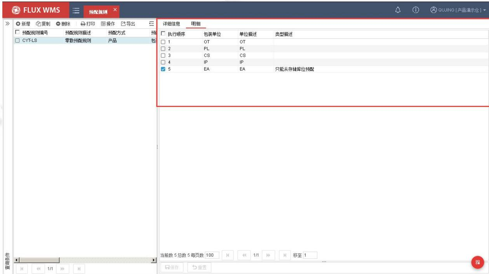

[图8-4-2]

预配规则明细部分即设置了系统预配库存时参照的产品包装级别。 

在规则引擎部分，可以通过下拉列表，进一步指定所要配货的范围。例如在启用“包装规则优先”的情况下，可以指定件包装级别的货物，只从拣货位预配；箱包装级别的货物只从存储位预配，达到分区拣选的目的。 

但如果是“库存周转规则优先”，则明细部分不支持配置。 

预分配规则，说明了FLUX 03-WMS系统如何评估这一产品和一系列用来挑选合适的产品时的约束条件。系统按一定的步骤来评估每一产品。 

## - 预配规则效果

FLUX WMS 在评估预分配规则，考虑的先后次序是： 

■ 按行号的次序依次选择。 

■ 单位的次序和规则。 

■ 为候选名单中的每个产品检查限制条件。 

■ 预分配产品。如果某一个产品通过了以上所有的限制条件，就完成了产品的选择。 

■ 如果找不到一个合适的产品，选择下一个行，并且重复以上步骤。 

■ 如果全部规则运算后，没有找到合适的产品，系统保留未完成预分配的产品清单。 

注意：有可能出现库存中有产品，但预分配没有找到，其中的原因可能是多方面的，如订单指定批次数量不足，库存被冻结、预分配规则设置不合理等。 

此外，由于开启一步分配模式下，将跳过预配规则，因此在一步分配 ONE_STP_ALC 参数为 Y 的情况下，预配规则界面的上面的预配方式、预配规则、超量预配字段从列表和表单中隐藏，以免用户误解配置未生效。 

## 8.5. 分配规则

在产品被预分配后，候选产品批号是按订单拣选来拣出，并按库位、批次和跟踪号来锁定。在这个过程中同样有着不同的业务规则，我们称之为分配规则。 

已分配库存，即已被订单锁定的库存，不能再被移动。 

## - 分配规则

分配规则设置见下图： 

<table><tr><td colspan="10">FLUX WMS</td></tr><tr><td colspan="10">主信息 自定义 其他</td></tr><tr><td colspan="5">分配规则编号</td><td colspan="5">分配规则描述</td></tr><tr><td colspan="5">AUTOMATIC</td><td colspan="5">AUTOMATIC</td></tr><tr><td colspan="10">转移库位分配</td></tr><tr><td colspan="10">整托分拆 整箱分拆 存储位拣选(EA) 存储位拣选(CS)</td></tr><tr><td colspan="10">存储位</td></tr><tr><td colspan="10">是否拆包 清仓优先 拆零基于最优解优化分配 整箱基于最优解优化分配</td></tr><tr><td colspan="10">拣货位</td></tr><tr><td colspan="10">拣货位超量分配 自动产生补货任务 动态拣货位</td></tr></table>

[图 8-5-1]

每一个产品包括一种分配规则，它说明了 FLUX WMS 系统如何评估这一产品和一系列用来挑选合适的产品、库位时的约束条件。 

$$
■ \text {转移库位分配}
$$

## 整托分拆/整箱分拆

用于按不同包装（如箱、托盘，需要与预配规则配合使用）分配的情况，当指定的包装级别库存不足时，是否能够使用其它级别的包装。例如把上一级包装按比例拆分为下级包装使用，或者把下级包装的库存，集合成相应数量操作。 

## ✨ 存储位拣选（CS）/存储位拣选（EA）

用于控制箱/件订单作业情况下，是否需要“箱件存储位”、“箱存储位”、“件存储位”直接参与分配。 

存储位选项： 

✨ 

## 是否拆包

针对非整包装、不可拆分的货物，例如铜带（卷）、线缆等整托盘货物，无法设置件/箱/托盘的包装等级，但一托盘货物出库时又不能剪切的情况。如不选择拆包，系统将把一个托盘号下的货物 视为整体分配，根据预分配规则中是否超量预配的选择确定超额分配还是低于订单数量分配。 

## ☆ 清仓优先

同批次库存，尽可能从库存最少的库位出库，以达到清仓优先，提高仓库利用率的目的。但相应的，拣货时的工作量/操作路线就有可能加长。 

## 整箱基于最优解的分配优化算法

一步分配逻辑中使用，只针对箱数量单位。如果订货的箱数量，有数量正好相符的库位，不论是否选择“清仓优先”，均直接从此数量相符的库位分配。如果没有数量相符的库位，则按照是否选择“清仓优先”，从数量最小的库位内依次出库、清仓；或者效率优先，从能够满足数量的、最小的库位个数组合中配货，达到尽量集中拣取的目的。 

## 拆零基于最优解的分配优化算法

与整箱类似，但基于包装为 EA 级别的记录。 

## ■ 拣货位配置：

拣货位超量分配，用于拣货位库存不足，但已经生成该拣货位对应的补货任务情况下，是否可以分配待补货上架库存。如果可以超量分配，拣货位中可以用来分配的库存上限为库存总数-冻结数量+待补货上架库存。全部分配后，可用库存余量会是负数，补货确认后正常。 

自动产生补货任务，即分配时拣货位库存不足，是否根据订单信息，生成订单触发的补货任务。 

动态拣货位，是否启用动态拣货位管理。动态拣货位管理即不为产品指定固定的拣货位置，而是当库存存在时，根据产品档案中拣货位设置，由系统临时在指定的范围中为产品配置合适的拣货位。有利于减少人为的配置工作，提高仓库拣货位利用率。 

分配规则的拣货位相关配置，需要与产品档案的拣货位设置配合使用。 

存储位拣选（EA/CS），当拣货位库存不足，而存储位有库存时，是否可以分配存储库位上的库存。 

注意：有可能出现库存中有产品，但分配没有找到，其中的原因可能是多方面的，如订单指定批次，库存被锁定、分配规则设置不合理等。有时预分配顺利完成，但分配没有找到，除了分配规则设置的原因外，主要是由于该批货物处于非可拣货库位（如过渡库位或已被冻结的库位）。 

## 8.6. 补货规则

部分情况下，由于产品的季节性较强等原因，在仓库中的拣货作业并不是持续的，并且此类产品的种类大于拣货位的设置个数。此时，不需要为每个产品固定拣货位，而是采用动态补货方式，当产品进入操作周期时，为其寻找一个库位作为拣货位，而当产品操作周期结束，此拣货位将让给其他当季产品使用。 

在拣货位有库存的情况下，再次入库或补货相同产品，系统会自动寻找已用的对应拣货位。但在拣货区没有库存的情况下，要为产品寻找到一个新的动态拣货位时，就需要遵循补货规则。因此，补货规则也只针对找新的空拣货位的情况，相当于特殊场景下的上架规则。 

## - 补货规则

## 补货规则设置见下图：

<table><tr><td colspan="9">FLUX WMS</td></tr><tr><td colspan="9">主信息 自定义 其他</td></tr><tr><td>仓库编号</td><td>补货规则编号</td><td>补货规则描述</td><td>客户编号</td><td></td><td></td><td></td><td></td><td></td></tr><tr><td>WHTEST01</td><td>RPL-CY</td><td>CY补货规则</td><td>WHTEST01</td><td></td><td></td><td></td><td></td><td></td></tr><tr><td>上架规则</td><td></td><td></td><td></td><td></td><td></td><td></td><td></td><td></td></tr><tr><td>RPL-CY</td><td>清仓优先</td><td></td><td></td><td></td><td></td><td></td><td></td><td></td></tr></table>

[图8-6-1]

动态补货规则的实际运行同上架规则，因此设置时需要先设置上架规则，然后在补货规则中选用。 

补货用的上架规则，通常是在指定库区寻找一个空库位用来做产品的拣货位。 

## 8.7. 质检规则

质检指的是货物入库前或者在仓库中，按照货主要求对货物进行质量检验的操作。FLUX WMS 提供的质检功能，可以用来对质检操作进行管理和记录。 

系统根据质检操作的要求，依据入库单据生成质检单据，用于管理质检操作的过程中，需要依据预期到货的产品数量，计算质检的数量。 

由于不同产品检验要求不同，有的是全检，有的是抽检，不同类型的产品，抽检比率或数量也不同，因此 FLUX WMS 系统提供质检规则功能，用来维护不同产品的检验数量比率要求。 

产品档案中，根据产品情况，选择对应的质检规则，在生成质检单时将根据质检规则计算质检数量（质检操作请参考入库操作的质量检验部分）。 

## - 质检规则

■ 详细信息 

质检规则详细信息页签的主信息部分，包含了规则代码和描述信息，显示如下图： 

<table><tr><td colspan="2">FLUX WMS</td><td colspan="9">质检规则</td></tr><tr><td colspan="2">查询条件</td><td colspan="9">新增 复制 删除 打印 操作 导 等</td></tr><tr><td colspan="2">质检规则</td><td colspan="9">质检规则 描述 按ASN类型定义</td></tr><tr><td colspan="2">STANDARD</td><td colspan="9">STANDARD STANDARD N</td></tr><tr><td colspan="2">描述</td><td colspan="9"></td></tr><tr><td>...</td><td>查询</td><td colspan="9">1/1</td></tr></table>

[图8-7-1]

按 ASN 类型定义，如果勾选，明细部分会显示订单类型选择，可以对不同订单类型设置不同的检验比例。 

■ 明细 

## 质检规则明细部分，设置了期望数区段与应检数量的对应逻辑：

<table><tr><td colspan="10">当前数 3 总数 3 每页数 100</td></tr><tr><td colspan="10">主信息 自定义 其他</td></tr><tr><td colspan="10">质检规则 行号 批量起始数量 批量结束数量 批量结束数量</td></tr><tr><td colspan="10">ABC 1 0 99 10</td></tr><tr><td colspan="10">样本数量 检验百分比 最小质检数 预期到货通知类型</td></tr><tr><td colspan="10">10</td></tr></table>

[图8-7-2]

质检规则 - 质检规则代码，根据主信息自动获取。 

行号 - 质检规则明细行号，也是规则生效的次序。人工录入，保存后不可修改。 

批量起始数量、批量结束数量 - 如果 ASN 中产品的期望数量在此区间内，将执行此行规则明细，否则按下一行的数量要求进行检查。 

样本数量 - 阶段化固定样本数量情况下使用。例如期望数 0-99，固定抽检 10 件；期望数 100-999，固定抽检 20 件。每个数据段抽检数量不同，相互没有比例关系。 

检验百分比 - 按比例抽检的情况下使用。例如期望数 0-100，按数量的 5% 抽检；期望数 101-1000，按数量的 3% 抽检。不同数量区间，抽检比例不同。 

样本数量和检验百分比同时录入的情况下，检验百分比优先生效。 

最小质检数 - 按百分比检验的情况下，为防止期望数少导致的百分比计算所得的抽检数量过少（例如到货 10 件，抽检 1%），设置最低检验数量，如 5，则计算所得的检验数量不足 5 则默认为 5 件。当然，如果订单数量不足最小检验数，以订单数量为准。 

ASN 类型 - 主信息勾选 “按 ASN 类型定义” 情况下生效，指定质检规则行适用的 ASN 类型。 

## 8.8. 流水号规则

流水号规则主要用来定义系统中各种单证号、ID号的生成方式。 

- 流水号规则 

流水号规则设置见下图： 

<table><tr><td colspan="8">主信息 自定义 其他</td></tr><tr><td>仓库编号</td><td>流水号规则编号</td><td>流水号规则描述</td><td colspan="5">最大流水号</td></tr><tr><td>*</td><td>ADJNO</td><td>库存调整单</td><td colspan="5">999999</td></tr><tr><td>前缀</td><td>日期格式</td><td>流水号长度</td><td colspan="5"></td></tr><tr><td>AD</td><td>YYMMDD</td><td>6</td><td colspan="5">系统预置标记</td></tr></table>

[图8-8-1]

仓库编号 - 执行此规则的对应业务仓库 ID。如为 $^{*}$ ，则说明是公共规则。 

流水号规则编号 - 规则代码 ID。 

流水号规则描述 - 规则代码说明。 

前缀 - 单据号码的固定开头内容，根据需要设置。 

日期格式 - 如希望流水号与日期或年月相关可设置日期标识。例如到日的级别，第二天流水号会从 1 开始重新累计。 

流水号长度 - 流水号位数设置。如设置为 5 位，流水号从 00001 开始累计。 

每个规则可分别定义 ID 的长度、前缀等。 

例如，希望单证号码显示为前缀+日期+流水号样式，可将日期格式通过下拉列表配置为“YYYYMMDD”或“YYMMDD”等，长度为5。系统显示单证号形式为“LN17110200001”。 

注意：长度指得是前缀、日期之后的流水号位数。订单号码总位数（前缀+日期+流水号）不得超过20位长度。如果对应单号需要生成分单，还需要考虑到分单的3位长度，否则会导致分单号码超长，无法正常生成分单。 

另外，仓库为*的默认规则逻辑，不可删除，可修改配置。避免公共规则逻辑删除导致流水号无法生成。 

## 8.9. 定时器

定时器功能主要用于为系统配置定时自动执行的任务，如定时生成补货任务，定时生成波次计划等。用户如需增加其他定时器，请联系 FLUX 专业顾问。 

## - 定时器配置

## ■ 主信息

<table><tr><td>主信息</td><td>执行结果</td><td>筛选条件</td><td>自定义</td><td>其他</td></tr><tr><td>仓库编号</td><td colspan="2">定时器ID</td><td colspan="2">定时器描述</td></tr><tr><td>DEMO</td><td colspan="2">AUTO_ALL</td><td>订单分配计划</td><td>活动标记</td></tr><tr><td>频率</td><td colspan="4"></td></tr><tr><td>执行</td><td colspan="4"></td></tr><tr><td>每天</td><td colspan="4"></td></tr><tr><td colspan="5">执行间隔: 1 天</td></tr><tr><td>每天频率</td><td colspan="4"></td></tr><tr><td colspan="5">执行一次,时间为: 00:00:00</td></tr><tr><td>间隔执行:</td><td colspan="4"></td></tr><tr><td>小时</td><td colspan="2"></td><td>分钟</td><td></td></tr><tr><td>每小时</td><td colspan="2"></td><td>每分钟</td><td></td></tr><tr><td>从 00 - 02 时</td><td colspan="2"></td><td>从 00 - 02 分</td><td></td></tr><tr><td>从 00 时,每 2 时</td><td colspan="2"></td><td>从 00 分,每 10 分</td><td></td></tr><tr><td>指定</td><td colspan="2"></td><td>指定</td><td></td></tr><tr><td>摘要说明</td><td colspan="4"></td></tr><tr><td rowspan="2">表达式</td><td>秒</td><td>分钟</td><td>小时</td><td>日 月 星期 年</td></tr><tr><td>0</td><td>0/10</td><td>*</td><td>* ?</td></tr></table>

[图8-9-1]

仓库 - 定时器生效的仓库。如果仓库为 $^{*}$ ，代表如果没有特别指定，全部业务仓库都执行此定时器。 

例如补货定时器，配置了2条记录，定时器ID相同，一条仓库为*，一条仓库为BJ。那么北京仓执行其仓库指定的补货定时器设置频率、时间。而其他仓库全部按仓库为*的记录执行补货计算。 

定时器 ID - 定时器代码。系统提供了预设的多个定时器。 

定时器描述 - 定时器名称、说明 

■ 定时频率 

<table><tr><td colspan="2">查询条件</td><td colspan="101">新增 复制 删除 打印 操作 导出 编辑</td><td></td><td></td><td></td><td></td><td></td><td></td><td></td><td></td><td></td><td></td><td></td><td></td><td></td><td></td><td></td><td></td><td></td><td></td><td></td><td></td><td></td><td></td><td></td><td></td><td></td><td></td><td></td><td></td><td></td><td></td><td></td><td></td><td></td><td></td><td></td><td></td><td></td><td></td><td></td><td></td><td></td><td></td><td></td><td></td><td></td><td></td><td></td><td></td><td></td><td></td><td></td><td></td><td></td><td></td><td></td><td></td><td></td><td></td><td></td><td></td><td></td><td></td><td></td><td></td><td></td><td></td><td></td><td></td><td></td><td></td><td></td><td></td><td></td><td></td><td></td><td></td><td></td><td></td><td></td><td></td><td></td><td></td><td></td><td></td><td></td><td></td><td></td><td></td><td></td><td></td><td></td><td></td><td></td><td></td><td></td><td></td><td></td><td></td><td></td><td></td><td></td><td></td><td></td><td></td><td></td><td></td><td></td><td></td><td></td><td></td><td></td><td></td><td></td><td></td><td></td><td></td><td></td><td></td><td></td><td></td><td></td><td></td><td></td><td></td><td></td><td></td><td></td><td></td><td></td><td></td><td></td><td></td><td></td><td></td><td></td><td></td><td></td><td></td><td></td><td></td><td></td><td></td><td></td><td></td><td></td><td></td><td></td><td></td><td></td><td></td><td></td><td></td><td></td><td></td><td></td><td></td><td></td><td></td><td></td><td></td><td></td><td></td><td></td><td></td><td></td><td></td><td></td><td></td><td></td><td></td><td></td><td></td><td></td><td></td><td></td><td></td><td></td><td></td><td></td><td></td><td></td><td></td><td></td><td></td><td></td><td></td><td></td><td></td><td></td><td></td><td></td><td></td><td></td><td></td><td></td><td></td><td></td><td></td><td></td><td></td><td></td><td></td><td></td><td></td><td></td><td></td><td></td><td></td><td></td><td></td><td></td><td></td><td></td><td></td><td></td><td></td><td></td><td></td><td></td><td></td><td></td><td></td><td></td><td></td><td></td><td></td><td></td><td></td><td></td><td></td><td></td><td></td><td></td><td></td><td></td><td></td><td></td><td></td><td></td><td></td><td></td><td></td><td></td><td></td><td></td><td></td><td></td><td></td><td></td><td></td><td></td><td></td><td></td><td></td><td></td><td></td><td></td><td></td><td></td><td></td><td></td><td></td><td></td><td></td><td></td><td></td><td></td><td></td><td></td><td></td><td></td><td></td><td></td><td></td><td></td><td></td><td></td><td></td><td></td><td></td><td></td><td></td><td></td><td></td><td></td><td></td><td></td><td></td><td></td><td></td><td></td><td></td><td></td><td></td><td></td><td></td><td></td><td></td><td></td><td></td></tr><tr><td colspan="2">仓库编号</td><td colspan="100"></td><td></td><td></td><td></td><td></td><td></td><td></td><td></td><td></td><td></td><td></td><td></td><td></td><td></td><td></td><td></td><td></td><td></td><td></td><td></td><td></td><td></td><td></td><td></td><td></td><td></td><td></td><td></td><td></td><td></td><td></td><td></td><td></td><td></td><td></td><td></td><td></td><td></td><td></td><td></td><td></td><td></td><td></td><td></td><td></td><td></td><td></td><td></td><td></td><td></td><td></td><td></td><td></td><td></td><td></td><td></td><td></td><td></td><td></td><td></td><td></td><td></td><td></td><td></td><td></td><td></td><td></td><td></td><td></td><td></td><td></td><td></td><td></td><td></td><td></td><td></td><td></td><td></td><td></td><td></td><td></td><td></td><td></td><td></td><td></td><td></td><td></td><td></td><td></td><td></td><td></td><td></td><td></td><td></td><td></td><td></td><td></td><td></td><td></td><td></td><td></td><td></td><td></td><td></td><td></td><td></td><td></td><td></td><td></td><td rowspan="3"></td><td rowspan="3"></td><td rowspan="3"></td><td rowspan="3"></td><td rowspan="3"></td><td rowspan="3"></td><td rowspan="3"></td><td rowspan="3"></td><td rowspan="3"></td><td rowspan="3"></td><td rowspan="3"></td><td rowspan="3"></td><td rowspan="3"></td><td rowspan="3"></td><td rowspan="3"></td><td rowspan="3"></td><td rowspan="3"></td><td rowspan="3"></td><td rowspan="3"></td><td rowspan="3"></td><td rowspan="3"></td><td rowspan="3"></td><td rowspan="3"></td><td rowspan="3"></td><td rowspan="3"></td><td rowspan="3"></td><td rowspan="3"></td><td rowspan="3"></td><td rowspan="3"></td><td rowspan="3"></td><td rowspan="3"></td><td rowspan="3"></td><td rowspan="3"></td><td rowspan="3"></td><td rowspan="3"></td><td rowspan="3"></td><td rowspan="3"></td><td rowspan="3"></td><td rowspan="3"></td><td rowspan="3"></td><td rowspan="3"></td><td rowspan="3"></td><td rowspan="3"></td><td rowspan="3"></td><td rowspan="3"></td><td rowspan="3"></td><td rowspan="3"></td><td rowspan="3"></td><td rowspan="3"></td><td rowspan="3"></td><td rowspan="3"></td><td rowspan="3"></td><td rowspan="3"></td><td rowspan="3"></td><td rowspan="3"></td><td rowspan="3"></td><td rowspan="3"></td><td rowspan="3"></td><td rowspan="3"></td><td rowspan="3"></td><td rowspan="3"></td><td rowspan="3"></td><td rowspan="3"></td><td rowspan="3"></td><td rowspan="3"></td><td rowspan="3"></td><td rowspan="3"></td><td rowspan="3"></td><td rowspan="3"></td><td rowspan="3"></td><td rowspan="3"></td><td rowspan="3"></td><td rowspan="3"></td><td rowspan="3"></td><td rowspan="3"></td><td rowspan="3"></td><td rowspan="3"></td><td rowspan="3"></td><td rowspan="3"></td><td rowspan="3"></td><td rowspan="3"></td><td rowspan="3"></td><td rowspan="3"></td><td rowspan="3"></td><td rowspan="3"></td><td rowspan="3"></td><td rowspan="3"></td><td rowspan="3"></td><td rowspan="3"></td><td rowspan="3"></td><td rowspan="3"></td><td rowspan="3"></td><td rowspan="3"></td><td rowspan="3"></td><td rowspan="3"></td><td rowspan="3"></td><td rowspan="3"></td><td rowspan="3"></td><td rowspan="3"></td><td rowspan="3"></td><td rowspan="3"></td><td></td><td></td><td></td><td></td><td></td><td></td><td></td><td></td><td></td><td></td><td></td><td></td><td></td><td></td><td></td><td></td><td></td><td></td><td></td><td></td><td></td><td></td><td></td><td></td><td></td><td></td><td></td><td></td><td></td><td></td><td></td><td></td><td></td><td></td><td></td><td></td><td></td><td></td><td></td><td></td><td></td><td></td><td></td><td></td><td></td><td></td><td></td><td></td><td></td><td></td><td></td><td></td><td></td><td></td><td></td><td></td><td></td><td></td><td></td><td></td><td></td><td></td><td></td><td></td><td></td><td></td><td></td><td></td><td></td><td></td><td></td><td></td><td></td><td></td><td></td><td></td><td></td><td></td><td></td><td></td><td></td><td></td><td></td><td></td><td></td><td></td><td></td><td></td><td></td><td></td><td></td><td></td></tr><tr><td colspan="2">DEMO</td><td colspan="100">DEMO</td><td colspan="2">DEMO</td><td>AUTO_ALL</td><td>订单分配计划</td><td colspan="2">DEMO</td><td>AUTO_ALL</td><td>订单分配计划</td><td colspan="100">活动标记</td><td rowspan="2"></td><td rowspan="2"></td><td rowspan="2"></td><td rowspan="2"></td><td rowspan="2"></td><td rowspan="2"></td><td rowspan="2"></td><td rowspan="2"></td><td rowspan="2"></td><td rowspan="2"></td><td rowspan="2"></td><td rowspan="2"></td><td rowspan="2"></td><td rowspan="2"></td><td rowspan="2"></td><td rowspan="2"></td><td rowspan="2"></td><td rowspan="2"></td><td rowspan="2"></td><td rowspan="2"></td><td rowspan="2"></td><td rowspan="2"></td><td rowspan="2"></td><td rowspan="2"></td><td rowspan="2"></td><td rowspan="2"></td><td rowspan="2"></td><td rowspan="2"></td><td rowspan="2"></td><td rowspan="2"></td><td rowspan="2"></td><td rowspan="2"></td><td rowspan="2"></td><td rowspan="2"></td><td rowspan="2"></td><td rowspan="2"></td><td rowspan="2"></td><td rowspan="2"></td><td rowspan="2"></td><td rowspan="2"></td><td rowspan="2"></td><td rowspan="2"></td><td rowspan="2"></td><td rowspan="2"></td><td rowspan="2"></td><td rowspan="2"></td><td rowspan="2"></td><td rowspan="2"></td><td rowspan="2"></td><td rowspan="2"></td><td rowspan="2"></td><td rowspan="2"></td><td rowspan="2"></td><td rowspan="2"></td><td rowspan="2"></td><td rowspan="2"></td><td rowspan="2"></td><td rowspan="2"></td><td rowspan="2"></td><td rowspan="2"></td><td rowspan="2"></td><td rowspan="2"></td><td rowspan="2"></td><td rowspan="2"></td><td rowspan="2"></td><td rowspan="2"></td><td rowspan="2"></td><td rowspan="2"></td><td rowspan="2"></td><td rowspan="2"></td><td rowspan="2"></td><td rowspan="2"></td><td rowspan="2"></td><td rowspan="2"></td><td rowspan="2"></td><td rowspan="2"></td><td rowspan="2"></td><td rowspan="2"></td><td rowspan="2"></td><td rowspan="2"></td><td rowspan="2"></td><td rowspan="2"></td><td rowspan="2"></td><td rowspan="2"></td><td rowspan="2"></td><td rowspan="2"></td><td rowspan="2"></td><td rowspan="2"></td><td rowspan="2"></td><td rowspan="2"></td><td rowspan="2"></td><td rowspan="2"></td></tr><tr><td colspan="2">定时器ID</td><td colspan="96">DEMO</td><td colspan="3">DEMO</td><td>DEL_LOGS</td><td>删除日志定时器</td><td>库存过失效期自动冻结库存...</td><td>执行间隔: 1 天</td><td colspan="199">每天</td></tr></table>

[图8-9-2]

频率，即定时器执行的时间安排。配置时，先在如上图界面，选择定时器的执行频率，如每天、每周、还是每月、每季度等。随着执行频率选择不同，界面显示的对应配置也有所不同。 

■ 每天执行 

<table><tr><td colspan="101">查询条件</td></tr><tr><td colspan="100">仓库编号</td><td></td></tr><tr><td colspan="97">DEMO</td><td></td><td></td><td></td><td></td></tr><tr><td colspan="97">定时器ID</td><td></td><td></td><td></td><td></td></tr><tr><td colspan="92">定期器描述</td><td></td><td></td><td></td><td></td><td></td><td></td><td></td><td></td><td></td></tr><tr><td rowspan="15" colspan="88">活动标记</td><td></td><td></td><td></td><td></td><td></td><td></td><td></td><td></td><td></td><td></td><td></td><td></td><td></td></tr><tr><td></td><td></td><td></td><td></td><td></td><td></td><td></td><td></td><td></td><td></td><td></td><td></td><td></td><td></td><td></td><td></td><td></td><td></td><td></td><td></td><td></td><td></td><td></td><td></td><td></td><td></td><td></td><td></td><td></td></tr><tr><td rowspan="3"></td><td rowspan="3"></td><td rowspan="3"></td><td rowspan="3"></td><td rowspan="3"></td><td rowspan="3"></td><td rowspan="3"></td><td rowspan="3"></td><td rowspan="3"></td><td rowspan="3"></td><td rowspan="3"></td><td rowspan="3"></td><td rowspan="3"></td><td rowspan="3"></td><td rowspan="3"></td><td rowspan="3"></td><td rowspan="2"></td><td rowspan="2"></td><td rowspan="2"></td><td rowspan="2"></td><td rowspan="2"></td><td></td><td></td><td></td><td></td><td></td><td></td><td></td><td></td><td></td></tr><tr><td></td><td></td><td></td><td></td><td></td><td></td><td></td><td></td><td></td></tr><tr><td></td><td></td><td></td><td></td><td></td><td></td><td></td><td></td><td></td><td></td><td></td><td></td><td></td><td></td></tr><tr><td></td><td></td><td></td><td></td><td></td><td></td><td></td><td></td><td></td><td></td><td></td><td></td><td></td><td></td><td></td><td></td><td></td><td></td><td></td><td></td><td></td><td></td><td></td><td></td><td></td><td></td><td></td><td></td><td></td><td></td><td></td><td></td><td></td><td></td><td></td><td></td><td></td><td></td><td></td><td></td><td></td><td></td><td></td><td></td><td></td><td></td><td></td><td></td><td></td><td></td><td></td><td></td><td></td><td></td><td></td><td></td><td></td><td></td><td></td><td></td><td></td><td></td><td></td><td></td><td></td></tr><tr><td></td><td></td><td></td><td></td><td></td><td></td><td></td><td></td><td></td><td></td><td></td><td></td><td></td><td rowspan="2"></td><td rowspan="2"></td><td rowspan="2"></td><td rowspan="2"></td><td rowspan="2"></td><td rowspan="2"></td><td rowspan="2"></td><td rowspan="2"></td><td rowspan="2"></td><td rowspan="2"></td><td rowspan="2"></td><td rowspan="2"></td><td rowspan="2"></td><td rowspan="2"></td><td rowspan="2"></td><td rowspan="2"></td><td rowspan="2"></td><td rowspan="2"></td><td rowspan="2"></td><td rowspan="2"></td><td rowspan="2"></td><td rowspan="2"></td><td rowspan="2"></td><td rowspan="2"></td><td rowspan="2"></td><td rowspan="2"></td><td rowspan="2"></td><td rowspan="2"></td><td rowspan="2"></td><td rowspan="2"></td><td rowspan="2"></td><td rowspan="2"></td><td rowspan="2"></td><td rowspan="2"></td><td rowspan="2"></td><td rowspan="2"></td><td rowspan="2"></td><td rowspan="2"></td><td rowspan="2"></td><td rowspan="2"></td><td></td><td></td><td></td><td></td><td></td><td></td><td></td><td></td><td></td><td></td><td></td><td></td><td></td></tr><tr><td></td><td></td><td></td><td></td><td></td><td></td><td></td><td></td><td></td><td></td><td></td><td></td><td></td><td></td><td></td><td></td><td></td><td></td><td></td><td></td><td></td><td></td><td></td><td></td><td></td><td></td></tr><tr><td></td><td></td><td></td><td></td><td></td><td></td><td></td><td></td><td></td><td></td><td rowspan="2"></td><td rowspan="2"></td><td rowspan="2"></td><td rowspan="2"></td><td rowspan="2"></td><td rowspan="2"></td><td rowspan="2"></td><td rowspan="2"></td><td rowspan="2"></td><td rowspan="2"></td><td rowspan="2"></td><td rowspan="2"></td><td rowspan="3"></td><td rowspan="3"></td><td rowspan="3"></td><td rowspan="3"></td><td rowspan="3"></td><td rowspan="3"></td><td rowspan="3"></td><td rowspan="3"></td><td rowspan="3"></td><td rowspan="4"></td><td rowspan="4"></td><td rowspan="4"></td><td rowspan="4"></td><td rowspan="4"></td><td rowspan="4"></td><td rowspan="4"></td><td rowspan="4"></td><td rowspan="4"></td><td rowspan="4"></td><td rowspan="4"></td><td rowspan="4"></td><td rowspan="4"></td><td rowspan="5"></td><td rowspan="5"></td><td rowspan="4"></td><td rowspan="4"></td><td rowspan="4"></td><td rowspan="3"></td><td rowspan="3"></td><td rowspan="3"></td><td rowspan="3"></td><td></td><td></td><td></td><td></td><td></td><td></td><td></td><td></td><td></td><td></td><td></td><td></td><td></td></tr><tr><td></td><td></td><td></td><td></td><td></td><td></td><td></td><td></td><td></td><td></td><td></td><td></td><td></td><td></td><td></td><td></td><td></td><td></td><td></td><td></td><td></td><td></td><td></td></tr><tr><td></td><td></td><td></td><td></td><td></td><td></td><td></td><td></td><td></td><td></td><td></td><td></td><td></td><td></td><td></td><td></td><td></td><td></td><td></td><td></td><td></td><td></td><td></td><td></td><td></td><td></td><td></td><td></td><td></td><td></td><td></td><td></td><td></td><td></td><td></td></tr><tr><td></td><td></td><td></td><td></td><td></td><td></td><td></td><td></td><td></td><td></td><td></td><td></td><td></td><td></td><td></td><td></td><td></td><td></td><td></td><td></td><td></td><td></td><td></td><td></td><td></td><td></td><td></td><td></td><td></td><td></td><td></td><td></td><td></td><td></td><td></td><td></td><td></td><td></td><td></td><td></td><td></td><td></td><td></td><td></td><td></td><td></td><td></td><td></td></tr><tr><td></td><td></td><td></td><td></td><td></td><td></td><td></td><td></td><td></td><td></td><td></td><td></td><td></td><td></td><td></td><td></td><td></td><td></td><td></td><td></td><td></td><td></td><td></td><td></td><td></td><td></td><td></td><td></td><td></td><td></td><td></td><td></td><td></td><td></td><td></td><td></td><td></td><td></td><td></td><td></td><td></td><td></td><td></td><td></td><td></td><td></td><td></td><td></td><td></td><td></td><td></td><td></td><td></td><td></td><td></td><td></td><td></td><td></td><td></td><td></td><td></td><td></td><td></td><td></td></tr><tr><td></td><td></td><td></td><td></td><td></td><td></td><td></td><td></td><td></td><td></td><td></td><td></td><td></td><td></td><td></td><td></td><td></td><td></td><td></td><td></td><td></td><td></td><td></td><td></td><td></td><td></td><td></td><td></td><td></td><td></td><td></td><td></td><td></td><td></td><td></td><td></td><td></td><td></td><td></td><td></td><td></td><td></td><td></td><td></td><td></td><td></td><td></td><td></td><td></td><td></td><td></td><td></td><td></td><td></td><td></td><td></td><td></td><td></td><td></td><td></td><td></td><td></td><td></td><td></td><td></td><td></td></tr><tr><td>DEMO</td><td>AUTO_ALL</td><td>订单分配计划</td><td>执行间隔: 1 天</td><td>每天频率○执行一次,时间为: 00:00:00○间隔执行:小时○每小时○从 00 - 02 时○从 00 时,每 2 时○指定○每分钟○从 00 - 02 分○从 00 分,每 10 分○指定摘要说明表达式秒 分钟 小时 日月 星期 年0 0/10 * * ?保存 取消</td><td>小时</td><td>每小时</td><td>○从</td><td>00</td><td>-</td><td>02</td><td>时</td><td>○从</td><td>00</td><td>时,每 2</td><td>时</td><td>○指定</td><td>○每分钟</td><td>○从</td><td>00</td><td>-</td><td>02</td><td>分</td><td>○从</td><td>00</td><td>分,每 10</td><td>分</td><td>○指定</td><td>摘要说明表达式秒 分钟 小时 日月 星期 年0 0/10 * * ?</td><td>保存 取消</td><td>摘要说明表达式秒 分钟 小时 日月 星期 年0 0/10 * * ?</td><td>保存 取消</td><td>摘要说明表达式秒 分钟 小时 日月 星期 年0 0/10 * * ?</td><td>保存 取消</td><td>摘要说明表达式秒 分钟 小时 日月 星期 年0 0/10 * * ?</td><td>保存 取消</td><td>摘要说明表达式秒 分钟 小时 日月 星期 年0 0/10 * * ?</td><td>保存 取消</td><td>摘要说明表达式秒 分钟 小时 日月 星期 年0 0/10 * * ?</td><td>保存 取消</td><td>摘要说明表达式秒 分钟 小时 日月 星期 年0 0/10 * * ?</td><td>保存 取消</td><td>摘要说明表达式的秒 分钟 小时 日月 星期 年0 0/10 * * ?</td><td>保存 取消</td><td>摘要说明表达式的秒 分钟 小时 日月 星期 年0 0/10 * * ?</td><td>保存 取消</td><td>摘要说明表达式的秒 分钟 小时 日月 星期 年0 0/10 * * ?</td><td>保存 取消</td><td>摘要说明表达式的数秒 分钟 小时 日月 星期 年0 0/10 * * ?</td><td>保存 取消</td><td>摘要说明表达式的数秒 分钟 小时 日月 星期 年0 0/10 * * ?</td><td>保存 取消</td><td>摘要说明表达式的数秒 分钟 小时 日月 星期 年0 0/10 * * ?</td><td>保存 取消</td><td>摘要说明表達式秒 分钟 小时 日月 星期 年0 0/10 * * ?</td><td>保存 取消</td><td>摘要说明表達式的数秒 分钟 小时 日月 星期 年0 0/10 * * ?</td><td>保存 取消</td><td>摘要说明表達式的数秒 分钟 小时 日月 星期 年0 0/10 * * ?</td><td>保存 取消</td><td>摘要说明表達式的数秒 分钟 小时 日月 星期 年0 0/10 * * ?</td><td>保存 取消</td><td>摘要说明表达成式的数秒 分钟 小时 日月 星期 年0 0/10 * * ?</td><td>保存 取消</td><td>摘要说明表达成式的数秒 分钟 小时 日月 星期 年0 0/10 * * ?</td><td>保存 取消</td><td>摘要说明表达成式的数秒 分钟 小时 日月 星期 年0 0/10 * * ?</td><td>保存 取消</td><td>摘要明表达成式的数秒 分钟 小时 日月 星期 年0 0/10 * * ?</td><td>保存 取消</td><td>摘要明表达成式的数秒 分钟 小时 日月 星期 年0 0/10 * * ?</td><td>保存 取消</td><td>摘要明表达成式的数秒 分钟 小时 日月 星期 年0 0/10 * * ?</td><td>保存 取消</td><td></td><td></td><td></td><td></td><td></td><td></td><td></td><td></td><td></td><td></td><td></td><td></td><td></td><td></td><td></td><td></td><td></td><td></td><td></td></tr></table>

[图8-9-3]

每天执行模式下，可以选择执行间隔，例如每隔2天执行一次。默认为1天，即每日执行。 

每天频率，即执行日的定时器运行设置。可以配置为一次执行模式，指定执行时间；或者是间隔执行模式，间隔一定时间循环执行。 

间隔时间配置，可以指定循环执行的起止时间，以及间隔时间。 

例如下图配置，意味着，从早上8点到下午5点，每个小时的15分执行。 

<table><tr><td colspan="101">查询条件</td></tr><tr><td colspan="100">仓库编号</td><td></td></tr><tr><td colspan="97">DEMO</td><td></td><td></td><td></td><td></td></tr><tr><td colspan="97">定时器ID</td><td></td><td></td><td></td><td></td></tr><tr><td colspan="92">定期器描述</td><td></td><td></td><td></td><td></td><td></td><td></td><td></td><td></td><td></td></tr><tr><td rowspan="29" colspan="88">活动标记</td><td></td><td></td><td></td><td></td><td></td><td></td><td></td><td></td><td></td><td></td><td></td><td></td><td></td></tr><tr><td></td><td></td><td></td><td></td><td></td><td></td><td></td><td></td><td></td><td></td><td></td><td></td><td></td><td></td><td></td><td></td><td></td><td></td><td></td><td></td><td></td><td></td><td></td><td></td><td></td><td></td><td></td><td></td><td></td></tr><tr><td rowspan="3"></td><td rowspan="3"></td><td rowspan="3"></td><td rowspan="3"></td><td rowspan="3"></td><td rowspan="3"></td><td rowspan="3"></td><td rowspan="3"></td><td rowspan="3"></td><td rowspan="3"></td><td rowspan="3"></td><td rowspan="3"></td><td rowspan="3"></td><td rowspan="3"></td><td rowspan="3"></td><td rowspan="3"></td><td rowspan="2"></td><td rowspan="2"></td><td rowspan="2"></td><td rowspan="2"></td><td rowspan="2"></td><td></td><td></td><td></td><td></td><td></td><td></td><td></td><td></td><td></td></tr><tr><td></td><td></td><td></td><td></td><td></td><td></td><td></td><td></td><td></td></tr><tr><td></td><td></td><td></td><td></td><td></td><td></td><td></td><td></td><td></td><td></td><td></td><td></td><td></td><td></td></tr><tr><td></td><td></td><td></td><td></td><td></td><td></td><td></td><td></td><td></td><td></td><td></td><td></td><td></td><td></td><td></td><td></td><td></td><td></td><td></td><td></td><td></td><td></td><td></td><td></td><td></td><td></td><td></td><td></td><td></td><td></td><td></td><td></td><td></td><td></td><td></td><td></td><td></td><td></td><td></td><td></td><td></td><td></td><td></td><td></td><td></td><td></td><td></td><td></td><td></td><td></td><td></td><td></td><td></td><td></td><td></td><td></td><td></td><td></td><td></td><td></td><td></td><td></td><td></td><td></td><td></td></tr><tr><td></td><td></td><td></td><td></td><td></td><td></td><td></td><td></td><td></td><td></td><td></td><td></td><td></td><td rowspan="2"></td><td rowspan="2"></td><td rowspan="2"></td><td rowspan="2"></td><td rowspan="2"></td><td rowspan="2"></td><td rowspan="2"></td><td rowspan="2"></td><td rowspan="2"></td><td rowspan="2"></td><td rowspan="2"></td><td rowspan="2"></td><td rowspan="2"></td><td rowspan="2"></td><td rowspan="2"></td><td rowspan="2"></td><td rowspan="2"></td><td rowspan="2"></td><td rowspan="2"></td><td rowspan="2"></td><td rowspan="2"></td><td rowspan="2"></td><td rowspan="2"></td><td rowspan="2"></td><td rowspan="2"></td><td rowspan="2"></td><td rowspan="2"></td><td rowspan="2"></td><td rowspan="2"></td><td rowspan="2"></td><td rowspan="2"></td><td rowspan="2"></td><td rowspan="2"></td><td rowspan="2"></td><td rowspan="2"></td><td rowspan="2"></td><td rowspan="2"></td><td rowspan="2"></td><td rowspan="2"></td><td rowspan="2"></td><td></td><td></td><td></td><td></td><td></td><td></td><td></td><td></td><td></td><td></td><td></td><td></td><td></td></tr><tr><td></td><td></td><td></td><td></td><td></td><td></td><td></td><td></td><td></td><td></td><td></td><td></td><td></td><td></td><td></td><td></td><td></td><td></td><td></td><td></td><td></td><td></td><td></td><td></td><td></td><td></td></tr><tr><td></td><td></td><td></td><td></td><td></td><td></td><td></td><td></td><td></td><td></td><td rowspan="2"></td><td rowspan="2"></td><td rowspan="2"></td><td rowspan="2"></td><td rowspan="2"></td><td rowspan="2"></td><td rowspan="2"></td><td rowspan="2"></td><td rowspan="2"></td><td rowspan="2"></td><td rowspan="2"></td><td rowspan="2"></td><td rowspan="3"></td><td rowspan="3"></td><td rowspan="3"></td><td rowspan="3"></td><td rowspan="3"></td><td rowspan="3"></td><td rowspan="3"></td><td rowspan="3"></td><td rowspan="3"></td><td rowspan="3"></td><td rowspan="4"></td><td rowspan="4"></td><td rowspan="4"></td><td rowspan="4"></td><td rowspan="4"></td><td rowspan="4"></td><td rowspan="4"></td><td rowspan="4"></td><td rowspan="4"></td><td rowspan="4"></td><td rowspan="4"></td><td rowspan="4"></td><td rowspan="4"></td><td rowspan="4"></td><td rowspan="5"></td><td rowspan="4"></td><td rowspan="3"></td><td rowspan="3"></td><td rowspan="3"></td><td rowspan="3"></td><td rowspan="2"></td><td></td><td></td><td></td><td></td><td></td><td></td><td></td><td></td><td></td><td></td><td></td><td></td><td></td></tr><tr><td></td><td></td><td></td><td></td><td></td><td></td><td></td><td></td><td></td><td></td><td></td><td></td><td></td><td></td><td></td><td></td><td></td><td></td><td></td><td></td><td></td><td></td><td></td></tr><tr><td></td><td></td><td></td><td></td><td></td><td></td><td></td><td></td><td></td><td></td><td></td><td></td><td></td><td></td><td></td><td></td><td></td><td></td><td></td><td></td><td></td><td></td><td></td><td></td><td></td><td></td><td></td><td></td><td></td><td></td><td></td><td></td><td></td><td></td><td></td><td></td></tr><tr><td></td><td></td><td></td><td></td><td></td><td></td><td></td><td></td><td></td><td></td><td></td><td></td><td></td><td></td><td></td><td></td><td></td><td></td><td></td><td></td><td></td><td></td><td></td><td></td><td></td><td></td><td></td><td></td><td></td><td></td><td></td><td></td><td></td><td></td><td></td><td></td><td></td><td></td><td></td><td></td><td></td><td></td><td></td><td></td><td></td><td></td><td></td><td></td><td></td><td></td></tr><tr><td></td><td></td><td></td><td></td><td></td><td></td><td></td><td></td><td></td><td></td><td></td><td></td><td></td><td></td><td></td><td></td><td></td><td></td><td></td><td></td><td></td><td></td><td></td><td></td><td></td><td></td><td></td><td></td><td></td><td></td><td></td><td></td><td></td><td></td><td></td><td></td><td></td><td></td><td></td><td></td><td></td><td></td><td></td><td></td><td></td><td></td><td></td><td></td><td></td><td></td><td></td><td></td><td></td><td></td><td></td><td></td><td></td><td></td><td></td><td></td><td></td><td></td><td></td><td></td><td></td></tr><tr><td></td><td></td><td></td><td></td><td></td><td></td><td></td><td></td><td></td><td></td><td></td><td></td><td></td><td></td><td></td><td></td><td></td><td></td><td></td><td></td><td></td><td></td><td></td><td></td><td></td><td></td><td></td><td></td><td></td><td></td><td></td><td></td><td></td><td></td><td></td><td></td><td></td><td></td><td></td><td></td><td></td><td></td><td></td><td></td><td></td><td></td><td></td><td></td><td></td><td></td><td></td><td></td><td></td><td></td><td></td><td></td><td></td><td></td><td></td><td></td><td></td><td></td><td></td><td></td><td></td><td></td></tr><tr><td>DEMO</td><td>AUTO_ALL</td><td>订单分配计划</td><td rowspan="15">执行间隔: 1 天</td><td rowspan="15" colspan="71">每天频率○执行一次,时间为: 00:00:00○间隔执行:小时○每小时○从 00 - 02 时○从 00 时,每 2 时○指定 箱要说明表达式 秒 分钟 小时 日 月 星期 年0 0/10 * * ?</td><td></td><td></td><td></td><td></td><td></td><td></td><td></td><td></td><td></td><td></td><td></td><td></td><td></td><td></td><td></td><td></td><td></td><td></td></tr><tr><td>DEMO</td><td>AUT_SHP</td><td>自动发送</td><td></td><td></td><td></td><td></td><td></td><td></td><td></td><td></td><td></td><td></td><td></td><td></td><td></td><td></td><td></td><td></td><td></td><td></td><td></td><td></td><td></td><td></td><td></td><td></td><td></td><td></td><td></td></tr><tr><td>DEMO</td><td>CLR_INV</td><td>清除0库存</td><td></td><td></td><td></td><td></td><td></td><td></td><td></td><td></td><td></td><td></td><td></td><td></td><td></td><td></td><td></td><td></td><td></td><td></td><td></td><td></td><td></td><td></td><td></td><td></td><td></td><td></td><td></td><td></td><td></td><td></td><td></td></tr><tr><td>DEMO</td><td>DEL_LOGS</td><td>删除日志定时器</td><td></td><td></td><td></td><td></td><td></td><td></td><td></td><td></td><td></td><td></td><td></td><td></td><td></td><td></td><td></td><td></td><td></td><td></td><td></td><td></td><td></td><td></td><td></td><td></td><td></td><td></td><td></td><td></td><td></td><td></td><td></td><td></td><td></td></tr><tr><td>DEMO</td><td>EXP_HOD</td><td>库存过失效期自动冻结库存..</td><td></td><td></td><td></td><td></td><td></td><td></td><td></td><td></td><td></td><td></td><td></td><td></td><td></td><td></td><td></td><td></td><td></td><td></td><td></td><td></td><td></td><td></td><td></td><td></td><td></td><td></td><td></td><td></td><td></td><td></td><td></td><td></td><td></td><td></td><td></td></tr><tr><td>DEMO</td><td>GEN_ABC</td><td>ABC盘点</td><td></td><td></td><td></td><td></td><td></td><td></td><td></td><td></td><td></td><td></td><td></td><td></td><td></td><td></td><td></td><td></td><td></td><td></td><td></td><td></td><td></td><td></td><td></td><td></td><td></td><td></td><td></td><td></td><td></td><td></td><td></td><td></td><td></td><td></td><td></td><td></td><td></td><td></td></tr><tr><td>DEMO</td><td>PIK_TSK</td><td>拣货任务下发接口</td><td></td><td></td><td></td><td></td><td></td><td></td><td></td><td></td><td></td><td></td><td></td><td></td><td></td><td></td><td></td><td></td><td></td><td></td><td></td><td></td><td></td><td></td><td></td><td></td><td></td><td></td><td></td><td></td><td></td><td></td><td></td><td></td><td></td><td></td><td></td><td></td><td></td><td></td><td></td><td></td></tr><tr><td>DEMO</td><td>RPL_TSK</td><td>补货定时器</td><td></td><td></td><td></td><td></td><td></td><td></td><td></td><td></td><td></td><td></td><td></td><td></td><td></td><td></td><td></td><td></td><td></td><td></td><td></td><td></td><td></td><td></td><td></td><td></td><td></td><td></td><td></td><td></td><td></td><td></td><td></td><td></td><td></td><td></td><td></td><td></td><td></td><td></td><td></td><td></td><td></td><td></td><td></td><td></td></tr><tr><td>DEMO</td><td>UDF_SP1</td><td>用户自定义_SPUDF_PROC.</td><td></td><td></td><td></td><td></td><td></td><td></td><td></td><td></td><td></td><td></td><td></td><td></td><td></td><td></td><td></td><td></td><td></td><td></td><td></td><td></td><td></td><td></td><td></td><td></td><td></td><td></td><td></td><td></td><td></td><td></td><td></td><td></td><td></td><td></td><td></td><td></td><td></td><td></td><td></td><td></td><td></td><td></td><td></td><td></td><td></td></tr><tr><td>DEMO</td><td>UDF_SP2</td><td>用户自定义_SPUDF_PROC.</td><td></td><td></td><td></td><td></td><td></td><td></td><td></td><td></td><td></td><td></td><td></td><td></td><td></td><td></td><td></td><td></td><td></td><td></td><td></td><td></td><td></td><td></td><td></td><td></td><td></td><td></td><td></td><td></td><td></td><td></td><td></td><td></td><td></td><td></td><td></td><td></td><td></td><td></td><td></td><td></td><td></td><td></td><td></td><td></td><td></td><td></td><td></td></tr><tr><td>DEMO</td><td>UDF_SP3</td><td>用户自定义_SPUDF_PROC.</td><td></td><td></td><td></td><td></td><td></td><td></td><td></td><td></td><td></td><td></td><td></td><td></td><td></td><td></td><td></td><td></td><td></td><td></td><td></td><td></td><td></td><td></td><td></td><td></td><td></td><td></td><td></td><td></td><td></td><td></td><td></td><td></td><td></td><td></td><td></td><td></td><td></td><td></td><td></td><td></td><td></td><td></td><td></td><td></td><td></td><td></td><td></td><td></td><td></td></tr><tr><td>DEMO</td><td>UDF_SP4</td><td>用户自定义_SPUDF_PROC.</td><td></td><td></td><td></td><td></td><td></td><td></td><td></td><td></td><td></td><td></td><td></td><td></td><td></td><td></td><td></td><td></td><td></td><td></td><td></td><td></td><td></td><td></td><td></td><td></td><td></td><td></td><td></td><td></td><td></td><td></td><td></td><td></td><td></td><td></td><td></td><td></td><td></td><td></td><td></td><td></td><td></td><td></td><td></td><td></td><td></td><td></td><td></td><td></td><td></td><td></td></tr><tr><td>DEMO</td><td>UDF_SP5</td><td>用户自定义_SPUDF_PROC.</td><td></td><td></td><td></td><td></td><td></td><td></td><td></td><td></td><td></td><td></td><td></td><td></td><td></td><td></td><td></td><td></td><td></td><td></td><td></td><td></td><td></td><td></td><td></td><td></td><td></td><td></td><td></td><td></td><td></td><td></td><td></td><td></td><td></td><td></td><td></td><td></td><td></td><td></td><td></td><td></td><td></td><td></td><td></td><td></td><td></td><td></td><td></td><td></td><td></td><td></td><td></td><td></td></tr><tr><td>DEMO</td><td>UGT_ORD</td><td>紧急订单分配定时器</td><td></td><td></td><td></td><td></td><td></td><td></td><td></td><td></td><td></td><td></td><td></td><td></td><td></td><td></td><td></td><td></td><td></td><td></td><td></td><td></td><td></td><td></td><td></td><td></td><td></td><td></td><td></td><td></td><td></td><td></td><td></td><td></td><td></td><td></td><td></td><td></td><td></td><td></td><td></td><td></td><td></td><td></td><td></td><td></td><td></td><td></td><td></td><td></td><td></td><td></td><td></td><td></td><td></td><td></td></tr><tr><td>DEMO</td><td>WAV_DIH</td><td>波次调度定时器</td><td colspan="37">00 时,每 2 时○指定 箱要说明表达式 秒 分钟 小时 日 月 星期 年0 0/10 * * ?</td><td></td><td></td><td></td><td></td><td></td><td></td><td></td><td></td><td></td><td></td><td></td><td></td><td></td><td></td><td></td><td></td><td></td><td></td><td></td><td></td><td></td><td></td><td></td><td></td><td></td><td></td><td></td><td></td><td></td><td></td></tr></table>

## [图8-9-4]

如果小时、分钟同时指定具体值，实际效果就是执行一次、指定时间的效果。 

## ■ 每周执行

每周执行模式下，需要选择执行日，默认为全周，根据业务需求具体选择执行时间。如下图配置，意味着每周的周一、周三的8:30执行定时器运行。 

<table><tr><td colspan="2">查询条件</td><td colspan="101">新增 复制 删除 打印 操作 导出 编辑</td><td></td><td></td></tr><tr><td colspan="2">仓库编号</td><td>仓库编号</td><td>定时器ID</td><td colspan="100">定时器描述</td><td></td></tr><tr><td colspan="2">DEMO</td><td>DEMO</td><td>AUTO_ALL</td><td colspan="97">订单分配计划</td><td></td><td></td><td></td><td></td></tr><tr><td colspan="2">定时器ID</td><td>DEMO</td><td>AUT_SHP</td><td colspan="96">自动发送</td><td></td><td></td><td></td><td></td><td></td></tr><tr><td colspan="2">定时者描述</td><td>DEMO</td><td>CLR_INV</td><td colspan="92">清除0库存</td><td></td><td></td><td></td><td></td><td></td><td></td><td></td><td></td><td></td></tr><tr><td rowspan="14" colspan="2">活动标记</td><td>DEMO</td><td>DEL_LOGS</td><td colspan="88">删除日志定时器</td><td></td><td></td><td></td><td></td><td></td><td></td><td></td><td></td><td></td><td></td><td></td><td></td><td></td></tr><tr><td>DEMO</td><td>EXP_HOD</td><td colspan="82">库存过失效期自动冻结库存...</td><td></td><td></td><td></td><td></td><td></td><td></td><td></td><td></td><td></td><td></td><td></td><td></td><td></td><td></td><td></td><td></td><td></td><td></td><td></td></tr><tr><td>DEMO</td><td>GEN_ABC</td><td colspan="79">ABC盘点</td><td></td><td></td><td></td><td></td><td></td><td></td><td></td><td></td><td></td><td></td><td></td><td></td><td></td><td></td><td></td><td></td><td></td><td></td><td></td><td></td><td></td><td></td></tr><tr><td>DEMO</td><td>PIK_TSK</td><td colspan="76">拣货任务下发接口</td><td></td><td></td><td></td><td></td><td></td><td></td><td></td><td></td><td></td><td></td><td></td><td></td><td></td><td></td><td></td><td></td><td></td><td></td><td></td><td></td><td></td><td></td><td></td><td></td><td></td></tr><tr><td>DEMO</td><td>RPL_TSK</td><td colspan="75">补货定时器</td><td></td><td></td><td></td><td></td><td></td><td></td><td></td><td></td><td></td><td></td><td></td><td></td><td></td><td></td><td></td><td></td><td></td><td></td><td></td><td></td><td></td><td></td><td></td><td></td><td></td><td></td></tr><tr><td>DEMO</td><td>UDF_SP1</td><td colspan="73">用户自定义_SPUDF_PROC.</td><td></td><td></td><td></td><td></td><td></td><td></td><td></td><td></td><td></td><td></td><td></td><td></td><td></td><td></td><td></td><td></td><td></td><td></td><td></td><td></td><td></td><td></td><td></td><td></td><td></td><td></td><td></td><td></td></tr><tr><td>DEMO</td><td>UDF_SP2</td><td colspan="68">用户自定义_SPUDF_PROC.</td><td></td><td></td><td></td><td></td><td></td><td></td><td></td><td></td><td></td><td></td><td></td><td></td><td></td><td></td><td></td><td></td><td></td><td></td><td></td><td></td><td></td><td></td><td></td><td></td><td></td><td></td><td></td><td></td><td></td><td></td><td></td><td></td><td></td></tr><tr><td>DEMO</td><td>UDF_SP3</td><td colspan="65">用户自定义_SPUDF_PROC.</td><td></td><td></td><td></td><td></td><td></td><td></td><td></td><td></td><td></td><td></td><td></td><td></td><td></td><td></td><td></td><td></td><td></td><td></td><td></td><td></td><td></td><td></td><td></td><td></td><td></td><td></td><td></td><td></td><td></td><td></td><td></td><td></td><td></td><td></td><td></td><td></td></tr><tr><td>DEMO</td><td>UDF_SP4</td><td colspan="62">用户自定义_SPUDF_PROC.</td><td></td><td></td><td></td><td></td><td></td><td></td><td></td><td></td><td></td><td></td><td></td><td></td><td></td><td></td><td></td><td></td><td></td><td></td><td></td><td></td><td></td><td></td><td></td><td></td><td></td><td></td><td></td><td></td><td></td><td></td><td></td><td></td><td></td><td></td><td></td><td></td><td></td><td></td><td></td></tr><tr><td>DEMO</td><td>UDF_SP5</td><td colspan="60">用户自定义_SPUDF_PROC.</td><td></td><td></td><td></td><td></td><td></td><td></td><td></td><td></td><td></td><td></td><td></td><td></td><td></td><td></td><td></td><td></td><td></td><td></td><td></td><td></td><td></td><td></td><td></td><td></td><td></td><td></td><td></td><td></td><td></td><td></td><td></td><td></td><td></td><td></td><td></td><td></td><td></td><td></td><td></td><td></td><td></td></tr><tr><td>DEMO</td><td>UGT_ORD</td><td colspan="57">紧急订单分配定时器</td><td></td><td></td><td></td><td></td><td></td><td></td><td></td><td></td><td></td><td></td><td></td><td></td><td></td><td></td><td></td><td></td><td></td><td></td><td></td><td></td><td></td><td></td><td></td><td></td><td></td><td></td><td></td><td></td><td></td><td></td><td></td><td></td><td></td><td></td><td></td><td></td><td></td><td></td><td></td><td></td><td></td><td></td><td></td><td></td></tr><tr><td>DEMO</td><td>WAV_DIH</td><td colspan="54">波次调度定时器</td><td></td><td></td><td></td><td></td><td></td><td></td><td></td><td></td><td></td><td></td><td></td><td></td><td></td><td></td><td></td><td></td><td></td><td></td><td></td><td></td><td></td><td></td><td></td><td></td><td></td><td></td><td></td><td></td><td></td><td></td><td></td><td></td><td></td><td></td><td></td><td></td><td></td><td></td><td></td><td></td><td></td><td></td><td></td><td></td><td></td><td></td><td></td></tr><tr><td>DEMO</td><td>WAV_PLN</td><td colspan="49">波次计划定时器</td><td></td><td></td><td></td><td></td><td></td><td></td><td></td><td></td><td></td><td></td><td></td><td></td><td></td><td></td><td></td><td></td><td></td><td></td><td></td><td></td><td></td><td></td><td></td><td></td><td></td><td></td><td></td><td></td><td></td><td></td><td></td><td></td><td></td><td></td><td></td><td></td><td></td><td></td><td></td><td></td><td></td><td></td><td></td><td></td><td></td><td></td><td></td><td></td><td></td><td></td><td></td><td></td></tr><tr><td>DEMO</td><td>WAV_STS_UPD</td><td colspan="46">更新波次状态定时器</td><td></td><td></td><td></td><td></td><td></td><td></td><td></td><td></td><td></td><td></td><td></td><td></td><td></td><td></td><td></td><td></td><td></td><td></td><td></td><td></td><td></td><td></td><td></td><td></td><td></td><td></td><td></td><td></td><td></td><td></td><td></td><td></td><td></td><td></td><td></td><td></td><td></td><td></td><td></td><td></td><td></td><td></td><td></td><td></td><td></td><td></td><td></td><td></td><td></td><td></td><td></td><td></td><td></td><td></td><td></td></tr></table>