## 11.10. 波次播种

合并拣货后再分货的拣货模式中，通常按波次进行合并拣货，分货的模式可以有多种选择，例如通过纸单指导分货，通过 RF 分货，通过电子标签分货等。在 FLUX WMS 中，还提供一种电子标签的代替功能，可用于波次合拣后分货，以便在业务量较大时作为电子标签设备的补充。 

使用波次播种功能，需要由 WMS 根据波次结构、分货要求，提前将对应信息传递到波次播种后台任务表中（IDX_PutToLight）才能正常使用该功能。类似将播种任务传递给电子标签的过程。 

任务下达过程，可以是后台执行（定时器等），也可以在波次计划功能中通过鼠标右键菜单功能项进行任务下发。此处主要介绍已生成播种任务，实物完成集中拣货下架后的具体播种分货操作。 

## - 波次播种操作

■ 选择 “出库操作” 下的 “波次播种” 功能，显示界面如下图： 

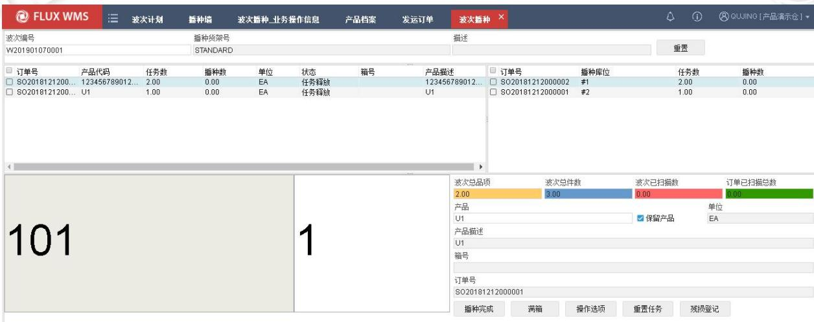


[图11-10-1]


■ 扫描/录入波次号，播种货架号，系统显示波次对应明细信息。以及每个播种位对应订单、播种进度信息。 

由于波次播种工作，能够支持多个作业台各自对应不同波次同时操作，因此作业伊始扫描播种货架号作为不同工作台的区分、记录。 

■ 如果是按箱合并拣货作业模式，通常支持按箱进行播种，勾选“按箱播种”选项，界面显示箱号录入字段，扫描箱号获取对应信息。 

■ 扫描产品条码，系统提示此产品应投放的播种位，并累加数量。 

■ 如产品异常（条码不符或数量超出）系统提示报错。 

■ 当系统判断波次内所有的任务都已经播种完成，则弹提示，确认播种完成。 

## - 动态播种模式

普通模式，系统提前为任务分派好播种位，作业时操作人员扫描产品后，需要寻找系统提示的库位，而且产品随机扫描情况下，走动路径可能较长。因此系统还提供动态播种作业模式，任务下达时不绑定具体播种位，而是扫描到一个新订单的产品时临时按次序绑定一个空播种位提示用户操作，可以减少人员走动距离。 

动态播种模式，需要开启 PTL_SEQ_LOC 参数，后台处理不同，但用户具体作业步骤同固定播种位操作模式。 

当某个播种位的任务数量全部播种完成时，自动消息提示“货格 XXX 播种完成”，方便释放播种位，滚动操作。 

## - 按钮/右键功能

## ■ 播种完成

播种作业结束。 

如果有任务未被执行，弹出提示。仍旧确认的情况下，视作缺货确认。 

## ■ 尾箱作业

播种完成时，如果参数 PTL_LNK_CNO=Y（尾箱需要绑定箱号）开启，二级窗口显示所有未满箱确认的任务，依次要求用户扫描播种位与目标箱号，进行关联。 

## ■ 满箱

WAV_SOW_RTM 为 Y 时（实时更新模式），此按钮可用。点击【满箱】按钮，弹出窗口要求扫描箱号，扫描箱号后定位于【确定】按钮，人工点击【确定】进行播种后的目标箱号确认。 

## ■ 重置任务

弹出窗口提示“该波次的所有播种任务将被重新生成，请确认”，如确认，则对应全部任务被置于未操作状态。 

## 11.11. 图形化波次播种

按波次合并拣货后，还需要分货到不同订单（或者收货人）。可以采用电子标签或 RF 分货，甚至纸单人工分货。电子标签分货效率最高，但往往受制于设备，投资较大，业务量激增时，很难 快速增加电子标签位。因此系统提供了波次播种功能，可代替电子标签使用，或者作为电子标签不足时的补充措施。 

同时，入库分货整理时，也可以创建 ASN 编组，然后使用波次播种进行分货操作，同步确认收货。 

较波次播种，图形化播种功能是在波次播种基础上扩展出来的一个播种功能。除了继承波次播种功能外，播种格采用图形化展现方式配合图片和音频的互动，可以让操作人更直观的了解到目前播种进度。 

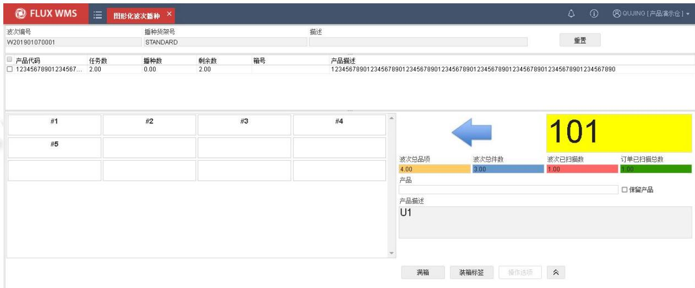


[图11-11-1]


## 11.11.1. 相关设置

## - 工作站配置：

图形化播种模块使用前，需要完成本地工作站配置。若未维护客户端将提示“本地尚未配置工作站编号，请配置后进行播种作业。”详细工作站配置流程，请参阅《本地设置》相关章节。 

## - 播种墙配置：

下发播种任务前，需要完成基础设置-播种墙模块播种墙设置。通过播种墙配置功能，可对播种顺序、播种位显示名称、颜色、图标等信息进行设置，详细播种墙配置流程，请参阅《播种墙》相关章节。 

## - 波次计划规则配置：

在波次计划规则中，配置【是否播种】（AddToSow）为“产生波次时生成播种任务”。配置后自动生成波次任务会自动写入播种库位信息，详细信息参阅《波次计划规则》相关章节。 

## 11.11.2. 播种操作

图形化波次播种分为两种模式：普通界面模式、简单界面模式，以应对不同复核方式的客户对界面的要求。 

## - 标准模式

■ 选择 “出库操作” 下的 “图形化波次播种” 功能，显示界面如下图： 

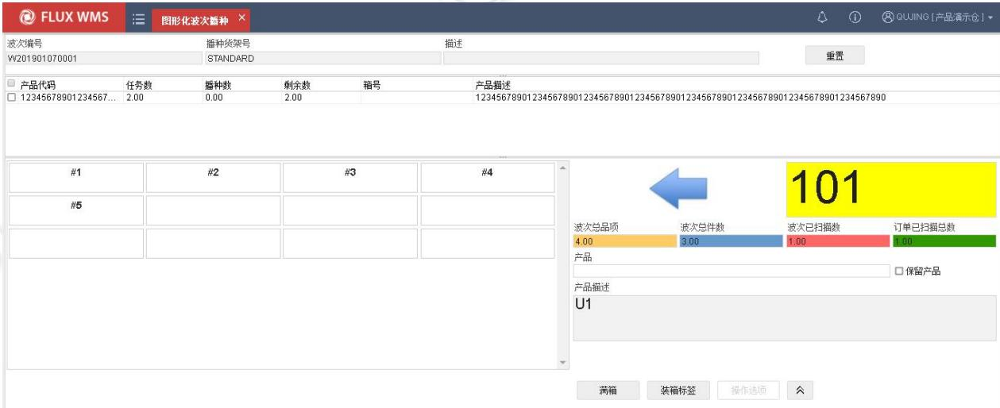


[图11-11-1]


■ 扫描/录入波次号，播种货架号，系统显示波次对应明细信息。以及每个播种位对应订单、播种进度信息。 

由于波次播种工作，能够支持多个作业台各自对应不同波次同时操作，因此作业伊始扫描播种货架号作为不同工作台的区分、记录。 

■ 如果是按箱合并拣货作业模式，通常支持按箱进行播种，勾选“按箱播种”选项，界面显示箱号录入字段，扫描箱号获取对应信息。 

■ 扫描产品条码，系统提示此产品应投放的播种位，并累加数量。箭头图标分别代表播种墙左中右位置，相关配置方法详见《播种墙》设置。 

■ 如产品异常（条码不符或数量超出）系统提示报错。 

■ 当系统判断波次内所有的任务都已经播种完成，则弹提示，确认播种完成。 

## - 简单模式

在图形化波次播种模块中，点击【操作选项】按钮勾选“简单模式”勾选框启用简单模式，显示界面如下图： 

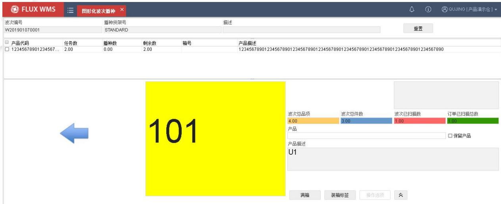


[图11-11-2]


■ 扫描/录入波次号，播种货架号，系统显示波次对应明细信息。以及每个播种位对应订单、播种进度信息。 

由于波次播种工作，能够支持多个作业台各自对应不同波次同时操作，因此作业伊始扫描播种货架号作为不同工作台的区分、记录。 

■ 如果是按箱合并拣货作业模式，通常支持按箱进行播种，勾选“按箱播种”选项，界面显示箱号录入字段，扫描箱号获取对应信息。 

■ 扫描产品条码，系统提示此产品应投放的播种位，并累加数量。 

■ 如产品异常（条码不符或数量超出）系统提示报错。 

当系统判断波次内所有的任务都已经播种完成，则弹提示，确认播种完成。 

## - 动态播种模式

普通模式，系统提前为任务分派好播种位，作业时操作人员扫描产品后，需要寻找系统提示的库位，而且产品随机扫描情况下，走动路径可能较长。因此系统还提供动态播种作业模式，任务下达时不绑定具体播种位，而是扫描到一个新订单的产品时临时按次序绑定一个空播种位提示用户操作，可以减少人员走动距离。 

动态播种模式，需要开启 PTL_SEQ_LOC 参数，后台处理不同，但用户具体作业步骤同固定播种位操作模式。 

当某个播种位的任务数量全部播种完成时，自动消息提示“货格 XXX 播种完成”，方便释放播种位，滚动操作。 

## - 按钮/右键功能

## ■ 播种完成

播种作业结束。 

如果有任务未被执行，弹出提示。仍旧确认的情况下，视作缺货确认。 

## ■ 尾箱作业

播种完成时，如果参数 PTL_LNK_CNO=Y（尾箱需要绑定箱号）开启，二级窗口显示所有未满箱确认的任务，依次要求用户扫描播种位与目标箱号，进行关联。 

## ■ 满箱

WAV_SOW_RTM 为 Y 时（实时更新模式），此按钮可用。点击【满箱】按钮，弹出窗口要求扫描箱号，扫描箱号后定位于【确定】按钮，人工点击【确定】进行播种后的目标箱号确认。 

## ■ 重置任务

弹出窗口提示“该波次的所有播种任务将被重新生成，请确认”，如确认，则对应全部任务被置于未操作状态。 

## ■ 残损登记

在图形化播种播种作业中，会出现缺货或者报残两种异常情况。当出现异常时，现场往往需要能够准确计入异常处理模块，用于后期个性化人工操作。 

✨ 点击【残损登记】按钮，弹出残损登记窗口 

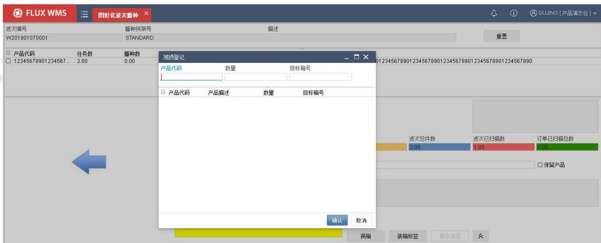


[图11-11-3]


✨ 产品代码：光标默认选中，等待扫描残损 SKU


## 数量：输入残损数量

目标箱号：在一个波次的播种过程中，目标箱号输入后一直保留，用户可以手动修改。 

缓存列表：每确认一个残损记录则写入缓存的列表。在缓存列表中可以删除某条记录登记完一个 SKU 可以连续登记下一个 SKU。 

确认：点击【确认】将缓存表中信息写入临时表。 

取消：点击【取消】放弃本次操作。 

## ■ 装箱清单

满箱或播种完成后，点击该按钮后打印装箱清单。 

## ■ 装箱标签

满箱或播种完成后，点击该按钮后打印装箱标签。 

## 11.12. 订单分配计划

分配规则 1.0、2.0，是定义到 SKU 级别的分配逻辑，如果需求要求包含相同 SKU 的不同订单需要有不同的分配规则，则只能在订单明细行中人工指定特殊的规则进行分配。 

在实际业务中，例如某服装 SKU，如果是普通的电商订单，则需要从拆零拣货区进行拣货。如果是唯品会的批量订单，则需要从存储区进行拣货，尽管它不是整箱。 

另外，分配规则 1.0、2.0（不管是一步分配还是两步分配）也不支持指定多个库区的分配方式，例如业务上可能要求首先在 A 库区分配，如果 A 库区不满足则在 B 库区分配。 

为了让分配更灵活方式实现，产生了通过订单分配计划模块配置规则的分配规则3.0方案。 

## 11.12.1. 新增订单分配计划

## - 订单分配计划头信息创建

订单分配计划创建方式采用人工录入创建。具体操作步骤如下： 

■ 选择 “出库操作” 下的 “订单分配计划”。 

■ 点击【新增】按钮，在表头的主信息页签中，输入订单分配计划描述、执行顺序字段如下图。 

<table><tr><td colspan="2">FLUX WMS</td><td colspan="10">订单分配计划</td></tr><tr><td colspan="2">查询条件</td><td colspan="10">新增 复制 删除 打印 回操作 导出 编辑</td></tr><tr><td colspan="2">仓库编号</td><td colspan="10">仓库编号 执行顺序 订单分配计划描述 定时任务编号</td></tr><tr><td colspan="2">DEMO</td><td colspan="10"></td></tr><tr><td colspan="2">... 查询</td><td colspan="10"></td></tr></table>


[图 11-12-1]


☆ 仓库编号：自动带出当前仓库编号，不可编辑。 

订单分配计划编号：系统自动生成，不可编辑。 

订单分配计划描述：分配计划对应名称，必填。 

执行顺序：定时器执行订单分配计划时的执行顺序，必填。 

定时器任务编号：系统自动生成，不可编辑。 

■ 输入完毕后，点击保存生成单头。 

## - 订单分配计划明细信息创建

■ 点击明细【新增】按钮，在明细的主信息页签中，行描述、订单排序字段、执行顺序、订单批量数、执行周期、订单选择 SQL 如下图。 

<table><tr><td>查询条件</td><td colspan="6">订单分配计划</td></tr><tr><td>仓库编号</td><td>新增</td><td>复制</td><td>删除</td><td>打印</td><td>回操作</td><td>导出 编辑 ...</td></tr><tr><td>DEMO</td><td>1</td><td>Test-100</td><td>AUTO_ALL</td><td></td><td></td><td></td></tr></table>


[图11-12-2]


订单分配计划编号：系统自动生成，不可编辑。 

☆ 行描述：配置行描述信息，可为空。 

订单排序字段：配置获取订单池订单顺序排序字段。可为空 

执行顺序：配置分配规则执行顺序，可为空。 

上次分配时间：记录上次定时器执行改行规则时间，不可编辑。 

订单批量数：配置获取订单量上线，可为空。 

活动标记:默认激活 

执行周期：配置定时器执行周期。支持单次执行或时间段内迭代执行。 

订单选择 SQL：配置订单抓取条件，不可为空。 

## - 订单选择 SQL 配置

该功能起到 SQL 多维度过滤作用，用于控制按照指定的条件筛选订单行。当标准筛选条件无法满足需求时，还可以通过扩展页签通过个性化方式进行扩展延伸，最大限度的满足现场各种需求。 

■ 点击明细订单选择 SQL 二级框按钮，自动弹出如下界面。 

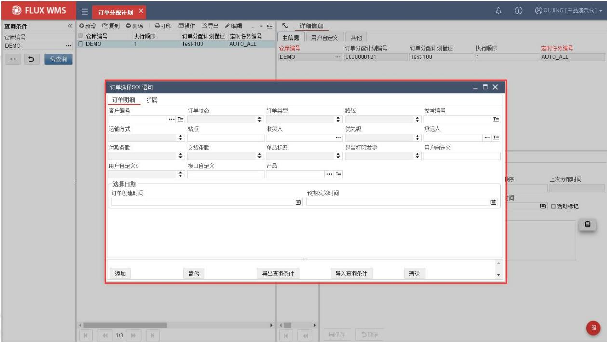


[图11-12-3]


订单分配计划通过订单选择 SQL 界面，配置订单池数据抓取约束条件。通过图形化界面选择、配置、勾选操作最终生成程序可以解析的 SQL 语句。 

添加：配置筛选条件后，点击【添加】按钮后，程序将以覆盖形式更新原 SQL。 

替代：配置筛选条件后，点击【替代】按钮后，程序将以追加形式更新原 SQL。 

导入查询条件：将已有的筛选文件导入。 

导出查询条件：将已配置完成的筛选条件导出成文件。 

☆ 清除：界面初始化。 

## ■ 其他

## 扩展信息选择

扩展页签主要用户实现现场个性化数据筛选要求，在标准页签无法满足现场需求情况下，可以通过配置扩展条件丰富筛选逻辑。实现方式为订单选择 SQL 配置界面，点击扩展页签，自动展示如下界面。【添加】、【替代】、【导入查询条件】、【导出查询条件】按钮功能设计与订单明细页签按钮功能相同。 

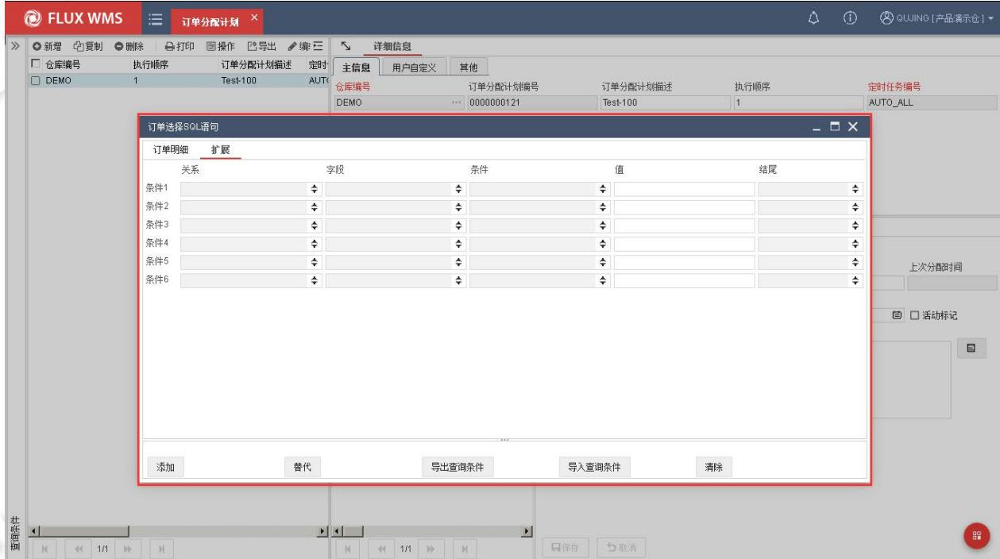


[图11-12-4]


## 11.13. 配送单作业

电商客户，装箱后经常需要打印快递要求的固定格式面单，并对包裹进行称重记录方便核算运费。这些工作可以在出库复核环节进行，但为了细化岗位操作，提升作业效率，部分作业现场将称重打印与复核装箱拆分为2个工位分别进行操作，因此WMS也提供了对应的单独作业界面，方便根据实际需要进行操作。 

由于作业速度不同，岗位配置也所不同，例如 2 个复核装箱工位可合并流转到 1 个配送单作业工位进行操作。 

配送单作业操作的前提是，产品有对应箱号。可以是复核装箱的新箱号或者拣货的目的箱号。 

## - 配送单作业

■ 选择 “出库操作” 下的 “配送单作业” 功能，显示界面如下图： 

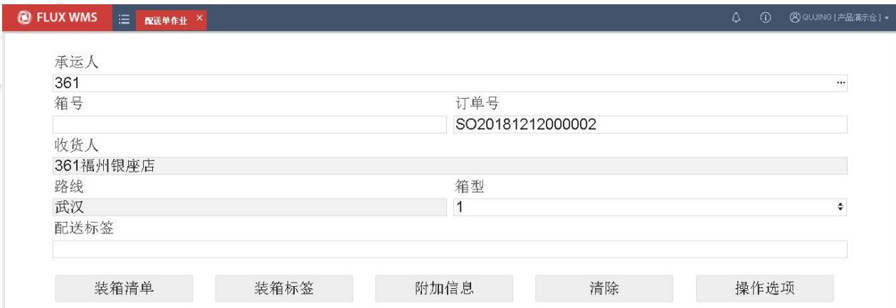


[图11-13-1]


■ 扫描箱号，系统显示对应订单号、收货人等信息。 

■ 如有推荐箱型，显示默认箱型装箱 ID，也可扫描记录。 

■ 如已与电子秤对接且参数配置为称重，系统弹出二级窗口显示获取到的重量信息 

■ 确认后，打印装箱标签（通常为快递面单） 

■ 如参数配置为需要记录配送标签，扫描并记录配送标签号（面单预印刷的面单号）。 

■ 如有需要可以打印装箱清单，或者进一步维护箱附加信息 

■ 系统根据 SHP_WTH_DEL（配送单作业完成后同步确认发货）参数设置，判断是否需要自动发育已完成配送单操作的订单或箱。 

## - 操作选项

点击【操作选项】按钮，在弹出窗口显示操作配置项 

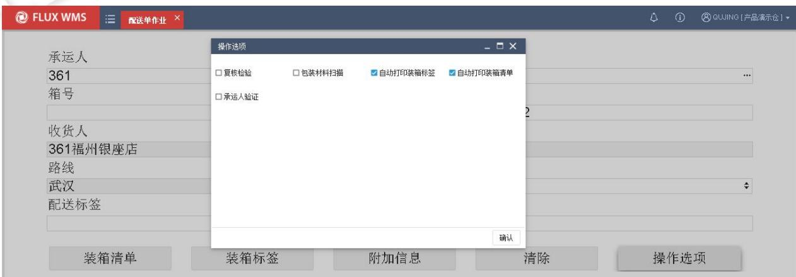


[图11-13-2]


■ 复核校验 

为了避免 2 个工位操作时，前一工位尚未复核的货物，后一工位称重出库，系统提供了复核后才能进行配送单作业，进行称重的可选控制。 

如勾选“复核校验”，系统会拦截未装箱的箱号。 

## ■ 包装材料扫描

用于配送单作业环节才封箱的业务情况。 

勾选“包装材料扫描”情况下，扫描箱号后，系统弹出包装材料二级窗口，用户扫描包材条码，点击确认按钮（或者通过F3快捷键确认），完成包材记录 

## ■ 自动打印装箱标签

默认设置根据 DEL_PRT_LVL 参数（配送单是否自动打印装箱标签）显示，用户可以修改设置，从而变更装箱标签的自动打印设置。 

## ■ 自动打印装箱标签

默认设置根据 DEL_PRT_LST 参数 (配送单是否自动打印装箱清单) 显示, 用户可以修改设置, 从而变更装箱清单的自动打印设置。 

## ■ 承运人校验

如勾选，界面需要录入当前操作的承运人，如果所扫描的箱号/订单对应的承运人，与当前操作的承运人不同，会提示报错进行拦截。 

## - 其他

## 作业模式

根据参数 DEL_OPR_TYP （配送单作业类型）判断按箱号操作，还是按订单号作业。 

## ■ 称重打印模式

根据参数 DEL_OPR_MOD（称重打印模式）配置称重、打印及标签扫描作业模式。可得到称重无弹出窗口、仅称重打印、不扫描输入等不同组合效果。 

## ■ 重量保持

相同货物批量称重时，可通过重量保持功能，一次录入重量。 

DEL_OPR_MOD=W 时，重量录入框旁显示“保持”勾选框，系统会将此时录入的重量替代电子秤输入重量，作为每箱的重量，直到人工修改重量或者去除勾选。 

## ■ 记录发运

如果参数开启（SHP_WTH_DEL），配送单标签扫描成功后系统自动发运对应记录。 

## 11.14. 集拼箱

复核后或者配送单作业完成后的待出库货物，如果是体积较大的包装，一般可以直接发运。但如果是体积较小包装，例如小包裹，为了方便装卸、运输，提高安全性，经常将多个小包裹组合为较大的物流运输单位，例如小包裹/箱放入大物流包裹/容器中，或者组合为运输托盘裹膜后整托交运。 

这种多个小的物流容器组合为大物流容器的过程，通常称为集拼箱。 

多点运输的情况下，也常将具有一定共同点的出库单组合在一起，例如同一卸车地点，或者同一转运地点的包裹组合为运输托盘。 

系统提供集拼箱功能，对集拼过程进行跟踪管理，方便得知小包裹对应的大物流容器，以便逐级跟踪。也能对集拼过程进行管理。 

集拼箱操作，通常使用 RF 扫描执行（具体可参考 RF 用户手册），FLUX WMS 中也提供相应操作功能。 

## 集拼箱操作

■ 选择“出库操作”下的“集拼箱”，系统显示如下集拼箱界面 ■ DROPID，即大物流容器的跟踪号。可以通过扫描/输入容器条码人工录入，也支持点击【DROPID】按钮由系统计算生成。 

<table><tr><td colspan="2">FLUX WMS</td><td colspan="8">集拼箱</td></tr><tr><td colspan="2">查询条件</td><td>主信息</td><td colspan="7">附加信息</td></tr><tr><td colspan="2">仓库编号</td><td>DropId</td><td colspan="2">箱号</td><td colspan="2">箱型</td><td colspan="3">订单号</td></tr><tr><td colspan="2">DEMO</td><td></td><td colspan="2"></td><td colspan="2"></td><td colspan="3"></td></tr><tr><td colspan="2">DropId</td><td>收货人</td><td colspan="2">路线</td><td colspan="2">计数</td><td colspan="3">累计重量</td></tr><tr><td colspan="2">路线</td><td></td><td colspan="2"></td><td colspan="2"></td><td colspan="3"></td></tr><tr><td colspan="2">站点</td><td>重量</td><td colspan="7">承运人</td></tr><tr><td colspan="2">箱型</td><td colspan="3">提交集拼箱数据</td><td colspan="5">承运人变更</td></tr><tr><td>重置</td><td>确定</td><td>箱号</td><td>路线</td><td>站点</td><td>订单号</td><td>收货人</td><td>分配ID</td><td>箱号</td><td>产品代码</td></tr><tr><td>称重</td><td>打印标签</td><td colspan="8"></td></tr><tr><td>打印清单</td><td>DROPID</td><td colspan="8"></td></tr></table>


[图 11-14-1]


■ 默认为当前登录仓库，可以根据需要输入路线、站点条件。如输入，则限制此容器只能装入相同路线/站点的订单出库包装；未输入则不进行限制。 

■ 点击【确定】按钮，进入集拼箱扫描界面 

<table><tr><td colspan="2">FLUX WMS</td><td colspan="8">集拼箱</td></tr><tr><td colspan="2">查询条件</td><td colspan="8">主信息 附加信息</td></tr><tr><td colspan="2">仓库编号</td><td colspan="2">DropId</td><td colspan="2">箱号</td><td colspan="2">箱型</td><td colspan="2">订单号</td></tr><tr><td colspan="2">DEMO</td><td colspan="2"></td><td colspan="2"></td><td colspan="2"></td><td colspan="2"></td></tr><tr><td colspan="2">DropId</td><td colspan="2">收货人</td><td colspan="2">路线</td><td colspan="2">计数</td><td colspan="2">累计重量</td></tr><tr><td colspan="2">路线</td><td colspan="2"></td><td colspan="2"></td><td colspan="2"></td><td colspan="2"></td></tr><tr><td colspan="2">站点</td><td colspan="2">重量</td><td colspan="2">承运人</td><td colspan="4"></td></tr><tr><td colspan="2">箱型</td><td colspan="8"></td></tr><tr><td>重置</td><td>确定</td><td colspan="3">提交集拼箱数据</td><td colspan="5">承运人变更</td></tr><tr><td>称重</td><td>打印标签</td><td>箱号</td><td>路线</td><td>站点</td><td>订单号</td><td colspan="4">收货人</td></tr><tr><td rowspan="4">打印清单</td><td rowspan="4">DROPID</td><td colspan="5">分配ID</td><td>箱号</td><td colspan="2">产品代码</td></tr><tr><td colspan="5">分配ID</td><td colspan="3">箱号</td></tr><tr><td colspan="5">产品代码</td><td colspan="3">数量_EA</td></tr><tr><td colspan="5">分拆箱号</td><td colspan="3">取消</td></tr></table>


[图11-14-2]


■ 连续扫描待出库箱号/配送标签号，界面显示已扫描记录对应信息。 

■ 扫描完成，确认【提交集拼箱数据】，系统将扫描到的出库包裹与集拼箱号码关联，并更新分配明细中的 DROPID 信息，完成集拼。 

## - 分拆箱号

特殊情况下，一个出库包裹放入集拼箱时会出现过大无法装入的情况，通常将此包裹加入下一个新的集拼箱。但有时为了提高空间利用率，也会采用拆分出库包裹，分别加入2个不同的集拼箱的情况。此时会用到拆分箱号的功能。 

■ 扫描箱号后，已扫描列表窗口中，选择对应箱号，鼠标右键分拆箱号 

■ 界面左方显示箱内明细信息。 

■ 根据实际拆分情况，选择产品，确认拆分数量 

■ 点击【分拆箱号】按钮，系统完成出库箱拆分。 

## 11.15. 集货位

FLUX WMS 提供了出库集货位的管理功能。在大型仓库中，不同产品可能分区存放，但一个订单有可能需要多个不同库区的产品。此时，可以分区拣货，再将不同库区拣区的货物运至系统指定的出库集货位，一同打包出库。也有仓库有多个出库操作月台，需要根据收货人所属路线分派集货位，在订单拣货后将相同收货人在同一路线上的订单的货物移动到一个出库门附近的集货位，便于后续的出库装载。 

启用集货位功能，需要做如下相关设置： 

■ 设置系统参数 SRT_LOC（开启自动分派集货库位功能），参数字符值设置为 Y 

■ 设置系统参数 SRT_TYP（集货区分配方法参数），可配置为按订单集货（ORD）、按收货人集货（CON）、按路线集货（ROU）、按站点集货（STP）、按承运人集货（CAR） 

■ 系统中库位功能里，设置集货用的库位，并且集货位的库位使用设置为“理货站” 

■ 集货位所属的库区，在库位功能中，配置对应路线。即关联为哪个路线对应的集货位。一个路线代码可关联多个库区。 

发运订单头的运输信息页签中有路线字段，如指定，则分配时在路线对应的库区中查找合适的集货位。集货位分派根据参数 SRT_TYP（集货区分配方法参数）进行，例如按订单，则每个订单对应一个集货位；按承运人，则相同承运人的多张订单混放同一集货位。 

■ 体积超限情况下，系统会寻找下一集货位。 

■ 设置完整是系统计算集货位的前提。系统计算集货位后，显示在分配明细的目标库位字段。可以通过出库操作中的“集货位”功能，查看集货位占用情况。 

## 集货位查看

■ 选择“出库操作”下的“集货位”。 

■ 在查询界面，输入库位或库区查询条件 

■ 点击查询按钮，系统显示集货位使用情况。 

■ 集货位被占用后，可以选择记录，通过鼠标右键菜单功能“清空集货位”，释放被 

占用的集货位。 

如果货物不清楚放置的集货位，可以通过鼠标右键菜单功能“按箱查询集货位”，在二级窗口扫描箱号，系统快速查询对应集货位。 

## 11.16. 装车单

货物确认出库前，装载到承运车辆上的时候，可以通过 FLUX WMS 的装车单功能进一步跟踪每辆车装载的产品细节，加强出库监管。但装车单功能本身，并不是出库流程中不可缺少的环节，用户可根据自身管理流程要求，选择使用。 

装车单通常一辆车一单，可根据分配明细或箱号甚至集拼箱容器号确认装车。装车扫描功能，同样支持RF作业与WMS界面作业2类操作方式。 

在 WMS 界面进行装车单创建操作，可以通过界面查询选择记录，也可以通过有线扫描枪扫描箱号获取装车单明细。 

## ● 装车单头创建

■ 选择“出库操作”下的“装车单” 

在表头明细页签的主信息页面，点击【新增】按钮，输入车号、司机等信息，系统自动生成装车单号，如下图所示。 

<table><tr><td colspan="11">FLUX WMS</td></tr><tr><td colspan="4">装车单</td><td colspan="7">发运订单</td></tr><tr><td colspan="4">查询条件</td><td>新增</td><td>复制</td><td>删除</td><td>打印</td><td>图操作</td><td>导出</td><td></td></tr><tr><td colspan="4">仓库编号</td><td>仓库编号</td><td>装车单编号</td><td>状态</td><td></td><td></td><td></td><td></td></tr><tr><td colspan="4">DEMO</td><td>LD19010001</td><td>装车单创建</td><td></td><td></td><td></td><td></td><td></td></tr><tr><td colspan="11">主信息</td></tr><tr><td colspan="11">主信息</td></tr><tr><td colspan="5">装车单编号</td><td>状态</td><td>车号</td><td>车辆类型</td><td>驾驶员</td><td>装车人</td><td></td></tr><tr><td colspan="5">LD19010001</td><td>装车单创建</td><td>DF</td><td>小型货车</td><td>BT.6312</td><td></td><td></td></tr><tr><td colspan="5">装车开始时间</td><td>装车结束时间</td><td>仓库编号</td><td>波次号</td><td>最大体积</td><td>最大重量</td><td></td></tr><tr><td colspan="6"></td><td>DEMO</td><td></td><td></td><td></td><td></td></tr><tr><td colspan="5">发货月台</td><td>电子封箱号</td><td></td><td></td><td></td><td></td><td></td></tr><tr><td colspan="6"></td><td></td><td></td><td></td><td></td><td></td></tr><tr><td colspan="11">保存</td></tr><tr><td colspan="11">取消</td></tr><tr><td colspan="11">明细信息</td></tr><tr><td colspan="5">客户编号</td><td>收货人名称</td><td>路线</td><td>站点</td><td>出库单号</td><td>分配ID</td><td>分配状态</td></tr><tr><td colspan="5">D12345678</td><td>361福州银座店</td><td>武汉</td><td></td><td>SO2018121200...</td><td>AL0027708</td><td>分配完成</td></tr></table>

## [图11-16-1]

在承运人页签，选择承运人 ID，系统显示客户档案中维护的承运人相应信息，用户可进一步修改。也可根据需要在用户自定义页签录入其他附加信息。 

■ 点击【保存】按钮，保存装车单表头信息。 

## - 查询创建装车单明细

■ 在界面下半部分的“拣货明细”页签，选择鼠标右键菜单的“查询”功能，系统显示如下图的查询二级窗口： 

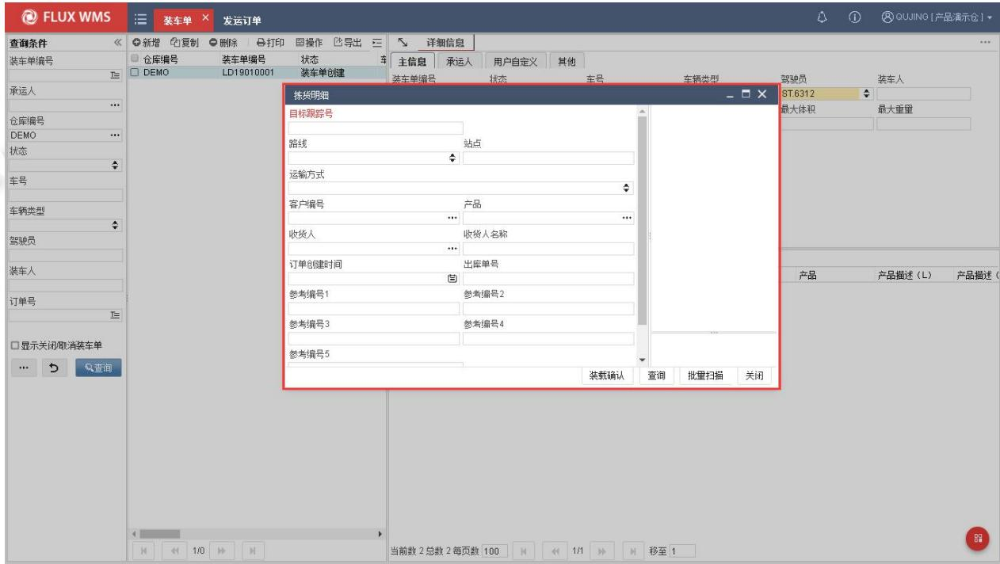


[图11-16-2]


输入查询条件后，点击查询按钮，在装车单明细部分的拣货明细页签显示查询到的订单分配明细信息。 

关闭查询二级窗口，在拣货明细页签勾选本次装载的记录，也可通过鼠标右键菜单的“全选”/“反选”功能选择记录。 

选择鼠标右键的“装载确认”，可将已选择的分配/拣货明细确认装载到装车单中，能够在“装车明细-按产品”页签查看相应明细信息。 

## - 批量扫描创建装车单明细

在连接扫描枪的情况下，可以通过扫描出库箱/集拼箱号码进行装车，达到类似RF扫描装车的作业效果。 

■ 在查询二级窗口中，点击【批量扫描】按钮，二级窗口右半部分显示扫描录入。 

逐一扫描箱号，系统显示已扫描箱号列表。已发货的箱号/托盘号/DROPID可以重复使用，但已装车未发货的相关跟踪号码，不可重复使用。 

■ 点击【装载确认】按钮，已扫描记录加入装车单。 

## - 鼠标右键菜单

## 表头部分的鼠标右键菜单

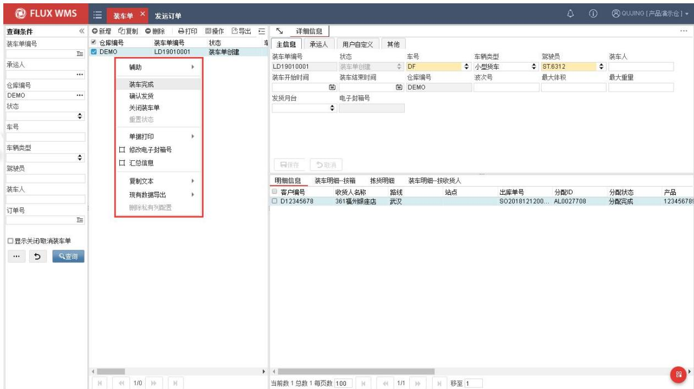


[图11-16-3]


## ■ 装车完成

实物装车、扫描完成，装车单中不可在增、减明细。但允许编辑表头内容。 

■ 确认发货 

按装车单做发货确认。 

## ■ 关闭装车单

操作完毕后，关闭单证，不能再做其他修改。 

## ■ 重置状态

已完成或者已发运的装车单，如果货品问题需要卸车处理，可以通过重置状态功能，将装车单 

恢复到创建状态，删减明细。 

■ 修改电子封箱号 

根据需要，在弹出框中，录入用于封车的电子铅封的号码。 

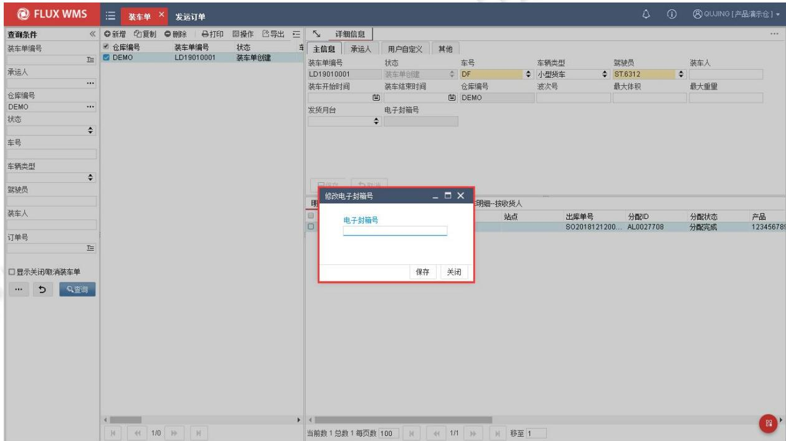


[图11-16-3]


■ 汇总信息 

显示装车单汇总信息。 

■ 单据打印子菜单 

包括： 

打印按产品合并显示的装车清单 

打印按箱号显示的装车清单，不再显示产品明细。 

打印装车标签 

打印药品检验报告 

## - 明细鼠标右键菜单

装车明细页签，鼠标右键菜单如下： 

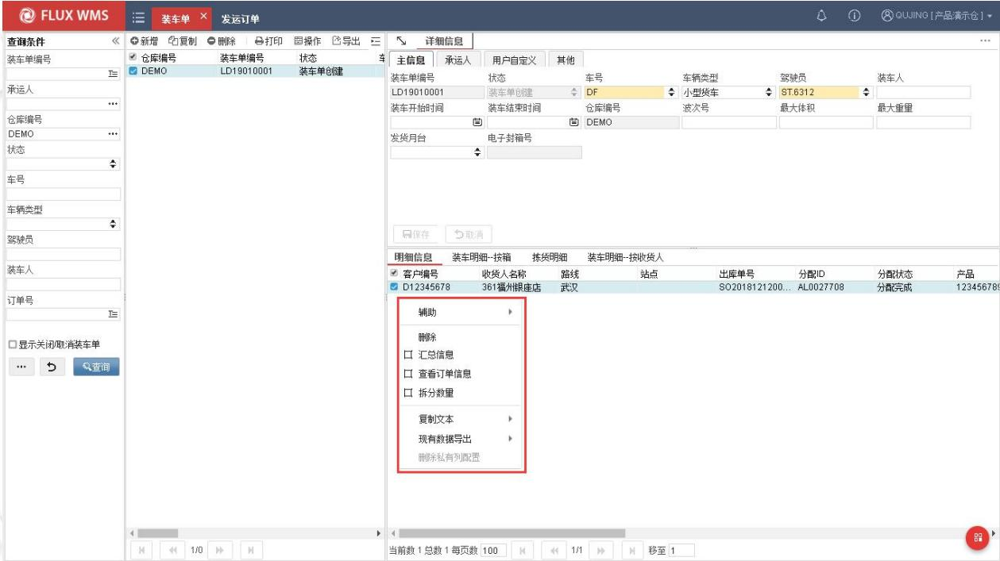


[图11-16-4]


## 查看订单信息

方便查看装车记录对应订单信息。根据当前装车明细行，跳转到发运订单界面，带入订单号信息进行查询。 

## ■ 拆分数量

已加入装车单的记录，有时需要进行拆分，例如原本一个托盘要装车，由于各种原因从托盘上拆分下2箱货物，剩余货物装车。此时可以扫描托盘号装车，再拆分出不装车的2箱货物。 

选择装车明细行记录，通过“拆分数量”功能，显示如下界面，输入需要拆分的数量，确认后从装车单中移除，原本一行分配明细，相应拆分为2行信息。 

## 11.17. 出库异常处理

在出库作业中经常碰到货物分配、拣货、复核、发货等环节，出现缺货、损坏等无法正常操作的情况，系统支持将异常记录，并跳过，进行后续操作，避免影响正常作业。由专职人员另行处理异常，以便提高作业效率。 

## - 出库异常处理

■ 在出库操作菜单下，选择“复核异常处理” 

■ 通过波次号、订单编号、参考编号 1、客户编号、产品代码、功能分类、异常类型等条件查询异常记录 

<table><tr><td>主信息</td><td>用户自定义</td><td>其他</td></tr><tr><td>波次号</td><td>订单编号</td><td>参考编号1</td></tr><tr><td>W201808300673</td><td>SO20180830001723</td><td></td></tr><tr><td>产品代码</td><td colspan="2">产品描述</td></tr><tr><td>SKUAUTO_SERIAL0_0003</td><td colspan="2">SKUAUTO_SERIAL0_0003</td></tr><tr><td>分配编号</td><td>行号</td><td>异常类型</td></tr><tr><td>ALL0000075160</td><td>3</td><td>残损</td></tr><tr><td>异常编码</td><td colspan="2">异常描述</td></tr><tr><td>审核人</td><td>审核时间</td><td>关闭人</td></tr></table>


[图11-17-1]


■ 选择记录，鼠标右键确认处理


■ 鼠标右键内容包括


<table><tr><td>主信息</td><td>用户自定义</td><td>其他</td></tr><tr><td>波次号</td><td>订单编号</td><td>参考编号1</td></tr><tr><td>W201808300673</td><td>SO20180830001723</td><td>WH_AUTOMATIC AUTO_SERIAL_0</td></tr><tr><td>产品代码</td><td colspan="2">产品描述</td></tr><tr><td>SKUAUTO_SERIAL0_0003</td><td colspan="2">SKUAUTO_SERIAL0_0003</td></tr><tr><td>分配编号</td><td>行号</td><td>异常类型 异常状态 审核意见</td></tr><tr><td>ALL0000075160</td><td>3</td><td>残损 创建</td></tr><tr><td>异常编码</td><td colspan="2">异常描述</td></tr><tr><td>审核人</td><td>审核时间</td><td>关闭人 关闭时间</td></tr><tr><td></td><td></td><td></td></tr></table>

[图11-17-2] 

审核意见 - 输入处理意见 

重新下发拣货任务 - 针对缺货，补发拣货任务，重新拣取复核缺少的产品。 

取消分配 - 针对缺货异常记录，对异常订单行进行取消分配操作。 

取消拣货任务 - 对于已有拣货任务，但未拣取确认的记录，取消任务，释放库存。 

生成反拣任务 - 针对部分拣货/完全拣货状态任务，创建反拣任务。 

生成盘点任务 - 对异常记录库存进行盘点 

关闭异常 - 处理结束，关闭异常 

## 11.18. 销售订单

仓库运作中，为了提高作业效率，要将订单拆分成播种部分和摘果部分，然后分作业类型操作。为方便处理，原始订单指令作为销售订单，拆分后的出库指令作为系统的发运订单。 

销售订单，通常多用于原始指令内容查询，或着根据销售订单查询、创建发运单波次。系统并不直接根据销售订单执行拣货、发货等作业。 

销售订单内容、界面基本同发运订单，支持右键菜单导入功能，但无集装箱、费用等页签信息。 

<table><tr><td rowspan="6">销售订单编号</td><td rowspan="6">仓库编号</td><td rowspan="6">销售订单编号</td><td rowspan="6">订单类型</td><td rowspan="6">订号</td><td colspan="8">详细信息</td></tr><tr><td>主信息</td><td>收货人</td><td>运输</td><td>结算人</td><td>承运人</td><td>下单方</td><td>接口</td><td>用户自定义</td></tr><tr><td>销售订单编号</td><td colspan="2">订单状态</td><td colspan="2">订单类型</td><td>释放状态</td><td colspan="2">优先级</td></tr><tr><td>客户编号</td><td colspan="2">客户名称</td><td colspan="2">收货人代码</td><td>收货人名称</td><td colspan="2">预期发货时间</td></tr><tr><td>参考编号1</td><td colspan="2">参考编号2</td><td colspan="2">参考编号3</td><td>参考编号4</td><td colspan="2">参考编号5</td></tr><tr><td></td><td colspan="2"></td><td colspan="2"></td><td></td><td colspan="2"></td></tr><tr><td>订单状态</td><td colspan="12"></td></tr><tr><td>订单类型</td><td colspan="12"></td></tr><tr><td>参考编号</td><td colspan="12"></td></tr><tr><td>收货人代码</td><td colspan="12"></td></tr><tr><td>产品代码</td><td colspan="12"></td></tr><tr><td>订单创建时间</td><td colspan="12"></td></tr><tr><td>客户编号</td><td colspan="12"></td></tr><tr><td>仓库编号</td><td colspan="12"></td></tr><tr><td>DEMO</td><td colspan="12"></td></tr><tr><td>查询</td><td colspan="12"></td></tr></table>

[图11-18-1] 

## 11.19. 销售订单编组

为方便提高作业效率，可以将客户指令作为销售订单，多销售订单合并为编组，然后根据产品重合率拆分作业单为多发运订单，分别进行播种、摘果拣货。具体发运订单可以跨销售订单，与销售订单编组相对应。 

## - 销售订单编组

■ 选择 “出库操作” 下的 “销售订单编组”。系统显示查询界面。 

输入查询条件，可查询到已创建的销售订单编组。表头信息为组号、仓库、释放状态等（如下图）。明细部分为组号、行号、单号。 

<table><tr><td colspan="2">FLUX WMS</td><td colspan="9">销售订单编组</td></tr><tr><td colspan="2">查询条件</td><td colspan="9">新增复制删除打印回操作导出</td></tr><tr><td colspan="2">仓库编号</td><td>仓库编号</td><td>销售订单编组号</td><td>释放状态</td><td colspan="6">创建时间</td></tr><tr><td colspan="2">DEMO</td><td colspan="9"></td></tr><tr><td colspan="2">销售订单编组号</td><td colspan="9"></td></tr><tr><td colspan="2">释放状态</td><td colspan="9"></td></tr><tr><td>...</td><td>查询</td><td colspan="9"></td></tr></table>


[图 11-19-1]


■ 通过表头右键菜单，可以生成波次计划，或者取消已经生成的波次计划。 

<table><tr><td colspan="2">FLUX WMS</td><td colspan="11">销售订单编组</td></tr><tr><td colspan="2">查询条件</td><td colspan="11">新增 复制 删除 打印 操作 导出</td></tr><tr><td colspan="2">仓库编号</td><td colspan="11">仓库编号 销售订单编号 释放状态 创建时间</td></tr><tr><td colspan="2">DEMO</td><td colspan="11"></td></tr><tr><td colspan="2">销售订单编号号</td><td colspan="11"></td></tr><tr><td colspan="2">释放状态</td><td colspan="11"></td></tr><tr><td rowspan="6" colspan="2">查询</td><td colspan="11">辅助</td></tr><tr><td colspan="11">生成发货波次</td></tr><tr><td colspan="11">取消发货波次</td></tr><tr><td colspan="11">复制文本</td></tr><tr><td colspan="11">现有数据导出</td></tr><tr><td colspan="11">删除私有列配置</td></tr></table>


[图11-19-2]


■ 明细部分的鼠标右键菜单，主要是删除功能，可从销售订单编组中删除指定的销售订单。 

## 11.20. 发票管理

电商、电视购物行业的仓库，发货时，经常需要为收货人提供对应发票。为了方便管理发票的打印、维护、取消、替换等操作，系统提供了专门的发票管理功能。 

正常操作时，发票通常是在波次计划中批量打印，系统将关联的发票信息记录在发票管理功能中，以供后续管理。 

波次计划发票关联，请参考波次计划功能的相应介绍。 

## - 发票管理

■ 选择 “出库操作” 下的 “发票管理”。 

■ 输入查询条件，查询发票记录 

<table><tr><td>主信息</td><td>用户自定义</td><td>其他</td></tr><tr><td>发票流水号</td><td>发票状态</td><td>发票类型 订单号 客户编号 仓库编号</td></tr><tr><td>发票号</td><td>抬头</td><td>税号 金额</td></tr><tr><td>开户银行</td><td colspan="2">银行帐号 注册电话 注册地址</td></tr><tr><td>参考编号1</td><td>参考编号2</td><td>参考编号3 开票人 开票时间</td></tr><tr><td colspan="3">明细信息</td></tr><tr><td colspan="3">新增 复制 删除 打印 操作 导出 编辑</td></tr><tr><td colspan="3">行号 产品代码 产品描述(L) 单位 数量 单价</td></tr></table>


[图11-20-1]


■ 一张发票关联多个订单明细，可在明细行部分查看相应信息：


■ 也可在明细页签，点击新增按钮，人工录入发票信息。金额可录入负数、小数信息。


<table><tr><td>主信息</td><td>用户自定义</td><td>其他</td></tr><tr><td>发票流水号</td><td>发票状态</td><td>发票类型</td></tr><tr><td>发票号</td><td>抬头</td><td>税号</td></tr><tr><td>开户银行</td><td>银行帐号</td><td>注册电话</td></tr><tr><td>参考编号1</td><td>参考编号2</td><td>参考编号3</td></tr><tr><td colspan="3">明细信息</td></tr><tr><td>行号</td><td>产品代码</td><td>产品描述(L)</td></tr><tr><td colspan="3">当前数0总数0每页数0</td></tr></table>


[图 11-20-2]


■ 作废发票 

已关联发票，需要重新打印、使用新的发票号。原有发票记录需要作废处理。 

查询到对应发票记录后，通过鼠标右键功能“作废发票”，系统会提示是否需要复制新发票记录，以便进行发票关联。 

## FLUX WMS ：三 发票管理 ×

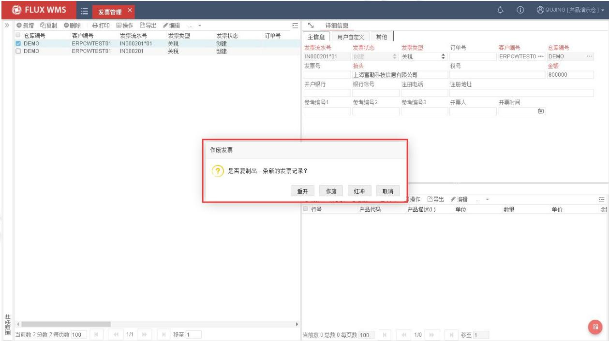


[图 11-20-3]


点击【作废】执行后，原发票记录会被置为“作废”状态。 

如果选择【重开】，则生成一条发票号为空的记录，其余信息同原记录。方便用户输入新发票号。原发票记录变更为“作废重开”。 

【红冲】同样生成一条发票号为空的复制记录，只是原发票记录状态变更为“红冲”。 

## ■ 取消发票

已关联发票号，但实际未打印，此发票号码仍可使用，此时原纪录可以取消。通过鼠标右键功能“取消发票”，变更记录状态。 

## ■ 复制发票

根据所选记录，生成一条发票号为空的新记录，其余信息同原记录。 

## 11.21. 包裹管理

有些仓库与多个承运商有业务往来，根据重量选择不同的承运商。因此包装复核称重完成以后，才会选择承运商然后分别打印快递面单的需求。 

对于此类特殊业务模式，系统通过包裹管理功能，支持相应作业需求。 

包裹管理功能，需要配合集拼箱功能使用。集拼箱确认时，将对应集拼箱号、重量等信息传递给包裹管理模块。 

## - 包裹管理

■ 选择 “出库操作” 下的 “包裹管理”。 

■ 在查询界面，输入查询条件 

■ 查询到符合条件的集拼箱记录，选择记录，点击鼠标右键“指派承运人”功能，显示弹出窗口，输入或选择对应承运人，并确定 

■ 通过鼠标右键功能，打印相应自定义快递单据 

■ 打印成功，选择右键功能，关联面单号 

## - 鼠标右键功能

<table><tr><td colspan="2">FLUX WMS</td><td colspan="12">包裹管理</td></tr><tr><td colspan="2">查询条件</td><td>打印</td><td>回操作</td><td>导出</td><td colspan="9"></td></tr><tr><td colspan="2">仓库编号</td><td>包裹号</td><td>承运人</td><td>承运单号</td><td>毛重</td><td>数量</td><td>体积</td><td>预期装车日期</td><td>自定义01</td><td>自定义02</td><td colspan="3">自定义03</td></tr><tr><td colspan="2">仓库编号</td><td colspan="12"></td></tr><tr><td colspan="2">仓库编号</td><td colspan="12"></td></tr><tr><td colspan="2">仓库编号</td><td colspan="12"></td></tr><tr><td colspan="2">仓库编号</td><td colspan="12"></td></tr><tr><td colspan="2">仓库编号</td><td colspan="12"></td></tr><tr><td colspan="2">仓库编号</td><td colspan="12"></td></tr><tr><td colspan="2">仓库编号</td><td></td><td colspan="11"></td></tr><tr><td colspan="2">仓库编号</td><td></td><td colspan="11"></td></tr><tr><td colspan="2">仓库编号</td><td></td><td colspan="11"></td></tr><tr><td colspan="2">仓库编号</td><td></td><td colspan="11"></td></tr><tr><td colspan="2">仓库编号</td><td></td><td colspan="11"></td></tr><tr><td colspan="2">仓库编号</td><td></td><td colspan="10"></td><td></td></tr><tr><td colspan="2">仓库编号</td><td></td><td colspan="10"></td><td></td></tr><tr><td colspan="2">仓库编号</td><td></td><td colspan="10"></td><td></td></tr><tr><td colspan="2">仓库编号</td><td></td><td colspan="10"></td><td></td></tr><tr><td colspan="2">仓库编号</td><td></td><td colspan="10"></td><td></td></tr><tr><td colspan="2">仓库编号</td><td></td><td colspan="10"></td><td></td></tr><tr><td colspan="2">仓库编号</td><td></td><td colspan="2"></td><td colspan="8"></td><td></td></tr><tr><td colspan="2">仓库编号</td><td></td><td colspan="2"></td><td colspan="8"></td><td></td></tr><tr><td colspan="2">仓库编号</td><td></td><td colspan="2"></td><td colspan="8"></td><td></td></tr><tr><td colspan="2">仓库编号</td><td></td><td colspan="2"></td><td colspan="8"></td><td></td></tr><tr><td colspan="2">仓库编号</td><td></td><td colspan="2"></td><td colspan="8"></td><td></td></tr><tr><td colspan="2">仓库编号</td><td></td><td colspan="2"></td><td colspan="8"></td><td></td></tr></table>


[图11-21-1]


■ 修改承运人 

已指派的承运人，可以根据需要重新修改。 

■ 导出到 EXCEL 

将所选记录导出为 Excel 文档。 

## 12. 任务管理

## 12.1. 上架任务管理

上架任务专项管理功能。针对上架类型的任务进行查询、处理。 

## - 上架任务操作

■ 选择 “任务管理” 下的 “上架任务管理”。 

■ 输入查询条件查找相应任务 

■ 根据作业需要，对创建状态的上架任务，可以打印标签，或确认任务完成。 

## - 右键菜单功能

针对查询到的上架任务，可通过鼠标右键菜单功能项进行相关操作。 

<table><tr><td colspan="9">主信息 自定义 其他</td></tr><tr><td>任务编号</td><td>任务编号</td><td>标签打印</td><td>状态</td><td></td><td></td><td></td><td></td><td></td></tr><tr><td>TSK1812120002</td><td>N</td><td>完成</td><td></td><td></td><td></td><td></td><td></td><td></td></tr><tr><td>产品</td><td colspan="8">产品描述</td></tr><tr><td colspan="9">1234567890123456789012345678901234567890123456789012345678901234567890123456789012345678901234567890123456789</td></tr><tr><td>单证号</td><td colspan="8">行号</td></tr><tr><td>ASN20181203000004</td><td>3</td><td colspan="7">标签打印</td></tr><tr><td colspan="9">原始信息</td></tr><tr><td>FM批次</td><td>FM库位</td><td>原始跟踪号</td><td>单位</td><td colspan="5">数量</td></tr><tr><td>A000113170</td><td>LOC</td><td>*</td><td>EA</td><td>66.00</td><td colspan="4">66.00</td></tr><tr><td colspan="9">目标信息</td></tr><tr><td>TO库位</td><td>上架库位</td><td>目标跟踪号</td><td>上架跟踪号</td><td></td><td></td><td></td><td></td><td></td></tr><tr><td>F1</td><td></td><td></td><td></td><td colspan="5">单位</td></tr><tr><td>数量</td><td>原因</td><td colspan="7">原因描述</td></tr><tr><td>操作人员</td><td colspan="8">上架时间</td></tr><tr><td>QUJING</td><td colspan="8">2018-12-12 17:24:31</td></tr><tr><td colspan="9">批次属性</td></tr><tr><td>生产日期</td><td>失效日期</td><td>入库日期</td><td>批次属性04</td><td>批次属性05</td><td colspan="4">批次属性06</td></tr><tr><td>2018-12-12</td><td>2018-12-12</td><td>红色</td><td>N-良品</td><td colspan="5">合格</td></tr><tr><td>批次属性07</td><td>批次属性08</td><td>批次属性09</td><td>批次属性10</td><td>批次属性11</td><td colspan="4">批次属性12</td></tr><tr><td>批次属性13</td><td>批次属性14</td><td>批次属性15</td><td>批次属性16</td><td>批次属性17</td><td colspan="4">批次属性18</td></tr><tr><td>批次属性19</td><td>批次属性20</td><td>批次属性21</td><td>批次属性22</td><td>批次属性23</td><td colspan="4">批次属性24</td></tr></table>


[图12-1-1]


■ 复制信息 

选择任务作为样本，维护上架时间、操作人员，或者修改目标库位并保存后，通过鼠标右键功能，将信息复制到当前任务列表的以下各行，方便上架确认使用。 

■ 确认上架 

确认任务执行。可以单行确认，也可以选择多行记录，通过批量操作子菜单，进行批量上架确认。 

## ■ 重置打印标志

记录改为未打印。 

## 12.2. 拣货任务管理

拣货任务专项管理功能。类似任务管理，但只针对拣货类型的任务，并且可以直接对任务进行确认。 

## - 拣货任务操作

■ 选择 “任务管理” 下的 “拣货任务管理” 功能。 

■ 输入查询条件查找相应任务 

■ 根据作业需要，对创建状态的拣货任务，可以打印标签，或确认任务完成。 

## - 右键菜单功能

针对查询到的上架任务，可通过鼠标右键菜单功能项进行相关操作。 

<table><tr><td colspan="8">主信息 自定义 其他</td></tr><tr><td>任务编号</td><td>顺序号</td><td>状态</td><td>客户编号</td><td>仓库编号</td><td></td><td></td><td></td></tr><tr><td>TSK1808150007</td><td>1</td><td>完成</td><td>D12345678</td><td>DEMO</td><td></td><td></td><td></td></tr><tr><td>产品代码</td><td colspan="4">中文描述</td><td></td><td></td><td></td></tr><tr><td>U3</td><td colspan="4">U3</td><td></td><td></td><td></td></tr><tr><td>任务组号</td><td>单证号</td><td>行号</td><td>释放人员</td><td>释放时间</td><td></td><td></td><td></td></tr><tr><td></td><td>SO20180815000001</td><td>1</td><td>QUJING</td><td>2018-08-15 11:55:58</td><td></td><td></td><td></td></tr><tr><td colspan="5">原始信息</td><td></td><td></td><td></td></tr><tr><td>批次</td><td>库位</td><td>跟踪号</td><td>单位</td><td>数量</td><td></td><td></td><td></td></tr><tr><td>A000006141</td><td>F1</td><td>*</td><td></td><td></td><td></td><td></td><td></td></tr><tr><td colspan="5">目标信息</td><td></td><td></td><td></td></tr><tr><td>库位</td><td>跟踪号</td><td>包装</td><td>单位</td><td>数量</td><td></td><td></td><td></td></tr><tr><td>SORTATIONDEMO</td><td>180815000004</td><td>PO</td><td>EA</td><td>6.00</td><td>6.00</td><td></td><td></td></tr><tr><td>拣货人员</td><td>拣货时间</td><td>关闭人员</td><td>关闭时间</td><td></td><td></td><td></td><td></td></tr><tr><td></td><td></td><td>QUJING</td><td>2018-08-15 11:56:07</td><td>标签打印</td><td></td><td></td><td></td></tr><tr><td colspan="5">批次属性</td><td></td><td></td><td></td></tr><tr><td>生产日期</td><td>失效日期</td><td>入库日期</td><td>批次属性04</td><td>批次属性05</td><td>批次属性06</td><td></td><td></td></tr><tr><td>2018-08-15</td><td>2018-08-31</td><td>2018-08-15</td><td></td><td>RO</td><td></td><td></td><td></td></tr><tr><td>批次属性07</td><td>批次属性08</td><td>批次属性09</td><td>批次属性10</td><td>批次属性11</td><td>批次属性12</td><td></td><td></td></tr><tr><td></td><td></td><td></td><td></td><td></td><td>12.00000000</td><td></td><td></td></tr><tr><td>批次属性13</td><td>批次属性14</td><td>批次属性15</td><td>批次属性16</td><td>批次属性17</td><td>批次属性18</td><td></td><td></td></tr><tr><td></td><td></td><td></td><td></td><td></td><td></td><td></td><td></td></tr><tr><td>批次属性19</td><td>批次属性20</td><td>批次属性21</td><td>批次属性22</td><td>批次属性23</td><td>批次属性24</td><td></td><td></td></tr><tr><td></td><td></td><td></td><td></td><td></td><td></td><td></td><td></td></tr></table>


[图12-2-1]


## ■ 复制信息

选择任务作为样本，维护拣货时间、操作人员，或者修改目标库位等信息并保存后，通过鼠标右键功能，将信息复制到当前任务列表的以下各行，方便拣货确认使用。 

## ■ 拣货确认

确认所选任务记录，拣货执行成功。 

■ 快捷拣货确认 

二级窗口显示订单号或者任务号输入界面，符合条件的拣货任务批量确认执行成功。确认同时，可以修改拣货人员信息，无需在任务清单中另行修改、复制。 

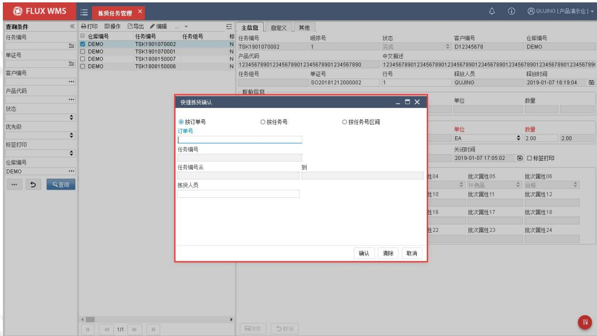


[图12-2-2]


## ■ 重置打印标志

记录改为未打印。 

## 12.3. 补货任务管理

补货任务功能，是用来生成、查询、确认产品补货任务操作所使用的。 

要顺利使用系统补货功能，需要对产品拣货位、库位、补货规则等基础设置信息进行设置。 

## 12.3.1. 补货设置

使用补货功能，需维护的相关基础设置为： 

## - 产品档案拣货位设置

需要针对产品设置拣货位，具体可参考产品档案部分的拣货位页签设置说明。 

产品拣货位设置，可分为固定拣货位和动态拣货位。固定拣货位即为产品指定拣货位 A 或 B，操作时系统只使用设置的 A、B 库位作为拣货位。 

而动态拣货位则通过 DYNAMIC 库位设置对应的使用类型库位，由系统在该类库位中查找当时可用的库位。如拣货位设置为 DYNAMIC_EA 库位，库位使用类型为件拣货库位，则在件拣货库位中找可用库位，作为拣货位。如果当前件拣货位有该产品库存，则合并库位；如果没有库存，则根据补货规则查找新库位。因此使用动态拣货位，每个产品所用的拣货位并不是始终不变的。 

需要注意的是，如果拣货位类型设置与当前仓库中的库位类型不符，或者补货下限设置为 0 都将导致无法生成补货任务。 

## ● 库位设置

产品拣货位中设置的拣货位使用类型，在库位信息中，目标库位的库位使用类型需要与之相符。例如，产品档案中选择了件拣货库位，而在库位设置中，全部库位都是存储库位，会导致无法生成补货任务。 

## - 库区设置

库区中，可以同时有多个存储库区，系统支持配置指定的存储区的库存是否能够用于补货（是否补货来源）。例如存放未质检的不良品（尚未执行转移变更批次属性）的库区，一般不会用于补货来源。 

## - 区域设置

订单驱动补货时会用到，区域是否遵循拣货位设置。如果不勾选，可以忽略产品档案的拣货位配置内容，仍旧从存储库位分配。 

主要应用与良品、不良品分区存放，又都要拣货出库的业务情况。良品区设置拣货位，从拣货位拣货，但不良品区作业频率低，不设置拣货位，直接从存储位拣货。 

## - 补货规则

产品所用的补货规则，需要选择对应的上架规则。可参考上架规则设置。如果补货规则、上架规则设置有误，或者产品档案中没有选择正确的规则，会影响到动态补货情况下的新库位查找。拣 货位尚有库存存在时，系统计算补货任务直接指向现有拣货位，无需考虑补货规则。 

## - 参数设置

参数 RPL_QTY_ALC，控制补货任务计算时，是否考虑分配数量。 

如参数设置为 N，则根据拣货位库存是否低于补货下限来判断是否需要生成补货任务，以及计算待补货数量。 

如参数设置为 Y，则根据拣货位分配后的可用库存余量是否低于补货下限来判断是否需要生成补货任务，以及计算待补货数量。 

因此参数设置不正确，会使得部分产品没有根据预想生成补货任务。例如某产品拣货位库存100，分配95后剩余5EA，补货下限为20，当参数为N时，系统判断100>20，不需要生成补货任务；而当参数为Y时，系统判断5<20，需要生成补货任务。 

是否根据分配数量计算补货，主要与仓库操作情况相关，例如拣货位可存放产品数量、库存周转率及分配到实际拣货的时间长度、拣货到发货确认的时间长度相关。 

否则根据分配数量计算的补货库存可能没有空间容纳。 

## 12.3.2. 补货操作

补货作业可以根据现场需要，需要不同的操作模式。比较常见的主要有库存检查模式和订单驱动模式，经常配合使用。 

## - 库存检查补货

通常在作业空闲时段进行，触发后系统检查库存，针对需要补货的产品，批量生成补货任务。操作步骤为： 

■ 选择任务管理下的补货任务功能。 

■ 点击右键菜单，选择功能“产生任务”，系统检查当前库存和产品等设置，批量生成补货任务。同时能够在库存余量的按批次/库位/跟踪号查询界面中查看补货待下架/上架数量。待补货库存被锁定。 

在生成的任务列表中，勾选所需补货任务（或通过全选/反选选择记录），选择右键功能菜单项，打印补货清单，使用清单指导仓库实际补货作业（也可打印补货标签，用于 RF 补货操作，具体参考 RF 操作手册）。 

实物补货完毕，在补货任务中，选择对应记录，点击右键菜单功能项“确认补货”，系统执行补货确认，将存储库位的对应库存补货到拣货库位。补货操作完成。 

■ 如果补货任务生成后，实际不再需要补货（例如已经执行了库存移动）可通过右键功能项“取消任务”来释放补货任务。 

## - 订单驱动补货

补货任务中的生成补货功能，用于日常操作开始前或者结束后批量生成补货任务。但有时即使拣货位补充到上限，日常操作分配时遇到出库量大的情况也会将拣货位库存用光，需要临时进行补货。此时可通过订单驱动补货，仅补充订单中需要而拣货位库存不足的产品。 

订单驱动补货，除了产品档案中的拣货位等信息设置之外，还需要在分配规则中进行设置，允许系统自动产生补货任务。 

订单驱动生成的补货任务同样显示在补货任务列表中，后续补货操作与批量生成补货的操作相同。 

## - 鼠标右键功能

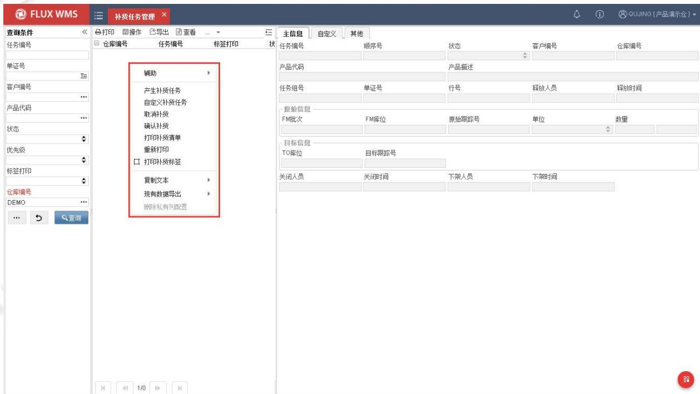


[图12-3-1]


## ■ 自定义产生补货任务

根据需要的范围条件，生成指定的补货任务，方便有针对性的快速补货操作。 

在如下的二级窗口中，指定补货任务范围条件，包括货物库位条件，产品、货类、产品组等条件。系统在指定的条件范围内，计算生成补货任务。 

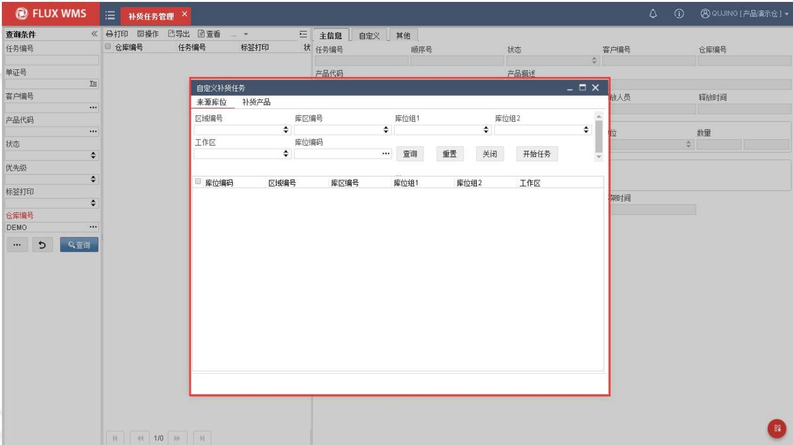


[图12-3-2]


## ■ 取消任务

已生成任务，如无需操作，可以取消任务。 

## 12.4. 任务管理

任务管理功能是记录产品在系统中所做任务的所有活动。可以查询到已经完成的任务情况和尚未执行的操作任务。任务包括上架任务、补货任务、拣货任务等不同类型的任务。 

## - 任务管理

■ 选择 “任务管理” 下的 “任务管理” 功能，系统显示查询页面。 

■ 输入查询条件，查询所需任务 

■ 可通过明细页签查看具体细节。 

## - 鼠标右键功能

<table><tr><td colspan="7">主信息 自定义 其他</td></tr><tr><td>任务编号</td><td>顺序号</td><td>类型</td><td>状态</td><td></td><td></td><td></td></tr><tr><td>TSK1812120002</td><td>1</td><td>上架</td><td>完成</td><td></td><td></td><td></td></tr><tr><td>优先级</td><td>行号</td><td>单证号</td><td>单证类型</td><td></td><td></td><td></td></tr><tr><td></td><td>3</td><td>ASN20181203000004</td><td>预期到货通知</td><td></td><td></td><td></td></tr><tr><td>客户编号</td><td>产品代码</td><td></td><td></td><td></td><td></td><td></td></tr><tr><td>D12345678</td><td>1234567890123456789012345678</td><td></td><td></td><td></td><td></td><td></td></tr><tr><td colspan="4">FM</td><td></td><td></td><td></td></tr><tr><td>FM包装代码</td><td>FM单位</td><td>FM数量</td><td>FM数量_EA</td><td></td><td></td><td></td></tr><tr><td>STANDARD</td><td>EA</td><td>66.00</td><td>66.00</td><td></td><td></td><td></td></tr><tr><td>FM批次</td><td>FM库位</td><td>原始跟踪号</td><td></td><td></td><td></td><td></td></tr><tr><td>A000113170</td><td>LOC</td><td>*</td><td></td><td></td><td></td><td></td></tr><tr><td colspan="4">TO</td><td></td><td></td><td></td></tr><tr><td>TO包装代码</td><td>TO单位</td><td>TO数量</td><td>TO数量_EA</td><td></td><td></td><td></td></tr><tr><td>STANDARD</td><td>EA</td><td>66.00</td><td>66.00</td><td></td><td></td><td></td></tr><tr><td>TO批次号</td><td>TO库位</td><td>目标跟踪号</td><td></td><td></td><td></td><td></td></tr><tr><td>A000113170</td><td>F1</td><td>*</td><td></td><td></td><td></td><td></td></tr><tr><td>创建人员</td><td>创建时间</td><td>冻结人员</td><td>冻结时间</td><td></td><td></td><td></td></tr><tr><td>QUJING</td><td>2018-12-12 17:24:08</td><td></td><td></td><td></td><td></td><td></td></tr><tr><td>执行人员</td><td>执行时间</td><td></td><td></td><td></td><td></td><td></td></tr><tr><td>QUJING</td><td>2018-12-12 17:24:31</td><td></td><td></td><td></td><td></td><td></td></tr></table>


[图12-4-1]


## ■ 优先执行

将所选任务的优先级提至最高，使之在任务队列中排序在前。 

## ■ 人员指派

二级窗口显示当前工作区中的员工信息，可选择人员，将任务指派给此作业员。也可以选择多人，平均分配任务。 

如果查询条件中未选择“工作区”，则显示此仓库全部工作区对应的人员信息。 

## 12.5. 任务派发

员工所需执行操作的任务，不经过人工提前安排，而是通过扫描员工 ID，领取任务，由系统根据预设逻辑分发任务，称之为“任务派发”。同时，此功能可以相应输出任务标签，以便后续操作使用。 

## - 任务派发

■ 选择 “任务管理” 下的 “任务派发”。 

■ 作业模式一： 

设置任务派发范围条件，如工作区、库位组等，扫描员工 ID，由系统根据范围内的任务量，下发任务给此员工。 

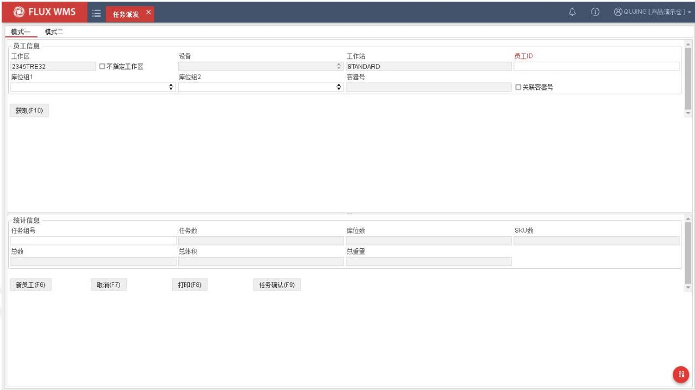


[图12-5-1]


工作区 - 客户端对应工作区。在客户端文件中配置默认值，作为任务领取的工作区范围限定。界面可勾选“不指定工作区”，但不可修改默认工作区。 

设备 - 根据员工默认设备进行显示（在“员工设备设置”功能中维护）。 

工作站 - 显示客户端文件中的工作站配置信息，。 

员工 ID - 扫描的员工条码或者员工卡号条码 

库位组 1 - 任务派发限定范围要求 

库位组 2 - 任务派发限定范围要求 

关联容器号 - 勾选后，可扫描容器号与任务关联。例如拣货到同一个目标容器中。 

■ 任务派发成功，系统生成任务组号，显示在界面上。 

■ 支持人工录入任务组号，用于补打印等。也可点击【获取】按钮，根据指定范围，获取待作业的任务组号，显示在界面上。 

■ 纸单作业模式下，任务操作完成，可以在系统界面确认完成。点击【任务确认】按钮，系统显示如下录入框，扫描员工 ID，录入任务组号，确认执行。 

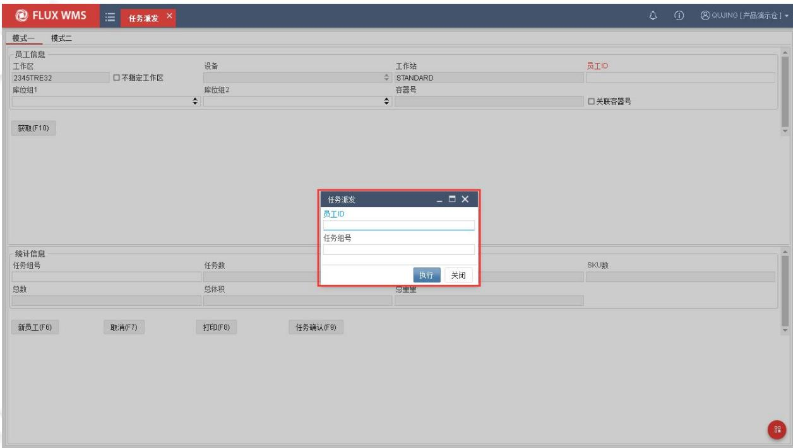


[图12-5-2]


■ 模式二： 

扫描员工卡号、ID，系统查找并分派任务，在界面显示任务组号。 

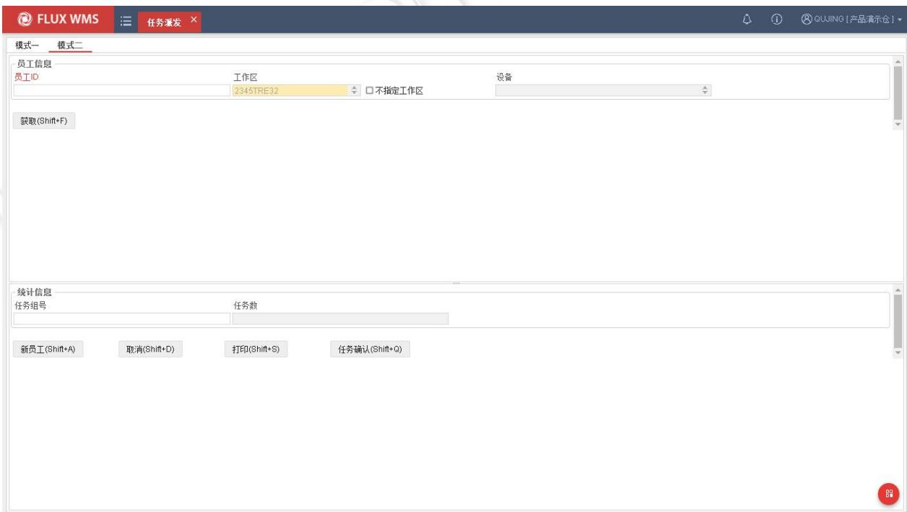


[图 12-5-3]


- 其他 

## ■ 打印

点击后，打印任务组号对应标签。 

## 12.6. 员工工作区设置

配合任务调度管理，根据需要，设置作业员工具有权限的工作区。员工代码，需要先期在 SEC 权限管理系统中创建，工作区则需要在基础设置-工作区功能中维护。 

## - 员工工作区设置

■ 选择 “任务管理” 下的 “员工工作区设置” 功能。 

<table><tr><td>FLUX WMS</td><td colspan="9">员工工作区设置</td></tr><tr><td>查询条件</td><td colspan="9">新增复制删除打印操作导出</td></tr><tr><td>仓库编号</td><td>仓库编号</td><td>用户编号</td><td>工作区</td><td>主信息</td><td>自定义</td><td>其他</td><td colspan="3"></td></tr><tr><td>DEMO</td><td colspan="3"></td><td>仓库编号</td><td>用户编号</td><td colspan="4">工作区</td></tr><tr><td>用户编号</td><td colspan="3"></td><td></td><td></td><td colspan="4"></td></tr><tr><td>姓名</td><td colspan="3"></td><td></td><td></td><td colspan="4"></td></tr><tr><td>工作区</td><td colspan="3"></td><td></td><td></td><td colspan="4"></td></tr><tr><td>查询</td><td colspan="3"></td><td></td><td></td><td colspan="4"></td></tr></table>


[图12-6-1]


■ 点击【新增】按钮，输入，或通过浏览按钮选择用户编号（操作员工 ID）。系统根据选择，显示对应姓名。 

■ 下拉选择此员工的指定工作区。如果为主作业区，可设置为默认工作区。 

■ 保存记录，建立员工-工作区对应关系。 

■ 同一员工可设置多个工作区。 

## 13. 增值服务

## 13.1. 概述

随着物流在企业管理中的作用日渐加强，越来越多的仓库不仅提供常见的进出存及简单的附加服务，还能提供简单加工等增值服务。 

为了对这些能够带来更多价值的服务操作进行管理，系统提供了增值服务模块。根据不同的加工管理需求，增值服务分为加工单、拆分单和增值服务单。 

## 13.2. 加工单

加工作业，是最常见的增值服务之一。 

从仓库操作管理角度，可分为 2 类加工方式，一类是在原产品基础上进行加工，产品总数量不变，例如产品换包装、贴标签、覆膜、塑封等；另一类是组合加工，将几个子件加工组合成一个父件，不仅产品会变化，产品数量也随之变化，例如将分别入库的洋酒产品和杯具产品组合成洋酒礼盒。 

注：子件指用来加工组合的零件产品，父件指的是加工组合所得的产品或产品套装。 

对于第一种，原产品基础上的加工，管理重点是记录加工件数，以便统计工作量、成本，同时在库存中区分已加工、未加工的产品，以免误出库。此类作业，如果产品代码不变，仅记录工作量，可以使用 ASN、SO 的服务记录功能，或使用增值服务单；如果加工后产品代码改变，可使用转移单，或作为一对一的 BOM，通过加工单进行管理。 

对于第二种组合加工，由于产品、数量均有变化，需要对加工全程操作进行管理。此类比较复杂的组合加工需要通过加工单功能进行管理。 

## - 相关设置

使用加工单功能，需要先将相关基础设置维护完善，主要涉及设置有： 

## ■ 产品档案

产品档案中，需要维护父件和子件的基础信息，并且父件产品需要设置“组合件标识”，具体可参考基础设置，产品档案部分的介绍。 

## ■ 组件

需要在基础设置-组件功能中，设置子件、父件的关联，类似 BOM 清单。具体设置参考基础设 

置组件部分的介绍。 

## 库位

系统中需要有库位使用是“组装加工区”的加工专用库位。库位 ID 限定为 WB_RM_仓库 ID、WB_FG_仓库 ID，作为待加工库位，与已加工暂存库位。 

## - 加工单操作

## ■ 创建加工用的 SO

创建加工用的 SO, 目的是通过 SO 分配子件库存, 便于操作人员从库存中拣取加工所需的货物。同样, 也可以接收 ERP 接口下达的加工指令, 作为加工 SO。 

因此对于 SO，可输入加工所需的父件数量，通过 SO 右键功能 “拆分 BOM”，将记录拆分为子件记录，订单分配子件库存。 

拆分 BOM 的作业，并不限制 SO 的订单类型。也即全部 SO 都可以根据 BOM 把父件明细拆分为子件明细。有时仓库不做实际加工，仅按照 BOM 比例出库对应子件产品会使用到单纯的“拆分 BOM”功能，仓库不进行组装加工。系统通过参数 VAS_BOM_CTL 控制非加工类型的 SO 能否使用“拆分 BOM”功能。 

普通 SO 拆分 BOM, 最常见的就是赠品的发货, 订单指令中下达出库 A 产品 100 件, 根据 BOM 中的设置, SO 拆分为 A 产品 100 件+赠品 B 产品 100 件, 分别拣货后发货。由超市销售人员将 A、B 产品捆扎在一起销售。 

但只有加工类型的 SO，系统在拆分的同时，会创建对应的加工单，可以进行后续加工操作。 

## ■ 生成加工任务

SO 分配并确认拣货后，通过鼠标右键，生成加工任务，系统找到对应加工单，创建子件加工信息。 

创建 SO、拆分 BOM 和生成加工任务等操作，可参考发运订单部分的介绍。 

## ■ 加工确认

在增值服务的加工单功能中，查询所需的加工单 

在明细的父件页签，选择执行加工的父件产品，在待加工数量字段，输入此次加工的数量，并保存。 

<table><tr><td colspan="2">FLUX WMS</td><td colspan="8">加工单</td></tr><tr><td colspan="2">查询条件</td><td>删除</td><td>打印</td><td>操作</td><td>导出</td><td>编辑</td><td>...</td><td>...</td><td>...</td></tr><tr><td colspan="2">客户编号</td><td colspan="2">加工单号</td><td colspan="2">加工单状态</td><td colspan="2">客户名称</td><td colspan="2">加工单状态</td></tr><tr><td colspan="2">加工单号</td><td colspan="8"></td></tr><tr><td colspan="2">订单号</td><td colspan="8"></td></tr><tr><td colspan="2">用户自定义</td><td colspan="8"></td></tr><tr><td colspan="2">仓库编号</td><td colspan="8"></td></tr><tr><td colspan="2">DEMO</td><td colspan="8"></td></tr><tr><td colspan="2">...</td><td colspan="8">查询</td></tr></table>


[图 13-2-1]


同时可根据需要，输入父件产品的批次属性信息。系统支持一个加工单多次加工操作。 

实物加工完毕，选择父件记录，通过鼠标右键菜单功能“确认完成加工”，由系统执行加工确认，扣减子件产品数量，增加父件产品数量。 

如果加工单明细行较多，又一次性加工完成，可以通过表头的鼠标右键功能“确认完成加工”，批量确认整单加工作业完成。 

■ 加工操作全部完成，可关闭加工单 

■ 如果有设置加工费率，加工单关闭时系统将计算对应费用。 

## - 损耗管理

加工过程中，有时会有库存损耗，导致无法按数量完成加工。此时需要扣减掉损耗的子件库存，但又希望在加工单中加以记录。 

因此系统提供的损耗管理，主要是加工单中，记录子件损耗数量，然后通过表头鼠标右键功能“生成损耗调整单”，通过调整单扣减子件损耗库存。 

## 14. 行业插件

## 14.1. 药品检验报告

药品检验报告，是医药行业管理的所需功能。 

药品检验报告书是对药品质量作出技术鉴定后出具的具有法律效力的技术文件，一般需要按批号提供。 

对于需要进行检验报告管理的产品，可以在入库时扫描供应商提供的药品检验报告，然后出库时相应打印，随货提供给收货人。 

## - 药品检验报告

使用药品检验报告功能，需要先配置 MED_QC_DIR 参数，维护药品检验报告上传后的保存路径。 

■ 选择 “行业插件” 下的 “药品检验报告” 功能 

对于新入库的批次，查询时勾选“未关联文件”，系统查询尚无检验报告记录的库存。 

<table><tr><td>客户编号</td><td>产品代码</td><td>药品编码</td><td>通用名</td></tr><tr><td>规格</td><td>剂型</td><td>生产厂家</td><td>批次文号</td></tr><tr><td>批次号</td><td>供应商</td><td>药品检验报告文件名</td><td></td></tr></table>


[图14-1-1]


■ 选择记录，鼠标右键“定位药品检验报告”，系统定位到参数所指定的路径，选择 

检验报告扫描文件，确认后将文件名记录批次信息中（后台字段） 

■ 需要输出药品检验报告时，同样通过查询定位，此时无需勾选“未关联文件”条件，系统只查询具有检验报告的批次库存。 

■ 选择记录，通过鼠标右键功能“打印药品检验报告”，或者打印标签 

## 14.2. 药品养护

药品养护是医药行业的管理要求，根据药品的储存特性要求，采取科学、合理、经济的手段和方法，通过控制调节药品的储存条件，对药品储存质量进行定期检查，达到有效防止药品质量变质、确保储存药品质量的目的。 

## ● 药品养护

进行养护前，需要先产生养护任务。系统支持定时器后台生成养护任务，同时也支持手动生成养护任务。此处介绍手动作业模式。 

■ 选择“行业插件”下的“药品养护” 

■ 在“列表”页签，选择鼠标右键功能“养护计划”，系统显示如下二级窗口 

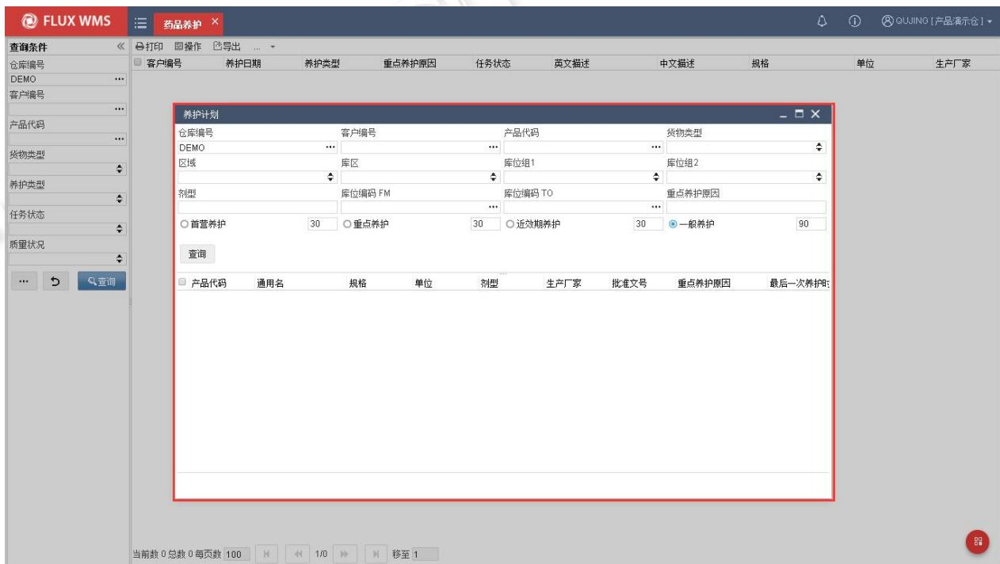


[图 14-2-1]


重点养护原因 - 根据 GSP 管理要求，药企可自行定义重点养护原因范围。系统提供重 

点养护原因内容维护，查询时也可基于此内容筛选记录。 

养护周期 - 不同药品要求的养护周期不同，系统提供首营、重点、近效期的不同默认周期供配置使用，勾选后，将筛选上次养护迄今超过指定天数的待养护产品记录。三个都不选，默认为一般养护。 

■ 输入查询条件，查询符合条件的产品记录 

在查询结果部分，选择记录，鼠标右键功能“生成养护任务”，系统针对所选产品的库存记录，生成养护任务，可在药品养护功能中查询到。 

已生成的养护任务，可以通过 RF 的养护功能执行养护（具体介绍请参考 RF 操作手册）。如在 WMS 中确认养护，同样选择记录后，通过鼠标右键功能“确认养护结果”，系统显示二级窗口： 

<table><tr><td>仓库编号</td><td>客户编号</td><td>养护日期</td><td>养护类型</td><td>重点养护原因</td><td>任务状态</td><td>英文描述</td><td>中文描述</td><td>规格</td><td>单位</td><td>生产厂家</td></tr><tr><td rowspan="3">客户编号</td><td>FLUX</td><td>2019-01-03</td><td>首营养护</td><td>重点</td><td>创建</td><td>GANKANG</td><td>999感冒中药颗粒</td><td>20mg</td><td>EA</td><td>三九制药有限</td></tr><tr><td>FLUX</td><td>2019-01-03</td><td>近效期养护</td><td></td><td>创建</td><td>TV002</td><td>002号电视机</td><td>1</td><td>EA</td><td>生产厂家</td></tr><tr><td>BM</td><td>2019-01-03</td><td>近效期养护</td><td></td><td>创建</td><td>SKU-SUBSERIALNO</td><td>SKU-SUBSERIALN...</td><td></td><td>件</td><td></td></tr><tr><td>产品代码</td><td>FLUX</td><td>2019-01-03</td><td>近效期养护</td><td></td><td>创建</td><td>TV002</td><td>002号电视机</td><td>1</td><td>EA</td><td>生产厂家</td></tr><tr><td rowspan="4">货物类型</td><td>FLUX</td><td>2019-01-03</td><td>近效期养护</td><td></td><td>创建</td><td>SERIALNO</td><td>SKU-SERIALNO采...</td><td></td><td>EA</td><td></td></tr><tr><td>FLUX</td><td>2019-01-03</td><td>近效期养护</td><td></td><td>创建</td><td>TV002</td><td>002号电视机</td><td>1</td><td>EA</td><td>生产厂家</td></tr><tr><td>FLUX</td><td>2019-01-03</td><td>近效期养护</td><td>ZHONGDIAN</td><td>创建</td><td>fenghanganmaokeli</td><td>风寒感冒颗粒</td><td>10ML</td><td>EA</td><td></td></tr><tr><td>FLUX</td><td>2019-01-03</td><td>近效期养护</td><td>就是重点</td><td>创建</td><td>GANKANG</td><td>感度</td><td>12*2</td><td>EA</td><td>吉林敖东制药</td></tr><tr><td rowspan="2">养护类型</td><td>FLUX</td><td>2019-01-03</td><td>近效期养护</td><td>还是重点</td><td>创建</td><td>PUDILAN</td><td>蒲地蓝</td><td>24*2</td><td>EA</td><td>爱谁谁制药有</td></tr><tr><td>FLUX</td><td>2019-01-03</td><td>近效期养护</td><td>ZHONGDIAN</td><td>创建</td><td>fenghanganmaokeli</td><td>风寒感冒颗粒</td><td>10ML</td><td>EA</td><td></td></tr><tr><td rowspan="48">任务状态</td><td>FLUX</td><td>2019-01-03</td><td></td><td></td><td></td><td></td><td></td><td>1</td><td>EA</td><td>生产厂家</td></tr><tr><td>FLUX</td><td>2019-01-03</td><td></td><td></td><td></td><td></td><td></td><td></td><td>EA</td><td></td></tr><tr><td>FLUX</td><td>2019-01-03</td><td></td><td></td><td></td><td></td><td></td><td></td><td>EA</td><td></td></tr><tr><td>FLUX</td><td>2019-01-03</td><td></td><td></td><td></td><td></td><td></td><td></td><td>EA</td><td></td></tr><tr><td>FLUX</td><td>2019-01-03</td><td></td><td></td><td></td><td></td><td></td><td></td><td>EA</td><td></td></tr><tr><td>FLUX</td><td>2019-01-03</td><td></td><td></td><td></td><td></td><td>ALN...</td><td></td><td>件</td><td></td></tr><tr><td>BM</td><td>2019-01-03</td><td></td><td></td><td></td><td></td><td>长虹...</td><td>12*2</td><td>EA</td><td>黑心预菌灭绝</td></tr><tr><td>FLUX</td><td>2019-01-03</td><td></td><td></td><td></td><td></td><td></td><td>这是TV010D的别名1</td><td>EA</td><td></td></tr><tr><td>FLUX</td><td>2019-01-03</td><td></td><td></td><td></td><td></td><td></td><td>这是TV010D的别名1</td><td>EA</td><td></td></tr><tr><td>FLUX</td><td>2019-01-03</td><td></td><td></td><td></td><td></td><td></td><td></td><td>EA</td><td></td></tr><tr><td>FLUX</td><td>2019-01-03</td><td></td><td></td><td></td><td></td><td></td><td>1</td><td>EA</td><td>生产厂家</td></tr><tr><td>FLUX</td><td>2019-01-03</td><td></td><td></td><td></td><td></td><td></td><td>008199300206</td><td>EA</td><td></td></tr><tr><td>FLUX</td><td>2019-01-03</td><td></td><td></td><td></td><td></td><td></td><td>1</td><td>EA</td><td>生产厂家</td></tr><tr><td>FLUX</td><td>2019-01-03</td><td></td><td></td><td></td><td></td><td></td><td></td><td>EA</td><td></td></tr><tr><td>FLUX</td><td>2019-01-03</td><td></td><td></td><td></td><td></td><td></td><td></td><td>EA</td><td></td></tr><tr><td>FLUX</td><td>2019-01-03</td><td></td><td></td><td></td><td></td><td></td><td>1</td><td>EA</td><td>生产厂家</td></tr><tr><td>FLUX</td><td>2019-01-03</td><td></td><td></td><td></td><td></td><td></td><td></td><td>EA</td><td></td></tr><tr><td>FLUX</td><td>2019-01-03</td><td></td><td></td><td></td><td></td><td></td><td></td><td>EA</td><td></td></tr><tr><td>FLUX</td><td>2019-01-04</td><td></td><td></td><td></td><td></td><td></td><td></td><td>EA</td><td></td></tr><tr><td>FLUX</td><td>2019-01-03</td><td></td><td></td><td></td><td></td><td></td><td></td><td>EA</td><td></td></tr><tr><td>FLUX</td><td>2019-01-03</td><td></td><td></td><td></td><td></td><td></td><td></td><td>EA</td><td></td></tr><tr><td>FLUX</td><td>2019-01-03</td><td></td><td></td><td></td><td></td><td></td><td></td><td>EA</td><td></td></tr><tr><td>FLUX</td><td>2019-10-03</td><td></td><td></td><td></td><td></td><td></td><td></td><td>EA</td><td></td></tr><tr><td>FLUX</td><td>2019-01-03</td><td></td><td></td><td></td><td></td><td></td><td></td><td>EA</td><td></td></tr><tr><td>FLUX</td><td>2019-01-03</td><td></td><td></td><td></td><td></td><td></td><td></td><td>EA</td><td></td></tr><tr><td>FLUX</td><td>2019-01-03</td><td></td><td></td><td></td><td></td><td></td><td></td><td>EA</td><td></td></tr><tr><td>FLUX</td><td>2020-01-03</td><td></td><td></td><td></td><td></td><td></td><td></td><td>EA</td><td></td></tr><tr><td>FLUX</td><td>2019-01-03</td><td></td><td></td><td></td><td></td><td></td><td></td><td>EA</td><td></td></tr><tr><td>FLUX</td><td>2019-01-03</td><td></td><td></td><td></td><td></td><td></td><td></td><td>EA</td><td></td></tr><tr><td>FLUX</td><td>2019-01-03</td><td></td><td></td><td></td><td></td><td></td><td></td><td>EA</td><td></td></tr><tr><td>FLUX 2019-01-03</td><td></td><td></td><td></td><td></td><td></td><td></td><td></td><td>EA</td><td></td></tr><tr><td>FLUX</td><td>2019-01-03</td><td></td><td></td><td></td><td></td><td></td><td></td><td>EA</td><td></td></tr><tr><td>FLUX</td><td>2019-01-03</td><td></td><td></td><td></td><td></td><td></td><td></td><td>EA</td><td></td></tr><tr><td>FLUX</td><td>2019-01-03</td><td></td><td></td><td></td><td></td><td></td><td></td><td>EA</td><td></td></tr><tr><td>FLUX</td><td>2019-2019-01-03</td><td></td><td></td><td></td><td></td><td></td><td></td><td>EA</td><td></td></tr><tr><td>FLUX</td><td>2019-2019-01-03</td><td></td><td></td><td></td><td></td><td></td><td></td><td>EA</td><td></td></tr><tr><td>FLUX</td><td>2019-2019-01-03</td><td></td><td></td><td></td><td></td><td></td><td></td><td>EA</td><td></td></tr><tr><td>FLUX</td><td>2019-2019-02-03</td><td></td><td></td><td></td><td></td><td></td><td></td><td>EA</td><td></td></tr><tr><td>FLUX</td><td>2019-2019-02-03</td><td></td><td></td><td></td><td></td><td></td><td></td><td>EA</td><td></td></tr><tr><td>FLUX</td><td>2019-2019-02-03</td><td></td><td></td><td></td><td></td><td></td><td></td><td>EA</td><td></td></tr><tr><td>FLUX</td><td>2019-2019-02-03</td><td></td><td></td><td></td><td>选择</td><td>返回空记录</td><td>取消</td><td></td><td></td></tr><tr><td>FLUX</td><td>2019-2019-02-03</td><td></td><td></td><td></td><td></td><td></td><td></td><td>EA</td><td></td></tr><tr><td>FLUX</td><td>2019-2019-02-03</td><td></td><td></td><td></td><td></td><td></td><td></td><td>EA</td><td></td></tr><tr><td>FLUX</td><td>2019-2019-02-03</td><td></td><td></td><td></td><td></td><td></td><td></td><td>EA</td><td></td></tr><tr><td>FLIX</td><td>2019-01-03</td><td></td><td></td><td></td><td></td><td></td><td></td><td>EA</td><td></td></tr><tr><td>FLUX</td><td>2019-01-03</td><td></td><td></td><td></td><td></td><td></td><td></td><td>EA</td><td></td></tr><tr><td>FLUX</td><td>2019-01-03</td><td></td><td></td><td></td><td></td><td></td><td></td><td>EA</td><td></td></tr><tr><td>FLUX</td><td>2019-01-03</td><td></td><td></td><td></td><td></td><td></td><td></td><td>EA</td><td></td></tr></table>


[图 14-2-2]


■ 用户输入养护情况细节后确认养护结果。 

## - 养护处理

根据 GSP 要求, 在药品养护的业务中, 质管员需要对养护异常的药品进行冻结, 禁止销售出库。此时可以将问题记录, 通过鼠标右键菜单, 批量操作子菜单中的 “生成冻结单” 功能, 将异常库存冻结, 不参与出库作业。 


FLUX WMS 药品养护


<table><tr><td>客户编号</td><td>养护日期</td><td>养护类型</td><td>重点养护原因</td><td>任务状态</td><td>英文描述</td><td>中文描述</td><td>规格</td><td>单位</td><td>生产厂家</td><td>批准文号</td><td></td></tr><tr><td>FLUX</td><td>2019-01</td><td rowspan="2">辅助</td><td rowspan="2"></td><td>创建</td><td>GANKANG</td><td>999感冒 中热颗粒</td><td>20mg</td><td>EA</td><td>三九制药有限公司</td><td>0719004</td><td></td></tr><tr><td>FLUX</td><td>2019-01</td><td>创建</td><td>TV002</td><td>002号电视机</td><td>1</td><td>EA</td><td>生产厂家</td><td></td><td></td></tr><tr><td>BM</td><td>2019-01</td><td colspan="2">生成冻结单</td><td>创建</td><td>SKU-SUBSERIALNO</td><td>SKU-SUBSERIALN...</td><td></td><td>件</td><td></td><td></td><td></td></tr><tr><td>FLUX</td><td>2019-01</td><td colspan="2">打印药品养护报表</td><td>创建</td><td>TV002</td><td>002号电视机</td><td>1</td><td>EA</td><td>生产厂家</td><td></td><td></td></tr><tr><td>FLUX</td><td>2019-01</td><td>养护计划</td><td>HONGDIAN</td><td>创建</td><td>TV002</td><td>002号电视机</td><td>1</td><td>EA</td><td>生产厂家</td><td></td><td></td></tr><tr><td>FLUX</td><td>2019-01</td><td>确认养护结果</td><td>是重点</td><td>创建</td><td>fenghanganmaokeli</td><td>风寒感冒颗粒</td><td>10ML</td><td>EA</td><td></td><td>0719005</td><td></td></tr><tr><td>FLUX</td><td>2019-01</td><td rowspan="2">养护类型权限</td><td rowspan="2">是重点</td><td>创建</td><td>GANKANG</td><td>感康</td><td>12*2</td><td>EA</td><td>吉林敖东制药有...</td><td>0719003</td><td></td></tr><tr><td>FLUX</td><td>2019-01</td><td>创建</td><td>PUDILAN</td><td>蒲地蓝</td><td>24*2</td><td>EA</td><td>爱谁准制药有限...</td><td>0719002</td><td></td></tr><tr><td>FLUX</td><td>2019-01</td><td rowspan="2">货物类型权限</td><td rowspan="2">HONGDIAN</td><td>创建</td><td>fenghanganmaokeli</td><td>风寒感冒颗粒</td><td>10ML</td><td>EA</td><td></td><td>0719005</td><td></td></tr><tr><td>FLUX</td><td>2019-01</td><td>创建</td><td>TV002</td><td>002号电视机</td><td>1</td><td>EA</td><td>生产厂家</td><td></td><td></td></tr><tr><td>FLUX</td><td>2019-01</td><td rowspan="2" colspan="2">复制文本</td><td>创建</td><td>watch TV 20</td><td>21号电视</td><td></td><td>EA</td><td></td><td></td><td></td></tr><tr><td>FLUX</td><td>2019-01</td><td>创建</td><td>TV004</td><td>TV004</td><td></td><td>EA</td><td></td><td></td><td></td></tr><tr><td>BM</td><td>2019-01</td><td colspan="2">现有数据导出</td><td>创建</td><td>TV002</td><td>002号电视机</td><td>1</td><td>EA</td><td>生产厂家</td><td></td><td></td></tr><tr><td>FLUX</td><td>2019-01</td><td rowspan="3" colspan="2">删除私有列配置</td><td>创建</td><td>SKU-SUBSERIALNO</td><td>SKU-SUBSERIALN...</td><td></td><td>件</td><td></td><td></td><td></td></tr><tr><td>FLUX</td><td>2019-01</td><td>创建</td><td>TV001描述2</td><td>TV001描述1(长虹...</td><td>12*2</td><td>EA</td><td>黑心颅苗灭绝人...</td><td></td><td></td></tr><tr><td>FLUX</td><td>2019-01</td><td>创建</td><td>TV010</td><td>TV010</td><td>这是TV010D的别名1</td><td>EA</td><td></td><td></td><td></td></tr><tr><td>FLUX</td><td>2019-01-03</td><td colspan="2">近效期养护</td><td>创建</td><td>TV010</td><td>TV010</td><td>这是TV010D的别名1</td><td>EA</td><td></td><td></td><td></td></tr><tr><td>FLUX</td><td>2019-01-03</td><td colspan="2">近效期养护</td><td>创建</td><td>watch TV 20</td><td>20号电视</td><td></td><td>EA</td><td></td><td></td><td></td></tr><tr><td>FLUX</td><td>2019-01-03</td><td colspan="2">近效期养护</td><td>创建</td><td>TV002</td><td>002号电视机</td><td>1</td><td>EA</td><td>生产厂家</td><td></td><td></td></tr><tr><td>HIPANDA</td><td>2019-01-03</td><td colspan="2">一般养护</td><td>创建</td><td>008199300206</td><td>小笔记本</td><td>008199300206</td><td>EA</td><td></td><td></td><td></td></tr><tr><td>FLUX</td><td>2019-01-03</td><td colspan="2">一般养护</td><td>创建</td><td>TV002</td><td>002号电视机</td><td>1</td><td>EA</td><td>生产厂家</td><td></td><td></td></tr><tr><td>FLUX</td><td>2019-01-03</td><td colspan="2">一般养护</td><td>创建</td><td>TV006</td><td>TV006</td><td></td><td>EA</td><td></td><td></td><td></td></tr><tr><td>FLUX</td><td>2019-01-03</td><td colspan="2">一般养护</td><td>创建</td><td>TV003</td><td>TV003</td><td></td><td>EA</td><td></td><td></td><td></td></tr><tr><td>FLUX</td><td>2019-01-03</td><td colspan="2">一般养护</td><td>创建</td><td>TV002</td><td>002号电视机</td><td>1</td><td>EA</td><td>生产厂家</td><td></td><td></td></tr><tr><td>FLUX</td><td>2019-01-03</td><td colspan="2">一般养护</td><td>创建</td><td>TV005</td><td>TV005</td><td></td><td>EA</td><td></td><td></td><td></td></tr><tr><td>FLUX</td><td>2019-01-03</td><td colspan="2">一般养护</td><td>创建</td><td>TV005</td><td>TV005</td><td></td><td>EA</td><td></td><td></td><td></td></tr><tr><td>FLUX</td><td>2019-01-03</td><td colspan="2">一般养护</td><td>创建</td><td>纸杯包装</td><td>纸杯包装</td><td></td><td>EA</td><td></td><td></td><td></td></tr><tr><td>FLUX</td><td>2019-01-03</td><td colspan="2">一般养护</td><td>创建</td><td>TV004</td><td>TV004</td><td></td><td>EA</td><td></td><td></td><td></td></tr><tr><td>FLUX</td><td>2019-01-03</td><td colspan="2">一般养护</td><td>创建</td><td>TV002</td><td>002号电视机</td><td>1</td><td>EA</td><td>生产厂家</td><td></td><td></td></tr><tr><td>FLUX</td><td>2019-01-03</td><td colspan="2">一般养护</td><td>创建</td><td>maoth</td><td>动态补货产品</td><td></td><td>EA</td><td></td><td></td><td></td></tr><tr><td>FLUX</td><td>2019-01-03</td><td colspan="2">一般养护</td><td>创建</td><td>纸杯套装</td><td>纸杯套装</td><td></td><td>EA</td><td></td><td></td><td></td></tr><tr><td>FLUX</td><td>2019-01-03</td><td colspan="2">一般养护</td><td>创建</td><td>watch TV</td><td>017号电视</td><td></td><td>EA</td><td></td><td></td><td></td></tr><tr><td>FLUX</td><td>2019-01-03</td><td colspan="2">一般养护</td><td>创建</td><td>FLUX100</td><td>FLUX100</td><td>好产品</td><td>EA</td><td></td><td></td><td></td></tr><tr><td>FLUX</td><td>2019-01-03</td><td colspan="2">一般养护</td><td>创建</td><td>纸杯包装</td><td>纸杯包装</td><td></td><td>EA</td><td></td><td></td><td></td></tr><tr><td>FLUX</td><td>2019-01-03</td><td colspan="2">一般养护</td><td>创建</td><td>我也不知道</td><td>你是什么产品</td><td>0000000002</td><td>EA</td><td></td><td></td><td></td></tr><tr><td>FLUX</td><td>2019-01-03</td><td>一般养护</td><td>ZHONGDIAN</td><td>创建</td><td>BANGBANGDA</td><td>钙加锌口服液</td><td>10ML</td><td>EA</td><td>哈尔滨制药有限...</td><td>0719005</td><td></td></tr></table>


[图 14-2-3]


## 14.3. 客商资料审核

新版 GSP 管理需求功能，通过接口、导入或者人工创建客商相应资料，经过审核后，才能成为客户档案记录。 

## - 客商资料审核

■ 选择 “行业插件” 下的 “客商资料审核” 功能 

■ 通过查询条件，查看已获取到的客商资料，或点击新增按钮，在如下界面录入新客商信息： 

<table><tr><td>客户编号</td><td>审核状态</td><td>客户类型</td><td>中文</td><td>主信息</td><td>扩展信息</td><td>扩展资料</td><td>自定义</td><td>其他</td></tr><tr><td>CB0005</td><td>Y</td><td>收货人</td><td>C</td><td>客户编号</td><td>客户类型</td><td colspan="3">隶属单位</td></tr><tr><td>CF0101</td><td>Y</td><td>收货人</td><td>C</td><td>CF_20180727</td><td>收货人</td><td>00000</td><td colspan="2">审核状态</td></tr><tr><td>CF056010</td><td>Y</td><td>收货人</td><td>C</td><td>中文名称</td><td>英文名称</td><td>助记码</td><td colspan="2">简称</td></tr><tr><td>CF0804010</td><td>Y</td><td>收货人</td><td>C</td><td>CF_20180727</td><td>CF_20180727</td><td>CF_20180727</td><td colspan="2">CF_20180727</td></tr><tr><td>CF504100</td><td>Y</td><td>收货人</td><td>C</td><td></td><td></td><td></td><td></td><td></td></tr><tr><td>CF_20180727</td><td>Y</td><td>收货人</td><td>C</td><td colspan="5">地址</td></tr><tr><td>CF_20180817-OW</td><td>Y</td><td>收货人</td><td>C</td><td colspan="3">注册地址</td><td>省份</td><td>城市</td></tr><tr><td>CF_20180824-OW</td><td>Y</td><td>收货人</td><td>C</td><td colspan="3">中国</td><td>上海</td><td>上海</td></tr><tr><td>CF_20180831-OW</td><td>Y</td><td>收货人</td><td>C</td><td colspan="3">仓库地址1</td><td colspan="2">区/县</td></tr><tr><td>CF_20180914-OW</td><td>Y</td><td>收货人</td><td>C</td><td colspan="3">XXX</td><td colspan="2">XXX</td></tr><tr><td>CF_20180928-OW</td><td>Y</td><td>收货人</td><td>C</td><td colspan="3">仓库地址2</td><td colspan="2">邮编</td></tr><tr><td>CHENX</td><td>Y</td><td>收货人</td><td>C</td><td colspan="3">地址2</td><td colspan="2">410000</td></tr><tr><td>CHENXING</td><td>Y</td><td>收货人</td><td>C</td><td colspan="3">仓库地址3</td><td colspan="2">路线</td></tr><tr><td>CN01</td><td>Y</td><td>收货人</td><td>C</td><td colspan="3">地址3</td><td colspan="2">长沙</td></tr><tr><td>CN09</td><td>Y</td><td>收货人</td><td>C</td><td></td><td></td><td></td><td></td><td></td></tr><tr><td>CONA</td><td>Y</td><td>收货人</td><td>C</td><td></td><td></td><td></td><td></td><td></td></tr><tr><td>CS-KEHU1</td><td>Y</td><td>收货人</td><td>C</td><td colspan="5">联系人</td></tr><tr><td>CS-KEHU2</td><td>Y</td><td>收货人</td><td>C</td><td colspan="3">联系人1电话1</td><td colspan="2">联系人1电话2</td></tr><tr><td>CS-KEHU3</td><td>Y</td><td>收货人</td><td>C</td><td colspan="3">张三</td><td colspan="2">1388888888</td></tr><tr><td>CS-KEHU7</td><td>Y</td><td>收货人</td><td>C</td><td colspan="3">联系人1职务</td><td colspan="2">联系人1电子邮件</td></tr><tr><td>CS-KEHU8</td><td>Y</td><td>收货人</td><td>C</td><td colspan="3">经理</td><td colspan="2">XXXX@123.com</td></tr><tr><td>CS-KH2</td><td>Y</td><td>收货人</td><td>C</td><td colspan="3">联系人2</td><td colspan="2">联系人2电话1</td></tr><tr><td>CUS</td><td>Y</td><td>收货人</td><td>C</td><td colspan="3">李四</td><td colspan="2">1378888888</td></tr><tr><td>CUST01</td><td>Y</td><td>收货人</td><td>C</td><td colspan="3">联系人2职务</td><td colspan="2">联系人2电子邮件</td></tr><tr><td>CUSTOMERID</td><td>Y</td><td>收货人</td><td>C</td><td colspan="3">总经理</td><td colspan="2">1234@123.com</td></tr><tr><td>CUS_15344122...</td><td>Y</td><td>收货人</td><td>C</td><td colspan="3">联系人3</td><td colspan="2">联系人3电话1</td></tr><tr><td>CUS_15344123...</td><td>Y</td><td>收货人</td><td>C</td><td colspan="3">王五</td><td colspan="2">1378787888</td></tr><tr><td>CUS_15344129...</td><td>Y</td><td>收货人</td><td>C</td><td colspan="3">联系人3职务</td><td colspan="2">联系人3电子邮件</td></tr><tr><td>CUS_15344131...</td><td>Y</td><td>收货人</td><td>C</td><td colspan="3">总监</td><td colspan="2">XXXX@123.com</td></tr><tr><td>CUS_15344134...</td><td>Y</td><td>收货人</td><td>C</td><td></td><td></td><td></td><td></td><td></td></tr><tr><td>CUS_15344135...</td><td>Y</td><td>收货人</td><td>C</td><td></td><td></td><td></td><td></td><td></td></tr><tr><td>CUS_15344869...</td><td>Y</td><td>收货人</td><td>C</td><td></td><td></td><td></td><td></td><td></td></tr><tr><td>CUS_15348499...</td><td>Y</td><td>收货人</td><td>C</td><td></td><td></td><td></td><td></td><td></td></tr><tr><td>CUS_15350347...</td><td>Y</td><td>收货人</td><td>C</td><td></td><td></td><td></td><td></td><td></td></tr><tr><td>CUS_15350814...</td><td>Y</td><td>收货人</td><td>C</td><td></td><td></td><td></td><td></td><td></td></tr><tr><td>CUS_15350980...</td><td>Y</td><td>收货人</td><td>C</td><td></td><td></td><td></td><td></td><td></td></tr></table>

## [图 14-3-1]

■ 根据需要维护扩展信息、证件信息 

■ 经营范围信息，通过点击【新增】按钮，系统在二级窗口中显示已在系统代码维护的经营范围供选择。 

■ 审核人员，在“审核记录”页签，新增审核记录，维护审核情况。如确认审核通过（勾选是否通过选择框），后台将客商记录添加为新的客户档案。 

<table><tr><td>客户编号</td><td>审核状态</td><td>客户类型</td><td>中文</td><td>新增</td><td>复制</td><td>删除</td><td>打印</td><td>操作</td><td>导出</td><td>编辑</td><td>...</td></tr><tr><td>CB0005</td><td>Y</td><td>收货人</td><td>C</td><td></td><td></td><td></td><td></td><td></td><td></td><td></td><td></td></tr><tr><td>CF0101</td><td>Y</td><td>收货人</td><td>C</td><td></td><td></td><td></td><td></td><td></td><td></td><td></td><td></td></tr><tr><td>CF056010</td><td>Y</td><td>收货人</td><td>C</td><td></td><td></td><td></td><td></td><td></td><td></td><td></td><td></td></tr><tr><td>CF0804010</td><td>Y</td><td>收货人</td><td>C</td><td></td><td></td><td></td><td></td><td></td><td></td><td></td><td></td></tr><tr><td>CF504100</td><td>Y</td><td>收货人</td><td>C</td><td></td><td></td><td></td><td></td><td></td><td></td><td></td><td></td></tr><tr><td>CF_20180727</td><td>Y</td><td>收货人</td><td>C</td><td></td><td></td><td></td><td></td><td></td><td></td><td></td><td></td></tr><tr><td>CF_20180817-OW</td><td>Y</td><td>收货人</td><td>C</td><td></td><td></td><td></td><td></td><td></td><td></td><td></td><td></td></tr><tr><td>CF_20180824-OW</td><td>Y</td><td>收货人</td><td>C</td><td></td><td></td><td></td><td></td><td></td><td></td><td></td><td></td></tr><tr><td>CF_20180831-OW</td><td>Y</td><td>收货人</td><td>C</td><td></td><td></td><td></td><td></td><td></td><td></td><td></td><td></td></tr><tr><td>CF_20180914-OW</td><td>Y</td><td>收货人</td><td>C</td><td></td><td></td><td></td><td></td><td></td><td></td><td></td><td></td></tr><tr><td>CF_20180928-OW</td><td>Y</td><td>收货人</td><td>C</td><td></td><td></td><td></td><td></td><td></td><td></td><td></td><td></td></tr><tr><td>CF_20181026-OW</td><td>Y</td><td>收货人</td><td>C</td><td></td><td></td><td></td><td></td><td></td><td></td><td></td><td></td></tr><tr><td>CHENX</td><td>Y</td><td>收货人</td><td>C</td><td></td><td></td><td></td><td></td><td></td><td></td><td></td><td></td></tr><tr><td>CHENXING</td><td>Y</td><td>收货人</td><td>C</td><td></td><td></td><td></td><td></td><td></td><td></td><td></td><td></td></tr><tr><td>CN01</td><td>Y</td><td>收货人</td><td>C</td><td></td><td></td><td></td><td></td><td></td><td></td><td></td><td></td></tr><tr><td>CN09</td><td>Y</td><td>收货人</td><td>C</td><td></td><td></td><td></td><td></td><td></td><td></td><td></td><td></td></tr><tr><td>CONA</td><td>Y</td><td>收货人</td><td>C</td><td></td><td></td><td></td><td></td><td></td><td></td><td></td><td></td></tr><tr><td>CS-KEHU1</td><td>Y</td><td>收货人</td><td>C</td><td></td><td></td><td></td><td></td><td></td><td></td><td></td><td></td></tr><tr><td>CS-KEHU2</td><td>Y</td><td>收货人</td><td>C</td><td></td><td></td><td></td><td></td><td></td><td></td><td></td><td></td></tr><tr><td>CS-KEHU3</td><td>Y</td><td>收货人</td><td>C</td><td></td><td></td><td></td><td></td><td></td><td></td><td></td><td></td></tr><tr><td>CS-KEHU7</td><td>Y</td><td>收货人</td><td>C</td><td></td><td></td><td></td><td></td><td></td><td></td><td></td><td></td></tr><tr><td>CS-KEHU8</td><td>Y</td><td>收货人</td><td>C</td><td></td><td></td><td></td><td></td><td></td><td></td><td></td><td></td></tr><tr><td>CS-KH2</td><td>Y</td><td>收货人</td><td>C</td><td></td><td></td><td></td><td></td><td></td><td></td><td></td><td></td></tr><tr><td>CUS</td><td>Y</td><td>收货人</td><td>C</td><td></td><td></td><td></td><td></td><td></td><td></td><td></td><td></td></tr><tr><td>CUST01</td><td>Y</td><td>收货人</td><td>C</td><td></td><td></td><td></td><td></td><td></td><td></td><td></td><td></td></tr><tr><td>CUSTOMERID</td><td>Y</td><td>收货人</td><td>C</td><td></td><td></td><td></td><td></td><td></td><td></td><td></td><td></td></tr><tr><td>CUS_15344122...</td><td>Y</td><td>收货人</td><td>C</td><td></td><td></td><td></td><td></td><td></td><td></td><td></td><td></td></tr><tr><td>CUS_15344123...</td><td>Y</td><td>收货人</td><td>C</td><td></td><td></td><td></td><td></td><td></td><td></td><td></td><td></td></tr><tr><td>CUS_15344129...</td><td>Y</td><td>收货人</td><td>C</td><td></td><td></td><td></td><td></td><td></td><td></td><td></td><td></td></tr><tr><td>CUS_15344131...</td><td>Y</td><td>收货人</td><td>C</td><td></td><td></td><td></td><td></td><td></td><td></td><td></td><td></td></tr><tr><td>CUS_15344134...</td><td>Y</td><td>收货人</td><td>C</td><td></td><td></td><td></td><td></td><td></td><td></td><td></td><td></td></tr><tr><td>CUS_15344135...</td><td>Y</td><td>收货人</td><td>C</td><td></td><td></td><td></td><td></td><td></td><td></td><td></td><td></td></tr><tr><td>CUS_15344869...</td><td>Y</td><td>收货人</td><td>C</td><td></td><td></td><td></td><td></td><td></td><td></td><td></td><td></td></tr><tr><td>CUS_15348499...</td><td>Y</td><td>收货人</td><td>C</td><td></td><td></td><td></td><td></td><td></td><td></td><td></td><td></td></tr><tr><td>CUS_15350347...</td><td>Y</td><td>收货人</td><td>C</td><td></td><td></td><td></td><td></td><td></td><td></td><td></td><td></td></tr><tr><td>CUS_15350814...</td><td>Y</td><td>收货人</td><td>C</td><td></td><td></td><td></td><td></td><td></td><td></td><td></td><td></td></tr><tr><td>CUS_15350980...</td><td>Y</td><td>收货人</td><td>C</td><td></td><td></td><td></td><td></td><td></td><td></td><td></td><td></td></tr></table>


[图 14-3-2]


## 14.4. 药品资料审核

新版 GSP 管理需求功能，通过接口、导入或者人工创建药品相应资料，经过审核后，才能成为产品档案记录。 

## - 药品资料审核

■ 选择 “行业插件” 下的 “药品资料审核” 功能 

■ 通过查询条件，查看已获取到的药品资料，或点击【新增】按钮，在如下界面录入并保存新药品信息： 

<table><tr><td colspan="5">产品信息</td></tr><tr><td>通用名称</td><td>商品名</td><td>助记码</td><td>商品条形码</td><td></td></tr><tr><td>AUTO_KT_1533028758659</td><td>AUTO_KT_1533028758659</td><td>AUTO_KT_1533028758659A</td><td>8989898989</td><td></td></tr><tr><td>长</td><td>宽</td><td>高</td><td>体积</td><td></td></tr><tr><td>5.00000</td><td>5.00000</td><td>5.00000</td><td>125.0000</td><td></td></tr><tr><td>毛重</td><td>净重</td><td>规格</td><td>产地</td><td></td></tr><tr><td>555.000</td><td>100.000</td><td>200</td><td>湖南</td><td></td></tr><tr><td>大包装</td><td>中包装</td><td>小包装</td><td>主单位</td><td></td></tr><tr><td>35</td><td>25</td><td>15</td><td>EA</td><td></td></tr><tr><td>生产厂商</td><td>生产厂商简称</td><td></td><td></td><td></td></tr><tr><td>测试</td><td>CS</td><td></td><td></td><td></td></tr><tr><td colspan="5">质检信息</td></tr><tr><td>质检大类</td><td>质检大类细分</td><td>质检档案编号</td><td>质检剂型</td><td></td></tr><tr><td>bilibili</td><td>bilibili</td><td>bilibili</td><td>bilibili</td><td></td></tr><tr><td>质检标准</td><td>质检标准代码</td><td></td><td></td><td></td></tr><tr><td>bilibili</td><td>bilibili</td><td>是否有质检报告</td><td></td><td></td></tr><tr><td>商品医保属性</td><td>是否进口商品</td><td>注册商标</td><td>注册商标有效期</td><td></td></tr><tr><td>bilibili</td><td>bilibili</td><td>bilibili</td><td>bilibili</td><td></td></tr></table>

## [图 14-4-1]

■ 根据需要维护扩展信息，证照信息。 

■ 经营范围信息，通过点击【新增】按钮，系统在二级窗口中显示已在系统代码维护的经营范围供选择。 

■ 审核人员，在“审核记录”页签，新增审核记录，维护审核情况。如确认审核通过（勾选是否通过选择框），后台将药品记录添加为新的 SKU 产品档案。 

<table><tr><td colspan="14">查询条件</td></tr><tr><td colspan="14">客户编号</td></tr><tr><td colspan="14"></td></tr><tr><td colspan="14"></td></tr><tr><td colspan="14"></td></tr><tr><td colspan="14"></td></tr><tr><td colspan="14"></td></tr><tr><td colspan="14"></td></tr><tr><td colspan="4"></td><td></td><td></td><td></td><td></td><td></td><td></td><td></td><td></td><td></td><td></td></tr><tr><td colspan="4"></td><td></td><td></td><td></td><td></td><td></td><td></td><td></td><td></td><td></td><td></td></tr><tr><td colspan="4"></td><td></td><td></td><td></td><td></td><td></td><td></td><td></td><td></td><td></td><td></td></tr><tr><td colspan="4"></td><td></td><td></td><td></td><td></td><td></td><td></td><td></td><td></td><td></td><td></td></tr><tr><td colspan="4"></td><td></td><td></td><td></td><td></td><td></td><td></td><td></td><td></td><td></td><td></td></tr><tr><td colspan="4"></td><td></td><td></td><td></td><td></td><td></td><td></td><td></td><td></td><td></td><td></td></tr><tr><td colspan="4"></td><td></td><td></td><td></td><td></td><td></td><td></td><td></td><td></td><td></td><td></td></tr><tr><td></td><td></td><td></td><td></td><td></td><td></td><td></td><td></td><td></td><td></td><td></td><td></td><td></td><td></td></tr><tr><td></td><td></td><td></td><td></td><td></td><td></td><td></td><td></td><td></td><td></td><td></td><td></td><td></td><td></td></tr><tr><td></td><td></td><td></td><td></td><td></td><td></td><td></td><td></td><td></td><td></td><td></td><td></td><td></td><td></td></tr><tr><td></td><td></td><td></td><td></td><td></td><td></td><td></td><td></td><td></td><td></td><td></td><td></td><td></td><td></td></tr><tr><td></td><td></td><td></td><td></td><td></td><td></td><td></td><td></td><td></td><td></td><td></td><td></td><td></td><td></td></tr><tr><td></td><td></td><td></td><td></td><td></td><td></td><td></td><td></td><td></td><td></td><td></td><td></td><td></td><td></td></tr><tr><td></td><td></td><td></td><td></td><td></td><td></td><td></td><td rowspan="8">AUTO_SERIAL_0</td><td rowspan="8">AUTO_KT_1533... Y</td><td rowspan="8">AUTO_</td><td rowspan="8">AUTOKT_1533028758659</td><td rowspan="8">AUTO_KT_1533028758659</td><td rowspan="8">AUTO_KT_1533028758659</td><td rowspan="8">AUTO_KT_1533028758659</td></tr><tr><td></td><td></td><td></td><td></td><td></td><td></td><td></td></tr><tr><td></td><td></td><td></td><td></td><td></td><td></td><td></td></tr><tr><td></td><td></td><td></td><td></td><td></td><td></td><td></td></tr><tr><td></td><td></td><td></td><td></td><td></td><td></td><td></td></tr><tr><td></td><td></td><td></td><td></td><td></td><td></td><td></td></tr><tr><td></td><td></td><td></td><td></td><td></td><td></td><td></td></tr><tr><td></td><td></td><td></td><td></td><td></td><td></td><td></td></tr><tr><td colspan="14"></td></tr><tr><td></td><td></td><td></td><td></td><td></td><td></td><td></td><td></td><td></td><td></td><td></td><td></td><td></td><td></td></tr><tr><td></td><td></td><td></td><td></td><td></td><td></td><td></td><td></td><td></td><td></td><td></td><td></td><td></td><td></td></tr><tr><td></td><td></td><td></td><td></td><td></td><td></td><td></td><td></td><td></td><td></td><td></td><td></td><td></td><td></td></tr><tr><td></td><td></td><td></td><td></td><td></td><td></td><td></td><td></td><td></td><td></td><td></td><td></td><td></td><td></td></tr><tr><td></td><td></td><td></td><td></td><td></td><td></td><td></td><td></td><td></td><td></td><td></td><td></td><td></td><td></td></tr><tr><td></td><td></td><td></td><td></td><td></td><td></td><td></td><td></td><td></td><td></td><td></td><td></td><td></td><td></td></tr><tr><td></td><td colspan="13">查询</td></tr><tr><td></td><td></td><td></td><td></td><td></td><td></td><td></td><td></td><td></td><td></td><td></td><td></td><td></td><td></td></tr><tr><td></td><td></td><td></td><td></td><td></td><td></td><td></td><td></td><td></td><td></td><td></td><td></td><td></td><td></td></tr><tr><td></td><td></td><td></td><td></td><td></td><td></td><td></td><td></td><td></td><td></td><td></td><td></td><td></td><td></td></tr><tr><td></td><td></td><td></td><td></td><td></td><td></td><td></td><td></td><td></td><td></td><td></td><td></td><td></td><td></td></tr><tr><td></td><td></td><td></td><td></td><td></td><td></td><td rowspan="8"></td><td></td><td></td><td></td><td></td><td></td><td></td><td></td></tr><tr><td></td><td></td><td></td><td></td><td></td><td>Y</td><td></td><td></td><td></td><td></td><td></td><td></td><td></td></tr><tr><td></td><td></td><td></td><td></td><td></td><td>SKU_</td><td></td><td></td><td></td><td></td><td></td><td></td><td></td></tr><tr><td></td><td></td><td></td><td></td><td></td><td>SKU_</td><td></td><td></td><td></td><td></td><td></td><td></td><td></td></tr><tr><td></td><td></td><td></td><td></td><td></td><td>SKU_</td><td></td><td></td><td></td><td></td><td></td><td></td><td></td></tr><tr><td></td><td></td><td></td><td></td><td></td><td>SKU_</td><td></td><td></td><td></td><td></td><td></td><td></td><td></td></tr><tr><td></td><td></td><td></td><td></td><td></td><td>SKU_</td><td></td><td></td><td></td><td></td><td></td><td></td><td></td></tr><tr><td></td><td></td><td></td><td></td><td></td><td>SKU_</td><td></td><td></td><td></td><td></td><td></td><td></td><td></td></tr></table>


[图 14-4-2]


## 15. 费收

## 15.1. 费收概述

费收是系统用来计算客户费用情况的功能模块。FLUX WMS 能够支持多种费收结算方式，并且可以为不同产品分别设置不同的费率收费。 

## 15.2. 仓储费率设置

费率设置时，需要对一些基本的信息进行设置，并在费收模块中设置费率，然后在产品档案选择相应的费率进行使用。 

## - 基础费率设置

■ 选择“费收管理”模块下的“仓储费率设置”功能 

■ 在详细信息页签，点击“新增”按钮，新增记录： 

<table><tr><td colspan="12">FLUX WMS</td></tr><tr><td colspan="12">仓储费率设置</td></tr><tr><td colspan="12">查询条件</td></tr><tr><td colspan="12">费率ID</td></tr><tr><td colspan="12">费率描述</td></tr><tr><td>...</td><td>5</td><td colspan="10">查询</td></tr></table>


[图15-2-1]


费率 ID - 该费收方式的代码，由系统自动生成流水号。 

费率描述 - 该费率的名称说明。 

生效日期 - 费率开始使用的日期。 

失效日期 - 费率不再使用的日期。超过失效期，不再依据此费率进行计算。 

■ 点击【保存】按钮，保存主信息记录。 

■ 在基准费率页签，点击【新增】按钮，依次输入如下信息。 

<table><tr><td colspan="9">主信息 自定义 其他</td></tr><tr><td>费率ID</td><td colspan="2">行号</td><td>费用类型</td><td colspan="5">费用代码</td></tr><tr><td>0000000001</td><td colspan="2">1</td><td>入库费用</td><td colspan="5">入库上架费用</td></tr><tr><td>中文描述</td><td colspan="2">计费条件1</td><td>计费条件2</td><td colspan="5">计费条件3</td></tr><tr><td>入库上架费用</td><td colspan="2"></td><td></td><td colspan="5"></td></tr><tr><td>计费基准</td><td colspan="2">最低计费</td><td>最高计费</td><td colspan="5">免费金额</td></tr><tr><td>体积</td><td colspan="2">0.00</td><td>9999999.00</td><td colspan="5">0.00</td></tr><tr><td>替代费用1</td><td colspan="2">替代费用2</td><td>服务类型</td><td colspan="5">订单类型</td></tr><tr><td>体积基准</td><td colspan="2">收费对象</td><td>支付对象</td><td colspan="5">收入税率</td></tr><tr><td>支付税率</td><td colspan="2"></td><td></td><td colspan="5"></td></tr><tr><td colspan="9">保存 取消</td></tr><tr><td colspan="9">主信息 自定义 其他</td></tr><tr><td>费率ID</td><td>行号</td><td>级差行号</td><td>级差从</td><td colspan="5">级差到</td></tr><tr><td>0000000001</td><td>1</td><td>1</td><td>1.00</td><td colspan="5">99999.00</td></tr><tr><td>计费单位</td><td colspan="2">费率</td><td colspan="6">成本</td></tr><tr><td>600.00</td><td colspan="2">1.00</td><td colspan="6">100.00</td></tr></table>


[图15-2-2]


费率 ID - 该费收项所属费率代码。 


行号 - 费项行号。 

费用类型 - 费用的一级分类，系统据此确定何时计算该费用。系统提供入库费用、库存费用、出库费用、增值服务费用、特殊费用等不同种类供选择。 

费用代码 - 费用的二级分类，是一级分类下的细化分类。例如入库费用下还可以细分为入库费用、入库集装箱费用、入库特殊费用、入库附加费等。 

描述 - 对该费用项的描述，同时也是费用的三级分类。 

计费条件 1-3 - 费用项的前提条件。 

计费基准 - 计费的依据，例如体积、重量、计费吨、数量、托盘等。目前计费基准支持“折算箱数”、“集装箱”、“体积”、“固定计费”、“库位数”、“订单行”、“折算托盘数”、“折算件数”、“计费吨”、“整箱数”、“整托盘数”、“单件数”、“重量”、“净重”。 

最低计费 - 该费用项起计费点。 

最高计费 - 该费用项最高限制费用额。 

免费金额 - 该费用项，可减免金额。 

替代费用 - 不可同时产生的费用。例如有些客户，收取了集装箱费用，就不再收取入库费用。此时集装箱费用就是入库费用的替代费用。而另一些客户，这 2 项费用同时收取，此时就不是替代费用。 

服务类型 - 针对增值服务费用类型生效，可选择对于订单的服务中，何种服务需要计费。 

订单类型 - 应用于不同单证类型所用费率不同的情况。例如正常入库与退货入库的费率不同，此时需要设置费率的单证类型。 

体积基准 - 整单位体积计费需求。例如出库数量为半箱，但需要根据整箱的体积计费，此时体积基准设置为箱。系统提取包装代码中箱级别维护的整箱体积进行费用计算。 

收费对象 - 计算所得的应收费用的对象。可指定为订单的货主，或者供应商/收货人等，系统获取订单对应信息作为费收项的收取对象。也可以可维护为客户档案信息进行选择。 

支付对象 - 计算所得的成本费用的付给对象。 

收入税率 - 结算时使用的计费税率，以便计算含税、不含税费用。税率选项在系统代码中进行维护。 

支付税率 - 计算成本支出时使用的税率。部分业务场景，在收入、支出时需要按不同税率结算，因此系统支持分别配置不同的税率。 

■ 在费用级差的明细部分，点击【新增】按钮，输入如下信息： 

<table><tr><td colspan="13">查询条件</td></tr><tr><td colspan="13">费率ID</td></tr><tr><td colspan="13">费率描述</td></tr><tr><td colspan="13">查询</td></tr></table>


[图15-2-3]


费率 ID - 该费收项所属费率代码。 

行号 - 级差对应的费用项行号。 

级差行号 - 多级级差设置时，对应的行号。一个费用行，可配置多级级差，对应多行级差行号。费用级差，是有些客户实行阶段计费，例如 10KG 以下，固定收费 100 元，10~100KG，每 KG 收费 5 元，100KG 以上，每 KG 收费 3 元，这种收费方式就是级差计费，需要设置多级费率。如果没有多级差的收费要求，只需设置一个级差以及费率。 

级差从，级差到 - 费用计费基准的级差范围。同一级差内，使用一个费率。 

计费单位 - 级差计算时的最小计费单位，默认为 1。可以通过计费单位的修改，实现类似进位计费的需求，例如 11~19 立方米都按 20 立方米计费，此时计费单位应设置为 10，只按 10 的倍数计费，不满整十的数量都进位补满。 

费率 - 费用项在级差范围内使用的费率。 

成本 - 需要计算操作成本时使用，计算逻辑同应收费用。 

■ 点击【保存】按钮，完成基本费用费率设置。 

## - 集装箱费率设置

部分仓库，到货如果是集装箱，则需要收取集装箱费用，一般根据箱型和集装箱个数计算费率，因此需要设置集装箱专用费率，再根据进出库单据中记录的各个箱型的集装箱数量信息，进行对 应费用计算。部分情况下，收取集装箱时，对应入库装卸费就免除。 

■ 在集装箱费率页签，设置如下信息： 

<table><tr><td colspan="12">FLUX WMS</td></tr><tr><td colspan="12">仓储费率设置</td></tr><tr><td colspan="12">查询条件</td></tr><tr><td colspan="12">费率ID</td></tr><tr><td colspan="12">费率描述</td></tr><tr><td colspan="12">查询</td></tr></table>


[图15-2-4]


费率 ID - 集装箱费用所属的费率代码，新增是带入。 

行号 - 集装箱费用的行号。 

费用类型 - 集装箱费用所属费用大类，如入库费用、出库费用。 

费用代码 - 集装箱费用所属费用小类。 

描述 - 对该费用项的描述。 

费率 - 集装箱费率。 

箱型 - 集装箱箱型。 

箱尺寸 - 集装箱尺寸。同一费率 ID 中，箱型和尺寸将作为选择集装箱费率的依据。下拉列表中的箱型、尺寸内容，可在系统代码中维护。 

替代费用 - 不可同时收取、相互替代的费用。例如有集装箱用，就不收取入库卸车费。 

收入税率、支付税率 - 集装箱费用计算相关税率。 

■ 点击保存完成集装箱费率设置。 

## - 特殊费率设置

与操作相关的装卸加班费、单证滞纳金等费用，大部分情况下无法按普通的进出数量、重量进行费用计算，而是需要人工录入收货依据，形成基于单证的特殊费用。 

少部分情况下，这些特殊费用可以设置为费率，人工在进出库单证的特殊费用页签输入计费的工作量相关信息，再根据特殊费率计算费用。例如进出库操作费用按件数计算，同时又按照托盘数量收取设备使用费。 

## ■ 在特殊费率页签设置如下信息

<table><tr><td colspan="12">FLUX WMS</td></tr><tr><td colspan="12">查询条件</td></tr><tr><td colspan="12">费率ID</td></tr><tr><td colspan="12">费率描述</td></tr><tr><td colspan="12">查询</td></tr></table>


[图15-2-5]


费率 ID - 特殊费用所属的的费率代码，新增时根据费率信息带入。 

行号 - 费用项行号，与基础费率区分，从 101 开始生成。 

费用类型 - 特殊费用种类，可选择包材相关特殊费用，或者设备相关特殊等。 

费用代码 - 特殊费用代码，根据费用类型相应显示。 

描述 - 费用说明 

最低计费 - 该费用项起计费点。 

最高计费 - 该费用项最高限制费用额。 

免费金额 - 该费用项，可减免金额。 

收费对象 - 计算所得的应收费用的对象。 

支付对象 - 计算所得的成本费用的付给对象。 

应收税率 - 税率维护，用于以便计算含税、不含税费用。 

■ 特殊费用的级差费率设置同基准费用级差费率设置。 

## - 固定费率

固定费率，主要用于配置包仓费用等固定收费： 

■ 在固定费率页签，点击【新增】按钮，输入如下内容： 

<table><tr><td colspan="2">FLUX WMS</td><td colspan="10">仓储费率设置</td></tr><tr><td colspan="2">查询条件</td><td colspan="5">新增复制删除打印操作导出</td><td colspan="3">详细信息基准费率集装箱费率</td><td colspan="2">特殊费率固定费率</td></tr><tr><td colspan="2">费率ID</td><td>费率ID</td><td>费率描述</td><td colspan="3">失效日期</td><td colspan="3">新增复制删除打印</td><td colspan="2">主信息自定义其他</td></tr><tr><td rowspan="19" colspan="2">费率描述</td><td rowspan="19">0000000001</td><td rowspan="19">测试费率</td><td rowspan="19" colspan="3">2019-01-07</td><td>行号</td><td>费用类型</td><td>费</td><td>费率ID</td><td>行号 费用类型 费用代码</td></tr><tr><td rowspan="5">2</td><td rowspan="5">固定费用</td><td rowspan="5">固</td><td>0000000001</td><td>2 固定费用 固费2</td></tr><tr><td colspan="2">中文描述 计算方式 固定费用 税率</td></tr><tr><td colspan="2">固费2 白费率 700.00 0.1</td></tr><tr><td colspan="2"></td></tr><tr><td colspan="2">保存取消</td></tr><tr><td colspan="3">新增复制删除打印</td><td colspan="2">主信息自定义其他</td></tr><tr><td>费率ID</td><td>行号</td><td>级差行号</td><td>级差从</td><td>级差到</td></tr><tr><td>0000000001</td><td>2</td><td>1</td><td>1.00</td><td>999999.00</td></tr><tr><td>计费单位</td><td colspan="2">费率</td><td colspan="2">成本</td></tr><tr><td rowspan="9">60.00</td><td rowspan="9" colspan="2">60.00</td><td rowspan="9" colspan="2">50.00</td></tr><tr></tr><tr></tr><tr></tr><tr></tr><tr></tr><tr></tr><tr></tr><tr></tr></table>


[图15-2-6]


费率 ID - 固定费用所属的的费率代码，新增时根据费率信息带入。 

行号 - 费用项行号。 

费用类型 - 显示为 “固定费用”，不可修改。 

费用代码 - 固定费用代码，用户可以根据需要在系统代码中配置，例如包仓费用，场地租赁费用等。 

## 描述 - 费用说明

计算方式 - 系统提供日费率，月度费率 2 个选择。如果计算方式是日费率，系统将每日生成一笔固定费用，月费率则每月生成一笔固定费用。 

固定费用 - 计费的金额。 

税率 - 由于固定费用是应收费用，因此仅提供一个税率选择字段。 

■ 点击【保存】按钮完成固定费率设置 

## - 货主设置

费率配置好后，需要在客户档案中选择相关配套设置，帮助费用计算。 

■ 点击客户档案，在“附加信息”页面，依次输入如下信息： 

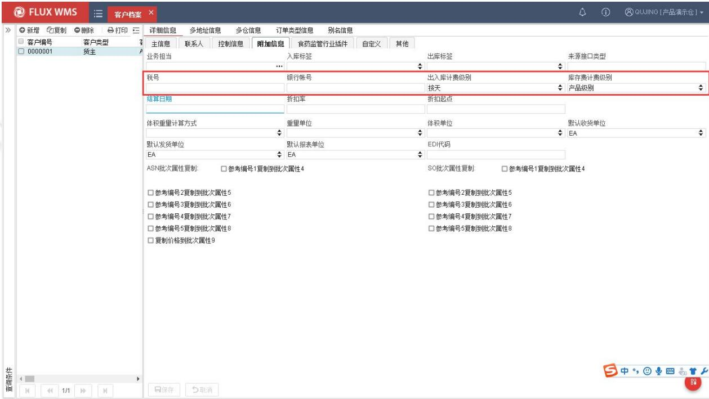


[图15-2-7]


税号 - 货主所用税号。 

银行帐号 - 货主银行帐号 

入/出库计费级别 - 系统计算费用，统计计费基准级差以及最低、最高费用时的统计范围选择。系统提供按交易、按订单行、按订单、按天几种选择。 

库存计费级别 - 计算库存费用时的级别范围选择方式。系统提供客户、产品、批次 3 个级别供选择。 

■ 在 “多仓设置” 页面，可维护货主级别默认费率设置： 

仓库 - 费率对应仓库 

费率代码 - 所使用的费率，通过下拉列表选择已经在【仓储费率设置】功能中维护过的 

费率。 

结算日期 - 货主默认结算日期 

包仓计费方式 - 包仓模式下的计费方式，可选择按月计费或按日计费。 

包仓费用 - 费用采用包仓形式的固定包仓费用。 

税率 - 包仓模式下所用税率 

包仓面积 - 用于备注客户租用场地信息。 

$$
\mathrm{用户自定义-自定义字段}
$$

包仓客户 - 选择此项意味着客户以包仓方式结算，不再逐次计算进出费用。 

出库时结算库存费 - 如选择此项，日常不计算库存费用，当产品出库发运后，计算所发运的产品从入库到出库的全部库存费用。 

■ 点击保存，完成配套设置。注：如果缺少相关配置，费用计算时系统会提示费率设置不全。 

■ 如果同一客户下，不同产品所需费率不同，可在【产品档案】功能，“多仓设置”页签，维护相应费率。 

## - 费率应用

已设置的费率需要在客户和产品中选择应用。客户档案的费率，是新增产品时的默认使用费率。真正生效的，是产品档案中选择使用的费率。 

进、出库时，完成收、发操作后，关闭订单时，系统会把订单相关的费用计算完成，并记录到费用结算清单中。包括进、出交易事务产生的费用，单据表头特殊费用页面手工添加的费用，和根据单据集装箱页面记录计算的集装箱费用。 

库存费用系统每日定时计算。同时库存报表中提供补算历史库存费用的功能。 

## 15.3. 费用清单

系统在操作中根据费率设置计算客户的应收/应付费用，计算结果可在费用结算界面查看。费用结算是系统用于记录、修改、确认费用明细的功能界面，并支持维护客户到款信息。也可以在费用结算界面根据实际情况手工添加费用记录。 

## - 费用结算

■ 选择 “费收管理” 下的 “费用结算” 功能。 

■ 输入查询条件，能够查找到指定客户的指定费用。 

■ 支持手工添加费用记录，在明细页面，点击“新增”按钮，添加费用记录。主信息页签依次输入如下信息。 

<table><tr><td>主信息</td><td>收费对象</td><td>支付对象</td><td>自定义</td><td>其他</td></tr><tr><td>费用ID</td><td colspan="3">客户编号</td><td>客户描述</td></tr><tr><td>BIL201901070001</td><td colspan="3">0000001</td><td>A汽车进口国际贸易有限公司</td></tr><tr><td>日期</td><td colspan="3">费用类型</td><td>费用代码</td></tr><tr><td>2019-01-07</td><td colspan="3">入库费用</td><td>供货事务费用</td></tr><tr><td>订单类型</td><td colspan="3">订单编号</td><td>参考编号1</td></tr><tr><td></td><td colspan="3"></td><td></td></tr><tr><td>批次属性</td><td colspan="3">库位类型</td><td>跟踪号</td></tr><tr><td></td><td colspan="3">地面平仓</td><td></td></tr><tr><td>单位</td><td colspan="3">数量</td><td>体积 重量 业务担当</td></tr><tr><td></td><td colspan="3"></td><td></td></tr><tr><td>确认时间</td><td colspan="3">确认人</td><td>结算时间 结算人</td></tr><tr><td></td><td colspan="3"></td><td></td></tr></table>


[图15-3-1]


费用 ID - 费用记录在系统中的流水序号，由系统自动产生。 

客户编号 - 费用记录所属的客户 ID。 

客户描述 - 费用记录所属的客户对应名称。 

仓库编号 - 费用记录产生的仓库。 

日期 - 费用记录生成日期。 

费用类型 - 费用记录所属类型，一级分类信息。 

费用代码 - 费用记录所属二级分类信息。 

描述 - 费用项目详细描述信息。 

订单类型 - 费用记录依据的订单分类。如预期到货通知单、发运订单。 

订单编号 - 费用记录依据的订单号码。 

参考编号 1 - 订单对应的参考编号 1 信息。 

产品代码 - 费用记录对应的产品代码。非必输。如果不是根据产品生成的费用，可跳过此字段。 

产品描述 - 产品描述信息。 

批次属性 - 按交易生成的费用记录，对应的批次属性信息。如果是非交易计费，此类信息为空。 

库位类型 - 费用记录相关库位类型信息。 

跟踪号 - 费用记录对应的产品跟踪号。 

计费基准 - 费用记录的计费依据。如体积、重量等。 

计费单位 - 费用记录的计费单位。 

单位 - 产品数量的单位。 

数量 - 费用记录对应的产品数量。 

体积 - 费用记录对应的产品总体积。 

重量 - 费用记录对应的产品总重量。 

业务担当 - 客户/项目对应负责的业务员。 

■ “收费对象”页签，输入仓储计费的应收费用相关信息： 

<table><tr><td colspan="11">FLUX WMS</td></tr><tr><td colspan="11">费用清单</td></tr><tr><td colspan="11">新增 复制 删除 打印 操作 导出</td></tr><tr><td colspan="11">费用ID 日期 客户编号BIL201901070001 2019-01-07 0000001</td></tr></table>


FLUX WMS 用户手册 


[图15-3-2] 

结算对象 - 应收费用的付款方客户代码。 

结算名称 - 应收费用的付款方客户名称描述。 

应收费率 - 计费所依据的费率信息。 

应收金额 - 系统计算的应收费用金额。 

实收金额 - 实际到款金额。 

应收税率 - 计费依据的税率信息。 

应收税额 - 根据税率计算得到的税额。 

应收不含税金额 - 扣除税额后的不含税金额。 

发票类型 - 发票信息。 

■ 在“支付对象”页签，输入仓库操作的成本支出相关信息： 

<table><tr><td colspan="11">FLUX WMS</td></tr><tr><td colspan="11">费用清单</td></tr><tr><td colspan="11">新增 复制 删除 打印 操作 导出</td></tr><tr><td colspan="11">费用ID 日期 客户编号BIL201901070001 2019-01-07 0000001</td></tr></table>


[图15-3-3]


支付对象 - 应付费用的收款方客户代码。 

支付名称 - 应付费用的收款方客户名称描述。 

应付费率 - 计费所依据的成本费率信息。 

应付金额 - 系统计算的应付费用金额。 

实付金额 - 实际支付成本。默认同应付金额。 

应付税率 - 计费依据的成本税率信息。 

应付税额 - 根据税率计算得到的税额。 

应付不含税金额 - 扣除税额后的不含税金额。 

应付发票类型 - 发票信息。 

■ 点击【保存】按钮，保存费用记录。 

## - 右键菜单功能

生成汇总账单 - 支持将货主结算日到今天（包含今天的费用明细记录）的费用生成汇总账单，并跳转到收支结算部分，查看生成的汇总账单信息对应单据。 

## 15.4. 收入/支出结算

为了方便用户收入、支出分别管理，系统提供收入结算、支出结算功能。查询条件及显示内容，同费用结算。 

不同的是： 

收入结算，只显示收入字段，不显示成本字段。 

<table><tr><td>查询条件</td><td colspan="10">新增 复制 删除 打印 操作 导导:</td></tr><tr><td>客户编号</td><td>仓库编号</td><td>账单ID</td><td>结算日</td><td></td><td></td><td></td><td></td><td></td><td></td><td></td></tr><tr><td>结算对象</td><td></td><td></td><td></td><td></td><td></td><td></td><td></td><td></td><td></td><td></td></tr><tr><td>账单ID</td><td></td><td></td><td></td><td></td><td></td><td></td><td></td><td></td><td></td><td></td></tr><tr><td>状态</td><td></td><td></td><td></td><td></td><td></td><td></td><td></td><td></td><td></td><td></td></tr><tr><td>仓库编号</td><td></td><td></td><td></td><td></td><td></td><td></td><td></td><td></td><td></td><td></td></tr><tr><td>DEMO</td><td></td><td></td><td></td><td></td><td></td><td></td><td></td><td></td><td></td><td></td></tr><tr><td>... 查询</td><td></td><td></td><td></td><td></td><td></td><td></td><td></td><td></td><td></td><td></td></tr></table>


[图 15-4-1]


支出结算，则只显示支出字段，不显示收入字段。


<table><tr><td colspan="14">FLUX WMS</td></tr><tr><td colspan="14">支出结算</td></tr><tr><td colspan="14">查询条件</td></tr><tr><td colspan="14">客户编号</td></tr><tr><td colspan="14">...</td></tr><tr><td colspan="14">结算对象</td></tr><tr><td colspan="14">...</td></tr><tr><td colspan="14">账单ID</td></tr><tr><td colspan="14">状态</td></tr><tr><td colspan="14">仓库编号</td></tr><tr><td colspan="14">DEMO</td></tr><tr><td colspan="14">...</td></tr><tr><td colspan="14">查询</td></tr></table>


[图 15-4-2]


## - 右键菜单功能

汇总账单 - 根据客户档案维护月度结算日，由定时器生成月度收入账单、月度支出账单，并提 

供对应的审核、结算、重新计算功能，方便用户对仓库费用进行管理。 

## 15.5. 运输费率设置

不做详细运输跟踪管理的情况下，可以通过 WMS 系统，对运输环节进行简单的运费记录，以便支持费用结算。 

## - 费率设置

■ 点击“费收”下的“运输费率设置”。 

■ 在表头部分，选择明细页面，点击“新增”按钮，依次输入如下信息。 

<table><tr><td colspan="10">FLUX WMS</td></tr><tr><td colspan="10">运输费率设置</td></tr><tr><td colspan="10">查询条件</td></tr><tr><td colspan="10">费率ID</td></tr><tr><td colspan="10">查询</td></tr></table>


[图 15-5-1]


费率 ID - 该费收方式的代码，由系统自动生成流水号。 

承运人 - 运费对应的承运人，可通过查询按钮查询已在客户档案维护的承运人。 

中文描述 - 该费率的名称说明。 

英文描述 - 该费率的说明 

生效期 - 费率开始使用的日期。 

失效期 - 费率不再使用的日期。超过失效期，不再依据此费率进行计算。 

保险费率 - 运输保险费率。 

最低保险费 - 运输保险最低费用。 

固定保险费 - 固定保险费用。 

免保金额 - 免保金额。 

最高保险费 - 保险费用上限。 

■ 点击【保存】按钮。 

■ 在费率部分，点击【新增】按钮，依次输入如下信息。 

<table><tr><td colspan="12">FLUX WMS</td></tr><tr><td colspan="12">查询条件</td></tr><tr><td colspan="12">费率ID</td></tr><tr><td>...</td><td colspan="11">查询</td></tr></table>


[图15-5-2]


费率 ID - 该费收方式的代码，根据主信息带入。 

行号 - 系统自动生成的费率明细行号 

运输方式 - 如陆运、空运、海运等。下拉框内容可以在系统代码中配置，发运订单选择运输方式，则系统采用该运输方式对应的费率行。 

装运地 - 运输起点。分段计费时使用。 

交货地 - 运输终点，分段计费时使用。 

计费基准 - 计费的依据。 

最低计费 - 该费用项起计费点。 

最高计费 - 该费用项最高限制费用额。 

免费金额 - 该费用项，可减免金额。 

■ 在级差部分，点击【新增】按钮，依次输入如下信息 

<table><tr><td>主信息</td><td>自定义</td><td>其他</td><td></td></tr><tr><td>费率ID</td><td>行号</td><td>运输方式</td><td>装运地</td></tr><tr><td>0000000002</td><td>1</td><td>卡车</td><td></td></tr><tr><td>交货地</td><td>计费基准</td><td>最低计费</td><td>最高计费</td></tr><tr><td>上海保税区</td><td>体积</td><td></td><td></td></tr><tr><td>免费全额</td><td></td><td></td><td></td></tr><tr><td>保存</td><td>取消</td><td></td><td></td></tr></table>


[图15-5-3]


费率 ID - 该费收方式的代码，根据主信息带入。 

行号 - 级差对应的费用项行号。 

级差行号 - 多级级差设置时，对应的行号。 

级差从，级差到 - 费用计费基准的级差范围。同一级差内，使用一个费率。 

计费单位 - 级差计算时的最小计费单位，默认为 1。可以通过计费单位的修改，实现类似进位计费的需求，例如 11~19 立方米都按 20 立方米计费，此时计费单位应设置为 10，只按 10 的倍数计费，不满整十的数量都进位补满。 

费率 - 费用项在级差范围内使用的费率。 

## 16. 预警

仓库日常操作中，有许多情况需要特殊关注，例如库存低于安全线，保质期临近等。尽管系统 对此有详细的记录，但通过库存余量或单据对于特定情况并不直观，同时也可能需要主动将信息通知货主或者相关人员处理。但在不同业务情况下，需要通知的内容各不相同，因此 WMS 提供了自定义预警的功能。 

预警查询模式，配置生效后可直接使用；邮件、短信模式的预警，需要配合定时器、邮件服务器、短信服务器使用。 

## 16.1. 预警参数设置

## - 预警参数设置

由于不同预警方式，可能有不同的要求，因此通过预警参数的设置来控制不同的预警方式。 

同时，相同预警需求，但在多仓环境下有可能信息发送对象、执行时间要求不同，因此预警参数可配置为多仓共用的公共参数以及只针对某个仓库生效的参数。 

通过 “仓库” 查询条件，可查询到对此仓库有效的公共参数与针对查询条件仓库的对应专属参数。 

新增参数可通过如下步骤进行： 

■ 点击“预警”下的“预警参数时设置”。 

■ 在表头部分，选择明细页面，点击“新增”按钮，依次输入如下信息。 

<table><tr><td>主信息</td><td>执行结果信息</td><td>自定义</td><td>其他</td></tr><tr><td>仓库编号</td><td>预警参数</td><td>预警描述</td><td>预警描述</td></tr><tr><td>TEST100</td><td>EXPIRATION_ALERT</td><td>有效期预警 / Expiration Alert</td><td>活动标记 复制附件到正文</td></tr><tr><td>预警方法</td><td>预警格式</td><td>邮件服务器编号</td><td>邮件模板编号</td></tr><tr><td>电子邮件</td><td>Excel</td><td>WY163</td><td>WANYAO005</td></tr><tr><td>消息排序</td><td>预警数据生成方式</td><td>Java类 编辑模板</td><td>字段描述配置</td></tr><tr><td colspan="4">JAVA类</td></tr><tr><td colspan="2">Java类Id或类名</td><td colspan="2">Java方法名</td></tr><tr><td colspan="2">expirationAlertProcessServiceProvider</td><td colspan="2">expirationAlert</td></tr><tr><td colspan="4">频率</td></tr><tr><td colspan="4">执行</td></tr><tr><td colspan="4">每天</td></tr><tr><td colspan="4">执行间隔: 1 天</td></tr><tr><td colspan="4">每天频率</td></tr><tr><td colspan="4">○执行一次,时间为: 00:00:00</td></tr><tr><td colspan="4">○间隔执行:</td></tr><tr><td colspan="4">小时</td></tr><tr><td colspan="4">○每小时</td></tr><tr><td colspan="4">○从 00 - 02 时</td></tr><tr><td colspan="4">○从 00 时,每 2 时</td></tr><tr><td colspan="4">○指定</td></tr><tr><td colspan="4">摘要说明</td></tr><tr><td>表达式</td><td colspan="3">秒 分钟 小时 日 月 星期 年</td></tr><tr><td></td><td colspan="3">0 0-5 * * ?</td></tr></table>

[图16-1-1] 

仓库编号 - 预警对应仓库。 

预警参数 - 系统不同预警方式的代码。 

预警描述 - 预警参数对应描述信息。 

活动标记 - 使用或不使用某个预警参数。 

复制附件到正文 - 勾选后系统自动将附件内容，显示在邮件正文中。 

预警方法 - 系统支持“电子邮件”、“系统消息”两种预警方式。 

预警格式 - 预警文件格式。可选择 PDF 文件或者 Excel 文件，这种格式设置主要在 Email 发送时生效，界面查询时忽略此设置。 

邮件服务器编号 - 必输项，用于配置邮件服务器相关信息。 

邮件模板编号 - 电子邮件方式时的必输项，用于配置预邮件使用模板信息。 

消息排序 - 多个预警同时执行时的次序。 

预警数据生成方式 - 系统支持 JAVA 类、存储过程两种生成方式。 

编辑模板 - 允许为空，用于配置邮件内容。 

字段描述配置 - 允许为空，用于对预警预留字段进行个性化配置。 

JAVA 类/存储过程 - 预警执行时支持调用 JAVA 类或 SP。当 “预警数据生成方式” 选择 JAVA 类时，JAVA 类组用来配置类路径和方法名称；当 “预警数据生成方式” 选择存储过程时，存储过程组用来配置存储名称和出入参； 

预警频率 - 信息推送频率。可选择年、季度、月、天，选择天的情况下，需要配置每天执行频率，固定时间执行，还是间隔时间轮循执行。也即定时器执行预警的时间设置。 

每天频率 - 预警定时器每日执行情况下，具体的定时器执行时间配置。 

■ 保存所作修改。 

## - 预置预警-失效期预警

医药、食品行业行业中，库存在库期间需要进行严格的效期管理，并要求库存在失效期前进行出库。若产品已失效，则需要进行冻结人工做报废处理。 

为满足上述需求，系统支持在库存到达失效警戒点时，向高层发送预警邮件信息。例如距离失效节点，提前30天库存冻结，再提前10天预警。即距离失效日期40天开始预警。 

<table><tr><td>主信息</td><td>执行结果信息</td><td>自定义</td><td>其他</td></tr><tr><td>仓库编号</td><td>预警参数</td><td colspan="2">预警描述</td></tr><tr><td>TEST100</td><td>EXPIRATION_ALERT</td><td>有效期预警 / Expiration Alert</td><td>活动标记 复制附件到正文</td></tr><tr><td>预警方法</td><td>预警格式</td><td>邮件服务器编号</td><td>邮件模板编号</td></tr><tr><td>电子邮件</td><td>Excel</td><td>WY163</td><td>WANYAO005</td></tr><tr><td>消息排序</td><td>预警数据生成方式</td><td></td><td></td></tr><tr><td></td><td>Java类</td><td>编辑模板</td><td>字段描述配置</td></tr><tr><td colspan="4">JAVA类</td></tr><tr><td>Java类Id或类名</td><td colspan="3">Java方法名</td></tr><tr><td>expirationAlertProcessServiceProvider</td><td colspan="3">expirationAlert</td></tr><tr><td colspan="4">频率</td></tr><tr><td colspan="4">执行</td></tr><tr><td colspan="4">每天</td></tr><tr><td colspan="4">执行间隔: 1 天</td></tr><tr><td colspan="4">每天频率</td></tr><tr><td colspan="4">○执行一次,时间为: 00:00:00</td></tr><tr><td colspan="4">○间隔执行:</td></tr><tr><td colspan="4">小时</td></tr><tr><td colspan="4">○每小时</td></tr><tr><td colspan="4">○从 00 - 02 时</td></tr><tr><td colspan="4">○从 00 时,每 2 时</td></tr><tr><td colspan="4">○指定</td></tr><tr><td colspan="4">分钟</td></tr><tr><td colspan="4">○每分钟</td></tr><tr><td colspan="4">○从 00 - 05 分</td></tr><tr><td colspan="4">○从 00 分,每 2 分</td></tr><tr><td colspan="4">○指定</td></tr><tr><td colspan="4">摘要说明</td></tr><tr><td>表达式</td><td colspan="3">秒 分钟 小时 日 月 星期 年</td></tr><tr><td></td><td colspan="3">0 0-5 * * ?</td></tr></table>


[图 16-2-1]


## 16.2. 邮件模板配置

当预警方式选择“邮件预警”时，需要对预警消息调用邮件模板进行自定义配置。在【邮件模板配置】模块中，系统支持针对模板的固定收件人、抄送人、邮件固定/动态主题等信息进行修改。 

■ 点击 “预警” 下的 “预警模板设置”。 

在表头部分，选择明细页面，点击“新增”按钮，依次输入如下信息。 

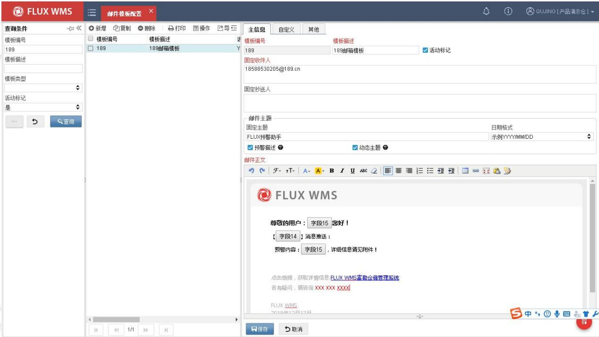


[图16-2-1]


邮件主题 - 默认根据所配置的固定主题显示。若勾选动态值，则获取预警记录表里写入的主题字段内容（Subject 列，默认取首行记录的信息）作为邮件主题。如果都固定主题、动态主题均有配置，使用下划线连接。（例如：固定主题_日期格式_动态主题） 

## 悬浮描述信息：

预警描述 - 邮件主题拼接预警描述信息。/Mail Subject split joint The Description Information of Early Warning. 

动态主题 - 使用预警记录主题作为邮件主题。若同时配置固定主题，则固定主题、预警描述、日期格式与动态主题使用下划线连接。/Use the topic of early warning record as the subject of mail. If the fixed Subject is configured at the same time, the fixed Subject, early warning description, date format and dynamic theme are connected by underlining. 

邮件正文 - 新增时提供默认内容。 

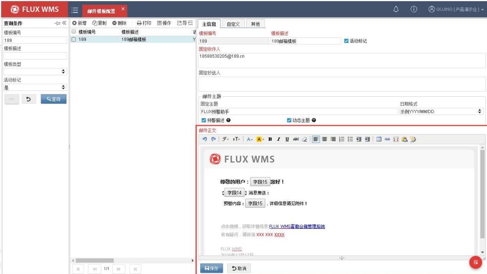


[图 16-2-2]


■ 保存所作修改。 

## 16.3. 邮件服务器配置

■ 当预警方式选择“邮件预警”时，需要对预警消息调用邮件服务器进行定义。 

■ 点击“预警”下的“邮件服务器设置”。 

■ 在表头部分，选择明细页面，点击“新增”按钮，依次输入如下信息。 

<table><tr><td>主信息</td><td>自定义</td><td>其他</td><td></td></tr><tr><td>邮件服务器编号</td><td>邮件服务器描述</td><td>主机名称</td><td>主机端口</td></tr><tr><td>TEST0001</td><td>FLUX邮件测试服务器</td><td>smtp.exmail.qq.com</td><td>25</td></tr><tr><td>发件人地址</td><td>发件人名称</td><td>发件人邮箱密码</td><td>确认密码</td></tr><tr><td>zhouxin@flux.com.cn</td><td>FLUX WMS小助手</td><td>**********</td><td>**********</td></tr><tr><td>字符集</td><td>SSL端口</td><td colspan="2"></td></tr><tr><td>UTF-8</td><td>465</td><td colspan="2"></td></tr><tr><td colspan="4">操作标记</td></tr><tr><td>调试标记</td><td>使用HTML格式</td><td>SSL标记</td><td>活动标记</td></tr></table>


[图 16-3-1]


■ 主机名称 - 录入邮箱服务器地址信息。 

■ 主机端口 - 录入邮箱服务器端口信息。 

■ 发件人地址 - 录入发送人地址信息。 

■ 发件人名称 - 录入发送名称信息。 

■ 发件人邮箱密码 - 录入邮箱密码。 

■ 确认密码 - 邮箱密码二次确认。 

■ 字符集 - 处于兼容性考虑，默认编码 UTF-8。 

■ SSL 端口 - 启用 SSL 加密时，录入 SSL 端口号。 

■ 操作标记 - 邮件控制标记。分别控制是否启用 DEBUG 模式、是否启用 HTML 格式发送邮件、是否启用 SSL 加密、是否启用当前设置。 

■ 保存所作修改。 

## 16.4. 预警消息

预警消息生成后，系统支持通过【预警消息】模块进行查阅历史预警信息和预警重新推送。 

■ 点击 “预警” 下的 “预警消息”。 

■ 在表头部分，选择明细页面，点击“查询”按钮，依次输入如下信息。 

<table><tr><td>主信息</td><td>预警内容</td><td>自定义</td><td>其他</td></tr><tr><td>消息编码</td><td>预警参数</td><td>预警日期</td><td>预警消息发送标记</td></tr><tr><td>00125e44120411e9aa1200163e2c</td><td>FLUX002</td><td>2019-01-07 06:40:00</td><td>N</td></tr><tr><td>预警消息发送地址</td><td colspan="3">预警邮件抄送地址</td></tr><tr><td></td><td colspan="3"></td></tr></table>


[图 16-4-1]


预警日期 - 显示预警信息产生时间。 

预警消息发送标记 - 显示预警消息是否已发送。 

预警消息发送地址 - 显示预警消息/邮件发送地址。 

预警邮件抄送地址 - 仅在邮件类预警下有效，显示预警邮件抄送人地址。 

预警内容 - 显示预警消息 25 个预留字段，用户可通过个性化方式将预警相关信息写入。 

<table><tr><td>查询条件</td><td colspan="3">打印 操作 导出</td><td colspan="4">主信息 预警内容 自定义 其他</td></tr><tr><td>仓库编号</td><td>仓库编号</td><td>消息编码</td><td>预警参数</td><td>字段01</td><td>字段02</td><td>字段03</td><td>字段04</td></tr><tr><td rowspan="3">预警消息发送地址</td><td>FLUXWH01</td><td>0004dbf1120411...</td><td>FLUX001</td><td>T1812180000023</td><td>TV001</td><td>*</td><td>10.00000000</td></tr><tr><td>FLUXWH01</td><td>00124620120411...</td><td>FLUX002</td><td>字段05</td><td>字段06</td><td>字段07</td><td>字段08</td></tr><tr><td>FLUXWH01</td><td>00124d83120411...</td><td>FLUX002</td><td>REVERSEPICK_FLUXWH01</td><td>011</td><td>10.00000000</td><td>测试包装代码</td></tr><tr><td rowspan="2">消息编码</td><td>FLUXWH01</td><td>0012529a120411...</td><td>FLUX002</td><td>字段09</td><td>字段10</td><td>字段11</td><td>字段12</td></tr><tr><td>FLUXWH01</td><td>001258ce120411...</td><td>FLUX002</td><td>EA</td><td>TV001描述1(长虹性价比极高-炫)</td><td>TV001描述2</td><td></td></tr><tr><td rowspan="3">预警参数</td><td>FLUXWH01</td><td>00125e44120411...</td><td>FLUX002</td><td>字段13</td><td>字段14</td><td>字段15</td><td>字段16</td></tr><tr><td>FLUXWH01</td><td>00126d8e120411...</td><td>FLUX002</td><td></td><td></td><td>C181200018</td><td></td></tr><tr><td>FLUXWH01</td><td>00127612120411...</td><td>FLUX002</td><td>字段17</td><td>字段18</td><td>字段19</td><td>字段20</td></tr><tr><td rowspan="4">预警消息发送标记</td><td>FLUXWH01</td><td>001279e7120411...</td><td>FLUX002</td><td></td><td></td><td></td><td></td></tr><tr><td>FLUXWH01</td><td>00127d79120411...</td><td>FLUX002</td><td>字段21</td><td>字段22</td><td>字段23</td><td>字段24</td></tr><tr><td>FLUXWH01</td><td>00128142120411...</td><td>FLUX002</td><td></td><td></td><td></td><td></td></tr><tr><td>FLUXWH01</td><td>001285de120411...</td><td>FLUX002</td><td>字段25</td><td></td><td></td><td></td></tr><tr><td>是否已读</td><td>FLUXWH01</td><td>00128aea120411...</td><td>FLUX002</td><td></td><td></td><td></td><td></td></tr><tr><td rowspan="20">预警方法</td><td>FLUXWH01</td><td>0012905c120411...</td><td>FLUX002</td><td></td><td></td><td></td><td></td></tr><tr><td>FLUXWH01</td><td>0012952b120411...</td><td>FLUX002</td><td></td><td></td><td></td><td></td></tr><tr><td>FLUXWH01</td><td>001298eb120411...</td><td>FLUX002</td><td></td><td></td><td></td><td></td></tr><tr><td>FLUXWH01</td><td>00129c55120411...</td><td>FLUX002</td><td></td><td></td><td></td><td></td></tr><tr><td>FLUXWH01</td><td>00129fc2120411...</td><td>FLUX002</td><td></td><td></td><td></td><td></td></tr><tr><td>FLUXWH01</td><td>0019ce4b10ee11...</td><td>FLUX001</td><td></td><td></td><td></td><td></td></tr><tr><td>FLUXWH01</td><td>00238aeft0ee11...</td><td>FLUX002</td><td></td><td></td><td></td><td></td></tr><tr><td>FLUXWH01</td><td>0023952c10ee11...</td><td>FLUX002</td><td></td><td></td><td></td><td></td></tr><tr><td>FLUXWH01</td><td>00239d0610ee11...</td><td>FLUX002</td><td></td><td></td><td></td><td></td></tr><tr><td>FLUXWH01</td><td>0023a34610ee11...</td><td>FLUX002</td><td></td><td></td><td></td><td></td></tr><tr><td>FLUXWH01</td><td>0023a96510ee11...</td><td>FLUX002</td><td></td><td></td><td></td><td></td></tr><tr><td>FLUXWH01</td><td>0023af2510ee11...</td><td>FLUX002</td><td></td><td></td><td></td><td></td></tr><tr><td>FLUXWH01</td><td>0023b4dd10ee11...</td><td>FLUX002</td><td></td><td></td><td></td><td></td></tr><tr><td>FLUXWH01</td><td>0023bb6110ee11...</td><td>FLUX002</td><td></td><td></td><td></td><td></td></tr><tr><td>FLUXWH01</td><td>0023c25010ee11...</td><td>FLUX002</td><td></td><td></td><td></td><td></td></tr><tr><td>FLUXWH01</td><td>0023c8ad10ee11...</td><td>FLUX002</td><td></td><td></td><td></td><td></td></tr><tr><td>FLUXWH01</td><td>0023ce6510ee11...</td><td>FLUX002</td><td></td><td></td><td></td><td></td></tr><tr><td>FLUXWH01</td><td>0023d43d10ee11...</td><td>FLUX002</td><td></td><td></td><td></td><td></td></tr><tr><td>FLUXWH01</td><td>0023d9f410ee11...</td><td>FLUX002</td><td></td><td></td><td></td><td></td></tr><tr><td>FLUXWH01</td><td>0023e05210ee11...</td><td>FLUX002</td><td></td><td></td><td></td><td></td></tr></table>


[图 16-4-2]


## 17. 业务系统日志

## 17.1. 业务操作信息

业务操作信息，即操作日志详细信息。每个与服务器交互的步骤都会将相关日志信息写入数据库，在此功能中可以查看到每个作业细节的详情日志信息，作为检查故障、性能优化时的参考。 

此模块以 JSON 维度展现每一次交互信息内容，操作人可根据 “日志批次号” 或者 “请求 ID” 值，在系统 SQL 日志模块中找到对应的详细 SQL 语句。 

## - 主信息

■ 选择主菜单“业务系统日志”下的“业务操作信息”。 

在左侧的查询条件栏位，输入查询条件，进行查询。 

■ 在 “主信息” 页签，系统显示如下日志信息： 

<table><tr><td>查询条件</td><td colspan="2">系统SQL日志</td><td colspan="2">查看</td><td>详细信息</td><td colspan="6">系统SQL日志</td></tr><tr><td>会话编号</td><td>用户编号</td><td>功能编号</td><td colspan="2">日志批次号</td><td>主信息</td><td>业务数据</td><td>参考数据</td><td>附加信息</td><td>自定义</td><td>其他</td><td></td></tr><tr><td>活动流水号</td><td>QUJING</td><td>A3001</td><td colspan="2">20190108102506000460LB010046228158[A3001]</td><td colspan="6">执行结果信息</td><td></td></tr><tr><td>用户编号</td><td>QUJING</td><td>A3001</td><td colspan="2">20190108102506000460LB010046228158[A3001]</td><td colspan="3">处理结果:</td><td colspan="3">执行失败</td><td></td></tr><tr><td>功能编号</td><td>QUJING</td><td>A3001</td><td colspan="2">20190108102506000460LB010046228158[A3001]</td><td colspan="3">日志批次号:</td><td colspan="3">20190108102506000460LB010046228158[A3001]</td><td></td></tr><tr><td>日志批次号</td><td>QUJING</td><td>A3001</td><td colspan="2">20190108101828000023LB010046228158[A3001]</td><td colspan="3">开始时间:</td><td colspan="3">2019-01-08 10:25:06</td><td></td></tr><tr><td>总耗时(变秒)&gt;=</td><td>QUJING</td><td>A3001</td><td colspan="2">20190108101747000228LB010046228158[A3001]</td><td colspan="3">结束时间:</td><td colspan="3">2019-01-08 10:25:06</td><td></td></tr><tr><td>关键字01</td><td>QUJING</td><td>A3001</td><td colspan="2">20190108101747000228LB010046228158[A3001]</td><td colspan="3">消息Id:</td><td colspan="3">A3001E403</td><td></td></tr><tr><td>操作结果</td><td>QUJING</td><td>A3001</td><td colspan="2">20190108101712000966LB010046228158[A3001]</td><td colspan="3">消息描述:</td><td colspan="3">删除错误-计划删除的记录已经变更(请刷新数据后重新提交删除)</td><td></td></tr><tr><td>业务仓库ID</td><td>QUJING</td><td>A3001</td><td colspan="2">20190108101712000966LB010046228158[A3001]</td><td colspan="3">运行时间:</td><td colspan="3">39ms</td><td></td></tr><tr><td>DEMO</td><td>QUJING</td><td>A3001</td><td colspan="2">20190108101555000794LB010046228158[A3001]</td><td colspan="3">服务程序版本号:</td><td colspan="3">V106(20180112)</td><td></td></tr><tr><td>操作时间</td><td colspan="4">2019-01-08 00:00:00 - 201</td><td colspan="6">业务传参信息</td><td></td></tr></table>


[图17-1-1]


活动流水号 - 系统生成的流水 ID 

用户编号 - 操作员 ID 

功能编号 - 作业所用的功能 

业务组织 ID - 作业环境所属组织架构的上级组织 

业务仓库 ID - 作业的仓库代码 

来源类型 - 类型信息 

局域网 IP 地址 - 作业时的 IP 记录。局域网私有云环境中使用。 

广域网 IP 地址 - 作业时的 IP 记录。广域网环境中使用。 

日志批次号 - 日志生成时系统自动产生的流水号，这个流水号可能涉及一个或者多个日志。如需查询详细 SQL 语句，可在系统 SQL 日志功能模块中，通过 “日志批次号” 字段条件进行检索，筛选出所有相关 SQL 语句。 

请求 ID - 浏览器向服务器发送请求时生成的 ID 信息。查询方式同日志批次号。 

## - 业务数据

在 “业务数据” 页签，可以看到输入 JSON 的信息、业务数据、系统返回的输出信息。这些内容是故障检查时的关键信息。 

<table><tr><td>查询条件</td><td colspan="3">系统SQL日志</td><td rowspan="2">查看</td><td>详细信息</td><td colspan="6">系统SQL日志</td></tr><tr><td>会话编号</td><td>用户编号</td><td>功能编号</td><td>日志批次号</td><td>主信息</td><td>业务数据</td><td>参考数据</td><td>附加信息</td><td>自定义</td><td>其他</td><td></td></tr><tr><td>活动流水号</td><td>QUJING</td><td>A3001</td><td>20190108102506000460LB010046228158[A3001]</td><td colspan="7">执行结果信息</td><td></td></tr><tr><td>用户编号</td><td>QUJING</td><td>A3001</td><td>20190108102506000460LB010046228158[A3001]</td><td colspan="7">处理结果:</td><td>执行失败</td></tr><tr><td>功能编号</td><td>QUJING</td><td>A3001</td><td>20190108102506000460LB010046228158[A3001]</td><td colspan="7">日志批次号:</td><td>20190108102506000460LB010046228158[A3001]</td></tr><tr><td>日志批次号</td><td>QUJING</td><td>A3001</td><td>20190108102415000854LB010046228158[A3001]</td><td colspan="7">开始时间:</td><td>2019-01-08 10:25:06</td></tr><tr><td>总耗时(毫秒)=</td><td>QUJING</td><td>A3001</td><td>20190108101828000023LB010046228158[A3001]</td><td colspan="7">结束时间:</td><td>2019-01-08 10:25:06</td></tr><tr><td>关键字01</td><td>QUJING</td><td>A3001</td><td>20190108101747000228LB010046228158[A3001]</td><td colspan="7">消息Id:</td><td>A3001E403</td></tr><tr><td>操作结果</td><td>QUJING</td><td>A3001</td><td>20190108101712000966LB010046228158[A3001]</td><td colspan="7">消息描述:</td><td>删除错误-计划删除的记录已经变更(请刷新数据后重新提交删除)</td></tr><tr><td>业务仓库ID</td><td>QUJING</td><td>A3001</td><td>20190108101712000966LB010046228158[A3001]</td><td colspan="7">运行时间:</td><td>39ms</td></tr><tr><td>DEMO</td><td>QUJING</td><td>A3001</td><td>20190108101555000794LB010046228158[A3001]</td><td colspan="7">服务程序版本号:</td><td>V106(20180112)</td></tr><tr><td>操作时间</td><td colspan="3">2019-01-08 00:00:00 - 201</td><td colspan="8">业务传参信息</td></tr></table>


[图17-1-2]


登录 JSON 数据文本 - 记录交互中发送登录请求信息。 

业务 JSON 数据文本 - 记录交互中发送业务数据信息内容。 

处理结果 JSON 数据文本 - 记录交互中服务端返回结果内容。 

## - 参考数据

■ 在 “参考数据” 页签，能够看到执行时间、提示信息等内容。 

<table><tr><td colspan="2">查询条件</td><td>系统SQL日志</td><td colspan="101">查看</td><td></td></tr><tr><td colspan="2">会话编号</td><td>用户编号</td><td>功能编号</td><td colspan="100">日志批次号</td><td></td></tr><tr><td colspan="2">活动流水号</td><td>QUJING</td><td>A3001</td><td colspan="94">20190108102506000460LB010046228158[A3001]</td><td></td><td></td><td></td><td></td><td></td><td></td><td></td></tr><tr><td rowspan="31" colspan="2">用户编号</td><td>QUJING</td><td>A3001</td><td colspan="49">20190108102506000460LB010046228158[A3001]</td><td></td><td></td><td></td><td></td><td></td><td></td><td></td><td></td><td></td><td></td><td></td><td></td><td></td><td></td><td></td><td></td><td></td><td></td><td></td><td></td><td></td><td></td><td></td><td></td><td></td><td></td><td></td><td></td><td></td><td></td><td></td><td></td><td></td><td></td><td></td><td></td><td></td><td></td><td></td><td></td><td></td><td></td><td></td><td></td><td></td><td></td><td></td><td></td><td></td><td></td><td></td><td></td></tr><tr><td>QUJING</td><td>A3001</td><td colspan="79">20190108102415000854LB010046228158[A3001]</td><td></td><td></td><td></td><td></td><td></td><td></td><td></td><td></td><td></td><td></td><td></td><td></td><td></td><td></td><td></td><td></td><td></td><td></td><td></td><td></td><td></td><td></td></tr><tr><td>QUJING</td><td>A3001</td><td colspan="76">20190108101828000023LB010046228158[A3001]</td><td></td><td></td><td></td><td></td><td></td><td></td><td></td><td></td><td></td><td></td><td></td><td></td><td></td><td></td><td></td><td></td><td></td><td></td><td></td><td></td><td></td><td></td><td></td><td></td><td></td></tr><tr><td>QUJING</td><td>A3001</td><td colspan="71">201901081O1747000228LB010046228158[A3001]</td><td></td><td></td><td></td><td></td><td></td><td></td><td></td><td></td><td></td><td></td><td></td><td></td><td></td><td></td><td></td><td></td><td></td><td></td><td></td><td></td><td></td><td></td><td></td><td></td><td></td><td></td><td></td><td></td><td></td><td></td></tr><tr><td>QUJING</td><td>A3001</td><td colspan="70">20190108101747000228LB010046228158[A3001]</td><td></td><td></td><td></td><td></td><td></td><td></td><td></td><td></td><td></td><td></td><td></td><td></td><td></td><td></td><td></td><td></td><td></td><td></td><td></td><td></td><td></td><td></td><td></td><td></td><td></td><td></td><td></td><td></td><td></td><td></td><td></td></tr><tr><td>QUJING</td><td>A3001</td><td colspan="68">201901081017470O0228LB010046228158[A3001]</td><td></td><td></td><td></td><td></td><td></td><td></td><td></td><td></td><td></td><td></td><td></td><td></td><td></td><td></td><td></td><td></td><td></td><td></td><td></td><td></td><td></td><td></td><td></td><td></td><td></td><td></td><td></td><td></td><td></td><td></td><td></td><td></td><td></td></tr><tr><td>QUJING</td><td>A3001</td><td colspan="65">20190108101747000128LB010046228158[A3001]</td><td></td><td></td><td></td><td></td><td></td><td></td><td></td><td></td><td></td><td></td><td></td><td></td><td></td><td></td><td></td><td></td><td></td><td></td><td></td><td></td><td></td><td></td><td></td><td></td><td></td><td></td><td></td><td></td><td></td><td></td><td></td><td></td><td></td><td></td><td></td><td></td></tr><tr><td>QUJING</td><td>A3001</td><td colspan="63">20190108101712000966LB010046228158[A3001]</td><td></td><td></td><td></td><td></td><td></td><td></td><td></td><td></td><td></td><td></td><td></td><td></td><td></td><td></td><td></td><td></td><td></td><td></td><td></td><td></td><td></td><td></td><td></td><td></td><td></td><td></td><td></td><td></td><td></td><td></td><td></td><td></td><td></td><td></td><td></td><td></td><td></td><td></td></tr><tr><td>QUJING</td><td>A3001</td><td colspan="60">20190108101712000966LB0I0046228158[A3001]</td><td></td><td></td><td></td><td></td><td></td><td></td><td></td><td></td><td></td><td></td><td></td><td></td><td></td><td></td><td></td><td></td><td></td><td></td><td></td><td></td><td></td><td></td><td></td><td></td><td></td><td></td><td></td><td></td><td></td><td></td><td></td><td></td><td></td><td></td><td></td><td></td><td></td><td></td><td></td><td></td><td></td></tr><tr><td>QUJING</td><td>A3001</td><td colspan="57">20190108101555000794LB010046228158[A3001]</td><td></td><td></td><td></td><td></td><td></td><td></td><td></td><td></td><td></td><td></td><td></td><td></td><td></td><td></td><td></td><td></td><td></td><td></td><td></td><td></td><td></td><td></td><td></td><td></td><td></td><td></td><td></td><td></td><td></td><td></td><td></td><td></td><td></td><td></td><td></td><td></td><td></td><td></td><td></td><td></td><td></td><td></td><td></td><td></td></tr><tr><td>QUJING</td><td>A3001</td><td colspan="53">20190108101555000794LB0100462185[A3001]</td><td></td><td></td><td></td><td></td><td></td><td></td><td></td><td></td><td></td><td></td><td></td><td></td><td></td><td></td><td></td><td></td><td></td><td></td><td></td><td></td><td></td><td></td><td></td><td></td><td></td><td></td><td></td><td></td><td></td><td></td><td></td><td></td><td></td><td></td><td></td><td></td><td></td><td></td><td></td><td></td><td></td><td></td><td></td><td></td><td></td><td></td><td></td><td></td></tr><tr><td>QUJING</td><td>A3001</td><td colspan="48">20190108101555000794LB01004622815B[A3001]</td><td></td><td></td><td></td><td></td><td></td><td></td><td></td><td></td><td></td><td></td><td></td><td></td><td></td><td></td><td></td><td></td><td></td><td></td><td></td><td></td><td></td><td></td><td></td><td></td><td></td><td></td><td></td><td></td><td></td><td></td><td></td><td></td><td></td><td></td><td></td><td></td><td></td><td></td><td></td><td></td><td></td><td></td><td></td><td></td><td></td><td></td><td></td><td></td><td></td><td></td><td></td><td></td><td></td></tr><tr><td>QUJING</td><td>A3001</td><td colspan="44">20190108101555000794LB01004622815B[A300]</td><td></td><td></td><td></td><td></td><td></td><td></td><td></td><td></td><td></td><td></td><td></td><td></td><td></td><td></td><td></td><td></td><td></td><td></td><td></td><td></td><td></td><td></td><td></td><td></td><td></td><td></td><td></td><td></td><td></td><td></td><td></td><td></td><td></td><td></td><td></td><td></td><td></td><td></td><td></td><td></td><td></td><td></td><td></td><td></td><td></td><td></td><td></td><td></td><td></td><td></td><td></td><td></td><td></td><td></td><td></td><td></td><td></td></tr><tr><td>QUJING</td><td>A3001</td><td colspan="4">20190108101555000794LB01004622815B[A300]</td><td></td><td></td><td></td><td></td><td></td><td></td><td></td><td></td><td></td><td></td><td></td><td></td><td></td><td></td><td></td><td></td><td></td><td></td><td></td><td></td><td></td><td></td><td></td><td></td><td></td><td></td><td></td><td></td><td></td><td></td><td></td><td></td><td></td><td></td><td></td><td></td><td></td><td></td><td></td><td></td><td></td><td></td><td></td><td></td><td></td><td></td><td></td><td></td><td></td><td></td><td></td><td></td><td></td><td></td><td></td><td></td><td></td><td></td><td></td><td></td><td></td><td></td><td></td><td></td><td></td><td></td><td></td><td></td><td></td><td></td><td></td><td></td><td></td><td></td><td></td><td></td><td></td><td></td><td></td><td></td><td></td><td></td><td></td><td></td><td></td><td></td><td></td><td></td><td></td><td></td><td></td><td></td><td></td><td></td><td></td><td></td><td></td></tr><tr><td>QUJING</td><td>A3001</td><td colspan="4">20190108101555000794LB01004622815B[A300]</td><td></td><td></td><td></td><td></td><td></td><td></td><td></td><td></td><td></td><td></td><td></td><td></td><td></td><td></td><td></td><td></td><td></td><td></td><td></td><td></td><td></td><td></td><td></td><td></td><td></td><td></td><td></td><td></td><td></td><td></td><td></td><td></td><td></td><td></td><td></td><td></td><td></td><td></td><td></td><td></td><td></td><td></td><td></td><td></td><td></td><td></td><td></td><td></td><td></td><td></td><td></td><td></td><td></td><td></td><td></td><td></td><td></td><td></td><td></td><td></td><td></td><td></td><td></td><td></td><td></td><td></td><td></td><td></td><td></td><td></td><td></td><td></td><td></td><td></td><td></td><td></td><td></td><td></td><td></td><td></td><td></td><td></td><td></td><td></td><td></td><td></td><td></td><td></td><td></td><td></td><td></td><td></td><td></td><td></td><td></td><td></td><td></td></tr><tr><td>QUJING</td><td>A3001</td><td colspan="3">20190108101555000794LB01005422815B[A300]</td><td></td><td></td><td></td><td></td><td></td><td></td><td></td><td></td><td></td><td></td><td></td><td></td><td></td><td></td><td></td><td></td><td></td><td></td><td></td><td></td><td></td><td></td><td></td><td></td><td></td><td></td><td></td><td></td><td></td><td></td><td></td><td></td><td></td><td></td><td></td><td></td><td></td><td></td><td></td><td></td><td></td><td></td><td></td><td></td><td></td><td></td><td></td><td></td><td></td><td></td><td></td><td></td><td></td><td></td><td></td><td></td><td></td><td></td><td></td><td></td><td></td><td></td><td></td><td></td><td></td><td></td><td></td><td></td><td></td><td></td><td></td><td></td><td></td><td></td><td></td><td></td><td></td><td></td><td></td><td></td><td></td><td></td><td></td><td></td><td></td><td></td><td></td><td></td><td></td><td></td><td></td><td></td><td></td><td></td><td></td><td></td><td></td><td></td></tr><tr><td>QUJING</td><td>A3001</td><td colspan="2">20190108101555000794LB01004622815B[A300]</td><td></td><td></td><td></td><td></td><td></td><td></td><td></td><td></td><td></td><td></td><td></td><td></td><td></td><td></td><td></td><td></td><td></td><td></td><td></td><td></td><td></td><td></td><td></td><td></td><td></td><td></td><td></td><td></td><td></td><td></td><td></td><td></td><td></td><td></td><td></td><td></td><td></td><td></td><td></td><td></td><td></td><td></td><td></td><td></td><td></td><td></td><td></td><td></td><td></td><td></td><td></td><td></td><td></td><td></td><td></td><td></td><td></td><td></td><td></td><td></td><td></td><td></td><td></td><td></td><td></td><td></td><td></td><td></td><td></td><td></td><td></td><td></td><td></td><td></td><td></td><td></td><td></td><td></td><td></td><td></td><td></td><td></td><td></td><td></td><td></td><td></td><td></td><td></td><td></td><td></td><td></td><td></td><td></td><td></td><td></td><td></td><td></td><td></td><td></td></tr><tr><td>QUJING</td><td>A3001</td><td colspan="2">20190108101555000794LB01004622815B[A300]</td><td></td><td></td><td></td><td></td><td></td><td></td><td></td><td></td><td></td><td></td><td></td><td></td><td></td><td></td><td></td><td></td><td></td><td></td><td></td><td></td><td></td><td></td><td></td><td></td><td></td><td></td><td></td><td></td><td></td><td></td><td></td><td></td><td></td><td></td><td></td><td></td><td></td><td></td><td></td><td></td><td></td><td></td><td></td><td></td><td></td><td></td><td></td><td></td><td></td><td></td><td></td><td></td><td></td><td></td><td></td><td></td><td></td><td></td><td></td><td></td><td></td><td></td><td></td><td></td><td></td><td></td><td></td><td></td><td></td><td></td><td></td><td></td><td></td><td></td><td></td><td></td><td></td><td></td><td></td><td></td><td></td><td></td><td></td><td></td><td></td><td></td><td></td><td></td><td></td><td></td><td></td><td></td><td></td><td></td><td></td><td></td><td></td><td></td><td></td></tr><tr><td>QUJING</td><td>A3001</td><td colspan="2">20190108101555000794LB01004622185[A300]</td><td></td><td></td><td></td><td></td><td></td><td></td><td></td><td></td><td></td><td></td><td></td><td></td><td></td><td></td><td></td><td></td><td></td><td></td><td></td><td></td><td></td><td></td><td></td><td></td><td></td><td></td><td></td><td></td><td></td><td></td><td></td><td></td><td></td><td></td><td></td><td></td><td></td><td></td><td></td><td></td><td></td><td></td><td></td><td></td><td></td><td></td><td></td><td></td><td></td><td></td><td></td><td></td><td></td><td></td><td></td><td></td><td></td><td></td><td></td><td></td><td></td><td></td><td></td><td></td><td></td><td></td><td></td><td></td><td></td><td></td><td></td><td></td><td></td><td></td><td></td><td></td><td></td><td></td><td></td><td></td><td></td><td></td><td></td><td></td><td></td><td></td><td></td><td></td><td></td><td></td><td></td><td></td><td></td><td></td><td></td><td></td><td></td><td></td><td></td></tr><tr><td>QUJING</td><td>A3001</td><td colspan="2">20190108101555000794LB01004622815B[A300]</td><td></td><td></td><td></td><td></td><td></td><td></td><td></td><td></td><td></td><td></td><td></td><td></td><td></td><td></td><td></td><td></td><td></td><td></td><td></td><td></td><td></td><td></td><td></td><td></td><td></td><td></td><td></td><td></td><td></td><td></td><td></td><td></td><td></td><td></td><td></td><td></td><td></td><td></td><td></td><td></td><td></td><td></td><td></td><td></td><td></td><td></td><td></td><td></td><td></td><td></td><td></td><td></td><td></td><td></td><td></td><td></td><td></td><td></td><td></td><td></td><td></td><td></td><td></td><td></td><td></td><td></td><td></td><td></td><td></td><td></td><td></td><td></td><td></td><td></td><td></td><td></td><td></td><td></td><td></td><td></td><td></td><td></td><td></td><td></td><td></td><td></td><td></td><td></td><td></td><td></td><td></td><td></td><td></td><td></td><td></td><td></td><td></td><td></td><td></td></tr><tr><td>QUJING</td><td>A3001</td><td colspan="2">20190108101555000794LB010O46228158[A300]</td><td></td><td></td><td></td><td></td><td></td><td></td><td></td><td></td><td></td><td></td><td></td><td></td><td></td><td></td><td></td><td></td><td></td><td></td><td></td><td></td><td></td><td></td><td></td><td></td><td></td><td></td><td></td><td></td><td></td><td></td><td></td><td></td><td></td><td></td><td></td><td></td><td></td><td></td><td></td><td></td><td></td><td></td><td></td><td></td><td></td><td></td><td></td><td></td><td></td><td></td><td></td><td></td><td></td><td></td><td></td><td></td><td></td><td></td><td></td><td></td><td></td><td></td><td></td><td></td><td></td><td></td><td></td><td></td><td></td><td></td><td></td><td></td><td></td><td></td><td></td><td></td><td></td><td></td><td></td><td></td><td></td><td></td><td></td><td></td><td></td><td></td><td></td><td></td><td></td><td></td><td></td><td></td><td></td><td></td><td></td><td></td><td></td><td></td><td></td></tr><tr><td>QUJING</td><td>A3001</td><td colspan="2">20190108101555000794LB01004622815B[A300]</td><td></td><td></td><td></td><td></td><td></td><td></td><td></td><td></td><td></td><td></td><td></td><td></td><td></td><td></td><td></td><td></td><td></td><td></td><td></td><td></td><td></td><td></td><td></td><td></td><td></td><td></td><td></td><td></td><td></td><td></td><td></td><td></td><td></td><td></td><td></td><td></td><td></td><td></td><td></td><td></td><td></td><td></td><td></td><td></td><td></td><td></td><td></td><td></td><td></td><td></td><td></td><td></td><td></td><td></td><td></td><td></td><td></td><td></td><td></td><td></td><td></td><td></td><td></td><td></td><td></td><td></td><td></td><td></td><td></td><td></td><td></td><td></td><td></td><td></td><td></td><td></td><td></td><td></td><td></td><td></td><td></td><td></td><td></td><td></td><td></td><td></td><td></td><td></td><td></td><td></td><td></td><td></td><td></td><td></td><td></td><td></td><td></td><td></td><td></td></tr><tr><td>QUJING</td><td>A3001</td><td colspan="2">20190108101555000794LB010U46228158[A300]</td><td></td><td></td><td></td><td></td><td></td><td></td><td></td><td></td><td></td><td></td><td></td><td></td><td></td><td></td><td></td><td></td><td></td><td></td><td></td><td></td><td></td><td></td><td></td><td></td><td></td><td></td><td></td><td></td><td></td><td></td><td></td><td></td><td></td><td></td><td></td><td></td><td></td><td></td><td></td><td></td><td></td><td></td><td></td><td></td><td></td><td></td><td></td><td></td><td></td><td></td><td></td><td></td><td></td><td></td><td></td><td></td><td></td><td></td><td></td><td></td><td></td><td></td><td></td><td></td><td></td><td></td><td></td><td></td><td></td><td></td><td></td><td></td><td></td><td></td><td></td><td></td><td></td><td></td><td></td><td></td><td></td><td></td><td></td><td></td><td></td><td></td><td></td><td></td><td></td><td></td><td></td><td></td><td></td><td></td><td></td><td></td><td></td><td></td><td></td></tr><tr><td>QUJING</td><td>A3001</td><td colspan="2">20190108101555000794LB010U46228158[A300]</td><td></td><td></td><td></td><td></td><td></td><td></td><td></td><td></td><td></td><td></td><td></td><td></td><td></td><td></td><td></td><td></td><td></td><td></td><td></td><td></td><td></td><td></td><td></td><td></td><td></td><td></td><td></td><td></td><td></td><td></td><td></td><td></td><td></td><td></td><td></td><td></td><td></td><td></td><td></td><td></td><td></td><td></td><td></td><td></td><td></td><td></td><td></td><td></td><td></td><td></td><td></td><td></td><td></td><td></td><td></td><td></td><td></td><td></td><td></td><td></td><td></td><td></td><td></td><td></td><td></td><td></td><td></td><td></td><td></td><td></td><td></td><td></td><td></td><td></td><td></td><td></td><td></td><td></td><td></td><td></td><td></td><td></td><td></td><td></td><td></td><td></td><td></td><td></td><td></td><td></td><td></td><td></td><td></td><td></td><td></td><td></td><td></td><td></td><td></td></tr><tr><td>QUJING</td><td>A3001</td><td colspan="2">20190108101555000794LB010O46228158[A300]</td><td></td><td></td><td></td><td></td><td></td><td></td><td></td><td></td><td></td><td></td><td></td><td></td><td></td><td></td><td></td><td></td><td></td><td></td><td></td><td></td><td></td><td></td><td></td><td></td><td></td><td></td><td></td><td></td><td></td><td></td><td></td><td></td><td></td><td></td><td></td><td></td><td></td><td></td><td></td><td></td><td></td><td></td><td></td><td></td><td></td><td></td><td></td><td></td><td></td><td></td><td></td><td></td><td></td><td></td><td></td><td></td><td></td><td></td><td></td><td></td><td></td><td></td><td></td><td></td><td></td><td></td><td></td><td></td><td></td><td></td><td></td><td></td><td></td><td></td><td></td><td></td><td></td><td></td><td></td><td></td><td></td><td></td><td></td><td></td><td></td><td></td><td></td><td></td><td></td><td></td><td></td><td></td><td></td><td></td><td></td><td></td><td></td><td></td><td></td></tr><tr><td>QUJING</td><td>A3001</td><td colspan="2">20190108101555000794LB010U46228158[A300]</td><td></td><td></td><td></td><td></td><td></td><td></td><td></td><td></td><td></td><td></td><td></td><td></td><td></td><td></td><td></td><td></td><td></td><td></td><td></td><td></td><td></td><td></td><td></td><td></td><td></td><td></td><td></td><td></td><td></td><td></td><td></td><td></td><td></td><td></td><td></td><td></td><td></td><td></td><td></td><td></td><td></td><td></td><td></td><td></td><td></td><td></td><td></td><td></td><td></td><td></td><td></td><td></td><td></td><td></td><td></td><td></td><td></td><td></td><td></td><td></td><td></td><td></td><td></td><td></td><td></td><td></td><td></td><td></td><td></td><td></td><td></td><td></td><td></td><td></td><td></td><td></td><td></td><td></td><td></td><td></td><td></td><td></td><td></td><td></td><td></td><td></td><td></td><td></td><td></td><td></td><td></td><td></td><td></td><td></td><td></td><td></td><td></td><td></td><td></td></tr><tr><td>QUJING</td><td>A3001</td><td colspan="2">2019010810155500794LB010U46228158[A300]</td><td></td><td></td><td></td><td></td><td></td><td></td><td></td><td></td><td></td><td></td><td></td><td></td><td></td><td></td><td></td><td></td><td></td><td></td><td></td><td></td><td></td><td></td><td></td><td></td><td></td><td></td><td></td><td></td><td></td><td></td><td></td><td></td><td></td><td></td><td></td><td></td><td></td><td></td><td></td><td></td><td></td><td></td><td></td><td></td><td></td><td></td><td></td><td></td><td></td><td></td><td></td><td></td><td></td><td></td><td></td><td></td><td></td><td></td><td></td><td></td><td></td><td></td><td></td><td></td><td></td><td></td><td></td><td></td><td></td><td></td><td></td><td></td><td></td><td></td><td></td><td></td><td></td><td></td><td></td><td></td><td></td><td></td><td></td><td></td><td></td><td></td><td></td><td></td><td></td><td></td><td></td><td></td><td></td><td></td><td></td><td></td><td></td><td></td><td></td></tr><tr><td>QUJING</td><td>A3001</td><td colspan="2">2019010810155500794LB010U46228158[A300]</td><td></td><td></td><td></td><td></td><td></td><td></td><td></td><td></td><td></td><td></td><td></td><td></td><td></td><td></td><td></td><td></td><td></td><td></td><td></td><td></td><td></td><td></td><td></td><td></td><td></td><td></td><td></td><td></td><td></td><td></td><td></td><td></td><td></td><td></td><td></td><td></td><td></td><td></td><td></td><td></td><td></td><td></td><td></td><td></td><td></td><td></td><td></td><td></td><td></td><td></td><td></td><td></td><td></td><td></td><td></td><td></td><td></td><td></td><td></td><td></td><td></td><td></td><td></td><td></td><td></td><td></td><td></td><td></td><td></td><td></td><td></td><td></td><td></td><td></td><td></td><td></td><td></td><td></td><td></td><td></td><td></td><td></td><td></td><td></td><td></td><td></td><td></td><td></td><td></td><td></td><td></td><td></td><td></td><td></td><td></td><td></td><td></td><td></td><td></td></tr><tr><td>QUJING</td><td>A3001</td><td colspan="2">2019010910155500794LB010U46228158[A300]</td><td></td><td></td><td></td><td></td><td></td><td></td><td></td><td></td><td></td><td></td><td></td><td></td><td></td><td></td><td></td><td></td><td></td><td></td><td></td><td></td><td></td><td></td><td></td><td></td><td></td><td></td><td></td><td></td><td></td><td></td><td></td><td></td><td></td><td></td><td></td><td></td><td></td><td></td><td></td><td></td><td></td><td></td><td></td><td></td><td></td><td></td><td></td><td></td><td></td><td></td><td></td><td></td><td></td><td></td><td></td><td></td><td></td><td></td><td></td><td></td><td></td><td></td><td></td><td></td><td></td><td></td><td></td><td></td><td></td><td></td><td></td><td></td><td></td><td></td><td></td><td></td><td></td><td></td><td></td><td></td><td></td><td></td><td></td><td></td><td></td><td></td><td></td><td></td><td></td><td></td><td></td><td></td><td></td><td></td><td></td><td></td><td></td><td></td><td></td></tr><tr><td>QUJING</td><td>A3001</td><td colspan="2">2019010810155500794LB010U46228158[A300]</td><td></td><td></td><td></td><td></td><td></td><td></td><td></td><td></td><td></td><td></td><td></td><td></td><td></td><td></td><td></td><td></td><td></td><td></td><td></td><td></td><td></td><td></td><td></td><td></td><td></td><td></td><td></td><td></td><td></td><td></td><td></td><td></td><td></td><td></td><td></td><td></td><td></td><td></td><td></td><td></td><td></td><td></td><td></td><td></td><td></td><td></td><td></td><td></td><td></td><td></td><td></td><td></td><td></td><td></td><td></td><td></td><td></td><td></td><td></td><td></td><td></td><td></td><td></td><td></td><td></td><td></td><td></td><td></td><td></td><td></td><td></td><td></td><td></td><td></td><td></td><td></td><td></td><td></td><td></td><td></td><td></td><td></td><td></td><td></td><td></td><td></td><td></td><td></td><td></td><td></td><td></td><td></td><td></td><td></td><td></td><td></td><td></td><td></td><td></td></tr><tr><td>QUJING</td><td>A3001</td><td>2 2 2 2 2 2 2 2 2 2 2 2 2 2 2 2 2 2 2 2 2 2 2 2 2 2 2 2 2 2 2 2 2 2 2 2 2 2 2 2 2 2 2 2 2 2 2 2 2 2 2</td><td></td><td></td><td></td><td></td><td></td><td></td><td></td><td></td><td></td><td></td><td></td><td></td><td></td><td></td><td></td><td></td><td></td><td></td><td></td><td></td><td></td><td></td><td></td><td></td><td></td><td></td><td></td><td></td><td></td><td></td><td></td><td></td><td></td><td></td><td></td><td></td><td></td><td></td><td></td><td></td><td></td><td></td><td></td><td></td><td></td><td></td><td></td><td></td><td></td><td></td><td></td><td></td><td></td><td></td><td></td><td></td><td></td><td></td><td></td><td></td><td></td><td></td><td></td><td></td><td></td><td></td><td></td><td></td><td></td><td></td><td></td><td></td><td></td><td></td><td></td><td></td><td></td><td></td><td></td><td></td><td></td><td></td><td></td><td></td><td></td><td></td><td></td><td></td><td></td><td></td><td></td><td></td><td></td><td></td><td></td><td></td><td></td><td></td><td></td><td></td></tr></table>


[图17-1-3]


关键字 1 - 记录所属组织 

结果代码值 - 1000 代表执行成功/9999 代表执行失败 

已使用时间 - 记录 SQL 总耗时，单号毫秒。 

所属月份 - 记录日志生成月份，用于后期归档。 

## 17.2. 系统 SQL 日志

系统 SQL 日志模块，主要用于查询服务端与数据库所有交互所产生的 SQL 语句执行结果是，包含正确结果和返回异常信息。每个与服务器交互的步骤都会将相关 SQL 日志信息写入数据库，在此功能中可以查看到每个作业细节的详情日志信息，作为检查故障、性能优化时的参考。 

此模块以数据库执行 SQL 维度展现每一次交互 SS 内容，操作人可根据 “日志批次号” 或者 “请求 ID” 值，在 “业务操作信息” 模块中找到对应的详细 JSON 请求。 

## - 主信息

■ 选择主菜单 “业务系统日志” 下的 “系统 SQL 日志”。 

■ 在左侧的查询条件栏位，输入查询条件，进行查询。 

■ 在“主信息”页签，系统显示如下日志信息： 

<table><tr><td>主信息</td><td>SQL信息</td><td>分页查询信息</td><td>异常信息</td><td>自定义</td><td>其他</td></tr><tr><td colspan="4">SQL流水号</td><td colspan="2">日志批次号</td></tr><tr><td colspan="4">20190108102506000600RA010046228158[A0542]00281</td><td colspan="2">20190108102506000460LB010046228158[A3001]</td></tr><tr><td colspan="4">请求Id</td><td>仓库编号(登录)</td><td>仓库名称</td></tr><tr><td colspan="4">20190108102506000460RB010046228158[A3001]</td><td>DEMO</td><td>产品演示仓</td></tr><tr><td>功能编号</td><td colspan="3">功能描述</td><td>用户编号</td><td>用户姓名</td></tr><tr><td>A3001</td><td colspan="3">发运订单</td><td>QUJING</td><td>QUJING</td></tr><tr><td>日志级别</td><td colspan="3">SQL方法</td><td>结果集行数</td><td>结果集字段数</td></tr><tr><td colspan="4">信息 queryForListByPage()</td><td>1</td><td>10</td></tr><tr><td>结果集总记录数</td><td colspan="3">影响的记录行数</td><td>总耗时(毫秒)</td><td>分段耗时(毫秒)</td></tr><tr><td>1</td><td colspan="3">1</td><td>2</td><td>0,1,1,0,2</td></tr><tr><td>RDE消息编号</td><td colspan="3">RDE消息</td><td>处理程序版本号</td><td>数据源名称</td></tr><tr><td></td><td colspan="3"></td><td>V150(20190103)</td><td>slaveRead</td></tr><tr><td>关键信息</td><td colspan="3">执行时间</td><td></td><td></td></tr><tr><td colspan="4">[FLUX&quot;,A3001&quot;,DOC_ORDE 2019-01-08 10:25:06</td><td></td><td></td></tr></table>


[图 17-2-1]


SQL 流水号 - SQL 语句写入数据库时，自动生成的流水号 

日志批次号 - 日志生成时系统自动产生的流水号，这个流水号可能涉及一个或者多个日志。如需查询详细 SQL 语句，可在系统 SQL 日志功能模块中，通过 “日志批次号” 字段条件进行检索，筛选出所有相关 SQL 语句。 

请求 ID - 浏览器向服务器发送请求时生成的 ID 信息。查询方式同日志批次号。 

仓库编号 - 作业仓库编号 

功能编号 - 作业所属模块 

用户编号 - 操作人编号 

日志级别 - 日志级别。 

SQL 方法 - 调用应用服务方法名称。 

结果集字段数 - SQL 返回字段数。例如查询语句查询 8 个字段，结果集字段数就显示为 8。 

结果集行数 - 记录主 SQL 语句获取到数据行数。 

结果集总记录数 - 记录主、分页 SQL 语句获取到数据行数。 

影响的记录数 - 记录 SQL 影像数据总行数。例如更新语句，更新 3 行数据影像记录数即显示为 3。 

总耗时（毫秒）- SQL 语句总耗时，单位为毫秒。 

分段耗时（毫秒） - 记录分页 SQL 语句总耗时，单位为毫秒。 

## ■ 普通 SQL 信息

在 “普通 SQL 信息” 页签，可以看到登录 JSON 信息和 SQL 数据文本。其中 “SQL 数据文本” 是故障检查时的关键信息。 

<table><tr><td>查询条件</td><td>查看</td><td></td></tr><tr><td>仓库编号(登录)</td><td>SQL流水号</td><td>用户编号</td></tr><tr><td>DEMO</td><td>20190108102506000600RA010046228158[A0542]00281</td><td>QUJING</td></tr><tr><td>用户编号</td><td>20190108102506000597RA010046228158[A0542]00280</td><td>QUJING</td></tr><tr><td>QUJING</td><td>20190108102506000544RA010081047217[A0542]00079</td><td>QUJING</td></tr><tr><td>功能编号</td><td>20190108102506000539RA010081047217[A0542]00077</td><td>QUJING</td></tr><tr><td>日志批次号</td><td>20190108102506000526RA010081047217[A0542]00076</td><td>QUJING</td></tr><tr><td>20190108102506000525RA010081047217[A0542]00075</td><td>QUJING</td><td></td></tr><tr><td>日志级别</td><td>20190108102506000517RA010081047217[A0542]00074</td><td>QUJING</td></tr><tr><td>关键信息</td><td>20190108102506000513RA010081047217[A0542]00073</td><td>QUJING</td></tr><tr><td>SQL数据文本</td><td>20190108102506000510RA010081047217[A0542]00072</td><td>QUJING</td></tr><tr><td>SQL流水号</td><td>20190108102506000507RA010081047217[A0542]00071</td><td>QUJING</td></tr><tr><td>日志起始时间</td><td>20190108102506000505RA010081047217[A0542]00070</td><td>QUJING</td></tr><tr><td>2018-12-08 00:00:00 - 201! 回总耗时(变秒)=</td><td>20190108102506000502RA010081047217[A0542]00069</td><td>QUJING</td></tr><tr><td>...</td><td>20190108102506000498RA010081047217[A0542]00068</td><td>QUJING</td></tr><tr><td>日志起始时间</td><td>20190108102506000484RA010046228158[A0542]00276</td><td>QUJING</td></tr><tr><td>总耗时(变秒)=</td><td>20190108102506000478RA010046228158[A0542]00275</td><td>QUJING</td></tr><tr><td>...</td><td>20190108102506000469RA010046228158[A0542]00274</td><td>QUJING</td></tr></table>


[图17-2-2]


登录 JSON 数据文本 - 记录本次请求指令信息中，登录 JSON 数据信息。 

SQL 数据文本 - 记录应用服务端与数据服务器交互 SQL 所使用的语句，写入 SQL 采用绑定变量形式录入数据库。“S：”部分为 SQL 主体；“P：”部分为绑定变量。 

## ■ 分页查询 SQL 信息

在列表查询事务中，通过查询主 SQL 执行后，还会执行分页统计 SQL。在 “分页查询 SQL 信息” 页签功既为查看分页 SQL 执行语句。 

<table><tr><td>查询条件</td><td colspan="2">查看...</td></tr><tr><td>仓库编号(登录)</td><td>SQL流水号</td><td>用户编号</td></tr><tr><td>DEMO</td><td>20190108102506000600RA010046228158[A0542]00281</td><td>QUJING</td></tr><tr><td>用户编号</td><td>20190108102506000597RA010046228158[A0542]00280</td><td>QUJING</td></tr><tr><td>QUJING</td><td>20190108102506000544RA010081047217[A0542]00078</td><td>QUJING</td></tr><tr><td>功能编号</td><td>20190108102506000539RA010081047217[A0542]00077</td><td>QUJING</td></tr><tr><td>日志批次号</td><td>20190108102506000526RA010081047217[A0542]00076</td><td>QUJING</td></tr><tr><td>20190108102506000525RA010081047217[A0542]00075</td><td>QUJING</td><td>QUJING</td></tr><tr><td>日志批次号</td><td>20190108102506000517RA010081047217[A0542]00074</td><td>QUJING</td></tr><tr><td>日志批次号</td><td>20190108102506000513RA010081047217[A0542]00073</td><td>QUJING</td></tr><tr><td>日志批次号</td><td>20190108102506000510RA010081047217[A0542]00072</td><td>QUJING</td></tr><tr><td>日志批次号</td><td>20190108102506000507RA010081047217[A0542]00071</td><td>QUJING</td></tr><tr><td>日志批次号</td><td>20190108102506000505RA010081047217[A0542]00070</td><td>QUJING</td></tr><tr><td>日志批次号</td><td>20190108102506000502RA010081047217[A0542]00069</td><td>QUJING</td></tr><tr><td>日志批次号</td><td>20190108102506000498RA010081047217[A0542]00068</td><td>QUJING</td></tr><tr><td>日志批次号</td><td>20190108102506000498RA010081047217[A0542]00067</td><td>QUJING</td></tr><tr><td>日志批次号</td><td>20190108102506000484RA010046228158[A0542]00276</td><td>QUJING</td></tr><tr><td>日志批次号</td><td>20190108102506000478RA010046228158[A0542]00275</td><td>QUJING</td></tr><tr><td>日志批次号</td><td>20190108102506000469RA010046228158[A0542]00274</td><td>QUJING</td></tr></table>


[图17-2-3]


查询总数 SQL 数据文本 - 统计 SQL 获取总行数，用于列表显示。 

分页 SQL 数据文本 - 用于获取单页数据集。即用于获取每页显示数据信息内容。 

## ■ 异常 SQL 信息

异常 SQL 信息页签主要用于记录与数据库交互期间，数据库、代码执行抛出的异常信息，这也是故障排查检查项之一。 

<table><tr><td>查询条件</td><td colspan="2">查看...</td></tr><tr><td>仓库编号(登录)</td><td>SQL流水号</td><td>用户编号</td></tr><tr><td>DEMO</td><td>20190108102506000600RA010046228158[A0542]00281</td><td>QUJING</td></tr><tr><td>用户编号</td><td>20190108102506000597RA010046228158[A0542]00280</td><td>QUJING</td></tr><tr><td>QUJING</td><td>20190108102506000544RA010081047217[A0542]00078</td><td>QUJING</td></tr><tr><td>功能编号</td><td>20190108102506000539RA010081047217[A0542]00077</td><td>QUJING</td></tr><tr><td>日志批次号</td><td>20190108102506000526RA010081047217[A0542]00076</td><td>QUJING</td></tr><tr><td>20190108102506000525RA010081047217[A0542]00075</td><td>QUJING</td><td></td></tr><tr><td>日志批次号</td><td>20190108102506000517RA010081047217[A0542]00074</td><td>QUJING</td></tr><tr><td>日志级别</td><td>20190108102506000513RA010081047217[A0542]00073</td><td>QUJING</td></tr><tr><td>关键信息</td><td>20190108102506000510RA010081047217[A0542]00072</td><td>QUJING</td></tr><tr><td>SQL数据文本</td><td>20190108102506000507RA010081047217[A0542]00071</td><td>QUJING</td></tr><tr><td>SQL流水号</td><td>20190108102506000505RA010081047217[A0542]00070</td><td>QUJING</td></tr><tr><td>日志起始时间</td><td>20190108102506000502RA010081047217[A0542]00069</td><td>QUJING</td></tr><tr><td>总耗时(毫秒)=</td><td></td><td></td></tr><tr><td>...</td><td>查询</td><td></td></tr></table>


[图 17-2-4]


## 17.3. 用户登录信息

“用户登录信息”模块主要用于提供查询访问 V6 WMS 系统用户的登录信息，包括用户编号、登录/退出时间、访问 IP 等信息。用户登录信息仅记录登录成功信息。 

## - 用户登录信息

■ 选择主菜单“业务系统日志”下的“用户登录信息”。 

■ 在左侧的查询条件栏位，输入查询条件，进行查询。 

■ 在 “主信息” 页签，系统显示如下日志信息： 

<table><tr><td>查询条件</td><td colspan="3">业务操作信息</td><td colspan="5">查看</td></tr><tr><td>仓库编号</td><td>用户编号</td><td>用户名称</td><td>仓库编号</td><td>主信息</td><td>附加信息</td><td>自定义</td><td>其他</td><td></td></tr><tr><td>DEMO</td><td>QUJING</td><td>QUJING</td><td>DEMO</td><td>用户编号</td><td>用户名称</td><td>仓库编号</td><td>仓库描述</td><td></td></tr><tr><td>流水号</td><td>QUJING</td><td>QUJING</td><td>DEMO</td><td>QUJING</td><td>QUJING</td><td>DEMO</td><td>产品演示仓</td><td></td></tr><tr><td>用户编号</td><td></td><td></td><td></td><td>登录时间</td><td>成功标记</td><td>登录系统IP地址</td><td>登录系统方式</td><td></td></tr><tr><td>QUJING</td><td>QUJING</td><td>QUJING</td><td>DEMO</td><td>2019-01-08 10:13:49</td><td>登录成功</td><td>183.194.1.118</td><td>WMS-PC-WEB</td><td></td></tr><tr><td>用户名称</td><td></td><td></td><td></td><td>登录语言</td><td>工作站</td><td>服务器本地IP地址</td><td>退出时间</td><td></td></tr><tr><td>QUJING</td><td></td><td></td><td></td><td>简体中文</td><td>STANDARD</td><td>10.46.228.158</td><td></td><td></td></tr><tr><td>登录时间</td><td></td><td></td><td></td><td>退出方式</td><td>服务器处理退出耗时(毫秒)</td><td>客户端本地MAC地址</td><td>流水号</td><td></td></tr><tr><td>2019-01-08 00:00:00 - 201 回</td><td></td><td></td><td></td><td></td><td>0</td><td></td><td>wuu01-26170581825349593-2d1a</td><td></td></tr><tr><td>会话编号</td><td></td><td></td><td></td><td>会话编号</td><td>所属月份</td><td>服务器处理登录耗时(毫秒)</td><td></td><td></td></tr><tr><td>登录系统IP地址</td><td></td><td></td><td></td><td>26238183100119078-82e0ab80-8;</td><td>201901</td><td>13</td><td></td><td></td></tr><tr><td>工作站</td><td></td><td></td><td></td><td></td><td></td><td></td><td></td><td></td></tr></table>


[图16-3-1]


用户编号 - 显示登录 V6 系统用户编号信息。 

流水号 - 显示登录时系统指派流水号信息。 

会话编号 - 显示登录时发送会话请求编号信息。 

登录时间 - 显示登录时间点。 

所属月份 - 显示登录时间点所属月份信息。 

成功标记 - 显示是否成功登录。 

登录系统 IP 地址 - 显示成功后 

登录系统方式 - 显示登录方式信息。目前支持 WMS 和 RF 端登录。 

登录语言:显示成功登录系统所展示的语言信息。 

服务器本地 IP 地址 - 显示服务器本地 IP 地址。 

服务器处理登录耗时 - 显示登录服务器服务端总耗时。当出现登录响应时间较长情况，可通过此项排查原因。 

退出时间 - 显示退出 V6 系统时间点。当强制关闭 IE 时，此项不会录入值。 

退出方式 - 显示退出 V6 系统方式。当强制关闭 IE 时，此项不会录入值。 

服务器退出耗时 - 显示服务器处理退出操作总耗时。 

仓库编号 - 显示登录仓库编号。 

仓库描述 - 显示登录仓库名称。 

消息文本 - 显示系统返回消息。 

浏览器相关信息 - 显示登录浏览器信息。信息包括浏览器类型、系统类型、语言、版本等信息。 

## 17.4. 登录失败信息

“登录失败信息”模块主要用于提供查询访问V6 03-WMS系统用户的登录信息，包括用户编号、登录时间、访问IP等信息、失败原因等。 

当需要查看某用户登录失败原因时，可根据“用户登录信息”中筛选到的流水号和会话编号，在“登录失败信息”模块中进行检索，通过消息文本字段，查看具体登录失败原因。 

## - 登录失败信息

■ 选择主菜单 “业务系统日志” 下的 “登录失败信息”。 

■ 在左侧的查询条件栏位，输入查询条件，进行查询。 

■ 在 “主信息” 页签，系统显示如下日志信息： 

<table><tr><td colspan="9">查询条件</td></tr><tr><td colspan="9">流水号</td></tr><tr><td colspan="9">用户编号</td></tr><tr><td colspan="9">QUJING</td></tr><tr><td colspan="9">用户名称</td></tr><tr><td colspan="9">QUJING</td></tr><tr><td colspan="9">会话编号</td></tr><tr><td colspan="9">登录系统IP地址</td></tr><tr><td colspan="9">工作站</td></tr><tr><td colspan="9">仓库编号</td></tr><tr><td colspan="9">登录时间</td></tr><tr><td colspan="9">2019-01-07 00:00:00 - 2C</td></tr><tr><td colspan="9">查询</td></tr></table>


FLUX WMS 用户手册 


[图17-4-1] 

用户编号 - 显示登录 V6 系统用户编号信息。 

流水号 - 显示登录时系统指派流水号信息。 

会话编号 - 显示登录时发送会话请求编号信息。 

登录时间 - 显示登录时间点。 

所属月份 - 显示登录时间点所属月份信息。 

成功标记 - 显示是否成功登录。 

登录系统 IP 地址 - 显示成功后 

登录系统方式 - 显示登录方式信息。目前支持 WMS 和 RF 端登录。 

登录语言:显示成功登录系统所展示的语言信息。 

服务器本地 IP 地址 - 显示服务器本地 IP 地址。 

服务器处理登录耗时 - 显示登录服务器服务端总耗时。当出现登录响应时间较长情况，可通过此项排查原因。 

退出时间 - 显示退出 V6 系统时间点。当强制关闭 IE 时，此项不会录入值。 

消息文本 - 显示系统返回消息。 

浏览器相关信息 - 显示登录浏览器信息。信息包括浏览器类型、系统类型、语言、版本等信息。 

## 17.5. 打印汇总信息

“业务系统日志”下的“打印汇总信息”模块，主要用户查看各作业模板的打印情况。用户可通过此日志查看模板的上一次打印时间、打印份数打印耗时、打印工作站信息以及历史打印记录信息。现场作业遇到多打、漏打等情况时，可通过打印汇总信息“日志信息排查问题原因和定位相关责任人。 

用户可根据单证编号或者模板名称等维度，来查询单据打印情况。详细单据打印配置查询打印相关模块。 

## - 详细信息

详细信息页签主要用于记录上一次打印信息和累计打印数信息。 

■ 选择主菜单 “业务系统日志” 下的 “打印汇总信息”。 

■ 在左侧的查询条件栏位，输入查询条件，进行查询。 

■ 在“详细信息”页签，系统显示如下日志信息： 

<table><tr><td colspan="2">查询条件</td><td colspan="2">查看</td><td rowspan="37" colspan="5">详细信息 打印明细信息</td></tr><tr><td rowspan="59" colspan="2">仓库编号WH_SH 单证类型</td><td>仓库编号</td><td>单证类型</td></tr><tr><td>WH_SH</td><td>预期到货通知</td></tr><tr><td>WH_SH</td><td>预期到货通知</td></tr><tr><td>WH_SH</td><td>预期到货通知</td></tr><tr><td>WH_SH</td><td>预期到货通知</td></tr><tr><td>WH_SH</td><td>预期到货通知</td></tr><tr><td>WH_SH</td><td>预期到货通知</td></tr><tr><td>WH_SH</td><td>预期到期货通知</td></tr><tr><td>WH_SH</td><td>预期到货通知</td></tr><tr><td>WH_SH</td><td>预期到货通知</td></tr><tr><td>WH_SH</td><td>预期到货通知</td></tr><tr><td>WH_SH</td><td>预期到货通知</td></tr><tr><td>WH_SH</td><td>预期到货通知</td></tr><tr><td>WH_SH</td><td></td></tr><tr><td>WH_SH</td><td></td></tr><tr><td>WH_SH</td><td></td></tr><tr><td>WH_SH</td><td></td></tr><tr><td>WH_SH</td><td></td></tr><tr><td>WH_SH</td><td></td></tr><tr><td>WH_SH</td><td></td></tr><tr><td>WH_SH</td><td></td></tr><tr><td>WH_SH</td><td></td></tr><tr><td>WH_SH</td><td></td></tr><tr><td>WH_SH</td><td></td></tr><tr><td>WH_SH</td><td></td></tr><tr><td>WH_SH</td><td></td></tr><tr><td>WH_SH</td><td></td></tr><tr><td>WH_SH</td><td></td></tr><tr><td>WH_SH</td><td></td></tr><tr><td>WH_SH</td><td></td></tr><tr><td>WH_SH</td><td></td></tr><tr><td>WH_SH</td><td></td></tr><tr><td>WH_SH</td><td></td></tr><tr><td>WH_SH</td><td></td></tr><tr><td>WH_SH</td><td></td></tr><tr><td>WH_SH</td><td></td></tr><tr><td>WH_SH</td><td></td><td rowspan="23" colspan="5">打印总份数 4 YANGYZ_TEST1_LOCLAB 行号</td></tr><tr><td>WH_SH</td><td></td></tr><tr><td>WH_SH</td><td></td></tr><tr><td>WH_SH</td><td></td></tr><tr><td>WH_SH</td><td></td></tr><tr><td>WH_SH</td><td></td></tr><tr><td>WH_SH</td><td></td></tr><tr><td>WH_SH</td><td></td></tr><tr><td>WH_SH</td><td>预期到货通知</td></tr><tr><td>WH_SH</td><td></td></tr><tr><td>WH_SH</td><td></td></tr><tr><td>WH_SH</td><td></td></tr><tr><td>WH_SH</td><td></td></tr><tr><td>WH_SH</td><td></td></tr><tr><td>WH_SH</td><td></td><td rowspan="9"></td></tr><tr><td>WH_SH</td><td></td></tr><tr><td>WH_SH</td><td></td></tr><tr><td>WH_SH</td><td></td></tr><tr><td>WH_SH</td><td></td></tr><tr><td>WH_SH</td><td></td></tr><tr><td>WH_SH</td><td></td></tr><tr><td>WH_SH</td><td></td></tr><tr><td>HH_SH</td><td></td></tr></table>


[图 17-5-1]


仓库编号 - 作业仓库编号 

单证类型 - 显示打印单证类型。例如 - 预期到货通知、发运订单、波次计划等。 

单证编号 - 显示打印单证编号。 

打印文档编号 - 显示打印模板名称。 

打印标记 - 显示打印成功/失败状态。 

打印总次数:显示该模板总共打印次数汇总。 

上一次打印操作来源 - 显示上一次打印操作所属模块。 

上一次打印操作人员 - 显示上一次打印操作人。 

上一次打印时间 - 显示上一次打印时间点。 

上一次打印工作站编号 - 显示上一次打印工作站编号。 

上一次打印工作站 IP 地址 - 显示上一次打印工作站设备对应 IP 地址信息。 

上一次打印工作 Mac 地址 - 显示上一次打印工作站设备 Macs 地址信息。 

打印总份数 - 记录当前模板累计打印总份数。 

## - 打印明细信息

打印明细信息页签主要用于记录所有打印信息 ss。 

■ 在 “详细信息” 页签，系统显示如下日志信息： 

<table><tr><td>仓库编号</td><td>单证类型</td><td>单证编号</td><td>打印文档编号</td><td>打印次序</td><td>打印份数</td><td>打印报</td></tr><tr><td>WH_SH</td><td>预期到货通知</td><td>ASN201812050001</td><td>标准ASN连续打印...</td><td>1</td><td>1</td><td>预期到</td></tr><tr><td>WH_SH</td><td>预期到货通知</td><td>ASN201812050001</td><td>标准ASN连续打印...</td><td>2</td><td>1</td><td>预期到</td></tr><tr><td>WH_SH</td><td>预期到货通知</td><td></td><td></td><td></td><td></td><td></td></tr><tr><td>WH_SH</td><td>预期到货通知</td><td></td><td></td><td></td><td></td><td></td></tr><tr><td>WH_SH</td><td>预期到货通知</td><td></td><td></td><td></td><td></td><td></td></tr><tr><td>WH_SH</td><td>预期到货通知</td><td></td><td></td><td></td><td></td><td></td></tr><tr><td>WH_SH</td><td>预期到货通知</td><td></td><td></td><td></td><td></td><td></td></tr><tr><td>WH_SH</td><td>预期到货通知</td><td></td><td></td><td></td><td></td><td></td></tr><tr><td>WH_SH</td><td>预期到货通知</td><td></td><td></td><td></td><td></td><td></td></tr><tr><td>WH_SH</td><td>预期到货的通知</td><td></td><td></td><td></td><td></td><td></td></tr><tr><td>WH_SH</td><td>预期到货通知</td><td></td><td></td><td></td><td></td><td></td></tr><tr><td>WH_SH</td><td>预期到货通知</td><td></td><td></td><td></td><td></td><td></td></tr><tr><td>WH_SH</td><td>预期到货通知</td><td></td><td></td><td></td><td></td><td></td></tr><tr><td>WH_SH</td><td>预期到货通知</td><td></td><td></td><td></td><td></td><td></td></tr><tr><td>WH_SH</td><td>预期到货通知</td><td></td><td></td><td></td><td></td><td></td></tr><tr><td>WH_SH</td><td>预期到货通知</td><td></td><td></td><td></td><td></td><td></td></tr><tr><td>WH_SH</td><td>预期到货通知</td><td></td><td></td><td></td><td></td><td></td></tr><tr><td>WH_SH</td><td>预期到货通知</td><td></td><td></td><td></td><td></td><td></td></tr><tr><td>WH_SH</td><td>预期到货通知</td><td></td><td></td><td></td><td></td><td></td></tr><tr><td>WH_SH</td><td>预期到货通知</td><td></td><td></td><td></td><td></td><td></td></tr><tr><td>WH_SH</td><td>预期到货通知</td><td></td><td></td><td></td><td></td><td></td></tr><tr><td>WH_SH</td><td>预期到货通知</td><td></td><td></td><td></td><td></td><td></td></tr><tr><td>WH_SH</td><td>预期到货通知</td><td></td><td></td><td></td><td></td><td></td></tr><tr><td>WH_SH</td><td>预期到货通知</td><td></td><td></td><td></td><td></td><td></td></tr><tr><td>WH_SH</td><td>预期到货通知</td><td></td><td></td><td></td><td></td><td></td></tr><tr><td>WH_SH</td><td>预期到货通知</td><td></td><td></td><td></td><td></td><td></td></tr><tr><td>WH_SH</td><td>预期到货通知</td><td></td><td></td><td></td><td></td><td></td></tr><tr><td>WH_SH</td><td>预期到货通知</td><td></td><td></td><td></td><td></td><td></td></tr><tr><td>WH_SH</td><td>预期到货通知</td><td></td><td></td><td></td><td></td><td></td></tr><tr><td>WH_SH</td><td>预期到货通知书</td><td></td><td></td><td></td><td></td><td></td></tr><tr><td>WH_SH</td><td>预期到货通知书</td><td></td><td></td><td></td><td></td><td></td></tr><tr><td>WH_SH</td><td>预期到货通知书</td><td></td><td></td><td></td><td></td><td></td></tr><tr><td>WH_SH</td><td>预期到货通知书</td><td></td><td></td><td></td><td></td><td></td></tr><tr><td>WH_SH</td><td>预期到货通知书</td><td></td><td></td><td></td><td></td><td></td></tr><tr><td>WH_SH</td><td>预期到货通知书</td><td></td><td></td><td></td><td></td><td></td></tr><tr><td>WH_SH</td><td>预期到货通知书</td><td></td><td></td><td></td><td></td><td></td></tr><tr><td>WH_SH</td><td>预期到货通知书</td><td></td><td></td><td></td><td></td><td></td></tr><tr><td>WH_SH</td><td>预期到货通知书</td><td></td><td></td><td></td><td></td><td></td></tr><tr><td>WH_SH</td><td>预期到货通知书</td><td></td><td></td><td></td><td></td><td></td></tr><tr><td>WH_SH</td><td>预期到货通知书</td><td></td><td></td><td></td><td></td><td></td></tr><tr><td>WH_SH</td><td>预期到货通知书</td><td></td><td></td><td></td><td></td><td></td></tr><tr><td>WH_SH</td><td>预期到货通知书</td><td></td><td></td><td></td><td></td><td></td></tr><tr><td>WH_SH</td><td>预期到货通知书</td><td></td><td></td><td></td><td></td><td></td></tr><tr><td>WH_SH</td><td>预期到货通知书</td><td></td><td></td><td></td><td></td><td></td></tr><tr><td>WH_SH</td><td>预期到货通知书</td><td></td><td></td><td></td><td></td><td></td></tr><tr><td>WH_SH</td><td>预期到货通知书</td><td></td><td></td><td></td><td></td><td></td></tr><tr><td>WH_SH</td><td>预期到货通知书</td><td></td><td></td><td></td><td></td><td></td></tr><tr><td>WH_SH</td><td>预期到货通知书</td><td></td><td></td><td></td><td></td><td></td></tr><tr><td>WH_SH</td><td>预期到货通知书</td><td></td><td></td><td></td><td></td><td></td></tr><tr><td>WH_SH</td><td>预期到货通知</td><td></td><td></td><td></td><td></td><td></td></tr><tr><td>WH_SH</td><td>预期到货通知</td><td></td><td></td><td></td><td></td><td></td></tr><tr><td>WH_SH</td><td>预期到货通知</td><td></td><td></td><td></td><td></td><td></td></tr><tr><td>WH_SH</td><td>预期到货通知</td><td></td><td></td><td></td><td></td><td></td></tr><tr><td>WH_SH</td><td>预期到货通知</td><td></td><td></td><td></td><td></td><td></td></tr><tr><td>WH_SH</td><td>预期到货通知</td><td></td><td></td><td></td><td></td><td></td></tr><tr><td>WH_ST</td><td>预期到货通知</td><td></td><td></td><td></td><td></td><td></td></tr><tr><td>WH_SH</td><td>预期到货通知</td><td></td><td></td><td></td><td></td><td></td></tr><tr><td>WH_SH</td><td>预期到货通知</td><td></td><td></td><td></td><td></td><td></td></tr><tr><td>WH_SH</td><td>预期到货通知</td><td></td><td></td><td></td><td></td><td></td></tr><tr><td>WH_SH</td><td>预期到货通知</td><td></td><td></td><td></td><td></td><td></td></tr><tr><td>WH_SH</td><td>预期到货通知</td><td></td><td></td><td></td><td></td><td rowspan="21"></td></tr><tr><td>WH_SH</td><td>预期到货通知</td><td></td><td></td><td></td><td></td></tr><tr><td>WH_SH</td><td>预期到货通知</td><td></td><td></td><td></td><td></td></tr><tr><td>WH_SH</td><td>预期到货通知</td><td></td><td></td><td></td><td></td></tr><tr><td>WH_SH</td><td>预期到货通知</td><td></td><td></td><td></td><td></td></tr><tr><td>WH_SH</td><td>预期到货通知</td><td></td><td></td><td></td><td></td></tr><tr><td>WH_SH</td><td>预期到货通知</td><td></td><td></td><td></td><td></td></tr><tr><td>WH_SH</td><td>预期到货通知</td><td></td><td></td><td></td><td></td></tr><tr><td>WH_SH</td><td>预期到货通知书</td><td></td><td></td><td></td><td></td></tr><tr><td>WH_SH</td><td>预期到货通知书</td><td></td><td></td><td></td><td></td></tr><tr><td>WH_SH</td><td>预期到货通知书</td><td></td><td></td><td></td><td></td></tr><tr><td>WH_SH</td><td>预期到货通知书</td><td></td><td></td><td></td><td></td></tr><tr><td>WH_SH</td><td>预期到货通知书</td><td></td><td></td><td></td><td></td></tr><tr><td>WH_SH</td><td>预期到货通知书</td><td></td><td></td><td></td><td></td></tr><tr><td>WH_SH</td><td>预期到货通知书</td><td></td><td></td><td></td><td></td></tr><tr><td>WH_ST</td><td>预期到货通知书</td><td></td><td></td><td></td><td></td></tr><tr><td>WH_SH</td><td>预期到货通知书</td><td></td><td></td><td></td><td></td></tr><tr><td>WH_SH</td><td>预期到货通知书</td><td></td><td></td><td></td><td></td></tr><tr><td>WH_SH</td><td>预期到货通知书</td><td></td><td></td><td></td><td></td></tr><tr><td>WH_SH</td><td>预期到货通知书</td><td></td><td></td><td></td><td></td></tr><tr><td>WH_SH</td><td>预期到货通知书</td><td></td><td></td><td></td><td></td></tr><tr><td>WH_SH</td><td>预期到货通知书</td><td></td><td></td><td></td><td></td><td rowspan="19"></td></tr><tr><td>WH_SH</td><td>预期到货通知书</td><td></td><td></td><td></td><td></td></tr><tr><td>WH_SH</td><td>预期到货通知书</td><td></td><td></td><td></td><td></td></tr><tr><td>WH_SH</td><td>预期到货通知书</td><td></td><td></td><td></td><td></td></tr><tr><td>WH_SH</td><td>预期到货通知书</td><td></td><td></td><td></td><td></td></tr><tr><td>WH_SH</td><td>预期到货通知书</td><td></td><td></td><td></td><td></td></tr><tr><td>WH_SH</td><td>预期到货通知书</td><td></td><td></td><td></td><td></td></tr><tr><td>WH_SH</td><td>预期到货通知</td><td></td><td></td><td></td><td></td></tr><tr><td>WH_SH</td><td>预期到货通知</td><td></td><td></td><td></td><td></td></tr><tr><td>WH_SH</td><td>预期到货通知</td><td></td><td></td><td></td><td></td></tr><tr><td>WH_SH</td><td>预期到货通知</td><td></td><td></td><td></td><td></td></tr><tr><td>WH_SH</td><td>预期到货通知</td><td></td><td></td><td></td><td></td></tr><tr><td>WH_SH</td><td>预期到货通知</td><td></td><td></td><td></td><td></td></tr><tr><td>WH_ST</td><td>预期到货通知书</td><td></td><td></td><td></td><td></td></tr><tr><td>WH_SH</td><td>预期到货通知书</td><td></td><td></td><td></td><td></td></tr><tr><td>WH_SH</td><td>预期到货通知书</td><td></td><td></td><td></td><td></td></tr><tr><td>WH_SH</td><td>预期到货通知书</td><td></td><td></td><td></td><td></td></tr><tr><td>WH_SH</td><td>预期到货通知书</td><td></td><td></td><td></td><td></td></tr><tr><td>WH_SH</td><td>预期到货通知书</td><td></td><td></td><td></td><td></td></tr><tr><td>WH_ST</td><td>预期到货通知书</td><td></td><td></td><td></td><td></td><td rowspan="6"></td></tr><tr><td>WH_SH</td><td>预期到货通知书</td><td></td><td></td><td></td><td></td></tr><tr><td>WH_SH</td><td>预期到货通知书</td><td></td><td></td><td></td><td></td></tr><tr><td>WH_SH</td><td>预期到货通知书</td><td></td><td></td><td></td><td></td></tr><tr><td>WH_SH</td><td>预期到货通知书</td><td></td><td></td><td></td><td></td></tr><tr><td>WH_SH</td><td>预期到货通知书</td><td></td><td></td><td></td><td></td></tr><tr><td>WH_SH</td><td>预期到货通知书</td><td></td><td></td><td></td><td></td><td rowspan="20"></td></tr><tr><td>WH_SH</td><td>预期到货通知</td><td></td><td></td><td></td><td></td></tr><tr><td>WH_SH</td><td>预期到货通知</td><td></td><td></td><td></td><td></td></tr><tr><td>WH_SH</td><td>预期到货通知</td><td></td><td></td><td></td><td></td></tr><tr><td>WH_SH</td><td>预期到货通知</td><td></td><td></td><td></td><td></td></tr><tr><td>WH_SH</td><td>预期到货通知</td><td></td><td></td><td></td><td></td></tr><tr><td>WH_SH</td><td>预期到货通知</td><td></td><td></td><td></td><td></td></tr><tr><td>WH_SH</td><td>预期到货通号</td><td></td><td></td><td></td><td></td></tr><tr><td>WH_SH</td><td>预期到货通知</td><td></td><td></td><td></td><td></td></tr><tr><td>WH_SH</td><td>预期到货通知</td><td></td><td></td><td></td><td></td></tr><tr><td>WH_SH</td><td>预期到货通知</td><td></td><td></td><td></td><td></td></tr><tr><td>WH_SH</td><td>预期到货通知</td><td></td><td></td><td></td><td></td></tr><tr><td>WH_SH</td><td>预期到货通知</td><td></td><td></td><td></td><td></td></tr><tr><td>WH_SH</td><td>预期到货通知</td><td></td><td></td><td></td><td></td></tr><tr><td>WH_SH</td><td>预期到货通知书</td><td></td><td></td><td></td><td></td></tr><tr><td>WH_SH</td><td>预期到货通知书</td><td></td><td></td><td></td><td></td></tr><tr><td>WH_SH</td><td>预期到货通知书</td><td></td><td></td><td></td><td></td></tr><tr><td>WH_SH</td><td>预期到货通知书</td><td></td><td></td><td></td><td></td></tr><tr><td>WH_SH</td><td>预期到货通知书</td><td></td><td></td><td></td><td></td></tr><tr><td>WH_SH</td><td>预期到货通知书</td><td></td><td></td><td></td><td></td></tr><tr><td>WH_SH</td><td>预期到货通知书</td><td></td><td></td><td></td><td></td><td rowspan="26"></td></tr><tr><td>WH_SH</td><td>预期到货通知书</td><td></td><td></td><td></td><td></td></tr><tr><td>WH_SH</td><td>预期到货通知书</td><td></td><td></td><td></td><td></td></tr><tr><td>WH_SH</td><td>预期到货通知书</td><td></td><td></td><td></td><td></td></tr><tr><td>WH_SH</td><td>预期到货通知书</td><td></td><td></td><td></td><td></td></tr><tr><td>WH_SH</td><td>预期到货通知书</td><td></td><td></td><td></td><td></td></tr><tr><td>WH_SH</td><td>预期到货通知书</td><td></td><td></td><td></td><td></td></tr><tr><td>WH_SH</td><td>预期到货说明书</td><td></td><td></td><td></td><td></td></tr><tr><td>WH_SH</td><td>预期到货说明书</td><td></td><td></td><td></td><td></td></tr><tr><td>WH_SH</td><td>预期到货说明书</td><td></td><td></td><td></td><td></td></tr><tr><td>WH_SH</td><td>预期到货说明书</td><td></td><td></td><td></td><td></td></tr><tr><td>WH_SH</td><td>预期到货说明书</td><td></td><td></td><td></td><td></td></tr><tr><td>WH_SH</td><td>预期到货说明书</td><td></td><td></td><td></td><td></td></tr><tr><td>WH_SH</td><td>预期到货说明书</td><td></td><td></td><td></td><td></td></tr><tr><td>WH_ST</td><td>预期到货通知书</td><td></td><td></td><td></td><td></td></tr><tr><td>WH_SH</td><td>预期到货通知书</td><td></td><td></td><td></td><td></td></tr><tr><td>WH_SH</td><td>预期到货通知书</td><td></td><td></td><td></td><td></td></tr><tr><td>WH_SH</td><td>预期到货通知书</td><td></td><td></td><td></td><td></td></tr><tr><td>WH_SH</td><td>预期到货通知书</td><td></td><td></td><td></td><td></td></tr><tr><td>WH_SH</td><td>预期到货通知书</td><td></td><td></td><td></td><td></td></tr><tr><td>WH_SH</td><td>预期到货通知书</td><td></td><td></td><td></td><td></td></tr><tr><td>WH_SH</td><td>预期到货通知书</td><td></td><td></td><td></td><td></td></tr><tr><td>WH_SH</td><td>预期到货通知书</td><td></td><td></td><td></td><td></td></tr><tr><td>WH_SH</td><td>预期到货通知书</td><td></td><td></td><td></td><td></td></tr><tr><td>WH_SH</td><td>预期到货通知书</td><td></td><td></td><td></td><td></td></tr><tr><td>WH_SH</td><td>预期到货通知书</td><td></td><td></td><td></td><td></td></tr><tr><td>PHX</td><td colspan="6">标准ASN连续打印入库任务清单_110</td></tr></table>


[图17-5-2]


## 仓库编号 - 作业仓库编号

单证类型 - 显示打印单证类型。例如 - 预期到货通知、发运订单、波次计划等。 

单证编号 - 显示打印单证编号。 

打印文档编号 - 显示打印模板名称。 

打印次序:显示该模板本次打印次序号。 

打印份数 - 显示该模板本次打印份数。 

打印操作来源 - 显示打印操作所属模块。 

打印操作人员 - 显示打印操作人。 

打印时间 - 显示打印时间点。 

打印数据页数:显示该模板打印份数。 

工作站编号 - 显示工作站编号信息。 

工作站 IP 地址 - 显示上一次打印工作站设备对应 IP 地址信息。 

打印机 - 显示打印机外设名称。 

## 18. 报表

## 18.1. 标准表报

报表的功能是查询产品在系统中所做操作的所有活动，通过表单的形式打印出来供客户查询和审查。 

系统报表分为：入库日报表、出库日报表、库存报表、进出存合并报表、仓库入库作业汇总报表、仓库出库作业汇总报表、发货装车清单、零库存产品汇总清单、库龄报表、入库序列号报表等不同报表。 

此外，为了方便用户使用，系统还提供了自定义查询功能。 

## - 入库日报表

该报表是对系统里某个客户所有产品或某个客户单个产品每日或某一时间段的入库情况查询。 

■ 点击 “报表” 下的 “标准报表” - “入库日报表”。 

在查询页签中，输入客户、仓库、产品、ASN 类型、货类、收货时间、批次属性等查询条件 

■ 点击查询按钮，显示查询结果。 

<table><tr><td>仓库代码</td><td>客户编号</td><td>产品代码</td><td>ASN编号</td><td>ASN类型</td><td>ASN行号</td><td>创建时间</td><td>入库日期</td><td>上架日期</td><td>产品描述(L)</td><td>产品描述(S)</td><td>产品组</td></tr><tr><td>BHO01</td><td>OW003</td><td>100001414</td><td>000001</td><td>销售订单</td><td>1</td><td>2018-09-21 1...</td><td>2018-09-21 1...</td><td>2018-09-21 1...</td><td>施华霆透明质...</td><td>100001414</td><td>A3</td></tr><tr><td>BHO01</td><td>OW003</td><td>100001414</td><td>000001</td><td>销售订单</td><td>1</td><td>2018-09-21 1...</td><td>2018-09-21 1...</td><td>2018-09-21 1...</td><td>施华霆透明质...</td><td>100001414</td><td>A3</td></tr></table>


[图 18-1-1]


■ 点击“清空”将清空所有查询条件。 

■ 查询结果列表页面，可通过鼠标右键功能导出 EXCEL 或者直接打印入库日报表。 

## - 出库日报表

该报表是对系统里某个客户所有产品或某个客户单个产品每日或某一时间段的出库情况查询。 

■ 点击 “报表” 下的 “标准报表” - “出库日报表”。 

在查询页签中，输入客户、仓库、收货人、产品、订单类型、货类、发货时间、批次属性等查询条件 

■ 点击查询按钮，显示查询结果。 


FLUX WMS 入库日报表


<table><tr><td>仓库代码</td><td>客户编号</td><td>产品代码</td><td>ASN编号</td><td>ASN类型</td><td>ASN行号</td><td>创建时间</td><td>入库日期</td><td>上架日期</td><td>产品描述(L)</td><td>产品描述(S)</td><td>产品组</td><td>货类</td><td></td></tr><tr><td>TEST100</td><td>ErpCwTest01</td><td>23456789</td><td>ASN2018080...</td><td>电商采购入库</td><td>1</td><td>2018-08-06 1...</td><td></td><td></td><td></td><td></td><td></td><td></td><td></td></tr><tr><td>TEST100</td><td>WANYAO001</td><td>WANYAO101</td><td>ASN2018061...</td><td>生产采购</td><td>1</td><td>2018-06-13 1...</td><td>2018-06-13 1...</td><td>2018-06-13 1...</td><td>WANYAO101</td><td>WANYAO101</td><td>AA</td><td></td><td></td></tr><tr><td>TEST100</td><td>ERPCWTEST01</td><td>45003986583</td><td>ASN2018080...</td><td>电商采购入库</td><td>1</td><td>2018-08-06 1...</td><td>2018-08-08 1...</td><td></td><td>23456789</td><td>45003986583</td><td>JC001</td><td></td><td></td></tr><tr><td>TEST100</td><td>ERPCWTEST01</td><td>45003986583</td><td>ASN2018080...</td><td>电商采购入库</td><td>1</td><td>2018-08-06 1...</td><td>2018-08-08 1...</td><td></td><td>23456789</td><td>45003986583</td><td>JC001</td><td></td><td></td></tr><tr><td>TEST100</td><td>ErpCwTest01</td><td>45003986583</td><td>ASN2018080...</td><td>电商采购入库</td><td>1</td><td>2018-08-06 1...</td><td>2018-08-08 1...</td><td></td><td>23456789</td><td>45003986583</td><td>JC001</td><td></td><td></td></tr><tr><td>TEST100</td><td>ERPCWTEST02</td><td>45003986583</td><td>ASN2018080...</td><td>电商采购入库</td><td>1</td><td>2018-08-06 1...</td><td>2018-08-13 1...</td><td></td><td>23456789</td><td>45003986583</td><td>JC001</td><td></td><td></td></tr><tr><td>TEST100</td><td>ERPCWTEST01</td><td>45003986583</td><td>ASN2018080...</td><td>电商采购入库</td><td>1</td><td>2018-08-14 1...</td><td>2018-08-15 1...</td><td></td><td>23456789</td><td>45003986583</td><td>JC001</td><td></td><td></td></tr><tr><td>TEST100</td><td>ERPCWTEST01</td><td>45003986583</td><td>ASN2018081...</td><td>电商采购入库</td><td>1</td><td>2018-08-15 1...</td><td>2018-08-15 1...</td><td></td><td>23456789</td><td>45003986583</td><td>JC001</td><td></td><td></td></tr><tr><td>TEST100</td><td>ERPCWTEST01</td><td>45003986583</td><td>ASN2018081...</td><td>电商采购入库</td><td>1</td><td>2018-08-15 2...</td><td>2018-08-15 1...</td><td></td><td>23456789</td><td>45003986583</td><td>JC001</td><td></td><td></td></tr><tr><td>TEST100</td><td>ERPCWTEST01</td><td>45036272270</td><td>ASN2018082...</td><td>销售订单</td><td>1</td><td>2018-08-27 1...</td><td>2018-08-27 1...</td><td></td><td></td><td></td><td>JC001</td><td></td><td></td></tr><tr><td>TEST100</td><td>ERPCWTEST01</td><td>45036272270</td><td>ASN2018082...</td><td>电商采购入库</td><td>3</td><td>2018-08-27 1...</td><td>2018-08-27 1...</td><td></td><td></td><td></td><td>JC001</td><td></td><td></td></tr><tr><td>TEST100</td><td>ERPCWTEST01</td><td>45003986583</td><td>ASN2018082...</td><td>销售订单</td><td>1</td><td>2018-08-28 1...</td><td>2018-08-28 1...</td><td></td><td>23456789</td><td>45003986583</td><td>JC001</td><td></td><td></td></tr><tr><td>TEST100</td><td>ERPCWTEST01</td><td>45003986583</td><td>ASN2018082...</td><td>销售订单</td><td>2</td><td>2018-08-28 1...</td><td>2018-08-28 1...</td><td></td><td>23456789</td><td>45003986583</td><td>JC001</td><td></td><td></td></tr><tr><td>TEST100</td><td>ERPCWTEST01</td><td>45003986583</td><td>ASN2018080...</td><td>电商采购入库</td><td>1</td><td>2018-08-06 1...</td><td>2018-08-29 1...</td><td></td><td>23456789</td><td>45003986583</td><td>JC001</td><td></td><td></td></tr><tr><td>TEST100</td><td>ERPCWTEST01</td><td>45003986583</td><td>ASN2018080...</td><td>电商采购入库</td><td>1</td><td>2018-08-06 1...</td><td>2018-08-29 2...</td><td></td><td>23456789</td><td>45003986583</td><td>JC001</td><td></td><td></td></tr><tr><td>TEST100</td><td>ERPCWTEST01</td><td>45036272270</td><td>ASN2018080...</td><td>电商采购入库</td><td>2</td><td>2018-08-06 1...</td><td>2018-08-29 1...</td><td></td><td></td><td></td><td>JC001</td><td></td><td></td></tr><tr><td>TEST100</td><td>ERPCWTEST01</td><td>45003986583</td><td>ASN2018080...</td><td>电商采购入库</td><td>1</td><td>2018-08-06 1...</td><td>2018-08-29 1...</td><td></td><td>23456789</td><td>45003986583</td><td>JCOO1</td><td></td><td></td></tr><tr><td>TEST100</td><td>ERPCWTEST01</td><td>45003986583</td><td>ASN2018080...</td><td>电商采购入库</td><td>1</td><td>2018-08-06 1...</td><td>2018-08-29 1...</td><td></td><td>23456789</td><td>45003986583</td><td>JC001</td><td></td><td></td></tr><tr><td>TEST100</td><td>ERPCWTEST01</td><td>45003986583</td><td>ASN2018080...</td><td>电商采购入库</td><td>1</td><td>2018-08-06 1...</td><td>2018-08-29 1...</td><td></td><td>23456789</td><td>45003986583</td><td>JC001</td><td></td><td></td></tr></table>


[图 18-1-2]


■ 点击 “清空” 将清空所有查询条件。 

■ 查询结果列表页面，可通过鼠标右键功能导出 EXCEL 或者直接打印出库日报表。 

## ● 标准库龄报表

该报表是对系统里产品在库具体天数的查询。 

■ 选择 “报表” 下的 “标准报表” - “标准库龄报表” 

■ 在查询条件中，输入仓库、货主、产品、库龄等查询条件 

■ 点击查找按钮，显示查询结果，例如 

<table><tr><td>仓库代码</td><td>客户编号</td><td>产品代码</td><td>产品描述(L)</td><td>产品描述(S)</td><td>数量</td><td>体积</td><td>毛重</td><td>库龄</td><td>生产日期</td><td>失效日期</td></tr><tr><td>TEST100</td><td>TEST100</td><td>HY005</td><td>WANYAO001</td><td>WANYAO001</td><td>1001</td><td>8008</td><td>30</td><td>195</td><td>2018-06-22</td><td>2018-06-30</td></tr><tr><td>TEST100</td><td>TEST100</td><td>WANYAO001</td><td>WANYAO001</td><td>WANYAO001</td><td>1</td><td>0</td><td>30</td><td>0</td><td>2018-07-23</td><td>2018-07-23</td></tr><tr><td>TEST100</td><td>TEST100</td><td>WANYAO001</td><td>WANYAO001</td><td>WANYAO001</td><td>1</td><td>0</td><td>30</td><td>0</td><td>2018-07-24</td><td>2018-07-31</td></tr><tr><td>TEST100</td><td>TEST100</td><td>WANYAO001</td><td>WANYAO001</td><td>WANYAO001</td><td>100</td><td>0</td><td>0</td><td>163</td><td>2018-07-24</td><td>2018-07-31</td></tr><tr><td>TEST100</td><td>TEST100</td><td>WANYAO002</td><td>WANYAO001</td><td>WANYAO001</td><td>98</td><td>0</td><td>0</td><td>0</td><td>2018-07-24</td><td>2018-07-31</td></tr><tr><td>TEST100</td><td>TEST100</td><td>WANYAO1005</td><td>WANYAO1005C</td><td>WANYAO1005D</td><td>1</td><td>3</td><td>3</td><td>214</td><td>2018-06-03</td><td>2018-09-03</td></tr><tr><td>TEST100</td><td>TEST100</td><td>WANYAO1005</td><td>WANYAO1005C</td><td>WANYAO1005D</td><td>111313</td><td>334028.87503333</td><td>334072.87263333</td><td>214</td><td>2018-06-03</td><td>2018-09-03</td></tr><tr><td>TEST100</td><td>TEST100</td><td>WANYAO1005</td><td>WANYAO1005C</td><td>WANYAO1005D</td><td>5</td><td>0</td><td>15</td><td>48</td><td>2018-11-16</td><td>2018-11-30</td></tr><tr><td>TEST100</td><td>TEST100</td><td>WANYAO1009</td><td>WANYAO1009</td><td>WANYAO1009</td><td>475</td><td>0</td><td>0</td><td>214</td><td>2018-06-03</td><td>2018-09-03</td></tr><tr><td>TEST100</td><td>TEST100</td><td>WANYAO1010</td><td>WANYAO1010</td><td>WANYAO1010</td><td>232.58</td><td>0</td><td>0</td><td>0</td><td></td><td></td></tr><tr><td>TEST100</td><td>TEST100</td><td>WANYAO1010</td><td>WANYAO1010</td><td>WANYAO1010</td><td>100</td><td>0</td><td>0</td><td>195</td><td>2018-06-22</td><td>2018-07-27</td></tr><tr><td>TEST100</td><td>TEST100</td><td>WANYAO1010</td><td>WANYAO1010</td><td>WANYAO1010</td><td>498</td><td>0</td><td>0</td><td>0</td><td>2018-07-23</td><td>2018-07-23</td></tr><tr><td>TEST100</td><td>TEST100</td><td>WANYAO2001</td><td>WANYAO001</td><td>WANYAO001</td><td>2</td><td>0</td><td>60</td><td>214</td><td>2018-06-03</td><td>2018-06-08</td></tr><tr><td>TEST100</td><td>TEST100</td><td>WANYAO2001</td><td>WANYAO001</td><td>WANYAO001</td><td>1711.018</td><td>0</td><td>-3.31117143</td><td>214</td><td>2018-06-03</td><td>2018-06-08</td></tr><tr><td>TEST100</td><td>TEST100</td><td>WANYAO2001</td><td>WANYAO001</td><td>WANYAO001</td><td>3</td><td>0</td><td>90</td><td>0</td><td>2018-07-24</td><td>2018-07-31</td></tr><tr><td>TEST100</td><td>TEST100</td><td>WANYAO6000</td><td>WANYAO6000</td><td>WANYAO6000</td><td>4970</td><td>0</td><td>20</td><td>45</td><td>2018-11-19</td><td>2019-02-19</td></tr><tr><td>TEST100</td><td>TEST100</td><td>WANYAO808</td><td>WNYA0909</td><td>WNAYAO909</td><td>1000</td><td>0</td><td>0</td><td>214</td><td>2018-06-03</td><td>2018-09-30</td></tr><tr><td>TEST100</td><td>TEST100</td><td>WANYAO900</td><td>WANYAO900_C</td><td>WANYAO900_D</td><td>2032.5</td><td>41375.48137291</td><td>27030.80125174</td><td>214</td><td>2018-06-03</td><td>2018-06-08</td></tr><tr><td>TEST100</td><td>TEST100</td><td>WANYAO900</td><td>WANYAO900_C</td><td>WANYAO900_D</td><td>9</td><td>0</td><td>0</td><td>214</td><td>2018-06-03</td><td>2018-06-08</td></tr><tr><td>TEST100</td><td>TEST100</td><td>WANYAO900</td><td>WANYAO900_C</td><td>WANYAO900_D</td><td>2</td><td>0</td><td>60</td><td>214</td><td>2018-06-03</td><td>2018-06-08</td></tr><tr><td>TEST100</td><td>TEST100</td><td>WANYAO900</td><td>WANYAO900_C</td><td>WANYAO900_D</td><td>21</td><td>27</td><td>630</td><td>214</td><td>2018-06-03</td><td>2018-06-08</td></tr><tr><td>TEST100</td><td>TEST100</td><td>WANYAO900</td><td>WANYAO900_C</td><td>WANYAO900_D</td><td>11</td><td>0</td><td>330</td><td>214</td><td>2018-06-03</td><td>2018-06-08</td></tr><tr><td>TEST100</td><td>TEST100</td><td>WANYAO900</td><td>WANYAO900_C</td><td>WANYAO900_D</td><td>1</td><td>0</td><td>30</td><td>0</td><td>2018-07-06</td><td>2018-07-31</td></tr><tr><td>TEST100</td><td>TEST100</td><td>WANYAO900</td><td>WANYAO900_C</td><td>WANYAO900_D</td><td>1</td><td>0</td><td>30</td><td>0</td><td>2018-07-10</td><td>2018-07-10</td></tr><tr><td>TEST100</td><td>TEST100</td><td>WANYAO900</td><td>WANYAO900_C</td><td>WANYAO900_D</td><td>10</td><td>80</td><td>300</td><td>97</td><td>2018-09-28</td><td>2018-10-28</td></tr><tr><td>TEST100</td><td>TEST100</td><td>WANYAO900</td><td>WANYAO900_C</td><td>WANYAO900_D</td><td>1</td><td>1.0473207</td><td>0.89214032</td><td>76</td><td>2018-10-10</td><td>2018-10-26</td></tr><tr><td>TEST100</td><td>TEST100</td><td>WANYAO900</td><td>WANYAO900_C</td><td>WANYAO900_D</td><td>50</td><td>780</td><td>1500</td><td>48</td><td>2018-11-16</td><td>2018-11-16</td></tr><tr><td>TEST100</td><td>TEST100</td><td>WANYAO900</td><td>WANYAO900_C</td><td>WANYAO900_D</td><td>10</td><td>270</td><td>300</td><td>48</td><td>2018-11-16</td><td>2018-11-18</td></tr><tr><td>TEST100</td><td>TEST100</td><td>WANYAO900</td><td>WANYAO900_C</td><td>WANYAO900_D</td><td>10</td><td>270</td><td>300</td><td>48</td><td>2018-11-16</td><td>2018-11-30</td></tr><tr><td>TEST100</td><td>TEST100</td><td>WANYAO910</td><td>WANYAO001</td><td>WANYAO001</td><td>781.027</td><td>0</td><td>0</td><td>214</td><td>2018-06-03</td><td>2018-06-08</td></tr><tr><td>TEST100</td><td>TEST100</td><td>WANYAO920</td><td>WANYAO001</td><td>WANYAO001</td><td>500</td><td>0</td><td>0</td><td>214</td><td>2018-06-03</td><td>2018-11-08</td></tr><tr><td>TEST100</td><td>TEST100</td><td>WANYAO930</td><td>WANYAO001</td><td>WANYAO001</td><td>1000</td><td>0</td><td>0</td><td>214</td><td>2018-06-03</td><td>2018-09-03</td></tr><tr><td>TEST100</td><td>TEST100</td><td>WANYAO FREEG</td><td>WANYAO FREEF</td><td>WANYAO FREEF</td><td>999</td><td>0</td><td>0</td><td>0</td><td>2018-07-20</td><td>2018-10-20</td></tr></table>

## [图 18-1-3]

■ 点击 “清空” 将清空所有查询条件。 

## - 空库位表报

■ 查询仓库内未被占用的空库位。 

■ 选择“报表”下的“标准报表”-“空库位报表” 

在查询条件中，输入仓库、所属区域、库区查询条件 

■ 点击查找按钮，显示查询结果，例如 

<table><tr><td>仓库代码</td><td>库位编号</td><td>所属区域</td><td>区域名称</td><td>库区</td><td>库区名称</td></tr><tr><td>TEST100</td><td>PICK01_ZY-01-1-04</td><td>ZYPICK01</td><td>PP测试拣货区域01</td><td>PICK1_01</td><td>ZY栋货区1_01</td></tr><tr><td>TEST100</td><td>PICK01_ZY-01-1-05</td><td>ZYPICK01</td><td>PP测试拣货区域01</td><td>PICK1_01</td><td>ZY栋货区1_01</td></tr><tr><td>TEST100</td><td>PICK01_ZY-01-1-06</td><td>ZYPICK01</td><td>PP测试拣货区域01</td><td>PICK1_01</td><td>ZY栋货区1_01</td></tr><tr><td>TEST100</td><td>PICK01_ZY-01-1-07</td><td>ZYPICK01</td><td>PP测试拣货区域01</td><td>PICK1_01</td><td>ZY栋货区1_01</td></tr><tr><td>TEST100</td><td>PICK01_ZY-01-1-08</td><td>ZYPICK01</td><td>PP测试拣货区域01</td><td>PICK1_01</td><td>ZY栋货区1_01</td></tr><tr><td>TEST100</td><td>PICK01_ZY-01-1-09</td><td>ZYPICK01</td><td>PP测试拣货区域01</td><td>PICK1_01</td><td>ZY栋货区1_01</td></tr><tr><td>TEST100</td><td>PICK01_ZY-01-1-10</td><td>ZYPICK01</td><td>PP测试拣货区域01</td><td>PICK1_01</td><td>ZY栋货区1_01</td></tr><tr><td>TEST100</td><td>PICK01_ZY-01-1-11</td><td>ZYPICK01</td><td>PP测试拣货区域01</td><td>PICK1_01</td><td>ZY栋货区1_01</td></tr><tr><td>TEST100</td><td>PICK01_ZY-01-1-12</td><td>ZYPICK01</td><td>PP测试拣货区域01</td><td>PICK1_01</td><td>ZY栋货区1_01</td></tr><tr><td>TEST100</td><td>PICK01_ZY-01-1-13</td><td>ZYPICK01</td><td>PP测试拣货区域01</td><td>PICK1_01</td><td>ZY栋货区1_01</td></tr><tr><td>TEST100</td><td>PICK01_ZY-01-1-14</td><td>ZYPICK01</td><td>PP测试拣货区域01</td><td>PICK1_01</td><td>ZY栋货区1_01</td></tr><tr><td>TEST100</td><td>PICK01_ZY-01-1-15</td><td>ZYPICK01</td><td>PP测试拣货区域01</td><td>PICK1_01</td><td>ZY栋货区1_01</td></tr><tr><td>TEST100</td><td>PICK01_ZY-01-1-16</td><td>ZYPICK01</td><td>PP测试拣货区域01</td><td>PICK1_01</td><td>ZY栋货区1_01</td></tr><tr><td>TEST100</td><td>PICK01_ZY-01-1-17</td><td>ZYPICK01</td><td>PP测试拣货区域01</td><td>PICK1_01</td><td>ZY栋货区1_01</td></tr><tr><td>TEST100</td><td>PICK01_ZY-01-1-18</td><td>ZYPICK01</td><td>PP测试拣货区域01</td><td>PICK1_01</td><td>ZY栋货区1_01</td></tr><tr><td>TEST100</td><td>PICK01_ZY-01-1-19</td><td>ZYPICK01</td><td>PP测试拣货区域01</td><td>PICK1_01</td><td>ZY栋货区1_01</td></tr><tr><td>TEST100</td><td>PICK01_ZY-01-1-20</td><td>ZYPICK01</td><td>PP测试拣货区域01</td><td>PICK1_01</td><td>ZY栋货区1_01</td></tr><tr><td>TEST100</td><td>PICK01_ZY-01-1-21</td><td>ZYPICK01</td><td>PP测试拣货区域01</td><td>PICK1_01</td><td>ZY栋货区1_01</td></tr><tr><td>TEST100</td><td>PICK01_ZY-01-1-22</td><td>ZYPICK01</td><td>PP测试拣货区域01</td><td>PICK1_01</td><td>ZY栋货区1_01</td></tr><tr><td>TEST100</td><td>PICK01_ZY-01-1-23</td><td>ZYPICK01</td><td>PP测试拣货区域01</td><td>PICK1_01</td><td>ZY栋货区1_01</td></tr><tr><td>TEST100</td><td>PICK01_ZY-01-1-24</td><td>ZYPICK01</td><td>PP测试拣货区域01</td><td>PICK1_01</td><td>ZY栋货区1_01</td></tr><tr><td>TEST100</td><td>PICK02_ZY-01-1-01</td><td>ZYPICK02</td><td>PP测试拣货区域02</td><td>PICK2_01</td><td>ZY栋货区2_01</td></tr><tr><td>TEST100</td><td>PICK02_ZY-01-1-02</td><td>ZYPICK02</td><td>PP测试拣货区域02</td><td>PICK2_01</td><td>ZY栋货区2_01</td></tr><tr><td>TEST100</td><td>PICK02_ZY-01-1-03</td><td>ZYPICK02</td><td>PP测试拣货区域02</td><td>PICK2_01</td><td>ZY栋货区2_01</td></tr><tr><td>TEST100</td><td>PICK02_ZY-01-1-04</td><td>ZYPICK02</td><td>PP测试拣货区域02</td><td>PICK2_01</td><td>ZY栋货区2_01</td></tr><tr><td>TEST100</td><td>PICK02_ZY-01-1-05</td><td>ZYPICK02</td><td>PP测试拣货区域02</td><td>PICK2_01</td><td>ZY栋货区2_01</td></tr><tr><td>TEST100</td><td>PICK02_ZY-01-1-06</td><td>ZYPICK02</td><td>PP测试拣货区域02</td><td>PICK2_01</td><td>ZY栋货区2_01</td></tr><tr><td>TEST100</td><td>PICK02_ZY-01-1-07</td><td>ZYPICK02</td><td>PP测试拣货区域02</td><td>PICK2_01</td><td>ZY栋货区2_01</td></tr><tr><td>TEST100</td><td>PICK02_ZY-01-1-08</td><td>ZYPICK02</td><td>PP测试拣货区域02</td><td>PICK2_01</td><td>ZY栋货区2_01</td></tr><tr><td>TEST100</td><td>PICK02_ZY-01-1-09</td><td>ZYPICK02</td><td>PP测试拣货区域02</td><td>PICK2_01</td><td>ZY栋货区2_01</td></tr><tr><td>TEST100</td><td>PICK02_ZY-01-1-10</td><td>ZYPICK02</td><td>PP测试拣货区域02</td><td>PICK2_01</td><td>ZY栋货区2_01</td></tr><tr><td>TEST100</td><td>PICK02_ZY-01-1-11</td><td>ZYPICK02</td><td>PP测试拣货区域02</td><td>PICK2_01</td><td>ZY栋货区2_01</td></tr><tr><td>TEST100</td><td>PICK02_ZY-01-1-12</td><td>ZYPICK02</td><td>PP测试拣货区域02</td><td>PICK2_01</td><td>ZY栋货区2_01</td></tr><tr><td>TEST100</td><td>PICK02_ZY-01-1-13</td><td>ZYPICK02</td><td>PP测试拣货区域02</td><td>PICK2_01</td><td>ZY栋货区2_01</td></tr></table>


[图 18-1-4]


■ 点击 “清空” 将清空所有查询条件。


## 19. 二次开发管理

## 19.1. 配置自定义报表

“二次开发管理”下的“配置自定义报表”功能模块，主要基于标准报表需求外的个性化报表二次开发，是标准报表功能的一个自定义扩展模块。用户通过“配置自定义报表”，可在不影响标准功能前台下个性化配置实现例如表单、柱状图、饼图、雷达图、曲线图、面积图、散点图等需求，从而满足现场报表需求。 

## 19.1.1. 自定义报表创建

## - 主信息

■ 选择主菜单 “二次开发管理” 下的 “配置自定义报表”。 

■ 在左侧的查询条件栏位，输入查询条件，进行查询。 

■ 在 “主信息” 页签，系统显示如下信息： 

<table><tr><td colspan="13">FLUX WMS</td></tr><tr><td colspan="13">配置自定义报表</td></tr><tr><td>查询条件</td><td colspan="12">新增 复制 删除 配置明细 打印 回操作 导出 编辑 主信息 自定义 其他</td></tr><tr><td>功能编号</td><td colspan="12"></td></tr><tr><td>功能描述</td><td colspan="12"></td></tr><tr><td>活动标记</td><td colspan="12"></td></tr><tr><td>是</td><td colspan="12"></td></tr><tr><td>查询</td><td colspan="12"></td></tr></table>


[图19-1-1]


功能编号 - 个性化报表编号。必输且唯一。 

功能描述 - 个性化报表中文描述。必输。 

显示顺序 - 个性化报表显示顺序，非必输。 

界面布局类型 - 定义个性化报表类型。例如表单、柱状图、饼图等。 

数据源 ID - 报表访问数据库地址,为空时默认使用当前数据库。 

活动标记 - 是否启用此报表。 

## 19.1.2. 自定义报表配置

## - 配置明细

通过工具栏点击【配置明细】或者右键选择“配置明细”选项，可配置自定义报表后台逻辑、筛选逻辑、数据展示等效果。点击后打开如下操作界面。 

<table><tr><td colspan="13">FLUX WMS</td></tr><tr><td colspan="13">配置自定义报表</td></tr><tr><td>查询条件</td><td>新增</td><td>复制</td><td>删除</td><td>配置明细</td><td>打印</td><td>回操作</td><td>导出</td><td>编辑</td><td>...</td><td>...</td><td>...</td><td>...</td></tr><tr><td>功能编号</td><td>功能编号</td><td colspan="2">功能描述</td><td colspan="2">活动标记</td><td colspan="2">显示顺序</td><td colspan="5">界面布局类</td></tr><tr><td colspan="13">功能描述</td></tr><tr><td colspan="13">活动标记</td></tr><tr><td colspan="13">是</td></tr><tr><td>...</td><td colspan="12">查询</td></tr></table>


[图19-1-2]


## ■ 定义数据源配置


自定义数据源配置功能项，主要用于配置后台交互 SQL 语句，其中 SQL 支持函数、排序、分组、多表关联、WITH、子查询等复杂 SQL 语法，能满足绝大多数现场的个性化报表需要。


<table><tr><td>自定义表单</td><td>自定义列表</td></tr><tr><td colspan="2">SQL语句</td></tr><tr><td colspan="2">SELECT
a.asnno AS asnno,
a.warehouseld,
a.customerid &#x27;AS 货主ID,
b.sku AS 货物代码,
b.skuDescr AS 货物名称,
b.expectedqty as 预测数量,
b.receivedqty as 实收数量</td></tr><tr><td colspan="2">FROM DOC_ASN_HEADER a
LEFT JOIN DOC_ASN_DETAILS b ON a.asnno=b.asnno and a.organizationalId=b.organizationalId and a.warehouseld=b.warehouseld</td></tr><tr><td colspan="2">where
1=1$(WHERE)</td></tr></table>


[图 19-1-3]


该页面用来配置报表与后台数据库交互的 SQL 语句。界面包含如下字段： 

SQL 语句 - 应用与数据库交互 SELECT 语句。当前版本不支持 * 条件。 

测试语句 - 对 SQL 语句配置正确性进行校验。 

格式化 SQL - 对 SQL 语句展示格式进行优化。 

是否分页查询 - 查询总数大于每页记录数时是否产生分页。 

每页记录数 - 每页显示行数。当未启用分页查询时，该项配置值无效。 

汇总 SQL - 配置汇总 SQL，配置方法同 “SQL 语句”。 

■ 自定义表单 

自定义表单功能项是对报表筛选条件进行定义和配置。例如下图实例，在实例中配置了控件类型为文本框的库位查询条件。 

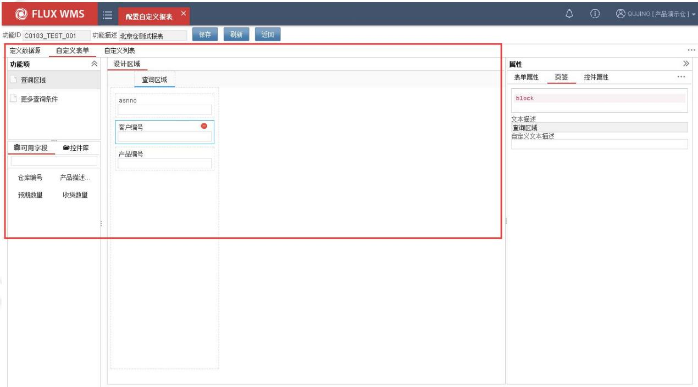


[图19-1-4]


功能项 - 此项为界面区域。 

可用字段 - SQL 语句配置无误后，前台会自动根据 SQL 语句所含字段自动进行控件化转换。转换为图形化控件，通过托拉拽方式实现字段创建、移动、界面布局字段调整等操作。 

控件库 - 控件库项为系统标准自带控件。例如时间控件。 

属性 - 属性项为拖拉生成控件后，针对控件的每个属性修改。包括控件属性、长宽高、光标是否聚焦、标签描述等信息。 

## ■ 定义图表参数

定义图像参数功能项，主要用户配置展示界面样式。不同类型报表配置界面有所不同。实例中配置的为“表单类型”报表。界面需要配置列表的列数、列名、列描述、列属性等展示信息。 

<table><tr><td colspan="6">字段属性</td></tr><tr><td colspan="6">基本信息</td></tr><tr><td>字段</td><td colspan="2">描述</td><td>自定义文本描述</td><td colspan="2">列宽</td></tr><tr><td>a.asnno</td><td colspan="2"></td><td>asnno</td><td colspan="2">120</td></tr><tr><td>排序</td><td colspan="2">水平对齐方式</td><td>筛选方式</td><td colspan="2">汇总样式</td></tr><tr><td>字符串</td><td colspan="2">左对齐</td><td></td><td colspan="2">0000.00</td></tr><tr><td>汇总方式</td><td colspan="2"></td><td></td><td colspan="2"></td></tr></table>


[图 19-1-5]


字段:SQL 语句对应字段名称，不可编辑。控件拖拉创建后，自动带出。 

描述 - 字段描述信息，取自数据字典。不可编辑。 

自定义文本描述 - 自定义文本描述，支持个性化修改列描述。 

宽度 - 调整列宽度。 

排序 - 列排序方式。支持按字符或按数字排序。 

水平对齐方式 - 字段对齐方式。例如左对齐。 

筛选方式 - 表单数据筛选方式选择。支持字符方式和数值方式筛选。 

汇总方式 - 现场如需求要对列进行求和。例如计算行数据总和，可启用汇总功能。目前汇总支持例如计数、求和、平均、最大值、最小值等方式。 

汇总样式 - 汇总样式为控制汇总精度。 

## 19.1.3. 自定义报表发布

自定义报表配置完成后，需要针对角色配置相应的功能权限才能使用该表报，具体操作流程如下： 

■ 选择主菜单 “业务系统管理” 下的 “角色授权”。 

■ 当前角色下在"报表"下，配置自定义报表权限。详见角色授权章节内容。 

■ 配置成功后，需要重新登录操作系统。 

■ 在主菜单“报表”下，即可查看和使用新增自定义报表。 

## 19.2. 配置自定义功能

“二次开发管理”下的“配置自定义功能”功能模块，主要向客户提供表单的界面二次开发配置功能，是一种标准表单的功能扩展模块。用户通过“配置自定义功能”，可在不影响标准功能前台下个性化配置实现一级、二级、三级结构表单，并支持对展示字段的增删改查功能。 

## 19.2.1. 自定义功能创建

## - 主信息

■ 选择主菜单 “二次开发管理” 下的 “配置自定义功能”。 

在左侧的查询条件栏位，输入查询条件，进行查询。 

■ 在“主信息”页签，系统显示如下信息： 

<table><tr><td colspan="13">查询条件</td></tr><tr><td colspan="13">功能编号</td></tr><tr><td colspan="13">功能描述</td></tr><tr><td colspan="13">活动标记</td></tr><tr><td colspan="13">是</td></tr><tr><td>...</td><td>5</td><td colspan="11">查询</td></tr></table>


[图19-2-1]


功能编号 - 个性化功能编号。必输且唯一。 

功能描述 - 个性化功能中文描述。必输。 

显示顺序 - 个性化功能显示顺序，非必输。 

数据源 ID - 报表访问数据库地址,为空时默认使用当前数据库。 

活动标记 - 是否启用此报表。 

## 19.2.2. 自定义功能配置

## - 配置模板类型

通过工具栏点击【配置明细】或者右键选择“配置明细”选项，可配置自定义报表后台逻辑、筛选逻辑、数据展示等效果。点击后打开如下操作界面。 

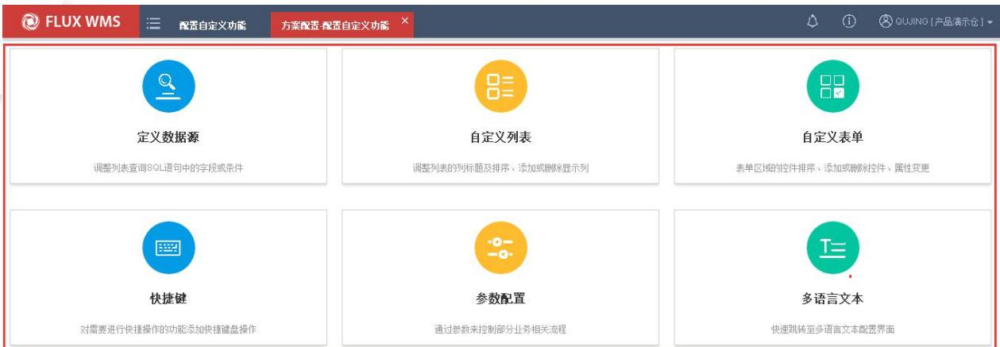


## [图 19-2-2]

■ 一层结构：点击后自动生成一层表结构模板，结构为查询界面+列表+单表单结构。例如仓库设置-库位模块布局。 

■ 二层结构：点击后自动生成二层表结构模板，结构为查询界面+列表+二层单表单结构。例如基础设置-产品档案模块布局。 

■ 三层结构：点击后自动生成三层表结构模板，结构为查询界面+列表+三层单表单结构。例如入库-质量检验 模块布局。 

■ 单证结构：点击后自动生成单证结构模板，结构为查询界面+列表+上下结构表单结构。例如入库-预期到货通知 模块布局。 

■ 空白界碑：改类型支持创建任意数量的列表、表单，初始化为空白建模(此项类型开发中)。 

## - 自定义数据源配置

自定义数据源配置功能项，主要用于配置后台交互 SQL 语句，其中 SQL 支持函数、排序、分组、多表关联、WITH、子查询等语法，能满足绝大多数现场个性化报表需要。界面包含如下字段： 

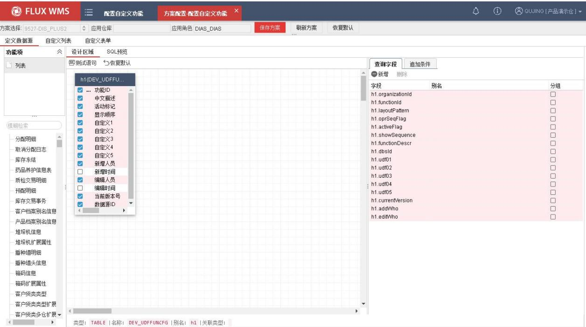


[图 19-2-3]


## ■ 界面字段说明

SQL 语句 - 应用与数据库交互 SELECT 语句。当前版本不支持 * 条件。 

测试语句 - 对 SQL 语句配置正确性进行校验。 

格式化 SQL - 对 SQL 语句展示格式进行优化。 

是否分页查询 - 查询总数大于每页记录数时是否产生分页。 

每页记录数 - 每页显示行数。当未启用分页查询时，该项配置值无效。 

汇总 SQL - 配置汇总 SQL，配置方法同 “SQL 语句”。 

## - 自定义列表配置

自定义列表页签主要是针对列表布局进行配置的操作界面，用户可根据现场需要，随意配置、调整字段名称、位置以及列属性、是否需要汇总。界面配置方式采用灵活度较高的托拉拽方式，实现列的新增、移动，向客户提供了所见及所得的体验感受。界面包含如下字段： 

<table><tr><td colspan="9">字段属性</td></tr><tr><td colspan="9">基本信息</td></tr><tr><td>字段</td><td colspan="3">描述</td><td colspan="3">自定义文本描述</td><td colspan="2">列宽</td></tr><tr><td>functionId</td><td colspan="3">功能编号</td><td colspan="3"></td><td colspan="2">120</td></tr><tr><td>排序</td><td colspan="3">水平对齐方式</td><td colspan="3">筛选方式</td><td colspan="2">格式化参数</td></tr><tr><td>字符串</td><td colspan="3">左对齐</td><td colspan="3"></td><td colspan="2"></td></tr><tr><td></td><td colspan="3">汇总样式</td><td colspan="3">自定义标记</td><td colspan="2"></td></tr><tr><td>□是否汇总</td><td colspan="3">0000.00</td><td colspan="3"></td><td colspan="2"></td></tr></table>

## [图19-2-4]

## ■ 界面字段说明

功能项 - 此项为界面区域。 

可用字段 - SQL 语句配置无误后，前台会自动根据 SQL 语句所含字段自动进行控件化转换。转换为图形化控件，通过托拉拽方式实现字段创建、移动、界面布局字段调整等操作。 

控件库 - 控件库项为系统标准自带控件。例如时间控件。 

属性 - 属性项为拖拉生成控件后，针对控件的每个属性修改。包括控件属性、长宽高、光标是否聚焦、标签描述等信息。 

## - 表单布局配置

自定义表单页签是主要针对表单布局进行配置的操作界面，用户可根据现场需要，随意配置、调整表单布局大小、字段名称、控件坐标位置以及控件属性等信息。界面配置同自定义列表页签配置方法，同样方式采用灵活度较高的托拉拽方式，实现列的新增、移动，功能设计提供给客户一种所见即所得的用户体验感受，让客户更容易理解、接受自定义功能的配置方式，从而达到降低模块的培训时间和成本的效果。界面包含如下字段： 

<table><tr><td colspan="2">FLUX WMS</td><td colspan="3">配置自定义功能</td><td colspan="5">方案配置 配置自定义功能</td></tr><tr><td colspan="2">方案选择: 9527-DIS_PLUS2</td><td colspan="3">应用仓库</td><td colspan="2">应用角色 DIAS_DIAS</td><td>保存方案</td><td>刷新方案</td><td>恢复默认</td></tr><tr><td colspan="10">定义数据源 自定义列表 自定义表单</td></tr><tr><td colspan="10">设计区域</td></tr><tr><td colspan="10">恢复默认</td></tr><tr><td colspan="10">+ 主信息 自定义 其他</td></tr><tr><td colspan="3">功能编号?</td><td colspan="2">功能描述</td><td colspan="2">显示顺序0</td><td colspan="3">数据源ID</td></tr><tr><td colspan="3">活动标记</td><td colspan="7"></td></tr></table>

## [图19-2-5]

## ■ 界面字段说明

功能项 - 此项为界面区域。 

可用字段 - SQL 语句配置无误后，前台会自动根据语句所含字段自动进行控件化转换。可用字段区域的控件，支持字段拖拉、界面布局字段调整等操作。 

控件库 - 控件库项为系统标准自带控件。例如时间控件。 

属性 - 属性项为拖拉生成控件后，针对控件的每个属性修改。包括控件属性、长宽高、光标是否聚焦、标签描述等信息。 

## 19.2.3. 自定义功能发布

自定义功能配置完成保存退出后，需要针对角色配置相应的功能权限才能使用此模块，具体操作流程如下： 

■ 选择主菜单 “业务系统管理” 下的 “角色授权”。 

■ 当前角色下在"自定义功能"下，配置自定义报表权限。详见角色授权章节内容。 

■ 配置成功后，需要重新登录操作系统。 

■ 在主菜单“自定义功能”下，即可查看和使用新增的自定义功能。 

## 19.3. 配置自定义看板

随着用户对报表需求的不断提高，传统报表静态展示数据的方式已经无法满足现场需要，更多现场希望能在大屏幕前实时“展示”当前场景下的作业数据（例如单量、集货数等信息），在此需求就产生了报表的衍生、扩展功能“自定义看板”。用户可在“二次开发管理”中找到“配置自定义看板”功能模块，其主要向客户提供多元化自定义看板的数据动态展示服务。使用场景例如双十一订单量数据的实时统计分析展示、输送线集货口看板的待作业数信息展示等。点击后打开如下操作界面。 

<table><tr><td>功能编号</td><td>功能描述</td><td>活动标记</td></tr><tr><td>C0108_0101</td><td>ZXCES001</td><td>Y</td></tr><tr><td>C0108_0612T01</td><td>V3看板01</td><td>Y</td></tr><tr><td>C0108_1106</td><td>CES</td><td>Y</td></tr><tr><td>C0108_119</td><td>波次任务统计</td><td>Y</td></tr><tr><td>C0108_200</td><td>复核绩效</td><td>Y</td></tr><tr><td>C0108_316</td><td>陈星测试</td><td>Y</td></tr><tr><td>C0108_901</td><td>双十一战报监控DEMO</td><td>Y</td></tr><tr><td>C0108_902</td><td>双十一战报监控DEMO2</td><td>Y</td></tr><tr><td>C0108_DRAG</td><td>控件抱拽</td><td>Y</td></tr><tr><td>C0108_HM</td><td>HM</td><td>Y</td></tr><tr><td>C0108_LDHCS01</td><td>测试</td><td>Y</td></tr><tr><td>C0108_TQ120601</td><td>TQ120601</td><td>Y</td></tr><tr><td>C0108_TQ120701</td><td>TQ120701</td><td>Y</td></tr><tr><td>C0108_TQ120703</td><td>TQ120703</td><td>Y</td></tr><tr><td>C0108_TQ122901</td><td>TQ122901</td><td>Y</td></tr><tr><td>C0108_V4CES01</td><td>V4测试</td><td>Y</td></tr><tr><td>C0108_WANGTP...</td><td>报表测试</td><td>Y</td></tr><tr><td>C0108_WUNANA...</td><td>邻脚脚测试</td><td>Y</td></tr><tr><td>C0108_ZX0613Y...</td><td>0613演示01</td><td>Y</td></tr><tr><td>C0108_ZX1001D</td><td>ZX1001D</td><td>Y</td></tr><tr><td>C0108_DYS001</td><td>看板类-演示</td><td>Y</td></tr></table>


[图17-3-1]


## 19.3.1. 自定义看板创建

## - 主信息

■ 选择主菜单“二次开发管理”下的“配置自定义功能” 

■ 在左侧的查询条件栏位，输入查询条件，进行查询。 

■ 在“主信息”页签，系统显示如下信息： 

<table><tr><td>主信息</td><td>自定义</td><td>其他</td></tr><tr><td>功能编号</td><td>功能描述</td><td>显示顺序</td></tr><tr><td>C0108_0101</td><td>ZXCES001</td><td>100</td></tr><tr><td>数据源ID</td><td></td><td>活动标记</td></tr></table>


[图 19-3-2]


功能编号 - 个性化报表编号。必输且唯一。 

功能描述 - 个性化报表中文描述。必输。 

显示顺序 - 个性化报表显示顺序，非必输。 

界面切换间隔 - 控制自定义看板数据刷新周期。即配置 20，表示每 20 秒刷新一次。 

数据源 ID - 报表访问数据库地址,为空时默认使用当前数据库。 

活动标记 - 是否启用此报表。 

## 19.3.2.看板配置

通过工具栏点击【配置明细】或者右键选择“配置明细”选项，可打开看板配置界面。通过控件拖拉住以及属性调整、设置即可完成配置工作。详见下图看板配置界面： 

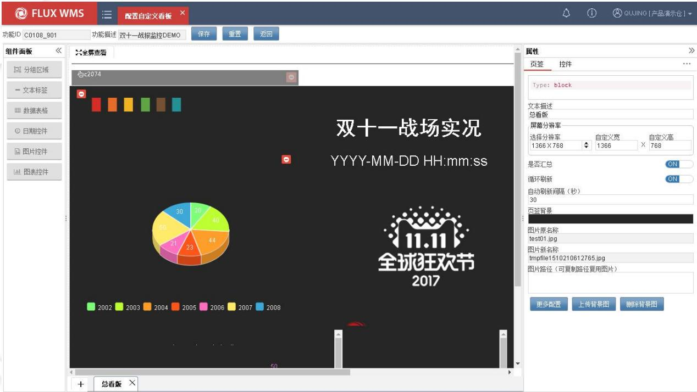


[图 17-3-3]


## - 组件面板区域

组件面板区域控件均支持托拉拽至看板预览区方式创建看板，在通过属性的调整大致规划好各组件的尺寸、颜色、关联图片、数据值等信息，配置完成发布后可在看板模块下查看。 

分组区域：用于看板显示区域布局划分，便于实际作业人员时查看，此控件仅对显示有影响。 

■ 文本标签: 用于配置标签项内容,该控件支持静态文本和动态变量配置(例如: 已下单 ${ORDQTY})。控件支持设置字体属性、标签长宽高、背景色等信息。 

■ 数据表格：主要用于表格区的显示。拖拉方式在看板创建后，可通过与现有报表关联实现数据展示效果。 

■ 日期控件：主要用于显示应用服务器当前时间。支持设置时间精度、时间格式。 

■ 图片控件：主要用于显示静态图片显示。控件支持 FTP、HTTP、HTTPS 等逻辑图片。 

图表控件：主要用于图标的显示。拖拉方式在看板创建后，通过与现有图标关联实现图标数据展示效果。 

## 19.3.3. 自定义看板发布

自定义看板配置完成保存退出后，需要针对角色配置相应的功能权限才能使用此看板功能，具体操作流程如下： 

■ 选择主菜单“业务系统管理”下的“角色授权”。 

■ 当前角色下在“自定义功能”下，配置自定义报表权限。详见角色授权章节内容。 

■ 配置成功后，需要重新登录操作系统。 

■ 在主菜单 “看板” 下，即可查看和使用新增的自定义功能。 

■ 样例展示最终效果，见下图： 

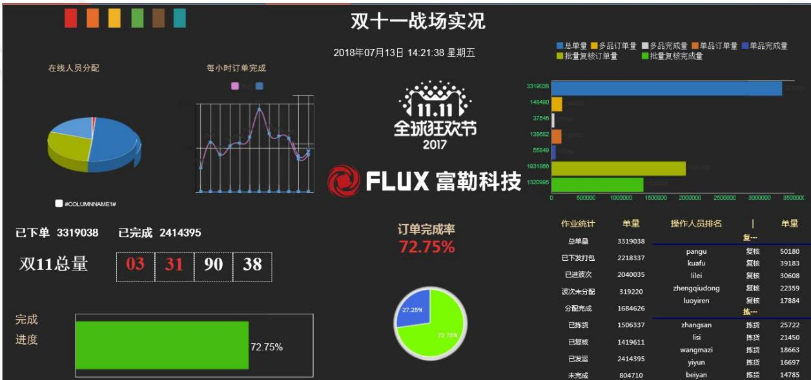


[图19-3-4]


## 20. 自动打印

仓库内的固定作业，可以配置对应的自动打印服务，实现无需人为干预的自动打印输出。 

例如订单通过接口下达，由定时器负责按波次规则运算生成波次订单、分配库存，完成分配的订单就可以通过自动打印配置，在指定的打印机输出拣货任务清单。具体拣货操作员工，根据打印的单据进行拣货操作，无需人工操作打印、通知、单据传递。 

启动自动打印服务后，用户可通过交互界面实施查看打印作业执行情况，目前 V6 版本 WMS 系统支持：1. 打印指令执行情况跟踪；2. 操作界面支持实施打印结果查看；3. 打印历史结果进行查看； 

## 20.1. 自动打印启用

- 检查主菜单“业务系统配置”下的“自动打印配置”是否正确、授权是否有误。具体配置流程参照“自动打印配置”相关章节。 

- 确认无误后，点击选择主菜单“自动打印”，打开自动打印服务操作界面： 

<table><tr><td colspan="2">工作站
STANDARD</td><td>分组1</td><td>分组2</td><td>分组3</td></tr><tr><td>主任务编号</td><td>主任务描述</td><td>运行状态</td><td>上次运行开始时间</td><td>上次运行结束时间</td></tr><tr><td>打印机名称</td><td>打印机类型</td><td>活动标记</td><td>工作区</td><td>清除 模糊检索 ALL</td></tr><tr><td>发送至 OneNote 2010</td><td>Y</td><td></td><td></td><td>RESULT: &gt; 准备启动打印任务...</td></tr><tr><td>VeryPDF PostscriptWriter</td><td>Y</td><td></td><td></td><td>RESULT: &gt; 查询成功-&gt;计数 0</td></tr><tr><td>Microsoft XPS Docume...</td><td>Y</td><td></td><td></td><td></td></tr><tr><td>OnetPrinter</td><td>Y</td><td></td><td></td><td></td></tr><tr><td>Doro PDF Writer</td><td>Y</td><td></td><td></td><td></td></tr></table>


[图20-1-1]


界面字段说明： 

开始/暂停按钮 - 按钮用于启动/暂停当前客户端标识下所配置的所有打印服务，当服务 

启动后，程序会实施刷新和输出打印服务状态、日志等信息。 

客户端标识 - 即本地配置->工作站。系统自动带出，前台不可编辑。 

重置 - 重置按钮用来重置分组 1~3，数据筛选条件。当点击后分组 1~3 下拉框信息自动清空，列表自动显示当前 “客户端标识” 下所有启用/未启用打印服务。 

分组 1~3 - 分组信息在启用打印服务后生效，下拉框自动加载各项打印服务对应的分组 1~3 信息，用以打印作业中的数据过滤筛选操作。 

列表展示区 - 启动打印服务后，展示所有该“客户端标识”下所有启用、未启用的打印服务信息。 

打印机类型展示区 - 打印机类型展示区主要用于显示当前主机，所有打印机终端访问信息。输出字段包括主任务编号、主任务描述、运行状态、分组 1~3、上次运行开始时间、上次允许结束时间、上次运行结果、下次运行时间、启动时间、执行次数、允许间隔、主打印机、打印模块文件等信息。 

日志输出区 - 日志输出区用于启动打印服务后，实施查看打印日志输出使用。打印区日志查看支持通过下拉框选择 全部（ALL）、错误（ERROR）、结果（RESULT）、指令（COMMAND）条件，对日志数据进行过滤。当点击 ☑ 清空按钮时，区域内日志信息自动清除。 

## 20.2. 自动打印暂停

当现场需要手动结束自动打印服务时, 可通过点击停止自动打印, 系统收到停止打印服务后, 日志输出区会自动打印出停止打印任务指令信息。 

<table><tr><td>打印机名称</td><td>打印机类型</td><td>活动标记</td><td>工作区</td></tr><tr><td>发送至OneNote 2010</td><td>Y</td><td></td><td></td></tr><tr><td>VeryPDF PostscriptWriter</td><td>Y</td><td></td><td></td></tr><tr><td>Microsoft XPS Docume...</td><td>Y</td><td></td><td></td></tr><tr><td>GnetPrinter</td><td>Y</td><td></td><td></td></tr><tr><td>Doro PDF Writer</td><td>Y</td><td></td><td></td></tr></table>


[图20-2-1]


## 20.3. 单项打印服务启用/停止

V6 版 WMS 系统支持对单项启用、未启用状态或执行时间段外打印项进行启动/停止打印操作。当用户多选或者单选打印服务项右键时，系统会展示“启用”、“停止”两个选择项，点击后系统会对选择项进行相应的启用/停止动作，列表区的“运行状态”以及输出打印日志区也会同步进行数据刷新和打印日志输出。 

<table><tr><td colspan="2">工作站
STANDARD</td><td>分组1</td><td>分组2</td><td>分组3</td></tr><tr><td>主任务编号</td><td>主任务描述</td><td>运行状态</td><td>上次运行开始时间</td><td>上次运行结束时间</td></tr><tr><td colspan="5">辅助</td></tr><tr><td colspan="5">启动</td></tr><tr><td colspan="5">停止</td></tr><tr><td colspan="5">异常数据</td></tr><tr><td colspan="5">现有数据导出</td></tr></table>


[图20-3-1]


## 21. 自定义导出/打印配置实例

在日常业务中，常用的数据导出主要包括自定义单据打印、数据导出到 Excel 表格(标准导出/按模板导出)，这两种导出的配置方法类似，都可通过【模板文件管理】、【数据导出规则配置】和【数据导出授权】三个功能共同配置来实现。后文将详细介绍。 

## 21.1. 模板文件管理配置

● 位置：【业务系统配置】-【模板文件管理】 

- 作用：用于维护、管理所有系统预置的标准模板和用户自定义的非标准模板文件，同时可以进行分模板打印配置、打印机参数设置、打印汇总设置等。 

与“数据导出规则配置”功能配合使用，可以预先定义好所需的模板，然后再指定具体导出规则对应调用的模板。 

- 界面预览： 

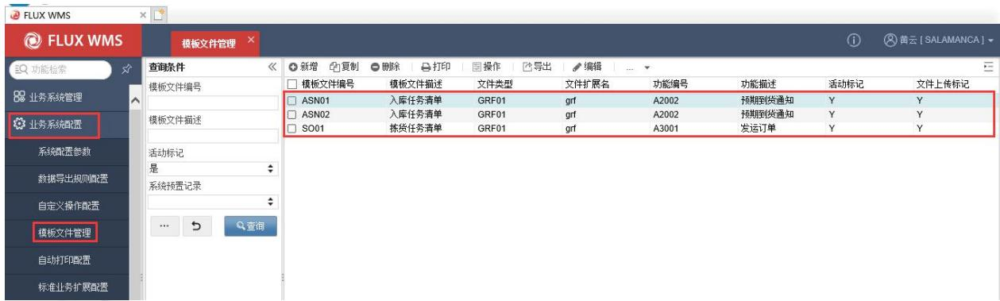


[图21-1-1]


## 21.1.1. 模板文件新增

- 步骤 1：点击【业务系统配置】模块，在子模块列表中双击【模板文件管理】，在左侧的查询条件栏，输入查询条件，可查询已有记录。在明细页签点击【新增】按钮，可新增模板文件。 

- 步骤 2：依次填写详细配置信息。 

■ 【详细信息】配置说明： 

模板文件配置分为两个部分--详细信息（模板基础信息，必须配置项）+分模板编辑（如没有分模板需求，则无需配置）。 

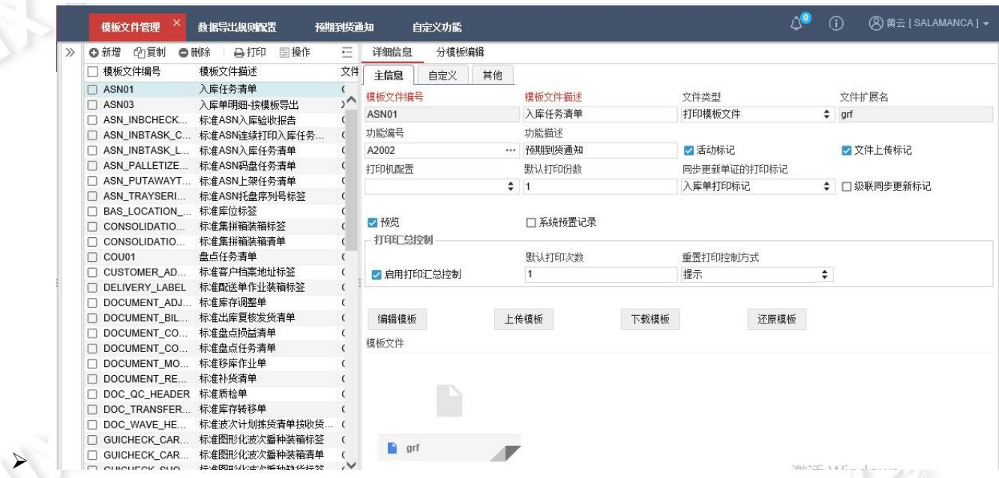


[图21-1-2]


模板文件编号：模板文件的 ID，没有强制命名要求，不可重复。 

✨ 模板文件描述：模板名称。 

文件类型：模板文件类型。系统目前提供 Excel、Grid++（打印格式）、PDF 模板、报表模板类型供选择。 

文件扩展名：根据所选类型，显示对应的固定文件扩展名，一般在上传模板文件后系统自动识别。 

功能编号：模板应用功能对应的功能 ID。 

功能描述：功能名称。 

活动标记：模板激活标记。 

文件上传标记：是否已经上传模板，由系统根据上传情况显示。 

✨ 打印机配置：指定打印到特定打印机。 

✿ 默认打印份数：一次打印时的输出份数。默认为 1. 

同步更新单证的打印标记：打印后更新单据对应的打印标记。注意：需要在导出规则的单据数据源中查询打印标记字段，才能生效。 

级联同步更新标记：单据组打印时使用，例如从波次计划打印拣货单，除了更新波次计划的拣货单打印标记，可以同步更新发运订单中的拣货单打印标记。 

预览：打印时是否需要显示预览界面。如果不预览，同时配置打印机，则可以实现后台打印输出效果。 

启用打印汇总控制：是否启用打印次数控制。 

✿ 默认打印次数：启用打印次数控制情况下，允许的打印次数。 

重置打印控制方式：超过默认打印次数时，系统处理方式。1. 提示：超出打印次数时弹框提示；2. 手动重置：人工清除打印标记后重新打印。 

- 步骤 3：点击【保存】按钮，完成主信息的设置 

- 步骤 4：模板文件管理 

## ■ 【详细信息】配置说明：

编辑模板：第一次编辑：为标准模板时，打开系统的标准模板进行编辑。为按规则打印模板时，打开空白模板进行编辑；非第一次编辑：打开之前编辑保存后的模板； 

上传模板：上传一张本地模板。 

下载模板：下载服务器上的模板。养成良好的习惯，可以将在线编辑的模板下载到本地做备份。 

还原模板：为标准模板时，还原系统的标准模板。为按规则打印模板时，还原成空白模板。谨慎，尤其在没有备份的情况下。 

备注：目前只支持打印模板的在线编辑，即 grf 文件。 

## 21.1.2. 模板文件制作

## - 打印模板文件

制作工具：Grid++, 已配置到 V6 系统，支持在线编辑。 

参考资料：公司 ftp 上有相关学习视频，请自取。 


Grid++报表基础篇.wmv 


Grid++报表进阶篇.wmv 

[图 21-1-3] 

## - 报表模板文件

制作工具：FineReport，需下载客户端，在客户端定义数据连接、绘制模板。模板完成后上传至系统中。 

参考资料：官网学习文档 http://help.finereport.com/ 

## - Excel 模板文件

制作工具：Excel 表格 

参考资料：学习文档 https://www.cnblogs.com/klguang/p/6425422.html 

备注：在 V6 中只有两个对象集：header 和 details。 

<table><tr><td>A</td><td>B</td><td>C</td><td>D</td><td>E</td><td>F</td><td>G</td><td>H</td></tr><tr><td></td><td></td><td></td><td></td><td>Pripuesta de Pedido</td><td></td><td></td><td></td></tr><tr><td>3</td><td rowspan="4">sheng:
jx:area(lastCell=&quot;M14&quot;)</td><td></td><td>ASNNO</td><td>$ [header.ASNNO]</td><td></td><td></td><td></td></tr><tr><td>4</td><td></td><td>仓库编号</td><td>$ [header.WAREHOUSEID]</td><td></td><td></td><td></td></tr><tr><td>5</td><td></td><td>ERP单号</td><td>$ [header.ERPNO]</td><td></td><td></td><td></td></tr><tr><td>6</td><td></td><td>供应商</td><td>$ [header.SUPPLIERNAME]</td><td></td><td></td><td></td></tr><tr><td>7</td><td></td><td></td><td></td><td></td><td></td><td></td><td></td></tr><tr><td>8</td><td></td><td></td><td></td><td></td><td></td><td></td><td></td></tr><tr><td>9</td><td>Dirección AV.MAS DE L&#x27;OLI,170</td><td></td><td></td><td></td><td></td><td></td><td></td></tr><tr><td>10</td><td>Telefono: 961920479</td><td></td><td></td><td></td><td></td><td></td><td></td></tr><tr><td>11</td><td></td><td></td><td></td><td></td><td></td><td></td><td></td></tr><tr><td>12</td><td></td><td></td><td></td><td></td><td></td><td></td><td></td></tr><tr><td>13</td><td>产品代码 sheng:
${detail.SI}</td><td></td><td>中包数</td><td>箱数</td><td>合同编号</td><td></td><td></td></tr><tr><td>14</td><td></td><td></td><td>${detail. $ {detail. $ {detail.LOTATT06}}</td><td></td><td></td><td></td><td></td></tr><tr><td>15</td><td></td><td colspan="2">合计 0</td><td></td><td></td><td></td><td></td></tr><tr><td>16</td><td></td><td></td><td></td><td></td><td></td><td></td><td></td></tr><tr><td>17</td><td></td><td></td><td></td><td></td><td></td><td></td><td></td></tr></table>


[图21-1-4]


在 A1 表格批注中设置模版区域范围, 建议比实际范围大一行。例如: jx:area(lastCell = "H14") 

■ 循环读取明细时，在第一个表格的批注中填写 each 函数，默认向下扩展。例如：jx:each(items="details" var="detail" lastCell="H13") 

■ 可以使用 SUM 公式汇总，但该字段需提前在 SQL 查询时转换为数字。 

## 21.2. 数据导出规则配置

● 位置：【业务系统配置】-【数据导出规则配置】 

- 作用：实际业务中会有很多数据导出的需求，包括单据打印和数据 EXCEL 导出。系统提供了强大的自定义导出处理支持，用户可以根据各自的需要，自行定义所需的导出信息、格式等。 

- 界面预览 

<table><tr><td colspan="12">FLUX WMS</td></tr><tr><td colspan="12">功能检索</td></tr><tr><td colspan="12">业务系统配置</td></tr><tr><td colspan="12">系统配置参数</td></tr><tr><td colspan="12">数据导出规则配置</td></tr><tr><td colspan="12">自定义操作配置</td></tr><tr><td colspan="12">模板文件管理</td></tr><tr><td colspan="12">自动打印配置</td></tr><tr><td colspan="12">标准业务扩展配置</td></tr></table>


[图 21-2-1]


## 21.2.1. 新增导出规则

- 步骤 1：点击【业务系统配置】模块，在子模块列表中双击【数据导出规则配置】，在左侧的查询条件栏位，输入查询条件，可查询已有记录。在明细页签点击【新增】按钮，可新增导出规则。 


- 步骤 2：主信息配置


<table><tr><td>主信息</td><td>SQL语句定义</td><td>导出文件配置</td><td>自定义</td><td>其他</td></tr><tr><td>功能编号</td><td colspan="2">功能描述</td><td>表格编号</td><td>导出代码</td></tr><tr><td>A2002</td><td>...</td><td>预期到货通知</td><td>DOC_ASN_HEADER</td><td>ASN003</td></tr><tr><td>导出描述</td><td colspan="2">显示顺序</td><td>授权类型</td><td></td></tr><tr><td>入库单明细-按模板导出</td><td colspan="2">2</td><td>一般查询类</td><td>活动标记</td></tr><tr><td>常用导出</td><td colspan="2">常用打印</td><td>标准模板</td><td></td></tr></table>

## [图21-2-2]

■ 【详细信息】配置说明： 

功能编号 - 功能 ID，系统根据此 ID，获取功能对应导出配置，显示在对应界面的导出选择项。 

功能描述 - 功能对应名称描述。 

表格编号 - 后台表名，即导出信息的来源。 

导出代码 - 代码 ID，用于区分不同的导出处理。 

导出描述 - 界面显示的导出选择项名称。 

显示顺序 - 同一功能的多个不同导出的显示排序。 

授权类型 - 系统提供一般查询类、业务操作类、业务管理类、系统管理类几个默 认类型，方便将导出分类管理，批量进行授权设置。用户可以根据管理需要，自行在系统代码中设置更多的授权类型。授权类型取自系统代码“EXP_AUTH_TYPE”，支持自定义扩展。 

活动标记 - 是否使用中的规则 

常用导出 - 如勾选，则在对应功能的【导出】按钮的下拉菜单中显示，方便快捷操作。未勾选的导出，则在其他按钮下，“按规则导出”功能中，通过二级窗口选择执行操作。 

常用打印 - 如勾选，则在对应功能的【打印】按钮的下拉菜单中显示，方便快捷操作。未勾选的导出，则在其他按钮下，“按规则打印”功能中，通过二级窗口选择执行操作。 

标准模板 - 是否标准打印模板，不支持修改。 

- 步骤 3: sql 语句定义 

根据导出需要，维护各级查询语句，可以通过【测试语句】按钮检测语法问题，【格式化 SQL】按钮对 sql 语句进行格式化整理。在语句执行时系统会自动校验 SQL 是否符合授权限制（即是否有组织、仓库、货主等条件），若无系统会根据业务表和实际用户授权自动增加查询条件。 

<table><tr><td>主信息</td><td>SQL语句定义</td><td>导出文件配置</td><td>自定义</td><td>其他</td></tr><tr><td colspan="5"></td></tr><tr><td colspan="2">查询明细信息的SQL语句</td><td>测试语句</td><td colspan="2">格式化SQL</td></tr><tr><td colspan="5">SELECT</td></tr><tr><td>h.warehouseId</td><td>AS.仓库</td><td></td><td></td><td></td></tr><tr><td>h.ASNNO</td><td>AS 预期到货通知编号,</td><td></td><td></td><td></td></tr><tr><td>h.asnreference1</td><td>AS ERP单号</td><td></td><td></td><td></td></tr><tr><td>h.asnreference2</td><td>AS 货柜号码</td><td></td><td></td><td></td></tr><tr><td>d.sku</td><td>AS 货号</td><td></td><td></td><td></td></tr><tr><td>s.skuDescr1</td><td>AS 商品名称</td><td></td><td></td><td></td></tr><tr><td>d.ExpectedQty_Each AS件数</td><td></td><td></td><td></td><td></td></tr><tr><td>d.LotAtt09</td><td>AS 包装数量</td><td></td><td></td><td></td></tr><tr><td>f.fwdLoc</td><td>AS 产品拣货位</td><td></td><td></td><td></td></tr><tr><td>&#x27;@{userName}</td><td>AS 打印人</td><td></td><td></td><td></td></tr><tr><td>AS实收数量</td><td></td><td></td><td></td><td></td></tr><tr><td>AS备注</td><td></td><td></td><td></td><td></td></tr><tr><td>H.ASNNO</td><td>AS ASNNO</td><td></td><td></td><td></td></tr><tr><td>H.ASNPRINTFLAG</td><td>AS入库单打印标记</td><td></td><td></td><td></td></tr><tr><td colspan="5">FROM</td></tr><tr><td colspan="5">DOC_ASN_HEADER h</td></tr></table>


[图21-2-3]


## 注意事项：

■ V6 数据库表结构有很多变化，需花时间熟悉系统数据字典； 

由于 V6 几乎所有的表都增加了 organizationId 这个主键, 因此表与表的关联字段需增加组织 ID; 

■ 如果对应打印模板文件设置了更新打印标记，需要在 SQL 语句中定义打印标记字段； 

■ 单号，如 ASNNO、ORDERNO 等不能 AS 别名。保存语句时会自动将单号 AS 成中文名称，解决办法是将单号 AS 成字段本身，可见上图。 

- 步骤 4：导出文件配置。 

在【导出文件配置】页签维护数据导出的模板文件： 

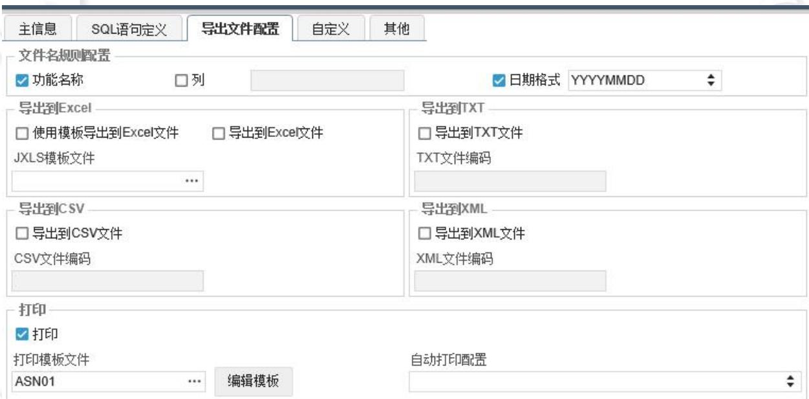


## [图21-2-4]

■ 文件命名规则-设置导出文件的命名规则（功能名称/固定某个字段/日期格式-下拉框选择格式） 

导出到 XX - 导出的文件格式配置。如勾选某种模式，在对应功能的打印/导出子菜单，此项导出会显示模式选择子菜单。不同导出模式，需要配置不同的设置。可见下图示例，同时勾选导出到 excel 文件和打印，则该导出规则出现在【打印】和【导出】的子菜单中。 

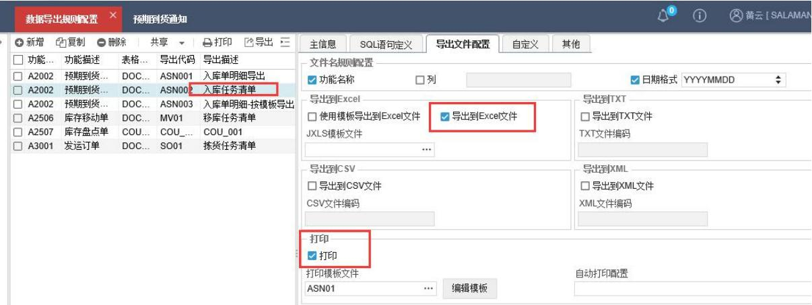


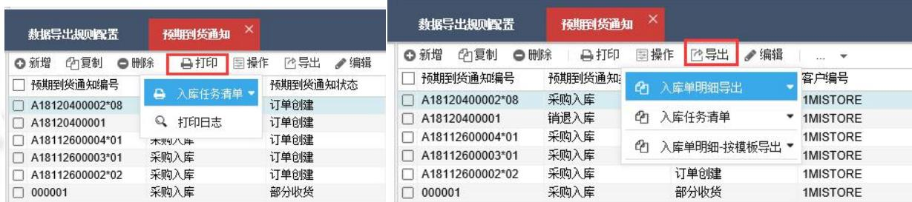


[图21-2-5]


备注：如果选择【按模板导出到 Excel】，则需要维护相应 Excel 模板文件；如果选择【打印】，则需维护打印模板文件。相应文件在【模板文件管理】中配置。 

## 21.3. 数据导出授权

● 位置：【业务系统管理】-【数据导出授权】 

- V6 中将授权细化为三个模块： 

■ 角色授权，即系统标准功能授权； 

■ 数据导出授权，即用户自定义的数据导出规则授权； 

■ 自定义操作授权，即用户配置的自定义操作授权。 

根据 “数据导出规则配置” 定义的自定义导出所属的授权类型和功能编号给角色进行授权。 

按照分类进行授权之后，相同功能模块、授权类型，新增、调整导出规则的时候，无需新增授权。 


[图21-3-1]


## 21.3.1.新增数据导出授权

- 步骤 1：点击【业务系统管理】模块，在子模块列表中双击【数据导出授权管理】，在左侧的查询条件栏位，输入查询条件，可查询已有记录。在明细页签点击【新增】按钮，可新增数据导出授权。 

- 步骤 2：完成【主信息】页签基本配置，点击【保存】按钮，完成数据导出授权。 

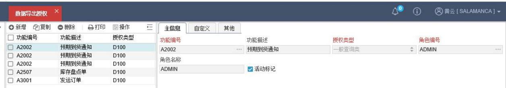


[图21-3-2]


## ■ 【详细信息】配置说明：

功能编号 - 导出对应的功能 ID，可通过浏览按钮进行选择。 

功能描述 - 功能名称，根据所选功能编号系统带出显示。 

授权类型 - 系统提供一般查询类、业务操作类、业务管理类、系统管理类几个默认类型，方便将导出分类管理，批量进行授权设置。用户可以根据管理需要，自行在系统代码中设置更多的授权类型 

角色编号 - 导出授予的角色对应，可通过浏览按钮进行选择。 

角色描述 - 角色名称显示。 

活动标记 - 是否使用中的记录。 

综上，完成模板文件的绘制、导出规则的配置和导出授权，就可以实现数据的自定义导出了。执行效果如下： 

- 自定义单据打印样例 

<table><tr><td>预期到货通知编号</td><td>入库任务清单</td><td>预期到货通知状态</td><td>客户编号</td><td>预期到货通知创建...</td><td>预期到货时间1</td><td>参考编号1</td><td>参考编号2</td></tr><tr><td>A18121000001</td><td rowspan="2">打印日志</td><td>完全收货</td><td>1MISTORE</td><td>2018-12-10 12:33:....</td><td>2018-12-10 12:33:....</td><td></td><td></td></tr><tr><td>A18120400002*14</td><td>订单创建</td><td>1MISTORE</td><td>2018-12-04 16:51:....</td><td>2018-12-06 16:30:....</td><td>A18120401*14</td><td></td></tr><tr><td>A18120400001</td><td>采购入库</td><td>订单创建</td><td>1MISTORE</td><td>2018-12-04 15:55:....</td><td>2018-11-23 10:11:....</td><td></td><td></td></tr><tr><td>A18112600004*01</td><td>采购入库</td><td>订单创建</td><td>1MISTORE</td><td>2018-11-26 16:57:....</td><td>2018-12-06 14:11:....</td><td></td><td></td></tr><tr><td>A18112600003*01</td><td>采购入库</td><td>订单创建</td><td>1MISTORE</td><td>2018-11-26 16:45:....</td><td>2018-12-06 15:20:....</td><td>test001*01</td><td>1号</td></tr><tr><td>A18112600002*02</td><td>采购入库</td><td>订单创建</td><td>1MISTORE</td><td>2018-11-26 14:06:....</td><td>2018-12-06 14:19:....</td><td></td><td></td></tr><tr><td>000001</td><td>采购入库</td><td>部分收货</td><td>1MISTORE</td><td>2018-11-23 10:11:....</td><td>2018-11-23 10:11:....</td><td></td><td></td></tr></table>

## 入库任务清单 EN LA LISTA DE TAREAS

ERP 单号/NÚMERO DE ERP: test001*01 

货柜号码/NÚMERO DE CONTENEDOR: 1号 

仓库/ALMACÉN: SALAMANCA 


A18112600003*01 

<table><tr><td>货号CODIGO</td><td>商品名称NOMBRE DE LA MERCANCÍA</td><td>件数CAJA</td><td>包装数量CANTIDAD DE EMBALAJE</td><td>产品拣货位UBICACION</td><td>实收数量CANTIDAD REAL</td><td>备注COMENTARIO</td></tr><tr><td>00002</td><td>铜锁25MM 双泡</td><td>1</td><td>1</td><td></td><td></td><td></td></tr></table>

汇总/RESUMEN: 1 

[图 21-3-3] 

- 导出数据到 EXCEL 样例 

<table><tr><td>模板文件管理</td><td colspan="7">预期到货通知</td></tr><tr><td>新增</td><td>复制</td><td>删除</td><td>打印</td><td>操作</td><td>导出</td><td>编辑</td><td></td></tr><tr><td>预期到货通知编号</td><td colspan="4">预期到货通知</td><td>入库单明细导出</td><td>客户编号</td><td>预期到货通知创建... 预期到货时间1 参考编号1</td></tr><tr><td>A18121000001</td><td colspan="4">采购入库</td><td>1MISTORE</td><td>2018-12-10 12:33:...</td><td>2018-12-10 12:33:...</td></tr><tr><td>A18120400002*14</td><td colspan="4">调拨入库</td><td>1MISTORE</td><td>2018-12-04 16:51:...</td><td>2018-12-06 16:30:... A18120401*14</td></tr><tr><td>A18120400001</td><td colspan="4">销退入库</td><td>1MISTORE</td><td>2018-12-04 15:55:...</td><td>2018-11-23 10:11:...</td></tr><tr><td>A18112600004*01</td><td colspan="4">采购入库</td><td>1MISTORE</td><td>2018-11-26 16:57:...</td><td>2018-12-06 14:11:...</td></tr><tr><td>A18112600003*01</td><td colspan="3">采购入库</td><td>订单创建</td><td>1MISTORE</td><td>2018-11-26 16:45:...</td><td>2018-12-06 15:20:... test001*01</td></tr><tr><td>A18112600002*02</td><td colspan="3">采购入库</td><td>订单创建</td><td>1MISTORE</td><td>2018-11-26 14:06:...</td><td>2018-12-06 14:19:...</td></tr><tr><td>000001</td><td colspan="3">采购入库</td><td>部分收货</td><td>1MISTORE</td><td>2018-11-23 10:11:...</td><td>2018-11-23 10:11:...</td></tr></table>

<table><tr><td></td><td>A</td><td>B</td><td>C</td><td>D</td><td>E</td><td>F</td><td>G</td><td>H</td><td>I</td></tr><tr><td>1</td><td>入库单号</td><td>ERP单号</td><td>订单类型</td><td>供应商名称</td><td>供应商联系电话</td><td>产品代码</td><td>产品名称</td><td>预期数量</td><td>合同编号</td></tr><tr><td>2</td><td>000001</td><td></td><td>采购入库</td><td></td><td></td><td>00001</td><td>铜锁20MM双泡</td><td>200.00000000</td><td>1234456</td></tr><tr><td>3</td><td>A18112300001</td><td></td><td>采购入库</td><td></td><td></td><td>00002</td><td>铜锁25MM双泡</td><td>500.00000000</td><td>110</td></tr><tr><td>4</td><td>A18112600001</td><td></td><td>采购入库</td><td></td><td></td><td>00004</td><td>铜锁40MM双泡</td><td>100.00000000</td><td>001</td></tr><tr><td>5</td><td>A18112600002</td><td></td><td>采购入库</td><td></td><td></td><td>00002</td><td>铜锁25MM双泡</td><td>500.00000000</td><td>1112</td></tr><tr><td>6</td><td>A18112600002*01</td><td></td><td>采购入库</td><td></td><td></td><td>00002</td><td>铜锁25MM双泡</td><td>400.00000000</td><td>1112</td></tr><tr><td>7</td><td>A18112600002*02</td><td></td><td>采购入库</td><td></td><td></td><td>00002</td><td>铜锁25MM双泡</td><td>95.00000000</td><td>1112</td></tr><tr><td>8</td><td>A18112600003</td><td>test001</td><td>采购入库</td><td></td><td></td><td>00002</td><td>铜锁25MM双泡</td><td>200.00000000</td><td>911</td></tr><tr><td>9</td><td>A18112600003*01</td><td>test001*01</td><td>采购入库</td><td></td><td></td><td>00002</td><td>铜锁25MM双泡</td><td>1.00000000</td><td>911</td></tr><tr><td>0</td><td>A18112600004</td><td></td><td>采购入库</td><td></td><td></td><td>00002</td><td>铜锁25MM双泡</td><td>100.00000000</td><td>9111</td></tr><tr><td>1</td><td>A18112600004*01</td><td></td><td>采购入库</td><td></td><td></td><td>00002</td><td>铜锁25MM双泡</td><td>99.00000000</td><td>9111</td></tr><tr><td>2</td><td>A18112600005</td><td></td><td>采购入库</td><td></td><td></td><td>00005</td><td>铜锁50MM双泡</td><td>300.00000000</td><td>20180001</td></tr><tr><td>3</td><td>A18112600005</td><td></td><td>采购入库</td><td></td><td></td><td>00006</td><td>铜锁60MM双泡</td><td>300.00000000</td><td>20180001</td></tr><tr><td>4</td><td>A18120300001</td><td></td><td>采购入库</td><td></td><td></td><td>00001</td><td>铜锁20MM双泡</td><td>100.00000000</td><td>20181203</td></tr><tr><td>5</td><td>A18120400001</td><td></td><td>销退入库</td><td></td><td></td><td>00001</td><td>铜锁20MM双泡</td><td>200.00000000</td><td>1234456</td></tr><tr><td>6</td><td>A18120400002</td><td>A18120401</td><td>采购入库</td><td></td><td></td><td>02452</td><td>透明桌椅脚套 15010</td><td>2880.00000000</td><td>11111</td></tr><tr><td>7</td><td>A18120400002*01</td><td>A18120401*01</td><td>采购入库</td><td></td><td></td><td>02452</td><td>透明桌椅脚套 15010</td><td>2870.00000000</td><td>11111</td></tr><tr><td>8</td><td>A18120400002*02</td><td>A18120401*02</td><td>采购入库</td><td></td><td></td><td>02452</td><td>透明桌椅脚套 15010</td><td>2850.00000000</td><td>11111</td></tr></table>


[图21-3-4]


- 按模板导出数据到 EXCEL 样例


<table><tr><td rowspan="6" colspan="2"></td><td></td><td></td><td>Pripuesta de Pedido</td><td></td><td></td><td></td></tr><tr><td></td><td></td><td></td><td></td><td></td><td></td></tr><tr><td></td><td>ASNNO</td><td>A18121700001</td><td></td><td></td><td></td></tr><tr><td></td><td>仓库编号</td><td>SALAMANCA</td><td></td><td></td><td></td></tr><tr><td></td><td>ERP单号</td><td>ERP1223444</td><td></td><td></td><td></td></tr><tr><td></td><td>供应商</td><td></td><td></td><td></td><td></td></tr><tr><td></td><td></td><td></td><td></td><td></td><td></td><td></td><td></td></tr><tr><td></td><td></td><td></td><td></td><td></td><td></td><td></td><td></td></tr><tr><td>Dirección Telefono:</td><td>AV.MAS DE L&#x27;OLI,170961920479</td><td></td><td></td><td></td><td></td><td></td><td></td></tr><tr><td></td><td></td><td></td><td></td><td></td><td></td><td></td><td></td></tr><tr><td>产品代码</td><td>产品名称</td><td>中包数</td><td>箱数</td><td>合同编号</td><td></td><td></td><td></td></tr><tr><td>00020</td><td>长梁铜锁25MM 双泡</td><td>10.00</td><td>5</td><td>2018121700001</td><td></td><td></td><td></td></tr><tr><td>00040</td><td>槽头锁60MM 双泡</td><td>15.00</td><td>10</td><td>201812170001</td><td></td><td></td><td></td></tr><tr><td>00050</td><td>密码锁TSA8054 2PCS 双泡</td><td>0.00</td><td></td><td></td><td></td><td></td><td></td></tr><tr><td></td><td>合计</td><td>25</td><td></td><td></td><td></td><td></td><td></td></tr><tr><td></td><td></td><td></td><td></td><td></td><td></td><td></td><td></td></tr><tr><td colspan="8">汇总/RESUMEN: 1</td></tr></table>


[图21-3-5]


## 21.4. 报错记录

## 21.4.1. 模板文件再次编辑报错

- 描述：打开已经上传的文件再次编辑时报错‘报表数据读取错误’，复制 URL 提示网页不存在。 

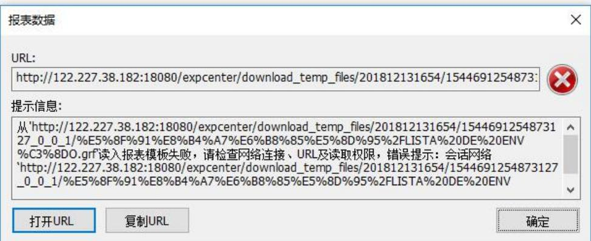


[图 21-4-1] 

- 原因：模板文件描述中包含‘/’符号，导致URL地址有误。 

- 解决方案：模板文件中文描述，尽量避免使用特殊字符。 

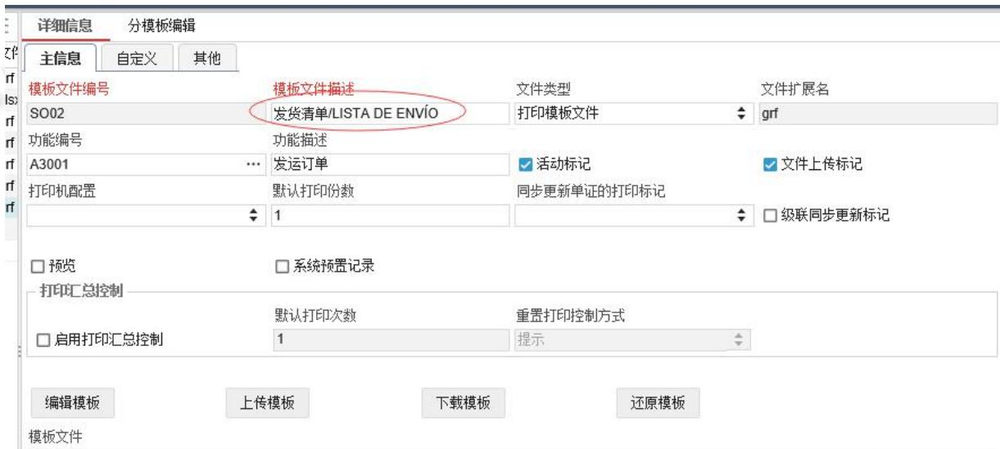


[图 21-4-2]


## 22. 自定义预警配置实例

仓库日常操作中，有许多情况需要特殊关注，例如库存低于安全线，保质期临近等。尽管系统对此有详细的记录，但通过库存余量或单据对于特定情况并不直观，同时也可能需要主动将信息通知货主或者相关人员处理。但在不同业务情况下，需要通知的内容各不相同，因此 WMS 提供了自定义预警的功能。 

配置内容包括【预警参数配置】、【邮件服务器配置】、【邮件模板配置】及【存储过程设置】。 

## 22.1. 预警参数配置

● 位置：【预警】-【预警参数配置】。 

- 作用：用于定义、管理 WMS 系统标准/非标准预警参数，以及预警参数相关的其他配置信息。 

## - 界面预览

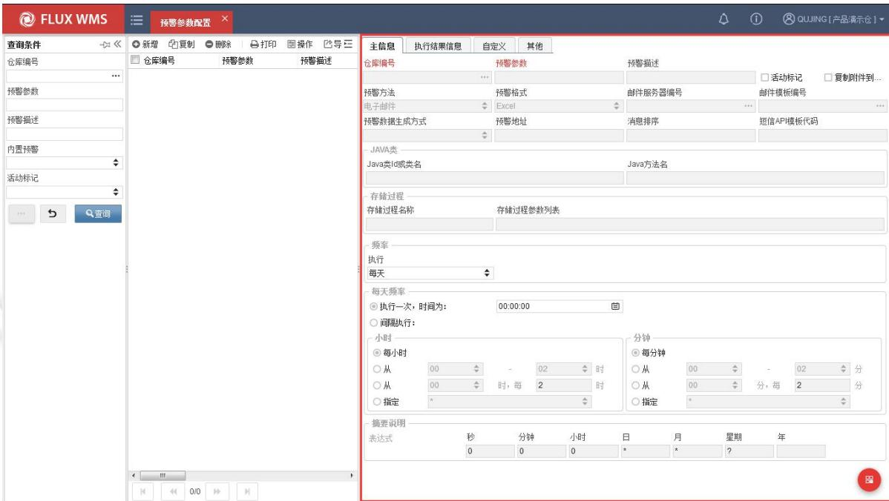


[图 22-1-1]


## 22.1.1. 消息型预警配置

- 步骤 1：选择主菜单“预警”模块下的“预警参数配置” 

- 步骤 2：点击【新增】按钮，在“详细信息”页签维护主信息 

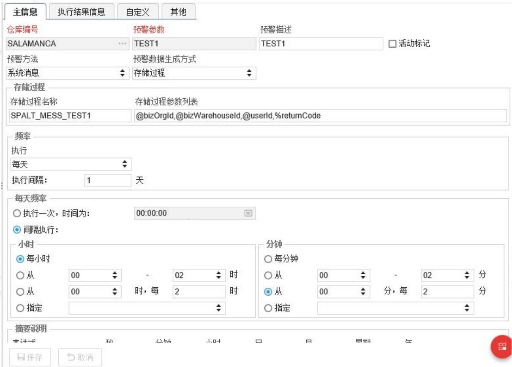


[图22-1-2]


■ 仓库编号 - 预警生效的仓库，点击新增后系统默认带出当前登录仓库。 

■ 预警参数 - 系统不同预警方式的代码，为自定义代码，本例中配置为 TEST1。 

■ 预警描述 - 预警功能对应的中文描述。 

■ 活动标记 - 该预警消息是否生效。 

■ 预警方法 - 设定该条预警配置通过何种方式来实现，目前包括消息预警和邮件预警。 

■ 预警数据生成方式 - 配置通过存储过程或者 JAVA 类来实现。 

存储过程 - 预警生成方式为存储过程时，调用的存储过程名称。 

存储过程参数列表 - 预警生成方式为存储过程时，调用的存储过程参数列表。 

■ 频率 - 同定时器配置，用于配置该消息记录发送频率。 

- 步骤3：点击【保存】按钮，完成新增记录主信息操作。 

- 步骤 4：在“限制条件”页签，可以显示预警执行情况，包括上次执行时间、上次执行结果、上次执行耗时等 

<table><tr><td>主信息</td><td>执行结果信息</td><td>自定义</td><td>其他</td></tr><tr><td colspan="2">上次执行时间</td><td>上次执行结果</td><td>上次执行耗时(毫秒)</td></tr><tr><td colspan="2">2018-12-13 10:36:00</td><td>Y</td><td>63</td></tr><tr><td colspan="4">上次执行服务器IP地址</td></tr><tr><td colspan="4">192.168.1.4</td></tr></table>


[图22-1-3]


## 22.1.2. 邮件预警参数配置

- 步骤 1：选择主菜单“预警”模块下的“预警参数配置”。 

- 步骤 2：点击【新增】按钮，在“详细信息”页签维护主信息。 

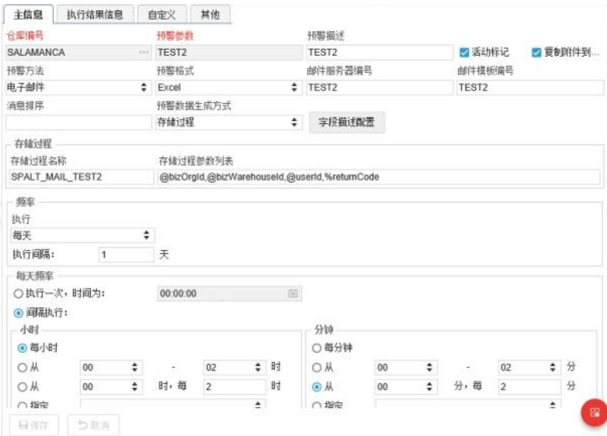


[图22-1-4]


■ 预警方法 - 选择电子邮件。 

■ 预警格式 - 目前下拉框仅支持 EXCEL 预警。 

■ 邮件服务器编号 - 选择配置好的邮件服务器编号（详见下文说明）。 

■ 邮件模板编号 - 选择配置好的邮件模板编号（详见下文说明）。 

■ 消息排序 - 定义邮件信息的排序字段, 可根据 SYS_ALERT_LOG 表中的 FILED 字段设置。 

■ 字段描述配置 - 配置邮件不同字段的字段名称。 

■ 复制附件到正文 - 在邮件发送中是否将附件加入到邮件正文中。 

## 22.2. 邮件服务器配置

## 22.2.1. 邮件预警参数配置

本章节消息预警不需要配置，具体操作步骤如下： 

- 步骤 1：选择主菜单“预警”模块下的“邮件预警参数配置”。 

- 步骤 2：点击【新增】按钮，在“详细信息”页签维护主信息。 

<table><tr><td>主信息</td><td>自定义</td><td>其他</td><td></td><td></td></tr><tr><td colspan="3">邮件服务器编号</td><td>邮件服务器描述</td><td>主机名称</td></tr><tr><td colspan="3">TEST2</td><td>TEST2</td><td>smtp.exmail.qq.com</td></tr><tr><td colspan="3">发件人地址</td><td>发件人名称</td><td>发件人邮箱密码</td></tr><tr><td colspan="3">yinqiang@flux.com.cn</td><td>FLUX小助手</td><td>**********</td></tr><tr><td colspan="3">字符集</td><td>SSL端口</td><td></td></tr><tr><td colspan="3">UTF-8</td><td>465</td><td></td></tr><tr><td colspan="5">操作标记</td></tr><tr><td colspan="3">调试标记</td><td>使用HTML格式</td><td>SSL标记</td></tr></table>

## [图 22-2-1]

■ 邮件服务器编号 - 可自定义，用于同预警参数配置进行关联。 

■ 邮件服务器描述 - 邮件服务器对应的中文描述。 

■ 主机名称 - 网上查找邮件服务器名称，例如 QQ 邮箱或者 163 邮箱等，同 V4 定时器配置文件。 

■ 主机端口 - 网上查找相应服务器端口，并确保端口可以访问，同 V4 定时器配置文件。 

■ 发件人地址 - 配置电子邮件发件人地址。 

■ 发件人名称 - 配置电子邮件发件人名称。 

■ 发件人邮箱密码 - 配置电子邮件发件人邮箱密码，注意该密码目前在数据库中是明文保存，需要注意密码保护，后期福总会统一进行加密处理。 

■ 确认密码 - 确认电子邮件发件人邮箱密码。 

■ 字符集 - 默认 UTF-8。 

■ SSL 端口号 - 配置邮箱 SSL 端口号。 

- 步骤 3：点击【保存】按钮，完成新增记录主信息操作。 

## 22.3. 邮件模板配置

## 22.3.1. 邮件模板配置

本章节消息预警不需要配置，具体操作步骤如下： 

- 步骤 1：选择主菜单“预警”模块下的“邮件预警参数配置”。 

- 步骤 2：点击【新增】按钮，在“详细信息”页签维护主信息。 

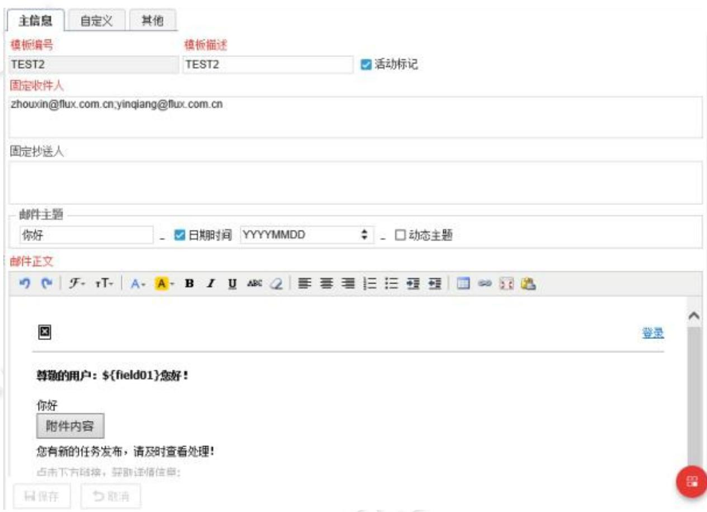


0 | F - rT - | A - A - B I U ABC Q | ≡ ≡ ≡ | ≡ ≡ ≡ | □ ∞ □ □ 

× 

登录 

你好 

附件内容 

[图22-3-1] 

邮件模板编号 - 可自定义，用于同预警参数配置进行关联，确定邮件预警调用哪一个邮件模板。 

■ 模板描述 - 邮件模板的对应中文描述。 

■ 活动标记 - 该模板是否启用。 

■ 固定收件人 - 配置固定收件人地址，如果有多个地址，需要用分号隔开。 

■ 固定抄送人 - 配置固定抄送邮件地址，如果有多个地址，需要用分号隔开。 

■ 邮件主题和邮件正文可进行自定义配置，根据需求配置不同邮件正文格式。 

## 22.4. 存储过程配置

## 22.4.1. 界面存储过程名称配置

使用存储过程方式预警前，需先配置存储过程具体名称和出入参数量，详见“22.1．预警参数配置”相关设置。 

## 22.4.2. 数据库存储过程配置

- 步骤1：数据库新建预警存储过程，注意存储过程名称与传参与界面配置完全一致。 

- 步骤 2：系统通过存储过程向 SYS_ALERT_LOG 表插入数据。 

## 注意事项：

1）SYS_ALERT_LOG 表数据结构，其中 organizationId, warehouseId, alertId, alert Adress 字段为主键，alertDate 字段不允许为空值。 

2）消息预警时，自定义字段仅有 FIELD01 字段配置后才生效，即预警信息必须写入 FIELD01 字段，消息推送时只推送 FIELD01 字段信息；同时 alertAdress 字段用于配置哪些用户可以收到预警信息，为 “*” 时默认所有用户均可收到推送信息。 

3）邮件预警时，系统提供 FIELD01-FIELD25 字段进行配置，同时将邮件预警地址写入 alertAdress 字段，当有多个地址时用分号隔开，不可以为“*”号。 

## 22.4.3. 消息预警和邮件预警存储过程实例

## - 消息预警

存储过程向 WMS 系统写入采购订单消息预警。 

```sql
1 CREATE DEFINER='fluxmsdbuser'@%' PROCEDURE 'SPALTMESS_TEST1'
2 IN IN_organizationId VARCHAR(20),
3 IN IN_warehouseID VARCHAR(20),
4 in IN_USERID VARCHAR(30),
5 OUT OUT_Return_Code VARCHAR(1000))
6 goodbye:
7 begin
8 declare r_nrow int;
9 set OUT_Return_Code='000';
10 start TRANSACTION;
11 insert into SYS_ALERT_LOG
12 (organizationId,
13 warehouseId,
14 alertMessageId,
15 alertId,
16 alertDate,
17 alertAddress,
18 FIELD01)
19 select
20 IN_organizationId,
21 IN_warehouseId,
22 UUID(),
23 'TEST1',
24 NOW(),
25 '*',
26 CONCAT('系统中存在',COUNT(1), '张未处理的采购订单')
27 from doc_asn_header t
28 where t.ORGANIZATIONId=IN_organizationId and t.warehouseId=IN_warehouseId
29 and t.astype = 'CGRK' and t.asnStatus = '00';
30
31 set OUT_Return_Code='000';
32 commit;
33 end 
```


[图 22-4-1]


图：消息预警存储过程样例


## - 邮件预警

存储过程向 XX 用户发送一份测试预警邮件。 

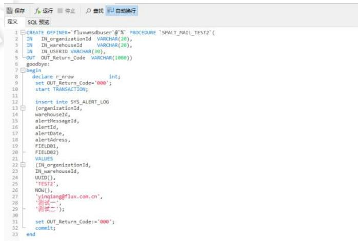


[图 22-4-2]: 邮件预警存储过程


## 22.5. 执行效果及日志查询

## 22.5.1. 消息预警执行效果

## - 已推送消息

- 当预警消息推送时，用户可在 WMS 前台右上角 ▼ 处，查询系统推送的所有预警消息信息。点击 ▼ 图标，自动打开下列界面： 

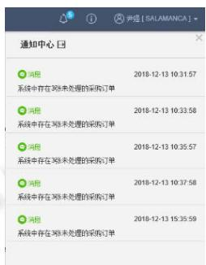


[图22-5-1]


- 当在界面右上角标记已读后，将更新 SYS_ALERT_LOG 表 READFLAG 字段为 Y（默认为 N），前台预警信息将不再显示该条预警消息。 

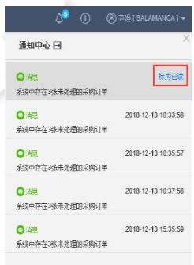


[图 22-5-2]


## - 未推送消息

未读取的推送消息可以通过主界面“预警”模块下的“预警消息”模块查询。 

<table><tr><td colspan="2">FLUX WMS</td><td>探源参数配置</td><td>全网任务运行日志</td><td>探源权限</td><td>邮件服务匹配</td><td>邮件模板配置</td><td>发运订单</td><td></td><td></td><td></td><td></td></tr><tr><td></td><td>打印</td><td>操作</td><td>导出</td><td></td><td></td><td></td><td></td><td></td><td></td><td></td><td></td></tr><tr><td></td><td>仓库编号</td><td>消息编码</td><td>报警者数</td><td>报警日期</td><td>报警调整发送标记</td><td>字段01</td><td>字段02</td><td>字段03</td><td>字段04</td><td>字段</td><td></td></tr><tr><td rowspan="10"></td><td>SALAMANCA</td><td>0436868-501b-11...</td><td>TEST1</td><td>2018-12-11 10.01...</td><td>N</td><td>系统中存在4版本...</td><td></td><td></td><td></td><td></td><td></td></tr><tr><td>SALAMANCA</td><td>076182ab-5014-11...</td><td>TEST1</td><td>2018-12-11 15.11...</td><td>N</td><td>系统中存在28米处...</td><td></td><td></td><td></td><td></td><td></td></tr><tr><td>SALAMANCA</td><td>0816949-9227-11...</td><td>TEST1</td><td>2018-12-11 17.27...</td><td>N</td><td>系统中存在4版本...</td><td></td><td></td><td></td><td></td><td></td></tr><tr><td>SALAMANCA</td><td>1626816b-5080-11...</td><td>TEST1</td><td>2018-12-13 10.37...</td><td>N</td><td>系统中存在3版本...</td><td></td><td></td><td></td><td></td><td></td></tr><tr><td>SALAMANCA</td><td>19a88357-9217-11...</td><td>TEST1</td><td>2018-12-11 15.33...</td><td>N</td><td>系统中存在4版本...</td><td></td><td></td><td></td><td></td><td></td></tr><tr><td>SALAMANCA</td><td>2329c870-6ab-11...</td><td>TEST1</td><td>2018-12-13 15.46...</td><td>N</td><td>系统中存在3版本...</td><td></td><td></td><td></td><td></td><td></td></tr><tr><td>SALAMANCA</td><td>26800x6-9228-11...</td><td>TEST1</td><td>2018-12-11 17.35...</td><td>N</td><td>系统中存在4版本...</td><td></td><td></td><td></td><td></td><td></td></tr><tr><td>SALAMANCA</td><td>35295688-501b-11...</td><td>TEST1</td><td>2018-12-11 16.31...</td><td>N</td><td>系统中存在4版本...</td><td></td><td></td><td></td><td></td><td></td></tr><tr><td>SALAMANCA</td><td>3807726-9018-11...</td><td>TEST1</td><td>2018-12-11 15.41...</td><td>N</td><td>系统中存在4版本...</td><td></td><td></td><td></td><td></td><td></td></tr><tr><td>SALAMANCA</td><td>43518850-9/7-11...</td><td>TEST1</td><td>2018-12-13 10.31...</td><td>N</td><td>系统中存在3版本...</td><td></td><td></td><td></td><td></td><td></td></tr></table>


[图 22-5-3]


## 22.5.2. 邮件预警执行效果

WMS 系统已发送/未发送邮件预警信息，可通过主界面 “预警” 模块下的 “预警消息” 模块进行查询。 

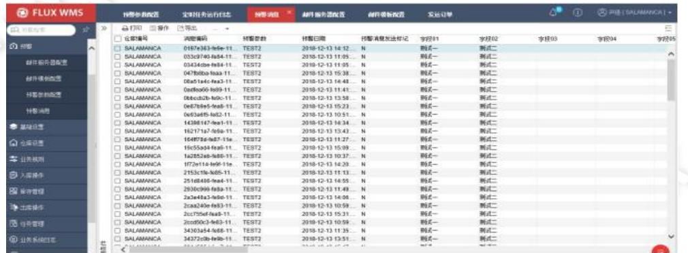


[图 22-5-4]


## ● 预警邮寄样张

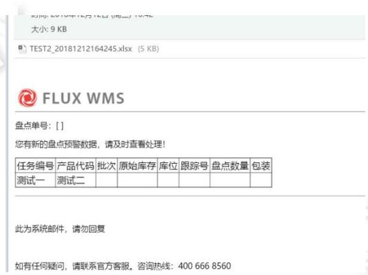


[图22-5-5]


## 22.5.3. 执行日志查询

通过主界面【系统业务日志】-【定时运行任务日志】，用户查询预警消息是否推送成功，见“运行结果”字段。 

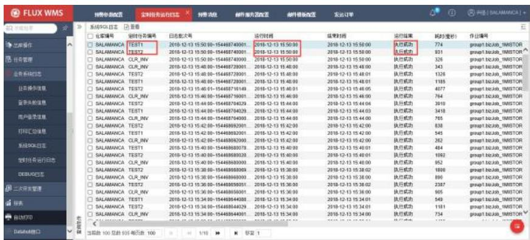


[图22-5-6]


- 步骤1：根据“定时任务编号”和“运行时间”查看具体定时器日志。 

● 步骤 2：双击点开某一行可以查询“详细消息”日志。 

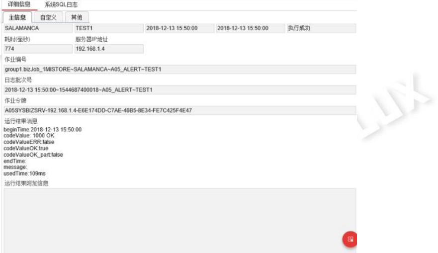


[图 22-5-7] 

- 步骤 3：双击“系统 SQL 日志”页签，可进一步查看定时器执行详细 SQL 信息。 

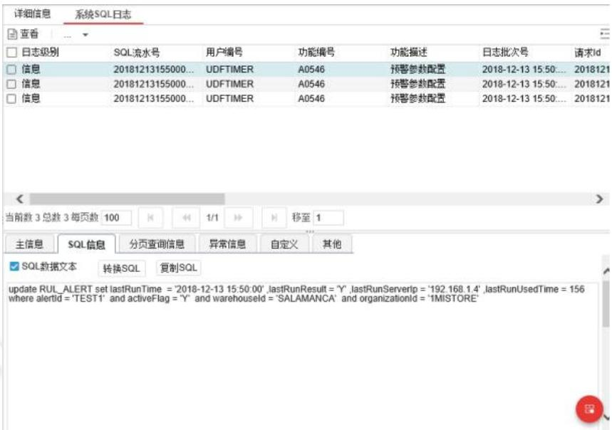


[图 22-5-8]


## 23. 上架库位计算实例

仓库日常操作中，在出入库、库存管理环节会需要 WMS 按照预制规则推荐作业库存场景。本实例以入库为范本，介绍具体的设置和操作步骤。 

## 23.1. 上架规则

● 位置：【业务规则】-【上架规则】。 

● 作用：用于上架、补货、移库作业场景库位推荐。 

- 界面预览 

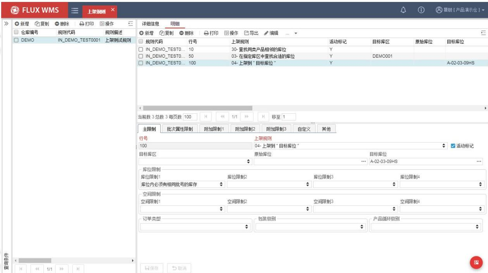


[图23-1-1]


## 23.1.1. 新增上架规则

- 步骤1：选择主菜单“业务规则”模块下的“上架规则” 

- 步骤 2：点击【新增】按钮，在“详细信息”页签维护主信息 

<table><tr><td colspan="10">FLUX WMS 上架规则</td></tr><tr><td colspan="10">新增 复制 删除 打印 操作</td></tr><tr><td colspan="10">仓库编号 规则代码 规则描述</td></tr><tr><td colspan="10">DEMO IN_DEMO_TEST0001 上架测试规则</td></tr><tr><td colspan="10">主信息 自定义 其他</td></tr><tr><td colspan="10">仓库编号 规则代码 规则描述 客户编号</td></tr><tr><td colspan="10">DEMO IN_DEMO_TEST0001 上架测试规则 D12345678 ...</td></tr></table>

[图 23-1-2] 

- 步骤 3：点击【保存】按钮，完成新增记录主信息操作。 

- 步骤 4：点击【明细】页签，完成新增记录明细的操作。 

<table><tr><td>主限制</td><td>批次属性限制</td><td>附加限制1</td><td>附加限制2</td><td>附加限制3</td><td>自定义</td><td>其他</td></tr><tr><td>行号</td><td colspan="6">上架规则</td></tr><tr><td>100</td><td colspan="6">04-上架到“目标库位”</td></tr><tr><td>目标库区</td><td colspan="4">原始库位</td><td colspan="2">目标库位</td></tr><tr><td></td><td colspan="4"></td><td colspan="2">A-02-03-09HS</td></tr><tr><td colspan="7">库位限制</td></tr><tr><td>库位限制1</td><td colspan="3">库位限制2</td><td colspan="2">库位限制3</td><td>库位限制4</td></tr><tr><td>库位内必须有相同批号的库存</td><td colspan="3"></td><td colspan="2"></td><td></td></tr><tr><td colspan="7">空间限制</td></tr><tr><td>空间限制1</td><td colspan="3">空间限制2</td><td colspan="2">空间限制3</td><td>空间限制4</td></tr><tr><td></td><td colspan="3"></td><td colspan="2"></td><td></td></tr><tr><td>订单类型</td><td colspan="4">包装级别</td><td colspan="2">产品循环级别</td></tr><tr><td></td><td colspan="4"></td><td colspan="2"></td></tr></table>

[图23-1-3] 

■ 行号 10：上架规则“30-查找同类产品相邻的库位”，并库位约束不允许混产品，需 

进行体积限制。 

<table><tr><td>主限制</td><td>批次属性限制</td><td>附加限制1</td><td>附加限制2</td><td>附加限制3</td><td>自定义</td><td>其他</td></tr><tr><td>行号</td><td colspan="6">上架规则</td></tr><tr><td>10</td><td colspan="6">30-查找同类产品相邻的库位</td></tr><tr><td>目标库区</td><td colspan="4">原始库位</td><td colspan="2">目标库位</td></tr><tr><td colspan="7">库位限制</td></tr><tr><td>库位限制1</td><td colspan="3">库位限制2</td><td colspan="2">库位限制3</td><td>库位限制4</td></tr><tr><td colspan="7">不许混放产品,即使库位属性为允许</td></tr><tr><td colspan="7">空间限制</td></tr><tr><td>空间限制1</td><td colspan="3">空间限制2</td><td colspan="2">空间限制3</td><td>空间限制4</td></tr><tr><td colspan="7">体积限定</td></tr><tr><td>订单类型</td><td colspan="4">包装级别</td><td colspan="2">产品循环级别</td></tr></table>


[图23-1-4]


行号 50：上架规则 “03- 在指定库区中查找合适的库位”，并库位约束库区内必须有相同产品组 1 的库存，需进行体积限制。


<table><tr><td>主限制</td><td>批次属性限制</td><td>附加限制1</td><td>附加限制2</td><td>附加限制3</td><td>自定义</td><td>其他</td></tr><tr><td>行号</td><td colspan="6">上架规则</td></tr><tr><td>50</td><td colspan="6">03-在指定库区中查找合适的库位</td></tr><tr><td>目标库区</td><td colspan="4">原始库位</td><td colspan="2">目标库位</td></tr><tr><td>DEMO001</td><td colspan="4"></td><td colspan="2">...</td></tr><tr><td>库位限制</td><td colspan="6"></td></tr><tr><td>库位限制1</td><td colspan="3">库位限制2</td><td colspan="2">库位限制3</td><td>库位限制4</td></tr><tr><td>库位内必须有相同产品组1的库存</td><td colspan="6"></td></tr><tr><td>空间限制</td><td colspan="6"></td></tr><tr><td>空间限制1</td><td colspan="3">空间限制2</td><td colspan="2">空间限制3</td><td>空间限制4</td></tr><tr><td>体积限定</td><td colspan="6"></td></tr><tr><td>订单类型</td><td colspan="4">包装级别</td><td colspan="2">产品循环级别</td></tr></table>


[图23-1-5]


■ 行号 100：上架规则 “04- 上架到目标库位”，并库位约束库区内必须有相同产品组 1 的库存 

<table><tr><td>主限制</td><td>批次属性限制</td><td>附加限制1</td><td>附加限制2</td><td>附加限制3</td><td>自定义</td><td>其他</td></tr><tr><td>行号</td><td colspan="6">上架规则</td></tr><tr><td>100</td><td colspan="6">04-上架到&quot;目标库位&quot;</td></tr><tr><td>目标库区</td><td colspan="4">原始库位</td><td colspan="2">目标库位</td></tr><tr><td></td><td colspan="4"></td><td colspan="2">A-02-03-09HS</td></tr><tr><td colspan="7">库位限制</td></tr><tr><td>库位限制1</td><td colspan="3">库位限制2</td><td>库位限制3</td><td colspan="2">库位限制4</td></tr><tr><td colspan="7">库位内必须有相同批号的库存</td></tr><tr><td colspan="7">空间限制</td></tr><tr><td>空间限制1</td><td colspan="3">空间限制2</td><td>空间限制3</td><td colspan="2">空间限制4</td></tr><tr><td>订单类型</td><td colspan="4">包装级别</td><td colspan="2">产品循环级别</td></tr></table>


[图 23-1-6]


## 23.2. 产品档案

● 位置：【基础数据】-【产品档案】-【多仓设置】。 

- 操作作用：维护产品相关上架规则。 

- 界面预览 

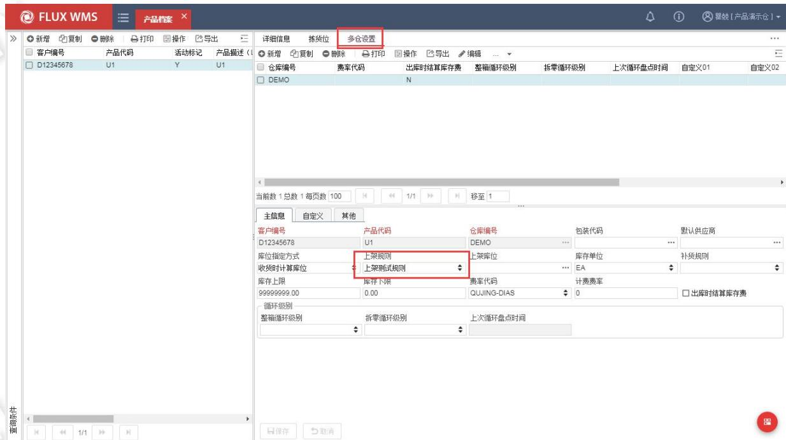


[图23-2-1]


## 23.2.1. 上架规则配置

- 步骤1：选择主菜单【基础数据】模块下的【产品档案】-【多仓设置】 

- 步骤2：点击【新增】按钮，新建当前仓库多仓记录，上架规则选择“上架测试规则”。 

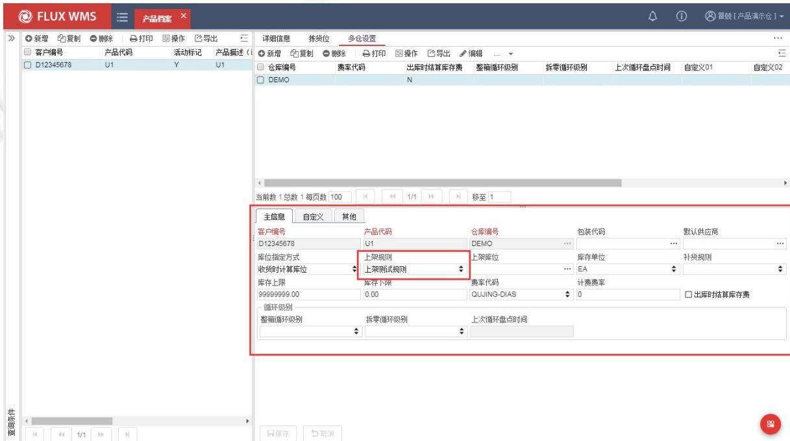


[图23-2-2]


## 23.3. 计算库位测试

● 位置模块：【库存管理】-【库存移动单】-【上架库位推荐】。 

- 操作作用：根据上架规则推荐移库上架目标库位。 

- 界面预览 

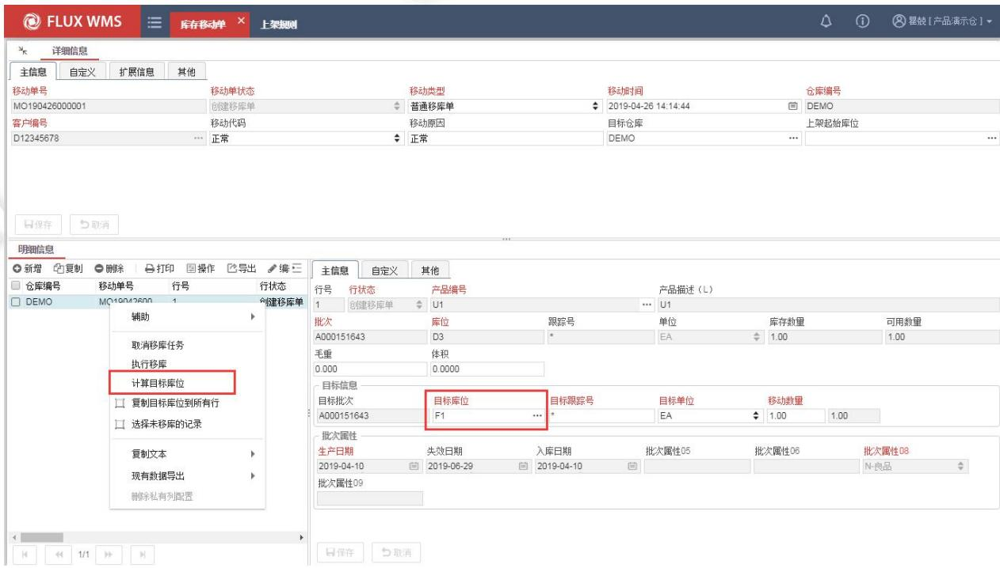


[图23-3-1]


## 23.3.1. 库存移动单测试

- 步骤 1：选择主菜单【库存管理】模块下的【库存移动单】 

- 步骤 2：点击【查询】按钮，检索创建状态的库存移动单。 

- 步骤3：明细右键点击【计算目标库位】，计算上架目标库位。重新计算目标库位后，系统在“上架规则10”、“规则50”未检索到符合条件的库位情况下，使用了“规则100”中的指定到目标库位规则，推荐了库位“A-02-03-09HS”。 

<table><tr><td>主信息</td><td>自定义</td><td>其他</td></tr><tr><td>行号</td><td>行状态</td><td>产品编号</td></tr><tr><td>1</td><td>创建移库单</td><td>U1</td></tr><tr><td>批次</td><td>库位</td><td>跟踪号</td></tr><tr><td>A000151643</td><td>D3</td><td>*</td></tr><tr><td>毛重</td><td>体积</td><td></td></tr><tr><td>0.000</td><td>0.0000</td><td></td></tr><tr><td>目标批次</td><td colspan="2">目标库位</td></tr><tr><td>A000151643</td><td>A-02-03-09HS</td><td>*</td></tr></table>


[图 23-3-2]
