## [图8-9-5]

■ 每月执行 

每月执行模式下，执行日的选择，可以是每个月的第几天（或者每 X 个月的第 Y 天），或者每个月第几周的某一天。 

在指定的执行日，根据每天频率部分的设置启动执行。 

例如下图意味着每个月的 1 号，8:10 执行定时处理。 

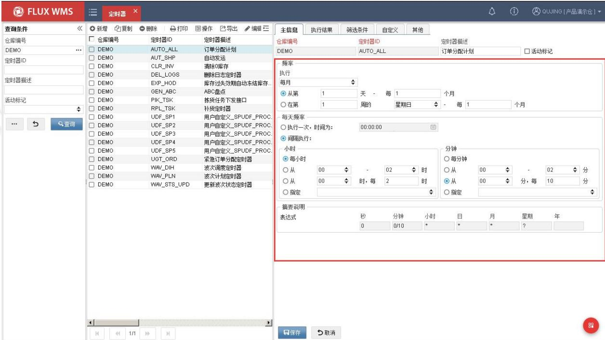

[图8-9-6]

## ■ 每季度执行

每季度执行，即每3个月执行一次，执行日、时间选择，与每月执行配置类似。 

<table><tr><td colspan="101">查询条件</td><td></td><td></td></tr><tr><td colspan="100">仓库编号</td><td></td><td></td><td></td></tr><tr><td colspan="96">DEMO</td><td></td><td></td><td></td><td></td><td></td><td></td><td></td></tr><tr><td colspan="96">定时器ID</td><td></td><td></td><td></td><td></td><td></td><td></td><td></td></tr><tr><td colspan="90">定时值描述</td><td></td><td></td><td></td><td></td><td></td><td></td><td></td><td></td><td></td><td></td><td></td><td></td><td></td></tr><tr><td colspan="87">活动标记</td><td></td><td></td><td></td><td></td><td></td><td></td><td></td><td></td><td></td><td></td><td></td><td></td><td></td><td></td><td></td><td></td></tr><tr><td rowspan="3">...</td><td rowspan="3">S</td><td rowspan="3">查询</td><td>主信息</td><td>执行结果</td><td>筛选条件</td><td>自定义</td><td>其他</td><td></td><td></td><td></td><td></td><td></td><td></td><td></td><td></td><td></td><td></td><td></td><td></td><td></td><td></td><td></td><td></td><td></td><td></td><td></td><td></td><td></td><td></td><td></td><td></td><td></td><td></td><td></td><td></td><td></td><td></td><td></td><td></td><td></td><td></td><td></td><td></td><td></td><td></td><td></td><td></td><td></td><td></td><td></td><td></td><td></td><td></td><td></td><td></td><td></td><td></td><td></td><td></td><td></td><td></td><td></td><td></td><td></td><td></td><td></td><td></td><td></td><td></td><td></td><td></td><td></td><td></td><td></td><td></td><td></td><td></td><td></td><td></td><td></td><td></td><td></td><td></td><td></td><td></td><td></td><td></td><td></td><td></td><td></td><td></td><td></td><td></td><td></td><td></td><td></td><td></td><td></td><td></td><td></td><td></td><td></td></tr><tr><td>仓库编号</td><td>定时器ID</td><td>定时器描述</td><td>仓库编号</td><td>定时器ID</td><td>定时器描述</td><td>每季度</td><td>执行</td><td>每天频率</td><td>执行一次,时间为: 00:00:00 阻隔执行:小时 分钟每小时从 00 - 02 时从 00 时,每 2 时指定 指定 指定 指定 指定 指定 指定 指定 指定 指定 指定 指定 指定 指定 指定 指定 指定 指定 指定 指定 指定 指定 指定 指定 指定 指定 指定期执行:小时 分钟每分钟从 00 - 02 时从 00 时,每 10 分指定 指定 指定 指定 指定 指定 指定 指定 指定 指定 指定 指定 指定 指定 指定 指定 指定 指定 指定 指定 指定 指定 指定 指定 指定 持定说明表达式秒分钟小时日月星期年00/10*1/3?保存取消保存保存保存保存保存保存保存保存保存保存保存保存保存保存保存保存保存保存保存保存保存保存保存保存保存保存保存保存保存保存保存保存保存保存保存保存保存保存保存保存保存保存保存保存保存保存保存保存保存保存保存保存保存保存保存保存保存保存保存保存保存保存保存保存保存保存保存保存保存保存保存保存保存保存保存保存保存保存保存保存保存保存保存保存保存保存保存保存保存保存保存保存保存保存保存保存保存保存保存保存存</td><td>主信息</td><td>执行结果</td><td>筛选条件</td><td>自定义</td><td>其他</td><td></td><td></td><td></td><td></td><td></td><td></td><td></td><td></td><td></td><td></td><td></td><td></td><td></td><td></td><td></td><td></td><td></td><td></td><td></td><td></td><td></td><td></td><td></td><td></td><td></td><td></td><td></td><td></td><td></td><td></td><td></td><td></td><td></td><td></td><td></td><td></td><td></td><td></td><td></td><td></td><td></td><td></td><td></td><td></td><td></td><td></td><td></td><td></td><td></td><td></td><td></td><td></td><td></td><td></td><td></td><td></td><td></td><td></td><td></td><td></td><td></td><td></td><td></td><td></td><td></td><td></td><td></td><td></td><td></td><td></td><td></td><td></td><td></td><td></td><td></td><td></td><td></td><td></td><td></td><td></td><td></td><td></td><td></td><td></td><td></td></tr><tr><td>仓库编号</td><td>定时器ID</td><td>定时器描述</td><td>每季度</td><td>执行</td><td>每天频率</td><td>执行一次,时间为: 00:00:00 阻隔执行:小时 分钟每分钟从 00 - 02 时从 00 时,每 10 分指定 指定 指定 指定 指定 指定 指定 指定 指定 指定 指定 指定 指定 指定 指定 指定 指定 指定 �指定 指定 指定 指定 指定 指定 指定 指定 指定 指定 指定 指定 指定 指定 指定 指定 指定 指定 指定 指定 指定 指定 指定 指定 指定 持定期执行:小时 分钟每分钟从 00 - 02 时从 00 时,每 10 分指定 指定 指定 指定 指定 指定 指定 指定 指定 指定 指定 指定 指定 指定 指定 指定 指定 指定 C</td><td>主信息</td><td>执行结果</td><td>筛选条件</td><td>自定义</td><td>其他</td><td></td><td></td><td></td><td></td><td></td><td></td><td></td><td></td><td></td><td></td><td></td><td></td><td></td><td></td><td></td><td></td><td></td><td></td><td></td><td></td><td></td><td></td><td></td><td></td><td></td><td></td><td></td><td></td><td></td><td></td><td></td><td></td><td></td><td></td><td></td><td></td><td></td><td></td><td></td><td></td><td></td><td></td><td></td><td></td><td></td><td></td><td></td><td></td><td></td><td></td><td></td><td></td><td></td><td></td><td></td><td></td><td></td><td></td><td></td><td></td><td></td><td></td><td></td><td></td><td></td><td></td><td></td><td></td><td></td><td></td><td></td><td></td><td></td><td></td><td></td><td></td><td></td><td></td><td></td><td></td><td></td><td></td><td></td><td></td><td></td><td></td><td></td><td></td></tr><tr><td>仓库编号</td><td>定时器ID</td><td>定时器描述</td><td rowspan="18">每季度</td><td rowspan="18">执行</td><td rowspan="18">每天频率</td><td rowspan="18">执行一次,时间为: 00:00:00 阻隔执行:小时 分钟每分钟从 00 - 02 时从 00 时,每 10 分指定 指定 指定 指定 指定 指定 指定 指定 指定期执行:小时 分钟每分钟从 00 - 02 时从 00 时,每 10 分指定 指定 指定 指定 指定 指定 指定 指定 指定 指定 �指定C</td><td rowspan="18">主信息</td><td rowspan="18">执行结果</td><td rowspan="18">筛选条件</td><td rowspan="18">自定义</td><td rowspan="18">其他</td><td rowspan="18"></td><td rowspan="18"></td><td rowspan="18"></td><td rowspan="18"></td><td rowspan="18"></td><td rowspan="18"></td><td rowspan="18"></td><td rowspan="18"></td><td rowspan="18"></td><td rowspan="18"></td><td rowspan="18"></td><td rowspan="18"></td><td rowspan="18"></td><td rowspan="18"></td><td rowspan="18"></td><td rowspan="18"></td><td rowspan="18"></td><td rowspan="18"></td><td rowspan="18"></td><td rowspan="18"></td><td rowspan="18"></td><td rowspan="18"></td><td rowspan="18"></td><td rowspan="18"></td><td rowspan="18"></td><td rowspan="18"></td><td rowspan="18"></td><td rowspan="18"></td><td rowspan="18"></td><td rowspan="18"></td><td rowspan="18"></td><td rowspan="18"></td><td rowspan="18"></td><td rowspan="18"></td><td rowspan="18"></td><td rowspan="18"></td><td rowspan="18"></td><td rowspan="18"></td><td rowspan="18"></td><td rowspan="17"></td><td rowspan="16"></td><td rowspan="16"></td><td rowspan="15"></td><td rowspan="15"></td><td rowspan="14"></td><td rowspan="13"></td><td rowspan="13"></td><td rowspan="13"></td><td rowspan="12"></td><td rowspan="11"></td><td rowspan="10"></td><td rowspan="10"></td><td rowspan="10"></td><td rowspan="9"></td><td rowspan="9"></td><td rowspan="9"></td><td rowspan="9"></td><td rowspan="9"></td><td rowspan="9"></td><td rowspan="8"></td><td rowspan="8"></td><td rowspan="8"></td><td rowspan="8"></td><td rowspan="8"></td><td rowspan="8"></td><td rowspan="7"></td><td rowspan="7"></td><td rowspan="7"></td><td rowspan="6"></td><td rowspan="6"></td><td rowspan="6"></td><td rowspan="5"></td><td rowspan="5"></td><td rowspan="5"></td><td rowspan="4"></td><td rowspan="4"></td><td rowspan="4"></td><td rowspan="4"></td><td rowspan="4"></td><td rowspan="4"></td><td rowspan="4"></td><td rowspan="4"></td><td rowspan="3"></td><td rowspan="3"></td><td rowspan="3"></td><td rowspan="3"></td><td rowspan="2"></td><td rowspan="2"></td><td rowspan="2"></td><td rowspan="2"></td><td rowspan="2"></td></tr><tr><td>DEMO</td><td>AUTO_ALL</td><td>订单分配计划</td></tr><tr><td>DEMO</td><td>AUT_SHP</td><td>自动发送</td><td></td><td></td><td></td><td></td><td></td></tr><tr><td>DEМО</td><td>CLR_INV</td><td>清除0库存</td><td></td><td></td><td></td><td></td><td></td><td></td><td></td><td></td><td></td></tr><tr><td>DEMO</td><td>DEL_LOGS</td><td>删除日志定时器</td><td></td><td></td><td></td><td></td><td></td><td></td><td></td><td></td><td></td><td></td><td></td><td></td><td></td><td></td><td></td><td></td><td></td></tr><tr><td>DEMO</td><td>EXP_HOD</td><td>库存过失效期自动冻结库存</td><td></td><td></td><td></td><td></td><td></td><td></td><td></td><td></td><td></td><td></td><td></td><td></td><td></td><td></td><td></td><td></td><td></td><td></td><td></td><td></td></tr><tr><td>DEMO</td><td>GEN_ABC</td><td>ABC盘点</td><td></td><td></td><td></td><td></td><td></td><td></td><td></td><td></td><td></td><td></td><td></td><td></td><td></td><td></td><td></td><td></td><td></td><td></td><td></td><td></td><td></td><td></td><td></td></tr><tr><td>DEMO</td><td>PIK_TSK</td><td>拣货任务下发接口</td><td></td><td></td><td></td><td></td><td></td><td></td><td></td><td></td><td></td><td></td><td></td><td></td><td></td><td></td><td></td><td></td><td></td><td></td><td></td><td></td><td></td><td></td><td></td><td></td><td></td><td></td></tr><tr><td>DEMO</td><td>RPL_TSK</td><td>补货定时器</td><td></td><td></td><td></td><td></td><td></td><td></td><td></td><td></td><td></td><td></td><td></td><td></td><td></td><td></td><td></td><td></td><td></td><td></td><td></td><td></td><td></td><td></td><td></td><td></td><td></td><td></td><td></td><td></td><td></td><td></td><td></td><td></td></tr><tr><td>DEMO</td><td>UDF_SP1</td><td>用户自定义_SPUDF_PROC</td><td></td><td></td><td></td><td></td><td></td><td></td><td></td><td></td><td></td><td></td><td></td><td></td><td></td><td></td><td></td><td></td><td></td><td></td><td></td><td></td><td></td><td></td><td></td><td></td><td></td><td></td><td></td><td></td><td></td><td></td><td></td><td></td><td></td><td></td><td></td><td></td><td></td><td></td></tr><tr><td>DEMO</td><td>UDF_SP2</td><td>用户自定义_SPUDF_PROC</td><td></td><td></td><td></td><td></td><td></td><td></td><td></td><td></td><td></td><td></td><td></td><td></td><td></td><td></td><td></td><td></td><td></td><td></td><td></td><td></td><td></td><td></td><td></td><td></td><td></td><td></td><td></td><td></td><td></td><td></td><td></td><td></td><td></td><td></td><td></td><td></td><td></td><td></td><td></td><td></td><td></td></tr><tr><td>DEMO</td><td>UDF_SP3</td><td>用户自定义_SPUDF_PROC</td><td></td><td></td><td></td><td></td><td></td><td></td><td></td><td></td><td></td><td></td><td></td><td></td><td></td><td></td><td></td><td></td><td></td><td></td><td></td><td></td><td></td><td></td><td></td><td></td><td></td><td></td><td></td><td></td><td></td><td></td><td></td><td></td><td></td><td></td><td></td><td></td><td></td><td></td><td></td><td></td><td></td><td></td></tr><tr><td>DEMO</td><td>UDF_SP4</td><td>用户自定义_SPUDF_PROC</td><td></td><td></td><td></td><td></td><td></td><td></td><td></td><td></td><td></td><td></td><td></td><td></td><td></td><td></td><td></td><td></td><td></td><td></td><td></td><td></td><td></td><td></td><td></td><td></td><td></td><td></td><td></td><td></td><td></td><td></td><td></td><td></td><td></td><td></td><td></td><td></td><td></td><td></td><td></td><td></td><td></td><td></td><td></td></tr><tr><td>DEMO</td><td>UDF_SP5</td><td>用户自定义_SPUDF_PROC</td><td></td><td></td><td></td><td></td><td></td><td></td><td></td><td></td><td></td><td></td><td></td><td></td><td></td><td></td><td></td><td></td><td></td><td></td><td></td><td></td><td></td><td></td><td></td><td></td><td></td><td></td><td></td><td></td><td></td><td></td><td></td><td></td><td></td><td></td><td></td><td></td><td></td><td></td><td></td><td></td><td></td><td></td><td></td><td></td><td></td><td></td></tr><tr><td>DEMO</td><td>UGT_ORD</td><td>紧急订单分配定时器</td><td></td><td></td><td></td><td></td><td></td><td></td><td></td><td></td><td></td><td></td><td></td><td></td><td></td><td></td><td></td><td></td><td></td><td></td><td></td><td></td><td></td><td></td><td></td><td></td><td></td><td></td><td></td><td></td><td></td><td></td><td></td><td></td><td></td><td></td><td></td><td></td><td></td><td></td><td></td><td></td><td></td><td></td><td></td><td></td><td></td><td></td><td></td></tr><tr><td>DEMO</td><td>WAV_DIH</td><td>波次调度定时器</td><td></td><td></td><td></td><td></td><td></td><td></td><td></td><td></td><td></td><td></td><td></td><td></td><td></td><td></td><td></td><td></td><td></td><td></td><td></td><td></td><td></td><td></td><td></td><td></td><td></td><td></td><td></td><td></td><td></td><td></td><td></td><td></td><td></td><td></td><td></td><td></td><td></td><td></td><td></td><td></td><td></td><td></td><td></td><td></td><td></td><td></td><td></td><td></td><td></td></tr><tr><td>DEMO</td><td>WAV_PLN</td><td>波次计划定时器</td><td></td><td></td><td></td><td></td><td></td><td></td><td></td><td></td><td></td><td></td><td></td><td></td><td></td><td></td><td></td><td></td><td></td><td></td><td></td><td></td><td></td><td></td><td></td><td></td><td></td><td></td><td></td><td></td><td></td><td></td><td></td><td></td><td></td><td></td><td></td><td></td><td></td><td></td><td></td><td></td><td></td><td></td><td></td><td></td><td></td><td></td><td></td><td></td><td></td><td></td><td></td></tr><tr><td>DEMO</td><td>WAV_STS_UPD</td><td>更新波欠状态定时器</td><td></td><td></td><td></td><td></td><td></td><td></td><td></td><td></td><td></td><td></td><td></td><td></td><td></td><td></td><td></td><td></td><td></td><td></td><td></td><td></td><td></td><td></td><td></td><td></td><td></td><td></td><td></td><td></td><td></td><td></td><td></td><td></td><td></td><td></td><td></td><td></td><td></td><td></td><td></td><td></td><td></td><td></td><td></td><td></td><td></td><td></td><td></td><td></td><td></td><td></td><td></td><td></td></tr></table>

[图 8-9-7]

## ■ 高级配置

如果是规律的每日、周、月、季度模式不足以支持的、较为复杂的执行要求，可以通过高级配置实现。 

如下图所示，高级配置情况下，年、月、日、星期等均可进行范围（从、到）、起始、间隔（每X年/月日）、指定时点等配置。 

<table><tr><td colspan="101">查询条件</td><td></td><td></td><td></td><td></td><td></td><td></td><td></td><td></td><td></td><td></td><td></td><td></td><td></td><td></td><td></td><td></td><td></td><td></td><td></td><td></td><td></td><td></td><td></td><td></td><td></td><td></td><td></td><td></td><td></td><td></td><td></td><td></td><td></td><td></td><td></td><td></td><td></td><td></td><td></td><td></td><td></td><td></td><td></td><td></td><td></td><td></td><td></td><td></td><td></td><td></td><td></td><td></td><td></td><td></td><td></td><td></td><td></td><td></td><td></td><td></td><td></td><td></td><td></td><td></td><td></td><td></td><td></td><td></td><td></td><td></td><td></td><td></td><td></td><td></td><td></td><td></td><td></td><td></td><td></td><td></td><td></td><td></td><td></td><td></td><td></td><td></td><td></td><td></td><td></td><td></td><td></td><td></td><td></td><td></td><td></td><td></td><td></td><td></td><td></td><td></td><td></td></tr><tr><td colspan="100">仓库编号</td><td></td><td></td><td></td><td></td><td></td><td></td><td></td><td></td><td></td><td></td><td></td><td></td><td></td><td></td><td></td><td></td><td></td><td></td><td></td><td></td><td></td><td></td><td></td><td></td><td></td><td></td><td></td><td></td><td></td><td></td><td></td><td></td><td></td><td></td><td></td><td></td><td></td><td></td><td></td><td></td><td></td><td></td><td></td><td></td><td></td><td></td><td></td><td></td><td></td><td></td><td></td><td></td><td></td><td></td><td></td><td></td><td></td><td></td><td></td><td></td><td></td><td></td><td></td><td></td><td></td><td></td><td></td><td></td><td></td><td></td><td></td><td></td><td></td><td></td><td></td><td></td><td></td><td></td><td></td><td></td><td></td><td></td><td></td><td></td><td></td><td></td><td></td><td></td><td></td><td></td><td></td><td></td><td></td><td></td><td></td><td></td><td></td><td></td><td></td><td></td><td></td><td></td></tr><tr><td colspan="97">DEMO</td><td></td><td></td><td></td><td></td><td></td><td></td><td></td><td></td><td></td><td></td><td></td><td></td><td></td><td></td><td></td><td></td><td></td><td></td><td></td><td></td><td></td><td></td><td></td><td></td><td></td><td></td><td></td><td></td><td></td><td></td><td></td><td></td><td></td><td></td><td></td><td></td><td></td><td></td><td></td><td></td><td></td><td></td><td></td><td></td><td></td><td></td><td></td><td></td><td></td><td></td><td></td><td></td><td></td><td></td><td></td><td></td><td></td><td></td><td></td><td></td><td></td><td></td><td></td><td></td><td></td><td></td><td></td><td></td><td></td><td></td><td></td><td></td><td></td><td></td><td></td><td></td><td></td><td></td><td></td><td></td><td></td><td></td><td></td><td></td><td></td><td></td><td></td><td></td><td></td><td></td><td></td><td></td><td></td><td></td><td></td><td></td><td></td><td></td><td></td><td></td><td></td><td></td><td></td><td></td><td></td></tr><tr><td colspan="97">定时器ID</td><td></td><td></td><td></td><td></td><td></td><td></td><td></td><td></td><td></td><td></td><td></td><td></td><td></td><td></td><td></td><td></td><td></td><td></td><td></td><td></td><td></td><td></td><td></td><td></td><td></td><td></td><td></td><td></td><td></td><td></td><td></td><td></td><td></td><td></td><td></td><td></td><td></td><td></td><td></td><td></td><td></td><td></td><td></td><td></td><td></td><td></td><td></td><td></td><td></td><td></td><td></td><td></td><td></td><td></td><td></td><td></td><td></td><td></td><td></td><td></td><td></td><td></td><td></td><td></td><td></td><td></td><td></td><td></td><td></td><td></td><td></td><td></td><td></td><td></td><td></td><td></td><td></td><td></td><td></td><td></td><td></td><td></td><td></td><td></td><td></td><td></td><td></td><td></td><td></td><td></td><td></td><td></td><td></td><td></td><td></td><td></td><td></td><td></td><td></td><td></td><td></td><td></td><td></td><td></td><td></td></tr><tr><td colspan="93">定时器描述</td><td></td><td></td><td></td><td></td><td></td><td></td><td></td><td></td><td></td><td></td><td></td><td></td><td></td><td></td><td></td><td></td><td></td><td></td><td></td><td></td><td></td><td></td><td></td><td></td><td></td><td></td><td></td><td></td><td></td><td></td><td></td><td></td><td></td><td></td><td></td><td></td><td></td><td></td><td></td><td></td><td></td><td></td><td></td><td></td><td></td><td></td><td></td><td></td><td></td><td></td><td></td><td></td><td></td><td></td><td></td><td></td><td></td><td></td><td></td><td></td><td></td><td></td><td></td><td></td><td></td><td></td><td></td><td></td><td></td><td></td><td></td><td></td><td></td><td></td><td></td><td></td><td></td><td></td><td></td><td></td><td></td><td></td><td></td><td></td><td></td><td></td><td></td><td></td><td></td><td></td><td></td><td></td><td></td><td></td><td></td><td></td><td></td><td></td><td></td><td></td><td></td><td></td><td></td><td></td><td></td><td></td><td></td><td></td><td></td></tr><tr><td colspan="89">活动标记</td><td></td><td></td><td></td><td></td><td></td><td></td><td></td><td></td><td></td><td></td><td></td><td></td><td></td><td></td><td></td><td></td><td></td><td></td><td></td><td></td><td></td><td></td><td></td><td></td><td></td><td></td><td></td><td></td><td></td><td></td><td></td><td></td><td></td><td></td><td></td><td></td><td></td><td></td><td></td><td></td><td></td><td></td><td></td><td></td><td></td><td></td><td></td><td></td><td></td><td></td><td></td><td></td><td></td><td></td><td></td><td></td><td></td><td></td><td></td><td></td><td></td><td></td><td></td><td></td><td></td><td></td><td></td><td></td><td></td><td></td><td></td><td></td><td></td><td></td><td></td><td></td><td></td><td></td><td></td><td></td><td></td><td></td><td></td><td></td><td></td><td></td><td></td><td></td><td></td><td></td><td></td><td></td><td></td><td></td><td></td><td></td><td></td><td></td><td></td><td></td><td></td><td></td><td></td><td></td><td></td><td></td><td></td><td></td><td></td><td></td><td></td><td></td><td></td></tr><tr><td rowspan="18">...</td><td rowspan="18">查询</td><td>仓库编号</td><td>定时器ID</td><td>定时器描述</td><td rowspan="18">主信息</td><td rowspan="18">执行结果</td><td rowspan="18">筛选条件</td><td rowspan="18">自定义</td><td rowspan="18">其他</td><td></td><td></td><td></td><td></td><td></td><td></td><td></td><td></td><td></td><td></td><td></td><td></td><td></td><td></td><td></td><td></td><td></td><td></td><td></td><td></td><td></td><td></td><td></td><td></td><td></td><td></td><td></td><td></td><td></td><td></td><td></td><td></td><td></td><td></td><td></td><td></td><td></td><td></td><td></td><td></td><td></td><td></td><td></td><td></td><td></td><td></td><td></td><td></td><td></td><td></td><td></td><td></td><td></td><td></td><td></td><td></td><td></td><td></td><td></td><td></td><td></td><td></td><td></td><td></td><td></td><td></td><td></td><td></td><td></td><td></td><td></td><td></td><td></td><td></td><td></td><td></td><td></td><td></td><td></td><td></td><td></td><td></td><td></td><td></td><td></td><td></td><td></td><td></td><td></td><td></td><td></td><td></td><td></td><td></td><td></td><td></td><td></td><td></td><td></td><td></td><td></td><td></td><td></td><td></td><td></td><td></td><td></td><td></td><td></td><td></td><td></td><td></td><td></td><td></td><td></td><td></td><td></td><td></td><td></td><td></td><td></td><td></td><td></td><td></td><td></td><td></td><td></td><td></td><td></td><td></td><td></td><td></td><td></td><td></td><td></td><td></td><td></td><td></td><td></td><td></td><td></td><td></td><td></td><td></td><td></td><td></td><td></td><td></td><td></td><td></td><td></td><td></td><td></td><td></td><td></td><td></td><td></td><td></td><td></td><td></td><td></td><td></td><td></td><td></td><td></td><td></td><td></td><td></td><td></td><td></td><td></td><td></td><td></td><td></td><td></td><td></td><td></td><td></td><td></td><td></td><td></td><td></td><td></td><td></td><td></td><td></td><td></td><td></td><td></td><td></td><td></td><td></td></tr><tr><td>DEMO</td><td>AUTO_ALL</td><td>订单分配计划</td><td></td><td></td><td></td><td></td><td></td><td></td><td></td><td></td><td></td><td></td><td></td><td></td><td></td><td></td><td></td><td></td><td></td><td></td><td></td><td></td><td></td><td></td><td></td><td></td><td></td><td></td><td></td><td></td><td></td><td></td><td></td><td></td><td></td><td></td><td></td><td></td><td></td><td></td><td></td><td></td><td></td><td></td><td></td><td></td><td></td><td></td><td></td><td></td><td></td><td></td><td></td><td></td><td></td><td></td><td></td><td></td><td></td><td></td><td></td><td></td><td></td><td></td><td></td><td></td><td></td><td></td><td></td><td></td><td></td><td></td><td></td><td></td><td></td><td></td><td></td><td></td><td></td><td></td><td></td><td></td><td></td><td></td><td></td><td></td><td></td><td></td><td></td><td></td><td></td><td></td><td></td><td></td><td></td><td></td><td></td><td></td><td></td><td></td><td></td><td></td><td></td><td></td><td></td><td></td><td></td><td></td><td></td><td></td><td></td><td></td><td></td><td></td><td></td><td></td><td></td><td></td><td></td><td></td><td></td><td></td><td></td><td></td><td></td><td></td><td></td><td></td><td></td><td></td><td></td><td></td><td></td><td></td><td></td><td></td><td></td><td></td><td></td><td></td><td></td><td></td><td></td><td></td><td></td><td></td><td></td><td></td><td></td><td></td><td></td><td></td><td></td><td></td><td></td><td></td><td></td><td></td><td></td><td></td><td></td><td></td><td></td><td></td><td></td><td></td><td></td><td></td><td></td><td></td><td></td><td></td><td></td><td></td><td></td><td></td><td></td><td></td><td></td><td></td><td></td><td></td><td></td><td></td><td></td><td></td><td></td><td></td><td></td><td></td><td></td><td></td><td></td><td></td></tr><tr><td>DEMO</td><td>AUT_SHP</td><td>自动发送</td><td></td><td></td><td></td><td></td><td></td><td></td><td></td><td></td><td></td><td></td><td></td><td></td><td></td><td></td><td></td><td></td><td></td><td></td><td></td><td></td><td></td><td></td><td></td><td></td><td></td><td></td><td></td><td></td><td></td><td></td><td></td><td></td><td></td><td></td><td></td><td></td><td></td><td></td><td></td><td></td><td></td><td></td><td></td><td></td><td></td><td></td><td></td><td></td><td></td><td></td><td></td><td></td><td></td><td></td><td></td><td></td><td></td><td></td><td></td><td></td><td></td><td></td><td></td><td></td><td></td><td></td><td></td><td></td><td></td><td></td><td></td><td></td><td></td><td></td><td></td><td></td><td></td><td></td><td></td><td></td><td></td><td></td><td></td><td></td><td></td><td></td><td></td><td></td><td></td><td></td><td></td><td></td><td></td><td></td><td></td><td></td><td></td><td></td><td></td><td></td><td></td><td></td><td></td><td></td><td></td><td></td><td></td><td></td><td></td><td></td><td></td><td></td><td></td><td></td><td></td><td></td><td></td><td></td><td></td><td></td><td></td><td></td><td></td><td></td><td></td><td></td><td></td><td></td><td></td><td></td><td></td><td></td><td></td><td></td><td></td><td></td><td></td><td></td><td></td><td></td><td></td><td></td><td></td><td></td><td></td><td></td><td></td><td></td><td></td><td></td><td></td><td></td><td></td><td></td><td></td><td></td><td></td><td></td><td></td><td></td><td></td><td></td><td></td><td></td><td></td><td></td><td></td><td></td><td></td><td></td><td></td><td></td><td></td><td></td><td></td><td></td><td></td><td></td><td></td><td></td><td></td><td></td><td></td><td></td><td></td><td></td><td></td><td></td><td></td><td></td><td></td><td></td></tr><tr><td>DEMO</td><td>CLR_INV</td><td>清除0库存</td><td></td><td></td><td></td><td></td><td></td><td></td><td></td><td></td><td></td><td></td><td></td><td></td><td></td><td></td><td></td><td></td><td></td><td></td><td></td><td></td><td></td><td></td><td></td><td></td><td></td><td></td><td></td><td></td><td></td><td></td><td></td><td></td><td></td><td></td><td></td><td></td><td></td><td></td><td></td><td></td><td></td><td></td><td></td><td></td><td></td><td></td><td></td><td></td><td></td><td></td><td></td><td></td><td></td><td></td><td></td><td></td><td></td><td></td><td></td><td></td><td></td><td></td><td></td><td></td><td></td><td></td><td></td><td></td><td></td><td></td><td></td><td></td><td></td><td></td><td></td><td></td><td></td><td></td><td></td><td></td><td></td><td></td><td></td><td></td><td></td><td></td><td></td><td></td><td></td><td></td><td></td><td></td><td></td><td></td><td></td><td></td><td></td><td></td><td></td><td></td><td></td><td></td><td></td><td></td><td></td><td></td><td></td><td></td><td></td><td></td><td></td><td></td><td></td><td></td><td></td><td></td><td></td><td></td><td></td><td></td><td></td><td></td><td></td><td></td><td></td><td></td><td></td><td></td><td></td><td></td><td></td><td></td><td></td><td></td><td></td><td></td><td></td><td></td><td></td><td></td><td></td><td></td><td></td><td></td><td></td><td></td><td></td><td></td><td></td><td></td><td></td><td></td><td></td><td></td><td></td><td></td><td></td><td></td><td></td><td></td><td></td><td></td><td></td><td></td><td></td><td></td><td></td><td></td><td></td><td></td><td></td><td></td><td></td><td></td><td></td><td></td><td></td><td></td><td></td><td></td><td></td><td></td><td></td><td></td><td></td><td></td><td></td><td></td><td></td><td></td><td></td><td></td></tr><tr><td>DEMO</td><td>DEL_LOGS</td><td>删除日志定时器</td><td></td><td></td><td></td><td></td><td></td><td></td><td></td><td></td><td></td><td></td><td></td><td></td><td></td><td></td><td></td><td></td><td></td><td></td><td></td><td></td><td></td><td></td><td></td><td></td><td></td><td></td><td></td><td></td><td></td><td></td><td></td><td></td><td></td><td></td><td></td><td></td><td></td><td></td><td></td><td></td><td></td><td></td><td></td><td></td><td></td><td></td><td></td><td></td><td></td><td></td><td></td><td></td><td></td><td></td><td></td><td></td><td></td><td></td><td></td><td></td><td></td><td></td><td></td><td></td><td></td><td></td><td></td><td></td><td></td><td></td><td></td><td></td><td></td><td></td><td></td><td></td><td></td><td></td><td></td><td></td><td></td><td></td><td></td><td></td><td></td><td></td><td></td><td></td><td></td><td></td><td></td><td></td><td></td><td></td><td></td><td></td><td></td><td></td><td></td><td></td><td></td><td></td><td></td><td></td><td></td><td></td><td></td><td></td><td></td><td></td><td></td><td></td><td></td><td></td><td></td><td></td><td></td><td></td><td></td><td></td><td></td><td></td><td></td><td></td><td></td><td></td><td></td><td></td><td></td><td></td><td></td><td></td><td></td><td></td><td></td><td></td><td></td><td></td><td></td><td></td><td></td><td></td><td></td><td></td><td></td><td></td><td></td><td></td><td></td><td></td><td></td><td></td><td></td><td></td><td></td><td></td><td></td><td></td><td></td><td></td><td></td><td></td><td></td><td></td><td></td><td></td><td></td><td></td><td></td><td></td><td></td><td></td><td></td><td></td><td></td><td></td><td></td><td></td><td></td><td></td><td></td><td></td><td></td><td></td><td></td><td></td><td></td><td></td><td></td><td></td><td></td><td></td></tr><tr><td>DEMO</td><td>EXP_HOD</td><td>库存过失效期自动冻结库存</td><td></td><td></td><td></td><td></td><td></td><td></td><td></td><td></td><td></td><td></td><td></td><td></td><td></td><td></td><td></td><td></td><td></td><td></td><td></td><td></td><td></td><td></td><td></td><td></td><td></td><td></td><td></td><td></td><td></td><td></td><td></td><td></td><td></td><td></td><td></td><td></td><td></td><td></td><td></td><td></td><td></td><td></td><td></td><td></td><td></td><td></td><td></td><td></td><td></td><td></td><td></td><td></td><td></td><td></td><td></td><td></td><td></td><td></td><td></td><td></td><td></td><td></td><td></td><td></td><td></td><td></td><td></td><td></td><td></td><td></td><td></td><td></td><td></td><td></td><td></td><td></td><td></td><td></td><td></td><td></td><td></td><td></td><td></td><td></td><td></td><td></td><td></td><td></td><td></td><td></td><td></td><td></td><td></td><td></td><td></td><td></td><td></td><td></td><td></td><td></td><td></td><td></td><td></td><td></td><td></td><td></td><td></td><td></td><td></td><td></td><td></td><td></td><td></td><td></td><td></td><td></td><td></td><td></td><td></td><td></td><td></td><td></td><td></td><td></td><td></td><td></td><td></td><td></td><td></td><td></td><td></td><td></td><td></td><td></td><td></td><td></td><td></td><td></td><td></td><td></td><td></td><td></td><td></td><td></td><td></td><td></td><td></td><td></td><td></td><td></td><td></td><td></td><td></td><td></td><td></td><td></td><td></td><td></td><td></td><td></td><td></td><td></td><td></td><td></td><td></td><td></td><td></td><td></td><td></td><td></td><td></td><td></td><td></td><td></td><td></td><td></td><td></td><td></td><td></td><td></td><td></td><td></td><td></td><td></td><td></td><td></td><td></td><td></td><td></td><td></td><td></td><td></td></tr><tr><td>DEMO</td><td>GEN_ABC</td><td>ABC盘点</td><td></td><td></td><td></td><td></td><td></td><td></td><td></td><td></td><td></td><td></td><td></td><td></td><td></td><td></td><td></td><td></td><td></td><td></td><td></td><td></td><td></td><td></td><td></td><td></td><td></td><td></td><td></td><td></td><td></td><td></td><td></td><td></td><td></td><td></td><td></td><td></td><td></td><td></td><td></td><td></td><td></td><td></td><td></td><td></td><td></td><td></td><td></td><td></td><td></td><td></td><td></td><td></td><td></td><td></td><td></td><td></td><td></td><td></td><td></td><td></td><td></td><td></td><td></td><td></td><td></td><td></td><td></td><td></td><td></td><td></td><td></td><td></td><td></td><td></td><td></td><td></td><td></td><td></td><td></td><td></td><td></td><td></td><td></td><td></td><td></td><td></td><td></td><td></td><td></td><td></td><td></td><td></td><td></td><td></td><td></td><td></td><td></td><td></td><td></td><td></td><td></td><td></td><td></td><td></td><td></td><td></td><td></td><td></td><td></td><td></td><td></td><td></td><td></td><td></td><td></td><td></td><td></td><td></td><td></td><td></td><td></td><td></td><td></td><td></td><td></td><td></td><td></td><td></td><td></td><td></td><td></td><td></td><td></td><td></td><td></td><td></td><td></td><td></td><td></td><td></td><td></td><td></td><td></td><td></td><td></td><td></td><td></td><td></td><td></td><td></td><td></td><td></td><td></td><td></td><td></td><td></td><td></td><td></td><td></td><td></td><td></td><td></td><td></td><td></td><td></td><td></td><td></td><td></td><td></td><td></td><td></td><td></td><td></td><td></td><td></td><td></td><td></td><td></td><td></td><td></td><td></td><td></td><td></td><td></td><td></td><td></td><td></td><td></td><td></td><td></td><td></td><td></td></tr><tr><td>DEMO</td><td>PIK_TSK</td><td>拣货任务下发接口</td><td></td><td></td><td></td><td></td><td></td><td></td><td></td><td></td><td></td><td></td><td></td><td></td><td></td><td></td><td></td><td></td><td></td><td></td><td></td><td></td><td></td><td></td><td></td><td></td><td></td><td></td><td></td><td></td><td></td><td></td><td></td><td></td><td></td><td></td><td></td><td></td><td></td><td></td><td></td><td></td><td></td><td></td><td></td><td></td><td></td><td></td><td></td><td></td><td></td><td></td><td></td><td></td><td></td><td></td><td></td><td></td><td></td><td></td><td></td><td></td><td></td><td></td><td></td><td></td><td></td><td></td><td></td><td></td><td></td><td></td><td></td><td></td><td></td><td></td><td></td><td></td><td></td><td></td><td></td><td></td><td></td><td></td><td></td><td></td><td></td><td></td><td></td><td></td><td></td><td></td><td></td><td></td><td></td><td></td><td></td><td></td><td></td><td></td><td></td><td></td><td></td><td></td><td></td><td></td><td></td><td></td><td></td><td></td><td></td><td></td><td></td><td></td><td></td><td></td><td></td><td></td><td></td><td></td><td></td><td></td><td></td><td></td><td></td><td></td><td></td><td></td><td></td><td></td><td></td><td></td><td></td><td></td><td></td><td></td><td></td><td></td><td></td><td></td><td></td><td></td><td></td><td></td><td></td><td></td><td></td><td></td><td></td><td></td><td></td><td></td><td></td><td></td><td></td><td></td><td></td><td></td><td></td><td></td><td></td><td></td><td></td><td></td><td></td><td></td><td></td><td></td><td></td><td></td><td></td><td></td><td></td><td></td><td></td><td></td><td></td><td></td><td></td><td></td><td></td><td></td><td></td><td></td><td></td><td></td><td></td><td></td><td></td><td></td><td></td><td></td><td></td><td></td></tr><tr><td>DEMO</td><td>RPL_TSK</td><td>补货定时器</td><td></td><td></td><td></td><td></td><td></td><td></td><td></td><td></td><td></td><td></td><td></td><td></td><td></td><td></td><td></td><td></td><td></td><td></td><td></td><td></td><td></td><td></td><td></td><td></td><td></td><td></td><td></td><td></td><td></td><td></td><td></td><td></td><td></td><td></td><td></td><td></td><td></td><td></td><td></td><td></td><td></td><td></td><td></td><td></td><td></td><td></td><td></td><td></td><td></td><td></td><td></td><td></td><td></td><td></td><td></td><td></td><td></td><td></td><td></td><td></td><td></td><td></td><td></td><td></td><td></td><td></td><td></td><td></td><td></td><td></td><td></td><td></td><td></td><td></td><td></td><td></td><td></td><td></td><td></td><td></td><td></td><td></td><td></td><td></td><td></td><td></td><td></td><td></td><td></td><td></td><td></td><td></td><td></td><td></td><td></td><td></td><td></td><td></td><td></td><td></td><td></td><td></td><td></td><td></td><td></td><td></td><td></td><td></td><td></td><td></td><td></td><td></td><td></td><td></td><td></td><td></td><td></td><td></td><td></td><td></td><td></td><td></td><td></td><td></td><td></td><td></td><td></td><td></td><td></td><td></td><td></td><td></td><td></td><td></td><td></td><td></td><td></td><td></td><td></td><td></td><td></td><td></td><td></td><td></td><td></td><td></td><td></td><td></td><td></td><td></td><td></td><td></td><td></td><td></td><td></td><td></td><td></td><td></td><td></td><td></td><td></td><td></td><td></td><td></td><td></td><td></td><td></td><td></td><td></td><td></td><td></td><td></td><td></td><td></td><td></td><td></td><td></td><td></td><td></td><td></td><td></td><td></td><td></td><td></td><td></td><td></td><td></td><td></td><td></td><td></td><td></td><td></td></tr><tr><td>DEMO</td><td>UDF_SP1</td><td>用户自定义_SPUDF_PROC.</td><td rowspan="9">月</td><td rowspan="9">不指定</td><td rowspan="9">○</td><td rowspan="9">每年</td><td rowspan="9">○从</td><td rowspan="9">201回</td><td rowspan="9">-</td><td rowspan="9">203回</td><td rowspan="9">年</td><td rowspan="9">○从</td><td rowspan="9">201回</td><td rowspan="9">年...</td><td rowspan="9">2</td><td rowspan="9">年</td><td rowspan="9">○指定</td><td rowspan="9">○</td><td rowspan="9">不指定</td><td rowspan="9">○</td><td rowspan="9">每月</td><td rowspan="9">○从</td><td rowspan="9">1月</td><td rowspan="9">-</td><td rowspan="9">2月</td><td rowspan="9">○从</td><td rowspan="9">1月</td><td rowspan="9">,每3</td><td rowspan="9">月</td><td rowspan="9">○指定</td><td rowspan="9">○</td><td rowspan="9">不指定</td><td rowspan="9">○</td><td rowspan="9">每日</td><td rowspan="9">○从</td><td rowspan="9">1日</td><td rowspan="9">-</td><td rowspan="9">2日</td><td rowspan="9">○从第</td><td rowspan="9">1日</td><td rowspan="9">,每1</td><td rowspan="9">日</td><td rowspan="9">○每月</td><td rowspan="9">1日</td><td rowspan="9">最近的那个工作日</td><td rowspan="9">○本月最后一日</td><td rowspan="9">○指定</td><td rowspan="9">○</td><td rowspan="9">不指定</td><td rowspan="9">○</td><td rowspan="9">每周</td><td rowspan="9">○从</td><td rowspan="9">1</td><td rowspan="9">周的</td><td rowspan="9">星期日</td><td rowspan="9">○本月最后一个</td><td rowspan="9">星期日</td><td rowspan="9">○指定</td><td rowspan="9">1,2,3,4,5,6,7</td><td rowspan="9">○间隔执行:小时○每小时○从00-02时○从00时,每2时○指定○每分钟○从00-02分○从00分,每10分○指定保存取消</td><td rowspan="9"></td><td rowspan="9"></td><td rowspan="9"></td><td rowspan="9"></td><td rowspan="9"></td><td rowspan="9"></td><td rowspan="9"></td><td rowspan="9"></td><td rowspan="9"></td><td rowspan="9"></td><td rowspan="9"></td><td rowspan="9"></td><td rowspan="9"></td><td rowspan="9"></td><td rowspan="9"></td><td rowspan="9"></td><td rowspan="9"></td><td rowspan="9"></td><td rowspan="9"></td><td rowspan="9"></td><td rowspan="9"></td><td rowspan="9"></td><td rowspan="9"></td><td rowspan="9"></td><td rowspan="8"></td><td rowspan="8"></td><td rowspan="8"></td><td rowspan="2"></td><td rowspan="2"></td><td rowspan="2"></td><td rowspan="2"></td><td rowspan="2"></td><td rowspan="2"></td><td rowspan="2"></td><td rowspan="2"></td><td rowspan="2"></td><td rowspan="2"></td><td></td><td></td><td></td><td></td><td></td><td></td><td></td><td></td><td></td><td></td><td></td><td></td><td></td><td></td><td></td><td></td><td></td><td></td><td></td><td></td><td></td><td></td><td></td><td></td><td></td><td></td><td></td><td></td><td></td><td></td><td></td><td></td><td></td><td></td><td></td><td></td><td></td><td></td><td></td><td></td><td></td><td></td><td></td><td></td><td></td><td></td><td></td><td></td><td></td><td></td><td></td><td></td><td></td><td></td><td></td><td></td><td></td><td></td><td></td><td></td><td></td><td></td><td></td><td></td><td></td><td></td><td></td><td></td><td></td><td></td><td></td><td></td><td></td><td></td><td></td><td></td><td></td><td></td><td></td><td></td><td></td><td></td><td></td><td></td><td></td><td></td><td></td><td></td><td></td><td></td><td></td><td></td><td></td><td></td><td></td><td></td><td></td></tr><tr><td>DEMO</td><td>UDF_SP2</td><td>用户自定义_SPUDF_PROC.</td><td></td><td></td><td></td><td></td><td></td><td></td><td></td><td></td><td></td><td></td><td></td><td></td><td></td><td></td><td></td><td></td><td></td><td></td><td></td><td></td><td></td><td></td><td></td><td></td><td></td><td></td><td></td><td></td><td></td><td></td><td></td><td></td><td></td><td></td><td></td><td></td><td></td><td></td><td></td><td></td><td></td><td></td><td></td><td></td><td></td><td></td><td></td><td></td><td></td><td></td><td></td><td></td><td></td><td></td><td></td><td></td><td></td><td></td><td></td><td></td><td></td><td></td><td></td><td></td><td></td><td></td><td></td><td></td><td></td><td></td><td></td><td></td><td></td><td></td><td></td><td></td><td></td><td></td><td></td><td></td><td></td><td></td><td></td><td></td><td></td><td></td><td></td><td></td><td></td><td></td><td></td><td></td><td></td><td></td><td></td><td></td><td></td></tr><tr><td>DEMO</td><td>UDF_SP3</td><td>用户自定义_SPUDF_PROC.</td><td></td><td></td><td></td><td></td><td></td><td></td><td></td><td></td><td></td><td></td><td></td><td></td><td></td><td></td><td></td><td></td><td></td><td></td><td></td><td></td><td></td><td></td><td></td><td></td><td></td><td></td><td></td><td></td><td></td><td></td><td></td><td></td><td></td><td></td><td></td><td></td><td></td><td></td><td></td><td></td><td></td><td></td><td></td><td></td><td></td><td></td><td></td><td></td><td></td><td></td><td></td><td></td><td></td><td></td><td></td><td></td><td></td><td></td><td></td><td></td><td></td><td></td><td></td><td></td><td></td><td></td><td></td><td></td><td></td><td></td><td></td><td></td><td></td><td></td><td></td><td></td><td></td><td></td><td></td><td></td><td></td><td></td><td></td><td></td><td></td><td></td><td></td><td></td><td></td><td></td><td></td><td></td><td></td><td></td><td></td><td></td><td></td><td></td><td></td><td></td><td></td><td></td><td></td><td></td><td></td><td></td><td></td></tr><tr><td>DEMO</td><td>UDIF_SP4</td><td>用户自定义_SPUDF_PROC.</td><td>○</td><td>○</td><td>○</td><td>○</td><td>○</td><td>○</td><td>○</td><td>○</td><td>○</td><td>○</td><td>○</td><td>○</td><td>○</td><td>○</td><td>○</td><td>○</td><td>○</td><td>○</td><td>○</td><td>○</td><td>○</td><td>○</td><td>○</td><td>○</td><td>○</td><td>○</td><td>○</td><td>○</td><td>○</td><td>○</td><td>○</td><td>○</td><td>○</td><td>○</td><td>○</td><td>○</td><td>○</td><td>○</td><td>○</td><td>○</td><td>○</td><td>○</td><td>○</td><td>○</td><td>○</td><td>○</td><td>○</td><td>○</td><td>○</td><td>○</td><td></td><td></td><td></td><td></td><td></td><td></td><td></td><td></td><td></td><td></td><td></td><td></td><td></td><td></td><td></td><td></td><td></td><td></td><td></td><td></td><td></td><td></td><td></td><td></td><td></td><td></td><td></td><td></td><td></td><td></td><td></td><td></td><td></td><td></td><td></td><td></td><td></td><td></td><td></td><td></td><td></td><td></td><td></td><td></td><td></td><td></td><td></td><td></td><td></td><td></td><td></td><td></td><td></td><td></td><td></td><td></td><td></td></tr><tr><td>DEMO</td><td>UDF_SP5</td><td>用户自定义_SPUDF_PROC.</td><td rowspan="4"></td><td rowspan="4"></td><td rowspan="4"></td><td rowspan="3"></td><td rowspan="3"></td><td rowspan="3"></td><td rowspan="3"></td><td></td><td></td><td></td><td></td><td></td><td></td><td></td><td></td><td></td><td></td><td></td><td></td><td></td><td></td><td></td><td></td><td></td><td></td><td></td><td></td><td></td><td></td><td></td><td></td><td></td><td></td><td></td><td></td><td></td><td></td><td></td><td></td><td></td><td></td><td></td><td></td><td></td><td></td><td></td><td></td><td></td><td></td><td></td><td></td><td></td><td></td><td></td><td></td><td></td><td></td><td></td><td></td><td></td><td></td><td></td><td></td><td></td><td></td><td></td><td></td><td></td><td></td><td></td><td></td><td></td><td></td><td></td><td></td><td></td><td></td><td></td><td></td><td></td><td></td><td></td><td></td><td></td><td></td><td></td><td></td><td></td><td></td><td></td><td></td><td></td><td></td><td></td><td></td><td></td><td></td><td></td><td></td><td></td><td></td><td></td><td></td><td></td><td></td><td></td><td></td></tr><tr><td>DEMO</td><td>UGT_ORD</td><td>紧急订单分配定时器</td><td rowspan="2">○</td><td rowspan="2">○</td><td>○</td><td>○</td><td>●</td><td>○</td><td>○</td><td>○</td><td>○</td><td>○</td><td>○</td><td>○</td><td>○</td><td>○</td><td>○</td><td>○</td><td>○</td><td>○</td><td>○</td><td>○</td><td>○</td><td>○</td><td>○</td><td>○</td><td>○</td><td>○</td><td>○</td><td>○</td><td>○</td><td>○</td><td>○</td><td>○</td><td>○</td><td>○</td><td>○</td><td>○</td><td>○</td><td>○</td><td>○</td><td>○</td><td>○</td><td>○</td><td>○</td><td>○</td><td>○</td><td>○</td><td>○</td><td>○</td><td>○</td><td>○</td><td>○</td><td>○</td><td>○</td><td>○</td><td>●</td><td>○</td><td>○</td><td>○</td><td>○</td><td>○</td><td>○</td><td>○</td><td>○</td><td>○</td><td>○</td><td>○</td><td>○</td><td>○</td><td>○</td><td>○</td><td>○</td><td>○</td><td>○</td><td>○</td><td>○</td><td>○</td><td>○</td><td>○</td><td>○</td><td>○</td><td>○</td><td>○</td><td>○</td><td>○</td><td>○</td><td>○</td><td>○</td><td>○</td><td>○</td><td>○</td><td>○</td><td>○</td><td>○</td><td>○</td><td>○</td><td>○</td><td>○</td><td>○</td><td>○</td><td></td></tr><tr><td>DEMO</td><td>WAV_DIH</td><td>波次调度定时器</td><td>○</td><td></td><td></td><td></td><td></td><td></td><td></td><td></td><td></td><td></td><td></td><td></td><td></td><td></td><td></td><td></td><td></td><td></td><td></td><td></td><td></td><td></td><td></td><td></td><td></td><td></td><td></td><td></td><td></td><td></td><td></td><td></td><td></td><td></td><td></td><td></td><td></td><td></td><td></td><td></td><td></td><td></td><td></td><td></td><td></td><td></td><td></td><td></td><td></td><td></td><td></td><td></td><td></td><td></td><td></td><td></td><td></td><td></td><td></td><td></td><td></td><td></td><td></td><td></td><td></td><td></td><td></td><td></td><td></td><td></td><td></td><td></td><td></td><td></td><td></td><td></td><td></td><td></td><td></td><td></td><td></td><td></td><td></td><td></td><td></td><td></td><td></td><td></td><td></td><td></td><td></td><td></td><td></td><td></td><td></td><td></td><td></td><td></td></tr><tr><td>DEMO</td><td>WAV_PLN</td><td>波次计划定时器</td><td>○</td><td>○</td><td>○</td><td></td><td></td><td></td><td></td><td></td><td></td><td></td><td></td><td></td><td></td><td></td><td></td><td></td><td></td><td></td><td></td><td></td><td></td><td></td><td></td><td></td><td></td><td></td><td></td><td></td><td></td><td></td><td></td><td></td><td></td><td></td><td></td><td></td><td></td><td></td><td></td><td></td><td></td><td></td><td></td><td></td><td></td><td></td><td></td><td></td><td></td><td></td><td></td><td></td><td></td><td></td><td></td><td></td><td></td><td></td><td></td><td></td><td></td><td></td><td></td><td></td><td></td><td></td><td></td><td></td><td></td><td></td><td></td><td></td><td></td><td></td><td></td><td></td><td></td><td></td><td></td><td></td><td></td><td></td><td></td><td></td><td></td><td></td><td></td><td></td><td></td><td></td><td></td><td></td><td></td><td></td><td></td><td></td><td></td><td></td><td></td><td></td><td></td><td></td><td></td><td></td></tr><tr><td>DEMO</td><td>WAV_STS_UPD</td><td>更新波欠状态定时器</td><td>○</td><td>○</td><td>○</td><td></td><td></td><td></td><td></td><td></td><td></td><td></td><td></td><td></td><td></td><td></td><td></td><td></td><td></td><td></td><td></td><td></td><td></td><td></td><td></td><td></td><td></td><td></td><td></td><td></td><td></td><td></td><td></td><td></td><td></td><td></td><td></td><td></td><td></td><td></td><td></td><td></td><td></td><td></td><td></td><td></td><td></td><td></td><td></td><td></td><td></td><td></td><td></td><td></td><td></td><td></td><td></td><td></td><td></td><td></td><td></td><td></td><td></td><td></td><td></td><td></td><td></td><td></td><td></td><td></td><td></td><td></td><td></td><td></td><td></td><td></td><td></td><td></td><td></td><td></td><td></td><td></td><td></td><td></td><td></td><td></td><td></td><td></td><td></td><td></td><td></td><td></td><td></td><td></td><td></td><td></td><td></td><td></td><td></td><td></td><td></td><td></td><td></td><td></td><td></td><td></td><td></td><td></td><td></td><td></td><td></td><td></td></tr></table>

## [图8-9-8]

## ■ 摘要说明

执行频路维护后，系统会根据维护内容，自动生成摘要表达式显示在界面下方，如下图所示： 

<table><tr><td>主信息</td><td>执行结果</td><td>筛选条件</td><td>自定义</td><td>其他</td><td></td></tr><tr><td>仓库编号</td><td colspan="3">定时器ID</td><td>定时器描述</td><td></td></tr><tr><td>DEMO</td><td colspan="3">DEL_LOGS</td><td>删除日志定时器</td><td></td></tr><tr><td>频率</td><td colspan="4"></td><td></td></tr><tr><td>执行</td><td colspan="4"></td><td></td></tr><tr><td>每周</td><td colspan="4"></td><td></td></tr><tr><td rowspan="2">在每周的:</td><td>星期一</td><td>星期二</td><td>星期三</td><td>星期四</td><td>星期五</td></tr><tr><td>星期六</td><td>星期日</td><td></td><td></td><td></td></tr><tr><td>每天频率</td><td colspan="4"></td><td></td></tr><tr><td colspan="5">执行一次,时间为: 00:00:00</td><td></td></tr><tr><td>间隔执行:</td><td colspan="4"></td><td></td></tr><tr><td>小时</td><td colspan="4"></td><td></td></tr><tr><td>每小时</td><td colspan="4"></td><td></td></tr><tr><td colspan="5">从 00 - 02 时</td><td></td></tr><tr><td colspan="5">从 00 时,每 2 时</td><td></td></tr><tr><td>指定</td><td colspan="4"></td><td></td></tr><tr><td>摘要说明</td><td colspan="4"></td><td></td></tr><tr><td rowspan="2">表达式</td><td>秒</td><td>分钟</td><td>小时</td><td>日 月 星期 年</td><td></td></tr><tr><td>0</td><td>0/10</td><td>* ? * * *</td><td></td><td></td></tr></table>

[图8-9-9]

## - 执行结果查看

## 定时器的执行情况可以在“执行结果”页签中查看到此定时器的最后一次执行情况。

<table><tr><td>查询条件</td><td colspan="10">新增 复制 删除 打印 操作 导出 编辑</td></tr><tr><td>仓库编号</td><td>仓库编号</td><td>定时器ID</td><td colspan="8">定时器描述</td></tr><tr><td>DEMO</td><td>DEMO</td><td>AUTO_ALL</td><td colspan="8">订单分配计划</td></tr><tr><td>定时器ID</td><td>DEMO</td><td>AUT_SHP</td><td colspan="8">自动发送</td></tr><tr><td>定时器描述</td><td>DEMO</td><td>CLR_INV</td><td colspan="8">清除0库存</td></tr><tr><td rowspan="14">活动标记</td><td>DEMO</td><td>DEL_LOGS</td><td colspan="8">删除日志定时器</td></tr><tr><td>DEMO</td><td>EXP_HOD</td><td colspan="8">库存过失效期自动冻结库存.</td></tr><tr><td>DEMO</td><td>GEN_ABC</td><td colspan="8">ABC盘点</td></tr><tr><td>DEMO</td><td>PIK_TSK</td><td colspan="8">拣货任务下发接口</td></tr><tr><td>DEMO</td><td>RPL_TSK</td><td colspan="8">补货定时器</td></tr><tr><td>DEMO</td><td>UDF_SP1</td><td colspan="8">用户自定义_SPUDF_PROC.</td></tr><tr><td>DEMO</td><td>UDF_SP2</td><td colspan="8">用户自定义_SPUDF_PROC.</td></tr><tr><td>DEMO</td><td>UDF_SP3</td><td colspan="8">用户自定义_SPUDF_PROC.</td></tr><tr><td>DEMO</td><td>UDF_SP4</td><td colspan="8">用户自定义_SPUDF_PROC.</td></tr><tr><td>DEMO</td><td>UDF_SP5</td><td colspan="8">用户自定义_SPUDF_PROC.</td></tr><tr><td>DEMO</td><td>UGT_ORD</td><td colspan="8">紧急订单分配定时器</td></tr><tr><td>DEMO</td><td>WAV_DIH</td><td colspan="8">波次调度定时器</td></tr><tr><td>DEMO</td><td>WAV_PLN</td><td colspan="8">波次计划定时器</td></tr><tr><td>DEMO</td><td>WAV_STS_UPD</td><td colspan="8">更新波欠状态定时器</td></tr></table>

[图8-9-10]

更多执行细节，可以在“业务系统日志”的“定时任务运行日志”功能中查看 

## 8.10. 波次计划规则

系统定时自动生成波次计划时，将遵循波次计划规则，按要求筛选合适的订单来组合为波次。 

由于系统支持多仓、多客户管理，不同仓库、不同客户的拣货归集要求不同，运输安排不同，可针对仓库、客户分别设置波次计划生成规则。 

## - 波次计划规则

波次计划规则配置，分为几部分内容： 

■ 主信息 

<table><tr><td>查询条件</td><td colspan="9">新增 复制 删除 打印 操作</td></tr><tr><td>波次计划规则</td><td>波次计划规则</td><td colspan="8">描述</td></tr><tr><td rowspan="4">活动标记</td><td>WANYAO_0101</td><td colspan="8">波次计划_单品提总(零散)</td></tr><tr><td>WANYAO_001</td><td colspan="8">波次计划_生成播种任务</td></tr><tr><td>WANYAO_002</td><td colspan="8">波次计划_生成播种任务2</td></tr><tr><td>WANYAO_003</td><td colspan="8">波次计划_单品提总</td></tr><tr><td rowspan="10">描述</td><td>WANYAO_005</td><td colspan="8">N+X复核订单波次规则</td></tr><tr><td>WANYAO_006</td><td colspan="8">波次调度规则测试</td></tr><tr><td>WANYAO_007</td><td colspan="8">单品复核_波次</td></tr><tr><td>WANYAO_008</td><td colspan="8">波次下发播种任务-赠品逻辑</td></tr><tr><td>WANYAO_009</td><td colspan="8">N+X复核(产品重合过滤校验)</td></tr><tr><td>WANYAO_100</td><td colspan="8">验证全选条件是否能正常生成波次</td></tr><tr><td>W_RUL1</td><td colspan="8">单品提总波次1</td></tr><tr><td>W_RUL2</td><td colspan="8">混合波次</td></tr><tr><td>W_RUL3</td><td colspan="8">多品波次</td></tr><tr><td>W_RUL4</td><td colspan="8">结单波次</td></tr></table>

[图8-10-1]

波次计划规则 - 规则代码 ID 

激活/非激活/激活一次 - 单选，代表此波次计划规则是否生效。如果只需要特定时间执行一次，则选择“激活一次”，执行后系统会将此规则更新为“非激活” 

描述 - 规则描述信息 

显示顺序 - 显示排序字段 

仓库编号 - 此波次规则针对生效的仓库 ID。如果仓库为 $^{*}$ ，则针对全部仓库生效。仓库信息不可为空 

客户编号 - 此波次规则针对的货主 ID。如果值为 $^{*}$ ，意味着对全部货主生效。不可为空。 

承运人 - 订单指定的承运人 ID。无需承运人条件则配置为*。可通过浏览按钮，在 2 级窗口选择承运人。一次可选择多个承运人记录，并根据生成【独立波次】，还是【合并波次】的按钮，返回不同的分隔符。系统生成波次时，根据对应配置，将按承运人条件，拆分不同波次，或者多个指定承运人合并在一个波次中。 

优先级 - 订单优先级条件 

分配规则 - 针对该波次下的订单，生成波次后，更新订单的分配规则为指定的分配规则。 

订单类型 - 指定类型的发运订单才参与波次组合。浏览按钮二级窗口支持类似承运人的多条件选择。 

订单状态 - 指定状态的发运订单才参与波次组合。 

运输方式 - 发运订单运输方式。同样支持浏览按钮二级窗口多条件选择 

路线 - 根据订单路线创建波次计划。同样支持浏览按钮二级窗口多条件选择。 

是否播种 - 波次生成时，播种任务的处理模式。系统提供 3 种选择项，产生波次时生成播种任务，不生成播种任务，或者波次拣货确认时按箱生成播种任务（先合拣再播种分货的作业模式）。 

播种墙类型 - 使用图形化播种模式下，波次对应的播种墙类型选择。下拉列表内容在基础设置-播种墙功能中维护。如果“是否播种”或者“是否开启分拣任务”开关开启，则必须维护播种墙类型。 

优化方法 - 系统支持区域优化、SKU 重合率优化、产品供应商优化，也可选择不优化。 

产品组合优化 - 根据产品组合（多见与非单品订单，赠品组合，将完全相同商品的订单按照 sku 拼接排序）、产品数量组合（同一个 SKU，相同件数的订单）进行波次计算。同样提供不组合的选项。 

上次波次时间 - 系统自动记录的上一次执行波次计划的时间。 

波次数 - 执行此波次规则，一次最多生成多少个波次。 

总件数设置 - 波次中包含的产品件数上限。设置后，系统先按其他字段条件生成波次，然后统计总件数做比较，如果件数超标，则按照数量从小到大的方式删除订单，直到不超标。 

任务自动下发 - 不同的作业管理模式中，有的希望自动下达相关拣货任务，有的希望人工下达任务以便控制作业节奏。因此系统提供了配置，生成波次时，是否要将波次任务自动下发。如勾选，所生成的波次表头，TaskDispatch字段默认为Y，需要自动下发任务。后续波次分配成功后，会相应 

分拣任务 - 是否需要由系统指导进行分拣，下达分拣任务。如是，则产生波次时自动将拣货任务写入 IDX_PickToLight，以便后续电子标签分货，或者通过波次播种功能进行分货。 

绑定周转箱 - 作业是否要求提前绑定周转箱号。影响到任务写入 IDX_PickToLight 的状态标记不同。 

■ 筛选订单条件 

<table><tr><td>主信息</td><td>筛选订单条件</td><td>时间频率</td><td>自定义</td><td>其他</td></tr><tr><td>订单窗口时间</td><td>订单数量下限</td><td>订单数量上限</td><td colspan="2">固定收货人数量</td></tr><tr><td></td><td>1</td><td>3</td><td colspan="2">0</td></tr><tr><td>固定产品/组合数量</td><td>最小提总数</td><td>订单体和限定</td><td colspan="2">订单重量限定</td></tr><tr><td>0</td><td>1</td><td>0.0000</td><td colspan="2">10000.000</td></tr><tr><td>波次体积限定</td><td>波次重量限定</td><td>最长等待时间(分)</td><td colspan="2">订单排序</td></tr><tr><td>0.0000</td><td>0.000</td><td>0</td><td colspan="2"></td></tr><tr><td colspan="5">扩展条件SQL</td></tr><tr><td>订单单一区域</td><td>跨库位组</td><td>整箱约束</td><td colspan="2">匹配订单波次规则</td></tr><tr><td colspan="5">波次单一区域</td></tr></table>

[图8-10-2]

订单窗口时间 - 订单时间的限制，即波次挑选的订单池的范围。比如设置 03:00，那么订单的考虑范围就是在当天 3 点以前的订单。 

订单数量下限/上限 - 波次中包含的 SO 个数上下限。高于上限数量的符合条件订单，作为下一个波次的组合元素，可以一次性创建多个波次。不到下限数量的订单，等待下一个波次创建时间再判断是否可以组建波次。 

固定收货人数量 - 波次中包含的收货人个数。常用在电子标签分货模式中，一个收货人对应一个电子标签位，因此波次中设置收货人个数。 

固定单品数量 - 波次中包含的产品个数。常用在周转箱拣货模式中，一个产品对应一个周转箱。 

最小提总数 - 为避免获取到订单数量中某 SKU 数量过少，使得作业细碎效率不高，在按 SKU 重合度优化时，单个 SKU（或者组合 SKU）的需求总数必须大于等于最小提总数。 

订单体积限定 - 候选订单的体积上限 

订单重量限定 - 候选订单的重量上限 

波次体积限定 - 对波次中产品总体积进行限定 

波次重量限定 - 对波次中产品总重量进行限定 

最长等待时间 - 单位为分钟。订单设置上下限时，如果数量超过上限，但不满足下限， 多余数量的订单会等待到下一波次生成时点，与其他订单组合波次（例如每小时计算一次波次，下限10，上限50，当前符合条件的订单有107张，会生成2个波次，多余的7张订单会到下一个时点，与后续下达的新订单一起组合波次）。但如果到下一时点，没有符合条件的新订单下达，原有订单会再次等待。等待时间过长将影响出库效率。因此系统设置最长等待时间，超过此时间的订单，不再等待，即使不符合上下限要求，也组合为订单。 

订单排序 - 自定义订单排序要求维护字段。内容为 Order By a,b,c 

扩展 SQL - 支持自定义的扩展波次组合条件。 

单品匹配 - 发运订单是否单品订单。即是否只筛选单品订单、创建单品波次，以用于单品复核操作。 

订单单一区域 - 候选订单本身，不能涉及多个区域。 

波次单一区域 - 即不跨区域组合波次, 仅将同区域内完全分配的订单组合在一个波次内, 常用于楼层仓库, 避免波次跨楼层操作。但同区域内的多个库区可以跨库区组合。 

跨库位组 - 是否允许创建跨库位组拣货的波次 

整箱约束 - 针对单品订单波次，只归集整箱数量，方便拣货操作。 

匹配订单波次规则 - 如勾选，只有指定使用此波次规则的发运订单，才会遵循此规则组合波次。通常是接口下达发运指令时即已指定对应的波次规则。 

时间频率 

由于不同波次规则进行订单筛选、创建订单的时间要求不同，例如上午9点创建EMS承运的波次，以便12点钟进行运输交接。而圆通的订单下午4点才交接，因此波次在下午1点创建。 

系统支持为每个波次规则，单独指定运行时间，频率均为每天模式： 

<table><tr><td rowspan="2">查询条件</td><td colspan="101">波次计划规则</td><td></td><td></td><td></td><td></td><td></td><td></td><td></td><td></td><td></td><td></td><td></td><td></td><td></td><td></td><td></td><td></td><td></td><td></td><td></td><td></td><td></td><td></td><td></td><td></td><td></td><td></td><td></td><td></td><td></td><td></td><td></td><td></td><td></td><td></td><td></td><td></td><td></td><td></td><td></td><td></td><td></td><td></td><td></td><td></td><td></td><td></td><td></td><td></td><td></td><td></td><td></td><td></td><td></td><td></td><td></td><td></td><td></td><td></td><td></td><td></td><td></td><td></td><td></td><td></td><td></td><td></td><td></td><td></td><td></td><td></td><td></td><td></td><td></td><td></td><td></td><td></td><td></td><td></td><td></td><td></td><td></td><td></td><td></td><td></td><td></td><td></td><td></td><td></td><td></td><td></td><td></td><td></td><td></td><td></td><td></td><td></td><td></td><td></td><td></td><td></td><td></td><td></td><td></td><td></td><td></td><td></td><td></td><td></td><td></td><td></td><td></td><td></td><td></td><td></td><td></td><td></td><td></td><td></td><td></td><td></td><td></td><td></td><td></td><td></td><td></td><td></td><td></td><td></td><td></td><td></td><td></td><td></td><td></td><td></td><td></td><td></td><td></td><td></td><td></td><td></td><td></td><td></td><td></td><td></td><td></td><td></td><td></td><td></td><td></td><td></td><td></td><td></td><td></td><td></td><td></td><td></td><td></td><td></td><td></td><td></td><td></td><td></td><td></td><td></td><td></td><td></td><td></td><td></td><td></td><td></td><td></td><td></td><td></td><td></td><td></td><td></td><td></td><td></td><td></td><td></td><td></td><td></td><td></td><td></td><td></td><td></td><td></td><td></td><td></td><td></td><td></td><td></td><td></td><td></td><td></td><td></td><td></td><td></td><td></td><td></td><td></td><td></td><td></td><td></td><td></td><td></td><td></td><td></td><td></td><td></td><td></td><td></td><td></td><td></td><td></td><td></td><td></td><td></td><td></td><td></td><td></td><td></td><td></td><td></td><td></td><td></td><td></td><td></td><td></td><td></td><td></td><td></td><td></td><td></td><td></td><td></td><td></td><td></td><td></td><td></td><td></td><td></td><td></td><td></td><td></td><td></td><td></td><td></td><td></td><td></td><td></td><td></td><td></td><td></td><td></td><td></td><td></td><td></td><td></td><td></td><td></td><td></td><td></td><td></td><td></td><td></td><td></td><td></td><td></td><td></td><td></td><td></td><td></td><td></td><td></td><td></td><td></td><td></td><td></td><td></td><td></td><td></td><td></td><td></td><td></td><td></td><td></td><td></td><td></td><td></td><td></td><td></td><td></td><td></td><td></td><td></td><td></td><td></td><td></td><td></td><td></td><td></td><td></td><td></td><td></td><td></td><td></td><td></td><td></td><td></td><td></td><td></td><td></td><td></td><td></td><td></td><td></td><td></td><td></td><td></td><td></td><td></td><td></td><td></td><td></td><td></td><td></td><td></td><td></td><td></td><td></td><td></td><td></td><td></td><td></td><td></td><td></td><td></td><td></td><td></td><td></td><td></td><td></td><td></td><td></td><td></td><td></td><td></td><td></td><td></td><td></td><td></td><td></td><td></td><td></td><td></td><td></td><td></td><td></td><td></td><td></td><td></td><td></td><td></td><td></td><td></td><td></td><td></td><td></td><td></td><td></td><td></td><td></td><td></td><td></td><td></td><td></td><td></td><td></td><td></td><td></td><td></td><td></td><td></td><td></td><td></td><td></td><td></td><td></td><td></td><td></td><td></td><td></td><td></td><td></td><td></td><td></td><td></td><td></td><td></td><td></td><td></td><td></td><td></td><td></td><td></td><td></td><td></td><td></td><td></td><td></td><td></td><td></td><td></td><td></td><td></td><td></td><td></td><td></td><td></td><td></td><td></td><td></td><td></td><td></td><td></td><td></td><td></td><td></td><td></td><td></td><td></td><td></td><td></td><td></td><td></td><td></td><td></td><td></td><td></td><td></td><td></td><td></td><td></td><td></td><td></td><td></td><td></td><td></td><td></td><td></td><td></td><td></td><td></td><td></td><td></td><td></td><td></td><td></td><td></td><td></td><td></td><td></td><td></td><td></td><td></td><td></td><td></td><td></td><td></td><td></td><td></td><td></td><td></td><td></td><td></td><td></td><td></td><td></td><td></td><td></td><td></td><td></td><td></td><td></td><td></td><td></td><td></td><td></td><td></td><td></td><td></td><td></td><td></td><td></td><td></td><td></td><td></td><td></td><td></td><td></td><td></td><td></td><td></td><td></td><td></td><td></td><td></td><td></td><td></td><td></td><td></td><td></td><td></td><td></td><td></td><td></td><td></td><td></td><td></td><td></td><td></td><td></td><td></td><td></td><td></td><td></td><td></td><td></td><td></td><td></td><td></td><td></td><td></td><td></td><td></td><td></td><td></td><td></td><td></td><td></td><td></td><td></td><td></td><td></td><td></td><td></td><td></td><td></td><td></td><td></td><td></td><td></td><td></td><td></td><td></td><td></td><td></td><td></td><td></td><td></td><td></td><td></td><td></td><td></td><td></td><td></td><td></td><td></td><td></td><td></td><td></td><td></td><td></td><td></td><td></td><td></td><td></td><td></td><td></td><td></td><td></td><td></td><td></td><td></td><td></td><td></td><td></td><td></td><td></td><td></td><td></td><td></td><td></td><td></td><td></td><td></td><td></td><td></td><td></td><td></td><td></td><td></td><td></td><td></td><td></td><td></td><td></td><td></td><td></td><td></td><td></td><td></td><td></td><td></td><td></td><td></td><td></td><td></td><td></td><td></td><td></td><td></td><td></td><td></td><td></td><td></td><td></td><td></td><td></td><td></td><td></td><td></td><td></td><td></td><td></td><td></td><td></td><td></td><td></td><td></td><td></td><td></td><td></td><td></td><td></td><td></td><td></td><td></td><td></td><td></td><td></td><td></td><td></td><td></td><td></td><td></td><td></td><td></td><td></td><td></td><td></td><td></td><td></td><td></td><td></td><td></td><td></td><td></td><td></td><td></td><td></td><td></td><td></td><td></td><td></td><td></td><td></td><td></td><td></td><td></td><td></td><td></td><td></td><td></td><td></td><td></td><td></td><td></td><td></td><td></td><td></td><td></td><td></td><td></td><td></td><td></td><td></td><td></td><td></td><td></td><td></td><td></td><td></td><td></td><td></td><td></td><td></td><td></td><td></td><td></td><td></td><td></td><td></td><td></td><td></td><td></td><td></td><td></td><td></td><td></td><td></td><td></td><td></td><td></td><td></td><td></td><td></td><td></td><td></td><td></td><td></td><td></td><td></td><td></td><td></td><td></td><td></td><td></td><td></td><td></td><td></td><td></td><td></td><td></td><td></td><td></td><td></td><td></td><td></td><td></td><td></td><td></td><td></td><td></td><td></td><td></td><td></td><td></td><td></td><td></td><td></td><td></td><td></td><td></td><td></td><td></td><td></td><td></td><td></td><td></td><td></td><td></td><td></td><td></td><td></td><td></td><td></td><td></td><td></td><td></td><td></td><td></td><td></td><td></td><td></td><td></td><td></td><td></td><td></td><td></td><td></td><td></td><td></td><td></td><td></td><td></td><td></td><td></td><td></td><td></td><td></td><td></td><td></td><td></td><td></td><td></td><td></td><td></td><td></td><td></td><td></td><td></td><td></td><td></td><td></td><td></td><td></td><td></td><td></td><td></td><td></td><td></td><td></td><td></td><td></td><td></td><td></td><td></td><td></td><td></td><td></td><td></td><td></td><td></td><td></td><td></td><td></td><td></td><td></td><td></td><td></td><td></td><td></td><td></td><td></td><td></td><td></td><td></td><td></td><td></td><td></td><td></td><td></td><td></td><td></td><td></td><td></td><td></td><td></td><td></td><td></td><td></td><td></td><td></td><td></td><td></td><td></td><td></td><td></td><td></td><td></td><td></td><td></td><td></td><td></td><td></td><td></td><td></td><td></td><td></td><td></td><td></td><td></td><td></td><td></td><td></td><td></td><td></td><td></td><td></td><td></td><td></td><td></td><td></td><td></td><td></td><td></td><td></td><td></td><td></td><td></td><td></td><td></td><td></td><td></td><td></td><td></td><td></td><td></td><td></td><td></td><td></td><td></td><td></td><td></td><td></td><td></td><td></td><td></td><td></td><td></td><td></td><td></td><td></td><td></td><td></td><td></td><td></td><td></td><td></td><td></td><td></td><td></td><td></td><td></td><td></td><td></td><td></td><td></td><td></td><td></td><td></td><td></td><td></td><td></td><td></td><td></td><td></td><td></td><td></td><td></td><td></td><td></td><td></td><td></td><td></td><td></td><td></td><td></td><td></td><td></td><td></td><td></td><td></td><td></td><td></td><td></td><td></td><td></td><td></td><td></td><td></td><td></td><td></td><td></td><td></td><td></td><td></td><td></td><td></td><td></td><td></td><td></td><td></td><td></td><td></td><td></td><td></td><td></td><td></td><td></td><td></td><td></td><td></td><td></td><td></td><td></td><td></td><td></td><td></td><td></td><td></td><td></td><td></td><td></td><td></td><td></td><td></td><td></td><td></td><td></td><td></td><td></td><td></td><td></td><td></td><td></td><td></td><td></td><td></td><td></td><td></td><td></td><td></td><td></td><td></td><td></td><td></td><td></td><td></td><td></td><td></td><td></td><td></td><td></td><td></td><td></td><td></td><td></td><td></td><td></td><td></td><td></td><td></td><td></td><td></td><td></td><td></td><td></td><td></td><td></td><td></td><td></td><td></td><td></td><td></td><td></td><td></td><td></td><td></td><td></td><td></td><td></td><td></td><td></td><td></td><td></td><td></td><td></td><td></td><td></td><td></td><td></td><td></td><td></td><td></td><td></td><td></td><td></td><td></td><td></td><td></td><td></td><td></td><td></td><td></td><td></td><td></td><td></td><td></td><td></td><td></td><td></td><td></td><td></td><td></td><td></td><td></td><td></td><td></td><td></td><td></td><td></td><td></td><td></td><td></td><td></td><td></td><td></td><td></td><td></td><td></td><td></td><td></td><td></td><td></td><td></td><td></td><td></td><td></td><td></td><td></td><td></td><td></td><td></td><td></td><td></td><td></td><td></td><td></td><td></td><td></td><td></td><td></td><td></td><td></td><td></td><td></td><td></td><td></td><td></td><td></td><td></td><td></td><td></td><td></td><td></td><td></td><td></td><td></td><td></td><td></td><td></td><td></td><td></td><td></td><td></td><td></td><td></td><td></td><td></td><td></td><td></td><td></td><td></td><td></td><td></td><td></td><td></td><td></td><td></td><td></td><td></td><td></td><td></td><td></td><td></td><td></td><td></td><td></td><td></td><td></td><td></td><td></td><td></td><td></td><td></td><td></td><td></td><td></td><td></td><td></td><td></td><td></td><td></td><td></td><td></td><td></td><td></td><td></td><td></td><td></td><td></td><td></td><td></td><td></td><td></td><td></td><td></td><td></td><td></td><td></td><td></td><td></td><td></td><td></td><td></td><td></td><td></td><td></td><td></td><td></td><td></td><td></td><td></td><td></td><td></td><td></td><td></td><td></td><td></td><td></td><td></td><td></td><td></td><td></td><td></td><td></td><td></td><td></td><td></td><td></td><td></td><td></td><td></td><td></td><td></td><td></td><td></td><td></td><td></td><td></td><td></td><td></td><td></td><td></td><td></td><td></td><td></td><td></td><td></td><td></td><td></td><td></td><td></td><td></td><td></td><td></td><td></td><td></td><td></td><td></td><td></td><td></td><td></td><td></td><td></td><td></td><td></td><td></td><td></td><td></td><td></td><td></td><td></td><td></td><td></td><td></td><td></td><td></td><td></td><td></td><td></td><td></td><td></td><td></td><td></td><td></td><td></td><td></td><td></td><td></td><td></td><td></td><td></td><td></td><td></td><td></td><td></td><td></td><td></td><td></td><td></td><td></td><td></td><td></td><td></td><td></td><td></td><td></td><td></td><td></td><td></td><td></td><td></td><td></td><td></td><td></td><td></td><td></td><td></td><td></td><td></td><td></td><td></td><td></td><td></td><td></td><td></td><td></td><td></td><td></td><td></td><td></td><td></td><td></td><td></td><td></td><td></td><td></td><td></td><td></td><td></td><td></td><td></td><td></td><td></td><td></td><td></td><td></td><td></td><td></td><td></td><td></td><td></td><td></td><td></td><td></td><td></td><td></td><td></td><td></td><td></td><td></td><td></td><td></td><td></td><td></td><td></td><td></td><td></td><td></td><td></td><td></td><td></td><td></td><td></td><td></td><td></td><td></td><td></td><td></td><td></td><td></td><td></td><td></td><td></td><td></td><td></td><td></td><td></td><td></td><td></td></tr><tr><td>新增</td><td>复制</td><td>删除</td><td>打印</td><td>操作</td><td>导</td><td></td><td></td><td></td><td></td><td></td><td></td><td></td><td></td><td></td><td></td><td></td><td></td><td></td><td></td><td></td><td></td><td></td><td></td><td></td><td></td><td></td><td></td><td></td><td></td><td></td><td></td><td></td><td></td><td></td><td></td><td></td><td></td><td></td><td></td><td></td><td></td><td></td><td></td><td></td><td></td><td></td><td></td><td></td><td></td><td></td><td></td><td></td><td></td><td></td><td></td><td></td><td></td><td></td><td></td><td></td><td></td><td></td><td></td><td></td><td></td><td></td><td></td><td></td><td></td><td></td><td></td><td></td><td></td><td></td><td></td><td></td><td></td><td></td><td></td><td></td><td></td><td></td><td></td><td></td><td></td><td></td><td></td><td></td><td></td><td></td><td></td><td></td><td></td><td></td><td></td><td></td><td></td><td></td><td></td><td></td><td></td><td></td><td></td><td></td><td></td><td></td><td></td><td></td><td></td><td></td><td></td><td></td><td></td><td></td><td></td><td></td><td></td><td></td><td></td><td></td><td></td><td></td><td></td><td></td><td></td><td></td><td></td><td></td><td></td><td></td><td></td><td></td><td></td><td></td><td></td><td></td><td></td><td></td><td></td><td></td><td></td><td></td><td></td><td></td><td></td><td></td><td></td><td></td><td></td><td></td><td></td><td></td><td></td><td></td><td></td><td></td><td></td><td></td><td></td><td></td><td></td><td></td><td></td><td></td><td></td><td></td><td></td><td></td><td></td><td></td><td></td><td></td><td></td><td></td><td></td><td></td><td></td><td></td><td></td><td></td><td></td><td></td><td></td><td></td><td></td><td></td><td></td><td></td><td></td><td></td><td></td><td></td><td></td><td></td><td></td><td></td><td></td><td></td><td></td><td></td><td></td><td></td><td></td><td></td><td></td><td></td><td></td><td></td><td></td><td></td><td></td><td></td><td></td><td></td><td></td><td></td><td></td><td></td><td></td><td></td><td></td><td></td><td></td><td></td><td></td><td></td><td></td><td></td><td></td><td></td><td></td><td></td><td></td><td></td><td></td><td></td><td></td><td></td><td></td><td></td><td></td><td></td><td></td><td></td><td></td><td></td><td></td><td></td><td></td><td></td><td></td><td></td><td></td><td></td><td></td><td></td><td></td><td></td><td></td><td></td><td></td><td></td><td></td><td></td><td></td><td></td><td></td><td></td><td></td><td></td><td></td><td></td><td></td><td></td><td></td><td></td><td></td><td></td><td></td><td></td><td></td><td></td><td></td><td></td><td></td><td></td><td></td><td></td><td></td><td></td><td></td><td></td><td></td><td></td><td></td><td></td><td></td><td></td><td></td><td></td><td></td><td></td><td></td><td></td><td></td><td></td><td></td><td></td><td></td><td></td><td></td><td></td><td></td><td></td><td></td><td></td><td></td><td></td><td></td><td></td><td></td><td></td><td></td><td></td><td></td><td></td><td></td><td></td><td></td><td></td><td></td><td></td><td></td><td></td><td></td><td></td><td></td><td></td><td></td><td></td><td></td><td></td><td></td><td></td><td></td><td></td><td></td><td></td><td></td><td></td><td></td><td></td><td></td><td></td><td></td><td></td><td></td><td></td><td></td><td></td><td></td><td></td><td></td><td></td><td></td><td></td><td></td><td></td><td></td><td></td><td></td><td></td><td></td><td></td><td></td><td></td><td></td><td></td><td></td><td></td><td></td><td></td><td></td><td></td><td></td><td></td><td></td><td></td><td></td><td></td><td></td><td></td><td></td><td></td><td></td><td></td><td></td><td></td><td></td><td></td><td></td><td></td><td></td><td></td><td></td><td></td><td></td><td></td><td></td><td></td><td></td><td></td><td></td><td></td><td></td><td></td><td></td><td></td><td></td><td></td><td></td><td></td><td></td><td></td><td></td><td></td><td></td><td></td><td></td><td></td><td></td><td></td><td></td><td></td><td></td><td></td><td></td><td></td><td></td><td></td><td></td><td></td><td></td><td></td><td></td><td></td><td></td><td></td><td></td><td></td><td></td><td></td><td></td><td></td><td></td><td></td><td></td><td></td><td></td><td></td><td></td><td></td><td></td><td></td><td></td><td></td><td></td><td></td><td></td><td></td><td></td><td></td><td></td><td></td><td></td><td></td><td></td><td></td><td></td><td></td><td></td><td></td><td></td><td></td><td></td><td></td><td></td><td></td><td></td><td></td><td></td><td></td><td></td><td></td><td></td><td></td><td></td><td></td><td></td><td></td><td></td><td></td><td></td><td></td><td></td><td></td><td></td><td></td><td></td><td></td><td></td><td></td><td></td><td></td><td></td><td></td><td></td><td></td><td></td><td></td><td></td><td></td><td></td><td></td><td></td><td></td><td></td><td></td><td></td><td></td><td></td><td></td><td></td><td></td><td></td><td></td><td></td><td></td><td></td><td></td><td></td><td></td><td></td><td></td><td></td><td></td><td></td><td></td><td></td><td></td><td></td><td></td><td></td><td></td><td></td><td></td><td></td><td></td><td></td><td></td><td></td><td></td><td></td><td></td><td></td><td></td><td></td><td></td><td></td><td></td><td></td><td></td><td></td><td></td><td></td><td></td><td></td><td></td><td></td><td></td><td></td><td></td><td></td><td></td><td></td><td></td><td></td><td></td><td></td><td></td><td></td><td></td><td></td><td></td><td></td><td></td><td></td><td></td><td></td><td></td><td></td><td></td><td></td><td></td><td></td><td></td><td></td><td></td><td></td><td></td><td></td><td></td><td></td><td></td><td></td><td></td><td></td><td></td><td></td><td></td><td></td><td></td><td></td><td></td><td></td><td></td><td></td><td></td><td></td><td></td><td></td><td></td><td></td><td></td><td></td><td></td><td></td><td></td><td></td><td></td><td></td><td></td><td></td><td></td><td></td><td></td><td></td><td></td><td></td><td></td><td></td><td></td><td></td><td></td><td></td><td></td><td></td><td></td><td></td><td></td><td></td><td></td><td></td><td></td><td></td><td></td><td></td><td></td><td></td><td></td><td></td><td></td><td></td><td></td><td></td><td></td><td></td><td></td><td></td><td></td><td></td><td></td><td></td><td></td><td></td><td></td><td></td><td></td><td></td><td></td><td></td><td></td><td></td><td></td><td></td><td></td><td></td><td></td><td></td><td></td><td></td><td></td><td></td><td></td><td></td><td></td><td></td><td></td><td></td><td></td><td></td><td></td><td></td><td></td><td></td><td></td><td></td><td></td><td></td><td></td><td></td><td></td><td></td><td></td><td></td><td></td><td></td><td></td><td></td><td></td><td></td><td></td><td></td><td></td><td></td><td></td><td></td><td></td><td></td><td></td><td></td><td></td><td></td><td></td><td></td><td></td><td></td><td></td><td></td><td></td><td></td><td></td><td></td><td></td><td></td><td></td><td></td><td></td><td></td><td></td><td></td><td></td><td></td><td></td><td></td><td></td><td></td><td></td><td></td><td></td><td></td><td></td><td></td><td></td><td></td><td></td><td></td><td></td><td></td><td></td><td></td><td></td><td></td><td></td><td></td><td></td><td></td><td></td><td></td><td></td><td></td><td></td><td></td><td></td><td></td><td></td><td></td><td></td><td></td><td></td><td></td><td></td><td></td><td></td><td></td><td></td><td></td><td></td><td></td><td></td><td></td><td></td><td></td><td></td><td></td><td></td><td></td><td></td><td></td><td></td><td></td><td></td><td></td><td></td><td></td><td></td><td></td><td></td><td></td><td></td><td></td><td></td><td></td><td></td><td></td><td></td><td></td><td></td><td></td><td></td><td></td><td></td><td></td><td></td><td></td><td></td><td></td><td></td><td></td><td></td><td></td><td></td><td></td><td></td><td></td><td></td><td></td><td></td><td></td><td></td><td></td><td></td><td></td><td></td><td></td><td></td><td></td><td></td><td></td><td></td><td></td><td></td><td></td><td></td><td></td><td></td><td></td><td></td><td></td><td></td><td></td><td></td><td></td><td></td><td></td><td></td><td></td><td></td><td></td><td></td><td></td><td></td><td></td><td></td><td></td><td></td><td></td><td></td><td></td><td></td><td></td><td></td><td></td><td></td><td></td><td></td><td></td><td></td><td></td><td></td><td></td><td></td><td></td><td></td><td></td><td></td><td></td><td></td><td></td><td></td><td></td><td></td><td></td><td></td><td></td><td></td><td></td><td></td><td></td><td></td><td></td><td></td><td></td><td></td><td></td><td></td><td></td><td></td><td></td><td></td><td></td><td></td><td></td><td></td><td></td><td></td><td></td><td></td><td></td><td></td><td></td><td></td><td></td><td></td><td></td><td></td><td></td><td></td><td></td><td></td><td></td><td></td><td></td><td></td><td></td><td></td><td></td><td></td><td></td><td></td><td></td><td></td><td></td><td></td><td></td><td></td><td></td><td></td><td></td><td></td><td></td><td></td><td></td><td></td><td></td><td></td><td></td><td></td><td></td><td></td><td></td><td></td><td></td><td></td><td></td><td></td><td></td><td></td><td></td><td></td><td></td><td></td><td></td><td></td><td></td><td></td><td></td><td></td><td></td><td></td><td></td><td></td><td></td><td></td><td></td><td></td><td></td><td></td><td></td><td></td><td></td><td></td><td></td><td></td><td></td><td></td><td></td><td></td><td></td><td></td><td></td><td></td><td></td><td></td><td></td><td></td><td></td><td></td><td></td><td></td><td></td><td></td><td></td><td></td><td></td><td></td><td></td><td></td><td></td><td></td><td></td><td></td><td></td><td></td><td></td><td></td><td></td><td></td><td></td><td></td><td></td><td></td><td></td><td></td><td></td><td></td><td></td><td></td><td></td><td></td><td></td><td></td><td></td><td></td><td></td><td></td><td></td><td></td><td></td><td></td><td></td><td></td><td></td><td></td><td></td><td></td><td></td><td></td><td></td><td></td><td></td><td></td><td></td><td></td><td></td><td></td><td></td><td></td><td></td><td></td><td></td><td></td><td></td><td></td><td></td><td></td><td></td><td></td><td></td><td></td><td></td><td></td><td></td><td></td><td></td><td></td><td></td><td></td><td></td><td></td><td></td><td></td><td></td><td></td><td></td><td></td><td></td><td></td><td></td><td></td><td></td><td></td><td></td><td></td><td></td><td></td><td></td><td></td><td></td><td></td><td></td><td></td><td></td><td></td><td></td><td></td><td></td><td></td><td></td><td></td><td></td><td></td><td></td><td></td><td></td><td></td><td></td><td></td><td></td><td></td><td></td><td></td><td></td><td></td><td></td><td></td><td></td><td></td><td></td><td></td><td></td><td></td><td></td><td></td><td></td><td></td><td></td><td></td><td></td><td></td><td></td><td></td><td></td><td></td><td></td><td></td><td></td><td></td><td></td><td></td><td></td><td></td><td></td><td></td><td></td><td></td><td></td><td></td><td></td><td></td><td></td><td></td><td></td><td></td><td></td><td></td><td></td><td></td><td></td><td></td><td></td><td></td><td></td><td></td><td></td><td></td><td></td><td></td><td></td><td></td><td></td><td></td><td></td><td></td><td></td><td></td><td></td><td></td><td></td><td></td><td></td><td></td><td></td><td></td><td></td><td></td><td></td><td></td><td></td><td></td><td></td><td></td><td></td><td></td><td></td><td></td><td></td><td></td><td></td><td></td><td></td><td></td><td></td><td></td><td></td><td></td><td></td><td></td><td></td><td></td><td></td><td></td><td></td><td></td><td></td><td></td><td></td><td></td><td></td><td></td><td></td><td></td><td></td><td></td><td></td><td></td><td></td><td></td><td></td><td></td><td></td><td></td><td></td><td></td><td></td><td></td><td></td><td></td><td></td><td></td><td></td><td></td><td></td><td></td><td></td><td></td><td></td><td></td><td></td><td></td><td></td><td></td><td></td><td></td><td></td><td></td><td></td><td></td><td></td><td></td><td></td><td></td><td></td><td></td><td></td><td></td><td></td><td></td><td></td><td></td><td></td><td></td><td></td><td></td><td></td><td></td><td></td><td></td><td></td><td></td><td></td><td></td><td></td><td></td><td></td><td></td><td></td><td></td><td></td><td></td><td></td><td></td><td></td><td></td><td></td><td></td><td></td><td></td><td></td><td></td><td></td><td></td><td></td><td></td><td></td><td></td><td></td><td></td><td></td><td></td><td></td><td></td><td></td><td></td><td></td><td></td><td></td><td></td><td></td><td></td><td></td><td></td><td></td><td></td><td></td><td></td><td></td><td></td><td></td><td></td><td></td><td></td><td></td><td></td><td></td><td></td><td></td><td></td><td></td><td></td><td></td><td></td><td></td><td></td><td></td><td></td><td></td><td></td><td></td><td></td><td></td><td></td><td></td><td></td><td></td><td></td><td></td><td></td><td></td><td></td><td></td><td></td><td></td><td></td><td></td><td></td><td></td><td></td><td></td><td></td><td></td><td></td><td></td><td></td><td></td><td></td><td></td><td></td><td></td><td></td><td></td><td></td><td></td><td></td><td></td><td></td><td></td><td></td><td></td><td></td><td></td><td></td><td></td><td></td><td></td><td></td><td></td><td></td><td></td><td></td><td></td><td></td><td></td><td></td><td></td><td></td><td></td><td></td><td></td><td></td><td></td><td></td><td></td><td></td><td></td><td></td><td></td><td></td><td></td><td></td><td></td><td></td><td></td><td></td><td></td><td></td><td></td><td></td><td></td><td></td><td></td><td></td><td></td><td></td><td></td><td></td><td></td><td></td><td></td><td></td><td></td><td></td><td></td><td></td><td></td><td></td><td></td><td></td><td></td><td></td><td></td><td></td><td></td><td></td></tr><tr><td colspan="7">波次计划规则</td><td>波次计划规则</td><td colspan="100">描述</td><td></td><td></td><td></td><td></td><td></td><td></td><td></td><td></td><td></td><td></td><td></td><td></td><td></td><td></td><td></td><td></td><td></td><td></td><td></td><td></td><td></td><td></td><td></td><td></td><td></td><td></td><td></td><td></td><td></td><td></td><td></td><td></td><td></td><td></td><td></td><td></td><td></td><td></td><td></td><td></td><td></td><td></td><td></td><td></td><td></td><td></td><td></td><td></td><td></td><td></td><td></td><td></td><td></td><td></td><td></td><td></td><td></td><td></td><td></td><td></td><td></td><td></td><td></td><td></td><td></td><td></td><td></td><td></td><td></td><td></td><td></td><td></td><td></td><td></td><td></td><td></td><td></td><td></td><td></td><td></td><td></td><td></td><td></td><td></td><td></td><td></td><td></td><td></td><td></td><td></td><td></td><td></td><td></td><td></td><td></td><td></td><td></td><td></td><td></td><td colspan="100">00:00:00</td><td colspan="99">0</td><td>1/1</td><td>1/2</td><td>1/3</td><td>1/4</td><td>1/5</td><td>1/6</td><td>1/7</td><td>1/8</td><td>1/9</td><td>1/10</td><td>1/11</td><td>1/12</td><td>1/13</td><td>1/14</td><td>1/15</td><td>1/16</td><td>1/17</td><td>1/18</td><td>1/19</td><td>1/20</td><td>1/21</td><td>1/22</td><td>1/23</td><td>1/24</td><td>1/25</td><td>1/26</td><td>1/27</td><td>1/28</td><td>1/29</td><td>1/30</td><td>1/31</td><td>1/32</td><td>1/33</td><td>1/34</td><td>1/35</td><td>1/36</td><td>1/37</td><td>1/38</td><td>1/39</td><td>1/40</td><td>1/41</td><td>1/42</td><td>1/43</td><td>1/44</td><td>1/45</td><td>1/46</td><td>1/47</td><td>1/48</td><td>1/49</td><td>1/50</td><td>1/51</td><td>1/52</td><td>1/53</td><td>1/54</td><td>1/55</td><td>1/56</td><td>1/57</td><td>1/58</td><td>1/59</td><td>1/60</td><td>1/61</td><td>1/62</td><td>1/63</td><td>1/64</td><td>1/65</td><td>1/66</td><td>1/67</td><td>1/68</td><td>1/69</td><td>1/70</td><td>1/71</td><td>1/72</td><td>1/73</td><td>1/74</td><td>1/75</td><td>1/76</td><td>1/77</td><td>1/78</td><td>1/79</td><td>1/80</td><td>1/81</td><td>1/82</td><td>1/83</td><td>1/84</td><td>1/85</td><td>1/86</td><td>1/87</td><td>1/88</td><td>1/89</td><td>1/90</td><td>1/91</td><td>1/92</td><td>1/93</td><td>1/94</td><td>1/95</td><td>1/96</td><td>1/97</td><td>1/98</td><td>1/99</td><td>2/00</td><td>2/01</td><td>2/02</td><td>2/03</td><td>2/04</td><td>2/05</td><td>2/06</td><td>2/07</td><td>2/08</td><td>2/09</td><td>2/10</td><td>2/11</td><td>2/12</td><td>2/13</td><td>2/14</td><td>2/15</td><td>2/16</td><td>2/17</td><td>2/18</td><td>2/19</td><td>2/20</td><td>2/21</td><td>2/22</td><td>2/23</td><td>2/24</td><td>2/25</td><td>2/26</td><td>2/27</td><td>2/28</td><td>2/29</td><td>2/30</td><td>2/31</td><td>2/32</td><td>2/33</td><td>2/34</td><td>2/35</td><td>2/36</td><td>2/37</td><td>2/38</td><td>2/39</td><td>2/40</td><td>2/41</td><td>2/42</td><td>2/43</td><td>2/44</td><td>2/45</td><td>2/46</td><td>2/47</td><td>2/48</td><td>2/49</td><td>2/50</td><td>2/51</td><td>2/52</td><td>2/53</td><td>2/54</td><td>2/55</td><td>2/56</td><td>2/57</td><td>2/58</td><td>2/59</td><td>2/60</td><td>2/61</td><td>2/62</td><td>2/63</td><td>2/64</td><td>2/65</td><td>2/66</td><td>2/67</td><td>2/68</td><td>2/69</td><td>2/70</td><td>2/71</td><td>2/72</td><td>2/73</td><td>2/74</td><td>2/75</td><td>2/76</td><td>2/77</td><td>2/78</td><td>2/79</td><td>2/80</td><td>2/81</td><td>2/82</td><td>2/83</td><td>2/84</td><td>2/85</td><td>2/86</td><td>2/87</td><td>2/88</td><td>2/89</td><td>2/90</td><td>2/91</td><td>2/92</td><td>2/93</td><td>2/94</td><td>2/95</td><td>2/96</td><td>2/97</td><td>2/98</td><td>2/99</td><td>2/100</td><td>2/101</td><td>2/102</td><td>2/103</td><td>2/104</td><td>2/105</td><td>2/106</td><td>2/107</td><td>2/108</td><td>2/109</td><td>2/110</td><td>2/111</td><td>2/112</td><td>2/113</td><td>2/114</td><td>2/115</td><td>2/116</td><td>2/117</td><td>2/118</td><td>2/119</td><td>2/120</td><td>2/121</td><td>2/122</td><td>2/123</td><td>2/124</td><td>2/125</td><td>2/126</td><td>2/127</td><td>2/128</td><td>2/129</td><td>2/130</td><td>2/131</td><td>2/132</td><td>2/133</td><td>2/134</td><td>2/135</td><td>2/136</td><td>2/137</td><td>2/138</td><td>2/139</td><td>2/140</td><td>2/141</td><td>2/142</td><td>2/143</td><td>2/144</td><td>2/145</td><td>2/146</td><td>2/147</td><td>2/148</td><td>2/149</td><td>2/150</td><td>2/151</td><td>2/152</td><td>2/153</td><td>2/154</td><td>2/155</td><td>2/156</td><td>2/157</td><td>2/158</td><td>2/159</td><td>2/160</td><td>2/161</td><td>2/162</td><td>2/163</td><td>2/164</td><td>2/165</td><td>2/166</td><td>2/167</td><td>2/168</td><td>2/169</td><td>2/170</td><td>2/171</td><td>2/172</td><td>2/173</td><td>2/174</td><td>2/175</td><td>2/176</td><td>2/177</td><td>2/178</td><td>2/179</td><td>2/180</td><td>2/181</td><td>2/182</td><td>2/183</td><td>2/184</td><td>2/185</td><td>2/186</td><td>2/187</td><td>2/188</td><td>2/189</td><td>2/190</td><td>2/191</td><td>2/192</td><td>2/193</td><td>2/194</td><td>2/195</td><td>2/196</td><td>2/197</td><td>2/198</td><td>2/199</td><td>2/200</td><td>2/201</td><td>2/202</td><td>2/203</td><td>2/204</td><td>2/205</td><td>2/206</td><td>2/207</td><td>2/208</td><td>2/209</td><td>2/210</td><td>2/211</td><td>2/212</td><td>2/213</td><td>2/214</td><td>2/215</td><td>2/216</td><td>2/217</td><td>2/218</td><td>2/219</td><td>2/220</td><td>2/221</td><td>2/222</td><td>2/223</td><td>2/224</td><td>2/225</td><td>2/226</td><td>2/227</td><td>2/228</td><td>2/229</td><td>2/230</td><td>2/231</td><td>2/232</td><td>2/233</td><td>2/234</td><td>2/235</td><td>2/236</td><td>2/237</td><td>2/238</td><td>2/239</td><td>2/240</td><td>2/241</td><td>2/242</td><td>2/243</td><td>2/244</td><td>2/245</td><td>2/246</td><td>2/247</td><td>2/248</td><td>2/249</td><td>2/250</td><td>2/251</td><td>2/252</td><td>2/253</td><td>2/254</td><td>2/255</td><td>2/256</td><td>2/257</td><td>2/258</td><td>2/259</td><td>2/260</td><td>2/261</td><td>2/262</td><td>2/263</td><td>2/264</td><td>2/265</td><td>2/266</td><td>2/267</td><td>2/268</td><td>2/269</td><td>2/270</td><td>2/271</td><td>2/272</td><td>2/273</td><td>2/274</td><td>2/275</td><td>2/276</td><td>2/277</td><td>2/278</td><td>2/279</td><td>2/280</td><td>2/281</td><td>2/282</td><td>2/283</td><td>2/284</td><td>2/285</td><td>2/286</td><td>2/287</td><td>2/288</td><td>2/289</td><td>2/290</td><td>2/291</td><td>2/292</td><td>2/293</td><td>2/294</td><td>2/295</td><td>2/296</td><td>2/297</td><td>2/298</td><td>2/299</td><td>2/300</td><td>2/301</td><td>2/302</td><td>2/303</td><td>2/304</td><td>2/305</td><td>2/306</td><td>2/307</td><td>2/308</td><td>2/309</td><td>2/310</td><td>2/311</td><td>2/312</td><td>2/313</td><td>2/314</td><td>2/315</td><td>2/316</td><td>2/317</td><td>2/318</td><td>2/319</td><td>2/320</td><td>2/321</td><td>2/322</td><td>2/323</td><td>2/324</td><td>2/325</td><td>2/326</td><td>2/327</td><td>2/328</td><td>2/329</td><td>2/330</td><td>2/331</td><td>2/332</td><td>2/333</td><td>2/334</td><td>2/335</td><td>2/336</td><td>2/337</td><td>2/338</td><td>2/339</td><td>2/340</td><td>2/341</td><td>2/342</td><td>2/343</td><td>2/344</td><td>2/345</td><td>2/346</td><td>2/347</td><td>2/348</td><td>2/349</td><td>2/350</td><td>2/351</td><td>2/352</td><td>2/353</td><td>2/354</td><td>2/355</td><td>2/356</td><td>2/357</td><td>2/358</td><td>2/359</td><td>2/360</td><td>2/361</td><td>2/362</td><td>2/363</td><td>2/364</td><td>2/365</td><td>2/366</td><td>2/367</td><td>2/368</td><td>2/369</td><td>2/370</td><td>2/371</td><td>2/372</td><td>2/373</td><td>2/374</td><td>2/375</td><td>2/376</td><td>2/377</td><td>2/378</td><td>2/379</td><td>2/380</td><td>2/381</td><td>2/382</td><td>2/383</td><td>2/384</td><td>2/385</td><td>2/386</td><td>2/387</td><td>2/388</td><td>2/389</td><td>2/390</td><td>2/391</td><td>2/392</td><td>2/393</td><td>2/394</td><td>2/395</td><td>2/396</td><td>2/397</td><td>2/398</td><td>2/399</td><td>2/400</td><td>2/401</td><td>2/402</td><td>2/403</td><td>2/404</td><td>2/405</td><td>2/406</td><td>2/407</td><td>2/408</td><td>2/409</td><td>2/410</td><td>2/411</td><td>2/412</td><td>2/413</td><td>2/414</td><td>2/415</td><td>2/416</td><td>2/417</td><td>2/418</td><td>2/419</td><td>2/420</td><td>2/421</td><td>2/422</td><td>2/423</td><td>2/424</td><td>2/425</td><td>2/426</td><td>2/427</td><td>2/428</td><td>2/429</td><td>2/430</td><td>2/431</td><td>2/432</td><td>2/433</td><td>2/434</td><td>2/435</td><td>2/436</td><td>2/437</td><td>2/438</td><td>2/439</td><td>2/440</td><td>2/441</td><td>2/442</td><td>2/443</td><td>2/444</td><td>2/445</td><td>2/446</td><td>2/447</td><td>2/448</td><td>2/449</td><td>2/450</td><td>2/451</td><td>2/452</td><td>2/453</td><td>2/454</td><td>2/455</td><td>2/456</td><td>2/457</td><td>2/458</td><td>2/459</td><td>2/460</td><td>2/461</td><td>2/462</td><td>2/463</td><td>2/464</td><td>2/465</td><td>2/466</td><td>2/467</td><td>2/468</td><td>2/469</td><td>2/470</td><td>2/471</td><td>2/472</td><td>2/473</td><td>2/474</td><td>2/475</td><td>2/476</td><td>2/477</td><td>2/478</td><td>2/479</td><td>2/480</td><td>2/481</td><td>2/482</td><td>2/483</td><td>2/484</td><td>2/485</td><td>2/486</td><td>2/487</td><td>2/488</td><td>2/489</td><td>2/490</td><td>2/491</td><td>2/492</td><td>2/493</td><td>2/494</td><td>2/495</td><td>2/496</td><td>2/497</td><td>2/498</td><td>2/499</td><td>2/500</td><td>2/501</td><td>2/502</td><td>2/503</td><td>2/504</td><td>2/505</td><td>2/506</td><td>2/507</td><td>2/508</td><td>2/509</td><td>2/510</td><td>2/511</td><td>2/512</td><td>2/513</td><td>2/514</td><td>2/515</td><td>2/516</td><td>2/517</td><td>2/518</td><td>2/519</td><td>2/520</td><td>2/521</td><td>2/522</td><td>2/523</td><td>2/524</td><td>2/525</td><td>2/526</td><td>2/527</td><td>2/528</td><td>2/529</td><td>2/530</td><td>2/531</td><td>2/532</td><td>2/533</td><td>2/534</td><td>2/535</td><td>2/536</td><td>2/537</td><td>2/538</td><td>2/539</td><td>2/540</td><td>2/541</td><td>2/542</td><td>2/543</td><td>2/544</td><td>2/545</td><td>2/546</td><td>2/547</td><td>2/548</td><td>2/549</td><td>2/550</td><td>2/551</td><td>2/552</td><td>2/553</td><td>2/554</td><td>2/555</td><td>2/556</td><td>2/557</td><td>2/558</td><td>2/559</td><td>2/560</td><td>2/561</td><td>2/562</td><td>2/563</td><td>2/564</td><td>2/565</td><td>2/566</td><td>2/567</td><td>2/568</td><td>2/569</td><td>2/570</td><td>2/571</td><td>2/572</td><td>2/573</td><td>2/574</td><td>2/575</td><td>2/576</td><td>2/577</td><td>2/578</td><td>2/579</td><td>2/580</td><td>2/581</td><td>2/582</td><td>2/583</td><td>2/584</td><td>2/585</td><td>2/586</td><td>2/587</td><td>2/588</td><td>2/589</td><td>2/590</td><td>2/591</td><td>2/592</td><td>2/593</td><td>2/594</td><td>2/595</td><td>2/596</td><td>2/597</td><td>2/598</td><td>2/599</td><td>2/600</td><td>2/601</td><td>2/602</td><td>2/603</td><td>2/604</td><td>2/605</td><td>2/606</td><td>2/607</td><td>2/608</td><td>2/609</td><td>2/610</td><td>2/611</td><td>2/612</td><td>2/613</td><td>2/614</td><td>2/615</td><td>2/616</td><td>2/617</td><td>2/618</td><td>2/619</td><td>2/620</td><td>2/621</td><td>2/622</td><td>2/623</td><td>2/624</td><td>2/625</td><td>2/626</td><td>2/627</td><td>2/628</td><td>2/629</td><td>2/630</td><td>2/631</td><td>2/632</td><td>2/633</td><td>2/634</td><td>2/635</td><td>2/636</td><td>2/637</td><td>2/638</td><td>2/639</td><td>2/640</td><td>2/641</td><td>2/642</td><td>2/643</td><td>2/644</td><td>2/645</td><td>2/646</td><td>2/647</td><td>2/648</td><td>2/649</td><td>2/650</td><td>2/651</td><td>2/652</td><td>2/653</td><td>2/654</td><td>2/655</td><td>2/656</td><td>2/657</td><td>2/658</td><td>2/659</td><td>2/660</td><td>2/661</td><td>2/662</td><td>2/663</td><td>2/664</td><td>2/665</td><td>2/666</td><td>2/667</td><td>2/668</td><td>2/669</td><td>2/670</td><td>2/671</td><td>2/672</td><td>2/673</td><td>2/674</td><td>2/675</td><td>2/676</td><td>2/677</td><td>2/678</td><td>2/679</td><td>2/680</td><td>2/681</td><td>2/682</td><td>2/683</td><td>2/684</td><td>2/685</td><td>2/686</td><td>2/687</td><td>2/688</td><td>2/689</td><td>2/690</td><td>2/691</td><td>2/692</td><td>2/693</td><td>2/694</td><td>2/695</td><td>2/696</td><td>2/697</td><td>2/698</td><td>2/699</td><td>2/700</td><td>2/701</td><td>2/702</td><td>2/703</td><td>2/704</td><td>2/705</td><td>2/706</td><td>2/707</td><td>2/708</td><td>2/709</td><td>2/710</td><td>2/711</td><td>2/712</td><td>2/713</td><td>2/714</td><td>2/715</td><td>2/716</td><td>2/717</td><td>2/718</td><td>2/719</td><td>2/720</td><td>2/721</td><td>2/722</td><td>2/723</td><td>2/724</td><td>2/725</td><td>2/726</td><td>2/727</td><td>2/728</td><td>2/729</td><td>2/730</td><td>2/731</td><td>2/732</td><td>2/733</td><td>2/734</td><td>2/735</td><td>2/736</td><td>2/737</td><td>2/738</td><td>2/739</td><td>2/740</td><td>2/741</td><td>2/742</td><td>2/743</td><td>2/744</td><td>2/745</td><td>2/746</td><td>2/747</td><td>2/748</td><td>2/749</td><td>2/750</td><td>2/751</td><td>2/752</td><td>2/753</td><td>2/754</td><td>2/755</td><td>2/756</td><td>2/757</td><td>2/758</td><td>2/759</td><td>2/760</td><td>2/761</td><td>2/762</td><td>2/763</td><td>2/764</td><td>2/765</td><td>2/766</td><td>2/767</td><td>2/768</td><td>2/769</td><td>2/770</td><td>2/771</td><td>2/772</td><td>2/773</td><td>2/774</td><td>2/775</td><td>2/776</td><td>2/777</td><td>2/778</td><td>2/779</td><td>2/780</td><td>2/781</td><td>2/782</td><td>2/783</td><td>2/784</td><td>2/785</td><td>2/786</td><td>2/787</td><td>2/788</td><td>2/789</td><td>2/790</td><td>2/791</td><td>2/792</td><td>2/793</td><td>2/794</td><td>2/795</td><td>2/796</td><td>2/797</td><td>2/798</td><td>2/799</td><td>2/800</td><td>2/801</td><td>2/802</td><td>2/803</td><td>2/804</td><td>2/805</td><td>2/806</td><td>2/807</td><td>2/808</td><td>2/809</td><td>2/810</td><td>2/811</td><td>2/812</td><td>2/813</td><td>2/814</td><td>2/815</td><td>2/816</td><td>2/817</td><td>2/818</td><td>2/819</td><td>2/820</td><td>2/821</td><td>2/822</td><td>2/823</td><td>2/824</td><td>2/825</td><td>2/826</td><td>2/827</td><td>2/828</td><td>2/829</td><td>2/830</td><td>2/831</td><td>2/832</td><td>2/833</td><td>2/834</td><td>2/835</td><td>2/836</td><td>2/837</td><td>2/838</td><td>2/839</td><td>2/840</td><td>2/841</td><td>2/842</td><td>2/843</td><td>2/844</td><td>2/845</td><td>2/846</td><td>2/847</td><td>2/848</td><td>2/849</td><td>2/850</td><td>2/851</td><td>2/852</td><td>2/853</td><td>2/854</td><td>2/855</td><td>2/856</td><td>2/857</td><td>2/858</td><td>2/859</td><td>2/860</td><td>2/861</td><td>2/862</td><td>2/863</td><td>2/864</td><td>2/865</td><td>2/866</td><td>2/867</td><td>2/868</td><td>2/869</td><td>2/870</td><td>2/871</td><td>2/872</td><td>2/873</td><td>2/874</td><td>2/875</td><td>2/876</td><td>2/877</td><td>2/878</td><td>2/879</td><td>2/880</td><td>2/881</td><td>2/882</td><td>2/883</td><td>2/884</td><td>2/885</td><td>2/886</td><td>2/887</td><td>2/888</td><td>2/889</td><td>2/890</td><td>2/891</td><td>2/892</td><td>2/893</td><td>2/894</td><td>2/895</td><td>2/896</td><td>2/897</td><td>2/898</td><td>2/899</td><td>2/900</td><td>2/901</td><td>2/902</td><td>2/903</td><td>2/904</td><td>2/905</td><td>2/906</td><td>2/907</td><td>2/908</td><td>2/909</td><td>2/910</td><td>2/911</td><td>2/912</td><td>2/913</td><td>2/914</td><td>2/915</td><td>2/916</td><td>2/917</td><td>2/918</td><td>2/919</td><td>2/920</td><td>2/921</td><td>2/922</td><td>2/923</td><td>2/924</td><td>2/925</td><td>2/926</td><td>2/927</td><td>2/928</td><td>2/929</td><td>2/930</td><td>2/931</td><td>2/932</td><td>2/933</td><td>2/934</td><td>2/935</td><td>2/936</td><td>2/937</td><td>2/938</td><td>2/939</td><td>2/940</td><td>2/941</td><td>2/942</td><td>2/943</td><td>2/944</td><td>2/945</td><td>2/946</td><td>2/947</td><td>2/948</td><td>2/949</td><td>2/950</td><td>2/951</td><td>2/952</td><td>2/953</td><td>2/954</td><td>2/955</td><td>2/956</td><td>2/957</td><td>2/958</td><td>2/959</td><td>2/960</td><td>2/961</td><td>2/962</td><td>2/963</td><td>2/964</td><td>2/965</td><td>2/966</td><td>2/967</td><td>2/968</td><td>2/969</td><td>2/970</td><td>2/971</td><td>2/972</td><td>2/973</td><td>2/974</td><td>2/975</td><td>2/976</td><td>2/977</td><td>2/978</td><td>2/979</td><td>2/980</td><td>2/981</td><td>2/982</td><td>2/983</td><td>2/984</td><td>2/985</td><td>2/986</td><td>2/987</td><td>2/988</td><td>2/989</td><td>2/990</td><td>2/991</td><td>2/992</td><td>2/993</td><td>2/994</td><td>2/995</td><td>2/996</td><td>2/997</td><td>2/998</td><td>2/999</td><td>300000</td></tr></table>

[图8-10-3]

## - 鼠标右键功能

除通用右键功能之外，波次计划规则功能，所具有的右键菜单功能为： 

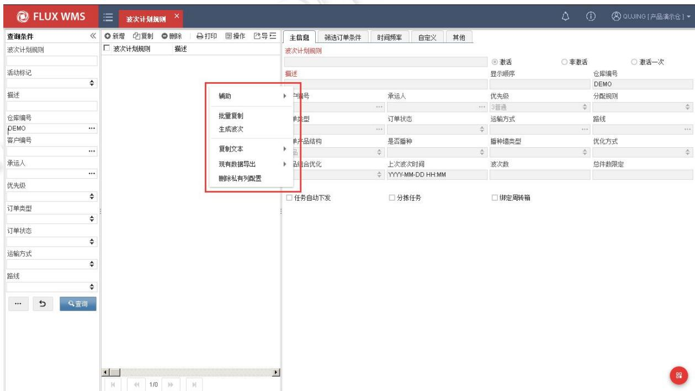

[图8-10-4]

批量复制信息： 

选择样本记录后，通过“批量复制信息”功能，系统显示如下字段选择框，勾选字段，确认后，系统将样本记录中的对应字段内容，复制到符合当前查询条件的全部记录中。 

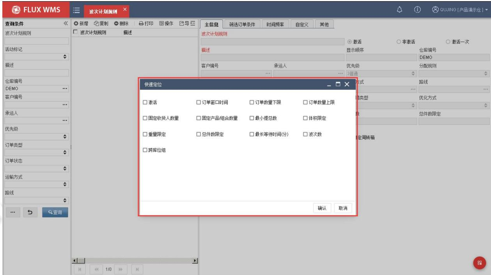

[图8-10-5]

■ 生成波次： 

选择规则后，通过“生成波次”功能，立即根据波次规则要求筛选订单、创建符合规则的波次计划，无需等待定时驱动执行。方便规则调试以及人工临时创建波次。 

## 8.11. 自动发运规则

同一货主，在不同仓库中均有存货，由于各地快递公司管理要求不同，可能导致作业流程有所不同，发运节点、方式有差异，例如有的仓库称重后发运，有的仓库出库复核后发运。同时，有些订单操作流程可能会要求需要完成多项作业节点的订单才能发运，例如拣货、装箱完成后的订单才能发运。 

系统通过自动发运规则，维护完成哪些出库节点后，订单可以被自动发运。系统通过定时任务，对订单进行检查，符合条件的订单，将更新自动发运标记，等待自动发运任务执行发运。 

## - 自动发运规则设置

自动发运规则设置见下图 

<table><tr><td colspan="2">FLUX WMS</td><td colspan="9">自动发运规则</td></tr><tr><td colspan="2">查询条件</td><td colspan="9">新增 复制 删除 打印 操作 导</td></tr><tr><td colspan="2">仓库编号</td><td colspan="9">仓库编号 客户编号 承运人</td></tr><tr><td colspan="2">DEMO</td><td colspan="9">DEMO ERPCWTEST01 AUTO_CAR01</td></tr><tr><td colspan="2">... 查询</td><td colspan="9"></td></tr></table>

[图8-11-1]

仓库编号 - 规则生效仓库的 ID。 

客户编号 - 规则对应货主。 

承运人 - 规则对应承运人。 

订单类型 - 规则对应订单类型。下拉框选择系统代码中维护发运订单类型。 

拣货/称重/复核/装箱/运输交接 - 自动发运节点选择。所选节点操作全部完成，订单具有发运资格，可通过定时器自动发运。 

## 8.12. 路线规则

特殊业务情况下，发货订单并不指定承运人，而是需要 FLUX WMS 系统根据订单情况自行指定承运人。 

这些指定承运人的逻辑，可配置为路线规则。 

## - 路线规则设置

<table><tr><td colspan="5">主信息 自定义 其他</td></tr><tr><td colspan="5">路线代码 规则代码 承运人</td></tr><tr><td colspan="5">北京 ARE-100010 AUTO_CAR01 ...</td></tr><tr><td colspan="5">产品属性</td></tr><tr><td colspan="5">FM重量 TO重量 FM体积 TO体积</td></tr><tr><td colspan="5">0.000 0.000 0.0000 0.0000</td></tr></table>

[图8-12-1]

设置订单重量、体积范围，在某个路线下，指定的承运人。 

## 8.13. 配送规则

用户的面单号码（运单号），由 FLUX WMS 系统生成的情况下，常常不同承运人的运单号码规则不同。可通过配送规则进行维护。 

## 配送规则设置

<table><tr><td colspan="9">主信息 自定义 其他</td></tr><tr><td colspan="9">仓库编号 客户编号 承运人 运单号规则</td></tr><tr><td colspan="9">DEMO ERPCWTEST01 AUTO_CAR03 流水号</td></tr><tr><td colspan="9">箱型 面单号规则</td></tr><tr><td colspan="9">C 普通 面单号是否从接口获取</td></tr></table>

## [图8-13-1]

■ 设置规则应用的对应业务仓库、货主、承运人信息。 

■ 选择运单号规则。目前系统提供“流水号”、“分区分包装号段”、“整单取号段”3种预设规则，系统生成运单号时，可根据仓库、货主、承运人条件，执行对应配送规则，生成不同逻辑的运单号码。 

◇ 流水号，根据分配数量，每箱对应一个运单号码。一个订单有多个系统生成的目标跟踪号，即获取多少运单号。 

分区分包装号段，从号码池提取预设号码作为运单号，而不根据流水号规则生成号码。 

整单取号段，整个订单，不论多少分配明细，从哪些区域、库位拣货，每单只分配 1 个运单号码。 

箱型的选择，主要提供给复核功能使用。当订单没有指定的装箱 ID 时，在复核根据根据仓库、货主、承运人条件匹配到对应的配送规则，使用指定的箱型，提供复核时的装箱 ID 下拉显示。 

■ 面单号规则，主要用于与京东、宅急送的特殊多箱单号规则配置： 

选择值为 COMMON，即通用逻辑，循环调用获取多个面单号的逻辑。 

选择值为 JD，执行京东面单号逻辑。一个订单只调用一次，在返回面单号以后按 

照总箱数，客户端分解为"面单号-第几箱-总箱数-"多个面单号。 

选择值为 ZJS，则是宅急送面单号逻辑。同样一个订单只调用一次，在返回面单号以后按照总箱数，客户端分解为"面单号-总箱数-第几箱"多个面单号。 

■ 面单号是否从接口获取，如勾选，则在出库复核时，通过接口从上游系统获取新的面单号。通常用在第一箱的面单接口已下达，现场根据实物需要增加第二箱的情况下，由 WMS 系统主动向上游系统请求新增面单号。 

## 8.14. 序列号规则

在序列号采集过程中，为了保证序列号的合法性，扫描过程中往往会对序列号的长度、前缀等进行校验。但不同客户、不同产品的序列号组合要求通常各不相同。 

系统通过序列号规则表对序列号的合法性规则进行约定，以支持不同业务的需要。维护后的序列号规则，在产品档案中选择从而与产品相关联、生效。 

## - 序列号规则

点击新增按钮，维护序列号规则相关信息： 

<table><tr><td colspan="7">主信息 自定义 其他</td></tr><tr><td>规则ID</td><td>校验类型</td><td>描述</td><td colspan="4">序列号长度</td></tr><tr><td>RULEID1380751846</td><td>序列号规则校验</td><td>RULEID1380751846</td><td colspan="4">10</td></tr><tr><td>A</td><td>B</td><td>C</td><td colspan="4">5</td></tr><tr><td>中间固定字符结束位置</td><td>序列号亲码解析</td><td colspan="5">合法性校验布尔表达式</td></tr><tr><td>5</td><td>箱码,序列号,序列号,序列号</td><td colspan="5">[(+?)</td></tr></table>

[图8-14-1]

规则 ID - 规则代码

校验类型 - 即此规则是序列号校验（对 1 级序列号生效），还是子序列号校验（针对 2 级子序列号）。 

描述 - 规则名称描述。 

序列号长度 - 序列号长度限制。 

序列号前缀 - 序列号前缀限制。例如序列号必须是 A 开头的 

序列号后缀 - 序列号后缀限制。 

中间固定字符 - 序列号中，必须包含什么字符。结合开始位置/结束位置生效。 

中间固定字符开始位置 - 指定字符的开始位置 

中间固定字符结束位置 - 指定字符的结束位置。例如序列号的第 3 位到第 5 位必须是 ABC。 

序列号条码解析 - 适用于自定义扩展规则。下拉框内容在系统代码 SN#_ENC_RUL 中定义，并在 JS 代码中编辑个性化的解析逻辑。 

合法性校验布尔表达式 - 用于校验的布尔表达式。例如 isnumeric(@SerialNo)，表示输入的序列号必须是全数字的。实际执行时，系统自动用实际扫描的序列号替换布尔表达式中的@SerialNo 进行校验。 

## 8.15. 波次调度规则

波次调度规则，主要用来对波次计划规则的运行时间进行调度和排程。同时将原本波次计划规则的一部分条件前置到调度规则环节配置生效。可以实现相同条件（如仓库、路线、承运人等）但不同时段的订单，执行不同的波次计划规则，支持更加复杂的波次管理需求。 

- 波次调度规则设置 

■ 表头部分 

用于维护波次调度规则的执行条件，如订单筛选要求、执行时间等配置。 

<table><tr><td rowspan="2">执行顺序</td><td rowspan="2">波次调度规则编号</td><td rowspan="2">规则描述</td><td rowspan="2">仓库编</td><td colspan="6">详细信息</td></tr><tr><td colspan="6">主信息 自定义 其他</td></tr><tr><td>0</td><td>WD000000035</td><td>test1</td><td></td><td>波次调度规则编号</td><td>规则描述</td><td>执行顺序</td><td colspan="3">仓库编号</td></tr><tr><td>1</td><td>WD000000003</td><td>POST单品提总规则</td><td>KW</td><td rowspan="2">PP0000000001</td><td rowspan="2">上午SF波次调度</td><td rowspan="2">1</td><td rowspan="2" colspan="3">PPCHOW</td></tr><tr><td>1</td><td>WD000000001</td><td>hy001</td><td>LYJ</td></tr><tr><td>1</td><td>WD00000201</td><td>test02</td><td>NJQ</td><td colspan="6">订单选择SQL语句</td></tr><tr><td>1</td><td>PP0000000001</td><td>上午SF波次调度</td><td>PPC</td><td rowspan="3" colspan="6">AND A soStatus=‘00’ AND A soStatus&lt;=‘40’ AND A orderType=&#x27;B2CCK&#x27; AND A carrierId IN (SF&#x27;)</td></tr><tr><td>2</td><td>PP0000000002</td><td>下午EMS波次调度</td><td>PPC</td></tr><tr><td>2</td><td>PP0000000003</td><td>晚间混合波次调度</td><td>PPC</td></tr><tr><td>1</td><td>WD00000034</td><td>test1</td><td>PPC</td><td>订单时间窗口</td><td>交货时间窗口</td><td>开始执行时间</td><td colspan="3">结束时间</td></tr><tr><td></td><td>WD000000002</td><td>AMMEX</td><td>SHG</td><td rowspan="25">X1@T±Y1X2@T±Y2</td><td rowspan="25">X1@T±Y1X2@T±Y2</td><td rowspan="25">09:00</td><td rowspan="25" colspan="3">23:00</td></tr><tr><td></td><td>WD000000003</td><td>TESTL</td><td>SHG</td></tr><tr><td>0</td><td>WD000000004</td><td>AMMEX</td><td>SHG</td></tr><tr><td>1</td><td>WD00000044</td><td>波次调度规则测试</td><td>TES</td></tr><tr><td>1</td><td>WN180512000001</td><td>常规波次</td><td>VST</td></tr><tr><td></td><td>WD000000001</td><td>POST单品提总规则</td><td>WH</td></tr><tr><td></td><td>WD000000006</td><td>test001</td><td>WH</td></tr><tr><td>7</td><td>WD00000043</td><td>test1</td><td>WH</td></tr><tr><td>0</td><td>WD000000002</td><td>POST单品提总规则</td><td>WH</td></tr><tr><td>0</td><td>WD000000004</td><td>POST单品提总规则</td><td>WH</td></tr><tr><td>1</td><td>WD000000001</td><td>111</td><td>WH</td></tr><tr><td></td><td>WD00000011</td><td>222</td><td>WH</td></tr><tr><td></td><td>WD00000012</td><td>222</td><td>WH</td></tr><tr><td></td><td>WD00000013</td><td>222</td><td>WH</td></tr><tr><td></td><td>WD00000014</td><td>222</td><td>WH</td></tr><tr><td></td><td>WD00000015</td><td>222</td><td>WH</td></tr><tr><td></td><td>WD00000016</td><td>222</td><td>WH</td></tr><tr><td></td><td>WD00000017</td><td>222</td><td>WH</td></tr><tr><td></td><td>WD00000018</td><td>222</td><td>WH</td></tr><tr><td></td><td>WD00000019</td><td>222</td><td>WH</td></tr><tr><td></td><td>WD00000020</td><td>222</td><td>WH</td></tr><tr><td></td><td>WD00000021</td><td>222</td><td>WH</td></tr><tr><td></td><td>WD00000022</td><td>222</td><td>WH</td></tr><tr><td></td><td>WD00000023</td><td>222</td><td>WH</td></tr><tr><td></td><td>WD00000024</td><td>222</td><td>WH</td></tr></table>

[图8-15-1]

波次调度规则 - 规则号，由系统生成。生成波次后，将记录在波次表头。 

规则描述 - 规则名称描述 

执行顺序 - 多规则情况下，规则执行时的排序字段。可编辑字段。 

仓库 - 规则生效仓库。新增时，默认为当前仓库。 

订单选择 SQL 语句 - 规则执行时筛选订单的条件。无需录入，点击浏览按钮，在如下“订单选择 SQL 语句”二级窗口，选择条件后点击【替代】按钮，系统自动生成对应 SQL 语句。 

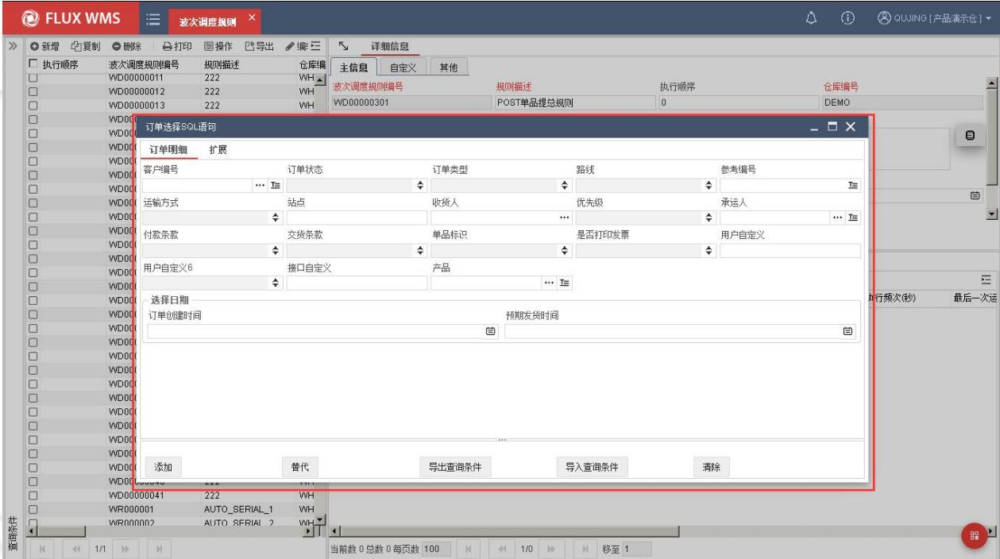

[图8-15-2]

订单时间 - 订单时间范围, @T-DD 表示日期信息, @T0 为当天, @T-1 为前一天, @T+1 为明天。输入后系统会进行有效性校验 

交货时间 - 交货时间范围条件 

运行开始时间 - 规则执行的时间范围开始 

运行结束时间 - 规则执行的时间范围结束 

活动标记 - 规则是否启用 

■ 明细部分 

用于配置符合表头条件的记录，所执行的波次规则。 

<table><tr><td colspan="8">主信息 自定义 其他</td></tr><tr><td>执行顺序</td><td>活动标记</td><td>波次规则</td><td>规则描述</td><td>行号</td><td>执行顺序</td><td>波次规则</td><td rowspan="2">活动标记</td></tr><tr><td>1</td><td>Y</td><td>ZY_SINGLE_03</td><td>单品提总波次</td><td>1</td><td>1</td><td>ZY_SINGLE_03</td></tr><tr><td>2</td><td>Y</td><td>ZY_SINGLE_01</td><td>单品不跨区波次</td><td>开始时间</td><td>结束时间</td><td>执行频次(秒)</td><td>最后一次运行时间</td></tr><tr><td>3</td><td>Y</td><td>ZY_SINGLE_02</td><td>单品跨区波次</td><td>20:00</td><td>23:00</td><td>120</td><td>2018-04-27 17:44:47</td></tr><tr><td>4</td><td>Y</td><td>ZY_MIX_01</td><td>组合多品波次</td><td></td><td></td><td></td><td></td></tr></table>

## [图8-15-3]

## 行号 - 明细行号

执行顺序 - 此行记录的执行次序，可以根据需要调整 

激活 - 此行是否启用 

波次规则 - 已配置的波次计划规则，可通过浏览按钮二级窗口选择 

活动标记 - 是否启用的记录 

开始时间 - 规则执行的时间范围开始 

结束时间 - 规则执行的时间范围结束 

执行频次（分钟） - 规则运行时间间隔，单位为分钟，整数值录入。 

最后一次运行时间 - 上次执行此规则的时间信息 

## - 鼠标右键菜单

## ■ 表头部分

复制 - 复制记录。常用于将其他仓库规则复制到当前作业仓库。 

■ 明细部分 

生成波次 - 根据明细行对应的波次计划规则，生成波次。 

## 9. 入库操作

## 9.1. 入库流程概述

入库是指在产品到达仓库后，将货物清点检查，妥善存储，并将信息输入系统的一系列相关操作。FLUX WMS 的入库流程包括了仓库接收产品的所有活动，涉及实际使用的卸货卡车、有轨车、运输集装箱，或记录产品从生产流水线到仓库的运动过程。 

入库操作从不同的维度，可以进行不同模式的划分。 

从信息流转角度来看，FLUX WMS 能够支持多种不同的入库方式，在最初设计时就针对与多种不同的执行系统实现系统整合而进行了规划、设计，包括同众所周知的企业资源计划(ERP)、高级计划系统(APS)、订单管理系统(OMS)、运输管理系统(TMS)集成方式、或其他计划或执行系统交互。除此之外，FLUX WMS 支持 EDI、XML 等多种方式导入收货数据，或者通过人工输入等不同操作方式进行入库记录。 

从作业衔接方面来看，FLUX WMS 能支持传统的配送方式和交叉转运的配送方式来完成入库流程。目前大多数仓库采用传统配送的方式：产品到达后，上架存放，并只有在该项产品订单下达后才被拣选出来。而交叉转运的方式指按照卖方提供产品序列标识进行包装与运输，并主要应用 RF 手持设备和电子交互系统。FLUX WMS 可以在产品到达仓库之前安排运送（例如，产品的最终目的地是事先确定的）。我们可以运用 FLUX WMS 的 Cross Dock 模块实现这一功能。请参考相应的培训材料，而本资料的内容仅包括传统的配送方式。 

FLUX WMS 的灵活性使设备能在不丢失数据和浪费时间的情况下，处理在收货时不可避免发生的意外和例外情况。FLUX WMS 能够在已确认(确认 PO、ASN/码盘)或未确认(无 PO 或 ASN/码盘)的方式下完成进货，单证可部分地接收。 

不论何种维度的入库作业模式划分，入库的目的在于快速而准确地运送产品，并使控制部门与收货库位能够相互核对。 

较为常见的传统入库作业流程通常有以下 3 种方式： 

■ 建立一个采购订单 PO，再根据 PO 建立预期到货通知 ASN，然后进行收货。通常制造、零售、批发行业比较多采用这种方式。 

■ 直接建立一个预期到货通知 ASN，然后进行收货。通常是第三方物流的常用方式。 

■ 没有采购订单 PO 和预期到货通知 ASN 的情况下，直接进行收货（此收货方式称为：盲收）。通常在制造业，特别是 VMI 的情况下比较常见。 

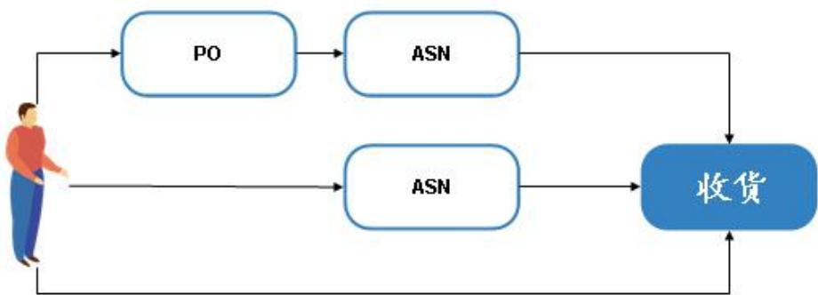

其中，收货是入库流程中必须的作业节点，而其他节点如单据、上架、质检等操作，根据业务流程需要选择使用。具体操作细节详见后续介绍。 

## 9.2. 采购订单 (PO)

采购订单（PO）是货物的买卖双方之间的协议记录。FLUX WMS 为客户提供了制作提交客户产品的采购订单的功能。 

但从仓库角度来看，由于供应商很少按采购订单一次性送货到仓库，多数是分批送货，因此采购订单很少作为仓库直接收货的依据，通常由货主在自己的 ERP 系统中对采购订单进行管理，而将分批送货的预到货信息给仓库参考，以便仓库根据拟运抵的货物信息对场地等进行调整和准备。这类预到货信息，在系统中被称为预期到货通知（ASN）。 

采购订单并不是入库流程中的必须操作步骤，用户可根据实际需要选择是否使用采购订单。通过接口下载方式，从 ERP 或其他订单系统获取到采购订单信息是比较常见的操作方式。 

## - 采购订单

通常在建立一个采购订单前，需要对一些基本的信息进行设置，这些基本信息包括：客户、产品、批次属性、包装等。请参考基础设置章节的介绍。 

手工创建一个采购订单（简称 PO）的步骤是： 

■ 选择主菜单 “入库操作” 模块下的 “采购订单” 功能。 

■ 查询已有采购订单，或者点击【新增】按钮，在“主信息”页签，依次输入以下信息： 

<table><tr><td>采购订单号</td><td>采购订单类型</td><td>采购订单状态</td></tr><tr><td>PO20190103000...</td><td>生产采购</td><td>创建订单</td></tr></table>

[图9-2-1]

采购订单号 - 系统生成的采购订单编号。在创建一个新的采购订单时，采购订单编号由系统根据流水号规则自动给出（流水号规则设置，参考业务规则的流水号规则部分）。用户如果有自己的订单编号（例如 ERP 单号等），可输入主信息页面的参考信息字段中。 

采购订单状态 - 采购订单的当前状态。系统提供创建订单、完全释放、部分收货、完全收货、取消订单、等待释放和订单完成等选项。在创建一个新的采购订单时，采购订单状态默认为创建订单，并且不能人工修改，随着操作进行由系统更新单证状态。 

采购订单类型 - 用于区分不同情况、来源、甚至不同部门的采购订单。可在系统代码中维护类型内容。 

创建时间 - 采购订单创建时间。 

仓库编号 - 单据所属的业务仓库。新增单据取当前登录业务仓作为单据对应的仓库。 

客户编号 - 采购订单所列产品所属货主。该客户必须是在客户档案中已经存在的货主；若客户档案中不存在该货主，必须先在客户档案中新增该客户。 

客户名称 - 货主对应描述，根据客户档案中的设置显示。 

预期到货时间 FM/TO - 预计到货时间段。默认同创建时间。 

参考信息 - 客户自行定义的参考信息字段。 

■ 点击【保存】按钮，完成表头新增操作。 

如果需要对送货供应商信息进行记录，可继续录入相关信息： 

## 供应商信息维护

选择供应商页签，依次输入或修改供货商的名称、地址、城市、省/州、国家、邮编。 

<table><tr><td colspan="2">FLUX WMS</td><td colspan="2">采购订单</td><td colspan="2">附件文档管理</td><td colspan="6">客户档案</td></tr><tr><td colspan="2">查询条件</td><td colspan="10">新增复制删除打印操作导:</td></tr><tr><td colspan="2">采购订单号</td><td colspan="2">采购订单号</td><td colspan="2">采购订单类型</td><td colspan="6">采购订单状态</td></tr><tr><td colspan="2">采购订单状态</td><td colspan="2">PO20190103000...</td><td colspan="2">生产采购</td><td colspan="6">创建订单</td></tr><tr><td colspan="2">采购订单类型</td><td colspan="10"></td></tr><tr><td colspan="2">参考编号1</td><td colspan="10"></td></tr><tr><td colspan="2">产品代码</td><td colspan="10"></td></tr><tr><td colspan="2">创建时间</td><td colspan="10"></td></tr><tr><td colspan="2">客户编号</td><td colspan="10"></td></tr><tr><td colspan="2">仓库编号</td><td colspan="10"></td></tr><tr><td colspan="2">DEMO</td><td colspan="10"></td></tr><tr><td colspan="2">查询</td><td colspan="10"></td></tr></table>

[图9-2-2]

系统支持直接录入或通过快速检索按钮选择供应商，界面显示客户档案中维护的供应商相应信息，在此基础上可对供应商信息进一步修改、保存。例如用本次订单到货的联系人信息替换客户档案维护的标准联系人信息。 

采购订单中的供应商信息仅做参考，并作为预期到货通知的信息来源。供应商信息是否需要用于后续收货的管控，或者作为库存区分维度，可以依据管理需要，在收货相关控制中配置。 

## ■ 下单方信息维护

下单方通常在有货主代理的情况下使用。类似供应商，可选择或者录入相应信息。 

下单方信息通常不用于收货管控或库存跟踪，而用于统计的情况较为常见。 

## ■ 在用户自定义页页签，维护扩展信息

其中的用户自定义 A/B，是二级关联代码，需要在系统代码中先期维护才能使用。 

选择自定义 A 的代码后，自定义 B 只能选择 A 所对应的二级代码值。例如自定义 A、B 维护省份、城市，选择自定义 A 黑龙江省，在自定义 B 中只能选择黑龙江省的城市，而无法选择其他省份 

## 城市。

## ■ 如果有照片、EXCEL 等文档，可通过附件页签进行管理：

<table><tr><td colspan="2">FLUX WMS</td><td colspan="2">采购订单</td><td colspan="2">附件文档管理</td><td colspan="2">客户档案</td></tr><tr><td colspan="2">查询条件</td><td colspan="6">新增复制删除打印操作导:</td></tr><tr><td colspan="2">采购订单号</td><td colspan="2">采购订单号</td><td>采购订单类型</td><td colspan="3">采购订单状态</td></tr><tr><td colspan="2">采购订单状态</td><td colspan="2">PO20190103000...</td><td>生产采购</td><td colspan="3">创建订单</td></tr><tr><td colspan="2">采购订单类型</td><td colspan="6"></td></tr><tr><td colspan="2">参考编号1</td><td colspan="6"></td></tr><tr><td colspan="2">产品代码</td><td colspan="6"></td></tr><tr><td colspan="2">创建时间</td><td colspan="6"></td></tr><tr><td colspan="2">客户编号</td><td colspan="6"></td></tr><tr><td colspan="2">仓库编号</td><td colspan="6"></td></tr><tr><td colspan="2">DEMO</td><td colspan="6"></td></tr><tr><td colspan="2">查询</td><td colspan="6"></td></tr></table>

[图9-2-3]

点击【新增】按钮，输入描述信息，通过【定位】按钮，选择文件，再【上传到服务器】。对于已有附件，可以通过【打开】按钮下载查看。 

## - 采购订单明细

■ 在明细信息部分，点击【新增】按钮，在主信息页签依次输入以下信息： 

<table><tr><td rowspan="31">查询条件
采购订单号
采购订单状态
采购订单类型
参考编号1
产品代码
创建时间
客户编号
仓库编号
DEMO
查询</td><td rowspan="31" colspan="101">新增 复制 删除 打印 操作 导导
采购订单号
PO20190103000... 生产采购 创建订单</td><td></td><td></td><td></td><td></td><td></td><td></td><td></td><td></td><td></td><td></td></tr><tr><td></td><td></td><td></td><td></td><td></td><td></td><td></td><td></td><td></td><td></td></tr><tr><td></td><td></td><td></td><td></td><td></td><td></td><td></td><td></td><td></td><td></td><td></td><td></td><td></td><td></td><td></td><td></td></tr><tr><td></td><td></td><td></td><td></td><td></td><td></td><td></td><td></td><td></td><td></td></tr><tr><td></td><td></td><td></td><td></td><td></td><td></td><td></td><td></td><td></td><td></td><td></td><td></td><td></td><td></td><td></td><td></td><td></td><td></td><td></td><td></td><td></td><td></td><td></td><td></td></tr><tr><td></td><td></td><td></td><td></td><td></td><td></td><td></td><td></td><td></td><td></td><td></td><td></td><td></td><td></td></tr><tr><td></td><td></td><td></td><td></td><td></td><td></td><td></td><td></td><td></td><td></td><td></td><td></td><td></td><td></td><td></td><td></td><td></td><td></td><td></td><td></td><td></td><td></td><td></td><td></td><td></td><td></td><td></td><td></td><td></td></tr><tr><td rowspan="3"></td><td rowspan="3"></td><td rowspan="3"></td><td rowspan="3"></td><td rowspan="3"></td><td rowspan="3"></td><td rowspan="3"></td><td rowspan="3"></td><td rowspan="3"></td><td rowspan="3"></td><td rowspan="3"></td><td rowspan="3"></td><td rowspan="3"></td><td rowspan="3"></td><td rowspan="3"></td><td rowspan="3"></td><td rowspan="3"></td><td rowspan="3"></td><td rowspan="3"></td><td rowspan="3"></td><td rowspan="3"></td><td rowspan="3"></td><td rowspan="3"></td><td rowspan="3"></td><td rowspan="3"></td><td rowspan="3"></td><td rowspan="2"></td><td rowspan="2"></td><td rowspan="2"></td><td rowspan="2"></td><td rowspan="2"></td><td rowspan="2"></td><td rowspan="2"></td></tr><tr></tr><tr><td></td><td></td><td></td><td></td><td></td><td></td><td></td></tr><tr><td rowspan="21" colspan="74">PO201901... 15465031... QUJING</td><td></td><td></td><td></td><td></td><td></td><td></td><td></td><td></td><td></td><td></td><td></td><td></td><td></td><td></td><td></td><td></td><td></td><td></td></tr><tr><td rowspan="19" colspan="68">PO201901... 15465031... QUJING</td><td></td><td></td><td></td><td></td><td></td><td></td><td></td><td></td><td></td><td></td><td></td><td></td><td></td><td></td><td></td><td></td><td></td><td></td><td></td><td></td></tr><tr><td></td><td></td><td></td><td></td><td></td><td></td><td></td><td></td><td></td><td></td><td></td><td></td><td></td><td></td><td></td><td></td><td></td><td></td><td></td><td></td><td></td><td></td><td></td><td></td><td></td><td></td><td></td><td></td><td></td><td></td><td></td><td></td><td></td><td></td><td></td><td></td></tr><tr><td></td><td></td><td></td><td></td><td></td><td></td><td></td><td></td><td></td><td></td><td></td><td></td><td></td><td></td><td></td><td></td><td></td><td></td><td></td><td></td><td></td><td></td><td></td><td></td><td></td><td></td><td></td><td></td><td></td><td></td><td></td><td></td><td></td><td></td><td></td><td></td><td></td><td></td><td></td></tr><tr><td>PO单证</td><td colspan="56">154650314642718 QUJING 2019-01-03 16:12:上传标记</td><td></td><td></td><td></td><td></td><td></td><td></td></tr><tr><td rowspan="10" colspan="45">保存 取消</td><td></td><td></td><td></td><td></td><td></td><td></td><td></td><td></td><td></td><td></td><td></td><td></td><td></td><td></td><td></td><td></td><td></td><td></td><td></td><td></td><td></td><td></td><td></td><td></td><td></td></tr><tr><td></td><td></td><td></td><td></td><td></td><td></td><td></td><td></td><td></td><td></td><td></td><td></td><td></td><td></td><td></td><td></td><td></td><td></td><td></td><td></td><td></td><td></td><td></td><td></td><td></td><td></td><td></td><td></td><td></td><td></td><td></td><td></td><td></td><td></td><td></td><td></td><td></td><td></td><td></td><td></td><td></td><td></td><td></td><td></td></tr><tr><td></td><td></td><td></td><td></td><td></td><td></td><td></td><td></td><td></td><td></td><td></td><td></td><td></td><td></td><td></td><td></td><td></td><td></td><td></td><td></td><td></td><td></td><td></td><td></td><td></td><td></td><td></td><td></td><td></td><td></td><td></td><td></td><td></td><td></td><td></td><td></td><td></td><td></td><td></td><td></td><td></td><td></td><td></td><td></td><td></td><td></td></tr><tr><td></td><td></td><td></td><td></td><td></td><td></td><td></td><td></td><td></td><td></td><td></td><td></td><td></td><td></td><td></td><td></td><td></td><td></td><td></td><td></td><td></td><td></td><td></td><td></td><td></td><td></td><td></td><td></td><td></td><td></td><td></td><td></td><td></td><td></td><td></td><td></td><td></td><td></td><td></td><td></td><td></td><td></td><td></td><td></td><td></td><td></td><td></td></tr><tr><td></td><td></td><td></td><td></td><td></td><td></td><td></td><td></td><td></td><td></td><td></td><td></td><td></td><td></td><td></td><td></td><td></td><td></td><td></td><td></td><td></td><td></td><td></td><td></td><td></td><td></td><td></td><td></td><td></td><td></td><td></td><td></td><td></td><td></td><td></td><td></td><td></td><td></td><td></td><td></td><td></td><td></td><td></td><td></td><td></td><td></td><td></td><td></td><td></td></tr><tr><td></td><td></td><td></td><td></td><td></td><td></td><td></td><td></td><td></td><td></td><td></td><td></td><td></td><td></td><td></td><td></td><td></td><td></td><td></td><td></td><td></td><td></td><td></td><td></td><td></td><td></td><td></td><td></td><td></td><td></td><td></td><td></td><td></td><td></td><td></td><td></td><td></td><td></td><td></td><td></td><td></td><td></td><td></td><td></td><td></td><td></td><td></td><td></td><td></td><td></td><td></td></tr><tr><td></td><td></td><td></td><td></td><td></td><td></td><td></td><td></td><td></td><td></td><td></td><td></td><td></td><td></td><td></td><td></td><td></td><td></td><td></td><td></td><td></td><td></td><td></td><td></td><td></td><td></td><td></td><td></td><td></td><td></td><td></td><td></td><td></td><td></td><td></td><td></td><td></td><td></td><td></td><td></td><td></td><td></td><td></td><td></td><td></td><td></td><td></td><td></td><td></td><td></td><td></td><td></td><td></td></tr><tr><td></td><td></td><td></td><td></td><td></td><td></td><td></td><td></td><td></td><td></td><td></td><td></td><td></td><td></td><td></td><td></td><td></td><td></td><td></td><td></td><td></td><td></td><td></td><td></td><td></td><td></td><td></td><td></td><td></td><td></td><td></td><td></td><td></td><td></td><td></td><td></td><td></td><td></td><td></td><td></td><td></td><td></td><td></td><td></td><td></td><td></td><td></td><td></td><td></td><td></td><td></td><td></td><td></td><td></td><td></td></tr><tr><td></td><td></td><td></td><td></td><td></td><td></td><td></td><td></td><td></td><td></td><td></td><td></td><td></td><td></td><td></td><td></td><td></td><td></td><td></td><td></td><td></td><td></td><td></td><td></td><td></td><td></td><td></td><td></td><td></td><td></td><td></td><td></td><td></td><td></td><td></td><td></td><td></td><td></td><td></td><td></td><td></td><td></td><td></td><td></td><td></td><td></td><td></td><td></td><td></td><td></td><td></td><td></td><td></td><td></td><td></td><td></td><td></td><td></td></tr><tr><td></td><td></td><td></td><td></td><td></td><td></td><td></td><td></td><td></td><td></td><td></td><td></td><td></td><td></td><td></td><td></td><td></td><td></td><td></td><td></td><td></td><td></td><td></td><td></td><td></td><td></td><td></td><td></td><td></td><td></td><td></td><td></td><td></td><td></td><td></td><td></td><td></td><td></td><td></td><td></td><td></td><td></td><td></td><td></td><td></td><td></td><td></td><td></td><td></td><td></td><td></td><td></td><td></td><td></td><td></td><td></td><td></td><td></td><td></td><td></td></tr><tr><td rowspan="3">STANDARD ... EA 50.00 50.00 0.00 0.00 0.00 0.00 0.00 0.00 0.00 0.00 0.00 0.00 0.00 0.00 0.00 0.00 0.00 0.00 0.00 0.00 0.00 0.00</td><td rowspan="3" colspan="68">主信息 用户自定义 接口 其他 行号 行状态 产品代码 产品描述 (L) 创建订单 45068284411 包装代码 单位 订单数量 订单数量_EA 收货数量 收货数量_EA 释放数量 总重量 总重 总价 总积 批次属性 失效日期 入库日期 批次属性04 批次属性05 批次属性06 红色 N-良品 合格 批次属性07 批次属性08 批次属性09 批次属性10 批次属性11 批次属性12 批次属性13 批次属性14 批次属性15 批次属性16 批次属性17 批次属性18 批次属性19 批次属性20 批次属性21 批次属性22 批次属性23 批次属性24 保存 取消</td><td></td><td></td><td></td><td></td><td></td><td></td><td></td><td></td></tr><tr><td></td><td></td><td></td><td></td><td></td><td></td><td></td><td></td><td></td><td></td><td></td><td></td><td></td><td></td><td></td><td></td><td></td><td></td><td></td><td></td><td></td><td></td><td></td><td></td><td></td><td></td><td></td><td></td><td></td><td></td><td></td><td></td><td></td><td></td><td></td><td></td><td></td><td></td><td></td><td></td><td></td><td></td><td></td><td></td><td></td><td></td><td></td><td></td><td></td><td></td><td></td><td></td><td></td><td></td><td></td><td></td><td></td><td></td><td></td></tr><tr><td></td><td></td><td></td><td></td><td></td><td></td><td></td><td></td><td></td><td></td><td></td><td></td><td></td><td></td><td></td><td></td><td></td><td></td><td></td><td></td><td></td><td></td><td></td><td></td><td></td><td></td><td></td><td></td><td></td><td></td><td></td><td></td><td></td><td></td><td></td><td></td><td></td><td></td><td></td><td></td><td></td><td></td><td></td><td></td><td></td><td></td><td></td><td></td><td></td><td></td><td></td><td></td><td></td><td></td><td></td><td></td><td></td><td></td><td></td><td></td><td></td><td></td></tr><tr><td></td><td></td><td></td><td></td><td></td><td></td><td></td><td></td><td></td><td></td><td></td><td></td><td></td><td></td><td></td><td></td><td></td><td></td><td></td><td></td><td></td><td></td><td></td><td></td><td></td><td></td><td></td><td></td><td></td><td></td><td></td><td></td><td></td><td></td><td></td><td></td><td></td><td></td><td></td><td></td><td></td><td></td><td></td><td></td><td></td><td></td><td></td><td></td><td></td><td></td><td></td><td></td><td></td><td></td><td></td><td></td><td></td><td></td><td></td><td></td><td></td><td></td><td></td><td></td><td></td><td></td><td></td><td></td><td></td><td></td><td></td><td></td><td></td><td></td><td></td><td></td><td></td><td></td><td></td></tr><tr><td></td><td></td><td></td><td></td><td></td><td></td><td></td><td></td><td></td><td></td><td></td><td></td><td></td><td></td><td></td><td></td><td></td><td></td><td></td><td></td><td></td><td></td><td></td><td></td><td></td><td></td><td></td><td></td><td></td><td></td><td></td><td></td><td></td><td></td><td></td><td></td><td></td><td></td><td></td><td></td><td></td><td></td><td></td><td></td><td></td><td></td><td></td><td></td><td></td><td></td><td></td><td></td><td></td><td></td><td></td><td></td><td></td><td></td><td></td><td></td><td></td><td></td><td></td><td></td><td></td><td></td><td></td><td></td><td></td><td></td><td></td><td></td><td></td><td></td><td></td><td></td><td></td><td></td><td></td><td></td></tr><tr><td></td><td></td><td></td><td></td><td></td><td></td><td></td><td></td><td></td><td></td><td></td><td></td><td></td><td></td><td></td><td></td><td></td><td></td><td></td><td></td><td></td><td></td><td></td><td></td><td></td><td></td><td></td><td></td><td></td><td></td><td></td><td></td><td></td><td></td><td></td><td></td><td></td><td></td><td></td><td></td><td></td><td></td><td></td><td></td><td></td><td></td><td></td><td></td><td></td><td></td><td></td><td></td><td></td><td></td><td></td><td></td><td></td><td></td><td></td><td></td><td></td><td></td><td></td><td></td><td></td><td></td><td></td><td></td><td></td><td></td><td></td><td></td><td></td><td></td><td></td><td></td><td></td><td></td><td></td><td></td><td></td><td></td><td></td><td></td><td></td><td></td><td></td><td></td><td></td><td></td></tr></table>

[图9-2-4]

行号 - 系统自动提供的采购订单行号。 

行状态 - 订单行状态，系统根据操作情况自动更新。 

产品代码 - 待接收的产品代码 ID。 

产品描述 - 待接收的产品名称。当输入产品 ID 时，系统自动给出产品档案中该产品的描述。 

包装代码 - 该产品对应的包装代码。系统自动给出该产品在产品档案中所输入的包装代码，客户也可根据实物情况选择其他的包装代码。通常在产品多包装的情况下较为常见。 

单位 - 收货时的包装单位。系统自动给出该产品在产品档案中所选择的缺省收货单位，用户也可根据情况选择其他的收货单位。 

订单数量 - 采购订单订购产品的数量。在订单数量中有 2 个字段，前一个字段是可输入的，以所选择的单位为数量单位的；后一个字段（订单数量_EA）是以所选择的包装代码的最小单位（主单位）为数量单位的，并且是系统自动换算给出的，不能修改。例如包装单位为箱，1 箱 10 件，预期 2 箱，2 个数量字段的数值会分别是 2（箱）与 20（件）。 

收货数量 - 系统已经确认收货的产品数量。同样是 2 个字段，分别对应所选单位和系统主单位(收货数量_EA)。由于采购订单并不直接用于收货，收货数量是在预期到货通知(ASN)关联采购订单（PO）情况下，ASN 收货时，系统自动更新对应 PO 的收货数量。 

释放数量 - 即已经生成预期到货通知（ASN）的对应数量。 

收货时间 - 系统记录的收货确认时间。 

总重量 - 订单行记录总重量。 

总净重 - 订单行记录总净重。 

总体积 - 订单行记录总体积。如产品档案中有维护单位产品体积，可通过订单数量乘以标准体积计算得出。 

总价 - 订单行记录总价格金额。 

批次属性 - 产品批次属性信息。根据产品所用批次属性规则，动态显示属性字段。 

■ 点击【保存】按钮，完成明细行录入操作。 

■ 表头、明细的接口页签，通常存储接口传递信息，用于打印等操作，一般无需人工维护内容。 

## - 鼠标右键菜单

FLUX WMS 在不同功能中提供各自的鼠标右键功能菜单选项，点击订单表头和明细或不同页签，会显示不同的右键功能菜单。 

右键功能支持自定义快捷键，相关配置说明请参考4.13.5快捷键配置章节的说明。 

■ 表头右键菜单：

<table><tr><td colspan="17">FLUX WMS</td></tr><tr><td colspan="17">查询条件</td></tr><tr><td colspan="17">采购订单号</td></tr><tr><td colspan="17">采购订单状态</td></tr><tr><td colspan="17">采购订单类型</td></tr><tr><td colspan="17">参考编号1</td></tr><tr><td colspan="17">产品代码</td></tr><tr><td colspan="17">创建时间</td></tr><tr><td colspan="17">客户编号</td></tr><tr><td colspan="17">仓库编号</td></tr><tr><td colspan="17">DEMO</td></tr><tr><td>...</td><td colspan="16">查询</td></tr></table>

## [图9-2-5]

关闭订单 - 关闭后不再允许对订单进行操作修改 

取消订单 - 使订单失效，尽可供查询。只有创建状态订单能够被取消。 

订单释放 - 将所选订单的表头释放状态，更新为“订单释放”。释放后的订单可收货确认。订单释放状态控制，通常用来做入库审核，例如未通过审核的订单，不可入库。 

订单未释放 - 将所选订单的表头释放状态，更新为“订单未释放”。未释放订单不可收货，非创建状态订单，如已经部分收货的 PO，不可更新为“未释放”。 

订单冻结 - 将所选订单的表头释放状态，更新为“订单冻结”。冻结后不可收货。 

## ■ 明细右键菜单：

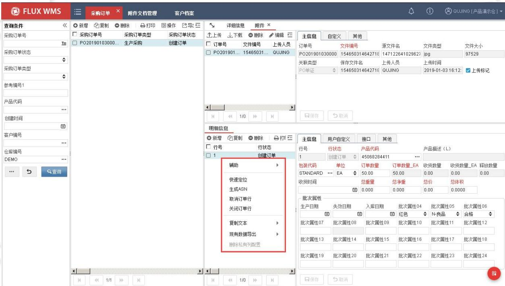

[图 9-2-6]

快速定位 - 选择后，系统弹出对话框，供输入 SKU 代码进行查询，快速定位到对应明细行。如果符合条件的记录有多个，则列表显示，由用户双击定位到对应明细行。 

生成 ASN - 从 PO 提取明细信息生成 ASN 明细。在 ASN 界面，使用 “提取 PO 数据” 功能后，跳转到 PO 界面，选择记录后，生成 ASN 明细。如果直接从 PO 中选择明细，生成 ASN，则创建一个新的 ASN，表头信息根据 PO 信息获取。 

取消订单行 - 对所选明细行进行取消作业。 

关闭订单行 - 关闭所选明细行。 

## 9.3. 预期到货通知(ASN)

ASN 是 FLUX WMS 的一种接收文档，即 Advanced shipping notice 的简称。它记录了将要到达的货物的详细相关信息，通常是供应商提供的拟送货信息。仓库可根据即将到达的货物信息安排收货准备工作，同时 ASN 也是实物收货操作的依据，收货时操作人员可以据此核对货物情况。 

ASN 可以通过以下 2 种途径来创建。 

■ 没有 PO 的情况下，直接新增一个 ASN。 

■ 有 PO 的情况下，直接从 PO 中导入信息生成新的 ASN。 

## 9.3.1. 单证创建

## - ASN 主信息创建

■ 选择主菜单 “入库操作” 下的 “预期到货通知”。 

■ 根据需要，查询已有 ASN，或者点击【新增】按钮，在“主信息”页签依次输入信息： 

<table><tr><td>查询条件</td><td colspan="11">新增 复制 删除 打印 操作 导出 编辑</td></tr><tr><td>预期到货通知编号</td><td>ASN20181203000005</td><td>采购收货</td><td>完全收货</td><td></td><td></td><td></td><td></td><td></td><td></td><td></td><td></td></tr><tr><td>预期到货通知状态</td><td>ASN20181203000004</td><td>采购收货</td><td>部分收货</td><td></td><td></td><td></td><td></td><td></td><td></td><td></td><td></td></tr><tr><td>预期到货通知类型</td><td>ASN20190103000001</td><td>销售订单</td><td>订单创建</td><td></td><td></td><td></td><td></td><td></td><td></td><td></td><td></td></tr><tr><td>ASN参考信息</td><td></td><td></td><td></td><td></td><td></td><td></td><td></td><td></td><td></td><td></td><td></td></tr><tr><td>产品代码</td><td></td><td></td><td></td><td></td><td></td><td></td><td></td><td></td><td></td><td></td><td></td></tr><tr><td>预期到货通知创建时间</td><td></td><td></td><td></td><td></td><td></td><td></td><td></td><td></td><td></td><td></td><td></td></tr><tr><td>客户编号</td><td></td><td></td><td></td><td></td><td></td><td></td><td></td><td></td><td></td><td></td><td></td></tr><tr><td>仓库编号</td><td></td><td></td><td></td><td></td><td></td><td></td><td></td><td></td><td></td><td></td><td></td></tr><tr><td>DEMO</td><td></td><td></td><td></td><td></td><td></td><td></td><td></td><td></td><td></td><td></td><td></td></tr><tr><td>查询</td><td></td><td></td><td></td><td></td><td></td><td></td><td></td><td></td><td></td><td></td><td></td></tr></table>

[图9-3-1]

预期到货通知编号 - 系统给出的预期到货通知单编号，根据流水号规则生成。当新增一条 ASN 时，系统会自动给出 ASN 编号，并且不能修改。 

预期到货通知状态 - 该单证当前状态。系统提供 ASN 创建、已码盘、部分收货、完全收货、订单取消、ASN 完成等状态。在创建一个新的 ASN 时，ASN 状态默认为 ASN 创建，系统会根据 ASN 操作情况自动更新。 

客户编号 - 拥有产品的货主代码。该客户必须是在客户档案中已经存在的；若客户档案中不存在该客户，必须先在客户档案中新增该客户。 

预期到货通知类型 - ASN 的单据类型, 通常区分不同操作类型、不同来源等的入库单据。系统提供普通入库、生产收货、退货入库等多种类型, 用户可根据需要在系统代码中增加现场所需类型。新增 ASN 时若客户编号已维护默认货主（通过参数 DFT_CUS 设置），则光标定位 ‘预期到货通知类型’ 字段；若未维护，则光标定位客户编号； 

ASN 创建时间 - 订单创建或者下达的时间。当新增一个新的 ASN 时，系统自动给出当前的时间为 ASN 创建时间。 

仓库编号 - 单据所属的业务仓库 ID。新增单据取当前登录业务仓作为单据对应的仓库。 

客户名称 - 客户描述信息。系统自动显示客户编号对应的客户名称。 

预期到货时间 - 产品的可接收时间段。新增一个 ASN 时，系统默认为当前时间，客户可按照实际情况进行修改。如果系统参数 RCV_TIM_CTL（只有在预期到货时间范围内才能收货）开启，那么只有预期到货时间范围内，单据才能做收货确认。未到达日期或者已经超过时间，将都不允许收货。通常在大型作业中心用于月台管理、供应商送货 KPI 考核控制。 

参考信息 - 仓库用于跟踪订单的参考信息。用户根据需要配置字段显示名称，例如将参考信息 1 改为 “客户订单号”，参考信息 2 改为 “海关备案号”。 

■ 点击【保存】按钮，完成表头创建操作。 

如果需要，可以在 ASN 中进一步补充单证相关信息，如供应商、承运人等。 

■ 点击运输页面，可以维护运输相关信息： 

<table><tr><td rowspan="5" colspan="2">查询条件</td><td colspan="13">新增 复制 删除 打印 操作 导出 编辑</td></tr><tr><td>预期到货通知编号</td><td>预期到货通知类型</td><td colspan="11">预期到货通知状态</td></tr><tr><td>ASN20181203000005</td><td>采购收货</td><td colspan="11">完全收货</td></tr><tr><td>ASN20181203000004</td><td>采购收货</td><td colspan="11">部分收货</td></tr><tr><td>ASN20190103000001</td><td>销售订单</td><td colspan="11">订单创建</td></tr><tr><td colspan="2">产品代码</td><td></td><td></td><td></td><td></td><td></td><td></td><td></td><td></td><td></td><td></td><td></td><td></td><td></td></tr><tr><td colspan="2">客户编号</td><td></td><td></td><td></td><td></td><td></td><td></td><td></td><td></td><td></td><td></td><td></td><td></td><td></td></tr><tr><td colspan="2">仓库编号</td><td></td><td></td><td></td><td></td><td></td><td></td><td></td><td></td><td></td><td></td><td></td><td></td><td></td></tr><tr><td colspan="2">DEMO</td><td></td><td></td><td></td><td></td><td></td><td></td><td></td><td></td><td></td><td></td><td></td><td></td><td></td></tr><tr><td colspan="2">查询</td><td></td><td></td><td></td><td></td><td></td><td></td><td></td><td></td><td></td><td></td><td></td><td></td><td></td></tr></table>

[图9-3-2]

运输车辆类型 - 运输该订单产品的车辆型号。 

车号 - 运输该订单产品的车牌号。 

司机 - 承运司机。 

装货地 - 产品的装载地点。 

卸货地 - 产品的卸货地点。 

交货地 - 产品的最终目的地。 

原产国 - 所运送产品的原产地所在国家。拉下列表内容在系统代码中配置。 

目的国 - 所运送产品的目的地所在国家。 

付款条款 - 付款方式的选择。系统提供现金和信用证两种支付方式。拉下列表内容可在系统代码中配置。 

付款描述 - 对支付方式进行描述。 

实际到货时间 - 车辆抵达仓库时间。非必输信息，通常用于运输的 KPI 考核。 

交付条款 - 交货方式的选择。系统提供理货站-理货站、场站-场站、门到门交付的三种交付方式。拉下列表内容可在系统代码中配置。 

交付条款描述 - 对交付方式进行描述。 

■ 点击【保存】按钮，完成运输信息维护。 

■ 结算人、承运人、下单方、供应商身份不同，可在各自的页签进行维护： 

依次输入代码、名称、地址、城市、省/州、国家、邮编等信息。可通过查询按钮选择，并可根据实际情况修改显示内容。 

■ 接口页签，用于记录接口传递信息： 

H_EDI_01~10 - EDI 接口相关字段。 

发送时间 - 接口信息发送时间。 

发送标记 - 接口信息是否发送的标记。 

■ 附加信息页签，可输入/查看如下信息： 

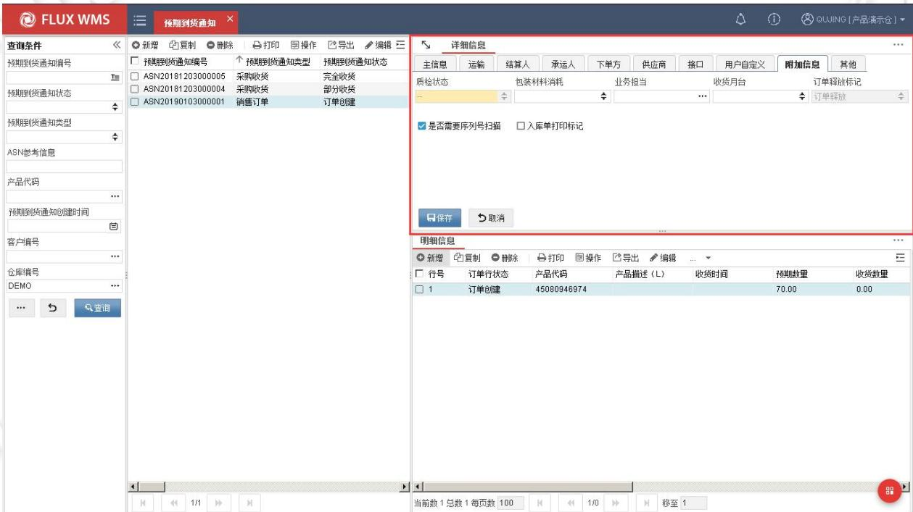

[图9-3-3]

质检状态 - ASN 进行质检操作的相关状态。系统提供 “未创建质检单、质检单创建、部分质检、全部质检、质检取消、质检关闭” 状态项，根据对应质检单操作情况自动更新。新增 ASN 默认为 “未创建质检单” 状态。 

包装材料消耗 - 如为 “是” 则收货时根据包装材料配置，自动扣减对应包材的库存。 

业务担当 - 单据对应的上级业务员。以便异常情况下联系处理。 

收货月台 - 指定的收货作业月台。但此处的设置，并未对月台进行预约占用。 

订单释放标记 - 订单是否被释放。未释放 ASN 不具有收货资格。但可进行查看、编辑、打印等操作。新增单据根据系统参数 ASN_RLS_CTL 获取默认释放设置。 

是否需要序列号扫描 - 此订单是否需要进行序列号采集操作。有时某个客户正常情况下需要进行序列号采集，但临时有特殊单据的货物没有序列号可供扫描。可以通过此字段进行区别维护。 

入库单打印标记 - 是否已打印入库任务清单 

■ 各个页签信息维护完成后，点击【保存】按钮，保存记录信息。 

如果有配置 ASN 表头自定义页签，将显示在其他页签后面。各个页签可通过权限控制显示与否。 

## - 扩展页签

除了 ASN 的单证信息，FLUX WMS 还提供了部分特殊操作信息。例如记录单证费用的特殊费用页签，集装箱信息、汇总信息等不同页签，用户可根据需要选择录入。扩展页签通过界面右上角的按钮打开 

■ 特殊费用 

特殊费用页签，用于记录订单相关的费用、成本，通常是临时性的不固定费用。例如订单的滞纳金、集装箱清洁费等不是每单都会必然产生的费用，需要人工进行维护 

点击特殊费用页签，点击【新增】按钮，依次输入收费日期、收费类型、描述、金额等信息后保存。可连续新增，输入多行费用信息。 

<table><tr><td colspan="101">查询条件</td><td></td></tr><tr><td colspan="100">预期到货通知编号</td><td></td><td></td></tr><tr><td colspan="96">预期到货通知状态</td><td></td><td></td><td></td><td></td><td></td><td></td></tr><tr><td colspan="94">预期到期货通知类型</td><td></td><td></td><td></td><td></td><td></td><td></td><td></td><td></td></tr><tr><td colspan="89">ASN参考信息</td><td></td><td></td><td></td><td></td><td></td><td></td><td></td><td></td><td></td><td></td><td></td><td></td><td></td></tr><tr><td colspan="85">产品代码</td><td></td><td></td><td></td><td></td><td></td><td></td><td></td><td></td><td></td><td></td><td></td><td></td><td></td><td></td><td></td><td></td><td></td></tr><tr><td colspan="82">预期到期货通知创建时间</td><td></td><td></td><td></td><td></td><td></td><td></td><td></td><td></td><td></td><td></td><td></td><td></td><td></td><td></td><td></td><td></td><td></td><td></td><td></td><td></td></tr><tr><td colspan="79">客户编号</td><td></td><td></td><td></td><td></td><td></td><td></td><td></td><td></td><td></td><td></td><td></td><td></td><td></td><td></td><td></td><td></td><td></td><td></td><td></td><td></td><td></td><td></td><td></td></tr><tr><td colspan="75">仓库编号</td><td></td><td></td><td></td><td></td><td></td><td></td><td></td><td></td><td></td><td></td><td></td><td></td><td></td><td></td><td></td><td></td><td></td><td></td><td></td><td></td><td></td><td></td><td></td><td></td><td></td><td></td><td></td></tr><tr><td colspan="71">DEMO</td><td></td><td></td><td></td><td></td><td></td><td></td><td></td><td></td><td></td><td></td><td></td><td></td><td></td><td></td><td></td><td></td><td></td><td></td><td></td><td></td><td></td><td></td><td></td><td></td><td></td><td></td><td></td><td></td><td></td><td></td><td></td></tr><tr><td>...</td><td>查询</td><td>查询</td><td>查询</td><td>查询</td><td>查询</td><td>查询</td><td>查询</td><td>查询</td><td>查询</td><td>查询</td><td>查询</td><td>查询</td><td>查询</td><td>查询</td><td>查询</td><td>查询</td><td>查询</td><td>查询</td><td>查询</td><td>查询</td><td>查询</td><td>查询</td><td>查询</td><td>查询</td><td>查询</td><td>查询</td><td>查询</td><td>查询</td><td>查询</td><td>查询</td><td>查询</td><td>查询</td><td>查询</td><td>查询</td><td>查询</td><td>查询</td><td>查询</td><td>查询</td><td>查询</td><td>查询</td><td>查询</td><td>查询</td><td>查询</td><td>查询</td><td>查询</td><td>查询</td><td>查询</td><td>查询</td><td>查询</td><td>查询</td><td>query</td><td>查询</td><td>查询</td><td>查询</td><td>查询</td><td>查询</td><td>查询</td><td>查询</td><td>查询</td><td>查询</td><td>查询</td><td>查询</td><td>查询</td><td>查询</td><td>查询</td><td>查询</td><td>查询</td><td>查询</td><td>查询</td><td>查询</td><td>查询</td><td>查询</td><td>查询</td><td>查询</td><td>查询</td><td>查询</td><td>查询</td><td>查询</td><td>查询</td><td>查询</td><td>查询</td><td>查询</td><td>查询</td><td>查询</td><td>查询</td><td>查询</td><td>查询</td><td>查询</td><td>查询</td><td>查询</td><td>查询</td><td>查询</td><td>查询</td><td>查询</td><td>查询</td><td>查询</td><td>查询</td><td>查询</td><td>查询</td><td>查询</td><td>查看</td></tr></table>

## [图9-3-4]

ASN 编号 - 系统自动显示 

行号 - 特殊费用行的行号，系统自动生成 

费用日期 - 费用项的对应日期。 

费用描述 - 费用项说明信息。 

费用种类 - 特殊费用对应种类。下拉列表显示系统代码自定义 1 为 'SPECIALCHARGE' 的 CodeID，相当与大类。 

费用类型 - 根据费用种类所选内容，显示对应代码内容，相当与小类。类似自定义 A 自定义 B 的限制关系。 

费用金额 - 非计算模式，录入的此 ASN 相关特殊费用金额。 

成本 - 支付金额。有成本支出的情况下记录。 

结算对象 - 付款人、结算人。仓库收取操作、仓储费用的目标对象。 

付款对象 - 仓库支付劳动力费用、租借费用的收款人。 

应收/应付税率 - 计税情况下的税率依据。 

计费数量 - 费用计算数量依据。基于费率计算情况下，计费数量取【计费数量 1*计费数量 2】，按照级差进行计算。 

计费单位 - 数量单位 

基于费率计算 - 如不勾选，只将特殊费用页签信息记入到费用清单；如勾选，需要根据特殊费用页签记录的费用种类、类型匹配费率中的设置，进行费用计算。 

■ 集装箱 

在集装箱页签，依次输入集装箱箱号、类型、尺寸、铅封号、重量、备注等信息。 

<table><tr><td colspan="2">FLUX WMS</td><td colspan="14">预期到货通知</td></tr><tr><td rowspan="5" colspan="2">查询条件</td><td colspan="14">新增 复制 删除 打印 操作 导出 编辑</td></tr><tr><td colspan="14">预期到货通知编号 预期到货通知类型 预期到货通知状态</td></tr><tr><td colspan="14">ASN20181203000005 采购收货 完全收货</td></tr><tr><td colspan="14">ASN20181203000004 采购收货 部分收货</td></tr><tr><td colspan="14">ASN20190103000001 销售订单 订单创建</td></tr><tr><td colspan="2">产品代码...</td><td colspan="14"></td></tr><tr><td colspan="2">客户编号...</td><td colspan="14"></td></tr><tr><td colspan="2">仓库编号DEMO...</td><td colspan="14"></td></tr><tr><td colspan="2">查询</td><td colspan="14"></td></tr></table>

[图 9-3-5]

可连续新增，输入多个集装箱信息。系统在计算集装箱费用的时候，将依据集装箱页签录入的集装箱类型、尺寸进行费用计算。 

特殊情况下，有些仓库在计费时，如果没有集装箱，按货物体积、计费吨等计算入库费或者卸车费等，但在有集装箱的情况下，只收取集装箱费用，不再收取按体积等计算的入库费。此类替代费用模式，此时就依据集装箱页签是否有信息进行判断。 

## 汇总信息

汇总信息页签，主要用来记录总数、总毛重、总净重、总体积、总价等信息，其中的总数记录，仅作参考，对库存无影响，因此也常用来作为到货、未卸货清点时的初步登记。 

<table><tr><td rowspan="64" colspan="2">查询条件</td><td colspan="12">新增 复制 删除 打印 操作 导出 编辑</td></tr><tr><td>预期到货通知编号</td><td>预期到货通知类型</td><td colspan="10">预期到货通知状态</td></tr><tr><td>ASN20181203000005</td><td>采购收货</td><td colspan="10">完全收货</td></tr><tr><td>ASN20181203000004</td><td>采购收货</td><td colspan="10">部分收货</td></tr><tr><td>ASN20190103000001</td><td>销售订单</td><td colspan="10">订单创建</td></tr><tr><td></td><td></td><td></td><td></td><td></td><td></td><td></td><td></td><td></td><td></td><td></td><td></td></tr><tr><td></td><td></td><td></td><td></td><td></td><td></td><td></td><td></td><td></td><td></td><td></td><td></td></tr><tr><td></td><td></td><td></td><td></td><td></td><td></td><td></td><td></td><td></td><td></td><td></td><td></td></tr><tr><td></td><td></td><td></td><td></td><td></td><td></td><td></td><td></td><td></td><td></td><td></td><td></td></tr><tr><td></td><td></td><td></td><td></td><td></td><td></td><td></td><td></td><td></td><td></td><td></td><td></td></tr><tr><td></td><td></td><td></td><td></td><td></td><td></td><td></td><td></td><td></td><td></td><td></td><td></td></tr><tr><td></td><td></td><td></td><td></td><td></td><td></td><td></td><td></td><td></td><td></td><td></td><td></td></tr><tr><td></td><td></td><td></td><td></td><td></td><td></td><td></td><td></td><td></td><td></td><td></td><td></td></tr><tr><td></td><td></td><td></td><td></td><td></td><td></td><td></td><td></td><td></td><td></td><td></td><td></td></tr><tr><td></td><td></td><td></td><td></td><td></td><td></td><td></td><td></td><td></td><td></td><td></td><td></td></tr><tr><td></td><td></td><td></td><td></td><td></td><td></td><td></td><td></td><td></td><td></td><td></td><td></td></tr><tr><td></td><td></td><td></td><td></td><td></td><td></td><td></td><td></td><td></td><td></td><td></td><td></td></tr><tr><td></td><td></td><td></td><td></td><td></td><td></td><td></td><td></td><td></td><td></td><td></td><td></td></tr><tr><td></td><td></td><td></td><td colspan="9">1/0</td></tr><tr><td></td><td></td><td></td><td></td><td></td><td></td><td></td><td></td><td></td><td></td><td></td><td></td></tr><tr><td></td><td></td><td></td><td></td><td></td><td></td><td></td><td></td><td></td><td></td><td></td><td></td></tr><tr><td></td><td></td><td></td><td></td><td></td><td></td><td></td><td></td><td></td><td></td><td></td><td></td></tr><tr><td></td><td></td><td></td><td></td><td></td><td></td><td></td><td></td><td></td><td></td><td></td><td></td></tr><tr><td></td><td></td><td></td><td></td><td></td><td></td><td></td><td></td><td></td><td></td><td></td><td></td></tr><tr><td></td><td></td><td></td><td></td><td></td><td></td><td></td><td colspan="5">主信息 自定义 其他</td></tr><tr><td></td><td></td><td></td><td></td><td></td><td></td><td></td><td></td><td></td><td></td><td></td><td></td></tr><tr><td></td><td></td><td></td><td></td><td></td><td></td><td></td><td></td><td></td><td></td><td></td><td></td></tr><tr><td></td><td></td><td></td><td></td><td></td><td></td><td></td><td></td><td></td><td></td><td></td><td></td></tr><tr><td></td><td></td><td></td><td></td><td></td><td></td><td></td><td></td><td></td><td></td><td></td><td></td></tr><tr><td></td><td></td><td></td><td></td><td></td><td></td><td></td><td></td><td></td><td></td><td></td><td></td></tr><tr><td></td><td></td><td></td><td></td><td></td><td></td><td></td><td></td><td></td><td></td><td></td><td>99.00</td></tr><tr><td></td><td></td><td></td><td></td><td></td><td></td><td></td><td></td><td></td><td></td><td></td><td></td></tr><tr><td></td><td></td><td></td><td></td><td></td><td></td><td></td><td></td><td></td><td></td><td></td><td></td></tr><tr><td></td><td></td><td></td><td></td><td></td><td></td><td></td><td></td><td></td><td></td><td></td><td></td></tr><tr><td></td><td></td><td></td><td></td><td></td><td></td><td></td><td></td><td></td><td></td><td></td><td></td></tr><tr><td></td><td></td><td></td><td></td><td></td><td></td><td></td><td></td><td></td><td></td><td></td><td></td></tr><tr><td></td><td></td><td></td><td></td><td></td><td></td><td></td><td></td><td></td><td></td><td></td><td></td></tr><tr><td rowspan="27" colspan="13">仓库编号 DEMO 查询</td></tr><tr></tr><tr></tr><tr></tr><tr></tr><tr></tr><tr></tr><tr></tr><tr></tr><tr></tr><tr></tr><tr></tr><tr></tr><tr></tr><tr><td colspan="9">订单创建 45080946974</td></tr><tr><td colspan="9">订单创建 45080946974</td></tr><tr><td colspan="9">订单创建 45080946974</td></tr><tr><td colspan="9">订单创建 45080946974</td></tr><tr><td colspan="9">订单创新 45080946974</td></tr><tr><td colspan="9">订单创新 45080946974</td></tr><tr><td colspan="9">订单创新 45080946974</td></tr><tr><td colspan="9">订单创新 450809466974</td></tr><tr><td colspan="9">订单创新 450809466974</td></tr><tr><td colspan="9">订单创新 450809466974</td></tr><tr><td colspan="3">订单创新 450809466974</td><td>收货时间</td><td>预期数量</td><td colspan="4">收货数量</td></tr><tr><td colspan="3">订单创新 450809466974</td><td>70.00</td><td colspan="5">0.00</td></tr><tr><td colspan="3">订单创新 450809466974</td><td colspan="6">移至 1</td></tr></table>

[图9-3-6]

## ■ 附件

附件页签，常用来记录收货时的随附单据、现场照片等文件。根据需要上传文档，或下载已有文档查看。 

在附件页签，点击【上次】按钮，系统显示如下文件选择对话框，通过【+】按钮，选择文件，再点击【上传】按钮，完成附件上传。 

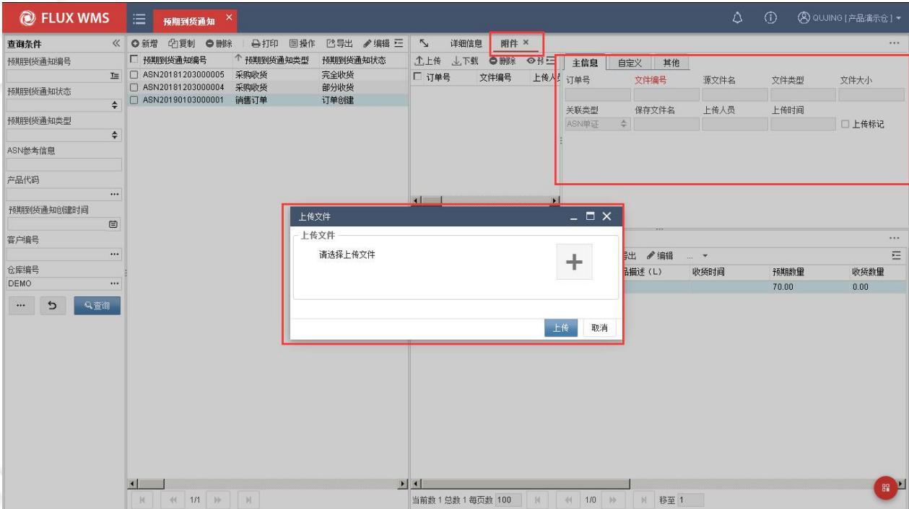

[图9-3-7]

上传成功，系统自动添加附件信息记录：

<table><tr><td colspan="2">FLUX WMS</td><td colspan="12">预期到货通知</td></tr><tr><td colspan="2">查询条件</td><td colspan="12">新增 复制 删除 打印 操作 导出 编辑</td></tr><tr><td colspan="2">预期到货通知编号</td><td colspan="12"></td></tr><tr><td colspan="2">预期到货通知状态</td><td colspan="12">ASN20181203000005 采购收货 完全收货ASN20181203000004 采购收货 部分收货ASN20190103000001 销售订单 订单创建</td></tr><tr><td colspan="2">预期到货通知类型</td><td colspan="12"></td></tr><tr><td colspan="2">ASN参考信息</td><td colspan="12"></td></tr><tr><td colspan="2">产品代码</td><td colspan="12"></td></tr><tr><td colspan="2">预期到货通知创建时间</td><td colspan="12"></td></tr><tr><td colspan="2">客户编号</td><td colspan="12"></td></tr><tr><td colspan="2">仓库编号</td><td colspan="12"></td></tr><tr><td colspan="2">DEMO</td><td colspan="12"></td></tr><tr><td colspan="2">查询</td><td colspan="12"></td></tr></table>

[图 9-3-8]

对于已有附件，可以通过【下载】按钮下载查看。 

## - 订单行明细

## ■ ASN 明细部分，点击【新增】按钮，在主信息页签依次输入信息：

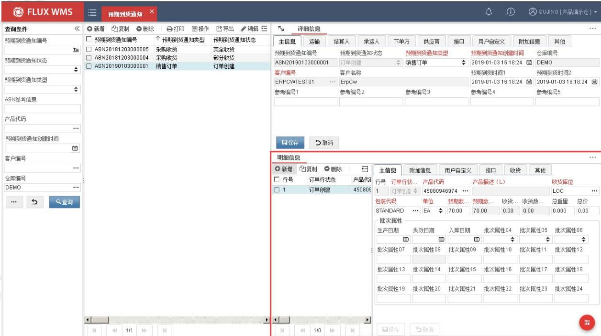

[图9-3-9]

行号 - 系统自动生成的 ASN 行号。 

订单行状态 - 该行的当前状态，由系统自动更新。新建时，默认为订单创建。 

产品代码 - 待收货的 SKU ID。可人工录入或者通过浏览按钮选择。产品必须是已经在产品档案功能中维护过的、表头所选货主名下的产品。 

产品描述 - 接收产品的名称。当输入产品代码时，系统自动给出产品档案中该产品的描述，并且不能修改。 

收货库位 - 预计接收产品的库位。系统自动给出默认的收货过渡库位（STAGE，多仓情况下默认为对应仓库的首个过渡库位，也可在系统参数中配置不同仓库、单据类型的默认收货库位），客户可根据实际情况进行修改。收货库位的选择会对后续操作有所影响。在启用系统指导上架的情况下，收货到过渡类型的库位，系统会计算上架库位。如果直接收货到存储类型的库位，系统认可为最终存储位置，不再生成上架任务。 

包装代码 - 该产品对应的包装代码。系统自动给出该产品在产品档案中所维护的包装代码，客户也可根据情况在订单明细中选择其他的包装代码，但所选的包装仅在此单入库操作中有效。即系统支持入库采用不同标准包装的情况，并可将入库包装信息跟踪到库存中，便于后续的出库操作（需要启用产品档案中的“复制包装到批次属性12”选项）。 

单位 - 收货时所用的数量单位。系统自动给出该产品在产品档案中所选择的缺省收货单 

位，客户也可根据情况选择其他的收货单位。 

预期数量 - 预计接收产品的数量。在订单数量中有 2 个字段，前一个字段是可输入的，以所选择的单位为数量单位；后一个字段是以所选择的包装代码的最小单位（主单位）为数量单位的，并且是系统自动换算给出，不能人工修改。录入数量后，再修改单位级别，预期数量会随之变更，主单位数量不变（例如件改为箱，原本的 100，100 数量显示根据 10 件/箱变更为 10,100 显示） 

收货数量 - 系统已经完成收货的产品数量。同样有选择单位数量和主单位数量两个字段。 

总重量 - 待收货产品的行总毛重。 

总价 - 待收货产品的行总价格。 

批次属性信息 - 入库时需要记录的产品所具有的批次属性。每种产品可设置不同的批次属性项目，由基础信息中的批次属性设置控制，其中必输字段红色显示。 

需要注意的是，入库日期批次属性，不是人工输入的，而是收货时自动记录。如需修改（补录之前的收货确认），需要修改收货页签的收货时间，而不是直接修改批次属性3的入库日期内容。 

■ 点击【保存】按钮，创建 ASN 明细信息。 

■ 可以根据作业需要，在“附加信息”页签进一步录入作业相关信息： 

<table><tr><td colspan="14">FLUX WMS</td></tr><tr><td colspan="14">查询条件</td></tr><tr><td colspan="14">预期到货通知编号</td></tr><tr><td colspan="14">预期到货通知状态</td></tr><tr><td colspan="14">预期到货通知类型</td></tr><tr><td colspan="14">ASN参考信息</td></tr><tr><td colspan="14">产品代码</td></tr><tr><td colspan="14">客户编号</td></tr><tr><td colspan="14">仓库编号</td></tr><tr><td colspan="14">DEMO</td></tr><tr><td colspan="14">查询</td></tr></table>

[图9-3-10]

超量收货百分比 - 精细化超额收货管控使用，每行 ASN 可以有不同超额收货比例。常见与 ERP 根据采购订单下达，不同采购订单超额比例不同。 

破损数量 - 针对可以收货的产品，部分外包装破损需要记录，能够用于收货情况统计或者供应商送货情况统计。但此类破损不影响产品出库，不影响货物的状态（例如良品/非良品）也不需要在库存中跟踪，仅在入库报表中体现的情况，因此另行记录本订单行产品的破损数量。 

拒收数量 - 产品到达仓库，但由于破损等原因，不可收货（或者部分拒收），拒收数量不计入库存。为了方便进行供应商管理，或提供报表统计，需要记录曾经到货但未收货的拒收数量。 

拒收原因代码 - 货物拒收原因代码选择。下拉列表显示系统代码 RSN_COD 中 UDF1=CM 或者 ASN 的记录。类似冻结原因、描述，选择原因分类，输入具体说明。 

拒收原因描述 - 货物拒收原因描述。可录入描述信息。 

采购订单编号 - 预计接收到的产品对应的采购订单编号。当通过采购订单编号生成 ASN 时，系统自动提供该采购订单编号。 

采购订单行号 - 预计接收到的产品对应的采购订单行号。当通过采购订单编号生成 ASN 时，系统自动提供该行号。 

订单行类型 - 特殊情况下，同一 ASN 下的订单行还要进行细化分类，以便用于一些作业细节处理，如判断发票金额、打印控制、独立装箱控制、二包控制等。因此系统提供行级别的类型区分字段 

冻结原因代码 - 产品的冻结原因选择。当进行仓库活动时，对产品有指定的要求时，可选择相应的冻结原因。系统提供正常、产品损坏、过期产品、质检→上架、上架→质检、质检/按库位上架6种选择。正常为默认值，表示产品不被冻结，按正常流程运作。如果产品档案中设置为非正常值，系统可以执行入库即冻结的收货处理。 

冻结原因描述 - 冻结原因对应描述，可由用户修改。 

根据需要，可以在用户自定义页签补充附加信息。接口页签则存放接口下达的附加信息。 

■ 另有部分字段，较为常用，但系统初始化界面默认隐藏。现场通常根据业务需要，进行方案配置显示（具体配置请参考 4.13 界面方案管理章节的说明）： 

产品别名代码 - 启用别名功能时，直接在此字段录入产品别名，系统将根据产品档案中维护的别名信息，显示别名对应的 SKU 的相应信息。 

质检状态 - 同表头质检状态字段，显示此行对应的质检行的作业状态。 

■ 其余同收货相关的页签，如收货、服务页签等，将在收货操作中详细介绍。 

## - 其他创建方式

除了手动逐单输入创建 ASN 之外，比较常见的 ASN 创建方式通常有： 

## ■ 接口获取

通过 EDI 接口，由上游系统下达 ASN（或者 PO）信息，用户可以直接在 FLUX WMS 中查看到已经创建成功的待操作单据。 

EDI接口的配置，不在本文档介绍范围内，如有需要，请向系统管理员或者FLUX顾问咨询获取进一步的文档支持。 

## ■ 文档导入

很多情况下，如果没有接口，客户或供应商会通过 Email 提供给仓库到货明细信息。 

文档导入生成单据是 FLUX WMS 的标准功能，具体操作可参考第三章 FLUX WMS 概述中，3.5.3 通用功能按钮的扩展功能-导入对应说明。 

## ■ PO 导入

除了手动录入创建、接口获取、人工导入之外，ASN 同样可以通过一个已经存在的采购订单(PO)来创建。 

由于货主向供应商下达采购订单后，供应商有时会根据生产情况分批送货到仓库。因此收货所用的 ASN 单据需要从采购订单（PO）提取信息。收货后信息也需要更新、汇总到采购订单，同时也避免了多次重复录入。 

操作步骤为: 

选择 “入库操作” 模块下的 “预期到货通知” 功能。 

在订单头的明细页面，点击【新增】按钮。依次输入信息创建并保存 ASN。 

在如图鼠标右键的“导入导出”二级子菜单中，选择“提取PO数据”功能。 

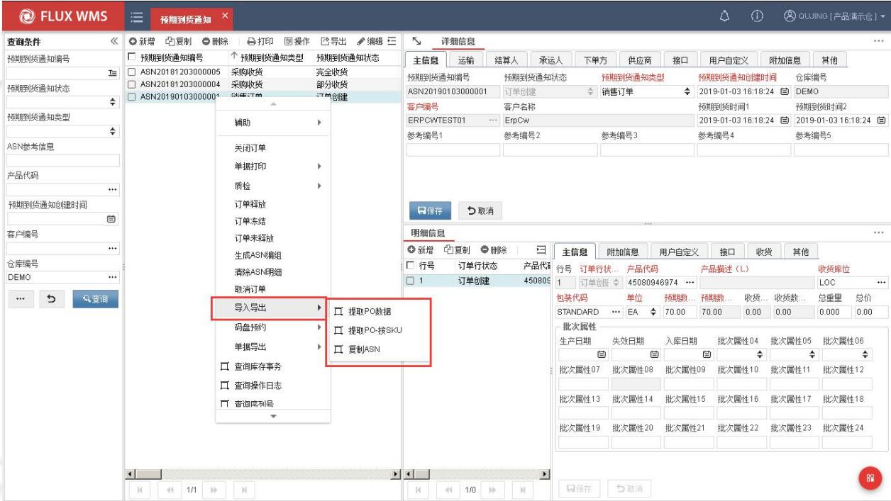

[图9-3-11]

## 系统跳转到采购订单查询页面，可通过输入查询条件来查找所需 PO。

采购订单号 - 所要提取的采购订单编号。 

PO 状态从、到 - 所要提取的采购订单的状态，系统提供创建订单、完全释放、部分收货、完全收货、取消订单、订单完成等选择。 

采购订单类型 - 所要提取的采购订单的类型，系统默认提供普通、退货 2 种选择。 

参考信息 - 所要提取的采购订单的附加信息。 

产品 - 所要提取的产品代码。 

产品描述 - 所要提取的产品的中文描述。 

创建时间从、到 - 所要提取的采购订单的时间段。 

在查询所得的订单列表中，选择所需采购订单。 

在该 PO 订单明细部分，选择需要创建为 ASN 的订单行。通过 PO 明细部分，鼠标右键菜单的功能项可全选订单行记录，或反选。 

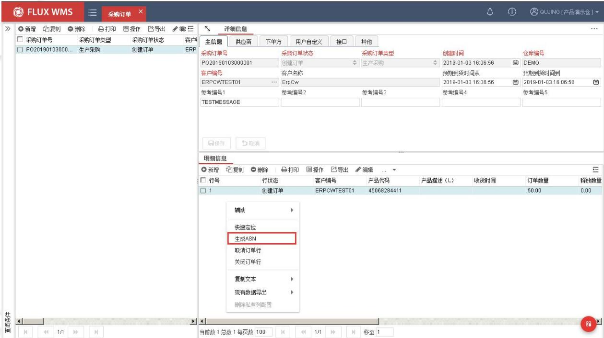

[图9-3-12]

在如上图的鼠标右键功能菜单中，选择“生成 ASN”功能，系统根据所选 PO 明细，二级窗口显示所选记录对应信息，默认本次释放数量=订单数量-已释放数量，确认后生成 ASN 明细信息。用户可根据需要在 ASN 中进一步修改。 

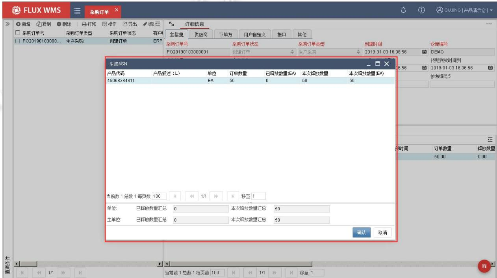

[图9-3-13]

一个 ASN 可从多个 PO 提取信息，一个 PO 也可关联多个 ASN。 

## ■ 按 SKU 导入

在不严格匹配单据的业务情况下，也可以按 SKU 选择 PO，从而提取 PO 信息。在 ASN 表头鼠标右键菜单导入导出子菜单中，选择功能【提取 PO 信息-按 SKU】后，在如下二级窗口中，输入代码，系统显示此 SKU 相关的 PO 数据。 

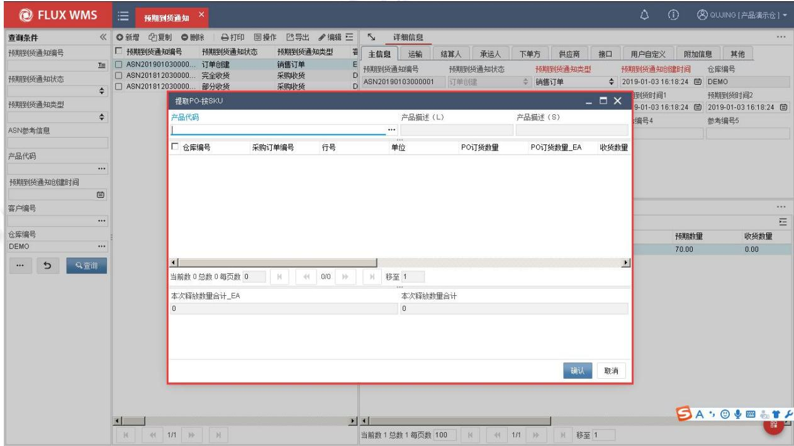

[图9-3-14]

选择对应的 PO 明细行，确认本次释放数量（即生成 ASN 明细行的期望数量。根据是否允许超量收货的配置，系统将在超量情况下进行提示），【确认】后，生成对应的 ASN 明细行。 

注：货主档案，附加信息页签，如果勾选【ASN 是否与 PO 关联】，当对 ASN 进行更新时，如收货确认，PO 会也会同时进行更新。 

## 9.3.2. 表头右键功能

## - 订单取消、关闭

订单创建后，如果在没有进行收货的情况下不再使用该订单，可以使用表头的【删除】按钮直接删除订单，或者使用鼠标右键菜单中的订单取消功能，取消订单。 

订单取消后，将不能针对订单进行任何操作，但仍然可以查询到该订单（查询条件需要选择“显 示关闭/取消 ASN”），有利于用户统计、查询。特别是对于接口下达的订单，用户通常无删除权限，而是通过取消操作来标记订单。 

取消过程中，如果 ASN 有关联 PO，则会对应更新 PO 信息，增加 PO 中的未释放数量。 

订单关闭，同样结束订单操作，不能再对订单进行任何修改，与取消不同的是，关闭针对使用中的订单，并不限定只能是创建状态订单，并且如果使用系统计费功能，将在订单关闭同时计算收货费用。 

## - 复制 ASN

位于鼠标右键功能菜单的“导入导出”子菜单中。 

根据所选 ASN，复制生成新的 ASN，与原样本 ASN 相比，仅单号、创建时间不同，且复制生成的新 ASN 为创建状态。 

## - 质检子菜单

质量检验是入库流程中的一个可选功能，可以在收货前执行，也支持收货后进行操作。通过参数配置是否必须操作质检，并在收货、上架功能中校验是否质检已操作。 

在 ASN 鼠标右键的质检子菜单中，包括如下 2 个功能： 

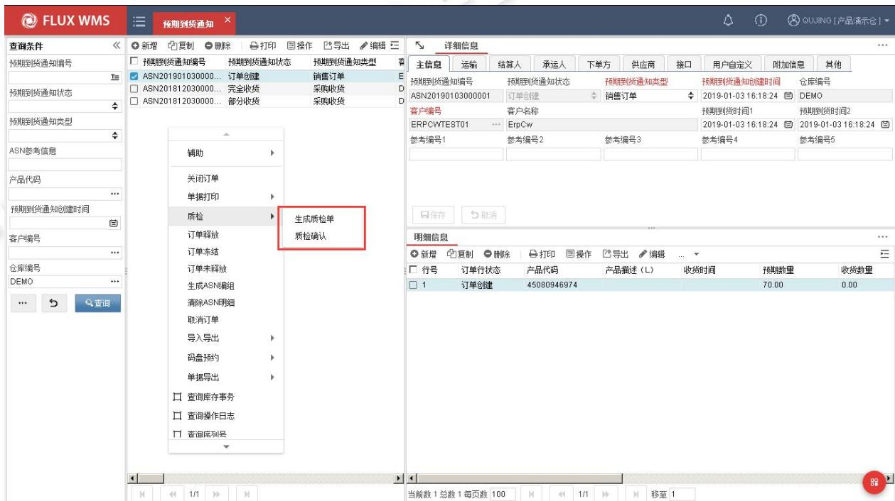

[图 9-3-15]

■ 生成质检单： 

根据 ASN，产品对应质检规则，计算应检数量，创建质检单据。后续需要在质量检验功能中进行质检记录操作。 

## ■ 质检确认：

快捷确认质检操作完成。仅标记此单质检已进行，但不生成质检单据，不记录质检作业的详细信息。 

## - 查询相关

## ■ 查询库存事务：

系统根据当前订单主要信息，如订单号、类型、客户，显示库存事务查询页面，便于用户查找订单相关操作历史信息，包括取消的操作记录。（库存事务功能介绍，参见库存管理部分）。 

在 ASN 明细部分，点击收货交易页签，能够查看到订单的收货记录，但不显示取消的操作记录。 

## ■ 查询操作日志

用于查询订单相关的打印、关闭等操作的日志记录。点击后弹出二级窗口显示。默认情况下不开启系统操作记录，查询为空。 

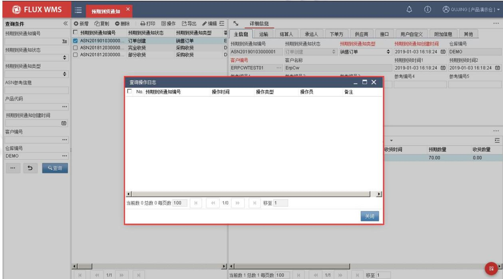

[图9-3-16]

## ■ 查询序列号

点击后跳转到“入库序列号查询”功能，并带入当前 ASN 编号，触发对应查询。 

## - 订单控制

■ 订单释放： 

将所选订单的表头释放状态，更新为“订单释放”。释放后的订单可收货确认。订单释放状态，通常用来做入库审核，未通过审核的订单，不可入库。 

## ■ 订单冻结：

将所选订单的表头释放状态，更新为“订单冻结”。冻结后不可收货。 

■ 订单未释放： 

将所选订单的表头释放状态，更新为“订单未释放”。未释放订单不可收货，非创建状态订单，如已经部分收货的 ASN，不可更新为“未释放”。 

冻结与未释放都是不可收货，通常未释放是尚未审核，冻结是审核有问题的 ASN。 

## - 标记收货完成：

通常 ASN 收货、上架完成后，可以设置为系统自动关闭订单。但对于部分收货的 ASN，系统无法区分此单不再收货，还是收货未完成正在进行，无法自动关闭。通过标记收货完成功能，对于部分收货的订单，系统可判断为不再收货，已有上架任务完成后可自动关闭 ASN。 

## - 生成 ASN 编组:

选择多张 ASN，生成 ASN 编组单据。类似出库时多张单据生成波次计划。 

## - 汇总信息：

当前列表中的订单总数和当前订单的总收货数量等汇总信息查看。 

## - 清除 ASN 明细:

删除当前 ASN 的全部明细信息，仅对创建状态 ASN 生效。 

## 9.3.3. 明细右键功能

明细行部分，右键菜单功能主要有： 

## - 取消订单行

系统支持逐行或批量对订单行进行“订单行取消”操作，点击后系统自动进行二次确认是否取消。点击“是”执行取消操作；“否”放弃本次操作； 

## - 收货方式选择

系统提供的多种不同的 PC 端收货方式，如扫描收货、快捷收货等。具体每种收货操作，请参考后续的对应收货操作说明章节的详细介绍。 

## - 码盘相关功能

码盘、取消码盘功能的具体操作，将在9.4码盘预约章节详细介绍。 

## - 快速定位

ASN 明细较多情况下，人工查找记录效率不高。通过快速定位功能，方便查找对应记录。 

点击后，系统弹出如下对话框，根据需要可以选择“定位”（跳转到符合条件的首行记录），或者“过滤筛选”（显示符合条件的明细行，其余明细行隐藏）模式。输入产品代码，或者PO单号、PO行号作为定位/过滤条件。 

系统支持模糊查询，如果符合输入条件的 SKU 有多个，则在对话窗口下半部分列表显示，供用户选择，按所选 SKU 执行定位/过滤。 

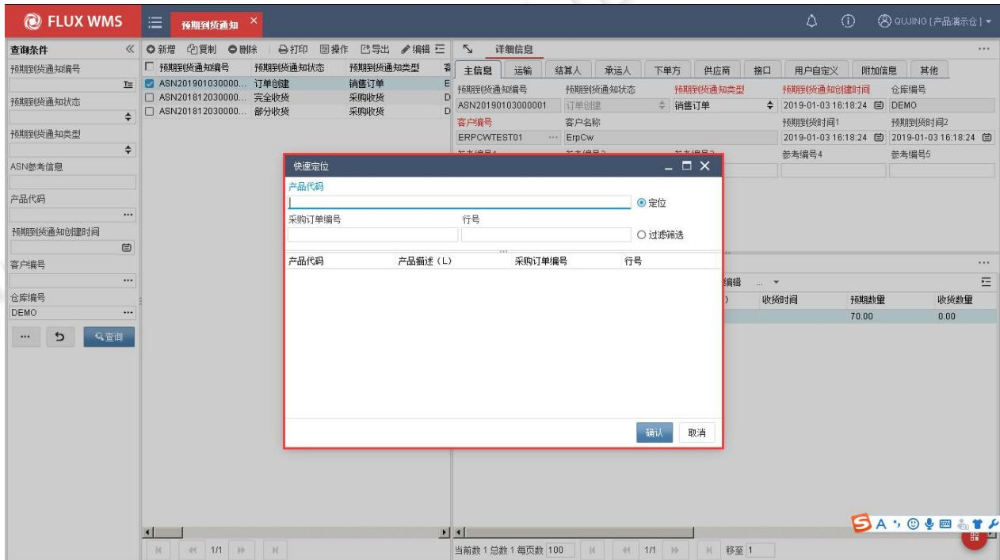

[图9-3-17]

## - 指定产品供应商：

要求产品绑定供应商的情况下（SKU_SUP_LNK=Y）显示此功能，选择后弹出产品供应商选择 

## 窗口，内容为产品档案已维护的对应供应商。

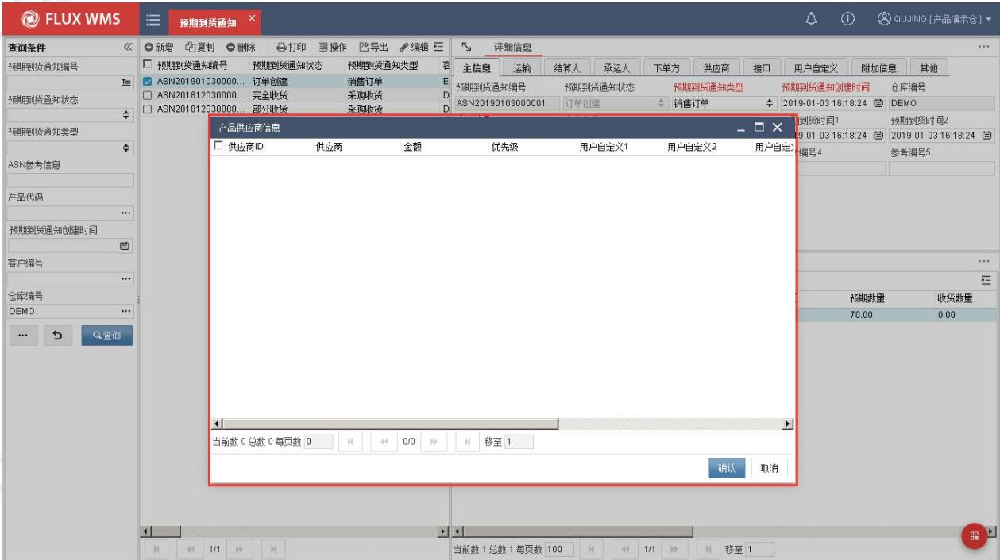

[图9-3-18]

选择供应商，系统将信息带入到 ASN 明细的批次属性 5 中。

## - 生成质检单：

类似表头的生成质检单功能，但只将所选 ASN 明细生成质检明细行，未选择记录不生成质检单。 

## - 包装材料：

从 ASN 明细右键菜单功能，可触发二级窗口弹出，查看或维护产品包装材料信息。支持新增多行记录，维护包材、填充物等内容。配合包装材料库存管理应用。 

<table><tr><td colspan="101">包装材料</td></tr><tr><td colspan="100">单位</td><td rowspan="2"></td></tr><tr><td colspan="100">EA</td></tr><tr><td colspan="97">包装材料</td><td></td><td></td><td></td><td></td></tr><tr><td colspan="95">包装材料</td><td></td><td></td><td></td><td></td><td></td><td></td></tr><tr><td>包装材料</td><td>数量</td><td>包装材料描述</td><td></td><td></td><td></td><td></td><td></td><td></td><td></td><td></td><td></td><td></td><td></td><td></td><td></td><td></td><td></td><td></td><td></td><td></td><td></td><td></td><td></td><td></td><td></td><td></td><td></td><td></td><td></td><td></td><td></td><td></td><td></td><td></td><td></td><td></td><td></td><td></td><td></td><td></td><td></td><td></td><td></td><td></td><td></td><td></td><td></td><td></td><td></td><td></td><td></td><td></td><td></td><td></td><td></td><td></td><td></td><td></td><td></td><td></td><td></td><td></td><td></td><td></td><td></td><td></td><td></td><td></td><td></td><td></td><td></td><td></td><td></td><td></td><td></td><td></td><td></td><td></td><td></td><td></td><td></td><td></td><td></td><td></td><td></td><td></td><td></td><td></td><td></td><td></td><td></td><td></td><td></td><td></td><td></td><td></td><td></td><td></td><td></td><td></td></tr><tr><td>包装材料</td><td>数量</td><td>新增</td><td>删除</td><td>保存</td><td>取消</td><td></td><td></td><td></td><td></td><td></td><td></td><td></td><td></td><td></td><td></td><td></td><td></td><td></td><td></td><td></td><td></td><td></td><td></td><td></td><td></td><td></td><td></td><td></td><td></td><td></td><td></td><td></td><td></td><td></td><td></td><td></td><td></td><td></td><td></td><td></td><td></td><td></td><td></td><td></td><td></td><td></td><td></td><td></td><td></td><td></td><td></td><td></td><td></td><td></td><td></td><td></td><td></td><td></td><td></td><td></td><td></td><td></td><td></td><td></td><td></td><td></td><td></td><td></td><td></td><td></td><td></td><td></td><td></td><td></td><td></td><td></td><td></td><td></td><td></td><td></td><td></td><td></td><td></td><td></td><td></td><td></td><td></td><td></td><td></td><td></td><td></td><td></td><td></td><td></td><td></td><td></td><td></td><td></td><td></td><td></td></tr></table>

[图9-3-19]

## ● 产品配件管理：

多部件产品，退货流程常用功能。入库时根据产品档案维护的配件信息，检查配件是否齐全，以便对产品等级、是否可再销售进行判断。 

点击右键菜单项，二级窗口显示产品对应配件信息，用户可通过选择配件状态、输入说明信息等，对产品配件信息到货情况进行说明。 

<table><tr><td colspan="14">产品配件管理</td></tr><tr><td>配件</td><td>中文名称</td><td>英文名称</td><td>配件状态</td><td>数量</td><td>说明</td><td></td><td></td><td></td><td></td><td></td><td></td><td></td><td></td></tr><tr><td colspan="14">配件状态</td></tr><tr><td colspan="14">数量</td></tr><tr><td colspan="14">说明</td></tr></table>

[图9-3-20]

配件情况对产品到货数量、库存等级无直接影响，仍旧需要人工确认数量、等级。 

## - 其他右键功能

明细行部分还有复制等功能，与收货操作相关，在9.5.8的其他收货处理章节进行介绍 

## 9.3.4. 单据输出

## - 单据打印

在纸面单证操作情况下，预期到货单证创建完成后，用户可打印入库任务清单作为收货时所使用的依据单证（如使用 RF 执行收货操作，是否打印清单，或者打印入库任务标签，由操作流程确定，可参考 RF 操作手册说明）。 

用户选择所需操作的 ASN，在表头的 ASN 编号列表窗口，点击鼠标右键菜单选择“单据打印”二级子菜单中的“打印入库任务清单”功能，系统将显示单证打印预览窗口，由用户确认单据打印。 

如果订单经过码盘，可选择“打印码盘任务清单”，打印码盘后的收货任务清单列表。 

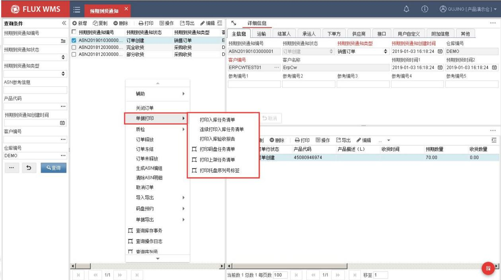

[图9-3-21]

## - 单据导出

系统还支持把单据信息导出保存为文件，常用于提供验收报告给货主。 

在 ASN 表头右键菜单中，可见 “单据导出” 子菜单，选择某个单据（例如入库任务清单），系统显示如下图的导出配置对话框。根据需要勾选后，确认导出 

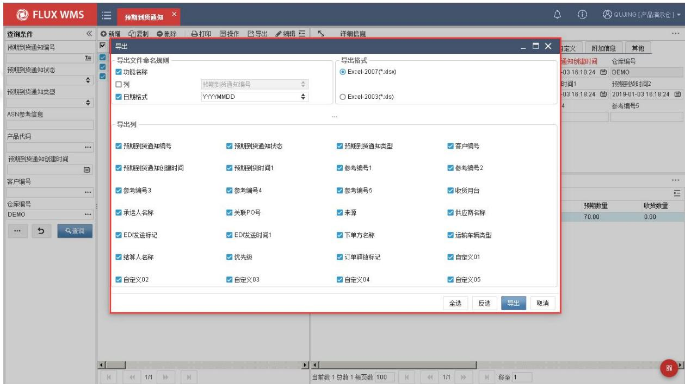

[图9-3-22] 

## 9.4. 码盘预约

## 9.4.1. 码盘操作

在操作少品种、大批量货物的收货时，为了便于产品的收货作业，以及后续的上架、库存管理和出库操作，通常会对货物作标准化托盘堆码处理，这一处理通常被称为码盘。为了指导实物的码盘，并做到标准化管理，在系统中，同样需要对已经创建的 ASN 进行码盘，即根据包装代码中收货标签的单位，把产品按数量级别进行拆分并做标准托盘化处理，方便粘贴标签和上架等其他操作。同时，码盘后，可以用托盘为单位进行后续操作，方便对货物进行跟踪。 

码盘环节是入库流程中的可选操作，用户可根据实际操作需要选择是否执行码盘操作。如果系统参数 PLT_RCV 开启，则对应类型单据必须进行码盘收货。 

## - 对ASN进行码盘

■ 查找并选择所要操作的 ASN。 

在表头明细部分的列表导航窗口，针对所选 ASN，点击鼠标右键菜单，选择“码盘预约”子菜单中的“码盘”功能（取消码盘、预约等功能只有在订单码盘后才可使用，因此在没有码盘的情况下显示为灰色）。 

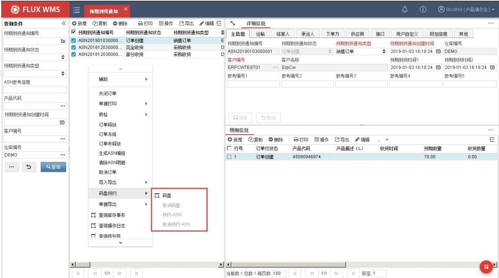

## [图9-4-1]

■ 系统按照产品所选包装中的相关选项，自动完成码盘操作。可在明细部分的“码盘”页签中查看码盘记录。未码盘情况下，“码盘”页签不显示。 

<table><tr><td>主信息</td><td>自定义</td><td>收货</td></tr><tr><td>行号</td><td>订单行状态</td><td>产品代码</td></tr><tr><td>1</td><td>已码盘</td><td>45080946974</td></tr><tr><td>包装代码</td><td>单位</td><td>预期数量</td></tr><tr><td>STANDARD</td><td>OT</td><td>1.00</td></tr><tr><td colspan="3">批次属性</td></tr><tr><td>生产日期</td><td>失效日期</td><td>入库日期</td></tr><tr><td>批次属性05</td><td>批次属性06</td><td>批次属性07</td></tr><tr><td>批次属性09</td><td>批次属性10</td><td>批次属性11</td></tr><tr><td>批次属性13</td><td>批次属性14</td><td>批次属性15</td></tr><tr><td>批次属性17</td><td>批次属性18</td><td>批次属性19</td></tr><tr><td>批次属性21</td><td>批次属性22</td><td>批次属性23</td></tr></table>

[图9-4-2]

■ 码盘操作，还可以通过 ASN 明细行的右键菜单码盘功能进行操作。通常用于对单行 SKU 重新码盘的情况。 

码盘操作时，若订单明细必输批次属性未录入，则提示“必输批次属性 XX、XX 为空，是否继续码盘？”。 

☆ 是：继续收码盘； 

✿ 否：放弃本次码盘操作，人工自行补充批次属性信息； 

## - 取消码盘

码盘后如遇各种情况需要取消码盘或重新码盘（例如产品包装层级维护错误，需要重新选择），系统也提供了便捷的操作方式：选中所要取消码盘的 ASN 编号，在表头的鼠标右键菜单码盘预约二级子菜单中选择“取消码盘”，系统将取消原有的码盘操作，恢复到创建状态。 

取消码盘同样可以通过订单行的右键单行取消，重新码盘。 

## 9.4.2. 预约操作

## - 预约库位

除了码盘操作，FLUX WMS 还提供了预约库位的功能。此功能主要用于收货、上架同时完成的操作情况，货物尚未入库，系统预先根据上架规则计算并预留货物的存储库位，收货清点后即可按照预约的库位进行上架操作，可以一边收货一边上架，适用于理货区容积不足的仓库操作。 

预约需要在码盘作业后进行，这样系统可以根据每个托盘分别计算库位。否则一整批未分割的货物很难找到一个合适的库位进行存放。 

一旦进行过库位预约，在上架功能中将不再对上架库位进行重新计算，而是直接提取预约的库位，但可根据实际上架情况进行修改（关于上架的详细内容请参看入库操作的上架部分）。 

预约库位也可用于检验上架规则及相关设置是否正确。 

预约库位具体操作如下： 

在 ASN 表头明细部分的列表窗口, 选中已经完成码盘、需要进行库位预约的 ASN。 

■ 鼠标右击，选择鼠标右键菜单码盘预约子菜单的“预约-ASN”功能。 

■ 系统将按照上架规则的设置，自动查找并计算上架目标库位，记录到码盘明细的计划库位字段。 

FLUX WMS 同样提供了便捷的取消预约的功能，操作同预约库位，在鼠标右键码盘预约二级子菜单中选择“取消预约-ASN”，可取消预约记录，重新预约。 

注：预约库位可以针对订单明细执行。在 ASN 明细行部分，选择码盘明细页面，可选择鼠标右键菜单中的按 ASN 订单行，或者按跟踪号进行库位预约操作。取消预约同样可根据 ASN 订单行或者跟踪号单独取消预约操作，如下图所示。但明细行的明细页签鼠标右键菜单无预约功能显示，而是提供的按行码盘功能。不同页签，右键内容有所不同。 

<table><tr><td>主信息</td><td>运输</td><td>结算人</td><td>承运人</td><td>下单方</td><td>供应商</td><td>接口</td><td>用户自定义</td><td>附加信息</td><td>其他</td></tr><tr><td>预期到货通知编号</td><td>预期到货通知状态</td><td colspan="2">预期到货通知状态</td><td colspan="3">预期到货通知类型</td><td colspan="2">预期到货通知创建时间</td><td>仓库编号</td></tr><tr><td>ASN20190103000001</td><td>已码盘</td><td colspan="2">已码盘</td><td colspan="3">销售订单</td><td colspan="2">2019-01-03 16:18:24</td><td>DEMO</td></tr><tr><td>客户编号</td><td colspan="6">客户名称</td><td colspan="2">预期到货时间1</td><td>2019-01-03 16:18:24</td></tr><tr><td>ERP CWTEST01</td><td colspan="6">ErpCw</td><td colspan="2">2019-01-03 16:18:24</td><td>参考编号1</td></tr><tr><td>参考编号1</td><td colspan="5">参考编号2</td><td>参考编号3</td><td colspan="2">参考编号4</td><td>参考编号5</td></tr><tr><td></td><td colspan="5"></td><td></td><td colspan="2"></td><td></td></tr></table>

[图 9-4-3]

如果取消预约后，修改上架相关设置，再次预约时将按照新的设置执行库位预约。 

## 9.5. 收货操作

工作人员完成货物清点后，需要在系统中执行收货操作，确认货物入库。收货同样可通过 WMS 界面、RF 扫描确认、电子标签等不同方式执行，此章节主要介绍 FLUX WMS 系统界面操作，RF 收货操作在 RF 操作手册中集中介绍。 

收货后，系统内库存将增加，ASN、PO 对应信息相应更新，并生成对应的收货事务记录。如果有配置要求收货时进行上架计算，则系统生成相应的上架任务。 

FLUX WMS 的收货操作，可支持多种不同的收货作业情况，例如： 

全部收货 

■ 部分收货/多次收货 

码盘收货 

■ 扫描收货 

■ 快捷收货 

■ 可视化收货 

## 9.5.1. 按 ASN 收货

通常用于一次性确认货物到货、数量无误的情况。 

■ 选择 “入库操作” 下的 “预期到货通知”。 

在订单头的列表页面中查找所要收货的 ASN 记录（或者通过指定条件查询到 ASN），点击订单明细行部分的明细页面。 

在 ASN 明细列表窗口，点击选择需要执行收货确认的订单行。可连续选中多个产品行，或者使用鼠标右键菜单的“全选”功能项，一次性确认选择全部订单行。 

■ 如果实收数量与订单期望数量相符，可以明细行部分，直接点击鼠标右键菜单，确认收货（如下图菜单显示）。 

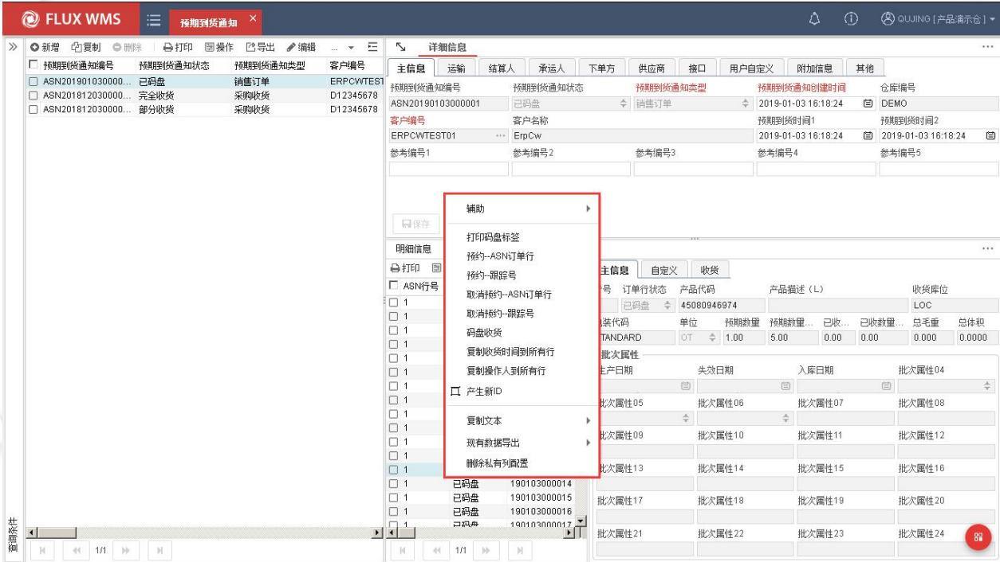

[图 9-5-1]

■ 系统执行收货操作，库存数量增加。 

■ 产品首次入库时，系统会弹出提示 

■ 序列号模式开启情况下，不允许直接确认收货，以免遗漏序列号采集 

■ 订单未释放情况下，不允许进行收货操作。 

## 9.5.2. 部分收货

如果一份预期到货单据中的库存要分多次或多车送抵，收货也经常需要分多次收货，每次只确认一部分货物入库。此外，如果实到货物数量少于订单数量，同样需要做部分到货确认。 

■ 如果实际收货情况与系统预期记录不符，可在 ASN 明细行的收货页签按实际情况修改，依次输入如下信息： 

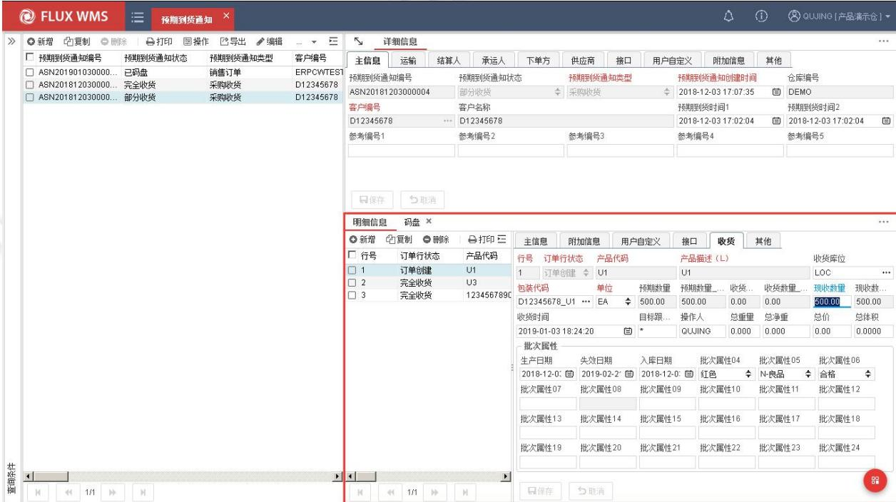

[图 9-5-2]

行号 - 所选记录的 ASN 行号。 

订单行状态 - 该行的状态。系统自动提供，根据操作情况显示。 

产品代码 - 产品 ID。 

产品描述 - 产品名称 

收货库位 - 实际接收产品的库位。系统自动给出默认的收货过渡库位，客户可根据自身情况进行修改，并可通过快捷查找按钮选择库位。例如将收货库位修改为最终存储库位，可实现直接收货到库位的操作，就不需要另外执行上架确认。 

包装代码 - 该产品收货时所用的包装 ID。系统自动给出该产品在产品档案中所输入的包装代码，收货时可以根据产品实际到货所用的包装，通过快速查找按钮临时变更收货包装代码。但此处的包装修改，仅对这一行产品收货生效，且所选代码需要在产品档案中配置为产品有效包装（即多包装配置）。产品档案、其他订单中仍旧使用原有包装。 

单位 - 收货时的单位。系统自动给出该产品在产品档案中所选择的缺省收货单位，客户也可根据情况选择其它的收货单位，一旦更改单位，现收货数需要重新录入。 

预期数量 - 即订单行中的预期数量，由系统显示，不可在收货界面修改。预期数量的 2 个字段，同样是第一个字段根据所选单位换算显示，第二个数量为主单位的数量。 

收货数量 - 已经收货的产品数量。按所选单位，系统自动显示，不可修改。同样 2 个字段显示。 

现收数量 - 本次收货数量，根据所选单位显示，系统默认换算显示主单位数量。选择订单行记录时，现收货数默认等同于期望数，由用户根据实际情况修改。如果为部分或多次收货情况，系统默认为尚未收货数量。 

收货时间 - 实际收货确认时间，系统自动显示为当前时间，用户可修改为实际货物到达时间。收货时间中的日期将自动作为批次属性3入库日期的内容，并且可以通过鼠标右键菜单的“复制收货时间到所有行”的功能批量复制该字段内容。 

通常情况下，收货时间字段内容不需要修改，只有在补操作时（例如前一晚收货后没有来得及在 WMS 界面确认，第二日才操作 WMS 收货）需要修改为实际收货日期。收货时间不能改为未来时间。 

目标跟踪号 - 产品的跟踪号码，可以是系统码盘生成的目标跟踪号，也可以由用户自行输入，例如托盘号、箱号、序列号的用于区分相同库存的信息。 

操作人员 - 纸面单证操作模式下，实际收货人员与在系统中操作确认收货的人员可能不是同一位员工，因此可根据需要在此字段中记录实际收货清点的操作人员。系统确认人员将作为默认信息记录到库存历史记录中。同样可以通过鼠标右键菜单的“复制操作人员到以下各行”功能，批量更新操作人员信息。 

总体积 - 收货产品的体积。 

总重量 - 收货产品的毛重。 

总净重 - 收货产品的净重。 

总价 - 收货产品的总金额。 

批次属性 - 入库时需要记录的产品所具有的批次属性内容。系统显示明细行主信息页面的批次属性内容，由用户根据实际情况修改。其中必输批次属性的字段名为红色字体显示，未输入情况下收货会提示报错。 

■ 修改完成，无需点击【保存】按钮，在明细行的导航窗口，勾选所改记录，点击鼠标右键菜单，确认收货。 

## 9.5.3. 码盘收货

## - 码盘收货

如果订单经过码盘，则在码盘明细页面选择明细行执行收货操作（已码盘 ASN，明细行的收货页签无法编辑，明细页签右键“确认收货”功能也不可使用，只能在码盘页签进行操作）。 

同样可以在码盘明细页面的收货页签中修改实际收货情况,类似非码盘情况下的部分收货操作。 

如果一个托盘上存在两种产品情况，或者只收到部分货物，可在码盘明细页面的收货页签中，按实际情况修改单位（例如将1托盘，单位改为件，再修改数量），确认收货。然后使用鼠标右键菜单中的“产生新ID”功能，生成新的跟踪号，按另一类产品情况修改收货信息，再次确认收货，可对不同产品（或者不同情况的相同产品）拆分托盘收货，后续便于分别上架到不同库位。 

## - 右键功能

码盘页签，具有独立的右键菜单功能，与 ASN 明细的右键菜单项，不完全相同。 

■ 打印码盘标签。 

基于码盘结果，每行码盘记录输出一张标签。根据码盘的单位，可能是托盘标签、箱标签或者件标签。 

■ 预约——ASN 订单行 

根据所选记录，对相关 ASN 明细订单行进行库位预约计算。 

■ 预约——跟踪号 

仅针对所选码盘记录行进行库位预约计算。 

■ 取消预约——ASN 订单行 

根据所选记录，对相关 ASN 明细订单行进行取消预约的计算处理。 

■ 取消预约——跟踪号 

仅针对所选码盘记录行进行取消预约处理。 

■ 产生新 ID 

一行码盘记录，拆分托盘进行收货时使用（例如一托盘100件中2件发现是不良品，需要修改 批次属性拆分托盘，后续上架到不同库位。但如果不需要拆分托盘，可以混批次收货到同一托盘，无需产生新 ID）。针对已经部分收货的码盘记录行，点击后，目标跟踪号由系统根据流水号规则，生成新的跟踪号。 

## 码盘收货

当前所选码盘记录的收货确认。 

## 9.5.4. 扫描收货

FLUX WMS 提供扫描收货方式供用户选择使用，常用于扫描产品条码收货。需要在入库环节采集序列号的作业流程，也常使用扫描收货功能进行操作。 

## - 扫描收货操作

■ 在 ASN 明细行部分，点击鼠标右键，选择右键菜单中的“扫描收货”（如下图）。 

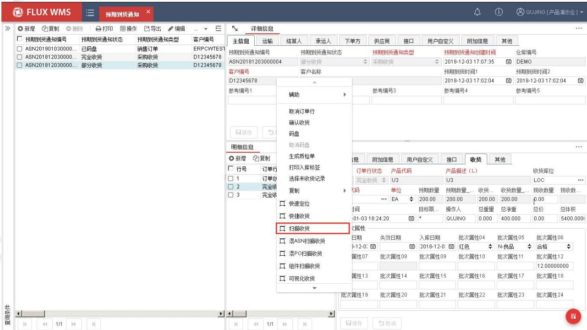

[图9-5-3]

■ 系统显示如下扫描收货二级窗口。 

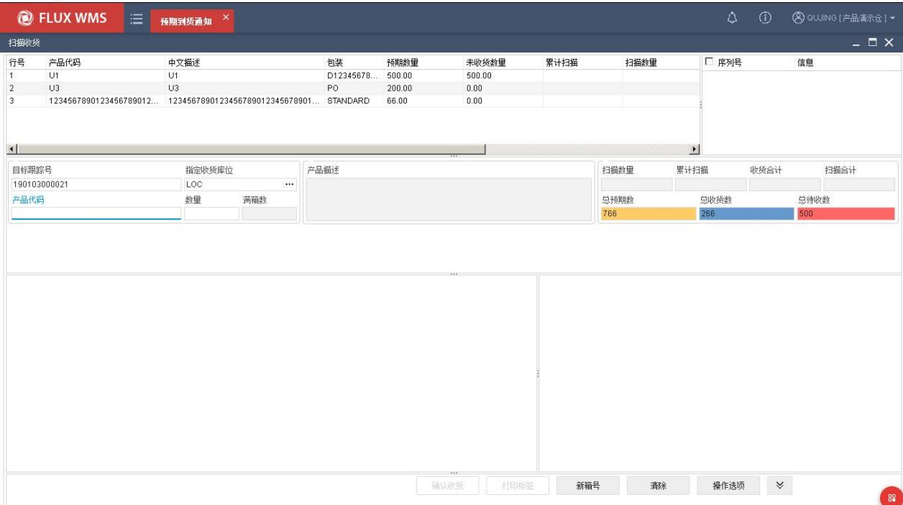

## [图 9-5-4]

■ 使用扫描设备，扫描跟踪号（即收货到的托盘号或箱号） 

■ 指定收货库位根据系统参数 DFT_RCV_LOC 配置，获取默认库位。但如果现场需要指定不同的收货库位，可在此字段录入。一次收货确认的记录都将收货到同一指定库位中，因此开始扫描后收货库位不可修改，已扫描内容收货确认后，下次扫描开始前可以变更收货库位。 

■ 扫描产品条形码，系统根据扫描到的产品分别进行数量累加。 

■ 扫描完成，点击【确认收货】按钮，系统将已扫描记录逐一收货确认。 

■ 收货时，可通过【打印标签】按钮，打印箱/托收货标签，粘贴在货物上。 

如需要修改扫描内容，可点击【清除】按钮，清空当前已扫描、未收货信息，重新开始扫描，或使用鼠标右键菜单的“取消上次扫描”功能，扣减上一次的扫描信息，保留再之前的扫描信息。 

■ 扫描时，系统会显示产品包装中维护的满箱数量，以及已收货总数、已扫描但未收货数量等信息供用户参考。 

■ 如果所扫描产品为首次入库的新品，同样弹出提示信息，“XXX 产品是第一次入库”，并播放提示音 SKU_FIRST_RECEIVE.WAV 文件 

■ 为了避免扫描过程中，无意碰触影响扫描，系统提供了光标焦点锁定、解除锁定功 能。锁定期间，光标固定在产品代码扫描字段，操作完成、解锁后才能点击其他字段或按钮。 

## - 按钮功能

附加信息 

二级窗口弹出，供维护入库箱型、箱重量、体积信息。 

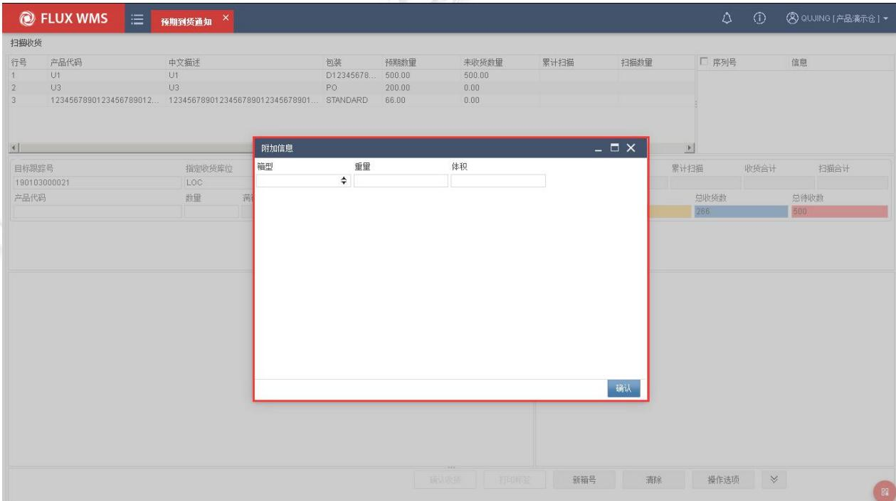

[图9-5-5]

操作选项 

二级窗口弹出，系统提供如下选择： 

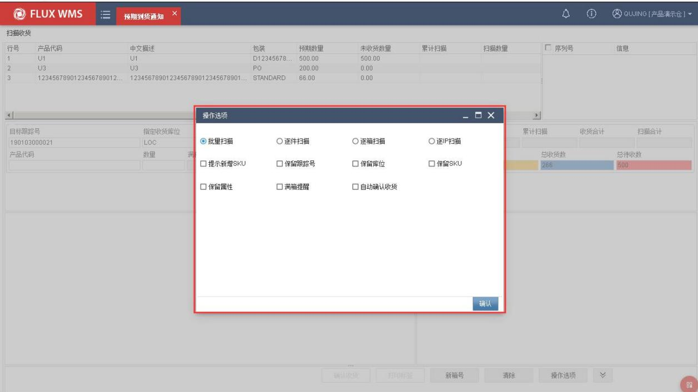

[图 9-5-6]

✿ 扫描模式：批量、逐件、逐箱、逐 IP 扫描，4 选 1。 

批量模式，扫描产品定位后，允许人工输入数量； 

逐件模式下，默认数量为1，每次扫描，数量自动加1； 

逐箱扫描，数量不可修改，按包装对应每箱的主单位数量，自动增加； 

逐IP模式则按包装对应的每个内包装的主单位数量，自动增加。 

需要注意的是，如果开启了序列号采集，则默认为逐件扫描模式。 

提示新增 SKU：ASN 中，扫描到订单中不存在的 SKU，是否可以自动加入成为新的 ASN 明细行，通过系统参数进行控制。是否提示用户有新增 SKU，通过此处的操作选项控制。 

保留跟踪号：界面显示的跟踪号保持不变，可连续使用，直到人工修改、清除。 

保留库位/保留属性：由于操作时允许修改扫描收货界面的库位、批次属性内容，与 ASN 明细不同。收货后下一记录，是继续沿用之前修改的内容，还是提供 ASN 明细信息，通过是否保留的 checkbox 进行配置。 

保留 SKU：扫描成功后，SKU 框的上次扫描内容是否清空。如果保留，则全选，方便连续扫描下一产品代码。保留的目的是方便作业人员查看上次扫描的 ID。 

满箱提醒：扫描数量达到整包装数量情况下，是否需要系统提示已满箱，以便用户封箱、更换新箱。 

自动确认收货：如勾选，逐件/逐 IP/逐箱模式下，扫描产品后，即执行收货；批量模式下，确认数量后，系统即执行收货确认，无需另外点击收货按钮。 

## ■ 确认扫描

非逐件扫描作业模式下，输入数量后确认。 

## ■ 打印标签

扫描后、收货前打印的产品标签。（收货后可自动打印上架标签，与产品标签内容不同） 

## ■ 确认收货

界面已扫描内容确认收货。 

## 清除

清除所有已扫描、未收货信息，重新扫描。 

## ■ 锁定/解除焦点

锁定期间，光标固定在产品代码扫描字段，操作完成、解锁后才能点击其他字段或按钮。避免误触鼠标导致光标跳转到其他字段，而操作员由于扫描有距离没有及时发现，从而大量扫描未记录的情况。 

## ■ 新箱号

获取一个新的、系统生成的流水号作为跟踪号。 

## 产品设置

已扫描产品情况下，点击后显示产品设置弹出框，维护包装信息等，无需切换到产品档案界面进行维护。 

<table><tr><td colspan="4">产品设置</td></tr><tr><td>客户编号</td><td></td><td>产品</td><td></td></tr><tr><td>TEST100</td><td></td><td>WANYAO1010</td><td></td></tr><tr><td>内包装数</td><td></td><td>箱包装数</td><td></td></tr><tr><td>5.000</td><td>计数</td><td>10.000</td><td>计数</td></tr><tr><td>托盘包装数</td><td>长</td><td>宽</td><td>高</td></tr><tr><td>150.000</td><td>0.00</td><td>0.00</td><td>0.00</td></tr><tr><td>体积</td><td>重量</td><td>箱型</td><td></td></tr><tr><td>0.0000</td><td>30.000</td><td></td><td></td></tr></table>

确认 

## [图9-5-7]

## ■ 允许/禁止混箱

对于是否允许混箱收货，通常在系统配置中维护参数 RCV_MIX_SKU 配置。但如果作业到最后的尾箱，可以临时通过按钮设置允许混箱。或者可混箱作业情况下，临时禁止混箱。点击后按钮名称也相应变化。 

## ■ 打印箱标签

自定义箱标签打印触发。 

## ■ 扫描记录

类似 ASN 功能的查询操作日志，点击后，弹出窗口列出所有已经扫描但尚未收货的记录。 

## ■ 收货进度显示

对应每个所扫描产品的明细行信息，显示预期数、已收货数和待收货数 

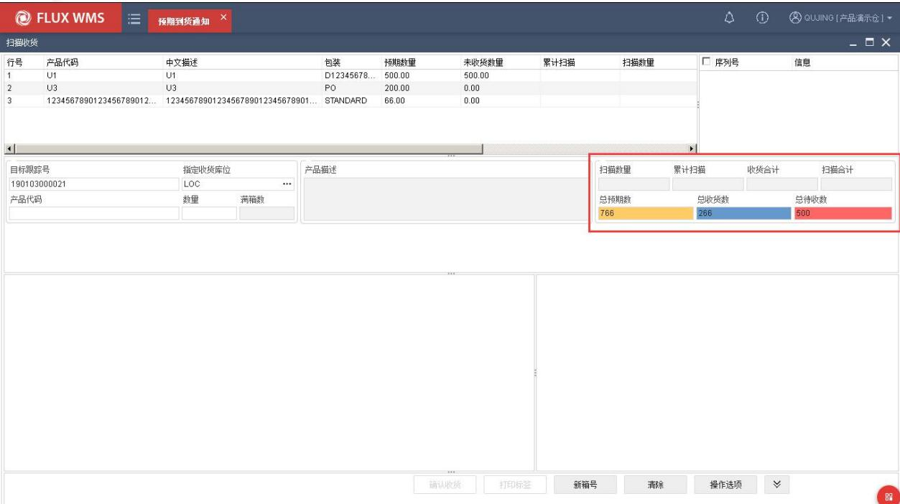

## [图9-5-8]

## - 右键功能

在列表部分，任意行点击鼠标右键，可见鼠标右键菜单： 

删除扫描记录  
确认产品  
查询锁定  
锁定  
解除当前锁定  
解除全部锁定  
切换SKU  
收货差异显示模式 

删除私有列配置 

[图 9-5-9] 

■ 取消上次扫描 

用于扫描错误情况下，点击后，系统在当前累加计数基础上，扣减前一次扫描确认的数量。 

■ 删除扫描记录 

将所选 SKU 记录行的对应缓存扫描信息、序列号记录信息清除。已确认收货记录不受影响。 

## 确认产品

无条码产品使用，人工选择产品记录后，通过右键功能项“确认产品”，代替扫描效果，确认产品记录。 

## ■ 查询锁定

一个产品有多行记录的情况下，扫描产品条码收货，但需要指定收货到某几行记录的情况下使用（如果产品带有批次属性条码可供扫描，可以通过属性扫描作业模式操作）。点击后系统显示如下二级窗口，通过输入产品、批次属性条件，筛选订单行，确定后返回扫描界面，收货范围限定在所选记录行范围内。所选记录行，列表的“锁定”列会显示为 Y，背景色突出显示为绿色。快捷键为 CTRL+K。 

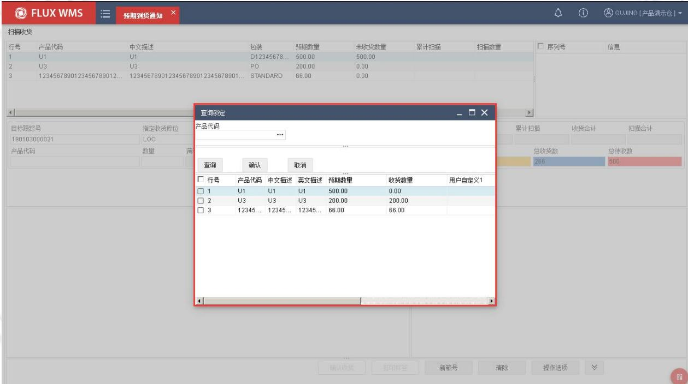

[图9-5-10]

## ■ 锁定

直接选择某行记录，锁定为扫描收货对象，跳过查询锁定步骤。 

## ■ 解除当前锁定

所选记录行，解除锁定，不再参与限定收货范围。 

## ■ 解除全部锁定

全部锁定记录行解除，不再另行限定收货范围。 

## - 其他处理

■ 图片显示 

为方便用户核对产品，所扫描到的 SKU，如果配置了对应图片，可在扫描收货时显示产品图片。系统支持多图片展示 

## ■ 序列号跟踪

开启序列号管理模式下（参数 SN#_CTL=2），即每件一个独立序列号，系统会在扫描界面右方显示序列号列表，供用户查看已扫描的序列号记录。序列号模式下（参数 SN#_CTL 为 1 或者 2），执行逐件扫描模式。 

此模式下，鼠标右键不提供“取消上次扫描”功能。需要到界面右侧的“序列号信息列表”部分，通过“取消序列号扫描”，采集序列号，扣减对应扫描。 

## 9.5.5. 快捷收货

为方便快速收货操作，同时维护拒收、质检等数据，系统提供快捷收货功能，类似在 PC 端执行 RF 扫描收货操作。 

通过 ASN 明细鼠标右键，【快捷收货】功能，显示快捷收货二级窗口，如下图所示 

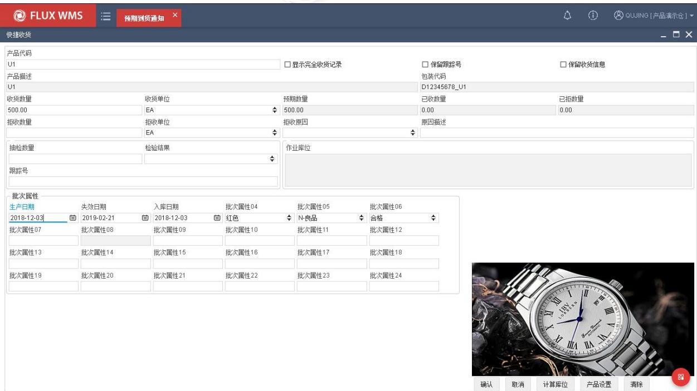

[图9-5-11]

如果 RCV_SHW_PIC 参数开启，快捷收货可以类似扫描收货，显示产品图片。 

如果上游 ERP 系统下达产品检查项，扫描到此产品时，可以弹出二级窗口，显示需检查项内容供用户查看。 

快捷收货作业中，采集序列号同样支持序列号解析。 

## 9.5.6. 其他收货作业模式

## - 混 ASN 扫描收货

支持多 ASN 跨单扫描。常用于供应商混 ASN 送货，仓库自行匹配单据。 

通过 ASN 明细鼠标右键，【混 ASN 扫描收货】功能，显示作业界面。作业界面类似标准扫描收货，但进入时无产品列表显示。扫描 SKU 时，匹配未收货的 ASN、明细行，显示在扫描列表中。 

扫描、提示、打印同标准扫描收货，确认收货时可对扫描到的多 ASN 明细确认收货。 

## - 混PO扫描收货

类似混 ASN 扫描收货，只是扫描 SKU 时，匹配相关 PO，如果 PO 对应记录没有 ASN 存在，先自动创建对应 ASN 记录，再列入扫描列表中。通过 ASN 明细鼠标右键，【混 PO 扫描收货】功能，显示作业界面。 

## - 组件扫描收货

单一 SKU 整箱入库时，根据组件维护的 BOM 信息，扫描同时整理为配比箱的操作，可以用组件扫描收货功能执行。 

<table><tr><td colspan="2">产品描述(L)</td><td colspan="2">产品描述(S)</td><td colspan="3">逐件扫描</td></tr><tr><td>产品编号</td><td>收货库位</td><td>产品代码</td><td>数量</td><td>扫描数量</td><td colspan="2">累计扫描</td></tr><tr><td>产品描述(L)</td><td colspan="6">产品描述(S)</td></tr></table>

[图9-5-12]

如上图，根据 ASN 中的父件行，鼠标右键选择【组件扫描入库功能】，列表部分显示父件对应的 BOM 组合。 

扫描子件 SKU，当产品、数量满足 BOM 组合时，弹出提示提醒确认收货。确认收货后，父件库存增加，并触发标签打印。 

如其中某个子件数量超过 BOM 数量则报错。 

## - 可视化收货

适用于缺少条码，依据描述难以明确区分产品的收货情况。根据图片辅助识别产品，保证货物准确性。 

在明细行鼠标右键菜单中，选择“可视化收货”功能项，系统显示产品图片列表，根据图片、描述信息选择记录，双击确认后，信息带入快捷收货界面，可执行收货操作。 

图片显示的尺寸大小支持可配置, 通过系统配置参数 IMG_SIZ_LEN(长) 和 IMG_SIZ_WID(宽) 进行定义。 

## 9.5.7. 收货控制项

收货过程中，系统同步考虑管理控制项 

## - 序列号校验

序列号管理模式下，系统会根据 SN#_RCV_VAL 参数配置序列号重复性校验范围。如序列号不能与当前仓库的在库序列号（不限产品）重复还是仅仅不能与当前 ASN 的在库序列号重复。 

校验范围过大，会影响扫描相应时间，因此需要根据管理需要选择合适的校验范围。但不管选择哪个参数，界面扫描的序列号都不能与当前扫描队列中的序列号重复。 

## - 保质期要求

如启用入库保质期校验，系统会拦截入库时即已经超期的货物。 

## - 质检控制

通过参数 QC_RCV_CTL 可以配置是否必须质检后收货。如果参数值为 Y 或者 C，未质检的货物不可收货。 

## 9.5.8. 其他处理

## - 其他右键菜单功能

明细部分鼠标右键菜单中，还有些功能与入库操作相关： 

■ 选择未收货记录 

无误差的批量操作时，对于创建状态订单，可以全选明细行，确认收货。但如果个别行已经收货，再全选，已收货行默认当前收货数为 0，系统会进行提示，影响操作。 

此时可通过“选择未收货记录”功能，跳过完全收货的订单行进行全选，供快速确认收货。 

## ■ 复制子菜单

选择某一行 ASN 明细，修改、保存信息后，可以通过鼠标右键功能中的复制功能，将所改的信息复制到其他明细行，提高作业效率。 

如下图，在“复制”子菜单中，可见复制信息到以下各行的功能，在行记录较多情况下，方便分别修改复制信息内容。 

## FLUX WMS 预期到货通知

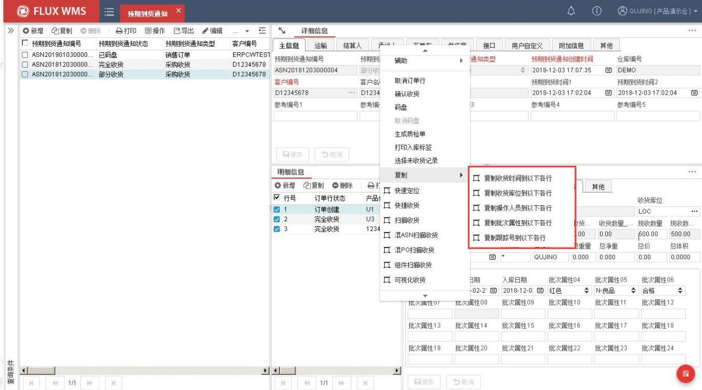

[图9-5-13]

## ✿ 复制收货时间到以下各行

正常收货操作或 RF 收货时，系统会自动记录当前时间作为收货时间，并将收货日期作为批次属性 3 的入库日期。 

但纸单作业模式下，如果单证人员第二天才根据反馈单证，补操作前一天的入库确认，此时需要在“收货”页签修改收货时间。或者订单分多次入库情况下，可以修改每次的到货时间。 

由于系统支持每行明细多次入库，但每行逐一修改操作不便，因此可以选择一行记录，修改到货时间后，以此作为母本，通过鼠标右键的“复制收货时间到以下各行”的功能，批量更新多行的收货时间。 

由于每行的收货时间可能不同，因此系统并非更新所有行，而是从母本行向下的各行进行批量更新。 

## ✿ 复制收货库位到以下各行

类似复制收货时间，修改订单行的收货库位后，批量复制到母本行向下的其他各行。 

类似的批量复制功能，还包括复制操作人员、批次属性、服务信息、跟踪号 

## 9.6. 上架

在产品清点收货后，进入仓库存储时，仓库的工作人员核对无误后，将产品摆放到指定的库位， 这一动作，我们称之为上架。最常见的上架动作就是把货物从收货/卸货平台，搬运到最终存储库位上。 

上架操作，不影响库存数量，仅涉及到产品的储位变化（由收货暂存区变更为具体存储库位）。但系统为了避免仓库内作业混乱，在没有启用交叉理货（CrossDock）管理的情况下，未上架库存不可出库，因此上架完成后，库存变为可用库存才能用于订单拣货。 

## - 上架单据

使用纸面单证操作流程中，用户可打印上架任务清单，指导操作人员执行上架操作。如果使用RF操作，则根据流程设计需要，打印对应的收货标签或者上架上架标签。 

■ 选择 “入库操作” 下的 “预期到货通知”。 

■ 通过查找，选择需要打印单据的 ASN。 

在 ASN 表头部分通过鼠标右键菜单，在单据打印子菜单中，选择上架任务清单进行打印。 

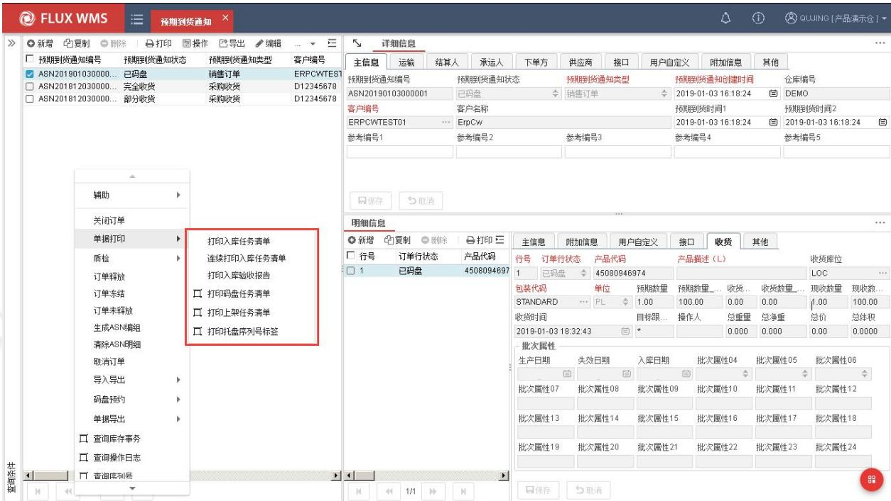

[图 9-6-1]

■ 如果需要打印上架标签，可在明细部分的上架列表或上架明细页签，选择待上架记录（或鼠标右键菜单全选，选择全部记录），然后通过明细部分的鼠标右键打印上架标签。 

## - 上架确认

仓库完成上架操作，需要在系统中确认上架完成（同样可通过 RF 执行上架操作，详见 RF 操作手册）。 

■ 选择 “入库操作” 下的 “预期到货通知”。 

■ 通过查找，选择所需的 ASN。 

在 ASN 明细部分，上架页签中，选择所要上架的产品行（也可通过全选一次性选择全部记录），依次输入如下信息： 

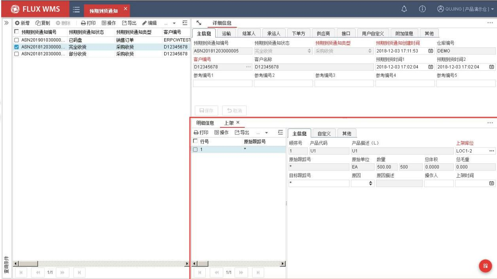

[图9-6-2]

上架时间 - 产品上架操作的执行时间。默认为当前时间，可修改。 

目标库位 - 产品的最终储存库位，可以是系统按照上架规则计算得出，也可以由用户自行修改录入。 

原因代码 - 异常操作时输入/选择原因代码。例如不使用系统计算的目标库位，而人为指定存储库位。一般根据具体管理要求选择是否需要输入原因。 

目标跟踪号 - 默认同原始跟踪号。如果有拆分托盘上架的情况，用于记录所使用的新托盘/跟踪号。 

操作人员 - 执行上架操作的具体人员。 

■ 可通过鼠标右键菜单的“复制上架时间到以下所有行”、“复制操作人员到以下所有行”，“复制目标库位到以下所有行”进行信息复制。 

■ 点击鼠标右键菜单中的“确认上架”，系统执行上架确认操作。 

■ 上架完成，上架列表中记录刷新。即上架列表中仅显示需要执行上架操作的记录，而不显示已经完成的上架操作。如需察看上架历史记录，可到库存事务查询或者任务管理中查看。 

## 9.7. 质量检验

在入库操作过程中，部分情况下要求仓库执行质量检验操作，这同样是仓库服务的延伸。FLUX WMS 提供的质量检验模块，就是针对于货物质检操作进行管理。 

入库质检，质检对象基于 ASN 单据，可在收货前进行，也可在收货后进行质检。但质检的数量并不一定与 ASN 数量一至（全检），也可能是按比率，或者按一定数量要求进行抽检。 

入库前质检操作时，货物还没有接受入库清点，因此系统中也还没有这批库存。通常质检的结果将决定货物是否能够收货入库。 

入库后质检，比较常见的是收货后、上架前，未质检产品可进行上架控制，不能用于出库拣货。 

## 9.7.1. 质检操作

## - 质检单创建

质检单创建之前，需要先对产品的检验规则进行设置，以便系统了解这种产品是需要全检，还是按批量抽检，或者是按比率抽检。质检规则的设置，可参考基础设置部分的描述。 

质检单创建的来源是 ASN，可在 ASN 表头鼠标右键菜单中，选择“质检”-“生成质检单”功能，整单创建对应质检单。也可以在 ASN 明细部分，选择行记录，然后点击鼠标右键“生成质检单”，根据所需明细行创建质检单。 

系统根据 ASN 的期望数量，和产品质检规则要求，计算应检数量，创建对应质检单据，并跳转到质检单界面，显示相应单据。 

质检单具体字段如下： 

■ 质检单表头 

<table><tr><td>查询条件</td><td colspan="9">删除 打印 操作 导出 编辑 ...</td></tr><tr><td>质检单号</td><td>0005</td><td>普通质检</td><td>质检通过</td><td></td><td></td><td></td><td></td><td></td><td></td></tr><tr><td>预期到货通知编号</td><td>QC2018060163</td><td>普通质检</td><td>质检通过</td><td></td><td></td><td></td><td></td><td></td><td></td></tr><tr><td rowspan="4">仓库编号</td><td>QC2018110014</td><td>普通质检</td><td>质检单创建</td><td></td><td></td><td></td><td></td><td></td><td></td></tr><tr><td>QC2018100014</td><td>普通质检</td><td>质检单创建</td><td></td><td></td><td></td><td></td><td></td><td></td></tr><tr><td>QC2018100013</td><td>普通质检</td><td>质检单创建</td><td></td><td></td><td></td><td></td><td></td><td></td></tr><tr><td>QC2018100012</td><td>普通质检</td><td>质检单创建</td><td></td><td></td><td></td><td></td><td></td><td></td></tr><tr><td rowspan="2">客户编号</td><td>QC2018100010</td><td>普通质检</td><td>质检单创建</td><td></td><td></td><td></td><td></td><td></td><td></td></tr><tr><td>QC2018100008</td><td>普通质检</td><td>质检单创建</td><td></td><td></td><td></td><td></td><td></td><td></td></tr><tr><td rowspan="2">质检类型</td><td>QC2018090001</td><td>普通质检</td><td>质检单创建</td><td></td><td></td><td></td><td></td><td></td><td></td></tr><tr><td>QC2018080004</td><td>普通质检</td><td>质检通过</td><td></td><td></td><td></td><td></td><td></td><td></td></tr><tr><td rowspan="3">质检状态</td><td>QC2018100005</td><td>普通质检</td><td>质检单创建</td><td></td><td></td><td></td><td></td><td></td><td></td></tr><tr><td>QC2018100004</td><td>普通质检</td><td>质检单创建</td><td></td><td></td><td></td><td></td><td></td><td></td></tr><tr><td>QC2018110002</td><td>普通质检</td><td>质检单创建</td><td></td><td></td><td></td><td></td><td></td><td></td></tr><tr><td>显示关闭/取消QC</td><td>0001</td><td>普通质检</td><td>质检通过</td><td></td><td></td><td></td><td></td><td></td><td></td></tr></table>

[图9-7-1]

质检单号 - 单证号，由系统根据流水号规则自动生成。 

QC 类型 - 质检单据类型。 

QC 状态 - 单据执行状态。默认为创建，由系统根据单证执行情况更新状态。 

客户编号 - 客户代码 

QC 创建时间 - 单据生成时间 

预期到货通知编号 - 质检单对应的 ASN 单据号码。 

仓库编号 - 质检单所属仓库 

参考信息 1~5 - 单证参考信息 

■ 质检单明细 

<table><tr><td colspan="101">查询条件</td><td></td><td></td><td></td><td></td><td></td><td></td><td></td><td></td><td></td></tr><tr><td rowspan="16"></td><td>删除</td><td>打印</td><td>操作</td><td>导出</td><td>编辑</td><td>...</td><td rowspan="15"></td><td rowspan="15"></td><td rowspan="15"></td><td rowspan="15"></td><td rowspan="15"></td><td rowspan="15"></td><td rowspan="15"></td><td rowspan="15"></td><td rowspan="15"></td><td rowspan="15"></td><td rowspan="15"></td><td rowspan="15"></td><td rowspan="15"></td><td rowspan="15"></td><td rowspan="15"></td><td rowspan="15"></td><td rowspan="15"></td><td rowspan="15"></td><td rowspan="15"></td><td rowspan="15"></td><td rowspan="15"></td><td rowspan="15"></td><td rowspan="15"></td><td rowspan="15"></td><td rowspan="15"></td><td rowspan="15"></td><td rowspan="15"></td><td rowspan="15"></td><td rowspan="15"></td><td rowspan="15"></td><td rowspan="15"></td><td rowspan="15"></td><td rowspan="15"></td><td rowspan="15"></td><td rowspan="15"></td><td rowspan="15"></td><td rowspan="15"></td><td rowspan="15"></td><td rowspan="15"></td><td rowspan="15"></td><td rowspan="15"></td><td rowspan="15"></td><td rowspan="15"></td><td rowspan="15"></td><td rowspan="15"></td><td rowspan="15"></td><td rowspan="15"></td><td rowspan="15"></td><td rowspan="15"></td><td rowspan="15"></td><td rowspan="15"></td><td rowspan="15"></td><td rowspan="14"></td><td rowspan="13"></td><td rowspan="12"></td><td rowspan="12"></td><td rowspan="12"></td><td rowspan="11"></td><td rowspan="10"></td><td rowspan="10"></td><td rowspan="10"></td><td rowspan="10"></td><td rowspan="10"></td><td rowspan="9"></td><td rowspan="9"></td><td rowspan="9"></td><td rowspan="8"></td><td rowspan="8"></td><td rowspan="8"></td><td rowspan="7"></td><td rowspan="7"></td><td rowspan="7"></td><td rowspan="7"></td><td rowspan="7"></td><td rowspan="7"></td><td rowspan="6"></td><td rowspan="6"></td><td rowspan="6"></td><td rowspan="6"></td><td rowspan="6"></td><td rowspan="6"></td><td rowspan="6"></td><td rowspan="6"></td><td rowspan="6"></td><td rowspan="4"></td><td rowspan="4"></td><td rowspan="4"></td><td rowspan="4"></td><td rowspan="4"></td><td rowspan="4"></td><td rowspan="4"></td><td rowspan="4"></td><td rowspan="4"></td><td rowspan="4"></td><td rowspan="4"></td><td rowspan="4"></td><td rowspan="2"></td><td rowspan="2"></td><td rowspan="2"></td><td rowspan="2"></td><td></td><td></td><td></td></tr><tr><td>质检单号</td><td>质检类型</td><td colspan="4">质检状态</td><td>0005</td><td>普通质检</td><td>质检通过</td></tr><tr><td>0005</td><td>普通质检</td><td colspan="4">质检通过</td><td>QC2018060163</td><td>普通质检</td><td>质检通过</td><td></td><td></td><td></td><td></td></tr><tr><td>QC2018110014</td><td>普通质检</td><td colspan="4">质检单创建</td><td></td><td></td><td></td><td></td><td></td><td></td><td></td></tr><tr><td>QC2018100014</td><td>普通质检</td><td colspan="4">质检单创建</td><td rowspan="2"></td><td></td><td></td><td></td><td></td><td></td><td></td><td></td><td></td><td></td><td></td><td></td><td></td><td></td><td></td><td></td><td></td><td></td><td></td></tr><tr><td>QC2018100013</td><td>普通质检</td><td colspan="4">质检单创建</td><td></td><td></td><td></td><td></td><td></td><td></td><td></td><td></td><td></td><td></td><td></td><td></td><td></td><td></td><td></td><td></td><td></td><td></td></tr><tr><td>QC2018100012</td><td>普通质检</td><td colspan="4">质检单创建</td><td></td><td></td><td></td><td></td><td></td><td></td><td></td><td></td><td></td><td></td><td></td><td></td><td></td><td></td><td></td><td></td><td></td><td></td><td></td><td></td><td></td><td></td><td></td><td></td><td></td><td></td><td></td><td></td></tr><tr><td>QC2018100010</td><td>普通质检</td><td colspan="4">质检单创建</td><td></td><td></td><td></td><td></td><td></td><td></td><td></td><td></td><td></td><td></td><td></td><td></td><td></td><td></td><td></td><td></td><td></td><td></td><td></td><td></td><td></td><td></td><td></td><td></td><td></td><td></td><td></td><td></td><td></td><td></td><td></td><td></td><td></td><td></td></tr><tr><td>QC2018100008</td><td>普通质检</td><td colspan="4">质检单创建</td><td></td><td></td><td></td><td></td><td></td><td></td><td></td><td></td><td></td><td></td><td></td><td></td><td></td><td></td><td></td><td></td><td></td><td></td><td></td><td></td><td></td><td></td><td></td><td></td><td></td><td></td><td></td><td></td><td></td><td></td><td></td><td></td><td></td><td></td><td></td><td></td><td></td></tr><tr><td>QC2018090001</td><td>普通质检</td><td colspan="4">质检单创建</td><td></td><td></td><td></td><td></td><td></td><td></td><td></td><td></td><td></td><td></td><td></td><td></td><td></td><td></td><td></td><td></td><td></td><td></td><td></td><td></td><td></td><td></td><td></td><td></td><td></td><td></td><td></td><td></td><td></td><td></td><td></td><td></td><td></td><td></td><td></td><td></td><td></td><td></td><td></td><td></td></tr><tr><td>QC2018080004</td><td>普通质检</td><td colspan="4">质检单创建</td><td></td><td></td><td></td><td></td><td></td><td></td><td></td><td></td><td></td><td></td><td></td><td></td><td></td><td></td><td></td><td></td><td></td><td></td><td></td><td></td><td></td><td></td><td></td><td></td><td></td><td></td><td></td><td></td><td></td><td></td><td></td><td></td><td></td><td></td><td></td><td></td><td></td><td></td><td></td><td></td><td></td><td></td><td></td><td></td><td></td></tr><tr><td>QC2018060114</td><td>普通质检</td><td colspan="4">质检单创建</td><td></td><td></td><td></td><td></td><td></td><td></td><td></td><td></td><td></td><td></td><td></td><td></td><td></td><td></td><td></td><td></td><td></td><td></td><td></td><td></td><td></td><td></td><td></td><td></td><td></td><td></td><td></td><td></td><td></td><td></td><td></td><td></td><td></td><td></td><td></td><td></td><td></td><td></td><td></td><td></td><td></td><td></td><td></td><td></td><td></td><td></td></tr><tr><td>QC2018100005</td><td>普通质检</td><td colspan="4">质检单创建</td><td></td><td></td><td></td><td></td><td></td><td></td><td></td><td></td><td></td><td></td><td></td><td></td><td></td><td></td><td></td><td></td><td></td><td></td><td></td><td></td><td></td><td></td><td></td><td></td><td></td><td></td><td></td><td></td><td></td><td></td><td></td><td></td><td></td><td></td><td></td><td></td><td></td><td></td><td></td><td></td><td></td><td></td><td></td><td></td><td></td><td></td><td></td><td></td><td></td></tr><tr><td>QC2018100004</td><td>普通质检</td><td colspan="4">质检单创建</td><td></td><td></td><td></td><td></td><td></td><td></td><td></td><td></td><td></td><td></td><td></td><td></td><td></td><td></td><td></td><td></td><td></td><td></td><td></td><td></td><td></td><td></td><td></td><td></td><td></td><td></td><td></td><td></td><td></td><td></td><td></td><td></td><td></td><td></td><td></td><td></td><td></td><td></td><td></td><td></td><td></td><td></td><td></td><td></td><td></td><td></td><td></td><td></td><td></td><td></td></tr><tr><td>QC2018110002</td><td>普通质检</td><td colspan="4">质检单创建</td><td></td><td></td><td></td><td></td><td></td><td></td><td></td><td></td><td></td><td></td><td></td><td></td><td></td><td></td><td></td><td></td><td></td><td></td><td></td><td></td><td></td><td></td><td></td><td></td><td></td><td></td><td></td><td></td><td></td><td></td><td></td><td></td><td></td><td></td><td></td><td></td><td></td><td></td><td></td><td></td><td></td><td></td><td></td><td></td><td></td><td></td><td></td><td></td><td></td><td></td><td></td></tr><tr><td>0001</td><td>普通质检</td><td colspan="4">质检通过</td><td></td><td></td><td></td><td></td><td></td><td></td><td></td><td></td><td></td><td></td><td></td><td></td><td></td><td></td><td></td><td></td><td></td><td></td><td></td><td></td><td></td><td></td><td></td><td></td><td></td><td></td><td></td><td></td><td></td><td></td><td></td><td></td><td></td><td></td><td></td><td></td><td></td><td></td><td></td><td></td><td></td><td></td><td></td><td></td><td></td><td></td><td></td><td></td><td></td><td></td><td></td><td></td><td></td><td></td><td></td><td></td><td></td><td></td><td></td><td></td><td></td><td></td><td></td><td></td><td></td><td></td><td></td><td></td><td></td><td></td><td></td><td></td><td></td><td></td><td></td><td></td><td></td><td></td><td></td><td></td><td></td><td></td><td></td><td></td><td></td><td></td><td></td><td></td><td></td><td></td><td></td><td></td><td></td><td></td><td></td><td></td><td></td><td></td><td></td><td></td><td></td><td></td><td></td></tr></table>

## [图9-7-2]

质检单行号 - 质检单行号。 

质检单行状态 - 单据行执行状态。默认为创建，由系统根据单证执行情况更新状态。 

产品编号 - 待质检的产品代码 

产品描述 - 产品对应描述 

包装代码 - ASN 中产品所用包装代码 

单位 - ASN 中产品默认收货单位 

预期数量 - ASN 中待收货数量 

应检数量 - 由系统根据产品质检规则计算的待质检数量。可由用户根据实际情况修改。 

已检数量 - 已经质检过的产品数量。注：质检过，并不意味着都是合格品。 

批次 - 产品批次属性内容。仅显示供质检人员参考。 

质检单据信息来源于 ASN，并且不可随意修改。 

## ● 质量检验操作

依据质检单进行产品质量检查时，可记录质检的详细结果： 

■ 在质检单明细部分，选择产品记录。 

■ 选择操作明细页签，在主信息页面，点击【新增】按钮 

■ 依次输入如下信息，并保存： 

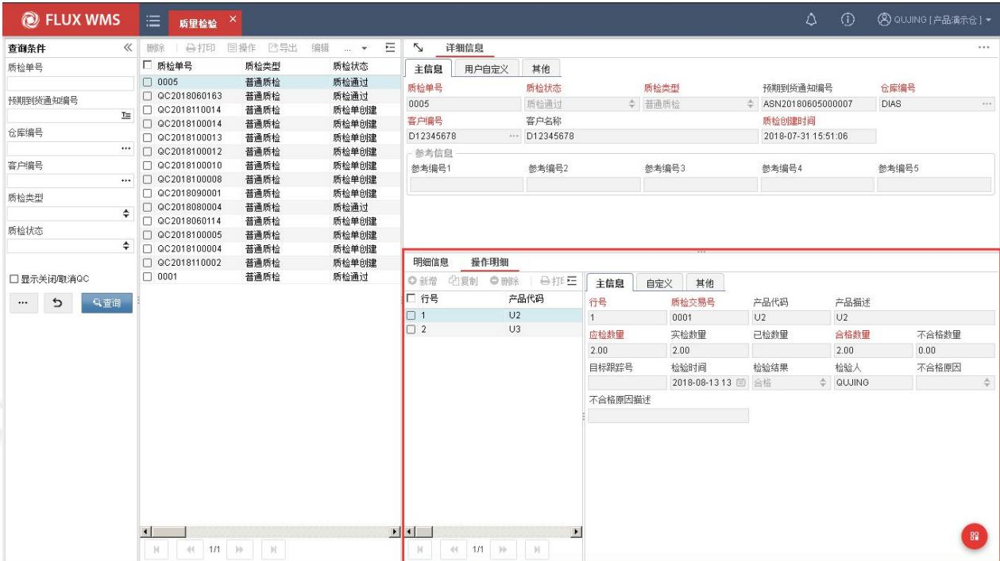

[图 9-7-3]

质检行号 - 对应质检单明细行的行号 

质检交易号 - 系统自动生成的流水号 

产品编号 - 待质检的产品代码 

应检数量 - 需要质检的产品总数量 

实检数量 - 本次检验的产品数量 

已检验数量 - 完成质检的产品数量，不论是否合格。 

合格数量 - 通过质检的产品数量。 

不合格数量 - 问题产品数量。由系统根据实检数量、合格数量计算得出。 

目标跟踪号 - 质检品所用托盘号/箱号信息。 

检验结果 - 本批次产品检验结论。通常在质检中由于不同产品不同情况下允许的次品率不同，因此质检后，整批产品是否确认通过质检、可以收货，需要进行判断。 

检验时间 - 质检时间 

检验人 - 质检操作人员 

■ 执行质检后（即保存质检操作明细），ASN 对应明细的质检状态同样会进行刷新。 

## ● 质量检验后续处理

收货数量控制 

收货前质检，质检完成后会相应更新质检单、对应 ASN 记录信息。通过 QC_RCV_CTL 参数设置，控制收货时是否需要校验质检情况。 

参数为 Y，质检完成才能收货 

参数为 C，可以一边质检一边收货。Y 与 C 情况下，需要根据质检结果判断是否需要受控收货。 

参数为 N，收货时不检查质检情况。 

质检时的“检验结果”下拉框内容，可在系统代码中配置，不同检验结果，收货处理不同，根据系统代码的“用户自定义1”字段控制不同的收货处理： 

UDF1=PASS，正常收货，不受限 

UDF1=NOPASS，拒绝收货，即不可收货 

UDF1=CONTROL，受控收货，收货上限=订单数量-不合格品数量（即使设置了可以超量收货） 

■ 上架控制 

如果是收货后质检，系统根据 QC_PTA_CTL 参数控制，是否必须质检后才能上架。如果参数开启，检验结果的影响是： 

UDF1=PASS，可以上架 

UDF1=NOPASS，不可以上架 

UDF1=CONTROL，可以上架 

■ 质量检验属性处理 

普通情况下，质检到产品级，如果产品不合格，需要以不良品身份入库，通常在质检后，收货时录入不良品批次属性。 

但如果是收货后质检，此时已有库存，并且库存通常以默认的良品（或者待检）属性入库，需要在质检后进行属性变更。此类业务情况，需要开启 QC_FRM_TRN，根据 ASN 收货交易、收货数量，生成全检数量的质检单明细（不考虑质检规则中的抽检设置）。 

此类质检单保存确认时，系统提示“需要同步转移变更批次属性，是否继续？” 

如果用户选择确定，系统提取质检结果对应的信息（UDF2）执行库存转移，更新货物属性（批次属性 08），并重新计算上架。 

如果用户选择取消，则终止，由用户重新修改质检确认信息、点击确认。 

此类操作，不支持拆分记录，一行待检明细，需要一次确认。 

## 9.7.2. 右键功能

## - 表头右键功能

表头部分鼠标右键功能项为： 

## 关闭质检单

已操作质检单关闭，不允许再进行修改或者质检确认。 

■ 汇总信息 

所选单据的信息弹出窗口汇总查看。 

■ 清除质检单明细 

删除所选质检单的全部明细记录（创建状态才可操作），通常用于需要重新添加质检明细的情况。 

## ■ 取消质检单

通常是创建状态的质检单进行取消，不再操作质检，不能做任何修改、确认。但单证可以查询到。 

## ■ 打印质检单

打印质检清单，用于核对检查。 

## - 明细右键功能

明细部分鼠标右键功能项为： 

## ■ 确认质检通过

当质检作业无需精细化控制，只按质检单明细行确认是否质检通过，可以使用此右键功能，无需录入详细质检数量等操作明细信息。 

## ■ 重新计算应检数量

根据 ASN 期望数量生成质检单, 但实物分批抵达, 部分收货后发现剩余数量与期望值差异较大, ASN 中修改期望数量之后, 质检单中的应检数量也需要重新计算。通过此功能可以根据 ASN 信息更新质检单相关应检信息。 

## ■ 查询产品档案

点击后，跳转到产品档案界面，并按照质检明细行产品代码、货主代码作为默认查询条件，查询产品档案记录，方便质检人员核对产品相关信息。 

## ■ 检索

点击后系统显示查询二级窗口，通过对 SKU 代码的模糊查询，定位到对应的行记录。 

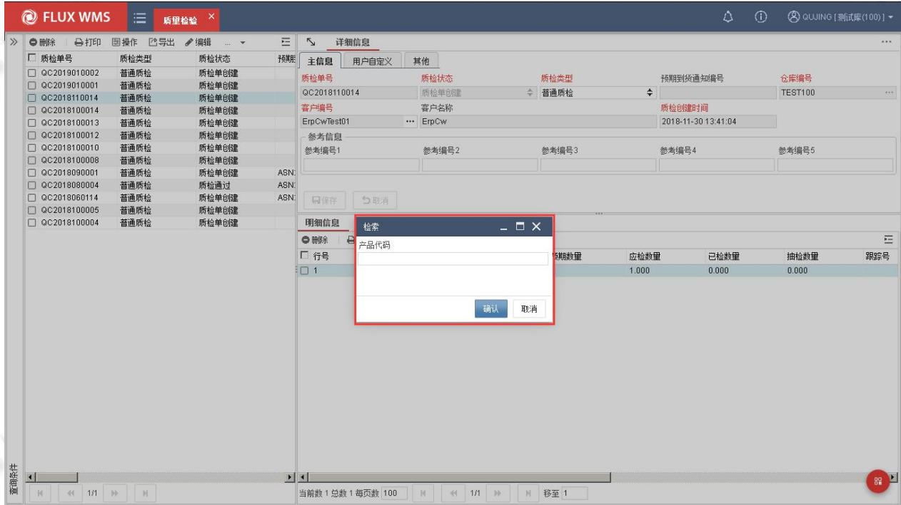

[图9-7-4]

## 9.8. 取消收货

在部分情况下，存在收货后反向操作的需求，或者误操作需要修正。系统提供取消收货功能，可将状态回复到收货前的创建状态，重新进行收货确认。 

但不是所有操作都能够反向取消。收货、上架2步操作的情况下，一旦确认上架，就不能操作取消收货。 

## - 取消收货操作

■ 选择 “入库操作” 下的 “取消收货”。 

■ 点击查找页面，输入对应查询条件： 

ASN 编号 - 单证的编号。 

ASN 行号 - 指定的单证行号。 

客户 - 货主代码。 

产品 - 产品代码。 

事务编号 - 收货交易事务的 ID。 

■ 点击【查询】按钮。 

在明细页面的列表浏览窗口，选择所要取消的收货行（可多选），点击鼠标右键菜单中的“取消收货”功能项。 

■ 系统显示确认提示信息，点击【确认】，完成取消收货反向操作。 

## - 原因记录

取消收货时，可以通过“原因代码”、“原因”字段记录取消收货的原因，以供未来查看。也可录入一行原因后，通过鼠标右键菜单功能的“复制取消原因到所有行”，将原因信息批量复制。 

## 9.9.ASN编组

退货入库时，经常需要将多张订单的产品整理为单一 SKU，即同品合并，以便产品再销售。每单逐一整理，效率不高。可以考虑将多张订单整合后共同整理，配合电子标签、入库扫描等设备或流程，进行退货播种分货，提升作业效率。 

ASN 编组，就是出于此目的考虑，将多张预期到货通知单据（ASN）组合，以便货物整理。 

## - 创建ASN编组

■ 选择 “入库操作” 下的 “预期到货通知”。 

■ 通过查询条件，查询所需订单 

■ 点击勾选多张订单，鼠标右键选择“生成 ASN 编组”功能。需要注意的是，所选订单需要是同一仓库、同一货主下的订单。 

■ 系统将所选多张订单汇总，统计 SKU 重合度信息（重合度越高，播种带来的效率提升越大），并通过二级窗口展示，如下图 

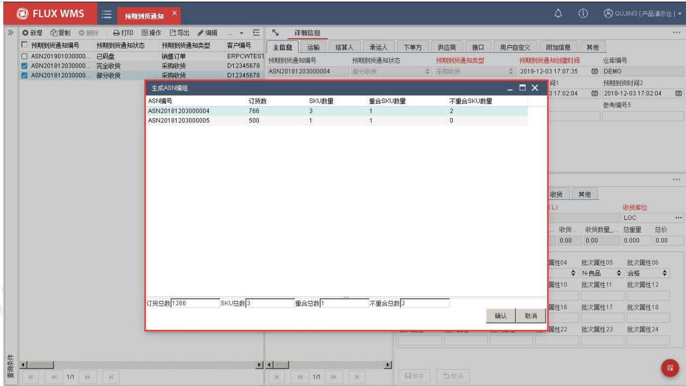

[图9-9-1]

■ 点击【确认】按钮，系统根据所选 ASN，创建 ASN 编组，并提示操作结果 

## - 播种初分

已创建成功的 ASN 编组，可在 “入库操作” 模块 “ASN 编组” 功能中查看。在不使用电子标签硬件的作业环境中，也可以通过 WMS 进行播种分货。 

■ 选择 “入库操作” 下的 “ASN 编组” 功能。 

■ 通过查询条件，查询所需编组。 

■ 表头部分，显示单号、货主、播种墙类型等信息，用户可以根据需要进一步补充自定义信息。 

<table><tr><td colspan="2">FLUX WMS</td><td colspan="8">ASN编组</td></tr><tr><td colspan="2">查询条件</td><td colspan="8">删除打印操作导出编辑...</td></tr><tr><td rowspan="27" colspan="2">ASN组号0000000552仓库编号DEMOASN编号ASN参考信息用户自定义...查询</td><td rowspan="27" colspan="2">□仓库编号0000000552</td><td rowspan="27" colspan="6">任务产生</td></tr><tr></tr><tr></tr><tr></tr><tr></tr><tr></tr><tr></tr><tr></tr><tr></tr><tr></tr><tr></tr><tr></tr><tr></tr><tr></tr><tr></tr><tr></tr><tr></tr><tr></tr><tr></tr><tr></tr><tr></tr><tr></tr><tr></tr><tr></tr><tr></tr><tr></tr><tr><td></td></tr></table>

## [图 9-9-2]

■ 明细部分，通过列表形式显示编组所包含的 ASN，可通过鼠标右键菜单功能删除记录： 

<table><tr><td colspan="10">FLUX WMS</td></tr><tr><td colspan="10">ASN编组</td></tr><tr><td colspan="10">查询条件</td></tr><tr><td colspan="10">ASN组号0000000552仓库编号DEMOASN编号ASN参考信息用户自定义...查询</td></tr><tr><td colspan="10">删除打印操作导出编辑...</td></tr><tr><td colspan="10">仓库编号ASN组号状态客户编号播种墙类型DEMO000000552任务产生D1234567812</td></tr><tr><td colspan="10">明细信息 播种任务</td></tr><tr><td colspan="10">删除打印操作导出...</td></tr><tr><td colspan="10">仓库编号ASN组号行号ASN编号客户编号ASN参考信息ASN状态DEMO0000005521ASN2018120300...D12345678部分收货</td></tr></table>

[图 9-9-3]

■ 确认无需改动的编组，通过表头鼠标右键菜单功能“生成播种任务”，系统弹窗确 认播种任务组合方式（如下图），由系统将编组所属 ASN 信息整合后，按参数 SKU_SRT_QTY 维护的播种墙库位个数，计算分货信息，并下达给分货设备，如电子标签。操作此项功能后，编组的明细部分会显示“播种任务”页签，供用户查看整合后的任务信息 

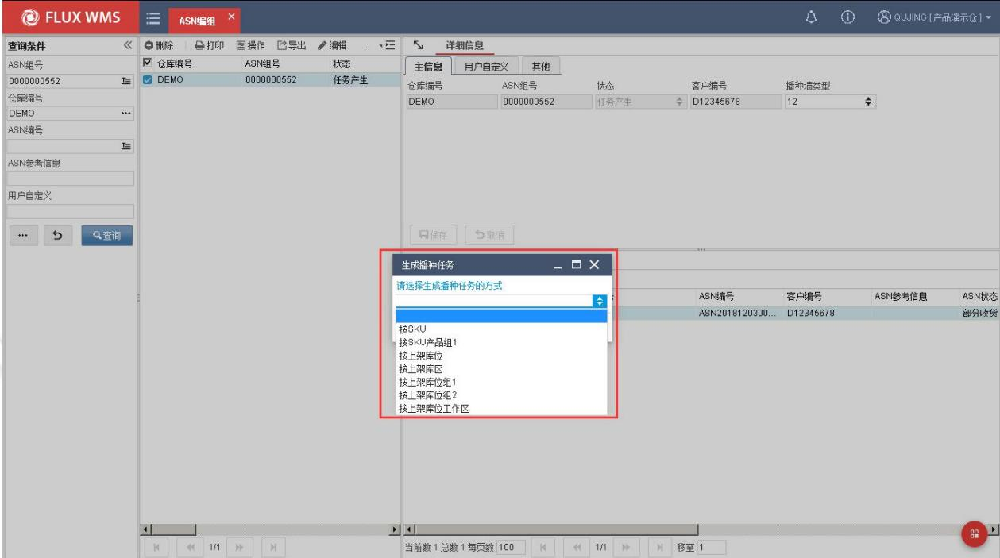

[图9-9-4]

■ 不使用电子标签作业的环境中，可以通过 WMS 的代替功能实现分货操作。通过表头鼠标右键菜单功能 “播种初分”，系统弹出播种二级窗口，如下图 

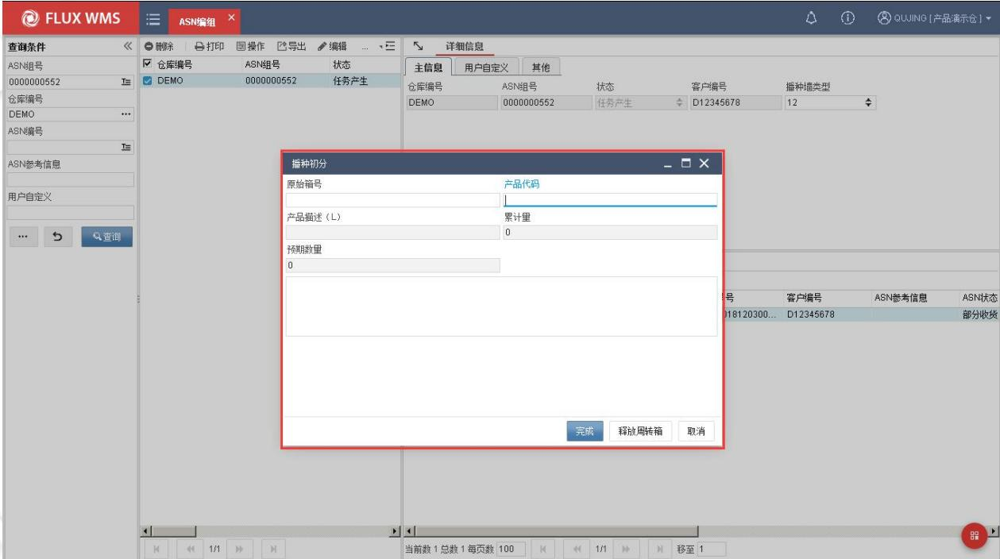

## [图 9-9-5]

按箱逐一分货情况下（入库有箱号）可扫描原始箱号定位，无原始箱号的作业模式下，可以直接扫描产品条码。 

■ 每个分货位的首笔记录，系统弹出窗口要求扫描箱号、分货库位，如下图所示 

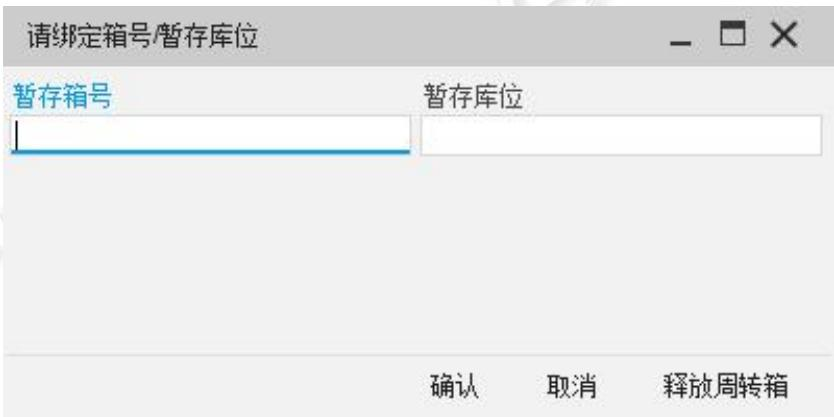

[图9-9-6]

■ 后续作业，根据分货要求、首记录绑定分货位情况，系统提示产品的分货去向，协助用户完成分货。 

■ 如分货所用周转箱已满，可点击【释放周转箱】按钮，后续扫描产品时，会提示绑定新箱号。 

■ 通过 ASN 编组功能完成初分分货后，如需进行详细二分，可通过波次播种功能执 

行。 

注：使用 RF 作业的情况下，可使用对应 RF 功能，产品初分、产品二分，完成类似 WMS 上的 ASN 编组初分、波次播种二分的操作。 

## - 动态播种模式

固定播种位模式，是系统提前为任务分派好播种位，作业时操作人员扫描产品后，需要寻找系统提示的库位，而且产品随机扫描情况下，走动路径可能较长。因此系统还提供动态播种作业模式，任务下达时不绑定具体播种位，而是扫描产品时临时按次序绑定一个空播种位提示用户操作，可以减少人员走动距离。 

动态播种模式，需要开启 PTL_SEQ_LOC 参数，后台处理不同，但用户具体作业步骤同固定播种位。 

## 9.10. 收货异常处理

收货过程中，常有异常情况，货物被拒收。对于拒收的货物，如何进行后续处理，可通过收货异常处理进行跟踪管理，并且由采购/订单管理部门对异常情况给予处理意见，如退回，降等入库等。 

## ● 收货异常处理

■ 收货时，如果记录拒收数量、拒收原因，系统将拒收信息记录到收货异常信息中。 

■ 在“入库操作”-“收货异常处理”功能中，用户可查询到记录下来的收货异常 

选择记录，通过鼠标右键菜单功能“审核意见”，可在弹出框中选择异常记录的处理意见，如下图。审核意见下拉列表内容，在系统代码中维护 

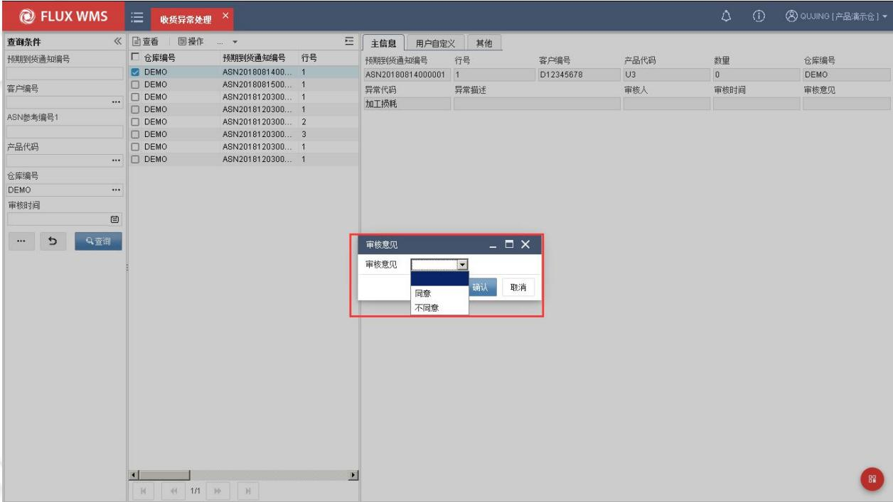

[图 9-10-1]

## 9.11. 入库序列号查询

用于集中查看收货序列号情况。 

## - 入库序列号查询

■ 选择 “入库操作” 下的 “入库序列号查询” 功能 

■ 输入查询条件，点击查询按钮获取详细信息 

■ 如果是一级序列号，只在表头部分显示；如果具有二级序列号，则在明细部分对应显示。 

<table><tr><td colspan="101">查询条件</td><td></td><td></td><td></td><td></td><td></td><td></td><td></td></tr><tr><td colspan="100">序列号</td><td></td><td></td><td></td><td></td><td></td><td></td><td></td><td></td></tr><tr><td colspan="96">客户编号</td><td></td><td></td><td></td><td></td><td></td><td></td><td></td><td></td><td></td><td></td><td></td><td></td></tr><tr><td colspan="96">产品代码</td><td></td><td></td><td></td><td></td><td></td><td></td><td></td><td></td><td></td><td></td><td></td><td></td></tr><tr><td colspan="91">预期到货通知编号</td><td></td><td></td><td></td><td></td><td></td><td></td><td></td><td></td><td></td><td></td><td></td><td></td><td></td><td></td><td></td><td></td><td></td></tr><tr><td colspan="87">跟踪号</td><td></td><td></td><td></td><td></td><td></td><td></td><td></td><td></td><td></td><td></td><td></td><td></td><td></td><td></td><td></td><td></td><td></td><td></td><td></td><td></td><td></td></tr><tr><td colspan="83">库位编码</td><td></td><td></td><td></td><td></td><td></td><td></td><td></td><td></td><td></td><td></td><td></td><td></td><td></td><td></td><td></td><td></td><td></td><td></td><td></td><td></td><td></td><td></td><td></td><td></td><td></td></tr><tr><td colspan="79">仓库编号</td><td></td><td></td><td></td><td></td><td></td><td></td><td></td><td></td><td></td><td></td><td></td><td></td><td></td><td></td><td></td><td></td><td></td><td></td><td></td><td></td><td></td><td></td><td></td><td></td><td></td><td></td><td></td><td></td><td></td></tr><tr><td colspan="75">DEMO</td><td></td><td></td><td></td><td></td><td></td><td></td><td></td><td></td><td></td><td></td><td></td><td></td><td></td><td></td><td></td><td></td><td></td><td></td><td></td><td></td><td></td><td></td><td></td><td></td><td></td><td></td><td></td><td></td><td></td><td></td><td></td><td></td><td></td></tr><tr><td rowspan="7">...</td><td rowspan="7">查询</td><td colspan="70">详细信息</td><td></td><td></td><td></td><td></td><td></td><td></td><td></td><td></td><td></td><td></td><td></td><td></td><td></td><td></td><td></td><td></td><td></td><td></td><td></td><td></td><td></td><td></td><td></td><td></td><td></td><td></td><td></td><td></td><td></td><td></td><td></td><td></td><td></td><td></td><td></td><td></td></tr><tr><td>主信息</td><td>用户自定义</td><td>其他</td><td></td><td></td><td></td><td></td><td></td><td></td><td></td><td></td><td></td><td></td><td></td><td></td><td></td><td></td><td></td><td></td><td></td><td></td><td></td><td></td><td></td><td></td><td></td><td></td><td></td><td></td><td></td><td></td><td></td><td></td><td></td><td></td><td></td><td></td><td></td><td></td><td></td><td></td><td></td><td></td><td></td><td></td><td></td><td></td><td></td><td></td><td></td><td></td><td></td><td></td><td></td><td></td><td></td><td></td><td></td><td></td><td></td><td></td><td></td><td></td><td></td><td></td><td></td><td></td><td></td><td></td><td></td><td></td><td></td><td></td><td></td><td></td><td></td><td></td><td></td><td></td><td></td><td></td><td></td><td></td><td></td><td></td><td></td><td></td><td></td><td></td><td></td><td></td><td></td><td></td><td></td><td></td><td></td><td></td><td></td><td></td><td></td><td></td><td></td><td></td><td></td><td></td><td></td></tr><tr><td>预期到货通知编号</td><td>序列号</td><td>在库标记</td><td>客户编号</td><td>仓库编号</td><td>库存编号</td><td>入库序号</td><td>序列号</td><td>在库标记</td><td>客户编号</td><td>仓库编号</td><td>库存编号</td><td>库存编号</td><td>库存编号</td><td>库存编号</td><td>库存编号</td><td>库存编号</td><td>库存编号</td><td>库存编号</td><td>库存编号</td><td>库存编号</td><td>库存编号</td><td>库存编号</td><td>库存编号</td><td>库存编号</td><td>库存编号</td><td>库存编号</td><td>库存编号</td><td>库存编号</td><td>库存编号</td><td>库存编号</td><td>库存编号</td><td>库存编号</td><td>库存编号</td><td>库存编号</td><td>库存编号</td><td>库存编号</td><td>库存编号</td><td>库存编号</td><td>库存编号</td><td>库存编号</td><td>库存编号</td><td>库存编号</td><td>库存编号</td><td>库存账号</td><td>库存账号</td><td>库存账号</td><td>库存账号</td><td>库存账号</td><td>库存账号</td><td>库存账号</td><td>库存账号</td><td>库存账号</td><td>库存账号</td><td>库存账号</td><td>库存账号</td><td>库存账号</td><td>库存账号</td><td>库存账号</td><td>库存账号</td><td>库存账号</td><td>库存账号</td><td>库存账号</td><td>库存账号</td><td>库存账号</td><td>库存账号</td><td>库存账号</td><td>库存账号</td><td>库存账号</td><td>库存账号</td><td>库存账号</td><td>库存账号</td><td>库存账号</td><td>库存账号</td><td>库存账号</td><td>库存账号</td><td>库存账号</td><td>库存账号</td><td></td><td></td><td></td><td></td><td></td><td></td><td></td><td></td><td></td><td></td><td></td><td></td><td></td><td></td><td></td><td></td><td></td><td></td><td></td><td></td><td></td><td></td><td></td><td></td><td></td><td></td><td></td><td></td></tr><tr><td rowspan="4">产品代码</td><td rowspan="4">产品描述(L)</td><td rowspan="4">批次号</td><td rowspan="4">库位编码</td><td rowspan="4">跟踪号</td><td rowspan="4">数量</td><td rowspan="3">箱型</td><td rowspan="3">重量</td><td rowspan="3">体积</td><td rowspan="3">尾箱标记</td><td rowspan="3">扫描时间</td><td rowspan="3">收货人</td><td rowspan="3">第二序列号</td><td rowspan="3">质检数量</td><td rowspan="3">质检标记</td><td rowspan="3"></td><td rowspan="3"></td><td rowspan="3"></td><td rowspan="3"></td><td rowspan="3"></td><td rowspan="3"></td><td rowspan="3"></td><td rowspan="3"></td><td rowspan="3"></td><td rowspan="3"></td><td rowspan="3"></td><td rowspan="3"></td><td rowspan="3"></td><td rowspan="3"></td><td rowspan="3"></td><td rowspan="3"></td><td rowspan="3"></td><td rowspan="3"></td><td rowspan="3"></td><td rowspan="3"></td><td rowspan="3"></td><td rowspan="3"></td><td rowspan="3"></td><td rowspan="3"></td><td rowspan="3"></td><td rowspan="3"></td><td rowspan="3"></td><td rowspan="3"></td><td rowspan="3"></td><td rowspan="3"></td><td rowspan="3"></td><td rowspan="3"></td><td rowspan="3"></td><td rowspan="3"></td><td rowspan="3"></td><td rowspan="3"></td><td rowspan="3"></td><td rowspan="3"></td><td rowspan="3"></td><td rowspan="3"></td><td rowspan="3"></td><td rowspan="3"></td><td rowspan="3"></td><td rowspan="3"></td><td rowspan="3"></td><td rowspan="3"></td><td rowspan="3"></td><td rowspan="3"></td><td rowspan="3"></td><td rowspan="3"></td><td rowspan="3"></td><td rowspan="3"></td><td rowspan="3"></td><td rowspan="3"></td><td rowspan="3"></td><td rowspan="3"></td><td rowspan="3"></td><td rowspan="3"></td><td rowspan="3"></td><td rowspan="3"></td><td rowspan="3"></td><td rowspan="3"></td><td rowspan="3"></td><td rowspan="3"></td><td rowspan="3"></td><td rowspan="3"></td><td rowspan="3"></td><td rowspan="3"></td><td rowspan="3"></td><td rowspan="3"></td><td rowspan="3"></td><td rowspan="3"></td><td rowspan="2"></td><td rowspan="2"></td><td rowspan="2"></td><td></td><td></td><td></td><td></td><td></td><td></td><td></td><td></td><td></td><td></td><td></td><td></td><td></td><td></td><td></td><td></td></tr><tr><td></td><td></td><td></td><td></td><td></td><td></td><td></td><td></td><td></td><td></td><td></td><td></td><td></td><td></td><td></td><td></td></tr><tr><td></td><td></td><td></td><td></td><td></td><td></td><td></td><td></td><td></td><td></td><td></td><td></td><td></td><td></td><td></td><td></td><td></td><td></td><td></td></tr><tr><td></td><td></td><td></td><td></td><td></td><td></td><td></td><td></td><td></td><td></td><td></td><td></td><td></td><td></td><td></td><td></td><td></td><td></td><td></td><td></td><td></td><td></td><td></td><td></td><td></td><td></td><td></td><td></td><td></td><td></td><td></td><td></td><td></td><td></td><td></td><td></td><td></td><td></td><td></td><td></td><td></td><td></td><td></td><td></td><td></td><td></td><td></td><td></td><td></td><td></td><td></td><td></td><td></td><td></td><td></td><td></td><td></td><td></td><td></td><td></td><td></td><td></td><td></td><td></td><td></td><td></td><td></td><td></td><td></td><td></td><td></td><td></td><td></td><td></td><td></td><td></td><td></td><td></td><td></td><td></td><td></td><td></td><td></td><td></td><td></td><td></td><td></td><td></td><td></td><td></td><td></td><td></td><td></td><td></td><td></td><td></td><td></td><td></td><td></td><td></td></tr></table>

[图 9-11-1]

## - 鼠标右键功能

■ 修改序列号 

问题序列号修正。选择需要修改的记录，点击右键功能项后，在弹出框中录入正确的序列号。 

## 10. 库存管理

## 10.1. 概述

库存管理是仓库日常操作的一个重要的组成部分。只有高效、准确的库存管理才能保证货物及时、准确的出库，并同客户保持良好的信息沟通。 

库存管理的内容主要包括： 

库存余量查询 

库存事务查询 

库存冻结/释放操作 

库存调整操作 

库存移动操作 

库存转移操作 

库存盘点操作 

## 10.2. 库存余量

库存管理中经常会出于各种目的需要了解货物在仓库中的储存情况，包括货主、品名、数量、库位、属性、分配情况等信息，这就可以根据不同的要求使用“库存余量”功能来查询。同时，库存余量可以通过不同角度的查看方式，满足不同管理角色的用户对库存信息的了解要求。 

准确的库存信息，是出库及时、准确的保障前提。 

## - 库存余量查询

■ 选择 “库存管理” 下的 “库存余量”。 

■ 如下图，在查询页面中输入以下查询条件： 

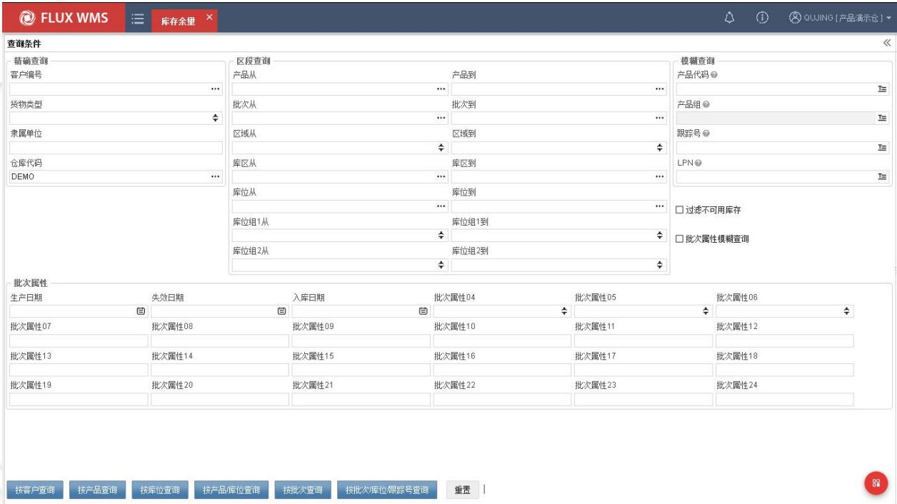

## [图10-2-1]

## ◇ 精确查询：

查询结果与查询条件精确匹配，从……到的查询条件则是可以针对信息区间进行查询。具体字段说明如下： 

客户 - 所要查询的货主代码。 

货物类型 - 产品所属货物类型。 

产品 - 所要查询的产品代码。 

库位 - 所要查询的库位。 

区域 - 所要查询的区域。 

库位组 1 - 所要查询的库存所属库位组 1。 

库位组 2 - 所要查询的库存所属库位组 2。 

上架区 - 所要查询的库存所属上架库区。 

拣货区 - 所要查询的库存所属拣货库区。 

批次 - 所要查询的库存批次号码。 

隶属单位 - 所要查询的客户所属隶属单位代码。 

仓库 - 所要查询的库存存储仓库。 

模糊查询： 

可以按照产品、产品组，或者跟踪号、LPN 号码模糊查询，查询包含输入条件的全部库存。例如输入产品 MO 模糊查询条件，能够查询到产品 MOUSE 和 MODEL 以及 AL234MO2 等全部包含 MO 的库存记录。 

注：LPN 号码，是二级跟踪号管理模式中的托盘号层级跟踪号码。 

✨ 批次属性： 

批次属性查询部分，与客户对应的，客户所用批次属性规则内容，根据所选客户动态显示。可以通过勾选“批次属性模糊查询”选项，控制是否对批次属性内容进行模糊查询。 

## 过滤不可用库存：

如勾选，查询结果隐藏可用库存为 0 的记录。例如全部被冻结的库存记录。 

■ 根据需要选择不同的查询方式： 

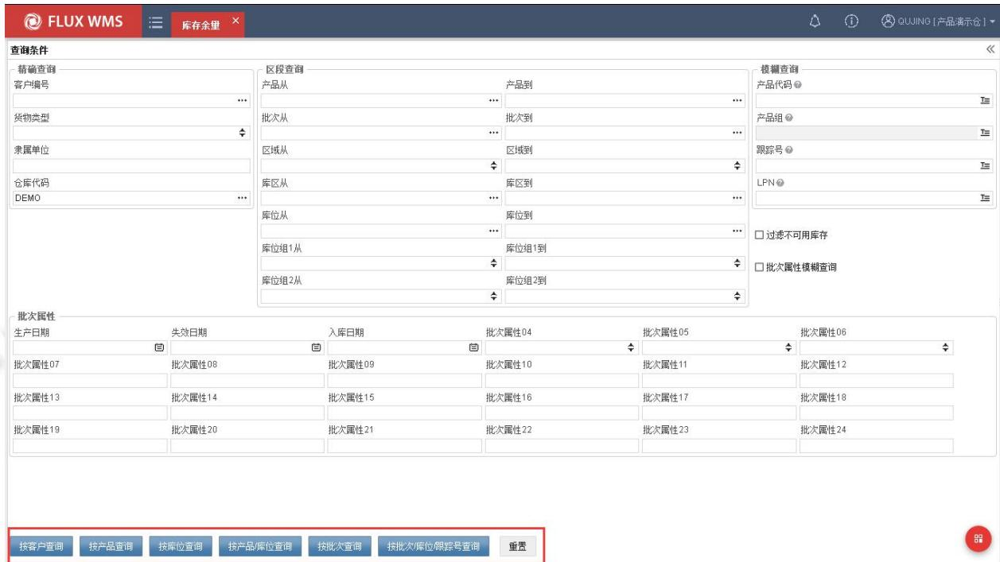

[图10-2-2]

## ■ 按客户查询

根据客户 ID 进行查询，显示客户级的汇总库存信息 

## ■ 按产品查询

根据产品进行查询，展示产品库存情况，但忽略存储位信息。相关数量信息为： 

库存数量 - 该产品的总数量。 

其他/整托/整箱/内包装/零件 - 按产品包装设置换算的对应包装数量。 

分配数量 - 该产品已经被订单分配锁定的总数量。 

冻结数量 - 该产品不可操作的库存数量。 

可用数量 - 该产品库存中除去被冻结和被（预）分配之外，可以用于新发运订单的库存数量。入库具有上架任务，但尚未上架确认的库存，同样不可用。 

## ■ 按库位查询

查询库位存储情况。忽略产品相关信息，仅显示库位中的数量、体积等信息。 

## ■ 按产品/库位查询

查询产品在不同库位的存储情况。 

补货待上架数量 - 补货任务待操作数量。同一补货任务，对于来源库位锁定为补货待下架数量；对于补货目标库位，锁定为补货待上架数量。 

## 待上架数量 - 上架任务待操作数量

待移入数量 - 移库任务待操作数量。同一移库任务，对于来源库位锁定为待移出数量；对于目标库位，锁定为待移入数量。 

补货待下架数量 - 补货任务待操作数量。同一补货任务，对于来源库位锁定为补货待下架数量；对于补货目标库位，锁定为补货待上架数量。 

待移出数量 - 移库任务待操作数量。同一移库任务，对于来源库位锁定为待移出数量；对于目标库位，锁定为待移入数量。 

## ■ 按批次查询

查询产品的库存批次相关信息内容。 

批次 - 库存的批次号（可参考基础设置批次属性部分）。 

订货数 - 默认为空，用于根据库存生成单证。 

批次属性内容 - 该批次产品具体的批次属性内容。根据产品对应的批次属性规则显示。 

通过鼠标右键菜单的“查询预配数”功能，可显示批次库存预分配情况。 

■ 按批次/库位/跟踪号查询 

查询最明细的库存信息 

跟踪号 - 库存的跟踪号。 

LPN - 二级跟踪号管理模式中的托盘级跟踪号。 

订货数 - 默认为空，用于根据库存生成单证。 

补货待下/上架数量 - 补货任务待操作数量。同一补货任务，对于来源库位锁定为补货待下架数量；对于补货目标库位，锁定为补货待上架数量。 

待上架数量 - 上架任务待操作数量 

待移出/入数量 - 移库任务待操作数量。同一移库任务，对于来源库位锁定为待移出数量；对于目标库位，锁定为待移入数量。 

待调整数量 - 调整单待执行数量 

## - 分页鼠标右键菜单

其余右键功能，各个页签内容有所不同，项目最多的是按批次/库位/跟踪号查询模式： 

## FLUX WMS

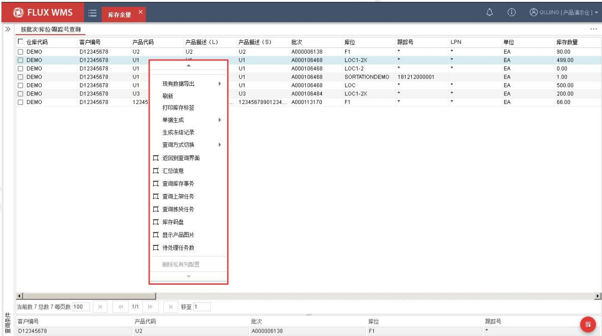

[图 10-2-3]

## ■ 查询库存事务

针对所选记录，跳转到库存事务查询界面，将客户、产品等作为默认查询条件，可查询相应库存事务记录。 

## ■ 查询上架任务

针对所选记录，跳转到任务管理的上架任务功能，根据货主、产品代码查询库存记录对应的上架任务。上架任务功能，可参考任务管理部分的介绍。 

## ■ 查询拣货任务

针对所选记录，跳转到任务管理的拣货任务功能，根据货主、产品代码查询库存记录对应的拣货任务。拣货任务功能，可参考任务管理部分的介绍。 

## ■ 打印库存标签

针对查询所得的库存，打印库存标签。 

## ■ 单据生成：

## 生成发运订单/移库单/转移单/冻结单/拆箱单/增值服务单

根据所选记录生成对应单据。数量为订货数字段输入的数量，如果订货数字段为空，则默认为记录的可用余量。 

## 添加到当前发运订单

选中的记录，添加到操作员所创建的、当前仍旧是创建状态的首个订单中。如果没有相应订单，由系统自动创建。 

## 生成冻结记录

将所选库存记录冻结。系统自动在冻结功能中添加相应冻结记录。 

## 库存码盘

对已在库的大批量库存进行托盘化整理，生成不同的标签。 

## ■ 显示产品图片

对于有维护过产品图片的库存记录，可通过此功能，在库存余量界面选择记录，显示产品图片，方便用户比对。 

## ■ 待处理任务数

库存记录相关的任务，可能是待上架任务、待补货任务等各种类型，默认隐藏，点击此右键功能后，进行显示。 

## 10.3. 库存事务

库存事务功能用于记录产品在系统中的所有活动，用户可查看、追溯系统历史操作记录。同时，由于库存事务中详细记录了每个操作的人员、始末时间、交易数量和交易单号，因而也常用于辅助仓库统计员工的绩效考核。 

## - 库存事务查询

■ 选择“库存管理”下的“库存事务”。 

■ 根据需要输入查询条件，发起查询，系统查找对应的记录并显示： 

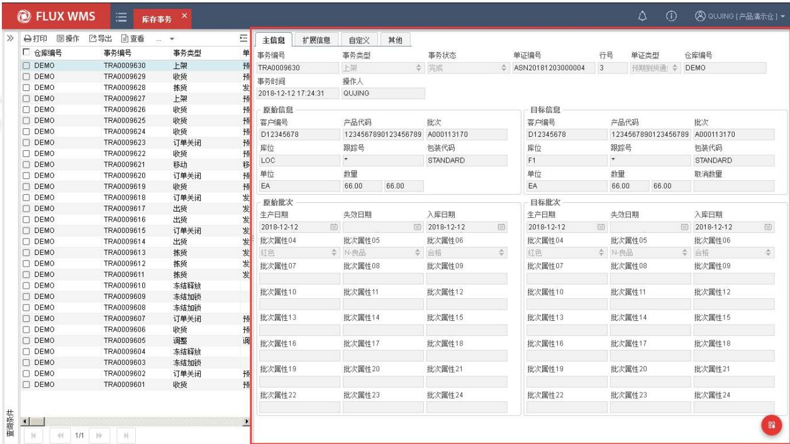

[图10-3-1]

事务编号 - 系统自动生成的事务流水号。 

事务类型 - 操作事务分类，如上架、发货等。 

事务状态 - 操作情况，如完成、取消。 

单证号 - 操作事务对应的单证号。 

单证行号 - 操作对应的单证行号。 

单证类型 - 操作对应的单证类型，如 ASN（预期到货通知单）、SO（发运单）等。 

仓库编号 - 操作记录发生的仓库代码。 

事务时间 - 操作发生的时间。 

操作人员 - 记录的操作人员执行人员。如上架人、拣货人等。通常使用 RF 进行操作时，操作人员即是系统人员。但使用打印单据操作，执行实际操作，与最终在 WMS 系统中确认操作完成的，有可能是不同的作业员（例如收货员收货，单证员在系统中确认收货完成）。此时执行系统确认时，可以录入操作人员信息。 

系统人员 - 系统操作人员 ID。 

原始信息 - 操作进行前的库存信息情况。例如调整前库存数量与调整后数量不同。 

目标信息 - 操作进行后的库存信息情况。例如转移前的 SKU 代码有可能与转移后不同。 

客户编号 - 操作前后客户代码（例如转移操作可以修改客户代码） 

产品 - 操作前后产品代码（转移操作可以修改产品代码） 

批次号 - 操作前后产品所具有的批次号 

库位 - 操作前后产品所在库位。 

跟踪号 - 操作前后产品的跟踪号。 

包装代码 - 操作前后产品所用包装。 

单位 - 操作前后所用的数量单位。 

库存数量 - 操作前后的产品数量，以所选单位值为数量单位。后一字段为对应的主单位数量。 

取消数量 - 部分取消收货情况下的取消数量。因此只在操作后的部分显示 

批次属性 - 涉及的产品记录操作前后的批次属性值内容。 

■ 附加信息页签，显示其他附加信息： 

模块 ID - 执行操作的功能模块 ID。 

工作站 - 执行操作的工作台 ID。 

原因 - 操作时所选原因代码及描述。如调整原因。 

上架任务编号 - 任务号 

上架顺序 - 任务拆分时的顺序号 

QC 任务编号 - 任务号 

QC 顺序 - 任务拆分时的顺序号 

接口发送时间 - 接口发送时间 

接口发送标记 - 接口发送成功标记 

## 10.4. 库存冻结单

在某些情况下，会由于各方面原因，不允许仓库中的部分产品出库发运，例如某批次产品过保质期，或者需要等待检验批文才能出库，甚至货主通知某些产品暂时不能出库等等。 

FLUX WMS 在提供自动冻结过期库存（启用保质期管理的情况下）功能之外，还提供了库存冻结功能，能够根据不同情况将库存冻结、锁定，能够帮助用户对产品的操作进行控制，不再需要人工记忆不同客户、不同原因的封货指令。 

库存批量冻结处理，或者需要分步审核的业务情况，可以通过库存冻结单来实现冻结操作，以单据形式管理库存冻结。对库存的影响则是冻结后不可进行出库操作，即冻结库存不参与分配。 

## - 库存冻结单

■ 选择 “库存管理” 中的 “库存冻结单”。 

■ 点击【新增】按钮，在表头的主信息页签，输入客户编号并保存。 

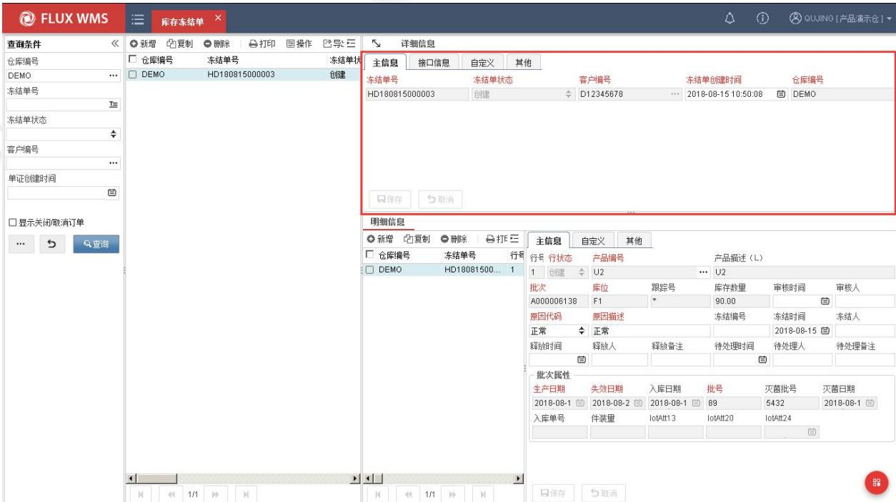

[图 10-4-1]

■ 明细信息部分，点击【新增】按钮后，通过 SKU 浏览按钮，在二级窗口中选择库存记录（系统会过滤 0 库存记录信息）并确认，返回主信息界面，维护冻结原因、描述，保存记录。 

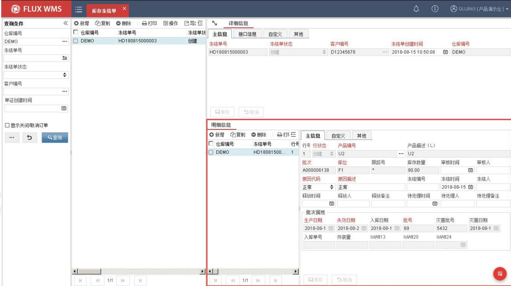

[图10-4-2]

■ 选择明细行记录，通过鼠标右键菜单功能，对待冻结记录进行审核。 

■ 已审核记录，可通过鼠标右键功能执行冻结。 

## - 鼠标右键功能项

■ 表头右键菜单： 

<table><tr><td>主信息</td><td>自定义</td><td>其他</td></tr><tr><td>行号</td><td>行状态</td><td>产品编号</td></tr><tr><td>1</td><td>创建</td><td>U2</td></tr><tr><td>批次</td><td>库位</td><td>跟踪号</td></tr><tr><td>A000006138</td><td>F1</td><td>*</td></tr><tr><td>原因代码</td><td colspan="2">原因描述</td></tr><tr><td>正常</td><td colspan="2">正常</td></tr><tr><td>释放时间</td><td>释放人</td><td>释放备注</td></tr><tr><td colspan="3">批次属性</td></tr><tr><td>生产日期</td><td>失效日期</td><td>入库日期</td></tr><tr><td>2018-08-1</td><td>2018-08-2</td><td>2018-08-1</td></tr><tr><td>入库单号</td><td>件装量</td><td>IotAtt 13</td></tr><tr><td></td><td></td><td></td></tr></table>

## [图10-4-3]

## 取消冻结单

单据取消，已操作单据不可取消。 

关闭冻结单 

关闭单据，结束作业 

## 审核冻结单

对冻结单进行审核。已审核单据才能执行冻结 

## 取消审核

已审核单据，还原到创建状态以便进行修改。 

■ 明细右键菜单： 

<table><tr><td>主信息</td><td>自定义</td><td>其他</td></tr><tr><td>行号</td><td>行状态</td><td>产品编号</td></tr><tr><td>1</td><td>创建</td><td>U2</td></tr><tr><td>批次</td><td>库位</td><td>跟踪号</td></tr><tr><td>A000006138</td><td>F1</td><td>90.00</td></tr><tr><td>原因代码</td><td colspan="2">原因描述</td></tr><tr><td>正常</td><td colspan="2">正常</td></tr><tr><td>释放时间</td><td>释放人</td><td>释放备注</td></tr><tr><td colspan="3">批次属性</td></tr><tr><td>生产日期</td><td>失效日期</td><td>入库日期</td></tr><tr><td>2018-08-1</td><td>2018-08-2</td><td>2018-08-1</td></tr><tr><td>入库单号</td><td>件装量</td><td>IotAtt 13</td></tr><tr><td></td><td></td><td></td></tr><tr><td></td><td></td><td></td></tr><tr><td></td><td></td><td></td></tr><tr><td></td><td></td><td></td></tr><tr><td></td><td></td><td></td></tr><tr><td></td><td></td><td></td></tr><tr><td></td><td></td><td></td></tr></table>

[图10-4-4]

## 审核明细

对所选明细行记录进行审核确认。 

## 取消审核

对所选明细行记录进行取消审核，以便修改信息。 

## ☆ 冻结明细

对所选明细行记录进行取消审核，以便修改信息。 

## ☆ 冻结待处理

将明细行状态更新为“冻结待处理”，等待用户检查确认后做相关处理。常用于需要等待ERP确认的业务场景。 

## ✨ 释放明细

已冻结记录解除冻结，释放库存。 

## 取消订单行

创建状态行，取消，不再进行操作 

关闭订单行 

操作完成的订单行关闭，不允许再做操作。 

## 10.5. 库存转移单

有很多情况下，仓库需要对库存产品的信息进行修改。例如根据货主通知，原本 A 产品要全部更名为 A1 产品；或者产品拆小包装后发现实物上的批次属性值（如生产批号）与入库时客户提供的单证上的记录不一致，批次属性内容需要修改。 

也有些情况下，库内两个不同货主间进行货物交易，可以直接进行货权变更，实物无需拣货、出库再入库、上架。 

FLUX WMS 的提供库存转移单功能，可以批量改变产品的相关信息，包括货主、品名等等。但库存总量保持不变。 

## - 库存转移单操作

■ 选择 “库存管理” 下的 “库存转移单”。 

■ 点击【新增】按钮，在表头主信息页签依次输入： 

<table><tr><td>查询条件</td><td colspan="9">新增 删除 打印 操作 导出 编辑</td></tr><tr><td>仓库编号</td><td>仓库编号</td><td>转移单号</td><td>转移类型</td><td rowspan="11" colspan="6"></td></tr><tr><td>DEMO</td><td>DEMO</td><td>TF000601</td><td>正常</td></tr><tr><td>转移单号</td><td colspan="3"></td></tr><tr><td>转移单状态</td><td colspan="3"></td></tr><tr><td>客户编号</td><td colspan="3"></td></tr><tr><td>产品(从)</td><td colspan="3"></td></tr><tr><td>产品(到)</td><td colspan="3"></td></tr><tr><td>单证创建时间(从)</td><td colspan="3"></td></tr><tr><td>单证创建时间(到)</td><td colspan="3"></td></tr><tr><td>显示关闭/取消订单</td><td colspan="3"></td></tr><tr><td>查询</td><td colspan="3"></td></tr></table>

[图10-5-1]

仓库代码 - 单据所属作业仓库 

转移单号 - 系统自动生成的单证号。 

转移单状态 - 单证状态，默认为创建状态。 

转移类型 - 单证类型，用于区分不同的库存转移单。 

客户编号 - 输入或选择待转移操作的货物所属的货主代码。 

创建时间 - 库存转移单创建时间 

转移时间 - 转移操作执行时间，默认为订单创建时间。 

转移代码 - 转移原因代码 

转移原因 - 转移原因说明，默认为同原因代码。 

创建人 - 单据创建的操作人员 

来源 - 根据 SO 创建移库单时，系统记录的单据来源 

来源单号 - 根据 SO 创建移库单时，系统记录的 SO 号码 

■ 点击【保存】按钮，保存转移单头信息。 

在 “附加信息” 页签，可见转移单的来源单号、行号。如果是从 SO 创建的转移单，会记录对应信息。 

在转移单明细部分，点击【新增】按钮，通过点击产品浏览按钮，系统显示库存选择二级窗口。输入所需的产品代码并查询，选择需要修改信息的库存记录，双击选择。 

■ 系统返回转移单页面，并显示所选库存记录的相关内容。用户在“转移信息”部分，输入此次转移操作影响到的库存数量，并根据实际需要修改目标批次等信息内容。 

<table><tr><td>查询条件</td><td colspan="10">新增 删除 打印 操作 导出</td></tr><tr><td>仓库编号</td><td>仓库编号</td><td>转移单号</td><td colspan="8">转移类型</td></tr><tr><td>DEMO</td><td>TF000601</td><td colspan="9">正常</td></tr><tr><td>转移单号</td><td colspan="3">转移单状态</td><td colspan="3">转移类型</td><td colspan="2">转移时间</td><td colspan="2">仓库编号</td></tr><tr><td>TF000601</td><td colspan="3">创建转移单</td><td colspan="3">正常</td><td colspan="2">2019-01-04 16:18:45</td><td colspan="2">DEMO</td></tr><tr><td>客户编号</td><td colspan="3">原因代码</td><td colspan="3">转移原因</td><td colspan="4"></td></tr><tr><td>D12345678</td><td colspan="3">加工损耗</td><td colspan="3">加工损耗</td><td colspan="4"></td></tr><tr><td colspan="11">保存 取消</td></tr><tr><td colspan="11">明细信息</td></tr><tr><td colspan="11">新增 复制 删除 打印</td></tr><tr><td colspan="11">主信息 自定义 其他</td></tr><tr><td colspan="11">行号 行状态 产品编号 产品描述 (L)</td></tr><tr><td colspan="11">1 创建U1 ... U1</td></tr><tr><td>库位</td><td>跟踪号</td><td>库存数量</td><td colspan="8">可用数量</td></tr><tr><td>LOC</td><td>*</td><td>500.00</td><td colspan="8">0.00</td></tr><tr><td>批次</td><td>毛重</td><td>体积</td><td colspan="8"></td></tr><tr><td>A000106468</td><td>0.000</td><td>0.0000</td><td colspan="8"></td></tr><tr><td colspan="11">转移信息</td></tr><tr><td>目标客户</td><td colspan="2">目标产品</td><td colspan="8">产品描述 (L)</td></tr><tr><td>D1234567 ...</td><td colspan="10">U1 ... U1</td></tr><tr><td>目标库位</td><td>目标跟踪号</td><td>目标单位</td><td colspan="8">转移...</td></tr><tr><td>LOC ...</td><td>*</td><td>EA</td><td colspan="8">2.00</td></tr><tr><td>目标毛重</td><td>目标体积</td><td colspan="9"></td></tr><tr><td>0.000</td><td>0.0000</td><td colspan="9"></td></tr><tr><td colspan="11">试验批次</td></tr><tr><td>生产日期</td><td>失效日期</td><td>入库日期</td><td>批次属性04</td><td>批次属性05</td><td colspan="6">批次属性06</td></tr><tr><td>2018-12-0</td><td>2019-02-2</td><td>2018-12-0</td><td>红色</td><td>N-良品</td><td colspan="6">合格</td></tr><tr><td>批次属性07</td><td>批次属性08</td><td>批次属性09</td><td>批次属性10</td><td>批次属性11</td><td colspan="6">批次属性12</td></tr><tr><td colspan="11">保存 取消</td></tr></table>

## [图 10-5-2]

■ 修改完成后，保存明细。 

库存转移单创建完毕，由相应人员进行审核，可打印转移申请单据。审核后，通过表头鼠标右键菜单确认审核。 

■ 已审核单据，选择需要执行信息变更、转移的记录，或通过右键菜单全选。 

■ 明细部分，鼠标右键菜单选择功能“执行转移”，系统执行库存转移。 

注：转移单也可以通过库存余量生成。在库存余量按批次/库位/跟踪号查询方式界面，选择记录、修改订货数，通过鼠标右键菜单功能项“生成库存转移单”可生成指定产品的库存转移单，后续操作相同。 

## - 鼠标右键菜单

■ 表头右键菜单： 

在转移单表头部分的导航窗口中，点击鼠标右键，系统显示相应右键菜单如下 

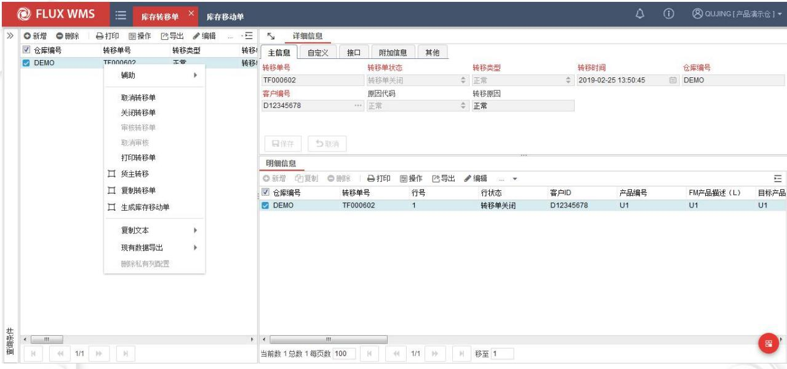

[图10-5-3]

取消转移单 - 转移单取消，不再操作，也不可修改。 

关闭转移单 - 已执行转移单关闭，不可再修改。 

审核转移单 - 确认转移单通过审核，能够执行后续转移操作。 

取消审核 - 仅对通过审核的单据有效。将单据恢复到未审核状态。 

◇ 货主转移 - 在转移单中，需要批量修改货主时使用。选择后，系统显示货主选择二级窗口，并将所选择的货主代码更新到全部明细的转移客户字段中。不再需要人工逐一修改。 

✨ 打印转移单 - 打印纸面单证，用于指导仓库内实物操作。 

生成库存转移单 -部分业务场景，需要分步操作库存转移、库存移动。点击"生成库存移动单"后，系统会基于已完成转移操作的库存转移单（状态为“转移完成”和“关闭”的单证）自动生成对应库存的库存移动单。 

■ 明细右键菜单： 

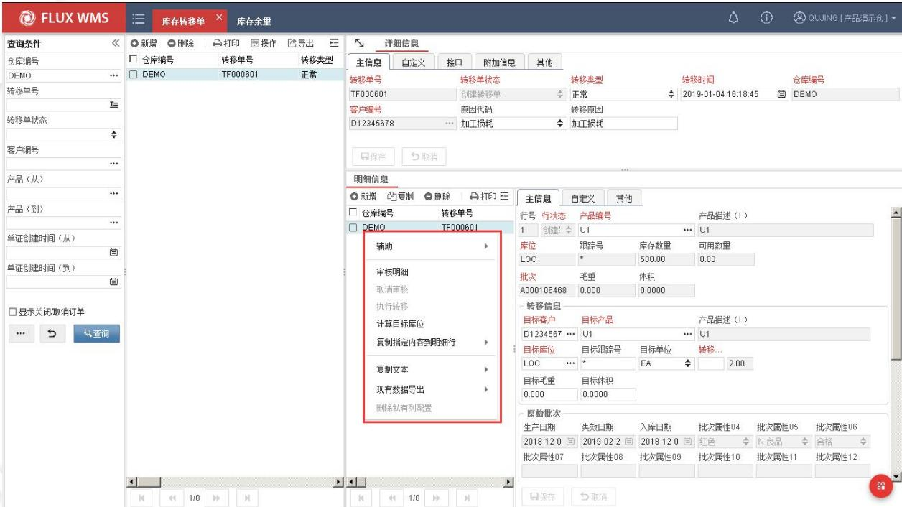

## [图 10-5-4]

☆ 审核明细 - 所选明细行审核确认 

取消审核 - 所选明细行取消审核 

执行转移 - 所选明细行记录，确认执行转移操作。 

计算目标库位 - 根据上架规则，为产品计算上架库位，作为转移后的目标库位。 

✿ 复制指定内容到明细行 - 将当前明细记录作为模版，把所选记录的货主，跟踪号，或者库位，批次属性内容批量更新到其他行的对应信息字段。 

## 10.6. 库存调整单

在仓库操作和管理中，难免会发生一些不可避免的人为错误或库存异常，例如收货数量输入错误或者盘点时发现某库存产品短少。为了尽可能的达成系统数据准确，进而保障系统操作的正确性，需要及时将系统数量与实际库存调整一致。此时，就能通过 FLUX WMS 的库存调整单功能来实现库存的准确性维护。 

## - 库存调整单操作

■ 选择 “库存管理” 下的 “库存调整单”。 

■ 点击【新增】按钮，在表头的主信息页签，依次输入： 

<table><tr><td>查询条件</td><td colspan="10">新增 删除 打印 操作 导出 编辑</td></tr><tr><td>仓库编号</td><td colspan="10">调整单号 调整单状态</td></tr><tr><td>DEMO</td><td colspan="10">AD180815000001 调整完毕</td></tr><tr><td>仓库编号</td><td>调整单号</td><td colspan="3">调整单状态</td><td>调整单类型</td><td colspan="3">调整时间</td><td colspan="2">仓库编号</td></tr><tr><td>AD180815000001</td><td>调整完毕</td><td colspan="3">普通调整单</td><td>2018-08-15 10:32:28</td><td colspan="5">DEMO</td></tr><tr><td>客户编号</td><td>调整代码</td><td colspan="9">调整原因</td></tr><tr><td>D12345678</td><td>加工损耗</td><td colspan="9">加工损耗</td></tr><tr><td colspan="11">保存 取消</td></tr><tr><td colspan="11">明细信息</td></tr><tr><td colspan="11">新增 复制 删除 打印 操作 导出 编辑 ...</td></tr><tr><td>仓库编号</td><td>调整单号</td><td>行号</td><td>行状态</td><td>产品代码</td><td>批次</td><td>库位编码</td><td colspan="4">跟踪号</td></tr><tr><td>DEMO</td><td>AD180815000001</td><td>1</td><td>调整完毕</td><td>U2</td><td>A000006138</td><td>F1</td><td colspan="4">*</td></tr></table>

[图 10-6-1]

调整单编号 - 系统自动生成的单证号。 

调整单状态 - 单证状态，默认为创建状态。 

调整单类型 - 单证类型，用于区分不同的库存调整单。 

调整时间 - 调整作执行时间，默认为订单创建时间。 

仓库编号 - 单据所属作业仓库 

客户编号 - 输入或选择待调整操作的货物所属的货主代码。 

调整原因 - 调整原因代码 

原因描述 - 调整原因说明，支持用户自行录入，默认为同原因代码。 

创建时间 - 库存转移单创建时间。 

■ 点击【保存】按钮，完成调整单头信息维护。 

■ 在附加信息页签可见盘点单号信息 

从盘点单生成调整单时，系统会记录对应盘点单号（盘点单生成调整单的具体操作请参考库存盘点部分）。 

在调整单明细部分，点击【新增】按钮，在主信息页面，通过点击产品浏览按钮，系统显示库存选择二级窗口。输入所需的产品代码并查询，双击选择需要调整的库 

## 存记录。

<table><tr><td>查询条件</td><td colspan="11">新增 删除 打印 操作 导出 编</td></tr><tr><td>仓库编号</td><td colspan="11">调整单号</td></tr><tr><td>DEMO</td><td colspan="11">AD180815000001 调整完毕</td></tr><tr><td>仓库编号</td><td colspan="11">调整单号</td></tr><tr><td>DEMO</td><td colspan="11">AD180815000001 调整完毕</td></tr><tr><td>客户编号</td><td colspan="11">调整代码</td></tr><tr><td>D12345678</td><td colspan="11">加工损耗</td></tr></table>

[图10-6-2]

■ 系统返回调整单页面，并显示所选库存记录的相关内容。 

■ 用户在根据实际需要，输入调整的目标数量、目标毛重、体积等信息，并保存。 

库存调整单创建完毕，由相应人员进行审核，可打印调整单据。审核后，通过表头鼠标右键菜单确认审核。 

■ 在明细部分，选择需要执行调整的记录，或通过右键菜单全选。 

■ 明细部分，点选明细行，鼠标右键菜单选择功能“执行调整”，系统执行库存调整。 

## - 鼠标右键菜单

■ 表头右键菜单： 

在调整单表头部分的导航窗口中，点击鼠标右键，系统显示相应右键菜单如下 

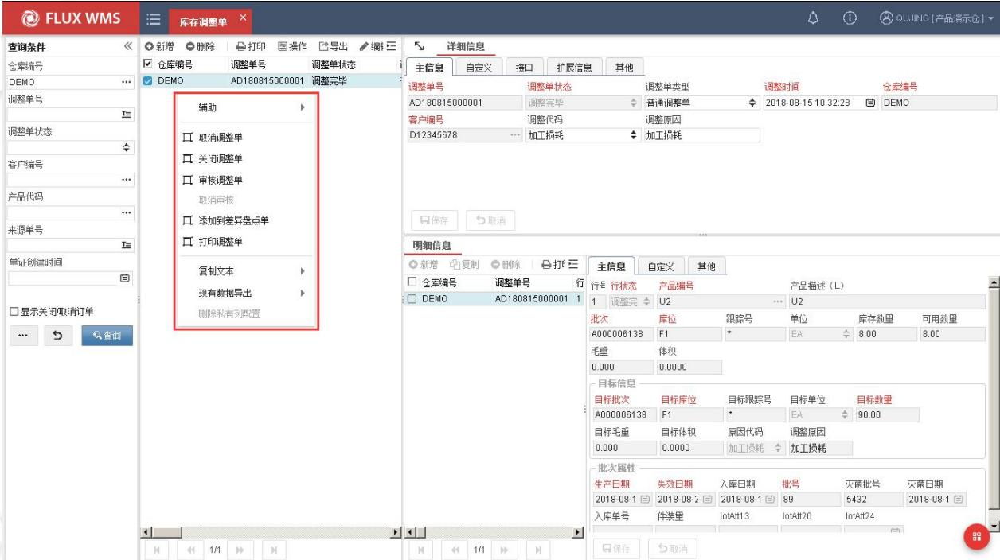

[图10-6-3]

取消调整单 - 调整单取消，不再操作，也不可修改。 

关闭调整单 - 已执行调整单关闭，不可再修改。 

审核调整单 - 确认调整单通过审核，能够执行后续调整操作。 

取消审核 - 仅对通过审核的单据有效。将调整单恢复到未审核状态。 

添加到差异盘点单 - 0 库存增加的调整记录，可加入到差异盘点单中进行复盘 

✨ 打印调整单 - 打印纸面单证，用于调整审批或存档。 

■ 明细右键菜单： 

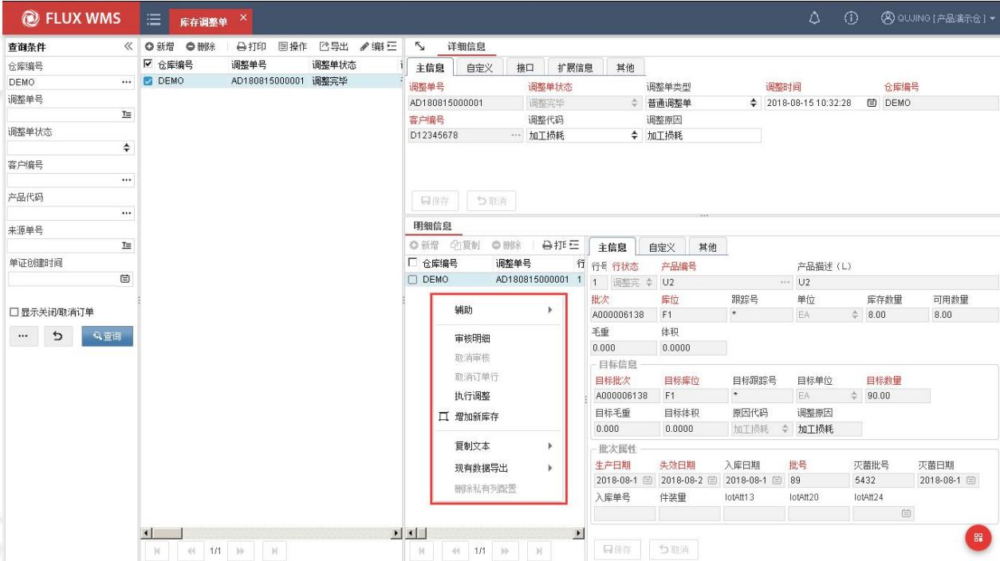

[图 10-6-4]

审核明细 - 基于明细行进行审核确认 

取消审核 - 明细行审核取消 

取消订单行 - 所选明细行取消 

执行调整 - 所选明细行记录，确认执行调整操作。 

增加新库存 - 正常的调整操作，需要在已有库存的记录上进行。但如果由于误操作，已经将库存调整为 0，再需要将库存由 0 调整回来，由于没有库存记录可以选择，无法操作。因此 FLUX WMS 系统提供了“增加新库存”功能，可以从 0 库存开始调整增加。 

选择“增加新库存”功能后，系统显示如下新增库存二级窗口，依次录入产品、库位、数量、批次属性等信息。保存后系统生成对应的0库存调整增加的明细记录。 

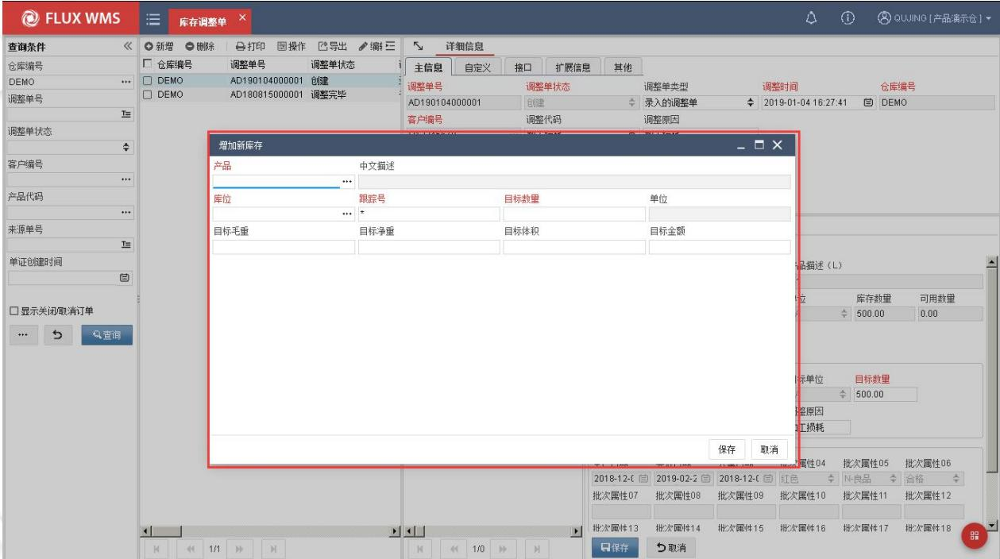

[图 10-6-5]

## 10.7. 库存移动单

在仓库中，常常会由于种种原因而移动产品、改变货物的存储位置，例如，在仓库操作过程中，发现有产品破损，通常需要将其由原来存放的库位移至另设的产品破损库位存放，防止破损货物被当作正常品发货给收货客户。或者定期整理库存，将周转比较慢的货物移动到慢速周转库区。库存移动单功能可以帮助仓库对货物存储位置做批量变更，甚至重新规划仓库内货物的存放。 

## - 库存移动单

■ 选择 “库存管理” 下的 “库存移动单”。 

■ 点击【新增】按钮，在表头的主信息页签，依次输入： 

<table><tr><td colspan="101">查询条件</td></tr><tr><td colspan="100">仓库编号</td><td></td></tr><tr><td colspan="97">DEMO</td><td></td><td></td><td></td><td></td></tr><tr><td colspan="97">移动单号</td><td></td><td></td><td></td><td></td></tr><tr><td colspan="92">移类型</td><td></td><td></td><td></td><td></td><td></td><td></td><td></td><td></td><td></td></tr><tr><td colspan="87">移动单状态</td><td></td><td></td><td></td><td></td><td></td><td></td><td></td><td></td><td></td><td></td><td></td><td></td><td></td><td></td></tr><tr><td colspan="84">客户编号</td><td></td><td></td><td></td><td></td><td></td><td></td><td></td><td></td><td></td><td></td><td></td><td></td><td></td><td></td><td></td><td></td><td></td></tr><tr><td colspan="81">产品代码</td><td></td><td></td><td></td><td></td><td></td><td></td><td></td><td></td><td></td><td></td><td></td><td></td><td></td><td></td><td></td><td></td><td></td><td></td><td></td><td></td></tr><tr><td colspan="78">单证创建时间</td><td></td><td></td><td></td><td></td><td></td><td></td><td></td><td></td><td></td><td></td><td></td><td></td><td></td><td></td><td></td><td></td><td></td><td></td><td></td><td></td><td></td><td></td><td></td></tr><tr><td colspan="72">显示关闭/取消订单</td><td></td><td></td><td></td><td></td><td></td><td></td><td></td><td></td><td></td><td></td><td></td><td></td><td></td><td></td><td></td><td></td><td></td><td></td><td></td><td></td><td></td><td></td><td></td><td></td><td></td><td></td><td></td><td></td><td></td></tr><tr><td>查询查询信息明细信息新增复制删除打印主信息自定义其他行行状态产品编号产品描述(L)1创建移U3U3批次库位跟踪号单位库存数量可用数量A000106484LOC1-2XEA200.00200.00毛重体积600.0005400.0000目标信息目标库位目标跟踪号目标单位移动...A000106484LOC1-2XEA1.001.00批次属性生产日期失效日期入库日期批次属性04批次属性05批次属性062018-12-2018-12-2红色N-良品合格批次属性07批次属性08批次属性09批次属性10批次属性11批次属性12批次属性13批次属性14批次属性15批次属性16批次属性17批次属性18保存取消&lt; img src=&quot;&quot;&gt;查询查询</td><td>主信息自定义其他行行状态产品编号产品描述(L)1创建移U3U3批次库位跟踪号单位库存数量可用数量A000106484LOC1-2XEA200.00200.00毛重体积600.0005400.0000目标信息目标库位目标跟踪号目标单位移动...A000106483LOC1-2XEA1.001.00批次属性生产日期失效日期入库日期批次属性04批次属性05批次属性062018-12-2018-12-2红色N-良品合格批次属性07批次属性08批次属性09批次属性10批次属性11批次属性12批次属性13批次属性14批次属性15批次属性16批次属性 17批次属性18保存取消&lt; img src&gt;查询查询查询查询查询查询查询查询查询查询查询查询查询查询查询查询查询查询查询查询查询查询查询查询查询查询查询查询查询查询查询查询查询查询查询查询查询查询查询查询查询查询查询查询查询查询查询查询查询查询查询查询查询查询查询查询查询查询查询查询查询查询查询查询查询查询查询查询查询查询查询查询查询查询查询查询查询查询查询查询查询查询查询查询查询查询查询查询查询查询查询查询查询查询查询查询查询查询查询查询查看查询查询查询查询查询查询查询查询查询查询查询查询查询查询查询查询查询查询查询查询查询查询查询查询查询查询查询查询查询查询查询查询查询查询查询查询查询查询查询查询查询查询查询查询查询查询查询查询查询查询查询查询查询查询查询查询查询查询查询查询查询查询查询查询查询查询查询查询查询查询查询查询查询查询查询查询查询查询查询查询查询查询查询查询查询查询查询查询查询查询查询查询查询查询查询查询查询查询查询冷冻冷冻冷冻冷冻冷冻冷冻冷冻冷冻冷冻冷冻冷冻冷冻冷冻冷冻冷冻冷冻冷冻冷冻冷冻冷冻冷冻冷冻冷冻冷冻冷冻冷冻冷冻冷冻冷冻冷冻冷冻冷冻冷冻冷冻冷冻冷冻冷冻冷冻冷冻冷冻冷冻冷冻冷冻冷冻冷冻冷冻冷冻冷冻冷冻冷冻冷冻冷冻冷冻冷冻冷冻冷冻冷冻冷冻冷冻冷冻冷冻冷冻冷冻冷冻冷冻冷冻冷冻冷冻冷冻冷冻冷冻冷冻冷冻冷冻冷冻冷冻冷冻冷冻冷冻冷冻冷冻冷冻冷冻冷冻冷冻冷冻冷冻冷冻冷冻冷冻冷冻冷冻冷冻冷冻冷冻冷冻冷冻冷冻冷冻冷冻冷藏冷冻冷冻冷冻冷冻冷冻冷冻冷冻冷冻冷冻冷冻冷冻冷冻冷冻冷冻冷冻冷冻冷冻冷冻冷冻冷冻冷冻冷冻冷冻冷冻冷冻冷冻冷冻冷冻冷冻冷冻冷冻冷冻冷冻冷冻冷冻冷冻冷冻冷冻冷冻冷冻冷冻冷冻冷冻冷冻冷冻冷冻冷冻冷冻冷冻冷冻冷冻冷冻冷冻冷冻冷冻冷冻冷冻冷冻冷冻冷冻冷冻冷冻冷冻冷冻冷冻冷冻冷冻冷冻冷冻冷冻冷冻冷冻冷冻冷冻冷冻冷冻冷冻冷冻冷冻冷冻冷冻冷冻冷冻冷冻冷冻冷冻冷冻冷冻冷冻冷冻冷冻冷冻冷冻冷冻冷冻冷冻冷冻冷冻冷冻冻结冷冻冷冻冷冻冷冻冷冻冷冻冷冻冷冻冷冻冷冻冷冻冷冻冷冻冷冻冷冻冷冻冷冻冷冻冷冻冷冻冷冻冷冻冷冻冷冻冷冻冷冻冷冻冷冻冷冻冷冻冷冻冷冻冷冻冷冻冷冻冷冻冷冻冷冻冷冻冷冻冷冻冷冻冷冻冷冻冷冻冷冻冷冻冷冻冷冻冷冻冷冻冷冻冷冻冷冻冷冻冷冻冷冻冷冻冷冻冷冻冷冻冷冻冷冻冷冻冷冻冷冻冷冻冷冻冷冻冷冻冷冻冷冻冷冻冷冻冷冻冷冻冷冻冷冻冷冻冷冻冷冻冷冻冷冻冷冻冷冻冷冻冷冻冷冻冷冻冷冻冷冻冷冻冷冻冷冻冷冻冷冻冷冻冷冻冷冻冷冷冻冷冻冷冻冷冻冷冻冷冻冷冻冷冻冷冻冷冻冷冻冷冻冷冻冷冻冷冻冷冻冷冻冷冻冷冻冷冻冷冻冷冻冷冻冷冻冷冻冷冻冷冻冷冻冷冻冷冻冷冻冷冻冷冻冷冻冷冻冷冻冷冻冷冻冷冻冷冻冷冻冷冻冷冻冷冻冷冻冷冻冷冻冷冻冷冻冷冻冷冻冷冻冷冻冷冻冷冻冷冻冷冻冷冻冷冻冷冻冷冻冷冻冷冻冷冻冷冻冷冻冷冻冷冻冷冻冷冻冷冻冷冻冷冻冷冻冷冻冷冻冷冻冷冻冷冻冷冻冷冻冷冻冷冻冷冻冷冻冷冻冷冻冷冻冷冻冷冻冷冻冷冻冷冻冷冻冷冻冷冻冷冻冷冻冷冻低温冷冻低温冷冻低温冷冻低温冷冻低温冷冻低温冷冻低温冷冻低温冷冻低温冷冻低温冷冻低温冷冻低温冷冻低温冷冻低温冷冻低温冷冻低温冷冻低温冷冻低温冷冻低温冷冻低温冷冻低温冷冻低温冷冻低温冷冻低温冷冻低温冷冻低温冷冻低温冷冻低温冷冻低温冷冻低温冷冻低温冷冻低温冷冻低温冷冻低温冷冻低温冷冻低温冷冻低温冷冻低温冷冻低温冷冻低温冷冻低温冷冻低温冷冻低温冷冻低温冷冻低温冷冻低温冷冻低温冷冻低温冷冻低温冷冻低温冷冻温控低温低温低温低温低温低温低温低温低温低温低温低温低温低温低温低温低温低温低温低温低温低温低温低温低温低温低温低温低温低温低温低温低温低温低温低温低温低温低温低温低温低温低温低温低温低温低温低温低温低温低温低温低温低温低温低温低温低温低温低温低温低温低温低温低温低温低温低温低温低温低温低温低温低温低温低温低温低温低温低温低温低温低温低温低温低温低温低温低温低温低温低温低温低温低温低温低温低温低温低温温度控低温低温低温低温低温低温低温低温低温低温低温低温低温低温低温低温低温低温低温低温低温低温低温低温低温低温低温低温低温低温低温低温低温低温低温低温低温低温低温低温低温低温低温低温低温低温低温低温低温低温低温低温低温低温低温低温低温低温低温低温低温低温低温低温低温低温低温低温低温低温低温低温低温低温低温低温低温低温低温低温低温低温低温低温低温低温低温低温低温低温低温低温低温低温低温低温低温低温°C 1 1/1 1/0 1 1/0 1 1/0 1 1/0 1 1/0 1 1/0 1 1/0 1 1/0 1 1/0 1 1/0 1 1/0 1 1/0 1 1/0 1 1/0 1 1/0 1 1/0 1 1/0 1 1 /1 1 /1 1 1 /1 1 1 /1 1 1 /1 1 1 /1 1 1 /1 1 1 /1 1 1 /1 1 1 /1 1 1 /1 1 1 /1 1 1 /1 1 1 /1 1 1 /1 1 1 /1 1 1 /1 1 1 /1 1 1/1 1 /1 1 /1 1 1 /1 1 1 /1 1 1 /1 1 1 /1 1 1 /1 1 1 /1 1 1 /1 1 1 /1 1 1 /1 1 1 /1 1 1 /1 1 1 /1 1 1 /1 1 1 /1 1 1 /1</td><td>主信息自定义其他行行状态产品编号产品描述(L)1创建移U3U3批次库位跟踪号单位库存数量可用数量A000106484LOC1-2XEA200.00200.00毛重体积600.0005400.0000目标信息目标库位目标跟踪号目标单位移动...A000106464LOC1-2XEA1.001.00批次属性生产日期失效日期入库日期批次属性04批次属性05批次属性062018-12-2018-12-2红色N-良品合格批次属性07批次属性08批次属性09批次属性10批次属性11批次属性12批次属性13批次属性14批次属性15批次属性16批次性属性17批次属性18保存取消&lt; img src&gt; &lt; img src&gt; &lt; img src&gt; &lt; img src&gt; &lt; img src&gt; &lt; img src&gt; &lt; img src&gt; &lt; img src&gt; &lt; img src&gt; &lt; img src&gt; &lt; img src&gt; &lt; img src&gt; &lt; img src&gt; &lt; img src&gt; &lt; img src&gt; &lt; img src&gt; &lt; img src&gt; &lt; img src&gt; &lt; img src&gt; &lt; img src&gt; &lt; img src&gt; &lt; img src&gt; &lt; img src&gt; &lt; img src&gt; &lt; img src&gt; &lt; img src&gt; &lt;|caption_end|&gt;
&lt; img src&gt; &lt; img src&gt; &lt; img src&gt; &lt; img src&gt; &lt; img src&gt; &lt; img src&gt; &lt; img src&gt; &lt; img src&gt; &lt; img src&gt; &lt; img src&gt; &lt; img src&gt; &lt; img src&gt; &lt; img src&gt; &lt; img src&gt; &lt; img src&gt; &lt; img src&gt; &lt; img src&gt; &lt; img src&gt; &lt; img src&gt; &lt; img src&gt; &lt; img src&gt; &lt; img src&gt; &lt; img src&gt; &lt; img src&gt; &lt; img src&gt;&lt; img src&gt; &lt; img src&gt; &lt; img src&gt; &lt; img src&gt; &lt; img src&gt; &lt; img src&gt; &lt; img src&gt; &lt; img src&gt; &lt; img src&gt; &lt; img src&gt; &lt; img src&gt; &lt; img src&gt; &lt; img src&gt; &lt; img src&gt; &lt; img src&gt; &lt; img src&gt; &lt; img src&gt; &lt; img src&gt; &lt; img src&gt; &lt; img src&gt; &lt; img src&gt; &lt; img src&gt; &lt; img src&gt; &lt; img src&gt; &lt; img src&gt; &lt;/ img src&gt; &lt; img src&gt; &lt; img src&gt; &lt; img src&gt; &lt; img src&gt; &lt; img src&gt; &lt; img src&gt; &lt; img src&gt; &lt; img src&gt; &lt; img src&gt; &lt; img src&gt; &lt; img src&gt; &lt; img src&gt; &lt; img src&gt; &lt; img src&gt; &lt; img src&gt; &lt; img src&gt; &lt; img src&gt; &lt; img src&gt; &lt; img src&gt; &lt; img src&gt; &lt; img src&gt; &lt; img src&gt; &lt; img src&gt; &lt; img src&gt; 1 1/1 1/0 1/1 1/0 1/1 1/0 1/1 1/0 1/1 1/0 1/1 1/0 1/1 1/1 1/1 1/1 1/1 1/1 1/1 1/1 1/1 1/1 1/1 1/1 1/1 1/1 1/1 1/1 1/1 1/1 1/1 1/1 1/1 1/1 1/1 1/1 1/1 1/2 1/2 1/2 1/2 1/2 1/2 1/2 1/2 1/2 1/2 1/2 1/2 1/2 1/2 1/2 1/2 1/2 1/2 1/2 1/2 1/2 1/2 1/2 1/2 1/2 1/3 1/3 1/3 1/3 1/3 1/3 1/3 1/3 1/3 1/3 1/3 1/3 1/3 1/3 1/3 1/3 1/3 1/3 1/3 1/3 1/3 1/3 1/3 1/3 1/3 1/4 1/4 1/4 1/4 1/4 1/4 1/4 1/4 1/4 1/4 1/4 1/4 1/4 1/4 1/4 1/4 1/4 1/4 1/4 1/4 1/4 1/4 1/4 1/4 1/4 1/5 1/5 1/5 1/5 1/5 1/5 1/5 1/5 1/5 1/5 1/5 1/5 1/5 1/5 1/5 1/5 1/5 1/5 1/5 1/5 1/5 1/5 1/5 1/5 1/5 1/6 1/6 1/6 1/6 1/6 1/6 1/6 1/6 1/6 1/6 1/6 1/6 1/6 1/6 1/6 1/6 1/6 1/6 1/6 1/6 1/6 1/6 1/6 1/6 1/6 1/5 1/5 1/5 1/5 1/5 1/5 1/5 1/5 1/5 1/5 1/5 1/5 1/5 1/5 1/5 1/5 1/5 1/5 1/5 1/5 1/5 1/5 1/5 1/5 1/4 1/4 1/4 1/4 1/4 1/4 1/4 1/4 1/4 1/4 1/4 1/4 1/4 1/4 1/4 1/4 1/4 1/4 1/4 1/4 1/4 1/4 1/4 1/4 1/3 1/3 1/3 1/3 1/3 1/3 1/3 1/3 1/3 1/3 1/3 1/3 1/3 1/3 1/3 1/3 1/3 1/3 1/3 1/3 1/3 1/3 1/3 1/3 1/2 1/2 1/2 1/2 1/2 1/2 1/2 1/2 1/2 1/2 1/2 1/2 1/2 1/2 1/2 1/2 1/2 1/2 1/2 1/2 1/2 1/2 1/2 1/2 1/1 1/1 1/1 1/1 1/1 1/1 1/1 1/1 1/1 1/1 1/1 1/1 1/1 1/1 1/1 1/1 1/1 1/1 1/1 1/1 1/1 1/1 1/1 1/1 1/0 1/0 1/0 1/0 1/0 1/0 1/0 1/0 1/0 1/0 1/0 1/0 1/0 1/0 1/0 1/0 1/0 1/0 1/0 1/0 1/0 1/0 1/0 1/0 1/0 1/1 1/1 1/1 1/1 1/1 1/1 1/1 1/1 1/1 1/1 1/1 1/1 1/1 1/1 1/1 1/1 1/1 1/1 1/1 1/1 1/1 1/1 1/1 1/0 1/2 1/2 1/2 1/2 1/2 1/2 1/2 1/2 1/2 1/2 1/2 1/2 1/2 1/2 1/2 1/2 1/2 1/2 1/2 1/2 1/2 1/2 1/2 1/2 1/4 1/4 1/4 1/4 1/4 1/4 1/4 1/4 1/4 1/4 1/4 1/4 1/4 1/4 1/4 1/4 1/4 1/4 1/4 1/4 1/4 1/4 1/4 1/4 1/2 1/2 1/2 1/2 1/2 1/2 1/2 1/2 1/2 1/2 1/2 1/2 1/2 1/2 1/2 1/2 1/2 1/2 1/2 1/2 1/2 1/2 1/2 1/2 1/0 1/0 1/0 1/0 1/0 1/0 1/0 1/0 1/0 1/0 1/0 1/0 1/0 1/0 1/0 1/0 1/0 1/0 1/0 1/0 1/0 1/0 1/0 1/0 1/2 1/2 1/2 1/2 1/2 1/2 1/2 1/2 1/2 1/2 1/2 1/2 1/2 1/2 1/2 1/2 1/2 1/2 1/2 1/2 1/2 1/2 1/2 1/4 1/6 1/6 1/6 1/6 1/6 1/6 1/6 1/6 1/6 1/6 1/6 1/6 1/6 1/6 1/6 1/6 1/6 1/6 1/6 1/6 1/6 1/6 1/6 1/6 1/4 1/8 1/8 1/8 1/8 1/8 1/8 1/8 1/8 1/8 1/8 1/8 1/8 1/8 1/8 1/8 1/8 1/8 1/8 1/8 1/8 1/8 1/8 1/8 1/8 1/8 1/6 1/8 1/8 1/8 1/8 1/8 1/8 1/8 1/8 1/8 1/8 1/8 1/8 1/8 1/8 1/8 1/8 1/8 1/8 1/6 1/6 1/6 1/6 1/6 1/6 1/6 1/6 1/6 1/6 1/6 1/6 1/6 1/6 1/6 1/6 1/6 1/6 1/6 1/6 1/6 1/6 1/6 1/6 1/8 1/8 1/8 1/8 1/8 1/8 1/8 1/8 1/8 1/8 1/8 1/8 1/8 1/8 1/8 1/8 1/8 1/8 1/8 1/8 1/8 1/8 1/8 1/8 1/2 200.00200.00200.00200.00200.00200.00200.00200.00200.00200.00200.00200.00200.00200.00200.00200.00200.00200&lt; img src&gt; &lt; img src&gt; &lt; img src&gt; &lt; img src&gt; &lt; img src&gt; &lt; img src&gt; &lt; img src&gt; &lt; img src&gt; &lt; img src&gt; &lt; img src&gt; &lt; img src&gt; &lt; img src&gt; &lt; img src&gt; &lt; img src&gt; &lt; img src&gt; &lt; img src&gt; &lt; img src&gt; &lt; img src&gt; &lt; img src&gt; &lt; img src&gt; &lt; img src&gt; &lt; img src&gt; &lt; img src&gt; &lt; img src&gt; &lt; img src &gt; &lt; img src&gt; &lt; img src&gt; &lt; img src&gt; &lt; img src&gt; &lt; img src&gt; &lt; img src&gt; &lt; img src&gt; &lt; img src&gt; &lt; img src&gt; &lt; img src&gt; &lt; img src&gt; &lt; img src&gt; &lt; img src&gt; &lt; img src&gt; &lt; img src&gt; &lt; img src&gt; &lt; img src&gt; &lt; img src&gt; &lt; img src&gt; &lt; img src&gt; &lt; img src&gt; &lt; img src&gt; &lt; img src&gt; &lt; img src&gt; &lt; img src&gt;&lt;|content_end|&gt;</td><td></td><td></td><td></td><td></td><td></td><td></td><td></td><td></td><td></td><td></td><td></td><td></td><td></td><td></td><td></td><td></td><td></td><td></td><td></td><td></td><td></td><td></td><td></td><td></td><td></td><td></td><td></td><td></td><td></td><td></td><td></td><td></td><td></td><td></td><td></td><td></td><td></td><td></td><td></td><td></td><td></td><td></td><td></td><td></td><td></td><td></td><td></td><td></td><td></td><td></td><td></td><td></td><td></td><td></td><td></td><td></td><td></td><td></td><td></td><td></td><td></td><td></td><td></td><td></td><td></td><td></td><td></td><td></td><td></td><td></td><td></td><td></td><td></td><td></td><td></td><td></td><td></td><td></td><td></td><td></td><td></td><td></td><td></td><td></td><td></td><td></td><td></td><td></td><td></td><td></td><td></td><td></td><td></td><td></td><td></td><td></td><td></td><td></td></tr></table>

[图 10-7-1]

移库单号 - 系统自动生成的单证号。 

移库单状态 - 单证状态，默认为创建状态，由系统根据移库单执行情况更新状态。 

移库单类型 - 单证类型，用于区分不同的库存移动单。 

移动时间 - 执行库存移动的时间，默认为订单创建时间。 

仓库编号 - 移库单所属作业仓库。 

客户编号 - 输入或选择待移库操作货物所属的货主代码。 

移动原因 - 选择产品移动的理由。所选下拉列表内容在系统代码中维护。 

原因描述 - 对移动原因进一步说明。 

目标仓库 - 允许跨仓移库时显示，移库的目的仓库。MOV_BTW_WH(是否允许在不同仓库之间进行移库操作)参数为 N 时，此字段隐藏。 

上架起始库位 - 移库单中可以根据上架规则重新计算推荐目标库位，以便仓库整理。如果需要执行“收货到 XX 库位，就上架到 XXX 库位/库区”的逻辑，就可以通过“上架起始库位”字段代替收货库位进行逻辑计算。 

■ 点击【保存】按钮，保存表头信息。 

在“附加信息”页签可见来源单号、行号信息。如果是从SO创建的移动单，会记 

录对应信息。 

■ 在明细部分，点击【新增】按钮，主信息页面通过点击产品字段的快速检索按钮，在库存选择二级窗口，选择需要执行移动的库存信息记录。 

■ 双击记录确认，返回移库单界面。依次输入移动的目标库位和移动数量，并保存。系统默认库位上的全部库存一次移动。同样可以点击按钮通过二级窗口查看批次所具有的扩展批次属性。 

<table><tr><td>查询条件</td><td>新增</td><td>删除</td><td>打印</td><td>操作</td><td>导出</td><td>编转</td><td colspan="5">详细信息</td></tr><tr><td>仓库编号</td><td></td><td>移动单号</td><td></td><td>移动单类型</td><td>移</td><td></td><td>主信息</td><td>自定义</td><td>扩展信息</td><td>其他</td><td></td></tr><tr><td>DEMO</td><td></td><td>MO181203000002</td><td>普通移库单</td><td>创</td><td></td><td></td><td>移动单号</td><td>移动单状态</td><td>移动类型</td><td>移动时间</td><td>仓库编号</td></tr><tr><td>移动单号</td><td></td><td>MO181203000001</td><td>普通移库单</td><td>移</td><td></td><td></td><td>MO181203000002</td><td>创建移库单</td><td>普通移库单</td><td>2018-12-03 17:09:35</td><td>DEMO</td></tr><tr><td>移动类型</td><td></td><td></td><td></td><td></td><td></td><td></td><td>客户编号</td><td>移动代码</td><td>移动原因</td><td>目标仓库</td><td>上架起始库位</td></tr><tr><td>移动单状态</td><td></td><td></td><td></td><td></td><td></td><td></td><td>D12345678</td><td>加工损耗</td><td>加工损耗</td><td></td><td></td></tr><tr><td>客户编号</td><td></td><td></td><td></td><td></td><td></td><td></td><td></td><td></td><td></td><td></td><td></td></tr><tr><td>产品代码</td><td></td><td></td><td></td><td></td><td></td><td></td><td></td><td></td><td></td><td></td><td></td></tr><tr><td>单证创建时间</td><td></td><td></td><td></td><td></td><td></td><td></td><td></td><td></td><td></td><td></td><td></td></tr><tr><td>显示关闭/取消订单</td><td></td><td></td><td></td><td></td><td></td><td></td><td></td><td></td><td></td><td></td><td></td></tr><tr><td>查询</td><td></td><td></td><td></td><td></td><td></td><td></td><td></td><td></td><td></td><td></td><td></td></tr></table>

[图10-7-2]

在明细部分，选择需要执行移动的记录（或通过鼠标右键菜单全选），选择鼠标右键菜单中的“执行移库”功能，系统执行移库操作。 

注: 移库单也可以通过库存余量生成。在库存余量按批次/库位/跟踪号查询方式界面，选择记录、修改订货数，通过鼠标右键菜单功能项“生成库存移动单”可生成指定产品的库存转移单，后续操作相同。 

## - 鼠标右键菜单

■ 表头右键菜单： 

在移库单表头部分的导航窗口中，点击鼠标右键，系统显示相应右键菜单如下 

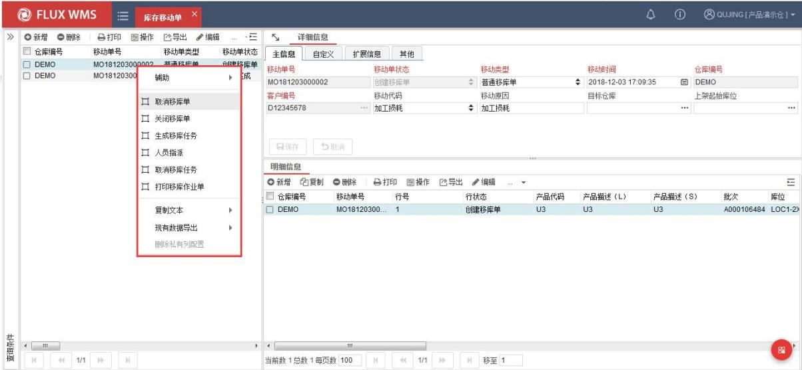

[图10-7-3]

取消移库单 - 移库单取消，不可操作、修改。仅针对创建状态移库单 

关闭移库单 - 移库单执行后，关闭订单。不可再修改。 

生成移库任务 - 根据移库单明细，生成移库任务，供 RF 移库使用。移库任务会将待移动库存锁定，执行移动后释放。 

生成派工单 - 配合资源管理，根据移库单生成对应派工单，以便进行作业人员调度、用工费用结算。 

取消移库任务 - 已生成的移库任务取消。 

✨ 打印移库单 - 打印纸面单据，用于指导仓库内库存移动。 

人员指派 - 用户可以基于库存移动单进行任务人员指派。 

■ 明细右键菜单： 

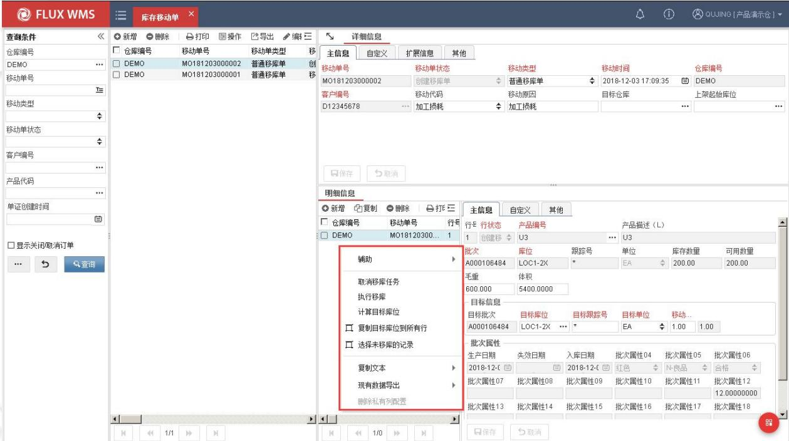

[图 10-7-3]

取消移库任务 - 针对所选移库单明细行，对已生成的移库任务取消。 

执行移库 - 移库确认。可按所选明细行执行。 

计算目标库位 - 根据产品的上架规则，计算出上架库位作为移动的目标库位。计算所得目标库位可以再次通过手工进行修改。 

✿ 复制目标库位到所有行 - 适用于移库单中全部目标库位相同的情况。手工修改一行明细的目标库位并保存，通过鼠标右键“复制目标库位到所有行”功能，更新整个移库单中全部明细的目标库位为所选明细记录的目标库位。 

选择未移库的记录 - 批量勾选所有未移库完成的记录。 

## - 跨仓移库操作

通常情况下，2 个不同仓库间的货物移动，会通过一边发货，另一边仓库收货来进行交接，过程中涉及到责任转移，实物交接等。 

但也有些仓库，物理位置在一处或相邻，例如一个物流园区中的 2 栋楼，出于管理需要，维护为 2 个不同仓库。这些仓库间的库存移动，部分情况下也会通过移库单操作。 

跨仓操作，需要开启参数 MOV_BTW_WH（是否允许在不同仓库之间进行跨仓移库操作），此时移库单头，会显示目标仓库字段供选择。 

添加明细行记录时，系统会校验目标库位是否属于目标仓库，已有明细情况下修改目标仓库， 

系统会清空明细行的目标库位，等待重新录入并校验。 

如果移库单已经下达移库任务，目标仓库不可修改。 

## 10.8. 库存盘点单

库存盘点是仓库日常业务操作的一个组成部分，也是保证库存正确的重要方式之一。 

盘点可分为标准盘点、循环盘点和动态盘点等多种不同的盘点模式： 

■ 标准盘点即盘点指定范围内的全部库存。 

■ 循环盘点是根据循环盘点规则中设置的盘点数量等限定条件,由系统在库存中随机选择部分库存进行盘点,在一定周期内完成对所有产品进行盘点的方式。 

■ 动态盘点则是只对有过操作的产品进行盘点的一种部分盘点方式,由系统进行记录筛选。 

■ 随机盘点是由系统根据制定的盘点范围,随机抽取库存记录生成盘点用于抽查库存情况的盘点方式。 

盘点执行，可分为有任务模式，与无任务模式。有任务模式能够通过纸单或 RF 执行操作，无任务模式主要通过 RF 进行操作。RF 盘点执行的相关细节，请参考 RF 操作手册。 

## - 申请盘点

在进行盘点之前，需要先对盘点的对象、时间、范围进行设定，以便于系统自动生成符合要求的盘点清单，也即盘点任务。此时应用到了申请盘点的功能，如果是非任务盘点模式，可以不进行盘点申请。 

■ 选择 “库存管理” 下的 “库存盘点单”。 

■ 点击【新增】后，在表头部分的主信息页签，依次输入如下信息： 

<table><tr><td>查询条件</td><td colspan="8">新增 复制 删除 打印 操作 导:</td><td></td></tr><tr><td>仓库编号</td><td colspan="3">盘点申请单号</td><td colspan="5">盘点单</td><td></td></tr><tr><td>DEMO</td><td>DEMO</td><td colspan="2">P0000601</td><td colspan="5">任务主信息 条件筛选 批次控制 自定义 其他</td><td></td></tr><tr><td>盘点申请单号</td><td colspan="3">盘点单状态</td><td>盘点单类型</td><td>优先级</td><td colspan="3">仓库编号</td><td></td></tr><tr><td>P0000601</td><td colspan="3">任务生成</td><td>普通盘点</td><td>3普通</td><td colspan="3">DEMO</td><td></td></tr><tr><td colspan="4">动磁盘点</td><td colspan="5">库存盘点深度</td><td></td></tr><tr><td>盘点模式</td><td colspan="3">事务类型</td><td>按库位、产品合并库存</td><td>包含过渡库位</td><td colspan="3">包含空库位</td><td></td></tr><tr><td>开始时间</td><td colspan="3">结束时间</td><td>随机盘点</td><td>动态库存</td><td colspan="3">盲盘</td><td></td></tr><tr><td></td><td colspan="3"></td><td colspan="5">混产品库位按产品盘点</td><td></td></tr><tr><td></td><td colspan="3"></td><td></td><td></td><td colspan="3"></td><td></td></tr><tr><td></td><td colspan="3"></td><td></td><td></td><td colspan="3"></td><td></td></tr><tr><td></td><td colspan="3"></td><td></td><td></td><td colspan="3"></td><td></td></tr><tr><td></td><td colspan="3"></td><td></td><td></td><td colspan="3"></td><td></td></tr><tr><td></td><td colspan="3"></td><td></td><td></td><td colspan="3"></td><td></td></tr><tr><td></td><td colspan="3"></td><td></td><td></td><td colspan="3"></td><td></td></tr><tr><td></td><td colspan="3"></td><td></td><td></td><td colspan="3"></td><td></td></tr><tr><td></td><td colspan="3"></td><td></td><td></td><td colspan="3"></td><td></td></tr><tr><td></td><td colspan="3"></td><td></td><td></td><td colspan="3"></td><td></td></tr><tr><td></td><td colspan="3"></td><td></td><td></td><td></td><td></td><td></td><td></td></tr><tr><td></td><td colspan="3"></td><td></td><td></td><td></td><td></td><td></td><td></td></tr><tr><td></td><td colspan="3"></td><td></td><td></td><td></td><td></td><td></td><td></td></tr><tr><td></td><td colspan="3"></td><td></td><td></td><td></td><td></td><td></td><td></td></tr><tr><td></td><td colspan="3"></td><td></td><td></td><td></td><td></td><td></td><td></td></tr><tr><td></td><td colspan="3"></td><td></td><td></td><td></td><td></td><td></td><td></td></tr><tr><td></td><td colspan="3"></td><td></td><td></td><td></td><td></td><td></td><td></td></tr><tr><td></td><td colspan="3"></td><td></td><td></td><td></td><td></td><td></td><td></td></tr><tr><td></td><td colspan="3"></td><td></td><td></td><td></td><td></td><td></td><td></td></tr><tr><td></td><td colspan="3"></td><td></td><td></td><td></td><td></td><td></td><td></td></tr><tr><td></td><td colspan="3"></td><td></td><td></td><td></td><td></td><td></td><td></td></tr><tr><td></td><td colspan="3"></td><td></td><td></td><td></td><td></td><td></td><td></td></tr><tr><td></td><td colspan="3"></td><td></td><td></td><td></td><td></td><td></td><td></td></tr><tr><td></td><td colspan="3"></td><td></td><td></td><td></td><td></td><td></td><td></td></tr><tr><td></td><td colspan="3"></td><td></td><td></td><td></td><td></td><td></td><td></td></tr><tr><td></td><td colspan="3"></td><td></td><td></td><td></td><td></td><td></td><td></td></tr><tr><td></td><td colspan="3"></td><td></td><td></td><td></td><td></td><td></td><td></td></tr><tr><td></td><td colspan="3"></td><td></td><td></td><td></td><td></td><td></td><td></td></tr><tr><td></td><td colspan="3"></td><td colspan="5">明细信息</td><td></td></tr><tr><td colspan="9">查看 打印 操作 导出</td><td></td></tr><tr><td colspan="9">任务编号 产品代码 批次 库位 盘点数量 盘点人员</td><td></td></tr><tr><td colspan="9">TSK1808150003 U2 * F1 89.00 QUJING</td><td></td></tr><tr><td colspan="9">TSK1808150004 U3 * F1 18.00 QUJING</td><td></td></tr></table>

[图10-8-1]

仓库编号 - 当前作业仓库 

盘点申请编号 - 系统自动生成的盘点单号。 

盘点单状态 - 盘点单操作情况，由系统自动更新。 

类型 - 盘点单操作类型。例如普通盘点，差异盘点等。 

优先级 - 盘点优先级。主要针对 RF 盘点任务生效。 

客户编号 - 指定盘点条件之一，限定盘点对象货主。如不录入，则不限定货主盘点。 

产品组 - 盘点范围的产品组条件。 

盘点库存深度 - 盘点时的库存细化程度。根据参数 COU_SKU_LOC 显示下拉框，如按库位、产品合并记录，后续盘点时将不校验批次属性信息。如果按库位合并，则忽略产品区别，仅核对库位内的总数量。 

动态库存 - 实时盘点操作，盘点单中不锁定库存，可以一边进出操作，一边进行盘点。通过 RF 盘点获取任务时才获取当时的实时动态库存。默认不勾选，纸单盘点模式不建议使用动态库存盘点。 

空库位 - 生成的盘点任务包含空库位记录，即用户需要确认这些库位的确是空的。默认不勾选。 

是否带出过渡库位 - 过渡库位是否纳入盘点任务生成范围。 

呆滞库存 - 动碰盘点的反向操作，指定的时间段内，没有进行过操作的库存生成盘点任务。 

申请时间 - 默认为盘点单创建时间 

动态盘点，开始/结束时间 - 此时间段内有过操作的库存，进行动态盘点。 

随机盘点 - 在指定的范围内，随机抽取记录生成盘点任务，录入库位限定数量，随机选择生成相应的盘点任务。 

批次属性 - 指定属性值筛选记录进行盘点。例如只盘点海关单号是 ABC0001 的一批库存。 

■ 在 “盘点条件” 页签，可以维护范围条件： 

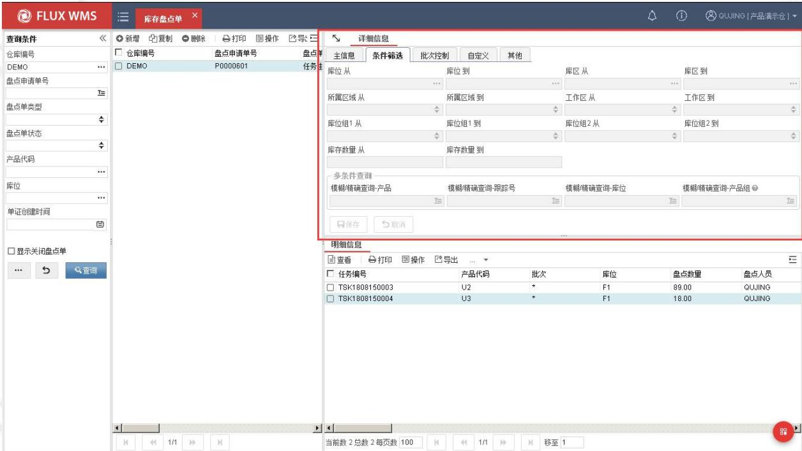

[图10-8-2]

从~到的区段查询条件 

产品 - 需要进行盘点的产品代码。 

库位 - 需要进行盘点的库位范围。 

区域 - 需要进行盘点的区域范围。 

上架区 - 需要进行盘点的库存所属上架区域。 

拣货区 - 需要进行盘点的库存所属拣货区域。 

库位组 - 需要进行盘点的库存所属库位组。 

## 多条件查询

有时根据管理需要, 会指定某几个条件, 例如几个非连续的库位, 进行盘点, 此时 FM/TO 的条件模式无法满足, 可以在多条件查询部分, 针对产品、跟踪号、库位字段, 录入多个查询条件内容, 通过逗号分隔, 例如 “SKU1, SKU7, SKU9”。 

也可以通过字段后的浏览按钮，在如下的“多条件查询”二级窗口，录入所需条件，并选择精确查询模式，还是模糊查询模式，系统将录入的条件内容，带入到查询条件界面。 

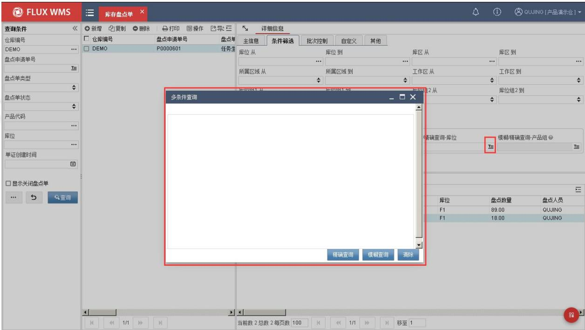

[图10-8-3]

■ 点击【保存】按钮，系统创建盘点单据。 

在表头右键菜单中，选择【盘点预检】功能，系统检查盘点范围内未操作完成的任务情况，并提示用户。以免作业中任务较多，又采用的非动态盘点模式，导致盘点结果偏差较大。但盘点预检信息，并不会限制盘点进行。 

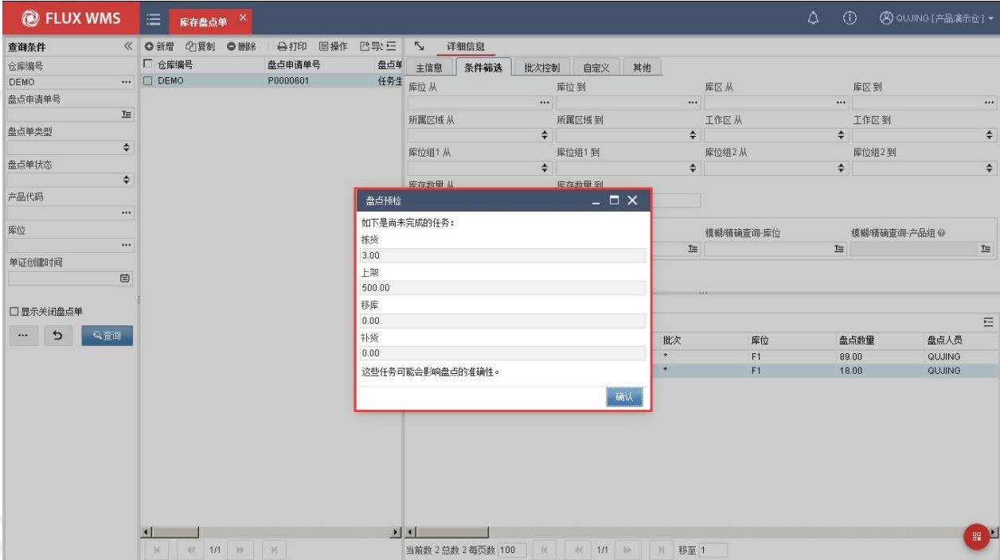

[图10-8-3]

■ 鼠标右键菜单中，选择“生成盘点任务”（其余功能，在盘点任务生成后才能使用），系统根据表头部分的盘点范围条件，在库存中查找符合要求的库存记录，生成盘点任务，显示在盘点单明细部分。如果盘点任务对应的库存记录，有未完成任务（如有待上架库存，已分配库存），此任务记录将显示为红色，提醒用户注意，可能会由于其他任务操作，导致盘点库存差异。 

## - 库存盘点

盘点任务生成后，可以通过右键菜单，打印盘点任务清单用于仓库盘点。如果系统参数 BLD_COU（是否盲盘）设置为 Y，打印出的盘点单据中不显示库存数量。 

盘点后，根据实际盘点结果，在盘点单中记录盘点数量，系统自动计算损益数量。在系统参数中，可以设置默认盘点数量（COU_DFT），默认为库存数量，用户只需输入有差异的记录。也可以默认盘点数量为-1，用户需要录入全部盘点数量，常用于盲盘。 

## - 盘点处理

盘点后发现的库存差异，可以进行复盘、库存调整。 

■ 鼠标右键选择“生成差异盘点任务”，系统将当前盘点单中，有损益数量的产品，再次生成新的盘点单及盘点任务，方便用户对差异数量进行复盘。 

■ 差异数量确认无误后，可点击鼠标右键菜单功能“生成调整单”，系统根据盘点差 

异记录，创建对应库存调整单，目标数量为实盘数量。 

盘点完成，选择鼠标右键菜单功能“关闭盘点”，关闭盘点单，不允许对盘点单再做修改。 

■ 盘点结束，具体数量修改，由用户另行在对应调整单中处理。 

注：为了避免盘点过程中生成差异单，导致后续盘点结果差异单中未包含，盘点单中有尚未完成的盘点任务时，不允许生成差异单。 

## - 动态盘点

动态盘点是对根据指定时间段内，有过操作产品进行盘点，没有操作过的库存不用盘点，也被称为动碰盘点。 

动态盘点操作步骤与标准盘点类似，但需要输入动态盘点的开始时间、结束时间。系统寻找在这个时间段内有过操作，并且符合其他盘点范围条件的产品，生成对应盘点任务。后续操作相同。 

默认情况下，动态盘点查找时间段内全部库存事务，但用户可通过【选项】按钮，在弹出框中选择动态盘点的对应事务类型。未勾选的项目，将被忽略。 

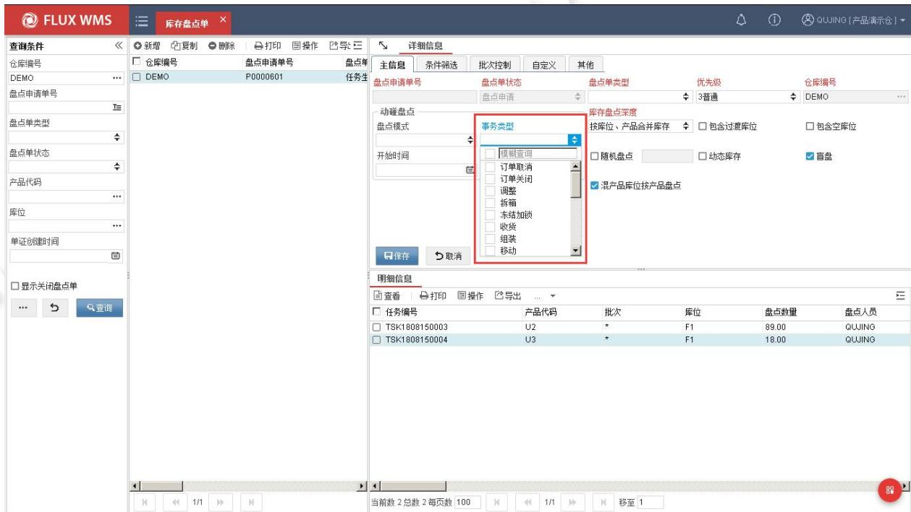

[图 10-8-4]

## - 随机盘点

随机盘点主要用于对产品库存进行抽查，通常与动态盘点、普通盘点结合使用。 

在库存盘点单中，除了普通盘点的范围条件之外，还需要勾选“随机盘点”选项，并输入随机盘点任务数量条件（如下图），系统在生成盘点任务时，随机抽取符合盘点范围条件的库存记录作为盘点任务。 

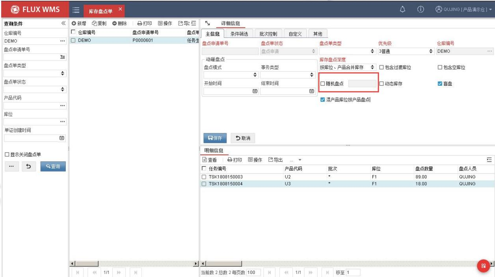

[图10-8-5]

盘点任务生成后，后续操作同普通盘点。 

## - 鼠标右键功能项

表头右键菜单： 

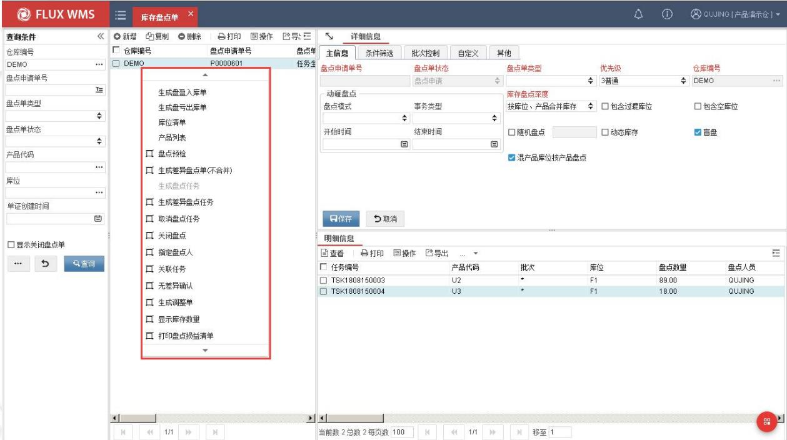

[图10-8-6]

盘点预检 - 当前仓库未完成任务检查，统计显示检查结果 

■ 生成盘点任务 - 根据盘点范围条件计算生成盘点任务 

■ 生成盘点差异任务 - 盘点结果与任务信息不符的产品记录，生成差异盘点单，以便进行复盘。 

■ 取消盘点任务 - 已生成的盘点任务撤销，盘点单回复到创建状态，以便修改盘点范围条件。 

■ 关闭盘点 - 盘点单关闭，不再允许修改 

■ 快速定位 - 弹出框输入盘点任务号，系统快速定位到对应任务的处理。支持模糊查询。 

■ 指定盘点人 - 适用于 RF 盘点，分派盘点任务给指定操作人员。点击后，弹出二级窗口，录入指定的盘点人 ID，更新盘点单下所有任务的"盘点人"为指定的用户 ID。 

■ 关联任务 - 已生成盘点任务的盘点单,通过二级窗口显示盘点任务相关的其他作业任务信息。所显示的关联任务，支持鼠标右键导出为 EXCEL 文档。 

■ 无差异确认 - 针对未确认的盘点任务，批量确认盘点执行，数量等同任务数量。 

■ 生成调整单 - 盘点结果输入后，根据损益情况创建调整单。需要注意的是，合并库位、跟踪号盘点模式，由于盘点结果为合并后的库存记录，不能直接创建调整单。 

生成盘盈入库单 - 由于合并盘点模式不适合直接生成调整单,也有些作业情况由于ERP流程要求不能直接通过调整修正库存，因此系统提供根据出、入库单据异动库存的功能。根据盘盈结果，创建入库单据，收货后增加库存。 

■ 生成盘亏出库单 - 根据盘亏结果，创建出库单，并分配库存。单据发货后库存相应减少。 

■ 显示库存数量 - 盘点任务部分,库存数量默认隐藏,可通过此功能显示库存数量列。 

库位清单 - 客户出于审计要求，有时会指定多个库位进行盘点。通过库位列表，可导入库位清单，并以此为条件生成盘点任务。 

■ 产品列表 - 客户出于审计要求，有时会指定多个产品进行盘点。通过产品列表，可导入产品清单，并以此为条件生成盘点任务。 

■ 打印盘点任务清单 - 打印纸面单证，用于仓库内盘点操作。 

■ 打印盘点损益单 - 打印盘点结果单据，仅列名有库存差异的记录。 

## - 明细右键菜单

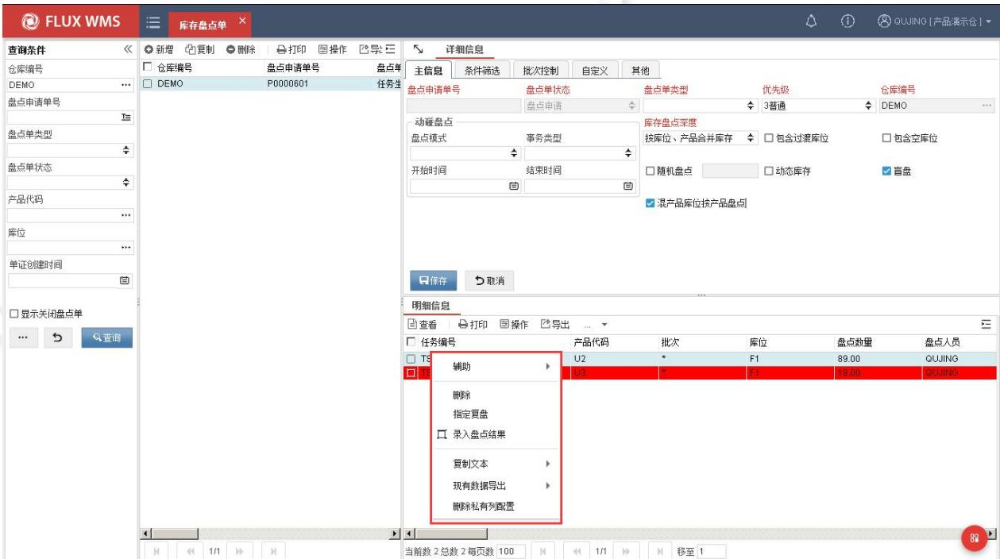

[图10-8-7]

■ 删除 - 明细部分，所选的指定盘点任务删除。 

■ 指定复盘 - 所选的盘点任务强制生成复盘任务。 

■ 录入盘点结果 - 盘点任务默认处于只读状态，只有执行右键“录入盘点结果”功能， 

才切换到现在的可编辑的状态。 

## 10.9. 库存冻结

库存冻结功能类似库存冻结单，可以对指定库存进行冻结处理，但库存冻结是实时操作、生效；而库存冻结单，则可以分步进行登记、审核、执行等操作。 

## - 库存冻结操作

■ 选择 “库存管理” 下的 “库存冻结” 功能。 

■ 新增冻结记录时，选择“主信息”页面，点击【新增】按钮，依次输入以下信息： 

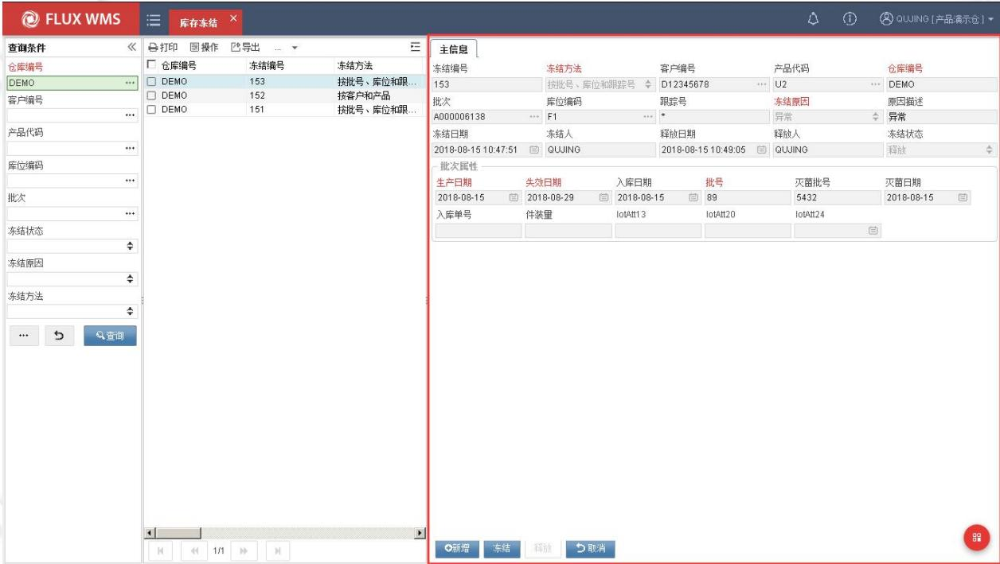

[图 10-9-1]

冻结编号 - 点击【新增】按钮后由系统生成的冻结记录流水编号。 

冻结方法 - 对产品进行冻结的方式，系统提供按批号、按库位、按追踪编号、按批号库位和跟踪号、按客户、按客户和产品等多种方式供选择。冻结方法的多样性，能够灵活的满足客户进行产品冻结的需求。 

不同的冻结方法，对应不同的冻结条件。选择冻结方法后，后续客户、产品等条件字段，仅有与冻结方法相应的字段可录入，无关的条件字段不可录入。例如选择客户冻结方法，产品、库位等条件字段不可录入。 

仓库编号 - 指定冻结的库存所属仓库。跨仓冻结情况下，仓库无需指定。 

客户编号 - 按客户或者涉及到产品的冻结方式时，所要冻结的客户代码。 

产品代码 - 所要冻结的产品的代码。 

批次 - 所要冻结的库存的系统批次号。 

跟踪号 - 所要冻结的产品跟踪号。 

库位编码 - 所要冻结的库位。 

冻结原因 - 选择进行冻结的原因代码。可在系统代码中维护各种不同的冻结原因。 

原因描述 - 开放字段，用于对冻结原因进一步具体描述。 

冻结时间 - 确认冻结的时间，由系统自动记录 

冻结操作人 - 操作冻结的的操作员信息 

释放时间 - 解冻确认时间 

释放操作人 - 解冻库存的操作员 

是否冻结 - 记录处于冻结状态，还是已经解冻，由系统更新。 

■ 点击【冻结】按钮，系统将相应库存冻结，会自动记录并显示冻结时间、操作人员等信息。 

库存冻结中，在库存余量中可查看到库存冻结数量。已冻结数量，不属于可用余量范围。 

注：系统支持跨仓冻结。非跨仓模式，仅冻结用户作业仓库内的库存。 

## - 库存释放

库存冻结后，当冻结原因解决，或者冻结产品有了处理意见后（例如退货出库、销毁、维修等），需要将已冻结的库存释放，使之再度参与到操作环节中。 

库存释放操作步骤如下： 

■ 选择“库存管理”下的“库存冻结”。 

■ 在查询页面输入条件，查询已有冻结记录。 

■ 选择所需冻结记录，在明细页面中点击“释放”按钮（或者鼠标右键功能释放），释放库存。 

注：已释放的记录，选择后再次冻结，系统会复制此信息，生成一行新的冻结记录。原有的已释放记录不会被覆盖。 

## 10.10. 库存转移

除了使用库存转移单进行转移操作，FLUX WMS 还提供库存转移功能，进行快捷的转移执行。但相应的，库存转移功能，无法进行单据信息存储，审核，而是直接查询到库存记录，进行对应信息变更。 

## - 库存转移操作

库存转移的步骤如下： 

■ 选择 “库存管理” 下的 “库存转移” 功能。 

在查询页签输入客户、产品、库位、跟踪号、批次号、批次属性等查询条件，进行对应库存查询。 

■ 在查询结果列表中，选择所要转移的库存记录行，双击跳转到主信息页面。 

■ 在转移信息部分，默认为库存原始信息，根据修改的需要依次输入对应转移信息： 

<table><tr><td colspan="9">主信息 自定义 其他</td></tr><tr><td colspan="4">产品代码</td><td colspan="3">产品描述</td><td colspan="2">批次号</td></tr><tr><td colspan="4">U2</td><td colspan="3">U2</td><td colspan="2">A000006138</td></tr><tr><td>库位编码</td><td colspan="3">跟踪号</td><td>单位</td><td>库存数</td><td>可用数量</td><td rowspan="4" colspan="2"></td></tr><tr><td>F1</td><td colspan="3">*</td><td>EA</td><td>90.00</td><td>0.00</td></tr><tr><td>毛重</td><td colspan="3">体积</td><td rowspan="2" colspan="3"></td></tr><tr><td>0.000</td><td colspan="3">0.0000</td></tr><tr><td colspan="9">转移信息</td></tr><tr><td>目标客户</td><td colspan="3">目标产品</td><td colspan="5">产品描述</td></tr><tr><td>D12345678</td><td>...</td><td colspan="2">U2</td><td>...</td><td colspan="4">U2</td></tr><tr><td>目标批次</td><td colspan="2">目标库位</td><td>目标跟踪号</td><td>目标单位</td><td colspan="4">转移数量</td></tr><tr><td>A000006138</td><td>F1</td><td>...</td><td>*</td><td rowspan="3"></td><td rowspan="3"></td><td rowspan="3" colspan="3">0</td></tr><tr><td>目标毛重</td><td colspan="3">目标体积</td></tr><tr><td>0.000</td><td colspan="3">0.0000</td></tr><tr><td colspan="9">原始批次</td></tr><tr><td>生产日期</td><td>失效日期</td><td>入库日期</td><td>批号</td><td>灭菌批号</td><td colspan="4">灭菌日期</td></tr><tr><td>2018-08-15</td><td>2018-08-29</td><td>2018-08-15</td><td>89</td><td>5432</td><td colspan="4">2018-08-15</td></tr><tr><td>入库单号</td><td>件装量</td><td>lotAtt13</td><td>lotAtt20</td><td>lotAtt24</td><td colspan="4"></td></tr><tr><td></td><td></td><td></td><td></td><td></td><td colspan="4"></td></tr><tr><td colspan="9">目标批次</td></tr><tr><td>生产日期</td><td>失效日期</td><td>入库日期</td><td>批号</td><td>灭菌批号</td><td colspan="4">灭菌日期</td></tr><tr><td>2018-08-15</td><td>2018-08-29</td><td>2018-08-15</td><td>89</td><td>5432</td><td colspan="4">2018-08-15</td></tr><tr><td>入库单号</td><td>伴装量</td><td>lotAtt13</td><td>lotAtt20</td><td>lotAtt24</td><td colspan="4"></td></tr><tr><td></td><td></td><td></td><td></td><td></td><td colspan="4"></td></tr></table>

[图10-10-1]

客户编号 - 转移后，库存所属的客户代码。 

产品代码 - 转移后，所要变更为的产品代码。如果是转移同时改变所属客户，转移后的产品代码必须在目标客户下已经存在。即已经在产品档案中维护。 

库位编码 - 所要变更的目的库位，默认为原始库位。即转移同时，可以同步达到移库的效果。 

跟踪号 - 所要变更的目的跟踪号。系统给出的默认值为原产品的跟踪号。 

单位 - 所要移动的产品的数量单位。系统给出的默认值为该产品在产品档案中所选择的包装代码的主单位。客户也可根据情况自行修改。 

转移数量 - 前一字段为所选择的单位为数量单位的移动数量，例如 1 箱。后一字段为主单位数量。如果一条记录库存数量为 100，而转移数量为 20，则意味着仅针对 100 个库存中的 20 个，修改信息。其余 80 个库存信息不变。 

损益数量 - 转移同时库存增减的数量。相当与同时执行了库存转移与库存调整。 

转移时间 - 该产品执行转移确认操作的时间。默认为当前时间。 

原因代码 - 选择产品转移的理由。所选下拉列表内容在系统代码中维护。 

原因描述 - 对转移原因进一步说明。 

目标毛重 - 转移后的库存毛重。系统会根据产品档案中的标准毛重和转移数量计算目标毛重，用户可根据实际情形修改。 

目标净重 - 转移后的库存净重。 

目标体积 - 转移后的库存体积。 

目标价格 - 转移后的库存价格。 

批次属性 - 转移后的批次属性内容。 

■ 点击【转移】按钮，执行库存转移操作。 

## 10.11. 库存调整

除了批量执行库存调整的库存调整单功能，系统还提供库存调整功能，直接查询库存记录，进行调整的快捷操作。如果需要审核，或者记录更多附加信息，还请使用库存调整单功能。 

## - 库存调整

■ 选择 “库存管理” 下的 “库存调整” 功能 在查询页签，输入客户、产品、库位、跟踪号、批次号、批次属性等查询条件信息，点击【查询】按钮，查询库存 

在查询结果列表中，选择所要调整的库存记录行，点击明细页签。系统显示库存相应信息 

■ 在调整部分，输入变更内容： 

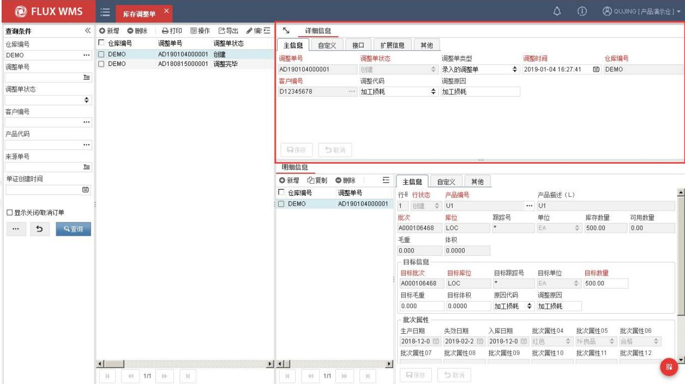

[图10-11-1]

目标数量 - 调整后的数量，以主单位做为数量单位。 

调整时间 - 调整操作的时间。 

原因代码 - 进行库存调整的原因代码。 

原因描述 - 对调整原因进行描述。 

目标毛重 - 调整后的库存毛重。系统会根据产品档案中的标准毛重和调整目标数量计算目标毛重，用户可根据实际情形修改。 

目标净重 - 调整后的库存净重。 

目标体积 - 调整后的库存体积。 

■ 点击【调整】按钮，完成库存调整操作 

## 10.12. 库存移动

仓库内进行库存整理的快捷功能，与库存移动单相比，无法进行库位规划建议，需要人工指定移动的目标库位。 

## - 库存移动

■ 选择“库存管理”下的“库存移动”。 

在查询页面的查询条件字段中，根据需要，输入客户、产品、库位、跟踪号、批次号等查询条件，可以是“从……到……”的范围条件。也可以使用批次属性内容作为查询条件。点击【查询】按钮，查询对应库存。 

■ 在查询结果列表中，选择所要移动的记录行 

■ 双击记录，切换到主信息页签，在“移动信息”部分，依次输入以下库存移动信息： 

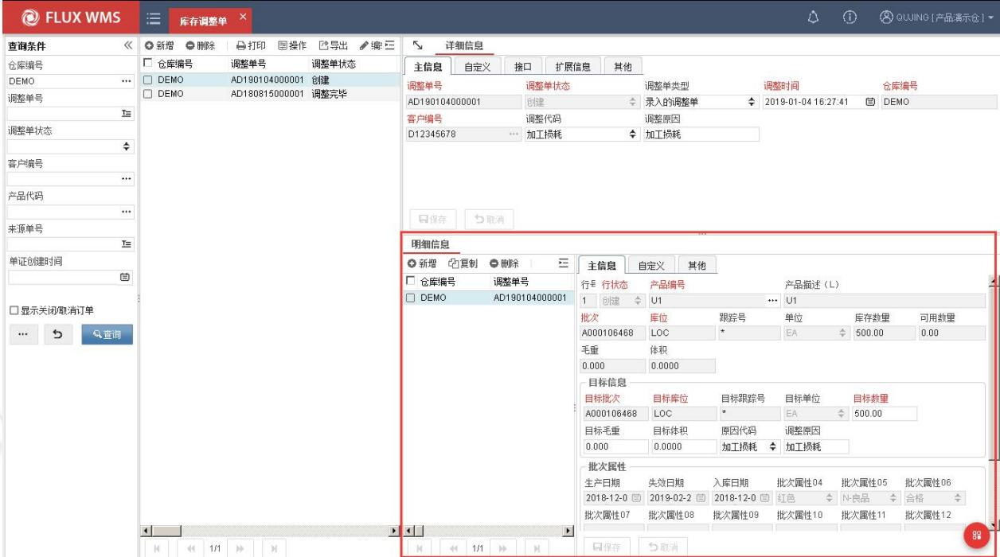

[图10-12-1]

库位编码 - 库存移动的目的库位。默认为当前存放库位。 

跟踪号 - 移动后的跟踪号。通常可以使用此功能修改产品库存跟踪号，默认同当前库存跟踪号 

单位 - 移动库存的数量单位。 

移库数量 - 产品移动的数量。前一个开放字段以所选单位为数量单位，例如可以是 1 托 盘、5 箱等，后一个只读字段为主单位数量，便于用户在多包装级别情况下使用。数量默认为当前可移动数量（库存-分配数量-冻结数量-其他任务数量） 

移库时间 - 该产品执行移动操作的时间。 

原因代码 - 选择产品移动的理由。所选下拉列表内容在系统代码中维护。 

原因描述 - 对移动原因进一步说明。 

■ 点击【移动】按钮，系统执行库存移动操作。 

## 10.13. ABC 动态分析

ABC 分析法(Activity Based Classification)，全称应为 ABC 分类库存控制法。又称帕累托分析法或巴雷托分析法。该分析方法的核心思想是在决定一个事物的众多因素中分清主次，识别出少数的但对事物起决定作用的关键因素和多数的但对事物影响较少的次要因素。是帕累托 80/20 法则的衍生。 

应用于库存管理方面，通常来讲，可以理解为少量产品的进出作业量/价值金额，占比却比较大，因此应该作为管理的重点，一方面加强监管，提高盘点频次；另一方面可以将这些作业量最多的产品，布局摆放到最方便作业的库位，例如靠近进出口、巷道、集货区以减少搬运路径，或者拣货架排面中作业员最方便拣取的第3~5层从而减少拣货的其他动作。 

一般根据管理所需，按照一定的因素进行统计，发生累计频率排序前 0~80% 的为 A 类，80%~90% 为 B 类，90%~100% 的是 C。在库存管理中，常按拣货频次从高到底进行排序，排序百分比在 80% 之前的，即拣货频率最高的这部分货物，为 A 类货物；80%~90% 的，偶尔拣货的货物，为 B 类货物；最末的 90%~100%，很少拣货的，为 C 类货物。 

FLUX WMS 提供的 ABC 动态分析，就是根据一段时间内的作业情况，分析哪些货物的应属于 A 类货物；哪些货物原本属于 A 类货物，但由于换季等原因，拣货频次下降，应降级为 B 类或者 C 类货物。同时，又有哪些货物需要对应的从 A 类货架移动到到 B、C 类货架存放，以便让出方便拣取的 A 类货架给其他 A 类货品。 

## - ABC动态分析

使用 ABC 动态分析，需要先在基础设置的【循环级别】功能中，配置 ABC 等级的对应占比。虽然按标准帕累托分析法，占比应为 80%、90%、100%，但 WMS 系统允许根据实际情况进行配置。并且除了排名百分比，也可采用排名的方式。具体设置，请参考基础设置章节的介绍。 

使用 ABC 动态分析时: 

■ 点击“库存管理”下的“ABC动态分析” 

在查询条件中，输入客户、时间段条件，选择按百分比或者排序。默认情况下过滤已经库存是0的产品，如果需要同样进行整理，可在查询条件中勾选“显示0库存整理” 

■ 点击查找按钮，系统根据 ABC 循环等级条件，查询不符合条件、需要降等的产品记录，并给予级别建议。 

<table><tr><td>查询条件</td><td>&lt;&lt;</td><td colspan="9">整箱列表 拆零列表</td></tr><tr><td>仓库编号</td><td></td><td colspan="9">打印 操作 导出</td></tr><tr><td>DEMO</td><td>...</td><td colspan="9"></td></tr><tr><td>客户编号</td><td>...</td><td colspan="9"></td></tr><tr><td>货物类型</td><td>...</td><td colspan="9"></td></tr><tr><td>产品组1</td><td>...</td><td colspan="9"></td></tr><tr><td>产品组2</td><td>...</td><td colspan="9"></td></tr><tr><td>产品组3</td><td>...</td><td colspan="9"></td></tr><tr><td>产品组4</td><td>...</td><td colspan="9"></td></tr><tr><td>产品组5</td><td>...</td><td colspan="9"></td></tr><tr><td>显示0库存整理</td><td></td><td colspan="9"></td></tr><tr><td>... 查询</td><td></td><td colspan="9"></td></tr></table>

■ 用户可勾选确认等级更新的记录，或者全选，通过鼠标右键菜单功能“执行 ABC 调整”，由系统更新产品档案中的循环级别。 

■ 选择产品，通过鼠标鼠标右键菜单功能“生成库存整理清单”，即产品所在库位的等级与产品循环等级不符的记录，需要移动库存 

■ ABC 分析法本身并不更新库存对应库位，需要实际执行库存移动变更库位。 

- 鼠标右键功能

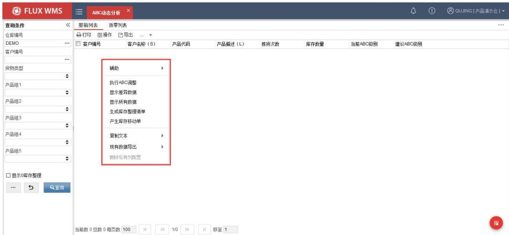

■ 显示差异数据 

ABC 分析时，只显示等级需要调整的产品记录。 

■ 显示所有数据 

ABC 分析时，显示全部符合查询条件的产品记录。有时产品的 ABC 等级不需要更新，但产品所存放的库位与等级不符，需要进行库存整理，因此系统支持显示全部产品数据。 

## 11. 出库操作

## 11.1. 出库流程概述

出库流程是仓储管理的一个重要环节，现代物流对出库作业的时效性、准确性都有较高要求。在出库流程中，对仓库产品的发货要求被记录下来作为订单，仓库按要求拣选出产品发运。出库流程的目标是最优化的履行订单并且增强存货控制。 

出库流程的常见操作步骤为： 

■ 发运订单创建（/合并订单） 

订单（预）分配 

订单拣货 

■ 确认发货 

在多产品、小批量出库情况下，为了对仓库出库货物加强管理，提高出库准确性，还可以根据操作需要选择出库附加操作，例如： 

■ 销售订单 

■ 出库复核 

■ 配送单作业 

集拼箱 

装车 

■ 出库放行 

■ .... 

## 11.2. 发运订单 (SO)

发运订单是货主对仓库里存储的产品，给予的出货要求指令。它记录所要求出库发运的每种商品的数量和每次送货的目的地，以及其他附加出库要求。 

发运订单是出库流程中必不可少的操作依据，但可以通过不同方式来创建。 

## 11.2.1. 单证创建

## ● 发运订单表头创建

发运订单有多种创建方式，系统支持通过人工录入创建、文档导入创建，通过库存余量创建，以及通过接口传递订单信息创建订单等。 

在没有其他系统对接的情况下，最常用的创建方式是人工录入创建订单。具体操作步骤如下： 

■ 选择“出库操作”下的“发运订单”。 

■ 点击【新增】按钮，在表头的主信息页签中，输入如下信息： 

<table><tr><td>主信息</td><td>收货人</td><td>运输</td><td>结算人</td><td>承运人</td><td>下单方</td><td>接口</td><td>用户自定义</td><td>附加信息</td><td>其他</td></tr><tr><td>发运订单编号</td><td colspan="3">发运订单状态</td><td>发运订单类型</td><td>发运订单类型</td><td colspan="3">释放状态</td><td>仓库编号</td></tr><tr><td>SO20190102000001</td><td colspan="3">分批完成</td><td>销售订单</td><td colspan="3">订单释放</td><td>3普通</td><td>TEST100</td></tr><tr><td>客户编号</td><td colspan="3">客户名称</td><td>收货人</td><td colspan="3">收货人名称</td><td>预期发货时间1</td><td>预期发货时间2</td></tr><tr><td>TEST100</td><td colspan="3">TEST100C</td><td>TEST100</td><td colspan="3">TEST100长沙测试专用</td><td>2019-01-02 15:54:</td><td>2019-01-02 15:54:</td></tr><tr><td>参考编号1</td><td colspan="3">参考编号2</td><td>参考编号3</td><td colspan="3">参考编号4</td><td>参考编号5</td><td>波次号</td></tr><tr><td></td><td colspan="3"></td><td></td><td colspan="3"></td><td></td><td></td></tr></table>

[图11-2-1]

订单号 - 发运订单号码，也是发运订单的唯一标识。当新增一个发运订单时，系统根据流水号规则，自动给出该编号。 

订单状态 - 该订单的状态。系统提供创建、部分预分配、预分配完成、部分分配、分配完成、部分拣货、拣货完成、部分发运、完全发运、取消、完成等多种选择。当新建一个发运订单时，系统自动给出默认状态，创建订单。 

客户编号 - 要发运的产品所属货主代码，后续为货主的对应名称描述。 

订单类型 - 发运订单的类型。用户可根据其业务模式，在 FLUX 顾问的指导下设置多种订单类型。新增 ASN 时若客户编号已维护默认货主（通过参数 DFT_CUS 设置），则光标 定位 ‘预期到货通知类型’ 字段；若未维护，则光标定位客户编号； 

释放状态 - 订单是否已通过审核，可以发运。如不使用审核、释放功能，可将系统参数 RLS_CTL（缺省 SO 订单释放状态）设置为 Y，即发运订单默认为“订单释放”。 

订单优先级 - 订单作业的优先顺序。多在 RF 或自动化设备操作过程中使用。 

仓库编号 - 发运单所属作业仓库。手动新增发运订单时，系统自动获取当前用户登录仓库。 

收货人 - 产品要运给的客户代码、名称 

预期发货时间 1/2 - 预期发运该订单的时间段。系统自动给出当前时间为预期发货时间。客户可根据情况进行修改。 

参考编号（1-5）- 客户需要的，或订单的其他相关信息，例如 ERP 单号等。可在页面文本功能中修改字段名称。 

波次号 - 订单所属波次的波次号。如果订单未加入波次，则显示为 “*” 

在收货人页签，默认显示收货人基础档案维护的信息，可以根据需要修改为此单的收货地址信息： 

<table><tr><td>查询条件</td><td>发运订单编号</td><td>发运订单类型</td><td>发运订单状态</td></tr><tr><td>发运订单编号</td><td>SO201809102000001</td><td>销售订单</td><td>分配完成</td></tr><tr><td>发运订单状态</td><td>SO20181229000002</td><td>销售订单</td><td>分配完成</td></tr><tr><td rowspan="34">发运订单类型</td><td>SO20181228000001</td><td>销售订单</td><td>分配完成</td></tr><tr><td>SO20181220000002</td><td>销售订单</td><td>分配完成</td></tr><tr><td>SO20181220000001</td><td>销售订单</td><td>部分分配</td></tr><tr><td>SO20181214000001</td><td>销售订单</td><td>部分拣货</td></tr><tr><td>SO20181211000003</td><td>加工单</td><td>创建订单</td></tr><tr><td>SO20181211000002</td><td>加工单</td><td>创建订单</td></tr><tr><td>SO20181210000004</td><td>销售订单</td><td>完全装箱</td></tr><tr><td>SO20181210000003</td><td>销售订单</td><td>拣货完成</td></tr><tr><td>SO20181210000001</td><td>销售订单</td><td>完全装箱</td></tr><tr><td>SO20181206000008</td><td>销售订单</td><td>创建订单</td></tr><tr><td>SO20181206000005</td><td>销售订单</td><td>创建订单</td></tr><tr><td>SO20181206000001</td><td>加工单</td><td>分配完成</td></tr><tr><td>SO20181205000002</td><td>销售订单</td><td>分配完成</td></tr><tr><td>SO20181204000003</td><td>销售订单</td><td>拣货完成</td></tr><tr><td>SO20181204000002</td><td>销售订单</td><td>拣货完成</td></tr><tr><td>SO20181204000001</td><td>销售订单</td><td>分配完成</td></tr><tr><td>SO20181123000003</td><td>销售订单</td><td>完全发运</td></tr><tr><td>SO20181121000001</td><td>销售订单</td><td>拣货完成</td></tr><tr><td>SO20181112000004</td><td>销售订单</td><td>分配完成</td></tr><tr><td>SO20181112000003</td><td>销售订单</td><td>分配完成</td></tr><tr><td>#NV201811120002#</td><td>波次合拣单</td><td>分配完成</td></tr><tr><td>SO20181112000002</td><td>销售订单</td><td>创建订单</td></tr><tr><td>SO20181112000001</td><td>销售订单</td><td>分配完成</td></tr><tr><td>SO20180929000001</td><td>销售订单</td><td>完全装箱</td></tr><tr><td>SO20180925000001</td><td>销售订单</td><td>拣货完成</td></tr><tr><td>SO20180918000002</td><td>销售订单</td><td>分配完成</td></tr><tr><td>SO20180917000002</td><td>销售订单</td><td>分配完成</td></tr><tr><td>SA1809170002#1</td><td>销售订单</td><td>分配完成</td></tr><tr><td>SO20180911000002</td><td>销售订单</td><td>部分分配</td></tr><tr><td>SO20180911000001</td><td>销售订单</td><td>拣货完成</td></tr><tr><td>SO20180910000002</td><td>销售订单</td><td>完全装箱</td></tr><tr><td>SO20180910000001</td><td>销售订单</td><td>拣货完成</td></tr><tr><td>SO20180909000011</td><td>销售订单</td><td>分配完成</td></tr><tr><td>SO20180909000010</td><td>销售订单</td><td>分配完成</td></tr></table>

[图 11-2-2]

收货人 - 产品要运给的客户。系统自动显示主信息页面中输入的收货人代码。 

收货人名称、地址、城市、省/州、国家、邮编、联系人信息 - 该收货人的信息。系统自 

动给出该收货人在客户档案中所输入的信息，用户可手工修改。 

如果收货人在客户档案中维护过多地址信息，在多地址模式下，可通过地址栏位的快速检索按钮，查看其它多地址信息，并选择其他地址作为此订单的收货地址。 

■ 点击运输页签，在界面中，根据需要输入相应运输信息： 

<table><tr><td>主信息</td><td>收货人</td><td>运输</td><td>结算人</td><td>承运人</td><td>下单方</td><td>接口</td><td>用户自定义</td><td>附加信息</td><td>其他</td></tr><tr><td>路线</td><td>站点</td><td colspan="3">服务等级</td><td colspan="2">运输方式</td><td colspan="2">运单号规则</td><td>运单号</td></tr><tr><td>WANYAO001</td><td></td><td colspan="3"></td><td colspan="4">分区分包装号段</td><td></td></tr><tr><td>大头笔</td><td>集包地</td><td colspan="3">付款条款</td><td colspan="2">描述</td><td colspan="2">交货条款</td><td>描述</td></tr><tr><td></td><td></td><td colspan="3">信用证</td><td colspan="2"></td><td colspan="2"></td><td></td></tr></table>

[图11-2-3]

路线 - 订单运输路线。默认为收货人在客户档案中设置的默认路线，下拉列表内容在系统代码的路线代码中维护。路线在仓库内，常与集货位计算相关，将相同路线、站点的订单集货在一处，方便运输装载。具体集货位逻辑，可参考集货位部分的介绍。 

站点 - 订单运输的目的站点。集货位管理时也常根据站点安排集货，方便装、卸货操作。
服务等级 - 不同订单的运输要求不同，可划分为不同的服务等级。 

运输 - 运输方式选择，如海运、空运等。运输方式选项可在系统代码中维护。 

运单号规则 - 通过系统计算生成运单号（快递面单号）时的计算方式。如流水号模式，每单唯一运单号模式，分区运单模式等。 

运单号 - 计算所得的运单号，或者接口下达的运单号。 

大头笔 - 快递目的地分拣信息。 

集包地 - 快递分拣集包信息。 

付款条款 - 付款方式的选择。用户可在系统代码中配置所需付款条件。 

描述 - 对付款条件进行描述。 

交货条款 - 交货方式的选择。如理货站-理货站、场站-场站、门到门交付等交付方式。 

描述 - 对交付方式进行描述。 

■ 结算人、承运人、下单方信息： 

信息内容与收货人基本相同，点击浏览按钮可选择对应类型的客户档案信息。 

结算人 - 通常情况下，一个发运订单的出库相关费用，是由货主支付的。但特殊情况下，有可能并不相同，例如出库费用由集团或收货方支付，此时就需要指定此订单的结算方。 

承运人 - 订单的运输方，操作过程中打印面单等作业单据，可根据不同承运人（或者货主、收货人）由系统自动调用不同打印模板。 

下单方 - 多数用在有客户代理，由代理方下达订单指令的业务情况，因此需要分别记录货主、结算方、下单方。 

■ 点击【保存】按钮，完成订单头信息创建。 

■ 在接口页签，可以查看到接口相关信息。 

<table><tr><td>主信息</td><td>收货人</td><td>运输</td><td>结算人</td><td>承运人</td><td>下单方</td><td>接口</td><td>用户自定义</td><td>附加信息</td><td>其他</td><td></td></tr><tr><td colspan="2">EDI信息01</td><td colspan="2">EDI信息02</td><td colspan="2">EDI信息03</td><td colspan="2">EDI信息04</td><td colspan="2">EDI信息05</td><td>EDI信息06</td></tr><tr><td colspan="2"></td><td colspan="2"></td><td colspan="2"></td><td colspan="2"></td><td colspan="2"></td><td></td></tr><tr><td colspan="2">EDI信息07</td><td colspan="2">EDI信息08</td><td colspan="2">EDI信息09</td><td colspan="2">EDI信息10</td><td colspan="2">EDI发送时间</td><td>面单号段</td></tr><tr><td colspan="2"></td><td colspan="2"></td><td colspan="2"></td><td colspan="2"></td><td colspan="2"></td><td>*</td></tr><tr><td colspan="11">快递接口平台</td></tr><tr><td colspan="11">◆ EDI发送标记</td></tr><tr><td colspan="11">保存 取消</td></tr></table>

[图11-2-4]

H_EDI_01~10 - 接口传递字段，字段名可根据现场需要自定义。 

EDI 发送时间 - 接口时间信息 

EDI 接口标记 - 接口发送标记 

快递接口平台 - 订单中有仓库、货主、承运人信息，调用快递接口时，接口平台会根据这些信息判断需要调用哪种快递接口。 

■ 在附加信息页签，维护信息： 

<table><tr><td>主信息</td><td>收货人</td><td>运输</td><td>结算人</td><td>承运人</td><td>下单方</td><td>接口</td><td>用户自定义</td><td>附加信息</td><td>其他</td></tr><tr><td colspan="3">发货月台</td><td colspan="2">业务担当</td><td colspan="2">箱型</td><td colspan="2">装箱ID</td><td>允许部分分配</td></tr><tr><td colspan="7"></td><td colspan="2">发运次数</td><td>单品匹配</td></tr><tr><td colspan="2">称重标记</td><td colspan="2">是否需要序列号扫描</td><td colspan="3">允许发运</td><td colspan="2">0</td><td>多品</td></tr><tr><td colspan="2">允许部分发运</td><td colspan="8">调拨标记</td></tr><tr><td colspan="10">明细信息 未完全分配订单行 分配明细 发贸交易 回单</td></tr><tr><td>主信息</td><td>指定分配</td><td>用户自定义</td><td>接口</td><td colspan="6">其他</td></tr><tr><td>行号</td><td>状态</td><td>产品代码</td><td colspan="7">产品描述(L)</td></tr><tr><td>1</td><td>分配完成</td><td>WANYAO6000</td><td colspan="7">WANYAO6000</td></tr><tr><td colspan="2">包装代码</td><td>单位</td><td>订货数</td><td colspan="3">订货数EA</td><td>毛重</td><td colspan="2">体积</td></tr><tr><td colspan="2">WANYAO900</td><td>件</td><td>30.000</td><td colspan="3">30.000</td><td>0.000</td><td colspan="2">0.0000</td></tr><tr><td colspan="2">分配数</td><td>分配数EA</td><td>拣货数</td><td colspan="3">拣货数EA</td><td>发货数</td><td colspan="2">发货数EA</td></tr><tr><td colspan="2">30.000</td><td>30.000</td><td>0.000</td><td colspan="3">0.000</td><td>0.000</td><td colspan="2">0.000</td></tr><tr><td colspan="10">批次属性</td></tr><tr><td colspan="2">生产日期</td><td>失效日期</td><td>入库日期</td><td colspan="3">批次属性04</td><td>批次属性05</td><td colspan="2">批次属性06</td></tr><tr><td colspan="2">批次属性07</td><td>批次属性08</td><td>批次属性09</td><td colspan="3">批次属性10</td><td>批次属性11</td><td colspan="2">批次属性12</td></tr><tr><td colspan="2">批次属性13</td><td>批次属性14</td><td>批次属性15</td><td colspan="3">批次属性16</td><td>批次属性17</td><td colspan="2">批次属性18</td></tr><tr><td colspan="2">批次属性19</td><td>批次属性20</td><td>批次属性21</td><td colspan="3">批次属性22</td><td>批次属性23</td><td colspan="2">批次属性24</td></tr><tr><td colspan="10">N-良品</td></tr></table>

[图11-2-5]

## 发货月台 - 出库装车月台

业务担当 - 订单相关业务人员 

箱型 - 订单指定箱型组（接口写入） 

装箱 ID - 订单指定装箱 ID（接口写入）。通常用在有多种箱型的作业现场，上游 ERP 系统指定出库所用的装箱箱型。 

允许部分分配 - 接口下达字段，该订单是否允许部分分配。通常情况下，仓库内根据客户、订单类型区分设置是否允许部分分配。但特殊情况下，某单与其他订单设置要求不同，此时可通过接口获取对应指令标记。例如正常出库单不可部分分配，但某单应收货方要求，加急出库，允许部分有库存货物先发货，即标记为允许部分分配。 

称重标记 - 订单是否已经称重 

是否需要序列号采集 - 此订单是否执行序列号管理相关扫描 允许发运 - 订单是否可发运。通常有发运规则控制，指定作业全部完成，系统为订单标记“允许发运”，则通过定时器将订单自动发运。 

允许部分发运 - 订单是否允许部分发运 

单品匹配 - 订单是否单品订单。 

■ 特殊费用页签： 

特殊费用，用于订单相关的费用、成本，通常是临时性的不固定费用。例如订单的滞纳金、集装箱清洁费等不是每单都会必然产生的费用，需要人工进行维护。 

依次输入收费日期、收费类型、描述、金额等信息。可连续新增，输入多行费用信息。 

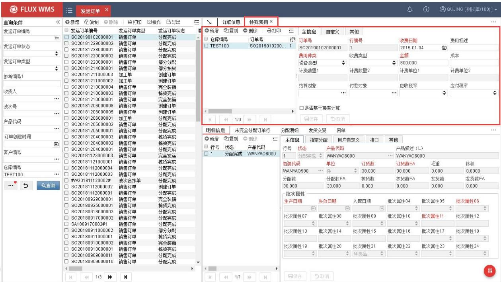

[图11-2-6]

## 订单号 - 系统自动显示

行号 - 特殊费用行的行号，系统自动生成 

费用日期 - 费用项的对应日期。 

费用描述 - 费用项说明信息。 

费用种类 - 特殊费用对应种类。下拉列表显示系统代码自定义 1 为'SPECIALCHARGE' 的 CodeID，相当与大类。 

费用类型 - 根据费用种类所选内容，显示对应代码内容，相当与小类。类似自定义 A 自 

定义 B 的限制关系。 

费用金额 - 非计算模式，录入的此 ASN 相关特殊费用金额。 

成本 - 支付金额。有成本支出的情况下记录。 

结算对象 - 付款人、结算人。仓库收取操作、仓储费用的目标对象。 

付款对象 - 仓库支付劳动力费用、租借费用的收款人。 

应收/应付税率 - 计税情况下的税率依据。 

计费数量 - 费用计算数量依据。基于费率计算情况下，计费数量取【计费数量 1*计费数量 2】，按照级差进行计算。 

计费单位 - 数量单位 

基于费率计算 - 如不勾选，只将特殊费用页签信息记入到费用清单；如勾选，需要根据特殊费用页签记录的费用种类、类型匹配费率中的设置，进行费用计算。 

■ 选择集装箱页签： 

依次输入集装箱箱号、类型、尺寸、铅封号、重量、备注等信息。 

<table><tr><td colspan="15">FLUX WMS</td></tr><tr><td colspan="15">查询条件</td></tr><tr><td colspan="15">发运订单编号</td></tr><tr><td colspan="15">发运订单状态</td></tr><tr><td colspan="15">发运订单类型</td></tr><tr><td colspan="15">参考编号1</td></tr><tr><td colspan="15">收货人</td></tr><tr><td colspan="15">波次号</td></tr><tr><td colspan="15">产品代码</td></tr><tr><td colspan="15">订单创建时间</td></tr><tr><td colspan="15">客户编号</td></tr><tr><td colspan="15">仓库编号</td></tr><tr><td colspan="15">TEST100</td></tr><tr><td>...</td><td colspan="14">查询</td></tr></table>

[图11-2-7] 

可连续新增，输入多个集装箱信息。 

■ 汇总信息页签： 

用于记录出库汇总信息。依次输入总数、总毛重、净重等信息。 

<table><tr><td colspan="2">查询条件</td><td colspan="13">发运订单</td></tr><tr><td colspan="2">发运订单编号</td><td colspan="13">新增 复制 删除 打印 回操作 导出</td></tr><tr><td rowspan="37" colspan="2">发运订单状态</td><td colspan="13">SO20190102000001 销售订单 分配完成</td></tr><tr><td colspan="13">SO20181229000002 销售订单 分配完成</td></tr><tr><td colspan="13">SO20181228000001 销售订单 分配完成</td></tr><tr><td colspan="13">SO20181220000002 销售订单 分配完成</td></tr><tr><td colspan="13">SO20181220000001 销售订单 部分分配</td></tr><tr><td colspan="13">SO20181214000001 销售订单 部分拣货</td></tr><tr><td colspan="13">SO20181211000003 加工单 创建订单</td></tr><tr><td colspan="13">SO20181211000002 加工单 创建订单</td></tr><tr><td colspan="13">SO20181210000004 销售订单 完全装箱</td></tr><tr><td colspan="13">SO20181210000003 销售订单 拣货完成</td></tr><tr><td colspan="13">SO20181210000001 销售订单 完全装箱</td></tr><tr><td colspan="13">SO20181206000008 销售订单 创建订单</td></tr><tr><td colspan="13">SO20181206000005 加工单 创建订单</td></tr><tr><td colspan="13">SO20181206000001 加工单 分配完成</td></tr><tr><td colspan="13">SO20181205000002 销售订单 分配完成</td></tr><tr><td colspan="13">SO20181205000001 销售订单 分配完成</td></tr><tr><td colspan="13">SO20181204000003 销售订单 拣货完成</td></tr><tr><td colspan="13">SO20181204000002 销售订单 拣货完成</td></tr><tr><td colspan="13">SO20181204000001 销售订单 分配完成</td></tr><tr><td colspan="13">SO20181123000003 销售订单 完全发运</td></tr><tr><td colspan="13">SO20181121000001 销售订单 拣货完成</td></tr><tr><td colspan="13">SO20181112000004 销售订单 分配完成</td></tr><tr><td colspan="13">SO20181112000003 销售订单 分配完成</td></tr><tr><td colspan="13">#W201811120002# 波次合拣单 分配完成</td></tr><tr><td colspan="13">SO20181112000002 销售订单 创建订单</td></tr><tr><td colspan="13">SO20181112000001 销售订单 分配完成</td></tr><tr><td colspan="13">SO20180929000001 销售订单 完全装箱</td></tr><tr><td colspan="13">SO20180925000001 销售订单 拣货完成</td></tr><tr><td colspan="13">SO20180918000002 销售订单 分配完成</td></tr><tr><td colspan="13">SO20180917000002 销售订单 分配完成</td></tr><tr><td colspan="13">SA1809170002#1 销售订单 分配完成</td></tr><tr><td colspan="13">SO20180911000002 销售订单 部分分配</td></tr><tr><td colspan="13">SO20180911000001 销售订单 拣货完成</td></tr><tr><td colspan="13">SO20180910000002 销售订单 完全装箱</td></tr><tr><td colspan="13">SO20180910000001 销售订单 拣货完成</td></tr><tr><td colspan="13">SO20180909000011 销售订单 分配完成</td></tr><tr><td colspan="13">SO20180909000010 销售订单 分配完成</td></tr></table>

[图11-2-8]

■ 订单如有照片、EXCEL 等文档，可通过附件页签进行管理： 

选择附件页签，点击【上传】按钮，系统显示如下的文件选择对话框。 

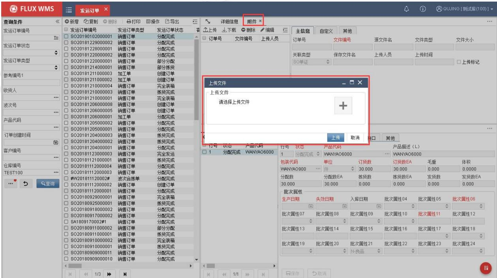

[图 11-2-9]

选择文件并确认上传后，系统显示如下的附件信息。

<table><tr><td colspan="15">FLUX WMS</td></tr><tr><td colspan="15">查询条件</td></tr><tr><td colspan="15">发运订单编号</td></tr><tr><td colspan="15">发运订单状态</td></tr><tr><td colspan="15">发运订单类型</td></tr><tr><td colspan="15">参考编号1</td></tr><tr><td colspan="15">收货人</td></tr><tr><td colspan="15">波次号</td></tr><tr><td colspan="15">产品代码</td></tr><tr><td colspan="15">订单创建时间</td></tr><tr><td colspan="15">客户编号</td></tr><tr><td colspan="15">仓库编号</td></tr><tr><td colspan="15">TEST100</td></tr><tr><td colspan="15">查询</td></tr></table>

[图11-2-10]

对于已有附件，可以通过【下载】按钮下载查看。 

## - 明细创建

■ 选择订单行部分，点击【新增】按钮，在明细信息的主信息界面中，输入信息： 

<table><tr><td>主信息</td><td>自定义</td><td>其他</td></tr><tr><td>订单号</td><td>文件编号</td><td>源文件名 文件类型 文件大小</td></tr><tr><td>SO20190102000001</td><td>15465928843871E</td><td>HTML格式 rar 9539</td></tr><tr><td>关联类型</td><td colspan="2">保存文件名 上传人员 上布时间</td></tr><tr><td>SO单证</td><td>15465928843871E</td><td>QUJING 2019-01-04 17:08:1 上传标记</td></tr></table>

FLUX WMS 用户手册 

[图11-2-11] 

行号 - 发运订单行号，新增时，系统自动给出。 

状态 - 该订单行的状态。新建时，系统自动提供默认值：创建。 

产品代码 - 所要发运的产品代码。 

产品描述 - 该产品的描述。当输入产品后，系统自动给出该产品在产品档案中维护的产品描述。描述为双字段，分为显示母语（L）、外语（S）描述。 

包装代码 - 该产品对应的包装代码。系统自动给出该产品在产品档案中维护的包装代码，用户也可根据情况选择其他的包装代码。 

单位 - 发运时的数量单位。系统自动给出该产品在产品档案中所选择的缺省出货单位，用户也可根据情况选择其他的出货单位。 

订货数 - 要求出库的产品数量。在订货数部分有 2 个字段，前一个字段是可输入的，以所选择的单位为数量单位；后一个字段是以所选择包装代码的主单位为数量单位，并且是系统自动换算给出。 

毛重 - 待出库货物的重量。 

体积 - 待出库货物的体积。 

分配数 - 系统分配数量。同样有 2 个字段，前一个以所选择的单位为数量单位；后一个字段以主单位为数量单位。 

拣货数 - 系统已拣货数量。 

发货数 - 系统已发货数量。 

批次属性 - 指定出库的批次属性内容，系统将按输入的批次属性出货。如果没有特殊出库要求，批次属性部分可为空，系统将根据库存周转规则的定义分配货物。此处的红色字体仅提示此内容在入库时为必输批次属性，出库时可根据需要指定。 

■ 指定分配页签，用于维护订单出库的指定条件信息： 

<table><tr><td colspan="2">查询条件</td><td colspan="15">发运订单</td></tr><tr><td colspan="2">发运订单编号</td><td colspan="15">新增 复制 删除 打印 回操作 导出</td></tr><tr><td colspan="2">发运订单状态</td><td colspan="15">发运订单编号 发运订单类型 发运订单状态</td></tr><tr><td rowspan="37" colspan="2">发运订单类型</td><td colspan="15">SO20190102000001 销售订单 分配完成</td></tr><tr><td colspan="15">SO20181229000002 销售订单 分配完成</td></tr><tr><td colspan="15">SO20181228000001 销售订单 分配完成</td></tr><tr><td colspan="15">SO20181220000002 销售订单 分配完成</td></tr><tr><td colspan="15">SO20181220000001 销售订单 部分分配</td></tr><tr><td colspan="15">SO20181214000001 销售订单 部分拣货</td></tr><tr><td colspan="15">SO20181211000003 加工单 创建订单</td></tr><tr><td colspan="15">SO20181211000002 加工单 创建订单</td></tr><tr><td colspan="15">SO20181210000004 销售订单 完全装箱</td></tr><tr><td colspan="15">SO20181210000003 销售订单 拣货完成</td></tr><tr><td colspan="15">SO20181210000001 销售订单 完全装箱</td></tr><tr><td colspan="15">SO20181206000008 销售订单 创建订单</td></tr><tr><td colspan="15">SO20181206000005 销售订单 创建订单</td></tr><tr><td colspan="15">SO20181206000001 加工单 分配完成</td></tr><tr><td colspan="15">SO20181205000002 销售订单 分配完成</td></tr><tr><td colspan="15">SO20181205000001 销售订单 分配完成</td></tr><tr><td colspan="15">SO20181204000003 销售订单 拣货完成</td></tr><tr><td colspan="15">SO20181204000002 销售订单 拣货完成</td></tr><tr><td colspan="15">SO20181204000001 销售订单 分配完成</td></tr><tr><td colspan="15">SO20181123000003 销售订单 完全发运</td></tr><tr><td colspan="15">SO20181121000001 销售订单 拣货完成</td></tr><tr><td colspan="15">SO20181112000004 销售订单 分配完成</td></tr><tr><td colspan="15">SO20181112000003 销售订单 分配完成</td></tr><tr><td colspan="15">#WV201811120002# 波次合拣单 分配完成</td></tr><tr><td colspan="15">SO20181112000002 销售订单 创建订单</td></tr><tr><td colspan="15">SO20181112000001 销售订单 分配完成</td></tr><tr><td colspan="15">SO20180929000001 销售订单 完全装箱</td></tr><tr><td colspan="15">SO20180925000001 销售订单 拣货完成</td></tr><tr><td colspan="15">SO20180918000002 销售订单 分配完成</td></tr><tr><td colspan="15">SO20180917000002 销售订单 分配完成</td></tr><tr><td colspan="15">SA1809170002#1 销售订单 分配完成</td></tr><tr><td colspan="15">SO20180911000002 销售订单 部分分配</td></tr><tr><td colspan="15">SO20180911000001 销售订单 拣货完成</td></tr><tr><td colspan="15">SO20180910000002 销售订单 完全装箱</td></tr><tr><td colspan="15">SO20180910000001 销售订单 拣货完成</td></tr><tr><td colspan="15">SO20180909000011 销售订单 分配完成</td></tr><tr><td colspan="15">SO20180909000010 销售订单 分配完成</td></tr></table>

[图11-2-12]

区域 - 指定拣货的区域。 

库区 - 指定拣货的库区。 

库位组 - 指定出货库位的所属库位组。 

库位 - 指定出货库位。 

一步分配 - 一步分配规则选择。 

周转规则 - 该产品的库存周转。系统自动给出该产品在产品档案中所选择的库存周转规则，用户也可根据情况选择其他的库存周转规则名称。 

预配规则 - 该产品的预分配规则。系统自动给出该产品在产品档案中所选择的预配规则，用户也可根据情况选择其他的预配规则。 

分配规则 - 该产品的分配规则。系统自动给出该产品在产品档案中所选择的分配规则，用户也可根据情况选择其他的分配规则。 

跟踪号 - 按输入的跟踪号出货。若输入了跟踪号，则不考虑预分配规则、分配规则和库存周转规则。 

批次 - 指定出库的库存批次号码。 

整单单批号 - 医药行业常用，出库时是否只分配一个生产批号的库存。 

整箱单批号 - 医药行业常用，是否只分配同一个生产批号的整箱库存。 

零货单批号 - 医药行业常用，是否只分配同一个生产批号的拆零库存。 

■ 自定义页签，主要信息有： 

<table><tr><td>查询条件</td><td>发运订单编号</td><td>发运订单类型</td><td>发运订单状态</td></tr><tr><td>发运订单编号</td><td>SO20190102000001</td><td>销售订单</td><td>分配完成</td></tr><tr><td>发运订单状态</td><td>SO20181229000002</td><td>销售订单</td><td>分配完成</td></tr><tr><td rowspan="3">发运订单类型</td><td>SO20181228000001</td><td>销售订单</td><td>分配完成</td></tr><tr><td>SO20181220000002</td><td>销售订单</td><td>分配完成</td></tr><tr><td>SO20181220000001</td><td>销售订单</td><td>部分分配</td></tr><tr><td rowspan="4">参考编号1</td><td>SO20181214000001</td><td>加工单</td><td>创建订单</td></tr><tr><td>SO20181211000003</td><td>加工单</td><td>创建订单</td></tr><tr><td>SO20181211000002</td><td>加工单</td><td>完全装箱</td></tr><tr><td>SO20181210000004</td><td>销售订单</td><td>完全装箱</td></tr><tr><td rowspan="3">收货人</td><td>SO20181210000003</td><td>销售订单</td><td>拣货完成</td></tr><tr><td>SO20181210000001</td><td>销售订单</td><td>完全装箱</td></tr><tr><td>SO20181206000008</td><td>销售订单</td><td>创建订单</td></tr><tr><td>波次号</td><td>SO20181206000005</td><td>加工单</td><td>分配完成</td></tr><tr><td rowspan="3">产品代码</td><td>SO20181206000001</td><td>加工单</td><td>分配完成</td></tr><tr><td>SO20181205000002</td><td>销售订单</td><td>分配完成</td></tr><tr><td>SO20181205000001</td><td>销售订单</td><td>分配完成</td></tr><tr><td rowspan="2">订单创建时间</td><td>SO20181204000003</td><td>销售订单</td><td>拣货完成</td></tr><tr><td>SO20181204000002</td><td>销售订单</td><td>拣货完成</td></tr><tr><td rowspan="5">客户编号</td><td>SO20181204000001</td><td>销售订单</td><td>完全装运</td></tr><tr><td>SO20181123000003</td><td>销售订单</td><td>拣货完成</td></tr><tr><td>SO20181121000001</td><td>销售订单</td><td>分配完成</td></tr><tr><td>SO20181112000004</td><td>销售订单</td><td>分配完成</td></tr><tr><td>SO20181112000003</td><td>销售订单</td><td>分配完成</td></tr><tr><td>仓库编号</td><td>#W201811120002#</td><td>波次合拣单</td><td>分配完成</td></tr><tr><td rowspan="13">TEST100</td><td>SO20181112000002</td><td>销售订单</td><td>创建订单</td></tr><tr><td>SO20181112000001</td><td>销售订单</td><td>完全装箱</td></tr><tr><td>SO20180929000001</td><td>销售订单</td><td>完全装箱</td></tr><tr><td>SO20180925000001</td><td>销售订单</td><td>拣货完成</td></tr><tr><td>SO20180918000002</td><td>销售订单</td><td>分配完成</td></tr><tr><td>SO20180917000002</td><td>销售订单</td><td>分配完成</td></tr><tr><td>SA1809170002#1</td><td>销售订单</td><td>分配完成</td></tr><tr><td>SO20180911000002</td><td>销售订单</td><td>部分分配</td></tr><tr><td>SO20180911000001</td><td>销售订单</td><td>拣货完成</td></tr><tr><td>SO20180910000002</td><td>销售订单</td><td>完全装箱</td></tr><tr><td>SO20180910000001</td><td>销售订单</td><td>拣货完成</td></tr><tr><td>SO20180909000011</td><td>销售订单</td><td>分配完成</td></tr><tr><td>SO20180909000010</td><td>销售订单</td><td>分配完成</td></tr></table>

[图11-2-13]

允许混合包装 - 即订单行是否单品记录，或单包装记录。 

免拣赠品 - 此订单行是否无需拣货的复核台赠品。 

■ 点击【保存】按钮，保存新增明细信息。 

## 11.2.2. 表头右键功能

## - 订单取消、关闭

订单创建后，在没有进行操作的情况下不再使用该订单，可以使用表头的删除按钮直接删除订单，或者使用鼠标右键菜单中的订单取消功能，取消订单。 

订单取消后，将不能针对订单进行任何操作，但仍然可以查询到该订单（查询条件需要选择“显示关闭/取消 SO”），有利于用户统计、查询。 

订单关闭，同样结束订单操作，不能再对订单进行任何修改，与取消不同的是，关闭针对使用中的订单，并不限定只能是创建状态订单。 

需要注意的是，操作进行中的订单不能被取消或关闭。例如订单已经分配，但未发运。不论是否部分分配，都要将已分配记录取消，订单恢复到创建状态，或者将已分配记录确认发货后，才能对订单取消或关闭。 

如果订单有生成对应的数量抽检单，关闭时会校验对应抽检单是否已检验完成。如果检验作业未完成，不允许关闭订单。 

## ● 发货相关操作

按订单进行预配、分配、拣货、发货等操作。具体细节参考 11.4 发货操作部分的详细介绍。 

## - 拆分订单

订单下单后，由于各方面原因，需要分批出库，此时可以根据需要将订单拆分。拆分订单仅限于创建状态订单才能操作，在明细列表中可以录入释放数量，然后选择鼠标右键功能项“拆分订单”，系统复制生成新订单，并将订单的订货数量，按照录入的释放数量，拆分为2个SO。原始SO中的数量，更新为释放数量。 

## - 冻结释放

■ 订单释放 

对订单进行审核确认，使订单处于释放状态，可以进行发货操作。 

订单冻结 

对订单进行冻结操作，不能拣货、复核等操作。 

订单未释放 

对订单进行审核确认时，由于各种原因，将订单置于未释放状态，不能进行发货操作。 

订单任务下发 

更新订单释放状态为“任务下发”，常用于拣货任务下发给相关设备，如电子标签等。 

## - 单据打印

系统提供的标准作业单据打印。 

<table><tr><td colspan="21">查询条件</td></tr><tr><td colspan="21">发运订单编号</td></tr><tr><td colspan="21">发运订单状态</td></tr><tr><td colspan="21">发运订单类型</td></tr><tr><td colspan="21">参考编号1</td></tr><tr><td colspan="21">收货人</td></tr><tr><td colspan="21">波次号</td></tr><tr><td colspan="21">产品代码</td></tr><tr><td colspan="21">订单创建时间</td></tr><tr><td colspan="21">客户编号</td></tr><tr><td colspan="21">仓库编号</td></tr><tr><td colspan="21">TEST100</td></tr><tr><td>...</td><td colspan="20">查询</td></tr></table>

[图11-2-14]

## ● 增值服务

系统将增值服务相关的功能集合到“增值服务”子菜单中。 

<table><tr><td colspan="2">查询条件</td><td colspan="14">发运订单</td></tr><tr><td colspan="2">发运订单编号</td><td>发运订单编号</td><td>发运订单类型</td><td>发运订单状态</td><td>客</td><td>主信息</td><td>收货人</td><td>运输</td><td>结算人</td><td>承运人</td><td>下单方</td><td>接口</td><td>用户自定义</td><td>附加信息</td><td>其他</td></tr><tr><td rowspan="2" colspan="2">发运订单状态</td><td>SO2019010201</td><td rowspan="21" colspan="2">辅助</td><td rowspan="21"></td><td>发运订单编号</td><td colspan="2">发运订单状态</td><td>发运订单类型</td><td colspan="3">释放状态</td><td>优先级</td><td colspan="2">仓库编号</td></tr><tr><td>SO201812290</td><td>SO20190102000001</td><td colspan="2">分配完成</td><td>销售订单</td><td colspan="3">订单释放</td><td>3普通</td><td colspan="2">TEST100</td></tr><tr><td rowspan="2" colspan="2">发运订单类型</td><td>SO201812280</td><td>客户编号</td><td colspan="2">客户名称</td><td>收货人</td><td colspan="3">收货人名称</td><td>预期发货时间1</td><td colspan="2">预期发货时间2</td></tr><tr><td>SO201812200</td><td>TEST100</td><td colspan="2">TEST100C</td><td>TEST100</td><td colspan="3">TEST100长沙测试专用</td><td>2019-01-02 15:54:</td><td colspan="2">2019-01-02 15:54:</td></tr><tr><td colspan="2">参考编号1</td><td>SO201812200</td><td>参考编号1</td><td colspan="2">参考编号2</td><td>参考编号3</td><td colspan="3">参考编号4</td><td>参考编号5</td><td colspan="2">波次号</td></tr><tr><td colspan="2">收货人</td><td>SO201812140</td><td></td><td colspan="2"></td><td></td><td colspan="3"></td><td></td><td colspan="2"></td></tr><tr><td rowspan="15" colspan="2">波次号</td><td>SO201812110</td><td></td><td colspan="2"></td><td></td><td colspan="3"></td><td></td><td colspan="2"></td></tr><tr><td>SO201812110</td><td></td><td colspan="2"></td><td></td><td colspan="3"></td><td></td><td colspan="2"></td></tr><tr><td>SO201812100</td><td></td><td colspan="2"></td><td></td><td colspan="3"></td><td></td><td colspan="2"></td></tr><tr><td>SO201812100</td><td></td><td colspan="2"></td><td></td><td colspan="3"></td><td></td><td colspan="2"></td></tr><tr><td>SO201812100</td><td></td><td colspan="2"></td><td></td><td colspan="3"></td><td></td><td colspan="2"></td></tr><tr><td>SO201812060</td><td></td><td colspan="2"></td><td></td><td colspan="3"></td><td></td><td colspan="2"></td></tr><tr><td>SO201812060</td><td></td><td colspan="2"></td><td></td><td colspan="3"></td><td></td><td colspan="2"></td></tr><tr><td>SO201812060</td><td></td><td colspan="2"></td><td></td><td colspan="3"></td><td></td><td colspan="2"></td></tr><tr><td>SO201812050</td><td></td><td colspan="2"></td><td></td><td colspan="3"></td><td></td><td colspan="2"></td></tr><tr><td>SO201812050</td><td></td><td colspan="2"></td><td></td><td colspan="3"></td><td></td><td colspan="2"></td></tr><tr><td>SO201812050</td><td></td><td colspan="2"></td><td></td><td colspan="3"></td><td></td><td colspan="2"></td></tr><tr><td>SO201812040</td><td></td><td colspan="2"></td><td></td><td colspan="3"></td><td></td><td colspan="2"></td></tr><tr><td>SO201812040</td><td></td><td colspan="2"></td><td></td><td colspan="3"></td><td></td><td colspan="2"></td></tr><tr><td>SO201812040</td><td></td><td colspan="2"></td><td></td><td colspan="3"></td><td></td><td colspan="2"></td></tr><tr><td>SO201812040</td><td></td><td colspan="2"></td><td></td><td colspan="3"></td><td></td><td colspan="2"></td></tr></table>

[图11-2-15]

■ 拆分 BOM: 

系统将订单明细中的组合件，按组件 BOM 结构和数量设置，拆分为多个零件产品的明细订单记录。通常用做加工操作流程中，获得加工所需的零件。 

拆分 BOM 功能，也可单独使用，适用于按照 BOM 发子件产品，但不需要仓库中进行组装加工的情况。 

在明细部分输入父件产品并保存后，选择表头鼠标右键菜单的“拆分 BOM”功能，系统自动将明细行中的父件记录按组件结构拆分为多条子件明细行。数量根据 BOM 设置进行换算。 

明细行部分的鼠标右键菜单中，也有“拆分BOM”功能，不同的是仅针对单个明细行拆分。 

拆分 BOM 时，零件提取量，会根据作业情况考虑是否要提取整箱库存，通过参数 KIT_BOM_RND 进行配置，可以选择原数量，向上取整（多拣货），向下取整（少拣货），四舍五入进位几种不同方式。 

## 生成加工任务

如果需要在仓库中进行简单加工、组装，可以使用加工单对加工操作进行管理。 

发运订单拆分 BOM 后，分配子件库存，并确认拣货。然后通过表头右键菜单的“生成加工任务”功能，可根据子件分配明细记录，生成对应加工单，指导加工操作。 

后续加工操作，请参看增值服务部分。 

发运订单（SO）生成加工任务的操作，可以指定只能由加工类型的 SO 生成加工任务，也可以不作限制。通过系统参数 VAS_BOM_CTL（是否只有加工单类型的 SO 才允许拆分 BOM）的设置进行控制。 

## - 单据生成

单据生成子菜单内容，主要是根据 SO 分配明细信息创建其他单据。 

日常作业中，有时会根据货主所给的产品清单指令进行一些库存整理工作，或者批量修改库存信息，例如要求产品代码更新。但货主所提供的指令，通常只下达产品名称、数量及需要修改的信息，很少会指明库位、跟踪号、批次等库存详细信息，难以直接用来导入生成移库单、转移单等作业单据。 

为了便于操作，FLUX WMS 提供了根据 SO 生成其他作业单的功能。在 SO 中输入产品、数量及条件，通过系统进行分配，寻找合适的库存，再通过鼠标右键菜单功能，根据已分配的库存记录，创建对应库存作业单据，原 SO 自动取消分配，取消订单。 

<table><tr><td colspan="16">查询条件</td></tr><tr><td colspan="16">发运订单编号</td></tr><tr><td colspan="16">发运订单状态</td></tr><tr><td colspan="16">发运订单类型</td></tr><tr><td colspan="16">参考编号1</td></tr><tr><td colspan="16">收货人</td></tr><tr><td colspan="16">波次号</td></tr><tr><td colspan="16">产品代码</td></tr><tr><td colspan="16">订单创建时间</td></tr><tr><td colspan="16">客户编号</td></tr><tr><td colspan="16">仓库编号</td></tr><tr><td colspan="16">TEST100</td></tr><tr><td>...</td><td colspan="15">查询</td></tr></table>

[图11-2-16]

## ■ 生成库存移动单

根据 SO 分配信息，创建库存移动单据 

## ■ 生成库存转移单

根据 SO 分配信息，创建库存转移单据 

## ● 触发补货任务

大量订单作业时，完全按拣货位上下限进行库存计算，有可能所补的货物不够订单需求数量，需要多次补货。因此可根据订单，提前补货，利用补充拣货位、快拣位，备足订单所需库存。 

操作时，人工选择订单（可多订单）或波次，右键菜单【触发补货任务】，系统将选中的所有订单的需求量汇总，进行补货计算。 

## - 创建波次计划（跳转）

表头右键菜单选项，选择多条 SO 记录后，生成波次计划。具体操作参看订单合并（WAVE）的波次添加订单部分。 

## - 添加到当前波次

为已存在的波此计划（WAVE）添加 SO，须要从 WAVE 中开始操作。具体操作参看订单合并（WAVE）部分。 

## - 导入导出

## ■ 复制 SO

根据当前发运订单，复制生成新的、创建状态发运订单，仅订单号码、创建时间不同 

## - 指派

订单下达时，有些信息货主未指定，而是由仓库进行安排。或者是对已有信息进行变更，可以通过指派子菜单进行指定。例如原定承运人无法承运，需要变更订单的承运人。 

指派子菜单，也可批量更新订单的运输方式、路线、服务等级、运单号规则等字段内容。 

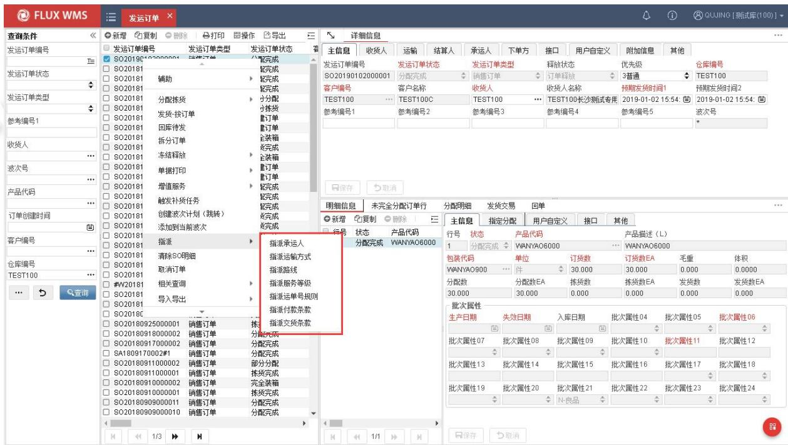

[图11-2-17]

## - 汇总信息

显示当前订单汇总信息，包括产品汇总的数量信息，订单数量及体积重量等信息，如下图所示： 

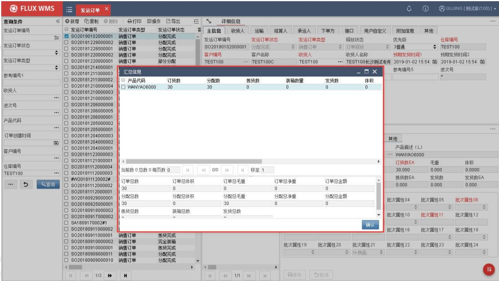

[图11-2-18]

- 相关查询

<table><tr><td colspan="2">查询条件</td><td>发运订单编号</td><td>发运订单类型</td><td>发运订单状态</td><td>主信息</td><td>收货人</td><td>运输</td><td>结算人</td><td>承运人</td><td>下单方</td><td>接口</td><td>用户自定义</td><td>附加信息</td><td>其他</td></tr><tr><td colspan="2">发运订单编号</td><td>SO20190102000001</td><td>销售订单</td><td>分配完成</td><td>发运订单编号</td><td>发运订单状态</td><td>发运订单类型</td><td colspan="4">释放状态</td><td>优先级</td><td colspan="2">仓库编号</td></tr><tr><td colspan="2">发运订单状态</td><td>SO20181229000002</td><td>销售</td><td>方案负责</td><td>SO20190102000001</td><td>分配完成</td><td>销售订单</td><td colspan="4">订单释放</td><td>3普通</td><td colspan="2">TEST100</td></tr><tr><td rowspan="2" colspan="2">发运订单类型</td><td>SO20181228000001</td><td>销售</td><td>发货-按订单</td><td>客户编号</td><td>客户名称</td><td>收货人</td><td colspan="4">收货人名称</td><td>预期发货时间1</td><td colspan="2">预期发货时间2</td></tr><tr><td>SO20181220000002</td><td>销售</td><td>回库存发</td><td>TEST100</td><td>TEST100C</td><td>TEST100</td><td colspan="4">TEST100长沙测试专用</td><td>2019-01-02 15:54:</td><td colspan="2">2019-01-02 15:54:</td></tr><tr><td rowspan="25" colspan="2">参考编号1</td><td>SO20181214000001</td><td>销售</td><td>拆分订单</td><td>参考编号1</td><td>参考编号2</td><td>参考编号3</td><td colspan="4">参考编号4</td><td>参考编号5</td><td colspan="2">波次号</td></tr><tr><td>SO20181211000003</td><td>加工</td><td>冻结释放</td><td rowspan="24"></td><td rowspan="24"></td><td rowspan="24"></td><td rowspan="24"></td><td rowspan="24"></td><td rowspan="24"></td><td rowspan="24"></td><td rowspan="24"></td><td rowspan="24"></td><td rowspan="24"></td></tr><tr><td>SO20181211000002</td><td>加工</td><td>单据打印</td></tr><tr><td>SO20181210000003</td><td>销售</td><td>增值服务</td></tr><tr><td>SO20181210000001</td><td>加工</td><td>触发补货任务</td></tr><tr><td>SO20181206000008</td><td>销售</td><td>添加到当前波次</td></tr><tr><td>SO20181205000002</td><td>销售</td><td>指派</td></tr><tr><td>SO20181205000001</td><td>销售</td><td>清除SO明细</td></tr><tr><td>SO20181204000003</td><td>销售</td><td>取消订单</td></tr><tr><td>SO20181204000002</td><td>销售</td><td>相关查询</td></tr><tr><td>SO20181123000003</td><td>销售</td><td>导入导出</td></tr><tr><td>SO20181121000001</td><td>销售</td><td>单据生成</td></tr><tr><td>SO20181112000002</td><td>销售</td><td>关闭订单</td></tr><tr><td>SO20181112000001</td><td>销售</td><td>拣货完成</td></tr><tr><td>SO20180929000001</td><td>销售</td><td>分配完成</td></tr><tr><td>SO20180925000001</td><td>销售订单</td><td>分配完成</td></tr><tr><td>SO20180918000002</td><td>销售订单</td><td>分配完成</td></tr><tr><td>SO20180917000002</td><td>销售订单</td><td>分配完成</td></tr><tr><td>SA1809170002#1</td><td>销售订单</td><td>分配完成</td></tr><tr><td>SO20180911000002</td><td>销售订单</td><td>部分分配</td></tr><tr><td>SO20180911000001</td><td>销售订单</td><td>拣货完成</td></tr><tr><td>SO20180910000002</td><td>销售订单</td><td>完全装箱</td></tr><tr><td>SO20180910000001</td><td>销售订单</td><td>拣货完成</td></tr><tr><td>SO20180909000011</td><td>销售订单</td><td>分配完成</td></tr><tr><td>SO20180909000010</td><td>销售订单</td><td>分配完成</td></tr></table>

[图 11-2-19]

基于订单进行信息查询 

■ 查询库存事务 

跳转到库存事物查询界面，并将订单号带入查询条件，方便用户查询订单 UI 应信息。 

■ 查询操作日志 

部分操作，如打印单据等，系统不作为历史事务进行记录，仅在后台 log 中记录。如果个别作业对流程影响较大，可通过个性化配置为操作日志进行记录，并通过右键的“查询操作日志”功能，弹出窗口列表显示。 

## ■ 查询未装车明细

## 弹出窗显示订单中尚未装车确认的记录

## ■ 订单状态日志

为方便订单状态变动信息通过接口传递给前后端系统（如 ERP），开启个性化配置后，系统在操作过程中记录订单状态变化情况，选择此功能后，通过弹出窗口列表显示订单状态变动情况。 

## ■ 查询序列号

点击后，跳转到“出库序列号查询”功能，并根据订单号查询对应出库序列号。 

## - 清除 SO 明细

此功能仅在订单创建状态下有效，可删除全部订单明细。常用于导入订单明细后发现错误时的反向操作。 

## 11.2.3. 明细右键功能

明细部分右键功能主要有： 

## - 拆分BOM

加工操作相关功能。明细行为父件 SKU，通过 “拆分 BOM” 操作，根据 BOM 组件维护信息，按数量要求替换为对应的多行子件 SKU 信息。 

具体加工操作步骤，可参考增值服务章节的介绍。 

也有些业务情况，无需仓库加工，但需要根据客户指定的父件要求，拆分 BOM 后发货匹配的子件。 

## - 指定产品供应商

订单明细行部分，鼠标右键子菜单功能项。需要与产品档案中的供应商设置结合使用，能够限定产品所述的供应商。操作时，系统参数 SKU_SUP_LNK（产品与供应商绑定）设置为 Y。 

选择此功能，系统将产品档案中指定的供应商 ID 写入到订单明细的批次属性 05，可以达到指定供应商出库的目的。如果一个产品有多个对应供应商，系统显示供应商二级窗口供用户选择。 

## - 包装材料

二级窗口显示产品对应维护的包材信息。 

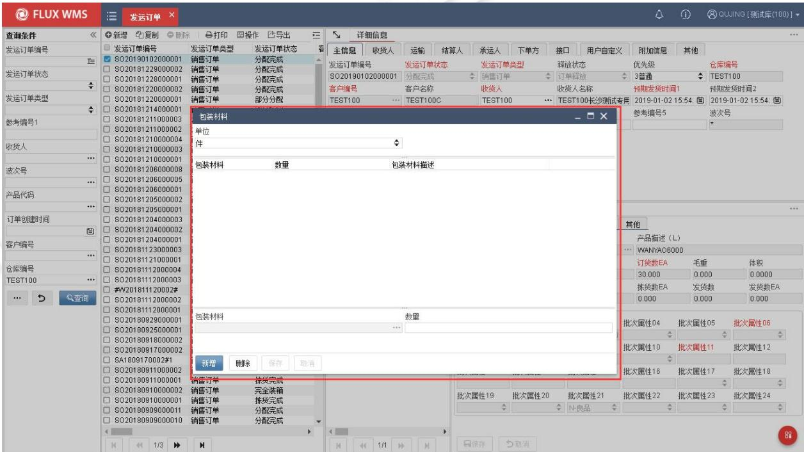

[图11-2-20]

## - 复制批次属性到所有行

订单明细的批次属性内容为出库指定条件，人工修改时，可选择一行作为样本，复制到其他各行，方便操作。 

## - 复制拣货区/库位到所有行

订单明细的“指定分配”页签内容同样是出库指定条件，能够复制功能复制到其他各行。 

## - 查询库存余量

根据订单明细，跳转到库存余量界面，并以仓库、货主、产品作为条件查询库存。 

## 11.2.4. 调拨出库/调拨入库

当调拨出库单关闭时，系统根据订单头标记（warehousetransferFlag=Y）和收货人信息是否为组织架构下仓库为条件，判断是否需要生成/关联调拨入库单。当需要生成/关联调拨入库单时，根据 参数配置值（TRN_CTL）判断具体关联调拨入库单方式： 

## ● 参数设置为 Y 时（调拨入库单由 WMS 写入）：

自动根据调拨出库单货主、参考编号、表头/明细用户自定义、表头/明细接口字段等信息，生成订单类型为 TT 的调拨入库单。并且系统自动将调拨出库单序列号、子序列号相关信息，写入调拨入库单所属仓库中。写入成功后调拨出库单序列号在库标记更新为 N，调拨入库单序列号在库标记更新为 Y。 

## ● 参数设置为 N 时（调拨入库单由 DATAHUB 写入）：

自动匹配调拨入库目标仓下，asnreference1 等于 soreference1，并且订单状态小于 90 的第一条入库订单。并且系统自动将调拨出库单序列号、子序列号相关信息，写入调拨入库单所属仓库中。写入成功后调拨出库单序列号在库标记更新为 N，调拨入库单序列号在库标记更新为 Y。 

在此模式下系统允许调拨出库单和调拨入库单所属不同订单类型、不同货主（不同子公司之间调拨，可能货主不同）。 

## 11.3. 波次计划 (Wave)

波次计划即指订单合并操作，将多个 SO 合并为一个订单组（波次计划/WAVE），进行统一的作业管理。订单合并后，相应操作也可以合并处理，在操作量上形成业务波动，例如 5 个订单中都需要拣取 A 产品 10 个，订单合并后，可以一次拣取 50 个 A 产品，减少拣货操作次数、往返路程。它使用户将多种不同订单，依据某种共性合并在一个波次当中，整合为一个拣货作业。在这个拣货作业中，所进行的选择按照商品的库存流转规则和最有效的移动单元进行。系统将这些拣货分配到最佳的拣货区域，例如直接采用整栈板拣货，而避免去补货的动作。 

波次计划的执行可以减少操作人员对单证分别操作的工作量，提高操作效率和准确度。 

执行波次计划时，并不是所有订单都适合的，仅适合于从多具有相同或类似订单明细的单证。例如不同订单中，所需的产品完全不同，发货人也没有相关性，拣货路径没有可重叠、优化部分，此类订单即使合并，也不能减少操作工作量。 

## 11.3.1. 单证创建

要将多个订单合并处理，首先要筛选合适的订单用来组合波次计划。 

系统创建波次计划，可通过设置波次规则、定时器，由系统后台定时筛选订单、创建波次计划（相关设置请参考业务规则-波次计划部分的介绍），也可以手动创建波次计划。 

## - 创建波次计划

手动创建波次操作步骤为： 

■ 选择“出库操作”中的“发运订单” 

■ 在查询页面根据需要输入查询条件： 

<table><tr><td colspan="12">更多查询条件</td></tr><tr><td>波次编号</td><td>状态</td><td>波次规则</td><td>客户编号</td><td>仓库编号</td><td></td><td></td><td></td><td></td><td></td><td></td><td></td></tr><tr><td>描述</td><td></td><td>区域</td><td>拣货单打印标记</td><td>TEST100</td><td></td><td></td><td></td><td></td><td></td><td></td><td></td></tr><tr><td>订单类型</td><td>承运人</td><td>路线</td><td>优先级</td><td></td><td></td><td></td><td></td><td></td><td></td><td></td><td></td></tr><tr><td>订单号</td><td></td><td>参考编号1</td><td></td><td></td><td></td><td></td><td></td><td></td><td></td><td></td><td></td></tr><tr><td></td><td></td><td></td><td></td><td>启用编组</td><td></td><td></td><td></td><td></td><td></td><td></td><td></td></tr><tr><td>波次编组号</td><td>波次编组打印标记</td><td colspan="3">显示关闭波次</td><td></td><td></td><td></td><td></td><td></td><td></td><td></td></tr><tr><td>选择日期</td><td></td><td></td><td></td><td></td><td></td><td></td><td></td><td></td><td></td><td></td><td></td></tr><tr><td>订单创建起始时间</td><td></td><td></td><td></td><td></td><td></td><td></td><td></td><td></td><td></td><td></td><td></td></tr><tr><td colspan="5">私有扩展选择</td><td></td><td></td><td></td><td></td><td></td><td></td><td></td></tr></table>

[图11-3-1]

SO 编号 - 发运订单号 

SO 状态 - 订单目前所处操作状态，如创建、完全分配等。可查询状态区段，例如部分分配到完全分配的订单。 

SO 类型 - 发运订单类型。 

仓库 - 默认为登陆仓库 

参考编号 - 发运订单参考编号 1~5，模糊查询 

客户编号 - 指定的货主代码 

收货人 - 发运订单的收货人 

承运人 - 发运订单表头记录的承运人 ID 

优先级 - 发运订单的优先级 

波次号 - 发运订单所属波次号 

产品代码 - 订单中包括的产品代码 

路线 - 收货人所在运输路线 

波次产生 - 是否已包含在波次中（不限具体波次号） 

用户自定义 - 订单附加信息 

拣货单打印标记 - 是否已经打印拣货单 

订单取消标记 - 是否带有 ERP 下达的订单取消标记 

单品匹配 - 是否单品订单 

显示产品所在订单的其他订单行 - 按产品查询时，是否显示结果订单中的其他产品行。默认选择此项，如果不选择，则只显示产品查询条件中录入的产品对应的明细行。 

EDI 发送标记 - 是否接口已发送订单 

显示关闭/取消订单 - 查询范围是否包括已经关闭或取消的订单。 

时间范围信息： 

订单创建时间 - 发运订单创建时间范围 

预期发货时间 - 订单预计发货时间范围 

实际发货时间 - 订单发货时间范围 

模糊查询 - 所输入的查询条件是否进行模糊查询 

■ SO 查询支持设置自定义的扩展查询条件。扩展内容配置请参考专项说明文档。 

■ 点击【查询】按钮，系统根据输入的查询条件检索符合要求的订单。 

在表头列表部分，勾选订单记录，或者通过鼠标右键“全选”功能选择全部查询到的订单 

■ 点击鼠标右键，选择右键菜单中的“创建波次计划”（如下图），系统将把当前选择的多个发运订单创建为一个波次计划，并切换到波次计划界面。 

<table><tr><td>发运订单编号</td><td>发运订单类型</td><td>发运订单状态</td><td>客户编号</td><td>仓库编号</td><td>收货人</td><td>收货人名称</td><td>释放状态</td><td>订单创建时间</td><td>波次号</td><td>参考编号1</td><td>参考编</td></tr><tr><td>SO20190102000001</td><td>销售订单</td><td>分配完成</td><td>TEST100</td><td>TEST100</td><td>TEST100</td><td>TEST100长沙测试...</td><td>订单释放</td><td>2019-01-02 15:55.07</td><td>*</td><td></td><td></td></tr><tr><td>SO2018122900002</td><td>销售订单</td><td>分配完成</td><td>TEST100</td><td>TEST100</td><td>WH01</td><td>WH01洽洽电商测试...</td><td>订单释放</td><td>2018-12-29 16:24.46</td><td>*</td><td></td><td></td></tr><tr><td>SO20181228000C</td><td rowspan="3">辅助</td><td rowspan="3"></td><td>TEST100</td><td>TEST100</td><td>TEST100</td><td>TEST100长沙测试...</td><td>订单释放</td><td>2018-12-28 16:33.21</td><td>W201812280001</td><td></td><td></td></tr><tr><td>SO2018122000C</td><td>TEST100</td><td>TEST100</td><td>TEST100</td><td>TEST100长沙测试...</td><td>订单释放</td><td>2018-12-20 16:59.20</td><td>W201812280001</td><td></td><td></td></tr><tr><td>SO2018122000C</td><td>TEST100</td><td>TEST100</td><td>TEST100</td><td>TEST100长沙测试...</td><td>订单释放</td><td>2018-12-20 16:56.20</td><td>*</td><td></td><td></td></tr><tr><td>SO2018121400C</td><td>分配拣货</td><td></td><td>TEST100</td><td>TEST100</td><td>TEST100</td><td>TEST100长沙测试...</td><td>订单释放</td><td>2018-12-14 10:55.26</td><td>*</td><td></td><td></td></tr><tr><td>SO20181211000</td><td rowspan="2">发货-按订单</td><td rowspan="2"></td><td>TEST100</td><td>TEST100</td><td>TEST100</td><td>TEST100长沙测试...</td><td>订单释放</td><td>2018-12-11 15:46.44</td><td>*</td><td></td><td></td></tr><tr><td>SO20181211000</td><td>TEST100</td><td>TEST100</td><td>TEST100</td><td>TEST100长沙测试...</td><td>订单释放</td><td>2018-12-11 15:45.23</td><td>*</td><td></td><td></td></tr><tr><td>SO2018121000C</td><td>回库存发</td><td></td><td>TEST100</td><td>TEST100</td><td>TEST100</td><td>TEST100长沙测试...</td><td>订单释放</td><td>2018-12-10 16:29.17</td><td>W201812100002</td><td></td><td></td></tr><tr><td>SO2018121000C</td><td>拆分订单</td><td></td><td>TEST100</td><td>TEST100</td><td>TEST100</td><td>TEST100长沙测试...</td><td>订单释放</td><td>2018-12-10 16:29.04</td><td>W201812100001</td><td></td><td></td></tr><tr><td>SO2018121000C</td><td>冻结释放</td><td></td><td>TEST100</td><td>TEST100</td><td>TEST100</td><td>TEST100长沙测试...</td><td>订单释放</td><td>2018-12-10 15:57.21</td><td>W201812100001</td><td></td><td></td></tr><tr><td>SO2018120600C</td><td>冻结释放</td><td></td><td>TEST100</td><td>TEST100</td><td>AUTO_REC02</td><td>AUTO_REC02</td><td>订单释放</td><td>2018-12-06 17:25.37</td><td>*</td><td></td><td></td></tr><tr><td>SO2018120600C</td><td>单据打印</td><td></td><td>LQL</td><td>TEST100</td><td>AUTO_REC02</td><td>AUTO_REC02</td><td>订单释放</td><td>2018-12-06 17:02.26</td><td>*</td><td>11</td><td>4</td></tr><tr><td>SO2018120600C</td><td rowspan="2">增值服务</td><td rowspan="2"></td><td>TEST100</td><td>TEST100</td><td>TEST100</td><td>TEST100长沙测试...</td><td>订单释放</td><td>2018-12-06 11:39.38</td><td>*</td><td></td><td></td></tr><tr><td>SO2018120500C</td><td>TEST100</td><td>TEST100</td><td>TEST100</td><td>TEST100长沙测试...</td><td>订单释放</td><td>2018-12-05 14:44.31</td><td>*</td><td></td><td></td></tr><tr><td>SO2018120500C</td><td>触发补货任务</td><td></td><td>TEST100</td><td>TEST100</td><td>TEST100</td><td>TEST100长沙测试...</td><td>订单释放</td><td>2018-12-05 14:16.55</td><td>W201812050001</td><td></td><td></td></tr><tr><td>SO2018120400C</td><td>创建波次计划(跳转)</td><td></td><td>TEST100</td><td>TEST100</td><td>TEST100</td><td>TEST100长沙测试...</td><td>订单释放</td><td>2018-12-04 14:04.19</td><td>W201812050001</td><td></td><td></td></tr><tr><td>SO2018120400C</td><td rowspan="2">添加到当前波次</td><td rowspan="2"></td><td>TEST100</td><td>TEST100</td><td>TEST100</td><td>TEST100长沙测试...</td><td>订单释放</td><td>2018-12-04 13:59.05</td><td>W201812040001</td><td></td><td></td></tr><tr><td>SO2018120400C</td><td>TEST100</td><td>TEST100</td><td>TEST100</td><td>TEST100长沙测试...</td><td>订单释放</td><td>2018-12-04 12:29.52</td><td>W201812040001</td><td></td><td></td></tr><tr><td>SO2018112300C</td><td>指派</td><td></td><td>TEST100</td><td>TEST100</td><td>TEST100</td><td>TEST100长沙测试...</td><td>订单释放</td><td>2018-11-23 17:26.41</td><td>*</td><td></td><td></td></tr><tr><td>SO20181121000</td><td>清除SC明细</td><td></td><td>TEST100</td><td>TEST100</td><td>TEST100</td><td>TEST100长沙测试...</td><td>订单释放</td><td>2018-11-21 14:36.13</td><td>W201811210001</td><td></td><td></td></tr><tr><td>SO20181112000</td><td rowspan="2">取消订单</td><td rowspan="2"></td><td>TEST100</td><td>TEST100</td><td>TEST100</td><td>TEST100长沙测试...</td><td>订单释放</td><td>2018-11-12 16:08.54</td><td>W201811120004</td><td></td><td></td></tr><tr><td>#W20181112000</td><td>TEST100</td><td>TEST100</td><td>TEST100</td><td>TEST100长沙测试...</td><td>订单释放</td><td>2018-11-12 14:35.01</td><td>W201811120003</td><td></td><td></td></tr><tr><td>SO20181112000</td><td>相关查询</td><td></td><td>TEST100</td><td>TEST100</td><td>TEST100</td><td></td><td>订单未释放</td><td>2018-11-12 14:29.44</td><td>*</td><td></td><td></td></tr><tr><td>SO20181112000</td><td rowspan="3">导入导出</td><td rowspan="3"></td><td>TEST100</td><td>TEST100</td><td>TEST100</td><td>TEST100长沙测试...</td><td>订单释放</td><td>2018-11-12 14:29.00</td><td>W201811120002</td><td>12</td><td></td></tr><tr><td>SO2018092900C</td><td>TEST100</td><td>TEST100</td><td>TEST100</td><td>TEST100长沙测试...</td><td>订单释放</td><td>2018-11-12 14:28.41</td><td>W201811120001</td><td></td><td></td></tr><tr><td>SO2018092500C</td><td>TEST100</td><td>TEST100</td><td>TEST100</td><td>TEST100长沙测试...</td><td>订单释放</td><td>2018-09-29 00:52.31</td><td>W201809290001</td><td></td><td></td></tr><tr><td>SO20180918000002</td><td>销售订单</td><td>分配完成</td><td>TEST100</td><td>TEST100</td><td>TEST100</td><td>TEST100长沙测试...</td><td>订单释放</td><td>2018-09-25 14:55.21</td><td>W201809250001</td><td></td><td></td></tr><tr><td>SO20180917000002</td><td>销售订单</td><td>分配完成</td><td>TEST100</td><td>TEST100</td><td>TEST100</td><td>TEST100长沙测试...</td><td>订单任务下发</td><td>2018-09-18 16:41.59</td><td>W201809180002</td><td>12345</td><td></td></tr><tr><td>SA1809170002W1</td><td>销售订单</td><td>分配完成</td><td>TEST100</td><td>TEST100</td><td>TEST100</td><td>TEST100长沙测试...</td><td>订单释放</td><td>2018-09-17 18:18.02</td><td>W201809210001</td><td></td><td></td></tr><tr><td>SO20180911000002</td><td>销售订单</td><td>部分分配</td><td>ERPCWTEST01</td><td>TEST100</td><td>AUTO_REC02</td><td>AUTO_REC02</td><td>订单释放</td><td>2018-09-17 14:09.41</td><td>*</td><td></td><td></td></tr><tr><td>SO20180911000001</td><td>销售订单</td><td>拨货完成</td><td>TEST100</td><td>TEST100</td><td>TEST100</td><td>TEST100长沙测试...</td><td>订单释放</td><td>2018-09-11 16:05.10</td><td>W201809110002</td><td></td><td></td></tr><tr><td>SO20180910000002</td><td>销售订单</td><td>完全装箱</td><td>TEST100</td><td>TEST100</td><td>TEST100</td><td>TEST100长沙测试...</td><td>订单释放</td><td>2018-09-11 14:54.50</td><td>W201809110001</td><td></td><td></td></tr><tr><td>SO20180910000001</td><td>销售订单</td><td>拨货完成</td><td>TEST100</td><td>TEST100</td><td>TEST100</td><td>TEST100长沙测试...</td><td>订单释放</td><td>2018-09-10 23:31.30</td><td>W201809180001</td><td></td><td></td></tr><tr><td>SO20180909000011</td><td>销售订单</td><td>分配完成</td><td>TEST100</td><td>TEST100</td><td>TEST100</td><td>TEST100长沙测试...</td><td>订单释放</td><td>2018-09-10 22:57.29</td><td>*</td><td></td><td></td></tr><tr><td>SO20180909000010</td><td>销售订单</td><td>分配完成</td><td>TEST100</td><td>TEST100</td><td>TEST100</td><td>TEST100长沙测试...</td><td>订单释放</td><td>2018-09-09 19:16.46</td><td>W201809090006</td><td></td><td></td></tr></table>

## [图 11-3-2]

## - 波次信息

■ 在“出库操作”的“波次计划”功能中，根据需要查询待操作的波次 

■ 在查询结果显示的列表中，选择所需波次计划，系统显示波次主信息页面： 

<table><tr><td rowspan="2">查询条件</td><td rowspan="2">&lt;&lt;</td><td rowspan="2">删除</td><td rowspan="2">打印</td><td rowspan="2">回操作</td><td rowspan="2">导出</td><td rowspan="2">编辑</td><td rowspan="2">...</td><td rowspan="2">...</td><td rowspan="2">...</td><td rowspan="2">...</td><td rowspan="2">...</td><td rowspan="4">...</td><td rowspan="4">...</td><td rowspan="4">...</td><td rowspan="4">...</td><td rowspan="4">...</td><td rowspan="4">...</td><td rowspan="4">...</td><td rowspan="4">...</td><td rowspan="4">...</td><td rowspan="4">...</td><td rowspan="4">...</td><td rowspan="4">...</td><td rowspan="4">...</td><td rowspan="4">...</td><td rowspan="4">...</td><td rowspan="4">...</td><td rowspan="4">...</td><td rowspan="4">...</td><td rowspan="4">...</td><td rowspan="4">...</td><td rowspan="4">...</td><td rowspan="4">...</td><td rowspan="4">...</td><td rowspan="4">...</td><td rowspan="4">...</td><td rowspan="4">...</td><td rowspan="4">...</td><td rowspan="4">...</td><td rowspan="4">...</td><td rowspan="4">...</td><td rowspan="4">...</td><td rowspan="4">...</td><td rowspan="4">...</td><td rowspan="4">...</td><td rowspan="4">...</td><td rowspan="4">...</td><td rowspan="4">...</td><td rowspan="4">...</td><td rowspan="4">...</td><td rowspan="4">...</td><td rowspan="4">...</td><td rowspan="4">...</td><td rowspan="4">...</td><td rowspan="4">...</td><td rowspan="4">...</td><td rowspan="4">...</td><td rowspan="4" colspan="4">仓库编号</td><td rowspan="4" colspan="4">波次编号</td><td rowspan="4" colspan="4">状态</td><td rowspan="4">描</td><td rowspan="4"></td><td rowspan="4"></td><td rowspan="4"></td><td rowspan="4"></td><td rowspan="4"></td><td rowspan="4"></td><td rowspan="4"></td><td rowspan="4"></td><td rowspan="4"></td><td rowspan="4"></td><td rowspan="4"></td><td rowspan="4"></td><td rowspan="4"></td><td rowspan="4"></td><td rowspan="4"></td><td rowspan="4"></td><td rowspan="4"></td><td rowspan="4"></td><td rowspan="4"></td><td rowspan="4"></td><td rowspan="4"></td><td rowspan="4"></td><td rowspan="4"></td><td rowspan="4"></td><td rowspan="4"></td><td rowspan="4"></td><td rowspan="4"></td><td rowspan="4"></td><td rowspan="4"></td><td rowspan="3"></td><td rowspan="3"></td><td rowspan="3"></td><td rowspan="3"></td><td rowspan="3"></td><td rowspan="3"></td><td rowspan="3"></td><td rowspan="3"></td><td rowspan="3"></td><td rowspan="3"></td><td rowspan="3"></td><td rowspan="2"></td><td rowspan="2"></td><td rowspan="2"></td><td rowspan="2"></td><td></td><td></td><td></td><td></td><td></td><td></td><td></td><td></td><td></td><td></td><td></td><td></td><td></td><td></td><td></td><td></td><td></td><td></td><td></td><td></td><td></td><td></td><td></td><td></td><td></td><td></td><td></td><td></td><td></td><td></td><td></td><td></td><td></td><td></td><td></td><td></td><td></td><td></td><td></td><td></td><td></td><td></td><td></td><td></td><td></td><td></td><td></td><td></td><td></td><td></td><td></td><td></td><td></td><td></td><td></td><td></td><td></td><td></td><td></td><td></td><td></td><td></td><td></td><td></td><td></td><td></td><td></td><td></td><td></td><td></td><td></td><td></td><td></td><td></td><td></td><td></td><td></td><td></td><td></td><td></td><td></td><td></td><td></td><td></td><td></td><td></td><td></td><td></td><td></td><td></td><td></td><td></td><td></td><td></td><td></td><td></td><td></td><td></td><td></td><td></td><td></td><td></td><td></td><td></td><td></td><td></td><td></td><td></td><td></td><td></td><td></td><td></td><td></td><td></td><td></td><td></td><td></td><td></td><td></td><td></td><td></td><td></td><td></td><td></td><td></td><td></td><td></td><td></td><td></td><td></td><td></td><td></td><td></td><td></td><td></td><td></td><td></td><td></td><td></td><td></td><td></td><td></td><td></td><td></td><td></td><td></td><td></td><td></td><td></td><td></td><td></td><td></td><td></td><td></td><td></td><td></td><td></td><td></td><td></td><td></td><td></td><td></td><td></td><td></td><td></td><td></td><td></td><td></td><td></td><td></td><td></td><td></td><td></td><td></td><td></td><td></td><td></td><td></td><td></td><td></td><td></td><td></td><td></td><td></td><td></td><td></td><td></td><td></td><td></td><td></td><td></td><td></td><td></td><td></td><td></td><td></td><td></td><td></td><td></td><td></td><td></td><td></td><td></td><td></td><td></td><td></td><td></td><td></td><td></td><td></td><td></td><td></td><td></td><td></td><td></td><td></td><td></td><td></td><td></td><td></td><td></td><td></td><td></td><td></td><td></td><td></td><td></td><td></td><td></td><td></td><td></td><td></td><td></td><td></td><td></td><td></td><td></td><td></td><td></td><td></td><td></td><td></td><td></td><td></td><td></td><td></td><td></td><td></td><td></td><td></td><td></td><td></td><td></td><td></td><td></td><td></td><td></td><td></td><td></td><td></td><td></td><td></td><td></td><td></td><td></td><td></td><td></td><td></td><td></td><td></td><td></td><td></td><td></td><td></td><td></td><td></td><td></td><td></td><td></td><td></td><td></td><td></td><td></td><td></td><td></td></tr><tr><td></td><td></td><td></td><td></td><td></td><td></td><td></td><td></td><td></td><td></td><td></td><td></td><td></td><td></td><td></td><td></td><td></td><td></td><td></td><td></td><td></td><td></td><td></td><td></td><td></td><td></td><td></td><td></td><td></td><td></td><td></td><td></td><td></td><td></td><td></td><td></td><td></td><td></td><td></td><td></td><td></td><td></td><td></td><td></td><td></td><td></td><td></td><td></td><td></td><td></td><td></td><td></td><td></td><td></td><td></td><td></td><td></td><td></td><td></td><td></td><td></td><td></td><td></td><td></td><td></td><td></td><td></td><td></td><td></td><td></td><td></td><td></td><td></td><td></td><td></td><td></td><td></td><td></td><td></td><td></td><td></td><td></td><td></td><td></td><td></td><td></td><td></td><td></td><td></td><td></td><td></td><td></td><td></td><td></td><td></td><td></td><td></td><td></td><td></td><td></td><td></td><td></td><td></td><td></td><td></td><td></td><td></td><td></td><td></td><td></td><td></td><td></td><td></td><td></td><td></td><td></td><td></td><td></td><td></td><td></td><td></td><td></td><td></td><td></td><td></td><td></td><td></td><td></td><td></td><td></td><td></td><td></td><td></td><td></td><td></td><td></td><td></td><td></td><td></td><td></td><td></td><td></td><td></td><td></td><td></td><td></td><td></td><td></td><td></td><td></td><td></td><td></td><td></td><td></td><td></td><td></td><td></td><td></td><td></td><td></td><td></td><td></td><td></td><td></td><td></td><td></td><td></td><td></td><td></td><td></td><td></td><td></td><td></td><td></td><td></td><td></td><td></td><td></td><td></td><td></td><td></td><td></td><td></td><td></td><td></td><td></td><td></td><td></td><td></td><td></td><td></td><td></td><td></td><td></td><td></td><td></td><td></td><td></td><td></td><td></td><td></td><td></td><td></td><td></td><td></td><td></td><td></td><td></td><td></td><td></td><td></td><td></td><td></td><td></td><td></td><td></td><td></td><td></td><td></td><td></td><td></td><td></td><td></td><td></td><td></td><td></td><td></td><td></td><td></td><td></td><td></td><td></td><td></td><td></td><td></td><td></td><td></td><td></td><td></td><td></td><td></td><td></td><td></td><td></td><td></td><td></td><td></td><td></td><td></td><td></td><td></td><td></td><td></td><td></td><td></td><td></td><td></td><td></td><td></td><td></td><td></td><td></td><td></td><td></td><td></td><td></td><td></td><td></td><td></td><td></td><td></td><td></td><td></td><td></td><td></td><td></td><td></td><td></td><td></td><td></td><td></td><td></td><td></td><td></td><td></td></tr><tr><td colspan="12">波次编号</td><td colspan="101">W201812280001</td><td colspan="100">波次编号</td><td></td><td></td><td></td><td></td><td></td><td></td><td></td><td></td><td></td><td></td><td></td><td></td><td></td><td></td><td></td><td></td><td></td><td></td><td></td><td></td><td></td><td></td><td></td><td></td><td></td><td></td><td></td><td></td><td></td><td></td><td></td><td></td><td></td><td></td><td></td><td></td><td></td><td></td><td></td><td></td><td></td><td></td><td></td><td></td><td></td><td></td><td></td><td></td><td></td><td></td><td></td><td></td><td></td><td></td><td></td><td></td><td></td><td></td><td></td><td></td><td></td><td></td><td></td><td></td><td></td><td></td><td></td><td></td><td></td><td></td><td></td><td></td><td></td><td></td><td></td><td></td><td></td><td></td><td></td><td></td><td></td><td></td><td></td><td></td><td></td><td></td><td></td><td></td></tr><tr><td colspan="12">状态</td><td>W201812280001</td><td colspan="100">分配完成</td><td></td><td></td><td></td><td></td><td></td><td></td><td></td><td></td><td></td><td></td><td></td><td></td><td></td><td></td><td></td><td></td><td></td><td></td><td></td><td></td><td></td><td></td><td></td><td></td><td></td><td></td><td></td><td></td><td></td><td></td><td></td><td></td><td></td><td></td><td></td><td></td><td></td><td></td><td></td><td></td><td></td><td></td><td></td><td></td><td></td><td></td><td></td><td></td><td></td><td></td><td></td><td></td><td></td><td></td><td></td><td></td><td></td><td></td><td></td><td></td><td></td><td></td><td></td><td></td><td></td><td></td><td></td><td></td><td></td><td></td><td></td><td></td><td></td><td></td><td></td><td></td><td></td><td></td><td></td><td></td><td></td><td></td><td></td><td></td><td></td><td></td><td></td><td></td><td></td><td></td><td></td><td></td><td></td><td></td><td></td><td></td><td></td><td></td><td></td><td>...</td><td></td><td></td><td></td><td></td><td></td><td></td><td></td><td></td><td></td><td></td><td></td><td></td><td></td><td></td><td></td><td></td><td></td><td></td><td></td><td></td><td></td><td></td><td></td><td></td><td></td><td></td><td></td><td></td><td></td><td></td><td></td><td></td><td></td><td></td><td></td><td></td><td></td><td></td><td></td><td></td><td></td><td></td><td></td><td></td><td></td><td></td><td></td><td></td><td></td><td></td><td></td><td></td><td></td><td></td><td></td><td></td><td></td><td></td><td></td><td></td><td></td><td></td><td></td><td></td><td></td><td></td><td></td><td></td><td></td><td></td><td></td><td></td><td></td><td></td><td></td><td></td><td></td><td></td><td></td><td></td><td></td><td></td><td></td><td></td><td></td><td></td><td></td><td></td><td></td><td></td><td></td><td></td><td></td><td></td><td></td><td></td><td></td><td></td><td></td></tr></table>

[图 11-3-3]

仓库代码 - 波次所属作业仓库。 

波次编号 - 波次计划的单证号，系统自动生成。 

状态 - 整个波次计划的状态，系统自动根据作业情况刷新。 

描述 - 用户自行输入的、关于波次计划的描述信息。 

新增时间 - 波次计划创建时间。 

释放状态 - 波次计划订单是否被审核释放。 

区域 - 是否区域操作波次 

承运人名称 - 波次计划对应承运人。通常在根据承运人创建波次时使用。人工创建时如果整个波次计划中的订单是相同承运人的，系统会自动添加。 

波次规则 - 记录波次计划根据哪个规则生成。人工创建此字段为空。 

波次编组号 - 多个波次可作为一个打印编组，系统生成的编组号。 

集货位计算方式 - 波次的集货位可以按不同方式进行计算，如按承运人计算集货位，或者按订单计算集货位。系统计算时，优先根据波次中此字段的配置计算，如果未配置，则根据参数 SRT_TYP（集货区分配方法）配置进行集货位计算。 

播种墙类型 - 波次播种、图形化播种作业中所用的播种墙类型，根据基础设置播种墙类型下拉显示。 

任务下发标记 - 波次计划对应任务是否已经下发。 

波次编组打印标记 - 波次是否已完成编组打印。 

路线 - 在波次计划规则中，可以根据路线条件，筛选相同路线的订单生成波次，相应将路线信息写入波次头的路线字段。如果不是按路线条件生成的波次，则路线字段为*。 

运输方式 - 按运输方式条件生成的波次，则记录对应运输方式。 

订单类型 - 按订单类型条件生成的波次，则记录对应的发运订单类型。 

优先级 - 波次计划规则根据订单优先级条件筛选订单生成波次时，记录指定的优先级。 

任务下发标记 - 通过波次计划规则生成波次计划时，同时自动将拣货任务下发，对应波次则勾选“任务下发标记”，表示此波次已有对应拣货任务下发，可以操作并发预拣、电子标签拣货分货等操作。 

波次编组打印标记 - 已经分组打印。 

■ 根据需要修改信息后，点击【保存】按钮确认记录修改。 

■ 波次编组 

多波次操作情况下，现场有时会将相同情况的若干波次作为一个分组，共同打印作业单据，或者下发任务等处理。此情况下可通过“波次编组”页签，了解编组以及对应打印情况。 

## - 明细信息

在波次计划明细行部分，可见如下信息： 

<table><tr><td>查询条件</td><td>&lt;&lt;</td><td>删除</td><td>打印</td><td>回操作</td><td>导出</td><td>编辑</td><td>...</td><td>描</td><td colspan="7">详细信息</td></tr><tr><td>波次编号</td><td></td><td></td><td></td><td></td><td></td><td></td><td></td><td></td><td>主信息</td><td>用户自定义</td><td>附加信息</td><td>其他</td><td></td><td></td><td></td></tr><tr><td rowspan="2">状态</td><td></td><td></td><td></td><td></td><td></td><td></td><td></td><td></td><td>波次编号</td><td>状态</td><td>描述</td><td>释放状态</td><td>优先级</td><td>仓库编号</td><td></td></tr><tr><td></td><td></td><td></td><td></td><td></td><td></td><td></td><td></td><td>W201812280001</td><td>分配完成</td><td></td><td>订单未释放</td><td></td><td>TEST100</td><td></td></tr><tr><td rowspan="2">订单号</td><td></td><td></td><td></td><td></td><td></td><td></td><td></td><td></td><td>波次编组号</td><td>波次规则</td><td>集货位计算方式</td><td>播种墙类型</td><td>订单类型</td><td>区域</td><td></td></tr><tr><td></td><td></td><td></td><td></td><td></td><td></td><td></td><td></td><td>Q01565</td><td></td><td>按路线</td><td></td><td></td><td>N</td><td></td></tr><tr><td>参考编号1</td><td></td><td></td><td></td><td></td><td></td><td></td><td></td><td></td><td>承运人</td><td>路线</td><td>运输方式</td><td>新增时间</td><td></td><td></td><td></td></tr><tr><td>承运人</td><td></td><td></td><td></td><td></td><td></td><td></td><td></td><td></td><td>TEST100</td><td>*</td><td>*</td><td>2018-12-28 16:48:17</td><td>任务指派标记</td><td></td><td></td></tr><tr><td>客户编号</td><td></td><td></td><td></td><td></td><td></td><td></td><td></td><td></td><td></td><td></td><td></td><td></td><td></td><td></td><td></td></tr><tr><td>仓库编号</td><td></td><td></td><td></td><td></td><td></td><td></td><td></td><td></td><td></td><td></td><td></td><td></td><td></td><td></td><td></td></tr><tr><td>TEST100</td><td></td><td></td><td></td><td></td><td></td><td></td><td></td><td></td><td></td><td></td><td></td><td></td><td></td><td></td><td></td></tr><tr><td>...</td><td>查询</td><td></td><td></td><td></td><td></td><td></td><td></td><td></td><td></td><td></td><td></td><td></td><td></td><td></td><td></td></tr></table>

[图11-3-3]

## ■ 明细信息

波次下每个发运订单的信息。包括订单号、行状态（单张发运订单状态）、货主、收货人、订单时间、预期发货时间、要求交货时间、毛重、体积等。 

## ■ 订单明细

在明细信息列表中，点击某一行订单记录，再切换到“订单明细”页签，可以查看到指定订单的具体订货明细信息，如行号、状态、产品、订货数、分配数、发货数、单位等信息。 

## ■ 分配明细

显示整个 WAVE 中，已分配订单行的分配记录。内容包括分配 ID、行号、状态、产品、数量等，与订单列表所显示信息内容相同。 

## 11.3.2. 表头右键功能

<table><tr><td>查询条件</td><td>&lt;&lt;</td><td>删除</td><td>打印</td><td>图操作</td><td>导出</td><td>编辑</td><td>...</td><td>...</td><td colspan="7">详细信息</td></tr><tr><td>波次编号</td><td></td><td></td><td></td><td>仓库编号</td><td>波次编号</td><td>状态</td><td></td><td>描述</td><td></td><td></td><td></td><td></td><td></td><td></td><td></td></tr><tr><td>状态</td><td></td><td></td><td></td><td>TEST100</td><td colspan="2">辅助</td><td></td><td></td><td></td><td></td><td></td><td></td><td></td><td></td><td></td></tr><tr><td rowspan="26">订单号</td><td></td><td></td><td></td><td>TEST100</td><td colspan="2">单据打印</td><td></td><td></td><td></td><td></td><td></td><td></td><td></td><td></td><td></td></tr><tr><td></td><td></td><td></td><td>TEST100</td><td colspan="2">单据导出</td><td></td><td></td><td></td><td></td><td></td><td></td><td></td><td></td><td></td></tr><tr><td></td><td></td><td></td><td>TEST100</td><td colspan="2">分配-拣货操作</td><td></td><td></td><td></td><td></td><td></td><td></td><td></td><td></td><td></td></tr><tr><td></td><td></td><td></td><td>TEST100</td><td colspan="2">触发补货任务</td><td></td><td></td><td></td><td></td><td></td><td></td><td></td><td></td><td></td></tr><tr><td></td><td></td><td></td><td>TEST100</td><td colspan="2">关闭波次</td><td></td><td></td><td></td><td></td><td></td><td></td><td></td><td></td><td></td></tr><tr><td></td><td></td><td></td><td>TEST100</td><td colspan="2">单据生成</td><td></td><td></td><td></td><td></td><td></td><td></td><td></td><td></td><td></td></tr><tr><td></td><td></td><td></td><td>TEST100</td><td colspan="2">关联处理</td><td></td><td></td><td></td><td></td><td></td><td></td><td></td><td></td><td></td></tr><tr><td></td><td></td><td></td><td>TEST100</td><td colspan="2">任务下发</td><td></td><td></td><td></td><td></td><td></td><td></td><td></td><td></td><td></td></tr><tr><td></td><td></td><td></td><td>TEST100</td><td colspan="2">查询未装车明细</td><td></td><td></td><td></td><td></td><td></td><td></td><td></td><td></td><td></td></tr><tr><td></td><td></td><td></td><td>TEST100</td><td colspan="2">汇总信息</td><td></td><td></td><td></td><td></td><td></td><td></td><td></td><td></td><td></td></tr><tr><td></td><td></td><td></td><td>TEST100</td><td colspan="2">复制文本</td><td></td><td></td><td></td><td></td><td></td><td></td><td></td><td></td><td></td></tr><tr><td></td><td></td><td></td><td>TEST100</td><td colspan="2">现有数据导出</td><td></td><td></td><td></td><td></td><td></td><td></td><td></td><td></td><td></td></tr><tr><td></td><td></td><td></td><td>TEST100</td><td colspan="2">删除私有列配置</td><td></td><td></td><td></td><td></td><td></td><td></td><td></td><td></td><td></td></tr><tr><td></td><td></td><td></td><td>TEST100</td><td>W201809100002</td><td>分配完成</td><td></td><td></td><td></td><td></td><td></td><td></td><td></td><td></td><td></td></tr><tr><td></td><td></td><td></td><td>TEST100</td><td>W201809100001</td><td>分配完成</td><td></td><td></td><td></td><td></td><td></td><td></td><td></td><td></td><td></td></tr><tr><td></td><td></td><td></td><td>TEST100</td><td>W201809090006</td><td>创建订单</td><td></td><td></td><td></td><td></td><td></td><td></td><td></td><td></td><td></td></tr><tr><td></td><td></td><td></td><td>TEST100</td><td>W201809090005</td><td>创建订单</td><td></td><td></td><td></td><td></td><td></td><td></td><td></td><td></td><td></td></tr><tr><td></td><td></td><td></td><td>TEST100</td><td>W201809090004</td><td>分配完成</td><td></td><td></td><td></td><td></td><td></td><td></td><td></td><td></td><td></td></tr><tr><td></td><td></td><td></td><td>TEST100</td><td>W201809090003</td><td>创建订单</td><td></td><td></td><td></td><td></td><td></td><td></td><td></td><td></td><td></td></tr><tr><td></td><td></td><td></td><td>TEST100</td><td>W201809090002</td><td>创建订单</td><td></td><td></td><td></td><td></td><td></td><td></td><td></td><td></td><td></td></tr><tr><td></td><td></td><td></td><td>TEST100</td><td>W201809060006</td><td>创建订单</td><td></td><td></td><td></td><td></td><td></td><td></td><td></td><td></td><td></td></tr><tr><td></td><td></td><td></td><td>TEST100</td><td>W201809060005</td><td>创建订单</td><td></td><td></td><td></td><td></td><td></td><td></td><td></td><td></td><td></td></tr><tr><td></td><td></td><td></td><td>TEST100</td><td>W201809060004</td><td>创建订单</td><td></td><td></td><td></td><td></td><td></td><td></td><td></td><td></td><td></td></tr><tr><td></td><td></td><td></td><td>TEST100</td><td>W201809060002</td><td>创建订单</td><td></td><td></td><td></td><td></td><td></td><td></td><td></td><td></td><td></td></tr><tr><td></td><td></td><td></td><td>TEST100</td><td>W201809050001</td><td>分配完成</td><td></td><td></td><td></td><td></td><td></td><td></td><td></td><td></td><td></td></tr><tr><td></td><td></td><td></td><td>TEST100</td><td>W201809040006</td><td>分配完成</td><td></td><td></td><td></td><td></td><td></td><td></td><td></td><td></td><td></td></tr></table>

[图11-3-4] 

## - 单据打印子菜单

系统标准单据打印。包括拣货任务清单、医药行业药品检验报告。由于波次操作的特殊性，除了打印与 SO 相同的拣货任务清单，还可以打印几种不同的拣货清单 

<table><tr><td>查询条件</td><td>&lt;&lt;</td><td>删除</td><td>打印</td><td>操作</td><td>导出</td><td>编辑</td><td>...</td><td>...</td><td colspan="6">详细信息</td></tr><tr><td>波次编号</td><td></td><td>仓库编号</td><td>波次编号</td><td>状态</td><td></td><td></td><td>描述</td><td>主信息</td><td>用户自定义</td><td>附加信息</td><td>其他</td><td></td><td></td><td></td></tr><tr><td rowspan="2">状态</td><td rowspan="2"></td><td>TEST100</td><td rowspan="2">辅助</td><td rowspan="2"></td><td rowspan="2"></td><td rowspan="2"></td><td rowspan="2"></td><td>波次编号</td><td>状态</td><td>描述</td><td>释放状态</td><td>优先级</td><td>仓库编号</td><td></td></tr><tr><td>TEST100</td><td>W201842280001</td><td>分配完成</td><td></td><td>订单未释放</td><td></td><td>TEST100</td><td></td></tr><tr><td rowspan="2">订单号</td><td rowspan="2"></td><td>TEST100</td><td>单据打印</td><td></td><td></td><td></td><td></td><td rowspan="2">波次规则</td><td>集货位计算方式</td><td>播种墙类型</td><td>订单类型</td><td>区域</td><td></td><td></td></tr><tr><td>TEST100</td><td rowspan="3">单据导出</td><td rowspan="3"></td><td rowspan="3"></td><td rowspan="3"></td><td rowspan="3"></td><td>按路线</td><td></td><td></td><td>N</td><td></td><td></td></tr><tr><td rowspan="4">参考编号1</td><td rowspan="4"></td><td>TEST100</td><td colspan="7">打印拣货清单</td></tr><tr><td>TEST100</td><td colspan="7">拣货清单按收货人分页</td></tr><tr><td>TEST100</td><td>分配-拣货操作</td><td></td><td></td><td></td><td></td><td colspan="7">打印合并拣货清单</td></tr><tr><td>TEST100</td><td>触发补货任务</td><td></td><td></td><td></td><td></td><td colspan="7">打印分货拣货清单</td></tr><tr><td rowspan="2">承运人</td><td rowspan="2"></td><td>TEST100</td><td rowspan="2">关闭波次</td><td rowspan="2"></td><td rowspan="2"></td><td rowspan="2"></td><td rowspan="2"></td><td rowspan="24" colspan="7">打印药品检验报告</td></tr><tr><td>TEST100</td></tr><tr><td rowspan="2">客户编号</td><td rowspan="2"></td><td>TEST100</td><td>单据生成</td><td></td><td></td><td></td><td></td></tr><tr><td>TEST100</td><td>关联处理</td><td></td><td></td><td></td><td></td></tr><tr><td>仓库编号</td><td></td><td>TEST100</td><td>任务下发</td><td></td><td></td><td></td><td></td></tr><tr><td rowspan="19">TEST100</td><td rowspan="19"></td><td>TEST100</td><td>查询未装车明细</td><td></td><td></td><td></td><td></td></tr><tr><td>TEST100</td><td>汇总信息</td><td></td><td></td><td></td><td></td></tr><tr><td>TEST100</td><td>复制文本</td><td></td><td></td><td></td><td></td></tr><tr><td>TEST100</td><td>现有数据导出</td><td></td><td></td><td></td><td></td></tr><tr><td>TEST100</td><td>删除私有列配置</td><td></td><td></td><td></td><td></td></tr><tr><td>TEST100</td><td>W201809100002</td><td>分配完成</td><td></td><td></td><td></td></tr><tr><td>TEST100</td><td>W201809100001</td><td>分配完成</td><td></td><td></td><td></td></tr><tr><td>TEST100</td><td>W201809090006</td><td>创建订单</td><td></td><td></td><td></td></tr><tr><td>TEST100</td><td>W201809090005</td><td>创建订单</td><td></td><td></td><td></td></tr><tr><td>TEST100</td><td>W201809090004</td><td>分配完成</td><td></td><td></td><td></td></tr><tr><td>TEST100</td><td>W201809090003</td><td>创建订单</td><td></td><td></td><td></td></tr><tr><td>TEST100</td><td>W201809090002</td><td>创建订单</td><td></td><td></td><td></td></tr><tr><td>TEST100</td><td>W201809060006</td><td>创建订单</td><td></td><td></td><td></td></tr><tr><td>TEST100</td><td>W201809060005</td><td>创建订单</td><td></td><td></td><td></td></tr><tr><td>TEST100</td><td>W201809060004</td><td>创建订单</td><td></td><td></td><td></td></tr><tr><td>TEST100</td><td>W201809060002</td><td>创建订单</td><td></td><td></td><td></td></tr><tr><td>TEST100</td><td>W201809060001</td><td>创建订单</td><td></td><td></td><td></td></tr><tr><td>TEST100</td><td>W201809050001</td><td>分配完成</td><td></td><td></td><td></td></tr><tr><td>TEST100</td><td>W201809040006</td><td>分配完成</td><td></td><td></td><td></td></tr></table>

[图11-3-5] 

打印拣货清单 - 分订单打印拣货任务清单。类似 SO 中批量打印拣货清单的结果。 

拣货清单按收货人分页 - 分页打印拣货任务清单。与“打印拣货清单”功能不同的是，同一收货人、不同订单的记录也会打印在同一页清单上。 

打印合并拣货清单 - 多订单汇总后的合并拣货任务清单。 

打印分货拣货清单 - 汇总拣取后按订单分货的拣货任务清单。 

单据导出子菜单 

## - 单据导出子菜单

打印单据导出为指定格式的 Excel 文件 

## - 任务下发子菜单

波次分配记录下发为摘果、播种任务。也可将已操作任务重置，重新摘果或者播种，如下图。 

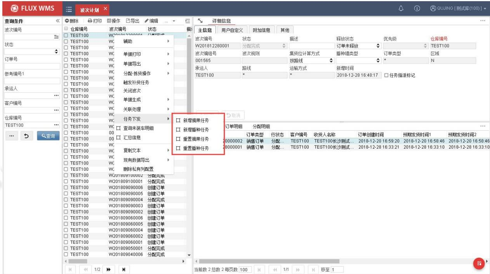

[图11-3-6]

已下达相关任务的波次，不能删除。 

## - 分配-拣货操作子菜单

分配、拣货相关功能，具体操作请参考 11.4 发货操作章节的介绍 

<table><tr><td colspan="2">查询条件</td><td colspan="10">波次计划</td></tr><tr><td colspan="2">查询条件</td><td>删除</td><td>打印</td><td>回操作</td><td>导出</td><td>编辑</td><td>...</td><td>描述</td><td colspan="3">详细信息</td></tr><tr><td colspan="2">波次编号</td><td>仓库编号</td><td>波次编号</td><td colspan="5">状态</td><td>主信息</td><td>用户自定义</td><td>附加信息</td></tr><tr><td rowspan="2" colspan="2">状态</td><td>TEST100</td><td colspan="3">W201812280001</td><td colspan="3">分配完成</td><td>波次编号</td><td>状态</td><td>描述</td></tr><tr><td>TEST10</td><td colspan="3">辅助</td><td colspan="3">分配完成</td><td>W201812280001</td><td>分配完成</td><td>订单未释放</td></tr><tr><td rowspan="2" colspan="2">订单号</td><td>TEST10</td><td colspan="3">单据打印</td><td colspan="3">分配完成</td><td>波次编号</td><td>波次规则</td><td>集货位计算方式</td></tr><tr><td>TEST10</td><td colspan="3">单据导出</td><td colspan="3">分配完成</td><td>001565</td><td></td><td>按路线</td></tr><tr><td colspan="2">参考编号1</td><td>TEST10</td><td colspan="3">分配-拣货操作</td><td colspan="3">分配完成</td><td>承运人</td><td>路线</td><td>运输方式</td></tr><tr><td colspan="2">承运人</td><td>TEST10</td><td colspan="3">触发补货任务</td><td colspan="3">取消预配</td><td>TEST100</td><td>*</td><td>*</td></tr><tr><td rowspan="3" colspan="2">客户编号</td><td>TEST10</td><td colspan="3">关闭波次</td><td colspan="3">分配</td><td></td><td></td><td></td></tr><tr><td>TEST10</td><td colspan="3">单据生成</td><td colspan="3">取消分配</td><td></td><td></td><td></td></tr><tr><td>TEST10</td><td colspan="3">关联处理</td><td colspan="3">发货确认</td><td></td><td></td><td></td></tr><tr><td colspan="2">仓库编号</td><td>TEST10</td><td colspan="3">任务下发</td><td colspan="3">拣货确认</td><td></td><td></td><td></td></tr><tr><td rowspan="18" colspan="2">TEST100</td><td>TEST10</td><td colspan="3">查询未装车明细</td><td colspan="3">分配完成</td><td></td><td></td><td></td></tr><tr><td>TEST10</td><td colspan="3">汇总信息</td><td colspan="3">创建订单</td><td></td><td></td><td></td></tr><tr><td>TEST10</td><td colspan="3">复制文本</td><td colspan="3">创建订单</td><td></td><td></td><td></td></tr><tr><td>TEST10</td><td colspan="3">现有数据导出</td><td colspan="3">分配完成</td><td></td><td></td><td></td></tr><tr><td>TEST10</td><td colspan="3">删除私有列配置</td><td colspan="3">分配完成</td><td></td><td></td><td></td></tr><tr><td>TEST100</td><td colspan="3">W201809100001</td><td colspan="3">分配完成</td><td></td><td></td><td></td></tr><tr><td>TEST100</td><td colspan="3">W201809090006</td><td colspan="3">创建订单</td><td></td><td></td><td></td></tr><tr><td>TEST100</td><td colspan="3">W201809090005</td><td colspan="3">创建订单</td><td></td><td></td><td></td></tr><tr><td>TEST100</td><td colspan="3">W201809090004</td><td colspan="3">分配完成</td><td></td><td></td><td></td></tr><tr><td>TEST100</td><td colspan="3">W201809090003</td><td colspan="3">创建订单</td><td></td><td></td><td></td></tr><tr><td>TEST100</td><td colspan="3">W201809090002</td><td colspan="3">创建订单</td><td></td><td></td><td></td></tr><tr><td>TEST100</td><td colspan="3">W201809060006</td><td colspan="3">创建订单</td><td></td><td></td><td></td></tr><tr><td>TEST100</td><td colspan="3">W201809060005</td><td colspan="3">创建订单</td><td></td><td></td><td></td></tr><tr><td>TEST100</td><td colspan="3">W201809060004</td><td colspan="3">创建订单</td><td></td><td></td><td></td></tr><tr><td>TEST100</td><td colspan="3">W201809060002</td><td colspan="3">创建订单</td><td></td><td></td><td></td></tr><tr><td>TEST100</td><td colspan="3">W201809060001</td><td colspan="3">创建订单</td><td></td><td></td><td></td></tr><tr><td>TEST100</td><td colspan="3">W201809050001</td><td colspan="3">分配完成</td><td></td><td></td><td></td></tr><tr><td>TEST100</td><td colspan="3">W201809040006</td><td colspan="3">分配完成</td><td></td><td></td><td></td></tr></table>

[图11-3-7] 

## - 单据关联子菜单

## ■ 关联面单号

提前批量打印快递面单操作模式下，如果面单号不是系统计算分配的（快递标签模式），而是多联单的快递单，需要采集面单号码与发运订单匹配。可以通过“关联面单号”操作进行批量关联。 

<table><tr><td colspan="11">关联面单号</td></tr><tr><td colspan="3">首号模式</td><td colspan="8">首尾号模式</td></tr><tr><td colspan="3">波次编号</td><td colspan="8">波次编号</td></tr><tr><td colspan="3">W201812280001</td><td colspan="8">波次编号</td></tr><tr><td colspan="3">承运人</td><td colspan="8">订单总数</td></tr><tr><td colspan="3">起始订单号</td><td colspan="8">起始订单号</td></tr><tr><td colspan="3">SO20181220000002</td><td colspan="8">起始面单号</td></tr><tr><td colspan="3">结束面单号</td><td colspan="8"></td></tr><tr><td colspan="3">人工扫描</td><td colspan="8">断点</td></tr></table>

FLUX WMS 用户手册 

## [图11-3-8]

首号模式 - 适用于全部连续的面单号，输入起始单号，系统根据波次内的订单数量，逐一匹配订单，每单的面单号自动+1。 

首尾号模式 - 适用于面单号有断号的情况，输入连续号段的起止面单号码，系统逐一匹配订单，直到结束号码。后续订单，再输入新的面单号进行匹配。 

## ■ 关联发票号

类似关联面单号功能，按波次提前打印发票时，将发票号与订单批量关联。 

## - 生成单据子菜单

生成装车单 

根据波次计划生成装车单。 

■ 生成波次合拣单 

根据波次生成合拣虚拟单，以便将订单数量合并，达到从整存区域分配整箱/整托盘库存的目的。 

## - 查询未装车明细

查询波次计划中没有装车的分配明细。 

## - 关闭波次

波次计划关闭，不可再添加 SO 或做其他操作。如果波次中有订单未发运，则不允许关闭。 

## 汇总信息

显示波次汇总信息，如订单总数、分配数量等。 

## ● 触发补货任务

系统将选中的波次对应订单的需求量汇总，进行补货计算。 

## 11.3.3. 明细右键功能

明细行鼠标右键菜单主要功能有： 

## - 增加

为已有波次添加新订单。点击 “增加”，系统跳转到 SO 界面，根据需要输入查询条件，查询订单。人工选择订单记录，可多条，选择鼠标右键菜单 “添加到当前波次”，系统将所选 SO 加入到指定的波次中。 

## - 删除

如有记录不需要在波次中一同操作，可通过“删除”功能，删除波次中的订单，但不影响该订单在发运订单界面的操作。 

## - 断点关联面单号

打印中断、重新打印等情况下使用，选择某一明细行记录，点击右键断点关联面单号，显示面单号界面同表头的关联面单号功能，但默认将所选的订单记录作为首号进行后续操作。 

## - 断点关联发票号

选择明细记录作为关联时的首号码。 

## 11.4. 发货操作

FLUX WMS 的发货操作，常见步骤主要有分配订单、拣货确认、发货确认。其中发货确认是必不可少的操作步骤，其余环节可以根据业务情况采用不同的操作模式，或者跳过此环节。 

例如出库流程中，实物的拣取是必须的操作，但是否需要在系统中执行拣货确认操作，可以根据业务需求进行安排。 

## 11.4.1. 分配

系统按照订单要求来查找符合需求的产品，并按库位、批次和跟踪号等要求来保留产品的处理，被称为分配。分配后，确定的产品被锁定给指定订单。已被分配的产品将不能再次分配或变更库位。 

## - 分配操作

■ 选择 “出库操作” 下的 “发运订单” 功能。 

■ 在查询页面输入查询条件，点击“查询”按钮，查找订单。 

■ 在查找到的订单列表中，选择所要操作的发运订单。 

■ 在表头部分的鼠标右键菜单中，选择的“分配-按订单”功能。 

■ 系统执行订单分配，可在明细部分的“分配列表”或“分配明细”中查看分配结果，或者“未完全分配订单行”页面查看未能完全预配的订单行记录。 

■ 也可以在订单明细行部分，点击鼠标右键，选择订单行分配。或者通过批量操作，批量分配订单。 

## - 取消分配

在表头部分的列表或表头明细页面的列表窗口，点击鼠标右键，选择右键菜单中的“取消分配”，可取消整个订单分配。 

■ 也可以在订单明细行部分，点击鼠标右键，选择“取消分配——按订单行”，取消单行的分配。 

在分配明细页签，选择记录，右键“取消分配-按分配明细”，或者直接点击某行的删除按钮，也能够达到取消分配的目前。这3种操作对象范围不同。 

## - 拣货任务清单打印

■ 纸面操作情况下，订单分配后，可点击表头鼠标右键的“打印拣货任务清单”，打印拣货单据。 

## - 人工修改分配记录

部分情况下，仓库无法按照系统自动分配指定的库位拣取货物，而是人工另外拣取库存；或者只能通过人工指定分配的情况。此时，需要人工修改系统分配记录，或直接人工指定分配。 

■ 在出库操作-发运订单中，查找到所要操作的订单记录。 

■ 在明细部分的明细列表中，选择所要操作的订单行。 

■ 点击分配明细页签，系统显示所选订单行对应的分配明细记录。 

■ 选择所要修改的分配明细，点击删除按钮，并确认删除该分配明细记录。 

■ 点击新增按钮，系统自动按照对应订单明细内容显示产品代码。 

■ 点击产品代码旁的快速检索按钮，系统显示可选库存的二级窗口。 

■ 在二级库存窗口，选择库存记录，双击确认。 

在分配明细页面，系统显示所选库存的库位、批次等信息，由操作人员输入分配数量，并保存，完成人工分配操作。 

注：通常情况下，订单行分配总数量不可超过明细中的产品订货数量。 

## 11.4.2.拣货

拣货是按照发运订单要求，进行的产品收集活动。实物拣取后，在系统中进行拣货确认操作，并不是流程必须的步骤，但拣货确认可以把待出库的产品集中到特定库位，空出原有存储库位供后续操作使用，能够提高库位利用率。如果不做拣货确认，系统中的库存记录将仍旧保留在原存储库 

位直到发运时扣减库存。 

拣货确认，也可以通过 RF 设备，或者语音设备等方式执行，具体请参考对应说明文档。此章节仅介绍 WMS 界面执行的拣货确认操作 

## - 拣货操作

■ 选择“出库操作”下的“发运订单”。 

■ 在查询页面输入查询条件，点击“查询”按钮，查找订单。 

■ 在查找到的订单列表中，选择所要操作的发运订单。 

在订单明细部分的分配明细页面（如下图），输入拣货时间、拣货人，目标库位、跟踪号信息： 

<table><tr><td colspan="12">明细信息</td></tr><tr><td colspan="12">明细信息</td></tr></table>

[图11-4-1]

分配 ID - 系统自动生成的分配明细流水号。 

行号 - 分配明细对应的订单行行号。 

装箱 - 出库复核装箱标记。 

产品 - 分配的产品代码 

批次号 - 分配的产品库存批次号 

库位 - 分配到的拟拣货库位 

跟踪号 - 库存原有跟踪号 

包装代码 - 库存分配包装代码 

单位 - 库存分配明细的数量单位 

数量 - 分配到的库存数量，以所选单位为数量级别单位 

数量_EA - 分配到的库存数量，以主单位为数量级别单位。 

目标库位 - 拣货移动到的目标库位，默认为同库存库位。启用集货位管理的情况下，由系统计算集货位。 

目标跟踪号 - 拣货后新的跟踪号。可由用户输入，默认为同原跟踪号。（注：同一跟踪号不能出现在不同库位，系统会将后一跟踪号自动置为*） 

体积、重量 - 分配到的产品的体积、重量。 

分配时间 - 明细分配操作的时间。不可修改。 

分配人员 - 执行分配操作的作业人员。 

复核时间 - 执行复核确认的时间。同样由系统生成，不可修改。 

复核人员 - 执行复核确认的作业人员。 

拣货时间 - 执行拣货操作的时间。如未输入，拣货确认时，系统自动记录为拣货确认的当前时间。 

拣货人员 - 执行拣货确认的作业人员。 

发货时间、人员 - 执行发货操作的时间、发货人员。如未输入，系统自动记录为发货确认的当前时间。 

备注 - 备注信息。 

DropID - 多级出库跟踪管理模式下，跟踪号的上级信息，一般用作箱号、托盘号跟踪情况下的托盘号记录。 

批次属性 - 分配到的产品所具有的批次属性内容。 

■ 点击【保存】按钮，保存信息。 

在分配明细部分，行列表窗口，点击鼠标右键，选择右键菜单里的“复制拣货信息到以下各行”功能，可将当前分配明细中的目标库位、目标跟踪号、拣货时间、拣货人员等拣货相关信息复制到后续分配明细中。 

在分配明细部分，行列表窗口，点击选择需要确认的分配明细行，或者使用鼠标右键菜单“全选”功能选择全部拟执行拣货确认的分配明细。 

■ 选择鼠标右键菜单的“拣货--按分配明细”功能，确认已选记录拣货完成。 

■ 系统将货物确认拣货到目标库位，并更新订单状态等信息。 

■ 如果无需记录与系统操作员不同的拣货人员，并且没有拣货信息需要修改，也可以直接从表头右键菜单确认整个订单拣货完成。 

## - 其他右键功能

■ 取消分配 - 按所选分配明细，取消分配。 

■ 取消拣货 - 系统将取消拣货确认，订单回复到分配状态。 

■ 反拣 - 根据已确认的拣货记录，生成反向的反拣任务。用于修正错误的拣货操作。 

■ 发货 - 确认货物发运。 

■ 复制发货信息到以下各行 - 根据当前分配明细，将发货信息复制到其他分配明细行。 

■ 打印拣货标签 - 如使用 RF 操作等，可通过该功能打印操作中所用的拣货标签。 

## 11.4.3. 发货

在系统中确认货物已经发运出库，系统将扣减库存、更新单据信息。执行发货，有多种触发方式，可以从 FLUX WMS 系统界面人工触发发货确认，也支持通过 RF 扫描发货（相关功能请参考 RF 操作手册），还可以通过定时器后台将符合条件的订单发运。 

FLUX WMS 界面发货中，标准操作是通过发运订单进行发货确认。同时支持装车单确认发货、波次发货等操作（请参考相关功能说明。） 

## ● 发货操作

■ 选择 “出库操作” 下的 “发运订单”。 

■ 输入查询条件，点击查找按钮，选择所需操作的订单。 

对于可以整单发运的订单,可在订单表头部分的明细页面列表窗口,选择对应订单,点击鼠标右键菜单中的“发货--按订单”功能。 

■ 确认后，系统将整个订单中，可发运（已被分配/拣货的记录）的库存全部发运。订单状态更新。 

■ 系统同样支持逐条发运。在明细行部分的分配明细页面，输入/修改发货时间和发货人员，保存后，通过明细部分的鼠标右键菜单选择“复制发货信息到以下各行”。再选择拟发运的记录，右键“按拣货明细发运”。 

## ● 发货控制

系统出库操作流程中，订单、分配、发货是必须的作业步骤。如果需要将其他环节作为必须操作，可通过系统参数进行控制，例如未拣货记录不能发货，未复核记录不能发货，或者未装车记录不能发货。 

如果作业过程中，接口下达取消指令，但由于作业流程关系未自动取消作业、取消订单，仅作标记。发运时会进行校验订单是否已被标记取消，如有，则不可发货。但如果已有明细行完成取消处理，剩余明细行可正常发货。 

## - 特殊发货模式

## ■ 回库待发

有些仓库在装箱完成后，需要以整箱重新入库，等待客户将来发新的、只指定箱号的出库指令，重新拣货出库。 

此时，正常订单拣货后，可通过发运订单表头右键菜单功能项“回库待发”进行操作。 

系统将订单内的所有库存全部发运，并按照目标箱号重新入库。新入库的 SKU 代码统一为 "FULLCARTON"，跟踪号为对应的箱号，数量全部为 1，库位在 PICKTOLOCATION，无批次属性信息。 

实物重新上架，一般通过 RF 的 “按 ID 移库” 功能完成。 

## ■ 配送单作业发货

部分仓库，粘贴面单并采集面单号之后，与快递的交接不在需要仓库参与。采集到面单号，即视同货物出库。此时可采用配送单作业自动发货模式。具体操作请参考配送单作业环节。 

## ■ 装车发货

货主装车后，整车确认发货。具体操作请参考装车单操作介绍。 

## 11.5. 取消发货

如果发现发运错误，可是使用取消发货的功能修改，执行后，SO 状态还原到发运之前。即分配后发货的订单，订单状态返回到完全分配（或部分分配），拣货确认后发货的，订单状态返回到 

完全拣货（或部分拣货）。 

## - 取消发货操作

■ 选择“出库操作”菜单下的“取消发货”功能。 

■ 输入查询条件，查找需要操作的发运订单记录 

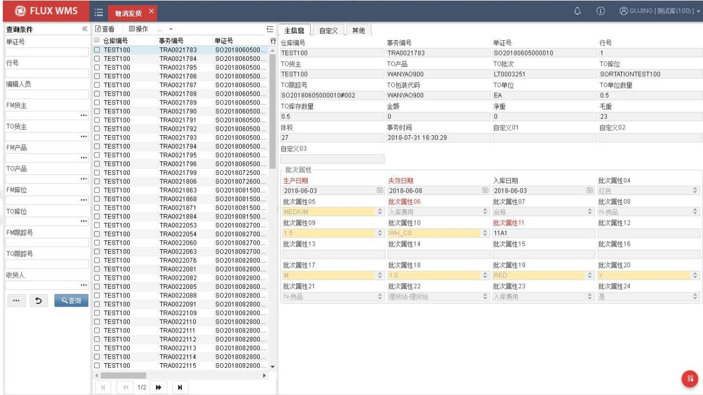

[图 11-5-1]

■ 选择所要取消的发货记录，也可通过右键菜单全选。 

■ 鼠标右键菜单选择 “取消发货”，系统将显示取消发货确认对话框，用户确认后，系统执行发货取消。原订单信息将会更新。 

注： 

已关闭订单，是否能够取消发货，通过参数开关（SHP_CCL_CHK）控制。如果允许，已关闭订单取消发货后，状态会回到分配或者拣货状态。 

## 11.6. 手工波次模板

通过波次计划规则，系统可以自动创建。但有时创建波次时，希望根据信息条件人为进行干预。例如临近下班时段，当天需要发运的货物均已作业完成，希望剩余时间选择部分第二天需要作业的订单开始出库准备。按高重复率产品筛选订单，但采用自动模式生成的订单，很可能订单量较大， 无法在工作时间段内完成。期望按产品的订单重复率，查询、排序，人工选择作业量合适的产品，生成波次，进行操作。 

FLUX WMS 提供手工波次模板功能，在自动波次无法满足灵活的筛选需求的情况下，通过这个灵活的订单筛选操作界面供用户手动生成波次。 

## - 手工波次模板

■ 选择 “出库操作” 下的 “手工波次模板”。系统显示如下查询界面： 

<table><tr><td colspan="6">FLUX WMS 手工波次模板</td></tr><tr><td colspan="6">查询条件</td></tr><tr><td>仓库代码</td><td>客户编号</td><td>产品</td><td>订单状态</td><td>订单类型</td><td></td></tr><tr><td>DEMO</td><td>...</td><td>...</td><td>...</td><td>↓</td><td></td></tr><tr><td>参考编号1</td><td>参考编号2</td><td>参考编号3</td><td>参考编号4</td><td>参考编号5</td><td></td></tr><tr><td></td><td>I≡</td><td>I≡</td><td>I≡</td><td>I≡</td><td></td></tr><tr><td>路线</td><td>站点</td><td>收货人</td><td>承运人</td><td>运输方式</td><td></td></tr><tr><td></td><td>↓</td><td></td><td>...</td><td>... I≡</td><td></td></tr><tr><td>付款条款</td><td>交货条款</td><td>优先级</td><td>单品标识</td><td>是否打印发票</td><td></td></tr><tr><td></td><td>↓</td><td></td><td>↓</td><td>↓</td><td></td></tr><tr><td>用户自定义</td><td>用户自定义6</td><td>接口自定义</td><td></td><td></td><td></td></tr><tr><td></td><td></td><td></td><td></td><td></td><td></td></tr><tr><td colspan="6">选择日期</td></tr><tr><td colspan="6">订单创建时间 预期发货时间 要求交货时间</td></tr><tr><td></td><td></td><td></td><td></td><td></td><td></td></tr><tr><td colspan="6">发运订单模式 销售订单模式</td></tr></table>

[图11-6-1]

## ■ 模式选择：

此功能同时支持根据发运订单创建波次，以及根据销售订单创建销售订单组。通过查询界面的模式按钮进行切换。 

## ■ 扩展条件

在 “扩展条件” 部分，可以进一步输入限定条件。 

可选字段为发运订单表头字段。 

<table><tr><td colspan="5">查询条件</td></tr><tr><td>仓库代码</td><td>客户编号</td><td>产品</td><td>订单状态</td><td>订单类型</td></tr><tr><td>DEMO</td><td>...</td><td>...</td><td>...</td><td>...</td></tr><tr><td>参考编号1</td><td>参考编号2</td><td>参考编号3</td><td>参考编号4</td><td>参考编号5</td></tr><tr><td>路线</td><td>站点</td><td>收货人</td><td>承运人</td><td>运输方式</td></tr><tr><td>付款条款</td><td>交货条款</td><td>优先级</td><td>单品标识</td><td>是否打印发票</td></tr><tr><td>用户自定义</td><td>用户自定义6</td><td>接口自定义</td><td></td><td></td></tr><tr><td colspan="5">选择日期</td></tr><tr><td colspan="2">订单创建时间</td><td>预期发货时间</td><td colspan="2">要求交货时间</td></tr><tr><td colspan="5">● 发运订单模式 ○ 销售订单模式</td></tr></table>

## [图11-6-2]

## ■ 查询符合条件的记录

支持查询条件导出、导入，也可将二次查询的内容添加到前一次的查询结果中（添加到列表）。仅查询符合条件、并且没有在其他波次/销售订单编组中存在的订单。 

## ■ 生成波次

查询结果列表中，选择记录，通过右键菜单功能，生成波次计划或者销售订单编组。 

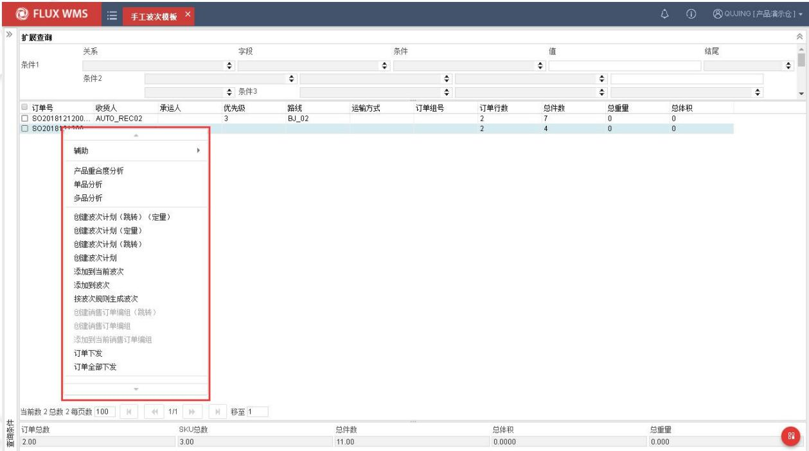

[图11-6-3]

跳转模式 - 创建成功后切换到波次计划界面并显示相应波次计划。

定量模式 - 弹出框输入订单数量限制，系统按限制数量创建波次计划。

## 11.7. 出库复核

出库复核功能，主要用于拣货后（此处指实物拣货，系统拣货确认步骤不是必需的）、出库发运前，在仓库内对准备出库的产品进行复查，检验所拣取的待出库货物与订单分配明细是否相符。 

在复核同时还可以执行装箱操作，记录产品分箱封装的明细情况。方便后续根据箱号追踪货物出库情况。 

出库复核并非出库流程的必需环节，用户可根据操作情况选择使用。复核操作也分为多种不同操作模式，例如装箱操作，会变更库存所在的箱号；而仅复核的作业模式，则对库存信息没有影响。 

## 11.7.1. 复核操作

## - 复核装箱操作

■ 选择 “出库操作” 菜单中的 “出库复核”，系统显示如下明细复核界面： 

<table><tr><td>产品</td><td>数量</td><td>产品描述</td></tr><tr><td>U1</td><td>1</td><td></td></tr><tr><td>批次</td><td>单位</td><td></td></tr><tr><td>A000106468</td><td>EA</td><td></td></tr></table>

[图11-7-1]

## 订单信息获取：

出库复核，根据拣货作业模式不同，可选择按订单复核、按拣货容器（周转箱号）复核、按波次混合复核几种不同的复核操作模式。 

如果前一环节拣货时，采用周转箱配合 RF，即拣货时记录货物拣取到哪个周转箱里的作业模式，在复核时就可以根据周转箱号提取箱内产品信息，按箱复核。此时需要在复核页面的箱号字段输入周转箱号，系统显示箱内货物对应的分配明细信息。 

如果前一环节不做按箱拣货确认，按订单复核操作，则只需输入订单号，系统显示对应分配明细信息。 

订单如果有对应备注信息，此时可以弹出显示，进行提醒，同样支持语音信息提醒。 

根据参数 CHK_TYP（复核类型）的选择（也可以通过操作选项临时切换复核类型方式），界面显示为订单号/箱号/波次号输入框，通过人工输入信息或扫描号码条码息，回车或点击查询按钮触发信息获取，系统根据复核类型，以及输入的号码，获取对应分配信息，显示在复核界面上半部分。 

FLUX WMS 还支持一些特殊的信息获取方式。例如按订单派箱操作方式，可以根据箱号，获取到整个订单的分配信息用于复核操作。需要设置系统配置参数 CHK_SCN_ORD（整订单派箱复核模式-通过箱号获取整个订单的明细）。也可以配合电子标签，根据电子标签库位号获取到整个对应 WAVE 的分配信息等。这些特殊的信息获取方式，具体需要结合用户流程要求确定应用方式，请联系 FLUX 顾问以获取进一步的了解。 

## ■ 新箱号获取：

<table><tr><td>产品</td><td>数量</td><td>产品描述</td></tr><tr><td>U1</td><td>1</td><td></td></tr><tr><td>批次</td><td>单位</td><td></td></tr><tr><td>A000106468</td><td>EA</td><td></td></tr></table>

[图11-7-2]

复核装箱后所用的出库包装箱的箱号，被称为“新箱号”，以便与拣货时的周转箱区别。 

在部分流程中，出库所用的箱就是拣货周转箱，此时可以直接扫描周转箱号作为“新箱号”。如果出库用的包装箱使用系统生成的箱号，则点击“新箱号”按钮，系统分配装箱箱号。也可将操作参数 CHK_GEN_TID（复核装箱时是否自动产生新箱号）设置为 Y，系统将自动带出新箱号，光标定位到 SKU 字段，可直接扫描，不再需要人工点击【换箱】按钮。 

在部分打印快递面单的作业情景中，也经常将快递面单号直接用作新箱号（具体新箱号应用，一般根据业务流程要求定义），可在系统中配置自定义的校验逻辑，对新箱号进行检验。例如新箱号不能等同于 SKU，不能等同订单号等，防止误操作。还有些情况箱号由系统根据预设逻辑从订单号池中获取。 

## ■ 装箱扫描：

在产品代码字段，扫描或者录入产品 ID，系统校验 SKU 是否是分配明细中包括的、应该出库的产品。 

逐件扫描模式下，可连续扫描产品 ID，每次扫描数量累加 1；批量扫描模式，则在扫描产品 ID 后，还需要确认此产品的数量。如果扫描的产品条码中包含有数量信息，则优先使用条码数量信息。系统会校验扫描到的产品数量是否已经超出分配信息中的应出数量。 

扫描确认的信息会与分配明细记录相匹配、定位。相同产品多行记录情况下，优先匹配已拣货状态的分配明细行。 

双条码模式下，还会显示指定的批次条码录入框，用户扫描对应条码后核对是否相符。 

## ■ 装箱确认：

货物扫描完毕，复核完成，或者出库箱已满箱，点击“装箱完成”按钮，系统执行装箱操作，在 SO 分配明细中能够查看到装箱标记和箱号。 

如果是满箱，尚有剩余货物，可以更换新箱，继续扫描装箱。 

多数作业情况是一箱装满再装下一箱，通常选择一步装箱模式（参数 CHK_CFM_PCK 控制），满箱时只需点击【装箱完成】按钮，确认此箱封箱、更换新箱。 

但个别业务情况，常有作业中来回切换箱号的情况。例如有些货物不能混装箱，拣货却是混合拣货送至复核台，业务人员操作时会发生货物装 A 箱操作到一半，下一货物需要分箱装 B 箱，后续货物又要装入 A 箱。此时可以点击【装箱缓存】，相当于保存此箱信息，但尚不确认完成装箱。当 A、B 箱装箱结束，再点击【装箱完成】按钮，提交装箱信息。 

分配明细中的产品全部扫描后, 系统根据参数 AUT_CFM_PKG(复核完成时自动提示装箱确认) 配置, 控制提示信息显示。可提示用户应扫描作业完成, 确认装箱, 或者直接自动确认装箱。 

## ■ 单据打印：

用户可根据需要，点击打印按钮打印装箱单或装箱标签。也可通过参数配置，在装箱后自动打印相应记录。系统参数为： 

CHK_PRT_LVL，装箱完成后自动打印装箱标签 

CHK_PRT_LST，装箱完成后自动打印装箱清单 

## - 仅复核操作模式

除了装箱，还可以进行仅复核模式的操作（CHK_AND_PCK=N），系统会校验产品、数量，但确认时不修改分配明细的装箱标记，也不更新目标箱号。 

## - 订单排序复核模式

普通复核为扫描产品，系统根据 SKU 匹配、定位到订单对应的分配明细。如 SKU 不具有条形码可供扫描，可以考虑采用订单排序复核的操作模式，以订单为基准，人工找到对应货物进行复核确认。 

相关控制参数为 CHK_SEQ_ORD，如果参数为 Y，则 ■ 扫描箱号或者订单号后，自动将第一行明细的 SKU 带入复核界面，定位到数量字段 

■ 当第一行复核完成并从界面上消失后，自动将下一行明细的 SKU 带入复核界面。 

## - 多人复核模式

正常情况下一个作业单位（订单/拣货箱/波次）由一位操作人员进行复核。但如果订单内订货量较大，为了提高效率需要多人进行复核，校验产品、数量时需要考虑到其他作业台的当前操作情况，以免同时操作，导致数量校验超量。 

勾选“订单多人复核”选项，系统将把多作业台的同单操作共同比对。 

## - 产品匹配订单模式

波次拣货、复核情况下，选择“按产品匹配订单”勾选项，系统弹出二级窗口，扫描波次号、产品，检索波次里的未完成订单，按订单总数由小到大进行排序，定位到首个订单并自动将SKU带入复核界面，等待用户回车确认。 

## - 包裹转运模式

包裹转运作业模式下，入库包裹作为产品，用包裹条码作为产品。 

参数 PCL_XDK（包裹转运业务）开启情况下，出库复核时扫描包裹条码，自动弹出窗口，显示接口获取的包裹内产品信息，人工核对是否与包裹标签信息相符。勾选相符记录，并确认保存。 

包裹转运模式下，忽略序列号相关配置，不启动序列号采集处理。 

## - 图片复核

系统支持在扫描 SKU 时显示产品对应图片以辅助用户进行复核确认, 进一步避免条码与实物不符的情况。 

扫描 SKU 时，系统根据 CHK_PIC_DIR 参数中设置的图片存储路径，查找文件名为 CUSTOMERID+‘_’+SKU.jpg 的图片文件，并显示在出库复核左侧。 

路径可为网络路径或本地路径。 

## 11.7.2. 相关操作

装箱复核过程中，还有许多管理细节，可以根据业务需要启用： 

## - 扫描数量控制

由于不同产品特性及订单情况不同，部分货物需要每件逐一扫描确认，而另一些货物或流程中， 

一种产品可能一次性拣取多件。系统采用可配置方式，由用户自行选择使用何种扫描方式。 

系统配置中的参数 CHK_SCN_MTD 控制出库复核中，是否默认启用出库复核逐件扫描模式。用户也可在出库复核界面右下角点击“操作选项”按钮，在二级窗口中设置“逐件扫描”选项（默认同参数 CHK_SCN_MTD 中的设置），临时修改扫描方式。 

如果选中，每次扫描系统默认数量为 1，并将记录累加到左下方的复核信息部分；如果没有启用逐件扫描，需要人工录入数量，并点击下方的“确定”按钮，才能把记录加入到复核信息部分。 

<table><tr><td>产品</td><td>数量</td><td>产品描述</td></tr><tr><td>U1</td><td>1</td><td></td></tr><tr><td>批次</td><td>单位</td><td></td></tr><tr><td>A000106468</td><td>EA</td><td></td></tr></table>

[图11-7-3]

此外，有些业务场景，数量差异比较大，需要在批量复核与逐件复核模式之间来回切换。可以从操作选项中人工选择，但次数多时作业不便。此时可以启用系统提供的 CHG_SCN_MOD 参数控制支持，根据限定数量，自动在 2 种作业模式之间切换。 

## - 箱型校验

<table><tr><td colspan="16">产品描述</td></tr><tr><td colspan="16">U1</td></tr><tr><td colspan="16">批次</td></tr><tr><td colspan="16">A000106468</td></tr><tr><td colspan="16">批次属性</td></tr><tr><td>生产日期</td><td>失效日期</td><td>入库日期</td><td>批次属性04</td><td>批次属性05</td><td>批次属性06</td><td></td><td></td><td></td><td></td><td></td><td></td><td></td><td></td><td></td><td></td></tr><tr><td>2018-12-03</td><td>2019-02-21</td><td>2018-12-03</td><td>红色</td><td>N-良品</td><td>合格</td><td></td><td></td><td></td><td></td><td></td><td></td><td></td><td></td><td></td><td></td></tr><tr><td>批次属性07</td><td>批次属性08</td><td>批次属性09</td><td>批次属性10</td><td>批次属性11</td><td>批次属性12</td><td></td><td></td><td></td><td></td><td></td><td></td><td></td><td></td><td></td><td></td></tr></table>

[图11-7-4]

复核过程中，可以选择由系统指派出库箱的箱型（例如大箱、小箱），或者人工选择出库箱，扫描记录箱型。 

参数 CHK_CTN_MNG 开启时，获取新箱号后，光标会自动跳转到“装箱 ID”字段，方便用户扫描/录入箱型，再进行 SKU。扫描装箱 ID 时，可播放对应的声音提示；若启用自动模式，系统将根据待复核订单明细的体积自动推荐装箱使用的箱型，并通过语音播报 

若勾选“锁定箱型”，则保留装箱ID选择，直到取消“锁定箱型”勾选。 

## - 容积提醒

系统支持装箱容积提醒功能（通过参数 PKG_CUB_HNT 控制），当装箱产品累计标准体积时，弹出窗口提示“装箱产品累计体积超过容量上限，是否继续？” 

■ 如果选择是，则继续正常装箱，本箱后续不再提示； 

■ 如果选择否，则对刚刚扫描的产品不做装箱确认"; 

## ● 附加信息

在操作中可以根据需要，记录出库箱的体积重量等信息。在出库复核界面，点击“附加信息”按钮，系统显示如下二级窗口，用户可录入当前操作箱的对应信息并保存： 

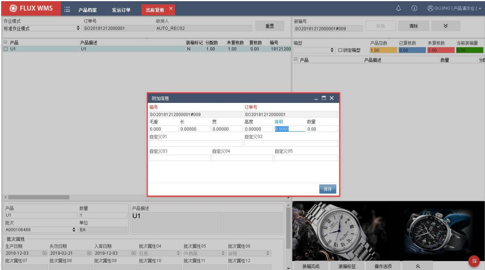

[图11-7-5]

如果参数 PKG_SUM_POP 开启，系统在装箱确认时会自动弹出“附加信息”二级窗口，以便用户输入内容进行维护。 

同时，如果参数 PKG_CUB_CHK（包装箱必须维护附加信息-体积）、PKG_WGT_CHK（包装箱必须维护附加信息-重量）开启，打印标签或装箱清单时，系统会校验附加信息是否输入体积或重量。 

## - 消息锁定

复核扫描异常时，系统提示报错。在强效现场管理的情况下，要求高级用户/主管才有权确认报错，普通用户无权确认，需要等待主管检查。 

通过系统参数 CHK_ERR_LCK，是否启用高级用户解锁，进行管控。如参数开启，复核界面弹出错误提示（正确提示不锁定），同时弹出另外一个窗口，要求用户输入用户名和密码。界面上的确定按钮可以通过授权控制，即只有指定的人在输入用户和密码后系统验证他对此按钮是否有权限。 

不开启此项控制，作业人员有权确认错误提示，并可继续操作。 

## - 操作选项

除了通过参数进行作业细节控制，作业界面也可以进行部分控制选项的设置，主要集中在【操作选项】按钮的二级窗口中： 

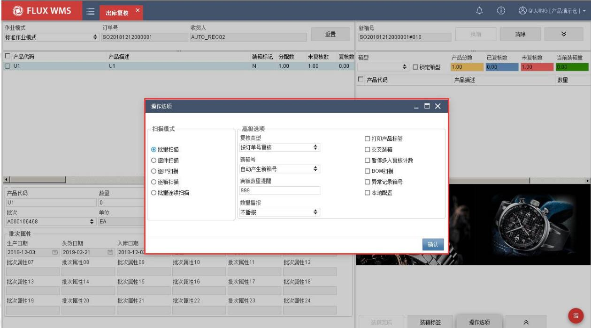

[图11-7-6]

## 数量扫描模式：

扫描 SKU 时，对应数量可以由人工输入（批量扫描模式），也可以默认为 1，逐一扫描 SKU 累加数量（逐件扫描模式），还可以根据产品对应包装的数量，每扫描一次增加整包装数量（逐箱扫描模式、逐 IP 扫描模式）。整包装扫描模式下，数量字段固定为系统包装中维护的对应数量，不可修改。 

支持通过 CTRL+数字键的模式，快速切换扫描方式。 

需要注意的是，如果序列号管理开启，出库复核需要采集序列号的情况下，系统强制逐件扫描，选择批量扫描模式将被忽视。 

## ■ 满箱数量提醒：

类似入库扫描收货时的满箱提醒，但由于出库复核箱是混 SKU 装箱，因此满箱提醒数量统一维护。默认为 999 

## ■ 复核类型：

默认为参数 CHK_TYP 配置内容，允许作业用户在操作选项中临时修改，方便业务切换（复核人员通常没有参数修改权限）。并且此处的修改只影响作业客户端，对其他客户端无影响。 

## ■ 新箱号：

默认为参数 CHK_GEN_TID（复核装箱时是否自动产生新箱号）效果，可允许作业用户在操作选项中临时修改。 

## ■ 打印产品标签：

复核同时，输出产品对应标签 

BOM 扫描: 

组件复核模式，分配明细是子件信息，复核时扫描父件 SKU，按 BOM 比例确认对应子件复核装箱。 

## ■ 双条码扫描

开启后，系统显示如下批次条码扫描字段，作业时，需要同时扫描产品条码、批次条码 2 个不同条码，隐藏批次选择下拉框，通过批次条码扫描，解析返回对应的批次属性值，系统定位到对应属性的记录进行复核校验。 

## ■ 交叉装箱：

多箱交叉作业时，选择“交叉装箱”则系统执行“装箱确认”后，自动执行“换箱”逻辑，清除界面信息（正常模式下装箱完成才清空，装箱确认仅临时保存），然后根据新箱号参数生成新箱号或清空新箱号字段人工输入。 

同时，交叉装箱的情况下，复核时不再弹出称重和附加信息框。 

## ■ 暂停多人复核计数

多人复核过程中，发生异常需要重新扫描货物时，开启此选择，以免重复计数。扫描完成，去除勾选，继续正常操作。 

## ■ 按波次顺序复核

适用于并发预拣无纸化操作，开启后，通过在二级窗口录入波次号，指定播种位次序，定位到对应的订单，获取订单信息，进行复核。 

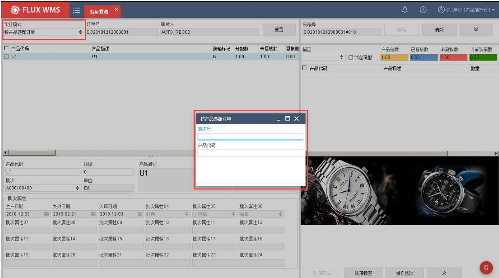

[图11-7-7]

## - 异常处理

针对出库复核操作过程中，实物多货或者少货的情况，进行异常记录，方便进行集中的异常管理。出库复核时的异常，很多都是由于拣货错误，或者拣取的货物放错周转箱。通过异常处理可以提示不同复核台的异常，方便找货，也减少重新拣货的需要。异常处理是可选的操作功能。 

■ 分配明细部分，鼠标右键菜单功能项，选择问题库存记录，点击 “异常处理”，系统显示如下二级窗口界面 

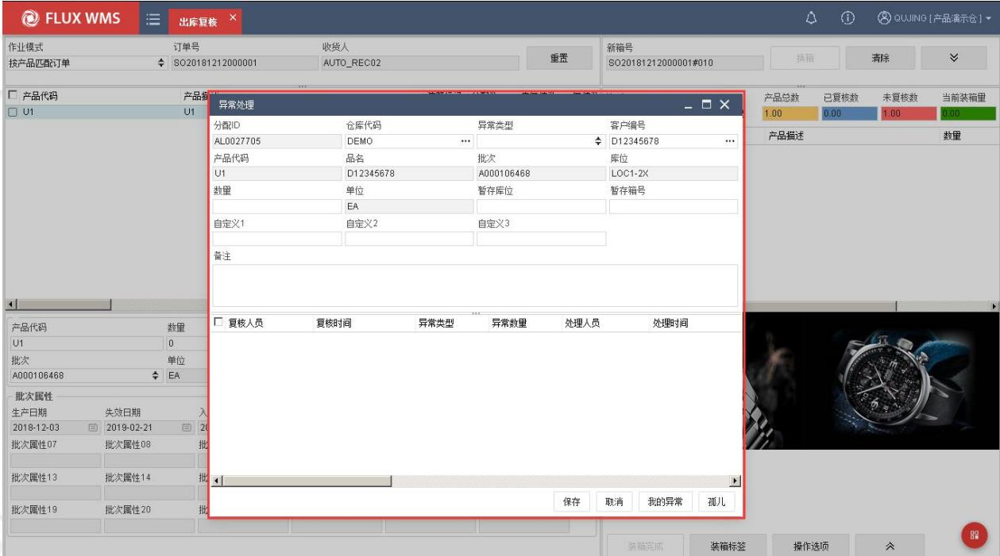

[图11-7-8]

■ 分配 ID、产品、库位信息，为所选分配明细的对应信息。人工选择异常类型、数量，进行保存。如果是多货，则输入问题货品的暂存库位，以便后续处理。 

在异常处理界面下方的列表部分，显示当前处理的产品所有未关闭的复核异常记录，可供查看，方便不同复核台间的货品调剂。 

■ 列表部分右键功能项 “关闭异常”，可关闭当前用户登记的异常记录。 

异常窗口点击按钮“我的异常”，则显示当前用户登记的异常记录。 

“孤儿”处理：针对订单中不存在的SKU进行异常登记。由于多出来的SKU经常是其他复核台缺少的货物，通过记录可帮助匹配，减少重新拣货、还架的重复作业。点击“孤儿”按钮，用户输入SKU、暂存位置、数量等信息，便于其他复核台匹配缺货。 

■ 进入异常处理二级窗口时，如果用户没有选择记录，则自动进入孤儿模式。 

## - 发票管理：

用户可根据作业需要，在复核后触发发票打印以及发票号录入。通过订单头的发票管理字段（后台字段，通常接口传入信息），控制是否打印发票，是否需要录入发票号。可分为按打印发票并关联发票号，仅打印无需关联，按箱打印关联发票，不打印发票几种模式。 

需要打印、关联的情况下，根据 IVC_PRT_TIM 参数（关联发票号前/后打印发票）配置，控制 

打印、关联的先后次序以适应不同的业务场景。 

如果参数 CHK_IVC_CAL（打印发票时自动计算发票号）开启，系统根据配置文件中呢内容，自动计算发票号，无需绑定。一卷发票用尽后，在弹出的重新绑定窗口，扫描获取新发票的起始号码。 

## 包材管理：

如果复核过程中需要记录所用的包装材料，可以通过点击【包装材料】按钮，系统弹出如下包装材料二级窗口，用户扫描包材条码，点击确认按钮（或者通过 F3 快捷键确认），完成包材记录。 

包材条码每扫描一次，数量累加 1，如果扫描次数与包材默认数量（可配置）相符时，系统自动确认、关闭包材窗口。 

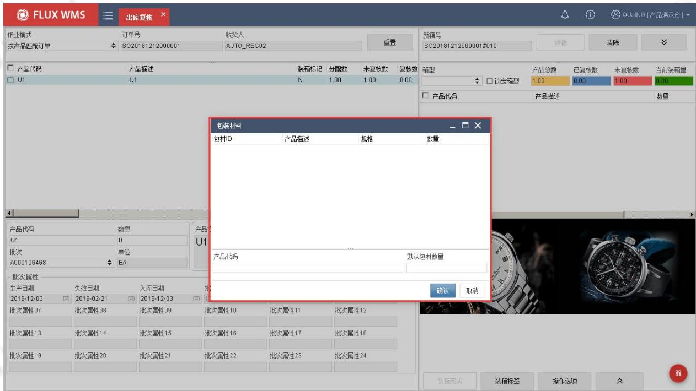

[图11-7-9]

## - 装箱进度

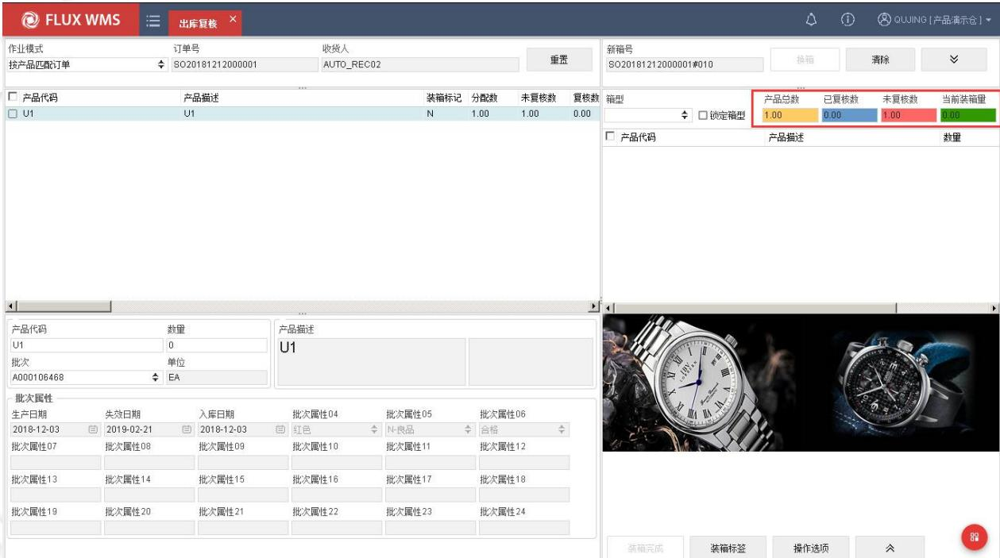

## [图11-7-10]

装箱进度用不同色块显示: 

黄色：订单总数量 

灰色：已经装箱的数量 

红色：尚未装箱的订单数量 

绿色：当前箱的实时装箱量，扫描时自动累加。在执行【装箱完成】后自动清0。 

## - 统计信息

点击【统计信息】按钮后，显示订单对应的整箱、零箱相关统计信息。 

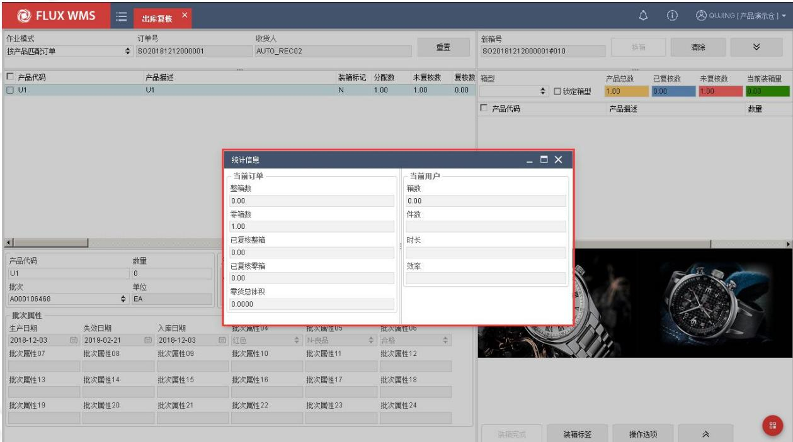

[图11-7-11]

## - 拍照

复核同时控制摄像头进行拍照，并可将照片上传，提高客户体验。 

## - 录像

复核同时控制摄像头进行录像。与普通监控录像相比，可以针对每箱分隔为小的录像文件，方便查到对应记录。 

## - 退换货卡维护

为方便售后维护，如果参数 REG_SVC_CRD（出库复核/单品复核登记退换货卡号）开启，当前订单(参数 Y)/当前箱(参数 C)最后一件商品复核完成，在系统自动弹出窗口确认装箱完成前，弹出窗口扫描并记录“退换货卡号”。 

## - 反拣提示

如果订单已被取消，复核时可以拦截提示，避免已取消订单被发运出库。 

但对于所拣取的货物，实物需要反架，只是根据仓库管理不同，有些是集中后定期专人处理反架，有些是及时拦截，及时反架。操作可通过原有拣货清单查看信息进行，或者生成反拣任务，通过任务指导进行。 

当参数 GEN_RVS_PCK（订单取消时进行反拣操作）开启时，如果扫描到已取消的订单，系统 

除了拦截，提示取消之外，还会要求扫描存放反拣商品的周转箱号，并生成对应的反拣任务。 

## 11.7.3. 鼠标右键功能

## - 分配明细鼠标右键功能项

分配明细部分，鼠标右键菜单内容有： 

<table><tr><td>产品代码</td><td>数量</td><td rowspan="4">辅助</td><td rowspan="4">一键复核</td><td rowspan="4">取消拣货</td><td rowspan="4">取消分配</td><td rowspan="4">确认产品</td><td rowspan="4">取消上次扫描</td><td rowspan="4">异常处理</td><td rowspan="4">按波次顺序复核</td><td rowspan="4">缺货挂起</td><td rowspan="4">货物暂存</td><td rowspan="4">记录过滤</td><td rowspan="4">退换货卡号</td><td rowspan="4">打印发库清单</td><td rowspan="4">删除私有列配置</td><td rowspan="4">按规则导出</td><td rowspan="4">批次属性05</td><td rowspan="4">批次属性06</td><td rowspan="4">N-良品</td><td rowspan="4">合格</td><td rowspan="4">批次属性11</td><td rowspan="4">批次属性12</td><td rowspan="4">批次属性13</td><td rowspan="4">批次属性14</td><td rowspan="4">批次属性15</td><td rowspan="4">批次属性16</td><td rowspan="4">批次属性17</td><td rowspan="4">批次属性18</td><td rowspan="4">批次属性19</td><td rowspan="4">批次属性20</td><td rowspan="4">批次属性21</td><td rowspan="4">批次属性22</td><td rowspan="4">批次属性23</td><td rowspan="4">批次属性24</td><td rowspan="4"></td><td rowspan="4"></td></tr><tr><td>U1</td><td>0</td></tr><tr><td>批次</td><td>单位</td></tr><tr><td>A000106468</td><td>EA</td></tr></table>

[图11-7-12]

## ■ 一键复核：

将窗口的所有分配明细全部一次性确认到装箱明细列表，之后人工进行正常的装箱完成等后续操作。省略了一个一个产品进行扫描确认的过程。 

序列号作业模式下，为了避免漏扫描序列号，一键复核功能不可使用。 

■ 确认产品： 

可选择产品记录，加入到复核部分，效果类似扫描/输入产品代码。通常用于货物上没有代码可扫描的情况下，人工选择产品。 

异步序列号采集模式下（即 SKU、序列号分别扫描采集），确认产品功能禁用，以免漏扫描序列号。 

■ 取消上次扫描： 

在重复扫描的情况下，选择产品，点击此功能项，能够在现有复核数基础上，扣减 1 个扫描数量。 

■ 取消拣货： 

针对所勾选的分配明细记录，取消拣货，并重新刷新界面显示。 

■ 取消分配： 

针对所选的分配明细记录，取消分配，并重新刷新界面显示。 

货物暂存： 

复核过程中如果出现缺货，会有一段等待时间，此时操作员会把箱子暂存到一个位置，等补拣的货物抵达后，扫描周转箱后提醒需要合并复核的箱子所在的位置。 

■ 按波次顺序复核： 

操作选项中已勾选“按波次顺序复核”情况下，选择此功能后，显示波次号、次序录入二级窗口，通过扫描并发预拣的小车号，根据分拣位顺序定位到订单。 

## - 扫描信息鼠标右键功能：

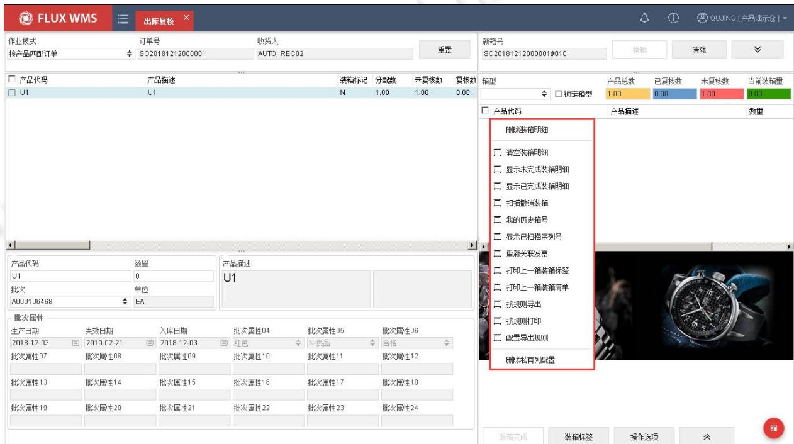

[图11-7-13]

## ■ 清空装箱明细：

在扫描产品后，确认装箱完成之前使用，能够清空当前箱号下扫描到的内容，重新开始扫描装 

箱。 

■ 显示未完成装箱明细： 

在非一步装箱情况下，需要先点击“确认装箱”按钮，再点击“装箱完成”。此时如果用户仅操作了第一步确认装箱而没有操作第二步装箱完成，会在系统中遗留未完全操作记录。 

显示未完成装箱明细功能，点击后系统会查询当前用户的未完成操作记录，并在二级窗口中显示。 

■ 显示已完成装箱明细： 

装箱明细部分，鼠标右键菜单项。选择后，系统显示如下二级窗口，输入订单号或箱号查询条件后，可用来查询相应已装箱完成的记录明细。 

同时，对于已装箱记录，可以在勾选后点击【重置装箱标志】按钮，将对应记录还原到未装箱状态重新进行操作。 

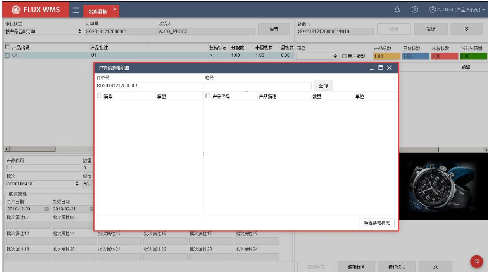

[图11-7-14]

## ■ 删除装箱明细：

装箱明细部分，鼠标右键菜单项。在装箱明细部分，选择记录，再选择此右键功能，系统将从装箱明细中删除此记录。 

与其他操作相比较，“取消上次扫描”是只为所选产品的复核装箱数量减少1；“重置装箱标 志”则针对已经确认装箱完成的信息，并可以同时还原多个产品的装箱操作，但不能只还原一条记录中的一部分数量。“删除装箱明细”则在确认装箱完成前使用，需要按记录逐一操作。 

■ 我的历史箱号： 

当前作业人员已确认装箱记录列表。关闭出库复核界面后清空。 

■ 显示已扫描序列号： 

通过二级窗口显示已经扫描序列号信息，可在此界面删除所选记录。 

## 11.7.4.行业复核要求

不同行业操作复核时，由于行业特点，经常会有不同的作业细节要求。 

## - 服装行业复核要求

■ 同款装箱 

服装行业使用功能。同款不同色、码的产品，是不同 SKU，装箱时要求一个箱内只能装同款的不同 SKU。 

通过参数 CHK_SKU_GRP 进行控制，复核时是否只能装同款产品。服装的款号信息一般维护在产品档案的产品组字段 1。 

## 医药行业复核要求

■ 双人复核： 

一些特殊药品，如麻醉、精神药品，复核时需要进行双人复核。 

启用医药行业插件（IND_MED=Y）情况下，产品档案的医药行业页签，勾选“二类精神药品”选项，如下图。 

<table><tr><td>客户编号</td><td>产品代码</td><td>活动标记</td><td>产品描述(L)</td></tr><tr><td>D12345678</td><td>U1</td><td>Y</td><td>U1</td></tr><tr><td>D12345678</td><td>U10</td><td>Y</td><td>U10</td></tr><tr><td>D12345678</td><td>U2</td><td>Y</td><td>U2</td></tr><tr><td>D12345678</td><td>U3</td><td>Y</td><td>U3</td></tr><tr><td>D12345678</td><td>U5</td><td>Y</td><td>U5</td></tr><tr><td>D12345678</td><td>U6</td><td>Y</td><td>U6</td></tr><tr><td>D12345678</td><td>U7</td><td>Y</td><td>U7</td></tr><tr><td>D12345678</td><td>U8</td><td>Y</td><td>U8</td></tr><tr><td>D12345678</td><td>U9</td><td>Y</td><td>U9</td></tr><tr><td>D12345678</td><td>UI1</td><td>Y</td><td>UI1</td></tr><tr><td>D12345678</td><td>UX-10</td><td>Y</td><td>UX-10</td></tr><tr><td>D12345678</td><td>WW</td><td>Y</td><td>WW</td></tr><tr><td>ErpCwTest01</td><td>45003986583</td><td>Y</td><td>23456789</td></tr><tr><td>ErpCwTest01</td><td>45021455421</td><td>Y</td><td></td></tr><tr><td>ErpCwTest01</td><td>45036272270</td><td>Y</td><td></td></tr><tr><td>ErpCwTest01</td><td>45051210708</td><td>Y</td><td></td></tr><tr><td>ErpCwTest01</td><td>45068284411</td><td>Y</td><td></td></tr><tr><td>ErpCwTest01</td><td>45080946974</td><td>Y</td><td></td></tr><tr><td>ErpCwTest01</td><td>45083228875</td><td>Y</td><td></td></tr><tr><td>ErpCwTest01</td><td>45087743868</td><td>Y</td><td></td></tr><tr><td>ErpCwTest01</td><td>45092712246</td><td>Y</td><td></td></tr><tr><td>ErpCwTest01</td><td>45098448656</td><td>Y</td><td></td></tr><tr><td>HIPANDA</td><td>001</td><td>Y</td><td>001</td></tr><tr><td>HIPANDA</td><td>001001</td><td>Y</td><td>01</td></tr><tr><td>hipanda</td><td>001111</td><td>Y</td><td>001111</td></tr><tr><td>HIPANDA</td><td>002</td><td>Y</td><td>002</td></tr><tr><td>HIPANDA</td><td>0055</td><td>Y</td><td>0055CC</td></tr><tr><td>HIPANDA</td><td>0066</td><td>Y</td><td>0066CC</td></tr><tr><td>HIPANDA</td><td>0077</td><td>Y</td><td>0077CC</td></tr><tr><td>HIPANDA</td><td>00819930019236</td><td>Y</td><td>布玩具枪</td></tr><tr><td>HIPANDA</td><td>008199300206</td><td>Y</td><td>小笔记本</td></tr><tr><td>HIPANDA</td><td>008199300306</td><td>Y</td><td>光皮小笔记本</td></tr></table>

[图11-7-15]

出库复核界面，扫描 SKU 时，如系统检测到此产品为二类精神药品，则弹出如下的双人校验窗口，第二复核人需要输入用户名、密码以确认二次复核通过。 

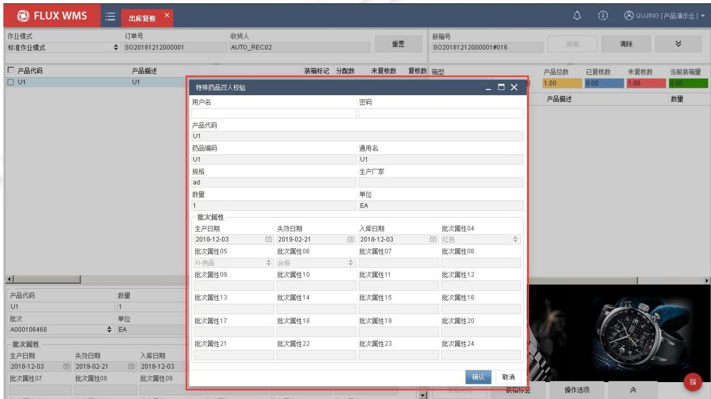

[图11-7-16]

系统将第二复核人记录到分配明细的 DoubleCheckWho 后台字段。 

## 序列号扫描：

产品设置中，如果是监管药品，或者选择第二序列号扫描情况下，出库复核扫描产品时，显示序列号/监管码、第二序列号录入窗口，将扫描的序列号记入到发运订单的序列号信息表中，以便跟踪。 

如果产品档案的出库序列号数量验证设置为“序列号数量与出入库数量必须一致”（MATCH），系统根据待复核数量，以及产品包装（如果批次属性12有包装信息，以批次中的包装数量优先）计算最小序列号扫描个数（例如1箱至少要扫描1次监管码，而4件，至少需要扫描4次）。 

## 11.8. 单品复核

单品复核是在出库复核基础上扩展出来的一个快捷复核功能，针对于单品订单（即一个订单中只订购1件产品，或者只订购一种SKU、多个数量的单行订单）。 

由于都是单品订单，只要是正确的 SKU，给任何一个订购此产品的订单均可，因此单品订单不是传统的根据订单采集产品的单配货模式，而是货配单模式，操作效率有较大提升。但使用此功能的前提是需要先筛选出合适的单品订单，拣货操作时单品、多品需要分开拣货。 

## - 单品复核操作

■ 选择“出库操作”菜单的“单品复核”功能，显示界面如下图： 

## FLUX WMS : 单品复核

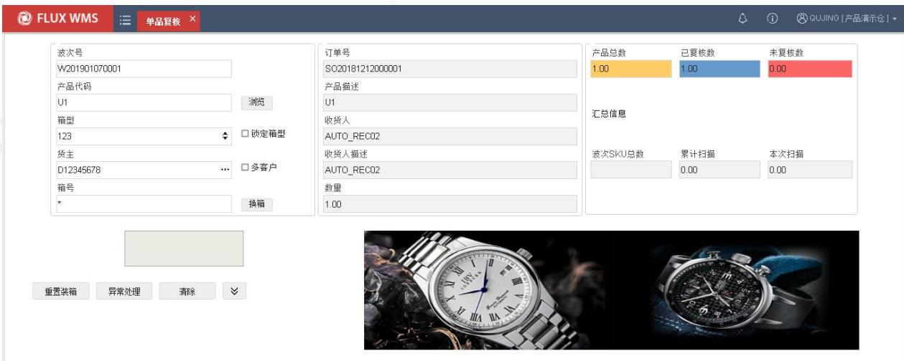

[图11-8-1]

■ 根据需要输入货主代码、波次号条件，限定匹配订单的范围 

■ 如果波次包含多货主订单，勾选“多货主”选项，系统根据扫描的 SKU 确认货主。 

如遇到不同货主具有同一 SKU，则弹出框人工确认。 

■ 类似出库复核，如果需要则确认装箱 ID。如果参数 CHK_CTN_MNG（包装箱管理）配置为装箱后选择，则先扫描 SKU，再跳转到装箱 ID 强制录入。 

■ 若勾选“锁定箱型”，则保留装箱ID选择，直到取消“锁定箱型”勾选。 

■ 扫描/输入产品代码，系统在波次/货主范围内查找对应订单 

■ 根据是否系统生成单号的参数设置，由系统自动生成新箱号，或者人工扫描/录入箱号 

■ 系统显示匹配到的订单号信息、执行装箱确认，并根据是否自动打印的参数设置，驱动对应装箱标签、装箱清单打印。 

单品复核后可根据作业需要（SGL_LNK_DEL 参数控制），跳转到配送单作业功能，以便连续操作。 

## - 换箱

点击【换箱】按钮，系统重置本次扫描数量，并且光标定位在拣货箱号，可输入新的箱号。 

## - 重置装箱

与出库复核重置装箱效果相同，点击【重置装箱】按钮后，显示二级窗口，通过订单号或者箱号查询到已装箱记录，重置为未装箱，重新进行复核装箱操作。 

## - 重量获取

复核装箱作业过程中，可以通过电子秤获取实际重量信息，也可以不称重，根据产品档案标准重量计算理论重量值。或者忽略重量信息，不做记录。通过 IDX_SGL_WGT 参数可以切换不同的重量获取模式。 

同时，需要通过电子秤读取重量的情况下，还可以根据 SGL_POP_WGT（单品复核弹出窗口进行重量确认）参数设置，系统是否弹出重量窗口。如弹出，显示电子秤获取到的重量信息，用户可手动修改确认。如果不弹出则直接使用电子秤获取的重量信息。 

## - 赠品管理

在电商行业，经常会随包裹附赠些小礼品，同一段时间发货的包裹附赠礼品相同。此类情况，为提高作业效率，经常在复核台边提前备货，包裹封装时加入赠品即可。 

系统同样提供相应的赠品管理功能。界面如勾选“赠品”选择框，扫描主品产品条码后，系统判断订单中是否有对应的赠品信息，如有，则弹出窗口显示赠品列表 

扫描赠品与列表信息匹配后，自动确认，完成装箱。 

## - 异常处理

类似出库复核异常处理功能，登记异常信息： 

■ 点击【异常处理】按钮

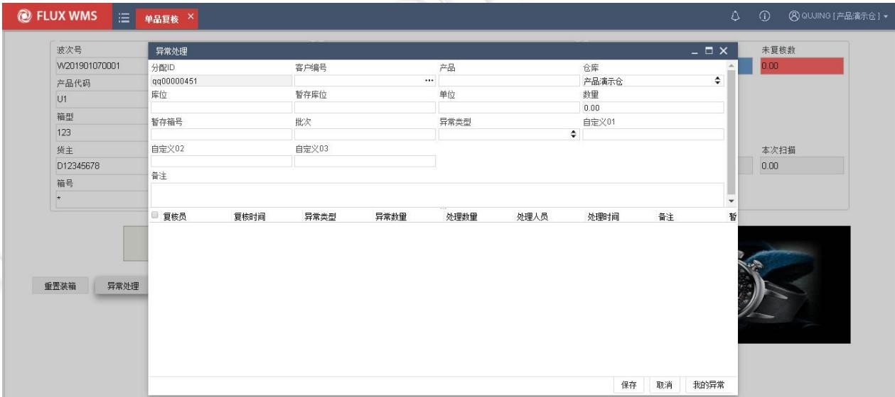

[图11-8-2]

■ 系统显示异常处理登记界面 

■ 输入产品代码、暂存库位等信息，并点击保存按钮，保存信息。 

在异常处理界面下方的列表部分，显示当前处理的产品所有未关闭的复核异常记录，可供查看。 

■ 列表部分右键功能项“关闭异常”，可关闭当前用户登记的异常记录。 

■ 异常窗口点击按钮“我的异常”，则显示当前用户登记的异常记录。 

“孤儿”处理：针对订单中不存在的SKU进行异常登记。由于多出来的SKU经常是其他复核台缺少的货物，通过记录可帮助匹配，减少重新拣货、还架的重复作业。点击“孤儿”按钮，用户输入SKU、暂存位置、数量等信息，便于其他复核台匹配缺货。 

## - 其他

■ 复核进度 

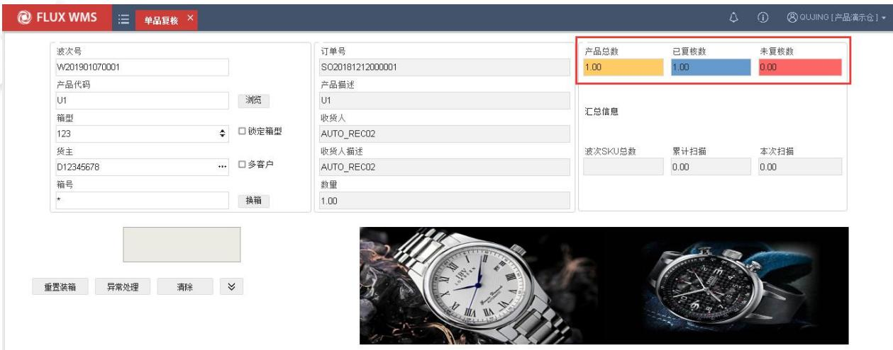

[图11-8-3]

复核作业进度用三色色块显示。 

黄色：当前复核量 

蓝色：订单复核量 

红色：订单未复核量 

通过【刷新】按钮可以人为刷新复核进度信息。整个波次作业完成，未复核数量为 0 情况下，系统自动刷新复核进度，以免波次中订单有重置装箱，尚未重新装箱确认导致遗漏。 

## ■ 序列号

单品复核支持序列号采集，由于复核数量为 1，序列号采集后自动导入、退出序列号采集界面。 

■ 退换货卡维护 

为方便售后维护，如果参数 REG_SVC_CRD（出库复核/单品复核登记退换货卡号）开启，扫描产品后，弹出窗口扫描并记录“退换货卡号”。 

■ 特殊订单提示 

如果接口下达订单时，标记为特殊订单（例如高值品订单，保价运输订单），系统匹配到对应订单后，可提示相关消息内容。 

■ 反拣提示 

单品复核功能中同样支持反拣任务生成。如果正常单据已完成装箱，剩余取消单据，弹出窗口进行提示，扫描存放反拣商品的周转箱号，并生成对应的反拣任务。 

带有赠品标记的赠品记录，无需生成反拣任务。 

## 11.9. N+X 复核

N+X 复核是在多品复核基础上扩展出来的另一个快捷复核功能，针对于多品 SKU 重合率较高订单。例如一个订单中明细只有 2 个 SKU，并且数量各自都是 1，其中一种 SKU 是多个订单有都出库要求的，即有重合率的 SKU，用 N 来代表；另一个 SKU 是其他订单中没有的，即没有订单无重合率的，用 X 来代表。N+X 意味着产品组合订单。 

处理逻辑类似单品订单，作业时只要正确扫描无重合率的 SKU，检索匹配订单成功后自动复核一个重合率高的 SKU，实现一步操作复核 2 行订单明细效果，从而大大提高多品订单的操作效率。 

## 11.9.1.N+X复核操作

## - 复核操作

操作同单品复核作业流程。作业时扫描波次号后，通过扫描重合率低的 SKU，实现自动生成箱号（面单号）、自动匹配对应重合率高的 SKU 和订单号效果。即一张订单复核动作仅需一次扫描，从而大大提供现场的作业效率和节省复核成本。 

特殊场景下 N+X 复核也支持扫描、记录货主和装箱 ID 信息。 

■ 双击“出库操作”下的“N+X复核”功能，显示界面如下图： 

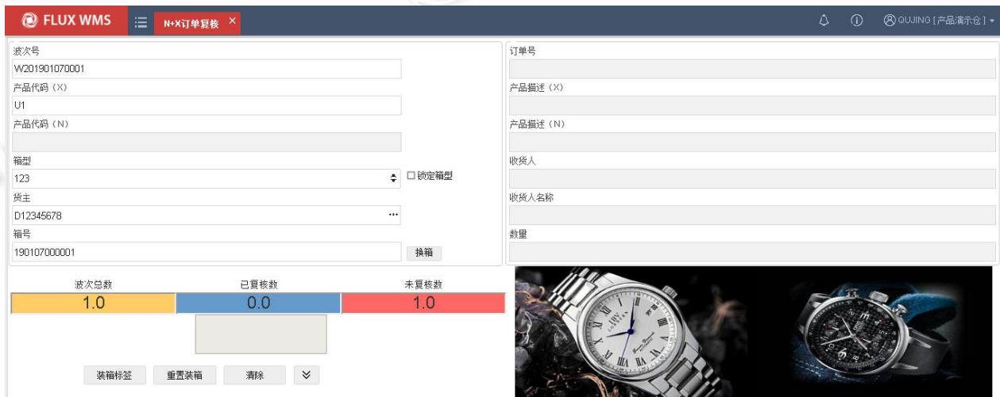

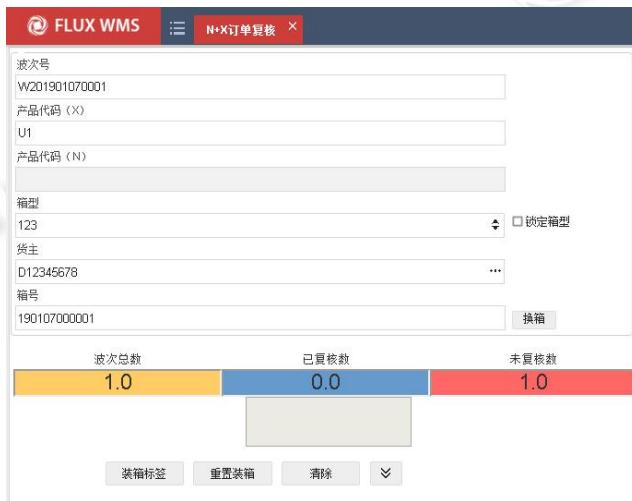

[图 11-9-1]

■ 依次输入客户编号、波次号，限定匹配订单的范围 

■ 系统根据扫描的 SKU 确认货主。 

■ 类似出库复核，如果需要则确认装箱 ID。如果参数 CHK_CTN_MNG（包装箱管理）配置为装箱后选择，则先扫描 SKU，再跳转到装箱 ID 强制录入。 

■ 若勾选“锁定箱型”，则保留装箱ID选择，直到取消“锁定箱型”勾选。 

■ 扫描/输入产品代码，系统在波次/货主范围内查找对应订单 

■ 根据是否系统生成单号的参数设置，由系统自动生成新箱号，或者人工扫描/录入箱号 

■ 系统显示匹配到的订单号信息、执行装箱确认，并根据是否自动打印的参数设置，驱动对应装箱标签、装箱清单打印。 

N+X复核后可根据作业需要（SGL_LNK_DEL参数控制），跳转到配送单作业功能，以便连续操作。 

## - 换箱

点击【换箱】按钮，系统重置本次扫描数量，并且光标定位在拣货箱号，可输入新的箱号。 

## - 重置装箱

与出库复核重置装箱效果相同，点击【重置装箱】按钮后，显示二级窗口，通过订单号或者箱号查询到已装箱记录，重置为未装箱，重新进行复核装箱操作。 

## - 重量获取

复核装箱作业过程中，可以通过电子秤获取实际重量信息，也可以不称重，根据产品档案标准重量计算理论重量值。或者忽略重量信息，不做记录。通过 IDX_SGL_WGT 参数可以切换不同的重量获取模式。 

同时，需要通过电子秤读取重量的情况下，还可以根据 SGL_POP_WGT（单品复核弹出窗口进行重量确认）参数设置，系统是否弹出重量窗口。如弹出，显示电子秤获取到的重量信息，用户可手动修改确认。如果不弹出则直接使用电子秤获取的重量信息。 

## - 异常处理

类似出库复核异常处理功能，登记异常信息： 

■ 点击【异常处理】按钮 

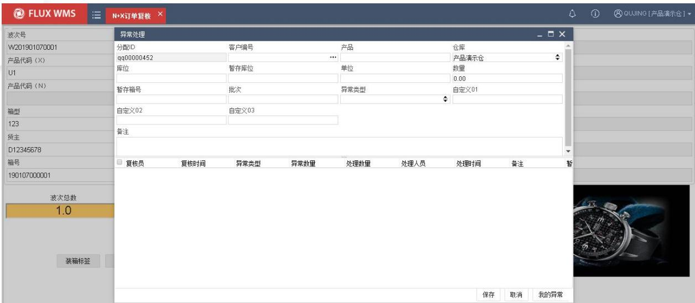

[图11-9-2]

■ 系统显示异常处理登记界面 

■ 输入产品代码、暂存库位等信息，并点击保存按钮，保存信息。 

在异常处理界面下方的列表部分，显示当前处理的产品所有未关闭的复核异常记录，可供查看。 

■ 列表部分右键功能项“关闭异常”，可关闭当前用户登记的异常记录。 

异常窗口点击按钮“我的异常”，则显示当前用户登记的异常记录。 

“孤儿”处理：针对订单中不存在的SKU进行异常登记。由于多出来的SKU经常是其他复核台缺少的货物，通过记录可帮助匹配，减少重新拣货、还架的重复作业。点击“孤儿”按钮，用户输入SKU、暂存位置、数量等信息，便于其他复核台匹配缺货。 

## 11.9.2.其他

## - 复核进度

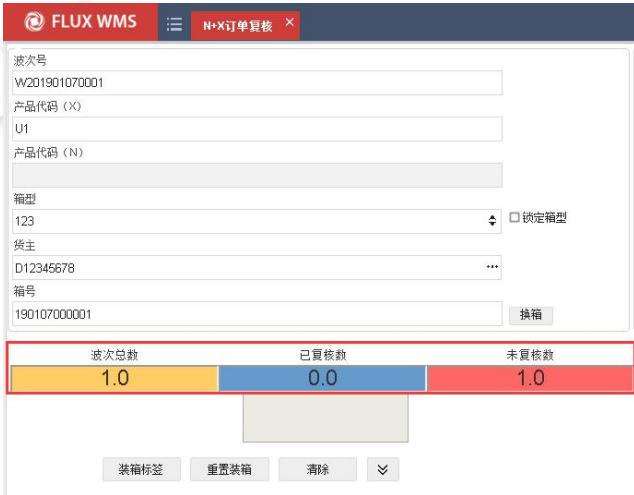

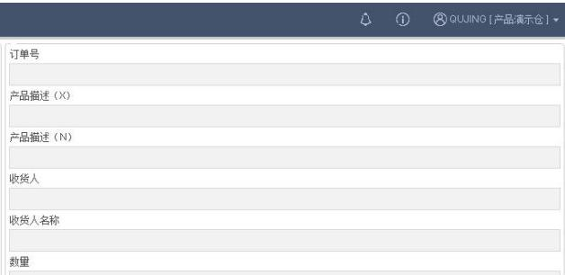

[图 11-9-3]

复核作业进度用三色色块显示。 

■ 黄色：当前复核量 

■ 蓝色：订单复核量 

■ 红色：订单未复核量 

通过【刷新】按钮可以人为刷新复核进度信息。整个波次作业完成，未复核数量为 0 情况下，系统自动刷新复核进度，以免波次中订单有重置装箱，尚未重新装箱确认导致遗漏。 

## - 退换货卡维护

为方便售后维护，如果参数 REG_SVC_CRD 开启，扫描产品后，弹出窗口扫描并记录“退换货卡号”。 

## - 特殊订单提示

如果接口下达订单时，标记为特殊订单（例如高值品订单，保价运输订单），系统匹配到对应订单后，可提示相关消息内容。 

## - 反拣提示

N+X 复核功能中同样支持反拣任务生成。如果正常单据已完成装箱，剩余取消单据，弹出窗口进行提示，扫描存放反拣商品的周转箱号，并生成对应的反拣任务。 