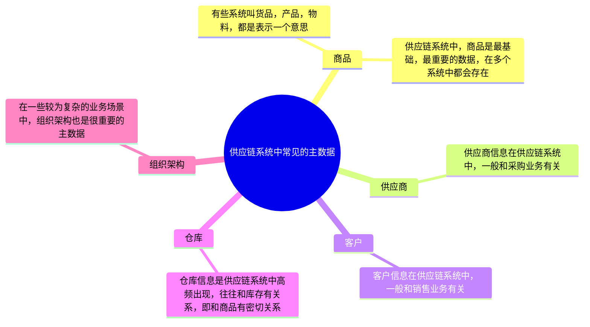
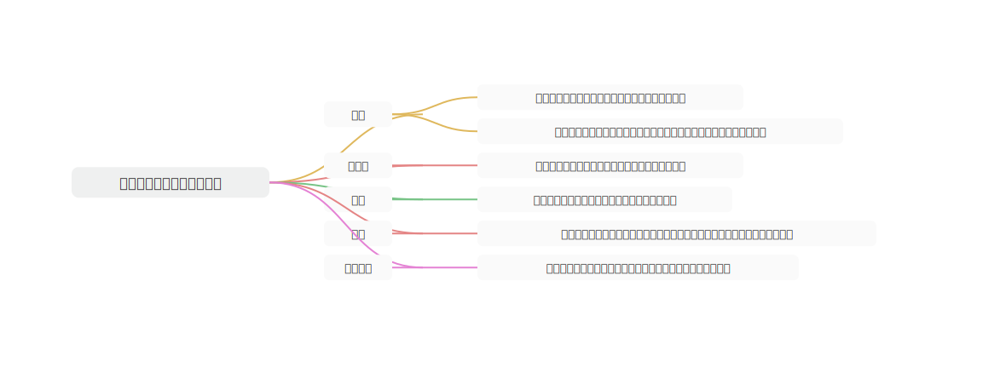
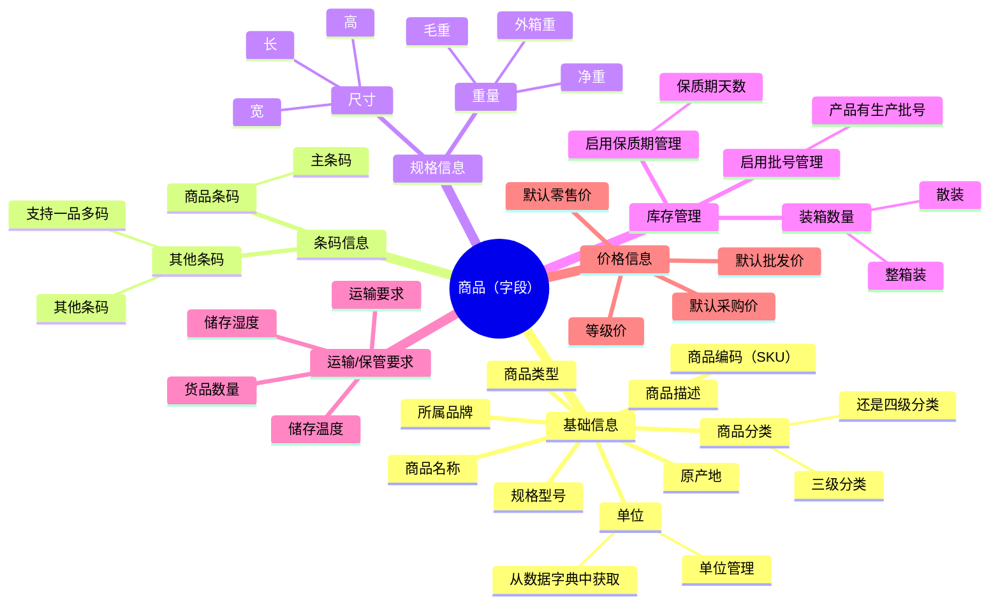
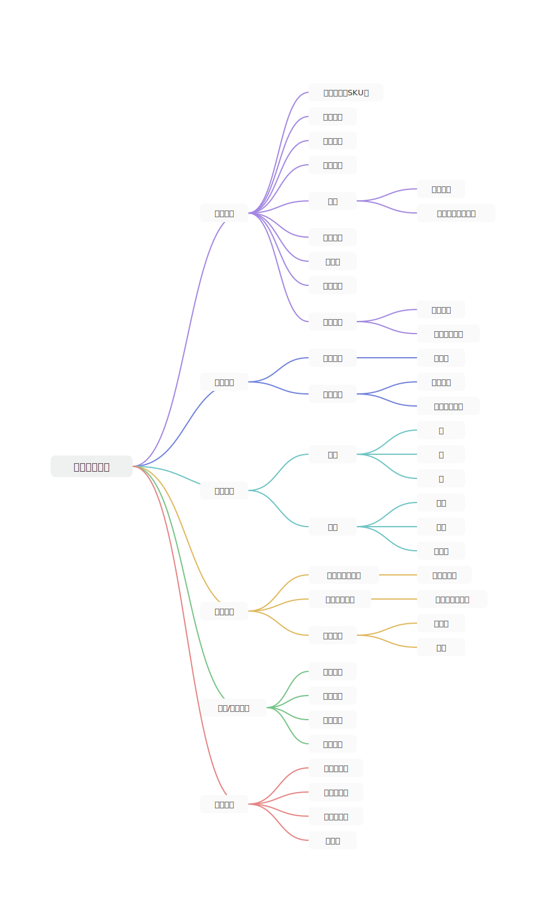
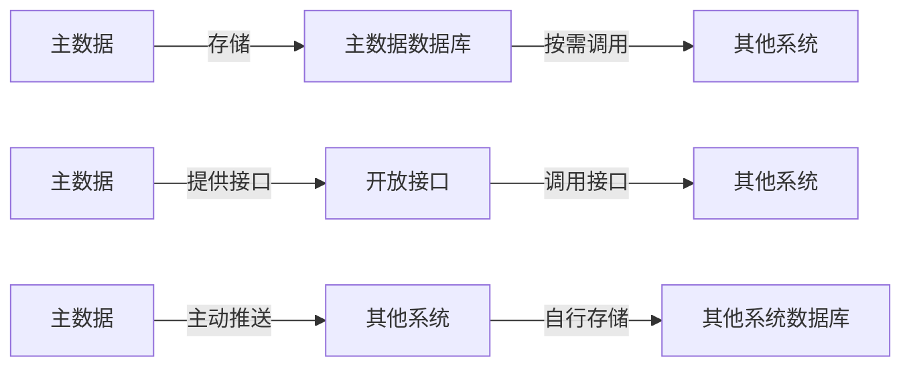
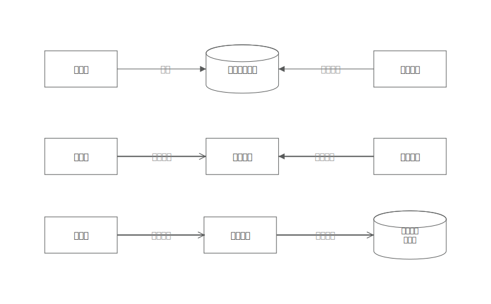

## 基本概念介绍

**主数据**是指在整个企业范围内各个系统间要共享的数据， 比如可以是与客户、供应商以及组织单位相关的数据。

主数据通常需要在整个企业范围内保持一致性(consistent)、完整性(complete)、可控性(controlled)，为了达成这一目标，就需要进行主数据管理(Master Data Management ，MDM)。需要注意的是，主数据不是企业内所有的业务数据，只是有必要在各个系统间**共享的数据才是主数据**，比如大部分的交易数据、帐单数据等都不是主数据，而像描述核心业务实体的数据，而像客户、供应商、账户、组织单位、员工、合作伙伴、位置信息等都是主数据。主数据是企业内能够跨业务重复使用的高价值的数据。这些主数据在进行主数据管理之前经常存在于多个异构或同构的系统中。

在供应链系统中，最常见的几种主数据如下所示：

## 主要的场景和知识点

1

数据的维护和管理

主数据因为在很多系统，很多模块都会调用，属于非常高频用到的基础数据，所以主数据的维护和管理就非常的重要。

很多数据维护的入口会有多个地方，维护的人也会有很多，常见的难题就是数据的合并和清洗问题。

例如说，商品资料的建档，有些时候会来源于SRM，因为供应商引入之后，供应商会对一些商品资料进行补充维护；商品基础资料上还会有一些商品流转相关的信息，需要交给采购人员或者商品信息专员来维护，例如说采购价格，销售价格，零售价，商品分类，品牌，产地，条码等；除了这些信息，还有很多是和供应链关系有关系的数据也要维护，这些可能会交给供应链部门的人员来维护和管理，例如说条码，是否启用效期管理，批号管理，装箱数量，存储温度，存储湿度等；甚至还有一些数据是要仓库收到了实物之后再进行采集，例如说尺寸，重量等。

一份“商品资料”维护的入口有很多，维护的人也有很多，后续还会涉及到数据的更新修改、停用、删除等，这些都是主数据管理需要考虑的场景。

2

主数据字段的定义和规划

主数据中会有很多字段，如果一开始定义的字段很少，后面经常因为业务的调整需要加字段，那么就会涉及到刷数据的问题，会增加很多工作量。

主数据字段的定义依赖产品经理对业务场景的熟悉程度，也依赖于对竞品拆解的深度和细节度，最后也取决于业务人员对实际业务发展的规划和要求。

### 数据的分发和流转

主数据维护好了之后，会需要被其他系统，其他模块调用和使用，这里就涉及到了数据的分发和流转。

主数据可以单独存放在主数据基础表里面，其他的系统或者模块需要调用的时候，直接读取数据库的数据即可；

主数据也可以直接通过开放查询的接口，其他的系统或者模块需要调用的时候，通过调用接口来获取这一部分的数据；

主数据还可以推送一份给下游的系统，然后下游的系统自己存储起来，按需使用；

​