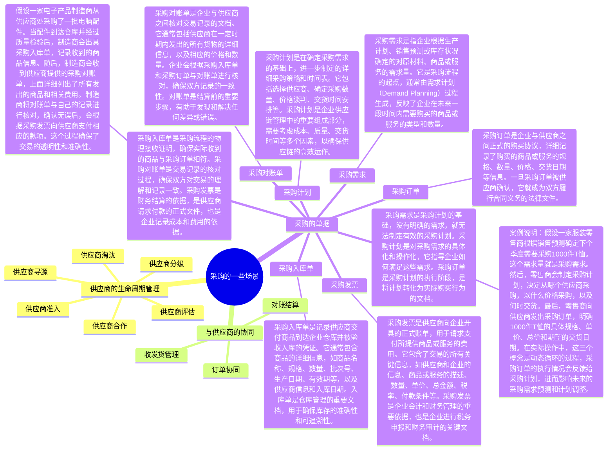
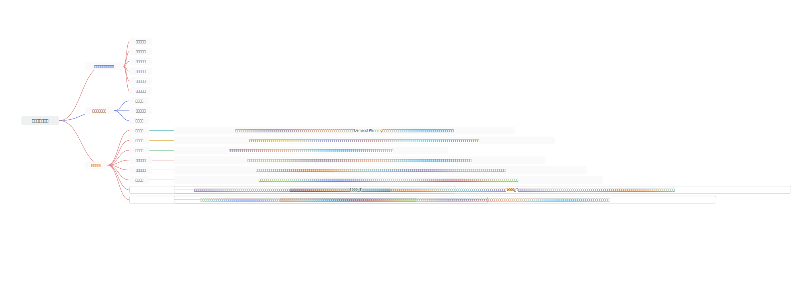
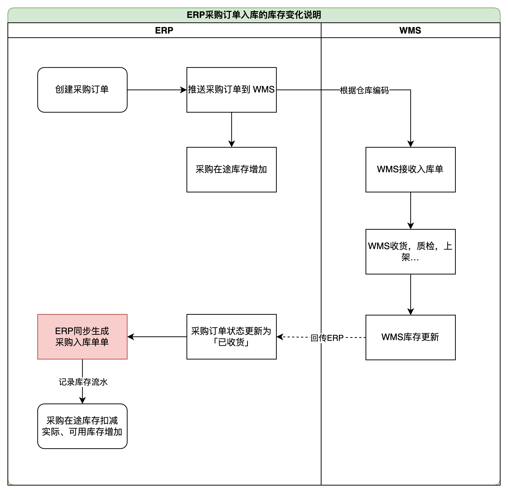
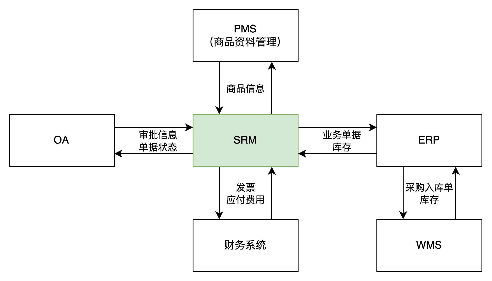
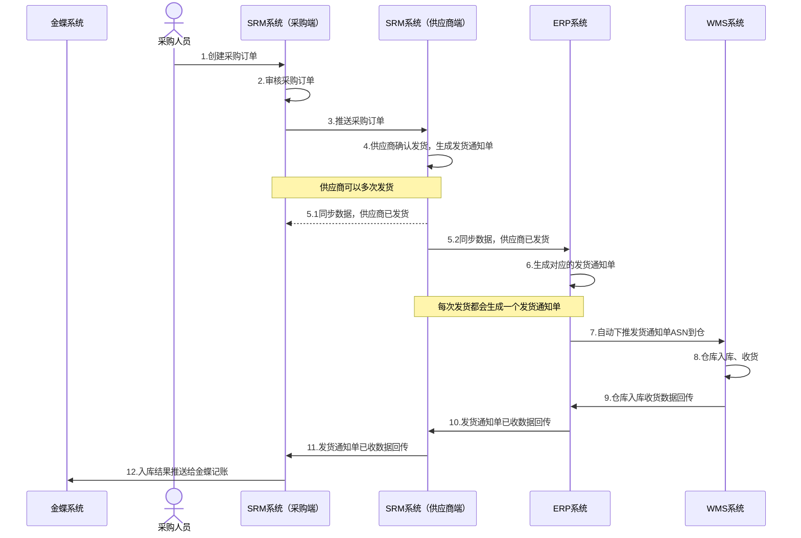
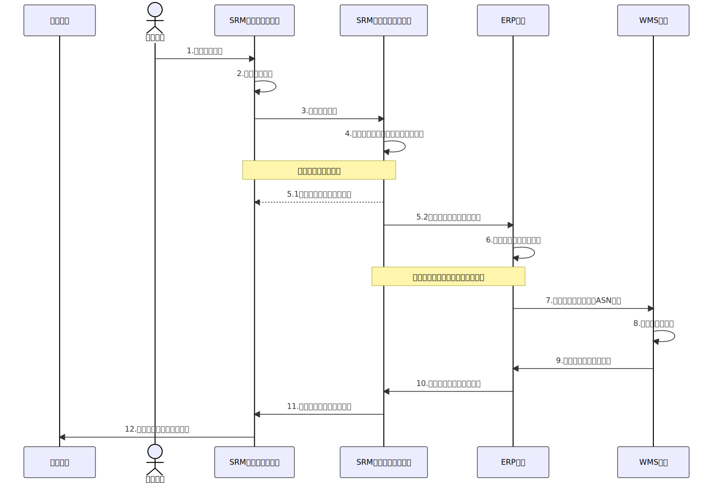
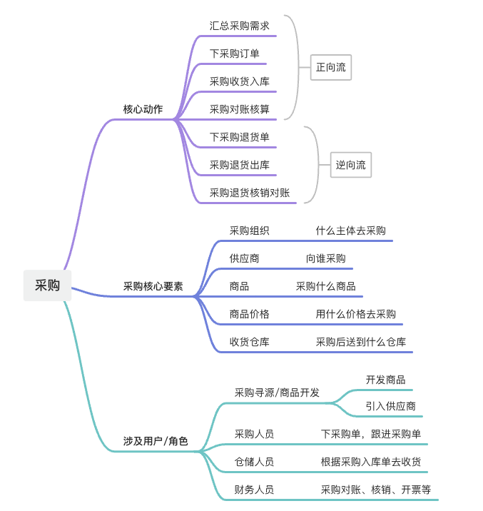
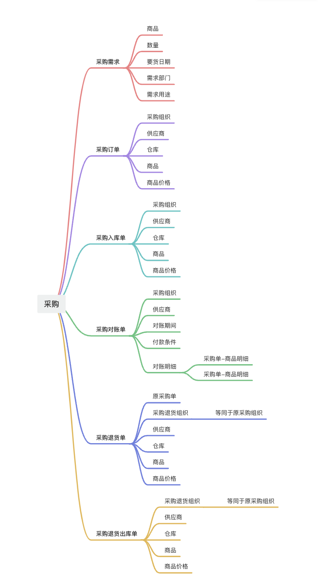

**基本概念介绍**  
采购业务在进销存，ERP，POS系统，后台管理系统中非常常见，生活中有非常多的供应链场景，也会有非常多的采购场景。  
针对生产型公司，采购往往是采购原料，采购设备，采购一些半成品，然后去加工生产制造等；  
针对贸易型公司，采购往往是采购成品，采购商品，采购之后再通过销售渠道去销售出去；  
采购也是很多供应链类书籍中会重点讲解，重点研究的一个领域和方向，因为采购涉及的面比较多，有很多东西的可以做到很有深度，很有壁垒的。  
​

## 主要的场景和知识点

### 供应商的管理

供应商属于主数据，无论是简单的进销存系统，还是复杂的SRM或者PMS等，在采购环节中，第一步往往都是要和供应商打交道。

对“供应商”的增删改查，属于基本的信息管理，实际上供应商还有很多关联的模块或者业务等。

1.  商品和供应商有关系，因为实际供货的是供应商，所以商品的建档，可能要依赖供应商和商品开发专员一起来执行；
2.  商品的采购价和供应商有关系，因为不同的供应商对应的采购价格会不太一样；
3.  采购订单和供应商有关系，因为采购订单的核心对象就是供应商，所以需要提前创建好供应商信息；
4.  采购发票和供应商有关系，因为采购业务发生之后，一般供应商要向采购方开发票，开票需要用到供应商的一些基础信息；
5.  ……

### 采购订单的创建和取消

采购订单的创建，一般来说比较常规，很多竞品中都会有类似的功能模块可以借鉴，这样要重点注意这么几个东西：

1.  采购订单中，是否允许出现相同商品但是不同的采购单价？例如说同一个SKU，但是有1个是X元的采购价，1个是Y元的采购价，如果允许，那么就要考虑分行展示，如果不允许，那么就是一个SKU必须一个价格；
2.  采购订单中，商品的价格和税率取值的来源是什么？商品的价格可以手动填写，也可以自动带出来，那么对应的税率也是可以手动填写或者自动带出来。如果是自动带出来，那么这些信息应该从哪里维护呢？商品采购价格列表，还是商品默认采购价，还是其他地方；
3.  采购订单中，一个采购订单只能对应一个仓库， 还是一个采购订单可以对应多个仓库？一般来说推荐一个采购订单对应一个仓库，这样的话采购订单推送到下游WMS的时候会更加方便一些，否则就要用明细行的方式来拆分了，比较麻烦；
4.  采购订单的状态流设计，这里重点是要考虑一下什么状态下推送给下游WMS，什么状态下可以取消，什么状态下表示采购订单完结；

常见的一些问题：

1.  采购订单最多一次填写多少行商品？
2.  采购订单推送仓库失败怎么处理？
3.  采购订单推送仓库后，仓库缺量收货，分批收货怎么处理？

### 采购订单和采购入库单的交互

采购订单和采购入库单的交互，主要是很多人不知道采购订单和采购入库单的区别是什么？会有人觉得采购入库单好像有点多余，也会有人觉得采购入库单好像可以抽象为“入库单”就好了。

一般来说，市面上主流的做法是这样的：**采购订单推送到下游WMS，然后WMS入库了之后，回传数据给采购订单，同时也会生成一个采购入库单，这个时候可以根据采购入库单来增加库存**。

采购订单：用来记录和供应商之间的采购凭证，表示一种协议关系；

采购入库单：用来记录仓库完成了收货、入库，表示货物被收取，记录货物的数量，状态等信息；

采购订单会生成采购入库单，采购入库单会增加库存。

### 采购退货的溯源和非溯源

采购退货的溯源，就是需要确认本次退货的数量，是从哪个原始的采购订单中去退货的；非溯源，就是不用管是哪此采购订单采购进来的，直接就退就好了。

采购退货时进行溯源，即追踪退货商品的原始采购订单，这一做法具有多重目的和解决的问题：

1.  **确保准确性**：通过溯源，可以确保退货的商品与原始采购订单上的商品完全一致，避免错误退货或重复退货的情况发生。
2.  **质量控制**：如果退货是由于质量问题，溯源可以帮助企业识别问题商品的批次，进一步分析质量问题的原因，从而采取相应的措施防止类似问题再次发生。
3.  **供应商管理**：溯源可以作为供应商评估的一部分，帮助企业了解哪些供应商的商品存在问题，从而调整采购策略和供应商关系。
4.  **财务核算**：退货商品的原始采购订单信息对财务核算至关重要，可以确保退货成本和收入的准确计算，符合会计准则。
5.  **合规性**：在某些行业，如食品、药品等，严格的追溯体系是法规要求，可以确保产品安全和合规性。

通过这些目的和解决方案，企业可以更有效地管理退货流程，提高供应链的透明度和响应速度，最终提升整体的业务效率和客户满意度。

溯源听起来很棒，但是实际上难度很高，成本也很高，涉及到的业务细节非常多，也对实物的管理有很高的要求，所以做起来特别困难，大多数的公司做采购退货都没做溯源，或者即使做了，也是“逻辑上的分配”，通过一些业务规则和分配逻辑来达到类似溯源的效果。

  
  

### SRM和ERP的交互关系

  

## **采购的功能结构和信息结构（简略版）**  
  

## 