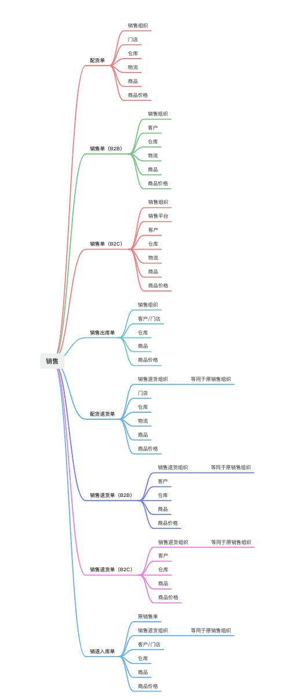

在零售供应链领域，销售相关的业务流程是企业与客户互动的前线，涉及多个核心步骤，这些步骤不仅需要高效的执行，还需要细致的关注。以下是一些核心的销售业务步骤及其场景描述：

1.  **销售预测**：

-   场景：分析历史销售数据、市场趋势和季节性因素，预测未来销售需求。
-   画面感：销售分析师在办公室中查看销售数据图表，使用预测软件进行数据分析。

2.  **客户关系管理**（CRM）：

-   场景：维护客户信息，跟踪客户互动，提升客户满意度和忠诚度。
-   画面感：销售人员在CRM系统中记录客户沟通细节，安排后续跟进活动。

3.  **订单接收**：

-   场景：客户下订单，无论是通过线上平台还是线下门店。
-   画面感：顾客在商店或网站上选择商品，提交订单；销售人员在系统中录入或接收订单。

4.  **订单处理**：

-   场景：审核订单，确认库存和交付能力，处理特殊要求。
-   画面感：订单处理员在OMS系统中检查订单详情，与库存和生产部门协调。

5.  **库存分配**：

-   场景：根据订单需求，从库存中分配商品。
-   画面感：库存管理人员在WMS系统中查看库存水平，为订单分配商品。

6.  **物流安排**：

-   场景：安排商品的运输和配送，确保按时送达。
-   画面感：物流协调员在TMS（运输管理系统）中安排运输路线和配送时间。

7.  **订单履行**：

-   场景：实际发货，包括拣货、包装和发货。
-   画面感：仓库工作人员根据订单拣选商品，进行包装，贴上发货标签。

8.  **发票开具和收款**：

-   场景：为客户开具发票，并跟踪收款。
-   画面感：财务人员在ERP系统中生成发票，通过电子邮件发送给客户，并跟踪付款状态。

9.  **售后服务**：

-   场景：处理客户的退货、换货和维修请求。
-   画面感：客服人员在CRM系统中记录客户问题，安排售后服务流程。

10.  **销售分析和报告**：

-   场景：分析销售数据，生成报告，为管理层提供决策支持。
-   画面感：销售经理在办公室中审阅销售报告，与团队讨论业绩和市场策略。

ERP系统中的销售订单功能可以解决以下业务场景和需求：

-   **自动化订单处理**：ERP系统可以自动处理从订单接收到发货的整个流程，减少人工干预，提高效率。
-   **库存同步**：ERP系统与WMS紧密集成，确保库存信息的实时更新，避免超卖或库存积压。
-   **客户信息管理**：ERP系统可以存储和管理客户信息，便于跟踪订单历史和客户偏好。
-   **订单跟踪和追溯**：ERP系统提供订单的实时跟踪功能，帮助企业监控订单状态，及时响应客户需求。
-   **财务集成**：ERP系统与财务管理模块集成，自动生成发票，简化收款流程。
-   **多渠道订单管理**：ERP系统支持线上线下多渠道订单管理，统一订单处理流程。
-   **数据分析和报告**：ERP系统提供销售数据分析工具，帮助企业洞察销售趋势，优化销售策略。

通过ERP系统的销售订单功能，企业可以更有效地管理销售流程，提高客户满意度，同时为管理层提供决策支持。

