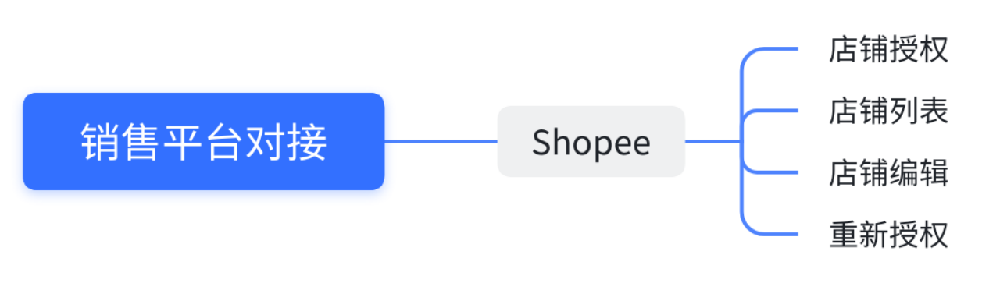
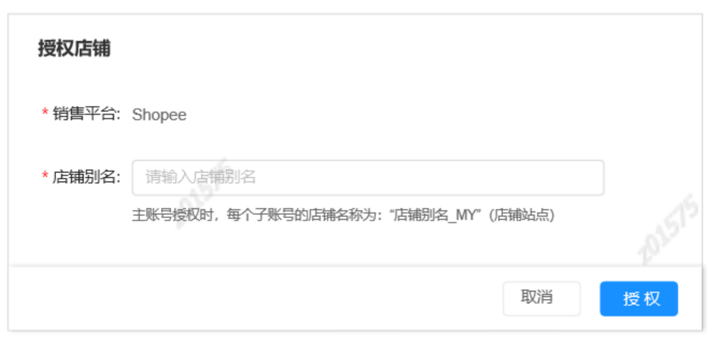
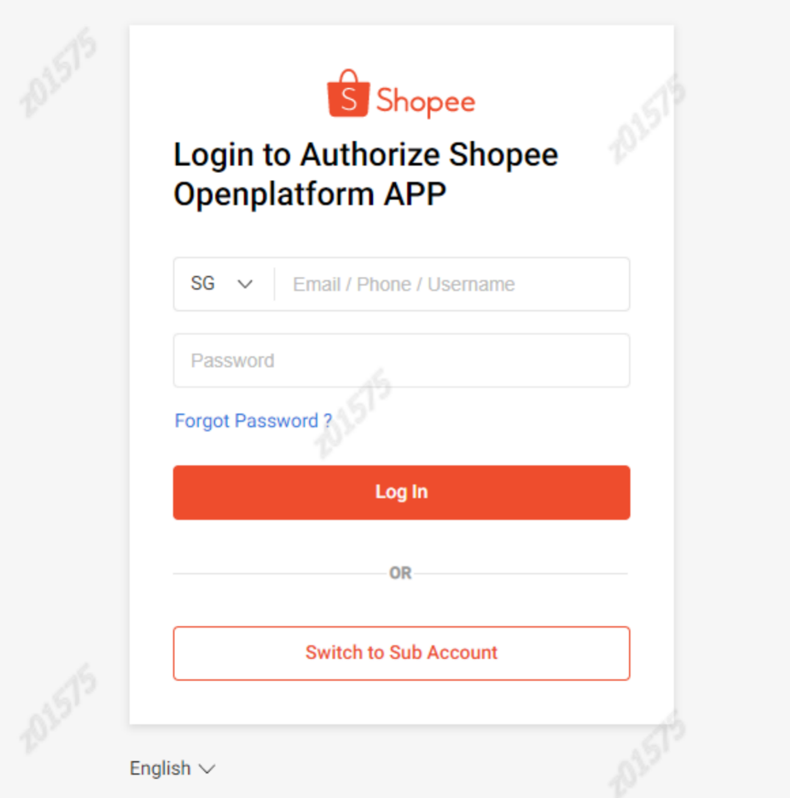
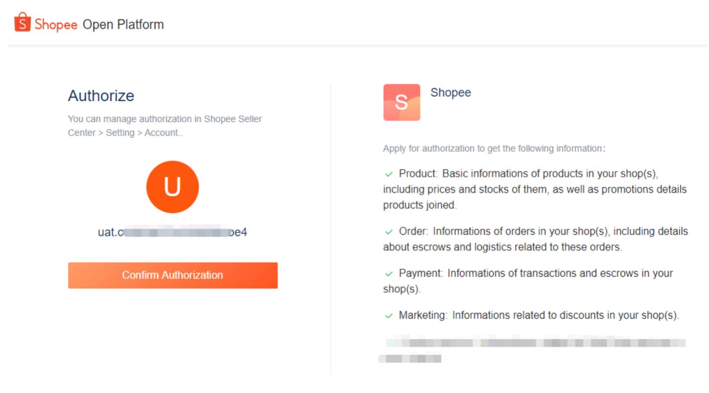

## 一、文档概要

### 修订记录

| 版本 | 时间 | 变更人 | 变更内容 |
| --- | --- | --- | --- |

### 需求背景

基于业务发展的需求，需要对接Shopee平台，支持Shopee店铺授权，产品刊登，订单拉取，订单标发等，本需求主要是解决Shopee的店铺授权相关的接口对接。

### 功能列表

| 需求 | 优先级 | 需求描述 |
| --- | --- | --- |
| 店铺授权接口对接 | P0 |  |
| ERP新增店铺授权模块 | P0 |  |
| 重新授权 | P1 |  |
| 移除授权 | P1 |  |
| …… |  |  |

## 二、产品概览

### 全局说明（名词解释）

表格展示一些全局的说明，名词解释等

### 业务流程图

插入流程图

### 原型地址

插入原型地址

## 三、功能性需求

### 3.1 ERP新增“授权”模块

在ERP的XXX模块下，新增一个“授权”模块，具体业务逻辑如下图所示：

| 店铺授权弹框添加“Shopee”项，用户点击后弹出Shopee授权弹框； |  |
| --- | --- |
| Shopee授权弹框包含“销售平台”、“店铺别名”字段；“销售平台”显示Shopee且不允许更改；“店铺别名”字段规则同其余销售平台；店铺别名输入框下显示提示语：如图所示；点击授权后，拼装定向url，跳转到Shopee登录页面； |  |
| 输入账号和登录密码，登录成功后，跳转到授权页面 |  |
| 点击“确认授权”后，重定向到回调地址（erp地址），链接url中携带shop_id，code； 然后用code和shop_id调用“获取令牌接口”获取店铺的access_token和refresh_token； 然后再调用“获取店铺详情接口”接口获取店铺的详细信息，存入数据库店铺表。 |  |

### 3.2 授权对接

1.  贴上流程图（泳道图）说明，介绍怎么授权，请求的路径，操作流程是怎么样的
2.  授权流程与对应的页面功能设计，授权页面的跳转，以及对应的回传的数据处理
3.  授权时返回的相关接口字段映射

| 接口字段 | ERP系统 | 解释说明 |
| --- | --- | --- |
| shop_id | shop_id |  |
| shop_name | 店铺名称 |  |
| region | 站点 | 接口返回的是国家/地区二字码 |
| XXX | XXX | 此字段需要ERP额外处理一下，处理逻辑XXX |

4.  接口的调用时机，次数，先后顺序，异常的处理等补充说明

1.  如果调用失败了怎么办
2.  重试多少次
3.  先调用A接口，再调用B接口

### 3.3 重新授权

重新授权的接口为：

xxx.shopee.com/api/v3/xxxx

如果授权过期了，则用户可以点击【重新授权】，然后通过重新授权的接口去请求Shopee的重新授权。

| 接口字段 | ERP系统 | 解释说明 |
| --- | --- | --- |
| A | XXX | 推送这个字段给Shopee |
| B | XXX | 这个字段要这样处理，然后再把结果推送给Shopee |
| C | XXX | XXX |
| XXX | XXX | XXX |

### 3.4 移除授权

xxxx

## 四、非功能性需求设计

1.  Shopee的授权access\_token每4小时就会过期，所以当授权成功之后，需要自动激活一个定时任务，每隔一段时间就自动调用“refresh\_token”的接口，刷新access\_token
2.  XXXX

## 五、API文档

Shopee开发者注册：

[https://open.shopee.com/developer-guide/12](https://open.shopee.com/developer-guide/12)

注册后的开发者账号密码：

> account@example.com
> 
> password

授权接口文档地址：

[https://open.shopee.com/developer-guide/20](https://open.shopee.com/developer-guide/20)

沙盒测试地址：

[https://open.shopee.com/developer-guide/8](https://open.shopee.com/developer-guide/8)

沙盒测试账号密码：

> sandbox-account@example.com
> 
> sandbox-password

业务交流群：

QQ群号：

微信群号：