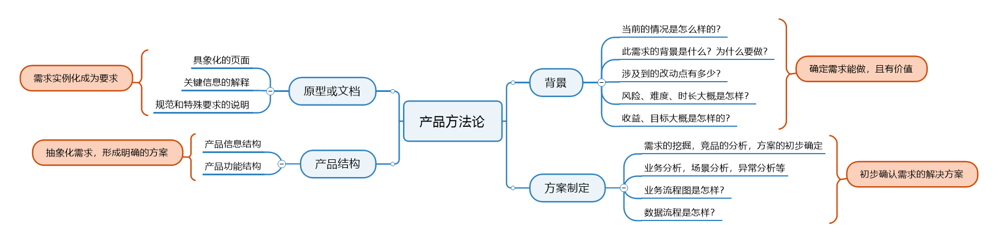
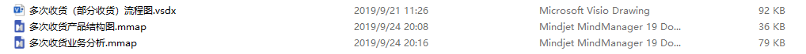
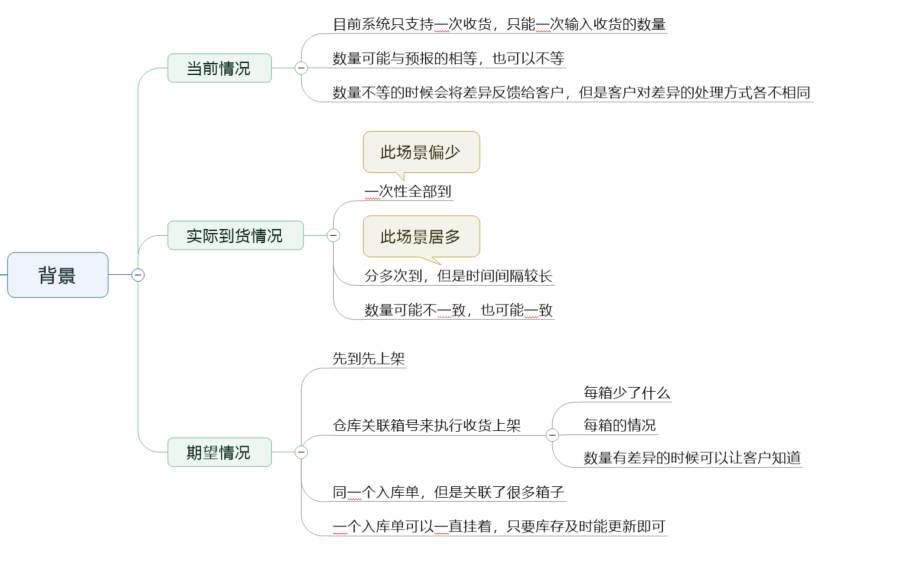
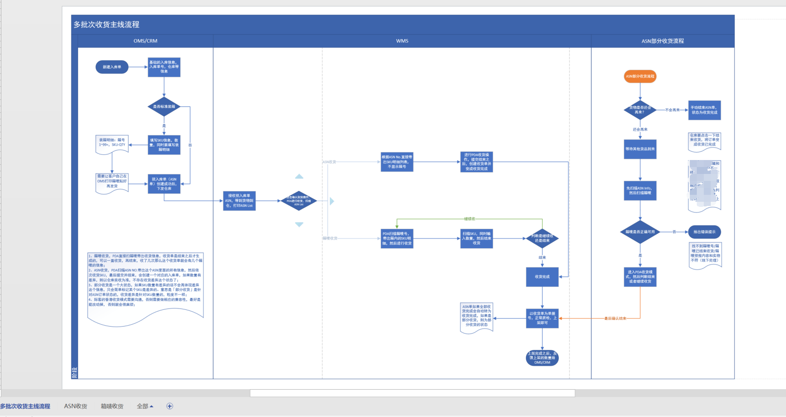
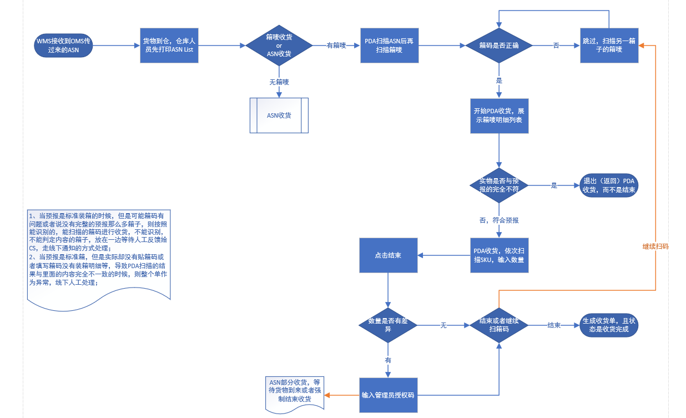
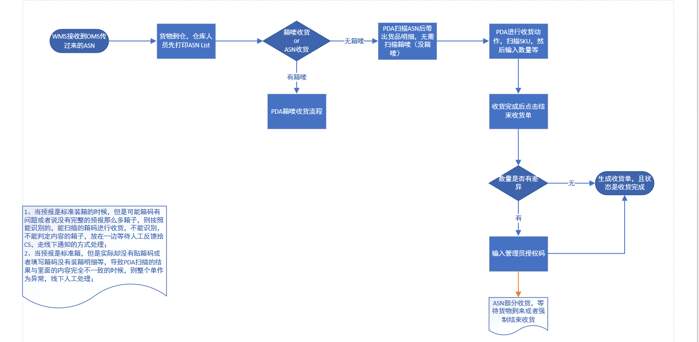
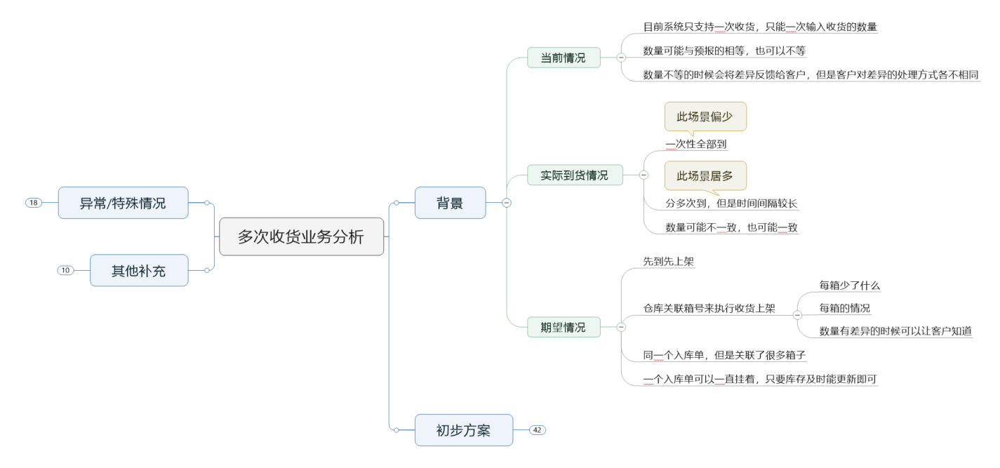
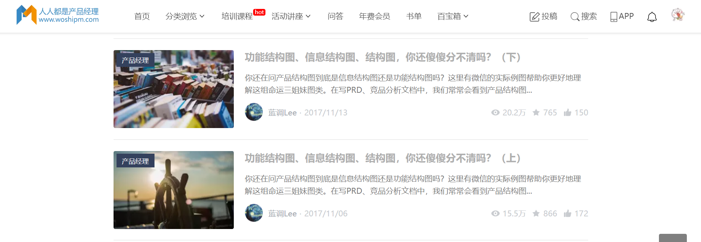
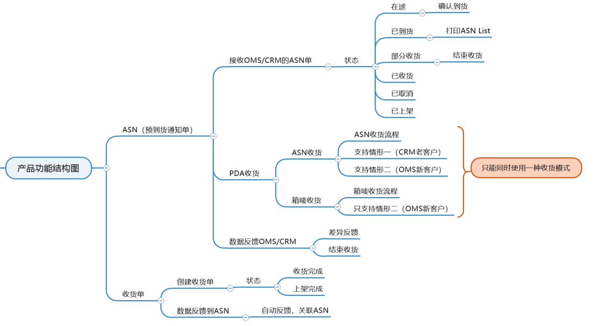
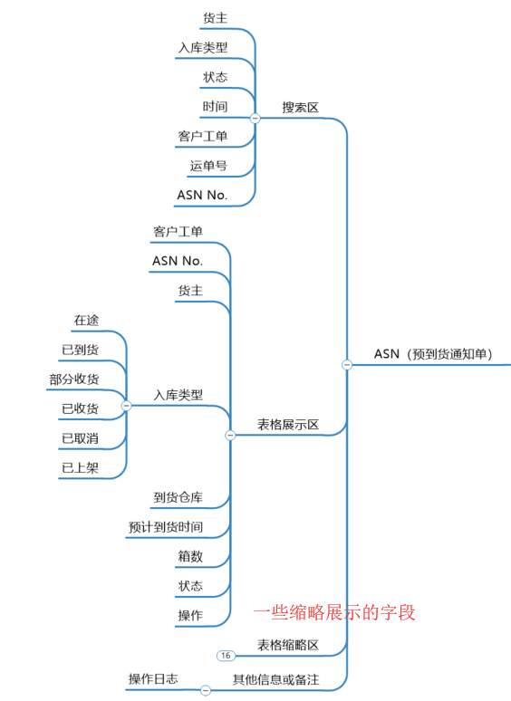

这是我之前发表在“人人都是产品经理”的两篇文章，文章是分成了上下篇幅，在这里我将它们合并在了一起，方便更好阅读。

很早之前我就想写两个内容，一个是自己的产品方法论，一个是关于WMS的背后的故事。

产品方法论是因为我每次看别人的文章的时候都觉得头头是道，有条不紊，而自己做需求，做一些产品相关的工作的时候总是今天用“华山派的功夫”，明天用“武当的功夫”，后天“可能就完全不会功夫了”……所以我想自己写点东西给自己一些指导，一些约束。

WMS的背后的故事是因为我目前主要负责的就是这个模块，我也对这个领域是最熟悉的，当然虽然说最熟悉，但是我依然觉得这一块我做得很一般，还远没有踏入行业的门槛。

写这些是为了总结自己的一些产品心得，同样的网络上这方面的资料和信息太匮乏了，如果我的东西能给别人一点帮助，那也是一个莫大的荣幸。

结合上述几个理由，我决定说干就干，既写下我的产品方法论，也写下我对WMS这一块的心得感悟。

## 我的产品方法论

产品方法论是指我在日常完成一个需求设计的一个过程中所使用的一些步骤和方法，其实这个方法论是我现写的，这也是我在前面提到自己没有严格的约束、规范去指导自己做这些东西的原因之一，因为没有方法论，所以今天想起来了就会用“华山派的功夫”，要是没想起来可能就会用“武当的功夫”，甚至为了偷懒直接就没有什么功夫。

所以会导致每次做不同的需求的时候，会有千奇百怪的差异，有时候会心血来潮写Mindjet分析，有时候会写文档记录，有时候会用Excel表进行跟进和梳理，有时候啥也脑子里过一遍就定了方案……

为避免上述问题的持续发生，我决定去制定这些方法论，同时也严格去执行、落实，其中对这些方法论进行必要的迭代升级。下图就是我制定的属于我自己的「产品方法论」，主要是在适用在“需求分析及设计”环节。

### 第一步：背景

背景这个东西一般我在写需求文档或者写TAPD的时候都会写上去，因为很多时候我们都会忘记为什么要做这个功能，或者时间一久就会忘记当时做这个的理由和原因是什么了，**所以写背景，一方面是为了以后翻起旧账的时候可以做参考；另一方面是在需求评审或者分配开发任务的时候，让开发和测试能够认同这个需求，有共同目标和共同的认知**。

毕竟如果团队成员都不知道为什么要做这个，做这个的意义是什么，那么久而久之需求就会变成一项苦差事，大家就没有奋斗和拼劲了。

背景除了上述说到的功效，还能在写背景的过程中对需求进行一个初步评估，结合各种方法论和一些指导，比如我们常听到的：“用户访谈，调研”，“市场调研”，“需求分析”，“SWOT”，“5W1H”等……

总之这个环节就是要确定需求是能做的，是有价值的，让大家认同这一点，才能接下来去落实具体的方案。产品做完了这一步，才能进行第二步的工作。

### 第二步：方案制定

方案制定是一个大环节，也是「需求设计」环节中最重要的一环，我一般根据产品生命周期会将产品工作流程分为这几个大块：

1.  需求的收集与评估；
2.  需求的设计与评审；
3.  需求的研发与测试；
4.  需求的上线与跟进。

本文所讲的产品方法论其实是针对「需求的设计与评审」这一环节来写的，其他环节也重要，但是本文重点突出「需求的设计与评审」这一块。

一般来说，做一个需求的时候，需求提出者会给出“问题型需求”和“方案型需求”，那么什么是“问题型需求”，什么是“方案型需求”？

拿WMS中的一个多SKU流水导出的需求来举例，“问题型需求”应该是这样提出的：

> 我在导出SKU的流水时候，会发现每次只能导出一个SKU，或者每次只能导出一个货主的全部SKU的流水，我希望有一个功能，能让我自己选择要导出的SKU，这样既不用一次性导出去挑选想要的，也不会用分多个批次导出每个SKU的流水然后拼接到一起。

而“方案型需求”一般会这样提出：

> 我在导出SKU的流水时候，会发现每次只能导出一个SKU，或者每次只能导出一个货主的全部SKU的流水，我希望你们能做一个功能，让我在界面上勾选我想要的SKU信息，然后进行导出，这样的话我想要哪几个SKU就能导出哪几个SKU，就很方便了。

注意看上面的需求描述，其实大体上来说都是在描述一个事，但是“问题型需求”侧重的是表达自己遇到的问题，以及自己想要的结果。

而“方案型需求”则会表达出自己期望的操作方式或者解决手段，往往很多时候，需求提出者并不懂技术，也不懂系统的一些架构，限制等，所以他们提出的这种要求，有时候是能满足的，有时候却不能满足。

**但是，如果产品经理没有仔细去分辨其中的原因，就会先入为主的被这种“方案型需求”代入其中，一直想用需求方描述的方式去解决这个问题，当遇到瓶颈的时候还是会一股脑的想要按照需求描述的去实现，而难以跳出来去寻找其他的方案。**

其实也许用另外的一种交互或者手段一样能达到这种要求，所以当一个需求提出的时候，我们应该仔细地去分辨，它是“问题型需求”还是“方案型需求”。当需求是一个“问题型需求”的时候，我们会不受约束地去想到多种方案和办法，这样更加有利于迅速和准确地解决问题。

方案制定包含很多内容，但是核心点就是：**出一个方案**，这里的方案可以是初步的，不成熟的，但是一定是要具有可行性的，能被大家认同的。

所以我一般会出一些流程图，业务分析介绍图等和开发或者是业务干系人进行初步沟通，看看这种方案从理想化，抽象化的角度是否具有可行性，是否能解决需求方的问题。

方案的制定一样的会有很多成熟的方案论，例如“用例图”，“泳道图”，“任务拆解”，“需求剖析”，“对比分析”，“用户调研”，“数据佐证”等等……

这里一样不展开讲了，此环节的关键目标是：**制定出一个初步的需求解决方案，最好是通过了一些业务干系人的认可。**

### 第三步：产品结构图

产品结构图，产品信息结构图，产品功能结构图，基本上算是逼死产品小白三座大山了。

首先是从字面意思就有点绕，都是结构，都长得很像，但是又不像；其次就是网上的解释五花八门，大家各自有各自的认知和理解，谁也不能说服谁；最后是到底用哪个，大家也没有准信，全部都写，都整理出来太麻烦，费时间，不整理出来又怕被人说自己不专业，是个“野鸡产品”……

于是乎，产品小白们，卒！

在这一块我个人的理解是产品结构包含了产品信息结构和产品功能结构，**「产品信息结构」**就是指为了解决这个需求那我做出来的页面或者功能它有什么信息，例如WMS多批次收货功能中的信息：

-   一共有几个界面，每个界面分别能展示什么信息等；
-   一个有多少字段，字段的限制、规则、解释等；
-   展开与缩起的信息分别有哪些，优先级顺序是怎么样的；
-   功能带来的交互，文案，提示，以及涉及的一些异常机制等；

而**「产品功能结构」**则是突出此需求需要用到什么功能，功能是放在什么位置，起什么作用之类的，继续的拿WMS多批次收货功能来举例，它的功能结构包含有：

-   每个界面的功能，有什么按钮，按钮的作用；
-   每条数据应该有什么状态，不同的状态有什么不同的功能；
-   功能会带来什么作用，产生什么后续的结果；
-   功能引发的一系列联动，例如记录日志、其他系统的联调，多个模块间的联动等；

总体来说，你会发现产品信息结构和产品功能结构并不能百分百切割独立，其中还是会有一些重叠的部分和互相作用（信息是功能，功能也是信息）的部分，所以我一般会将这两个东西放在一个Mindjet中，取名就是「产品结构图」，甚至会在里面加上一些特殊的业务说明和一些背景介绍等，因为它们可能既不是功能，也不是结构，但是却构成了产品结构图。

我推荐大家不明白的可以去看「[人人都是产品经理](http://www.woshipm.com/pmd/838667.html)」中的两篇文章，它们的访问量和阅读量都很高，具有一定的指导意义。

此环节主要的作用就是：**抽象化需求，形成明确的方案，这种方案是跃然于纸的感觉，大家可能看到了你的产品结构图基本上就能脑补出你做的东西大概是怎么样子了。**

### 模块四：原型或文档

最后一步是关于原型和文档，这一块也是所有产品最熟悉的环节了，因为基本上的需求都会走到这一步，不管怎么样，原型不画那文档总要写吧。

这一块我的方法论反而是比较成熟和稳定的了，一般针对原型来说，我都是低保真中突出重点，因为我们团队没有UI，所以基本上我如果要对UI有什么特殊要求，我就要在低保真的原型中重点突出这个需求，同时也要进行私下的沟通或者验收，以防止开发没有看到或者没有重视这个问题。

**而原型设计其实就是对上一步的抽象化的方案进行实例化，做过开发或者能理解面向对象的人就很容易get这个意思。需求的设计和梳理其实都是抽象化的，画原型和写文档就把这个需求的方案从抽象化的类变成实例化的对象。**

类是对象的抽象，而对象是类的具体实例。所以从这一点我们也就可以理解，为什么很多时候产品面试的时候并不会很看重一个人的产品原型绘制的能力呢？

因为原型绘制只是一种表达的手段，你的原型画的很好看，很漂亮，这是一个优势，但是如果你不能很好的达成它最原始的目的，那么这个漂亮和好看并没有多少实用性。而它的原始目的就是：**实例化前一步的产品结构图，填充它，让开发和测试可以更加清晰明了的知道具体的方案是怎么样的。**

原型只是一个手段，文档也只是一个手段，如果你能空用嘴巴讲清楚这个需求，其实你也一样是一个优秀的产品，但是嘴巴讲出去的东西没有根据，没有日志，以后要追溯的时候就不那么好使了，这个时候咱就得以笔代嘴，多写点文档。so，对产品的文档能力有一定的要求，其实一点不过分，因为太重要了。

方法论这个东西就是“我之蜜糖，彼之砒霜”的玩意儿，有时候你遇到了相似的问题的时候就会发现这个东西贼好用，但是如果你一直遇不到相似的问题那么就会觉得这个东西写的毫无意义，也毫无水平。所以每个人的方法论都有一定的局限性，希望我的这篇陋文能给你一些启发。

> 看完了干燥晦涩的方法论，为了便于加深理解。接下来我以实际工作中的一个需求来举例，解析一下我是如何通过方法论来落地指导具体的实操工作的。

## 方法论实操

WMS的多批次收货是目前很多同行或者竞品都支持的功能，我们由于之前的业务模式问题一直没有对此功能进行调整，目前业务量起来了，相关的客户需求也多了，于是决定排上日程对此功能进行设计和开发。

每个公司都会有自身的业务背景，所以我所设计的此功能一方面是参考市面上成熟的业务方案（挺难找方案的），另一方面也结合了之前旧系统和老业务的特点，具有很浓烈的业务背景味道，所以在本文中，我会更多地凸显产品方面的内容而较少地扯到业务，因为WMS毕竟是一个较为小众的领域了。

### 第一步：写下背景，确认需求

项目的背景一般来说是最不重要的环节的，但是却不能少。不重要只是说这一块无需花费太多的精力、时间等，但是却不能因为简单、花费少就不重视它，甚至都不写。

项目背景最好是在需求开始设计、规划的时候就先写出来：

-   首先它会起到目标和方向的作用，指示着我们该往哪里去，为什么要做；
-   其次，它具有一定的反馈性，写下相关的项目背景会让我们经常看到这个东西，那么在需求卡住或者受阻的时候，我们可以根据背景去反思自己的反向是否有问题，需求的定义是否有偏差；
-   最后，它具有一定的追溯性，有时候一个需求做的时间太久了，开发、测试、业务、甚至是产品自己都不知道为什么要做这个需求，它启动的背景，意义是什么，这个时候就可以去查相关的背景描述就可以知道当时的做的原因是什么了，这个和会议纪要是一个作用，具有历史追溯性。

一般一个需求的分析过程，我会先建一个「业务分析图」，是用Mindjet做的一个思维导图；其次是根据思维导图去画业务流程图，数据流程图，或者是其他的流程图；

接着跑通流程之后就去做「产品结构图」，产品结构图包含了「产品信息结构」和「产品功能结构」，到了这一步产品的大体框架就出来了；最后就是画原型图，写相关的文档等，把一些细枝末节的东西填进去就好了。

以下是我实际梳理此需求的时候一共产生的几个文件，流程，业务分析图和产品结构图：

业务分析图一般会有这几个部分：

1.  背景
2.  初步方案
3.  业务逻辑介绍（可选）
4.  其他补充（可选）
5.  异常/特殊情况

背景就是产品方法论中提到第一部分：**需求背景**，而其他的部分加上流程图就是方法论中提到的第二部分：**确定初步方案**；所以，业务分析图其实不仅仅只有背景，它也有为后续确定方案起到一定的铺垫作用。

多批次收货的背景我是这样写的：

### 第二步：制定初步方案

写好了相关的项目背景，意味着我们基本上是认同了此需求的，觉得应该做，值得做，当然也有很多需求会在第二步的方案制定中不断地被发掘，最后发现压根做不了。

这也无妨，毕竟需求的可行性判定本身就不是一个一刀切的工作，到第二步发现了需求的问题其实并没有多少沉没成本，反而是到了第三步或者第四步之后才发现有问题那就是真的亏大发了。

初步方案的确定，我一般会先在Mindjet中梳理一些业务，例如需求的描述、客户想要的东西、目前系统的状态，有可能出现的异常等等，先用脑图的方式发散自己的思维；

接着当相关的信息梳理的差不多了，那就可以开始画相关的流程图了，流程图可以采用总—分的方式，先画一个主题大流程，不扣细节，只求理想化情况可以跑通业务；接着在对其中关键的地方画子流程，子流程也可以总–分的方式，但是不要分太多的层级。

流程图确认了之后，再反过来对Mindjet的脑图进行修改和调整，同时也可以发现流程图的一些问题，两者相互参考，最后进行调整。下图是“总的流程图”和“分的流程图”。

**总流程：**

  
**子流程：**

  

**子流程：**

  

在流程图确认了之后，就是初步方案的确认了，有些数据我做了脱敏出来，但是大体的框架就是这样：

初步方案到这里就定好了，但是距离完结却还差得远，因为到目前为止，我们所写的项目背景，制定的需求方案都是产品个人的一己之见，有可能到目前为止所有的东西都是错的。

所以，方案定出来了之后，我一般会联系开发，测试，业务等开一个小会，主题就是“xxx需求的方案讨论”。既然要讨论，那必须要先有讨论的议题，那当然就是将我们现在梳理的方案用邮件丢出来了，同时记录一些自己没想明白或者觉得有疑问的点，以便于在会议上与大家进行讨论。

**在接收了大家的“炮火”洗礼之后，再根据会议结论去调整自己的方案，如果有必要，确认方案之后还可以继续再开一个会议。**

### 第三步：产品结构图

上文提到了，产品结构图、产品信息结构图、产品功能结构图是压死小白的三座大山，我推荐大家不明白的可以去看「[人人都是产品经理](http://www.woshipm.com/pmd/838667.html)」中的两篇文章，它们的访问量和阅读量都很高，具有一定的指导意义。

我比较认同的观点是：**产品结构图是综合展示产品信息和功能逻辑的图表，包含了产品信息结构和产品功能结构，简单说产品结构图就是产品原型的简化表达。**

产品功能结构图会早与产品信息结构图出来，因为产品要根据第二步的初步方案先确定相关的功能结构，然后再去推敲，揣摩相关的信息结构，而不是上来就是信息结构把自己丢进了森林，却看不到大山了。

不过话不能说的太绝对，因为实际的情况是：产品信息结构和产品功能结构并不是非黑即白，二元对立的关系，而是相互杂糅，你中有我，我中有你的关系。只是在绝大数情况下，我们要优先考虑功能结构，然后再梳理信息结构，这样会更加方便和合理。

#### 1\. 功能结构图

功能结构其实挺难梳理的，因为很多时候功能就是信息，如果在功能结构上花了太多精力或者是篇幅，那么在信息结构的环节上就会头重脚轻，不够平衡。

这里我的心得是：**尽量从大框架上去思考功能点，而不是从细节上。**什么是细节？细节就是这个界面有什么按钮，按钮要怎么摆放，怎么提示，要做什么触发的判断，触发之后要怎么联动……这些都太细了，会让自己很难跳出来俯瞰整个产品。

那什么是大框架呢？大框架就是能体现特性，解决需求的，例如仓库收货， 要打印收货单，那我在梳理功能结构的时候，我就写：收货单打印->收货单模板设计。这里就有两个功能了，一个是打印收货单的功能，一个是收货单的PDF模板，到这里为止，我并没有去思考这个功能怎么触发，这个模板是怎么样的。

这就是我理解的大框架，点到为止，带出苗头却不拔出萝卜即可。

回到上面提的，我所说的只是我的方法论，而**产品功能结构图**本身就是一个很难把握的点，具体怎么操作还是看各位自己的领悟和摸索吧，下图是我写是多批次收货的产品功能结构图：

#### 2\. 信息结构图

信息结构在功能结构确定了之后梳理起来就会轻松一点，因为信息结构到此基本上就是一些框架层和表现层的东西了，当然这一块我也不是很有经验，我的理解可能也是疏于表面，没有get精髓。

对于WEB页面的B端产品来说，我一般会将信息结构按页面分，当然批次收货本身就两个页面，那么在页面这个粒度不够的情况下，我就会对页面进行「分块拆分」，一般是从上到下，例如典型的一个ASN页面，我是这样拆分的：

先是顶部的搜索区，然后是中间的表格区，最后是表格内容的区域，再加上一些特殊的信息或者备注。如果是其他产品，例如桌面客户端，Android，iOS等可能展示的形式会不一样，可以自行酌情区分。

到此，产品结构基本上就梳理清楚了，当你拿这些信息去和开发、测试、业务等沟通的时候，他们基本上知道了你要做的东西是怎么样，对于合作顺畅的团队也许就可以直接动手开发了。

当然其中还有一些细节是需要补充的，补充的方式可以是丰富导图，也可以是写相关的文档，亦或者是画精细点的原型图。

**产品结构图的构建完成也意味着基本上此需求的抽象结构已经处理完了，而怎么填充血肉，怎么完成最后的临门一脚，就要看原型图和文档写的怎么样了。**

### 第四步：原型图与需求文档

毫不客气地说，我的原型图画得很烂！Axure一些高级用法，我一个都不会，墨刀也就用过几个月，其他工具都没怎么玩过。

但是我对自己的表达能力并不怀疑，我相信如果原型我表达的不够清楚，我可以借助其他的方式来解决。例如：当面沟通，TAPD沟通，文档沟通，截图沟通等。

沟通其实是双向的，你画的天花乱坠，但是对方看不懂也没用，你画的寥寥几笔，对方就能get你的意思，其实也是一个优秀的原型。**所以，原型的好与坏是以开发、测试能不能看懂，协作是否高效来判定的，至于颜值嘛，好看固然加分，不好看也能将就。**

画原型这一块我也没有什么金玉良言，从自身踩过的坑来说，我一般会有这么几个观点：

1.  画原型之前一定要有导图，就是前面的产品结构图，如果没有这个原型很容易反复修改；
2.  多用母版或者多用母版思维，这个和开发里面提到的「可复用」、「组件化」是一个意思，能极大地提升效率；
3.  写的多不如说的多，原型上写的多固然好，但是开发不一定看，看了也不一定会转弯去思考，所以在实际项目管理的过程中，多线下反复沟通，让他们做的东西和你想要的东西保持一致；
4.  多定义一些规范和标准，尤其是团队没有UI或者开发众多的时候，定一些规则出来大家都遵守，以后不容易出现相应的返工情况；
5.  尊重大家的意见，多PO出自己，让大家给自己提意见，UI方面的意见，产品文档的意见，原型绘制方面的意见，忠言逆耳，怕的是别人不提意见而你却自以为很棒，活在大家的捧杀中！

之前项目的原型找不到，我放一个我最近做的一个练手项目的原型给大家看看。

> [http://43.138.173.42/UQO7YK/#id=rsmo3u](http://43.138.173.42/UQO7YK/#id=rsmo3u)

原型设计其实就是对上一步的抽象化的方案进行实例化，实例化的方法有很多，但是要让大家看得懂即可。