## 前言

市面上有很多产品书籍，也有很多供应链类的业务书籍，但是不同的书籍面向的群体不一样，内容的深奥程度也不一样。很多新手朋友刚进入一个行业的时候都比较有热情和学习的兴趣，迫切地希望能拿到一些书单来系统化的学习和吸收。

我个人的经验是：**如果一个产品新人或者业务新人，没有使用合适的阅读顺序和方法去看这些书，最后的效果肯定会很差，甚至会得出“读书无用论”的观点。**

所以我结合自己过往的学习经历及阅读过的书籍，整理了一个我个人认为非常适合新手产品经理入行跨境领域或者供应链领域的书单，而且还是按**推荐阅读顺序**来排名的，希望能对大家有所帮助。

注意，虽然是推荐的阅读顺序，但是有一些内容如果与自身工作无关或者没有兴趣的，也可以适当地跳过或者选择性地观看，不要被书单的顺序限制死了。

## 跨境业务知识篇

### 1.跨境电商与国际物流

虽然是一本2017年初版的书了，但是内容非常的到位，很多业务知识普及的很好，对于初入跨境物流行业的小白来说，这本书可能是迄今为止依然“最好”的一本。

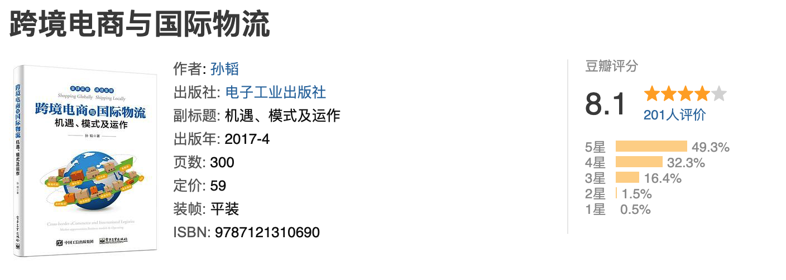​

### 2\. 跨境物流及海外仓

和上一本书是同一个作者，这本书更多地是讲海外仓相关的知识，内容依然很赞，也是一个不错的入门普及书。非常适合做跨境供应链，物流，仓储领域的朋友们多看看。

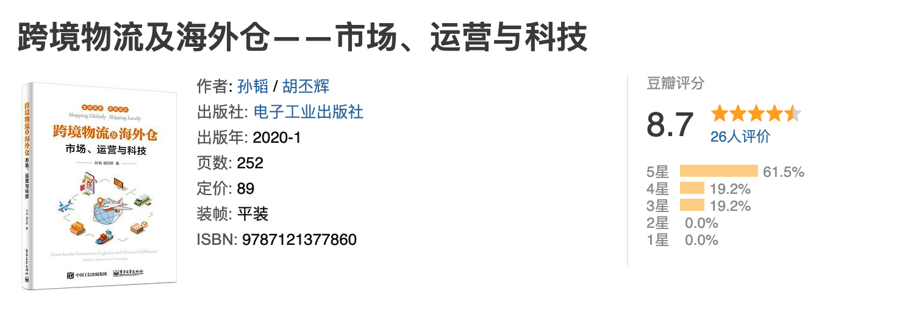

### 3\. 增长飞轮：亚马逊跨境电商运营精要

如果是做跨境ERP或者亚马逊平台相关的业务，那么这本书也很值得看看。即使是不做亚马逊的运营，也可以对亚马逊的一些规则和生态环境等有所了解。做跨境电商领域的产品，或多或少都会接触到亚马逊相关的内容，所以如果你对亚马逊的业务知识一头雾水，那么我建议可以多看看这方面的书籍，比看一些零碎的知识还是更有效果的。

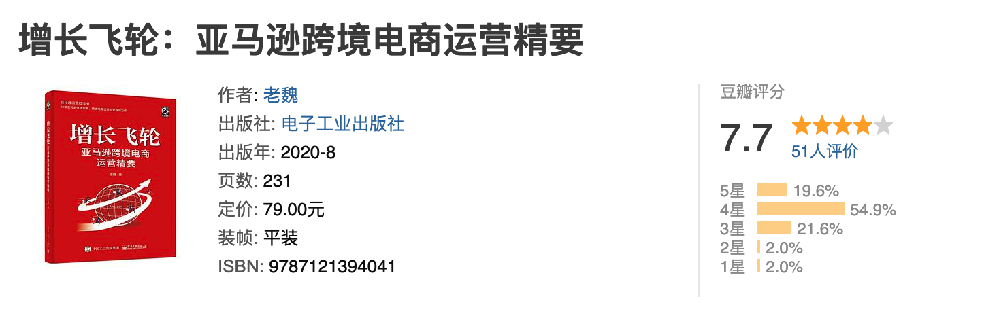

## 供应链知识篇

### 1\. 实战供应链：业务梳理、系统设计与项目实战

这是一本产品经理写的书，但是我感觉它更像是一本业务书，所以我把它归类到业务知识中。此书不仅仅详细介绍了常见的供应链领域业务知识，还配套了对应的系统设计方案，还有一些实践心得总结，一直是我力推的一本入门供应链赛道的书籍。足够的全，也足够的专业，而且对产品经理来说指导性很强，非常推荐。

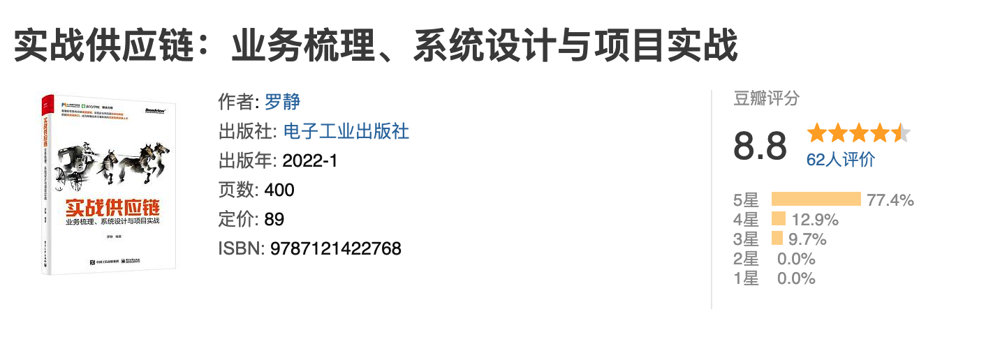

### 2\. 采购与供应链管理

刘宝红老师文笔很好，对供应链领域也有很深的研究，但是相关的书写的太多了，对读者朋友来说也是一点点小小的负担，即：不知道应该看哪一本比较好。我个人会更推荐看这一本，其他的可以看自己的时间和兴趣去选择性的阅读。

## 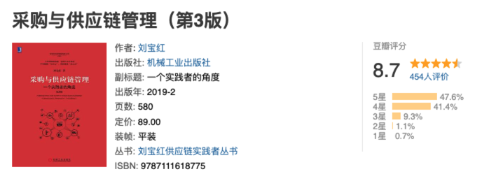

### 3\. 供应链架构师

这本书是我2022年读过的供应链类书籍中感觉很惊艳的一本，因为作者的文笔很简洁，而且很多故事和案例，读起来真的非常有趣，让你不经意间就对供应链的一些概念和知识有了兴趣。供应链其实是一个不枯燥，很有意思的领域，但是很多书籍专业术语太多， 写得太“正直”，读起来就很累了，这本书相反，用了很多案例和一些通俗易懂的叙事方式，让你对枯燥的供应链知识产生了不一样的感受。

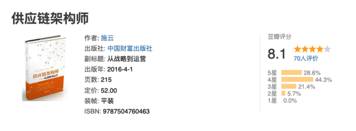

### 4\. 我看电商

这本书是10年前出版的，似乎听起来有点过时了，但是里面的很多内容和思考能帮助我们更好地理解电商的发展历程。如果要从事供应链方向，那么眼睛就不能只盯着尾端的供应链，还是要多看看前面的电商和零售的圈子是怎么打仗的。这本书也让很多圈外的人认清楚了电商及其供应链的“苦逼”本质，看似电商很赚钱，实际上都是一分一毫地精打细算省出来的钱，一旦钱没算对，那亏的就不是一点半点了。

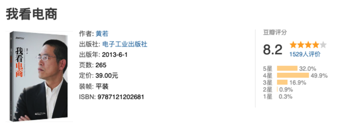  
  

## 产品知识篇

### 1\. 启示录

这是一本比较老的书，至今都过去12年了，但是我还是认为它是产品入门必读的一本书。产品经理的工作不应该狭隘地定义为画原型，写文档，开评审会……  
而是打造产品，解决客户需求，为公司创造利益，甚至是推动某些更宏观的改变和进步。如果你对产品经理的工作意义和价值感到迷茫，不妨去看看这本书。

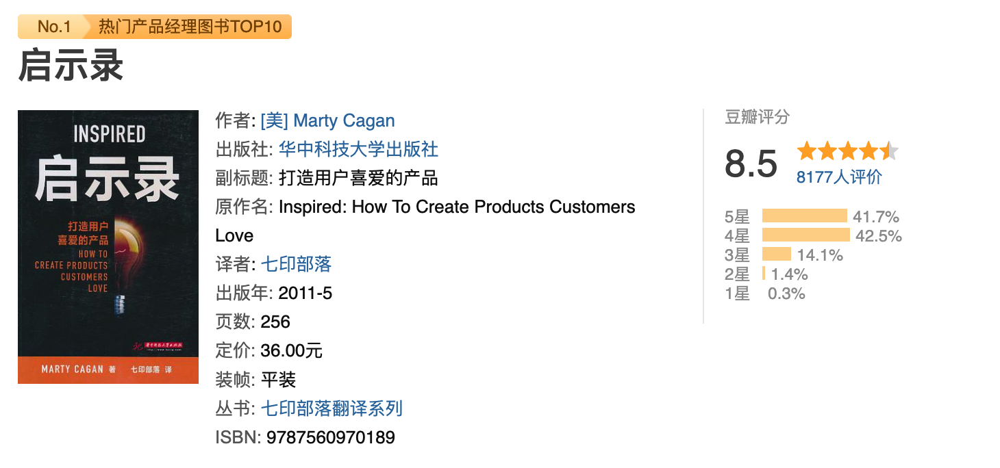

### 2\. 用户体验的要素

这是一本被“科班产品经理”或者“古典产品经理”奉为圭臬的经典之作，也是每个产品经理入门成长必不可少修行过程。它告诉我们，一款产品的体验好与坏，不仅仅是表象层的UI和视觉，更要关注从底层到表层的多个要素，而且越靠近底层的要素反而更重要。

“战范构架表”这个口诀，帮助大家更好地理解“战略层”，“范围层”，“结构层”，“框架层”，“表现层”分别是什么，及其作用是什么。

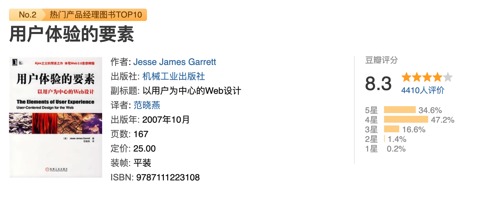

### 3\. “图解”产品：产品经理业务涉及与UML建模

如果你不会画一些业务图，你可以看这本书；如果你想学UML但是有苦恼于学了就忘、学了也用不上，那么你也可以看这本书；如果你想让自己的业务设计和建模能力更上一层楼，那么更应该看看这一本书。

太多产品经理写过“UML”相关的话题了，但是我依然觉得看文章不如看书，而此书确实是诚意之作，除了教你怎么画图，还教会你如何去做业务设计和UML建模。

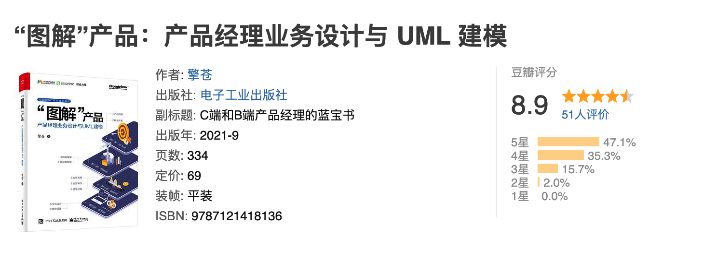

### 4\. 决胜B端

如果是要做B端领域的产品，那么对B端的一些通识类的了解还是很重要的，这本书足够的有料，可以让你快速get到B端产品的魅力。

内容很全，很丰富，而且其中CRM的部分，还有国际一线产品的优秀解决方案的拆解部分都很经典，值得反复刷一下。

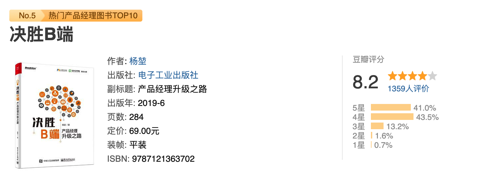

### 5\. 大话软件工程——需求分析与软件设计

这本书非常的厚，但是非常的经典，其中关于需求分析的部分值得反复阅读和揣摩，我自己看了好几遍。有一些知识逐步吃透了之后，就会领会到原来需求分析这个事情竟然是这么重要，而且还有这么多门道可以学习。

需求分析这个话题可以写一本书，软件设计这个话题大概可以写半本书，所以加在一起之后就直接有了这本书。

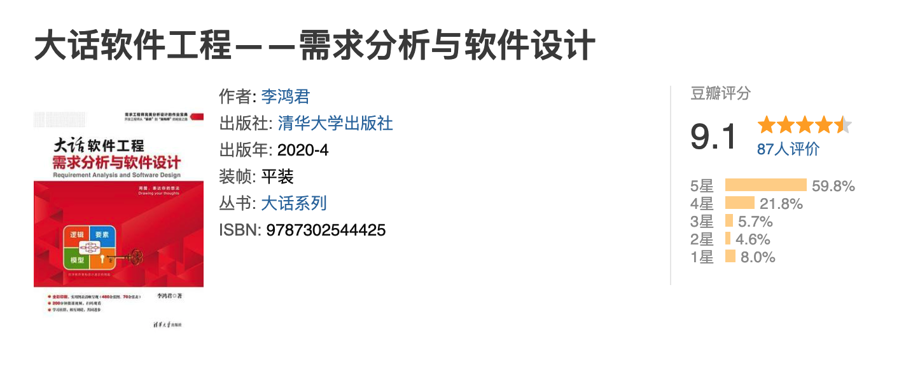

### 6\. 幕后产品

这本书非常值得推荐的一个点在于“知识深浅的精准的把控”，即书中的知识很丰富，很齐全，但是不会让你感觉泛泛谈，讲解的不深刻；也不会让你感觉过于深究，过于垂直。虽然书中大多数都是在讲解C端的案例（网易云音乐），但是背后的一些产品思考和产品理念还是可以通用的，无关乎C端还是B端。

其中有一部分关于产品经理的成长心得，也很打动我，我也非常认同“产品之路，时学时新”这句话，还是非常推荐大家去看看。

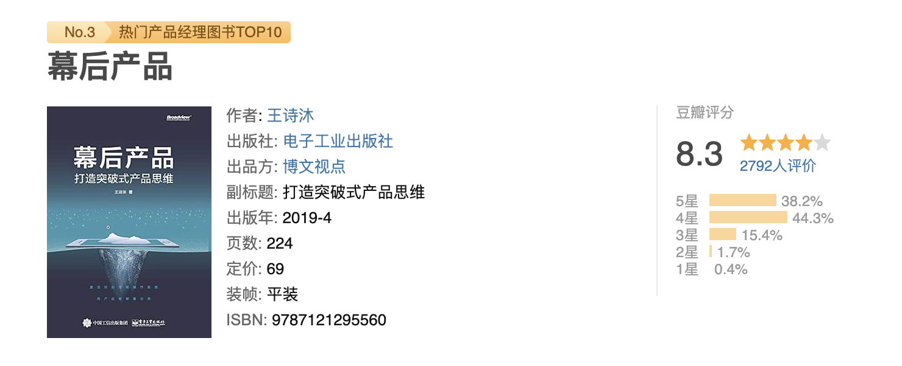

## 综合能力篇

### 写给大家看的设计书

多的介绍不说了，任何产品经理没有看过这本书，我都会难过的！

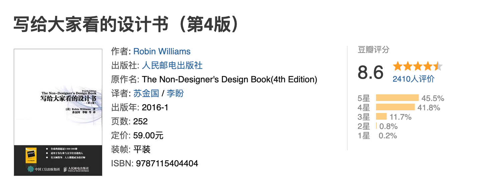

### 简约至上

《写给大家看的设计书》核心其实是四组词，分别是“对齐”，“对比”，“亲密性（分组）”，“重复”。而此书的核心恰恰也是四组词，分别是“组织（重组）”，“转移”，“删除”，“隐藏”。

如果说你没有看过《写给大家看的设计书》，我会流泪；那么你如果没有看过《简约至上》，我会感觉可惜。

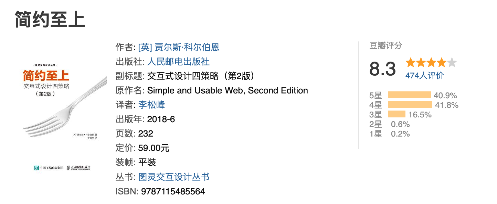

### 点石成金

一本很薄的书，可能1小时不到就能翻阅，但是此书会让我们学会一个做产品很重要的原则，那就是：别让用户思考。这句话听起来很简单，但是你却不一定吸收进去了，不信的话，可以仔细翻阅一下这本书看看。

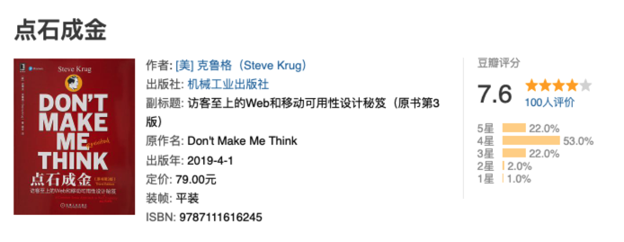

### 结构思考力

很多人会推荐看《金字塔原理》，但是我感觉它太难啃的，一个简单的知识写了太多，太绕了，我更推荐去看这本书。很早的时候，我对结构化思维没什么概念，总感觉好像这个东西很玄乎，后来看看地接触的人多了，也可以一些同事打交道的多了，我逐步发现有结构化能力的同事和没有结构化能力的同事差距还是很大的。

我开始醒悟，然后遇到了这本书。每当我在阐述一个东西，写一篇文章，出一个需求的时候，我都会提醒自己要注意结构，要注意结论先行，以上统下，归类分组，逻辑递进等结构化的原则……

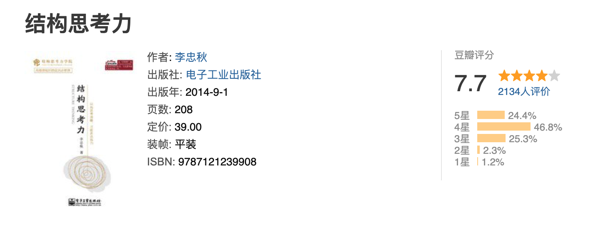

###