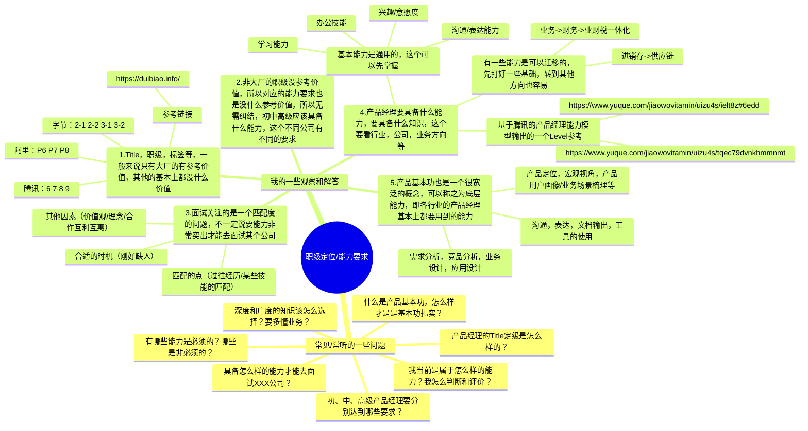
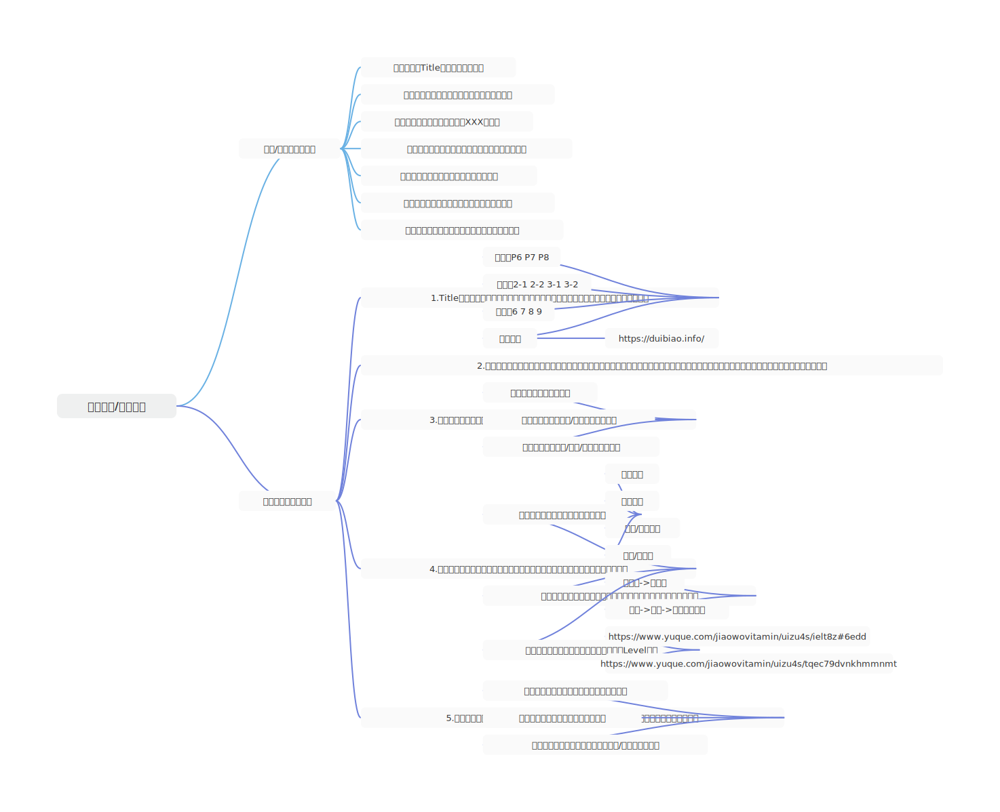
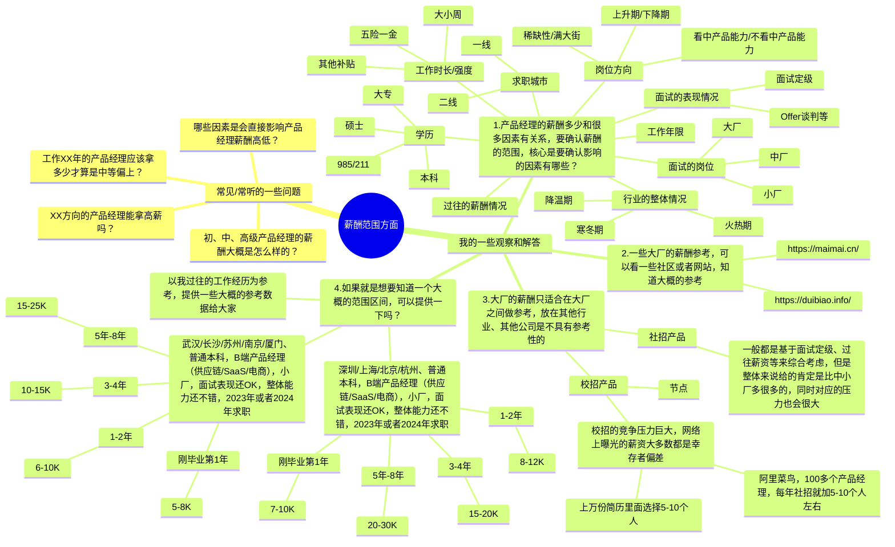
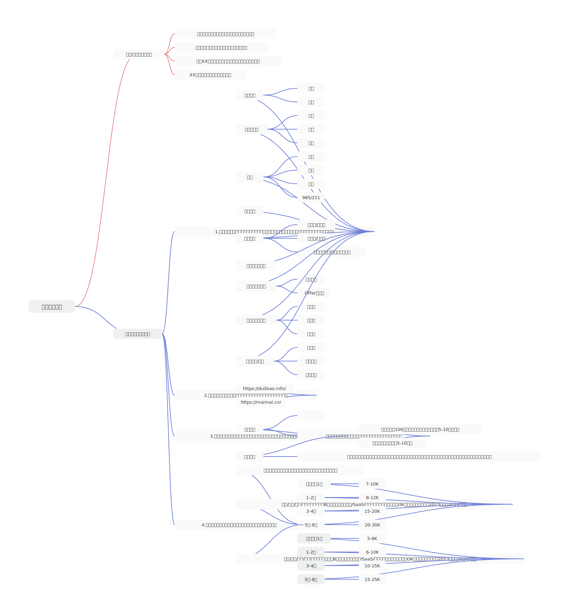
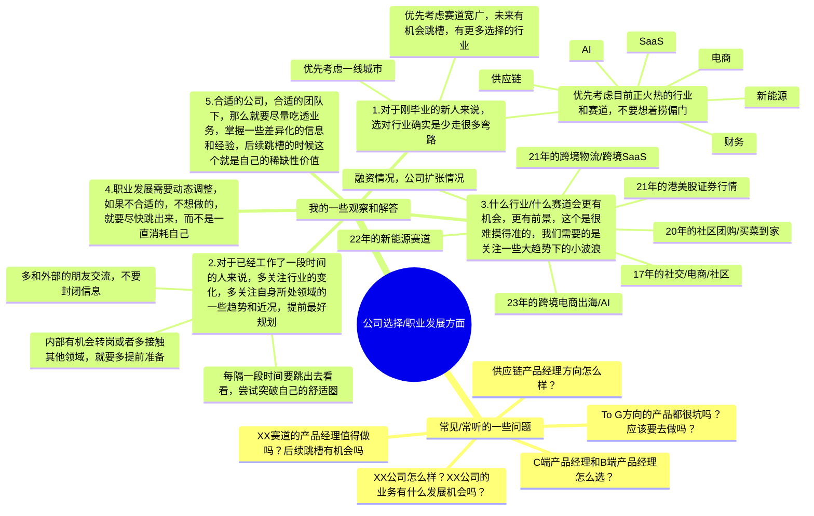
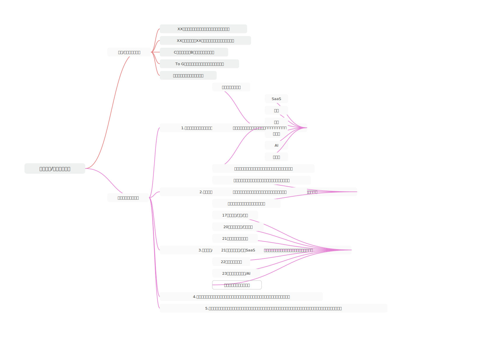
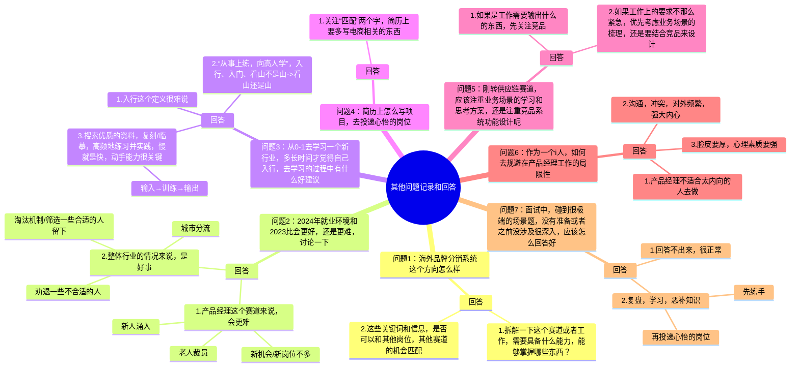
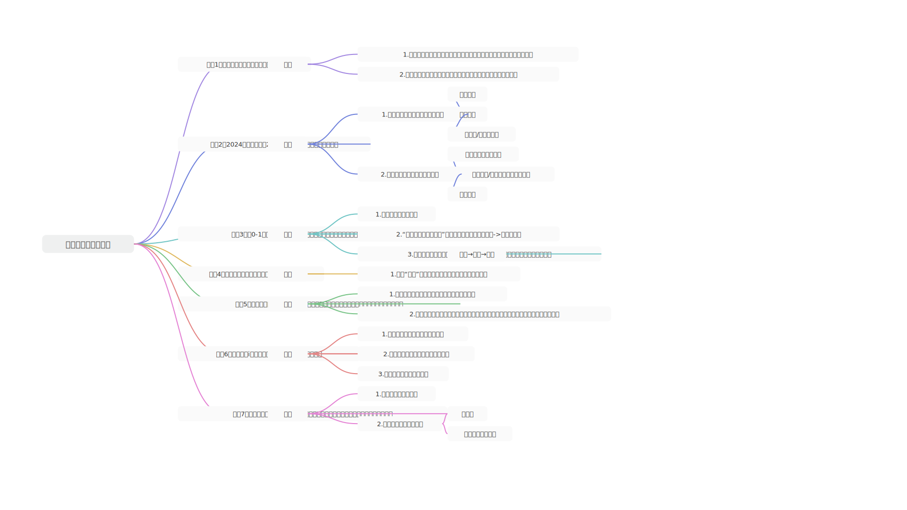
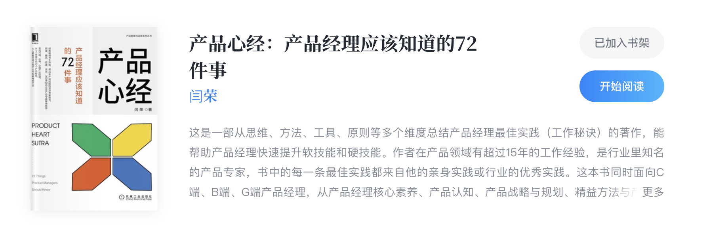

## 前言

这节课是属于求职面试课的一个番外补充内容，和求职面试有一定的关系，但是不直接影响求职面试的一些操作和结果等，我特意放在这里是为了帮助大家解答一些困惑，同时也把我自己的一些思考逻辑，决策逻辑，还有看待问题的方式一并分享一下。

这节课会相对来说轻松、简单一些，主要是一些问题解答和交流。以我自身的经历和接触的人和事为蓝本，输出相关的问题解答，仅用于给大家提供一些相关参考。

## 课件详细内容

本节课的内容会分成4个部分：

1.  职级定位/能力要求方面的问题；
2.  薪酬范围方面的问题；
3.  公司选择/职业发展方面的问题；
4.  其他高频交流的问题；

### Part1 职级定位/能力要求方面的问题

### Part2 薪酬范围方面的问题

### Part3 公司选择/职业发展方面的问题？

### Part4 其他高频交流的问题

### 课后作业

> 本节课暂无作业

## **课程答疑或补充知识**

### 答疑

1.  XXX？

> XXX

### 补充内容

**​**