## 前言

求职面试的话题我之前写过很多，也讲过很多，但是我觉得这个话题每次讲都会有一些新的感触和认知，所以这次我会给大家分享一下我最近一段时间对简历，对面试的一些理解和思考，是一些更新鲜的内容，也会拆解的更加细节和体系化一些。

我会将写简历和投递简历拆分成不同的课程，这节课我们就是重点讲讲怎么写简历，怎么让自己的简历更吸睛，让HR或者面试官快速锁定关键词，对你产生兴趣。下节课，再来聊聊怎么投递简历，怎么确保自己的简历可以在一片“卷海”中更容易被看到，更大概率地被HR阅读完全文……

## 课件详细内容

本节课的内容会分成3个部分：

1.  求职到入职的各个阶段拆解；
2.  制作你的“1+N”简历；
3.  简历的编写；

### Part1 求职到入职的各个阶段拆解

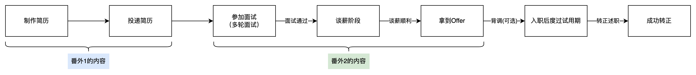

我们的目的是最终成功入职并且通过试用期，从上图可见要经历的环节还是挺多的，而且这些环节基本上和漏斗模型一样，会层层递减，机会会越来越少，所以要增加最后的几率，在开头的几率就要提高。

> 1.  简历制作很重要，怎么投递也很重要，在简历上多花时间就是增加自己后续的成功几率；
> 2.  简历上你的成绩一定要比你实际工作的能力更高一个档次，可以简单理解为“简历上的自己是Pro Max版本”，“面试过程中的自己是Pro版本”，“真实的自己则是标准版”；
> 3.  简历的制作看似简单，实际也很费心力，需要有耐心地对待，也要有不断迭代和打磨的意识，一版简历不够，就多写几个版本；

### Part2 制作你的“1+N”简历

1.  什么是1+N简历？

> 1+N中的1表示的就是1份最全的过往经历的简历，把过往所有的工作的公司，所有的项目无论是2B的还是2C的都写下来；
> 
> N表示就是要准备多份求职方向的简历，例如你可能想做跨境ERP，想做海外仓WMS，想做泛B端的SaaS产品，想做国内供应链方向的产品经理，如果此时你只用一份简历去投递肯定是不太合适的，所以你需要准备多份简历。
> 
> 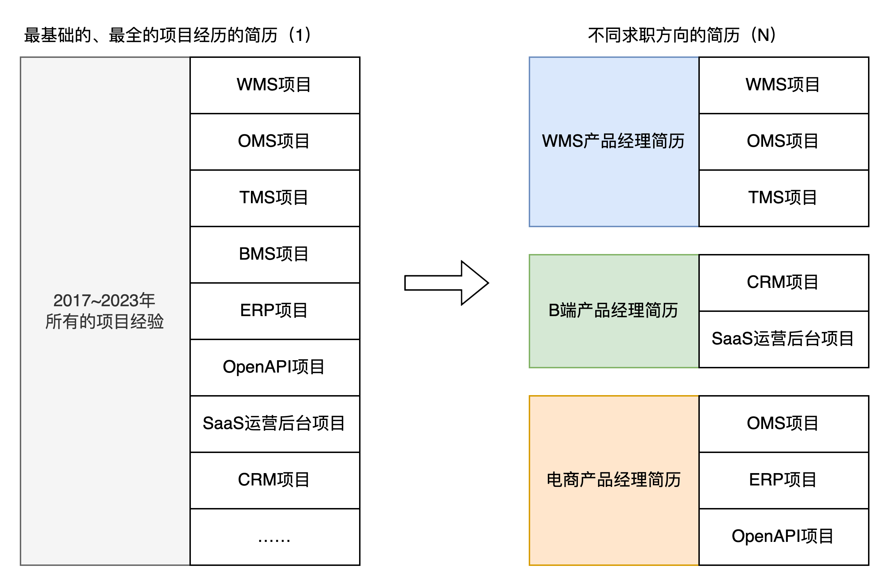
> 
> 在写多个方向的求职简历的时候其实就可以从刚开始的“1”这份简历中去选择内容，然后多段经历拼凑成一份新的方向的简历即可。

2.  每过一段时间就要更新自己的“1”简历

> 很多人写简历的时候最痛苦的点就是写自己过去几年前公司和项目，有很多东西记忆不起来了，也不想不起来有什么亮点，成绩和内容等，最后导致简历写出来就平平。
> 
> 可以定期（1年1次/半年1次）去更新自己那份“1”的简历，把过往的项目经历都沉淀下来，后续要用的时候直接从知识库中调用即可。
> 
> 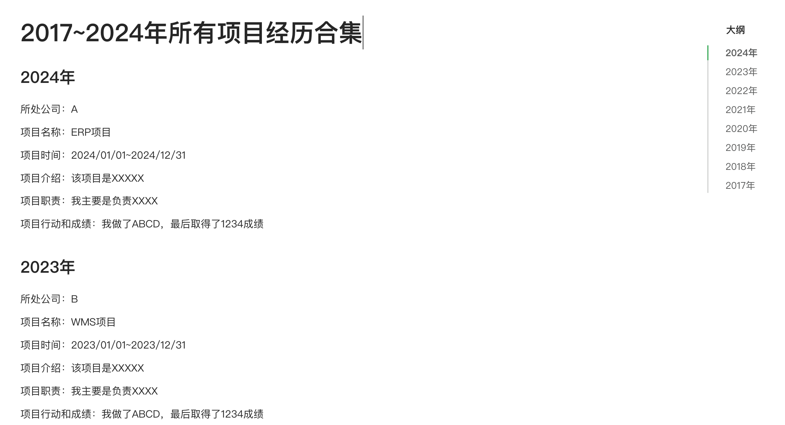
> 
> P.S **养成自己的知识库沉淀非常重要，很多碎片化的信息要用笔记记录起来，未来一定是会有很大的帮助的**。

3.  简历应该用什么工具写？用什么模板？

> 如果对自己的排版能力，设计能力有信心的话，建议自己用Word或者是语雀等编辑器进行排版布局就好了。
> 
> 如果对这一块的能力不够有信息，也想做一个好看一些简历，那么就建议用一些付费的简历模板吧，花个几十块钱也可以剩下自己很多时间精力。
> 
> [职徒简历52cv-免费简历模板下载|中英文简历模板|智能求职简历工具](https://www.52cv.com/)
> 
> [简历模板下载-个人简历模板-个人简历模板免费下载 - 超级简历WonderCV](https://www.wondercv.com/jianlimoban/)
> 
> [简历攻略_知页简历](https://www.zhiyeapp.com/cv/guide)

### Part3 简历的编写

#### 3.1 简历怎么写？

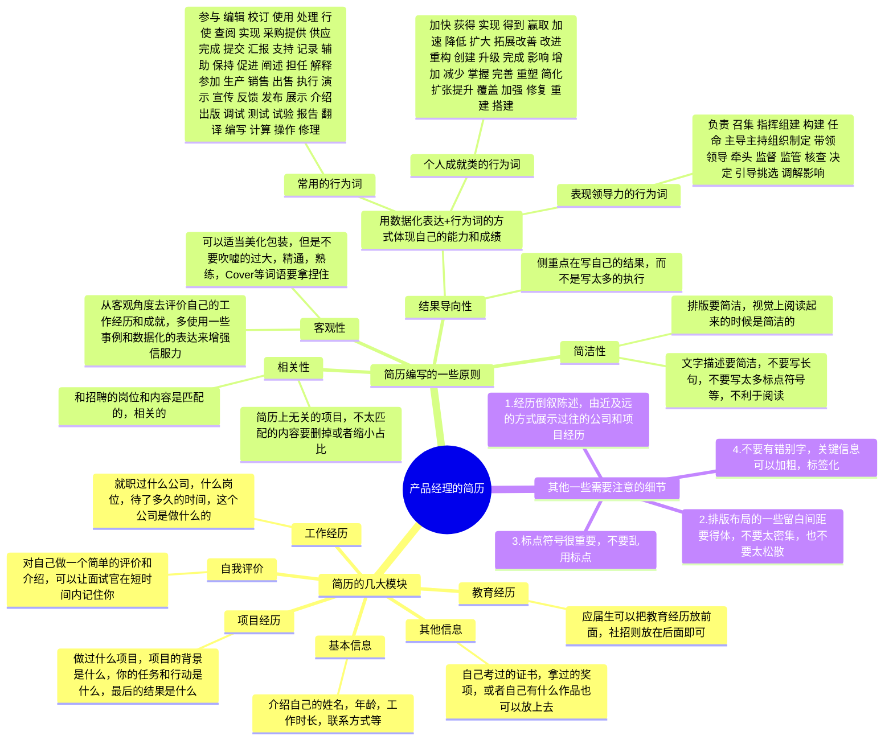
```mermaid
mindmap
  root((产品经理的简历))
    简历的几大模块
      基本信息
        介绍自己的姓名，年龄，工作时长，联系方式等
      自我评价
        对自己做一个简单的评价和介绍，可以让面试官在短时间内记住你
      工作经历
        就职过什么公司，什么岗位，待了多久的时间，这个公司是做什么的
      项目经历
        做过什么项目，项目的背景是什么，你的任务和行动是什么，最后的结果是什么
      教育经历
        应届生可以把教育经历放前面，社招则放在后面即可
      其他信息
        自己考过的证书，拿过的奖项，或者自己有什么作品也可以放上去
    简历编写的一些原则
      相关性
        和招聘的岗位和内容是匹配的，相关的
        简历上无关的项目，不太匹配的内容要删掉或者缩小占比
      简洁性
        排版要简洁，视觉上阅读起来的时候是简洁的
        文字描述要简洁，不要写长句，不要写太多标点符号等，不利于阅读
      客观性
        可以适当美化包装，但是不要吹嘘的过大，精通，熟练，Cover等词语要拿捏住
        从客观角度去评价自己的工作经历和成就，多使用一些事例和数据化的表达来增强信服力
      结果导向性
        侧重点在写自己的结果，而不是写太多的执行
        用数据化表达+行为词的方式体现自己的能力和成绩
          常用的行为词
            参与 编辑 校订 使用 处理 行使 查阅 实现 采购提供 供应完成 提交 汇报 支持 记录 辅助 保持 促进 阐述 担任 解释参加 生产 销售 出售 执行 演示 宣传 反馈 发布 展示 介绍出版 调试 测试 试验 报告 翻译 编写 计算 操作 修理
          个人成就类的行为词
            加快 荻得 实现 得到 赢取 加速 降低 扩大 拓展改善 改进重构 创建 升级 完成 影响 增加 减少 掌握 完善 重塑 简化扩张提升 覆盖 加强 修复 重建 搭建
          表现领导力的行为词
            负责 召集 指挥组建 构建 任命 主导主持组织制定 带领领导 牵头 监督 监管 核查 决定 引导挑选 调解影响
    其他一些需要注意的细节
      1.经历倒叙陈述，由近及远的方式展示过往的公司和项目经历
      2.排版布局的一些留白间距要得体，不要太密集，也不要太松散
      3.标点符号很重要，不要乱用标点
      4.不要有错别字，关键信息可以加粗，标签化
```

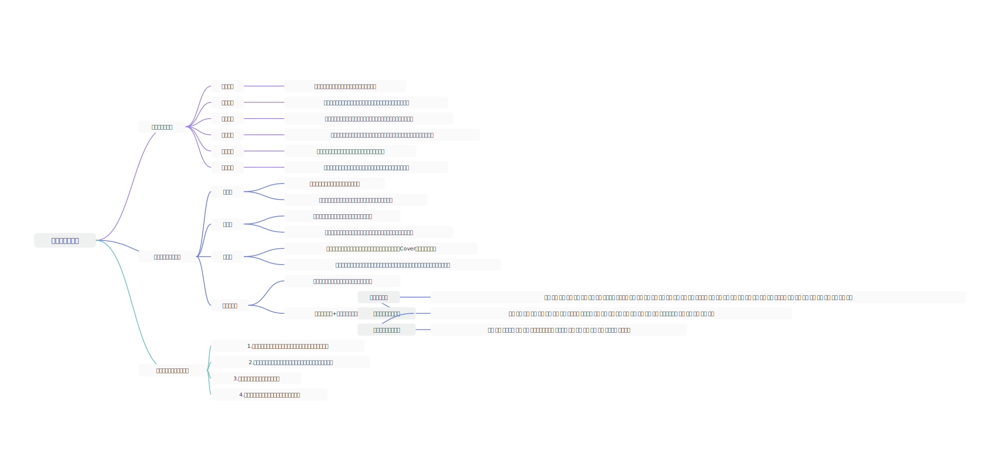
[链接](https://www.yuque.com/jiaowovitamin/uizu4s/ekewckkrk9oc9irm)[链接](https://www.yuque.com/jiaowovitamin/uizu4s/zugaak7ag9r28vsw)

#### 3.2 简历中可优化的点讲解

| 列 1 | 列 2 |
| --- | --- |
| 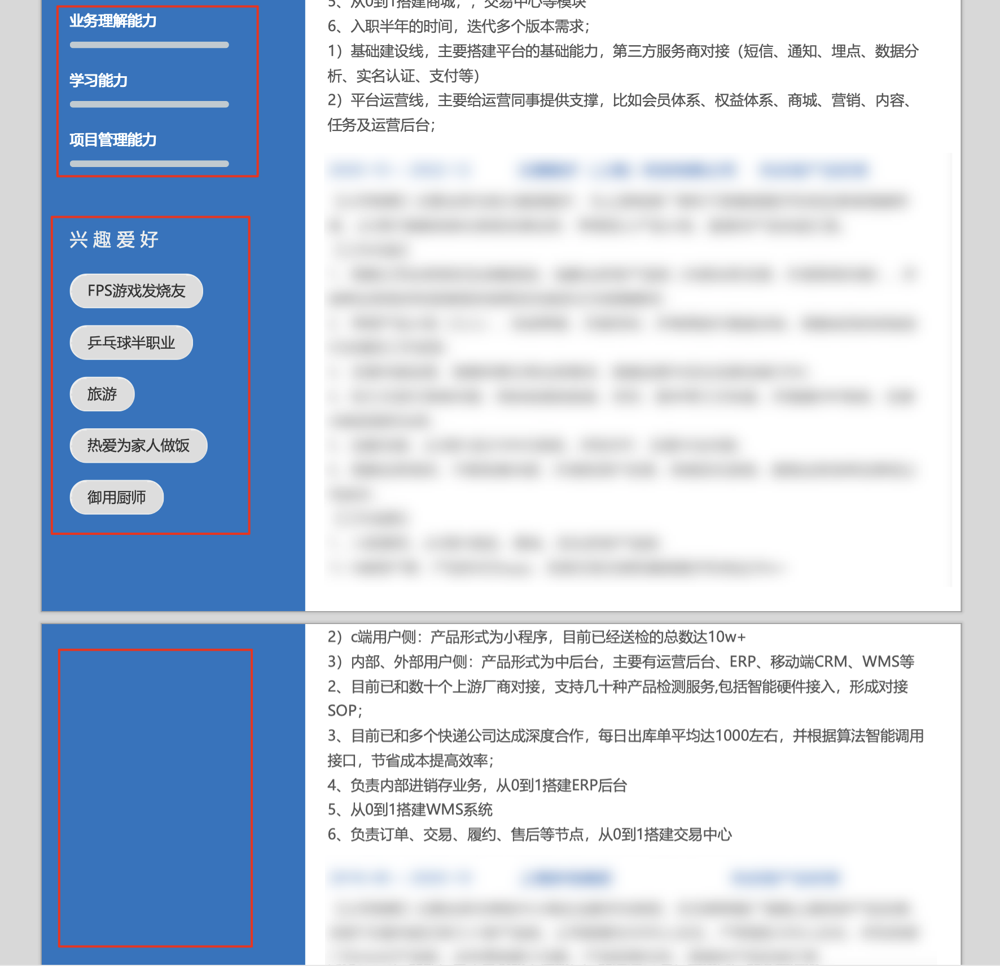 | 1.  不合适的简历模板，降低阅读体验，降低信息获取的密度  2.  业务理解能力，学习能力，项目管理能力都是不能量化的，用这种形式表达是属于“无效表达”  3.  相关的兴趣爱好和工作关系不大，所以展示这个也是“无效表达” |

| 列 1 | 列 2 |
| --- | --- |
| 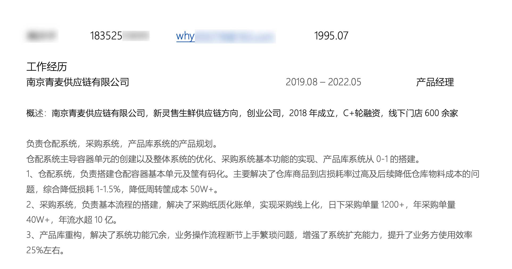 | 1.  个人基础信息排版太简陋了，给人一种感觉信息不够的感觉；  2.  中间没有自我评价或者概述的部分，直接就到了工作经历，感觉有点突兀；  3.  简历的模板不好，字体大小，颜色，间距，布局等都看起来怪怪的； |

| 列 1 | 列 2 |
| --- | --- |
| 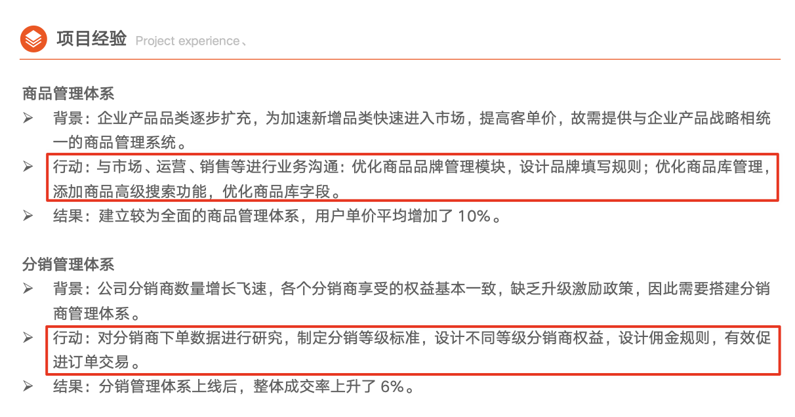 | 1.  单独看项目经历，好像用了STAR法则，但是细读之后没有具体匹配的行动和细节，也没有一些关键词，让人感觉不出这个是产品经理的简历，还是运营，还是业务？  2.  搭建某某体系，听起来就不像是产品经理做的事情，没有用相关的术语和关键词，就会让面试官看不到想要的东西。产品经理应该是搭建某某系统，设计某某模块，设计某某功能，然后满足某某需求等，这些才是关键词。 |

| 列 1 | 列 2 |
| --- | --- |
| 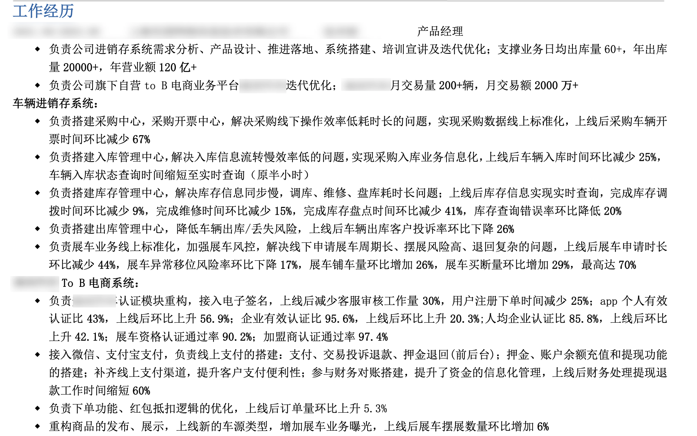 | 1.  很多数据，很多数字，但是太多的信息也会造成干扰，让人不知道应该看什么。  2.  太多的夸张的数据也让人怀疑，这么多数据，怎么得出来的？是真的，还是假的？而且都是产品经理的成绩吗？  3.  没有突出重点，太乱了。 |

| 列 1 | 列 2 |
| --- | --- |
| 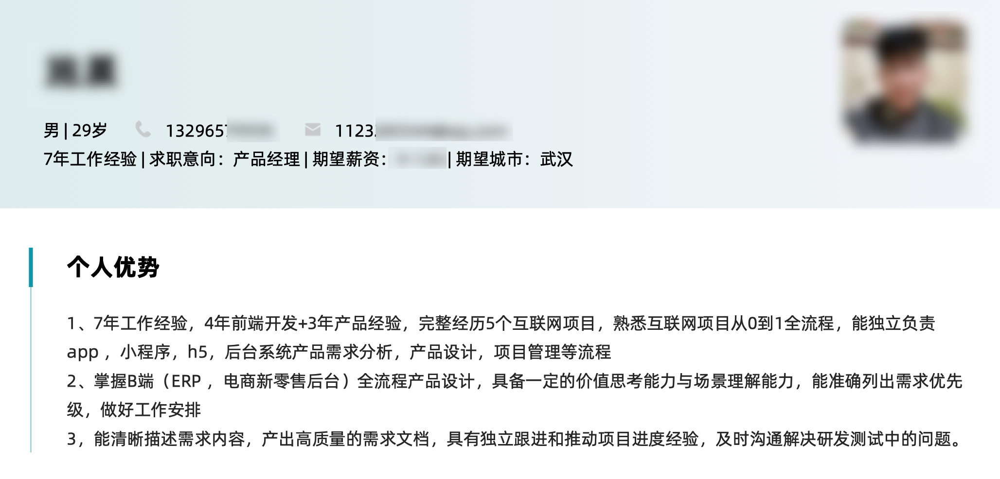  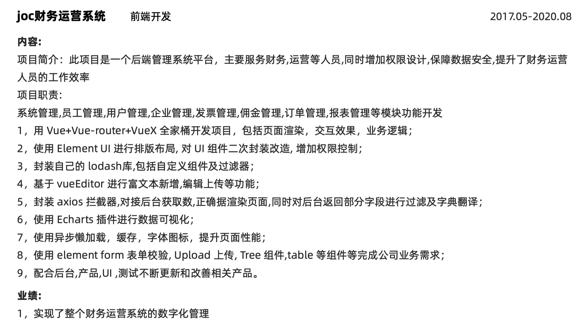 | 1.  简历格式、模板等是挺好的，没有什么大问题  2.  个人优势，也就是自我评价阶段，感觉第二条和第三条不够有吸引力，没有画面感，没有这种说服力  3.  既然求职意向是找产品经理，那么最开始的前端的项目经历其实就没必要写了，因为和产品不搭边  4.  我建议可以在自我评价阶段补充上自己为什么转行到产品，然后优势是什么？在日常工作中有研发经验能带来什么好处？ |

| 列 1 | 列 2 |
| --- | --- |
| 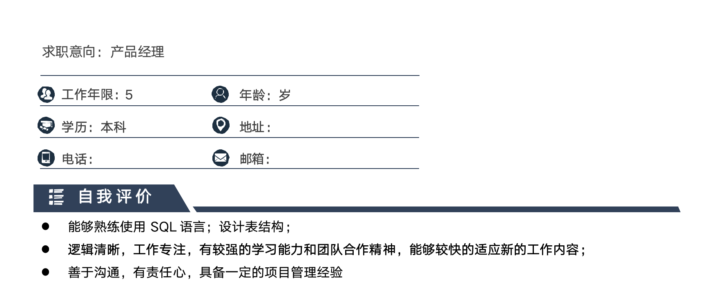  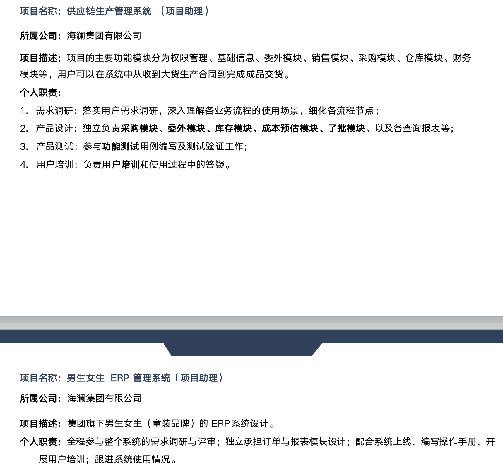 | 1.  自我评价部分有效信息太少，浪费了黄金位置，没有发挥出作用来；  2.  第一段工作经历是供应链项目的实施，但是在项目经历上花了2段内容去展示供应链系统项目助理和实施相关的内容，而没有体现产品方面的内容；  3.  项目介绍中没有按STAR法则来写，感觉看不出来自己的能力和价值有多少；  4.  项目所处的时间范围没有写出来，缺少真实感； |

| 列 1 | 列 2 |
| --- | --- |
| 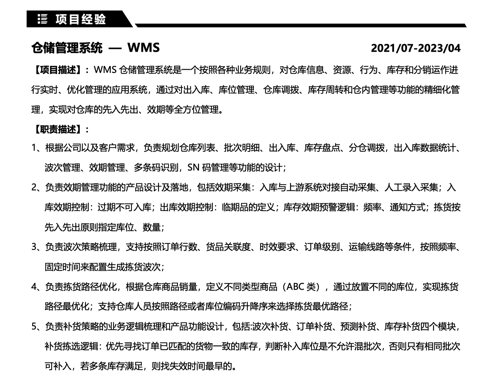  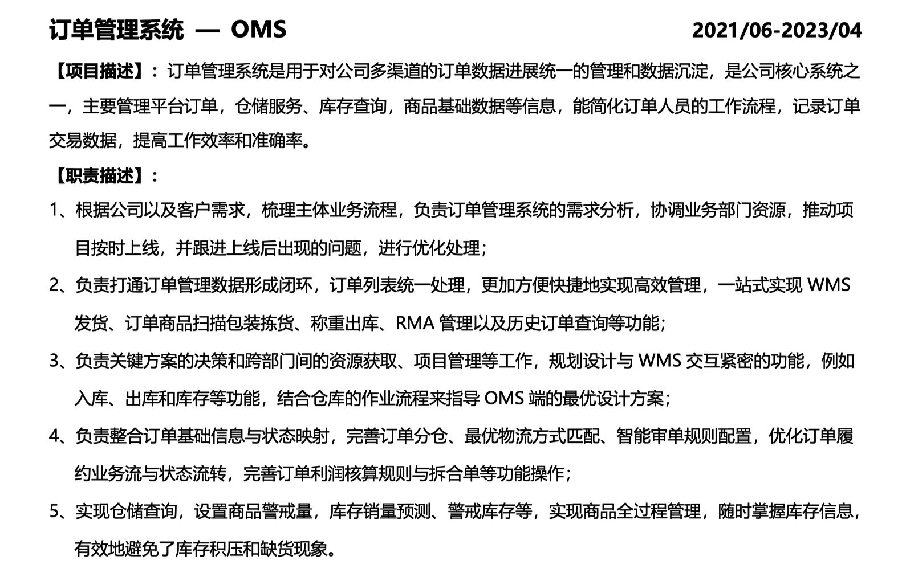 | 1.  项目经历写的比较好，很细节也很完善，初看的时候感觉非常匹配，但是也有一些隐性的风险；  2.  WMS是一个比较复杂而且庞大的系统，但是这个项目中写了入库，出库，库存，效期，波次，拣货路径，补货策略等，内容看似很多，但是其实不是结构化的呈现。一般来说按入库模块、出库模块和库内操作模块来写，然后每一层写细一些也没问题。这个项目经历太丰富了，在面试的时候很有可能会被卡住，因为写得越多越容易被人问住，如果自己这一块没有掌握到位，就很容易面试失败。  3.  OMS的项目也类似，写得很丰富，这个是优势，但是具体的模块没有结构化，然后琐碎的内容太多了，会导致很容易面试的时候被面试管问住。  4.  项目内容执行动作写的很多，但是没有提前出太多的结果和成绩，没有看出来水平的高低。 |

#### 3.3 一些优秀的简历借鉴

| 列 1 | 列 2 |
| --- | --- |
| 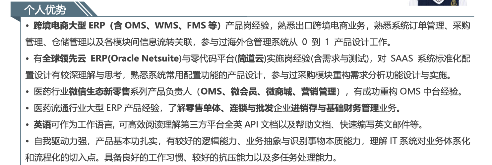 | 1.  个人优势中的关键词都加粗标记，让面试官迅速知道你过往做过什么，能匹配什么 |

| 列 1 | 列 2 |
| --- | --- |
| 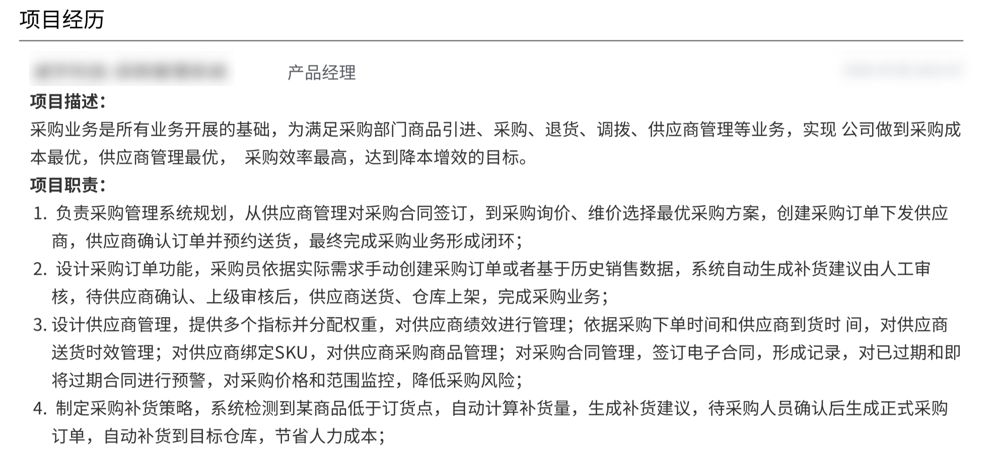 | 1.  项目背景，职责等都写出来了  2.  美中不足的是没有对一些关键词加粗，标记，还少了一些成绩的补充 |

| 列 1 | 列 2 |
| --- | --- |
| 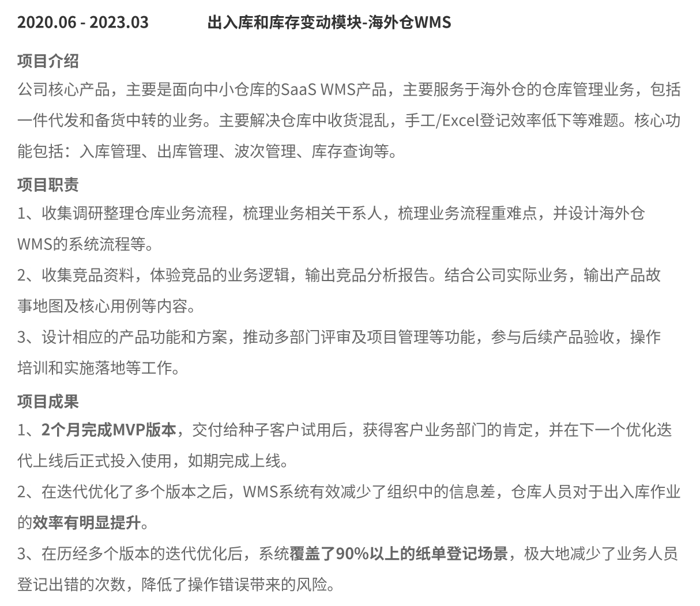 | 1.  项目背景，职责，成绩，关键动作，关键词加粗等都到位了 |

| 列 1 | 列 2 |
| --- | --- |
| 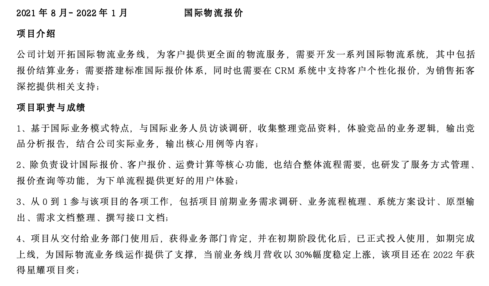 | 1.  项目背景，职责，成绩，还有一些具体的行动方案都有  2.  美中不足的是没有对一些关键词加粗，标记 |

| 列 1 | 列 2 |
| --- | --- |
| 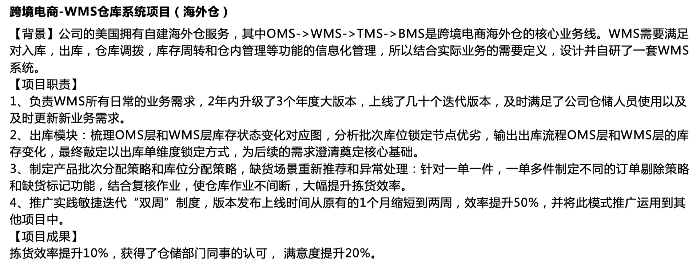 | 1.  这是一份负责整个系统的项目经历，没有过多写具体实操动作，而是突出了一些成绩和数据上，也是另一种写项目经历的方式  2.  成绩有点太碎，太小，没有宏观的成绩表现  3.  美中不足的是没有对一些关键词加粗，标记；同时文字间距过密，阅读体验不太好 |

### 课后作业

> 根据今天所学的内容，整理出自己的“1+N”简历，也可以针对过往的简历进行一波优化，可以将自己优化前和优化的简历放在评论区中。

## **课程答疑或补充知识**

### 答疑

1.  简历美化是不是很容易被面试官或者HR看出来？

> 简历美化这件事主要是看程度，如果是真实的公司和真实的项目，但是你“夸大”你说负责的项目和内容模块，那么这个一般不容易被看出来，主要自己在面试聊项目的时候多往自己熟悉的部分引导即可。
> 
> 如果是有虚拟的公司和虚拟的项目，那么确实就比较容易被看出来，所以建议大家要做到“虚实结合”，而不是一眼假或者是完全答不上来。

2.  简历中有一些项目内容或者是表达，不知道怎么写，有什么好办法吗？

> 其实文字润色，还有一些灵感是获取，最合适做的就是AI，所以遇到了这样的困扰的时候，可以求助一下AI工具，国外的推荐用ChatGPT或者Poe，国内则可以用钉钉个人版或者是文心一言。

3.  如果自己是入职的是大公司下的子公司，那么简历上应该写什么公司？

> 写简历的时候，如果是签约大公司的子公司，简历上要写大公司的title，这样才不会浪费展示自己的机会。
> 
> XXXX有限公司 产品经理 开始日期~结束日期
> 
> 公司介绍：合同签约的公司主体是XXXX有限公司下的子公司XXXX（技术公司），但是和总公司一起办公，业务互通。

### 补充内容

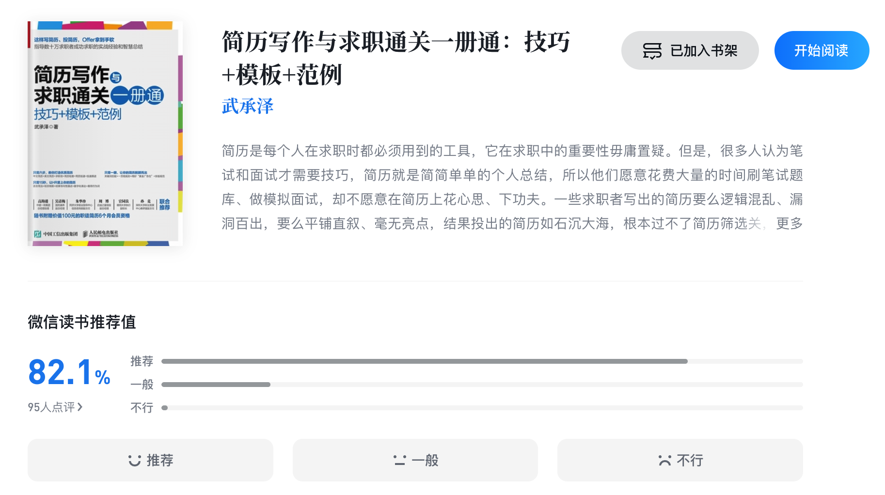