## 前言

简历写完了之后， 接下来就是要投递简历了，虽然说投递简历这件事比较简单，但是我觉得还是有一些细节可以讲讲。因为现在已经不是那种一份简历投递出去，一堆面试电话就打过来的时代了，每次投递一份简历都是要“精细化运营”，要看到结果，要看到数据呈现的。

所以，比拼的就是“精益求精”，比拼的也是“谁更加细节”。

## 课件详细内容

本节课的内容会分成3个部分：

1.  简历投递的几种方式；
2.  简历的流转过程是怎么样的？
3.  Boss直聘简历的投递技巧；

### Part1 简历投递的几种方式

一般来说，常见的简历投递有这么几种方式：

1.  招聘网站上直接投递
2.  找猎头投递
3.  内推链接投递
4.  公开求职的邮箱投递
5.  微信私聊投递

我个人最推荐的是“内推链接投递”和“微信私聊投递”，这两个渠道往往都会给反馈，起码知道自己的简历到底有没有投递过去，有没有什么结果。

退而求其次的方式是“找猎头投递”，起码有什么进展或者反馈还可以问问猎头，不至于石沉大海。

> 猎头公司的收费方式和普通的中介有所不同，猎头公司是不向个人收取费用的，而是向企业收取费用。 通常来讲，正规猎头公司的收费标准都是按照按照国际上的通行行规，猎头成功委托客户要支付**首年年薪的20%到40%作为佣金**。
> 
> 对求职者来说没什么成本，但是对于招聘方来说要付出的成本很高，所以走猎头进来的人招聘方会多看一层预算的维度，如果太贵了或者预算不足了，可能会考虑放弃。所以，找猎头投递，也可能是一种“甜蜜的负担”。

最后的选择方式才是“招聘网站上直接投递”和“公开的求职邮箱投递”，这两种投递方式可能都不会有回信，作为求职者是处于被动地位的。

### Part2 简历的流转过程是怎么样的？

简历写好了之后，是怎么流转到HR手里和面试官手里的呢？不同的投递方式，不同的投递渠道流转的过程也不太一样，而了解这个流转过程，其实就是类似于一种精细化运营，让自己的简历尽可能的凸显出来，提升自己简历被看到，被完整浏览的几率。毕竟只有HR和面试官真的阅读了简历，然后看完了相关的内容之后，才有可能会私聊你，让你去面试……

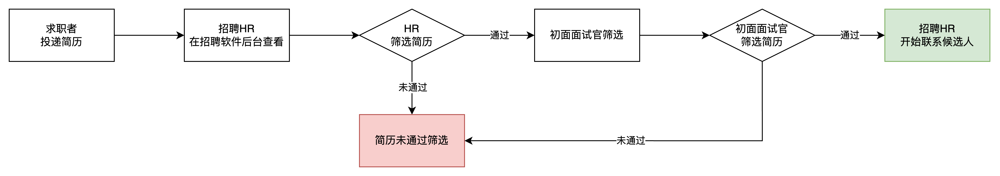

1.  招聘HR主要是筛选一些硬性条件相关的指标，还有一些关键词的匹配。由于HR没具体做过产品经理，所以他并不知道谁是大佬，谁是菜鸡，主要还是通过一些简历的关键词来判断。

1.  硬性条件：学历，年龄，性别，薪资预期，工作时长，从事方向等；
2.  其他关键词：公司名称，业务方向，项目经历，过往成绩等；

2.  初面面试官筛选的时候那就会更加精细化一些，主要还是根据岗位JD来筛选，重点看的还是产品经理的过往工作经验和项目经历，还有一些亮点和优势等。

1.  过往经验：做过什么领域，什么方向，赛道是否吻合；
2.  项目经历：做过什么系统，有掌握什么业务知识，有相关成绩吗？
3.  亮点和优势：看自我评价，看是否有什么突出的特质；

简历除了求职者主动投递之外，也有很大一部分是HR主动去平台挖掘，筛选的简历，这一部分主要是在招聘软件后台买一些道具或者是用一些关键词去缩小筛选范围。

| 列 1 | 列 2 |
| --- | --- |
| 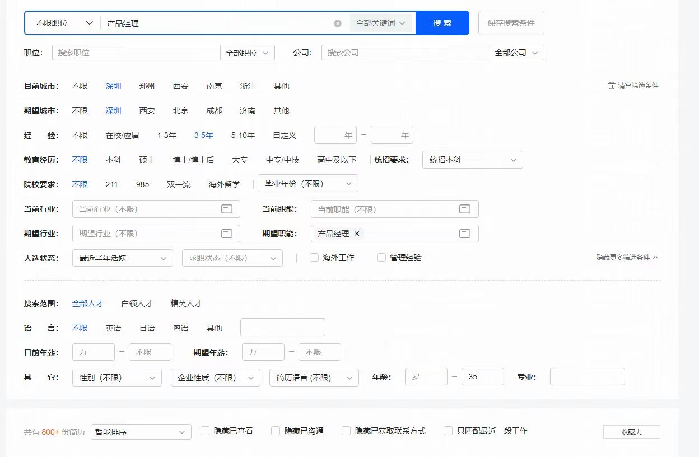 | 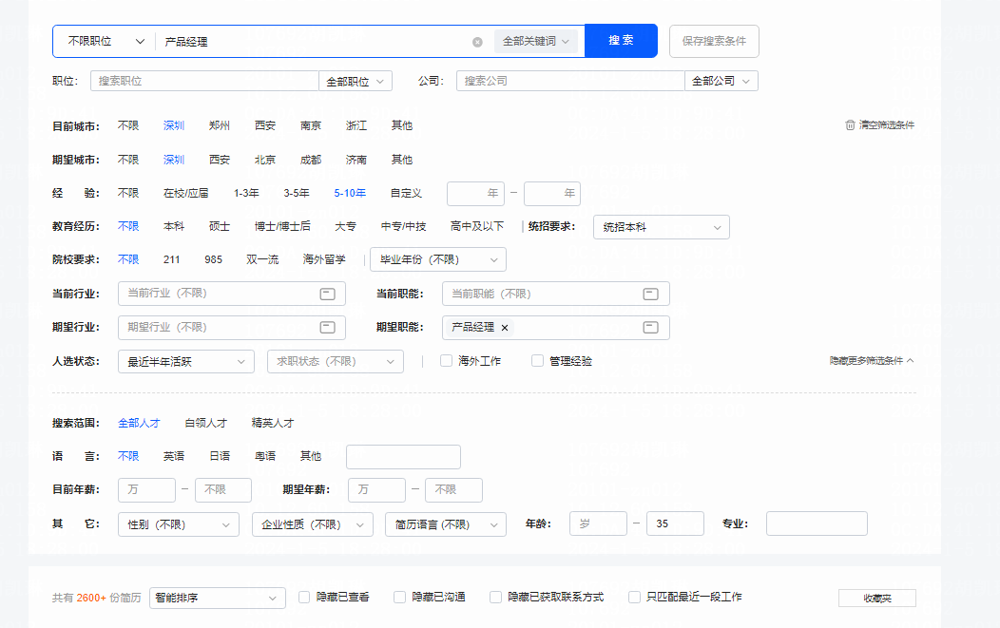 |

### Part3 Boss直聘简历的投递技巧

#### 3.1 Boss直聘HR端的一些细节

1.  HR看简历的时候不能直接看到附件的内容，所以都是看到自己写在Boss直聘上的内容，这些内容会被概览成一个更简洁版的介绍，自己在Boss直聘APP上也可以看到。

| 列 1 | 列 2 | 列 3 |
| --- | --- | --- |
| 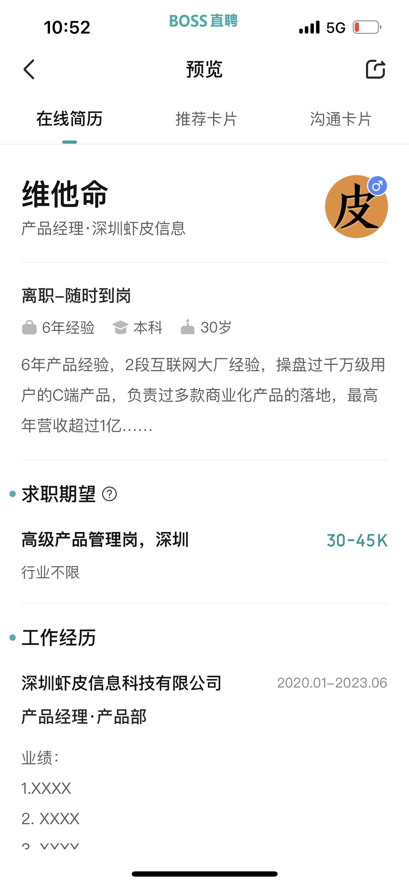 | 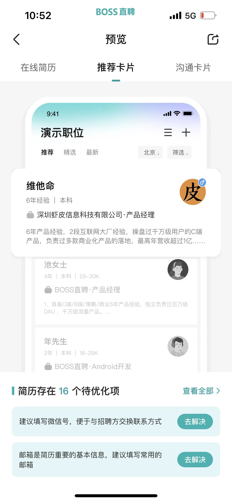 | 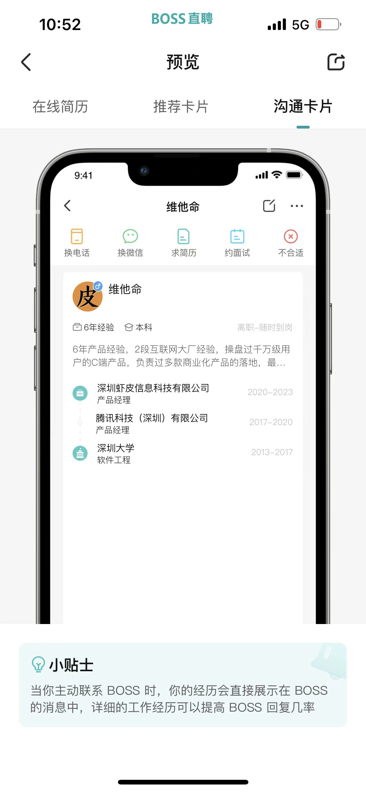 |

2.  HR看到的是一些标签，一些快速识别你是谁的东西，这些标签有一些是自己编写的，有一些是系统自动判断的，例如名校，学校排行，名企等；所以如果系统自动判定这一块我们可能没什么优势，那么就要自己手动去写一些标签，让HR通过标签快速了解我们。
3.  **在线简历和附件简历都非常重要**，甚至是在打招呼的时候基本都是看在线简历，还有一个作用就是可以提升自己的搜索曝光量，很容易被系统推荐给其他合适的HR，所以在线简历要写的丰富一些，可以和简历附件有一些不太一样的；
4.  Boss可以看到你的操作，收藏岗位，查看了其他岗位，打了招呼等，如果你对这个公司很感兴趣之类的对方也是看得到的；
5.  如果你的简历中有空窗期，软件会自动提醒；如果爽约次数过多，软件也会提醒；
6.  Boss打招呼是要花钱的，所以HR会先收藏你，而不是直接打招呼；已读不回大概率是岗位不招了或者暂时先搁置，等后续还需要找人的时候再启用这个岗位，而不是直接发布一个新的岗位；

#### 3.2 简历的投递

在2023年的行情之下，很多人求职找工作的时候就会发现自己经常遇到HR已读不回，甚至都不读。已读不回有很多种原因和可能，所以为了提升自己简历筛选率，第一优先还是建议：**内推**。

所以大家可以多加一些行业交流群，产品经理交流群等，然后看到有内推机会的时候可以主动出击，争取简历直达HR或者面试官。

除了内推之外，目前来看最合适产品经理招聘的APP估计就是Boss直聘了，市场占用率很高，很多公司使用，所以优先考虑在Boss上投递；其次就是可以在猎聘网上投递，留下一些个人简历和求职意向等，系统会推荐一些猎头联系你，然后多加几个猎头的微信，也可以了解其他的一些机会。

因为打招呼的对话是**按时间顺序排序排的**，类似我们的微信一样，如果有很多人找你，那么最近找你的人对话框在上面，所以尽量可以在HR刚上班的时候投递，这个时候它刚打开软件，所以会看到的几率更大。

| 列 1 | 列 2 |
| --- | --- |
| 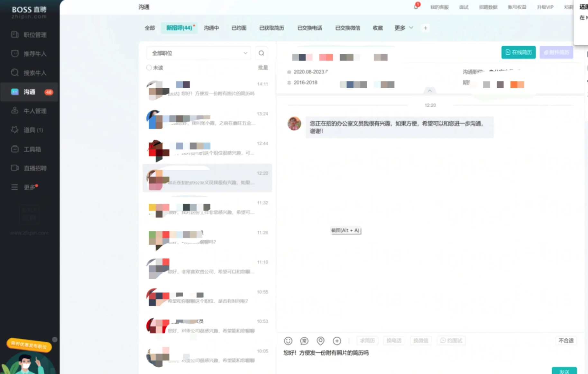 | 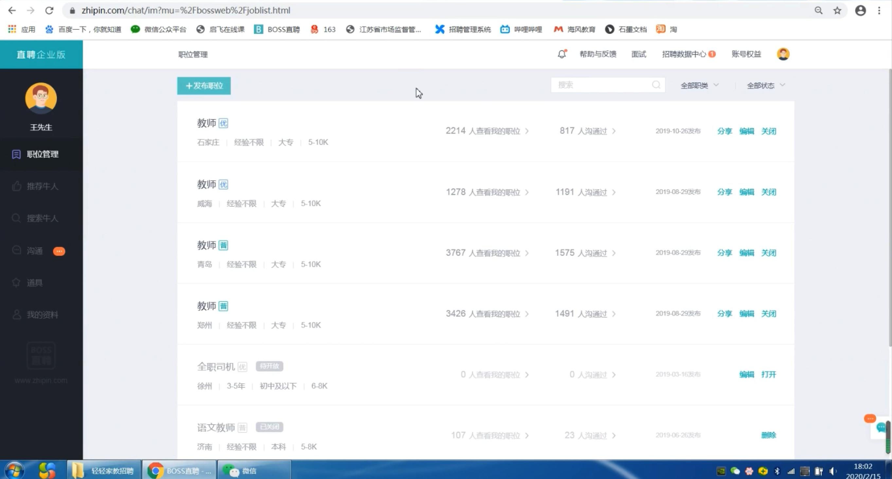 |

#### 3.3 做有“记忆点”的求职者

很多求职的朋友都会遇到HR的已读不回的情况，有些时候是确实自己的经历和岗位要求不太匹配，也有些时候是自己没有做一个有“记忆点”的求职者，所以导致在茫茫多的人群中不容易被HR关注到。​

| 列 1 | 列 2 |
| --- | --- |
| 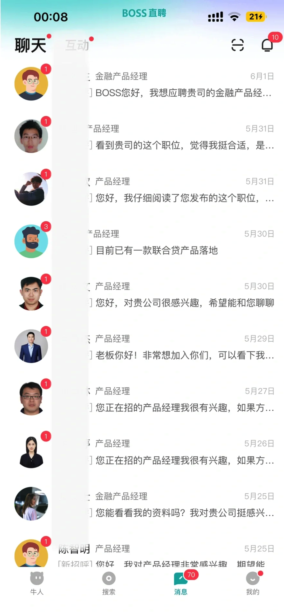 | 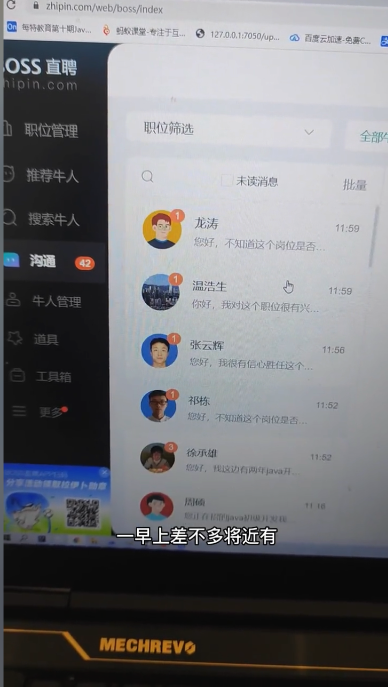  [https://www.douyin.com/video/7177968896006196520](https://www.douyin.com/video/7177968896006196520) |

1.  搞一个帅气/漂亮的头像，让HR有一定的记忆点

> 站在HR的角度，如果大家都是一样的头像，然后只看名称和简短的几个打招呼的文字，是很难有动力去主动打开聊天框查看你的简历内容的。
> 
> 所以，如果硬件条件不够好，那么就在运营上花一点小心思也可以的。

2.  关闭APP的自动打招呼功能，因为太千篇一律了

> 注意：不建议使用以下APP自带打招呼话术!  
> 1\. BOSS你好，可以聊聊吗?  
> 2.我对你发的职位很感兴趣，希望可以聊聊。  
> 3.你好，我对贵公司很感兴趣，能跟你聊聊吗?  
> 4.我想应聘你发布的产品经理岗位，可以吗?  
> ……

2.  设置常用语作为打招呼的方式

> 注意：最好针对招聘岗位的关键词进行拆解，找到和自己的经验匹配的部分，在和HR打招呼的过程中体现出来。  
>   
> 示例1：您好，我对您发布的产品经理岗位很感兴趣，我有6年+的供应链产品经理从业经验，曾负责过多款供应链相关的系统，例如OMS、WMS、ERP，有多次从0到1的项目。您可以看下我的简历，期待您的回复。（**然后再贴上图片版本的简历，因为看图片版的简历比打开文件更加方便，也不用等你发简历附件了。**）
> 
>   
> 示例2：您好，我正在找WMS相关的产品经理岗位，我有6年+的供应链产品经理经验，其中WMS是做得最多、最久的项目，负责过海外仓WMS和国内电商仓WMS的系统搭建，对WMS的多个业务模块都很熟悉，可以独立负责整条业务线。具体的项目内容您可以看一下我的简历，盼回复。
> 
> ​  
> 
> 示例3：您好，看到贵司正在招聘跨境电商方面的产品经理，我对这个岗位比较感兴趣。我有6年+的跨境产品经验，待过3家跨境行业的公司，负责过跨境ERP，海外仓储WM，头程&尾程物流TMS等。自我感觉和该岗位的要求还是蛮匹配的，希望能有机会跟您进一步沟通，期待您的回复。
> 
> ​  
> 
> 示例4：您好，我对您发布的产品经理岗位很感兴趣，期待可以深入聊聊。我有6年+的产品经理工作经验，所负责的项目基本上都是B端方向的产品，有SaaS类，也有自研类。除了供应链方向的岗位之外，我也有想法尝试其他领域的B端产品岗，下方是我的简历，期待进一步沟通。

3.  制作一个图片版简历，让HR不花钱也能快速阅读

> 可以用长截图工具或者将PDF导出为一个图片，然后保存在手机的收藏夹，便于直接发送给HR。
> 
> 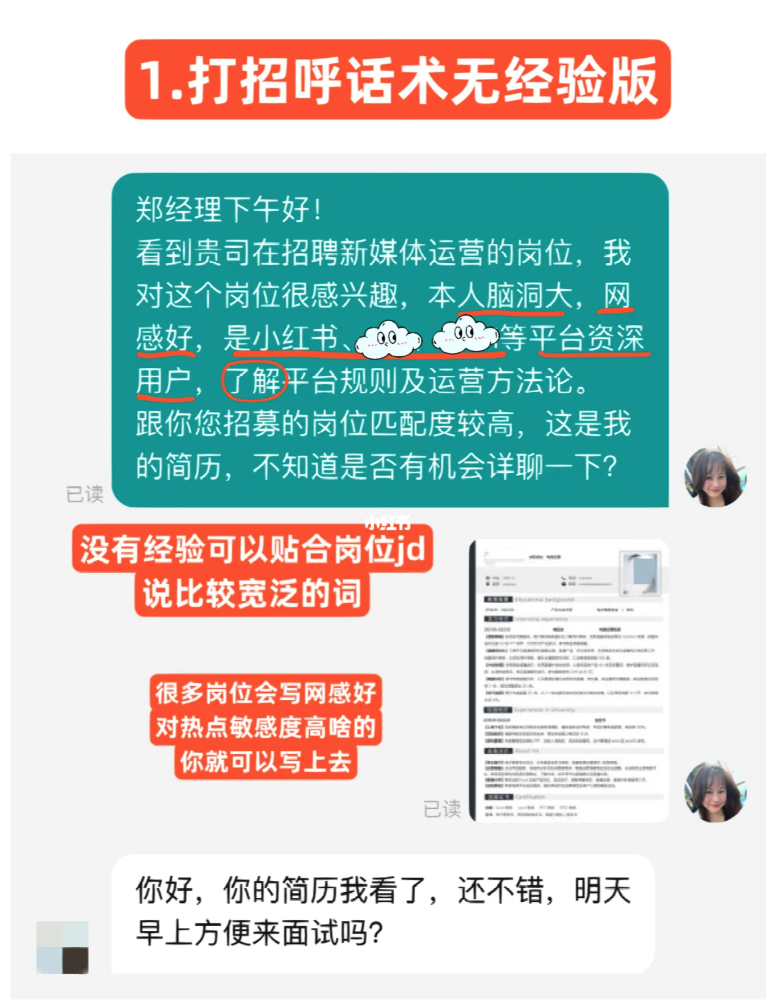

### 课后作业

> 根据今天所学的内容，输出2-3条符合自己特性的打招呼常用语，并设置在Boss直聘上。同时也可以将自己的产品简历导出为一张图片，在一页A4纸上呈现自己的个人信息，求职优势，过往经历等。

## **课程答疑或补充知识**

### 答疑

1.  投递简历的时候可以用假名字和假电话吗？

> 投递简历的时候可以用自己的另一个手机号，但是不建议用假名字，会造成一些误会。

2.  Boss直聘或者平台，投递简历的时候启用了“屏蔽当前公司”的功能，当前公司HR还会发现吗？

> 这个功能其实不保险，因为HR可以花钱买平台的一些服务，来诊断一下自己公司的人是否有离职的倾向，而且HR也有自己的圈子，可以借用其他人的账号来查看你是否有求职的行为，所以并不保险。
> 
> 北京京东科技有限公司
> 
> 北京京东供应链科技有限公司
> 
> 北京晶东科技有限公司

3.  我想要看看机会，但是又不想让公司的HR或者领导知道，应该怎么办？

> 1.  你只是想看看，那就不要登录账号或者说登录一个新的手机号注册的账号，同时更新虚拟的经历；
> 2.  你想要尝试投递一下，如果走平台端，HR很容易看到你的一些动向；
> 
> 1.  不走平台，内推或者是微信私聊，或者是猎头；
> 2.  不写当前公司的经历，用假的履历和信息，或者也可以留空；

### 补充内容

暂无