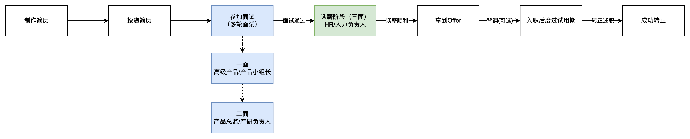
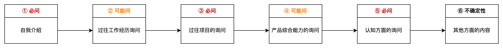
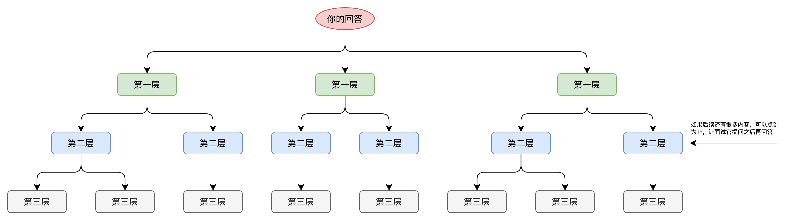

## 前言

当我们投递了简历并且获得了面试邀请之后，我们还会有一定的时间来准备接下来的这场面试。在这个时间段中，我们可以去准备哪些东西，以此来提升自己的面试通过率呢？

这节课，就来跟大家拆解一下，面试前要准备什么以及在面试过程中，我们应该掌握哪些技巧让自己的面试发挥更加稳定和出色。

## 课件详细内容

本节课的内容会分成3个部分：

1.  理解不同面试阶段的差异化要求；
2.  面试前的一些必要准备；
3.  面试技巧分享；

### Part1 理解不同面试阶段的差异化要求

一般来说中小型公司都是三次面试居多，我们需要先了解不同阶段的面试官是什么角色，然后会看中你什么能力，可能会问什么问题，我们才能更好地做出相关的应对策略，提升面试的通过率。

#### 1.1 一面面试官

一面的面试是高级产品经理或者产品小组长，基本上就是给自己小组招人的那种，所以一面面试官一般也是未来的直接Leader。一面一般会重点考察如下方面：

1.  候选人过往经验是怎么样？是否和岗位要求匹配？B端产品经理很看中过往的项目经验匹配；
2.  候选人对业务的熟悉程度怎么样？对行业知识，业务深度，还有一些项目情况掌握的如何？
3.  候选人的产品基本功如何？产品思维怎么样的？是否符合对应年限所应具有的水平？
4.  候选人的逻辑思维如何？表达能力，结构化能力，还有表现出来的一些特质等是否积极向上？
5.  候选人的潜力如何？未来是否有足够的加速度，有什么亮点，有什么优势？

总体来说一面是最难的，也是问的最细，最全的，因为一面更多地还是考察实际做事的水平，通过对过往项目的盘问，了解你候选人是怎么思考问题，解决问题，有什么优势和特长，匹配度是否足够高等。

#### 1.2 二面面试官

二面面试官一般是产品总监或者是产研的负责人，基本上是统管整个项目或者产研部门的那种角色。二面的时候一般会问的内容不会太细，更多的是一些比较发散的内容，想要看到你的一些潜力和亮点，以及是否和团队的现状匹配：

1.  候选人怎么和团队协作？怎么处理用户的需求，与研发之间的小摩擦，交付给用户的时候遇到的困难等；
2.  候选人的职业规划是怎么样的？你对产品是否有热情？你对行业是否有兴趣？你对工作是否有责任心？
3.  候选人的高度和当前定位如何？目前对一些宏观问题的看法是怎么样的？对产品经理的价值理解，对一些具体情景题的自己的判断和思考；
4.  候选人的产品方法论是怎么样的？怎么解决一些常见的问题？思考逻辑是怎么样的？产品水平怎么样？

二面面试往往差异比较大，取决于二面面试官的职位和阅历等，一般来说二面就不会问太多项目的细节了，更多的是考察候选人的匹配度，当前的定位（初级、中级、高级），然后可塑性怎么样，潜力怎么样的，如果是技术型的负责人还会问一些团队协作，一些矛盾处理方面的问题。

#### 1.3 三面面试官

三面面试官一般都是HR或者是人力资源的总负责人，一般这个环节就是来谈薪的。如果到了三面这个环节，基本上拿到Offer的几率就很大了，因为HR一般不会在这个环节卡掉候选人，不然他们又要花很多时间精力再招一个新人就太不值得了。

1.  候选人的基本情况怎么样？是否已婚？是否定居？是否会长期在这个公司干下去，稳定性如何？
2.  候选人的职业规划如何？是否有长远规划，是否打算深耕该公司，是否有一些其他的想法？候选人的入职意愿高不高？
3.  候选人和团队的匹配度怎么样的？性格怎么样？情商怎么样？工作态度怎么样？是否和团队目前情况合得来？
4.  候选人的过往公司情况打听和薪酬情况，之前的公司工作情况，离职原因，薪酬的细节，年终奖，绩效奖，然后社保五险一金等；
5.  候选人的综合素质怎么样的？思维方式？脑子灵不灵活？底层能力如何？有没有什么潜力？值不值得培养？

### Part2 面试前的一些必要准备

#### 2.1 研究JD，但是又不要过分陷入JD

1.  什么是JD呢？

> JD就是Job Description的缩写，即职位描述。一般在招聘中，最常提到的信息就是岗位职责和岗位要求，还有公司名称，岗位名称，薪资待遇，公司福利等基础信息。

2.  理解什么是岗位职责和岗位要求

> **岗位职责**：是对你入职后的要求，希望你入职之后，你能做这些事情，你当前可能没有这些能力或者你没有做过这些事情，这个都没问题。
> 
> **岗位要求**：是对你入职前的要求，入职前要具备的能力。你当前的能力需要达到怎么样的水平，这些一般都是硬性指标，能达到越多的点那么简历邀约率也更高，相当于是一个门槛。

3.  JD是HR发布的，那么岗位职责和岗位要求是谁来写的？一般是怎么写的？

> 在招聘网站上看到的JD一般都是HR去招聘网站后台维护填写进去的，但是实际上编写这些内容的人往往是具体的**用人部门**。
> 
> 例如说我要给我的小组中招聘一个产品经理，我会先跟上级领导沟通，通过了一些OA审批流程之后，会有专门的HR和我接触，然后让我填写对应的岗位职责和岗位要求……
> 
> 所以，写这些信息的人其实大概率也是一面的面试官。当然也有一些流程制度不太规范的，是HR直接去写，但是因为HR不太懂产品经理要有什么要求，所以大概率就是Copy一下别人的JD。
> 
> 于是乎，当求职者投递简历的次数多了之后就会发现，有一些公司的JD很宽泛，很含糊其辞，感觉是东拼西凑出来的……

| 列 1 | 列 2 |
| --- | --- |
| ## WMS产品的JD  工作职责/岗位职责:  1.参与SaaS WMS产品构建全过程，完成WMS产品从0到1的规划、设计，落地及上线等；  2.与开发团队密切配合，协同推动与其他产品线的合作，支撑业务快速发展及WMS产品更新迭代；  3.调研市场需求，不定期外出拜访客户，前往实地仓库调研相关需求等；  4.深入挖掘业务需求，撰写详细的产品需求文档及原型设计文档，详细阐述产品功能和使用流程；  任职资格/岗位要求:  1.本科及以上学历（硬性要求）；  2.2年以上相关产品设计经验，有易仓/万邑通/谷仓/4px/赛盒等海外仓产品设计经验者优先；  3.有供应链其他相关模块的经验或国内大型专业WMS（富勒，微仓，大宝等）产品经验优先，具备产品从0到1搭建经验优先；  4.能独立负责中小型WMS的产品搭建，具有较强的学习能力和产品敏感度，自我驱动力强； | ## OMS产品的JD  工作职责/岗位职责:  1.参与SaaS OMS产品构建全过程，完成OMS产品从0到1的规划、设计，落地及上线等；  2.与WMS组团队密切配合，搭建完整的订单履行服务的产品闭环；  3.调研市场需求，不定期外出拜访客户，收集相应需求等；  4.深入挖掘业务需求，撰写详细的产品需求文档及原型设计文档，详细阐述产品功能和使用流程；  任职资格/岗位要求:  1.本科及以上学历（硬性要求）；  2.2年以上相关产品设计经验，有易仓/万邑通/谷仓/4px/赛盒等海外仓产品设计经验者优先；  3.有电商后台或者ERP订单模块产品设计经验，具有良好的产品设计功底，重视用户体验者优先；  4.能独立负责OMS的产品搭建，具有较强的学习能力和产品敏感度，自我驱动力强； |

4.  为什么要研究JD，但是又不要过分陷入JD？

> 经过前面的分析，我们可以知道：
> 
> 1.  JD的内容很有可能是不专业的HR或者面试官从别的地方东拼西凑过来的；
> 2.  JD的内容可能写得很宽泛，写得很通用，这种要么是入职之后可能会随机分配到不同的岗位去，要么就是招聘方对候选人没有清晰的画像，自己也不知道要什么人；
> 3.  JD中的岗位职责和岗位要求会有很多个点，但是写JD的人不可能长篇大论写很多，所以一般都会挑一些比较重要和常见的内容放上去；
> 
> 有一些面试者往往会对JD陷入一种深度的钻研，甚至是到了一种做阅读理解的地步，会逐字揣摩其中的意思，然后去猜测对方是什么意思，是想要怎么样的人……
> 
> 这是一种“过度准备”，自己很累，也很容易影响自己的发挥。

5.  适当研究JD，结合其他方面的信息去推敲该岗位的要求和可能青睐的能力

> 1.  JD肯定还是要看一下的，毕竟这个是最直接了解该岗位的方式；
> 2.  可以在招聘软件上提前和面试官沟通一下对方具体要招怎么样的人，要负责哪些方面的内容，这样可以提前做好准备；当然，前提是要HR已经约你面试了，这个时候可以提前加个微信或者招聘软件上咨询一下；
> 3.  可以从公司官网，公司的产品，脉脉，一些周边新闻，社群等渠道侧面了解一下这家公司做什么的，有多少研发人员，有多少款产品，大概是怎么样的盈利模式，公司的口碑怎么样的，最近有什么新动态……
> 4.  如果实在是收集不到太多信息也没关系，可以放平心态从容应对，把自己要准备的内容都先准备好，到时候现场即兴发挥即可。

#### 2.2 为面试中高频出现的问题做好准备

1.  自我介绍

> 所有的面试，基本上开篇就是自我介绍，所以自我介绍一定必问的，也是必须要提前准备的。
> 
> 怎么准备自我介绍？最简单的方式就是先输出一段“自我介绍文字稿”，然后把一些关键词加粗标亮，在介绍自己的时候，这个地方可以适当停顿、补充、强调等。
> 面试官您好，我叫维他命，2017年毕业于XXX大学XXX专业，从2016年实习开始，至今为止有7年+的产品工作经验，其中一共经历过X家公司。（**一句话介绍自己**）
> 
> 1.  第一家是做XXX方向的公司，我在里面主要负责XXX系统；
> 2.  第二家是做XXX方向的公司，我在里面主要负责XXX系统，同时负责产品团队的日常管理工作；
> 3.  第X家是做XXX方向的公司，我在里面主要负责XXX系统，同时负责产品团队的日常管理工作；
> 4.  ……（**快速介绍自己待过什么公司**）
> 
> 我擅长的领域是“**跨境电商+供应链**”方向，过去几年一共负责过**WMS，OMS，TMS，ERP**等多个供应链系统，而且其中的系统大多数都是从0到1搭建的，最终落地之后有XX客户，日均单量有XXX。
> 
> 我个人认为我在**供应链**方面最大的一个优势就是：**我可以独立完成一整套适用于中小型海外仓的OTWB的系统搭建，除了信息化系统的建设，对业务知识的掌握也比较全面。（****再一次突出自己的优势****）**
> 
> 除此之外，我个人在求职产品经理方面，我认为主要的竞争力或优势可以体现在以下4个方面：（**列出自己的优势和特长，同时最好要和求职的岗位有一定的匹配度**）
> 
> 1.  有一定的技术背景，所以和技术沟通很顺畅，对一些产研规范还有项目协作规范等都有过实践经历。
> 2.  有3年多的4-5人产品团队管理经验，对产品规划，团队规划，跨小组协作等有一些自己的沉淀和积累。
> 3.  我对做产品的热情比较高，也有很强的自我驱动力。例如坚持阅读，写作，输出总结，还有学习一些新知识，新技能等。
> 4.  在跨境行业沉淀了5年左右，业务知识广度和深度都有，对跨境物流仓储，供应链方面最为熟悉；
> 
> 由于当前XXX公司的工作内容不是我职业规划中想做的内容，而且这边的项目管理比较混乱，团队制度，产品规划，还有一些产品规范等都做得很不好（工作效率低下，管理制度混乱，产品经理团队也是重组的，研发资源分散），对个人的沉淀和成长的部分不多，所以考虑看看外面的机会。（**为什么离职，为什么投简历**）

2.  过往工作经历询问

> 之前待过什么公司，在公司里负责什么工作，做出过什么成绩，这个一般也是面试的时候会问的。而且往往问的最多的不是最近的一段，而是和岗位匹配度最高的工作经历。也就是说，如果这段经历过去了比较久了，那么你需要提前准备一下，把一些关键信息提前准备好。
> 
> 1.  这家公司是做什么的，给谁提供什么服务？内部有什么信息化系统；
> 2.  你在里面是负责什么的？你是执行者，还是管理者，还是协助者；
> 3.  团队规模有多大，有多少研发，产品，测试，UI等；
> 4.  为什么从这家公司离职？离职原因是什么；

3.  过往项目的询问

> 一般产品面试的时候必然会根据简历上是项目进行深入的询问，这个也是整个面试过程中耗时最长，问的最细节，最全面的地方，也是我们面试前的准备要最花时间和力气去准备的部分。
> 
> 1.  项目的背景是什么？为什么要做这个项目？
> 2.  项目的结果、成绩是什么？最后做出来了吗？取得了什么成绩？
> 3.  这个项目中遇到了最难的问题是什么？你是怎么解决的？如果重新做一遍会怎么处理？
> 4.  介绍所做项目的业务流程和系统流程，你是怎么设计的？怎么考虑的？
> 5.  项目的竞品是谁？你怎么做竞品调研，怎么确定MVP版本？
> 6.  项目中的某些关键逻辑的准备，例如WMS的分波是怎么做的？拣货的时候订单取消了怎么办？怎么提升拣货的效率？合单拣货和接力拣货的区别是什么？

4.  产品综合能力的询问

> 过往项目的准备比较垂直，不同领域，不同方向的产品岗位要准备的内容是不太一样的，但是产品综合能力方面一般来说是具有通用性的，所以这一块的内容也不能忽略了。一般面试官都会问你平时是怎么解决某个问题的，然后看你是否有总结相关的工作方法论，有没有自己的心得感触。
> 
> 1.  一般你是怎么分析需求的？你怎么判断需求的优先级，需求的价值？
> 2.  需求分析的时候，怎么验证需求是真需求还是伪需求？如果有一些你不想做的需求，你会怎么处理？
> 3.  怎么确保自己的产品功能上线之后是满足了业务的要求的？怎么让需求的命中率提升？
> 4.  一般是怎么做竞品调研的？你会关注竞品的哪些方面？
> 5.  研发提出质疑，觉得你的需求做不了怎么办？
> 6.  研发/测试反馈项目要延期，完不成，你会怎么办？
> 7.  有很多并行的业务同时进行，你一般是怎么处理的？
> 8.  怎么规划产品的迭代？产品的迭代和版本之间是什么关系？你们一般多久发一次版本？
> 9.  请你描述一下从需求承接，到产品方案设计，到实际研发，最终上线这个过程中你会做哪些事情？
> 10.  你有什么总结的方法论吗？例如说需求分析，产品设计，需求评审，产品规划，迭代安排等？

5.  认知方面的询问

> 产品综合能力其实就是指产品的专业能力，产品的基本功，这个东西一般来说没有标准答案，主要还是看候选人回答的时候逻辑是否清晰，然后对一些东西是否有较深的理解和自己的心得总结等。而认知方面的问题，就是看一个人目前的Level在哪里？对一些宏观或者其他领域的理解和认知是什么的。
> 
> 1.  你觉得你的优势是什么?
> 2.  如果你加入我们公司，你觉得你能给公司或者团队带来什么？
> 3.  你觉得你和初级产品经理、中级产品经理、高级产品经理的区别在哪里？
> 4.  你觉得B端产品经理/SaaS产品经理/XXX产品经理的核心竞争力在哪里？
> 5.  你怎么看待供应链/跨境电商/跨境物流/SaaS这个行业，这个赛道？
> 6.  你对竞品XXX和XXX怎么看？如果你是它们，你会怎么处理？你觉得它们需要重点优化的点是什么？
> 7.  你觉得你做这个XXX项目，它的核心竞争力在哪里？这个产品不足之处在哪里？
> 8.  你认为XXX公司/XXX业务中的信息化系统重要吗？哪些东西是最重要的？如果你从0到1开始做，你会怎么处理？
> 9.  你认为产品经理的价值在哪里？你理解的优秀的产品经理有哪些亮点和特质？
> 10.  你的职业规划是什么？你为什么想做产品经理？

6.  其他方面的内容

> 这个方面的内容一般来说会有一些不确定性，因为不同的面试官可能问的东西不太一样或者偏好不太一样，所以这个部分的准备，就不用太刻意，重点往“扮演”的角度靠。
> 
> 1.  你对加班文化怎么看？如果公司要加班，你会怎么处理？
> 
> 1.  不管你认不认可面试官的一些理念和观点，在面试过程中，我都建议先“演”一波
> 2.  对方既然会问这个问题，那么说明他们肯定是希望你能接受加班，能抗压，那你就往这个方向去靠，表现出自己是一个“能加班”，“能抗压”，“能胜任”的角色
> 
> 2.  为什么选择加入我们？为什么想做供应链产品经理？
> 
> 1.  关键字还是“演”
> 
> 3.  你平时都通过什么方式来提升自己？
> 
> 1.  表现出自己的爱学习，对工作有激情，有干劲的人
> 
> 4.  你怎么看到XX行业，XX产品？
> 
> 1.  不需要刻意准备，而是换位思考对方为什么要问你这个，然后贴合猜测的一些原因去回答

7.  你有什么要问我的吗？

> 无论是一面还是二面还是HR面，一般来说面试的尾声阶段，对方面试官都会问：“你有什么要问我的吗？”
> 
> 所以，反问的问题也继续是面试过程中必然会遇到的，也需要提前准备一下。

### Part3 面试技巧分享

1.  面试通过与否的本质是“匹配”，而不是“能力”

> **要尽可能的展示与岗位匹配的内容，而不是一味的炫技，展示所有自己会的东西。**
> 
> 例如说你要面试供应链的产品，那么你展示你之前做过一些审计，游戏，文旅，社交等方面的产品经历是没什么价值的，这些信息反而干扰了用人方去筛选简历。
> 
> 你是去面试什么方向，那你就要重点讲这个方向的能力，不相关的内容就要尽可能缩减。
> 
> 有些时候你感觉自己很优秀，但是面试还是没通过，很大可能就是因为“匹配”的问题，并不是说能力越强就和岗位的匹配度越高，而是要加工润色，向这个岗位要求的能力靠近。

2.  尽量先引导面试官做一个自我介绍，以便于更好地了解面试官的水平

> 很多面试官上来就是请你做一个自我介绍，我一般会做自我介绍之前会说：
> 
> 好的，没问题，但是我希望等会我做完自我介绍之后，您也可以做个简单的自我介绍，以便于我了解一下您是什么岗位，是负责哪一块的内容，也是为了后续面试过程中更好地交流。

3.  回答面试官的问题的时候不要过长，因为说多会错多

> 即使你用了一些结构化的表达，分成了1234个点，但是如果这个回答内容太长了面试官也会记不住的。所以如果你的回答真的很长，你可以类似于脑图一样，先讲上面的几层，剩下的后面再讲。
> 
> 
> 
> 在讲的时候要多关注面试官的神情和微表情，如果感觉他不太想听了，那就尽量快速收尾，把话题结束就好了。

4.  面试过程中，可以多反问，多重复，多确认

> 面试官抛出一个问题，你可以稍微重复一下或者反问一下。
> 
> 你是想问我XXX这个问题，我是怎么解决，怎么做的是吗？
> 
> 关于XXX这个问题，我是这样想的，这样的解决的？
> 
> 我想确认一下XXX这个问题是想问YYY这个事情是吗？我怕我理解错了
> 
> 好的，我理解了你的这个XXX问题，我来回答一下，我是这样的理解的……

5.  当你的问题没有回答到他的点子上的时候，建议主动让面试官提出另一个问题

> 有些时候面试官问了一个比较宽泛的问题，其实你短时间很难把握住他到底想要问什么，那你可以主动提出让他细化一下这个问题或提出另一个问题。
> 
> 例如面试官问，你觉得产品经理的价值是什么？
> 
> 可以反问：**您是想听我对B端产品经理，还是C端产品，是初级产品经理，还是高级产品经理，是SaaS商业化的产品经理，还是内部自研的产品经理的价值？我觉得这个问题挺宽泛的，我建议可以细化一下，聚焦一下**。
> 
> 例如对于内部自研的初级产品经理来说，他的价值可能做好执行，协助产品负责人把相关的任务执行完成并落地；但是对于SaaS商业化的产品负责人来说，他的价值可能是在于抓住产品机会，通过对行业、市场、竞品、用户的调研和挖掘，然后定义好产品，规划产品的方向等……

6.  当面试官考察你对岗位是否有兴趣的时候，一定要表现出热情

> 例如职业发展规划和岗位的选择是面试中高频面试的内容，面对这种问题的时候要做一个“渣男”，见人说人话，见鬼说鬼话，除非你不想通过面试。
> 
> 面试官一定是希望招那种对自己公司和岗位有兴趣的，有热情的，有想法的，而不是抱着“我只是来打一份工”，“我随便投递的简历，有人要我我就去”这一类想法的人。
> 
> 面试的时候要表现出的就是：我很喜欢你，我就想选你，我是和这个岗位匹配的，我是职业发展是吻合这个岗位的……

8.  高压环境下不要陷入对方预设的一种评价体系（自证陷阱）

> 之前有一次面试的时候，一个CTO一直在追我为什么要技术转产品，做产品有什么好处和什么坏处，我回答完了一个问题之后他就会继续追问我下一个问题，一直牵扯不清，让人感觉压力很大。
> 
> 后面我复盘之后就发现，其实就是在那种高压环境下我陷入了他的一种评价体系，我为了讨好他一直想要回答一些讨好他的话，搞得自己就很不舒服，语言逻辑就混乱了。如果重新复盘之后，我会这样回复他：
> 
> 1.  当时刚毕业，对这些东西不太了解，只是直觉上觉得做产品更适合自己，具体原因没有，更多的是一种感觉；
> 2.  做产品有什么好处和坏处这件事我没怎么想过，我挺喜欢这份工作的，好与坏的事情我觉得不重要；
> 3.  我觉得这些问题是过去很久的事情了，想这些陈年旧事有点伤脑筋，而且可能还会记错一些东西，所以我建议我们跳过这个话题，聊一下当前和工作更贴近的事情；
> 4.  如果您感兴趣，有机会我们能成为同事的话，一起吃饭聚餐的时候我可以再挖掘挖掘，可能这种轻松愉悦下的环境我记忆力就变好了；
> 
> 类似的问题还有“老婆和老妈同时掉水里怎么办？”“给你ABC三个方案，你会选哪个？”
> 
> 这一类问题，当我们陷入了对方的评价体系之后就总想做出一个符合对方预期的回答，然后自己就会陷入一种烧脑时刻，其实应该跳出来思考一下，我为什么只有ABC三个方案？这个题我不可以DEF方案吗？我为什么要回答这个题？回答的东西一定要讨好对方吗？
> 
> 有这种批判性思考之后，就可以跳出来。

9.  任何一场面试都要及时做复盘总结

> 有一些面试可以录屏/录音，有一些不方便录制的，就面试完成之后立马去做回顾，将相关的信息记录下来，然后及时复盘总结。
> 
> 面试多了之后就会发现有很多面试题和面试套路都是相似的，通过这种复盘和总结就可以将这一类问题归纳总结一下，后续回答的时候就可以做得更好。

10.  要把每次面试都当作和一些高水平的人进行交流和学习

> 虽然面试的通过率总体来说比较低，也就意味着有很多面试最后都没有什么结果，但是不妨碍我们在每次面试中学习和成长，关键就是掌握一个点：**把面试当做和高水平的人交流和学习。**
> 
> 在回答问题和向对方提问的时候，不要低人一等，也不要畏畏缩缩、患得患失，而是要大方自信，和对方平等对话，从对方身上去学习，所以基于这个点可以向对方提问：
> 
> 1.  您觉得目前岗位中最大的困难和挑战是什么？
> 2.  您觉得产品经理核心的技能是什么？要掌握哪一块的知识和能力？
> 3.  您觉得SaaS产品商业化的未来是怎么样的？看好还是不看好？
> 4.  您觉得XX行业好吗？好的点在哪里？不好的点在哪里？
> 5.  ……

### 课后作业

> 输出面试前的准备文档（逐字稿），包含一些高频问题及其回答。

## **课程答疑或补充知识**

### 答疑

1.  招聘网站上的岗位描述的薪资是15-25K，是不是真的就只能拿25？

> 其实JD的发布有些公司很随意，有一些公司很严谨，所以这个区间到底是取最底部，还是中间，还是最顶部，没有标准答案，甚至是你能力突出拿到超过上限的也不是不可能。我的建议是不要纠结这个，感兴趣就去面，或者说先和HR沟通，是否能给到这个区间范围，虽然她大概率也会告诉你，优秀就可以达到。

2.  HR会不会压我薪资？我在报自己的薪资的时候能不能多报一些？

> 我的建议是要多报一些，虽然说大多数公司的HR都不一定会压工资，但是多报一些就是给自己争取谈判空间，如果自己报少了，那么谈判的空间就小了很多。
> 
> 例如你目前薪资20K，预期是涨幅30%，也就是26K左右，然后你就可以报价27-28K，就算对方压价，你也可以达到自己的预期。
> 
> 求其上，而得其中，不用担心报高了会吓走HR，她们见多识广，见过太多比你更高薪，要求更夸张的案例。

### 补充内容

暂无