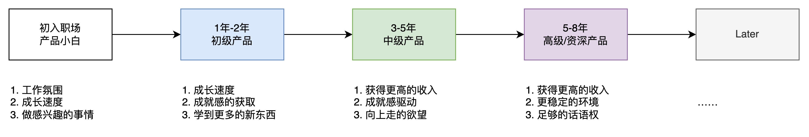
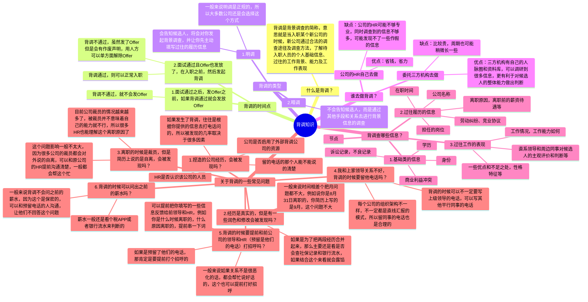
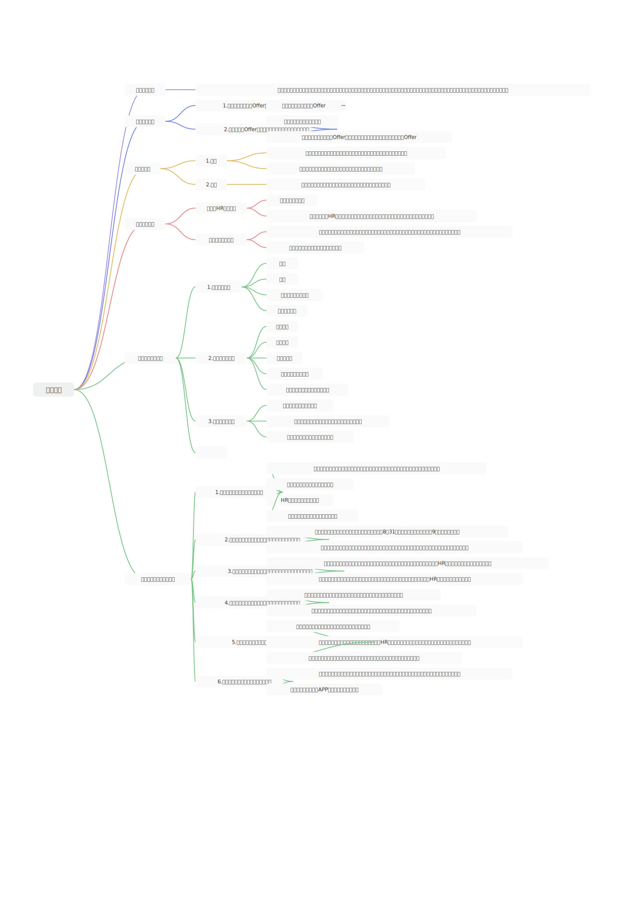

## 前言

当我们历经千辛万苦终于通过了面试拿到了Offer之后，可能会面临一个“幸福的烦恼”，那就是怎么选择Offer？

当我们有多个Offer的时候，我们会想要好中取优，拿到更好；当我们只有一个Offer的时候，我们也希望它起码是不坑的，会令人满意的。

面试之前可能对公司的了解不是很多，也不会花太多的时间精力去研究琢磨。但是当通过了面试拿到Offer之后，那就意味着公司的情况和自己可能息息相关就要认真对待了。

这一节，我分享一下我自己对产品经理怎么选Offer，要考虑哪些因素，做一个比较完整的分享，相信你听完之后在选择Offer的时候也就不会那么迷茫了。

## 课件详细内容

本节课的内容会分成5个部分：

1.  不同的职业阶段对“好工作”的定义并不一样；
2.  几个常见的职业阶段对Offer的考量点分析；
3.  识别Offer中哪些是“真金白银”，哪些可能是“大饼”；
4.  可以用“渣男法则”去接多个Offer；
5.  Offer附带的背调流程是怎么样的？

### Part1 不同的职业阶段对“好工作”的定义并不一样

很多人会用“钱多事少离家近”来定义工作好坏，粗看之下好像确实挺有道理， 但是仔细琢磨之后还是感觉有点不对劲。

1.  怎么定义钱多？
2.  怎么定义事少？

根据我个人的经验：**这两个判断都是需要经历对比之后才知道的。这个对比不仅仅是和同学比，和同龄人比，而且还要和自己比，也就是A段工作经历和B段工作经历比较才知道。**

我在产品经理的社群或者社区中经常会见到一些Offer对比的话题，基本上各种说辞的都有，有人觉得坑，有人觉得不错，有人觉得某公司挺好的，有的人却一直黑个不停……

**很多提问者期待的是一种绝对碾压式的比例出现，然后帮助自己来决策**。例如说好的有98个人，但是说不好的只有2个人，但是一旦比例的差距没有那么大，那可能自己就会陷入一种困扰，例如说好的有6个人，说不好的又4个人，这个时候选择就很痛苦了……

而且退一万步来讲，很多时候提问并拿不到10个有效的反馈数据，大概率还是0。（此刻可以插入“有效提问”的一个知识点 [https://t.zsxq.com/16fsJCWOv](https://t.zsxq.com/16fsJCWOv)）

所以怎么判断一个Offer好不好？本质上还是要从自身入手，从自身的需求入手，自己当前最需要的是什么，而哪个Offer能给到这些？

> 不同的职业阶段对“好工作”的定义是不一样的，没有绝对的神仙公司，也没有绝对的垃圾公司。
> 
> **当它给到了你想要的东西之后，它就是属于好公司一列；当它给不到你想要的东西之后，那它就属于差公司那一堆去了……**

### Part2 几个常见的职业阶段对Offer的考量点分析

这个问题我在星球群里做过一个简单的调研，然后发现无论是初入职场的年轻人，还是工作多年的老油条，不约而同地都提到了这么2个点：

1.  公司业务稳定或者方向稳定，也就是不会轻易倒闭，发不起工资，大规模裁员等；
2.  公司赛道的前景或者业务的前景不错，也就是“久期”长一些，不会来得快去得快，或者不久就要走下坡路；

基于目前经济下滑，就业困难的状态，这两个点我建议单独拎出来考虑，因为它和职业阶段关系不大，属于是大家都有的焦虑和担忧，是共同都需要面对的问题。所以我们反而要去重点去分析一下那些和职业阶段的关联比较紧密，有一定的差异化的点。

> 初入职场的时候，比较有热情，比较有斗志，所以这个时候往往比较关注的是“工作氛围”，“成长速度”和“能做感兴趣的事情”。所以在选择Offer的时候，则重点考虑：
> 
> 1.  团队气氛怎么样？领导是否Nice，有没有成熟的培养机制？
> 2.  入职之后是做什么内容？这个内容是自己感兴趣的吗？是有一定的挑战和成长的吗？
> 当工作了1-2年之后，有的人可能一直处在“比较舒适的环境”，而有的人则“饱经风霜”，所以这个时候对工作的理解和认知也发生了一些变化，这里我以一个比较积极的心态为例，一般来说此时此刻的产品新人大概是会看重这些的：
> 
> 1.  要负责的项目是什么？这些项目是自己感兴趣的吗？自己能胜任吗？
> 2.  所负责的东西会让自己有成就感吗？自己能学到很多新的东西吗？会让自己提升竞争力吗？
> 处于3-5年的中级产品经理们，已经有足够多的项目历练，要么有一定的深度，要么有一定的广度，同时也经过几家不同的公司，认识的产品圈子也更大一些了，这个时候跳槽的一般就会重点考虑：
> 
> 1.  薪资待遇方面怎么样？如果不是有竞争力的涨幅，那么跳槽的意义可能就不是很大了，所以会在待遇方面重点考量；
> 2.  新公司的工作内容是否有更大的成就感？既能发挥过往的项目积攒的能力，同时也能学到一些更新的、更深度的东西；
> 3.  新的团队是否为管理岗，有没有从0到1的项目机会，能不能组建团队，带领产品小团队去做新产品；
> 如果到了5-8年这个时间段之后，基本上来说对产品经理的工作的热情和理想主义的情愫就消退了很多，开始变得更加现实、更加商业化、更加看重ROI，同时也对职业生涯的发展有一定的恐惧感和焦虑感，跳槽的时候会更加看重这些：
> 
> 1.  是否有更高的收入或者更有前景的未来，如果没有很诱人的机会，不会轻易跳动；
> 2.  新的公司和新的业务方向是否比较稳定？拿到的高薪是否可以持续更久，相关的业务是否有想象空间；
> 3.  也有部分人会追求一定的职业Title，也就是尽量往管理层走，掌握话语权，走M线的路子；

### Part3 识别Offer中哪些是“真金白银”，哪些可能是“大饼”；

在发放正式的Offer之前，HR会先跟你进行一轮沟通，这种一般会给一个口头Offer，说大概会给你薪资是多少钱一个月，年终奖是怎么样的，公司的一些福利相关的东西，例如有没有绩效奖金，有没有补贴（餐补、住房补贴），有没有股票、期权等。

有一些朋友在比对Offer的时候呢，会把这些HR给你画的饼或者说提到的一些内容，都当做是你能够拿到的东西。在决策的时候就会造成不少的干扰，因为里面有一些是真金白银，但是也有一些大饼，我们得要区分清楚，不要白高兴了一场。

#### 3.1 常见的一些真金白银

> 1.  写在Offer里，白字黑字的，一般都是真的，都能拿到的；
> 2.  一些餐补，住房补贴，公司的产品购买权益（例如说：比亚迪入职后买车有员工价），这种普适性的往往是真实的；
> 3.  加班补贴，打车补贴，年假/企业假，年度体检，下午茶，团建经费等这些一般也是真实的；

#### 3.2 常见的一些大饼

> 1.  未上市公司的期权/分红，或者承诺入职之后，等公司上市后会配股票，这些一般都是大饼；绝大多数的小公司都上不了市，中型公司除非是早期的老员工或者非常核心的人员，否则给的股票也就一点点；
> 2.  Offer上写的岗位是“产品经理”，然后承诺入职之后表现好的话会给“产品总监”或者其他Title的，也很有概率是大饼；
> 3.  一年2次调薪，每年都有普调和晋升窗口，只要自己优秀那就可以嗖嗖地晋升，这种也是HR经常给的大饼；
> 4.  口头上说的年终奖，例如大概2-4个月，表现优秀的可能5-6个月什么的，这种没写到Offer的，基本上也是大饼，完全看公司当年的经营情况以及领导层是否舍得给福利；
> 5.  承诺先入职，然后试用期过了之后再涨薪，然后试用期还比较长的那种，而且这个条款在Offer中也没写的，也要谨慎，很大可能性是大饼；

### Part4 可以用“渣男法则”去接多个Offer

当我们同时接收到了多个Offer，并且其中有好几个感觉都不错，自己对比之后也没想清楚到底要去哪家，那就可以使用这种“渣男法则”去接多个Offer，具体的操作方式是这样的：

1.  把自己最想去的公司定义为A，然后协商A的入职时间为下周一；
2.  第二优先级想去的公司定义为B，然后协商B的入职时间为下下周一或者更晚一点的时间；
3.  第三优先级想去的公司定义为C，然后协商C的入职时间为下下下周或者更晚一点的时间；
4.  下周一先去A公司入职，给自己设定“一周的观察期”，在这一周中重点去考察公司的内部情况，工作事项是否自己喜欢，领导是否Nice，然后各种福利什么是不是和入职的时候说的一样；
5.  如果一周观察之后发现还不错，要继续选择A，那么就赶紧和B/C公司的HR沟通，去拒掉Offer；
6.  如果一周之后发现这家公司不行，要选择跑路，那么就赶紧联系B公司的HR，进入B公司入职；
7.  理论上来说，B公司也可以设定一周的观察期，如果不行再考虑C，以此类推；

这种操作比较“骚”，其实就是把一些不太心仪或者优先级更低的放在备选位置，然后先接下Offer，等考察完了优先级更高的公司之后再去优先级次之的公司。

> 1.  第一家入职的时间尽量避开缴纳社保的时间，一般缴纳社保的时间是15-20号这个时候，如果入职在这个时候，可能公司就会给你缴纳社保，那就会有社保记录了，不利于选择后续的公司；
> 2.  每一家公司的考察期都不要太久，因为太久了自己不好抽身，同时下一家备选的Offer的公司可能也等不了那么久，所以要提前做好考察的计划；
> 3.  如果有多家Offer，犹豫不决的情况下建议都先接下来，因为你如果明确拒绝了，那么招聘方就不会给你机会了，如果你先接但是后续不去，你也没什么损失；多家公司Offer的约定入职时间建议拉长一些，一些招聘比较急的，就酌情给一个理由拖延一下；
> 4.  给自己争取利益的时候，脸皮要厚，不需要有太重的心理负担。职场往来，本来就是“先利己再利他”，所以不需要有什么心理负担和包袱。

### Part5 Offer附带的背调流程是怎么样的？

一般来说稍微大一些的公司，入职的时候都会有相关的背调过程，这里的背调有的复杂，有的简单，我做了一个脑图来讲解。

### 课后作业

> 1.  根据自己当前所处的阶段，整理出你对下一份工作/Offer，会重点考虑的3-5个点，放在评论区。
> 2.  同时也可以在评论区记录一下，你接过的Offer中有哪些大饼，哪些是要值得警惕和小心的。

## **课程答疑或补充知识**

### 答疑

1.  XXX？

> XXX

2.  XXX？

> XXX

### 补充内容

暂无