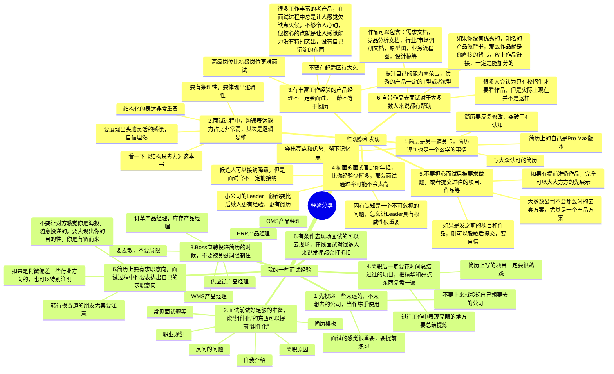
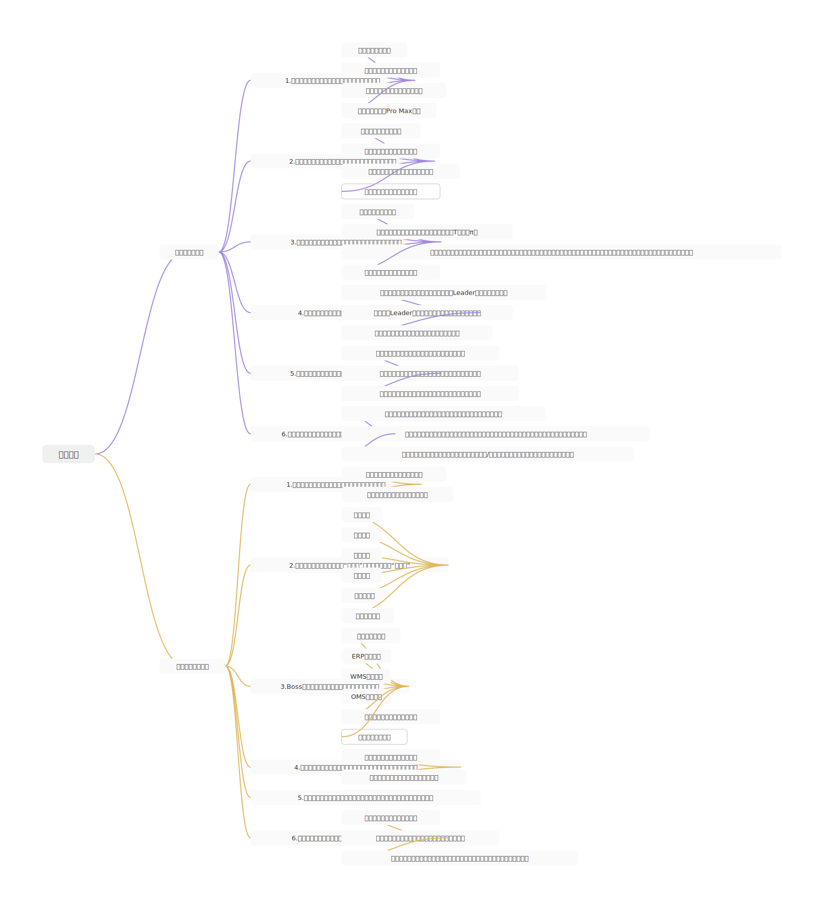
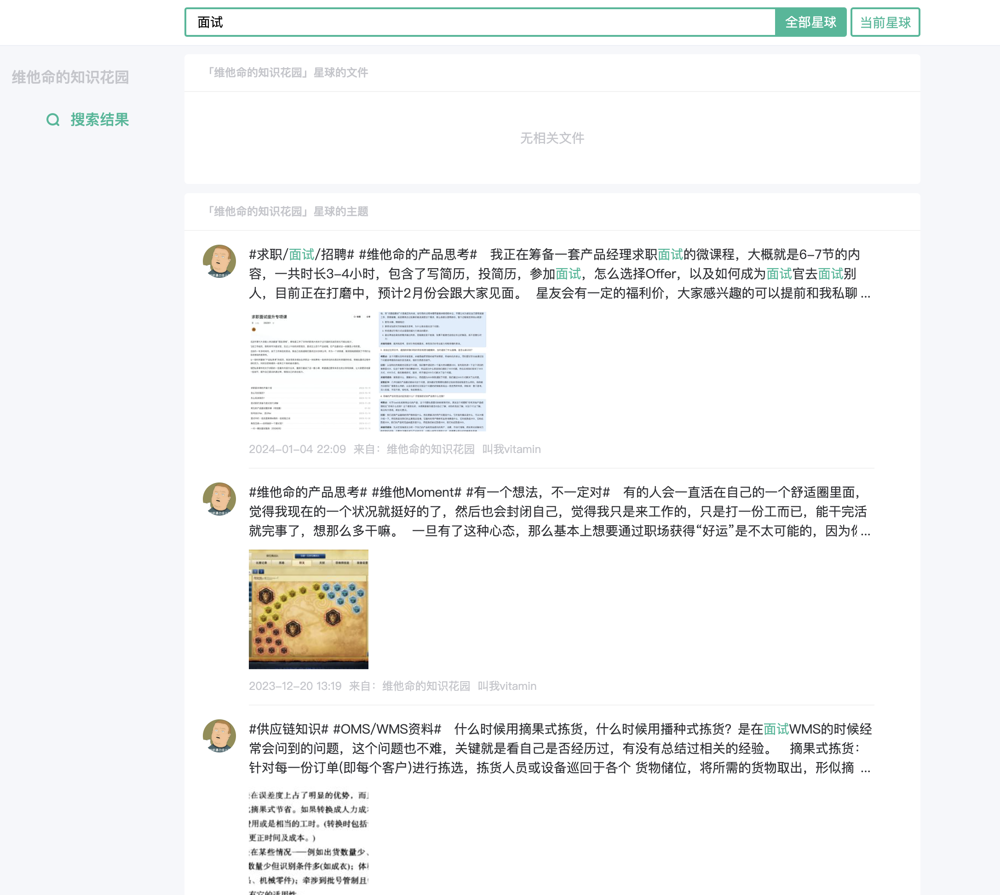
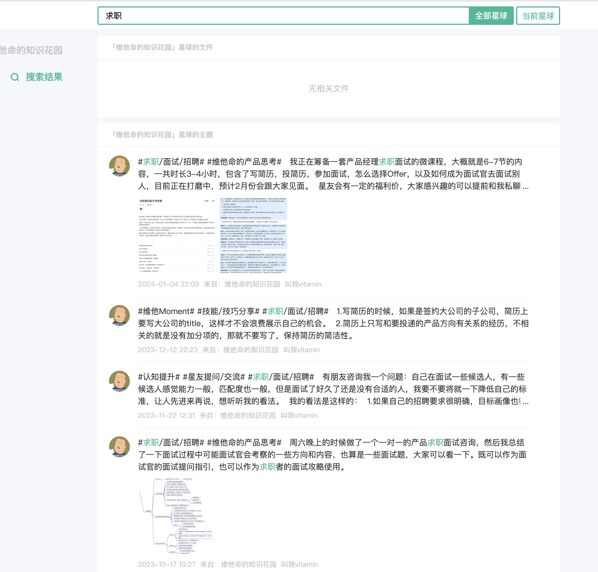

## 前言

从当前的行情来看，产品经理的整个求职面试过程，少则一两周，多则几个月。整个过程中涉及的流程环节多，时间跨度也比较大，顺利的人会感觉找工作挺简单的，不顺利的人则会觉得找个工作太难了。

前面的内容将大多数面试过程中需要准备的内容都讲到了，本节的作用就是把一些细枝末节，一些反面案例，还有我自己对求职面试的一些心得汇总，做一个补充作用。

## 课件详细内容

本节课的内容会分成2个部分：

1.  一些反面案例
2.  个人的一些经验分享；

### Part1 一些常见的反面案例

> “**告诉我我会死在哪里，我将永远不去那个地方。**”
> 
> \-- 彼得·德鲁克

在准备面试的过程中，除了要看一些优秀的简历模板，面试回答等，也要逆向思维，反过来看一下简历编写还有面试过程中有哪些是反面案例，这里反面案例就是我们的“自查表”，“自我检查的镜子”，当我们自己在执行相关事项的时候就要尽量避开这些反面案例。

1.  简历排版混乱，错别字多，标点符号乱用，阅读体验不好

> 产品经理虽然不是UI设计师，但是也算“半个设计”。如果自己的简历表现出来的设计感就很一般，错别字还多，标点符号也乱用，就会让人感觉不够专业，基本功不扎实。

2.  简历上的技能很多，经历很丰富，信息量很足够，但是就是匹配的点少

> 你可能很多干货，但是不是所有的干货都是有高价值的。如果有太多无用的，低价值的信息反而会扣分，甚至会让人瞬间想结束面试。有些干货面试官可能并不懂，你延展的太多反而错过了最佳表现自己的机会。所以简历上要多写一些靠近目标岗位的内容，多匹配一些JD上的关键词，同时在面试的时候也围绕这些关键词来讲。
> 
> 例如我是招聘WMS的产品经理，你一直在讲采购，讲计费，讲运输啥的，这就是跑偏了。

3.  面试前的准备不足，没有去做公司和JD的调研

> 候选人对公司和职位信息知之甚少，可能都没办法回答与公司相关的基本问题，而且对要求职的岗位信息和方向等也不太了解。面试前缺乏充分准备，显得对职位和公司不尊重，不重视。
> 
> 在面试前，还是要做一定的准备工作的，起码要研究一下公司的背景、文化、产品和行业地位。也要了解职位要求和描述，准备相关的回答和问题等。

4.  理解能力弱，沟通能力差，面试官问的东西回答不到点子上

> 候选人答非所问，回答含糊不清，无法清晰表达自己的思想，沟通能力差会直接影响面试官对候选人能力的评估。
> 
> 沟通能力是可拆分的，起码可以分成接收，处理，然后传递这三部分。也就是「倾听」，「理解」和「表达」。
> 
> **面试官提出问题，迅速接收问题，然后大脑中迅速处理，最后有层次，有结构的表达出来。**
> 
> 很多人听不懂面试官要问的内容，也说不清自己想传递的信息，也有大脑处理机制比较慢的……
> 
> 无论是哪一种，都可以分而治之，有针对性的强化和锻炼。

5.  远程面试不开视频，无法通过视频画面捕捉面试官是否满意自己的回答

> 远程面试的时候，尽量还是要开一下视频，不然面试效果会大打折扣。
> 
> 如果实在是没有视频面试的条件，而是用的语音面试，那么作为求职者，少说话是最佳的防守，也是最佳的进攻。由于没有视频，没有画面，你并不能很容易get到面试官的想法或者状态，所以说的多反而容易错的多，而且还容易让面试官走神。
> 
> 最佳策略应该是让面试官挑他感兴趣的来问，然后你适当性的回答并询问是否要讲得更加细节一些，以此来判断是否要发散开。

6.  缺乏对产品工作的热情和积极态度，表现出很消极的态度

> 对于初中级的产品经理来说，对产品岗位的热情和积极态度是很获得产品面试官好感的一个行为，反之如果面试中没有表现出积极的一面，反而还表现出了一些“摆烂”，“消极”，“油腻”，“无所谓”的态度和情绪，那么就会让面试官怀疑你对岗位的兴趣，以及后续入职之后遇到困难时的积极性和动力。
> 
> “热爱产品经理”，“热爱产品工作”，听起来是一个口号，其实也是一种态度，面试过程中展现自己的态度也是很重要的一个环节。

7.  对业务，对项目的细节不熟悉，不能清晰地解释清楚全貌和细节

> 很多产品经理，对自己过往负责的项目不够熟悉，不能很好地讲述清楚自己做了什么的。
> 
> 这一类产品经理，要么就是只会自己的一亩三分地，要么就是对过往项目的钻研不是很深，只是一个需求翻译官，传达基础的信息，完成一些简单的优化即可。
> 
> 作为面试官，会觉得那我还不如找一个刚毕业的新人，自己简单培养之后就能立马上手帮忙了。

8.  没有体现出结构化的思维

> 面试过程中，求职者主要是靠“说”来表达自己，阐述自己的亮点，过往的经验，自己对产品的思考和理解等。而且在阐述过往的项目经历这一块一般会占比较大的篇幅，如果没有结构化思维，不能从大到小，层层递进去讲解自己负责的内容，那么就很容易让面试官觉得你表达不清晰，对细节掌握不够熟练……
> 
> 也有一些面试者上来就讲很细的场景，很深的某个领域，完全没有铺垫背景和框架性的东西，这样会让面试官听得就很懵，无法形成画面感，也跟不上面试者是思路和节奏。

9.  没有对过往项目进行深入的总结和沉淀

> 在产品专业面的时候，面试官一般都会问你做过的项目遇到了什么困难，是怎么解决的，还有项目的一些关键点是怎么决策的。这里回答的深浅关键还是要看面试官对这个行业是否熟悉，是否能问出比较有洞察力的问题；但是回答的好与坏，是取决于自己是否有对项目进行深入总结和沉淀，能不能把一些底层逻辑，业务规则，业务场景，还有行业认知等都总结出来。
> 
> 所以，大家在准备面试之前，建议都适当去总结一下过往的一些项目，通过输出思维脑图或者文档的方式，把自己做过的项目记录下来，其中遇到了什么难题，是怎么思考，怎么解决的，这些都要输出一遍才会印象深刻。

### Part2 个人的一些经验分享

### 课后作业

> 在评论区记录下，你在求职面试过程中最印象深刻的一些感触，或者你曾经犯过的一些错误，一些反面案例的操作等。

## **课程答疑或补充知识**

### 答疑

1.  关于排版布局，错别字等，有什么文章或者资料看一下吗？

> 可以查看Ant Design的设计指导 [文案 - Ant Design](https://ant-design.antgroup.com/docs/spec/copywriting-cn)

2.  怎么样总结自己的项目？

> 采用结构化的表达方式去拆解自己的项目：
> 
> 1.  你的用户，场景，业务流程，用户需求，预期，现状等分别什么，然后你做了什么事情去解决了它；
> 2.  你的产品定义是什么？你是一款怎么样的产品，解决了谁的问题，然后有什么功能，有什么价值，有哪些模块？
> 3.  业务流程，功能模块，产品设计的难点，复杂的逻辑思考等；
> 4.  有哪些案例是没有做好的，为什么没做好，如果重新来做的话应该要怎么做；
> 5.  项目做了多久，几个人做的，自己花了多时间输出方案，研发花了多少时间，最后的成果怎么样，有多少用户，日活怎么样，收益怎么样，数据性的东西是怎么样的；

3.  简历上的项目经历要写多少？

> 一般来说写3-4个就够了，如果项目比较复杂，有很多东西可以说的，就写3个；如果项目比较简单，没太多可讲的就写4个。
> 
> 项目的含金量，和这个岗位的JD是否匹配？能否凸显自己的价值和能力？有没有什么可讲的？

### 补充内容

如果加入了知识星球的朋友，可以在星球中搜索“求职”或者“面试”这几个关键词，还有其他更丰富的内容展示

| 列 1 | 列 2 |
| --- | --- |
|  |  |