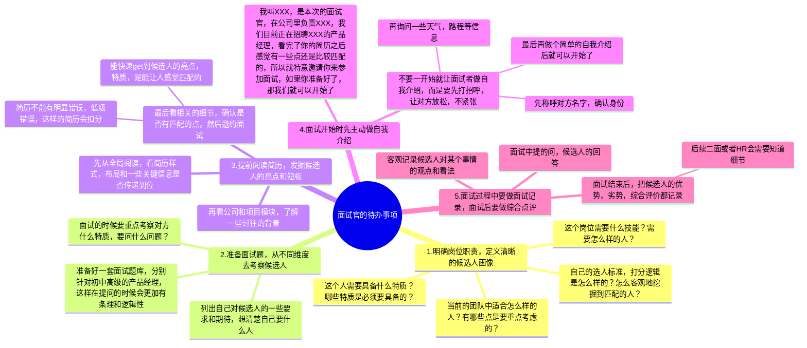
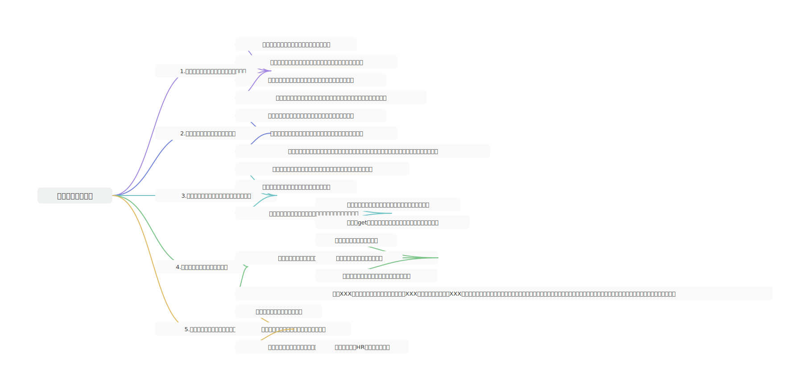
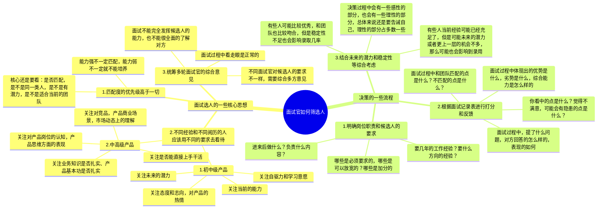
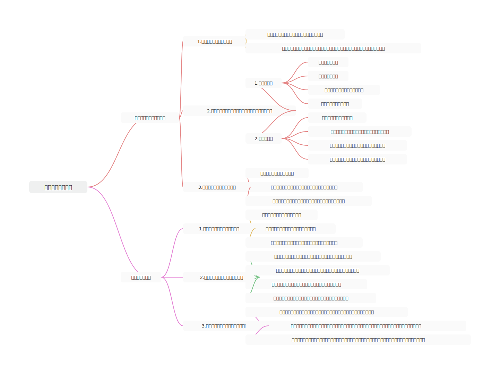
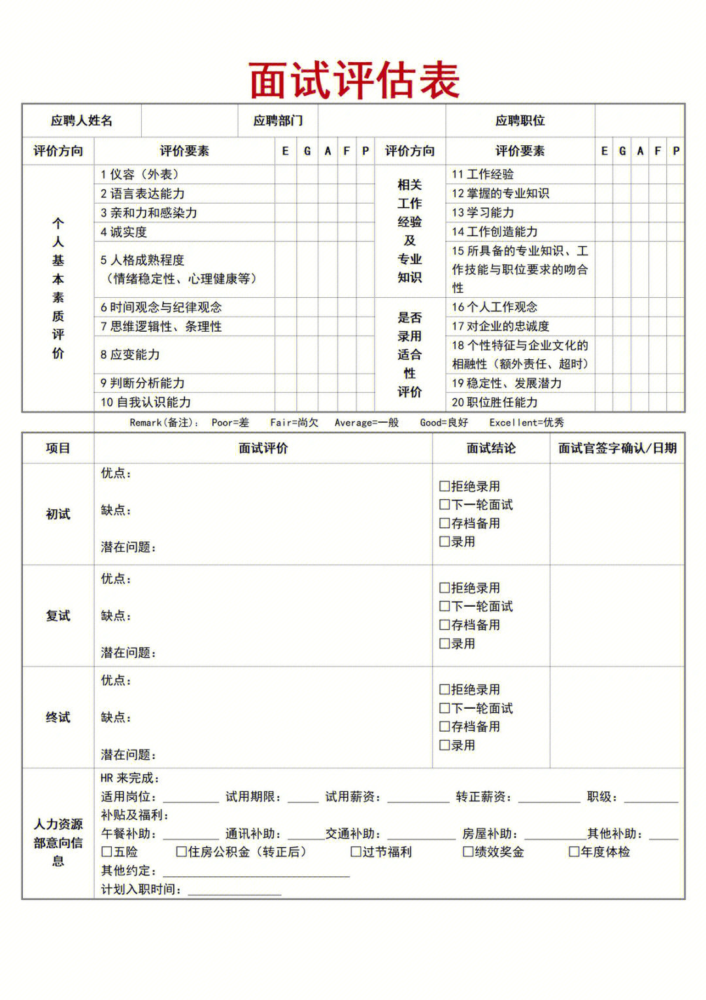
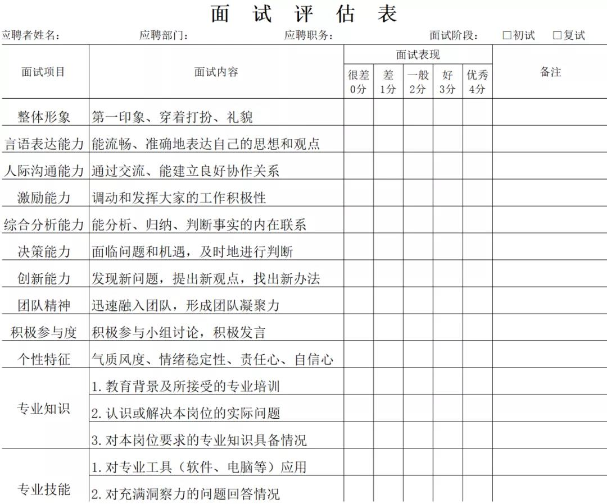

## 前言

本节是我们求职面试课的最后一节，之前的内容都是以“求职者”视角来输出的，但是有些时候换个角度去看问题可能效果就会不太一样。

所以这一节，我们来做一个“角色互换”，讲一下作为一个“**面试官**”，在为团队招聘一个名新人这件事上要做哪些准备？在面试过程中怎么样才能发挥的更好？既能让“求职者”更好地展现自己，又能让自己观察到“求职者”身上更多、更深层的信息？

## 课件详细内容

本节课的内容会分成4个部分：

1.  成为面试官也是需要练习和准备的；
2.  面试官为一场面试需要提前准备什么？
3.  面试官如何去筛选候选人？
4.  过往面试过程的一些案例和心得分享；

### Part1 成为面试官也是需要练习和准备的

以下是一些关于产品面试官的常见错误认知：

> 1.  工作年限长了，自然就会面试了
> 
> -   实际上工作年限长短，与面试能力是两码事
> -   怕是有比较长的工作经历的产品经理们，简历准备和面试准备也很糟糕
> -   简历和面试这件事和阅历无关，专项练习非常的重要
> 2.  面试官的综合能力普遍都强，他们说的往往是对的
> 
> 1.  很多经验不是很丰富的产品经理普遍会认为面试官综合能力很强，然后在面试过程中遇到一些“争议”时，会倾向于是认为自己的问题
> 2.  也有很多人在面试的时候会非常小心谨慎去猜测面试官的意图，试图让自己发挥的更好一些
> 3.  面试官不一定综合能力就比候选人强，所以遇到一些“争议”的点时，不一定要“心里矮别人”一截，而是要平等地去看待，去处理
> 3.  面试官往往是专业的，他们都会有体系化的学习和培训
> 
> 1.  实际上，在很多公司中，压根没有对面试官进行体系化的培训，所以很多面试官在面试的时候表现出的水平非常的糟糕，会让面试者体验非常不好
> 2.  有很多面试官可能自己也是稀里糊涂被拉过去面试的，而有一些面试官可能是高层或者老员工，所以在面试的时候很容易表现出一些很高傲的态度

站在面试官的角度，“面试”这件事也是需要学习和积累的，需要刻意练习，提前准备，才能发挥出色。

既能给面试者留下好影响，又能让自己高效率地筛选出想要的人，节省面试的成本。

**但是实际上，有专业培训的面试官很少，富有极强的同理心和换位思考能力的面试官也比较少……**

### Part2 面试官为一场面试需要提前准备什么？

### Part3 面试官如何去筛选候选人？

### Part4 过往面试过程的一些案例和心得分享

1.  怎么应对一些聊不下去的候选人？

> 如果发现对方偏离了话题，我会直接打断，将他拉回来
> 
> 如果很快就发现对方不太合适和满意，我一般会确保面试过程起码在20分钟左右，不要太短，更不能太长，尽快结束，但是也不要显得不够尊重
> 
> 如果发现对方Get不到我的点，可以尝试跳过话题，从其他一些角度去发问，如果多次都Get不到，那么可能就是不太合适了

2.  被候选人投诉怎么办？

> 面试时间太短，对方觉得你不够尊重，会投诉HR，这个时候一般提前和HR反馈，或者将面试结果及时记录在档案就没事；
> 
> 如果对方投诉在面试过程中的面试官的一些表达或者行为不妥，那么就虚心听HR的反馈，如果有改进的地方就及时改进，如果没有什么，那也不用放在心上。

3.  和候选人认识（熟悉），但是没给通过，怎么解释

> 一般在面试熟人之前，我都会安排另一个同事在场，或者是尽量避嫌，让其他的同事去面试。
> 
> 职场中往往是“工作优先”，所以不应该在面试的时候考虑太多“个人情感”方面的内容。我可以帮忙投递简历，筛选简历或者说亲自面试，但是不应该因为这一层关系就影响自己的判断和决策。
> 
> 如果面试没通过，就即时反馈哪些地方不够匹配，基于什么原因去考虑的……
> 
> **如果不是特别知根知底的，一般不建议推荐熟人来面试，还自己亲自面试，筛选是否通过等，入职之后很容易有其他矛盾。**

4.  面试的时候发挥不稳定怎么办，没什么内容可以问怎么办？

> 对一些新手面试官来说，前期的准备不足，很容易出现那种没什么可问的情况，这个时候对方很容易察觉，你问不到点子上，同时也逻辑混乱，对你会有负面评价。
> 
> 所以，一定要提前准备一些必备的面试题，如果一时间想不起来，可以多让对方发言，谈一些感受，认知，看法等。
> 
> 例如，你怎么看待产品经理这个岗位的价值？你怎么看待SaaS产品的不赚钱这件事？你对我们公司的印象怎么样？为什么想要投递？

5.  对方反问的时候，有一些问题不好解释怎么办？

> 如果遇到一些你自己也不知道或者是不好回答的问题，我觉得可以直接坦白局，没必要强撑什么都懂，非要解释一番。
> 
> 同时，如果对方的一些回答和认知对你有帮助，对你有一些启发什么的，不要吝啬对他人的赞美，可以主动反馈去夸奖对方，这会让对方很开心。

6.  遇到特别合适的人，很想把对方挖过来，但是工资和待遇给的不够怎么办？

> 大多数时候，作为初面面试官是没有太多权力的，也不能直接决定是否能破格录用某个候选人，所以最好的做法是，尽量不好表现出太直接、太肯定的答案，尤其是你没有特别高的话语权的时候。一旦做出了一些过高的承诺，很容易让自己陷入尴尬的境地。
> 
> 反过来说，如果看好某个人，这个人招聘进来之后，会成为自己的下属，自己的同事，那么就可以在入职阶段多给他争取一些福利。一定要换个心态，让他多拿一些薪水，对自己不会有什么影响，同时也可以直接表明自己在这个过程中做的努力，争取候选人的好感和认可。

### 课后作业

> 在评论区留下你学习完了整套课程之后的一些收获和心得，也可以对整套课程打分哦。

## **课程答疑或补充知识**

### 答疑

1.  面试官如果不专业，可以要求换新的面试官重新面试吗？

> 一般来说，中小型公司招聘的岗位很少，而且基本上都是定点招生的，所以换面试官重新面试的机会不大。如果是一些大厂面试，有其他岗位或者其他方向的，那么可以尝试问问HR是否可以换个面试官重新面试。

2.  面试官面试之后评语大概会写哪些？

| 列 1 | 列 2 |
| --- | --- |
|  |  |

### 补充内容

暂无