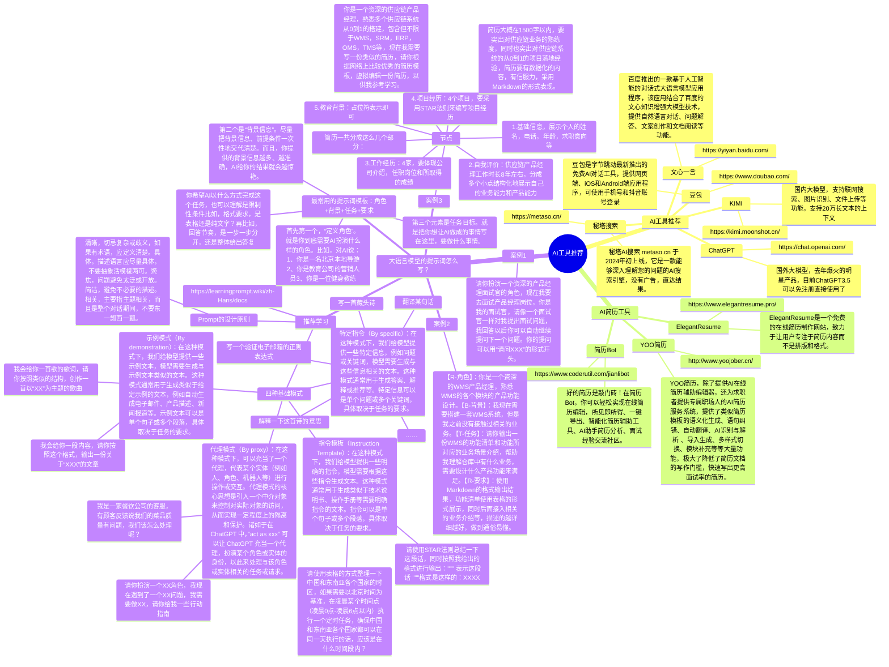
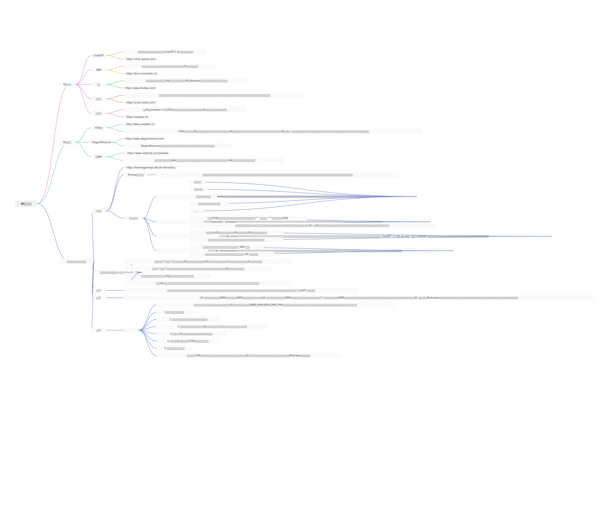
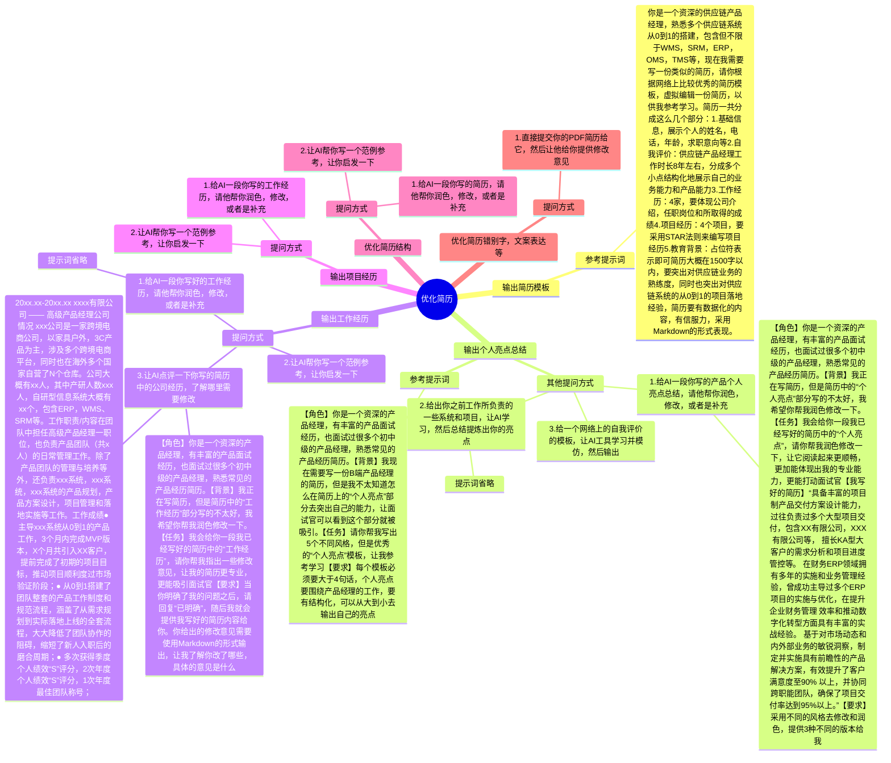
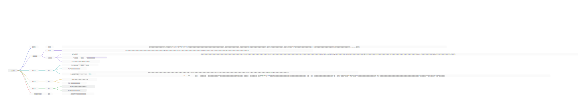
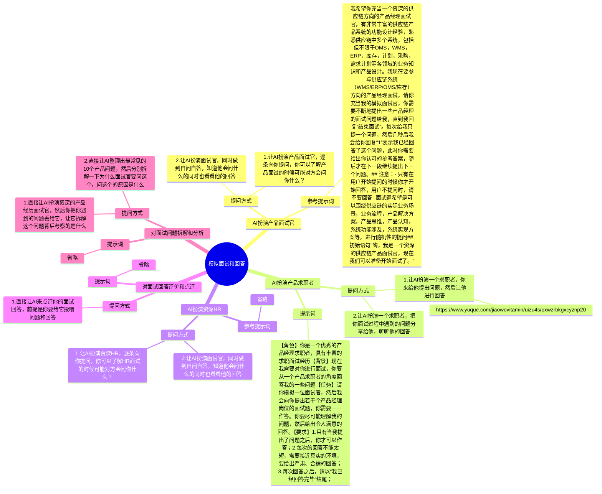
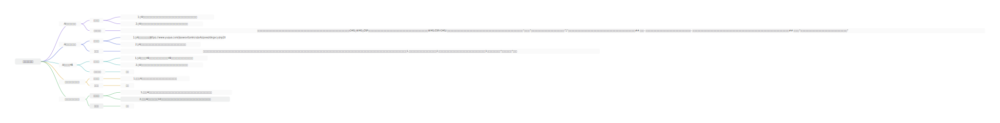
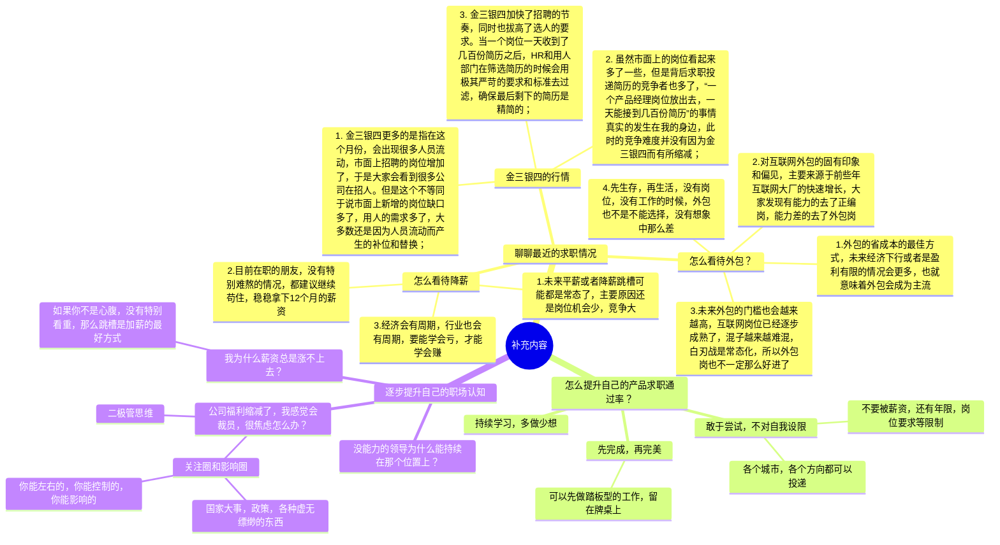
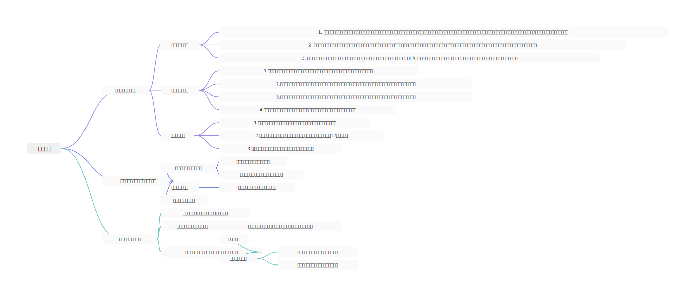

## 前言

本节是求职面试课的补充篇，虽然前面的内容已经很丰富了，但是在具体实操方面我观察到还是有很多求职的朋友简历写不来，面试问答也回答的不好，这里面有几个常见的原因：

1.  平时刻意练习的少，简历写得少，面试面的少，所以表现出不熟练，不太会；
2.  缺少一些灵感启发或者对照参考，虽然我的简历模板做得已经很齐全了，但是每个人从事的岗位和负责的项目不太一样，换成了自己来写的时候就不知道怎么提炼出项目的亮点和自己能力优势了；
3.  缺少实战练习的机会和场景，面试课程看再多，简历写再多次，还是要自己亲自试一试，体验一下。但是现在求职竞争大，HR已读不回，就很少有这种实战练习的机会，所以就导致面试的少，面试能力也就提升不起来；

因为最近工作中我经常会用到AI工具，所以我觉得可以分享一节“借助AI工具来提升产品求职面试能力”的课程。AI工具不受地域、时间、空间等限制，随时可以拿出来做你的“面试陪练官”，而且大语言模型天然就具有丰富知识储备，可以从多种角度去激发你的灵感，给你多种多样的参考示例。

而且对于产品经理来说，学会使用AI工具，擅用AI工具，本身就是一项很有必要的事情，所以这次我们一箭双雕，既教大家怎么用AI工具，也教大家怎么用AI工具来辅助撰写简历和做面试陪练。

## 课件详细内容

本节课的内容会分成4个部分：

1.  AI工具推荐；
2.  用AI工具撰写/优化简历；
3.  用AI工具模拟面试和回答；
4.  其他一些补充内容；

### Part1 AI工具推荐

### Part2 用AI工具撰写/优化简历

### Part3 用AI工具模拟面试和回答

### Part4 其他一些补充内容

### 课后作业

> 根据课程所学知识，使用AI去优化、润色你的简历，同时准备好一些高频常用的提示词（Prompt）

## **课程答疑或补充知识**

### 答疑

1.  AI工具推荐使用哪个？

> 目前来说KIMI的体验不错，而且注册登录简单，也不用张良计等，所以推荐使用Kimi。

2.  市面上有很多写Prompt的教程或者是写好的案例，平时需要去收集一下吗?

> 要的，其实好的Prompt就是好的提问方式，而好的提问方式在我们日常的工作中是非常重要的。平时有机会还是要多观察一下别人的一些好提问方式，有利于提升我们自己的提问能力和写Prompt的能力。

### 补充内容

暂无