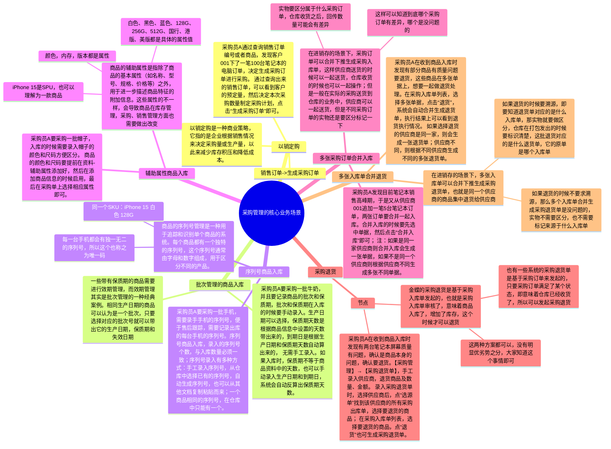
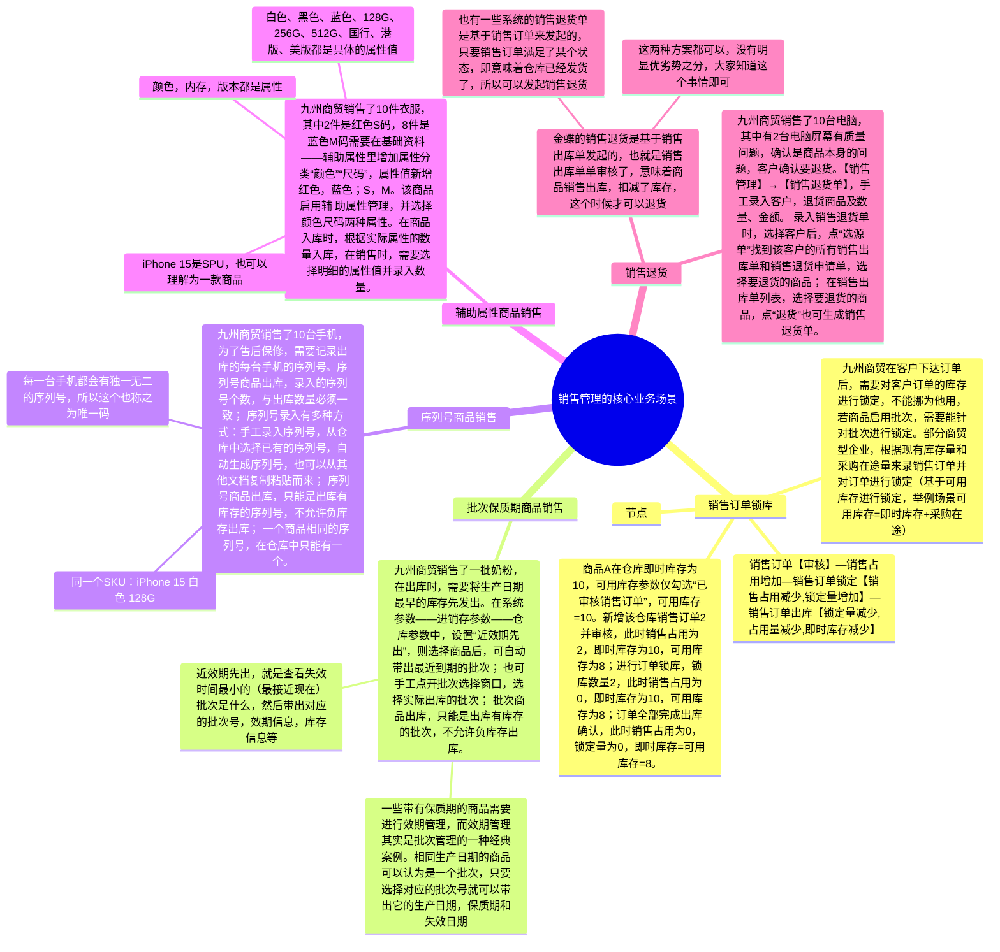

## 前言

经过前面一系列的课程讲解，我们对进销存系统有了一个比较全面认知，知道了进销存系统有什么功能模块，能解决什么问题，也知道进销项系统的一些单据流转关系，实体关系，还有业务流程等。

但是细心的朋友会发现，当自己去做作业的时候，总是会感觉缺少画面感，知道七色米进销存有这些东西，但是不知道实际业务是怎么用的，对应的系统功能是为了解决哪些具象化的业务场景，所以本节课就作为一个番外补充篇，来为大家拆解一下“金蝶云·星辰进销存解决方案”这个PDF中的一些重要内容。

同时，这也是进销项系列的最后一节课，下一节课开始我们就要进入下一个项目，即**仓储管理系统（WMS）**，敬请期待。

本课的开课时间是`**2024年06月16日（周日） 晚上8:30**`，开课的方式是使用腾讯会议，所以请大家提前准备好相应的软件，会议链接如下：

> 维他命 邀请您参加腾讯会议
> 
> 会议主题：番外篇1（直播课）：从“金蝶云·星辰进销存解决方案”学习进销存业务场景
> 
> 会议时间：2024/06/16 20:30-22:30 (GMT+08:00) 中国标准时间 - 北京
> 
> 点击链接入会，或添加至会议列表：
> 
> [https://meeting.tencent.com/dm/LqKtLJwimi74](https://meeting.tencent.com/dm/LqKtLJwimi74)
> 
> #腾讯会议：674-969-175
> 
> 复制该信息，打开手机腾讯会议即可参与

## 课件详细内容

本节课的内容大概会分成4个部分：

1.  金蝶云·星辰进销存的整体介绍；
2.  金蝶云·星辰进销存的采购管理介绍；
3.  金蝶云·星辰进销存的销售管理讲解；
4.  金蝶云·星辰进销存的库存管理介绍；

### Part1 金蝶云·星辰进销存的整体介绍

#### 1.1 本节番外篇的由来

之前我在调研金蝶星辰的时候，无意中发现金蝶有一个“资料下载”的模块，然后下载了一些相关的内容看了之后发现含金量和干货很多，同时也帮助我更好地理解和掌握了金蝶星辰的一些功能设计和业务知识等。

[研究与洞察-白皮书下载-案例册下载_金蝶软件官网](https://www.kingdee.com/download/)

_从“金蝶云·星辰进销存解决方案”学习进销存业务场景-1.png)

同时我也发现，很多人在入门供应链的时候总是感觉很难，感觉不得其法门，很重要的一个原因就是：**竞品看得少，业务场景接触的少，缺少画面感和业务信息。**

刚好我们在讲进销项相关的项目，然后金蝶又有这么一篇进销存的业务场景介绍的PDF，讲得很棒，细节很多。所以我就想着花一节课的时间来给大家拆解一下。

金蝶云·星辰进销存云解决方案.pdf

#### 1.2 进销存方案的整体介绍

[开启金蝶精斗云帐套-100万家企业用户的共同选择 _ 金蝶精斗云](https://www.jdy.com/regwork/)

> 点击进入之后，右上角“立即体验”就可以注册了

_从“金蝶云·星辰进销存解决方案”学习进销存业务场景-2.png)

_从“金蝶云·星辰进销存解决方案”学习进销存业务场景-3.png)

| 列 1 | 列 2 |
| --- | --- |
| _从“金蝶云·星辰进销存解决方案”学习进销存业务场景-4.png)_从“金蝶云·星辰进销存解决方案”学习进销存业务场景-5.png) | _从“金蝶云·星辰进销存解决方案”学习进销存业务场景-6.png)  _从“金蝶云·星辰进销存解决方案”学习进销存业务场景-7.png) |

| 列 1 | 列 2 |
| --- | --- |
| _从“金蝶云·星辰进销存解决方案”学习进销存业务场景-8.png) | _从“金蝶云·星辰进销存解决方案”学习进销存业务场景-9.png) |

> **可用库存：=** 仓库真实库存+入库在途-即将出库的或预留出库的（可自行设置公式，可在系统参数-进销存参数-库存参数中设置。
> 
> **预计可用库存**：主要适用于批次/保质期/序列号商品，或普通商品的销售订单和采购订单上没有录仓库、仓位时特有的库存。
> 
> 针对特性商品（批次、保质期、序列号），在创建订单的时候，其批次、保质期、序列号均未确认，此时的库存是属于不确定的，那么系统为了避免对已在库商品判断出现混淆，会把这批没入库的商品归属到待定。
> 
> 换个更容易理解的例子来说明：相当于打游戏时，你是游客身份进入的（没录批次/保质期/序列号的商品），那么游戏平台不会把你当成是会员（可用库存），只有当你注册了（录了批次/保质期/序列号并入库了），这个时候游戏平台才会把你纳入会员（也就是成为正式可用库存）。
> 
> 而订单创建的时候，如果仓库、仓位没有选择，那么系统也不知道这部分库存会和什么仓库绑定，所以也会算作“预计可用库存”，而不是具体的“可用库存”。

### Part2 金蝶云·星辰进销存的采购管理介绍

_从“金蝶云·星辰进销存解决方案”学习进销存业务场景-10.png)

_从“金蝶云·星辰进销存解决方案”学习进销存业务场景-11.png)

_从“金蝶云·星辰进销存解决方案”学习进销存业务场景-白板-1.svg)

### Part3 金蝶云·星辰进销存的销售管理讲解

_从“金蝶云·星辰进销存解决方案”学习进销存业务场景-12.png)

_从“金蝶云·星辰进销存解决方案”学习进销存业务场景-13.png)

_从“金蝶云·星辰进销存解决方案”学习进销存业务场景-白板-2.svg)

### Part4 金蝶云·星辰进销存的库存管理讲解

#### 4.1 库存管理的宏观介绍

_从“金蝶云·星辰进销存解决方案”学习进销存业务场景-14.png)

_从“金蝶云·星辰进销存解决方案”学习进销存业务场景-15.png)

_从“金蝶云·星辰进销存解决方案”学习进销存业务场景-16.png)

#### 4.2 其他出入库业务

_从“金蝶云·星辰进销存解决方案”学习进销存业务场景-17.png)

_从“金蝶云·星辰进销存解决方案”学习进销存业务场景-18.png)

#### 4.3 调拨业务

_从“金蝶云·星辰进销存解决方案”学习进销存业务场景-19.png)

> 关于调拨，金蝶的星瀚也有另外一种叫法：
> 
> 如果仓库距离近，不考虑在途，则可以使用直接调拨；
> 
> 如果仓库距离远，需要考虑在途，则可以使用分步调拨，即一个分步调出单和一个分步调入单；

| 列 1 | 列 2 |
| --- | --- |
| _从“金蝶云·星辰进销存解决方案”学习进销存业务场景-20.png) | 华星光电是一家加工企业，内部经常会有原料或成品在仓库之间的调拨。材料部需要把原材料A调拨到加工仓库去加工，只需 要做一个移仓单就可以实现原料的内部调拨了。  移仓单主要用于公司内部仓库之间的调拨，不牵涉到货物在途的管理。 |

| 列 1 | 列 2 |
| --- | --- |
| _从“金蝶云·星辰进销存解决方案”学习进销存业务场景-21.png) | 总仓要将“苹果X”调拨到一号仓，由于总仓和一号仓库在不同的城市，因此，总仓管理员需要先做一个调拨出库单，等到一号仓库管理员收到货入库后调拨才真正的完成。  调拨单多用于仓库在不同地方之间的调拨，调拨出库有**同价调拨**和**异价调拨**两种类型，可以根据实际情况进行选择，异价调拨多用于仓库不在同一个地方的情况，需要将运费等计算到成本内。 |

#### 4.4 盘点业务

_从“金蝶云·星辰进销存解决方案”学习进销存业务场景-22.png)

  

_从“金蝶云·星辰进销存解决方案”学习进销存业务场景-23.png)_从“金蝶云·星辰进销存解决方案”学习进销存业务场景-24.png)

_从“金蝶云·星辰进销存解决方案”学习进销存业务场景-25.png)

_从“金蝶云·星辰进销存解决方案”学习进销存业务场景-26.png)

#### 4.5 库存查询/库存流水/批次号库存查询

_从“金蝶云·星辰进销存解决方案”学习进销存业务场景-27.png)_从“金蝶云·星辰进销存解决方案”学习进销存业务场景-28.png)

_从“金蝶云·星辰进销存解决方案”学习进销存业务场景-29.png)

## 课后作业

> 本节课无课后作业，请大家完成之前布置的课后作业即可。

## **课程答疑或补充知识**

### 答疑

1.  金蝶星辰的内容很多，感觉上手难度比较大，我现在要花时间去学习吗？

> 如果是刚接触供应链领域不久的朋友，推荐先把七色米的东西掌握清楚，暂时不用深入去研究学习金蝶星辰；而之前接触过供应链领域的朋友，可以先研究学习金蝶星辰。
> 
> 金蝶星辰的内容确实很多，我们会在后面2-3节课来拆解学习它，所以刚开始上手觉得它难度太大的朋友不用着急，到后面还有机会学习的。

2.  感觉金蝶星辰能解决的场景很多，实际我们在工作中也会有这么多场景吗？

> 金蝶星辰是一款SaaS软件，它是具有普适性的，兼容多个领域，多种业务模式，所以你会发现它的解决方案中有很多场景，你在七色米的进销存上都没听过或者没见过。
> 
> 如果你未来的工作也是做SaaS的供应链产品，那么大概率也会有很多种业务场景，需要做很多兼容性的操作；但是如果你未来做的不是SaaS，而是自研型或者垂直型的业务，那么就不会有这么多场景。
> 
> 实际上，我在课程中已经删减掉了一些场景的讲解了，金蝶能兼容覆盖的场景还更多。

### 补充知识

暂无