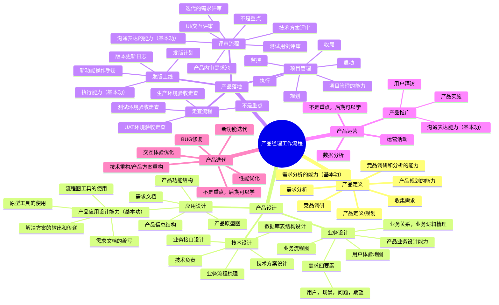
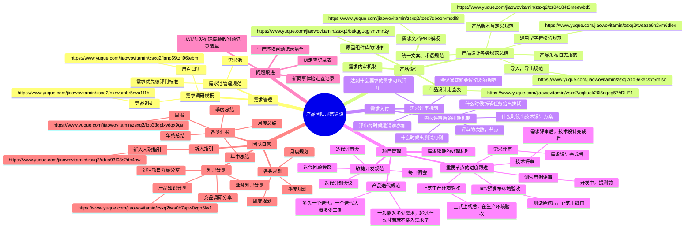

## 前言

这是一节全新的番外篇内容，它和供应链没什么关系，因为我们不讲进销存，OWTB，ERP等业务知识，而是来讲讲产品经理的日常工作，项目管理知识，还有产品团队规范搭建等。

为什么要讲这么一篇的内容呢？因为我发现课程中有不少的朋友可能是：

1.  产品经验不是很丰富，没做过产品经理或者是做过产品但只待过一两家公司，不知道外面其他公司的产品经理的日常是怎么样的；
2.  自己所处的环境中没有规范化、体系化的制度，不知道别的公司，别的团队中是怎么处理这些事情的；
3.  因为GAP的原因，远离职场有一定的时间了，对一些日常工作的细节或者是接地气的东西有点生疏了；
4.  对产品经理要不要考PMP，NPDP，软考高项等证书有点疑惑，想考一些证书，但是又不知道是否值得，想做做功课；

鉴于上述的一些原因，再加上我们之前一直都是在讲解业务相关的知识，在讲系统方面的内容，所以我决定引入这节番外篇，来给大家调节调节“口味”，讲点不一样的内容。

本课的开课时间是`**待定**`，开课的方式是使用腾讯会议，所以请大家提前准备好相应的软件，会议链接如下：

> 待定

## 课件详细内容

本节课的内容大概会分成5个部分：

1.  产品经理日常要做什么？
2.  产品经理要不要考一些证书？
3.  项目管理的理论知识分享与实际案例；
4.  产品团队的规范建设分享；

### Part1 产品经理日常要做什么？

> **产品经理的日常工作要做什么？**

这个是很多产品新手或者想要转行到产品领域的朋友常问的一个问题，也是产品领域的社区中讨论最多，传播最多的一个话题。

这个问题其实有点宽泛，不够聚焦，所以也很难有统一的答案。总得来说，可以从行业，业务方向，岗位定位，负责的产品所处的阶段这几个维度去拆分，大概能得到一些有效信息。

-   行业，2B和2C的玩法不太一样，2B和2G的产品也不太一样，不同行业的产品可能差别比较大，对应的日常工作事项自然就会天差地别；
-   业务方向，例如说跨境电商和国内电商的玩法不太一样，SaaS和自研的业务模式也不太一样，所以相关的产品经理要做什么也不太一样；
-   岗位职责，不同职级的产品要做的事情差别更大，例如产品助理和产品总监的工作职责要求就完全不一样；
-   负责的产品所处的阶段，由于自己负责的产品所处的阶段不一样，也会导致产品的工作有很多不一样。从0到1阶段的产品和稳定增长阶段的产品也不太一样；

虽然说不同行业，不同领域，不同职责的产品经理要负责的内容都不太一样，但是抛开一些表象来看本质，还是可以抽取出“产品经理日常工作中高频事项”的。

_产品经理日常工作,考证,产品规范建设等知识分享-1.png)

_产品经理日常工作,考证,产品规范建设等知识分享-2.png)

_产品经理日常工作,考证,产品规范建设等知识分享-3.png)

[分享一下我总结的B端产品经理工作流](https://coffee.pmcaff.com/article/3048113018053760/pmcaff?utm_source=forum&newwindow=1)

上面的链接地址是我之前在PMCAFF上分享一篇“B端产品经理工作流”，其中有很多流程都具有普适性，可以直接套用到其他类似的B端业务型的公司和产品团队中。大家在课后可以查看详细的文字版，这里我抽出一些重要点做一个快速讲解：

1.  项目立项；
2.  需求调研&竞品分析；
3.  画用例图或业务分析图；
4.  产品主体框架评审与讨论，确认大框架没问题；
5.  绘制业务流程图和系统数据交互图；
6.  梳理产品功能结构图，确认功能项与产品边界；
7.  梳理产品信息结构图，确定细节与主体信息；
8.  画出原型图，做好相关批注和逻辑说明；
9.  开始评(si)审(bi)->评审一次后修改与调整->继续评审->继续修改->看开发测试是否已清楚，若清楚则开始进入开发；
10.  TAPD跟进需求，这一步可前可后，但是最终版肯定是评审完后再维护完成；
11.  跟进开发内容，可以协助解决困惑点，同时参与部分测试与验收；
12.  制定版本上线计划，召开相关的评审会议（验收会议），同时给出上线计划，并顺带找时间写好产品说明（操作）手册；
13.  产品上线，完成收尾工作，记录版本发布日志等；
14.  跟进上线结果，访谈用户，查看相应问题是否解决，是否完成指标等。

**总结一下，产品经理日常工作中的高频事项可以用下面****👇🏻****这个图来概括展示。**

_产品经理日常工作,考证,产品规范建设等知识分享-4.png)

> 知道了产品经理在日常工作中要做哪些高频事项之后，我们可以根据这些事项来反推，产品经理应该需要掌握什么技能，掌握什么知识，这样才能更好地胜任相关的工作。

_产品经理日常工作,考证,产品规范建设等知识分享-白板-1.svg)

  

### Part2 产品经理要不要考一些证书？

> 产品经理交流群中，经常会有人抛出下面这些问题：
> 
> 1.  产品经理要不要考PMP？PMP有用吗？
> 2.  产品经理要考NPDP吗？这个证书受公司的认可吗？
> 3.  产品经理要不要参加软考？应该考什么方向的证书？
> 4.  ……

#### 2.1 PMP（Project Management Professional）

> PMP全称为Project Management Professional，即项目管理专业人士资格认证。它是由美国项目管理协会（Project Management Institute）发起的，严格评估项目管理人员知识技能是否具有高品质的资格认证考试。

**考试时间**：

一般一年4次，分别是3月、6月、8月、11月左右。

**考试费用**：

初考报名费3900元，重考费用2500元。

机构培训费用约2000-3000元。

**准备时间**：

非脱产建议3个月左右，每天需要投入1-1.5小时。

**官方网站**：

[项目管理专业资格认证-首页](http://event.chinapmp.cn/PMP/LEAP/pmp/html/index.html)

#### 2.2 NPDP（New Product Development Professional）

> NPDP产品经理国际资格认证，New Product Development Professional（NPDP），由美国产品开发与管理协会（PDMA）所发起，是国际的新产品开发专业认证，集理论、方法与实践为一体的全方位知识体系，为公司组织层级进行规划、决策、执行提供良好的方法体系支撑。

**考试时间**：

一般一年4次，在每年的5月和11月进行。

**考试费用**：

报名费3200元。

机构培训费4000-5000元。

**准备时间**：

非脱产建议3个月左右，每天需要投入1-1.5小时。（和PMP差不多）

**官方网站**：

[产品经理国际资格认证-首页](http://www.chinanpdp.cn/CITEF/LEAP/npdp/html/index.html)

#### 2.3 软考（计算机技术与软件专业技术资格（水平）考试）

> **​**软考有初级，中级，高级之分，每个等级中会有不同的细分方向，适合产品经理报考的有“信息系统项目管理师（简称：高项）”，还有“系统集成项目管理师（简称：中项）”，一般来说**高项**更有含金量，也最推荐考高项。
> 
> 信息系统项目管理师是全国计算机技术与软件专业技术资格（水平）考试中的高级水平测试，综合素质要求高、以计算机基础技术为依托、考查项目管理方面的内容、覆盖面较广、有一定难度。_产品经理日常工作,考证,产品规范建设等知识分享-5.png)

**考试时间**：

高项之前是一年2次，现在改成了一年1次了。

**考试费用**：

按考试科目收费，约68元/科。高级职称考3科，报名费大概是200来块钱。

机构培训费用2000-3000元。机构培训有不区分中级和高级的，也就是报名一次可以学习中级和高级的内容。

**准备时间**：

非脱产建议3-5个月左右，每天需要投入1-2小时，且**软考高级要求考论文题**，在120分钟内完成信息系统项目管理论文。

**官方网站**：

[中国计算机技术职业资格网](https://www.ruankao.org.cn/)

#### 2.4 个人的一些看法和介绍

我在2020年的时候通过了PMP的考试，拿到了对应的证书；同时也在2021年的时候准备过一段时间的高项备考，所以我对这两个证书的情况还算了解。

PMP通过率很高，大概是90%多，而高项通过率低一些，大概是在20%左右，相对来说高项难度会高很多，内容也会多很多，所以要花费更多的时间和精力来准备。

PMP的题量比较大，内容比较多，一般要提前3个月以上开始准备，大概要学习35个小时以上，加上刷题和模拟考试的时间，大概会接近50个小时。

PMP的内容是围绕项目管理来讲的，考这个证的人不只是互联网从业者，还有很多建筑、实体行业、各行业管理人员等都会参加，项目是指在一定的约束条件下（主要是限定时间、限定资源），具有明确目标的一次性任务。

1.  产品经理学习项目管理的知识有必要吗？

> 有必要，而且很有必要，项目管理的知识是通识，不仅仅是用于日常工作，生活中的一些其他事情也可以用这一块的知识来解决。尤其是未来向管理层进阶的时候，会明显感受到项目管理的重要性。

2.  PMP证书对产品经理找工作会有明显帮助吗？

> 从我面试一些候选人，以及我自己的求职经历来说。PMP证书对产品经理面试大多数的公司来说，加分效果微乎其微。一方面是PMP普及率和通过率确实比较高，大家都有这个东西；其次是目前产品求职大家还是更看重过往的项目经验和行业方向等，项目管理方面的东西影响力非常小。

3.  NPDP和软考高项证书对产品经理找工作会有明显帮助吗？

> 答案和上面的第2点类似，这两个证书对产品找工作帮助都不是很大。对于一些国企类、央企类、To G类的公司，可能高项证书会有一些加分项，因为这个证书是工信部和人力资源部共同认证的，有一定的含金量。

4.  PMP通过率这么高，含金量也不高，那我有必要去考吗？

> 如果有钱也有闲，那么建议去考，厚积才能薄发，多一个证书不会有坏事；  
> 如果有闲但是没有钱，建议可以报一个PMP的学习班，但是不去考试，相当于只是学完知识，但是不报名考试，因为PMP的那张证书真的不太值3900元；  
> 如果没钱也没闲，那我建议自己去看看一些相关的书籍，了解一些概念和知识，未来工作的时候再针对性提升就好了。

4.  这三个证书最推荐考什么？最不推荐考什么？

> 我个人非常建议产品经理去考软考高项，也就是“信息系统项目管理师”，这是一个国家两大部门联合认证的考试，含金量很高，通过率大概在20%以内。内容也是项目管理，和PMP非常的类似，但是难度高很多，不过报名费很便宜，只要200块钱左右，一年可以考2次，5月份和11月份。
> 
> 其次是推荐去考PMP，前提是自己要先降低预期，这个证书考完之后，可能对你找工作、求职并不会有什么很明显的帮助。学习PMP可以了解项目管理的一些精华知识，这些知识不仅仅可以用于产品工作，也可以用在其他领域中，属于通识类的知识。
> 
> 最后不太推荐大家去考的就是NPDP，因为这个证书比较小众，不太知名，很多HR，老板，产品负责人等都没听过这个证书，在中国的普及度不够高，都没有PMP高，所以综合来看都不太值得推荐。

### Part3 项目管理的理论知识分享与实际案例

#### 3.1 基础概念的讲解

对于一个项目的管理过程来说，PMP定义为有五大过程组，分别是：

1.  项目启动
2.  项目规划
3.  项目执行
4.  项目监控
5.  项目收尾

_产品经理日常工作,考证,产品规范建设等知识分享-6.png)

#### 3.2 五大过程组是什么？

启动过程、规划过程、执行过程、监控过程、收尾过程。

各用一句话概括项目管理知识体系五大过程组：

1.  启动过程组：作用是设定项目目标，让项目团队有事可做；
2.  规划过程组：作用是制定工作路线，让项目团队“有法可依”；
3.  执行过程组：作用是“按图索骥”，让项目团队“有法必依”；
4.  监控过程组：作用是测量项目绩效，让项目团队“违法必究”，并且尽量做到“防患于未然”；
5.  收尾过程组：作用是了结项目（阶段）“恩怨”，让一切圆满。

#### 3.3 PMBOK十大知识领域是什么？

整合管理、范围管理、时间管理、成本管理、质量管理、人力资源管理、沟通管理、风险管理、采购管理、干系人管理。

各用一句话概括项目管理知识体系十大知识领域：

1.  整合管理：其作用犹如项链中的那根线；
2.  范围管理：做且只做该做的事；
3.  时间管理：让一切按既定的进度进行；
4.  成本管理：算准钱和花好钱；
5.  质量管理：目的是满足需求；
6.  人力资源管理：让团队成员高效率地和你一起干；
7.  沟通管理：在合适的时间让合适的人通过合适的方式把合适的信息传达给合适的人；
8.  风险管理：“无事找事”，从而让项目“无险事”；
9.  采购管理：当好甲方；
10.  干系人管理：和项目干系人搞好关系并令其满意。

| **十大知识领域** | **五大过程组** |  |  |  |  |
| --- | --- | --- | --- | --- | --- |
|  | **启动过程组** | **规划过程组** | **执行过程组** | **监控过程组** | **收尾过程组** |
| 4.项目整合管理 | 4.1 制定项目章程 | 4.2 制定项目管理计划 | 4.3 指导与管理项目工作 4.4 管理项目知识 | 4.5 监控项目工作 4.6 实施整体变更控制 | 4.7 结束项目或阶段 |
| 5.项目范围管理 |  | 5.1 规划范围管理 5.2 收集需求 5.3 定义范围 5.4 创建WBS |  | 5.5 确认范围 5.6 控制范围 |  |
| 6.项目进度管理 |  | 6.1 规划进度管理 6.2 定义活动 6.3 排列活动顺序 6.4 估算活动持续时间 6.5 制定进度计划 |  | 6.6 控制进度 |  |
| 7.项目成本管理 |  | 7.1 规划成本管理 7.2 估算成本 7.3 制定预算 |  | 7.4 控制成本 |  |
| 8.项目质量管理 |  | 8.1 规划质量管理 | 8.2 管理质量 | 8.3 控制质量 |  |
| 9.项目资源管理 |  | 9.1 规划资源管理 9.2 估算活动资源 | 9.3 获取资源 9.4 建设团队 9.5 管理团队 | 9.6 控制资源 |  |
| 10.项目沟通管理 |  | 10.1 规划沟通管理 | 10.2 管理沟通 | 10.3 监督沟通 |  |
| 11.项目风险管理 |  | 11.1 规划风险管理 11.2 识别风险 11.3 实施定性风险分析 11.4 实施定量风险分析 11.5 规划风险应对 | 11.6 实施风险应对 | 11.7 监督风险 |  |
| 12.项目采购管理 |  | 12.1 规划采购管理 | 12.2 实施采购 | 12.3 控制采购 |  |
| 13.项目干系人管理 | 13.1 识别干系人 | 13.2 规划干系人参与 | 13.3 管理干系人参与 | 13.4 监督干系人参与 |  |

#### 3.4 项目管理在工作中的运用（实际案例）

1.  项目启动会和项目开工会？

> 启动会是由项目的**发起人**召集大家召开，**明确项目以及要不要做这个项目**；
> 
> 开工会是由**项目经理**组织召集大家召开，**明确这个项目应该怎么做**。
> 
> 经过启动会正式颁布项目章程，明确项目，正式立项，并且在项目章程中任命项目经理。此时从启动过程组到了规划过程组。
> 
> 到了规划过程组以后，开工会是由项目经理组织召开项目开工会，会上项目经理介绍和分发整个的项目管理计划，宣布项目即将进入执行。
> 
> 现实中，一般就只会开一个会议，一般是启动会和开工会结合，把相关的干系人召集到场，然后介绍相关的负责人，项目的计划，大概的目标和方向等。

2.  干系人（相关方）管理的重要性

> 在做需求分析的时候，我们知道用户的很重要的，要分析用户，然后针对性的分析需求。
> 
> 而在项目管理中也是一样的道理，相关方管理非常的重要。因为项目管理有一个潜在的核心点：**项目经理的核心工作就是处理政治。**没错，就是政治。项目经理的主要任务就是有效地处理人际关系——客户、供应商、职能经理、财务人员、公职人员，等等。
> 
> 所以在做项目管理的时候，一定要提前将相关方整理出来，后续拉会议，发邮件，通知一些进展的时候，要知道应该发送给谁，然后抄送给谁，在什么环节需要争取什么利益等。

3.  组织过程资产的重要

> 项目管理中，有一个词语叫做“组织过程资产”，组织过程资产包括来自任何（或所有）项目执行组织的，可用于执行或治理项目的任何流程、实践或知识，还包括来自组织以往项目的经验教训和历史信息。
> 
> 在项目管理过程中要注意这类资产的收集、整理、更新和沉淀，对于产品工作也是如此，要养成文档、数据、流程、经验的沉淀的习惯，这些资产都是“无价之宝”。

4.  认识产品经理和项目经理的工作差异

> 虽然两者都叫做**PM**，一个是Product Manager，也就是产品经理；一个是叫Project Manager，也就是项目经理。但是显然项目经理和产品经理完全是两个不同的岗位和工种，只不过在某些团队中，由于没有专职的项目经理，所以会让产品经理兼职充当一部分项目经理的工作。
> 
> 那么项目经理要做什么呢？
> 
> -   制定工作计划、项目执行计划、人员配置计划、工作分解结构、成本计划等，同时报上级组长，并报公司审批。
> -   把控项目流程，跟进项目进度，推动整个项目的执行落地。充分利用协调人力、物力、时间等资源来达成目标。
> -   跟进问题，管理风险，控制进度，控制成本，控制资源等，通过一系列手段，确保项目按计划执行。
> 
> 简单来说项目管理就是一些人在一段时间做某些事情，而项目经理就是领导这群人在这段时间好快多省地完成某些事情。

### Part4 产品团队的规范建设分享

_产品经理日常工作,考证,产品规范建设等知识分享-白板-2.svg)

## 课后作业

> 暂无

## **课程答疑或补充知识**

### 答疑

1.  什么是“课题分离”？

> 可以看看这个文章：[阿德勒课题分离理论的正确打开方式](https://zhuanlan.zhihu.com/p/261951839)  
> 也可以看看这本书：《被讨厌的勇气》

2.  职场的本质是价值交换

> 所以，在大多数的情况下，都要时刻提醒自己：
> 
> 1.  我实际创造的价值有多少？
> 2.  领导层看到的我的价值是多少？
> 3.  我应该怎么让“被看到的价值”大于等于“我实际创造的价值”？

1.  很多管理手段都是为了抵抗不确定性

> 每周的汇报会议，每个月的规划和总结，上层领导的层层施压，穷追不舍……其中有一个很核心的内容就是“不确定性”。
> 
> 管理层不知道你在做什么，不知道这个项目进展怎么样的……
> 
> 管理层不知道这个项目是否能成功，这件事一直在支出但是收益没看到……
> 
> 管理层负责多条业务、关联多个岗位和人员，没办法一个一个盯着……
> 
> “不确定性”会带来一些危机感和操作的变型，本质上是想通过一些管理手段来降低这种不确定性，但是执行过程中往往效果会打折扣。
> 
> 所以，在做一些规划，做一些判断的时候，从下层开始就要给出清晰的回复，不要模糊，否则层层传达就会加重“不确定性”。

2.  岗位和责任相匹配非常重要，能力越大，压力越大

> 以前会有一种错误的认知：到了一定的管理岗之后，就会轻松一些，就可以舒服一些了。
> 
> 职场的本质是价值交换，所以在管理岗或者在高级岗的时候，需要交付的价值也要更高。而很多时候，高价值的事情并没有那么多，于是琐碎的事情、决策的事情、规划的事情、上传下达的事情就多了起来，其实并没有更轻松。
> 
> 岗位和责任一般来说是需要相匹配的，如果岗位高但是责任却少，那么就会导致下面的人不服气，难以打造积极向上的团队；如果岗位高但是责任也超多，就会导致个人喘不过气，也不利于自己的发展。

3.  不要过分放大职场中的个人情绪

> 职场中先考虑自己的感受、自己的情绪，然后基于此去做出一些自己的判断，这个是人之常情。但大多数时候，不要放大自己的情绪，不要过于奢望对方去体谅自己，团队去关照自己，也不要过于担忧对方的情绪，过于感性而影响自己的判断。
> 
> 职场中做到课题分离，能省下很多事情。
> 
> 什么是课题分离？
> 
> 课题分离，是心理学家阿德勒提出的，解决人际关系的烦恼的理论。**阿德勒说，要想解决好人际关系问题，最重要的就是要区分什么是你的课题，什么是我的课题。**我只负责把我的事情（课题）做好，而你只负责把你的事情（课题）做好。

4.  先适应规则，再想办法改变规则，切勿搞反了

> 刚去新公司的时候，有很多东西都不适应，团队规范，办公设备，公司制度，工作流程等，不适应还有一层潜台词就是“与预期有落差”或者是“与过往对比有落差”。
> 
> 为什么想要改变规则？是想要改成利好自己的？还是利好大家的？
> 
> 如果改变不了怎么办？要么留下选择适应，要么离开重新选择一个……
> 
> 再回到求职的初衷，我的诉求是什么？我的职业规划是什么？我对下一份工作更看中的是什么？
> 
> 结合这些内容，再去做出判断和选择。如果选择留下适应，那么就要先熟悉这套规则，然后将其中一些不合理、可改进的、可优化提升的记录下来，后续有机会的时候再去推动改变规则。

### 补充知识

1.  推荐阅读《被讨厌的勇气》

_产品经理日常工作,考证,产品规范建设等知识分享-7.png)