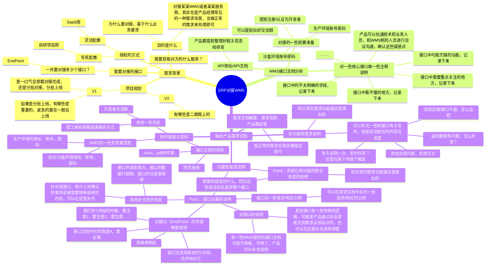
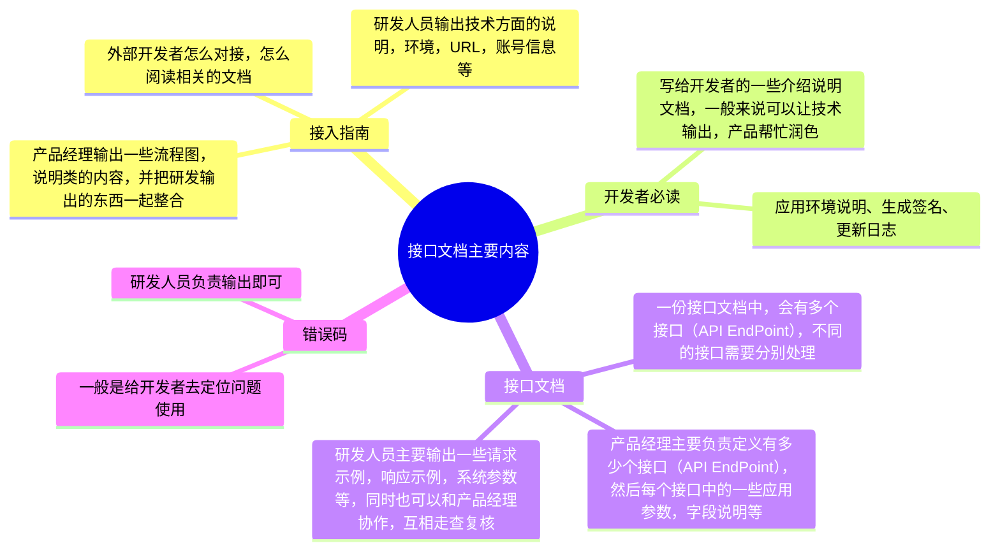
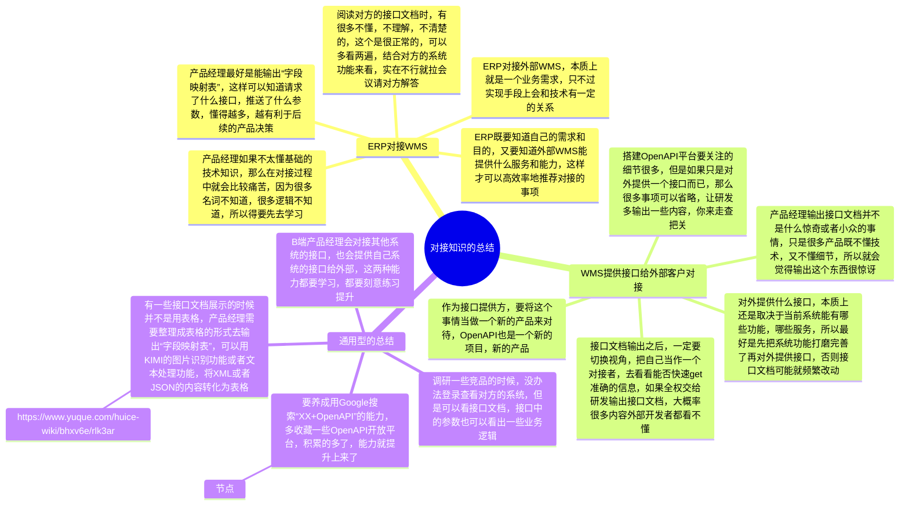

## 前言

本套课既讲了WMS的项目，又讲了ERP的项目，同时也讲了API接口对接方面的知识，但是我感觉还少了一节课来把这三个方面的知识全部串联起来，所以这节课我们就来讲讲ERP和WMS的对接。

为什么说是“**两个不同的视角**”呢？因为在日常的工作中，我们往往要么只负责ERP项目，要么只负责WMS项目，很少会有机会同时负责ERP，又负责WMS。所以这里提到的两个视角，其实就是ERP的视角和WMS的视角。

| 列 1 | 列 2 |
| --- | --- |
| **ERP的视角**：  我是电商ERP或者内部ERP，需要对接外部三方仓库，然后把相关的单据指令推送到仓库，让仓库按指令去完成收货、出库等。 | **WMS的视角**：  我是对外提供服务的仓储服务商，有一个或者多个实体仓库，也有一套相关的WMS系统，我需要对外开放自己的OpenAPI，让相关的客户接入到WMS中，可以通过接口给WMS下发作业指令。 |

> 本节课为录播课程，没有腾讯会议邀请链接，可以先查看下方的课程文稿，然后再学习课程视频，最后完成相关的课后作业即可。

## 课件详细内容

本节课的内容大概会分成4个部分：

1.  ERP和WMS之间的一些业务往来和关系讲解；
2.  ERP如何对接WMS？
3.  WMS如何提供对外的接口？
4.  ERP和WMS的“对接知识”总结；

### Part1 ERP和WMS之间的一些业务往来和关系讲解

1.  ERP和WMS的交互示意图

> 一般情况，WMS一定是“下游”，也就是说ERP和WMS的对接，是ERP->WMS，即ERP推送数据给WMS。
> 
> _从两个不同的视角,讲解ERP和WMS的对接-1.png)
> 
> _从两个不同的视角,讲解ERP和WMS的对接-2.png)

2.  ERP在什么情况下需要对接WMS？可以对接多少个WMS？

> ERP对接WMS，本质是ERP要使用的WMS所提供的某些服务或者能力，请问WMS能提供什么服务或者能力？
> 
> ​  
> 
> “仓库最基本的功能是储存货物，并对储存的货物实施保管和控制。 但随着人们对仓库概念的深入理解，仓库也担负着货物处理、流通加工、物流管理和信息服务等功能。”
> 
> 所以，我们需要使用外部的仓库来存储自己的货物并且对货物进行保管和控制，而且这个时候我们有自己的ERP系统，所以我们需要用ERP来对接WMS。
> 
> 外部的仓储服务商有多少个，一般我们就要对接多少个WMS，对接的数量是无上限的，想对接多少就对接多少。

3.  一般SaaS的电商ERP会对接多少WMS呢？

> 国内电商SaaS代表：聚水潭，对接了大概300多家WMS
> 
> [https://ww.erp321.com/app/support/document.html#cate=1535](https://ww.erp321.com/app/support/document.html#cate=1535)
> 
> 跨境电商SaaS代表：店小秘，对接了大概160多家WMS
> 
> [https://www.dianxiaomi.com/oversea/warehoseIndex.htm?indexType=1](https://www.dianxiaomi.com/oversea/warehoseIndex.htm?indexType=1)

4.  内部ERP或者B2B模式自用的ERP会对接多少WMS呢？

> 内部ERP得要看自己具体的业务情况，一般实际业务用了几家WMS，那么就要对接几家WMS，这个是没有规律和标准的。

5.  电商SaaS ERP对接了那么多WMS，使用SaaS ERP的商家怎么启用自己想要的WMS呢？

> 在电商SaaS ERP中，一般都会有一个“授权仓库”的模块，意思是说ERP已经和很多仓库WMS都对接好了，完成了技术方面的对接， ERP的用户需要用哪家WMS，那就输入对应的授权信息即可。
> 
> 不同的WMS对授权信息的要求不太一样，所以要填填写的授权字段也会不一样，这个是看WMS的要求，所以ERP需要写对应的操作手册，让用户知道自己要填写什么字段，要怎么获取这些字段。
> 
> _从两个不同的视角,讲解ERP和WMS的对接-3.png)
> 
> _从两个不同的视角,讲解ERP和WMS的对接-4.png)

### Part2 ERP如何对接WMS？

> **背景导入：**
> 
> 维他零售公司，之前都是做零售批发业务，对接的都是一些主要做B2B业务的仓库。最近根据业务的规划要开拓电商业务，所以想要对接B2C的电商相关的仓库，目前已经找好了一家意向的仓库，对方用的是万里牛WMS，所以需要对接万里牛WMS的接口。
> 
> [https://open.hupun.com/api-doc/wms/open/oms/bill/cancelbill/v2](https://open.hupun.com/api-doc/wms/open/oms/bill/cancelbill/v2)

_从两个不同的视角,讲解ERP和WMS的对接-白板-1.svg)

#### 2.1 调研业务需求，梳理当前诉求

既然要搞B2C的电商业务，那么就要先自己内部把相关的需求给调研清楚，明确清楚，可能会涉及到电商运营部门，仓储物流部门，采购和计划部门等，都需要拉通。

| **业务部门** | **待确认的问题和事项** | **其他** |
| --- | --- | --- |
| 电商运营部 | 要开展哪些电商业务？电商平台：淘宝，京东，拼多多品牌官网/小程序：官网，自营商城，小程序……电商销售的品类和线下零售的品类有什么区别？电商平台走“少而精”，“爆品”的模式线下渠道则是“大而全”的模式 | 不同的电商平台，对电商履约的要求不一样，所以在对接WMS的时候也会有一些需要特殊处理 |
| 仓储物流部 | 电商仓要支持什么业务？不支持哪些业务？采购入库、销售出库、调拨入库、调拨出库、采购退货、残次品处理……电商仓的收发货要求和执行标准是什么？电商仓的签约合同、费用报价、考核要求等会有什么信息化对接类的需求吗？ | 仓储物流部是面向外部仓库的角色，后续在运营过程中很多需求可能都是他们提出的 |
| 采购和计划部 | 电商仓的库存计划是怎么计算的？电商仓的货物是调拨入库还是采购入库？电商仓和B2B仓的采购有什么差异化要求吗？ | 新增了一个仓库，那么就需要从“进销存”的多个视角去考虑，会有什么影响 |
| 财务部 | 电商仓的业务开展和财务计费有什么关系吗？电商仓的业务单据是否要单独结算，单独标识清楚？ | 电商业务既要考虑仓储履约，也要考虑经营分析，所以财务这一块的需求可能也要考虑到位 |
| 技术部 | 除了ERP需要和外部仓库的WMS对接，还有其他系统、其他功能需要改造吗？对接方面是否有什么技术难题或者要提前处理的？ | 技术部门要做的可能不仅仅是接口对接，还有其他上下游系统的打通，对齐等 |
| 其他 | 一些其他补充的内容 | 在需求调研过程中，发现并记录的其他问题 |

#### 2.2 阅读接口文档，提取有效信息

上述的相关分析，和正常做一些业务需求是一样的，不会因为需要对接就有什么特别不太一样的，所以按正常的需求分析和需求澄清的方式方法来执行即可。

当背景信息和原始需求都搞清楚了之后，接下来就可以去阅读接口文档，提取接口文档中的一些关键信息了。

1.  获取接口文档的地址或者文件附件；
2.  查看对接指引，了解大概的对接流程和步骤，按对方的要求执行即可；
3.  阅读具体的API文档，了解对方提供了哪些接口（API EndPoint），不同的接口有什么作用；

1.  [https://open.hupun.com/api-doc/wms/open/oms/bill/cancelbill/v2](https://open.hupun.com/api-doc/wms/open/oms/bill/cancelbill/v2)

4.  结合需求调研，再加上自己对接口文档的理解，可以梳理出要大概对接哪些EndPoint；

1.  接口认证、授权、鉴权等；
2.  商品同步，即从ERP推送商品资料到WMS中；
3.  入库单创建，即从ERP推送采购订单到WMS中；
4.  退货入库单创建，即从ERP推送退货入库单到WMS中，如果电商仓没有退货业务，则不需要对接；
5.  发货单创建接口，即从ERP推送销售订单到WMS中；
6.  单据取消，即从ERP发起单据的取消，可以取消入库单，退货入库单，发货单等；
7.  入库单确认接口，即WMS入库之后，更新状态和数据，反向推送给ERP；（Webhook-回调）
8.  退货入库单确认接口，即WMS退货入库之后，更新状态和数据，反向推送给ERP；（Webhook-回调）
9.  发货单确认接口，即WMS发货出库之后，更新状态和数据，反向推送给ERP；（Webhook-回调）

#### 2.3 对接口文档的内容做详细的批注和分析

WMS方提供的接口文档，可能非常丰富，文档介绍非常详实，也有可能接口文档内容简陋，表达的也不好，所以很有可能会有很多内容需要产品经理去确认，去落实。

这是产品经理在做对接类需求需要花费比较多时间和精力的方面，如果对方的接口文档做得好，做得充分，那么对接流程就会很顺畅，执行起来就会很简单；但是如果对方的接口文档做得很烂，很多不全，那么对接过程就会很漫长，需要反复确认，修改等。

> 对接口文档的批注和分析，也取决于产品经理的经验积累和认知水平。你懂得越多，很多东西你就一眼能看懂，就无需过多的求证和确认，所以批注的内容就少了。
> 
> 即使自己懂得比较少也没关系，坦诚地承认，然后把自己不知道的东西记录下来，再通过会议或者群聊的方式确认相关的事项即可。**关键是要提出一个好问题，同时自己也要提前做好一些铺垫知识的摄取。**

#### 2.4 根据接口文档，输出接口对接的需求文档

_从两个不同的视角,讲解ERP和WMS的对接-5.png)

[链接](https://www.yuque.com/jiaowovitamin/sixth/hlfu0hpvwp6ptntq)

### Part3 WMS如何提供对外的接口？

> **背景导入：**
> 
> 维他海外仓是一家专注于服务欧美市场，为3C类品牌卖家提供精细化仓储服务的海外仓公司，最近刚好自研上线了自己的WMS系统。
> 
> 刚好最近接入了一些KA型客户，这些客户希望维他海外仓能提供一套对外的OpenAPI，然后通过接口可以实现从客户的ERP或者后台管理系统直接推送商品数据、业务单据到WMS中，而不是每次都登录海外仓OMS去手动处理单据。
> 
> [https://open.wingsing.com/#/home](https://open.wingsing.com/#/home)

#### 3.1 调研业务需求，梳理当前诉求

WMS要对外提供接口，必然是希望能做成通用的，这样的话每个外部客户要接入WMS都可以走这一套标准。但是通用的API接口，也是有发展路线的，不是一蹴而就可以达到通用、标准、规范、体验棒的。

产品经理去调研业务需求，主要是了解一下目前的客户量级，客户诉求，客户需要接入什么功能和模块，还有当前WMS功能的发展情况，然后制定对应的方案。

| 阶段 | 场景/业务特点 | 接口的解决方案 |
| --- | --- | --- |
| 早期较为原始阶段 | WMS的外部客户很少，可能就几个WMS自身的功能可能也不是很完善，所以就算提供对外的接口，也只能提供少量的内容 | 直接用Word文档展示或者Swagger UI，接口的授权和校验等也可以简单处理，具体方案可以和技术沟通 |
| 中期探索阶段 | WMS的外部客户开始多了起来，需要接口对接的客户也多了一些，需要频繁和一些外部客户解答对接的问题WMS自身的功能可能相对来说也完善了不少，这个时候可以对外提供比较丰富的接口WMS有的内容，可能会和接口提供的内容有差异，当WMS更新了新特性功能之后，接口的内容可能也要调整 | 可以继续使用Word文档或者Swagger UI的方式提供API，但是考虑到对接的客户逐渐多了，WMS的功能也逐步多了，如果每次都要发离线文件，效率不太高。 开始考虑搭建OpenAPI开放平台，支持客户在线查看API文档和接入指南等 |
| 后期稳定阶段 | WMS的外部客户非常丰富，有对接需求的客户也很多，这个时候在对接方面耗费的精力比较多WMS的功能基本上全部都完善了，能对外提供的服务和接口也非常的多，所以相关的接口服务等需要重点开发、维护 | 需要持续搭建OpenAPI开放平台，要引入相关的应用注册、审核、接口的监控等高级功能 |

| 列 1 | 列 2 |
| --- | --- |
| _从两个不同的视角,讲解ERP和WMS的对接-6.png) | _从两个不同的视角,讲解ERP和WMS的对接-7.png)_从两个不同的视角,讲解ERP和WMS的对接-8.png)  三张图均来自“新零售SaaS架构：开放平台架构设计”这篇文章 |

#### 3.2 技术团队内部分工，研发和产品各自负责OpenAPI的不同部分

当确定了要对外提供WMS的接口文档后，产品经理和研发需要分工协作来输出相关的接口文档。

研发关注和技术有关的内容，而产品则关注和业务逻辑、应用参数相关的内容。

_从两个不同的视角,讲解ERP和WMS的对接-白板-2.svg)

#### 3.3 产品经理定义对外的接口，然后通过内部评审

1.  产品经理怎么知道要提供多少个接口？

> 搭建OpenAPI其实和做业务是一样的，需要逐步迭代，逐步丰富。所以产品经理也不可能一次性就把所有要提供的接口都定义出来，都是逐步迭代，逐步完善的。
> 
> 作为一个“后追型”产品，最快的方式就是对标竞品，看一下别人是怎么做的，提供了哪些接口，然后借鉴模仿即可。

| **模块/大类** | **接口/EndPoint** | **用途** | **调用方式** |
| --- | --- | --- | --- |
| 授权/生成签名 | 签名接口 | 接口授权使用，接口对接的时候必备 | 外部->WMS |
| 基础资料 | 获取仓库信息 | 可以知道WMS有多少个仓库，仓库的一些基础信息是什么 | 外部->WMS |
|  | 获取物流渠道 | 可以知道WMS有多少个物流，物流的一些基础信息是什么 | 外部->WMS |
| 货品 | 创建货品 | 通过接口推送商品资料给WMS | 外部->WMS |
|  | 修改货品 | 通过接口修改已经推送的商品资料 | 外部->WMS |
|  | 查询货品 | 通过接口查询已经推送到WMS的商品 | 外部->WMS |
| 入库 | 创建入库单 | 通过接口推送入库单给WMS | 外部->WMS |
|  | 入库单取消 | 通过接口取消推送过来的入库单 | 外部->WMS |
|  | 入库单查询 | 通过接口可以查询入库单的状态，及时了解仓库的作业进展 | 外部->WMS |
|  | 入库单回传 | 仓库完成了收货或者上架之后，主动通过回调接口推送结果信息给对接者 | WMS->外部 |
| 出库 | 创建出库单 | 通过接口推送出库单给WMS | 外部->WMS |
|  | 出库单取消 | 通过接口取消推送过来的出库单 | 外部->WMS |
|  | 出库单查询 | 通过接口可以查询出库单的状态，及时了解仓库的作业进展 | 外部->WMS |
|  | 出库单回传 | 仓库完成了称重或者出库之后，主动通过回调接口推送结果信息给对接者 | WMS->外部 |
|  | 获取运单号 | 通过接口可以查询出库单的运单号，因为有一些平台要提前标记发货 | 外部->WMS |
|  | 轨迹查询 | 通过接口查询出库单的物流轨迹信息 | 外部->WMS |
| 库存 | 库存查询 | 通过接口查询库存的数量 | 外部->WMS |
|  | 库存流水 | 通过接口查询库存的流水 | 外部->WMS |
|  | 库存异动通知 | 仓库主动发起的一些库存调整、盘点、其他出入库等，需要将结果推送给对接者 | WMS->外部 |
| 退货 | 创建退货单 | 通过接口推送客户退货单给WMS | 外部->WMS |
|  | 退货单取消 | 通过接口取消推送过来的退货单 | 外部->WMS |
|  | 退货单查询 | 通过接口可以查询退货单的状态，及时了解仓库的作业进展 | 外部->WMS |
|  | 退货单回传 | 仓库完成了退货的接收或者处理之后，主动通过回调接口推送结果信息给对接者 | WMS->外部 |

2.  产品经理怎么知道接口中要提供哪些字段？

> 很多产品经理因为自己不懂技术，所以会对接口文档天然就有一种抵触或者畏惧情绪。其实把接口文档换成是“简配版”的原型或者产品信息结构，你就会发现提供接口中的字段和画一个表单提交的原型的一样的意思。

| 列 1 | 列 2 |
| --- | --- |
| _从两个不同的视角,讲解ERP和WMS的对接-9.png) | _从两个不同的视角,讲解ERP和WMS的对接-10.png) |

3.  产品经理怎么走查定义好的接口？

> 定义好了接口之后，可以让开发发布到测试环境，然后产品经理自己用Apifox或者Postman等工具，模拟请求接口。可以走查字段是否有遗漏，然后字段的约束是否需要调整，接口反馈的信息是否需要改进优化。

4.  接口文档或者接口怎么内部评审？

> 一般来说，研发自己走查一遍，产品再走查一遍，最后测试再验证一遍就可以完成相关的评审了。
> 
> 接口文档在后续如果需要改动或者优化，需要考虑是否会对历史接入的客户有影响。如果有影响，那么改动之后的接口，就要用新的版本号来区分；如果没有影响，那就可以在之前的版本号上迭代。
> 
> 接口的版本号定义，需要研发来评估，如果加了某些必填字段或者结构发生了变化，那么会导致“历史用户”请求报错，那这种改动就需要用不同的版本号来划分。如果没有这种影响，那就可以不用新的版本号了。

#### 3.4 对外发布上线，并持续迭代完善

接口定义好，同时也测试验证通过之后，就可以发布上线了，这个和普通业务需求发布版本是一样的。

接口发布之后就可以让外部客户来对接使用了，在对接过程中，如果遇到了某些问题再及时解决，并持续迭代完善接口文档即可。

### Part4 ERP和WMS的“对接知识”总结

_从两个不同的视角,讲解ERP和WMS的对接-白板-3.svg)

## 课后作业

> 本节课的信息量非常之大，大家看完了这节课之后能把相关的链接和补充资料学习完成即可。如果是做ERP的，想要了解ERP怎么去接入一些外部的WMS，那么重点看看这个链接的资料。
> 
> [https://w.erp321.com/app/support/document.html#page=4475](https://w.erp321.com/app/support/document.html#page=4475)

## **课程答疑或补充知识**

### 答疑

1.  有哪些WMS的接口文档可以参考的？

> 阿里奇门：[https://open.taobao.com/doc.htm?docId=106850&docType=1](https://open.taobao.com/doc.htm?docId=106850&docType=1)
> 
> 京东宙斯：[https://jos.jd.com/apilistnewdetail.html?first=457&second=477](https://jos.jd.com/apilistnewdetail.html?first=457&second=477)
> 
> 旺店通WMS：[https://www.yuque.com/huice-wiki/bhxv6e/rlk3ar](https://www.yuque.com/huice-wiki/bhxv6e/rlk3ar)
> 
> 万里牛WMS：[https://open.hupun.com/guide/guide-wms](https://open.hupun.com/guide/guide-wms)
> 
> 吉客云WMS：[https://open.jackyun.com/developer/solutionDetail.html?id=1](https://open.jackyun.com/developer/solutionDetail.html?id=1)
> 
> 4PX WMS：[https://open.4px.com/](https://open.4px.com/)
> 
> 谷仓WMS：[https://open.goodcang.com/](https://open.goodcang.com/)
> 
> Shipout WMS：[https://open.shipout.com/portal/documentation/wmsOmsAPI.html](https://open.shipout.com/portal/documentation/wmsOmsAPI.html)
> 
> 出口易WMS：[https://openapi.ck1info.com/v1/Help/Api/POST-v1-merchantSkus](https://openapi.ck1info.com/v1/Help/Api/POST-v1-merchantSkus)

2.  什么是“奇门”，干嘛用的？

> [https://w.erp321.com/app/support/document.html#page=5960](https://w.erp321.com/app/support/document.html#page=5960)
> 
> [https://open.taobao.com/doc.htm?docId=106850&docType=1](https://open.taobao.com/doc.htm?docId=106850&docType=1)

3.  关于API对接相关的知识学习，有什么入门的资料推荐吗？

> [API接口知识小结 | 专题 | 人人都是产品经理](https://www.woshipm.com/topic/api)

### 补充知识

暂无