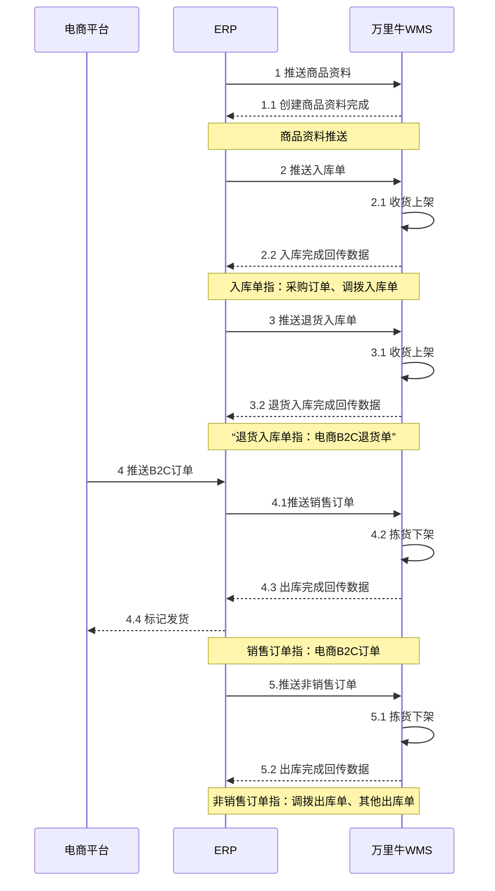
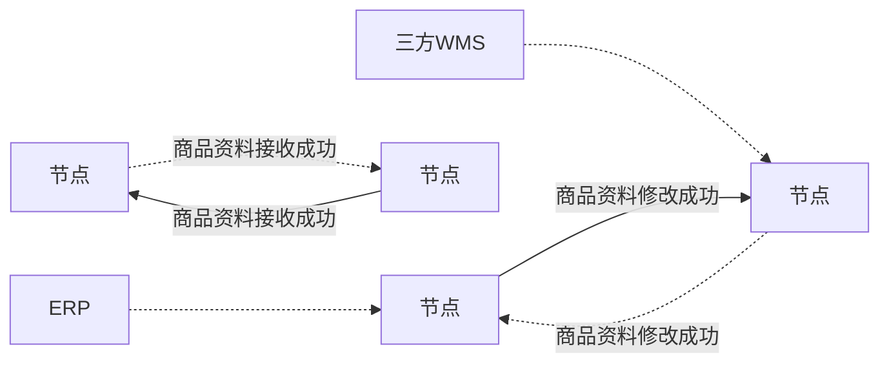
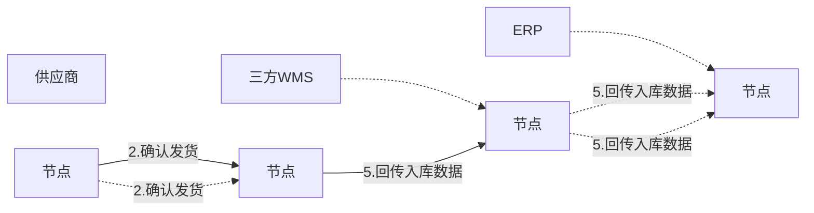
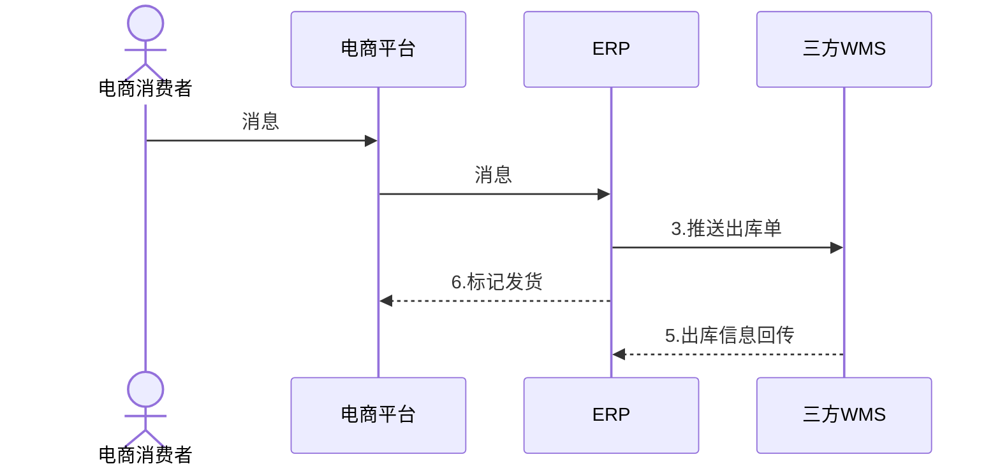
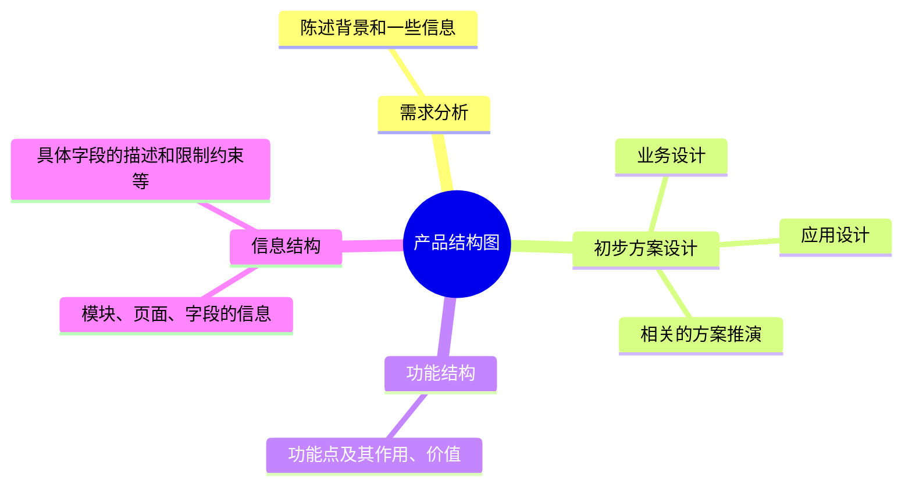

## 一、文档概要

### 修订记录

| 版本 | 状态 | 时间 | 修订人 | 修订日志 |
| --- | --- | --- | --- | --- |
|  | 草稿 |  |  |  |
|  | 待评审 |  |  |  |
|  | 已评审 |  |  |  |

### 评审记录

> 评审时间：
> 
> 评审地点：
> 
> 参与人：
> 
> 评审纪要：
> 
> 1.  XXXX
> 2.  XXXX

## 二、背景介绍

### 需求背景

维他零售公司，之前都是做零售业务，对接的都是一些主要做B2B业务的仓库。最近根据业务的规划要开拓电商业务，所以想要对接B2C的电商相关的仓库，目前已经找好了一家意向的仓库，对方用的是万里牛WMS，所以需要对接万里牛WMS的接口。

### 场景分析

| 序号 | 用户 | 场景或问题 | 解答或者期望的结果 |
| --- | --- | --- | --- |
| 1 | 仓储运营 | 电商仓会有多地多仓吗？ | 会有多地多仓，希望可以做到一次对接，后续的新仓库编码直接配置就可以使用 |
| 2 | 电商运营/仓储运营 | 电商的商品怎么入库？ | 电商业务可以自行采购入库，也可以从之前的B2B业务仓库中调拨过去 |
| 3 | 电商运营/仓储运营 | 电商的商品怎么出库？ | 正常的商品是走B2C出库的方式消耗一些过期的、残次品、质量问题下架的商品，需要通过线下盘亏的方式出库 |
| 4 | 仓储运营/技术 | 电商仓和B2B线下仓的主要区别是什么？ | 电商业务要和B2B线下业务隔离开，所以两者是要做一些业务上的隔离的，财务上要分开核算电商业务的采购，销售，库存管理等都是由电商团队单独负责，不和线下业务融合在一起，相当于就是“两盘货”管理 |

### 全局说明

| 标题 | 内容 | 备注 |
| --- | --- | --- |
| 万里牛WMS接口文档 | 接口文档地址如右侧所示 | [https://open.hupun.com/api-doc/wms/open/oms/bill/cancelbill/v2](https://open.hupun.com/api-doc/wms/open/oms/bill/cancelbill/v2) |
| 实体仓信息 | 仓库名称：XXX 仓库编码：XXX 仓库地址：XXX 收货联系人： 收货人电话： 发货联系人： 发货人电话： | 和实体仓有关的一些信息 |
| 货主 | 货主名称：维他零售有限公司 货主编码：vita_retail | 此处的货主是指在三方WMS中，货主名称和编码是什么 |
| 物流商 | 圆通：YTO 中通：ZTO 顺丰：SF | 电商业务中，优先使用圆通，其次是中通，最后是顺丰 |
| …… | …… | …… |

## 三、产品概述

### 业务流程图/示例图/逻辑说明

-1.svg)

多系统交互示意图：商品资料

-白板-1.svg)

多系统交互示意图：入库单

-白板-2.svg)

多系统交互示意图：销售订单

-白板-3.svg)

其他业务流程，可以按实际情况自由发挥，可以使用时序图，也可以用泳道图。

### 产品结构图（可选）

插入产品功能结构和信息结构图，让大家知道大概产品形态是怎么样的，有多少模块，多少页面和功能等

> 如果涉及到新的模块、新的页面，那么建议用思维导图去整理产品结构图，把相关的功能结构和信息结构整理出来，在评审的时候可以用思维导图来讲，效率也很高。

-白板-4.svg)

### 功能列表/待办事项

#### 1）版本规划（一期）

| 主要事项 | 说明 | 备注 |
| --- | --- | --- |
| ERP创建相关的逻辑仓 | 新增电商仓相关的逻辑仓，完成仓库编码、名称、地址、支持的业务功能等配置 | 具体内容，可见“仓库清单列表” |
| 对接万里牛WMS的API （部分） | 根据业务场景，分期来对接不同的接口的，一期主要先满足API授权、商品信息、采购入库、销售出库；二期再将剩余的其他接口都对接上去 | 具体内容，可见“API对接清单” |
| ERP针对WMS的接口对接，配合开发相关的业务需求 | 对接了接口之后，ERP肯定也会有相关的功能模块需要调整或者开发 | 具体内容，可见下方的“ERP功能改动” |

#### 2）版本规划（二期）

| 主要事项 | 说明 | 备注 |
| --- | --- | --- |
| 继续对接一期没完成的内容 | …… | …… |
| 处理一期对接过程中遇到的问题 | …… | …… |
| …… | …… | …… |

### 各节点负责人（可选）

如果有严格的项目管理，则需要评审后补充这一块的负责人

| **节点** | **负责人** | **预计时间点** | **备注** |
| --- | --- | --- | --- |
| 产品方案输出 | 产品A | yyyy-MM-dd | ​ |
| 产品需求评审 | 产品A | yyyy-MM-dd | ​ |
| UI/UE评审（可选） | UI设计师 | yyyy-MM-dd | ​ |
| 技术方案输出 | 开发A | yyyy-MM-dd | ​ |
| 技术方案评审（可选） | 开发A | yyyy-MM-dd | ​ |
| 代码开发 | 开发A、开发B | yyyy-MM-dd | ​ |
| 测试用例评审（可选） | 测试C | yyyy-MM-dd | ​ |
| 测试、验证、联调 | 测试C | yyyy-MM-dd | ​ |
| UAT验收 | 测试C、产品A | yyyy-MM-dd | 业务可能会在UAT环境验收，也可能在PROD环境 |
| 版本发布上线 | 运维A、开发A | yyyy-MM-dd | ​ |
| PROD验收 | 产品A、业务B | yyyy-MM-dd | 一般上线后，产品要主动去验收相关功能 |

### 原型地址（可选）

插入原型地址或者贴原型图

## 四、对接性需求描述

### 仓库清单列表

插入一个内嵌的Excel，把要创建哪些仓库，仓库的相关信息维护进去即可

### API清单列表

把对方的API链接放进来，我们需要对接的API清单列出来，某些对接的全局说明之类的，也一起整理一下在这里。

| **接口分类** | **接口名称** | **说明** | **业务逻辑处理** |
| --- | --- | --- | --- |
| 授权类 | 开发者身份认证和数据安全校验 | 需要先申请相关的Appkey | 见接口文档中的“接口调用向导” |
| 商品类 | 商品同步接口 /wms/open/oms/goods/single/synchronize/v2 | 通过接口在创建/更改商品资料 | 添加、更改的接口都是同一个，一次请求中只允许发送相同操作标志的商品代码 |
| 入库类 | 入库单创建接口 /wms/open/oms/inbill/createinbill/v2 | 通过接口实现上游ERP下推采购订单 | ​ |
| 入库类 | 入库单确认接口 entryorder.confirm | 该接口用于万里牛WMS回传采购订单在仓库实际收货最终数量到上游系统 | ERP拿到仓库的入库数量，完成对应逻辑仓的商品库存增加 |
| 入库类 ​`二期` | 退货入库单创建接口 /wms/open/oms/inbill/returnordercreate/v2 | 通过接口实现上游ERP下推电商客户退货订单 | 只有新增的接口，没有修改的接口 |
| 入库类 ​`二期` | 退货入库单确认接口 returnorder.confirm | 该接口用于万里牛WMS回传电商客户退货订单在仓库实际收货最终数量到上游系统 | ERP拿到仓库的入库数量，完成对应逻辑仓的商品库存增加 |
| 出库类 ​`二期` | 出库单创建接口（非销售订单） /wms/open/oms/outbill/createoutbill/v2 | 通过接口实现上游ERP下推非销售类的出库单给 WMS，例如说调拨出库，其他出库等 | 只有新增的接口，没有修改的接口 |
| 出库类 `二期` | 出库单确认接口（非销售订单） stockout.confirm | 该接口用于万里牛WMS回传非销售列的出库单，在仓库实际出库的数量到上游系统 | ERP拿到仓库的出库数量，完成对应逻辑仓的商品库存扣减 |
| 出库类 | 发货单创建接口（销售订单） /wms/open/oms/trade/createtrade/v2 | 通过接口实现上游ERP下推销售类的出库单给 WMS，例如说电商B2C的销售订单 | 只有新增的接口，没有修改的接口 |
| 出库类 | 发货单确认接口（销售订单） deliveryorder.confirm | 该接口用于万里牛WMS回传非销售列的出库单，在仓库实际出库的数量到上游系统 | ERP拿到仓库的出库数量，完成对应逻辑仓的商品库存扣减 |
| 取消类 ​ | 单据取消接口 /wms/open/oms/bill/cancelbill/v2 | 通过接口可以让ERP发起相关单据的取消 | 注：ERP 主动发起取消某些创建的单据, 如入库单、出库单、退货单等所有的场景。 |

### WMS接口：商品同步

> API EndPoint：/wms/open/oms/goods/single/synchronize/v2
> 
> 请求方向：ERP -> WMS
> 
> 接口说明：从ERP推送商品资料到WMS中，可以新增，也可以修改
> 
> 接口文档链接：[https://open.hupun.com/api-doc/wms/open/oms/goods/single/synchronize/v2](https://open.hupun.com/api-doc/wms/open/oms/goods/single/synchronize/v2)

| 参数名 | 是否必须 | 描述 | 示例值/限制 | ERP是否对接 | ERP传参说明 |
| --- | --- | --- | --- | --- | --- |
| customer_id | 必需 | 货主ID | ​ | ✅​ | 货主ID：XXX |
| action_type | 必需 | 同步类型，add或update | ​ | ✅ | 新增用add 修改用update |
| adult | 可选 | ​ | ​ | ❌​ | ​ |
| cn_foreign_trade_name | 可选 | ​ | ​ | ❌ | ​ |
| contain_battery | 可选 | 可选值：true/false | ​ | ❌ | ​ |
| contain_liquid | 可选 | ​ | ​ | ❌ | ​ |
| contain_nonliquid_cosmetics | 可选 | ​ | ​ | ❌ | ​ |
| contain_stive | 可选 | ​ | ​ | ❌ | ​ |
| electronic_cigarette | 可选 | ​ | ​ | ❌ | ​ |
| en_foreign_trade_name | 可选 | ​ | ​ | ❌ | ​ |
| foreign_trade_price | 可选 | ​ | ​ | ❌ | ​ |
| foreign_trade_weight | 可选 | ​ | ​ | ❌ | ​ |
| fragile | 可选 | ​ | ​ | ❌ | ​ |
| general | 可选 | ​ | ​ | ❌ | ​ |
| goods_code | 可选 | 商品编码 | ​ | ❌ | ​ |
| goods_custom_code | 可选 | ​ | ​ | ❌ | ​ |
| pic | 可选 | ​ | ​ | ❌ | ​ |
| advent_lifecycle | 可选 | ​ | ​ | ❌ | ​ |
| bar_code | 可选 | 条形码，可多个，用分号（;）隔开 | string (500) | ✅ | 多条码的时候传参 |
| brand_code | 可选 | 品牌代码 | ​ | ❌ | ​ |
| brand_name | 可选 | 品牌名称 | string (50) | ❌ | ​ |
| category_id | 可选 | 商品类别ID | ​ | ❌ | ​ |
| category_name | 可选 | 商品类别名称 | string (200) | ✅ | 传商品大类名称 |
| color | 可选 | 颜色 | ​ | ❌ | ​ |
| cost_price | 可选 | 成本价 | ​ | ❌ | ​ |
| create_time | 可选 | 创建时间 | 示例值：2023-12-10 13:45:17 | ✅ | 传商品的创建时间 |
| english_name | 可选 | ​ | ​ | ❌ | ​ |
| ... | ... | 同extend_props | ​ | ❌ | ​ |
| goods_code | 可选 | 货号 | string (50) | ❌ | ​ |
| gross_weight | 可选 | 毛重 (千克) | double (18, 3) | ✅ | 传商品的毛重，注意单位是kg |
| height | 可选 | 高 (厘米) | double (18, 2) | ✅ | 传商品的高，注意单位是cm |
| is_shelf_life_mgmt | 可选 | 是否需要保质期管理 | Y/N (默认为N) | ✅ | 如果商品是启用了保质期的，则传Y |
| is_sku | 可选 | 是否sku | Y/N (默认为Y) | ✅ | 默认为Y |
| item_code | 必需 | 商品编码 | string (50) | ✅ | 传商品的SKU编码 |
| item_id | 可选 | 仓储系统商品编码 | string (50) | ❌ | ​ |
| item_name | 必需 | 商品名称 | string (200) | ✅ | 传商品的名称 |
| item_type | 必需 | 商品类型 | string (10), 只传英文编码 | ✅ | 默认传ZC，表示正常商品 |
| length | 可选 | 长 (厘米) | double (18, 2) | ✅ | 传商品的长，注意单位是cm |
| lockup_lifecycle | 可选 | 禁售天数 | ​ | ❌ | ​ |
| net_weight | 可选 | 净重 | ​ | ❌ | ​ |
| purchase_price | 可选 | 采购价 | ​ | ❌ | ​ |
| reject_lifecycle | 可选 | 禁收天数 | ​ | ❌ | ​ |
| remark | 可选 | 备注 | ​ | ✅ | 有备注就传，没有可以为空 |
| retail_price | 可选 | 零售价 | ​ | ❌ | ​ |
| safety_stock | 可选 | 安全库存 | ​ | ❌ | ​ |
| shelf_life | 可选 | 保质期 (小时) | int | ✅ | 启用了保质期的商品要传保质期，注意单位是小时 |
| short_name | 可选 | 短名称 | ​ | ❌ | ​ |
| size | 可选 | 尺寸 | ​ | ❌ | ​ |
| sku_property | 可选 | 商品属性 | string (200) | ❌ | ​ |
| stock_unit | 可选 | 商品计量单位 | string (50) | ❌ | ​ |
| tag_price | 可选 | 吊牌价 | ​ | ❌ | ​ |
| title | 可选 | 渠道中的商品标题 | ​ | ❌ | ​ |
| update_time | 可选 | 更新时间 | 示例值：2023-12-10 13:45:17 | ❌ | ​ |
| volume | 可选 | 体积 (升) | double (18, 3) | ❌ | ​ |
| width | 可选 | 宽 (厘米) | double (18, 2) | ✅ | 传商品的宽，注意单位是cm |
| owner_code | 必需 | 货主编码 | string (50) | ✅ | 货主编码：XXX |
| supplier_code | 可选 | 供应商编码 | string (50) | ❌ | ​ |
| supplier_name | 可选 | 供应商名称 | string (200) | ❌ | ​ |
| warehouse_code | 必需 | 仓库编码 | ​ | ✅ | 传实体仓的编码 |

> 商品同步接口的注意事项：
> 
> 1.  XXX
> 2.  XXX
> 3.  XXX

### WMS接口：入库单创建

> API EndPoint：/wms/open/oms/inbill/createinbill/v2
> 
> 请求方向：ERP -> WMS
> 
> 接口说明：从ERP推送入库单到WMS中，WMS根据收到实物后结合入库单进行收货
> 
> 接口文档链接：[https://open.hupun.com/api-doc/wms/open/oms/inbill/createinbill/v2](https://open.hupun.com/api-doc/wms/open/oms/inbill/createinbill/v2)

| 参数名 | 是否必须 | 描述 | 示例值/限制 | ERP是否对接 | ERP传参说明 |
| --- | --- | --- | --- | --- | --- |
| customer_id | 必需 | 货主ID | ​ | ✅​ | 货主ID：XXX |
| entry_order_code | 必需 | 入库单号 | ​ | ✅ | 传ERP的采购单号或者是调拨入库单号 |
| …… | ​ | ​ | ​ | ​ |  |
| …… | ​ | ​ | ​ | ​ |  |
| …… | ​ | ​ | ​ | ​ |  |

> 商品同步接口的注意事项：
> 
> 1.  XXX
> 2.  XXX
> 3.  XXXX

### WMS接口：XXX

### WMS接口：XXX

### WMS接口：XXX

## 五、功能性需求描述

### 1\. 功能1

可以用文字描述，序号缩进描述，也可以用表格，然后插入对应的图片说明

建议功能描述不要写太碎，不然阅读体验不太好

### 2\. 功能2

-   这个是功能逻辑说明的大前提

-   这个是逻辑说明的小补充

-   这个是具体的要点
-   这个也是要点

-   这个是第二个逻辑了

-   这个是第二个逻辑的说明
-   这个也是第二个逻辑的说明

### 3\. 功能3

| 步骤/序号 | 说明 | 图片 |
| --- | --- | --- |
| 1 | 先进行这样，然后就会这样，接着要这样，最后再这样 | 插入一个示意图 |
| 2 | 同上可得，写上相关的描述 | -2.png) |

#### 补充说明

如果原型中没有加上控件/字段定义和校验说明，则需要在此处补充，如下图所示：

-3.png)

## 六、非功能性需求设计

埋点统计类需求

权限类需求

日志类需求

极端异常场景的应对需求

交互体验类需求

性能类（响应速度，处理时长）需求

国际化翻译需求

安全性、保密性需求

稳定性、准确率需求

……

## 七、待确认事项（FAQ）

| 待确认点 | 状态 | 确认时间 | 说明 |
| --- | --- | --- | --- |

可自由发挥

操作手册的更新

运营的推广逻辑调整

对其他系统的一些影响补充

其他人员需要知道的信息等

## 八、其他附件

关联的文档

一些接口文档

图片、文件素材

参考竞品资料

关联的文档等

账号密码等