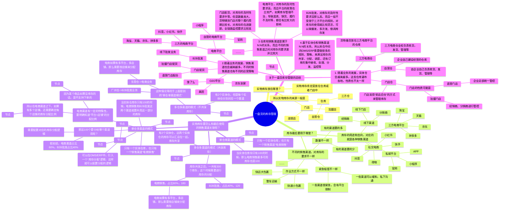
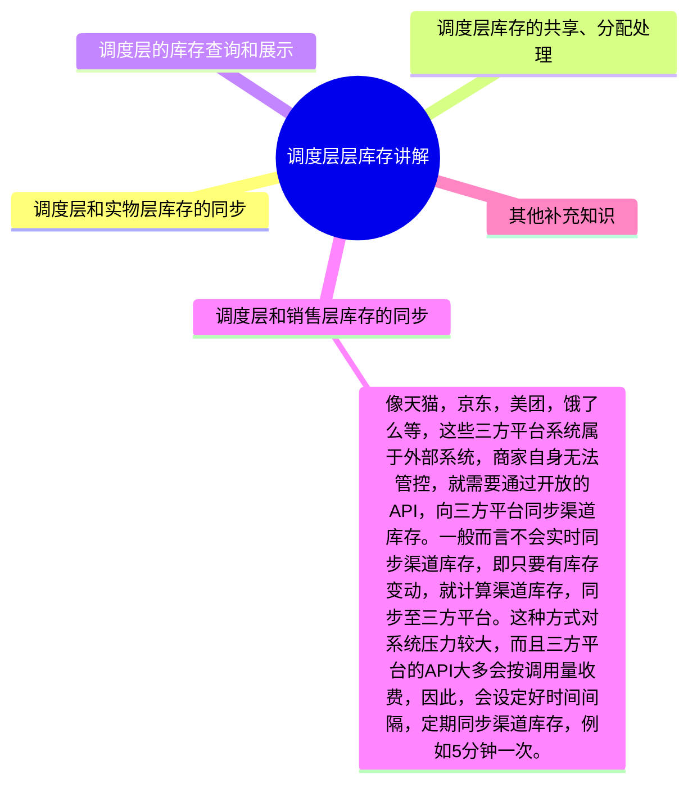

## 前言

在供应链领域中，库存是非常关键且核心的点，库存意味着成本，意味着资金的流动性，也意味着管理水平。无论是进销存，WMS，OMS，ERP还是其他系统，基本上都会有“库存”的身影。

对于供应链系统来说，库存说简单也简单，说难也难，核心点还是要看影响库存的业务是否复杂，是否多元化。

例如说在进销存系统中，往往只有一个“默认”仓库，商品的SKU种类不会太多，业务模式也不会太多，所以对应的库存管理看起来就很简单。

但是在03-WMS系统中，会有多个仓库，有多种SKU，同时也会有多层管理的维度，所以WMS的库存管理就比进销存的库存管理更复杂一些。

而在ERP的维度上，由于销售渠道多元化（电商销售、私域销售，B2B批发、门店配货），组织架构多元化，仓储服务商更多，库存的调度场景更多，就会导致ERP层面的库存管理更加难了一些。

本节课，主要来拆解一下市面上比较常见的“**全渠道一盘货**”和“**三层库存体系**”的知识，揭开一些“专有名词”的神秘面纱，让你对库存管理知其然，更知其所以然。

本课的开课时间是`**待定**`，开课的方式是使用腾讯会议，所以请大家提前准备好相应的软件，会议链接如下：

> 待定

## 课程内容大纲

本节课的内容大概会分成4个部分：

1.  常见的几个供应链系统的库存管理；
2.  “全渠道一盘货”的讲解；
3.  “三层库存体系”的讲解；
4.  库存相关知识的总结；

### Part1 常见的几个供应链系统的库存管理

#### 1.1 进销存系统的库存管理

> 进销存系统的库存关联的业务场景和业务字段往往比较简单，核心的主要是：
> 
> 1.  仓库（一般是“默认仓库”）
> 2.  商品（SKU）
> 3.  数量
> 4.  单位（商品的计量单位）
> 
> 根据库存的可用情况，可以分成：
> 
> 1.  总库存
> 2.  可用库存
> 3.  待出库量（出库占用）
> 4.  待入库量（在途库存）
> 5.  锁定量（订单的锁定）

_“全渠道一盘货”与“三层库存体系”的讲解-1.png)

一般来说，有库存查询，就会有库存流水的查询。因为流水就是日志，就是库存变更的细节记录，明白了库存管理的一些业务字段之后，也就可以知道库存流水的业务字段，因为这两者是息息相关的。

_“全渠道一盘货”与“三层库存体系”的讲解-2.png)

#### 1.2 03-WMS系统的库存管理

> 03-WMS系统的库存相对来说会更复杂一些，存在多种粒度的库存管理，从大到小依次是：
> 
> 1.  仓库-货主-商品库存，即在某个仓库中，某个货主的各个商品的库存分别是多少；
> 2.  仓库-货主-商品-批次库存，即某个仓库中，某个货主的某个商品的不同批次的库存分别是多少；
> 3.  仓库-货主-商品-库位库存，即某个仓库中，某个货主的某个商品存放在不同库位的库存分别是多少；
> 
> 上面是WMS中最常见的3种粒度的库存管理，可以简称为：**商品库存，商品-批次库存，商品-库位库存**。
> 
> 不同粒度的库存，对应的核心业务字段也会不太一样，如果从最细的颗粒度来看，一般要关注：
> 
> 1.  仓库（WMS中可以选择具体的仓库）
> 2.  货主（WMS中会存在多货主）
> 3.  商品（SKU）
> 4.  批次（一个SKU会有多个批次）
> 5.  库位（一个SKU可以放在多个库位上）
> 6.  数量
> 7.  单位（复杂的WMS中也会有多单位的场景，要考虑商品的计量单位）
> 8.  商品状态（一般WMS都是会有良品，不良品的管控）
> 
> 同时，WMS根据库存的可用情况，也可以分成：
> 
> 1.  总库存
> 2.  可用库存
> 3.  待出库量（出库占用）
> 4.  待入库量（在途库存，已收货）
> 5.  锁定量（因某些业务而锁定的库存）
> 
> 注意：在一些WMS中，待出库量会定义为“分配占用数量”，待入库量会定义为“预入库数量”或者是“在途库存数量”。

#### _“全渠道一盘货”与“三层库存体系”的讲解-3.png)

同样的道理，WMS有几种粒度的库存，对应的库存变化的流水也会有几种，但是在实际的使用过程中，我们往往用的最多的是**最细程度**的库存流水查询，也就是“按产品/库位/批次查询的流水”，少数的情况下会有“按产品查询的流水”，所以下方我列出来了这2种稍微高频一些的场景。

#### _“全渠道一盘货”与“三层库存体系”的讲解-4.png)  
  
1.3 05-OMS系统的库存管理

> 课程中的OMS是特指WMS的客户端，而不是市面上的其他定义，所以OMS的库存查询相对WMS来说就会比较简单，有点类似于进销存，一般会有这些比较核心的字段：
> 
> 1.  仓库（OMS的货主会使用多个仓库）
> 2.  货主（OMS一个客户账号可能有多个货主，但是一般来说只有一个的最常见）
> 3.  商品（SKU）
> 4.  数量
> 5.  单位（海外仓OMS一般都是用PCS作为单位，但是国内的一些复杂WMS则要考虑商品的计量单位）
> 6.  商品状态（WMS有良品，不良品的管控，那么OMS也要展示这个）
> 
> OMS根据库存的可用情况，也可以分成：
> 
> 1.  总库存
> 2.  可用库存
> 3.  锁定库存
> 4.  在途库存

_“全渠道一盘货”与“三层库存体系”的讲解-5.png)

OMS除了有商品维度的库存，也会有批次维度的库存。在之前的电子书中有提到过，OMS的批次管理如果要和WMS端实时联动，成本非常之高，所以一般都会通过接口的方式来调用WMS的库存，所以对应的批次库存的展示，其实和WMS的批次库存展示是类似的。

_“全渠道一盘货”与“三层库存体系”的讲解-6.png)

#### 1.4 ERP系统的库存管理

> ERP在不同的行业和公司中也会有不同的定义，所以对于库存管理来说也会有点不太一样，这里我们以电商ERP为例，看看电商ERP的库存管理中，比较核心的字段有哪些：
> 
> 1.  仓库（ERP会对接多个仓库，可能是内部的，可能是外部的）
> 2.  商品（SKU）
> 3.  数量
> 4.  单位（大多数ERP都会按PCS来管理库存，这样比较简单）
> 
> ERP根据库存的可用情况，也可以分成：
> 
> 1.  总库存
> 2.  可用库存
> 3.  锁定库存
> 4.  在途库存

_“全渠道一盘货”与“三层库存体系”的讲解-7.png)

ERP和海外仓OMS的类似，除了有商品维度的库存，也会有批次维度的库存。在之前的电子书中也有提到过，ERP的批次管理如果要和下游的WMS的批次库存实时联动，成本非常之高，所以一般都会通过接口的方式来调用读取WMS的库存。在ERP层面上展示的批次库存，是从下游的WMS接口返回过来的，所以WMS的OpenAPI平台需要准备好这些东西，才能将批次信息回传给ERP。

_“全渠道一盘货”与“三层库存体系”的讲解-8.png)

也有另外一种办法，那就是ERP自己记录自己的批次库存，不和WMS的批次库存打通，属于两边各管各的库存，这种方案针对一些不要求仓库精细化作业的场景使用，属于简单粗暴的解决方案。

### Part2 “全渠道一盘货”的讲解

1.  什么是全渠道？

> 全渠道零售是指企业采取尽可能多的零售渠道类型进行组合和整合（跨渠道）销售的行为，以**满足顾客购物、娱乐和社交的综合体验需求**，这些渠道类型包括有形店铺（实体店铺、服务网点）和无形店铺（上门直销、直邮和目录、电话购物、电视商场、网店、手机商店），以及信息媒体（网站、呼叫中心、社交媒体、Email、微博、微信）等等。”
> 
> 全渠道并非指品牌方借助所有渠道进行销售，而是指品牌方可以**在拥有更多的渠道类型中进行选择、组合以及整合，为品牌方实现渠道优势整合、渠道成本分摊**，为消费者打造一个更加丰富的场景式消费体验。
> 
> _“全渠道一盘货”与“三层库存体系”的讲解-9.png)
> 
> **单渠道零售：**品牌方以单一渠道方式进行销售的模式，如以“**工厂—批发商—零售店—顾客**”模式或以**网店**形式销售。
> 
> **多渠道零售：**品牌方以实体店+网店等**两种或两种以上的完整零售渠道**销售的模式，且在每一种渠道中完成客户的全部购买过程。​
> 
> **跨渠道零售：**多渠道的整合，实现在**每一种渠道完成整体渠道的部分功能**，如在线上网店下单，线下门店取货。​
> 
> **全渠道零售：**品牌方通过采取尽可能多的零售渠道类型进行整合，为客户营造购物、娱乐和社交的综合体验过程。

2.  什么是全渠道一盘货？

> 全渠道一盘货是一种零售供应链管理策略，其核心理念是将企业的所有库存资源集中管理，实现库存的统一调配和优化。这种策略允许企业在不同的销售渠道（如线上商城、实体店、移动应用等）之间灵活调配商品，以满足不同渠道的消费者需求。
> 
> 以一家服装零售商为例，他们可能在全国各地有多家门店，同时拥有线上商城。通过实施**全渠道一盘货**策略，当一个顾客在线上下单购买一件衣服时，系统会自动检查所有渠道的库存，选择最近的仓库或门店进行发货，甚至可以让消费者选择到最近的门店自提。这样不仅提高了库存的使用效率，也提升了顾客的购物体验。
> 
> 简单来说，全渠道一盘货就是希望可以通过集中管理库存，对库存进行统一调度和分配，来满足实际业务中多个销售渠道的库存需求。

3.  一般什么场景下会用到全渠道一盘货？或者说什么类型的公司会需要用这个？

> 国内大多数零售商按照多渠道（multi channel）的方式运营，即把线上和线下的订单履约路径分开，线上订单由仓库中的线上订单发货区或者专门的线上仓库履约，而线下消费在门店完成。
> 
> 也有部分零售商实现了全渠道（omni channel）履约，即客户可以线上购买，由线下门店发货，或者线上购买，线下门店自取，或者线下购买，仓库发货。全渠道可以让客户有无处不在的、无缝衔接的购物体验。
> 
> 在电商领域中，会有“多平台”的概念，但是多平台和多渠道还是不太一样的，虽然电商有多平台，但是对应的渠道还是属于电商渠道。而新零售的场景中，既有电商渠道，又有线下门店渠道，又有多级经销、分销渠道等，所以一般说的全渠道一盘货管理，往往是适用于**零售行业**。

4.  一盘货和多盘货有什么区别？

> “多盘货”管理，就是将同一种货品面向线上、线下、批发、零售等不同销售渠道，设置相互独立的多套商品库存，且各仓储之间库存难以互通互用。这就导致了以下三个难题：
> 
> （1）库存割裂，难以互通、无法共享。各渠道拥有独立库存且彼此割裂，经常出现不同渠道“旱涝不均”情况，特别是在电商促销季滞销与断货并存的现象。库存浪费现象严重，商品周转率低下。
> 
> （2）节点多，导致货物的搬运次数多、距离长。大规模的品牌往往有很多经销分销层级，按层级铺货、运输会造成严重的浪费。举个例子：假设品牌的工厂在东莞，江西省的一级经销商在南昌，分销商遍布全省各地市县。在极端情况下，商品从东莞到南昌再到赣州崇义终端门店，全程转运距离累计1264km，而从东莞到崇义县的直送距离不过424km，只有极端距离的1/3。
> 
> （3）多渠道导致了数据反馈的割裂。由于各个渠道数据不透明，产品的销售、订单、库存数据亦彼此割裂，导致品牌商很难真切了解产品的流量流向(经销商层层压货)，不能完全掌握消费者喜好，没办法做统一的营销管理。更有甚者，出现窜货、乱价情况。
> 
> ​  
> 
> “一盘货”管理常用于连锁品牌全渠道零售业务，以智能运营中台+系统集成服务为技术依托，为品牌企业构建一个全渠道库存可视化、统一化，以及运营自动化、智能化的数字化解决方案。
> 
> 简单理解，就是把企业线上线下商品库存全部放在一盘棋里进行布局，打通所有销售渠道，**实现全渠道库存共享、统一调配，可视化运营。**再根据企业的业务布局和商业模式，在系统内设置最优的订单路由分配规则，把离消费者最近的商品，以最快的方式送到消费者手中。
> 
> 例如说某快时尚品牌的每一个SKU，可能就只生产1000件，但是线下有众多门店，而且门店要实物铺货，这样会导致大仓内的库存变少，很多库存被分发到了门店中。因为电商是集中销售的，大仓可用库存少，意味着线上就不能最大化销售。如果是一盘货模式，首先就是要把线下门店所有能动用的库存全部集中到共享库存池，那么线上的可用库存就是总库存，也包含线下可用库存。然后线上产生订单，再按路由规则分配给就近的门店进行发货即可。
> 
> _“全渠道一盘货”与“三层库存体系”的讲解-10.png)
> 
> _“全渠道一盘货”与“三层库存体系”的讲解-11.png)
> 
> _“全渠道一盘货”与“三层库存体系”的讲解-12.png)

3.  一盘货的优势是什么？

> **1）提高库存利用率，**让所有库存商品最大化利用，不错过任何一个销售机会。一盘货的优势在于，可以让库存池当中的每一件sku时刻为所有渠道准备着，而不是被固定在单一的渠道，错失销售机会。
> 
> **2）提高配送效率，节约配送成本：**通过订单路由功能，按照系统设定的自动化的拆单配送规则，将离消费者最近的商品发给客户，可以有效节约成本，提高配送效率。
> 
> **3）提升客户体验：**对于品牌用户而言，早一分钟收到商品就多一分幸福感，提高一点品牌忠诚度。一盘货实现了线上订单就近门店库存快速发货，即便是在双11这样的电商节日期间也能让用户快速收到货，用户体验大大提升；另外当线下门店某件商品尺寸缺失时，门店也可以为用户就近调货，快递配送。
> 
> **4）从一盘货的角度复盘销售和订单数据**，更能精准掌握不同商品的销售规律和不同渠道、不同地区的消费者购买习惯，持续优化库存策略和指导柔性供应链。
> 
> **5）灵活应对各大平台的游戏规则**：节日期间平台对于商家的库存约束规则越来越多，一盘货模式结合系统功能，则能灵活应对平台的管束，方便品牌商家的经营管理。

4.  一盘货要怎么做？需要什么系统来配合？

> 全渠道一盘货，首先要做的就是先将全渠道的库存共享，集中统一管理，可以知道每个仓库，每个门店中的库存情况，这样才可以将实物库存抽取出来，通过一些库存共享和调度策略进行后续的业务支持。
> 
> 其次就是要将全渠道的订单打通，对接多个订单来源平台，然后使用相关的接口把订单集中拉取到一个地方处理。
> 
> 订单拉取下来之后，由于订单数量庞大，订单所属的平台规则复杂，具有很多业务要求在里面，所以需要进行相关的订单规则的配置，让系统可以自动化来处理这些订单。同时由于库存是一盘货管理，所以订单在分配库存的时候，就会有很多的考虑，很多的限制。
> 
> 为了达到更好，更全面的交付效果，也需要对相关的仓储、物流等履约服务打通，完成仓储服务商、物流服务商的接口对接，并且线下制定好规范的操作方式，作业方式等。
> 
> _“全渠道一盘货”与“三层库存体系”的讲解-13.png)
> 
> 整体来说，全渠道一盘货要打通的系统有很多，主要是这么几个：
> 
> -   OMS订单管理系统，主要的订单处理，库存调度相关；
> -   POS门店管理系统，主要是门店零售，门店发货履约相关；
> -   WMS仓储管理系统，主要是仓库收、发货相关；
> -   CRM客户关系管理系统，主要是客户运营，客户精细化促销相关；
> -   ……
> 
> _“全渠道一盘货”与“三层库存体系”的讲解-14.png)

5.  市面上全渠道一盘货做的还不错的一些产品或者说系统有哪些？

> [商派OMS](https://www.shopex.cn/solution/brand_intellect)，[巨益OMS](https://www.greatonce.com/)，[伯俊OMS](https://www.burgeon.cn/)，[百胜OMS](https://www.baison.com.cn/)，[云时通](https://www.yunstone.net/yst/pages/system-oms.html)
> 
> 其中网络上商派的文章最多，而且还有体验账号和帮助手册。

6.  一盘货的库存管理具体细节有哪些？

> 我们可以先抛开“全渠道一盘货”中其他容易有干扰的内容，单独拿一盘货中的库存管理来讲，这样会让大家对库存有更清晰的理解。

_“全渠道一盘货”与“三层库存体系”的讲解-白板-1.svg)

### Part3 “三层库存体系”的讲解

#### 3.1 三层库存体系的介绍

三层库存体系最常见的就是用于“全渠道零售业务”中，其中细分的“电商渠道”中也会经常用到这个库存体系设计，所以在一些电商ERP中会有相关的身影。

在上面的Part2中，我们已经对“全渠道”进行了解释和说明，大家也对三层库存体系有了一个初步的了解，这里我们再对三层库存体系进行一个定义和概括。

> **实物层库存：**指的是存放在仓库或者门店中的库存，一般用WMS或者POS可以查询到具体的实物库存数量。在WMS和POS中，实物库存的颗粒度有多种，例如说SKU库存，SKU-批次库存，SKU-库位库存（仅WMS有）等。
> 
> **调度层库存：**由于库存存放在多个仓库、门店中，同时又因为有多销售渠道需要发货，所以需要有一个调度层的库存，来记录相关的原始库存和调度后的库存，便于集中管理。调度层的库存往往是在ERP或者OMS中进行管理，对应的库存管理颗粒度一般是“SKU库存”，可能也会区分正、次品等。
> 
> **平台销售层：**销售层库存是指销售平台/系统中的库存，只有在平台上的商品详情页的库存大于0时，用户才能下单，否则提示商品缺货。销售层的库存是由对应的销售平台的运营后台（商家工作台）进行管理，在发布商品上架时进行设置。**当调度层的实物库存更新，需要触发销售层重新计算销售可用库存，即电商ERP中的库存同步功能**。

| **库存层级** | **对应的管理系统** | **库存粒度** | **库存用途划分** |
| --- | --- | --- | --- |
| 实物层 | WMS、POS | SKU库存，SKU-批次库存，SKU-库位库存 | 可用库存、锁定库存、分配库存，在途库存 |
| 调度层 | ERP、OMS | SKU库存，SKU-正次品库存 | 可用库存，锁定库存，占用库存，预留库存，在途库存 |
| 销售层 | 商家工作台 | SKU库存 | 可销售库存，预扣库存 |

网上有很多“三层库存”的文章和介绍，但是对于初学者或者没有具体经历过实际业务人来说，这些文章看完之后可能还是会有点懵逼。因为有很多细节点，这些文章并没有去讲，而是一笔带过了，这里我分享几个我自己在学习过程中，印象比较深刻的一些纠结点或者误区。

1.  中央库存系统，是什么系统？是单独存在的一个管理后台吗？

> 有人会把三层库存体系中的中间层称之为“中央库存”，然后对应的功能模块就称之为“04-中央库存系统”，于是很多初学者就会觉得“04-中央库存系统”应该是一个独立存在的系统，类似于进销存，WMS，ERP一样有一个后台管理界面，然后需要注册登录等。
> 
> 但是实际上，“04-中央库存系统”更准确的定义应该是“库存中心”或者“库存管理”模块，它往往存在于OMS或者ERP中的一个库存模块中，而有一些文章称之为“系统”，其实是更偏向于微服务架构中的“库存服务”，即把库存相关的处理都放在这里。
> 
> _“全渠道一盘货”与“三层库存体系”的讲解-15.png)
> 
> _“全渠道一盘货”与“三层库存体系”的讲解-16.png)

2.  实物仓、调度层、销售层库存，是不是都放在一个系统或者模块中查询？

> 很多人听到了“三层库存体系”，就会觉得好像要把库存分层三层，然后在一个系统中汇总所有的内容。
> 
> 但是实际上并不是，“三层库存体系”是分开在不同的系统，由不同的人员来管理的。
> 
> 实物层库存，指的是放在仓库或者门店中的库存，那么管理人员自然是仓库管理员或者门店店长，对应的系统是WMS或POS。
> 
> 销售层库存，指的是销售平台（例如说淘宝的某个店铺）中的库存，对应的库存管理人员应该是电商运营，对应的系统则是销售平台提供的商家工作台/管理后台，例如说淘宝和天猫对应的商家工作台就是“[千牛](https://qn.taobao.com/?spm=a21dvs.24047116.0.0.52d2645e92sX96)”。
> 
> 调度层库存，指的对实物库存（多仓、多店）的“数据化/账面化”的管理，同时将管理后的相关结果同步更新到销售层面。主要是起到连接实物库存和销售库存的桥梁作用，中间会涉及到一些库存的抽取、汇总、分配、调度等。
> 
> “数据化/账面化”管理的意思是指：在我们使用OMS/ERP的时候，当发现仓库库存不足了，我们就会发起采购业务，当门店的库存不足了，我们就会发起配货到店业务，对这些业务单据的管理，也间接地完成了对实物库存的“数据化/账面化”的管理。

3.  进销存或者海外仓OMS等系统是不是也需要引入“三层库存体系”？

> 经过上面的学习，我们已经知道了三层库存，其实核心点应该是中间的“调度层”，而“调度层”的核心应该是连接实物库存和销售层库存，并在这中间通过一些策略、规则来实现库存的抽取、汇总、分配、调度等。
> 
> 如果狭隘地理解，可以认为只要相关的系统中涉及到“实物库存-销售库存”的库存调度业务，都可以称这一部分为“调度库存”。
> 
> 进销存系统，往往对接的仓库不多，销售渠道也很少对接外部的电商平台等，所以可以理解为没有“调度库存”；
> 
> 海外仓OMS，一般是只用来做海外仓WMS的客户端，虽然可能会对接一些外部的销售渠道（跨境电商平台），但是往往只是用来拉取订单，不太涉及到库存的调度，所以也可以理解为没有“调度库存”；

#### 3.2 三层库存体系之实物层库存

实物仓库存就是WMS和POS中的库存，这里直接参考之前所讲的WMS的内容即可，不在此处过多延伸了。

#### 3.3 三层库存体系之销售层库存

销售层库存是指销售平台（以淘宝为例）中的库存，这里可以参考“千牛”系统的后台页面，让大家看看库存是怎么展示的。

_“全渠道一盘货”与“三层库存体系”的讲解-17.png)

也可以参考“[有赞](https://www.youzan.com/)”的后台管理页面，有赞是SaaS产品，可以免费注册，免费开店，所以有一些产品功能和帮助手册等都可以多看看。

_“全渠道一盘货”与“三层库存体系”的讲解-18.png)

电商销售平台中的库存，会随着消费者购买下单逐步扣减消耗掉。如果要增加可售库存，可以在商家工作台中进行手动修改，也可以使用接口API的方式直接从电商ERP中同步相关的可售库存数据过去，这里的可售库存，其实就是在“调度层”计算、处理好后的数据，这个场景也称之为：**库存同步，即从ERP中同步可销售的库存给电商平台。**

[库存同步的业务介绍-文档中心](https://open.taobao.com/docV3.htm?docId=124&docType=1)

[库存更新接口-文档中心](https://open.taobao.com/v2/doc?spm=a219a.15212433.0.0.bac7669axNWZMl#/apiFile?docType=2&docId=21169)

[聚水潭学院-库存同步流程](https://www.erp321.com/app/support/document.html#page=6211)

#### 3.4 三层库存体系之调度层库存

相对来说，调度层的库存最为复杂，涉及到的业务知识和场景是最多的，而且光知道库存的调度分配还不够，还要结合订单的分配和调度来处理，所以本节课我们重点还是先做一个**科普入门**，后续更深入的内容我会放一些参考资料给大家。

调度层的库存一般会放在ERP或者OMS（全渠道订单管理平台）中，这里我们为了避免和海外仓的OMS产生理解上歧义，我们用“零售ERP”来表示这一类系统。

在零售ERP中，库存的增加和减少，一般也是基于这些单据来进行变动。

#### _“全渠道一盘货”与“三层库存体系”的讲解-19.png)

_“全渠道一盘货”与“三层库存体系”的讲解-白板-2.svg)

_“全渠道一盘货”与“三层库存体系”的讲解-20.png)

  

_“全渠道一盘货”与“三层库存体系”的讲解-21.png)

  

| 列 1 | 列 2 |
| --- | --- |
| 多仓供货模式  _“全渠道一盘货”与“三层库存体系”的讲解-22.png)  门店A、门店B为两个线下门店，门店A有100件iphone14，门店B有50件iphone14。  假设商家有1个天猫旗舰店，门店A、门店B均给天猫店供货。  天猫旗舰店仅支持快递发货方式，为了防止超卖，设置快递的最大分配比例为80%。  如图例所示，最终天猫渠道的iphone14的库存数量为120，并定期将数量同步到天猫平台。 | 单仓供货模式  _“全渠道一盘货”与“三层库存体系”的讲解-23.png)  商家有1个电商仓，为商家的各个电商平台店铺提供仓储服务与发货服务，电商仓有100件iphone14。  电商仓同时为京东旗舰店、天猫旗舰店供货，两个店铺仅支持快递发货方式，最大分配比例分别为80%、60%。  如图例所示，最终京东渠道的iphone14的库存数量为80，天猫渠道的iphone14的库存数量为60。 |

### Part4 库存相关知识的总结

1.  库存是通过什么方式来增加/减少的？

> 库存是通过业务单据来增加/减少，例如说采购入库单，销售出库单等，库存的变化要通过单据来承载，不建议直接平白无故增加或者扣减（要留底，要可追溯）。

2.  多系统直接的交互，库存是怎么增加/减少的？

> 例如说ERP对接下游的WMS，当WMS入库之后，WMS增加库存，那么ERP怎么增加库存呢？
> 
> ERP也是通过业务单据来增加库存，当WMS入库之后，会通过接口回传数据给ERP，对应的ERP会生成相关的采购入库单，然后增加对应的库存；也可以通过变更采购订单的状态，来增加对应的库存；
> 
> 采购入库单->增加库存；
> 
> 采购订单（已入库）->增加库存；
> 
> _“全渠道一盘货”与“三层库存体系”的讲解-24.png)

3.  库存的颗粒度怎么定义？库存可以切割成怎么样？

> 库存的颗粒度要看业务的情况来定义，只要有相关的需求，那就可以进行细分，例如说按货主，按仓库，按批次，按库位，按SN等，但是越细的库存颗粒度，带来管理上的难度也会更大，要谨慎使用。
> 
> 在系统层面，如果要对库存切割，其实就是通过一些字段来细分，只要库存记录的时候这些字段是有值的，记录的，那么就可以按这些字段来切割。
> 
> _“全渠道一盘货”与“三层库存体系”的讲解-25.png)

4.  可用库存应该怎么定义？到底在途算不算可用库存？

> 可用库存是一个由业务决定、业务影响的概念，并没有所谓的标准定义。
> 
> 例如说，实体库存有100个，但是由于业务有要求，有限制，那么最终可用的数量可能是100，也可能是80，也可能是0。
> 
> 关于可用库存到底要包含哪些，不包含哪些？我建议可以参考金蝶的做法，用一个公式来配置，业务可以按需来配置对应的可用库存公式。
> 
> _“全渠道一盘货”与“三层库存体系”的讲解-26.png)

## 课后作业

> 根据课程所讲的内容，完成补充知识的阅读，并自己动手输出一份“供应链系统库存核心字段梳理”，可以用Excel的形式呈现，也可以用思维导图的方式呈现。自己通过调研竞品，查看课程等，去输出不同供应链系统的库存模块的核心字段，进一步了解它们之间的差异性。

## **课程答疑或补充知识**

### 答疑

1.  商派的OMS体验地址和账号密码是什么？

> [http://hobbits-web.ishopex.cn/login](http://hobbits-web.ishopex.cn/login)
> 
> test
> 
> 123456

2.  如果想要了解销售平台的后台管理功能，推荐看什么？

> 淘宝是可以免费开店的，开店完成之后就可以使用“千牛”来管理店铺了，所以推荐可以注册一个淘宝店铺，就可以大概知道这种电商后台大概有哪些功能了。
> 
> 有赞有“微商城”这个产品，也可以理解为是用SaaS工具快速搭建一个品牌电商商城，后台对应的功能和千牛是类似的，所以也推荐注册一个有赞的账号，而且有赞有一些帮助手册和开源的产品设计语言都做的不错，建议都看看。
> 
> [帮助首页 - 帮助中心 - 有赞](https://help.youzan.com/)
> 
> [介绍 - Zan Design System - 有赞设计语言系统 - 服务于 SaaS 产品的产品设计体系](https://design.youzan.com/design/introduce.html)

### 补充知识

1.  推荐大家使用网页版微信读书，看书、导入书籍等都非常方便；
2.  推荐阅读这篇文章：[新零售SaaS架构：04-中央库存系统架构设计](https://mp.weixin.qq.com/s?__biz=MjM5MjIzNjk0Ng==&mid=2651663142&idx=1&sn=a985e095571d7ef22dd2cb1cd2af96ec&chksm=bd50dfdb8a2756cd926ec4cef1a0261b84dc531340281d3c1874d0edce69c6d046d3c3eb052d&token=879994620&lang=zh_CN#rd)
3.  [全渠道 · 新零售，你真的了解吗？ - 广州有信科技 - 有信云 - 超级业务云 - 复杂业务，高速迭代，PaaS云平台](https://www.youxin.cloud/23.html)