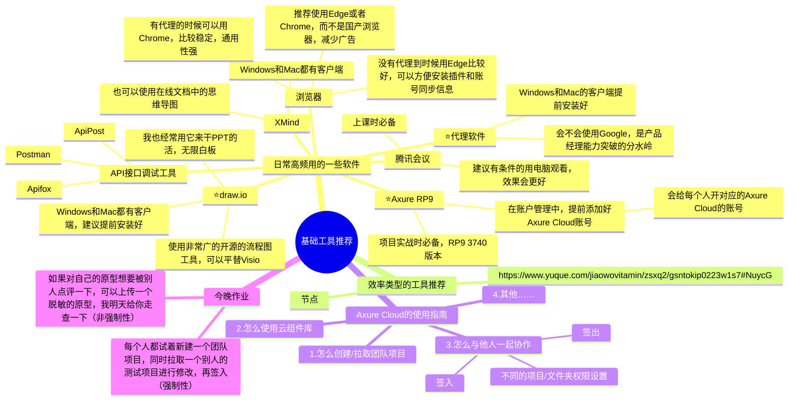

## 前言

本节课是“维他命的产品私享课（七期）：供应链项目实战”的开篇&课前准备介绍，非常感谢大家的信任和支持，希望在未来的一段学习过程中，我可以用自己的一些供应链经验帮助到大家。

参加这门课的朋友各自有各自的背景，可能是“产品经理”，“将要毕业的学生”，“负责供应链项目的研发、测试”等，每个人也有自己不同的目的，有人想要通过课程提升自己的专业能力，有人想要通过课程去换行业求职，有人想要通过课程来帮助自己解决工作中的项目问题……

虽然课程会考虑很多兼容性的点，但是难免会有一些遗漏，希望大家在学习过程中踊跃参与，积极发言，多讨论多交流，有思考和碰撞才会有进步和成长。

## 课件详细内容

本节课的内容大概会分成4个部分：

1.  关于“供应链项目实战课”的开课介绍
2.  解决张良计的问题
3.  产品经理常用的一些高效软件推荐
4.  Axure Cloud的协同操作

### Part1 关于“供应链项目实战课”的开课介绍

1.  课程开始前，欢迎大家来做一个简单的自我介绍

> 1.  姓名或昵称
> 2.  所在城市
> 3.  当前从事的岗位（产品，技术，其他）
> 4.  目前已经工作了多久了？
> 5.  参加这门课程的原因，想要通过该课程达到什么目的
> 6.  对课程的一些期望或者看法等

2.  这门课是什么，是怎么样的交付形式？

> 这是一门针对产品经理的“供应链项目实战课”，关键词是：**产品经理，供应链方向，项目实战**。
> 
> 整套课程的交付时间大概是50-60天左右，正常的频率大概是一周3~4节课左右，会陆续放出一些录播内容，然后穿插相应的直播课程进行补充说明。  
> 根据之前几期的经验来看，课程的学习时间段不宜拉太长，直播也不宜太多，因为时间太长之后学习的精力和热情就会逐步跟不上，最好的学习方式就是集中时间段、高频、有针对性的听课和练习。
> 
> **一鼓作气，再而衰，三而竭。**

3.  课程大概多长？错过了直播怎么办？

> 课程分成了录播和直播，还有配套的电子书、星球、学习群等。
> 
> 一节直播课大概在1小时~1.5小时，错过了直播也没关系，会有直播的录屏。一般直播上完之后我会尽快上传录播的内容到课程上。
> 
> 录播的话一般都是之前几期中讲的比较好的内容就保留下来当作新一期的录播课了，每一期有一些内容是相似的就会用之前的录播内容，如果有新的东西就会用直播的方式来交付。

4.  要怎么学习才能更好地掌握它？

> 这门课叫作“供应链项目实战”，所以主打的就是一个实战，也就是要自己动手去做，去练习才能更好地掌握。
> 
> 尤其是一些朋友是抱着求职和进阶自己的产品能力来报课的，那么对应的实战作业就更要用心对待了。
> 
> 课程上一共会讲“进销存”，“SRM的采购”，“WMS/OMS”，“ERP订单模块”，“ERP物流模块”等多个项目，可以根据自己的需要完成起码1个以上的项目实战作业，完成作业之后会组织集中的作业评审课程，来检查自己对知识的掌握是否牢固。

5.  这些项目怎么用来求职找工作？

> 有一些朋友可能需要一些实战案例放在自己的简历上用于求职，课程中所讲的案例都是真实的业务案例，可以直接和过往的工作经历所结合搭配，也可以直接当作学习练手的作品集放在简历上。而且这些案例都会有相关的业务流程，原型和一些具体的竞品系统参考等，帮助大家更好地理解业务是怎么跑起来的，系统又是怎么设计的。

6.  和往期有什么不一样？

> 大概从第三期开始，课程的结构大纲就形成了比较成熟的结构，后续的课程都是基于三期的结构框架逐步迭代的。所以基本上三、四、五、六期的内容有很多都是相似的，但是每一期都会有新的内容。
> 
> 其次，再实际的讲课过程中，我会有很多新的灵感和启发，所以每次都会有一些新的感触和素材可以补充进去，所以七期就会在六期的基础上又进行了优化和改进，争取打磨出更好的产品交付给大家。
> 
> 最后，在“课程首页”中都已经提到了具体的改进点，可以前往那里去查看。

### Part2 解决张良计的问题

关于这一块的内容，文字稿不能讲太多，但是我可以给大家分享一些我拿到的信息：

1.  手机端和电脑端都要准备好，因为很多时候换个工具可能就很轻松地解决了问题；
2.  是否违FA，会不会有风险；
3.  有一些不是不能访问，只是速度会比较慢的网站，使用张良计也会有明显的加速效果，例如Github或者其他服务器在国外的网站等；

[链接](https://www.yuque.com/jiaowovitamin/seventh/liirfm9vo1we2nql)

### Part3 产品经理常用的高效软件推荐

软件只是工具，没有最好的软件，只有最适合自己的工具。如果你对工具有自己的固执和坚持，那么我希望我分享的这些能给你一些新的思路和可能性；如果你对工具是开放的心态，那么这些工具你都可以自己去尝试一下。

_“供应链实战课程”开篇&amp;课前准备-白板-1.svg)

### Part4 Axure Cloud的协同操作

很多人可能会喜欢用墨刀和Figma等工具来画原型，觉得这一类的Web端的设计工具比较好用，比较傻瓜式、好上手。

但是从我身边的案例来看，Axure虽然不是那么“先进”，但是用户基数还是很大，很多公司也在用这个工具，而且Axure的源文件可以很方便Download下来自己编辑修改，尤其是我们在输出作业的时候，是可以直接从往届优秀的学员的作品中去复刻学习的，所以我还是建议大家要练习好Axure的用法。

[链接](https://www.yuque.com/jiaowovitamin/seventh/pvva5ibf1hm5gt7i)

1.  私聊我，开通Axure Cloud的私有化部署的账号和密码，这个和Axure官方版的账号体系是不同的，两者不互通；
2.  在Axure RP9 V3740版本，“账户”->“添加内部服务器”->“输入Server，User和密码”，账号绑定成功；
3.  创建团队项目或者获取团队项目，如果是创建团队项目则保存到Axure Cloud对应的文件夹中，如果是获取团队项目则从Axure Cloud对应的文件夹中拉取这些数据；
4.  学习一下签入和签出的操作，理解本地和云端的交互逻辑，同时也可以查看三期&四期学员提交的项目作业等；

## 课后作业

> 1.  完成张良计的配置，手机和电脑端都完成；（实践练习1）
> 2.  从Chrome的扩展商店中，安装一些好用的插件；（实践练习2）
> 3.  登录Axure Cloud的账号可以签入或者签出其中的项目；（实践练习3）

## **课程答疑或补充知识**

### 答疑

1.  怎么下载官网的一些安装包或者资料呢？

> 要养成看浏览器的URL地址的习惯，多去官网找一些安装包或者资料，避免拿到太多二手信息或者错误信息。例如Axure的安装包可以去Axure的官网www.axure.com下载  
> 例如Draw.io的安装包可以去官网drawio.com下载
> 
> （查看下载地址）

2.  Axure下载完成并安装打开之后，怎么是英文版的？我要怎么汉化？

> 汉化的步骤比较简单，就是把汉化包放到对应的文件夹位置中，RP9的汉化包如下：
> 
> （查看下载地址）
> 
> 首先退出正在运行中的 Axure (如果您正在使用)。将汉化包文件解压，得到 lang 文件夹，然后将其复制到 Axure 安装目录。默认安装Axure后是没有lang文件夹的，所以要拷贝进去。
> 
> 1.  如果您使用的为 Windows版，将 lang 文件夹复制到axure安装目录下，汉化后的目录结构类似这样：
> 
> c://Program Files/Axure/Axure RP 9.0/lang/default（32位系统）
> 
> c://Program Files (x86)/Axure/Axure RP 9.0/lang/default（64位系统）
> 
> 2.  如果您使用的为 MAC 版，在 应用程序 文件夹里找到Axure RP 9.app程序，然后右键选择“显示包内容”，然后依次打开Contents/Resources文件夹。将 lang 文件夹复制到这个目录下即可。
> 3.  启动 Axure 即可看到简体中文界面, 说明已成功汉化,如果仍为英文则一定是汉化文件位置不正确.

3.  我的Axure没有团队协作版是为什么？

> 如果你是下载的Axure RP9 3740版本，但是顶部的菜单栏中没有“团队”的菜单，那是因为你的Axure激活码不是团队版，可以用这个激活码。
> 
> **Licensee:**
> 
> Freecrackdownload.com
> 
> **Key:**
> 
> 5vYpJgQZ431X/G5kp6jpOO8Vi3TySCBnAslTcNcKkszfPH7jaM4eKM8CrALBcEC1

补充一下：[https://www.axure.com.cn/78629](https://www.axure.com.cn/78629)  
可以下载Axure9软件的3740版本号，Mac端和Win端  
Axure RP 9 MAC正式版：[https://axure.cachefly.net/versions/9-0/AxureRP-Setup-3740.dmg](https://axure.cachefly.net/versions/9-0/AxureRP-Setup-3740.dmg)  
Axure RP 9 WIN正式版：[https://axure.cachefly.net/versions/9-0/AxureRP-Setup-3740.exe](https://axure.cachefly.net/versions/9-0/AxureRP-Setup-3740.exe)

4.  为什么我的Chrome地址栏直接输入关键词搜索的时候总是打不开呢？

> 因为Chrome浏览器默认的搜索引擎是试用Google，如果你没有使用张良计，那么自然是打不开的。如果要把默认的搜索引擎改成百度，那么可以前往“设置”->“搜索引擎”->下拉切换为“百度”。
> 
> _“供应链实战课程”开篇&amp;课前准备-1.png)

4.  供应链实战课的第一节课为什么要讲这些比较基础的东西？

> 首先，软件工具的使用确实是很基础的东西，但是由于每个人的背景可能不太一样，你知道的东西别人可能并不知道，所以我会默认当大家都不知道，从很基础的概念开始讲起，希望能让大家都有听得懂，有帮助。
> 
> 其次，产品经理的高效率干活方式很重要，平时很少有人提及，但是我的观察来看，很多人都容易忽视这些小细节，我希望用一节课的时间帮助大家快速地掌握这些内容，提升后续的工作效率，也能突破自己的一些认知、提升自己的视野。
> 
> 最后，基础工具看似简单，其实背后也很多细节知识，我希望通过这节课告诉大家别轻视它，要多关注背后的原理和底层逻辑，这样不仅能掌握好基础工具的使用，复杂的一些工具和逻辑也可以逐步掌握。
> 
> 千里之行，始于足下，一定要从小事做起，锻炼自己的动手实践能力。
[VitaDesign组件库_0.9.0.rplib](https://www.yuque.com/attachments/yuque/0/2025/rplib/48385069/1738735862289-b0813c66-46cf-4b50-bcd9-21ad2d46e105.rplib)