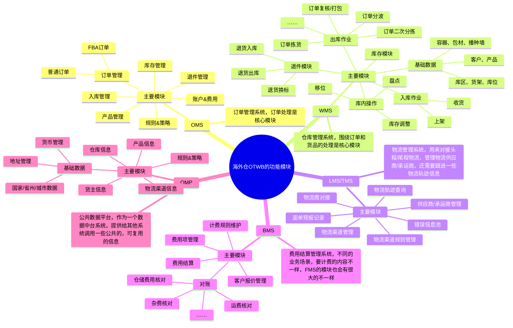
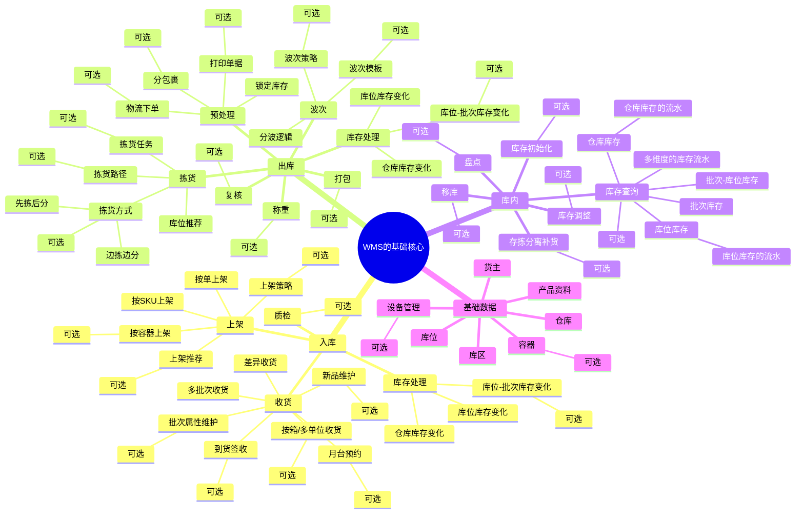

## 前言

前面的课程中我们学习了仓库的一些基本业务知识介绍，了解了仓库的分类，仓库设备，仓库入库、出库、库内的业务情况，对仓库有了一些初步的了解。同时呢，又花了一节课程专门讲解了跨境领域中的一些行业知识，关于跨境电商，跨境物流，跨境海外仓，还有对应的信息化系统和相关的就业机会等。

既然学习了这么多的业务知识，做了这么多学习前的准备，那么接下来我们就要开始实战了，这一部分我会重点讲解，讲得更加细致一些，帮助大家更好地吸收和掌握这一块的业务和产品设计。

本课的开课时间是`**2024/06/26（周三）晚上9:00**`，开课的方式是使用腾讯会议，所以请大家提前准备好相应的软件，会议链接如下：

> 维他命 邀请您参加腾讯会议
> 
> 会议主题：课程10（直播课）：海外仓WMS业务介绍和系统拆解
> 
> 会议时间：2024/06/26 21:00-22:30 (GMT+08:00) 中国标准时间 - 北京
> 
> 点击链接入会，或添加至会议列表：
> 
> [https://meeting.tencent.com/dm/mpnvqQvm9VTf](https://meeting.tencent.com/dm/mpnvqQvm9VTf)
> 
> #腾讯会议：560-462-692
> 
> 复制该信息，打开手机腾讯会议即可参与

## 课件详细内容

本节课的内容大概会分成4个部分：

1.  海外仓核心业务流程和场景的讲解；
2.  海外仓OTWB的多系统的交互逻辑；
3.  海外仓OMS和WMS的出入库相关的业务演示；
4.  “珍珠奶茶法”学习WMS；

### Part1 海外仓核心业务流程和场景的讲解

1.  海外仓是什么？

> 字面意思来说，“海外仓”是指建立在海外的仓储设施。跨境电商企业按照一般贸易方式，将商品批量出口到境外仓库，电商平台完成销售后，再将商品送达境外的消费者。  
>   
> 
> 目前市面上的海外仓一般分成三类：  
> 1.卖家自建仓：跨境卖家自己筹建的海外仓  
> 2.平台仓：跨境电商平台建设的海外仓，如亚马逊的FBA  
> 3.第三方海外仓：由专业的海外仓管理公司建立的海外仓

2.  为什么要使用海外仓？

> 中国的产品要销售到海外去，从物流的角度来说，我们之前讲过，主要有“直邮”和“海外仓”两种方式。
> 
> 直邮，就是从中国直接发往目的国的消费者手中，一般会使用“邮政小包”，“专线快递”，“国际快递”等方式；
> 
> 海外仓，就是先从中国使用“头程物流”，大批量的备货送到海外仓，然后当消费者下单之后再从当地的海外仓使用“尾程物流”，发货给到消费者；

3.  海外仓的主要优势？

> -   加快物流时效，提升客户满意度（本地发货，更快，更便捷）；
> -   降低物流成本（尾程使用本土物流发货，成本更低）；
> -   提高产品曝光率，并且利于开拓市场（平台会倾向于能本土发货的商家）；
> -   能有效地避开跨境物流高峰（提前备好货，避免国际运输的高峰拥堵）；
> -   放宽产品限制，支持更多品类（有一些直邮不方便的运输的产品可以使用海外仓）；

4.  海外仓WMS的主要功能/业务场景

> 1.一件代发（业务量最大）
> 
> 一般指2C类的销售订单，从仓库直接发出到消费者手上  
>   
> 2.备货中转
> 
> 一般指2B类的订单，例如中转到亚马逊的FBA仓库或者调拨到其他的仓库中
> 
>   
> 3.退货换标
> 
> 一般指亚马逊FBA的退货，需要更换产品标签，然后重新发到FBA仓库或者上架到仓库后重新销售出库
> 
>   
> 4.拆柜转运（业务量最少）
> 
> 一般指从对整个海运柜进行拆柜，分装后，按货物的目的地要求使用卡车或者尾程快递送达

| 列 1 | 列 2 | 列 3 |
| --- | --- | --- |
| _海外仓WMS业务介绍和系统拆解-1.png) | _海外仓WMS业务介绍和系统拆解-2.png) | _海外仓WMS业务介绍和系统拆解-3.png)  20尺小柜，也叫20GP (General Purpose)，箱门上箱型代码是22G1，装货28方左右。  40尺大柜，也叫40GP， 箱门上箱型代码是42G1，装货56方左右。  40尺高柜，也叫40HQ，箱门上箱型代码是45G1，装货68方左右。 |

_海外仓WMS业务介绍和系统拆解-4.png)

### Part2 海外仓OTWB的多系统的交互逻辑

1.  海外仓OTWB分别指什么？有什么作用？

> OMS：订单管理系统，在WMS的上游，接收订单信息后推送给WMS
> 
> TMS（也有LMS的说法）：物流管理系统，负责对接物流商，管理物流渠道的一些信息
> 
> WMS：仓库管理系统，负责仓库实际的经营管理的系统
> 
> BMS：费用管理系统，负责计算仓库操作费，仓储费和物流费等
> 
> ​  
> 
> 除此之外，海外仓相关的业务，还会有OMP，PDA，OPENAPI等系统。
> 
> OMP：运营管理平台，负责维护管理一些通用的数据，业务信息等，例如说仓库，客户，物流，业务数据等
> 
> PDA（RF终端）：手持终端设备，负责仓库的一些操作指令的输入，一般是指一个APP或者H5系统
> 
> OPENAPI：开放平台，一般海外仓的业务比较特殊，都是由上游来主动对接海外仓，例如常见的就是ERP对接海外仓的OPENAPI

2.  OTWB的系统交互逻辑/流程是？

> 入库流程：
> 
> ERP->OPENAPI->OMS->WMS->PDA->BMS
> 
> ​  
> 
> 出库流程：
> 
> ERP->OPENAPI->OMS->(TMS)->WMS->PDA->BMS

_海外仓WMS业务介绍和系统拆解-5.png)

_海外仓WMS业务介绍和系统拆解-6.png)

3.  OTWB的功能模块大概有哪些？

_海外仓WMS业务介绍和系统拆解-白板-1.svg)

### Part3 海外仓OMS和WMS的出入库相关的业务演示

1.  海外仓的业务模式大概是怎么样的？

> 订单从电商平台推送到跨境ERP中，然后ERP将单据推送到海外仓的OMS中，海外仓分发给对应的仓库，然后仓库接收指令，处理发货。_海外仓WMS业务介绍和系统拆解-7.png)

2.  海外仓为什么需要OMS？

> 一般WMS是仓库使用，而且仓库的上游一般不会直接对接外部的系统，因为订单推送到仓库之前会有一些预处理的信息要完善（仓库、物流、拆合单、订单备注、客服审核等），所以一般会用OMS来对接外部系统。
> 
> 同时，由于一些客户使用的系统（平台、ERP、自研系统等）没有直接和仓库对接打通，那么需要在客户端OMS上创建单据，管理单据。
> 
> 所以海外仓WMS一般都需要搭配OMS来使用，同时还有物流的TMS和计费的BMS等， 组合在一起就是OTWB。

3.  海外仓WMS与国内仓WMS的一些区别？

> 系统的差别来源于实际业务的差别，海外仓的实际业务和国内仓的一些业务不太一样。
> 
> -   海外仓人力成本高，所以仓库的一些精细化操作比较少，所以海外仓的作业模式会更简单一些；
> -   海外仓所使用的物流方式不一样，所以系统的一些功能也会因为物流的原因而区别于国内仓；
> -   海外仓与国内一般会有时差、语言环境的区别等，所以双方来回即时沟通的场景比较少，有一些问题的解决会提前预防或者延后处理，系统也要对应的调整；
> -   海外仓的业务形态有一些比较有特色的，例如FBA备货中转，FBA退货换标，拆柜转运等，这里会和国内仓的一些玩法不太一样；
> -   海外仓的发展历程，没有国内这么历史悠长，销售的品类，电商平台的一些规则等都那么复杂，所以对应的业务场景，功能模块等都会相对简单一些；

#### 海外仓WMS的核心业务流程

1.  海外仓系统的实际演示，从OMS到WMS，包含入库，出库和库存方面的内容

> -   XLWMS（以此项目为例）
> 
> -   oms.xlwms.com（OMS系统）
> -   wms.xlwms.com（WMS系统）
> 
> -   Shipout WMS
> 
> -   oms.shipout.com（OMS系统）
> -   wms.shipout.com（WMS系统）
> 
> -   易仓WMS

2.  入库流程，OMS创建入库单，然后WMS收货，上架；

_海外仓WMS业务介绍和系统拆解-8.png)

3.  出库流程，OMS创建出库单，然后WMS分波，拣货，复核，称重，出库；

_海外仓WMS业务介绍和系统拆解-9.png)

4.  库存变化，查看OMS和WMS的库存，了解两者的一些区别，例如为什么OMS和WMS要分别计算一套库存？

> OMS和WMS，OMS是用户（货主）使用，WMS是仓库操作人员使用。
> 
>   
> 货主来说，只需要看到自己的库存，仓库来说，需要看到所有货主的库存。  
> OMS更关注数量，WMS除了关注数量，还关注在哪（库位），更精细化的内容（批次，效期，SN码）。  
> OMS需要对接上游系统，给上游系统反馈数据；WMS需要反馈数据给OMS。

#### 国内仓WMS的核心业务流程

_海外仓WMS业务介绍和系统拆解-10.png)

_海外仓WMS业务介绍和系统拆解-11.png)

### Part4 “珍珠奶茶法”学习WMS

不同的仓库有不同的业务模式，就会有不同的系统解决方案，所以对应的WMS系统设计也会不一样。国内仓和海外仓的一些差异比较大，国内仓与国内仓之间的差异也有不少，不同的WMS会有不同的解决方案，如果想要全面的掌握WMS的一些内容，一定是需要多接触不同的业务模式的。

> 不同的WMS的玩法，就好像奶茶店的各种奶茶一样，基底都是一样的，但是加的料不一样，就会变成不同的产品。所以，学习WMS的时候应该先掌握**基础核心且通用的内容**（奶茶），然后根据业务的不一样而增加不同的业务处理逻辑（加的料），最后得到一个能吻合实际业务的WMS。

​  

_海外仓WMS业务介绍和系统拆解-12.png)

WMS的业务模块有很多，而且往往一些精细化管控的模块都比较复杂，很难快上手。所以，对于新人朋友来说，一定要分辨清楚，哪些模块是必须掌握的（基底），哪些模块是可选掌握的（加料），有不同的侧重点，学习起来才会稍微平滑一些。

_海外仓WMS业务介绍和系统拆解-白板-2.svg)

### 课后作业

> 完成相关竞品资料的浏览和查看，可以登录一些竞品账号先去体验一下相关的内容。

## **课程答疑或补充知识**

### 答疑

1.  WMS收货后会增加库存吗？

> WMS什么时候增加库存，是按业务要求来的，一般来说会在两个节点增加库存，一个是收货的时候，一个是上架的时候，不同的WMS采用的做法不一样。
> 
> 国内的WMS在收货的时候增加库存的业务多一些，海外仓一般是上架的时候增加库存的多，两种都可以。

2.  为什么需要支持多批次收货？

> 首先是货物到仓的时候可能会分多批次到货，所以支持多批次收货是吻合实际业务场景的；其次就是由于仓库的工作人员有限或者仓库的空间有限，可以支持先到的货物先收，然后先上架，而后续到的可以等人手充足之后再收货、上架。

### 补充知识（海外仓系统的帮助手册）

1.  Shipout的OMS和WMS手册，在B站都可以找到

[WMS系统操作视频（业务篇）_哔哩哔哩_bilibili](https://www.bilibili.com/video/BV1k64y1R7Rt?spm_id_from=333.337.search-card.all.click)[首页 - ShipOut 帮助中心](https://support.wms.shipout.com/?page_id=7350&lang=zh)

  

[TS.I7-谷仓仓储用户手册V7.1.pdf](https://www.yuque.com/attachments/yuque/0/2025/pdf/48385069/1738735844021-442e726b-98ba-4533-ba32-9147883f833b.pdf)